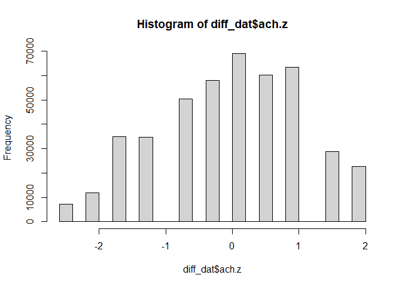
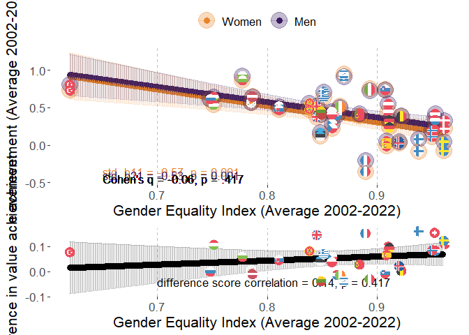
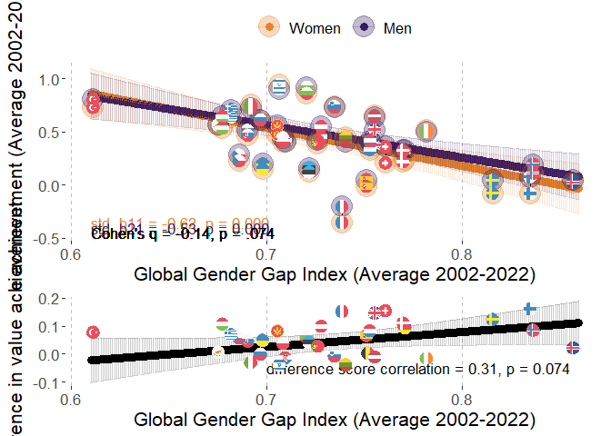
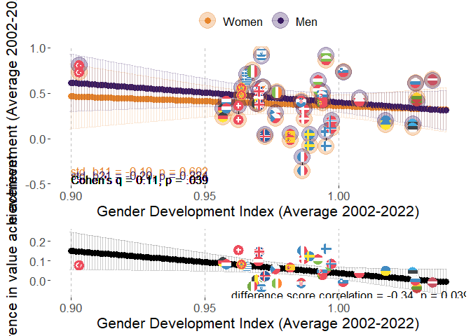
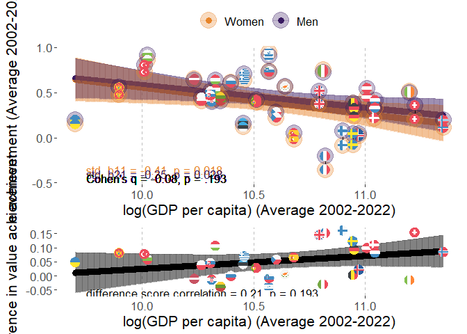
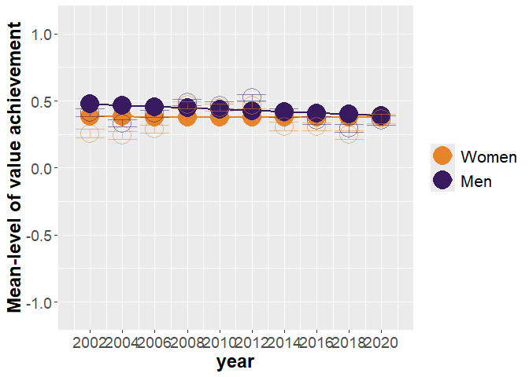
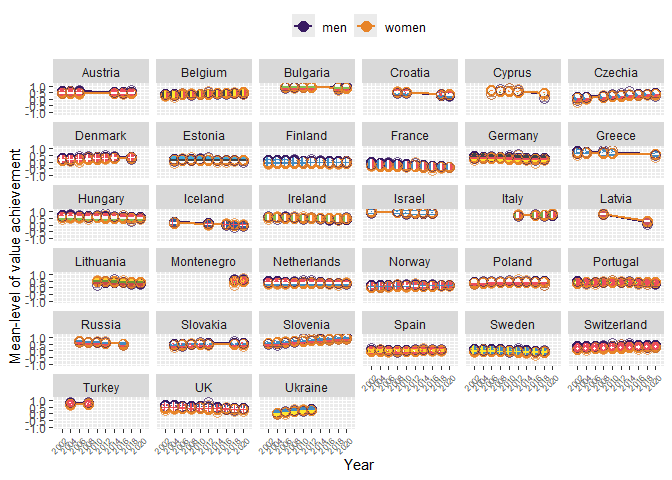

# Packages

Two packages are not in CRAN and need different installation
* devtools::install_github("vjilmari/vjihelpers")
* install.packages("ggflags", repos = c("https://jimjam-slam.r-universe.dev","https://cloud.r-project.org")) 


``` r
library(multid)
library(rio)
library(dplyr)
library(lme4)
library(emmeans)
library(vjihelpers)
library(MetBrewer)
library(ggplot2)
library(finalfit)
library(ggflags) 
library(lmerTest)
library(metafor)
library(ggpubr)
library(Hmisc)
library(r2mlm)
library(tidyr)
library(stringr)
library(apaTables)
```

# Data

* Loads the preprocessed European Social Survey data file made within "Preparations_ESS" code


``` r
load("../data/fdat.rdata")
```

* Include ISO data for country-names


``` r
# read country names
ISO<-read.csv2("../data/ISO.csv")
```


# Exclusions

* exclude participants with missing values or gender


``` r
value.vars<-
  c("con","tra",
  "ben","uni",
  "sdi","sti",
  "hed","ach",
  "pow","sec")

fdat$miss_values<-
  rowSums(is.na(fdat[,value.vars]))
table(fdat$miss_values)
```

```
## 
##      0      1      2      3      4      5      6      7      8      9     10 
## 450838   2586    774    401    248    185    129    135    142    165  34952
```

``` r
fdat<-fdat %>%
  filter(miss_values==0 & !is.na(gndr.bin))
```

# Data for the analysis

* basic descriptives


``` r
diff_dat<-
  fdat

#diff_dat$age.c<-as.numeric(diff_dat$age.c)
#diff_dat$rlgdgr.c<-as.numeric(diff_dat$rlgdgr.c)
#diff_dat$eduyrs.c<-as.numeric(diff_dat$eduyrs.c)

# data exclusions (include countries with at least two rounds of data)
n_rounds<-diff_dat %>% group_by(cntry) %>%
  summarise(n_unique_essround = n_distinct(essround))

# join number of rounds to data
diff_dat<-
  left_join(x=diff_dat,
            y=n_rounds,
            by="cntry")

# filter only countries with more than 1 round and non-missing gender variable
diff_dat<-diff_dat %>%
  dplyr::filter(n_unique_essround>1 &
                  !is.na(gndr))

# cross-tabulate sample sizes and ESS rounds by country
table(diff_dat$essround,diff_dat$cntry)
```

```
##     
##        AT   BE   BG   CH   CY   CZ   DE   DK   EE   ES   FI   FR   GB   GR   HR   HU   IE   IL   IS   IT
##   1  2254 1830    0 2024    0 1208 2819 1470    0 1712 1763 1355 1798 2551    0 1634 1916 2279    0    0
##   2  2198 1771    0 2110    0 2557 2840 1458 1948 1623 1701 1699 1864 2399    0 1460 1187    0  524    0
##   3  2348 1796 1295 1780  978    0 2884 1461 1466 1847 1649 1983 2353    0    0 1462 1589    0    0    0
##   4     0 1754 2144 1753 1210 1986 2732 1581 1646 2562 1901 2067 2311 2063 1430 1430 1757 2382    0    0
##   5     0 1699 2371 1491 1053 2335 3007 1564 1793 1881 1649 1723 2374 2669 1601 1473 2400 2212    0    0
##   6     0 1862 2179 1483 1110 1973 2935 1621 2345 1871 2158 1960 2261    0    0 1968 2616 2378  739  909
##   7  1795 1767    0 1521    0 1862 3006 1483 2036 1907 2050 1902 2231    0    0 1520 2380 2351    0    0
##   8  1993 1759    0 1504    0 2252 2821    0 2007 1929 1903 2057 1942    0    0 1458 2746 2366  841 2531
##   9  2477 1756 1926 1517  773 2343 2328 1554 1899 1619 1735 1982 2183    0 1781 1643 2189    0  844 2660
##   10    0 1334 2697 1505    0 2369    0    0 1538    0 1561 1951 1131 2768 1564 1816 1751    0  886 2573
##     
##        LT   LV   ME   NL   NO   PL   PT   RU   SE   SI   SK   TR   UA
##   1     0    0    0 2337 1819 2065 1482    0 1682 1488    0    0    0
##   2     0    0    0 1858 1575 1683 2024    0 1678 1384 1425 1790 1896
##   3     0    0    0 1860 1550 1685 2182 2339 1604 1465 1711    0 1885
##   4     0 1970    0 1724 1391 1596 2337 2446 1556 1257 1789 2305 1766
##   5  1632    0    0 1801 1530 1719 2139 2557 1463 1369 1803    0 1779
##   6  2108    0    0 1828 1610 1866 2138 2429 1838 1244 1827    0 2064
##   7  2241    0    0 1823 1423 1594 1242    0 1761 1189    0    0    0
##   8  2079    0    0 1669 1530 1675 1254 2374 1526 1295    0    0    0
##   9  1677  891 1188 1657 1396 1443 1045    0 1510 1307 1061    0    0
##   10 1606    0 1248 1466 1408    0 1827    0    0 1232 1395    0    0
```

``` r
# range of sample sizes
range(table(diff_dat$cntry))
```

```
## [1]  2436 25372
```

``` r
# scale/standardize with SD pooled across all country-time-gender folds
cntry.ach<-diff_dat %>% group_by(cntry,essround) %>%
  summarise(ach.ctm=mean(ach,na.rm=T),
            ach.ctsd=sd(ach,na.rm=T)) %>%
  group_by(cntry) %>%
  summarise(ach.cm=mean(ach.ctm),
            ach.csd=mean(ach.ctsd)) 
```

```
## `summarise()` has grouped output by 'cntry'. You can override using the `.groups` argument.
```

``` r
grand_mean_ach<-mean(cntry.ach$ach.cm)
grand_sd_ach<-mean(cntry.ach$ach.csd)

# standardized
diff_dat$ach.z<-(diff_dat$ach-grand_mean_ach)/grand_sd_ach
hist(diff_dat$ach.z)
```

<!-- -->

## Add GEI-variable

* GEI = Reverse-coded Gender Inequality Index (GII)


``` r
GII<-read.csv("../data/GII.csv")

# Obtain GII only for ESS countries
GII_in_ESS_d<-
  GII %>%
  filter(ISO2 %in% unique(diff_dat$cntry))

# Make long format data of GII, so that country x year has own rows

long_GII_in_ESS_d <- GII_in_ESS_d %>%
  pivot_longer(
    cols = starts_with("gii_") & !matches("avg"),  # <-- exclude the "_avg" columns
    names_to = "year",
    values_to = "gii",
    names_prefix = "gii_"
  ) %>%
  mutate(year = as.integer(year)) %>%
  filter(year >= 2002 & year <= 2022) %>%
  mutate(gei = 1 - gii) %>%
  select(ISO2, iso3, country, year, gii, gei, gii_2002_2022_avg, gei_2002_2022_avg)


# describe gei average
psych::describe(GII_in_ESS_d$gei_2002_2022_avg)
```

```
##    vars  n mean   sd median trimmed  mad  min  max range  skew kurtosis   se
## X1    1 32 0.87 0.07   0.87    0.87 0.06 0.62 0.96  0.34 -1.11     1.48 0.01
```

``` r
# one is missing, see which one
GII_in_ESS_d[is.na(GII_in_ESS_d$gei_2002_2022_avg),"country"]
```

```
## [1] "Ukraine"
```

``` r
# get means and SDs for standardizing
gei_mean<-mean(GII_in_ESS_d$gei_2002_2022_avg,na.rm=T)
gei_sd<-sd(GII_in_ESS_d$gei_2002_2022_avg,na.rm=T)

# standardize 
# year specific scores
long_GII_in_ESS_d$gei.z<-(long_GII_in_ESS_d$gei-gei_mean)/gei_sd

# get the country means to a separate frame

GII_country_means<-
  long_GII_in_ESS_d %>% group_by(ISO2) %>%
  summarise(gei.cm=mean(gei,na.rm=T),
            gei.z.cm=mean(gei.z,na.rm=T))


long_GII_in_ESS_d<-left_join(
  x=long_GII_in_ESS_d,
  y=GII_country_means,
  by="ISO2"
)


# center both the raw score and standardized scores
long_GII_in_ESS_d$gei.cmc<-(long_GII_in_ESS_d$gei-long_GII_in_ESS_d$gei.cm)
long_GII_in_ESS_d$gei.z.cmc<-(long_GII_in_ESS_d$gei.z-long_GII_in_ESS_d$gei.z.cm)

#View(long_GII_in_ESS_d)

# averages across 2002-2022
#long_GII_in_ESS_d$gei_2002_2022_avg.z<-(long_GII_in_ESS_d$gei_2002_2022_avg-gei_mean)/gei_sd

#long_GII_in_ESS_d$gei.cmc<-long_GII_in_ESS_d$gei-long_GII_in_ESS_d$gei_2002_2022_avg

# add year to ESS data-frame

diff_dat$year<-
  case_when(
    diff_dat$essround.c==-4.5~2002,  
    diff_dat$essround.c==-3.5~2004,
    diff_dat$essround.c==-2.5~2006,
    diff_dat$essround.c==-1.5~2008,
    diff_dat$essround.c==-0.5~2010,
    diff_dat$essround.c==0.5~2012,
    diff_dat$essround.c==1.5~2014,
    diff_dat$essround.c==2.5~2016,
    diff_dat$essround.c==3.5~2018,
    diff_dat$essround.c==4.5~2020
  )

# link datasets by country and year

diff_dat<-
  left_join(
    x=diff_dat,
    y=long_GII_in_ESS_d[,c("ISO2","year","gei","gei.cm","gei.cmc",
                           "gei.z","gei.z.cm","gei.z.cmc")],
    by=c("cntry"="ISO2","year")
)
```


## Add GDI-variable

* GDI = Gender Development Index


``` r
GDI<-read.csv("../data/GDI.csv")

# Obtain GDI only for ESS countries
GDI_in_ESS_d<-
  GDI %>%
  filter(ISO2 %in% unique(diff_dat$cntry))

# Make long format data of GDI, so that country x year has own rows

long_GDI_in_ESS_d <- GDI_in_ESS_d %>%
  pivot_longer(
    cols = starts_with("gdi_") & !matches("avg"),  # <-- exclude the "_avg" columns
    names_to = "year",
    values_to = "gdi",
    names_prefix = "gdi_"
  ) %>%
  mutate(year = as.integer(year)) %>%
  filter(year >= 2002 & year <= 2022) %>%
  select(ISO2, iso3, country, year, gdi, gdi_2002_2022_avg)

# describe gdi average
psych::describe(GDI_in_ESS_d$gdi_2002_2022_avg)
```

```
##    vars  n mean   sd median trimmed  mad min  max range  skew kurtosis se
## X1    1 33 0.99 0.03   0.99    0.98 0.02 0.9 1.04  0.13 -0.35     1.27  0
```

``` r
# get means and SDs for standardizing
gdi_mean<-mean(GDI_in_ESS_d$gdi_2002_2022_avg,na.rm=T)
gdi_sd<-sd(GDI_in_ESS_d$gdi_2002_2022_avg,na.rm=T)

# standardize 
# year specific scores
long_GDI_in_ESS_d$gdi.z<-(long_GDI_in_ESS_d$gdi-gdi_mean)/gdi_sd

# get the country means to a separate frame

GDI_country_means<-
  long_GDI_in_ESS_d %>% group_by(ISO2) %>%
  summarise(gdi.cm=mean(gdi,na.rm=T),
            gdi.z.cm=mean(gdi.z,na.rm=T))

long_GDI_in_ESS_d<-left_join(
  x=long_GDI_in_ESS_d,
  y=GDI_country_means,
  by="ISO2"
)


# center both the raw score and standardized scores
long_GDI_in_ESS_d$gdi.cmc<-(long_GDI_in_ESS_d$gdi-long_GDI_in_ESS_d$gdi.cm)
long_GDI_in_ESS_d$gdi.z.cmc<-(long_GDI_in_ESS_d$gdi.z-long_GDI_in_ESS_d$gdi.z.cm)

# link datasets by country and year

diff_dat<-
  left_join(
    x=diff_dat,
    y=long_GDI_in_ESS_d[,c("ISO2","year","gdi","gdi.cm","gdi.cmc",
                           "gdi.z","gdi.z.cm","gdi.z.cmc")],
    by=c("cntry"="ISO2","year")
  )
```

## Add GDP-variable

* log_GDP = Logarithm of GDP per capita, PPP (constant 2017 international $)


``` r
GDP<-read.csv("../data/GDP_processed.csv")

# Obtain GDP only for ESS countries
GDP_in_ESS_d<-
  GDP %>%
  filter(ISO2 %in% unique(diff_dat$cntry))

# First, rename those X2000..YR2000. style columns to simple "gdp_2000" etc.

GDP_in_ESS_d <- GDP_in_ESS_d %>%
  rename_with(
    ~ str_replace_all(., "^X(\\d{4})..YR\\1\\.$", "gdp_\\1"),
    starts_with("X")
  )

#GDP_in_ESS_d
# Make long format data of GDP, so that country x year has own rows

long_GDP_in_ESS_d <- GDP_in_ESS_d %>%
  pivot_longer(
    cols = starts_with("gdp_") & !matches("avg"),  # <-- exclude the "_avg" columns
    names_to = "year",
    values_to = "gdp",
    names_prefix = "gdp_"
  ) %>%
  mutate(year = as.integer(year)) %>%
  filter(year >= 2002 & year <= 2022) %>%
  select(ISO2, Country.Name, year, gdp, gdp_2002_2022_avg,log_gdp_2002_2022_avg) %>%
  mutate(log_gdp=log(gdp))

#View(long_GDP_in_ESS_d)

# describe gdp average
psych::describe(GDP_in_ESS_d$gdp_2002_2022_avg)
```

```
##    vars  n     mean      sd   median  trimmed      mad      min      max    range skew kurtosis      se
## X1    1 33 44309.55 16988.2 40528.07 43238.06 16282.88 16406.88 85115.96 68709.08 0.48    -0.58 2957.27
```

``` r
psych::describe(GDP_in_ESS_d$log_gdp_2002_2022_avg)
```

```
##    vars  n  mean  sd median trimmed  mad  min   max range  skew kurtosis   se
## X1    1 33 10.62 0.4  10.61   10.64 0.43 9.71 11.35  1.65 -0.25    -0.67 0.07
```

``` r
# get means and SDs for standardizing
log_gdp_mean<-mean(GDP_in_ESS_d$log_gdp_2002_2022_avg,na.rm=T)
log_gdp_sd<-sd(GDP_in_ESS_d$log_gdp_2002_2022_avg,na.rm=T)

# standardize 
# year specific scores
long_GDP_in_ESS_d$log_gdp.z<-
  (long_GDP_in_ESS_d$log_gdp-log_gdp_mean)/log_gdp_sd

# get the country means to a separate frame

GDP_country_means<-
  long_GDP_in_ESS_d %>% group_by(ISO2) %>%
  summarise(gdp.cm=mean(gdp,na.rm=T),
            #gdp.z.cm=mean(gdp.z,na.rm=T),
            log_gdp.cm=mean(log_gdp,na.rm=T),
            log_gdp.z.cm=mean(log_gdp.z,na.rm=T))

long_GDP_in_ESS_d<-left_join(
  x=long_GDP_in_ESS_d,
  y=GDP_country_means,
  by="ISO2"
)


# center both the raw score and standardized scores
long_GDP_in_ESS_d$log_gdp.cmc<-(long_GDP_in_ESS_d$log_gdp-long_GDP_in_ESS_d$log_gdp.cm)
long_GDP_in_ESS_d$log_gdp.z.cmc<-(long_GDP_in_ESS_d$log_gdp.z-long_GDP_in_ESS_d$log_gdp.z.cm)

# link datasets by country and year

diff_dat<-
  left_join(
    x=diff_dat,
    y=long_GDP_in_ESS_d[,c("ISO2","year","log_gdp","log_gdp.cm","log_gdp.cmc",
                           "log_gdp.z","log_gdp.z.cm","log_gdp.z.cmc")],
    by=c("cntry"="ISO2","year")
  )
```

## Add GGGI-variable

* GGGI = Global Gender Gap Index


``` r
GGGI<-import("../data/GGGI.xlsx")

# check if all ESS countries are in the log_GGGI data
table(unique(diff_dat$cntry) %in% GGGI$ISO2)
```

```
## 
## TRUE 
##   33
```

``` r
# Obtain GGGI only for ESS countries
GGGI_in_ESS_d<-
  GGGI %>%
  filter(ISO2 %in% unique(diff_dat$cntry))

# Make long format data of GGGI, so that country x year has own rows

long_GGGI_in_ESS_d <- GGGI_in_ESS_d %>%
  pivot_longer(
    cols = starts_with("gggi_") & !matches("avg"),  # <-- exclude the "_avg" columns
    names_to = "year",
    values_to = "gggi",
    names_prefix = "gggi_"
  ) %>%
  mutate(year = as.integer(year)) %>%
  filter(year >= 2002 & year <= 2022) %>%
  select(ISO2, cname, year, gggi, GGGI_2002_2022_avg)

# describe gggi average
psych::describe(GGGI_in_ESS_d$GGGI_2002_2022_avg)
```

```
##    vars  n mean   sd median trimmed  mad  min  max range skew kurtosis   se
## X1    1 33 0.73 0.05   0.73    0.73 0.04 0.61 0.86  0.25 0.38     0.19 0.01
```

``` r
# get means and SDs for standardizing
gggi_mean<-mean(GGGI_in_ESS_d$GGGI_2002_2022_avg,na.rm=T)
gggi_sd<-sd(GGGI_in_ESS_d$GGGI_2002_2022_avg,na.rm=T)

# standardize 
# year specific scores
long_GGGI_in_ESS_d$gggi.z<-(long_GGGI_in_ESS_d$gggi-gggi_mean)/gggi_sd

# get the country means to a separate frame

GGGI_country_means<-
  long_GGGI_in_ESS_d %>% group_by(ISO2) %>%
  summarise(gggi.cm=mean(gggi,na.rm=T),
            gggi.z.cm=mean(gggi.z,na.rm=T))

long_GGGI_in_ESS_d<-left_join(
  x=long_GGGI_in_ESS_d,
  y=GGGI_country_means,
  by="ISO2"
)

# center both the raw score and standardized scores
long_GGGI_in_ESS_d$gggi.cmc<-
  (long_GGGI_in_ESS_d$gggi-long_GGGI_in_ESS_d$gggi.cm)

long_GGGI_in_ESS_d$gggi.z.cmc<-
  (long_GGGI_in_ESS_d$gggi.z-long_GGGI_in_ESS_d$gggi.z.cm)

# link datasets by country and year

diff_dat<-
  left_join(
    x=diff_dat,
    y=long_GGGI_in_ESS_d[,c("ISO2","year","gggi","gggi.cm","gggi.cmc",
                           "gggi.z","gggi.z.cm","gggi.z.cmc")],
    by=c("cntry"="ISO2","year")
  )
```

# Descriptive statistics

## Country-specific descriptives


``` r
# sample sizes from weights

cntry_n_frame<-
  diff_dat %>% group_by(cntry) %>%
  summarise('n ESS rounds' = mean(n_unique_essround),
            n=round(sum(pspwght),0))

# value-based achievement

cntry_ach_frame<-
  diff_dat %>% group_by(cntry,essround) %>%
  summarise('ach M' = weighted.mean(x=ach.z,w=pspwght),
            'ach SD' = sqrt(wtd.var(ach.z,pspwght))) %>%
  group_by(cntry) %>%
  summarise('ach M' = mean(x=`ach M`),
            'ach SD'= mean(x=`ach SD`))
```

```
## `summarise()` has grouped output by 'cntry'. You can override using the `.groups` argument.
```

``` r
cntry_ach_women_frame<-
  diff_dat %>%
  filter(gndr.c==-0.5) %>%
  group_by(cntry,essround) %>%
  summarise('ach M' = weighted.mean(x=ach.z,w=pspwght),
            'ach SD' = sqrt(wtd.var(ach.z,pspwght))) %>%
  group_by(cntry) %>%
  summarise('ach M Women' = mean(x=`ach M`),
            'ach SD Women'= mean(x=`ach SD`))
```

```
## `summarise()` has grouped output by 'cntry'. You can override using the `.groups` argument.
```

``` r
cntry_ach_men_frame<-
  diff_dat %>%
  filter(gndr.c==0.5) %>%
  group_by(cntry,essround) %>%
  summarise('ach M' = weighted.mean(x=ach.z,w=pspwght),
            'ach SD' = sqrt(wtd.var(ach.z,pspwght))) %>%
  group_by(cntry) %>%
  summarise('ach M Men' = mean(x=`ach M`),
            'ach SD Men'= mean(x=`ach SD`))
```

```
## `summarise()` has grouped output by 'cntry'. You can override using the `.groups` argument.
```

``` r
# link n and ach datasets

desc_frame<-
  left_join(
    x=cntry_n_frame,
    y=cntry_ach_frame,
    by="cntry"
  )

desc_frame<-
  left_join(
    x=desc_frame,
    y=cntry_ach_women_frame,
    by="cntry"
  )

desc_frame<-
  left_join(
    x=desc_frame,
    y=cntry_ach_men_frame,
    by="cntry"
  )

# Add country-specific differences
desc_frame$D<-desc_frame$`ach M Men`-desc_frame$`ach M Women`

desc_frame
```

```
## # A tibble: 33 × 10
##    cntry `n ESS rounds`     n `ach M` `ach SD` `ach M Women` `ach SD Women` `ach M Men` `ach SD Men`
##    <chr>          <dbl> <dbl>   <dbl>    <dbl>         <dbl>          <dbl>       <dbl>        <dbl>
##  1 AT                 6 13077  0.209     0.999        0.0708          1.03      0.358          0.945
##  2 BE                10 17313 -0.0207    0.975       -0.0900          0.998     0.0524         0.944
##  3 BG                 6 12641  0.586     0.923        0.508           0.955     0.670          0.877
##  4 CH                10 16720 -0.0194    1.01        -0.157           1.02      0.125          0.967
##  5 CY                 5  5105  0.194     1.06         0.146           1.08      0.243          1.03 
##  6 CZ                 9 18934 -0.184     1.04        -0.329           1.07     -0.0265         0.989
##  7 DE                 9 25389 -0.149     0.999       -0.282           1.01     -0.00901        0.963
##  8 DK                 8 12198 -0.224     1.03        -0.313           1.03     -0.133          1.03 
##  9 EE                 9 16692 -0.293     1.01        -0.371           1.03     -0.199          0.988
## 10 ES                 9 16954 -0.263     1.08        -0.369           1.08     -0.152          1.06 
## # ℹ 23 more rows
## # ℹ 1 more variable: D <dbl>
```

``` r
# add country-level measures

desc_frame<-
  left_join(
    x=desc_frame,
    y=GII_country_means[,c("ISO2","gei.cm")],
    by=c("cntry"="ISO2")
  )

desc_frame<-
  left_join(
    x=desc_frame,
    y=GGGI_country_means[,c("ISO2","gggi.cm")],
    by=c("cntry"="ISO2")
  )

desc_frame<-
  left_join(
    x=desc_frame,
    y=GDI_country_means[,c("ISO2","gdi.cm")],
    by=c("cntry"="ISO2")
  )


desc_frame<-
  left_join(
    x=desc_frame,
    y=GDP_country_means[,c("ISO2","gdp.cm")],
    by=c("cntry"="ISO2")
  )

desc_frame<-left_join(
  x=desc_frame,
  y=ISO[,c("ISO2","CLDR")],
  by=c("cntry"="ISO2")
)

# finalize the formatted table

cntry_desc_tbl<-
  desc_frame %>%
  select(
    Country = CLDR,
    `n ESS rounds`,
    n,
    `ach M`, `ach SD`,
    `ach M Women`, `ach SD Women`,
    `ach M Men`, `ach SD Men`,
    D,
    GEI = gei.cm,
    GGGI = gggi.cm,
    GDI = gdi.cm,
    GDP = gdp.cm
  ) %>%
  mutate(
    across(
      .cols = -c(Country, `n ESS rounds`, n, GDP) & where(is.numeric),
      .fns  = ~ round_tidy(.x, 2)
    )
  ) %>%
  mutate(
    across(
      .cols = GDP,
      .fns  = ~ round_tidy(.x, 0)
    )
  )
print(cntry_desc_tbl,n=33)
```

```
## # A tibble: 33 × 14
##    Country    `n ESS rounds`     n `ach M` `ach SD` `ach M Women` `ach SD Women` `ach M Men` `ach SD Men`
##    <chr>               <dbl> <dbl> <chr>   <chr>    <chr>         <chr>          <chr>       <chr>       
##  1 Austria                 6 13077 0.21    1.00     0.07          1.03           0.36        0.95        
##  2 Belgium                10 17313 -0.02   0.98     -0.09         1.00           0.05        0.94        
##  3 Bulgaria                6 12641 0.59    0.92     0.51          0.95           0.67        0.88        
##  4 Switzerla…             10 16720 -0.02   1.01     -0.16         1.02           0.13        0.97        
##  5 Cyprus                  5  5105 0.19    1.06     0.15          1.08           0.24        1.03        
##  6 Czechia                 9 18934 -0.18   1.04     -0.33         1.07           -0.03       0.99        
##  7 Germany                 9 25389 -0.15   1.00     -0.28         1.01           -0.01       0.96        
##  8 Denmark                 8 12198 -0.22   1.03     -0.31         1.03           -0.13       1.03        
##  9 Estonia                 9 16692 -0.29   1.01     -0.37         1.03           -0.20       0.99        
## 10 Spain                   9 16954 -0.26   1.08     -0.37         1.08           -0.15       1.06        
## 11 Finland                10 18050 -0.49   1.03     -0.65         1.04           -0.33       0.99        
## 12 France                 10 18720 -0.58   1.09     -0.68         1.07           -0.46       1.09        
## 13 UK                     10 21456 -0.07   1.06     -0.19         1.08           0.06        1.03        
## 14 Greece                  5 12464 0.35    0.99     0.27          1.01           0.44        0.96        
## 15 Croatia                 4  6368 0.05    1.08     -0.03         1.09           0.13        1.05        
## 16 Hungary                10 16006 0.30    0.99     0.22          1.01           0.38        0.97        
## 17 Ireland                10 20576 0.08    1.05     0.01          1.08           0.15        1.01        
## 18 Israel                  6 13964 0.74    0.91     0.72          0.92           0.76        0.90        
## 19 Iceland                 5  3832 -0.57   1.05     -0.61         1.05           -0.53       1.04        
## 20 Italy                   4  8663 0.45    0.90     0.38          0.94           0.53        0.85        
## 21 Lithuania               6 11714 0.06    1.01     0.02          1.02           0.12        0.98        
## 22 Latvia                  2  2866 0.13    1.02     0.05          1.03           0.22        1.00        
## 23 Montenegro              2  2441 0.32    0.99     0.28          1.01           0.37        0.96        
## 24 Netherlan…             10 18048 -0.10   0.94     -0.22         0.98           0.02        0.89        
## 25 Norway                 10 15186 -0.35   0.98     -0.43         1.01           -0.28       0.95        
## 26 Poland                  9 15314 0.08    0.97     -0.03         1.00           0.19        0.92        
## 27 Portugal               10 17705 0.09    0.91     0.01          0.92           0.18        0.88        
## 28 Russia                  5 12139 0.23    1.05     0.16          1.07           0.31        1.01        
## 29 Sweden                  9 14897 -0.49   1.02     -0.56         1.02           -0.42       1.01        
## 30 Slovenia               10 13238 0.46    0.88     0.40          0.92           0.53        0.84        
## 31 Slovakia                7 11132 0.13    0.95     0.02          0.98           0.25        0.90        
## 32 Turkey                  2  4108 0.68    0.84     0.59          0.88           0.78        0.79        
## 33 Ukraine                 5  9454 -0.14   1.08     -0.22         1.10           -0.04       1.05        
## # ℹ 5 more variables: D <chr>, GEI <chr>, GGGI <chr>, GDI <chr>, GDP <chr>
```

``` r
export(cntry_desc_tbl,"../results/ach_youth/cntry_desc_tbl.xlsx",overwrite=T)
```

## Country-level correlations table


``` r
cor_frame<-
  desc_frame %>%
  select(
    VBMT=`ach M`,
    VBMT_Women=`ach M Women`,
    VBMT_Men=`ach M Men`,
    D = D,
    GEI = gei.cm,
    GGGI = gggi.cm,
    GDI = gdi.cm,
    GDP = gdp.cm
  ) %>%
  mutate(
    log_GDP=log(GDP)
  ) %>%
  select(-GDP)

apa.cor.table(
  data=cor_frame,
  filename = "../results/ach_youth/CorTable1.doc",
  #table.number = NA,
  show.conf.interval = FALSE,
  show.sig.stars = F,
  landscape = F
)
```

```
## The ability to suppress reporting of reporting confidence intervals has been deprecated in this version.
## The function argument show.conf.interval will be removed in a later version.
```

```
## 
## 
## Means, standard deviations, and correlations with confidence intervals
##  
## 
##   Variable      M     SD   1            2            3            4           5           6          
##   1. VBMT       0.04  0.34                                                                           
##                                                                                                      
##   2. VBMT_Women -0.05 0.36 1.00                                                                      
##                            [.99, 1.00]                                                               
##                                                                                                      
##   3. VBMT_Men   0.13  0.33 1.00         .98                                                          
##                            [.99, 1.00]  [.97, .99]                                                   
##                                                                                                      
##   4. D          0.18  0.07 -.34         -.42         -.25                                            
##                            [-.61, .00]  [-.67, -.09] [-.54, .11]                                     
##                                                                                                      
##   5. GEI        0.87  0.07 -.60         -.60         -.60         .20                                
##                            [-.78, -.31] [-.78, -.31] [-.78, -.31] [-.16, .51]                        
##                                                                                                      
##   6. GGGI       0.73  0.05 -.70         -.69         -.72         .07         .73                    
##                            [-.84, -.48] [-.83, -.45] [-.85, -.50] [-.28, .40] [.52, .86]             
##                                                                                                      
##   7. GDI        0.99  0.03 -.23         -.20         -.25         -.15        .07         .20        
##                            [-.53, .12]  [-.51, .15]  [-.55, .10]  [-.47, .20] [-.29, .41] [-.16, .51]
##                                                                                                      
##   8. log_GDP    10.62 0.40 -.47         -.48         -.46         .24         .75         .67        
##                            [-.70, -.15] [-.71, -.17] [-.70, -.14] [-.11, .54] [.55, .87]  [.42, .82] 
##                                                                                                      
##   7          
##              
##              
##              
##              
##              
##              
##              
##              
##              
##              
##              
##              
##              
##              
##              
##              
##              
##              
##              
##              
##   -.22       
##   [-.53, .13]
##              
## 
## Note. M and SD are used to represent mean and standard deviation, respectively.
## Values in square brackets indicate the 95% confidence interval.
## The confidence interval is a plausible range of population correlations 
## that could have caused the sample correlation (Cumming, 2014).
## 
```


# Analysis

## Data subset


``` r
diff_dat<-diff_dat %>%
  filter(agea>17 & agea <30)
```

## mod0: Random intercept model


``` r
mod0<-lmer(ach.z~(1|cntry),data=diff_dat,REML=F,weights = pspwght,
           control=lmerControl(optimizer="bobyqa",optCtrl=list(maxfun=2e7)))
summary(mod0)
```

```
## Linear mixed model fit by maximum likelihood . t-tests use Satterthwaite's method ['lmerModLmerTest']
## Formula: ach.z ~ (1 | cntry)
##    Data: diff_dat
## Weights: pspwght
## Control: lmerControl(optimizer = "bobyqa", optCtrl = list(maxfun = 2e+07))
## 
##       AIC       BIC    logLik -2*log(L)  df.resid 
##  196546.4  196573.9  -98270.2  196540.4     70935 
## 
## Scaled residuals: 
##     Min      1Q  Median      3Q     Max 
## -6.1367 -0.5975  0.0973  0.6602  4.1909 
## 
## Random effects:
##  Groups   Name        Variance Std.Dev.
##  cntry    (Intercept) 0.07587  0.2755  
##  Residual             0.96850  0.9841  
## Number of obs: 70938, groups:  cntry, 33
## 
## Fixed effects:
##             Estimate Std. Error       df t value Pr(>|t|)    
## (Intercept)  0.40275    0.04811 33.03659    8.37 1.13e-09 ***
## ---
## Signif. codes:  0 '***' 0.001 '**' 0.01 '*' 0.05 '.' 0.1 ' ' 1
```

``` r
getVC(mod0)
```

```
##        grp        var1 var2 sdcor vcov
## 1    cntry (Intercept) <NA>  0.28 0.08
## 2 Residual        <NA> <NA>  0.98 0.97
```

``` r
r2mlm(mod0,bargraph = F)
```

```
## $Decompositions
##                      total within between
## fixed, within   0.00000000      0      NA
## fixed, between  0.00000000     NA       0
## slope variation 0.00000000      0      NA
## mean variation  0.07265004     NA       1
## sigma2          0.92734996      1      NA
## 
## $R2s
##          total within between
## f1  0.00000000      0      NA
## f2  0.00000000     NA       0
## v   0.00000000      0      NA
## m   0.07265004     NA       1
## f   0.00000000     NA      NA
## fv  0.00000000      0      NA
## fvm 0.07265004     NA      NA
```

## mod1: Gender fixed effect


``` r
mod1<-lmer(ach.z~gndr.c+(1|cntry),data=diff_dat,REML=F,weights = pspwght,
           control=lmerControl(optimizer="bobyqa",optCtrl=list(maxfun=2e7)))
summary(mod1)
```

```
## Linear mixed model fit by maximum likelihood . t-tests use Satterthwaite's method ['lmerModLmerTest']
## Formula: ach.z ~ gndr.c + (1 | cntry)
##    Data: diff_dat
## Weights: pspwght
## Control: lmerControl(optimizer = "bobyqa", optCtrl = list(maxfun = 2e+07))
## 
##       AIC       BIC    logLik -2*log(L)  df.resid 
##  196473.0  196509.7  -98232.5  196465.0     70934 
## 
## Scaled residuals: 
##     Min      1Q  Median      3Q     Max 
## -6.0937 -0.5954  0.0903  0.6635  4.1342 
## 
## Random effects:
##  Groups   Name        Variance Std.Dev.
##  cntry    (Intercept) 0.07583  0.2754  
##  Residual             0.96747  0.9836  
## Number of obs: 70938, groups:  cntry, 33
## 
## Fixed effects:
##              Estimate Std. Error        df t value Pr(>|t|)    
## (Intercept) 4.023e-01  4.810e-02 3.304e+01   8.364 1.15e-09 ***
## gndr.c      5.910e-02  6.805e-03 7.091e+04   8.684  < 2e-16 ***
## ---
## Signif. codes:  0 '***' 0.001 '**' 0.01 '*' 0.05 '.' 0.1 ' ' 1
## 
## Correlation of Fixed Effects:
##        (Intr)
## gndr.c -0.001
```

``` r
getFE(mod1,round=3)
```

```
##              Est.    SE        df     t p    LL    UL
## (Intercept) 0.402 0.048    33.036 8.364 0 0.304 0.500
## gndr.c      0.059 0.007 70905.996 8.684 0 0.046 0.072
```

``` r
getVC(mod1)
```

```
##        grp        var1 var2 sdcor vcov
## 1    cntry (Intercept) <NA>  0.28 0.08
## 2 Residual        <NA> <NA>  0.98 0.97
```

``` r
r2mlm(mod1,bargraph = F)
```

```
## $Decompositions
##                      total
## fixed           0.00083560
## slope variation 0.00000000
## mean variation  0.07262549
## sigma2          0.92653891
## 
## $R2s
##          total
## f   0.00083560
## v   0.00000000
## m   0.07262549
## fv  0.00083560
## fvm 0.07346109
```

## mod2: Gender fixed and random effect

* Include random effect correlation by default


``` r
mod2<-lmer(ach.z~gndr.c+(gndr.c|cntry),data=diff_dat,REML=F,weights = pspwght,
           control=lmerControl(optimizer="bobyqa",optCtrl=list(maxfun=2e7)))
summary(mod2)
```

```
## Linear mixed model fit by maximum likelihood . t-tests use Satterthwaite's method ['lmerModLmerTest']
## Formula: ach.z ~ gndr.c + (gndr.c | cntry)
##    Data: diff_dat
## Weights: pspwght
## Control: lmerControl(optimizer = "bobyqa", optCtrl = list(maxfun = 2e+07))
## 
##       AIC       BIC    logLik -2*log(L)  df.resid 
##  196418.5  196473.6  -98203.3  196406.5     70932 
## 
## Scaled residuals: 
##     Min      1Q  Median      3Q     Max 
## -6.0962 -0.5972  0.0876  0.6629  4.0457 
## 
## Random effects:
##  Groups   Name        Variance Std.Dev. Corr 
##  cntry    (Intercept) 0.075957 0.2756        
##           gndr.c      0.004462 0.0668   -0.44
##  Residual             0.966147 0.9829        
## Number of obs: 70938, groups:  cntry, 33
## 
## Fixed effects:
##             Estimate Std. Error       df t value Pr(>|t|)    
## (Intercept)  0.40269    0.04814 33.03598   8.365 1.15e-09 ***
## gndr.c       0.05395    0.01376 31.25580   3.921  0.00045 ***
## ---
## Signif. codes:  0 '***' 0.001 '**' 0.01 '*' 0.05 '.' 0.1 ' ' 1
## 
## Correlation of Fixed Effects:
##        (Intr)
## gndr.c -0.371
```

``` r
getFE(mod2,round=3)
```

```
##              Est.    SE     df     t p    LL    UL
## (Intercept) 0.403 0.048 33.036 8.365 0 0.305 0.501
## gndr.c      0.054 0.014 31.256 3.921 0 0.026 0.082
```

``` r
getVC(mod2)
```

```
##        grp        var1   var2 sdcor  vcov
## 1    cntry (Intercept)   <NA>  0.28  0.08
## 2    cntry      gndr.c   <NA>  0.07  0.00
## 3    cntry (Intercept) gndr.c -0.44 -0.01
## 4 Residual        <NA>   <NA>  0.98  0.97
```

``` r
r2mlm(mod2,bargraph = F)
```

```
## $Decompositions
##                        total
## fixed           0.0006963514
## slope variation 0.0010677064
## mean variation  0.0729492214
## sigma2          0.9252867207
## 
## $R2s
##            total
## f   0.0006963514
## v   0.0010677064
## m   0.0729492214
## fv  0.0017640579
## fvm 0.0747132793
```

``` r
anova(mod1,mod2)
```

```
## Data: diff_dat
## Models:
## mod1: ach.z ~ gndr.c + (1 | cntry)
## mod2: ach.z ~ gndr.c + (gndr.c | cntry)
##      npar    AIC    BIC logLik -2*log(L)  Chisq Df Pr(>Chisq)    
## mod1    4 196473 196510 -98232    196465                         
## mod2    6 196419 196474 -98203    196407 58.445  2  2.036e-13 ***
## ---
## Signif. codes:  0 '***' 0.001 '**' 0.01 '*' 0.05 '.' 0.1 ' ' 1
```

``` r
lvl2_var_cond_lvl1(mod2,lvl1.var = "gndr.c",lvl1.values = c(0.5,-0.5))
```

```
##   lvl1.value lvl2.cond.var lvl2.cond.sd
## 1        0.5    0.06898380    0.2626477
## 2       -0.5    0.08516153    0.2918245
```

* Test for random effect correlation


``` r
mod2_norecov<-lmer(ach.z~gndr.c+(gndr.c||cntry),data=diff_dat,REML=F,weights = pspwght,
                   control=lmerControl(optimizer="bobyqa",optCtrl=list(maxfun=2e7)))
summary(mod2_norecov)
```

```
## Linear mixed model fit by maximum likelihood . t-tests use Satterthwaite's method ['lmerModLmerTest']
## Formula: ach.z ~ gndr.c + (gndr.c || cntry)
##    Data: diff_dat
## Weights: pspwght
## Control: lmerControl(optimizer = "bobyqa", optCtrl = list(maxfun = 2e+07))
## 
##       AIC       BIC    logLik -2*log(L)  df.resid 
##  196421.3  196467.1  -98205.6  196411.3     70933 
## 
## Scaled residuals: 
##     Min      1Q  Median      3Q     Max 
## -6.0936 -0.5973  0.0864  0.6620  4.0590 
## 
## Random effects:
##  Groups   Name        Variance Std.Dev.
##  cntry    (Intercept) 0.075978 0.27564 
##  cntry.1  gndr.c      0.004652 0.06821 
##  Residual             0.966131 0.98292 
## Number of obs: 70938, groups:  cntry, 33
## 
## Fixed effects:
##             Estimate Std. Error       df t value Pr(>|t|)    
## (Intercept)  0.40266    0.04815 33.03574   8.363 1.15e-09 ***
## gndr.c       0.05460    0.01400 30.87309   3.900 0.000485 ***
## ---
## Signif. codes:  0 '***' 0.001 '**' 0.01 '*' 0.05 '.' 0.1 ' ' 1
## 
## Correlation of Fixed Effects:
##        (Intr)
## gndr.c 0.000
```

``` r
getFE(mod2_norecov,round=3)
```

```
##              Est.    SE     df     t p    LL    UL
## (Intercept) 0.403 0.048 33.036 8.363 0 0.305 0.501
## gndr.c      0.055 0.014 30.873 3.900 0 0.026 0.083
```

``` r
getVC(mod2_norecov)
```

```
##        grp        var1 var2 sdcor vcov
## 1    cntry (Intercept) <NA>  0.28 0.08
## 2  cntry.1      gndr.c <NA>  0.07 0.00
## 3 Residual        <NA> <NA>  0.98 0.97
```

``` r
anova(mod2_norecov,mod2)
```

```
## Data: diff_dat
## Models:
## mod2_norecov: ach.z ~ gndr.c + (gndr.c || cntry)
## mod2: ach.z ~ gndr.c + (gndr.c | cntry)
##              npar    AIC    BIC logLik -2*log(L)  Chisq Df Pr(>Chisq)  
## mod2_norecov    5 196421 196467 -98206    196411                       
## mod2            6 196419 196474 -98203    196407 4.7454  1    0.02938 *
## ---
## Signif. codes:  0 '***' 0.001 '**' 0.01 '*' 0.05 '.' 0.1 ' ' 1
```


## mod2 with Gender-equality index (GEI)


``` r
mod2_GEI<-lmer(ach.z~gndr.c+gei.z.cm+gndr.c:gei.z.cm+
                 (gndr.c|cntry),data=diff_dat,REML=F,weights = pspwght,
           control=lmerControl(optimizer="bobyqa",optCtrl=list(maxfun=2e7)))
summary(mod2_GEI)
```

```
## Linear mixed model fit by maximum likelihood . t-tests use Satterthwaite's method ['lmerModLmerTest']
## Formula: ach.z ~ gndr.c + gei.z.cm + gndr.c:gei.z.cm + (gndr.c | cntry)
##    Data: diff_dat
## Weights: pspwght
## Control: lmerControl(optimizer = "bobyqa", optCtrl = list(maxfun = 2e+07))
## 
##       AIC       BIC    logLik -2*log(L)  df.resid 
##  190935.1  191008.3  -95459.6  190919.1     69278 
## 
## Scaled residuals: 
##     Min      1Q  Median      3Q     Max 
## -6.1307 -0.5978  0.0903  0.6654  4.0637 
## 
## Random effects:
##  Groups   Name        Variance Std.Dev. Corr 
##  cntry    (Intercept) 0.05258  0.22931       
##           gndr.c      0.00451  0.06716  -0.42
##  Residual             0.95525  0.97737       
## Number of obs: 69286, groups:  cntry, 32
## 
## Fixed effects:
##                 Estimate Std. Error       df t value Pr(>|t|)    
## (Intercept)      0.41015    0.04073 32.12856  10.069 1.83e-11 ***
## gndr.c           0.05479    0.01403 30.03097   3.906 0.000494 ***
## gei.z.cm        -0.15798    0.04142 32.22013  -3.815 0.000583 ***
## gndr.c:gei.z.cm  0.01206    0.01468 34.07216   0.821 0.417193    
## ---
## Signif. codes:  0 '***' 0.001 '**' 0.01 '*' 0.05 '.' 0.1 ' ' 1
## 
## Correlation of Fixed Effects:
##             (Intr) gndr.c g.z.cm
## gndr.c      -0.358              
## gei.z.cm    -0.002  0.000       
## gndr.c:g.z.  0.000 -0.051 -0.346
```

``` r
getFE(mod2_GEI,round=3)
```

```
##                   Est.    SE     df      t     p     LL     UL
## (Intercept)      0.410 0.041 32.129 10.069 0.000  0.327  0.493
## gndr.c           0.055 0.014 30.031  3.906 0.000  0.026  0.083
## gei.z.cm        -0.158 0.041 32.220 -3.815 0.001 -0.242 -0.074
## gndr.c:gei.z.cm  0.012 0.015 34.072  0.821 0.417 -0.018  0.042
```

``` r
getVC(mod2_GEI)
```

```
##        grp        var1   var2 sdcor  vcov
## 1    cntry (Intercept)   <NA>  0.23  0.05
## 2    cntry      gndr.c   <NA>  0.07  0.00
## 3    cntry (Intercept) gndr.c -0.42 -0.01
## 4 Residual        <NA>   <NA>  0.98  0.96
```

``` r
r2mlm(mod2_GEI,bargraph = F)
```

```
## $Decompositions
##                       total
## fixed           0.019711091
## slope variation 0.001094644
## mean variation  0.051234281
## sigma2          0.927959984
## 
## $R2s
##           total
## f   0.019711091
## v   0.001094644
## m   0.051234281
## fv  0.020805734
## fvm 0.072040016
```

### Deconstructed associations


``` r
t1<-Sys.time()
ddsc_mod2_GEI<-
  ddsc_ml(model = mod2_GEI,
          predictor = "gei.z.cm",
          moderator = "gndr.c",moderator_values = c(-0.5,0.5),
          re_cov_test = T)
t2<-Sys.time()
t2-t1
```

```
## Time difference of 20.46848 secs
```

``` r
round(ddsc_mod2_GEI$vpc_at_moderator_values,3)
```

```
##   lvl1.value Intercept.var Intercept.sd Residual.var Total.var   VPC mean.n.obs  ICC2 ICC2_SP
## 1       -0.5         0.085        0.292        0.966     1.051 0.081   1103.091 0.989   0.990
## 2        0.5         0.069        0.263        0.966     1.035 0.067   1046.545 0.986   0.987
```

``` r
round(ddsc_mod2_GEI$descriptives,3)
```

```
##                       M    SD means_y1 means_y1_scaled means_y2 means_y2_scaled gei.z.cm gei.z.cm_scaled
## means_y1          0.437 0.272    1.000           1.000    0.957           0.957   -0.565          -0.565
## means_y1_scaled   1.529 0.951    1.000           1.000    0.957           0.957   -0.565          -0.565
## means_y2          0.384 0.299    0.957           0.957    1.000           1.000   -0.546          -0.546
## means_y2_scaled   1.346 1.047    0.957           0.957    1.000           1.000   -0.546          -0.546
## gei.z.cm          0.000 1.000   -0.565          -0.565   -0.546          -0.546    1.000           1.000
## gei.z.cm_scaled   0.000 1.000   -0.565          -0.565   -0.546          -0.546    1.000           1.000
## diff_score        0.052 0.088   -0.167          -0.167   -0.444          -0.444    0.109           0.109
## diff_score_scaled 0.183 0.306   -0.167          -0.167   -0.444          -0.444    0.109           0.109
##                   diff_score diff_score_scaled
## means_y1              -0.167            -0.167
## means_y1_scaled       -0.167            -0.167
## means_y2              -0.444            -0.444
## means_y2_scaled       -0.444            -0.444
## gei.z.cm               0.109             0.109
## gei.z.cm_scaled        0.109             0.109
## diff_score             1.000             1.000
## diff_score_scaled      1.000             1.000
```

``` r
round(ddsc_mod2_GEI$results,3)
```

```
##                            estimate    SE     df t.ratio p.value ci.lower ci.upper
## r_xy1y2                      -0.138 0.168 34.072  -0.821   0.417   -0.479    0.203
## w_11                         -0.164 0.044 32.339  -3.687   0.001   -0.255   -0.073
## w_21                         -0.152 0.039 32.461  -3.849   0.001   -0.232   -0.072
## r_xy1                        -0.604 0.164 32.339  -3.687   0.001   -0.937   -0.270
## r_xy2                        -0.508 0.132 32.461  -3.849   0.001   -0.777   -0.239
## b_11                         -0.575 0.156 32.339  -3.687   0.001   -0.892   -0.257
## b_21                         -0.533 0.138 32.461  -3.849   0.001   -0.814   -0.251
## main_effect                  -0.158 0.041 32.220  -3.815   0.001   -0.242   -0.074
## moderator_effect              0.055 0.014 30.031   3.906   0.000    0.026    0.083
## interaction                   0.012 0.015 34.072   0.821   0.417   -0.018    0.042
## q_b11_b21                    -0.061    NA     NA      NA      NA       NA       NA
## q_rxy1_rxy2                  -0.139    NA     NA      NA      NA       NA       NA
## cross_over_point             -4.543    NA     NA      NA      NA       NA       NA
## interaction_vs_main          -0.146 0.039 32.992  -3.755   0.001   -0.225   -0.067
## interaction_vs_main_bscale   -0.511 0.136 32.992  -3.755   0.001   -0.789   -0.234
## interaction_vs_main_rscale   -0.461 0.124 33.084  -3.727   0.001   -0.712   -0.209
## dadas                        -0.304 0.079 32.461  -3.849   1.000   -0.465   -0.143
## dadas_bscale                 -1.065 0.277 32.461  -3.849   1.000   -1.629   -0.502
## dadas_rscale                 -1.017 0.264 32.461  -3.849   1.000   -1.554   -0.479
## abs_diff                      0.012 0.015 34.072   0.821   0.209   -0.018    0.042
## abs_sum                       0.316 0.083 32.220   3.815   0.000    0.147    0.485
## abs_diff_bscale               0.042 0.051 34.072   0.821   0.209   -0.062    0.147
## abs_sum_bscale                1.108 0.290 32.220   3.815   0.000    0.516    1.699
## abs_diff_rscale               0.096 0.058 34.706   1.650   0.054   -0.022    0.213
## abs_sum_rscale                1.112 0.292 32.218   3.810   0.000    0.518    1.706
```

``` r
round(ddsc_mod2_GEI$re_cov_test,3)
```

```
## RE_cov RE_cor  Chisq     Df      p 
## -0.008 -0.439  4.745  1.000  0.029
```

``` r
d_GEI<-ddsc_mod2_GEI$ddsc_sem_fit$data

ddsc_sem_GEI<-
  ddsc_sem(data=d_GEI,x = "gei.z.cm",y1="means_y2",
           y2="means_y1",q_sesoi = .10)
round(ddsc_sem_GEI$results,3)
```

```
##                                    est    se      z pvalue ci.lower ci.upper
## r_xy1_y2                        -0.109 0.176 -0.623  0.534   -0.454    0.235
## r_xy1                           -0.546 0.148 -3.683  0.000   -0.836   -0.255
## r_xy2                           -0.565 0.146 -3.876  0.000   -0.851   -0.279
## b_11                            -0.571 0.155 -3.683  0.000   -0.875   -0.267
## b_21                            -0.538 0.139 -3.876  0.000   -0.809   -0.266
## b_10                             1.346 0.153  8.819  0.000    1.047    1.645
## b_20                             1.529 0.136 11.200  0.000    1.261    1.796
## res_cov_y1_y2                    0.626 0.162  3.872  0.000    0.309    0.943
## diff_b10_b20                    -0.183 0.053 -3.449  0.001   -0.287   -0.079
## diff_b11_b21                    -0.034 0.054 -0.623  0.534   -0.139    0.072
## diff_rxy1_rxy2                   0.020 0.051  0.382  0.703   -0.081    0.121
## q_b11_b21                       -0.048 0.082 -0.590  0.555   -0.209    0.112
## q_rxy1_rxy2                      0.028 0.074  0.382  0.703   -0.117    0.174
## cross_over_point                -5.453 8.902 -0.613  0.540  -22.900   11.994
## sum_b11_b21                     -1.109 0.289 -3.833  0.000   -1.676   -0.542
## main_effect                     -0.554 0.145 -3.833  0.000   -0.838   -0.271
## interaction_vs_main_effect      -0.521 0.138 -3.778  0.000   -0.791   -0.251
## diff_abs_b11_abs_b21             0.034 0.054  0.623  0.534   -0.072    0.139
## abs_diff_b11_b21                 0.034 0.054  0.623  0.267   -0.072    0.139
## abs_sum_b11_b21                  1.109 0.289  3.833  0.000    0.542    1.676
## dadas                           -1.075 0.277 -3.876  1.000   -1.619   -0.532
## q_r_equivalence                 -0.072 0.074 -0.962  0.168       NA       NA
## q_b_equivalence                 -0.052 0.082 -0.629  0.265       NA       NA
## cross_over_point_equivalence     5.453 8.902  0.613  0.730       NA       NA
## cross_over_point_minimal_effect  5.453 8.902  0.613  0.270       NA       NA
```

``` r
round(ddsc_sem_GEI$variance_test,3)
```

```
##             est    se      z pvalue ci.lower ci.upper
## cov_y1y2  0.923 0.236  3.912  0.000    0.461    1.386
## var_y1    1.061 0.265  4.000  0.000    0.541    1.581
## var_y2    0.876 0.219  4.000  0.000    0.447    1.305
## var_diff  0.185 0.109  1.703  0.089   -0.028    0.398
## var_ratio 1.211 0.124  9.799  0.000    0.969    1.454
## cor_y1y2  0.957 0.015 65.011  0.000    0.929    0.986
```

### Figure 


``` r
# plot the results

# start with obtaining predicted values for means and differences

# refit reduced and full models with GGGI in original scale


mod2_GEI_unstd<-lmer(ach.z~gndr.c+gei.cm+gndr.c:gei.cm+
                 (gndr.c|cntry),data=diff_dat,REML=F,weights = pspwght,
               control=lmerControl(optimizer="bobyqa",optCtrl=list(maxfun=2e7)))

mod2_GEI_unstd_red<-lmer(ach.z~gndr.c+
                       (gndr.c|cntry),data=diff_dat,REML=F,weights = pspwght,
                     control=lmerControl(optimizer="bobyqa",optCtrl=list(maxfun=2e7)))


p<-
  emmip(
    mod2_GEI_unstd, 
    gndr.c ~ gei.cm,
    at=list(gndr.c = c(-0.5,0.5),
            gei.cm=
              seq(from=round(range(GII_country_means$gei.cm,na.rm=T)[1],2),
                  to=round(range(GII_country_means$gei.cm,na.rm=T)[2],2),
                  by=0.001)),
    plotit=F,CIs=T,lmerTest.limit = 1e6,disable.pbkrtest=T)

p$gndr.c<-p$tvar
levels(p$gndr.c)<-c("Women","Men")

# obtain min and max for aligned plots
min.y.comp<-min(p$LCL)
max.y.comp<-max(p$UCL)

# Men and Women mean distributions

p3<-coefficients(mod2_GEI_unstd_red)$cntry
p3<-cbind(rbind(p3,p3),weight=rep(c(-0.5,0.5),each=nrow(p3)))
p3$xvar<-p3$`(Intercept)`+p3$gndr.c*p3$weight
p3$gndr.c<-as.factor(p3$weight)
levels(p3$gndr.c)<-c("Women","Men")

# obtain min and max for aligned plots
min.y.mean.distr<-min(p3$xvar)
max.y.mean.distr<-max(p3$xvar)


# obtain the coefs for the gndr.c-effect (difference) as function of gei.cm

p2<-data.frame(
  emtrends(mod2_GEI_unstd,var="gndr.c",
           specs="gei.cm",
           at=list(#gndr.c = c(-0.5,0.5),
             gei.cm=
               seq(from=round(range(GII_country_means$gei.cm,na.rm=T)[1],2),
                   to=round(range(GII_country_means$gei.cm,na.rm=T)[2],2),
                   by=0.001)),
           lmerTest.limit = 1e6,disable.pbkrtest=T))

p2$yvar<-p2$gndr.c.trend
p2$xvar<-p2$gei.cm
p2$LCL<-p2$lower.CL
p2$UCL<-p2$upper.CL

# obtain min and max for aligned plots
min.y.diff<-min(p2$LCL)
max.y.diff<-max(p2$UCL)

# difference score distribution

p4<-coefficients(mod2_GEI_unstd_red)$cntry
p4$xvar=(+1)*p4$gndr.c

# obtain mix and max for aligned plots

min.y.diff.distr<-min(p4$xvar)
max.y.diff.distr<-max(p4$xvar)

# define mins and maxs

min.y.pred<-
  ifelse(min.y.comp<min.y.mean.distr,min.y.comp,min.y.mean.distr)

max.y.pred<-
  ifelse(max.y.comp>max.y.mean.distr,max.y.comp,max.y.mean.distr)

min.y.narrow<-
  ifelse(min.y.diff<min.y.diff.distr,min.y.diff,min.y.diff.distr)

max.y.narrow<-
  ifelse(max.y.diff>max.y.diff.distr,max.y.diff,max.y.diff.distr)

# Figures 

# p1

# scaled simple effects to the plot
pvals<-round_tidy(ddsc_mod2_GEI$results[6:7,"p.value"],3)

ests<-
  round_tidy(ddsc_mod2_GEI$results[6:7,"estimate"],2)

coef1<-paste0("std. b11 = ",ests[1],", p = ",pvals[1])
coef2<-paste0("std. b21 = ",ests[2],", p = ",pvals[2])
coefs<-data.frame(gndr.c=c("Women","Men"),
                  coef=c(coef1,coef2))

coef_q<-paste0("Cohen's q = ",round_tidy(ddsc_mod2_GEI$results["q_b11_b21","estimate"],2),", p = ",
               substr(round_tidy(ddsc_mod2_GEI$results["interaction","p.value"],3),2,5))  
# prediction plot for difference score

pvals2<-round_tidy(ddsc_mod2_GEI$results["interaction","p.value"],3)

ests2<-
  round_tidy(-1*ddsc_mod2_GEI$results["r_xy1y2","estimate"],2)

coefs2<-paste0("difference score correlation = ",ests2,", p = ",pvals2)
# attempt to make a flag-plot

flag_points_GEI<-coefficients(mod2_GEI_unstd_red)$cntry

flag_points_GEI$women<-flag_points_GEI$`(Intercept)`+(-0.5)*flag_points_GEI$gndr.c
flag_points_GEI$men<-flag_points_GEI$`(Intercept)`+(0.5)*flag_points_GEI$gndr.c
flag_points_GEI$mean_level<-flag_points_GEI$`(Intercept)`
flag_points_GEI$difference<-flag_points_GEI$men-flag_points_GEI$women
flag_points_GEI$cntry<-rownames(flag_points_GEI)

flag_points_GEI<-
  left_join(x=flag_points_GEI,
            y=GII_country_means[,c("ISO2","gei.cm")],by=c("cntry"="ISO2"))
#flag_points_GEI

flag_points_GEI_long<-
  data.frame(mean_level=c(flag_points_GEI$women,
                          flag_points_GEI$men),
             gei.cm=c(flag_points_GEI$gei.cm,
                      flag_points_GEI$gei.cm),
             cntry=c(flag_points_GEI$cntry,
                     flag_points_GEI$cntry),
             gndr.c=rep(c("Women","Men"),each=nrow(flag_points_GEI)
             ))


p1.ach.flags<-
  ggplot(p,aes(y=yvar,x=gei.cm,color=gndr.c))+
  geom_point(size=3)+
  geom_errorbar(aes(ymin=LCL, ymax=UCL),alpha=0.2)+
  xlab("Gender Equality Index (Average 2002-2022)")+
  #ylim(c(min.y.pred,max.y.pred))+
  #xlim(c(0.60,1.00))+
  ylab("Value achievement (Average 2002-2022)")+
  scale_color_manual(values=met.brewer("Archambault")[c(6,2)])+
  theme(legend.position = "top",
        legend.title=element_blank(),
        text=element_text(size=16,  family="sans"),
        panel.background = element_rect(fill = "white",
                                        #colour = "black",
                                        #size = 0.5, linetype = "solid"
        ),
        panel.grid.major.x = element_line(linewidth = 0.5, linetype = 2,
                                          colour = "gray"))+
  geom_text(data = coefs,show.legend=F,
            aes(label=coef,x=0.65,
                y=c(-0.35,-0.40),size=14,hjust="left"))+
  geom_text(inherit.aes=F,aes(x=0.65,y=-0.45,
                              label=coef_q,size=14,hjust="left"),
            show.legend=F)+
  geom_point(data=flag_points_GEI_long,size=8,alpha=0.30,
             aes(x=gei.cm,y=mean_level))+
  geom_line(data=flag_points_GEI_long,aes(group = cntry,x=gei.cm,y=mean_level),
            color="black",linetype=2)+
  geom_flag(data=flag_points_GEI_long,show.legend=F,
            aes(country=tolower(cntry),size=14,x=gei.cm,y=mean_level))

p2.ach.flags<-ggplot(p2,aes(y=yvar,x=gei.cm))+
  geom_point(size=3)+
  geom_errorbar(aes(ymin=LCL, ymax=UCL),alpha=0.2)+
  xlab("Gender Equality Index (Average 2002-2022)")+
  #xlim(c(0.60,1.00))+
  #ylim(c(min.y.narrow,max.y.narrow))+
  ylab("Difference in value achievement")+
  #scale_color_manual(values=met.brewer("Archambault")[c(6,2)])+
  theme(legend.position = "right",
        legend.title=element_blank(),
        text=element_text(size=16,  family="sans"),
        panel.background = element_rect(fill = "white",
                                        #colour = "black",
                                        #size = 0.5, linetype = "solid"
        ),
        panel.grid.major.x = element_line(linewidth = 0.5, linetype = 2,
                                          colour = "gray"))+
  #geom_text(coef2,aes(x=0.63,y=min(p2$LCL)))
  geom_text(data = data.frame(coefs2),show.legend=F,
            aes(label=coefs2,x=0.70,
                y=c(round(min(p2$LCL),2))+0.05,size=18,hjust="left"))+
  geom_flag(data=flag_points_GEI,show.legend=F,
            aes(country=tolower(cntry),size=18,x=gei.cm,y=difference))

pflag_comb<-
  ggarrange(p1.ach.flags,p2.ach.flags,align = "v",
            ncol=1,nrow=2,heights=c(2,1))
```

```
## Warning in geom_text(inherit.aes = F, aes(x = 0.65, y = -0.45, label = coef_q, : All aesthetics have length 1, but the data has 682 rows.
## ℹ Please consider using `annotate()` or provide this layer with data containing a single row.
```

```
## Warning: Removed 2 rows containing missing values or values outside the scale range (`geom_point()`).
```

```
## Warning: Removed 2 rows containing missing values or values outside the scale range (`geom_line()`).
```

```
## Warning: Removed 2 rows containing missing values or values outside the scale range (`geom_flag()`).
```

```
## Warning: Removed 1 row containing missing values or values outside the scale range (`geom_flag()`).
```

``` r
pflag_comb
```

<!-- -->

``` r
png(filename = 
      "../results/ach_youth/GEI_flags.png",
    units = "cm",
    width = 21.0,height=29.7*(3/4),res = 300)
pflag_comb
dev.off()
```

```
## png 
##   2
```

## mod2 with Gender-equality index (GGGI)


``` r
mod2_GGGI<-lmer(ach.z~gndr.c+gggi.z.cm+gndr.c:gggi.z.cm+
                 (gndr.c|cntry),data=diff_dat,REML=F,weights = pspwght,
           control=lmerControl(optimizer="bobyqa",optCtrl=list(maxfun=2e7)))
summary(mod2_GGGI)
```

```
## Linear mixed model fit by maximum likelihood . t-tests use Satterthwaite's method ['lmerModLmerTest']
## Formula: ach.z ~ gndr.c + gggi.z.cm + gndr.c:gggi.z.cm + (gndr.c | cntry)
##    Data: diff_dat
## Weights: pspwght
## Control: lmerControl(optimizer = "bobyqa", optCtrl = list(maxfun = 2e+07))
## 
##       AIC       BIC    logLik -2*log(L)  df.resid 
##  139276.4  139347.0  -69630.2  139260.4     50576 
## 
## Scaled residuals: 
##     Min      1Q  Median      3Q     Max 
## -6.1983 -0.5947  0.0883  0.6603  4.0743 
## 
## Random effects:
##  Groups   Name        Variance Std.Dev. Corr 
##  cntry    (Intercept) 0.055579 0.23575       
##           gndr.c      0.003934 0.06272  -0.37
##  Residual             0.952473 0.97595       
## Number of obs: 50584, groups:  cntry, 33
## 
## Fixed effects:
##                  Estimate Std. Error       df t value Pr(>|t|)    
## (Intercept)       0.43611    0.04134 33.07750  10.551 4.04e-12 ***
## gndr.c            0.04423    0.01392 30.63367   3.178 0.003380 ** 
## gggi.z.cm        -0.17173    0.04204 33.28600  -4.085 0.000261 ***
## gndr.c:gggi.z.cm  0.02746    0.01493 36.69390   1.839 0.073989 .  
## ---
## Signif. codes:  0 '***' 0.001 '**' 0.01 '*' 0.05 '.' 0.1 ' ' 1
## 
## Correlation of Fixed Effects:
##             (Intr) gndr.c ggg.z.
## gndr.c      -0.289              
## gggi.z.cm   -0.002 -0.002       
## gndr.c:gg.. -0.002 -0.029 -0.273
```

``` r
getFE(mod2_GGGI,round=3)
```

```
##                    Est.    SE     df      t     p     LL     UL
## (Intercept)       0.436 0.041 33.077 10.551 0.000  0.352  0.520
## gndr.c            0.044 0.014 30.634  3.178 0.003  0.016  0.073
## gggi.z.cm        -0.172 0.042 33.286 -4.085 0.000 -0.257 -0.086
## gndr.c:gggi.z.cm  0.027 0.015 36.694  1.839 0.074 -0.003  0.058
```

``` r
getVC(mod2_GGGI)
```

```
##        grp        var1   var2 sdcor  vcov
## 1    cntry (Intercept)   <NA>  0.24  0.06
## 2    cntry      gndr.c   <NA>  0.06  0.00
## 3    cntry (Intercept) gndr.c -0.37 -0.01
## 4 Residual        <NA>   <NA>  0.98  0.95
```

``` r
r2mlm(mod2_GGGI,bargraph = F)
```

```
## $Decompositions
##                        total
## fixed           0.0233390913
## slope variation 0.0009512206
## mean variation  0.0539217069
## sigma2          0.9217879811
## 
## $R2s
##            total
## f   0.0233390913
## v   0.0009512206
## m   0.0539217069
## fv  0.0242903120
## fvm 0.0782120189
```

### Deconstructed associations


``` r
t1<-Sys.time()
ddsc_mod2_GGGI<-
  ddsc_ml(model = mod2_GGGI,
          predictor = "gggi.z.cm",
          moderator = "gndr.c",moderator_values = c(-0.5,0.5),
          re_cov_test = T)
t2<-Sys.time()
t2-t1
```

```
## Time difference of 20.23284 secs
```

``` r
round(ddsc_mod2_GGGI$vpc_at_moderator_values,3)
```

```
##   lvl1.value Intercept.var Intercept.sd Residual.var Total.var   VPC mean.n.obs  ICC2 ICC2_SP
## 1       -0.5         0.085        0.292        0.966     1.051 0.081   1103.091 0.989   0.990
## 2        0.5         0.069        0.263        0.966     1.035 0.067   1046.545 0.986   0.987
```

``` r
round(ddsc_mod2_GGGI$descriptives,3)
```

```
##                       M    SD means_y1 means_y1_scaled means_y2 means_y2_scaled gggi.z.cm
## means_y1          0.456 0.281    1.000           1.000    0.962           0.962    -0.570
## means_y1_scaled   1.527 0.942    1.000           1.000    0.962           0.962    -0.570
## means_y2          0.417 0.315    0.962           0.962    1.000           1.000    -0.580
## means_y2_scaled   1.394 1.055    0.962           0.962    1.000           1.000    -0.580
## gggi.z.cm         0.000 1.000   -0.570          -0.570   -0.580          -0.580     1.000
## gggi.z.cm_scaled  0.000 1.000   -0.570          -0.570   -0.580          -0.580     1.000
## diff_score        0.040 0.089   -0.247          -0.247   -0.502          -0.502     0.255
## diff_score_scaled 0.133 0.298   -0.247          -0.247   -0.502          -0.502     0.255
##                   gggi.z.cm_scaled diff_score diff_score_scaled
## means_y1                    -0.570     -0.247            -0.247
## means_y1_scaled             -0.570     -0.247            -0.247
## means_y2                    -0.580     -0.502            -0.502
## means_y2_scaled             -0.580     -0.502            -0.502
## gggi.z.cm                    1.000      0.255             0.255
## gggi.z.cm_scaled             1.000      0.255             0.255
## diff_score                   0.255      1.000             1.000
## diff_score_scaled            0.255      1.000             1.000
```

``` r
round(ddsc_mod2_GGGI$results,3)
```

```
##                            estimate    SE     df t.ratio p.value ci.lower ci.upper
## r_xy1y2                      -0.309 0.168 36.694  -1.839   0.074   -0.649    0.031
## w_11                         -0.185 0.045 33.448  -4.153   0.000   -0.276   -0.095
## w_21                         -0.158 0.041 33.632  -3.888   0.000   -0.241   -0.075
## r_xy1                        -0.659 0.159 33.448  -4.153   0.000   -0.982   -0.336
## r_xy2                        -0.501 0.129 33.632  -3.888   0.000   -0.763   -0.239
## b_11                         -0.622 0.150 33.448  -4.153   0.000   -0.926   -0.317
## b_21                         -0.530 0.136 33.632  -3.888   0.000   -0.807   -0.253
## main_effect                  -0.172 0.042 33.286  -4.085   0.000   -0.257   -0.086
## moderator_effect              0.044 0.014 30.634   3.178   0.003    0.016    0.073
## interaction                   0.027 0.015 36.694   1.839   0.074   -0.003    0.058
## q_b11_b21                    -0.138    NA     NA      NA      NA       NA       NA
## q_rxy1_rxy2                  -0.241    NA     NA      NA      NA       NA       NA
## cross_over_point             -1.611    NA     NA      NA      NA       NA       NA
## interaction_vs_main          -0.144 0.041 34.460  -3.555   0.001   -0.227   -0.062
## interaction_vs_main_bscale   -0.484 0.136 34.460  -3.555   0.001   -0.760   -0.207
## interaction_vs_main_rscale   -0.422 0.121 34.653  -3.477   0.001   -0.669   -0.176
## dadas                        -0.316 0.081 33.632  -3.888   1.000   -0.481   -0.151
## dadas_bscale                 -1.059 0.272 33.632  -3.888   1.000   -1.613   -0.505
## dadas_rscale                 -1.002 0.258 33.632  -3.888   1.000   -1.526   -0.478
## abs_diff                      0.027 0.015 36.694   1.839   0.037   -0.003    0.058
## abs_sum                       0.343 0.084 33.286   4.085   0.000    0.172    0.514
## abs_diff_bscale               0.092 0.050 36.694   1.839   0.037   -0.009    0.193
## abs_sum_bscale                1.151 0.282 33.286   4.085   0.000    0.578    1.724
## abs_diff_rscale               0.158 0.057 36.926   2.785   0.004    0.043    0.273
## abs_sum_rscale                1.160 0.284 33.283   4.092   0.000    0.584    1.737
```

``` r
round(ddsc_mod2_GGGI$re_cov_test,3)
```

```
## RE_cov RE_cor  Chisq     Df      p 
## -0.008 -0.439  4.745  1.000  0.029
```

``` r
d_GGGI<-ddsc_mod2_GGGI$ddsc_sem_fit$data

ddsc_sem_GGGI<-
  ddsc_sem(data=d_GGGI,x = "gggi.z.cm",y1="means_y2",
           y2="means_y1",q_sesoi = .10)
round(ddsc_sem_GGGI$results,3)
```

```
##                                    est    se      z pvalue ci.lower ci.upper
## r_xy1_y2                        -0.255 0.168 -1.512  0.131   -0.584    0.075
## r_xy1                           -0.580 0.142 -4.094  0.000   -0.858   -0.303
## r_xy2                           -0.570 0.143 -3.985  0.000   -0.850   -0.290
## b_11                            -0.612 0.150 -4.094  0.000   -0.906   -0.319
## b_21                            -0.537 0.135 -3.985  0.000   -0.801   -0.273
## b_10                             1.394 0.147  9.464  0.000    1.105    1.683
## b_20                             1.527 0.133 11.514  0.000    1.267    1.787
## res_cov_y1_y2                    0.608 0.154  3.942  0.000    0.306    0.910
## diff_b10_b20                    -0.133 0.049 -2.696  0.007   -0.230   -0.036
## diff_b11_b21                    -0.076 0.050 -1.512  0.131   -0.174    0.022
## diff_rxy1_rxy2                  -0.010 0.048 -0.217  0.828   -0.104    0.084
## q_b11_b21                       -0.113 0.088 -1.295  0.195   -0.285    0.058
## q_rxy1_rxy2                     -0.016 0.072 -0.217  0.828   -0.156    0.125
## cross_over_point                -1.756 1.331 -1.319  0.187   -4.365    0.854
## sum_b11_b21                     -1.149 0.280 -4.101  0.000   -1.698   -0.600
## main_effect                     -0.575 0.140 -4.101  0.000   -0.849   -0.300
## interaction_vs_main_effect      -0.499 0.134 -3.728  0.000   -0.761   -0.237
## diff_abs_b11_abs_b21             0.076 0.050  1.512  0.131   -0.022    0.174
## abs_diff_b11_b21                 0.076 0.050  1.512  0.065   -0.022    0.174
## abs_sum_b11_b21                  1.149 0.280  4.101  0.000    0.600    1.698
## dadas                           -1.073 0.269 -3.985  1.000   -1.601   -0.545
## q_r_equivalence                 -0.084 0.072 -1.177  0.120       NA       NA
## q_b_equivalence                  0.013 0.088  0.152  0.560       NA       NA
## cross_over_point_equivalence     1.756 1.331  1.319  0.906       NA       NA
## cross_over_point_minimal_effect  1.756 1.331  1.319  0.094       NA       NA
```

``` r
round(ddsc_sem_GGGI$variance_test,3)
```

```
##             est    se      z pvalue ci.lower ci.upper
## cov_y1y2  0.927 0.233  3.982  0.000    0.471    1.383
## var_y1    1.080 0.266  4.062  0.000    0.559    1.601
## var_y2    0.860 0.212  4.062  0.000    0.445    1.275
## var_diff  0.220 0.106  2.066  0.039    0.011    0.429
## var_ratio 1.256 0.119 10.513  0.000    1.022    1.490
## cor_y1y2  0.962 0.013 74.023  0.000    0.936    0.987
```

### Figure


``` r
# plot the results

# start with obtaining predicted values for means and differences

# refit reduced and full models with GGGI in original scale


mod2_GGGI_unstd<-lmer(ach.z~gndr.c+gggi.cm+gndr.c:gggi.cm+
                       (gndr.c|cntry),data=diff_dat,REML=F,weights = pspwght,
                     control=lmerControl(optimizer="bobyqa",optCtrl=list(maxfun=2e7)))

mod2_GGGI_unstd_red<-lmer(ach.z~gndr.c+
                           (gndr.c|cntry),data=diff_dat,REML=F,weights = pspwght,
                         control=lmerControl(optimizer="bobyqa",optCtrl=list(maxfun=2e7)))


p<-
  emmip(
    mod2_GGGI_unstd, 
    gndr.c ~ gggi.cm,
    at=list(gndr.c = c(-0.5,0.5),
            gggi.cm=
              seq(from=round(range(GGGI_country_means$gggi.cm,na.rm=T)[1],2),
                  to=round(range(GGGI_country_means$gggi.cm,na.rm=T)[2],2),
                  by=0.001)),
    plotit=F,CIs=T,lmerTest.limit = 1e6,disable.pbkrtest=T)

p$gndr.c<-p$tvar
levels(p$gndr.c)<-c("Women","Men")

# obtain min and max for aligned plots
min.y.comp<-min(p$LCL)
max.y.comp<-max(p$UCL)

# Men and Women mean distributions

p3<-coefficients(mod2_GGGI_unstd_red)$cntry
p3<-cbind(rbind(p3,p3),weight=rep(c(-0.5,0.5),each=nrow(p3)))
p3$xvar<-p3$`(Intercept)`+p3$gndr.c*p3$weight
p3$gndr.c<-as.factor(p3$weight)
levels(p3$gndr.c)<-c("Women","Men")

# obtain min and max for aligned plots
min.y.mean.distr<-min(p3$xvar)
max.y.mean.distr<-max(p3$xvar)


# obtain the coefs for the gndr.c-effect (difference) as function of gggi.cm

p2<-data.frame(
  emtrends(mod2_GGGI_unstd,var="gndr.c",
           specs="gggi.cm",
           at=list(#gndr.c = c(-0.5,0.5),
             gggi.cm=
               seq(from=round(range(GGGI_country_means$gggi.cm,na.rm=T)[1],2),
                   to=round(range(GGGI_country_means$gggi.cm,na.rm=T)[2],2),
                   by=0.001)),
           lmerTest.limit = 1e6,disable.pbkrtest=T))

p2$yvar<-p2$gndr.c.trend
p2$xvar<-p2$gggi.cm
p2$LCL<-p2$lower.CL
p2$UCL<-p2$upper.CL

# obtain min and max for aligned plots
min.y.diff<-min(p2$LCL)
max.y.diff<-max(p2$UCL)

# difference score distribution

p4<-coefficients(mod2_GGGI_unstd_red)$cntry
p4$xvar=(+1)*p4$gndr.c

# obtain mix and max for aligned plots

min.y.diff.distr<-min(p4$xvar)
max.y.diff.distr<-max(p4$xvar)

# define mins and maxs

min.y.pred<-
  ifelse(min.y.comp<min.y.mean.distr,min.y.comp,min.y.mean.distr)

max.y.pred<-
  ifelse(max.y.comp>max.y.mean.distr,max.y.comp,max.y.mean.distr)

min.y.narrow<-
  ifelse(min.y.diff<min.y.diff.distr,min.y.diff,min.y.diff.distr)

max.y.narrow<-
  ifelse(max.y.diff>max.y.diff.distr,max.y.diff,max.y.diff.distr)

# Figures 

# p1

# scaled simple effects to the plot
pvals<-round_tidy(ddsc_mod2_GGGI$results[6:7,"p.value"],3)

ests<-
  round_tidy(ddsc_mod2_GGGI$results[6:7,"estimate"],2)

coef1<-paste0("std. b11 = ",ests[1],", p = ",pvals[1])
coef2<-paste0("std. b21 = ",ests[2],", p = ",pvals[2])
coefs<-data.frame(gndr.c=c("Women","Men"),
                  coef=c(coef1,coef2))

coef_q<-paste0("Cohen's q = ",round_tidy(ddsc_mod2_GGGI$results["q_b11_b21","estimate"],2),", p = ",
               substr(round_tidy(ddsc_mod2_GGGI$results["interaction","p.value"],3),2,5))  
# prediction plot for difference score

pvals2<-round_tidy(ddsc_mod2_GGGI$results["interaction","p.value"],3)

ests2<-
  round_tidy(-1*ddsc_mod2_GGGI$results["r_xy1y2","estimate"],2)

coefs2<-paste0("difference score correlation = ",ests2,", p = ",pvals2)
# attempt to make a flag-plot

flag_points_GGGI<-coefficients(mod2_GGGI_unstd_red)$cntry

flag_points_GGGI$women<-flag_points_GGGI$`(Intercept)`+(-0.5)*flag_points_GGGI$gndr.c
flag_points_GGGI$men<-flag_points_GGGI$`(Intercept)`+(0.5)*flag_points_GGGI$gndr.c
flag_points_GGGI$mean_level<-flag_points_GGGI$`(Intercept)`
flag_points_GGGI$difference<-flag_points_GGGI$men-flag_points_GGGI$women
flag_points_GGGI$cntry<-rownames(flag_points_GGGI)

flag_points_GGGI<-
  left_join(x=flag_points_GGGI,
            y=GGGI_country_means[,c("ISO2","gggi.cm")],by=c("cntry"="ISO2"))
#flag_points_GGGI

flag_points_GGGI_long<-
  data.frame(mean_level=c(flag_points_GGGI$women,
                          flag_points_GGGI$men),
             gggi.cm=c(flag_points_GGGI$gggi.cm,
                                 flag_points_GGGI$gggi.cm),
             cntry=c(flag_points_GGGI$cntry,
                     flag_points_GGGI$cntry),
             gndr.c=rep(c("Women","Men"),each=nrow(flag_points_GGGI)
             ))


p1.ach.flags<-
  ggplot(p,aes(y=yvar,x=gggi.cm,color=gndr.c))+
  geom_point(size=3)+
  geom_errorbar(aes(ymin=LCL, ymax=UCL),alpha=0.2)+
  xlab("Global Gender Gap Index (Average 2002-2022)")+
  #ylim(c(min.y.pred,max.y.pred))+
  #xlim(c(0.60,1.00))+
  ylab("Value achievement (Average 2002-2022)")+
  scale_color_manual(values=met.brewer("Archambault")[c(6,2)])+
  theme(legend.position = "top",
        legend.title=element_blank(),
        text=element_text(size=16,  family="sans"),
        panel.background = element_rect(fill = "white",
                                        #colour = "black",
                                        #size = 0.5, linetype = "solid"
        ),
        panel.grid.major.x = element_line(linewidth = 0.5, linetype = 2,
                                          colour = "gray"))+
  geom_text(data = coefs,show.legend=F,
            aes(label=coef,x=0.61,
                y=c(-0.35,-0.40),size=14,hjust="left"))+
  geom_text(inherit.aes=F,aes(x=0.61,y=-0.45,
                              label=coef_q,size=14,hjust="left"),
            show.legend=F)+
  geom_point(data=flag_points_GGGI_long,size=8,alpha=0.30,
             aes(x=gggi.cm,y=mean_level))+
  geom_line(data=flag_points_GGGI_long,aes(group = cntry,x=gggi.cm,y=mean_level),
            color="black",linetype=2)+
  geom_flag(data=flag_points_GGGI_long,show.legend=F,
            aes(country=tolower(cntry),size=14,x=gggi.cm,y=mean_level))

p2.ach.flags<-ggplot(p2,aes(y=yvar,x=gggi.cm))+
  geom_point(size=3)+
  geom_errorbar(aes(ymin=LCL, ymax=UCL),alpha=0.2)+
  xlab("Global Gender Gap Index (Average 2002-2022)")+
  #xlim(c(0.60,1.00))+
  #ylim(c(min.y.narrow,max.y.narrow))+
  ylab("Difference in value achievement")+
  #scale_color_manual(values=met.brewer("Archambault")[c(6,2)])+
  theme(legend.position = "right",
        legend.title=element_blank(),
        text=element_text(size=16,  family="sans"),
        panel.background = element_rect(fill = "white",
                                        #colour = "black",
                                        #size = 0.5, linetype = "solid"
        ),
        panel.grid.major.x = element_line(linewidth = 0.5, linetype = 2,
                                          colour = "gray"))+
  #geom_text(coef2,aes(x=0.63,y=min(p2$LCL)))
  geom_text(data = data.frame(coefs2),show.legend=F,
            aes(label=coefs2,x=0.70,
                y=c(round(min(p2$LCL),2))+0.05,size=18,hjust="left"))+
  geom_flag(data=flag_points_GGGI,show.legend=F,
            aes(country=tolower(cntry),size=18,x=gggi.cm,y=difference))

pflag_comb<-
  ggarrange(p1.ach.flags,p2.ach.flags,align = "v",
            ncol=1,nrow=2,heights=c(2,1))
```

```
## Warning in geom_text(inherit.aes = F, aes(x = 0.61, y = -0.45, label = coef_q, : All aesthetics have length 1, but the data has 502 rows.
## ℹ Please consider using `annotate()` or provide this layer with data containing a single row.
```

``` r
pflag_comb
```

<!-- -->

``` r
png(filename = 
      "../results/ach_youth/GGGI_flags_new.png",
    units = "cm",
    width = 21.0,height=29.7*(3/4),res = 300)
pflag_comb
dev.off()
```

```
## png 
##   2
```


## mod2 with Gender-equality index (GDI)


``` r
mod2_GDI<-lmer(ach.z~gndr.c+gdi.z.cm+gndr.c:gdi.z.cm+
                 (gndr.c|cntry),data=diff_dat,REML=F,weights = pspwght,
           control=lmerControl(optimizer="bobyqa",optCtrl=list(maxfun=2e7)))
summary(mod2_GDI)
```

```
## Linear mixed model fit by maximum likelihood . t-tests use Satterthwaite's method ['lmerModLmerTest']
## Formula: ach.z ~ gndr.c + gdi.z.cm + gndr.c:gdi.z.cm + (gndr.c | cntry)
##    Data: diff_dat
## Weights: pspwght
## Control: lmerControl(optimizer = "bobyqa", optCtrl = list(maxfun = 2e+07))
## 
##       AIC       BIC    logLik -2*log(L)  df.resid 
##  196414.8  196488.2  -98199.4  196398.8     70930 
## 
## Scaled residuals: 
##     Min      1Q  Median      3Q     Max 
## -6.1009 -0.5966  0.0893  0.6619  4.0439 
## 
## Random effects:
##  Groups   Name        Variance Std.Dev. Corr 
##  cntry    (Intercept) 0.074316 0.27261       
##           gndr.c      0.003792 0.06158  -0.56
##  Residual             0.966143 0.98293       
## Number of obs: 70938, groups:  cntry, 33
## 
## Fixed effects:
##                 Estimate Std. Error       df t value Pr(>|t|)    
## (Intercept)      0.40284    0.04762 33.02694   8.459  8.9e-10 ***
## gndr.c           0.05470    0.01295 31.97978   4.223 0.000187 ***
## gdi.z.cm        -0.04203    0.04842 33.17817  -0.868 0.391591    
## gndr.c:gdi.z.cm -0.02947    0.01380 37.45770  -2.136 0.039274 *  
## ---
## Signif. codes:  0 '***' 0.001 '**' 0.01 '*' 0.05 '.' 0.1 ' ' 1
## 
## Correlation of Fixed Effects:
##             (Intr) gndr.c gd.z.c
## gndr.c      -0.461              
## gdi.z.cm     0.000 -0.001       
## gndr.c:gd.. -0.001 -0.012 -0.439
```

``` r
getFE(mod2_GDI,round=3)
```

```
##                   Est.    SE     df      t     p     LL     UL
## (Intercept)      0.403 0.048 33.027  8.459 0.000  0.306  0.500
## gndr.c           0.055 0.013 31.980  4.223 0.000  0.028  0.081
## gdi.z.cm        -0.042 0.048 33.178 -0.868 0.392 -0.141  0.056
## gndr.c:gdi.z.cm -0.029 0.014 37.458 -2.136 0.039 -0.057 -0.002
```

``` r
getVC(mod2_GDI)
```

```
##        grp        var1   var2 sdcor  vcov
## 1    cntry (Intercept)   <NA>  0.27  0.07
## 2    cntry      gndr.c   <NA>  0.06  0.00
## 3    cntry (Intercept) gndr.c -0.56 -0.01
## 4 Residual        <NA>   <NA>  0.98  0.97
```

``` r
r2mlm(mod2_GDI,bargraph = F)
```

```
## $Decompositions
##                        total
## fixed           0.0021483116
## slope variation 0.0009075581
## mean variation  0.0714275028
## sigma2          0.9255166275
## 
## $R2s
##            total
## f   0.0021483116
## v   0.0009075581
## m   0.0714275028
## fv  0.0030558697
## fvm 0.0744833725
```

### Deconstructed associations


``` r
t1<-Sys.time()
ddsc_mod2_GDI<-
  ddsc_ml(model = mod2_GDI,
          predictor = "gdi.z.cm",
          moderator = "gndr.c",moderator_values = c(-0.5,0.5),
          re_cov_test = T)
t2<-Sys.time()
t2-t1
```

```
## Time difference of 21.51642 secs
```

``` r
round(ddsc_mod2_GDI$vpc_at_moderator_values,3)
```

```
##   lvl1.value Intercept.var Intercept.sd Residual.var Total.var   VPC mean.n.obs  ICC2 ICC2_SP
## 1       -0.5         0.085        0.292        0.966     1.051 0.081   1103.091 0.989   0.990
## 2        0.5         0.069        0.263        0.966     1.035 0.067   1046.545 0.986   0.987
```

``` r
round(ddsc_mod2_GDI$descriptives,3)
```

```
##                       M    SD means_y1 means_y1_scaled means_y2 means_y2_scaled gdi.z.cm gdi.z.cm_scaled
## means_y1          0.429 0.271    1.000           1.000    0.958           0.958   -0.214          -0.214
## means_y1_scaled   1.510 0.953    1.000           1.000    0.958           0.958   -0.214          -0.214
## means_y2          0.377 0.297    0.958           0.958    1.000           1.000   -0.088          -0.088
## means_y2_scaled   1.328 1.045    0.958           0.958    1.000           1.000   -0.088          -0.088
## gdi.z.cm          0.000 1.000   -0.214          -0.214   -0.088          -0.088    1.000           1.000
## gdi.z.cm_scaled   0.000 1.000   -0.214          -0.214   -0.088          -0.088    1.000           1.000
## diff_score        0.052 0.086   -0.158          -0.158   -0.435          -0.435   -0.368          -0.368
## diff_score_scaled 0.182 0.303   -0.158          -0.158   -0.435          -0.435   -0.368          -0.368
##                   diff_score diff_score_scaled
## means_y1              -0.158            -0.158
## means_y1_scaled       -0.158            -0.158
## means_y2              -0.435            -0.435
## means_y2_scaled       -0.435            -0.435
## gdi.z.cm              -0.368            -0.368
## gdi.z.cm_scaled       -0.368            -0.368
## diff_score             1.000             1.000
## diff_score_scaled      1.000             1.000
```

``` r
round(ddsc_mod2_GDI$results,3)
```

```
##                            estimate    SE     df t.ratio p.value ci.lower ci.upper
## r_xy1y2                       0.342 0.160 37.458   2.136   0.039    0.018    0.666
## w_11                         -0.027 0.052 33.274  -0.527   0.602   -0.133    0.078
## w_21                         -0.057 0.046 33.326  -1.239   0.224   -0.150    0.036
## r_xy1                        -0.101 0.191 33.274  -0.527   0.602   -0.490    0.288
## r_xy2                        -0.191 0.154 33.326  -1.239   0.224   -0.505    0.123
## b_11                         -0.096 0.183 33.274  -0.527   0.602   -0.467    0.275
## b_21                         -0.200 0.161 33.326  -1.239   0.224   -0.528    0.128
## main_effect                  -0.042 0.048 33.178  -0.868   0.392   -0.141    0.056
## moderator_effect              0.055 0.013 31.980   4.223   0.000    0.028    0.081
## interaction                  -0.029 0.014 37.458  -2.136   0.039   -0.057   -0.002
## q_b11_b21                     0.106    NA     NA      NA      NA       NA       NA
## q_rxy1_rxy2                   0.092    NA     NA      NA      NA       NA       NA
## cross_over_point              1.856    NA     NA      NA      NA       NA       NA
## interaction_vs_main          -0.013 0.056 33.552  -0.225   0.823   -0.126    0.101
## interaction_vs_main_bscale   -0.044 0.197 33.552  -0.225   0.823   -0.444    0.356
## interaction_vs_main_rscale   -0.056 0.213 33.509  -0.261   0.796   -0.489    0.378
## dadas                        -0.055 0.104 33.274  -0.527   0.699   -0.265    0.156
## dadas_bscale                 -0.192 0.365 33.274  -0.527   0.699   -0.935    0.550
## dadas_rscale                 -0.202 0.383 33.274  -0.527   0.699   -0.980    0.577
## abs_diff                      0.029 0.014 37.458   2.136   0.020    0.002    0.057
## abs_sum                       0.084 0.097 33.178   0.868   0.196   -0.113    0.281
## abs_diff_bscale               0.104 0.049 37.458   2.136   0.020    0.005    0.202
## abs_sum_bscale                0.296 0.341 33.178   0.868   0.196   -0.398    0.990
## abs_diff_rscale               0.090 0.057 37.286   1.575   0.062   -0.026    0.207
## abs_sum_rscale                0.292 0.343 33.178   0.852   0.200   -0.405    0.989
```

``` r
round(ddsc_mod2_GDI$re_cov_test,3)
```

```
## RE_cov RE_cor  Chisq     Df      p 
## -0.008 -0.439  4.745  1.000  0.029
```

``` r
d_GDI<-ddsc_mod2_GDI$ddsc_sem_fit$data

ddsc_sem_GDI<-
  ddsc_sem(data=d_GDI,x = "gdi.z.cm",y1="means_y2",
           y2="means_y1",q_sesoi = .10)
round(ddsc_sem_GDI$results,3)
```

```
##                                    est    se      z pvalue ci.lower ci.upper
## r_xy1_y2                         0.368 0.162  2.275  0.023    0.051    0.685
## r_xy1                           -0.088 0.173 -0.507  0.612   -0.428    0.252
## r_xy2                           -0.214 0.170 -1.256  0.209   -0.547    0.120
## b_11                            -0.092 0.181 -0.507  0.612   -0.447    0.263
## b_21                            -0.204 0.162 -1.256  0.209   -0.521    0.114
## b_10                             1.328 0.178  7.445  0.000    0.979    1.678
## b_20                             1.510 0.160  9.461  0.000    1.197    1.823
## res_cov_y1_y2                    0.907 0.227  3.989  0.000    0.461    1.353
## diff_b10_b20                    -0.182 0.048 -3.757  0.000   -0.276   -0.087
## diff_b11_b21                     0.112 0.049  2.275  0.023    0.015    0.208
## diff_rxy1_rxy2                   0.126 0.045  2.765  0.006    0.037    0.215
## q_b11_b21                        0.114 0.048  2.364  0.018    0.020    0.209
## q_rxy1_rxy2                      0.129 0.047  2.758  0.006    0.037    0.220
## cross_over_point                 1.626 0.836  1.946  0.052   -0.012    3.265
## sum_b11_b21                     -0.295 0.340 -0.868  0.385   -0.962    0.372
## main_effect                     -0.148 0.170 -0.868  0.385   -0.481    0.186
## interaction_vs_main_effect      -0.036 0.195 -0.185  0.853   -0.418    0.346
## diff_abs_b11_abs_b21            -0.112 0.049 -2.275  0.023   -0.208   -0.015
## abs_diff_b11_b21                 0.112 0.049  2.275  0.011    0.015    0.208
## abs_sum_b11_b21                  0.295 0.340  0.868  0.193   -0.372    0.962
## dadas                           -0.184 0.362 -0.507  0.694   -0.894    0.527
## q_r_equivalence                  0.029 0.047  0.616  0.731       NA       NA
## q_b_equivalence                  0.014 0.048  0.296  0.616       NA       NA
## cross_over_point_equivalence     1.626 0.836  1.946  0.974       NA       NA
## cross_over_point_minimal_effect  1.626 0.836  1.946  0.026       NA       NA
```

``` r
round(ddsc_sem_GDI$variance_test,3)
```

```
##             est    se      z pvalue ci.lower ci.upper
## cov_y1y2  0.925 0.233  3.974  0.000    0.469    1.381
## var_y1    1.059 0.261  4.062  0.000    0.548    1.570
## var_y2    0.881 0.217  4.062  0.000    0.456    1.306
## var_diff  0.178 0.106  1.682  0.093   -0.029    0.385
## var_ratio 1.202 0.120 10.020  0.000    0.967    1.437
## cor_y1y2  0.958 0.014 66.981  0.000    0.930    0.986
```

### Figure


``` r
# plot the results

# start with obtaining predicted values for means and differences


mod2_GDI_unstd<-lmer(ach.z~gndr.c+gdi.cm+gndr.c:gdi.cm+
                       (gndr.c|cntry),data=diff_dat,REML=F,weights = pspwght,
                     control=lmerControl(optimizer="bobyqa",optCtrl=list(maxfun=2e7)))

mod2_GDI_unstd_red<-lmer(ach.z~gndr.c+
                           (gndr.c|cntry),data=diff_dat,REML=F,weights = pspwght,
                         control=lmerControl(optimizer="bobyqa",optCtrl=list(maxfun=2e7)))


p<-
  emmip(
    mod2_GDI_unstd, 
    gndr.c ~ gdi.cm,
    at=list(gndr.c = c(-0.5,0.5),
            gdi.cm=
              seq(from=round(range(GDI_country_means$gdi.cm,na.rm=T)[1],2),
                  to=round(range(GDI_country_means$gdi.cm,na.rm=T)[2],2),
                  by=0.001)),
    plotit=F,CIs=T,lmerTest.limit = 1e6,disable.pbkrtest=T)

p$gndr.c<-p$tvar
levels(p$gndr.c)<-c("Women","Men")

# obtain min and max for aligned plots
min.y.comp<-min(p$LCL)
max.y.comp<-max(p$UCL)

# Men and Women mean distributions

p3<-coefficients(mod2_GDI_unstd_red)$cntry
p3<-cbind(rbind(p3,p3),weight=rep(c(-0.5,0.5),each=nrow(p3)))
p3$xvar<-p3$`(Intercept)`+p3$gndr.c*p3$weight
p3$gndr.c<-as.factor(p3$weight)
levels(p3$gndr.c)<-c("Women","Men")

# obtain min and max for aligned plots
min.y.mean.distr<-min(p3$xvar)
max.y.mean.distr<-max(p3$xvar)


# obtain the coefs for the gndr.c-effect (difference) as function of gdi.cm

p2<-data.frame(
  emtrends(mod2_GDI_unstd,var="gndr.c",
           specs="gdi.cm",
           at=list(#gndr.c = c(-0.5,0.5),
             gdi.cm=
               seq(from=round(range(GDI_country_means$gdi.cm,na.rm=T)[1],2),
                   to=round(range(GDI_country_means$gdi.cm,na.rm=T)[2],2),
                   by=0.001)),
           lmerTest.limit = 1e6,disable.pbkrtest=T))

p2$yvar<-p2$gndr.c.trend
p2$xvar<-p2$gdi.cm
p2$LCL<-p2$lower.CL
p2$UCL<-p2$upper.CL

# obtain min and max for aligned plots
min.y.diff<-min(p2$LCL)
max.y.diff<-max(p2$UCL)

# difference score distribution

p4<-coefficients(mod2_GDI_unstd_red)$cntry
p4$xvar=(+1)*p4$gndr.c

# obtain mix and max for aligned plots

min.y.diff.distr<-min(p4$xvar)
max.y.diff.distr<-max(p4$xvar)

# define mins and maxs

min.y.pred<-
  ifelse(min.y.comp<min.y.mean.distr,min.y.comp,min.y.mean.distr)

max.y.pred<-
  ifelse(max.y.comp>max.y.mean.distr,max.y.comp,max.y.mean.distr)

min.y.narrow<-
  ifelse(min.y.diff<min.y.diff.distr,min.y.diff,min.y.diff.distr)

max.y.narrow<-
  ifelse(max.y.diff>max.y.diff.distr,max.y.diff,max.y.diff.distr)

# Figures 

# p1

# scaled simple effects to the plot
pvals<-round_tidy(ddsc_mod2_GDI$results[6:7,"p.value"],3)

ests<-
  round_tidy(ddsc_mod2_GDI$results[6:7,"estimate"],2)

coef1<-paste0("std. b11 = ",ests[1],", p = ",pvals[1])
coef2<-paste0("std. b21 = ",ests[2],", p = ",pvals[2])
coefs<-data.frame(gndr.c=c("Women","Men"),
                  coef=c(coef1,coef2))

coef_q<-paste0("Cohen's q = ",round_tidy(ddsc_mod2_GDI$results["q_b11_b21","estimate"],2),", p = ",
               substr(round_tidy(ddsc_mod2_GDI$results["interaction","p.value"],3),2,5))  
# prediction plot for difference score

pvals2<-round_tidy(ddsc_mod2_GDI$results["interaction","p.value"],3)

ests2<-
  round_tidy(-1*ddsc_mod2_GDI$results["r_xy1y2","estimate"],2)

coefs2<-paste0("difference score correlation = ",ests2,", p = ",pvals2)
# attempt to make a flag-plot

flag_points_GDI<-coefficients(mod2_GDI_unstd_red)$cntry

flag_points_GDI$women<-flag_points_GDI$`(Intercept)`+(-0.5)*flag_points_GDI$gndr.c
flag_points_GDI$men<-flag_points_GDI$`(Intercept)`+(0.5)*flag_points_GDI$gndr.c
flag_points_GDI$mean_level<-flag_points_GDI$`(Intercept)`
flag_points_GDI$difference<-flag_points_GDI$men-flag_points_GDI$women
flag_points_GDI$cntry<-rownames(flag_points_GDI)

flag_points_GDI<-
  left_join(x=flag_points_GDI,
            y=GDI_country_means[,c("ISO2","gdi.cm")],by=c("cntry"="ISO2"))
#flag_points_GDI

flag_points_GDI_long<-
  data.frame(mean_level=c(flag_points_GDI$women,
                          flag_points_GDI$men),
             gdi.cm=c(flag_points_GDI$gdi.cm,
                                 flag_points_GDI$gdi.cm),
             cntry=c(flag_points_GDI$cntry,
                     flag_points_GDI$cntry),
             gndr.c=rep(c("Women","Men"),each=nrow(flag_points_GDI)
             ))


p1.ach.flags<-
  ggplot(p,aes(y=yvar,x=gdi.cm,color=gndr.c))+
  geom_point(size=3)+
  geom_errorbar(aes(ymin=LCL, ymax=UCL),alpha=0.2)+
  xlab("Gender Development Index (Average 2002-2022)")+
  #ylim(c(min.y.pred,max.y.pred))+
  #xlim(c(0.60,1.00))+
  ylab("Value achievement (Average 2002-2022)")+
  scale_color_manual(values=met.brewer("Archambault")[c(6,2)])+
  theme(legend.position = "top",
        legend.title=element_blank(),
        text=element_text(size=16,  family="sans"),
        panel.background = element_rect(fill = "white",
                                        #colour = "black",
                                        #size = 0.5, linetype = "solid"
        ),
        panel.grid.major.x = element_line(linewidth = 0.5, linetype = 2,
                                          colour = "gray"))+
  geom_text(data = coefs,show.legend=F,
            aes(label=coef,x=0.90,
                y=c(-0.35,-0.40),size=14,hjust="left"))+
  geom_text(inherit.aes=F,aes(x=0.90,y=-0.45,
                              label=coef_q,size=14,hjust="left"),
            show.legend=F)+
  geom_point(data=flag_points_GDI_long,size=8,alpha=0.30,
             aes(x=gdi.cm,y=mean_level))+
  geom_line(data=flag_points_GDI_long,aes(group = cntry,x=gdi.cm,y=mean_level),
            color="black",linetype=2)+
  geom_flag(data=flag_points_GDI_long,show.legend=F,
            aes(country=tolower(cntry),size=14,x=gdi.cm,y=mean_level))

#p1.ach.flags


p2.ach.flags<-ggplot(p2,aes(y=yvar,x=gdi.cm))+
  geom_point(size=3)+
  geom_errorbar(aes(ymin=LCL, ymax=UCL),alpha=0.2)+
  xlab("Gender Development Index (Average 2002-2022)")+
  #xlim(c(0.60,1.00))+
  #ylim(c(min.y.narrow,max.y.narrow))+
  ylab("Difference in value achievement")+
  #scale_color_manual(values=met.brewer("Archambault")[c(6,2)])+
  theme(legend.position = "right",
        legend.title=element_blank(),
        text=element_text(size=16,  family="sans"),
        panel.background = element_rect(fill = "white",
                                        #colour = "black",
                                        #size = 0.5, linetype = "solid"
        ),
        panel.grid.major.x = element_line(size = 0.5, linetype = 2,
                                          colour = "gray"))+
  #geom_text(coef2,aes(x=0.63,y=min(p2$LCL)))
  geom_text(data = data.frame(coefs2),show.legend=F,
            aes(label=coefs2,x=0.96,
                y=c(round(min(p2$LCL),2)),size=18,hjust="left"))+
  geom_flag(data=flag_points_GDI,show.legend=F,
            aes(country=tolower(cntry),size=18,x=gdi.cm,y=difference))

#p2.ach.flags


pflag_comb<-
  ggarrange(p1.ach.flags,p2.ach.flags,align = "v",
            ncol=1,nrow=2,heights=c(2,1))
```

```
## Warning in geom_text(inherit.aes = F, aes(x = 0.9, y = -0.45, label = coef_q, : All aesthetics have length 1, but the data has 282 rows.
## ℹ Please consider using `annotate()` or provide this layer with data containing a single row.
```

``` r
pflag_comb
```

<!-- -->

``` r
png(filename = 
      "../results/ach_youth/GDI_flags.png",
    units = "cm",
    width = 21.0,height=29.7*(3/4),res = 300)
pflag_comb
dev.off()
```

```
## png 
##   2
```


## mod2 with Gross Domestic Product (log_GDP)

* Logarithm of GDP per capita, PPP (constant 2017 international $)


``` r
mod2_log_GDP<-lmer(ach.z~gndr.c+log_gdp.z.cm+
                     gndr.c:log_gdp.z.cm+
                 (gndr.c|cntry),data=diff_dat,REML=F,weights = pspwght,
           control=lmerControl(optimizer="bobyqa",optCtrl=list(maxfun=2e7)))
summary(mod2_log_GDP)
```

```
## Linear mixed model fit by maximum likelihood . t-tests use Satterthwaite's method ['lmerModLmerTest']
## Formula: ach.z ~ gndr.c + log_gdp.z.cm + gndr.c:log_gdp.z.cm + (gndr.c |      cntry)
##    Data: diff_dat
## Weights: pspwght
## Control: lmerControl(optimizer = "bobyqa", optCtrl = list(maxfun = 2e+07))
## 
##       AIC       BIC    logLik -2*log(L)  df.resid 
##  196416.8  196490.2  -98200.4  196400.8     70930 
## 
## Scaled residuals: 
##     Min      1Q  Median      3Q     Max 
## -6.0989 -0.5965  0.0879  0.6627  4.0462 
## 
## Random effects:
##  Groups   Name        Variance Std.Dev. Corr 
##  cntry    (Intercept) 0.064463 0.25390       
##           gndr.c      0.004113 0.06414  -0.38
##  Residual             0.966149 0.98293       
## Number of obs: 70938, groups:  cntry, 33
## 
## Fixed effects:
##                     Estimate Std. Error       df t value Pr(>|t|)    
## (Intercept)          0.40049    0.04438 33.08041   9.023 1.95e-10 ***
## gndr.c               0.05390    0.01338 30.67565   4.028 0.000343 ***
## log_gdp.z.cm        -0.10795    0.04459 33.21889  -2.421 0.021094 *  
## gndr.c:log_gdp.z.cm  0.01832    0.01377 32.75088   1.330 0.192761    
## ---
## Signif. codes:  0 '***' 0.001 '**' 0.01 '*' 0.05 '.' 0.1 ' ' 1
## 
## Correlation of Fixed Effects:
##             (Intr) gndr.c lg_g..
## gndr.c      -0.318              
## lg_gdp.z.cm  0.020 -0.007       
## gndr.c:l_.. -0.007 -0.048 -0.309
```

``` r
getFE(mod2_log_GDP,round=3)
```

```
##                       Est.    SE     df      t     p     LL     UL
## (Intercept)          0.400 0.044 33.080  9.023 0.000  0.310  0.491
## gndr.c               0.054 0.013 30.676  4.028 0.000  0.027  0.081
## log_gdp.z.cm        -0.108 0.045 33.219 -2.421 0.021 -0.199 -0.017
## gndr.c:log_gdp.z.cm  0.018 0.014 32.751  1.330 0.193 -0.010  0.046
```

``` r
getVC(mod2_log_GDP)
```

```
##        grp        var1   var2 sdcor  vcov
## 1    cntry (Intercept)   <NA>  0.25  0.06
## 2    cntry      gndr.c   <NA>  0.06  0.00
## 3    cntry (Intercept) gndr.c -0.38 -0.01
## 4 Residual        <NA>   <NA>  0.98  0.97
```

``` r
r2mlm(mod2_log_GDP,bargraph = F)
```

```
## $Decompositions
##                        total
## fixed           0.0102167545
## slope variation 0.0009857872
## mean variation  0.0619956806
## sigma2          0.9268017776
## 
## $R2s
##            total
## f   0.0102167545
## v   0.0009857872
## m   0.0619956806
## fv  0.0112025417
## fvm 0.0731982224
```

### Deconstructed associations


``` r
t1<-Sys.time()
ddsc_mod2_log_GDP<-
  ddsc_ml(model = mod2_log_GDP,
          predictor = "log_gdp.z.cm",
          moderator = "gndr.c",moderator_values = c(-0.5,0.5),
          re_cov_test = T)
```

```
## Warning in ddsc_ml(model = mod2_log_GDP, predictor = "log_gdp.z.cm", moderator = "gndr.c", : Predictor
## not properly standardized, SD = 1.01176689233303
```

``` r
t2<-Sys.time()
t2-t1
```

```
## Time difference of 19.72642 secs
```

``` r
round(ddsc_mod2_log_GDP$vpc_at_moderator_values,3)
```

```
##   lvl1.value Intercept.var Intercept.sd Residual.var Total.var   VPC mean.n.obs  ICC2 ICC2_SP
## 1       -0.5         0.085        0.292        0.966     1.051 0.081   1103.091 0.989   0.990
## 2        0.5         0.069        0.263        0.966     1.035 0.067   1046.545 0.986   0.987
```

``` r
round(ddsc_mod2_log_GDP$descriptives,3)
```

```
##                          M    SD means_y1 means_y1_scaled means_y2 means_y2_scaled log_gdp.z.cm
## means_y1             0.429 0.271    1.000           1.000    0.958           0.958       -0.383
## means_y1_scaled      1.510 0.953    1.000           1.000    0.958           0.958       -0.383
## means_y2             0.377 0.297    0.958           0.958    1.000           1.000       -0.391
## means_y2_scaled      1.328 1.045    0.958           0.958    1.000           1.000       -0.391
## log_gdp.z.cm        -0.022 1.012   -0.383          -0.383   -0.391          -0.391        1.000
## log_gdp.z.cm_scaled  0.000 1.000   -0.383          -0.383   -0.391          -0.391        1.000
## diff_score           0.052 0.086   -0.158          -0.158   -0.435          -0.435        0.141
## diff_score_scaled    0.182 0.303   -0.158          -0.158   -0.435          -0.435        0.141
##                     log_gdp.z.cm_scaled diff_score diff_score_scaled
## means_y1                         -0.383     -0.158            -0.158
## means_y1_scaled                  -0.383     -0.158            -0.158
## means_y2                         -0.391     -0.435            -0.435
## means_y2_scaled                  -0.391     -0.435            -0.435
## log_gdp.z.cm                      1.000      0.141             0.141
## log_gdp.z.cm_scaled               1.000      0.141             0.141
## diff_score                        0.141      1.000             1.000
## diff_score_scaled                 0.141      1.000             1.000
```

``` r
round(ddsc_mod2_log_GDP$results,3)
```

```
##                            estimate    SE     df t.ratio p.value ci.lower ci.upper
## r_xy1y2                      -0.212 0.160 32.751  -1.330   0.193   -0.538    0.113
## w_11                         -0.117 0.047 33.303  -2.483   0.018   -0.213   -0.021
## w_21                         -0.099 0.043 33.353  -2.300   0.028   -0.186   -0.011
## r_xy1                        -0.432 0.174 33.303  -2.483   0.018   -0.787   -0.078
## r_xy2                        -0.333 0.145 33.353  -2.300   0.028   -0.627   -0.038
## b_11                         -0.413 0.166 33.303  -2.483   0.018   -0.750   -0.075
## b_21                         -0.348 0.151 33.353  -2.300   0.028   -0.656   -0.040
## main_effect                  -0.108 0.045 33.219  -2.421   0.021   -0.199   -0.017
## moderator_effect              0.054 0.013 30.676   4.028   0.000    0.027    0.081
## interaction                   0.018 0.014 32.751   1.330   0.193   -0.010    0.046
## q_b11_b21                    -0.075    NA     NA      NA      NA       NA       NA
## q_rxy1_rxy2                  -0.117    NA     NA      NA      NA       NA       NA
## cross_over_point             -2.943    NA     NA      NA      NA       NA       NA
## interaction_vs_main          -0.090 0.042 33.618  -2.114   0.042   -0.176   -0.003
## interaction_vs_main_bscale   -0.316 0.149 33.618  -2.114   0.042   -0.619   -0.012
## interaction_vs_main_rscale   -0.283 0.136 33.656  -2.081   0.045   -0.559   -0.006
## dadas                        -0.198 0.086 33.353  -2.300   0.986   -0.372   -0.023
## dadas_bscale                 -0.696 0.303 33.353  -2.300   0.986   -1.311   -0.081
## dadas_rscale                 -0.665 0.289 33.353  -2.300   0.986   -1.254   -0.077
## abs_diff                      0.018 0.014 32.751   1.330   0.096   -0.010    0.046
## abs_sum                       0.216 0.089 33.219   2.421   0.011    0.035    0.397
## abs_diff_bscale               0.065 0.049 32.751   1.330   0.096   -0.034    0.163
## abs_sum_bscale                0.761 0.314 33.219   2.421   0.011    0.122    1.399
## abs_diff_rscale               0.100 0.055 34.241   1.818   0.039   -0.012    0.211
## abs_sum_rscale                0.765 0.315 33.218   2.425   0.010    0.123    1.407
```

``` r
round(ddsc_mod2_log_GDP$re_cov_test,3)
```

```
## RE_cov RE_cor  Chisq     Df      p 
## -0.008 -0.439  4.745  1.000  0.029
```

``` r
d_log_GDP<-ddsc_mod2_log_GDP$ddsc_sem_fit$data

ddsc_sem_log_GDP<-
  ddsc_sem(data=d_log_GDP,x = "log_gdp.z.cm",y1="means_y2",
           y2="means_y1",q_sesoi = .10)
round(ddsc_sem_log_GDP$results,3)
```

```
##                                    est    se      z pvalue ci.lower ci.upper
## r_xy1_y2                        -0.141 0.172 -0.816  0.414   -0.478    0.197
## r_xy1                           -0.391 0.160 -2.437  0.015   -0.705   -0.076
## r_xy2                           -0.383 0.161 -2.385  0.017   -0.699   -0.068
## b_11                            -0.408 0.167 -2.437  0.015   -0.736   -0.080
## b_21                            -0.365 0.153 -2.385  0.017   -0.666   -0.065
## b_10                             1.328 0.165  8.056  0.000    1.005    1.652
## b_20                             1.510 0.151 10.008  0.000    1.214    1.806
## res_cov_y1_y2                    0.781 0.197  3.958  0.000    0.394    1.167
## diff_b10_b20                    -0.182 0.051 -3.528  0.000   -0.283   -0.081
## diff_b11_b21                    -0.043 0.052 -0.816  0.414   -0.145    0.060
## diff_rxy1_rxy2                  -0.007 0.050 -0.141  0.888   -0.106    0.092
## q_b11_b21                       -0.050 0.064 -0.785  0.432   -0.175    0.075
## q_rxy1_rxy2                     -0.008 0.059 -0.141  0.888   -0.125    0.108
## cross_over_point                -4.257 5.355 -0.795  0.427  -14.753    6.238
## sum_b11_b21                     -0.773 0.317 -2.442  0.015   -1.394   -0.153
## main_effect                     -0.387 0.158 -2.442  0.015   -0.697   -0.076
## interaction_vs_main_effect      -0.344 0.152 -2.257  0.024   -0.643   -0.045
## diff_abs_b11_abs_b21             0.043 0.052  0.816  0.414   -0.060    0.145
## abs_diff_b11_b21                 0.043 0.052  0.816  0.207   -0.060    0.145
## abs_sum_b11_b21                  0.773 0.317  2.442  0.007    0.153    1.394
## dadas                           -0.731 0.306 -2.385  0.991   -1.331   -0.130
## q_r_equivalence                 -0.092 0.059 -1.545  0.061       NA       NA
## q_b_equivalence                 -0.050 0.064 -0.780  0.218       NA       NA
## cross_over_point_equivalence     4.257 5.355  0.795  0.787       NA       NA
## cross_over_point_minimal_effect  4.257 5.355  0.795  0.213       NA       NA
```

``` r
round(ddsc_sem_log_GDP$variance_test,3)
```

```
##             est    se      z pvalue ci.lower ci.upper
## cov_y1y2  0.925 0.233  3.974  0.000    0.469    1.381
## var_y1    1.059 0.261  4.062  0.000    0.548    1.570
## var_y2    0.881 0.217  4.062  0.000    0.456    1.306
## var_diff  0.178 0.106  1.682  0.093   -0.029    0.385
## var_ratio 1.202 0.120 10.020  0.000    0.967    1.437
## cor_y1y2  0.958 0.014 66.981  0.000    0.930    0.986
```

### Figure


``` r
# plot the results

# start with obtaining predicted values for means and differences


mod2_log_GDP_unstd<-lmer(ach.z~gndr.c+log_gdp.cm+
                           gndr.c:log_gdp.cm+
                       (gndr.c|cntry),data=diff_dat,REML=F,weights = pspwght,
                     control=lmerControl(optimizer="bobyqa",optCtrl=list(maxfun=2e7)))

mod2_log_GDP_unstd_red<-lmer(ach.z~gndr.c+
                           (gndr.c|cntry),data=diff_dat,REML=F,weights = pspwght,
                         control=lmerControl(optimizer="bobyqa",optCtrl=list(maxfun=2e7)))


p<-
  emmip(
    mod2_log_GDP_unstd, 
    gndr.c ~ log_gdp.cm,
    at=list(gndr.c = c(-0.5,0.5),
            log_gdp.cm=
              seq(from=round(range(GDP_country_means$log_gdp.cm,na.rm=T)[1],2),
                  to=round(range(GDP_country_means$log_gdp.cm,na.rm=T)[2],2),
                  by=0.001)),
    plotit=F,CIs=T,lmerTest.limit = 1e6,disable.pbkrtest=T)

p$gndr.c<-p$tvar
levels(p$gndr.c)<-c("Women","Men")

# obtain min and max for aligned plots
min.y.comp<-min(p$LCL)
max.y.comp<-max(p$UCL)

# Men and Women mean distributions

p3<-coefficients(mod2_log_GDP_unstd_red)$cntry
p3<-cbind(rbind(p3,p3),weight=rep(c(-0.5,0.5),each=nrow(p3)))
p3$xvar<-p3$`(Intercept)`+p3$gndr.c*p3$weight
p3$gndr.c<-as.factor(p3$weight)
levels(p3$gndr.c)<-c("Women","Men")

# obtain min and max for aligned plots
min.y.mean.distr<-min(p3$xvar)
max.y.mean.distr<-max(p3$xvar)


# obtain the coefs for the gndr.c-effect (difference) as function of log_gdp.cm

p2<-data.frame(
  emtrends(mod2_log_GDP_unstd,var="gndr.c",
           specs="log_gdp.cm",
           at=list(#gndr.c = c(-0.5,0.5),
             log_gdp.cm=
               seq(from=round(range(GDP_country_means$log_gdp.cm,na.rm=T)[1],2),
                   to=round(range(GDP_country_means$log_gdp.cm,na.rm=T)[2],2),
                   by=0.001)),
           lmerTest.limit = 1e6,disable.pbkrtest=T))

p2$yvar<-p2$gndr.c.trend
p2$xvar<-p2$log_gdp.cm
p2$LCL<-p2$lower.CL
p2$UCL<-p2$upper.CL

# obtain min and max for aligned plots
min.y.diff<-min(p2$LCL)
max.y.diff<-max(p2$UCL)

# difference score distribution

p4<-coefficients(mod2_log_GDP_unstd_red)$cntry
p4$xvar=(+1)*p4$gndr.c

# obtain mix and max for aligned plots

min.y.diff.distr<-min(p4$xvar)
max.y.diff.distr<-max(p4$xvar)

# define mins and maxs

min.y.pred<-
  ifelse(min.y.comp<min.y.mean.distr,min.y.comp,min.y.mean.distr)

max.y.pred<-
  ifelse(max.y.comp>max.y.mean.distr,max.y.comp,max.y.mean.distr)

min.y.narrow<-
  ifelse(min.y.diff<min.y.diff.distr,min.y.diff,min.y.diff.distr)

max.y.narrow<-
  ifelse(max.y.diff>max.y.diff.distr,max.y.diff,max.y.diff.distr)

# Figures 

# p1

# scaled simple effects to the plot
pvals<-round_tidy(ddsc_mod2_log_GDP$results[6:7,"p.value"],3)

ests<-
  round_tidy(ddsc_mod2_log_GDP$results[6:7,"estimate"],2)

coef1<-paste0("std. b11 = ",ests[1],", p = ",pvals[1])
coef2<-paste0("std. b21 = ",ests[2],", p = ",pvals[2])
coefs<-data.frame(gndr.c=c("Women","Men"),
                  coef=c(coef1,coef2))

coef_q<-paste0("Cohen's q = ",round_tidy(ddsc_mod2_log_GDP$results["q_b11_b21","estimate"],2),", p = ",
               substr(round_tidy(ddsc_mod2_log_GDP$results["interaction","p.value"],3),2,5))  
# prediction plot for difference score

pvals2<-round_tidy(ddsc_mod2_log_GDP$results["interaction","p.value"],3)

ests2<-
  round_tidy(-1*ddsc_mod2_log_GDP$results["r_xy1y2","estimate"],2)

coefs2<-paste0("difference score correlation = ",ests2,", p = ",pvals2)
# attempt to make a flag-plot

flag_points_log_GDP<-coefficients(mod2_log_GDP_unstd_red)$cntry

flag_points_log_GDP$women<-flag_points_log_GDP$`(Intercept)`+(-0.5)*flag_points_log_GDP$gndr.c
flag_points_log_GDP$men<-flag_points_log_GDP$`(Intercept)`+(0.5)*flag_points_log_GDP$gndr.c
flag_points_log_GDP$mean_level<-flag_points_log_GDP$`(Intercept)`
flag_points_log_GDP$difference<-flag_points_log_GDP$men-flag_points_log_GDP$women
flag_points_log_GDP$cntry<-rownames(flag_points_log_GDP)

flag_points_log_GDP<-
  left_join(x=flag_points_log_GDP,
            y=GDP_country_means[,c("ISO2","log_gdp.cm")],by=c("cntry"="ISO2"))
#flag_points_log_GDP

flag_points_log_GDP_long<-
  data.frame(mean_level=c(flag_points_log_GDP$women,
                          flag_points_log_GDP$men),
             log_gdp.cm=c(flag_points_log_GDP$log_gdp.cm,
                                 flag_points_log_GDP$log_gdp.cm),
             cntry=c(flag_points_log_GDP$cntry,
                     flag_points_log_GDP$cntry),
             gndr.c=rep(c("Women","Men"),each=nrow(flag_points_log_GDP)
             ))


p1.ach.flags<-
  ggplot(p,aes(y=yvar,x=log_gdp.cm,color=gndr.c))+
  geom_point(size=3)+
  geom_errorbar(aes(ymin=LCL, ymax=UCL),alpha=0.2)+
  xlab("log(GDP per capita) (Average 2002-2022)")+
  #ylim(c(min.y.pred,max.y.pred))+
  #xlim(c(0.60,1.00))+
  ylab("Value achievement (Average 2002-2022)")+
  scale_color_manual(values=met.brewer("Archambault")[c(6,2)])+
  theme(legend.position = "top",
        legend.title=element_blank(),
        text=element_text(size=16,  family="sans"),
        panel.background = element_rect(fill = "white",
                                        #colour = "black",
                                        #size = 0.5, linetype = "solid"
        ),
        panel.grid.major.x = element_line(linewidth = 0.5, linetype = 2,
                                          colour = "gray"))+
  geom_text(data = coefs,show.legend=F,
            aes(label=coef,x=9.75,
                y=c(-0.35,-0.40),size=14,hjust="left"))+
  geom_text(inherit.aes=F,aes(x=9.75,y=-0.45,
                              label=coef_q,size=14,hjust="left"),
            show.legend=F)+
  geom_point(data=flag_points_log_GDP_long,size=8,alpha=0.30,
             aes(x=log_gdp.cm,y=mean_level))+
  geom_line(data=flag_points_log_GDP_long,aes(group = cntry,x=log_gdp.cm,y=mean_level),
            color="black",linetype=2)+
  geom_flag(data=flag_points_log_GDP_long,show.legend=F,
            aes(country=tolower(cntry),size=14,x=log_gdp.cm,y=mean_level))

p2.ach.flags<-ggplot(p2,aes(y=yvar,x=log_gdp.cm))+
  geom_point(size=3)+
  geom_errorbar(aes(ymin=LCL, ymax=UCL),alpha=0.2)+
  xlab("log(GDP per capita) (Average 2002-2022)")+
  #xlim(c(0.60,1.00))+
  #ylim(c(min.y.narrow,max.y.narrow))+
  ylab("Difference in value achievement")+
  #scale_color_manual(values=met.brewer("Archambault")[c(6,2)])+
  theme(legend.position = "right",
        legend.title=element_blank(),
        text=element_text(size=16,  family="sans"),
        panel.background = element_rect(fill = "white",
                                        #colour = "black",
                                        #size = 0.5, linetype = "solid"
        ),
        panel.grid.major.x = element_line(size = 0.5, linetype = 2,
                                          colour = "gray"))+
  #geom_text(coef2,aes(x=0.63,y=min(p2$LCL)))
  geom_text(data = data.frame(coefs2),show.legend=F,
            aes(label=coefs2,x=9.75,
                y=c(round(min(p2$LCL),2)),size=18,hjust="left"))+
  geom_flag(data=flag_points_log_GDP,show.legend=F,
            aes(country=tolower(cntry),size=18,x=log_gdp.cm,y=difference))


pflag_comb<-
  ggarrange(p1.ach.flags,p2.ach.flags,align = "v",
            ncol=1,nrow=2,heights=c(2,1))
```

```
## Warning in geom_text(inherit.aes = F, aes(x = 9.75, y = -0.45, label = coef_q, : All aesthetics have length 1, but the data has 3302 rows.
## ℹ Please consider using `annotate()` or provide this layer with data containing a single row.
```

``` r
pflag_comb
```

<!-- -->

``` r
png(filename = 
      "../results/ach_youth/log_GDP_flags.png",
    units = "cm",
    width = 21.0,height=29.7*(3/4),res = 300)
pflag_comb
dev.off()
```

```
## png 
##   2
```


## mod3: fixed effect of time (Ess round)


``` r
mod3<-lmer(ach.z~gndr.c+essround.c+(gndr.c|cntry),data=diff_dat,REML=F,weights = pspwght,
           control=lmerControl(optimizer="bobyqa",optCtrl=list(maxfun=2e7)))
summary(mod3)
```

```
## Linear mixed model fit by maximum likelihood . t-tests use Satterthwaite's method ['lmerModLmerTest']
## Formula: ach.z ~ gndr.c + essround.c + (gndr.c | cntry)
##    Data: diff_dat
## Weights: pspwght
## Control: lmerControl(optimizer = "bobyqa", optCtrl = list(maxfun = 2e+07))
## 
##       AIC       BIC    logLik -2*log(L)  df.resid 
##  196415.7  196479.9  -98200.9  196401.7     70931 
## 
## Scaled residuals: 
##     Min      1Q  Median      3Q     Max 
## -6.0673 -0.5968  0.0869  0.6632  4.0431 
## 
## Random effects:
##  Groups   Name        Variance Std.Dev. Corr 
##  cntry    (Intercept) 0.075998 0.27568       
##           gndr.c      0.004468 0.06684  -0.44
##  Residual             0.966082 0.98289       
## Number of obs: 70938, groups:  cntry, 33
## 
## Fixed effects:
##               Estimate Std. Error         df t value Pr(>|t|)    
## (Intercept)  4.027e-01  4.815e-02  3.304e+01   8.363 1.15e-09 ***
## gndr.c       5.395e-02  1.376e-02  3.128e+01   3.920 0.000451 ***
## essround.c  -2.900e-03  1.322e-03  7.084e+04  -2.194 0.028265 *  
## ---
## Signif. codes:  0 '***' 0.001 '**' 0.01 '*' 0.05 '.' 0.1 ' ' 1
## 
## Correlation of Fixed Effects:
##            (Intr) gndr.c
## gndr.c     -0.375       
## essround.c  0.000  0.000
```

``` r
getFE(mod3,round=3)
```

```
##               Est.    SE        df      t     p     LL    UL
## (Intercept)  0.403 0.048    33.035  8.363 0.000  0.305 0.501
## gndr.c       0.054 0.014    31.283  3.920 0.000  0.026 0.082
## essround.c  -0.003 0.001 70836.963 -2.194 0.028 -0.005 0.000
```

``` r
getVC(mod3)
```

```
##        grp        var1   var2 sdcor  vcov
## 1    cntry (Intercept)   <NA>  0.28  0.08
## 2    cntry      gndr.c   <NA>  0.07  0.00
## 3    cntry (Intercept) gndr.c -0.44 -0.01
## 4 Residual        <NA>   <NA>  0.98  0.97
```

``` r
r2mlm(mod3,bargraph = F)
```

```
## $Decompositions
##                        total
## fixed           0.0007540407
## slope variation 0.0010688856
## mean variation  0.0729877943
## sigma2          0.9251892794
## 
## $R2s
##            total
## f   0.0007540407
## v   0.0010688856
## m   0.0729877943
## fv  0.0018229263
## fvm 0.0748107206
```

``` r
anova(mod2,mod3)
```

```
## Data: diff_dat
## Models:
## mod2: ach.z ~ gndr.c + (gndr.c | cntry)
## mod3: ach.z ~ gndr.c + essround.c + (gndr.c | cntry)
##      npar    AIC    BIC logLik -2*log(L)  Chisq Df Pr(>Chisq)  
## mod2    6 196419 196474 -98203    196407                       
## mod3    7 196416 196480 -98201    196402 4.8112  1    0.02827 *
## ---
## Signif. codes:  0 '***' 0.001 '**' 0.01 '*' 0.05 '.' 0.1 ' ' 1
```

## mod4: random effect of time (Ess round)


``` r
mod4<-lmer(ach.z~gndr.c+essround.c+(gndr.c+essround.c|cntry),
           data=diff_dat,REML=F,weights = pspwght,
           control=lmerControl(optimizer="bobyqa",optCtrl=list(maxfun=2e7)))
summary(mod4)
```

```
## Linear mixed model fit by maximum likelihood . t-tests use Satterthwaite's method ['lmerModLmerTest']
## Formula: ach.z ~ gndr.c + essround.c + (gndr.c + essround.c | cntry)
##    Data: diff_dat
## Weights: pspwght
## Control: lmerControl(optimizer = "bobyqa", optCtrl = list(maxfun = 2e+07))
## 
##       AIC       BIC    logLik -2*log(L)  df.resid 
##  196215.6  196307.3  -98097.8  196195.6     70928 
## 
## Scaled residuals: 
##     Min      1Q  Median      3Q     Max 
## -6.2064 -0.5924  0.0887  0.6603  4.0911 
## 
## Random effects:
##  Groups   Name        Variance Std.Dev. Corr       
##  cntry    (Intercept) 0.073838 0.27173             
##           gndr.c      0.004581 0.06769  -0.47      
##           essround.c  0.001023 0.03199  -0.07  0.20
##  Residual             0.962103 0.98087             
## Number of obs: 70938, groups:  cntry, 33
## 
## Fixed effects:
##              Estimate Std. Error        df t value Pr(>|t|)    
## (Intercept)  0.405062   0.047656 33.191193   8.500 7.66e-10 ***
## gndr.c       0.053893   0.013882 30.042491   3.882 0.000526 ***
## essround.c  -0.005140   0.005902 24.531028  -0.871 0.392228    
## ---
## Signif. codes:  0 '***' 0.001 '**' 0.01 '*' 0.05 '.' 0.1 ' ' 1
## 
## Correlation of Fixed Effects:
##            (Intr) gndr.c
## gndr.c     -0.402       
## essround.c -0.072  0.169
```

``` r
getFE(mod4,round=3)
```

```
##               Est.    SE     df      t     p     LL    UL
## (Intercept)  0.405 0.048 33.191  8.500 0.000  0.308 0.502
## gndr.c       0.054 0.014 30.042  3.882 0.001  0.026 0.082
## essround.c  -0.005 0.006 24.531 -0.871 0.392 -0.017 0.007
```

``` r
getVC(mod4)
```

```
##        grp        var1       var2 sdcor  vcov
## 1    cntry (Intercept)       <NA>  0.27  0.07
## 2    cntry      gndr.c       <NA>  0.07  0.00
## 3    cntry  essround.c       <NA>  0.03  0.00
## 4    cntry (Intercept)     gndr.c -0.47 -0.01
## 5    cntry (Intercept) essround.c -0.07  0.00
## 6    cntry      gndr.c essround.c  0.20  0.00
## 7 Residual        <NA>       <NA>  0.98  0.96
```

``` r
r2mlm(mod4,bargraph = F)
```

```
## $Decompositions
##                        total
## fixed           0.0008762883
## slope variation 0.0082461056
## mean variation  0.0711175648
## sigma2          0.9197600414
## 
## $R2s
##            total
## f   0.0008762883
## v   0.0082461056
## m   0.0711175648
## fv  0.0091223938
## fvm 0.0802399586
```

``` r
anova(mod2,mod3,mod4)
```

```
## Data: diff_dat
## Models:
## mod2: ach.z ~ gndr.c + (gndr.c | cntry)
## mod3: ach.z ~ gndr.c + essround.c + (gndr.c | cntry)
## mod4: ach.z ~ gndr.c + essround.c + (gndr.c + essround.c | cntry)
##      npar    AIC    BIC logLik -2*log(L)    Chisq Df Pr(>Chisq)    
## mod2    6 196419 196474 -98203    196407                           
## mod3    7 196416 196480 -98201    196402   4.8112  1    0.02827 *  
## mod4   10 196216 196307 -98098    196196 206.1000  3    < 2e-16 ***
## ---
## Signif. codes:  0 '***' 0.001 '**' 0.01 '*' 0.05 '.' 0.1 ' ' 1
```

## mod5: fixed interaction between time and gender


``` r
mod5<-lmer(ach.z~gndr.c+essround.c+
             gndr.c:essround.c+(gndr.c+essround.c|cntry),
           data=diff_dat,REML=F,weights = pspwght,
           control=lmerControl(optimizer="bobyqa",optCtrl=list(maxfun=2e7)))
summary(mod5)
```

```
## Linear mixed model fit by maximum likelihood . t-tests use Satterthwaite's method ['lmerModLmerTest']
## Formula: ach.z ~ gndr.c + essround.c + gndr.c:essround.c + (gndr.c + essround.c |      cntry)
##    Data: diff_dat
## Weights: pspwght
## Control: lmerControl(optimizer = "bobyqa", optCtrl = list(maxfun = 2e+07))
## 
##       AIC       BIC    logLik -2*log(L)  df.resid 
##  196204.9  196305.8  -98091.5  196182.9     70927 
## 
## Scaled residuals: 
##     Min      1Q  Median      3Q     Max 
## -6.2524 -0.5929  0.0889  0.6608  4.1241 
## 
## Random effects:
##  Groups   Name        Variance Std.Dev. Corr       
##  cntry    (Intercept) 0.073740 0.27155             
##           gndr.c      0.004155 0.06446  -0.50      
##           essround.c  0.001025 0.03201  -0.06  0.18
##  Residual             0.961965 0.98080             
## Number of obs: 70938, groups:  cntry, 33
## 
## Fixed effects:
##                     Estimate Std. Error         df t value Pr(>|t|)    
## (Intercept)        4.047e-01  4.763e-02  3.320e+01   8.497 7.71e-10 ***
## gndr.c             5.314e-02  1.339e-02  3.027e+01   3.967 0.000413 ***
## essround.c        -4.981e-03  5.906e-03  2.440e+01  -0.843 0.407223    
## gndr.c:essround.c -9.233e-03  2.577e-03  1.770e+04  -3.583 0.000341 ***
## ---
## Signif. codes:  0 '***' 0.001 '**' 0.01 '*' 0.05 '.' 0.1 ' ' 1
## 
## Correlation of Fixed Effects:
##             (Intr) gndr.c essrn.
## gndr.c      -0.418              
## essround.c  -0.071  0.146       
## gndr.c:ssr.  0.002  0.021 -0.008
```

``` r
getFE(mod5,round=3)
```

```
##                     Est.    SE        df      t     p     LL     UL
## (Intercept)        0.405 0.048    33.198  8.497 0.000  0.308  0.502
## gndr.c             0.053 0.013    30.272  3.967 0.000  0.026  0.080
## essround.c        -0.005 0.006    24.398 -0.843 0.407 -0.017  0.007
## gndr.c:essround.c -0.009 0.003 17703.098 -3.583 0.000 -0.014 -0.004
```

``` r
getVC(mod5)
```

```
##        grp        var1       var2 sdcor  vcov
## 1    cntry (Intercept)       <NA>  0.27  0.07
## 2    cntry      gndr.c       <NA>  0.06  0.00
## 3    cntry  essround.c       <NA>  0.03  0.00
## 4    cntry (Intercept)     gndr.c -0.50 -0.01
## 5    cntry (Intercept) essround.c -0.06  0.00
## 6    cntry      gndr.c essround.c  0.18  0.00
## 7 Residual        <NA>       <NA>  0.98  0.96
```

``` r
r2mlm(mod5,bargraph = F)
```

```
## $Decompositions
##                       total
## fixed           0.001041736
## slope variation 0.008154668
## mean variation  0.071031764
## sigma2          0.919771833
## 
## $R2s
##           total
## f   0.001041736
## v   0.008154668
## m   0.071031764
## fv  0.009196404
## fvm 0.080228167
```

``` r
anova(mod4,mod5)
```

```
## Data: diff_dat
## Models:
## mod4: ach.z ~ gndr.c + essround.c + (gndr.c + essround.c | cntry)
## mod5: ach.z ~ gndr.c + essround.c + gndr.c:essround.c + (gndr.c + essround.c | cntry)
##      npar    AIC    BIC logLik -2*log(L)  Chisq Df Pr(>Chisq)    
## mod4   10 196216 196307 -98098    196196                         
## mod5   11 196205 196306 -98091    196183 12.719  1  0.0003619 ***
## ---
## Signif. codes:  0 '***' 0.001 '**' 0.01 '*' 0.05 '.' 0.1 ' ' 1
```

## mod6: random interaction between time and gender


``` r
mod6<-lmer(ach.z~gndr.c+essround.c+
             gndr.c:essround.c+(gndr.c+essround.c+gndr.c:essround.c|cntry),
           data=diff_dat,REML=F,weights = pspwght,
           control=lmerControl(optimizer="bobyqa",optCtrl=list(maxfun=2e7)))
summary(mod6)
```

```
## Linear mixed model fit by maximum likelihood . t-tests use Satterthwaite's method ['lmerModLmerTest']
## Formula: ach.z ~ gndr.c + essround.c + gndr.c:essround.c + (gndr.c + essround.c +  
##     gndr.c:essround.c | cntry)
##    Data: diff_dat
## Weights: pspwght
## Control: lmerControl(optimizer = "bobyqa", optCtrl = list(maxfun = 2e+07))
## 
##       AIC       BIC    logLik -2*log(L)  df.resid 
##  196208.9  196346.5  -98089.5  196178.9     70923 
## 
## Scaled residuals: 
##     Min      1Q  Median      3Q     Max 
## -6.2123 -0.5921  0.0874  0.6607  4.1640 
## 
## Random effects:
##  Groups   Name              Variance  Std.Dev. Corr             
##  cntry    (Intercept)       7.363e-02 0.271347                  
##           gndr.c            4.094e-03 0.063981 -0.51            
##           essround.c        1.018e-03 0.031911 -0.07  0.19      
##           gndr.c:essround.c 8.195e-05 0.009053  0.38 -0.18  0.36
##  Residual                   9.618e-01 0.980724                  
## Number of obs: 70938, groups:  cntry, 33
## 
## Fixed effects:
##                    Estimate Std. Error        df t value Pr(>|t|)    
## (Intercept)        0.404601   0.047587 33.192444   8.502  7.6e-10 ***
## gndr.c             0.053667   0.013369 29.956197   4.014 0.000368 ***
## essround.c        -0.005114   0.005887 24.464583  -0.869 0.393436    
## gndr.c:essround.c -0.008761   0.003081 24.228672  -2.843 0.008926 ** 
## ---
## Signif. codes:  0 '***' 0.001 '**' 0.01 '*' 0.05 '.' 0.1 ' ' 1
## 
## Correlation of Fixed Effects:
##             (Intr) gndr.c essrn.
## gndr.c      -0.424              
## essround.c  -0.077  0.158       
## gndr.c:ssr.  0.194 -0.064  0.173
```

``` r
getFE(mod6,round=3)
```

```
##                     Est.    SE     df      t     p     LL     UL
## (Intercept)        0.405 0.048 33.192  8.502 0.000  0.308  0.501
## gndr.c             0.054 0.013 29.956  4.014 0.000  0.026  0.081
## essround.c        -0.005 0.006 24.465 -0.869 0.393 -0.017  0.007
## gndr.c:essround.c -0.009 0.003 24.229 -2.843 0.009 -0.015 -0.002
```

``` r
getVC(mod6)
```

```
##         grp              var1              var2 sdcor  vcov
## 1     cntry       (Intercept)              <NA>  0.27  0.07
## 2     cntry            gndr.c              <NA>  0.06  0.00
## 3     cntry        essround.c              <NA>  0.03  0.00
## 4     cntry gndr.c:essround.c              <NA>  0.01  0.00
## 5     cntry       (Intercept)            gndr.c -0.51 -0.01
## 6     cntry       (Intercept)        essround.c -0.07  0.00
## 7     cntry       (Intercept) gndr.c:essround.c  0.38  0.00
## 8     cntry            gndr.c        essround.c  0.19  0.00
## 9     cntry            gndr.c gndr.c:essround.c -0.18  0.00
## 10    cntry        essround.c gndr.c:essround.c  0.36  0.00
## 11 Residual              <NA>              <NA>  0.98  0.96
```

``` r
r2mlm(mod6,bargraph = F)
```

```
## $Decompositions
##                       total
## fixed           0.001047705
## slope variation 0.008231583
## mean variation  0.070972860
## sigma2          0.919747851
## 
## $R2s
##           total
## f   0.001047705
## v   0.008231583
## m   0.070972860
## fv  0.009279289
## fvm 0.080252149
```

``` r
anova(mod4,mod5,mod6)
```

```
## Data: diff_dat
## Models:
## mod4: ach.z ~ gndr.c + essround.c + (gndr.c + essround.c | cntry)
## mod5: ach.z ~ gndr.c + essround.c + gndr.c:essround.c + (gndr.c + essround.c | cntry)
## mod6: ach.z ~ gndr.c + essround.c + gndr.c:essround.c + (gndr.c + essround.c + gndr.c:essround.c | cntry)
##      npar    AIC    BIC logLik -2*log(L)   Chisq Df Pr(>Chisq)    
## mod4   10 196216 196307 -98098    196196                          
## mod5   11 196205 196306 -98091    196183 12.7193  1  0.0003619 ***
## mod6   15 196209 196346 -98089    196179  3.9867  4  0.4078136    
## ---
## Signif. codes:  0 '***' 0.001 '**' 0.01 '*' 0.05 '.' 0.1 ' ' 1
```

### Trends


``` r
# gender specific change over time

change_mod6<-emmeans(mod6,specs="essround.c",by="gndr.c",
                     at=list(gndr.c=c(-0.5,0.5),
                             essround.c=rev(range(diff_dat$essround.c))),
                     disable.pbkrtest=T,
                     lmerTest.limit = 400000,infer=c(T,T))
change_mod6
```

```
## gndr.c = -0.5:
##  essround.c emmean     SE   df lower.CL upper.CL t.ratio p.value
##         4.5  0.374 0.0537 32.6    0.265    0.484   6.975  <.0001
##        -4.5  0.381 0.0604 31.8    0.258    0.504   6.309  <.0001
## 
## gndr.c =  0.5:
##  essround.c emmean     SE   df lower.CL upper.CL t.ratio p.value
##         4.5  0.389 0.0533 32.2    0.280    0.497   7.297  <.0001
##        -4.5  0.474 0.0536 31.4    0.365    0.583   8.854  <.0001
## 
## Degrees-of-freedom method: satterthwaite 
## Confidence level used: 0.95
```

``` r
pairs(change_mod6,adjust="none",infer=c(T,T))
```

```
## gndr.c = -0.5:
##  contrast                         estimate     SE   df lower.CL upper.CL t.ratio p.value
##  essround.c4.5 - (essround.c-4.5)  -0.0066 0.0524 22.5   -0.115   0.1019  -0.126  0.9008
## 
## gndr.c =  0.5:
##  contrast                         estimate     SE   df lower.CL upper.CL t.ratio p.value
##  essround.c4.5 - (essround.c-4.5)  -0.0855 0.0570 23.8   -0.203   0.0323  -1.498  0.1473
## 
## Degrees-of-freedom method: satterthwaite 
## Confidence level used: 0.95
```

``` r
# change in gender differences over time

change_in_diff_mod6<-emmeans(mod6,specs=c("gndr.c","essround.c"),
                             at=list(gndr.c=c(-0.5,0.5),
                                     essround.c=rev(range(diff_dat$essround.c))),
                             disable.pbkrtest=T,
                             lmerTest.limit = 400000,infer=c(T,T))
change_in_diff_mod6
```

```
##  gndr.c essround.c emmean     SE   df lower.CL upper.CL t.ratio p.value
##    -0.5        4.5  0.374 0.0537 32.6    0.265    0.484   6.975  <.0001
##     0.5        4.5  0.389 0.0533 32.2    0.280    0.497   7.297  <.0001
##    -0.5       -4.5  0.381 0.0604 31.8    0.258    0.504   6.309  <.0001
##     0.5       -4.5  0.474 0.0536 31.4    0.365    0.583   8.854  <.0001
## 
## Degrees-of-freedom method: satterthwaite 
## Confidence level used: 0.95
```

``` r
pairs(change_in_diff_mod6,adjust="none",infer=c(T,T))
```

```
##  contrast                                                 estimate     SE   df lower.CL upper.CL t.ratio
##  (gndr.c-0.5 essround.c4.5) - gndr.c0.5 essround.c4.5     -0.01424 0.0186 25.0  -0.0526  0.02413  -0.764
##  (gndr.c-0.5 essround.c4.5) - (gndr.c-0.5 essround.c-4.5) -0.00660 0.0524 22.5  -0.1151  0.10191  -0.126
##  (gndr.c-0.5 essround.c4.5) - (gndr.c0.5 essround.c-4.5)  -0.09969 0.0526 25.4  -0.2079  0.00847  -1.897
##  gndr.c0.5 essround.c4.5 - (gndr.c-0.5 essround.c-4.5)     0.00764 0.0567 23.9  -0.1093  0.12460   0.135
##  gndr.c0.5 essround.c4.5 - (gndr.c0.5 essround.c-4.5)     -0.08545 0.0570 23.8  -0.2033  0.03235  -1.498
##  (gndr.c-0.5 essround.c-4.5) - (gndr.c0.5 essround.c-4.5) -0.09309 0.0199 27.5  -0.1338 -0.05235  -4.685
##  p.value
##   0.4517
##   0.9008
##   0.0693
##   0.8939
##   0.1473
##   0.0001
## 
## Degrees-of-freedom method: satterthwaite 
## Confidence level used: 0.95
```

``` r
# custom contrast to obtain the estimates for the entire span

changes_in_diff <- list(
  diff_ESS10 = c(-1,1,0,0),
  diff_ESS1 = c(0,0,-1,1))

diff_mod6<-contrast(change_in_diff_mod6,method = changes_in_diff,adjust="none",infer=c(T,T))

# gender differences at ESS1 and ESS10
diff_mod6
```

```
##  contrast   estimate     SE   df lower.CL upper.CL t.ratio p.value
##  diff_ESS10   0.0142 0.0186 25.0  -0.0241   0.0526   0.764  0.4517
##  diff_ESS1    0.0931 0.0199 27.5   0.0524   0.1338   4.685  0.0001
## 
## Degrees-of-freedom method: satterthwaite 
## Confidence level used: 0.95
```

``` r
# Test for whether and how much the differences have changed
pairs(diff_mod6,infer=c(T,T))
```

```
##  contrast               estimate     SE   df lower.CL upper.CL t.ratio p.value
##  diff_ESS10 - diff_ESS1  -0.0788 0.0277 24.2   -0.136  -0.0216  -2.843  0.0089
## 
## Degrees-of-freedom method: satterthwaite 
## Confidence level used: 0.95
```


### Figure for time trends


``` r
# Figure for average patterns

# Model-based development for men and women

p_mod6<-
  emmip(
    mod6, 
    gndr.c ~ essround.c,
    at=list(gndr.c = c(-0.5,0.5),
            essround.c=
              seq(from=-4.5,to=4.5,by=1)),
    plotit=F,CIs=T,lmerTest.limit = 1e6,disable.pbkrtest=T)


p_mod6$gndr.c<-p_mod6$tvar
levels(p_mod6$gndr.c)<-c("Women","Men")

p_mod6<-data.frame(p_mod6)

p_mod6$year<-
  case_when(
    p_mod6$essround.c==-4.5~2002,  
    p_mod6$essround.c==-3.5~2004,
    p_mod6$essround.c==-2.5~2006,
    p_mod6$essround.c==-1.5~2008,
    p_mod6$essround.c==-0.5~2010,
    p_mod6$essround.c==0.5~2012,
    p_mod6$essround.c==1.5~2014,
    p_mod6$essround.c==2.5~2016,
    p_mod6$essround.c==3.5~2018,
    p_mod6$essround.c==4.5~2020
  )

# add observed statistics as well

p_mod6$obs_mean<-NA
p_mod6$obs_sd<-NA
p_mod6$obs_n<-NA
p_mod6$obs_mean_wt<-NA
p_mod6$obs_sd_wt<-NA
p_mod6$obs_n_wt<-NA

for(i in 1:nrow(p_mod6)){
  #i=1
  #cntry_i<-p_mod6[i,"cntry"]
  essround_i<-p_mod6[i,"essround.c"]
  gndr_i<-as.numeric(as.character(p_mod6[i,"tvar"]))
  
  temp_diff_dat<-diff_dat %>%
    filter(#cntry==cntry_i,
      essround.c==essround_i,
      gndr.c==gndr_i) %>%
    dplyr::summarize(#n=n(),
      obs_n_wt=sum(pspwght),
      obs_mean_wt=weighted.mean(x=ach.z,w=pspwght),
      obs_sd_wt=sqrt(wtd.var(ach.z,pspwght)),
      obs_mean=mean(ach.z),
      obs_sd=sd(ach.z),
      obs_n=n()) 
  
  p_mod6[i,"obs_mean"]<-temp_diff_dat[,"obs_mean"]
  p_mod6[i,"obs_sd"]<-temp_diff_dat[,"obs_sd"]
  p_mod6[i,"obs_n"]<-temp_diff_dat[,"obs_n"]
  p_mod6[i,"obs_mean_wt"]<-temp_diff_dat[,"obs_mean_wt"]
  p_mod6[i,"obs_sd_wt"]<-temp_diff_dat[,"obs_sd_wt"]
  p_mod6[i,"obs_n_wt"]<-temp_diff_dat[,"obs_n_wt"]
}

# calculate confidence intervals
p_mod6$obs_mean_se<-p_mod6$obs_sd/sqrt(p_mod6$obs_n)
p_mod6$obs_mean_LL<-p_mod6$obs_mean+
  qnorm(.025)*p_mod6$obs_mean_se
p_mod6$obs_mean_UL<-p_mod6$obs_mean+
  qnorm(.975)*p_mod6$obs_mean_se

p_mod6$obs_mean_wt_se<-p_mod6$obs_sd_wt/sqrt(p_mod6$obs_n_wt)
p_mod6$obs_mean_wt_LL<-p_mod6$obs_mean_wt+
  qnorm(.025)*p_mod6$obs_mean_wt_se
p_mod6$obs_mean_wt_UL<-p_mod6$obs_mean_wt+
  qnorm(.975)*p_mod6$obs_mean_wt_se


# Figure

#my_colors <- met.brewer("Cassatt2")[c(3, 8)]
my_colors <- met.brewer("Archambault")[c(6,2)]

p_time_trends<-
  ggplot(p_mod6, 
         aes(x = year, y = yvar, color = gndr.c)) +
  geom_smooth(method = "lm", se = FALSE,formula="y~x") +
  geom_point(size=8) +
  geom_point(aes(x=year,y=obs_mean_wt),size=8,shape = 1,alpha=.50)+
  geom_errorbar(aes(ymin=obs_mean_wt_LL, ymax=obs_mean_wt_UL),alpha = .50)+
  scale_color_manual(values = my_colors) +
  scale_y_continuous(limits = c(-1.1, 1.1)) +
  scale_x_continuous(limits = c(2001, 2021), breaks = seq(2002, 2020, 2))+
  ylab("Mean-level of value achievement")+
  theme(legend.title=element_blank(),
        legend.text  = element_text(size = 16),
        axis.title.x = element_text(size = 18, face = "bold"),   
        axis.title.y = element_text(size = 18, face = "bold"),   
        axis.text.x  = element_text(size = 14),                  
        axis.text.y  = element_text(size = 14))

p_time_trends
```

<!-- -->

``` r
png(filename = 
      "../results/ach_youth/time_trends.png",
    units = "cm",
    width = 21.0,height=29.7*(3/4),res = 300)
p_time_trends
dev.off()
```

```
## png 
##   2
```


### Figures for country-specific time trends


``` r
# COUNTRY-SPECIFIC TIME x GENDER TRENDS

# obtain country-specific coefficients

mod6_cntry_coefs<-coefficients(mod6)$cntry

# loop through each country and produce a data with all the estimated points at each wave for men and women

countries<-unique(diff_dat$cntry)
pred_list<-list()

for(unique_cntry in countries) {
  unique_cntry_rounds<-
    diff_dat %>%
    filter(cntry == unique_cntry) %>%
    pull(essround.c) %>%
    unique()
  
  unique_cntry_coefs<-mod6_cntry_coefs[unique_cntry, ]
  
  unique_cntry_pred<-
    data.frame(cntry=unique_cntry,
               essround.c=unique_cntry_rounds,
               gndr.c=rep(x = c(0.5,-0.5),each=length(unique_cntry_rounds)))
  pred_list[[unique_cntry]]<-unique_cntry_pred
}

pred_cntry_dat<-do.call(rbind.data.frame,pred_list)

# model based predictions for each time x country point
pred_cntry_dat$ach.z_mean<-predict(mod6,newdata=pred_cntry_dat)

pred_cntry_dat$essround=pred_cntry_dat$essround.c+5.5
pred_cntry_dat$year<-
  case_when(
    pred_cntry_dat$essround==1~2002,  
    pred_cntry_dat$essround==2~2004,
    pred_cntry_dat$essround==3~2006,
    pred_cntry_dat$essround==4~2008,
    pred_cntry_dat$essround==5~2010,
    pred_cntry_dat$essround==6~2012,
    pred_cntry_dat$essround==7~2014,
    pred_cntry_dat$essround==8~2016,
    pred_cntry_dat$essround==9~2018,
    pred_cntry_dat$essround==10~2020
  )
pred_cntry_dat$gender<-
  case_when(
    pred_cntry_dat$gndr.c==0.5~"men",
    pred_cntry_dat$gndr.c==-0.5~"women",
  )

range(pred_cntry_dat$ach.z_mean)
```

```
## [1] -0.4255288  0.9929480
```

``` r
# add observed statistics in addition to model-based estimates
pred_cntry_dat$obs_mean<-NA
pred_cntry_dat$obs_sd<-NA
pred_cntry_dat$obs_n<-NA
pred_cntry_dat$obs_mean_wt<-NA
pred_cntry_dat$obs_sd_wt<-NA
pred_cntry_dat$obs_n_wt<-NA

for(i in 1:nrow(pred_cntry_dat)){
  #i=1
  cntry_i<-pred_cntry_dat[i,"cntry"]
  essround_i<-pred_cntry_dat[i,"essround"]
  gndr_i<-pred_cntry_dat[i,"gndr.c"]
  
  temp_diff_dat<-diff_dat %>%
    filter(cntry==cntry_i,
           essround==essround_i,
           gndr.c==gndr_i) %>%
    dplyr::summarize(#n=n(),
      obs_n_wt=sum(pspwght),
      obs_mean_wt=weighted.mean(x=ach.z,w=pspwght),
      obs_sd_wt=sqrt(wtd.var(ach.z,pspwght)),
      obs_mean=mean(ach.z),
      obs_sd=sd(ach.z),
      obs_n=n()) 
  
  pred_cntry_dat[i,"obs_mean"]<-temp_diff_dat[,"obs_mean"]
  pred_cntry_dat[i,"obs_sd"]<-temp_diff_dat[,"obs_sd"]
  pred_cntry_dat[i,"obs_n"]<-temp_diff_dat[,"obs_n"]
  pred_cntry_dat[i,"obs_mean_wt"]<-temp_diff_dat[,"obs_mean_wt"]
  pred_cntry_dat[i,"obs_sd_wt"]<-temp_diff_dat[,"obs_sd_wt"]
  pred_cntry_dat[i,"obs_n_wt"]<-temp_diff_dat[,"obs_n_wt"]
}

# calculate confidence intervals
pred_cntry_dat$obs_mean_se<-pred_cntry_dat$obs_sd/sqrt(pred_cntry_dat$obs_n)
pred_cntry_dat$obs_mean_LL<-pred_cntry_dat$obs_mean+qnorm(.025)*pred_cntry_dat$obs_mean_se
pred_cntry_dat$obs_mean_UL<-pred_cntry_dat$obs_mean+qnorm(.975)*pred_cntry_dat$obs_mean_se

pred_cntry_dat$obs_mean_wt_se<-pred_cntry_dat$obs_sd_wt/sqrt(pred_cntry_dat$obs_n_wt)
pred_cntry_dat$obs_mean_wt_LL<-pred_cntry_dat$obs_mean_wt+qnorm(.025)*pred_cntry_dat$obs_mean_wt_se
pred_cntry_dat$obs_mean_wt_UL<-pred_cntry_dat$obs_mean_wt+qnorm(.975)*pred_cntry_dat$obs_mean_wt_se

# save the plots to same pdf-file

#my_colors <- met.brewer("Cassatt2")[c(8, 3)]
my_colors <- met.brewer("Archambault")[c(6,2)]

pdf("../results/ach_youth/country_specific_time_trends.pdf", width = 8, height = 6)

for (ctry in countries) {
  print(
    ggplot(pred_cntry_dat[pred_cntry_dat$cntry == ctry, ], 
           aes(x = year, y = ach.z_mean, color = gender)) +
      geom_smooth(method = "lm",formula = "y ~ x", se = FALSE) +
      geom_point(size=8) +
      geom_point(aes(x=year,y=obs_mean_wt),size=8,shape = 1,alpha=.50)+
      geom_errorbar(aes(ymin=obs_mean_wt_LL, ymax=obs_mean_wt_UL),alpha = .50)+
      scale_color_manual(values = my_colors) +
      geom_flag(aes(country=tolower(ctry)))+
      scale_y_continuous(limits = c(-1.1, 1.1)) +
      scale_x_continuous(limits = c(2001, 2021), breaks = seq(2002, 2020, 2)) +
      ggtitle(paste("Country:", ctry))+
    ylab("Mean-level of value achievement")+
      theme(legend.title=element_blank())
  )
}
```

```
## Warning: Removed 1 row containing missing values or values outside the scale range (`geom_point()`).
## Removed 1 row containing missing values or values outside the scale range (`geom_point()`).
```

``` r
dev.off()
```

```
## png 
##   2
```

### Figure for country-specific trends in panels


``` r
#ISO<-read.csv2("../data/ISO.csv")

pred_cntry_dat<-left_join(
  x=pred_cntry_dat,
  y=ISO[,c("ISO2","Country_eng_short","CLDR")],
  by=c("cntry"="ISO2")
)

#mod6_cntry_coefs

#round((mod6_cntry_coefs$`gndr.c:essround.c`/2)*18,2)

#my_colors <- met.brewer("Cassatt2")[c(8, 3)]
my_colors <- met.brewer("Archambault")[c(2,6)]

facet_plot<-
  ggplot(pred_cntry_dat, 
         aes(x = year, y = ach.z_mean, color = gender)) +
  geom_smooth(method = "lm", se = FALSE, formula="y~x") +
  geom_point(size=3.5) +
  geom_point(aes(x=year,y=obs_mean_wt),size=3.5,shape = 1,alpha=.70)+
  geom_errorbar(aes(ymin=obs_mean_wt_LL, ymax=obs_mean_wt_UL),alpha = .50)+
  scale_color_manual(values = my_colors) +
  #geom_flag(aes(country=tolower(ctry)))+
  scale_y_continuous(limits = c(-1.1, 1.1)) +
  scale_x_continuous(limits = c(2001, 2021), breaks = seq(2002, 2020, 2)) +
  #ggtitle(paste("Country:", ctry))+
  ylab("Mean-level of value achievement")+
  xlab("Year")+
  theme(legend.title=element_blank(),legend.position = "top",
        axis.text.x = element_text(angle = 45,size = 6,hjust=1))+
  facet_wrap(~CLDR,nrow=6,ncol=6)+
  #facet_wrap(~cntry,nrow=6,ncol=6)+
  geom_flag(aes(country=tolower(cntry)),size=2)

facet_plot
```

```
## Warning: Removed 2 rows containing missing values or values outside the scale range (`geom_point()`).
```

<!-- -->

``` r
png(filename = 
      "../results/ach_youth/country_time_trend_facets.png",
    units = "cm",
    width = 21.0,height=29.7*(3/4),res = 600)
facet_plot
```

```
## Warning: Removed 2 rows containing missing values or values outside the scale range (`geom_point()`).
```

``` r
dev.off()
```

```
## png 
##   2
```

### Exploratory results

Ratio of variances for time main effect and gendered time effect


``` r
getVC(mod6,round = 10)[3,"vcov"]/
  getVC(mod6,round = 10)[4,"vcov"]
```

```
## [1] 12.42504
```

Country-specific coefficients for time effect


``` r
cntry_specific_changes<-
  coefficients(mod6)$cntry %>%
  mutate(change_per_year=essround.c/2,
         gndr_change_per_year=`gndr.c:essround.c`/2) %>%
  mutate(men_change_per_year=change_per_year+0.5*gndr_change_per_year,
         women_change_per_year=change_per_year+(-0.5)*gndr_change_per_year) %>%
  mutate(change_per_18_years=18*change_per_year,
         gndr_change_per_18_year=18*gndr_change_per_year,
         men_change_per_18_years=18*men_change_per_year,
         women_change_per_18_years=18*women_change_per_year) %>%
  select(gndr.c,change_per_18_years,gndr_change_per_18_year,men_change_per_18_years,women_change_per_18_years) %>%
  round(.,2)

cntry_specific_changes$cntry<-rownames(cntry_specific_changes)

cntry_specific_changes<-
  left_join(x=cntry_specific_changes,
            y=n_rounds,
            by="cntry")

cntry_specific_changes
```

```
##    gndr.c change_per_18_years gndr_change_per_18_year men_change_per_18_years women_change_per_18_years
## 1    0.09               -0.02                   -0.03                   -0.03                      0.00
## 2    0.01                0.16                   -0.09                    0.12                      0.21
## 3    0.05               -0.04                    0.03                   -0.03                     -0.06
## 4    0.15                0.13                   -0.08                    0.09                      0.16
## 5    0.00               -0.31                   -0.10                   -0.35                     -0.26
## 6    0.06                0.32                   -0.08                    0.28                      0.36
## 7    0.09               -0.15                   -0.06                   -0.18                     -0.12
## 8    0.10                0.15                   -0.10                    0.10                      0.21
## 9    0.05               -0.08                   -0.08                   -0.13                     -0.04
## 10   0.06                0.02                   -0.09                   -0.03                      0.06
## 11   0.16               -0.05                   -0.15                   -0.13                      0.02
## 12   0.15               -0.24                   -0.19                   -0.33                     -0.14
## 13   0.14               -0.20                   -0.13                   -0.27                     -0.14
## 14   0.06               -0.17                   -0.07                   -0.20                     -0.13
## 15  -0.01               -0.33                   -0.09                   -0.37                     -0.28
## 16   0.10               -0.09                   -0.13                   -0.16                     -0.03
## 17  -0.01               -0.12                   -0.09                   -0.17                     -0.08
## 18  -0.04               -0.11                    0.00                   -0.11                     -0.11
## 19   0.04               -0.23                   -0.16                   -0.31                     -0.15
## 20  -0.01                0.06                   -0.05                    0.04                      0.09
## 21  -0.03               -0.25                   -0.08                   -0.29                     -0.21
## 22  -0.02               -0.99                   -0.16                   -1.07                     -0.91
## 23   0.10                0.29                   -0.03                    0.28                      0.31
## 24   0.08               -0.08                   -0.13                   -0.14                     -0.01
## 25   0.09                0.08                   -0.07                    0.04                      0.12
## 26   0.03                0.06                   -0.07                    0.03                      0.10
## 27   0.02               -0.03                   -0.11                   -0.09                      0.03
## 28   0.00               -0.32                   -0.06                   -0.35                     -0.29
## 29   0.12               -0.16                   -0.10                   -0.21                     -0.10
## 30   0.00                0.43                    0.04                    0.45                      0.40
## 31   0.05                0.10                    0.01                    0.10                      0.09
## 32   0.06                0.02                   -0.06                   -0.01                      0.05
## 33   0.05                0.63                   -0.02                    0.62                      0.64
##    cntry n_unique_essround
## 1     AT                 6
## 2     BE                10
## 3     BG                 6
## 4     CH                10
## 5     CY                 5
## 6     CZ                 9
## 7     DE                 9
## 8     DK                 8
## 9     EE                 9
## 10    ES                 9
## 11    FI                10
## 12    FR                10
## 13    GB                10
## 14    GR                 5
## 15    HR                 4
## 16    HU                10
## 17    IE                10
## 18    IL                 6
## 19    IS                 5
## 20    IT                 4
## 21    LT                 6
## 22    LV                 2
## 23    ME                 2
## 24    NL                10
## 25    NO                10
## 26    PL                 9
## 27    PT                10
## 28    RU                 5
## 29    SE                 9
## 30    SI                10
## 31    SK                 7
## 32    TR                 2
## 33    UA                 5
```

``` r
# rank by overall change
cntry_specific_changes %>%
  filter(n_unique_essround>4) %>%
  select(cntry,change_per_18_years) %>%
  arrange(change_per_18_years)
```

```
##    cntry change_per_18_years
## 1     RU               -0.32
## 2     CY               -0.31
## 3     LT               -0.25
## 4     FR               -0.24
## 5     IS               -0.23
## 6     GB               -0.20
## 7     GR               -0.17
## 8     SE               -0.16
## 9     DE               -0.15
## 10    IE               -0.12
## 11    IL               -0.11
## 12    HU               -0.09
## 13    EE               -0.08
## 14    NL               -0.08
## 15    FI               -0.05
## 16    BG               -0.04
## 17    PT               -0.03
## 18    AT               -0.02
## 19    ES                0.02
## 20    PL                0.06
## 21    NO                0.08
## 22    SK                0.10
## 23    CH                0.13
## 24    DK                0.15
## 25    BE                0.16
## 26    CZ                0.32
## 27    SI                0.43
## 28    UA                0.63
```

``` r
# rank by gendered change
cntry_specific_changes %>%
  filter(n_unique_essround>4) %>%
  select(cntry,gndr_change_per_18_year) %>%
  arrange(gndr_change_per_18_year)
```

```
##    cntry gndr_change_per_18_year
## 1     FR                   -0.19
## 2     IS                   -0.16
## 3     FI                   -0.15
## 4     GB                   -0.13
## 5     HU                   -0.13
## 6     NL                   -0.13
## 7     PT                   -0.11
## 8     CY                   -0.10
## 9     DK                   -0.10
## 10    SE                   -0.10
## 11    BE                   -0.09
## 12    ES                   -0.09
## 13    IE                   -0.09
## 14    CH                   -0.08
## 15    CZ                   -0.08
## 16    EE                   -0.08
## 17    LT                   -0.08
## 18    GR                   -0.07
## 19    NO                   -0.07
## 20    PL                   -0.07
## 21    DE                   -0.06
## 22    RU                   -0.06
## 23    AT                   -0.03
## 24    UA                   -0.02
## 25    IL                    0.00
## 26    SK                    0.01
## 27    BG                    0.03
## 28    SI                    0.04
```


#### Country-level predictors: GEI


``` r
mod6_GEI<-lmer(ach.z~gndr.c+essround.c+
             gndr.c:essround.c+
               gei.z.cm:gndr.c+gei.z.cm:essround.c+gei.z.cm:gndr.c:essround.c+
               (gndr.c+essround.c+gndr.c:essround.c|cntry),
           data=diff_dat,REML=F,weights = pspwght,
           control=lmerControl(optimizer="bobyqa",optCtrl=list(maxfun=2e7)))
summary(mod6_GEI)
```

```
## Linear mixed model fit by maximum likelihood . t-tests use Satterthwaite's method ['lmerModLmerTest']
## Formula: ach.z ~ gndr.c + essround.c + gndr.c:essround.c + gei.z.cm:gndr.c +  
##     gei.z.cm:essround.c + gei.z.cm:gndr.c:essround.c + (gndr.c +  
##     essround.c + gndr.c:essround.c | cntry)
##    Data: diff_dat
## Weights: pspwght
## Control: lmerControl(optimizer = "bobyqa", optCtrl = list(maxfun = 2e+07))
## 
##       AIC       BIC    logLik -2*log(L)  df.resid 
##  190757.0  190921.7  -95360.5  190721.0     69268 
## 
## Scaled residuals: 
##     Min      1Q  Median      3Q     Max 
## -6.2276 -0.5916  0.0886  0.6629  4.1909 
## 
## Random effects:
##  Groups   Name              Variance  Std.Dev. Corr             
##  cntry    (Intercept)       7.437e-02 0.272701                  
##           gndr.c            4.542e-03 0.067391 -0.54            
##           essround.c        6.622e-04 0.025732  0.21  0.14      
##           gndr.c:essround.c 9.218e-05 0.009601  0.53 -0.25  0.38
##  Residual                   9.513e-01 0.975349                  
## Number of obs: 69286, groups:  cntry, 32
## 
## Fixed effects:
##                             Estimate Std. Error        df t value Pr(>|t|)    
## (Intercept)                 0.409212   0.048502 32.125022   8.437 1.18e-09 ***
## gndr.c                      0.053813   0.014109 25.636944   3.814 0.000772 ***
## essround.c                 -0.008432   0.004920 22.704976  -1.714 0.100190    
## gndr.c:essround.c          -0.009005   0.003231 24.770982  -2.787 0.010053 *  
## gndr.c:gei.z.cm            -0.004960   0.013686 33.412424  -0.362 0.719355    
## essround.c:gei.z.cm         0.012448   0.005265 26.840165   2.364 0.025564 *  
## gndr.c:essround.c:gei.z.cm  0.002634   0.003731 32.719225   0.706 0.485088    
## ---
## Signif. codes:  0 '***' 0.001 '**' 0.01 '*' 0.05 '.' 0.1 ' ' 1
## 
## Correlation of Fixed Effects:
##             (Intr) gndr.c essrn. gnd.:. gn.:.. es.:..
## gndr.c      -0.453                                   
## essround.c   0.184  0.118                            
## gndr.c:ssr.  0.280 -0.096  0.181                     
## gndr.c:g.z. -0.005 -0.069 -0.017 -0.081              
## essrnd.c:.. -0.012 -0.010 -0.091 -0.011  0.239       
## gndr.c:.:.. -0.002 -0.049 -0.005 -0.225  0.226  0.127
```

``` r
getFE(mod6_GEI,round=2,p.round = 5)
```

```
##                             Est.   SE    df     t       p    LL   UL
## (Intercept)                 0.41 0.05 32.13  8.44 0.00000  0.31 0.51
## gndr.c                      0.05 0.01 25.64  3.81 0.00077  0.02 0.08
## essround.c                 -0.01 0.00 22.70 -1.71 0.10019 -0.02 0.00
## gndr.c:essround.c          -0.01 0.00 24.77 -2.79 0.01005 -0.02 0.00
## gndr.c:gei.z.cm             0.00 0.01 33.41 -0.36 0.71935 -0.03 0.02
## essround.c:gei.z.cm         0.01 0.01 26.84  2.36 0.02556  0.00 0.02
## gndr.c:essround.c:gei.z.cm  0.00 0.00 32.72  0.71 0.48509  0.00 0.01
```

``` r
getVC(mod6_GEI)
```

```
##         grp              var1              var2 sdcor  vcov
## 1     cntry       (Intercept)              <NA>  0.27  0.07
## 2     cntry            gndr.c              <NA>  0.07  0.00
## 3     cntry        essround.c              <NA>  0.03  0.00
## 4     cntry gndr.c:essround.c              <NA>  0.01  0.00
## 5     cntry       (Intercept)            gndr.c -0.54 -0.01
## 6     cntry       (Intercept)        essround.c  0.21  0.00
## 7     cntry       (Intercept) gndr.c:essround.c  0.53  0.00
## 8     cntry            gndr.c        essround.c  0.14  0.00
## 9     cntry            gndr.c gndr.c:essround.c -0.25  0.00
## 10    cntry        essround.c gndr.c:essround.c  0.38  0.00
## 11 Residual              <NA>              <NA>  0.98  0.95
```

``` r
# variance accounted in general slopes
100*(getVC(mod6,round=10)[3,]$vcov-getVC(mod6_GEI,round=10)[3,]$vcov)/
  getVC(mod6,round=10)[3,]$vcov
```

```
## [1] 34.97357
```

``` r
# variance accounted in gendered slopes
100*(getVC(mod6,round=10)[4,]$vcov-getVC(mod6_GEI,round=10)[4,]$vcov)/
  getVC(mod6,round=10)[4,]$vcov
```

```
## [1] -12.4783
```

``` r
# GEI-levels  
gei_mean-gei_sd
```

```
## [1] 0.7907318
```

``` r
gei_mean+gei_sd
```

```
## [1] 0.9406642
```

``` r
# Simple slopes for 18 years
change_mod6_GEI<-emmeans(mod6_GEI,specs="essround.c",by="gei.z.cm",
                     at=list(gei.z.cm=c(-1,0,1),
                             gndr.c=0,
                             essround.c=rev(range(diff_dat$essround.c))),
                     disable.pbkrtest=T,
                     lmerTest.limit = 400000,infer=c(T,T))
```

```
## NOTE: Results may be misleading due to involvement in interactions
```

``` r
change_mod6_GEI
```

```
## gei.z.cm = -1:
##  essround.c emmean     SE   df lower.CL upper.CL t.ratio p.value
##         4.5  0.315 0.0626 39.8    0.189    0.442   5.034  <.0001
##        -4.5  0.503 0.0555 35.9    0.391    0.616   9.072  <.0001
## 
## gei.z.cm =  0:
##  essround.c emmean     SE   df lower.CL upper.CL t.ratio p.value
##         4.5  0.371 0.0569 29.5    0.255    0.488   6.525  <.0001
##        -4.5  0.447 0.0495 27.4    0.346    0.549   9.038  <.0001
## 
## gei.z.cm =  1:
##  essround.c emmean     SE   df lower.CL upper.CL t.ratio p.value
##         4.5  0.427 0.0606 35.4    0.304    0.550   7.047  <.0001
##        -4.5  0.391 0.0542 33.6    0.281    0.501   7.212  <.0001
## 
## Degrees-of-freedom method: satterthwaite 
## Confidence level used: 0.95
```

``` r
pairs(change_mod6_GEI,adjust="none",infer=c(T,T))
```

```
## gei.z.cm = -1:
##  contrast                         estimate     SE   df lower.CL upper.CL t.ratio p.value
##  essround.c4.5 - (essround.c-4.5)  -0.1879 0.0677 28.7  -0.3265  -0.0493  -2.775  0.0096
## 
## gei.z.cm =  0:
##  contrast                         estimate     SE   df lower.CL upper.CL t.ratio p.value
##  essround.c4.5 - (essround.c-4.5)  -0.0759 0.0443 22.7  -0.1675   0.0158  -1.714  0.1002
## 
## gei.z.cm =  1:
##  contrast                         estimate     SE   df lower.CL upper.CL t.ratio p.value
##  essround.c4.5 - (essround.c-4.5)   0.0362 0.0619 22.1  -0.0921   0.1644   0.585  0.5648
## 
## Degrees-of-freedom method: satterthwaite 
## Confidence level used: 0.95
```

``` r
# change in gender differences over time

change_in_diff_mod6_GEI<-emmeans(mod6_GEI,specs=c("gndr.c","essround.c"),by="gei.z.cm",
                             at=list(gndr.c=c(-0.5,0.5),
                                     gei.z.cm=c(-1,0,1),
                                     essround.c=rev(range(diff_dat$essround.c))),
                             disable.pbkrtest=T,
                             lmerTest.limit = 400000,infer=c(T,T))
change_in_diff_mod6_GEI
```

```
## gei.z.cm = -1:
##  gndr.c essround.c emmean     SE   df lower.CL upper.CL t.ratio p.value
##    -0.5        4.5  0.312 0.0638 40.7    0.183    0.441   4.887  <.0001
##     0.5        4.5  0.318 0.0658 41.5    0.186    0.451   4.836  <.0001
##    -0.5       -4.5  0.448 0.0618 35.4    0.322    0.573   7.246  <.0001
##     0.5       -4.5  0.559 0.0528 36.9    0.452    0.666  10.588  <.0001
## 
## gei.z.cm =  0:
##  gndr.c essround.c emmean     SE   df lower.CL upper.CL t.ratio p.value
##    -0.5        4.5  0.365 0.0579 29.8    0.246    0.483   6.302  <.0001
##     0.5        4.5  0.378 0.0576 28.7    0.260    0.496   6.566  <.0001
##    -0.5       -4.5  0.400 0.0552 27.4    0.287    0.513   7.247  <.0001
##     0.5       -4.5  0.494 0.0455 26.7    0.401    0.588  10.856  <.0001
## 
## gei.z.cm =  1:
##  gndr.c essround.c emmean     SE   df lower.CL upper.CL t.ratio p.value
##    -0.5        4.5  0.417 0.0614 35.5    0.293    0.542   6.792  <.0001
##     0.5        4.5  0.437 0.0629 35.7    0.310    0.565   6.954  <.0001
##    -0.5       -4.5  0.352 0.0603 32.9    0.230    0.475   5.843  <.0001
##     0.5       -4.5  0.430 0.0511 33.4    0.326    0.534   8.410  <.0001
## 
## Degrees-of-freedom method: satterthwaite 
## Confidence level used: 0.95
```

``` r
pairs(change_in_diff_mod6_GEI,adjust="none",infer=c(T,T))
```

```
## gei.z.cm = -1:
##  contrast                                                 estimate     SE   df lower.CL upper.CL t.ratio
##  (gndr.c-0.5 essround.c4.5) - gndr.c0.5 essround.c4.5     -0.00639 0.0337 32.2  -0.0750  0.06224  -0.190
##  (gndr.c-0.5 essround.c4.5) - (gndr.c-0.5 essround.c-4.5) -0.13554 0.0688 27.7  -0.2765  0.00544  -1.970
##  (gndr.c-0.5 essround.c4.5) - (gndr.c0.5 essround.c-4.5)  -0.24669 0.0671 32.3  -0.3834 -0.10997  -3.674
##  gndr.c0.5 essround.c4.5 - (gndr.c-0.5 essround.c-4.5)    -0.12915 0.0741 26.6  -0.2813  0.02302  -1.743
##  gndr.c0.5 essround.c4.5 - (gndr.c0.5 essround.c-4.5)     -0.24030 0.0751 29.9  -0.3938 -0.08680  -3.198
##  (gndr.c-0.5 essround.c-4.5) - (gndr.c0.5 essround.c-4.5) -0.11115 0.0299 36.2  -0.1719 -0.05044  -3.712
##  p.value
##   0.8507
##   0.0589
##   0.0009
##   0.0929
##   0.0033
##   0.0007
## 
## gei.z.cm =  0:
##  contrast                                                 estimate     SE   df lower.CL upper.CL t.ratio
##  (gndr.c-0.5 essround.c4.5) - gndr.c0.5 essround.c4.5     -0.01329 0.0193 25.5  -0.0529  0.02635  -0.690
##  (gndr.c-0.5 essround.c4.5) - (gndr.c-0.5 essround.c-4.5) -0.03536 0.0440 21.2  -0.1269  0.05614  -0.803
##  (gndr.c-0.5 essround.c4.5) - (gndr.c0.5 essround.c-4.5)  -0.12970 0.0449 24.5  -0.2222 -0.03722  -2.892
##  gndr.c0.5 essround.c4.5 - (gndr.c-0.5 essround.c-4.5)    -0.02207 0.0480 21.2  -0.1219  0.07776  -0.459
##  gndr.c0.5 essround.c4.5 - (gndr.c0.5 essround.c-4.5)     -0.11641 0.0490 23.0  -0.2179 -0.01496  -2.374
##  (gndr.c-0.5 essround.c-4.5) - (gndr.c0.5 essround.c-4.5) -0.09434 0.0212 24.9  -0.1380 -0.05066  -4.449
##  p.value
##   0.4966
##   0.4308
##   0.0079
##   0.6506
##   0.0263
##   0.0002
## 
## gei.z.cm =  1:
##  contrast                                                 estimate     SE   df lower.CL upper.CL t.ratio
##  (gndr.c-0.5 essround.c4.5) - gndr.c0.5 essround.c4.5     -0.02019 0.0274 24.8  -0.0767  0.03632  -0.736
##  (gndr.c-0.5 essround.c4.5) - (gndr.c-0.5 essround.c-4.5)  0.06482 0.0616 20.4  -0.0636  0.19320   1.052
##  (gndr.c-0.5 essround.c4.5) - (gndr.c0.5 essround.c-4.5)  -0.01270 0.0613 24.8  -0.1391  0.11366  -0.207
##  gndr.c0.5 essround.c4.5 - (gndr.c-0.5 essround.c-4.5)     0.08501 0.0679 20.6  -0.0563  0.22634   1.252
##  gndr.c0.5 essround.c4.5 - (gndr.c0.5 essround.c-4.5)      0.00748 0.0680 22.4  -0.1333  0.14832   0.110
##  (gndr.c-0.5 essround.c-4.5) - (gndr.c0.5 essround.c-4.5) -0.07752 0.0271 27.0  -0.1331 -0.02196  -2.862
##  p.value
##   0.4686
##   0.3051
##   0.8376
##   0.2245
##   0.9133
##   0.0080
## 
## Degrees-of-freedom method: satterthwaite 
## Confidence level used: 0.95
```

``` r
# custom contrast to obtain the estimates for the entire span

changes_in_diff <- list(
  diff_ESS10 = c(-1,1,0,0),
  diff_ESS1 = c(0,0,-1,1))

diff_mod6_GEI<-contrast(change_in_diff_mod6_GEI,method = changes_in_diff,adjust="none",infer=c(T,T))

# gender differences at ESS1 and ESS10
diff_mod6_GEI
```

```
## gei.z.cm = -1:
##  contrast   estimate     SE   df lower.CL upper.CL t.ratio p.value
##  diff_ESS10  0.00639 0.0337 32.2  -0.0622   0.0750   0.190  0.8507
##  diff_ESS1   0.11115 0.0299 36.2   0.0504   0.1719   3.712  0.0007
## 
## gei.z.cm =  0:
##  contrast   estimate     SE   df lower.CL upper.CL t.ratio p.value
##  diff_ESS10  0.01329 0.0193 25.5  -0.0264   0.0529   0.690  0.4966
##  diff_ESS1   0.09434 0.0212 24.9   0.0507   0.1380   4.449  0.0002
## 
## gei.z.cm =  1:
##  contrast   estimate     SE   df lower.CL upper.CL t.ratio p.value
##  diff_ESS10  0.02019 0.0274 24.8  -0.0363   0.0767   0.736  0.4686
##  diff_ESS1   0.07752 0.0271 27.0   0.0220   0.1331   2.862  0.0080
## 
## Degrees-of-freedom method: satterthwaite 
## Confidence level used: 0.95
```

``` r
# Test for whether and how much the differences have changed
pairs(diff_mod6_GEI,infer=c(T,T))
```

```
## gei.z.cm = -1:
##  contrast               estimate     SE   df lower.CL upper.CL t.ratio p.value
##  diff_ESS10 - diff_ESS1  -0.1048 0.0491 35.4   -0.204 -0.00508  -2.133  0.0400
## 
## gei.z.cm =  0:
##  contrast               estimate     SE   df lower.CL upper.CL t.ratio p.value
##  diff_ESS10 - diff_ESS1  -0.0810 0.0291 24.8   -0.141 -0.02113  -2.787  0.0101
## 
## gei.z.cm =  1:
##  contrast               estimate     SE   df lower.CL upper.CL t.ratio p.value
##  diff_ESS10 - diff_ESS1  -0.0573 0.0392 23.9   -0.138  0.02349  -1.464  0.1561
## 
## Degrees-of-freedom method: satterthwaite 
## Confidence level used: 0.95
```


#### Country-level predictors: GGGI


``` r
mod6_GGGI<-lmer(ach.z~gndr.c+essround.c+
             gndr.c:essround.c+
               gggi.z.cm:gndr.c+gggi.z.cm:essround.c+gggi.z.cm:gndr.c:essround.c+
               (gndr.c+essround.c+gndr.c:essround.c|cntry),
           data=diff_dat,REML=F,weights = pspwght,
           control=lmerControl(optimizer="bobyqa",optCtrl=list(maxfun=2e7)))
summary(mod6_GGGI)
```

```
## Linear mixed model fit by maximum likelihood . t-tests use Satterthwaite's method ['lmerModLmerTest']
## Formula: ach.z ~ gndr.c + essround.c + gndr.c:essround.c + gggi.z.cm:gndr.c +  
##     gggi.z.cm:essround.c + gggi.z.cm:gndr.c:essround.c + (gndr.c +  
##     essround.c + gndr.c:essround.c | cntry)
##    Data: diff_dat
## Weights: pspwght
## Control: lmerControl(optimizer = "bobyqa", optCtrl = list(maxfun = 2e+07))
## 
##       AIC       BIC    logLik -2*log(L)  df.resid 
##  139174.7  139333.6  -69569.3  139138.7     50566 
## 
## Scaled residuals: 
##     Min      1Q  Median      3Q     Max 
## -6.1229 -0.5898  0.0898  0.6598  3.9821 
## 
## Random effects:
##  Groups   Name              Variance  Std.Dev. Corr             
##  cntry    (Intercept)       0.0815809 0.28562                   
##           gndr.c            0.0045597 0.06753  -0.47            
##           essround.c        0.0008253 0.02873   0.00 -0.07      
##           gndr.c:essround.c 0.0002420 0.01556   0.72 -0.52 -0.44
##  Residual                   0.9487883 0.97406                   
## Number of obs: 50584, groups:  cntry, 33
## 
## Fixed effects:
##                              Estimate Std. Error        df t value Pr(>|t|)    
## (Intercept)                  0.442392   0.050185 32.975394   8.815 3.47e-10 ***
## gndr.c                       0.046063   0.014738 27.413154   3.125  0.00417 ** 
## essround.c                  -0.008555   0.005750 24.503280  -1.488  0.14953    
## gndr.c:essround.c           -0.005562   0.004876 24.242370  -1.141  0.26516    
## gndr.c:gggi.z.cm             0.013274   0.014779 35.438759   0.898  0.37515    
## essround.c:gggi.z.cm        -0.003027   0.006404 27.066505  -0.473  0.64017    
## gndr.c:essround.c:gggi.z.cm  0.002578   0.005000 29.486660   0.516  0.60996    
## ---
## Signif. codes:  0 '***' 0.001 '**' 0.01 '*' 0.05 '.' 0.1 ' ' 1
## 
## Correlation of Fixed Effects:
##             (Intr) gndr.c essrn. gnd.:. gn.:.. es.:..
## gndr.c      -0.379                                   
## essround.c  -0.007 -0.045                            
## gndr.c:ssr.  0.398 -0.317 -0.249                     
## gndr.c:gg.. -0.001 -0.017  0.000 -0.039              
## essrnd.c:.. -0.013  0.005 -0.089  0.016 -0.046       
## gndr.c:.:..  0.003 -0.043  0.023 -0.063 -0.213 -0.257
```

``` r
getFE(mod6_GGGI,round=2,p.round = 5)
```

```
##                              Est.   SE    df     t       p    LL   UL
## (Intercept)                  0.44 0.05 32.98  8.82 0.00000  0.34 0.54
## gndr.c                       0.05 0.01 27.41  3.13 0.00417  0.02 0.08
## essround.c                  -0.01 0.01 24.50 -1.49 0.14953 -0.02 0.00
## gndr.c:essround.c           -0.01 0.00 24.24 -1.14 0.26516 -0.02 0.00
## gndr.c:gggi.z.cm             0.01 0.01 35.44  0.90 0.37515 -0.02 0.04
## essround.c:gggi.z.cm         0.00 0.01 27.07 -0.47 0.64017 -0.02 0.01
## gndr.c:essround.c:gggi.z.cm  0.00 0.00 29.49  0.52 0.60996 -0.01 0.01
```

``` r
getVC(mod6_GGGI)
```

```
##         grp              var1              var2 sdcor  vcov
## 1     cntry       (Intercept)              <NA>  0.29  0.08
## 2     cntry            gndr.c              <NA>  0.07  0.00
## 3     cntry        essround.c              <NA>  0.03  0.00
## 4     cntry gndr.c:essround.c              <NA>  0.02  0.00
## 5     cntry       (Intercept)            gndr.c -0.47 -0.01
## 6     cntry       (Intercept)        essround.c  0.00  0.00
## 7     cntry       (Intercept) gndr.c:essround.c  0.72  0.00
## 8     cntry            gndr.c        essround.c -0.07  0.00
## 9     cntry            gndr.c gndr.c:essround.c -0.52  0.00
## 10    cntry        essround.c gndr.c:essround.c -0.44  0.00
## 11 Residual              <NA>              <NA>  0.97  0.95
```

``` r
# variance accounted in general slopes
100*(getVC(mod6,round=10)[3,]$vcov-getVC(mod6_GGGI,round=10)[3,]$vcov)/
  getVC(mod6,round=10)[3,]$vcov
```

```
## [1] 18.94776
```

``` r
# variance accounted in gendered slopes
100*(getVC(mod6,round=10)[4,]$vcov-getVC(mod6_GGGI,round=10)[4,]$vcov)/
  getVC(mod6,round=10)[4,]$vcov
```

```
## [1] -195.2765
```

``` r
# GGGI-levels  
gggi_mean-gggi_sd
```

```
## [1] 0.6827146
```

``` r
gggi_mean+gggi_sd
```

```
## [1] 0.7867524
```

``` r
# Simple slopes for 18 years
change_mod6_GGGI<-emmeans(mod6_GGGI,specs="essround.c",by="gggi.z.cm",
                     at=list(gggi.z.cm=c(-1,0,1),
                             gndr.c=0,
                             essround.c=rev(range(diff_dat$essround.c))),
                     disable.pbkrtest=T,
                     lmerTest.limit = 400000,infer=c(T,T))
```

```
## NOTE: Results may be misleading due to involvement in interactions
```

``` r
change_mod6_GGGI
```

```
## gggi.z.cm = -1:
##  essround.c emmean     SE   df lower.CL upper.CL t.ratio p.value
##         4.5  0.418 0.0646 37.6    0.287    0.548   6.465  <.0001
##        -4.5  0.467 0.0643 37.3    0.337    0.597   7.270  <.0001
## 
## gggi.z.cm =  0:
##  essround.c emmean     SE   df lower.CL upper.CL t.ratio p.value
##         4.5  0.404 0.0563 27.1    0.288    0.519   7.173  <.0001
##        -4.5  0.481 0.0566 27.4    0.365    0.597   8.494  <.0001
## 
## gggi.z.cm =  1:
##  essround.c emmean     SE   df lower.CL upper.CL t.ratio p.value
##         4.5  0.390 0.0619 34.8    0.265    0.516   6.305  <.0001
##        -4.5  0.495 0.0628 36.1    0.367    0.622   7.878  <.0001
## 
## Degrees-of-freedom method: satterthwaite 
## Confidence level used: 0.95
```

``` r
pairs(change_mod6_GGGI,adjust="none",infer=c(T,T))
```

```
## gggi.z.cm = -1:
##  contrast                         estimate     SE   df lower.CL upper.CL t.ratio p.value
##  essround.c4.5 - (essround.c-4.5)  -0.0498 0.0808 26.3   -0.216   0.1162  -0.616  0.5433
## 
## gggi.z.cm =  0:
##  contrast                         estimate     SE   df lower.CL upper.CL t.ratio p.value
##  essround.c4.5 - (essround.c-4.5)  -0.0770 0.0517 24.5   -0.184   0.0297  -1.488  0.1495
## 
## gggi.z.cm =  1:
##  contrast                         estimate     SE   df lower.CL upper.CL t.ratio p.value
##  essround.c4.5 - (essround.c-4.5)  -0.1042 0.0740 25.4   -0.256   0.0480  -1.409  0.1709
## 
## Degrees-of-freedom method: satterthwaite 
## Confidence level used: 0.95
```

``` r
# change in gender differences over time

change_in_diff_mod6_GGGI<-emmeans(mod6_GGGI,specs=c("gndr.c","essround.c"),by="gggi.z.cm",
                             at=list(gndr.c=c(-0.5,0.5),
                                     gggi.z.cm=c(-1,0,1),
                                     essround.c=rev(range(diff_dat$essround.c))),
                             disable.pbkrtest=T,
                             lmerTest.limit = 400000,infer=c(T,T))
change_in_diff_mod6_GGGI
```

```
## gggi.z.cm = -1:
##  gndr.c essround.c emmean     SE   df lower.CL upper.CL t.ratio p.value
##    -0.5        4.5  0.419 0.0684 36.6    0.281    0.558   6.128  <.0001
##     0.5        4.5  0.416 0.0652 38.3    0.284    0.548   6.371  <.0001
##    -0.5       -4.5  0.433 0.0747 37.5    0.281    0.584   5.788  <.0001
##     0.5       -4.5  0.502 0.0598 37.8    0.381    0.623   8.401  <.0001
## 
## gggi.z.cm =  0:
##  gndr.c essround.c emmean     SE   df lower.CL upper.CL t.ratio p.value
##    -0.5        4.5  0.393 0.0574 26.1    0.275    0.511   6.854  <.0001
##     0.5        4.5  0.414 0.0574 27.8    0.297    0.532   7.221  <.0001
##    -0.5       -4.5  0.445 0.0654 27.2    0.311    0.579   6.812  <.0001
##     0.5       -4.5  0.516 0.0509 26.6    0.412    0.621  10.151  <.0001
## 
## gggi.z.cm =  1:
##  gndr.c essround.c emmean     SE   df lower.CL upper.CL t.ratio p.value
##    -0.5        4.5  0.367 0.0650 34.1    0.235    0.499   5.649  <.0001
##     0.5        4.5  0.413 0.0626 35.2    0.286    0.540   6.606  <.0001
##    -0.5       -4.5  0.458 0.0732 36.2    0.310    0.606   6.262  <.0001
##     0.5       -4.5  0.531 0.0584 36.8    0.413    0.649   9.097  <.0001
## 
## Degrees-of-freedom method: satterthwaite 
## Confidence level used: 0.95
```

``` r
pairs(change_in_diff_mod6_GGGI,adjust="none",infer=c(T,T))
```

```
## gggi.z.cm = -1:
##  contrast                                                 estimate     SE   df lower.CL upper.CL t.ratio
##  (gndr.c-0.5 essround.c4.5) - gndr.c0.5 essround.c4.5      0.00384 0.0346 24.3  -0.0676  0.07526   0.111
##  (gndr.c-0.5 essround.c4.5) - (gndr.c-0.5 essround.c-4.5) -0.01312 0.0944 25.9  -0.2071  0.18085  -0.139
##  (gndr.c-0.5 essround.c4.5) - (gndr.c0.5 essround.c-4.5)  -0.08254 0.0844 27.4  -0.2556  0.09054  -0.978
##  gndr.c0.5 essround.c4.5 - (gndr.c-0.5 essround.c-4.5)    -0.01696 0.0826 27.1  -0.1863  0.15242  -0.205
##  gndr.c0.5 essround.c4.5 - (gndr.c0.5 essround.c-4.5)     -0.08638 0.0791 26.8  -0.2487  0.07593  -1.092
##  (gndr.c-0.5 essround.c-4.5) - (gndr.c0.5 essround.c-4.5) -0.06942 0.0423 35.0  -0.1552  0.01637  -1.643
##  p.value
##   0.9127
##   0.8905
##   0.3367
##   0.8388
##   0.2844
##   0.1094
## 
## gggi.z.cm =  0:
##  contrast                                                 estimate     SE   df lower.CL upper.CL t.ratio
##  (gndr.c-0.5 essround.c4.5) - gndr.c0.5 essround.c4.5     -0.02104 0.0222 22.7  -0.0670  0.02495  -0.947
##  (gndr.c-0.5 essround.c4.5) - (gndr.c-0.5 essround.c-4.5) -0.05197 0.0610 23.5  -0.1781  0.07412  -0.852
##  (gndr.c-0.5 essround.c4.5) - (gndr.c0.5 essround.c-4.5)  -0.12306 0.0544 25.2  -0.2351 -0.01101  -2.261
##  gndr.c0.5 essround.c4.5 - (gndr.c-0.5 essround.c-4.5)    -0.03093 0.0532 24.6  -0.1405  0.07867  -0.582
##  gndr.c0.5 essround.c4.5 - (gndr.c0.5 essround.c-4.5)     -0.10202 0.0509 24.4  -0.2071  0.00301  -2.003
##  (gndr.c-0.5 essround.c-4.5) - (gndr.c0.5 essround.c-4.5) -0.07109 0.0301 25.9  -0.1329 -0.00927  -2.365
##  p.value
##   0.3536
##   0.4030
##   0.0326
##   0.5660
##   0.0564
##   0.0258
## 
## gggi.z.cm =  1:
##  contrast                                                 estimate     SE   df lower.CL upper.CL t.ratio
##  (gndr.c-0.5 essround.c4.5) - gndr.c0.5 essround.c4.5     -0.04591 0.0309 22.9  -0.1098  0.01799  -1.487
##  (gndr.c-0.5 essround.c4.5) - (gndr.c-0.5 essround.c-4.5) -0.09082 0.0868 24.7  -0.2697  0.08807  -1.046
##  (gndr.c-0.5 essround.c4.5) - (gndr.c0.5 essround.c-4.5)  -0.16358 0.0777 26.4  -0.3232 -0.00397  -2.105
##  gndr.c0.5 essround.c4.5 - (gndr.c-0.5 essround.c-4.5)    -0.04491 0.0759 25.9  -0.2009  0.11113  -0.592
##  gndr.c0.5 essround.c4.5 - (gndr.c0.5 essround.c-4.5)     -0.11767 0.0725 25.7  -0.2668  0.03147  -1.623
##  (gndr.c-0.5 essround.c-4.5) - (gndr.c0.5 essround.c-4.5) -0.07276 0.0419 31.9  -0.1581  0.01255  -1.737
##  p.value
##   0.1508
##   0.3056
##   0.0449
##   0.5592
##   0.1169
##   0.0919
## 
## Degrees-of-freedom method: satterthwaite 
## Confidence level used: 0.95
```

``` r
# custom contrast to obtain the estimates for the entire span

changes_in_diff <- list(
  diff_ESS10 = c(-1,1,0,0),
  diff_ESS1 = c(0,0,-1,1))

diff_mod6_GGGI<-contrast(change_in_diff_mod6_GGGI,method = changes_in_diff,adjust="none",infer=c(T,T))

# gender differences at ESS1 and ESS10
diff_mod6_GGGI
```

```
## gggi.z.cm = -1:
##  contrast   estimate     SE   df lower.CL upper.CL t.ratio p.value
##  diff_ESS10 -0.00384 0.0346 24.3 -0.07526   0.0676  -0.111  0.9127
##  diff_ESS1   0.06942 0.0423 35.0 -0.01637   0.1552   1.643  0.1094
## 
## gggi.z.cm =  0:
##  contrast   estimate     SE   df lower.CL upper.CL t.ratio p.value
##  diff_ESS10  0.02104 0.0222 22.7 -0.02495   0.0670   0.947  0.3536
##  diff_ESS1   0.07109 0.0301 25.9  0.00927   0.1329   2.365  0.0258
## 
## gggi.z.cm =  1:
##  contrast   estimate     SE   df lower.CL upper.CL t.ratio p.value
##  diff_ESS10  0.04591 0.0309 22.9 -0.01799   0.1098   1.487  0.1508
##  diff_ESS1   0.07276 0.0419 31.9 -0.01255   0.1581   1.737  0.0919
## 
## Degrees-of-freedom method: satterthwaite 
## Confidence level used: 0.95
```

``` r
# Test for whether and how much the differences have changed
pairs(diff_mod6_GGGI,infer=c(T,T))
```

```
## gggi.z.cm = -1:
##  contrast               estimate     SE   df lower.CL upper.CL t.ratio p.value
##  diff_ESS10 - diff_ESS1  -0.0733 0.0648 30.7   -0.205   0.0590  -1.131  0.2670
## 
## gggi.z.cm =  0:
##  contrast               estimate     SE   df lower.CL upper.CL t.ratio p.value
##  diff_ESS10 - diff_ESS1  -0.0501 0.0439 24.2   -0.141   0.0405  -1.141  0.2652
## 
## gggi.z.cm =  1:
##  contrast               estimate     SE   df lower.CL upper.CL t.ratio p.value
##  diff_ESS10 - diff_ESS1  -0.0269 0.0608 27.2   -0.152   0.0979  -0.441  0.6624
## 
## Degrees-of-freedom method: satterthwaite 
## Confidence level used: 0.95
```

#### Country-level predictors: GDI


``` r
mod6_GDI<-lmer(ach.z~gndr.c+essround.c+
             gndr.c:essround.c+
               gdi.z.cm:gndr.c+gdi.z.cm:essround.c+gdi.z.cm:gndr.c:essround.c+
               (gndr.c+essround.c+gndr.c:essround.c|cntry),
           data=diff_dat,REML=F,weights = pspwght,
           control=lmerControl(optimizer="bobyqa",optCtrl=list(maxfun=2e7)))
summary(mod6_GDI)
```

```
## Linear mixed model fit by maximum likelihood . t-tests use Satterthwaite's method ['lmerModLmerTest']
## Formula: ach.z ~ gndr.c + essround.c + gndr.c:essround.c + gdi.z.cm:gndr.c +  
##     gdi.z.cm:essround.c + gdi.z.cm:gndr.c:essround.c + (gndr.c +  
##     essround.c + gndr.c:essround.c | cntry)
##    Data: diff_dat
## Weights: pspwght
## Control: lmerControl(optimizer = "bobyqa", optCtrl = list(maxfun = 2e+07))
## 
##       AIC       BIC    logLik -2*log(L)  df.resid 
##  196204.8  196369.8  -98084.4  196168.8     70920 
## 
## Scaled residuals: 
##     Min      1Q  Median      3Q     Max 
## -6.2010 -0.5906  0.0872  0.6602  4.1632 
## 
## Random effects:
##  Groups   Name              Variance  Std.Dev. Corr             
##  cntry    (Intercept)       7.447e-02 0.272900                  
##           gndr.c            3.594e-03 0.059948 -0.62            
##           essround.c        9.892e-04 0.031452 -0.09  0.18      
##           gndr.c:essround.c 8.509e-05 0.009225  0.47 -0.14  0.29
##  Residual                   9.618e-01 0.980701                  
## Number of obs: 70938, groups:  cntry, 33
## 
## Fixed effects:
##                             Estimate Std. Error        df t value Pr(>|t|)    
## (Intercept)                 0.404988   0.047855 33.156239   8.463 8.54e-10 ***
## gndr.c                      0.054199   0.012742 31.085845   4.253 0.000179 ***
## essround.c                 -0.004714   0.005817 25.077740  -0.810 0.425280    
## gndr.c:essround.c          -0.008333   0.003091 25.912554  -2.696 0.012162 *  
## gndr.c:gdi.z.cm            -0.031516   0.012251 37.837356  -2.573 0.014142 *  
## essround.c:gdi.z.cm        -0.008555   0.006321 31.984452  -1.353 0.185460    
## gndr.c:essround.c:gdi.z.cm  0.004346   0.003805 38.450627   1.142 0.260486    
## ---
## Signif. codes:  0 '***' 0.001 '**' 0.01 '*' 0.05 '.' 0.1 ' ' 1
## 
## Correlation of Fixed Effects:
##             (Intr) gndr.c essrn. gnd.:. gn.:.. es.:..
## gndr.c      -0.507                                   
## essround.c  -0.096  0.143                            
## gndr.c:ssr.  0.243 -0.035  0.140                     
## gndr.c:gd.. -0.005 -0.026 -0.010 -0.026              
## essrnd.c:..  0.000 -0.009 -0.044 -0.006  0.123       
## gndr.c:.:.. -0.002 -0.037 -0.002  0.064  0.235  0.124
```

``` r
getFE(mod6_GDI,round=2,p.round = 5)
```

```
##                             Est.   SE    df     t       p    LL    UL
## (Intercept)                 0.40 0.05 33.16  8.46 0.00000  0.31  0.50
## gndr.c                      0.05 0.01 31.09  4.25 0.00018  0.03  0.08
## essround.c                  0.00 0.01 25.08 -0.81 0.42528 -0.02  0.01
## gndr.c:essround.c          -0.01 0.00 25.91 -2.70 0.01216 -0.01  0.00
## gndr.c:gdi.z.cm            -0.03 0.01 37.84 -2.57 0.01414 -0.06 -0.01
## essround.c:gdi.z.cm        -0.01 0.01 31.98 -1.35 0.18546 -0.02  0.00
## gndr.c:essround.c:gdi.z.cm  0.00 0.00 38.45  1.14 0.26049  0.00  0.01
```

``` r
getVC(mod6_GDI)
```

```
##         grp              var1              var2 sdcor  vcov
## 1     cntry       (Intercept)              <NA>  0.27  0.07
## 2     cntry            gndr.c              <NA>  0.06  0.00
## 3     cntry        essround.c              <NA>  0.03  0.00
## 4     cntry gndr.c:essround.c              <NA>  0.01  0.00
## 5     cntry       (Intercept)            gndr.c -0.62 -0.01
## 6     cntry       (Intercept)        essround.c -0.09  0.00
## 7     cntry       (Intercept) gndr.c:essround.c  0.47  0.00
## 8     cntry            gndr.c        essround.c  0.18  0.00
## 9     cntry            gndr.c gndr.c:essround.c -0.14  0.00
## 10    cntry        essround.c gndr.c:essround.c  0.29  0.00
## 11 Residual              <NA>              <NA>  0.98  0.96
```

``` r
# variance accounted in general slopes
100*(getVC(mod6,round=10)[3,]$vcov-getVC(mod6_GDI,round=10)[3,]$vcov)/
  getVC(mod6,round=10)[3,]$vcov
```

```
## [1] 2.853168
```

``` r
# variance accounted in gendered slopes
100*(getVC(mod6,round=10)[4,]$vcov-getVC(mod6_GDI,round=10)[4,]$vcov)/
  getVC(mod6,round=10)[4,]$vcov
```

```
## [1] -3.831648
```

``` r
# GDI-levels  
gdi_mean-gdi_sd
```

```
## [1] 0.9589057
```

``` r
gdi_mean+gdi_sd
```

```
## [1] 1.011161
```

``` r
# Simple slopes for 18 years
change_mod6_GDI<-emmeans(mod6_GDI,specs="essround.c",by="gdi.z.cm",
                     at=list(gdi.z.cm=c(-1,0,1),
                             gndr.c=0,
                             essround.c=rev(range(diff_dat$essround.c))),
                     disable.pbkrtest=T,
                     lmerTest.limit = 400000,infer=c(T,T))
```

```
## NOTE: Results may be misleading due to involvement in interactions
```

``` r
change_mod6_GDI
```

```
## gdi.z.cm = -1:
##  essround.c emmean     SE   df lower.CL upper.CL t.ratio p.value
##         4.5  0.422 0.0601 46.1    0.301    0.543   7.028  <.0001
##        -4.5  0.388 0.0640 41.2    0.259    0.517   6.062  <.0001
## 
## gdi.z.cm =  0:
##  essround.c emmean     SE   df lower.CL upper.CL t.ratio p.value
##         4.5  0.384 0.0523 32.7    0.277    0.490   7.338  <.0001
##        -4.5  0.426 0.0567 31.8    0.311    0.542   7.516  <.0001
## 
## gdi.z.cm =  1:
##  essround.c emmean     SE   df lower.CL upper.CL t.ratio p.value
##         4.5  0.345 0.0590 43.8    0.226    0.464   5.854  <.0001
##        -4.5  0.465 0.0629 40.4    0.338    0.592   7.385  <.0001
## 
## Degrees-of-freedom method: satterthwaite 
## Confidence level used: 0.95
```

``` r
pairs(change_mod6_GDI,adjust="none",infer=c(T,T))
```

```
## gdi.z.cm = -1:
##  contrast                         estimate     SE   df lower.CL upper.CL t.ratio p.value
##  essround.c4.5 - (essround.c-4.5)   0.0346 0.0790 29.5   -0.127   0.1960   0.438  0.6649
## 
## gdi.z.cm =  0:
##  contrast                         estimate     SE   df lower.CL upper.CL t.ratio p.value
##  essround.c4.5 - (essround.c-4.5)  -0.0424 0.0524 25.1   -0.150   0.0654  -0.810  0.4253
## 
## gdi.z.cm =  1:
##  contrast                         estimate     SE   df lower.CL upper.CL t.ratio p.value
##  essround.c4.5 - (essround.c-4.5)  -0.1194 0.0756 27.5   -0.274   0.0356  -1.580  0.1256
## 
## Degrees-of-freedom method: satterthwaite 
## Confidence level used: 0.95
```

``` r
# change in gender differences over time

change_in_diff_mod6_GDI<-emmeans(mod6_GDI,specs=c("gndr.c","essround.c"),by="gdi.z.cm",
                             at=list(gndr.c=c(-0.5,0.5),
                                     gdi.z.cm=c(-1,0,1),
                                     essround.c=rev(range(diff_dat$essround.c))),
                             disable.pbkrtest=T,
                             lmerTest.limit = 400000,infer=c(T,T))
change_in_diff_mod6_GDI
```

```
## gdi.z.cm = -1:
##  gndr.c essround.c emmean     SE   df lower.CL upper.CL t.ratio p.value
##    -0.5        4.5  0.408 0.0613 45.7    0.284    0.531   6.650  <.0001
##     0.5        4.5  0.437 0.0625 45.8    0.311    0.562   6.991  <.0001
##    -0.5       -4.5  0.316 0.0686 40.3    0.178    0.455   4.610  <.0001
##     0.5       -4.5  0.459 0.0617 40.3    0.334    0.584   7.443  <.0001
## 
## gdi.z.cm =  0:
##  gndr.c essround.c emmean     SE   df lower.CL upper.CL t.ratio p.value
##    -0.5        4.5  0.375 0.0536 32.8    0.266    0.484   7.008  <.0001
##     0.5        4.5  0.392 0.0527 32.6    0.285    0.499   7.447  <.0001
##    -0.5       -4.5  0.380 0.0614 31.7    0.255    0.506   6.191  <.0001
##     0.5       -4.5  0.472 0.0533 31.0    0.363    0.581   8.858  <.0001
## 
## gdi.z.cm =  1:
##  gndr.c essround.c emmean     SE   df lower.CL upper.CL t.ratio p.value
##    -0.5        4.5  0.343 0.0605 44.4    0.221    0.465   5.668  <.0001
##     0.5        4.5  0.348 0.0612 43.8    0.224    0.471   5.684  <.0001
##    -0.5       -4.5  0.444 0.0678 40.1    0.307    0.581   6.554  <.0001
##     0.5       -4.5  0.485 0.0608 40.2    0.362    0.608   7.972  <.0001
## 
## Degrees-of-freedom method: satterthwaite 
## Confidence level used: 0.95
```

``` r
pairs(change_in_diff_mod6_GDI,adjust="none",infer=c(T,T))
```

```
## gdi.z.cm = -1:
##  contrast                                                 estimate     SE   df lower.CL upper.CL t.ratio
##  (gndr.c-0.5 essround.c4.5) - gndr.c0.5 essround.c4.5     -0.02866 0.0298 27.1  -0.0898   0.0325  -0.962
##  (gndr.c-0.5 essround.c4.5) - (gndr.c-0.5 essround.c-4.5)  0.09162 0.0790 27.8  -0.0702   0.2534   1.160
##  (gndr.c-0.5 essround.c4.5) - (gndr.c0.5 essround.c-4.5)  -0.05115 0.0785 30.1  -0.2116   0.1092  -0.651
##  gndr.c0.5 essround.c4.5 - (gndr.c-0.5 essround.c-4.5)     0.12028 0.0834 29.2  -0.0502   0.2907   1.443
##  gndr.c0.5 essround.c4.5 - (gndr.c0.5 essround.c-4.5)     -0.02249 0.0846 28.3  -0.1957   0.1507  -0.266
##  (gndr.c-0.5 essround.c-4.5) - (gndr.c0.5 essround.c-4.5) -0.14277 0.0258 35.1  -0.1951  -0.0904  -5.535
##  p.value
##   0.3446
##   0.2559
##   0.5198
##   0.1597
##   0.7922
##   <.0001
## 
## gdi.z.cm =  0:
##  contrast                                                 estimate     SE   df lower.CL upper.CL t.ratio
##  (gndr.c-0.5 essround.c4.5) - gndr.c0.5 essround.c4.5     -0.01670 0.0185 26.0  -0.0548   0.0214  -0.901
##  (gndr.c-0.5 essround.c4.5) - (gndr.c-0.5 essround.c-4.5) -0.00493 0.0522 23.4  -0.1129   0.1030  -0.094
##  (gndr.c-0.5 essround.c4.5) - (gndr.c0.5 essround.c-4.5)  -0.09663 0.0521 25.9  -0.2037   0.0104  -1.856
##  gndr.c0.5 essround.c4.5 - (gndr.c-0.5 essround.c-4.5)     0.01177 0.0556 24.4  -0.1029   0.1265   0.212
##  gndr.c0.5 essround.c4.5 - (gndr.c0.5 essround.c-4.5)     -0.07993 0.0560 24.3  -0.1955   0.0356  -1.427
##  (gndr.c-0.5 essround.c-4.5) - (gndr.c0.5 essround.c-4.5) -0.09170 0.0192 30.0  -0.1309  -0.0525  -4.778
##  p.value
##   0.3758
##   0.9256
##   0.0749
##   0.8342
##   0.1664
##   <.0001
## 
## gdi.z.cm =  1:
##  contrast                                                 estimate     SE   df lower.CL upper.CL t.ratio
##  (gndr.c-0.5 essround.c4.5) - gndr.c0.5 essround.c4.5     -0.00474 0.0297 33.3  -0.0652   0.0557  -0.159
##  (gndr.c-0.5 essround.c4.5) - (gndr.c-0.5 essround.c-4.5) -0.10148 0.0762 27.3  -0.2577   0.0547  -1.332
##  (gndr.c-0.5 essround.c4.5) - (gndr.c0.5 essround.c-4.5)  -0.14210 0.0754 28.3  -0.2965   0.0123  -1.885
##  gndr.c0.5 essround.c4.5 - (gndr.c-0.5 essround.c-4.5)    -0.09674 0.0797 27.1  -0.2603   0.0668  -1.213
##  gndr.c0.5 essround.c4.5 - (gndr.c0.5 essround.c-4.5)     -0.13736 0.0816 27.0  -0.3049   0.0301  -1.683
##  (gndr.c-0.5 essround.c-4.5) - (gndr.c0.5 essround.c-4.5) -0.04063 0.0276 45.9  -0.0961   0.0149  -1.473
##  p.value
##   0.8743
##   0.1938
##   0.0697
##   0.2355
##   0.1040
##   0.1475
## 
## Degrees-of-freedom method: satterthwaite 
## Confidence level used: 0.95
```

``` r
# custom contrast to obtain the estimates for the entire span

changes_in_diff <- list(
  diff_ESS10 = c(-1,1,0,0),
  diff_ESS1 = c(0,0,-1,1))

diff_mod6_GDI<-contrast(change_in_diff_mod6_GDI,method = changes_in_diff,adjust="none",infer=c(T,T))

# gender differences at ESS1 and ESS10
diff_mod6_GDI
```

```
## gdi.z.cm = -1:
##  contrast   estimate     SE   df lower.CL upper.CL t.ratio p.value
##  diff_ESS10  0.02866 0.0298 27.1  -0.0325   0.0898   0.962  0.3446
##  diff_ESS1   0.14277 0.0258 35.1   0.0904   0.1951   5.535  <.0001
## 
## gdi.z.cm =  0:
##  contrast   estimate     SE   df lower.CL upper.CL t.ratio p.value
##  diff_ESS10  0.01670 0.0185 26.0  -0.0214   0.0548   0.901  0.3758
##  diff_ESS1   0.09170 0.0192 30.0   0.0525   0.1309   4.778  <.0001
## 
## gdi.z.cm =  1:
##  contrast   estimate     SE   df lower.CL upper.CL t.ratio p.value
##  diff_ESS10  0.00474 0.0297 33.3  -0.0557   0.0652   0.159  0.8743
##  diff_ESS1   0.04063 0.0276 45.9  -0.0149   0.0961   1.473  0.1475
## 
## Degrees-of-freedom method: satterthwaite 
## Confidence level used: 0.95
```

``` r
# Test for whether and how much the differences have changed
pairs(diff_mod6_GDI,infer=c(T,T))
```

```
## gdi.z.cm = -1:
##  contrast               estimate     SE   df lower.CL upper.CL t.ratio p.value
##  diff_ESS10 - diff_ESS1  -0.1141 0.0427 27.9   -0.202  -0.0266  -2.672  0.0125
## 
## gdi.z.cm =  0:
##  contrast               estimate     SE   df lower.CL upper.CL t.ratio p.value
##  diff_ESS10 - diff_ESS1  -0.0750 0.0278 25.9   -0.132  -0.0178  -2.696  0.0122
## 
## gdi.z.cm =  1:
##  contrast               estimate     SE   df lower.CL upper.CL t.ratio p.value
##  diff_ESS10 - diff_ESS1  -0.0359 0.0455 40.0   -0.128   0.0560  -0.789  0.4348
## 
## Degrees-of-freedom method: satterthwaite 
## Confidence level used: 0.95
```

#### Country-level predictors: log_GDP


``` r
mod6_log_GDP<-lmer(ach.z~gndr.c+essround.c+
             gndr.c:essround.c+
               log_gdp.z.cm:gndr.c+log_gdp.z.cm:essround.c+log_gdp.z.cm:gndr.c:essround.c+
               (gndr.c+essround.c+gndr.c:essround.c|cntry),
           data=diff_dat,REML=F,weights = pspwght,
           control=lmerControl(optimizer="bobyqa",optCtrl=list(maxfun=2e7)))
summary(mod6_log_GDP)
```

```
## Linear mixed model fit by maximum likelihood . t-tests use Satterthwaite's method ['lmerModLmerTest']
## Formula: ach.z ~ gndr.c + essround.c + gndr.c:essround.c + log_gdp.z.cm:gndr.c +  
##     log_gdp.z.cm:essround.c + log_gdp.z.cm:gndr.c:essround.c +  
##     (gndr.c + essround.c + gndr.c:essround.c | cntry)
##    Data: diff_dat
## Weights: pspwght
## Control: lmerControl(optimizer = "bobyqa", optCtrl = list(maxfun = 2e+07))
## 
##       AIC       BIC    logLik -2*log(L)  df.resid 
##  196213.4  196378.4  -98088.7  196177.4     70920 
## 
## Scaled residuals: 
##     Min      1Q  Median      3Q     Max 
## -6.2052 -0.5917  0.0876  0.6612  4.1605 
## 
## Random effects:
##  Groups   Name              Variance  Std.Dev. Corr             
##  cntry    (Intercept)       7.391e-02 0.27187                   
##           gndr.c            3.905e-03 0.06249  -0.49            
##           essround.c        1.036e-03 0.03219  -0.14  0.26      
##           gndr.c:essround.c 7.483e-05 0.00865   0.26 -0.10  0.34
##  Residual                   9.618e-01 0.98072                   
## Number of obs: 70938, groups:  cntry, 33
## 
## Fixed effects:
##                                 Estimate Std. Error        df t value Pr(>|t|)    
## (Intercept)                     0.404113   0.047686 33.164869   8.474 8.26e-10 ***
## gndr.c                          0.053470   0.013178 28.255280   4.058 0.000355 ***
## essround.c                     -0.004860   0.005948 24.130730  -0.817 0.421899    
## gndr.c:essround.c              -0.008281   0.003133 28.677780  -2.643 0.013171 *  
## gndr.c:log_gdp.z.cm             0.006063   0.012520 30.776356   0.484 0.631648    
## essround.c:log_gdp.z.cm        -0.005214   0.006152 27.118435  -0.847 0.404145    
## gndr.c:essround.c:log_gdp.z.cm -0.003298   0.003337 30.785734  -0.988 0.330679    
## ---
## Signif. codes:  0 '***' 0.001 '**' 0.01 '*' 0.05 '.' 0.1 ' ' 1
## 
## Correlation of Fixed Effects:
##             (Intr) gndr.c essrn. gnd.:. g.:_.. e.:_..
## gndr.c      -0.404                                   
## essround.c  -0.139  0.211                            
## gndr.c:ssr.  0.125 -0.020  0.148                     
## gndr.c:l_.. -0.003 -0.063 -0.002 -0.031              
## essrnd.:_..  0.011 -0.007 -0.062  0.005  0.166       
## gndr.:.:_.. -0.002 -0.022  0.003 -0.230  0.071  0.155
```

``` r
getFE(mod6_log_GDP,round=2,p.round = 5)
```

```
##                                 Est.   SE    df     t       p    LL   UL
## (Intercept)                     0.40 0.05 33.16  8.47 0.00000  0.31 0.50
## gndr.c                          0.05 0.01 28.26  4.06 0.00036  0.03 0.08
## essround.c                      0.00 0.01 24.13 -0.82 0.42190 -0.02 0.01
## gndr.c:essround.c              -0.01 0.00 28.68 -2.64 0.01317 -0.01 0.00
## gndr.c:log_gdp.z.cm             0.01 0.01 30.78  0.48 0.63165 -0.02 0.03
## essround.c:log_gdp.z.cm        -0.01 0.01 27.12 -0.85 0.40414 -0.02 0.01
## gndr.c:essround.c:log_gdp.z.cm  0.00 0.00 30.79 -0.99 0.33068 -0.01 0.00
```

``` r
getVC(mod6_log_GDP)
```

```
##         grp              var1              var2 sdcor  vcov
## 1     cntry       (Intercept)              <NA>  0.27  0.07
## 2     cntry            gndr.c              <NA>  0.06  0.00
## 3     cntry        essround.c              <NA>  0.03  0.00
## 4     cntry gndr.c:essround.c              <NA>  0.01  0.00
## 5     cntry       (Intercept)            gndr.c -0.49 -0.01
## 6     cntry       (Intercept)        essround.c -0.14  0.00
## 7     cntry       (Intercept) gndr.c:essround.c  0.26  0.00
## 8     cntry            gndr.c        essround.c  0.26  0.00
## 9     cntry            gndr.c gndr.c:essround.c -0.10  0.00
## 10    cntry        essround.c gndr.c:essround.c  0.34  0.00
## 11 Residual              <NA>              <NA>  0.98  0.96
```

``` r
# variance accounted in general slopes
100*(getVC(mod6,round=10)[3,]$vcov-getVC(mod6_log_GDP,round=10)[3,]$vcov)/
  getVC(mod6,round=10)[3,]$vcov
```

```
## [1] -1.78286
```

``` r
# variance accounted in gendered slopes
100*(getVC(mod6,round=10)[4,]$vcov-getVC(mod6_log_GDP,round=10)[4,]$vcov)/
  getVC(mod6,round=10)[4,]$vcov
```

```
## [1] 8.692039
```

``` r
# log_GDP-levels  
log_gdp_mean-log_gdp_sd
```

```
## [1] 10.22564
```

``` r
log_gdp_mean+log_gdp_sd
```

```
## [1] 11.02399
```

``` r
# Simple slopes for 18 years
change_mod6_log_GDP<-emmeans(mod6_log_GDP,specs="essround.c",by="log_gdp.z.cm",
                     at=list(log_gdp.z.cm=c(-1,0,1),
                             gndr.c=0,
                             essround.c=rev(range(diff_dat$essround.c))),
                     disable.pbkrtest=T,
                     lmerTest.limit = 400000,infer=c(T,T))
```

```
## NOTE: Results may be misleading due to involvement in interactions
```

``` r
change_mod6_log_GDP
```

```
## log_gdp.z.cm = -1:
##  essround.c emmean     SE   df lower.CL upper.CL t.ratio p.value
##         4.5  0.406 0.0589 42.7    0.287    0.524   6.892  <.0001
##        -4.5  0.403 0.0651 37.5    0.271    0.534   6.187  <.0001
## 
## log_gdp.z.cm =  0:
##  essround.c emmean     SE   df lower.CL upper.CL t.ratio p.value
##         4.5  0.382 0.0513 30.6    0.277    0.487   7.445  <.0001
##        -4.5  0.426 0.0578 29.0    0.308    0.544   7.365  <.0001
## 
## log_gdp.z.cm =  1:
##  essround.c emmean     SE   df lower.CL upper.CL t.ratio p.value
##         4.5  0.359 0.0578 39.3    0.242    0.476   6.208  <.0001
##        -4.5  0.449 0.0632 35.2    0.321    0.578   7.115  <.0001
## 
## Degrees-of-freedom method: satterthwaite 
## Confidence level used: 0.95
```

``` r
pairs(change_mod6_log_GDP,adjust="none",infer=c(T,T))
```

```
## log_gdp.z.cm = -1:
##  contrast                         estimate     SE   df lower.CL upper.CL t.ratio p.value
##  essround.c4.5 - (essround.c-4.5)  0.00318 0.0794 28.4   -0.159   0.1657   0.040  0.9683
## 
## log_gdp.z.cm =  0:
##  contrast                         estimate     SE   df lower.CL upper.CL t.ratio p.value
##  essround.c4.5 - (essround.c-4.5) -0.04374 0.0535 24.1   -0.154   0.0667  -0.817  0.4219
## 
## log_gdp.z.cm =  1:
##  contrast                         estimate     SE   df lower.CL upper.CL t.ratio p.value
##  essround.c4.5 - (essround.c-4.5) -0.09067 0.0746 23.4   -0.245   0.0635  -1.215  0.2364
## 
## Degrees-of-freedom method: satterthwaite 
## Confidence level used: 0.95
```

``` r
# change in gender differences over time

change_in_diff_mod6_log_GDP<-emmeans(mod6_log_GDP,specs=c("gndr.c","essround.c"),by="log_gdp.z.cm",
                             at=list(gndr.c=c(-0.5,0.5),
                                     log_gdp.z.cm=c(-1,0,1),
                                     essround.c=rev(range(diff_dat$essround.c))),
                             disable.pbkrtest=T,
                             lmerTest.limit = 400000,infer=c(T,T))
change_in_diff_mod6_log_GDP
```

```
## log_gdp.z.cm = -1:
##  gndr.c essround.c emmean     SE   df lower.CL upper.CL t.ratio p.value
##    -0.5        4.5  0.393 0.0601 43.3    0.272    0.514   6.547  <.0001
##     0.5        4.5  0.418 0.0615 43.0    0.294    0.542   6.803  <.0001
##    -0.5       -4.5  0.368 0.0693 37.0    0.227    0.508   5.308  <.0001
##     0.5       -4.5  0.437 0.0639 37.7    0.308    0.567   6.844  <.0001
## 
## log_gdp.z.cm =  0:
##  gndr.c essround.c emmean     SE   df lower.CL upper.CL t.ratio p.value
##    -0.5        4.5  0.374 0.0526 31.0    0.267    0.481   7.113  <.0001
##     0.5        4.5  0.390 0.0518 30.3    0.285    0.496   7.529  <.0001
##    -0.5       -4.5  0.381 0.0616 28.9    0.255    0.507   6.177  <.0001
##     0.5       -4.5  0.471 0.0555 28.4    0.358    0.585   8.488  <.0001
## 
## log_gdp.z.cm =  1:
##  gndr.c essround.c emmean     SE   df lower.CL upper.CL t.ratio p.value
##    -0.5        4.5  0.355 0.0585 38.8    0.237    0.473   6.072  <.0001
##     0.5        4.5  0.362 0.0598 38.3    0.241    0.484   6.059  <.0001
##    -0.5       -4.5  0.394 0.0670 34.4    0.257    0.530   5.873  <.0001
##     0.5       -4.5  0.505 0.0617 34.6    0.380    0.631   8.189  <.0001
## 
## Degrees-of-freedom method: satterthwaite 
## Confidence level used: 0.95
```

``` r
pairs(change_in_diff_mod6_log_GDP,adjust="none",infer=c(T,T))
```

```
## log_gdp.z.cm = -1:
##  contrast                                                 estimate     SE   df lower.CL  upper.CL
##  (gndr.c-0.5 essround.c4.5) - gndr.c0.5 essround.c4.5     -0.02498 0.0302 35.6  -0.0863  0.036282
##  (gndr.c-0.5 essround.c4.5) - (gndr.c-0.5 essround.c-4.5)  0.02561 0.0797 26.9  -0.1380  0.189173
##  (gndr.c-0.5 essround.c4.5) - (gndr.c0.5 essround.c-4.5)  -0.04422 0.0782 29.1  -0.2041  0.115620
##  gndr.c0.5 essround.c4.5 - (gndr.c-0.5 essround.c-4.5)     0.05059 0.0848 27.8  -0.1231  0.224324
##  gndr.c0.5 essround.c4.5 - (gndr.c0.5 essround.c-4.5)     -0.01924 0.0854 28.5  -0.1940  0.155497
##  (gndr.c-0.5 essround.c-4.5) - (gndr.c0.5 essround.c-4.5) -0.06983 0.0289 36.8  -0.1284 -0.011307
##  t.ratio p.value
##   -0.827  0.4135
##    0.321  0.7505
##   -0.566  0.5759
##    0.597  0.5556
##   -0.225  0.8233
##   -2.418  0.0207
## 
## log_gdp.z.cm =  0:
##  contrast                                                 estimate     SE   df lower.CL  upper.CL
##  (gndr.c-0.5 essround.c4.5) - gndr.c0.5 essround.c4.5     -0.01621 0.0191 26.9  -0.0554  0.023000
##  (gndr.c-0.5 essround.c4.5) - (gndr.c-0.5 essround.c-4.5) -0.00648 0.0533 22.3  -0.1169  0.103983
##  (gndr.c-0.5 essround.c4.5) - (gndr.c0.5 essround.c-4.5)  -0.09721 0.0524 25.3  -0.2050  0.010583
##  gndr.c0.5 essround.c4.5 - (gndr.c-0.5 essround.c-4.5)     0.00973 0.0578 23.2  -0.1097  0.129171
##  gndr.c0.5 essround.c4.5 - (gndr.c0.5 essround.c-4.5)     -0.08100 0.0573 23.8  -0.1994  0.037388
##  (gndr.c-0.5 essround.c-4.5) - (gndr.c0.5 essround.c-4.5) -0.09073 0.0195 28.6  -0.1306 -0.050851
##  t.ratio p.value
##   -0.848  0.4038
##   -0.122  0.9044
##   -1.856  0.0751
##    0.168  0.8677
##   -1.413  0.1707
##   -4.656  0.0001
## 
## log_gdp.z.cm =  1:
##  contrast                                                 estimate     SE   df lower.CL  upper.CL
##  (gndr.c-0.5 essround.c4.5) - gndr.c0.5 essround.c4.5     -0.00743 0.0252 22.1  -0.0597  0.044871
##  (gndr.c-0.5 essround.c4.5) - (gndr.c-0.5 essround.c-4.5) -0.03856 0.0735 21.1  -0.1913  0.114161
##  (gndr.c-0.5 essround.c4.5) - (gndr.c0.5 essround.c-4.5)  -0.15020 0.0732 23.8  -0.3014  0.000969
##  gndr.c0.5 essround.c4.5 - (gndr.c-0.5 essround.c-4.5)    -0.03113 0.0799 22.9  -0.1965  0.134247
##  gndr.c0.5 essround.c4.5 - (gndr.c0.5 essround.c-4.5)     -0.14277 0.0799 22.5  -0.3083  0.022742
##  (gndr.c-0.5 essround.c-4.5) - (gndr.c0.5 essround.c-4.5) -0.11164 0.0252 26.4  -0.1635 -0.059822
##  t.ratio p.value
##   -0.295  0.7711
##   -0.525  0.6051
##   -2.052  0.0514
##   -0.389  0.7005
##   -1.786  0.0875
##   -4.425  0.0001
## 
## Degrees-of-freedom method: satterthwaite 
## Confidence level used: 0.95
```

``` r
# custom contrast to obtain the estimates for the entire span

changes_in_diff <- list(
  diff_ESS10 = c(-1,1,0,0),
  diff_ESS1 = c(0,0,-1,1))

diff_mod6_log_GDP<-contrast(change_in_diff_mod6_log_GDP,method = changes_in_diff,adjust="none",infer=c(T,T))

# gender differences at ESS1 and ESS10
diff_mod6_log_GDP
```

```
## log_gdp.z.cm = -1:
##  contrast   estimate     SE   df lower.CL upper.CL t.ratio p.value
##  diff_ESS10  0.02498 0.0302 35.6  -0.0363   0.0863   0.827  0.4135
##  diff_ESS1   0.06983 0.0289 36.8   0.0113   0.1284   2.418  0.0207
## 
## log_gdp.z.cm =  0:
##  contrast   estimate     SE   df lower.CL upper.CL t.ratio p.value
##  diff_ESS10  0.01621 0.0191 26.9  -0.0230   0.0554   0.848  0.4038
##  diff_ESS1   0.09073 0.0195 28.6   0.0509   0.1306   4.656  0.0001
## 
## log_gdp.z.cm =  1:
##  contrast   estimate     SE   df lower.CL upper.CL t.ratio p.value
##  diff_ESS10  0.00743 0.0252 22.1  -0.0449   0.0597   0.295  0.7711
##  diff_ESS1   0.11164 0.0252 26.4   0.0598   0.1635   4.425  0.0001
## 
## Degrees-of-freedom method: satterthwaite 
## Confidence level used: 0.95
```

``` r
# Test for whether and how much the differences have changed
pairs(diff_mod6_log_GDP,infer=c(T,T))
```

```
## log_gdp.z.cm = -1:
##  contrast               estimate     SE   df lower.CL upper.CL t.ratio p.value
##  diff_ESS10 - diff_ESS1  -0.0448 0.0457 40.1   -0.137   0.0475  -0.982  0.3321
## 
## log_gdp.z.cm =  0:
##  contrast               estimate     SE   df lower.CL upper.CL t.ratio p.value
##  diff_ESS10 - diff_ESS1  -0.0745 0.0282 28.7   -0.132  -0.0168  -2.643  0.0132
## 
## log_gdp.z.cm =  1:
##  contrast               estimate     SE   df lower.CL upper.CL t.ratio p.value
##  diff_ESS10 - diff_ESS1  -0.1042 0.0362 20.2   -0.180  -0.0288  -2.882  0.0092
## 
## Degrees-of-freedom method: satterthwaite 
## Confidence level used: 0.95
```


# Session information


``` r
s<-sessionInfo()
print(s,locale=FALSE)
```

```
## R version 4.5.1 (2025-06-13 ucrt)
## Platform: x86_64-w64-mingw32/x64
## Running under: Windows 11 x64 (build 22631)
## 
## Matrix products: default
##   LAPACK version 3.12.1
## 
## attached base packages:
## [1] stats     graphics  grDevices utils     datasets  methods   base     
## 
## other attached packages:
##  [1] apaTables_2.0.8       stringr_1.5.2         tidyr_1.3.1           r2mlm_0.3.8          
##  [5] nlme_3.1-168          Hmisc_5.2-4           ggpubr_0.6.2          metafor_4.8-0        
##  [9] numDeriv_2016.8-1.1   metadat_1.4-0         lmerTest_3.1-3        ggflags_0.0.4        
## [13] finalfit_1.1.0        ggplot2_4.0.0         MetBrewer_0.2.0       vjihelpers_0.0.0.9000
## [17] emmeans_1.11.2-8      lme4_1.1-37           Matrix_1.7-3          dplyr_1.1.4          
## [21] rio_1.2.4             multid_1.0.2.9000     knitr_1.50            rmarkdown_2.30       
## 
## loaded via a namespace (and not attached):
##   [1] mnormt_2.1.1       Rdpack_2.6.4       gridExtra_2.3      writexl_1.5.4      readxl_1.4.5      
##   [6] rlang_1.1.6        magrittr_2.0.4     rockchalk_1.8.157  compiler_4.5.1     mgcv_1.9-3        
##  [11] png_0.1-8          vctrs_0.6.5        quadprog_1.5-8     crayon_1.5.3       pkgconfig_2.0.3   
##  [16] shape_1.4.6.1      fastmap_1.2.0      backports_1.5.0    labeling_0.4.3     pbivnorm_0.6.0    
##  [21] utf8_1.2.6         nloptr_2.2.1       purrr_1.1.0        xfun_0.53          glmnet_4.1-10     
##  [26] jomo_2.7-6         cachem_1.1.0       kutils_1.73        jsonlite_2.0.0     pan_1.9           
##  [31] jpeg_0.1-11        psych_2.5.6        lavaan_0.6-20      parallel_4.5.1     broom_1.0.10      
##  [36] cluster_2.1.8.1    R6_2.6.1           bslib_0.9.0        stringi_1.8.7      RColorBrewer_1.1-3
##  [41] car_3.1-3          boot_1.3-31        rpart_4.1.24       cellranger_1.1.0   jquerylib_0.1.4   
##  [46] estimability_1.5.1 Rcpp_1.1.0         iterators_1.0.14   base64enc_0.1-3    R.utils_2.13.0    
##  [51] splines_4.5.1      nnet_7.3-20        tidyselect_1.2.1   rstudioapi_0.17.1  abind_1.4-8       
##  [56] yaml_2.3.10        codetools_0.2-20   lattice_0.22-7     tibble_3.3.0       plyr_1.8.9        
##  [61] withr_3.0.2        S7_0.2.0           coda_0.19-4.1      evaluate_1.0.5     foreign_0.8-90    
##  [66] survival_3.8-3     zip_2.3.3          pillar_1.11.1      carData_3.0-5      mice_3.18.0       
##  [71] stats4_4.5.1       checkmate_2.3.3    foreach_1.5.2      reformulas_0.4.1   generics_0.1.4    
##  [76] grImport2_0.3-3    mathjaxr_1.8-0     scales_1.4.0       minqa_1.2.8        xtable_1.8-4      
##  [81] glue_1.8.0         tools_4.5.1        data.table_1.17.8  openxlsx_4.2.8     ggsignif_0.6.4    
##  [86] forcats_1.0.1      XML_3.99-0.19      mvtnorm_1.3-3      cowplot_1.2.0      grid_4.5.1        
##  [91] rbibutils_2.3      colorspace_2.1-2   htmlTable_2.4.3    Formula_1.2-5      cli_3.6.5         
##  [96] gtable_0.3.6       R.methodsS3_1.8.2  rstatix_0.7.3      sass_0.4.10        digest_0.6.37     
## [101] htmlwidgets_1.6.4  farver_2.1.2       htmltools_0.5.8.1  R.oo_1.27.1        lifecycle_1.0.4   
## [106] mitml_0.4-5        MASS_7.3-65
```

