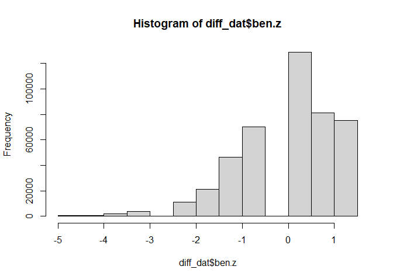
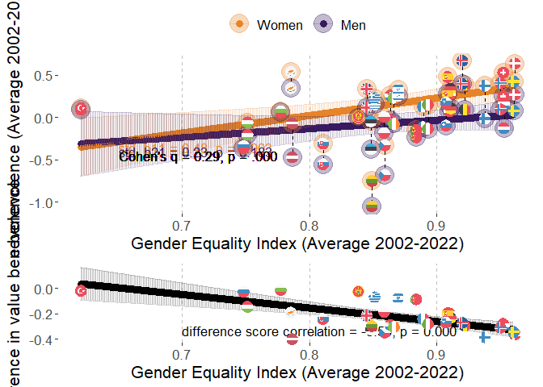
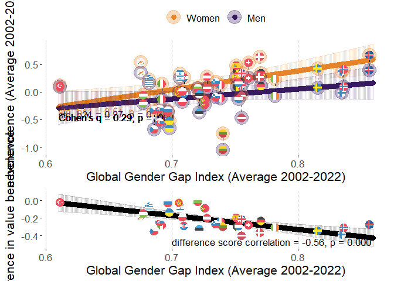
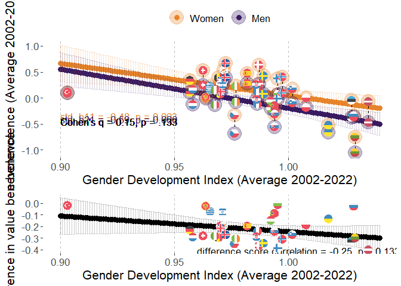
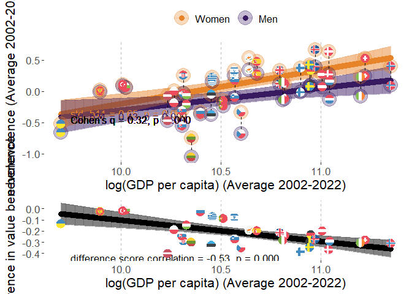
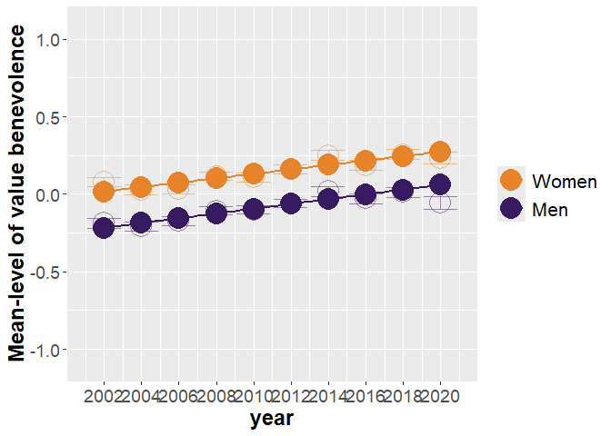
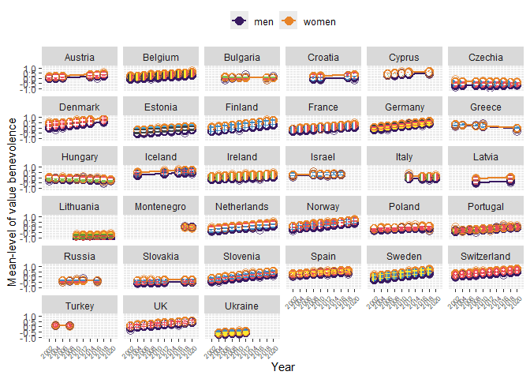

# Packages

Two packages are not in CRAN and need different installation
* devtools::install_github("vjilmari/vjihelpers")
* install.packages("ggflags", repos = c("https://jimjam-slam.r-universe.dev","https://cloud.r-project.org")) 


``` r
library(multid)
library(rio)
library(dplyr)
library(lme4)
library(emmeans)
library(vjihelpers)
library(MetBrewer)
library(ggplot2)
library(finalfit)
library(ggflags) 
library(lmerTest)
library(metafor)
library(ggpubr)
library(Hmisc)
library(r2mlm)
library(tidyr)
library(stringr)
library(apaTables)
```

# Data

* Loads the preprocessed European Social Survey data file made within "Preparations_ESS" code


``` r
load("../data/fdat.rdata")
```

* Include ISO data for country-names


``` r
# read country names
ISO<-read.csv2("../data/ISO.csv")
```


# Exclusions

* exclude participants with missing values or gender


``` r
value.vars<-
  c("con","tra",
  "ben","uni",
  "sdi","sti",
  "hed","ach",
  "pow","sec")

fdat$miss_values<-
  rowSums(is.na(fdat[,value.vars]))
table(fdat$miss_values)
```

```
## 
##      0      1      2      3      4      5      6      7      8      9     10 
## 450838   2586    774    401    248    185    129    135    142    165  34952
```

``` r
fdat<-fdat %>%
  filter(miss_values==0 & !is.na(gndr.bin))
```

# Data for the analysis

* basic descriptives


``` r
diff_dat<-
  fdat

#diff_dat$age.c<-as.numeric(diff_dat$age.c)
#diff_dat$rlgdgr.c<-as.numeric(diff_dat$rlgdgr.c)
#diff_dat$eduyrs.c<-as.numeric(diff_dat$eduyrs.c)

# data exclusions (include countries with at least two rounds of data)
n_rounds<-diff_dat %>% group_by(cntry) %>%
  summarise(n_unique_essround = n_distinct(essround))

# join number of rounds to data
diff_dat<-
  left_join(x=diff_dat,
            y=n_rounds,
            by="cntry")

# filter only countries with more than 1 round and non-missing gender variable
diff_dat<-diff_dat %>%
  dplyr::filter(n_unique_essround>1 &
                  !is.na(gndr))

# cross-tabulate sample sizes and ESS rounds by country
table(diff_dat$essround,diff_dat$cntry)
```

```
##     
##        AT   BE   BG   CH   CY   CZ   DE   DK   EE   ES   FI   FR   GB   GR   HR   HU   IE   IL   IS   IT
##   1  2254 1830    0 2024    0 1208 2819 1470    0 1712 1763 1355 1798 2551    0 1634 1916 2279    0    0
##   2  2198 1771    0 2110    0 2557 2840 1458 1948 1623 1701 1699 1864 2399    0 1460 1187    0  524    0
##   3  2348 1796 1295 1780  978    0 2884 1461 1466 1847 1649 1983 2353    0    0 1462 1589    0    0    0
##   4     0 1754 2144 1753 1210 1986 2732 1581 1646 2562 1901 2067 2311 2063 1430 1430 1757 2382    0    0
##   5     0 1699 2371 1491 1053 2335 3007 1564 1793 1881 1649 1723 2374 2669 1601 1473 2400 2212    0    0
##   6     0 1862 2179 1483 1110 1973 2935 1621 2345 1871 2158 1960 2261    0    0 1968 2616 2378  739  909
##   7  1795 1767    0 1521    0 1862 3006 1483 2036 1907 2050 1902 2231    0    0 1520 2380 2351    0    0
##   8  1993 1759    0 1504    0 2252 2821    0 2007 1929 1903 2057 1942    0    0 1458 2746 2366  841 2531
##   9  2477 1756 1926 1517  773 2343 2328 1554 1899 1619 1735 1982 2183    0 1781 1643 2189    0  844 2660
##   10    0 1334 2697 1505    0 2369    0    0 1538    0 1561 1951 1131 2768 1564 1816 1751    0  886 2573
##     
##        LT   LV   ME   NL   NO   PL   PT   RU   SE   SI   SK   TR   UA
##   1     0    0    0 2337 1819 2065 1482    0 1682 1488    0    0    0
##   2     0    0    0 1858 1575 1683 2024    0 1678 1384 1425 1790 1896
##   3     0    0    0 1860 1550 1685 2182 2339 1604 1465 1711    0 1885
##   4     0 1970    0 1724 1391 1596 2337 2446 1556 1257 1789 2305 1766
##   5  1632    0    0 1801 1530 1719 2139 2557 1463 1369 1803    0 1779
##   6  2108    0    0 1828 1610 1866 2138 2429 1838 1244 1827    0 2064
##   7  2241    0    0 1823 1423 1594 1242    0 1761 1189    0    0    0
##   8  2079    0    0 1669 1530 1675 1254 2374 1526 1295    0    0    0
##   9  1677  891 1188 1657 1396 1443 1045    0 1510 1307 1061    0    0
##   10 1606    0 1248 1466 1408    0 1827    0    0 1232 1395    0    0
```

``` r
# range of sample sizes
range(table(diff_dat$cntry))
```

```
## [1]  2436 25372
```

``` r
# scale/standardize with SD pooled across all country-time-gender folds
cntry.ben<-diff_dat %>% group_by(cntry,essround) %>%
  summarise(ben.ctm=mean(ben,na.rm=T),
            ben.ctsd=sd(ben,na.rm=T)) %>%
  group_by(cntry) %>%
  summarise(ben.cm=mean(ben.ctm),
            ben.csd=mean(ben.ctsd)) 
```

```
## `summarise()` has grouped output by 'cntry'. You can override using the `.groups` argument.
```

``` r
grand_mean_ben<-mean(cntry.ben$ben.cm)
grand_sd_ben<-mean(cntry.ben$ben.csd)

# standardized
diff_dat$ben.z<-(diff_dat$ben-grand_mean_ben)/grand_sd_ben
hist(diff_dat$ben.z)
```

<!-- -->

## Add GEI-variable

* GEI = Reverse-coded Gender Inequality Index (GII)


``` r
GII<-read.csv("../data/GII.csv")

# Obtain GII only for ESS countries
GII_in_ESS_d<-
  GII %>%
  filter(ISO2 %in% unique(diff_dat$cntry))

# Make long format data of GII, so that country x year has own rows

long_GII_in_ESS_d <- GII_in_ESS_d %>%
  pivot_longer(
    cols = starts_with("gii_") & !matches("avg"),  # <-- exclude the "_avg" columns
    names_to = "year",
    values_to = "gii",
    names_prefix = "gii_"
  ) %>%
  mutate(year = as.integer(year)) %>%
  filter(year >= 2002 & year <= 2022) %>%
  mutate(gei = 1 - gii) %>%
  select(ISO2, iso3, country, year, gii, gei, gii_2002_2022_avg, gei_2002_2022_avg)


# describe gei average
psych::describe(GII_in_ESS_d$gei_2002_2022_avg)
```

```
##    vars  n mean   sd median trimmed  mad  min  max range  skew kurtosis   se
## X1    1 32 0.87 0.07   0.87    0.87 0.06 0.62 0.96  0.34 -1.11     1.48 0.01
```

``` r
# one is missing, see which one
GII_in_ESS_d[is.na(GII_in_ESS_d$gei_2002_2022_avg),"country"]
```

```
## [1] "Ukraine"
```

``` r
# get means and SDs for standardizing
gei_mean<-mean(GII_in_ESS_d$gei_2002_2022_avg,na.rm=T)
gei_sd<-sd(GII_in_ESS_d$gei_2002_2022_avg,na.rm=T)

# standardize 
# year specific scores
long_GII_in_ESS_d$gei.z<-(long_GII_in_ESS_d$gei-gei_mean)/gei_sd

# get the country means to a separate frame

GII_country_means<-
  long_GII_in_ESS_d %>% group_by(ISO2) %>%
  summarise(gei.cm=mean(gei,na.rm=T),
            gei.z.cm=mean(gei.z,na.rm=T))


long_GII_in_ESS_d<-left_join(
  x=long_GII_in_ESS_d,
  y=GII_country_means,
  by="ISO2"
)


# center both the raw score and standardized scores
long_GII_in_ESS_d$gei.cmc<-(long_GII_in_ESS_d$gei-long_GII_in_ESS_d$gei.cm)
long_GII_in_ESS_d$gei.z.cmc<-(long_GII_in_ESS_d$gei.z-long_GII_in_ESS_d$gei.z.cm)

#View(long_GII_in_ESS_d)

# averages across 2002-2022
#long_GII_in_ESS_d$gei_2002_2022_avg.z<-(long_GII_in_ESS_d$gei_2002_2022_avg-gei_mean)/gei_sd

#long_GII_in_ESS_d$gei.cmc<-long_GII_in_ESS_d$gei-long_GII_in_ESS_d$gei_2002_2022_avg

# add year to ESS data-frame

diff_dat$year<-
  case_when(
    diff_dat$essround.c==-4.5~2002,  
    diff_dat$essround.c==-3.5~2004,
    diff_dat$essround.c==-2.5~2006,
    diff_dat$essround.c==-1.5~2008,
    diff_dat$essround.c==-0.5~2010,
    diff_dat$essround.c==0.5~2012,
    diff_dat$essround.c==1.5~2014,
    diff_dat$essround.c==2.5~2016,
    diff_dat$essround.c==3.5~2018,
    diff_dat$essround.c==4.5~2020
  )

# link datasets by country and year

diff_dat<-
  left_join(
    x=diff_dat,
    y=long_GII_in_ESS_d[,c("ISO2","year","gei","gei.cm","gei.cmc",
                           "gei.z","gei.z.cm","gei.z.cmc")],
    by=c("cntry"="ISO2","year")
)
```


## Add GDI-variable

* GDI = Gender Development Index


``` r
GDI<-read.csv("../data/GDI.csv")

# Obtain GDI only for ESS countries
GDI_in_ESS_d<-
  GDI %>%
  filter(ISO2 %in% unique(diff_dat$cntry))

# Make long format data of GDI, so that country x year has own rows

long_GDI_in_ESS_d <- GDI_in_ESS_d %>%
  pivot_longer(
    cols = starts_with("gdi_") & !matches("avg"),  # <-- exclude the "_avg" columns
    names_to = "year",
    values_to = "gdi",
    names_prefix = "gdi_"
  ) %>%
  mutate(year = as.integer(year)) %>%
  filter(year >= 2002 & year <= 2022) %>%
  select(ISO2, iso3, country, year, gdi, gdi_2002_2022_avg)

# describe gdi average
psych::describe(GDI_in_ESS_d$gdi_2002_2022_avg)
```

```
##    vars  n mean   sd median trimmed  mad min  max range  skew kurtosis se
## X1    1 33 0.99 0.03   0.99    0.98 0.02 0.9 1.04  0.13 -0.35     1.27  0
```

``` r
# get means and SDs for standardizing
gdi_mean<-mean(GDI_in_ESS_d$gdi_2002_2022_avg,na.rm=T)
gdi_sd<-sd(GDI_in_ESS_d$gdi_2002_2022_avg,na.rm=T)

# standardize 
# year specific scores
long_GDI_in_ESS_d$gdi.z<-(long_GDI_in_ESS_d$gdi-gdi_mean)/gdi_sd

# get the country means to a separate frame

GDI_country_means<-
  long_GDI_in_ESS_d %>% group_by(ISO2) %>%
  summarise(gdi.cm=mean(gdi,na.rm=T),
            gdi.z.cm=mean(gdi.z,na.rm=T))

long_GDI_in_ESS_d<-left_join(
  x=long_GDI_in_ESS_d,
  y=GDI_country_means,
  by="ISO2"
)


# center both the raw score and standardized scores
long_GDI_in_ESS_d$gdi.cmc<-(long_GDI_in_ESS_d$gdi-long_GDI_in_ESS_d$gdi.cm)
long_GDI_in_ESS_d$gdi.z.cmc<-(long_GDI_in_ESS_d$gdi.z-long_GDI_in_ESS_d$gdi.z.cm)

# link datasets by country and year

diff_dat<-
  left_join(
    x=diff_dat,
    y=long_GDI_in_ESS_d[,c("ISO2","year","gdi","gdi.cm","gdi.cmc",
                           "gdi.z","gdi.z.cm","gdi.z.cmc")],
    by=c("cntry"="ISO2","year")
  )
```

## Add GDP-variable

* log_GDP = Logarithm of GDP per capita, PPP (constant 2017 international $)


``` r
GDP<-read.csv("../data/GDP_processed.csv")

# Obtain GDP only for ESS countries
GDP_in_ESS_d<-
  GDP %>%
  filter(ISO2 %in% unique(diff_dat$cntry))

# First, rename those X2000..YR2000. style columns to simple "gdp_2000" etc.

GDP_in_ESS_d <- GDP_in_ESS_d %>%
  rename_with(
    ~ str_replace_all(., "^X(\\d{4})..YR\\1\\.$", "gdp_\\1"),
    starts_with("X")
  )

#GDP_in_ESS_d
# Make long format data of GDP, so that country x year has own rows

long_GDP_in_ESS_d <- GDP_in_ESS_d %>%
  pivot_longer(
    cols = starts_with("gdp_") & !matches("avg"),  # <-- exclude the "_avg" columns
    names_to = "year",
    values_to = "gdp",
    names_prefix = "gdp_"
  ) %>%
  mutate(year = as.integer(year)) %>%
  filter(year >= 2002 & year <= 2022) %>%
  select(ISO2, Country.Name, year, gdp, gdp_2002_2022_avg,log_gdp_2002_2022_avg) %>%
  mutate(log_gdp=log(gdp))

#View(long_GDP_in_ESS_d)

# describe gdp average
psych::describe(GDP_in_ESS_d$gdp_2002_2022_avg)
```

```
##    vars  n     mean      sd   median  trimmed      mad      min      max    range skew kurtosis      se
## X1    1 33 44309.55 16988.2 40528.07 43238.06 16282.88 16406.88 85115.96 68709.08 0.48    -0.58 2957.27
```

``` r
psych::describe(GDP_in_ESS_d$log_gdp_2002_2022_avg)
```

```
##    vars  n  mean  sd median trimmed  mad  min   max range  skew kurtosis   se
## X1    1 33 10.62 0.4  10.61   10.64 0.43 9.71 11.35  1.65 -0.25    -0.67 0.07
```

``` r
# get means and SDs for standardizing
log_gdp_mean<-mean(GDP_in_ESS_d$log_gdp_2002_2022_avg,na.rm=T)
log_gdp_sd<-sd(GDP_in_ESS_d$log_gdp_2002_2022_avg,na.rm=T)

# standardize 
# year specific scores
long_GDP_in_ESS_d$log_gdp.z<-
  (long_GDP_in_ESS_d$log_gdp-log_gdp_mean)/log_gdp_sd

# get the country means to a separate frame

GDP_country_means<-
  long_GDP_in_ESS_d %>% group_by(ISO2) %>%
  summarise(gdp.cm=mean(gdp,na.rm=T),
            #gdp.z.cm=mean(gdp.z,na.rm=T),
            log_gdp.cm=mean(log_gdp,na.rm=T),
            log_gdp.z.cm=mean(log_gdp.z,na.rm=T))

long_GDP_in_ESS_d<-left_join(
  x=long_GDP_in_ESS_d,
  y=GDP_country_means,
  by="ISO2"
)


# center both the raw score and standardized scores
long_GDP_in_ESS_d$log_gdp.cmc<-(long_GDP_in_ESS_d$log_gdp-long_GDP_in_ESS_d$log_gdp.cm)
long_GDP_in_ESS_d$log_gdp.z.cmc<-(long_GDP_in_ESS_d$log_gdp.z-long_GDP_in_ESS_d$log_gdp.z.cm)

# link datasets by country and year

diff_dat<-
  left_join(
    x=diff_dat,
    y=long_GDP_in_ESS_d[,c("ISO2","year","log_gdp","log_gdp.cm","log_gdp.cmc",
                           "log_gdp.z","log_gdp.z.cm","log_gdp.z.cmc")],
    by=c("cntry"="ISO2","year")
  )
```

## Add GGGI-variable

* GGGI = Global Gender Gap Index


``` r
GGGI<-import("../data/GGGI.xlsx")

# check if all ESS countries are in the log_GGGI data
table(unique(diff_dat$cntry) %in% GGGI$ISO2)
```

```
## 
## TRUE 
##   33
```

``` r
# Obtain GGGI only for ESS countries
GGGI_in_ESS_d<-
  GGGI %>%
  filter(ISO2 %in% unique(diff_dat$cntry))

# Make long format data of GGGI, so that country x year has own rows

long_GGGI_in_ESS_d <- GGGI_in_ESS_d %>%
  pivot_longer(
    cols = starts_with("gggi_") & !matches("avg"),  # <-- exclude the "_avg" columns
    names_to = "year",
    values_to = "gggi",
    names_prefix = "gggi_"
  ) %>%
  mutate(year = as.integer(year)) %>%
  filter(year >= 2002 & year <= 2022) %>%
  select(ISO2, cname, year, gggi, GGGI_2002_2022_avg)

# describe gggi average
psych::describe(GGGI_in_ESS_d$GGGI_2002_2022_avg)
```

```
##    vars  n mean   sd median trimmed  mad  min  max range skew kurtosis   se
## X1    1 33 0.73 0.05   0.73    0.73 0.04 0.61 0.86  0.25 0.38     0.19 0.01
```

``` r
# get means and SDs for standardizing
gggi_mean<-mean(GGGI_in_ESS_d$GGGI_2002_2022_avg,na.rm=T)
gggi_sd<-sd(GGGI_in_ESS_d$GGGI_2002_2022_avg,na.rm=T)

# standardize 
# year specific scores
long_GGGI_in_ESS_d$gggi.z<-(long_GGGI_in_ESS_d$gggi-gggi_mean)/gggi_sd

# get the country means to a separate frame

GGGI_country_means<-
  long_GGGI_in_ESS_d %>% group_by(ISO2) %>%
  summarise(gggi.cm=mean(gggi,na.rm=T),
            gggi.z.cm=mean(gggi.z,na.rm=T))

long_GGGI_in_ESS_d<-left_join(
  x=long_GGGI_in_ESS_d,
  y=GGGI_country_means,
  by="ISO2"
)

# center both the raw score and standardized scores
long_GGGI_in_ESS_d$gggi.cmc<-
  (long_GGGI_in_ESS_d$gggi-long_GGGI_in_ESS_d$gggi.cm)

long_GGGI_in_ESS_d$gggi.z.cmc<-
  (long_GGGI_in_ESS_d$gggi.z-long_GGGI_in_ESS_d$gggi.z.cm)

# link datasets by country and year

diff_dat<-
  left_join(
    x=diff_dat,
    y=long_GGGI_in_ESS_d[,c("ISO2","year","gggi","gggi.cm","gggi.cmc",
                           "gggi.z","gggi.z.cm","gggi.z.cmc")],
    by=c("cntry"="ISO2","year")
  )
```

# Descriptive statistics

## Country-specific descriptives


``` r
# sample sizes from weights

cntry_n_frame<-
  diff_dat %>% group_by(cntry) %>%
  summarise('n ESS rounds' = mean(n_unique_essround),
            n=round(sum(pspwght),0))

# value-based benevolence

cntry_ben_frame<-
  diff_dat %>% group_by(cntry,essround) %>%
  summarise('ben M' = weighted.mean(x=ben.z,w=pspwght),
            'ben SD' = sqrt(wtd.var(ben.z,pspwght))) %>%
  group_by(cntry) %>%
  summarise('ben M' = mean(x=`ben M`),
            'ben SD'= mean(x=`ben SD`))
```

```
## `summarise()` has grouped output by 'cntry'. You can override using the `.groups` argument.
```

``` r
cntry_ben_women_frame<-
  diff_dat %>%
  filter(gndr.c==-0.5) %>%
  group_by(cntry,essround) %>%
  summarise('ben M' = weighted.mean(x=ben.z,w=pspwght),
            'ben SD' = sqrt(wtd.var(ben.z,pspwght))) %>%
  group_by(cntry) %>%
  summarise('ben M Women' = mean(x=`ben M`),
            'ben SD Women'= mean(x=`ben SD`))
```

```
## `summarise()` has grouped output by 'cntry'. You can override using the `.groups` argument.
```

``` r
cntry_ben_men_frame<-
  diff_dat %>%
  filter(gndr.c==0.5) %>%
  group_by(cntry,essround) %>%
  summarise('ben M' = weighted.mean(x=ben.z,w=pspwght),
            'ben SD' = sqrt(wtd.var(ben.z,pspwght))) %>%
  group_by(cntry) %>%
  summarise('ben M Men' = mean(x=`ben M`),
            'ben SD Men'= mean(x=`ben SD`))
```

```
## `summarise()` has grouped output by 'cntry'. You can override using the `.groups` argument.
```

``` r
# link n and ben datasets

desc_frame<-
  left_join(
    x=cntry_n_frame,
    y=cntry_ben_frame,
    by="cntry"
  )

desc_frame<-
  left_join(
    x=desc_frame,
    y=cntry_ben_women_frame,
    by="cntry"
  )

desc_frame<-
  left_join(
    x=desc_frame,
    y=cntry_ben_men_frame,
    by="cntry"
  )

# Add country-specific differences
desc_frame$D<-desc_frame$`ben M Men`-desc_frame$`ben M Women`

desc_frame
```

```
## # A tibble: 33 × 10
##    cntry `n ESS rounds`     n `ben M` `ben SD` `ben M Women` `ben SD Women` `ben M Men` `ben SD Men`
##    <chr>          <dbl> <dbl>   <dbl>    <dbl>         <dbl>          <dbl>       <dbl>        <dbl>
##  1 AT                 6 13077  0.166     0.983        0.283           0.955      0.0405        0.997
##  2 BE                10 17313  0.218     0.826        0.334           0.810      0.0962        0.824
##  3 BG                 6 12641  0.0194    1.05         0.0597          1.04      -0.0239        1.05 
##  4 CH                10 16720  0.350     0.810        0.458           0.786      0.237         0.819
##  5 CY                 5  5105  0.411     0.813        0.478           0.785      0.340         0.833
##  6 CZ                 9 18934 -0.483     1.12        -0.340           1.10      -0.638         1.12 
##  7 DE                 9 25389  0.214     0.870        0.319           0.852      0.104         0.875
##  8 DK                 8 12198  0.359     0.859        0.497           0.811      0.217         0.884
##  9 EE                 9 16692 -0.208     0.952       -0.0722          0.924     -0.371         0.960
## 10 ES                 9 16954  0.378     0.878        0.449           0.855      0.304         0.895
## # ℹ 23 more rows
## # ℹ 1 more variable: D <dbl>
```

``` r
# add country-level measures

desc_frame<-
  left_join(
    x=desc_frame,
    y=GII_country_means[,c("ISO2","gei.cm")],
    by=c("cntry"="ISO2")
  )

desc_frame<-
  left_join(
    x=desc_frame,
    y=GGGI_country_means[,c("ISO2","gggi.cm")],
    by=c("cntry"="ISO2")
  )

desc_frame<-
  left_join(
    x=desc_frame,
    y=GDI_country_means[,c("ISO2","gdi.cm")],
    by=c("cntry"="ISO2")
  )


desc_frame<-
  left_join(
    x=desc_frame,
    y=GDP_country_means[,c("ISO2","gdp.cm")],
    by=c("cntry"="ISO2")
  )

desc_frame<-left_join(
  x=desc_frame,
  y=ISO[,c("ISO2","CLDR")],
  by=c("cntry"="ISO2")
)

# finalize the formatted table

cntry_desc_tbl<-
  desc_frame %>%
  select(
    Country = CLDR,
    `n ESS rounds`,
    n,
    `ben M`, `ben SD`,
    `ben M Women`, `ben SD Women`,
    `ben M Men`, `ben SD Men`,
    D,
    GEI = gei.cm,
    GGGI = gggi.cm,
    GDI = gdi.cm,
    GDP = gdp.cm
  ) %>%
  mutate(
    across(
      .cols = -c(Country, `n ESS rounds`, n, GDP) & where(is.numeric),
      .fns  = ~ round_tidy(.x, 2)
    )
  ) %>%
  mutate(
    across(
      .cols = GDP,
      .fns  = ~ round_tidy(.x, 0)
    )
  )
print(cntry_desc_tbl,n=33)
```

```
## # A tibble: 33 × 14
##    Country    `n ESS rounds`     n `ben M` `ben SD` `ben M Women` `ben SD Women` `ben M Men` `ben SD Men`
##    <chr>               <dbl> <dbl> <chr>   <chr>    <chr>         <chr>          <chr>       <chr>       
##  1 Austria                 6 13077 0.17    0.98     0.28          0.95           0.04        1.00        
##  2 Belgium                10 17313 0.22    0.83     0.33          0.81           0.10        0.82        
##  3 Bulgaria                6 12641 0.02    1.05     0.06          1.04           -0.02       1.05        
##  4 Switzerla…             10 16720 0.35    0.81     0.46          0.79           0.24        0.82        
##  5 Cyprus                  5  5105 0.41    0.81     0.48          0.78           0.34        0.83        
##  6 Czechia                 9 18934 -0.48   1.12     -0.34         1.10           -0.64       1.12        
##  7 Germany                 9 25389 0.21    0.87     0.32          0.85           0.10        0.87        
##  8 Denmark                 8 12198 0.36    0.86     0.50          0.81           0.22        0.88        
##  9 Estonia                 9 16692 -0.21   0.95     -0.07         0.92           -0.37       0.96        
## 10 Spain                   9 16954 0.38    0.88     0.45          0.86           0.30        0.89        
## 11 Finland                10 18050 0.07    0.94     0.25          0.90           -0.13       0.94        
## 12 France                 10 18720 -0.02   1.14     0.10          1.13           -0.17       1.14        
## 13 UK                     10 21456 0.15    0.96     0.27          0.92           0.01        0.97        
## 14 Greece                  5 12464 0.22    0.94     0.25          0.94           0.18        0.94        
## 15 Croatia                 4  6368 0.12    1.06     0.20          1.03           0.03        1.09        
## 16 Hungary                10 16006 -0.06   1.07     0.03          1.05           -0.16       1.09        
## 17 Ireland                10 20576 0.07    1.05     0.20          1.03           -0.05       1.05        
## 18 Israel                  6 13964 0.24    1.06     0.28          1.04           0.20        1.07        
## 19 Iceland                 5  3832 0.38    0.87     0.55          0.81           0.21        0.89        
## 20 Italy                   4  8663 -0.04   1.02     0.04          1.01           -0.12       1.02        
## 21 Lithuania               6 11714 -0.91   1.27     -0.81         1.27           -1.03       1.26        
## 22 Latvia                  2  2866 -0.21   1.06     -0.06         1.01           -0.40       1.09        
## 23 Montenegro              2  2441 0.05    1.15     0.13          1.14           -0.02       1.15        
## 24 Netherlan…             10 18048 -0.02   0.88     0.11          0.85           -0.16       0.88        
## 25 Norway                 10 15186 0.02    0.94     0.15          0.93           -0.12       0.93        
## 26 Poland                  9 15314 -0.07   0.93     0.00          0.93           -0.15       0.93        
## 27 Portugal               10 17705 -0.20   1.06     -0.16         1.05           -0.25       1.06        
## 28 Russia                  5 12139 -0.31   1.16     -0.27         1.17           -0.36       1.15        
## 29 Sweden                  9 14897 0.03    0.96     0.20          0.92           -0.16       0.96        
## 30 Slovenia               10 13238 0.04    0.90     0.14          0.89           -0.07       0.89        
## 31 Slovakia                7 11132 -0.36   1.01     -0.27         1.01           -0.46       1.01        
## 32 Turkey                  2  4108 0.14    0.98     0.13          0.97           0.14        0.98        
## 33 Ukraine                 5  9454 -0.51   1.27     -0.47         1.30           -0.56       1.23        
## # ℹ 5 more variables: D <chr>, GEI <chr>, GGGI <chr>, GDI <chr>, GDP <chr>
```

``` r
export(cntry_desc_tbl,"../results/ben_youth/cntry_desc_tbl.xlsx",overwrite=T)
```

## Country-level correlations table


``` r
cor_frame<-
  desc_frame %>%
  select(
    VBMT=`ben M`,
    VBMT_Women=`ben M Women`,
    VBMT_Men=`ben M Men`,
    D = D,
    GEI = gei.cm,
    GGGI = gggi.cm,
    GDI = gdi.cm,
    GDP = gdp.cm
  ) %>%
  mutate(
    log_GDP=log(GDP)
  ) %>%
  select(-GDP)

apa.cor.table(
  data=cor_frame,
  filename = "../results/ben_youth/CorTable1.doc",
  #table.number = NA,
  show.conf.interval = FALSE,
  show.sig.stars = F,
  landscape = F
)
```

```
## The ability to suppress reporting of reporting confidence intervals has been deprecated in this version.
## The function argument show.conf.interval will be removed in a later version.
```

```
## 
## 
## Means, standard deviations, and correlations with confidence intervals
##  
## 
##   Variable      M     SD   1            2            3            4            5           6          
##   1. VBMT       0.01  0.29                                                                            
##                                                                                                       
##   2. VBMT_Women 0.11  0.30 .99                                                                        
##                            [.98, .99]                                                                 
##                                                                                                       
##   3. VBMT_Men   -0.10 0.30 .99          .95                                                           
##                            [.97, .99]   [.90, .98]                                                    
##                                                                                                       
##   4. D          -0.21 0.09 -.00         -.15         .16                                              
##                            [-.34, .34]  [-.47, .20]  [-.19, .48]                                      
##                                                                                                       
##   5. GEI        0.87  0.07 .25          .35          .15          -.60                                
##                            [-.11, .55]  [-.00, .62]  [-.21, .47]  [-.78, -.31]                        
##                                                                                                       
##   6. GGGI       0.73  0.05 .22          .34          .10          -.75         .73                    
##                            [-.13, .53]  [-.01, .61]  [-.25, .43]  [-.87, -.54] [.52, .86]             
##                                                                                                       
##   7. GDI        0.99  0.03 -.59         -.54         -.62         -.25         .07         .20        
##                            [-.77, -.31] [-.75, -.25] [-.80, -.36] [-.55, .10]  [-.29, .41] [-.16, .51]
##                                                                                                       
##   8. log_GDP    10.62 0.40 .44          .53          .35          -.58         .75         .67        
##                            [.12, .68]   [.23, .74]   [.00, .62]   [-.77, -.30] [.55, .87]  [.42, .82] 
##                                                                                                       
##   7          
##              
##              
##              
##              
##              
##              
##              
##              
##              
##              
##              
##              
##              
##              
##              
##              
##              
##              
##              
##              
##   -.22       
##   [-.53, .13]
##              
## 
## Note. M and SD are used to represent mean and standard deviation, respectively.
## Values in square brackets indicate the 95% confidence interval.
## The confidence interval is a plausible range of population correlations 
## that could have caused the sample correlation (Cumming, 2014).
## 
```


# Analysis

## Data subset


``` r
diff_dat<-diff_dat %>%
  filter(agea>17 & agea <30)
```

## mod0: Random intercept model


``` r
mod0<-lmer(ben.z~(1|cntry),data=diff_dat,REML=F,weights = pspwght,
           control=lmerControl(optimizer="bobyqa",optCtrl=list(maxfun=2e7)))
summary(mod0)
```

```
## Linear mixed model fit by maximum likelihood . t-tests use Satterthwaite's method ['lmerModLmerTest']
## Formula: ben.z ~ (1 | cntry)
##    Data: diff_dat
## Weights: pspwght
## Control: lmerControl(optimizer = "bobyqa", optCtrl = list(maxfun = 2e+07))
## 
##       AIC       BIC    logLik -2*log(L)  df.resid 
##  207636.5  207664.0 -103815.2  207630.5     70935 
## 
## Scaled residuals: 
##     Min      1Q  Median      3Q     Max 
## -9.2397 -0.5372  0.0534  0.6616  4.2780 
## 
## Random effects:
##  Groups   Name        Variance Std.Dev.
##  cntry    (Intercept) 0.1028   0.3207  
##  Residual             1.1323   1.0641  
## Number of obs: 70938, groups:  cntry, 33
## 
## Fixed effects:
##             Estimate Std. Error       df t value Pr(>|t|)
## (Intercept)  0.02532    0.05599 33.00504   0.452    0.654
```

``` r
getVC(mod0)
```

```
##        grp        var1 var2 sdcor vcov
## 1    cntry (Intercept) <NA>  0.32 0.10
## 2 Residual        <NA> <NA>  1.06 1.13
```

``` r
r2mlm(mod0,bargraph = F)
```

```
## $Decompositions
##                      total within between
## fixed, within   0.00000000      0      NA
## fixed, between  0.00000000     NA       0
## slope variation 0.00000000      0      NA
## mean variation  0.08325197     NA       1
## sigma2          0.91674803      1      NA
## 
## $R2s
##          total within between
## f1  0.00000000      0      NA
## f2  0.00000000     NA       0
## v   0.00000000      0      NA
## m   0.08325197     NA       1
## f   0.00000000     NA      NA
## fv  0.00000000      0      NA
## fvm 0.08325197     NA      NA
```

## mod1: Gender fixed effect


``` r
mod1<-lmer(ben.z~gndr.c+(1|cntry),data=diff_dat,REML=F,weights = pspwght,
           control=lmerControl(optimizer="bobyqa",optCtrl=list(maxfun=2e7)))
summary(mod1)
```

```
## Linear mixed model fit by maximum likelihood . t-tests use Satterthwaite's method ['lmerModLmerTest']
## Formula: ben.z ~ gndr.c + (1 | cntry)
##    Data: diff_dat
## Weights: pspwght
## Control: lmerControl(optimizer = "bobyqa", optCtrl = list(maxfun = 2e+07))
## 
##       AIC       BIC    logLik -2*log(L)  df.resid 
##  206652.5  206689.2 -103322.3  206644.5     70934 
## 
## Scaled residuals: 
##     Min      1Q  Median      3Q     Max 
## -9.0934 -0.5364  0.0450  0.6578  4.5207 
## 
## Random effects:
##  Groups   Name        Variance Std.Dev.
##  cntry    (Intercept) 0.1027   0.3204  
##  Residual             1.1167   1.0567  
## Number of obs: 70938, groups:  cntry, 33
## 
## Fixed effects:
##               Estimate Std. Error         df t value Pr(>|t|)    
## (Intercept)  2.694e-02  5.594e-02  3.301e+01   0.482    0.633    
## gndr.c      -2.304e-01  7.311e-03  7.091e+04 -31.509   <2e-16 ***
## ---
## Signif. codes:  0 '***' 0.001 '**' 0.01 '*' 0.05 '.' 0.1 ' ' 1
## 
## Correlation of Fixed Effects:
##        (Intr)
## gndr.c -0.001
```

``` r
getFE(mod1,round=3)
```

```
##               Est.    SE        df       t     p     LL     UL
## (Intercept)  0.027 0.056    33.007   0.482 0.633 -0.087  0.141
## gndr.c      -0.230 0.007 70905.830 -31.509 0.000 -0.245 -0.216
```

``` r
getVC(mod1)
```

```
##        grp        var1 var2 sdcor vcov
## 1    cntry (Intercept) <NA>  0.32 0.10
## 2 Residual        <NA> <NA>  1.06 1.12
```

``` r
r2mlm(mod1,bargraph = F)
```

```
## $Decompositions
##                      total
## fixed           0.01075753
## slope variation 0.00000000
## mean variation  0.08328853
## sigma2          0.90595393
## 
## $R2s
##          total
## f   0.01075753
## v   0.00000000
## m   0.08328853
## fv  0.01075753
## fvm 0.09404607
```

## mod2: Gender fixed and random effect

* Include random effect correlation by default


``` r
mod2<-lmer(ben.z~gndr.c+(gndr.c|cntry),data=diff_dat,REML=F,weights = pspwght,
           control=lmerControl(optimizer="bobyqa",optCtrl=list(maxfun=2e7)))
summary(mod2)
```

```
## Linear mixed model fit by maximum likelihood . t-tests use Satterthwaite's method ['lmerModLmerTest']
## Formula: ben.z ~ gndr.c + (gndr.c | cntry)
##    Data: diff_dat
## Weights: pspwght
## Control: lmerControl(optimizer = "bobyqa", optCtrl = list(maxfun = 2e+07))
## 
##       AIC       BIC    logLik -2*log(L)  df.resid 
##  206497.6  206552.6 -103242.8  206485.6     70932 
## 
## Scaled residuals: 
##     Min      1Q  Median      3Q     Max 
## -9.0513 -0.5211  0.0415  0.6656  4.5926 
## 
## Random effects:
##  Groups   Name        Variance Std.Dev. Corr 
##  cntry    (Intercept) 0.1024   0.320         
##           gndr.c      0.0144   0.120    -0.04
##  Residual             1.1131   1.055         
## Number of obs: 70938, groups:  cntry, 33
## 
## Fixed effects:
##             Estimate Std. Error       df t value Pr(>|t|)    
## (Intercept)  0.02788    0.05586 33.00773   0.499    0.621    
## gndr.c      -0.22492    0.02245 29.63858 -10.018    5e-11 ***
## ---
## Signif. codes:  0 '***' 0.001 '**' 0.01 '*' 0.05 '.' 0.1 ' ' 1
## 
## Correlation of Fixed Effects:
##        (Intr)
## gndr.c -0.033
```

``` r
getFE(mod2,round=3)
```

```
##               Est.    SE     df       t     p     LL     UL
## (Intercept)  0.028 0.056 33.008   0.499 0.621 -0.086  0.142
## gndr.c      -0.225 0.022 29.639 -10.018 0.000 -0.271 -0.179
```

``` r
getVC(mod2)
```

```
##        grp        var1   var2 sdcor vcov
## 1    cntry (Intercept)   <NA>  0.32 0.10
## 2    cntry      gndr.c   <NA>  0.12 0.01
## 3    cntry (Intercept) gndr.c -0.04 0.00
## 4 Residual        <NA>   <NA>  1.06 1.11
```

``` r
r2mlm(mod2,bargraph = F)
```

```
## $Decompositions
##                       total
## fixed           0.010261370
## slope variation 0.002920786
## mean variation  0.083152166
## sigma2          0.903665678
## 
## $R2s
##           total
## f   0.010261370
## v   0.002920786
## m   0.083152166
## fv  0.013182156
## fvm 0.096334322
```

``` r
anova(mod1,mod2)
```

```
## Data: diff_dat
## Models:
## mod1: ben.z ~ gndr.c + (1 | cntry)
## mod2: ben.z ~ gndr.c + (gndr.c | cntry)
##      npar    AIC    BIC  logLik -2*log(L)  Chisq Df Pr(>Chisq)    
## mod1    4 206653 206689 -103322    206645                         
## mod2    6 206498 206553 -103243    206486 158.96  2  < 2.2e-16 ***
## ---
## Signif. codes:  0 '***' 0.001 '**' 0.01 '*' 0.05 '.' 0.1 ' ' 1
```

``` r
lvl2_var_cond_lvl1(mod2,lvl1.var = "gndr.c",lvl1.values = c(0.5,-0.5))
```

```
##   lvl1.value lvl2.cond.var lvl2.cond.sd
## 1        0.5     0.1046295    0.3234648
## 2       -0.5     0.1073358    0.3276214
```

* Test for random effect correlation


``` r
mod2_norecov<-lmer(ben.z~gndr.c+(gndr.c||cntry),data=diff_dat,REML=F,weights = pspwght,
                   control=lmerControl(optimizer="bobyqa",optCtrl=list(maxfun=2e7)))
summary(mod2_norecov)
```

```
## Linear mixed model fit by maximum likelihood . t-tests use Satterthwaite's method ['lmerModLmerTest']
## Formula: ben.z ~ gndr.c + (gndr.c || cntry)
##    Data: diff_dat
## Weights: pspwght
## Control: lmerControl(optimizer = "bobyqa", optCtrl = list(maxfun = 2e+07))
## 
##       AIC       BIC    logLik -2*log(L)  df.resid 
##  206495.6  206541.4 -103242.8  206485.6     70933 
## 
## Scaled residuals: 
##     Min      1Q  Median      3Q     Max 
## -9.0512 -0.5212  0.0415  0.6656  4.5941 
## 
## Random effects:
##  Groups   Name        Variance Std.Dev.
##  cntry    (Intercept) 0.10238  0.3200  
##  cntry.1  gndr.c      0.01441  0.1201  
##  Residual             1.11307  1.0550  
## Number of obs: 70938, groups:  cntry, 33
## 
## Fixed effects:
##             Estimate Std. Error       df t value Pr(>|t|)    
## (Intercept)  0.02789    0.05586 33.00791   0.499    0.621    
## gndr.c      -0.22490    0.02246 29.63874 -10.013 5.06e-11 ***
## ---
## Signif. codes:  0 '***' 0.001 '**' 0.01 '*' 0.05 '.' 0.1 ' ' 1
## 
## Correlation of Fixed Effects:
##        (Intr)
## gndr.c 0.000
```

``` r
getFE(mod2_norecov,round=3)
```

```
##               Est.    SE     df       t     p     LL     UL
## (Intercept)  0.028 0.056 33.008   0.499 0.621 -0.086  0.142
## gndr.c      -0.225 0.022 29.639 -10.013 0.000 -0.271 -0.179
```

``` r
getVC(mod2_norecov)
```

```
##        grp        var1 var2 sdcor vcov
## 1    cntry (Intercept) <NA>  0.32 0.10
## 2  cntry.1      gndr.c <NA>  0.12 0.01
## 3 Residual        <NA> <NA>  1.06 1.11
```

``` r
anova(mod2_norecov,mod2)
```

```
## Data: diff_dat
## Models:
## mod2_norecov: ben.z ~ gndr.c + (gndr.c || cntry)
## mod2: ben.z ~ gndr.c + (gndr.c | cntry)
##              npar    AIC    BIC  logLik -2*log(L)  Chisq Df Pr(>Chisq)
## mod2_norecov    5 206496 206541 -103243    206486                     
## mod2            6 206498 206553 -103243    206486 0.0352  1     0.8513
```


## mod2 with Gender-equality index (GEI)


``` r
mod2_GEI<-lmer(ben.z~gndr.c+gei.z.cm+gndr.c:gei.z.cm+
                 (gndr.c|cntry),data=diff_dat,REML=F,weights = pspwght,
           control=lmerControl(optimizer="bobyqa",optCtrl=list(maxfun=2e7)))
summary(mod2_GEI)
```

```
## Linear mixed model fit by maximum likelihood . t-tests use Satterthwaite's method ['lmerModLmerTest']
## Formula: ben.z ~ gndr.c + gei.z.cm + gndr.c:gei.z.cm + (gndr.c | cntry)
##    Data: diff_dat
## Weights: pspwght
## Control: lmerControl(optimizer = "bobyqa", optCtrl = list(maxfun = 2e+07))
## 
##       AIC       BIC    logLik -2*log(L)  df.resid 
##  200093.6  200166.8 -100038.8  200077.6     69278 
## 
## Scaled residuals: 
##     Min      1Q  Median      3Q     Max 
## -9.1365 -0.5212  0.0440  0.6711  4.6518 
## 
## Random effects:
##  Groups   Name        Variance Std.Dev. Corr
##  cntry    (Intercept) 0.080459 0.28365      
##           gndr.c      0.007914 0.08896  0.38
##  Residual             1.089921 1.04399      
## Number of obs: 69286, groups:  cntry, 32
## 
## Fixed effects:
##                 Estimate Std. Error       df t value Pr(>|t|)    
## (Intercept)      0.04713    0.05033 31.98403   0.936 0.356067    
## gndr.c          -0.22471    0.01770 27.15379 -12.698 6.18e-13 ***
## gei.z.cm         0.11447    0.05116 32.05128   2.238 0.032324 *  
## gndr.c:gei.z.cm -0.07979    0.01836 29.74973  -4.346 0.000149 ***
## ---
## Signif. codes:  0 '***' 0.001 '**' 0.01 '*' 0.05 '.' 0.1 ' ' 1
## 
## Correlation of Fixed Effects:
##             (Intr) gndr.c g.z.cm
## gndr.c       0.334              
## gei.z.cm    -0.002 -0.001       
## gndr.c:g.z. -0.001 -0.040  0.328
```

``` r
getFE(mod2_GEI,round=3)
```

```
##                   Est.    SE     df       t     p     LL     UL
## (Intercept)      0.047 0.050 31.984   0.936 0.356 -0.055  0.150
## gndr.c          -0.225 0.018 27.154 -12.698 0.000 -0.261 -0.188
## gei.z.cm         0.114 0.051 32.051   2.238 0.032  0.010  0.219
## gndr.c:gei.z.cm -0.080 0.018 29.750  -4.346 0.000 -0.117 -0.042
```

``` r
getVC(mod2_GEI)
```

```
##        grp        var1   var2 sdcor vcov
## 1    cntry (Intercept)   <NA>  0.28 0.08
## 2    cntry      gndr.c   <NA>  0.09 0.01
## 3    cntry (Intercept) gndr.c  0.38 0.01
## 4 Residual        <NA>   <NA>  1.04 1.09
```

``` r
r2mlm(mod2_GEI,bargraph = F)
```

```
## $Decompositions
##                       total
## fixed           0.020980557
## slope variation 0.001651536
## mean variation  0.067010576
## sigma2          0.910357331
## 
## $R2s
##           total
## f   0.020980557
## v   0.001651536
## m   0.067010576
## fv  0.022632093
## fvm 0.089642669
```

### Deconstructed associations


``` r
t1<-Sys.time()
ddsc_mod2_GEI<-
  ddsc_ml(model = mod2_GEI,
          predictor = "gei.z.cm",
          moderator = "gndr.c",moderator_values = c(-0.5,0.5),
          re_cov_test = T)
t2<-Sys.time()
t2-t1
```

```
## Time difference of 6.141193 secs
```

``` r
round(ddsc_mod2_GEI$vpc_at_moderator_values,3)
```

```
##   lvl1.value Intercept.var Intercept.sd Residual.var Total.var   VPC mean.n.obs  ICC2 ICC2_SP
## 1       -0.5         0.107        0.328        1.113     1.220 0.088   1103.091 0.989   0.991
## 2        0.5         0.105        0.323        1.113     1.218 0.086   1046.545 0.988   0.990
```

``` r
round(ddsc_mod2_GEI$descriptives,3)
```

```
##                        M    SD means_y1 means_y1_scaled means_y2 means_y2_scaled gei.z.cm
## means_y1          -0.065 0.321    1.000           1.000    0.900           0.900    0.236
## means_y1_scaled   -0.204 1.006    1.000           1.000    0.900           0.900    0.236
## means_y2           0.161 0.317    0.900           0.900    1.000           1.000    0.480
## means_y2_scaled    0.505 0.994    0.900           0.900    1.000           1.000    0.480
## gei.z.cm           0.000 1.000    0.236           0.236    0.480           0.480    1.000
## gei.z.cm_scaled    0.000 1.000    0.236           0.236    0.480           0.480    1.000
## diff_score        -0.226 0.142    0.249           0.249   -0.198          -0.198   -0.534
## diff_score_scaled -0.709 0.447    0.249           0.249   -0.198          -0.198   -0.534
##                   gei.z.cm_scaled diff_score diff_score_scaled
## means_y1                    0.236      0.249             0.249
## means_y1_scaled             0.236      0.249             0.249
## means_y2                    0.480     -0.198            -0.198
## means_y2_scaled             0.480     -0.198            -0.198
## gei.z.cm                    1.000     -0.534            -0.534
## gei.z.cm_scaled             1.000     -0.534            -0.534
## diff_score                 -0.534      1.000             1.000
## diff_score_scaled          -0.534      1.000             1.000
```

``` r
round(ddsc_mod2_GEI$results,3)
```

```
##                            estimate    SE     df t.ratio p.value ci.lower ci.upper
## r_xy1y2                       0.560 0.129 29.750   4.346   0.000    0.297    0.823
## w_11                          0.154 0.049 32.071   3.155   0.003    0.055    0.254
## w_21                          0.075 0.055 32.105   1.359   0.183   -0.037    0.186
## r_xy1                         0.482 0.153 32.071   3.155   0.003    0.171    0.792
## r_xy2                         0.235 0.173 32.105   1.359   0.183   -0.117    0.588
## b_11                          0.484 0.154 32.071   3.155   0.003    0.172    0.797
## b_21                          0.234 0.172 32.105   1.359   0.183   -0.117    0.585
## main_effect                   0.114 0.051 32.051   2.238   0.032    0.010    0.219
## moderator_effect             -0.225 0.018 27.154 -12.698   0.000   -0.261   -0.188
## interaction                  -0.080 0.018 29.750  -4.346   0.000   -0.117   -0.042
## q_b11_b21                     0.290    NA     NA      NA      NA       NA       NA
## q_rxy1_rxy2                   0.285    NA     NA      NA      NA       NA       NA
## cross_over_point             -2.816    NA     NA      NA      NA       NA       NA
## interaction_vs_main          -0.035 0.060 32.190  -0.580   0.566   -0.156    0.087
## interaction_vs_main_bscale   -0.109 0.188 32.190  -0.580   0.566   -0.491    0.273
## interaction_vs_main_rscale   -0.112 0.189 32.189  -0.593   0.557   -0.498    0.273
## dadas                        -0.149 0.110 32.105  -1.359   0.908   -0.373    0.074
## dadas_bscale                 -0.468 0.344 32.105  -1.359   0.908   -1.169    0.233
## dadas_rscale                 -0.471 0.346 32.105  -1.359   0.908   -1.176    0.235
## abs_diff                      0.080 0.018 29.750   4.346   0.000    0.042    0.117
## abs_sum                       0.229 0.102 32.051   2.238   0.016    0.021    0.437
## abs_diff_bscale               0.250 0.058 29.750   4.346   0.000    0.133    0.368
## abs_sum_bscale                0.718 0.321 32.051   2.238   0.016    0.064    1.372
## abs_diff_rscale               0.246 0.058 29.894   4.224   0.000    0.127    0.365
## abs_sum_rscale                0.717 0.321 32.051   2.232   0.016    0.063    1.371
```

``` r
round(ddsc_mod2_GEI$re_cov_test,3)
```

```
## RE_cov RE_cor  Chisq     Df      p 
## -0.001 -0.035  0.035  1.000  0.851
```

``` r
d_GEI<-ddsc_mod2_GEI$ddsc_sem_fit$data

ddsc_sem_GEI<-
  ddsc_sem(data=d_GEI,x = "gei.z.cm",y1="means_y2",
           y2="means_y1",q_sesoi = .10)
round(ddsc_sem_GEI$results,3)
```

```
##                                    est    se      z pvalue ci.lower ci.upper
## r_xy1_y2                         0.534 0.149  3.574  0.000    0.241    0.827
## r_xy1                            0.480 0.155  3.091  0.002    0.175    0.784
## r_xy2                            0.236 0.172  1.377  0.169   -0.100    0.573
## b_11                             0.477 0.154  3.091  0.002    0.174    0.779
## b_21                             0.238 0.173  1.377  0.169   -0.101    0.577
## b_10                             0.505 0.152  3.327  0.001    0.207    0.802
## b_20                            -0.204 0.170 -1.199  0.231   -0.537    0.129
## res_cov_y1_y2                    0.762 0.199  3.836  0.000    0.373    1.151
## diff_b10_b20                     0.709 0.066 10.779  0.000    0.580    0.838
## diff_b11_b21                     0.239 0.067  3.574  0.000    0.108    0.370
## diff_rxy1_rxy2                   0.243 0.066  3.666  0.000    0.113    0.373
## q_b11_b21                        0.276 0.077  3.589  0.000    0.125    0.427
## q_rxy1_rxy2                      0.281 0.078  3.618  0.000    0.129    0.434
## cross_over_point                -2.969 0.875 -3.392  0.001   -4.684   -1.253
## sum_b11_b21                      0.715 0.321  2.229  0.026    0.086    1.343
## main_effect                      0.357 0.160  2.229  0.026    0.043    0.671
## interaction_vs_main_effect      -0.118 0.190 -0.622  0.534   -0.492    0.255
## diff_abs_b11_abs_b21             0.239 0.067  3.574  0.000    0.108    0.370
## abs_diff_b11_b21                 0.239 0.067  3.574  0.000    0.108    0.370
## abs_sum_b11_b21                  0.715 0.321  2.229  0.013    0.086    1.343
## dadas                           -0.476 0.346 -1.377  0.916   -1.153    0.202
## q_r_equivalence                  0.181 0.078  2.332  0.990       NA       NA
## q_b_equivalence                  0.176 0.077  2.289  0.989       NA       NA
## cross_over_point_equivalence     2.969 0.875  3.392  1.000       NA       NA
## cross_over_point_minimal_effect  2.969 0.875  3.392  0.000       NA       NA
```

``` r
round(ddsc_sem_GEI$variance_test,3)
```

```
##              est    se      z pvalue ci.lower ci.upper
## cov_y1y2   0.872 0.230  3.785  0.000    0.420    1.324
## var_y1     0.957 0.239  4.000  0.000    0.488    1.426
## var_y2     0.980 0.245  4.000  0.000    0.500    1.461
## var_diff  -0.023 0.149 -0.154  0.877   -0.316    0.270
## var_ratio  0.977 0.150  6.493  0.000    0.682    1.271
## cor_y1y2   0.900 0.034 26.832  0.000    0.834    0.966
```

### Figure 


``` r
# plot the results

# start with obtaining predicted values for means and differences

# refit reduced and full models with GGGI in original scale


mod2_GEI_unstd<-lmer(ben.z~gndr.c+gei.cm+gndr.c:gei.cm+
                 (gndr.c|cntry),data=diff_dat,REML=F,weights = pspwght,
               control=lmerControl(optimizer="bobyqa",optCtrl=list(maxfun=2e7)))

mod2_GEI_unstd_red<-lmer(ben.z~gndr.c+
                       (gndr.c|cntry),data=diff_dat,REML=F,weights = pspwght,
                     control=lmerControl(optimizer="bobyqa",optCtrl=list(maxfun=2e7)))


p<-
  emmip(
    mod2_GEI_unstd, 
    gndr.c ~ gei.cm,
    at=list(gndr.c = c(-0.5,0.5),
            gei.cm=
              seq(from=round(range(GII_country_means$gei.cm,na.rm=T)[1],2),
                  to=round(range(GII_country_means$gei.cm,na.rm=T)[2],2),
                  by=0.001)),
    plotit=F,CIs=T,lmerTest.limit = 1e6,disable.pbkrtest=T)

p$gndr.c<-p$tvar
levels(p$gndr.c)<-c("Women","Men")

# obtain min and max for aligned plots
min.y.comp<-min(p$LCL)
max.y.comp<-max(p$UCL)

# Men and Women mean distributions

p3<-coefficients(mod2_GEI_unstd_red)$cntry
p3<-cbind(rbind(p3,p3),weight=rep(c(-0.5,0.5),each=nrow(p3)))
p3$xvar<-p3$`(Intercept)`+p3$gndr.c*p3$weight
p3$gndr.c<-as.factor(p3$weight)
levels(p3$gndr.c)<-c("Women","Men")

# obtain min and max for aligned plots
min.y.mean.distr<-min(p3$xvar)
max.y.mean.distr<-max(p3$xvar)


# obtain the coefs for the gndr.c-effect (difference) as function of gei.cm

p2<-data.frame(
  emtrends(mod2_GEI_unstd,var="gndr.c",
           specs="gei.cm",
           at=list(#gndr.c = c(-0.5,0.5),
             gei.cm=
               seq(from=round(range(GII_country_means$gei.cm,na.rm=T)[1],2),
                   to=round(range(GII_country_means$gei.cm,na.rm=T)[2],2),
                   by=0.001)),
           lmerTest.limit = 1e6,disable.pbkrtest=T))

p2$yvar<-p2$gndr.c.trend
p2$xvar<-p2$gei.cm
p2$LCL<-p2$lower.CL
p2$UCL<-p2$upper.CL

# obtain min and max for aligned plots
min.y.diff<-min(p2$LCL)
max.y.diff<-max(p2$UCL)

# difference score distribution

p4<-coefficients(mod2_GEI_unstd_red)$cntry
p4$xvar=(+1)*p4$gndr.c

# obtain mix and max for aligned plots

min.y.diff.distr<-min(p4$xvar)
max.y.diff.distr<-max(p4$xvar)

# define mins and maxs

min.y.pred<-
  ifelse(min.y.comp<min.y.mean.distr,min.y.comp,min.y.mean.distr)

max.y.pred<-
  ifelse(max.y.comp>max.y.mean.distr,max.y.comp,max.y.mean.distr)

min.y.narrow<-
  ifelse(min.y.diff<min.y.diff.distr,min.y.diff,min.y.diff.distr)

max.y.narrow<-
  ifelse(max.y.diff>max.y.diff.distr,max.y.diff,max.y.diff.distr)

# Figures 

# p1

# scaled simple effects to the plot
pvals<-round_tidy(ddsc_mod2_GEI$results[6:7,"p.value"],3)

ests<-
  round_tidy(ddsc_mod2_GEI$results[6:7,"estimate"],2)

coef1<-paste0("std. b11 = ",ests[1],", p = ",pvals[1])
coef2<-paste0("std. b21 = ",ests[2],", p = ",pvals[2])
coefs<-data.frame(gndr.c=c("Women","Men"),
                  coef=c(coef1,coef2))

coef_q<-paste0("Cohen's q = ",round_tidy(ddsc_mod2_GEI$results["q_b11_b21","estimate"],2),", p = ",
               substr(round_tidy(ddsc_mod2_GEI$results["interaction","p.value"],3),2,5))  
# prediction plot for difference score

pvals2<-round_tidy(ddsc_mod2_GEI$results["interaction","p.value"],3)

ests2<-
  round_tidy(-1*ddsc_mod2_GEI$results["r_xy1y2","estimate"],2)

coefs2<-paste0("difference score correlation = ",ests2,", p = ",pvals2)
# attempt to make a flag-plot

flag_points_GEI<-coefficients(mod2_GEI_unstd_red)$cntry

flag_points_GEI$women<-flag_points_GEI$`(Intercept)`+(-0.5)*flag_points_GEI$gndr.c
flag_points_GEI$men<-flag_points_GEI$`(Intercept)`+(0.5)*flag_points_GEI$gndr.c
flag_points_GEI$mean_level<-flag_points_GEI$`(Intercept)`
flag_points_GEI$difference<-flag_points_GEI$men-flag_points_GEI$women
flag_points_GEI$cntry<-rownames(flag_points_GEI)

flag_points_GEI<-
  left_join(x=flag_points_GEI,
            y=GII_country_means[,c("ISO2","gei.cm")],by=c("cntry"="ISO2"))
#flag_points_GEI

flag_points_GEI_long<-
  data.frame(mean_level=c(flag_points_GEI$women,
                          flag_points_GEI$men),
             gei.cm=c(flag_points_GEI$gei.cm,
                      flag_points_GEI$gei.cm),
             cntry=c(flag_points_GEI$cntry,
                     flag_points_GEI$cntry),
             gndr.c=rep(c("Women","Men"),each=nrow(flag_points_GEI)
             ))


p1.ben.flags<-
  ggplot(p,aes(y=yvar,x=gei.cm,color=gndr.c))+
  geom_point(size=3)+
  geom_errorbar(aes(ymin=LCL, ymax=UCL),alpha=0.2)+
  xlab("Gender Equality Index (Average 2002-2022)")+
  #ylim(c(min.y.pred,max.y.pred))+
  #xlim(c(0.60,1.00))+
  ylab("Value benevolence (Average 2002-2022)")+
  scale_color_manual(values=met.brewer("Archambault")[c(6,2)])+
  theme(legend.position = "top",
        legend.title=element_blank(),
        text=element_text(size=16,  family="sans"),
        panel.background = element_rect(fill = "white",
                                        #colour = "black",
                                        #size = 0.5, linetype = "solid"
        ),
        panel.grid.major.x = element_line(linewidth = 0.5, linetype = 2,
                                          colour = "gray"))+
  geom_text(data = coefs,show.legend=F,
            aes(label=coef,x=0.65,
                y=c(-0.35,-0.40),size=14,hjust="left"))+
  geom_text(inherit.aes=F,aes(x=0.65,y=-0.45,
                              label=coef_q,size=14,hjust="left"),
            show.legend=F)+
  geom_point(data=flag_points_GEI_long,size=8,alpha=0.30,
             aes(x=gei.cm,y=mean_level))+
  geom_line(data=flag_points_GEI_long,aes(group = cntry,x=gei.cm,y=mean_level),
            color="black",linetype=2)+
  geom_flag(data=flag_points_GEI_long,show.legend=F,
            aes(country=tolower(cntry),size=14,x=gei.cm,y=mean_level))

p2.ben.flags<-ggplot(p2,aes(y=yvar,x=gei.cm))+
  geom_point(size=3)+
  geom_errorbar(aes(ymin=LCL, ymax=UCL),alpha=0.2)+
  xlab("Gender Equality Index (Average 2002-2022)")+
  #xlim(c(0.60,1.00))+
  #ylim(c(min.y.narrow,max.y.narrow))+
  ylab("Difference in value benevolence")+
  #scale_color_manual(values=met.brewer("Archambault")[c(6,2)])+
  theme(legend.position = "right",
        legend.title=element_blank(),
        text=element_text(size=16,  family="sans"),
        panel.background = element_rect(fill = "white",
                                        #colour = "black",
                                        #size = 0.5, linetype = "solid"
        ),
        panel.grid.major.x = element_line(linewidth = 0.5, linetype = 2,
                                          colour = "gray"))+
  #geom_text(coef2,aes(x=0.63,y=min(p2$LCL)))
  geom_text(data = data.frame(coefs2),show.legend=F,
            aes(label=coefs2,x=0.70,
                y=c(round(min(p2$LCL),2))+0.05,size=18,hjust="left"))+
  geom_flag(data=flag_points_GEI,show.legend=F,
            aes(country=tolower(cntry),size=18,x=gei.cm,y=difference))

pflag_comb<-
  ggarrange(p1.ben.flags,p2.ben.flags,align = "v",
            ncol=1,nrow=2,heights=c(2,1))
```

```
## Warning in geom_text(inherit.aes = F, aes(x = 0.65, y = -0.45, label = coef_q, : All aesthetics have length 1, but the data has 682 rows.
## ℹ Please consider using `annotate()` or provide this layer with data containing a single row.
```

```
## Warning: Removed 2 rows containing missing values or values outside the scale range (`geom_point()`).
```

```
## Warning: Removed 2 rows containing missing values or values outside the scale range (`geom_line()`).
```

```
## Warning: Removed 2 rows containing missing values or values outside the scale range (`geom_flag()`).
```

```
## Warning: Removed 1 row containing missing values or values outside the scale range (`geom_flag()`).
```

``` r
pflag_comb
```

<!-- -->

``` r
png(filename = 
      "../results/ben_youth/GEI_flags.png",
    units = "cm",
    width = 21.0,height=29.7*(3/4),res = 300)
pflag_comb
dev.off()
```

```
## png 
##   2
```

## mod2 with Gender-equality index (GGGI)


``` r
mod2_GGGI<-lmer(ben.z~gndr.c+gggi.z.cm+gndr.c:gggi.z.cm+
                 (gndr.c|cntry),data=diff_dat,REML=F,weights = pspwght,
           control=lmerControl(optimizer="bobyqa",optCtrl=list(maxfun=2e7)))
summary(mod2_GGGI)
```

```
## Linear mixed model fit by maximum likelihood . t-tests use Satterthwaite's method ['lmerModLmerTest']
## Formula: ben.z ~ gndr.c + gggi.z.cm + gndr.c:gggi.z.cm + (gndr.c | cntry)
##    Data: diff_dat
## Weights: pspwght
## Control: lmerControl(optimizer = "bobyqa", optCtrl = list(maxfun = 2e+07))
## 
##       AIC       BIC    logLik -2*log(L)  df.resid 
##  147265.3  147335.9  -73624.6  147249.3     50576 
## 
## Scaled residuals: 
##     Min      1Q  Median      3Q     Max 
## -9.1134 -0.5149  0.0699  0.6696  4.3017 
## 
## Random effects:
##  Groups   Name        Variance Std.Dev. Corr
##  cntry    (Intercept) 0.091554 0.30258      
##           gndr.c      0.007463 0.08639  0.29
##  Residual             1.114932 1.05590      
## Number of obs: 50584, groups:  cntry, 33
## 
## Fixed effects:
##                  Estimate Std. Error       df t value Pr(>|t|)    
## (Intercept)       0.04824    0.05295 33.08056   0.911   0.3689    
## gndr.c           -0.22396    0.01783 29.59908 -12.562 2.17e-13 ***
## gggi.z.cm         0.13515    0.05382 33.22346   2.511   0.0171 *  
## gndr.c:gggi.z.cm -0.08317    0.01887 34.40699  -4.408 9.73e-05 ***
## ---
## Signif. codes:  0 '***' 0.001 '**' 0.01 '*' 0.05 '.' 0.1 ' ' 1
## 
## Correlation of Fixed Effects:
##             (Intr) gndr.c ggg.z.
## gndr.c       0.241              
## gggi.z.cm   -0.001 -0.002       
## gndr.c:gg.. -0.002 -0.023  0.231
```

``` r
getFE(mod2_GGGI,round=3)
```

```
##                    Est.    SE     df       t     p     LL     UL
## (Intercept)       0.048 0.053 33.081   0.911 0.369 -0.059  0.156
## gndr.c           -0.224 0.018 29.599 -12.562 0.000 -0.260 -0.188
## gggi.z.cm         0.135 0.054 33.223   2.511 0.017  0.026  0.245
## gndr.c:gggi.z.cm -0.083 0.019 34.407  -4.408 0.000 -0.121 -0.045
```

``` r
getVC(mod2_GGGI)
```

```
##        grp        var1   var2 sdcor vcov
## 1    cntry (Intercept)   <NA>  0.30 0.09
## 2    cntry      gndr.c   <NA>  0.09 0.01
## 3    cntry (Intercept) gndr.c  0.29 0.01
## 4 Residual        <NA>   <NA>  1.06 1.11
```

``` r
r2mlm(mod2_GGGI,bargraph = F)
```

```
## $Decompositions
##                       total
## fixed           0.023038826
## slope variation 0.001507827
## mean variation  0.073883272
## sigma2          0.901570076
## 
## $R2s
##           total
## f   0.023038826
## v   0.001507827
## m   0.073883272
## fv  0.024546652
## fvm 0.098429924
```

### Deconstructed associations


``` r
t1<-Sys.time()
ddsc_mod2_GGGI<-
  ddsc_ml(model = mod2_GGGI,
          predictor = "gggi.z.cm",
          moderator = "gndr.c",moderator_values = c(-0.5,0.5),
          re_cov_test = T)
t2<-Sys.time()
t2-t1
```

```
## Time difference of 6.678853 secs
```

``` r
round(ddsc_mod2_GGGI$vpc_at_moderator_values,3)
```

```
##   lvl1.value Intercept.var Intercept.sd Residual.var Total.var   VPC mean.n.obs  ICC2 ICC2_SP
## 1       -0.5         0.107        0.328        1.113     1.220 0.088   1103.091 0.989   0.991
## 2        0.5         0.105        0.323        1.113     1.218 0.086   1046.545 0.988   0.990
```

``` r
round(ddsc_mod2_GGGI$descriptives,3)
```

```
##                        M    SD means_y1 means_y1_scaled means_y2 means_y2_scaled gggi.z.cm
## means_y1          -0.061 0.340    1.000           1.000    0.906           0.906     0.267
## means_y1_scaled   -0.177 0.987    1.000           1.000    0.906           0.906     0.267
## means_y2           0.160 0.349    0.906           0.906    1.000           1.000     0.510
## means_y2_scaled    0.465 1.013    0.906           0.906    1.000           1.000     0.510
## gggi.z.cm          0.000 1.000    0.267           0.267    0.510           0.510     1.000
## gggi.z.cm_scaled   0.000 1.000    0.267           0.267    0.510           0.510     1.000
## diff_score        -0.221 0.149    0.161           0.161   -0.272          -0.272    -0.584
## diff_score_scaled -0.642 0.434    0.161           0.161   -0.272          -0.272    -0.584
##                   gggi.z.cm_scaled diff_score diff_score_scaled
## means_y1                     0.267      0.161             0.161
## means_y1_scaled              0.267      0.161             0.161
## means_y2                     0.510     -0.272            -0.272
## means_y2_scaled              0.510     -0.272            -0.272
## gggi.z.cm                    1.000     -0.584            -0.584
## gggi.z.cm_scaled             1.000     -0.584            -0.584
## diff_score                  -0.584      1.000             1.000
## diff_score_scaled           -0.584      1.000             1.000
```

``` r
round(ddsc_mod2_GGGI$results,3)
```

```
##                            estimate    SE     df t.ratio p.value ci.lower ci.upper
## r_xy1y2                       0.557 0.126 34.407   4.408   0.000    0.300    0.814
## w_11                          0.177 0.052 33.397   3.369   0.002    0.070    0.283
## w_21                          0.094 0.057 33.348   1.649   0.109   -0.022    0.209
## r_xy1                         0.520 0.154 33.397   3.369   0.002    0.206    0.834
## r_xy2                         0.268 0.163 33.348   1.649   0.109   -0.063    0.600
## b_11                          0.513 0.152 33.397   3.369   0.002    0.204    0.823
## b_21                          0.272 0.165 33.348   1.649   0.109   -0.063    0.607
## main_effect                   0.135 0.054 33.223   2.511   0.017    0.026    0.245
## moderator_effect             -0.224 0.018 29.599 -12.562   0.000   -0.260   -0.188
## interaction                  -0.083 0.019 34.407  -4.408   0.000   -0.121   -0.045
## q_b11_b21                     0.289    NA     NA      NA      NA       NA       NA
## q_rxy1_rxy2                   0.301    NA     NA      NA      NA       NA       NA
## cross_over_point             -2.693    NA     NA      NA      NA       NA       NA
## interaction_vs_main          -0.052 0.061 33.629  -0.852   0.400   -0.176    0.072
## interaction_vs_main_bscale   -0.151 0.177 33.629  -0.852   0.400   -0.511    0.209
## interaction_vs_main_rscale   -0.143 0.173 33.641  -0.823   0.416   -0.495    0.210
## dadas                        -0.187 0.113 33.348  -1.649   0.946   -0.418    0.044
## dadas_bscale                 -0.544 0.330 33.348  -1.649   0.946   -1.214    0.127
## dadas_rscale                 -0.537 0.326 33.348  -1.649   0.946   -1.199    0.125
## abs_diff                      0.083 0.019 34.407   4.408   0.000    0.045    0.121
## abs_sum                       0.270 0.108 33.223   2.511   0.009    0.051    0.489
## abs_diff_bscale               0.242 0.055 34.407   4.408   0.000    0.130    0.353
## abs_sum_bscale                0.785 0.313 33.223   2.511   0.009    0.149    1.421
## abs_diff_rscale               0.252 0.054 34.425   4.655   0.000    0.142    0.361
## abs_sum_rscale                0.789 0.313 33.224   2.522   0.008    0.153    1.424
```

``` r
round(ddsc_mod2_GGGI$re_cov_test,3)
```

```
## RE_cov RE_cor  Chisq     Df      p 
## -0.001 -0.035  0.035  1.000  0.851
```

``` r
d_GGGI<-ddsc_mod2_GGGI$ddsc_sem_fit$data

ddsc_sem_GGGI<-
  ddsc_sem(data=d_GGGI,x = "gggi.z.cm",y1="means_y2",
           y2="means_y1",q_sesoi = .10)
round(ddsc_sem_GGGI$results,3)
```

```
##                                    est    se      z pvalue ci.lower ci.upper
## r_xy1_y2                         0.584 0.141  4.129  0.000    0.307    0.861
## r_xy1                            0.510 0.150  3.406  0.001    0.217    0.804
## r_xy2                            0.267 0.168  1.589  0.112   -0.062    0.595
## b_11                             0.516 0.152  3.406  0.001    0.219    0.814
## b_21                             0.263 0.166  1.589  0.112   -0.061    0.588
## b_10                             0.465 0.149  3.116  0.002    0.173    0.758
## b_20                            -0.177 0.163 -1.086  0.277   -0.497    0.143
## res_cov_y1_y2                    0.747 0.191  3.910  0.000    0.372    1.121
## diff_b10_b20                     0.642 0.060 10.636  0.000    0.524    0.761
## diff_b11_b21                     0.253 0.061  4.129  0.000    0.133    0.373
## diff_rxy1_rxy2                   0.243 0.062  3.902  0.000    0.121    0.366
## q_b11_b21                        0.302 0.078  3.880  0.000    0.149    0.454
## q_rxy1_rxy2                      0.290 0.075  3.848  0.000    0.142    0.437
## cross_over_point                -2.537 0.659 -3.849  0.000   -3.828   -1.245
## sum_b11_b21                      0.780 0.312  2.502  0.012    0.169    1.390
## main_effect                      0.390 0.156  2.502  0.012    0.085    0.695
## interaction_vs_main_effect      -0.137 0.180 -0.758  0.448   -0.490    0.217
## diff_abs_b11_abs_b21             0.253 0.061  4.129  0.000    0.133    0.373
## abs_diff_b11_b21                 0.253 0.061  4.129  0.000    0.133    0.373
## abs_sum_b11_b21                  0.780 0.312  2.502  0.006    0.169    1.390
## dadas                           -0.526 0.331 -1.589  0.944   -1.176    0.123
## q_r_equivalence                  0.190 0.075  2.519  0.994       NA       NA
## q_b_equivalence                  0.202 0.078  2.595  0.995       NA       NA
## cross_over_point_equivalence     2.537 0.659  3.849  1.000       NA       NA
## cross_over_point_minimal_effect  2.537 0.659  3.849  0.000       NA       NA
```

``` r
round(ddsc_sem_GGGI$variance_test,3)
```

```
##             est    se      z pvalue ci.lower ci.upper
## cov_y1y2  0.878 0.228  3.857  0.000    0.432    1.325
## var_y1    0.994 0.245  4.062  0.000    0.515    1.474
## var_y2    0.945 0.233  4.062  0.000    0.489    1.401
## var_diff  0.049 0.143  0.343  0.731   -0.232    0.330
## var_ratio 1.052 0.155  6.792  0.000    0.748    1.356
## cor_y1y2  0.906 0.031 29.103  0.000    0.845    0.967
```

### Figure


``` r
# plot the results

# start with obtaining predicted values for means and differences

# refit reduced and full models with GGGI in original scale


mod2_GGGI_unstd<-lmer(ben.z~gndr.c+gggi.cm+gndr.c:gggi.cm+
                       (gndr.c|cntry),data=diff_dat,REML=F,weights = pspwght,
                     control=lmerControl(optimizer="bobyqa",optCtrl=list(maxfun=2e7)))

mod2_GGGI_unstd_red<-lmer(ben.z~gndr.c+
                           (gndr.c|cntry),data=diff_dat,REML=F,weights = pspwght,
                         control=lmerControl(optimizer="bobyqa",optCtrl=list(maxfun=2e7)))


p<-
  emmip(
    mod2_GGGI_unstd, 
    gndr.c ~ gggi.cm,
    at=list(gndr.c = c(-0.5,0.5),
            gggi.cm=
              seq(from=round(range(GGGI_country_means$gggi.cm,na.rm=T)[1],2),
                  to=round(range(GGGI_country_means$gggi.cm,na.rm=T)[2],2),
                  by=0.001)),
    plotit=F,CIs=T,lmerTest.limit = 1e6,disable.pbkrtest=T)

p$gndr.c<-p$tvar
levels(p$gndr.c)<-c("Women","Men")

# obtain min and max for aligned plots
min.y.comp<-min(p$LCL)
max.y.comp<-max(p$UCL)

# Men and Women mean distributions

p3<-coefficients(mod2_GGGI_unstd_red)$cntry
p3<-cbind(rbind(p3,p3),weight=rep(c(-0.5,0.5),each=nrow(p3)))
p3$xvar<-p3$`(Intercept)`+p3$gndr.c*p3$weight
p3$gndr.c<-as.factor(p3$weight)
levels(p3$gndr.c)<-c("Women","Men")

# obtain min and max for aligned plots
min.y.mean.distr<-min(p3$xvar)
max.y.mean.distr<-max(p3$xvar)


# obtain the coefs for the gndr.c-effect (difference) as function of gggi.cm

p2<-data.frame(
  emtrends(mod2_GGGI_unstd,var="gndr.c",
           specs="gggi.cm",
           at=list(#gndr.c = c(-0.5,0.5),
             gggi.cm=
               seq(from=round(range(GGGI_country_means$gggi.cm,na.rm=T)[1],2),
                   to=round(range(GGGI_country_means$gggi.cm,na.rm=T)[2],2),
                   by=0.001)),
           lmerTest.limit = 1e6,disable.pbkrtest=T))

p2$yvar<-p2$gndr.c.trend
p2$xvar<-p2$gggi.cm
p2$LCL<-p2$lower.CL
p2$UCL<-p2$upper.CL

# obtain min and max for aligned plots
min.y.diff<-min(p2$LCL)
max.y.diff<-max(p2$UCL)

# difference score distribution

p4<-coefficients(mod2_GGGI_unstd_red)$cntry
p4$xvar=(+1)*p4$gndr.c

# obtain mix and max for aligned plots

min.y.diff.distr<-min(p4$xvar)
max.y.diff.distr<-max(p4$xvar)

# define mins and maxs

min.y.pred<-
  ifelse(min.y.comp<min.y.mean.distr,min.y.comp,min.y.mean.distr)

max.y.pred<-
  ifelse(max.y.comp>max.y.mean.distr,max.y.comp,max.y.mean.distr)

min.y.narrow<-
  ifelse(min.y.diff<min.y.diff.distr,min.y.diff,min.y.diff.distr)

max.y.narrow<-
  ifelse(max.y.diff>max.y.diff.distr,max.y.diff,max.y.diff.distr)

# Figures 

# p1

# scaled simple effects to the plot
pvals<-round_tidy(ddsc_mod2_GGGI$results[6:7,"p.value"],3)

ests<-
  round_tidy(ddsc_mod2_GGGI$results[6:7,"estimate"],2)

coef1<-paste0("std. b11 = ",ests[1],", p = ",pvals[1])
coef2<-paste0("std. b21 = ",ests[2],", p = ",pvals[2])
coefs<-data.frame(gndr.c=c("Women","Men"),
                  coef=c(coef1,coef2))

coef_q<-paste0("Cohen's q = ",round_tidy(ddsc_mod2_GGGI$results["q_b11_b21","estimate"],2),", p = ",
               substr(round_tidy(ddsc_mod2_GGGI$results["interaction","p.value"],3),2,5))  
# prediction plot for difference score

pvals2<-round_tidy(ddsc_mod2_GGGI$results["interaction","p.value"],3)

ests2<-
  round_tidy(-1*ddsc_mod2_GGGI$results["r_xy1y2","estimate"],2)

coefs2<-paste0("difference score correlation = ",ests2,", p = ",pvals2)
# attempt to make a flag-plot

flag_points_GGGI<-coefficients(mod2_GGGI_unstd_red)$cntry

flag_points_GGGI$women<-flag_points_GGGI$`(Intercept)`+(-0.5)*flag_points_GGGI$gndr.c
flag_points_GGGI$men<-flag_points_GGGI$`(Intercept)`+(0.5)*flag_points_GGGI$gndr.c
flag_points_GGGI$mean_level<-flag_points_GGGI$`(Intercept)`
flag_points_GGGI$difference<-flag_points_GGGI$men-flag_points_GGGI$women
flag_points_GGGI$cntry<-rownames(flag_points_GGGI)

flag_points_GGGI<-
  left_join(x=flag_points_GGGI,
            y=GGGI_country_means[,c("ISO2","gggi.cm")],by=c("cntry"="ISO2"))
#flag_points_GGGI

flag_points_GGGI_long<-
  data.frame(mean_level=c(flag_points_GGGI$women,
                          flag_points_GGGI$men),
             gggi.cm=c(flag_points_GGGI$gggi.cm,
                                 flag_points_GGGI$gggi.cm),
             cntry=c(flag_points_GGGI$cntry,
                     flag_points_GGGI$cntry),
             gndr.c=rep(c("Women","Men"),each=nrow(flag_points_GGGI)
             ))


p1.ben.flags<-
  ggplot(p,aes(y=yvar,x=gggi.cm,color=gndr.c))+
  geom_point(size=3)+
  geom_errorbar(aes(ymin=LCL, ymax=UCL),alpha=0.2)+
  xlab("Global Gender Gap Index (Average 2002-2022)")+
  #ylim(c(min.y.pred,max.y.pred))+
  #xlim(c(0.60,1.00))+
  ylab("Value benevolence (Average 2002-2022)")+
  scale_color_manual(values=met.brewer("Archambault")[c(6,2)])+
  theme(legend.position = "top",
        legend.title=element_blank(),
        text=element_text(size=16,  family="sans"),
        panel.background = element_rect(fill = "white",
                                        #colour = "black",
                                        #size = 0.5, linetype = "solid"
        ),
        panel.grid.major.x = element_line(linewidth = 0.5, linetype = 2,
                                          colour = "gray"))+
  geom_text(data = coefs,show.legend=F,
            aes(label=coef,x=0.61,
                y=c(-0.35,-0.40),size=14,hjust="left"))+
  geom_text(inherit.aes=F,aes(x=0.61,y=-0.45,
                              label=coef_q,size=14,hjust="left"),
            show.legend=F)+
  geom_point(data=flag_points_GGGI_long,size=8,alpha=0.30,
             aes(x=gggi.cm,y=mean_level))+
  geom_line(data=flag_points_GGGI_long,aes(group = cntry,x=gggi.cm,y=mean_level),
            color="black",linetype=2)+
  geom_flag(data=flag_points_GGGI_long,show.legend=F,
            aes(country=tolower(cntry),size=14,x=gggi.cm,y=mean_level))

p2.ben.flags<-ggplot(p2,aes(y=yvar,x=gggi.cm))+
  geom_point(size=3)+
  geom_errorbar(aes(ymin=LCL, ymax=UCL),alpha=0.2)+
  xlab("Global Gender Gap Index (Average 2002-2022)")+
  #xlim(c(0.60,1.00))+
  #ylim(c(min.y.narrow,max.y.narrow))+
  ylab("Difference in value benevolence")+
  #scale_color_manual(values=met.brewer("Archambault")[c(6,2)])+
  theme(legend.position = "right",
        legend.title=element_blank(),
        text=element_text(size=16,  family="sans"),
        panel.background = element_rect(fill = "white",
                                        #colour = "black",
                                        #size = 0.5, linetype = "solid"
        ),
        panel.grid.major.x = element_line(linewidth = 0.5, linetype = 2,
                                          colour = "gray"))+
  #geom_text(coef2,aes(x=0.63,y=min(p2$LCL)))
  geom_text(data = data.frame(coefs2),show.legend=F,
            aes(label=coefs2,x=0.70,
                y=c(round(min(p2$LCL),2))+0.05,size=18,hjust="left"))+
  geom_flag(data=flag_points_GGGI,show.legend=F,
            aes(country=tolower(cntry),size=18,x=gggi.cm,y=difference))

pflag_comb<-
  ggarrange(p1.ben.flags,p2.ben.flags,align = "v",
            ncol=1,nrow=2,heights=c(2,1))
```

```
## Warning in geom_text(inherit.aes = F, aes(x = 0.61, y = -0.45, label = coef_q, : All aesthetics have length 1, but the data has 502 rows.
## ℹ Please consider using `annotate()` or provide this layer with data containing a single row.
```

``` r
pflag_comb
```

<!-- -->

``` r
png(filename = 
      "../results/ben_youth/GGGI_flags_new.png",
    units = "cm",
    width = 21.0,height=29.7*(3/4),res = 300)
pflag_comb
dev.off()
```

```
## png 
##   2
```


## mod2 with Gender-equality index (GDI)


``` r
mod2_GDI<-lmer(ben.z~gndr.c+gdi.z.cm+gndr.c:gdi.z.cm+
                 (gndr.c|cntry),data=diff_dat,REML=F,weights = pspwght,
           control=lmerControl(optimizer="bobyqa",optCtrl=list(maxfun=2e7)))
summary(mod2_GDI)
```

```
## Linear mixed model fit by maximum likelihood . t-tests use Satterthwaite's method ['lmerModLmerTest']
## Formula: ben.z ~ gndr.c + gdi.z.cm + gndr.c:gdi.z.cm + (gndr.c | cntry)
##    Data: diff_dat
## Weights: pspwght
## Control: lmerControl(optimizer = "bobyqa", optCtrl = list(maxfun = 2e+07))
## 
##       AIC       BIC    logLik -2*log(L)  df.resid 
##  206485.9  206559.3 -103235.0  206469.9     70930 
## 
## Scaled residuals: 
##     Min      1Q  Median      3Q     Max 
## -9.0590 -0.5215  0.0411  0.6651  4.5924 
## 
## Random effects:
##  Groups   Name        Variance Std.Dev. Corr 
##  cntry    (Intercept) 0.07149  0.2674        
##           gndr.c      0.01381  0.1175   -0.23
##  Residual             1.11305  1.0550        
## Number of obs: 70938, groups:  cntry, 33
## 
## Fixed effects:
##                 Estimate Std. Error       df t value Pr(>|t|)    
## (Intercept)      0.02797    0.04674 32.99088   0.598 0.553668    
## gndr.c          -0.22479    0.02204 30.81533 -10.198 2.14e-11 ***
## gdi.z.cm        -0.17862    0.04753 33.17179  -3.758 0.000661 ***
## gndr.c:gdi.z.cm -0.03522    0.02289 33.48242  -1.539 0.133313    
## ---
## Signif. codes:  0 '***' 0.001 '**' 0.01 '*' 0.05 '.' 0.1 ' ' 1
## 
## Correlation of Fixed Effects:
##             (Intr) gndr.c gd.z.c
## gndr.c      -0.214              
## gdi.z.cm     0.000 -0.001       
## gndr.c:gd.. -0.001 -0.006 -0.209
```

``` r
getFE(mod2_GDI,round=3)
```

```
##                   Est.    SE     df       t     p     LL     UL
## (Intercept)      0.028 0.047 32.991   0.598 0.554 -0.067  0.123
## gndr.c          -0.225 0.022 30.815 -10.198 0.000 -0.270 -0.180
## gdi.z.cm        -0.179 0.048 33.172  -3.758 0.001 -0.275 -0.082
## gndr.c:gdi.z.cm -0.035 0.023 33.482  -1.539 0.133 -0.082  0.011
```

``` r
getVC(mod2_GDI)
```

```
##        grp        var1   var2 sdcor  vcov
## 1    cntry (Intercept)   <NA>  0.27  0.07
## 2    cntry      gndr.c   <NA>  0.12  0.01
## 3    cntry (Intercept) gndr.c -0.23 -0.01
## 4 Residual        <NA>   <NA>  1.06  1.11
```

``` r
r2mlm(mod2_GDI,bargraph = F)
```

```
## $Decompositions
##                       total
## fixed           0.030462765
## slope variation 0.002815213
## mean variation  0.058489700
## sigma2          0.908232322
## 
## $R2s
##           total
## f   0.030462765
## v   0.002815213
## m   0.058489700
## fv  0.033277977
## fvm 0.091767678
```

### Deconstructed associations


``` r
t1<-Sys.time()
ddsc_mod2_GDI<-
  ddsc_ml(model = mod2_GDI,
          predictor = "gdi.z.cm",
          moderator = "gndr.c",moderator_values = c(-0.5,0.5),
          re_cov_test = T)
t2<-Sys.time()
t2-t1
```

```
## Time difference of 18.43122 secs
```

``` r
round(ddsc_mod2_GDI$vpc_at_moderator_values,3)
```

```
##   lvl1.value Intercept.var Intercept.sd Residual.var Total.var   VPC mean.n.obs  ICC2 ICC2_SP
## 1       -0.5         0.107        0.328        1.113     1.220 0.088   1103.091 0.989   0.991
## 2        0.5         0.105        0.323        1.113     1.218 0.086   1046.545 0.988   0.990
```

``` r
round(ddsc_mod2_GDI$descriptives,3)
```

```
##                        M    SD means_y1 means_y1_scaled means_y2 means_y2_scaled gdi.z.cm
## means_y1          -0.083 0.332    1.000           1.000    0.910           0.910   -0.602
## means_y1_scaled   -0.249 0.996    1.000           1.000    0.910           0.910   -0.602
## means_y2           0.140 0.334    0.910           0.910    1.000           1.000   -0.469
## means_y2_scaled    0.420 1.004    0.910           0.910    1.000           1.000   -0.469
## gdi.z.cm           0.000 1.000   -0.602          -0.602   -0.469          -0.469    1.000
## gdi.z.cm_scaled    0.000 1.000   -0.602          -0.602   -0.469          -0.469    1.000
## diff_score        -0.223 0.141    0.196           0.196   -0.228          -0.228   -0.304
## diff_score_scaled -0.669 0.424    0.196           0.196   -0.228          -0.228   -0.304
##                   gdi.z.cm_scaled diff_score diff_score_scaled
## means_y1                   -0.602      0.196             0.196
## means_y1_scaled            -0.602      0.196             0.196
## means_y2                   -0.469     -0.228            -0.228
## means_y2_scaled            -0.469     -0.228            -0.228
## gdi.z.cm                    1.000     -0.304            -0.304
## gdi.z.cm_scaled             1.000     -0.304            -0.304
## diff_score                 -0.304      1.000             1.000
## diff_score_scaled          -0.304      1.000             1.000
```

``` r
round(ddsc_mod2_GDI$results,3)
```

```
##                            estimate    SE     df t.ratio p.value ci.lower ci.upper
## r_xy1y2                       0.249 0.162 33.482   1.539   0.133   -0.080    0.579
## w_11                         -0.161 0.051 33.200  -3.147   0.003   -0.265   -0.057
## w_21                         -0.196 0.047 33.402  -4.220   0.000   -0.291   -0.102
## r_xy1                        -0.485 0.154 33.200  -3.147   0.003   -0.798   -0.171
## r_xy2                        -0.587 0.139 33.402  -4.220   0.000   -0.869   -0.304
## b_11                         -0.483 0.154 33.200  -3.147   0.003   -0.795   -0.171
## b_21                         -0.589 0.140 33.402  -4.220   0.000   -0.873   -0.305
## main_effect                  -0.179 0.048 33.172  -3.758   0.001   -0.275   -0.082
## moderator_effect             -0.225 0.022 30.815 -10.198   0.000   -0.270   -0.180
## interaction                  -0.035 0.023 33.482  -1.539   0.133   -0.082    0.011
## q_b11_b21                     0.149    NA     NA      NA      NA       NA       NA
## q_rxy1_rxy2                   0.143    NA     NA      NA      NA       NA       NA
## cross_over_point             -6.382    NA     NA      NA      NA       NA       NA
## interaction_vs_main          -0.143 0.057 33.259  -2.520   0.017   -0.259   -0.028
## interaction_vs_main_bscale   -0.430 0.171 33.259  -2.520   0.017   -0.778   -0.083
## interaction_vs_main_rscale   -0.434 0.172 33.259  -2.526   0.016   -0.783   -0.085
## dadas                        -0.322 0.102 33.200  -3.147   0.998   -0.530   -0.114
## dadas_bscale                 -0.966 0.307 33.200  -3.147   0.998   -1.591   -0.342
## dadas_rscale                 -0.970 0.308 33.200  -3.147   0.998   -1.597   -0.343
## abs_diff                      0.035 0.023 33.482   1.539   0.067   -0.011    0.082
## abs_sum                       0.357 0.095 33.172   3.758   0.000    0.164    0.551
## abs_diff_bscale               0.106 0.069 33.482   1.539   0.067   -0.034    0.245
## abs_sum_bscale                1.072 0.285 33.172   3.758   0.000    0.492    1.652
## abs_diff_rscale               0.102 0.069 33.450   1.477   0.075   -0.038    0.242
## abs_sum_rscale                1.072 0.285 33.172   3.756   0.000    0.491    1.652
```

``` r
round(ddsc_mod2_GDI$re_cov_test,3)
```

```
## RE_cov RE_cor  Chisq     Df      p 
## -0.001 -0.035  0.035  1.000  0.851
```

``` r
d_GDI<-ddsc_mod2_GDI$ddsc_sem_fit$data

ddsc_sem_GDI<-
  ddsc_sem(data=d_GDI,x = "gdi.z.cm",y1="means_y2",
           y2="means_y1",q_sesoi = .10)
round(ddsc_sem_GDI$results,3)
```

```
##                                    est    se      z pvalue ci.lower ci.upper
## r_xy1_y2                         0.304 0.166  1.834  0.067   -0.021    0.629
## r_xy1                           -0.469 0.154 -3.053  0.002   -0.771   -0.168
## r_xy2                           -0.602 0.139 -4.332  0.000   -0.875   -0.330
## b_11                            -0.471 0.154 -3.053  0.002   -0.773   -0.169
## b_21                            -0.600 0.138 -4.332  0.000   -0.871   -0.329
## b_10                             0.420 0.152  2.762  0.006    0.122    0.717
## b_20                            -0.249 0.136 -1.826  0.068   -0.516    0.018
## res_cov_y1_y2                    0.609 0.159  3.819  0.000    0.296    0.921
## diff_b10_b20                     0.669 0.069  9.655  0.000    0.533    0.804
## diff_b11_b21                     0.129 0.070  1.834  0.067   -0.009    0.267
## diff_rxy1_rxy2                   0.133 0.070  1.895  0.058   -0.005    0.270
## q_b11_b21                        0.182 0.099  1.840  0.066   -0.012    0.375
## q_rxy1_rxy2                      0.187 0.099  1.884  0.060   -0.008    0.382
## cross_over_point                -5.185 2.878 -1.801  0.072  -10.826    0.456
## sum_b11_b21                     -1.071 0.285 -3.763  0.000   -1.629   -0.513
## main_effect                     -0.535 0.142 -3.763  0.000   -0.814   -0.257
## interaction_vs_main_effect      -0.407 0.173 -2.354  0.019   -0.745   -0.068
## diff_abs_b11_abs_b21            -0.129 0.070 -1.834  0.067   -0.267    0.009
## abs_diff_b11_b21                 0.129 0.070  1.834  0.033   -0.009    0.267
## abs_sum_b11_b21                  1.071 0.285  3.763  0.000    0.513    1.629
## dadas                           -0.942 0.309 -3.053  0.999   -1.547   -0.337
## q_r_equivalence                  0.087 0.099  0.879  0.810       NA       NA
## q_b_equivalence                  0.082 0.099  0.827  0.796       NA       NA
## cross_over_point_equivalence     5.185 2.878  1.801  0.964       NA       NA
## cross_over_point_minimal_effect  5.185 2.878  1.801  0.036       NA       NA
```

``` r
round(ddsc_sem_GDI$variance_test,3)
```

```
##             est    se      z pvalue ci.lower ci.upper
## cov_y1y2  0.883 0.228  3.867   0.00    0.435    1.330
## var_y1    0.977 0.240  4.062   0.00    0.505    1.448
## var_y2    0.963 0.237  4.062   0.00    0.498    1.427
## var_diff  0.014 0.140  0.101   0.92   -0.260    0.288
## var_ratio 1.015 0.146  6.932   0.00    0.728    1.302
## cor_y1y2  0.910 0.030 30.449   0.00    0.852    0.969
```

### Figure


``` r
# plot the results

# start with obtaining predicted values for means and differences


mod2_GDI_unstd<-lmer(ben.z~gndr.c+gdi.cm+gndr.c:gdi.cm+
                       (gndr.c|cntry),data=diff_dat,REML=F,weights = pspwght,
                     control=lmerControl(optimizer="bobyqa",optCtrl=list(maxfun=2e7)))

mod2_GDI_unstd_red<-lmer(ben.z~gndr.c+
                           (gndr.c|cntry),data=diff_dat,REML=F,weights = pspwght,
                         control=lmerControl(optimizer="bobyqa",optCtrl=list(maxfun=2e7)))


p<-
  emmip(
    mod2_GDI_unstd, 
    gndr.c ~ gdi.cm,
    at=list(gndr.c = c(-0.5,0.5),
            gdi.cm=
              seq(from=round(range(GDI_country_means$gdi.cm,na.rm=T)[1],2),
                  to=round(range(GDI_country_means$gdi.cm,na.rm=T)[2],2),
                  by=0.001)),
    plotit=F,CIs=T,lmerTest.limit = 1e6,disable.pbkrtest=T)

p$gndr.c<-p$tvar
levels(p$gndr.c)<-c("Women","Men")

# obtain min and max for aligned plots
min.y.comp<-min(p$LCL)
max.y.comp<-max(p$UCL)

# Men and Women mean distributions

p3<-coefficients(mod2_GDI_unstd_red)$cntry
p3<-cbind(rbind(p3,p3),weight=rep(c(-0.5,0.5),each=nrow(p3)))
p3$xvar<-p3$`(Intercept)`+p3$gndr.c*p3$weight
p3$gndr.c<-as.factor(p3$weight)
levels(p3$gndr.c)<-c("Women","Men")

# obtain min and max for aligned plots
min.y.mean.distr<-min(p3$xvar)
max.y.mean.distr<-max(p3$xvar)


# obtain the coefs for the gndr.c-effect (difference) as function of gdi.cm

p2<-data.frame(
  emtrends(mod2_GDI_unstd,var="gndr.c",
           specs="gdi.cm",
           at=list(#gndr.c = c(-0.5,0.5),
             gdi.cm=
               seq(from=round(range(GDI_country_means$gdi.cm,na.rm=T)[1],2),
                   to=round(range(GDI_country_means$gdi.cm,na.rm=T)[2],2),
                   by=0.001)),
           lmerTest.limit = 1e6,disable.pbkrtest=T))

p2$yvar<-p2$gndr.c.trend
p2$xvar<-p2$gdi.cm
p2$LCL<-p2$lower.CL
p2$UCL<-p2$upper.CL

# obtain min and max for aligned plots
min.y.diff<-min(p2$LCL)
max.y.diff<-max(p2$UCL)

# difference score distribution

p4<-coefficients(mod2_GDI_unstd_red)$cntry
p4$xvar=(+1)*p4$gndr.c

# obtain mix and max for aligned plots

min.y.diff.distr<-min(p4$xvar)
max.y.diff.distr<-max(p4$xvar)

# define mins and maxs

min.y.pred<-
  ifelse(min.y.comp<min.y.mean.distr,min.y.comp,min.y.mean.distr)

max.y.pred<-
  ifelse(max.y.comp>max.y.mean.distr,max.y.comp,max.y.mean.distr)

min.y.narrow<-
  ifelse(min.y.diff<min.y.diff.distr,min.y.diff,min.y.diff.distr)

max.y.narrow<-
  ifelse(max.y.diff>max.y.diff.distr,max.y.diff,max.y.diff.distr)

# Figures 

# p1

# scaled simple effects to the plot
pvals<-round_tidy(ddsc_mod2_GDI$results[6:7,"p.value"],3)

ests<-
  round_tidy(ddsc_mod2_GDI$results[6:7,"estimate"],2)

coef1<-paste0("std. b11 = ",ests[1],", p = ",pvals[1])
coef2<-paste0("std. b21 = ",ests[2],", p = ",pvals[2])
coefs<-data.frame(gndr.c=c("Women","Men"),
                  coef=c(coef1,coef2))

coef_q<-paste0("Cohen's q = ",round_tidy(ddsc_mod2_GDI$results["q_b11_b21","estimate"],2),", p = ",
               substr(round_tidy(ddsc_mod2_GDI$results["interaction","p.value"],3),2,5))  
# prediction plot for difference score

pvals2<-round_tidy(ddsc_mod2_GDI$results["interaction","p.value"],3)

ests2<-
  round_tidy(-1*ddsc_mod2_GDI$results["r_xy1y2","estimate"],2)

coefs2<-paste0("difference score correlation = ",ests2,", p = ",pvals2)
# attempt to make a flag-plot

flag_points_GDI<-coefficients(mod2_GDI_unstd_red)$cntry

flag_points_GDI$women<-flag_points_GDI$`(Intercept)`+(-0.5)*flag_points_GDI$gndr.c
flag_points_GDI$men<-flag_points_GDI$`(Intercept)`+(0.5)*flag_points_GDI$gndr.c
flag_points_GDI$mean_level<-flag_points_GDI$`(Intercept)`
flag_points_GDI$difference<-flag_points_GDI$men-flag_points_GDI$women
flag_points_GDI$cntry<-rownames(flag_points_GDI)

flag_points_GDI<-
  left_join(x=flag_points_GDI,
            y=GDI_country_means[,c("ISO2","gdi.cm")],by=c("cntry"="ISO2"))
#flag_points_GDI

flag_points_GDI_long<-
  data.frame(mean_level=c(flag_points_GDI$women,
                          flag_points_GDI$men),
             gdi.cm=c(flag_points_GDI$gdi.cm,
                                 flag_points_GDI$gdi.cm),
             cntry=c(flag_points_GDI$cntry,
                     flag_points_GDI$cntry),
             gndr.c=rep(c("Women","Men"),each=nrow(flag_points_GDI)
             ))


p1.ben.flags<-
  ggplot(p,aes(y=yvar,x=gdi.cm,color=gndr.c))+
  geom_point(size=3)+
  geom_errorbar(aes(ymin=LCL, ymax=UCL),alpha=0.2)+
  xlab("Gender Development Index (Average 2002-2022)")+
  #ylim(c(min.y.pred,max.y.pred))+
  #xlim(c(0.60,1.00))+
  ylab("Value benevolence (Average 2002-2022)")+
  scale_color_manual(values=met.brewer("Archambault")[c(6,2)])+
  theme(legend.position = "top",
        legend.title=element_blank(),
        text=element_text(size=16,  family="sans"),
        panel.background = element_rect(fill = "white",
                                        #colour = "black",
                                        #size = 0.5, linetype = "solid"
        ),
        panel.grid.major.x = element_line(linewidth = 0.5, linetype = 2,
                                          colour = "gray"))+
  geom_text(data = coefs,show.legend=F,
            aes(label=coef,x=0.90,
                y=c(-0.35,-0.40),size=14,hjust="left"))+
  geom_text(inherit.aes=F,aes(x=0.90,y=-0.45,
                              label=coef_q,size=14,hjust="left"),
            show.legend=F)+
  geom_point(data=flag_points_GDI_long,size=8,alpha=0.30,
             aes(x=gdi.cm,y=mean_level))+
  geom_line(data=flag_points_GDI_long,aes(group = cntry,x=gdi.cm,y=mean_level),
            color="black",linetype=2)+
  geom_flag(data=flag_points_GDI_long,show.legend=F,
            aes(country=tolower(cntry),size=14,x=gdi.cm,y=mean_level))

#p1.ben.flags


p2.ben.flags<-ggplot(p2,aes(y=yvar,x=gdi.cm))+
  geom_point(size=3)+
  geom_errorbar(aes(ymin=LCL, ymax=UCL),alpha=0.2)+
  xlab("Gender Development Index (Average 2002-2022)")+
  #xlim(c(0.60,1.00))+
  #ylim(c(min.y.narrow,max.y.narrow))+
  ylab("Difference in value benevolence")+
  #scale_color_manual(values=met.brewer("Archambault")[c(6,2)])+
  theme(legend.position = "right",
        legend.title=element_blank(),
        text=element_text(size=16,  family="sans"),
        panel.background = element_rect(fill = "white",
                                        #colour = "black",
                                        #size = 0.5, linetype = "solid"
        ),
        panel.grid.major.x = element_line(size = 0.5, linetype = 2,
                                          colour = "gray"))+
  #geom_text(coef2,aes(x=0.63,y=min(p2$LCL)))
  geom_text(data = data.frame(coefs2),show.legend=F,
            aes(label=coefs2,x=0.96,
                y=c(round(min(p2$LCL),2)),size=18,hjust="left"))+
  geom_flag(data=flag_points_GDI,show.legend=F,
            aes(country=tolower(cntry),size=18,x=gdi.cm,y=difference))

#p2.ben.flags


pflag_comb<-
  ggarrange(p1.ben.flags,p2.ben.flags,align = "v",
            ncol=1,nrow=2,heights=c(2,1))
```

```
## Warning in geom_text(inherit.aes = F, aes(x = 0.9, y = -0.45, label = coef_q, : All aesthetics have length 1, but the data has 282 rows.
## ℹ Please consider using `annotate()` or provide this layer with data containing a single row.
```

``` r
pflag_comb
```

<!-- -->

``` r
png(filename = 
      "../results/ben_youth/GDI_flags.png",
    units = "cm",
    width = 21.0,height=29.7*(3/4),res = 300)
pflag_comb
dev.off()
```

```
## png 
##   2
```


## mod2 with Gross Domestic Product (log_GDP)

* Logarithm of GDP per capita, PPP (constant 2017 international $)


``` r
mod2_log_GDP<-lmer(ben.z~gndr.c+log_gdp.z.cm+
                     gndr.c:log_gdp.z.cm+
                 (gndr.c|cntry),data=diff_dat,REML=F,weights = pspwght,
           control=lmerControl(optimizer="bobyqa",optCtrl=list(maxfun=2e7)))
summary(mod2_log_GDP)
```

```
## Linear mixed model fit by maximum likelihood . t-tests use Satterthwaite's method ['lmerModLmerTest']
## Formula: ben.z ~ gndr.c + log_gdp.z.cm + gndr.c:log_gdp.z.cm + (gndr.c |      cntry)
##    Data: diff_dat
## Weights: pspwght
## Control: lmerControl(optimizer = "bobyqa", optCtrl = list(maxfun = 2e+07))
## 
##       AIC       BIC    logLik -2*log(L)  df.resid 
##  206469.8  206543.1 -103226.9  206453.8     70930 
## 
## Scaled residuals: 
##     Min      1Q  Median      3Q     Max 
## -9.0419 -0.5204  0.0451  0.6669  4.6008 
## 
## Random effects:
##  Groups   Name        Variance Std.Dev. Corr
##  cntry    (Intercept) 0.070520 0.26556      
##           gndr.c      0.008772 0.09366  0.48
##  Residual             1.113080 1.05503      
## Number of obs: 70938, groups:  cntry, 33
## 
## Fixed effects:
##                     Estimate Std. Error       df t value Pr(>|t|)    
## (Intercept)          0.03115    0.04643 32.93577   0.671 0.506941    
## gndr.c              -0.22091    0.01819 29.24254 -12.147 5.97e-13 ***
## log_gdp.z.cm         0.17958    0.04665 33.08265   3.850 0.000513 ***
## gndr.c:log_gdp.z.cm -0.07552    0.01859 30.81309  -4.063 0.000309 ***
## ---
## Signif. codes:  0 '***' 0.001 '**' 0.01 '*' 0.05 '.' 0.1 ' ' 1
## 
## Correlation of Fixed Effects:
##             (Intr) gndr.c lg_g..
## gndr.c       0.428              
## lg_gdp.z.cm  0.020  0.009       
## gndr.c:l_..  0.009 -0.027  0.421
```

``` r
getFE(mod2_log_GDP,round=3)
```

```
##                       Est.    SE     df       t     p     LL     UL
## (Intercept)          0.031 0.046 32.936   0.671 0.507 -0.063  0.126
## gndr.c              -0.221 0.018 29.243 -12.147 0.000 -0.258 -0.184
## log_gdp.z.cm         0.180 0.047 33.083   3.850 0.001  0.085  0.274
## gndr.c:log_gdp.z.cm -0.076 0.019 30.813  -4.063 0.000 -0.113 -0.038
```

``` r
getVC(mod2_log_GDP)
```

```
##        grp        var1   var2 sdcor vcov
## 1    cntry (Intercept)   <NA>  0.27 0.07
## 2    cntry      gndr.c   <NA>  0.09 0.01
## 3    cntry (Intercept) gndr.c  0.48 0.01
## 4 Residual        <NA>   <NA>  1.06 1.11
```

``` r
r2mlm(mod2_log_GDP,bargraph = F)
```

```
## $Decompositions
##                       total
## fixed           0.033768233
## slope variation 0.001786178
## mean variation  0.057223010
## sigma2          0.907222579
## 
## $R2s
##           total
## f   0.033768233
## v   0.001786178
## m   0.057223010
## fv  0.035554411
## fvm 0.092777421
```

### Deconstructed associations


``` r
t1<-Sys.time()
ddsc_mod2_log_GDP<-
  ddsc_ml(model = mod2_log_GDP,
          predictor = "log_gdp.z.cm",
          moderator = "gndr.c",moderator_values = c(-0.5,0.5),
          re_cov_test = T)
```

```
## Warning in ddsc_ml(model = mod2_log_GDP, predictor = "log_gdp.z.cm", moderator = "gndr.c", : Predictor
## not properly standardized, SD = 1.01176689233303
```

``` r
t2<-Sys.time()
t2-t1
```

```
## Time difference of 17.49446 secs
```

``` r
round(ddsc_mod2_log_GDP$vpc_at_moderator_values,3)
```

```
##   lvl1.value Intercept.var Intercept.sd Residual.var Total.var   VPC mean.n.obs  ICC2 ICC2_SP
## 1       -0.5         0.107        0.328        1.113     1.220 0.088   1103.091 0.989   0.991
## 2        0.5         0.105        0.323        1.113     1.218 0.086   1046.545 0.988   0.990
```

``` r
round(ddsc_mod2_log_GDP$descriptives,3)
```

```
##                          M    SD means_y1 means_y1_scaled means_y2 means_y2_scaled log_gdp.z.cm
## means_y1            -0.083 0.332    1.000           1.000    0.910           0.910        0.427
## means_y1_scaled     -0.249 0.996    1.000           1.000    0.910           0.910        0.427
## means_y2             0.140 0.334    0.910           0.910    1.000           1.000        0.657
## means_y2_scaled      0.420 1.004    0.910           0.910    1.000           1.000        0.657
## log_gdp.z.cm        -0.022 1.012    0.427           0.427    0.657           0.657        1.000
## log_gdp.z.cm_scaled  0.000 1.000    0.427           0.427    0.657           0.657        1.000
## diff_score          -0.223 0.141    0.196           0.196   -0.228          -0.228       -0.551
## diff_score_scaled   -0.669 0.424    0.196           0.196   -0.228          -0.228       -0.551
##                     log_gdp.z.cm_scaled diff_score diff_score_scaled
## means_y1                          0.427      0.196             0.196
## means_y1_scaled                   0.427      0.196             0.196
## means_y2                          0.657     -0.228            -0.228
## means_y2_scaled                   0.657     -0.228            -0.228
## log_gdp.z.cm                      1.000     -0.551            -0.551
## log_gdp.z.cm_scaled               1.000     -0.551            -0.551
## diff_score                       -0.551      1.000             1.000
## diff_score_scaled                -0.551      1.000             1.000
```

``` r
round(ddsc_mod2_log_GDP$results,3)
```

```
##                            estimate    SE     df t.ratio p.value ci.lower ci.upper
## r_xy1y2                       0.534 0.132 30.813   4.063   0.000    0.266    0.803
## w_11                          0.217 0.044 33.140   4.990   0.000    0.129    0.306
## w_21                          0.142 0.051 33.073   2.767   0.009    0.038    0.246
## r_xy1                         0.655 0.131 33.140   4.990   0.000    0.388    0.921
## r_xy2                         0.424 0.153 33.073   2.767   0.009    0.112    0.736
## b_11                          0.652 0.131 33.140   4.990   0.000    0.386    0.918
## b_21                          0.426 0.154 33.073   2.767   0.009    0.113    0.738
## main_effect                   0.180 0.047 33.083   3.850   0.001    0.085    0.274
## moderator_effect             -0.221 0.018 29.243 -12.147   0.000   -0.258   -0.184
## interaction                  -0.076 0.019 30.813  -4.063   0.000   -0.113   -0.038
## q_b11_b21                     0.325    NA     NA      NA      NA       NA       NA
## q_rxy1_rxy2                   0.331    NA     NA      NA      NA       NA       NA
## cross_over_point             -2.925    NA     NA      NA      NA       NA       NA
## interaction_vs_main          -0.104 0.057 33.034  -1.825   0.077   -0.220    0.012
## interaction_vs_main_bscale   -0.312 0.171 33.034  -1.825   0.077   -0.660    0.036
## interaction_vs_main_rscale   -0.309 0.170 33.033  -1.815   0.079   -0.655    0.037
## dadas                        -0.284 0.103 33.073  -2.767   0.995   -0.492   -0.075
## dadas_bscale                 -0.851 0.308 33.073  -2.767   0.995   -1.477   -0.225
## dadas_rscale                 -0.848 0.307 33.073  -2.767   0.995   -1.472   -0.224
## abs_diff                      0.076 0.019 30.813   4.063   0.000    0.038    0.113
## abs_sum                       0.359 0.093 33.083   3.850   0.000    0.169    0.549
## abs_diff_bscale               0.227 0.056 30.813   4.063   0.000    0.113    0.340
## abs_sum_bscale                1.078 0.280 33.083   3.850   0.000    0.508    1.647
## abs_diff_rscale               0.231 0.055 30.770   4.165   0.000    0.118    0.343
## abs_sum_rscale                1.079 0.280 33.083   3.854   0.000    0.509    1.648
```

``` r
round(ddsc_mod2_log_GDP$re_cov_test,3)
```

```
## RE_cov RE_cor  Chisq     Df      p 
## -0.001 -0.035  0.035  1.000  0.851
```

``` r
d_log_GDP<-ddsc_mod2_log_GDP$ddsc_sem_fit$data

ddsc_sem_log_GDP<-
  ddsc_sem(data=d_log_GDP,x = "log_gdp.z.cm",y1="means_y2",
           y2="means_y1",q_sesoi = .10)
round(ddsc_sem_log_GDP$results,3)
```

```
##                                    est    se      z pvalue ci.lower ci.upper
## r_xy1_y2                         0.551 0.145  3.791  0.000    0.266    0.836
## r_xy1                            0.657 0.131  5.004  0.000    0.400    0.914
## r_xy2                            0.427 0.157  2.714  0.007    0.119    0.736
## b_11                             0.659 0.132  5.004  0.000    0.401    0.917
## b_21                             0.426 0.157  2.714  0.007    0.118    0.733
## b_10                             0.420 0.130  3.234  0.001    0.165    0.674
## b_20                            -0.249 0.154 -1.613  0.107   -0.552    0.054
## res_cov_y1_y2                    0.610 0.157  3.897  0.000    0.303    0.917
## diff_b10_b20                     0.669 0.061 11.020  0.000    0.550    0.788
## diff_b11_b21                     0.234 0.062  3.791  0.000    0.113    0.354
## diff_rxy1_rxy2                   0.230 0.062  3.701  0.000    0.108    0.351
## q_b11_b21                        0.337 0.093  3.641  0.000    0.156    0.518
## q_rxy1_rxy2                      0.331 0.091  3.635  0.000    0.152    0.509
## cross_over_point                -2.862 0.798 -3.585  0.000   -4.427   -1.298
## sum_b11_b21                      1.085 0.283  3.833  0.000    0.530    1.640
## main_effect                      0.542 0.142  3.833  0.000    0.265    0.820
## interaction_vs_main_effect      -0.309 0.176 -1.752  0.080   -0.654    0.037
## diff_abs_b11_abs_b21             0.234 0.062  3.791  0.000    0.113    0.354
## abs_diff_b11_b21                 0.234 0.062  3.791  0.000    0.113    0.354
## abs_sum_b11_b21                  1.085 0.283  3.833  0.000    0.530    1.640
## dadas                           -0.851 0.314 -2.714  0.997   -1.466   -0.236
## q_r_equivalence                  0.231 0.091  2.536  0.994       NA       NA
## q_b_equivalence                  0.237 0.093  2.560  0.995       NA       NA
## cross_over_point_equivalence     2.862 0.798  3.585  1.000       NA       NA
## cross_over_point_minimal_effect  2.862 0.798  3.585  0.000       NA       NA
```

``` r
round(ddsc_sem_log_GDP$variance_test,3)
```

```
##             est    se      z pvalue ci.lower ci.upper
## cov_y1y2  0.883 0.228  3.867   0.00    0.435    1.330
## var_y1    0.977 0.240  4.062   0.00    0.505    1.448
## var_y2    0.963 0.237  4.062   0.00    0.498    1.427
## var_diff  0.014 0.140  0.101   0.92   -0.260    0.288
## var_ratio 1.015 0.146  6.932   0.00    0.728    1.302
## cor_y1y2  0.910 0.030 30.449   0.00    0.852    0.969
```

### Figure


``` r
# plot the results

# start with obtaining predicted values for means and differences


mod2_log_GDP_unstd<-lmer(ben.z~gndr.c+log_gdp.cm+
                           gndr.c:log_gdp.cm+
                       (gndr.c|cntry),data=diff_dat,REML=F,weights = pspwght,
                     control=lmerControl(optimizer="bobyqa",optCtrl=list(maxfun=2e7)))

mod2_log_GDP_unstd_red<-lmer(ben.z~gndr.c+
                           (gndr.c|cntry),data=diff_dat,REML=F,weights = pspwght,
                         control=lmerControl(optimizer="bobyqa",optCtrl=list(maxfun=2e7)))


p<-
  emmip(
    mod2_log_GDP_unstd, 
    gndr.c ~ log_gdp.cm,
    at=list(gndr.c = c(-0.5,0.5),
            log_gdp.cm=
              seq(from=round(range(GDP_country_means$log_gdp.cm,na.rm=T)[1],2),
                  to=round(range(GDP_country_means$log_gdp.cm,na.rm=T)[2],2),
                  by=0.001)),
    plotit=F,CIs=T,lmerTest.limit = 1e6,disable.pbkrtest=T)

p$gndr.c<-p$tvar
levels(p$gndr.c)<-c("Women","Men")

# obtain min and max for aligned plots
min.y.comp<-min(p$LCL)
max.y.comp<-max(p$UCL)

# Men and Women mean distributions

p3<-coefficients(mod2_log_GDP_unstd_red)$cntry
p3<-cbind(rbind(p3,p3),weight=rep(c(-0.5,0.5),each=nrow(p3)))
p3$xvar<-p3$`(Intercept)`+p3$gndr.c*p3$weight
p3$gndr.c<-as.factor(p3$weight)
levels(p3$gndr.c)<-c("Women","Men")

# obtain min and max for aligned plots
min.y.mean.distr<-min(p3$xvar)
max.y.mean.distr<-max(p3$xvar)


# obtain the coefs for the gndr.c-effect (difference) as function of log_gdp.cm

p2<-data.frame(
  emtrends(mod2_log_GDP_unstd,var="gndr.c",
           specs="log_gdp.cm",
           at=list(#gndr.c = c(-0.5,0.5),
             log_gdp.cm=
               seq(from=round(range(GDP_country_means$log_gdp.cm,na.rm=T)[1],2),
                   to=round(range(GDP_country_means$log_gdp.cm,na.rm=T)[2],2),
                   by=0.001)),
           lmerTest.limit = 1e6,disable.pbkrtest=T))

p2$yvar<-p2$gndr.c.trend
p2$xvar<-p2$log_gdp.cm
p2$LCL<-p2$lower.CL
p2$UCL<-p2$upper.CL

# obtain min and max for aligned plots
min.y.diff<-min(p2$LCL)
max.y.diff<-max(p2$UCL)

# difference score distribution

p4<-coefficients(mod2_log_GDP_unstd_red)$cntry
p4$xvar=(+1)*p4$gndr.c

# obtain mix and max for aligned plots

min.y.diff.distr<-min(p4$xvar)
max.y.diff.distr<-max(p4$xvar)

# define mins and maxs

min.y.pred<-
  ifelse(min.y.comp<min.y.mean.distr,min.y.comp,min.y.mean.distr)

max.y.pred<-
  ifelse(max.y.comp>max.y.mean.distr,max.y.comp,max.y.mean.distr)

min.y.narrow<-
  ifelse(min.y.diff<min.y.diff.distr,min.y.diff,min.y.diff.distr)

max.y.narrow<-
  ifelse(max.y.diff>max.y.diff.distr,max.y.diff,max.y.diff.distr)

# Figures 

# p1

# scaled simple effects to the plot
pvals<-round_tidy(ddsc_mod2_log_GDP$results[6:7,"p.value"],3)

ests<-
  round_tidy(ddsc_mod2_log_GDP$results[6:7,"estimate"],2)

coef1<-paste0("std. b11 = ",ests[1],", p = ",pvals[1])
coef2<-paste0("std. b21 = ",ests[2],", p = ",pvals[2])
coefs<-data.frame(gndr.c=c("Women","Men"),
                  coef=c(coef1,coef2))

coef_q<-paste0("Cohen's q = ",round_tidy(ddsc_mod2_log_GDP$results["q_b11_b21","estimate"],2),", p = ",
               substr(round_tidy(ddsc_mod2_log_GDP$results["interaction","p.value"],3),2,5))  
# prediction plot for difference score

pvals2<-round_tidy(ddsc_mod2_log_GDP$results["interaction","p.value"],3)

ests2<-
  round_tidy(-1*ddsc_mod2_log_GDP$results["r_xy1y2","estimate"],2)

coefs2<-paste0("difference score correlation = ",ests2,", p = ",pvals2)
# attempt to make a flag-plot

flag_points_log_GDP<-coefficients(mod2_log_GDP_unstd_red)$cntry

flag_points_log_GDP$women<-flag_points_log_GDP$`(Intercept)`+(-0.5)*flag_points_log_GDP$gndr.c
flag_points_log_GDP$men<-flag_points_log_GDP$`(Intercept)`+(0.5)*flag_points_log_GDP$gndr.c
flag_points_log_GDP$mean_level<-flag_points_log_GDP$`(Intercept)`
flag_points_log_GDP$difference<-flag_points_log_GDP$men-flag_points_log_GDP$women
flag_points_log_GDP$cntry<-rownames(flag_points_log_GDP)

flag_points_log_GDP<-
  left_join(x=flag_points_log_GDP,
            y=GDP_country_means[,c("ISO2","log_gdp.cm")],by=c("cntry"="ISO2"))
#flag_points_log_GDP

flag_points_log_GDP_long<-
  data.frame(mean_level=c(flag_points_log_GDP$women,
                          flag_points_log_GDP$men),
             log_gdp.cm=c(flag_points_log_GDP$log_gdp.cm,
                                 flag_points_log_GDP$log_gdp.cm),
             cntry=c(flag_points_log_GDP$cntry,
                     flag_points_log_GDP$cntry),
             gndr.c=rep(c("Women","Men"),each=nrow(flag_points_log_GDP)
             ))


p1.ben.flags<-
  ggplot(p,aes(y=yvar,x=log_gdp.cm,color=gndr.c))+
  geom_point(size=3)+
  geom_errorbar(aes(ymin=LCL, ymax=UCL),alpha=0.2)+
  xlab("log(GDP per capita) (Average 2002-2022)")+
  #ylim(c(min.y.pred,max.y.pred))+
  #xlim(c(0.60,1.00))+
  ylab("Value benevolence (Average 2002-2022)")+
  scale_color_manual(values=met.brewer("Archambault")[c(6,2)])+
  theme(legend.position = "top",
        legend.title=element_blank(),
        text=element_text(size=16,  family="sans"),
        panel.background = element_rect(fill = "white",
                                        #colour = "black",
                                        #size = 0.5, linetype = "solid"
        ),
        panel.grid.major.x = element_line(linewidth = 0.5, linetype = 2,
                                          colour = "gray"))+
  geom_text(data = coefs,show.legend=F,
            aes(label=coef,x=9.75,
                y=c(-0.35,-0.40),size=14,hjust="left"))+
  geom_text(inherit.aes=F,aes(x=9.75,y=-0.45,
                              label=coef_q,size=14,hjust="left"),
            show.legend=F)+
  geom_point(data=flag_points_log_GDP_long,size=8,alpha=0.30,
             aes(x=log_gdp.cm,y=mean_level))+
  geom_line(data=flag_points_log_GDP_long,aes(group = cntry,x=log_gdp.cm,y=mean_level),
            color="black",linetype=2)+
  geom_flag(data=flag_points_log_GDP_long,show.legend=F,
            aes(country=tolower(cntry),size=14,x=log_gdp.cm,y=mean_level))

p2.ben.flags<-ggplot(p2,aes(y=yvar,x=log_gdp.cm))+
  geom_point(size=3)+
  geom_errorbar(aes(ymin=LCL, ymax=UCL),alpha=0.2)+
  xlab("log(GDP per capita) (Average 2002-2022)")+
  #xlim(c(0.60,1.00))+
  #ylim(c(min.y.narrow,max.y.narrow))+
  ylab("Difference in value benevolence")+
  #scale_color_manual(values=met.brewer("Archambault")[c(6,2)])+
  theme(legend.position = "right",
        legend.title=element_blank(),
        text=element_text(size=16,  family="sans"),
        panel.background = element_rect(fill = "white",
                                        #colour = "black",
                                        #size = 0.5, linetype = "solid"
        ),
        panel.grid.major.x = element_line(size = 0.5, linetype = 2,
                                          colour = "gray"))+
  #geom_text(coef2,aes(x=0.63,y=min(p2$LCL)))
  geom_text(data = data.frame(coefs2),show.legend=F,
            aes(label=coefs2,x=9.75,
                y=c(round(min(p2$LCL),2)),size=18,hjust="left"))+
  geom_flag(data=flag_points_log_GDP,show.legend=F,
            aes(country=tolower(cntry),size=18,x=log_gdp.cm,y=difference))


pflag_comb<-
  ggarrange(p1.ben.flags,p2.ben.flags,align = "v",
            ncol=1,nrow=2,heights=c(2,1))
```

```
## Warning in geom_text(inherit.aes = F, aes(x = 9.75, y = -0.45, label = coef_q, : All aesthetics have length 1, but the data has 3302 rows.
## ℹ Please consider using `annotate()` or provide this layer with data containing a single row.
```

``` r
pflag_comb
```

<!-- -->

``` r
png(filename = 
      "../results/ben_youth/log_GDP_flags.png",
    units = "cm",
    width = 21.0,height=29.7*(3/4),res = 300)
pflag_comb
dev.off()
```

```
## png 
##   2
```


## mod3: fixed effect of time (Ess round)


``` r
mod3<-lmer(ben.z~gndr.c+essround.c+(gndr.c|cntry),data=diff_dat,REML=F,weights = pspwght,
           control=lmerControl(optimizer="bobyqa",optCtrl=list(maxfun=2e7)))
summary(mod3)
```

```
## Linear mixed model fit by maximum likelihood . t-tests use Satterthwaite's method ['lmerModLmerTest']
## Formula: ben.z ~ gndr.c + essround.c + (gndr.c | cntry)
##    Data: diff_dat
## Weights: pspwght
## Control: lmerControl(optimizer = "bobyqa", optCtrl = list(maxfun = 2e+07))
## 
##       AIC       BIC    logLik -2*log(L)  df.resid 
##  205879.9  205944.1 -102932.9  205865.9     70931 
## 
## Scaled residuals: 
##     Min      1Q  Median      3Q     Max 
## -9.1344 -0.5163  0.0714  0.6645  4.4975 
## 
## Random effects:
##  Groups   Name        Variance Std.Dev. Corr 
##  cntry    (Intercept) 0.1064   0.3262        
##           gndr.c      0.0148   0.1217   -0.02
##  Residual             1.1033   1.0504        
## Number of obs: 70938, groups:  cntry, 33
## 
## Fixed effects:
##               Estimate Std. Error         df t value Pr(>|t|)    
## (Intercept)  2.773e-02  5.694e-02  3.301e+01   0.487    0.629    
## gndr.c      -2.254e-01  2.271e-02  2.962e+01  -9.922 6.29e-11 ***
## essround.c   3.525e-02  1.413e-03  7.088e+04  24.949  < 2e-16 ***
## ---
## Signif. codes:  0 '***' 0.001 '**' 0.01 '*' 0.05 '.' 0.1 ' ' 1
## 
## Correlation of Fixed Effects:
##            (Intr) gndr.c
## gndr.c     -0.017       
## essround.c  0.000 -0.001
```

``` r
getFE(mod3,round=3)
```

```
##               Est.    SE        df      t     p     LL     UL
## (Intercept)  0.028 0.057    33.006  0.487 0.629 -0.088  0.144
## gndr.c      -0.225 0.023    29.620 -9.922 0.000 -0.272 -0.179
## essround.c   0.035 0.001 70877.014 24.949 0.000  0.032  0.038
```

``` r
getVC(mod3)
```

```
##        grp        var1   var2 sdcor vcov
## 1    cntry (Intercept)   <NA>  0.33 0.11
## 2    cntry      gndr.c   <NA>  0.12 0.01
## 3    cntry (Intercept) gndr.c -0.02 0.00
## 4 Residual        <NA>   <NA>  1.05 1.10
```

``` r
r2mlm(mod3,bargraph = F)
```

```
## $Decompositions
##                       total
## fixed           0.017574124
## slope variation 0.002994305
## mean variation  0.086146312
## sigma2          0.893285259
## 
## $R2s
##           total
## f   0.017574124
## v   0.002994305
## m   0.086146312
## fv  0.020568429
## fvm 0.106714741
```

``` r
anova(mod2,mod3)
```

```
## Data: diff_dat
## Models:
## mod2: ben.z ~ gndr.c + (gndr.c | cntry)
## mod3: ben.z ~ gndr.c + essround.c + (gndr.c | cntry)
##      npar    AIC    BIC  logLik -2*log(L)  Chisq Df Pr(>Chisq)    
## mod2    6 206498 206553 -103243    206486                         
## mod3    7 205880 205944 -102933    205866 619.66  1  < 2.2e-16 ***
## ---
## Signif. codes:  0 '***' 0.001 '**' 0.01 '*' 0.05 '.' 0.1 ' ' 1
```

## mod4: random effect of time (Ess round)


``` r
mod4<-lmer(ben.z~gndr.c+essround.c+(gndr.c+essround.c|cntry),
           data=diff_dat,REML=F,weights = pspwght,
           control=lmerControl(optimizer="bobyqa",optCtrl=list(maxfun=2e7)))
summary(mod4)
```

```
## Linear mixed model fit by maximum likelihood . t-tests use Satterthwaite's method ['lmerModLmerTest']
## Formula: ben.z ~ gndr.c + essround.c + (gndr.c + essround.c | cntry)
##    Data: diff_dat
## Weights: pspwght
## Control: lmerControl(optimizer = "bobyqa", optCtrl = list(maxfun = 2e+07))
## 
##       AIC       BIC    logLik -2*log(L)  df.resid 
##  205484.4  205576.1 -102732.2  205464.4     70928 
## 
## Scaled residuals: 
##     Min      1Q  Median      3Q     Max 
## -9.1835 -0.5193  0.0711  0.6612  4.6056 
## 
## Random effects:
##  Groups   Name        Variance Std.Dev. Corr       
##  cntry    (Intercept) 0.103198 0.32124             
##           gndr.c      0.015010 0.12252  -0.04      
##           essround.c  0.000938 0.03063   0.39 -0.61
##  Residual             1.096125 1.04696             
## Number of obs: 70938, groups:  cntry, 33
## 
## Fixed effects:
##              Estimate Std. Error        df t value Pr(>|t|)    
## (Intercept)  0.032701   0.056183 33.119719   0.582    0.564    
## gndr.c      -0.223291   0.022818 30.072169  -9.786 7.37e-11 ***
## essround.c   0.029651   0.005657 31.765312   5.241 1.01e-05 ***
## ---
## Signif. codes:  0 '***' 0.001 '**' 0.01 '*' 0.05 '.' 0.1 ' ' 1
## 
## Correlation of Fixed Effects:
##            (Intr) gndr.c
## gndr.c     -0.034       
## essround.c  0.362 -0.550
```

``` r
getFE(mod4,round=3)
```

```
##               Est.    SE     df      t     p     LL     UL
## (Intercept)  0.033 0.056 33.120  0.582 0.564 -0.082  0.147
## gndr.c      -0.223 0.023 30.072 -9.786 0.000 -0.270 -0.177
## essround.c   0.030 0.006 31.765  5.241 0.000  0.018  0.041
```

``` r
getVC(mod4)
```

```
##        grp        var1       var2 sdcor vcov
## 1    cntry (Intercept)       <NA>  0.32 0.10
## 2    cntry      gndr.c       <NA>  0.12 0.02
## 3    cntry  essround.c       <NA>  0.03 0.00
## 4    cntry (Intercept)     gndr.c -0.04 0.00
## 5    cntry (Intercept) essround.c  0.39 0.00
## 6    cntry      gndr.c essround.c -0.61 0.00
## 7 Residual        <NA>       <NA>  1.05 1.10
```

``` r
r2mlm(mod4,bargraph = F)
```

```
## $Decompositions
##                       total
## fixed           0.015346977
## slope variation 0.008628296
## mean variation  0.082701376
## sigma2          0.893323351
## 
## $R2s
##           total
## f   0.015346977
## v   0.008628296
## m   0.082701376
## fv  0.023975273
## fvm 0.106676649
```

``` r
anova(mod2,mod3,mod4)
```

```
## Data: diff_dat
## Models:
## mod2: ben.z ~ gndr.c + (gndr.c | cntry)
## mod3: ben.z ~ gndr.c + essround.c + (gndr.c | cntry)
## mod4: ben.z ~ gndr.c + essround.c + (gndr.c + essround.c | cntry)
##      npar    AIC    BIC  logLik -2*log(L)  Chisq Df Pr(>Chisq)    
## mod2    6 206498 206553 -103243    206486                         
## mod3    7 205880 205944 -102933    205866 619.66  1  < 2.2e-16 ***
## mod4   10 205484 205576 -102732    205464 401.45  3  < 2.2e-16 ***
## ---
## Signif. codes:  0 '***' 0.001 '**' 0.01 '*' 0.05 '.' 0.1 ' ' 1
```

## mod5: fixed interaction between time and gender


``` r
mod5<-lmer(ben.z~gndr.c+essround.c+
             gndr.c:essround.c+(gndr.c+essround.c|cntry),
           data=diff_dat,REML=F,weights = pspwght,
           control=lmerControl(optimizer="bobyqa",optCtrl=list(maxfun=2e7)))
summary(mod5)
```

```
## Linear mixed model fit by maximum likelihood . t-tests use Satterthwaite's method ['lmerModLmerTest']
## Formula: ben.z ~ gndr.c + essround.c + gndr.c:essround.c + (gndr.c + essround.c |      cntry)
##    Data: diff_dat
## Weights: pspwght
## Control: lmerControl(optimizer = "bobyqa", optCtrl = list(maxfun = 2e+07))
## 
##       AIC       BIC    logLik -2*log(L)  df.resid 
##  205486.1  205586.9 -102732.0  205464.1     70927 
## 
## Scaled residuals: 
##     Min      1Q  Median      3Q     Max 
## -9.1845 -0.5186  0.0716  0.6610  4.6025 
## 
## Random effects:
##  Groups   Name        Variance  Std.Dev. Corr       
##  cntry    (Intercept) 0.1032063 0.3213              
##           gndr.c      0.0151012 0.1229   -0.04      
##           essround.c  0.0009364 0.0306    0.39 -0.61
##  Residual             1.0961148 1.0470              
## Number of obs: 70938, groups:  cntry, 33
## 
## Fixed effects:
##                     Estimate Std. Error         df t value Pr(>|t|)    
## (Intercept)        3.258e-02  5.619e-02  3.312e+01   0.580    0.566    
## gndr.c            -2.232e-01  2.288e-02  3.011e+01  -9.756 7.82e-11 ***
## essround.c         2.966e-02  5.653e-03  3.180e+01   5.247 9.85e-06 ***
## gndr.c:essround.c  1.683e-03  2.784e-03  3.730e+04   0.604    0.546    
## ---
## Signif. codes:  0 '***' 0.001 '**' 0.01 '*' 0.05 '.' 0.1 ' ' 1
## 
## Correlation of Fixed Effects:
##             (Intr) gndr.c essrn.
## gndr.c      -0.032              
## essround.c   0.363 -0.546       
## gndr.c:ssr. -0.004  0.007  0.002
```

``` r
getFE(mod5,round=3)
```

```
##                     Est.    SE        df      t     p     LL     UL
## (Intercept)        0.033 0.056    33.118  0.580 0.566 -0.082  0.147
## gndr.c            -0.223 0.023    30.109 -9.756 0.000 -0.270 -0.176
## essround.c         0.030 0.006    31.801  5.247 0.000  0.018  0.041
## gndr.c:essround.c  0.002 0.003 37295.638  0.604 0.546 -0.004  0.007
```

``` r
getVC(mod5)
```

```
##        grp        var1       var2 sdcor vcov
## 1    cntry (Intercept)       <NA>  0.32 0.10
## 2    cntry      gndr.c       <NA>  0.12 0.02
## 3    cntry  essround.c       <NA>  0.03 0.00
## 4    cntry (Intercept)     gndr.c -0.04 0.00
## 5    cntry (Intercept) essround.c  0.39 0.00
## 6    cntry      gndr.c essround.c -0.61 0.00
## 7 Residual        <NA>       <NA>  1.05 1.10
```

``` r
r2mlm(mod5,bargraph = F)
```

```
## $Decompositions
##                       total
## fixed           0.015375357
## slope variation 0.008636926
## mean variation  0.082702169
## sigma2          0.893285548
## 
## $R2s
##           total
## f   0.015375357
## v   0.008636926
## m   0.082702169
## fv  0.024012283
## fvm 0.106714452
```

``` r
anova(mod4,mod5)
```

```
## Data: diff_dat
## Models:
## mod4: ben.z ~ gndr.c + essround.c + (gndr.c + essround.c | cntry)
## mod5: ben.z ~ gndr.c + essround.c + gndr.c:essround.c + (gndr.c + essround.c | cntry)
##      npar    AIC    BIC  logLik -2*log(L)  Chisq Df Pr(>Chisq)
## mod4   10 205484 205576 -102732    205464                     
## mod5   11 205486 205587 -102732    205464 0.3631  1     0.5468
```

## mod6: random interaction between time and gender


``` r
mod6<-lmer(ben.z~gndr.c+essround.c+
             gndr.c:essround.c+(gndr.c+essround.c+gndr.c:essround.c|cntry),
           data=diff_dat,REML=F,weights = pspwght,
           control=lmerControl(optimizer="bobyqa",optCtrl=list(maxfun=2e7)))
summary(mod6)
```

```
## Linear mixed model fit by maximum likelihood . t-tests use Satterthwaite's method ['lmerModLmerTest']
## Formula: ben.z ~ gndr.c + essround.c + gndr.c:essround.c + (gndr.c + essround.c +  
##     gndr.c:essround.c | cntry)
##    Data: diff_dat
## Weights: pspwght
## Control: lmerControl(optimizer = "bobyqa", optCtrl = list(maxfun = 2e+07))
## 
##       AIC       BIC    logLik -2*log(L)  df.resid 
##  205491.7  205629.2 -102730.9  205461.7     70923 
## 
## Scaled residuals: 
##     Min      1Q  Median      3Q     Max 
## -9.1815 -0.5188  0.0728  0.6608  4.5972 
## 
## Random effects:
##  Groups   Name              Variance  Std.Dev. Corr             
##  cntry    (Intercept)       1.032e-01 0.321244                  
##           gndr.c            1.488e-02 0.121996 -0.03            
##           essround.c        9.356e-04 0.030588  0.39 -0.61      
##           gndr.c:essround.c 9.629e-05 0.009813 -0.19  0.18 -0.21
##  Residual                   1.096e+00 1.046868                  
## Number of obs: 70938, groups:  cntry, 33
## 
## Fixed effects:
##                    Estimate Std. Error        df t value Pr(>|t|)    
## (Intercept)        0.032430   0.056184 33.118035   0.577    0.568    
## gndr.c            -0.223844   0.022784 29.840191  -9.825 7.29e-11 ***
## essround.c         0.029677   0.005652 31.817442   5.250 9.75e-06 ***
## gndr.c:essround.c  0.002292   0.003358 23.338894   0.682    0.502    
## ---
## Signif. codes:  0 '***' 0.001 '**' 0.01 '*' 0.05 '.' 0.1 ' ' 1
## 
## Correlation of Fixed Effects:
##             (Intr) gndr.c essrn.
## gndr.c      -0.031              
## essround.c   0.362 -0.542       
## gndr.c:ssr. -0.100  0.091 -0.099
```

``` r
getFE(mod6,round=3)
```

```
##                     Est.    SE     df      t     p     LL     UL
## (Intercept)        0.032 0.056 33.118  0.577 0.568 -0.082  0.147
## gndr.c            -0.224 0.023 29.840 -9.825 0.000 -0.270 -0.177
## essround.c         0.030 0.006 31.817  5.250 0.000  0.018  0.041
## gndr.c:essround.c  0.002 0.003 23.339  0.682 0.502 -0.005  0.009
```

``` r
getVC(mod6)
```

```
##         grp              var1              var2 sdcor vcov
## 1     cntry       (Intercept)              <NA>  0.32 0.10
## 2     cntry            gndr.c              <NA>  0.12 0.01
## 3     cntry        essround.c              <NA>  0.03 0.00
## 4     cntry gndr.c:essround.c              <NA>  0.01 0.00
## 5     cntry       (Intercept)            gndr.c -0.03 0.00
## 6     cntry       (Intercept)        essround.c  0.39 0.00
## 7     cntry       (Intercept) gndr.c:essround.c -0.19 0.00
## 8     cntry            gndr.c        essround.c -0.61 0.00
## 9     cntry            gndr.c gndr.c:essround.c  0.18 0.00
## 10    cntry        essround.c gndr.c:essround.c -0.21 0.00
## 11 Residual              <NA>              <NA>  1.05 1.10
```

``` r
r2mlm(mod6,bargraph = F)
```

```
## $Decompositions
##                       total
## fixed           0.015451046
## slope variation 0.008722152
## mean variation  0.082688245
## sigma2          0.893138556
## 
## $R2s
##           total
## f   0.015451046
## v   0.008722152
## m   0.082688245
## fv  0.024173199
## fvm 0.106861444
```

``` r
anova(mod4,mod5,mod6)
```

```
## Data: diff_dat
## Models:
## mod4: ben.z ~ gndr.c + essround.c + (gndr.c + essround.c | cntry)
## mod5: ben.z ~ gndr.c + essround.c + gndr.c:essround.c + (gndr.c + essround.c | cntry)
## mod6: ben.z ~ gndr.c + essround.c + gndr.c:essround.c + (gndr.c + essround.c + gndr.c:essround.c | cntry)
##      npar    AIC    BIC  logLik -2*log(L)  Chisq Df Pr(>Chisq)
## mod4   10 205484 205576 -102732    205464                     
## mod5   11 205486 205587 -102732    205464 0.3631  1     0.5468
## mod6   15 205492 205629 -102731    205462 2.3761  4     0.6670
```

### Trends


``` r
# gender specific change over time

change_mod6<-emmeans(mod6,specs="essround.c",by="gndr.c",
                     at=list(gndr.c=c(-0.5,0.5),
                             essround.c=rev(range(diff_dat$essround.c))),
                     disable.pbkrtest=T,
                     lmerTest.limit = 400000,infer=c(T,T))
change_mod6
```

```
## gndr.c = -0.5:
##  essround.c  emmean     SE   df lower.CL upper.CL t.ratio p.value
##         4.5  0.2727 0.0743 32.9   0.1216    0.424   3.672  0.0008
##        -4.5  0.0160 0.0512 31.4  -0.0883    0.120   0.312  0.7571
## 
## gndr.c =  0.5:
##  essround.c  emmean     SE   df lower.CL upper.CL t.ratio p.value
##         4.5  0.0592 0.0676 33.0  -0.0783    0.197   0.876  0.3872
##        -4.5 -0.2182 0.0571 31.6  -0.3346   -0.102  -3.821  0.0006
## 
## Degrees-of-freedom method: satterthwaite 
## Confidence level used: 0.95
```

``` r
pairs(change_mod6,adjust="none",infer=c(T,T))
```

```
## gndr.c = -0.5:
##  contrast                         estimate     SE   df lower.CL upper.CL t.ratio p.value
##  essround.c4.5 - (essround.c-4.5)    0.257 0.0545 31.6    0.146    0.368   4.712  <.0001
## 
## gndr.c =  0.5:
##  contrast                         estimate     SE   df lower.CL upper.CL t.ratio p.value
##  essround.c4.5 - (essround.c-4.5)    0.277 0.0516 31.8    0.172    0.383   5.375  <.0001
## 
## Degrees-of-freedom method: satterthwaite 
## Confidence level used: 0.95
```

``` r
# change in gender differences over time

change_in_diff_mod6<-emmeans(mod6,specs=c("gndr.c","essround.c"),
                             at=list(gndr.c=c(-0.5,0.5),
                                     essround.c=rev(range(diff_dat$essround.c))),
                             disable.pbkrtest=T,
                             lmerTest.limit = 400000,infer=c(T,T))
change_in_diff_mod6
```

```
##  gndr.c essround.c  emmean     SE   df lower.CL upper.CL t.ratio p.value
##    -0.5        4.5  0.2727 0.0743 32.9   0.1216    0.424   3.672  0.0008
##     0.5        4.5  0.0592 0.0676 33.0  -0.0783    0.197   0.876  0.3872
##    -0.5       -4.5  0.0160 0.0512 31.4  -0.0883    0.120   0.312  0.7571
##     0.5       -4.5 -0.2182 0.0571 31.6  -0.3346   -0.102  -3.821  0.0006
## 
## Degrees-of-freedom method: satterthwaite 
## Confidence level used: 0.95
```

``` r
pairs(change_in_diff_mod6,adjust="none",infer=c(T,T))
```

```
##  contrast                                                 estimate     SE   df lower.CL upper.CL t.ratio
##  (gndr.c-0.5 essround.c4.5) - gndr.c0.5 essround.c4.5       0.2135 0.0285 26.9   0.1551    0.272   7.501
##  (gndr.c-0.5 essround.c4.5) - (gndr.c-0.5 essround.c-4.5)   0.2568 0.0545 31.6   0.1457    0.368   4.712
##  (gndr.c-0.5 essround.c4.5) - (gndr.c0.5 essround.c-4.5)    0.4909 0.0661 31.0   0.3562    0.626   7.432
##  gndr.c0.5 essround.c4.5 - (gndr.c-0.5 essround.c-4.5)      0.0432 0.0430 32.7  -0.0443    0.131   1.005
##  gndr.c0.5 essround.c4.5 - (gndr.c0.5 essround.c-4.5)       0.2774 0.0516 31.8   0.1723    0.383   5.375
##  (gndr.c-0.5 essround.c-4.5) - (gndr.c0.5 essround.c-4.5)   0.2342 0.0262 29.8   0.1807    0.288   8.949
##  p.value
##   <.0001
##   <.0001
##   <.0001
##   0.3222
##   <.0001
##   <.0001
## 
## Degrees-of-freedom method: satterthwaite 
## Confidence level used: 0.95
```

``` r
# custom contrast to obtain the estimates for the entire span

changes_in_diff <- list(
  diff_ESS10 = c(-1,1,0,0),
  diff_ESS1 = c(0,0,-1,1))

diff_mod6<-contrast(change_in_diff_mod6,method = changes_in_diff,adjust="none",infer=c(T,T))

# gender differences at ESS1 and ESS10
diff_mod6
```

```
##  contrast   estimate     SE   df lower.CL upper.CL t.ratio p.value
##  diff_ESS10   -0.214 0.0285 26.9   -0.272   -0.155  -7.501  <.0001
##  diff_ESS1    -0.234 0.0262 29.8   -0.288   -0.181  -8.949  <.0001
## 
## Degrees-of-freedom method: satterthwaite 
## Confidence level used: 0.95
```

``` r
# Test for whether and how much the differences have changed
pairs(diff_mod6,infer=c(T,T))
```

```
##  contrast               estimate     SE   df lower.CL upper.CL t.ratio p.value
##  diff_ESS10 - diff_ESS1   0.0206 0.0302 23.3  -0.0419   0.0831   0.682  0.5017
## 
## Degrees-of-freedom method: satterthwaite 
## Confidence level used: 0.95
```


### Figure for time trends


``` r
# Figure for average patterns

# Model-based development for men and women

p_mod6<-
  emmip(
    mod6, 
    gndr.c ~ essround.c,
    at=list(gndr.c = c(-0.5,0.5),
            essround.c=
              seq(from=-4.5,to=4.5,by=1)),
    plotit=F,CIs=T,lmerTest.limit = 1e6,disable.pbkrtest=T)


p_mod6$gndr.c<-p_mod6$tvar
levels(p_mod6$gndr.c)<-c("Women","Men")

p_mod6<-data.frame(p_mod6)

p_mod6$year<-
  case_when(
    p_mod6$essround.c==-4.5~2002,  
    p_mod6$essround.c==-3.5~2004,
    p_mod6$essround.c==-2.5~2006,
    p_mod6$essround.c==-1.5~2008,
    p_mod6$essround.c==-0.5~2010,
    p_mod6$essround.c==0.5~2012,
    p_mod6$essround.c==1.5~2014,
    p_mod6$essround.c==2.5~2016,
    p_mod6$essround.c==3.5~2018,
    p_mod6$essround.c==4.5~2020
  )

# add observed statistics as well

p_mod6$obs_mean<-NA
p_mod6$obs_sd<-NA
p_mod6$obs_n<-NA
p_mod6$obs_mean_wt<-NA
p_mod6$obs_sd_wt<-NA
p_mod6$obs_n_wt<-NA

for(i in 1:nrow(p_mod6)){
  #i=1
  #cntry_i<-p_mod6[i,"cntry"]
  essround_i<-p_mod6[i,"essround.c"]
  gndr_i<-as.numeric(as.character(p_mod6[i,"tvar"]))
  
  temp_diff_dat<-diff_dat %>%
    filter(#cntry==cntry_i,
      essround.c==essround_i,
      gndr.c==gndr_i) %>%
    dplyr::summarize(#n=n(),
      obs_n_wt=sum(pspwght),
      obs_mean_wt=weighted.mean(x=ben.z,w=pspwght),
      obs_sd_wt=sqrt(wtd.var(ben.z,pspwght)),
      obs_mean=mean(ben.z),
      obs_sd=sd(ben.z),
      obs_n=n()) 
  
  p_mod6[i,"obs_mean"]<-temp_diff_dat[,"obs_mean"]
  p_mod6[i,"obs_sd"]<-temp_diff_dat[,"obs_sd"]
  p_mod6[i,"obs_n"]<-temp_diff_dat[,"obs_n"]
  p_mod6[i,"obs_mean_wt"]<-temp_diff_dat[,"obs_mean_wt"]
  p_mod6[i,"obs_sd_wt"]<-temp_diff_dat[,"obs_sd_wt"]
  p_mod6[i,"obs_n_wt"]<-temp_diff_dat[,"obs_n_wt"]
}

# calculate confidence intervals
p_mod6$obs_mean_se<-p_mod6$obs_sd/sqrt(p_mod6$obs_n)
p_mod6$obs_mean_LL<-p_mod6$obs_mean+
  qnorm(.025)*p_mod6$obs_mean_se
p_mod6$obs_mean_UL<-p_mod6$obs_mean+
  qnorm(.975)*p_mod6$obs_mean_se

p_mod6$obs_mean_wt_se<-p_mod6$obs_sd_wt/sqrt(p_mod6$obs_n_wt)
p_mod6$obs_mean_wt_LL<-p_mod6$obs_mean_wt+
  qnorm(.025)*p_mod6$obs_mean_wt_se
p_mod6$obs_mean_wt_UL<-p_mod6$obs_mean_wt+
  qnorm(.975)*p_mod6$obs_mean_wt_se


# Figure

#my_colors <- met.brewer("Cassatt2")[c(3, 8)]
my_colors <- met.brewer("Archambault")[c(6,2)]

p_time_trends<-
  ggplot(p_mod6, 
         aes(x = year, y = yvar, color = gndr.c)) +
  geom_smooth(method = "lm", se = FALSE,formula="y~x") +
  geom_point(size=8) +
  geom_point(aes(x=year,y=obs_mean_wt),size=8,shape = 1,alpha=.50)+
  geom_errorbar(aes(ymin=obs_mean_wt_LL, ymax=obs_mean_wt_UL),alpha = .50)+
  scale_color_manual(values = my_colors) +
  scale_y_continuous(limits = c(-1.1, 1.1)) +
  scale_x_continuous(limits = c(2001, 2021), breaks = seq(2002, 2020, 2))+
  ylab("Mean-level of value benevolence")+
  theme(legend.title=element_blank(),
        legend.text  = element_text(size = 16),
        axis.title.x = element_text(size = 18, face = "bold"),   
        axis.title.y = element_text(size = 18, face = "bold"),   
        axis.text.x  = element_text(size = 14),                  
        axis.text.y  = element_text(size = 14))

p_time_trends
```

<!-- -->

``` r
png(filename = 
      "../results/ben_youth/time_trends.png",
    units = "cm",
    width = 21.0,height=29.7*(3/4),res = 300)
p_time_trends
dev.off()
```

```
## png 
##   2
```


### Figures for country-specific time trends


``` r
# COUNTRY-SPECIFIC TIME x GENDER TRENDS

# obtain country-specific coefficients

mod6_cntry_coefs<-coefficients(mod6)$cntry

# loop through each country and produce a data with all the estimated points at each wave for men and women

countries<-unique(diff_dat$cntry)
pred_list<-list()

for(unique_cntry in countries) {
  unique_cntry_rounds<-
    diff_dat %>%
    filter(cntry == unique_cntry) %>%
    pull(essround.c) %>%
    unique()
  
  unique_cntry_coefs<-mod6_cntry_coefs[unique_cntry, ]
  
  unique_cntry_pred<-
    data.frame(cntry=unique_cntry,
               essround.c=unique_cntry_rounds,
               gndr.c=rep(x = c(0.5,-0.5),each=length(unique_cntry_rounds)))
  pred_list[[unique_cntry]]<-unique_cntry_pred
}

pred_cntry_dat<-do.call(rbind.data.frame,pred_list)

# model based predictions for each time x country point
pred_cntry_dat$ben.z_mean<-predict(mod6,newdata=pred_cntry_dat)

pred_cntry_dat$essround=pred_cntry_dat$essround.c+5.5
pred_cntry_dat$year<-
  case_when(
    pred_cntry_dat$essround==1~2002,  
    pred_cntry_dat$essround==2~2004,
    pred_cntry_dat$essround==3~2006,
    pred_cntry_dat$essround==4~2008,
    pred_cntry_dat$essround==5~2010,
    pred_cntry_dat$essround==6~2012,
    pred_cntry_dat$essround==7~2014,
    pred_cntry_dat$essround==8~2016,
    pred_cntry_dat$essround==9~2018,
    pred_cntry_dat$essround==10~2020
  )
pred_cntry_dat$gender<-
  case_when(
    pred_cntry_dat$gndr.c==0.5~"men",
    pred_cntry_dat$gndr.c==-0.5~"women",
  )

range(pred_cntry_dat$ben.z_mean)
```

```
## [1] -1.0726119  0.9032037
```

``` r
# add observed statistics in addition to model-based estimates
pred_cntry_dat$obs_mean<-NA
pred_cntry_dat$obs_sd<-NA
pred_cntry_dat$obs_n<-NA
pred_cntry_dat$obs_mean_wt<-NA
pred_cntry_dat$obs_sd_wt<-NA
pred_cntry_dat$obs_n_wt<-NA

for(i in 1:nrow(pred_cntry_dat)){
  #i=1
  cntry_i<-pred_cntry_dat[i,"cntry"]
  essround_i<-pred_cntry_dat[i,"essround"]
  gndr_i<-pred_cntry_dat[i,"gndr.c"]
  
  temp_diff_dat<-diff_dat %>%
    filter(cntry==cntry_i,
           essround==essround_i,
           gndr.c==gndr_i) %>%
    dplyr::summarize(#n=n(),
      obs_n_wt=sum(pspwght),
      obs_mean_wt=weighted.mean(x=ben.z,w=pspwght),
      obs_sd_wt=sqrt(wtd.var(ben.z,pspwght)),
      obs_mean=mean(ben.z),
      obs_sd=sd(ben.z),
      obs_n=n()) 
  
  pred_cntry_dat[i,"obs_mean"]<-temp_diff_dat[,"obs_mean"]
  pred_cntry_dat[i,"obs_sd"]<-temp_diff_dat[,"obs_sd"]
  pred_cntry_dat[i,"obs_n"]<-temp_diff_dat[,"obs_n"]
  pred_cntry_dat[i,"obs_mean_wt"]<-temp_diff_dat[,"obs_mean_wt"]
  pred_cntry_dat[i,"obs_sd_wt"]<-temp_diff_dat[,"obs_sd_wt"]
  pred_cntry_dat[i,"obs_n_wt"]<-temp_diff_dat[,"obs_n_wt"]
}

# calculate confidence intervals
pred_cntry_dat$obs_mean_se<-pred_cntry_dat$obs_sd/sqrt(pred_cntry_dat$obs_n)
pred_cntry_dat$obs_mean_LL<-pred_cntry_dat$obs_mean+qnorm(.025)*pred_cntry_dat$obs_mean_se
pred_cntry_dat$obs_mean_UL<-pred_cntry_dat$obs_mean+qnorm(.975)*pred_cntry_dat$obs_mean_se

pred_cntry_dat$obs_mean_wt_se<-pred_cntry_dat$obs_sd_wt/sqrt(pred_cntry_dat$obs_n_wt)
pred_cntry_dat$obs_mean_wt_LL<-pred_cntry_dat$obs_mean_wt+qnorm(.025)*pred_cntry_dat$obs_mean_wt_se
pred_cntry_dat$obs_mean_wt_UL<-pred_cntry_dat$obs_mean_wt+qnorm(.975)*pred_cntry_dat$obs_mean_wt_se

# save the plots to same pdf-file

#my_colors <- met.brewer("Cassatt2")[c(8, 3)]
my_colors <- met.brewer("Archambault")[c(6,2)]

pdf("../results/ben_youth/country_specific_time_trends.pdf", width = 8, height = 6)

for (ctry in countries) {
  print(
    ggplot(pred_cntry_dat[pred_cntry_dat$cntry == ctry, ], 
           aes(x = year, y = ben.z_mean, color = gender)) +
      geom_smooth(method = "lm",formula = "y ~ x", se = FALSE) +
      geom_point(size=8) +
      geom_point(aes(x=year,y=obs_mean_wt),size=8,shape = 1,alpha=.50)+
      geom_errorbar(aes(ymin=obs_mean_wt_LL, ymax=obs_mean_wt_UL),alpha = .50)+
      scale_color_manual(values = my_colors) +
      geom_flag(aes(country=tolower(ctry)))+
      scale_y_continuous(limits = c(-1.1, 1.1)) +
      scale_x_continuous(limits = c(2001, 2021), breaks = seq(2002, 2020, 2)) +
      ggtitle(paste("Country:", ctry))+
    ylab("Mean-level of value benevolence")+
      theme(legend.title=element_blank())
  )
}
```

```
## Warning: Removed 3 rows containing missing values or values outside the scale range (`geom_point()`).
```

``` r
dev.off()
```

```
## png 
##   2
```

### Figure for country-specific trends in panels


``` r
#ISO<-read.csv2("../data/ISO.csv")

pred_cntry_dat<-left_join(
  x=pred_cntry_dat,
  y=ISO[,c("ISO2","Country_eng_short","CLDR")],
  by=c("cntry"="ISO2")
)

#mod6_cntry_coefs

#round((mod6_cntry_coefs$`gndr.c:essround.c`/2)*18,2)

#my_colors <- met.brewer("Cassatt2")[c(8, 3)]
my_colors <- met.brewer("Archambault")[c(2,6)]

facet_plot<-
  ggplot(pred_cntry_dat, 
         aes(x = year, y = ben.z_mean, color = gender)) +
  geom_smooth(method = "lm", se = FALSE, formula="y~x") +
  geom_point(size=3.5) +
  geom_point(aes(x=year,y=obs_mean_wt),size=3.5,shape = 1,alpha=.70)+
  geom_errorbar(aes(ymin=obs_mean_wt_LL, ymax=obs_mean_wt_UL),alpha = .50)+
  scale_color_manual(values = my_colors) +
  #geom_flag(aes(country=tolower(ctry)))+
  scale_y_continuous(limits = c(-1.1, 1.1)) +
  scale_x_continuous(limits = c(2001, 2021), breaks = seq(2002, 2020, 2)) +
  #ggtitle(paste("Country:", ctry))+
  ylab("Mean-level of value benevolence")+
  xlab("Year")+
  theme(legend.title=element_blank(),legend.position = "top",
        axis.text.x = element_text(angle = 45,size = 6,hjust=1))+
  facet_wrap(~CLDR,nrow=6,ncol=6)+
  #facet_wrap(~cntry,nrow=6,ncol=6)+
  geom_flag(aes(country=tolower(cntry)),size=2)

facet_plot
```

```
## Warning: Removed 3 rows containing missing values or values outside the scale range (`geom_point()`).
```

<!-- -->

``` r
png(filename = 
      "../results/ben_youth/country_time_trend_facets.png",
    units = "cm",
    width = 21.0,height=29.7*(3/4),res = 600)
facet_plot
```

```
## Warning: Removed 3 rows containing missing values or values outside the scale range (`geom_point()`).
```

``` r
dev.off()
```

```
## png 
##   2
```

### Exploratory results

Ratio of variances for time main effect and gendered time effect


``` r
getVC(mod6,round = 10)[3,"vcov"]/
  getVC(mod6,round = 10)[4,"vcov"]
```

```
## [1] 9.716272
```

Country-specific coefficients for time effect


``` r
cntry_specific_changes<-
  coefficients(mod6)$cntry %>%
  mutate(change_per_year=essround.c/2,
         gndr_change_per_year=`gndr.c:essround.c`/2) %>%
  mutate(men_change_per_year=change_per_year+0.5*gndr_change_per_year,
         women_change_per_year=change_per_year+(-0.5)*gndr_change_per_year) %>%
  mutate(change_per_18_years=18*change_per_year,
         gndr_change_per_18_year=18*gndr_change_per_year,
         men_change_per_18_years=18*men_change_per_year,
         women_change_per_18_years=18*women_change_per_year) %>%
  select(gndr.c,change_per_18_years,gndr_change_per_18_year,men_change_per_18_years,women_change_per_18_years) %>%
  round(.,2)

cntry_specific_changes$cntry<-rownames(cntry_specific_changes)

cntry_specific_changes<-
  left_join(x=cntry_specific_changes,
            y=n_rounds,
            by="cntry")

cntry_specific_changes
```

```
##    gndr.c change_per_18_years gndr_change_per_18_year men_change_per_18_years women_change_per_18_years
## 1   -0.20                0.31                   -0.05                    0.28                      0.33
## 2   -0.29                0.38                   -0.02                    0.36                      0.39
## 3   -0.02               -0.01                    0.12                    0.04                     -0.07
## 4   -0.29                0.45                   -0.03                    0.44                      0.47
## 5   -0.18                0.27                    0.01                    0.28                      0.27
## 6   -0.34               -0.01                    0.12                    0.05                     -0.07
## 7   -0.24                0.64                    0.03                    0.66                      0.63
## 8   -0.37                0.58                    0.05                    0.61                      0.56
## 9   -0.33                0.36                   -0.02                    0.35                      0.37
## 10  -0.19                0.35                    0.00                    0.35                      0.35
## 11  -0.41                0.67                   -0.01                    0.67                      0.68
## 12  -0.24                0.39                   -0.04                    0.36                      0.41
## 13  -0.22                0.49                    0.08                    0.53                      0.45
## 14  -0.05               -0.36                   -0.03                   -0.37                     -0.34
## 15  -0.28                0.23                    0.02                    0.24                      0.22
## 16  -0.13               -0.16                    0.06                   -0.13                     -0.19
## 17  -0.30                0.23                    0.00                    0.23                      0.23
## 18  -0.07                0.12                    0.05                    0.15                      0.10
## 19  -0.25                0.29                    0.00                    0.29                      0.29
## 20  -0.26                0.06                   -0.02                    0.05                      0.07
## 21  -0.31                0.06                    0.04                    0.08                      0.04
## 22  -0.39                0.26                    0.02                    0.27                      0.26
## 23  -0.03               -0.02                    0.08                    0.02                     -0.06
## 24  -0.30                0.49                   -0.04                    0.47                      0.51
## 25  -0.32                0.61                    0.00                    0.61                      0.61
## 26  -0.19                0.21                    0.00                    0.21                      0.21
## 27  -0.10                0.37                   -0.01                    0.36                      0.37
## 28  -0.03               -0.01                    0.11                    0.04                     -0.07
## 29  -0.37                0.67                   -0.01                    0.67                      0.68
## 30  -0.29                0.69                    0.00                    0.69                      0.69
## 31  -0.23                0.10                    0.12                    0.15                      0.04
## 32   0.00               -0.13                    0.04                   -0.11                     -0.15
## 33  -0.15                0.23                    0.01                    0.23                      0.22
##    cntry n_unique_essround
## 1     AT                 6
## 2     BE                10
## 3     BG                 6
## 4     CH                10
## 5     CY                 5
## 6     CZ                 9
## 7     DE                 9
## 8     DK                 8
## 9     EE                 9
## 10    ES                 9
## 11    FI                10
## 12    FR                10
## 13    GB                10
## 14    GR                 5
## 15    HR                 4
## 16    HU                10
## 17    IE                10
## 18    IL                 6
## 19    IS                 5
## 20    IT                 4
## 21    LT                 6
## 22    LV                 2
## 23    ME                 2
## 24    NL                10
## 25    NO                10
## 26    PL                 9
## 27    PT                10
## 28    RU                 5
## 29    SE                 9
## 30    SI                10
## 31    SK                 7
## 32    TR                 2
## 33    UA                 5
```

``` r
# rank by overall change
cntry_specific_changes %>%
  filter(n_unique_essround>4) %>%
  select(cntry,change_per_18_years) %>%
  arrange(change_per_18_years)
```

```
##    cntry change_per_18_years
## 1     GR               -0.36
## 2     HU               -0.16
## 3     BG               -0.01
## 4     CZ               -0.01
## 5     RU               -0.01
## 6     LT                0.06
## 7     SK                0.10
## 8     IL                0.12
## 9     PL                0.21
## 10    IE                0.23
## 11    UA                0.23
## 12    CY                0.27
## 13    IS                0.29
## 14    AT                0.31
## 15    ES                0.35
## 16    EE                0.36
## 17    PT                0.37
## 18    BE                0.38
## 19    FR                0.39
## 20    CH                0.45
## 21    GB                0.49
## 22    NL                0.49
## 23    DK                0.58
## 24    NO                0.61
## 25    DE                0.64
## 26    FI                0.67
## 27    SE                0.67
## 28    SI                0.69
```

``` r
# rank by gendered change
cntry_specific_changes %>%
  filter(n_unique_essround>4) %>%
  select(cntry,gndr_change_per_18_year) %>%
  arrange(gndr_change_per_18_year)
```

```
##    cntry gndr_change_per_18_year
## 1     AT                   -0.05
## 2     FR                   -0.04
## 3     NL                   -0.04
## 4     CH                   -0.03
## 5     GR                   -0.03
## 6     BE                   -0.02
## 7     EE                   -0.02
## 8     FI                   -0.01
## 9     PT                   -0.01
## 10    SE                   -0.01
## 11    ES                    0.00
## 12    IE                    0.00
## 13    IS                    0.00
## 14    NO                    0.00
## 15    PL                    0.00
## 16    SI                    0.00
## 17    CY                    0.01
## 18    UA                    0.01
## 19    DE                    0.03
## 20    LT                    0.04
## 21    DK                    0.05
## 22    IL                    0.05
## 23    HU                    0.06
## 24    GB                    0.08
## 25    RU                    0.11
## 26    BG                    0.12
## 27    CZ                    0.12
## 28    SK                    0.12
```


#### Country-level predictors: GEI


``` r
mod6_GEI<-lmer(ben.z~gndr.c+essround.c+
             gndr.c:essround.c+
               gei.z.cm:gndr.c+gei.z.cm:essround.c+gei.z.cm:gndr.c:essround.c+
               (gndr.c+essround.c+gndr.c:essround.c|cntry),
           data=diff_dat,REML=F,weights = pspwght,
           control=lmerControl(optimizer="bobyqa",optCtrl=list(maxfun=2e7)))
summary(mod6_GEI)
```

```
## Linear mixed model fit by maximum likelihood . t-tests use Satterthwaite's method ['lmerModLmerTest']
## Formula: ben.z ~ gndr.c + essround.c + gndr.c:essround.c + gei.z.cm:gndr.c +  
##     gei.z.cm:essround.c + gei.z.cm:gndr.c:essround.c + (gndr.c +  
##     essround.c + gndr.c:essround.c | cntry)
##    Data: diff_dat
## Weights: pspwght
## Control: lmerControl(optimizer = "bobyqa", optCtrl = list(maxfun = 2e+07))
## 
##       AIC       BIC    logLik -2*log(L)  df.resid 
##  199056.6  199221.3  -99510.3  199020.6     69268 
## 
## Scaled residuals: 
##     Min      1Q  Median      3Q     Max 
## -9.2696 -0.5165  0.0728  0.6646  4.6599 
## 
## Random effects:
##  Groups   Name              Variance  Std.Dev. Corr             
##  cntry    (Intercept)       9.554e-02 0.309101                  
##           gndr.c            8.427e-03 0.091796  0.46            
##           essround.c        4.303e-04 0.020744  0.18 -0.20      
##           gndr.c:essround.c 5.703e-05 0.007552  0.11 -0.44  0.69
##  Residual                   1.072e+00 1.035563                  
## Number of obs: 69286, groups:  cntry, 32
## 
## Fixed effects:
##                             Estimate Std. Error        df t value Pr(>|t|)    
## (Intercept)                 0.047027   0.054903 32.094994   0.857  0.39804    
## gndr.c                     -0.221872   0.018185 26.145063 -12.201 2.68e-12 ***
## essround.c                  0.028582   0.004128 30.281886   6.925 1.03e-07 ***
## gndr.c:essround.c           0.005378   0.003209 27.372885   1.676  0.10512    
## gndr.c:gei.z.cm            -0.109651   0.017425 29.935324  -6.293 6.23e-07 ***
## essround.c:gei.z.cm         0.023645   0.004544 38.742656   5.203 6.69e-06 ***
## gndr.c:essround.c:gei.z.cm -0.011870   0.003817 36.593860  -3.110  0.00362 ** 
## ---
## Signif. codes:  0 '***' 0.001 '**' 0.01 '*' 0.05 '.' 0.1 ' ' 1
## 
## Correlation of Fixed Effects:
##             (Intr) gndr.c essrn. gnd.:. gn.:.. es.:..
## gndr.c       0.414                                   
## essround.c   0.156 -0.171                            
## gndr.c:ssr.  0.041 -0.165  0.278                     
## gndr.c:g.z.  0.000 -0.046  0.003 -0.063              
## essrnd.c:.. -0.011 -0.003 -0.121 -0.014 -0.231       
## gndr.c:.:.. -0.001 -0.033 -0.016 -0.235 -0.005  0.227
```

``` r
getFE(mod6_GEI,round=2,p.round = 5)
```

```
##                             Est.   SE    df      t       p    LL    UL
## (Intercept)                 0.05 0.05 32.09   0.86 0.39804 -0.06  0.16
## gndr.c                     -0.22 0.02 26.15 -12.20 0.00000 -0.26 -0.18
## essround.c                  0.03 0.00 30.28   6.92 0.00000  0.02  0.04
## gndr.c:essround.c           0.01 0.00 27.37   1.68 0.10512  0.00  0.01
## gndr.c:gei.z.cm            -0.11 0.02 29.94  -6.29 0.00000 -0.15 -0.07
## essround.c:gei.z.cm         0.02 0.00 38.74   5.20 0.00001  0.01  0.03
## gndr.c:essround.c:gei.z.cm -0.01 0.00 36.59  -3.11 0.00362 -0.02  0.00
```

``` r
getVC(mod6_GEI)
```

```
##         grp              var1              var2 sdcor vcov
## 1     cntry       (Intercept)              <NA>  0.31 0.10
## 2     cntry            gndr.c              <NA>  0.09 0.01
## 3     cntry        essround.c              <NA>  0.02 0.00
## 4     cntry gndr.c:essround.c              <NA>  0.01 0.00
## 5     cntry       (Intercept)            gndr.c  0.46 0.01
## 6     cntry       (Intercept)        essround.c  0.18 0.00
## 7     cntry       (Intercept) gndr.c:essround.c  0.11 0.00
## 8     cntry            gndr.c        essround.c -0.20 0.00
## 9     cntry            gndr.c gndr.c:essround.c -0.44 0.00
## 10    cntry        essround.c gndr.c:essround.c  0.69 0.00
## 11 Residual              <NA>              <NA>  1.04 1.07
```

``` r
# variance accounted in general slopes
100*(getVC(mod6,round=10)[3,]$vcov-getVC(mod6_GEI,round=10)[3,]$vcov)/
  getVC(mod6,round=10)[3,]$vcov
```

```
## [1] 54.0061
```

``` r
# variance accounted in gendered slopes
100*(getVC(mod6,round=10)[4,]$vcov-getVC(mod6_GEI,round=10)[4,]$vcov)/
  getVC(mod6,round=10)[4,]$vcov
```

```
## [1] 40.77519
```

``` r
# GEI-levels  
gei_mean-gei_sd
```

```
## [1] 0.7907318
```

``` r
gei_mean+gei_sd
```

```
## [1] 0.9406642
```

``` r
# Simple slopes for 18 years
change_mod6_GEI<-emmeans(mod6_GEI,specs="essround.c",by="gei.z.cm",
                     at=list(gei.z.cm=c(-1,0,1),
                             gndr.c=0,
                             essround.c=rev(range(diff_dat$essround.c))),
                     disable.pbkrtest=T,
                     lmerTest.limit = 400000,infer=c(T,T))
```

```
## NOTE: Results may be misleading due to involvement in interactions
```

``` r
change_mod6_GEI
```

```
## gei.z.cm = -1:
##  essround.c  emmean     SE   df lower.CL upper.CL t.ratio p.value
##         4.5  0.0692 0.0649 39.1  -0.0620   0.2005   1.067  0.2926
##        -4.5  0.0248 0.0594 38.0  -0.0954   0.1450   0.418  0.6784
## 
## gei.z.cm =  0:
##  essround.c  emmean     SE   df lower.CL upper.CL t.ratio p.value
##         4.5  0.1756 0.0606 30.8   0.0519   0.2994   2.896  0.0069
##        -4.5 -0.0816 0.0551 29.7  -0.1943   0.0311  -1.480  0.1495
## 
## gei.z.cm =  1:
##  essround.c  emmean     SE   df lower.CL upper.CL t.ratio p.value
##         4.5  0.2821 0.0631 35.2   0.1540   0.4101   4.472  0.0001
##        -4.5 -0.1880 0.0582 35.5  -0.3062  -0.0698  -3.228  0.0027
## 
## Degrees-of-freedom method: satterthwaite 
## Confidence level used: 0.95
```

``` r
pairs(change_mod6_GEI,adjust="none",infer=c(T,T))
```

```
## gei.z.cm = -1:
##  contrast                         estimate     SE   df lower.CL upper.CL t.ratio p.value
##  essround.c4.5 - (essround.c-4.5)   0.0444 0.0585 40.8  -0.0737    0.163   0.760  0.4519
## 
## gei.z.cm =  0:
##  contrast                         estimate     SE   df lower.CL upper.CL t.ratio p.value
##  essround.c4.5 - (essround.c-4.5)   0.2572 0.0371 30.3   0.1814    0.333   6.925  <.0001
## 
## gei.z.cm =  1:
##  contrast                         estimate     SE   df lower.CL upper.CL t.ratio p.value
##  essround.c4.5 - (essround.c-4.5)   0.4700 0.0518 29.7   0.3642    0.576   9.074  <.0001
## 
## Degrees-of-freedom method: satterthwaite 
## Confidence level used: 0.95
```

``` r
# change in gender differences over time

change_in_diff_mod6_GEI<-emmeans(mod6_GEI,specs=c("gndr.c","essround.c"),by="gei.z.cm",
                             at=list(gndr.c=c(-0.5,0.5),
                                     gei.z.cm=c(-1,0,1),
                                     essround.c=rev(range(diff_dat$essround.c))),
                             disable.pbkrtest=T,
                             lmerTest.limit = 400000,infer=c(T,T))
change_in_diff_mod6_GEI
```

```
## gei.z.cm = -1:
##  gndr.c essround.c  emmean     SE   df lower.CL upper.CL t.ratio p.value
##    -0.5        4.5  0.0865 0.0637 42.0 -0.04197   0.2151   1.359  0.1814
##     0.5        4.5  0.0519 0.0707 40.3 -0.09087   0.1948   0.735  0.4666
##    -0.5       -4.5  0.1197 0.0563 37.7  0.00567   0.2338   2.126  0.0402
##     0.5       -4.5 -0.0701 0.0674 39.2 -0.20636   0.0661  -1.041  0.3044
## 
## gei.z.cm =  0:
##  gndr.c essround.c  emmean     SE   df lower.CL upper.CL t.ratio p.value
##    -0.5        4.5  0.2745 0.0577 30.2  0.15670   0.3923   4.758  <.0001
##     0.5        4.5  0.0768 0.0652 30.6 -0.05628   0.2099   1.178  0.2480
##    -0.5       -4.5  0.0414 0.0518 28.7 -0.06457   0.1475   0.800  0.4303
##     0.5       -4.5 -0.2046 0.0609 29.0 -0.32921  -0.0801  -3.359  0.0022
## 
## gei.z.cm =  1:
##  gndr.c essround.c  emmean     SE   df lower.CL upper.CL t.ratio p.value
##    -0.5        4.5  0.4624 0.0612 36.4  0.33843   0.5864   7.561  <.0001
##     0.5        4.5  0.1017 0.0681 35.4 -0.03657   0.2399   1.492  0.1444
##    -0.5       -4.5 -0.0368 0.0549 34.4 -0.14828   0.0746  -0.672  0.5063
##     0.5       -4.5 -0.3392 0.0659 36.4 -0.47274  -0.2056  -5.147  <.0001
## 
## Degrees-of-freedom method: satterthwaite 
## Confidence level used: 0.95
```

``` r
pairs(change_in_diff_mod6_GEI,adjust="none",infer=c(T,T))
```

```
## gei.z.cm = -1:
##  contrast                                                 estimate     SE   df lower.CL upper.CL t.ratio
##  (gndr.c-0.5 essround.c4.5) - gndr.c0.5 essround.c4.5       0.0346 0.0353 34.5  -0.0371   0.1063   0.980
##  (gndr.c-0.5 essround.c4.5) - (gndr.c-0.5 essround.c-4.5)  -0.0332 0.0582 42.2  -0.1506   0.0843  -0.570
##  (gndr.c-0.5 essround.c4.5) - (gndr.c0.5 essround.c-4.5)    0.1567 0.0682 36.7   0.0185   0.2948   2.298
##  gndr.c0.5 essround.c4.5 - (gndr.c-0.5 essround.c-4.5)     -0.0678 0.0594 42.6  -0.1875   0.0520  -1.142
##  gndr.c0.5 essround.c4.5 - (gndr.c0.5 essround.c-4.5)       0.1221 0.0685 41.1  -0.0163   0.2604   1.781
##  (gndr.c-0.5 essround.c-4.5) - (gndr.c0.5 essround.c-4.5)   0.1898 0.0363 35.2   0.1161   0.2636   5.224
##  p.value
##   0.3337
##   0.5716
##   0.0273
##   0.2599
##   0.0823
##   <.0001
## 
## gei.z.cm =  0:
##  contrast                                                 estimate     SE   df lower.CL upper.CL t.ratio
##  (gndr.c-0.5 essround.c4.5) - gndr.c0.5 essround.c4.5       0.1977 0.0213 25.7   0.1539   0.2414   9.294
##  (gndr.c-0.5 essround.c4.5) - (gndr.c-0.5 essround.c-4.5)   0.2330 0.0359 30.8   0.1598   0.3063   6.487
##  (gndr.c-0.5 essround.c4.5) - (gndr.c0.5 essround.c-4.5)    0.4791 0.0441 28.9   0.3890   0.5692  10.874
##  gndr.c0.5 essround.c4.5 - (gndr.c-0.5 essround.c-4.5)      0.0354 0.0385 29.2  -0.0433   0.1140   0.919
##  gndr.c0.5 essround.c4.5 - (gndr.c0.5 essround.c-4.5)       0.2814 0.0434 30.2   0.1928   0.3701   6.480
##  (gndr.c-0.5 essround.c-4.5) - (gndr.c0.5 essround.c-4.5)   0.2461 0.0250 28.0   0.1948   0.2973   9.834
##  p.value
##   <.0001
##   <.0001
##   <.0001
##   0.3654
##   <.0001
##   <.0001
## 
## gei.z.cm =  1:
##  contrast                                                 estimate     SE   df lower.CL upper.CL t.ratio
##  (gndr.c-0.5 essround.c4.5) - gndr.c0.5 essround.c4.5       0.3607 0.0292 27.6   0.3010   0.4205  12.368
##  (gndr.c-0.5 essround.c4.5) - (gndr.c-0.5 essround.c-4.5)   0.4993 0.0499 29.4   0.3973   0.6013  10.005
##  (gndr.c-0.5 essround.c4.5) - (gndr.c0.5 essround.c-4.5)    0.8016 0.0620 28.0   0.6745   0.9286  12.921
##  gndr.c0.5 essround.c4.5 - (gndr.c-0.5 essround.c-4.5)      0.1385 0.0522 31.1   0.0320   0.2451   2.652
##  gndr.c0.5 essround.c4.5 - (gndr.c0.5 essround.c-4.5)       0.4408 0.0604 29.6   0.3174   0.5643   7.296
##  (gndr.c-0.5 essround.c-4.5) - (gndr.c0.5 essround.c-4.5)   0.3023 0.0337 27.7   0.2333   0.3713   8.975
##  p.value
##   <.0001
##   <.0001
##   <.0001
##   0.0125
##   <.0001
##   <.0001
## 
## Degrees-of-freedom method: satterthwaite 
## Confidence level used: 0.95
```

``` r
# custom contrast to obtain the estimates for the entire span

changes_in_diff <- list(
  diff_ESS10 = c(-1,1,0,0),
  diff_ESS1 = c(0,0,-1,1))

diff_mod6_GEI<-contrast(change_in_diff_mod6_GEI,method = changes_in_diff,adjust="none",infer=c(T,T))

# gender differences at ESS1 and ESS10
diff_mod6_GEI
```

```
## gei.z.cm = -1:
##  contrast   estimate     SE   df lower.CL upper.CL t.ratio p.value
##  diff_ESS10  -0.0346 0.0353 34.5   -0.106   0.0371  -0.980  0.3337
##  diff_ESS1   -0.1898 0.0363 35.2   -0.264  -0.1161  -5.224  <.0001
## 
## gei.z.cm =  0:
##  contrast   estimate     SE   df lower.CL upper.CL t.ratio p.value
##  diff_ESS10  -0.1977 0.0213 25.7   -0.241  -0.1539  -9.294  <.0001
##  diff_ESS1   -0.2461 0.0250 28.0   -0.297  -0.1948  -9.834  <.0001
## 
## gei.z.cm =  1:
##  contrast   estimate     SE   df lower.CL upper.CL t.ratio p.value
##  diff_ESS10  -0.3607 0.0292 27.6   -0.421  -0.3010 -12.368  <.0001
##  diff_ESS1   -0.3023 0.0337 27.7   -0.371  -0.2333  -8.975  <.0001
## 
## Degrees-of-freedom method: satterthwaite 
## Confidence level used: 0.95
```

``` r
# Test for whether and how much the differences have changed
pairs(diff_mod6_GEI,infer=c(T,T))
```

```
## gei.z.cm = -1:
##  contrast               estimate     SE   df lower.CL upper.CL t.ratio p.value
##  diff_ESS10 - diff_ESS1   0.1552 0.0498 37.7   0.0544   0.2561   3.117  0.0035
## 
## gei.z.cm =  0:
##  contrast               estimate     SE   df lower.CL upper.CL t.ratio p.value
##  diff_ESS10 - diff_ESS1   0.0484 0.0289 27.4  -0.0108   0.1076   1.676  0.1051
## 
## gei.z.cm =  1:
##  contrast               estimate     SE   df lower.CL upper.CL t.ratio p.value
##  diff_ESS10 - diff_ESS1  -0.0584 0.0394 26.0  -0.1393   0.0225  -1.485  0.1497
## 
## Degrees-of-freedom method: satterthwaite 
## Confidence level used: 0.95
```


#### Country-level predictors: GGGI


``` r
mod6_GGGI<-lmer(ben.z~gndr.c+essround.c+
             gndr.c:essround.c+
               gggi.z.cm:gndr.c+gggi.z.cm:essround.c+gggi.z.cm:gndr.c:essround.c+
               (gndr.c+essround.c+gndr.c:essround.c|cntry),
           data=diff_dat,REML=F,weights = pspwght,
           control=lmerControl(optimizer="bobyqa",optCtrl=list(maxfun=2e7)))
summary(mod6_GGGI)
```

```
## Linear mixed model fit by maximum likelihood . t-tests use Satterthwaite's method ['lmerModLmerTest']
## Formula: ben.z ~ gndr.c + essround.c + gndr.c:essround.c + gggi.z.cm:gndr.c +  
##     gggi.z.cm:essround.c + gggi.z.cm:gndr.c:essround.c + (gndr.c +  
##     essround.c + gndr.c:essround.c | cntry)
##    Data: diff_dat
## Weights: pspwght
## Control: lmerControl(optimizer = "bobyqa", optCtrl = list(maxfun = 2e+07))
## 
##       AIC       BIC    logLik -2*log(L)  df.resid 
##  146854.6  147013.5  -73409.3  146818.6     50566 
## 
## Scaled residuals: 
##     Min      1Q  Median      3Q     Max 
## -9.1358 -0.5064  0.0763  0.6612  4.2771 
## 
## Random effects:
##  Groups   Name              Variance  Std.Dev. Corr             
##  cntry    (Intercept)       0.1072885 0.32755                   
##           gndr.c            0.0073112 0.08551   0.28            
##           essround.c        0.0010267 0.03204   0.02 -0.24      
##           gndr.c:essround.c 0.0003165 0.01779  -0.29  0.29 -0.10
##  Residual                   1.1038317 1.05063                   
## Number of obs: 50584, groups:  cntry, 33
## 
## Fixed effects:
##                              Estimate Std. Error        df t value Pr(>|t|)    
## (Intercept)                  0.044200   0.057506 33.218109   0.769 0.447553    
## gndr.c                      -0.221806   0.017828 28.534406 -12.441 4.78e-13 ***
## essround.c                   0.026640   0.006386 26.317040   4.172 0.000292 ***
## gndr.c:essround.c           -0.003582   0.005497 26.678966  -0.652 0.520163    
## gndr.c:gggi.z.cm            -0.092446   0.018488 34.442791  -5.000 1.66e-05 ***
## essround.c:gggi.z.cm         0.026214   0.007101 29.076720   3.692 0.000915 ***
## gndr.c:essround.c:gggi.z.cm  0.002991   0.006091 31.181347   0.491 0.626814    
## ---
## Signif. codes:  0 '***' 0.001 '**' 0.01 '*' 0.05 '.' 0.1 ' ' 1
## 
## Correlation of Fixed Effects:
##             (Intr) gndr.c essrn. gnd.:. gn.:.. es.:..
## gndr.c       0.239                                   
## essround.c   0.004 -0.189                            
## gndr.c:ssr. -0.165  0.090 -0.058                     
## gndr.c:gg..  0.000 -0.024  0.008 -0.051              
## essrnd.c:.. -0.012  0.005 -0.089  0.008 -0.183       
## gndr.c:.:..  0.000 -0.054  0.008 -0.091  0.108 -0.057
```

``` r
getFE(mod6_GGGI,round=2,p.round = 5)
```

```
##                              Est.   SE    df      t       p    LL    UL
## (Intercept)                  0.04 0.06 33.22   0.77 0.44755 -0.07  0.16
## gndr.c                      -0.22 0.02 28.53 -12.44 0.00000 -0.26 -0.19
## essround.c                   0.03 0.01 26.32   4.17 0.00029  0.01  0.04
## gndr.c:essround.c            0.00 0.01 26.68  -0.65 0.52016 -0.01  0.01
## gndr.c:gggi.z.cm            -0.09 0.02 34.44  -5.00 0.00002 -0.13 -0.05
## essround.c:gggi.z.cm         0.03 0.01 29.08   3.69 0.00091  0.01  0.04
## gndr.c:essround.c:gggi.z.cm  0.00 0.01 31.18   0.49 0.62681 -0.01  0.02
```

``` r
getVC(mod6_GGGI)
```

```
##         grp              var1              var2 sdcor vcov
## 1     cntry       (Intercept)              <NA>  0.33 0.11
## 2     cntry            gndr.c              <NA>  0.09 0.01
## 3     cntry        essround.c              <NA>  0.03 0.00
## 4     cntry gndr.c:essround.c              <NA>  0.02 0.00
## 5     cntry       (Intercept)            gndr.c  0.28 0.01
## 6     cntry       (Intercept)        essround.c  0.02 0.00
## 7     cntry       (Intercept) gndr.c:essround.c -0.29 0.00
## 8     cntry            gndr.c        essround.c -0.24 0.00
## 9     cntry            gndr.c gndr.c:essround.c  0.29 0.00
## 10    cntry        essround.c gndr.c:essround.c -0.10 0.00
## 11 Residual              <NA>              <NA>  1.05 1.10
```

``` r
# variance accounted in general slopes
100*(getVC(mod6,round=10)[3,]$vcov-getVC(mod6_GGGI,round=10)[3,]$vcov)/
  getVC(mod6,round=10)[3,]$vcov
```

```
## [1] -9.737792
```

``` r
# variance accounted in gendered slopes
100*(getVC(mod6,round=10)[4,]$vcov-getVC(mod6_GGGI,round=10)[4,]$vcov)/
  getVC(mod6,round=10)[4,]$vcov
```

```
## [1] -228.6632
```

``` r
# GGGI-levels  
gggi_mean-gggi_sd
```

```
## [1] 0.6827146
```

``` r
gggi_mean+gggi_sd
```

```
## [1] 0.7867524
```

``` r
# Simple slopes for 18 years
change_mod6_GGGI<-emmeans(mod6_GGGI,specs="essround.c",by="gggi.z.cm",
                     at=list(gggi.z.cm=c(-1,0,1),
                             gndr.c=0,
                             essround.c=rev(range(diff_dat$essround.c))),
                     disable.pbkrtest=T,
                     lmerTest.limit = 400000,infer=c(T,T))
```

```
## NOTE: Results may be misleading due to involvement in interactions
```

``` r
change_mod6_GGGI
```

```
## gggi.z.cm = -1:
##  essround.c  emmean     SE   df lower.CL upper.CL t.ratio p.value
##         4.5  0.0461 0.0733 39.2  -0.1021   0.1944   0.629  0.5329
##        -4.5  0.0423 0.0725 40.9  -0.1042   0.1887   0.583  0.5631
## 
## gggi.z.cm =  0:
##  essround.c  emmean     SE   df lower.CL upper.CL t.ratio p.value
##         4.5  0.1641 0.0644 29.4   0.0325   0.2957   2.548  0.0163
##        -4.5 -0.0757 0.0642 30.2  -0.2067   0.0553  -1.179  0.2475
## 
## gggi.z.cm =  1:
##  essround.c  emmean     SE   df lower.CL upper.CL t.ratio p.value
##         4.5  0.2820 0.0704 36.5   0.1393   0.4248   4.004  0.0003
##        -4.5 -0.1936 0.0709 39.6  -0.3369  -0.0504  -2.733  0.0093
## 
## Degrees-of-freedom method: satterthwaite 
## Confidence level used: 0.95
```

``` r
pairs(change_mod6_GGGI,adjust="none",infer=c(T,T))
```

```
## gggi.z.cm = -1:
##  contrast                         estimate     SE   df lower.CL upper.CL t.ratio p.value
##  essround.c4.5 - (essround.c-4.5)  0.00384 0.0897 28.3   -0.180    0.187   0.043  0.9662
## 
## gggi.z.cm =  0:
##  contrast                         estimate     SE   df lower.CL upper.CL t.ratio p.value
##  essround.c4.5 - (essround.c-4.5)  0.23976 0.0575 26.3    0.122    0.358   4.172  0.0003
## 
## gggi.z.cm =  1:
##  contrast                         estimate     SE   df lower.CL upper.CL t.ratio p.value
##  essround.c4.5 - (essround.c-4.5)  0.47569 0.0821 27.2    0.307    0.644   5.797  <.0001
## 
## Degrees-of-freedom method: satterthwaite 
## Confidence level used: 0.95
```

``` r
# change in gender differences over time

change_in_diff_mod6_GGGI<-emmeans(mod6_GGGI,specs=c("gndr.c","essround.c"),by="gggi.z.cm",
                             at=list(gndr.c=c(-0.5,0.5),
                                     gggi.z.cm=c(-1,0,1),
                                     essround.c=rev(range(diff_dat$essround.c))),
                             disable.pbkrtest=T,
                             lmerTest.limit = 400000,infer=c(T,T))
change_in_diff_mod6_GGGI
```

```
## gggi.z.cm = -1:
##  gndr.c essround.c   emmean     SE   df lower.CL upper.CL t.ratio p.value
##    -0.5        4.5  0.12559 0.0793 37.9  -0.0350    0.286   1.583  0.1217
##     0.5        4.5 -0.03335 0.0754 39.6  -0.1857    0.119  -0.442  0.6605
##    -0.5       -4.5  0.09217 0.0717 41.8  -0.0525    0.237   1.286  0.2056
##     0.5       -4.5 -0.00761 0.0795 40.3  -0.1682    0.153  -0.096  0.9242
## 
## gggi.z.cm =  0:
##  gndr.c essround.c   emmean     SE   df lower.CL upper.CL t.ratio p.value
##    -0.5        4.5  0.28304 0.0673 28.1   0.1452    0.421   4.207  0.0002
##     0.5        4.5  0.04512 0.0654 29.1  -0.0885    0.179   0.690  0.4954
##    -0.5       -4.5  0.02716 0.0616 29.5  -0.0987    0.153   0.441  0.6625
##     0.5       -4.5 -0.17852 0.0698 29.7  -0.3211   -0.036  -2.559  0.0158
## 
## gggi.z.cm =  1:
##  gndr.c essround.c   emmean     SE   df lower.CL upper.CL t.ratio p.value
##    -0.5        4.5  0.44050 0.0756 35.4   0.2870    0.594   5.824  <.0001
##     0.5        4.5  0.12359 0.0720 36.5  -0.0224    0.270   1.716  0.0947
##    -0.5       -4.5 -0.03785 0.0698 40.2  -0.1789    0.103  -0.542  0.5906
##     0.5       -4.5 -0.34944 0.0779 39.2  -0.5070   -0.192  -4.486  0.0001
## 
## Degrees-of-freedom method: satterthwaite 
## Confidence level used: 0.95
```

``` r
pairs(change_in_diff_mod6_GGGI,adjust="none",infer=c(T,T))
```

```
## gggi.z.cm = -1:
##  contrast                                                 estimate     SE   df lower.CL upper.CL t.ratio
##  (gndr.c-0.5 essround.c4.5) - gndr.c0.5 essround.c4.5       0.1589 0.0495 28.3  0.05760   0.2603   3.211
##  (gndr.c-0.5 essround.c4.5) - (gndr.c-0.5 essround.c-4.5)   0.0334 0.0997 27.4 -0.17101   0.2378   0.335
##  (gndr.c-0.5 essround.c4.5) - (gndr.c0.5 essround.c-4.5)    0.1332 0.0978 28.5 -0.06695   0.3333   1.362
##  gndr.c0.5 essround.c4.5 - (gndr.c-0.5 essround.c-4.5)     -0.1255 0.0887 29.4 -0.30683   0.0558  -1.415
##  gndr.c0.5 essround.c4.5 - (gndr.c0.5 essround.c-4.5)      -0.0257 0.0954 28.6 -0.22106   0.1696  -0.270
##  (gndr.c-0.5 essround.c-4.5) - (gndr.c0.5 essround.c-4.5)   0.0998 0.0433 33.9  0.01178   0.1878   2.305
##  p.value
##   0.0033
##   0.7401
##   0.1838
##   0.1675
##   0.7893
##   0.0274
## 
## gggi.z.cm =  0:
##  contrast                                                 estimate     SE   df lower.CL upper.CL t.ratio
##  (gndr.c-0.5 essround.c4.5) - gndr.c0.5 essround.c4.5       0.2379 0.0318 27.1  0.17275   0.3031   7.488
##  (gndr.c-0.5 essround.c4.5) - (gndr.c-0.5 essround.c-4.5)   0.2559 0.0639 25.3  0.12442   0.3873   4.006
##  (gndr.c-0.5 essround.c4.5) - (gndr.c0.5 essround.c-4.5)    0.4616 0.0633 26.0  0.33145   0.5917   7.291
##  gndr.c0.5 essround.c4.5 - (gndr.c-0.5 essround.c-4.5)      0.0180 0.0569 26.9 -0.09873   0.1346   0.316
##  gndr.c0.5 essround.c4.5 - (gndr.c0.5 essround.c-4.5)       0.2236 0.0612 26.2  0.09781   0.3495   3.652
##  (gndr.c-0.5 essround.c-4.5) - (gndr.c0.5 essround.c-4.5)   0.2057 0.0292 26.7  0.14584   0.2655   7.055
##  p.value
##   <.0001
##   0.0005
##   <.0001
##   0.7546
##   0.0011
##   <.0001
## 
## gggi.z.cm =  1:
##  contrast                                                 estimate     SE   df lower.CL upper.CL t.ratio
##  (gndr.c-0.5 essround.c4.5) - gndr.c0.5 essround.c4.5       0.3169 0.0444 26.6  0.22570   0.4081   7.134
##  (gndr.c-0.5 essround.c4.5) - (gndr.c-0.5 essround.c-4.5)   0.4783 0.0910 26.2  0.29130   0.6654   5.255
##  (gndr.c-0.5 essround.c4.5) - (gndr.c0.5 essround.c-4.5)    0.7899 0.0904 27.0  0.60446   0.9754   8.739
##  gndr.c0.5 essround.c4.5 - (gndr.c-0.5 essround.c-4.5)      0.1614 0.0812 28.2 -0.00475   0.3276   1.989
##  gndr.c0.5 essround.c4.5 - (gndr.c0.5 essround.c-4.5)       0.4730 0.0875 27.2  0.29350   0.6526   5.404
##  (gndr.c-0.5 essround.c-4.5) - (gndr.c0.5 essround.c-4.5)   0.3116 0.0423 29.7  0.22507   0.3981   7.358
##  p.value
##   <.0001
##   <.0001
##   <.0001
##   0.0565
##   <.0001
##   <.0001
## 
## Degrees-of-freedom method: satterthwaite 
## Confidence level used: 0.95
```

``` r
# custom contrast to obtain the estimates for the entire span

changes_in_diff <- list(
  diff_ESS10 = c(-1,1,0,0),
  diff_ESS1 = c(0,0,-1,1))

diff_mod6_GGGI<-contrast(change_in_diff_mod6_GGGI,method = changes_in_diff,adjust="none",infer=c(T,T))

# gender differences at ESS1 and ESS10
diff_mod6_GGGI
```

```
## gggi.z.cm = -1:
##  contrast   estimate     SE   df lower.CL upper.CL t.ratio p.value
##  diff_ESS10  -0.1589 0.0495 28.3   -0.260  -0.0576  -3.211  0.0033
##  diff_ESS1   -0.0998 0.0433 33.9   -0.188  -0.0118  -2.305  0.0274
## 
## gggi.z.cm =  0:
##  contrast   estimate     SE   df lower.CL upper.CL t.ratio p.value
##  diff_ESS10  -0.2379 0.0318 27.1   -0.303  -0.1727  -7.488  <.0001
##  diff_ESS1   -0.2057 0.0292 26.7   -0.266  -0.1458  -7.055  <.0001
## 
## gggi.z.cm =  1:
##  contrast   estimate     SE   df lower.CL upper.CL t.ratio p.value
##  diff_ESS10  -0.3169 0.0444 26.6   -0.408  -0.2257  -7.134  <.0001
##  diff_ESS1   -0.3116 0.0423 29.7   -0.398  -0.2251  -7.358  <.0001
## 
## Degrees-of-freedom method: satterthwaite 
## Confidence level used: 0.95
```

``` r
# Test for whether and how much the differences have changed
pairs(diff_mod6_GGGI,infer=c(T,T))
```

```
## gggi.z.cm = -1:
##  contrast               estimate     SE   df lower.CL upper.CL t.ratio p.value
##  diff_ESS10 - diff_ESS1 -0.05916 0.0771 30.6   -0.217   0.0982  -0.767  0.4488
## 
## gggi.z.cm =  0:
##  contrast               estimate     SE   df lower.CL upper.CL t.ratio p.value
##  diff_ESS10 - diff_ESS1 -0.03224 0.0495 26.7   -0.134   0.0693  -0.652  0.5202
## 
## gggi.z.cm =  1:
##  contrast               estimate     SE   df lower.CL upper.CL t.ratio p.value
##  diff_ESS10 - diff_ESS1 -0.00532 0.0704 28.1   -0.150   0.1389  -0.076  0.9403
## 
## Degrees-of-freedom method: satterthwaite 
## Confidence level used: 0.95
```

#### Country-level predictors: GDI


``` r
mod6_GDI<-lmer(ben.z~gndr.c+essround.c+
             gndr.c:essround.c+
               gdi.z.cm:gndr.c+gdi.z.cm:essround.c+gdi.z.cm:gndr.c:essround.c+
               (gndr.c+essround.c+gndr.c:essround.c|cntry),
           data=diff_dat,REML=F,weights = pspwght,
           control=lmerControl(optimizer="bobyqa",optCtrl=list(maxfun=2e7)))
summary(mod6_GDI)
```

```
## Linear mixed model fit by maximum likelihood . t-tests use Satterthwaite's method ['lmerModLmerTest']
## Formula: ben.z ~ gndr.c + essround.c + gndr.c:essround.c + gdi.z.cm:gndr.c +  
##     gdi.z.cm:essround.c + gdi.z.cm:gndr.c:essround.c + (gndr.c +  
##     essround.c + gndr.c:essround.c | cntry)
##    Data: diff_dat
## Weights: pspwght
## Control: lmerControl(optimizer = "bobyqa", optCtrl = list(maxfun = 2e+07))
## 
##       AIC       BIC    logLik -2*log(L)  df.resid 
##  205490.4  205655.5 -102727.2  205454.4     70920 
## 
## Scaled residuals: 
##     Min      1Q  Median      3Q     Max 
## -9.1837 -0.5194  0.0727  0.6608  4.5976 
## 
## Random effects:
##  Groups   Name              Variance Std.Dev. Corr             
##  cntry    (Intercept)       0.102929 0.32083                   
##           gndr.c            0.014247 0.11936  -0.28            
##           essround.c        0.001083 0.03291   0.62 -0.62      
##           gndr.c:essround.c 0.000102 0.01010  -0.23  0.25 -0.26
##  Residual                   1.095910 1.04686                   
## Number of obs: 70938, groups:  cntry, 33
## 
## Fixed effects:
##                             Estimate Std. Error        df t value Pr(>|t|)    
## (Intercept)                 0.031566   0.056097 33.094877   0.563   0.5774    
## gndr.c                     -0.223598   0.022354 29.752093 -10.002 4.98e-11 ***
## essround.c                  0.029281   0.006027 27.520902   4.858 4.26e-05 ***
## gndr.c:essround.c           0.002381   0.003388 23.403689   0.703   0.4891    
## gndr.c:gdi.z.cm            -0.054559   0.022708 35.751282  -2.403   0.0216 *  
## essround.c:gdi.z.cm         0.016725   0.005354 42.758267   3.124   0.0032 ** 
## gndr.c:essround.c:gdi.z.cm -0.001129   0.004390 33.322445  -0.257   0.7987    
## ---
## Signif. codes:  0 '***' 0.001 '**' 0.01 '*' 0.05 '.' 0.1 ' ' 1
## 
## Correlation of Fixed Effects:
##             (Intr) gndr.c essrn. gnd.:. gn.:.. es.:..
## gndr.c      -0.254                                   
## essround.c   0.588 -0.558                            
## gndr.c:ssr. -0.122  0.125 -0.128                     
## gndr.c:gd.. -0.002 -0.012  0.002 -0.013              
## essrnd.c:.. -0.002  0.005 -0.031 -0.002 -0.469       
## gndr.c:.:..  0.003 -0.024  0.002  0.047  0.190 -0.079
```

``` r
getFE(mod6_GDI,round=2,p.round = 5)
```

```
##                             Est.   SE    df      t       p    LL    UL
## (Intercept)                 0.03 0.06 33.09   0.56 0.57743 -0.08  0.15
## gndr.c                     -0.22 0.02 29.75 -10.00 0.00000 -0.27 -0.18
## essround.c                  0.03 0.01 27.52   4.86 0.00004  0.02  0.04
## gndr.c:essround.c           0.00 0.00 23.40   0.70 0.48911  0.00  0.01
## gndr.c:gdi.z.cm            -0.05 0.02 35.75  -2.40 0.02160 -0.10 -0.01
## essround.c:gdi.z.cm         0.02 0.01 42.76   3.12 0.00320  0.01  0.03
## gndr.c:essround.c:gdi.z.cm  0.00 0.00 33.32  -0.26 0.79872 -0.01  0.01
```

``` r
getVC(mod6_GDI)
```

```
##         grp              var1              var2 sdcor  vcov
## 1     cntry       (Intercept)              <NA>  0.32  0.10
## 2     cntry            gndr.c              <NA>  0.12  0.01
## 3     cntry        essround.c              <NA>  0.03  0.00
## 4     cntry gndr.c:essround.c              <NA>  0.01  0.00
## 5     cntry       (Intercept)            gndr.c -0.28 -0.01
## 6     cntry       (Intercept)        essround.c  0.62  0.01
## 7     cntry       (Intercept) gndr.c:essround.c -0.23  0.00
## 8     cntry            gndr.c        essround.c -0.62  0.00
## 9     cntry            gndr.c gndr.c:essround.c  0.25  0.00
## 10    cntry        essround.c gndr.c:essround.c -0.26  0.00
## 11 Residual              <NA>              <NA>  1.05  1.10
```

``` r
# variance accounted in general slopes
100*(getVC(mod6,round=10)[3,]$vcov-getVC(mod6_GDI,round=10)[3,]$vcov)/
  getVC(mod6,round=10)[3,]$vcov
```

```
## [1] -15.75605
```

``` r
# variance accounted in gendered slopes
100*(getVC(mod6,round=10)[4,]$vcov-getVC(mod6_GDI,round=10)[4,]$vcov)/
  getVC(mod6,round=10)[4,]$vcov
```

```
## [1] -5.890807
```

``` r
# GDI-levels  
gdi_mean-gdi_sd
```

```
## [1] 0.9589057
```

``` r
gdi_mean+gdi_sd
```

```
## [1] 1.011161
```

``` r
# Simple slopes for 18 years
change_mod6_GDI<-emmeans(mod6_GDI,specs="essround.c",by="gdi.z.cm",
                     at=list(gdi.z.cm=c(-1,0,1),
                             gndr.c=0,
                             essround.c=rev(range(diff_dat$essround.c))),
                     disable.pbkrtest=T,
                     lmerTest.limit = 400000,infer=c(T,T))
```

```
## NOTE: Results may be misleading due to involvement in interactions
```

``` r
change_mod6_GDI
```

```
## gdi.z.cm = -1:
##  essround.c  emmean     SE   df lower.CL upper.CL t.ratio p.value
##         4.5  0.0881 0.0794 37.4 -0.07270  0.24883   1.110  0.2743
##        -4.5 -0.0249 0.0520 39.8 -0.13009  0.08022  -0.479  0.6343
## 
## gdi.z.cm =  0:
##  essround.c  emmean     SE   df lower.CL upper.CL t.ratio p.value
##         4.5  0.1633 0.0753 31.0  0.00971  0.31695   2.169  0.0379
##        -4.5 -0.1002 0.0457 28.3 -0.19385 -0.00654  -2.190  0.0369
## 
## gdi.z.cm =  1:
##  essround.c  emmean     SE   df lower.CL upper.CL t.ratio p.value
##         4.5  0.2386 0.0788 36.4  0.07888  0.39831   3.029  0.0045
##        -4.5 -0.1755 0.0514 39.2 -0.27936 -0.07156  -3.415  0.0015
## 
## Degrees-of-freedom method: satterthwaite 
## Confidence level used: 0.95
```

``` r
pairs(change_mod6_GDI,adjust="none",infer=c(T,T))
```

```
## gdi.z.cm = -1:
##  contrast                         estimate     SE   df lower.CL upper.CL t.ratio p.value
##  essround.c4.5 - (essround.c-4.5)    0.113 0.0737 42.8  -0.0356    0.262   1.534  0.1323
## 
## gdi.z.cm =  0:
##  contrast                         estimate     SE   df lower.CL upper.CL t.ratio p.value
##  essround.c4.5 - (essround.c-4.5)    0.264 0.0542 27.5   0.1523    0.375   4.858  <.0001
## 
## gdi.z.cm =  1:
##  contrast                         estimate     SE   df lower.CL upper.CL t.ratio p.value
##  essround.c4.5 - (essround.c-4.5)    0.414 0.0714 40.5   0.2697    0.558   5.795  <.0001
## 
## Degrees-of-freedom method: satterthwaite 
## Confidence level used: 0.95
```

``` r
# change in gender differences over time

change_in_diff_mod6_GDI<-emmeans(mod6_GDI,specs=c("gndr.c","essround.c"),by="gdi.z.cm",
                             at=list(gndr.c=c(-0.5,0.5),
                                     gdi.z.cm=c(-1,0,1),
                                     essround.c=rev(range(diff_dat$essround.c))),
                             disable.pbkrtest=T,
                             lmerTest.limit = 400000,infer=c(T,T))
change_in_diff_mod6_GDI
```

```
## gdi.z.cm = -1:
##  gndr.c essround.c  emmean     SE   df lower.CL  upper.CL t.ratio p.value
##    -0.5        4.5  0.1647 0.0888 39.0  -0.0150  0.344364   1.854  0.0713
##     0.5        4.5  0.0114 0.0752 37.8  -0.1409  0.163803   0.152  0.8799
##    -0.5       -4.5  0.0675 0.0524 37.8  -0.0385  0.173496   1.289  0.2053
##     0.5       -4.5 -0.1174 0.0578 39.8  -0.2342 -0.000544  -2.031  0.0490
## 
## gdi.z.cm =  0:
##  gndr.c essround.c  emmean     SE   df lower.CL  upper.CL t.ratio p.value
##    -0.5        4.5  0.2698 0.0818 29.8   0.1027  0.436885   3.298  0.0025
##     0.5        4.5  0.0569 0.0712 30.8  -0.0883  0.202035   0.800  0.4301
##    -0.5       -4.5  0.0170 0.0467 27.9  -0.0788  0.112689   0.363  0.7194
##     0.5       -4.5 -0.2174 0.0482 27.3  -0.3162 -0.118478  -4.508  0.0001
## 
## gdi.z.cm =  1:
##  gndr.c essround.c  emmean     SE   df lower.CL  upper.CL t.ratio p.value
##    -0.5        4.5  0.3749 0.0882 38.1   0.1963  0.553388   4.250  0.0001
##     0.5        4.5  0.1023 0.0747 36.9  -0.0490  0.253620   1.371  0.1788
##    -0.5       -4.5 -0.0336 0.0521 38.4  -0.1390  0.071896  -0.644  0.5234
##     0.5       -4.5 -0.3174 0.0572 40.2  -0.4330 -0.201676  -5.544  <.0001
## 
## Degrees-of-freedom method: satterthwaite 
## Confidence level used: 0.95
```

``` r
pairs(change_in_diff_mod6_GDI,adjust="none",infer=c(T,T))
```

```
## gdi.z.cm = -1:
##  contrast                                                 estimate     SE   df lower.CL upper.CL t.ratio
##  (gndr.c-0.5 essround.c4.5) - gndr.c0.5 essround.c4.5       0.1532 0.0437 31.0   0.0642   0.2423   3.508
##  (gndr.c-0.5 essround.c4.5) - (gndr.c-0.5 essround.c-4.5)   0.0972 0.0799 42.0  -0.0640   0.2584   1.217
##  (gndr.c-0.5 essround.c4.5) - (gndr.c0.5 essround.c-4.5)    0.2820 0.0941 40.3   0.0920   0.4721   2.998
##  gndr.c0.5 essround.c4.5 - (gndr.c-0.5 essround.c-4.5)     -0.0560 0.0637 42.8  -0.1845   0.0725  -0.880
##  gndr.c0.5 essround.c4.5 - (gndr.c0.5 essround.c-4.5)       0.1288 0.0752 42.1  -0.0230   0.2805   1.713
##  (gndr.c-0.5 essround.c-4.5) - (gndr.c0.5 essround.c-4.5)   0.1848 0.0366 31.9   0.1104   0.2593   5.056
##  p.value
##   0.0014
##   0.2305
##   0.0046
##   0.3840
##   0.0941
##   <.0001
## 
## gdi.z.cm =  0:
##  contrast                                                 estimate     SE   df lower.CL upper.CL t.ratio
##  (gndr.c-0.5 essround.c4.5) - gndr.c0.5 essround.c4.5       0.2129 0.0286 25.8   0.1541   0.2717   7.445
##  (gndr.c-0.5 essround.c4.5) - (gndr.c-0.5 essround.c-4.5)   0.2528 0.0582 27.2   0.1334   0.3722   4.344
##  (gndr.c-0.5 essround.c4.5) - (gndr.c0.5 essround.c-4.5)    0.4871 0.0692 27.8   0.3452   0.6290   7.035
##  gndr.c0.5 essround.c4.5 - (gndr.c-0.5 essround.c-4.5)      0.0399 0.0457 27.9  -0.0537   0.1336   0.873
##  gndr.c0.5 essround.c4.5 - (gndr.c0.5 essround.c-4.5)       0.2742 0.0544 27.6   0.1627   0.3858   5.038
##  (gndr.c-0.5 essround.c-4.5) - (gndr.c0.5 essround.c-4.5)   0.2343 0.0254 30.4   0.1824   0.2862   9.213
##  p.value
##   <.0001
##   0.0002
##   <.0001
##   0.3899
##   <.0001
##   <.0001
## 
## gdi.z.cm =  1:
##  contrast                                                 estimate     SE   df lower.CL upper.CL t.ratio
##  (gndr.c-0.5 essround.c4.5) - gndr.c0.5 essround.c4.5       0.2725 0.0434 34.2   0.1844   0.3606   6.285
##  (gndr.c-0.5 essround.c4.5) - (gndr.c-0.5 essround.c-4.5)   0.4084 0.0782 41.6   0.2505   0.5663   5.222
##  (gndr.c-0.5 essround.c4.5) - (gndr.c0.5 essround.c-4.5)    0.6922 0.0920 38.0   0.5059   0.8785   7.521
##  gndr.c0.5 essround.c4.5 - (gndr.c-0.5 essround.c-4.5)      0.1359 0.0612 41.9   0.0124   0.2594   2.221
##  gndr.c0.5 essround.c4.5 - (gndr.c0.5 essround.c-4.5)       0.4197 0.0735 42.2   0.2715   0.5679   5.714
##  (gndr.c-0.5 essround.c-4.5) - (gndr.c0.5 essround.c-4.5)   0.2838 0.0378 38.6   0.2073   0.3603   7.509
##  p.value
##   <.0001
##   <.0001
##   <.0001
##   0.0318
##   <.0001
##   <.0001
## 
## Degrees-of-freedom method: satterthwaite 
## Confidence level used: 0.95
```

``` r
# custom contrast to obtain the estimates for the entire span

changes_in_diff <- list(
  diff_ESS10 = c(-1,1,0,0),
  diff_ESS1 = c(0,0,-1,1))

diff_mod6_GDI<-contrast(change_in_diff_mod6_GDI,method = changes_in_diff,adjust="none",infer=c(T,T))

# gender differences at ESS1 and ESS10
diff_mod6_GDI
```

```
## gdi.z.cm = -1:
##  contrast   estimate     SE   df lower.CL upper.CL t.ratio p.value
##  diff_ESS10   -0.153 0.0437 31.0   -0.242  -0.0642  -3.508  0.0014
##  diff_ESS1    -0.185 0.0366 31.9   -0.259  -0.1104  -5.056  <.0001
## 
## gdi.z.cm =  0:
##  contrast   estimate     SE   df lower.CL upper.CL t.ratio p.value
##  diff_ESS10   -0.213 0.0286 25.8   -0.272  -0.1541  -7.445  <.0001
##  diff_ESS1    -0.234 0.0254 30.4   -0.286  -0.1824  -9.213  <.0001
## 
## gdi.z.cm =  1:
##  contrast   estimate     SE   df lower.CL upper.CL t.ratio p.value
##  diff_ESS10   -0.273 0.0434 34.2   -0.361  -0.1844  -6.285  <.0001
##  diff_ESS1    -0.284 0.0378 38.6   -0.360  -0.2073  -7.509  <.0001
## 
## Degrees-of-freedom method: satterthwaite 
## Confidence level used: 0.95
```

``` r
# Test for whether and how much the differences have changed
pairs(diff_mod6_GDI,infer=c(T,T))
```

```
## gdi.z.cm = -1:
##  contrast               estimate     SE   df lower.CL upper.CL t.ratio p.value
##  diff_ESS10 - diff_ESS1   0.0316 0.0488 24.2  -0.0690   0.1322   0.648  0.5231
## 
## gdi.z.cm =  0:
##  contrast               estimate     SE   df lower.CL upper.CL t.ratio p.value
##  diff_ESS10 - diff_ESS1   0.0214 0.0305 23.4  -0.0416   0.0845   0.703  0.4891
## 
## gdi.z.cm =  1:
##  contrast               estimate     SE   df lower.CL upper.CL t.ratio p.value
##  diff_ESS10 - diff_ESS1   0.0113 0.0510 35.4  -0.0923   0.1149   0.221  0.8265
## 
## Degrees-of-freedom method: satterthwaite 
## Confidence level used: 0.95
```

#### Country-level predictors: log_GDP


``` r
mod6_log_GDP<-lmer(ben.z~gndr.c+essround.c+
             gndr.c:essround.c+
               log_gdp.z.cm:gndr.c+log_gdp.z.cm:essround.c+log_gdp.z.cm:gndr.c:essround.c+
               (gndr.c+essround.c+gndr.c:essround.c|cntry),
           data=diff_dat,REML=F,weights = pspwght,
           control=lmerControl(optimizer="bobyqa",optCtrl=list(maxfun=2e7)))
summary(mod6_log_GDP)
```

```
## Linear mixed model fit by maximum likelihood . t-tests use Satterthwaite's method ['lmerModLmerTest']
## Formula: ben.z ~ gndr.c + essround.c + gndr.c:essround.c + log_gdp.z.cm:gndr.c +  
##     log_gdp.z.cm:essround.c + log_gdp.z.cm:gndr.c:essround.c +  
##     (gndr.c + essround.c + gndr.c:essround.c | cntry)
##    Data: diff_dat
## Weights: pspwght
## Control: lmerControl(optimizer = "bobyqa", optCtrl = list(maxfun = 2e+07))
## 
##       AIC       BIC    logLik -2*log(L)  df.resid 
##  205476.7  205641.7 -102720.3  205440.7     70920 
## 
## Scaled residuals: 
##     Min      1Q  Median      3Q     Max 
## -9.1728 -0.5171  0.0741  0.6611  4.5995 
## 
## Random effects:
##  Groups   Name              Variance  Std.Dev. Corr             
##  cntry    (Intercept)       1.037e-01 0.321989                  
##           gndr.c            1.033e-02 0.101613  0.54            
##           essround.c        6.100e-04 0.024698  0.09 -0.37      
##           gndr.c:essround.c 5.693e-05 0.007545  0.00 -0.22  0.10
##  Residual                   1.096e+00 1.046886                  
## Number of obs: 70938, groups:  cntry, 33
## 
## Fixed effects:
##                                 Estimate Std. Error        df t value Pr(>|t|)    
## (Intercept)                     0.032956   0.056316 33.117330   0.585  0.56239    
## gndr.c                         -0.221057   0.019469 25.690665 -11.354 1.65e-11 ***
## essround.c                      0.029493   0.004718 32.705012   6.252 4.79e-07 ***
## gndr.c:essround.c               0.003210   0.003245 30.712586   0.989  0.33024    
## gndr.c:log_gdp.z.cm            -0.107443   0.017413 31.668676  -6.170 6.93e-07 ***
## essround.c:log_gdp.z.cm         0.017447   0.004948 35.260013   3.526  0.00119 ** 
## gndr.c:essround.c:log_gdp.z.cm -0.004727   0.003506 32.637944  -1.348  0.18688    
## ---
## Signif. codes:  0 '***' 0.001 '**' 0.01 '*' 0.05 '.' 0.1 ' ' 1
## 
## Correlation of Fixed Effects:
##             (Intr) gndr.c essrn. gnd.:. g.:_.. e.:_..
## gndr.c       0.491                                   
## essround.c   0.076 -0.316                            
## gndr.c:ssr. -0.005 -0.078  0.044                     
## gndr.c:l_..  0.000 -0.033  0.002 -0.017              
## essrnd.:_..  0.005  0.004 -0.086 -0.011 -0.392       
## gndr.:.:_..  0.005 -0.008 -0.009 -0.260 -0.055  0.052
```

``` r
getFE(mod6_log_GDP,round=2,p.round = 5)
```

```
##                                 Est.   SE    df      t       p    LL    UL
## (Intercept)                     0.03 0.06 33.12   0.59 0.56239 -0.08  0.15
## gndr.c                         -0.22 0.02 25.69 -11.35 0.00000 -0.26 -0.18
## essround.c                      0.03 0.00 32.71   6.25 0.00000  0.02  0.04
## gndr.c:essround.c               0.00 0.00 30.71   0.99 0.33024  0.00  0.01
## gndr.c:log_gdp.z.cm            -0.11 0.02 31.67  -6.17 0.00000 -0.14 -0.07
## essround.c:log_gdp.z.cm         0.02 0.00 35.26   3.53 0.00119  0.01  0.03
## gndr.c:essround.c:log_gdp.z.cm  0.00 0.00 32.64  -1.35 0.18688 -0.01  0.00
```

``` r
getVC(mod6_log_GDP)
```

```
##         grp              var1              var2 sdcor vcov
## 1     cntry       (Intercept)              <NA>  0.32 0.10
## 2     cntry            gndr.c              <NA>  0.10 0.01
## 3     cntry        essround.c              <NA>  0.02 0.00
## 4     cntry gndr.c:essround.c              <NA>  0.01 0.00
## 5     cntry       (Intercept)            gndr.c  0.54 0.02
## 6     cntry       (Intercept)        essround.c  0.09 0.00
## 7     cntry       (Intercept) gndr.c:essround.c  0.00 0.00
## 8     cntry            gndr.c        essround.c -0.37 0.00
## 9     cntry            gndr.c gndr.c:essround.c -0.22 0.00
## 10    cntry        essround.c gndr.c:essround.c  0.10 0.00
## 11 Residual              <NA>              <NA>  1.05 1.10
```

``` r
# variance accounted in general slopes
100*(getVC(mod6,round=10)[3,]$vcov-getVC(mod6_log_GDP,round=10)[3,]$vcov)/
  getVC(mod6,round=10)[3,]$vcov
```

```
## [1] 34.80186
```

``` r
# variance accounted in gendered slopes
100*(getVC(mod6,round=10)[4,]$vcov-getVC(mod6_log_GDP,round=10)[4,]$vcov)/
  getVC(mod6,round=10)[4,]$vcov
```

```
## [1] 40.87582
```

``` r
# log_GDP-levels  
log_gdp_mean-log_gdp_sd
```

```
## [1] 10.22564
```

``` r
log_gdp_mean+log_gdp_sd
```

```
## [1] 11.02399
```

``` r
# Simple slopes for 18 years
change_mod6_log_GDP<-emmeans(mod6_log_GDP,specs="essround.c",by="log_gdp.z.cm",
                     at=list(log_gdp.z.cm=c(-1,0,1),
                             gndr.c=0,
                             essround.c=rev(range(diff_dat$essround.c))),
                     disable.pbkrtest=T,
                     lmerTest.limit = 400000,infer=c(T,T))
```

```
## NOTE: Results may be misleading due to involvement in interactions
```

``` r
change_mod6_log_GDP
```

```
## log_gdp.z.cm = -1:
##  essround.c  emmean     SE   df lower.CL upper.CL t.ratio p.value
##         4.5  0.0872 0.0661 38.3  -0.0466   0.2209   1.319  0.1950
##        -4.5 -0.0212 0.0635 36.7  -0.1499   0.1074  -0.335  0.7397
## 
## log_gdp.z.cm =  0:
##  essround.c  emmean     SE   df lower.CL upper.CL t.ratio p.value
##         4.5  0.1657 0.0617 30.0   0.0397   0.2916   2.686  0.0117
##        -4.5 -0.0998 0.0587 28.8  -0.2198   0.0202  -1.701  0.0998
## 
## log_gdp.z.cm =  1:
##  essround.c  emmean     SE   df lower.CL upper.CL t.ratio p.value
##         4.5  0.2442 0.0651 36.0   0.1122   0.3761   3.753  0.0006
##        -4.5 -0.1783 0.0620 34.2  -0.3042  -0.0523  -2.876  0.0069
## 
## Degrees-of-freedom method: satterthwaite 
## Confidence level used: 0.95
```

``` r
pairs(change_mod6_log_GDP,adjust="none",infer=c(T,T))
```

```
## log_gdp.z.cm = -1:
##  contrast                         estimate     SE   df lower.CL upper.CL t.ratio p.value
##  essround.c4.5 - (essround.c-4.5)    0.108 0.0641 38.6  -0.0213    0.238   1.691  0.0989
## 
## log_gdp.z.cm =  0:
##  contrast                         estimate     SE   df lower.CL upper.CL t.ratio p.value
##  essround.c4.5 - (essround.c-4.5)    0.265 0.0425 32.7   0.1790    0.352   6.252  <.0001
## 
## log_gdp.z.cm =  1:
##  contrast                         estimate     SE   df lower.CL upper.CL t.ratio p.value
##  essround.c4.5 - (essround.c-4.5)    0.422 0.0588 29.8   0.3023    0.543   7.180  <.0001
## 
## Degrees-of-freedom method: satterthwaite 
## Confidence level used: 0.95
```

``` r
# change in gender differences over time

change_in_diff_mod6_log_GDP<-emmeans(mod6_log_GDP,specs=c("gndr.c","essround.c"),by="log_gdp.z.cm",
                             at=list(gndr.c=c(-0.5,0.5),
                                     log_gdp.z.cm=c(-1,0,1),
                                     essround.c=rev(range(diff_dat$essround.c))),
                             disable.pbkrtest=T,
                             lmerTest.limit = 400000,infer=c(T,T))
change_in_diff_mod6_log_GDP
```

```
## log_gdp.z.cm = -1:
##  gndr.c essround.c  emmean     SE   df lower.CL upper.CL t.ratio p.value
##    -0.5        4.5  0.1261 0.0663 40.9 -0.00771   0.2599   1.903  0.0641
##     0.5        4.5  0.0482 0.0704 38.3 -0.09429   0.1907   0.685  0.4976
##    -0.5       -4.5  0.0534 0.0591 36.4 -0.06646   0.1733   0.903  0.3723
##     0.5       -4.5 -0.0959 0.0724 37.3 -0.24251   0.0507  -1.325  0.1931
## 
## log_gdp.z.cm =  0:
##  gndr.c essround.c  emmean     SE   df lower.CL upper.CL t.ratio p.value
##    -0.5        4.5  0.2690 0.0594 28.9  0.14755   0.3904   4.531  0.0001
##     0.5        4.5  0.0624 0.0660 30.4 -0.07238   0.1971   0.945  0.3523
##    -0.5       -4.5  0.0180 0.0540 27.6 -0.09264   0.1286   0.333  0.7414
##     0.5       -4.5 -0.2175 0.0655 27.8 -0.35166  -0.0834  -3.323  0.0025
## 
## log_gdp.z.cm =  1:
##  gndr.c essround.c  emmean     SE   df lower.CL upper.CL t.ratio p.value
##    -0.5        4.5  0.4118 0.0646 37.0  0.28090   0.5428   6.372  <.0001
##     0.5        4.5  0.0765 0.0689 35.2 -0.06328   0.2163   1.111  0.2741
##    -0.5       -4.5 -0.0174 0.0572 32.8 -0.13383   0.0990  -0.305  0.7624
##     0.5       -4.5 -0.3391 0.0704 34.4 -0.48213  -0.1961  -4.817  <.0001
## 
## Degrees-of-freedom method: satterthwaite 
## Confidence level used: 0.95
```

``` r
pairs(change_in_diff_mod6_log_GDP,adjust="none",infer=c(T,T))
```

```
## log_gdp.z.cm = -1:
##  contrast                                                 estimate     SE   df lower.CL upper.CL t.ratio
##  (gndr.c-0.5 essround.c4.5) - gndr.c0.5 essround.c4.5       0.0779 0.0350 33.9  0.00673    0.149   2.225
##  (gndr.c-0.5 essround.c4.5) - (gndr.c-0.5 essround.c-4.5)   0.0727 0.0674 40.9 -0.06334    0.209   1.079
##  (gndr.c-0.5 essround.c4.5) - (gndr.c0.5 essround.c-4.5)    0.2220 0.0772 37.3  0.06572    0.378   2.877
##  gndr.c0.5 essround.c4.5 - (gndr.c-0.5 essround.c-4.5)     -0.0052 0.0606 39.6 -0.12775    0.117  -0.086
##  gndr.c0.5 essround.c4.5 - (gndr.c0.5 essround.c-4.5)       0.1441 0.0696 39.1  0.00334    0.285   2.071
##  (gndr.c-0.5 essround.c-4.5) - (gndr.c0.5 essround.c-4.5)   0.1493 0.0367 35.7  0.07488    0.224   4.069
##  p.value
##   0.0329
##   0.2868
##   0.0066
##   0.9320
##   0.0451
##   0.0002
## 
## log_gdp.z.cm =  0:
##  contrast                                                 estimate     SE   df lower.CL upper.CL t.ratio
##  (gndr.c-0.5 essround.c4.5) - gndr.c0.5 essround.c4.5       0.2066 0.0234 24.1  0.15830    0.255   8.825
##  (gndr.c-0.5 essround.c4.5) - (gndr.c-0.5 essround.c-4.5)   0.2510 0.0443 33.2  0.16092    0.341   5.668
##  (gndr.c-0.5 essround.c4.5) - (gndr.c0.5 essround.c-4.5)    0.4865 0.0520 31.1  0.38044    0.593   9.355
##  gndr.c0.5 essround.c4.5 - (gndr.c-0.5 essround.c-4.5)      0.0444 0.0407 30.5 -0.03875    0.128   1.090
##  gndr.c0.5 essround.c4.5 - (gndr.c0.5 essround.c-4.5)       0.2799 0.0455 32.8  0.18727    0.372   6.150
##  (gndr.c-0.5 essround.c-4.5) - (gndr.c0.5 essround.c-4.5)   0.2355 0.0252 26.2  0.18367    0.287   9.336
##  p.value
##   <.0001
##   <.0001
##   <.0001
##   0.2845
##   <.0001
##   <.0001
## 
## log_gdp.z.cm =  1:
##  contrast                                                 estimate     SE   df lower.CL upper.CL t.ratio
##  (gndr.c-0.5 essround.c4.5) - gndr.c0.5 essround.c4.5       0.3353 0.0302 22.6  0.27273    0.398  11.093
##  (gndr.c-0.5 essround.c4.5) - (gndr.c-0.5 essround.c-4.5)   0.4293 0.0608 29.1  0.30486    0.554   7.055
##  (gndr.c-0.5 essround.c4.5) - (gndr.c0.5 essround.c-4.5)    0.7510 0.0724 29.7  0.60302    0.899  10.372
##  gndr.c0.5 essround.c4.5 - (gndr.c-0.5 essround.c-4.5)      0.0940 0.0548 30.0 -0.01793    0.206   1.715
##  gndr.c0.5 essround.c4.5 - (gndr.c0.5 essround.c-4.5)       0.4156 0.0625 29.1  0.28782    0.543   6.650
##  (gndr.c-0.5 essround.c-4.5) - (gndr.c0.5 essround.c-4.5)   0.3217 0.0330 27.0  0.25391    0.389   9.740
##  p.value
##   <.0001
##   <.0001
##   <.0001
##   0.0966
##   <.0001
##   <.0001
## 
## Degrees-of-freedom method: satterthwaite 
## Confidence level used: 0.95
```

``` r
# custom contrast to obtain the estimates for the entire span

changes_in_diff <- list(
  diff_ESS10 = c(-1,1,0,0),
  diff_ESS1 = c(0,0,-1,1))

diff_mod6_log_GDP<-contrast(change_in_diff_mod6_log_GDP,method = changes_in_diff,adjust="none",infer=c(T,T))

# gender differences at ESS1 and ESS10
diff_mod6_log_GDP
```

```
## log_gdp.z.cm = -1:
##  contrast   estimate     SE   df lower.CL upper.CL t.ratio p.value
##  diff_ESS10  -0.0779 0.0350 33.9   -0.149 -0.00673  -2.225  0.0329
##  diff_ESS1   -0.1493 0.0367 35.7   -0.224 -0.07488  -4.069  0.0002
## 
## log_gdp.z.cm =  0:
##  contrast   estimate     SE   df lower.CL upper.CL t.ratio p.value
##  diff_ESS10  -0.2066 0.0234 24.1   -0.255 -0.15830  -8.825  <.0001
##  diff_ESS1   -0.2355 0.0252 26.2   -0.287 -0.18367  -9.336  <.0001
## 
## log_gdp.z.cm =  1:
##  contrast   estimate     SE   df lower.CL upper.CL t.ratio p.value
##  diff_ESS10  -0.3353 0.0302 22.6   -0.398 -0.27273 -11.093  <.0001
##  diff_ESS1   -0.3217 0.0330 27.0   -0.389 -0.25391  -9.740  <.0001
## 
## Degrees-of-freedom method: satterthwaite 
## Confidence level used: 0.95
```

``` r
# Test for whether and how much the differences have changed
pairs(diff_mod6_log_GDP,infer=c(T,T))
```

```
## log_gdp.z.cm = -1:
##  contrast               estimate     SE   df lower.CL upper.CL t.ratio p.value
##  diff_ESS10 - diff_ESS1   0.0714 0.0482 42.1  -0.0259   0.1688   1.481  0.1461
## 
## log_gdp.z.cm =  0:
##  contrast               estimate     SE   df lower.CL upper.CL t.ratio p.value
##  diff_ESS10 - diff_ESS1   0.0289 0.0292 30.7  -0.0307   0.0885   0.989  0.3302
## 
## log_gdp.z.cm =  1:
##  contrast               estimate     SE   df lower.CL upper.CL t.ratio p.value
##  diff_ESS10 - diff_ESS1  -0.0136 0.0370 21.1  -0.0906   0.0633  -0.369  0.7160
## 
## Degrees-of-freedom method: satterthwaite 
## Confidence level used: 0.95
```


# Session information


``` r
s<-sessionInfo()
print(s,locale=FALSE)
```

```
## R version 4.5.1 (2025-06-13 ucrt)
## Platform: x86_64-w64-mingw32/x64
## Running under: Windows 11 x64 (build 22631)
## 
## Matrix products: default
##   LAPACK version 3.12.1
## 
## attached base packages:
## [1] stats     graphics  grDevices utils     datasets  methods   base     
## 
## other attached packages:
##  [1] apaTables_2.0.8       stringr_1.5.2         tidyr_1.3.1           r2mlm_0.3.8          
##  [5] nlme_3.1-168          Hmisc_5.2-4           ggpubr_0.6.2          metafor_4.8-0        
##  [9] numDeriv_2016.8-1.1   metadat_1.4-0         lmerTest_3.1-3        ggflags_0.0.4        
## [13] finalfit_1.1.0        ggplot2_4.0.0         MetBrewer_0.2.0       vjihelpers_0.0.0.9000
## [17] emmeans_1.11.2-8      lme4_1.1-37           Matrix_1.7-3          dplyr_1.1.4          
## [21] rio_1.2.4             multid_1.0.2.9000     knitr_1.50            rmarkdown_2.30       
## 
## loaded via a namespace (and not attached):
##   [1] mnormt_2.1.1       Rdpack_2.6.4       gridExtra_2.3      writexl_1.5.4      readxl_1.4.5      
##   [6] rlang_1.1.6        magrittr_2.0.4     rockchalk_1.8.157  compiler_4.5.1     mgcv_1.9-3        
##  [11] png_0.1-8          vctrs_0.6.5        quadprog_1.5-8     crayon_1.5.3       pkgconfig_2.0.3   
##  [16] shape_1.4.6.1      fastmap_1.2.0      backports_1.5.0    labeling_0.4.3     pbivnorm_0.6.0    
##  [21] utf8_1.2.6         nloptr_2.2.1       purrr_1.1.0        xfun_0.53          glmnet_4.1-10     
##  [26] jomo_2.7-6         cachem_1.1.0       kutils_1.73        jsonlite_2.0.0     pan_1.9           
##  [31] jpeg_0.1-11        psych_2.5.6        lavaan_0.6-20      parallel_4.5.1     broom_1.0.10      
##  [36] cluster_2.1.8.1    R6_2.6.1           bslib_0.9.0        stringi_1.8.7      RColorBrewer_1.1-3
##  [41] car_3.1-3          boot_1.3-31        rpart_4.1.24       cellranger_1.1.0   jquerylib_0.1.4   
##  [46] estimability_1.5.1 Rcpp_1.1.0         iterators_1.0.14   base64enc_0.1-3    R.utils_2.13.0    
##  [51] splines_4.5.1      nnet_7.3-20        tidyselect_1.2.1   rstudioapi_0.17.1  abind_1.4-8       
##  [56] yaml_2.3.10        codetools_0.2-20   lattice_0.22-7     tibble_3.3.0       plyr_1.8.9        
##  [61] withr_3.0.2        S7_0.2.0           coda_0.19-4.1      evaluate_1.0.5     foreign_0.8-90    
##  [66] survival_3.8-3     zip_2.3.3          pillar_1.11.1      carData_3.0-5      mice_3.18.0       
##  [71] stats4_4.5.1       checkmate_2.3.3    foreach_1.5.2      reformulas_0.4.1   generics_0.1.4    
##  [76] grImport2_0.3-3    mathjaxr_1.8-0     scales_1.4.0       minqa_1.2.8        xtable_1.8-4      
##  [81] glue_1.8.0         tools_4.5.1        data.table_1.17.8  openxlsx_4.2.8     ggsignif_0.6.4    
##  [86] forcats_1.0.1      XML_3.99-0.19      mvtnorm_1.3-3      cowplot_1.2.0      grid_4.5.1        
##  [91] rbibutils_2.3      colorspace_2.1-2   htmlTable_2.4.3    Formula_1.2-5      cli_3.6.5         
##  [96] gtable_0.3.6       R.methodsS3_1.8.2  rstatix_0.7.3      sass_0.4.10        digest_0.6.37     
## [101] htmlwidgets_1.6.4  farver_2.1.2       htmltools_0.5.8.1  R.oo_1.27.1        lifecycle_1.0.4   
## [106] mitml_0.4-5        MASS_7.3-65
```

