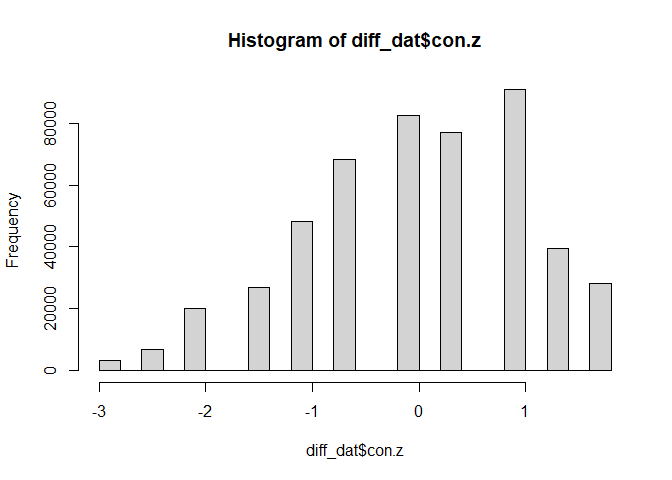
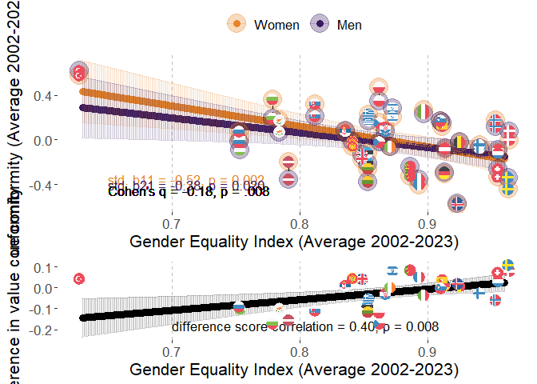
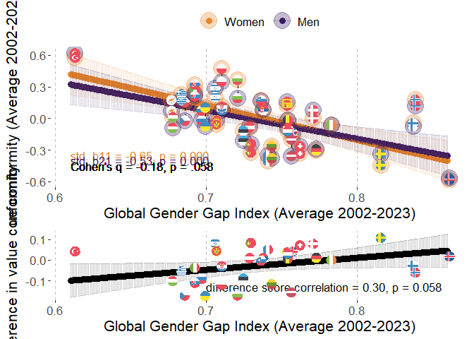
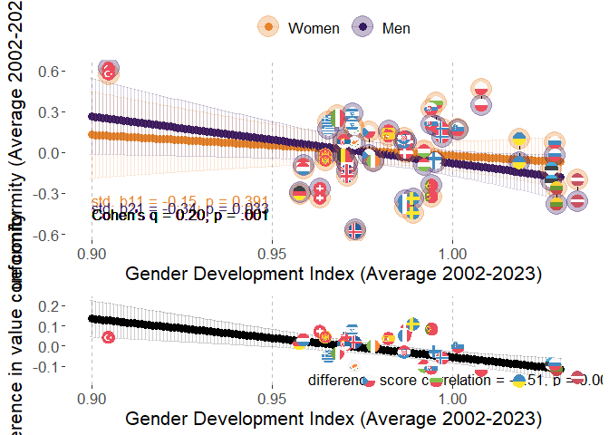
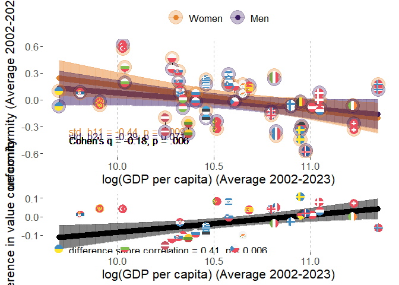
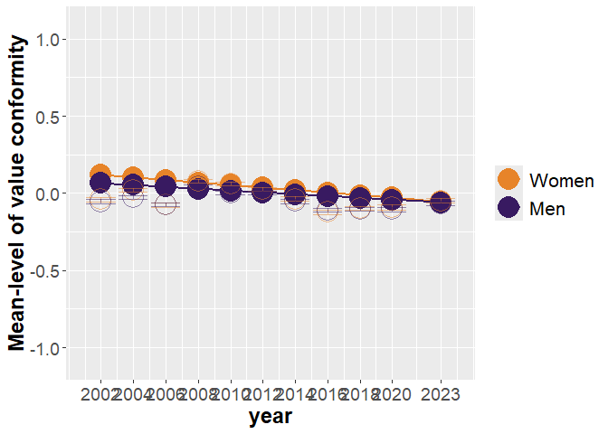
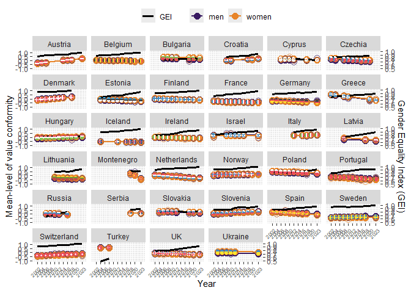

# Packages

Two packages are not in CRAN and need different installation
* devtools::install_github("vjilmari/vjihelpers")
* install.packages("ggflags", repos = c("https://jimjam-slam.r-universe.dev","https://cloud.r-project.org")) 


``` r
library(multid)
library(rio)
library(dplyr)
library(lme4)
library(emmeans)
library(vjihelpers)
library(MetBrewer)
library(ggplot2)
library(finalfit)
library(ggflags) 
library(lmerTest)
library(metafor)
library(ggpubr)
library(Hmisc)
library(r2mlm)
library(tidyr)
library(stringr)
library(apaTables)
library(tibble)
```

# Custom functions


``` r
# toster function for equivalence testing

tost_z <- function(est, se, low, high, alpha = 0.10) {
  # z statistics
  z_low  <- (est - low)  / se     # H0: theta <= low  vs H1: theta > low
  z_high <- (est - high) / se     # H0: theta >= high vs H1: theta < high
  
  # one-sided p-values
  p_low  <- 1 - pnorm(z_low)
  p_high <- pnorm(z_high)
  
  # CI corresponding to TOST (1 - 2*alpha)
  z_crit <- qnorm(1 - alpha)
  ci_low  <- est - z_crit * se
  ci_high <- est + z_crit * se
  
  # equivalence decision
  equivalent <- (p_low < alpha) && (p_high < alpha)
  
  list(
    estimate     = est,
    se           = se,
    low_bound    = low,
    high_bound   = high,
    alpha        = alpha,
    z_low        = z_low,
    p_low        = p_low,
    z_high       = z_high,
    p_high       = p_high,
    ci_level     = 1 - 2*alpha,
    ci_lower     = ci_low,
    ci_upper     = ci_high,
    equivalent   = equivalent
  )
}


# TOST function for equivalence testing with t distribution

tost_t <- function(est, se, low, high, df, alpha = 0.10) {
  # t statistics
  t_low  <- (est - low)  / se   # H0: theta <= low  vs H1: theta > low
  t_high <- (est - high) / se   # H0: theta >= high vs H1: theta < high
  
  # one-sided p-values
  p_low  <- 1 - pt(t_low,  df = df)
  p_high <-     pt(t_high, df = df)
  
  # CI corresponding to TOST (1 - 2*alpha)
  t_crit <- qt(1 - alpha, df = df)
  ci_low  <- est - t_crit * se
  ci_high <- est + t_crit * se
  
  # equivalence decision
  equivalent <- (p_low < alpha) && (p_high < alpha)
  
  list(
    estimate   = est,
    se         = se,
    df         = df,
    low_bound  = low,
    high_bound = high,
    alpha      = alpha,
    t_low      = t_low,
    p_low      = p_low,
    t_high     = t_high,
    p_high     = p_high,
    ci_level   = 1 - 2 * alpha,
    ci_lower   = ci_low,
    ci_upper   = ci_high,
    equivalent = equivalent
  )
}
```


# Data

* Loads the preprocessed European Social Survey data file made within "Preparations_ESS" code


``` r
load("../data/fdat.rdata")
```

* Include ISO data for country-names


``` r
# read country names
ISO<-read.csv2("../data/ISO.csv")
```


# Exclusions

* exclude participants with missing values or gender


``` r
value.vars<-
  c("con","tra",
  "ben","uni",
  "sdi","sti",
  "hed","ach",
  "pow","sec")

fdat$miss_values<-
  rowSums(is.na(fdat[,value.vars]))
table(fdat$miss_values)
```

```
## 
##      0      1      2      3      4      5      6      7      8      9     10 
## 500044   2791    835    442    267    204    142    143    156    177  35470
```

``` r
fdat<-fdat %>%
  filter(miss_values==0 & !is.na(gndr.bin))
```


# Data for the analysis

* use the testing partition of the data set (diff_dat)
* basic descriptives


``` r
diff_dat<-
  fdat

#diff_dat$age.c<-as.numeric(diff_dat$age.c)
#diff_dat$rlgdgr.c<-as.numeric(diff_dat$rlgdgr.c)
#diff_dat$eduyrs.c<-as.numeric(diff_dat$eduyrs.c)

# data exclusions (include countries with at least two rounds of data)
n_rounds<-diff_dat %>% group_by(cntry) %>%
  summarise(n_unique_essround = n_distinct(essround))

# join number of rounds to data
diff_dat<-
  left_join(x=diff_dat,
            y=n_rounds,
            by="cntry")

# filter only countries with more than 1 round and non-missing gender variable
diff_dat<-diff_dat %>%
  dplyr::filter(n_unique_essround>1 &
                  !is.na(gndr))

# cross-tabulate sample sizes and ESS rounds by country
table(diff_dat$essround,diff_dat$cntry)
```

```
##     
##        AT   BE   BG   CH   CY   CZ   DE   DK   EE   ES   FI   FR   GB   GR   HR   HU   IE   IL   IS   IT
##   1  2254 1830    0 2024    0 1208 2819 1470    0 1712 1763 1355 1798 2551    0 1634 1916 2279    0    0
##   2  2198 1771    0 2110    0 2557 2840 1458 1948 1623 1701 1699 1864 2399    0 1460 1187    0  524    0
##   3  2348 1796 1295 1780  978    0 2884 1461 1466 1847 1649 1983 2353    0    0 1462 1589    0    0    0
##   4     0 1754 2144 1753 1210 1986 2732 1581 1646 2562 1901 2067 2311 2063 1430 1430 1757 2382    0    0
##   5     0 1699 2371 1491 1053 2335 3007 1564 1793 1881 1649 1723 2374 2669 1601 1473 2400 2212    0    0
##   6     0 1862 2179 1483 1110 1973 2935 1621 2345 1871 2158 1960 2261    0    0 1968 2616 2378  739  909
##   7  1795 1767    0 1521    0 1862 3006 1483 2036 1907 2050 1902 2231    0    0 1520 2380 2351    0    0
##   8  1993 1759    0 1504    0 2252 2821    0 2007 1929 1903 2057 1942    0    0 1458 2746 2366  841 2531
##   9  2477 1756 1926 1517  773 2343 2328 1554 1899 1619 1735 1982 2183    0 1781 1643 2189    0  844 2660
##   10    0 1334 2697 1505    0 2369    0    0 1538    0 1561 1951 1131 2768 1564 1816 1751    0  886 2573
##   11 2314 1577 2218 1368  667    0 2381    0 1282 1833 1524 1745 1529 2745 1548 2117 1985  893  825 2783
##     
##        LT   LV   ME   NL   NO   PL   PT   RS   RU   SE   SI   SK   TR   UA
##   1     0    0    0 2337 1819 2065 1482    0    0 1682 1488    0    0    0
##   2     0    0    0 1858 1575 1683 2024    0    0 1678 1384 1425 1790 1896
##   3     0    0    0 1860 1550 1685 2182    0 2339 1604 1465 1711    0 1885
##   4     0 1970    0 1724 1391 1596 2337    0 2446 1556 1257 1789 2305 1766
##   5  1632    0    0 1801 1530 1719 2139    0 2557 1463 1369 1803    0 1779
##   6  2108    0    0 1828 1610 1866 2138    0 2429 1838 1244 1827    0 2064
##   7  2241    0    0 1823 1423 1594 1242    0    0 1761 1189    0    0    0
##   8  2079    0    0 1669 1530 1675 1254    0 2374 1526 1295    0    0    0
##   9  1677  891 1188 1657 1396 1443 1045 1969    0 1510 1307 1061    0    0
##   10 1606    0 1248 1466 1408    0 1827    0    0    0 1232 1395    0    0
##   11 1337 1225 1581 1677 1318 1423 1366 1511    0 1204 1227 1414    0 2589
```

``` r
# range of sample sizes
range(table(diff_dat$cntry))
```

```
## [1]  3480 27753
```

``` r
# scale/standardize with SD pooled across all country-time-gender folds
cntry.con<-diff_dat %>% group_by(cntry,essround) %>%
  summarise(con.ctm=mean(con,na.rm=T),
            con.ctsd=sd(con,na.rm=T)) %>%
  group_by(cntry) %>%
  summarise(con.cm=mean(con.ctm),
            con.csd=mean(con.ctsd)) 
```

```
## `summarise()` has regrouped the output.
## ℹ Summaries were computed grouped by cntry and essround.
## ℹ Output is grouped by cntry.
## ℹ Use `summarise(.groups = "drop_last")` to silence this message.
## ℹ Use `summarise(.by = c(cntry, essround))` for per-operation grouping (`?dplyr::dplyr_by`) instead.
```

``` r
grand_mean_con<-mean(cntry.con$con.cm)
grand_sd_con<-mean(cntry.con$con.csd)

# standardized
diff_dat$con.z<-(diff_dat$con-grand_mean_con)/grand_sd_con
hist(diff_dat$con.z)
```

<!-- -->

``` r
# recode time to start from 2002=0

diff_dat$year<-
  case_when(
    diff_dat$essround==1~2002,  
    diff_dat$essround==2~2004,
    diff_dat$essround==3~2006,
    diff_dat$essround==4~2008,
    diff_dat$essround==5~2010,
    diff_dat$essround==6~2012,
    diff_dat$essround==7~2014,
    diff_dat$essround==8~2016,
    diff_dat$essround==9~2018,
    diff_dat$essround==10~2020,
    diff_dat$essround==11~2023
  )

diff_dat$year.c<-diff_dat$year-2002
```

## Add GEI-variable

* GEI = Reverse-coded Gender Inequality Index (GII)


``` r
GII<-read.csv("../data/GII.csv")

# Obtain GII only for ESS countries
GII_in_ESS_d<-
  GII %>%
  filter(ISO2 %in% unique(diff_dat$cntry))

# Make long format data of GII, so that country x year has own rows

long_GII_in_ESS_d <- GII_in_ESS_d %>%
  pivot_longer(
    cols = starts_with("gii_") & !matches("avg"),  # <-- exclude the "_avg" columns
    names_to = "year",
    values_to = "gii",
    names_prefix = "gii_"
  ) %>%
  mutate(year = as.integer(year)) %>%
  filter(year >= 2002 & year <= 2023) %>%
  mutate(gei = 1 - gii) %>%
  dplyr::select(ISO2, iso3, country, year, gii, gei, gii_2002_2023_avg, gei_2002_2023_avg)


# describe gei average
psych::describe(GII_in_ESS_d$gei_2002_2023_avg)
```

```
##    vars  n mean   sd median trimmed  mad  min  max range  skew kurtosis   se
## X1    1 33 0.87 0.07   0.87    0.87 0.06 0.63 0.96  0.34 -1.06     1.37 0.01
```

``` r
# one is missing, see which one
GII_in_ESS_d[is.na(GII_in_ESS_d$gei_2002_2023_avg),"country"]
```

```
## [1] "Ukraine"
```

``` r
# get means and SDs for standardizing
gei_mean<-mean(GII_in_ESS_d$gei_2002_2023_avg,na.rm=T)
gei_sd<-sd(GII_in_ESS_d$gei_2002_2023_avg,na.rm=T)

# standardize 
# year specific scores
long_GII_in_ESS_d$gei.z<-(long_GII_in_ESS_d$gei-gei_mean)/gei_sd

# get the country means to a separate frame

GII_country_means<-
  long_GII_in_ESS_d %>% group_by(ISO2) %>%
  summarise(gei.cm=mean(gei,na.rm=T),
            gei.z.cm=mean(gei.z,na.rm=T))


long_GII_in_ESS_d<-left_join(
  x=long_GII_in_ESS_d,
  y=GII_country_means,
  by="ISO2"
)


# center both the raw score and standardized scores
long_GII_in_ESS_d$gei.cmc<-(long_GII_in_ESS_d$gei-long_GII_in_ESS_d$gei.cm)
long_GII_in_ESS_d$gei.z.cmc<-(long_GII_in_ESS_d$gei.z-long_GII_in_ESS_d$gei.z.cm)

#View(long_GII_in_ESS_d)

# averages across 2002-2023
#long_GII_in_ESS_d$gei_2002_2023_avg.z<-(long_GII_in_ESS_d$gei_2002_2023_avg-gei_mean)/gei_sd

#long_GII_in_ESS_d$gei.cmc<-long_GII_in_ESS_d$gei-long_GII_in_ESS_d$gei_2002_2023_avg

# add year to ESS data-frame


# link datasets by country and year

diff_dat<-
  left_join(
    x=diff_dat,
    y=long_GII_in_ESS_d[,c("ISO2","year","gei","gei.cm","gei.cmc",
                           "gei.z","gei.z.cm","gei.z.cmc")],
    by=c("cntry"="ISO2","year")
)
```


## Add GDI-variable

* GDI = Gender Development Index


``` r
GDI<-read.csv("../data/GDI.csv")

# Obtain GDI only for ESS countries
GDI_in_ESS_d<-
  GDI %>%
  filter(ISO2 %in% unique(diff_dat$cntry))

# Make long format data of GDI, so that country x year has own rows

long_GDI_in_ESS_d <- GDI_in_ESS_d %>%
  pivot_longer(
    cols = starts_with("gdi_") & !matches("avg"),  # <-- exclude the "_avg" columns
    names_to = "year",
    values_to = "gdi",
    names_prefix = "gdi_"
  ) %>%
  mutate(year = as.integer(year)) %>%
  filter(year >= 2002 & year <= 2023) %>%
  dplyr::select(ISO2, iso3, country, year, gdi, gdi_2002_2023_avg)

# describe gdi average
psych::describe(GDI_in_ESS_d$gdi_2002_2023_avg)
```

```
##    vars  n mean   sd median trimmed  mad min  max range skew kurtosis se
## X1    1 34 0.98 0.03   0.98    0.98 0.02 0.9 1.03  0.13 -0.3     1.28  0
```

``` r
# get means and SDs for standardizing
gdi_mean<-mean(GDI_in_ESS_d$gdi_2002_2023_avg,na.rm=T)
gdi_sd<-sd(GDI_in_ESS_d$gdi_2002_2023_avg,na.rm=T)

# standardize 
# year specific scores
long_GDI_in_ESS_d$gdi.z<-(long_GDI_in_ESS_d$gdi-gdi_mean)/gdi_sd

# get the country means to a separate frame

GDI_country_means<-
  long_GDI_in_ESS_d %>% group_by(ISO2) %>%
  summarise(gdi.cm=mean(gdi,na.rm=T),
            gdi.z.cm=mean(gdi.z,na.rm=T))

long_GDI_in_ESS_d<-left_join(
  x=long_GDI_in_ESS_d,
  y=GDI_country_means,
  by="ISO2"
)


# center both the raw score and standardized scores
long_GDI_in_ESS_d$gdi.cmc<-(long_GDI_in_ESS_d$gdi-long_GDI_in_ESS_d$gdi.cm)
long_GDI_in_ESS_d$gdi.z.cmc<-(long_GDI_in_ESS_d$gdi.z-long_GDI_in_ESS_d$gdi.z.cm)

# link datasets by country and year

diff_dat<-
  left_join(
    x=diff_dat,
    y=long_GDI_in_ESS_d[,c("ISO2","year","gdi","gdi.cm","gdi.cmc",
                           "gdi.z","gdi.z.cm","gdi.z.cmc")],
    by=c("cntry"="ISO2","year")
  )
```

## Add GDP-variable

* log_GDP = Logarithm of GDP per capita, PPP (constant 2017 international $)


``` r
GDP<-read.csv("../data/GDP_processed.csv")

# Obtain GDP only for ESS countries
GDP_in_ESS_d<-
  GDP %>%
  filter(ISO2 %in% unique(diff_dat$cntry))

# First, rename those X2000..YR2000. style columns to simple "gdp_2000" etc.

GDP_in_ESS_d <- GDP_in_ESS_d %>%
  rename_with(
    ~ str_replace_all(., "^X(\\d{4})..YR\\1\\.$", "gdp_\\1"),
    starts_with("X")
  )

# GDP_in_ESS_d
# Make long format data of GDP, so that country x year has own rows

long_GDP_in_ESS_d <- GDP_in_ESS_d %>%
  pivot_longer(
    cols = starts_with("gdp_") & !matches("avg"),  # <-- exclude the "_avg" columns
    names_to = "year",
    values_to = "gdp",
    names_prefix = "gdp_"
  ) %>%
  mutate(year = as.integer(year)) %>%
  filter(year >= 2002 & year <= 2023) %>%
  dplyr::select(ISO2, Country.Name, year, gdp, gdp_2002_2023_avg,log_gdp_2002_2023_avg) %>%
  mutate(log_gdp=log(gdp))

#View(long_GDP_in_ESS_d)

# describe gdp average
psych::describe(GDP_in_ESS_d$gdp_2002_2023_avg)
```

```
##    vars  n     mean      sd  median  trimmed     mad      min      max    range skew kurtosis      se
## X1    1 34 43905.99 17369.7 40201.8 42845.95 15827.5 16384.61 85341.85 68957.24 0.48    -0.58 2978.88
```

``` r
psych::describe(GDP_in_ESS_d$log_gdp_2002_2023_avg)
```

```
##    vars  n  mean   sd median trimmed  mad min   max range  skew kurtosis   se
## X1    1 34 10.61 0.41   10.6   10.62 0.44 9.7 11.35  1.65 -0.27    -0.71 0.07
```

``` r
# get means and SDs for standardizing
log_gdp_mean<-mean(GDP_in_ESS_d$log_gdp_2002_2023_avg,na.rm=T)
log_gdp_sd<-sd(GDP_in_ESS_d$log_gdp_2002_2023_avg,na.rm=T)

# standardize 
# year specific scores
long_GDP_in_ESS_d$log_gdp.z<-
  (long_GDP_in_ESS_d$log_gdp-log_gdp_mean)/log_gdp_sd

# get the country means to a separate frame

GDP_country_means<-
  long_GDP_in_ESS_d %>% group_by(ISO2) %>%
  summarise(gdp.cm=mean(gdp,na.rm=T),
            #gdp.z.cm=mean(gdp.z,na.rm=T),
            log_gdp.cm=mean(log_gdp,na.rm=T),
            log_gdp.z.cm=mean(log_gdp.z,na.rm=T))

long_GDP_in_ESS_d<-left_join(
  x=long_GDP_in_ESS_d,
  y=GDP_country_means,
  by="ISO2"
)


# center both the raw score and standardized scores
long_GDP_in_ESS_d$log_gdp.cmc<-(long_GDP_in_ESS_d$log_gdp-long_GDP_in_ESS_d$log_gdp.cm)
long_GDP_in_ESS_d$log_gdp.z.cmc<-(long_GDP_in_ESS_d$log_gdp.z-long_GDP_in_ESS_d$log_gdp.z.cm)

# link datasets by country and year

diff_dat<-
  left_join(
    x=diff_dat,
    y=long_GDP_in_ESS_d[,c("ISO2","year","log_gdp","log_gdp.cm","log_gdp.cmc",
                           "log_gdp.z","log_gdp.z.cm","log_gdp.z.cmc")],
    by=c("cntry"="ISO2","year")
  )
```

## Add GGGI-variable

* GGGI = Global Gender Gap Index


``` r
GGGI<-import("../data/GGGI.xlsx")

# check if all ESS countries are in the log_GGGI data
table(unique(diff_dat$cntry) %in% GGGI$ISO2)
```

```
## 
## TRUE 
##   34
```

``` r
# Obtain GGGI only for ESS countries
GGGI_in_ESS_d<-
  GGGI %>%
  filter(ISO2 %in% unique(diff_dat$cntry))

# Make long format data of GGGI, so that country x year has own rows

long_GGGI_in_ESS_d <- GGGI_in_ESS_d %>%
  pivot_longer(
    cols = starts_with("gggi_") & !matches("avg"),  # <-- exclude the "_avg" columns
    names_to = "year",
    values_to = "gggi",
    names_prefix = "gggi_"
  ) %>%
  mutate(year = as.integer(year)) %>%
  filter(year >= 2002 & year <= 2023) %>%
  dplyr::select(ISO2, cname, year, gggi, GGGI_2002_2023_avg)

# describe gggi average
psych::describe(GGGI_in_ESS_d$GGGI_2002_2023_avg)
```

```
##    vars  n mean   sd median trimmed  mad  min  max range skew kurtosis   se
## X1    1 34 0.74 0.05   0.73    0.73 0.04 0.61 0.86  0.25  0.4     0.29 0.01
```

``` r
# get means and SDs for standardizing
gggi_mean<-mean(GGGI_in_ESS_d$GGGI_2002_2023_avg,na.rm=T)
gggi_sd<-sd(GGGI_in_ESS_d$GGGI_2002_2023_avg,na.rm=T)

# standardize 
# year specific scores
long_GGGI_in_ESS_d$gggi.z<-(long_GGGI_in_ESS_d$gggi-gggi_mean)/gggi_sd

# get the country means to a separate frame

GGGI_country_means<-
  long_GGGI_in_ESS_d %>% group_by(ISO2) %>%
  summarise(gggi.cm=mean(gggi,na.rm=T),
            gggi.z.cm=mean(gggi.z,na.rm=T))

long_GGGI_in_ESS_d<-left_join(
  x=long_GGGI_in_ESS_d,
  y=GGGI_country_means,
  by="ISO2"
)

# center both the raw score and standardized scores
long_GGGI_in_ESS_d$gggi.cmc<-
  (long_GGGI_in_ESS_d$gggi-long_GGGI_in_ESS_d$gggi.cm)

long_GGGI_in_ESS_d$gggi.z.cmc<-
  (long_GGGI_in_ESS_d$gggi.z-long_GGGI_in_ESS_d$gggi.z.cm)

# link datasets by country and year

diff_dat<-
  left_join(
    x=diff_dat,
    y=long_GGGI_in_ESS_d[,c("ISO2","year","gggi","gggi.cm","gggi.cmc",
                           "gggi.z","gggi.z.cm","gggi.z.cmc")],
    by=c("cntry"="ISO2","year")
  )
```

## Country-year-gender dataframe

Frame with one row for country-year-gender


``` r
diff_dat_cntry_year<-
  diff_dat %>% 
  group_by(cntry,year,gndr.c) %>%
  dplyr::summarise(n=n(),
                   n_wt=sum(pspwght),
                   con.z.wt=weighted.mean(x=con.z,w=pspwght),
                   con.z=mean(con.z),
                   gei.z=mean(gei.z,na.rm=T),
                   gei.z.cm=mean(gei.z.cm,na.rm=T),
                   gei.z.cmc=mean(gei.z.cmc,na.rm=T),
                   gdi.z=mean(gdi.z,na.rm=T),
                   gdi.z.cm=mean(gdi.z.cm,na.rm=T),
                   gdi.z.cmc=mean(gdi.z.cmc,na.rm=T),
                   gggi.z=mean(gggi.z,na.rm=T),
                   gggi.z.cm=mean(gggi.z.cm,na.rm=T),
                   gggi.z.cmc=mean(gggi.z.cmc,na.rm=T),
                   log_gdp.z=mean(log_gdp.z,na.rm=T),
                   log_gdp.z.cm=mean(log_gdp.z.cm,na.rm=T),
                   log_gdp.z.cmc=mean(log_gdp.z.cmc,na.rm=T),
                   gei=mean(gei,na.rm=T),
                   gei.cm=mean(gei.cm,na.rm=T),
                   gei.cmc=mean(gei.cmc,na.rm=T),
                   gdi=mean(gdi,na.rm=T),
                   gdi.cm=mean(gdi.cm,na.rm=T),
                   gdi.cmc=mean(gdi.cmc,na.rm=T),
                   gggi=mean(gggi,na.rm=T),
                   gggi.cm=mean(gggi.cm,na.rm=T),
                   gggi.cmc=mean(gggi.cmc,na.rm=T),
                   log_gdp=mean(log_gdp,na.rm=T),
                   log_gdp.cm=mean(log_gdp.cm,na.rm=T),
                   log_gdp.cmc=mean(log_gdp.cmc,na.rm=T))
```

```
## `summarise()` has regrouped the output.
## ℹ Summaries were computed grouped by cntry, year, and gndr.c.
## ℹ Output is grouped by cntry and year.
## ℹ Use `summarise(.groups = "drop_last")` to silence this message.
## ℹ Use `summarise(.by = c(cntry, year, gndr.c))` for per-operation grouping (`?dplyr::dplyr_by`) instead.
```


# Descriptive statistics

## Country-specific descriptives


``` r
# sample sizes from weights

cntry_n_frame<-
  diff_dat %>% group_by(cntry) %>%
  summarise('n ESS rounds' = mean(n_unique_essround),
            n=round(sum(pspwght),0))

# conformity

cntry_con_frame<-
  diff_dat %>% group_by(cntry,essround) %>%
  summarise('con M' = weighted.mean(x=con.z,w=pspwght),
            'con SD' = sqrt(wtd.var(con.z,pspwght))) %>%
  group_by(cntry) %>%
  summarise('con M' = mean(x=`con M`),
            'con SD'= mean(x=`con SD`))
```

```
## `summarise()` has regrouped the output.
## ℹ Summaries were computed grouped by cntry and essround.
## ℹ Output is grouped by cntry.
## ℹ Use `summarise(.groups = "drop_last")` to silence this message.
## ℹ Use `summarise(.by = c(cntry, essround))` for per-operation grouping (`?dplyr::dplyr_by`) instead.
```

``` r
cntry_con_women_frame<-
  diff_dat %>%
  filter(gndr.c==-0.5) %>%
  group_by(cntry,essround) %>%
  summarise('con M' = weighted.mean(x=con.z,w=pspwght),
            'con SD' = sqrt(wtd.var(con.z,pspwght))) %>%
  group_by(cntry) %>%
  summarise('con M Women' = mean(x=`con M`),
            'con SD Women'= mean(x=`con SD`))
```

```
## `summarise()` has regrouped the output.
## ℹ Summaries were computed grouped by cntry and essround.
## ℹ Output is grouped by cntry.
## ℹ Use `summarise(.groups = "drop_last")` to silence this message.
## ℹ Use `summarise(.by = c(cntry, essround))` for per-operation grouping (`?dplyr::dplyr_by`) instead.
```

``` r
cntry_con_men_frame<-
  diff_dat %>%
  filter(gndr.c==0.5) %>%
  group_by(cntry,essround) %>%
  summarise('con M' = weighted.mean(x=con.z,w=pspwght),
            'con SD' = sqrt(wtd.var(con.z,pspwght))) %>%
  group_by(cntry) %>%
  summarise('con M Men' = mean(x=`con M`),
            'con SD Men'= mean(x=`con SD`))
```

```
## `summarise()` has regrouped the output.
## ℹ Summaries were computed grouped by cntry and essround.
## ℹ Output is grouped by cntry.
## ℹ Use `summarise(.groups = "drop_last")` to silence this message.
## ℹ Use `summarise(.by = c(cntry, essround))` for per-operation grouping (`?dplyr::dplyr_by`) instead.
```

``` r
# link n and con datasets

desc_frame<-
  left_join(
    x=cntry_n_frame,
    y=cntry_con_frame,
    by="cntry"
  )

desc_frame<-
  left_join(
    x=desc_frame,
    y=cntry_con_women_frame,
    by="cntry"
  )

desc_frame<-
  left_join(
    x=desc_frame,
    y=cntry_con_men_frame,
    by="cntry"
  )

# Add country-specific differences
desc_frame$D<-desc_frame$`con M Men`-desc_frame$`con M Women`

desc_frame
```

```
## # A tibble: 34 × 10
##    cntry `n ESS rounds`     n `con M` `con SD` `con M Women` `con SD Women` `con M Men` `con SD Men`
##    <chr>          <dbl> <dbl>   <dbl>    <dbl>         <dbl>          <dbl>       <dbl>        <dbl>
##  1 AT                 7 15400 -0.0795    1.03       -0.0811           1.04     -0.0778         1.01 
##  2 BE                11 18886 -0.0286    0.952      -0.0326           0.960    -0.0245         0.943
##  3 BG                 7 14857  0.274     1.02        0.360            0.982     0.182          1.05 
##  4 CH                11 18087 -0.292     1.05       -0.328            1.07     -0.254          1.03 
##  5 CY                 6  5771  0.116     0.950       0.156            0.944     0.0728         0.948
##  6 CZ                 9 18934  0.0788    0.959       0.161            0.958    -0.00971        0.951
##  7 DE                10 27753 -0.303     1.08       -0.310            1.10     -0.296          1.07 
##  8 DK                 8 12198  0.0352    1.06       -0.00515          1.08      0.0768         1.03 
##  9 EE                10 17974 -0.168     0.954      -0.126            0.966    -0.217          0.936
## 10 ES                10 18785  0.125     1.00        0.104            1.02      0.147          0.985
## # ℹ 24 more rows
## # ℹ 1 more variable: D <dbl>
```

``` r
# add country-level measures

desc_frame<-
  left_join(
    x=desc_frame,
    y=GII_country_means[,c("ISO2","gei.cm")],
    by=c("cntry"="ISO2")
  )

desc_frame<-
  left_join(
    x=desc_frame,
    y=GGGI_country_means[,c("ISO2","gggi.cm")],
    by=c("cntry"="ISO2")
  )

desc_frame<-
  left_join(
    x=desc_frame,
    y=GDI_country_means[,c("ISO2","gdi.cm")],
    by=c("cntry"="ISO2")
  )


desc_frame<-
  left_join(
    x=desc_frame,
    y=GDP_country_means[,c("ISO2","gdp.cm")],
    by=c("cntry"="ISO2")
  )

desc_frame<-left_join(
  x=desc_frame,
  y=ISO[,c("ISO2","CLDR")],
  by=c("cntry"="ISO2")
)

# finalize the formatted table

cntry_desc_tbl<-
  desc_frame %>%
  dplyr::select(
    Country = CLDR,
    `n ESS rounds`,
    n,
    `con M`, `con SD`,
    `con M Women`, `con SD Women`,
    `con M Men`, `con SD Men`,
    D,
    GEI = gei.cm,
    GGGI = gggi.cm,
    GDI = gdi.cm,
    GDP = gdp.cm
  ) %>%
  mutate(
    across(
      .cols = -c(Country, `n ESS rounds`, n, GDP) & where(is.numeric),
      .fns  = ~ round_tidy(.x, 2)
    )
  ) %>%
  mutate(
    across(
      .cols = GDP,
      .fns  = ~ round_tidy(.x, 0)
    )
  )
print(cntry_desc_tbl,n=35)
```

```
## # A tibble: 34 × 14
##    Country     `n ESS rounds`     n `con M` `con SD` `con M Women` `con SD Women` `con M Men` `con SD Men`
##    <chr>                <dbl> <dbl> <chr>   <chr>    <chr>         <chr>          <chr>       <chr>       
##  1 Austria                  7 15400 -0.08   1.03     -0.08         1.04           -0.08       1.01        
##  2 Belgium                 11 18886 -0.03   0.95     -0.03         0.96           -0.02       0.94        
##  3 Bulgaria                 7 14857 0.27    1.02     0.36          0.98           0.18        1.05        
##  4 Switzerland             11 18087 -0.29   1.05     -0.33         1.07           -0.25       1.03        
##  5 Cyprus                   6  5771 0.12    0.95     0.16          0.94           0.07        0.95        
##  6 Czechia                  9 18934 0.08    0.96     0.16          0.96           -0.01       0.95        
##  7 Germany                 10 27753 -0.30   1.08     -0.31         1.10           -0.30       1.07        
##  8 Denmark                  8 12198 0.04    1.06     -0.01         1.08           0.08        1.03        
##  9 Estonia                 10 17974 -0.17   0.95     -0.13         0.97           -0.22       0.94        
## 10 Spain                   10 18785 0.12    1.00     0.10          1.02           0.15        0.99        
## 11 Finland                 11 19568 -0.06   1.04     -0.05         1.06           -0.08       1.03        
## 12 France                  11 20457 -0.37   1.10     -0.40         1.12           -0.35       1.08        
## 13 UK                      11 22979 -0.17   1.10     -0.19         1.11           -0.15       1.08        
## 14 Greece                   6 15212 0.22    0.93     0.25          0.93           0.19        0.93        
## 15 Croatia                  5  7914 0.09    0.97     0.11          0.96           0.07        0.99        
## 16 Hungary                 11 18123 -0.05   0.97     0.00          0.96           -0.10       0.98        
## 17 Ireland                 11 22562 -0.06   1.09     -0.05         1.10           -0.06       1.08        
## 18 Israel                   7 14857 0.22    1.06     0.18          1.07           0.26        1.04        
## 19 Iceland                  6  4654 -0.58   1.06     -0.58         1.06           -0.57       1.06        
## 20 Italy                    5 11441 0.26    0.88     0.27          0.88           0.25        0.88        
## 21 Lithuania                7 13059 -0.32   1.01     -0.27         1.00           -0.38       1.01        
## 22 Latvia                   3  4088 -0.31   1.02     -0.24         1.04           -0.39       0.98        
## 23 Montenegro               3  4028 0.00    1.00     -0.02         1.00           0.03        0.99        
## 24 Netherlands             11 19722 -0.12   0.96     -0.13         0.97           -0.10       0.95        
## 25 Norway                  11 16505 0.15    0.97     0.18          0.99           0.11        0.95        
## 26 Poland                  10 16737 0.40    0.87     0.46          0.85           0.34        0.88        
## 27 Portugal                11 19070 -0.32   0.98     -0.36         1.00           -0.27       0.95        
## 28 Serbia                   2  3499 0.08    1.11     0.07          1.13           0.09        1.09        
## 29 Russia                   5 12139 0.03    1.02     0.07          1.02           -0.02       1.02        
## 30 Sweden                  10 16104 -0.40   1.06     -0.45         1.08           -0.34       1.03        
## 31 Slovenia                11 14463 0.17    0.95     0.17          0.96           0.17        0.93        
## 32 Slovakia                 8 12547 0.25    0.85     0.31          0.85           0.19        0.85        
## 33 Turkey                   2  4108 0.59    0.83     0.57          0.85           0.62        0.81        
## 34 Ukraine                  6 12054 0.03    1.09     0.11          1.09           -0.08       1.08        
## # ℹ 5 more variables: D <chr>, GEI <chr>, GGGI <chr>, GDI <chr>, GDP <chr>
```

``` r
export(cntry_desc_tbl,"../results/conf/cntry_desc_tbl.xlsx",overwrite=T)
```

## Country-level correlations table


``` r
cor_frame<-
  desc_frame %>%
  dplyr::select(
    VBMT=`con M`,
    VBMT_Women=`con M Women`,
    VBMT_Men=`con M Men`,
    D = D,
    GEI = gei.cm,
    GGGI = gggi.cm,
    GDI = gdi.cm,
    GDP = gdp.cm
  ) %>%
  mutate(
    log_GDP=log(GDP)
  ) %>%
  dplyr::select(-GDP)

apa.cor.table(
  data=cor_frame,
  filename = "../results/conf/CorTable1.doc",
  #table.number = NA,
  show.conf.interval = FALSE,
  show.sig.stars = F,
  landscape = F
)
```

```
## The ability to suppress reporting of reporting confidence intervals has been deprecated in this version.
## The function argument show.conf.interval will be removed in a later version.
```

```
## 
## 
## Means, standard deviations, and correlations with confidence intervals
##  
## 
##   Variable      M     SD   1            2            3            4            5           6          
##   1. VBMT       -0.01 0.25                                                                            
##                                                                                                       
##   2. VBMT_Women -0.00 0.27 .99                                                                        
##                            [.98, .99]                                                                 
##                                                                                                       
##   3. VBMT_Men   -0.03 0.25 .98          .95                                                           
##                            [.97, .99]   [.90, .97]                                                    
##                                                                                                       
##   4. D          -0.02 0.09 -.24         -.38         -.07                                             
##                            [-.54, .10]  [-.64, -.05] [-.40, .28]                                      
##                                                                                                       
##   5. GEI        0.87  0.07 -.45         -.49         -.39         .41                                 
##                            [-.69, -.13] [-.71, -.17] [-.65, -.06] [.08, .66]                          
##                                                                                                       
##   6. GGGI       0.74  0.05 -.62         -.63         -.58         .28          .73                    
##                            [-.79, -.35] [-.80, -.37] [-.77, -.31] [-.07, .56]  [.52, .86]             
##                                                                                                       
##   7. GDI        0.98  0.03 -.26         -.16         -.37         -.56         .07         .19        
##                            [-.55, .09]  [-.48, .19]  [-.63, -.04] [-.76, -.27] [-.28, .41] [-.16, .50]
##                                                                                                       
##   8. log_GDP    10.61 0.41 -.38         -.42         -.31         .42          .72         .62        
##                            [-.63, -.04] [-.66, -.09] [-.59, .03]  [.09, .66]   [.50, .85]  [.36, .79] 
##                                                                                                       
##   7          
##              
##              
##              
##              
##              
##              
##              
##              
##              
##              
##              
##              
##              
##              
##              
##              
##              
##              
##              
##              
##   -.18       
##   [-.49, .17]
##              
## 
## Note. M and SD are used to represent mean and standard deviation, respectively.
## Values in square brackets indicate the 95% confidence interval.
## The confidence interval is a plausible range of population correlations 
## that could have caused the sample correlation (Cumming, 2014).
## 
```


# Analysis

Following preregistration: https://osf.io/7cags?view_only=f3e97a78271e46bfafb9e20ac8d35bb1 

## mod0: Random intercept model


``` r
mod0<-lmer(con.z~(1|cntry),data=diff_dat,REML=F,weights = pspwght,
           control=lmerControl(optimizer="bobyqa",optCtrl=list(maxfun=2e7)))
summary(mod0)
```

```
## Linear mixed model fit by maximum likelihood . t-tests use Satterthwaite's method ['lmerModLmerTest']
## Formula: con.z ~ (1 | cntry)
##    Data: diff_dat
## Weights: pspwght
## Control: lmerControl(optimizer = "bobyqa", optCtrl = list(maxfun = 2e+07))
## 
##       AIC       BIC    logLik -2*log(L)  df.resid 
## 1477252.6 1477285.9 -738623.3 1477246.6    492340 
## 
## Scaled residuals: 
##     Min      1Q  Median      3Q     Max 
## -6.3896 -0.5976  0.0881  0.6856  4.5920 
## 
## Random effects:
##  Groups   Name        Variance Std.Dev.
##  cntry    (Intercept) 0.06141  0.2478  
##  Residual             1.03399  1.0169  
## Number of obs: 492343, groups:  cntry, 34
## 
## Fixed effects:
##             Estimate Std. Error       df t value Pr(>|t|)
## (Intercept) -0.01232    0.04253 33.96461   -0.29    0.774
```

``` r
getVC(mod0)
```

```
##        grp        var1 var2 sdcor vcov
## 1    cntry (Intercept) <NA>  0.25 0.06
## 2 Residual        <NA> <NA>  1.02 1.03
```

``` r
r2mlm(mod0,bargraph = F)
```

```
## $Decompositions
##                      total within between
## fixed, within   0.00000000      0      NA
## fixed, between  0.00000000     NA       0
## slope variation 0.00000000      0      NA
## mean variation  0.05606479     NA       1
## sigma2          0.94393521      1      NA
## 
## $R2s
##          total within between
## f1  0.00000000      0      NA
## f2  0.00000000     NA       0
## v   0.00000000      0      NA
## m   0.05606479     NA       1
## f   0.00000000     NA      NA
## fv  0.00000000      0      NA
## fvm 0.05606479     NA      NA
```

## mod1: Gender fixed effect


``` r
mod1<-lmer(con.z~gndr.c+(1|cntry),data=diff_dat,REML=F,weights = pspwght,
           control=lmerControl(optimizer="bobyqa",optCtrl=list(maxfun=2e7)))
summary(mod1)
```

```
## Linear mixed model fit by maximum likelihood . t-tests use Satterthwaite's method ['lmerModLmerTest']
## Formula: con.z ~ gndr.c + (1 | cntry)
##    Data: diff_dat
## Weights: pspwght
## Control: lmerControl(optimizer = "bobyqa", optCtrl = list(maxfun = 2e+07))
## 
##       AIC       BIC    logLik -2*log(L)  df.resid 
## 1477195.8 1477240.2 -738593.9 1477187.8    492339 
## 
## Scaled residuals: 
##     Min      1Q  Median      3Q     Max 
## -6.4109 -0.5972  0.0863  0.6866  4.6191 
## 
## Random effects:
##  Groups   Name        Variance Std.Dev.
##  cntry    (Intercept) 0.06144  0.2479  
##  Residual             1.03387  1.0168  
## Number of obs: 492343, groups:  cntry, 34
## 
## Fixed effects:
##               Estimate Std. Error         df t value Pr(>|t|)    
## (Intercept) -1.274e-02  4.254e-02  3.396e+01  -0.299    0.766    
## gndr.c      -2.220e-02  2.895e-03  4.923e+05  -7.670 1.73e-14 ***
## ---
## Signif. codes:  0 '***' 0.001 '**' 0.01 '*' 0.05 '.' 0.1 ' ' 1
## 
## Correlation of Fixed Effects:
##        (Intr)
## gndr.c 0.001
```

``` r
getFE(mod1,round=3)
```

```
##               Est.    SE         df      t     p     LL     UL
## (Intercept) -0.013 0.043     33.965 -0.299 0.766 -0.099  0.074
## gndr.c      -0.022 0.003 492310.114 -7.670 0.000 -0.028 -0.017
```

``` r
getVC(mod1)
```

```
##        grp        var1 var2 sdcor vcov
## 1    cntry (Intercept) <NA>  0.25 0.06
## 2 Residual        <NA> <NA>  1.02 1.03
```

``` r
r2mlm(mod1,bargraph = F)
```

```
## $Decompositions
##                        total
## fixed           0.0001118418
## slope variation 0.0000000000
## mean variation  0.0560835650
## sigma2          0.9438045932
## 
## $R2s
##            total
## f   0.0001118418
## v   0.0000000000
## m   0.0560835650
## fv  0.0001118418
## fvm 0.0561954068
```

## mod2: Gender fixed and random effect

* Include random effect correlation by default


``` r
mod2<-lmer(con.z~gndr.c+(gndr.c|cntry),data=diff_dat,REML=F,weights = pspwght,
           control=lmerControl(optimizer="bobyqa",optCtrl=list(maxfun=2e7)))
summary(mod2)
```

```
## Linear mixed model fit by maximum likelihood . t-tests use Satterthwaite's method ['lmerModLmerTest']
## Formula: con.z ~ gndr.c + (gndr.c | cntry)
##    Data: diff_dat
## Weights: pspwght
## Control: lmerControl(optimizer = "bobyqa", optCtrl = list(maxfun = 2e+07))
## 
##       AIC       BIC    logLik -2*log(L)  df.resid 
## 1476505.1 1476571.8 -738246.6 1476493.1    492337 
## 
## Scaled residuals: 
##     Min      1Q  Median      3Q     Max 
## -6.5002 -0.5995  0.0878  0.6847  4.7376 
## 
## Random effects:
##  Groups   Name        Variance Std.Dev. Corr  
##  cntry    (Intercept) 0.06133  0.24766        
##           gndr.c      0.00694  0.08331  -0.25 
##  Residual             1.03219  1.01597        
## Number of obs: 492343, groups:  cntry, 34
## 
## Fixed effects:
##             Estimate Std. Error       df t value Pr(>|t|)  
## (Intercept) -0.01362    0.04251 33.96716  -0.321   0.7505  
## gndr.c      -0.02728    0.01467 33.92163  -1.859   0.0717 .
## ---
## Signif. codes:  0 '***' 0.001 '**' 0.01 '*' 0.05 '.' 0.1 ' ' 1
## 
## Correlation of Fixed Effects:
##        (Intr)
## gndr.c -0.242
```

``` r
getFE(mod2,round=3)
```

```
##               Est.    SE     df      t     p     LL    UL
## (Intercept) -0.014 0.043 33.967 -0.321 0.751 -0.100 0.073
## gndr.c      -0.027 0.015 33.922 -1.859 0.072 -0.057 0.003
```

``` r
getVC(mod2)
```

```
##        grp        var1   var2 sdcor  vcov
## 1    cntry (Intercept)   <NA>  0.25  0.06
## 2    cntry      gndr.c   <NA>  0.08  0.01
## 3    cntry (Intercept) gndr.c -0.25 -0.01
## 4 Residual        <NA>   <NA>  1.02  1.03
```

``` r
r2mlm(mod2,bargraph = F)
```

```
## $Decompositions
##                        total
## fixed           0.0001687157
## slope variation 0.0015737817
## mean variation  0.0563423950
## sigma2          0.9419151077
## 
## $R2s
##            total
## f   0.0001687157
## v   0.0015737817
## m   0.0563423950
## fv  0.0017424974
## fvm 0.0580848923
```

``` r
anova(mod1,mod2)
```

```
## Data: diff_dat
## Models:
## mod1: con.z ~ gndr.c + (1 | cntry)
## mod2: con.z ~ gndr.c + (gndr.c | cntry)
##      npar     AIC     BIC  logLik -2*log(L)  Chisq Df Pr(>Chisq)    
## mod1    4 1477196 1477240 -738594   1477188                         
## mod2    6 1476505 1476572 -738247   1476493 694.69  2  < 2.2e-16 ***
## ---
## Signif. codes:  0 '***' 0.001 '**' 0.01 '*' 0.05 '.' 0.1 ' ' 1
```

``` r
lvl2_var_cond_lvl1(mod2,lvl1.var = "gndr.c",lvl1.values = c(0.5,-0.5))
```

```
##   lvl1.value lvl2.cond.var lvl2.cond.sd
## 1        0.5    0.05793987    0.2407070
## 2       -0.5    0.06819781    0.2611471
```

* Test for random effect correlation


``` r
mod2_norecov<-lmer(con.z~gndr.c+(gndr.c||cntry),data=diff_dat,REML=F,weights = pspwght,
                   control=lmerControl(optimizer="bobyqa",optCtrl=list(maxfun=2e7)))
summary(mod2_norecov)
```

```
## Linear mixed model fit by maximum likelihood . t-tests use Satterthwaite's method ['lmerModLmerTest']
## Formula: con.z ~ gndr.c + (gndr.c || cntry)
##    Data: diff_dat
## Weights: pspwght
## Control: lmerControl(optimizer = "bobyqa", optCtrl = list(maxfun = 2e+07))
## 
##       AIC       BIC    logLik -2*log(L)  df.resid 
## 1476505.1 1476560.6 -738247.6 1476495.1    492338 
## 
## Scaled residuals: 
##     Min      1Q  Median      3Q     Max 
## -6.4993 -0.5995  0.0880  0.6847  4.7397 
## 
## Random effects:
##  Groups   Name        Variance Std.Dev.
##  cntry    (Intercept) 0.061359 0.24771 
##  cntry.1  gndr.c      0.006992 0.08362 
##  Residual             1.032193 1.01597 
## Number of obs: 492343, groups:  cntry, 34
## 
## Fixed effects:
##             Estimate Std. Error       df t value Pr(>|t|)  
## (Intercept) -0.01363    0.04252 33.96571  -0.321   0.7505  
## gndr.c      -0.02722    0.01472 33.90819  -1.849   0.0733 .
## ---
## Signif. codes:  0 '***' 0.001 '**' 0.01 '*' 0.05 '.' 0.1 ' ' 1
## 
## Correlation of Fixed Effects:
##        (Intr)
## gndr.c 0.000
```

``` r
getFE(mod2_norecov,round=3)
```

```
##               Est.    SE     df      t     p     LL    UL
## (Intercept) -0.014 0.043 33.966 -0.321 0.750 -0.100 0.073
## gndr.c      -0.027 0.015 33.908 -1.849 0.073 -0.057 0.003
```

``` r
getVC(mod2_norecov)
```

```
##        grp        var1 var2 sdcor vcov
## 1    cntry (Intercept) <NA>  0.25 0.06
## 2  cntry.1      gndr.c <NA>  0.08 0.01
## 3 Residual        <NA> <NA>  1.02 1.03
```

``` r
anova(mod2_norecov,mod2)
```

```
## Data: diff_dat
## Models:
## mod2_norecov: con.z ~ gndr.c + (gndr.c || cntry)
## mod2: con.z ~ gndr.c + (gndr.c | cntry)
##              npar     AIC     BIC  logLik -2*log(L)  Chisq Df Pr(>Chisq)
## mod2_norecov    5 1476505 1476561 -738248   1476495                     
## mod2            6 1476505 1476572 -738247   1476493 1.9955  1     0.1578
```


## mod2 with Gender-equality index (GEI)


``` r
mod2_GEI<-lmer(con.z~gndr.c+gei.z.cm+gndr.c:gei.z.cm+
                 (gndr.c|cntry),data=diff_dat,REML=F,weights = pspwght,
           control=lmerControl(optimizer="bobyqa",optCtrl=list(maxfun=2e7)))
summary(mod2_GEI)
```

```
## Linear mixed model fit by maximum likelihood . t-tests use Satterthwaite's method ['lmerModLmerTest']
## Formula: con.z ~ gndr.c + gei.z.cm + gndr.c:gei.z.cm + (gndr.c | cntry)
##    Data: diff_dat
## Weights: pspwght
## Control: lmerControl(optimizer = "bobyqa", optCtrl = list(maxfun = 2e+07))
## 
##       AIC       BIC    logLik -2*log(L)  df.resid 
## 1436663.3 1436752.0 -718323.7 1436647.3    480356 
## 
## Scaled residuals: 
##     Min      1Q  Median      3Q     Max 
## -6.5129 -0.6002  0.0883  0.6858  4.7467 
## 
## Random effects:
##  Groups   Name        Variance Std.Dev. Corr  
##  cntry    (Intercept) 0.050140 0.22392        
##           gndr.c      0.005024 0.07088  -0.07 
##  Residual             1.028043 1.01392        
## Number of obs: 480364, groups:  cntry, 33
## 
## Fixed effects:
##                 Estimate Std. Error       df t value Pr(>|t|)   
## (Intercept)     -0.01432    0.03902 32.98220  -0.367  0.71588   
## gndr.c          -0.02322    0.01279 31.69337  -1.815  0.07902 . 
## gei.z.cm        -0.11613    0.03964 33.04204  -2.930  0.00611 **
## gndr.c:gei.z.cm  0.03731    0.01320 33.66613   2.826  0.00786 **
## ---
## Signif. codes:  0 '***' 0.001 '**' 0.01 '*' 0.05 '.' 0.1 ' ' 1
## 
## Correlation of Fixed Effects:
##             (Intr) gndr.c g.z.cm
## gndr.c      -0.071              
## gei.z.cm    -0.001  0.000       
## gndr.c:g.z.  0.000 -0.023 -0.070
```

``` r
getFE(mod2_GEI,round=3)
```

```
##                   Est.    SE     df      t     p     LL     UL
## (Intercept)     -0.014 0.039 32.982 -0.367 0.716 -0.094  0.065
## gndr.c          -0.023 0.013 31.693 -1.815 0.079 -0.049  0.003
## gei.z.cm        -0.116 0.040 33.042 -2.930 0.006 -0.197 -0.035
## gndr.c:gei.z.cm  0.037 0.013 33.666  2.826 0.008  0.010  0.064
```

``` r
getVC(mod2_GEI)
```

```
##        grp        var1   var2 sdcor vcov
## 1    cntry (Intercept)   <NA>  0.22 0.05
## 2    cntry      gndr.c   <NA>  0.07 0.01
## 3    cntry (Intercept) gndr.c -0.07 0.00
## 4 Residual        <NA>   <NA>  1.01 1.03
```

``` r
r2mlm(mod2_GEI,bargraph = F)
```

```
## $Decompositions
##                       total
## fixed           0.009286569
## slope variation 0.001146468
## mean variation  0.046100275
## sigma2          0.943466688
## 
## $R2s
##           total
## f   0.009286569
## v   0.001146468
## m   0.046100275
## fv  0.010433037
## fvm 0.056533312
```

### Deconstructed associations


``` r
t1<-Sys.time()
ddsc_mod2_GEI<-
  ddsc_ml(model = mod2_GEI,
          predictor = "gei.z.cm",
          moderator = "gndr.c",moderator_values = c(-0.5,0.5),
          re_cov_test = T)
t2<-Sys.time()
t2-t1
```

```
## Time difference of 36.13445 secs
```

``` r
round(ddsc_mod2_GEI$vpc_at_moderator_values,3)
```

```
##   lvl1.value Intercept.var Intercept.sd Residual.var Total.var   VPC mean.n.obs  ICC2 ICC2_SP
## 1       -0.5         0.068        0.261        1.032      1.10 0.062   7802.647 0.998   0.998
## 2        0.5         0.058        0.241        1.032      1.09 0.053   6678.029 0.997   0.997
```

``` r
round(ddsc_mod2_GEI$descriptives,3)
```

```
##                        M    SD means_y1 means_y1_scaled means_y2 means_y2_scaled gei.z.cm gei.z.cm_scaled
## means_y1          -0.012 0.245    1.000           1.000    0.942           0.942   -0.397          -0.397
## means_y1_scaled   -0.046 0.944    1.000           1.000    0.942           0.942   -0.397          -0.397
## means_y2           0.007 0.273    0.942           0.942    1.000           1.000   -0.526          -0.526
## means_y2_scaled    0.027 1.053    0.942           0.942    1.000           1.000   -0.526          -0.526
## gei.z.cm           0.000 1.000   -0.397          -0.397   -0.526          -0.526    1.000           1.000
## gei.z.cm_scaled    0.000 1.000   -0.397          -0.397   -0.526          -0.526    1.000           1.000
## diff_score        -0.019 0.092   -0.134          -0.134   -0.459          -0.459    0.501           0.501
## diff_score_scaled -0.074 0.356   -0.134          -0.134   -0.459          -0.459    0.501           0.501
##                   diff_score diff_score_scaled
## means_y1              -0.134            -0.134
## means_y1_scaled       -0.134            -0.134
## means_y2              -0.459            -0.459
## means_y2_scaled       -0.459            -0.459
## gei.z.cm               0.501             0.501
## gei.z.cm_scaled        0.501             0.501
## diff_score             1.000             1.000
## diff_score_scaled      1.000             1.000
```

``` r
round(ddsc_mod2_GEI$results,3)
```

```
##                            estimate    SE     df t.ratio p.value ci.lower ci.upper
## r_xy1y2                      -0.404 0.143 33.666  -2.826   0.008   -0.694   -0.113
## w_11                         -0.135 0.041 33.101  -3.317   0.002   -0.217   -0.052
## w_21                         -0.097 0.040 33.048  -2.454   0.020   -0.178   -0.017
## r_xy1                        -0.550 0.166 33.101  -3.317   0.002   -0.888   -0.213
## r_xy2                        -0.357 0.145 33.048  -2.454   0.020   -0.653   -0.061
## b_11                         -0.520 0.157 33.101  -3.317   0.002   -0.839   -0.201
## b_21                         -0.376 0.153 33.048  -2.454   0.020   -0.688   -0.064
## main_effect                  -0.116 0.040 33.042  -2.930   0.006   -0.197   -0.035
## moderator_effect             -0.023 0.013 31.693  -1.815   0.079   -0.049    0.003
## interaction                   0.037 0.013 33.666   2.826   0.008    0.010    0.064
## q_b11_b21                    -0.181    NA     NA      NA      NA       NA       NA
## q_rxy1_rxy2                  -0.245    NA     NA      NA      NA       NA       NA
## cross_over_point              0.622    NA     NA      NA      NA       NA       NA
## interaction_vs_main          -0.079 0.041 33.042  -1.928   0.063   -0.162    0.004
## interaction_vs_main_bscale   -0.304 0.158 33.042  -1.928   0.063   -0.625    0.017
## interaction_vs_main_rscale   -0.260 0.142 33.035  -1.829   0.076   -0.549    0.029
## dadas                        -0.195 0.079 33.048  -2.454   0.990   -0.357   -0.033
## dadas_bscale                 -0.752 0.307 33.048  -2.454   0.990   -1.376   -0.129
## dadas_rscale                 -0.714 0.291 33.048  -2.454   0.990   -1.305   -0.122
## abs_diff                      0.037 0.013 33.666   2.826   0.004    0.010    0.064
## abs_sum                       0.232 0.079 33.042   2.930   0.003    0.071    0.394
## abs_diff_bscale               0.144 0.051 33.666   2.826   0.004    0.040    0.248
## abs_sum_bscale                0.896 0.306 33.042   2.930   0.003    0.274    1.519
## abs_diff_rscale               0.193 0.055 34.438   3.525   0.001    0.082    0.305
## abs_sum_rscale                0.907 0.307 33.043   2.953   0.003    0.282    1.532
```

``` r
round(ddsc_mod2_GEI$re_cov_test,3)
```

```
## RE_cov RE_cor  Chisq     Df      p 
## -0.005 -0.249  1.996  1.000  0.158
```

``` r
# Structural path model
d_GEI<-ddsc_mod2_GEI$ddsc_sem_fit$data

ddsc_sem_GEI<-
  ddsc_sem(data=d_GEI,x = "gei.z.cm",y1="means_y2",
           y2="means_y1",q_sesoi = .10)
round(ddsc_sem_GEI$results,3)
```

```
##                                    est    se      z pvalue ci.lower ci.upper
## r_xy1_y2                        -0.501 0.151 -3.326  0.001   -0.796   -0.206
## r_xy1                           -0.526 0.148 -3.548  0.000   -0.816   -0.235
## r_xy2                           -0.397 0.160 -2.485  0.013   -0.710   -0.084
## b_11                            -0.553 0.156 -3.548  0.000   -0.859   -0.248
## b_21                            -0.375 0.151 -2.485  0.013   -0.671   -0.079
## b_10                             0.027 0.154  0.177  0.860   -0.274    0.328
## b_20                            -0.046 0.149 -0.312  0.755   -0.337    0.245
## res_cov_y1_y2                    0.707 0.180  3.933  0.000    0.355    1.059
## diff_b10_b20                     0.074 0.053  1.391  0.164   -0.030    0.177
## diff_b11_b21                    -0.178 0.054 -3.326  0.001   -0.284   -0.073
## diff_rxy1_rxy2                  -0.128 0.055 -2.343  0.019   -0.236   -0.021
## q_b11_b21                       -0.229 0.085 -2.698  0.007   -0.395   -0.063
## q_rxy1_rxy2                     -0.164 0.070 -2.332  0.020   -0.301   -0.026
## cross_over_point                 0.412 0.321  1.283  0.199   -0.217    1.041
## sum_b11_b21                     -0.928 0.302 -3.073  0.002   -1.520   -0.336
## main_effect                     -0.464 0.151 -3.073  0.002   -0.760   -0.168
## interaction_vs_main_effect      -0.286 0.155 -1.839  0.066   -0.590    0.019
## diff_abs_b11_abs_b21             0.178 0.054  3.326  0.001    0.073    0.284
## abs_diff_b11_b21                 0.178 0.054  3.326  0.000    0.073    0.284
## abs_sum_b11_b21                  0.928 0.302  3.073  0.001    0.336    1.520
## dadas                           -0.750 0.302 -2.485  0.994   -1.341   -0.159
## q_r_equivalence                  0.064 0.070  0.908  0.818       NA       NA
## q_b_equivalence                  0.129 0.085  1.520  0.936       NA       NA
## cross_over_point_equivalence     0.412 0.321  1.283  0.900       NA       NA
## cross_over_point_minimal_effect  0.412 0.321  1.283  0.100       NA       NA
```

``` r
round(ddsc_sem_GEI$variance_test,3)
```

```
##             est    se      z pvalue ci.lower ci.upper
## cov_y1y2  0.908 0.231  3.939  0.000    0.456    1.360
## var_y1    1.075 0.265  4.062  0.000    0.556    1.594
## var_y2    0.864 0.213  4.062  0.000    0.447    1.281
## var_diff  0.211 0.124  1.701  0.089   -0.032    0.453
## var_ratio 1.244 0.145  8.570  0.000    0.959    1.528
## cor_y1y2  0.942 0.020 48.181  0.000    0.904    0.980
```

``` r
## random intercept mlm with double-entries for each country (men and women)

d_GEI_long <- d_GEI %>%
  # move row names into a column
  rownames_to_column("cntry") %>%
  # pivot only the means_y1 / means_y2 columns
  pivot_longer(
    cols = c(means_y1, means_y2),
    names_to = "y",
    values_to = "means"
  ) %>%
  # create a sgender column based on y1/y2
  mutate(
    gndr.c = case_when(
      y == "means_y1" ~ -0.5,
      y == "means_y2" ~ 0.5
    )
  ) %>%
  dplyr::select(cntry,gei.z.cm,means,gndr.c)


ddsc_mod2_GEI_ri<-
  ddsc_ml(data=data.frame(d_GEI_long),predictor = "gei.z.cm",
          moderator = "gndr.c",
        DV = "means",lvl2_unit = "cntry",
        moderator_values = c(-0.5,0.5))
round(ddsc_mod2_GEI_ri$results,3)
```

```
##                            estimate    SE     df t.ratio p.value ci.lower ci.upper
## r_xy1y2                      -0.501 0.155 31.000  -3.223   0.003   -0.818   -0.184
## w_11                         -0.144 0.041 32.954  -3.496   0.001   -0.227   -0.060
## w_21                         -0.097 0.041 32.954  -2.369   0.024   -0.181   -0.014
## r_xy1                        -0.526 0.150 32.954  -3.496   0.001   -0.831   -0.220
## r_xy2                        -0.397 0.168 32.954  -2.369   0.024   -0.738   -0.056
## b_11                         -0.554 0.159 32.954  -3.496   0.001   -0.877   -0.232
## b_21                         -0.375 0.159 32.954  -2.369   0.024   -0.698   -0.053
## main_effect                  -0.120 0.040 31.000  -2.978   0.006   -0.203   -0.038
## moderator_effect             -0.019 0.014 31.000  -1.348   0.187   -0.048    0.010
## interaction                   0.046 0.014 31.000   3.223   0.003    0.017    0.076
## q_b11_b21                    -0.230    NA     NA      NA      NA       NA       NA
## q_rxy1_rxy2                  -0.164    NA     NA      NA      NA       NA       NA
## cross_over_point              0.412    NA     NA      NA      NA       NA       NA
## interaction_vs_main          -0.074 0.043 38.700  -1.727   0.092   -0.161    0.013
## interaction_vs_main_bscale   -0.286 0.166 38.700  -1.727   0.092   -0.621    0.049
## interaction_vs_main_rscale   -0.333 0.183 37.635  -1.821   0.076   -0.703    0.037
## dadas                        -0.195 0.082 32.954  -2.369   0.988   -0.362   -0.027
## dadas_bscale                 -0.751 0.317 32.954  -2.369   0.988   -1.396   -0.106
## dadas_rscale                 -0.794 0.335 32.954  -2.369   0.988   -1.476   -0.112
## abs_diff                      0.046 0.014 31.000   3.223   0.001    0.017    0.076
## abs_sum                       0.241 0.081 31.000   2.978   0.003    0.076    0.406
## abs_diff_bscale               0.179 0.055 31.000   3.223   0.001    0.066    0.292
## abs_sum_bscale                0.930 0.312 31.000   2.978   0.003    0.293    1.566
## abs_diff_rscale               0.128 0.058 36.781   2.208   0.017    0.011    0.246
## abs_sum_rscale                0.923 0.313 31.006   2.947   0.003    0.284    1.561
```

``` r
# country-time multilevel model


mod2_GEI_cntry_year<-
  lmer(con.z.wt~gndr.c+gei.z.cm+gndr.c:gei.z.cm+
                 (gndr.c|cntry),data=diff_dat_cntry_year,REML=F,
               control=lmerControl(optimizer="bobyqa",optCtrl=list(maxfun=2e7)))
```

```
## boundary (singular) fit: see help('isSingular')
```

``` r
summary(mod2_GEI_cntry_year)
```

```
## Linear mixed model fit by maximum likelihood . t-tests use Satterthwaite's method ['lmerModLmerTest']
## Formula: con.z.wt ~ gndr.c + gei.z.cm + gndr.c:gei.z.cm + (gndr.c | cntry)
##    Data: diff_dat_cntry_year
## Control: lmerControl(optimizer = "bobyqa", optCtrl = list(maxfun = 2e+07))
## 
##       AIC       BIC    logLik -2*log(L)  df.resid 
##    -493.1    -458.9     254.6    -509.1       526 
## 
## Scaled residuals: 
##     Min      1Q  Median      3Q     Max 
## -3.8564 -0.5673  0.0351  0.6535  3.6352 
## 
## Random effects:
##  Groups   Name        Variance  Std.Dev. Corr  
##  cntry    (Intercept) 0.0492596 0.22194        
##           gndr.c      0.0004779 0.02186  -1.00 
##  Residual             0.0179215 0.13387        
## Number of obs: 534, groups:  cntry, 33
## 
## Fixed effects:
##                  Estimate Std. Error        df t value Pr(>|t|)    
## (Intercept)      -0.01707    0.03918  32.98119  -0.436 0.666004    
## gndr.c           -0.02737    0.01250 141.88780  -2.190 0.030121 *  
## gei.z.cm         -0.11272    0.04013  34.07611  -2.809 0.008167 ** 
## gndr.c:gei.z.cm   0.05463    0.01420 190.98406   3.849 0.000162 ***
## ---
## Signif. codes:  0 '***' 0.001 '**' 0.01 '*' 0.05 '.' 0.1 ' ' 1
## 
## Correlation of Fixed Effects:
##             (Intr) gndr.c g.z.cm
## gndr.c      -0.302              
## gei.z.cm    -0.011  0.001       
## gndr.c:g.z.  0.001 -0.210 -0.270
## optimizer (bobyqa) convergence code: 0 (OK)
## boundary (singular) fit: see help('isSingular')
```

``` r
getFE(mod2_GEI_cntry_year,round=3)
```

```
##                   Est.    SE      df      t     p     LL     UL
## (Intercept)     -0.017 0.039  32.981 -0.436 0.666 -0.097  0.063
## gndr.c          -0.027 0.012 141.888 -2.190 0.030 -0.052 -0.003
## gei.z.cm        -0.113 0.040  34.076 -2.809 0.008 -0.194 -0.031
## gndr.c:gei.z.cm  0.055 0.014 190.984  3.849 0.000  0.027  0.083
```

``` r
getVC(mod2_GEI_cntry_year)
```

```
##        grp        var1   var2 sdcor vcov
## 1    cntry (Intercept)   <NA>  0.22 0.05
## 2    cntry      gndr.c   <NA>  0.02 0.00
## 3    cntry (Intercept) gndr.c -1.00 0.00
## 4 Residual        <NA>   <NA>  0.13 0.02
```

``` r
r2mlm(mod2_GEI,bargraph = F)
```

```
## $Decompositions
##                       total
## fixed           0.009286569
## slope variation 0.001146468
## mean variation  0.046100275
## sigma2          0.943466688
## 
## $R2s
##           total
## f   0.009286569
## v   0.001146468
## m   0.046100275
## fv  0.010433037
## fvm 0.056533312
```

``` r
ddsc_mod2_GEI_cntry_year<-
  ddsc_ml(model = mod2_GEI_cntry_year,
          predictor = "gei.z.cm",
          moderator = "gndr.c",moderator_values = c(-0.5,0.5),
          re_cov_test = T)

round(ddsc_mod2_GEI_cntry_year$vpc_at_moderator_values,3)
```

```
##   lvl1.value Intercept.var Intercept.sd Residual.var Total.var   VPC mean.n.obs  ICC2 ICC2_SP
## 1       -0.5         0.069        0.262        0.018     0.087 0.794      8.029 0.997   0.969
## 2        0.5         0.051        0.226        0.018     0.069 0.740      8.029 0.997   0.958
```

``` r
round(ddsc_mod2_GEI_cntry_year$descriptives,3)
```

```
##                        M    SD means_y1 means_y1_scaled means_y2 means_y2_scaled gei.z.cm gei.z.cm_scaled
## means_y1          -0.027 0.249    1.000           1.000    0.953           0.953   -0.391          -0.391
## means_y1_scaled   -0.102 0.962    1.000           1.000    0.953           0.953   -0.391          -0.391
## means_y2          -0.007 0.269    0.953           0.953    1.000           1.000   -0.488          -0.488
## means_y2_scaled   -0.026 1.037    0.953           0.953    1.000           1.000   -0.488          -0.488
## gei.z.cm           0.000 1.000   -0.391          -0.391   -0.488          -0.488    1.000           1.000
## gei.z.cm_scaled    0.000 1.000   -0.391          -0.391   -0.488          -0.488    1.000           1.000
## diff_score        -0.020 0.082   -0.084          -0.084   -0.382          -0.382    0.412           0.412
## diff_score_scaled -0.076 0.315   -0.084          -0.084   -0.382          -0.382    0.412           0.412
##                   diff_score diff_score_scaled
## means_y1              -0.084            -0.084
## means_y1_scaled       -0.084            -0.084
## means_y2              -0.382            -0.382
## means_y2_scaled       -0.382            -0.382
## gei.z.cm               0.412             0.412
## gei.z.cm_scaled        0.412             0.412
## diff_score             1.000             1.000
## diff_score_scaled      1.000             1.000
```

``` r
round(ddsc_mod2_GEI_cntry_year$results,3)
```

```
##                            estimate    SE      df t.ratio p.value ci.lower ci.upper
## r_xy1y2                      -0.670 0.174 190.984  -3.849   0.000   -1.013   -0.327
## w_11                         -0.140 0.043  34.500  -3.288   0.002   -0.227   -0.054
## w_21                         -0.085 0.039  34.456  -2.200   0.035   -0.164   -0.007
## r_xy1                        -0.562 0.171  34.500  -3.288   0.002   -0.909   -0.215
## r_xy2                        -0.318 0.144  34.456  -2.200   0.035   -0.611   -0.024
## b_11                         -0.541 0.164  34.500  -3.288   0.002   -0.875   -0.207
## b_21                         -0.330 0.150  34.456  -2.200   0.035   -0.634   -0.025
## main_effect                  -0.113 0.040  34.076  -2.809   0.008   -0.194   -0.031
## moderator_effect             -0.027 0.012 141.888  -2.190   0.030   -0.052   -0.003
## interaction                   0.055 0.014 190.984   3.849   0.000    0.027    0.083
## q_b11_b21                    -0.263    NA      NA      NA      NA       NA       NA
## q_rxy1_rxy2                  -0.306    NA      NA      NA      NA       NA       NA
## cross_over_point              0.501    NA      NA      NA      NA       NA       NA
## interaction_vs_main          -0.058 0.039  36.072  -1.498   0.143   -0.137    0.021
## interaction_vs_main_bscale   -0.224 0.150  36.072  -1.498   0.143   -0.528    0.079
## interaction_vs_main_rscale   -0.196 0.139  36.386  -1.409   0.167   -0.478    0.086
## dadas                        -0.171 0.078  34.456  -2.200   0.983   -0.328   -0.013
## dadas_bscale                 -0.659 0.300  34.456  -2.200   0.983   -1.268   -0.051
## dadas_rscale                 -0.636 0.289  34.456  -2.200   0.983   -1.222   -0.049
## abs_diff                      0.055 0.014 190.984   3.849   0.000    0.027    0.083
## abs_sum                       0.225 0.080  34.076   2.809   0.004    0.062    0.389
## abs_diff_bscale               0.211 0.055 190.984   3.849   0.000    0.103    0.319
## abs_sum_bscale                0.870 0.310  34.076   2.809   0.004    0.241    1.500
## abs_diff_rscale               0.244 0.059  97.841   4.127   0.000    0.127    0.361
## abs_sum_rscale                0.879 0.311  34.079   2.830   0.004    0.248    1.511
```

``` r
round(ddsc_mod2_GEI_cntry_year$re_cov_test,3)
```

```
## RE_cov RE_cor  Chisq     Df      p 
## -0.009 -0.768  5.908  1.000  0.015
```

### Comparisons across models


``` r
# full multilevel model (individuals as entries)
round(ddsc_mod2_GEI$results[c("r_xy1","r_xy2","b_11","b_21","main_effect","moderator_effect","interaction","q_b11_b21"),],4)
```

```
##                  estimate     SE      df t.ratio p.value ci.lower ci.upper
## r_xy1             -0.5501 0.1659 33.1006 -3.3166  0.0022  -0.8876  -0.2127
## r_xy2             -0.3568 0.1454 33.0476 -2.4537  0.0196  -0.6526  -0.0610
## b_11              -0.5202 0.1568 33.1006 -3.3166  0.0022  -0.8392  -0.2011
## b_21              -0.3762 0.1533 33.0476 -2.4537  0.0196  -0.6881  -0.0643
## main_effect       -0.1161 0.0396 33.0420 -2.9296  0.0061  -0.1968  -0.0355
## moderator_effect  -0.0232 0.0128 31.6934 -1.8149  0.0790  -0.0493   0.0029
## interaction        0.0373 0.0132 33.6661  2.8264  0.0079   0.0105   0.0641
## q_b11_b21         -0.1810     NA      NA      NA      NA       NA       NA
```

``` r
# country-level structural path model (country-gender means as entries)
round(ddsc_sem_GEI$results[c("r_xy1","r_xy2","b_11","b_21","q_b11_b21","diff_b11_b21"),],4)
```

```
##                  est     se       z pvalue ci.lower ci.upper
## r_xy1        -0.5255 0.1481 -3.5484 0.0004  -0.8158  -0.2352
## r_xy2        -0.3971 0.1598 -2.4854 0.0129  -0.7102  -0.0840
## b_11         -0.5533 0.1559 -3.5484 0.0004  -0.8590  -0.2477
## b_21         -0.3749 0.1508 -2.4854 0.0129  -0.6705  -0.0793
## q_b11_b21    -0.2290 0.0849 -2.6978 0.0070  -0.3955  -0.0626
## diff_b11_b21 -0.1784 0.0537 -3.3256 0.0009  -0.2836  -0.0733
```

``` r
# multilevel model (country-gender means as entries)
round(ddsc_mod2_GEI_ri$results[c("r_xy1","r_xy2","b_11","b_21","main_effect","moderator_effect","interaction","q_b11_b21"),],4)
```

```
##                  estimate     SE      df t.ratio p.value ci.lower ci.upper
## r_xy1             -0.5255 0.1503 32.9537 -3.4958  0.0014  -0.8314  -0.2197
## r_xy2             -0.3971 0.1676 32.9537 -2.3686  0.0239  -0.7382  -0.0560
## b_11              -0.5541 0.1585 32.9537 -3.4958  0.0014  -0.8767  -0.2316
## b_21              -0.3755 0.1585 32.9537 -2.3686  0.0239  -0.6980  -0.0529
## main_effect       -0.1204 0.0404 31.0000 -2.9781  0.0056  -0.2029  -0.0380
## moderator_effect  -0.0191 0.0141 31.0000 -1.3484  0.1873  -0.0479   0.0098
## interaction        0.0463 0.0144 31.0000  3.2232  0.0030   0.0170   0.0756
## q_b11_b21         -0.2296     NA      NA      NA      NA       NA       NA
```

``` r
# multilevel model (country-year-gender means as entries)
round(ddsc_mod2_GEI_cntry_year$results[c("r_xy1","r_xy2","b_11","b_21","main_effect","moderator_effect","interaction","q_b11_b21"),],4)
```

```
##                  estimate     SE       df t.ratio p.value ci.lower ci.upper
## r_xy1             -0.5617 0.1709  34.5003 -3.2875  0.0023  -0.9088  -0.2147
## r_xy2             -0.3178 0.1444  34.4556 -2.2004  0.0346  -0.6111  -0.0244
## b_11              -0.5406 0.1644  34.5003 -3.2875  0.0023  -0.8746  -0.2066
## b_21              -0.3297 0.1498  34.4556 -2.2004  0.0346  -0.6341  -0.0253
## main_effect       -0.1127 0.0401  34.0761 -2.8092  0.0082  -0.1943  -0.0312
## moderator_effect  -0.0274 0.0125 141.8878 -2.1905  0.0301  -0.0521  -0.0027
## interaction        0.0546 0.0142 190.9841  3.8486  0.0002   0.0266   0.0826
## q_b11_b21         -0.2625     NA       NA      NA      NA       NA       NA
```


### Bootstrap and equivalence test

Takes a lot of time


``` r
t1<-Sys.time()
mod2_GEI_booted_fixef <-
  lme4::bootMer(
    x = mod2_GEI,
    FUN = lme4::fixef,
    nsim = 1000,
    use.u = FALSE,
    seed = 12345,
    type = c("parametric"),
    verbose = FALSE
  )
t2<-Sys.time()
t2-t1
```

```
## Time difference of 1.449437 hours
```


``` r
# obtain all the bootstrap estimates
mod2_GEI_boot_est <- data.frame(mod2_GEI_booted_fixef$t)

# calculate estimates
mod2_GEI_boot_est$w11<-mod2_GEI_boot_est$gei.z.cm+(-0.5)*mod2_GEI_boot_est$gndr.c.gei.z.cm
mod2_GEI_boot_est$w21<-mod2_GEI_boot_est$gei.z.cm+(0.5)*mod2_GEI_boot_est$gndr.c.gei.z.cm
mod2_GEI_boot_est$b11<-mod2_GEI_boot_est$w11/ddsc_mod2_GEI$SDs["SD_pooled"]
mod2_GEI_boot_est$b21<-mod2_GEI_boot_est$w21/ddsc_mod2_GEI$SDs["SD_pooled"]
mod2_GEI_boot_est$r_xy1<-mod2_GEI_boot_est$w11/ddsc_mod2_GEI$SDs["SD_y1"]
mod2_GEI_boot_est$r_xy2<-mod2_GEI_boot_est$w21/ddsc_mod2_GEI$SDs["SD_y2"]
mod2_GEI_boot_est$q_b<-atanh(mod2_GEI_boot_est$b11)-atanh(mod2_GEI_boot_est$b21)
mod2_GEI_boot_est$q<-atanh(mod2_GEI_boot_est$r_xy1)-atanh(mod2_GEI_boot_est$r_xy2)
```

```
## Warning in atanh(mod2_GEI_boot_est$r_xy1): NaNs produced
```

``` r
# Calculate bootstrap summary statistics
mod2_GEI_boot_results <- t(as.data.frame(sapply(
  mod2_GEI_boot_est,
  function(x) {
    c(
      Estimate = mean(x, na.rm = TRUE),
      SE = stats::sd(x, na.rm = TRUE),
      stats::quantile(x, c((1 - .95) / 2,
                           1 - (1 - .95) / 2), na.rm = TRUE)
    )
  }
)))

mod2_GEI_boot_results
```

```
##                    Estimate         SE        2.5%        97.5%
## X.Intercept.    -0.01533503 0.03848281 -0.09277550  0.061439174
## gndr.c          -0.02264847 0.01276706 -0.04727552  0.001685133
## gei.z.cm        -0.11529549 0.03962868 -0.19024036 -0.033081741
## gndr.c.gei.z.cm  0.03676559 0.01355362  0.01021077  0.062242631
## w11             -0.13367829 0.04030564 -0.21167398 -0.052422139
## w21             -0.09691270 0.04010199 -0.17439803 -0.016086553
## b11             -0.51590162 0.15555066 -0.81690863 -0.202311578
## b21             -0.37401299 0.15476472 -0.67305038 -0.062082470
## r_xy1           -0.54562234 0.16451182 -0.86397016 -0.213966605
## r_xy2           -0.35469245 0.14676997 -0.63828235 -0.058875451
## q_b             -0.19236872 0.09081393 -0.39521045 -0.048457998
## q               -0.26868151 0.14025919 -0.58294813 -0.095014035
```

``` r
# equivalence test for q_b
tost_z(est=mod2_GEI_boot_results["q_b","Estimate"],
       se=mod2_GEI_boot_results["q_b","SE"],
       low=-.10,
       high=.10, alpha = 0.05)
```

```
## $estimate
## [1] -0.1923687
## 
## $se
## [1] 0.09081393
## 
## $low_bound
## [1] -0.1
## 
## $high_bound
## [1] 0.1
## 
## $alpha
## [1] 0.05
## 
## $z_low
## [1] -1.017121
## 
## $p_low
## [1] 0.845452
## 
## $z_high
## [1] -3.219426
## 
## $p_high
## [1] 0.0006422374
## 
## $ci_level
## [1] 0.9
## 
## $ci_lower
## [1] -0.3417443
## 
## $ci_upper
## [1] -0.04299311
## 
## $equivalent
## [1] FALSE
```

``` r
# equivalence test for q
tost_z(est=mod2_GEI_boot_results["q","Estimate"],
       se=mod2_GEI_boot_results["q","SE"],
       low=-.10,
       high=.10, alpha = 0.05)
```

```
## $estimate
## [1] -0.2686815
## 
## $se
## [1] 0.1402592
## 
## $low_bound
## [1] -0.1
## 
## $high_bound
## [1] 0.1
## 
## $alpha
## [1] 0.05
## 
## $z_low
## [1] -1.202641
## 
## $p_low
## [1] 0.8854424
## 
## $z_high
## [1] -2.628573
## 
## $p_high
## [1] 0.0042872
## 
## $ci_level
## [1] 0.9
## 
## $ci_lower
## [1] -0.4993874
## 
## $ci_upper
## [1] -0.03797566
## 
## $equivalent
## [1] FALSE
```


### Figure 


``` r
# plot the results

# start with obtaining predicted values for means and differences

# refit reduced and full models with GGGI in original scale


mod2_GEI_unstd<-lmer(con.z~gndr.c+gei.cm+gndr.c:gei.cm+
                 (gndr.c|cntry),data=diff_dat,REML=F,weights = pspwght,
               control=lmerControl(optimizer="bobyqa",optCtrl=list(maxfun=2e7)))

mod2_GEI_unstd_red<-lmer(con.z~gndr.c+
                       (gndr.c|cntry),data=diff_dat,REML=F,weights = pspwght,
                     control=lmerControl(optimizer="bobyqa",optCtrl=list(maxfun=2e7)))


p<-
  emmip(
    mod2_GEI_unstd, 
    gndr.c ~ gei.cm,
    at=list(gndr.c = c(-0.5,0.5),
            gei.cm=
              seq(from=round(range(GII_country_means$gei.cm,na.rm=T)[1],2),
                  to=round(range(GII_country_means$gei.cm,na.rm=T)[2],2),
                  by=0.001)),
    plotit=F,CIs=T,lmerTest.limit = 1e6,disable.pbkrtest=T)

p$gndr.c<-p$tvar
levels(p$gndr.c)<-c("Women","Men")

# obtain min and max for aligned plots
min.y.comp<-min(p$LCL)
max.y.comp<-max(p$UCL)

# Men and Women mean distributions

p3<-coefficients(mod2_GEI_unstd_red)$cntry
p3<-cbind(rbind(p3,p3),weight=rep(c(-0.5,0.5),each=nrow(p3)))
p3$xvar<-p3$`(Intercept)`+p3$gndr.c*p3$weight
p3$gndr.c<-as.factor(p3$weight)
levels(p3$gndr.c)<-c("Women","Men")

# obtain min and max for aligned plots
min.y.mean.distr<-min(p3$xvar)
max.y.mean.distr<-max(p3$xvar)


# obtain the coefs for the gndr.c-effect (difference) as function of gei.cm

p2<-data.frame(
  emtrends(mod2_GEI_unstd,var="gndr.c",
           specs="gei.cm",
           at=list(#gndr.c = c(-0.5,0.5),
             gei.cm=
               seq(from=round(range(GII_country_means$gei.cm,na.rm=T)[1],2),
                   to=round(range(GII_country_means$gei.cm,na.rm=T)[2],2),
                   by=0.001)),
           lmerTest.limit = 1e6,disable.pbkrtest=T))

p2$yvar<-p2$gndr.c.trend
p2$xvar<-p2$gei.cm
p2$LCL<-p2$lower.CL
p2$UCL<-p2$upper.CL

# obtain min and max for aligned plots
min.y.diff<-min(p2$LCL)
max.y.diff<-max(p2$UCL)

# difference score distribution

p4<-coefficients(mod2_GEI_unstd_red)$cntry
p4$xvar=(+1)*p4$gndr.c

# obtain mix and max for aligned plots

min.y.diff.distr<-min(p4$xvar)
max.y.diff.distr<-max(p4$xvar)

# define mins and maxs

min.y.pred<-
  ifelse(min.y.comp<min.y.mean.distr,min.y.comp,min.y.mean.distr)

max.y.pred<-
  ifelse(max.y.comp>max.y.mean.distr,max.y.comp,max.y.mean.distr)

min.y.narrow<-
  ifelse(min.y.diff<min.y.diff.distr,min.y.diff,min.y.diff.distr)

max.y.narrow<-
  ifelse(max.y.diff>max.y.diff.distr,max.y.diff,max.y.diff.distr)

# Figures 

# p1

# scaled simple effects to the plot
pvals<-round_tidy(ddsc_mod2_GEI$results[6:7,"p.value"],3)

ests<-
  round_tidy(ddsc_mod2_GEI$results[6:7,"estimate"],2)

coef1<-paste0("std. b11 = ",ests[1],", p = ",pvals[1])
coef2<-paste0("std. b21 = ",ests[2],", p = ",pvals[2])
coefs<-data.frame(gndr.c=c("Women","Men"),
                  coef=c(coef1,coef2))

coef_q<-paste0("Cohen's q = ",round_tidy(ddsc_mod2_GEI$results["q_b11_b21","estimate"],2),", p = ",
               substr(round_tidy(ddsc_mod2_GEI$results["interaction","p.value"],3),2,5))  
# prediction plot for difference score

pvals2<-round_tidy(ddsc_mod2_GEI$results["interaction","p.value"],3)

ests2<-
  round_tidy(-1*ddsc_mod2_GEI$results["r_xy1y2","estimate"],2)

coefs2<-paste0("difference score correlation = ",ests2,", p = ",pvals2)
# attempt to make a flag-plot

flag_points_GEI<-coefficients(mod2_GEI_unstd_red)$cntry

flag_points_GEI$women<-flag_points_GEI$`(Intercept)`+(-0.5)*flag_points_GEI$gndr.c
flag_points_GEI$men<-flag_points_GEI$`(Intercept)`+(0.5)*flag_points_GEI$gndr.c
flag_points_GEI$mean_level<-flag_points_GEI$`(Intercept)`
flag_points_GEI$difference<-flag_points_GEI$men-flag_points_GEI$women
flag_points_GEI$cntry<-rownames(flag_points_GEI)

flag_points_GEI<-
  left_join(x=flag_points_GEI,
            y=GII_country_means[,c("ISO2","gei.cm")],by=c("cntry"="ISO2"))
#flag_points_GEI

flag_points_GEI_long<-
  data.frame(mean_level=c(flag_points_GEI$women,
                          flag_points_GEI$men),
             gei.cm=c(flag_points_GEI$gei.cm,
                      flag_points_GEI$gei.cm),
             cntry=c(flag_points_GEI$cntry,
                     flag_points_GEI$cntry),
             gndr.c=rep(c("Women","Men"),each=nrow(flag_points_GEI)
             ))


p1.con.flags<-
  ggplot(p,aes(y=yvar,x=gei.cm,color=gndr.c))+
  geom_point(size=3)+
  geom_errorbar(aes(ymin=LCL, ymax=UCL),alpha=0.2)+
  xlab("Gender Equality Index (Average 2002-2023)")+
  #ylim(c(min.y.pred,max.y.pred))+
  #xlim(c(0.60,1.00))+
  ylab("Value conformity (Average 2002-2023)")+
  scale_color_manual(values=met.brewer("Archambault")[c(6,2)])+
  theme(legend.position = "top",
        legend.title=element_blank(),
        text=element_text(size=16,  family="sans"),
        panel.background = element_rect(fill = "white",
                                        #colour = "black",
                                        #size = 0.5, linetype = "solid"
        ),
        panel.grid.major.x = element_line(linewidth = 0.5, linetype = 2,
                                          colour = "gray"))+
  geom_text(data = coefs,show.legend=F,
            aes(label=coef,x=0.65,
                y=c(-0.35,-0.40),size=14,hjust="left"))+
  geom_text(inherit.aes=F,aes(x=0.65,y=-0.45,
                              label=coef_q,size=14,hjust="left"),
            show.legend=F)+
  geom_point(data=flag_points_GEI_long,size=8,alpha=0.30,
             aes(x=gei.cm,y=mean_level))+
  geom_line(data=flag_points_GEI_long,aes(group = cntry,x=gei.cm,y=mean_level),
            color="black",linetype=2)+
  geom_flag(data=flag_points_GEI_long,show.legend=F,
            aes(country=tolower(cntry),size=14,x=gei.cm,y=mean_level))

p2.con.flags<-ggplot(p2,aes(y=yvar,x=gei.cm))+
  geom_point(size=3)+
  geom_errorbar(aes(ymin=LCL, ymax=UCL),alpha=0.2)+
  xlab("Gender Equality Index (Average 2002-2023)")+
  #xlim(c(0.60,1.00))+
  #ylim(c(min.y.narrow,max.y.narrow))+
  ylab("Difference in value conformity")+
  #scale_color_manual(values=met.brewer("Archambault")[c(6,2)])+
  theme(legend.position = "right",
        legend.title=element_blank(),
        text=element_text(size=16,  family="sans"),
        panel.background = element_rect(fill = "white",
                                        #colour = "black",
                                        #size = 0.5, linetype = "solid"
        ),
        panel.grid.major.x = element_line(linewidth = 0.5, linetype = 2,
                                          colour = "gray"))+
  #geom_text(coef2,aes(x=0.63,y=min(p2$LCL)))
  geom_text(data = data.frame(coefs2),show.legend=F,
            aes(label=coefs2,x=0.70,
                y=c(round(min(p2$LCL),2))+0.05,size=18,hjust="left"))+
  geom_flag(data=flag_points_GEI,show.legend=F,
            aes(country=tolower(cntry),size=18,x=gei.cm,y=difference))

pflag_comb<-
  ggarrange(p1.con.flags,p2.con.flags,align = "v",
            ncol=1,nrow=2,heights=c(2,1))
```

```
## Warning in geom_text(inherit.aes = F, aes(x = 0.65, y = -0.45, label = coef_q, : All aesthetics have length 1, but the data has 662 rows.
## ℹ Please consider using `annotate()` or provide this layer with data containing a single row.
```

```
## Warning: Removed 2 rows containing missing values or values outside the scale range (`geom_point()`).
```

```
## Warning: Removed 2 rows containing missing values or values outside the scale range (`geom_line()`).
```

```
## Warning: Removed 2 rows containing missing values or values outside the scale range (`geom_flag()`).
```

```
## Warning: Removed 1 row containing missing values or values outside the scale range (`geom_flag()`).
```

``` r
pflag_comb
```

<!-- -->

``` r
png(filename = 
      "../results/conf/GEI_flags.png",
    units = "cm",
    width = 21.0,height=29.7*(3/4),res = 300)
pflag_comb
dev.off()
```

```
## png 
##   2
```

## mod2 with Gender-equality index (GGGI)


``` r
mod2_GGGI<-lmer(con.z~gndr.c+gggi.z.cm+gndr.c:gggi.z.cm+
                 (gndr.c|cntry),data=diff_dat,REML=F,weights = pspwght,
           control=lmerControl(optimizer="bobyqa",optCtrl=list(maxfun=2e7)))
summary(mod2_GGGI)
```

```
## Linear mixed model fit by maximum likelihood . t-tests use Satterthwaite's method ['lmerModLmerTest']
## Formula: con.z ~ gndr.c + gggi.z.cm + gndr.c:gggi.z.cm + (gndr.c | cntry)
##    Data: diff_dat
## Weights: pspwght
## Control: lmerControl(optimizer = "bobyqa", optCtrl = list(maxfun = 2e+07))
## 
##       AIC       BIC    logLik -2*log(L)  df.resid 
## 1090085.3 1090171.7 -545034.6 1090069.3    363844 
## 
## Scaled residuals: 
##     Min      1Q  Median      3Q     Max 
## -6.5695 -0.5969  0.0807  0.6815  4.7013 
## 
## Random effects:
##  Groups   Name        Variance Std.Dev. Corr  
##  cntry    (Intercept) 0.040784 0.20195        
##           gndr.c      0.006863 0.08285  -0.07 
##  Residual             1.027395 1.01361        
## Number of obs: 363852, groups:  cntry, 34
## 
## Fixed effects:
##                   Estimate Std. Error        df t value Pr(>|t|)    
## (Intercept)      -0.008405   0.034694 34.025126  -0.242 0.810023    
## gndr.c           -0.025576   0.014750 32.464525  -1.734 0.092417 .  
## gggi.z.cm        -0.154512   0.035240 34.117851  -4.385 0.000106 ***
## gndr.c:gggi.z.cm  0.029765   0.015187 34.268769   1.960 0.058176 .  
## ---
## Signif. codes:  0 '***' 0.001 '**' 0.01 '*' 0.05 '.' 0.1 ' ' 1
## 
## Correlation of Fixed Effects:
##             (Intr) gndr.c ggg.z.
## gndr.c      -0.070              
## gggi.z.cm    0.000  0.000       
## gndr.c:gg..  0.000 -0.009 -0.069
```

``` r
getFE(mod2_GGGI,round=3)
```

```
##                    Est.    SE     df      t     p     LL     UL
## (Intercept)      -0.008 0.035 34.025 -0.242 0.810 -0.079  0.062
## gndr.c           -0.026 0.015 32.465 -1.734 0.092 -0.056  0.004
## gggi.z.cm        -0.155 0.035 34.118 -4.385 0.000 -0.226 -0.083
## gndr.c:gggi.z.cm  0.030 0.015 34.269  1.960 0.058 -0.001  0.061
```

``` r
getVC(mod2_GGGI)
```

```
##        grp        var1   var2 sdcor vcov
## 1    cntry (Intercept)   <NA>  0.20 0.04
## 2    cntry      gndr.c   <NA>  0.08 0.01
## 3    cntry (Intercept) gndr.c -0.07 0.00
## 4 Residual        <NA>   <NA>  1.01 1.03
```

``` r
r2mlm(mod2_GGGI,bargraph = F)
```

```
## $Decompositions
##                       total
## fixed           0.017464437
## slope variation 0.001565536
## mean variation  0.037550042
## sigma2          0.943419986
## 
## $R2s
##           total
## f   0.017464437
## v   0.001565536
## m   0.037550042
## fv  0.019029973
## fvm 0.056580014
```


### Deconstructed associations


``` r
t1<-Sys.time()
ddsc_mod2_GGGI<-
  ddsc_ml(model = mod2_GGGI,
          predictor = "gggi.z.cm",
          moderator = "gndr.c",moderator_values = c(-0.5,0.5),
          re_cov_test = T)
t2<-Sys.time()
t2-t1
```

```
## Time difference of 38.41664 secs
```

``` r
round(ddsc_mod2_GGGI$vpc_at_moderator_values,3)
```

```
##   lvl1.value Intercept.var Intercept.sd Residual.var Total.var   VPC mean.n.obs  ICC2 ICC2_SP
## 1       -0.5         0.068        0.261        1.032      1.10 0.062   7802.647 0.998   0.998
## 2        0.5         0.058        0.241        1.032      1.09 0.053   6678.029 0.997   0.997
```

``` r
round(ddsc_mod2_GGGI$descriptives,3)
```

```
##                        M    SD means_y1 means_y1_scaled means_y2 means_y2_scaled gggi.z.cm
## means_y1          -0.010 0.245    1.000           1.000    0.936           0.936    -0.544
## means_y1_scaled   -0.040 0.934    1.000           1.000    0.936           0.936    -0.544
## means_y2           0.014 0.278    0.936           0.936    1.000           1.000    -0.627
## means_y2_scaled    0.053 1.061    0.936           0.936    1.000           1.000    -0.627
## gggi.z.cm          0.000 1.000   -0.544          -0.544   -0.627          -0.627     1.000
## gggi.z.cm_scaled   0.000 1.000   -0.544          -0.544   -0.627          -0.627     1.000
## diff_score        -0.024 0.099   -0.158          -0.158   -0.494          -0.494     0.418
## diff_score_scaled -0.093 0.377   -0.158          -0.158   -0.494          -0.494     0.418
##                   gggi.z.cm_scaled diff_score diff_score_scaled
## means_y1                    -0.544     -0.158            -0.158
## means_y1_scaled             -0.544     -0.158            -0.158
## means_y2                    -0.627     -0.494            -0.494
## means_y2_scaled             -0.627     -0.494            -0.494
## gggi.z.cm                    1.000      0.418             0.418
## gggi.z.cm_scaled             1.000      0.418             0.418
## diff_score                   0.418      1.000             1.000
## diff_score_scaled            0.418      1.000             1.000
```

``` r
round(ddsc_mod2_GGGI$results,3)
```

```
##                            estimate    SE     df t.ratio p.value ci.lower ci.upper
## r_xy1y2                      -0.301 0.154 34.269  -1.960   0.058   -0.613    0.011
## w_11                         -0.169 0.037 34.259  -4.634   0.000   -0.244   -0.095
## w_21                         -0.140 0.036 34.148  -3.930   0.000   -0.212   -0.067
## r_xy1                        -0.692 0.149 34.259  -4.634   0.000   -0.995   -0.388
## r_xy2                        -0.502 0.128 34.148  -3.930   0.000   -0.761   -0.242
## b_11                         -0.647 0.140 34.259  -4.634   0.000   -0.931   -0.364
## b_21                         -0.534 0.136 34.148  -3.930   0.000   -0.810   -0.258
## main_effect                  -0.155 0.035 34.118  -4.385   0.000   -0.226   -0.083
## moderator_effect             -0.026 0.015 32.465  -1.734   0.092   -0.056    0.004
## interaction                   0.030 0.015 34.269   1.960   0.058   -0.001    0.061
## q_b11_b21                    -0.176    NA     NA      NA      NA       NA       NA
## q_rxy1_rxy2                  -0.299    NA     NA      NA      NA       NA       NA
## cross_over_point              0.859    NA     NA      NA      NA       NA       NA
## interaction_vs_main          -0.125 0.037 34.170  -3.336   0.002   -0.201   -0.049
## interaction_vs_main_bscale   -0.477 0.143 34.170  -3.336   0.002   -0.767   -0.186
## interaction_vs_main_rscale   -0.407 0.127 34.159  -3.198   0.003   -0.666   -0.148
## dadas                        -0.279 0.071 34.148  -3.930   1.000   -0.424   -0.135
## dadas_bscale                 -1.067 0.272 34.148  -3.930   1.000   -1.619   -0.516
## dadas_rscale                 -1.004 0.255 34.148  -3.930   1.000   -1.522   -0.485
## abs_diff                      0.030 0.015 34.269   1.960   0.029   -0.001    0.061
## abs_sum                       0.309 0.070 34.118   4.385   0.000    0.166    0.452
## abs_diff_bscale               0.114 0.058 34.269   1.960   0.029   -0.004    0.232
## abs_sum_bscale                1.181 0.269 34.118   4.385   0.000    0.634    1.729
## abs_diff_rscale               0.190 0.062 35.158   3.065   0.002    0.064    0.315
## abs_sum_rscale                1.193 0.271 34.120   4.407   0.000    0.643    1.744
```

``` r
round(ddsc_mod2_GGGI$re_cov_test,3)
```

```
## RE_cov RE_cor  Chisq     Df      p 
## -0.005 -0.249  1.996  1.000  0.158
```

``` r
# Structural path model
d_GGGI<-ddsc_mod2_GGGI$ddsc_sem_fit$data

ddsc_sem_GGGI<-
  ddsc_sem(data=d_GGGI,x = "gggi.z.cm",y1="means_y2",
           y2="means_y1",q_sesoi = .10)
round(ddsc_sem_GGGI$results,3)
```

```
##                                    est    se      z pvalue ci.lower ci.upper
## r_xy1_y2                        -0.418 0.156 -2.680  0.007   -0.723   -0.112
## r_xy1                           -0.627 0.134 -4.697  0.000   -0.889   -0.366
## r_xy2                           -0.544 0.144 -3.780  0.000   -0.826   -0.262
## b_11                            -0.666 0.142 -4.697  0.000   -0.944   -0.388
## b_21                            -0.508 0.134 -3.780  0.000   -0.772   -0.245
## b_10                             0.053 0.140  0.379  0.705   -0.221    0.327
## b_20                            -0.040 0.132 -0.301  0.763   -0.300    0.220
## res_cov_y1_y2                    0.573 0.146  3.926  0.000    0.287    0.859
## diff_b10_b20                     0.093 0.058  1.603  0.109   -0.021    0.206
## diff_b11_b21                    -0.158 0.059 -2.680  0.007   -0.273   -0.042
## diff_rxy1_rxy2                  -0.083 0.059 -1.401  0.161   -0.200    0.033
## q_b11_b21                       -0.243 0.117 -2.080  0.037   -0.472   -0.014
## q_rxy1_rxy2                     -0.127 0.091 -1.398  0.162   -0.306    0.051
## cross_over_point                 0.589 0.428  1.376  0.169   -0.250    1.429
## sum_b11_b21                     -1.174 0.270 -4.349  0.000   -1.703   -0.645
## main_effect                     -0.587 0.135 -4.349  0.000   -0.852   -0.322
## interaction_vs_main_effect      -0.430 0.140 -3.063  0.002   -0.704   -0.155
## diff_abs_b11_abs_b21             0.158 0.059  2.680  0.007    0.042    0.273
## abs_diff_b11_b21                 0.158 0.059  2.680  0.004    0.042    0.273
## abs_sum_b11_b21                  1.174 0.270  4.349  0.000    0.645    1.703
## dadas                           -1.017 0.269 -3.780  1.000   -1.544   -0.489
## q_r_equivalence                  0.027 0.091  0.299  0.618       NA       NA
## q_b_equivalence                  0.143 0.117  1.224  0.889       NA       NA
## cross_over_point_equivalence     0.589 0.428  1.376  0.916       NA       NA
## cross_over_point_minimal_effect  0.589 0.428  1.376  0.084       NA       NA
```

``` r
round(ddsc_sem_GGGI$variance_test,3)
```

```
##             est    se      z pvalue ci.lower ci.upper
## cov_y1y2  0.902 0.226  3.985  0.000    0.458    1.345
## var_y1    1.094 0.265  4.123  0.000    0.574    1.613
## var_y2    0.848 0.206  4.123  0.000    0.445    1.250
## var_diff  0.246 0.130  1.887  0.059   -0.009    0.502
## var_ratio 1.290 0.155  8.306  0.000    0.986    1.595
## cor_y1y2  0.936 0.021 44.318  0.000    0.895    0.978
```

``` r
## random intercept mlm with double-entries for each country (men and women)

d_GGGI_long <- d_GGGI %>%
  # move row names into a column
  rownames_to_column("cntry") %>%
  # pivot only the means_y1 / means_y2 columns
  pivot_longer(
    cols = c(means_y1, means_y2),
    names_to = "y",
    values_to = "means"
  ) %>%
  # create a sgender column based on y1/y2
  mutate(
    gndr.c = case_when(
      y == "means_y1" ~ -0.5,
      y == "means_y2" ~ 0.5
    )
  ) %>%
  dplyr::select(cntry,gggi.z.cm,means,gndr.c)


ddsc_mod2_GGGI_ri<-
  ddsc_ml(data=data.frame(d_GGGI_long),predictor = "gggi.z.cm",
          moderator = "gndr.c",
        DV = "means",lvl2_unit = "cntry",
        moderator_values = c(-0.5,0.5))
round(ddsc_mod2_GGGI_ri$results,3)
```

```
##                            estimate    SE     df t.ratio p.value ci.lower ci.upper
## r_xy1y2                      -0.418 0.161 32.000  -2.600   0.014   -0.745   -0.090
## w_11                         -0.175 0.037 35.027  -4.675   0.000   -0.250   -0.099
## w_21                         -0.133 0.037 35.027  -3.569   0.001   -0.209   -0.057
## r_xy1                        -0.627 0.134 35.027  -4.675   0.000   -0.900   -0.355
## r_xy2                        -0.544 0.152 35.027  -3.569   0.001   -0.853   -0.235
## b_11                         -0.667 0.143 35.027  -4.675   0.000   -0.957   -0.378
## b_21                         -0.509 0.143 35.027  -3.569   0.001   -0.799   -0.220
## main_effect                  -0.154 0.036 32.000  -4.219   0.000   -0.228   -0.080
## moderator_effect             -0.024 0.016 32.000  -1.555   0.130   -0.056    0.008
## interaction                   0.041 0.016 32.000   2.600   0.014    0.009    0.074
## q_b11_b21                    -0.244    NA     NA      NA      NA       NA       NA
## q_rxy1_rxy2                  -0.127    NA     NA      NA      NA       NA       NA
## cross_over_point              0.589    NA     NA      NA      NA       NA       NA
## interaction_vs_main          -0.113 0.040 43.716  -2.830   0.007   -0.193   -0.032
## interaction_vs_main_bscale   -0.430 0.152 43.716  -2.830   0.007   -0.737   -0.124
## interaction_vs_main_rscale   -0.502 0.170 41.918  -2.956   0.005   -0.845   -0.159
## dadas                        -0.267 0.075 35.027  -3.569   0.999   -0.418   -0.115
## dadas_bscale                 -1.019 0.285 35.027  -3.569   0.999   -1.598   -0.439
## dadas_rscale                 -1.088 0.305 35.027  -3.569   0.999   -1.707   -0.469
## abs_diff                      0.041 0.016 32.000   2.600   0.007    0.009    0.074
## abs_sum                       0.308 0.073 32.000   4.219   0.000    0.159    0.456
## abs_diff_bscale               0.158 0.061 32.000   2.600   0.007    0.034    0.282
## abs_sum_bscale                1.177 0.279 32.000   4.219   0.000    0.609    1.745
## abs_diff_rscale               0.083 0.064 37.427   1.312   0.099   -0.045    0.212
## abs_sum_rscale                1.171 0.280 32.012   4.182   0.000    0.601    1.742
```

``` r
# country-time multilevel model


mod2_GGGI_cntry_year<-
  lmer(con.z.wt~gndr.c+gggi.z.cm+gndr.c:gggi.z.cm+
                 (gndr.c|cntry),data=diff_dat_cntry_year,REML=F,
               control=lmerControl(optimizer="bobyqa",optCtrl=list(maxfun=2e7)))
```

```
## boundary (singular) fit: see help('isSingular')
```

``` r
summary(mod2_GGGI_cntry_year)
```

```
## Linear mixed model fit by maximum likelihood . t-tests use Satterthwaite's method ['lmerModLmerTest']
## Formula: con.z.wt ~ gndr.c + gggi.z.cm + gndr.c:gggi.z.cm + (gndr.c |      cntry)
##    Data: diff_dat_cntry_year
## Control: lmerControl(optimizer = "bobyqa", optCtrl = list(maxfun = 2e+07))
## 
##       AIC       BIC    logLik -2*log(L)  df.resid 
##    -373.6    -341.7     194.8    -389.6       392 
## 
## Scaled residuals: 
##     Min      1Q  Median      3Q     Max 
## -3.5287 -0.5698  0.0553  0.6238  4.1441 
## 
## Random effects:
##  Groups   Name        Variance Std.Dev. Corr  
##  cntry    (Intercept) 0.038927 0.19730        
##           gndr.c      0.000489 0.02211  -1.00 
##  Residual             0.016776 0.12952        
## Number of obs: 400, groups:  cntry, 34
## 
## Fixed effects:
##                   Estimate Std. Error        df t value Pr(>|t|)    
## (Intercept)       -0.01162    0.03465  34.33294  -0.335 0.739492    
## gndr.c            -0.02518    0.01363 154.35379  -1.847 0.066710 .  
## gggi.z.cm         -0.15259    0.03546  35.32089  -4.304 0.000127 ***
## gndr.c:gggi.z.cm   0.04341    0.01459 172.25961   2.975 0.003346 ** 
## ---
## Signif. codes:  0 '***' 0.001 '**' 0.01 '*' 0.05 '.' 0.1 ' ' 1
## 
## Correlation of Fixed Effects:
##             (Intr) gndr.c ggg.z.
## gndr.c      -0.275              
## gggi.z.cm   -0.013  0.002       
## gndr.c:gg..  0.002 -0.134 -0.262
## optimizer (bobyqa) convergence code: 0 (OK)
## boundary (singular) fit: see help('isSingular')
```

``` r
getFE(mod2_GGGI_cntry_year,round=3)
```

```
##                    Est.    SE      df      t     p     LL     UL
## (Intercept)      -0.012 0.035  34.333 -0.335 0.739 -0.082  0.059
## gndr.c           -0.025 0.014 154.354 -1.847 0.067 -0.052  0.002
## gggi.z.cm        -0.153 0.035  35.321 -4.304 0.000 -0.225 -0.081
## gndr.c:gggi.z.cm  0.043 0.015 172.260  2.975 0.003  0.015  0.072
```

``` r
getVC(mod2_GGGI_cntry_year)
```

```
##        grp        var1   var2 sdcor vcov
## 1    cntry (Intercept)   <NA>  0.20 0.04
## 2    cntry      gndr.c   <NA>  0.02 0.00
## 3    cntry (Intercept) gndr.c -1.00 0.00
## 4 Residual        <NA>   <NA>  0.13 0.02
```

``` r
r2mlm(mod2_GGGI,bargraph = F)
```

```
## $Decompositions
##                       total
## fixed           0.017464437
## slope variation 0.001565536
## mean variation  0.037550042
## sigma2          0.943419986
## 
## $R2s
##           total
## f   0.017464437
## v   0.001565536
## m   0.037550042
## fv  0.019029973
## fvm 0.056580014
```

``` r
ddsc_mod2_GGGI_cntry_year<-
  ddsc_ml(model = mod2_GGGI_cntry_year,
          predictor = "gggi.z.cm",
          moderator = "gndr.c",moderator_values = c(-0.5,0.5),
          re_cov_test = T)

round(ddsc_mod2_GGGI_cntry_year$vpc_at_moderator_values,3)
```

```
##   lvl1.value Intercept.var Intercept.sd Residual.var Total.var   VPC mean.n.obs  ICC2 ICC2_SP
## 1       -0.5         0.069        0.262        0.018     0.087 0.794      8.029 0.997   0.969
## 2        0.5         0.051        0.226        0.018     0.069 0.740      8.029 0.997   0.958
```

``` r
round(ddsc_mod2_GGGI_cntry_year$descriptives,3)
```

```
##                        M    SD means_y1 means_y1_scaled means_y2 means_y2_scaled gggi.z.cm
## means_y1          -0.022 0.252    1.000           1.000    0.940           0.940    -0.572
## means_y1_scaled   -0.082 0.964    1.000           1.000    0.940           0.940    -0.572
## means_y2           0.000 0.271    0.940           0.940    1.000           1.000    -0.624
## means_y2_scaled    0.002 1.035    0.940           0.940    1.000           1.000    -0.624
## gggi.z.cm          0.000 1.000   -0.572          -0.572   -0.624          -0.624     1.000
## gggi.z.cm_scaled   0.000 1.000   -0.572          -0.572   -0.624          -0.624     1.000
## diff_score        -0.022 0.092   -0.028          -0.028   -0.366          -0.366     0.270
## diff_score_scaled -0.084 0.352   -0.028          -0.028   -0.366          -0.366     0.270
##                   gggi.z.cm_scaled diff_score diff_score_scaled
## means_y1                    -0.572     -0.028            -0.028
## means_y1_scaled             -0.572     -0.028            -0.028
## means_y2                    -0.624     -0.366            -0.366
## means_y2_scaled             -0.624     -0.366            -0.366
## gggi.z.cm                    1.000      0.270             0.270
## gggi.z.cm_scaled             1.000      0.270             0.270
## diff_score                   0.270      1.000             1.000
## diff_score_scaled            0.270      1.000             1.000
```

``` r
round(ddsc_mod2_GGGI_cntry_year$results,3)
```

```
##                            estimate    SE      df t.ratio p.value ci.lower ci.upper
## r_xy1y2                      -0.471 0.158 172.260  -2.975   0.003   -0.784   -0.159
## w_11                         -0.174 0.038  35.812  -4.584   0.000   -0.251   -0.097
## w_21                         -0.131 0.034  35.707  -3.818   0.001   -0.200   -0.061
## r_xy1                        -0.691 0.151  35.812  -4.584   0.000   -0.997   -0.385
## r_xy2                        -0.483 0.127  35.707  -3.818   0.001   -0.740   -0.227
## b_11                         -0.667 0.145  35.812  -4.584   0.000   -0.962   -0.372
## b_21                         -0.501 0.131  35.707  -3.818   0.001   -0.767   -0.235
## main_effect                  -0.153 0.035  35.321  -4.304   0.000   -0.225   -0.081
## moderator_effect             -0.025 0.014 154.354  -1.847   0.067   -0.052    0.002
## interaction                   0.043 0.015 172.260   2.975   0.003    0.015    0.072
## q_b11_b21                    -0.255    NA      NA      NA      NA       NA       NA
## q_rxy1_rxy2                  -0.323    NA      NA      NA      NA       NA       NA
## cross_over_point              0.580    NA      NA      NA      NA       NA       NA
## interaction_vs_main          -0.109 0.035  37.700  -3.152   0.003   -0.179   -0.039
## interaction_vs_main_bscale   -0.418 0.132  37.700  -3.152   0.003   -0.686   -0.149
## interaction_vs_main_rscale   -0.379 0.124  38.086  -3.068   0.004   -0.630   -0.129
## dadas                        -0.262 0.069  35.707  -3.818   1.000   -0.401   -0.123
## dadas_bscale                 -1.001 0.262  35.707  -3.818   1.000   -1.533   -0.469
## dadas_rscale                 -0.967 0.253  35.707  -3.818   1.000   -1.480   -0.453
## abs_diff                      0.043 0.015 172.260   2.975   0.002    0.015    0.072
## abs_sum                       0.305 0.071  35.321   4.304   0.000    0.161    0.449
## abs_diff_bscale               0.166 0.056 172.260   2.975   0.002    0.056    0.276
## abs_sum_bscale                1.167 0.271  35.321   4.304   0.000    0.617    1.718
## abs_diff_rscale               0.208 0.059 102.688   3.516   0.000    0.091    0.325
## abs_sum_rscale                1.175 0.272  35.326   4.317   0.000    0.622    1.727
```

``` r
round(ddsc_mod2_GGGI_cntry_year$re_cov_test,3)
```

```
## RE_cov RE_cor  Chisq     Df      p 
## -0.009 -0.768  5.908  1.000  0.015
```

### Comparisons across models


``` r
# full multilevel model (individuals as entries)
round(ddsc_mod2_GGGI$results[c("r_xy1","r_xy2","b_11","b_21","main_effect","moderator_effect","interaction","q_b11_b21"),],4)
```

```
##                  estimate     SE      df t.ratio p.value ci.lower ci.upper
## r_xy1             -0.6915 0.1492 34.2591 -4.6336  0.0001  -0.9947  -0.3883
## r_xy2             -0.5018 0.1277 34.1475 -3.9297  0.0004  -0.7612  -0.2423
## b_11              -0.6475 0.1397 34.2591 -4.6336  0.0001  -0.9314  -0.3636
## b_21              -0.5337 0.1358 34.1475 -3.9297  0.0004  -0.8097  -0.2578
## main_effect       -0.1545 0.0352 34.1179 -4.3846  0.0001  -0.2261  -0.0829
## moderator_effect  -0.0256 0.0147 32.4645 -1.7339  0.0924  -0.0556   0.0045
## interaction        0.0298 0.0152 34.2688  1.9599  0.0582  -0.0011   0.0606
## q_b11_b21         -0.1756     NA      NA      NA      NA       NA       NA
```

``` r
# country-level structural path model (country-gender means as entries)
round(ddsc_sem_GGGI$results[c("r_xy1","r_xy2","b_11","b_21","q_b11_b21","diff_b11_b21"),],4)
```

```
##                  est     se       z pvalue ci.lower ci.upper
## r_xy1        -0.6273 0.1336 -4.6970 0.0000  -0.8891  -0.3656
## r_xy2        -0.5440 0.1439 -3.7799 0.0002  -0.8260  -0.2619
## b_11         -0.6659 0.1418 -4.6970 0.0000  -0.9438  -0.3880
## b_21         -0.5083 0.1345 -3.7799 0.0002  -0.7719  -0.2447
## q_b11_b21    -0.2429 0.1167 -2.0803 0.0375  -0.4717  -0.0141
## diff_b11_b21 -0.1576 0.0588 -2.6802 0.0074  -0.2728  -0.0423
```

``` r
# multilevel model (country-gender means as entries)
round(ddsc_mod2_GGGI_ri$results[c("r_xy1","r_xy2","b_11","b_21","main_effect","moderator_effect","interaction","q_b11_b21"),],4)
```

```
##                  estimate     SE      df t.ratio p.value ci.lower ci.upper
## r_xy1             -0.6273 0.1342 35.0274 -4.6754  0.0000  -0.8997  -0.3549
## r_xy2             -0.5440 0.1524 35.0274 -3.5690  0.0011  -0.8534  -0.2346
## b_11              -0.6672 0.1427 35.0274 -4.6754  0.0000  -0.9570  -0.3775
## b_21              -0.5093 0.1427 35.0274 -3.5690  0.0011  -0.7991  -0.2196
## main_effect       -0.1539 0.0365 32.0000 -4.2188  0.0002  -0.2282  -0.0796
## moderator_effect  -0.0243 0.0157 32.0000 -1.5549  0.1298  -0.0562   0.0075
## interaction        0.0413 0.0159 32.0000  2.6002  0.0140   0.0089   0.0737
## q_b11_b21         -0.2439     NA      NA      NA      NA       NA       NA
```

``` r
# multilevel model (country-year-gender means as entries)
round(ddsc_mod2_GGGI_cntry_year$results[c("r_xy1","r_xy2","b_11","b_21","main_effect","moderator_effect","interaction","q_b11_b21"),],4)
```

```
##                  estimate     SE       df t.ratio p.value ci.lower ci.upper
## r_xy1             -0.6913 0.1508  35.8120 -4.5839  0.0001  -0.9972  -0.3854
## r_xy2             -0.4833 0.1266  35.7071 -3.8181  0.0005  -0.7401  -0.2265
## b_11              -0.6666 0.1454  35.8120 -4.5839  0.0001  -0.9616  -0.3716
## b_21              -0.5006 0.1311  35.7071 -3.8181  0.0005  -0.7665  -0.2346
## main_effect       -0.1526 0.0355  35.3209 -4.3035  0.0001  -0.2245  -0.0806
## moderator_effect  -0.0252 0.0136 154.3538 -1.8467  0.0667  -0.0521   0.0018
## interaction        0.0434 0.0146 172.2596  2.9755  0.0033   0.0146   0.0722
## q_b11_b21         -0.2546     NA       NA      NA      NA       NA       NA
```

### Bootstrap and equivalence test

Takes a lot of time


``` r
t1<-Sys.time()
mod2_GGGI_booted_fixef <-
  lme4::bootMer(
    x = mod2_GGGI,
    FUN = lme4::fixef,
    nsim = 1000,
    use.u = FALSE,
    seed = 12345,
    type = c("parametric"),
    verbose = FALSE
  )
t2<-Sys.time()
t2-t1
```

```
## Time difference of 55.86464 mins
```


``` r
# obtain all the bootstrap estimates
mod2_GGGI_boot_est <- data.frame(mod2_GGGI_booted_fixef$t)

# calculate estimates
mod2_GGGI_boot_est$w11<-mod2_GGGI_boot_est$gggi.z.cm+(-0.5)*mod2_GGGI_boot_est$gndr.c.gggi.z.cm
mod2_GGGI_boot_est$w21<-mod2_GGGI_boot_est$gggi.z.cm+(0.5)*mod2_GGGI_boot_est$gndr.c.gggi.z.cm
mod2_GGGI_boot_est$b11<-mod2_GGGI_boot_est$w11/ddsc_mod2_GGGI$SDs["SD_pooled"]
mod2_GGGI_boot_est$b21<-mod2_GGGI_boot_est$w21/ddsc_mod2_GGGI$SDs["SD_pooled"]
mod2_GGGI_boot_est$r_xy1<-mod2_GGGI_boot_est$w11/ddsc_mod2_GGGI$SDs["SD_y1"]
mod2_GGGI_boot_est$r_xy2<-mod2_GGGI_boot_est$w21/ddsc_mod2_GGGI$SDs["SD_y2"]
mod2_GGGI_boot_est$q_b<-atanh(mod2_GGGI_boot_est$b11)-atanh(mod2_GGGI_boot_est$b21)
```

```
## Warning in atanh(mod2_GGGI_boot_est$b11): NaNs produced
```

``` r
mod2_GGGI_boot_est$q<-atanh(mod2_GGGI_boot_est$r_xy1)-atanh(mod2_GGGI_boot_est$r_xy2)
```

```
## Warning in atanh(mod2_GGGI_boot_est$r_xy1): NaNs produced
```

``` r
# Calculate bootstrap summary statistics
mod2_GGGI_boot_results <- t(as.data.frame(sapply(
  mod2_GGGI_boot_est,
  function(x) {
    c(
      Estimate = mean(x, na.rm = TRUE),
      SE = stats::sd(x, na.rm = TRUE),
      stats::quantile(x, c((1 - .95) / 2,
                           1 - (1 - .95) / 2), na.rm = TRUE)
    )
  }
)))

mod2_GGGI_boot_results
```

```
##                      Estimate         SE          2.5%        97.5%
## X.Intercept.     -0.009168507 0.03502519 -0.0738014249  0.060372748
## gndr.c           -0.024852126 0.01558644 -0.0562628697  0.003357281
## gggi.z.cm        -0.153545171 0.03426640 -0.2238966804 -0.087702078
## gndr.c.gggi.z.cm  0.030032866 0.01563332 -0.0009505683  0.063903659
## w11              -0.168561605 0.03568757 -0.2403729877 -0.097971642
## w21              -0.138528738 0.03459726 -0.2084987722 -0.070734982
## b11              -0.644316088 0.13641348 -0.9188105652 -0.374490414
## b21              -0.529517354 0.13224584 -0.7969733895 -0.270380002
## r_xy1            -0.688104834 0.14568436 -0.9812543914 -0.399941378
## r_xy2            -0.497836654 0.12433365 -0.7492909590 -0.254203332
## q_b              -0.200660381 0.15178683 -0.5443758780  0.007107075
## q                -0.339167530 0.20250390 -0.8687901906 -0.087880783
```

``` r
# equivalence test for q_b
tost_z(est=mod2_GGGI_boot_results["q_b","Estimate"],
       se=mod2_GGGI_boot_results["q_b","SE"],
       low=-.10,
       high=.10, alpha = 0.05)
```

```
## $estimate
## [1] -0.2006604
## 
## $se
## [1] 0.1517868
## 
## $low_bound
## [1] -0.1
## 
## $high_bound
## [1] 0.1
## 
## $alpha
## [1] 0.05
## 
## $z_low
## [1] -0.6631694
## 
## $p_low
## [1] 0.746389
## 
## $z_high
## [1] -1.980807
## 
## $p_high
## [1] 0.02380647
## 
## $ci_level
## [1] 0.9
## 
## $ci_lower
## [1] -0.4503275
## 
## $ci_upper
## [1] 0.04900674
## 
## $equivalent
## [1] FALSE
```

``` r
# equivalence test for q
tost_z(est=mod2_GGGI_boot_results["q","Estimate"],
       se=mod2_GGGI_boot_results["q","SE"],
       low=-.10,
       high=.10, alpha = 0.05)
```

```
## $estimate
## [1] -0.3391675
## 
## $se
## [1] 0.2025039
## 
## $low_bound
## [1] -0.1
## 
## $high_bound
## [1] 0.1
## 
## $alpha
## [1] 0.05
## 
## $z_low
## [1] -1.181051
## 
## $p_low
## [1] 0.8812089
## 
## $z_high
## [1] -2.168687
## 
## $p_high
## [1] 0.01505324
## 
## $ci_level
## [1] 0.9
## 
## $ci_lower
## [1] -0.6722568
## 
## $ci_upper
## [1] -0.006078249
## 
## $equivalent
## [1] FALSE
```


### Figure


``` r
# plot the results

# start with obtaining predicted values for means and differences

# refit reduced and full models with GGGI in original scale


mod2_GGGI_unstd<-lmer(con.z~gndr.c+gggi.cm+gndr.c:gggi.cm+
                       (gndr.c|cntry),data=diff_dat,REML=F,weights = pspwght,
                     control=lmerControl(optimizer="bobyqa",optCtrl=list(maxfun=2e7)))

mod2_GGGI_unstd_red<-lmer(con.z~gndr.c+
                           (gndr.c|cntry),data=diff_dat,REML=F,weights = pspwght,
                         control=lmerControl(optimizer="bobyqa",optCtrl=list(maxfun=2e7)))


p<-
  emmip(
    mod2_GGGI_unstd, 
    gndr.c ~ gggi.cm,
    at=list(gndr.c = c(-0.5,0.5),
            gggi.cm=
              seq(from=round(range(GGGI_country_means$gggi.cm,na.rm=T)[1],2),
                  to=round(range(GGGI_country_means$gggi.cm,na.rm=T)[2],2),
                  by=0.001)),
    plotit=F,CIs=T,lmerTest.limit = 1e6,disable.pbkrtest=T)

p$gndr.c<-p$tvar
levels(p$gndr.c)<-c("Women","Men")

# obtain min and max for aligned plots
min.y.comp<-min(p$LCL)
max.y.comp<-max(p$UCL)

# Men and Women mean distributions

p3<-coefficients(mod2_GGGI_unstd_red)$cntry
p3<-cbind(rbind(p3,p3),weight=rep(c(-0.5,0.5),each=nrow(p3)))
p3$xvar<-p3$`(Intercept)`+p3$gndr.c*p3$weight
p3$gndr.c<-as.factor(p3$weight)
levels(p3$gndr.c)<-c("Women","Men")

# obtain min and max for aligned plots
min.y.mean.distr<-min(p3$xvar)
max.y.mean.distr<-max(p3$xvar)


# obtain the coefs for the gndr.c-effect (difference) as function of gggi.cm

p2<-data.frame(
  emtrends(mod2_GGGI_unstd,var="gndr.c",
           specs="gggi.cm",
           at=list(#gndr.c = c(-0.5,0.5),
             gggi.cm=
               seq(from=round(range(GGGI_country_means$gggi.cm,na.rm=T)[1],2),
                   to=round(range(GGGI_country_means$gggi.cm,na.rm=T)[2],2),
                   by=0.001)),
           lmerTest.limit = 1e6,disable.pbkrtest=T))

p2$yvar<-p2$gndr.c.trend
p2$xvar<-p2$gggi.cm
p2$LCL<-p2$lower.CL
p2$UCL<-p2$upper.CL

# obtain min and max for aligned plots
min.y.diff<-min(p2$LCL)
max.y.diff<-max(p2$UCL)

# difference score distribution

p4<-coefficients(mod2_GGGI_unstd_red)$cntry
p4$xvar=(+1)*p4$gndr.c

# obtain mix and max for aligned plots

min.y.diff.distr<-min(p4$xvar)
max.y.diff.distr<-max(p4$xvar)

# define mins and maxs

min.y.pred<-
  ifelse(min.y.comp<min.y.mean.distr,min.y.comp,min.y.mean.distr)

max.y.pred<-
  ifelse(max.y.comp>max.y.mean.distr,max.y.comp,max.y.mean.distr)

min.y.narrow<-
  ifelse(min.y.diff<min.y.diff.distr,min.y.diff,min.y.diff.distr)

max.y.narrow<-
  ifelse(max.y.diff>max.y.diff.distr,max.y.diff,max.y.diff.distr)

# Figures 

# p1

# scaled simple effects to the plot
pvals<-round_tidy(ddsc_mod2_GGGI$results[6:7,"p.value"],3)

ests<-
  round_tidy(ddsc_mod2_GGGI$results[6:7,"estimate"],2)

coef1<-paste0("std. b11 = ",ests[1],", p = ",pvals[1])
coef2<-paste0("std. b21 = ",ests[2],", p = ",pvals[2])
coefs<-data.frame(gndr.c=c("Women","Men"),
                  coef=c(coef1,coef2))

coef_q<-paste0("Cohen's q = ",round_tidy(ddsc_mod2_GGGI$results["q_b11_b21","estimate"],2),", p = ",
               substr(round_tidy(ddsc_mod2_GGGI$results["interaction","p.value"],3),2,5))  
# prediction plot for difference score

pvals2<-round_tidy(ddsc_mod2_GGGI$results["interaction","p.value"],3)

ests2<-
  round_tidy(-1*ddsc_mod2_GGGI$results["r_xy1y2","estimate"],2)

coefs2<-paste0("difference score correlation = ",ests2,", p = ",pvals2)
# attempt to make a flag-plot

flag_points_GGGI<-coefficients(mod2_GGGI_unstd_red)$cntry

flag_points_GGGI$women<-flag_points_GGGI$`(Intercept)`+(-0.5)*flag_points_GGGI$gndr.c
flag_points_GGGI$men<-flag_points_GGGI$`(Intercept)`+(0.5)*flag_points_GGGI$gndr.c
flag_points_GGGI$mean_level<-flag_points_GGGI$`(Intercept)`
flag_points_GGGI$difference<-flag_points_GGGI$men-flag_points_GGGI$women
flag_points_GGGI$cntry<-rownames(flag_points_GGGI)

flag_points_GGGI<-
  left_join(x=flag_points_GGGI,
            y=GGGI_country_means[,c("ISO2","gggi.cm")],by=c("cntry"="ISO2"))
#flag_points_GGGI

flag_points_GGGI_long<-
  data.frame(mean_level=c(flag_points_GGGI$women,
                          flag_points_GGGI$men),
             gggi.cm=c(flag_points_GGGI$gggi.cm,
                                 flag_points_GGGI$gggi.cm),
             cntry=c(flag_points_GGGI$cntry,
                     flag_points_GGGI$cntry),
             gndr.c=rep(c("Women","Men"),each=nrow(flag_points_GGGI)
             ))


p1.con.flags<-
  ggplot(p,aes(y=yvar,x=gggi.cm,color=gndr.c))+
  geom_point(size=3)+
  geom_errorbar(aes(ymin=LCL, ymax=UCL),alpha=0.2)+
  xlab("Global Gender Gap Index (Average 2002-2023)")+
  #ylim(c(min.y.pred,max.y.pred))+
  #xlim(c(0.60,1.00))+
  ylab("Value conformity (Average 2002-2023)")+
  scale_color_manual(values=met.brewer("Archambault")[c(6,2)])+
  theme(legend.position = "top",
        legend.title=element_blank(),
        text=element_text(size=16,  family="sans"),
        panel.background = element_rect(fill = "white",
                                        #colour = "black",
                                        #size = 0.5, linetype = "solid"
        ),
        panel.grid.major.x = element_line(linewidth = 0.5, linetype = 2,
                                          colour = "gray"))+
  geom_text(data = coefs,show.legend=F,
            aes(label=coef,x=0.61,
                y=c(-0.35,-0.40),size=14,hjust="left"))+
  geom_text(inherit.aes=F,aes(x=0.61,y=-0.45,
                              label=coef_q,size=14,hjust="left"),
            show.legend=F)+
  geom_point(data=flag_points_GGGI_long,size=8,alpha=0.30,
             aes(x=gggi.cm,y=mean_level))+
  geom_line(data=flag_points_GGGI_long,aes(group = cntry,x=gggi.cm,y=mean_level),
            color="black",linetype=2)+
  geom_flag(data=flag_points_GGGI_long,show.legend=F,
            aes(country=tolower(cntry),size=14,x=gggi.cm,y=mean_level))

p2.con.flags<-ggplot(p2,aes(y=yvar,x=gggi.cm))+
  geom_point(size=3)+
  geom_errorbar(aes(ymin=LCL, ymax=UCL),alpha=0.2)+
  xlab("Global Gender Gap Index (Average 2002-2023)")+
  #xlim(c(0.60,1.00))+
  #ylim(c(min.y.narrow,max.y.narrow))+
  ylab("Difference in value conformity")+
  #scale_color_manual(values=met.brewer("Archambault")[c(6,2)])+
  theme(legend.position = "right",
        legend.title=element_blank(),
        text=element_text(size=16,  family="sans"),
        panel.background = element_rect(fill = "white",
                                        #colour = "black",
                                        #size = 0.5, linetype = "solid"
        ),
        panel.grid.major.x = element_line(linewidth = 0.5, linetype = 2,
                                          colour = "gray"))+
  #geom_text(coef2,aes(x=0.63,y=min(p2$LCL)))
  geom_text(data = data.frame(coefs2),show.legend=F,
            aes(label=coefs2,x=0.70,
                y=c(round(min(p2$LCL),2))+0.05,size=18,hjust="left"))+
  geom_flag(data=flag_points_GGGI,show.legend=F,
            aes(country=tolower(cntry),size=18,x=gggi.cm,y=difference))

pflag_comb<-
  ggarrange(p1.con.flags,p2.con.flags,align = "v",
            ncol=1,nrow=2,heights=c(2,1))
```

```
## Warning in geom_text(inherit.aes = F, aes(x = 0.61, y = -0.45, label = coef_q, : All aesthetics have length 1, but the data has 502 rows.
## ℹ Please consider using `annotate()` or provide this layer with data containing a single row.
```

``` r
pflag_comb
```

<!-- -->

``` r
png(filename = 
      "../results/conf/GGGI_flags_new.png",
    units = "cm",
    width = 21.0,height=29.7*(3/4),res = 300)
pflag_comb
dev.off()
```

```
## png 
##   2
```


## mod2 with Gender-equality index (GDI)


``` r
mod2_GDI<-lmer(con.z~gndr.c+gdi.z.cm+gndr.c:gdi.z.cm+
                 (gndr.c|cntry),data=diff_dat,REML=F,weights = pspwght,
           control=lmerControl(optimizer="bobyqa",optCtrl=list(maxfun=2e7)))
summary(mod2_GDI)
```

```
## Linear mixed model fit by maximum likelihood . t-tests use Satterthwaite's method ['lmerModLmerTest']
## Formula: con.z ~ gndr.c + gdi.z.cm + gndr.c:gdi.z.cm + (gndr.c | cntry)
##    Data: diff_dat
## Weights: pspwght
## Control: lmerControl(optimizer = "bobyqa", optCtrl = list(maxfun = 2e+07))
## 
##       AIC       BIC    logLik -2*log(L)  df.resid 
## 1476488.4 1476577.2 -738236.2 1476472.4    492335 
## 
## Scaled residuals: 
##     Min      1Q  Median      3Q     Max 
## -6.5008 -0.5994  0.0889  0.6846  4.7409 
## 
## Random effects:
##  Groups   Name        Variance Std.Dev. Corr  
##  cntry    (Intercept) 0.057483 0.23976        
##           gndr.c      0.004778 0.06913  -0.48 
##  Residual             1.032192 1.01597        
## Number of obs: 492343, groups:  cntry, 34
## 
## Fixed effects:
##                 Estimate Std. Error       df t value Pr(>|t|)    
## (Intercept)     -0.01362    0.04115 33.98031  -0.331 0.742776    
## gndr.c          -0.02666    0.01231 34.53144  -2.166 0.037264 *  
## gdi.z.cm        -0.06335    0.04179 34.04551  -1.516 0.138767    
## gndr.c:gdi.z.cm -0.04856    0.01274 37.23249  -3.811 0.000503 ***
## ---
## Signif. codes:  0 '***' 0.001 '**' 0.01 '*' 0.05 '.' 0.1 ' ' 1
## 
## Correlation of Fixed Effects:
##             (Intr) gndr.c gd.z.c
## gndr.c      -0.458              
## gdi.z.cm     0.000  0.000       
## gndr.c:gd..  0.000 -0.010 -0.448
```

``` r
getFE(mod2_GDI,round=3)
```

```
##                   Est.    SE     df      t     p     LL     UL
## (Intercept)     -0.014 0.041 33.980 -0.331 0.743 -0.097  0.070
## gndr.c          -0.027 0.012 34.531 -2.166 0.037 -0.052 -0.002
## gdi.z.cm        -0.063 0.042 34.046 -1.516 0.139 -0.148  0.022
## gndr.c:gdi.z.cm -0.049 0.013 37.232 -3.811 0.001 -0.074 -0.023
```

``` r
getVC(mod2_GDI)
```

```
##        grp        var1   var2 sdcor  vcov
## 1    cntry (Intercept)   <NA>  0.24  0.06
## 2    cntry      gndr.c   <NA>  0.07  0.00
## 3    cntry (Intercept) gndr.c -0.48 -0.01
## 4 Residual        <NA>   <NA>  1.02  1.03
```

``` r
r2mlm(mod2_GDI,bargraph = F)
```

```
## $Decompositions
##                       total
## fixed           0.002827418
## slope variation 0.001084803
## mean variation  0.053082279
## sigma2          0.943005500
## 
## $R2s
##           total
## f   0.002827418
## v   0.001084803
## m   0.053082279
## fv  0.003912221
## fvm 0.056994500
```


### Deconstructed associations


``` r
t1<-Sys.time()
ddsc_mod2_GDI<-
  ddsc_ml(model = mod2_GDI,
          predictor = "gdi.z.cm",
          moderator = "gndr.c",moderator_values = c(-0.5,0.5),
          re_cov_test = T)
t2<-Sys.time()
t2-t1
```

```
## Time difference of 39.17068 secs
```

``` r
round(ddsc_mod2_GDI$vpc_at_moderator_values,3)
```

```
##   lvl1.value Intercept.var Intercept.sd Residual.var Total.var   VPC mean.n.obs  ICC2 ICC2_SP
## 1       -0.5         0.068        0.261        1.032      1.10 0.062   7802.647 0.998   0.998
## 2        0.5         0.058        0.241        1.032      1.09 0.053   6678.029 0.997   0.997
```

``` r
round(ddsc_mod2_GDI$descriptives,3)
```

```
##                        M    SD means_y1 means_y1_scaled means_y2 means_y2_scaled gdi.z.cm gdi.z.cm_scaled
## means_y1          -0.013 0.241    1.000           1.000    0.936           0.936   -0.356          -0.356
## means_y1_scaled   -0.051 0.942    1.000           1.000    0.936           0.936   -0.356          -0.356
## means_y2           0.011 0.270    0.936           0.936    1.000           1.000   -0.121          -0.121
## means_y2_scaled    0.043 1.054    0.936           0.936    1.000           1.000   -0.121          -0.121
## gdi.z.cm           0.000 1.000   -0.356          -0.356   -0.121          -0.121    1.000           1.000
## gdi.z.cm_scaled    0.000 1.000   -0.356          -0.356   -0.121          -0.121    1.000           1.000
## diff_score        -0.024 0.096   -0.120          -0.120   -0.461          -0.461   -0.558          -0.558
## diff_score_scaled -0.094 0.373   -0.120          -0.120   -0.461          -0.461   -0.558          -0.558
##                   diff_score diff_score_scaled
## means_y1              -0.120            -0.120
## means_y1_scaled       -0.120            -0.120
## means_y2              -0.461            -0.461
## means_y2_scaled       -0.461            -0.461
## gdi.z.cm              -0.558            -0.558
## gdi.z.cm_scaled       -0.558            -0.558
## diff_score             1.000             1.000
## diff_score_scaled      1.000             1.000
```

``` r
round(ddsc_mod2_GDI$results,3)
```

```
##                            estimate    SE     df t.ratio p.value ci.lower ci.upper
## r_xy1y2                       0.508 0.133 37.232   3.811   0.001    0.238    0.778
## w_11                         -0.039 0.045 34.074  -0.868   0.391   -0.131    0.052
## w_21                         -0.088 0.039 34.107  -2.227   0.033   -0.168   -0.008
## r_xy1                        -0.162 0.186 34.074  -0.868   0.391   -0.541    0.217
## r_xy2                        -0.325 0.146 34.107  -2.227   0.033   -0.621   -0.028
## b_11                         -0.153 0.176 34.074  -0.868   0.391   -0.511    0.205
## b_21                         -0.343 0.154 34.107  -2.227   0.033   -0.655   -0.030
## main_effect                  -0.063 0.042 34.046  -1.516   0.139   -0.148    0.022
## moderator_effect             -0.027 0.012 34.531  -2.166   0.037   -0.052   -0.002
## interaction                  -0.049 0.013 37.232  -3.811   0.001   -0.074   -0.023
## q_b11_b21                     0.203    NA     NA      NA      NA       NA       NA
## q_rxy1_rxy2                   0.173    NA     NA      NA      NA       NA       NA
## cross_over_point             -0.549    NA     NA      NA      NA       NA       NA
## interaction_vs_main          -0.015 0.049 34.172  -0.303   0.764   -0.114    0.084
## interaction_vs_main_bscale   -0.058 0.191 34.172  -0.303   0.764   -0.446    0.330
## interaction_vs_main_rscale   -0.081 0.210 34.154  -0.383   0.704   -0.508    0.347
## dadas                        -0.078 0.090 34.074  -0.868   0.804   -0.261    0.105
## dadas_bscale                 -0.306 0.352 34.074  -0.868   0.804   -1.021    0.410
## dadas_rscale                 -0.324 0.373 34.074  -0.868   0.804   -1.082    0.434
## abs_diff                      0.049 0.013 37.232   3.811   0.000    0.023    0.074
## abs_sum                       0.127 0.084 34.046   1.516   0.069   -0.043    0.297
## abs_diff_bscale               0.190 0.050 37.232   3.811   0.000    0.089    0.291
## abs_sum_bscale                0.496 0.327 34.046   1.516   0.069   -0.169    1.160
## abs_diff_rscale               0.163 0.061 36.040   2.689   0.005    0.040    0.285
## abs_sum_rscale                0.486 0.329 34.045   1.478   0.074   -0.183    1.155
```

``` r
round(ddsc_mod2_GDI$re_cov_test,3)
```

```
## RE_cov RE_cor  Chisq     Df      p 
## -0.005 -0.249  1.996  1.000  0.158
```

``` r
# Structural path model
d_GDI<-ddsc_mod2_GDI$ddsc_sem_fit$data

ddsc_sem_GDI<-
  ddsc_sem(data=d_GDI,x = "gdi.z.cm",y1="means_y2",
           y2="means_y1",q_sesoi = .10)
round(ddsc_sem_GDI$results,3)
```

```
##                                    est    se      z pvalue ci.lower ci.upper
## r_xy1_y2                         0.558 0.142  3.920  0.000    0.279    0.837
## r_xy1                           -0.121 0.170 -0.708  0.479   -0.454    0.213
## r_xy2                           -0.356 0.160 -2.220  0.026   -0.670   -0.042
## b_11                            -0.127 0.180 -0.708  0.479   -0.479    0.225
## b_21                            -0.335 0.151 -2.220  0.026   -0.631   -0.039
## b_10                             0.043 0.177  0.241  0.810   -0.304    0.389
## b_20                            -0.051 0.149 -0.345  0.730   -0.343    0.240
## res_cov_y1_y2                    0.862 0.213  4.044  0.000    0.444    1.279
## diff_b10_b20                     0.094 0.052  1.797  0.072   -0.009    0.197
## diff_b11_b21                     0.208 0.053  3.920  0.000    0.104    0.312
## diff_rxy1_rxy2                   0.235 0.046  5.104  0.000    0.145    0.326
## q_b11_b21                        0.221 0.050  4.461  0.000    0.124    0.318
## q_rxy1_rxy2                      0.251 0.050  5.051  0.000    0.154    0.348
## cross_over_point                -0.452 0.276 -1.633  0.102   -0.993    0.090
## sum_b11_b21                     -0.462 0.328 -1.412  0.158   -1.104    0.180
## main_effect                     -0.231 0.164 -1.412  0.158   -0.552    0.090
## interaction_vs_main_effect      -0.023 0.198 -0.116  0.907   -0.410    0.364
## diff_abs_b11_abs_b21            -0.208 0.053 -3.920  0.000   -0.312   -0.104
## abs_diff_b11_b21                 0.208 0.053  3.920  0.000    0.104    0.312
## abs_sum_b11_b21                  0.462 0.328  1.412  0.079   -0.180    1.104
## dadas                           -0.254 0.359 -0.708  0.761   -0.958    0.449
## q_r_equivalence                  0.151 0.050  3.037  0.999       NA       NA
## q_b_equivalence                  0.121 0.050  2.442  0.993       NA       NA
## cross_over_point_equivalence     0.452 0.276  1.633  0.949       NA       NA
## cross_over_point_minimal_effect  0.452 0.276  1.633  0.051       NA       NA
```

``` r
round(ddsc_sem_GDI$variance_test,3)
```

```
##             est    se      z pvalue ci.lower ci.upper
## cov_y1y2  0.903 0.227  3.985  0.000    0.459    1.347
## var_y1    1.079 0.262  4.123  0.000    0.566    1.592
## var_y2    0.862 0.209  4.123  0.000    0.452    1.272
## var_diff  0.217 0.128  1.700  0.089   -0.033    0.467
## var_ratio 1.252 0.151  8.297  0.000    0.956    1.547
## cor_y1y2  0.936 0.021 44.213  0.000    0.895    0.978
```

``` r
## random intercept mlm with double-entries for each country (men and women)

d_GDI_long <- d_GDI %>%
  # move row names into a column
  rownames_to_column("cntry") %>%
  # pivot only the means_y1 / means_y2 columns
  pivot_longer(
    cols = c(means_y1, means_y2),
    names_to = "y",
    values_to = "means"
  ) %>%
  # create a sgender column based on y1/y2
  mutate(
    gndr.c = case_when(
      y == "means_y1" ~ -0.5,
      y == "means_y2" ~ 0.5
    )
  ) %>%
  dplyr::select(cntry,gdi.z.cm,means,gndr.c)


ddsc_mod2_GDI_ri<-
  ddsc_ml(data=data.frame(d_GDI_long),predictor = "gdi.z.cm",
          moderator = "gndr.c",
        DV = "means",lvl2_unit = "cntry",
        moderator_values = c(-0.5,0.5))
round(ddsc_mod2_GDI_ri$results,3)
```

```
##                            estimate    SE     df t.ratio p.value ci.lower ci.upper
## r_xy1y2                       0.558 0.147 32.000   3.803   0.001    0.259    0.857
## w_11                         -0.033 0.044 33.682  -0.743   0.462   -0.122    0.056
## w_21                         -0.086 0.044 33.682  -1.961   0.058   -0.175    0.003
## r_xy1                        -0.121 0.162 33.682  -0.743   0.462   -0.450    0.209
## r_xy2                        -0.356 0.181 33.682  -1.961   0.058   -0.725    0.013
## b_11                         -0.127 0.171 33.682  -0.743   0.462   -0.475    0.221
## b_21                         -0.336 0.171 33.682  -1.961   0.058   -0.684    0.012
## main_effect                  -0.059 0.043 32.000  -1.370   0.180   -0.147    0.029
## moderator_effect             -0.024 0.014 32.000  -1.743   0.091   -0.052    0.004
## interaction                  -0.053 0.014 32.000  -3.803   0.001   -0.082   -0.025
## q_b11_b21                     0.221    NA     NA      NA      NA       NA       NA
## q_rxy1_rxy2                   0.251    NA     NA      NA      NA       NA       NA
## cross_over_point             -0.452    NA     NA      NA      NA       NA       NA
## interaction_vs_main          -0.006 0.045 38.659  -0.130   0.898   -0.098    0.086
## interaction_vs_main_bscale   -0.023 0.178 38.659  -0.130   0.898   -0.383    0.337
## interaction_vs_main_rscale   -0.003 0.160 39.941  -0.018   0.985   -0.326    0.320
## dadas                        -0.065 0.088 33.682  -0.743   0.769   -0.243    0.113
## dadas_bscale                 -0.255 0.343 33.682  -0.743   0.769   -0.951    0.442
## dadas_rscale                 -0.241 0.324 33.682  -0.743   0.769   -0.900    0.418
## abs_diff                      0.053 0.014 32.000   3.803   0.000    0.025    0.082
## abs_sum                       0.118 0.086 32.000   1.370   0.090   -0.058    0.294
## abs_diff_bscale               0.209 0.055 32.000   3.803   0.000    0.097    0.320
## abs_sum_bscale                0.463 0.338 32.000   1.370   0.090   -0.226    1.152
## abs_diff_rscale               0.235 0.058 39.532   4.042   0.000    0.118    0.353
## abs_sum_rscale                0.476 0.339 32.005   1.404   0.085   -0.215    1.167
```

``` r
# country-time multilevel model


mod2_GDI_cntry_year<-
  lmer(con.z.wt~gndr.c+gdi.z.cm+gndr.c:gdi.z.cm+
                 (gndr.c|cntry),data=diff_dat_cntry_year,REML=F,
               control=lmerControl(optimizer="bobyqa",optCtrl=list(maxfun=2e7)))
```

```
## boundary (singular) fit: see help('isSingular')
```

``` r
summary(mod2_GDI_cntry_year)
```

```
## Linear mixed model fit by maximum likelihood . t-tests use Satterthwaite's method ['lmerModLmerTest']
## Formula: con.z.wt ~ gndr.c + gdi.z.cm + gndr.c:gdi.z.cm + (gndr.c | cntry)
##    Data: diff_dat_cntry_year
## Control: lmerControl(optimizer = "bobyqa", optCtrl = list(maxfun = 2e+07))
## 
##       AIC       BIC    logLik -2*log(L)  df.resid 
##    -507.1    -472.7     261.6    -523.1       538 
## 
## Scaled residuals: 
##     Min      1Q  Median      3Q     Max 
## -3.7286 -0.5639  0.0292  0.6413  3.4253 
## 
## Random effects:
##  Groups   Name        Variance Std.Dev. Corr  
##  cntry    (Intercept) 0.055888 0.23641        
##           gndr.c      0.001334 0.03652  -1.00 
##  Residual             0.017657 0.13288        
## Number of obs: 546, groups:  cntry, 34
## 
## Fixed effects:
##                  Estimate Std. Error        df t value Pr(>|t|)   
## (Intercept)      -0.01652    0.04104  33.98649  -0.402  0.68988   
## gndr.c           -0.02143    0.01301  70.88122  -1.647  0.10394   
## gdi.z.cm         -0.06430    0.04202  35.16531  -1.530  0.13490   
## gndr.c:gdi.z.cm  -0.04135    0.01536 117.45144  -2.692  0.00815 **
## ---
## Signif. codes:  0 '***' 0.001 '**' 0.01 '*' 0.05 '.' 0.1 ' ' 1
## 
## Correlation of Fixed Effects:
##             (Intr) gndr.c gd.z.c
## gndr.c      -0.478              
## gdi.z.cm    -0.005  0.002       
## gndr.c:gd..  0.001 -0.046 -0.411
## optimizer (bobyqa) convergence code: 0 (OK)
## boundary (singular) fit: see help('isSingular')
```

``` r
getFE(mod2_GDI_cntry_year,round=3)
```

```
##                   Est.    SE      df      t     p     LL     UL
## (Intercept)     -0.017 0.041  33.986 -0.402 0.690 -0.100  0.067
## gndr.c          -0.021 0.013  70.881 -1.647 0.104 -0.047  0.005
## gdi.z.cm        -0.064 0.042  35.165 -1.530 0.135 -0.150  0.021
## gndr.c:gdi.z.cm -0.041 0.015 117.451 -2.692 0.008 -0.072 -0.011
```

``` r
getVC(mod2_GDI_cntry_year)
```

```
##        grp        var1   var2 sdcor  vcov
## 1    cntry (Intercept)   <NA>  0.24  0.06
## 2    cntry      gndr.c   <NA>  0.04  0.00
## 3    cntry (Intercept) gndr.c -1.00 -0.01
## 4 Residual        <NA>   <NA>  0.13  0.02
```

``` r
r2mlm(mod2_GDI,bargraph = F)
```

```
## $Decompositions
##                       total
## fixed           0.002827418
## slope variation 0.001084803
## mean variation  0.053082279
## sigma2          0.943005500
## 
## $R2s
##           total
## f   0.002827418
## v   0.001084803
## m   0.053082279
## fv  0.003912221
## fvm 0.056994500
```

``` r
ddsc_mod2_GDI_cntry_year<-
  ddsc_ml(model = mod2_GDI_cntry_year,
          predictor = "gdi.z.cm",
          moderator = "gndr.c",moderator_values = c(-0.5,0.5),
          re_cov_test = T)

round(ddsc_mod2_GDI_cntry_year$vpc_at_moderator_values,3)
```

```
##   lvl1.value Intercept.var Intercept.sd Residual.var Total.var   VPC mean.n.obs  ICC2 ICC2_SP
## 1       -0.5         0.069        0.262        0.018     0.087 0.794      8.029 0.997   0.969
## 2        0.5         0.051        0.226        0.018     0.069 0.740      8.029 0.997   0.958
```

``` r
round(ddsc_mod2_GDI_cntry_year$descriptives,3)
```

```
##                        M    SD means_y1 means_y1_scaled means_y2 means_y2_scaled gdi.z.cm gdi.z.cm_scaled
## means_y1          -0.028 0.246    1.000           1.000    0.947           0.947   -0.370          -0.370
## means_y1_scaled   -0.110 0.961    1.000           1.000    0.947           0.947   -0.370          -0.370
## means_y2          -0.003 0.265    0.947           0.947    1.000           1.000   -0.163          -0.163
## means_y2_scaled   -0.013 1.038    0.947           0.947    1.000           1.000   -0.163          -0.163
## gdi.z.cm           0.000 1.000   -0.370          -0.370   -0.163          -0.163    1.000           1.000
## gdi.z.cm_scaled    0.000 1.000   -0.370          -0.370   -0.163          -0.163    1.000           1.000
## diff_score        -0.025 0.085   -0.068          -0.068   -0.383          -0.383   -0.560          -0.560
## diff_score_scaled -0.096 0.333   -0.068          -0.068   -0.383          -0.383   -0.560          -0.560
##                   diff_score diff_score_scaled
## means_y1              -0.068            -0.068
## means_y1_scaled       -0.068            -0.068
## means_y2              -0.383            -0.383
## means_y2_scaled       -0.383            -0.383
## gdi.z.cm              -0.560            -0.560
## gdi.z.cm_scaled       -0.560            -0.560
## diff_score             1.000             1.000
## diff_score_scaled      1.000             1.000
```

``` r
round(ddsc_mod2_GDI_cntry_year$results,3)
```

```
##                            estimate    SE      df t.ratio p.value ci.lower ci.upper
## r_xy1y2                       0.486 0.180 117.451   2.692   0.008    0.128    0.843
## w_11                         -0.044 0.046  35.529  -0.954   0.346   -0.136    0.049
## w_21                         -0.085 0.039  35.798  -2.152   0.038   -0.165   -0.005
## r_xy1                        -0.178 0.186  35.529  -0.954   0.346   -0.555    0.200
## r_xy2                        -0.320 0.149  35.798  -2.152   0.038   -0.622   -0.018
## b_11                         -0.171 0.179  35.529  -0.954   0.346   -0.534    0.192
## b_21                         -0.333 0.155  35.798  -2.152   0.038   -0.646   -0.019
## main_effect                  -0.064 0.042  35.165  -1.530   0.135   -0.150    0.021
## moderator_effect             -0.021 0.013  70.881  -1.647   0.104   -0.047    0.005
## interaction                  -0.041 0.015 117.451  -2.692   0.008   -0.072   -0.011
## q_b11_b21                     0.173    NA      NA      NA      NA       NA       NA
## q_rxy1_rxy2                   0.152    NA      NA      NA      NA       NA       NA
## cross_over_point             -0.518    NA      NA      NA      NA       NA       NA
## interaction_vs_main          -0.023 0.050  36.539  -0.456   0.651   -0.125    0.079
## interaction_vs_main_bscale   -0.090 0.197  36.539  -0.456   0.651   -0.489    0.309
## interaction_vs_main_rscale   -0.106 0.210  36.407  -0.506   0.616   -0.532    0.320
## dadas                        -0.087 0.091  35.529  -0.954   0.827   -0.273    0.098
## dadas_bscale                 -0.341 0.358  35.529  -0.954   0.827   -1.068    0.385
## dadas_rscale                 -0.355 0.372  35.529  -0.954   0.827   -1.110    0.400
## abs_diff                      0.041 0.015 117.451   2.692   0.004    0.011    0.072
## abs_sum                       0.129 0.084  35.165   1.530   0.067   -0.042    0.299
## abs_diff_bscale               0.162 0.060 117.451   2.692   0.004    0.043    0.281
## abs_sum_bscale                0.503 0.329  35.165   1.530   0.067   -0.164    1.171
## abs_diff_rscale               0.143 0.066  74.413   2.146   0.018    0.010    0.275
## abs_sum_rscale                0.498 0.330  35.164   1.507   0.070   -0.173    1.168
```

``` r
round(ddsc_mod2_GDI_cntry_year$re_cov_test,3)
```

```
## RE_cov RE_cor  Chisq     Df      p 
## -0.009 -0.768  5.908  1.000  0.015
```

### Comparisons across models


``` r
# full multilevel model (individuals as entries)
round(ddsc_mod2_GDI$results[c("r_xy1","r_xy2","b_11","b_21","main_effect","moderator_effect","interaction","q_b11_b21"),],4)
```

```
##                  estimate     SE      df t.ratio p.value ci.lower ci.upper
## r_xy1             -0.1619 0.1865 34.0745 -0.8681  0.3914  -0.5409   0.2171
## r_xy2             -0.3246 0.1457 34.1074 -2.2271  0.0326  -0.6207  -0.0284
## b_11              -0.1528 0.1760 34.0745 -0.8681  0.3914  -0.5106   0.2049
## b_21              -0.3428 0.1539 34.1074 -2.2271  0.0326  -0.6555  -0.0300
## main_effect       -0.0634 0.0418 34.0455 -1.5159  0.1388  -0.1483   0.0216
## moderator_effect  -0.0267 0.0123 34.5314 -2.1665  0.0373  -0.0517  -0.0017
## interaction       -0.0486 0.0127 37.2325 -3.8109  0.0005  -0.0744  -0.0227
## q_b11_b21          0.2032     NA      NA      NA      NA       NA       NA
```

``` r
# country-level structural path model (country-gender means as entries)
round(ddsc_sem_GDI$results[c("r_xy1","r_xy2","b_11","b_21","q_b11_b21","diff_b11_b21"),],4)
```

```
##                  est     se       z pvalue ci.lower ci.upper
## r_xy1        -0.1205 0.1702 -0.7080 0.4789  -0.4542   0.2131
## r_xy2        -0.3558 0.1603 -2.2196 0.0264  -0.6699  -0.0416
## b_11         -0.1271 0.1795 -0.7080 0.4789  -0.4789   0.2247
## b_21         -0.3353 0.1511 -2.2196 0.0264  -0.6314  -0.0392
## q_b11_b21     0.2210 0.0495  4.4609 0.0000   0.1239   0.3181
## diff_b11_b21  0.2082 0.0531  3.9199 0.0001   0.1041   0.3123
```

``` r
# multilevel model (country-gender means as entries)
round(ddsc_mod2_GDI_ri$results[c("r_xy1","r_xy2","b_11","b_21","main_effect","moderator_effect","interaction","q_b11_b21"),],4)
```

```
##                  estimate     SE     df t.ratio p.value ci.lower ci.upper
## r_xy1             -0.1205 0.1622 33.682 -0.7433  0.4625  -0.4502   0.2092
## r_xy2             -0.3558 0.1814 33.682 -1.9608  0.0582  -0.7246   0.0131
## b_11              -0.1273 0.1713 33.682 -0.7433  0.4625  -0.4755   0.2209
## b_21              -0.3358 0.1713 33.682 -1.9608  0.0582  -0.6840   0.0124
## main_effect       -0.0592 0.0432 32.000 -1.3697  0.1803  -0.1472   0.0288
## moderator_effect  -0.0241 0.0138 32.000 -1.7430  0.0909  -0.0522   0.0041
## interaction       -0.0533 0.0140 32.000 -3.8029  0.0006  -0.0819  -0.0248
## q_b11_b21          0.2214     NA     NA      NA      NA       NA       NA
```

``` r
# multilevel model (country-year-gender means as entries)
round(ddsc_mod2_GDI_cntry_year$results[c("r_xy1","r_xy2","b_11","b_21","main_effect","moderator_effect","interaction","q_b11_b21"),],4)
```

```
##                  estimate     SE       df t.ratio p.value ci.lower ci.upper
## r_xy1             -0.1776 0.1861  35.5288 -0.9543  0.3464  -0.5552   0.2000
## r_xy2             -0.3202 0.1488  35.7984 -2.1518  0.0382  -0.6221  -0.0184
## b_11              -0.1707 0.1789  35.5288 -0.9543  0.3464  -0.5338   0.1923
## b_21              -0.3326 0.1546  35.7984 -2.1518  0.0382  -0.6461  -0.0191
## main_effect       -0.0643 0.0420  35.1653 -1.5302  0.1349  -0.1496   0.0210
## moderator_effect  -0.0214 0.0130  70.8812 -1.6472  0.1039  -0.0474   0.0045
## interaction       -0.0414 0.0154 117.4514 -2.6916  0.0082  -0.0718  -0.0109
## q_b11_b21          0.1733     NA       NA      NA      NA       NA       NA
```

### Bootstrap and equivalence test

Takes a lot of time


``` r
t1<-Sys.time()
mod2_GDI_booted_fixef <-
  lme4::bootMer(
    x = mod2_GDI,
    FUN = lme4::fixef,
    nsim = 1000,
    use.u = FALSE,
    seed = 12345,
    type = c("parametric"),
    verbose = FALSE
  )
t2<-Sys.time()
t2-t1
```

```
## Time difference of 1.588191 hours
```


``` r
# obtain all the bootstrap estimates
mod2_GDI_boot_est <- data.frame(mod2_GDI_booted_fixef$t)

# calculate estimates
mod2_GDI_boot_est$w11<-mod2_GDI_boot_est$gdi.z.cm+(-0.5)*mod2_GDI_boot_est$gndr.c.gdi.z.cm
mod2_GDI_boot_est$w21<-mod2_GDI_boot_est$gdi.z.cm+(0.5)*mod2_GDI_boot_est$gndr.c.gdi.z.cm
mod2_GDI_boot_est$b11<-mod2_GDI_boot_est$w11/ddsc_mod2_GDI$SDs["SD_pooled"]
mod2_GDI_boot_est$b21<-mod2_GDI_boot_est$w21/ddsc_mod2_GDI$SDs["SD_pooled"]
mod2_GDI_boot_est$r_xy1<-mod2_GDI_boot_est$w11/ddsc_mod2_GDI$SDs["SD_y1"]
mod2_GDI_boot_est$r_xy2<-mod2_GDI_boot_est$w21/ddsc_mod2_GDI$SDs["SD_y2"]
mod2_GDI_boot_est$q_b<-atanh(mod2_GDI_boot_est$b11)-atanh(mod2_GDI_boot_est$b21)
mod2_GDI_boot_est$q<-atanh(mod2_GDI_boot_est$r_xy1)-atanh(mod2_GDI_boot_est$r_xy2)

# Calculate bootstrap summary statistics
mod2_GDI_boot_results <- t(as.data.frame(sapply(
  mod2_GDI_boot_est,
  function(x) {
    c(
      Estimate = mean(x, na.rm = TRUE),
      SE = stats::sd(x, na.rm = TRUE),
      stats::quantile(x, c((1 - .95) / 2,
                           1 - (1 - .95) / 2), na.rm = TRUE)
    )
  }
)))

mod2_GDI_boot_results
```

```
##                    Estimate         SE        2.5%        97.5%
## X.Intercept.    -0.01463916 0.04149855 -0.09105366  0.067645795
## gndr.c          -0.02623116 0.01294624 -0.05198895 -0.002986746
## gdi.z.cm        -0.06151498 0.04330948 -0.14885536  0.019362109
## gndr.c.gdi.z.cm -0.04912762 0.01322888 -0.07440053 -0.022314654
## w11             -0.03695117 0.04661633 -0.13460138  0.050368345
## w21             -0.08607879 0.04081473 -0.16851758 -0.012418611
## b11             -0.14452305 0.18232532 -0.52645158  0.197000165
## b21             -0.33667048 0.15963416 -0.65910428 -0.048571547
## r_xy1           -0.15310125 0.19314728 -0.55769922  0.208693151
## r_xy2           -0.31880782 0.15116448 -0.62413430 -0.045994495
## q_b              0.21160112 0.05451654  0.10270845  0.317761256
## q                0.17910881 0.06152491  0.05452648  0.293313257
```

``` r
# equivalence test for q_b
tost_z(est=mod2_GDI_boot_results["q_b","Estimate"],
       se=mod2_GDI_boot_results["q_b","SE"],
       low=-.10,
       high=.10, alpha = 0.05)
```

```
## $estimate
## [1] 0.2116011
## 
## $se
## [1] 0.05451654
## 
## $low_bound
## [1] -0.1
## 
## $high_bound
## [1] 0.1
## 
## $alpha
## [1] 0.05
## 
## $z_low
## [1] 5.715718
## 
## $p_low
## [1] 5.462104e-09
## 
## $z_high
## [1] 2.047106
## 
## $p_high
## [1] 0.9796762
## 
## $ci_level
## [1] 0.9
## 
## $ci_lower
## [1] 0.1219294
## 
## $ci_upper
## [1] 0.3012728
## 
## $equivalent
## [1] FALSE
```

``` r
# equivalence test for q
tost_z(est=mod2_GDI_boot_results["q","Estimate"],
       se=mod2_GDI_boot_results["q","SE"],
       low=-.10,
       high=.10, alpha = 0.05)
```

```
## $estimate
## [1] 0.1791088
## 
## $se
## [1] 0.06152491
## 
## $low_bound
## [1] -0.1
## 
## $high_bound
## [1] 0.1
## 
## $alpha
## [1] 0.05
## 
## $z_low
## [1] 4.536517
## 
## $p_low
## [1] 2.859546e-06
## 
## $z_high
## [1] 1.285801
## 
## $p_high
## [1] 0.9007438
## 
## $ci_level
## [1] 0.9
## 
## $ci_lower
## [1] 0.07790933
## 
## $ci_upper
## [1] 0.2803083
## 
## $equivalent
## [1] FALSE
```


### Figure


``` r
# plot the results

# start with obtaining predicted values for means and differences


mod2_GDI_unstd<-lmer(con.z~gndr.c+gdi.cm+gndr.c:gdi.cm+
                       (gndr.c|cntry),data=diff_dat,REML=F,weights = pspwght,
                     control=lmerControl(optimizer="bobyqa",optCtrl=list(maxfun=2e7)))

mod2_GDI_unstd_red<-lmer(con.z~gndr.c+
                           (gndr.c|cntry),data=diff_dat,REML=F,weights = pspwght,
                         control=lmerControl(optimizer="bobyqa",optCtrl=list(maxfun=2e7)))


p<-
  emmip(
    mod2_GDI_unstd, 
    gndr.c ~ gdi.cm,
    at=list(gndr.c = c(-0.5,0.5),
            gdi.cm=
              seq(from=round(range(GDI_country_means$gdi.cm,na.rm=T)[1],2),
                  to=round(range(GDI_country_means$gdi.cm,na.rm=T)[2],2),
                  by=0.001)),
    plotit=F,CIs=T,lmerTest.limit = 1e6,disable.pbkrtest=T)

p$gndr.c<-p$tvar
levels(p$gndr.c)<-c("Women","Men")

# obtain min and max for aligned plots
min.y.comp<-min(p$LCL)
max.y.comp<-max(p$UCL)

# Men and Women mean distributions

p3<-coefficients(mod2_GDI_unstd_red)$cntry
p3<-cbind(rbind(p3,p3),weight=rep(c(-0.5,0.5),each=nrow(p3)))
p3$xvar<-p3$`(Intercept)`+p3$gndr.c*p3$weight
p3$gndr.c<-as.factor(p3$weight)
levels(p3$gndr.c)<-c("Women","Men")

# obtain min and max for aligned plots
min.y.mean.distr<-min(p3$xvar)
max.y.mean.distr<-max(p3$xvar)


# obtain the coefs for the gndr.c-effect (difference) as function of gdi.cm

p2<-data.frame(
  emtrends(mod2_GDI_unstd,var="gndr.c",
           specs="gdi.cm",
           at=list(#gndr.c = c(-0.5,0.5),
             gdi.cm=
               seq(from=round(range(GDI_country_means$gdi.cm,na.rm=T)[1],2),
                   to=round(range(GDI_country_means$gdi.cm,na.rm=T)[2],2),
                   by=0.001)),
           lmerTest.limit = 1e6,disable.pbkrtest=T))

p2$yvar<-p2$gndr.c.trend
p2$xvar<-p2$gdi.cm
p2$LCL<-p2$lower.CL
p2$UCL<-p2$upper.CL

# obtain min and max for aligned plots
min.y.diff<-min(p2$LCL)
max.y.diff<-max(p2$UCL)

# difference score distribution

p4<-coefficients(mod2_GDI_unstd_red)$cntry
p4$xvar=(+1)*p4$gndr.c

# obtain mix and max for aligned plots

min.y.diff.distr<-min(p4$xvar)
max.y.diff.distr<-max(p4$xvar)

# define mins and maxs

min.y.pred<-
  ifelse(min.y.comp<min.y.mean.distr,min.y.comp,min.y.mean.distr)

max.y.pred<-
  ifelse(max.y.comp>max.y.mean.distr,max.y.comp,max.y.mean.distr)

min.y.narrow<-
  ifelse(min.y.diff<min.y.diff.distr,min.y.diff,min.y.diff.distr)

max.y.narrow<-
  ifelse(max.y.diff>max.y.diff.distr,max.y.diff,max.y.diff.distr)

# Figures 

# p1

# scaled simple effects to the plot
pvals<-round_tidy(ddsc_mod2_GDI$results[6:7,"p.value"],3)

ests<-
  round_tidy(ddsc_mod2_GDI$results[6:7,"estimate"],2)

coef1<-paste0("std. b11 = ",ests[1],", p = ",pvals[1])
coef2<-paste0("std. b21 = ",ests[2],", p = ",pvals[2])
coefs<-data.frame(gndr.c=c("Women","Men"),
                  coef=c(coef1,coef2))

coef_q<-paste0("Cohen's q = ",round_tidy(ddsc_mod2_GDI$results["q_b11_b21","estimate"],2),", p = ",
               substr(round_tidy(ddsc_mod2_GDI$results["interaction","p.value"],3),2,5))  
# prediction plot for difference score

pvals2<-round_tidy(ddsc_mod2_GDI$results["interaction","p.value"],3)

ests2<-
  round_tidy(-1*ddsc_mod2_GDI$results["r_xy1y2","estimate"],2)

coefs2<-paste0("difference score correlation = ",ests2,", p = ",pvals2)
# attempt to make a flag-plot

flag_points_GDI<-coefficients(mod2_GDI_unstd_red)$cntry

flag_points_GDI$women<-flag_points_GDI$`(Intercept)`+(-0.5)*flag_points_GDI$gndr.c
flag_points_GDI$men<-flag_points_GDI$`(Intercept)`+(0.5)*flag_points_GDI$gndr.c
flag_points_GDI$mean_level<-flag_points_GDI$`(Intercept)`
flag_points_GDI$difference<-flag_points_GDI$men-flag_points_GDI$women
flag_points_GDI$cntry<-rownames(flag_points_GDI)

flag_points_GDI<-
  left_join(x=flag_points_GDI,
            y=GDI_country_means[,c("ISO2","gdi.cm")],by=c("cntry"="ISO2"))
#flag_points_GDI

flag_points_GDI_long<-
  data.frame(mean_level=c(flag_points_GDI$women,
                          flag_points_GDI$men),
             gdi.cm=c(flag_points_GDI$gdi.cm,
                                 flag_points_GDI$gdi.cm),
             cntry=c(flag_points_GDI$cntry,
                     flag_points_GDI$cntry),
             gndr.c=rep(c("Women","Men"),each=nrow(flag_points_GDI)
             ))


p1.con.flags<-
  ggplot(p,aes(y=yvar,x=gdi.cm,color=gndr.c))+
  geom_point(size=3)+
  geom_errorbar(aes(ymin=LCL, ymax=UCL),alpha=0.2)+
  xlab("Gender Development Index (Average 2002-2023)")+
  #ylim(c(min.y.pred,max.y.pred))+
  #xlim(c(0.60,1.00))+
  ylab("Value conformity (Average 2002-2023)")+
  scale_color_manual(values=met.brewer("Archambault")[c(6,2)])+
  theme(legend.position = "top",
        legend.title=element_blank(),
        text=element_text(size=16,  family="sans"),
        panel.background = element_rect(fill = "white",
                                        #colour = "black",
                                        #size = 0.5, linetype = "solid"
        ),
        panel.grid.major.x = element_line(linewidth = 0.5, linetype = 2,
                                          colour = "gray"))+
  geom_text(data = coefs,show.legend=F,
            aes(label=coef,x=0.90,
                y=c(-0.35,-0.40),size=14,hjust="left"))+
  geom_text(inherit.aes=F,aes(x=0.90,y=-0.45,
                              label=coef_q,size=14,hjust="left"),
            show.legend=F)+
  geom_point(data=flag_points_GDI_long,size=8,alpha=0.30,
             aes(x=gdi.cm,y=mean_level))+
  geom_line(data=flag_points_GDI_long,aes(group = cntry,x=gdi.cm,y=mean_level),
            color="black",linetype=2)+
  geom_flag(data=flag_points_GDI_long,show.legend=F,
            aes(country=tolower(cntry),size=14,x=gdi.cm,y=mean_level))

#p1.con.flags


p2.con.flags<-ggplot(p2,aes(y=yvar,x=gdi.cm))+
  geom_point(size=3)+
  geom_errorbar(aes(ymin=LCL, ymax=UCL),alpha=0.2)+
  xlab("Gender Development Index (Average 2002-2023)")+
  #xlim(c(0.60,1.00))+
  #ylim(c(min.y.narrow,max.y.narrow))+
  ylab("Difference in value conformity")+
  #scale_color_manual(values=met.brewer("Archambault")[c(6,2)])+
  theme(legend.position = "right",
        legend.title=element_blank(),
        text=element_text(size=16,  family="sans"),
        panel.background = element_rect(fill = "white",
                                        #colour = "black",
                                        #size = 0.5, linetype = "solid"
        ),
        panel.grid.major.x = element_line(size = 0.5, linetype = 2,
                                          colour = "gray"))+
  #geom_text(coef2,aes(x=0.63,y=min(p2$LCL)))
  geom_text(data = data.frame(coefs2),show.legend=F,
            aes(label=coefs2,x=0.96,
                y=c(round(min(p2$LCL),2)),size=18,hjust="left"))+
  geom_flag(data=flag_points_GDI,show.legend=F,
            aes(country=tolower(cntry),size=18,x=gdi.cm,y=difference))

#p2.con.flags


pflag_comb<-
  ggarrange(p1.con.flags,p2.con.flags,align = "v",
            ncol=1,nrow=2,heights=c(2,1))
```

```
## Warning in geom_text(inherit.aes = F, aes(x = 0.9, y = -0.45, label = coef_q, : All aesthetics have length 1, but the data has 262 rows.
## ℹ Please consider using `annotate()` or provide this layer with data containing a single row.
```

``` r
pflag_comb
```

<!-- -->

``` r
png(filename = 
      "../results/conf/GDI_flags.png",
    units = "cm",
    width = 21.0,height=29.7*(3/4),res = 300)
pflag_comb
dev.off()
```

```
## png 
##   2
```


## mod2 with Gross Domestic Product (log_GDP)

* Logarithm of GDP per capita, PPP (constant 2017 international $)


``` r
mod2_log_GDP<-lmer(con.z~gndr.c+log_gdp.z.cm+
                     gndr.c:log_gdp.z.cm+
                 (gndr.c|cntry),data=diff_dat,REML=F,weights = pspwght,
           control=lmerControl(optimizer="bobyqa",optCtrl=list(maxfun=2e7)))
summary(mod2_log_GDP)
```

```
## Linear mixed model fit by maximum likelihood . t-tests use Satterthwaite's method ['lmerModLmerTest']
## Formula: con.z ~ gndr.c + log_gdp.z.cm + gndr.c:log_gdp.z.cm + (gndr.c |      cntry)
##    Data: diff_dat
## Weights: pspwght
## Control: lmerControl(optimizer = "bobyqa", optCtrl = list(maxfun = 2e+07))
## 
##       AIC       BIC    logLik -2*log(L)  df.resid 
## 1476498.2 1476587.0 -738241.1 1476482.2    492335 
## 
## Scaled residuals: 
##     Min      1Q  Median      3Q     Max 
## -6.5002 -0.5994  0.0879  0.6847  4.7386 
## 
## Random effects:
##  Groups   Name        Variance Std.Dev. Corr  
##  cntry    (Intercept) 0.052752 0.22968        
##           gndr.c      0.005393 0.07344  -0.10 
##  Residual             1.032194 1.01597        
## Number of obs: 492343, groups:  cntry, 34
## 
## Fixed effects:
##                     Estimate Std. Error       df t value Pr(>|t|)   
## (Intercept)         -0.01577    0.03944 33.95854  -0.400  0.69168   
## gndr.c              -0.02714    0.01303 32.58508  -2.084  0.04510 * 
## log_gdp.z.cm        -0.09302    0.03956 33.99697  -2.351  0.02464 * 
## gndr.c:log_gdp.z.cm  0.03873    0.01319 33.74586   2.937  0.00594 **
## ---
## Signif. codes:  0 '***' 0.001 '**' 0.01 '*' 0.05 '.' 0.1 ' ' 1
## 
## Correlation of Fixed Effects:
##             (Intr) gndr.c lg_g..
## gndr.c      -0.093              
## lg_gdp.z.cm  0.023 -0.002       
## gndr.c:l_.. -0.002  0.000 -0.092
```

``` r
getFE(mod2_log_GDP,round=3)
```

```
##                       Est.    SE     df      t     p     LL     UL
## (Intercept)         -0.016 0.039 33.959 -0.400 0.692 -0.096  0.064
## gndr.c              -0.027 0.013 32.585 -2.084 0.045 -0.054 -0.001
## log_gdp.z.cm        -0.093 0.040 33.997 -2.351 0.025 -0.173 -0.013
## gndr.c:log_gdp.z.cm  0.039 0.013 33.746  2.937 0.006  0.012  0.066
```

``` r
getVC(mod2_log_GDP)
```

```
##        grp        var1   var2 sdcor vcov
## 1    cntry (Intercept)   <NA>  0.23 0.05
## 2    cntry      gndr.c   <NA>  0.07 0.01
## 3    cntry (Intercept) gndr.c -0.10 0.00
## 4 Residual        <NA>   <NA>  1.02 1.03
```

``` r
r2mlm(mod2_log_GDP,bargraph = F)
```

```
## $Decompositions
##                       total
## fixed           0.007182358
## slope variation 0.001224696
## mean variation  0.048329808
## sigma2          0.943263138
## 
## $R2s
##           total
## f   0.007182358
## v   0.001224696
## m   0.048329808
## fv  0.008407054
## fvm 0.056736862
```


### Deconstructed associations


``` r
t1<-Sys.time()
ddsc_mod2_log_GDP<-
  ddsc_ml(model = mod2_log_GDP,
          predictor = "log_gdp.z.cm",
          moderator = "gndr.c",moderator_values = c(-0.5,0.5),
          re_cov_test = T)
```

```
## Warning in ddsc_ml(model = mod2_log_GDP, predictor = "log_gdp.z.cm", moderator = "gndr.c", : Predictor
## not properly standardized, SD = 1.0118945399749
```

``` r
t2<-Sys.time()
t2-t1
```

```
## Time difference of 38.25533 secs
```

``` r
round(ddsc_mod2_log_GDP$vpc_at_moderator_values,3)
```

```
##   lvl1.value Intercept.var Intercept.sd Residual.var Total.var   VPC mean.n.obs  ICC2 ICC2_SP
## 1       -0.5         0.068        0.261        1.032      1.10 0.062   7802.647 0.998   0.998
## 2        0.5         0.058        0.241        1.032      1.09 0.053   6678.029 0.997   0.997
```

``` r
round(ddsc_mod2_log_GDP$descriptives,3)
```

```
##                          M    SD means_y1 means_y1_scaled means_y2 means_y2_scaled log_gdp.z.cm
## means_y1            -0.013 0.241    1.000           1.000    0.936           0.936       -0.319
## means_y1_scaled     -0.051 0.942    1.000           1.000    0.936           0.936       -0.319
## means_y2             0.011 0.270    0.936           0.936    1.000           1.000       -0.471
## means_y2_scaled      0.043 1.054    0.936           0.936    1.000           1.000       -0.471
## log_gdp.z.cm        -0.024 1.012   -0.319          -0.319   -0.471          -0.471        1.000
## log_gdp.z.cm_scaled  0.000 1.000   -0.319          -0.319   -0.471          -0.471        1.000
## diff_score          -0.024 0.096   -0.120          -0.120   -0.461          -0.461        0.525
## diff_score_scaled   -0.094 0.373   -0.120          -0.120   -0.461          -0.461        0.525
##                     log_gdp.z.cm_scaled diff_score diff_score_scaled
## means_y1                         -0.319     -0.120            -0.120
## means_y1_scaled                  -0.319     -0.120            -0.120
## means_y2                         -0.471     -0.461            -0.461
## means_y2_scaled                  -0.471     -0.461            -0.461
## log_gdp.z.cm                      1.000      0.525             0.525
## log_gdp.z.cm_scaled               1.000      0.525             0.525
## diff_score                        0.525      1.000             1.000
## diff_score_scaled                 0.525      1.000             1.000
```

``` r
round(ddsc_mod2_log_GDP$results,3)
```

```
##                            estimate    SE     df t.ratio p.value ci.lower ci.upper
## r_xy1y2                      -0.405 0.138 33.746  -2.937   0.006   -0.686   -0.125
## w_11                         -0.112 0.041 34.009  -2.761   0.009   -0.195   -0.030
## w_21                         -0.074 0.040 33.970  -1.865   0.071   -0.154    0.007
## r_xy1                        -0.466 0.169 34.009  -2.761   0.009   -0.808   -0.123
## r_xy2                        -0.273 0.146 33.970  -1.865   0.071   -0.570    0.025
## b_11                         -0.440 0.159 34.009  -2.761   0.009   -0.763   -0.116
## b_21                         -0.288 0.154 33.970  -1.865   0.071   -0.602    0.026
## main_effect                  -0.093 0.040 33.997  -2.351   0.025   -0.173   -0.013
## moderator_effect             -0.027 0.013 32.585  -2.084   0.045   -0.054   -0.001
## interaction                   0.039 0.013 33.746   2.937   0.006    0.012    0.066
## q_b11_b21                    -0.175    NA     NA      NA      NA       NA       NA
## q_rxy1_rxy2                  -0.225    NA     NA      NA      NA       NA       NA
## cross_over_point              0.701    NA     NA      NA      NA       NA       NA
## interaction_vs_main          -0.054 0.041 33.879  -1.339   0.189   -0.137    0.028
## interaction_vs_main_bscale   -0.212 0.159 33.879  -1.339   0.189   -0.535    0.110
## interaction_vs_main_rscale   -0.176 0.142 33.853  -1.239   0.224   -0.466    0.113
## dadas                        -0.147 0.079 33.970  -1.865   0.965   -0.308    0.013
## dadas_bscale                 -0.576 0.309 33.970  -1.865   0.965   -1.204    0.052
## dadas_rscale                 -0.546 0.293 33.970  -1.865   0.965   -1.140    0.049
## abs_diff                      0.039 0.013 33.746   2.937   0.003    0.012    0.066
## abs_sum                       0.186 0.079 33.997   2.351   0.012    0.025    0.347
## abs_diff_bscale               0.151 0.052 33.746   2.937   0.003    0.047    0.256
## abs_sum_bscale                0.728 0.309 33.997   2.351   0.012    0.099    1.356
## abs_diff_rscale               0.193 0.056 34.352   3.438   0.001    0.079    0.307
## abs_sum_rscale                0.738 0.311 33.998   2.377   0.012    0.107    1.370
```

``` r
round(ddsc_mod2_log_GDP$re_cov_test,3)
```

```
## RE_cov RE_cor  Chisq     Df      p 
## -0.005 -0.249  1.996  1.000  0.158
```

``` r
# Structural path model
d_log_GDP<-ddsc_mod2_log_GDP$ddsc_sem_fit$data

ddsc_sem_log_GDP<-
  ddsc_sem(data=d_log_GDP,x = "log_gdp.z.cm",y1="means_y2",
           y2="means_y1",q_sesoi = .10)
round(ddsc_sem_log_GDP$results,3)
```

```
##                                    est    se      z pvalue ci.lower ci.upper
## r_xy1_y2                        -0.525 0.146 -3.594  0.000   -0.811   -0.239
## r_xy1                           -0.471 0.151 -3.116  0.002   -0.768   -0.175
## r_xy2                           -0.319 0.163 -1.966  0.049   -0.638   -0.001
## b_11                            -0.497 0.159 -3.116  0.002   -0.809   -0.184
## b_21                            -0.301 0.153 -1.966  0.049   -0.601   -0.001
## b_10                             0.043 0.157  0.271  0.786   -0.265    0.351
## b_20                            -0.051 0.151 -0.341  0.733   -0.347    0.244
## res_cov_y1_y2                    0.758 0.190  3.994  0.000    0.386    1.130
## diff_b10_b20                     0.094 0.054  1.751  0.080   -0.011    0.199
## diff_b11_b21                    -0.196 0.054 -3.594  0.000   -0.303   -0.089
## diff_rxy1_rxy2                  -0.152 0.055 -2.738  0.006   -0.260   -0.043
## q_b11_b21                       -0.234 0.078 -2.988  0.003   -0.388   -0.081
## q_rxy1_rxy2                     -0.181 0.066 -2.723  0.006   -0.311   -0.051
## cross_over_point                 0.480 0.305  1.574  0.115   -0.118    1.078
## sum_b11_b21                     -0.798 0.308 -2.591  0.010   -1.402   -0.194
## main_effect                     -0.399 0.154 -2.591  0.010   -0.701   -0.097
## interaction_vs_main_effect      -0.203 0.157 -1.293  0.196   -0.511    0.105
## diff_abs_b11_abs_b21             0.196 0.054  3.594  0.000    0.089    0.303
## abs_diff_b11_b21                 0.196 0.054  3.594  0.000    0.089    0.303
## abs_sum_b11_b21                  0.798 0.308  2.591  0.005    0.194    1.402
## dadas                           -0.602 0.306 -1.966  0.975   -1.203   -0.002
## q_r_equivalence                  0.081 0.066  1.216  0.888       NA       NA
## q_b_equivalence                  0.134 0.078  1.714  0.957       NA       NA
## cross_over_point_equivalence     0.480 0.305  1.574  0.942       NA       NA
## cross_over_point_minimal_effect  0.480 0.305  1.574  0.058       NA       NA
```

``` r
round(ddsc_sem_log_GDP$variance_test,3)
```

```
##             est    se      z pvalue ci.lower ci.upper
## cov_y1y2  0.903 0.227  3.985  0.000    0.459    1.347
## var_y1    1.079 0.262  4.123  0.000    0.566    1.592
## var_y2    0.862 0.209  4.123  0.000    0.452    1.272
## var_diff  0.217 0.128  1.700  0.089   -0.033    0.467
## var_ratio 1.252 0.151  8.297  0.000    0.956    1.547
## cor_y1y2  0.936 0.021 44.213  0.000    0.895    0.978
```

``` r
## random intercept mlm with double-entries for each country (men and women)

d_log_GDP_long <- d_log_GDP %>%
  # move row names into a column
  rownames_to_column("cntry") %>%
  # pivot only the means_y1 / means_y2 columns
  pivot_longer(
    cols = c(means_y1, means_y2),
    names_to = "y",
    values_to = "means"
  ) %>%
  # create a sgender column based on y1/y2
  mutate(
    gndr.c = case_when(
      y == "means_y1" ~ -0.5,
      y == "means_y2" ~ 0.5
    )
  ) %>%
  dplyr::select(cntry,log_gdp.z.cm,means,gndr.c)


ddsc_mod2_log_GDP_ri<-
  ddsc_ml(data=data.frame(d_log_GDP_long),predictor = "log_gdp.z.cm",
          moderator = "gndr.c",
        DV = "means",lvl2_unit = "cntry",
        moderator_values = c(-0.5,0.5))
round(ddsc_mod2_log_GDP_ri$results,3)
```

```
##                            estimate    SE     df t.ratio p.value ci.lower ci.upper
## r_xy1y2                      -0.525 0.150 32.000  -3.486   0.001   -0.831   -0.218
## w_11                         -0.127 0.041 34.002  -3.083   0.004   -0.211   -0.043
## w_21                         -0.077 0.041 34.002  -1.868   0.070   -0.161    0.007
## r_xy1                        -0.471 0.153 34.002  -3.083   0.004   -0.782   -0.161
## r_xy2                        -0.319 0.171 34.002  -1.868   0.070   -0.667    0.028
## b_11                         -0.498 0.161 34.002  -3.083   0.004   -0.826   -0.170
## b_21                         -0.302 0.161 34.002  -1.868   0.070   -0.630    0.026
## main_effect                  -0.102 0.041 32.000  -2.514   0.017   -0.185   -0.019
## moderator_effect             -0.024 0.014 32.000  -1.699   0.099   -0.053    0.005
## interaction                   0.050 0.014 32.000   3.486   0.001    0.021    0.079
## q_b11_b21                    -0.235    NA     NA      NA      NA       NA       NA
## q_rxy1_rxy2                  -0.181    NA     NA      NA      NA       NA       NA
## cross_over_point              0.480    NA     NA      NA      NA       NA       NA
## interaction_vs_main          -0.052 0.043 39.890  -1.207   0.235   -0.139    0.035
## interaction_vs_main_bscale   -0.204 0.169 39.890  -1.207   0.235   -0.544    0.137
## interaction_vs_main_rscale   -0.244 0.187 38.771  -1.306   0.199   -0.621    0.134
## dadas                        -0.154 0.083 34.002  -1.868   0.965   -0.322    0.014
## dadas_bscale                 -0.603 0.323 34.002  -1.868   0.965   -1.259    0.053
## dadas_rscale                 -0.639 0.342 34.002  -1.868   0.965   -1.334    0.056
## abs_diff                      0.050 0.014 32.000   3.486   0.001    0.021    0.079
## abs_sum                       0.204 0.081 32.000   2.514   0.009    0.039    0.370
## abs_diff_bscale               0.196 0.056 32.000   3.486   0.001    0.082    0.311
## abs_sum_bscale                0.799 0.318 32.000   2.514   0.009    0.152    1.447
## abs_diff_rscale               0.152 0.059 38.354   2.565   0.007    0.032    0.272
## abs_sum_rscale                0.791 0.319 32.006   2.479   0.009    0.141    1.440
```

``` r
# country-time multilevel model


mod2_log_GDP_cntry_year<-
  lmer(con.z.wt~gndr.c+log_gdp.z.cm+gndr.c:log_gdp.z.cm+
                 (gndr.c|cntry),data=diff_dat_cntry_year,REML=F,
               control=lmerControl(optimizer="bobyqa",optCtrl=list(maxfun=2e7)))
```

```
## boundary (singular) fit: see help('isSingular')
```

``` r
summary(mod2_log_GDP_cntry_year)
```

```
## Linear mixed model fit by maximum likelihood . t-tests use Satterthwaite's method ['lmerModLmerTest']
## Formula: con.z.wt ~ gndr.c + log_gdp.z.cm + gndr.c:log_gdp.z.cm + (gndr.c |      cntry)
##    Data: diff_dat_cntry_year
## Control: lmerControl(optimizer = "bobyqa", optCtrl = list(maxfun = 2e+07))
## 
##       AIC       BIC    logLik -2*log(L)  df.resid 
##    -505.2    -470.8     260.6    -521.2       538 
## 
## Scaled residuals: 
##     Min      1Q  Median      3Q     Max 
## -4.1038 -0.5625 -0.0019  0.6500  3.8087 
## 
## Random effects:
##  Groups   Name        Variance  Std.Dev. Corr  
##  cntry    (Intercept) 0.0509306 0.22568        
##           gndr.c      0.0005309 0.02304  -1.00 
##  Residual             0.0178340 0.13354        
## Number of obs: 546, groups:  cntry, 34
## 
## Fixed effects:
##                      Estimate Std. Error        df t value Pr(>|t|)    
## (Intercept)          -0.01841    0.03923  33.60810  -0.469  0.64186    
## gndr.c               -0.03024    0.01237 129.28889  -2.445  0.01584 *  
## log_gdp.z.cm         -0.09236    0.03951  34.15177  -2.338  0.02539 *  
## gndr.c:log_gdp.z.cm   0.04830    0.01318 153.86343   3.665  0.00034 ***
## ---
## Signif. codes:  0 '***' 0.001 '**' 0.01 '*' 0.05 '.' 0.1 ' ' 1
## 
## Correlation of Fixed Effects:
##             (Intr) gndr.c lg_g..
## gndr.c      -0.317              
## lg_gdp.z.cm  0.013 -0.006       
## gndr.c:l_.. -0.006 -0.197 -0.298
## optimizer (bobyqa) convergence code: 0 (OK)
## boundary (singular) fit: see help('isSingular')
```

``` r
getFE(mod2_log_GDP_cntry_year,round=3)
```

```
##                       Est.    SE      df      t     p     LL     UL
## (Intercept)         -0.018 0.039  33.608 -0.469 0.642 -0.098  0.061
## gndr.c              -0.030 0.012 129.289 -2.445 0.016 -0.055 -0.006
## log_gdp.z.cm        -0.092 0.040  34.152 -2.338 0.025 -0.173 -0.012
## gndr.c:log_gdp.z.cm  0.048 0.013 153.863  3.665 0.000  0.022  0.074
```

``` r
getVC(mod2_log_GDP_cntry_year)
```

```
##        grp        var1   var2 sdcor  vcov
## 1    cntry (Intercept)   <NA>  0.23  0.05
## 2    cntry      gndr.c   <NA>  0.02  0.00
## 3    cntry (Intercept) gndr.c -1.00 -0.01
## 4 Residual        <NA>   <NA>  0.13  0.02
```

``` r
r2mlm(mod2_log_GDP,bargraph = F)
```

```
## $Decompositions
##                       total
## fixed           0.007182358
## slope variation 0.001224696
## mean variation  0.048329808
## sigma2          0.943263138
## 
## $R2s
##           total
## f   0.007182358
## v   0.001224696
## m   0.048329808
## fv  0.008407054
## fvm 0.056736862
```

``` r
ddsc_mod2_log_GDP_cntry_year<-
  ddsc_ml(model = mod2_log_GDP_cntry_year,
          predictor = "log_gdp.z.cm",
          moderator = "gndr.c",moderator_values = c(-0.5,0.5),
          re_cov_test = T)
```

```
## Warning in ddsc_ml(model = mod2_log_GDP_cntry_year, predictor = "log_gdp.z.cm", : Predictor not properly
## standardized, SD = 1.0118945399749
```

``` r
round(ddsc_mod2_log_GDP_cntry_year$vpc_at_moderator_values,3)
```

```
##   lvl1.value Intercept.var Intercept.sd Residual.var Total.var   VPC mean.n.obs  ICC2 ICC2_SP
## 1       -0.5         0.069        0.262        0.018     0.087 0.794      8.029 0.997   0.969
## 2        0.5         0.051        0.226        0.018     0.069 0.740      8.029 0.997   0.958
```

``` r
round(ddsc_mod2_log_GDP_cntry_year$descriptives,3)
```

```
##                          M    SD means_y1 means_y1_scaled means_y2 means_y2_scaled log_gdp.z.cm
## means_y1            -0.028 0.246    1.000           1.000    0.947           0.947       -0.310
## means_y1_scaled     -0.110 0.961    1.000           1.000    0.947           0.947       -0.310
## means_y2            -0.003 0.265    0.947           0.947    1.000           1.000       -0.423
## means_y2_scaled     -0.013 1.038    0.947           0.947    1.000           1.000       -0.423
## log_gdp.z.cm        -0.024 1.012   -0.310          -0.310   -0.423          -0.423        1.000
## log_gdp.z.cm_scaled  0.000 1.000   -0.310          -0.310   -0.423          -0.423        1.000
## diff_score          -0.025 0.085   -0.068          -0.068   -0.383          -0.383        0.424
## diff_score_scaled   -0.096 0.333   -0.068          -0.068   -0.383          -0.383        0.424
##                     log_gdp.z.cm_scaled diff_score diff_score_scaled
## means_y1                         -0.310     -0.068            -0.068
## means_y1_scaled                  -0.310     -0.068            -0.068
## means_y2                         -0.423     -0.383            -0.383
## means_y2_scaled                  -0.423     -0.383            -0.383
## log_gdp.z.cm                      1.000      0.424             0.424
## log_gdp.z.cm_scaled               1.000      0.424             0.424
## diff_score                        0.424      1.000             1.000
## diff_score_scaled                 0.424      1.000             1.000
```

``` r
round(ddsc_mod2_log_GDP_cntry_year$results,3)
```

```
##                            estimate    SE      df t.ratio p.value ci.lower ci.upper
## r_xy1y2                      -0.567 0.155 153.863  -3.665   0.000   -0.873   -0.262
## w_11                         -0.117 0.042  34.351  -2.778   0.009   -0.202   -0.031
## w_21                         -0.068 0.038  34.208  -1.792   0.082   -0.146    0.009
## r_xy1                        -0.474 0.171  34.351  -2.778   0.009   -0.821   -0.127
## r_xy2                        -0.257 0.143  34.208  -1.792   0.082   -0.548    0.034
## b_11                         -0.456 0.164  34.351  -2.778   0.009   -0.789   -0.122
## b_21                         -0.267 0.149  34.208  -1.792   0.082   -0.570    0.036
## main_effect                  -0.092 0.040  34.152  -2.338   0.025   -0.173   -0.012
## moderator_effect             -0.030 0.012 129.289  -2.445   0.016   -0.055   -0.006
## interaction                   0.048 0.013 153.863   3.665   0.000    0.022    0.074
## q_b11_b21                    -0.219    NA      NA      NA      NA       NA       NA
## q_rxy1_rxy2                  -0.253    NA      NA      NA      NA       NA       NA
## cross_over_point              0.626    NA      NA      NA      NA       NA       NA
## interaction_vs_main          -0.044 0.038  34.881  -1.168   0.251   -0.121    0.033
## interaction_vs_main_bscale   -0.172 0.148  34.881  -1.168   0.251   -0.472    0.127
## interaction_vs_main_rscale   -0.148 0.137  35.044  -1.086   0.285   -0.426    0.129
## dadas                        -0.136 0.076  34.208  -1.792   0.959   -0.291    0.018
## dadas_bscale                 -0.534 0.298  34.208  -1.792   0.959   -1.139    0.071
## dadas_rscale                 -0.514 0.287  34.208  -1.792   0.959   -1.097    0.069
## abs_diff                      0.048 0.013 153.863   3.665   0.000    0.022    0.074
## abs_sum                       0.185 0.079  34.152   2.338   0.013    0.024    0.345
## abs_diff_bscale               0.189 0.052 153.863   3.665   0.000    0.087    0.291
## abs_sum_bscale                0.723 0.309  34.152   2.338   0.013    0.095    1.351
## abs_diff_rscale               0.217 0.056  77.906   3.853   0.000    0.105    0.330
## abs_sum_rscale                0.731 0.310  34.156   2.357   0.012    0.101    1.362
```

``` r
round(ddsc_mod2_log_GDP_cntry_year$re_cov_test,3)
```

```
## RE_cov RE_cor  Chisq     Df      p 
## -0.009 -0.768  5.908  1.000  0.015
```

### Comparisons across models


``` r
# full multilevel model (individuals as entries)
round(ddsc_mod2_log_GDP$results[c("r_xy1","r_xy2","b_11","b_21","main_effect","moderator_effect","interaction","q_b11_b21"),],4)
```

```
##                  estimate     SE      df t.ratio p.value ci.lower ci.upper
## r_xy1             -0.4656 0.1686 34.0095 -2.7613  0.0092  -0.8083  -0.1229
## r_xy2             -0.2728 0.1463 33.9704 -1.8646  0.0709  -0.5701   0.0245
## b_11              -0.4395 0.1592 34.0095 -2.7613  0.0092  -0.7630  -0.1161
## b_21              -0.2881 0.1545 33.9704 -1.8646  0.0709  -0.6021   0.0259
## main_effect       -0.0930 0.0396 33.9970 -2.3514  0.0246  -0.1734  -0.0126
## moderator_effect  -0.0271 0.0130 32.5851 -2.0838  0.0451  -0.0537  -0.0006
## interaction        0.0387 0.0132 33.7459  2.9366  0.0059   0.0119   0.0655
## q_b11_b21         -0.1752     NA      NA      NA      NA       NA       NA
```

``` r
# country-level structural path model (country-gender means as entries)
round(ddsc_sem_log_GDP$results[c("r_xy1","r_xy2","b_11","b_21","q_b11_b21","diff_b11_b21"),],4)
```

```
##                  est     se       z pvalue ci.lower ci.upper
## r_xy1        -0.4713 0.1513 -3.1156 0.0018  -0.7677  -0.1748
## r_xy2        -0.3195 0.1625 -1.9659 0.0493  -0.6380  -0.0010
## b_11         -0.4969 0.1595 -3.1156 0.0018  -0.8095  -0.1843
## b_21         -0.3011 0.1532 -1.9659 0.0493  -0.6013  -0.0009
## q_b11_b21    -0.2344 0.0784 -2.9884 0.0028  -0.3882  -0.0807
## diff_b11_b21 -0.1958 0.0545 -3.5936 0.0003  -0.3026  -0.0890
```

``` r
# multilevel model (country-gender means as entries)
round(ddsc_mod2_log_GDP_ri$results[c("r_xy1","r_xy2","b_11","b_21","main_effect","moderator_effect","interaction","q_b11_b21"),],4)
```

```
##                  estimate     SE      df t.ratio p.value ci.lower ci.upper
## r_xy1             -0.4713 0.1529 34.0016 -3.0830  0.0040  -0.7819  -0.1606
## r_xy2             -0.3195 0.1710 34.0016 -1.8682  0.0704  -0.6670   0.0280
## b_11              -0.4977 0.1614 34.0016 -3.0830  0.0040  -0.8257  -0.1696
## b_21              -0.3016 0.1614 34.0016 -1.8682  0.0704  -0.6296   0.0265
## main_effect       -0.1022 0.0406 32.0000 -2.5141  0.0172  -0.1850  -0.0194
## moderator_effect  -0.0241 0.0142 32.0000 -1.6992  0.0990  -0.0529   0.0048
## interaction        0.0501 0.0144 32.0000  3.4863  0.0014   0.0208   0.0794
## q_b11_b21         -0.2350     NA      NA      NA      NA       NA       NA
```

``` r
# multilevel model (country-year-gender means as entries)
round(ddsc_mod2_log_GDP_cntry_year$results[c("r_xy1","r_xy2","b_11","b_21","main_effect","moderator_effect","interaction","q_b11_b21"),],4)
```

```
##                  estimate     SE       df t.ratio p.value ci.lower ci.upper
## r_xy1             -0.4743 0.1708  34.3508 -2.7776  0.0088  -0.8212  -0.1274
## r_xy2             -0.2570 0.1434  34.2078 -1.7920  0.0820  -0.5485   0.0344
## b_11              -0.4560 0.1642  34.3508 -2.7776  0.0088  -0.7895  -0.1225
## b_21              -0.2669 0.1490  34.2078 -1.7920  0.0820  -0.5696   0.0357
## main_effect       -0.0924 0.0395  34.1518 -2.3378  0.0254  -0.1726  -0.0121
## moderator_effect  -0.0302 0.0124 129.2889 -2.4447  0.0158  -0.0547  -0.0058
## interaction        0.0483 0.0132 153.8634  3.6649  0.0003   0.0223   0.0743
## q_b11_b21         -0.2186     NA       NA      NA      NA       NA       NA
```

### Bootstrap and equivalence test

Takes a lot of time


``` r
t1<-Sys.time()
mod2_log_GDP_booted_fixef <-
  lme4::bootMer(
    x = mod2_log_GDP,
    FUN = lme4::fixef,
    nsim = 1000,
    use.u = FALSE,
    seed = 12345,
    type = c("parametric"),
    verbose = FALSE
  )
t2<-Sys.time()
t2-t1
```

```
## Time difference of 1.452977 hours
```


``` r
# obtain all the bootstrap estimates
mod2_log_GDP_boot_est <- data.frame(mod2_log_GDP_booted_fixef$t)

# calculate estimates
mod2_log_GDP_boot_est$w11<-mod2_log_GDP_boot_est$log_gdp.z.cm+(-0.5)*mod2_log_GDP_boot_est$gndr.c.log_gdp.z.cm
mod2_log_GDP_boot_est$w21<-mod2_log_GDP_boot_est$log_gdp.z.cm+(0.5)*mod2_log_GDP_boot_est$gndr.c.log_gdp.z.cm
mod2_log_GDP_boot_est$b11<-mod2_log_GDP_boot_est$w11/ddsc_mod2_log_GDP$SDs["SD_pooled"]
mod2_log_GDP_boot_est$b21<-mod2_log_GDP_boot_est$w21/ddsc_mod2_log_GDP$SDs["SD_pooled"]
mod2_log_GDP_boot_est$r_xy1<-mod2_log_GDP_boot_est$w11/ddsc_mod2_log_GDP$SDs["SD_y1"]
mod2_log_GDP_boot_est$r_xy2<-mod2_log_GDP_boot_est$w21/ddsc_mod2_log_GDP$SDs["SD_y2"]
mod2_log_GDP_boot_est$q_b<-atanh(mod2_log_GDP_boot_est$b11)-atanh(mod2_log_GDP_boot_est$b21)
mod2_log_GDP_boot_est$q<-atanh(mod2_log_GDP_boot_est$r_xy1)-atanh(mod2_log_GDP_boot_est$r_xy2)

# Calculate bootstrap summary statistics
mod2_log_GDP_boot_results <- t(as.data.frame(sapply(
  mod2_log_GDP_boot_est,
  function(x) {
    c(
      Estimate = mean(x, na.rm = TRUE),
      SE = stats::sd(x, na.rm = TRUE),
      stats::quantile(x, c((1 - .95) / 2,
                           1 - (1 - .95) / 2), na.rm = TRUE)
    )
  }
)))

mod2_log_GDP_boot_results
```

```
##                        Estimate         SE        2.5%        97.5%
## X.Intercept.        -0.01676307 0.03979845 -0.09033711  0.062181281
## gndr.c              -0.02674146 0.01359900 -0.05427552 -0.001678519
## log_gdp.z.cm        -0.09335887 0.03857803 -0.16893186 -0.018656856
## gndr.c.log_gdp.z.cm  0.03940867 0.01290801  0.01558921  0.063892527
## w11                 -0.11306320 0.03984708 -0.19243931 -0.033242699
## w21                 -0.07365454 0.03836727 -0.14856460 -0.002052077
## b11                 -0.44221167 0.15584949 -0.75266670 -0.130018511
## b21                 -0.28807688 0.15006170 -0.58106438 -0.008026062
## r_xy1               -0.46845924 0.16509996 -0.79734139 -0.137735787
## r_xy2               -0.27279244 0.14209990 -0.55023496 -0.007600225
## q_b                 -0.18946134 0.07627761 -0.38027898 -0.067905954
## q                   -0.24711852 0.10577741 -0.50541961 -0.100552545
```

``` r
# equivalence test for q_b
tost_z(est=mod2_log_GDP_boot_results["q_b","Estimate"],
       se=mod2_log_GDP_boot_results["q_b","SE"],
       low=-.10,
       high=.10, alpha = 0.05)
```

```
## $estimate
## [1] -0.1894613
## 
## $se
## [1] 0.07627761
## 
## $low_bound
## [1] -0.1
## 
## $high_bound
## [1] 0.1
## 
## $alpha
## [1] 0.05
## 
## $z_low
## [1] -1.172839
## 
## $p_low
## [1] 0.8795698
## 
## $z_high
## [1] -3.79484
## 
## $p_high
## [1] 7.386924e-05
## 
## $ci_level
## [1] 0.9
## 
## $ci_lower
## [1] -0.3149268
## 
## $ci_upper
## [1] -0.06399584
## 
## $equivalent
## [1] FALSE
```

``` r
# equivalence test for q
tost_z(est=mod2_log_GDP_boot_results["q","Estimate"],
       se=mod2_log_GDP_boot_results["q","SE"],
       low=-.10,
       high=.10, alpha = 0.05)
```

```
## $estimate
## [1] -0.2471185
## 
## $se
## [1] 0.1057774
## 
## $low_bound
## [1] -0.1
## 
## $high_bound
## [1] 0.1
## 
## $alpha
## [1] 0.05
## 
## $z_low
## [1] -1.390831
## 
## $p_low
## [1] 0.9178617
## 
## $z_high
## [1] -3.281594
## 
## $p_high
## [1] 0.0005161108
## 
## $ci_level
## [1] 0.9
## 
## $ci_lower
## [1] -0.4211069
## 
## $ci_upper
## [1] -0.07313015
## 
## $equivalent
## [1] FALSE
```


### Figure


``` r
# plot the results

# start with obtaining predicted values for means and differences


mod2_log_GDP_unstd<-lmer(con.z~gndr.c+log_gdp.cm+
                           gndr.c:log_gdp.cm+
                       (gndr.c|cntry),data=diff_dat,REML=F,weights = pspwght,
                     control=lmerControl(optimizer="bobyqa",optCtrl=list(maxfun=2e7)))

mod2_log_GDP_unstd_red<-lmer(con.z~gndr.c+
                           (gndr.c|cntry),data=diff_dat,REML=F,weights = pspwght,
                         control=lmerControl(optimizer="bobyqa",optCtrl=list(maxfun=2e7)))


p<-
  emmip(
    mod2_log_GDP_unstd, 
    gndr.c ~ log_gdp.cm,
    at=list(gndr.c = c(-0.5,0.5),
            log_gdp.cm=
              seq(from=round(range(GDP_country_means$log_gdp.cm,na.rm=T)[1],2),
                  to=round(range(GDP_country_means$log_gdp.cm,na.rm=T)[2],2),
                  by=0.001)),
    plotit=F,CIs=T,lmerTest.limit = 1e6,disable.pbkrtest=T)

p$gndr.c<-p$tvar
levels(p$gndr.c)<-c("Women","Men")

# obtain min and max for aligned plots
min.y.comp<-min(p$LCL)
max.y.comp<-max(p$UCL)

# Men and Women mean distributions

p3<-coefficients(mod2_log_GDP_unstd_red)$cntry
p3<-cbind(rbind(p3,p3),weight=rep(c(-0.5,0.5),each=nrow(p3)))
p3$xvar<-p3$`(Intercept)`+p3$gndr.c*p3$weight
p3$gndr.c<-as.factor(p3$weight)
levels(p3$gndr.c)<-c("Women","Men")

# obtain min and max for aligned plots
min.y.mean.distr<-min(p3$xvar)
max.y.mean.distr<-max(p3$xvar)


# obtain the coefs for the gndr.c-effect (difference) as function of log_gdp.cm

p2<-data.frame(
  emtrends(mod2_log_GDP_unstd,var="gndr.c",
           specs="log_gdp.cm",
           at=list(#gndr.c = c(-0.5,0.5),
             log_gdp.cm=
               seq(from=round(range(GDP_country_means$log_gdp.cm,na.rm=T)[1],2),
                   to=round(range(GDP_country_means$log_gdp.cm,na.rm=T)[2],2),
                   by=0.001)),
           lmerTest.limit = 1e6,disable.pbkrtest=T))

p2$yvar<-p2$gndr.c.trend
p2$xvar<-p2$log_gdp.cm
p2$LCL<-p2$lower.CL
p2$UCL<-p2$upper.CL

# obtain min and max for aligned plots
min.y.diff<-min(p2$LCL)
max.y.diff<-max(p2$UCL)

# difference score distribution

p4<-coefficients(mod2_log_GDP_unstd_red)$cntry
p4$xvar=(+1)*p4$gndr.c

# obtain mix and max for aligned plots

min.y.diff.distr<-min(p4$xvar)
max.y.diff.distr<-max(p4$xvar)

# define mins and maxs

min.y.pred<-
  ifelse(min.y.comp<min.y.mean.distr,min.y.comp,min.y.mean.distr)

max.y.pred<-
  ifelse(max.y.comp>max.y.mean.distr,max.y.comp,max.y.mean.distr)

min.y.narrow<-
  ifelse(min.y.diff<min.y.diff.distr,min.y.diff,min.y.diff.distr)

max.y.narrow<-
  ifelse(max.y.diff>max.y.diff.distr,max.y.diff,max.y.diff.distr)

# Figures 

# p1

# scaled simple effects to the plot
pvals<-round_tidy(ddsc_mod2_log_GDP$results[6:7,"p.value"],3)

ests<-
  round_tidy(ddsc_mod2_log_GDP$results[6:7,"estimate"],2)

coef1<-paste0("std. b11 = ",ests[1],", p = ",pvals[1])
coef2<-paste0("std. b21 = ",ests[2],", p = ",pvals[2])
coefs<-data.frame(gndr.c=c("Women","Men"),
                  coef=c(coef1,coef2))

coef_q<-paste0("Cohen's q = ",round_tidy(ddsc_mod2_log_GDP$results["q_b11_b21","estimate"],2),", p = ",
               substr(round_tidy(ddsc_mod2_log_GDP$results["interaction","p.value"],3),2,5))  
# prediction plot for difference score

pvals2<-round_tidy(ddsc_mod2_log_GDP$results["interaction","p.value"],3)

ests2<-
  round_tidy(-1*ddsc_mod2_log_GDP$results["r_xy1y2","estimate"],2)

coefs2<-paste0("difference score correlation = ",ests2,", p = ",pvals2)
# attempt to make a flag-plot

flag_points_log_GDP<-coefficients(mod2_log_GDP_unstd_red)$cntry

flag_points_log_GDP$women<-flag_points_log_GDP$`(Intercept)`+(-0.5)*flag_points_log_GDP$gndr.c
flag_points_log_GDP$men<-flag_points_log_GDP$`(Intercept)`+(0.5)*flag_points_log_GDP$gndr.c
flag_points_log_GDP$mean_level<-flag_points_log_GDP$`(Intercept)`
flag_points_log_GDP$difference<-flag_points_log_GDP$men-flag_points_log_GDP$women
flag_points_log_GDP$cntry<-rownames(flag_points_log_GDP)

flag_points_log_GDP<-
  left_join(x=flag_points_log_GDP,
            y=GDP_country_means[,c("ISO2","log_gdp.cm")],by=c("cntry"="ISO2"))
#flag_points_log_GDP

flag_points_log_GDP_long<-
  data.frame(mean_level=c(flag_points_log_GDP$women,
                          flag_points_log_GDP$men),
             log_gdp.cm=c(flag_points_log_GDP$log_gdp.cm,
                                 flag_points_log_GDP$log_gdp.cm),
             cntry=c(flag_points_log_GDP$cntry,
                     flag_points_log_GDP$cntry),
             gndr.c=rep(c("Women","Men"),each=nrow(flag_points_log_GDP)
             ))


p1.con.flags<-
  ggplot(p,aes(y=yvar,x=log_gdp.cm,color=gndr.c))+
  geom_point(size=3)+
  geom_errorbar(aes(ymin=LCL, ymax=UCL),alpha=0.2)+
  xlab("log(GDP per capita) (Average 2002-2023)")+
  #ylim(c(min.y.pred,max.y.pred))+
  #xlim(c(0.60,1.00))+
  ylab("Value conformity (Average 2002-2023)")+
  scale_color_manual(values=met.brewer("Archambault")[c(6,2)])+
  theme(legend.position = "top",
        legend.title=element_blank(),
        text=element_text(size=16,  family="sans"),
        panel.background = element_rect(fill = "white",
                                        #colour = "black",
                                        #size = 0.5, linetype = "solid"
        ),
        panel.grid.major.x = element_line(linewidth = 0.5, linetype = 2,
                                          colour = "gray"))+
  geom_text(data = coefs,show.legend=F,
            aes(label=coef,x=9.75,
                y=c(-0.35,-0.40),size=14,hjust="left"))+
  geom_text(inherit.aes=F,aes(x=9.75,y=-0.45,
                              label=coef_q,size=14,hjust="left"),
            show.legend=F)+
  geom_point(data=flag_points_log_GDP_long,size=8,alpha=0.30,
             aes(x=log_gdp.cm,y=mean_level))+
  geom_line(data=flag_points_log_GDP_long,aes(group = cntry,x=log_gdp.cm,y=mean_level),
            color="black",linetype=2)+
  geom_flag(data=flag_points_log_GDP_long,show.legend=F,
            aes(country=tolower(cntry),size=14,x=log_gdp.cm,y=mean_level))

p2.con.flags<-ggplot(p2,aes(y=yvar,x=log_gdp.cm))+
  geom_point(size=3)+
  geom_errorbar(aes(ymin=LCL, ymax=UCL),alpha=0.2)+
  xlab("log(GDP per capita) (Average 2002-2023)")+
  #xlim(c(0.60,1.00))+
  #ylim(c(min.y.narrow,max.y.narrow))+
  ylab("Difference in value conformity")+
  #scale_color_manual(values=met.brewer("Archambault")[c(6,2)])+
  theme(legend.position = "right",
        legend.title=element_blank(),
        text=element_text(size=16,  family="sans"),
        panel.background = element_rect(fill = "white",
                                        #colour = "black",
                                        #size = 0.5, linetype = "solid"
        ),
        panel.grid.major.x = element_line(size = 0.5, linetype = 2,
                                          colour = "gray"))+
  #geom_text(coef2,aes(x=0.63,y=min(p2$LCL)))
  geom_text(data = data.frame(coefs2),show.legend=F,
            aes(label=coefs2,x=9.75,
                y=c(round(min(p2$LCL),2)),size=18,hjust="left"))+
  geom_flag(data=flag_points_log_GDP,show.legend=F,
            aes(country=tolower(cntry),size=18,x=log_gdp.cm,y=difference))


pflag_comb<-
  ggarrange(p1.con.flags,p2.con.flags,align = "v",
            ncol=1,nrow=2,heights=c(2,1))
```

```
## Warning in geom_text(inherit.aes = F, aes(x = 9.75, y = -0.45, label = coef_q, : All aesthetics have length 1, but the data has 3302 rows.
## ℹ Please consider using `annotate()` or provide this layer with data containing a single row.
```

``` r
pflag_comb
```

<!-- -->

``` r
png(filename = 
      "../results/conf/log_GDP_flags.png",
    units = "cm",
    width = 21.0,height=29.7*(3/4),res = 300)
pflag_comb
dev.off()
```

```
## png 
##   2
```


## mod3: fixed effect of time (year)

* Year coded year-2002 (2002 is a zero-point)


``` r
mod3<-lmer(con.z~gndr.c+essround.c+(gndr.c|cntry),data=diff_dat,REML=F,weights = pspwght,
           control=lmerControl(optimizer="bobyqa",optCtrl=list(maxfun=2e7)))
summary(mod3)
```

```
## Linear mixed model fit by maximum likelihood . t-tests use Satterthwaite's method ['lmerModLmerTest']
## Formula: con.z ~ gndr.c + essround.c + (gndr.c | cntry)
##    Data: diff_dat
## Weights: pspwght
## Control: lmerControl(optimizer = "bobyqa", optCtrl = list(maxfun = 2e+07))
## 
##       AIC       BIC    logLik -2*log(L)  df.resid 
## 1476115.1 1476192.9 -738050.6 1476101.1    492336 
## 
## Scaled residuals: 
##     Min      1Q  Median      3Q     Max 
## -6.4062 -0.5982  0.0875  0.6860  4.6801 
## 
## Random effects:
##  Groups   Name        Variance Std.Dev. Corr  
##  cntry    (Intercept) 0.060225 0.2454         
##           gndr.c      0.006972 0.0835   -0.26 
##  Residual             1.031373 1.0156         
## Number of obs: 492343, groups:  cntry, 34
## 
## Fixed effects:
##               Estimate Std. Error         df t value Pr(>|t|)    
## (Intercept) -1.093e-02  4.212e-02  3.397e+01  -0.260   0.7967    
## gndr.c      -2.718e-02  1.470e-02  3.392e+01  -1.848   0.0733 .  
## essround.c  -9.744e-03  4.920e-04  4.920e+05 -19.802   <2e-16 ***
## ---
## Signif. codes:  0 '***' 0.001 '**' 0.01 '*' 0.05 '.' 0.1 ' ' 1
## 
## Correlation of Fixed Effects:
##            (Intr) gndr.c
## gndr.c     -0.252       
## essround.c -0.003  0.000
```

``` r
getFE(mod3,round=3)
```

```
##               Est.    SE         df       t     p     LL     UL
## (Intercept) -0.011 0.042     33.967  -0.260 0.797 -0.097  0.075
## gndr.c      -0.027 0.015     33.924  -1.848 0.073 -0.057  0.003
## essround.c  -0.010 0.000 491984.362 -19.802 0.000 -0.011 -0.009
```

``` r
getVC(mod3)
```

```
##        grp        var1   var2 sdcor  vcov
## 1    cntry (Intercept)   <NA>  0.25  0.06
## 2    cntry      gndr.c   <NA>  0.08  0.01
## 3    cntry (Intercept) gndr.c -0.26 -0.01
## 4 Residual        <NA>   <NA>  1.02  1.03
```

``` r
r2mlm(mod3,bargraph = F)
```

```
## $Decompositions
##                        total
## fixed           0.0009984512
## slope variation 0.0015822994
## mean variation  0.0553936287
## sigma2          0.9420256207
## 
## $R2s
##            total
## f   0.0009984512
## v   0.0015822994
## m   0.0553936287
## fv  0.0025807507
## fvm 0.0579743793
```

``` r
anova(mod2,mod3)
```

```
## Data: diff_dat
## Models:
## mod2: con.z ~ gndr.c + (gndr.c | cntry)
## mod3: con.z ~ gndr.c + essround.c + (gndr.c | cntry)
##      npar     AIC     BIC  logLik -2*log(L)  Chisq Df Pr(>Chisq)    
## mod2    6 1476505 1476572 -738247   1476493                         
## mod3    7 1476115 1476193 -738051   1476101 391.97  1  < 2.2e-16 ***
## ---
## Signif. codes:  0 '***' 0.001 '**' 0.01 '*' 0.05 '.' 0.1 ' ' 1
```

## mod4: random effect of time (year)


``` r
mod4<-lmer(con.z~gndr.c+year.c+(gndr.c+year.c|cntry),
           data=diff_dat,REML=F,weights = pspwght,
           control=lmerControl(optimizer="bobyqa",optCtrl=list(maxfun=2e7)))
summary(mod4)
```

```
## Linear mixed model fit by maximum likelihood . t-tests use Satterthwaite's method ['lmerModLmerTest']
## Formula: con.z ~ gndr.c + year.c + (gndr.c + year.c | cntry)
##    Data: diff_dat
## Weights: pspwght
## Control: lmerControl(optimizer = "bobyqa", optCtrl = list(maxfun = 2e+07))
## 
##       AIC       BIC    logLik -2*log(L)  df.resid 
## 1473043.5 1473154.6 -736511.7 1473023.5    492333 
## 
## Scaled residuals: 
##     Min      1Q  Median      3Q     Max 
## -6.3748 -0.5961  0.0839  0.6853  4.6770 
## 
## Random effects:
##  Groups   Name        Variance  Std.Dev. Corr        
##  cntry    (Intercept) 0.2365763 0.48639              
##           gndr.c      0.0069632 0.08345  -0.08       
##           year.c      0.0006204 0.02491  -0.84  0.02 
##  Residual             1.0245456 1.01220              
## Number of obs: 492343, groups:  cntry, 34
## 
## Fixed effects:
##              Estimate Std. Error        df t value Pr(>|t|)  
## (Intercept)  0.091268   0.083667 30.545423   1.091   0.2839  
## gndr.c      -0.027659   0.014692 33.887397  -1.883   0.0684 .
## year.c      -0.007072   0.004295 30.088669  -1.647   0.1101  
## ---
## Signif. codes:  0 '***' 0.001 '**' 0.01 '*' 0.05 '.' 0.1 ' ' 1
## 
## Correlation of Fixed Effects:
##        (Intr) gndr.c
## gndr.c -0.075       
## year.c -0.835  0.024
```

``` r
getFE(mod4,round=3)
```

```
##               Est.    SE     df      t     p     LL    UL
## (Intercept)  0.091 0.084 30.545  1.091 0.284 -0.079 0.262
## gndr.c      -0.028 0.015 33.887 -1.883 0.068 -0.058 0.002
## year.c      -0.007 0.004 30.089 -1.647 0.110 -0.016 0.002
```

``` r
getVC(mod4)
```

```
##        grp        var1   var2 sdcor  vcov
## 1    cntry (Intercept)   <NA>  0.49  0.24
## 2    cntry      gndr.c   <NA>  0.08  0.01
## 3    cntry      year.c   <NA>  0.02  0.00
## 4    cntry (Intercept) gndr.c -0.08  0.00
## 5    cntry (Intercept) year.c -0.84 -0.01
## 6    cntry      gndr.c year.c  0.02  0.00
## 7 Residual        <NA>   <NA>  1.01  1.02
```

``` r
r2mlm(mod4,bargraph = F)
```

```
## $Decompositions
##                       total
## fixed           0.001922921
## slope variation 0.023254537
## mean variation  0.082734903
## sigma2          0.892087640
## 
## $R2s
##           total
## f   0.001922921
## v   0.023254537
## m   0.082734903
## fv  0.025177457
## fvm 0.107912360
```

``` r
anova(mod2,mod3,mod4)
```

```
## Data: diff_dat
## Models:
## mod2: con.z ~ gndr.c + (gndr.c | cntry)
## mod3: con.z ~ gndr.c + essround.c + (gndr.c | cntry)
## mod4: con.z ~ gndr.c + year.c + (gndr.c + year.c | cntry)
##      npar     AIC     BIC  logLik -2*log(L)   Chisq Df Pr(>Chisq)    
## mod2    6 1476505 1476572 -738247   1476493                          
## mod3    7 1476115 1476193 -738051   1476101  391.97  1  < 2.2e-16 ***
## mod4   10 1473043 1473155 -736512   1473023 3077.66  3  < 2.2e-16 ***
## ---
## Signif. codes:  0 '***' 0.001 '**' 0.01 '*' 0.05 '.' 0.1 ' ' 1
```

## mod5: fixed interaction between time and gender


``` r
mod5<-lmer(con.z~gndr.c+year.c+
             gndr.c:year.c+(gndr.c+year.c|cntry),
           data=diff_dat,REML=F,weights = pspwght,
           control=lmerControl(optimizer="bobyqa",optCtrl=list(maxfun=2e7)))
summary(mod5)
```

```
## Linear mixed model fit by maximum likelihood . t-tests use Satterthwaite's method ['lmerModLmerTest']
## Formula: con.z ~ gndr.c + year.c + gndr.c:year.c + (gndr.c + year.c |      cntry)
##    Data: diff_dat
## Weights: pspwght
## Control: lmerControl(optimizer = "bobyqa", optCtrl = list(maxfun = 2e+07))
## 
##       AIC       BIC    logLik -2*log(L)  df.resid 
## 1473021.6 1473143.7 -736499.8 1472999.6    492332 
## 
## Scaled residuals: 
##     Min      1Q  Median      3Q     Max 
## -6.3792 -0.5958  0.0834  0.6847  4.6928 
## 
## Random effects:
##  Groups   Name        Variance  Std.Dev. Corr        
##  cntry    (Intercept) 0.2364823 0.4863               
##           gndr.c      0.0071565 0.0846   -0.10       
##           year.c      0.0006201 0.0249   -0.84  0.05 
##  Residual             1.0244940 1.0122               
## Number of obs: 492343, groups:  cntry, 34
## 
## Fixed effects:
##                 Estimate Std. Error         df t value Pr(>|t|)    
## (Intercept)    9.073e-02  8.365e-02  3.055e+01   1.085  0.28657    
## gndr.c        -5.245e-02  1.572e-02  4.205e+01  -3.336  0.00178 ** 
## year.c        -7.022e-03  4.294e-03  3.009e+01  -1.635  0.11241    
## gndr.c:year.c  2.331e-03  4.763e-04  2.621e+05   4.895 9.85e-07 ***
## ---
## Signif. codes:  0 '***' 0.001 '**' 0.01 '*' 0.05 '.' 0.1 ' ' 1
## 
## Correlation of Fixed Effects:
##             (Intr) gndr.c year.c
## gndr.c      -0.089              
## year.c      -0.835  0.050       
## gndr.c:yr.c -0.001 -0.322  0.002
```

``` r
getFE(mod5,round=3)
```

```
##                 Est.    SE         df      t     p     LL     UL
## (Intercept)    0.091 0.084     30.548  1.085 0.287 -0.080  0.261
## gndr.c        -0.052 0.016     42.048 -3.336 0.002 -0.084 -0.021
## year.c        -0.007 0.004     30.090 -1.635 0.112 -0.016  0.002
## gndr.c:year.c  0.002 0.000 262110.795  4.895 0.000  0.001  0.003
```

``` r
getVC(mod5)
```

```
##        grp        var1   var2 sdcor  vcov
## 1    cntry (Intercept)   <NA>  0.49  0.24
## 2    cntry      gndr.c   <NA>  0.08  0.01
## 3    cntry      year.c   <NA>  0.02  0.00
## 4    cntry (Intercept) gndr.c -0.10  0.00
## 5    cntry (Intercept) year.c -0.84 -0.01
## 6    cntry      gndr.c year.c  0.05  0.00
## 7 Residual        <NA>   <NA>  1.01  1.02
```

``` r
r2mlm(mod5,bargraph = F)
```

```
## $Decompositions
##                       total
## fixed           0.002001405
## slope variation 0.023286448
## mean variation  0.082741907
## sigma2          0.891970240
## 
## $R2s
##           total
## f   0.002001405
## v   0.023286448
## m   0.082741907
## fv  0.025287853
## fvm 0.108029760
```

``` r
anova(mod4,mod5)
```

```
## Data: diff_dat
## Models:
## mod4: con.z ~ gndr.c + year.c + (gndr.c + year.c | cntry)
## mod5: con.z ~ gndr.c + year.c + gndr.c:year.c + (gndr.c + year.c | cntry)
##      npar     AIC     BIC  logLik -2*log(L)  Chisq Df Pr(>Chisq)    
## mod4   10 1473043 1473155 -736512   1473023                         
## mod5   11 1473022 1473144 -736500   1473000 23.916  1  1.006e-06 ***
## ---
## Signif. codes:  0 '***' 0.001 '**' 0.01 '*' 0.05 '.' 0.1 ' ' 1
```

## mod6: random interaction between time and gender


``` r
mod6<-lmer(con.z~gndr.c+year.c+
             gndr.c:year.c+(gndr.c+year.c+gndr.c:year.c|cntry),
           data=diff_dat,REML=F,weights = pspwght,
           control=lmerControl(optimizer="bobyqa",optCtrl=list(maxfun=2e7)))
summary(mod6)
```

```
## Linear mixed model fit by maximum likelihood . t-tests use Satterthwaite's method ['lmerModLmerTest']
## Formula: con.z ~ gndr.c + year.c + gndr.c:year.c + (gndr.c + year.c +      gndr.c:year.c | cntry)
##    Data: diff_dat
## Weights: pspwght
## Control: lmerControl(optimizer = "bobyqa", optCtrl = list(maxfun = 2e+07))
## 
##       AIC       BIC    logLik -2*log(L)  df.resid 
## 1472980.7 1473147.3 -736475.4 1472950.7    492328 
## 
## Scaled residuals: 
##     Min      1Q  Median      3Q     Max 
## -6.3873 -0.5961  0.0829  0.6851  4.6951 
## 
## Random effects:
##  Groups   Name          Variance  Std.Dev. Corr              
##  cntry    (Intercept)   2.365e-01 0.486334                   
##           gndr.c        8.353e-03 0.091392 -0.25             
##           year.c        6.199e-04 0.024898 -0.83  0.33       
##           gndr.c:year.c 2.104e-05 0.004587  0.12 -0.42 -0.35 
##  Residual               1.024e+00 1.012088                   
## Number of obs: 492343, groups:  cntry, 34
## 
## Fixed effects:
##                 Estimate Std. Error         df t value Pr(>|t|)   
## (Intercept)    0.0908239  0.0836570 30.5101282   1.086   0.2861   
## gndr.c        -0.0539666  0.0172220 27.3301084  -3.134   0.0041 **
## year.c        -0.0070315  0.0042935 30.0585155  -1.638   0.1119   
## gndr.c:year.c  0.0023173  0.0009609 23.1878443   2.412   0.0242 * 
## ---
## Signif. codes:  0 '***' 0.001 '**' 0.01 '*' 0.05 '.' 0.1 ' ' 1
## 
## Correlation of Fixed Effects:
##             (Intr) gndr.c year.c
## gndr.c      -0.230              
## year.c      -0.835  0.298       
## gndr.c:yr.c  0.095 -0.518 -0.282
```

``` r
getFE(mod6,round=3)
```

```
##                 Est.    SE     df      t     p     LL     UL
## (Intercept)    0.091 0.084 30.510  1.086 0.286 -0.080  0.262
## gndr.c        -0.054 0.017 27.330 -3.134 0.004 -0.089 -0.019
## year.c        -0.007 0.004 30.059 -1.638 0.112 -0.016  0.002
## gndr.c:year.c  0.002 0.001 23.188  2.412 0.024  0.000  0.004
```

``` r
getVC(mod6)
```

```
##         grp          var1          var2 sdcor  vcov
## 1     cntry   (Intercept)          <NA>  0.49  0.24
## 2     cntry        gndr.c          <NA>  0.09  0.01
## 3     cntry        year.c          <NA>  0.02  0.00
## 4     cntry gndr.c:year.c          <NA>  0.00  0.00
## 5     cntry   (Intercept)        gndr.c -0.25 -0.01
## 6     cntry   (Intercept)        year.c -0.83 -0.01
## 7     cntry   (Intercept) gndr.c:year.c  0.12  0.00
## 8     cntry        gndr.c        year.c  0.33  0.00
## 9     cntry        gndr.c gndr.c:year.c -0.42  0.00
## 10    cntry        year.c gndr.c:year.c -0.35  0.00
## 11 Residual          <NA>          <NA>  1.01  1.02
```

``` r
r2mlm(mod6,bargraph = F)
```

```
## $Decompositions
##                      total
## fixed           0.00202588
## slope variation 0.02351765
## mean variation  0.08295618
## sigma2          0.89150029
## 
## $R2s
##          total
## f   0.00202588
## v   0.02351765
## m   0.08295618
## fv  0.02554353
## fvm 0.10849971
```

``` r
anova(mod4,mod5,mod6)
```

```
## Data: diff_dat
## Models:
## mod4: con.z ~ gndr.c + year.c + (gndr.c + year.c | cntry)
## mod5: con.z ~ gndr.c + year.c + gndr.c:year.c + (gndr.c + year.c | cntry)
## mod6: con.z ~ gndr.c + year.c + gndr.c:year.c + (gndr.c + year.c + gndr.c:year.c | cntry)
##      npar     AIC     BIC  logLik -2*log(L)  Chisq Df Pr(>Chisq)    
## mod4   10 1473043 1473155 -736512   1473023                         
## mod5   11 1473022 1473144 -736500   1473000 23.916  1  1.006e-06 ***
## mod6   15 1472981 1473147 -736475   1472951 48.855  4  6.258e-10 ***
## ---
## Signif. codes:  0 '***' 0.001 '**' 0.01 '*' 0.05 '.' 0.1 ' ' 1
```

### Trends


``` r
# gender specific change over time

change_mod6<-emmeans(mod6,specs="year.c",by="gndr.c",
                     at=list(gndr.c=c(-0.5,0.5),
                             year.c=rev(range(diff_dat$year.c))),
                     disable.pbkrtest=T,
                     lmerTest.limit = 500000,infer=c(T,T))
change_mod6
```

```
## gndr.c = -0.5:
##  year.c  emmean     SE   df lower.CL upper.CL t.ratio p.value
##      21 -0.0542 0.0533 31.7   -0.163   0.0545  -1.016  0.3171
##       0  0.1178 0.0860 29.8   -0.058   0.2936   1.369  0.1812
## 
## gndr.c =  0.5:
##  year.c  emmean     SE   df lower.CL upper.CL t.ratio p.value
##      21 -0.0595 0.0490 31.1   -0.159   0.0404  -1.215  0.2335
##       0  0.0638 0.0821 29.4   -0.104   0.2317   0.778  0.4430
## 
## Degrees-of-freedom method: satterthwaite 
## Confidence level used: 0.95
```

``` r
pairs(change_mod6,adjust="none",infer=c(T,T))
```

```
## gndr.c = -0.5:
##  contrast           estimate     SE   df lower.CL upper.CL t.ratio p.value
##  year.c21 - year.c0   -0.172 0.0935 29.2   -0.363   0.0192  -1.839  0.0760
## 
## gndr.c =  0.5:
##  contrast           estimate     SE   df lower.CL upper.CL t.ratio p.value
##  year.c21 - year.c0   -0.123 0.0879 28.9   -0.303   0.0564  -1.404  0.1710
## 
## Degrees-of-freedom method: satterthwaite 
## Confidence level used: 0.95
```

``` r
# change in gender differences over time

change_in_diff_mod6<-emmeans(mod6,specs=c("gndr.c","year.c"),
                             at=list(gndr.c=c(-0.5,0.5),
                                     year.c=rev(range(diff_dat$year.c))),
                             disable.pbkrtest=T,
                             lmerTest.limit = 500000,infer=c(T,T))
change_in_diff_mod6
```

```
##  gndr.c year.c  emmean     SE   df lower.CL upper.CL t.ratio p.value
##    -0.5     21 -0.0542 0.0533 31.7   -0.163   0.0545  -1.016  0.3171
##     0.5     21 -0.0595 0.0490 31.1   -0.159   0.0404  -1.215  0.2335
##    -0.5      0  0.1178 0.0860 29.8   -0.058   0.2936   1.369  0.1812
##     0.5      0  0.0638 0.0821 29.4   -0.104   0.2317   0.778  0.4430
## 
## Degrees-of-freedom method: satterthwaite 
## Confidence level used: 0.95
```

``` r
pairs(change_in_diff_mod6,adjust="none",infer=c(T,T))
```

```
##  contrast                                     estimate     SE   df lower.CL upper.CL t.ratio p.value
##  (gndr.c-0.5 year.c21) - gndr.c0.5 year.c21     0.0053 0.0185 34.7  -0.0324   0.0430   0.286  0.7766
##  (gndr.c-0.5 year.c21) - (gndr.c-0.5 year.c0)  -0.1720 0.0935 29.2  -0.3632   0.0192  -1.839  0.0760
##  (gndr.c-0.5 year.c21) - gndr.c0.5 year.c0     -0.1180 0.0891 29.2  -0.3002   0.0641  -1.325  0.1955
##  gndr.c0.5 year.c21 - (gndr.c-0.5 year.c0)     -0.1773 0.0936 29.8  -0.3685   0.0139  -1.894  0.0679
##  gndr.c0.5 year.c21 - gndr.c0.5 year.c0        -0.1233 0.0879 28.9  -0.3030   0.0564  -1.404  0.1710
##  (gndr.c-0.5 year.c0) - gndr.c0.5 year.c0       0.0540 0.0172 27.3   0.0186   0.0893   3.134  0.0041
## 
## Degrees-of-freedom method: satterthwaite 
## Confidence level used: 0.95
```

``` r
# custom contrast to obtain the estimates for the entire span

changes_in_diff <- list(
  diff_ESS11 = c(-1,1,0,0),
  diff_ESS1 = c(0,0,-1,1))

diff_mod6<-contrast(change_in_diff_mod6,method = changes_in_diff,adjust="none",infer=c(T,T))

# gender differences at ESS1 and ESS11
diff_mod6
```

```
##  contrast   estimate     SE   df lower.CL upper.CL t.ratio p.value
##  diff_ESS11  -0.0053 0.0185 34.7  -0.0430   0.0324  -0.286  0.7766
##  diff_ESS1   -0.0540 0.0172 27.3  -0.0893  -0.0187  -3.134  0.0041
## 
## Degrees-of-freedom method: satterthwaite 
## Confidence level used: 0.95
```

``` r
# Test for whether and how much the differences have changed
pairs(diff_mod6,infer=c(T,T))
```

```
##  contrast               estimate     SE   df lower.CL upper.CL t.ratio p.value
##  diff_ESS11 - diff_ESS1   0.0487 0.0202 23.2  0.00694   0.0904   2.412  0.0242
## 
## Degrees-of-freedom method: satterthwaite 
## Confidence level used: 0.95
```

### Equivalence test for differences in linear change


``` r
diff_in_linear_change<-pairs(diff_mod6,infer=c(T,T))
tost_t(est = data.frame(diff_in_linear_change)[1,"estimate"],
       se = data.frame(diff_in_linear_change)[1,"SE"],
       df = data.frame(diff_in_linear_change)[1,"df"],
       low = -0.20,high = 0.20,alpha = .10)
```

```
## $estimate
## [1] 0.0486635
## 
## $se
## [1] 0.02017902
## 
## $df
## [1] 23.18784
## 
## $low_bound
## [1] -0.2
## 
## $high_bound
## [1] 0.2
## 
## $alpha
## [1] 0.1
## 
## $t_low
## [1] 12.32287
## 
## $p_low
## [1] 5.804912e-12
## 
## $t_high
## [1] -7.499694
## 
## $p_high
## [1] 6.052566e-08
## 
## $ci_level
## [1] 0.8
## 
## $ci_lower
## [1] 0.02204446
## 
## $ci_upper
## [1] 0.07528254
## 
## $equivalent
## [1] TRUE
```

### Figure for time trends


``` r
# Figure for average patterns

# Model-based development for men and women

p_mod6<-
  emmip(
    mod6, 
    gndr.c ~ year.c,
    at=list(gndr.c = c(-0.5,0.5),
            year.c=
              unique(diff_dat$year.c)),
    plotit=F,CIs=T,lmerTest.limit = 1e6,disable.pbkrtest=T)

p_mod6$gndr.c<-p_mod6$tvar
levels(p_mod6$gndr.c)<-c("Women","Men")

p_mod6<-data.frame(p_mod6)

p_mod6$year<-p_mod6$year.c+2002

# add observed statistics as well

p_mod6$obs_mean<-NA
p_mod6$obs_sd<-NA
p_mod6$obs_n<-NA
p_mod6$obs_mean_wt<-NA
p_mod6$obs_sd_wt<-NA
p_mod6$obs_n_wt<-NA

for(i in 1:nrow(p_mod6)){
  #i=1
  #cntry_i<-p_mod6[i,"cntry"]
  year_i<-p_mod6[i,"year.c"]
  gndr_i<-as.numeric(as.character(p_mod6[i,"tvar"]))
  
  temp_diff_dat<-diff_dat %>%
    filter(#cntry==cntry_i,
      year.c==year_i,
      gndr.c==gndr_i) %>%
    dplyr::summarize(#n=n(),
      obs_n_wt=sum(pspwght),
      obs_mean_wt=weighted.mean(x=con.z,w=pspwght),
      obs_sd_wt=sqrt(wtd.var(con.z,pspwght)),
      obs_mean=mean(con.z),
      obs_sd=sd(con.z),
      obs_n=n()) 
  
  p_mod6[i,"obs_mean"]<-temp_diff_dat[,"obs_mean"]
  p_mod6[i,"obs_sd"]<-temp_diff_dat[,"obs_sd"]
  p_mod6[i,"obs_n"]<-temp_diff_dat[,"obs_n"]
  p_mod6[i,"obs_mean_wt"]<-temp_diff_dat[,"obs_mean_wt"]
  p_mod6[i,"obs_sd_wt"]<-temp_diff_dat[,"obs_sd_wt"]
  p_mod6[i,"obs_n_wt"]<-temp_diff_dat[,"obs_n_wt"]
}

# calculate confidence intervals
p_mod6$obs_mean_se<-p_mod6$obs_sd/sqrt(p_mod6$obs_n)
p_mod6$obs_mean_LL<-p_mod6$obs_mean+
  qnorm(.025)*p_mod6$obs_mean_se
p_mod6$obs_mean_UL<-p_mod6$obs_mean+
  qnorm(.975)*p_mod6$obs_mean_se

p_mod6$obs_mean_wt_se<-p_mod6$obs_sd_wt/sqrt(p_mod6$obs_n_wt)
p_mod6$obs_mean_wt_LL<-p_mod6$obs_mean_wt+
  qnorm(.025)*p_mod6$obs_mean_wt_se
p_mod6$obs_mean_wt_UL<-p_mod6$obs_mean_wt+
  qnorm(.975)*p_mod6$obs_mean_wt_se


# Figure

#my_colors <- met.brewer("Cassatt2")[c(3, 8)]
my_colors <- met.brewer("Archambault")[c(6,2)]

p_time_trends<-
  ggplot(p_mod6, 
         aes(x = year, y = yvar, color = gndr.c)) +
  geom_smooth(method = "lm", se = FALSE,formula="y~x") +
  geom_point(size=8) +
  geom_point(aes(x=year,y=obs_mean_wt),size=8,shape = 1,alpha=.50)+
  geom_errorbar(aes(ymin=obs_mean_wt_LL, ymax=obs_mean_wt_UL),alpha = .50)+
  scale_color_manual(values = my_colors) +
  scale_y_continuous(limits = c(-1.1, 1.1)) +
  scale_x_continuous(limits = c(2001, 2024),
                     breaks = c(seq(2002, 2020, 2),2023))+
  ylab("Mean-level of value conformity")+
  theme(legend.title=element_blank(),
        legend.text  = element_text(size = 16),
        axis.title.x = element_text(size = 18, face = "bold"),   
        axis.title.y = element_text(size = 18, face = "bold"),   
        axis.text.x  = element_text(size = 14),                  
        axis.text.y  = element_text(size = 14))

p_time_trends
```

<!-- -->

``` r
png(filename = 
      "../results/conf/time_trends.png",
    units = "cm",
    width = 21.0,height=29.7*(3/4),res = 300)
p_time_trends
dev.off()
```

```
## png 
##   2
```


### Figures for country-specific time trends


``` r
# COUNTRY-SPECIFIC TIME x GENDER TRENDS

# obtain country-specific coefficients

mod6_cntry_coefs<-coefficients(mod6)$cntry

# loop through each country and produce a data with all the estimated points at each wave for men and women

countries<-unique(diff_dat$cntry)
pred_list<-list()

for(unique_cntry in countries) {
  unique_cntry_rounds<-
    diff_dat %>%
    filter(cntry == unique_cntry) %>%
    pull(year.c) %>%
    unique()
  
  unique_cntry_coefs<-mod6_cntry_coefs[unique_cntry, ]
  
  unique_cntry_pred<-
    data.frame(cntry=unique_cntry,
               year.c=unique_cntry_rounds,
               gndr.c=rep(x = c(0.5,-0.5),each=length(unique_cntry_rounds)))
  pred_list[[unique_cntry]]<-unique_cntry_pred
}

pred_cntry_dat<-do.call(rbind.data.frame,pred_list)

# model based predictions for each time x country point
pred_cntry_dat$con.z_mean<-predict(mod6,newdata=pred_cntry_dat)

pred_cntry_dat$year=pred_cntry_dat$year.c+2002

pred_cntry_dat$gender<-
  case_when(
    pred_cntry_dat$gndr.c==0.5~"men",
    pred_cntry_dat$gndr.c==-0.5~"women",
  )

range(pred_cntry_dat$con.z_mean)
```

```
## [1] -0.6145169  0.6337366
```

``` r
# add observed statistics in addition to model-based estimates
pred_cntry_dat$obs_mean<-NA
pred_cntry_dat$obs_sd<-NA
pred_cntry_dat$obs_n<-NA
pred_cntry_dat$obs_mean_wt<-NA
pred_cntry_dat$obs_sd_wt<-NA
pred_cntry_dat$obs_n_wt<-NA

for(i in 1:nrow(pred_cntry_dat)){
  #i=1
  cntry_i<-pred_cntry_dat[i,"cntry"]
  year_i<-pred_cntry_dat[i,"year"]
  gndr_i<-pred_cntry_dat[i,"gndr.c"]
  
  temp_diff_dat<-diff_dat %>%
    filter(cntry==cntry_i,
           year==year_i,
           gndr.c==gndr_i) %>%
    dplyr::summarize(#n=n(),
      obs_n_wt=sum(pspwght),
      obs_mean_wt=weighted.mean(x=con.z,w=pspwght),
      obs_sd_wt=sqrt(wtd.var(con.z,pspwght)),
      obs_mean=mean(con.z),
      obs_sd=sd(con.z),
      obs_n=n()) 
  
  pred_cntry_dat[i,"obs_mean"]<-temp_diff_dat[,"obs_mean"]
  pred_cntry_dat[i,"obs_sd"]<-temp_diff_dat[,"obs_sd"]
  pred_cntry_dat[i,"obs_n"]<-temp_diff_dat[,"obs_n"]
  pred_cntry_dat[i,"obs_mean_wt"]<-temp_diff_dat[,"obs_mean_wt"]
  pred_cntry_dat[i,"obs_sd_wt"]<-temp_diff_dat[,"obs_sd_wt"]
  pred_cntry_dat[i,"obs_n_wt"]<-temp_diff_dat[,"obs_n_wt"]
}

# calculate confidence intervals
pred_cntry_dat$obs_mean_se<-pred_cntry_dat$obs_sd/sqrt(pred_cntry_dat$obs_n)
pred_cntry_dat$obs_mean_LL<-pred_cntry_dat$obs_mean+qnorm(.025)*pred_cntry_dat$obs_mean_se
pred_cntry_dat$obs_mean_UL<-pred_cntry_dat$obs_mean+qnorm(.975)*pred_cntry_dat$obs_mean_se

pred_cntry_dat$obs_mean_wt_se<-pred_cntry_dat$obs_sd_wt/sqrt(pred_cntry_dat$obs_n_wt)
pred_cntry_dat$obs_mean_wt_LL<-pred_cntry_dat$obs_mean_wt+qnorm(.025)*pred_cntry_dat$obs_mean_wt_se
pred_cntry_dat$obs_mean_wt_UL<-pred_cntry_dat$obs_mean_wt+qnorm(.975)*pred_cntry_dat$obs_mean_wt_se

# add GEI to figures


index_year_dat<-
  diff_dat_cntry_year %>%
  filter(gndr.c==0.5) %>%
  dplyr::select(cntry,year,gei,gggi,gdi,log_gdp)

pred_cntry_dat<-
  left_join(x=pred_cntry_dat,
            y=index_year_dat,
            by=c("cntry","year"))


# 1) Define scale for GEI
#df_ctry <- pred_cntry_dat[pred_cntry_dat$cntry == ctry, ]

gei_min <- min(pred_cntry_dat$gei, na.rm = TRUE)
gei_max <- max(pred_cntry_dat$gei, na.rm = TRUE)

# Primary axis range
y_min <- -1.1
y_max <-  1.1

# Funktion to transform GEI to primary y-axis
scale_gei_to_y <- function(x) {
  (x - gei_min) / (gei_max - gei_min) * (y_max - y_min) + y_min
}

# Reverse function: primary axis to GEI 
scale_y_to_gei <- function(x) {
  (x - y_min) / (y_max - y_min) * (gei_max - gei_min) + gei_min
}

# save the plots to same pdf-file

#my_colors <- met.brewer("Cassatt2")[c(8, 3)]
my_colors <- met.brewer("Archambault")[c(2,6)]

pdf("../results/conf/country_specific_time_trends.pdf", width = 8, height = 6)

for (ctry in countries) {
  print(
    ggplot(pred_cntry_dat[pred_cntry_dat$cntry == ctry, ],
       aes(x = year, y = con.z_mean, color = gender)) +
  geom_smooth(method = "lm", formula = "y ~ x", se = FALSE) +
  geom_point(size = 8) +
  geom_point(aes(x = year, y = obs_mean_wt), size = 8, shape = 1, alpha = .50) +
  geom_errorbar(aes(ymin = obs_mean_wt_LL, ymax = obs_mean_wt_UL), alpha = .50) +
  geom_line(aes(y = scale_gei_to_y(gei),
                linetype = "GEI"),   
            color = "black",         
            linewidth = 1.2) +
  scale_color_manual(values = my_colors) +
  scale_linetype_manual(          
    name   = NULL,                
    values = c("GEI" = "solid"),
    labels = c("GEI" = "GEI")
  ) +
  geom_flag(aes(country = tolower(ctry))) +
  scale_y_continuous(
    limits = c(y_min, y_max),
    name   = "Mean-level of value conformity",
    sec.axis = sec_axis(~ scale_y_to_gei(.),
                        name = "Gender Equality Index (GEI)")
  ) +
  scale_x_continuous(
    limits = c(2001, 2024),
    breaks = c(seq(2002, 2020, 2), 2023)
  ) +
  ggtitle(paste("Country:", ctry)) +
  theme(legend.title = element_blank())

  )
}
```

```
## Warning: Removed 12 rows containing missing values or values outside the scale range (`geom_line()`).
```

``` r
dev.off()
```

```
## png 
##   2
```

### Figure for country-specific trends in panels


``` r
#ISO<-read.csv2("../data/ISO.csv")

pred_cntry_dat<-left_join(
  x=pred_cntry_dat,
  y=ISO[,c("ISO2","Country_eng_short","CLDR")],
  by=c("cntry"="ISO2")
)

#my_colors <- met.brewer("Cassatt2")[c(8, 3)]
my_colors <- met.brewer("Archambault")[c(2,6)]

facet_plot<-
  ggplot(pred_cntry_dat, 
         aes(x = year, y = con.z_mean, color = gender)) +
  geom_smooth(method = "lm", se = FALSE, formula="y~x") +
  geom_point(size=3.5) +
  geom_point(aes(x=year,y=obs_mean_wt),size=3.5,shape = 1,alpha=.70)+
  geom_errorbar(aes(ymin=obs_mean_wt_LL, ymax=obs_mean_wt_UL),alpha = .50)+
  geom_line(aes(y = scale_gei_to_y(gei),
                linetype = "GEI"),   
            color = "black",         
            linewidth = 1.2) +
  scale_color_manual(values = my_colors) +
  scale_linetype_manual(          
    name   = NULL,                
    values = c("GEI" = "solid"),
    labels = c("GEI" = "GEI")
  ) +
  #geom_flag(aes(country=tolower(ctry)))+
  scale_y_continuous(
    limits = c(y_min, y_max),
    name   = "Mean-level of value conformity",
    sec.axis = sec_axis(~ scale_y_to_gei(.),
                        name = "Gender Equality Index (GEI)")
  ) +
  scale_x_continuous(limits = c(2001, 2024),
                     breaks = c(seq(2002, 2020, 2),2023)) +
  #ggtitle(paste("Country:", ctry))+
  ylab("Mean-level of value conformity")+
  xlab("Year")+
  theme(legend.title=element_blank(),legend.position = "top",
        axis.text.x = element_text(angle = 45,size = 6,hjust=1))+
  facet_wrap(~CLDR,nrow=6,ncol=6)+
  #facet_wrap(~cntry,nrow=6,ncol=6)+
  geom_flag(aes(country=tolower(cntry)),size=2)

facet_plot
```

```
## Warning: Removed 12 rows containing missing values or values outside the scale range (`geom_line()`).
```

<!-- -->

``` r
png(filename = 
      "../results/conf/country_time_trend_facets.png",
    units = "cm",
    width = 21.0,height=29.7*(3/4),res = 600)
facet_plot
```

```
## Warning: Removed 12 rows containing missing values or values outside the scale range (`geom_line()`).
```

``` r
dev.off()
```

```
## png 
##   2
```

### Exploratory results

Ratio of variances for time main effect and gendered time effect


``` r
getVC(mod6,round = 10)[3,"vcov"]/
  getVC(mod6,round = 10)[4,"vcov"]
```

```
## [1] 29.4593
```

Country-specific coefficients for time effect


``` r
cntry_specific_changes<-
  coefficients(mod6)$cntry %>%
  mutate(change_per_year=year.c,
         gndr_change_per_year=`gndr.c:year.c`) %>%
  mutate(men_change_per_year=change_per_year+0.5*gndr_change_per_year,
         women_change_per_year=change_per_year+(-0.5)*gndr_change_per_year) %>%
  mutate(change_per_21_years=21*change_per_year,
         gndr_change_per_21_year=21*gndr_change_per_year,
         men_change_per_21_years=21*men_change_per_year,
         women_change_per_21_years=21*women_change_per_year) %>%
  dplyr::select(gndr.c,change_per_21_years,gndr_change_per_21_year,men_change_per_21_years,women_change_per_21_years) %>%
  round(.,2)

cntry_specific_changes$cntry<-rownames(cntry_specific_changes)

cntry_specific_changes<-
  left_join(x=cntry_specific_changes,
            y=n_rounds,
            by="cntry")

cntry_specific_changes
```

```
##    gndr.c change_per_21_years gndr_change_per_21_year men_change_per_21_years women_change_per_21_years
## 1    0.02                0.59                   -0.04                    0.57                      0.61
## 2    0.00               -0.13                    0.01                   -0.12                     -0.13
## 3   -0.11               -0.18                   -0.10                   -0.23                     -0.12
## 4    0.05                0.20                    0.03                    0.22                      0.18
## 5   -0.19               -0.17                    0.19                   -0.07                     -0.26
## 6   -0.20               -0.30                    0.05                   -0.28                     -0.33
## 7   -0.09               -0.15                    0.25                   -0.03                     -0.27
## 8    0.08                0.42                   -0.02                    0.41                      0.43
## 9   -0.10               -0.20                    0.01                   -0.20                     -0.21
## 10  -0.02               -0.30                    0.13                   -0.24                     -0.37
## 11  -0.11               -0.15                    0.17                   -0.06                     -0.23
## 12   0.02               -0.11                    0.06                   -0.08                     -0.14
## 13   0.04               -0.14                    0.01                   -0.14                     -0.15
## 14  -0.06               -0.71                    0.00                   -0.71                     -0.71
## 15  -0.07                0.28                    0.06                    0.30                      0.25
## 16  -0.09                0.15                   -0.02                    0.14                      0.16
## 17  -0.06               -0.17                    0.11                   -0.11                     -0.22
## 18   0.09               -0.02                   -0.02                   -0.03                     -0.02
## 19  -0.03               -0.06                    0.07                   -0.03                     -0.09
## 20   0.00                0.16                   -0.05                    0.14                      0.18
## 21  -0.15               -0.13                    0.06                   -0.10                     -0.16
## 22  -0.23               -0.32                    0.13                   -0.25                     -0.38
## 23  -0.14               -2.77                    0.21                   -2.67                     -2.88
## 24   0.02               -0.39                    0.03                   -0.37                     -0.40
## 25  -0.09                0.09                    0.05                    0.12                      0.06
## 26  -0.11               -0.25                   -0.03                   -0.26                     -0.23
## 27   0.04               -0.29                    0.09                   -0.24                     -0.33
## 28  -0.03                0.01                    0.05                    0.04                     -0.01
## 29  -0.13               -0.27                    0.09                   -0.22                     -0.31
## 30   0.07                0.08                    0.08                    0.12                      0.04
## 31  -0.06                0.25                    0.12                    0.31                      0.19
## 32  -0.10               -0.15                   -0.02                   -0.16                     -0.13
## 33   0.06                0.20                   -0.06                    0.17                      0.23
## 34  -0.16               -0.11                   -0.05                   -0.14                     -0.09
##    cntry n_unique_essround
## 1     AT                 7
## 2     BE                11
## 3     BG                 7
## 4     CH                11
## 5     CY                 6
## 6     CZ                 9
## 7     DE                10
## 8     DK                 8
## 9     EE                10
## 10    ES                10
## 11    FI                11
## 12    FR                11
## 13    GB                11
## 14    GR                 6
## 15    HR                 5
## 16    HU                11
## 17    IE                11
## 18    IL                 7
## 19    IS                 6
## 20    IT                 5
## 21    LT                 7
## 22    LV                 3
## 23    ME                 3
## 24    NL                11
## 25    NO                11
## 26    PL                10
## 27    PT                11
## 28    RS                 2
## 29    RU                 5
## 30    SE                10
## 31    SI                11
## 32    SK                 8
## 33    TR                 2
## 34    UA                 6
```

``` r
# rank by overall change
cntry_specific_changes %>%
  filter(n_unique_essround>4) %>%
  dplyr::select(cntry,change_per_21_years) %>%
  arrange(change_per_21_years)
```

```
##    cntry change_per_21_years
## 1     GR               -0.71
## 2     NL               -0.39
## 3     CZ               -0.30
## 4     ES               -0.30
## 5     PT               -0.29
## 6     RU               -0.27
## 7     PL               -0.25
## 8     EE               -0.20
## 9     BG               -0.18
## 10    CY               -0.17
## 11    IE               -0.17
## 12    DE               -0.15
## 13    FI               -0.15
## 14    SK               -0.15
## 15    GB               -0.14
## 16    BE               -0.13
## 17    LT               -0.13
## 18    FR               -0.11
## 19    UA               -0.11
## 20    IS               -0.06
## 21    IL               -0.02
## 22    SE                0.08
## 23    NO                0.09
## 24    HU                0.15
## 25    IT                0.16
## 26    CH                0.20
## 27    SI                0.25
## 28    HR                0.28
## 29    DK                0.42
## 30    AT                0.59
```

``` r
# rank by gendered change
cntry_specific_changes %>%
  filter(n_unique_essround>4) %>%
  dplyr::select(cntry,gndr_change_per_21_year) %>%
  arrange(gndr_change_per_21_year)
```

```
##    cntry gndr_change_per_21_year
## 1     BG                   -0.10
## 2     IT                   -0.05
## 3     UA                   -0.05
## 4     AT                   -0.04
## 5     PL                   -0.03
## 6     DK                   -0.02
## 7     HU                   -0.02
## 8     IL                   -0.02
## 9     SK                   -0.02
## 10    GR                    0.00
## 11    BE                    0.01
## 12    EE                    0.01
## 13    GB                    0.01
## 14    CH                    0.03
## 15    NL                    0.03
## 16    CZ                    0.05
## 17    NO                    0.05
## 18    FR                    0.06
## 19    HR                    0.06
## 20    LT                    0.06
## 21    IS                    0.07
## 22    SE                    0.08
## 23    PT                    0.09
## 24    RU                    0.09
## 25    IE                    0.11
## 26    SI                    0.12
## 27    ES                    0.13
## 28    FI                    0.17
## 29    CY                    0.19
## 30    DE                    0.25
```


#### Country-level predictors: GEI


``` r
mod6_GEI<-lmer(con.z~gndr.c+year.c+
             gndr.c:year.c+
               gei.z.cm:gndr.c+gei.z.cm:year.c+gei.z.cm:gndr.c:year.c+
               (gndr.c+year.c+gndr.c:year.c|cntry),
           data=diff_dat,REML=F,weights = pspwght,
           control=lmerControl(optimizer="bobyqa",optCtrl=list(maxfun=2e7)))
summary(mod6_GEI)
```

```
## Linear mixed model fit by maximum likelihood . t-tests use Satterthwaite's method ['lmerModLmerTest']
## Formula: con.z ~ gndr.c + year.c + gndr.c:year.c + gei.z.cm:gndr.c + gei.z.cm:year.c +  
##     gei.z.cm:gndr.c:year.c + (gndr.c + year.c + gndr.c:year.c |      cntry)
##    Data: diff_dat
## Weights: pspwght
## Control: lmerControl(optimizer = "bobyqa", optCtrl = list(maxfun = 2e+07))
## 
##       AIC       BIC    logLik -2*log(L)  df.resid 
## 1433133.2 1433332.7 -716548.6 1433097.2    480346 
## 
## Scaled residuals: 
##     Min      1Q  Median      3Q     Max 
## -6.4012 -0.5968  0.0835  0.6861  4.7090 
## 
## Random effects:
##  Groups   Name          Variance  Std.Dev. Corr              
##  cntry    (Intercept)   2.465e-01 0.496484                   
##           gndr.c        7.991e-03 0.089395 -0.15             
##           year.c        6.997e-04 0.026452 -0.86  0.30       
##           gndr.c:year.c 2.225e-05 0.004717  0.16 -0.68 -0.40 
##  Residual               1.020e+00 1.009953                   
## Number of obs: 480364, groups:  cntry, 33
## 
## Fixed effects:
##                         Estimate Std. Error        df t value Pr(>|t|)   
## (Intercept)             0.091843   0.086684 29.793426   1.060  0.29788   
## gndr.c                 -0.049782   0.017281 26.378199  -2.881  0.00778 **
## year.c                 -0.006986   0.004628 28.437440  -1.510  0.14219   
## gndr.c:year.c           0.002187   0.001008 20.246870   2.169  0.04220 * 
## gndr.c:gei.z.cm         0.022955   0.017256 29.143553   1.330  0.19377   
## year.c:gei.z.cm        -0.004803   0.002466 35.198701  -1.948  0.05941 . 
## gndr.c:year.c:gei.z.cm  0.001973   0.001140 29.929734   1.731  0.09374 . 
## ---
## Signif. codes:  0 '***' 0.001 '**' 0.01 '*' 0.05 '.' 0.1 ' ' 1
## 
## Correlation of Fixed Effects:
##             (Intr) gndr.c year.c gnd.:. gn.:.. yr.:..
## gndr.c      -0.131                                   
## year.c      -0.860  0.271                            
## gndr.c:yr.c  0.133 -0.721 -0.324                     
## gndr.c:g.z.  0.000 -0.055  0.000  0.076              
## yr.c:g.z.cm  0.003  0.000 -0.013  0.003  0.311       
## gndr.c:.:..  0.000  0.078  0.002 -0.154 -0.676 -0.371
```

``` r
getFE(mod6_GEI,round=2,p.round = 5)
```

```
##                         Est.   SE    df     t       p    LL    UL
## (Intercept)             0.09 0.09 29.79  1.06 0.29788 -0.09  0.27
## gndr.c                 -0.05 0.02 26.38 -2.88 0.00778 -0.09 -0.01
## year.c                 -0.01 0.00 28.44 -1.51 0.14219 -0.02  0.00
## gndr.c:year.c           0.00 0.00 20.25  2.17 0.04220  0.00  0.00
## gndr.c:gei.z.cm         0.02 0.02 29.14  1.33 0.19377 -0.01  0.06
## year.c:gei.z.cm         0.00 0.00 35.20 -1.95 0.05941 -0.01  0.00
## gndr.c:year.c:gei.z.cm  0.00 0.00 29.93  1.73 0.09374  0.00  0.00
```

``` r
getVC(mod6_GEI)
```

```
##         grp          var1          var2 sdcor  vcov
## 1     cntry   (Intercept)          <NA>  0.50  0.25
## 2     cntry        gndr.c          <NA>  0.09  0.01
## 3     cntry        year.c          <NA>  0.03  0.00
## 4     cntry gndr.c:year.c          <NA>  0.00  0.00
## 5     cntry   (Intercept)        gndr.c -0.15 -0.01
## 6     cntry   (Intercept)        year.c -0.86 -0.01
## 7     cntry   (Intercept) gndr.c:year.c  0.16  0.00
## 8     cntry        gndr.c        year.c  0.30  0.00
## 9     cntry        gndr.c gndr.c:year.c -0.68  0.00
## 10    cntry        year.c gndr.c:year.c -0.40  0.00
## 11 Residual          <NA>          <NA>  1.01  1.02
```

``` r
# variance accounted in general slopes
100*(getVC(mod6,round=10)[3,]$vcov-getVC(mod6_GEI,round=10)[3,]$vcov)/
  getVC(mod6,round=10)[3,]$vcov
```

```
## [1] -12.87205
```

``` r
# variance accounted in gendered slopes
100*(getVC(mod6,round=10)[4,]$vcov-getVC(mod6_GEI,round=10)[4,]$vcov)/
  getVC(mod6,round=10)[4,]$vcov
```

```
## [1] -5.724835
```

``` r
# GEI-levels  
gei_mean-gei_sd
```

```
## [1] 0.7936086
```

``` r
gei_mean+gei_sd
```

```
## [1] 0.9406057
```

``` r
# Simple slopes for 21 years
change_mod6_GEI<-emmeans(mod6_GEI,specs="year.c",by="gei.z.cm",
                     at=list(gei.z.cm=c(-1,0,1),
                             gndr.c=0,
                             year.c=rev(range(diff_dat$year.c))),
                     disable.pbkrtest=T,
                     lmerTest.limit = 500000,infer=c(T,T))
```

```
## NOTE: Results may be misleading due to involvement in interactions
```

``` r
change_mod6_GEI
```

```
## gei.z.cm = -1:
##  year.c  emmean     SE   df lower.CL upper.CL t.ratio p.value
##      21  0.0460 0.0724 34.8  -0.1011   0.1931   0.635  0.5295
##       0  0.0918 0.0867 29.8  -0.0852   0.2689   1.060  0.2979
## 
## gei.z.cm =  0:
##  year.c  emmean     SE   df lower.CL upper.CL t.ratio p.value
##      21 -0.0549 0.0497 31.9  -0.1560   0.0463  -1.105  0.2774
##       0  0.0918 0.0867 29.8  -0.0852   0.2689   1.060  0.2979
## 
## gei.z.cm =  1:
##  year.c  emmean     SE   df lower.CL upper.CL t.ratio p.value
##      21 -0.1557 0.0710 32.5  -0.3004  -0.0111  -2.192  0.0356
##       0  0.0918 0.0867 29.8  -0.0852   0.2689   1.060  0.2979
## 
## Degrees-of-freedom method: satterthwaite 
## Confidence level used: 0.95
```

``` r
pairs(change_mod6_GEI,adjust="none",infer=c(T,T))
```

```
## gei.z.cm = -1:
##  contrast           estimate     SE   df lower.CL upper.CL t.ratio p.value
##  year.c21 - year.c0  -0.0458 0.1110 40.2   -0.270   0.1779  -0.414  0.6810
## 
## gei.z.cm =  0:
##  contrast           estimate     SE   df lower.CL upper.CL t.ratio p.value
##  year.c21 - year.c0  -0.1467 0.0972 28.4   -0.346   0.0522  -1.510  0.1422
## 
## gei.z.cm =  1:
##  contrast           estimate     SE   df lower.CL upper.CL t.ratio p.value
##  year.c21 - year.c0  -0.2476 0.1100 38.4   -0.469  -0.0259  -2.260  0.0295
## 
## Degrees-of-freedom method: satterthwaite 
## Confidence level used: 0.95
```

``` r
# change in gender differences over time

change_in_diff_mod6_GEI<-emmeans(mod6_GEI,specs=c("gndr.c","year.c"),by="gei.z.cm",
                             at=list(gndr.c=c(-0.5,0.5),
                                     gei.z.cm=c(-1,0,1),
                                     year.c=rev(range(diff_dat$year.c))),
                             disable.pbkrtest=T,
                             lmerTest.limit = 500000,infer=c(T,T))
change_in_diff_mod6_GEI
```

```
## gei.z.cm = -1:
##  gndr.c year.c  emmean     SE   df lower.CL upper.CL t.ratio p.value
##    -0.5     21  0.0801 0.0758 35.2  -0.0738   0.2340   1.057  0.2978
##     0.5     21  0.0119 0.0710 34.5  -0.1324   0.1561   0.167  0.8682
##    -0.5      0  0.1282 0.0887 29.3  -0.0531   0.3095   1.445  0.1589
##     0.5      0  0.0555 0.0865 29.2  -0.1213   0.2323   0.642  0.5261
## 
## gei.z.cm =  0:
##  gndr.c year.c  emmean     SE   df lower.CL upper.CL t.ratio p.value
##    -0.5     21 -0.0529 0.0518 31.9  -0.1585   0.0526  -1.022  0.3145
##     0.5     21 -0.0568 0.0486 31.4  -0.1558   0.0422  -1.170  0.2509
##    -0.5      0  0.1167 0.0882 28.7  -0.0638   0.2973   1.323  0.1963
##     0.5      0  0.0670 0.0860 28.5  -0.1090   0.2429   0.779  0.4426
## 
## gei.z.cm =  1:
##  gndr.c year.c  emmean     SE   df lower.CL upper.CL t.ratio p.value
##    -0.5     21 -0.1860 0.0742 32.6  -0.3370  -0.0350  -2.508  0.0173
##     0.5     21 -0.1255 0.0695 32.0  -0.2670   0.0160  -1.807  0.0802
##    -0.5      0  0.1053 0.0886 29.2  -0.0759   0.2864   1.188  0.2444
##     0.5      0  0.0784 0.0864 29.0  -0.0982   0.2551   0.908  0.3713
## 
## Degrees-of-freedom method: satterthwaite 
## Confidence level used: 0.95
```

``` r
pairs(change_in_diff_mod6_GEI,adjust="none",infer=c(T,T))
```

```
## gei.z.cm = -1:
##  contrast                                     estimate     SE   df lower.CL upper.CL t.ratio p.value
##  (gndr.c-0.5 year.c21) - gndr.c0.5 year.c21    0.06825 0.0245 37.5   0.0186  0.11793   2.783  0.0084
##  (gndr.c-0.5 year.c21) - (gndr.c-0.5 year.c0) -0.04808 0.1170 39.3  -0.2846  0.18848  -0.411  0.6833
##  (gndr.c-0.5 year.c21) - gndr.c0.5 year.c0     0.02466 0.1110 39.6  -0.1990  0.24836   0.223  0.8248
##  gndr.c0.5 year.c21 - (gndr.c-0.5 year.c0)    -0.11634 0.1140 39.4  -0.3461  0.11342  -1.024  0.3121
##  gndr.c0.5 year.c21 - gndr.c0.5 year.c0       -0.04360 0.1070 38.5  -0.2598  0.17260  -0.408  0.6855
##  (gndr.c-0.5 year.c0) - gndr.c0.5 year.c0      0.07274 0.0251 30.8   0.0216  0.12391   2.900  0.0068
## 
## gei.z.cm =  0:
##  contrast                                     estimate     SE   df lower.CL upper.CL t.ratio p.value
##  (gndr.c-0.5 year.c21) - gndr.c0.5 year.c21    0.00386 0.0148 31.2  -0.0263  0.03407   0.261  0.7960
##  (gndr.c-0.5 year.c21) - (gndr.c-0.5 year.c0) -0.16967 0.1010 27.5  -0.3770  0.03762  -1.678  0.1047
##  (gndr.c-0.5 year.c21) - gndr.c0.5 year.c0    -0.11989 0.0967 27.7  -0.3180  0.07825  -1.240  0.2254
##  gndr.c0.5 year.c21 - (gndr.c-0.5 year.c0)    -0.17353 0.0992 27.9  -0.3767  0.02968  -1.750  0.0912
##  gndr.c0.5 year.c21 - gndr.c0.5 year.c0       -0.12375 0.0943 27.3  -0.3171  0.06962  -1.312  0.2003
##  (gndr.c-0.5 year.c0) - gndr.c0.5 year.c0      0.04978 0.0173 26.4   0.0143  0.08528   2.881  0.0078
## 
## gei.z.cm =  1:
##  contrast                                     estimate     SE   df lower.CL upper.CL t.ratio p.value
##  (gndr.c-0.5 year.c21) - gndr.c0.5 year.c21   -0.06053 0.0215 31.2  -0.1044 -0.01669  -2.815  0.0084
##  (gndr.c-0.5 year.c21) - (gndr.c-0.5 year.c0) -0.29126 0.1150 37.2  -0.5252 -0.05736  -2.523  0.0161
##  (gndr.c-0.5 year.c21) - gndr.c0.5 year.c0    -0.26443 0.1090 37.6  -0.4858 -0.04309  -2.419  0.0205
##  gndr.c0.5 year.c21 - (gndr.c-0.5 year.c0)    -0.23073 0.1120 37.6  -0.4584 -0.00305  -2.052  0.0472
##  gndr.c0.5 year.c21 - gndr.c0.5 year.c0       -0.20391 0.1050 36.4  -0.4175  0.00964  -1.936  0.0607
##  (gndr.c-0.5 year.c0) - gndr.c0.5 year.c0      0.02683 0.0237 26.0  -0.0220  0.07563   1.130  0.2688
## 
## Degrees-of-freedom method: satterthwaite 
## Confidence level used: 0.95
```

``` r
# custom contrast to obtain the estimates for the entire span

changes_in_diff <- list(
  diff_ESS11 = c(-1,1,0,0),
  diff_ESS1 = c(0,0,-1,1))

diff_mod6_GEI<-contrast(change_in_diff_mod6_GEI,method = changes_in_diff,adjust="none",infer=c(T,T))

# gender differences at ESS1 and ESS11
diff_mod6_GEI
```

```
## gei.z.cm = -1:
##  contrast   estimate     SE   df lower.CL upper.CL t.ratio p.value
##  diff_ESS11 -0.06825 0.0245 37.5  -0.1179  -0.0186  -2.783  0.0084
##  diff_ESS1  -0.07274 0.0251 30.8  -0.1239  -0.0216  -2.900  0.0068
## 
## gei.z.cm =  0:
##  contrast   estimate     SE   df lower.CL upper.CL t.ratio p.value
##  diff_ESS11 -0.00386 0.0148 31.2  -0.0341   0.0263  -0.261  0.7960
##  diff_ESS1  -0.04978 0.0173 26.4  -0.0853  -0.0143  -2.881  0.0078
## 
## gei.z.cm =  1:
##  contrast   estimate     SE   df lower.CL upper.CL t.ratio p.value
##  diff_ESS11  0.06053 0.0215 31.2   0.0167   0.1044   2.815  0.0084
##  diff_ESS1  -0.02683 0.0237 26.0  -0.0756   0.0220  -1.130  0.2688
## 
## Degrees-of-freedom method: satterthwaite 
## Confidence level used: 0.95
```

``` r
# Test for whether and how much the differences have changed
pairs(diff_mod6_GEI,infer=c(T,T))
```

```
## gei.z.cm = -1:
##  contrast               estimate     SE   df lower.CL upper.CL t.ratio p.value
##  diff_ESS11 - diff_ESS1  0.00448 0.0343 30.6 -0.06556   0.0745   0.131  0.8969
## 
## gei.z.cm =  0:
##  contrast               estimate     SE   df lower.CL upper.CL t.ratio p.value
##  diff_ESS11 - diff_ESS1  0.04592 0.0212 20.2  0.00178   0.0901   2.169  0.0422
## 
## gei.z.cm =  1:
##  contrast               estimate     SE   df lower.CL upper.CL t.ratio p.value
##  diff_ESS11 - diff_ESS1  0.08736 0.0294 20.3  0.02606   0.1486   2.971  0.0075
## 
## Degrees-of-freedom method: satterthwaite 
## Confidence level used: 0.95
```


#### Country-level predictors: GGGI


``` r
mod6_GGGI<-lmer(con.z~gndr.c+year.c+
             gndr.c:year.c+
               gggi.z.cm:gndr.c+gggi.z.cm:year.c+gggi.z.cm:gndr.c:year.c+
               (gndr.c+year.c+gndr.c:year.c|cntry),
           data=diff_dat,REML=F,weights = pspwght,
           control=lmerControl(optimizer="bobyqa",optCtrl=list(maxfun=2e7)))
summary(mod6_GGGI)
```

```
## Linear mixed model fit by maximum likelihood . t-tests use Satterthwaite's method ['lmerModLmerTest']
## Formula: con.z ~ gndr.c + year.c + gndr.c:year.c + gggi.z.cm:gndr.c +  
##     gggi.z.cm:year.c + gggi.z.cm:gndr.c:year.c + (gndr.c + year.c +      gndr.c:year.c | cntry)
##    Data: diff_dat
## Weights: pspwght
## Control: lmerControl(optimizer = "bobyqa", optCtrl = list(maxfun = 2e+07))
## 
##       AIC       BIC    logLik -2*log(L)  df.resid 
## 1087523.2 1087717.7 -543743.6 1087487.2    363834 
## 
## Scaled residuals: 
##     Min      1Q  Median      3Q     Max 
## -6.4482 -0.5934  0.0761  0.6818  4.7058 
## 
## Random effects:
##  Groups   Name          Variance  Std.Dev. Corr              
##  cntry    (Intercept)   8.634e-01 0.929197                   
##           gndr.c        1.584e-02 0.125860  0.49             
##           year.c        2.343e-03 0.048401 -0.97 -0.45       
##           gndr.c:year.c 3.371e-05 0.005806 -0.35 -0.72  0.26 
##  Residual               1.019e+00 1.009678                   
## Number of obs: 363852, groups:  cntry, 34
## 
## Fixed effects:
##                          Estimate Std. Error        df t value Pr(>|t|)  
## (Intercept)              0.201348   0.161861 29.471531   1.244   0.2233  
## gndr.c                  -0.036065   0.023829  7.106095  -1.513   0.1733  
## year.c                  -0.013372   0.008431 29.998285  -1.586   0.1232  
## gndr.c:year.c            0.001103   0.001238 12.642789   0.891   0.3895  
## gndr.c:gggi.z.cm         0.015386   0.022327 29.945296   0.689   0.4961  
## year.c:gggi.z.cm        -0.005533   0.002216 32.963431  -2.497   0.0177 *
## gndr.c:year.c:gggi.z.cm  0.001948   0.001323 32.781434   1.473   0.1504  
## ---
## Signif. codes:  0 '***' 0.001 '**' 0.01 '*' 0.05 '.' 0.1 ' ' 1
## 
## Correlation of Fixed Effects:
##             (Intr) gndr.c year.c gnd.:. gn.:.. yr.:..
## gndr.c       0.451                                   
## year.c      -0.971 -0.414                            
## gndr.c:yr.c -0.292 -0.752  0.215                     
## gndr.c:gg..  0.001 -0.010 -0.004  0.025              
## yr.c:ggg.z.  0.008 -0.006 -0.027  0.021  0.122       
## gndr.c:.:.. -0.002  0.020  0.008 -0.060 -0.734 -0.296
```

``` r
getFE(mod6_GGGI,round=2,p.round = 5)
```

```
##                          Est.   SE    df     t       p    LL   UL
## (Intercept)              0.20 0.16 29.47  1.24 0.22332 -0.13 0.53
## gndr.c                  -0.04 0.02  7.11 -1.51 0.17329 -0.09 0.02
## year.c                  -0.01 0.01 30.00 -1.59 0.12325 -0.03 0.00
## gndr.c:year.c            0.00 0.00 12.64  0.89 0.38954  0.00 0.00
## gndr.c:gggi.z.cm         0.02 0.02 29.95  0.69 0.49606 -0.03 0.06
## year.c:gggi.z.cm        -0.01 0.00 32.96 -2.50 0.01769 -0.01 0.00
## gndr.c:year.c:gggi.z.cm  0.00 0.00 32.78  1.47 0.15037  0.00 0.00
```

``` r
getVC(mod6_GGGI)
```

```
##         grp          var1          var2 sdcor  vcov
## 1     cntry   (Intercept)          <NA>  0.93  0.86
## 2     cntry        gndr.c          <NA>  0.13  0.02
## 3     cntry        year.c          <NA>  0.05  0.00
## 4     cntry gndr.c:year.c          <NA>  0.01  0.00
## 5     cntry   (Intercept)        gndr.c  0.49  0.06
## 6     cntry   (Intercept)        year.c -0.97 -0.04
## 7     cntry   (Intercept) gndr.c:year.c -0.35  0.00
## 8     cntry        gndr.c        year.c -0.45  0.00
## 9     cntry        gndr.c gndr.c:year.c -0.72  0.00
## 10    cntry        year.c gndr.c:year.c  0.26  0.00
## 11 Residual          <NA>          <NA>  1.01  1.02
```

``` r
# variance accounted in general slopes
100*(getVC(mod6,round=10)[3,]$vcov-getVC(mod6_GGGI,round=10)[3,]$vcov)/
  getVC(mod6,round=10)[3,]$vcov
```

```
## [1] -277.8975
```

``` r
# variance accounted in gendered slopes
100*(getVC(mod6,round=10)[4,]$vcov-getVC(mod6_GGGI,round=10)[4,]$vcov)/
  getVC(mod6,round=10)[4,]$vcov
```

```
## [1] -60.17991
```

``` r
# GGGI-levels  
gggi_mean-gggi_sd
```

```
## [1] 0.6847451
```

``` r
gggi_mean+gggi_sd
```

```
## [1] 0.7878957
```

``` r
# Simple slopes for 21 years
change_mod6_GGGI<-emmeans(mod6_GGGI,specs="year.c",by="gggi.z.cm",
                     at=list(gggi.z.cm=c(-1,0,1),
                             gndr.c=0,
                             year.c=rev(range(diff_dat$year.c))),
                     disable.pbkrtest=T,
                     lmerTest.limit = 500000,infer=c(T,T))
```

```
## NOTE: Results may be misleading due to involvement in interactions
```

``` r
change_mod6_GGGI
```

```
## gggi.z.cm = -1:
##  year.c  emmean     SE   df lower.CL upper.CL t.ratio p.value
##      21  0.0367 0.0662 33.7  -0.0978  0.17127   0.555  0.5824
##       0  0.2013 0.1620 29.5  -0.1295  0.53216   1.244  0.2233
## 
## gggi.z.cm =  0:
##  year.c  emmean     SE   df lower.CL upper.CL t.ratio p.value
##      21 -0.0795 0.0436 32.6  -0.1681  0.00922  -1.824  0.0774
##       0  0.2013 0.1620 29.5  -0.1295  0.53216   1.244  0.2233
## 
## gggi.z.cm =  1:
##  year.c  emmean     SE   df lower.CL upper.CL t.ratio p.value
##      21 -0.1957 0.0612 33.7  -0.3201 -0.07123  -3.197  0.0030
##       0  0.2013 0.1620 29.5  -0.1295  0.53216   1.244  0.2233
## 
## Degrees-of-freedom method: satterthwaite 
## Confidence level used: 0.95
```

``` r
pairs(change_mod6_GGGI,adjust="none",infer=c(T,T))
```

```
## gggi.z.cm = -1:
##  contrast           estimate    SE   df lower.CL upper.CL t.ratio p.value
##  year.c21 - year.c0   -0.165 0.184 34.6   -0.539   0.2096  -0.893  0.3779
## 
## gggi.z.cm =  0:
##  contrast           estimate    SE   df lower.CL upper.CL t.ratio p.value
##  year.c21 - year.c0   -0.281 0.177 30.0   -0.642   0.0808  -1.586  0.1232
## 
## gggi.z.cm =  1:
##  contrast           estimate    SE   df lower.CL upper.CL t.ratio p.value
##  year.c21 - year.c0   -0.397 0.182 33.1   -0.767  -0.0270  -2.183  0.0362
## 
## Degrees-of-freedom method: satterthwaite 
## Confidence level used: 0.95
```

``` r
# change in gender differences over time

change_in_diff_mod6_GGGI<-emmeans(mod6_GGGI,specs=c("gndr.c","year.c"),by="gggi.z.cm",
                             at=list(gndr.c=c(-0.5,0.5),
                                     gggi.z.cm=c(-1,0,1),
                                     year.c=rev(range(diff_dat$year.c))),
                             disable.pbkrtest=T,
                             lmerTest.limit = 500000,infer=c(T,T))
change_in_diff_mod6_GGGI
```

```
## gggi.z.cm = -1:
##  gndr.c year.c   emmean     SE   df lower.CL upper.CL t.ratio p.value
##    -0.5     21  0.07134 0.0714 34.0  -0.0737   0.2164   1.000  0.3246
##     0.5     21  0.00215 0.0634 33.3  -0.1268   0.1312   0.034  0.9731
##    -0.5      0  0.22707 0.1570 28.4  -0.0949   0.5490   1.444  0.1597
##     0.5      0  0.17562 0.1680 27.8  -0.1685   0.5197   1.046  0.3047
## 
## gggi.z.cm =  0:
##  gndr.c year.c   emmean     SE   df lower.CL upper.CL t.ratio p.value
##    -0.5     21 -0.07301 0.0471 32.6  -0.1689   0.0229  -1.549  0.1310
##     0.5     21 -0.08590 0.0416 32.3  -0.1706  -0.0012  -2.065  0.0470
##    -0.5      0  0.21938 0.1570 28.1  -0.1019   0.5406   1.399  0.1729
##     0.5      0  0.18331 0.1680 27.6  -0.1602   0.5268   1.094  0.2834
## 
## gggi.z.cm =  1:
##  gndr.c year.c   emmean     SE   df lower.CL upper.CL t.ratio p.value
##    -0.5     21 -0.21735 0.0661 34.0  -0.3517  -0.0830  -3.289  0.0023
##     0.5     21 -0.17395 0.0586 33.2  -0.2932  -0.0547  -2.967  0.0055
##    -0.5      0  0.21169 0.1570 28.4  -0.1102   0.5336   1.346  0.1888
##     0.5      0  0.19101 0.1680 27.8  -0.1531   0.5351   1.137  0.2651
## 
## Degrees-of-freedom method: satterthwaite 
## Confidence level used: 0.95
```

``` r
pairs(change_in_diff_mod6_GGGI,adjust="none",infer=c(T,T))
```

```
## gggi.z.cm = -1:
##  contrast                                     estimate     SE    df lower.CL upper.CL t.ratio p.value
##  (gndr.c-0.5 year.c21) - gndr.c0.5 year.c21     0.0692 0.0267 36.11   0.0150  0.12339   2.588  0.0138
##  (gndr.c-0.5 year.c21) - (gndr.c-0.5 year.c0)  -0.1557 0.1840 34.43  -0.5291  0.21767  -0.847  0.4027
##  (gndr.c-0.5 year.c21) - gndr.c0.5 year.c0     -0.1043 0.1930 33.30  -0.4961  0.28754  -0.541  0.5919
##  gndr.c0.5 year.c21 - (gndr.c-0.5 year.c0)     -0.2249 0.1780 33.77  -0.5875  0.13768  -1.261  0.2160
##  gndr.c0.5 year.c21 - gndr.c0.5 year.c0        -0.1735 0.1870 31.77  -0.5540  0.20709  -0.929  0.3600
##  (gndr.c-0.5 year.c0) - gndr.c0.5 year.c0       0.0515 0.0328 14.65  -0.0187  0.12156   1.568  0.1383
## 
## gggi.z.cm =  0:
##  contrast                                     estimate     SE    df lower.CL upper.CL t.ratio p.value
##  (gndr.c-0.5 year.c21) - gndr.c0.5 year.c21     0.0129 0.0177 33.05  -0.0231  0.04884   0.730  0.4707
##  (gndr.c-0.5 year.c21) - (gndr.c-0.5 year.c0)  -0.2924 0.1750 28.88  -0.6498  0.06502  -1.673  0.1050
##  (gndr.c-0.5 year.c21) - gndr.c0.5 year.c0     -0.2563 0.1850 28.64  -0.6343  0.12169  -1.388  0.1760
##  gndr.c0.5 year.c21 - (gndr.c-0.5 year.c0)     -0.3053 0.1710 28.84  -0.6544  0.04380  -1.789  0.0841
##  gndr.c0.5 year.c21 - gndr.c0.5 year.c0        -0.2692 0.1800 27.99  -0.6386  0.10013  -1.493  0.1466
##  (gndr.c-0.5 year.c0) - gndr.c0.5 year.c0       0.0361 0.0238  7.11  -0.0201  0.09224   1.513  0.1733
## 
## gggi.z.cm =  1:
##  contrast                                     estimate     SE    df lower.CL upper.CL t.ratio p.value
##  (gndr.c-0.5 year.c21) - gndr.c0.5 year.c21    -0.0434 0.0251 34.27  -0.0943  0.00753  -1.731  0.0924
##  (gndr.c-0.5 year.c21) - (gndr.c-0.5 year.c0)  -0.4290 0.1810 32.70  -0.7973 -0.06076  -2.371  0.0238
##  (gndr.c-0.5 year.c21) - gndr.c0.5 year.c0     -0.4084 0.1900 31.81  -0.7960 -0.02077  -2.147  0.0396
##  gndr.c0.5 year.c21 - (gndr.c-0.5 year.c0)     -0.3856 0.1760 32.20  -0.7440 -0.02729  -2.192  0.0358
##  gndr.c0.5 year.c21 - gndr.c0.5 year.c0        -0.3650 0.1850 30.49  -0.7418  0.01185  -1.977  0.0572
##  (gndr.c-0.5 year.c0) - gndr.c0.5 year.c0       0.0207 0.0325 14.03  -0.0490  0.09034   0.637  0.5347
## 
## Degrees-of-freedom method: satterthwaite 
## Confidence level used: 0.95
```

``` r
# custom contrast to obtain the estimates for the entire span

changes_in_diff <- list(
  diff_ESS11 = c(-1,1,0,0),
  diff_ESS1 = c(0,0,-1,1))

diff_mod6_GGGI<-contrast(change_in_diff_mod6_GGGI,method = changes_in_diff,adjust="none",infer=c(T,T))

# gender differences at ESS1 and ESS11
diff_mod6_GGGI
```

```
## gggi.z.cm = -1:
##  contrast   estimate     SE    df lower.CL upper.CL t.ratio p.value
##  diff_ESS11  -0.0692 0.0267 36.11 -0.12339  -0.0150  -2.588  0.0138
##  diff_ESS1   -0.0515 0.0328 14.65 -0.12156   0.0187  -1.568  0.1383
## 
## gggi.z.cm =  0:
##  contrast   estimate     SE    df lower.CL upper.CL t.ratio p.value
##  diff_ESS11  -0.0129 0.0177 33.05 -0.04884   0.0231  -0.730  0.4707
##  diff_ESS1   -0.0361 0.0238  7.11 -0.09224   0.0201  -1.513  0.1733
## 
## gggi.z.cm =  1:
##  contrast   estimate     SE    df lower.CL upper.CL t.ratio p.value
##  diff_ESS11   0.0434 0.0251 34.27 -0.00753   0.0943   1.731  0.0924
##  diff_ESS1   -0.0207 0.0325 14.03 -0.09034   0.0490  -0.637  0.5347
## 
## Degrees-of-freedom method: satterthwaite 
## Confidence level used: 0.95
```

``` r
# Test for whether and how much the differences have changed
pairs(diff_mod6_GGGI,infer=c(T,T))
```

```
## gggi.z.cm = -1:
##  contrast               estimate     SE   df lower.CL upper.CL t.ratio p.value
##  diff_ESS11 - diff_ESS1  -0.0177 0.0392 24.1  -0.0986   0.0631  -0.453  0.6549
## 
## gggi.z.cm =  0:
##  contrast               estimate     SE   df lower.CL upper.CL t.ratio p.value
##  diff_ESS11 - diff_ESS1   0.0232 0.0260 12.6  -0.0332   0.0795   0.891  0.3895
## 
## gggi.z.cm =  1:
##  contrast               estimate     SE   df lower.CL upper.CL t.ratio p.value
##  diff_ESS11 - diff_ESS1   0.0641 0.0369 20.8  -0.0127   0.1408   1.737  0.0971
## 
## Degrees-of-freedom method: satterthwaite 
## Confidence level used: 0.95
```

#### Country-level predictors: GDI


``` r
mod6_GDI<-lmer(con.z~gndr.c+year.c+
             gndr.c:year.c+
               gdi.z.cm:gndr.c+gdi.z.cm:year.c+gdi.z.cm:gndr.c:year.c+
               (gndr.c+year.c+gndr.c:year.c|cntry),
           data=diff_dat,REML=F,weights = pspwght,
           control=lmerControl(optimizer="bobyqa",optCtrl=list(maxfun=2e7)))
summary(mod6_GDI)
```

```
## Linear mixed model fit by maximum likelihood . t-tests use Satterthwaite's method ['lmerModLmerTest']
## Formula: con.z ~ gndr.c + year.c + gndr.c:year.c + gdi.z.cm:gndr.c + gdi.z.cm:year.c +  
##     gdi.z.cm:gndr.c:year.c + (gndr.c + year.c + gndr.c:year.c |      cntry)
##    Data: diff_dat
## Weights: pspwght
## Control: lmerControl(optimizer = "bobyqa", optCtrl = list(maxfun = 2e+07))
## 
##       AIC       BIC    logLik -2*log(L)  df.resid 
## 1472967.4 1473167.3 -736465.7 1472931.4    492325 
## 
## Scaled residuals: 
##     Min      1Q  Median      3Q     Max 
## -6.3868 -0.5961  0.0831  0.6851  4.6967 
## 
## Random effects:
##  Groups   Name          Variance  Std.Dev. Corr              
##  cntry    (Intercept)   2.356e-01 0.485435                   
##           gndr.c        6.639e-03 0.081479 -0.49             
##           year.c        6.378e-04 0.025256 -0.85  0.47       
##           gndr.c:year.c 2.158e-05 0.004646  0.21 -0.51 -0.40 
##  Residual               1.024e+00 1.012087                   
## Number of obs: 492343, groups:  cntry, 34
## 
## Fixed effects:
##                          Estimate Std. Error         df t value Pr(>|t|)    
## (Intercept)             9.058e-02  8.350e-02  3.056e+01   1.085 0.286519    
## gndr.c                 -5.433e-02  1.564e-02  1.981e+01  -3.473 0.002424 ** 
## year.c                 -6.984e-03  4.355e-03  2.967e+01  -1.604 0.119347    
## gndr.c:year.c           2.419e-03  9.679e-04  2.203e+01   2.499 0.020385 *  
## gndr.c:gdi.z.cm        -5.410e-02  1.481e-02  3.504e+01  -3.653 0.000841 ***
## year.c:gdi.z.cm        -3.781e-03  2.396e-03  3.583e+01  -1.578 0.123408    
## gndr.c:year.c:gdi.z.cm  4.956e-06  1.136e-03  3.763e+01   0.004 0.996542    
## ---
## Signif. codes:  0 '***' 0.001 '**' 0.01 '*' 0.05 '.' 0.1 ' ' 1
## 
## Correlation of Fixed Effects:
##             (Intr) gndr.c year.c gnd.:. gn.:.. yr.:..
## gndr.c      -0.440                                   
## year.c      -0.849  0.415                            
## gndr.c:yr.c  0.171 -0.594 -0.326                     
## gndr.c:gd..  0.001 -0.016 -0.001  0.020              
## yr.c:gd.z.c  0.003 -0.002 -0.012  0.007  0.083       
## gndr.c:.:.. -0.002  0.015  0.005 -0.051 -0.601 -0.299
```

``` r
getFE(mod6_GDI,round=2,p.round = 5)
```

```
##                         Est.   SE    df     t       p    LL    UL
## (Intercept)             0.09 0.08 30.56  1.08 0.28652 -0.08  0.26
## gndr.c                 -0.05 0.02 19.81 -3.47 0.00242 -0.09 -0.02
## year.c                 -0.01 0.00 29.67 -1.60 0.11935 -0.02  0.00
## gndr.c:year.c           0.00 0.00 22.03  2.50 0.02038  0.00  0.00
## gndr.c:gdi.z.cm        -0.05 0.01 35.04 -3.65 0.00084 -0.08 -0.02
## year.c:gdi.z.cm         0.00 0.00 35.83 -1.58 0.12341 -0.01  0.00
## gndr.c:year.c:gdi.z.cm  0.00 0.00 37.63  0.00 0.99654  0.00  0.00
```

``` r
getVC(mod6_GDI)
```

```
##         grp          var1          var2 sdcor  vcov
## 1     cntry   (Intercept)          <NA>  0.49  0.24
## 2     cntry        gndr.c          <NA>  0.08  0.01
## 3     cntry        year.c          <NA>  0.03  0.00
## 4     cntry gndr.c:year.c          <NA>  0.00  0.00
## 5     cntry   (Intercept)        gndr.c -0.49 -0.02
## 6     cntry   (Intercept)        year.c -0.85 -0.01
## 7     cntry   (Intercept) gndr.c:year.c  0.21  0.00
## 8     cntry        gndr.c        year.c  0.47  0.00
## 9     cntry        gndr.c gndr.c:year.c -0.51  0.00
## 10    cntry        year.c gndr.c:year.c -0.40  0.00
## 11 Residual          <NA>          <NA>  1.01  1.02
```

``` r
# variance accounted in general slopes
100*(getVC(mod6,round=10)[3,]$vcov-getVC(mod6_GDI,round=10)[3,]$vcov)/
  getVC(mod6,round=10)[3,]$vcov
```

```
## [1] -2.890613
```

``` r
# variance accounted in gendered slopes
100*(getVC(mod6,round=10)[4,]$vcov-getVC(mod6_GDI,round=10)[4,]$vcov)/
  getVC(mod6,round=10)[4,]$vcov
```

```
## [1] -2.573729
```

``` r
# GDI-levels  
gdi_mean-gdi_sd
```

```
## [1] 0.9594243
```

``` r
gdi_mean+gdi_sd
```

```
## [1] 1.010451
```

``` r
# Simple slopes for 21 years
change_mod6_GDI<-emmeans(mod6_GDI,specs="year.c",by="gdi.z.cm",
                     at=list(gdi.z.cm=c(-1,0,1),
                             gndr.c=0,
                             year.c=rev(range(diff_dat$year.c))),
                     disable.pbkrtest=T,
                     lmerTest.limit = 500000,infer=c(T,T))
```

```
## NOTE: Results may be misleading due to involvement in interactions
```

``` r
change_mod6_GDI
```

```
## gdi.z.cm = -1:
##  year.c  emmean     SE   df lower.CL upper.CL t.ratio p.value
##      21  0.0233 0.0706 35.5  -0.1199  0.16652   0.330  0.7431
##       0  0.0906 0.0835 30.6  -0.0798  0.26099   1.085  0.2865
## 
## gdi.z.cm =  0:
##  year.c  emmean     SE   df lower.CL upper.CL t.ratio p.value
##      21 -0.0561 0.0486 32.7  -0.1551  0.04289  -1.153  0.2571
##       0  0.0906 0.0835 30.6  -0.0798  0.26099   1.085  0.2865
## 
## gdi.z.cm =  1:
##  year.c  emmean     SE   df lower.CL upper.CL t.ratio p.value
##      21 -0.1355 0.0694 33.5  -0.2766  0.00559  -1.953  0.0592
##       0  0.0906 0.0835 30.6  -0.0798  0.26099   1.085  0.2865
## 
## Degrees-of-freedom method: satterthwaite 
## Confidence level used: 0.95
```

``` r
pairs(change_mod6_GDI,adjust="none",infer=c(T,T))
```

```
## gdi.z.cm = -1:
##  contrast           estimate     SE   df lower.CL upper.CL t.ratio p.value
##  year.c21 - year.c0  -0.0673 0.1050 42.0   -0.279   0.1444  -0.641  0.5249
## 
## gdi.z.cm =  0:
##  contrast           estimate     SE   df lower.CL upper.CL t.ratio p.value
##  year.c21 - year.c0  -0.1467 0.0914 29.7   -0.334   0.0402  -1.604  0.1193
## 
## gdi.z.cm =  1:
##  contrast           estimate     SE   df lower.CL upper.CL t.ratio p.value
##  year.c21 - year.c0  -0.2261 0.1040 40.2   -0.436  -0.0162  -2.177  0.0354
## 
## Degrees-of-freedom method: satterthwaite 
## Confidence level used: 0.95
```

``` r
# change in gender differences over time

change_in_diff_mod6_GDI<-emmeans(mod6_GDI,specs=c("gndr.c","year.c"),by="gdi.z.cm",
                             at=list(gndr.c=c(-0.5,0.5),
                                     gdi.z.cm=c(-1,0,1),
                                     year.c=rev(range(diff_dat$year.c))),
                             disable.pbkrtest=T,
                             lmerTest.limit = 500000,infer=c(T,T))
change_in_diff_mod6_GDI
```

```
## gdi.z.cm = -1:
##  gndr.c year.c   emmean     SE   df lower.CL upper.CL t.ratio p.value
##    -0.5     21 -0.00192 0.0759 35.6  -0.1558   0.1520  -0.025  0.9799
##     0.5     21  0.04855 0.0674 35.4  -0.0883   0.1854   0.720  0.4763
##    -0.5      0  0.09069 0.0876 30.4  -0.0880   0.2694   1.036  0.3084
##     0.5      0  0.09047 0.0807 29.9  -0.0744   0.2553   1.121  0.2713
## 
## gdi.z.cm =  0:
##  gndr.c year.c   emmean     SE   df lower.CL upper.CL t.ratio p.value
##    -0.5     21 -0.05432 0.0523 32.6  -0.1607   0.0520  -1.040  0.3062
##     0.5     21 -0.05785 0.0463 32.5  -0.1520   0.0363  -1.251  0.2199
##    -0.5      0  0.11775 0.0872 29.9  -0.0604   0.2959   1.350  0.1872
##     0.5      0  0.06341 0.0804 29.4  -0.1009   0.2277   0.789  0.4364
## 
## gdi.z.cm =  1:
##  gndr.c year.c   emmean     SE   df lower.CL upper.CL t.ratio p.value
##    -0.5     21 -0.10672 0.0745 33.6  -0.2582   0.0447  -1.433  0.1612
##     0.5     21 -0.16425 0.0662 33.4  -0.2989  -0.0296  -2.480  0.0183
##    -0.5      0  0.14480 0.0875 30.3  -0.0339   0.3235   1.654  0.1084
##     0.5      0  0.03636 0.0807 29.9  -0.1285   0.2012   0.451  0.6556
## 
## Degrees-of-freedom method: satterthwaite 
## Confidence level used: 0.95
```

``` r
pairs(change_in_diff_mod6_GDI,adjust="none",infer=c(T,T))
```

```
## gdi.z.cm = -1:
##  contrast                                      estimate     SE   df lower.CL upper.CL t.ratio p.value
##  (gndr.c-0.5 year.c21) - gndr.c0.5 year.c21   -0.050469 0.0261 38.4 -0.10320  0.00226  -1.937  0.0601
##  (gndr.c-0.5 year.c21) - (gndr.c-0.5 year.c0) -0.092617 0.1110 41.4 -0.31602  0.13079  -0.837  0.4074
##  (gndr.c-0.5 year.c21) - gndr.c0.5 year.c0    -0.092388 0.1050 41.3 -0.30401  0.11923  -0.881  0.3832
##  gndr.c0.5 year.c21 - (gndr.c-0.5 year.c0)    -0.042147 0.1080 41.1 -0.26019  0.17590  -0.390  0.6983
##  gndr.c0.5 year.c21 - gndr.c0.5 year.c0       -0.041919 0.1010 40.4 -0.24679  0.16295  -0.413  0.6815
##  (gndr.c-0.5 year.c0) - gndr.c0.5 year.c0      0.000228 0.0217 30.8 -0.04407  0.04452   0.011  0.9917
## 
## gdi.z.cm =  0:
##  contrast                                      estimate     SE   df lower.CL upper.CL t.ratio p.value
##  (gndr.c-0.5 year.c21) - gndr.c0.5 year.c21    0.003531 0.0167 33.5 -0.03052  0.03758   0.211  0.8343
##  (gndr.c-0.5 year.c21) - (gndr.c-0.5 year.c0) -0.172068 0.0952 28.9 -0.36689  0.02275  -1.807  0.0812
##  (gndr.c-0.5 year.c21) - gndr.c0.5 year.c0    -0.117736 0.0891 28.8 -0.30004  0.06456  -1.321  0.1968
##  gndr.c0.5 year.c21 - (gndr.c-0.5 year.c0)    -0.175599 0.0954 29.5 -0.37061  0.01942  -1.840  0.0758
##  gndr.c0.5 year.c21 - gndr.c0.5 year.c0       -0.121267 0.0887 28.6 -0.30269  0.06016  -1.368  0.1820
##  (gndr.c-0.5 year.c0) - gndr.c0.5 year.c0      0.054332 0.0156 19.8  0.02168  0.08698   3.473  0.0024
## 
## gdi.z.cm =  1:
##  contrast                                      estimate     SE   df lower.CL upper.CL t.ratio p.value
##  (gndr.c-0.5 year.c21) - gndr.c0.5 year.c21    0.057531 0.0247 38.4  0.00755  0.10751   2.329  0.0252
##  (gndr.c-0.5 year.c21) - (gndr.c-0.5 year.c0) -0.251520 0.1090 39.5 -0.47270 -0.03034  -2.299  0.0269
##  (gndr.c-0.5 year.c21) - gndr.c0.5 year.c0    -0.143084 0.1040 39.3 -0.35254  0.06637  -1.381  0.1750
##  gndr.c0.5 year.c21 - (gndr.c-0.5 year.c0)    -0.309051 0.1070 39.4 -0.52536 -0.09275  -2.889  0.0063
##  gndr.c0.5 year.c21 - gndr.c0.5 year.c0       -0.200615 0.1000 38.7 -0.40366  0.00243  -1.999  0.0527
##  (gndr.c-0.5 year.c0) - gndr.c0.5 year.c0      0.108436 0.0214 32.4  0.06493  0.15195   5.074 <0.0001
## 
## Degrees-of-freedom method: satterthwaite 
## Confidence level used: 0.95
```

``` r
# custom contrast to obtain the estimates for the entire span

changes_in_diff <- list(
  diff_ESS11 = c(-1,1,0,0),
  diff_ESS1 = c(0,0,-1,1))

diff_mod6_GDI<-contrast(change_in_diff_mod6_GDI,method = changes_in_diff,adjust="none",infer=c(T,T))

# gender differences at ESS1 and ESS11
diff_mod6_GDI
```

```
## gdi.z.cm = -1:
##  contrast    estimate     SE   df lower.CL upper.CL t.ratio p.value
##  diff_ESS11  0.050469 0.0261 38.4 -0.00226  0.10320   1.937  0.0601
##  diff_ESS1  -0.000228 0.0217 30.8 -0.04452  0.04407  -0.011  0.9917
## 
## gdi.z.cm =  0:
##  contrast    estimate     SE   df lower.CL upper.CL t.ratio p.value
##  diff_ESS11 -0.003531 0.0167 33.5 -0.03758  0.03052  -0.211  0.8343
##  diff_ESS1  -0.054332 0.0156 19.8 -0.08698 -0.02168  -3.473  0.0024
## 
## gdi.z.cm =  1:
##  contrast    estimate     SE   df lower.CL upper.CL t.ratio p.value
##  diff_ESS11 -0.057531 0.0247 38.4 -0.10751 -0.00755  -2.329  0.0252
##  diff_ESS1  -0.108436 0.0214 32.4 -0.15195 -0.06493  -5.074 <0.0001
## 
## Degrees-of-freedom method: satterthwaite 
## Confidence level used: 0.95
```

``` r
# Test for whether and how much the differences have changed
pairs(diff_mod6_GDI,infer=c(T,T))
```

```
## gdi.z.cm = -1:
##  contrast               estimate     SE   df lower.CL upper.CL t.ratio p.value
##  diff_ESS11 - diff_ESS1   0.0507 0.0321 29.8 -0.01494    0.116   1.578  0.1251
## 
## gdi.z.cm =  0:
##  contrast               estimate     SE   df lower.CL upper.CL t.ratio p.value
##  diff_ESS11 - diff_ESS1   0.0508 0.0203 22.0  0.00865    0.093   2.499  0.0204
## 
## gdi.z.cm =  1:
##  contrast               estimate     SE   df lower.CL upper.CL t.ratio p.value
##  diff_ESS11 - diff_ESS1   0.0509 0.0305 30.9 -0.01138    0.113   1.667  0.1056
## 
## Degrees-of-freedom method: satterthwaite 
## Confidence level used: 0.95
```

#### Country-level predictors: log_GDP


``` r
mod6_log_GDP<-lmer(con.z~gndr.c+year.c+
             gndr.c:year.c+
               log_gdp.z.cm:gndr.c+log_gdp.z.cm:year.c+log_gdp.z.cm:gndr.c:year.c+
               (gndr.c+year.c+gndr.c:year.c|cntry),
           data=diff_dat,REML=F,weights = pspwght,
           control=lmerControl(optimizer="bobyqa",optCtrl=list(maxfun=2e7)))
summary(mod6_log_GDP)
```

```
## Linear mixed model fit by maximum likelihood . t-tests use Satterthwaite's method ['lmerModLmerTest']
## Formula: con.z ~ gndr.c + year.c + gndr.c:year.c + log_gdp.z.cm:gndr.c +  
##     log_gdp.z.cm:year.c + log_gdp.z.cm:gndr.c:year.c + (gndr.c +      year.c + gndr.c:year.c | cntry)
##    Data: diff_dat
## Weights: pspwght
## Control: lmerControl(optimizer = "bobyqa", optCtrl = list(maxfun = 2e+07))
## 
##       AIC       BIC    logLik -2*log(L)  df.resid 
## 1472975.1 1473175.0 -736469.5 1472939.1    492325 
## 
## Scaled residuals: 
##     Min      1Q  Median      3Q     Max 
## -6.3880 -0.5963  0.0830  0.6850  4.6968 
## 
## Random effects:
##  Groups   Name          Variance  Std.Dev. Corr              
##  cntry    (Intercept)   2.380e-01 0.487826                   
##           gndr.c        7.299e-03 0.085432 -0.08             
##           year.c        6.637e-04 0.025762 -0.85  0.22       
##           gndr.c:year.c 2.147e-05 0.004634  0.26 -0.58 -0.46 
##  Residual               1.024e+00 1.012088                   
## Number of obs: 492343, groups:  cntry, 34
## 
## Fixed effects:
##                              Estimate Std. Error         df t value Pr(>|t|)   
## (Intercept)                 0.0915170  0.0839127 30.7101464   1.091  0.28392   
## gndr.c                     -0.0530624  0.0164127 28.8345355  -3.233  0.00306 **
## year.c                     -0.0071041  0.0044410 27.0984602  -1.600  0.12127   
## gndr.c:year.c               0.0022366  0.0009748 19.2699981   2.295  0.03315 * 
## gndr.c:log_gdp.z.cm         0.0308618  0.0171865 30.0346851   1.796  0.08261 . 
## year.c:log_gdp.z.cm        -0.0020223  0.0023658 32.0821110  -0.855  0.39900   
## gndr.c:year.c:log_gdp.z.cm  0.0016505  0.0009980 25.7439406   1.654  0.11030   
## ---
## Signif. codes:  0 '***' 0.001 '**' 0.01 '*' 0.05 '.' 0.1 ' ' 1
## 
## Correlation of Fixed Effects:
##             (Intr) gndr.c year.c gnd.:. g.:_.. y.:_..
## gndr.c      -0.075                                   
## year.c      -0.848  0.194                            
## gndr.c:yr.c  0.209 -0.648 -0.377                     
## gndr.c:l_..  0.000 -0.090  0.003  0.100              
## yr.c:lg_g..  0.003  0.006  0.005 -0.008  0.236       
## gndr.:.:_..  0.001  0.101 -0.005 -0.119 -0.672 -0.370
```

``` r
getFE(mod6_log_GDP,round=2,p.round = 5)
```

```
##                             Est.   SE    df     t       p    LL    UL
## (Intercept)                 0.09 0.08 30.71  1.09 0.28392 -0.08  0.26
## gndr.c                     -0.05 0.02 28.83 -3.23 0.00306 -0.09 -0.02
## year.c                     -0.01 0.00 27.10 -1.60 0.12127 -0.02  0.00
## gndr.c:year.c               0.00 0.00 19.27  2.29 0.03315  0.00  0.00
## gndr.c:log_gdp.z.cm         0.03 0.02 30.03  1.80 0.08261  0.00  0.07
## year.c:log_gdp.z.cm         0.00 0.00 32.08 -0.85 0.39900 -0.01  0.00
## gndr.c:year.c:log_gdp.z.cm  0.00 0.00 25.74  1.65 0.11030  0.00  0.00
```

``` r
getVC(mod6_log_GDP)
```

```
##         grp          var1          var2 sdcor  vcov
## 1     cntry   (Intercept)          <NA>  0.49  0.24
## 2     cntry        gndr.c          <NA>  0.09  0.01
## 3     cntry        year.c          <NA>  0.03  0.00
## 4     cntry gndr.c:year.c          <NA>  0.00  0.00
## 5     cntry   (Intercept)        gndr.c -0.08  0.00
## 6     cntry   (Intercept)        year.c -0.85 -0.01
## 7     cntry   (Intercept) gndr.c:year.c  0.26  0.00
## 8     cntry        gndr.c        year.c  0.22  0.00
## 9     cntry        gndr.c gndr.c:year.c -0.58  0.00
## 10    cntry        year.c gndr.c:year.c -0.46  0.00
## 11 Residual          <NA>          <NA>  1.01  1.02
```

``` r
# variance accounted in general slopes
100*(getVC(mod6,round=10)[3,]$vcov-getVC(mod6_log_GDP,round=10)[3,]$vcov)/
  getVC(mod6,round=10)[3,]$vcov
```

```
## [1] -7.062029
```

``` r
# variance accounted in gendered slopes
100*(getVC(mod6,round=10)[4,]$vcov-getVC(mod6_log_GDP,round=10)[4,]$vcov)/
  getVC(mod6,round=10)[4,]$vcov
```

```
## [1] -2.049574
```

``` r
# log_GDP-levels  
log_gdp_mean-log_gdp_sd
```

```
## [1] 10.19598
```

``` r
log_gdp_mean+log_gdp_sd
```

```
## [1] 11.0245
```

``` r
# Simple slopes for 21 years
change_mod6_log_GDP<-emmeans(mod6_log_GDP,specs="year.c",by="log_gdp.z.cm",
                     at=list(log_gdp.z.cm=c(-1,0,1),
                             gndr.c=0,
                             year.c=rev(range(diff_dat$year.c))),
                     disable.pbkrtest=T,
                     lmerTest.limit = 500000,infer=c(T,T))
```

```
## NOTE: Results may be misleading due to involvement in interactions
```

``` r
change_mod6_log_GDP
```

```
## log_gdp.z.cm = -1:
##  year.c  emmean     SE   df lower.CL upper.CL t.ratio p.value
##      21 -0.0152 0.0697 32.5  -0.1571   0.1267  -0.218  0.8287
##       0  0.0915 0.0839 30.7  -0.0797   0.2627   1.091  0.2839
## 
## log_gdp.z.cm =  0:
##  year.c  emmean     SE   df lower.CL upper.CL t.ratio p.value
##      21 -0.0577 0.0496 31.7  -0.1588   0.0435  -1.162  0.2540
##       0  0.0915 0.0839 30.7  -0.0797   0.2627   1.091  0.2839
## 
## log_gdp.z.cm =  1:
##  year.c  emmean     SE   df lower.CL upper.CL t.ratio p.value
##      21 -0.1001 0.0708 31.6  -0.2443   0.0441  -1.415  0.1668
##       0  0.0915 0.0839 30.7  -0.0797   0.2627   1.091  0.2839
## 
## Degrees-of-freedom method: satterthwaite 
## Confidence level used: 0.95
```

``` r
pairs(change_mod6_log_GDP,adjust="none",infer=c(T,T))
```

```
## log_gdp.z.cm = -1:
##  contrast           estimate     SE   df lower.CL upper.CL t.ratio p.value
##  year.c21 - year.c0   -0.107 0.1050 37.3   -0.320   0.1069  -1.012  0.3180
## 
## log_gdp.z.cm =  0:
##  contrast           estimate     SE   df lower.CL upper.CL t.ratio p.value
##  year.c21 - year.c0   -0.149 0.0933 27.1   -0.341   0.0421  -1.600  0.1213
## 
## log_gdp.z.cm =  1:
##  contrast           estimate     SE   df lower.CL upper.CL t.ratio p.value
##  year.c21 - year.c0   -0.192 0.1060 36.7   -0.406   0.0230  -1.810  0.0785
## 
## Degrees-of-freedom method: satterthwaite 
## Confidence level used: 0.95
```

``` r
# change in gender differences over time

change_in_diff_mod6_log_GDP<-emmeans(mod6_log_GDP,specs=c("gndr.c","year.c"),by="log_gdp.z.cm",
                             at=list(gndr.c=c(-0.5,0.5),
                                     log_gdp.z.cm=c(-1,0,1),
                                     year.c=rev(range(diff_dat$year.c))),
                             disable.pbkrtest=T,
                             lmerTest.limit = 500000,infer=c(T,T))
change_in_diff_mod6_log_GDP
```

```
## log_gdp.z.cm = -1:
##  gndr.c year.c  emmean     SE   df lower.CL upper.CL t.ratio p.value
##    -0.5     21  0.0206 0.0730 32.5  -0.1280   0.1692   0.282  0.7795
##     0.5     21 -0.0510 0.0681 32.2  -0.1897   0.0877  -0.749  0.4594
##    -0.5      0  0.1335 0.0854 30.2  -0.0409   0.3079   1.562  0.1286
##     0.5      0  0.0496 0.0842 30.1  -0.1224   0.2215   0.588  0.5606
## 
## log_gdp.z.cm =  0:
##  gndr.c year.c  emmean     SE   df lower.CL upper.CL t.ratio p.value
##    -0.5     21 -0.0546 0.0519 31.8  -0.1604   0.0511  -1.052  0.3006
##     0.5     21 -0.0607 0.0486 31.1  -0.1598   0.0383  -1.250  0.2206
##    -0.5      0  0.1180 0.0849 29.5  -0.0555   0.2916   1.390  0.1749
##     0.5      0  0.0650 0.0837 29.4  -0.1061   0.2361   0.776  0.4437
## 
## log_gdp.z.cm =  1:
##  gndr.c year.c  emmean     SE   df lower.CL upper.CL t.ratio p.value
##    -0.5     21 -0.1298 0.0741 31.6  -0.2808   0.0211  -1.753  0.0893
##     0.5     21 -0.0704 0.0691 31.2  -0.2113   0.0704  -1.019  0.3159
##    -0.5      0  0.1026 0.0853 30.0  -0.0715   0.2768   1.203  0.2383
##     0.5      0  0.0804 0.0841 29.9  -0.0913   0.2521   0.957  0.3465
## 
## Degrees-of-freedom method: satterthwaite 
## Confidence level used: 0.95
```

``` r
pairs(change_in_diff_mod6_log_GDP,adjust="none",infer=c(T,T))
```

```
## log_gdp.z.cm = -1:
##  contrast                                     estimate     SE   df lower.CL upper.CL t.ratio p.value
##  (gndr.c-0.5 year.c21) - gndr.c0.5 year.c21    0.07162 0.0227 36.8   0.0256  0.11765   3.152  0.0032
##  (gndr.c-0.5 year.c21) - (gndr.c-0.5 year.c0) -0.11287 0.1120 36.5  -0.3390  0.11328  -1.012  0.3183
##  (gndr.c-0.5 year.c21) - gndr.c0.5 year.c0    -0.02895 0.1070 36.8  -0.2468  0.18886  -0.269  0.7892
##  gndr.c0.5 year.c21 - (gndr.c-0.5 year.c0)    -0.18449 0.1060 36.7  -0.4003  0.03131  -1.733  0.0915
##  gndr.c0.5 year.c21 - gndr.c0.5 year.c0       -0.10056 0.1010 35.9  -0.3061  0.10498  -0.992  0.3277
##  (gndr.c-0.5 year.c0) - gndr.c0.5 year.c0      0.08392 0.0248 32.5   0.0334  0.13444   3.382  0.0019
## 
## log_gdp.z.cm =  0:
##  contrast                                     estimate     SE   df lower.CL upper.CL t.ratio p.value
##  (gndr.c-0.5 year.c21) - gndr.c0.5 year.c21    0.00609 0.0159 33.1  -0.0263  0.03844   0.383  0.7040
##  (gndr.c-0.5 year.c21) - (gndr.c-0.5 year.c0) -0.17267 0.0976 26.3  -0.3732  0.02782  -1.769  0.0884
##  (gndr.c-0.5 year.c21) - gndr.c0.5 year.c0    -0.11961 0.0948 26.5  -0.3142  0.07499  -1.262  0.2179
##  gndr.c0.5 year.c21 - (gndr.c-0.5 year.c0)    -0.17876 0.0934 26.5  -0.3706  0.01311  -1.913  0.0666
##  gndr.c0.5 year.c21 - gndr.c0.5 year.c0       -0.12570 0.0899 26.1  -0.3105  0.05906  -1.398  0.1738
##  (gndr.c-0.5 year.c0) - gndr.c0.5 year.c0      0.05306 0.0164 28.8   0.0195  0.08664   3.233  0.0031
## 
## log_gdp.z.cm =  1:
##  contrast                                     estimate     SE   df lower.CL upper.CL t.ratio p.value
##  (gndr.c-0.5 year.c21) - gndr.c0.5 year.c21   -0.05943 0.0221 33.0  -0.1045 -0.01438  -2.684  0.0113
##  (gndr.c-0.5 year.c21) - (gndr.c-0.5 year.c0) -0.23247 0.1120 35.6  -0.4595 -0.00539  -2.077  0.0451
##  (gndr.c-0.5 year.c21) - gndr.c0.5 year.c0    -0.21027 0.1080 36.1  -0.4290  0.00848  -1.949  0.0591
##  gndr.c0.5 year.c21 - (gndr.c-0.5 year.c0)    -0.17304 0.1070 35.9  -0.3898  0.04372  -1.619  0.1142
##  gndr.c0.5 year.c21 - gndr.c0.5 year.c0       -0.15084 0.1010 34.9  -0.3567  0.05502  -1.488  0.1458
##  (gndr.c-0.5 year.c0) - gndr.c0.5 year.c0      0.02220 0.0227 26.7  -0.0243  0.06873   0.979  0.3361
## 
## Degrees-of-freedom method: satterthwaite 
## Confidence level used: 0.95
```

``` r
# custom contrast to obtain the estimates for the entire span

changes_in_diff <- list(
  diff_ESS11 = c(-1,1,0,0),
  diff_ESS1 = c(0,0,-1,1))

diff_mod6_log_GDP<-contrast(change_in_diff_mod6_log_GDP,method = changes_in_diff,adjust="none",infer=c(T,T))

# gender differences at ESS1 and ESS11
diff_mod6_log_GDP
```

```
## log_gdp.z.cm = -1:
##  contrast   estimate     SE   df lower.CL upper.CL t.ratio p.value
##  diff_ESS11 -0.07162 0.0227 36.8  -0.1177  -0.0256  -3.152  0.0032
##  diff_ESS1  -0.08392 0.0248 32.5  -0.1344  -0.0334  -3.382  0.0019
## 
## log_gdp.z.cm =  0:
##  contrast   estimate     SE   df lower.CL upper.CL t.ratio p.value
##  diff_ESS11 -0.00609 0.0159 33.1  -0.0384   0.0263  -0.383  0.7040
##  diff_ESS1  -0.05306 0.0164 28.8  -0.0866  -0.0195  -3.233  0.0031
## 
## log_gdp.z.cm =  1:
##  contrast   estimate     SE   df lower.CL upper.CL t.ratio p.value
##  diff_ESS11  0.05943 0.0221 33.0   0.0144   0.1045   2.684  0.0113
##  diff_ESS1  -0.02220 0.0227 26.7  -0.0687   0.0243  -0.979  0.3361
## 
## Degrees-of-freedom method: satterthwaite 
## Confidence level used: 0.95
```

``` r
# Test for whether and how much the differences have changed
pairs(diff_mod6_log_GDP,infer=c(T,T))
```

```
## log_gdp.z.cm = -1:
##  contrast               estimate     SE   df lower.CL upper.CL t.ratio p.value
##  diff_ESS11 - diff_ESS1   0.0123 0.0310 27.3 -0.05124   0.0759   0.397  0.6943
## 
## log_gdp.z.cm =  0:
##  contrast               estimate     SE   df lower.CL upper.CL t.ratio p.value
##  diff_ESS11 - diff_ESS1   0.0470 0.0205 19.3  0.00417   0.0898   2.295  0.0332
## 
## log_gdp.z.cm =  1:
##  contrast               estimate     SE   df lower.CL upper.CL t.ratio p.value
##  diff_ESS11 - diff_ESS1   0.0816 0.0275 19.1  0.02409   0.1392   2.968  0.0079
## 
## Degrees-of-freedom method: satterthwaite 
## Confidence level used: 0.95
```


# Session information


``` r
s<-sessionInfo()
print(s,locale=FALSE)
```

```
## R version 4.6.0 (2026-04-24 ucrt)
## Platform: x86_64-w64-mingw32/x64
## Running under: Windows 11 x64 (build 22631)
## 
## Matrix products: default
##   LAPACK version 3.12.1
## 
## attached base packages:
## [1] stats     graphics  grDevices utils     datasets  methods   base     
## 
## other attached packages:
##  [1] tibble_3.3.1          apaTables_2.0.8       stringr_1.6.0         tidyr_1.3.2          
##  [5] r2mlm_0.3.8           nlme_3.1-169          Hmisc_5.2-5           ggpubr_0.6.3         
##  [9] metafor_5.0-1         numDeriv_2016.8-1.1   metadat_1.6-0         lmerTest_3.2-1       
## [13] ggflags_0.0.4         finalfit_1.1.0        ggplot2_4.0.3         MetBrewer_0.2.0      
## [17] vjihelpers_0.0.0.9000 emmeans_2.0.3         lme4_2.0-1            Matrix_1.7-5         
## [21] dplyr_1.2.1           rio_1.3.0             multid_1.0.2          knitr_1.51           
## [25] rmarkdown_2.31       
## 
## loaded via a namespace (and not attached):
##   [1] mathjaxr_2.0-0     RColorBrewer_1.1-3 rstudioapi_0.18.0  jsonlite_2.0.0     shape_1.4.6.1     
##   [6] magrittr_2.0.5     estimability_1.5.1 jomo_2.7-6         farver_2.1.2       nloptr_2.2.1      
##  [11] fs_2.1.0           vctrs_0.7.3        memoise_2.0.1      minqa_1.2.8        base64enc_0.1-6   
##  [16] rstatix_0.7.3      htmltools_0.5.9    forcats_1.0.1      usethis_3.2.1      broom_1.0.13      
##  [21] cellranger_1.1.0   Formula_1.2-5      mitml_0.4-5        sass_0.4.10        bslib_0.10.0      
##  [26] htmlwidgets_1.6.4  plyr_1.8.9         cachem_1.1.0       lifecycle_1.0.5    iterators_1.0.14  
##  [31] pkgconfig_2.0.3    R6_2.6.1           fastmap_1.2.0      rbibutils_2.4.1    digest_0.6.39     
##  [36] colorspace_2.1-2   pkgload_1.5.2      labeling_0.4.3     mgcv_1.9-4         abind_1.4-8       
##  [41] compiler_4.6.0     withr_3.0.2        htmlTable_2.5.0    S7_0.2.2           backports_1.5.1   
##  [46] carData_3.0-6      psych_2.6.3        pkgbuild_1.4.8     R.utils_2.13.0     ggsignif_0.6.4    
##  [51] pan_1.9            MASS_7.3-65        sessioninfo_1.2.3  tools_4.6.0        pbivnorm_0.6.0    
##  [56] foreign_0.8-91     otel_0.2.0         zip_2.3.3          nnet_7.3-20        R.oo_1.27.1       
##  [61] glue_1.8.1         quadprog_1.5-8     grid_4.6.0         checkmate_2.3.4    cluster_2.1.8.2   
##  [66] generics_0.1.4     gtable_0.3.6       R.methodsS3_1.8.2  data.table_1.18.4  car_3.1-5         
##  [71] utf8_1.2.6         foreach_1.5.2      pillar_1.11.1      rockchalk_1.8.164  splines_4.6.0     
##  [76] lattice_0.22-9     survival_3.8-6     kutils_1.73        tidyselect_1.2.1   reformulas_0.4.4  
##  [81] gridExtra_2.3      grImport2_0.3-3    stats4_4.6.0       xfun_0.57          devtools_2.5.2    
##  [86] stringi_1.8.7      yaml_2.3.12        boot_1.3-32        evaluate_1.0.5     codetools_0.2-20  
##  [91] cli_3.6.6          rpart_4.1.27       xtable_1.8-8       Rdpack_2.6.6       jquerylib_0.1.4   
##  [96] lavaan_0.6-21      Rcpp_1.1.1-1.1     readxl_1.4.5       png_0.1-9          coda_0.19-4.1     
## [101] XML_3.99-0.23      parallel_4.6.0     ellipsis_0.3.3     jpeg_0.1-11        glmnet_5.0        
## [106] mvtnorm_1.3-7      scales_1.4.0       openxlsx_4.2.8.1   purrr_1.2.2        writexl_1.5.4     
## [111] rlang_1.2.0        cowplot_1.2.0      mnormt_2.1.2       mice_3.19.0
```

