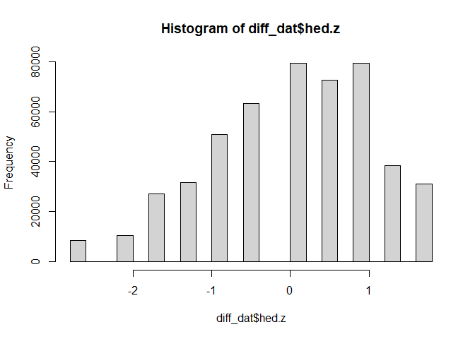
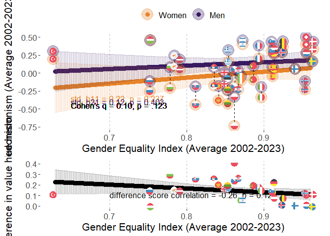
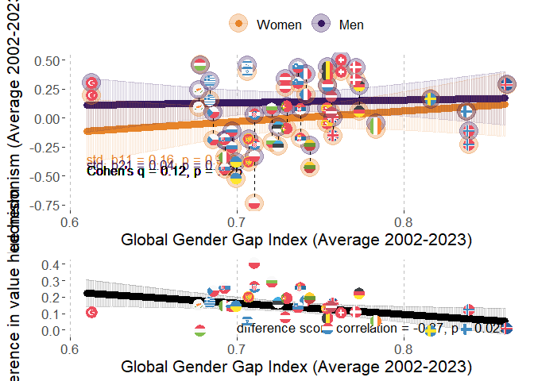
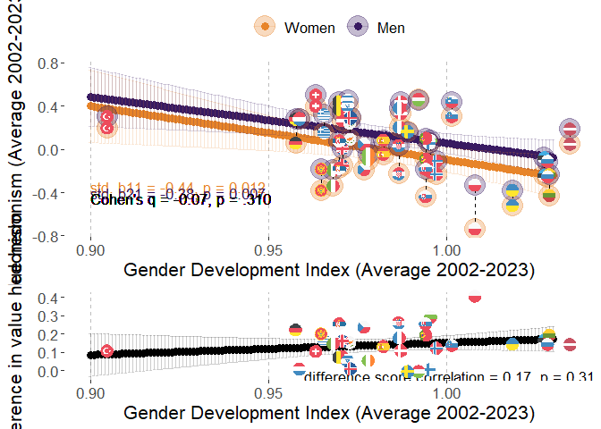
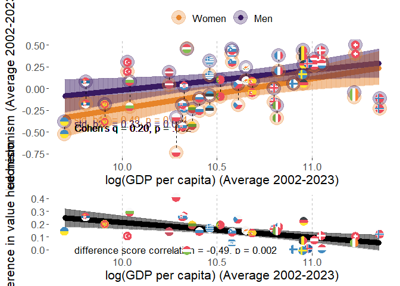
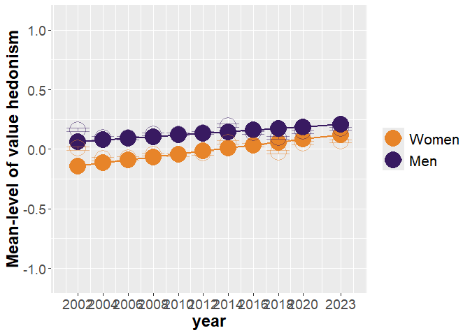
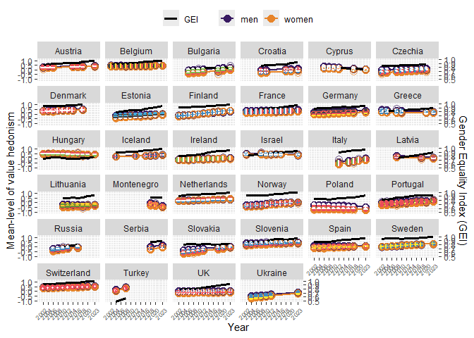

# Packages

Two packages are not in CRAN and need different installation
* devtools::install_github("vjilmari/vjihelpers")
* install.packages("ggflags", repos = c("https://jimjam-slam.r-universe.dev","https://cloud.r-project.org")) 


``` r
library(multid)
library(rio)
library(dplyr)
library(lme4)
library(emmeans)
library(vjihelpers)
library(MetBrewer)
library(ggplot2)
library(finalfit)
library(ggflags) 
library(lmerTest)
library(metafor)
library(ggpubr)
library(Hmisc)
library(r2mlm)
library(tidyr)
library(stringr)
library(apaTables)
library(tibble)
```

# Custom functions


``` r
# toster function for equivalence testing

tost_z <- function(est, se, low, high, alpha = 0.05) {
  # z statistics
  z_low  <- (est - low)  / se     # H0: theta <= low  vs H1: theta > low
  z_high <- (est - high) / se     # H0: theta >= high vs H1: theta < high
  
  # one-sided p-values
  p_low  <- 1 - pnorm(z_low)
  p_high <- pnorm(z_high)
  
  # CI corresponding to TOST (1 - 2*alpha, usually 90% when alpha = 0.05)
  z_crit <- qnorm(1 - alpha)
  ci_low  <- est - z_crit * se
  ci_high <- est + z_crit * se
  
  # equivalence decision
  equivalent <- (p_low < alpha) && (p_high < alpha)
  
  list(
    estimate     = est,
    se           = se,
    low_bound    = low,
    high_bound   = high,
    alpha        = alpha,
    z_low        = z_low,
    p_low        = p_low,
    z_high       = z_high,
    p_high       = p_high,
    ci_level     = 1 - 2*alpha,
    ci_lower     = ci_low,
    ci_upper     = ci_high,
    equivalent   = equivalent
  )
}
```


# Data

* Loads the preprocessed European Social Survey data file made within "Preparations_ESS" code


``` r
load("../data/fdat.rdata")
```

* Include ISO data for country-names


``` r
# read country names
ISO<-read.csv2("../data/ISO.csv")
```


# Exclusions

* exclude participants with missing values or gender


``` r
value.vars<-
  c("con","tra",
  "ben","uni",
  "sdi","sti",
  "hed","ach",
  "pow","sec")

fdat$miss_values<-
  rowSums(is.na(fdat[,value.vars]))
table(fdat$miss_values)
```

```
## 
##      0      1      2      3      4      5      6      7      8      9     10 
## 500044   2791    835    442    267    204    142    143    156    177  35470
```

``` r
fdat<-fdat %>%
  filter(miss_values==0 & !is.na(gndr.bin))
```


# Data for the analysis

* use the testing partition of the data set (diff_dat)
* basic descriptives


``` r
diff_dat<-
  fdat

#diff_dat$age.c<-as.numeric(diff_dat$age.c)
#diff_dat$rlgdgr.c<-as.numeric(diff_dat$rlgdgr.c)
#diff_dat$eduyrs.c<-as.numeric(diff_dat$eduyrs.c)

# data exclusions (include countries with at least two rounds of data)
n_rounds<-diff_dat %>% group_by(cntry) %>%
  summarise(n_unique_essround = n_distinct(essround))

# join number of rounds to data
diff_dat<-
  left_join(x=diff_dat,
            y=n_rounds,
            by="cntry")

# filter only countries with more than 1 round and non-missing gender variable
diff_dat<-diff_dat %>%
  dplyr::filter(n_unique_essround>1 &
                  !is.na(gndr))

# cross-tabulate sample sizes and ESS rounds by country
table(diff_dat$essround,diff_dat$cntry)
```

```
##     
##        AT   BE   BG   CH   CY   CZ   DE   DK   EE   ES   FI   FR   GB   GR   HR   HU   IE   IL   IS   IT
##   1  2254 1830    0 2024    0 1208 2819 1470    0 1712 1763 1355 1798 2551    0 1634 1916 2279    0    0
##   2  2198 1771    0 2110    0 2557 2840 1458 1948 1623 1701 1699 1864 2399    0 1460 1187    0  524    0
##   3  2348 1796 1295 1780  978    0 2884 1461 1466 1847 1649 1983 2353    0    0 1462 1589    0    0    0
##   4     0 1754 2144 1753 1210 1986 2732 1581 1646 2562 1901 2067 2311 2063 1430 1430 1757 2382    0    0
##   5     0 1699 2371 1491 1053 2335 3007 1564 1793 1881 1649 1723 2374 2669 1601 1473 2400 2212    0    0
##   6     0 1862 2179 1483 1110 1973 2935 1621 2345 1871 2158 1960 2261    0    0 1968 2616 2378  739  909
##   7  1795 1767    0 1521    0 1862 3006 1483 2036 1907 2050 1902 2231    0    0 1520 2380 2351    0    0
##   8  1993 1759    0 1504    0 2252 2821    0 2007 1929 1903 2057 1942    0    0 1458 2746 2366  841 2531
##   9  2477 1756 1926 1517  773 2343 2328 1554 1899 1619 1735 1982 2183    0 1781 1643 2189    0  844 2660
##   10    0 1334 2697 1505    0 2369    0    0 1538    0 1561 1951 1131 2768 1564 1816 1751    0  886 2573
##   11 2314 1577 2218 1368  667    0 2381    0 1282 1833 1524 1745 1529 2745 1548 2117 1985  893  825 2783
##     
##        LT   LV   ME   NL   NO   PL   PT   RS   RU   SE   SI   SK   TR   UA
##   1     0    0    0 2337 1819 2065 1482    0    0 1682 1488    0    0    0
##   2     0    0    0 1858 1575 1683 2024    0    0 1678 1384 1425 1790 1896
##   3     0    0    0 1860 1550 1685 2182    0 2339 1604 1465 1711    0 1885
##   4     0 1970    0 1724 1391 1596 2337    0 2446 1556 1257 1789 2305 1766
##   5  1632    0    0 1801 1530 1719 2139    0 2557 1463 1369 1803    0 1779
##   6  2108    0    0 1828 1610 1866 2138    0 2429 1838 1244 1827    0 2064
##   7  2241    0    0 1823 1423 1594 1242    0    0 1761 1189    0    0    0
##   8  2079    0    0 1669 1530 1675 1254    0 2374 1526 1295    0    0    0
##   9  1677  891 1188 1657 1396 1443 1045 1969    0 1510 1307 1061    0    0
##   10 1606    0 1248 1466 1408    0 1827    0    0    0 1232 1395    0    0
##   11 1337 1225 1581 1677 1318 1423 1366 1511    0 1204 1227 1414    0 2589
```

``` r
# range of sample sizes
range(table(diff_dat$cntry))
```

```
## [1]  3480 27753
```

``` r
# scale/standardize with SD pooled across all country-time-gender folds
cntry.hed<-diff_dat %>% group_by(cntry,essround) %>%
  summarise(hed.ctm=mean(hed,na.rm=T),
            hed.ctsd=sd(hed,na.rm=T)) %>%
  group_by(cntry) %>%
  summarise(hed.cm=mean(hed.ctm),
            hed.csd=mean(hed.ctsd)) 
```

```
## `summarise()` has regrouped the output.
## ℹ Summaries were computed grouped by cntry and essround.
## ℹ Output is grouped by cntry.
## ℹ Use `summarise(.groups = "drop_last")` to silence this message.
## ℹ Use `summarise(.by = c(cntry, essround))` for per-operation grouping (`?dplyr::dplyr_by`) instead.
```

``` r
grand_mean_hed<-mean(cntry.hed$hed.cm)
grand_sd_hed<-mean(cntry.hed$hed.csd)

# standardized
diff_dat$hed.z<-(diff_dat$hed-grand_mean_hed)/grand_sd_hed
hist(diff_dat$hed.z)
```

<!-- -->

``` r
# recode time to start from 2002=0

diff_dat$year<-
  case_when(
    diff_dat$essround==1~2002,  
    diff_dat$essround==2~2004,
    diff_dat$essround==3~2006,
    diff_dat$essround==4~2008,
    diff_dat$essround==5~2010,
    diff_dat$essround==6~2012,
    diff_dat$essround==7~2014,
    diff_dat$essround==8~2016,
    diff_dat$essround==9~2018,
    diff_dat$essround==10~2020,
    diff_dat$essround==11~2023
  )

diff_dat$year.c<-diff_dat$year-2002
```

## Add GEI-variable

* GEI = Reverse-coded Gender Inequality Index (GII)


``` r
GII<-read.csv("../data/GII.csv")

# Obtain GII only for ESS countries
GII_in_ESS_d<-
  GII %>%
  filter(ISO2 %in% unique(diff_dat$cntry))

# Make long format data of GII, so that country x year has own rows

long_GII_in_ESS_d <- GII_in_ESS_d %>%
  pivot_longer(
    cols = starts_with("gii_") & !matches("avg"),  # <-- exclude the "_avg" columns
    names_to = "year",
    values_to = "gii",
    names_prefix = "gii_"
  ) %>%
  mutate(year = as.integer(year)) %>%
  filter(year >= 2002 & year <= 2023) %>%
  mutate(gei = 1 - gii) %>%
  select(ISO2, iso3, country, year, gii, gei, gii_2002_2023_avg, gei_2002_2023_avg)


# describe gei average
psych::describe(GII_in_ESS_d$gei_2002_2023_avg)
```

```
##    vars  n mean   sd median trimmed  mad  min  max range  skew kurtosis   se
## X1    1 33 0.87 0.07   0.87    0.87 0.06 0.63 0.96  0.34 -1.06     1.37 0.01
```

``` r
# one is missing, see which one
GII_in_ESS_d[is.na(GII_in_ESS_d$gei_2002_2023_avg),"country"]
```

```
## [1] "Ukraine"
```

``` r
# get means and SDs for standardizing
gei_mean<-mean(GII_in_ESS_d$gei_2002_2023_avg,na.rm=T)
gei_sd<-sd(GII_in_ESS_d$gei_2002_2023_avg,na.rm=T)

# standardize 
# year specific scores
long_GII_in_ESS_d$gei.z<-(long_GII_in_ESS_d$gei-gei_mean)/gei_sd

# get the country means to a separate frame

GII_country_means<-
  long_GII_in_ESS_d %>% group_by(ISO2) %>%
  summarise(gei.cm=mean(gei,na.rm=T),
            gei.z.cm=mean(gei.z,na.rm=T))


long_GII_in_ESS_d<-left_join(
  x=long_GII_in_ESS_d,
  y=GII_country_means,
  by="ISO2"
)


# center both the raw score and standardized scores
long_GII_in_ESS_d$gei.cmc<-(long_GII_in_ESS_d$gei-long_GII_in_ESS_d$gei.cm)
long_GII_in_ESS_d$gei.z.cmc<-(long_GII_in_ESS_d$gei.z-long_GII_in_ESS_d$gei.z.cm)

#View(long_GII_in_ESS_d)

# averages across 2002-2023
#long_GII_in_ESS_d$gei_2002_2023_avg.z<-(long_GII_in_ESS_d$gei_2002_2023_avg-gei_mean)/gei_sd

#long_GII_in_ESS_d$gei.cmc<-long_GII_in_ESS_d$gei-long_GII_in_ESS_d$gei_2002_2023_avg

# add year to ESS data-frame


# link datasets by country and year

diff_dat<-
  left_join(
    x=diff_dat,
    y=long_GII_in_ESS_d[,c("ISO2","year","gei","gei.cm","gei.cmc",
                           "gei.z","gei.z.cm","gei.z.cmc")],
    by=c("cntry"="ISO2","year")
)
```


## Add GDI-variable

* GDI = Gender Development Index


``` r
GDI<-read.csv("../data/GDI.csv")

# Obtain GDI only for ESS countries
GDI_in_ESS_d<-
  GDI %>%
  filter(ISO2 %in% unique(diff_dat$cntry))

# Make long format data of GDI, so that country x year has own rows

long_GDI_in_ESS_d <- GDI_in_ESS_d %>%
  pivot_longer(
    cols = starts_with("gdi_") & !matches("avg"),  # <-- exclude the "_avg" columns
    names_to = "year",
    values_to = "gdi",
    names_prefix = "gdi_"
  ) %>%
  mutate(year = as.integer(year)) %>%
  filter(year >= 2002 & year <= 2023) %>%
  select(ISO2, iso3, country, year, gdi, gdi_2002_2023_avg)

# describe gdi average
psych::describe(GDI_in_ESS_d$gdi_2002_2023_avg)
```

```
##    vars  n mean   sd median trimmed  mad min  max range skew kurtosis se
## X1    1 34 0.98 0.03   0.98    0.98 0.02 0.9 1.03  0.13 -0.3     1.28  0
```

``` r
# get means and SDs for standardizing
gdi_mean<-mean(GDI_in_ESS_d$gdi_2002_2023_avg,na.rm=T)
gdi_sd<-sd(GDI_in_ESS_d$gdi_2002_2023_avg,na.rm=T)

# standardize 
# year specific scores
long_GDI_in_ESS_d$gdi.z<-(long_GDI_in_ESS_d$gdi-gdi_mean)/gdi_sd

# get the country means to a separate frame

GDI_country_means<-
  long_GDI_in_ESS_d %>% group_by(ISO2) %>%
  summarise(gdi.cm=mean(gdi,na.rm=T),
            gdi.z.cm=mean(gdi.z,na.rm=T))

long_GDI_in_ESS_d<-left_join(
  x=long_GDI_in_ESS_d,
  y=GDI_country_means,
  by="ISO2"
)


# center both the raw score and standardized scores
long_GDI_in_ESS_d$gdi.cmc<-(long_GDI_in_ESS_d$gdi-long_GDI_in_ESS_d$gdi.cm)
long_GDI_in_ESS_d$gdi.z.cmc<-(long_GDI_in_ESS_d$gdi.z-long_GDI_in_ESS_d$gdi.z.cm)

# link datasets by country and year

diff_dat<-
  left_join(
    x=diff_dat,
    y=long_GDI_in_ESS_d[,c("ISO2","year","gdi","gdi.cm","gdi.cmc",
                           "gdi.z","gdi.z.cm","gdi.z.cmc")],
    by=c("cntry"="ISO2","year")
  )
```

## Add GDP-variable

* log_GDP = Logarithm of GDP per capita, PPP (constant 2017 international $)


``` r
GDP<-read.csv("../data/GDP_processed.csv")

# Obtain GDP only for ESS countries
GDP_in_ESS_d<-
  GDP %>%
  filter(ISO2 %in% unique(diff_dat$cntry))

# First, rename those X2000..YR2000. style columns to simple "gdp_2000" etc.

GDP_in_ESS_d <- GDP_in_ESS_d %>%
  rename_with(
    ~ str_replace_all(., "^X(\\d{4})..YR\\1\\.$", "gdp_\\1"),
    starts_with("X")
  )

# GDP_in_ESS_d
# Make long format data of GDP, so that country x year has own rows

long_GDP_in_ESS_d <- GDP_in_ESS_d %>%
  pivot_longer(
    cols = starts_with("gdp_") & !matches("avg"),  # <-- exclude the "_avg" columns
    names_to = "year",
    values_to = "gdp",
    names_prefix = "gdp_"
  ) %>%
  mutate(year = as.integer(year)) %>%
  filter(year >= 2002 & year <= 2023) %>%
  select(ISO2, Country.Name, year, gdp, gdp_2002_2023_avg,log_gdp_2002_2023_avg) %>%
  mutate(log_gdp=log(gdp))

#View(long_GDP_in_ESS_d)

# describe gdp average
psych::describe(GDP_in_ESS_d$gdp_2002_2023_avg)
```

```
##    vars  n     mean      sd  median  trimmed     mad      min      max    range skew kurtosis      se
## X1    1 34 43905.99 17369.7 40201.8 42845.95 15827.5 16384.61 85341.85 68957.24 0.48    -0.58 2978.88
```

``` r
psych::describe(GDP_in_ESS_d$log_gdp_2002_2023_avg)
```

```
##    vars  n  mean   sd median trimmed  mad min   max range  skew kurtosis   se
## X1    1 34 10.61 0.41   10.6   10.62 0.44 9.7 11.35  1.65 -0.27    -0.71 0.07
```

``` r
# get means and SDs for standardizing
log_gdp_mean<-mean(GDP_in_ESS_d$log_gdp_2002_2023_avg,na.rm=T)
log_gdp_sd<-sd(GDP_in_ESS_d$log_gdp_2002_2023_avg,na.rm=T)

# standardize 
# year specific scores
long_GDP_in_ESS_d$log_gdp.z<-
  (long_GDP_in_ESS_d$log_gdp-log_gdp_mean)/log_gdp_sd

# get the country means to a separate frame

GDP_country_means<-
  long_GDP_in_ESS_d %>% group_by(ISO2) %>%
  summarise(gdp.cm=mean(gdp,na.rm=T),
            #gdp.z.cm=mean(gdp.z,na.rm=T),
            log_gdp.cm=mean(log_gdp,na.rm=T),
            log_gdp.z.cm=mean(log_gdp.z,na.rm=T))

long_GDP_in_ESS_d<-left_join(
  x=long_GDP_in_ESS_d,
  y=GDP_country_means,
  by="ISO2"
)


# center both the raw score and standardized scores
long_GDP_in_ESS_d$log_gdp.cmc<-(long_GDP_in_ESS_d$log_gdp-long_GDP_in_ESS_d$log_gdp.cm)
long_GDP_in_ESS_d$log_gdp.z.cmc<-(long_GDP_in_ESS_d$log_gdp.z-long_GDP_in_ESS_d$log_gdp.z.cm)

# link datasets by country and year

diff_dat<-
  left_join(
    x=diff_dat,
    y=long_GDP_in_ESS_d[,c("ISO2","year","log_gdp","log_gdp.cm","log_gdp.cmc",
                           "log_gdp.z","log_gdp.z.cm","log_gdp.z.cmc")],
    by=c("cntry"="ISO2","year")
  )
```

## Add GGGI-variable

* GGGI = Global Gender Gap Index


``` r
GGGI<-import("../data/GGGI.xlsx")

# check if all ESS countries are in the log_GGGI data
table(unique(diff_dat$cntry) %in% GGGI$ISO2)
```

```
## 
## TRUE 
##   34
```

``` r
# Obtain GGGI only for ESS countries
GGGI_in_ESS_d<-
  GGGI %>%
  filter(ISO2 %in% unique(diff_dat$cntry))

# Make long format data of GGGI, so that country x year has own rows

long_GGGI_in_ESS_d <- GGGI_in_ESS_d %>%
  pivot_longer(
    cols = starts_with("gggi_") & !matches("avg"),  # <-- exclude the "_avg" columns
    names_to = "year",
    values_to = "gggi",
    names_prefix = "gggi_"
  ) %>%
  mutate(year = as.integer(year)) %>%
  filter(year >= 2002 & year <= 2023) %>%
  select(ISO2, cname, year, gggi, GGGI_2002_2023_avg)

# describe gggi average
psych::describe(GGGI_in_ESS_d$GGGI_2002_2023_avg)
```

```
##    vars  n mean   sd median trimmed  mad  min  max range skew kurtosis   se
## X1    1 34 0.74 0.05   0.73    0.73 0.04 0.61 0.86  0.25  0.4     0.29 0.01
```

``` r
# get means and SDs for standardizing
gggi_mean<-mean(GGGI_in_ESS_d$GGGI_2002_2023_avg,na.rm=T)
gggi_sd<-sd(GGGI_in_ESS_d$GGGI_2002_2023_avg,na.rm=T)

# standardize 
# year specific scores
long_GGGI_in_ESS_d$gggi.z<-(long_GGGI_in_ESS_d$gggi-gggi_mean)/gggi_sd

# get the country means to a separate frame

GGGI_country_means<-
  long_GGGI_in_ESS_d %>% group_by(ISO2) %>%
  summarise(gggi.cm=mean(gggi,na.rm=T),
            gggi.z.cm=mean(gggi.z,na.rm=T))

long_GGGI_in_ESS_d<-left_join(
  x=long_GGGI_in_ESS_d,
  y=GGGI_country_means,
  by="ISO2"
)

# center both the raw score and standardized scores
long_GGGI_in_ESS_d$gggi.cmc<-
  (long_GGGI_in_ESS_d$gggi-long_GGGI_in_ESS_d$gggi.cm)

long_GGGI_in_ESS_d$gggi.z.cmc<-
  (long_GGGI_in_ESS_d$gggi.z-long_GGGI_in_ESS_d$gggi.z.cm)

# link datasets by country and year

diff_dat<-
  left_join(
    x=diff_dat,
    y=long_GGGI_in_ESS_d[,c("ISO2","year","gggi","gggi.cm","gggi.cmc",
                           "gggi.z","gggi.z.cm","gggi.z.cmc")],
    by=c("cntry"="ISO2","year")
  )
```

## Country-year-gender dataframe

Frame with one row for country-year-gender


``` r
diff_dat_cntry_year<-
  diff_dat %>% 
  group_by(cntry,year,gndr.c) %>%
  dplyr::summarise(n=n(),
                   n_wt=sum(pspwght),
                   hed.z.wt=weighted.mean(x=hed.z,w=pspwght),
                   hed.z=mean(hed.z),
                   gei.z=mean(gei.z,na.rm=T),
                   gei.z.cm=mean(gei.z.cm,na.rm=T),
                   gei.z.cmc=mean(gei.z.cmc,na.rm=T),
                   gdi.z=mean(gdi.z,na.rm=T),
                   gdi.z.cm=mean(gdi.z.cm,na.rm=T),
                   gdi.z.cmc=mean(gdi.z.cmc,na.rm=T),
                   gggi.z=mean(gggi.z,na.rm=T),
                   gggi.z.cm=mean(gggi.z.cm,na.rm=T),
                   gggi.z.cmc=mean(gggi.z.cmc,na.rm=T),
                   log_gdp.z=mean(log_gdp.z,na.rm=T),
                   log_gdp.z.cm=mean(log_gdp.z.cm,na.rm=T),
                   log_gdp.z.cmc=mean(log_gdp.z.cmc,na.rm=T),
                   gei=mean(gei,na.rm=T),
                   gei.cm=mean(gei.cm,na.rm=T),
                   gei.cmc=mean(gei.cmc,na.rm=T),
                   gdi=mean(gdi,na.rm=T),
                   gdi.cm=mean(gdi.cm,na.rm=T),
                   gdi.cmc=mean(gdi.cmc,na.rm=T),
                   gggi=mean(gggi,na.rm=T),
                   gggi.cm=mean(gggi.cm,na.rm=T),
                   gggi.cmc=mean(gggi.cmc,na.rm=T),
                   log_gdp=mean(log_gdp,na.rm=T),
                   log_gdp.cm=mean(log_gdp.cm,na.rm=T),
                   log_gdp.cmc=mean(log_gdp.cmc,na.rm=T))
```

```
## `summarise()` has regrouped the output.
## ℹ Summaries were computed grouped by cntry, year, and gndr.c.
## ℹ Output is grouped by cntry and year.
## ℹ Use `summarise(.groups = "drop_last")` to silence this message.
## ℹ Use `summarise(.by = c(cntry, year, gndr.c))` for per-operation grouping (`?dplyr::dplyr_by`) instead.
```


# Descriptive statistics

## Country-specific descriptives


``` r
# sample sizes from weights

cntry_n_frame<-
  diff_dat %>% group_by(cntry) %>%
  summarise('n ESS rounds' = mean(n_unique_essround),
            n=round(sum(pspwght),0))

# hedonism

cntry_hed_frame<-
  diff_dat %>% group_by(cntry,essround) %>%
  summarise('hed M' = weighted.mean(x=hed.z,w=pspwght),
            'hed SD' = sqrt(wtd.var(hed.z,pspwght))) %>%
  group_by(cntry) %>%
  summarise('hed M' = mean(x=`hed M`),
            'hed SD'= mean(x=`hed SD`))
```

```
## `summarise()` has regrouped the output.
## ℹ Summaries were computed grouped by cntry and essround.
## ℹ Output is grouped by cntry.
## ℹ Use `summarise(.groups = "drop_last")` to silence this message.
## ℹ Use `summarise(.by = c(cntry, essround))` for per-operation grouping (`?dplyr::dplyr_by`) instead.
```

``` r
cntry_hed_women_frame<-
  diff_dat %>%
  filter(gndr.c==-0.5) %>%
  group_by(cntry,essround) %>%
  summarise('hed M' = weighted.mean(x=hed.z,w=pspwght),
            'hed SD' = sqrt(wtd.var(hed.z,pspwght))) %>%
  group_by(cntry) %>%
  summarise('hed M Women' = mean(x=`hed M`),
            'hed SD Women'= mean(x=`hed SD`))
```

```
## `summarise()` has regrouped the output.
## ℹ Summaries were computed grouped by cntry and essround.
## ℹ Output is grouped by cntry.
## ℹ Use `summarise(.groups = "drop_last")` to silence this message.
## ℹ Use `summarise(.by = c(cntry, essround))` for per-operation grouping (`?dplyr::dplyr_by`) instead.
```

``` r
cntry_hed_men_frame<-
  diff_dat %>%
  filter(gndr.c==0.5) %>%
  group_by(cntry,essround) %>%
  summarise('hed M' = weighted.mean(x=hed.z,w=pspwght),
            'hed SD' = sqrt(wtd.var(hed.z,pspwght))) %>%
  group_by(cntry) %>%
  summarise('hed M Men' = mean(x=`hed M`),
            'hed SD Men'= mean(x=`hed SD`))
```

```
## `summarise()` has regrouped the output.
## ℹ Summaries were computed grouped by cntry and essround.
## ℹ Output is grouped by cntry.
## ℹ Use `summarise(.groups = "drop_last")` to silence this message.
## ℹ Use `summarise(.by = c(cntry, essround))` for per-operation grouping (`?dplyr::dplyr_by`) instead.
```

``` r
# link n and hed datasets

desc_frame<-
  left_join(
    x=cntry_n_frame,
    y=cntry_hed_frame,
    by="cntry"
  )

desc_frame<-
  left_join(
    x=desc_frame,
    y=cntry_hed_women_frame,
    by="cntry"
  )

desc_frame<-
  left_join(
    x=desc_frame,
    y=cntry_hed_men_frame,
    by="cntry"
  )

# Add country-specific differences
desc_frame$D<-desc_frame$`hed M Men`-desc_frame$`hed M Women`

desc_frame
```

```
## # A tibble: 34 × 10
##    cntry `n ESS rounds`     n `hed M` `hed SD` `hed M Women` `hed SD Women` `hed M Men` `hed SD Men`
##    <chr>          <dbl> <dbl>   <dbl>    <dbl>         <dbl>          <dbl>       <dbl>        <dbl>
##  1 AT                 7 15400  0.298     0.946        0.263           0.977      0.336         0.908
##  2 BE                11 18886  0.404     0.842        0.370           0.857      0.439         0.824
##  3 BG                 7 14857 -0.0868    1.18        -0.227           1.20       0.0648        1.13 
##  4 CH                11 18087  0.454     0.862        0.404           0.880      0.507         0.839
##  5 CY                 6  5771  0.147     0.995        0.0744          1.04       0.223         0.934
##  6 CZ                 9 18934 -0.0868    1.03        -0.202           1.05       0.0382        0.981
##  7 DE                10 27753  0.163     0.952        0.0560          0.970      0.277         0.918
##  8 DK                 8 12198  0.381     0.920        0.328           0.938      0.436         0.898
##  9 EE                10 17974 -0.161     0.960       -0.232           0.971     -0.0763        0.938
## 10 ES                10 18785  0.0153    1.08        -0.0466          1.11       0.0796        1.05 
## # ℹ 24 more rows
## # ℹ 1 more variable: D <dbl>
```

``` r
# add country-level measures

desc_frame<-
  left_join(
    x=desc_frame,
    y=GII_country_means[,c("ISO2","gei.cm")],
    by=c("cntry"="ISO2")
  )

desc_frame<-
  left_join(
    x=desc_frame,
    y=GGGI_country_means[,c("ISO2","gggi.cm")],
    by=c("cntry"="ISO2")
  )

desc_frame<-
  left_join(
    x=desc_frame,
    y=GDI_country_means[,c("ISO2","gdi.cm")],
    by=c("cntry"="ISO2")
  )


desc_frame<-
  left_join(
    x=desc_frame,
    y=GDP_country_means[,c("ISO2","gdp.cm")],
    by=c("cntry"="ISO2")
  )

desc_frame<-left_join(
  x=desc_frame,
  y=ISO[,c("ISO2","CLDR")],
  by=c("cntry"="ISO2")
)

# finalize the formatted table

cntry_desc_tbl<-
  desc_frame %>%
  select(
    Country = CLDR,
    `n ESS rounds`,
    n,
    `hed M`, `hed SD`,
    `hed M Women`, `hed SD Women`,
    `hed M Men`, `hed SD Men`,
    D,
    GEI = gei.cm,
    GGGI = gggi.cm,
    GDI = gdi.cm,
    GDP = gdp.cm
  ) %>%
  mutate(
    across(
      .cols = -c(Country, `n ESS rounds`, n, GDP) & where(is.numeric),
      .fns  = ~ round_tidy(.x, 2)
    )
  ) %>%
  mutate(
    across(
      .cols = GDP,
      .fns  = ~ round_tidy(.x, 0)
    )
  )
print(cntry_desc_tbl,n=35)
```

```
## # A tibble: 34 × 14
##    Country     `n ESS rounds`     n `hed M` `hed SD` `hed M Women` `hed SD Women` `hed M Men` `hed SD Men`
##    <chr>                <dbl> <dbl> <chr>   <chr>    <chr>         <chr>          <chr>       <chr>       
##  1 Austria                  7 15400 0.30    0.95     0.26          0.98           0.34        0.91        
##  2 Belgium                 11 18886 0.40    0.84     0.37          0.86           0.44        0.82        
##  3 Bulgaria                 7 14857 -0.09   1.18     -0.23         1.20           0.06        1.13        
##  4 Switzerland             11 18087 0.45    0.86     0.40          0.88           0.51        0.84        
##  5 Cyprus                   6  5771 0.15    1.00     0.07          1.04           0.22        0.93        
##  6 Czechia                  9 18934 -0.09   1.03     -0.20         1.05           0.04        0.98        
##  7 Germany                 10 27753 0.16    0.95     0.06          0.97           0.28        0.92        
##  8 Denmark                  8 12198 0.38    0.92     0.33          0.94           0.44        0.90        
##  9 Estonia                 10 17974 -0.16   0.96     -0.23         0.97           -0.08       0.94        
## 10 Spain                   10 18785 0.02    1.08     -0.05         1.11           0.08        1.05        
## 11 Finland                 11 19568 0.06    1.00     0.06          1.03           0.05        0.96        
## 12 France                  11 20457 0.29    0.98     0.20          1.01           0.38        0.94        
## 13 UK                      11 22979 -0.08   1.01     -0.15         1.04           0.00        0.98        
## 14 Greece                   6 15212 0.24    0.98     0.15          1.02           0.33        0.92        
## 15 Croatia                  5  7914 -0.11   1.06     -0.24         1.10           0.03        1.00        
## 16 Hungary                 11 18123 0.46    0.85     0.47          0.86           0.46        0.85        
## 17 Ireland                 11 22562 -0.08   1.04     -0.10         1.06           -0.05       1.03        
## 18 Israel                   7 14857 0.41    0.97     0.39          0.99           0.44        0.95        
## 19 Iceland                  6  4654 0.28    0.84     0.28          0.85           0.28        0.83        
## 20 Italy                    5 11441 -0.28   1.01     -0.35         1.04           -0.20       0.98        
## 21 Lithuania                7 13059 -0.34   1.07     -0.42         1.09           -0.24       1.03        
## 22 Latvia                   3  4088 0.08    1.00     0.02          1.01           0.15        0.98        
## 23 Montenegro               3  4028 -0.27   1.11     -0.37         1.13           -0.16       1.07        
## 24 Netherlands             11 19722 0.28    0.80     0.28          0.79           0.28        0.80        
## 25 Norway                  11 16505 -0.17   0.98     -0.22         0.99           -0.12       0.96        
## 26 Poland                  10 16737 -0.55   1.12     -0.74         1.11           -0.34       1.08        
## 27 Portugal                11 19070 0.03    0.92     -0.06         0.94           0.14        0.88        
## 28 Serbia                   2  3499 -0.04   1.20     -0.17         1.26           0.10        1.13        
## 29 Russia                   5 12139 -0.20   1.13     -0.26         1.15           -0.12       1.10        
## 30 Sweden                  10 16104 0.16    0.92     0.17          0.93           0.16        0.90        
## 31 Slovenia                11 14463 0.37    0.92     0.31          0.97           0.44        0.86        
## 32 Slovakia                 8 12547 -0.30   1.02     -0.42         1.05           -0.18       0.97        
## 33 Turkey                   2  4108 0.23    1.02     0.18          1.05           0.28        0.98        
## 34 Ukraine                  6 12054 -0.48   1.14     -0.55         1.15           -0.39       1.12        
## # ℹ 5 more variables: D <chr>, GEI <chr>, GGGI <chr>, GDI <chr>, GDP <chr>
```

``` r
export(cntry_desc_tbl,"../results/hed/cntry_desc_tbl.xlsx",overwrite=T)
```

## Country-level correlations table


``` r
cor_frame<-
  desc_frame %>%
  select(
    VBMT=`hed M`,
    VBMT_Women=`hed M Women`,
    VBMT_Men=`hed M Men`,
    D = D,
    GEI = gei.cm,
    GGGI = gggi.cm,
    GDI = gdi.cm,
    GDP = gdp.cm
  ) %>%
  mutate(
    log_GDP=log(GDP)
  ) %>%
  select(-GDP)

apa.cor.table(
  data=cor_frame,
  filename = "../results/hed/CorTable1.doc",
  #table.number = NA,
  show.conf.interval = FALSE,
  show.sig.stars = F,
  landscape = F
)
```

```
## The ability to suppress reporting of reporting confidence intervals has been deprecated in this version.
## The function argument show.conf.interval will be removed in a later version.
```

```
## 
## 
## Means, standard deviations, and correlations with confidence intervals
##  
## 
##   Variable      M     SD   1            2            3            4            5           6          
##   1. VBMT       0.05  0.28                                                                            
##                                                                                                       
##   2. VBMT_Women -0.02 0.31 .99                                                                        
##                            [.98, 1.00]                                                                
##                                                                                                       
##   3. VBMT_Men   0.12  0.25 .99          .96                                                           
##                            [.97, .99]   [.92, .98]                                                    
##                                                                                                       
##   4. D          0.14  0.10 -.60         -.69         -.46                                             
##                            [-.78, -.33] [-.84, -.46] [-.69, -.15]                                     
##                                                                                                       
##   5. GEI        0.87  0.07 .20          .22          .17          -.26                                
##                            [-.15, .51]  [-.13, .52]  [-.19, .48]  [-.55, .09]                         
##                                                                                                       
##   6. GGGI       0.74  0.05 .14          .19          .08          -.41         .73                    
##                            [-.20, .46]  [-.16, .50]  [-.27, .40]  [-.66, -.08] [.52, .86]             
##                                                                                                       
##   7. GDI        0.98  0.03 -.43         -.41         -.44         .16          .07         .19        
##                            [-.67, -.11] [-.66, -.09] [-.68, -.12] [-.19, .47]  [-.28, .41] [-.16, .50]
##                                                                                                       
##   8. log_GDP    10.61 0.41 .44          .48          .38          -.52         .72         .62        
##                            [.12, .68]   [.16, .70]   [.05, .64]   [-.73, -.22] [.50, .85]  [.36, .79] 
##                                                                                                       
##   7          
##              
##              
##              
##              
##              
##              
##              
##              
##              
##              
##              
##              
##              
##              
##              
##              
##              
##              
##              
##              
##   -.18       
##   [-.49, .17]
##              
## 
## Note. M and SD are used to represent mean and standard deviation, respectively.
## Values in square brackets indicate the 95% confidence interval.
## The confidence interval is a plausible range of population correlations 
## that could have caused the sample correlation (Cumming, 2014).
## 
```


# Analysis

## mod0: Random intercept model


``` r
mod0<-lmer(hed.z~(1|cntry),data=diff_dat,REML=F,weights = pspwght,
           control=lmerControl(optimizer="bobyqa",optCtrl=list(maxfun=2e7)))
summary(mod0)
```

```
## Linear mixed model fit by maximum likelihood . t-tests use Satterthwaite's method ['lmerModLmerTest']
## Formula: hed.z ~ (1 | cntry)
##    Data: diff_dat
## Weights: pspwght
## Control: lmerControl(optimizer = "bobyqa", optCtrl = list(maxfun = 2e+07))
## 
##       AIC       BIC    logLik -2*log(L)  df.resid 
## 1457197.0 1457230.4 -728595.5 1457191.0    492340 
## 
## Scaled residuals: 
##     Min      1Q  Median      3Q     Max 
## -6.2078 -0.6532  0.0477  0.6412  4.7227 
## 
## Random effects:
##  Groups   Name        Variance Std.Dev.
##  cntry    (Intercept) 0.07411  0.2722  
##  Residual             0.99270  0.9963  
## Number of obs: 492343, groups:  cntry, 34
## 
## Fixed effects:
##             Estimate Std. Error       df t value Pr(>|t|)
## (Intercept)  0.04560    0.04672 34.00983   0.976    0.336
```

``` r
getVC(mod0)
```

```
##        grp        var1 var2 sdcor vcov
## 1    cntry (Intercept) <NA>  0.27 0.07
## 2 Residual        <NA> <NA>  1.00 0.99
```

``` r
r2mlm(mod0,bargraph = F)
```

```
## $Decompositions
##                     total within between
## fixed, within   0.0000000      0      NA
## fixed, between  0.0000000     NA       0
## slope variation 0.0000000      0      NA
## mean variation  0.0694707     NA       1
## sigma2          0.9305293      1      NA
## 
## $R2s
##         total within between
## f1  0.0000000      0      NA
## f2  0.0000000     NA       0
## v   0.0000000      0      NA
## m   0.0694707     NA       1
## f   0.0000000     NA      NA
## fv  0.0000000      0      NA
## fvm 0.0694707     NA      NA
```

## mod1: Gender fixed effect


``` r
mod1<-lmer(hed.z~gndr.c+(1|cntry),data=diff_dat,REML=F,weights = pspwght,
           control=lmerControl(optimizer="bobyqa",optCtrl=list(maxfun=2e7)))
summary(mod1)
```

```
## Linear mixed model fit by maximum likelihood . t-tests use Satterthwaite's method ['lmerModLmerTest']
## Formula: hed.z ~ gndr.c + (1 | cntry)
##    Data: diff_dat
## Weights: pspwght
## Control: lmerControl(optimizer = "bobyqa", optCtrl = list(maxfun = 2e+07))
## 
##       AIC       BIC    logLik -2*log(L)  df.resid 
## 1454804.9 1454849.4 -727398.5 1454796.9    492339 
## 
## Scaled residuals: 
##     Min      1Q  Median      3Q     Max 
## -6.3727 -0.6526  0.0328  0.6423  4.7276 
## 
## Random effects:
##  Groups   Name        Variance Std.Dev.
##  cntry    (Intercept) 0.07358  0.2713  
##  Residual             0.98789  0.9939  
## Number of obs: 492343, groups:  cntry, 34
## 
## Fixed effects:
##              Estimate Std. Error        df t value Pr(>|t|)    
## (Intercept) 4.822e-02  4.655e-02 3.401e+01   1.036    0.308    
## gndr.c      1.386e-01  2.830e-03 4.923e+05  48.989   <2e-16 ***
## ---
## Signif. codes:  0 '***' 0.001 '**' 0.01 '*' 0.05 '.' 0.1 ' ' 1
## 
## Correlation of Fixed Effects:
##        (Intr)
## gndr.c 0.001
```

``` r
getFE(mod1,round=3)
```

```
##              Est.    SE        df      t     p     LL    UL
## (Intercept) 0.048 0.047     34.01  1.036 0.308 -0.046 0.143
## gndr.c      0.139 0.003 492309.93 48.989 0.000  0.133 0.144
```

``` r
getVC(mod1)
```

```
##        grp        var1 var2 sdcor vcov
## 1    cntry (Intercept) <NA>  0.27 0.07
## 2 Residual        <NA> <NA>  0.99 0.99
```

``` r
r2mlm(mod1,bargraph = F)
```

```
## $Decompositions
##                       total
## fixed           0.004479211
## slope variation 0.000000000
## mean variation  0.069006684
## sigma2          0.926514105
## 
## $R2s
##           total
## f   0.004479211
## v   0.000000000
## m   0.069006684
## fv  0.004479211
## fvm 0.073485895
```

## mod2: Gender fixed and random effect

* Include random effect correlation by default


``` r
mod2<-lmer(hed.z~gndr.c+(gndr.c|cntry),data=diff_dat,REML=F,weights = pspwght,
           control=lmerControl(optimizer="bobyqa",optCtrl=list(maxfun=2e7)))
summary(mod2)
```

```
## Linear mixed model fit by maximum likelihood . t-tests use Satterthwaite's method ['lmerModLmerTest']
## Formula: hed.z ~ gndr.c + (gndr.c | cntry)
##    Data: diff_dat
## Weights: pspwght
## Control: lmerControl(optimizer = "bobyqa", optCtrl = list(maxfun = 2e+07))
## 
##       AIC       BIC    logLik -2*log(L)  df.resid 
## 1453768.6 1453835.3 -726878.3 1453756.6    492337 
## 
## Scaled residuals: 
##     Min      1Q  Median      3Q     Max 
## -6.2237 -0.6489  0.0189  0.6470  4.7849 
## 
## Random effects:
##  Groups   Name        Variance Std.Dev. Corr  
##  cntry    (Intercept) 0.073033 0.27025        
##           gndr.c      0.008776 0.09368  -0.60 
##  Residual             0.985602 0.99277        
## Number of obs: 492343, groups:  cntry, 34
## 
## Fixed effects:
##             Estimate Std. Error       df t value Pr(>|t|)    
## (Intercept)  0.04856    0.04638 34.00798   1.047    0.302    
## gndr.c       0.14266    0.01639 34.18567   8.703 3.45e-10 ***
## ---
## Signif. codes:  0 '***' 0.001 '**' 0.01 '*' 0.05 '.' 0.1 ' ' 1
## 
## Correlation of Fixed Effects:
##        (Intr)
## gndr.c -0.585
```

``` r
getFE(mod2,round=3)
```

```
##              Est.    SE     df     t     p     LL    UL
## (Intercept) 0.049 0.046 34.008 1.047 0.302 -0.046 0.143
## gndr.c      0.143 0.016 34.186 8.703 0.000  0.109 0.176
```

``` r
getVC(mod2)
```

```
##        grp        var1   var2 sdcor  vcov
## 1    cntry (Intercept)   <NA>  0.27  0.07
## 2    cntry      gndr.c   <NA>  0.09  0.01
## 3    cntry (Intercept) gndr.c -0.60 -0.02
## 4 Residual        <NA>   <NA>  0.99  0.99
```

``` r
r2mlm(mod2,bargraph = F)
```

```
## $Decompositions
##                       total
## fixed           0.004739348
## slope variation 0.002043800
## mean variation  0.069556953
## sigma2          0.923659899
## 
## $R2s
##           total
## f   0.004739348
## v   0.002043800
## m   0.069556953
## fv  0.006783149
## fvm 0.076340101
```

``` r
anova(mod1,mod2)
```

```
## Data: diff_dat
## Models:
## mod1: hed.z ~ gndr.c + (1 | cntry)
## mod2: hed.z ~ gndr.c + (gndr.c | cntry)
##      npar     AIC     BIC  logLik -2*log(L)  Chisq Df Pr(>Chisq)    
## mod1    4 1454805 1454849 -727398   1454797                         
## mod2    6 1453769 1453835 -726878   1453757 1040.3  2  < 2.2e-16 ***
## ---
## Signif. codes:  0 '***' 0.001 '**' 0.01 '*' 0.05 '.' 0.1 ' ' 1
```

``` r
lvl2_var_cond_lvl1(mod2,lvl1.var = "gndr.c",lvl1.values = c(0.5,-0.5))
```

```
##   lvl1.value lvl2.cond.var lvl2.cond.sd
## 1        0.5    0.06008990    0.2451324
## 2       -0.5    0.09036368    0.3006055
```

* Test for random effect correlation


``` r
mod2_norecov<-lmer(hed.z~gndr.c+(gndr.c||cntry),data=diff_dat,REML=F,weights = pspwght,
                   control=lmerControl(optimizer="bobyqa",optCtrl=list(maxfun=2e7)))
summary(mod2_norecov)
```

```
## Linear mixed model fit by maximum likelihood . t-tests use Satterthwaite's method ['lmerModLmerTest']
## Formula: hed.z ~ gndr.c + (gndr.c || cntry)
##    Data: diff_dat
## Weights: pspwght
## Control: lmerControl(optimizer = "bobyqa", optCtrl = list(maxfun = 2e+07))
## 
##       AIC       BIC    logLik -2*log(L)  df.resid 
## 1453781.0 1453836.5 -726885.5 1453771.0    492338 
## 
## Scaled residuals: 
##     Min      1Q  Median      3Q     Max 
## -6.2247 -0.6488  0.0177  0.6470  4.7819 
## 
## Random effects:
##  Groups   Name        Variance Std.Dev.
##  cntry    (Intercept) 0.073052 0.27028 
##  cntry.1  gndr.c      0.008765 0.09362 
##  Residual             0.985602 0.99277 
## Number of obs: 492343, groups:  cntry, 34
## 
## Fixed effects:
##             Estimate Std. Error       df t value Pr(>|t|)    
## (Intercept)  0.04856    0.04638 34.00905   1.047    0.302    
## gndr.c       0.14268    0.01639 34.18634   8.707  3.4e-10 ***
## ---
## Signif. codes:  0 '***' 0.001 '**' 0.01 '*' 0.05 '.' 0.1 ' ' 1
## 
## Correlation of Fixed Effects:
##        (Intr)
## gndr.c 0.000
```

``` r
getFE(mod2_norecov,round=3)
```

```
##              Est.    SE     df     t     p     LL    UL
## (Intercept) 0.049 0.046 34.009 1.047 0.302 -0.046 0.143
## gndr.c      0.143 0.016 34.186 8.707 0.000  0.109 0.176
```

``` r
getVC(mod2_norecov)
```

```
##        grp        var1 var2 sdcor vcov
## 1    cntry (Intercept) <NA>  0.27 0.07
## 2  cntry.1      gndr.c <NA>  0.09 0.01
## 3 Residual        <NA> <NA>  0.99 0.99
```

``` r
anova(mod2_norecov,mod2)
```

```
## Data: diff_dat
## Models:
## mod2_norecov: hed.z ~ gndr.c + (gndr.c || cntry)
## mod2: hed.z ~ gndr.c + (gndr.c | cntry)
##              npar     AIC     BIC  logLik -2*log(L)  Chisq Df Pr(>Chisq)    
## mod2_norecov    5 1453781 1453837 -726885   1453771                         
## mod2            6 1453769 1453835 -726878   1453757 14.377  1  0.0001496 ***
## ---
## Signif. codes:  0 '***' 0.001 '**' 0.01 '*' 0.05 '.' 0.1 ' ' 1
```


## mod2 with Gender-equality index (GEI)


``` r
mod2_GEI<-lmer(hed.z~gndr.c+gei.z.cm+gndr.c:gei.z.cm+
                 (gndr.c|cntry),data=diff_dat,REML=F,weights = pspwght,
           control=lmerControl(optimizer="bobyqa",optCtrl=list(maxfun=2e7)))
summary(mod2_GEI)
```

```
## Linear mixed model fit by maximum likelihood . t-tests use Satterthwaite's method ['lmerModLmerTest']
## Formula: hed.z ~ gndr.c + gei.z.cm + gndr.c:gei.z.cm + (gndr.c | cntry)
##    Data: diff_dat
## Weights: pspwght
## Control: lmerControl(optimizer = "bobyqa", optCtrl = list(maxfun = 2e+07))
## 
##       AIC       BIC    logLik -2*log(L)  df.resid 
## 1412258.8 1412347.4 -706121.4 1412242.8    480356 
## 
## Scaled residuals: 
##     Min      1Q  Median      3Q     Max 
## -6.2519 -0.6473  0.0200  0.6492  4.8063 
## 
## Random effects:
##  Groups   Name        Variance Std.Dev. Corr  
##  cntry    (Intercept) 0.065146 0.25524        
##           gndr.c      0.008381 0.09155  -0.62 
##  Residual             0.977092 0.98848        
## Number of obs: 480364, groups:  cntry, 33
## 
## Fixed effects:
##                 Estimate Std. Error       df t value Pr(>|t|)    
## (Intercept)      0.06380    0.04446 33.00577   1.435    0.161    
## gndr.c           0.14316    0.01627 33.08749   8.797 3.54e-10 ***
## gei.z.cm         0.04772    0.04517 33.04960   1.057    0.298    
## gndr.c:gei.z.cm -0.02639    0.01668 34.32135  -1.582    0.123    
## ---
## Signif. codes:  0 '***' 0.001 '**' 0.01 '*' 0.05 '.' 0.1 ' ' 1
## 
## Correlation of Fixed Effects:
##             (Intr) gndr.c g.z.cm
## gndr.c      -0.604              
## gei.z.cm     0.000  0.000       
## gndr.c:g.z.  0.000 -0.013 -0.598
```

``` r
getFE(mod2_GEI,round=3)
```

```
##                   Est.    SE     df      t     p     LL    UL
## (Intercept)      0.064 0.044 33.006  1.435 0.161 -0.027 0.154
## gndr.c           0.143 0.016 33.087  8.797 0.000  0.110 0.176
## gei.z.cm         0.048 0.045 33.050  1.057 0.298 -0.044 0.140
## gndr.c:gei.z.cm -0.026 0.017 34.321 -1.582 0.123 -0.060 0.008
```

``` r
getVC(mod2_GEI)
```

```
##        grp        var1   var2 sdcor  vcov
## 1    cntry (Intercept)   <NA>  0.26  0.07
## 2    cntry      gndr.c   <NA>  0.09  0.01
## 3    cntry (Intercept) gndr.c -0.62 -0.01
## 4 Residual        <NA>   <NA>  0.99  0.98
```

``` r
r2mlm(mod2_GEI,bargraph = F)
```

```
## $Decompositions
##                       total
## fixed           0.006445036
## slope variation 0.001980669
## mean variation  0.062928186
## sigma2          0.928646109
## 
## $R2s
##           total
## f   0.006445036
## v   0.001980669
## m   0.062928186
## fv  0.008425706
## fvm 0.071353891
```

### Deconstructed associations


``` r
t1<-Sys.time()
ddsc_mod2_GEI<-
  ddsc_ml(model = mod2_GEI,
          predictor = "gei.z.cm",
          moderator = "gndr.c",moderator_values = c(-0.5,0.5),
          re_cov_test = T)
t2<-Sys.time()
t2-t1
```

```
## Time difference of 32.88468 secs
```

``` r
round(ddsc_mod2_GEI$vpc_at_moderator_values,3)
```

```
##   lvl1.value Intercept.var Intercept.sd Residual.var Total.var   VPC mean.n.obs  ICC2 ICC2_SP
## 1       -0.5          0.09        0.301        0.986     1.076 0.084   7802.647 0.998   0.999
## 2        0.5          0.06        0.245        0.986     1.046 0.057   6678.029 0.997   0.998
```

``` r
round(ddsc_mod2_GEI$descriptives,3)
```

```
##                        M    SD means_y1 means_y1_scaled means_y2 means_y2_scaled gei.z.cm gei.z.cm_scaled
## means_y1           0.093 0.249    1.000           1.000    0.957           0.957    0.159           0.159
## means_y1_scaled    0.332 0.888    1.000           1.000    0.957           0.957    0.159           0.159
## means_y2          -0.046 0.308    0.957           0.957    1.000           1.000    0.238           0.238
## means_y2_scaled   -0.166 1.101    0.957           0.957    1.000           1.000    0.238           0.238
## gei.z.cm           0.000 1.000    0.159           0.159    0.238           0.238    1.000           1.000
## gei.z.cm_scaled    0.000 1.000    0.159           0.159    0.238           0.238    1.000           1.000
## diff_score         0.139 0.100   -0.460          -0.460   -0.698          -0.698   -0.338          -0.338
## diff_score_scaled  0.498 0.359   -0.460          -0.460   -0.698          -0.698   -0.338          -0.338
##                   diff_score diff_score_scaled
## means_y1              -0.460            -0.460
## means_y1_scaled       -0.460            -0.460
## means_y2              -0.698            -0.698
## means_y2_scaled       -0.698            -0.698
## gei.z.cm              -0.338            -0.338
## gei.z.cm_scaled       -0.338            -0.338
## diff_score             1.000             1.000
## diff_score_scaled      1.000             1.000
```

``` r
round(ddsc_mod2_GEI$results,3)
```

```
##                            estimate    SE     df t.ratio p.value ci.lower ci.upper
## r_xy1y2                       0.263 0.166 34.321   1.582   0.123   -0.075    0.600
## w_11                          0.061 0.051 33.074   1.204   0.237   -0.042    0.164
## w_21                          0.035 0.041 33.123   0.848   0.403   -0.048    0.117
## r_xy1                         0.245 0.204 33.074   1.204   0.237   -0.169    0.659
## r_xy2                         0.112 0.132 33.123   0.848   0.403   -0.157    0.381
## b_11                          0.219 0.182 33.074   1.204   0.237   -0.151    0.589
## b_21                          0.124 0.146 33.123   0.848   0.403   -0.174    0.422
## main_effect                   0.048 0.045 33.050   1.057   0.298   -0.044    0.140
## moderator_effect              0.143 0.016 33.087   8.797   0.000    0.110    0.176
## interaction                  -0.026 0.017 34.321  -1.582   0.123   -0.060    0.008
## q_b11_b21                     0.098    NA     NA      NA      NA       NA       NA
## q_rxy1_rxy2                   0.138    NA     NA      NA      NA       NA       NA
## cross_over_point              5.425    NA     NA      NA      NA       NA       NA
## interaction_vs_main          -0.021 0.038 33.376  -0.567   0.575   -0.098    0.055
## interaction_vs_main_bscale   -0.077 0.135 33.376  -0.567   0.575   -0.352    0.198
## interaction_vs_main_rscale   -0.046 0.105 33.547  -0.433   0.668   -0.260    0.168
## dadas                        -0.069 0.081 33.123  -0.848   0.799   -0.235    0.097
## dadas_bscale                 -0.248 0.293 33.123  -0.848   0.799   -0.843    0.347
## dadas_rscale                 -0.224 0.264 33.123  -0.848   0.799   -0.762    0.314
## abs_diff                      0.026 0.017 34.321   1.582   0.061   -0.008    0.060
## abs_sum                       0.095 0.090 33.050   1.057   0.149   -0.088    0.279
## abs_diff_bscale               0.095 0.060 34.321   1.582   0.061   -0.027    0.217
## abs_sum_bscale                0.343 0.325 33.050   1.057   0.149   -0.317    1.003
## abs_diff_rscale               0.133 0.086 33.622   1.540   0.066   -0.043    0.308
## abs_sum_rscale                0.357 0.332 33.049   1.075   0.145   -0.319    1.033
```

``` r
round(ddsc_mod2_GEI$re_cov_test,3)
```

```
## RE_cov RE_cor  Chisq     Df      p 
## -0.015 -0.598 14.377  1.000  0.000
```

``` r
# Structural path model
d_GEI<-ddsc_mod2_GEI$ddsc_sem_fit$data

ddsc_sem_GEI<-
  ddsc_sem(data=d_GEI,x = "gei.z.cm",y1="means_y2",
           y2="means_y1",q_sesoi = .10)
round(ddsc_sem_GEI$results,3)
```

```
##                                    est    se      z pvalue ci.lower ci.upper
## r_xy1_y2                         0.338 0.164  2.060  0.039    0.016    0.659
## r_xy1                            0.238 0.169  1.409  0.159   -0.093    0.570
## r_xy2                            0.159 0.172  0.923  0.356   -0.178    0.496
## b_11                             0.262 0.186  1.409  0.159   -0.103    0.627
## b_21                             0.141 0.153  0.923  0.356   -0.158    0.440
## b_10                            -0.166 0.183 -0.906  0.365   -0.525    0.193
## b_20                             0.332 0.150  2.209  0.027    0.037    0.627
## res_cov_y1_y2                    0.871 0.219  3.976  0.000    0.442    1.301
## diff_b10_b20                    -0.498 0.058 -8.599  0.000   -0.612   -0.385
## diff_b11_b21                     0.121 0.059  2.060  0.039    0.006    0.236
## diff_rxy1_rxy2                   0.079 0.049  1.621  0.105   -0.017    0.176
## q_b11_b21                        0.127 0.067  1.884  0.060   -0.005    0.258
## q_rxy1_rxy2                      0.083 0.051  1.619  0.105   -0.017    0.183
## cross_over_point                 4.110 2.051  2.004  0.045    0.089    8.130
## sum_b11_b21                      0.403 0.335  1.202  0.229   -0.254    1.060
## main_effect                      0.202 0.168  1.202  0.229   -0.127    0.530
## interaction_vs_main_effect      -0.080 0.142 -0.565  0.572   -0.359    0.198
## diff_abs_b11_abs_b21             0.121 0.059  2.060  0.039    0.006    0.236
## abs_diff_b11_b21                 0.121 0.059  2.060  0.020    0.006    0.236
## abs_sum_b11_b21                  0.403 0.335  1.202  0.115   -0.254    1.060
## dadas                           -0.282 0.305 -0.923  0.822   -0.880    0.316
## q_r_equivalence                 -0.017 0.051 -0.337  0.368       NA       NA
## q_b_equivalence                  0.027 0.067  0.395  0.653       NA       NA
## cross_over_point_equivalence     4.110 2.051  2.004  0.977       NA       NA
## cross_over_point_minimal_effect  4.110 2.051  2.004  0.023       NA       NA
```

``` r
round(ddsc_sem_GEI$variance_test,3)
```

```
##             est    se      z pvalue ci.lower ci.upper
## cov_y1y2  0.907 0.228  3.972  0.000    0.460    1.355
## var_y1    1.175 0.289  4.062  0.000    0.608    1.741
## var_y2    0.765 0.188  4.062  0.000    0.396    1.134
## var_diff  0.410 0.139  2.949  0.003    0.137    0.682
## var_ratio 1.536 0.155  9.920  0.000    1.232    1.839
## cor_y1y2  0.957 0.015 65.584  0.000    0.929    0.986
```

``` r
## random intercept mlm with double-entries for each country (men and women)

d_GEI_long <- d_GEI %>%
  # move row names into a column
  rownames_to_column("cntry") %>%
  # pivot only the means_y1 / means_y2 columns
  pivot_longer(
    cols = c(means_y1, means_y2),
    names_to = "y",
    values_to = "means"
  ) %>%
  # create a sgender column based on y1/y2
  mutate(
    gndr.c = case_when(
      y == "means_y1" ~ -0.5,
      y == "means_y2" ~ 0.5
    )
  ) %>%
  dplyr::select(cntry,gei.z.cm,means,gndr.c)


ddsc_mod2_GEI_ri<-
  ddsc_ml(data=data.frame(d_GEI_long),predictor = "gei.z.cm",
          moderator = "gndr.c",
        DV = "means",lvl2_unit = "cntry",
        moderator_values = c(-0.5,0.5))
round(ddsc_mod2_GEI_ri$results,3)
```

```
##                            estimate    SE     df t.ratio p.value ci.lower ci.upper
## r_xy1y2                       0.338 0.169 31.000   1.997   0.055   -0.007    0.682
## w_11                          0.073 0.049 32.907   1.493   0.145   -0.027    0.173
## w_21                          0.039 0.049 32.907   0.803   0.428   -0.061    0.139
## r_xy1                         0.238 0.160 32.907   1.493   0.145   -0.086    0.563
## r_xy2                         0.159 0.198 32.907   0.803   0.428   -0.244    0.561
## b_11                          0.264 0.177 32.907   1.493   0.145   -0.096    0.623
## b_21                          0.142 0.177 32.907   0.803   0.428   -0.218    0.501
## main_effect                   0.056 0.048 31.000   1.165   0.253   -0.042    0.155
## moderator_effect              0.139 0.017 31.000   8.334   0.000    0.105    0.174
## interaction                  -0.034 0.017 31.000  -1.997   0.055   -0.069    0.001
## q_b11_b21                     0.127    NA     NA      NA      NA       NA       NA
## q_rxy1_rxy2                   0.083    NA     NA      NA      NA       NA       NA
## cross_over_point              4.110    NA     NA      NA      NA       NA       NA
## interaction_vs_main          -0.023 0.051 38.521  -0.439   0.663   -0.126    0.081
## interaction_vs_main_bscale   -0.081 0.184 38.521  -0.439   0.663   -0.454    0.292
## interaction_vs_main_rscale   -0.119 0.223 36.703  -0.533   0.597   -0.571    0.333
## dadas                        -0.079 0.098 32.907  -0.803   0.786   -0.279    0.121
## dadas_bscale                 -0.284 0.353 32.907  -0.803   0.786   -1.002    0.435
## dadas_rscale                 -0.317 0.395 32.907  -0.803   0.786   -1.122    0.487
## abs_diff                      0.034 0.017 31.000   1.997   0.027   -0.001    0.069
## abs_sum                       0.113 0.097 31.000   1.165   0.126   -0.085    0.310
## abs_diff_bscale               0.122 0.061 31.000   1.997   0.027   -0.003    0.246
## abs_sum_bscale                0.405 0.348 31.000   1.165   0.126   -0.304    1.115
## abs_diff_rscale               0.079 0.072 51.201   1.100   0.138   -0.066    0.225
## abs_sum_rscale                0.397 0.352 31.022   1.128   0.134   -0.321    1.115
```

``` r
# country-time multilevel model


mod2_GEI_cntry_year<-
  lmer(hed.z.wt~gndr.c+gei.z.cm+gndr.c:gei.z.cm+
                 (gndr.c|cntry),data=diff_dat_cntry_year,REML=F,
               control=lmerControl(optimizer="bobyqa",optCtrl=list(maxfun=2e7)))
summary(mod2_GEI_cntry_year)
```

```
## Linear mixed model fit by maximum likelihood . t-tests use Satterthwaite's method ['lmerModLmerTest']
## Formula: hed.z.wt ~ gndr.c + gei.z.cm + gndr.c:gei.z.cm + (gndr.c | cntry)
##    Data: diff_dat_cntry_year
## Control: lmerControl(optimizer = "bobyqa", optCtrl = list(maxfun = 2e+07))
## 
##       AIC       BIC    logLik -2*log(L)  df.resid 
##    -567.5    -533.2     291.7    -583.5       526 
## 
## Scaled residuals: 
##     Min      1Q  Median      3Q     Max 
## -2.9137 -0.5758  0.0253  0.5949  3.2152 
## 
## Random effects:
##  Groups   Name        Variance Std.Dev. Corr  
##  cntry    (Intercept) 0.062952 0.25090        
##           gndr.c      0.005627 0.07501  -0.73 
##  Residual             0.014689 0.12120        
## Number of obs: 534, groups:  cntry, 33
## 
## Fixed effects:
##                 Estimate Std. Error       df t value Pr(>|t|)    
## (Intercept)      0.06423    0.04407 33.05554   1.457    0.154    
## gndr.c           0.14017    0.01713 35.39591   8.183 1.12e-09 ***
## gei.z.cm         0.05305    0.04501 33.78022   1.179    0.247    
## gndr.c:gei.z.cm -0.02963    0.01869 42.32130  -1.586    0.120    
## ---
## Signif. codes:  0 '***' 0.001 '**' 0.01 '*' 0.05 '.' 0.1 ' ' 1
## 
## Correlation of Fixed Effects:
##             (Intr) gndr.c g.z.cm
## gndr.c      -0.556              
## gei.z.cm    -0.007  0.001       
## gndr.c:g.z.  0.001 -0.117 -0.518
```

``` r
getFE(mod2_GEI_cntry_year,round=3)
```

```
##                   Est.    SE     df      t     p     LL    UL
## (Intercept)      0.064 0.044 33.056  1.457 0.154 -0.025 0.154
## gndr.c           0.140 0.017 35.396  8.183 0.000  0.105 0.175
## gei.z.cm         0.053 0.045 33.780  1.179 0.247 -0.038 0.145
## gndr.c:gei.z.cm -0.030 0.019 42.321 -1.586 0.120 -0.067 0.008
```

``` r
getVC(mod2_GEI_cntry_year)
```

```
##        grp        var1   var2 sdcor  vcov
## 1    cntry (Intercept)   <NA>  0.25  0.06
## 2    cntry      gndr.c   <NA>  0.08  0.01
## 3    cntry (Intercept) gndr.c -0.73 -0.01
## 4 Residual        <NA>   <NA>  0.12  0.01
```

``` r
r2mlm(mod2_GEI,bargraph = F)
```

```
## $Decompositions
##                       total
## fixed           0.006445036
## slope variation 0.001980669
## mean variation  0.062928186
## sigma2          0.928646109
## 
## $R2s
##           total
## f   0.006445036
## v   0.001980669
## m   0.062928186
## fv  0.008425706
## fvm 0.071353891
```

``` r
ddsc_mod2_GEI_cntry_year<-
  ddsc_ml(model = mod2_GEI_cntry_year,
          predictor = "gei.z.cm",
          moderator = "gndr.c",moderator_values = c(-0.5,0.5),
          re_cov_test = T)

round(ddsc_mod2_GEI_cntry_year$vpc_at_moderator_values,3)
```

```
##   lvl1.value Intercept.var Intercept.sd Residual.var Total.var   VPC mean.n.obs  ICC2 ICC2_SP
## 1       -0.5         0.089        0.298        0.015     0.104 0.856      8.029 0.998   0.979
## 2        0.5         0.058        0.241        0.015     0.073 0.795      8.029 0.998   0.969
```

``` r
round(ddsc_mod2_GEI_cntry_year$descriptives,3)
```

```
##                        M    SD means_y1 means_y1_scaled means_y2 means_y2_scaled gei.z.cm gei.z.cm_scaled
## means_y1           0.135 0.234    1.000           1.000    0.957           0.957    0.167           0.167
## means_y1_scaled    0.505 0.880    1.000           1.000    0.957           0.957    0.167           0.167
## means_y2          -0.006 0.295    0.957           0.957    1.000           1.000    0.219           0.219
## means_y2_scaled   -0.023 1.107    0.957           0.957    1.000           1.000    0.219           0.219
## gei.z.cm           0.000 1.000    0.167           0.167    0.219           0.219    1.000           1.000
## gei.z.cm_scaled    0.000 1.000    0.167           0.167    0.219           0.219    1.000           1.000
## diff_score         0.141 0.098   -0.488          -0.488   -0.721          -0.721   -0.260          -0.260
## diff_score_scaled  0.528 0.369   -0.488          -0.488   -0.721          -0.721   -0.260          -0.260
##                   diff_score diff_score_scaled
## means_y1              -0.488            -0.488
## means_y1_scaled       -0.488            -0.488
## means_y2              -0.721            -0.721
## means_y2_scaled       -0.721            -0.721
## gei.z.cm              -0.260            -0.260
## gei.z.cm_scaled       -0.260            -0.260
## diff_score             1.000             1.000
## diff_score_scaled      1.000             1.000
```

``` r
round(ddsc_mod2_GEI_cntry_year$results,3)
```

```
##                            estimate    SE     df t.ratio p.value ci.lower ci.upper
## r_xy1y2                       0.301 0.190 42.321   1.586   0.120   -0.082    0.684
## w_11                          0.068 0.050 34.023   1.344   0.188   -0.035    0.170
## w_21                          0.038 0.041 34.410   0.934   0.357   -0.045    0.121
## r_xy1                         0.289 0.215 34.023   1.344   0.188   -0.148    0.727
## r_xy2                         0.130 0.139 34.410   0.934   0.357   -0.152    0.411
## b_11                          0.256 0.191 34.023   1.344   0.188   -0.131    0.644
## b_21                          0.144 0.155 34.410   0.934   0.357   -0.170    0.459
## main_effect                   0.053 0.045 33.780   1.179   0.247   -0.038    0.145
## moderator_effect              0.140 0.017 35.396   8.183   0.000    0.105    0.175
## interaction                  -0.030 0.019 42.321  -1.586   0.120   -0.067    0.008
## q_b11_b21                     0.117    NA     NA      NA      NA       NA       NA
## q_rxy1_rxy2                   0.168    NA     NA      NA      NA       NA       NA
## cross_over_point              4.730    NA     NA      NA      NA       NA       NA
## interaction_vs_main          -0.023 0.039 36.343  -0.604   0.550   -0.102    0.055
## interaction_vs_main_bscale   -0.088 0.146 36.343  -0.604   0.550   -0.385    0.208
## interaction_vs_main_rscale   -0.050 0.114 37.602  -0.436   0.665   -0.279    0.180
## dadas                        -0.076 0.082 34.410  -0.934   0.821   -0.243    0.090
## dadas_bscale                 -0.289 0.309 34.410  -0.934   0.821   -0.917    0.340
## dadas_rscale                 -0.259 0.277 34.410  -0.934   0.821   -0.823    0.305
## abs_diff                      0.030 0.019 42.321   1.586   0.060   -0.008    0.067
## abs_sum                       0.106 0.090 33.780   1.179   0.123   -0.077    0.289
## abs_diff_bscale               0.112 0.071 42.321   1.586   0.060   -0.030    0.254
## abs_sum_bscale                0.401 0.340 33.780   1.179   0.123   -0.290    1.091
## abs_diff_rscale               0.160 0.098 38.489   1.633   0.055   -0.038    0.358
## abs_sum_rscale                0.419 0.349 33.774   1.201   0.119   -0.290    1.128
```

``` r
round(ddsc_mod2_GEI_cntry_year$re_cov_test,3)
```

```
## RE_cov RE_cor  Chisq     Df      p 
## -0.015 -0.737 13.732  1.000  0.000
```

### Comparisons across models


``` r
# full multilevel model (individuals as entries)
round(ddsc_mod2_GEI$results[c("r_xy1","r_xy2","b_11","b_21","main_effect","moderator_effect","interaction","q_b11_b21"),],4)
```

```
##                  estimate     SE      df t.ratio p.value ci.lower ci.upper
## r_xy1              0.2450 0.2035 33.0741  1.2039  0.2372  -0.1690   0.6590
## r_xy2              0.1121 0.1322 33.1230  0.8478  0.4026  -0.1568   0.3810
## b_11               0.2188 0.1818 33.0741  1.2039  0.2372  -0.1510   0.5886
## b_21               0.1240 0.1463 33.1230  0.8478  0.4026  -0.1736   0.4217
## main_effect        0.0477 0.0452 33.0496  1.0566  0.2983  -0.0442   0.1396
## moderator_effect   0.1432 0.0163 33.0875  8.7968  0.0000   0.1101   0.1763
## interaction       -0.0264 0.0167 34.3213 -1.5818  0.1229  -0.0603   0.0075
## q_b11_b21          0.0977     NA      NA      NA      NA       NA       NA
```

``` r
# country-level structural path model (country-gender means as entries)
round(ddsc_sem_GEI$results[c("r_xy1","r_xy2","b_11","b_21","q_b11_b21","diff_b11_b21"),],4)
```

```
##                 est     se      z pvalue ci.lower ci.upper
## r_xy1        0.2382 0.1691 1.4089 0.1589  -0.0932   0.5696
## r_xy2        0.1587 0.1719 0.9235 0.3558  -0.1781   0.4956
## b_11         0.2621 0.1861 1.4089 0.1589  -0.1025   0.6268
## b_21         0.1410 0.1526 0.9235 0.3558  -0.1582   0.4401
## q_b11_b21    0.1265 0.0671 1.8842 0.0595  -0.0051   0.2581
## diff_b11_b21 0.1212 0.0588 2.0603 0.0394   0.0059   0.2365
```

``` r
# multilevel model (country-gender means as entries)
round(ddsc_mod2_GEI_ri$results[c("r_xy1","r_xy2","b_11","b_21","main_effect","moderator_effect","interaction","q_b11_b21"),],4)
```

```
##                  estimate     SE      df t.ratio p.value ci.lower ci.upper
## r_xy1              0.2382 0.1595 32.9069  1.4930  0.1450  -0.0864   0.5628
## r_xy2              0.1587 0.1977 32.9069  0.8028  0.4278  -0.2435   0.5610
## b_11               0.2636 0.1766 32.9069  1.4930  0.1450  -0.0957   0.6229
## b_21               0.1418 0.1766 32.9069  0.8028  0.4278  -0.2175   0.5011
## main_effect        0.0564 0.0484 31.0000  1.1655  0.2527  -0.0423   0.1552
## moderator_effect   0.1394 0.0167 31.0000  8.3339  0.0000   0.1053   0.1736
## interaction       -0.0339 0.0170 31.0000 -1.9968  0.0547  -0.0686   0.0007
## q_b11_b21          0.1273     NA      NA      NA      NA       NA       NA
```

``` r
# multilevel model (country-year-gender means as entries)
round(ddsc_mod2_GEI_cntry_year$results[c("r_xy1","r_xy2","b_11","b_21","main_effect","moderator_effect","interaction","q_b11_b21"),],4)
```

```
##                  estimate     SE      df t.ratio p.value ci.lower ci.upper
## r_xy1              0.2895 0.2153 34.0235  1.3445  0.1877  -0.1481   0.7270
## r_xy2              0.1295 0.1387 34.4096  0.9335  0.3570  -0.1523   0.4113
## b_11               0.2563 0.1906 34.0235  1.3445  0.1877  -0.1311   0.6436
## b_21               0.1444 0.1546 34.4096  0.9335  0.3570  -0.1698   0.4585
## main_effect        0.0531 0.0450 33.7802  1.1788  0.2467  -0.0384   0.1445
## moderator_effect   0.1402 0.0171 35.3959  8.1830  0.0000   0.1054   0.1749
## interaction       -0.0296 0.0187 42.3213 -1.5859  0.1202  -0.0673   0.0081
## q_b11_b21          0.1167     NA      NA      NA      NA       NA       NA
```


### Bootstrap and equivalence test

Takes a lot of time


``` r
t1<-Sys.time()
mod2_GEI_booted_fixef <-
  lme4::bootMer(
    x = mod2_GEI,
    FUN = lme4::fixef,
    nsim = 1000,
    use.u = FALSE,
    seed = 12345,
    type = c("parametric"),
    verbose = FALSE
  )
t2<-Sys.time()
t2-t1
```

```
## Time difference of 1.832417 hours
```


``` r
# obtain all the bootstrap estimates
mod2_GEI_boot_est <- data.frame(mod2_GEI_booted_fixef$t)

# calculate estimates
mod2_GEI_boot_est$w11<-mod2_GEI_boot_est$gei.z.cm+(-0.5)*mod2_GEI_boot_est$gndr.c.gei.z.cm
mod2_GEI_boot_est$w21<-mod2_GEI_boot_est$gei.z.cm+(0.5)*mod2_GEI_boot_est$gndr.c.gei.z.cm
mod2_GEI_boot_est$b11<-mod2_GEI_boot_est$w11/ddsc_mod2_GEI$SDs["SD_pooled"]
mod2_GEI_boot_est$b21<-mod2_GEI_boot_est$w21/ddsc_mod2_GEI$SDs["SD_pooled"]
mod2_GEI_boot_est$r_xy1<-mod2_GEI_boot_est$w11/ddsc_mod2_GEI$SDs["SD_y1"]
mod2_GEI_boot_est$r_xy2<-mod2_GEI_boot_est$w21/ddsc_mod2_GEI$SDs["SD_y2"]
mod2_GEI_boot_est$q_b<-atanh(mod2_GEI_boot_est$b11)-atanh(mod2_GEI_boot_est$b21)
mod2_GEI_boot_est$q<-atanh(mod2_GEI_boot_est$r_xy1)-atanh(mod2_GEI_boot_est$r_xy2)

# Calculate bootstrap summary statistics
mod2_GEI_boot_results <- t(as.data.frame(sapply(
  mod2_GEI_boot_est,
  function(x) {
    c(
      Estimate = mean(x, na.rm = TRUE),
      SE = stats::sd(x, na.rm = TRUE),
      stats::quantile(x, c((1 - .95) / 2,
                           1 - (1 - .95) / 2), na.rm = TRUE)
    )
  }
)))

mod2_GEI_boot_results
```

```
##                    Estimate         SE        2.5%       97.5%
## X.Intercept.     0.06267178 0.04384139 -0.02534737 0.150600718
## gndr.c           0.14394130 0.01629314  0.11327634 0.173891525
## gei.z.cm         0.04866618 0.04512823 -0.03635067 0.141833983
## gndr.c.gei.z.cm -0.02711853 0.01657050 -0.05916943 0.004149355
## w11              0.06222544 0.05021143 -0.03494167 0.163339176
## w21              0.03510691 0.04110010 -0.04431239 0.117896535
## b11              0.22352851 0.18037131 -0.12551874 0.586752954
## b21              0.12611233 0.14764128 -0.15918059 0.423512238
## r_xy1            0.25025888 0.20194078 -0.14052874 0.656919046
## r_xy2            0.11394208 0.13339341 -0.14381914 0.382641923
## q_b              0.10702303 0.07175916 -0.01500815 0.254112859
## q                0.15373380 0.11252260 -0.02569862 0.400995380
```

``` r
# equivalence test for q_b
tost_z(est=mod2_GEI_boot_results["q_b","Estimate"],
       se=mod2_GEI_boot_results["q_b","SE"],
       low=-.10,
       high=.10, alpha = 0.05)
```

```
## $estimate
## [1] 0.107023
## 
## $se
## [1] 0.07175916
## 
## $low_bound
## [1] -0.1
## 
## $high_bound
## [1] 0.1
## 
## $alpha
## [1] 0.05
## 
## $z_low
## [1] 2.88497
## 
## $p_low
## [1] 0.001957254
## 
## $z_high
## [1] 0.09786948
## 
## $p_high
## [1] 0.538982
## 
## $ci_level
## [1] 0.9
## 
## $ci_lower
## [1] -0.01101028
## 
## $ci_upper
## [1] 0.2250563
## 
## $equivalent
## [1] FALSE
```

``` r
# equivalence test for q
tost_z(est=mod2_GEI_boot_results["q","Estimate"],
       se=mod2_GEI_boot_results["q","SE"],
       low=-.10,
       high=.10, alpha = 0.05)
```

```
## $estimate
## [1] 0.1537338
## 
## $se
## [1] 0.1125226
## 
## $low_bound
## [1] -0.1
## 
## $high_bound
## [1] 0.1
## 
## $alpha
## [1] 0.05
## 
## $z_low
## [1] 2.254959
## 
## $p_low
## [1] 0.01206796
## 
## $z_high
## [1] 0.4775379
## 
## $p_high
## [1] 0.6835104
## 
## $ci_level
## [1] 0.9
## 
## $ci_lower
## [1] -0.0313494
## 
## $ci_upper
## [1] 0.338817
## 
## $equivalent
## [1] FALSE
```


### Figure 


``` r
# plot the results

# start with obtaining predicted values for means and differences

# refit reduced and full models with GGGI in original scale


mod2_GEI_unstd<-lmer(hed.z~gndr.c+gei.cm+gndr.c:gei.cm+
                 (gndr.c|cntry),data=diff_dat,REML=F,weights = pspwght,
               control=lmerControl(optimizer="bobyqa",optCtrl=list(maxfun=2e7)))

mod2_GEI_unstd_red<-lmer(hed.z~gndr.c+
                       (gndr.c|cntry),data=diff_dat,REML=F,weights = pspwght,
                     control=lmerControl(optimizer="bobyqa",optCtrl=list(maxfun=2e7)))


p<-
  emmip(
    mod2_GEI_unstd, 
    gndr.c ~ gei.cm,
    at=list(gndr.c = c(-0.5,0.5),
            gei.cm=
              seq(from=round(range(GII_country_means$gei.cm,na.rm=T)[1],2),
                  to=round(range(GII_country_means$gei.cm,na.rm=T)[2],2),
                  by=0.001)),
    plotit=F,CIs=T,lmerTest.limit = 1e6,disable.pbkrtest=T)

p$gndr.c<-p$tvar
levels(p$gndr.c)<-c("Women","Men")

# obtain min and max for aligned plots
min.y.comp<-min(p$LCL)
max.y.comp<-max(p$UCL)

# Men and Women mean distributions

p3<-coefficients(mod2_GEI_unstd_red)$cntry
p3<-cbind(rbind(p3,p3),weight=rep(c(-0.5,0.5),each=nrow(p3)))
p3$xvar<-p3$`(Intercept)`+p3$gndr.c*p3$weight
p3$gndr.c<-as.factor(p3$weight)
levels(p3$gndr.c)<-c("Women","Men")

# obtain min and max for aligned plots
min.y.mean.distr<-min(p3$xvar)
max.y.mean.distr<-max(p3$xvar)


# obtain the coefs for the gndr.c-effect (difference) as function of gei.cm

p2<-data.frame(
  emtrends(mod2_GEI_unstd,var="gndr.c",
           specs="gei.cm",
           at=list(#gndr.c = c(-0.5,0.5),
             gei.cm=
               seq(from=round(range(GII_country_means$gei.cm,na.rm=T)[1],2),
                   to=round(range(GII_country_means$gei.cm,na.rm=T)[2],2),
                   by=0.001)),
           lmerTest.limit = 1e6,disable.pbkrtest=T))

p2$yvar<-p2$gndr.c.trend
p2$xvar<-p2$gei.cm
p2$LCL<-p2$lower.CL
p2$UCL<-p2$upper.CL

# obtain min and max for aligned plots
min.y.diff<-min(p2$LCL)
max.y.diff<-max(p2$UCL)

# difference score distribution

p4<-coefficients(mod2_GEI_unstd_red)$cntry
p4$xvar=(+1)*p4$gndr.c

# obtain mix and max for aligned plots

min.y.diff.distr<-min(p4$xvar)
max.y.diff.distr<-max(p4$xvar)

# define mins and maxs

min.y.pred<-
  ifelse(min.y.comp<min.y.mean.distr,min.y.comp,min.y.mean.distr)

max.y.pred<-
  ifelse(max.y.comp>max.y.mean.distr,max.y.comp,max.y.mean.distr)

min.y.narrow<-
  ifelse(min.y.diff<min.y.diff.distr,min.y.diff,min.y.diff.distr)

max.y.narrow<-
  ifelse(max.y.diff>max.y.diff.distr,max.y.diff,max.y.diff.distr)

# Figures 

# p1

# scaled simple effects to the plot
pvals<-round_tidy(ddsc_mod2_GEI$results[6:7,"p.value"],3)

ests<-
  round_tidy(ddsc_mod2_GEI$results[6:7,"estimate"],2)

coef1<-paste0("std. b11 = ",ests[1],", p = ",pvals[1])
coef2<-paste0("std. b21 = ",ests[2],", p = ",pvals[2])
coefs<-data.frame(gndr.c=c("Women","Men"),
                  coef=c(coef1,coef2))

coef_q<-paste0("Cohen's q = ",round_tidy(ddsc_mod2_GEI$results["q_b11_b21","estimate"],2),", p = ",
               substr(round_tidy(ddsc_mod2_GEI$results["interaction","p.value"],3),2,5))  
# prediction plot for difference score

pvals2<-round_tidy(ddsc_mod2_GEI$results["interaction","p.value"],3)

ests2<-
  round_tidy(-1*ddsc_mod2_GEI$results["r_xy1y2","estimate"],2)

coefs2<-paste0("difference score correlation = ",ests2,", p = ",pvals2)
# attempt to make a flag-plot

flag_points_GEI<-coefficients(mod2_GEI_unstd_red)$cntry

flag_points_GEI$women<-flag_points_GEI$`(Intercept)`+(-0.5)*flag_points_GEI$gndr.c
flag_points_GEI$men<-flag_points_GEI$`(Intercept)`+(0.5)*flag_points_GEI$gndr.c
flag_points_GEI$mean_level<-flag_points_GEI$`(Intercept)`
flag_points_GEI$difference<-flag_points_GEI$men-flag_points_GEI$women
flag_points_GEI$cntry<-rownames(flag_points_GEI)

flag_points_GEI<-
  left_join(x=flag_points_GEI,
            y=GII_country_means[,c("ISO2","gei.cm")],by=c("cntry"="ISO2"))
#flag_points_GEI

flag_points_GEI_long<-
  data.frame(mean_level=c(flag_points_GEI$women,
                          flag_points_GEI$men),
             gei.cm=c(flag_points_GEI$gei.cm,
                      flag_points_GEI$gei.cm),
             cntry=c(flag_points_GEI$cntry,
                     flag_points_GEI$cntry),
             gndr.c=rep(c("Women","Men"),each=nrow(flag_points_GEI)
             ))


p1.hed.flags<-
  ggplot(p,aes(y=yvar,x=gei.cm,color=gndr.c))+
  geom_point(size=3)+
  geom_errorbar(aes(ymin=LCL, ymax=UCL),alpha=0.2)+
  xlab("Gender Equality Index (Average 2002-2023)")+
  #ylim(c(min.y.pred,max.y.pred))+
  #xlim(c(0.60,1.00))+
  ylab("Value hedonism (Average 2002-2023)")+
  scale_color_manual(values=met.brewer("Archambault")[c(6,2)])+
  theme(legend.position = "top",
        legend.title=element_blank(),
        text=element_text(size=16,  family="sans"),
        panel.background = element_rect(fill = "white",
                                        #colour = "black",
                                        #size = 0.5, linetype = "solid"
        ),
        panel.grid.major.x = element_line(linewidth = 0.5, linetype = 2,
                                          colour = "gray"))+
  geom_text(data = coefs,show.legend=F,
            aes(label=coef,x=0.65,
                y=c(-0.35,-0.40),size=14,hjust="left"))+
  geom_text(inherit.aes=F,aes(x=0.65,y=-0.45,
                              label=coef_q,size=14,hjust="left"),
            show.legend=F)+
  geom_point(data=flag_points_GEI_long,size=8,alpha=0.30,
             aes(x=gei.cm,y=mean_level))+
  geom_line(data=flag_points_GEI_long,aes(group = cntry,x=gei.cm,y=mean_level),
            color="black",linetype=2)+
  geom_flag(data=flag_points_GEI_long,show.legend=F,
            aes(country=tolower(cntry),size=14,x=gei.cm,y=mean_level))

p2.hed.flags<-ggplot(p2,aes(y=yvar,x=gei.cm))+
  geom_point(size=3)+
  geom_errorbar(aes(ymin=LCL, ymax=UCL),alpha=0.2)+
  xlab("Gender Equality Index (Average 2002-2023)")+
  #xlim(c(0.60,1.00))+
  #ylim(c(min.y.narrow,max.y.narrow))+
  ylab("Difference in value hedonism")+
  #scale_color_manual(values=met.brewer("Archambault")[c(6,2)])+
  theme(legend.position = "right",
        legend.title=element_blank(),
        text=element_text(size=16,  family="sans"),
        panel.background = element_rect(fill = "white",
                                        #colour = "black",
                                        #size = 0.5, linetype = "solid"
        ),
        panel.grid.major.x = element_line(linewidth = 0.5, linetype = 2,
                                          colour = "gray"))+
  #geom_text(coef2,aes(x=0.63,y=min(p2$LCL)))
  geom_text(data = data.frame(coefs2),show.legend=F,
            aes(label=coefs2,x=0.70,
                y=c(round(min(p2$LCL),2))+0.05,size=18,hjust="left"))+
  geom_flag(data=flag_points_GEI,show.legend=F,
            aes(country=tolower(cntry),size=18,x=gei.cm,y=difference))

pflag_comb<-
  ggarrange(p1.hed.flags,p2.hed.flags,align = "v",
            ncol=1,nrow=2,heights=c(2,1))
```

```
## Warning in geom_text(inherit.aes = F, aes(x = 0.65, y = -0.45, label = coef_q, : All aesthetics have length 1, but the data has 662 rows.
## ℹ Please consider using `annotate()` or provide this layer with data containing a single row.
```

```
## Warning: Removed 2 rows containing missing values or values outside the scale range (`geom_point()`).
```

```
## Warning: Removed 2 rows containing missing values or values outside the scale range (`geom_line()`).
```

```
## Warning: Removed 2 rows containing missing values or values outside the scale range (`geom_flag()`).
```

```
## Warning: Removed 1 row containing missing values or values outside the scale range (`geom_flag()`).
```

``` r
pflag_comb
```

<!-- -->

``` r
png(filename = 
      "../results/hed/GEI_flags.png",
    units = "cm",
    width = 21.0,height=29.7*(3/4),res = 300)
pflag_comb
dev.off()
```

```
## png 
##   2
```

## mod2 with Gender-equality index (GGGI)


``` r
mod2_GGGI<-lmer(hed.z~gndr.c+gggi.z.cm+gndr.c:gggi.z.cm+
                 (gndr.c|cntry),data=diff_dat,REML=F,weights = pspwght,
           control=lmerControl(optimizer="bobyqa",optCtrl=list(maxfun=2e7)))
summary(mod2_GGGI)
```

```
## Linear mixed model fit by maximum likelihood . t-tests use Satterthwaite's method ['lmerModLmerTest']
## Formula: hed.z ~ gndr.c + gggi.z.cm + gndr.c:gggi.z.cm + (gndr.c | cntry)
##    Data: diff_dat
## Weights: pspwght
## Control: lmerControl(optimizer = "bobyqa", optCtrl = list(maxfun = 2e+07))
## 
##       AIC       BIC    logLik -2*log(L)  df.resid 
## 1072735.4 1072821.8 -536359.7 1072719.4    363844 
## 
## Scaled residuals: 
##     Min      1Q  Median      3Q     Max 
## -5.8649 -0.6455  0.0328  0.6448  4.7326 
## 
## Random effects:
##  Groups   Name        Variance Std.Dev. Corr  
##  cntry    (Intercept) 0.073647 0.27138        
##           gndr.c      0.006812 0.08254  -0.57 
##  Residual             0.979526 0.98971        
## Number of obs: 363852, groups:  cntry, 34
## 
## Fixed effects:
##                  Estimate Std. Error       df t value Pr(>|t|)    
## (Intercept)       0.07121    0.04658 34.00484   1.529   0.1356    
## gndr.c            0.13817    0.01466 34.65320   9.422 4.34e-11 ***
## gggi.z.cm         0.02982    0.04730 34.05398   0.630   0.5327    
## gndr.c:gggi.z.cm -0.03525    0.01509 36.47236  -2.336   0.0251 *  
## ---
## Signif. codes:  0 '***' 0.001 '**' 0.01 '*' 0.05 '.' 0.1 ' ' 1
## 
## Correlation of Fixed Effects:
##             (Intr) gndr.c ggg.z.
## gndr.c      -0.553              
## gggi.z.cm    0.000  0.000       
## gndr.c:gg..  0.000 -0.009 -0.546
```

``` r
getFE(mod2_GGGI,round=3)
```

```
##                    Est.    SE     df      t     p     LL     UL
## (Intercept)       0.071 0.047 34.005  1.529 0.136 -0.023  0.166
## gndr.c            0.138 0.015 34.653  9.422 0.000  0.108  0.168
## gggi.z.cm         0.030 0.047 34.054  0.630 0.533 -0.066  0.126
## gndr.c:gggi.z.cm -0.035 0.015 36.472 -2.336 0.025 -0.066 -0.005
```

``` r
getVC(mod2_GGGI)
```

```
##        grp        var1   var2 sdcor  vcov
## 1    cntry (Intercept)   <NA>  0.27  0.07
## 2    cntry      gndr.c   <NA>  0.08  0.01
## 3    cntry (Intercept) gndr.c -0.57 -0.01
## 4 Residual        <NA>   <NA>  0.99  0.98
```

``` r
r2mlm(mod2_GGGI,bargraph = F)
```

```
## $Decompositions
##                       total
## fixed           0.005294358
## slope variation 0.001594167
## mean variation  0.070356430
## sigma2          0.922755044
## 
## $R2s
##           total
## f   0.005294358
## v   0.001594167
## m   0.070356430
## fv  0.006888525
## fvm 0.077244956
```


### Deconstructed associations


``` r
t1<-Sys.time()
ddsc_mod2_GGGI<-
  ddsc_ml(model = mod2_GGGI,
          predictor = "gggi.z.cm",
          moderator = "gndr.c",moderator_values = c(-0.5,0.5),
          re_cov_test = T)
t2<-Sys.time()
t2-t1
```

```
## Time difference of 1.055624 mins
```

``` r
round(ddsc_mod2_GGGI$vpc_at_moderator_values,3)
```

```
##   lvl1.value Intercept.var Intercept.sd Residual.var Total.var   VPC mean.n.obs  ICC2 ICC2_SP
## 1       -0.5          0.09        0.301        0.986     1.076 0.084   7802.647 0.998   0.999
## 2        0.5          0.06        0.245        0.986     1.046 0.057   6678.029 0.997   0.998
```

``` r
round(ddsc_mod2_GGGI$descriptives,3)
```

```
##                        M    SD means_y1 means_y1_scaled means_y2 means_y2_scaled gggi.z.cm
## means_y1           0.101 0.267    1.000           1.000    0.960           0.960     0.017
## means_y1_scaled    0.344 0.910    1.000           1.000    0.960           0.960     0.017
## means_y2          -0.036 0.318    0.960           0.960    1.000           1.000     0.146
## means_y2_scaled   -0.123 1.083    0.960           0.960    1.000           1.000     0.146
## gggi.z.cm          0.000 1.000    0.017           0.017    0.146           0.146     1.000
## gggi.z.cm_scaled   0.000 1.000    0.017           0.017    0.146           0.146     1.000
## diff_score         0.137 0.097   -0.396          -0.396   -0.637          -0.637    -0.436
## diff_score_scaled  0.467 0.329   -0.396          -0.396   -0.637          -0.637    -0.436
##                   gggi.z.cm_scaled diff_score diff_score_scaled
## means_y1                     0.017     -0.396            -0.396
## means_y1_scaled              0.017     -0.396            -0.396
## means_y2                     0.146     -0.637            -0.637
## means_y2_scaled              0.146     -0.637            -0.637
## gggi.z.cm                    1.000     -0.436            -0.436
## gggi.z.cm_scaled             1.000     -0.436            -0.436
## diff_score                  -0.436      1.000             1.000
## diff_score_scaled           -0.436      1.000             1.000
```

``` r
round(ddsc_mod2_GGGI$results,3)
```

```
##                            estimate    SE     df t.ratio p.value ci.lower ci.upper
## r_xy1y2                       0.365 0.156 36.472   2.336   0.025    0.048    0.682
## w_11                          0.047 0.052 34.094   0.916   0.366   -0.058    0.153
## w_21                          0.012 0.044 34.111   0.279   0.782   -0.076    0.101
## r_xy1                         0.178 0.194 34.094   0.916   0.366   -0.216    0.572
## r_xy2                         0.038 0.137 34.111   0.279   0.782   -0.241    0.317
## b_11                          0.162 0.177 34.094   0.916   0.366   -0.198    0.522
## b_21                          0.042 0.149 34.111   0.279   0.782   -0.261    0.345
## main_effect                   0.030 0.047 34.054   0.630   0.533   -0.066    0.126
## moderator_effect              0.138 0.015 34.653   9.422   0.000    0.108    0.168
## interaction                  -0.035 0.015 36.472  -2.336   0.025   -0.066   -0.005
## q_b11_b21                     0.122    NA     NA      NA      NA       NA       NA
## q_rxy1_rxy2                   0.141    NA     NA      NA      NA       NA       NA
## cross_over_point              3.920    NA     NA      NA      NA       NA       NA
## interaction_vs_main           0.005 0.041 34.301   0.132   0.896   -0.078    0.089
## interaction_vs_main_bscale    0.019 0.140 34.301   0.132   0.896   -0.267    0.304
## interaction_vs_main_rscale    0.031 0.115 34.393   0.271   0.788   -0.203    0.265
## dadas                        -0.024 0.087 34.111  -0.279   0.609   -0.202    0.153
## dadas_bscale                 -0.083 0.298 34.111  -0.279   0.609   -0.690    0.523
## dadas_rscale                 -0.077 0.274 34.111  -0.279   0.609   -0.634    0.481
## abs_diff                      0.035 0.015 36.472   2.336   0.013    0.005    0.066
## abs_sum                       0.060 0.095 34.054   0.630   0.266   -0.133    0.252
## abs_diff_bscale               0.120 0.052 36.472   2.336   0.013    0.016    0.225
## abs_sum_bscale                0.204 0.323 34.054   0.630   0.266   -0.453    0.861
## abs_diff_rscale               0.139 0.071 35.245   1.948   0.030   -0.006    0.284
## abs_sum_rscale                0.216 0.328 34.054   0.658   0.258   -0.451    0.883
```

``` r
round(ddsc_mod2_GGGI$re_cov_test,3)
```

```
## RE_cov RE_cor  Chisq     Df      p 
## -0.015 -0.598 14.377  1.000  0.000
```

``` r
# Structural path model
d_GGGI<-ddsc_mod2_GGGI$ddsc_sem_fit$data

ddsc_sem_GGGI<-
  ddsc_sem(data=d_GGGI,x = "gggi.z.cm",y1="means_y2",
           y2="means_y1",q_sesoi = .10)
round(ddsc_sem_GGGI$results,3)
```

```
##                                    est    se      z pvalue ci.lower ci.upper
## r_xy1_y2                         0.436 0.154  2.824  0.005    0.133    0.738
## r_xy1                            0.146 0.170  0.863  0.388   -0.186    0.479
## r_xy2                            0.017 0.171  0.098  0.922   -0.319    0.353
## b_11                             0.159 0.184  0.863  0.388   -0.202    0.519
## b_21                             0.015 0.156  0.098  0.922   -0.290    0.321
## b_10                            -0.123 0.181 -0.679  0.497   -0.478    0.232
## b_20                             0.344 0.154  2.237  0.025    0.043    0.645
## res_cov_y1_y2                    0.916 0.226  4.057  0.000    0.473    1.358
## diff_b10_b20                    -0.467 0.050 -9.338  0.000   -0.565   -0.369
## diff_b11_b21                     0.143 0.051  2.824  0.005    0.044    0.243
## diff_rxy1_rxy2                   0.130 0.043  3.026  0.002    0.046    0.214
## q_b11_b21                        0.145 0.054  2.684  0.007    0.039    0.250
## q_rxy1_rxy2                      0.131 0.043  3.017  0.003    0.046    0.216
## cross_over_point                 3.257 1.205  2.703  0.007    0.896    5.619
## sum_b11_b21                      0.174 0.337  0.516  0.606   -0.487    0.834
## main_effect                      0.087 0.169  0.516  0.606   -0.243    0.417
## interaction_vs_main_effect       0.056 0.147  0.384  0.701   -0.231    0.344
## diff_abs_b11_abs_b21             0.143 0.051  2.824  0.005    0.044    0.243
## abs_diff_b11_b21                 0.143 0.051  2.824  0.002    0.044    0.243
## abs_sum_b11_b21                  0.174 0.337  0.516  0.303   -0.487    0.834
## dadas                           -0.031 0.312 -0.098  0.539   -0.642    0.581
## q_r_equivalence                  0.031 0.043  0.708  0.761       NA       NA
## q_b_equivalence                  0.045 0.054  0.828  0.796       NA       NA
## cross_over_point_equivalence     3.257 1.205  2.703  0.997       NA       NA
## cross_over_point_minimal_effect  3.257 1.205  2.703  0.003       NA       NA
```

``` r
round(ddsc_sem_GGGI$variance_test,3)
```

```
##             est    se      z pvalue ci.lower ci.upper
## cov_y1y2  0.918 0.227  4.039  0.000    0.473    1.364
## var_y1    1.138 0.276  4.123  0.000    0.597    1.679
## var_y2    0.803 0.195  4.123  0.000    0.421    1.185
## var_diff  0.335 0.122  2.739  0.006    0.095    0.574
## var_ratio 1.417 0.135 10.463  0.000    1.152    1.682
## cor_y1y2  0.960 0.013 72.126  0.000    0.934    0.986
```

``` r
## random intercept mlm with double-entries for each country (men and women)

d_GGGI_long <- d_GGGI %>%
  # move row names into a column
  rownames_to_column("cntry") %>%
  # pivot only the means_y1 / means_y2 columns
  pivot_longer(
    cols = c(means_y1, means_y2),
    names_to = "y",
    values_to = "means"
  ) %>%
  # create a sgender column based on y1/y2
  mutate(
    gndr.c = case_when(
      y == "means_y1" ~ -0.5,
      y == "means_y2" ~ 0.5
    )
  ) %>%
  dplyr::select(cntry,gggi.z.cm,means,gndr.c)


ddsc_mod2_GGGI_ri<-
  ddsc_ml(data=data.frame(d_GGGI_long),predictor = "gggi.z.cm",
          moderator = "gndr.c",
        DV = "means",lvl2_unit = "cntry",
        moderator_values = c(-0.5,0.5))
round(ddsc_mod2_GGGI_ri$results,3)
```

```
##                            estimate    SE     df t.ratio p.value ci.lower ci.upper
## r_xy1y2                       0.436 0.159 32.000   2.740   0.010    0.112    0.760
## w_11                          0.047 0.052 33.449   0.903   0.373   -0.058    0.151
## w_21                          0.004 0.052 33.449   0.087   0.931   -0.100    0.109
## r_xy1                         0.146 0.162 33.449   0.903   0.373   -0.183    0.476
## r_xy2                         0.017 0.193 33.449   0.087   0.931   -0.376    0.409
## b_11                          0.159 0.176 33.449   0.903   0.373   -0.199    0.518
## b_21                          0.015 0.176 33.449   0.087   0.931   -0.343    0.374
## main_effect                   0.026 0.051 32.000   0.500   0.620   -0.078    0.129
## moderator_effect              0.137 0.015 32.000   9.059   0.000    0.106    0.168
## interaction                  -0.042 0.015 32.000  -2.740   0.010   -0.073   -0.011
## q_b11_b21                     0.145    NA     NA      NA      NA       NA       NA
## q_rxy1_rxy2                   0.131    NA     NA      NA      NA       NA       NA
## cross_over_point              3.257    NA     NA      NA      NA       NA       NA
## interaction_vs_main           0.017 0.053 37.752   0.311   0.758   -0.091    0.124
## interaction_vs_main_bscale    0.057 0.182 37.752   0.311   0.758   -0.312    0.425
## interaction_vs_main_rscale    0.048 0.213 36.559   0.225   0.823   -0.385    0.481
## dadas                        -0.009 0.103 33.449  -0.087   0.534   -0.219    0.201
## dadas_bscale                 -0.031 0.353 33.449  -0.087   0.534   -0.748    0.686
## dadas_rscale                 -0.034 0.386 33.449  -0.087   0.534   -0.819    0.752
## abs_diff                      0.042 0.015 32.000   2.740   0.005    0.011    0.073
## abs_sum                       0.051 0.102 32.000   0.500   0.310   -0.157    0.259
## abs_diff_bscale               0.144 0.052 32.000   2.740   0.005    0.037    0.251
## abs_sum_bscale                0.174 0.349 32.000   0.500   0.310   -0.536    0.885
## abs_diff_rscale               0.130 0.061 51.203   2.123   0.019    0.007    0.252
## abs_sum_rscale                0.163 0.351 32.011   0.464   0.323   -0.553    0.879
```

``` r
# country-time multilevel model


mod2_GGGI_cntry_year<-
  lmer(hed.z.wt~gndr.c+gggi.z.cm+gndr.c:gggi.z.cm+
                 (gndr.c|cntry),data=diff_dat_cntry_year,REML=F,
               control=lmerControl(optimizer="bobyqa",optCtrl=list(maxfun=2e7)))
summary(mod2_GGGI_cntry_year)
```

```
## Linear mixed model fit by maximum likelihood . t-tests use Satterthwaite's method ['lmerModLmerTest']
## Formula: hed.z.wt ~ gndr.c + gggi.z.cm + gndr.c:gggi.z.cm + (gndr.c |      cntry)
##    Data: diff_dat_cntry_year
## Control: lmerControl(optimizer = "bobyqa", optCtrl = list(maxfun = 2e+07))
## 
##       AIC       BIC    logLik -2*log(L)  df.resid 
##    -449.0    -417.0     232.5    -465.0       392 
## 
## Scaled residuals: 
##     Min      1Q  Median      3Q     Max 
## -2.6304 -0.5673  0.0043  0.5414  3.2117 
## 
## Random effects:
##  Groups   Name        Variance Std.Dev. Corr  
##  cntry    (Intercept) 0.072112 0.26854        
##           gndr.c      0.003527 0.05938  -0.85 
##  Residual             0.012676 0.11259        
## Number of obs: 400, groups:  cntry, 34
## 
## Fixed effects:
##                  Estimate Std. Error       df t value Pr(>|t|)    
## (Intercept)       0.07195    0.04652 34.02009   1.547   0.1312    
## gndr.c            0.13776    0.01539 35.73649   8.950 1.18e-10 ***
## gggi.z.cm         0.03128    0.04739 34.48850   0.660   0.5135    
## gndr.c:gggi.z.cm -0.04167    0.01622 38.57345  -2.568   0.0142 *  
## ---
## Signif. codes:  0 '***' 0.001 '**' 0.01 '*' 0.05 '.' 0.1 ' ' 1
## 
## Correlation of Fixed Effects:
##             (Intr) gndr.c ggg.z.
## gndr.c      -0.556              
## gggi.z.cm   -0.006  0.002       
## gndr.c:gg..  0.002 -0.089 -0.536
```

``` r
getFE(mod2_GGGI_cntry_year,round=3)
```

```
##                    Est.    SE     df      t     p     LL     UL
## (Intercept)       0.072 0.047 34.020  1.547 0.131 -0.023  0.166
## gndr.c            0.138 0.015 35.736  8.950 0.000  0.107  0.169
## gggi.z.cm         0.031 0.047 34.489  0.660 0.514 -0.065  0.128
## gndr.c:gggi.z.cm -0.042 0.016 38.573 -2.568 0.014 -0.074 -0.009
```

``` r
getVC(mod2_GGGI_cntry_year)
```

```
##        grp        var1   var2 sdcor  vcov
## 1    cntry (Intercept)   <NA>  0.27  0.07
## 2    cntry      gndr.c   <NA>  0.06  0.00
## 3    cntry (Intercept) gndr.c -0.85 -0.01
## 4 Residual        <NA>   <NA>  0.11  0.01
```

``` r
r2mlm(mod2_GGGI,bargraph = F)
```

```
## $Decompositions
##                       total
## fixed           0.005294358
## slope variation 0.001594167
## mean variation  0.070356430
## sigma2          0.922755044
## 
## $R2s
##           total
## f   0.005294358
## v   0.001594167
## m   0.070356430
## fv  0.006888525
## fvm 0.077244956
```

``` r
ddsc_mod2_GGGI_cntry_year<-
  ddsc_ml(model = mod2_GGGI_cntry_year,
          predictor = "gggi.z.cm",
          moderator = "gndr.c",moderator_values = c(-0.5,0.5),
          re_cov_test = T)

round(ddsc_mod2_GGGI_cntry_year$vpc_at_moderator_values,3)
```

```
##   lvl1.value Intercept.var Intercept.sd Residual.var Total.var   VPC mean.n.obs  ICC2 ICC2_SP
## 1       -0.5         0.089        0.298        0.015     0.104 0.856      8.029 0.998   0.979
## 2        0.5         0.058        0.241        0.015     0.073 0.795      8.029 0.998   0.969
```

``` r
round(ddsc_mod2_GGGI_cntry_year$descriptives,3)
```

```
##                       M    SD means_y1 means_y1_scaled means_y2 means_y2_scaled gggi.z.cm
## means_y1          0.141 0.254    1.000           1.000    0.962           0.962     0.046
## means_y1_scaled   0.502 0.903    1.000           1.000    0.962           0.962     0.046
## means_y2          0.004 0.306    0.962           0.962    1.000           1.000     0.158
## means_y2_scaled   0.013 1.088    0.962           0.962    1.000           1.000     0.158
## gggi.z.cm         0.000 1.000    0.046           0.046    0.158           0.158     1.000
## gggi.z.cm_scaled  0.000 1.000    0.046           0.046    0.158           0.158     1.000
## diff_score        0.137 0.092   -0.437          -0.437   -0.665          -0.665    -0.396
## diff_score_scaled 0.489 0.329   -0.437          -0.437   -0.665          -0.665    -0.396
##                   gggi.z.cm_scaled diff_score diff_score_scaled
## means_y1                     0.046     -0.437            -0.437
## means_y1_scaled              0.046     -0.437            -0.437
## means_y2                     0.158     -0.665            -0.665
## means_y2_scaled              0.158     -0.665            -0.665
## gggi.z.cm                    1.000     -0.396            -0.396
## gggi.z.cm_scaled             1.000     -0.396            -0.396
## diff_score                  -0.396      1.000             1.000
## diff_score_scaled           -0.396      1.000             1.000
```

``` r
round(ddsc_mod2_GGGI_cntry_year$results,3)
```

```
##                            estimate    SE     df t.ratio p.value ci.lower ci.upper
## r_xy1y2                       0.451 0.176 38.573   2.568   0.014    0.096    0.807
## w_11                          0.052 0.052 34.602   0.999   0.325   -0.054    0.158
## w_21                          0.010 0.044 34.675   0.240   0.812   -0.078    0.099
## r_xy1                         0.205 0.206 34.602   0.999   0.325   -0.212    0.623
## r_xy2                         0.034 0.143 34.675   0.240   0.812   -0.255    0.324
## b_11                          0.186 0.187 34.602   0.999   0.325   -0.193    0.566
## b_21                          0.037 0.156 34.675   0.240   0.812   -0.279    0.354
## main_effect                   0.031 0.047 34.489   0.660   0.514   -0.065    0.128
## moderator_effect              0.138 0.015 35.736   8.950   0.000    0.107    0.169
## interaction                  -0.042 0.016 38.573  -2.568   0.014   -0.074   -0.009
## q_b11_b21                     0.151    NA     NA      NA      NA       NA       NA
## q_rxy1_rxy2                   0.174    NA     NA      NA      NA       NA       NA
## cross_over_point              3.306    NA     NA      NA      NA       NA       NA
## interaction_vs_main           0.010 0.041 35.191   0.253   0.802   -0.073    0.094
## interaction_vs_main_bscale    0.037 0.147 35.191   0.253   0.802   -0.261    0.335
## interaction_vs_main_rscale    0.051 0.119 35.415   0.432   0.668   -0.190    0.293
## dadas                        -0.021 0.087 34.675  -0.240   0.594   -0.198    0.156
## dadas_bscale                 -0.075 0.312 34.675  -0.240   0.594   -0.708    0.558
## dadas_rscale                 -0.068 0.285 34.675  -0.240   0.594   -0.648    0.511
## abs_diff                      0.042 0.016 38.573   2.568   0.007    0.009    0.074
## abs_sum                       0.063 0.095 34.489   0.660   0.257   -0.130    0.255
## abs_diff_bscale               0.149 0.058 38.573   2.568   0.007    0.032    0.266
## abs_sum_bscale                0.224 0.339 34.489   0.660   0.257   -0.465    0.912
## abs_diff_rscale               0.171 0.080 37.240   2.137   0.020    0.009    0.334
## abs_sum_rscale                0.240 0.345 34.488   0.695   0.246   -0.461    0.940
```

``` r
round(ddsc_mod2_GGGI_cntry_year$re_cov_test,3)
```

```
## RE_cov RE_cor  Chisq     Df      p 
## -0.015 -0.737 13.732  1.000  0.000
```

### Comparisons across models


``` r
# full multilevel model (individuals as entries)
round(ddsc_mod2_GGGI$results[c("r_xy1","r_xy2","b_11","b_21","main_effect","moderator_effect","interaction","q_b11_b21"),],4)
```

```
##                  estimate     SE      df t.ratio p.value ci.lower ci.upper
## r_xy1              0.1776 0.1939 34.0938  0.9158  0.3662  -0.2165   0.5716
## r_xy2              0.0383 0.1372 34.1106  0.2794  0.7816  -0.2405   0.3172
## b_11               0.1621 0.1771 34.0938  0.9158  0.3662  -0.1977   0.5219
## b_21               0.0417 0.1492 34.1106  0.2794  0.7816  -0.2614   0.3448
## main_effect        0.0298 0.0473 34.0540  0.6304  0.5327  -0.0663   0.1259
## moderator_effect   0.1382 0.0147 34.6532  9.4217  0.0000   0.1084   0.1679
## interaction       -0.0352 0.0151 36.4724 -2.3361  0.0251  -0.0658  -0.0047
## q_b11_b21          0.1219     NA      NA      NA      NA       NA       NA
```

``` r
# country-level structural path model (country-gender means as entries)
round(ddsc_sem_GGGI$results[c("r_xy1","r_xy2","b_11","b_21","q_b11_b21","diff_b11_b21"),],4)
```

```
##                 est     se      z pvalue ci.lower ci.upper
## r_xy1        0.1464 0.1697 0.8630 0.3881  -0.1861   0.4789
## r_xy2        0.0168 0.1715 0.0979 0.9220  -0.3193   0.3529
## b_11         0.1585 0.1837 0.8630 0.3881  -0.2015   0.5186
## b_21         0.0153 0.1560 0.0979 0.9220  -0.2905   0.3210
## q_b11_b21    0.1446 0.0539 2.6842 0.0073   0.0390   0.2502
## diff_b11_b21 0.1433 0.0507 2.8244 0.0047   0.0438   0.2427
```

``` r
# multilevel model (country-gender means as entries)
round(ddsc_mod2_GGGI_ri$results[c("r_xy1","r_xy2","b_11","b_21","main_effect","moderator_effect","interaction","q_b11_b21"),],4)
```

```
##                  estimate     SE      df t.ratio p.value ci.lower ci.upper
## r_xy1              0.1464 0.1622 33.4491  0.9025  0.3732  -0.1835   0.4763
## r_xy2              0.0168 0.1931 33.4491  0.0869  0.9313  -0.3759   0.4094
## b_11               0.1591 0.1763 33.4491  0.9025  0.3732  -0.1994   0.5177
## b_21               0.0153 0.1763 33.4491  0.0869  0.9313  -0.3432   0.3739
## main_effect        0.0255 0.0510 32.0000  0.5003  0.6203  -0.0784   0.1294
## moderator_effect   0.1371 0.0151 32.0000  9.0594  0.0000   0.1062   0.1679
## interaction       -0.0421 0.0154 32.0000 -2.7400  0.0100  -0.0734  -0.0108
## q_b11_b21          0.1452     NA      NA      NA      NA       NA       NA
```

``` r
# multilevel model (country-year-gender means as entries)
round(ddsc_mod2_GGGI_cntry_year$results[c("r_xy1","r_xy2","b_11","b_21","main_effect","moderator_effect","interaction","q_b11_b21"),],4)
```

```
##                  estimate     SE      df t.ratio p.value ci.lower ci.upper
## r_xy1              0.2055 0.2057 34.6018  0.9986  0.3249  -0.2124   0.6233
## r_xy2              0.0342 0.1426 34.6747  0.2398  0.8119  -0.2555   0.3239
## b_11               0.1864 0.1867 34.6018  0.9986  0.3249  -0.1927   0.5655
## b_21               0.0374 0.1559 34.6747  0.2398  0.8119  -0.2791   0.3539
## main_effect        0.0313 0.0474 34.4885  0.6602  0.5135  -0.0650   0.1275
## moderator_effect   0.1378 0.0154 35.7365  8.9505  0.0000   0.1065   0.1690
## interaction       -0.0417 0.0162 38.5735 -2.5683  0.0142  -0.0745  -0.0088
## q_b11_b21          0.1512     NA      NA      NA      NA       NA       NA
```

### Bootstrap and equivalence test

Takes a lot of time


``` r
t1<-Sys.time()
mod2_GGGI_booted_fixef <-
  lme4::bootMer(
    x = mod2_GGGI,
    FUN = lme4::fixef,
    nsim = 1000,
    use.u = FALSE,
    seed = 12345,
    type = c("parametric"),
    verbose = FALSE
  )
t2<-Sys.time()
t2-t1
```

```
## Time difference of 2.971426 hours
```


``` r
# obtain all the bootstrap estimates
mod2_GGGI_boot_est <- data.frame(mod2_GGGI_booted_fixef$t)

# calculate estimates
mod2_GGGI_boot_est$w11<-mod2_GGGI_boot_est$gggi.z.cm+(-0.5)*mod2_GGGI_boot_est$gndr.c.gggi.z.cm
mod2_GGGI_boot_est$w21<-mod2_GGGI_boot_est$gggi.z.cm+(0.5)*mod2_GGGI_boot_est$gndr.c.gggi.z.cm
mod2_GGGI_boot_est$b11<-mod2_GGGI_boot_est$w11/ddsc_mod2_GGGI$SDs["SD_pooled"]
mod2_GGGI_boot_est$b21<-mod2_GGGI_boot_est$w21/ddsc_mod2_GGGI$SDs["SD_pooled"]
mod2_GGGI_boot_est$r_xy1<-mod2_GGGI_boot_est$w11/ddsc_mod2_GGGI$SDs["SD_y1"]
mod2_GGGI_boot_est$r_xy2<-mod2_GGGI_boot_est$w21/ddsc_mod2_GGGI$SDs["SD_y2"]
mod2_GGGI_boot_est$q_b<-atanh(mod2_GGGI_boot_est$b11)-atanh(mod2_GGGI_boot_est$b21)
mod2_GGGI_boot_est$q<-atanh(mod2_GGGI_boot_est$r_xy1)-atanh(mod2_GGGI_boot_est$r_xy2)

# Calculate bootstrap summary statistics
mod2_GGGI_boot_results <- t(as.data.frame(sapply(
  mod2_GGGI_boot_est,
  function(x) {
    c(
      Estimate = mean(x, na.rm = TRUE),
      SE = stats::sd(x, na.rm = TRUE),
      stats::quantile(x, c((1 - .95) / 2,
                           1 - (1 - .95) / 2), na.rm = TRUE)
    )
  }
)))

mod2_GGGI_boot_results
```

```
##                     Estimate         SE          2.5%        97.5%
## X.Intercept.      0.07015752 0.04699807 -0.0155006778  0.162842189
## gndr.c            0.13896310 0.01553740  0.1093663034  0.168425694
## gggi.z.cm         0.03118516 0.04592759 -0.0646352972  0.119528214
## gndr.c.gggi.z.cm -0.03526975 0.01533253 -0.0663227526 -0.004122021
## w11               0.04882003 0.05035208 -0.0538934029  0.146396429
## w21               0.01355028 0.04243698 -0.0734146913  0.095156143
## b11               0.16685981 0.17209612 -0.1841998576  0.500361825
## b21               0.04631290 0.14504347 -0.2509207980  0.325229935
## r_xy1             0.18274106 0.18847576 -0.2017314926  0.547984885
## r_xy2             0.04260986 0.13344622 -0.2308579088  0.299225506
## q_b               0.12682485 0.05909053  0.0140922203  0.254125211
## q                 0.14919828 0.08366442 -0.0003271822  0.329378666
```

``` r
# equivalence test for q_b
tost_z(est=mod2_GGGI_boot_results["q_b","Estimate"],
       se=mod2_GGGI_boot_results["q_b","SE"],
       low=-.10,
       high=.10, alpha = 0.05)
```

```
## $estimate
## [1] 0.1268248
## 
## $se
## [1] 0.05909053
## 
## $low_bound
## [1] -0.1
## 
## $high_bound
## [1] 0.1
## 
## $alpha
## [1] 0.05
## 
## $z_low
## [1] 3.838599
## 
## $p_low
## [1] 6.186921e-05
## 
## $z_high
## [1] 0.4539619
## 
## $p_high
## [1] 0.6750719
## 
## $ci_level
## [1] 0.9
## 
## $ci_lower
## [1] 0.02962957
## 
## $ci_upper
## [1] 0.2240201
## 
## $equivalent
## [1] FALSE
```

``` r
# equivalence test for q
tost_z(est=mod2_GGGI_boot_results["q","Estimate"],
       se=mod2_GGGI_boot_results["q","SE"],
       low=-.10,
       high=.10, alpha = 0.05)
```

```
## $estimate
## [1] 0.1491983
## 
## $se
## [1] 0.08366442
## 
## $low_bound
## [1] -0.1
## 
## $high_bound
## [1] 0.1
## 
## $alpha
## [1] 0.05
## 
## $z_low
## [1] 2.978545
## 
## $p_low
## [1] 0.001448101
## 
## $z_high
## [1] 0.588043
## 
## $p_high
## [1] 0.7217483
## 
## $ci_level
## [1] 0.9
## 
## $ci_lower
## [1] 0.01158255
## 
## $ci_upper
## [1] 0.286814
## 
## $equivalent
## [1] FALSE
```


### Figure


``` r
# plot the results

# start with obtaining predicted values for means and differences

# refit reduced and full models with GGGI in original scale


mod2_GGGI_unstd<-lmer(hed.z~gndr.c+gggi.cm+gndr.c:gggi.cm+
                       (gndr.c|cntry),data=diff_dat,REML=F,weights = pspwght,
                     control=lmerControl(optimizer="bobyqa",optCtrl=list(maxfun=2e7)))

mod2_GGGI_unstd_red<-lmer(hed.z~gndr.c+
                           (gndr.c|cntry),data=diff_dat,REML=F,weights = pspwght,
                         control=lmerControl(optimizer="bobyqa",optCtrl=list(maxfun=2e7)))


p<-
  emmip(
    mod2_GGGI_unstd, 
    gndr.c ~ gggi.cm,
    at=list(gndr.c = c(-0.5,0.5),
            gggi.cm=
              seq(from=round(range(GGGI_country_means$gggi.cm,na.rm=T)[1],2),
                  to=round(range(GGGI_country_means$gggi.cm,na.rm=T)[2],2),
                  by=0.001)),
    plotit=F,CIs=T,lmerTest.limit = 1e6,disable.pbkrtest=T)

p$gndr.c<-p$tvar
levels(p$gndr.c)<-c("Women","Men")

# obtain min and max for aligned plots
min.y.comp<-min(p$LCL)
max.y.comp<-max(p$UCL)

# Men and Women mean distributions

p3<-coefficients(mod2_GGGI_unstd_red)$cntry
p3<-cbind(rbind(p3,p3),weight=rep(c(-0.5,0.5),each=nrow(p3)))
p3$xvar<-p3$`(Intercept)`+p3$gndr.c*p3$weight
p3$gndr.c<-as.factor(p3$weight)
levels(p3$gndr.c)<-c("Women","Men")

# obtain min and max for aligned plots
min.y.mean.distr<-min(p3$xvar)
max.y.mean.distr<-max(p3$xvar)


# obtain the coefs for the gndr.c-effect (difference) as function of gggi.cm

p2<-data.frame(
  emtrends(mod2_GGGI_unstd,var="gndr.c",
           specs="gggi.cm",
           at=list(#gndr.c = c(-0.5,0.5),
             gggi.cm=
               seq(from=round(range(GGGI_country_means$gggi.cm,na.rm=T)[1],2),
                   to=round(range(GGGI_country_means$gggi.cm,na.rm=T)[2],2),
                   by=0.001)),
           lmerTest.limit = 1e6,disable.pbkrtest=T))

p2$yvar<-p2$gndr.c.trend
p2$xvar<-p2$gggi.cm
p2$LCL<-p2$lower.CL
p2$UCL<-p2$upper.CL

# obtain min and max for aligned plots
min.y.diff<-min(p2$LCL)
max.y.diff<-max(p2$UCL)

# difference score distribution

p4<-coefficients(mod2_GGGI_unstd_red)$cntry
p4$xvar=(+1)*p4$gndr.c

# obtain mix and max for aligned plots

min.y.diff.distr<-min(p4$xvar)
max.y.diff.distr<-max(p4$xvar)

# define mins and maxs

min.y.pred<-
  ifelse(min.y.comp<min.y.mean.distr,min.y.comp,min.y.mean.distr)

max.y.pred<-
  ifelse(max.y.comp>max.y.mean.distr,max.y.comp,max.y.mean.distr)

min.y.narrow<-
  ifelse(min.y.diff<min.y.diff.distr,min.y.diff,min.y.diff.distr)

max.y.narrow<-
  ifelse(max.y.diff>max.y.diff.distr,max.y.diff,max.y.diff.distr)

# Figures 

# p1

# scaled simple effects to the plot
pvals<-round_tidy(ddsc_mod2_GGGI$results[6:7,"p.value"],3)

ests<-
  round_tidy(ddsc_mod2_GGGI$results[6:7,"estimate"],2)

coef1<-paste0("std. b11 = ",ests[1],", p = ",pvals[1])
coef2<-paste0("std. b21 = ",ests[2],", p = ",pvals[2])
coefs<-data.frame(gndr.c=c("Women","Men"),
                  coef=c(coef1,coef2))

coef_q<-paste0("Cohen's q = ",round_tidy(ddsc_mod2_GGGI$results["q_b11_b21","estimate"],2),", p = ",
               substr(round_tidy(ddsc_mod2_GGGI$results["interaction","p.value"],3),2,5))  
# prediction plot for difference score

pvals2<-round_tidy(ddsc_mod2_GGGI$results["interaction","p.value"],3)

ests2<-
  round_tidy(-1*ddsc_mod2_GGGI$results["r_xy1y2","estimate"],2)

coefs2<-paste0("difference score correlation = ",ests2,", p = ",pvals2)
# attempt to make a flag-plot

flag_points_GGGI<-coefficients(mod2_GGGI_unstd_red)$cntry

flag_points_GGGI$women<-flag_points_GGGI$`(Intercept)`+(-0.5)*flag_points_GGGI$gndr.c
flag_points_GGGI$men<-flag_points_GGGI$`(Intercept)`+(0.5)*flag_points_GGGI$gndr.c
flag_points_GGGI$mean_level<-flag_points_GGGI$`(Intercept)`
flag_points_GGGI$difference<-flag_points_GGGI$men-flag_points_GGGI$women
flag_points_GGGI$cntry<-rownames(flag_points_GGGI)

flag_points_GGGI<-
  left_join(x=flag_points_GGGI,
            y=GGGI_country_means[,c("ISO2","gggi.cm")],by=c("cntry"="ISO2"))
#flag_points_GGGI

flag_points_GGGI_long<-
  data.frame(mean_level=c(flag_points_GGGI$women,
                          flag_points_GGGI$men),
             gggi.cm=c(flag_points_GGGI$gggi.cm,
                                 flag_points_GGGI$gggi.cm),
             cntry=c(flag_points_GGGI$cntry,
                     flag_points_GGGI$cntry),
             gndr.c=rep(c("Women","Men"),each=nrow(flag_points_GGGI)
             ))


p1.hed.flags<-
  ggplot(p,aes(y=yvar,x=gggi.cm,color=gndr.c))+
  geom_point(size=3)+
  geom_errorbar(aes(ymin=LCL, ymax=UCL),alpha=0.2)+
  xlab("Global Gender Gap Index (Average 2002-2023)")+
  #ylim(c(min.y.pred,max.y.pred))+
  #xlim(c(0.60,1.00))+
  ylab("Value hedonism (Average 2002-2023)")+
  scale_color_manual(values=met.brewer("Archambault")[c(6,2)])+
  theme(legend.position = "top",
        legend.title=element_blank(),
        text=element_text(size=16,  family="sans"),
        panel.background = element_rect(fill = "white",
                                        #colour = "black",
                                        #size = 0.5, linetype = "solid"
        ),
        panel.grid.major.x = element_line(linewidth = 0.5, linetype = 2,
                                          colour = "gray"))+
  geom_text(data = coefs,show.legend=F,
            aes(label=coef,x=0.61,
                y=c(-0.35,-0.40),size=14,hjust="left"))+
  geom_text(inherit.aes=F,aes(x=0.61,y=-0.45,
                              label=coef_q,size=14,hjust="left"),
            show.legend=F)+
  geom_point(data=flag_points_GGGI_long,size=8,alpha=0.30,
             aes(x=gggi.cm,y=mean_level))+
  geom_line(data=flag_points_GGGI_long,aes(group = cntry,x=gggi.cm,y=mean_level),
            color="black",linetype=2)+
  geom_flag(data=flag_points_GGGI_long,show.legend=F,
            aes(country=tolower(cntry),size=14,x=gggi.cm,y=mean_level))

p2.hed.flags<-ggplot(p2,aes(y=yvar,x=gggi.cm))+
  geom_point(size=3)+
  geom_errorbar(aes(ymin=LCL, ymax=UCL),alpha=0.2)+
  xlab("Global Gender Gap Index (Average 2002-2023)")+
  #xlim(c(0.60,1.00))+
  #ylim(c(min.y.narrow,max.y.narrow))+
  ylab("Difference in value hedonism")+
  #scale_color_manual(values=met.brewer("Archambault")[c(6,2)])+
  theme(legend.position = "right",
        legend.title=element_blank(),
        text=element_text(size=16,  family="sans"),
        panel.background = element_rect(fill = "white",
                                        #colour = "black",
                                        #size = 0.5, linetype = "solid"
        ),
        panel.grid.major.x = element_line(linewidth = 0.5, linetype = 2,
                                          colour = "gray"))+
  #geom_text(coef2,aes(x=0.63,y=min(p2$LCL)))
  geom_text(data = data.frame(coefs2),show.legend=F,
            aes(label=coefs2,x=0.70,
                y=c(round(min(p2$LCL),2))+0.05,size=18,hjust="left"))+
  geom_flag(data=flag_points_GGGI,show.legend=F,
            aes(country=tolower(cntry),size=18,x=gggi.cm,y=difference))

pflag_comb<-
  ggarrange(p1.hed.flags,p2.hed.flags,align = "v",
            ncol=1,nrow=2,heights=c(2,1))
```

```
## Warning in geom_text(inherit.aes = F, aes(x = 0.61, y = -0.45, label = coef_q, : All aesthetics have length 1, but the data has 502 rows.
## ℹ Please consider using `annotate()` or provide this layer with data containing a single row.
```

``` r
pflag_comb
```

<!-- -->

``` r
png(filename = 
      "../results/hed/GGGI_flags_new.png",
    units = "cm",
    width = 21.0,height=29.7*(3/4),res = 300)
pflag_comb
dev.off()
```

```
## png 
##   2
```


## mod2 with Gender-equality index (GDI)


``` r
mod2_GDI<-lmer(hed.z~gndr.c+gdi.z.cm+gndr.c:gdi.z.cm+
                 (gndr.c|cntry),data=diff_dat,REML=F,weights = pspwght,
           control=lmerControl(optimizer="bobyqa",optCtrl=list(maxfun=2e7)))
summary(mod2_GDI)
```

```
## Linear mixed model fit by maximum likelihood . t-tests use Satterthwaite's method ['lmerModLmerTest']
## Formula: hed.z ~ gndr.c + gdi.z.cm + gndr.c:gdi.z.cm + (gndr.c | cntry)
##    Data: diff_dat
## Weights: pspwght
## Control: lmerControl(optimizer = "bobyqa", optCtrl = list(maxfun = 2e+07))
## 
##       AIC       BIC    logLik -2*log(L)  df.resid 
## 1453765.3 1453854.2 -726874.7 1453749.3    492335 
## 
## Scaled residuals: 
##     Min      1Q  Median      3Q     Max 
## -6.2231 -0.6489  0.0191  0.6469  4.7848 
## 
## Random effects:
##  Groups   Name        Variance Std.Dev. Corr  
##  cntry    (Intercept) 0.059517 0.24396        
##           gndr.c      0.008497 0.09218  -0.59 
##  Residual             0.985602 0.99277        
## Number of obs: 492343, groups:  cntry, 34
## 
## Fixed effects:
##                 Estimate Std. Error       df t value Pr(>|t|)    
## (Intercept)      0.04859    0.04187 33.99279   1.160   0.2539    
## gndr.c           0.14273    0.01614 34.11361   8.843 2.39e-10 ***
## gdi.z.cm        -0.11800    0.04252 34.05298  -2.775   0.0089 ** 
## gndr.c:gdi.z.cm  0.01705    0.01657 35.65249   1.029   0.3105    
## ---
## Signif. codes:  0 '***' 0.001 '**' 0.01 '*' 0.05 '.' 0.1 ' ' 1
## 
## Correlation of Fixed Effects:
##             (Intr) gndr.c gd.z.c
## gndr.c      -0.574              
## gdi.z.cm     0.000  0.000       
## gndr.c:gd..  0.000 -0.006 -0.567
```

``` r
getFE(mod2_GDI,round=3)
```

```
##                   Est.    SE     df      t     p     LL     UL
## (Intercept)      0.049 0.042 33.993  1.160 0.254 -0.037  0.134
## gndr.c           0.143 0.016 34.114  8.843 0.000  0.110  0.176
## gdi.z.cm        -0.118 0.043 34.053 -2.775 0.009 -0.204 -0.032
## gndr.c:gdi.z.cm  0.017 0.017 35.652  1.029 0.310 -0.017  0.051
```

``` r
getVC(mod2_GDI)
```

```
##        grp        var1   var2 sdcor  vcov
## 1    cntry (Intercept)   <NA>  0.24  0.06
## 2    cntry      gndr.c   <NA>  0.09  0.01
## 3    cntry (Intercept) gndr.c -0.59 -0.01
## 4 Residual        <NA>   <NA>  0.99  0.99
```

``` r
r2mlm(mod2_GDI,bargraph = F)
```

```
## $Decompositions
##                      total
## fixed           0.01470562
## slope variation 0.00198462
## mean variation  0.05691604
## sigma2          0.92639371
## 
## $R2s
##          total
## f   0.01470562
## v   0.00198462
## m   0.05691604
## fv  0.01669024
## fvm 0.07360629
```


### Deconstructed associations


``` r
t1<-Sys.time()
ddsc_mod2_GDI<-
  ddsc_ml(model = mod2_GDI,
          predictor = "gdi.z.cm",
          moderator = "gndr.c",moderator_values = c(-0.5,0.5),
          re_cov_test = T)
t2<-Sys.time()
t2-t1
```

```
## Time difference of 58.66193 secs
```

``` r
round(ddsc_mod2_GDI$vpc_at_moderator_values,3)
```

```
##   lvl1.value Intercept.var Intercept.sd Residual.var Total.var   VPC mean.n.obs  ICC2 ICC2_SP
## 1       -0.5          0.09        0.301        0.986     1.076 0.084   7802.647 0.998   0.999
## 2        0.5          0.06        0.245        0.986     1.046 0.057   6678.029 0.997   0.998
```

``` r
round(ddsc_mod2_GDI$descriptives,3)
```

```
##                        M    SD means_y1 means_y1_scaled means_y2 means_y2_scaled gdi.z.cm gdi.z.cm_scaled
## means_y1           0.077 0.262    1.000           1.000    0.961           0.961   -0.432          -0.432
## means_y1_scaled    0.263 0.897    1.000           1.000    0.961           0.961   -0.432          -0.432
## means_y2          -0.063 0.319    0.961           0.961    1.000           1.000   -0.427          -0.427
## means_y2_scaled   -0.217 1.093    0.961           0.961    1.000           1.000   -0.427          -0.427
## gdi.z.cm           0.000 1.000   -0.432          -0.432   -0.427          -0.427    1.000           1.000
## gdi.z.cm_scaled    0.000 1.000   -0.432          -0.432   -0.427          -0.427    1.000           1.000
## diff_score         0.140 0.099   -0.450          -0.450   -0.680          -0.680    0.233           0.233
## diff_score_scaled  0.481 0.339   -0.450          -0.450   -0.680          -0.680    0.233           0.233
##                   diff_score diff_score_scaled
## means_y1              -0.450            -0.450
## means_y1_scaled       -0.450            -0.450
## means_y2              -0.680            -0.680
## means_y2_scaled       -0.680            -0.680
## gdi.z.cm               0.233             0.233
## gdi.z.cm_scaled        0.233             0.233
## diff_score             1.000             1.000
## diff_score_scaled      1.000             1.000
```

``` r
round(ddsc_mod2_GDI$results,3)
```

```
##                            estimate    SE     df t.ratio p.value ci.lower ci.upper
## r_xy1y2                      -0.172 0.167 35.652  -1.029   0.310   -0.511    0.167
## w_11                         -0.127 0.048 34.079  -2.652   0.012   -0.223   -0.030
## w_21                         -0.109 0.038 34.135  -2.848   0.007   -0.188   -0.031
## r_xy1                        -0.483 0.182 34.079  -2.652   0.012   -0.853   -0.113
## r_xy2                        -0.343 0.120 34.135  -2.848   0.007   -0.588   -0.098
## b_11                         -0.435 0.164 34.079  -2.652   0.012   -0.769   -0.102
## b_21                         -0.377 0.132 34.135  -2.848   0.007   -0.645   -0.108
## main_effect                  -0.118 0.043 34.053  -2.775   0.009   -0.204   -0.032
## moderator_effect              0.143 0.016 34.114   8.843   0.000    0.110    0.176
## interaction                   0.017 0.017 35.652   1.029   0.310   -0.017    0.051
## q_b11_b21                    -0.070    NA     NA      NA      NA       NA       NA
## q_rxy1_rxy2                  -0.169    NA     NA      NA      NA       NA       NA
## cross_over_point             -8.372    NA     NA      NA      NA       NA       NA
## interaction_vs_main          -0.101 0.036 34.397  -2.817   0.008   -0.174   -0.028
## interaction_vs_main_bscale   -0.347 0.123 34.397  -2.817   0.008   -0.598   -0.097
## interaction_vs_main_rscale   -0.273 0.099 34.548  -2.769   0.009   -0.473   -0.073
## dadas                        -0.219 0.077 34.135  -2.848   0.996   -0.375   -0.063
## dadas_bscale                 -0.753 0.264 34.135  -2.848   0.996   -1.291   -0.216
## dadas_rscale                 -0.686 0.241 34.135  -2.848   0.996   -1.175   -0.197
## abs_diff                      0.017 0.017 35.652   1.029   0.155   -0.017    0.051
## abs_sum                       0.236 0.085 34.053   2.775   0.004    0.063    0.409
## abs_diff_bscale               0.059 0.057 35.652   1.029   0.155   -0.057    0.174
## abs_sum_bscale                0.812 0.293 34.053   2.775   0.004    0.217    1.407
## abs_diff_rscale               0.140 0.078 34.819   1.797   0.041   -0.018    0.298
## abs_sum_rscale                0.826 0.299 34.052   2.764   0.005    0.219    1.433
```

``` r
round(ddsc_mod2_GDI$re_cov_test,3)
```

```
## RE_cov RE_cor  Chisq     Df      p 
## -0.015 -0.598 14.377  1.000  0.000
```

``` r
# Structural path model
d_GDI<-ddsc_mod2_GDI$ddsc_sem_fit$data

ddsc_sem_GDI<-
  ddsc_sem(data=d_GDI,x = "gdi.z.cm",y1="means_y2",
           y2="means_y1",q_sesoi = .10)
round(ddsc_sem_GDI$results,3)
```

```
##                                    est    se      z pvalue ci.lower ci.upper
## r_xy1_y2                        -0.233 0.167 -1.394  0.163   -0.559    0.094
## r_xy1                           -0.427 0.155 -2.752  0.006   -0.731   -0.123
## r_xy2                           -0.432 0.155 -2.792  0.005   -0.735   -0.129
## b_11                            -0.467 0.170 -2.752  0.006   -0.799   -0.134
## b_21                            -0.388 0.139 -2.792  0.005   -0.660   -0.116
## b_10                            -0.217 0.167 -1.301  0.193   -0.545    0.110
## b_20                             0.263 0.137  1.926  0.054   -0.005    0.531
## res_cov_y1_y2                    0.739 0.184  4.020  0.000    0.379    1.100
## diff_b10_b20                    -0.481 0.056 -8.620  0.000   -0.590   -0.371
## diff_b11_b21                    -0.079 0.057 -1.394  0.163   -0.190    0.032
## diff_rxy1_rxy2                   0.005 0.048  0.105  0.917   -0.089    0.099
## q_b11_b21                       -0.097 0.079 -1.223  0.221   -0.252    0.058
## q_rxy1_rxy2                      0.006 0.059  0.105  0.917   -0.109    0.122
## cross_over_point                -6.090 4.424 -1.376  0.169  -14.761    2.581
## sum_b11_b21                     -0.854 0.305 -2.804  0.005   -1.451   -0.257
## main_effect                     -0.427 0.152 -2.804  0.005   -0.726   -0.129
## interaction_vs_main_effect      -0.348 0.130 -2.675  0.007   -0.603   -0.093
## diff_abs_b11_abs_b21             0.079 0.057  1.394  0.163   -0.032    0.190
## abs_diff_b11_b21                 0.079 0.057  1.394  0.082   -0.032    0.190
## abs_sum_b11_b21                  0.854 0.305  2.804  0.003    0.257    1.451
## dadas                           -0.775 0.278 -2.792  0.997   -1.319   -0.231
## q_r_equivalence                 -0.094 0.059 -1.593  0.056       NA       NA
## q_b_equivalence                 -0.003 0.079 -0.042  0.483       NA       NA
## cross_over_point_equivalence     6.090 4.424  1.376  0.916       NA       NA
## cross_over_point_minimal_effect  6.090 4.424  1.376  0.084       NA       NA
```

``` r
round(ddsc_sem_GDI$variance_test,3)
```

```
##             est    se      z pvalue ci.lower ci.upper
## cov_y1y2  0.915 0.226  4.040  0.000    0.471    1.358
## var_y1    1.159 0.281  4.123  0.000    0.608    1.711
## var_y2    0.782 0.190  4.123  0.000    0.410    1.153
## var_diff  0.378 0.129  2.932  0.003    0.125    0.630
## var_ratio 1.483 0.141 10.511  0.000    1.207    1.760
## cor_y1y2  0.961 0.013 72.814  0.000    0.935    0.987
```

``` r
## random intercept mlm with double-entries for each country (men and women)

d_GDI_long <- d_GDI %>%
  # move row names into a column
  rownames_to_column("cntry") %>%
  # pivot only the means_y1 / means_y2 columns
  pivot_longer(
    cols = c(means_y1, means_y2),
    names_to = "y",
    values_to = "means"
  ) %>%
  # create a sgender column based on y1/y2
  mutate(
    gndr.c = case_when(
      y == "means_y1" ~ -0.5,
      y == "means_y2" ~ 0.5
    )
  ) %>%
  dplyr::select(cntry,gdi.z.cm,means,gndr.c)


ddsc_mod2_GDI_ri<-
  ddsc_ml(data=data.frame(d_GDI_long),predictor = "gdi.z.cm",
          moderator = "gndr.c",
        DV = "means",lvl2_unit = "cntry",
        moderator_values = c(-0.5,0.5))
round(ddsc_mod2_GDI_ri$results,3)
```

```
##                            estimate    SE     df t.ratio p.value ci.lower ci.upper
## r_xy1y2                      -0.233 0.172 32.000  -1.353   0.186   -0.583    0.118
## w_11                         -0.136 0.047 34.208  -2.922   0.006   -0.231   -0.041
## w_21                         -0.113 0.047 34.208  -2.427   0.021   -0.208   -0.018
## r_xy1                        -0.427 0.146 34.208  -2.922   0.006   -0.724   -0.130
## r_xy2                        -0.432 0.178 34.208  -2.427   0.021   -0.793   -0.070
## b_11                         -0.469 0.160 34.208  -2.922   0.006   -0.795   -0.143
## b_21                         -0.389 0.160 34.208  -2.427   0.021   -0.716   -0.063
## main_effect                  -0.125 0.046 32.000  -2.720   0.010   -0.218   -0.031
## moderator_effect              0.140 0.017 32.000   8.362   0.000    0.106    0.175
## interaction                   0.023 0.017 32.000   1.353   0.186   -0.012    0.058
## q_b11_b21                    -0.097    NA     NA      NA      NA       NA       NA
## q_rxy1_rxy2                   0.006    NA     NA      NA      NA       NA       NA
## cross_over_point             -6.090    NA     NA      NA      NA       NA       NA
## interaction_vs_main          -0.102 0.049 40.676  -2.079   0.044   -0.200   -0.003
## interaction_vs_main_bscale   -0.350 0.168 40.676  -2.079   0.044   -0.690   -0.010
## interaction_vs_main_rscale   -0.434 0.200 38.722  -2.167   0.036   -0.840   -0.029
## dadas                        -0.226 0.093 34.208  -2.427   0.990   -0.416   -0.037
## dadas_bscale                 -0.779 0.321 34.208  -2.427   0.990   -1.431   -0.127
## dadas_rscale                 -0.864 0.356 34.208  -2.427   0.990   -1.587   -0.141
## abs_diff                      0.023 0.017 32.000   1.353   0.093   -0.012    0.058
## abs_sum                       0.249 0.092 32.000   2.720   0.005    0.063    0.436
## abs_diff_bscale               0.079 0.059 32.000   1.353   0.093   -0.040    0.199
## abs_sum_bscale                0.858 0.316 32.000   2.720   0.005    0.216    1.501
## abs_diff_rscale              -0.005 0.067 48.584  -0.075   0.530   -0.140    0.130
## abs_sum_rscale                0.859 0.319 32.021   2.695   0.006    0.210    1.508
```

``` r
# country-time multilevel model


mod2_GDI_cntry_year<-
  lmer(hed.z.wt~gndr.c+gdi.z.cm+gndr.c:gdi.z.cm+
                 (gndr.c|cntry),data=diff_dat_cntry_year,REML=F,
               control=lmerControl(optimizer="bobyqa",optCtrl=list(maxfun=2e7)))
summary(mod2_GDI_cntry_year)
```

```
## Linear mixed model fit by maximum likelihood . t-tests use Satterthwaite's method ['lmerModLmerTest']
## Formula: hed.z.wt ~ gndr.c + gdi.z.cm + gndr.c:gdi.z.cm + (gndr.c | cntry)
##    Data: diff_dat_cntry_year
## Control: lmerControl(optimizer = "bobyqa", optCtrl = list(maxfun = 2e+07))
## 
##       AIC       BIC    logLik -2*log(L)  df.resid 
##    -572.1    -537.7     294.1    -588.1       538 
## 
## Scaled residuals: 
##     Min      1Q  Median      3Q     Max 
## -2.9238 -0.5754  0.0256  0.5974  3.2630 
## 
## Random effects:
##  Groups   Name        Variance Std.Dev. Corr  
##  cntry    (Intercept) 0.058159 0.24116        
##           gndr.c      0.005938 0.07706  -0.73 
##  Residual             0.014968 0.12235        
## Number of obs: 546, groups:  cntry, 34
## 
## Fixed effects:
##                 Estimate Std. Error       df t value Pr(>|t|)    
## (Intercept)      0.04921    0.04177 33.99572   1.178  0.24698    
## gndr.c           0.13911    0.01710 34.88738   8.135 1.43e-09 ***
## gdi.z.cm        -0.11954    0.04271 34.96505  -2.799  0.00828 ** 
## gndr.c:gdi.z.cm  0.01532    0.01918 46.78964   0.799  0.42842    
## ---
## Signif. codes:  0 '***' 0.001 '**' 0.01 '*' 0.05 '.' 0.1 ' ' 1
## 
## Correlation of Fixed Effects:
##             (Intr) gndr.c gd.z.c
## gndr.c      -0.563              
## gdi.z.cm    -0.004  0.001       
## gndr.c:gd..  0.001 -0.038 -0.509
```

``` r
getFE(mod2_GDI_cntry_year,round=3)
```

```
##                   Est.    SE     df      t     p     LL     UL
## (Intercept)      0.049 0.042 33.996  1.178 0.247 -0.036  0.134
## gndr.c           0.139 0.017 34.887  8.135 0.000  0.104  0.174
## gdi.z.cm        -0.120 0.043 34.965 -2.799 0.008 -0.206 -0.033
## gndr.c:gdi.z.cm  0.015 0.019 46.790  0.799 0.428 -0.023  0.054
```

``` r
getVC(mod2_GDI_cntry_year)
```

```
##        grp        var1   var2 sdcor  vcov
## 1    cntry (Intercept)   <NA>  0.24  0.06
## 2    cntry      gndr.c   <NA>  0.08  0.01
## 3    cntry (Intercept) gndr.c -0.73 -0.01
## 4 Residual        <NA>   <NA>  0.12  0.01
```

``` r
r2mlm(mod2_GDI,bargraph = F)
```

```
## $Decompositions
##                      total
## fixed           0.01470562
## slope variation 0.00198462
## mean variation  0.05691604
## sigma2          0.92639371
## 
## $R2s
##          total
## f   0.01470562
## v   0.00198462
## m   0.05691604
## fv  0.01669024
## fvm 0.07360629
```

``` r
ddsc_mod2_GDI_cntry_year<-
  ddsc_ml(model = mod2_GDI_cntry_year,
          predictor = "gdi.z.cm",
          moderator = "gndr.c",moderator_values = c(-0.5,0.5),
          re_cov_test = T)

round(ddsc_mod2_GDI_cntry_year$vpc_at_moderator_values,3)
```

```
##   lvl1.value Intercept.var Intercept.sd Residual.var Total.var   VPC mean.n.obs  ICC2 ICC2_SP
## 1       -0.5         0.089        0.298        0.015     0.104 0.856      8.029 0.998   0.979
## 2        0.5         0.058        0.241        0.015     0.073 0.795      8.029 0.998   0.969
```

``` r
round(ddsc_mod2_GDI_cntry_year$descriptives,3)
```

```
##                        M    SD means_y1 means_y1_scaled means_y2 means_y2_scaled gdi.z.cm gdi.z.cm_scaled
## means_y1           0.119 0.248    1.000           1.000    0.960           0.960   -0.444          -0.444
## means_y1_scaled    0.428 0.892    1.000           1.000    0.960           0.960   -0.444          -0.444
## means_y2          -0.022 0.305    0.960           0.960    1.000           1.000   -0.412          -0.412
## means_y2_scaled   -0.080 1.098    0.960           0.960    1.000           1.000   -0.412          -0.412
## gdi.z.cm           0.000 1.000   -0.444          -0.444   -0.412          -0.412    1.000           1.000
## gdi.z.cm_scaled    0.000 1.000   -0.444          -0.444   -0.412          -0.412    1.000           1.000
## diff_score         0.141 0.097   -0.464          -0.464   -0.694          -0.694    0.162           0.162
## diff_score_scaled  0.507 0.348   -0.464          -0.464   -0.694          -0.694    0.162           0.162
##                   diff_score diff_score_scaled
## means_y1              -0.464            -0.464
## means_y1_scaled       -0.464            -0.464
## means_y2              -0.694            -0.694
## means_y2_scaled       -0.694            -0.694
## gdi.z.cm               0.162             0.162
## gdi.z.cm_scaled        0.162             0.162
## diff_score             1.000             1.000
## diff_score_scaled      1.000             1.000
```

``` r
round(ddsc_mod2_GDI_cntry_year$results,3)
```

```
##                            estimate    SE     df t.ratio p.value ci.lower ci.upper
## r_xy1y2                      -0.158 0.198 46.790  -0.799   0.428   -0.556    0.240
## w_11                         -0.127 0.048 35.290  -2.634   0.012   -0.225   -0.029
## w_21                         -0.112 0.039 35.771  -2.890   0.007   -0.190   -0.033
## r_xy1                        -0.513 0.195 35.290  -2.634   0.012   -0.908   -0.118
## r_xy2                        -0.366 0.127 35.771  -2.890   0.007   -0.624   -0.109
## b_11                         -0.460 0.175 35.290  -2.634   0.012   -0.814   -0.105
## b_21                         -0.404 0.140 35.771  -2.890   0.007   -0.688   -0.121
## main_effect                  -0.120 0.043 34.965  -2.799   0.008   -0.206   -0.033
## moderator_effect              0.139 0.017 34.887   8.135   0.000    0.104    0.174
## interaction                   0.015 0.019 46.790   0.799   0.428   -0.023    0.054
## q_b11_b21                    -0.068    NA     NA      NA      NA       NA       NA
## q_rxy1_rxy2                  -0.182    NA     NA      NA      NA       NA       NA
## cross_over_point             -9.081    NA     NA      NA      NA       NA       NA
## interaction_vs_main          -0.104 0.037 38.249  -2.828   0.007   -0.179   -0.030
## interaction_vs_main_bscale   -0.377 0.133 38.249  -2.828   0.007   -0.646   -0.107
## interaction_vs_main_rscale   -0.293 0.107 39.643  -2.752   0.009   -0.509   -0.078
## dadas                        -0.224 0.077 35.771  -2.890   0.997   -0.381   -0.067
## dadas_bscale                 -0.809 0.280 35.771  -2.890   0.997   -1.376   -0.241
## dadas_rscale                 -0.733 0.254 35.771  -2.890   0.997   -1.247   -0.218
## abs_diff                      0.015 0.019 46.790   0.799   0.214   -0.023    0.054
## abs_sum                       0.239 0.085 34.965   2.799   0.004    0.066    0.412
## abs_diff_bscale               0.055 0.069 46.790   0.799   0.214   -0.084    0.195
## abs_sum_bscale                0.864 0.309 34.965   2.799   0.004    0.237    1.491
## abs_diff_rscale               0.146 0.091 41.649   1.611   0.057   -0.037    0.330
## abs_sum_rscale                0.879 0.316 34.958   2.784   0.004    0.238    1.520
```

``` r
round(ddsc_mod2_GDI_cntry_year$re_cov_test,3)
```

```
## RE_cov RE_cor  Chisq     Df      p 
## -0.015 -0.737 13.732  1.000  0.000
```

### Comparisons across models


``` r
# full multilevel model (individuals as entries)
round(ddsc_mod2_GDI$results[c("r_xy1","r_xy2","b_11","b_21","main_effect","moderator_effect","interaction","q_b11_b21"),],4)
```

```
##                  estimate     SE      df t.ratio p.value ci.lower ci.upper
## r_xy1             -0.4827 0.1820 34.0787 -2.6521  0.0121  -0.8526  -0.1129
## r_xy2             -0.3430 0.1204 34.1350 -2.8481  0.0074  -0.5876  -0.0983
## b_11              -0.4353 0.1641 34.0787 -2.6521  0.0121  -0.7688  -0.1018
## b_21              -0.3767 0.1322 34.1350 -2.8481  0.0074  -0.6454  -0.1079
## main_effect       -0.1180 0.0425 34.0530 -2.7751  0.0089  -0.2044  -0.0316
## moderator_effect   0.1427 0.0161 34.1136  8.8430  0.0000   0.1099   0.1755
## interaction        0.0170 0.0166 35.6525  1.0289  0.3105  -0.0166   0.0507
## q_b11_b21         -0.0703     NA      NA      NA      NA       NA       NA
```

``` r
# country-level structural path model (country-gender means as entries)
round(ddsc_sem_GDI$results[c("r_xy1","r_xy2","b_11","b_21","q_b11_b21","diff_b11_b21"),],4)
```

```
##                  est     se       z pvalue ci.lower ci.upper
## r_xy1        -0.4269 0.1551 -2.7524 0.0059  -0.7308  -0.1229
## r_xy2        -0.4319 0.1547 -2.7923 0.0052  -0.7351  -0.1287
## b_11         -0.4666 0.1695 -2.7524 0.0059  -0.7988  -0.1343
## b_21         -0.3876 0.1388 -2.7923 0.0052  -0.6597  -0.1155
## q_b11_b21    -0.0967 0.0790 -1.2231 0.2213  -0.2516   0.0582
## diff_b11_b21 -0.0789 0.0566 -1.3944 0.1632  -0.1899   0.0320
```

``` r
# multilevel model (country-gender means as entries)
round(ddsc_mod2_GDI_ri$results[c("r_xy1","r_xy2","b_11","b_21","main_effect","moderator_effect","interaction","q_b11_b21"),],4)
```

```
##                  estimate     SE      df t.ratio p.value ci.lower ci.upper
## r_xy1             -0.4269 0.1461 34.2077 -2.9216  0.0061  -0.7237  -0.1300
## r_xy2             -0.4319 0.1779 34.2077 -2.4273  0.0206  -0.7934  -0.0704
## b_11              -0.4688 0.1605 34.2077 -2.9216  0.0061  -0.7948  -0.1428
## b_21              -0.3895 0.1605 34.2077 -2.4273  0.0206  -0.7155  -0.0635
## main_effect       -0.1247 0.0459 32.0000 -2.7202  0.0105  -0.2181  -0.0313
## moderator_effect   0.1404 0.0168 32.0000  8.3622  0.0000   0.1062   0.1746
## interaction        0.0231 0.0170 32.0000  1.3528  0.1856  -0.0117   0.0578
## q_b11_b21         -0.0973     NA      NA      NA      NA       NA       NA
```

``` r
# multilevel model (country-year-gender means as entries)
round(ddsc_mod2_GDI_cntry_year$results[c("r_xy1","r_xy2","b_11","b_21","main_effect","moderator_effect","interaction","q_b11_b21"),],4)
```

```
##                  estimate     SE      df t.ratio p.value ci.lower ci.upper
## r_xy1             -0.5127 0.1947 35.2904 -2.6339  0.0124  -0.9078  -0.1177
## r_xy2             -0.3664 0.1268 35.7707 -2.8898  0.0065  -0.6236  -0.1092
## b_11              -0.4597 0.1745 35.2904 -2.6339  0.0124  -0.8139  -0.1055
## b_21              -0.4043 0.1399 35.7707 -2.8898  0.0065  -0.6881  -0.1205
## main_effect       -0.1195 0.0427 34.9650 -2.7993  0.0083  -0.2062  -0.0328
## moderator_effect   0.1391 0.0171 34.8874  8.1351  0.0000   0.1044   0.1738
## interaction        0.0153 0.0192 46.7896  0.7988  0.4284  -0.0233   0.0539
## q_b11_b21         -0.0681     NA      NA      NA      NA       NA       NA
```

### Bootstrap and equivalence test

Takes a lot of time


``` r
t1<-Sys.time()
mod2_GDI_booted_fixef <-
  lme4::bootMer(
    x = mod2_GDI,
    FUN = lme4::fixef,
    nsim = 1000,
    use.u = FALSE,
    seed = 12345,
    type = c("parametric"),
    verbose = FALSE
  )
t2<-Sys.time()
t2-t1
```

```
## Time difference of 1.543432 hours
```


``` r
# obtain all the bootstrap estimates
mod2_GDI_boot_est <- data.frame(mod2_GDI_booted_fixef$t)

# calculate estimates
mod2_GDI_boot_est$w11<-mod2_GDI_boot_est$gdi.z.cm+(-0.5)*mod2_GDI_boot_est$gndr.c.gdi.z.cm
mod2_GDI_boot_est$w21<-mod2_GDI_boot_est$gdi.z.cm+(0.5)*mod2_GDI_boot_est$gndr.c.gdi.z.cm
mod2_GDI_boot_est$b11<-mod2_GDI_boot_est$w11/ddsc_mod2_GDI$SDs["SD_pooled"]
mod2_GDI_boot_est$b21<-mod2_GDI_boot_est$w21/ddsc_mod2_GDI$SDs["SD_pooled"]
mod2_GDI_boot_est$r_xy1<-mod2_GDI_boot_est$w11/ddsc_mod2_GDI$SDs["SD_y1"]
mod2_GDI_boot_est$r_xy2<-mod2_GDI_boot_est$w21/ddsc_mod2_GDI$SDs["SD_y2"]
mod2_GDI_boot_est$q_b<-atanh(mod2_GDI_boot_est$b11)-atanh(mod2_GDI_boot_est$b21)
mod2_GDI_boot_est$q<-atanh(mod2_GDI_boot_est$r_xy1)-atanh(mod2_GDI_boot_est$r_xy2)
```

```
## Warning in atanh(mod2_GDI_boot_est$r_xy1): NaNs produced
```

``` r
# Calculate bootstrap summary statistics
mod2_GDI_boot_results <- t(as.data.frame(sapply(
  mod2_GDI_boot_est,
  function(x) {
    c(
      Estimate = mean(x, na.rm = TRUE),
      SE = stats::sd(x, na.rm = TRUE),
      stats::quantile(x, c((1 - .95) / 2,
                           1 - (1 - .95) / 2), na.rm = TRUE)
    )
  }
)))

mod2_GDI_boot_results
```

```
##                    Estimate         SE        2.5%       97.5%
## X.Intercept.     0.04755076 0.04222155 -0.03018693  0.13109315
## gndr.c           0.14333705 0.01694517  0.11082895  0.17403945
## gdi.z.cm        -0.11612992 0.04406319 -0.20487923 -0.03392268
## gndr.c.gdi.z.cm  0.01622733 0.01715771 -0.01661249  0.05026111
## w11             -0.12424358 0.04944065 -0.22726857 -0.03199974
## w21             -0.10801625 0.03982392 -0.18929338 -0.03579146
## b11             -0.42747084 0.17010487 -0.78193726 -0.11009789
## b21             -0.37163930 0.13701767 -0.65128033 -0.12314364
## r_xy1           -0.47403062 0.18863255 -0.86710523 -0.12208966
## r_xy2           -0.33840119 0.12476329 -0.59303211 -0.11213010
## q_b             -0.07901256 0.09331608 -0.29096460  0.06198422
## q               -0.19361802 0.16727809 -0.62167024  0.02155712
```

``` r
# equivalence test for q_b
tost_z(est=mod2_GDI_boot_results["q_b","Estimate"],
       se=mod2_GDI_boot_results["q_b","SE"],
       low=-.10,
       high=.10, alpha = 0.05)
```

```
## $estimate
## [1] -0.07901256
## 
## $se
## [1] 0.09331608
## 
## $low_bound
## [1] -0.1
## 
## $high_bound
## [1] 0.1
## 
## $alpha
## [1] 0.05
## 
## $z_low
## [1] 0.224907
## 
## $p_low
## [1] 0.4110258
## 
## $z_high
## [1] -1.918346
## 
## $p_high
## [1] 0.02753356
## 
## $ci_level
## [1] 0.9
## 
## $ci_lower
## [1] -0.2325039
## 
## $ci_upper
## [1] 0.07447874
## 
## $equivalent
## [1] FALSE
```

``` r
# equivalence test for q
tost_z(est=mod2_GDI_boot_results["q","Estimate"],
       se=mod2_GDI_boot_results["q","SE"],
       low=-.10,
       high=.10, alpha = 0.05)
```

```
## $estimate
## [1] -0.193618
## 
## $se
## [1] 0.1672781
## 
## $low_bound
## [1] -0.1
## 
## $high_bound
## [1] 0.1
## 
## $alpha
## [1] 0.05
## 
## $z_low
## [1] -0.559655
## 
## $p_low
## [1] 0.7121426
## 
## $z_high
## [1] -1.755269
## 
## $p_high
## [1] 0.03960666
## 
## $ci_level
## [1] 0.9
## 
## $ci_lower
## [1] -0.468766
## 
## $ci_upper
## [1] 0.08152995
## 
## $equivalent
## [1] FALSE
```


### Figure


``` r
# plot the results

# start with obtaining predicted values for means and differences


mod2_GDI_unstd<-lmer(hed.z~gndr.c+gdi.cm+gndr.c:gdi.cm+
                       (gndr.c|cntry),data=diff_dat,REML=F,weights = pspwght,
                     control=lmerControl(optimizer="bobyqa",optCtrl=list(maxfun=2e7)))

mod2_GDI_unstd_red<-lmer(hed.z~gndr.c+
                           (gndr.c|cntry),data=diff_dat,REML=F,weights = pspwght,
                         control=lmerControl(optimizer="bobyqa",optCtrl=list(maxfun=2e7)))


p<-
  emmip(
    mod2_GDI_unstd, 
    gndr.c ~ gdi.cm,
    at=list(gndr.c = c(-0.5,0.5),
            gdi.cm=
              seq(from=round(range(GDI_country_means$gdi.cm,na.rm=T)[1],2),
                  to=round(range(GDI_country_means$gdi.cm,na.rm=T)[2],2),
                  by=0.001)),
    plotit=F,CIs=T,lmerTest.limit = 1e6,disable.pbkrtest=T)

p$gndr.c<-p$tvar
levels(p$gndr.c)<-c("Women","Men")

# obtain min and max for aligned plots
min.y.comp<-min(p$LCL)
max.y.comp<-max(p$UCL)

# Men and Women mean distributions

p3<-coefficients(mod2_GDI_unstd_red)$cntry
p3<-cbind(rbind(p3,p3),weight=rep(c(-0.5,0.5),each=nrow(p3)))
p3$xvar<-p3$`(Intercept)`+p3$gndr.c*p3$weight
p3$gndr.c<-as.factor(p3$weight)
levels(p3$gndr.c)<-c("Women","Men")

# obtain min and max for aligned plots
min.y.mean.distr<-min(p3$xvar)
max.y.mean.distr<-max(p3$xvar)


# obtain the coefs for the gndr.c-effect (difference) as function of gdi.cm

p2<-data.frame(
  emtrends(mod2_GDI_unstd,var="gndr.c",
           specs="gdi.cm",
           at=list(#gndr.c = c(-0.5,0.5),
             gdi.cm=
               seq(from=round(range(GDI_country_means$gdi.cm,na.rm=T)[1],2),
                   to=round(range(GDI_country_means$gdi.cm,na.rm=T)[2],2),
                   by=0.001)),
           lmerTest.limit = 1e6,disable.pbkrtest=T))

p2$yvar<-p2$gndr.c.trend
p2$xvar<-p2$gdi.cm
p2$LCL<-p2$lower.CL
p2$UCL<-p2$upper.CL

# obtain min and max for aligned plots
min.y.diff<-min(p2$LCL)
max.y.diff<-max(p2$UCL)

# difference score distribution

p4<-coefficients(mod2_GDI_unstd_red)$cntry
p4$xvar=(+1)*p4$gndr.c

# obtain mix and max for aligned plots

min.y.diff.distr<-min(p4$xvar)
max.y.diff.distr<-max(p4$xvar)

# define mins and maxs

min.y.pred<-
  ifelse(min.y.comp<min.y.mean.distr,min.y.comp,min.y.mean.distr)

max.y.pred<-
  ifelse(max.y.comp>max.y.mean.distr,max.y.comp,max.y.mean.distr)

min.y.narrow<-
  ifelse(min.y.diff<min.y.diff.distr,min.y.diff,min.y.diff.distr)

max.y.narrow<-
  ifelse(max.y.diff>max.y.diff.distr,max.y.diff,max.y.diff.distr)

# Figures 

# p1

# scaled simple effects to the plot
pvals<-round_tidy(ddsc_mod2_GDI$results[6:7,"p.value"],3)

ests<-
  round_tidy(ddsc_mod2_GDI$results[6:7,"estimate"],2)

coef1<-paste0("std. b11 = ",ests[1],", p = ",pvals[1])
coef2<-paste0("std. b21 = ",ests[2],", p = ",pvals[2])
coefs<-data.frame(gndr.c=c("Women","Men"),
                  coef=c(coef1,coef2))

coef_q<-paste0("Cohen's q = ",round_tidy(ddsc_mod2_GDI$results["q_b11_b21","estimate"],2),", p = ",
               substr(round_tidy(ddsc_mod2_GDI$results["interaction","p.value"],3),2,5))  
# prediction plot for difference score

pvals2<-round_tidy(ddsc_mod2_GDI$results["interaction","p.value"],3)

ests2<-
  round_tidy(-1*ddsc_mod2_GDI$results["r_xy1y2","estimate"],2)

coefs2<-paste0("difference score correlation = ",ests2,", p = ",pvals2)
# attempt to make a flag-plot

flag_points_GDI<-coefficients(mod2_GDI_unstd_red)$cntry

flag_points_GDI$women<-flag_points_GDI$`(Intercept)`+(-0.5)*flag_points_GDI$gndr.c
flag_points_GDI$men<-flag_points_GDI$`(Intercept)`+(0.5)*flag_points_GDI$gndr.c
flag_points_GDI$mean_level<-flag_points_GDI$`(Intercept)`
flag_points_GDI$difference<-flag_points_GDI$men-flag_points_GDI$women
flag_points_GDI$cntry<-rownames(flag_points_GDI)

flag_points_GDI<-
  left_join(x=flag_points_GDI,
            y=GDI_country_means[,c("ISO2","gdi.cm")],by=c("cntry"="ISO2"))
#flag_points_GDI

flag_points_GDI_long<-
  data.frame(mean_level=c(flag_points_GDI$women,
                          flag_points_GDI$men),
             gdi.cm=c(flag_points_GDI$gdi.cm,
                                 flag_points_GDI$gdi.cm),
             cntry=c(flag_points_GDI$cntry,
                     flag_points_GDI$cntry),
             gndr.c=rep(c("Women","Men"),each=nrow(flag_points_GDI)
             ))


p1.hed.flags<-
  ggplot(p,aes(y=yvar,x=gdi.cm,color=gndr.c))+
  geom_point(size=3)+
  geom_errorbar(aes(ymin=LCL, ymax=UCL),alpha=0.2)+
  xlab("Gender Development Index (Average 2002-2023)")+
  #ylim(c(min.y.pred,max.y.pred))+
  #xlim(c(0.60,1.00))+
  ylab("Value hedonism (Average 2002-2023)")+
  scale_color_manual(values=met.brewer("Archambault")[c(6,2)])+
  theme(legend.position = "top",
        legend.title=element_blank(),
        text=element_text(size=16,  family="sans"),
        panel.background = element_rect(fill = "white",
                                        #colour = "black",
                                        #size = 0.5, linetype = "solid"
        ),
        panel.grid.major.x = element_line(linewidth = 0.5, linetype = 2,
                                          colour = "gray"))+
  geom_text(data = coefs,show.legend=F,
            aes(label=coef,x=0.90,
                y=c(-0.35,-0.40),size=14,hjust="left"))+
  geom_text(inherit.aes=F,aes(x=0.90,y=-0.45,
                              label=coef_q,size=14,hjust="left"),
            show.legend=F)+
  geom_point(data=flag_points_GDI_long,size=8,alpha=0.30,
             aes(x=gdi.cm,y=mean_level))+
  geom_line(data=flag_points_GDI_long,aes(group = cntry,x=gdi.cm,y=mean_level),
            color="black",linetype=2)+
  geom_flag(data=flag_points_GDI_long,show.legend=F,
            aes(country=tolower(cntry),size=14,x=gdi.cm,y=mean_level))

#p1.hed.flags


p2.hed.flags<-ggplot(p2,aes(y=yvar,x=gdi.cm))+
  geom_point(size=3)+
  geom_errorbar(aes(ymin=LCL, ymax=UCL),alpha=0.2)+
  xlab("Gender Development Index (Average 2002-2023)")+
  #xlim(c(0.60,1.00))+
  #ylim(c(min.y.narrow,max.y.narrow))+
  ylab("Difference in value hedonism")+
  #scale_color_manual(values=met.brewer("Archambault")[c(6,2)])+
  theme(legend.position = "right",
        legend.title=element_blank(),
        text=element_text(size=16,  family="sans"),
        panel.background = element_rect(fill = "white",
                                        #colour = "black",
                                        #size = 0.5, linetype = "solid"
        ),
        panel.grid.major.x = element_line(size = 0.5, linetype = 2,
                                          colour = "gray"))+
  #geom_text(coef2,aes(x=0.63,y=min(p2$LCL)))
  geom_text(data = data.frame(coefs2),show.legend=F,
            aes(label=coefs2,x=0.96,
                y=c(round(min(p2$LCL),2)),size=18,hjust="left"))+
  geom_flag(data=flag_points_GDI,show.legend=F,
            aes(country=tolower(cntry),size=18,x=gdi.cm,y=difference))

#p2.hed.flags


pflag_comb<-
  ggarrange(p1.hed.flags,p2.hed.flags,align = "v",
            ncol=1,nrow=2,heights=c(2,1))
```

```
## Warning in geom_text(inherit.aes = F, aes(x = 0.9, y = -0.45, label = coef_q, : All aesthetics have length 1, but the data has 262 rows.
## ℹ Please consider using `annotate()` or provide this layer with data containing a single row.
```

``` r
pflag_comb
```

<!-- -->

``` r
png(filename = 
      "../results/hed/GDI_flags.png",
    units = "cm",
    width = 21.0,height=29.7*(3/4),res = 300)
pflag_comb
dev.off()
```

```
## png 
##   2
```


## mod2 with Gross Domestic Product (log_GDP)

* Logarithm of GDP per capita, PPP (constant 2017 international $)


``` r
mod2_log_GDP<-lmer(hed.z~gndr.c+log_gdp.z.cm+
                     gndr.c:log_gdp.z.cm+
                 (gndr.c|cntry),data=diff_dat,REML=F,weights = pspwght,
           control=lmerControl(optimizer="bobyqa",optCtrl=list(maxfun=2e7)))
summary(mod2_log_GDP)
```

```
## Linear mixed model fit by maximum likelihood . t-tests use Satterthwaite's method ['lmerModLmerTest']
## Formula: hed.z ~ gndr.c + log_gdp.z.cm + gndr.c:log_gdp.z.cm + (gndr.c |      cntry)
##    Data: diff_dat
## Weights: pspwght
## Control: lmerControl(optimizer = "bobyqa", optCtrl = list(maxfun = 2e+07))
## 
##       AIC       BIC    logLik -2*log(L)  df.resid 
## 1453761.4 1453850.2 -726872.7 1453745.4    492335 
## 
## Scaled residuals: 
##     Min      1Q  Median      3Q     Max 
## -6.2255 -0.6488  0.0190  0.6470  4.7851 
## 
## Random effects:
##  Groups   Name        Variance Std.Dev. Corr  
##  cntry    (Intercept) 0.059042 0.24299        
##           gndr.c      0.006518 0.08073  -0.48 
##  Residual             0.985601 0.99277        
## Number of obs: 492343, groups:  cntry, 34
## 
## Fixed effects:
##                     Estimate Std. Error       df t value Pr(>|t|)    
## (Intercept)          0.05133    0.04172 34.00867   1.230  0.22696    
## gndr.c               0.14215    0.01422 34.45504   9.995 1.02e-11 ***
## log_gdp.z.cm         0.11864    0.04184 34.04146   2.835  0.00765 ** 
## gndr.c:log_gdp.z.cm -0.04820    0.01437 35.45313  -3.354  0.00191 ** 
## ---
## Signif. codes:  0 '***' 0.001 '**' 0.01 '*' 0.05 '.' 0.1 ' ' 1
## 
## Correlation of Fixed Effects:
##             (Intr) gndr.c lg_g..
## gndr.c      -0.470              
## lg_gdp.z.cm  0.023 -0.011       
## gndr.c:l_.. -0.011  0.005 -0.467
```

``` r
getFE(mod2_log_GDP,round=3)
```

```
##                       Est.    SE     df      t     p     LL     UL
## (Intercept)          0.051 0.042 34.009  1.230 0.227 -0.033  0.136
## gndr.c               0.142 0.014 34.455  9.995 0.000  0.113  0.171
## log_gdp.z.cm         0.119 0.042 34.041  2.835 0.008  0.034  0.204
## gndr.c:log_gdp.z.cm -0.048 0.014 35.453 -3.354 0.002 -0.077 -0.019
```

``` r
getVC(mod2_log_GDP)
```

```
##        grp        var1   var2 sdcor  vcov
## 1    cntry (Intercept)   <NA>  0.24  0.06
## 2    cntry      gndr.c   <NA>  0.08  0.01
## 3    cntry (Intercept) gndr.c -0.48 -0.01
## 4 Residual        <NA>   <NA>  0.99  0.99
```

``` r
r2mlm(mod2_log_GDP,bargraph = F)
```

```
## $Decompositions
##                       total
## fixed           0.016425891
## slope variation 0.001521479
## mean variation  0.056166257
## sigma2          0.925886373
## 
## $R2s
##           total
## f   0.016425891
## v   0.001521479
## m   0.056166257
## fv  0.017947370
## fvm 0.074113627
```


### Deconstructed associations


``` r
t1<-Sys.time()
ddsc_mod2_log_GDP<-
  ddsc_ml(model = mod2_log_GDP,
          predictor = "log_gdp.z.cm",
          moderator = "gndr.c",moderator_values = c(-0.5,0.5),
          re_cov_test = T)
```

```
## Warning in ddsc_ml(model = mod2_log_GDP, predictor = "log_gdp.z.cm", moderator = "gndr.c", : Predictor
## not properly standardized, SD = 1.0118945399749
```

``` r
t2<-Sys.time()
t2-t1
```

```
## Time difference of 55.15472 secs
```

``` r
round(ddsc_mod2_log_GDP$vpc_at_moderator_values,3)
```

```
##   lvl1.value Intercept.var Intercept.sd Residual.var Total.var   VPC mean.n.obs  ICC2 ICC2_SP
## 1       -0.5          0.09        0.301        0.986     1.076 0.084   7802.647 0.998   0.999
## 2        0.5          0.06        0.245        0.986     1.046 0.057   6678.029 0.997   0.998
```

``` r
round(ddsc_mod2_log_GDP$descriptives,3)
```

```
##                          M    SD means_y1 means_y1_scaled means_y2 means_y2_scaled log_gdp.z.cm
## means_y1             0.077 0.262    1.000           1.000    0.961           0.961        0.399
## means_y1_scaled      0.263 0.897    1.000           1.000    0.961           0.961        0.399
## means_y2            -0.063 0.319    0.961           0.961    1.000           1.000        0.507
## means_y2_scaled     -0.217 1.093    0.961           0.961    1.000           1.000        0.507
## log_gdp.z.cm        -0.024 1.012    0.399           0.399    0.507           0.507        1.000
## log_gdp.z.cm_scaled  0.000 1.000    0.399           0.399    0.507           0.507        1.000
## diff_score           0.140 0.099   -0.450          -0.450   -0.680          -0.680       -0.578
## diff_score_scaled    0.481 0.339   -0.450          -0.450   -0.680          -0.680       -0.578
##                     log_gdp.z.cm_scaled diff_score diff_score_scaled
## means_y1                          0.399     -0.450            -0.450
## means_y1_scaled                   0.399     -0.450            -0.450
## means_y2                          0.507     -0.680            -0.680
## means_y2_scaled                   0.507     -0.680            -0.680
## log_gdp.z.cm                      1.000     -0.578            -0.578
## log_gdp.z.cm_scaled               1.000     -0.578            -0.578
## diff_score                       -0.578      1.000             1.000
## diff_score_scaled                -0.578      1.000             1.000
```

``` r
round(ddsc_mod2_log_GDP$results,3)
```

```
##                            estimate    SE     df t.ratio p.value ci.lower ci.upper
## r_xy1y2                       0.486 0.145 35.453   3.354   0.002    0.192    0.781
## w_11                          0.143 0.046 34.066   3.127   0.004    0.050    0.235
## w_21                          0.095 0.039 34.095   2.423   0.021    0.015    0.174
## r_xy1                         0.545 0.174 34.066   3.127   0.004    0.191    0.898
## r_xy2                         0.296 0.122 34.095   2.423   0.021    0.048    0.545
## b_11                          0.491 0.157 34.066   3.127   0.004    0.172    0.810
## b_21                          0.325 0.134 34.095   2.423   0.021    0.053    0.598
## main_effect                   0.119 0.042 34.041   2.835   0.008    0.034    0.204
## moderator_effect              0.142 0.014 34.455   9.995   0.000    0.113    0.171
## interaction                  -0.048 0.014 35.453  -3.354   0.002   -0.077   -0.019
## q_b11_b21                     0.200    NA     NA      NA      NA       NA       NA
## q_rxy1_rxy2                   0.305    NA     NA      NA      NA       NA       NA
## cross_over_point              2.949    NA     NA      NA      NA       NA       NA
## interaction_vs_main          -0.070 0.037 34.258  -1.885   0.068   -0.146    0.005
## interaction_vs_main_bscale   -0.242 0.129 34.258  -1.885   0.068   -0.504    0.019
## interaction_vs_main_rscale   -0.172 0.104 34.346  -1.661   0.106   -0.382    0.038
## dadas                        -0.189 0.078 34.095  -2.423   0.990   -0.348   -0.031
## dadas_bscale                 -0.651 0.268 34.095  -2.423   0.990   -1.196   -0.105
## dadas_rscale                 -0.592 0.244 34.095  -2.423   0.990   -1.089   -0.096
## abs_diff                      0.048 0.014 35.453   3.354   0.001    0.019    0.077
## abs_sum                       0.237 0.084 34.041   2.835   0.004    0.067    0.407
## abs_diff_bscale               0.166 0.049 35.453   3.354   0.001    0.066    0.266
## abs_sum_bscale                0.816 0.288 34.041   2.835   0.004    0.231    1.401
## abs_diff_rscale               0.248 0.068 34.744   3.647   0.000    0.110    0.387
## abs_sum_rscale                0.841 0.293 34.041   2.869   0.004    0.245    1.436
```

``` r
round(ddsc_mod2_log_GDP$re_cov_test,3)
```

```
## RE_cov RE_cor  Chisq     Df      p 
## -0.015 -0.598 14.377  1.000  0.000
```

``` r
# Structural path model
d_log_GDP<-ddsc_mod2_log_GDP$ddsc_sem_fit$data

ddsc_sem_log_GDP<-
  ddsc_sem(data=d_log_GDP,x = "log_gdp.z.cm",y1="means_y2",
           y2="means_y1",q_sesoi = .10)
round(ddsc_sem_log_GDP$results,3)
```

```
##                                    est    se       z pvalue ci.lower ci.upper
## r_xy1_y2                         0.578 0.140   4.128  0.000    0.303    0.852
## r_xy1                            0.507 0.148   3.427  0.001    0.217    0.796
## r_xy2                            0.399 0.157   2.534  0.011    0.090    0.707
## b_11                             0.554 0.162   3.427  0.001    0.237    0.870
## b_21                             0.358 0.141   2.534  0.011    0.081    0.634
## b_10                            -0.217 0.159  -1.365  0.172   -0.529    0.095
## b_20                             0.263 0.139   1.894  0.058   -0.009    0.536
## res_cov_y1_y2                    0.722 0.179   4.037  0.000    0.372    1.073
## diff_b10_b20                    -0.481 0.047 -10.271  0.000   -0.572   -0.389
## diff_b11_b21                     0.196 0.048   4.128  0.000    0.103    0.289
## diff_rxy1_rxy2                   0.108 0.044   2.440  0.015    0.021    0.195
## q_b11_b21                        0.250 0.090   2.771  0.006    0.073    0.426
## q_rxy1_rxy2                      0.136 0.056   2.433  0.015    0.027    0.246
## cross_over_point                 2.451 0.640   3.830  0.000    1.197    3.706
## sum_b11_b21                      0.911 0.300   3.041  0.002    0.324    1.499
## main_effect                      0.456 0.150   3.041  0.002    0.162    0.749
## interaction_vs_main_effect      -0.260 0.136  -1.907  0.056   -0.526    0.007
## diff_abs_b11_abs_b21             0.196 0.048   4.128  0.000    0.103    0.289
## abs_diff_b11_b21                 0.196 0.048   4.128  0.000    0.103    0.289
## abs_sum_b11_b21                  0.911 0.300   3.041  0.001    0.324    1.499
## dadas                           -0.715 0.282  -2.534  0.994   -1.269   -0.162
## q_r_equivalence                  0.036 0.056   0.649  0.742       NA       NA
## q_b_equivalence                  0.150 0.090   1.661  0.952       NA       NA
## cross_over_point_equivalence     2.451 0.640   3.830  1.000       NA       NA
## cross_over_point_minimal_effect  2.451 0.640   3.830  0.000       NA       NA
```

``` r
round(ddsc_sem_log_GDP$variance_test,3)
```

```
##             est    se      z pvalue ci.lower ci.upper
## cov_y1y2  0.915 0.226  4.040  0.000    0.471    1.358
## var_y1    1.159 0.281  4.123  0.000    0.608    1.711
## var_y2    0.782 0.190  4.123  0.000    0.410    1.153
## var_diff  0.378 0.129  2.932  0.003    0.125    0.630
## var_ratio 1.483 0.141 10.511  0.000    1.207    1.760
## cor_y1y2  0.961 0.013 72.814  0.000    0.935    0.987
```

``` r
## random intercept mlm with double-entries for each country (men and women)

d_log_GDP_long <- d_log_GDP %>%
  # move row names into a column
  rownames_to_column("cntry") %>%
  # pivot only the means_y1 / means_y2 columns
  pivot_longer(
    cols = c(means_y1, means_y2),
    names_to = "y",
    values_to = "means"
  ) %>%
  # create a sgender column based on y1/y2
  mutate(
    gndr.c = case_when(
      y == "means_y1" ~ -0.5,
      y == "means_y2" ~ 0.5
    )
  ) %>%
  dplyr::select(cntry,log_gdp.z.cm,means,gndr.c)


ddsc_mod2_log_GDP_ri<-
  ddsc_ml(data=data.frame(d_log_GDP_long),predictor = "log_gdp.z.cm",
          moderator = "gndr.c",
        DV = "means",lvl2_unit = "cntry",
        moderator_values = c(-0.5,0.5))
round(ddsc_mod2_log_GDP_ri$results,3)
```

```
##                            estimate    SE     df t.ratio p.value ci.lower ci.upper
## r_xy1y2                       0.578 0.144 32.000   4.005   0.000    0.284    0.872
## w_11                          0.162 0.046 33.607   3.541   0.001    0.069    0.255
## w_21                          0.104 0.046 33.607   2.287   0.029    0.012    0.197
## r_xy1                         0.507 0.143 33.607   3.541   0.001    0.216    0.798
## r_xy2                         0.399 0.174 33.607   2.287   0.029    0.044    0.753
## b_11                          0.556 0.157 33.607   3.541   0.001    0.237    0.876
## b_21                          0.359 0.157 33.607   2.287   0.029    0.040    0.679
## main_effect                   0.133 0.045 32.000   2.950   0.006    0.041    0.225
## moderator_effect              0.140 0.014 32.000   9.965   0.000    0.112    0.169
## interaction                  -0.057 0.014 32.000  -4.005   0.000   -0.086   -0.028
## q_b11_b21                     0.251    NA     NA      NA      NA       NA       NA
## q_rxy1_rxy2                   0.136    NA     NA      NA      NA       NA       NA
## cross_over_point              2.451    NA     NA      NA      NA       NA       NA
## interaction_vs_main          -0.076 0.047 38.368  -1.602   0.117   -0.172    0.020
## interaction_vs_main_bscale   -0.261 0.163 38.368  -1.602   0.117   -0.590    0.069
## interaction_vs_main_rscale   -0.344 0.195 36.916  -1.770   0.085   -0.739    0.050
## dadas                        -0.209 0.091 33.607  -2.287   0.986   -0.395   -0.023
## dadas_bscale                 -0.719 0.314 33.607  -2.287   0.986   -1.358   -0.080
## dadas_rscale                 -0.797 0.349 33.607  -2.287   0.986   -1.506   -0.088
## abs_diff                      0.057 0.014 32.000   4.005   0.000    0.028    0.086
## abs_sum                       0.266 0.090 32.000   2.950   0.003    0.082    0.450
## abs_diff_bscale               0.197 0.049 32.000   4.005   0.000    0.097    0.297
## abs_sum_bscale                0.916 0.310 32.000   2.950   0.003    0.283    1.548
## abs_diff_rscale               0.108 0.058 53.416   1.850   0.035   -0.009    0.225
## abs_sum_rscale                0.905 0.313 32.016   2.887   0.003    0.267    1.544
```

``` r
# country-time multilevel model


mod2_log_GDP_cntry_year<-
  lmer(hed.z.wt~gndr.c+log_gdp.z.cm+gndr.c:log_gdp.z.cm+
                 (gndr.c|cntry),data=diff_dat_cntry_year,REML=F,
               control=lmerControl(optimizer="bobyqa",optCtrl=list(maxfun=2e7)))
summary(mod2_log_GDP_cntry_year)
```

```
## Linear mixed model fit by maximum likelihood . t-tests use Satterthwaite's method ['lmerModLmerTest']
## Formula: hed.z.wt ~ gndr.c + log_gdp.z.cm + gndr.c:log_gdp.z.cm + (gndr.c |      cntry)
##    Data: diff_dat_cntry_year
## Control: lmerControl(optimizer = "bobyqa", optCtrl = list(maxfun = 2e+07))
## 
##       AIC       BIC    logLik -2*log(L)  df.resid 
##    -576.1    -541.6     296.0    -592.1       538 
## 
## Scaled residuals: 
##     Min      1Q  Median      3Q     Max 
## -2.9097 -0.5793  0.0325  0.5882  3.1742 
## 
## Random effects:
##  Groups   Name        Variance Std.Dev. Corr  
##  cntry    (Intercept) 0.057427 0.23964        
##           gndr.c      0.003737 0.06113  -0.66 
##  Residual             0.014964 0.12233        
## Number of obs: 546, groups:  cntry, 34
## 
## Fixed effects:
##                     Estimate Std. Error       df t value Pr(>|t|)    
## (Intercept)          0.05084    0.04152 34.06184   1.225  0.22915    
## gndr.c               0.14191    0.01518 38.19919   9.350 2.03e-11 ***
## log_gdp.z.cm         0.12091    0.04177 34.48091   2.895  0.00654 ** 
## gndr.c:log_gdp.z.cm -0.05233    0.01592 42.33161  -3.286  0.00205 ** 
## ---
## Signif. codes:  0 '***' 0.001 '**' 0.01 '*' 0.05 '.' 0.1 ' ' 1
## 
## Correlation of Fixed Effects:
##             (Intr) gndr.c lg_g..
## gndr.c      -0.450              
## lg_gdp.z.cm  0.016 -0.009       
## gndr.c:l_.. -0.009 -0.123 -0.430
```

``` r
getFE(mod2_log_GDP_cntry_year,round=3)
```

```
##                       Est.    SE     df      t     p     LL     UL
## (Intercept)          0.051 0.042 34.062  1.225 0.229 -0.034  0.135
## gndr.c               0.142 0.015 38.199  9.350 0.000  0.111  0.173
## log_gdp.z.cm         0.121 0.042 34.481  2.895 0.007  0.036  0.206
## gndr.c:log_gdp.z.cm -0.052 0.016 42.332 -3.286 0.002 -0.084 -0.020
```

``` r
getVC(mod2_log_GDP_cntry_year)
```

```
##        grp        var1   var2 sdcor  vcov
## 1    cntry (Intercept)   <NA>  0.24  0.06
## 2    cntry      gndr.c   <NA>  0.06  0.00
## 3    cntry (Intercept) gndr.c -0.66 -0.01
## 4 Residual        <NA>   <NA>  0.12  0.01
```

``` r
r2mlm(mod2_log_GDP,bargraph = F)
```

```
## $Decompositions
##                       total
## fixed           0.016425891
## slope variation 0.001521479
## mean variation  0.056166257
## sigma2          0.925886373
## 
## $R2s
##           total
## f   0.016425891
## v   0.001521479
## m   0.056166257
## fv  0.017947370
## fvm 0.074113627
```

``` r
ddsc_mod2_log_GDP_cntry_year<-
  ddsc_ml(model = mod2_log_GDP_cntry_year,
          predictor = "log_gdp.z.cm",
          moderator = "gndr.c",moderator_values = c(-0.5,0.5),
          re_cov_test = T)
```

```
## Warning in ddsc_ml(model = mod2_log_GDP_cntry_year, predictor = "log_gdp.z.cm", : Predictor not properly
## standardized, SD = 1.0118945399749
```

``` r
round(ddsc_mod2_log_GDP_cntry_year$vpc_at_moderator_values,3)
```

```
##   lvl1.value Intercept.var Intercept.sd Residual.var Total.var   VPC mean.n.obs  ICC2 ICC2_SP
## 1       -0.5         0.089        0.298        0.015     0.104 0.856      8.029 0.998   0.979
## 2        0.5         0.058        0.241        0.015     0.073 0.795      8.029 0.998   0.969
```

``` r
round(ddsc_mod2_log_GDP_cntry_year$descriptives,3)
```

```
##                          M    SD means_y1 means_y1_scaled means_y2 means_y2_scaled log_gdp.z.cm
## means_y1             0.119 0.248    1.000           1.000    0.960           0.960        0.389
## means_y1_scaled      0.428 0.892    1.000           1.000    0.960           0.960        0.389
## means_y2            -0.022 0.305    0.960           0.960    1.000           1.000        0.481
## means_y2_scaled     -0.080 1.098    0.960           0.960    1.000           1.000        0.481
## log_gdp.z.cm        -0.024 1.012    0.389           0.389    0.481           0.481        1.000
## log_gdp.z.cm_scaled  0.000 1.000    0.389           0.389    0.481           0.481        1.000
## diff_score           0.141 0.097   -0.464          -0.464   -0.694          -0.694       -0.520
## diff_score_scaled    0.507 0.348   -0.464          -0.464   -0.694          -0.694       -0.520
##                     log_gdp.z.cm_scaled diff_score diff_score_scaled
## means_y1                          0.389     -0.464            -0.464
## means_y1_scaled                   0.389     -0.464            -0.464
## means_y2                          0.481     -0.694            -0.694
## means_y2_scaled                   0.481     -0.694            -0.694
## log_gdp.z.cm                      1.000     -0.520            -0.520
## log_gdp.z.cm_scaled               1.000     -0.520            -0.520
## diff_score                       -0.520      1.000             1.000
## diff_score_scaled                -0.520      1.000             1.000
```

``` r
round(ddsc_mod2_log_GDP_cntry_year$results,3)
```

```
##                            estimate    SE     df t.ratio p.value ci.lower ci.upper
## r_xy1y2                       0.540 0.164 42.332   3.286   0.002    0.208    0.872
## w_11                          0.147 0.046 34.700   3.214   0.003    0.054    0.240
## w_21                          0.095 0.039 34.864   2.428   0.020    0.016    0.174
## r_xy1                         0.593 0.184 34.700   3.214   0.003    0.218    0.967
## r_xy2                         0.310 0.128 34.864   2.428   0.020    0.051    0.570
## b_11                          0.531 0.165 34.700   3.214   0.003    0.196    0.867
## b_21                          0.342 0.141 34.864   2.428   0.020    0.056    0.629
## main_effect                   0.121 0.042 34.481   2.895   0.007    0.036    0.206
## moderator_effect              0.142 0.015 38.199   9.350   0.000    0.111    0.173
## interaction                  -0.052 0.016 42.332  -3.286   0.002   -0.084   -0.020
## q_b11_b21                     0.235    NA     NA      NA      NA       NA       NA
## q_rxy1_rxy2                   0.361    NA     NA      NA      NA       NA       NA
## cross_over_point              2.712    NA     NA      NA      NA       NA       NA
## interaction_vs_main          -0.069 0.038 35.947  -1.816   0.078   -0.145    0.008
## interaction_vs_main_bscale   -0.248 0.136 35.947  -1.816   0.078   -0.525    0.029
## interaction_vs_main_rscale   -0.169 0.109 36.515  -1.546   0.131   -0.391    0.053
## dadas                        -0.189 0.078 34.864  -2.428   0.990   -0.348   -0.031
## dadas_bscale                 -0.685 0.282 34.864  -2.428   0.990   -1.257   -0.112
## dadas_rscale                 -0.621 0.256 34.864  -2.428   0.990   -1.139   -0.102
## abs_diff                      0.052 0.016 42.332   3.286   0.001    0.020    0.084
## abs_sum                       0.242 0.084 34.481   2.895   0.003    0.072    0.411
## abs_diff_bscale               0.189 0.058 42.332   3.286   0.001    0.073    0.305
## abs_sum_bscale                0.874 0.302 34.481   2.895   0.003    0.261    1.487
## abs_diff_rscale               0.282 0.077 39.326   3.660   0.000    0.126    0.439
## abs_sum_rscale                0.903 0.308 34.480   2.934   0.003    0.278    1.528
```

``` r
round(ddsc_mod2_log_GDP_cntry_year$re_cov_test,3)
```

```
## RE_cov RE_cor  Chisq     Df      p 
## -0.015 -0.737 13.732  1.000  0.000
```

### Comparisons across models


``` r
# full multilevel model (individuals as entries)
round(ddsc_mod2_log_GDP$results[c("r_xy1","r_xy2","b_11","b_21","main_effect","moderator_effect","interaction","q_b11_b21"),],4)
```

```
##                  estimate     SE      df t.ratio p.value ci.lower ci.upper
## r_xy1              0.5446 0.1741 34.0659  3.1274  0.0036   0.1907   0.8985
## r_xy2              0.2962 0.1222 34.0952  2.4233  0.0208   0.0478   0.5445
## b_11               0.4911 0.1570 34.0659  3.1274  0.0036   0.1720   0.8102
## b_21               0.3253 0.1342 34.0952  2.4233  0.0208   0.0525   0.5980
## main_effect        0.1186 0.0418 34.0415  2.8353  0.0077   0.0336   0.2037
## moderator_effect   0.1422 0.0142 34.4550  9.9949  0.0000   0.1133   0.1710
## interaction       -0.0482 0.0144 35.4531 -3.3541  0.0019  -0.0774  -0.0190
## q_b11_b21          0.2000     NA      NA      NA      NA       NA       NA
```

``` r
# country-level structural path model (country-gender means as entries)
round(ddsc_sem_log_GDP$results[c("r_xy1","r_xy2","b_11","b_21","q_b11_b21","diff_b11_b21"),],4)
```

```
##                 est     se      z pvalue ci.lower ci.upper
## r_xy1        0.5067 0.1479 3.4267 0.0006   0.2169   0.7965
## r_xy2        0.3985 0.1573 2.5336 0.0113   0.0902   0.7068
## b_11         0.5538 0.1616 3.4267 0.0006   0.2370   0.8705
## b_21         0.3576 0.1412 2.5336 0.0113   0.0810   0.6343
## q_b11_b21    0.2496 0.0901 2.7713 0.0056   0.0731   0.4261
## diff_b11_b21 0.1961 0.0475 4.1281 0.0000   0.1030   0.2892
```

``` r
# multilevel model (country-gender means as entries)
round(ddsc_mod2_log_GDP_ri$results[c("r_xy1","r_xy2","b_11","b_21","main_effect","moderator_effect","interaction","q_b11_b21"),],4)
```

```
##                  estimate     SE     df t.ratio p.value ci.lower ci.upper
## r_xy1              0.5067 0.1431 33.607  3.5408  0.0012   0.2157   0.7976
## r_xy2              0.3985 0.1743 33.607  2.2868  0.0286   0.0442   0.7528
## b_11               0.5564 0.1571 33.607  3.5408  0.0012   0.2369   0.8759
## b_21               0.3594 0.1571 33.607  2.2868  0.0286   0.0399   0.6789
## main_effect        0.1331 0.0451 32.000  2.9502  0.0059   0.0412   0.2250
## moderator_effect   0.1404 0.0141 32.000  9.9647  0.0000   0.1117   0.1691
## interaction       -0.0573 0.0143 32.000 -4.0049  0.0003  -0.0864  -0.0281
## q_b11_b21          0.2515     NA     NA      NA      NA       NA       NA
```

``` r
# multilevel model (country-year-gender means as entries)
round(ddsc_mod2_log_GDP_cntry_year$results[c("r_xy1","r_xy2","b_11","b_21","main_effect","moderator_effect","interaction","q_b11_b21"),],4)
```

```
##                  estimate     SE      df t.ratio p.value ci.lower ci.upper
## r_xy1              0.5928 0.1844 34.6998  3.2140  0.0028   0.2182   0.9673
## r_xy2              0.3103 0.1278 34.8641  2.4285  0.0205   0.0509   0.5697
## b_11               0.5315 0.1654 34.6998  3.2140  0.0028   0.1957   0.8673
## b_21               0.3424 0.1410 34.8641  2.4285  0.0205   0.0561   0.6286
## main_effect        0.1209 0.0418 34.4809  2.8947  0.0065   0.0361   0.2057
## moderator_effect   0.1419 0.0152 38.1992  9.3502  0.0000   0.1112   0.1726
## interaction       -0.0523 0.0159 42.3316 -3.2863  0.0020  -0.0845  -0.0202
## q_b11_b21          0.2354     NA      NA      NA      NA       NA       NA
```

### Bootstrap and equivalence test

Takes a lot of time


``` r
t1<-Sys.time()
mod2_log_GDP_booted_fixef <-
  lme4::bootMer(
    x = mod2_log_GDP,
    FUN = lme4::fixef,
    nsim = 1000,
    use.u = FALSE,
    seed = 12345,
    type = c("parametric"),
    verbose = FALSE
  )
t2<-Sys.time()
t2-t1
```

```
## Time difference of 2.49775 hours
```


``` r
# obtain all the bootstrap estimates
mod2_log_GDP_boot_est <- data.frame(mod2_log_GDP_booted_fixef$t)

# calculate estimates
mod2_log_GDP_boot_est$w11<-mod2_log_GDP_boot_est$log_gdp.z.cm+(-0.5)*mod2_log_GDP_boot_est$gndr.c.log_gdp.z.cm
mod2_log_GDP_boot_est$w21<-mod2_log_GDP_boot_est$log_gdp.z.cm+(0.5)*mod2_log_GDP_boot_est$gndr.c.log_gdp.z.cm
mod2_log_GDP_boot_est$b11<-mod2_log_GDP_boot_est$w11/ddsc_mod2_log_GDP$SDs["SD_pooled"]
mod2_log_GDP_boot_est$b21<-mod2_log_GDP_boot_est$w21/ddsc_mod2_log_GDP$SDs["SD_pooled"]
mod2_log_GDP_boot_est$r_xy1<-mod2_log_GDP_boot_est$w11/ddsc_mod2_log_GDP$SDs["SD_y1"]
mod2_log_GDP_boot_est$r_xy2<-mod2_log_GDP_boot_est$w21/ddsc_mod2_log_GDP$SDs["SD_y2"]
mod2_log_GDP_boot_est$q_b<-atanh(mod2_log_GDP_boot_est$b11)-atanh(mod2_log_GDP_boot_est$b21)
```

```
## Warning in atanh(mod2_log_GDP_boot_est$b11): NaNs produced
```

``` r
mod2_log_GDP_boot_est$q<-atanh(mod2_log_GDP_boot_est$r_xy1)-atanh(mod2_log_GDP_boot_est$r_xy2)
```

```
## Warning in atanh(mod2_log_GDP_boot_est$r_xy1): NaNs produced
```

``` r
# Calculate bootstrap summary statistics
mod2_log_GDP_boot_results <- t(as.data.frame(sapply(
  mod2_log_GDP_boot_est,
  function(x) {
    c(
      Estimate = mean(x, na.rm = TRUE),
      SE = stats::sd(x, na.rm = TRUE),
      stats::quantile(x, c((1 - .95) / 2,
                           1 - (1 - .95) / 2), na.rm = TRUE)
    )
  }
)))

mod2_log_GDP_boot_results
```

```
##                        Estimate         SE        2.5%       97.5%
## X.Intercept.         0.05028661 0.04209558 -0.02748183  0.13344431
## gndr.c               0.14267181 0.01495700  0.11272571  0.16963881
## log_gdp.z.cm         0.11828337 0.04081295  0.03883235  0.19734438
## gndr.c.log_gdp.z.cm -0.04751137 0.01420782 -0.07355974 -0.02031426
## w11                  0.14203905 0.04467975  0.05202071  0.23167456
## w21                  0.09452768 0.03789519  0.02067785  0.16540593
## b11                  0.48869771 0.15372455  0.17898179  0.79709647
## b21                  0.32523070 0.13038171  0.07114395  0.56909346
## r_xy1                0.54192627 0.17046810  0.19847634  0.88391556
## r_xy2                0.29614321 0.11872083  0.06478108  0.51819574
## q_b                  0.21397004 0.10044087  0.07749823  0.44379510
## q                    0.33674963 0.18618009  0.10791892  0.77337101
```

``` r
# equivalence test for q_b
tost_z(est=mod2_log_GDP_boot_results["q_b","Estimate"],
       se=mod2_log_GDP_boot_results["q_b","SE"],
       low=-.10,
       high=.10, alpha = 0.05)
```

```
## $estimate
## [1] 0.21397
## 
## $se
## [1] 0.1004409
## 
## $low_bound
## [1] -0.1
## 
## $high_bound
## [1] 0.1
## 
## $alpha
## [1] 0.05
## 
## $z_low
## [1] 3.125919
## 
## $p_low
## [1] 0.0008862514
## 
## $z_high
## [1] 1.134698
## 
## $p_high
## [1] 0.871749
## 
## $ci_level
## [1] 0.9
## 
## $ci_lower
## [1] 0.04875951
## 
## $ci_upper
## [1] 0.3791806
## 
## $equivalent
## [1] FALSE
```

``` r
# equivalence test for q
tost_z(est=mod2_log_GDP_boot_results["q","Estimate"],
       se=mod2_log_GDP_boot_results["q","SE"],
       low=-.10,
       high=.10, alpha = 0.05)
```

```
## $estimate
## [1] 0.3367496
## 
## $se
## [1] 0.1861801
## 
## $low_bound
## [1] -0.1
## 
## $high_bound
## [1] 0.1
## 
## $alpha
## [1] 0.05
## 
## $z_low
## [1] 2.345845
## 
## $p_low
## [1] 0.009492
## 
## $z_high
## [1] 1.271616
## 
## $p_high
## [1] 0.8982453
## 
## $ci_level
## [1] 0.9
## 
## $ci_lower
## [1] 0.03051064
## 
## $ci_upper
## [1] 0.6429886
## 
## $equivalent
## [1] FALSE
```


### Figure


``` r
# plot the results

# start with obtaining predicted values for means and differences


mod2_log_GDP_unstd<-lmer(hed.z~gndr.c+log_gdp.cm+
                           gndr.c:log_gdp.cm+
                       (gndr.c|cntry),data=diff_dat,REML=F,weights = pspwght,
                     control=lmerControl(optimizer="bobyqa",optCtrl=list(maxfun=2e7)))

mod2_log_GDP_unstd_red<-lmer(hed.z~gndr.c+
                           (gndr.c|cntry),data=diff_dat,REML=F,weights = pspwght,
                         control=lmerControl(optimizer="bobyqa",optCtrl=list(maxfun=2e7)))


p<-
  emmip(
    mod2_log_GDP_unstd, 
    gndr.c ~ log_gdp.cm,
    at=list(gndr.c = c(-0.5,0.5),
            log_gdp.cm=
              seq(from=round(range(GDP_country_means$log_gdp.cm,na.rm=T)[1],2),
                  to=round(range(GDP_country_means$log_gdp.cm,na.rm=T)[2],2),
                  by=0.001)),
    plotit=F,CIs=T,lmerTest.limit = 1e6,disable.pbkrtest=T)

p$gndr.c<-p$tvar
levels(p$gndr.c)<-c("Women","Men")

# obtain min and max for aligned plots
min.y.comp<-min(p$LCL)
max.y.comp<-max(p$UCL)

# Men and Women mean distributions

p3<-coefficients(mod2_log_GDP_unstd_red)$cntry
p3<-cbind(rbind(p3,p3),weight=rep(c(-0.5,0.5),each=nrow(p3)))
p3$xvar<-p3$`(Intercept)`+p3$gndr.c*p3$weight
p3$gndr.c<-as.factor(p3$weight)
levels(p3$gndr.c)<-c("Women","Men")

# obtain min and max for aligned plots
min.y.mean.distr<-min(p3$xvar)
max.y.mean.distr<-max(p3$xvar)


# obtain the coefs for the gndr.c-effect (difference) as function of log_gdp.cm

p2<-data.frame(
  emtrends(mod2_log_GDP_unstd,var="gndr.c",
           specs="log_gdp.cm",
           at=list(#gndr.c = c(-0.5,0.5),
             log_gdp.cm=
               seq(from=round(range(GDP_country_means$log_gdp.cm,na.rm=T)[1],2),
                   to=round(range(GDP_country_means$log_gdp.cm,na.rm=T)[2],2),
                   by=0.001)),
           lmerTest.limit = 1e6,disable.pbkrtest=T))

p2$yvar<-p2$gndr.c.trend
p2$xvar<-p2$log_gdp.cm
p2$LCL<-p2$lower.CL
p2$UCL<-p2$upper.CL

# obtain min and max for aligned plots
min.y.diff<-min(p2$LCL)
max.y.diff<-max(p2$UCL)

# difference score distribution

p4<-coefficients(mod2_log_GDP_unstd_red)$cntry
p4$xvar=(+1)*p4$gndr.c

# obtain mix and max for aligned plots

min.y.diff.distr<-min(p4$xvar)
max.y.diff.distr<-max(p4$xvar)

# define mins and maxs

min.y.pred<-
  ifelse(min.y.comp<min.y.mean.distr,min.y.comp,min.y.mean.distr)

max.y.pred<-
  ifelse(max.y.comp>max.y.mean.distr,max.y.comp,max.y.mean.distr)

min.y.narrow<-
  ifelse(min.y.diff<min.y.diff.distr,min.y.diff,min.y.diff.distr)

max.y.narrow<-
  ifelse(max.y.diff>max.y.diff.distr,max.y.diff,max.y.diff.distr)

# Figures 

# p1

# scaled simple effects to the plot
pvals<-round_tidy(ddsc_mod2_log_GDP$results[6:7,"p.value"],3)

ests<-
  round_tidy(ddsc_mod2_log_GDP$results[6:7,"estimate"],2)

coef1<-paste0("std. b11 = ",ests[1],", p = ",pvals[1])
coef2<-paste0("std. b21 = ",ests[2],", p = ",pvals[2])
coefs<-data.frame(gndr.c=c("Women","Men"),
                  coef=c(coef1,coef2))

coef_q<-paste0("Cohen's q = ",round_tidy(ddsc_mod2_log_GDP$results["q_b11_b21","estimate"],2),", p = ",
               substr(round_tidy(ddsc_mod2_log_GDP$results["interaction","p.value"],3),2,5))  
# prediction plot for difference score

pvals2<-round_tidy(ddsc_mod2_log_GDP$results["interaction","p.value"],3)

ests2<-
  round_tidy(-1*ddsc_mod2_log_GDP$results["r_xy1y2","estimate"],2)

coefs2<-paste0("difference score correlation = ",ests2,", p = ",pvals2)
# attempt to make a flag-plot

flag_points_log_GDP<-coefficients(mod2_log_GDP_unstd_red)$cntry

flag_points_log_GDP$women<-flag_points_log_GDP$`(Intercept)`+(-0.5)*flag_points_log_GDP$gndr.c
flag_points_log_GDP$men<-flag_points_log_GDP$`(Intercept)`+(0.5)*flag_points_log_GDP$gndr.c
flag_points_log_GDP$mean_level<-flag_points_log_GDP$`(Intercept)`
flag_points_log_GDP$difference<-flag_points_log_GDP$men-flag_points_log_GDP$women
flag_points_log_GDP$cntry<-rownames(flag_points_log_GDP)

flag_points_log_GDP<-
  left_join(x=flag_points_log_GDP,
            y=GDP_country_means[,c("ISO2","log_gdp.cm")],by=c("cntry"="ISO2"))
#flag_points_log_GDP

flag_points_log_GDP_long<-
  data.frame(mean_level=c(flag_points_log_GDP$women,
                          flag_points_log_GDP$men),
             log_gdp.cm=c(flag_points_log_GDP$log_gdp.cm,
                                 flag_points_log_GDP$log_gdp.cm),
             cntry=c(flag_points_log_GDP$cntry,
                     flag_points_log_GDP$cntry),
             gndr.c=rep(c("Women","Men"),each=nrow(flag_points_log_GDP)
             ))


p1.hed.flags<-
  ggplot(p,aes(y=yvar,x=log_gdp.cm,color=gndr.c))+
  geom_point(size=3)+
  geom_errorbar(aes(ymin=LCL, ymax=UCL),alpha=0.2)+
  xlab("log(GDP per capita) (Average 2002-2023)")+
  #ylim(c(min.y.pred,max.y.pred))+
  #xlim(c(0.60,1.00))+
  ylab("Value hedonism (Average 2002-2023)")+
  scale_color_manual(values=met.brewer("Archambault")[c(6,2)])+
  theme(legend.position = "top",
        legend.title=element_blank(),
        text=element_text(size=16,  family="sans"),
        panel.background = element_rect(fill = "white",
                                        #colour = "black",
                                        #size = 0.5, linetype = "solid"
        ),
        panel.grid.major.x = element_line(linewidth = 0.5, linetype = 2,
                                          colour = "gray"))+
  geom_text(data = coefs,show.legend=F,
            aes(label=coef,x=9.75,
                y=c(-0.35,-0.40),size=14,hjust="left"))+
  geom_text(inherit.aes=F,aes(x=9.75,y=-0.45,
                              label=coef_q,size=14,hjust="left"),
            show.legend=F)+
  geom_point(data=flag_points_log_GDP_long,size=8,alpha=0.30,
             aes(x=log_gdp.cm,y=mean_level))+
  geom_line(data=flag_points_log_GDP_long,aes(group = cntry,x=log_gdp.cm,y=mean_level),
            color="black",linetype=2)+
  geom_flag(data=flag_points_log_GDP_long,show.legend=F,
            aes(country=tolower(cntry),size=14,x=log_gdp.cm,y=mean_level))

p2.hed.flags<-ggplot(p2,aes(y=yvar,x=log_gdp.cm))+
  geom_point(size=3)+
  geom_errorbar(aes(ymin=LCL, ymax=UCL),alpha=0.2)+
  xlab("log(GDP per capita) (Average 2002-2023)")+
  #xlim(c(0.60,1.00))+
  #ylim(c(min.y.narrow,max.y.narrow))+
  ylab("Difference in value hedonism")+
  #scale_color_manual(values=met.brewer("Archambault")[c(6,2)])+
  theme(legend.position = "right",
        legend.title=element_blank(),
        text=element_text(size=16,  family="sans"),
        panel.background = element_rect(fill = "white",
                                        #colour = "black",
                                        #size = 0.5, linetype = "solid"
        ),
        panel.grid.major.x = element_line(size = 0.5, linetype = 2,
                                          colour = "gray"))+
  #geom_text(coef2,aes(x=0.63,y=min(p2$LCL)))
  geom_text(data = data.frame(coefs2),show.legend=F,
            aes(label=coefs2,x=9.75,
                y=c(round(min(p2$LCL),2)),size=18,hjust="left"))+
  geom_flag(data=flag_points_log_GDP,show.legend=F,
            aes(country=tolower(cntry),size=18,x=log_gdp.cm,y=difference))


pflag_comb<-
  ggarrange(p1.hed.flags,p2.hed.flags,align = "v",
            ncol=1,nrow=2,heights=c(2,1))
```

```
## Warning in geom_text(inherit.aes = F, aes(x = 9.75, y = -0.45, label = coef_q, : All aesthetics have length 1, but the data has 3302 rows.
## ℹ Please consider using `annotate()` or provide this layer with data containing a single row.
```

``` r
pflag_comb
```

<!-- -->

``` r
png(filename = 
      "../results/hed/log_GDP_flags.png",
    units = "cm",
    width = 21.0,height=29.7*(3/4),res = 300)
pflag_comb
dev.off()
```

```
## png 
##   2
```


## mod3: fixed effect of time (year)

* Year coded year-2002 (2002 is a zero-point)


``` r
mod3<-lmer(hed.z~gndr.c+essround.c+(gndr.c|cntry),data=diff_dat,REML=F,weights = pspwght,
           control=lmerControl(optimizer="bobyqa",optCtrl=list(maxfun=2e7)))
summary(mod3)
```

```
## Linear mixed model fit by maximum likelihood . t-tests use Satterthwaite's method ['lmerModLmerTest']
## Formula: hed.z ~ gndr.c + essround.c + (gndr.c | cntry)
##    Data: diff_dat
## Weights: pspwght
## Control: lmerControl(optimizer = "bobyqa", optCtrl = list(maxfun = 2e+07))
## 
##       AIC       BIC    logLik -2*log(L)  df.resid 
## 1452527.0 1452604.8 -726256.5 1452513.0    492336 
## 
## Scaled residuals: 
##     Min      1Q  Median      3Q     Max 
## -6.1061 -0.6459  0.0289  0.6484  4.8921 
## 
## Random effects:
##  Groups   Name        Variance Std.Dev. Corr  
##  cntry    (Intercept) 0.077665 0.27868        
##           gndr.c      0.008845 0.09405  -0.60 
##  Residual             0.983111 0.99152        
## Number of obs: 492343, groups:  cntry, 34
## 
## Fixed effects:
##              Estimate Std. Error        df t value Pr(>|t|)    
## (Intercept) 4.388e-02  4.782e-02 3.401e+01   0.918    0.365    
## gndr.c      1.425e-01  1.645e-02 3.418e+01   8.663 3.85e-10 ***
## essround.c  1.695e-02  4.804e-04 4.920e+05  35.288  < 2e-16 ***
## ---
## Signif. codes:  0 '***' 0.001 '**' 0.01 '*' 0.05 '.' 0.1 ' ' 1
## 
## Correlation of Fixed Effects:
##            (Intr) gndr.c
## gndr.c     -0.588       
## essround.c -0.003  0.000
```

``` r
getFE(mod3,round=3)
```

```
##              Est.    SE         df      t     p     LL    UL
## (Intercept) 0.044 0.048     34.005  0.918 0.365 -0.053 0.141
## gndr.c      0.143 0.016     34.177  8.663 0.000  0.109 0.176
## essround.c  0.017 0.000 491952.955 35.288 0.000  0.016 0.018
```

``` r
getVC(mod3)
```

```
##        grp        var1   var2 sdcor  vcov
## 1    cntry (Intercept)   <NA>  0.28  0.08
## 2    cntry      gndr.c   <NA>  0.09  0.01
## 3    cntry (Intercept) gndr.c -0.60 -0.02
## 4 Residual        <NA>   <NA>  0.99  0.98
```

``` r
r2mlm(mod3,bargraph = F)
```

```
## $Decompositions
##                       total
## fixed           0.007296222
## slope variation 0.002050209
## mean variation  0.073599471
## sigma2          0.917054097
## 
## $R2s
##           total
## f   0.007296222
## v   0.002050209
## m   0.073599471
## fv  0.009346431
## fvm 0.082945903
```

``` r
anova(mod2,mod3)
```

```
## Data: diff_dat
## Models:
## mod2: hed.z ~ gndr.c + (gndr.c | cntry)
## mod3: hed.z ~ gndr.c + essround.c + (gndr.c | cntry)
##      npar     AIC     BIC  logLik -2*log(L)  Chisq Df Pr(>Chisq)    
## mod2    6 1453769 1453835 -726878   1453757                         
## mod3    7 1452527 1452605 -726257   1452513 1243.6  1  < 2.2e-16 ***
## ---
## Signif. codes:  0 '***' 0.001 '**' 0.01 '*' 0.05 '.' 0.1 ' ' 1
```

## mod4: random effect of time (year)


``` r
mod4<-lmer(hed.z~gndr.c+year.c+(gndr.c+year.c|cntry),
           data=diff_dat,REML=F,weights = pspwght,
           control=lmerControl(optimizer="bobyqa",optCtrl=list(maxfun=2e7)))
summary(mod4)
```

```
## Linear mixed model fit by maximum likelihood . t-tests use Satterthwaite's method ['lmerModLmerTest']
## Formula: hed.z ~ gndr.c + year.c + (gndr.c + year.c | cntry)
##    Data: diff_dat
## Weights: pspwght
## Control: lmerControl(optimizer = "bobyqa", optCtrl = list(maxfun = 2e+07))
## 
##       AIC       BIC    logLik -2*log(L)  df.resid 
## 1450732.3 1450843.4 -725356.1 1450712.3    492333 
## 
## Scaled residuals: 
##     Min      1Q  Median      3Q     Max 
## -6.3476 -0.6483  0.0318  0.6456  5.0318 
## 
## Random effects:
##  Groups   Name        Variance  Std.Dev. Corr        
##  cntry    (Intercept) 0.1512694 0.38893              
##           gndr.c      0.0089516 0.09461  -0.44       
##           year.c      0.0003773 0.01942  -0.64 -0.04 
##  Residual             0.9791750 0.98953              
## Number of obs: 492343, groups:  cntry, 34
## 
## Fixed effects:
##              Estimate Std. Error        df t value Pr(>|t|)    
## (Intercept) -0.040631   0.066991 32.650373  -0.607  0.54837    
## gndr.c       0.142345   0.016547 34.149152   8.602 4.58e-10 ***
## year.c       0.009776   0.003359 28.867962   2.910  0.00689 ** 
## ---
## Signif. codes:  0 '***' 0.001 '**' 0.01 '*' 0.05 '.' 0.1 ' ' 1
## 
## Correlation of Fixed Effects:
##        (Intr) gndr.c
## gndr.c -0.427       
## year.c -0.644 -0.039
```

``` r
getFE(mod4,round=3)
```

```
##               Est.    SE     df      t     p     LL    UL
## (Intercept) -0.041 0.067 32.650 -0.607 0.548 -0.177 0.096
## gndr.c       0.142 0.017 34.149  8.602 0.000  0.109 0.176
## year.c       0.010 0.003 28.868  2.910 0.007  0.003 0.017
```

``` r
getVC(mod4)
```

```
##        grp        var1   var2 sdcor  vcov
## 1    cntry (Intercept)   <NA>  0.39  0.15
## 2    cntry      gndr.c   <NA>  0.09  0.01
## 3    cntry      year.c   <NA>  0.02  0.00
## 4    cntry (Intercept) gndr.c -0.44 -0.02
## 5    cntry (Intercept) year.c -0.64  0.00
## 6    cntry      gndr.c year.c -0.04  0.00
## 7 Residual        <NA>   <NA>  0.99  0.98
```

``` r
r2mlm(mod4,bargraph = F)
```

```
## $Decompositions
##                       total
## fixed           0.008117429
## slope variation 0.015851291
## mean variation  0.084663885
## sigma2          0.891367395
## 
## $R2s
##           total
## f   0.008117429
## v   0.015851291
## m   0.084663885
## fv  0.023968720
## fvm 0.108632605
```

``` r
anova(mod2,mod3,mod4)
```

```
## Data: diff_dat
## Models:
## mod2: hed.z ~ gndr.c + (gndr.c | cntry)
## mod3: hed.z ~ gndr.c + essround.c + (gndr.c | cntry)
## mod4: hed.z ~ gndr.c + year.c + (gndr.c + year.c | cntry)
##      npar     AIC     BIC  logLik -2*log(L)  Chisq Df Pr(>Chisq)    
## mod2    6 1453769 1453835 -726878   1453757                         
## mod3    7 1452527 1452605 -726257   1452513 1243.6  1  < 2.2e-16 ***
## mod4   10 1450732 1450843 -725356   1450712 1800.7  3  < 2.2e-16 ***
## ---
## Signif. codes:  0 '***' 0.001 '**' 0.01 '*' 0.05 '.' 0.1 ' ' 1
```

## mod5: fixed interaction between time and gender


``` r
mod5<-lmer(hed.z~gndr.c+year.c+
             gndr.c:year.c+(gndr.c+year.c|cntry),
           data=diff_dat,REML=F,weights = pspwght,
           control=lmerControl(optimizer="bobyqa",optCtrl=list(maxfun=2e7)))
summary(mod5)
```

```
## Linear mixed model fit by maximum likelihood . t-tests use Satterthwaite's method ['lmerModLmerTest']
## Formula: hed.z ~ gndr.c + year.c + gndr.c:year.c + (gndr.c + year.c |      cntry)
##    Data: diff_dat
## Weights: pspwght
## Control: lmerControl(optimizer = "bobyqa", optCtrl = list(maxfun = 2e+07))
## 
##       AIC       BIC    logLik -2*log(L)  df.resid 
## 1450619.2 1450741.3 -725298.6 1450597.2    492332 
## 
## Scaled residuals: 
##     Min      1Q  Median      3Q     Max 
## -6.3946 -0.6479  0.0290  0.6478  5.0640 
## 
## Random effects:
##  Groups   Name        Variance  Std.Dev. Corr        
##  cntry    (Intercept) 0.1509238 0.38849              
##           gndr.c      0.0097098 0.09854  -0.44       
##           year.c      0.0003756 0.01938  -0.64 -0.08 
##  Residual             0.9789468 0.98942              
## Number of obs: 492343, groups:  cntry, 34
## 
## Fixed effects:
##                 Estimate Std. Error         df t value Pr(>|t|)    
## (Intercept)   -3.971e-02  6.691e-02  3.265e+01  -0.593  0.55700    
## gndr.c         1.954e-01  1.790e-02  3.965e+01  10.915 1.64e-13 ***
## year.c         9.678e-03  3.352e-03  2.886e+01   2.888  0.00728 ** 
## gndr.c:year.c -4.999e-03  4.653e-04  2.274e+05 -10.744  < 2e-16 ***
## ---
## Signif. codes:  0 '***' 0.001 '**' 0.01 '*' 0.05 '.' 0.1 ' ' 1
## 
## Correlation of Fixed Effects:
##             (Intr) gndr.c year.c
## gndr.c      -0.417              
## year.c      -0.643 -0.073       
## gndr.c:yr.c -0.001 -0.276  0.002
```

``` r
getFE(mod5,round=3)
```

```
##                 Est.    SE         df       t     p     LL     UL
## (Intercept)   -0.040 0.067     32.651  -0.593 0.557 -0.176  0.096
## gndr.c         0.195 0.018     39.647  10.915 0.000  0.159  0.232
## year.c         0.010 0.003     28.860   2.888 0.007  0.003  0.017
## gndr.c:year.c -0.005 0.000 227358.248 -10.744 0.000 -0.006 -0.004
```

``` r
getVC(mod5)
```

```
##        grp        var1   var2 sdcor  vcov
## 1    cntry (Intercept)   <NA>  0.39  0.15
## 2    cntry      gndr.c   <NA>  0.10  0.01
## 3    cntry      year.c   <NA>  0.02  0.00
## 4    cntry (Intercept) gndr.c -0.44 -0.02
## 5    cntry (Intercept) year.c -0.64  0.00
## 6    cntry      gndr.c year.c -0.08  0.00
## 7 Residual        <NA>   <NA>  0.99  0.98
```

``` r
r2mlm(mod5,bargraph = F)
```

```
## $Decompositions
##                       total
## fixed           0.008543759
## slope variation 0.015949979
## mean variation  0.084693740
## sigma2          0.890812522
## 
## $R2s
##           total
## f   0.008543759
## v   0.015949979
## m   0.084693740
## fv  0.024493737
## fvm 0.109187478
```

``` r
anova(mod4,mod5)
```

```
## Data: diff_dat
## Models:
## mod4: hed.z ~ gndr.c + year.c + (gndr.c + year.c | cntry)
## mod5: hed.z ~ gndr.c + year.c + gndr.c:year.c + (gndr.c + year.c | cntry)
##      npar     AIC     BIC  logLik -2*log(L)  Chisq Df Pr(>Chisq)    
## mod4   10 1450732 1450843 -725356   1450712                         
## mod5   11 1450619 1450741 -725299   1450597 115.14  1  < 2.2e-16 ***
## ---
## Signif. codes:  0 '***' 0.001 '**' 0.01 '*' 0.05 '.' 0.1 ' ' 1
```

## mod6: random interaction between time and gender


``` r
mod6<-lmer(hed.z~gndr.c+year.c+
             gndr.c:year.c+(gndr.c+year.c+gndr.c:year.c|cntry),
           data=diff_dat,REML=F,weights = pspwght,
           control=lmerControl(optimizer="bobyqa",optCtrl=list(maxfun=2e7)))
summary(mod6)
```

```
## Linear mixed model fit by maximum likelihood . t-tests use Satterthwaite's method ['lmerModLmerTest']
## Formula: hed.z ~ gndr.c + year.c + gndr.c:year.c + (gndr.c + year.c +      gndr.c:year.c | cntry)
##    Data: diff_dat
## Weights: pspwght
## Control: lmerControl(optimizer = "bobyqa", optCtrl = list(maxfun = 2e+07))
## 
##       AIC       BIC    logLik -2*log(L)  df.resid 
## 1450582.1 1450748.8 -725276.1 1450552.1    492328 
## 
## Scaled residuals: 
##     Min      1Q  Median      3Q     Max 
## -6.3335 -0.6475  0.0300  0.6470  5.0741 
## 
## Random effects:
##  Groups   Name          Variance  Std.Dev. Corr              
##  cntry    (Intercept)   1.496e-01 0.386835                   
##           gndr.c        1.631e-02 0.127718 -0.52             
##           year.c        3.718e-04 0.019282 -0.64 -0.02       
##           gndr.c:year.c 1.761e-05 0.004197  0.49 -0.74 -0.08 
##  Residual               9.788e-01 0.989342                   
## Number of obs: 492343, groups:  cntry, 34
## 
## Fixed effects:
##                 Estimate Std. Error         df t value Pr(>|t|)    
## (Intercept)   -0.0396073  0.0666323 32.7252276  -0.594  0.55632    
## gndr.c         0.2036034  0.0229969 31.9891726   8.854 4.10e-10 ***
## year.c         0.0096552  0.0033350 28.8176202   2.895  0.00716 ** 
## gndr.c:year.c -0.0055470  0.0008946 28.1350606  -6.200 1.05e-06 ***
## ---
## Signif. codes:  0 '***' 0.001 '**' 0.01 '*' 0.05 '.' 0.1 ' ' 1
## 
## Correlation of Fixed Effects:
##             (Intr) gndr.c year.c
## gndr.c      -0.492              
## year.c      -0.640 -0.021       
## gndr.c:yr.c  0.390 -0.723 -0.062
```

``` r
getFE(mod6,round=3)
```

```
##                 Est.    SE     df      t     p     LL     UL
## (Intercept)   -0.040 0.067 32.725 -0.594 0.556 -0.175  0.096
## gndr.c         0.204 0.023 31.989  8.854 0.000  0.157  0.250
## year.c         0.010 0.003 28.818  2.895 0.007  0.003  0.016
## gndr.c:year.c -0.006 0.001 28.135 -6.200 0.000 -0.007 -0.004
```

``` r
getVC(mod6)
```

```
##         grp          var1          var2 sdcor  vcov
## 1     cntry   (Intercept)          <NA>  0.39  0.15
## 2     cntry        gndr.c          <NA>  0.13  0.02
## 3     cntry        year.c          <NA>  0.02  0.00
## 4     cntry gndr.c:year.c          <NA>  0.00  0.00
## 5     cntry   (Intercept)        gndr.c -0.52 -0.03
## 6     cntry   (Intercept)        year.c -0.64  0.00
## 7     cntry   (Intercept) gndr.c:year.c  0.49  0.00
## 8     cntry        gndr.c        year.c -0.02  0.00
## 9     cntry        gndr.c gndr.c:year.c -0.74  0.00
## 10    cntry        year.c gndr.c:year.c -0.08  0.00
## 11 Residual          <NA>          <NA>  0.99  0.98
```

``` r
r2mlm(mod6,bargraph = F)
```

```
## $Decompositions
##                       total
## fixed           0.008767055
## slope variation 0.016068665
## mean variation  0.084524578
## sigma2          0.890639701
## 
## $R2s
##           total
## f   0.008767055
## v   0.016068665
## m   0.084524578
## fv  0.024835720
## fvm 0.109360299
```

``` r
anova(mod4,mod5,mod6)
```

```
## Data: diff_dat
## Models:
## mod4: hed.z ~ gndr.c + year.c + (gndr.c + year.c | cntry)
## mod5: hed.z ~ gndr.c + year.c + gndr.c:year.c + (gndr.c + year.c | cntry)
## mod6: hed.z ~ gndr.c + year.c + gndr.c:year.c + (gndr.c + year.c + gndr.c:year.c | cntry)
##      npar     AIC     BIC  logLik -2*log(L)   Chisq Df Pr(>Chisq)    
## mod4   10 1450732 1450843 -725356   1450712                          
## mod5   11 1450619 1450741 -725299   1450597 115.141  1  < 2.2e-16 ***
## mod6   15 1450582 1450749 -725276   1450552  45.006  4  3.964e-09 ***
## ---
## Signif. codes:  0 '***' 0.001 '**' 0.01 '*' 0.05 '.' 0.1 ' ' 1
```

### Trends


``` r
# gender specific change over time

change_mod6<-emmeans(mod6,specs="year.c",by="gndr.c",
                     at=list(gndr.c=c(-0.5,0.5),
                             year.c=rev(range(diff_dat$year.c))),
                     disable.pbkrtest=T,
                     lmerTest.limit = 500000,infer=c(T,T))
change_mod6
```

```
## gndr.c = -0.5:
##  year.c  emmean     SE   df lower.CL upper.CL t.ratio p.value
##      21  0.1196 0.0618 30.6 -0.00653  0.24572   1.935  0.0623
##       0 -0.1414 0.0730 32.9 -0.28991  0.00709  -1.938  0.0613
## 
## gndr.c =  0.5:
##  year.c  emmean     SE   df lower.CL upper.CL t.ratio p.value
##      21  0.2067 0.0553 29.3  0.09367  0.31975   3.739  0.0008
##       0  0.0622 0.0618 31.7 -0.06371  0.18810   1.007  0.3218
## 
## Degrees-of-freedom method: satterthwaite 
## Confidence level used: 0.95
```

``` r
pairs(change_mod6,adjust="none",infer=c(T,T))
```

```
## gndr.c = -0.5:
##  contrast           estimate     SE   df lower.CL upper.CL t.ratio p.value
##  year.c21 - year.c0    0.261 0.0712 27.8 0.115032    0.407   3.664  0.0010
## 
## gndr.c =  0.5:
##  contrast           estimate     SE   df lower.CL upper.CL t.ratio p.value
##  year.c21 - year.c0    0.145 0.0701 27.3 0.000787    0.288   2.062  0.0488
## 
## Degrees-of-freedom method: satterthwaite 
## Confidence level used: 0.95
```

``` r
# change in gender differences over time

change_in_diff_mod6<-emmeans(mod6,specs=c("gndr.c","year.c"),
                             at=list(gndr.c=c(-0.5,0.5),
                                     year.c=rev(range(diff_dat$year.c))),
                             disable.pbkrtest=T,
                             lmerTest.limit = 500000,infer=c(T,T))
change_in_diff_mod6
```

```
##  gndr.c year.c  emmean     SE   df lower.CL upper.CL t.ratio p.value
##    -0.5     21  0.1196 0.0618 30.6 -0.00653  0.24572   1.935  0.0623
##     0.5     21  0.2067 0.0553 29.3  0.09367  0.31975   3.739  0.0008
##    -0.5      0 -0.1414 0.0730 32.9 -0.28991  0.00709  -1.938  0.0613
##     0.5      0  0.0622 0.0618 31.7 -0.06371  0.18810   1.007  0.3218
## 
## Degrees-of-freedom method: satterthwaite 
## Confidence level used: 0.95
```

``` r
pairs(change_in_diff_mod6,adjust="none",infer=c(T,T))
```

```
##  contrast                                     estimate     SE   df  lower.CL upper.CL t.ratio p.value
##  (gndr.c-0.5 year.c21) - gndr.c0.5 year.c21    -0.0871 0.0160 33.1 -0.119712  -0.0545  -5.437 <0.0001
##  (gndr.c-0.5 year.c21) - (gndr.c-0.5 year.c0)   0.2610 0.0712 27.8  0.115032   0.4070   3.664  0.0010
##  (gndr.c-0.5 year.c21) - gndr.c0.5 year.c0      0.0574 0.0732 29.1 -0.092299   0.2071   0.784  0.4393
##  gndr.c0.5 year.c21 - (gndr.c-0.5 year.c0)      0.3481 0.0711 28.9  0.202609   0.4936   4.894 <0.0001
##  gndr.c0.5 year.c21 - gndr.c0.5 year.c0         0.1445 0.0701 27.3  0.000787   0.2882   2.062  0.0488
##  (gndr.c-0.5 year.c0) - gndr.c0.5 year.c0      -0.2036 0.0230 32.0 -0.250447  -0.1568  -8.854 <0.0001
## 
## Degrees-of-freedom method: satterthwaite 
## Confidence level used: 0.95
```

``` r
# custom contrast to obtain the estimates for the entire span

changes_in_diff <- list(
  diff_ESS11 = c(-1,1,0,0),
  diff_ESS1 = c(0,0,-1,1))

diff_mod6<-contrast(change_in_diff_mod6,method = changes_in_diff,adjust="none",infer=c(T,T))

# gender differences at ESS1 and ESS11
diff_mod6
```

```
##  contrast   estimate    SE   df lower.CL upper.CL t.ratio p.value
##  diff_ESS11   0.0871 0.016 33.1   0.0545     0.12   5.437 <0.0001
##  diff_ESS1    0.2036 0.023 32.0   0.1568     0.25   8.854 <0.0001
## 
## Degrees-of-freedom method: satterthwaite 
## Confidence level used: 0.95
```

``` r
# Test for whether and how much the differences have changed
pairs(diff_mod6,infer=c(T,T))
```

```
##  contrast               estimate     SE   df lower.CL upper.CL t.ratio p.value
##  diff_ESS11 - diff_ESS1   -0.116 0.0188 28.1   -0.155   -0.078  -6.200 <0.0001
## 
## Degrees-of-freedom method: satterthwaite 
## Confidence level used: 0.95
```


### Figure for time trends


``` r
# Figure for average patterns

# Model-based development for men and women

p_mod6<-
  emmip(
    mod6, 
    gndr.c ~ year.c,
    at=list(gndr.c = c(-0.5,0.5),
            year.c=
              unique(diff_dat$year.c)),
    plotit=F,CIs=T,lmerTest.limit = 1e6,disable.pbkrtest=T)

p_mod6$gndr.c<-p_mod6$tvar
levels(p_mod6$gndr.c)<-c("Women","Men")

p_mod6<-data.frame(p_mod6)

p_mod6$year<-p_mod6$year.c+2002

# add observed statistics as well

p_mod6$obs_mean<-NA
p_mod6$obs_sd<-NA
p_mod6$obs_n<-NA
p_mod6$obs_mean_wt<-NA
p_mod6$obs_sd_wt<-NA
p_mod6$obs_n_wt<-NA

for(i in 1:nrow(p_mod6)){
  #i=1
  #cntry_i<-p_mod6[i,"cntry"]
  year_i<-p_mod6[i,"year.c"]
  gndr_i<-as.numeric(as.character(p_mod6[i,"tvar"]))
  
  temp_diff_dat<-diff_dat %>%
    filter(#cntry==cntry_i,
      year.c==year_i,
      gndr.c==gndr_i) %>%
    dplyr::summarize(#n=n(),
      obs_n_wt=sum(pspwght),
      obs_mean_wt=weighted.mean(x=hed.z,w=pspwght),
      obs_sd_wt=sqrt(wtd.var(hed.z,pspwght)),
      obs_mean=mean(hed.z),
      obs_sd=sd(hed.z),
      obs_n=n()) 
  
  p_mod6[i,"obs_mean"]<-temp_diff_dat[,"obs_mean"]
  p_mod6[i,"obs_sd"]<-temp_diff_dat[,"obs_sd"]
  p_mod6[i,"obs_n"]<-temp_diff_dat[,"obs_n"]
  p_mod6[i,"obs_mean_wt"]<-temp_diff_dat[,"obs_mean_wt"]
  p_mod6[i,"obs_sd_wt"]<-temp_diff_dat[,"obs_sd_wt"]
  p_mod6[i,"obs_n_wt"]<-temp_diff_dat[,"obs_n_wt"]
}

# calculate confidence intervals
p_mod6$obs_mean_se<-p_mod6$obs_sd/sqrt(p_mod6$obs_n)
p_mod6$obs_mean_LL<-p_mod6$obs_mean+
  qnorm(.025)*p_mod6$obs_mean_se
p_mod6$obs_mean_UL<-p_mod6$obs_mean+
  qnorm(.975)*p_mod6$obs_mean_se

p_mod6$obs_mean_wt_se<-p_mod6$obs_sd_wt/sqrt(p_mod6$obs_n_wt)
p_mod6$obs_mean_wt_LL<-p_mod6$obs_mean_wt+
  qnorm(.025)*p_mod6$obs_mean_wt_se
p_mod6$obs_mean_wt_UL<-p_mod6$obs_mean_wt+
  qnorm(.975)*p_mod6$obs_mean_wt_se


# Figure

#my_colors <- met.brewer("Cassatt2")[c(3, 8)]
my_colors <- met.brewer("Archambault")[c(6,2)]

p_time_trends<-
  ggplot(p_mod6, 
         aes(x = year, y = yvar, color = gndr.c)) +
  geom_smooth(method = "lm", se = FALSE,formula="y~x") +
  geom_point(size=8) +
  geom_point(aes(x=year,y=obs_mean_wt),size=8,shape = 1,alpha=.50)+
  geom_errorbar(aes(ymin=obs_mean_wt_LL, ymax=obs_mean_wt_UL),alpha = .50)+
  scale_color_manual(values = my_colors) +
  scale_y_continuous(limits = c(-1.1, 1.1)) +
  scale_x_continuous(limits = c(2001, 2024),
                     breaks = c(seq(2002, 2020, 2),2023))+
  ylab("Mean-level of value hedonism")+
  theme(legend.title=element_blank(),
        legend.text  = element_text(size = 16),
        axis.title.x = element_text(size = 18, face = "bold"),   
        axis.title.y = element_text(size = 18, face = "bold"),   
        axis.text.x  = element_text(size = 14),                  
        axis.text.y  = element_text(size = 14))

p_time_trends
```

<!-- -->

``` r
png(filename = 
      "../results/hed/time_trends.png",
    units = "cm",
    width = 21.0,height=29.7*(3/4),res = 300)
p_time_trends
dev.off()
```

```
## png 
##   2
```


### Figures for country-specific time trends


``` r
# COUNTRY-SPECIFIC TIME x GENDER TRENDS

# obtain country-specific coefficients

mod6_cntry_coefs<-coefficients(mod6)$cntry

# loop through each country and produce a data with all the estimated points at each wave for men and women

countries<-unique(diff_dat$cntry)
pred_list<-list()

for(unique_cntry in countries) {
  unique_cntry_rounds<-
    diff_dat %>%
    filter(cntry == unique_cntry) %>%
    pull(year.c) %>%
    unique()
  
  unique_cntry_coefs<-mod6_cntry_coefs[unique_cntry, ]
  
  unique_cntry_pred<-
    data.frame(cntry=unique_cntry,
               year.c=unique_cntry_rounds,
               gndr.c=rep(x = c(0.5,-0.5),each=length(unique_cntry_rounds)))
  pred_list[[unique_cntry]]<-unique_cntry_pred
}

pred_cntry_dat<-do.call(rbind.data.frame,pred_list)

# model based predictions for each time x country point
pred_cntry_dat$hed.z_mean<-predict(mod6,newdata=pred_cntry_dat)

pred_cntry_dat$year=pred_cntry_dat$year.c+2002

pred_cntry_dat$gender<-
  case_when(
    pred_cntry_dat$gndr.c==0.5~"men",
    pred_cntry_dat$gndr.c==-0.5~"women",
  )

range(pred_cntry_dat$hed.z_mean)
```

```
## [1] -0.7611544  0.5724837
```

``` r
# add observed statistics in addition to model-based estimates
pred_cntry_dat$obs_mean<-NA
pred_cntry_dat$obs_sd<-NA
pred_cntry_dat$obs_n<-NA
pred_cntry_dat$obs_mean_wt<-NA
pred_cntry_dat$obs_sd_wt<-NA
pred_cntry_dat$obs_n_wt<-NA

for(i in 1:nrow(pred_cntry_dat)){
  #i=1
  cntry_i<-pred_cntry_dat[i,"cntry"]
  year_i<-pred_cntry_dat[i,"year"]
  gndr_i<-pred_cntry_dat[i,"gndr.c"]
  
  temp_diff_dat<-diff_dat %>%
    filter(cntry==cntry_i,
           year==year_i,
           gndr.c==gndr_i) %>%
    dplyr::summarize(#n=n(),
      obs_n_wt=sum(pspwght),
      obs_mean_wt=weighted.mean(x=hed.z,w=pspwght),
      obs_sd_wt=sqrt(wtd.var(hed.z,pspwght)),
      obs_mean=mean(hed.z),
      obs_sd=sd(hed.z),
      obs_n=n()) 
  
  pred_cntry_dat[i,"obs_mean"]<-temp_diff_dat[,"obs_mean"]
  pred_cntry_dat[i,"obs_sd"]<-temp_diff_dat[,"obs_sd"]
  pred_cntry_dat[i,"obs_n"]<-temp_diff_dat[,"obs_n"]
  pred_cntry_dat[i,"obs_mean_wt"]<-temp_diff_dat[,"obs_mean_wt"]
  pred_cntry_dat[i,"obs_sd_wt"]<-temp_diff_dat[,"obs_sd_wt"]
  pred_cntry_dat[i,"obs_n_wt"]<-temp_diff_dat[,"obs_n_wt"]
}

# calculate confidence intervals
pred_cntry_dat$obs_mean_se<-pred_cntry_dat$obs_sd/sqrt(pred_cntry_dat$obs_n)
pred_cntry_dat$obs_mean_LL<-pred_cntry_dat$obs_mean+qnorm(.025)*pred_cntry_dat$obs_mean_se
pred_cntry_dat$obs_mean_UL<-pred_cntry_dat$obs_mean+qnorm(.975)*pred_cntry_dat$obs_mean_se

pred_cntry_dat$obs_mean_wt_se<-pred_cntry_dat$obs_sd_wt/sqrt(pred_cntry_dat$obs_n_wt)
pred_cntry_dat$obs_mean_wt_LL<-pred_cntry_dat$obs_mean_wt+qnorm(.025)*pred_cntry_dat$obs_mean_wt_se
pred_cntry_dat$obs_mean_wt_UL<-pred_cntry_dat$obs_mean_wt+qnorm(.975)*pred_cntry_dat$obs_mean_wt_se

# add GEI to figures


index_year_dat<-
  diff_dat_cntry_year %>%
  filter(gndr.c==0.5) %>%
  select(cntry,year,gei,gggi,gdi,log_gdp)

pred_cntry_dat<-
  left_join(x=pred_cntry_dat,
            y=index_year_dat,
            by=c("cntry","year"))


# 1) Define scale for GEI
#df_ctry <- pred_cntry_dat[pred_cntry_dat$cntry == ctry, ]

gei_min <- min(pred_cntry_dat$gei, na.rm = TRUE)
gei_max <- max(pred_cntry_dat$gei, na.rm = TRUE)

# Primary axis range
y_min <- -1.1
y_max <-  1.1

# Funktion to transform GEI to primary y-axis
scale_gei_to_y <- function(x) {
  (x - gei_min) / (gei_max - gei_min) * (y_max - y_min) + y_min
}

# Reverse function: primary axis to GEI 
scale_y_to_gei <- function(x) {
  (x - y_min) / (y_max - y_min) * (gei_max - gei_min) + gei_min
}

# save the plots to same pdf-file

#my_colors <- met.brewer("Cassatt2")[c(8, 3)]
my_colors <- met.brewer("Archambault")[c(2,6)]

pdf("../results/hed/country_specific_time_trends.pdf", width = 8, height = 6)

for (ctry in countries) {
  print(
    ggplot(pred_cntry_dat[pred_cntry_dat$cntry == ctry, ],
       aes(x = year, y = hed.z_mean, color = gender)) +
  geom_smooth(method = "lm", formula = "y ~ x", se = FALSE) +
  geom_point(size = 8) +
  geom_point(aes(x = year, y = obs_mean_wt), size = 8, shape = 1, alpha = .50) +
  geom_errorbar(aes(ymin = obs_mean_wt_LL, ymax = obs_mean_wt_UL), alpha = .50) +
  geom_line(aes(y = scale_gei_to_y(gei),
                linetype = "GEI"),   
            color = "black",         
            linewidth = 1.2) +
  scale_color_manual(values = my_colors) +
  scale_linetype_manual(          
    name   = NULL,                
    values = c("GEI" = "solid"),
    labels = c("GEI" = "GEI")
  ) +
  geom_flag(aes(country = tolower(ctry))) +
  scale_y_continuous(
    limits = c(y_min, y_max),
    name   = "Mean-level of value hedonism",
    sec.axis = sec_axis(~ scale_y_to_gei(.),
                        name = "Gender Equality Index (GEI)")
  ) +
  scale_x_continuous(
    limits = c(2001, 2024),
    breaks = c(seq(2002, 2020, 2), 2023)
  ) +
  ggtitle(paste("Country:", ctry)) +
  theme(legend.title = element_blank())

  )
}
```

```
## Warning: Removed 12 rows containing missing values or values outside the scale range (`geom_line()`).
```

``` r
dev.off()
```

```
## png 
##   2
```

### Figure for country-specific trends in panels


``` r
#ISO<-read.csv2("../data/ISO.csv")

pred_cntry_dat<-left_join(
  x=pred_cntry_dat,
  y=ISO[,c("ISO2","Country_eng_short","CLDR")],
  by=c("cntry"="ISO2")
)

#my_colors <- met.brewer("Cassatt2")[c(8, 3)]
my_colors <- met.brewer("Archambault")[c(2,6)]

facet_plot<-
  ggplot(pred_cntry_dat, 
         aes(x = year, y = hed.z_mean, color = gender)) +
  geom_smooth(method = "lm", se = FALSE, formula="y~x") +
  geom_point(size=3.5) +
  geom_point(aes(x=year,y=obs_mean_wt),size=3.5,shape = 1,alpha=.70)+
  geom_errorbar(aes(ymin=obs_mean_wt_LL, ymax=obs_mean_wt_UL),alpha = .50)+
  geom_line(aes(y = scale_gei_to_y(gei),
                linetype = "GEI"),   
            color = "black",         
            linewidth = 1.2) +
  scale_color_manual(values = my_colors) +
  scale_linetype_manual(          
    name   = NULL,                
    values = c("GEI" = "solid"),
    labels = c("GEI" = "GEI")
  ) +
  #geom_flag(aes(country=tolower(ctry)))+
  scale_y_continuous(
    limits = c(y_min, y_max),
    name   = "Mean-level of value hedonism",
    sec.axis = sec_axis(~ scale_y_to_gei(.),
                        name = "Gender Equality Index (GEI)")
  ) +
  scale_x_continuous(limits = c(2001, 2024),
                     breaks = c(seq(2002, 2020, 2),2023)) +
  #ggtitle(paste("Country:", ctry))+
  ylab("Mean-level of value hedonism")+
  xlab("Year")+
  theme(legend.title=element_blank(),legend.position = "top",
        axis.text.x = element_text(angle = 45,size = 6,hjust=1))+
  facet_wrap(~CLDR,nrow=6,ncol=6)+
  #facet_wrap(~cntry,nrow=6,ncol=6)+
  geom_flag(aes(country=tolower(cntry)),size=2)

facet_plot
```

```
## Warning: Removed 12 rows containing missing values or values outside the scale range (`geom_line()`).
```

<!-- -->

``` r
png(filename = 
      "../results/hed/country_time_trend_facets.png",
    units = "cm",
    width = 21.0,height=29.7*(3/4),res = 600)
facet_plot
```

```
## Warning: Removed 12 rows containing missing values or values outside the scale range (`geom_line()`).
```

``` r
dev.off()
```

```
## png 
##   2
```

### Exploratory results

Ratio of variances for time main effect and gendered time effect


``` r
getVC(mod6,round = 10)[3,"vcov"]/
  getVC(mod6,round = 10)[4,"vcov"]
```

```
## [1] 21.10763
```

Country-specific coefficients for time effect


``` r
cntry_specific_changes<-
  coefficients(mod6)$cntry %>%
  mutate(change_per_year=year.c,
         gndr_change_per_year=`gndr.c:year.c`) %>%
  mutate(men_change_per_year=change_per_year+0.5*gndr_change_per_year,
         women_change_per_year=change_per_year+(-0.5)*gndr_change_per_year) %>%
  mutate(change_per_21_years=21*change_per_year,
         gndr_change_per_21_year=21*gndr_change_per_year,
         men_change_per_21_years=21*men_change_per_year,
         women_change_per_21_years=21*women_change_per_year) %>%
  select(gndr.c,change_per_21_years,gndr_change_per_21_year,men_change_per_21_years,women_change_per_21_years) %>%
  round(.,2)

cntry_specific_changes$cntry<-rownames(cntry_specific_changes)

cntry_specific_changes<-
  left_join(x=cntry_specific_changes,
            y=n_rounds,
            by="cntry")

cntry_specific_changes
```

```
##    gndr.c change_per_21_years gndr_change_per_21_year men_change_per_21_years women_change_per_21_years
## 1    0.09                0.14                   -0.04                    0.12                      0.15
## 2    0.11                0.05                   -0.07                    0.01                      0.09
## 3    0.34                0.40                   -0.09                    0.36                      0.45
## 4    0.12                0.15                   -0.05                    0.13                      0.18
## 5    0.21               -0.27                   -0.11                   -0.33                     -0.22
## 6    0.33                0.24                   -0.19                    0.14                      0.34
## 7    0.26                0.20                   -0.10                    0.15                      0.24
## 8    0.12                0.20                   -0.05                    0.17                      0.22
## 9    0.25                0.25                   -0.17                    0.16                      0.34
## 10   0.20                0.11                   -0.16                    0.03                      0.19
## 11   0.08                0.54                   -0.16                    0.46                      0.63
## 12   0.20                0.09                   -0.05                    0.06                      0.11
## 13   0.19                0.02                   -0.08                   -0.02                      0.06
## 14   0.25               -0.14                   -0.19                   -0.23                     -0.04
## 15   0.32                0.24                   -0.10                    0.19                      0.29
## 16  -0.02               -0.12                    0.03                   -0.11                     -0.14
## 17   0.08                0.16                   -0.04                    0.13                      0.18
## 18   0.08               -0.08                   -0.07                   -0.11                     -0.04
## 19   0.05                0.18                   -0.06                    0.15                      0.21
## 20   0.28                0.81                   -0.18                    0.72                      0.89
## 21   0.34                0.05                   -0.23                   -0.06                      0.17
## 22   0.22               -0.23                   -0.13                   -0.30                     -0.17
## 23   0.32               -1.14                   -0.15                   -1.21                     -1.07
## 24   0.02                0.17                   -0.04                    0.15                      0.19
## 25   0.17                0.38                   -0.12                    0.32                      0.45
## 26   0.49               -0.14                   -0.20                   -0.23                     -0.04
## 27   0.27                0.32                   -0.16                    0.24                      0.40
## 28   0.42                0.81                   -0.19                    0.72                      0.91
## 29   0.24                0.51                   -0.25                    0.38                      0.63
## 30  -0.02                0.34                    0.02                    0.35                      0.33
## 31   0.19                0.19                   -0.11                    0.13                      0.24
## 32   0.39                0.57                   -0.29                    0.43                      0.72
## 33   0.10                1.41                   -0.05                    1.39                      1.43
## 34   0.22                0.49                   -0.14                    0.42                      0.56
##    cntry n_unique_essround
## 1     AT                 7
## 2     BE                11
## 3     BG                 7
## 4     CH                11
## 5     CY                 6
## 6     CZ                 9
## 7     DE                10
## 8     DK                 8
## 9     EE                10
## 10    ES                10
## 11    FI                11
## 12    FR                11
## 13    GB                11
## 14    GR                 6
## 15    HR                 5
## 16    HU                11
## 17    IE                11
## 18    IL                 7
## 19    IS                 6
## 20    IT                 5
## 21    LT                 7
## 22    LV                 3
## 23    ME                 3
## 24    NL                11
## 25    NO                11
## 26    PL                10
## 27    PT                11
## 28    RS                 2
## 29    RU                 5
## 30    SE                10
## 31    SI                11
## 32    SK                 8
## 33    TR                 2
## 34    UA                 6
```

``` r
# rank by overall change
cntry_specific_changes %>%
  filter(n_unique_essround>4) %>%
  select(cntry,change_per_21_years) %>%
  arrange(change_per_21_years)
```

```
##    cntry change_per_21_years
## 1     CY               -0.27
## 2     GR               -0.14
## 3     PL               -0.14
## 4     HU               -0.12
## 5     IL               -0.08
## 6     GB                0.02
## 7     BE                0.05
## 8     LT                0.05
## 9     FR                0.09
## 10    ES                0.11
## 11    AT                0.14
## 12    CH                0.15
## 13    IE                0.16
## 14    NL                0.17
## 15    IS                0.18
## 16    SI                0.19
## 17    DE                0.20
## 18    DK                0.20
## 19    CZ                0.24
## 20    HR                0.24
## 21    EE                0.25
## 22    PT                0.32
## 23    SE                0.34
## 24    NO                0.38
## 25    BG                0.40
## 26    UA                0.49
## 27    RU                0.51
## 28    FI                0.54
## 29    SK                0.57
## 30    IT                0.81
```

``` r
# rank by gendered change
cntry_specific_changes %>%
  filter(n_unique_essround>4) %>%
  select(cntry,gndr_change_per_21_year) %>%
  arrange(gndr_change_per_21_year)
```

```
##    cntry gndr_change_per_21_year
## 1     SK                   -0.29
## 2     RU                   -0.25
## 3     LT                   -0.23
## 4     PL                   -0.20
## 5     CZ                   -0.19
## 6     GR                   -0.19
## 7     IT                   -0.18
## 8     EE                   -0.17
## 9     ES                   -0.16
## 10    FI                   -0.16
## 11    PT                   -0.16
## 12    UA                   -0.14
## 13    NO                   -0.12
## 14    CY                   -0.11
## 15    SI                   -0.11
## 16    DE                   -0.10
## 17    HR                   -0.10
## 18    BG                   -0.09
## 19    GB                   -0.08
## 20    BE                   -0.07
## 21    IL                   -0.07
## 22    IS                   -0.06
## 23    CH                   -0.05
## 24    DK                   -0.05
## 25    FR                   -0.05
## 26    AT                   -0.04
## 27    IE                   -0.04
## 28    NL                   -0.04
## 29    SE                    0.02
## 30    HU                    0.03
```


#### Country-level predictors: GEI


``` r
mod6_GEI<-lmer(hed.z~gndr.c+year.c+
             gndr.c:year.c+
               gei.z.cm:gndr.c+gei.z.cm:year.c+gei.z.cm:gndr.c:year.c+
               (gndr.c+year.c+gndr.c:year.c|cntry),
           data=diff_dat,REML=F,weights = pspwght,
           control=lmerControl(optimizer="bobyqa",optCtrl=list(maxfun=2e7)))
summary(mod6_GEI)
```

```
## Linear mixed model fit by maximum likelihood . t-tests use Satterthwaite's method ['lmerModLmerTest']
## Formula: hed.z ~ gndr.c + year.c + gndr.c:year.c + gei.z.cm:gndr.c + gei.z.cm:year.c +  
##     gei.z.cm:gndr.c:year.c + (gndr.c + year.c + gndr.c:year.c |      cntry)
##    Data: diff_dat
## Weights: pspwght
## Control: lmerControl(optimizer = "bobyqa", optCtrl = list(maxfun = 2e+07))
## 
##       AIC       BIC    logLik -2*log(L)  df.resid 
## 1409354.1 1409553.6 -704659.1 1409318.1    480346 
## 
## Scaled residuals: 
##     Min      1Q  Median      3Q     Max 
## -6.3670 -0.6462  0.0320  0.6489  4.9214 
## 
## Random effects:
##  Groups   Name          Variance  Std.Dev. Corr              
##  cntry    (Intercept)   1.420e-01 0.376825                   
##           gndr.c        1.592e-02 0.126161 -0.52             
##           year.c        3.754e-04 0.019375 -0.62 -0.09       
##           gndr.c:year.c 1.837e-05 0.004286  0.48 -0.72 -0.02 
##  Residual               9.708e-01 0.985267                   
## Number of obs: 480364, groups:  cntry, 33
## 
## Fixed effects:
##                          Estimate Std. Error         df t value Pr(>|t|)    
## (Intercept)            -0.0206567  0.0659050 31.4713684  -0.313   0.7560    
## gndr.c                  0.2055848  0.0231185 31.2549691   8.893 4.55e-10 ***
## year.c                  0.0093298  0.0034022 28.3832545   2.742   0.0104 *  
## gndr.c:year.c          -0.0056880  0.0009353 27.7118486  -6.082 1.53e-06 ***
## gndr.c:gei.z.cm        -0.0285569  0.0203046 25.8935798  -1.406   0.1715    
## year.c:gei.z.cm        -0.0026516  0.0027587 31.5057858  -0.961   0.3438    
## gndr.c:year.c:gei.z.cm  0.0008130  0.0010056 26.5578532   0.808   0.4260    
## ---
## Signif. codes:  0 '***' 0.001 '**' 0.01 '*' 0.05 '.' 0.1 ' ' 1
## 
## Correlation of Fixed Effects:
##             (Intr) gndr.c year.c gnd.:. gn.:.. yr.:..
## gndr.c      -0.495                                   
## year.c      -0.626 -0.086                            
## gndr.c:yr.c  0.379 -0.711 -0.018                     
## gndr.c:g.z. -0.002 -0.032  0.003  0.063              
## yr.c:g.z.cm  0.005 -0.001 -0.017  0.001 -0.577       
## gndr.c:.:..  0.001  0.062 -0.002 -0.172 -0.600  0.262
```

``` r
getFE(mod6_GEI,round=2,p.round = 5)
```

```
##                         Est.   SE    df     t       p    LL   UL
## (Intercept)            -0.02 0.07 31.47 -0.31 0.75602 -0.15 0.11
## gndr.c                  0.21 0.02 31.25  8.89 0.00000  0.16 0.25
## year.c                  0.01 0.00 28.38  2.74 0.01045  0.00 0.02
## gndr.c:year.c          -0.01 0.00 27.71 -6.08 0.00000 -0.01 0.00
## gndr.c:gei.z.cm        -0.03 0.02 25.89 -1.41 0.17149 -0.07 0.01
## year.c:gei.z.cm         0.00 0.00 31.51 -0.96 0.34378 -0.01 0.00
## gndr.c:year.c:gei.z.cm  0.00 0.00 26.56  0.81 0.42600  0.00 0.00
```

``` r
getVC(mod6_GEI)
```

```
##         grp          var1          var2 sdcor  vcov
## 1     cntry   (Intercept)          <NA>  0.38  0.14
## 2     cntry        gndr.c          <NA>  0.13  0.02
## 3     cntry        year.c          <NA>  0.02  0.00
## 4     cntry gndr.c:year.c          <NA>  0.00  0.00
## 5     cntry   (Intercept)        gndr.c -0.52 -0.02
## 6     cntry   (Intercept)        year.c -0.62  0.00
## 7     cntry   (Intercept) gndr.c:year.c  0.48  0.00
## 8     cntry        gndr.c        year.c -0.09  0.00
## 9     cntry        gndr.c gndr.c:year.c -0.72  0.00
## 10    cntry        year.c gndr.c:year.c -0.02  0.00
## 11 Residual          <NA>          <NA>  0.99  0.97
```

``` r
# variance accounted in general slopes
100*(getVC(mod6,round=10)[3,]$vcov-getVC(mod6_GEI,round=10)[3,]$vcov)/
  getVC(mod6,round=10)[3,]$vcov
```

```
## [1] -0.9710864
```

``` r
# variance accounted in gendered slopes
100*(getVC(mod6,round=10)[4,]$vcov-getVC(mod6_GEI,round=10)[4,]$vcov)/
  getVC(mod6,round=10)[4,]$vcov
```

```
## [1] -4.284092
```

``` r
# GEI-levels  
gei_mean-gei_sd
```

```
## [1] 0.7936086
```

``` r
gei_mean+gei_sd
```

```
## [1] 0.9406057
```

``` r
# Simple slopes for 21 years
change_mod6_GEI<-emmeans(mod6_GEI,specs="year.c",by="gei.z.cm",
                     at=list(gei.z.cm=c(-1,0,1),
                             gndr.c=0,
                             year.c=rev(range(diff_dat$year.c))),
                     disable.pbkrtest=T,
                     lmerTest.limit = 500000,infer=c(T,T))
```

```
## NOTE: Results may be misleading due to involvement in interactions
```

``` r
change_mod6_GEI
```

```
## gei.z.cm = -1:
##  year.c  emmean     SE   df lower.CL upper.CL t.ratio p.value
##      21  0.2310 0.0837 33.6   0.0607    0.401   2.758  0.0093
##       0 -0.0207 0.0659 31.5  -0.1550    0.114  -0.313  0.7560
## 
## gei.z.cm =  0:
##  year.c  emmean     SE   df lower.CL upper.CL t.ratio p.value
##      21  0.1753 0.0596 30.2   0.0536    0.297   2.940  0.0062
##       0 -0.0207 0.0659 31.5  -0.1550    0.114  -0.313  0.7560
## 
## gei.z.cm =  1:
##  year.c  emmean     SE   df lower.CL upper.CL t.ratio p.value
##      21  0.1196 0.0825 31.9  -0.0485    0.288   1.449  0.1570
##       0 -0.0207 0.0659 31.5  -0.1550    0.114  -0.313  0.7560
## 
## Degrees-of-freedom method: satterthwaite 
## Confidence level used: 0.95
```

``` r
pairs(change_mod6_GEI,adjust="none",infer=c(T,T))
```

```
## gei.z.cm = -1:
##  contrast           estimate     SE   df lower.CL upper.CL t.ratio p.value
##  year.c21 - year.c0    0.252 0.0927 37.1   0.0637    0.439   2.713  0.0100
## 
## gei.z.cm =  0:
##  contrast           estimate     SE   df lower.CL upper.CL t.ratio p.value
##  year.c21 - year.c0    0.196 0.0714 28.4   0.0497    0.342   2.742  0.0104
## 
## gei.z.cm =  1:
##  contrast           estimate     SE   df lower.CL upper.CL t.ratio p.value
##  year.c21 - year.c0    0.140 0.0912 34.6  -0.0450    0.326   1.537  0.1333
## 
## Degrees-of-freedom method: satterthwaite 
## Confidence level used: 0.95
```

``` r
# change in gender differences over time

change_in_diff_mod6_GEI<-emmeans(mod6_GEI,specs=c("gndr.c","year.c"),by="gei.z.cm",
                             at=list(gndr.c=c(-0.5,0.5),
                                     gei.z.cm=c(-1,0,1),
                                     year.c=rev(range(diff_dat$year.c))),
                             disable.pbkrtest=T,
                             lmerTest.limit = 500000,infer=c(T,T))
change_in_diff_mod6_GEI
```

```
## gei.z.cm = -1:
##  gndr.c year.c  emmean     SE   df  lower.CL upper.CL t.ratio p.value
##    -0.5     21  0.1821 0.0893 33.9  0.000715   0.3636   2.040  0.0492
##     0.5     21  0.2798 0.0800 33.0  0.117081   0.4424   3.499  0.0014
##    -0.5      0 -0.1377 0.0731 33.0 -0.286387   0.0109  -1.885  0.0683
##     0.5      0  0.0964 0.0619 32.0 -0.029746   0.2226   1.557  0.1294
## 
## gei.z.cm =  0:
##  gndr.c year.c  emmean     SE   df  lower.CL upper.CL t.ratio p.value
##    -0.5     21  0.1322 0.0636 30.4  0.002291   0.2621   2.077  0.0463
##     0.5     21  0.2183 0.0565 29.6  0.102864   0.3338   3.864  0.0006
##    -0.5      0 -0.1234 0.0723 31.7 -0.270827   0.0239  -1.707  0.0976
##     0.5      0  0.0821 0.0610 30.4 -0.042421   0.2067   1.346  0.1883
## 
## gei.z.cm =  1:
##  gndr.c year.c  emmean     SE   df  lower.CL upper.CL t.ratio p.value
##    -0.5     21  0.0823 0.0879 32.2 -0.096814   0.2613   0.935  0.3565
##     0.5     21  0.1569 0.0785 31.0 -0.003171   0.3170   1.999  0.0544
##    -0.5      0 -0.1092 0.0730 32.8 -0.257709   0.0394  -1.496  0.1443
##     0.5      0  0.0679 0.0618 31.7 -0.058030   0.1937   1.098  0.2803
## 
## Degrees-of-freedom method: satterthwaite 
## Confidence level used: 0.95
```

``` r
pairs(change_in_diff_mod6_GEI,adjust="none",infer=c(T,T))
```

```
## gei.z.cm = -1:
##  contrast                                     estimate     SE   df lower.CL upper.CL t.ratio p.value
##  (gndr.c-0.5 year.c21) - gndr.c0.5 year.c21    -0.0976 0.0261 37.6 -0.15046  -0.0448  -3.741  0.0006
##  (gndr.c-0.5 year.c21) - (gndr.c-0.5 year.c0)   0.3199 0.0924 37.4  0.13264   0.5071   3.461  0.0014
##  (gndr.c-0.5 year.c21) - gndr.c0.5 year.c0      0.0857 0.1030 34.9 -0.12263   0.2941   0.835  0.4092
##  gndr.c0.5 year.c21 - (gndr.c-0.5 year.c0)      0.4175 0.0885 39.0  0.23845   0.5965   4.716 <0.0001
##  gndr.c0.5 year.c21 - gndr.c0.5 year.c0         0.1833 0.0956 35.2 -0.01071   0.3774   1.918  0.0633
##  (gndr.c-0.5 year.c0) - gndr.c0.5 year.c0      -0.2341 0.0313 35.4 -0.29757  -0.1707  -7.491 <0.0001
## 
## gei.z.cm =  0:
##  contrast                                     estimate     SE   df lower.CL upper.CL t.ratio p.value
##  (gndr.c-0.5 year.c21) - gndr.c0.5 year.c21    -0.0861 0.0166 30.1 -0.11997  -0.0523  -5.200 <0.0001
##  (gndr.c-0.5 year.c21) - (gndr.c-0.5 year.c0)   0.2556 0.0723 28.0  0.10757   0.4037   3.536  0.0014
##  (gndr.c-0.5 year.c21) - gndr.c0.5 year.c0      0.0501 0.0756 28.6 -0.10472   0.2048   0.662  0.5133
##  gndr.c0.5 year.c21 - (gndr.c-0.5 year.c0)      0.3418 0.0714 28.4  0.19554   0.4880   4.784 <0.0001
##  gndr.c0.5 year.c21 - gndr.c0.5 year.c0         0.1362 0.0719 27.6 -0.01128   0.2837   1.893  0.0689
##  (gndr.c-0.5 year.c0) - gndr.c0.5 year.c0      -0.2056 0.0231 31.2 -0.25272  -0.1584  -8.893 <0.0001
## 
## gei.z.cm =  1:
##  contrast                                     estimate     SE   df lower.CL upper.CL t.ratio p.value
##  (gndr.c-0.5 year.c21) - gndr.c0.5 year.c21    -0.0747 0.0236 31.0 -0.12272  -0.0266  -3.167  0.0034
##  (gndr.c-0.5 year.c21) - (gndr.c-0.5 year.c0)   0.1914 0.0906 34.5  0.00748   0.3754   2.114  0.0418
##  (gndr.c-0.5 year.c21) - gndr.c0.5 year.c0      0.0144 0.1010 32.9 -0.19136   0.2202   0.142  0.8876
##  gndr.c0.5 year.c21 - (gndr.c-0.5 year.c0)      0.2661 0.0869 36.1  0.08991   0.4423   3.063  0.0041
##  gndr.c0.5 year.c21 - gndr.c0.5 year.c0         0.0891 0.0937 32.5 -0.10178   0.2799   0.950  0.3491
##  (gndr.c-0.5 year.c0) - gndr.c0.5 year.c0      -0.1770 0.0303 31.8 -0.23871  -0.1153  -5.848 <0.0001
## 
## Degrees-of-freedom method: satterthwaite 
## Confidence level used: 0.95
```

``` r
# custom contrast to obtain the estimates for the entire span

changes_in_diff <- list(
  diff_ESS11 = c(-1,1,0,0),
  diff_ESS1 = c(0,0,-1,1))

diff_mod6_GEI<-contrast(change_in_diff_mod6_GEI,method = changes_in_diff,adjust="none",infer=c(T,T))

# gender differences at ESS1 and ESS11
diff_mod6_GEI
```

```
## gei.z.cm = -1:
##  contrast   estimate     SE   df lower.CL upper.CL t.ratio p.value
##  diff_ESS11   0.0976 0.0261 37.6   0.0448    0.150   3.741  0.0006
##  diff_ESS1    0.2341 0.0313 35.4   0.1707    0.298   7.491 <0.0001
## 
## gei.z.cm =  0:
##  contrast   estimate     SE   df lower.CL upper.CL t.ratio p.value
##  diff_ESS11   0.0861 0.0166 30.1   0.0523    0.120   5.200 <0.0001
##  diff_ESS1    0.2056 0.0231 31.2   0.1584    0.253   8.893 <0.0001
## 
## gei.z.cm =  1:
##  contrast   estimate     SE   df lower.CL upper.CL t.ratio p.value
##  diff_ESS11   0.0747 0.0236 31.0   0.0266    0.123   3.167  0.0034
##  diff_ESS1    0.1770 0.0303 31.8   0.1153    0.239   5.848 <0.0001
## 
## Degrees-of-freedom method: satterthwaite 
## Confidence level used: 0.95
```

``` r
# Test for whether and how much the differences have changed
pairs(diff_mod6_GEI,infer=c(T,T))
```

```
## gei.z.cm = -1:
##  contrast               estimate     SE   df lower.CL upper.CL t.ratio p.value
##  diff_ESS11 - diff_ESS1   -0.137 0.0312 34.2   -0.200  -0.0731  -4.373  0.0001
## 
## gei.z.cm =  0:
##  contrast               estimate     SE   df lower.CL upper.CL t.ratio p.value
##  diff_ESS11 - diff_ESS1   -0.119 0.0196 27.7   -0.160  -0.0792  -6.082 <0.0001
## 
## gei.z.cm =  1:
##  contrast               estimate     SE   df lower.CL upper.CL t.ratio p.value
##  diff_ESS11 - diff_ESS1   -0.102 0.0262 24.0   -0.157  -0.0482  -3.901  0.0007
## 
## Degrees-of-freedom method: satterthwaite 
## Confidence level used: 0.95
```


#### Country-level predictors: GGGI


``` r
mod6_GGGI<-lmer(hed.z~gndr.c+year.c+
             gndr.c:year.c+
               gggi.z.cm:gndr.c+gggi.z.cm:year.c+gggi.z.cm:gndr.c:year.c+
               (gndr.c+year.c+gndr.c:year.c|cntry),
           data=diff_dat,REML=F,weights = pspwght,
           control=lmerControl(optimizer="bobyqa",optCtrl=list(maxfun=2e7)))
summary(mod6_GGGI)
```

```
## Linear mixed model fit by maximum likelihood . t-tests use Satterthwaite's method ['lmerModLmerTest']
## Formula: hed.z ~ gndr.c + year.c + gndr.c:year.c + gggi.z.cm:gndr.c +  
##     gggi.z.cm:year.c + gggi.z.cm:gndr.c:year.c + (gndr.c + year.c +      gndr.c:year.c | cntry)
##    Data: diff_dat
## Weights: pspwght
## Control: lmerControl(optimizer = "bobyqa", optCtrl = list(maxfun = 2e+07))
## 
##       AIC       BIC    logLik -2*log(L)  df.resid 
## 1070616.4 1070810.9 -535290.2 1070580.4    363834 
## 
## Scaled residuals: 
##     Min      1Q  Median      3Q     Max 
## -5.8672 -0.6460  0.0297  0.6444  4.9006 
## 
## Random effects:
##  Groups   Name          Variance  Std.Dev. Corr              
##  cntry    (Intercept)   1.777e-01 0.421531                   
##           gndr.c        1.124e-02 0.105996 -0.45             
##           year.c        3.610e-04 0.019000 -0.82  0.12       
##           gndr.c:year.c 1.938e-05 0.004402  0.25 -0.61 -0.14 
##  Residual               9.733e-01 0.986581                   
## Number of obs: 363852, groups:  cntry, 34
## 
## Fixed effects:
##                          Estimate Std. Error        df t value Pr(>|t|)    
## (Intercept)              0.027167   0.073684 28.117241   0.369   0.7151    
## gndr.c                   0.203411   0.020396 33.323144   9.973 1.56e-11 ***
## year.c                   0.004914   0.003367 22.213195   1.459   0.1584    
## gndr.c:year.c           -0.005601   0.001025 29.890095  -5.465 6.33e-06 ***
## gndr.c:gggi.z.cm        -0.051445   0.019726 26.136969  -2.608   0.0149 *  
## year.c:gggi.z.cm         0.004099   0.002076 32.518762   1.974   0.0569 .  
## gndr.c:year.c:gggi.z.cm  0.001194   0.001135 32.691486   1.052   0.3006    
## ---
## Signif. codes:  0 '***' 0.001 '**' 0.01 '*' 0.05 '.' 0.1 ' ' 1
## 
## Correlation of Fixed Effects:
##             (Intr) gndr.c year.c gnd.:. gn.:.. yr.:..
## gndr.c      -0.397                                   
## year.c      -0.822  0.113                            
## gndr.c:yr.c  0.188 -0.677 -0.111                     
## gndr.c:gg.. -0.001 -0.012  0.003  0.027              
## yr.c:ggg.z.  0.015 -0.002 -0.051  0.008 -0.373       
## gndr.c:.:.. -0.002  0.022  0.005 -0.069 -0.682  0.051
```

``` r
getFE(mod6_GGGI,round=2,p.round = 5)
```

```
##                          Est.   SE    df     t       p    LL    UL
## (Intercept)              0.03 0.07 28.12  0.37 0.71511 -0.12  0.18
## gndr.c                   0.20 0.02 33.32  9.97 0.00000  0.16  0.24
## year.c                   0.00 0.00 22.21  1.46 0.15843  0.00  0.01
## gndr.c:year.c           -0.01 0.00 29.89 -5.47 0.00001 -0.01  0.00
## gndr.c:gggi.z.cm        -0.05 0.02 26.14 -2.61 0.01486 -0.09 -0.01
## year.c:gggi.z.cm         0.00 0.00 32.52  1.97 0.05693  0.00  0.01
## gndr.c:year.c:gggi.z.cm  0.00 0.00 32.69  1.05 0.30063  0.00  0.00
```

``` r
getVC(mod6_GGGI)
```

```
##         grp          var1          var2 sdcor  vcov
## 1     cntry   (Intercept)          <NA>  0.42  0.18
## 2     cntry        gndr.c          <NA>  0.11  0.01
## 3     cntry        year.c          <NA>  0.02  0.00
## 4     cntry gndr.c:year.c          <NA>  0.00  0.00
## 5     cntry   (Intercept)        gndr.c -0.45 -0.02
## 6     cntry   (Intercept)        year.c -0.82 -0.01
## 7     cntry   (Intercept) gndr.c:year.c  0.25  0.00
## 8     cntry        gndr.c        year.c  0.12  0.00
## 9     cntry        gndr.c gndr.c:year.c -0.61  0.00
## 10    cntry        year.c gndr.c:year.c -0.14  0.00
## 11 Residual          <NA>          <NA>  0.99  0.97
```

``` r
# variance accounted in general slopes
100*(getVC(mod6,round=10)[3,]$vcov-getVC(mod6_GGGI,round=10)[3,]$vcov)/
  getVC(mod6,round=10)[3,]$vcov
```

```
## [1] 2.905324
```

``` r
# variance accounted in gendered slopes
100*(getVC(mod6,round=10)[4,]$vcov-getVC(mod6_GGGI,round=10)[4,]$vcov)/
  getVC(mod6,round=10)[4,]$vcov
```

```
## [1] -10.02214
```

``` r
# GGGI-levels  
gggi_mean-gggi_sd
```

```
## [1] 0.6847451
```

``` r
gggi_mean+gggi_sd
```

```
## [1] 0.7878957
```

``` r
# Simple slopes for 21 years
change_mod6_GGGI<-emmeans(mod6_GGGI,specs="year.c",by="gggi.z.cm",
                     at=list(gggi.z.cm=c(-1,0,1),
                             gndr.c=0,
                             year.c=rev(range(diff_dat$year.c))),
                     disable.pbkrtest=T,
                     lmerTest.limit = 500000,infer=c(T,T))
```

```
## NOTE: Results may be misleading due to involvement in interactions
```

``` r
change_mod6_GGGI
```

```
## gggi.z.cm = -1:
##  year.c emmean     SE   df lower.CL upper.CL t.ratio p.value
##      21 0.0443 0.0630 35.9  -0.0836    0.172   0.703  0.4869
##       0 0.0272 0.0737 28.1  -0.1237    0.178   0.369  0.7151
## 
## gggi.z.cm =  0:
##  year.c emmean     SE   df lower.CL upper.CL t.ratio p.value
##      21 0.1304 0.0431 33.0   0.0426    0.218   3.023  0.0048
##       0 0.0272 0.0737 28.1  -0.1237    0.178   0.369  0.7151
## 
## gggi.z.cm =  1:
##  year.c emmean     SE   df lower.CL upper.CL t.ratio p.value
##      21 0.2164 0.0596 34.6   0.0955    0.337   3.633  0.0009
##       0 0.0272 0.0737 28.1  -0.1237    0.178   0.369  0.7151
## 
## Degrees-of-freedom method: satterthwaite 
## Confidence level used: 0.95
```

``` r
pairs(change_mod6_GGGI,adjust="none",infer=c(T,T))
```

```
## gggi.z.cm = -1:
##  contrast           estimate     SE   df lower.CL upper.CL t.ratio p.value
##  year.c21 - year.c0   0.0171 0.0849 32.7  -0.1557    0.190   0.202  0.8415
## 
## gggi.z.cm =  0:
##  contrast           estimate     SE   df lower.CL upper.CL t.ratio p.value
##  year.c21 - year.c0   0.1032 0.0707 22.2  -0.0434    0.250   1.459  0.1584
## 
## gggi.z.cm =  1:
##  contrast           estimate     SE   df lower.CL upper.CL t.ratio p.value
##  year.c21 - year.c0   0.1893 0.0812 30.2   0.0235    0.355   2.332  0.0266
## 
## Degrees-of-freedom method: satterthwaite 
## Confidence level used: 0.95
```

``` r
# change in gender differences over time

change_in_diff_mod6_GGGI<-emmeans(mod6_GGGI,specs=c("gndr.c","year.c"),by="gggi.z.cm",
                             at=list(gndr.c=c(-0.5,0.5),
                                     gggi.z.cm=c(-1,0,1),
                                     year.c=rev(range(diff_dat$year.c))),
                             disable.pbkrtest=T,
                             lmerTest.limit = 500000,infer=c(T,T))
change_in_diff_mod6_GGGI
```

```
## gggi.z.cm = -1:
##  gndr.c year.c  emmean     SE   df lower.CL upper.CL t.ratio p.value
##    -0.5     21 -0.0118 0.0687 36.3 -0.15109   0.1275  -0.172  0.8648
##     0.5     21  0.1004 0.0596 35.3 -0.02050   0.2212   1.685  0.1008
##    -0.5      0 -0.1003 0.0789 29.8 -0.26148   0.0610  -1.270  0.2138
##     0.5      0  0.1546 0.0710 27.4  0.00905   0.3001   2.178  0.0382
## 
## gggi.z.cm =  0:
##  gndr.c year.c  emmean     SE   df lower.CL upper.CL t.ratio p.value
##    -0.5     21  0.0875 0.0473 33.0 -0.00872   0.1837   1.850  0.0733
##     0.5     21  0.1733 0.0403 33.0  0.09119   0.2553   4.295  0.0001
##    -0.5      0 -0.0745 0.0783 28.8 -0.23472   0.0856  -0.952  0.3490
##     0.5      0  0.1289 0.0703 26.4 -0.01544   0.2732   1.834  0.0779
## 
## gggi.z.cm =  1:
##  gndr.c year.c  emmean     SE   df lower.CL upper.CL t.ratio p.value
##    -0.5     21  0.1867 0.0652 34.9  0.05442   0.3190   2.865  0.0070
##     0.5     21  0.2461 0.0560 34.3  0.13244   0.3598   4.398  0.0001
##    -0.5      0 -0.0488 0.0789 29.7 -0.21003   0.1124  -0.619  0.5409
##     0.5      0  0.1032 0.0709 27.3 -0.04229   0.2486   1.454  0.1572
## 
## Degrees-of-freedom method: satterthwaite 
## Confidence level used: 0.95
```

``` r
pairs(change_in_diff_mod6_GGGI,adjust="none",infer=c(T,T))
```

```
## gggi.z.cm = -1:
##  contrast                                     estimate     SE   df lower.CL upper.CL t.ratio p.value
##  (gndr.c-0.5 year.c21) - gndr.c0.5 year.c21    -0.1121 0.0252 34.2  -0.1634  -0.0609  -4.446 <0.0001
##  (gndr.c-0.5 year.c21) - (gndr.c-0.5 year.c0)   0.0885 0.0873 31.3  -0.0895   0.2664   1.014  0.3186
##  (gndr.c-0.5 year.c21) - gndr.c0.5 year.c0     -0.1664 0.0901 33.1  -0.3497   0.0169  -1.847  0.0738
##  gndr.c0.5 year.c21 - (gndr.c-0.5 year.c0)      0.2006 0.0849 31.3   0.0275   0.3737   2.363  0.0245
##  gndr.c0.5 year.c21 - gndr.c0.5 year.c0        -0.0542 0.0858 31.9  -0.2290   0.1205  -0.632  0.5317
##  (gndr.c-0.5 year.c0) - gndr.c0.5 year.c0      -0.2549 0.0285 34.5  -0.3128  -0.1969  -8.929 <0.0001
## 
## gggi.z.cm =  0:
##  contrast                                     estimate     SE   df lower.CL upper.CL t.ratio p.value
##  (gndr.c-0.5 year.c21) - gndr.c0.5 year.c21    -0.0858 0.0169 31.6  -0.1202  -0.0514  -5.085 <0.0001
##  (gndr.c-0.5 year.c21) - (gndr.c-0.5 year.c0)   0.1620 0.0727 22.0   0.0112   0.3128   2.229  0.0364
##  (gndr.c-0.5 year.c21) - gndr.c0.5 year.c0     -0.0414 0.0713 21.9  -0.1892   0.1064  -0.581  0.5671
##  gndr.c0.5 year.c21 - (gndr.c-0.5 year.c0)      0.2478 0.0734 22.6   0.0958   0.3998   3.375  0.0027
##  gndr.c0.5 year.c21 - gndr.c0.5 year.c0         0.0444 0.0703 21.5  -0.1017   0.1904   0.631  0.5347
##  (gndr.c-0.5 year.c0) - gndr.c0.5 year.c0      -0.2034 0.0204 33.3  -0.2449  -0.1619  -9.973 <0.0001
## 
## gggi.z.cm =  1:
##  contrast                                     estimate     SE   df lower.CL upper.CL t.ratio p.value
##  (gndr.c-0.5 year.c21) - gndr.c0.5 year.c21    -0.0594 0.0238 32.6  -0.1078  -0.0110  -2.498  0.0177
##  (gndr.c-0.5 year.c21) - (gndr.c-0.5 year.c0)   0.2355 0.0832 29.5   0.0654   0.4057   2.830  0.0083
##  (gndr.c-0.5 year.c21) - gndr.c0.5 year.c0      0.0836 0.0862 29.9  -0.0926   0.2597   0.969  0.3403
##  gndr.c0.5 year.c21 - (gndr.c-0.5 year.c0)      0.2950 0.0814 29.2   0.1286   0.4613   3.626  0.0011
##  gndr.c0.5 year.c21 - gndr.c0.5 year.c0         0.1430 0.0820 28.9  -0.0248   0.3108   1.743  0.0919
##  (gndr.c-0.5 year.c0) - gndr.c0.5 year.c0      -0.1520 0.0282 32.5  -0.2094  -0.0946  -5.388 <0.0001
## 
## Degrees-of-freedom method: satterthwaite 
## Confidence level used: 0.95
```

``` r
# custom contrast to obtain the estimates for the entire span

changes_in_diff <- list(
  diff_ESS11 = c(-1,1,0,0),
  diff_ESS1 = c(0,0,-1,1))

diff_mod6_GGGI<-contrast(change_in_diff_mod6_GGGI,method = changes_in_diff,adjust="none",infer=c(T,T))

# gender differences at ESS1 and ESS11
diff_mod6_GGGI
```

```
## gggi.z.cm = -1:
##  contrast   estimate     SE   df lower.CL upper.CL t.ratio p.value
##  diff_ESS11   0.1121 0.0252 34.2   0.0609    0.163   4.446 <0.0001
##  diff_ESS1    0.2549 0.0285 34.5   0.1969    0.313   8.929 <0.0001
## 
## gggi.z.cm =  0:
##  contrast   estimate     SE   df lower.CL upper.CL t.ratio p.value
##  diff_ESS11   0.0858 0.0169 31.6   0.0514    0.120   5.085 <0.0001
##  diff_ESS1    0.2034 0.0204 33.3   0.1619    0.245   9.973 <0.0001
## 
## gggi.z.cm =  1:
##  contrast   estimate     SE   df lower.CL upper.CL t.ratio p.value
##  diff_ESS11   0.0594 0.0238 32.6   0.0110    0.108   2.498  0.0177
##  diff_ESS1    0.1520 0.0282 32.5   0.0946    0.209   5.388 <0.0001
## 
## Degrees-of-freedom method: satterthwaite 
## Confidence level used: 0.95
```

``` r
# Test for whether and how much the differences have changed
pairs(diff_mod6_GGGI,infer=c(T,T))
```

```
## gggi.z.cm = -1:
##  contrast               estimate     SE   df lower.CL upper.CL t.ratio p.value
##  diff_ESS11 - diff_ESS1  -0.1427 0.0332 33.8   -0.210  -0.0752  -4.299  0.0001
## 
## gggi.z.cm =  0:
##  contrast               estimate     SE   df lower.CL upper.CL t.ratio p.value
##  diff_ESS11 - diff_ESS1  -0.1176 0.0215 29.9   -0.162  -0.0737  -5.465 <0.0001
## 
## gggi.z.cm =  1:
##  contrast               estimate     SE   df lower.CL upper.CL t.ratio p.value
##  diff_ESS11 - diff_ESS1  -0.0925 0.0310 30.4   -0.156  -0.0293  -2.985  0.0056
## 
## Degrees-of-freedom method: satterthwaite 
## Confidence level used: 0.95
```

#### Country-level predictors: GDI


``` r
mod6_GDI<-lmer(hed.z~gndr.c+year.c+
             gndr.c:year.c+
               gdi.z.cm:gndr.c+gdi.z.cm:year.c+gdi.z.cm:gndr.c:year.c+
               (gndr.c+year.c+gndr.c:year.c|cntry),
           data=diff_dat,REML=F,weights = pspwght,
           control=lmerControl(optimizer="bobyqa",optCtrl=list(maxfun=2e7)))
summary(mod6_GDI)
```

```
## Linear mixed model fit by maximum likelihood . t-tests use Satterthwaite's method ['lmerModLmerTest']
## Formula: hed.z ~ gndr.c + year.c + gndr.c:year.c + gdi.z.cm:gndr.c + gdi.z.cm:year.c +  
##     gdi.z.cm:gndr.c:year.c + (gndr.c + year.c + gndr.c:year.c |      cntry)
##    Data: diff_dat
## Weights: pspwght
## Control: lmerControl(optimizer = "bobyqa", optCtrl = list(maxfun = 2e+07))
## 
##       AIC       BIC    logLik -2*log(L)  df.resid 
## 1450573.2 1450773.1 -725268.6 1450537.2    492325 
## 
## Scaled residuals: 
##     Min      1Q  Median      3Q     Max 
## -6.3358 -0.6474  0.0299  0.6468  5.0751 
## 
## Random effects:
##  Groups   Name          Variance  Std.Dev. Corr              
##  cntry    (Intercept)   1.510e-01 0.388574                   
##           gndr.c        1.513e-02 0.123009 -0.48             
##           year.c        3.877e-04 0.019690 -0.75  0.05       
##           gndr.c:year.c 1.483e-05 0.003851  0.38 -0.71 -0.13 
##  Residual               9.788e-01 0.989338                   
## Number of obs: 492343, groups:  cntry, 34
## 
## Fixed effects:
##                          Estimate Std. Error         df t value Pr(>|t|)    
## (Intercept)            -0.0400420  0.0669318 32.6013038  -0.598 0.553807    
## gndr.c                  0.2033771  0.0222305 29.9744630   9.149 3.51e-10 ***
## year.c                  0.0097416  0.0034048 28.2581575   2.861 0.007857 ** 
## gndr.c:year.c          -0.0055060  0.0008481 28.2000569  -6.492 4.76e-07 ***
## gndr.c:gdi.z.cm         0.0220955  0.0204743 28.8654857   1.079 0.289442    
## year.c:gdi.z.cm        -0.0084110  0.0023345 33.9061982  -3.603 0.000996 ***
## gndr.c:year.c:gdi.z.cm -0.0017516  0.0009707 34.8777485  -1.805 0.079790 .  
## ---
## Signif. codes:  0 '***' 0.001 '**' 0.01 '*' 0.05 '.' 0.1 ' ' 1
## 
## Correlation of Fixed Effects:
##             (Intr) gndr.c year.c gnd.:. gn.:.. yr.:..
## gndr.c      -0.451                                   
## year.c      -0.753  0.047                            
## gndr.c:yr.c  0.299 -0.694 -0.099                     
## gndr.c:gd.. -0.001 -0.010  0.001  0.015              
## yr.c:gd.z.c  0.004 -0.001 -0.015  0.004 -0.480       
## gndr.c:.:.. -0.001  0.012  0.003 -0.045 -0.629  0.165
```

``` r
getFE(mod6_GDI,round=2,p.round = 5)
```

```
##                         Est.   SE    df     t       p    LL   UL
## (Intercept)            -0.04 0.07 32.60 -0.60 0.55381 -0.18 0.10
## gndr.c                  0.20 0.02 29.97  9.15 0.00000  0.16 0.25
## year.c                  0.01 0.00 28.26  2.86 0.00786  0.00 0.02
## gndr.c:year.c          -0.01 0.00 28.20 -6.49 0.00000 -0.01 0.00
## gndr.c:gdi.z.cm         0.02 0.02 28.87  1.08 0.28944 -0.02 0.06
## year.c:gdi.z.cm        -0.01 0.00 33.91 -3.60 0.00100 -0.01 0.00
## gndr.c:year.c:gdi.z.cm  0.00 0.00 34.88 -1.80 0.07979  0.00 0.00
```

``` r
getVC(mod6_GDI)
```

```
##         grp          var1          var2 sdcor  vcov
## 1     cntry   (Intercept)          <NA>  0.39  0.15
## 2     cntry        gndr.c          <NA>  0.12  0.02
## 3     cntry        year.c          <NA>  0.02  0.00
## 4     cntry gndr.c:year.c          <NA>  0.00  0.00
## 5     cntry   (Intercept)        gndr.c -0.48 -0.02
## 6     cntry   (Intercept)        year.c -0.75 -0.01
## 7     cntry   (Intercept) gndr.c:year.c  0.38  0.00
## 8     cntry        gndr.c        year.c  0.05  0.00
## 9     cntry        gndr.c gndr.c:year.c -0.71  0.00
## 10    cntry        year.c gndr.c:year.c -0.13  0.00
## 11 Residual          <NA>          <NA>  0.99  0.98
```

``` r
# variance accounted in general slopes
100*(getVC(mod6,round=10)[3,]$vcov-getVC(mod6_GDI,round=10)[3,]$vcov)/
  getVC(mod6,round=10)[3,]$vcov
```

```
## [1] -4.278493
```

``` r
# variance accounted in gendered slopes
100*(getVC(mod6,round=10)[4,]$vcov-getVC(mod6_GDI,round=10)[4,]$vcov)/
  getVC(mod6,round=10)[4,]$vcov
```

```
## [1] 15.79993
```

``` r
# GDI-levels  
gdi_mean-gdi_sd
```

```
## [1] 0.9594243
```

``` r
gdi_mean+gdi_sd
```

```
## [1] 1.010451
```

``` r
# Simple slopes for 21 years
change_mod6_GDI<-emmeans(mod6_GDI,specs="year.c",by="gdi.z.cm",
                     at=list(gdi.z.cm=c(-1,0,1),
                             gndr.c=0,
                             year.c=rev(range(diff_dat$year.c))),
                     disable.pbkrtest=T,
                     lmerTest.limit = 500000,infer=c(T,T))
```

```
## NOTE: Results may be misleading due to involvement in interactions
```

``` r
change_mod6_GDI
```

```
## gdi.z.cm = -1:
##  year.c  emmean     SE   df lower.CL upper.CL t.ratio p.value
##      21  0.3412 0.0697 35.1   0.1996   0.4827   4.893 <0.0001
##       0 -0.0400 0.0669 32.6  -0.1763   0.0962  -0.598  0.5538
## 
## gdi.z.cm =  0:
##  year.c  emmean     SE   df lower.CL upper.CL t.ratio p.value
##      21  0.1645 0.0488 32.0   0.0651   0.2639   3.372  0.0020
##       0 -0.0400 0.0669 32.6  -0.1763   0.0962  -0.598  0.5538
## 
## gdi.z.cm =  1:
##  year.c  emmean     SE   df lower.CL upper.CL t.ratio p.value
##      21 -0.0121 0.0686 33.2  -0.1516   0.1274  -0.176  0.8610
##       0 -0.0400 0.0669 32.6  -0.1763   0.0962  -0.598  0.5538
## 
## Degrees-of-freedom method: satterthwaite 
## Confidence level used: 0.95
```

``` r
pairs(change_mod6_GDI,adjust="none",infer=c(T,T))
```

```
## gdi.z.cm = -1:
##  contrast           estimate     SE   df lower.CL upper.CL t.ratio p.value
##  year.c21 - year.c0   0.3812 0.0873 39.9   0.2047    0.558   4.366 <0.0001
## 
## gdi.z.cm =  0:
##  contrast           estimate     SE   df lower.CL upper.CL t.ratio p.value
##  year.c21 - year.c0   0.2046 0.0715 28.3   0.0582    0.351   2.861  0.0079
## 
## gdi.z.cm =  1:
##  contrast           estimate     SE   df lower.CL upper.CL t.ratio p.value
##  year.c21 - year.c0   0.0279 0.0861 37.5  -0.1464    0.202   0.325  0.7473
## 
## Degrees-of-freedom method: satterthwaite 
## Confidence level used: 0.95
```

``` r
# change in gender differences over time

change_in_diff_mod6_GDI<-emmeans(mod6_GDI,specs=c("gndr.c","year.c"),by="gdi.z.cm",
                             at=list(gndr.c=c(-0.5,0.5),
                                     gdi.z.cm=c(-1,0,1),
                                     year.c=rev(range(diff_dat$year.c))),
                             disable.pbkrtest=T,
                             lmerTest.limit = 500000,infer=c(T,T))
change_in_diff_mod6_GDI
```

```
## gdi.z.cm = -1:
##  gndr.c year.c  emmean     SE   df lower.CL upper.CL t.ratio p.value
##    -0.5     21  0.2899 0.0755 35.4   0.1368  0.44312   3.841  0.0005
##     0.5     21  0.3924 0.0657 34.2   0.2588  0.52597   5.968 <0.0001
##    -0.5      0 -0.1307 0.0734 33.9  -0.2798  0.01840  -1.782  0.0838
##     0.5      0  0.0506 0.0636 33.0  -0.0787  0.17992   0.796  0.4317
## 
## gdi.z.cm =  0:
##  gndr.c year.c  emmean     SE   df lower.CL upper.CL t.ratio p.value
##    -0.5     21  0.1207 0.0530 32.1   0.0127  0.22864   2.276  0.0297
##     0.5     21  0.2084 0.0456 31.2   0.1154  0.30141   4.569 <0.0001
##    -0.5      0 -0.1417 0.0726 32.6  -0.2896  0.00610  -1.952  0.0596
##     0.5      0  0.0616 0.0627 31.4  -0.0662  0.18947   0.983  0.3331
## 
## gdi.z.cm =  1:
##  gndr.c year.c  emmean     SE   df lower.CL upper.CL t.ratio p.value
##    -0.5     21 -0.0486 0.0743 33.6  -0.1997  0.10243  -0.654  0.5172
##     0.5     21  0.0244 0.0645 32.3  -0.1070  0.15584   0.379  0.7075
##    -0.5      0 -0.1528 0.0733 33.9  -0.3018 -0.00372  -2.083  0.0448
##     0.5      0  0.0727 0.0635 32.9  -0.0565  0.20193   1.145  0.2607
## 
## Degrees-of-freedom method: satterthwaite 
## Confidence level used: 0.95
```

``` r
pairs(change_in_diff_mod6_GDI,adjust="none",infer=c(T,T))
```

```
## gdi.z.cm = -1:
##  contrast                                     estimate     SE   df lower.CL upper.CL t.ratio p.value
##  (gndr.c-0.5 year.c21) - gndr.c0.5 year.c21    -0.1024 0.0243 38.7 -0.15168  -0.0532  -4.209  0.0001
##  (gndr.c-0.5 year.c21) - (gndr.c-0.5 year.c0)   0.4206 0.0882 38.7  0.24214   0.5991   4.768 <0.0001
##  (gndr.c-0.5 year.c21) - gndr.c0.5 year.c0      0.2393 0.0947 38.5  0.04768   0.4310   2.527  0.0157
##  gndr.c0.5 year.c21 - (gndr.c-0.5 year.c0)      0.5231 0.0861 39.9  0.34911   0.6970   6.078 <0.0001
##  gndr.c0.5 year.c21 - gndr.c0.5 year.c0         0.3418 0.0886 38.1  0.16248   0.5211   3.859  0.0004
##  (gndr.c-0.5 year.c0) - gndr.c0.5 year.c0      -0.1813 0.0304 33.6 -0.24303  -0.1195  -5.969 <0.0001
## 
## gdi.z.cm =  0:
##  contrast                                     estimate     SE   df lower.CL upper.CL t.ratio p.value
##  (gndr.c-0.5 year.c21) - gndr.c0.5 year.c21    -0.0878 0.0162 33.1 -0.12068  -0.0548  -5.420 <0.0001
##  (gndr.c-0.5 year.c21) - (gndr.c-0.5 year.c0)   0.2624 0.0729 27.7  0.11293   0.4118   3.598  0.0012
##  (gndr.c-0.5 year.c21) - gndr.c0.5 year.c0      0.0590 0.0734 28.3 -0.09124   0.2093   0.804  0.4281
##  gndr.c0.5 year.c21 - (gndr.c-0.5 year.c0)      0.3501 0.0737 28.6  0.19925   0.5010   4.749 <0.0001
##  gndr.c0.5 year.c21 - gndr.c0.5 year.c0         0.1468 0.0712 27.3  0.00080   0.2927   2.062  0.0488
##  (gndr.c-0.5 year.c0) - gndr.c0.5 year.c0      -0.2034 0.0222 30.0 -0.24878  -0.1580  -9.149 <0.0001
## 
## gdi.z.cm =  1:
##  contrast                                     estimate     SE   df lower.CL upper.CL t.ratio p.value
##  (gndr.c-0.5 year.c21) - gndr.c0.5 year.c21    -0.0731 0.0235 38.9 -0.12059  -0.0255  -3.110  0.0035
##  (gndr.c-0.5 year.c21) - (gndr.c-0.5 year.c0)   0.1041 0.0868 36.3 -0.07187   0.2802   1.200  0.2381
##  (gndr.c-0.5 year.c21) - gndr.c0.5 year.c0     -0.1213 0.0934 36.3 -0.31075   0.0681  -1.299  0.2023
##  gndr.c0.5 year.c21 - (gndr.c-0.5 year.c0)      0.1772 0.0848 37.5  0.00543   0.3490   2.089  0.0435
##  gndr.c0.5 year.c21 - gndr.c0.5 year.c0        -0.0483 0.0873 36.0 -0.22541   0.1289  -0.553  0.5840
##  (gndr.c-0.5 year.c0) - gndr.c0.5 year.c0      -0.2255 0.0301 33.7 -0.28661  -0.1643  -7.497 <0.0001
## 
## Degrees-of-freedom method: satterthwaite 
## Confidence level used: 0.95
```

``` r
# custom contrast to obtain the estimates for the entire span

changes_in_diff <- list(
  diff_ESS11 = c(-1,1,0,0),
  diff_ESS1 = c(0,0,-1,1))

diff_mod6_GDI<-contrast(change_in_diff_mod6_GDI,method = changes_in_diff,adjust="none",infer=c(T,T))

# gender differences at ESS1 and ESS11
diff_mod6_GDI
```

```
## gdi.z.cm = -1:
##  contrast   estimate     SE   df lower.CL upper.CL t.ratio p.value
##  diff_ESS11   0.1024 0.0243 38.7   0.0532    0.152   4.209  0.0001
##  diff_ESS1    0.1813 0.0304 33.6   0.1195    0.243   5.969 <0.0001
## 
## gdi.z.cm =  0:
##  contrast   estimate     SE   df lower.CL upper.CL t.ratio p.value
##  diff_ESS11   0.0878 0.0162 33.1   0.0548    0.121   5.420 <0.0001
##  diff_ESS1    0.2034 0.0222 30.0   0.1580    0.249   9.149 <0.0001
## 
## gdi.z.cm =  1:
##  contrast   estimate     SE   df lower.CL upper.CL t.ratio p.value
##  diff_ESS11   0.0731 0.0235 38.9   0.0255    0.121   3.110  0.0035
##  diff_ESS1    0.2255 0.0301 33.7   0.1643    0.287   7.497 <0.0001
## 
## Degrees-of-freedom method: satterthwaite 
## Confidence level used: 0.95
```

``` r
# Test for whether and how much the differences have changed
pairs(diff_mod6_GDI,infer=c(T,T))
```

```
## gdi.z.cm = -1:
##  contrast               estimate     SE   df lower.CL upper.CL t.ratio p.value
##  diff_ESS11 - diff_ESS1  -0.0788 0.0277 31.6   -0.135  -0.0225  -2.849  0.0076
## 
## gdi.z.cm =  0:
##  contrast               estimate     SE   df lower.CL upper.CL t.ratio p.value
##  diff_ESS11 - diff_ESS1  -0.1156 0.0178 28.2   -0.152  -0.0792  -6.492 <0.0001
## 
## gdi.z.cm =  1:
##  contrast               estimate     SE   df lower.CL upper.CL t.ratio p.value
##  diff_ESS11 - diff_ESS1  -0.1524 0.0265 36.8   -0.206  -0.0988  -5.761 <0.0001
## 
## Degrees-of-freedom method: satterthwaite 
## Confidence level used: 0.95
```

#### Country-level predictors: log_GDP


``` r
mod6_log_GDP<-lmer(hed.z~gndr.c+year.c+
             gndr.c:year.c+
               log_gdp.z.cm:gndr.c+log_gdp.z.cm:year.c+log_gdp.z.cm:gndr.c:year.c+
               (gndr.c+year.c+gndr.c:year.c|cntry),
           data=diff_dat,REML=F,weights = pspwght,
           control=lmerControl(optimizer="bobyqa",optCtrl=list(maxfun=2e7)))
summary(mod6_log_GDP)
```

```
## Linear mixed model fit by maximum likelihood . t-tests use Satterthwaite's method ['lmerModLmerTest']
## Formula: hed.z ~ gndr.c + year.c + gndr.c:year.c + log_gdp.z.cm:gndr.c +  
##     log_gdp.z.cm:year.c + log_gdp.z.cm:gndr.c:year.c + (gndr.c +      year.c + gndr.c:year.c | cntry)
##    Data: diff_dat
## Weights: pspwght
## Control: lmerControl(optimizer = "bobyqa", optCtrl = list(maxfun = 2e+07))
## 
##       AIC       BIC    logLik -2*log(L)  df.resid 
## 1450577.1 1450777.0 -725270.6 1450541.1    492325 
## 
## Scaled residuals: 
##     Min      1Q  Median      3Q     Max 
## -6.3409 -0.6475  0.0297  0.6468  5.0829 
## 
## Random effects:
##  Groups   Name          Variance  Std.Dev. Corr              
##  cntry    (Intercept)   1.506e-01 0.388081                   
##           gndr.c        1.164e-02 0.107873 -0.40             
##           year.c        3.888e-04 0.019717 -0.67 -0.12       
##           gndr.c:year.c 1.593e-05 0.003991  0.33 -0.71  0.07 
##  Residual               9.788e-01 0.989338                   
## Number of obs: 492343, groups:  cntry, 34
## 
## Fixed effects:
##                              Estimate Std. Error         df t value Pr(>|t|)    
## (Intercept)                -0.0385796  0.0668480 32.6756983  -0.577  0.56781    
## gndr.c                      0.2055131  0.0198410 33.3233551  10.358 5.95e-12 ***
## year.c                      0.0096724  0.0034091 28.1835037   2.837  0.00834 ** 
## gndr.c:year.c              -0.0056625  0.0008744 24.9784088  -6.476 8.84e-07 ***
## gndr.c:log_gdp.z.cm        -0.0660847  0.0191370 30.0439722  -3.453  0.00167 ** 
## year.c:log_gdp.z.cm         0.0027892  0.0025508 28.3696677   1.093  0.28340    
## gndr.c:year.c:log_gdp.z.cm  0.0015097  0.0008894 22.2059607   1.698  0.10357    
## ---
## Signif. codes:  0 '***' 0.001 '**' 0.01 '*' 0.05 '.' 0.1 ' ' 1
## 
## Correlation of Fixed Effects:
##             (Intr) gndr.c year.c gnd.:. g.:_.. y.:_..
## gndr.c      -0.369                                   
## year.c      -0.669 -0.110                            
## gndr.c:yr.c  0.259 -0.710  0.053                     
## gndr.c:l_.. -0.004 -0.057 -0.005  0.091              
## yr.c:lg_g..  0.007 -0.012  0.006  0.007 -0.500       
## gndr.:.:_..  0.002  0.084  0.002 -0.137 -0.703  0.301
```

``` r
getFE(mod6_log_GDP,round=2,p.round = 5)
```

```
##                             Est.   SE    df     t       p    LL    UL
## (Intercept)                -0.04 0.07 32.68 -0.58 0.56781 -0.17  0.10
## gndr.c                      0.21 0.02 33.32 10.36 0.00000  0.17  0.25
## year.c                      0.01 0.00 28.18  2.84 0.00834  0.00  0.02
## gndr.c:year.c              -0.01 0.00 24.98 -6.48 0.00000 -0.01  0.00
## gndr.c:log_gdp.z.cm        -0.07 0.02 30.04 -3.45 0.00167 -0.11 -0.03
## year.c:log_gdp.z.cm         0.00 0.00 28.37  1.09 0.28340  0.00  0.01
## gndr.c:year.c:log_gdp.z.cm  0.00 0.00 22.21  1.70 0.10357  0.00  0.00
```

``` r
getVC(mod6_log_GDP)
```

```
##         grp          var1          var2 sdcor  vcov
## 1     cntry   (Intercept)          <NA>  0.39  0.15
## 2     cntry        gndr.c          <NA>  0.11  0.01
## 3     cntry        year.c          <NA>  0.02  0.00
## 4     cntry gndr.c:year.c          <NA>  0.00  0.00
## 5     cntry   (Intercept)        gndr.c -0.40 -0.02
## 6     cntry   (Intercept)        year.c -0.67 -0.01
## 7     cntry   (Intercept) gndr.c:year.c  0.33  0.00
## 8     cntry        gndr.c        year.c -0.12  0.00
## 9     cntry        gndr.c gndr.c:year.c -0.71  0.00
## 10    cntry        year.c gndr.c:year.c  0.07  0.00
## 11 Residual          <NA>          <NA>  0.99  0.98
```

``` r
# variance accounted in general slopes
100*(getVC(mod6,round=10)[3,]$vcov-getVC(mod6_log_GDP,round=10)[3,]$vcov)/
  getVC(mod6,round=10)[3,]$vcov
```

```
## [1] -4.562713
```

``` r
# variance accounted in gendered slopes
100*(getVC(mod6,round=10)[4,]$vcov-getVC(mod6_log_GDP,round=10)[4,]$vcov)/
  getVC(mod6,round=10)[4,]$vcov
```

```
## [1] 9.567957
```

``` r
# log_GDP-levels  
log_gdp_mean-log_gdp_sd
```

```
## [1] 10.19598
```

``` r
log_gdp_mean+log_gdp_sd
```

```
## [1] 11.0245
```

``` r
# Simple slopes for 21 years
change_mod6_log_GDP<-emmeans(mod6_log_GDP,specs="year.c",by="log_gdp.z.cm",
                     at=list(log_gdp.z.cm=c(-1,0,1),
                             gndr.c=0,
                             year.c=rev(range(diff_dat$year.c))),
                     disable.pbkrtest=T,
                     lmerTest.limit = 500000,infer=c(T,T))
```

```
## NOTE: Results may be misleading due to involvement in interactions
```

``` r
change_mod6_log_GDP
```

```
## log_gdp.z.cm = -1:
##  year.c  emmean     SE   df lower.CL upper.CL t.ratio p.value
##      21  0.1060 0.0772 30.7  -0.0516   0.2636   1.372  0.1801
##       0 -0.0386 0.0668 32.7  -0.1746   0.0975  -0.577  0.5678
## 
## log_gdp.z.cm =  0:
##  year.c  emmean     SE   df lower.CL upper.CL t.ratio p.value
##      21  0.1645 0.0565 29.2   0.0491   0.2800   2.913  0.0068
##       0 -0.0386 0.0668 32.7  -0.1746   0.0975  -0.577  0.5678
## 
## log_gdp.z.cm =  1:
##  year.c  emmean     SE   df lower.CL upper.CL t.ratio p.value
##      21  0.2231 0.0784 30.0   0.0629   0.3833   2.844  0.0079
##       0 -0.0386 0.0668 32.7  -0.1746   0.0975  -0.577  0.5678
## 
## Degrees-of-freedom method: satterthwaite 
## Confidence level used: 0.95
```

``` r
pairs(change_mod6_log_GDP,adjust="none",infer=c(T,T))
```

```
## log_gdp.z.cm = -1:
##  contrast           estimate     SE   df lower.CL upper.CL t.ratio p.value
##  year.c21 - year.c0    0.145 0.0892 35.9  -0.0363    0.325   1.621  0.1137
## 
## log_gdp.z.cm =  0:
##  contrast           estimate     SE   df lower.CL upper.CL t.ratio p.value
##  year.c21 - year.c0    0.203 0.0716 28.2   0.0565    0.350   2.837  0.0083
## 
## log_gdp.z.cm =  1:
##  contrast           estimate     SE   df lower.CL upper.CL t.ratio p.value
##  year.c21 - year.c0    0.262 0.0897 34.1   0.0795    0.444   2.919  0.0062
## 
## Degrees-of-freedom method: satterthwaite 
## Confidence level used: 0.95
```

``` r
# change in gender differences over time

change_in_diff_mod6_log_GDP<-emmeans(mod6_log_GDP,specs=c("gndr.c","year.c"),by="log_gdp.z.cm",
                             at=list(gndr.c=c(-0.5,0.5),
                                     log_gdp.z.cm=c(-1,0,1),
                                     year.c=rev(range(diff_dat$year.c))),
                             disable.pbkrtest=T,
                             lmerTest.limit = 500000,infer=c(T,T))
change_in_diff_mod6_log_GDP
```

```
## log_gdp.z.cm = -1:
##  gndr.c year.c  emmean     SE   df  lower.CL upper.CL t.ratio p.value
##    -0.5     21  0.0455 0.0808 30.8 -0.119446   0.2104   0.563  0.5778
##     0.5     21  0.1665 0.0750 29.5  0.013267   0.3197   2.221  0.0342
##    -0.5      0 -0.1744 0.0718 34.0 -0.320294  -0.0285  -2.429  0.0206
##     0.5      0  0.0972 0.0647 33.2 -0.034351   0.2288   1.503  0.1423
## 
## log_gdp.z.cm =  0:
##  gndr.c year.c  emmean     SE   df  lower.CL upper.CL t.ratio p.value
##    -0.5     21  0.1212 0.0592 29.2  0.000241   0.2422   2.049  0.0496
##     0.5     21  0.2078 0.0546 28.2  0.095945   0.3197   3.804  0.0007
##    -0.5      0 -0.1413 0.0711 32.7 -0.286074   0.0034  -1.987  0.0553
##     0.5      0  0.0642 0.0639 31.6 -0.065943   0.1943   1.005  0.3225
## 
## log_gdp.z.cm =  1:
##  gndr.c year.c  emmean     SE   df  lower.CL upper.CL t.ratio p.value
##    -0.5     21  0.1970 0.0821 30.1  0.029388   0.3646   2.400  0.0228
##     0.5     21  0.2492 0.0760 28.7  0.093697   0.4048   3.279  0.0027
##    -0.5      0 -0.1083 0.0717 33.8 -0.254065   0.0375  -1.510  0.1403
##     0.5      0  0.0311 0.0644 32.7 -0.100030   0.1623   0.483  0.6322
## 
## Degrees-of-freedom method: satterthwaite 
## Confidence level used: 0.95
```

``` r
pairs(change_in_diff_mod6_log_GDP,adjust="none",infer=c(T,T))
```

```
## log_gdp.z.cm = -1:
##  contrast                                     estimate     SE   df lower.CL upper.CL t.ratio p.value
##  (gndr.c-0.5 year.c21) - gndr.c0.5 year.c21    -0.1210 0.0209 34.2  -0.1634  -0.0785  -5.791 <0.0001
##  (gndr.c-0.5 year.c21) - (gndr.c-0.5 year.c0)   0.2199 0.0882 35.3   0.0408   0.3989   2.492  0.0175
##  (gndr.c-0.5 year.c21) - gndr.c0.5 year.c0     -0.0517 0.0965 35.0  -0.2476   0.1442  -0.536  0.5952
##  gndr.c0.5 year.c21 - (gndr.c-0.5 year.c0)      0.3408 0.0862 36.6   0.1660   0.5157   3.952  0.0003
##  gndr.c0.5 year.c21 - gndr.c0.5 year.c0         0.0692 0.0922 33.9  -0.1182   0.2567   0.751  0.4580
##  (gndr.c-0.5 year.c0) - gndr.c0.5 year.c0      -0.2716 0.0283 38.1  -0.3290  -0.2142  -9.586 <0.0001
## 
## log_gdp.z.cm =  0:
##  contrast                                     estimate     SE   df lower.CL upper.CL t.ratio p.value
##  (gndr.c-0.5 year.c21) - gndr.c0.5 year.c21    -0.0866 0.0146 31.5  -0.1164  -0.0568  -5.930 <0.0001
##  (gndr.c-0.5 year.c21) - (gndr.c-0.5 year.c0)   0.2626 0.0717 27.6   0.1156   0.4095   3.663  0.0010
##  (gndr.c-0.5 year.c21) - gndr.c0.5 year.c0      0.0571 0.0747 28.3  -0.0960   0.2101   0.763  0.4515
##  gndr.c0.5 year.c21 - (gndr.c-0.5 year.c0)      0.3492 0.0714 28.1   0.2029   0.4955   4.888 <0.0001
##  gndr.c0.5 year.c21 - gndr.c0.5 year.c0         0.1437 0.0727 27.1  -0.0054   0.2927   1.977  0.0583
##  (gndr.c-0.5 year.c0) - gndr.c0.5 year.c0      -0.2055 0.0198 33.3  -0.2459  -0.1652 -10.358 <0.0001
## 
## log_gdp.z.cm =  1:
##  contrast                                     estimate     SE   df lower.CL upper.CL t.ratio p.value
##  (gndr.c-0.5 year.c21) - gndr.c0.5 year.c21    -0.0522 0.0204 30.3  -0.0938  -0.0107  -2.565  0.0155
##  (gndr.c-0.5 year.c21) - (gndr.c-0.5 year.c0)   0.3053 0.0884 33.2   0.1256   0.4850   3.455  0.0015
##  (gndr.c-0.5 year.c21) - gndr.c0.5 year.c0      0.1659 0.0972 33.2  -0.0319   0.3636   1.706  0.0973
##  gndr.c0.5 year.c21 - (gndr.c-0.5 year.c0)      0.3575 0.0864 34.5   0.1820   0.5330   4.138  0.0002
##  gndr.c0.5 year.c21 - gndr.c0.5 year.c0         0.2181 0.0926 31.9   0.0295   0.4067   2.356  0.0248
##  (gndr.c-0.5 year.c0) - gndr.c0.5 year.c0      -0.1394 0.0268 31.7  -0.1940  -0.0849  -5.207 <0.0001
## 
## Degrees-of-freedom method: satterthwaite 
## Confidence level used: 0.95
```

``` r
# custom contrast to obtain the estimates for the entire span

changes_in_diff <- list(
  diff_ESS11 = c(-1,1,0,0),
  diff_ESS1 = c(0,0,-1,1))

diff_mod6_log_GDP<-contrast(change_in_diff_mod6_log_GDP,method = changes_in_diff,adjust="none",infer=c(T,T))

# gender differences at ESS1 and ESS11
diff_mod6_log_GDP
```

```
## log_gdp.z.cm = -1:
##  contrast   estimate     SE   df lower.CL upper.CL t.ratio p.value
##  diff_ESS11   0.1210 0.0209 34.2   0.0785   0.1634   5.791 <0.0001
##  diff_ESS1    0.2716 0.0283 38.1   0.2142   0.3290   9.586 <0.0001
## 
## log_gdp.z.cm =  0:
##  contrast   estimate     SE   df lower.CL upper.CL t.ratio p.value
##  diff_ESS11   0.0866 0.0146 31.5   0.0568   0.1164   5.930 <0.0001
##  diff_ESS1    0.2055 0.0198 33.3   0.1652   0.2459  10.358 <0.0001
## 
## log_gdp.z.cm =  1:
##  contrast   estimate     SE   df lower.CL upper.CL t.ratio p.value
##  diff_ESS11   0.0522 0.0204 30.3   0.0107   0.0938   2.565  0.0155
##  diff_ESS1    0.1394 0.0268 31.7   0.0849   0.1940   5.207 <0.0001
## 
## Degrees-of-freedom method: satterthwaite 
## Confidence level used: 0.95
```

``` r
# Test for whether and how much the differences have changed
pairs(diff_mod6_log_GDP,infer=c(T,T))
```

```
## log_gdp.z.cm = -1:
##  contrast               estimate     SE   df lower.CL upper.CL t.ratio p.value
##  diff_ESS11 - diff_ESS1  -0.1506 0.0279 28.9   -0.208  -0.0935  -5.392 <0.0001
## 
## log_gdp.z.cm =  0:
##  contrast               estimate     SE   df lower.CL upper.CL t.ratio p.value
##  diff_ESS11 - diff_ESS1  -0.1189 0.0184 25.0   -0.157  -0.0811  -6.476 <0.0001
## 
## log_gdp.z.cm =  1:
##  contrast               estimate     SE   df lower.CL upper.CL t.ratio p.value
##  diff_ESS11 - diff_ESS1  -0.0872 0.0243 19.8   -0.138  -0.0364  -3.585  0.0019
## 
## Degrees-of-freedom method: satterthwaite 
## Confidence level used: 0.95
```


# Session information


``` r
s<-sessionInfo()
print(s,locale=FALSE)
```

```
## R version 4.6.0 (2026-04-24 ucrt)
## Platform: x86_64-w64-mingw32/x64
## Running under: Windows 11 x64 (build 22631)
## 
## Matrix products: default
##   LAPACK version 3.12.1
## 
## attached base packages:
## [1] stats     graphics  grDevices utils     datasets  methods   base     
## 
## other attached packages:
##  [1] tibble_3.3.1          apaTables_2.0.8       stringr_1.6.0         tidyr_1.3.2          
##  [5] r2mlm_0.3.8           nlme_3.1-169          Hmisc_5.2-5           ggpubr_0.6.3         
##  [9] metafor_5.0-1         numDeriv_2016.8-1.1   metadat_1.6-0         lmerTest_3.2-1       
## [13] ggflags_0.0.4         finalfit_1.1.0        ggplot2_4.0.3         MetBrewer_0.2.0      
## [17] vjihelpers_0.0.0.9000 emmeans_2.0.3         lme4_2.0-1            Matrix_1.7-5         
## [21] dplyr_1.2.1           rio_1.3.0             multid_1.0.2          knitr_1.51           
## [25] rmarkdown_2.31       
## 
## loaded via a namespace (and not attached):
##   [1] mnormt_2.1.2       Rdpack_2.6.6       gridExtra_2.3      writexl_1.5.4      readxl_1.4.5      
##   [6] rlang_1.2.0        magrittr_2.0.5     otel_0.2.0         rockchalk_1.8.164  compiler_4.6.0    
##  [11] mgcv_1.9-4         png_0.1-9          vctrs_0.7.3        quadprog_1.5-8     pkgconfig_2.0.3   
##  [16] shape_1.4.6.1      fastmap_1.2.0      backports_1.5.1    labeling_0.4.3     pbivnorm_0.6.0    
##  [21] utf8_1.2.6         nloptr_2.2.1       purrr_1.2.2        xfun_0.57          glmnet_5.0        
##  [26] jomo_2.7-6         cachem_1.1.0       kutils_1.73        jsonlite_2.0.0     pan_1.9           
##  [31] jpeg_0.1-11        psych_2.6.3        lavaan_0.6-21      parallel_4.6.0     broom_1.0.13      
##  [36] cluster_2.1.8.2    R6_2.6.1           bslib_0.10.0       stringi_1.8.7      RColorBrewer_1.1-3
##  [41] car_3.1-5          boot_1.3-32        rpart_4.1.27       cellranger_1.1.0   jquerylib_0.1.4   
##  [46] estimability_1.5.1 Rcpp_1.1.1-1.1     iterators_1.0.14   base64enc_0.1-6    R.utils_2.13.0    
##  [51] splines_4.6.0      nnet_7.3-20        tidyselect_1.2.1   rstudioapi_0.18.0  abind_1.4-8       
##  [56] yaml_2.3.12        codetools_0.2-20   lattice_0.22-9     plyr_1.8.9         withr_3.0.2       
##  [61] S7_0.2.2           coda_0.19-4.1      evaluate_1.0.5     foreign_0.8-91     survival_3.8-6    
##  [66] zip_2.3.3          pillar_1.11.1      carData_3.0-6      mice_3.19.0        stats4_4.6.0      
##  [71] checkmate_2.3.4    foreach_1.5.2      reformulas_0.4.4   generics_0.1.4     grImport2_0.3-3   
##  [76] mathjaxr_2.0-0     scales_1.4.0       minqa_1.2.8        xtable_1.8-8       glue_1.8.1        
##  [81] tools_4.6.0        data.table_1.18.4  openxlsx_4.2.8.1   ggsignif_0.6.4     forcats_1.0.1     
##  [86] XML_3.99-0.23      mvtnorm_1.3-7      cowplot_1.2.0      grid_4.6.0         rbibutils_2.4.1   
##  [91] colorspace_2.1-2   htmlTable_2.5.0    Formula_1.2-5      cli_3.6.6          gtable_0.3.6      
##  [96] R.methodsS3_1.8.2  rstatix_0.7.3      sass_0.4.10        digest_0.6.39      htmlwidgets_1.6.4 
## [101] farver_2.1.2       htmltools_0.5.9    R.oo_1.27.1        lifecycle_1.0.5    mitml_0.4-5       
## [106] MASS_7.3-65
```

