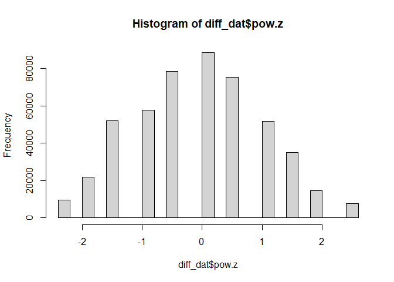
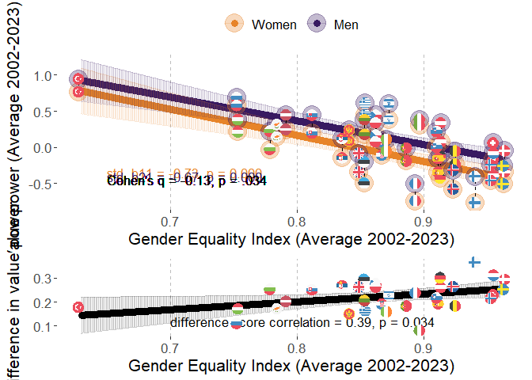
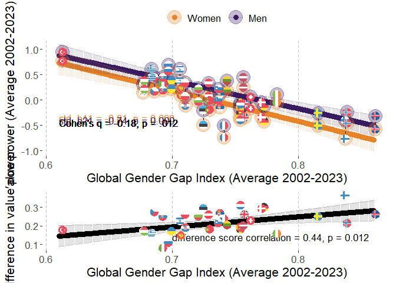
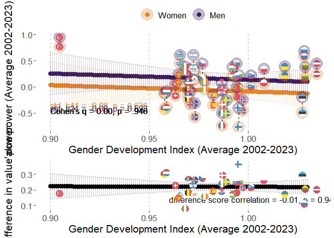
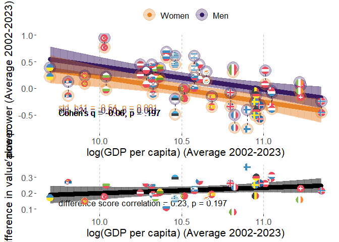
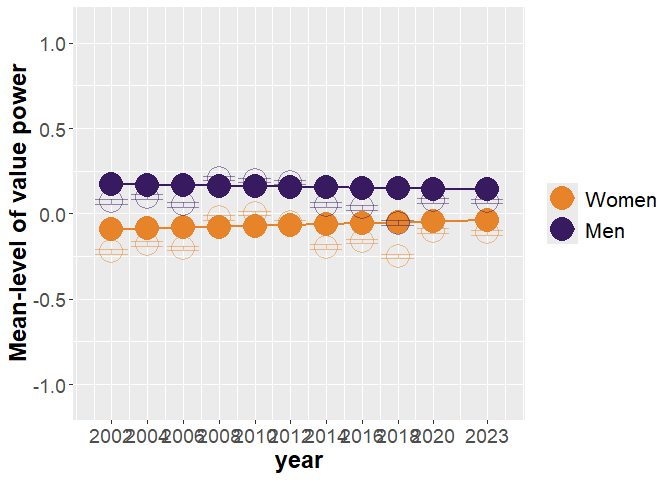
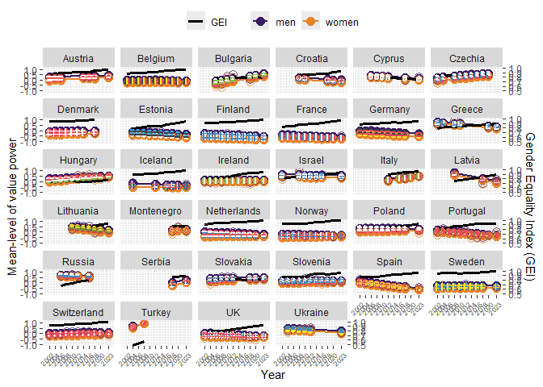

# Packages

Two packages are not in CRAN and need different installation
* devtools::install_github("vjilmari/vjihelpers")
* install.packages("ggflags", repos = c("https://jimjam-slam.r-universe.dev","https://cloud.r-project.org")) 


``` r
library(multid)
library(rio)
library(dplyr)
library(lme4)
library(emmeans)
library(vjihelpers)
library(MetBrewer)
library(ggplot2)
library(finalfit)
library(ggflags) 
library(lmerTest)
library(metafor)
library(ggpubr)
library(Hmisc)
library(r2mlm)
library(tidyr)
library(stringr)
library(apaTables)
library(tibble)
```

# Custom functions


``` r
# toster function for equivalence testing

tost_z <- function(est, se, low, high, alpha = 0.05) {
  # z statistics
  z_low  <- (est - low)  / se     # H0: theta <= low  vs H1: theta > low
  z_high <- (est - high) / se     # H0: theta >= high vs H1: theta < high
  
  # one-sided p-values
  p_low  <- 1 - pnorm(z_low)
  p_high <- pnorm(z_high)
  
  # CI corresponding to TOST (1 - 2*alpha, usually 90% when alpha = 0.05)
  z_crit <- qnorm(1 - alpha)
  ci_low  <- est - z_crit * se
  ci_high <- est + z_crit * se
  
  # equivalence decision
  equivalent <- (p_low < alpha) && (p_high < alpha)
  
  list(
    estimate     = est,
    se           = se,
    low_bound    = low,
    high_bound   = high,
    alpha        = alpha,
    z_low        = z_low,
    p_low        = p_low,
    z_high       = z_high,
    p_high       = p_high,
    ci_level     = 1 - 2*alpha,
    ci_lower     = ci_low,
    ci_upper     = ci_high,
    equivalent   = equivalent
  )
}
```


# Data

* Loads the preprocessed European Social Survey data file made within "Preparations_ESS" code


``` r
load("../data/fdat.rdata")
```

* Include ISO data for country-names


``` r
# read country names
ISO<-read.csv2("../data/ISO.csv")
```


# Exclusions

* exclude participants with missing values or gender


``` r
value.vars<-
  c("con","tra",
  "ben","uni",
  "sdi","sti",
  "hed","ach",
  "pow","sec")

fdat$miss_values<-
  rowSums(is.na(fdat[,value.vars]))
table(fdat$miss_values)
```

```
## 
##      0      1      2      3      4      5      6      7      8      9     10 
## 500044   2791    835    442    267    204    142    143    156    177  35470
```

``` r
fdat<-fdat %>%
  filter(miss_values==0 & !is.na(gndr.bin))
```


# Data for the analysis

* use the testing partition of the data set (diff_dat)
* basic descriptives


``` r
diff_dat<-
  fdat

#diff_dat$age.c<-as.numeric(diff_dat$age.c)
#diff_dat$rlgdgr.c<-as.numeric(diff_dat$rlgdgr.c)
#diff_dat$eduyrs.c<-as.numeric(diff_dat$eduyrs.c)

# data exclusions (include countries with at least two rounds of data)
n_rounds<-diff_dat %>% group_by(cntry) %>%
  summarise(n_unique_essround = n_distinct(essround))

# join number of rounds to data
diff_dat<-
  left_join(x=diff_dat,
            y=n_rounds,
            by="cntry")

# filter only countries with more than 1 round and non-missing gender variable
diff_dat<-diff_dat %>%
  dplyr::filter(n_unique_essround>1 &
                  !is.na(gndr))

# cross-tabulate sample sizes and ESS rounds by country
table(diff_dat$essround,diff_dat$cntry)
```

```
##     
##        AT   BE   BG   CH   CY   CZ   DE   DK   EE   ES   FI   FR   GB   GR   HR   HU   IE   IL   IS   IT
##   1  2254 1830    0 2024    0 1208 2819 1470    0 1712 1763 1355 1798 2551    0 1634 1916 2279    0    0
##   2  2198 1771    0 2110    0 2557 2840 1458 1948 1623 1701 1699 1864 2399    0 1460 1187    0  524    0
##   3  2348 1796 1295 1780  978    0 2884 1461 1466 1847 1649 1983 2353    0    0 1462 1589    0    0    0
##   4     0 1754 2144 1753 1210 1986 2732 1581 1646 2562 1901 2067 2311 2063 1430 1430 1757 2382    0    0
##   5     0 1699 2371 1491 1053 2335 3007 1564 1793 1881 1649 1723 2374 2669 1601 1473 2400 2212    0    0
##   6     0 1862 2179 1483 1110 1973 2935 1621 2345 1871 2158 1960 2261    0    0 1968 2616 2378  739  909
##   7  1795 1767    0 1521    0 1862 3006 1483 2036 1907 2050 1902 2231    0    0 1520 2380 2351    0    0
##   8  1993 1759    0 1504    0 2252 2821    0 2007 1929 1903 2057 1942    0    0 1458 2746 2366  841 2531
##   9  2477 1756 1926 1517  773 2343 2328 1554 1899 1619 1735 1982 2183    0 1781 1643 2189    0  844 2660
##   10    0 1334 2697 1505    0 2369    0    0 1538    0 1561 1951 1131 2768 1564 1816 1751    0  886 2573
##   11 2314 1577 2218 1368  667    0 2381    0 1282 1833 1524 1745 1529 2745 1548 2117 1985  893  825 2783
##     
##        LT   LV   ME   NL   NO   PL   PT   RS   RU   SE   SI   SK   TR   UA
##   1     0    0    0 2337 1819 2065 1482    0    0 1682 1488    0    0    0
##   2     0    0    0 1858 1575 1683 2024    0    0 1678 1384 1425 1790 1896
##   3     0    0    0 1860 1550 1685 2182    0 2339 1604 1465 1711    0 1885
##   4     0 1970    0 1724 1391 1596 2337    0 2446 1556 1257 1789 2305 1766
##   5  1632    0    0 1801 1530 1719 2139    0 2557 1463 1369 1803    0 1779
##   6  2108    0    0 1828 1610 1866 2138    0 2429 1838 1244 1827    0 2064
##   7  2241    0    0 1823 1423 1594 1242    0    0 1761 1189    0    0    0
##   8  2079    0    0 1669 1530 1675 1254    0 2374 1526 1295    0    0    0
##   9  1677  891 1188 1657 1396 1443 1045 1969    0 1510 1307 1061    0    0
##   10 1606    0 1248 1466 1408    0 1827    0    0    0 1232 1395    0    0
##   11 1337 1225 1581 1677 1318 1423 1366 1511    0 1204 1227 1414    0 2589
```

``` r
# range of sample sizes
range(table(diff_dat$cntry))
```

```
## [1]  3480 27753
```

``` r
# scale/standardize with SD pooled across all country-time-gender folds
cntry.pow<-diff_dat %>% group_by(cntry,essround) %>%
  summarise(pow.ctm=mean(pow,na.rm=T),
            pow.ctsd=sd(pow,na.rm=T)) %>%
  group_by(cntry) %>%
  summarise(pow.cm=mean(pow.ctm),
            pow.csd=mean(pow.ctsd)) 
```

```
## `summarise()` has regrouped the output.
## ℹ Summaries were computed grouped by cntry and essround.
## ℹ Output is grouped by cntry.
## ℹ Use `summarise(.groups = "drop_last")` to silence this message.
## ℹ Use `summarise(.by = c(cntry, essround))` for per-operation grouping (`?dplyr::dplyr_by`) instead.
```

``` r
grand_mean_pow<-mean(cntry.pow$pow.cm)
grand_sd_pow<-mean(cntry.pow$pow.csd)

# standardized
diff_dat$pow.z<-(diff_dat$pow-grand_mean_pow)/grand_sd_pow
hist(diff_dat$pow.z)
```

<!-- -->

``` r
# recode time to start from 2002=0

diff_dat$year<-
  case_when(
    diff_dat$essround==1~2002,  
    diff_dat$essround==2~2004,
    diff_dat$essround==3~2006,
    diff_dat$essround==4~2008,
    diff_dat$essround==5~2010,
    diff_dat$essround==6~2012,
    diff_dat$essround==7~2014,
    diff_dat$essround==8~2016,
    diff_dat$essround==9~2018,
    diff_dat$essround==10~2020,
    diff_dat$essround==11~2023
  )

diff_dat$year.c<-diff_dat$year-2002
```

## Add GEI-variable

* GEI = Reverse-coded Gender Inequality Index (GII)


``` r
GII<-read.csv("../data/GII.csv")

# Obtain GII only for ESS countries
GII_in_ESS_d<-
  GII %>%
  filter(ISO2 %in% unique(diff_dat$cntry))

# Make long format data of GII, so that country x year has own rows

long_GII_in_ESS_d <- GII_in_ESS_d %>%
  pivot_longer(
    cols = starts_with("gii_") & !matches("avg"),  # <-- exclude the "_avg" columns
    names_to = "year",
    values_to = "gii",
    names_prefix = "gii_"
  ) %>%
  mutate(year = as.integer(year)) %>%
  filter(year >= 2002 & year <= 2023) %>%
  mutate(gei = 1 - gii) %>%
  select(ISO2, iso3, country, year, gii, gei, gii_2002_2023_avg, gei_2002_2023_avg)


# describe gei average
psych::describe(GII_in_ESS_d$gei_2002_2023_avg)
```

```
##    vars  n mean   sd median trimmed  mad  min  max range  skew kurtosis   se
## X1    1 33 0.87 0.07   0.87    0.87 0.06 0.63 0.96  0.34 -1.06     1.37 0.01
```

``` r
# one is missing, see which one
GII_in_ESS_d[is.na(GII_in_ESS_d$gei_2002_2023_avg),"country"]
```

```
## [1] "Ukraine"
```

``` r
# get means and SDs for standardizing
gei_mean<-mean(GII_in_ESS_d$gei_2002_2023_avg,na.rm=T)
gei_sd<-sd(GII_in_ESS_d$gei_2002_2023_avg,na.rm=T)

# standardize 
# year specific scores
long_GII_in_ESS_d$gei.z<-(long_GII_in_ESS_d$gei-gei_mean)/gei_sd

# get the country means to a separate frame

GII_country_means<-
  long_GII_in_ESS_d %>% group_by(ISO2) %>%
  summarise(gei.cm=mean(gei,na.rm=T),
            gei.z.cm=mean(gei.z,na.rm=T))


long_GII_in_ESS_d<-left_join(
  x=long_GII_in_ESS_d,
  y=GII_country_means,
  by="ISO2"
)


# center both the raw score and standardized scores
long_GII_in_ESS_d$gei.cmc<-(long_GII_in_ESS_d$gei-long_GII_in_ESS_d$gei.cm)
long_GII_in_ESS_d$gei.z.cmc<-(long_GII_in_ESS_d$gei.z-long_GII_in_ESS_d$gei.z.cm)

#View(long_GII_in_ESS_d)

# averages across 2002-2023
#long_GII_in_ESS_d$gei_2002_2023_avg.z<-(long_GII_in_ESS_d$gei_2002_2023_avg-gei_mean)/gei_sd

#long_GII_in_ESS_d$gei.cmc<-long_GII_in_ESS_d$gei-long_GII_in_ESS_d$gei_2002_2023_avg

# add year to ESS data-frame


# link datasets by country and year

diff_dat<-
  left_join(
    x=diff_dat,
    y=long_GII_in_ESS_d[,c("ISO2","year","gei","gei.cm","gei.cmc",
                           "gei.z","gei.z.cm","gei.z.cmc")],
    by=c("cntry"="ISO2","year")
)
```


## Add GDI-variable

* GDI = Gender Development Index


``` r
GDI<-read.csv("../data/GDI.csv")

# Obtain GDI only for ESS countries
GDI_in_ESS_d<-
  GDI %>%
  filter(ISO2 %in% unique(diff_dat$cntry))

# Make long format data of GDI, so that country x year has own rows

long_GDI_in_ESS_d <- GDI_in_ESS_d %>%
  pivot_longer(
    cols = starts_with("gdi_") & !matches("avg"),  # <-- exclude the "_avg" columns
    names_to = "year",
    values_to = "gdi",
    names_prefix = "gdi_"
  ) %>%
  mutate(year = as.integer(year)) %>%
  filter(year >= 2002 & year <= 2023) %>%
  select(ISO2, iso3, country, year, gdi, gdi_2002_2023_avg)

# describe gdi average
psych::describe(GDI_in_ESS_d$gdi_2002_2023_avg)
```

```
##    vars  n mean   sd median trimmed  mad min  max range skew kurtosis se
## X1    1 34 0.98 0.03   0.98    0.98 0.02 0.9 1.03  0.13 -0.3     1.28  0
```

``` r
# get means and SDs for standardizing
gdi_mean<-mean(GDI_in_ESS_d$gdi_2002_2023_avg,na.rm=T)
gdi_sd<-sd(GDI_in_ESS_d$gdi_2002_2023_avg,na.rm=T)

# standardize 
# year specific scores
long_GDI_in_ESS_d$gdi.z<-(long_GDI_in_ESS_d$gdi-gdi_mean)/gdi_sd

# get the country means to a separate frame

GDI_country_means<-
  long_GDI_in_ESS_d %>% group_by(ISO2) %>%
  summarise(gdi.cm=mean(gdi,na.rm=T),
            gdi.z.cm=mean(gdi.z,na.rm=T))

long_GDI_in_ESS_d<-left_join(
  x=long_GDI_in_ESS_d,
  y=GDI_country_means,
  by="ISO2"
)


# center both the raw score and standardized scores
long_GDI_in_ESS_d$gdi.cmc<-(long_GDI_in_ESS_d$gdi-long_GDI_in_ESS_d$gdi.cm)
long_GDI_in_ESS_d$gdi.z.cmc<-(long_GDI_in_ESS_d$gdi.z-long_GDI_in_ESS_d$gdi.z.cm)

# link datasets by country and year

diff_dat<-
  left_join(
    x=diff_dat,
    y=long_GDI_in_ESS_d[,c("ISO2","year","gdi","gdi.cm","gdi.cmc",
                           "gdi.z","gdi.z.cm","gdi.z.cmc")],
    by=c("cntry"="ISO2","year")
  )
```

## Add GDP-variable

* log_GDP = Logarithm of GDP per capita, PPP (constant 2017 international $)


``` r
GDP<-read.csv("../data/GDP_processed.csv")

# Obtain GDP only for ESS countries
GDP_in_ESS_d<-
  GDP %>%
  filter(ISO2 %in% unique(diff_dat$cntry))

# First, rename those X2000..YR2000. style columns to simple "gdp_2000" etc.

GDP_in_ESS_d <- GDP_in_ESS_d %>%
  rename_with(
    ~ str_replace_all(., "^X(\\d{4})..YR\\1\\.$", "gdp_\\1"),
    starts_with("X")
  )

# GDP_in_ESS_d
# Make long format data of GDP, so that country x year has own rows

long_GDP_in_ESS_d <- GDP_in_ESS_d %>%
  pivot_longer(
    cols = starts_with("gdp_") & !matches("avg"),  # <-- exclude the "_avg" columns
    names_to = "year",
    values_to = "gdp",
    names_prefix = "gdp_"
  ) %>%
  mutate(year = as.integer(year)) %>%
  filter(year >= 2002 & year <= 2023) %>%
  select(ISO2, Country.Name, year, gdp, gdp_2002_2023_avg,log_gdp_2002_2023_avg) %>%
  mutate(log_gdp=log(gdp))

#View(long_GDP_in_ESS_d)

# describe gdp average
psych::describe(GDP_in_ESS_d$gdp_2002_2023_avg)
```

```
##    vars  n     mean      sd  median  trimmed     mad      min      max    range skew kurtosis      se
## X1    1 34 43905.99 17369.7 40201.8 42845.95 15827.5 16384.61 85341.85 68957.24 0.48    -0.58 2978.88
```

``` r
psych::describe(GDP_in_ESS_d$log_gdp_2002_2023_avg)
```

```
##    vars  n  mean   sd median trimmed  mad min   max range  skew kurtosis   se
## X1    1 34 10.61 0.41   10.6   10.62 0.44 9.7 11.35  1.65 -0.27    -0.71 0.07
```

``` r
# get means and SDs for standardizing
log_gdp_mean<-mean(GDP_in_ESS_d$log_gdp_2002_2023_avg,na.rm=T)
log_gdp_sd<-sd(GDP_in_ESS_d$log_gdp_2002_2023_avg,na.rm=T)

# standardize 
# year specific scores
long_GDP_in_ESS_d$log_gdp.z<-
  (long_GDP_in_ESS_d$log_gdp-log_gdp_mean)/log_gdp_sd

# get the country means to a separate frame

GDP_country_means<-
  long_GDP_in_ESS_d %>% group_by(ISO2) %>%
  summarise(gdp.cm=mean(gdp,na.rm=T),
            #gdp.z.cm=mean(gdp.z,na.rm=T),
            log_gdp.cm=mean(log_gdp,na.rm=T),
            log_gdp.z.cm=mean(log_gdp.z,na.rm=T))

long_GDP_in_ESS_d<-left_join(
  x=long_GDP_in_ESS_d,
  y=GDP_country_means,
  by="ISO2"
)


# center both the raw score and standardized scores
long_GDP_in_ESS_d$log_gdp.cmc<-(long_GDP_in_ESS_d$log_gdp-long_GDP_in_ESS_d$log_gdp.cm)
long_GDP_in_ESS_d$log_gdp.z.cmc<-(long_GDP_in_ESS_d$log_gdp.z-long_GDP_in_ESS_d$log_gdp.z.cm)

# link datasets by country and year

diff_dat<-
  left_join(
    x=diff_dat,
    y=long_GDP_in_ESS_d[,c("ISO2","year","log_gdp","log_gdp.cm","log_gdp.cmc",
                           "log_gdp.z","log_gdp.z.cm","log_gdp.z.cmc")],
    by=c("cntry"="ISO2","year")
  )
```

## Add GGGI-variable

* GGGI = Global Gender Gap Index


``` r
GGGI<-import("../data/GGGI.xlsx")

# check if all ESS countries are in the log_GGGI data
table(unique(diff_dat$cntry) %in% GGGI$ISO2)
```

```
## 
## TRUE 
##   34
```

``` r
# Obtain GGGI only for ESS countries
GGGI_in_ESS_d<-
  GGGI %>%
  filter(ISO2 %in% unique(diff_dat$cntry))

# Make long format data of GGGI, so that country x year has own rows

long_GGGI_in_ESS_d <- GGGI_in_ESS_d %>%
  pivot_longer(
    cols = starts_with("gggi_") & !matches("avg"),  # <-- exclude the "_avg" columns
    names_to = "year",
    values_to = "gggi",
    names_prefix = "gggi_"
  ) %>%
  mutate(year = as.integer(year)) %>%
  filter(year >= 2002 & year <= 2023) %>%
  select(ISO2, cname, year, gggi, GGGI_2002_2023_avg)

# describe gggi average
psych::describe(GGGI_in_ESS_d$GGGI_2002_2023_avg)
```

```
##    vars  n mean   sd median trimmed  mad  min  max range skew kurtosis   se
## X1    1 34 0.74 0.05   0.73    0.73 0.04 0.61 0.86  0.25  0.4     0.29 0.01
```

``` r
# get means and SDs for standardizing
gggi_mean<-mean(GGGI_in_ESS_d$GGGI_2002_2023_avg,na.rm=T)
gggi_sd<-sd(GGGI_in_ESS_d$GGGI_2002_2023_avg,na.rm=T)

# standardize 
# year specific scores
long_GGGI_in_ESS_d$gggi.z<-(long_GGGI_in_ESS_d$gggi-gggi_mean)/gggi_sd

# get the country means to a separate frame

GGGI_country_means<-
  long_GGGI_in_ESS_d %>% group_by(ISO2) %>%
  summarise(gggi.cm=mean(gggi,na.rm=T),
            gggi.z.cm=mean(gggi.z,na.rm=T))

long_GGGI_in_ESS_d<-left_join(
  x=long_GGGI_in_ESS_d,
  y=GGGI_country_means,
  by="ISO2"
)

# center both the raw score and standardized scores
long_GGGI_in_ESS_d$gggi.cmc<-
  (long_GGGI_in_ESS_d$gggi-long_GGGI_in_ESS_d$gggi.cm)

long_GGGI_in_ESS_d$gggi.z.cmc<-
  (long_GGGI_in_ESS_d$gggi.z-long_GGGI_in_ESS_d$gggi.z.cm)

# link datasets by country and year

diff_dat<-
  left_join(
    x=diff_dat,
    y=long_GGGI_in_ESS_d[,c("ISO2","year","gggi","gggi.cm","gggi.cmc",
                           "gggi.z","gggi.z.cm","gggi.z.cmc")],
    by=c("cntry"="ISO2","year")
  )
```

## Country-year-gender dataframe

Frame with one row for country-year-gender


``` r
diff_dat_cntry_year<-
  diff_dat %>% 
  group_by(cntry,year,gndr.c) %>%
  dplyr::summarise(n=n(),
                   n_wt=sum(pspwght),
                   pow.z.wt=weighted.mean(x=pow.z,w=pspwght),
                   pow.z=mean(pow.z),
                   gei.z=mean(gei.z,na.rm=T),
                   gei.z.cm=mean(gei.z.cm,na.rm=T),
                   gei.z.cmc=mean(gei.z.cmc,na.rm=T),
                   gdi.z=mean(gdi.z,na.rm=T),
                   gdi.z.cm=mean(gdi.z.cm,na.rm=T),
                   gdi.z.cmc=mean(gdi.z.cmc,na.rm=T),
                   gggi.z=mean(gggi.z,na.rm=T),
                   gggi.z.cm=mean(gggi.z.cm,na.rm=T),
                   gggi.z.cmc=mean(gggi.z.cmc,na.rm=T),
                   log_gdp.z=mean(log_gdp.z,na.rm=T),
                   log_gdp.z.cm=mean(log_gdp.z.cm,na.rm=T),
                   log_gdp.z.cmc=mean(log_gdp.z.cmc,na.rm=T),
                   gei=mean(gei,na.rm=T),
                   gei.cm=mean(gei.cm,na.rm=T),
                   gei.cmc=mean(gei.cmc,na.rm=T),
                   gdi=mean(gdi,na.rm=T),
                   gdi.cm=mean(gdi.cm,na.rm=T),
                   gdi.cmc=mean(gdi.cmc,na.rm=T),
                   gggi=mean(gggi,na.rm=T),
                   gggi.cm=mean(gggi.cm,na.rm=T),
                   gggi.cmc=mean(gggi.cmc,na.rm=T),
                   log_gdp=mean(log_gdp,na.rm=T),
                   log_gdp.cm=mean(log_gdp.cm,na.rm=T),
                   log_gdp.cmc=mean(log_gdp.cmc,na.rm=T))
```

```
## `summarise()` has regrouped the output.
## ℹ Summaries were computed grouped by cntry, year, and gndr.c.
## ℹ Output is grouped by cntry and year.
## ℹ Use `summarise(.groups = "drop_last")` to silence this message.
## ℹ Use `summarise(.by = c(cntry, year, gndr.c))` for per-operation grouping (`?dplyr::dplyr_by`) instead.
```


# Descriptive statistics

## Country-specific descriptives


``` r
# sample sizes from weights

cntry_n_frame<-
  diff_dat %>% group_by(cntry) %>%
  summarise('n ESS rounds' = mean(n_unique_essround),
            n=round(sum(pspwght),0))

# power

cntry_pow_frame<-
  diff_dat %>% group_by(cntry,essround) %>%
  summarise('pow M' = weighted.mean(x=pow.z,w=pspwght),
            'pow SD' = sqrt(wtd.var(pow.z,pspwght))) %>%
  group_by(cntry) %>%
  summarise('pow M' = mean(x=`pow M`),
            'pow SD'= mean(x=`pow SD`))
```

```
## `summarise()` has regrouped the output.
## ℹ Summaries were computed grouped by cntry and essround.
## ℹ Output is grouped by cntry.
## ℹ Use `summarise(.groups = "drop_last")` to silence this message.
## ℹ Use `summarise(.by = c(cntry, essround))` for per-operation grouping (`?dplyr::dplyr_by`) instead.
```

``` r
cntry_pow_women_frame<-
  diff_dat %>%
  filter(gndr.c==-0.5) %>%
  group_by(cntry,essround) %>%
  summarise('pow M' = weighted.mean(x=pow.z,w=pspwght),
            'pow SD' = sqrt(wtd.var(pow.z,pspwght))) %>%
  group_by(cntry) %>%
  summarise('pow M Women' = mean(x=`pow M`),
            'pow SD Women'= mean(x=`pow SD`))
```

```
## `summarise()` has regrouped the output.
## ℹ Summaries were computed grouped by cntry and essround.
## ℹ Output is grouped by cntry.
## ℹ Use `summarise(.groups = "drop_last")` to silence this message.
## ℹ Use `summarise(.by = c(cntry, essround))` for per-operation grouping (`?dplyr::dplyr_by`) instead.
```

``` r
cntry_pow_men_frame<-
  diff_dat %>%
  filter(gndr.c==0.5) %>%
  group_by(cntry,essround) %>%
  summarise('pow M' = weighted.mean(x=pow.z,w=pspwght),
            'pow SD' = sqrt(wtd.var(pow.z,pspwght))) %>%
  group_by(cntry) %>%
  summarise('pow M Men' = mean(x=`pow M`),
            'pow SD Men'= mean(x=`pow SD`))
```

```
## `summarise()` has regrouped the output.
## ℹ Summaries were computed grouped by cntry and essround.
## ℹ Output is grouped by cntry.
## ℹ Use `summarise(.groups = "drop_last")` to silence this message.
## ℹ Use `summarise(.by = c(cntry, essround))` for per-operation grouping (`?dplyr::dplyr_by`) instead.
```

``` r
# link n and pow datasets

desc_frame<-
  left_join(
    x=cntry_n_frame,
    y=cntry_pow_frame,
    by="cntry"
  )

desc_frame<-
  left_join(
    x=desc_frame,
    y=cntry_pow_women_frame,
    by="cntry"
  )

desc_frame<-
  left_join(
    x=desc_frame,
    y=cntry_pow_men_frame,
    by="cntry"
  )

# Add country-specific differences
desc_frame$D<-desc_frame$`pow M Men`-desc_frame$`pow M Women`

desc_frame
```

```
## # A tibble: 34 × 10
##    cntry `n ESS rounds`     n `pow M` `pow SD` `pow M Women` `pow SD Women` `pow M Men` `pow SD Men`     D
##    <chr>          <dbl> <dbl>   <dbl>    <dbl>         <dbl>          <dbl>       <dbl>        <dbl> <dbl>
##  1 AT                 7 15400  0.201     0.958        0.0752          0.966      0.336         0.930 0.261
##  2 BE                11 18886 -0.150     0.939       -0.237           0.938     -0.0596        0.931 0.177
##  3 BG                 7 14857  0.0400    1.09        -0.0849          1.09       0.175         1.08  0.260
##  4 CH                11 18087 -0.0496    0.970       -0.161           0.975      0.0673        0.950 0.229
##  5 CY                 6  5771  0.208     1.02         0.130           1.02       0.290         1.02  0.159
##  6 CZ                 9 18934  0.279     1.04         0.144           1.05       0.426         0.996 0.282
##  7 DE                10 27753 -0.285     0.985       -0.433           0.965     -0.129         0.981 0.303
##  8 DK                 8 12198 -0.201     0.977       -0.348           0.957     -0.0499        0.975 0.298
##  9 EE                10 17974 -0.369     1.03        -0.505           1.03      -0.207         1.02  0.298
## 10 ES                10 18785 -0.255     1.05        -0.346           1.05      -0.161         1.05  0.185
## # ℹ 24 more rows
```

``` r
# add country-level measures

desc_frame<-
  left_join(
    x=desc_frame,
    y=GII_country_means[,c("ISO2","gei.cm")],
    by=c("cntry"="ISO2")
  )

desc_frame<-
  left_join(
    x=desc_frame,
    y=GGGI_country_means[,c("ISO2","gggi.cm")],
    by=c("cntry"="ISO2")
  )

desc_frame<-
  left_join(
    x=desc_frame,
    y=GDI_country_means[,c("ISO2","gdi.cm")],
    by=c("cntry"="ISO2")
  )


desc_frame<-
  left_join(
    x=desc_frame,
    y=GDP_country_means[,c("ISO2","gdp.cm")],
    by=c("cntry"="ISO2")
  )

desc_frame<-left_join(
  x=desc_frame,
  y=ISO[,c("ISO2","CLDR")],
  by=c("cntry"="ISO2")
)

# finalize the formatted table

cntry_desc_tbl<-
  desc_frame %>%
  select(
    Country = CLDR,
    `n ESS rounds`,
    n,
    `pow M`, `pow SD`,
    `pow M Women`, `pow SD Women`,
    `pow M Men`, `pow SD Men`,
    D,
    GEI = gei.cm,
    GGGI = gggi.cm,
    GDI = gdi.cm,
    GDP = gdp.cm
  ) %>%
  mutate(
    across(
      .cols = -c(Country, `n ESS rounds`, n, GDP) & where(is.numeric),
      .fns  = ~ round_tidy(.x, 2)
    )
  ) %>%
  mutate(
    across(
      .cols = GDP,
      .fns  = ~ round_tidy(.x, 0)
    )
  )
print(cntry_desc_tbl,n=35)
```

```
## # A tibble: 34 × 14
##    Country     `n ESS rounds`     n `pow M` `pow SD` `pow M Women` `pow SD Women` `pow M Men` `pow SD Men`
##    <chr>                <dbl> <dbl> <chr>   <chr>    <chr>         <chr>          <chr>       <chr>       
##  1 Austria                  7 15400 0.20    0.96     0.08          0.97           0.34        0.93        
##  2 Belgium                 11 18886 -0.15   0.94     -0.24         0.94           -0.06       0.93        
##  3 Bulgaria                 7 14857 0.04    1.09     -0.08         1.09           0.17        1.08        
##  4 Switzerland             11 18087 -0.05   0.97     -0.16         0.97           0.07        0.95        
##  5 Cyprus                   6  5771 0.21    1.02     0.13          1.02           0.29        1.02        
##  6 Czechia                  9 18934 0.28    1.04     0.14          1.05           0.43        1.00        
##  7 Germany                 10 27753 -0.29   0.98     -0.43         0.96           -0.13       0.98        
##  8 Denmark                  8 12198 -0.20   0.98     -0.35         0.96           -0.05       0.97        
##  9 Estonia                 10 17974 -0.37   1.03     -0.51         1.03           -0.21       1.02        
## 10 Spain                   10 18785 -0.26   1.05     -0.35         1.05           -0.16       1.05        
## 11 Finland                 11 19568 -0.59   0.97     -0.77         0.95           -0.40       0.96        
## 12 France                  11 20457 -0.62   1.02     -0.73         1.00           -0.50       1.02        
## 13 UK                      11 22979 -0.23   1.03     -0.36         1.02           -0.10       1.02        
## 14 Greece                   6 15212 0.54    1.03     0.46          1.04           0.63        1.01        
## 15 Croatia                  5  7914 -0.02   1.02     -0.11         1.03           0.08        1.00        
## 16 Hungary                 11 18123 0.28    1.06     0.21          1.07           0.37        1.04        
## 17 Ireland                 11 22562 0.01    1.07     -0.06         1.07           0.09        1.06        
## 18 Israel                   7 14857 0.47    1.11     0.37          1.12           0.59        1.08        
## 19 Iceland                  6  4654 -0.44   0.91     -0.58         0.88           -0.30       0.91        
## 20 Italy                    5 11441 0.30    0.93     0.27          0.93           0.34        0.94        
## 21 Lithuania                7 13059 0.24    1.03     0.14          1.03           0.36        1.02        
## 22 Latvia                   3  4088 0.20    1.03     0.12          1.02           0.31        1.04        
## 23 Montenegro               3  4028 0.17    1.04     0.10          1.06           0.23        1.01        
## 24 Netherlands             11 19722 -0.24   0.91     -0.40         0.91           -0.09       0.88        
## 25 Norway                  11 16505 -0.35   0.91     -0.46         0.90           -0.25       0.90        
## 26 Poland                  10 16737 0.20    1.01     0.07          1.03           0.34        0.98        
## 27 Portugal                11 19070 -0.16   0.91     -0.24         0.91           -0.07       0.90        
## 28 Serbia                   2  3499 -0.00   1.14     -0.14         1.15           0.14        1.11        
## 29 Russia                   5 12139 0.62    1.04     0.58          1.04           0.68        1.05        
## 30 Sweden                  10 16104 -0.39   0.94     -0.51         0.91           -0.27       0.94        
## 31 Slovenia                11 14463 0.11    0.92     0.00          0.92           0.22        0.91        
## 32 Slovakia                 8 12547 0.30    1.01     0.18          1.03           0.43        0.98        
## 33 Turkey                   2  4108 0.83    0.95     0.73          0.97           0.93        0.92        
## 34 Ukraine                  6 12054 0.31    1.12     0.24          1.12           0.39        1.11        
## # ℹ 5 more variables: D <chr>, GEI <chr>, GGGI <chr>, GDI <chr>, GDP <chr>
```

``` r
export(cntry_desc_tbl,"../results/pow/cntry_desc_tbl.xlsx",overwrite=T)
```

## Country-level correlations table


``` r
cor_frame<-
  desc_frame %>%
  select(
    VBMT=`pow M`,
    VBMT_Women=`pow M Women`,
    VBMT_Men=`pow M Men`,
    D = D,
    GEI = gei.cm,
    GGGI = gggi.cm,
    GDI = gdi.cm,
    GDP = gdp.cm
  ) %>%
  mutate(
    log_GDP=log(GDP)
  ) %>%
  select(-GDP)

apa.cor.table(
  data=cor_frame,
  filename = "../results/pow/CorTable1.doc",
  #table.number = NA,
  show.conf.interval = FALSE,
  show.sig.stars = F,
  landscape = F
)
```

```
## The ability to suppress reporting of reporting confidence intervals has been deprecated in this version.
## The function argument show.conf.interval will be removed in a later version.
```

```
## 
## 
## Means, standard deviations, and correlations with confidence intervals
##  
## 
##   Variable      M     SD   1            2            3            4           5           6          
##   1. VBMT       0.03  0.35                                                                           
##                                                                                                      
##   2. VBMT_Women -0.08 0.37 1.00                                                                      
##                            [.99, 1.00]                                                               
##                                                                                                      
##   3. VBMT_Men   0.14  0.33 1.00         .99                                                          
##                            [.99, 1.00]  [.98, .99]                                                   
##                                                                                                      
##   4. D          0.22  0.06 -.54         -.60         -.47                                            
##                            [-.74, -.25] [-.78, -.33] [-.69, -.15]                                    
##                                                                                                      
##   5. GEI        0.87  0.07 -.70         -.70         -.70         .36                                
##                            [-.84, -.47] [-.84, -.46] [-.84, -.47] [.02, .63]                         
##                                                                                                      
##   6. GGGI       0.74  0.05 -.80         -.80         -.80         .44         .73                    
##                            [-.89, -.63] [-.89, -.63] [-.89, -.63] [.11, .67]  [.52, .86]             
##                                                                                                      
##   7. GDI        0.98  0.03 -.12         -.10         -.12         -.04        .07         .19        
##                            [-.44, .23]  [-.42, .25]  [-.44, .23]  [-.37, .31] [-.28, .41] [-.16, .50]
##                                                                                                      
##   8. log_GDP    10.61 0.41 -.53         -.52         -.53         .23         .72         .62        
##                            [-.73, -.23] [-.73, -.22] [-.74, -.24] [-.12, .53] [.50, .85]  [.36, .79] 
##                                                                                                      
##   7          
##              
##              
##              
##              
##              
##              
##              
##              
##              
##              
##              
##              
##              
##              
##              
##              
##              
##              
##              
##              
##   -.18       
##   [-.49, .17]
##              
## 
## Note. M and SD are used to represent mean and standard deviation, respectively.
## Values in square brackets indicate the 95% confidence interval.
## The confidence interval is a plausible range of population correlations 
## that could have caused the sample correlation (Cumming, 2014).
## 
```


# Analysis

Following preregistration: https://osf.io/7cags?view_only=f3e97a78271e46bfafb9e20ac8d35bb1 

## mod0: Random intercept model


``` r
mod0<-lmer(pow.z~(1|cntry),data=diff_dat,REML=F,weights = pspwght,
           control=lmerControl(optimizer="bobyqa",optCtrl=list(maxfun=2e7)))
summary(mod0)
```

```
## Linear mixed model fit by maximum likelihood . t-tests use Satterthwaite's method ['lmerModLmerTest']
## Formula: pow.z ~ (1 | cntry)
##    Data: diff_dat
## Weights: pspwght
## Control: lmerControl(optimizer = "bobyqa", optCtrl = list(maxfun = 2e+07))
## 
##       AIC       BIC    logLik -2*log(L)  df.resid 
## 1476842.6 1476875.9 -738418.3 1476836.6    492340 
## 
## Scaled residuals: 
##     Min      1Q  Median      3Q     Max 
## -5.8968 -0.6662 -0.0442  0.6207  6.6291 
## 
## Random effects:
##  Groups   Name        Variance Std.Dev.
##  cntry    (Intercept) 0.1208   0.3476  
##  Residual             1.0331   1.0164  
## Number of obs: 492343, groups:  cntry, 34
## 
## Fixed effects:
##             Estimate Std. Error       df t value Pr(>|t|)
## (Intercept)  0.03864    0.05963 33.99369   0.648    0.521
```

``` r
getVC(mod0)
```

```
##        grp        var1 var2 sdcor vcov
## 1    cntry (Intercept) <NA>  0.35 0.12
## 2 Residual        <NA> <NA>  1.02 1.03
```

``` r
r2mlm(mod0,bargraph = F)
```

```
## $Decompositions
##                     total within between
## fixed, within   0.0000000      0      NA
## fixed, between  0.0000000     NA       0
## slope variation 0.0000000      0      NA
## mean variation  0.1046985     NA       1
## sigma2          0.8953015      1      NA
## 
## $R2s
##         total within between
## f1  0.0000000      0      NA
## f2  0.0000000     NA       0
## v   0.0000000      0      NA
## m   0.1046985     NA       1
## f   0.0000000     NA      NA
## fv  0.0000000      0      NA
## fvm 0.1046985     NA      NA
```

## mod1: Gender fixed effect


``` r
mod1<-lmer(pow.z~gndr.c+(1|cntry),data=diff_dat,REML=F,weights = pspwght,
           control=lmerControl(optimizer="bobyqa",optCtrl=list(maxfun=2e7)))
summary(mod1)
```

```
## Linear mixed model fit by maximum likelihood . t-tests use Satterthwaite's method ['lmerModLmerTest']
## Formula: pow.z ~ gndr.c + (1 | cntry)
##    Data: diff_dat
## Weights: pspwght
## Control: lmerControl(optimizer = "bobyqa", optCtrl = list(maxfun = 2e+07))
## 
##       AIC       BIC    logLik -2*log(L)  df.resid 
## 1470522.8 1470567.3 -735257.4 1470514.8    492339 
## 
## Scaled residuals: 
##     Min      1Q  Median      3Q     Max 
## -6.1839 -0.6601 -0.0242  0.6137  6.4152 
## 
## Random effects:
##  Groups   Name        Variance Std.Dev.
##  cntry    (Intercept) 0.1215   0.3486  
##  Residual             1.0199   1.0099  
## Number of obs: 492343, groups:  cntry, 34
## 
## Fixed effects:
##              Estimate Std. Error        df t value Pr(>|t|)    
## (Intercept) 4.299e-02  5.980e-02 3.399e+01   0.719    0.477    
## gndr.c      2.294e-01  2.875e-03 4.923e+05  79.766   <2e-16 ***
## ---
## Signif. codes:  0 '***' 0.001 '**' 0.01 '*' 0.05 '.' 0.1 ' ' 1
## 
## Correlation of Fixed Effects:
##        (Intr)
## gndr.c 0.001
```

``` r
getFE(mod1,round=3)
```

```
##              Est.    SE         df      t     p     LL    UL
## (Intercept) 0.043 0.060     33.994  0.719 0.477 -0.079 0.165
## gndr.c      0.229 0.003 492309.570 79.766 0.000  0.224 0.235
```

``` r
getVC(mod1)
```

```
##        grp        var1 var2 sdcor vcov
## 1    cntry (Intercept) <NA>  0.35 0.12
## 2 Residual        <NA> <NA>  1.01 1.02
```

``` r
r2mlm(mod1,bargraph = F)
```

```
## $Decompositions
##                      total
## fixed           0.01132298
## slope variation 0.00000000
## mean variation  0.10523401
## sigma2          0.88344301
## 
## $R2s
##          total
## f   0.01132298
## v   0.00000000
## m   0.10523401
## fv  0.01132298
## fvm 0.11655699
```

## mod2: Gender fixed and random effect

* Include random effect correlation by default


``` r
mod2<-lmer(pow.z~gndr.c+(gndr.c|cntry),data=diff_dat,REML=F,weights = pspwght,
           control=lmerControl(optimizer="bobyqa",optCtrl=list(maxfun=2e7)))
summary(mod2)
```

```
## Linear mixed model fit by maximum likelihood . t-tests use Satterthwaite's method ['lmerModLmerTest']
## Formula: pow.z ~ gndr.c + (gndr.c | cntry)
##    Data: diff_dat
## Weights: pspwght
## Control: lmerControl(optimizer = "bobyqa", optCtrl = list(maxfun = 2e+07))
## 
##       AIC       BIC    logLik -2*log(L)  df.resid 
## 1470138.1 1470204.8 -735063.1 1470126.1    492337 
## 
## Scaled residuals: 
##     Min      1Q  Median      3Q     Max 
## -6.0575 -0.6595 -0.0185  0.6149  6.4088 
## 
## Random effects:
##  Groups   Name        Variance Std.Dev. Corr  
##  cntry    (Intercept) 0.120912 0.34772        
##           gndr.c      0.003821 0.06181  -0.55 
##  Residual             1.018939 1.00943        
## Number of obs: 492343, groups:  cntry, 34
## 
## Fixed effects:
##             Estimate Std. Error       df t value Pr(>|t|)    
## (Intercept)  0.04264    0.05966 33.99534   0.715     0.48    
## gndr.c       0.22138    0.01109 34.20860  19.960   <2e-16 ***
## ---
## Signif. codes:  0 '***' 0.001 '**' 0.01 '*' 0.05 '.' 0.1 ' ' 1
## 
## Correlation of Fixed Effects:
##        (Intr)
## gndr.c -0.528
```

``` r
getFE(mod2,round=3)
```

```
##              Est.    SE     df      t    p     LL    UL
## (Intercept) 0.043 0.060 33.995  0.715 0.48 -0.079 0.164
## gndr.c      0.221 0.011 34.209 19.960 0.00  0.199 0.244
```

``` r
getVC(mod2)
```

```
##        grp        var1   var2 sdcor  vcov
## 1    cntry (Intercept)   <NA>  0.35  0.12
## 2    cntry      gndr.c   <NA>  0.06  0.00
## 3    cntry (Intercept) gndr.c -0.55 -0.01
## 4 Residual        <NA>   <NA>  1.01  1.02
```

``` r
r2mlm(mod2,bargraph = F)
```

```
## $Decompositions
##                       total
## fixed           0.010554464
## slope variation 0.000822829
## mean variation  0.105588696
## sigma2          0.883034011
## 
## $R2s
##           total
## f   0.010554464
## v   0.000822829
## m   0.105588696
## fv  0.011377293
## fvm 0.116965989
```

``` r
anova(mod1,mod2)
```

```
## Data: diff_dat
## Models:
## mod1: pow.z ~ gndr.c + (1 | cntry)
## mod2: pow.z ~ gndr.c + (gndr.c | cntry)
##      npar     AIC     BIC  logLik -2*log(L)  Chisq Df Pr(>Chisq)    
## mod1    4 1470523 1470567 -735257   1470515                         
## mod2    6 1470138 1470205 -735063   1470126 388.69  2  < 2.2e-16 ***
## ---
## Signif. codes:  0 '***' 0.001 '**' 0.01 '*' 0.05 '.' 0.1 ' ' 1
```

``` r
lvl2_var_cond_lvl1(mod2,lvl1.var = "gndr.c",lvl1.values = c(0.5,-0.5))
```

```
##   lvl1.value lvl2.cond.var lvl2.cond.sd
## 1        0.5     0.1099927    0.3316514
## 2       -0.5     0.1337410    0.3657062
```

* Test for random effect correlation


``` r
mod2_norecov<-lmer(pow.z~gndr.c+(gndr.c||cntry),data=diff_dat,REML=F,weights = pspwght,
                   control=lmerControl(optimizer="bobyqa",optCtrl=list(maxfun=2e7)))
summary(mod2_norecov)
```

```
## Linear mixed model fit by maximum likelihood . t-tests use Satterthwaite's method ['lmerModLmerTest']
## Formula: pow.z ~ gndr.c + (gndr.c || cntry)
##    Data: diff_dat
## Weights: pspwght
## Control: lmerControl(optimizer = "bobyqa", optCtrl = list(maxfun = 2e+07))
## 
##       AIC       BIC    logLik -2*log(L)  df.resid 
## 1470147.1 1470202.7 -735068.6 1470137.1    492338 
## 
## Scaled residuals: 
##     Min      1Q  Median      3Q     Max 
## -6.0602 -0.6594 -0.0176  0.6151  6.4138 
## 
## Random effects:
##  Groups   Name        Variance Std.Dev.
##  cntry    (Intercept) 0.120950 0.34778 
##  cntry.1  gndr.c      0.003796 0.06161 
##  Residual             1.018940 1.00943 
## Number of obs: 492343, groups:  cntry, 34
## 
## Fixed effects:
##             Estimate Std. Error       df t value Pr(>|t|)    
## (Intercept)  0.04266    0.05967 33.99333   0.715    0.479    
## gndr.c       0.22193    0.01107 34.25383  20.057   <2e-16 ***
## ---
## Signif. codes:  0 '***' 0.001 '**' 0.01 '*' 0.05 '.' 0.1 ' ' 1
## 
## Correlation of Fixed Effects:
##        (Intr)
## gndr.c 0.000
```

``` r
getFE(mod2_norecov,round=3)
```

```
##              Est.    SE     df      t     p     LL    UL
## (Intercept) 0.043 0.060 33.993  0.715 0.479 -0.079 0.164
## gndr.c      0.222 0.011 34.254 20.057 0.000  0.199 0.244
```

``` r
getVC(mod2_norecov)
```

```
##        grp        var1 var2 sdcor vcov
## 1    cntry (Intercept) <NA>  0.35 0.12
## 2  cntry.1      gndr.c <NA>  0.06 0.00
## 3 Residual        <NA> <NA>  1.01 1.02
```

``` r
anova(mod2_norecov,mod2)
```

```
## Data: diff_dat
## Models:
## mod2_norecov: pow.z ~ gndr.c + (gndr.c || cntry)
## mod2: pow.z ~ gndr.c + (gndr.c | cntry)
##              npar     AIC     BIC  logLik -2*log(L) Chisq Df Pr(>Chisq)    
## mod2_norecov    5 1470147 1470203 -735069   1470137                        
## mod2            6 1470138 1470205 -735063   1470126 10.97  1  0.0009258 ***
## ---
## Signif. codes:  0 '***' 0.001 '**' 0.01 '*' 0.05 '.' 0.1 ' ' 1
```


## mod2 with Gender-equality index (GEI)


``` r
mod2_GEI<-lmer(pow.z~gndr.c+gei.z.cm+gndr.c:gei.z.cm+
                 (gndr.c|cntry),data=diff_dat,REML=F,weights = pspwght,
           control=lmerControl(optimizer="bobyqa",optCtrl=list(maxfun=2e7)))
summary(mod2_GEI)
```

```
## Linear mixed model fit by maximum likelihood . t-tests use Satterthwaite's method ['lmerModLmerTest']
## Formula: pow.z ~ gndr.c + gei.z.cm + gndr.c:gei.z.cm + (gndr.c | cntry)
##    Data: diff_dat
## Weights: pspwght
## Control: lmerControl(optimizer = "bobyqa", optCtrl = list(maxfun = 2e+07))
## 
##       AIC       BIC    logLik -2*log(L)  df.resid 
## 1429187.8 1429276.5 -714585.9 1429171.8    480356 
## 
## Scaled residuals: 
##     Min      1Q  Median      3Q     Max 
## -6.0780 -0.6610 -0.0180  0.6163  6.4298 
## 
## Random effects:
##  Groups   Name        Variance Std.Dev. Corr  
##  cntry    (Intercept) 0.060497 0.24596        
##           gndr.c      0.003292 0.05738  -0.42 
##  Residual             1.012192 1.00608        
## Number of obs: 480364, groups:  cntry, 33
## 
## Fixed effects:
##                 Estimate Std. Error       df t value Pr(>|t|)    
## (Intercept)      0.03483    0.04285 33.02047   0.813   0.4222    
## gndr.c           0.22303    0.01053 33.31726  21.189  < 2e-16 ***
## gei.z.cm        -0.25295    0.04353 33.06933  -5.811 1.67e-06 ***
## gndr.c:gei.z.cm  0.02412    0.01093 36.17883   2.207   0.0338 *  
## ---
## Signif. codes:  0 '***' 0.001 '**' 0.01 '*' 0.05 '.' 0.1 ' ' 1
## 
## Correlation of Fixed Effects:
##             (Intr) gndr.c g.z.cm
## gndr.c      -0.394              
## gei.z.cm    -0.001  0.000       
## gndr.c:g.z.  0.000 -0.032 -0.385
```

``` r
getFE(mod2_GEI,round=3)
```

```
##                   Est.    SE     df      t     p     LL     UL
## (Intercept)      0.035 0.043 33.020  0.813 0.422 -0.052  0.122
## gndr.c           0.223 0.011 33.317 21.189 0.000  0.202  0.244
## gei.z.cm        -0.253 0.044 33.069 -5.811 0.000 -0.342 -0.164
## gndr.c:gei.z.cm  0.024 0.011 36.179  2.207 0.034  0.002  0.046
```

``` r
getVC(mod2_GEI)
```

```
##        grp        var1   var2 sdcor  vcov
## 1    cntry (Intercept)   <NA>  0.25  0.06
## 2    cntry      gndr.c   <NA>  0.06  0.00
## 3    cntry (Intercept) gndr.c -0.42 -0.01
## 4 Residual        <NA>   <NA>  1.01  1.01
```

``` r
r2mlm(mod2_GEI,bargraph = F)
```

```
## $Decompositions
##                        total
## fixed           0.0498944205
## slope variation 0.0007242018
## mean variation  0.0539044144
## sigma2          0.8954769632
## 
## $R2s
##            total
## f   0.0498944205
## v   0.0007242018
## m   0.0539044144
## fv  0.0506186223
## fvm 0.1045230368
```

### Deconstructed associations


``` r
t1<-Sys.time()
ddsc_mod2_GEI<-
  ddsc_ml(model = mod2_GEI,
          predictor = "gei.z.cm",
          moderator = "gndr.c",moderator_values = c(-0.5,0.5),
          re_cov_test = T)
t2<-Sys.time()
t2-t1
```

```
## Time difference of 32.04587 secs
```

``` r
round(ddsc_mod2_GEI$vpc_at_moderator_values,3)
```

```
##   lvl1.value Intercept.var Intercept.sd Residual.var Total.var   VPC mean.n.obs  ICC2 ICC2_SP
## 1       -0.5         0.134        0.366        1.019     1.153 0.116   7802.647 0.999   0.999
## 2        0.5         0.110        0.332        1.019     1.129 0.097   6678.029 0.998   0.999
```

``` r
round(ddsc_mod2_GEI$descriptives,3)
```

```
##                        M    SD means_y1 means_y1_scaled means_y2 means_y2_scaled gei.z.cm gei.z.cm_scaled
## means_y1           0.118 0.345    1.000           1.000    0.989           0.989   -0.695          -0.695
## means_y1_scaled    0.327 0.956    1.000           1.000    0.989           0.989   -0.695          -0.695
## means_y2          -0.096 0.377    0.989           0.989    1.000           1.000   -0.692          -0.692
## means_y2_scaled   -0.266 1.043    0.989           0.989    1.000           1.000   -0.692          -0.692
## gei.z.cm           0.000 1.000   -0.695          -0.695   -0.692          -0.692    1.000           1.000
## gei.z.cm_scaled    0.000 1.000   -0.695          -0.695   -0.692          -0.692    1.000           1.000
## diff_score         0.214 0.061   -0.446          -0.446   -0.572          -0.572    0.342           0.342
## diff_score_scaled  0.593 0.170   -0.446          -0.446   -0.572          -0.572    0.342           0.342
##                   diff_score diff_score_scaled
## means_y1              -0.446            -0.446
## means_y1_scaled       -0.446            -0.446
## means_y2              -0.572            -0.572
## means_y2_scaled       -0.572            -0.572
## gei.z.cm               0.342             0.342
## gei.z.cm_scaled        0.342             0.342
## diff_score             1.000             1.000
## diff_score_scaled      1.000             1.000
```

``` r
round(ddsc_mod2_GEI$results,3)
```

```
##                            estimate    SE     df t.ratio p.value ci.lower ci.upper
## r_xy1y2                      -0.393 0.178 36.179  -2.207   0.034   -0.754   -0.032
## w_11                         -0.265 0.046 33.120  -5.772   0.000   -0.358   -0.172
## w_21                         -0.241 0.042 33.152  -5.772   0.000   -0.326   -0.156
## r_xy1                        -0.768 0.133 33.120  -5.772   0.000   -1.038   -0.497
## r_xy2                        -0.639 0.111 33.152  -5.772   0.000   -0.865   -0.414
## b_11                         -0.734 0.127 33.120  -5.772   0.000   -0.993   -0.475
## b_21                         -0.667 0.116 33.152  -5.772   0.000   -0.902   -0.432
## main_effect                  -0.253 0.044 33.069  -5.811   0.000   -0.342   -0.164
## moderator_effect              0.223 0.011 33.317  21.189   0.000    0.202    0.244
## interaction                   0.024 0.011 36.179   2.207   0.034    0.002    0.046
## q_b11_b21                    -0.132    NA     NA      NA      NA       NA       NA
## q_rxy1_rxy2                  -0.257    NA     NA      NA      NA       NA       NA
## cross_over_point             -9.249    NA     NA      NA      NA       NA       NA
## interaction_vs_main          -0.229 0.041 33.404  -5.637   0.000   -0.311   -0.146
## interaction_vs_main_bscale   -0.634 0.112 33.404  -5.637   0.000   -0.863   -0.405
## interaction_vs_main_rscale   -0.575 0.103 33.454  -5.609   0.000   -0.784   -0.367
## dadas                        -0.482 0.083 33.152  -5.772   1.000   -0.652   -0.312
## dadas_bscale                 -1.335 0.231 33.152  -5.772   1.000   -1.805   -0.864
## dadas_rscale                 -1.279 0.222 33.152  -5.772   1.000   -1.730   -0.828
## abs_diff                      0.024 0.011 36.179   2.207   0.017    0.002    0.046
## abs_sum                       0.506 0.087 33.069   5.811   0.000    0.329    0.683
## abs_diff_bscale               0.067 0.030 36.179   2.207   0.017    0.005    0.128
## abs_sum_bscale                1.401 0.241 33.069   5.811   0.000    0.911    1.892
## abs_diff_rscale               0.128 0.036 35.440   3.584   0.001    0.056    0.201
## abs_sum_rscale                1.407 0.242 33.069   5.811   0.000    0.914    1.900
```

``` r
round(ddsc_mod2_GEI$re_cov_test,3)
```

```
## RE_cov RE_cor  Chisq     Df      p 
## -0.012 -0.552 10.970  1.000  0.001
```

``` r
# Structural path model
d_GEI<-ddsc_mod2_GEI$ddsc_sem_fit$data

ddsc_sem_GEI<-
  ddsc_sem(data=d_GEI,x = "gei.z.cm",y1="means_y2",
           y2="means_y1",q_sesoi = .10)
round(ddsc_sem_GEI$results,3)
```

```
##                                     est    se       z pvalue ci.lower ci.upper
## r_xy1_y2                         -0.342 0.164  -2.094  0.036   -0.663   -0.022
## r_xy1                            -0.692 0.126  -5.514  0.000   -0.939   -0.446
## r_xy2                            -0.695 0.125  -5.547  0.000   -0.940   -0.449
## b_11                             -0.722 0.131  -5.514  0.000   -0.979   -0.465
## b_21                             -0.664 0.120  -5.547  0.000   -0.898   -0.429
## b_10                             -0.266 0.129  -2.060  0.039   -0.518   -0.013
## b_20                              0.327 0.118   2.775  0.006    0.096    0.558
## res_cov_y1_y2                     0.491 0.122   4.020  0.000    0.252    0.730
## diff_b10_b20                     -0.593 0.027 -21.663  0.000   -0.646   -0.539
## diff_b11_b21                     -0.058 0.028  -2.094  0.036   -0.113   -0.004
## diff_rxy1_rxy2                    0.002 0.025   0.084  0.933   -0.048    0.052
## q_b11_b21                        -0.112 0.077  -1.454  0.146   -0.263    0.039
## q_rxy1_rxy2                       0.004 0.049   0.084  0.933   -0.092    0.100
## cross_over_point                -10.189 4.890  -2.084  0.037  -19.773   -0.606
## sum_b11_b21                      -1.386 0.249  -5.559  0.000   -1.874   -0.897
## main_effect                      -0.693 0.125  -5.559  0.000   -0.937   -0.449
## interaction_vs_main_effect       -0.635 0.116  -5.465  0.000   -0.862   -0.407
## diff_abs_b11_abs_b21              0.058 0.028   2.094  0.036    0.004    0.113
## abs_diff_b11_b21                  0.058 0.028   2.094  0.018    0.004    0.113
## abs_sum_b11_b21                   1.386 0.249   5.559  0.000    0.897    1.874
## dadas                            -1.328 0.239  -5.547  1.000   -1.797   -0.858
## q_r_equivalence                  -0.096 0.049  -1.955  0.025       NA       NA
## q_b_equivalence                   0.012 0.077   0.158  0.563       NA       NA
## cross_over_point_equivalence     10.189 4.890   2.084  0.981       NA       NA
## cross_over_point_minimal_effect  10.189 4.890   2.084  0.019       NA       NA
```

``` r
round(ddsc_sem_GEI$variance_test,3)
```

```
##             est    se       z pvalue ci.lower ci.upper
## cov_y1y2  0.956 0.237   4.040  0.000    0.492    1.419
## var_y1    1.054 0.259   4.062  0.000    0.545    1.562
## var_y2    0.885 0.218   4.062  0.000    0.458    1.313
## var_diff  0.168 0.064   2.623  0.009    0.043    0.294
## var_ratio 1.190 0.060  19.699  0.000    1.072    1.309
## cor_y1y2  0.989 0.004 267.318  0.000    0.982    0.997
```

``` r
## random intercept mlm with double-entries for each country (men and women)

d_GEI_long <- d_GEI %>%
  # move row names into a column
  rownames_to_column("cntry") %>%
  # pivot only the means_y1 / means_y2 columns
  pivot_longer(
    cols = c(means_y1, means_y2),
    names_to = "y",
    values_to = "means"
  ) %>%
  # create a sgender column based on y1/y2
  mutate(
    gndr.c = case_when(
      y == "means_y1" ~ -0.5,
      y == "means_y2" ~ 0.5
    )
  ) %>%
  dplyr::select(cntry,gei.z.cm,means,gndr.c)


ddsc_mod2_GEI_ri<-
  ddsc_ml(data=data.frame(d_GEI_long),predictor = "gei.z.cm",
          moderator = "gndr.c",
        DV = "means",lvl2_unit = "cntry",
        moderator_values = c(-0.5,0.5))
round(ddsc_mod2_GEI_ri$results,3)
```

```
##                            estimate    SE     df t.ratio p.value ci.lower ci.upper
## r_xy1y2                      -0.342 0.169 31.000  -2.029   0.051   -0.687    0.002
## w_11                         -0.261 0.047 31.770  -5.579   0.000   -0.356   -0.166
## w_21                         -0.240 0.047 31.770  -5.130   0.000   -0.335   -0.145
## r_xy1                        -0.692 0.124 31.770  -5.579   0.000   -0.945   -0.440
## r_xy2                        -0.695 0.135 31.770  -5.130   0.000   -0.971   -0.419
## b_11                         -0.723 0.130 31.770  -5.579   0.000   -0.987   -0.459
## b_21                         -0.664 0.130 31.770  -5.130   0.000   -0.928   -0.400
## main_effect                  -0.250 0.046 31.000  -5.387   0.000   -0.345   -0.156
## moderator_effect              0.214 0.010 31.000  20.997   0.000    0.193    0.235
## interaction                   0.021 0.010 31.000   2.029   0.051    0.000    0.042
## q_b11_b21                    -0.112    NA     NA      NA      NA       NA       NA
## q_rxy1_rxy2                   0.004    NA     NA      NA      NA       NA       NA
## cross_over_point            -10.189    NA     NA      NA      NA       NA       NA
## interaction_vs_main          -0.229 0.048 34.072  -4.817   0.000   -0.326   -0.133
## interaction_vs_main_bscale   -0.635 0.132 34.072  -4.817   0.000   -0.903   -0.367
## interaction_vs_main_rscale   -0.696 0.143 33.716  -4.857   0.000   -0.987   -0.405
## dadas                        -0.480 0.094 31.770  -5.130   1.000   -0.670   -0.289
## dadas_bscale                 -1.329 0.259 31.770  -5.130   1.000   -1.857   -0.801
## dadas_rscale                 -1.389 0.271 31.770  -5.130   1.000   -1.941   -0.837
## abs_diff                      0.021 0.010 31.000   2.029   0.026    0.000    0.042
## abs_sum                       0.501 0.093 31.000   5.387   0.000    0.311    0.690
## abs_diff_bscale               0.058 0.029 31.000   2.029   0.026    0.000    0.117
## abs_sum_bscale                1.387 0.257 31.000   5.387   0.000    0.862    1.912
## abs_diff_rscale              -0.002 0.031 40.238  -0.069   0.527   -0.064    0.060
## abs_sum_rscale                1.387 0.258 31.001   5.378   0.000    0.861    1.913
```

``` r
# country-time multilevel model


mod2_GEI_cntry_year<-
  lmer(pow.z.wt~gndr.c+gei.z.cm+gndr.c:gei.z.cm+
                 (gndr.c|cntry),data=diff_dat_cntry_year,REML=F,
               control=lmerControl(optimizer="bobyqa",optCtrl=list(maxfun=2e7)))
```

```
## boundary (singular) fit: see help('isSingular')
```

``` r
summary(mod2_GEI_cntry_year)
```

```
## Linear mixed model fit by maximum likelihood . t-tests use Satterthwaite's method ['lmerModLmerTest']
## Formula: pow.z.wt ~ gndr.c + gei.z.cm + gndr.c:gei.z.cm + (gndr.c | cntry)
##    Data: diff_dat_cntry_year
## Control: lmerControl(optimizer = "bobyqa", optCtrl = list(maxfun = 2e+07))
## 
##       AIC       BIC    logLik -2*log(L)  df.resid 
##    -293.3    -259.1     154.7    -309.3       526 
## 
## Scaled residuals: 
##     Min      1Q  Median      3Q     Max 
## -3.9146 -0.5547  0.0012  0.5730  3.3770 
## 
## Random effects:
##  Groups   Name        Variance  Std.Dev. Corr  
##  cntry    (Intercept) 0.0588332 0.24256        
##           gndr.c      0.0004312 0.02077  -1.00 
##  Residual             0.0263832 0.16243        
## Number of obs: 534, groups:  cntry, 33
## 
## Fixed effects:
##                  Estimate Std. Error        df t value Pr(>|t|)    
## (Intercept)       0.02315    0.04296  33.33751   0.539    0.594    
## gndr.c            0.22170    0.01489 198.40595  14.892  < 2e-16 ***
## gei.z.cm         -0.24347    0.04407  34.67237  -5.524 3.37e-06 ***
## gndr.c:gei.z.cm   0.02669    0.01697 254.73903   1.572    0.117    
## ---
## Signif. codes:  0 '***' 0.001 '**' 0.01 '*' 0.05 '.' 0.1 ' ' 1
## 
## Correlation of Fixed Effects:
##             (Intr) gndr.c g.z.cm
## gndr.c      -0.240              
## gei.z.cm    -0.013  0.001       
## gndr.c:g.z.  0.001 -0.216 -0.214
## optimizer (bobyqa) convergence code: 0 (OK)
## boundary (singular) fit: see help('isSingular')
```

``` r
getFE(mod2_GEI_cntry_year,round=3)
```

```
##                   Est.    SE      df      t     p     LL     UL
## (Intercept)      0.023 0.043  33.338  0.539 0.594 -0.064  0.111
## gndr.c           0.222 0.015 198.406 14.892 0.000  0.192  0.251
## gei.z.cm        -0.243 0.044  34.672 -5.524 0.000 -0.333 -0.154
## gndr.c:gei.z.cm  0.027 0.017 254.739  1.572 0.117 -0.007  0.060
```

``` r
getVC(mod2_GEI_cntry_year)
```

```
##        grp        var1   var2 sdcor  vcov
## 1    cntry (Intercept)   <NA>  0.24  0.06
## 2    cntry      gndr.c   <NA>  0.02  0.00
## 3    cntry (Intercept) gndr.c -1.00 -0.01
## 4 Residual        <NA>   <NA>  0.16  0.03
```

``` r
r2mlm(mod2_GEI,bargraph = F)
```

```
## $Decompositions
##                        total
## fixed           0.0498944205
## slope variation 0.0007242018
## mean variation  0.0539044144
## sigma2          0.8954769632
## 
## $R2s
##            total
## f   0.0498944205
## v   0.0007242018
## m   0.0539044144
## fv  0.0506186223
## fvm 0.1045230368
```

``` r
ddsc_mod2_GEI_cntry_year<-
  ddsc_ml(model = mod2_GEI_cntry_year,
          predictor = "gei.z.cm",
          moderator = "gndr.c",moderator_values = c(-0.5,0.5),
          re_cov_test = T)

round(ddsc_mod2_GEI_cntry_year$vpc_at_moderator_values,3)
```

```
##   lvl1.value Intercept.var Intercept.sd Residual.var Total.var   VPC mean.n.obs  ICC2 ICC2_SP
## 1       -0.5         0.125        0.354        0.026     0.152 0.826      8.029 0.996   0.974
## 2        0.5         0.103        0.321        0.026     0.129 0.796      8.029 0.996   0.969
```

``` r
round(ddsc_mod2_GEI_cntry_year$descriptives,3)
```

```
##                        M    SD means_y1 means_y1_scaled means_y2 means_y2_scaled gei.z.cm gei.z.cm_scaled
## means_y1           0.134 0.333    1.000           1.000    0.988           0.988   -0.697          -0.697
## means_y1_scaled    0.384 0.951    1.000           1.000    0.988           0.988   -0.697          -0.697
## means_y2          -0.087 0.366    0.988           0.988    1.000           1.000   -0.696          -0.696
## means_y2_scaled   -0.249 1.047    0.988           0.988    1.000           1.000   -0.696          -0.696
## gei.z.cm           0.000 1.000   -0.697          -0.697   -0.696          -0.696    1.000           1.000
## gei.z.cm_scaled    0.000 1.000   -0.697          -0.697   -0.696          -0.696    1.000           1.000
## diff_score         0.222 0.065   -0.453          -0.453   -0.587          -0.587    0.360           0.360
## diff_score_scaled  0.633 0.185   -0.453          -0.453   -0.587          -0.587    0.360           0.360
##                   diff_score diff_score_scaled
## means_y1              -0.453            -0.453
## means_y1_scaled       -0.453            -0.453
## means_y2              -0.587            -0.587
## means_y2_scaled       -0.587            -0.587
## gei.z.cm               0.360             0.360
## gei.z.cm_scaled        0.360             0.360
## diff_score             1.000             1.000
## diff_score_scaled      1.000             1.000
```

``` r
round(ddsc_mod2_GEI_cntry_year$results,3)
```

```
##                            estimate    SE      df t.ratio p.value ci.lower ci.upper
## r_xy1y2                      -0.413 0.263 254.739  -1.572   0.117   -0.930    0.104
## w_11                         -0.257 0.047  35.154  -5.507   0.000   -0.351   -0.162
## w_21                         -0.230 0.043  35.410  -5.345   0.000   -0.318   -0.143
## r_xy1                        -0.772 0.140  35.154  -5.507   0.000   -1.057   -0.488
## r_xy2                        -0.628 0.118  35.410  -5.345   0.000   -0.867   -0.390
## b_11                         -0.735 0.133  35.154  -5.507   0.000   -1.006   -0.464
## b_21                         -0.659 0.123  35.410  -5.345   0.000   -0.909   -0.408
## main_effect                  -0.243 0.044  34.672  -5.524   0.000   -0.333   -0.154
## moderator_effect              0.222 0.015 198.406  14.892   0.000    0.192    0.251
## interaction                   0.027 0.017 254.739   1.572   0.117   -0.007    0.060
## q_b11_b21                    -0.149    NA      NA      NA      NA       NA       NA
## q_rxy1_rxy2                  -0.288    NA      NA      NA      NA       NA       NA
## cross_over_point             -8.308    NA      NA      NA      NA       NA       NA
## interaction_vs_main          -0.217 0.044  37.834  -4.961   0.000   -0.305   -0.128
## interaction_vs_main_bscale   -0.620 0.125  37.834  -4.961   0.000   -0.874   -0.367
## interaction_vs_main_rscale   -0.556 0.114  38.427  -4.883   0.000   -0.787   -0.326
## dadas                        -0.460 0.086  35.410  -5.345   1.000   -0.635   -0.286
## dadas_bscale                 -1.317 0.246  35.410  -5.345   1.000   -1.817   -0.817
## dadas_rscale                 -1.256 0.235  35.410  -5.345   1.000   -1.733   -0.779
## abs_diff                      0.027 0.017 254.739   1.572   0.059   -0.007    0.060
## abs_sum                       0.487 0.088  34.672   5.524   0.000    0.308    0.666
## abs_diff_bscale               0.076 0.049 254.739   1.572   0.059   -0.019    0.172
## abs_sum_bscale                1.393 0.252  34.672   5.524   0.000    0.881    1.906
## abs_diff_rscale               0.144 0.053 109.470   2.736   0.004    0.040    0.249
## abs_sum_rscale                1.400 0.253  34.670   5.528   0.000    0.886    1.915
```

``` r
round(ddsc_mod2_GEI_cntry_year$re_cov_test,3)
```

```
## RE_cov RE_cor  Chisq     Df      p 
## -0.011 -1.000  5.111  1.000  0.024
```

### Comparisons across models


``` r
# full multilevel model (individuals as entries)
round(ddsc_mod2_GEI$results[c("r_xy1","r_xy2","b_11","b_21","main_effect","moderator_effect","interaction","q_b11_b21"),],4)
```

```
##                  estimate     SE      df t.ratio p.value ci.lower ci.upper
## r_xy1             -0.7675 0.1330 33.1203 -5.7719  0.0000  -1.0380  -0.4970
## r_xy2             -0.6395 0.1108 33.1525 -5.7724  0.0000  -0.8648  -0.4141
## b_11              -0.7341 0.1272 33.1203 -5.7719  0.0000  -0.9928  -0.4754
## b_21              -0.6673 0.1156 33.1525 -5.7724  0.0000  -0.9025  -0.4322
## main_effect       -0.2530 0.0435 33.0693 -5.8108  0.0000  -0.3415  -0.1644
## moderator_effect   0.2230 0.0105 33.3173 21.1885  0.0000   0.2016   0.2444
## interaction        0.0241 0.0109 36.1788  2.2066  0.0338   0.0020   0.0463
## q_b11_b21         -0.1317     NA      NA      NA      NA       NA       NA
```

``` r
# country-level structural path model (country-gender means as entries)
round(ddsc_sem_GEI$results[c("r_xy1","r_xy2","b_11","b_21","q_b11_b21","diff_b11_b21"),],4)
```

```
##                  est     se       z pvalue ci.lower ci.upper
## r_xy1        -0.6925 0.1256 -5.5142 0.0000  -0.9386  -0.4464
## r_xy2        -0.6946 0.1252 -5.5471 0.0000  -0.9401  -0.4492
## b_11         -0.7219 0.1309 -5.5142 0.0000  -0.9786  -0.4653
## b_21         -0.6638 0.1197 -5.5471 0.0000  -0.8983  -0.4292
## q_b11_b21    -0.1122 0.0772 -1.4537 0.1460  -0.2634   0.0391
## diff_b11_b21 -0.0582 0.0278 -2.0936 0.0363  -0.1126  -0.0037
```

``` r
# multilevel model (country-gender means as entries)
round(ddsc_mod2_GEI_ri$results[c("r_xy1","r_xy2","b_11","b_21","main_effect","moderator_effect","interaction","q_b11_b21"),],4)
```

```
##                  estimate     SE      df t.ratio p.value ci.lower ci.upper
## r_xy1             -0.6925 0.1241 31.7699 -5.5791  0.0000  -0.9454  -0.4396
## r_xy2             -0.6946 0.1354 31.7699 -5.1296  0.0000  -0.9706  -0.4187
## b_11              -0.7226 0.1295 31.7699 -5.5791  0.0000  -0.9865  -0.4587
## b_21              -0.6644 0.1295 31.7699 -5.1296  0.0000  -0.9283  -0.4005
## main_effect       -0.2504 0.0465 31.0000 -5.3875  0.0000  -0.3451  -0.1556
## moderator_effect   0.2141 0.0102 31.0000 20.9966  0.0000   0.1933   0.2349
## interaction        0.0210 0.0104 31.0000  2.0292  0.0511  -0.0001   0.0421
## q_b11_b21         -0.1125     NA      NA      NA      NA       NA       NA
```

``` r
# multilevel model (country-year-gender means as entries)
round(ddsc_mod2_GEI_cntry_year$results[c("r_xy1","r_xy2","b_11","b_21","main_effect","moderator_effect","interaction","q_b11_b21"),],4)
```

```
##                  estimate     SE       df t.ratio p.value ci.lower ci.upper
## r_xy1             -0.7723 0.1402  35.1535 -5.5070  0.0000  -1.0569  -0.4876
## r_xy2             -0.6281 0.1175  35.4098 -5.3447  0.0000  -0.8666  -0.3896
## b_11              -0.7349 0.1334  35.1535 -5.5070  0.0000  -1.0058  -0.4640
## b_21              -0.6585 0.1232  35.4098 -5.3447  0.0000  -0.9086  -0.4085
## main_effect       -0.2435 0.0441  34.6724 -5.5244  0.0000  -0.3330  -0.1540
## moderator_effect   0.2217 0.0149 198.4060 14.8919  0.0000   0.1923   0.2511
## interaction        0.0267 0.0170 254.7390  1.5723  0.1171  -0.0067   0.0601
## q_b11_b21         -0.1491     NA       NA      NA      NA       NA       NA
```


### Bootstrap and equivalence test

Takes a lot of time


``` r
t1<-Sys.time()
mod2_GEI_booted_fixef <-
  lme4::bootMer(
    x = mod2_GEI,
    FUN = lme4::fixef,
    nsim = 1000,
    use.u = FALSE,
    seed = 12345,
    type = c("parametric"),
    verbose = FALSE
  )
t2<-Sys.time()
t2-t1
```

```
## Time difference of 1.70228 hours
```


``` r
# obtain all the bootstrap estimates
mod2_GEI_boot_est <- data.frame(mod2_GEI_booted_fixef$t)

# calculate estimates
mod2_GEI_boot_est$w11<-mod2_GEI_boot_est$gei.z.cm+(-0.5)*mod2_GEI_boot_est$gndr.c.gei.z.cm
mod2_GEI_boot_est$w21<-mod2_GEI_boot_est$gei.z.cm+(0.5)*mod2_GEI_boot_est$gndr.c.gei.z.cm
mod2_GEI_boot_est$b11<-mod2_GEI_boot_est$w11/ddsc_mod2_GEI$SDs["SD_pooled"]
mod2_GEI_boot_est$b21<-mod2_GEI_boot_est$w21/ddsc_mod2_GEI$SDs["SD_pooled"]
mod2_GEI_boot_est$r_xy1<-mod2_GEI_boot_est$w11/ddsc_mod2_GEI$SDs["SD_y1"]
mod2_GEI_boot_est$r_xy2<-mod2_GEI_boot_est$w21/ddsc_mod2_GEI$SDs["SD_y2"]
mod2_GEI_boot_est$q_b<-atanh(mod2_GEI_boot_est$b11)-atanh(mod2_GEI_boot_est$b21)
```

```
## Warning in atanh(mod2_GEI_boot_est$b11): NaNs produced
```

```
## Warning in atanh(mod2_GEI_boot_est$b21): NaNs produced
```

``` r
mod2_GEI_boot_est$q<-atanh(mod2_GEI_boot_est$r_xy1)-atanh(mod2_GEI_boot_est$r_xy2)
```

```
## Warning in atanh(mod2_GEI_boot_est$r_xy1): NaNs produced
```

``` r
# Calculate bootstrap summary statistics
mod2_GEI_boot_results <- t(as.data.frame(sapply(
  mod2_GEI_boot_est,
  function(x) {
    c(
      Estimate = mean(x, na.rm = TRUE),
      SE = stats::sd(x, na.rm = TRUE),
      stats::quantile(x, c((1 - .95) / 2,
                           1 - (1 - .95) / 2), na.rm = TRUE)
    )
  }
)))

mod2_GEI_boot_results
```

```
##                    Estimate         SE         2.5%        97.5%
## X.Intercept.     0.03373010 0.04225507 -0.051169105  0.118330211
## gndr.c           0.22355957 0.01062028  0.203082534  0.243955130
## gei.z.cm        -0.25203930 0.04350189 -0.334152936 -0.162038952
## gndr.c.gei.z.cm  0.02363015 0.01114201  0.002105138  0.044310658
## w11             -0.26385437 0.04564635 -0.351018538 -0.171488740
## w21             -0.24022423 0.04199181 -0.320293917 -0.154554572
## b11             -0.73092227 0.12644830 -0.972382093 -0.475053484
## b21             -0.66546268 0.11632457 -0.887269576 -0.428142909
## r_xy1           -0.76417492 0.13220095 -1.016619734 -0.496665611
## r_xy2           -0.63771296 0.11147385 -0.850270528 -0.410289395
## q_b             -0.16866092 0.18322704 -0.590006496 -0.008225438
## q               -0.31074466 0.23419706 -0.908399751 -0.086535689
```

``` r
# equivalence test for q_b
tost_z(est=mod2_GEI_boot_results["q_b","Estimate"],
       se=mod2_GEI_boot_results["q_b","SE"],
       low=-.10,
       high=.10, alpha = 0.05)
```

```
## $estimate
## [1] -0.1686609
## 
## $se
## [1] 0.183227
## 
## $low_bound
## [1] -0.1
## 
## $high_bound
## [1] 0.1
## 
## $alpha
## [1] 0.05
## 
## $z_low
## [1] -0.3747314
## 
## $p_low
## [1] 0.6460699
## 
## $z_high
## [1] -1.466273
## 
## $p_high
## [1] 0.07128692
## 
## $ci_level
## [1] 0.9
## 
## $ci_lower
## [1] -0.4700426
## 
## $ci_upper
## [1] 0.1327207
## 
## $equivalent
## [1] FALSE
```

``` r
# equivalence test for q
tost_z(est=mod2_GEI_boot_results["q","Estimate"],
       se=mod2_GEI_boot_results["q","SE"],
       low=-.10,
       high=.10, alpha = 0.05)
```

```
## $estimate
## [1] -0.3107447
## 
## $se
## [1] 0.2341971
## 
## $low_bound
## [1] -0.1
## 
## $high_bound
## [1] 0.1
## 
## $alpha
## [1] 0.05
## 
## $z_low
## [1] -0.8998604
## 
## $p_low
## [1] 0.8159027
## 
## $z_high
## [1] -1.753842
## 
## $p_high
## [1] 0.03972878
## 
## $ci_level
## [1] 0.9
## 
## $ci_lower
## [1] -0.6959645
## 
## $ci_upper
## [1] 0.07447522
## 
## $equivalent
## [1] FALSE
```


### Figure 


``` r
# plot the results

# start with obtaining predicted values for means and differences

# refit reduced and full models with GGGI in original scale


mod2_GEI_unstd<-lmer(pow.z~gndr.c+gei.cm+gndr.c:gei.cm+
                 (gndr.c|cntry),data=diff_dat,REML=F,weights = pspwght,
               control=lmerControl(optimizer="bobyqa",optCtrl=list(maxfun=2e7)))

mod2_GEI_unstd_red<-lmer(pow.z~gndr.c+
                       (gndr.c|cntry),data=diff_dat,REML=F,weights = pspwght,
                     control=lmerControl(optimizer="bobyqa",optCtrl=list(maxfun=2e7)))


p<-
  emmip(
    mod2_GEI_unstd, 
    gndr.c ~ gei.cm,
    at=list(gndr.c = c(-0.5,0.5),
            gei.cm=
              seq(from=round(range(GII_country_means$gei.cm,na.rm=T)[1],2),
                  to=round(range(GII_country_means$gei.cm,na.rm=T)[2],2),
                  by=0.001)),
    plotit=F,CIs=T,lmerTest.limit = 1e6,disable.pbkrtest=T)

p$gndr.c<-p$tvar
levels(p$gndr.c)<-c("Women","Men")

# obtain min and max for aligned plots
min.y.comp<-min(p$LCL)
max.y.comp<-max(p$UCL)

# Men and Women mean distributions

p3<-coefficients(mod2_GEI_unstd_red)$cntry
p3<-cbind(rbind(p3,p3),weight=rep(c(-0.5,0.5),each=nrow(p3)))
p3$xvar<-p3$`(Intercept)`+p3$gndr.c*p3$weight
p3$gndr.c<-as.factor(p3$weight)
levels(p3$gndr.c)<-c("Women","Men")

# obtain min and max for aligned plots
min.y.mean.distr<-min(p3$xvar)
max.y.mean.distr<-max(p3$xvar)


# obtain the coefs for the gndr.c-effect (difference) as function of gei.cm

p2<-data.frame(
  emtrends(mod2_GEI_unstd,var="gndr.c",
           specs="gei.cm",
           at=list(#gndr.c = c(-0.5,0.5),
             gei.cm=
               seq(from=round(range(GII_country_means$gei.cm,na.rm=T)[1],2),
                   to=round(range(GII_country_means$gei.cm,na.rm=T)[2],2),
                   by=0.001)),
           lmerTest.limit = 1e6,disable.pbkrtest=T))

p2$yvar<-p2$gndr.c.trend
p2$xvar<-p2$gei.cm
p2$LCL<-p2$lower.CL
p2$UCL<-p2$upper.CL

# obtain min and max for aligned plots
min.y.diff<-min(p2$LCL)
max.y.diff<-max(p2$UCL)

# difference score distribution

p4<-coefficients(mod2_GEI_unstd_red)$cntry
p4$xvar=(+1)*p4$gndr.c

# obtain mix and max for aligned plots

min.y.diff.distr<-min(p4$xvar)
max.y.diff.distr<-max(p4$xvar)

# define mins and maxs

min.y.pred<-
  ifelse(min.y.comp<min.y.mean.distr,min.y.comp,min.y.mean.distr)

max.y.pred<-
  ifelse(max.y.comp>max.y.mean.distr,max.y.comp,max.y.mean.distr)

min.y.narrow<-
  ifelse(min.y.diff<min.y.diff.distr,min.y.diff,min.y.diff.distr)

max.y.narrow<-
  ifelse(max.y.diff>max.y.diff.distr,max.y.diff,max.y.diff.distr)

# Figures 

# p1

# scaled simple effects to the plot
pvals<-round_tidy(ddsc_mod2_GEI$results[6:7,"p.value"],3)

ests<-
  round_tidy(ddsc_mod2_GEI$results[6:7,"estimate"],2)

coef1<-paste0("std. b11 = ",ests[1],", p = ",pvals[1])
coef2<-paste0("std. b21 = ",ests[2],", p = ",pvals[2])
coefs<-data.frame(gndr.c=c("Women","Men"),
                  coef=c(coef1,coef2))

coef_q<-paste0("Cohen's q = ",round_tidy(ddsc_mod2_GEI$results["q_b11_b21","estimate"],2),", p = ",
               substr(round_tidy(ddsc_mod2_GEI$results["interaction","p.value"],3),2,5))  
# prediction plot for difference score

pvals2<-round_tidy(ddsc_mod2_GEI$results["interaction","p.value"],3)

ests2<-
  round_tidy(-1*ddsc_mod2_GEI$results["r_xy1y2","estimate"],2)

coefs2<-paste0("difference score correlation = ",ests2,", p = ",pvals2)
# attempt to make a flag-plot

flag_points_GEI<-coefficients(mod2_GEI_unstd_red)$cntry

flag_points_GEI$women<-flag_points_GEI$`(Intercept)`+(-0.5)*flag_points_GEI$gndr.c
flag_points_GEI$men<-flag_points_GEI$`(Intercept)`+(0.5)*flag_points_GEI$gndr.c
flag_points_GEI$mean_level<-flag_points_GEI$`(Intercept)`
flag_points_GEI$difference<-flag_points_GEI$men-flag_points_GEI$women
flag_points_GEI$cntry<-rownames(flag_points_GEI)

flag_points_GEI<-
  left_join(x=flag_points_GEI,
            y=GII_country_means[,c("ISO2","gei.cm")],by=c("cntry"="ISO2"))
#flag_points_GEI

flag_points_GEI_long<-
  data.frame(mean_level=c(flag_points_GEI$women,
                          flag_points_GEI$men),
             gei.cm=c(flag_points_GEI$gei.cm,
                      flag_points_GEI$gei.cm),
             cntry=c(flag_points_GEI$cntry,
                     flag_points_GEI$cntry),
             gndr.c=rep(c("Women","Men"),each=nrow(flag_points_GEI)
             ))


p1.pow.flags<-
  ggplot(p,aes(y=yvar,x=gei.cm,color=gndr.c))+
  geom_point(size=3)+
  geom_errorbar(aes(ymin=LCL, ymax=UCL),alpha=0.2)+
  xlab("Gender Equality Index (Average 2002-2023)")+
  #ylim(c(min.y.pred,max.y.pred))+
  #xlim(c(0.60,1.00))+
  ylab("Value power (Average 2002-2023)")+
  scale_color_manual(values=met.brewer("Archambault")[c(6,2)])+
  theme(legend.position = "top",
        legend.title=element_blank(),
        text=element_text(size=16,  family="sans"),
        panel.background = element_rect(fill = "white",
                                        #colour = "black",
                                        #size = 0.5, linetype = "solid"
        ),
        panel.grid.major.x = element_line(linewidth = 0.5, linetype = 2,
                                          colour = "gray"))+
  geom_text(data = coefs,show.legend=F,
            aes(label=coef,x=0.65,
                y=c(-0.35,-0.40),size=14,hjust="left"))+
  geom_text(inherit.aes=F,aes(x=0.65,y=-0.45,
                              label=coef_q,size=14,hjust="left"),
            show.legend=F)+
  geom_point(data=flag_points_GEI_long,size=8,alpha=0.30,
             aes(x=gei.cm,y=mean_level))+
  geom_line(data=flag_points_GEI_long,aes(group = cntry,x=gei.cm,y=mean_level),
            color="black",linetype=2)+
  geom_flag(data=flag_points_GEI_long,show.legend=F,
            aes(country=tolower(cntry),size=14,x=gei.cm,y=mean_level))

p2.pow.flags<-ggplot(p2,aes(y=yvar,x=gei.cm))+
  geom_point(size=3)+
  geom_errorbar(aes(ymin=LCL, ymax=UCL),alpha=0.2)+
  xlab("Gender Equality Index (Average 2002-2023)")+
  #xlim(c(0.60,1.00))+
  #ylim(c(min.y.narrow,max.y.narrow))+
  ylab("Difference in value power")+
  #scale_color_manual(values=met.brewer("Archambault")[c(6,2)])+
  theme(legend.position = "right",
        legend.title=element_blank(),
        text=element_text(size=16,  family="sans"),
        panel.background = element_rect(fill = "white",
                                        #colour = "black",
                                        #size = 0.5, linetype = "solid"
        ),
        panel.grid.major.x = element_line(linewidth = 0.5, linetype = 2,
                                          colour = "gray"))+
  #geom_text(coef2,aes(x=0.63,y=min(p2$LCL)))
  geom_text(data = data.frame(coefs2),show.legend=F,
            aes(label=coefs2,x=0.70,
                y=c(round(min(p2$LCL),2))+0.05,size=18,hjust="left"))+
  geom_flag(data=flag_points_GEI,show.legend=F,
            aes(country=tolower(cntry),size=18,x=gei.cm,y=difference))

pflag_comb<-
  ggarrange(p1.pow.flags,p2.pow.flags,align = "v",
            ncol=1,nrow=2,heights=c(2,1))
```

```
## Warning in geom_text(inherit.aes = F, aes(x = 0.65, y = -0.45, label = coef_q, : All aesthetics have length 1, but the data has 662 rows.
## ℹ Please consider using `annotate()` or provide this layer with data containing a single row.
```

```
## Warning: Removed 2 rows containing missing values or values outside the scale range (`geom_point()`).
```

```
## Warning: Removed 2 rows containing missing values or values outside the scale range (`geom_line()`).
```

```
## Warning: Removed 2 rows containing missing values or values outside the scale range (`geom_flag()`).
```

```
## Warning: Removed 1 row containing missing values or values outside the scale range (`geom_flag()`).
```

``` r
pflag_comb
```

<!-- -->

``` r
png(filename = 
      "../results/pow/GEI_flags.png",
    units = "cm",
    width = 21.0,height=29.7*(3/4),res = 300)
pflag_comb
dev.off()
```

```
## png 
##   2
```

## mod2 with Gender-equality index (GGGI)


``` r
mod2_GGGI<-lmer(pow.z~gndr.c+gggi.z.cm+gndr.c:gggi.z.cm+
                 (gndr.c|cntry),data=diff_dat,REML=F,weights = pspwght,
           control=lmerControl(optimizer="bobyqa",optCtrl=list(maxfun=2e7)))
summary(mod2_GGGI)
```

```
## Linear mixed model fit by maximum likelihood . t-tests use Satterthwaite's method ['lmerModLmerTest']
## Formula: pow.z ~ gndr.c + gggi.z.cm + gndr.c:gggi.z.cm + (gndr.c | cntry)
##    Data: diff_dat
## Weights: pspwght
## Control: lmerControl(optimizer = "bobyqa", optCtrl = list(maxfun = 2e+07))
## 
##       AIC       BIC    logLik -2*log(L)  df.resid 
## 1088350.6 1088437.0 -544167.3 1088334.6    363844 
## 
## Scaled residuals: 
##     Min      1Q  Median      3Q     Max 
## -6.0470 -0.6587 -0.0152  0.6163  5.9515 
## 
## Random effects:
##  Groups   Name        Variance Std.Dev. Corr  
##  cntry    (Intercept) 0.054616 0.23370        
##           gndr.c      0.003041 0.05515  -0.31 
##  Residual             1.022557 1.01122        
## Number of obs: 363852, groups:  cntry, 34
## 
## Fixed effects:
##                  Estimate Std. Error       df t value Pr(>|t|)    
## (Intercept)       0.07476    0.04013 34.00251   1.863   0.0711 .  
## gndr.c            0.21498    0.01021 34.08947  21.057  < 2e-16 ***
## gggi.z.cm        -0.29945    0.04075 34.07151  -7.348 1.61e-08 ***
## gndr.c:gggi.z.cm  0.02816    0.01065 37.51066   2.644   0.0119 *  
## ---
## Signif. codes:  0 '***' 0.001 '**' 0.01 '*' 0.05 '.' 0.1 ' ' 1
## 
## Correlation of Fixed Effects:
##             (Intr) gndr.c ggg.z.
## gndr.c      -0.283              
## gggi.z.cm    0.000  0.000       
## gndr.c:gg..  0.000 -0.018 -0.276
```

``` r
getFE(mod2_GGGI,round=3)
```

```
##                    Est.    SE     df      t     p     LL     UL
## (Intercept)       0.075 0.040 34.003  1.863 0.071 -0.007  0.156
## gndr.c            0.215 0.010 34.089 21.057 0.000  0.194  0.236
## gggi.z.cm        -0.299 0.041 34.072 -7.348 0.000 -0.382 -0.217
## gndr.c:gggi.z.cm  0.028 0.011 37.511  2.644 0.012  0.007  0.050
```

``` r
getVC(mod2_GGGI)
```

```
##        grp        var1   var2 sdcor vcov
## 1    cntry (Intercept)   <NA>  0.23 0.05
## 2    cntry      gndr.c   <NA>  0.06 0.00
## 3    cntry (Intercept) gndr.c -0.31 0.00
## 4 Residual        <NA>   <NA>  1.01 1.02
```

``` r
r2mlm(mod2_GGGI,bargraph = F)
```

```
## $Decompositions
##                        total
## fixed           0.0684611517
## slope variation 0.0006526594
## mean variation  0.0474618221
## sigma2          0.8834243668
## 
## $R2s
##            total
## f   0.0684611517
## v   0.0006526594
## m   0.0474618221
## fv  0.0691138111
## fvm 0.1165756332
```


### Deconstructed associations


``` r
t1<-Sys.time()
ddsc_mod2_GGGI<-
  ddsc_ml(model = mod2_GGGI,
          predictor = "gggi.z.cm",
          moderator = "gndr.c",moderator_values = c(-0.5,0.5),
          re_cov_test = T)
t2<-Sys.time()
t2-t1
```

```
## Time difference of 33.25346 secs
```

``` r
round(ddsc_mod2_GGGI$vpc_at_moderator_values,3)
```

```
##   lvl1.value Intercept.var Intercept.sd Residual.var Total.var   VPC mean.n.obs  ICC2 ICC2_SP
## 1       -0.5         0.134        0.366        1.019     1.153 0.116   7802.647 0.999   0.999
## 2        0.5         0.110        0.332        1.019     1.129 0.097   6678.029 0.998   0.999
```

``` r
round(ddsc_mod2_GGGI$descriptives,3)
```

```
##                        M    SD means_y1 means_y1_scaled means_y2 means_y2_scaled gggi.z.cm
## means_y1           0.152 0.370    1.000           1.000    0.990           0.990    -0.779
## means_y1_scaled    0.394 0.958    1.000           1.000    0.990           0.990    -0.779
## means_y2          -0.053 0.402    0.990           0.990    1.000           1.000    -0.791
## means_y2_scaled   -0.138 1.040    0.990           0.990    1.000           1.000    -0.791
## gggi.z.cm          0.000 1.000   -0.779          -0.779   -0.791          -0.791     1.000
## gggi.z.cm_scaled   0.000 1.000   -0.779          -0.779   -0.791          -0.791     1.000
## diff_score         0.206 0.064   -0.430          -0.430   -0.556          -0.556     0.462
## diff_score_scaled  0.532 0.166   -0.430          -0.430   -0.556          -0.556     0.462
##                   gggi.z.cm_scaled diff_score diff_score_scaled
## means_y1                    -0.779     -0.430            -0.430
## means_y1_scaled             -0.779     -0.430            -0.430
## means_y2                    -0.791     -0.556            -0.556
## means_y2_scaled             -0.791     -0.556            -0.556
## gggi.z.cm                    1.000      0.462             0.462
## gggi.z.cm_scaled             1.000      0.462             0.462
## diff_score                   0.462      1.000             1.000
## diff_score_scaled            0.462      1.000             1.000
```

``` r
round(ddsc_mod2_GGGI$results,3)
```

```
##                            estimate    SE     df t.ratio p.value ci.lower ci.upper
## r_xy1y2                      -0.438 0.166 37.511  -2.644   0.012   -0.774   -0.103
## w_11                         -0.314 0.043 34.144  -7.371   0.000   -0.400   -0.227
## w_21                         -0.285 0.040 34.113  -7.203   0.000   -0.366   -0.205
## r_xy1                        -0.846 0.115 34.144  -7.371   0.000   -1.080   -0.613
## r_xy2                        -0.709 0.098 34.113  -7.203   0.000   -0.910   -0.509
## b_11                         -0.812 0.110 34.144  -7.371   0.000   -1.035   -0.588
## b_21                         -0.739 0.103 34.113  -7.203   0.000   -0.947   -0.530
## main_effect                  -0.299 0.041 34.072  -7.348   0.000   -0.382   -0.217
## moderator_effect              0.215 0.010 34.089  21.057   0.000    0.194    0.236
## interaction                   0.028 0.011 37.511   2.644   0.012    0.007    0.050
## q_b11_b21                    -0.184    NA     NA      NA      NA       NA       NA
## q_rxy1_rxy2                  -0.357    NA     NA      NA      NA       NA       NA
## cross_over_point             -7.634    NA     NA      NA      NA       NA       NA
## interaction_vs_main          -0.271 0.039 34.255  -6.925   0.000   -0.351   -0.192
## interaction_vs_main_bscale   -0.702 0.101 34.255  -6.925   0.000   -0.908   -0.496
## interaction_vs_main_rscale   -0.641 0.093 34.280  -6.877   0.000   -0.830   -0.452
## dadas                        -0.571 0.079 34.113  -7.203   1.000   -0.732   -0.410
## dadas_bscale                 -1.477 0.205 34.113  -7.203   1.000   -1.894   -1.061
## dadas_rscale                 -1.419 0.197 34.113  -7.203   1.000   -1.819   -1.019
## abs_diff                      0.028 0.011 37.511   2.644   0.006    0.007    0.050
## abs_sum                       0.599 0.082 34.072   7.348   0.000    0.433    0.765
## abs_diff_bscale               0.073 0.028 37.511   2.644   0.006    0.017    0.129
## abs_sum_bscale                1.550 0.211 34.072   7.348   0.000    1.121    1.979
## abs_diff_rscale               0.137 0.031 37.243   4.396   0.000    0.074    0.200
## abs_sum_rscale                1.556 0.212 34.072   7.351   0.000    1.126    1.986
```

``` r
round(ddsc_mod2_GGGI$re_cov_test,3)
```

```
## RE_cov RE_cor  Chisq     Df      p 
## -0.012 -0.552 10.970  1.000  0.001
```

``` r
# Structural path model
d_GGGI<-ddsc_mod2_GGGI$ddsc_sem_fit$data

ddsc_sem_GGGI<-
  ddsc_sem(data=d_GGGI,x = "gggi.z.cm",y1="means_y2",
           y2="means_y1",q_sesoi = .10)
round(ddsc_sem_GGGI$results,3)
```

```
##                                    est    se       z pvalue ci.lower ci.upper
## r_xy1_y2                        -0.462 0.152  -3.034  0.002   -0.760   -0.163
## r_xy1                           -0.791 0.105  -7.542  0.000   -0.997   -0.586
## r_xy2                           -0.779 0.108  -7.246  0.000   -0.990   -0.568
## b_11                            -0.823 0.109  -7.542  0.000   -1.037   -0.609
## b_21                            -0.746 0.103  -7.246  0.000   -0.948   -0.544
## b_10                            -0.138 0.108  -1.283  0.199   -0.349    0.073
## b_20                             0.394 0.101   3.885  0.000    0.195    0.593
## res_cov_y1_y2                    0.361 0.089   4.067  0.000    0.187    0.535
## diff_b10_b20                    -0.532 0.025 -21.377  0.000   -0.581   -0.483
## diff_b11_b21                    -0.077 0.025  -3.034  0.002   -0.126   -0.027
## diff_rxy1_rxy2                  -0.012 0.025  -0.488  0.626   -0.060    0.036
## q_b11_b21                       -0.201 0.124  -1.624  0.104   -0.445    0.042
## q_rxy1_rxy2                     -0.031 0.064  -0.488  0.626   -0.158    0.095
## cross_over_point                -6.941 2.310  -3.004  0.003  -11.468   -2.413
## sum_b11_b21                     -1.569 0.211  -7.448  0.000   -1.982   -1.156
## main_effect                     -0.785 0.105  -7.448  0.000   -0.991   -0.578
## interaction_vs_main_effect      -0.708 0.102  -6.930  0.000   -0.908   -0.508
## diff_abs_b11_abs_b21             0.077 0.025   3.034  0.002    0.027    0.126
## abs_diff_b11_b21                 0.077 0.025   3.034  0.001    0.027    0.126
## abs_sum_b11_b21                  1.569 0.211   7.448  0.000    1.156    1.982
## dadas                           -1.493 0.206  -7.246  1.000   -1.896   -1.089
## q_r_equivalence                 -0.069 0.064  -1.065  0.143       NA       NA
## q_b_equivalence                  0.101 0.124   0.818  0.793       NA       NA
## cross_over_point_equivalence     6.941 2.310   3.004  0.999       NA       NA
## cross_over_point_minimal_effect  6.941 2.310   3.004  0.001       NA       NA
```

``` r
round(ddsc_sem_GGGI$variance_test,3)
```

```
##             est    se       z pvalue ci.lower ci.upper
## cov_y1y2  0.957 0.233   4.101  0.000    0.500    1.415
## var_y1    1.050 0.255   4.123  0.000    0.551    1.550
## var_y2    0.891 0.216   4.123  0.000    0.467    1.314
## var_diff  0.160 0.062   2.595  0.009    0.039    0.280
## var_ratio 1.179 0.058  20.228  0.000    1.065    1.294
## cor_y1y2  0.990 0.004 277.747  0.000    0.983    0.997
```

``` r
## random intercept mlm with double-entries for each country (men and women)

d_GGGI_long <- d_GGGI %>%
  # move row names into a column
  rownames_to_column("cntry") %>%
  # pivot only the means_y1 / means_y2 columns
  pivot_longer(
    cols = c(means_y1, means_y2),
    names_to = "y",
    values_to = "means"
  ) %>%
  # create a sgender column based on y1/y2
  mutate(
    gndr.c = case_when(
      y == "means_y1" ~ -0.5,
      y == "means_y2" ~ 0.5
    )
  ) %>%
  dplyr::select(cntry,gggi.z.cm,means,gndr.c)


ddsc_mod2_GGGI_ri<-
  ddsc_ml(data=data.frame(d_GGGI_long),predictor = "gggi.z.cm",
          moderator = "gndr.c",
        DV = "means",lvl2_unit = "cntry",
        moderator_values = c(-0.5,0.5))
round(ddsc_mod2_GGGI_ri$results,3)
```

```
##                            estimate    SE     df t.ratio p.value ci.lower ci.upper
## r_xy1y2                      -0.462 0.157 32.000  -2.944   0.006   -0.781   -0.142
## w_11                         -0.318 0.042 32.920  -7.525   0.000   -0.404   -0.232
## w_21                         -0.289 0.042 32.920  -6.824   0.000   -0.375   -0.203
## r_xy1                        -0.791 0.105 32.920  -7.525   0.000   -1.005   -0.577
## r_xy2                        -0.779 0.114 32.920  -6.824   0.000   -1.011   -0.547
## b_11                         -0.824 0.109 32.920  -7.525   0.000   -1.046   -0.601
## b_21                         -0.747 0.109 32.920  -6.824   0.000   -0.970   -0.524
## main_effect                  -0.303 0.042 32.000  -7.226   0.000   -0.389   -0.218
## moderator_effect              0.206 0.010 32.000  20.739   0.000    0.186    0.226
## interaction                   0.030 0.010 32.000   2.944   0.006    0.009    0.050
## q_b11_b21                    -0.202    NA     NA      NA      NA       NA       NA
## q_rxy1_rxy2                  -0.031    NA     NA      NA      NA       NA       NA
## cross_over_point             -6.941    NA     NA      NA      NA       NA       NA
## interaction_vs_main          -0.274 0.043 35.670  -6.340   0.000   -0.361   -0.186
## interaction_vs_main_bscale   -0.709 0.112 35.670  -6.340   0.000   -0.935   -0.482
## interaction_vs_main_rscale   -0.773 0.121 35.265  -6.398   0.000   -1.018   -0.528
## dadas                        -0.577 0.085 32.920  -6.824   1.000   -0.749   -0.405
## dadas_bscale                 -1.494 0.219 32.920  -6.824   1.000   -1.939   -1.048
## dadas_rscale                 -1.558 0.228 32.920  -6.824   1.000   -2.023   -1.094
## abs_diff                      0.030 0.010 32.000   2.944   0.003    0.009    0.050
## abs_sum                       0.607 0.084 32.000   7.226   0.000    0.436    0.778
## abs_diff_bscale               0.077 0.026 32.000   2.944   0.003    0.024    0.130
## abs_sum_bscale                1.571 0.217 32.000   7.226   0.000    1.128    2.013
## abs_diff_rscale               0.012 0.028 39.449   0.436   0.332   -0.044    0.068
## abs_sum_rscale                1.570 0.218 32.002   7.211   0.000    1.127    2.014
```

``` r
# country-time multilevel model


mod2_GGGI_cntry_year<-
  lmer(pow.z.wt~gndr.c+gggi.z.cm+gndr.c:gggi.z.cm+
                 (gndr.c|cntry),data=diff_dat_cntry_year,REML=F,
               control=lmerControl(optimizer="bobyqa",optCtrl=list(maxfun=2e7)))
```

```
## boundary (singular) fit: see help('isSingular')
```

``` r
summary(mod2_GGGI_cntry_year)
```

```
## Linear mixed model fit by maximum likelihood . t-tests use Satterthwaite's method ['lmerModLmerTest']
## Formula: pow.z.wt ~ gndr.c + gggi.z.cm + gndr.c:gggi.z.cm + (gndr.c |      cntry)
##    Data: diff_dat_cntry_year
## Control: lmerControl(optimizer = "bobyqa", optCtrl = list(maxfun = 2e+07))
## 
##       AIC       BIC    logLik -2*log(L)  df.resid 
##    -248.8    -216.8     132.4    -264.8       392 
## 
## Scaled residuals: 
##     Min      1Q  Median      3Q     Max 
## -4.2536 -0.4960  0.0065  0.5700  2.7138 
## 
## Random effects:
##  Groups   Name        Variance  Std.Dev. Corr  
##  cntry    (Intercept) 0.0507601 0.22530        
##           gndr.c      0.0003596 0.01896  -1.00 
##  Residual             0.0230177 0.15172        
## Number of obs: 400, groups:  cntry, 34
## 
## Fixed effects:
##                   Estimate Std. Error        df t value Pr(>|t|)    
## (Intercept)        0.06321    0.03962  34.05195   1.595   0.1198    
## gndr.c             0.21337    0.01568 202.14767  13.610  < 2e-16 ***
## gggi.z.cm         -0.29705    0.04055  35.07073  -7.325 1.44e-08 ***
## gndr.c:gggi.z.cm   0.02803    0.01681 220.30393   1.668   0.0967 .  
## ---
## Signif. codes:  0 '***' 0.001 '**' 0.01 '*' 0.05 '.' 0.1 ' ' 1
## 
## Correlation of Fixed Effects:
##             (Intr) gndr.c ggg.z.
## gndr.c      -0.205              
## gggi.z.cm   -0.014  0.002       
## gndr.c:gg..  0.002 -0.139 -0.195
## optimizer (bobyqa) convergence code: 0 (OK)
## boundary (singular) fit: see help('isSingular')
```

``` r
getFE(mod2_GGGI_cntry_year,round=3)
```

```
##                    Est.    SE      df      t     p     LL     UL
## (Intercept)       0.063 0.040  34.052  1.595 0.120 -0.017  0.144
## gndr.c            0.213 0.016 202.148 13.610 0.000  0.182  0.244
## gggi.z.cm        -0.297 0.041  35.071 -7.325 0.000 -0.379 -0.215
## gndr.c:gggi.z.cm  0.028 0.017 220.304  1.668 0.097 -0.005  0.061
```

``` r
getVC(mod2_GGGI_cntry_year)
```

```
##        grp        var1   var2 sdcor vcov
## 1    cntry (Intercept)   <NA>  0.23 0.05
## 2    cntry      gndr.c   <NA>  0.02 0.00
## 3    cntry (Intercept) gndr.c -1.00 0.00
## 4 Residual        <NA>   <NA>  0.15 0.02
```

``` r
r2mlm(mod2_GGGI,bargraph = F)
```

```
## $Decompositions
##                        total
## fixed           0.0684611517
## slope variation 0.0006526594
## mean variation  0.0474618221
## sigma2          0.8834243668
## 
## $R2s
##            total
## f   0.0684611517
## v   0.0006526594
## m   0.0474618221
## fv  0.0691138111
## fvm 0.1165756332
```

``` r
ddsc_mod2_GGGI_cntry_year<-
  ddsc_ml(model = mod2_GGGI_cntry_year,
          predictor = "gggi.z.cm",
          moderator = "gndr.c",moderator_values = c(-0.5,0.5),
          re_cov_test = T)

round(ddsc_mod2_GGGI_cntry_year$vpc_at_moderator_values,3)
```

```
##   lvl1.value Intercept.var Intercept.sd Residual.var Total.var   VPC mean.n.obs  ICC2 ICC2_SP
## 1       -0.5         0.125        0.354        0.026     0.152 0.826      8.029 0.996   0.974
## 2        0.5         0.103        0.321        0.026     0.129 0.796      8.029 0.996   0.969
```

``` r
round(ddsc_mod2_GGGI_cntry_year$descriptives,3)
```

```
##                        M    SD means_y1 means_y1_scaled means_y2 means_y2_scaled gggi.z.cm
## means_y1           0.173 0.366    1.000           1.000    0.989           0.989    -0.782
## means_y1_scaled    0.453 0.958    1.000           1.000    0.989           0.989    -0.782
## means_y2          -0.040 0.397    0.989           0.989    1.000           1.000    -0.789
## means_y2_scaled   -0.105 1.040    0.989           0.989    1.000           1.000    -0.789
## gggi.z.cm          0.000 1.000   -0.782          -0.782   -0.789          -0.789     1.000
## gggi.z.cm_scaled   0.000 1.000   -0.782          -0.782   -0.789          -0.789     1.000
## diff_score         0.213 0.066   -0.409          -0.409   -0.542          -0.542     0.414
## diff_score_scaled  0.558 0.172   -0.409          -0.409   -0.542          -0.542     0.414
##                   gggi.z.cm_scaled diff_score diff_score_scaled
## means_y1                    -0.782     -0.409            -0.409
## means_y1_scaled             -0.782     -0.409            -0.409
## means_y2                    -0.789     -0.542            -0.542
## means_y2_scaled             -0.789     -0.542            -0.542
## gggi.z.cm                    1.000      0.414             0.414
## gggi.z.cm_scaled             1.000      0.414             0.414
## diff_score                   0.414      1.000             1.000
## diff_score_scaled            0.414      1.000             1.000
```

``` r
round(ddsc_mod2_GGGI_cntry_year$results,3)
```

```
##                            estimate    SE      df t.ratio p.value ci.lower ci.upper
## r_xy1y2                      -0.427 0.256 220.304  -1.668   0.097   -0.932    0.078
## w_11                         -0.311 0.043  35.410  -7.237   0.000   -0.398   -0.224
## w_21                         -0.283 0.040  35.500  -7.115   0.000   -0.364   -0.202
## r_xy1                        -0.850 0.118  35.410  -7.237   0.000   -1.089   -0.612
## r_xy2                        -0.713 0.100  35.500  -7.115   0.000   -0.916   -0.509
## b_11                         -0.815 0.113  35.410  -7.237   0.000   -1.044   -0.587
## b_21                         -0.742 0.104  35.500  -7.115   0.000   -0.954   -0.530
## main_effect                  -0.297 0.041  35.071  -7.325   0.000   -0.379   -0.215
## moderator_effect              0.213 0.016 202.148  13.610   0.000    0.182    0.244
## interaction                   0.028 0.017 220.304   1.668   0.097   -0.005    0.061
## q_b11_b21                    -0.188    NA      NA      NA      NA       NA       NA
## q_rxy1_rxy2                  -0.365    NA      NA      NA      NA       NA       NA
## cross_over_point             -7.612    NA      NA      NA      NA       NA       NA
## interaction_vs_main          -0.269 0.041  37.291  -6.600   0.000   -0.352   -0.186
## interaction_vs_main_bscale   -0.705 0.107  37.291  -6.600   0.000   -0.922   -0.489
## interaction_vs_main_rscale   -0.644 0.099  37.689  -6.512   0.000   -0.844   -0.444
## dadas                        -0.566 0.080  35.500  -7.115   1.000   -0.728   -0.405
## dadas_bscale                 -1.484 0.209  35.500  -7.115   1.000   -1.907   -1.061
## dadas_rscale                 -1.425 0.200  35.500  -7.115   1.000   -1.832   -1.019
## abs_diff                      0.028 0.017 220.304   1.668   0.048   -0.005    0.061
## abs_sum                       0.594 0.081  35.071   7.325   0.000    0.429    0.759
## abs_diff_bscale               0.073 0.044 220.304   1.668   0.048   -0.013    0.160
## abs_sum_bscale                1.557 0.213  35.071   7.325   0.000    1.126    1.989
## abs_diff_rscale               0.138 0.047 113.959   2.954   0.002    0.045    0.230
## abs_sum_rscale                1.563 0.213  35.071   7.327   0.000    1.130    1.996
```

``` r
round(ddsc_mod2_GGGI_cntry_year$re_cov_test,3)
```

```
## RE_cov RE_cor  Chisq     Df      p 
## -0.011 -1.000  5.111  1.000  0.024
```

### Comparisons across models


``` r
# full multilevel model (individuals as entries)
round(ddsc_mod2_GGGI$results[c("r_xy1","r_xy2","b_11","b_21","main_effect","moderator_effect","interaction","q_b11_b21"),],4)
```

```
##                  estimate     SE      df t.ratio p.value ci.lower ci.upper
## r_xy1             -0.8464 0.1148 34.1438 -7.3713  0.0000  -1.0797  -0.6131
## r_xy2             -0.7094 0.0985 34.1131 -7.2032  0.0000  -0.9095  -0.5093
## b_11              -0.8115 0.1101 34.1438 -7.3713  0.0000  -1.0352  -0.5878
## b_21              -0.7386 0.1025 34.1131 -7.2032  0.0000  -0.9470  -0.5303
## main_effect       -0.2994 0.0408 34.0715 -7.3476  0.0000  -0.3823  -0.2166
## moderator_effect   0.2150 0.0102 34.0895 21.0566  0.0000   0.1942   0.2357
## interaction        0.0282 0.0107 37.5107  2.6442  0.0119   0.0066   0.0497
## q_b11_b21         -0.1840     NA      NA      NA      NA       NA       NA
```

``` r
# country-level structural path model (country-gender means as entries)
round(ddsc_sem_GGGI$results[c("r_xy1","r_xy2","b_11","b_21","q_b11_b21","diff_b11_b21"),],4)
```

```
##                  est     se       z pvalue ci.lower ci.upper
## r_xy1        -0.7911 0.1049 -7.5418 0.0000  -0.9967  -0.5855
## r_xy2        -0.7791 0.1075 -7.2459 0.0000  -0.9898  -0.5683
## b_11         -0.8230 0.1091 -7.5418 0.0000  -1.0369  -0.6091
## b_21         -0.7463 0.1030 -7.2459 0.0000  -0.9482  -0.5445
## q_b11_b21    -0.2015 0.1240 -1.6245 0.1043  -0.4445   0.0416
## diff_b11_b21 -0.0767 0.0253 -3.0344 0.0024  -0.1262  -0.0272
```

``` r
# multilevel model (country-gender means as entries)
round(ddsc_mod2_GGGI_ri$results[c("r_xy1","r_xy2","b_11","b_21","main_effect","moderator_effect","interaction","q_b11_b21"),],4)
```

```
##                  estimate     SE      df t.ratio p.value ci.lower ci.upper
## r_xy1             -0.7911 0.1051 32.9203 -7.5248   0.000  -1.0050  -0.5772
## r_xy2             -0.7791 0.1142 32.9203 -6.8238   0.000  -1.0114  -0.5468
## b_11              -0.8237 0.1095 32.9203 -7.5248   0.000  -1.0465  -0.6010
## b_21              -0.7470 0.1095 32.9203 -6.8238   0.000  -0.9697  -0.5242
## main_effect       -0.3034 0.0420 32.0000 -7.2257   0.000  -0.3890  -0.2179
## moderator_effect   0.2058 0.0099 32.0000 20.7385   0.000   0.1856   0.2260
## interaction        0.0296 0.0101 32.0000  2.9438   0.006   0.0091   0.0502
## q_b11_b21         -0.2022     NA      NA      NA      NA       NA       NA
```

``` r
# multilevel model (country-year-gender means as entries)
round(ddsc_mod2_GGGI_cntry_year$results[c("r_xy1","r_xy2","b_11","b_21","main_effect","moderator_effect","interaction","q_b11_b21"),],4)
```

```
##                  estimate     SE       df t.ratio p.value ci.lower ci.upper
## r_xy1             -0.8504 0.1175  35.4101 -7.2367  0.0000  -1.0889  -0.6119
## r_xy2             -0.7126 0.1002  35.5002 -7.1154  0.0000  -0.9159  -0.5094
## b_11              -0.8154 0.1127  35.4101 -7.2367  0.0000  -1.0441  -0.5868
## b_21              -0.7419 0.1043  35.5002 -7.1154  0.0000  -0.9535  -0.5304
## main_effect       -0.2971 0.0406  35.0707 -7.3254  0.0000  -0.3794  -0.2147
## moderator_effect   0.2134 0.0157 202.1477 13.6100  0.0000   0.1825   0.2443
## interaction        0.0280 0.0168 220.3039  1.6679  0.0967  -0.0051   0.0612
## q_b11_b21         -0.1882     NA       NA      NA      NA       NA       NA
```

### Bootstrap and equivalence test

Takes a lot of time


``` r
t1<-Sys.time()
mod2_GGGI_booted_fixef <-
  lme4::bootMer(
    x = mod2_GGGI,
    FUN = lme4::fixef,
    nsim = 1000,
    use.u = FALSE,
    seed = 12345,
    type = c("parametric"),
    verbose = FALSE
  )
t2<-Sys.time()
t2-t1
```

```
## Time difference of 1.179259 hours
```


``` r
# obtain all the bootstrap estimates
mod2_GGGI_boot_est <- data.frame(mod2_GGGI_booted_fixef$t)

# calculate estimates
mod2_GGGI_boot_est$w11<-mod2_GGGI_boot_est$gggi.z.cm+(-0.5)*mod2_GGGI_boot_est$gndr.c.gggi.z.cm
mod2_GGGI_boot_est$w21<-mod2_GGGI_boot_est$gggi.z.cm+(0.5)*mod2_GGGI_boot_est$gndr.c.gggi.z.cm
mod2_GGGI_boot_est$b11<-mod2_GGGI_boot_est$w11/ddsc_mod2_GGGI$SDs["SD_pooled"]
mod2_GGGI_boot_est$b21<-mod2_GGGI_boot_est$w21/ddsc_mod2_GGGI$SDs["SD_pooled"]
mod2_GGGI_boot_est$r_xy1<-mod2_GGGI_boot_est$w11/ddsc_mod2_GGGI$SDs["SD_y1"]
mod2_GGGI_boot_est$r_xy2<-mod2_GGGI_boot_est$w21/ddsc_mod2_GGGI$SDs["SD_y2"]
mod2_GGGI_boot_est$q_b<-atanh(mod2_GGGI_boot_est$b11)-atanh(mod2_GGGI_boot_est$b21)
```

```
## Warning in atanh(mod2_GGGI_boot_est$b11): NaNs produced
```

```
## Warning in atanh(mod2_GGGI_boot_est$b21): NaNs produced
```

``` r
mod2_GGGI_boot_est$q<-atanh(mod2_GGGI_boot_est$r_xy1)-atanh(mod2_GGGI_boot_est$r_xy2)
```

```
## Warning in atanh(mod2_GGGI_boot_est$r_xy1): NaNs produced
```

```
## Warning in atanh(mod2_GGGI_boot_est$r_xy2): NaNs produced
```

``` r
# Calculate bootstrap summary statistics
mod2_GGGI_boot_results <- t(as.data.frame(sapply(
  mod2_GGGI_boot_est,
  function(x) {
    c(
      Estimate = mean(x, na.rm = TRUE),
      SE = stats::sd(x, na.rm = TRUE),
      stats::quantile(x, c((1 - .95) / 2,
                           1 - (1 - .95) / 2), na.rm = TRUE)
    )
  }
)))

mod2_GGGI_boot_results
```

```
##                     Estimate         SE          2.5%       97.5%
## X.Intercept.      0.07386916 0.04050003 -0.0004524641  0.15429825
## gndr.c            0.21556928 0.01092482  0.1938125997  0.23587293
## gggi.z.cm        -0.29830096 0.03959969 -0.3802625542 -0.22213253
## gndr.c.gggi.z.cm  0.02824861 0.01106768  0.0059747813  0.05151020
## w11              -0.31242527 0.04135113 -0.3968690111 -0.23130192
## w21              -0.28417666 0.03856945 -0.3636545519 -0.20947344
## b11              -0.80865933 0.10703031 -1.0272275066 -0.59868544
## b21              -0.73554264 0.09983041 -0.9412575641 -0.54218615
## r_xy1            -0.84340711 0.11162937 -1.0713670876 -0.62441073
## r_xy2            -0.70643789 0.09588022 -0.9040128612 -0.52073234
## q_b              -0.22603766 0.20255405 -0.6964559681 -0.03023546
## q                -0.42577923 0.32133072 -1.3564679771 -0.12627212
```

``` r
# equivalence test for q_b
tost_z(est=mod2_GGGI_boot_results["q_b","Estimate"],
       se=mod2_GGGI_boot_results["q_b","SE"],
       low=-.10,
       high=.10, alpha = 0.05)
```

```
## $estimate
## [1] -0.2260377
## 
## $se
## [1] 0.2025541
## 
## $low_bound
## [1] -0.1
## 
## $high_bound
## [1] 0.1
## 
## $alpha
## [1] 0.05
## 
## $z_low
## [1] -0.6222421
## 
## $p_low
## [1] 0.7331087
## 
## $z_high
## [1] -1.609633
## 
## $p_high
## [1] 0.05373902
## 
## $ci_level
## [1] 0.9
## 
## $ci_lower
## [1] -0.5592094
## 
## $ci_upper
## [1] 0.1071341
## 
## $equivalent
## [1] FALSE
```

``` r
# equivalence test for q
tost_z(est=mod2_GGGI_boot_results["q","Estimate"],
       se=mod2_GGGI_boot_results["q","SE"],
       low=-.10,
       high=.10, alpha = 0.05)
```

```
## $estimate
## [1] -0.4257792
## 
## $se
## [1] 0.3213307
## 
## $low_bound
## [1] -0.1
## 
## $high_bound
## [1] 0.1
## 
## $alpha
## [1] 0.05
## 
## $z_low
## [1] -1.013844
## 
## $p_low
## [1] 0.8446714
## 
## $z_high
## [1] -1.636256
## 
## $p_high
## [1] 0.05089304
## 
## $ci_level
## [1] 0.9
## 
## $ci_lower
## [1] -0.9543212
## 
## $ci_upper
## [1] 0.1027628
## 
## $equivalent
## [1] FALSE
```


### Figure


``` r
# plot the results

# start with obtaining predicted values for means and differences

# refit reduced and full models with GGGI in original scale


mod2_GGGI_unstd<-lmer(pow.z~gndr.c+gggi.cm+gndr.c:gggi.cm+
                       (gndr.c|cntry),data=diff_dat,REML=F,weights = pspwght,
                     control=lmerControl(optimizer="bobyqa",optCtrl=list(maxfun=2e7)))

mod2_GGGI_unstd_red<-lmer(pow.z~gndr.c+
                           (gndr.c|cntry),data=diff_dat,REML=F,weights = pspwght,
                         control=lmerControl(optimizer="bobyqa",optCtrl=list(maxfun=2e7)))


p<-
  emmip(
    mod2_GGGI_unstd, 
    gndr.c ~ gggi.cm,
    at=list(gndr.c = c(-0.5,0.5),
            gggi.cm=
              seq(from=round(range(GGGI_country_means$gggi.cm,na.rm=T)[1],2),
                  to=round(range(GGGI_country_means$gggi.cm,na.rm=T)[2],2),
                  by=0.001)),
    plotit=F,CIs=T,lmerTest.limit = 1e6,disable.pbkrtest=T)

p$gndr.c<-p$tvar
levels(p$gndr.c)<-c("Women","Men")

# obtain min and max for aligned plots
min.y.comp<-min(p$LCL)
max.y.comp<-max(p$UCL)

# Men and Women mean distributions

p3<-coefficients(mod2_GGGI_unstd_red)$cntry
p3<-cbind(rbind(p3,p3),weight=rep(c(-0.5,0.5),each=nrow(p3)))
p3$xvar<-p3$`(Intercept)`+p3$gndr.c*p3$weight
p3$gndr.c<-as.factor(p3$weight)
levels(p3$gndr.c)<-c("Women","Men")

# obtain min and max for aligned plots
min.y.mean.distr<-min(p3$xvar)
max.y.mean.distr<-max(p3$xvar)


# obtain the coefs for the gndr.c-effect (difference) as function of gggi.cm

p2<-data.frame(
  emtrends(mod2_GGGI_unstd,var="gndr.c",
           specs="gggi.cm",
           at=list(#gndr.c = c(-0.5,0.5),
             gggi.cm=
               seq(from=round(range(GGGI_country_means$gggi.cm,na.rm=T)[1],2),
                   to=round(range(GGGI_country_means$gggi.cm,na.rm=T)[2],2),
                   by=0.001)),
           lmerTest.limit = 1e6,disable.pbkrtest=T))

p2$yvar<-p2$gndr.c.trend
p2$xvar<-p2$gggi.cm
p2$LCL<-p2$lower.CL
p2$UCL<-p2$upper.CL

# obtain min and max for aligned plots
min.y.diff<-min(p2$LCL)
max.y.diff<-max(p2$UCL)

# difference score distribution

p4<-coefficients(mod2_GGGI_unstd_red)$cntry
p4$xvar=(+1)*p4$gndr.c

# obtain mix and max for aligned plots

min.y.diff.distr<-min(p4$xvar)
max.y.diff.distr<-max(p4$xvar)

# define mins and maxs

min.y.pred<-
  ifelse(min.y.comp<min.y.mean.distr,min.y.comp,min.y.mean.distr)

max.y.pred<-
  ifelse(max.y.comp>max.y.mean.distr,max.y.comp,max.y.mean.distr)

min.y.narrow<-
  ifelse(min.y.diff<min.y.diff.distr,min.y.diff,min.y.diff.distr)

max.y.narrow<-
  ifelse(max.y.diff>max.y.diff.distr,max.y.diff,max.y.diff.distr)

# Figures 

# p1

# scaled simple effects to the plot
pvals<-round_tidy(ddsc_mod2_GGGI$results[6:7,"p.value"],3)

ests<-
  round_tidy(ddsc_mod2_GGGI$results[6:7,"estimate"],2)

coef1<-paste0("std. b11 = ",ests[1],", p = ",pvals[1])
coef2<-paste0("std. b21 = ",ests[2],", p = ",pvals[2])
coefs<-data.frame(gndr.c=c("Women","Men"),
                  coef=c(coef1,coef2))

coef_q<-paste0("Cohen's q = ",round_tidy(ddsc_mod2_GGGI$results["q_b11_b21","estimate"],2),", p = ",
               substr(round_tidy(ddsc_mod2_GGGI$results["interaction","p.value"],3),2,5))  
# prediction plot for difference score

pvals2<-round_tidy(ddsc_mod2_GGGI$results["interaction","p.value"],3)

ests2<-
  round_tidy(-1*ddsc_mod2_GGGI$results["r_xy1y2","estimate"],2)

coefs2<-paste0("difference score correlation = ",ests2,", p = ",pvals2)
# attempt to make a flag-plot

flag_points_GGGI<-coefficients(mod2_GGGI_unstd_red)$cntry

flag_points_GGGI$women<-flag_points_GGGI$`(Intercept)`+(-0.5)*flag_points_GGGI$gndr.c
flag_points_GGGI$men<-flag_points_GGGI$`(Intercept)`+(0.5)*flag_points_GGGI$gndr.c
flag_points_GGGI$mean_level<-flag_points_GGGI$`(Intercept)`
flag_points_GGGI$difference<-flag_points_GGGI$men-flag_points_GGGI$women
flag_points_GGGI$cntry<-rownames(flag_points_GGGI)

flag_points_GGGI<-
  left_join(x=flag_points_GGGI,
            y=GGGI_country_means[,c("ISO2","gggi.cm")],by=c("cntry"="ISO2"))
#flag_points_GGGI

flag_points_GGGI_long<-
  data.frame(mean_level=c(flag_points_GGGI$women,
                          flag_points_GGGI$men),
             gggi.cm=c(flag_points_GGGI$gggi.cm,
                                 flag_points_GGGI$gggi.cm),
             cntry=c(flag_points_GGGI$cntry,
                     flag_points_GGGI$cntry),
             gndr.c=rep(c("Women","Men"),each=nrow(flag_points_GGGI)
             ))


p1.pow.flags<-
  ggplot(p,aes(y=yvar,x=gggi.cm,color=gndr.c))+
  geom_point(size=3)+
  geom_errorbar(aes(ymin=LCL, ymax=UCL),alpha=0.2)+
  xlab("Global Gender Gap Index (Average 2002-2023)")+
  #ylim(c(min.y.pred,max.y.pred))+
  #xlim(c(0.60,1.00))+
  ylab("Value power (Average 2002-2023)")+
  scale_color_manual(values=met.brewer("Archambault")[c(6,2)])+
  theme(legend.position = "top",
        legend.title=element_blank(),
        text=element_text(size=16,  family="sans"),
        panel.background = element_rect(fill = "white",
                                        #colour = "black",
                                        #size = 0.5, linetype = "solid"
        ),
        panel.grid.major.x = element_line(linewidth = 0.5, linetype = 2,
                                          colour = "gray"))+
  geom_text(data = coefs,show.legend=F,
            aes(label=coef,x=0.61,
                y=c(-0.35,-0.40),size=14,hjust="left"))+
  geom_text(inherit.aes=F,aes(x=0.61,y=-0.45,
                              label=coef_q,size=14,hjust="left"),
            show.legend=F)+
  geom_point(data=flag_points_GGGI_long,size=8,alpha=0.30,
             aes(x=gggi.cm,y=mean_level))+
  geom_line(data=flag_points_GGGI_long,aes(group = cntry,x=gggi.cm,y=mean_level),
            color="black",linetype=2)+
  geom_flag(data=flag_points_GGGI_long,show.legend=F,
            aes(country=tolower(cntry),size=14,x=gggi.cm,y=mean_level))

p2.pow.flags<-ggplot(p2,aes(y=yvar,x=gggi.cm))+
  geom_point(size=3)+
  geom_errorbar(aes(ymin=LCL, ymax=UCL),alpha=0.2)+
  xlab("Global Gender Gap Index (Average 2002-2023)")+
  #xlim(c(0.60,1.00))+
  #ylim(c(min.y.narrow,max.y.narrow))+
  ylab("Difference in value power")+
  #scale_color_manual(values=met.brewer("Archambault")[c(6,2)])+
  theme(legend.position = "right",
        legend.title=element_blank(),
        text=element_text(size=16,  family="sans"),
        panel.background = element_rect(fill = "white",
                                        #colour = "black",
                                        #size = 0.5, linetype = "solid"
        ),
        panel.grid.major.x = element_line(linewidth = 0.5, linetype = 2,
                                          colour = "gray"))+
  #geom_text(coef2,aes(x=0.63,y=min(p2$LCL)))
  geom_text(data = data.frame(coefs2),show.legend=F,
            aes(label=coefs2,x=0.70,
                y=c(round(min(p2$LCL),2))+0.05,size=18,hjust="left"))+
  geom_flag(data=flag_points_GGGI,show.legend=F,
            aes(country=tolower(cntry),size=18,x=gggi.cm,y=difference))

pflag_comb<-
  ggarrange(p1.pow.flags,p2.pow.flags,align = "v",
            ncol=1,nrow=2,heights=c(2,1))
```

```
## Warning in geom_text(inherit.aes = F, aes(x = 0.61, y = -0.45, label = coef_q, : All aesthetics have length 1, but the data has 502 rows.
## ℹ Please consider using `annotate()` or provide this layer with data containing a single row.
```

``` r
pflag_comb
```

<!-- -->

``` r
png(filename = 
      "../results/pow/GGGI_flags_new.png",
    units = "cm",
    width = 21.0,height=29.7*(3/4),res = 300)
pflag_comb
dev.off()
```

```
## png 
##   2
```


## mod2 with Gender-equality index (GDI)


``` r
mod2_GDI<-lmer(pow.z~gndr.c+gdi.z.cm+gndr.c:gdi.z.cm+
                 (gndr.c|cntry),data=diff_dat,REML=F,weights = pspwght,
           control=lmerControl(optimizer="bobyqa",optCtrl=list(maxfun=2e7)))
summary(mod2_GDI)
```

```
## Linear mixed model fit by maximum likelihood . t-tests use Satterthwaite's method ['lmerModLmerTest']
## Formula: pow.z ~ gndr.c + gdi.z.cm + gndr.c:gdi.z.cm + (gndr.c | cntry)
##    Data: diff_dat
## Weights: pspwght
## Control: lmerControl(optimizer = "bobyqa", optCtrl = list(maxfun = 2e+07))
## 
##       AIC       BIC    logLik -2*log(L)  df.resid 
## 1470141.7 1470230.6 -735062.9 1470125.7    492335 
## 
## Scaled residuals: 
##     Min      1Q  Median      3Q     Max 
## -6.0565 -0.6595 -0.0186  0.6150  6.4088 
## 
## Random effects:
##  Groups   Name        Variance Std.Dev. Corr  
##  cntry    (Intercept) 0.119991 0.34640        
##           gndr.c      0.003816 0.06177  -0.55 
##  Residual             1.018939 1.00943        
## Number of obs: 492343, groups:  cntry, 34
## 
## Fixed effects:
##                   Estimate Std. Error         df t value Pr(>|t|)    
## (Intercept)      0.0426427  0.0594305 34.0016458   0.718    0.478    
## gndr.c           0.2214356  0.0110853 34.2124728  19.976   <2e-16 ***
## gdi.z.cm        -0.0306854  0.0603379 34.0325088  -0.509    0.614    
## gndr.c:gdi.z.cm -0.0007801  0.0115199 37.3733430  -0.068    0.946    
## ---
## Signif. codes:  0 '***' 0.001 '**' 0.01 '*' 0.05 '.' 0.1 ' ' 1
## 
## Correlation of Fixed Effects:
##             (Intr) gndr.c gd.z.c
## gndr.c      -0.529              
## gdi.z.cm     0.000  0.000       
## gndr.c:gd..  0.000 -0.012 -0.517
```

``` r
getFE(mod2_GDI,round=3)
```

```
##                   Est.    SE     df      t     p     LL    UL
## (Intercept)      0.043 0.059 34.002  0.718 0.478 -0.078 0.163
## gndr.c           0.221 0.011 34.212 19.976 0.000  0.199 0.244
## gdi.z.cm        -0.031 0.060 34.033 -0.509 0.614 -0.153 0.092
## gndr.c:gdi.z.cm -0.001 0.012 37.373 -0.068 0.946 -0.024 0.023
```

``` r
getVC(mod2_GDI)
```

```
##        grp        var1   var2 sdcor  vcov
## 1    cntry (Intercept)   <NA>  0.35  0.12
## 2    cntry      gndr.c   <NA>  0.06  0.00
## 3    cntry (Intercept) gndr.c -0.55 -0.01
## 4 Residual        <NA>   <NA>  1.01  1.02
```

``` r
r2mlm(mod2_GDI,bargraph = F)
```

```
## $Decompositions
##                        total
## fixed           0.0113282428
## slope variation 0.0008217648
## mean variation  0.1047931992
## sigma2          0.8830567932
## 
## $R2s
##            total
## f   0.0113282428
## v   0.0008217648
## m   0.1047931992
## fv  0.0121500076
## fvm 0.1169432068
```


### Deconstructed associations


``` r
t1<-Sys.time()
ddsc_mod2_GDI<-
  ddsc_ml(model = mod2_GDI,
          predictor = "gdi.z.cm",
          moderator = "gndr.c",moderator_values = c(-0.5,0.5),
          re_cov_test = T)
t2<-Sys.time()
t2-t1
```

```
## Time difference of 32.56685 secs
```

``` r
round(ddsc_mod2_GDI$vpc_at_moderator_values,3)
```

```
##   lvl1.value Intercept.var Intercept.sd Residual.var Total.var   VPC mean.n.obs  ICC2 ICC2_SP
## 1       -0.5         0.134        0.366        1.019     1.153 0.116   7802.647 0.999   0.999
## 2        0.5         0.110        0.332        1.019     1.129 0.097   6678.029 0.998   0.999
```

``` r
round(ddsc_mod2_GDI$descriptives,3)
```

```
##                        M    SD means_y1 means_y1_scaled means_y2 means_y2_scaled gdi.z.cm gdi.z.cm_scaled
## means_y1           0.124 0.342    1.000           1.000    0.989           0.989   -0.093          -0.093
## means_y1_scaled    0.347 0.954    1.000           1.000    0.989           0.989   -0.093          -0.093
## means_y2          -0.088 0.374    0.989           0.989    1.000           1.000   -0.107          -0.107
## means_y2_scaled   -0.245 1.044    0.989           0.989    1.000           1.000   -0.107          -0.107
## gdi.z.cm           0.000 1.000   -0.093          -0.093   -0.107          -0.107    1.000           1.000
## gdi.z.cm_scaled    0.000 1.000   -0.093          -0.093   -0.107          -0.107    1.000           1.000
## diff_score         0.212 0.062   -0.456          -0.456   -0.581          -0.581    0.138           0.138
## diff_score_scaled  0.592 0.172   -0.456          -0.456   -0.581          -0.581    0.138           0.138
##                   diff_score diff_score_scaled
## means_y1              -0.456            -0.456
## means_y1_scaled       -0.456            -0.456
## means_y2              -0.581            -0.581
## means_y2_scaled       -0.581            -0.581
## gdi.z.cm               0.138             0.138
## gdi.z.cm_scaled        0.138             0.138
## diff_score             1.000             1.000
## diff_score_scaled      1.000             1.000
```

``` r
round(ddsc_mod2_GDI$results,3)
```

```
##                            estimate    SE     df t.ratio p.value ci.lower ci.upper
## r_xy1y2                       0.013 0.187 37.373   0.068   0.946   -0.366    0.392
## w_11                         -0.030 0.064 34.050  -0.477   0.636   -0.159    0.099
## w_21                         -0.031 0.058 34.065  -0.540   0.593   -0.148    0.086
## r_xy1                        -0.089 0.186 34.050  -0.477   0.636   -0.466    0.289
## r_xy2                        -0.083 0.154 34.065  -0.540   0.593   -0.396    0.230
## b_11                         -0.085 0.177 34.050  -0.477   0.636   -0.445    0.276
## b_21                         -0.087 0.161 34.065  -0.540   0.593   -0.414    0.240
## main_effect                  -0.031 0.060 34.033  -0.509   0.614   -0.153    0.092
## moderator_effect              0.221 0.011 34.212  19.976   0.000    0.199    0.244
## interaction                  -0.001 0.012 37.373  -0.068   0.946   -0.024    0.023
## q_b11_b21                     0.002    NA     NA      NA      NA       NA       NA
## q_rxy1_rxy2                  -0.006    NA     NA      NA      NA       NA       NA
## cross_over_point            283.847    NA     NA      NA      NA       NA       NA
## interaction_vs_main          -0.030 0.067 34.104  -0.446   0.658   -0.166    0.106
## interaction_vs_main_bscale   -0.084 0.187 34.104  -0.446   0.658   -0.464    0.297
## interaction_vs_main_rscale   -0.091 0.203 34.095  -0.450   0.656   -0.504    0.321
## dadas                        -0.061 0.127 34.050  -0.477   0.682   -0.319    0.198
## dadas_bscale                 -0.169 0.355 34.050  -0.477   0.682   -0.890    0.552
## dadas_rscale                 -0.177 0.371 34.050  -0.477   0.682   -0.932    0.578
## abs_diff                      0.001 0.012 37.373   0.068   0.473   -0.023    0.024
## abs_sum                       0.061 0.121 34.033   0.509   0.307   -0.184    0.307
## abs_diff_bscale               0.002 0.032 37.373   0.068   0.473   -0.063    0.067
## abs_sum_bscale                0.171 0.337 34.033   0.509   0.307   -0.514    0.856
## abs_diff_rscale              -0.006 0.042 35.840  -0.131   0.552   -0.091    0.080
## abs_sum_rscale                0.172 0.339 34.032   0.507   0.308   -0.516    0.860
```

``` r
round(ddsc_mod2_GDI$re_cov_test,3)
```

```
## RE_cov RE_cor  Chisq     Df      p 
## -0.012 -0.552 10.970  1.000  0.001
```

``` r
# Structural path model
d_GDI<-ddsc_mod2_GDI$ddsc_sem_fit$data

ddsc_sem_GDI<-
  ddsc_sem(data=d_GDI,x = "gdi.z.cm",y1="means_y2",
           y2="means_y1",q_sesoi = .10)
round(ddsc_sem_GDI$results,3)
```

```
##                                     est     se       z pvalue ci.lower ci.upper
## r_xy1_y2                         -0.138  0.170  -0.813  0.416   -0.471    0.195
## r_xy1                            -0.107  0.171  -0.629  0.529   -0.442    0.227
## r_xy2                            -0.093  0.171  -0.542  0.588   -0.427    0.242
## b_11                             -0.112  0.178  -0.629  0.529   -0.461    0.237
## b_21                             -0.088  0.163  -0.542  0.588   -0.408    0.231
## b_10                             -0.245  0.175  -1.396  0.163   -0.588    0.099
## b_20                              0.347  0.161   2.163  0.031    0.033    0.662
## res_cov_y1_y2                     0.947  0.231   4.101  0.000    0.494    1.399
## diff_b10_b20                     -0.592  0.029 -20.602  0.000   -0.648   -0.536
## diff_b11_b21                     -0.024  0.029  -0.813  0.416   -0.081    0.033
## diff_rxy1_rxy2                   -0.015  0.025  -0.590  0.555   -0.064    0.034
## q_b11_b21                        -0.024  0.030  -0.801  0.423   -0.083    0.035
## q_rxy1_rxy2                      -0.015  0.025  -0.590  0.556   -0.065    0.035
## cross_over_point                -24.978 30.763  -0.812  0.417  -85.271   35.315
## sum_b11_b21                      -0.200  0.340  -0.589  0.556   -0.867    0.466
## main_effect                      -0.100  0.170  -0.589  0.556   -0.433    0.233
## interaction_vs_main_effect       -0.076  0.157  -0.487  0.626   -0.384    0.231
## diff_abs_b11_abs_b21              0.024  0.029   0.813  0.416   -0.033    0.081
## abs_diff_b11_b21                  0.024  0.029   0.813  0.208   -0.033    0.081
## abs_sum_b11_b21                   0.200  0.340   0.589  0.278   -0.466    0.867
## dadas                            -0.177  0.326  -0.542  0.706   -0.815    0.462
## q_r_equivalence                  -0.085  0.025  -3.362  0.000       NA       NA
## q_b_equivalence                  -0.076  0.030  -2.544  0.005       NA       NA
## cross_over_point_equivalence     24.978 30.763   0.812  0.792       NA       NA
## cross_over_point_minimal_effect  24.978 30.763   0.812  0.208       NA       NA
```

``` r
round(ddsc_sem_GDI$variance_test,3)
```

```
##             est    se       z pvalue ci.lower ci.upper
## cov_y1y2  0.956 0.233   4.101  0.000    0.499    1.413
## var_y1    1.057 0.256   4.123  0.000    0.555    1.560
## var_y2    0.884 0.214   4.123  0.000    0.464    1.304
## var_diff  0.174 0.064   2.702  0.007    0.048    0.300
## var_ratio 1.196 0.060  19.911  0.000    1.079    1.314
## cor_y1y2  0.989 0.004 269.022  0.000    0.982    0.996
```

``` r
## random intercept mlm with double-entries for each country (men and women)

d_GDI_long <- d_GDI %>%
  # move row names into a column
  rownames_to_column("cntry") %>%
  # pivot only the means_y1 / means_y2 columns
  pivot_longer(
    cols = c(means_y1, means_y2),
    names_to = "y",
    values_to = "means"
  ) %>%
  # create a sgender column based on y1/y2
  mutate(
    gndr.c = case_when(
      y == "means_y1" ~ -0.5,
      y == "means_y2" ~ 0.5
    )
  ) %>%
  dplyr::select(cntry,gdi.z.cm,means,gndr.c)


ddsc_mod2_GDI_ri<-
  ddsc_ml(data=data.frame(d_GDI_long),predictor = "gdi.z.cm",
          moderator = "gndr.c",
        DV = "means",lvl2_unit = "cntry",
        moderator_values = c(-0.5,0.5))
round(ddsc_mod2_GDI_ri$results,3)
```

```
##                            estimate    SE     df t.ratio p.value ci.lower ci.upper
## r_xy1y2                      -0.138 0.175 32.000  -0.788   0.436   -0.495    0.219
## w_11                         -0.040 0.063 32.471  -0.637   0.529   -0.168    0.088
## w_21                         -0.032 0.063 32.471  -0.502   0.619   -0.160    0.097
## r_xy1                        -0.107 0.169 32.471  -0.637   0.529   -0.450    0.236
## r_xy2                        -0.093 0.184 32.471  -0.502   0.619   -0.468    0.283
## b_11                         -0.112 0.176 32.471  -0.637   0.529   -0.471    0.246
## b_21                         -0.088 0.176 32.471  -0.502   0.619   -0.447    0.270
## main_effect                  -0.036 0.063 32.000  -0.572   0.572   -0.164    0.092
## moderator_effect              0.212 0.011 32.000  19.987   0.000    0.191    0.234
## interaction                   0.008 0.011 32.000   0.788   0.436   -0.013    0.030
## q_b11_b21                    -0.024    NA     NA      NA      NA       NA       NA
## q_rxy1_rxy2                  -0.015    NA     NA      NA      NA       NA       NA
## cross_over_point            -24.978    NA     NA      NA      NA       NA       NA
## interaction_vs_main          -0.027 0.064 33.882  -0.430   0.670   -0.157    0.102
## interaction_vs_main_bscale   -0.077 0.178 33.882  -0.430   0.670   -0.438    0.285
## interaction_vs_main_rscale   -0.085 0.194 33.658  -0.439   0.663   -0.480    0.309
## dadas                        -0.063 0.126 32.471  -0.502   0.691   -0.320    0.193
## dadas_bscale                 -0.177 0.352 32.471  -0.502   0.691   -0.894    0.540
## dadas_rscale                 -0.185 0.369 32.471  -0.502   0.691   -0.936    0.565
## abs_diff                      0.008 0.011 32.000   0.788   0.218   -0.013    0.030
## abs_sum                       0.072 0.126 32.000   0.572   0.286   -0.184    0.328
## abs_diff_bscale               0.024 0.030 32.000   0.788   0.218   -0.038    0.085
## abs_sum_bscale                0.201 0.351 32.000   0.572   0.286   -0.514    0.915
## abs_diff_rscale               0.015 0.034 48.253   0.434   0.333   -0.054    0.083
## abs_sum_rscale                0.200 0.352 32.001   0.569   0.287   -0.516    0.916
```

``` r
# country-time multilevel model


mod2_GDI_cntry_year<-
  lmer(pow.z.wt~gndr.c+gdi.z.cm+gndr.c:gdi.z.cm+
                 (gndr.c|cntry),data=diff_dat_cntry_year,REML=F,
               control=lmerControl(optimizer="bobyqa",optCtrl=list(maxfun=2e7)))
```

```
## boundary (singular) fit: see help('isSingular')
```

``` r
summary(mod2_GDI_cntry_year)
```

```
## Linear mixed model fit by maximum likelihood . t-tests use Satterthwaite's method ['lmerModLmerTest']
## Formula: pow.z.wt ~ gndr.c + gdi.z.cm + gndr.c:gdi.z.cm + (gndr.c | cntry)
##    Data: diff_dat_cntry_year
## Control: lmerControl(optimizer = "bobyqa", optCtrl = list(maxfun = 2e+07))
## 
##       AIC       BIC    logLik -2*log(L)  df.resid 
##    -277.3    -242.8     146.6    -293.3       538 
## 
## Scaled residuals: 
##     Min      1Q  Median      3Q     Max 
## -3.8384 -0.5529  0.0046  0.5641  3.4599 
## 
## Random effects:
##  Groups   Name        Variance Std.Dev. Corr  
##  cntry    (Intercept) 0.112801 0.33586        
##           gndr.c      0.001101 0.03318  -1.00 
##  Residual             0.026419 0.16254        
## Number of obs: 546, groups:  cntry, 34
## 
## Fixed effects:
##                   Estimate Std. Error         df t value Pr(>|t|)    
## (Intercept)       0.030521   0.058125  33.864531   0.525    0.603    
## gndr.c            0.220362   0.015056  99.300933  14.636   <2e-16 ***
## gdi.z.cm         -0.035505   0.059388  34.750552  -0.598    0.554    
## gndr.c:gdi.z.cm   0.001233   0.018044 164.759767   0.068    0.946    
## ---
## Signif. codes:  0 '***' 0.001 '**' 0.01 '*' 0.05 '.' 0.1 ' ' 1
## 
## Correlation of Fixed Effects:
##             (Intr) gndr.c gd.z.c
## gndr.c      -0.376              
## gdi.z.cm    -0.004  0.001       
## gndr.c:gd..  0.001 -0.050 -0.318
## optimizer (bobyqa) convergence code: 0 (OK)
## boundary (singular) fit: see help('isSingular')
```

``` r
getFE(mod2_GDI_cntry_year,round=3)
```

```
##                   Est.    SE      df      t     p     LL    UL
## (Intercept)      0.031 0.058  33.865  0.525 0.603 -0.088 0.149
## gndr.c           0.220 0.015  99.301 14.636 0.000  0.190 0.250
## gdi.z.cm        -0.036 0.059  34.751 -0.598 0.554 -0.156 0.085
## gndr.c:gdi.z.cm  0.001 0.018 164.760  0.068 0.946 -0.034 0.037
```

``` r
getVC(mod2_GDI_cntry_year)
```

```
##        grp        var1   var2 sdcor  vcov
## 1    cntry (Intercept)   <NA>  0.34  0.11
## 2    cntry      gndr.c   <NA>  0.03  0.00
## 3    cntry (Intercept) gndr.c -1.00 -0.01
## 4 Residual        <NA>   <NA>  0.16  0.03
```

``` r
r2mlm(mod2_GDI,bargraph = F)
```

```
## $Decompositions
##                        total
## fixed           0.0113282428
## slope variation 0.0008217648
## mean variation  0.1047931992
## sigma2          0.8830567932
## 
## $R2s
##            total
## f   0.0113282428
## v   0.0008217648
## m   0.1047931992
## fv  0.0121500076
## fvm 0.1169432068
```

``` r
ddsc_mod2_GDI_cntry_year<-
  ddsc_ml(model = mod2_GDI_cntry_year,
          predictor = "gdi.z.cm",
          moderator = "gndr.c",moderator_values = c(-0.5,0.5),
          re_cov_test = T)

round(ddsc_mod2_GDI_cntry_year$vpc_at_moderator_values,3)
```

```
##   lvl1.value Intercept.var Intercept.sd Residual.var Total.var   VPC mean.n.obs  ICC2 ICC2_SP
## 1       -0.5         0.125        0.354        0.026     0.152 0.826      8.029 0.996   0.974
## 2        0.5         0.103        0.321        0.026     0.129 0.796      8.029 0.996   0.969
```

``` r
round(ddsc_mod2_GDI_cntry_year$descriptives,3)
```

```
##                        M    SD means_y1 means_y1_scaled means_y2 means_y2_scaled gdi.z.cm gdi.z.cm_scaled
## means_y1           0.142 0.330    1.000           1.000    0.988           0.988   -0.118          -0.118
## means_y1_scaled    0.408 0.949    1.000           1.000    0.988           0.988   -0.118          -0.118
## means_y2          -0.078 0.365    0.988           0.988    1.000           1.000   -0.100          -0.100
## means_y2_scaled   -0.223 1.049    0.988           0.988    1.000           1.000   -0.100          -0.100
## gdi.z.cm           0.000 1.000   -0.118          -0.118   -0.100          -0.100    1.000           1.000
## gdi.z.cm_scaled    0.000 1.000   -0.118          -0.118   -0.100          -0.100    1.000           1.000
## diff_score         0.219 0.065   -0.466          -0.466   -0.599          -0.599   -0.036          -0.036
## diff_score_scaled  0.630 0.186   -0.466          -0.466   -0.599          -0.599   -0.036          -0.036
##                   diff_score diff_score_scaled
## means_y1              -0.466            -0.466
## means_y1_scaled       -0.466            -0.466
## means_y2              -0.599            -0.599
## means_y2_scaled       -0.599            -0.599
## gdi.z.cm              -0.036            -0.036
## gdi.z.cm_scaled       -0.036            -0.036
## diff_score             1.000             1.000
## diff_score_scaled      1.000             1.000
```

``` r
round(ddsc_mod2_GDI_cntry_year$results,3)
```

```
##                            estimate    SE      df t.ratio p.value ci.lower ci.upper
## r_xy1y2                      -0.019 0.278 164.760  -0.068   0.946   -0.569    0.531
## w_11                         -0.036 0.063  35.019  -0.575   0.569   -0.164    0.091
## w_21                         -0.035 0.057  35.163  -0.610   0.546   -0.151    0.081
## r_xy1                        -0.109 0.190  35.019  -0.575   0.569   -0.495    0.277
## r_xy2                        -0.096 0.157  35.163  -0.610   0.546   -0.413    0.222
## b_11                         -0.104 0.181  35.019  -0.575   0.569   -0.471    0.263
## b_21                         -0.100 0.164  35.163  -0.610   0.546   -0.434    0.233
## main_effect                  -0.036 0.059  34.751  -0.598   0.554   -0.156    0.085
## moderator_effect              0.220 0.015  99.301  14.636   0.000    0.190    0.250
## interaction                   0.001 0.018 164.760   0.068   0.946   -0.034    0.037
## q_b11_b21                    -0.004    NA      NA      NA      NA       NA       NA
## q_rxy1_rxy2                  -0.014    NA      NA      NA      NA       NA       NA
## cross_over_point           -178.677    NA      NA      NA      NA       NA       NA
## interaction_vs_main          -0.034 0.056  36.547  -0.609   0.546   -0.148    0.080
## interaction_vs_main_bscale   -0.099 0.162  36.547  -0.609   0.546   -0.427    0.230
## interaction_vs_main_rscale   -0.089 0.146  36.902  -0.607   0.548   -0.385    0.207
## dadas                        -0.070 0.114  35.163  -0.610   0.727   -0.302    0.162
## dadas_bscale                 -0.201 0.329  35.163  -0.610   0.727   -0.868    0.467
## dadas_rscale                 -0.191 0.313  35.163  -0.610   0.727   -0.826    0.444
## abs_diff                      0.001 0.018 164.760   0.068   0.473   -0.034    0.037
## abs_sum                       0.071 0.119  34.751   0.598   0.277   -0.170    0.312
## abs_diff_bscale               0.004 0.052 164.760   0.068   0.473   -0.099    0.106
## abs_sum_bscale                0.204 0.341  34.751   0.598   0.277   -0.489    0.898
## abs_diff_rscale               0.014 0.060  73.388   0.231   0.409   -0.105    0.133
## abs_sum_rscale                0.205 0.343  34.750   0.597   0.277   -0.492    0.902
```

``` r
round(ddsc_mod2_GDI_cntry_year$re_cov_test,3)
```

```
## RE_cov RE_cor  Chisq     Df      p 
## -0.011 -1.000  5.111  1.000  0.024
```

### Comparisons across models


``` r
# full multilevel model (individuals as entries)
round(ddsc_mod2_GDI$results[c("r_xy1","r_xy2","b_11","b_21","main_effect","moderator_effect","interaction","q_b11_b21"),],4)
```

```
##                  estimate     SE      df t.ratio p.value ci.lower ci.upper
## r_xy1             -0.0886 0.1857 34.0496 -0.4770  0.6364  -0.4660   0.2888
## r_xy2             -0.0831 0.1539 34.0649 -0.5398  0.5929  -0.3959   0.2297
## b_11              -0.0846 0.1774 34.0496 -0.4770  0.6364  -0.4451   0.2759
## b_21              -0.0868 0.1608 34.0649 -0.5398  0.5929  -0.4136   0.2400
## main_effect       -0.0307 0.0603 34.0325 -0.5086  0.6143  -0.1533   0.0919
## moderator_effect   0.2214 0.0111 34.2125 19.9756  0.0000   0.1989   0.2440
## interaction       -0.0008 0.0115 37.3733 -0.0677  0.9464  -0.0241   0.0226
## q_b11_b21          0.0022     NA      NA      NA      NA       NA       NA
```

``` r
# country-level structural path model (country-gender means as entries)
round(ddsc_sem_GDI$results[c("r_xy1","r_xy2","b_11","b_21","q_b11_b21","diff_b11_b21"),],4)
```

```
##                  est     se       z pvalue ci.lower ci.upper
## r_xy1        -0.1073 0.1705 -0.6294 0.5291  -0.4415   0.2269
## r_xy2        -0.0925 0.1708 -0.5419 0.5879  -0.4272   0.2421
## b_11         -0.1120 0.1780 -0.6294 0.5291  -0.4608   0.2368
## b_21         -0.0883 0.1629 -0.5419 0.5879  -0.4077   0.2311
## q_b11_b21    -0.0239 0.0299 -0.8007 0.4233  -0.0825   0.0347
## diff_b11_b21 -0.0237 0.0292 -0.8126 0.4165  -0.0809   0.0335
```

``` r
# multilevel model (country-gender means as entries)
round(ddsc_mod2_GDI_ri$results[c("r_xy1","r_xy2","b_11","b_21","main_effect","moderator_effect","interaction","q_b11_b21"),],4)
```

```
##                  estimate     SE     df t.ratio p.value ci.lower ci.upper
## r_xy1             -0.1073 0.1685 32.471 -0.6369  0.5287  -0.4503   0.2357
## r_xy2             -0.0925 0.1843 32.471 -0.5021  0.6190  -0.4678   0.2827
## b_11              -0.1121 0.1761 32.471 -0.6369  0.5287  -0.4705   0.2463
## b_21              -0.0884 0.1761 32.471 -0.5021  0.6190  -0.4468   0.2700
## main_effect       -0.0359 0.0628 32.000 -0.5716  0.5716  -0.1638   0.0920
## moderator_effect   0.2122 0.0106 32.000 19.9870  0.0000   0.1905   0.2338
## interaction        0.0085 0.0108 32.000  0.7883  0.4363  -0.0135   0.0304
## q_b11_b21         -0.0240     NA     NA      NA      NA       NA       NA
```

``` r
# multilevel model (country-year-gender means as entries)
round(ddsc_mod2_GDI_cntry_year$results[c("r_xy1","r_xy2","b_11","b_21","main_effect","moderator_effect","interaction","q_b11_b21"),],4)
```

```
##                  estimate     SE       df t.ratio p.value ci.lower ci.upper
## r_xy1             -0.1093 0.1902  35.0193 -0.5748  0.5691  -0.4954   0.2768
## r_xy2             -0.0955 0.1565  35.1630 -0.6104  0.5455  -0.4132   0.2222
## b_11              -0.1039 0.1807  35.0193 -0.5748  0.5691  -0.4707   0.2630
## b_21              -0.1003 0.1643  35.1630 -0.6104  0.5455  -0.4339   0.2333
## main_effect       -0.0355 0.0594  34.7506 -0.5978  0.5538  -0.1561   0.0851
## moderator_effect   0.2204 0.0151  99.3009 14.6364  0.0000   0.1905   0.2502
## interaction        0.0012 0.0180 164.7598  0.0683  0.9456  -0.0344   0.0369
## q_b11_b21         -0.0036     NA       NA      NA      NA       NA       NA
```

### Bootstrap and equivalence test

Takes a lot of time


``` r
t1<-Sys.time()
mod2_GDI_booted_fixef <-
  lme4::bootMer(
    x = mod2_GDI,
    FUN = lme4::fixef,
    nsim = 1000,
    use.u = FALSE,
    seed = 12345,
    type = c("parametric"),
    verbose = FALSE
  )
t2<-Sys.time()
t2-t1
```

```
## Time difference of 1.862405 hours
```


``` r
# obtain all the bootstrap estimates
mod2_GDI_boot_est <- data.frame(mod2_GDI_booted_fixef$t)

# calculate estimates
mod2_GDI_boot_est$w11<-mod2_GDI_boot_est$gdi.z.cm+(-0.5)*mod2_GDI_boot_est$gndr.c.gdi.z.cm
mod2_GDI_boot_est$w21<-mod2_GDI_boot_est$gdi.z.cm+(0.5)*mod2_GDI_boot_est$gndr.c.gdi.z.cm
mod2_GDI_boot_est$b11<-mod2_GDI_boot_est$w11/ddsc_mod2_GDI$SDs["SD_pooled"]
mod2_GDI_boot_est$b21<-mod2_GDI_boot_est$w21/ddsc_mod2_GDI$SDs["SD_pooled"]
mod2_GDI_boot_est$r_xy1<-mod2_GDI_boot_est$w11/ddsc_mod2_GDI$SDs["SD_y1"]
mod2_GDI_boot_est$r_xy2<-mod2_GDI_boot_est$w21/ddsc_mod2_GDI$SDs["SD_y2"]
mod2_GDI_boot_est$q_b<-atanh(mod2_GDI_boot_est$b11)-atanh(mod2_GDI_boot_est$b21)
mod2_GDI_boot_est$q<-atanh(mod2_GDI_boot_est$r_xy1)-atanh(mod2_GDI_boot_est$r_xy2)

# Calculate bootstrap summary statistics
mod2_GDI_boot_results <- t(as.data.frame(sapply(
  mod2_GDI_boot_est,
  function(x) {
    c(
      Estimate = mean(x, na.rm = TRUE),
      SE = stats::sd(x, na.rm = TRUE),
      stats::quantile(x, c((1 - .95) / 2,
                           1 - (1 - .95) / 2), na.rm = TRUE)
    )
  }
)))

mod2_GDI_boot_results
```

```
##                     Estimate         SE        2.5%      97.5%
## X.Intercept.     0.041182955 0.05990633 -0.06886750 0.15990023
## gndr.c           0.221818367 0.01166783  0.19906338 0.24311604
## gdi.z.cm        -0.028062282 0.06250270 -0.15308127 0.08815761
## gndr.c.gdi.z.cm -0.001295090 0.01197126 -0.02434630 0.02280983
## w11             -0.027414737 0.06573388 -0.16313700 0.09886559
## w21             -0.028709828 0.05969830 -0.14850948 0.08261940
## b11             -0.076575870 0.18361033 -0.45568038 0.27615507
## b21             -0.080193364 0.16675153 -0.41482223 0.23077559
## r_xy1           -0.080168431 0.19222441 -0.47705865 0.28911090
## r_xy2           -0.076753821 0.15959946 -0.39703025 0.22087748
## q_b              0.003143265 0.03550330 -0.06891684 0.07074183
## q               -0.004817178 0.04750007 -0.10563175 0.08419116
```

``` r
# equivalence test for q_b
tost_z(est=mod2_GDI_boot_results["q_b","Estimate"],
       se=mod2_GDI_boot_results["q_b","SE"],
       low=-.10,
       high=.10, alpha = 0.05)
```

```
## $estimate
## [1] 0.003143265
## 
## $se
## [1] 0.0355033
## 
## $low_bound
## [1] -0.1
## 
## $high_bound
## [1] 0.1
## 
## $alpha
## [1] 0.05
## 
## $z_low
## [1] 2.905174
## 
## $p_low
## [1] 0.001835244
## 
## $z_high
## [1] -2.728105
## 
## $p_high
## [1] 0.003184963
## 
## $ci_level
## [1] 0.9
## 
## $ci_lower
## [1] -0.05525446
## 
## $ci_upper
## [1] 0.06154099
## 
## $equivalent
## [1] TRUE
```

``` r
# equivalence test for q
tost_z(est=mod2_GDI_boot_results["q","Estimate"],
       se=mod2_GDI_boot_results["q","SE"],
       low=-.10,
       high=.10, alpha = 0.05)
```

```
## $estimate
## [1] -0.004817178
## 
## $se
## [1] 0.04750007
## 
## $low_bound
## [1] -0.1
## 
## $high_bound
## [1] 0.1
## 
## $alpha
## [1] 0.05
## 
## $z_low
## [1] 2.003846
## 
## $p_low
## [1] 0.02254329
## 
## $z_high
## [1] -2.206674
## 
## $p_high
## [1] 0.01366842
## 
## $ci_level
## [1] 0.9
## 
## $ci_lower
## [1] -0.08294785
## 
## $ci_upper
## [1] 0.07331349
## 
## $equivalent
## [1] TRUE
```


### Figure


``` r
# plot the results

# start with obtaining predicted values for means and differences


mod2_GDI_unstd<-lmer(pow.z~gndr.c+gdi.cm+gndr.c:gdi.cm+
                       (gndr.c|cntry),data=diff_dat,REML=F,weights = pspwght,
                     control=lmerControl(optimizer="bobyqa",optCtrl=list(maxfun=2e7)))

mod2_GDI_unstd_red<-lmer(pow.z~gndr.c+
                           (gndr.c|cntry),data=diff_dat,REML=F,weights = pspwght,
                         control=lmerControl(optimizer="bobyqa",optCtrl=list(maxfun=2e7)))


p<-
  emmip(
    mod2_GDI_unstd, 
    gndr.c ~ gdi.cm,
    at=list(gndr.c = c(-0.5,0.5),
            gdi.cm=
              seq(from=round(range(GDI_country_means$gdi.cm,na.rm=T)[1],2),
                  to=round(range(GDI_country_means$gdi.cm,na.rm=T)[2],2),
                  by=0.001)),
    plotit=F,CIs=T,lmerTest.limit = 1e6,disable.pbkrtest=T)

p$gndr.c<-p$tvar
levels(p$gndr.c)<-c("Women","Men")

# obtain min and max for aligned plots
min.y.comp<-min(p$LCL)
max.y.comp<-max(p$UCL)

# Men and Women mean distributions

p3<-coefficients(mod2_GDI_unstd_red)$cntry
p3<-cbind(rbind(p3,p3),weight=rep(c(-0.5,0.5),each=nrow(p3)))
p3$xvar<-p3$`(Intercept)`+p3$gndr.c*p3$weight
p3$gndr.c<-as.factor(p3$weight)
levels(p3$gndr.c)<-c("Women","Men")

# obtain min and max for aligned plots
min.y.mean.distr<-min(p3$xvar)
max.y.mean.distr<-max(p3$xvar)


# obtain the coefs for the gndr.c-effect (difference) as function of gdi.cm

p2<-data.frame(
  emtrends(mod2_GDI_unstd,var="gndr.c",
           specs="gdi.cm",
           at=list(#gndr.c = c(-0.5,0.5),
             gdi.cm=
               seq(from=round(range(GDI_country_means$gdi.cm,na.rm=T)[1],2),
                   to=round(range(GDI_country_means$gdi.cm,na.rm=T)[2],2),
                   by=0.001)),
           lmerTest.limit = 1e6,disable.pbkrtest=T))

p2$yvar<-p2$gndr.c.trend
p2$xvar<-p2$gdi.cm
p2$LCL<-p2$lower.CL
p2$UCL<-p2$upper.CL

# obtain min and max for aligned plots
min.y.diff<-min(p2$LCL)
max.y.diff<-max(p2$UCL)

# difference score distribution

p4<-coefficients(mod2_GDI_unstd_red)$cntry
p4$xvar=(+1)*p4$gndr.c

# obtain mix and max for aligned plots

min.y.diff.distr<-min(p4$xvar)
max.y.diff.distr<-max(p4$xvar)

# define mins and maxs

min.y.pred<-
  ifelse(min.y.comp<min.y.mean.distr,min.y.comp,min.y.mean.distr)

max.y.pred<-
  ifelse(max.y.comp>max.y.mean.distr,max.y.comp,max.y.mean.distr)

min.y.narrow<-
  ifelse(min.y.diff<min.y.diff.distr,min.y.diff,min.y.diff.distr)

max.y.narrow<-
  ifelse(max.y.diff>max.y.diff.distr,max.y.diff,max.y.diff.distr)

# Figures 

# p1

# scaled simple effects to the plot
pvals<-round_tidy(ddsc_mod2_GDI$results[6:7,"p.value"],3)

ests<-
  round_tidy(ddsc_mod2_GDI$results[6:7,"estimate"],2)

coef1<-paste0("std. b11 = ",ests[1],", p = ",pvals[1])
coef2<-paste0("std. b21 = ",ests[2],", p = ",pvals[2])
coefs<-data.frame(gndr.c=c("Women","Men"),
                  coef=c(coef1,coef2))

coef_q<-paste0("Cohen's q = ",round_tidy(ddsc_mod2_GDI$results["q_b11_b21","estimate"],2),", p = ",
               substr(round_tidy(ddsc_mod2_GDI$results["interaction","p.value"],3),2,5))  
# prediction plot for difference score

pvals2<-round_tidy(ddsc_mod2_GDI$results["interaction","p.value"],3)

ests2<-
  round_tidy(-1*ddsc_mod2_GDI$results["r_xy1y2","estimate"],2)

coefs2<-paste0("difference score correlation = ",ests2,", p = ",pvals2)
# attempt to make a flag-plot

flag_points_GDI<-coefficients(mod2_GDI_unstd_red)$cntry

flag_points_GDI$women<-flag_points_GDI$`(Intercept)`+(-0.5)*flag_points_GDI$gndr.c
flag_points_GDI$men<-flag_points_GDI$`(Intercept)`+(0.5)*flag_points_GDI$gndr.c
flag_points_GDI$mean_level<-flag_points_GDI$`(Intercept)`
flag_points_GDI$difference<-flag_points_GDI$men-flag_points_GDI$women
flag_points_GDI$cntry<-rownames(flag_points_GDI)

flag_points_GDI<-
  left_join(x=flag_points_GDI,
            y=GDI_country_means[,c("ISO2","gdi.cm")],by=c("cntry"="ISO2"))
#flag_points_GDI

flag_points_GDI_long<-
  data.frame(mean_level=c(flag_points_GDI$women,
                          flag_points_GDI$men),
             gdi.cm=c(flag_points_GDI$gdi.cm,
                                 flag_points_GDI$gdi.cm),
             cntry=c(flag_points_GDI$cntry,
                     flag_points_GDI$cntry),
             gndr.c=rep(c("Women","Men"),each=nrow(flag_points_GDI)
             ))


p1.pow.flags<-
  ggplot(p,aes(y=yvar,x=gdi.cm,color=gndr.c))+
  geom_point(size=3)+
  geom_errorbar(aes(ymin=LCL, ymax=UCL),alpha=0.2)+
  xlab("Gender Development Index (Average 2002-2023)")+
  #ylim(c(min.y.pred,max.y.pred))+
  #xlim(c(0.60,1.00))+
  ylab("Value power (Average 2002-2023)")+
  scale_color_manual(values=met.brewer("Archambault")[c(6,2)])+
  theme(legend.position = "top",
        legend.title=element_blank(),
        text=element_text(size=16,  family="sans"),
        panel.background = element_rect(fill = "white",
                                        #colour = "black",
                                        #size = 0.5, linetype = "solid"
        ),
        panel.grid.major.x = element_line(linewidth = 0.5, linetype = 2,
                                          colour = "gray"))+
  geom_text(data = coefs,show.legend=F,
            aes(label=coef,x=0.90,
                y=c(-0.35,-0.40),size=14,hjust="left"))+
  geom_text(inherit.aes=F,aes(x=0.90,y=-0.45,
                              label=coef_q,size=14,hjust="left"),
            show.legend=F)+
  geom_point(data=flag_points_GDI_long,size=8,alpha=0.30,
             aes(x=gdi.cm,y=mean_level))+
  geom_line(data=flag_points_GDI_long,aes(group = cntry,x=gdi.cm,y=mean_level),
            color="black",linetype=2)+
  geom_flag(data=flag_points_GDI_long,show.legend=F,
            aes(country=tolower(cntry),size=14,x=gdi.cm,y=mean_level))

#p1.pow.flags


p2.pow.flags<-ggplot(p2,aes(y=yvar,x=gdi.cm))+
  geom_point(size=3)+
  geom_errorbar(aes(ymin=LCL, ymax=UCL),alpha=0.2)+
  xlab("Gender Development Index (Average 2002-2023)")+
  #xlim(c(0.60,1.00))+
  #ylim(c(min.y.narrow,max.y.narrow))+
  ylab("Difference in value power")+
  #scale_color_manual(values=met.brewer("Archambault")[c(6,2)])+
  theme(legend.position = "right",
        legend.title=element_blank(),
        text=element_text(size=16,  family="sans"),
        panel.background = element_rect(fill = "white",
                                        #colour = "black",
                                        #size = 0.5, linetype = "solid"
        ),
        panel.grid.major.x = element_line(size = 0.5, linetype = 2,
                                          colour = "gray"))+
  #geom_text(coef2,aes(x=0.63,y=min(p2$LCL)))
  geom_text(data = data.frame(coefs2),show.legend=F,
            aes(label=coefs2,x=0.96,
                y=c(round(min(p2$LCL),2)),size=18,hjust="left"))+
  geom_flag(data=flag_points_GDI,show.legend=F,
            aes(country=tolower(cntry),size=18,x=gdi.cm,y=difference))
```

```
## Warning: The `size` argument of `element_line()` is deprecated as of ggplot2 3.4.0.
## ℹ Please use the `linewidth` argument instead.
## This warning is displayed once per session.
## Call `lifecycle::last_lifecycle_warnings()` to see where this warning was generated.
```

``` r
#p2.pow.flags


pflag_comb<-
  ggarrange(p1.pow.flags,p2.pow.flags,align = "v",
            ncol=1,nrow=2,heights=c(2,1))
```

```
## Warning in geom_text(inherit.aes = F, aes(x = 0.9, y = -0.45, label = coef_q, : All aesthetics have length 1, but the data has 262 rows.
## ℹ Please consider using `annotate()` or provide this layer with data containing a single row.
```

``` r
pflag_comb
```

<!-- -->

``` r
png(filename = 
      "../results/pow/GDI_flags.png",
    units = "cm",
    width = 21.0,height=29.7*(3/4),res = 300)
pflag_comb
dev.off()
```

```
## png 
##   2
```


## mod2 with Gross Domestic Product (log_GDP)

* Logarithm of GDP per capita, PPP (constant 2017 international $)


``` r
mod2_log_GDP<-lmer(pow.z~gndr.c+log_gdp.z.cm+
                     gndr.c:log_gdp.z.cm+
                 (gndr.c|cntry),data=diff_dat,REML=F,weights = pspwght,
           control=lmerControl(optimizer="bobyqa",optCtrl=list(maxfun=2e7)))
summary(mod2_log_GDP)
```

```
## Linear mixed model fit by maximum likelihood . t-tests use Satterthwaite's method ['lmerModLmerTest']
## Formula: pow.z ~ gndr.c + log_gdp.z.cm + gndr.c:log_gdp.z.cm + (gndr.c |      cntry)
##    Data: diff_dat
## Weights: pspwght
## Control: lmerControl(optimizer = "bobyqa", optCtrl = list(maxfun = 2e+07))
## 
##       AIC       BIC    logLik -2*log(L)  df.resid 
## 1470130.4 1470219.2 -735057.2 1470114.4    492335 
## 
## Scaled residuals: 
##     Min      1Q  Median      3Q     Max 
## -6.0571 -0.6595 -0.0185  0.6149  6.4084 
## 
## Random effects:
##  Groups   Name        Variance Std.Dev. Corr  
##  cntry    (Intercept) 0.086043 0.29333        
##           gndr.c      0.003613 0.06011  -0.52 
##  Residual             1.018939 1.00943        
## Number of obs: 492343, groups:  cntry, 34
## 
## Fixed effects:
##                     Estimate Std. Error       df t value Pr(>|t|)    
## (Intercept)          0.03830    0.05035 33.98731   0.761 0.452025    
## gndr.c               0.22189    0.01081 34.28853  20.519  < 2e-16 ***
## log_gdp.z.cm        -0.18735    0.05050 34.01066  -3.710 0.000737 ***
## gndr.c:log_gdp.z.cm  0.01442    0.01098 35.88023   1.313 0.197499    
## ---
## Signif. codes:  0 '***' 0.001 '**' 0.01 '*' 0.05 '.' 0.1 ' ' 1
## 
## Correlation of Fixed Effects:
##             (Intr) gndr.c lg_g..
## gndr.c      -0.496              
## lg_gdp.z.cm  0.023 -0.012       
## gndr.c:l_.. -0.012 -0.008 -0.489
```

``` r
getFE(mod2_log_GDP,round=3)
```

```
##                       Est.    SE     df      t     p     LL     UL
## (Intercept)          0.038 0.050 33.987  0.761 0.452 -0.064  0.141
## gndr.c               0.222 0.011 34.289 20.519 0.000  0.200  0.244
## log_gdp.z.cm        -0.187 0.050 34.011 -3.710 0.001 -0.290 -0.085
## gndr.c:log_gdp.z.cm  0.014 0.011 35.880  1.313 0.197 -0.008  0.037
```

``` r
getVC(mod2_log_GDP)
```

```
##        grp        var1   var2 sdcor  vcov
## 1    cntry (Intercept)   <NA>  0.29  0.09
## 2    cntry      gndr.c   <NA>  0.06  0.00
## 3    cntry (Intercept) gndr.c -0.52 -0.01
## 4 Residual        <NA>   <NA>  1.01  1.02
```

``` r
r2mlm(mod2_log_GDP,bargraph = F)
```

```
## $Decompositions
##                        total
## fixed           0.0347971064
## slope variation 0.0007830398
## mean variation  0.0756756489
## sigma2          0.8887442049
## 
## $R2s
##            total
## f   0.0347971064
## v   0.0007830398
## m   0.0756756489
## fv  0.0355801462
## fvm 0.1112557951
```


### Deconstructed associations


``` r
t1<-Sys.time()
ddsc_mod2_log_GDP<-
  ddsc_ml(model = mod2_log_GDP,
          predictor = "log_gdp.z.cm",
          moderator = "gndr.c",moderator_values = c(-0.5,0.5),
          re_cov_test = T)
```

```
## Warning in ddsc_ml(model = mod2_log_GDP, predictor = "log_gdp.z.cm", moderator = "gndr.c", : Predictor
## not properly standardized, SD = 1.0118945399749
```

``` r
t2<-Sys.time()
t2-t1
```

```
## Time difference of 32.91646 secs
```

``` r
round(ddsc_mod2_log_GDP$vpc_at_moderator_values,3)
```

```
##   lvl1.value Intercept.var Intercept.sd Residual.var Total.var   VPC mean.n.obs  ICC2 ICC2_SP
## 1       -0.5         0.134        0.366        1.019     1.153 0.116   7802.647 0.999   0.999
## 2        0.5         0.110        0.332        1.019     1.129 0.097   6678.029 0.998   0.999
```

``` r
round(ddsc_mod2_log_GDP$descriptives,3)
```

```
##                          M    SD means_y1 means_y1_scaled means_y2 means_y2_scaled log_gdp.z.cm
## means_y1             0.124 0.342    1.000           1.000    0.989           0.989       -0.521
## means_y1_scaled      0.347 0.954    1.000           1.000    0.989           0.989       -0.521
## means_y2            -0.088 0.374    0.989           0.989    1.000           1.000       -0.513
## means_y2_scaled     -0.245 1.044    0.989           0.989    1.000           1.000       -0.513
## log_gdp.z.cm        -0.024 1.012   -0.521          -0.521   -0.513          -0.513        1.000
## log_gdp.z.cm_scaled  0.000 1.000   -0.521          -0.521   -0.513          -0.513        1.000
## diff_score           0.212 0.062   -0.456          -0.456   -0.581          -0.581        0.222
## diff_score_scaled    0.592 0.172   -0.456          -0.456   -0.581          -0.581        0.222
##                     log_gdp.z.cm_scaled diff_score diff_score_scaled
## means_y1                         -0.521     -0.456            -0.456
## means_y1_scaled                  -0.521     -0.456            -0.456
## means_y2                         -0.513     -0.581            -0.581
## means_y2_scaled                  -0.513     -0.581            -0.581
## log_gdp.z.cm                      1.000      0.222             0.222
## log_gdp.z.cm_scaled               1.000      0.222             0.222
## diff_score                        0.222      1.000             1.000
## diff_score_scaled                 0.222      1.000             1.000
```

``` r
round(ddsc_mod2_log_GDP$results,3)
```

```
##                            estimate    SE     df t.ratio p.value ci.lower ci.upper
## r_xy1y2                      -0.234 0.178 35.880  -1.313   0.197   -0.596    0.128
## w_11                         -0.195 0.053 34.020  -3.643   0.001   -0.303   -0.086
## w_21                         -0.180 0.048 34.026  -3.749   0.001   -0.278   -0.082
## r_xy1                        -0.569 0.156 34.020  -3.643   0.001   -0.886   -0.252
## r_xy2                        -0.482 0.128 34.026  -3.749   0.001   -0.743   -0.221
## b_11                         -0.543 0.149 34.020  -3.643   0.001   -0.847   -0.240
## b_21                         -0.503 0.134 34.026  -3.749   0.001   -0.776   -0.230
## main_effect                  -0.187 0.050 34.011  -3.710   0.001   -0.290   -0.085
## moderator_effect              0.222 0.011 34.289  20.519   0.000    0.200    0.244
## interaction                   0.014 0.011 35.880   1.313   0.197   -0.008    0.037
## q_b11_b21                    -0.055    NA     NA      NA      NA       NA       NA
## q_rxy1_rxy2                  -0.121    NA     NA      NA      NA       NA       NA
## cross_over_point            -15.387    NA     NA      NA      NA       NA       NA
## interaction_vs_main          -0.173 0.046 34.070  -3.749   0.001   -0.267   -0.079
## interaction_vs_main_bscale   -0.483 0.129 34.070  -3.749   0.001   -0.745   -0.221
## interaction_vs_main_rscale   -0.438 0.117 34.080  -3.745   0.001   -0.676   -0.200
## dadas                        -0.360 0.096 34.026  -3.749   1.000   -0.556   -0.165
## dadas_bscale                 -1.006 0.268 34.026  -3.749   1.000   -1.552   -0.461
## dadas_rscale                 -0.963 0.257 34.026  -3.749   1.000   -1.485   -0.441
## abs_diff                      0.014 0.011 35.880   1.313   0.099   -0.008    0.037
## abs_sum                       0.375 0.101 34.011   3.710   0.000    0.169    0.580
## abs_diff_bscale               0.040 0.031 35.880   1.313   0.099   -0.022    0.103
## abs_sum_bscale                1.047 0.282 34.011   3.710   0.000    0.473    1.620
## abs_diff_rscale               0.087 0.039 35.067   2.266   0.015    0.009    0.166
## abs_sum_rscale                1.051 0.283 34.011   3.708   0.000    0.475    1.626
```

``` r
round(ddsc_mod2_log_GDP$re_cov_test,3)
```

```
## RE_cov RE_cor  Chisq     Df      p 
## -0.012 -0.552 10.970  1.000  0.001
```

``` r
# Structural path model
d_log_GDP<-ddsc_mod2_log_GDP$ddsc_sem_fit$data

ddsc_sem_log_GDP<-
  ddsc_sem(data=d_log_GDP,x = "log_gdp.z.cm",y1="means_y2",
           y2="means_y1",q_sesoi = .10)
round(ddsc_sem_log_GDP$results,3)
```

```
##                                     est     se       z pvalue ci.lower ci.upper
## r_xy1_y2                         -0.222  0.167  -1.329  0.184   -0.550    0.106
## r_xy1                            -0.513  0.147  -3.482  0.000   -0.801   -0.224
## r_xy2                            -0.521  0.146  -3.558  0.000   -0.808   -0.234
## b_11                             -0.535  0.154  -3.482  0.000   -0.836   -0.234
## b_21                             -0.497  0.140  -3.558  0.000   -0.771   -0.223
## b_10                             -0.245  0.151  -1.617  0.106   -0.542    0.052
## b_20                              0.347  0.138   2.523  0.012    0.077    0.617
## res_cov_y1_y2                     0.698  0.171   4.093  0.000    0.364    1.032
## diff_b10_b20                     -0.592  0.028 -20.928  0.000   -0.647   -0.537
## diff_b11_b21                     -0.038  0.029  -1.329  0.184   -0.094    0.018
## diff_rxy1_rxy2                    0.008  0.025   0.323  0.746   -0.041    0.057
## q_b11_b21                        -0.052  0.045  -1.146  0.252   -0.141    0.037
## q_rxy1_rxy2                       0.011  0.034   0.323  0.746   -0.056    0.078
## cross_over_point                -15.518 11.704  -1.326  0.185  -38.457    7.420
## sum_b11_b21                      -1.032  0.292  -3.531  0.000   -1.605   -0.459
## main_effect                      -0.516  0.146  -3.531  0.000   -0.803   -0.230
## interaction_vs_main_effect       -0.478  0.134  -3.554  0.000   -0.742   -0.214
## diff_abs_b11_abs_b21              0.038  0.029   1.329  0.184   -0.018    0.094
## abs_diff_b11_b21                  0.038  0.029   1.329  0.092   -0.018    0.094
## abs_sum_b11_b21                   1.032  0.292   3.531  0.000    0.459    1.605
## dadas                            -0.994  0.279  -3.558  1.000   -1.542   -0.446
## q_r_equivalence                  -0.089  0.034  -2.592  0.005       NA       NA
## q_b_equivalence                  -0.048  0.045  -1.057  0.145       NA       NA
## cross_over_point_equivalence     15.518 11.704   1.326  0.908       NA       NA
## cross_over_point_minimal_effect  15.518 11.704   1.326  0.092       NA       NA
```

``` r
round(ddsc_sem_log_GDP$variance_test,3)
```

```
##             est    se       z pvalue ci.lower ci.upper
## cov_y1y2  0.956 0.233   4.101  0.000    0.499    1.413
## var_y1    1.057 0.256   4.123  0.000    0.555    1.560
## var_y2    0.884 0.214   4.123  0.000    0.464    1.304
## var_diff  0.174 0.064   2.702  0.007    0.048    0.300
## var_ratio 1.196 0.060  19.911  0.000    1.079    1.314
## cor_y1y2  0.989 0.004 269.022  0.000    0.982    0.996
```

``` r
## random intercept mlm with double-entries for each country (men and women)

d_log_GDP_long <- d_log_GDP %>%
  # move row names into a column
  rownames_to_column("cntry") %>%
  # pivot only the means_y1 / means_y2 columns
  pivot_longer(
    cols = c(means_y1, means_y2),
    names_to = "y",
    values_to = "means"
  ) %>%
  # create a sgender column based on y1/y2
  mutate(
    gndr.c = case_when(
      y == "means_y1" ~ -0.5,
      y == "means_y2" ~ 0.5
    )
  ) %>%
  dplyr::select(cntry,log_gdp.z.cm,means,gndr.c)


ddsc_mod2_log_GDP_ri<-
  ddsc_ml(data=data.frame(d_log_GDP_long),predictor = "log_gdp.z.cm",
          moderator = "gndr.c",
        DV = "means",lvl2_unit = "cntry",
        moderator_values = c(-0.5,0.5))
round(ddsc_mod2_log_GDP_ri$results,3)
```

```
##                            estimate    SE     df t.ratio p.value ci.lower ci.upper
## r_xy1y2                      -0.222 0.172 32.000  -1.289   0.207   -0.573    0.129
## w_11                         -0.192 0.054 32.618  -3.536   0.001   -0.302   -0.081
## w_21                         -0.178 0.054 32.618  -3.283   0.002   -0.289   -0.068
## r_xy1                        -0.513 0.145 32.618  -3.536   0.001   -0.808   -0.218
## r_xy2                        -0.521 0.159 32.618  -3.283   0.002   -0.844   -0.198
## b_11                         -0.536 0.152 32.618  -3.536   0.001   -0.844   -0.227
## b_21                         -0.498 0.152 32.618  -3.283   0.002   -0.806   -0.189
## main_effect                  -0.185 0.054 32.000  -3.426   0.002   -0.295   -0.075
## moderator_effect              0.212 0.010 32.000  20.303   0.000    0.191    0.233
## interaction                   0.014 0.011 32.000   1.289   0.207   -0.008    0.035
## q_b11_b21                    -0.052    NA     NA      NA      NA       NA       NA
## q_rxy1_rxy2                   0.011    NA     NA      NA      NA       NA       NA
## cross_over_point            -15.518    NA     NA      NA      NA       NA       NA
## interaction_vs_main          -0.171 0.055 34.467  -3.113   0.004   -0.283   -0.060
## interaction_vs_main_bscale   -0.478 0.154 34.467  -3.113   0.004   -0.791   -0.166
## interaction_vs_main_rscale   -0.525 0.167 34.172  -3.135   0.004   -0.865   -0.185
## dadas                        -0.356 0.108 32.618  -3.283   0.999   -0.577   -0.135
## dadas_bscale                 -0.995 0.303 32.618  -3.283   0.999   -1.612   -0.378
## dadas_rscale                 -1.042 0.317 32.618  -3.283   0.999   -1.688   -0.396
## abs_diff                      0.014 0.011 32.000   1.289   0.103   -0.008    0.035
## abs_sum                       0.370 0.108 32.000   3.426   0.001    0.150    0.590
## abs_diff_bscale               0.038 0.030 32.000   1.289   0.103   -0.022    0.099
## abs_sum_bscale                1.033 0.302 32.000   3.426   0.001    0.419    1.648
## abs_diff_rscale              -0.008 0.033 44.766  -0.249   0.598   -0.074    0.058
## abs_sum_rscale                1.034 0.302 32.001   3.420   0.001    0.418    1.649
```

``` r
# country-time multilevel model


mod2_log_GDP_cntry_year<-
  lmer(pow.z.wt~gndr.c+log_gdp.z.cm+gndr.c:log_gdp.z.cm+
                 (gndr.c|cntry),data=diff_dat_cntry_year,REML=F,
               control=lmerControl(optimizer="bobyqa",optCtrl=list(maxfun=2e7)))
```

```
## boundary (singular) fit: see help('isSingular')
```

``` r
summary(mod2_log_GDP_cntry_year)
```

```
## Linear mixed model fit by maximum likelihood . t-tests use Satterthwaite's method ['lmerModLmerTest']
## Formula: pow.z.wt ~ gndr.c + log_gdp.z.cm + gndr.c:log_gdp.z.cm + (gndr.c |      cntry)
##    Data: diff_dat_cntry_year
## Control: lmerControl(optimizer = "bobyqa", optCtrl = list(maxfun = 2e+07))
## 
##       AIC       BIC    logLik -2*log(L)  df.resid 
##    -288.5    -254.1     152.2    -304.5       538 
## 
## Scaled residuals: 
##     Min      1Q  Median      3Q     Max 
## -3.8441 -0.5435  0.0061  0.5781  3.3832 
## 
## Random effects:
##  Groups   Name        Variance  Std.Dev. Corr  
##  cntry    (Intercept) 0.0805574 0.28383        
##           gndr.c      0.0009641 0.03105  -1.00 
##  Residual             0.0264177 0.16254        
## Number of obs: 546, groups:  cntry, 34
## 
## Fixed effects:
##                      Estimate Std. Error        df t value Pr(>|t|)    
## (Intercept)           0.02721    0.04930  33.66500   0.552 0.584660    
## gndr.c                0.22129    0.01523 115.07182  14.531  < 2e-16 ***
## log_gdp.z.cm         -0.18329    0.04963  34.17795  -3.693 0.000769 ***
## gndr.c:log_gdp.z.cm   0.01317    0.01620 137.52149   0.812 0.417943    
## ---
## Signif. codes:  0 '***' 0.001 '**' 0.01 '*' 0.05 '.' 0.1 ' ' 1
## 
## Correlation of Fixed Effects:
##             (Intr) gndr.c lg_g..
## gndr.c      -0.347              
## lg_gdp.z.cm  0.014 -0.007       
## gndr.c:l_.. -0.006 -0.193 -0.327
## optimizer (bobyqa) convergence code: 0 (OK)
## boundary (singular) fit: see help('isSingular')
```

``` r
getFE(mod2_log_GDP_cntry_year,round=3)
```

```
##                       Est.    SE      df      t     p     LL     UL
## (Intercept)          0.027 0.049  33.665  0.552 0.585 -0.073  0.127
## gndr.c               0.221 0.015 115.072 14.531 0.000  0.191  0.251
## log_gdp.z.cm        -0.183 0.050  34.178 -3.693 0.001 -0.284 -0.082
## gndr.c:log_gdp.z.cm  0.013 0.016 137.521  0.812 0.418 -0.019  0.045
```

``` r
getVC(mod2_log_GDP_cntry_year)
```

```
##        grp        var1   var2 sdcor  vcov
## 1    cntry (Intercept)   <NA>  0.28  0.08
## 2    cntry      gndr.c   <NA>  0.03  0.00
## 3    cntry (Intercept) gndr.c -1.00 -0.01
## 4 Residual        <NA>   <NA>  0.16  0.03
```

``` r
r2mlm(mod2_log_GDP,bargraph = F)
```

```
## $Decompositions
##                        total
## fixed           0.0347971064
## slope variation 0.0007830398
## mean variation  0.0756756489
## sigma2          0.8887442049
## 
## $R2s
##            total
## f   0.0347971064
## v   0.0007830398
## m   0.0756756489
## fv  0.0355801462
## fvm 0.1112557951
```

``` r
ddsc_mod2_log_GDP_cntry_year<-
  ddsc_ml(model = mod2_log_GDP_cntry_year,
          predictor = "log_gdp.z.cm",
          moderator = "gndr.c",moderator_values = c(-0.5,0.5),
          re_cov_test = T)
```

```
## Warning in ddsc_ml(model = mod2_log_GDP_cntry_year, predictor = "log_gdp.z.cm", : Predictor not properly
## standardized, SD = 1.0118945399749
```

``` r
round(ddsc_mod2_log_GDP_cntry_year$vpc_at_moderator_values,3)
```

```
##   lvl1.value Intercept.var Intercept.sd Residual.var Total.var   VPC mean.n.obs  ICC2 ICC2_SP
## 1       -0.5         0.125        0.354        0.026     0.152 0.826      8.029 0.996   0.974
## 2        0.5         0.103        0.321        0.026     0.129 0.796      8.029 0.996   0.969
```

``` r
round(ddsc_mod2_log_GDP_cntry_year$descriptives,3)
```

```
##                          M    SD means_y1 means_y1_scaled means_y2 means_y2_scaled log_gdp.z.cm
## means_y1             0.142 0.330    1.000           1.000    0.988           0.988       -0.538
## means_y1_scaled      0.408 0.949    1.000           1.000    0.988           0.988       -0.538
## means_y2            -0.078 0.365    0.988           0.988    1.000           1.000       -0.527
## means_y2_scaled     -0.223 1.049    0.988           0.988    1.000           1.000       -0.527
## log_gdp.z.cm        -0.024 1.012   -0.538          -0.538   -0.527          -0.527        1.000
## log_gdp.z.cm_scaled  0.000 1.000   -0.538          -0.538   -0.527          -0.527        1.000
## diff_score           0.219 0.065   -0.466          -0.466   -0.599          -0.599        0.229
## diff_score_scaled    0.630 0.186   -0.466          -0.466   -0.599          -0.599        0.229
##                     log_gdp.z.cm_scaled diff_score diff_score_scaled
## means_y1                         -0.538     -0.466            -0.466
## means_y1_scaled                  -0.538     -0.466            -0.466
## means_y2                         -0.527     -0.599            -0.599
## means_y2_scaled                  -0.527     -0.599            -0.599
## log_gdp.z.cm                      1.000      0.229             0.229
## log_gdp.z.cm_scaled               1.000      0.229             0.229
## diff_score                        0.229      1.000             1.000
## diff_score_scaled                 0.229      1.000             1.000
```

``` r
round(ddsc_mod2_log_GDP_cntry_year$results,3)
```

```
##                            estimate    SE      df t.ratio p.value ci.lower ci.upper
## r_xy1y2                      -0.203 0.250 137.521  -0.812   0.418   -0.698    0.291
## w_11                         -0.190 0.053  34.289  -3.593   0.001   -0.297   -0.083
## w_21                         -0.177 0.048  34.358  -3.712   0.001   -0.273   -0.080
## r_xy1                        -0.575 0.160  34.289  -3.593   0.001   -0.899   -0.250
## r_xy2                        -0.484 0.130  34.358  -3.712   0.001   -0.749   -0.219
## b_11                         -0.546 0.152  34.289  -3.593   0.001   -0.855   -0.237
## b_21                         -0.508 0.137  34.358  -3.712   0.001   -0.786   -0.230
## main_effect                  -0.183 0.050  34.178  -3.693   0.001   -0.284   -0.082
## moderator_effect              0.221 0.015 115.072  14.531   0.000    0.191    0.251
## interaction                   0.013 0.016 137.521   0.812   0.418   -0.019    0.045
## q_b11_b21                    -0.052    NA      NA      NA      NA       NA       NA
## q_rxy1_rxy2                  -0.126    NA      NA      NA      NA       NA       NA
## cross_over_point            -16.809    NA      NA      NA      NA       NA       NA
## interaction_vs_main          -0.170 0.047  35.151  -3.627   0.001   -0.265   -0.075
## interaction_vs_main_bscale   -0.489 0.135  35.151  -3.627   0.001   -0.763   -0.215
## interaction_vs_main_rscale   -0.439 0.122  35.389  -3.602   0.001   -0.686   -0.192
## dadas                        -0.353 0.095  34.358  -3.712   1.000   -0.547   -0.160
## dadas_bscale                 -1.016 0.274  34.358  -3.712   1.000   -1.572   -0.460
## dadas_rscale                 -0.968 0.261  34.358  -3.712   1.000   -1.497   -0.438
## abs_diff                      0.013 0.016 137.521   0.812   0.209   -0.019    0.045
## abs_sum                       0.367 0.099  34.178   3.693   0.000    0.165    0.568
## abs_diff_bscale               0.038 0.047 137.521   0.812   0.209   -0.054    0.130
## abs_sum_bscale                1.054 0.285  34.178   3.693   0.000    0.474    1.634
## abs_diff_rscale               0.091 0.053  64.435   1.707   0.046   -0.015    0.197
## abs_sum_rscale                1.058 0.287  34.178   3.690   0.000    0.476    1.641
```

``` r
round(ddsc_mod2_log_GDP_cntry_year$re_cov_test,3)
```

```
## RE_cov RE_cor  Chisq     Df      p 
## -0.011 -1.000  5.111  1.000  0.024
```

### Comparisons across models


``` r
# full multilevel model (individuals as entries)
round(ddsc_mod2_log_GDP$results[c("r_xy1","r_xy2","b_11","b_21","main_effect","moderator_effect","interaction","q_b11_b21"),],4)
```

```
##                  estimate     SE      df t.ratio p.value ci.lower ci.upper
## r_xy1             -0.5690 0.1562 34.0202 -3.6434  0.0009  -0.8863  -0.2516
## r_xy2             -0.4816 0.1285 34.0260 -3.7491  0.0007  -0.7426  -0.2205
## b_11              -0.5435 0.1492 34.0202 -3.6434  0.0009  -0.8466  -0.2403
## b_21              -0.5032 0.1342 34.0260 -3.7491  0.0007  -0.7759  -0.2304
## main_effect       -0.1874 0.0505 34.0107 -3.7101  0.0007  -0.2900  -0.0847
## moderator_effect   0.2219 0.0108 34.2885 20.5194  0.0000   0.1999   0.2439
## interaction        0.0144 0.0110 35.8802  1.3131  0.1975  -0.0079   0.0367
## q_b11_b21         -0.0555     NA      NA      NA      NA       NA       NA
```

``` r
# country-level structural path model (country-gender means as entries)
round(ddsc_sem_log_GDP$results[c("r_xy1","r_xy2","b_11","b_21","q_b11_b21","diff_b11_b21"),],4)
```

```
##                  est     se       z pvalue ci.lower ci.upper
## r_xy1        -0.5127 0.1472 -3.4824 0.0005  -0.8013  -0.2242
## r_xy2        -0.5209 0.1464 -3.5580 0.0004  -0.8078  -0.2339
## b_11         -0.5352 0.1537 -3.4824 0.0005  -0.8364  -0.2340
## b_21         -0.4970 0.1397 -3.5580 0.0004  -0.7708  -0.2232
## q_b11_b21    -0.0520 0.0454 -1.1460 0.2518  -0.1410   0.0370
## diff_b11_b21 -0.0381 0.0287 -1.3286 0.1840  -0.0944   0.0181
```

``` r
# multilevel model (country-gender means as entries)
round(ddsc_mod2_log_GDP_ri$results[c("r_xy1","r_xy2","b_11","b_21","main_effect","moderator_effect","interaction","q_b11_b21"),],4)
```

```
##                  estimate     SE      df t.ratio p.value ci.lower ci.upper
## r_xy1             -0.5127 0.1450 32.6175 -3.5355  0.0012  -0.8079  -0.2176
## r_xy2             -0.5209 0.1586 32.6175 -3.2835  0.0025  -0.8438  -0.1980
## b_11              -0.5357 0.1515 32.6175 -3.5355  0.0012  -0.8441  -0.2273
## b_21              -0.4975 0.1515 32.6175 -3.2835  0.0025  -0.8060  -0.1891
## main_effect       -0.1850 0.0540 32.0000 -3.4259  0.0017  -0.2949  -0.0750
## moderator_effect   0.2122 0.0104 32.0000 20.3031  0.0000   0.1909   0.2334
## interaction        0.0137 0.0106 32.0000  1.2889  0.2067  -0.0079   0.0353
## q_b11_b21         -0.0521     NA      NA      NA      NA       NA       NA
```

``` r
# multilevel model (country-year-gender means as entries)
round(ddsc_mod2_log_GDP_cntry_year$results[c("r_xy1","r_xy2","b_11","b_21","main_effect","moderator_effect","interaction","q_b11_b21"),],4)
```

```
##                  estimate     SE       df t.ratio p.value ci.lower ci.upper
## r_xy1             -0.5746 0.1599  34.2892 -3.5932  0.0010  -0.8995  -0.2497
## r_xy2             -0.4839 0.1304  34.3582 -3.7121  0.0007  -0.7487  -0.2191
## b_11              -0.5459 0.1519  34.2892 -3.5932  0.0010  -0.8545  -0.2372
## b_21              -0.5080 0.1369  34.3582 -3.7121  0.0007  -0.7861  -0.2300
## main_effect       -0.1833 0.0496  34.1780 -3.6929  0.0008  -0.2841  -0.0824
## moderator_effect   0.2213 0.0152 115.0718 14.5314  0.0000   0.1911   0.2515
## interaction        0.0132 0.0162 137.5215  0.8124  0.4179  -0.0189   0.0452
## q_b11_b21         -0.0524     NA       NA      NA      NA       NA       NA
```

### Bootstrap and equivalence test

Takes a lot of time


``` r
t1<-Sys.time()
mod2_log_GDP_booted_fixef <-
  lme4::bootMer(
    x = mod2_log_GDP,
    FUN = lme4::fixef,
    nsim = 1000,
    use.u = FALSE,
    seed = 12345,
    type = c("parametric"),
    verbose = FALSE
  )
t2<-Sys.time()
t2-t1
```

```
## Time difference of 1.822504 hours
```


``` r
# obtain all the bootstrap estimates
mod2_log_GDP_boot_est <- data.frame(mod2_log_GDP_booted_fixef$t)

# calculate estimates
mod2_log_GDP_boot_est$w11<-mod2_log_GDP_boot_est$log_gdp.z.cm+(-0.5)*mod2_log_GDP_boot_est$gndr.c.log_gdp.z.cm
mod2_log_GDP_boot_est$w21<-mod2_log_GDP_boot_est$log_gdp.z.cm+(0.5)*mod2_log_GDP_boot_est$gndr.c.log_gdp.z.cm
mod2_log_GDP_boot_est$b11<-mod2_log_GDP_boot_est$w11/ddsc_mod2_log_GDP$SDs["SD_pooled"]
mod2_log_GDP_boot_est$b21<-mod2_log_GDP_boot_est$w21/ddsc_mod2_log_GDP$SDs["SD_pooled"]
mod2_log_GDP_boot_est$r_xy1<-mod2_log_GDP_boot_est$w11/ddsc_mod2_log_GDP$SDs["SD_y1"]
mod2_log_GDP_boot_est$r_xy2<-mod2_log_GDP_boot_est$w21/ddsc_mod2_log_GDP$SDs["SD_y2"]
mod2_log_GDP_boot_est$q_b<-atanh(mod2_log_GDP_boot_est$b11)-atanh(mod2_log_GDP_boot_est$b21)
mod2_log_GDP_boot_est$q<-atanh(mod2_log_GDP_boot_est$r_xy1)-atanh(mod2_log_GDP_boot_est$r_xy2)
```

```
## Warning in atanh(mod2_log_GDP_boot_est$r_xy1): NaNs produced
```

``` r
# Calculate bootstrap summary statistics
mod2_log_GDP_boot_results <- t(as.data.frame(sapply(
  mod2_log_GDP_boot_est,
  function(x) {
    c(
      Estimate = mean(x, na.rm = TRUE),
      SE = stats::sd(x, na.rm = TRUE),
      stats::quantile(x, c((1 - .95) / 2,
                           1 - (1 - .95) / 2), na.rm = TRUE)
    )
  }
)))

mod2_log_GDP_boot_results
```

```
##                        Estimate         SE         2.5%       97.5%
## X.Intercept.         0.03705216 0.05079687 -0.056664994  0.13711741
## gndr.c               0.22224808 0.01140153  0.200659595  0.24303851
## log_gdp.z.cm        -0.18776023 0.04926880 -0.282507117 -0.09227408
## gndr.c.log_gdp.z.cm  0.01494412 0.01094769 -0.004893661  0.03576240
## w11                 -0.19523229 0.05224047 -0.298928025 -0.09227499
## w21                 -0.18028817 0.04675136 -0.271576771 -0.09118251
## b11                 -0.54533015 0.14592002 -0.834976940 -0.25774597
## b21                 -0.50358767 0.13058764 -0.758578395 -0.25469440
## r_xy1               -0.57091434 0.15276587 -0.874149926 -0.26983813
## r_xy2               -0.48198848 0.12498666 -0.726042497 -0.24377040
## q_b                 -0.06952155 0.06888255 -0.230533617  0.01708589
## q                   -0.15093586 0.15270052 -0.419793958 -0.01624254
```

``` r
# equivalence test for q_b
tost_z(est=mod2_log_GDP_boot_results["q_b","Estimate"],
       se=mod2_log_GDP_boot_results["q_b","SE"],
       low=-.10,
       high=.10, alpha = 0.05)
```

```
## $estimate
## [1] -0.06952155
## 
## $se
## [1] 0.06888255
## 
## $low_bound
## [1] -0.1
## 
## $high_bound
## [1] 0.1
## 
## $alpha
## [1] 0.05
## 
## $z_low
## [1] 0.4424699
## 
## $p_low
## [1] 0.3290746
## 
## $z_high
## [1] -2.461023
## 
## $p_high
## [1] 0.006927071
## 
## $ci_level
## [1] 0.9
## 
## $ci_lower
## [1] -0.1828233
## 
## $ci_upper
## [1] 0.04378016
## 
## $equivalent
## [1] FALSE
```

``` r
# equivalence test for q
tost_z(est=mod2_log_GDP_boot_results["q","Estimate"],
       se=mod2_log_GDP_boot_results["q","SE"],
       low=-.10,
       high=.10, alpha = 0.05)
```

```
## $estimate
## [1] -0.1509359
## 
## $se
## [1] 0.1527005
## 
## $low_bound
## [1] -0.1
## 
## $high_bound
## [1] 0.1
## 
## $alpha
## [1] 0.05
## 
## $z_low
## [1] -0.3335671
## 
## $p_low
## [1] 0.6306469
## 
## $z_high
## [1] -1.64332
## 
## $p_high
## [1] 0.05015834
## 
## $ci_level
## [1] 0.9
## 
## $ci_lower
## [1] -0.4021059
## 
## $ci_upper
## [1] 0.1002341
## 
## $equivalent
## [1] FALSE
```


### Figure


``` r
# plot the results

# start with obtaining predicted values for means and differences


mod2_log_GDP_unstd<-lmer(pow.z~gndr.c+log_gdp.cm+
                           gndr.c:log_gdp.cm+
                       (gndr.c|cntry),data=diff_dat,REML=F,weights = pspwght,
                     control=lmerControl(optimizer="bobyqa",optCtrl=list(maxfun=2e7)))

mod2_log_GDP_unstd_red<-lmer(pow.z~gndr.c+
                           (gndr.c|cntry),data=diff_dat,REML=F,weights = pspwght,
                         control=lmerControl(optimizer="bobyqa",optCtrl=list(maxfun=2e7)))


p<-
  emmip(
    mod2_log_GDP_unstd, 
    gndr.c ~ log_gdp.cm,
    at=list(gndr.c = c(-0.5,0.5),
            log_gdp.cm=
              seq(from=round(range(GDP_country_means$log_gdp.cm,na.rm=T)[1],2),
                  to=round(range(GDP_country_means$log_gdp.cm,na.rm=T)[2],2),
                  by=0.001)),
    plotit=F,CIs=T,lmerTest.limit = 1e6,disable.pbkrtest=T)

p$gndr.c<-p$tvar
levels(p$gndr.c)<-c("Women","Men")

# obtain min and max for aligned plots
min.y.comp<-min(p$LCL)
max.y.comp<-max(p$UCL)

# Men and Women mean distributions

p3<-coefficients(mod2_log_GDP_unstd_red)$cntry
p3<-cbind(rbind(p3,p3),weight=rep(c(-0.5,0.5),each=nrow(p3)))
p3$xvar<-p3$`(Intercept)`+p3$gndr.c*p3$weight
p3$gndr.c<-as.factor(p3$weight)
levels(p3$gndr.c)<-c("Women","Men")

# obtain min and max for aligned plots
min.y.mean.distr<-min(p3$xvar)
max.y.mean.distr<-max(p3$xvar)


# obtain the coefs for the gndr.c-effect (difference) as function of log_gdp.cm

p2<-data.frame(
  emtrends(mod2_log_GDP_unstd,var="gndr.c",
           specs="log_gdp.cm",
           at=list(#gndr.c = c(-0.5,0.5),
             log_gdp.cm=
               seq(from=round(range(GDP_country_means$log_gdp.cm,na.rm=T)[1],2),
                   to=round(range(GDP_country_means$log_gdp.cm,na.rm=T)[2],2),
                   by=0.001)),
           lmerTest.limit = 1e6,disable.pbkrtest=T))

p2$yvar<-p2$gndr.c.trend
p2$xvar<-p2$log_gdp.cm
p2$LCL<-p2$lower.CL
p2$UCL<-p2$upper.CL

# obtain min and max for aligned plots
min.y.diff<-min(p2$LCL)
max.y.diff<-max(p2$UCL)

# difference score distribution

p4<-coefficients(mod2_log_GDP_unstd_red)$cntry
p4$xvar=(+1)*p4$gndr.c

# obtain mix and max for aligned plots

min.y.diff.distr<-min(p4$xvar)
max.y.diff.distr<-max(p4$xvar)

# define mins and maxs

min.y.pred<-
  ifelse(min.y.comp<min.y.mean.distr,min.y.comp,min.y.mean.distr)

max.y.pred<-
  ifelse(max.y.comp>max.y.mean.distr,max.y.comp,max.y.mean.distr)

min.y.narrow<-
  ifelse(min.y.diff<min.y.diff.distr,min.y.diff,min.y.diff.distr)

max.y.narrow<-
  ifelse(max.y.diff>max.y.diff.distr,max.y.diff,max.y.diff.distr)

# Figures 

# p1

# scaled simple effects to the plot
pvals<-round_tidy(ddsc_mod2_log_GDP$results[6:7,"p.value"],3)

ests<-
  round_tidy(ddsc_mod2_log_GDP$results[6:7,"estimate"],2)

coef1<-paste0("std. b11 = ",ests[1],", p = ",pvals[1])
coef2<-paste0("std. b21 = ",ests[2],", p = ",pvals[2])
coefs<-data.frame(gndr.c=c("Women","Men"),
                  coef=c(coef1,coef2))

coef_q<-paste0("Cohen's q = ",round_tidy(ddsc_mod2_log_GDP$results["q_b11_b21","estimate"],2),", p = ",
               substr(round_tidy(ddsc_mod2_log_GDP$results["interaction","p.value"],3),2,5))  
# prediction plot for difference score

pvals2<-round_tidy(ddsc_mod2_log_GDP$results["interaction","p.value"],3)

ests2<-
  round_tidy(-1*ddsc_mod2_log_GDP$results["r_xy1y2","estimate"],2)

coefs2<-paste0("difference score correlation = ",ests2,", p = ",pvals2)
# attempt to make a flag-plot

flag_points_log_GDP<-coefficients(mod2_log_GDP_unstd_red)$cntry

flag_points_log_GDP$women<-flag_points_log_GDP$`(Intercept)`+(-0.5)*flag_points_log_GDP$gndr.c
flag_points_log_GDP$men<-flag_points_log_GDP$`(Intercept)`+(0.5)*flag_points_log_GDP$gndr.c
flag_points_log_GDP$mean_level<-flag_points_log_GDP$`(Intercept)`
flag_points_log_GDP$difference<-flag_points_log_GDP$men-flag_points_log_GDP$women
flag_points_log_GDP$cntry<-rownames(flag_points_log_GDP)

flag_points_log_GDP<-
  left_join(x=flag_points_log_GDP,
            y=GDP_country_means[,c("ISO2","log_gdp.cm")],by=c("cntry"="ISO2"))
#flag_points_log_GDP

flag_points_log_GDP_long<-
  data.frame(mean_level=c(flag_points_log_GDP$women,
                          flag_points_log_GDP$men),
             log_gdp.cm=c(flag_points_log_GDP$log_gdp.cm,
                                 flag_points_log_GDP$log_gdp.cm),
             cntry=c(flag_points_log_GDP$cntry,
                     flag_points_log_GDP$cntry),
             gndr.c=rep(c("Women","Men"),each=nrow(flag_points_log_GDP)
             ))


p1.pow.flags<-
  ggplot(p,aes(y=yvar,x=log_gdp.cm,color=gndr.c))+
  geom_point(size=3)+
  geom_errorbar(aes(ymin=LCL, ymax=UCL),alpha=0.2)+
  xlab("log(GDP per capita) (Average 2002-2023)")+
  #ylim(c(min.y.pred,max.y.pred))+
  #xlim(c(0.60,1.00))+
  ylab("Value power (Average 2002-2023)")+
  scale_color_manual(values=met.brewer("Archambault")[c(6,2)])+
  theme(legend.position = "top",
        legend.title=element_blank(),
        text=element_text(size=16,  family="sans"),
        panel.background = element_rect(fill = "white",
                                        #colour = "black",
                                        #size = 0.5, linetype = "solid"
        ),
        panel.grid.major.x = element_line(linewidth = 0.5, linetype = 2,
                                          colour = "gray"))+
  geom_text(data = coefs,show.legend=F,
            aes(label=coef,x=9.75,
                y=c(-0.35,-0.40),size=14,hjust="left"))+
  geom_text(inherit.aes=F,aes(x=9.75,y=-0.45,
                              label=coef_q,size=14,hjust="left"),
            show.legend=F)+
  geom_point(data=flag_points_log_GDP_long,size=8,alpha=0.30,
             aes(x=log_gdp.cm,y=mean_level))+
  geom_line(data=flag_points_log_GDP_long,aes(group = cntry,x=log_gdp.cm,y=mean_level),
            color="black",linetype=2)+
  geom_flag(data=flag_points_log_GDP_long,show.legend=F,
            aes(country=tolower(cntry),size=14,x=log_gdp.cm,y=mean_level))

p2.pow.flags<-ggplot(p2,aes(y=yvar,x=log_gdp.cm))+
  geom_point(size=3)+
  geom_errorbar(aes(ymin=LCL, ymax=UCL),alpha=0.2)+
  xlab("log(GDP per capita) (Average 2002-2023)")+
  #xlim(c(0.60,1.00))+
  #ylim(c(min.y.narrow,max.y.narrow))+
  ylab("Difference in value power")+
  #scale_color_manual(values=met.brewer("Archambault")[c(6,2)])+
  theme(legend.position = "right",
        legend.title=element_blank(),
        text=element_text(size=16,  family="sans"),
        panel.background = element_rect(fill = "white",
                                        #colour = "black",
                                        #size = 0.5, linetype = "solid"
        ),
        panel.grid.major.x = element_line(size = 0.5, linetype = 2,
                                          colour = "gray"))+
  #geom_text(coef2,aes(x=0.63,y=min(p2$LCL)))
  geom_text(data = data.frame(coefs2),show.legend=F,
            aes(label=coefs2,x=9.75,
                y=c(round(min(p2$LCL),2)),size=18,hjust="left"))+
  geom_flag(data=flag_points_log_GDP,show.legend=F,
            aes(country=tolower(cntry),size=18,x=log_gdp.cm,y=difference))


pflag_comb<-
  ggarrange(p1.pow.flags,p2.pow.flags,align = "v",
            ncol=1,nrow=2,heights=c(2,1))
```

```
## Warning in geom_text(inherit.aes = F, aes(x = 9.75, y = -0.45, label = coef_q, : All aesthetics have length 1, but the data has 3302 rows.
## ℹ Please consider using `annotate()` or provide this layer with data containing a single row.
```

``` r
pflag_comb
```

<!-- -->

``` r
png(filename = 
      "../results/pow/log_GDP_flags.png",
    units = "cm",
    width = 21.0,height=29.7*(3/4),res = 300)
pflag_comb
dev.off()
```

```
## png 
##   2
```


## mod3: fixed effect of time (year)

* Year coded year-2002 (2002 is a zero-point)


``` r
mod3<-lmer(pow.z~gndr.c+essround.c+(gndr.c|cntry),data=diff_dat,REML=F,weights = pspwght,
           control=lmerControl(optimizer="bobyqa",optCtrl=list(maxfun=2e7)))
summary(mod3)
```

```
## Linear mixed model fit by maximum likelihood . t-tests use Satterthwaite's method ['lmerModLmerTest']
## Formula: pow.z ~ gndr.c + essround.c + (gndr.c | cntry)
##    Data: diff_dat
## Weights: pspwght
## Control: lmerControl(optimizer = "bobyqa", optCtrl = list(maxfun = 2e+07))
## 
##       AIC       BIC    logLik -2*log(L)  df.resid 
## 1469919.7 1469997.4 -734952.8 1469905.7    492336 
## 
## Scaled residuals: 
##     Min      1Q  Median      3Q     Max 
## -6.0185 -0.6594 -0.0133  0.6148  6.3300 
## 
## Random effects:
##  Groups   Name        Variance Std.Dev. Corr  
##  cntry    (Intercept) 0.120419 0.34701        
##           gndr.c      0.003843 0.06199  -0.56 
##  Residual             1.018484 1.00920        
## Number of obs: 492343, groups:  cntry, 34
## 
## Fixed effects:
##               Estimate Std. Error         df t value Pr(>|t|)    
## (Intercept)  4.465e-02  5.954e-02  3.400e+01    0.75    0.458    
## gndr.c       2.214e-01  1.112e-02  3.421e+01   19.91   <2e-16 ***
## essround.c  -7.262e-03  4.890e-04  4.922e+05  -14.85   <2e-16 ***
## ---
## Signif. codes:  0 '***' 0.001 '**' 0.01 '*' 0.05 '.' 0.1 ' ' 1
## 
## Correlation of Fixed Effects:
##            (Intr) gndr.c
## gndr.c     -0.536       
## essround.c -0.002  0.000
```

``` r
getFE(mod3,round=3)
```

```
##               Est.    SE         df       t     p     LL     UL
## (Intercept)  0.045 0.060     33.996   0.750 0.458 -0.076  0.166
## gndr.c       0.221 0.011     34.211  19.912 0.000  0.199  0.244
## essround.c  -0.007 0.000 492231.715 -14.851 0.000 -0.008 -0.006
```

``` r
getVC(mod3)
```

```
##        grp        var1   var2 sdcor  vcov
## 1    cntry (Intercept)   <NA>  0.35  0.12
## 2    cntry      gndr.c   <NA>  0.06  0.00
## 3    cntry (Intercept) gndr.c -0.56 -0.01
## 4 Residual        <NA>   <NA>  1.01  1.02
```

``` r
r2mlm(mod3,bargraph = F)
```

```
## $Decompositions
##                        total
## fixed           0.0109815411
## slope variation 0.0008279645
## mean variation  0.1052149596
## sigma2          0.8829755348
## 
## $R2s
##            total
## f   0.0109815411
## v   0.0008279645
## m   0.1052149596
## fv  0.0118095056
## fvm 0.1170244652
```

``` r
anova(mod2,mod3)
```

```
## Data: diff_dat
## Models:
## mod2: pow.z ~ gndr.c + (gndr.c | cntry)
## mod3: pow.z ~ gndr.c + essround.c + (gndr.c | cntry)
##      npar     AIC     BIC  logLik -2*log(L)  Chisq Df Pr(>Chisq)    
## mod2    6 1470138 1470205 -735063   1470126                         
## mod3    7 1469920 1469997 -734953   1469906 220.49  1  < 2.2e-16 ***
## ---
## Signif. codes:  0 '***' 0.001 '**' 0.01 '*' 0.05 '.' 0.1 ' ' 1
```

## mod4: random effect of time (year)


``` r
mod4<-lmer(pow.z~gndr.c+year.c+(gndr.c+year.c|cntry),
           data=diff_dat,REML=F,weights = pspwght,
           control=lmerControl(optimizer="bobyqa",optCtrl=list(maxfun=2e7)))
summary(mod4)
```

```
## Linear mixed model fit by maximum likelihood . t-tests use Satterthwaite's method ['lmerModLmerTest']
## Formula: pow.z ~ gndr.c + year.c + (gndr.c + year.c | cntry)
##    Data: diff_dat
## Weights: pspwght
## Control: lmerControl(optimizer = "bobyqa", optCtrl = list(maxfun = 2e+07))
## 
##       AIC       BIC    logLik -2*log(L)  df.resid 
## 1465597.6 1465708.7 -732788.8 1465577.6    492333 
## 
## Scaled residuals: 
##     Min      1Q  Median      3Q     Max 
## -5.9796 -0.6583 -0.0114  0.6137  6.2600 
## 
## Random effects:
##  Groups   Name        Variance  Std.Dev. Corr        
##  cntry    (Intercept) 0.1615967 0.40199              
##           gndr.c      0.0039591 0.06292  -0.50       
##           year.c      0.0006834 0.02614  -0.31  0.01 
##  Residual             1.0091641 1.00457              
## Number of obs: 492343, groups:  cntry, 34
## 
## Fixed effects:
##              Estimate Std. Error        df t value Pr(>|t|)    
## (Intercept) 3.987e-02  6.923e-02 3.341e+01   0.576    0.569    
## gndr.c      2.213e-01  1.127e-02 3.409e+01  19.637   <2e-16 ***
## year.c      5.504e-04  4.505e-03 3.152e+01   0.122    0.904    
## ---
## Signif. codes:  0 '***' 0.001 '**' 0.01 '*' 0.05 '.' 0.1 ' ' 1
## 
## Correlation of Fixed Effects:
##        (Intr) gndr.c
## gndr.c -0.475       
## year.c -0.316  0.008
```

``` r
getFE(mod4,round=3)
```

```
##              Est.    SE     df      t     p     LL    UL
## (Intercept) 0.040 0.069 33.413  0.576 0.569 -0.101 0.181
## gndr.c      0.221 0.011 34.092 19.637 0.000  0.198 0.244
## year.c      0.001 0.005 31.522  0.122 0.904 -0.009 0.010
```

``` r
getVC(mod4)
```

```
##        grp        var1   var2 sdcor  vcov
## 1    cntry (Intercept)   <NA>  0.40  0.16
## 2    cntry      gndr.c   <NA>  0.06  0.00
## 3    cntry      year.c   <NA>  0.03  0.00
## 4    cntry (Intercept) gndr.c -0.50 -0.01
## 5    cntry (Intercept) year.c -0.31  0.00
## 6    cntry      gndr.c year.c  0.01  0.00
## 7 Residual        <NA>   <NA>  1.00  1.01
```

``` r
r2mlm(mod4,bargraph = F)
```

```
## $Decompositions
##                      total
## fixed           0.01001606
## slope variation 0.02341845
## mean variation  0.13718587
## sigma2          0.82937962
## 
## $R2s
##          total
## f   0.01001606
## v   0.02341845
## m   0.13718587
## fv  0.03343451
## fvm 0.17062038
```

``` r
anova(mod2,mod3,mod4)
```

```
## Data: diff_dat
## Models:
## mod2: pow.z ~ gndr.c + (gndr.c | cntry)
## mod3: pow.z ~ gndr.c + essround.c + (gndr.c | cntry)
## mod4: pow.z ~ gndr.c + year.c + (gndr.c + year.c | cntry)
##      npar     AIC     BIC  logLik -2*log(L)   Chisq Df Pr(>Chisq)    
## mod2    6 1470138 1470205 -735063   1470126                          
## mod3    7 1469920 1469997 -734953   1469906  220.49  1  < 2.2e-16 ***
## mod4   10 1465598 1465709 -732789   1465578 4328.03  3  < 2.2e-16 ***
## ---
## Signif. codes:  0 '***' 0.001 '**' 0.01 '*' 0.05 '.' 0.1 ' ' 1
```

## mod5: fixed interaction between time and gender


``` r
mod5<-lmer(pow.z~gndr.c+year.c+
             gndr.c:year.c+(gndr.c+year.c|cntry),
           data=diff_dat,REML=F,weights = pspwght,
           control=lmerControl(optimizer="bobyqa",optCtrl=list(maxfun=2e7)))
summary(mod5)
```

```
## Linear mixed model fit by maximum likelihood . t-tests use Satterthwaite's method ['lmerModLmerTest']
## Formula: pow.z ~ gndr.c + year.c + gndr.c:year.c + (gndr.c + year.c |      cntry)
##    Data: diff_dat
## Weights: pspwght
## Control: lmerControl(optimizer = "bobyqa", optCtrl = list(maxfun = 2e+07))
## 
##       AIC       BIC    logLik -2*log(L)  df.resid 
## 1465521.8 1465644.0 -732749.9 1465499.8    492332 
## 
## Scaled residuals: 
##     Min      1Q  Median      3Q     Max 
## -5.9561 -0.6583 -0.0161  0.6123  6.2114 
## 
## Random effects:
##  Groups   Name        Variance  Std.Dev. Corr        
##  cntry    (Intercept) 0.1621740 0.40271              
##           gndr.c      0.0038026 0.06167  -0.55       
##           year.c      0.0006859 0.02619  -0.31  0.01 
##  Residual             1.0090118 1.00450              
## Number of obs: 492343, groups:  cntry, 34
## 
## Fixed effects:
##                 Estimate Std. Error         df t value Pr(>|t|)    
## (Intercept)    4.030e-02  6.935e-02  3.340e+01   0.581    0.565    
## gndr.c         2.652e-01  1.213e-02  4.833e+01  21.871   <2e-16 ***
## year.c         4.929e-04  4.514e-03  3.153e+01   0.109    0.914    
## gndr.c:year.c -4.155e-03  4.701e-04  9.936e+04  -8.837   <2e-16 ***
## ---
## Signif. codes:  0 '***' 0.001 '**' 0.01 '*' 0.05 '.' 0.1 ' ' 1
## 
## Correlation of Fixed Effects:
##             (Intr) gndr.c year.c
## gndr.c      -0.476              
## year.c      -0.318  0.005       
## gndr.c:yr.c  0.000 -0.410  0.001
```

``` r
getFE(mod5,round=3)
```

```
##                 Est.    SE        df      t     p     LL     UL
## (Intercept)    0.040 0.069    33.404  0.581 0.565 -0.101  0.181
## gndr.c         0.265 0.012    48.327 21.871 0.000  0.241  0.290
## year.c         0.000 0.005    31.531  0.109 0.914 -0.009  0.010
## gndr.c:year.c -0.004 0.000 99362.342 -8.837 0.000 -0.005 -0.003
```

``` r
getVC(mod5)
```

```
##        grp        var1   var2 sdcor  vcov
## 1    cntry (Intercept)   <NA>  0.40  0.16
## 2    cntry      gndr.c   <NA>  0.06  0.00
## 3    cntry      year.c   <NA>  0.03  0.00
## 4    cntry (Intercept) gndr.c -0.55 -0.01
## 5    cntry (Intercept) year.c -0.31  0.00
## 6    cntry      gndr.c year.c  0.01  0.00
## 7 Residual        <NA>   <NA>  1.00  1.01
```

``` r
r2mlm(mod5,bargraph = F)
```

```
## $Decompositions
##                      total
## fixed           0.01029837
## slope variation 0.02346211
## mean variation  0.13724418
## sigma2          0.82899534
## 
## $R2s
##          total
## f   0.01029837
## v   0.02346211
## m   0.13724418
## fv  0.03376048
## fvm 0.17100466
```

``` r
anova(mod4,mod5)
```

```
## Data: diff_dat
## Models:
## mod4: pow.z ~ gndr.c + year.c + (gndr.c + year.c | cntry)
## mod5: pow.z ~ gndr.c + year.c + gndr.c:year.c + (gndr.c + year.c | cntry)
##      npar     AIC     BIC  logLik -2*log(L)  Chisq Df Pr(>Chisq)    
## mod4   10 1465598 1465709 -732789   1465578                         
## mod5   11 1465522 1465644 -732750   1465500 77.809  1  < 2.2e-16 ***
## ---
## Signif. codes:  0 '***' 0.001 '**' 0.01 '*' 0.05 '.' 0.1 ' ' 1
```

## mod6: random interaction between time and gender


``` r
mod6<-lmer(pow.z~gndr.c+year.c+
             gndr.c:year.c+(gndr.c+year.c+gndr.c:year.c|cntry),
           data=diff_dat,REML=F,weights = pspwght,
           control=lmerControl(optimizer="bobyqa",optCtrl=list(maxfun=2e7)))
summary(mod6)
```

```
## Linear mixed model fit by maximum likelihood . t-tests use Satterthwaite's method ['lmerModLmerTest']
## Formula: pow.z ~ gndr.c + year.c + gndr.c:year.c + (gndr.c + year.c +      gndr.c:year.c | cntry)
##    Data: diff_dat
## Weights: pspwght
## Control: lmerControl(optimizer = "bobyqa", optCtrl = list(maxfun = 2e+07))
## 
##       AIC       BIC    logLik -2*log(L)  df.resid 
## 1465482.2 1465648.8 -732726.1 1465452.2    492328 
## 
## Scaled residuals: 
##     Min      1Q  Median      3Q     Max 
## -5.9673 -0.6590 -0.0178  0.6119  6.2070 
## 
## Random effects:
##  Groups   Name          Variance  Std.Dev. Corr              
##  cntry    (Intercept)   1.616e-01 0.401961                   
##           gndr.c        7.455e-03 0.086340 -0.64             
##           year.c        6.846e-04 0.026165 -0.31  0.19       
##           gndr.c:year.c 1.977e-05 0.004446  0.39 -0.72 -0.29 
##  Residual               1.009e+00 1.004413                   
## Number of obs: 492343, groups:  cntry, 34
## 
## Fixed effects:
##                 Estimate Std. Error         df t value Pr(>|t|)    
## (Intercept)    0.0392515  0.0692251 33.4769783   0.567  0.57449    
## gndr.c         0.2639645  0.0163764 29.1190232  16.119 4.76e-16 ***
## year.c         0.0005632  0.0045094 31.5347652   0.125  0.90140    
## gndr.c:year.c -0.0040270  0.0009339 30.1618431  -4.312  0.00016 ***
## ---
## Signif. codes:  0 '***' 0.001 '**' 0.01 '*' 0.05 '.' 0.1 ' ' 1
## 
## Correlation of Fixed Effects:
##             (Intr) gndr.c year.c
## gndr.c      -0.575              
## year.c      -0.317  0.170       
## gndr.c:yr.c  0.317 -0.747 -0.237
```

``` r
getFE(mod6,round=3)
```

```
##                 Est.    SE     df      t     p     LL     UL
## (Intercept)    0.039 0.069 33.477  0.567 0.574 -0.102  0.180
## gndr.c         0.264 0.016 29.119 16.119 0.000  0.230  0.297
## year.c         0.001 0.005 31.535  0.125 0.901 -0.009  0.010
## gndr.c:year.c -0.004 0.001 30.162 -4.312 0.000 -0.006 -0.002
```

``` r
getVC(mod6)
```

```
##         grp          var1          var2 sdcor  vcov
## 1     cntry   (Intercept)          <NA>  0.40  0.16
## 2     cntry        gndr.c          <NA>  0.09  0.01
## 3     cntry        year.c          <NA>  0.03  0.00
## 4     cntry gndr.c:year.c          <NA>  0.00  0.00
## 5     cntry   (Intercept)        gndr.c -0.64 -0.02
## 6     cntry   (Intercept)        year.c -0.31  0.00
## 7     cntry   (Intercept) gndr.c:year.c  0.39  0.00
## 8     cntry        gndr.c        year.c  0.19  0.00
## 9     cntry        gndr.c gndr.c:year.c -0.72  0.00
## 10    cntry        year.c gndr.c:year.c -0.29  0.00
## 11 Residual          <NA>          <NA>  1.00  1.01
```

``` r
r2mlm(mod6,bargraph = F)
```

```
## $Decompositions
##                      total
## fixed           0.01029948
## slope variation 0.02367622
## mean variation  0.13716582
## sigma2          0.82885848
## 
## $R2s
##          total
## f   0.01029948
## v   0.02367622
## m   0.13716582
## fv  0.03397570
## fvm 0.17114152
```

``` r
anova(mod4,mod5,mod6)
```

```
## Data: diff_dat
## Models:
## mod4: pow.z ~ gndr.c + year.c + (gndr.c + year.c | cntry)
## mod5: pow.z ~ gndr.c + year.c + gndr.c:year.c + (gndr.c + year.c | cntry)
## mod6: pow.z ~ gndr.c + year.c + gndr.c:year.c + (gndr.c + year.c + gndr.c:year.c | cntry)
##      npar     AIC     BIC  logLik -2*log(L)  Chisq Df Pr(>Chisq)    
## mod4   10 1465598 1465709 -732789   1465578                         
## mod5   11 1465522 1465644 -732750   1465500 77.809  1  < 2.2e-16 ***
## mod6   15 1465482 1465649 -732726   1465452 47.572  4  1.159e-09 ***
## ---
## Signif. codes:  0 '***' 0.001 '**' 0.01 '*' 0.05 '.' 0.1 ' ' 1
```

### Trends


``` r
# gender specific change over time

change_mod6<-emmeans(mod6,specs="year.c",by="gndr.c",
                     at=list(gndr.c=c(-0.5,0.5),
                             year.c=rev(range(diff_dat$year.c))),
                     disable.pbkrtest=T,
                     lmerTest.limit = 500000,infer=c(T,T))
change_mod6
```

```
## gndr.c = -0.5:
##  year.c  emmean     SE   df lower.CL upper.CL t.ratio p.value
##      21 -0.0386 0.1000 32.0  -0.2428   0.1656  -0.385  0.7026
##       0 -0.0927 0.0742 33.4  -0.2437   0.0582  -1.249  0.2203
## 
## gndr.c =  0.5:
##  year.c  emmean     SE   df lower.CL upper.CL t.ratio p.value
##      21  0.1408 0.0962 31.9  -0.0552   0.3367   1.464  0.1531
##       0  0.1712 0.0649 33.3   0.0393   0.3032   2.640  0.0125
## 
## Degrees-of-freedom method: satterthwaite 
## Confidence level used: 0.95
```

``` r
pairs(change_mod6,adjust="none",infer=c(T,T))
```

```
## gndr.c = -0.5:
##  contrast           estimate     SE   df lower.CL upper.CL t.ratio p.value
##  year.c21 - year.c0   0.0541 0.0975 31.3   -0.145    0.253   0.555  0.5828
## 
## gndr.c =  0.5:
##  contrast           estimate     SE   df lower.CL upper.CL t.ratio p.value
##  year.c21 - year.c0  -0.0305 0.0929 31.1   -0.220    0.159  -0.328  0.7451
## 
## Degrees-of-freedom method: satterthwaite 
## Confidence level used: 0.95
```

``` r
# change in gender differences over time

change_in_diff_mod6<-emmeans(mod6,specs=c("gndr.c","year.c"),
                             at=list(gndr.c=c(-0.5,0.5),
                                     year.c=rev(range(diff_dat$year.c))),
                             disable.pbkrtest=T,
                             lmerTest.limit = 500000,infer=c(T,T))
change_in_diff_mod6
```

```
##  gndr.c year.c  emmean     SE   df lower.CL upper.CL t.ratio p.value
##    -0.5     21 -0.0386 0.1000 32.0  -0.2428   0.1656  -0.385  0.7026
##     0.5     21  0.1408 0.0962 31.9  -0.0552   0.3367   1.464  0.1531
##    -0.5      0 -0.0927 0.0742 33.4  -0.2437   0.0582  -1.249  0.2203
##     0.5      0  0.1712 0.0649 33.3   0.0393   0.3032   2.640  0.0125
## 
## Degrees-of-freedom method: satterthwaite 
## Confidence level used: 0.95
```

``` r
pairs(change_in_diff_mod6,adjust="none",infer=c(T,T))
```

```
##  contrast                                     estimate     SE   df lower.CL upper.CL t.ratio p.value
##  (gndr.c-0.5 year.c21) - gndr.c0.5 year.c21    -0.1794 0.0131 29.5  -0.2063  -0.1525 -13.646 <0.0001
##  (gndr.c-0.5 year.c21) - (gndr.c-0.5 year.c0)   0.0541 0.0975 31.3  -0.1446   0.2529   0.555  0.5828
##  (gndr.c-0.5 year.c21) - gndr.c0.5 year.c0     -0.2099 0.0949 31.3  -0.4033  -0.0164  -2.211  0.0344
##  gndr.c0.5 year.c21 - (gndr.c-0.5 year.c0)      0.2335 0.0958 31.6   0.0383   0.4288   2.437  0.0206
##  gndr.c0.5 year.c21 - gndr.c0.5 year.c0        -0.0305 0.0929 31.1  -0.2198   0.1589  -0.328  0.7451
##  (gndr.c-0.5 year.c0) - gndr.c0.5 year.c0      -0.2640 0.0164 29.1  -0.2975  -0.2305 -16.119 <0.0001
## 
## Degrees-of-freedom method: satterthwaite 
## Confidence level used: 0.95
```

``` r
# custom contrast to obtain the estimates for the entire span

changes_in_diff <- list(
  diff_ESS11 = c(-1,1,0,0),
  diff_ESS1 = c(0,0,-1,1))

diff_mod6<-contrast(change_in_diff_mod6,method = changes_in_diff,adjust="none",infer=c(T,T))

# gender differences at ESS1 and ESS11
diff_mod6
```

```
##  contrast   estimate     SE   df lower.CL upper.CL t.ratio p.value
##  diff_ESS11    0.179 0.0131 29.5    0.153    0.206  13.646 <0.0001
##  diff_ESS1     0.264 0.0164 29.1    0.230    0.297  16.119 <0.0001
## 
## Degrees-of-freedom method: satterthwaite 
## Confidence level used: 0.95
```

``` r
# Test for whether and how much the differences have changed
pairs(diff_mod6,infer=c(T,T))
```

```
##  contrast               estimate     SE   df lower.CL upper.CL t.ratio p.value
##  diff_ESS11 - diff_ESS1  -0.0846 0.0196 30.2   -0.125  -0.0445  -4.312  0.0002
## 
## Degrees-of-freedom method: satterthwaite 
## Confidence level used: 0.95
```


### Figure for time trends


``` r
# Figure for average patterns

# Model-based development for men and women

p_mod6<-
  emmip(
    mod6, 
    gndr.c ~ year.c,
    at=list(gndr.c = c(-0.5,0.5),
            year.c=
              unique(diff_dat$year.c)),
    plotit=F,CIs=T,lmerTest.limit = 1e6,disable.pbkrtest=T)

p_mod6$gndr.c<-p_mod6$tvar
levels(p_mod6$gndr.c)<-c("Women","Men")

p_mod6<-data.frame(p_mod6)

p_mod6$year<-p_mod6$year.c+2002

# add observed statistics as well

p_mod6$obs_mean<-NA
p_mod6$obs_sd<-NA
p_mod6$obs_n<-NA
p_mod6$obs_mean_wt<-NA
p_mod6$obs_sd_wt<-NA
p_mod6$obs_n_wt<-NA

for(i in 1:nrow(p_mod6)){
  #i=1
  #cntry_i<-p_mod6[i,"cntry"]
  year_i<-p_mod6[i,"year.c"]
  gndr_i<-as.numeric(as.character(p_mod6[i,"tvar"]))
  
  temp_diff_dat<-diff_dat %>%
    filter(#cntry==cntry_i,
      year.c==year_i,
      gndr.c==gndr_i) %>%
    dplyr::summarize(#n=n(),
      obs_n_wt=sum(pspwght),
      obs_mean_wt=weighted.mean(x=pow.z,w=pspwght),
      obs_sd_wt=sqrt(wtd.var(pow.z,pspwght)),
      obs_mean=mean(pow.z),
      obs_sd=sd(pow.z),
      obs_n=n()) 
  
  p_mod6[i,"obs_mean"]<-temp_diff_dat[,"obs_mean"]
  p_mod6[i,"obs_sd"]<-temp_diff_dat[,"obs_sd"]
  p_mod6[i,"obs_n"]<-temp_diff_dat[,"obs_n"]
  p_mod6[i,"obs_mean_wt"]<-temp_diff_dat[,"obs_mean_wt"]
  p_mod6[i,"obs_sd_wt"]<-temp_diff_dat[,"obs_sd_wt"]
  p_mod6[i,"obs_n_wt"]<-temp_diff_dat[,"obs_n_wt"]
}

# calculate confidence intervals
p_mod6$obs_mean_se<-p_mod6$obs_sd/sqrt(p_mod6$obs_n)
p_mod6$obs_mean_LL<-p_mod6$obs_mean+
  qnorm(.025)*p_mod6$obs_mean_se
p_mod6$obs_mean_UL<-p_mod6$obs_mean+
  qnorm(.975)*p_mod6$obs_mean_se

p_mod6$obs_mean_wt_se<-p_mod6$obs_sd_wt/sqrt(p_mod6$obs_n_wt)
p_mod6$obs_mean_wt_LL<-p_mod6$obs_mean_wt+
  qnorm(.025)*p_mod6$obs_mean_wt_se
p_mod6$obs_mean_wt_UL<-p_mod6$obs_mean_wt+
  qnorm(.975)*p_mod6$obs_mean_wt_se


# Figure

#my_colors <- met.brewer("Cassatt2")[c(3, 8)]
my_colors <- met.brewer("Archambault")[c(6,2)]

p_time_trends<-
  ggplot(p_mod6, 
         aes(x = year, y = yvar, color = gndr.c)) +
  geom_smooth(method = "lm", se = FALSE,formula="y~x") +
  geom_point(size=8) +
  geom_point(aes(x=year,y=obs_mean_wt),size=8,shape = 1,alpha=.50)+
  geom_errorbar(aes(ymin=obs_mean_wt_LL, ymax=obs_mean_wt_UL),alpha = .50)+
  scale_color_manual(values = my_colors) +
  scale_y_continuous(limits = c(-1.1, 1.1)) +
  scale_x_continuous(limits = c(2001, 2024),
                     breaks = c(seq(2002, 2020, 2),2023))+
  ylab("Mean-level of value power")+
  theme(legend.title=element_blank(),
        legend.text  = element_text(size = 16),
        axis.title.x = element_text(size = 18, face = "bold"),   
        axis.title.y = element_text(size = 18, face = "bold"),   
        axis.text.x  = element_text(size = 14),                  
        axis.text.y  = element_text(size = 14))

p_time_trends
```

<!-- -->

``` r
png(filename = 
      "../results/pow/time_trends.png",
    units = "cm",
    width = 21.0,height=29.7*(3/4),res = 300)
p_time_trends
dev.off()
```

```
## png 
##   2
```


### Figures for country-specific time trends


``` r
# COUNTRY-SPECIFIC TIME x GENDER TRENDS

# obtain country-specific coefficients

mod6_cntry_coefs<-coefficients(mod6)$cntry

# loop through each country and produce a data with all the estimated points at each wave for men and women

countries<-unique(diff_dat$cntry)
pred_list<-list()

for(unique_cntry in countries) {
  unique_cntry_rounds<-
    diff_dat %>%
    filter(cntry == unique_cntry) %>%
    pull(year.c) %>%
    unique()
  
  unique_cntry_coefs<-mod6_cntry_coefs[unique_cntry, ]
  
  unique_cntry_pred<-
    data.frame(cntry=unique_cntry,
               year.c=unique_cntry_rounds,
               gndr.c=rep(x = c(0.5,-0.5),each=length(unique_cntry_rounds)))
  pred_list[[unique_cntry]]<-unique_cntry_pred
}

pred_cntry_dat<-do.call(rbind.data.frame,pred_list)

# model based predictions for each time x country point
pred_cntry_dat$pow.z_mean<-predict(mod6,newdata=pred_cntry_dat)

pred_cntry_dat$year=pred_cntry_dat$year.c+2002

pred_cntry_dat$gender<-
  case_when(
    pred_cntry_dat$gndr.c==0.5~"men",
    pred_cntry_dat$gndr.c==-0.5~"women",
  )

range(pred_cntry_dat$pow.z_mean)
```

```
## [1] -0.8493868  1.1224325
```

``` r
# add observed statistics in addition to model-based estimates
pred_cntry_dat$obs_mean<-NA
pred_cntry_dat$obs_sd<-NA
pred_cntry_dat$obs_n<-NA
pred_cntry_dat$obs_mean_wt<-NA
pred_cntry_dat$obs_sd_wt<-NA
pred_cntry_dat$obs_n_wt<-NA

for(i in 1:nrow(pred_cntry_dat)){
  #i=1
  cntry_i<-pred_cntry_dat[i,"cntry"]
  year_i<-pred_cntry_dat[i,"year"]
  gndr_i<-pred_cntry_dat[i,"gndr.c"]
  
  temp_diff_dat<-diff_dat %>%
    filter(cntry==cntry_i,
           year==year_i,
           gndr.c==gndr_i) %>%
    dplyr::summarize(#n=n(),
      obs_n_wt=sum(pspwght),
      obs_mean_wt=weighted.mean(x=pow.z,w=pspwght),
      obs_sd_wt=sqrt(wtd.var(pow.z,pspwght)),
      obs_mean=mean(pow.z),
      obs_sd=sd(pow.z),
      obs_n=n()) 
  
  pred_cntry_dat[i,"obs_mean"]<-temp_diff_dat[,"obs_mean"]
  pred_cntry_dat[i,"obs_sd"]<-temp_diff_dat[,"obs_sd"]
  pred_cntry_dat[i,"obs_n"]<-temp_diff_dat[,"obs_n"]
  pred_cntry_dat[i,"obs_mean_wt"]<-temp_diff_dat[,"obs_mean_wt"]
  pred_cntry_dat[i,"obs_sd_wt"]<-temp_diff_dat[,"obs_sd_wt"]
  pred_cntry_dat[i,"obs_n_wt"]<-temp_diff_dat[,"obs_n_wt"]
}

# calculate confidence intervals
pred_cntry_dat$obs_mean_se<-pred_cntry_dat$obs_sd/sqrt(pred_cntry_dat$obs_n)
pred_cntry_dat$obs_mean_LL<-pred_cntry_dat$obs_mean+qnorm(.025)*pred_cntry_dat$obs_mean_se
pred_cntry_dat$obs_mean_UL<-pred_cntry_dat$obs_mean+qnorm(.975)*pred_cntry_dat$obs_mean_se

pred_cntry_dat$obs_mean_wt_se<-pred_cntry_dat$obs_sd_wt/sqrt(pred_cntry_dat$obs_n_wt)
pred_cntry_dat$obs_mean_wt_LL<-pred_cntry_dat$obs_mean_wt+qnorm(.025)*pred_cntry_dat$obs_mean_wt_se
pred_cntry_dat$obs_mean_wt_UL<-pred_cntry_dat$obs_mean_wt+qnorm(.975)*pred_cntry_dat$obs_mean_wt_se

# add GEI to figures


index_year_dat<-
  diff_dat_cntry_year %>%
  filter(gndr.c==0.5) %>%
  select(cntry,year,gei,gggi,gdi,log_gdp)

pred_cntry_dat<-
  left_join(x=pred_cntry_dat,
            y=index_year_dat,
            by=c("cntry","year"))


# 1) Define scale for GEI
#df_ctry <- pred_cntry_dat[pred_cntry_dat$cntry == ctry, ]

gei_min <- min(pred_cntry_dat$gei, na.rm = TRUE)
gei_max <- max(pred_cntry_dat$gei, na.rm = TRUE)

# Primary axis range
y_min <- -1.1
y_max <-  1.1

# Funktion to transform GEI to primary y-axis
scale_gei_to_y <- function(x) {
  (x - gei_min) / (gei_max - gei_min) * (y_max - y_min) + y_min
}

# Reverse function: primary axis to GEI 
scale_y_to_gei <- function(x) {
  (x - y_min) / (y_max - y_min) * (gei_max - gei_min) + gei_min
}

# save the plots to same pdf-file

#my_colors <- met.brewer("Cassatt2")[c(8, 3)]
my_colors <- met.brewer("Archambault")[c(2,6)]

pdf("../results/pow/country_specific_time_trends.pdf", width = 8, height = 6)

for (ctry in countries) {
  print(
    ggplot(pred_cntry_dat[pred_cntry_dat$cntry == ctry, ],
       aes(x = year, y = pow.z_mean, color = gender)) +
  geom_smooth(method = "lm", formula = "y ~ x", se = FALSE) +
  geom_point(size = 8) +
  geom_point(aes(x = year, y = obs_mean_wt), size = 8, shape = 1, alpha = .50) +
  geom_errorbar(aes(ymin = obs_mean_wt_LL, ymax = obs_mean_wt_UL), alpha = .50) +
  geom_line(aes(y = scale_gei_to_y(gei),
                linetype = "GEI"),   
            color = "black",         
            linewidth = 1.2) +
  scale_color_manual(values = my_colors) +
  scale_linetype_manual(          
    name   = NULL,                
    values = c("GEI" = "solid"),
    labels = c("GEI" = "GEI")
  ) +
  geom_flag(aes(country = tolower(ctry))) +
  scale_y_continuous(
    limits = c(y_min, y_max),
    name   = "Mean-level of value power",
    sec.axis = sec_axis(~ scale_y_to_gei(.),
                        name = "Gender Equality Index (GEI)")
  ) +
  scale_x_continuous(
    limits = c(2001, 2024),
    breaks = c(seq(2002, 2020, 2), 2023)
  ) +
  ggtitle(paste("Country:", ctry)) +
  theme(legend.title = element_blank())

  )
}
```

```
## Warning: Removed 1 row containing non-finite outside the scale range (`stat_smooth()`).
```

```
## Warning: Removed 1 row containing missing values or values outside the scale range (`geom_point()`).
## Removed 1 row containing missing values or values outside the scale range (`geom_point()`).
```

```
## Warning: Removed 1 row containing missing values or values outside the scale range (`geom_flag()`).
```

```
## Warning: Removed 12 rows containing missing values or values outside the scale range (`geom_line()`).
```

``` r
dev.off()
```

```
## png 
##   2
```

### Figure for country-specific trends in panels


``` r
#ISO<-read.csv2("../data/ISO.csv")

pred_cntry_dat<-left_join(
  x=pred_cntry_dat,
  y=ISO[,c("ISO2","Country_eng_short","CLDR")],
  by=c("cntry"="ISO2")
)

#my_colors <- met.brewer("Cassatt2")[c(8, 3)]
my_colors <- met.brewer("Archambault")[c(2,6)]

facet_plot<-
  ggplot(pred_cntry_dat, 
         aes(x = year, y = pow.z_mean, color = gender)) +
  geom_smooth(method = "lm", se = FALSE, formula="y~x") +
  geom_point(size=3.5) +
  geom_point(aes(x=year,y=obs_mean_wt),size=3.5,shape = 1,alpha=.70)+
  geom_errorbar(aes(ymin=obs_mean_wt_LL, ymax=obs_mean_wt_UL),alpha = .50)+
  geom_line(aes(y = scale_gei_to_y(gei),
                linetype = "GEI"),   
            color = "black",         
            linewidth = 1.2) +
  scale_color_manual(values = my_colors) +
  scale_linetype_manual(          
    name   = NULL,                
    values = c("GEI" = "solid"),
    labels = c("GEI" = "GEI")
  ) +
  #geom_flag(aes(country=tolower(ctry)))+
  scale_y_continuous(
    limits = c(y_min, y_max),
    name   = "Mean-level of value power",
    sec.axis = sec_axis(~ scale_y_to_gei(.),
                        name = "Gender Equality Index (GEI)")
  ) +
  scale_x_continuous(limits = c(2001, 2024),
                     breaks = c(seq(2002, 2020, 2),2023)) +
  #ggtitle(paste("Country:", ctry))+
  ylab("Mean-level of value power")+
  xlab("Year")+
  theme(legend.title=element_blank(),legend.position = "top",
        axis.text.x = element_text(angle = 45,size = 6,hjust=1))+
  facet_wrap(~CLDR,nrow=6,ncol=6)+
  #facet_wrap(~cntry,nrow=6,ncol=6)+
  geom_flag(aes(country=tolower(cntry)),size=2)

facet_plot
```

```
## Warning: Removed 1 row containing non-finite outside the scale range (`stat_smooth()`).
```

```
## Warning: Removed 1 row containing missing values or values outside the scale range (`geom_point()`).
## Removed 1 row containing missing values or values outside the scale range (`geom_point()`).
```

```
## Warning: Removed 12 rows containing missing values or values outside the scale range (`geom_line()`).
```

```
## Warning: Removed 1 row containing missing values or values outside the scale range (`geom_flag()`).
```

<!-- -->

``` r
png(filename = 
      "../results/pow/country_time_trend_facets.png",
    units = "cm",
    width = 21.0,height=29.7*(3/4),res = 600)
facet_plot
```

```
## Warning: Removed 1 row containing non-finite outside the scale range (`stat_smooth()`).
```

```
## Warning: Removed 1 row containing missing values or values outside the scale range (`geom_point()`).
## Removed 1 row containing missing values or values outside the scale range (`geom_point()`).
```

```
## Warning: Removed 12 rows containing missing values or values outside the scale range (`geom_line()`).
```

```
## Warning: Removed 1 row containing missing values or values outside the scale range (`geom_flag()`).
```

``` r
dev.off()
```

```
## png 
##   2
```

### Exploratory results

Ratio of variances for time main effect and gendered time effect


``` r
getVC(mod6,round = 10)[3,"vcov"]/
  getVC(mod6,round = 10)[4,"vcov"]
```

```
## [1] 34.63344
```

Country-specific coefficients for time effect


``` r
cntry_specific_changes<-
  coefficients(mod6)$cntry %>%
  mutate(change_per_year=year.c,
         gndr_change_per_year=`gndr.c:year.c`) %>%
  mutate(men_change_per_year=change_per_year+0.5*gndr_change_per_year,
         women_change_per_year=change_per_year+(-0.5)*gndr_change_per_year) %>%
  mutate(change_per_21_years=21*change_per_year,
         gndr_change_per_21_year=21*gndr_change_per_year,
         men_change_per_21_years=21*men_change_per_year,
         women_change_per_21_years=21*women_change_per_year) %>%
  select(gndr.c,change_per_21_years,gndr_change_per_21_year,men_change_per_21_years,women_change_per_21_years) %>%
  round(.,2)

cntry_specific_changes$cntry<-rownames(cntry_specific_changes)

cntry_specific_changes<-
  left_join(x=cntry_specific_changes,
            y=n_rounds,
            by="cntry")

cntry_specific_changes
```

```
##    gndr.c change_per_21_years gndr_change_per_21_year men_change_per_21_years women_change_per_21_years
## 1    0.34                0.21                   -0.17                    0.12                      0.30
## 2    0.18               -0.04                    0.00                   -0.04                     -0.03
## 3    0.28                0.87                   -0.04                    0.85                      0.89
## 4    0.24                0.14                   -0.03                    0.12                      0.15
## 5    0.18               -0.34                   -0.03                   -0.36                     -0.33
## 6    0.34                0.51                   -0.15                    0.44                      0.59
## 7    0.32               -0.27                   -0.05                   -0.30                     -0.25
## 8    0.33                0.10                   -0.11                    0.05                      0.16
## 9    0.30               -0.29                   -0.01                   -0.29                     -0.28
## 10   0.24               -0.66                   -0.11                   -0.71                     -0.60
## 11   0.41               -0.19                   -0.09                   -0.24                     -0.15
## 12   0.28               -0.17                   -0.09                   -0.22                     -0.13
## 13   0.34               -0.17                   -0.18                   -0.26                     -0.08
## 14   0.15               -0.44                    0.02                   -0.43                     -0.45
## 15   0.20               -0.36                   -0.02                   -0.37                     -0.35
## 16   0.25                0.36                   -0.15                    0.28                      0.43
## 17   0.15                0.02                    0.02                    0.03                      0.01
## 18   0.24               -0.07                   -0.03                   -0.09                     -0.06
## 19   0.35               -0.13                   -0.13                   -0.20                     -0.07
## 20   0.20                0.72                   -0.15                    0.64                      0.79
## 21   0.12               -0.59                    0.13                   -0.53                     -0.66
## 22   0.21               -1.03                   -0.04                   -1.05                     -1.01
## 23   0.27                0.11                   -0.15                    0.03                      0.18
## 24   0.42               -0.11                   -0.24                   -0.23                      0.01
## 25   0.31               -0.06                   -0.21                   -0.17                      0.04
## 26   0.30               -0.04                   -0.10                   -0.09                      0.01
## 27   0.25               -0.45                   -0.15                   -0.53                     -0.38
## 28   0.41                0.98                   -0.17                    0.89                      1.06
## 29   0.13               -0.20                   -0.05                   -0.23                     -0.18
## 30   0.30                0.02                   -0.11                   -0.03                      0.07
## 31   0.23                0.02                   -0.03                    0.01                      0.04
## 32   0.31                0.14                   -0.13                    0.08                      0.21
## 33   0.21                2.13                   -0.12                    2.07                      2.19
## 34   0.16               -0.29                    0.01                   -0.29                     -0.29
##    cntry n_unique_essround
## 1     AT                 7
## 2     BE                11
## 3     BG                 7
## 4     CH                11
## 5     CY                 6
## 6     CZ                 9
## 7     DE                10
## 8     DK                 8
## 9     EE                10
## 10    ES                10
## 11    FI                11
## 12    FR                11
## 13    GB                11
## 14    GR                 6
## 15    HR                 5
## 16    HU                11
## 17    IE                11
## 18    IL                 7
## 19    IS                 6
## 20    IT                 5
## 21    LT                 7
## 22    LV                 3
## 23    ME                 3
## 24    NL                11
## 25    NO                11
## 26    PL                10
## 27    PT                11
## 28    RS                 2
## 29    RU                 5
## 30    SE                10
## 31    SI                11
## 32    SK                 8
## 33    TR                 2
## 34    UA                 6
```

``` r
# rank by overall change
cntry_specific_changes %>%
  filter(n_unique_essround>4) %>%
  select(cntry,change_per_21_years) %>%
  arrange(change_per_21_years)
```

```
##    cntry change_per_21_years
## 1     ES               -0.66
## 2     LT               -0.59
## 3     PT               -0.45
## 4     GR               -0.44
## 5     HR               -0.36
## 6     CY               -0.34
## 7     EE               -0.29
## 8     UA               -0.29
## 9     DE               -0.27
## 10    RU               -0.20
## 11    FI               -0.19
## 12    FR               -0.17
## 13    GB               -0.17
## 14    IS               -0.13
## 15    NL               -0.11
## 16    IL               -0.07
## 17    NO               -0.06
## 18    BE               -0.04
## 19    PL               -0.04
## 20    IE                0.02
## 21    SE                0.02
## 22    SI                0.02
## 23    DK                0.10
## 24    CH                0.14
## 25    SK                0.14
## 26    AT                0.21
## 27    HU                0.36
## 28    CZ                0.51
## 29    IT                0.72
## 30    BG                0.87
```

``` r
# rank by gendered change
cntry_specific_changes %>%
  filter(n_unique_essround>4) %>%
  select(cntry,gndr_change_per_21_year) %>%
  arrange(gndr_change_per_21_year)
```

```
##    cntry gndr_change_per_21_year
## 1     NL                   -0.24
## 2     NO                   -0.21
## 3     GB                   -0.18
## 4     AT                   -0.17
## 5     CZ                   -0.15
## 6     HU                   -0.15
## 7     IT                   -0.15
## 8     PT                   -0.15
## 9     IS                   -0.13
## 10    SK                   -0.13
## 11    DK                   -0.11
## 12    ES                   -0.11
## 13    SE                   -0.11
## 14    PL                   -0.10
## 15    FI                   -0.09
## 16    FR                   -0.09
## 17    DE                   -0.05
## 18    RU                   -0.05
## 19    BG                   -0.04
## 20    CH                   -0.03
## 21    CY                   -0.03
## 22    IL                   -0.03
## 23    SI                   -0.03
## 24    HR                   -0.02
## 25    EE                   -0.01
## 26    BE                    0.00
## 27    UA                    0.01
## 28    GR                    0.02
## 29    IE                    0.02
## 30    LT                    0.13
```


#### Country-level predictors: GEI


``` r
mod6_GEI<-lmer(pow.z~gndr.c+year.c+
             gndr.c:year.c+
               gei.z.cm:gndr.c+gei.z.cm:year.c+gei.z.cm:gndr.c:year.c+
               (gndr.c+year.c+gndr.c:year.c|cntry),
           data=diff_dat,REML=F,weights = pspwght,
           control=lmerControl(optimizer="bobyqa",optCtrl=list(maxfun=2e7)))
summary(mod6_GEI)
```

```
## Linear mixed model fit by maximum likelihood . t-tests use Satterthwaite's method ['lmerModLmerTest']
## Formula: pow.z ~ gndr.c + year.c + gndr.c:year.c + gei.z.cm:gndr.c + gei.z.cm:year.c +  
##     gei.z.cm:gndr.c:year.c + (gndr.c + year.c + gndr.c:year.c |      cntry)
##    Data: diff_dat
## Weights: pspwght
## Control: lmerControl(optimizer = "bobyqa", optCtrl = list(maxfun = 2e+07))
## 
##       AIC       BIC    logLik -2*log(L)  df.resid 
## 1424598.8 1424798.3 -712281.4 1424562.8    480346 
## 
## Scaled residuals: 
##     Min      1Q  Median      3Q     Max 
## -5.9891 -0.6603 -0.0182  0.6134  6.2297 
## 
## Random effects:
##  Groups   Name          Variance  Std.Dev. Corr              
##  cntry    (Intercept)   1.631e-01 0.403814                   
##           gndr.c        6.758e-03 0.082208 -0.59             
##           year.c        6.541e-04 0.025575 -0.68  0.43       
##           gndr.c:year.c 1.997e-05 0.004469  0.38 -0.73 -0.38 
##  Residual               1.002e+00 1.001028                   
## Number of obs: 480364, groups:  cntry, 33
## 
## Fixed effects:
##                          Estimate Std. Error         df t value Pr(>|t|)    
## (Intercept)             0.0261408  0.0705977 32.3884272   0.370  0.71359    
## gndr.c                  0.2673601  0.0160381 23.7176704  16.670 1.35e-14 ***
## year.c                  0.0011212  0.0044756 27.9604205   0.251  0.80403    
## gndr.c:year.c          -0.0041759  0.0009647 28.3036188  -4.329  0.00017 ***
## gndr.c:gei.z.cm         0.0071452  0.0137347 31.7729057   0.520  0.60651    
## year.c:gei.z.cm        -0.0199580  0.0033735 33.3240617  -5.916 1.19e-06 ***
## gndr.c:year.c:gei.z.cm  0.0003199  0.0010623 39.1757777   0.301  0.76492    
## ---
## Signif. codes:  0 '***' 0.001 '**' 0.01 '*' 0.05 '.' 0.1 ' ' 1
## 
## Correlation of Fixed Effects:
##             (Intr) gndr.c year.c gnd.:. gn.:.. yr.:..
## gndr.c      -0.530                                   
## year.c      -0.683  0.381                            
## gndr.c:yr.c  0.310 -0.755 -0.310                     
## gndr.c:g.z. -0.001 -0.068  0.002  0.093              
## yr.c:g.z.cm  0.003  0.000 -0.010  0.001  0.028       
## gndr.c:.:..  0.000  0.081  0.000 -0.161 -0.698 -0.123
```

``` r
getFE(mod6_GEI,round=2,p.round = 5)
```

```
##                         Est.   SE    df     t       p    LL    UL
## (Intercept)             0.03 0.07 32.39  0.37 0.71359 -0.12  0.17
## gndr.c                  0.27 0.02 23.72 16.67 0.00000  0.23  0.30
## year.c                  0.00 0.00 27.96  0.25 0.80403 -0.01  0.01
## gndr.c:year.c           0.00 0.00 28.30 -4.33 0.00017 -0.01  0.00
## gndr.c:gei.z.cm         0.01 0.01 31.77  0.52 0.60651 -0.02  0.04
## year.c:gei.z.cm        -0.02 0.00 33.32 -5.92 0.00000 -0.03 -0.01
## gndr.c:year.c:gei.z.cm  0.00 0.00 39.18  0.30 0.76492  0.00  0.00
```

``` r
getVC(mod6_GEI)
```

```
##         grp          var1          var2 sdcor  vcov
## 1     cntry   (Intercept)          <NA>  0.40  0.16
## 2     cntry        gndr.c          <NA>  0.08  0.01
## 3     cntry        year.c          <NA>  0.03  0.00
## 4     cntry gndr.c:year.c          <NA>  0.00  0.00
## 5     cntry   (Intercept)        gndr.c -0.59 -0.02
## 6     cntry   (Intercept)        year.c -0.68 -0.01
## 7     cntry   (Intercept) gndr.c:year.c  0.38  0.00
## 8     cntry        gndr.c        year.c  0.43  0.00
## 9     cntry        gndr.c gndr.c:year.c -0.73  0.00
## 10    cntry        year.c gndr.c:year.c -0.38  0.00
## 11 Residual          <NA>          <NA>  1.00  1.00
```

``` r
# variance accounted in general slopes
100*(getVC(mod6,round=10)[3,]$vcov-getVC(mod6_GEI,round=10)[3,]$vcov)/
  getVC(mod6,round=10)[3,]$vcov
```

```
## [1] 4.458348
```

``` r
# variance accounted in gendered slopes
100*(getVC(mod6,round=10)[4,]$vcov-getVC(mod6_GEI,round=10)[4,]$vcov)/
  getVC(mod6,round=10)[4,]$vcov
```

```
## [1] -1.046705
```

``` r
# GEI-levels  
gei_mean-gei_sd
```

```
## [1] 0.7936086
```

``` r
gei_mean+gei_sd
```

```
## [1] 0.9406057
```

``` r
# Simple slopes for 21 years
change_mod6_GEI<-emmeans(mod6_GEI,specs="year.c",by="gei.z.cm",
                     at=list(gei.z.cm=c(-1,0,1),
                             gndr.c=0,
                             year.c=rev(range(diff_dat$year.c))),
                     disable.pbkrtest=T,
                     lmerTest.limit = 500000,infer=c(T,T))
```

```
## NOTE: Results may be misleading due to involvement in interactions
```

``` r
change_mod6_GEI
```

```
## gei.z.cm = -1:
##  year.c  emmean     SE   df lower.CL upper.CL t.ratio p.value
##      21  0.4688 0.0994 33.2   0.2666    0.671   4.717 <0.0001
##       0  0.0261 0.0706 32.4  -0.1176    0.170   0.370  0.7136
## 
## gei.z.cm =  0:
##  year.c  emmean     SE   df lower.CL upper.CL t.ratio p.value
##      21  0.0497 0.0689 31.4  -0.0909    0.190   0.721  0.4765
##       0  0.0261 0.0706 32.4  -0.1176    0.170   0.370  0.7136
## 
## gei.z.cm =  1:
##  year.c  emmean     SE   df lower.CL upper.CL t.ratio p.value
##      21 -0.3694 0.0983 31.9  -0.5697   -0.169  -3.758  0.0007
##       0  0.0261 0.0706 32.4  -0.1176    0.170   0.370  0.7136
## 
## Degrees-of-freedom method: satterthwaite 
## Confidence level used: 0.95
```

``` r
pairs(change_mod6_GEI,adjust="none",infer=c(T,T))
```

```
## gei.z.cm = -1:
##  contrast           estimate    SE   df lower.CL upper.CL t.ratio p.value
##  year.c21 - year.c0   0.4427 0.118 39.1    0.203    0.682   3.742  0.0006
## 
## gei.z.cm =  0:
##  contrast           estimate    SE   df lower.CL upper.CL t.ratio p.value
##  year.c21 - year.c0   0.0235 0.094 28.0   -0.169    0.216   0.251  0.8040
## 
## gei.z.cm =  1:
##  contrast           estimate    SE   df lower.CL upper.CL t.ratio p.value
##  year.c21 - year.c0  -0.3956 0.117 37.3   -0.633   -0.158  -3.378  0.0017
## 
## Degrees-of-freedom method: satterthwaite 
## Confidence level used: 0.95
```

``` r
# change in gender differences over time

change_in_diff_mod6_GEI<-emmeans(mod6_GEI,specs=c("gndr.c","year.c"),by="gei.z.cm",
                             at=list(gndr.c=c(-0.5,0.5),
                                     gei.z.cm=c(-1,0,1),
                                     year.c=rev(range(diff_dat$year.c))),
                             disable.pbkrtest=T,
                             lmerTest.limit = 500000,infer=c(T,T))
change_in_diff_mod6_GEI
```

```
## gei.z.cm = -1:
##  gndr.c year.c  emmean     SE   df lower.CL upper.CL t.ratio p.value
##    -0.5     21  0.3859 0.1020 33.2  0.17903   0.5928   3.794  0.0006
##     0.5     21  0.5517 0.0983 33.1  0.35172   0.7517   5.612 <0.0001
##    -0.5      0 -0.1040 0.0755 32.6 -0.25766   0.0497  -1.377  0.1779
##     0.5      0  0.1562 0.0671 32.7  0.01966   0.2928   2.328  0.0262
## 
## gei.z.cm =  0:
##  gndr.c year.c  emmean     SE   df lower.CL upper.CL t.ratio p.value
##    -0.5     21 -0.0401 0.0705 31.2 -0.18387   0.1036  -0.570  0.5731
##     0.5     21  0.1395 0.0680 31.2  0.00083   0.2782   2.051  0.0487
##    -0.5      0 -0.1075 0.0752 32.0 -0.26061   0.0455  -1.431  0.1621
##     0.5      0  0.1598 0.0667 31.9  0.02395   0.2957   2.396  0.0226
## 
## gei.z.cm =  1:
##  gndr.c year.c  emmean     SE   df lower.CL upper.CL t.ratio p.value
##    -0.5     21 -0.4662 0.1000 31.8 -0.67091  -0.2615  -4.640 <0.0001
##     0.5     21 -0.2727 0.0971 31.6 -0.47049  -0.0748  -2.809  0.0085
##    -0.5      0 -0.1111 0.0754 32.5 -0.26465   0.0424  -1.473  0.1503
##     0.5      0  0.1634 0.0670 32.5  0.02702   0.2998   2.439  0.0204
## 
## Degrees-of-freedom method: satterthwaite 
## Confidence level used: 0.95
```

``` r
pairs(change_in_diff_mod6_GEI,adjust="none",infer=c(T,T))
```

```
## gei.z.cm = -1:
##  contrast                                     estimate     SE   df lower.CL upper.CL t.ratio p.value
##  (gndr.c-0.5 year.c21) - gndr.c0.5 year.c21    -0.1658 0.0224 40.4 -0.21103  -0.1206  -7.406 <0.0001
##  (gndr.c-0.5 year.c21) - (gndr.c-0.5 year.c0)   0.4899 0.1230 39.0  0.24183   0.7379   3.995  0.0003
##  (gndr.c-0.5 year.c21) - gndr.c0.5 year.c0      0.2297 0.1170 38.4 -0.00809   0.4674   1.955  0.0579
##  gndr.c0.5 year.c21 - (gndr.c-0.5 year.c0)      0.6557 0.1210 39.5  0.41110   0.9002   5.421 <0.0001
##  gndr.c0.5 year.c21 - gndr.c0.5 year.c0         0.3955 0.1160 38.6  0.16063   0.6303   3.407  0.0015
##  (gndr.c-0.5 year.c0) - gndr.c0.5 year.c0      -0.2602 0.0218 35.2 -0.30449  -0.2159 -11.929 <0.0001
## 
## gei.z.cm =  0:
##  contrast                                     estimate     SE   df lower.CL upper.CL t.ratio p.value
##  (gndr.c-0.5 year.c21) - gndr.c0.5 year.c21    -0.1797 0.0133 33.3 -0.20673  -0.1526 -13.500 <0.0001
##  (gndr.c-0.5 year.c21) - (gndr.c-0.5 year.c0)   0.0674 0.0976 27.8 -0.13261   0.2674   0.690  0.4956
##  (gndr.c-0.5 year.c21) - gndr.c0.5 year.c0     -0.2000 0.0916 27.9 -0.38762  -0.0123  -2.183  0.0376
##  gndr.c0.5 year.c21 - (gndr.c-0.5 year.c0)      0.2471 0.0975 27.9  0.04729   0.4468   2.534  0.0172
##  gndr.c0.5 year.c21 - gndr.c0.5 year.c0        -0.0203 0.0914 27.6 -0.20756   0.1670  -0.222  0.8258
##  (gndr.c-0.5 year.c0) - gndr.c0.5 year.c0      -0.2674 0.0160 23.7 -0.30048  -0.2342 -16.670 <0.0001
## 
## gei.z.cm =  1:
##  contrast                                     estimate     SE   df lower.CL upper.CL t.ratio p.value
##  (gndr.c-0.5 year.c21) - gndr.c0.5 year.c21    -0.1935 0.0192 33.6 -0.23265  -0.1544 -10.056 <0.0001
##  (gndr.c-0.5 year.c21) - (gndr.c-0.5 year.c0)  -0.3551 0.1210 37.1 -0.60064  -0.1095  -2.930  0.0058
##  (gndr.c-0.5 year.c21) - gndr.c0.5 year.c0     -0.6296 0.1160 36.5 -0.86505  -0.3941  -5.420 <0.0001
##  gndr.c0.5 year.c21 - (gndr.c-0.5 year.c0)     -0.1616 0.1200 37.7 -0.40407   0.0810  -1.349  0.1854
##  gndr.c0.5 year.c21 - gndr.c0.5 year.c0        -0.4361 0.1150 36.5 -0.66828  -0.2038  -3.807  0.0005
##  (gndr.c-0.5 year.c0) - gndr.c0.5 year.c0      -0.2745 0.0204 28.4 -0.31625  -0.2328 -13.461 <0.0001
## 
## Degrees-of-freedom method: satterthwaite 
## Confidence level used: 0.95
```

``` r
# custom contrast to obtain the estimates for the entire span

changes_in_diff <- list(
  diff_ESS11 = c(-1,1,0,0),
  diff_ESS1 = c(0,0,-1,1))

diff_mod6_GEI<-contrast(change_in_diff_mod6_GEI,method = changes_in_diff,adjust="none",infer=c(T,T))

# gender differences at ESS1 and ESS11
diff_mod6_GEI
```

```
## gei.z.cm = -1:
##  contrast   estimate     SE   df lower.CL upper.CL t.ratio p.value
##  diff_ESS11    0.166 0.0224 40.4    0.121    0.211   7.406 <0.0001
##  diff_ESS1     0.260 0.0218 35.2    0.216    0.304  11.929 <0.0001
## 
## gei.z.cm =  0:
##  contrast   estimate     SE   df lower.CL upper.CL t.ratio p.value
##  diff_ESS11    0.180 0.0133 33.3    0.153    0.207  13.500 <0.0001
##  diff_ESS1     0.267 0.0160 23.7    0.234    0.300  16.670 <0.0001
## 
## gei.z.cm =  1:
##  contrast   estimate     SE   df lower.CL upper.CL t.ratio p.value
##  diff_ESS11    0.194 0.0192 33.6    0.154    0.233  10.056 <0.0001
##  diff_ESS1     0.275 0.0204 28.4    0.233    0.316  13.461 <0.0001
## 
## Degrees-of-freedom method: satterthwaite 
## Confidence level used: 0.95
```

``` r
# Test for whether and how much the differences have changed
pairs(diff_mod6_GEI,infer=c(T,T))
```

```
## gei.z.cm = -1:
##  contrast               estimate     SE   df lower.CL upper.CL t.ratio p.value
##  diff_ESS11 - diff_ESS1  -0.0944 0.0325 42.9   -0.160  -0.0290  -2.909  0.0057
## 
## gei.z.cm =  0:
##  contrast               estimate     SE   df lower.CL upper.CL t.ratio p.value
##  diff_ESS11 - diff_ESS1  -0.0877 0.0203 28.3   -0.129  -0.0462  -4.329  0.0002
## 
## gei.z.cm =  1:
##  contrast               estimate     SE   df lower.CL upper.CL t.ratio p.value
##  diff_ESS11 - diff_ESS1  -0.0810 0.0276 29.2   -0.137  -0.0245  -2.932  0.0065
## 
## Degrees-of-freedom method: satterthwaite 
## Confidence level used: 0.95
```


#### Country-level predictors: GGGI


``` r
mod6_GGGI<-lmer(pow.z~gndr.c+year.c+
             gndr.c:year.c+
               gggi.z.cm:gndr.c+gggi.z.cm:year.c+gggi.z.cm:gndr.c:year.c+
               (gndr.c+year.c+gndr.c:year.c|cntry),
           data=diff_dat,REML=F,weights = pspwght,
           control=lmerControl(optimizer="bobyqa",optCtrl=list(maxfun=2e7)))
summary(mod6_GGGI)
```

```
## Linear mixed model fit by maximum likelihood . t-tests use Satterthwaite's method ['lmerModLmerTest']
## Formula: pow.z ~ gndr.c + year.c + gndr.c:year.c + gggi.z.cm:gndr.c +  
##     gggi.z.cm:year.c + gggi.z.cm:gndr.c:year.c + (gndr.c + year.c +      gndr.c:year.c | cntry)
##    Data: diff_dat
## Weights: pspwght
## Control: lmerControl(optimizer = "bobyqa", optCtrl = list(maxfun = 2e+07))
## 
##       AIC       BIC    logLik -2*log(L)  df.resid 
## 1084917.5 1085112.0 -542440.7 1084881.5    363834 
## 
## Scaled residuals: 
##     Min      1Q  Median      3Q     Max 
## -5.9529 -0.6576 -0.0041  0.6155  5.9963 
## 
## Random effects:
##  Groups   Name          Variance  Std.Dev. Corr              
##  cntry    (Intercept)   3.616e-01 0.601327                   
##           gndr.c        5.662e-03 0.075244 -0.48             
##           year.c        8.562e-04 0.029260 -0.91  0.40       
##           gndr.c:year.c 1.172e-05 0.003423  0.25 -0.67 -0.25 
##  Residual               1.012e+00 1.006159                   
## Number of obs: 363852, groups:  cntry, 34
## 
## Fixed effects:
##                           Estimate Std. Error         df t value Pr(>|t|)    
## (Intercept)              0.2068979  0.1049684 29.0042516   1.971  0.05833 .  
## gndr.c                   0.2445469  0.0157458 20.1491232  15.531 1.12e-12 ***
## year.c                  -0.0098366  0.0051410 26.0339475  -1.913  0.06676 .  
## gndr.c:year.c           -0.0026995  0.0008984 27.5291506  -3.005  0.00561 ** 
## gndr.c:gggi.z.cm         0.0133178  0.0155548 34.2954667   0.856  0.39784    
## year.c:gggi.z.cm        -0.0123482  0.0023875 33.4363468  -5.172 1.07e-05 ***
## gndr.c:year.c:gggi.z.cm  0.0001836  0.0010007 34.6261520   0.183  0.85550    
## ---
## Signif. codes:  0 '***' 0.001 '**' 0.01 '*' 0.05 '.' 0.1 ' ' 1
## 
## Correlation of Fixed Effects:
##             (Intr) gndr.c year.c gnd.:. gn.:.. yr.:..
## gndr.c      -0.394                                   
## year.c      -0.906  0.330                            
## gndr.c:yr.c  0.168 -0.747 -0.169                     
## gndr.c:gg.. -0.001 -0.020  0.002  0.033              
## yr.c:ggg.z.  0.014 -0.002 -0.045  0.006 -0.066       
## gndr.c:.:.. -0.001  0.029  0.002 -0.067 -0.763 -0.040
```

``` r
getFE(mod6_GGGI,round=2,p.round = 5)
```

```
##                          Est.   SE    df     t       p    LL    UL
## (Intercept)              0.21 0.10 29.00  1.97 0.05833 -0.01  0.42
## gndr.c                   0.24 0.02 20.15 15.53 0.00000  0.21  0.28
## year.c                  -0.01 0.01 26.03 -1.91 0.06676 -0.02  0.00
## gndr.c:year.c            0.00 0.00 27.53 -3.00 0.00561  0.00  0.00
## gndr.c:gggi.z.cm         0.01 0.02 34.30  0.86 0.39784 -0.02  0.04
## year.c:gggi.z.cm        -0.01 0.00 33.44 -5.17 0.00001 -0.02 -0.01
## gndr.c:year.c:gggi.z.cm  0.00 0.00 34.63  0.18 0.85550  0.00  0.00
```

``` r
getVC(mod6_GGGI)
```

```
##         grp          var1          var2 sdcor  vcov
## 1     cntry   (Intercept)          <NA>  0.60  0.36
## 2     cntry        gndr.c          <NA>  0.08  0.01
## 3     cntry        year.c          <NA>  0.03  0.00
## 4     cntry gndr.c:year.c          <NA>  0.00  0.00
## 5     cntry   (Intercept)        gndr.c -0.48 -0.02
## 6     cntry   (Intercept)        year.c -0.91 -0.02
## 7     cntry   (Intercept) gndr.c:year.c  0.25  0.00
## 8     cntry        gndr.c        year.c  0.40  0.00
## 9     cntry        gndr.c gndr.c:year.c -0.67  0.00
## 10    cntry        year.c gndr.c:year.c -0.25  0.00
## 11 Residual          <NA>          <NA>  1.01  1.01
```

``` r
# variance accounted in general slopes
100*(getVC(mod6,round=10)[3,]$vcov-getVC(mod6_GGGI,round=10)[3,]$vcov)/
  getVC(mod6,round=10)[3,]$vcov
```

```
## [1] -25.06324
```

``` r
# variance accounted in gendered slopes
100*(getVC(mod6,round=10)[4,]$vcov-getVC(mod6_GGGI,round=10)[4,]$vcov)/
  getVC(mod6,round=10)[4,]$vcov
```

```
## [1] 40.71828
```

``` r
# GGGI-levels  
gggi_mean-gggi_sd
```

```
## [1] 0.6847451
```

``` r
gggi_mean+gggi_sd
```

```
## [1] 0.7878957
```

``` r
# Simple slopes for 21 years
change_mod6_GGGI<-emmeans(mod6_GGGI,specs="year.c",by="gggi.z.cm",
                     at=list(gggi.z.cm=c(-1,0,1),
                             gndr.c=0,
                             year.c=rev(range(diff_dat$year.c))),
                     disable.pbkrtest=T,
                     lmerTest.limit = 500000,infer=c(T,T))
```

```
## NOTE: Results may be misleading due to involvement in interactions
```

``` r
change_mod6_GGGI
```

```
## gggi.z.cm = -1:
##  year.c   emmean     SE   df lower.CL upper.CL t.ratio p.value
##      21  0.25964 0.0707 33.9  0.11596   0.4033   3.673  0.0008
##       0  0.20690 0.1050 29.0 -0.00779   0.4216   1.971  0.0583
## 
## gggi.z.cm =  0:
##  year.c   emmean     SE   df lower.CL upper.CL t.ratio p.value
##      21  0.00033 0.0463 32.7 -0.09382   0.0945   0.007  0.9944
##       0  0.20690 0.1050 29.0 -0.00779   0.4216   1.971  0.0583
## 
## gggi.z.cm =  1:
##  year.c   emmean     SE   df lower.CL upper.CL t.ratio p.value
##      21 -0.25898 0.0657 33.4 -0.39250  -0.1255  -3.944  0.0004
##       0  0.20690 0.1050 29.0 -0.00779   0.4216   1.971  0.0583
## 
## Degrees-of-freedom method: satterthwaite 
## Confidence level used: 0.95
```

``` r
pairs(change_mod6_GGGI,adjust="none",infer=c(T,T))
```

```
## gggi.z.cm = -1:
##  contrast           estimate    SE   df lower.CL upper.CL t.ratio p.value
##  year.c21 - year.c0   0.0527 0.121 36.2   -0.193   0.2982   0.436  0.6657
## 
## gggi.z.cm =  0:
##  contrast           estimate    SE   df lower.CL upper.CL t.ratio p.value
##  year.c21 - year.c0  -0.2066 0.108 26.0   -0.428   0.0153  -1.913  0.0668
## 
## gggi.z.cm =  1:
##  contrast           estimate    SE   df lower.CL upper.CL t.ratio p.value
##  year.c21 - year.c0  -0.4659 0.117 33.4   -0.704  -0.2280  -3.983  0.0003
## 
## Degrees-of-freedom method: satterthwaite 
## Confidence level used: 0.95
```

``` r
# change in gender differences over time

change_in_diff_mod6_GGGI<-emmeans(mod6_GGGI,specs=c("gndr.c","year.c"),by="gggi.z.cm",
                             at=list(gndr.c=c(-0.5,0.5),
                                     gggi.z.cm=c(-1,0,1),
                                     year.c=rev(range(diff_dat$year.c))),
                             disable.pbkrtest=T,
                             lmerTest.limit = 500000,infer=c(T,T))
change_in_diff_mod6_GGGI
```

```
## gggi.z.cm = -1:
##  gndr.c year.c  emmean     SE   df lower.CL upper.CL t.ratio p.value
##    -0.5     21  0.1743 0.0727 34.1  0.02648  0.32212   2.396  0.0222
##     0.5     21  0.3450 0.0699 33.8  0.20290  0.48707   4.936 <0.0001
##    -0.5      0  0.0913 0.1090 28.9 -0.13086  0.31343   0.841  0.4075
##     0.5      0  0.3225 0.1020 28.7  0.11292  0.53210   3.148  0.0038
## 
## gggi.z.cm =  0:
##  gndr.c year.c  emmean     SE   df lower.CL upper.CL t.ratio p.value
##    -0.5     21 -0.0936 0.0478 32.7 -0.19079  0.00359  -1.960  0.0586
##     0.5     21  0.0943 0.0456 32.9  0.00146  0.18706   2.067  0.0467
##    -0.5      0  0.0846 0.1080 28.6 -0.13704  0.30629   0.781  0.4411
##     0.5      0  0.3292 0.1020 28.4  0.12011  0.53823   3.223  0.0032
## 
## gggi.z.cm =  1:
##  gndr.c year.c  emmean     SE   df lower.CL upper.CL t.ratio p.value
##    -0.5     21 -0.3615 0.0676 33.7 -0.49902 -0.22398  -5.344 <0.0001
##     0.5     21 -0.1565 0.0649 33.3 -0.28837 -0.02456  -2.412  0.0215
##    -0.5      0  0.0780 0.1090 28.9 -0.14416  0.30009   0.718  0.4785
##     0.5      0  0.3358 0.1020 28.7  0.12630  0.54536   3.280  0.0027
## 
## Degrees-of-freedom method: satterthwaite 
## Confidence level used: 0.95
```

``` r
pairs(change_in_diff_mod6_GGGI,adjust="none",infer=c(T,T))
```

```
## gggi.z.cm = -1:
##  contrast                                     estimate     SE   df lower.CL upper.CL t.ratio p.value
##  (gndr.c-0.5 year.c21) - gndr.c0.5 year.c21   -0.17068 0.0192 35.6 -0.20966  -0.1317  -8.885 <0.0001
##  (gndr.c-0.5 year.c21) - (gndr.c-0.5 year.c0)  0.08302 0.1240 36.0 -0.16760   0.3336   0.672  0.5060
##  (gndr.c-0.5 year.c21) - gndr.c0.5 year.c0    -0.14821 0.1190 36.6 -0.39029   0.0939  -1.241  0.2225
##  gndr.c0.5 year.c21 - (gndr.c-0.5 year.c0)     0.25370 0.1250 35.6  0.00109   0.5063   2.038  0.0491
##  gndr.c0.5 year.c21 - gndr.c0.5 year.c0        0.02247 0.1200 36.1 -0.22152   0.2665   0.187  0.8529
##  (gndr.c-0.5 year.c0) - gndr.c0.5 year.c0     -0.23123 0.0224 32.4 -0.27675  -0.1857 -10.342 <0.0001
## 
## gggi.z.cm =  0:
##  contrast                                     estimate     SE   df lower.CL upper.CL t.ratio p.value
##  (gndr.c-0.5 year.c21) - gndr.c0.5 year.c21   -0.18786 0.0126 31.9 -0.21362  -0.1621 -14.853 <0.0001
##  (gndr.c-0.5 year.c21) - (gndr.c-0.5 year.c0) -0.17822 0.1100 25.7 -0.40435   0.0479  -1.621  0.1172
##  (gndr.c-0.5 year.c21) - gndr.c0.5 year.c0    -0.42277 0.1050 25.5 -0.63847  -0.2071  -4.033  0.0004
##  gndr.c0.5 year.c21 - (gndr.c-0.5 year.c0)     0.00963 0.1120 26.0 -0.22065   0.2399   0.086  0.9321
##  gndr.c0.5 year.c21 - gndr.c0.5 year.c0       -0.23491 0.1070 25.6 -0.45454  -0.0153  -2.200  0.0370
##  (gndr.c-0.5 year.c0) - gndr.c0.5 year.c0     -0.24455 0.0157 20.1 -0.27738  -0.2117 -15.531 <0.0001
## 
## gggi.z.cm =  1:
##  contrast                                     estimate     SE   df lower.CL upper.CL t.ratio p.value
##  (gndr.c-0.5 year.c21) - gndr.c0.5 year.c21   -0.20503 0.0179 35.0 -0.24134  -0.1687 -11.464 <0.0001
##  (gndr.c-0.5 year.c21) - (gndr.c-0.5 year.c0) -0.43946 0.1190 33.1 -0.68220  -0.1967  -3.683  0.0008
##  (gndr.c-0.5 year.c21) - gndr.c0.5 year.c0    -0.69733 0.1150 33.6 -0.93128  -0.4634  -6.060 <0.0001
##  gndr.c0.5 year.c21 - (gndr.c-0.5 year.c0)    -0.23443 0.1210 32.9 -0.47981   0.0109  -1.944  0.0605
##  gndr.c0.5 year.c21 - gndr.c0.5 year.c0       -0.49230 0.1160 33.2 -0.72853  -0.2561  -4.239  0.0002
##  (gndr.c-0.5 year.c0) - gndr.c0.5 year.c0     -0.25786 0.0219 28.9 -0.30268  -0.2131 -11.771 <0.0001
## 
## Degrees-of-freedom method: satterthwaite 
## Confidence level used: 0.95
```

``` r
# custom contrast to obtain the estimates for the entire span

changes_in_diff <- list(
  diff_ESS11 = c(-1,1,0,0),
  diff_ESS1 = c(0,0,-1,1))

diff_mod6_GGGI<-contrast(change_in_diff_mod6_GGGI,method = changes_in_diff,adjust="none",infer=c(T,T))

# gender differences at ESS1 and ESS11
diff_mod6_GGGI
```

```
## gggi.z.cm = -1:
##  contrast   estimate     SE   df lower.CL upper.CL t.ratio p.value
##  diff_ESS11    0.171 0.0192 35.6    0.132    0.210   8.885 <0.0001
##  diff_ESS1     0.231 0.0224 32.4    0.186    0.277  10.342 <0.0001
## 
## gggi.z.cm =  0:
##  contrast   estimate     SE   df lower.CL upper.CL t.ratio p.value
##  diff_ESS11    0.188 0.0126 31.9    0.162    0.214  14.853 <0.0001
##  diff_ESS1     0.245 0.0157 20.1    0.212    0.277  15.531 <0.0001
## 
## gggi.z.cm =  1:
##  contrast   estimate     SE   df lower.CL upper.CL t.ratio p.value
##  diff_ESS11    0.205 0.0179 35.0    0.169    0.241  11.464 <0.0001
##  diff_ESS1     0.258 0.0219 28.9    0.213    0.303  11.771 <0.0001
## 
## Degrees-of-freedom method: satterthwaite 
## Confidence level used: 0.95
```

``` r
# Test for whether and how much the differences have changed
pairs(diff_mod6_GGGI,infer=c(T,T))
```

```
## gggi.z.cm = -1:
##  contrast               estimate     SE   df lower.CL upper.CL t.ratio p.value
##  diff_ESS11 - diff_ESS1  -0.0605 0.0292 34.5  -0.1198  -0.0013  -2.076  0.0454
## 
## gggi.z.cm =  0:
##  contrast               estimate     SE   df lower.CL upper.CL t.ratio p.value
##  diff_ESS11 - diff_ESS1  -0.0567 0.0189 27.5  -0.0954  -0.0180  -3.005  0.0056
## 
## gggi.z.cm =  1:
##  contrast               estimate     SE   df lower.CL upper.CL t.ratio p.value
##  diff_ESS11 - diff_ESS1  -0.0528 0.0273 29.7  -0.1086   0.0029  -1.937  0.0623
## 
## Degrees-of-freedom method: satterthwaite 
## Confidence level used: 0.95
```

#### Country-level predictors: GDI


``` r
mod6_GDI<-lmer(pow.z~gndr.c+year.c+
             gndr.c:year.c+
               gdi.z.cm:gndr.c+gdi.z.cm:year.c+gdi.z.cm:gndr.c:year.c+
               (gndr.c+year.c+gndr.c:year.c|cntry),
           data=diff_dat,REML=F,weights = pspwght,
           control=lmerControl(optimizer="bobyqa",optCtrl=list(maxfun=2e7)))
summary(mod6_GDI)
```

```
## Linear mixed model fit by maximum likelihood . t-tests use Satterthwaite's method ['lmerModLmerTest']
## Formula: pow.z ~ gndr.c + year.c + gndr.c:year.c + gdi.z.cm:gndr.c + gdi.z.cm:year.c +  
##     gdi.z.cm:gndr.c:year.c + (gndr.c + year.c + gndr.c:year.c |      cntry)
##    Data: diff_dat
## Weights: pspwght
## Control: lmerControl(optimizer = "bobyqa", optCtrl = list(maxfun = 2e+07))
## 
##       AIC       BIC    logLik -2*log(L)  df.resid 
## 1465473.0 1465672.9 -732718.5 1465437.0    492325 
## 
## Scaled residuals: 
##     Min      1Q  Median      3Q     Max 
## -5.9721 -0.6591 -0.0179  0.6118  6.2075 
## 
## Random effects:
##  Groups   Name          Variance  Std.Dev. Corr              
##  cntry    (Intercept)   1.607e-01 0.400886                   
##           gndr.c        7.234e-03 0.085056 -0.63             
##           year.c        4.380e-04 0.020927 -0.21  0.07       
##           gndr.c:year.c 1.716e-05 0.004142  0.33 -0.70 -0.14 
##  Residual               1.009e+00 1.004413                   
## Number of obs: 492343, groups:  cntry, 34
## 
## Fixed effects:
##                          Estimate Std. Error         df t value Pr(>|t|)    
## (Intercept)             0.0392039  0.0690351 33.4829482   0.568 0.573903    
## gndr.c                  0.2637654  0.0161658 29.0907538  16.316 3.52e-16 ***
## year.c                  0.0005998  0.0036164 32.2813165   0.166 0.869296    
## gndr.c:year.c          -0.0040459  0.0008913 31.9336289  -4.540 7.56e-05 ***
## gndr.c:gdi.z.cm        -0.0085789  0.0140679 35.4879692  -0.610 0.545865    
## year.c:gdi.z.cm        -0.0150902  0.0036360 34.0975732  -4.150 0.000209 ***
## gndr.c:year.c:gdi.z.cm  0.0016174  0.0010200 45.0872275   1.586 0.119815    
## ---
## Signif. codes:  0 '***' 0.001 '**' 0.01 '*' 0.05 '.' 0.1 ' ' 1
## 
## Correlation of Fixed Effects:
##             (Intr) gndr.c year.c gnd.:. gn.:.. yr.:..
## gndr.c      -0.565                                   
## year.c      -0.221  0.068                            
## gndr.c:yr.c  0.261 -0.731 -0.109                     
## gndr.c:gd..  0.000 -0.014  0.000  0.015              
## yr.c:gd.z.c  0.005 -0.002 -0.014  0.003 -0.072       
## gndr.c:.:.. -0.002  0.010  0.003 -0.038 -0.721 -0.044
```

``` r
getFE(mod6_GDI,round=2,p.round = 5)
```

```
##                         Est.   SE    df     t       p    LL    UL
## (Intercept)             0.04 0.07 33.48  0.57 0.57390 -0.10  0.18
## gndr.c                  0.26 0.02 29.09 16.32 0.00000  0.23  0.30
## year.c                  0.00 0.00 32.28  0.17 0.86930 -0.01  0.01
## gndr.c:year.c           0.00 0.00 31.93 -4.54 0.00008 -0.01  0.00
## gndr.c:gdi.z.cm        -0.01 0.01 35.49 -0.61 0.54587 -0.04  0.02
## year.c:gdi.z.cm        -0.02 0.00 34.10 -4.15 0.00021 -0.02 -0.01
## gndr.c:year.c:gdi.z.cm  0.00 0.00 45.09  1.59 0.11982  0.00  0.00
```

``` r
getVC(mod6_GDI)
```

```
##         grp          var1          var2 sdcor  vcov
## 1     cntry   (Intercept)          <NA>  0.40  0.16
## 2     cntry        gndr.c          <NA>  0.09  0.01
## 3     cntry        year.c          <NA>  0.02  0.00
## 4     cntry gndr.c:year.c          <NA>  0.00  0.00
## 5     cntry   (Intercept)        gndr.c -0.63 -0.02
## 6     cntry   (Intercept)        year.c -0.21  0.00
## 7     cntry   (Intercept) gndr.c:year.c  0.33  0.00
## 8     cntry        gndr.c        year.c  0.07  0.00
## 9     cntry        gndr.c gndr.c:year.c -0.70  0.00
## 10    cntry        year.c gndr.c:year.c -0.14  0.00
## 11 Residual          <NA>          <NA>  1.00  1.01
```

``` r
# variance accounted in general slopes
100*(getVC(mod6,round=10)[3,]$vcov-getVC(mod6_GDI,round=10)[3,]$vcov)/
  getVC(mod6,round=10)[3,]$vcov
```

```
## [1] 36.02676
```

``` r
# variance accounted in gendered slopes
100*(getVC(mod6,round=10)[4,]$vcov-getVC(mod6_GDI,round=10)[4,]$vcov)/
  getVC(mod6,round=10)[4,]$vcov
```

```
## [1] 13.20396
```

``` r
# GDI-levels  
gdi_mean-gdi_sd
```

```
## [1] 0.9594243
```

``` r
gdi_mean+gdi_sd
```

```
## [1] 1.010451
```

``` r
# Simple slopes for 21 years
change_mod6_GDI<-emmeans(mod6_GDI,specs="year.c",by="gdi.z.cm",
                     at=list(gdi.z.cm=c(-1,0,1),
                             gndr.c=0,
                             year.c=rev(range(diff_dat$year.c))),
                     disable.pbkrtest=T,
                     lmerTest.limit = 500000,infer=c(T,T))
```

```
## NOTE: Results may be misleading due to involvement in interactions
```

``` r
change_mod6_GDI
```

```
## gdi.z.cm = -1:
##  year.c  emmean     SE   df lower.CL upper.CL t.ratio p.value
##      21  0.3687 0.1190 39.2    0.128   0.6092   3.100  0.0036
##       0  0.0392 0.0690 33.5   -0.101   0.1796   0.568  0.5739
## 
## gdi.z.cm =  0:
##  year.c  emmean     SE   df lower.CL upper.CL t.ratio p.value
##      21  0.0518 0.0906 31.9   -0.133   0.2364   0.572  0.5716
##       0  0.0392 0.0690 33.5   -0.101   0.1796   0.568  0.5739
## 
## gdi.z.cm =  1:
##  year.c  emmean     SE   df lower.CL upper.CL t.ratio p.value
##      21 -0.2651 0.1180 38.3   -0.504  -0.0261  -2.245  0.0306
##       0  0.0392 0.0690 33.5   -0.101   0.1796   0.568  0.5739
## 
## Degrees-of-freedom method: satterthwaite 
## Confidence level used: 0.95
```

``` r
pairs(change_mod6_GDI,adjust="none",infer=c(T,T))
```

```
## gdi.z.cm = -1:
##  contrast           estimate     SE   df lower.CL upper.CL t.ratio p.value
##  year.c21 - year.c0   0.3295 0.1080 35.0    0.109   0.5496   3.039  0.0045
## 
## gdi.z.cm =  0:
##  contrast           estimate     SE   df lower.CL upper.CL t.ratio p.value
##  year.c21 - year.c0   0.0126 0.0759 32.3   -0.142   0.1672   0.166  0.8693
## 
## gdi.z.cm =  1:
##  contrast           estimate     SE   df lower.CL upper.CL t.ratio p.value
##  year.c21 - year.c0  -0.3043 0.1070 33.2   -0.522  -0.0867  -2.845  0.0076
## 
## Degrees-of-freedom method: satterthwaite 
## Confidence level used: 0.95
```

``` r
# change in gender differences over time

change_in_diff_mod6_GDI<-emmeans(mod6_GDI,specs=c("gndr.c","year.c"),by="gdi.z.cm",
                             at=list(gndr.c=c(-0.5,0.5),
                                     gdi.z.cm=c(-1,0,1),
                                     year.c=rev(range(diff_dat$year.c))),
                             disable.pbkrtest=T,
                             lmerTest.limit = 500000,infer=c(T,T))
change_in_diff_mod6_GDI
```

```
## gdi.z.cm = -1:
##  gndr.c year.c  emmean     SE   df lower.CL upper.CL t.ratio p.value
##    -0.5     21  0.2920 0.1220 39.3   0.0462   0.5378   2.403  0.0211
##     0.5     21  0.4454 0.1170 38.8   0.2083   0.6825   3.801  0.0005
##    -0.5      0 -0.0970 0.0743 34.0  -0.2479   0.0539  -1.306  0.2003
##     0.5      0  0.1754 0.0652 34.1   0.0429   0.3079   2.690  0.0110
## 
## gdi.z.cm =  0:
##  gndr.c year.c  emmean     SE   df lower.CL upper.CL t.ratio p.value
##    -0.5     21 -0.0376 0.0929 31.7  -0.2268   0.1516  -0.405  0.6882
##     0.5     21  0.1412 0.0888 31.6  -0.0398   0.3222   1.589  0.1219
##    -0.5      0 -0.0927 0.0739 33.4  -0.2430   0.0576  -1.254  0.2185
##     0.5      0  0.1711 0.0648 33.3   0.0393   0.3029   2.640  0.0125
## 
## gdi.z.cm =  1:
##  gndr.c year.c  emmean     SE   df lower.CL upper.CL t.ratio p.value
##    -0.5     21 -0.3672 0.1210 38.3  -0.6113  -0.1231  -3.045  0.0042
##     0.5     21 -0.1630 0.1160 37.8  -0.3985   0.0725  -1.402  0.1692
##    -0.5      0 -0.0884 0.0742 34.0  -0.2392   0.0625  -1.191  0.2420
##     0.5      0  0.1668 0.0652 34.0   0.0343   0.2993   2.559  0.0151
## 
## Degrees-of-freedom method: satterthwaite 
## Confidence level used: 0.95
```

``` r
pairs(change_in_diff_mod6_GDI,adjust="none",infer=c(T,T))
```

```
## gdi.z.cm = -1:
##  contrast                                     estimate     SE   df lower.CL upper.CL t.ratio p.value
##  (gndr.c-0.5 year.c21) - gndr.c0.5 year.c21    -0.1534 0.0203 35.8  -0.1947  -0.1122  -7.545 <0.0001
##  (gndr.c-0.5 year.c21) - (gndr.c-0.5 year.c0)   0.3890 0.1100 35.1   0.1647   0.6132   3.521  0.0012
##  (gndr.c-0.5 year.c21) - gndr.c0.5 year.c0      0.1166 0.1100 34.4  -0.1078   0.3410   1.056  0.2986
##  gndr.c0.5 year.c21 - (gndr.c-0.5 year.c0)      0.5424 0.1080 35.8   0.3223   0.7624   5.000 <0.0001
##  gndr.c0.5 year.c21 - gndr.c0.5 year.c0         0.2700 0.1080 34.5   0.0501   0.4900   2.493  0.0176
##  (gndr.c-0.5 year.c0) - gndr.c0.5 year.c0      -0.2723 0.0216 36.4  -0.3161  -0.2286 -12.622 <0.0001
## 
## gdi.z.cm =  0:
##  contrast                                     estimate     SE   df lower.CL upper.CL t.ratio p.value
##  (gndr.c-0.5 year.c21) - gndr.c0.5 year.c21    -0.1788 0.0130 29.7  -0.2054  -0.1522 -13.732 <0.0001
##  (gndr.c-0.5 year.c21) - (gndr.c-0.5 year.c0)   0.0551 0.0775 32.1  -0.1028   0.2130   0.710  0.4826
##  (gndr.c-0.5 year.c21) - gndr.c0.5 year.c0     -0.2087 0.0767 32.2  -0.3649  -0.0525  -2.721  0.0104
##  gndr.c0.5 year.c21 - (gndr.c-0.5 year.c0)      0.2339 0.0769 32.1   0.0774   0.3904   3.043  0.0046
##  gndr.c0.5 year.c21 - gndr.c0.5 year.c0        -0.0299 0.0755 32.0  -0.1837   0.1239  -0.396  0.6948
##  (gndr.c-0.5 year.c0) - gndr.c0.5 year.c0      -0.2638 0.0162 29.1  -0.2968  -0.2307 -16.316 <0.0001
## 
## gdi.z.cm =  1:
##  contrast                                     estimate     SE   df lower.CL upper.CL t.ratio p.value
##  (gndr.c-0.5 year.c21) - gndr.c0.5 year.c21    -0.2042 0.0192 38.6  -0.2431  -0.1653 -10.621 <0.0001
##  (gndr.c-0.5 year.c21) - (gndr.c-0.5 year.c0)  -0.2788 0.1090 33.2  -0.5002  -0.0574  -2.561  0.0152
##  (gndr.c-0.5 year.c21) - gndr.c0.5 year.c0     -0.5340 0.1090 32.6  -0.7557  -0.3123  -4.902 <0.0001
##  gndr.c0.5 year.c21 - (gndr.c-0.5 year.c0)     -0.0746 0.1070 33.9  -0.2921   0.1428  -0.697  0.4903
##  gndr.c0.5 year.c21 - gndr.c0.5 year.c0        -0.3298 0.1070 32.8  -0.5472  -0.1124  -3.087  0.0041
##  (gndr.c-0.5 year.c0) - gndr.c0.5 year.c0      -0.2552 0.0213 38.8  -0.2982  -0.2121 -11.991 <0.0001
## 
## Degrees-of-freedom method: satterthwaite 
## Confidence level used: 0.95
```

``` r
# custom contrast to obtain the estimates for the entire span

changes_in_diff <- list(
  diff_ESS11 = c(-1,1,0,0),
  diff_ESS1 = c(0,0,-1,1))

diff_mod6_GDI<-contrast(change_in_diff_mod6_GDI,method = changes_in_diff,adjust="none",infer=c(T,T))

# gender differences at ESS1 and ESS11
diff_mod6_GDI
```

```
## gdi.z.cm = -1:
##  contrast   estimate     SE   df lower.CL upper.CL t.ratio p.value
##  diff_ESS11    0.153 0.0203 35.8    0.112    0.195   7.545 <0.0001
##  diff_ESS1     0.272 0.0216 36.4    0.229    0.316  12.622 <0.0001
## 
## gdi.z.cm =  0:
##  contrast   estimate     SE   df lower.CL upper.CL t.ratio p.value
##  diff_ESS11    0.179 0.0130 29.7    0.152    0.205  13.732 <0.0001
##  diff_ESS1     0.264 0.0162 29.1    0.231    0.297  16.316 <0.0001
## 
## gdi.z.cm =  1:
##  contrast   estimate     SE   df lower.CL upper.CL t.ratio p.value
##  diff_ESS11    0.204 0.0192 38.6    0.165    0.243  10.621 <0.0001
##  diff_ESS1     0.255 0.0213 38.8    0.212    0.298  11.991 <0.0001
## 
## Degrees-of-freedom method: satterthwaite 
## Confidence level used: 0.95
```

``` r
# Test for whether and how much the differences have changed
pairs(diff_mod6_GDI,infer=c(T,T))
```

```
## gdi.z.cm = -1:
##  contrast               estimate     SE   df lower.CL upper.CL t.ratio p.value
##  diff_ESS11 - diff_ESS1   -0.119 0.0290 38.7   -0.178  -0.0603  -4.105  0.0002
## 
## gdi.z.cm =  0:
##  contrast               estimate     SE   df lower.CL upper.CL t.ratio p.value
##  diff_ESS11 - diff_ESS1   -0.085 0.0187 31.9   -0.123  -0.0468  -4.540 <0.0001
## 
## gdi.z.cm =  1:
##  contrast               estimate     SE   df lower.CL upper.CL t.ratio p.value
##  diff_ESS11 - diff_ESS1   -0.051 0.0279 42.4   -0.107   0.0053  -1.827  0.0747
## 
## Degrees-of-freedom method: satterthwaite 
## Confidence level used: 0.95
```

#### Country-level predictors: log_GDP


``` r
mod6_log_GDP<-lmer(pow.z~gndr.c+year.c+
             gndr.c:year.c+
               log_gdp.z.cm:gndr.c+log_gdp.z.cm:year.c+log_gdp.z.cm:gndr.c:year.c+
               (gndr.c+year.c+gndr.c:year.c|cntry),
           data=diff_dat,REML=F,weights = pspwght,
           control=lmerControl(optimizer="bobyqa",optCtrl=list(maxfun=2e7)))
summary(mod6_log_GDP)
```

```
## Linear mixed model fit by maximum likelihood . t-tests use Satterthwaite's method ['lmerModLmerTest']
## Formula: pow.z ~ gndr.c + year.c + gndr.c:year.c + log_gdp.z.cm:gndr.c +  
##     log_gdp.z.cm:year.c + log_gdp.z.cm:gndr.c:year.c + (gndr.c +      year.c + gndr.c:year.c | cntry)
##    Data: diff_dat
## Weights: pspwght
## Control: lmerControl(optimizer = "bobyqa", optCtrl = list(maxfun = 2e+07))
## 
##       AIC       BIC    logLik -2*log(L)  df.resid 
## 1465482.4 1465682.4 -732723.2 1465446.4    492325 
## 
## Scaled residuals: 
##     Min      1Q  Median      3Q     Max 
## -5.9673 -0.6589 -0.0176  0.6118  6.2077 
## 
## Random effects:
##  Groups   Name          Variance  Std.Dev. Corr              
##  cntry    (Intercept)   1.626e-01 0.403265                   
##           gndr.c        7.359e-03 0.085783 -0.63             
##           year.c        6.667e-04 0.025820 -0.44  0.27       
##           gndr.c:year.c 1.941e-05 0.004406  0.36 -0.71 -0.37 
##  Residual               1.009e+00 1.004413                   
## Number of obs: 492343, groups:  cntry, 34
## 
## Fixed effects:
##                              Estimate Std. Error         df t value Pr(>|t|)    
## (Intercept)                 0.0384726  0.0694507 33.4251600   0.554 0.583296    
## gndr.c                      0.2637513  0.0163792 24.7208256  16.103  1.3e-14 ***
## year.c                      0.0003798  0.0044511 30.8127700   0.085 0.932553    
## gndr.c:year.c              -0.0040280  0.0009349 28.5553696  -4.309 0.000177 ***
## gndr.c:log_gdp.z.cm         0.0012810  0.0143106 30.2704499   0.090 0.929262    
## year.c:log_gdp.z.cm        -0.0095888  0.0040075 31.5243948  -2.393 0.022860 *  
## gndr.c:year.c:log_gdp.z.cm -0.0002907  0.0009334 33.1366006  -0.311 0.757374    
## ---
## Signif. codes:  0 '***' 0.001 '**' 0.01 '*' 0.05 '.' 0.1 ' ' 1
## 
## Correlation of Fixed Effects:
##             (Intr) gndr.c year.c gnd.:. g.:_.. y.:_..
## gndr.c      -0.568                                   
## year.c      -0.444  0.246                            
## gndr.c:yr.c  0.294 -0.742 -0.301                     
## gndr.c:l_.. -0.002 -0.101  0.002  0.110              
## yr.c:lg_g..  0.005 -0.002  0.014 -0.003 -0.009       
## gndr.:.:_.. -0.001  0.096 -0.004 -0.116 -0.748 -0.191
```

``` r
getFE(mod6_log_GDP,round=2,p.round = 5)
```

```
##                             Est.   SE    df     t       p    LL   UL
## (Intercept)                 0.04 0.07 33.43  0.55 0.58330 -0.10 0.18
## gndr.c                      0.26 0.02 24.72 16.10 0.00000  0.23 0.30
## year.c                      0.00 0.00 30.81  0.09 0.93255 -0.01 0.01
## gndr.c:year.c               0.00 0.00 28.56 -4.31 0.00018 -0.01 0.00
## gndr.c:log_gdp.z.cm         0.00 0.01 30.27  0.09 0.92926 -0.03 0.03
## year.c:log_gdp.z.cm        -0.01 0.00 31.52 -2.39 0.02286 -0.02 0.00
## gndr.c:year.c:log_gdp.z.cm  0.00 0.00 33.14 -0.31 0.75737  0.00 0.00
```

``` r
getVC(mod6_log_GDP)
```

```
##         grp          var1          var2 sdcor  vcov
## 1     cntry   (Intercept)          <NA>  0.40  0.16
## 2     cntry        gndr.c          <NA>  0.09  0.01
## 3     cntry        year.c          <NA>  0.03  0.00
## 4     cntry gndr.c:year.c          <NA>  0.00  0.00
## 5     cntry   (Intercept)        gndr.c -0.63 -0.02
## 6     cntry   (Intercept)        year.c -0.44  0.00
## 7     cntry   (Intercept) gndr.c:year.c  0.36  0.00
## 8     cntry        gndr.c        year.c  0.27  0.00
## 9     cntry        gndr.c gndr.c:year.c -0.71  0.00
## 10    cntry        year.c gndr.c:year.c -0.37  0.00
## 11 Residual          <NA>          <NA>  1.00  1.01
```

``` r
# variance accounted in general slopes
100*(getVC(mod6,round=10)[3,]$vcov-getVC(mod6_log_GDP,round=10)[3,]$vcov)/
  getVC(mod6,round=10)[3,]$vcov
```

```
## [1] 2.61731
```

``` r
# variance accounted in gendered slopes
100*(getVC(mod6,round=10)[4,]$vcov-getVC(mod6_log_GDP,round=10)[4,]$vcov)/
  getVC(mod6,round=10)[4,]$vcov
```

```
## [1] 1.785823
```

``` r
# log_GDP-levels  
log_gdp_mean-log_gdp_sd
```

```
## [1] 10.19598
```

``` r
log_gdp_mean+log_gdp_sd
```

```
## [1] 11.0245
```

``` r
# Simple slopes for 21 years
change_mod6_log_GDP<-emmeans(mod6_log_GDP,specs="year.c",by="log_gdp.z.cm",
                     at=list(log_gdp.z.cm=c(-1,0,1),
                             gndr.c=0,
                             year.c=rev(range(diff_dat$year.c))),
                     disable.pbkrtest=T,
                     lmerTest.limit = 500000,infer=c(T,T))
```

```
## NOTE: Results may be misleading due to involvement in interactions
```

``` r
change_mod6_log_GDP
```

```
## log_gdp.z.cm = -1:
##  year.c  emmean     SE   df lower.CL upper.CL t.ratio p.value
##      21  0.2478 0.1210 33.2  0.00213   0.4935   2.052  0.0482
##       0  0.0385 0.0695 33.4 -0.10276   0.1797   0.554  0.5833
## 
## log_gdp.z.cm =  0:
##  year.c  emmean     SE   df lower.CL upper.CL t.ratio p.value
##      21  0.0464 0.0883 31.3 -0.13348   0.2264   0.526  0.6024
##       0  0.0385 0.0695 33.4 -0.10276   0.1797   0.554  0.5833
## 
## log_gdp.z.cm =  1:
##  year.c  emmean     SE   df lower.CL upper.CL t.ratio p.value
##      21 -0.1549 0.1230 32.9 -0.40541   0.0956  -1.258  0.2171
##       0  0.0385 0.0695 33.4 -0.10276   0.1797   0.554  0.5833
## 
## Degrees-of-freedom method: satterthwaite 
## Confidence level used: 0.95
```

``` r
pairs(change_mod6_log_GDP,adjust="none",infer=c(T,T))
```

```
## log_gdp.z.cm = -1:
##  contrast           estimate     SE   df lower.CL upper.CL t.ratio p.value
##  year.c21 - year.c0  0.20934 0.1250 35.2  -0.0442    0.463   1.676  0.1026
## 
## log_gdp.z.cm =  0:
##  contrast           estimate     SE   df lower.CL upper.CL t.ratio p.value
##  year.c21 - year.c0  0.00798 0.0935 30.8  -0.1827    0.199   0.085  0.9326
## 
## log_gdp.z.cm =  1:
##  contrast           estimate     SE   df lower.CL upper.CL t.ratio p.value
##  year.c21 - year.c0 -0.19339 0.1270 34.0  -0.4508    0.064  -1.527  0.1360
## 
## Degrees-of-freedom method: satterthwaite 
## Confidence level used: 0.95
```

``` r
# change in gender differences over time

change_in_diff_mod6_log_GDP<-emmeans(mod6_log_GDP,specs=c("gndr.c","year.c"),by="log_gdp.z.cm",
                             at=list(gndr.c=c(-0.5,0.5),
                                     log_gdp.z.cm=c(-1,0,1),
                                     year.c=rev(range(diff_dat$year.c))),
                             disable.pbkrtest=T,
                             lmerTest.limit = 500000,infer=c(T,T))
change_in_diff_mod6_log_GDP
```

```
## log_gdp.z.cm = -1:
##  gndr.c year.c  emmean     SE   df lower.CL upper.CL t.ratio p.value
##    -0.5     21  0.1558 0.1240 33.1  -0.0967   0.4084   1.255  0.2182
##     0.5     21  0.3398 0.1180 32.8   0.0995   0.5801   2.877  0.0070
##    -0.5      0 -0.0928 0.0748 33.8  -0.2448   0.0593  -1.240  0.2236
##     0.5      0  0.1697 0.0656 34.0   0.0363   0.3031   2.585  0.0142
## 
## log_gdp.z.cm =  0:
##  gndr.c year.c  emmean     SE   df lower.CL upper.CL t.ratio p.value
##    -0.5     21 -0.0431 0.0909 31.1  -0.2284   0.1421  -0.475  0.6383
##     0.5     21  0.1360 0.0861 31.0  -0.0396   0.3116   1.580  0.1243
##    -0.5      0 -0.0934 0.0744 33.1  -0.2448   0.0580  -1.255  0.2182
##     0.5      0  0.1703 0.0652 33.0   0.0378   0.3029   2.615  0.0134
## 
## log_gdp.z.cm =  1:
##  gndr.c year.c  emmean     SE   df lower.CL upper.CL t.ratio p.value
##    -0.5     21 -0.2421 0.1260 32.7  -0.4995   0.0153  -1.914  0.0644
##     0.5     21 -0.0677 0.1200 32.4  -0.3127   0.1772  -0.563  0.5773
##    -0.5      0 -0.0940 0.0747 33.6  -0.2459   0.0578  -1.259  0.2166
##     0.5      0  0.1710 0.0654 33.5   0.0379   0.3040   2.613  0.0133
## 
## Degrees-of-freedom method: satterthwaite 
## Confidence level used: 0.95
```

``` r
pairs(change_in_diff_mod6_log_GDP,adjust="none",infer=c(T,T))
```

```
## log_gdp.z.cm = -1:
##  contrast                                     estimate     SE   df lower.CL upper.CL t.ratio p.value
##  (gndr.c-0.5 year.c21) - gndr.c0.5 year.c21    -0.1840 0.0189 33.0  -0.2225  -0.1454  -9.710 <0.0001
##  (gndr.c-0.5 year.c21) - (gndr.c-0.5 year.c0)   0.2486 0.1290 35.3  -0.0134   0.5106   1.925  0.0623
##  (gndr.c-0.5 year.c21) - gndr.c0.5 year.c0     -0.0139 0.1260 34.2  -0.2705   0.2427  -0.110  0.9131
##  gndr.c0.5 year.c21 - (gndr.c-0.5 year.c0)      0.4326 0.1250 36.2   0.1785   0.6866   3.452  0.0014
##  gndr.c0.5 year.c21 - gndr.c0.5 year.c0         0.1701 0.1220 34.6  -0.0783   0.4185   1.391  0.1732
##  (gndr.c-0.5 year.c0) - gndr.c0.5 year.c0      -0.2625 0.0228 35.9  -0.3087  -0.2162 -11.504 <0.0001
## 
## log_gdp.z.cm =  0:
##  contrast                                     estimate     SE   df lower.CL upper.CL t.ratio p.value
##  (gndr.c-0.5 year.c21) - gndr.c0.5 year.c21    -0.1792 0.0133 28.7  -0.2063  -0.1520 -13.496 <0.0001
##  (gndr.c-0.5 year.c21) - (gndr.c-0.5 year.c0)   0.0503 0.0969 30.6  -0.1474   0.2480   0.519  0.6076
##  (gndr.c-0.5 year.c21) - gndr.c0.5 year.c0     -0.2135 0.0931 30.8  -0.4033  -0.0236  -2.294  0.0288
##  gndr.c0.5 year.c21 - (gndr.c-0.5 year.c0)      0.2294 0.0952 30.7   0.0352   0.4237   2.410  0.0221
##  gndr.c0.5 year.c21 - gndr.c0.5 year.c0        -0.0343 0.0910 30.5  -0.2201   0.1514  -0.377  0.7087
##  (gndr.c-0.5 year.c0) - gndr.c0.5 year.c0      -0.2638 0.0164 24.7  -0.2975  -0.2300 -16.103 <0.0001
## 
## log_gdp.z.cm =  1:
##  contrast                                     estimate     SE   df lower.CL upper.CL t.ratio p.value
##  (gndr.c-0.5 year.c21) - gndr.c0.5 year.c21    -0.1743 0.0182 28.4  -0.2116  -0.1370  -9.569 <0.0001
##  (gndr.c-0.5 year.c21) - (gndr.c-0.5 year.c0)  -0.1480 0.1310 33.9  -0.4137   0.1176  -1.133  0.2654
##  (gndr.c-0.5 year.c21) - gndr.c0.5 year.c0     -0.4131 0.1280 33.0  -0.6736  -0.1526  -3.226  0.0028
##  gndr.c0.5 year.c21 - (gndr.c-0.5 year.c0)      0.0263 0.1270 34.9  -0.2313   0.2839   0.207  0.8370
##  gndr.c0.5 year.c21 - gndr.c0.5 year.c0        -0.2387 0.1240 33.2  -0.4906   0.0131  -1.928  0.0624
##  (gndr.c-0.5 year.c0) - gndr.c0.5 year.c0      -0.2650 0.0206 29.4  -0.3072  -0.2229 -12.847 <0.0001
## 
## Degrees-of-freedom method: satterthwaite 
## Confidence level used: 0.95
```

``` r
# custom contrast to obtain the estimates for the entire span

changes_in_diff <- list(
  diff_ESS11 = c(-1,1,0,0),
  diff_ESS1 = c(0,0,-1,1))

diff_mod6_log_GDP<-contrast(change_in_diff_mod6_log_GDP,method = changes_in_diff,adjust="none",infer=c(T,T))

# gender differences at ESS1 and ESS11
diff_mod6_log_GDP
```

```
## log_gdp.z.cm = -1:
##  contrast   estimate     SE   df lower.CL upper.CL t.ratio p.value
##  diff_ESS11    0.184 0.0189 33.0    0.145    0.223   9.710 <0.0001
##  diff_ESS1     0.262 0.0228 35.9    0.216    0.309  11.504 <0.0001
## 
## log_gdp.z.cm =  0:
##  contrast   estimate     SE   df lower.CL upper.CL t.ratio p.value
##  diff_ESS11    0.179 0.0133 28.7    0.152    0.206  13.496 <0.0001
##  diff_ESS1     0.264 0.0164 24.7    0.230    0.298  16.103 <0.0001
## 
## log_gdp.z.cm =  1:
##  contrast   estimate     SE   df lower.CL upper.CL t.ratio p.value
##  diff_ESS11    0.174 0.0182 28.4    0.137    0.212   9.569 <0.0001
##  diff_ESS1     0.265 0.0206 29.4    0.223    0.307  12.847 <0.0001
## 
## Degrees-of-freedom method: satterthwaite 
## Confidence level used: 0.95
```

``` r
# Test for whether and how much the differences have changed
pairs(diff_mod6_log_GDP,infer=c(T,T))
```

```
## log_gdp.z.cm = -1:
##  contrast               estimate     SE   df lower.CL upper.CL t.ratio p.value
##  diff_ESS11 - diff_ESS1  -0.0785 0.0293 38.2   -0.138  -0.0192  -2.678  0.0109
## 
## log_gdp.z.cm =  0:
##  contrast               estimate     SE   df lower.CL upper.CL t.ratio p.value
##  diff_ESS11 - diff_ESS1  -0.0846 0.0196 28.6   -0.125  -0.0444  -4.309  0.0002
## 
## log_gdp.z.cm =  1:
##  contrast               estimate     SE   df lower.CL upper.CL t.ratio p.value
##  diff_ESS11 - diff_ESS1  -0.0907 0.0261 26.9   -0.144  -0.0372  -3.477  0.0017
## 
## Degrees-of-freedom method: satterthwaite 
## Confidence level used: 0.95
```


# Session information


``` r
s<-sessionInfo()
print(s,locale=FALSE)
```

```
## R version 4.6.0 (2026-04-24 ucrt)
## Platform: x86_64-w64-mingw32/x64
## Running under: Windows 11 x64 (build 22631)
## 
## Matrix products: default
##   LAPACK version 3.12.1
## 
## attached base packages:
## [1] stats     graphics  grDevices utils     datasets  methods   base     
## 
## other attached packages:
##  [1] tibble_3.3.1          apaTables_2.0.8       stringr_1.6.0         tidyr_1.3.2          
##  [5] r2mlm_0.3.8           nlme_3.1-169          Hmisc_5.2-5           ggpubr_0.6.3         
##  [9] metafor_5.0-1         numDeriv_2016.8-1.1   metadat_1.6-0         lmerTest_3.2-1       
## [13] ggflags_0.0.4         finalfit_1.1.0        ggplot2_4.0.3         MetBrewer_0.2.0      
## [17] vjihelpers_0.0.0.9000 emmeans_2.0.3         lme4_2.0-1            Matrix_1.7-5         
## [21] dplyr_1.2.1           rio_1.3.0             multid_1.0.2          knitr_1.51           
## [25] rmarkdown_2.31       
## 
## loaded via a namespace (and not attached):
##   [1] mnormt_2.1.2       Rdpack_2.6.6       gridExtra_2.3      writexl_1.5.4      readxl_1.4.5      
##   [6] rlang_1.2.0        magrittr_2.0.5     otel_0.2.0         rockchalk_1.8.164  compiler_4.6.0    
##  [11] mgcv_1.9-4         png_0.1-9          vctrs_0.7.3        quadprog_1.5-8     pkgconfig_2.0.3   
##  [16] shape_1.4.6.1      fastmap_1.2.0      backports_1.5.1    labeling_0.4.3     pbivnorm_0.6.0    
##  [21] utf8_1.2.6         nloptr_2.2.1       purrr_1.2.2        xfun_0.57          glmnet_5.0        
##  [26] jomo_2.7-6         cachem_1.1.0       kutils_1.73        jsonlite_2.0.0     pan_1.9           
##  [31] jpeg_0.1-11        psych_2.6.3        lavaan_0.6-21      parallel_4.6.0     broom_1.0.13      
##  [36] cluster_2.1.8.2    R6_2.6.1           bslib_0.10.0       stringi_1.8.7      RColorBrewer_1.1-3
##  [41] car_3.1-5          boot_1.3-32        rpart_4.1.27       cellranger_1.1.0   jquerylib_0.1.4   
##  [46] estimability_1.5.1 Rcpp_1.1.1-1.1     iterators_1.0.14   base64enc_0.1-6    R.utils_2.13.0    
##  [51] splines_4.6.0      nnet_7.3-20        tidyselect_1.2.1   rstudioapi_0.18.0  abind_1.4-8       
##  [56] yaml_2.3.12        codetools_0.2-20   lattice_0.22-9     plyr_1.8.9         withr_3.0.2       
##  [61] S7_0.2.2           coda_0.19-4.1      evaluate_1.0.5     foreign_0.8-91     survival_3.8-6    
##  [66] zip_2.3.3          pillar_1.11.1      carData_3.0-6      mice_3.19.0        stats4_4.6.0      
##  [71] checkmate_2.3.4    foreach_1.5.2      reformulas_0.4.4   generics_0.1.4     grImport2_0.3-3   
##  [76] mathjaxr_2.0-0     scales_1.4.0       minqa_1.2.8        xtable_1.8-8       glue_1.8.1        
##  [81] tools_4.6.0        data.table_1.18.4  openxlsx_4.2.8.1   ggsignif_0.6.4     forcats_1.0.1     
##  [86] XML_3.99-0.23      mvtnorm_1.3-7      cowplot_1.2.0      grid_4.6.0         rbibutils_2.4.1   
##  [91] colorspace_2.1-2   htmlTable_2.5.0    Formula_1.2-5      cli_3.6.6          gtable_0.3.6      
##  [96] R.methodsS3_1.8.2  rstatix_0.7.3      sass_0.4.10        digest_0.6.39      htmlwidgets_1.6.4 
## [101] farver_2.1.2       htmltools_0.5.9    R.oo_1.27.1        lifecycle_1.0.5    mitml_0.4-5       
## [106] MASS_7.3-65
```

