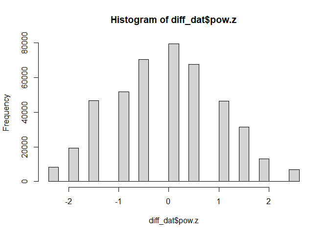
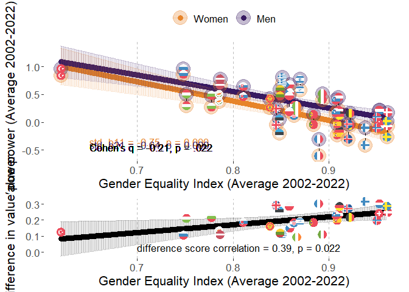
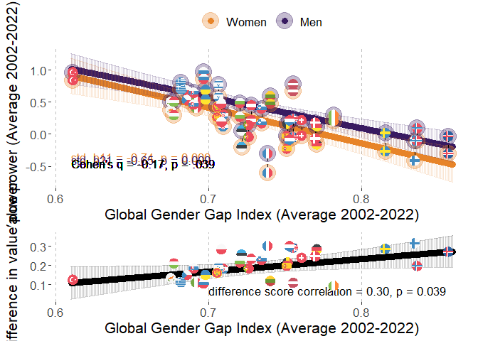
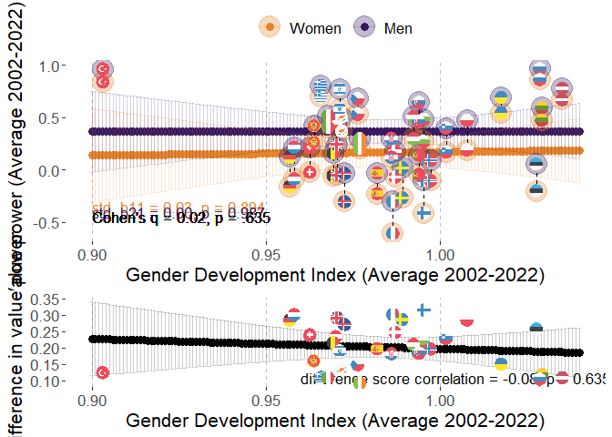
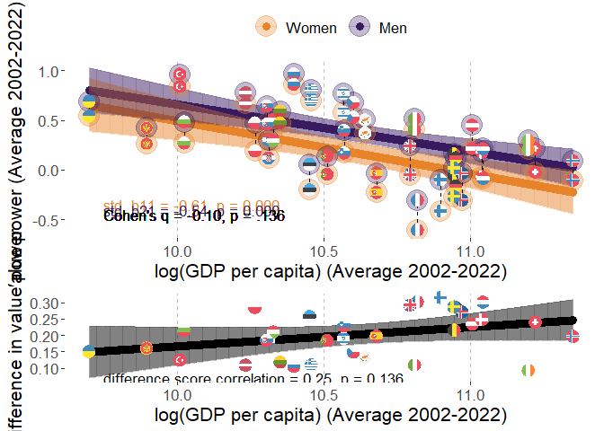
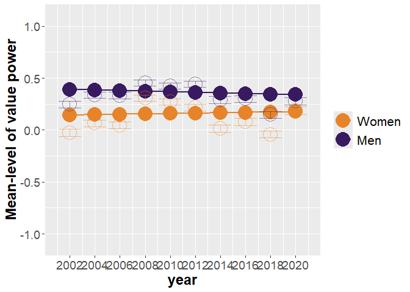
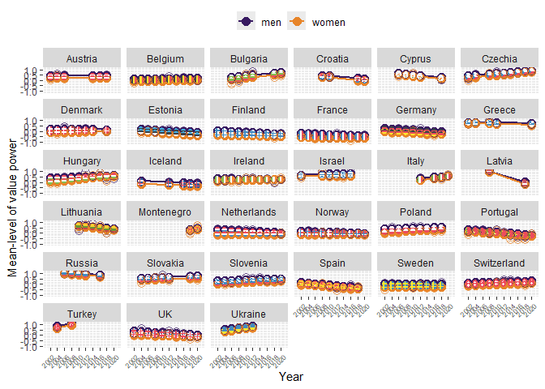

# Packages

Two packages are not in CRAN and need different installation
* devtools::install_github("vjilmari/vjihelpers")
* install.packages("ggflags", repos = c("https://jimjam-slam.r-universe.dev","https://cloud.r-project.org")) 


``` r
library(multid)
library(rio)
library(dplyr)
library(lme4)
library(emmeans)
library(vjihelpers)
library(MetBrewer)
library(ggplot2)
library(finalfit)
library(ggflags) 
library(lmerTest)
library(metafor)
library(ggpubr)
library(Hmisc)
library(r2mlm)
library(tidyr)
library(stringr)
library(apaTables)
```

# Data

* Loads the preprocessed European Social Survey data file made within "Preparations_ESS" code


``` r
load("../data/fdat.rdata")
```

* Include ISO data for country-names


``` r
# read country names
ISO<-read.csv2("../data/ISO.csv")
```


# Exclusions

* exclude participants with missing values or gender


``` r
value.vars<-
  c("con","tra",
  "ben","uni",
  "sdi","sti",
  "hed","ach",
  "pow","sec")

fdat$miss_values<-
  rowSums(is.na(fdat[,value.vars]))
table(fdat$miss_values)
```

```
## 
##      0      1      2      3      4      5      6      7      8      9     10 
## 450838   2586    774    401    248    185    129    135    142    165  34952
```

``` r
fdat<-fdat %>%
  filter(miss_values==0 & !is.na(gndr.bin))
```

# Data for the analysis

* basic descriptives


``` r
diff_dat<-
  fdat

#diff_dat$age.c<-as.numeric(diff_dat$age.c)
#diff_dat$rlgdgr.c<-as.numeric(diff_dat$rlgdgr.c)
#diff_dat$eduyrs.c<-as.numeric(diff_dat$eduyrs.c)

# data exclusions (include countries with at least two rounds of data)
n_rounds<-diff_dat %>% group_by(cntry) %>%
  summarise(n_unique_essround = n_distinct(essround))

# join number of rounds to data
diff_dat<-
  left_join(x=diff_dat,
            y=n_rounds,
            by="cntry")

# filter only countries with more than 1 round and non-missing gender variable
diff_dat<-diff_dat %>%
  dplyr::filter(n_unique_essround>1 &
                  !is.na(gndr))

# cross-tabulate sample sizes and ESS rounds by country
table(diff_dat$essround,diff_dat$cntry)
```

```
##     
##        AT   BE   BG   CH   CY   CZ   DE   DK   EE   ES   FI   FR   GB   GR   HR   HU   IE   IL   IS   IT   LT   LV   ME   NL   NO   PL   PT
##   1  2254 1830    0 2024    0 1208 2819 1470    0 1712 1763 1355 1798 2551    0 1634 1916 2279    0    0    0    0    0 2337 1819 2065 1482
##   2  2198 1771    0 2110    0 2557 2840 1458 1948 1623 1701 1699 1864 2399    0 1460 1187    0  524    0    0    0    0 1858 1575 1683 2024
##   3  2348 1796 1295 1780  978    0 2884 1461 1466 1847 1649 1983 2353    0    0 1462 1589    0    0    0    0    0    0 1860 1550 1685 2182
##   4     0 1754 2144 1753 1210 1986 2732 1581 1646 2562 1901 2067 2311 2063 1430 1430 1757 2382    0    0    0 1970    0 1724 1391 1596 2337
##   5     0 1699 2371 1491 1053 2335 3007 1564 1793 1881 1649 1723 2374 2669 1601 1473 2400 2212    0    0 1632    0    0 1801 1530 1719 2139
##   6     0 1862 2179 1483 1110 1973 2935 1621 2345 1871 2158 1960 2261    0    0 1968 2616 2378  739  909 2108    0    0 1828 1610 1866 2138
##   7  1795 1767    0 1521    0 1862 3006 1483 2036 1907 2050 1902 2231    0    0 1520 2380 2351    0    0 2241    0    0 1823 1423 1594 1242
##   8  1993 1759    0 1504    0 2252 2821    0 2007 1929 1903 2057 1942    0    0 1458 2746 2366  841 2531 2079    0    0 1669 1530 1675 1254
##   9  2477 1756 1926 1517  773 2343 2328 1554 1899 1619 1735 1982 2183    0 1781 1643 2189    0  844 2660 1677  891 1188 1657 1396 1443 1045
##   10    0 1334 2697 1505    0 2369    0    0 1538    0 1561 1951 1131 2768 1564 1816 1751    0  886 2573 1606    0 1248 1466 1408    0 1827
##     
##        RU   SE   SI   SK   TR   UA
##   1     0 1682 1488    0    0    0
##   2     0 1678 1384 1425 1790 1896
##   3  2339 1604 1465 1711    0 1885
##   4  2446 1556 1257 1789 2305 1766
##   5  2557 1463 1369 1803    0 1779
##   6  2429 1838 1244 1827    0 2064
##   7     0 1761 1189    0    0    0
##   8  2374 1526 1295    0    0    0
##   9     0 1510 1307 1061    0    0
##   10    0    0 1232 1395    0    0
```

``` r
# range of sample sizes
range(table(diff_dat$cntry))
```

```
## [1]  2436 25372
```

``` r
# scale/standardize with SD pooled across all country-time-gender folds
cntry.pow<-diff_dat %>% group_by(cntry,essround) %>%
  summarise(pow.ctm=mean(pow,na.rm=T),
            pow.ctsd=sd(pow,na.rm=T)) %>%
  group_by(cntry) %>%
  summarise(pow.cm=mean(pow.ctm),
            pow.csd=mean(pow.ctsd)) 
```

```
## `summarise()` has grouped output by 'cntry'. You can override using the `.groups` argument.
```

``` r
grand_mean_ben<-mean(cntry.pow$pow.cm)
grand_sd_ben<-mean(cntry.pow$pow.csd)

# standardized
diff_dat$pow.z<-(diff_dat$pow-grand_mean_ben)/grand_sd_ben
hist(diff_dat$pow.z)
```

<!-- -->

## Add GEI-variable

* GEI = Reverse-coded Gender Inequality Index (GII)


``` r
GII<-read.csv("../data/GII.csv")

# Obtain GII only for ESS countries
GII_in_ESS_d<-
  GII %>%
  filter(ISO2 %in% unique(diff_dat$cntry))

# Make long format data of GII, so that country x year has own rows

long_GII_in_ESS_d <- GII_in_ESS_d %>%
  pivot_longer(
    cols = starts_with("gii_") & !matches("avg"),  # <-- exclude the "_avg" columns
    names_to = "year",
    values_to = "gii",
    names_prefix = "gii_"
  ) %>%
  mutate(year = as.integer(year)) %>%
  filter(year >= 2002 & year <= 2022) %>%
  mutate(gei = 1 - gii) %>%
  select(ISO2, iso3, country, year, gii, gei, gii_2002_2022_avg, gei_2002_2022_avg)


# describe gei average
psych::describe(GII_in_ESS_d$gei_2002_2022_avg)
```

```
##    vars  n mean   sd median trimmed  mad  min  max range  skew kurtosis   se
## X1    1 32 0.87 0.07   0.87    0.87 0.06 0.62 0.96  0.34 -1.11     1.48 0.01
```

``` r
# one is missing, see which one
GII_in_ESS_d[is.na(GII_in_ESS_d$gei_2002_2022_avg),"country"]
```

```
## [1] "Ukraine"
```

``` r
# get means and SDs for standardizing
gei_mean<-mean(GII_in_ESS_d$gei_2002_2022_avg,na.rm=T)
gei_sd<-sd(GII_in_ESS_d$gei_2002_2022_avg,na.rm=T)

# standardize 
# year specific scores
long_GII_in_ESS_d$gei.z<-(long_GII_in_ESS_d$gei-gei_mean)/gei_sd

# get the country means to a separate frame

GII_country_means<-
  long_GII_in_ESS_d %>% group_by(ISO2) %>%
  summarise(gei.cm=mean(gei,na.rm=T),
            gei.z.cm=mean(gei.z,na.rm=T))


long_GII_in_ESS_d<-left_join(
  x=long_GII_in_ESS_d,
  y=GII_country_means,
  by="ISO2"
)


# center both the raw score and standardized scores
long_GII_in_ESS_d$gei.cmc<-(long_GII_in_ESS_d$gei-long_GII_in_ESS_d$gei.cm)
long_GII_in_ESS_d$gei.z.cmc<-(long_GII_in_ESS_d$gei.z-long_GII_in_ESS_d$gei.z.cm)

#View(long_GII_in_ESS_d)

# averages across 2002-2022
#long_GII_in_ESS_d$gei_2002_2022_avg.z<-(long_GII_in_ESS_d$gei_2002_2022_avg-gei_mean)/gei_sd

#long_GII_in_ESS_d$gei.cmc<-long_GII_in_ESS_d$gei-long_GII_in_ESS_d$gei_2002_2022_avg

# add year to ESS data-frame

diff_dat$year<-
  case_when(
    diff_dat$essround.c==-4.5~2002,  
    diff_dat$essround.c==-3.5~2004,
    diff_dat$essround.c==-2.5~2006,
    diff_dat$essround.c==-1.5~2008,
    diff_dat$essround.c==-0.5~2010,
    diff_dat$essround.c==0.5~2012,
    diff_dat$essround.c==1.5~2014,
    diff_dat$essround.c==2.5~2016,
    diff_dat$essround.c==3.5~2018,
    diff_dat$essround.c==4.5~2020
  )

# link datasets by country and year

diff_dat<-
  left_join(
    x=diff_dat,
    y=long_GII_in_ESS_d[,c("ISO2","year","gei","gei.cm","gei.cmc",
                           "gei.z","gei.z.cm","gei.z.cmc")],
    by=c("cntry"="ISO2","year")
)
```


## Add GDI-variable

* GDI = Gender Development Index


``` r
GDI<-read.csv("../data/GDI.csv")

# Obtain GDI only for ESS countries
GDI_in_ESS_d<-
  GDI %>%
  filter(ISO2 %in% unique(diff_dat$cntry))

# Make long format data of GDI, so that country x year has own rows

long_GDI_in_ESS_d <- GDI_in_ESS_d %>%
  pivot_longer(
    cols = starts_with("gdi_") & !matches("avg"),  # <-- exclude the "_avg" columns
    names_to = "year",
    values_to = "gdi",
    names_prefix = "gdi_"
  ) %>%
  mutate(year = as.integer(year)) %>%
  filter(year >= 2002 & year <= 2022) %>%
  select(ISO2, iso3, country, year, gdi, gdi_2002_2022_avg)

# describe gdi average
psych::describe(GDI_in_ESS_d$gdi_2002_2022_avg)
```

```
##    vars  n mean   sd median trimmed  mad min  max range  skew kurtosis se
## X1    1 33 0.99 0.03   0.99    0.98 0.02 0.9 1.04  0.13 -0.35     1.27  0
```

``` r
# get means and SDs for standardizing
gdi_mean<-mean(GDI_in_ESS_d$gdi_2002_2022_avg,na.rm=T)
gdi_sd<-sd(GDI_in_ESS_d$gdi_2002_2022_avg,na.rm=T)

# standardize 
# year specific scores
long_GDI_in_ESS_d$gdi.z<-(long_GDI_in_ESS_d$gdi-gdi_mean)/gdi_sd

# get the country means to a separate frame

GDI_country_means<-
  long_GDI_in_ESS_d %>% group_by(ISO2) %>%
  summarise(gdi.cm=mean(gdi,na.rm=T),
            gdi.z.cm=mean(gdi.z,na.rm=T))

long_GDI_in_ESS_d<-left_join(
  x=long_GDI_in_ESS_d,
  y=GDI_country_means,
  by="ISO2"
)


# center both the raw score and standardized scores
long_GDI_in_ESS_d$gdi.cmc<-(long_GDI_in_ESS_d$gdi-long_GDI_in_ESS_d$gdi.cm)
long_GDI_in_ESS_d$gdi.z.cmc<-(long_GDI_in_ESS_d$gdi.z-long_GDI_in_ESS_d$gdi.z.cm)

# link datasets by country and year

diff_dat<-
  left_join(
    x=diff_dat,
    y=long_GDI_in_ESS_d[,c("ISO2","year","gdi","gdi.cm","gdi.cmc",
                           "gdi.z","gdi.z.cm","gdi.z.cmc")],
    by=c("cntry"="ISO2","year")
  )
```

## Add GDP-variable

* log_GDP = Logarithm of GDP per capita, PPP (constant 2017 international $)


``` r
GDP<-read.csv("../data/GDP_processed.csv")

# Obtain GDP only for ESS countries
GDP_in_ESS_d<-
  GDP %>%
  filter(ISO2 %in% unique(diff_dat$cntry))

# First, rename those X2000..YR2000. style columns to simple "gdp_2000" etc.

GDP_in_ESS_d <- GDP_in_ESS_d %>%
  rename_with(
    ~ str_replace_all(., "^X(\\d{4})..YR\\1\\.$", "gdp_\\1"),
    starts_with("X")
  )

#GDP_in_ESS_d
# Make long format data of GDP, so that country x year has own rows

long_GDP_in_ESS_d <- GDP_in_ESS_d %>%
  pivot_longer(
    cols = starts_with("gdp_") & !matches("avg"),  # <-- exclude the "_avg" columns
    names_to = "year",
    values_to = "gdp",
    names_prefix = "gdp_"
  ) %>%
  mutate(year = as.integer(year)) %>%
  filter(year >= 2002 & year <= 2022) %>%
  select(ISO2, Country.Name, year, gdp, gdp_2002_2022_avg,log_gdp_2002_2022_avg) %>%
  mutate(log_gdp=log(gdp))

#View(long_GDP_in_ESS_d)

# describe gdp average
psych::describe(GDP_in_ESS_d$gdp_2002_2022_avg)
```

```
##    vars  n     mean      sd   median  trimmed      mad      min      max    range skew kurtosis      se
## X1    1 33 44309.55 16988.2 40528.07 43238.06 16282.88 16406.88 85115.96 68709.08 0.48    -0.58 2957.27
```

``` r
psych::describe(GDP_in_ESS_d$log_gdp_2002_2022_avg)
```

```
##    vars  n  mean  sd median trimmed  mad  min   max range  skew kurtosis   se
## X1    1 33 10.62 0.4  10.61   10.64 0.43 9.71 11.35  1.65 -0.25    -0.67 0.07
```

``` r
# get means and SDs for standardizing
log_gdp_mean<-mean(GDP_in_ESS_d$log_gdp_2002_2022_avg,na.rm=T)
log_gdp_sd<-sd(GDP_in_ESS_d$log_gdp_2002_2022_avg,na.rm=T)

# standardize 
# year specific scores
long_GDP_in_ESS_d$log_gdp.z<-
  (long_GDP_in_ESS_d$log_gdp-log_gdp_mean)/log_gdp_sd

# get the country means to a separate frame

GDP_country_means<-
  long_GDP_in_ESS_d %>% group_by(ISO2) %>%
  summarise(gdp.cm=mean(gdp,na.rm=T),
            #gdp.z.cm=mean(gdp.z,na.rm=T),
            log_gdp.cm=mean(log_gdp,na.rm=T),
            log_gdp.z.cm=mean(log_gdp.z,na.rm=T))

long_GDP_in_ESS_d<-left_join(
  x=long_GDP_in_ESS_d,
  y=GDP_country_means,
  by="ISO2"
)


# center both the raw score and standardized scores
long_GDP_in_ESS_d$log_gdp.cmc<-(long_GDP_in_ESS_d$log_gdp-long_GDP_in_ESS_d$log_gdp.cm)
long_GDP_in_ESS_d$log_gdp.z.cmc<-(long_GDP_in_ESS_d$log_gdp.z-long_GDP_in_ESS_d$log_gdp.z.cm)

# link datasets by country and year

diff_dat<-
  left_join(
    x=diff_dat,
    y=long_GDP_in_ESS_d[,c("ISO2","year","log_gdp","log_gdp.cm","log_gdp.cmc",
                           "log_gdp.z","log_gdp.z.cm","log_gdp.z.cmc")],
    by=c("cntry"="ISO2","year")
  )
```

## Add GGGI-variable

* GGGI = Global Gender Gap Index


``` r
GGGI<-import("../data/GGGI.xlsx")

# check if all ESS countries are in the log_GGGI data
table(unique(diff_dat$cntry) %in% GGGI$ISO2)
```

```
## 
## TRUE 
##   33
```

``` r
# Obtain GGGI only for ESS countries
GGGI_in_ESS_d<-
  GGGI %>%
  filter(ISO2 %in% unique(diff_dat$cntry))

# Make long format data of GGGI, so that country x year has own rows

long_GGGI_in_ESS_d <- GGGI_in_ESS_d %>%
  pivot_longer(
    cols = starts_with("gggi_") & !matches("avg"),  # <-- exclude the "_avg" columns
    names_to = "year",
    values_to = "gggi",
    names_prefix = "gggi_"
  ) %>%
  mutate(year = as.integer(year)) %>%
  filter(year >= 2002 & year <= 2022) %>%
  select(ISO2, cname, year, gggi, GGGI_2002_2022_avg)

# describe gggi average
psych::describe(GGGI_in_ESS_d$GGGI_2002_2022_avg)
```

```
##    vars  n mean   sd median trimmed  mad  min  max range skew kurtosis   se
## X1    1 33 0.73 0.05   0.73    0.73 0.04 0.61 0.86  0.25 0.38     0.19 0.01
```

``` r
# get means and SDs for standardizing
gggi_mean<-mean(GGGI_in_ESS_d$GGGI_2002_2022_avg,na.rm=T)
gggi_sd<-sd(GGGI_in_ESS_d$GGGI_2002_2022_avg,na.rm=T)

# standardize 
# year specific scores
long_GGGI_in_ESS_d$gggi.z<-(long_GGGI_in_ESS_d$gggi-gggi_mean)/gggi_sd

# get the country means to a separate frame

GGGI_country_means<-
  long_GGGI_in_ESS_d %>% group_by(ISO2) %>%
  summarise(gggi.cm=mean(gggi,na.rm=T),
            gggi.z.cm=mean(gggi.z,na.rm=T))

long_GGGI_in_ESS_d<-left_join(
  x=long_GGGI_in_ESS_d,
  y=GGGI_country_means,
  by="ISO2"
)

# center both the raw score and standardized scores
long_GGGI_in_ESS_d$gggi.cmc<-
  (long_GGGI_in_ESS_d$gggi-long_GGGI_in_ESS_d$gggi.cm)

long_GGGI_in_ESS_d$gggi.z.cmc<-
  (long_GGGI_in_ESS_d$gggi.z-long_GGGI_in_ESS_d$gggi.z.cm)

# link datasets by country and year

diff_dat<-
  left_join(
    x=diff_dat,
    y=long_GGGI_in_ESS_d[,c("ISO2","year","gggi","gggi.cm","gggi.cmc",
                           "gggi.z","gggi.z.cm","gggi.z.cmc")],
    by=c("cntry"="ISO2","year")
  )
```

# Descriptive statistics

## Country-specific descriptives


``` r
# sample sizes from weights

cntry_n_frame<-
  diff_dat %>% group_by(cntry) %>%
  summarise('n ESS rounds' = mean(n_unique_essround),
            n=round(sum(pspwght),0))

# value-based power

cntry_ben_frame<-
  diff_dat %>% group_by(cntry,essround) %>%
  summarise('pow M' = weighted.mean(x=pow.z,w=pspwght),
            'pow SD' = sqrt(wtd.var(pow.z,pspwght))) %>%
  group_by(cntry) %>%
  summarise('pow M' = mean(x=`pow M`),
            'pow SD'= mean(x=`pow SD`))
```

```
## `summarise()` has grouped output by 'cntry'. You can override using the `.groups` argument.
```

``` r
cntry_ben_women_frame<-
  diff_dat %>%
  filter(gndr.c==-0.5) %>%
  group_by(cntry,essround) %>%
  summarise('pow M' = weighted.mean(x=pow.z,w=pspwght),
            'pow SD' = sqrt(wtd.var(pow.z,pspwght))) %>%
  group_by(cntry) %>%
  summarise('pow M Women' = mean(x=`pow M`),
            'pow SD Women'= mean(x=`pow SD`))
```

```
## `summarise()` has grouped output by 'cntry'. You can override using the `.groups` argument.
```

``` r
cntry_ben_men_frame<-
  diff_dat %>%
  filter(gndr.c==0.5) %>%
  group_by(cntry,essround) %>%
  summarise('pow M' = weighted.mean(x=pow.z,w=pspwght),
            'pow SD' = sqrt(wtd.var(pow.z,pspwght))) %>%
  group_by(cntry) %>%
  summarise('pow M Men' = mean(x=`pow M`),
            'pow SD Men'= mean(x=`pow SD`))
```

```
## `summarise()` has grouped output by 'cntry'. You can override using the `.groups` argument.
```

``` r
# link n and pow datasets

desc_frame<-
  left_join(
    x=cntry_n_frame,
    y=cntry_ben_frame,
    by="cntry"
  )

desc_frame<-
  left_join(
    x=desc_frame,
    y=cntry_ben_women_frame,
    by="cntry"
  )

desc_frame<-
  left_join(
    x=desc_frame,
    y=cntry_ben_men_frame,
    by="cntry"
  )

# Add country-specific differences
desc_frame$D<-desc_frame$`pow M Men`-desc_frame$`pow M Women`

desc_frame
```

```
## # A tibble: 33 × 10
##    cntry `n ESS rounds`     n `pow M` `pow SD` `pow M Women` `pow SD Women` `pow M Men` `pow SD Men`     D
##    <chr>          <dbl> <dbl>   <dbl>    <dbl>         <dbl>          <dbl>       <dbl>        <dbl> <dbl>
##  1 AT                 6 13077  0.163     0.975        0.0298          0.983      0.306         0.945 0.276
##  2 BE                10 17313 -0.156     0.942       -0.244           0.941     -0.0638        0.934 0.180
##  3 BG                 6 12641 -0.0341    1.08        -0.157           1.08       0.0979        1.07  0.255
##  4 CH                10 16720 -0.0511    0.973       -0.167           0.980      0.0706        0.950 0.238
##  5 CY                 5  5105  0.205     1.02         0.132           1.02       0.283         1.01  0.151
##  6 CZ                 9 18934  0.271     1.04         0.135           1.06       0.418         1.00  0.283
##  7 DE                 9 25389 -0.287     0.990       -0.437           0.968     -0.130         0.988 0.307
##  8 DK                 8 12198 -0.212     0.982       -0.359           0.962     -0.0599        0.979 0.300
##  9 EE                 9 16692 -0.364     1.04        -0.496           1.04      -0.206         1.03  0.290
## 10 ES                 9 16954 -0.239     1.06        -0.334           1.05      -0.140         1.05  0.194
## # ℹ 23 more rows
```

``` r
# add country-level measures

desc_frame<-
  left_join(
    x=desc_frame,
    y=GII_country_means[,c("ISO2","gei.cm")],
    by=c("cntry"="ISO2")
  )

desc_frame<-
  left_join(
    x=desc_frame,
    y=GGGI_country_means[,c("ISO2","gggi.cm")],
    by=c("cntry"="ISO2")
  )

desc_frame<-
  left_join(
    x=desc_frame,
    y=GDI_country_means[,c("ISO2","gdi.cm")],
    by=c("cntry"="ISO2")
  )


desc_frame<-
  left_join(
    x=desc_frame,
    y=GDP_country_means[,c("ISO2","gdp.cm")],
    by=c("cntry"="ISO2")
  )

desc_frame<-left_join(
  x=desc_frame,
  y=ISO[,c("ISO2","CLDR")],
  by=c("cntry"="ISO2")
)

# finalize the formatted table

cntry_desc_tbl<-
  desc_frame %>%
  select(
    Country = CLDR,
    `n ESS rounds`,
    n,
    `pow M`, `pow SD`,
    `pow M Women`, `pow SD Women`,
    `pow M Men`, `pow SD Men`,
    D,
    GEI = gei.cm,
    GGGI = gggi.cm,
    GDI = gdi.cm,
    GDP = gdp.cm
  ) %>%
  mutate(
    across(
      .cols = -c(Country, `n ESS rounds`, n, GDP) & where(is.numeric),
      .fns  = ~ round_tidy(.x, 2)
    )
  ) %>%
  mutate(
    across(
      .cols = GDP,
      .fns  = ~ round_tidy(.x, 0)
    )
  )
print(cntry_desc_tbl,n=33)
```

```
## # A tibble: 33 × 14
##    Country     `n ESS rounds`     n `pow M` `pow SD` `pow M Women` `pow SD Women` `pow M Men` `pow SD Men` D     GEI   GGGI  GDI   GDP  
##    <chr>                <dbl> <dbl> <chr>   <chr>    <chr>         <chr>          <chr>       <chr>        <chr> <chr> <chr> <chr> <chr>
##  1 Austria                  6 13077 0.16    0.98     0.03          0.98           0.31        0.94         0.28  0.91  0.73  0.97  60433
##  2 Belgium                 10 17313 -0.16   0.94     -0.24         0.94           -0.06       0.93         0.18  0.92  0.75  0.97  56803
##  3 Bulgaria                 6 12641 -0.03   1.08     -0.16         1.08           0.10        1.07         0.25  0.78  0.72  1.00  23096
##  4 Switzerland             10 16720 -0.05   0.97     -0.17         0.98           0.07        0.95         0.24  0.95  0.76  0.96  74937
##  5 Cyprus                   5  5105 0.21    1.02     0.13          1.02           0.28        1.01         0.15  0.79  0.68  0.97  41998
##  6 Czechia                  9 18934 0.27    1.04     0.13          1.06           0.42        1.00         0.28  0.86  0.69  0.98  40528
##  7 Germany                  9 25389 -0.29   0.99     -0.44         0.97           -0.13       0.99         0.31  0.91  0.77  0.96  57203
##  8 Denmark                  8 12198 -0.21   0.98     -0.36         0.96           -0.06       0.98         0.30  0.96  0.77  0.99  62482
##  9 Estonia                  9 16692 -0.36   1.04     -0.50         1.04           -0.21       1.03         0.29  0.85  0.72  1.03  35133
## 10 Spain                    9 16954 -0.24   1.06     -0.33         1.05           -0.14       1.05         0.19  0.91  0.75  0.98  43543
## 11 Finland                 10 18050 -0.60   0.98     -0.78         0.96           -0.40       0.97         0.38  0.94  0.84  1.00  54215
## 12 France                  10 18720 -0.63   1.02     -0.74         1.01           -0.51       1.02         0.23  0.89  0.74  0.99  50086
## 13 UK                      10 21456 -0.24   1.02     -0.38         1.01           -0.10       1.02         0.28  0.85  0.76  0.97  48851
## 14 Greece                   5 12464 0.60    1.02     0.52          1.03           0.68        1.01         0.16  0.85  0.68  0.97  35026
## 15 Croatia                  4  6368 -0.01   1.03     -0.10         1.04           0.08        1.01         0.18  0.86  0.71  0.99  30327
## 16 Hungary                 10 16006 0.26    1.07     0.18          1.09           0.35        1.05         0.17  0.75  0.68  0.99  30903
## 17 Ireland                 10 20576 0.00    1.07     -0.07         1.07           0.07        1.06         0.14  0.87  0.78  0.98  75379
## 18 Israel                   6 13964 0.49    1.13     0.37          1.15           0.61        1.09         0.24  0.87  0.71  0.97  39179
## 19 Iceland                  5  3832 -0.46   0.90     -0.60         0.87           -0.32       0.90         0.28  0.92  0.86  0.97  58455
## 20 Italy                    4  8663 0.26    0.93     0.23          0.93           0.30        0.94         0.08  0.89  0.69  0.97  49623
## 21 Lithuania                6 11714 0.26    1.03     0.17          1.03           0.37        1.02         0.20  0.85  0.74  1.03  32397
## 22 Latvia                   2  2866 0.24    1.04     0.15          1.02           0.34        1.05         0.19  0.79  0.76  1.04  28443
## 23 Montenegro               2  2441 0.20    1.05     0.12          1.08           0.29        1.01         0.17  0.84  0.71  0.96  20093
## 24 Netherlands             10 18048 -0.25   0.91     -0.41         0.91           -0.09       0.89         0.32  0.95  0.75  0.96  62746
## 25 Norway                  10 15186 -0.36   0.91     -0.46         0.90           -0.26       0.90         0.21  0.95  0.84  1.00  85116
## 26 Poland                   9 15314 0.21    1.02     0.08          1.03           0.35        0.98         0.27  0.86  0.71  1.01  29545
## 27 Portugal                10 17705 -0.18   0.91     -0.27         0.91           -0.09       0.89         0.18  0.88  0.73  0.99  36804
## 28 Russia                   5 12139 0.62    1.05     0.57          1.04           0.67        1.05         0.10  0.75  0.70  1.03  33173
## 29 Sweden                   9 14897 -0.40   0.94     -0.52         0.92           -0.27       0.95         0.26  0.96  0.82  0.99  56811
## 30 Slovenia                10 13238 0.10    0.92     -0.01         0.92           0.21        0.91         0.22  0.91  0.73  1.00  39154
## 31 Slovakia                 7 11132 0.29    1.02     0.17          1.02           0.43        0.99         0.26  0.81  0.69  0.99  30472
## 32 Turkey                   2  4108 0.82    0.95     0.73          0.97           0.92        0.92         0.19  0.62  0.61  0.90  22856
## 33 Ukraine                  5  9454 0.36    1.12     0.29          1.12           0.44        1.11         0.15  NaN   0.70  1.02  16407
```

``` r
export(cntry_desc_tbl,"../results/pow_youth/cntry_desc_tbl.xlsx",overwrite=T)
```

## Country-level correlations table


``` r
cor_frame<-
  desc_frame %>%
  select(
    VBMT=`pow M`,
    VBMT_Women=`pow M Women`,
    VBMT_Men=`pow M Men`,
    D = D,
    GEI = gei.cm,
    GGGI = gggi.cm,
    GDI = gdi.cm,
    GDP = gdp.cm
  ) %>%
  mutate(
    log_GDP=log(GDP)
  ) %>%
  select(-GDP)

apa.cor.table(
  data=cor_frame,
  filename = "../results/pow_youth/CorTable1.doc",
  #table.number = NA,
  show.conf.interval = FALSE,
  show.sig.stars = F,
  landscape = F
)
```

```
## The ability to suppress reporting of reporting confidence intervals has been deprecated in this version.
## The function argument show.conf.interval will be removed in a later version.
```

```
## 
## 
## Means, standard deviations, and correlations with confidence intervals
##  
## 
##   Variable      M     SD   1            2            3            4           5           6           7          
##   1. VBMT       0.03  0.36                                                                                       
##                                                                                                                  
##   2. VBMT_Women -0.08 0.38 1.00                                                                                  
##                            [.99, 1.00]                                                                           
##                                                                                                                  
##   3. VBMT_Men   0.14  0.34 1.00         .99                                                                      
##                            [.99, 1.00]  [.97, .99]                                                               
##                                                                                                                  
##   4. D          0.22  0.07 -.55         -.60         -.47                                                        
##                            [-.75, -.25] [-.79, -.33] [-.70, -.15]                                                
##                                                                                                                  
##   5. GEI        0.87  0.07 -.69         -.69         -.69         .40                                            
##                            [-.84, -.45] [-.84, -.46] [-.84, -.45] [.06, .66]                                     
##                                                                                                                  
##   6. GGGI       0.73  0.05 -.79         -.79         -.78         .45         .73                                
##                            [-.89, -.61] [-.89, -.61] [-.89, -.60] [.13, .69]  [.52, .86]                         
##                                                                                                                  
##   7. GDI        0.99  0.03 -.11         -.09         -.11         -.06        .07         .20                    
##                            [-.43, .25]  [-.42, .26]  [-.44, .24]  [-.40, .29] [-.29, .41] [-.16, .51]            
##                                                                                                                  
##   8. log_GDP    10.62 0.40 -.58         -.58         -.58         .32         .75         .67         -.22       
##                            [-.77, -.29] [-.77, -.30] [-.77, -.30] [-.03, .59] [.55, .87]  [.42, .82]  [-.53, .13]
##                                                                                                                  
## 
## Note. M and SD are used to represent mean and standard deviation, respectively.
## Values in square brackets indicate the 95% confidence interval.
## The confidence interval is a plausible range of population correlations 
## that could have caused the sample correlation (Cumming, 2014).
## 
```


# Analysis

## Data subset


``` r
diff_dat<-diff_dat %>%
  filter(agea>17 & agea <30)
```

## mod0: Random intercept model


``` r
mod0<-lmer(pow.z~(1|cntry),data=diff_dat,REML=F,weights = pspwght,
           control=lmerControl(optimizer="bobyqa",optCtrl=list(maxfun=2e7)))
summary(mod0)
```

```
## Linear mixed model fit by maximum likelihood . t-tests use Satterthwaite's method ['lmerModLmerTest']
## Formula: pow.z ~ (1 | cntry)
##    Data: diff_dat
## Weights: pspwght
## Control: lmerControl(optimizer = "bobyqa", optCtrl = list(maxfun = 2e+07))
## 
##       AIC       BIC    logLik -2*log(L)  df.resid 
##  212814.8  212842.3 -106404.4  212808.8     70935 
## 
## Scaled residuals: 
##     Min      1Q  Median      3Q     Max 
## -5.4977 -0.6483  0.0119  0.6362  5.3273 
## 
## Random effects:
##  Groups   Name        Variance Std.Dev.
##  cntry    (Intercept) 0.114    0.3377  
##  Residual             1.218    1.1036  
## Number of obs: 70938, groups:  cntry, 33
## 
## Fixed effects:
##             Estimate Std. Error       df t value Pr(>|t|)    
## (Intercept)  0.26853    0.05895 33.00563   4.555 6.79e-05 ***
## ---
## Signif. codes:  0 '***' 0.001 '**' 0.01 '*' 0.05 '.' 0.1 ' ' 1
```

``` r
getVC(mod0)
```

```
##        grp        var1 var2 sdcor vcov
## 1    cntry (Intercept) <NA>  0.34 0.11
## 2 Residual        <NA> <NA>  1.10 1.22
```

``` r
r2mlm(mod0,bargraph = F)
```

```
## $Decompositions
##                      total within between
## fixed, within   0.00000000      0      NA
## fixed, between  0.00000000     NA       0
## slope variation 0.00000000      0      NA
## mean variation  0.08559695     NA       1
## sigma2          0.91440305      1      NA
## 
## $R2s
##          total within between
## f1  0.00000000      0      NA
## f2  0.00000000     NA       0
## v   0.00000000      0      NA
## m   0.08559695     NA       1
## f   0.00000000     NA      NA
## fv  0.00000000      0      NA
## fvm 0.08559695     NA      NA
```

## mod1: Gender fixed effect


``` r
mod1<-lmer(pow.z~gndr.c+(1|cntry),data=diff_dat,REML=F,weights = pspwght,
           control=lmerControl(optimizer="bobyqa",optCtrl=list(maxfun=2e7)))
summary(mod1)
```

```
## Linear mixed model fit by maximum likelihood . t-tests use Satterthwaite's method ['lmerModLmerTest']
## Formula: pow.z ~ gndr.c + (1 | cntry)
##    Data: diff_dat
## Weights: pspwght
## Control: lmerControl(optimizer = "bobyqa", optCtrl = list(maxfun = 2e+07))
## 
##       AIC       BIC    logLik -2*log(L)  df.resid 
##  212047.2  212083.8 -106019.6  212039.2     70934 
## 
## Scaled residuals: 
##     Min      1Q  Median      3Q     Max 
## -5.7214 -0.6255  0.0413  0.6500  5.1617 
## 
## Random effects:
##  Groups   Name        Variance Std.Dev.
##  cntry    (Intercept) 0.1141   0.3378  
##  Residual             1.2049   1.0977  
## Number of obs: 70938, groups:  cntry, 33
## 
## Fixed effects:
##              Estimate Std. Error        df t value Pr(>|t|)    
## (Intercept) 2.671e-01  5.898e-02 3.301e+01   4.528 7.35e-05 ***
## gndr.c      2.113e-01  7.595e-03 7.091e+04  27.818  < 2e-16 ***
## ---
## Signif. codes:  0 '***' 0.001 '**' 0.01 '*' 0.05 '.' 0.1 ' ' 1
## 
## Correlation of Fixed Effects:
##        (Intr)
## gndr.c -0.001
```

``` r
getFE(mod1,round=3)
```

```
##              Est.    SE        df      t p    LL    UL
## (Intercept) 0.267 0.059    33.006  4.528 0 0.147 0.387
## gndr.c      0.211 0.008 70905.805 27.818 0 0.196 0.226
```

``` r
getVC(mod1)
```

```
##        grp        var1 var2 sdcor vcov
## 1    cntry (Intercept) <NA>  0.34 0.11
## 2 Residual        <NA> <NA>  1.10 1.20
```

``` r
r2mlm(mod1,bargraph = F)
```

```
## $Decompositions
##                       total
## fixed           0.008383065
## slope variation 0.000000000
## mean variation  0.085799905
## sigma2          0.905817030
## 
## $R2s
##           total
## f   0.008383065
## v   0.000000000
## m   0.085799905
## fv  0.008383065
## fvm 0.094182970
```

## mod2: Gender fixed and random effect

* Include random effect correlation by default


``` r
mod2<-lmer(pow.z~gndr.c+(gndr.c|cntry),data=diff_dat,REML=F,weights = pspwght,
           control=lmerControl(optimizer="bobyqa",optCtrl=list(maxfun=2e7)))
summary(mod2)
```

```
## Linear mixed model fit by maximum likelihood . t-tests use Satterthwaite's method ['lmerModLmerTest']
## Formula: pow.z ~ gndr.c + (gndr.c | cntry)
##    Data: diff_dat
## Weights: pspwght
## Control: lmerControl(optimizer = "bobyqa", optCtrl = list(maxfun = 2e+07))
## 
##       AIC       BIC    logLik -2*log(L)  df.resid 
##  211982.8  212037.8 -105985.4  211970.8     70932 
## 
## Scaled residuals: 
##     Min      1Q  Median      3Q     Max 
## -5.6689 -0.6241  0.0429  0.6517  5.1616 
## 
## Random effects:
##  Groups   Name        Variance Std.Dev. Corr 
##  cntry    (Intercept) 0.114359 0.33817       
##           gndr.c      0.005773 0.07598  -0.68
##  Residual             1.203200 1.09690       
## Number of obs: 70938, groups:  cntry, 33
## 
## Fixed effects:
##             Estimate Std. Error       df t value Pr(>|t|)    
## (Intercept)  0.26721    0.05904 33.00303   4.526 7.39e-05 ***
## gndr.c       0.20191    0.01551 32.07239  13.019 2.40e-14 ***
## ---
## Signif. codes:  0 '***' 0.001 '**' 0.01 '*' 0.05 '.' 0.1 ' ' 1
## 
## Correlation of Fixed Effects:
##        (Intr)
## gndr.c -0.577
```

``` r
getFE(mod2,round=3)
```

```
##              Est.    SE     df      t p    LL    UL
## (Intercept) 0.267 0.059 33.003  4.526 0 0.147 0.387
## gndr.c      0.202 0.016 32.072 13.019 0 0.170 0.234
```

``` r
getVC(mod2)
```

```
##        grp        var1   var2 sdcor  vcov
## 1    cntry (Intercept)   <NA>  0.34  0.11
## 2    cntry      gndr.c   <NA>  0.08  0.01
## 3    cntry (Intercept) gndr.c -0.68 -0.02
## 4 Residual        <NA>   <NA>  1.10  1.20
```

``` r
r2mlm(mod2,bargraph = F)
```

```
## $Decompositions
##                       total
## fixed           0.007660207
## slope variation 0.001084646
## mean variation  0.086352221
## sigma2          0.904902926
## 
## $R2s
##           total
## f   0.007660207
## v   0.001084646
## m   0.086352221
## fv  0.008744853
## fvm 0.095097074
```

``` r
anova(mod1,mod2)
```

```
## Data: diff_dat
## Models:
## mod1: pow.z ~ gndr.c + (1 | cntry)
## mod2: pow.z ~ gndr.c + (gndr.c | cntry)
##      npar    AIC    BIC  logLik -2*log(L)  Chisq Df Pr(>Chisq)    
## mod1    4 212047 212084 -106020    212039                         
## mod2    6 211983 212038 -105985    211971 68.364  2  1.429e-15 ***
## ---
## Signif. codes:  0 '***' 0.001 '**' 0.01 '*' 0.05 '.' 0.1 ' ' 1
```

``` r
lvl2_var_cond_lvl1(mod2,lvl1.var = "gndr.c",lvl1.values = c(0.5,-0.5))
```

```
##   lvl1.value lvl2.cond.var lvl2.cond.sd
## 1        0.5    0.09840659    0.3136982
## 2       -0.5    0.13319818    0.3649633
```

* Test for random effect correlation


``` r
mod2_norecov<-lmer(pow.z~gndr.c+(gndr.c||cntry),data=diff_dat,REML=F,weights = pspwght,
                   control=lmerControl(optimizer="bobyqa",optCtrl=list(maxfun=2e7)))
summary(mod2_norecov)
```

```
## Linear mixed model fit by maximum likelihood . t-tests use Satterthwaite's method ['lmerModLmerTest']
## Formula: pow.z ~ gndr.c + (gndr.c || cntry)
##    Data: diff_dat
## Weights: pspwght
## Control: lmerControl(optimizer = "bobyqa", optCtrl = list(maxfun = 2e+07))
## 
##       AIC       BIC    logLik -2*log(L)  df.resid 
##  211994.4  212040.3 -105992.2  211984.4     70933 
## 
## Scaled residuals: 
##     Min      1Q  Median      3Q     Max 
## -5.6831 -0.6239  0.0361  0.6522  5.1405 
## 
## Random effects:
##  Groups   Name        Variance Std.Dev.
##  cntry    (Intercept) 0.114226 0.33797 
##  cntry.1  gndr.c      0.005498 0.07415 
##  Residual             1.203227 1.09692 
## Number of obs: 70938, groups:  cntry, 33
## 
## Fixed effects:
##             Estimate Std. Error       df t value Pr(>|t|)    
## (Intercept)  0.26692    0.05900 33.00493   4.524 7.44e-05 ***
## gndr.c       0.20265    0.01533 31.79272  13.221 1.82e-14 ***
## ---
## Signif. codes:  0 '***' 0.001 '**' 0.01 '*' 0.05 '.' 0.1 ' ' 1
## 
## Correlation of Fixed Effects:
##        (Intr)
## gndr.c 0.000
```

``` r
getFE(mod2_norecov,round=3)
```

```
##              Est.    SE     df      t p    LL    UL
## (Intercept) 0.267 0.059 33.005  4.524 0 0.147 0.387
## gndr.c      0.203 0.015 31.793 13.221 0 0.171 0.234
```

``` r
getVC(mod2_norecov)
```

```
##        grp        var1 var2 sdcor vcov
## 1    cntry (Intercept) <NA>  0.34 0.11
## 2  cntry.1      gndr.c <NA>  0.07 0.01
## 3 Residual        <NA> <NA>  1.10 1.20
```

``` r
anova(mod2_norecov,mod2)
```

```
## Data: diff_dat
## Models:
## mod2_norecov: pow.z ~ gndr.c + (gndr.c || cntry)
## mod2: pow.z ~ gndr.c + (gndr.c | cntry)
##              npar    AIC    BIC  logLik -2*log(L)  Chisq Df Pr(>Chisq)    
## mod2_norecov    5 211994 212040 -105992    211984                         
## mod2            6 211983 212038 -105985    211971 13.636  1  0.0002219 ***
## ---
## Signif. codes:  0 '***' 0.001 '**' 0.01 '*' 0.05 '.' 0.1 ' ' 1
```


## mod2 with Gender-equality index (GEI)


``` r
mod2_GEI<-lmer(pow.z~gndr.c+gei.z.cm+gndr.c:gei.z.cm+
                 (gndr.c|cntry),data=diff_dat,REML=F,weights = pspwght,
           control=lmerControl(optimizer="bobyqa",optCtrl=list(maxfun=2e7)))
summary(mod2_GEI)
```

```
## Linear mixed model fit by maximum likelihood . t-tests use Satterthwaite's method ['lmerModLmerTest']
## Formula: pow.z ~ gndr.c + gei.z.cm + gndr.c:gei.z.cm + (gndr.c | cntry)
##    Data: diff_dat
## Weights: pspwght
## Control: lmerControl(optimizer = "bobyqa", optCtrl = list(maxfun = 2e+07))
## 
##       AIC       BIC    logLik -2*log(L)  df.resid 
##  206348.7  206421.9 -103166.4  206332.7     69278 
## 
## Scaled residuals: 
##     Min      1Q  Median      3Q     Max 
## -5.5538 -0.6260  0.0448  0.6524  5.1795 
## 
## Random effects:
##  Groups   Name        Variance Std.Dev. Corr 
##  cntry    (Intercept) 0.057698 0.24020       
##           gndr.c      0.004621 0.06798  -0.54
##  Residual             1.193436 1.09245       
## Number of obs: 69286, groups:  cntry, 32
## 
## Fixed effects:
##                 Estimate Std. Error       df t value Pr(>|t|)    
## (Intercept)      0.25653    0.04270 32.13646   6.008 1.04e-06 ***
## gndr.c           0.20341    0.01458 32.06383  13.952 3.61e-15 ***
## gei.z.cm        -0.24159    0.04342 32.24115  -5.565 3.75e-06 ***
## gndr.c:gei.z.cm  0.03680    0.01533 37.00159   2.400   0.0216 *  
## ---
## Signif. codes:  0 '***' 0.001 '**' 0.01 '*' 0.05 '.' 0.1 ' ' 1
## 
## Correlation of Fixed Effects:
##             (Intr) gndr.c g.z.cm
## gndr.c      -0.442              
## gei.z.cm    -0.002  0.000       
## gndr.c:g.z.  0.000 -0.056 -0.425
```

``` r
getFE(mod2_GEI,round=3)
```

```
##                   Est.    SE     df      t     p     LL     UL
## (Intercept)      0.257 0.043 32.136  6.008 0.000  0.170  0.343
## gndr.c           0.203 0.015 32.064 13.952 0.000  0.174  0.233
## gei.z.cm        -0.242 0.043 32.241 -5.565 0.000 -0.330 -0.153
## gndr.c:gei.z.cm  0.037 0.015 37.002  2.400 0.022  0.006  0.068
```

``` r
getVC(mod2_GEI)
```

```
##        grp        var1   var2 sdcor  vcov
## 1    cntry (Intercept)   <NA>  0.24  0.06
## 2    cntry      gndr.c   <NA>  0.07  0.00
## 3    cntry (Intercept) gndr.c -0.54 -0.01
## 4 Residual        <NA>   <NA>  1.09  1.19
```

``` r
r2mlm(mod2_GEI,bargraph = F)
```

```
## $Decompositions
##                        total
## fixed           0.0428186317
## slope variation 0.0008823207
## mean variation  0.0442576304
## sigma2          0.9120414172
## 
## $R2s
##            total
## f   0.0428186317
## v   0.0008823207
## m   0.0442576304
## fv  0.0437009524
## fvm 0.0879585828
```

### Deconstructed associations


``` r
t1<-Sys.time()
ddsc_mod2_GEI<-
  ddsc_ml(model = mod2_GEI,
          predictor = "gei.z.cm",
          moderator = "gndr.c",moderator_values = c(-0.5,0.5),
          re_cov_test = T)
t2<-Sys.time()
t2-t1
```

```
## Time difference of 5.616441 secs
```

``` r
round(ddsc_mod2_GEI$vpc_at_moderator_values,3)
```

```
##   lvl1.value Intercept.var Intercept.sd Residual.var Total.var   VPC mean.n.obs  ICC2 ICC2_SP
## 1       -0.5         0.133        0.365        1.203     1.336 0.100   1103.091 0.989   0.992
## 2        0.5         0.098        0.314        1.203     1.302 0.076   1046.545 0.985   0.988
```

``` r
round(ddsc_mod2_GEI$descriptives,3)
```

```
##                       M    SD means_y1 means_y1_scaled means_y2 means_y2_scaled gei.z.cm gei.z.cm_scaled diff_score diff_score_scaled
## means_y1          0.354 0.318    1.000           1.000    0.976           0.976   -0.698          -0.698     -0.496            -0.496
## means_y1_scaled   1.020 0.916    1.000           1.000    0.976           0.976   -0.698          -0.698     -0.496            -0.496
## means_y2          0.158 0.374    0.976           0.976    1.000           1.000   -0.699          -0.699     -0.674            -0.674
## means_y2_scaled   0.456 1.077    0.976           0.976    1.000           1.000   -0.699          -0.699     -0.674            -0.674
## gei.z.cm          0.000 1.000   -0.698          -0.698   -0.699          -0.699    1.000           1.000      0.416             0.416
## gei.z.cm_scaled   0.000 1.000   -0.698          -0.698   -0.699          -0.699    1.000           1.000      0.416             0.416
## diff_score        0.196 0.094   -0.496          -0.496   -0.674          -0.674    0.416           0.416      1.000             1.000
## diff_score_scaled 0.564 0.271   -0.496          -0.496   -0.674          -0.674    0.416           0.416      1.000             1.000
```

``` r
round(ddsc_mod2_GEI$results,3)
```

```
##                            estimate    SE     df t.ratio p.value ci.lower ci.upper
## r_xy1y2                      -0.391 0.163 37.002  -2.400   0.022   -0.720   -0.061
## w_11                         -0.260 0.047 32.328  -5.510   0.000   -0.356   -0.164
## w_21                         -0.223 0.041 32.596  -5.477   0.000   -0.306   -0.140
## r_xy1                        -0.817 0.148 32.328  -5.510   0.000   -1.119   -0.515
## r_xy2                        -0.597 0.109 32.596  -5.477   0.000   -0.819   -0.375
## b_11                         -0.751 0.136 32.328  -5.510   0.000   -1.029   -0.474
## b_21                         -0.645 0.118 32.596  -5.477   0.000   -0.885   -0.405
## main_effect                  -0.242 0.043 32.241  -5.565   0.000   -0.330   -0.153
## moderator_effect              0.203 0.015 32.064  13.952   0.000    0.174    0.233
## interaction                   0.037 0.015 37.002   2.400   0.022    0.006    0.068
## q_b11_b21                    -0.209    NA     NA      NA      NA       NA       NA
## q_rxy1_rxy2                  -0.460    NA     NA      NA      NA       NA       NA
## cross_over_point             -5.528    NA     NA      NA      NA       NA       NA
## interaction_vs_main          -0.205 0.039 33.604  -5.195   0.000   -0.285   -0.125
## interaction_vs_main_bscale   -0.592 0.114 33.604  -5.195   0.000   -0.823   -0.360
## interaction_vs_main_rscale   -0.487 0.096 34.023  -5.075   0.000   -0.682   -0.292
## dadas                        -0.446 0.082 32.596  -5.477   1.000   -0.612   -0.280
## dadas_bscale                 -1.290 0.235 32.596  -5.477   1.000   -1.769   -0.810
## dadas_rscale                 -1.194 0.218 32.596  -5.477   1.000   -1.637   -0.750
## abs_diff                      0.037 0.015 37.002   2.400   0.011    0.006    0.068
## abs_sum                       0.483 0.087 32.241   5.565   0.000    0.306    0.660
## abs_diff_bscale               0.106 0.044 37.002   2.400   0.011    0.017    0.196
## abs_sum_bscale                1.396 0.251 32.241   5.565   0.000    0.885    1.907
## abs_diff_rscale               0.220 0.056 35.125   3.909   0.000    0.106    0.335
## abs_sum_rscale                1.414 0.254 32.235   5.565   0.000    0.896    1.931
```

``` r
round(ddsc_mod2_GEI$re_cov_test,3)
```

```
## RE_cov RE_cor  Chisq     Df      p 
## -0.017 -0.677 13.636  1.000  0.000
```

``` r
d_GEI<-ddsc_mod2_GEI$ddsc_sem_fit$data

ddsc_sem_GEI<-
  ddsc_sem(data=d_GEI,x = "gei.z.cm",y1="means_y2",
           y2="means_y1",q_sesoi = .10)
round(ddsc_sem_GEI$results,3)
```

```
##                                    est    se       z pvalue ci.lower ci.upper
## r_xy1_y2                        -0.416 0.161  -2.589  0.010   -0.731   -0.101
## r_xy1                           -0.699 0.126  -5.523  0.000   -0.946   -0.451
## r_xy2                           -0.698 0.127  -5.512  0.000   -0.946   -0.450
## b_11                            -0.752 0.136  -5.523  0.000   -1.019   -0.485
## b_21                            -0.640 0.116  -5.512  0.000   -0.867   -0.412
## b_10                             0.456 0.134   3.398  0.001    0.193    0.718
## b_20                             1.020 0.114   8.932  0.000    0.796    1.244
## res_cov_y1_y2                    0.467 0.120   3.902  0.000    0.232    0.701
## diff_b10_b20                    -0.564 0.043 -13.152  0.000   -0.649   -0.480
## diff_b11_b21                    -0.113 0.044  -2.589  0.010   -0.198   -0.027
## diff_rxy1_rxy2                  -0.001 0.039  -0.019  0.985   -0.077    0.076
## q_b11_b21                       -0.221 0.140  -1.577  0.115   -0.496    0.054
## q_rxy1_rxy2                     -0.001 0.076  -0.019  0.985   -0.150    0.147
## cross_over_point                -5.000 1.968  -2.540  0.011   -8.858   -1.142
## sum_b11_b21                     -1.392 0.249  -5.583  0.000   -1.881   -0.903
## main_effect                     -0.696 0.125  -5.583  0.000   -0.940   -0.452
## interaction_vs_main_effect      -0.583 0.111  -5.249  0.000   -0.801   -0.365
## diff_abs_b11_abs_b21             0.113 0.044   2.589  0.010    0.027    0.198
## abs_diff_b11_b21                 0.113 0.044   2.589  0.005    0.027    0.198
## abs_sum_b11_b21                  1.392 0.249   5.583  0.000    0.903    1.881
## dadas                           -1.279 0.232  -5.512  1.000   -1.734   -0.824
## q_r_equivalence                 -0.099 0.076  -1.299  0.097       NA       NA
## q_b_equivalence                  0.121 0.140   0.864  0.806       NA       NA
## cross_over_point_equivalence     5.000 1.968   2.540  0.994       NA       NA
## cross_over_point_minimal_effect  5.000 1.968   2.540  0.006       NA       NA
```

``` r
round(ddsc_sem_GEI$variance_test,3)
```

```
##             est    se       z pvalue ci.lower ci.upper
## cov_y1y2  0.933 0.236   3.951  0.000    0.470    1.396
## var_y1    1.124 0.281   4.000  0.000    0.573    1.675
## var_y2    0.814 0.203   4.000  0.000    0.415    1.212
## var_diff  0.310 0.107   2.895  0.004    0.100    0.520
## var_ratio 1.381 0.107  12.934  0.000    1.172    1.591
## cor_y1y2  0.976 0.008 115.431  0.000    0.959    0.992
```

### Figure 


``` r
# plot the results

# start with obtaining predicted values for means and differences

# refit reduced and full models with GGGI in original scale


mod2_GEI_unstd<-lmer(pow.z~gndr.c+gei.cm+gndr.c:gei.cm+
                 (gndr.c|cntry),data=diff_dat,REML=F,weights = pspwght,
               control=lmerControl(optimizer="bobyqa",optCtrl=list(maxfun=2e7)))

mod2_GEI_unstd_red<-lmer(pow.z~gndr.c+
                       (gndr.c|cntry),data=diff_dat,REML=F,weights = pspwght,
                     control=lmerControl(optimizer="bobyqa",optCtrl=list(maxfun=2e7)))


p<-
  emmip(
    mod2_GEI_unstd, 
    gndr.c ~ gei.cm,
    at=list(gndr.c = c(-0.5,0.5),
            gei.cm=
              seq(from=round(range(GII_country_means$gei.cm,na.rm=T)[1],2),
                  to=round(range(GII_country_means$gei.cm,na.rm=T)[2],2),
                  by=0.001)),
    plotit=F,CIs=T,lmerTest.limit = 1e6,disable.pbkrtest=T)

p$gndr.c<-p$tvar
levels(p$gndr.c)<-c("Women","Men")

# obtain min and max for aligned plots
min.y.comp<-min(p$LCL)
max.y.comp<-max(p$UCL)

# Men and Women mean distributions

p3<-coefficients(mod2_GEI_unstd_red)$cntry
p3<-cbind(rbind(p3,p3),weight=rep(c(-0.5,0.5),each=nrow(p3)))
p3$xvar<-p3$`(Intercept)`+p3$gndr.c*p3$weight
p3$gndr.c<-as.factor(p3$weight)
levels(p3$gndr.c)<-c("Women","Men")

# obtain min and max for aligned plots
min.y.mean.distr<-min(p3$xvar)
max.y.mean.distr<-max(p3$xvar)


# obtain the coefs for the gndr.c-effect (difference) as function of gei.cm

p2<-data.frame(
  emtrends(mod2_GEI_unstd,var="gndr.c",
           specs="gei.cm",
           at=list(#gndr.c = c(-0.5,0.5),
             gei.cm=
               seq(from=round(range(GII_country_means$gei.cm,na.rm=T)[1],2),
                   to=round(range(GII_country_means$gei.cm,na.rm=T)[2],2),
                   by=0.001)),
           lmerTest.limit = 1e6,disable.pbkrtest=T))

p2$yvar<-p2$gndr.c.trend
p2$xvar<-p2$gei.cm
p2$LCL<-p2$lower.CL
p2$UCL<-p2$upper.CL

# obtain min and max for aligned plots
min.y.diff<-min(p2$LCL)
max.y.diff<-max(p2$UCL)

# difference score distribution

p4<-coefficients(mod2_GEI_unstd_red)$cntry
p4$xvar=(+1)*p4$gndr.c

# obtain mix and max for aligned plots

min.y.diff.distr<-min(p4$xvar)
max.y.diff.distr<-max(p4$xvar)

# define mins and maxs

min.y.pred<-
  ifelse(min.y.comp<min.y.mean.distr,min.y.comp,min.y.mean.distr)

max.y.pred<-
  ifelse(max.y.comp>max.y.mean.distr,max.y.comp,max.y.mean.distr)

min.y.narrow<-
  ifelse(min.y.diff<min.y.diff.distr,min.y.diff,min.y.diff.distr)

max.y.narrow<-
  ifelse(max.y.diff>max.y.diff.distr,max.y.diff,max.y.diff.distr)

# Figures 

# p1

# scaled simple effects to the plot
pvals<-round_tidy(ddsc_mod2_GEI$results[6:7,"p.value"],3)

ests<-
  round_tidy(ddsc_mod2_GEI$results[6:7,"estimate"],2)

coef1<-paste0("std. b11 = ",ests[1],", p = ",pvals[1])
coef2<-paste0("std. b21 = ",ests[2],", p = ",pvals[2])
coefs<-data.frame(gndr.c=c("Women","Men"),
                  coef=c(coef1,coef2))

coef_q<-paste0("Cohen's q = ",round_tidy(ddsc_mod2_GEI$results["q_b11_b21","estimate"],2),", p = ",
               substr(round_tidy(ddsc_mod2_GEI$results["interaction","p.value"],3),2,5))  
# prediction plot for difference score

pvals2<-round_tidy(ddsc_mod2_GEI$results["interaction","p.value"],3)

ests2<-
  round_tidy(-1*ddsc_mod2_GEI$results["r_xy1y2","estimate"],2)

coefs2<-paste0("difference score correlation = ",ests2,", p = ",pvals2)
# attempt to make a flag-plot

flag_points_GEI<-coefficients(mod2_GEI_unstd_red)$cntry

flag_points_GEI$women<-flag_points_GEI$`(Intercept)`+(-0.5)*flag_points_GEI$gndr.c
flag_points_GEI$men<-flag_points_GEI$`(Intercept)`+(0.5)*flag_points_GEI$gndr.c
flag_points_GEI$mean_level<-flag_points_GEI$`(Intercept)`
flag_points_GEI$difference<-flag_points_GEI$men-flag_points_GEI$women
flag_points_GEI$cntry<-rownames(flag_points_GEI)

flag_points_GEI<-
  left_join(x=flag_points_GEI,
            y=GII_country_means[,c("ISO2","gei.cm")],by=c("cntry"="ISO2"))
#flag_points_GEI

flag_points_GEI_long<-
  data.frame(mean_level=c(flag_points_GEI$women,
                          flag_points_GEI$men),
             gei.cm=c(flag_points_GEI$gei.cm,
                      flag_points_GEI$gei.cm),
             cntry=c(flag_points_GEI$cntry,
                     flag_points_GEI$cntry),
             gndr.c=rep(c("Women","Men"),each=nrow(flag_points_GEI)
             ))


p1.pow.flags<-
  ggplot(p,aes(y=yvar,x=gei.cm,color=gndr.c))+
  geom_point(size=3)+
  geom_errorbar(aes(ymin=LCL, ymax=UCL),alpha=0.2)+
  xlab("Gender Equality Index (Average 2002-2022)")+
  #ylim(c(min.y.pred,max.y.pred))+
  #xlim(c(0.60,1.00))+
  ylab("Value power (Average 2002-2022)")+
  scale_color_manual(values=met.brewer("Archambault")[c(6,2)])+
  theme(legend.position = "top",
        legend.title=element_blank(),
        text=element_text(size=16,  family="sans"),
        panel.background = element_rect(fill = "white",
                                        #colour = "black",
                                        #size = 0.5, linetype = "solid"
        ),
        panel.grid.major.x = element_line(linewidth = 0.5, linetype = 2,
                                          colour = "gray"))+
  geom_text(data = coefs,show.legend=F,
            aes(label=coef,x=0.65,
                y=c(-0.35,-0.40),size=14,hjust="left"))+
  geom_text(inherit.aes=F,aes(x=0.65,y=-0.45,
                              label=coef_q,size=14,hjust="left"),
            show.legend=F)+
  geom_point(data=flag_points_GEI_long,size=8,alpha=0.30,
             aes(x=gei.cm,y=mean_level))+
  geom_line(data=flag_points_GEI_long,aes(group = cntry,x=gei.cm,y=mean_level),
            color="black",linetype=2)+
  geom_flag(data=flag_points_GEI_long,show.legend=F,
            aes(country=tolower(cntry),size=14,x=gei.cm,y=mean_level))

p2.pow.flags<-ggplot(p2,aes(y=yvar,x=gei.cm))+
  geom_point(size=3)+
  geom_errorbar(aes(ymin=LCL, ymax=UCL),alpha=0.2)+
  xlab("Gender Equality Index (Average 2002-2022)")+
  #xlim(c(0.60,1.00))+
  #ylim(c(min.y.narrow,max.y.narrow))+
  ylab("Difference in value power")+
  #scale_color_manual(values=met.brewer("Archambault")[c(6,2)])+
  theme(legend.position = "right",
        legend.title=element_blank(),
        text=element_text(size=16,  family="sans"),
        panel.background = element_rect(fill = "white",
                                        #colour = "black",
                                        #size = 0.5, linetype = "solid"
        ),
        panel.grid.major.x = element_line(linewidth = 0.5, linetype = 2,
                                          colour = "gray"))+
  #geom_text(coef2,aes(x=0.63,y=min(p2$LCL)))
  geom_text(data = data.frame(coefs2),show.legend=F,
            aes(label=coefs2,x=0.70,
                y=c(round(min(p2$LCL),2))+0.05,size=18,hjust="left"))+
  geom_flag(data=flag_points_GEI,show.legend=F,
            aes(country=tolower(cntry),size=18,x=gei.cm,y=difference))

pflag_comb<-
  ggarrange(p1.pow.flags,p2.pow.flags,align = "v",
            ncol=1,nrow=2,heights=c(2,1))
```

```
## Warning in geom_text(inherit.aes = F, aes(x = 0.65, y = -0.45, label = coef_q, : All aesthetics have length 1, but the data has 682 rows.
## ℹ Please consider using `annotate()` or provide this layer with data containing a single row.
```

```
## Warning: Removed 2 rows containing missing values or values outside the scale range (`geom_point()`).
```

```
## Warning: Removed 2 rows containing missing values or values outside the scale range (`geom_line()`).
```

```
## Warning: Removed 2 rows containing missing values or values outside the scale range (`geom_flag()`).
```

```
## Warning: Removed 1 row containing missing values or values outside the scale range (`geom_flag()`).
```

``` r
pflag_comb
```

<!-- -->

``` r
png(filename = 
      "../results/pow_youth/GEI_flags.png",
    units = "cm",
    width = 21.0,height=29.7*(3/4),res = 300)
pflag_comb
dev.off()
```

```
## png 
##   2
```

## mod2 with Gender-equality index (GGGI)


``` r
mod2_GGGI<-lmer(pow.z~gndr.c+gggi.z.cm+gndr.c:gggi.z.cm+
                 (gndr.c|cntry),data=diff_dat,REML=F,weights = pspwght,
           control=lmerControl(optimizer="bobyqa",optCtrl=list(maxfun=2e7)))
summary(mod2_GGGI)
```

```
## Linear mixed model fit by maximum likelihood . t-tests use Satterthwaite's method ['lmerModLmerTest']
## Formula: pow.z ~ gndr.c + gggi.z.cm + gndr.c:gggi.z.cm + (gndr.c | cntry)
##    Data: diff_dat
## Weights: pspwght
## Control: lmerControl(optimizer = "bobyqa", optCtrl = list(maxfun = 2e+07))
## 
##       AIC       BIC    logLik -2*log(L)  df.resid 
##  151148.3  151218.9  -75566.1  151132.3     50576 
## 
## Scaled residuals: 
##     Min      1Q  Median      3Q     Max 
## -5.7587 -0.6208  0.0361  0.6560  5.1859 
## 
## Random effects:
##  Groups   Name        Variance Std.Dev. Corr 
##  cntry    (Intercept) 0.07287  0.26994       
##           gndr.c      0.00439  0.06626  -0.64
##  Residual             1.20460  1.09754       
## Number of obs: 50584, groups:  cntry, 33
## 
## Fixed effects:
##                  Estimate Std. Error       df t value Pr(>|t|)    
## (Intercept)       0.31522    0.04732 32.73355   6.662 1.45e-07 ***
## gndr.c            0.19061    0.01496 31.62674  12.742 5.35e-14 ***
## gggi.z.cm        -0.27023    0.04812 32.93342  -5.616 3.02e-06 ***
## gndr.c:gggi.z.cm  0.03428    0.01607 37.93776   2.133   0.0395 *  
## ---
## Signif. codes:  0 '***' 0.001 '**' 0.01 '*' 0.05 '.' 0.1 ' ' 1
## 
## Correlation of Fixed Effects:
##             (Intr) gndr.c ggg.z.
## gndr.c      -0.491              
## gggi.z.cm   -0.001 -0.001       
## gndr.c:gg.. -0.001 -0.030 -0.463
```

``` r
getFE(mod2_GGGI,round=3)
```

```
##                    Est.    SE     df      t     p     LL     UL
## (Intercept)       0.315 0.047 32.734  6.662 0.000  0.219  0.412
## gndr.c            0.191 0.015 31.627 12.742 0.000  0.160  0.221
## gggi.z.cm        -0.270 0.048 32.933 -5.616 0.000 -0.368 -0.172
## gndr.c:gggi.z.cm  0.034 0.016 37.938  2.133 0.039  0.002  0.067
```

``` r
getVC(mod2_GGGI)
```

```
##        grp        var1   var2 sdcor  vcov
## 1    cntry (Intercept)   <NA>  0.27  0.07
## 2    cntry      gndr.c   <NA>  0.07  0.00
## 3    cntry (Intercept) gndr.c -0.64 -0.01
## 4 Residual        <NA>   <NA>  1.10  1.20
```

``` r
r2mlm(mod2_GGGI,bargraph = F)
```

```
## $Decompositions
##                        total
## fixed           0.0496373599
## slope variation 0.0008151885
## mean variation  0.0543641773
## sigma2          0.8951832742
## 
## $R2s
##            total
## f   0.0496373599
## v   0.0008151885
## m   0.0543641773
## fv  0.0504525485
## fvm 0.1048167258
```

### Deconstructed associations


``` r
t1<-Sys.time()
ddsc_mod2_GGGI<-
  ddsc_ml(model = mod2_GGGI,
          predictor = "gggi.z.cm",
          moderator = "gndr.c",moderator_values = c(-0.5,0.5),
          re_cov_test = T)
t2<-Sys.time()
t2-t1
```

```
## Time difference of 8.848899 secs
```

``` r
round(ddsc_mod2_GGGI$vpc_at_moderator_values,3)
```

```
##   lvl1.value Intercept.var Intercept.sd Residual.var Total.var   VPC mean.n.obs  ICC2 ICC2_SP
## 1       -0.5         0.133        0.365        1.203     1.336 0.100   1103.091 0.989   0.992
## 2        0.5         0.098        0.314        1.203     1.302 0.076   1046.545 0.985   0.988
```

``` r
round(ddsc_mod2_GGGI$descriptives,3)
```

```
##                       M    SD means_y1 means_y1_scaled means_y2 means_y2_scaled gggi.z.cm gggi.z.cm_scaled diff_score diff_score_scaled
## means_y1          0.404 0.357    1.000           1.000    0.968           0.968    -0.691           -0.691     -0.428            -0.428
## means_y1_scaled   1.038 0.916    1.000           1.000    0.968           0.968    -0.691           -0.691     -0.428            -0.428
## means_y2          0.225 0.420    0.968           0.968    1.000           1.000    -0.694           -0.694     -0.640            -0.640
## means_y2_scaled   0.577 1.077    0.968           0.968    1.000           1.000    -0.694           -0.694     -0.640            -0.640
## gggi.z.cm         0.000 1.000   -0.691          -0.691   -0.694          -0.694     1.000            1.000      0.385             0.385
## gggi.z.cm_scaled  0.000 1.000   -0.691          -0.691   -0.694          -0.694     1.000            1.000      0.385             0.385
## diff_score        0.179 0.116   -0.428          -0.428   -0.640          -0.640     0.385            0.385      1.000             1.000
## diff_score_scaled 0.460 0.297   -0.428          -0.428   -0.640          -0.640     0.385            0.385      1.000             1.000
```

``` r
round(ddsc_mod2_GGGI$results,3)
```

```
##                            estimate    SE     df t.ratio p.value ci.lower ci.upper
## r_xy1y2                      -0.296 0.139 37.938  -2.133   0.039   -0.577   -0.015
## w_11                         -0.287 0.052 32.960  -5.491   0.000   -0.394   -0.181
## w_21                         -0.253 0.045 33.116  -5.629   0.000   -0.345   -0.162
## r_xy1                        -0.805 0.147 32.960  -5.491   0.000   -1.103   -0.507
## r_xy2                        -0.603 0.107 33.116  -5.629   0.000   -0.820   -0.385
## b_11                         -0.740 0.135 32.960  -5.491   0.000   -1.014   -0.466
## b_21                         -0.651 0.116 33.116  -5.629   0.000   -0.887   -0.416
## main_effect                  -0.270 0.048 32.933  -5.616   0.000   -0.368   -0.172
## moderator_effect              0.191 0.015 31.627  12.742   0.000    0.160    0.221
## interaction                   0.034 0.016 37.938   2.133   0.039    0.002    0.067
## q_b11_b21                    -0.172    NA     NA      NA      NA       NA       NA
## q_rxy1_rxy2                  -0.415    NA     NA      NA      NA       NA       NA
## cross_over_point             -5.560    NA     NA      NA      NA       NA       NA
## interaction_vs_main          -0.236 0.043 33.515  -5.475   0.000   -0.324   -0.148
## interaction_vs_main_bscale   -0.607 0.111 33.515  -5.475   0.000   -0.833   -0.382
## interaction_vs_main_rscale   -0.502 0.093 33.666  -5.394   0.000   -0.691   -0.313
## dadas                        -0.506 0.090 33.116  -5.629   1.000   -0.689   -0.323
## dadas_bscale                 -1.303 0.231 33.116  -5.629   1.000   -1.774   -0.832
## dadas_rscale                 -1.205 0.214 33.116  -5.629   1.000   -1.641   -0.770
## abs_diff                      0.034 0.016 37.938   2.133   0.020    0.002    0.067
## abs_sum                       0.540 0.096 32.933   5.616   0.000    0.345    0.736
## abs_diff_bscale               0.088 0.041 37.938   2.133   0.020    0.004    0.172
## abs_sum_bscale                1.391 0.248 32.933   5.616   0.000    0.887    1.895
## abs_diff_rscale               0.202 0.054 35.662   3.741   0.000    0.093    0.312
## abs_sum_rscale                1.407 0.251 32.928   5.609   0.000    0.897    1.918
```

``` r
round(ddsc_mod2_GGGI$re_cov_test,3)
```

```
## RE_cov RE_cor  Chisq     Df      p 
## -0.017 -0.677 13.636  1.000  0.000
```

``` r
d_GGGI<-ddsc_mod2_GGGI$ddsc_sem_fit$data

ddsc_sem_GGGI<-
  ddsc_sem(data=d_GGGI,x = "gggi.z.cm",y1="means_y2",
           y2="means_y1",q_sesoi = .10)
round(ddsc_sem_GGGI$results,3)
```

```
##                                    est    se      z pvalue ci.lower ci.upper
## r_xy1_y2                        -0.385 0.161 -2.395  0.017   -0.700   -0.070
## r_xy1                           -0.694 0.125 -5.535  0.000   -0.940   -0.448
## r_xy2                           -0.691 0.126 -5.494  0.000   -0.938   -0.445
## b_11                            -0.748 0.135 -5.535  0.000   -1.012   -0.483
## b_21                            -0.633 0.115 -5.494  0.000   -0.859   -0.407
## b_10                             0.577 0.133  4.339  0.000    0.316    0.838
## b_20                             1.038 0.113  9.142  0.000    0.815    1.260
## res_cov_y1_y2                    0.468 0.119  3.933  0.000    0.235    0.701
## diff_b10_b20                    -0.460 0.047 -9.792  0.000   -0.553   -0.368
## diff_b11_b21                    -0.114 0.048 -2.395  0.017   -0.208   -0.021
## diff_rxy1_rxy2                  -0.003 0.044 -0.061  0.951   -0.088    0.083
## q_b11_b21                       -0.221 0.142 -1.557  0.119   -0.498    0.057
## q_rxy1_rxy2                     -0.005 0.084 -0.061  0.951   -0.170    0.160
## cross_over_point                -4.025 1.730 -2.327  0.020   -7.416   -0.634
## sum_b11_b21                     -1.381 0.247 -5.601  0.000   -1.864   -0.898
## main_effect                     -0.690 0.123 -5.601  0.000   -0.932   -0.449
## interaction_vs_main_effect      -0.576 0.112 -5.149  0.000   -0.795   -0.357
## diff_abs_b11_abs_b21             0.114 0.048  2.395  0.017    0.021    0.208
## abs_diff_b11_b21                 0.114 0.048  2.395  0.008    0.021    0.208
## abs_sum_b11_b21                  1.381 0.247  5.601  0.000    0.898    1.864
## dadas                           -1.266 0.231 -5.494  1.000   -1.718   -0.815
## q_r_equivalence                 -0.095 0.084 -1.129  0.130       NA       NA
## q_b_equivalence                  0.121 0.142  0.852  0.803       NA       NA
## cross_over_point_equivalence     4.025 1.730  2.327  0.990       NA       NA
## cross_over_point_minimal_effect  4.025 1.730  2.327  0.010       NA       NA
```

``` r
round(ddsc_sem_GGGI$variance_test,3)
```

```
##             est    se      z pvalue ci.lower ci.upper
## cov_y1y2  0.927 0.232  3.996  0.000    0.472    1.381
## var_y1    1.126 0.277  4.062  0.000    0.582    1.669
## var_y2    0.814 0.200  4.062  0.000    0.421    1.206
## var_diff  0.312 0.113  2.757  0.006    0.090    0.534
## var_ratio 1.383 0.120 11.522  0.000    1.148    1.618
## cor_y1y2  0.968 0.011 89.527  0.000    0.947    0.990
```

### Figure


``` r
# plot the results

# start with obtaining predicted values for means and differences

# refit reduced and full models with GGGI in original scale


mod2_GGGI_unstd<-lmer(pow.z~gndr.c+gggi.cm+gndr.c:gggi.cm+
                       (gndr.c|cntry),data=diff_dat,REML=F,weights = pspwght,
                     control=lmerControl(optimizer="bobyqa",optCtrl=list(maxfun=2e7)))

mod2_GGGI_unstd_red<-lmer(pow.z~gndr.c+
                           (gndr.c|cntry),data=diff_dat,REML=F,weights = pspwght,
                         control=lmerControl(optimizer="bobyqa",optCtrl=list(maxfun=2e7)))


p<-
  emmip(
    mod2_GGGI_unstd, 
    gndr.c ~ gggi.cm,
    at=list(gndr.c = c(-0.5,0.5),
            gggi.cm=
              seq(from=round(range(GGGI_country_means$gggi.cm,na.rm=T)[1],2),
                  to=round(range(GGGI_country_means$gggi.cm,na.rm=T)[2],2),
                  by=0.001)),
    plotit=F,CIs=T,lmerTest.limit = 1e6,disable.pbkrtest=T)

p$gndr.c<-p$tvar
levels(p$gndr.c)<-c("Women","Men")

# obtain min and max for aligned plots
min.y.comp<-min(p$LCL)
max.y.comp<-max(p$UCL)

# Men and Women mean distributions

p3<-coefficients(mod2_GGGI_unstd_red)$cntry
p3<-cbind(rbind(p3,p3),weight=rep(c(-0.5,0.5),each=nrow(p3)))
p3$xvar<-p3$`(Intercept)`+p3$gndr.c*p3$weight
p3$gndr.c<-as.factor(p3$weight)
levels(p3$gndr.c)<-c("Women","Men")

# obtain min and max for aligned plots
min.y.mean.distr<-min(p3$xvar)
max.y.mean.distr<-max(p3$xvar)


# obtain the coefs for the gndr.c-effect (difference) as function of gggi.cm

p2<-data.frame(
  emtrends(mod2_GGGI_unstd,var="gndr.c",
           specs="gggi.cm",
           at=list(#gndr.c = c(-0.5,0.5),
             gggi.cm=
               seq(from=round(range(GGGI_country_means$gggi.cm,na.rm=T)[1],2),
                   to=round(range(GGGI_country_means$gggi.cm,na.rm=T)[2],2),
                   by=0.001)),
           lmerTest.limit = 1e6,disable.pbkrtest=T))

p2$yvar<-p2$gndr.c.trend
p2$xvar<-p2$gggi.cm
p2$LCL<-p2$lower.CL
p2$UCL<-p2$upper.CL

# obtain min and max for aligned plots
min.y.diff<-min(p2$LCL)
max.y.diff<-max(p2$UCL)

# difference score distribution

p4<-coefficients(mod2_GGGI_unstd_red)$cntry
p4$xvar=(+1)*p4$gndr.c

# obtain mix and max for aligned plots

min.y.diff.distr<-min(p4$xvar)
max.y.diff.distr<-max(p4$xvar)

# define mins and maxs

min.y.pred<-
  ifelse(min.y.comp<min.y.mean.distr,min.y.comp,min.y.mean.distr)

max.y.pred<-
  ifelse(max.y.comp>max.y.mean.distr,max.y.comp,max.y.mean.distr)

min.y.narrow<-
  ifelse(min.y.diff<min.y.diff.distr,min.y.diff,min.y.diff.distr)

max.y.narrow<-
  ifelse(max.y.diff>max.y.diff.distr,max.y.diff,max.y.diff.distr)

# Figures 

# p1

# scaled simple effects to the plot
pvals<-round_tidy(ddsc_mod2_GGGI$results[6:7,"p.value"],3)

ests<-
  round_tidy(ddsc_mod2_GGGI$results[6:7,"estimate"],2)

coef1<-paste0("std. b11 = ",ests[1],", p = ",pvals[1])
coef2<-paste0("std. b21 = ",ests[2],", p = ",pvals[2])
coefs<-data.frame(gndr.c=c("Women","Men"),
                  coef=c(coef1,coef2))

coef_q<-paste0("Cohen's q = ",round_tidy(ddsc_mod2_GGGI$results["q_b11_b21","estimate"],2),", p = ",
               substr(round_tidy(ddsc_mod2_GGGI$results["interaction","p.value"],3),2,5))  
# prediction plot for difference score

pvals2<-round_tidy(ddsc_mod2_GGGI$results["interaction","p.value"],3)

ests2<-
  round_tidy(-1*ddsc_mod2_GGGI$results["r_xy1y2","estimate"],2)

coefs2<-paste0("difference score correlation = ",ests2,", p = ",pvals2)
# attempt to make a flag-plot

flag_points_GGGI<-coefficients(mod2_GGGI_unstd_red)$cntry

flag_points_GGGI$women<-flag_points_GGGI$`(Intercept)`+(-0.5)*flag_points_GGGI$gndr.c
flag_points_GGGI$men<-flag_points_GGGI$`(Intercept)`+(0.5)*flag_points_GGGI$gndr.c
flag_points_GGGI$mean_level<-flag_points_GGGI$`(Intercept)`
flag_points_GGGI$difference<-flag_points_GGGI$men-flag_points_GGGI$women
flag_points_GGGI$cntry<-rownames(flag_points_GGGI)

flag_points_GGGI<-
  left_join(x=flag_points_GGGI,
            y=GGGI_country_means[,c("ISO2","gggi.cm")],by=c("cntry"="ISO2"))
#flag_points_GGGI

flag_points_GGGI_long<-
  data.frame(mean_level=c(flag_points_GGGI$women,
                          flag_points_GGGI$men),
             gggi.cm=c(flag_points_GGGI$gggi.cm,
                                 flag_points_GGGI$gggi.cm),
             cntry=c(flag_points_GGGI$cntry,
                     flag_points_GGGI$cntry),
             gndr.c=rep(c("Women","Men"),each=nrow(flag_points_GGGI)
             ))


p1.pow.flags<-
  ggplot(p,aes(y=yvar,x=gggi.cm,color=gndr.c))+
  geom_point(size=3)+
  geom_errorbar(aes(ymin=LCL, ymax=UCL),alpha=0.2)+
  xlab("Global Gender Gap Index (Average 2002-2022)")+
  #ylim(c(min.y.pred,max.y.pred))+
  #xlim(c(0.60,1.00))+
  ylab("Value power (Average 2002-2022)")+
  scale_color_manual(values=met.brewer("Archambault")[c(6,2)])+
  theme(legend.position = "top",
        legend.title=element_blank(),
        text=element_text(size=16,  family="sans"),
        panel.background = element_rect(fill = "white",
                                        #colour = "black",
                                        #size = 0.5, linetype = "solid"
        ),
        panel.grid.major.x = element_line(linewidth = 0.5, linetype = 2,
                                          colour = "gray"))+
  geom_text(data = coefs,show.legend=F,
            aes(label=coef,x=0.61,
                y=c(-0.35,-0.40),size=14,hjust="left"))+
  geom_text(inherit.aes=F,aes(x=0.61,y=-0.45,
                              label=coef_q,size=14,hjust="left"),
            show.legend=F)+
  geom_point(data=flag_points_GGGI_long,size=8,alpha=0.30,
             aes(x=gggi.cm,y=mean_level))+
  geom_line(data=flag_points_GGGI_long,aes(group = cntry,x=gggi.cm,y=mean_level),
            color="black",linetype=2)+
  geom_flag(data=flag_points_GGGI_long,show.legend=F,
            aes(country=tolower(cntry),size=14,x=gggi.cm,y=mean_level))

p2.pow.flags<-ggplot(p2,aes(y=yvar,x=gggi.cm))+
  geom_point(size=3)+
  geom_errorbar(aes(ymin=LCL, ymax=UCL),alpha=0.2)+
  xlab("Global Gender Gap Index (Average 2002-2022)")+
  #xlim(c(0.60,1.00))+
  #ylim(c(min.y.narrow,max.y.narrow))+
  ylab("Difference in value power")+
  #scale_color_manual(values=met.brewer("Archambault")[c(6,2)])+
  theme(legend.position = "right",
        legend.title=element_blank(),
        text=element_text(size=16,  family="sans"),
        panel.background = element_rect(fill = "white",
                                        #colour = "black",
                                        #size = 0.5, linetype = "solid"
        ),
        panel.grid.major.x = element_line(linewidth = 0.5, linetype = 2,
                                          colour = "gray"))+
  #geom_text(coef2,aes(x=0.63,y=min(p2$LCL)))
  geom_text(data = data.frame(coefs2),show.legend=F,
            aes(label=coefs2,x=0.70,
                y=c(round(min(p2$LCL),2))+0.05,size=18,hjust="left"))+
  geom_flag(data=flag_points_GGGI,show.legend=F,
            aes(country=tolower(cntry),size=18,x=gggi.cm,y=difference))

pflag_comb<-
  ggarrange(p1.pow.flags,p2.pow.flags,align = "v",
            ncol=1,nrow=2,heights=c(2,1))
```

```
## Warning in geom_text(inherit.aes = F, aes(x = 0.61, y = -0.45, label = coef_q, : All aesthetics have length 1, but the data has 502 rows.
## ℹ Please consider using `annotate()` or provide this layer with data containing a single row.
```

``` r
pflag_comb
```

<!-- -->

``` r
png(filename = 
      "../results/pow_youth/GGGI_flags_new.png",
    units = "cm",
    width = 21.0,height=29.7*(3/4),res = 300)
pflag_comb
dev.off()
```

```
## png 
##   2
```


## mod2 with Gender-equality index (GDI)


``` r
mod2_GDI<-lmer(pow.z~gndr.c+gdi.z.cm+gndr.c:gdi.z.cm+
                 (gndr.c|cntry),data=diff_dat,REML=F,weights = pspwght,
           control=lmerControl(optimizer="bobyqa",optCtrl=list(maxfun=2e7)))
summary(mod2_GDI)
```

```
## Linear mixed model fit by maximum likelihood . t-tests use Satterthwaite's method ['lmerModLmerTest']
## Formula: pow.z ~ gndr.c + gdi.z.cm + gndr.c:gdi.z.cm + (gndr.c | cntry)
##    Data: diff_dat
## Weights: pspwght
## Control: lmerControl(optimizer = "bobyqa", optCtrl = list(maxfun = 2e+07))
## 
##       AIC       BIC    logLik -2*log(L)  df.resid 
##  211986.5  212059.9 -105985.3  211970.5     70930 
## 
## Scaled residuals: 
##     Min      1Q  Median      3Q     Max 
## -5.6654 -0.6242  0.0422  0.6516  5.1615 
## 
## Random effects:
##  Groups   Name        Variance Std.Dev. Corr 
##  cntry    (Intercept) 0.114369 0.33818       
##           gndr.c      0.005711 0.07557  -0.68
##  Residual             1.203199 1.09690       
## Number of obs: 70938, groups:  cntry, 33
## 
## Fixed effects:
##                  Estimate Std. Error        df t value Pr(>|t|)    
## (Intercept)      0.267247   0.059038 33.003443   4.527 7.38e-05 ***
## gndr.c           0.202063   0.015449 31.981877  13.080 2.21e-14 ***
## gdi.z.cm         0.004819   0.060009 33.126092   0.080    0.936    
## gndr.c:gdi.z.cm -0.007831   0.016357 36.931198  -0.479    0.635    
## ---
## Signif. codes:  0 '***' 0.001 '**' 0.01 '*' 0.05 '.' 0.1 ' ' 1
## 
## Correlation of Fixed Effects:
##             (Intr) gndr.c gd.z.c
## gndr.c      -0.577              
## gdi.z.cm     0.000 -0.001       
## gndr.c:gd.. -0.001 -0.011 -0.553
```

``` r
getFE(mod2_GDI,round=3)
```

```
##                   Est.    SE     df      t     p     LL    UL
## (Intercept)      0.267 0.059 33.003  4.527 0.000  0.147 0.387
## gndr.c           0.202 0.015 31.982 13.080 0.000  0.171 0.234
## gdi.z.cm         0.005 0.060 33.126  0.080 0.936 -0.117 0.127
## gndr.c:gdi.z.cm -0.008 0.016 36.931 -0.479 0.635 -0.041 0.025
```

``` r
getVC(mod2_GDI)
```

```
##        grp        var1   var2 sdcor  vcov
## 1    cntry (Intercept)   <NA>  0.34  0.11
## 2    cntry      gndr.c   <NA>  0.08  0.01
## 3    cntry (Intercept) gndr.c -0.68 -0.02
## 4 Residual        <NA>   <NA>  1.10  1.20
```

``` r
r2mlm(mod2_GDI,bargraph = F)
```

```
## $Decompositions
##                       total
## fixed           0.007695681
## slope variation 0.001073010
## mean variation  0.086355559
## sigma2          0.904875751
## 
## $R2s
##           total
## f   0.007695681
## v   0.001073010
## m   0.086355559
## fv  0.008768690
## fvm 0.095124249
```

### Deconstructed associations


``` r
t1<-Sys.time()
ddsc_mod2_GDI<-
  ddsc_ml(model = mod2_GDI,
          predictor = "gdi.z.cm",
          moderator = "gndr.c",moderator_values = c(-0.5,0.5),
          re_cov_test = T)
t2<-Sys.time()
t2-t1
```

```
## Time difference of 5.15581 secs
```

``` r
round(ddsc_mod2_GDI$vpc_at_moderator_values,3)
```

```
##   lvl1.value Intercept.var Intercept.sd Residual.var Total.var   VPC mean.n.obs  ICC2 ICC2_SP
## 1       -0.5         0.133        0.365        1.203     1.336 0.100   1103.091 0.989   0.992
## 2        0.5         0.098        0.314        1.203     1.302 0.076   1046.545 0.985   0.988
```

``` r
round(ddsc_mod2_GDI$descriptives,3)
```

```
##                       M    SD means_y1 means_y1_scaled means_y2 means_y2_scaled gdi.z.cm gdi.z.cm_scaled diff_score diff_score_scaled
## means_y1          0.364 0.319    1.000           1.000    0.977           0.977    0.005           0.005     -0.502            -0.502
## means_y1_scaled   1.049 0.917    1.000           1.000    0.977           0.977    0.005           0.005     -0.502            -0.502
## means_y2          0.170 0.374    0.977           0.977    1.000           1.000    0.024           0.024     -0.676            -0.676
## means_y2_scaled   0.489 1.077    0.977           0.977    1.000           1.000    0.024           0.024     -0.676            -0.676
## gdi.z.cm          0.000 1.000    0.005           0.005    0.024           0.024    1.000           1.000     -0.078            -0.078
## gdi.z.cm_scaled   0.000 1.000    0.005           0.005    0.024           0.024    1.000           1.000     -0.078            -0.078
## diff_score        0.195 0.093   -0.502          -0.502   -0.676          -0.676   -0.078          -0.078      1.000             1.000
## diff_score_scaled 0.560 0.268   -0.502          -0.502   -0.676          -0.676   -0.078          -0.078      1.000             1.000
```

``` r
round(ddsc_mod2_GDI$results,3)
```

```
##                            estimate    SE     df t.ratio p.value ci.lower ci.upper
## r_xy1y2                       0.084 0.176 36.931   0.479   0.635   -0.272    0.440
## w_11                          0.009 0.065 33.174   0.135   0.894   -0.123    0.141
## w_21                          0.001 0.056 33.262   0.016   0.987   -0.113    0.115
## r_xy1                         0.027 0.204 33.174   0.135   0.894   -0.387    0.442
## r_xy2                         0.002 0.149 33.262   0.016   0.987   -0.302    0.306
## b_11                          0.025 0.187 33.174   0.135   0.894   -0.356    0.406
## b_21                          0.003 0.161 33.262   0.016   0.987   -0.326    0.331
## main_effect                   0.005 0.060 33.126   0.080   0.936   -0.117    0.127
## moderator_effect              0.202 0.015 31.982  13.080   0.000    0.171    0.234
## interaction                  -0.008 0.016 36.931  -0.479   0.635   -0.041    0.025
## q_b11_b21                     0.023    NA     NA      NA      NA       NA       NA
## q_rxy1_rxy2                   0.025    NA     NA      NA      NA       NA       NA
## cross_over_point             25.803    NA     NA      NA      NA       NA       NA
## interaction_vs_main           0.003 0.053 33.704   0.057   0.955   -0.104    0.110
## interaction_vs_main_bscale    0.009 0.152 33.704   0.057   0.955   -0.301    0.318
## interaction_vs_main_rscale    0.010 0.127 33.906   0.079   0.937   -0.248    0.268
## dadas                        -0.002 0.112 33.262  -0.016   0.506   -0.229    0.226
## dadas_bscale                 -0.005 0.323 33.262  -0.016   0.506   -0.662    0.651
## dadas_rscale                 -0.005 0.299 33.262  -0.016   0.506   -0.613    0.603
## abs_diff                      0.008 0.016 36.931   0.479   0.317   -0.025    0.041
## abs_sum                       0.010 0.120 33.126   0.080   0.468   -0.235    0.254
## abs_diff_bscale               0.023 0.047 36.931   0.479   0.317   -0.073    0.118
## abs_sum_bscale                0.028 0.346 33.126   0.080   0.468   -0.677    0.733
## abs_diff_rscale               0.025 0.067 34.887   0.372   0.356   -0.111    0.161
## abs_sum_rscale                0.030 0.351 33.125   0.085   0.466   -0.684    0.743
```

``` r
round(ddsc_mod2_GDI$re_cov_test,3)
```

```
## RE_cov RE_cor  Chisq     Df      p 
## -0.017 -0.677 13.636  1.000  0.000
```

``` r
d_GDI<-ddsc_mod2_GDI$ddsc_sem_fit$data

ddsc_sem_GDI<-
  ddsc_sem(data=d_GDI,x = "gdi.z.cm",y1="means_y2",
           y2="means_y1",q_sesoi = .10)
round(ddsc_sem_GDI$results,3)
```

```
##                                    est     se       z pvalue ci.lower ci.upper
## r_xy1_y2                         0.078  0.174   0.451  0.652   -0.262    0.418
## r_xy1                            0.024  0.174   0.137  0.891   -0.317    0.365
## r_xy2                            0.005  0.174   0.029  0.977   -0.336    0.346
## b_11                             0.026  0.187   0.137  0.891   -0.342    0.393
## b_21                             0.005  0.160   0.029  0.977   -0.308    0.318
## b_10                             0.489  0.184   2.649  0.008    0.127    0.850
## b_20                             1.049  0.157   6.672  0.000    0.741    1.357
## res_cov_y1_y2                    0.935  0.233   4.014  0.000    0.478    1.391
## diff_b10_b20                    -0.560  0.046 -12.238  0.000   -0.650   -0.470
## diff_b11_b21                     0.021  0.046   0.451  0.652   -0.070    0.112
## diff_rxy1_rxy2                   0.019  0.038   0.499  0.618   -0.055    0.092
## q_b11_b21                        0.021  0.047   0.450  0.652   -0.070    0.112
## q_rxy1_rxy2                      0.019  0.038   0.499  0.618   -0.055    0.092
## cross_over_point                26.719 59.281   0.451  0.652  -89.469  142.906
## sum_b11_b21                      0.030  0.345   0.088  0.930   -0.646    0.706
## main_effect                      0.015  0.172   0.088  0.930   -0.323    0.353
## interaction_vs_main_effect       0.006  0.149   0.039  0.969   -0.287    0.298
## diff_abs_b11_abs_b21             0.021  0.046   0.451  0.652   -0.070    0.112
## abs_diff_b11_b21                 0.021  0.046   0.451  0.326   -0.070    0.112
## abs_sum_b11_b21                  0.030  0.345   0.088  0.465   -0.646    0.706
## dadas                           -0.009  0.319  -0.029  0.512   -0.635    0.616
## q_r_equivalence                 -0.081  0.038  -2.164  0.015       NA       NA
## q_b_equivalence                 -0.079  0.047  -1.698  0.045       NA       NA
## cross_over_point_equivalence    26.719 59.281   0.451  0.674       NA       NA
## cross_over_point_minimal_effect 26.719 59.281   0.451  0.326       NA       NA
```

``` r
round(ddsc_sem_GDI$variance_test,3)
```

```
##             est    se       z pvalue ci.lower ci.upper
## cov_y1y2  0.935 0.233   4.014  0.000    0.478    1.391
## var_y1    1.124 0.277   4.062  0.000    0.582    1.666
## var_y2    0.815 0.201   4.062  0.000    0.422    1.209
## var_diff  0.308 0.104   2.953  0.003    0.104    0.513
## var_ratio 1.378 0.103  13.348  0.000    1.176    1.581
## cor_y1y2  0.977 0.008 121.150  0.000    0.961    0.992
```

### Figure


``` r
# plot the results

# start with obtaining predicted values for means and differences


mod2_GDI_unstd<-lmer(pow.z~gndr.c+gdi.cm+gndr.c:gdi.cm+
                       (gndr.c|cntry),data=diff_dat,REML=F,weights = pspwght,
                     control=lmerControl(optimizer="bobyqa",optCtrl=list(maxfun=2e7)))

mod2_GDI_unstd_red<-lmer(pow.z~gndr.c+
                           (gndr.c|cntry),data=diff_dat,REML=F,weights = pspwght,
                         control=lmerControl(optimizer="bobyqa",optCtrl=list(maxfun=2e7)))


p<-
  emmip(
    mod2_GDI_unstd, 
    gndr.c ~ gdi.cm,
    at=list(gndr.c = c(-0.5,0.5),
            gdi.cm=
              seq(from=round(range(GDI_country_means$gdi.cm,na.rm=T)[1],2),
                  to=round(range(GDI_country_means$gdi.cm,na.rm=T)[2],2),
                  by=0.001)),
    plotit=F,CIs=T,lmerTest.limit = 1e6,disable.pbkrtest=T)

p$gndr.c<-p$tvar
levels(p$gndr.c)<-c("Women","Men")

# obtain min and max for aligned plots
min.y.comp<-min(p$LCL)
max.y.comp<-max(p$UCL)

# Men and Women mean distributions

p3<-coefficients(mod2_GDI_unstd_red)$cntry
p3<-cbind(rbind(p3,p3),weight=rep(c(-0.5,0.5),each=nrow(p3)))
p3$xvar<-p3$`(Intercept)`+p3$gndr.c*p3$weight
p3$gndr.c<-as.factor(p3$weight)
levels(p3$gndr.c)<-c("Women","Men")

# obtain min and max for aligned plots
min.y.mean.distr<-min(p3$xvar)
max.y.mean.distr<-max(p3$xvar)


# obtain the coefs for the gndr.c-effect (difference) as function of gdi.cm

p2<-data.frame(
  emtrends(mod2_GDI_unstd,var="gndr.c",
           specs="gdi.cm",
           at=list(#gndr.c = c(-0.5,0.5),
             gdi.cm=
               seq(from=round(range(GDI_country_means$gdi.cm,na.rm=T)[1],2),
                   to=round(range(GDI_country_means$gdi.cm,na.rm=T)[2],2),
                   by=0.001)),
           lmerTest.limit = 1e6,disable.pbkrtest=T))

p2$yvar<-p2$gndr.c.trend
p2$xvar<-p2$gdi.cm
p2$LCL<-p2$lower.CL
p2$UCL<-p2$upper.CL

# obtain min and max for aligned plots
min.y.diff<-min(p2$LCL)
max.y.diff<-max(p2$UCL)

# difference score distribution

p4<-coefficients(mod2_GDI_unstd_red)$cntry
p4$xvar=(+1)*p4$gndr.c

# obtain mix and max for aligned plots

min.y.diff.distr<-min(p4$xvar)
max.y.diff.distr<-max(p4$xvar)

# define mins and maxs

min.y.pred<-
  ifelse(min.y.comp<min.y.mean.distr,min.y.comp,min.y.mean.distr)

max.y.pred<-
  ifelse(max.y.comp>max.y.mean.distr,max.y.comp,max.y.mean.distr)

min.y.narrow<-
  ifelse(min.y.diff<min.y.diff.distr,min.y.diff,min.y.diff.distr)

max.y.narrow<-
  ifelse(max.y.diff>max.y.diff.distr,max.y.diff,max.y.diff.distr)

# Figures 

# p1

# scaled simple effects to the plot
pvals<-round_tidy(ddsc_mod2_GDI$results[6:7,"p.value"],3)

ests<-
  round_tidy(ddsc_mod2_GDI$results[6:7,"estimate"],2)

coef1<-paste0("std. b11 = ",ests[1],", p = ",pvals[1])
coef2<-paste0("std. b21 = ",ests[2],", p = ",pvals[2])
coefs<-data.frame(gndr.c=c("Women","Men"),
                  coef=c(coef1,coef2))

coef_q<-paste0("Cohen's q = ",round_tidy(ddsc_mod2_GDI$results["q_b11_b21","estimate"],2),", p = ",
               substr(round_tidy(ddsc_mod2_GDI$results["interaction","p.value"],3),2,5))  
# prediction plot for difference score

pvals2<-round_tidy(ddsc_mod2_GDI$results["interaction","p.value"],3)

ests2<-
  round_tidy(-1*ddsc_mod2_GDI$results["r_xy1y2","estimate"],2)

coefs2<-paste0("difference score correlation = ",ests2,", p = ",pvals2)
# attempt to make a flag-plot

flag_points_GDI<-coefficients(mod2_GDI_unstd_red)$cntry

flag_points_GDI$women<-flag_points_GDI$`(Intercept)`+(-0.5)*flag_points_GDI$gndr.c
flag_points_GDI$men<-flag_points_GDI$`(Intercept)`+(0.5)*flag_points_GDI$gndr.c
flag_points_GDI$mean_level<-flag_points_GDI$`(Intercept)`
flag_points_GDI$difference<-flag_points_GDI$men-flag_points_GDI$women
flag_points_GDI$cntry<-rownames(flag_points_GDI)

flag_points_GDI<-
  left_join(x=flag_points_GDI,
            y=GDI_country_means[,c("ISO2","gdi.cm")],by=c("cntry"="ISO2"))
#flag_points_GDI

flag_points_GDI_long<-
  data.frame(mean_level=c(flag_points_GDI$women,
                          flag_points_GDI$men),
             gdi.cm=c(flag_points_GDI$gdi.cm,
                                 flag_points_GDI$gdi.cm),
             cntry=c(flag_points_GDI$cntry,
                     flag_points_GDI$cntry),
             gndr.c=rep(c("Women","Men"),each=nrow(flag_points_GDI)
             ))


p1.pow.flags<-
  ggplot(p,aes(y=yvar,x=gdi.cm,color=gndr.c))+
  geom_point(size=3)+
  geom_errorbar(aes(ymin=LCL, ymax=UCL),alpha=0.2)+
  xlab("Gender Development Index (Average 2002-2022)")+
  #ylim(c(min.y.pred,max.y.pred))+
  #xlim(c(0.60,1.00))+
  ylab("Value power (Average 2002-2022)")+
  scale_color_manual(values=met.brewer("Archambault")[c(6,2)])+
  theme(legend.position = "top",
        legend.title=element_blank(),
        text=element_text(size=16,  family="sans"),
        panel.background = element_rect(fill = "white",
                                        #colour = "black",
                                        #size = 0.5, linetype = "solid"
        ),
        panel.grid.major.x = element_line(linewidth = 0.5, linetype = 2,
                                          colour = "gray"))+
  geom_text(data = coefs,show.legend=F,
            aes(label=coef,x=0.90,
                y=c(-0.35,-0.40),size=14,hjust="left"))+
  geom_text(inherit.aes=F,aes(x=0.90,y=-0.45,
                              label=coef_q,size=14,hjust="left"),
            show.legend=F)+
  geom_point(data=flag_points_GDI_long,size=8,alpha=0.30,
             aes(x=gdi.cm,y=mean_level))+
  geom_line(data=flag_points_GDI_long,aes(group = cntry,x=gdi.cm,y=mean_level),
            color="black",linetype=2)+
  geom_flag(data=flag_points_GDI_long,show.legend=F,
            aes(country=tolower(cntry),size=14,x=gdi.cm,y=mean_level))

#p1.pow.flags


p2.pow.flags<-ggplot(p2,aes(y=yvar,x=gdi.cm))+
  geom_point(size=3)+
  geom_errorbar(aes(ymin=LCL, ymax=UCL),alpha=0.2)+
  xlab("Gender Development Index (Average 2002-2022)")+
  #xlim(c(0.60,1.00))+
  #ylim(c(min.y.narrow,max.y.narrow))+
  ylab("Difference in value power")+
  #scale_color_manual(values=met.brewer("Archambault")[c(6,2)])+
  theme(legend.position = "right",
        legend.title=element_blank(),
        text=element_text(size=16,  family="sans"),
        panel.background = element_rect(fill = "white",
                                        #colour = "black",
                                        #size = 0.5, linetype = "solid"
        ),
        panel.grid.major.x = element_line(size = 0.5, linetype = 2,
                                          colour = "gray"))+
  #geom_text(coef2,aes(x=0.63,y=min(p2$LCL)))
  geom_text(data = data.frame(coefs2),show.legend=F,
            aes(label=coefs2,x=0.96,
                y=c(round(min(p2$LCL),2)),size=18,hjust="left"))+
  geom_flag(data=flag_points_GDI,show.legend=F,
            aes(country=tolower(cntry),size=18,x=gdi.cm,y=difference))
```

```
## Warning: The `size` argument of `element_line()` is deprecated as of ggplot2 3.4.0.
## ℹ Please use the `linewidth` argument instead.
## This warning is displayed once every 8 hours.
## Call `lifecycle::last_lifecycle_warnings()` to see where this warning was generated.
```

``` r
#p2.pow.flags


pflag_comb<-
  ggarrange(p1.pow.flags,p2.pow.flags,align = "v",
            ncol=1,nrow=2,heights=c(2,1))
```

```
## Warning in geom_text(inherit.aes = F, aes(x = 0.9, y = -0.45, label = coef_q, : All aesthetics have length 1, but the data has 282 rows.
## ℹ Please consider using `annotate()` or provide this layer with data containing a single row.
```

``` r
pflag_comb
```

<!-- -->

``` r
png(filename = 
      "../results/pow_youth/GDI_flags.png",
    units = "cm",
    width = 21.0,height=29.7*(3/4),res = 300)
pflag_comb
dev.off()
```

```
## png 
##   2
```


## mod2 with Gross Domestic Product (log_GDP)

* Logarithm of GDP per capita, PPP (constant 2017 international $)


``` r
mod2_log_GDP<-lmer(pow.z~gndr.c+log_gdp.z.cm+
                     gndr.c:log_gdp.z.cm+
                 (gndr.c|cntry),data=diff_dat,REML=F,weights = pspwght,
           control=lmerControl(optimizer="bobyqa",optCtrl=list(maxfun=2e7)))
summary(mod2_log_GDP)
```

```
## Linear mixed model fit by maximum likelihood . t-tests use Satterthwaite's method ['lmerModLmerTest']
## Formula: pow.z ~ gndr.c + log_gdp.z.cm + gndr.c:log_gdp.z.cm + (gndr.c |      cntry)
##    Data: diff_dat
## Weights: pspwght
## Control: lmerControl(optimizer = "bobyqa", optCtrl = list(maxfun = 2e+07))
## 
##       AIC       BIC    logLik -2*log(L)  df.resid 
##  211972.4  212045.8 -105978.2  211956.4     70930 
## 
## Scaled residuals: 
##     Min      1Q  Median      3Q     Max 
## -5.6813 -0.6237  0.0424  0.6515  5.1624 
## 
## Random effects:
##  Groups   Name        Variance Std.Dev. Corr 
##  cntry    (Intercept) 0.07467  0.27326       
##           gndr.c      0.00515  0.07177  -0.65
##  Residual             1.20321  1.09691       
## Number of obs: 70938, groups:  cntry, 33
## 
## Fixed effects:
##                     Estimate Std. Error       df t value Pr(>|t|)    
## (Intercept)          0.26323    0.04778 33.01477   5.509 4.10e-06 ***
## gndr.c               0.20311    0.01491 33.80662  13.622 2.75e-15 ***
## log_gdp.z.cm        -0.20028    0.04800 33.16158  -4.172 0.000204 ***
## gndr.c:log_gdp.z.cm  0.02334    0.01531 36.15035   1.524 0.136214    
## ---
## Signif. codes:  0 '***' 0.001 '**' 0.01 '*' 0.05 '.' 0.1 ' ' 1
## 
## Correlation of Fixed Effects:
##             (Intr) gndr.c lg_g..
## gndr.c      -0.540              
## lg_gdp.z.cm  0.019 -0.012       
## gndr.c:l_.. -0.012 -0.043 -0.526
```

``` r
getFE(mod2_log_GDP,round=3)
```

```
##                       Est.    SE     df      t     p     LL     UL
## (Intercept)          0.263 0.048 33.015  5.509 0.000  0.166  0.360
## gndr.c               0.203 0.015 33.807 13.622 0.000  0.173  0.233
## log_gdp.z.cm        -0.200 0.048 33.162 -4.172 0.000 -0.298 -0.103
## gndr.c:log_gdp.z.cm  0.023 0.015 36.150  1.524 0.136 -0.008  0.054
```

``` r
getVC(mod2_log_GDP)
```

```
##        grp        var1   var2 sdcor  vcov
## 1    cntry (Intercept)   <NA>  0.27  0.07
## 2    cntry      gndr.c   <NA>  0.07  0.01
## 3    cntry (Intercept) gndr.c -0.65 -0.01
## 4 Residual        <NA>   <NA>  1.10  1.20
```

``` r
r2mlm(mod2_log_GDP,bargraph = F)
```

```
## $Decompositions
##                        total
## fixed           0.0331441686
## slope variation 0.0009723085
## mean variation  0.0566778989
## sigma2          0.9092056240
## 
## $R2s
##            total
## f   0.0331441686
## v   0.0009723085
## m   0.0566778989
## fv  0.0341164771
## fvm 0.0907943760
```

### Deconstructed associations


``` r
t1<-Sys.time()
ddsc_mod2_log_GDP<-
  ddsc_ml(model = mod2_log_GDP,
          predictor = "log_gdp.z.cm",
          moderator = "gndr.c",moderator_values = c(-0.5,0.5),
          re_cov_test = T)
```

```
## Warning in ddsc_ml(model = mod2_log_GDP, predictor = "log_gdp.z.cm", moderator = "gndr.c", : Predictor not properly standardized, SD =
## 1.01176689233303
```

``` r
t2<-Sys.time()
t2-t1
```

```
## Time difference of 8.96462 secs
```

``` r
round(ddsc_mod2_log_GDP$vpc_at_moderator_values,3)
```

```
##   lvl1.value Intercept.var Intercept.sd Residual.var Total.var   VPC mean.n.obs  ICC2 ICC2_SP
## 1       -0.5         0.133        0.365        1.203     1.336 0.100   1103.091 0.989   0.992
## 2        0.5         0.098        0.314        1.203     1.302 0.076   1046.545 0.985   0.988
```

``` r
round(ddsc_mod2_log_GDP$descriptives,3)
```

```
##                          M    SD means_y1 means_y1_scaled means_y2 means_y2_scaled log_gdp.z.cm log_gdp.z.cm_scaled diff_score
## means_y1             0.364 0.319    1.000           1.000    0.977           0.977       -0.584              -0.584     -0.502
## means_y1_scaled      1.049 0.917    1.000           1.000    0.977           0.977       -0.584              -0.584     -0.502
## means_y2             0.170 0.374    0.977           0.977    1.000           1.000       -0.582              -0.582     -0.676
## means_y2_scaled      0.489 1.077    0.977           0.977    1.000           1.000       -0.582              -0.582     -0.676
## log_gdp.z.cm        -0.022 1.012   -0.584          -0.584   -0.582          -0.582        1.000               1.000      0.343
## log_gdp.z.cm_scaled  0.000 1.000   -0.584          -0.584   -0.582          -0.582        1.000               1.000      0.343
## diff_score           0.195 0.093   -0.502          -0.502   -0.676          -0.676        0.343               0.343      1.000
## diff_score_scaled    0.560 0.268   -0.502          -0.502   -0.676          -0.676        0.343               0.343      1.000
##                     diff_score_scaled
## means_y1                       -0.502
## means_y1_scaled                -0.502
## means_y2                       -0.676
## means_y2_scaled                -0.676
## log_gdp.z.cm                    0.343
## log_gdp.z.cm_scaled             0.343
## diff_score                      1.000
## diff_score_scaled               1.000
```

``` r
round(ddsc_mod2_log_GDP$results,3)
```

```
##                            estimate    SE     df t.ratio p.value ci.lower ci.upper
## r_xy1y2                      -0.251 0.165 36.150  -1.524   0.136   -0.584    0.083
## w_11                         -0.212 0.052 33.221  -4.042   0.000   -0.319   -0.105
## w_21                         -0.189 0.044 33.298  -4.243   0.000   -0.279   -0.098
## r_xy1                        -0.665 0.165 33.221  -4.042   0.000   -1.000   -0.330
## r_xy2                        -0.504 0.119 33.298  -4.243   0.000   -0.746   -0.262
## b_11                         -0.612 0.151 33.221  -4.042   0.000   -0.920   -0.304
## b_21                         -0.545 0.128 33.298  -4.243   0.000   -0.806   -0.284
## main_effect                  -0.200 0.048 33.162  -4.172   0.000   -0.298   -0.103
## moderator_effect              0.203 0.015 33.807  13.622   0.000    0.173    0.233
## interaction                   0.023 0.015 36.150   1.524   0.136   -0.008    0.054
## q_b11_b21                    -0.101    NA     NA      NA      NA       NA       NA
## q_rxy1_rxy2                  -0.247    NA     NA      NA      NA       NA       NA
## cross_over_point             -8.704    NA     NA      NA      NA       NA       NA
## interaction_vs_main          -0.177 0.042 33.700  -4.212   0.000   -0.262   -0.092
## interaction_vs_main_bscale   -0.511 0.121 33.700  -4.212   0.000   -0.757   -0.264
## interaction_vs_main_rscale   -0.424 0.101 33.864  -4.179   0.000   -0.630   -0.218
## dadas                        -0.377 0.089 33.298  -4.243   1.000   -0.558   -0.196
## dadas_bscale                 -1.089 0.257 33.298  -4.243   1.000   -1.611   -0.567
## dadas_rscale                 -1.008 0.238 33.298  -4.243   1.000   -1.492   -0.525
## abs_diff                      0.023 0.015 36.150   1.524   0.068   -0.008    0.054
## abs_sum                       0.401 0.096 33.162   4.172   0.000    0.205    0.596
## abs_diff_bscale               0.067 0.044 36.150   1.524   0.068   -0.022    0.157
## abs_sum_bscale                1.156 0.277 33.162   4.172   0.000    0.593    1.720
## abs_diff_rscale               0.161 0.059 35.012   2.711   0.005    0.040    0.281
## abs_sum_rscale                1.169 0.281 33.160   4.163   0.000    0.598    1.741
```

``` r
round(ddsc_mod2_log_GDP$re_cov_test,3)
```

```
## RE_cov RE_cor  Chisq     Df      p 
## -0.017 -0.677 13.636  1.000  0.000
```

``` r
d_log_GDP<-ddsc_mod2_log_GDP$ddsc_sem_fit$data

ddsc_sem_log_GDP<-
  ddsc_sem(data=d_log_GDP,x = "log_gdp.z.cm",y1="means_y2",
           y2="means_y1",q_sesoi = .10)
round(ddsc_sem_log_GDP$results,3)
```

```
##                                    est    se       z pvalue ci.lower ci.upper
## r_xy1_y2                        -0.343 0.164  -2.096  0.036   -0.663   -0.022
## r_xy1                           -0.582 0.142  -4.116  0.000   -0.860   -0.305
## r_xy2                           -0.584 0.141  -4.129  0.000   -0.861   -0.307
## b_11                            -0.627 0.152  -4.116  0.000   -0.926   -0.328
## b_21                            -0.535 0.130  -4.129  0.000   -0.789   -0.281
## b_10                             0.489 0.150   3.258  0.001    0.195    0.783
## b_20                             1.049 0.128   8.216  0.000    0.799    1.299
## res_cov_y1_y2                    0.610 0.153   3.988  0.000    0.310    0.909
## diff_b10_b20                    -0.560 0.043 -12.987  0.000   -0.645   -0.476
## diff_b11_b21                    -0.092 0.044  -2.096  0.036   -0.178   -0.006
## diff_rxy1_rxy2                   0.001 0.038   0.033  0.974   -0.073    0.075
## q_b11_b21                       -0.139 0.090  -1.550  0.121   -0.315    0.037
## q_rxy1_rxy2                      0.002 0.057   0.033  0.974   -0.110    0.114
## cross_over_point                -6.101 2.948  -2.069  0.039  -11.880   -0.322
## sum_b11_b21                     -1.162 0.279  -4.158  0.000   -1.710   -0.614
## main_effect                     -0.581 0.140  -4.158  0.000   -0.855   -0.307
## interaction_vs_main_effect      -0.489 0.123  -3.990  0.000   -0.730   -0.249
## diff_abs_b11_abs_b21             0.092 0.044   2.096  0.036    0.006    0.178
## abs_diff_b11_b21                 0.092 0.044   2.096  0.018    0.006    0.178
## abs_sum_b11_b21                  1.162 0.279   4.158  0.000    0.614    1.710
## dadas                           -1.070 0.259  -4.129  1.000   -1.579   -0.562
## q_r_equivalence                 -0.098 0.057  -1.719  0.043       NA       NA
## q_b_equivalence                  0.039 0.090   0.435  0.668       NA       NA
## cross_over_point_equivalence     6.101 2.948   2.069  0.981       NA       NA
## cross_over_point_minimal_effect  6.101 2.948   2.069  0.019       NA       NA
```

``` r
round(ddsc_sem_log_GDP$variance_test,3)
```

```
##             est    se       z pvalue ci.lower ci.upper
## cov_y1y2  0.935 0.233   4.014  0.000    0.478    1.391
## var_y1    1.124 0.277   4.062  0.000    0.582    1.666
## var_y2    0.815 0.201   4.062  0.000    0.422    1.209
## var_diff  0.308 0.104   2.953  0.003    0.104    0.513
## var_ratio 1.378 0.103  13.348  0.000    1.176    1.581
## cor_y1y2  0.977 0.008 121.150  0.000    0.961    0.992
```

### Figure


``` r
# plot the results

# start with obtaining predicted values for means and differences


mod2_log_GDP_unstd<-lmer(pow.z~gndr.c+log_gdp.cm+
                           gndr.c:log_gdp.cm+
                       (gndr.c|cntry),data=diff_dat,REML=F,weights = pspwght,
                     control=lmerControl(optimizer="bobyqa",optCtrl=list(maxfun=2e7)))

mod2_log_GDP_unstd_red<-lmer(pow.z~gndr.c+
                           (gndr.c|cntry),data=diff_dat,REML=F,weights = pspwght,
                         control=lmerControl(optimizer="bobyqa",optCtrl=list(maxfun=2e7)))


p<-
  emmip(
    mod2_log_GDP_unstd, 
    gndr.c ~ log_gdp.cm,
    at=list(gndr.c = c(-0.5,0.5),
            log_gdp.cm=
              seq(from=round(range(GDP_country_means$log_gdp.cm,na.rm=T)[1],2),
                  to=round(range(GDP_country_means$log_gdp.cm,na.rm=T)[2],2),
                  by=0.001)),
    plotit=F,CIs=T,lmerTest.limit = 1e6,disable.pbkrtest=T)

p$gndr.c<-p$tvar
levels(p$gndr.c)<-c("Women","Men")

# obtain min and max for aligned plots
min.y.comp<-min(p$LCL)
max.y.comp<-max(p$UCL)

# Men and Women mean distributions

p3<-coefficients(mod2_log_GDP_unstd_red)$cntry
p3<-cbind(rbind(p3,p3),weight=rep(c(-0.5,0.5),each=nrow(p3)))
p3$xvar<-p3$`(Intercept)`+p3$gndr.c*p3$weight
p3$gndr.c<-as.factor(p3$weight)
levels(p3$gndr.c)<-c("Women","Men")

# obtain min and max for aligned plots
min.y.mean.distr<-min(p3$xvar)
max.y.mean.distr<-max(p3$xvar)


# obtain the coefs for the gndr.c-effect (difference) as function of log_gdp.cm

p2<-data.frame(
  emtrends(mod2_log_GDP_unstd,var="gndr.c",
           specs="log_gdp.cm",
           at=list(#gndr.c = c(-0.5,0.5),
             log_gdp.cm=
               seq(from=round(range(GDP_country_means$log_gdp.cm,na.rm=T)[1],2),
                   to=round(range(GDP_country_means$log_gdp.cm,na.rm=T)[2],2),
                   by=0.001)),
           lmerTest.limit = 1e6,disable.pbkrtest=T))

p2$yvar<-p2$gndr.c.trend
p2$xvar<-p2$log_gdp.cm
p2$LCL<-p2$lower.CL
p2$UCL<-p2$upper.CL

# obtain min and max for aligned plots
min.y.diff<-min(p2$LCL)
max.y.diff<-max(p2$UCL)

# difference score distribution

p4<-coefficients(mod2_log_GDP_unstd_red)$cntry
p4$xvar=(+1)*p4$gndr.c

# obtain mix and max for aligned plots

min.y.diff.distr<-min(p4$xvar)
max.y.diff.distr<-max(p4$xvar)

# define mins and maxs

min.y.pred<-
  ifelse(min.y.comp<min.y.mean.distr,min.y.comp,min.y.mean.distr)

max.y.pred<-
  ifelse(max.y.comp>max.y.mean.distr,max.y.comp,max.y.mean.distr)

min.y.narrow<-
  ifelse(min.y.diff<min.y.diff.distr,min.y.diff,min.y.diff.distr)

max.y.narrow<-
  ifelse(max.y.diff>max.y.diff.distr,max.y.diff,max.y.diff.distr)

# Figures 

# p1

# scaled simple effects to the plot
pvals<-round_tidy(ddsc_mod2_log_GDP$results[6:7,"p.value"],3)

ests<-
  round_tidy(ddsc_mod2_log_GDP$results[6:7,"estimate"],2)

coef1<-paste0("std. b11 = ",ests[1],", p = ",pvals[1])
coef2<-paste0("std. b21 = ",ests[2],", p = ",pvals[2])
coefs<-data.frame(gndr.c=c("Women","Men"),
                  coef=c(coef1,coef2))

coef_q<-paste0("Cohen's q = ",round_tidy(ddsc_mod2_log_GDP$results["q_b11_b21","estimate"],2),", p = ",
               substr(round_tidy(ddsc_mod2_log_GDP$results["interaction","p.value"],3),2,5))  
# prediction plot for difference score

pvals2<-round_tidy(ddsc_mod2_log_GDP$results["interaction","p.value"],3)

ests2<-
  round_tidy(-1*ddsc_mod2_log_GDP$results["r_xy1y2","estimate"],2)

coefs2<-paste0("difference score correlation = ",ests2,", p = ",pvals2)
# attempt to make a flag-plot

flag_points_log_GDP<-coefficients(mod2_log_GDP_unstd_red)$cntry

flag_points_log_GDP$women<-flag_points_log_GDP$`(Intercept)`+(-0.5)*flag_points_log_GDP$gndr.c
flag_points_log_GDP$men<-flag_points_log_GDP$`(Intercept)`+(0.5)*flag_points_log_GDP$gndr.c
flag_points_log_GDP$mean_level<-flag_points_log_GDP$`(Intercept)`
flag_points_log_GDP$difference<-flag_points_log_GDP$men-flag_points_log_GDP$women
flag_points_log_GDP$cntry<-rownames(flag_points_log_GDP)

flag_points_log_GDP<-
  left_join(x=flag_points_log_GDP,
            y=GDP_country_means[,c("ISO2","log_gdp.cm")],by=c("cntry"="ISO2"))
#flag_points_log_GDP

flag_points_log_GDP_long<-
  data.frame(mean_level=c(flag_points_log_GDP$women,
                          flag_points_log_GDP$men),
             log_gdp.cm=c(flag_points_log_GDP$log_gdp.cm,
                                 flag_points_log_GDP$log_gdp.cm),
             cntry=c(flag_points_log_GDP$cntry,
                     flag_points_log_GDP$cntry),
             gndr.c=rep(c("Women","Men"),each=nrow(flag_points_log_GDP)
             ))


p1.pow.flags<-
  ggplot(p,aes(y=yvar,x=log_gdp.cm,color=gndr.c))+
  geom_point(size=3)+
  geom_errorbar(aes(ymin=LCL, ymax=UCL),alpha=0.2)+
  xlab("log(GDP per capita) (Average 2002-2022)")+
  #ylim(c(min.y.pred,max.y.pred))+
  #xlim(c(0.60,1.00))+
  ylab("Value power (Average 2002-2022)")+
  scale_color_manual(values=met.brewer("Archambault")[c(6,2)])+
  theme(legend.position = "top",
        legend.title=element_blank(),
        text=element_text(size=16,  family="sans"),
        panel.background = element_rect(fill = "white",
                                        #colour = "black",
                                        #size = 0.5, linetype = "solid"
        ),
        panel.grid.major.x = element_line(linewidth = 0.5, linetype = 2,
                                          colour = "gray"))+
  geom_text(data = coefs,show.legend=F,
            aes(label=coef,x=9.75,
                y=c(-0.35,-0.40),size=14,hjust="left"))+
  geom_text(inherit.aes=F,aes(x=9.75,y=-0.45,
                              label=coef_q,size=14,hjust="left"),
            show.legend=F)+
  geom_point(data=flag_points_log_GDP_long,size=8,alpha=0.30,
             aes(x=log_gdp.cm,y=mean_level))+
  geom_line(data=flag_points_log_GDP_long,aes(group = cntry,x=log_gdp.cm,y=mean_level),
            color="black",linetype=2)+
  geom_flag(data=flag_points_log_GDP_long,show.legend=F,
            aes(country=tolower(cntry),size=14,x=log_gdp.cm,y=mean_level))

p2.pow.flags<-ggplot(p2,aes(y=yvar,x=log_gdp.cm))+
  geom_point(size=3)+
  geom_errorbar(aes(ymin=LCL, ymax=UCL),alpha=0.2)+
  xlab("log(GDP per capita) (Average 2002-2022)")+
  #xlim(c(0.60,1.00))+
  #ylim(c(min.y.narrow,max.y.narrow))+
  ylab("Difference in value power")+
  #scale_color_manual(values=met.brewer("Archambault")[c(6,2)])+
  theme(legend.position = "right",
        legend.title=element_blank(),
        text=element_text(size=16,  family="sans"),
        panel.background = element_rect(fill = "white",
                                        #colour = "black",
                                        #size = 0.5, linetype = "solid"
        ),
        panel.grid.major.x = element_line(size = 0.5, linetype = 2,
                                          colour = "gray"))+
  #geom_text(coef2,aes(x=0.63,y=min(p2$LCL)))
  geom_text(data = data.frame(coefs2),show.legend=F,
            aes(label=coefs2,x=9.75,
                y=c(round(min(p2$LCL),2)),size=18,hjust="left"))+
  geom_flag(data=flag_points_log_GDP,show.legend=F,
            aes(country=tolower(cntry),size=18,x=log_gdp.cm,y=difference))


pflag_comb<-
  ggarrange(p1.pow.flags,p2.pow.flags,align = "v",
            ncol=1,nrow=2,heights=c(2,1))
```

```
## Warning in geom_text(inherit.aes = F, aes(x = 9.75, y = -0.45, label = coef_q, : All aesthetics have length 1, but the data has 3302 rows.
## ℹ Please consider using `annotate()` or provide this layer with data containing a single row.
```

``` r
pflag_comb
```

<!-- -->

``` r
png(filename = 
      "../results/pow_youth/log_GDP_flags.png",
    units = "cm",
    width = 21.0,height=29.7*(3/4),res = 300)
pflag_comb
dev.off()
```

```
## png 
##   2
```


## mod3: fixed effect of time (Ess round)


``` r
mod3<-lmer(pow.z~gndr.c+essround.c+(gndr.c|cntry),data=diff_dat,REML=F,weights = pspwght,
           control=lmerControl(optimizer="bobyqa",optCtrl=list(maxfun=2e7)))
summary(mod3)
```

```
## Linear mixed model fit by maximum likelihood . t-tests use Satterthwaite's method ['lmerModLmerTest']
## Formula: pow.z ~ gndr.c + essround.c + (gndr.c | cntry)
##    Data: diff_dat
## Weights: pspwght
## Control: lmerControl(optimizer = "bobyqa", optCtrl = list(maxfun = 2e+07))
## 
##       AIC       BIC    logLik -2*log(L)  df.resid 
##  211981.2  212045.4 -105983.6  211967.2     70931 
## 
## Scaled residuals: 
##     Min      1Q  Median      3Q     Max 
## -5.6694 -0.6253  0.0423  0.6513  5.1499 
## 
## Random effects:
##  Groups   Name        Variance Std.Dev. Corr 
##  cntry    (Intercept) 0.114069 0.33774       
##           gndr.c      0.005781 0.07603  -0.68
##  Residual             1.203141 1.09688       
## Number of obs: 70938, groups:  cntry, 33
## 
## Fixed effects:
##               Estimate Std. Error         df t value Pr(>|t|)    
## (Intercept)  2.672e-01  5.896e-02  3.300e+01   4.532 7.27e-05 ***
## gndr.c       2.019e-01  1.552e-02  3.206e+01  13.011 2.45e-14 ***
## essround.c  -2.811e-03  1.475e-03  7.085e+04  -1.906   0.0567 .  
## ---
## Signif. codes:  0 '***' 0.001 '**' 0.01 '*' 0.05 '.' 0.1 ' ' 1
## 
## Correlation of Fixed Effects:
##            (Intr) gndr.c
## gndr.c     -0.579       
## essround.c  0.000  0.000
```

``` r
getFE(mod3,round=3)
```

```
##               Est.    SE        df      t     p     LL    UL
## (Intercept)  0.267 0.059    33.003  4.532 0.000  0.147 0.387
## gndr.c       0.202 0.016    32.062 13.011 0.000  0.170 0.233
## essround.c  -0.003 0.001 70846.239 -1.906 0.057 -0.006 0.000
```

``` r
getVC(mod3)
```

```
##        grp        var1   var2 sdcor  vcov
## 1    cntry (Intercept)   <NA>  0.34  0.11
## 2    cntry      gndr.c   <NA>  0.08  0.01
## 3    cntry (Intercept) gndr.c -0.68 -0.02
## 4 Residual        <NA>   <NA>  1.10  1.20
```

``` r
r2mlm(mod3,bargraph = F)
```

```
## $Decompositions
##                       total
## fixed           0.007700710
## slope variation 0.001086426
## mean variation  0.086154295
## sigma2          0.905058568
## 
## $R2s
##           total
## f   0.007700710
## v   0.001086426
## m   0.086154295
## fv  0.008787136
## fvm 0.094941432
```

``` r
anova(mod2,mod3)
```

```
## Data: diff_dat
## Models:
## mod2: pow.z ~ gndr.c + (gndr.c | cntry)
## mod3: pow.z ~ gndr.c + essround.c + (gndr.c | cntry)
##      npar    AIC    BIC  logLik -2*log(L)  Chisq Df Pr(>Chisq)  
## mod2    6 211983 212038 -105985    211971                       
## mod3    7 211981 212045 -105984    211967 3.6316  1    0.05669 .
## ---
## Signif. codes:  0 '***' 0.001 '**' 0.01 '*' 0.05 '.' 0.1 ' ' 1
```

## mod4: random effect of time (Ess round)


``` r
mod4<-lmer(pow.z~gndr.c+essround.c+(gndr.c+essround.c|cntry),
           data=diff_dat,REML=F,weights = pspwght,
           control=lmerControl(optimizer="bobyqa",optCtrl=list(maxfun=2e7)))
summary(mod4)
```

```
## Linear mixed model fit by maximum likelihood . t-tests use Satterthwaite's method ['lmerModLmerTest']
## Formula: pow.z ~ gndr.c + essround.c + (gndr.c + essround.c | cntry)
##    Data: diff_dat
## Weights: pspwght
## Control: lmerControl(optimizer = "bobyqa", optCtrl = list(maxfun = 2e+07))
## 
##       AIC       BIC    logLik -2*log(L)  df.resid 
##  211444.3  211536.0 -105712.1  211424.3     70928 
## 
## Scaled residuals: 
##     Min      1Q  Median      3Q     Max 
## -5.6961 -0.6265  0.0346  0.6504  5.1807 
## 
## Random effects:
##  Groups   Name        Variance Std.Dev. Corr       
##  cntry    (Intercept) 0.134224 0.36637             
##           gndr.c      0.005784 0.07605  -0.62      
##           essround.c  0.003708 0.06089   0.21  0.12
##  Residual             1.191844 1.09172             
## Number of obs: 70938, groups:  cntry, 33
## 
## Fixed effects:
##              Estimate Std. Error        df t value Pr(>|t|)    
## (Intercept)  0.268082   0.064194 32.687605   4.176 0.000206 ***
## gndr.c       0.202290   0.015525 31.529562  13.030  3.1e-14 ***
## essround.c  -0.002515   0.010865 27.167535  -0.231 0.818701    
## ---
## Signif. codes:  0 '***' 0.001 '**' 0.01 '*' 0.05 '.' 0.1 ' ' 1
## 
## Correlation of Fixed Effects:
##            (Intr) gndr.c
## gndr.c     -0.529       
## essround.c  0.190  0.109
```

``` r
getFE(mod4,round=3)
```

```
##               Est.    SE     df      t     p     LL    UL
## (Intercept)  0.268 0.064 32.688  4.176 0.000  0.137 0.399
## gndr.c       0.202 0.016 31.530 13.030 0.000  0.171 0.234
## essround.c  -0.003 0.011 27.168 -0.231 0.819 -0.025 0.020
```

``` r
getVC(mod4)
```

```
##        grp        var1       var2 sdcor  vcov
## 1    cntry (Intercept)       <NA>  0.37  0.13
## 2    cntry      gndr.c       <NA>  0.08  0.01
## 3    cntry  essround.c       <NA>  0.06  0.00
## 4    cntry (Intercept)     gndr.c -0.62 -0.02
## 5    cntry (Intercept) essround.c  0.21  0.00
## 6    cntry      gndr.c essround.c  0.12  0.00
## 7 Residual        <NA>       <NA>  1.09  1.19
```

``` r
r2mlm(mod4,bargraph = F)
```

```
## $Decompositions
##                       total
## fixed           0.007529618
## slope variation 0.020933613
## mean variation  0.097360638
## sigma2          0.874176130
## 
## $R2s
##           total
## f   0.007529618
## v   0.020933613
## m   0.097360638
## fv  0.028463232
## fvm 0.125823870
```

``` r
anova(mod2,mod3,mod4)
```

```
## Data: diff_dat
## Models:
## mod2: pow.z ~ gndr.c + (gndr.c | cntry)
## mod3: pow.z ~ gndr.c + essround.c + (gndr.c | cntry)
## mod4: pow.z ~ gndr.c + essround.c + (gndr.c + essround.c | cntry)
##      npar    AIC    BIC  logLik -2*log(L)    Chisq Df Pr(>Chisq)    
## mod2    6 211983 212038 -105985    211971                           
## mod3    7 211981 212045 -105984    211967   3.6316  1    0.05669 .  
## mod4   10 211444 211536 -105712    211424 542.8995  3    < 2e-16 ***
## ---
## Signif. codes:  0 '***' 0.001 '**' 0.01 '*' 0.05 '.' 0.1 ' ' 1
```

## mod5: fixed interaction between time and gender


``` r
mod5<-lmer(pow.z~gndr.c+essround.c+
             gndr.c:essround.c+(gndr.c+essround.c|cntry),
           data=diff_dat,REML=F,weights = pspwght,
           control=lmerControl(optimizer="bobyqa",optCtrl=list(maxfun=2e7)))
summary(mod5)
```

```
## Linear mixed model fit by maximum likelihood . t-tests use Satterthwaite's method ['lmerModLmerTest']
## Formula: pow.z ~ gndr.c + essround.c + gndr.c:essround.c + (gndr.c + essround.c |      cntry)
##    Data: diff_dat
## Weights: pspwght
## Control: lmerControl(optimizer = "bobyqa", optCtrl = list(maxfun = 2e+07))
## 
##       AIC       BIC    logLik -2*log(L)  df.resid 
##  211430.2  211531.1 -105704.1  211408.2     70927 
## 
## Scaled residuals: 
##     Min      1Q  Median      3Q     Max 
## -5.7032 -0.6281  0.0357  0.6498  5.2077 
## 
## Random effects:
##  Groups   Name        Variance Std.Dev. Corr       
##  cntry    (Intercept) 0.134432 0.36665             
##           gndr.c      0.005613 0.07492  -0.66      
##           essround.c  0.003718 0.06098   0.20  0.12
##  Residual             1.191613 1.09161             
## Number of obs: 70938, groups:  cntry, 33
## 
## Fixed effects:
##                     Estimate Std. Error         df t value Pr(>|t|)    
## (Intercept)        2.675e-01  6.424e-02  3.267e+01   4.163 0.000214 ***
## gndr.c             2.012e-01  1.534e-02  3.152e+01  13.110 2.64e-14 ***
## essround.c        -2.253e-03  1.088e-02  2.712e+01  -0.207 0.837499    
## gndr.c:essround.c -1.152e-02  2.860e-03  1.799e+04  -4.028 5.65e-05 ***
## ---
## Signif. codes:  0 '***' 0.001 '**' 0.01 '*' 0.05 '.' 0.1 ' ' 1
## 
## Correlation of Fixed Effects:
##             (Intr) gndr.c essrn.
## gndr.c      -0.563              
## essround.c   0.187  0.104       
## gndr.c:ssr.  0.003  0.021 -0.007
```

``` r
getFE(mod5,round=3)
```

```
##                     Est.    SE        df      t     p     LL     UL
## (Intercept)        0.267 0.064    32.666  4.163 0.000  0.137  0.398
## gndr.c             0.201 0.015    31.520 13.110 0.000  0.170  0.232
## essround.c        -0.002 0.011    27.118 -0.207 0.837 -0.025  0.020
## gndr.c:essround.c -0.012 0.003 17991.384 -4.028 0.000 -0.017 -0.006
```

``` r
getVC(mod5)
```

```
##        grp        var1       var2 sdcor  vcov
## 1    cntry (Intercept)       <NA>  0.37  0.13
## 2    cntry      gndr.c       <NA>  0.07  0.01
## 3    cntry  essround.c       <NA>  0.06  0.00
## 4    cntry (Intercept)     gndr.c -0.66 -0.02
## 5    cntry (Intercept) essround.c  0.20  0.00
## 6    cntry      gndr.c essround.c  0.12  0.00
## 7 Residual        <NA>       <NA>  1.09  1.19
```

``` r
r2mlm(mod5,bargraph = F)
```

```
## $Decompositions
##                       total
## fixed           0.007810621
## slope variation 0.020951919
## mean variation  0.097519659
## sigma2          0.873717801
## 
## $R2s
##           total
## f   0.007810621
## v   0.020951919
## m   0.097519659
## fv  0.028762540
## fvm 0.126282199
```

``` r
anova(mod4,mod5)
```

```
## Data: diff_dat
## Models:
## mod4: pow.z ~ gndr.c + essround.c + (gndr.c + essround.c | cntry)
## mod5: pow.z ~ gndr.c + essround.c + gndr.c:essround.c + (gndr.c + essround.c | cntry)
##      npar    AIC    BIC  logLik -2*log(L)  Chisq Df Pr(>Chisq)    
## mod4   10 211444 211536 -105712    211424                         
## mod5   11 211430 211531 -105704    211408 16.076  1  6.086e-05 ***
## ---
## Signif. codes:  0 '***' 0.001 '**' 0.01 '*' 0.05 '.' 0.1 ' ' 1
```

## mod6: random interaction between time and gender


``` r
mod6<-lmer(pow.z~gndr.c+essround.c+
             gndr.c:essround.c+(gndr.c+essround.c+gndr.c:essround.c|cntry),
           data=diff_dat,REML=F,weights = pspwght,
           control=lmerControl(optimizer="bobyqa",optCtrl=list(maxfun=2e7)))
summary(mod6)
```

```
## Linear mixed model fit by maximum likelihood . t-tests use Satterthwaite's method ['lmerModLmerTest']
## Formula: pow.z ~ gndr.c + essround.c + gndr.c:essround.c + (gndr.c + essround.c +      gndr.c:essround.c | cntry)
##    Data: diff_dat
## Weights: pspwght
## Control: lmerControl(optimizer = "bobyqa", optCtrl = list(maxfun = 2e+07))
## 
##       AIC       BIC    logLik -2*log(L)  df.resid 
##  211419.6  211557.2 -105694.8  211389.6     70923 
## 
## Scaled residuals: 
##     Min      1Q  Median      3Q     Max 
## -5.7099 -0.6263  0.0324  0.6485  5.2317 
## 
## Random effects:
##  Groups   Name              Variance  Std.Dev. Corr             
##  cntry    (Intercept)       0.1370042 0.37014                   
##           gndr.c            0.0057916 0.07610  -0.67            
##           essround.c        0.0040216 0.06342   0.16  0.22      
##           gndr.c:essround.c 0.0004239 0.02059   0.35 -0.40 -0.56
##  Residual                   1.1909651 1.09131                   
## Number of obs: 70938, groups:  cntry, 33
## 
## Fixed effects:
##                    Estimate Std. Error        df t value Pr(>|t|)    
## (Intercept)        0.262399   0.064880 32.310323   4.044 0.000305 ***
## gndr.c             0.205014   0.015669 29.033110  13.084 1.06e-13 ***
## essround.c        -0.001084   0.011306 25.808359  -0.096 0.924365    
## gndr.c:essround.c -0.009262   0.004706 22.743557  -1.968 0.061378 .  
## ---
## Signif. codes:  0 '***' 0.001 '**' 0.01 '*' 0.05 '.' 0.1 ' ' 1
## 
## Correlation of Fixed Effects:
##             (Intr) gndr.c essrn.
## gndr.c      -0.574              
## essround.c   0.146  0.194       
## gndr.c:ssr.  0.270 -0.251 -0.435
```

``` r
getFE(mod6,round=3)
```

```
##                     Est.    SE     df      t     p     LL    UL
## (Intercept)        0.262 0.065 32.310  4.044 0.000  0.130 0.395
## gndr.c             0.205 0.016 29.033 13.084 0.000  0.173 0.237
## essround.c        -0.001 0.011 25.808 -0.096 0.924 -0.024 0.022
## gndr.c:essround.c -0.009 0.005 22.744 -1.968 0.061 -0.019 0.000
```

``` r
getVC(mod6)
```

```
##         grp              var1              var2 sdcor  vcov
## 1     cntry       (Intercept)              <NA>  0.37  0.14
## 2     cntry            gndr.c              <NA>  0.08  0.01
## 3     cntry        essround.c              <NA>  0.06  0.00
## 4     cntry gndr.c:essround.c              <NA>  0.02  0.00
## 5     cntry       (Intercept)            gndr.c -0.67 -0.02
## 6     cntry       (Intercept)        essround.c  0.16  0.00
## 7     cntry       (Intercept) gndr.c:essround.c  0.35  0.00
## 8     cntry            gndr.c        essround.c  0.22  0.00
## 9     cntry            gndr.c gndr.c:essround.c -0.40  0.00
## 10    cntry        essround.c gndr.c:essround.c -0.56  0.00
## 11 Residual              <NA>              <NA>  1.09  1.19
```

``` r
r2mlm(mod6,bargraph = F)
```

```
## $Decompositions
##                       total
## fixed           0.007947281
## slope variation 0.023249557
## mean variation  0.099294286
## sigma2          0.869508877
## 
## $R2s
##           total
## f   0.007947281
## v   0.023249557
## m   0.099294286
## fv  0.031196837
## fvm 0.130491123
```

``` r
anova(mod4,mod5,mod6)
```

```
## Data: diff_dat
## Models:
## mod4: pow.z ~ gndr.c + essround.c + (gndr.c + essround.c | cntry)
## mod5: pow.z ~ gndr.c + essround.c + gndr.c:essround.c + (gndr.c + essround.c | cntry)
## mod6: pow.z ~ gndr.c + essround.c + gndr.c:essround.c + (gndr.c + essround.c + gndr.c:essround.c | cntry)
##      npar    AIC    BIC  logLik -2*log(L)  Chisq Df Pr(>Chisq)    
## mod4   10 211444 211536 -105712    211424                         
## mod5   11 211430 211531 -105704    211408 16.076  1  6.086e-05 ***
## mod6   15 211420 211557 -105695    211390 18.591  4  0.0009455 ***
## ---
## Signif. codes:  0 '***' 0.001 '**' 0.01 '*' 0.05 '.' 0.1 ' ' 1
```

### Trends


``` r
# gender specific change over time

change_mod6<-emmeans(mod6,specs="essround.c",by="gndr.c",
                     at=list(gndr.c=c(-0.5,0.5),
                             essround.c=rev(range(diff_dat$essround.c))),
                     disable.pbkrtest=T,
                     lmerTest.limit = 400000,infer=c(T,T))
change_mod6
```

```
## gndr.c = -0.5:
##  essround.c emmean     SE   df lower.CL upper.CL t.ratio p.value
##         4.5  0.176 0.0918 29.6  -0.0117    0.363   1.916  0.0650
##        -4.5  0.144 0.0873 24.6  -0.0361    0.324   1.648  0.1120
## 
## gndr.c =  0.5:
##  essround.c emmean     SE   df lower.CL upper.CL t.ratio p.value
##         4.5  0.339 0.0858 29.6   0.1638    0.515   3.952  0.0004
##        -4.5  0.391 0.0669 25.1   0.2529    0.528   5.842  <.0001
## 
## Degrees-of-freedom method: satterthwaite 
## Confidence level used: 0.95
```

``` r
pairs(change_mod6,adjust="none",infer=c(T,T))
```

```
## gndr.c = -0.5:
##  contrast                         estimate     SE   df lower.CL upper.CL t.ratio p.value
##  essround.c4.5 - (essround.c-4.5)   0.0319 0.1130 24.3   -0.200    0.264   0.284  0.7791
## 
## gndr.c =  0.5:
##  contrast                         estimate     SE   df lower.CL upper.CL t.ratio p.value
##  essround.c4.5 - (essround.c-4.5)  -0.0514 0.0945 25.6   -0.246    0.143  -0.544  0.5909
## 
## Degrees-of-freedom method: satterthwaite 
## Confidence level used: 0.95
```

``` r
# change in gender differences over time

change_in_diff_mod6<-emmeans(mod6,specs=c("gndr.c","essround.c"),
                             at=list(gndr.c=c(-0.5,0.5),
                                     essround.c=rev(range(diff_dat$essround.c))),
                             disable.pbkrtest=T,
                             lmerTest.limit = 400000,infer=c(T,T))
change_in_diff_mod6
```

```
##  gndr.c essround.c emmean     SE   df lower.CL upper.CL t.ratio p.value
##    -0.5        4.5  0.176 0.0918 29.6  -0.0117    0.363   1.916  0.0650
##     0.5        4.5  0.339 0.0858 29.6   0.1638    0.515   3.952  0.0004
##    -0.5       -4.5  0.144 0.0873 24.6  -0.0361    0.324   1.648  0.1120
##     0.5       -4.5  0.391 0.0669 25.1   0.2529    0.528   5.842  <.0001
## 
## Degrees-of-freedom method: satterthwaite 
## Confidence level used: 0.95
```

``` r
pairs(change_in_diff_mod6,adjust="none",infer=c(T,T))
```

```
##  contrast                                                 estimate     SE   df lower.CL upper.CL t.ratio p.value
##  (gndr.c-0.5 essround.c4.5) - gndr.c0.5 essround.c4.5      -0.1633 0.0230 31.9  -0.2101  -0.1166  -7.114  <.0001
##  (gndr.c-0.5 essround.c4.5) - (gndr.c-0.5 essround.c-4.5)   0.0319 0.1130 24.3  -0.2003   0.2642   0.284  0.7791
##  (gndr.c-0.5 essround.c4.5) - (gndr.c0.5 essround.c-4.5)   -0.2148 0.0999 26.0  -0.4201  -0.0094  -2.150  0.0411
##  gndr.c0.5 essround.c4.5 - (gndr.c-0.5 essround.c-4.5)      0.1953 0.1060 25.3  -0.0227   0.4133   1.844  0.0770
##  gndr.c0.5 essround.c4.5 - (gndr.c0.5 essround.c-4.5)      -0.0514 0.0945 25.6  -0.2458   0.1429  -0.544  0.5909
##  (gndr.c-0.5 essround.c-4.5) - (gndr.c0.5 essround.c-4.5)  -0.2467 0.0293 20.0  -0.3079  -0.1855  -8.407  <.0001
## 
## Degrees-of-freedom method: satterthwaite 
## Confidence level used: 0.95
```

``` r
# custom contrast to obtain the estimates for the entire span

changes_in_diff <- list(
  diff_ESS10 = c(-1,1,0,0),
  diff_ESS1 = c(0,0,-1,1))

diff_mod6<-contrast(change_in_diff_mod6,method = changes_in_diff,adjust="none",infer=c(T,T))

# gender differences at ESS1 and ESS10
diff_mod6
```

```
##  contrast   estimate     SE   df lower.CL upper.CL t.ratio p.value
##  diff_ESS10    0.163 0.0230 31.9    0.117    0.210   7.114  <.0001
##  diff_ESS1     0.247 0.0293 20.0    0.185    0.308   8.407  <.0001
## 
## Degrees-of-freedom method: satterthwaite 
## Confidence level used: 0.95
```

``` r
# Test for whether and how much the differences have changed
pairs(diff_mod6,infer=c(T,T))
```

```
##  contrast               estimate     SE   df lower.CL upper.CL t.ratio p.value
##  diff_ESS10 - diff_ESS1  -0.0834 0.0424 22.7   -0.171  0.00432  -1.968  0.0614
## 
## Degrees-of-freedom method: satterthwaite 
## Confidence level used: 0.95
```


### Figure for time trends


``` r
# Figure for average patterns

# Model-based development for men and women

p_mod6<-
  emmip(
    mod6, 
    gndr.c ~ essround.c,
    at=list(gndr.c = c(-0.5,0.5),
            essround.c=
              seq(from=-4.5,to=4.5,by=1)),
    plotit=F,CIs=T,lmerTest.limit = 1e6,disable.pbkrtest=T)


p_mod6$gndr.c<-p_mod6$tvar
levels(p_mod6$gndr.c)<-c("Women","Men")

p_mod6<-data.frame(p_mod6)

p_mod6$year<-
  case_when(
    p_mod6$essround.c==-4.5~2002,  
    p_mod6$essround.c==-3.5~2004,
    p_mod6$essround.c==-2.5~2006,
    p_mod6$essround.c==-1.5~2008,
    p_mod6$essround.c==-0.5~2010,
    p_mod6$essround.c==0.5~2012,
    p_mod6$essround.c==1.5~2014,
    p_mod6$essround.c==2.5~2016,
    p_mod6$essround.c==3.5~2018,
    p_mod6$essround.c==4.5~2020
  )

# add observed statistics as well

p_mod6$obs_mean<-NA
p_mod6$obs_sd<-NA
p_mod6$obs_n<-NA
p_mod6$obs_mean_wt<-NA
p_mod6$obs_sd_wt<-NA
p_mod6$obs_n_wt<-NA

for(i in 1:nrow(p_mod6)){
  #i=1
  #cntry_i<-p_mod6[i,"cntry"]
  essround_i<-p_mod6[i,"essround.c"]
  gndr_i<-as.numeric(as.character(p_mod6[i,"tvar"]))
  
  temp_diff_dat<-diff_dat %>%
    filter(#cntry==cntry_i,
      essround.c==essround_i,
      gndr.c==gndr_i) %>%
    dplyr::summarize(#n=n(),
      obs_n_wt=sum(pspwght),
      obs_mean_wt=weighted.mean(x=pow.z,w=pspwght),
      obs_sd_wt=sqrt(wtd.var(pow.z,pspwght)),
      obs_mean=mean(pow.z),
      obs_sd=sd(pow.z),
      obs_n=n()) 
  
  p_mod6[i,"obs_mean"]<-temp_diff_dat[,"obs_mean"]
  p_mod6[i,"obs_sd"]<-temp_diff_dat[,"obs_sd"]
  p_mod6[i,"obs_n"]<-temp_diff_dat[,"obs_n"]
  p_mod6[i,"obs_mean_wt"]<-temp_diff_dat[,"obs_mean_wt"]
  p_mod6[i,"obs_sd_wt"]<-temp_diff_dat[,"obs_sd_wt"]
  p_mod6[i,"obs_n_wt"]<-temp_diff_dat[,"obs_n_wt"]
}

# calculate confidence intervals
p_mod6$obs_mean_se<-p_mod6$obs_sd/sqrt(p_mod6$obs_n)
p_mod6$obs_mean_LL<-p_mod6$obs_mean+
  qnorm(.025)*p_mod6$obs_mean_se
p_mod6$obs_mean_UL<-p_mod6$obs_mean+
  qnorm(.975)*p_mod6$obs_mean_se

p_mod6$obs_mean_wt_se<-p_mod6$obs_sd_wt/sqrt(p_mod6$obs_n_wt)
p_mod6$obs_mean_wt_LL<-p_mod6$obs_mean_wt+
  qnorm(.025)*p_mod6$obs_mean_wt_se
p_mod6$obs_mean_wt_UL<-p_mod6$obs_mean_wt+
  qnorm(.975)*p_mod6$obs_mean_wt_se


# Figure

#my_colors <- met.brewer("Cassatt2")[c(3, 8)]
my_colors <- met.brewer("Archambault")[c(6,2)]

p_time_trends<-
  ggplot(p_mod6, 
         aes(x = year, y = yvar, color = gndr.c)) +
  geom_smooth(method = "lm", se = FALSE,formula="y~x") +
  geom_point(size=8) +
  geom_point(aes(x=year,y=obs_mean_wt),size=8,shape = 1,alpha=.50)+
  geom_errorbar(aes(ymin=obs_mean_wt_LL, ymax=obs_mean_wt_UL),alpha = .50)+
  scale_color_manual(values = my_colors) +
  scale_y_continuous(limits = c(-1.1, 1.1)) +
  scale_x_continuous(limits = c(2001, 2021), breaks = seq(2002, 2020, 2))+
  ylab("Mean-level of value power")+
  theme(legend.title=element_blank(),
        legend.text  = element_text(size = 16),
        axis.title.x = element_text(size = 18, face = "bold"),   
        axis.title.y = element_text(size = 18, face = "bold"),   
        axis.text.x  = element_text(size = 14),                  
        axis.text.y  = element_text(size = 14))

p_time_trends
```

<!-- -->

``` r
png(filename = 
      "../results/pow_youth/time_trends.png",
    units = "cm",
    width = 21.0,height=29.7*(3/4),res = 300)
p_time_trends
dev.off()
```

```
## png 
##   2
```


### Figures for country-specific time trends


``` r
# COUNTRY-SPECIFIC TIME x GENDER TRENDS

# obtain country-specific coefficients

mod6_cntry_coefs<-coefficients(mod6)$cntry

# loop through each country and produce a data with all the estimated points at each wave for men and women

countries<-unique(diff_dat$cntry)
pred_list<-list()

for(unique_cntry in countries) {
  unique_cntry_rounds<-
    diff_dat %>%
    filter(cntry == unique_cntry) %>%
    pull(essround.c) %>%
    unique()
  
  unique_cntry_coefs<-mod6_cntry_coefs[unique_cntry, ]
  
  unique_cntry_pred<-
    data.frame(cntry=unique_cntry,
               essround.c=unique_cntry_rounds,
               gndr.c=rep(x = c(0.5,-0.5),each=length(unique_cntry_rounds)))
  pred_list[[unique_cntry]]<-unique_cntry_pred
}

pred_cntry_dat<-do.call(rbind.data.frame,pred_list)

# model based predictions for each time x country point
pred_cntry_dat$pow.z_mean<-predict(mod6,newdata=pred_cntry_dat)

pred_cntry_dat$essround=pred_cntry_dat$essround.c+5.5
pred_cntry_dat$year<-
  case_when(
    pred_cntry_dat$essround==1~2002,  
    pred_cntry_dat$essround==2~2004,
    pred_cntry_dat$essround==3~2006,
    pred_cntry_dat$essround==4~2008,
    pred_cntry_dat$essround==5~2010,
    pred_cntry_dat$essround==6~2012,
    pred_cntry_dat$essround==7~2014,
    pred_cntry_dat$essround==8~2016,
    pred_cntry_dat$essround==9~2018,
    pred_cntry_dat$essround==10~2020
  )
pred_cntry_dat$gender<-
  case_when(
    pred_cntry_dat$gndr.c==0.5~"men",
    pred_cntry_dat$gndr.c==-0.5~"women",
  )

range(pred_cntry_dat$pow.z_mean)
```

```
## [1] -0.6283871  1.0988354
```

``` r
# add observed statistics in addition to model-based estimates
pred_cntry_dat$obs_mean<-NA
pred_cntry_dat$obs_sd<-NA
pred_cntry_dat$obs_n<-NA
pred_cntry_dat$obs_mean_wt<-NA
pred_cntry_dat$obs_sd_wt<-NA
pred_cntry_dat$obs_n_wt<-NA

for(i in 1:nrow(pred_cntry_dat)){
  #i=1
  cntry_i<-pred_cntry_dat[i,"cntry"]
  essround_i<-pred_cntry_dat[i,"essround"]
  gndr_i<-pred_cntry_dat[i,"gndr.c"]
  
  temp_diff_dat<-diff_dat %>%
    filter(cntry==cntry_i,
           essround==essround_i,
           gndr.c==gndr_i) %>%
    dplyr::summarize(#n=n(),
      obs_n_wt=sum(pspwght),
      obs_mean_wt=weighted.mean(x=pow.z,w=pspwght),
      obs_sd_wt=sqrt(wtd.var(pow.z,pspwght)),
      obs_mean=mean(pow.z),
      obs_sd=sd(pow.z),
      obs_n=n()) 
  
  pred_cntry_dat[i,"obs_mean"]<-temp_diff_dat[,"obs_mean"]
  pred_cntry_dat[i,"obs_sd"]<-temp_diff_dat[,"obs_sd"]
  pred_cntry_dat[i,"obs_n"]<-temp_diff_dat[,"obs_n"]
  pred_cntry_dat[i,"obs_mean_wt"]<-temp_diff_dat[,"obs_mean_wt"]
  pred_cntry_dat[i,"obs_sd_wt"]<-temp_diff_dat[,"obs_sd_wt"]
  pred_cntry_dat[i,"obs_n_wt"]<-temp_diff_dat[,"obs_n_wt"]
}

# calculate confidence intervals
pred_cntry_dat$obs_mean_se<-pred_cntry_dat$obs_sd/sqrt(pred_cntry_dat$obs_n)
pred_cntry_dat$obs_mean_LL<-pred_cntry_dat$obs_mean+qnorm(.025)*pred_cntry_dat$obs_mean_se
pred_cntry_dat$obs_mean_UL<-pred_cntry_dat$obs_mean+qnorm(.975)*pred_cntry_dat$obs_mean_se

pred_cntry_dat$obs_mean_wt_se<-pred_cntry_dat$obs_sd_wt/sqrt(pred_cntry_dat$obs_n_wt)
pred_cntry_dat$obs_mean_wt_LL<-pred_cntry_dat$obs_mean_wt+qnorm(.025)*pred_cntry_dat$obs_mean_wt_se
pred_cntry_dat$obs_mean_wt_UL<-pred_cntry_dat$obs_mean_wt+qnorm(.975)*pred_cntry_dat$obs_mean_wt_se

# save the plots to same pdf-file

#my_colors <- met.brewer("Cassatt2")[c(8, 3)]
my_colors <- met.brewer("Archambault")[c(6,2)]

pdf("../results/pow_youth/country_specific_time_trends.pdf", width = 8, height = 6)

for (ctry in countries) {
  print(
    ggplot(pred_cntry_dat[pred_cntry_dat$cntry == ctry, ], 
           aes(x = year, y = pow.z_mean, color = gender)) +
      geom_smooth(method = "lm",formula = "y ~ x", se = FALSE) +
      geom_point(size=8) +
      geom_point(aes(x=year,y=obs_mean_wt),size=8,shape = 1,alpha=.50)+
      geom_errorbar(aes(ymin=obs_mean_wt_LL, ymax=obs_mean_wt_UL),alpha = .50)+
      scale_color_manual(values = my_colors) +
      geom_flag(aes(country=tolower(ctry)))+
      scale_y_continuous(limits = c(-1.1, 1.1)) +
      scale_x_continuous(limits = c(2001, 2021), breaks = seq(2002, 2020, 2)) +
      ggtitle(paste("Country:", ctry))+
    ylab("Mean-level of value power")+
      theme(legend.title=element_blank())
  )
}
```

```
## Warning: Removed 1 row containing missing values or values outside the scale range (`geom_point()`).
```

``` r
dev.off()
```

```
## png 
##   2
```

### Figure for country-specific trends in panels


``` r
#ISO<-read.csv2("../data/ISO.csv")

pred_cntry_dat<-left_join(
  x=pred_cntry_dat,
  y=ISO[,c("ISO2","Country_eng_short","CLDR")],
  by=c("cntry"="ISO2")
)

#mod6_cntry_coefs

#round((mod6_cntry_coefs$`gndr.c:essround.c`/2)*18,2)

#my_colors <- met.brewer("Cassatt2")[c(8, 3)]
my_colors <- met.brewer("Archambault")[c(2,6)]

facet_plot<-
  ggplot(pred_cntry_dat, 
         aes(x = year, y = pow.z_mean, color = gender)) +
  geom_smooth(method = "lm", se = FALSE, formula="y~x") +
  geom_point(size=3.5) +
  geom_point(aes(x=year,y=obs_mean_wt),size=3.5,shape = 1,alpha=.70)+
  geom_errorbar(aes(ymin=obs_mean_wt_LL, ymax=obs_mean_wt_UL),alpha = .50)+
  scale_color_manual(values = my_colors) +
  #geom_flag(aes(country=tolower(ctry)))+
  scale_y_continuous(limits = c(-1.1, 1.1)) +
  scale_x_continuous(limits = c(2001, 2021), breaks = seq(2002, 2020, 2)) +
  #ggtitle(paste("Country:", ctry))+
  ylab("Mean-level of value power")+
  xlab("Year")+
  theme(legend.title=element_blank(),legend.position = "top",
        axis.text.x = element_text(angle = 45,size = 6,hjust=1))+
  facet_wrap(~CLDR,nrow=6,ncol=6)+
  #facet_wrap(~cntry,nrow=6,ncol=6)+
  geom_flag(aes(country=tolower(cntry)),size=2)

facet_plot
```

```
## Warning: Removed 1 row containing missing values or values outside the scale range (`geom_point()`).
```

<!-- -->

``` r
png(filename = 
      "../results/pow_youth/country_time_trend_facets.png",
    units = "cm",
    width = 21.0,height=29.7*(3/4),res = 600)
facet_plot
```

```
## Warning: Removed 1 row containing missing values or values outside the scale range (`geom_point()`).
```

``` r
dev.off()
```

```
## png 
##   2
```

### Exploratory results

Ratio of variances for time main effect and gendered time effect


``` r
getVC(mod6,round = 10)[3,"vcov"]/
  getVC(mod6,round = 10)[4,"vcov"]
```

```
## [1] 9.487081
```

Country-specific coefficients for time effect


``` r
cntry_specific_changes<-
  coefficients(mod6)$cntry %>%
  mutate(change_per_year=essround.c/2,
         gndr_change_per_year=`gndr.c:essround.c`/2) %>%
  mutate(men_change_per_year=change_per_year+0.5*gndr_change_per_year,
         women_change_per_year=change_per_year+(-0.5)*gndr_change_per_year) %>%
  mutate(change_per_18_years=18*change_per_year,
         gndr_change_per_18_year=18*gndr_change_per_year,
         men_change_per_18_years=18*men_change_per_year,
         women_change_per_18_years=18*women_change_per_year) %>%
  select(gndr.c,change_per_18_years,gndr_change_per_18_year,men_change_per_18_years,women_change_per_18_years) %>%
  round(.,2)

cntry_specific_changes$cntry<-rownames(cntry_specific_changes)

cntry_specific_changes<-
  left_join(x=cntry_specific_changes,
            y=n_rounds,
            by="cntry")

cntry_specific_changes
```

```
##    gndr.c change_per_18_years gndr_change_per_18_year men_change_per_18_years women_change_per_18_years cntry n_unique_essround
## 1    0.23                0.00                   -0.02                   -0.01                      0.01    AT                 6
## 2    0.22                0.08                   -0.07                    0.04                      0.12    BE                10
## 3    0.24                0.63                   -0.14                    0.56                      0.70    BG                 6
## 4    0.24                0.19                   -0.03                    0.17                      0.20    CH                10
## 5    0.12               -0.58                    0.03                   -0.57                     -0.59    CY                 5
## 6    0.16                0.52                   -0.15                    0.45                      0.60    CZ                 9
## 7    0.28               -0.31                   -0.07                   -0.35                     -0.28    DE                 9
## 8    0.24                0.06                   -0.20                   -0.04                      0.15    DK                 8
## 9    0.25               -0.33                    0.06                   -0.30                     -0.36    EE                 9
## 10   0.19               -0.49                   -0.02                   -0.50                     -0.48    ES                 9
## 11   0.31               -0.21                   -0.18                   -0.30                     -0.12    FI                10
## 12   0.30               -0.14                   -0.19                   -0.24                     -0.04    FR                10
## 13   0.28               -0.28                   -0.14                   -0.35                     -0.21    GB                10
## 14   0.12               -0.13                    0.08                   -0.08                     -0.17    GR                 5
## 15   0.16               -0.52                    0.09                   -0.48                     -0.57    HR                 4
## 16   0.21                0.41                   -0.36                    0.23                      0.59    HU                10
## 17   0.10                0.03                   -0.16                   -0.05                      0.12    IE                10
## 18   0.19                0.13                    0.10                    0.18                      0.09    IL                 6
## 19   0.26               -0.25                   -0.07                   -0.28                     -0.21    IS                 5
## 20   0.21                0.69                   -0.35                    0.52                      0.86    IT                 4
## 21   0.10               -0.50                    0.09                   -0.46                     -0.55    LT                 6
## 22   0.06               -1.92                    0.34                   -1.75                     -2.09    LV                 2
## 23   0.29                0.96                   -0.41                    0.75                      1.16    ME                 2
## 24   0.29               -0.14                   -0.30                   -0.29                      0.01    NL                10
## 25   0.20               -0.10                   -0.22                   -0.21                      0.01    NO                10
## 26   0.27                0.24                   -0.11                    0.18                      0.29    PL                 9
## 27   0.18               -0.47                   -0.10                   -0.52                     -0.42    PT                10
## 28   0.10               -0.38                    0.16                   -0.30                     -0.46    RU                 5
## 29   0.28                0.01                   -0.12                   -0.05                      0.08    SE                 9
## 30   0.23                0.25                   -0.07                    0.22                      0.29    SI                10
## 31   0.19                0.20                    0.03                    0.21                      0.18    SK                 7
## 32   0.11                1.27                   -0.14                    1.20                      1.34    TR                 2
## 33   0.15                0.76                   -0.10                    0.71                      0.81    UA                 5
```

``` r
# rank by overall change
cntry_specific_changes %>%
  filter(n_unique_essround>4) %>%
  select(cntry,change_per_18_years) %>%
  arrange(change_per_18_years)
```

```
##    cntry change_per_18_years
## 1     CY               -0.58
## 2     LT               -0.50
## 3     ES               -0.49
## 4     PT               -0.47
## 5     RU               -0.38
## 6     EE               -0.33
## 7     DE               -0.31
## 8     GB               -0.28
## 9     IS               -0.25
## 10    FI               -0.21
## 11    FR               -0.14
## 12    NL               -0.14
## 13    GR               -0.13
## 14    NO               -0.10
## 15    AT                0.00
## 16    SE                0.01
## 17    IE                0.03
## 18    DK                0.06
## 19    BE                0.08
## 20    IL                0.13
## 21    CH                0.19
## 22    SK                0.20
## 23    PL                0.24
## 24    SI                0.25
## 25    HU                0.41
## 26    CZ                0.52
## 27    BG                0.63
## 28    UA                0.76
```

``` r
# rank by gendered change
cntry_specific_changes %>%
  filter(n_unique_essround>4) %>%
  select(cntry,gndr_change_per_18_year) %>%
  arrange(gndr_change_per_18_year)
```

```
##    cntry gndr_change_per_18_year
## 1     HU                   -0.36
## 2     NL                   -0.30
## 3     NO                   -0.22
## 4     DK                   -0.20
## 5     FR                   -0.19
## 6     FI                   -0.18
## 7     IE                   -0.16
## 8     CZ                   -0.15
## 9     BG                   -0.14
## 10    GB                   -0.14
## 11    SE                   -0.12
## 12    PL                   -0.11
## 13    PT                   -0.10
## 14    UA                   -0.10
## 15    BE                   -0.07
## 16    DE                   -0.07
## 17    IS                   -0.07
## 18    SI                   -0.07
## 19    CH                   -0.03
## 20    AT                   -0.02
## 21    ES                   -0.02
## 22    CY                    0.03
## 23    SK                    0.03
## 24    EE                    0.06
## 25    GR                    0.08
## 26    LT                    0.09
## 27    IL                    0.10
## 28    RU                    0.16
```


#### Country-level predictors: GEI


``` r
mod6_GEI<-lmer(pow.z~gndr.c+essround.c+
             gndr.c:essround.c+
               gei.z.cm:gndr.c+gei.z.cm:essround.c+gei.z.cm:gndr.c:essround.c+
               (gndr.c+essround.c+gndr.c:essround.c|cntry),
           data=diff_dat,REML=F,weights = pspwght,
           control=lmerControl(optimizer="bobyqa",optCtrl=list(maxfun=2e7)))
summary(mod6_GEI)
```

```
## Linear mixed model fit by maximum likelihood . t-tests use Satterthwaite's method ['lmerModLmerTest']
## Formula: pow.z ~ gndr.c + essround.c + gndr.c:essround.c + gei.z.cm:gndr.c +  
##     gei.z.cm:essround.c + gei.z.cm:gndr.c:essround.c + (gndr.c +      essround.c + gndr.c:essround.c | cntry)
##    Data: diff_dat
## Weights: pspwght
## Control: lmerControl(optimizer = "bobyqa", optCtrl = list(maxfun = 2e+07))
## 
##       AIC       BIC    logLik -2*log(L)  df.resid 
##  205827.2  205991.9 -102895.6  205791.2     69268 
## 
## Scaled residuals: 
##     Min      1Q  Median      3Q     Max 
## -5.6571 -0.6275  0.0327  0.6498  5.2595 
## 
## Random effects:
##  Groups   Name              Variance  Std.Dev. Corr             
##  cntry    (Intercept)       0.1363117 0.36920                   
##           gndr.c            0.0060636 0.07787  -0.67            
##           essround.c        0.0040222 0.06342  -0.11  0.43      
##           gndr.c:essround.c 0.0005638 0.02374   0.57 -0.54 -0.62
##  Residual                   1.1813792 1.08691                   
## Number of obs: 69286, groups:  cntry, 32
## 
## Fixed effects:
##                             Estimate Std. Error        df t value Pr(>|t|)    
## (Intercept)                 0.243842   0.065775 30.385430   3.707 0.000836 ***
## gndr.c                      0.207553   0.016236 17.036256  12.784  3.7e-10 ***
## essround.c                 -0.003023   0.011500 19.913066  -0.263 0.795345    
## gndr.c:essround.c          -0.010168   0.005257 15.932406  -1.934 0.071057 .  
## gndr.c:gei.z.cm             0.002893   0.014645 37.738797   0.198 0.844449    
## essround.c:gei.z.cm        -0.016101   0.011873 24.583330  -1.356 0.187375    
## gndr.c:essround.c:gei.z.cm  0.008843   0.005329 34.138684   1.659 0.106185    
## ---
## Signif. codes:  0 '***' 0.001 '**' 0.01 '*' 0.05 '.' 0.1 ' ' 1
## 
## Correlation of Fixed Effects:
##             (Intr) gndr.c essrn. gnd.:. gn.:.. es.:..
## gndr.c      -0.573                                   
## essround.c  -0.120  0.371                            
## gndr.c:ssr.  0.458 -0.365 -0.503                     
## gndr.c:g.z.  0.000 -0.076 -0.008 -0.062              
## essrnd.c:.. -0.005 -0.003 -0.031  0.005  0.340       
## gndr.c:.:..  0.002 -0.047  0.008 -0.138  0.065 -0.453
```

``` r
getFE(mod6_GEI,round=2,p.round = 5)
```

```
##                             Est.   SE    df     t       p    LL   UL
## (Intercept)                 0.24 0.07 30.39  3.71 0.00084  0.11 0.38
## gndr.c                      0.21 0.02 17.04 12.78 0.00000  0.17 0.24
## essround.c                  0.00 0.01 19.91 -0.26 0.79535 -0.03 0.02
## gndr.c:essround.c          -0.01 0.01 15.93 -1.93 0.07106 -0.02 0.00
## gndr.c:gei.z.cm             0.00 0.01 37.74  0.20 0.84445 -0.03 0.03
## essround.c:gei.z.cm        -0.02 0.01 24.58 -1.36 0.18737 -0.04 0.01
## gndr.c:essround.c:gei.z.cm  0.01 0.01 34.14  1.66 0.10619  0.00 0.02
```

``` r
getVC(mod6_GEI)
```

```
##         grp              var1              var2 sdcor  vcov
## 1     cntry       (Intercept)              <NA>  0.37  0.14
## 2     cntry            gndr.c              <NA>  0.08  0.01
## 3     cntry        essround.c              <NA>  0.06  0.00
## 4     cntry gndr.c:essround.c              <NA>  0.02  0.00
## 5     cntry       (Intercept)            gndr.c -0.67 -0.02
## 6     cntry       (Intercept)        essround.c -0.11  0.00
## 7     cntry       (Intercept) gndr.c:essround.c  0.57  0.00
## 8     cntry            gndr.c        essround.c  0.43  0.00
## 9     cntry            gndr.c gndr.c:essround.c -0.54  0.00
## 10    cntry        essround.c gndr.c:essround.c -0.62  0.00
## 11 Residual              <NA>              <NA>  1.09  1.18
```

``` r
# variance accounted in general slopes
100*(getVC(mod6,round=10)[3,]$vcov-getVC(mod6_GEI,round=10)[3,]$vcov)/
  getVC(mod6,round=10)[3,]$vcov
```

```
## [1] -0.01425054
```

``` r
# variance accounted in gendered slopes
100*(getVC(mod6,round=10)[4,]$vcov-getVC(mod6_GEI,round=10)[4,]$vcov)/
  getVC(mod6,round=10)[4,]$vcov
```

```
## [1] -33.0051
```

``` r
# GEI-levels  
gei_mean-gei_sd
```

```
## [1] 0.7907318
```

``` r
gei_mean+gei_sd
```

```
## [1] 0.9406642
```

``` r
# Simple slopes for 18 years
change_mod6_GEI<-emmeans(mod6_GEI,specs="essround.c",by="gei.z.cm",
                     at=list(gei.z.cm=c(-1,0,1),
                             gndr.c=0,
                             essround.c=rev(range(diff_dat$essround.c))),
                     disable.pbkrtest=T,
                     lmerTest.limit = 400000,infer=c(T,T))
```

```
## NOTE: Results may be misleading due to involvement in interactions
```

``` r
change_mod6_GEI
```

```
## gei.z.cm = -1:
##  essround.c emmean     SE   df lower.CL upper.CL t.ratio p.value
##         4.5  0.303 0.0962 32.7   0.1070    0.498   3.148  0.0035
##        -4.5  0.185 0.1040 17.8  -0.0337    0.404   1.779  0.0924
## 
## gei.z.cm =  0:
##  essround.c emmean     SE   df lower.CL upper.CL t.ratio p.value
##         4.5  0.230 0.0786 18.6   0.0654    0.395   2.928  0.0088
##        -4.5  0.257 0.0885 12.7   0.0659    0.449   2.910  0.0124
## 
## gei.z.cm =  1:
##  essround.c emmean     SE   df lower.CL upper.CL t.ratio p.value
##         4.5  0.158 0.0940 29.4  -0.0343    0.350   1.679  0.1037
##        -4.5  0.330 0.1030 17.2   0.1135    0.546   3.213  0.0050
## 
## Degrees-of-freedom method: satterthwaite 
## Confidence level used: 0.95
```

``` r
pairs(change_mod6_GEI,adjust="none",infer=c(T,T))
```

```
## gei.z.cm = -1:
##  contrast                         estimate    SE   df lower.CL upper.CL t.ratio p.value
##  essround.c4.5 - (essround.c-4.5)   0.1177 0.151 23.3   -0.195    0.430   0.779  0.4437
## 
## gei.z.cm =  0:
##  contrast                         estimate    SE   df lower.CL upper.CL t.ratio p.value
##  essround.c4.5 - (essround.c-4.5)  -0.0272 0.103 19.9   -0.243    0.189  -0.263  0.7953
## 
## gei.z.cm =  1:
##  contrast                         estimate    SE   df lower.CL upper.CL t.ratio p.value
##  essround.c4.5 - (essround.c-4.5)  -0.1721 0.146 21.3   -0.476    0.132  -1.176  0.2528
## 
## Degrees-of-freedom method: satterthwaite 
## Confidence level used: 0.95
```

``` r
# change in gender differences over time

change_in_diff_mod6_GEI<-emmeans(mod6_GEI,specs=c("gndr.c","essround.c"),by="gei.z.cm",
                             at=list(gndr.c=c(-0.5,0.5),
                                     gei.z.cm=c(-1,0,1),
                                     essround.c=rev(range(diff_dat$essround.c))),
                             disable.pbkrtest=T,
                             lmerTest.limit = 400000,infer=c(T,T))
change_in_diff_mod6_GEI
```

```
## gei.z.cm = -1:
##  gndr.c essround.c emmean     SE   df lower.CL upper.CL t.ratio p.value
##    -0.5        4.5 0.2431 0.1010 33.0   0.0378    0.449   2.409  0.0217
##     0.5        4.5 0.3623 0.0956 33.0   0.1678    0.557   3.791  0.0006
##    -0.5       -4.5 0.0399 0.1200 17.5  -0.2129    0.293   0.332  0.7438
##     0.5       -4.5 0.3301 0.0905 18.0   0.1400    0.520   3.648  0.0018
## 
## gei.z.cm =  0:
##  gndr.c essround.c emmean     SE   df lower.CL upper.CL t.ratio p.value
##    -0.5        4.5 0.1493 0.0808 18.5  -0.0200    0.319   1.849  0.0805
##     0.5        4.5 0.3111 0.0782 18.8   0.1473    0.475   3.978  0.0008
##    -0.5       -4.5 0.1308 0.1020 12.5  -0.0899    0.352   1.285  0.2220
##     0.5       -4.5 0.3841 0.0765 12.8   0.2186    0.550   5.023  0.0002
## 
## gei.z.cm =  1:
##  gndr.c essround.c emmean     SE   df lower.CL upper.CL t.ratio p.value
##    -0.5        4.5 0.0555 0.0980 29.2  -0.1449    0.256   0.566  0.5754
##     0.5        4.5 0.2600 0.0927 29.1   0.0704    0.450   2.804  0.0089
##    -0.5       -4.5 0.2217 0.1190 16.9  -0.0286    0.472   1.870  0.0789
##     0.5       -4.5 0.4381 0.0889 17.1   0.2507    0.626   4.929  0.0001
## 
## Degrees-of-freedom method: satterthwaite 
## Confidence level used: 0.95
```

``` r
pairs(change_in_diff_mod6_GEI,adjust="none",infer=c(T,T))
```

```
## gei.z.cm = -1:
##  contrast                                                 estimate     SE   df lower.CL upper.CL t.ratio p.value
##  (gndr.c-0.5 essround.c4.5) - gndr.c0.5 essround.c4.5      -0.1191 0.0406 42.9 -0.20104  -0.0372  -2.932  0.0054
##  (gndr.c-0.5 essround.c4.5) - (gndr.c-0.5 essround.c-4.5)   0.2033 0.1700 22.0 -0.14966   0.5562   1.194  0.2451
##  (gndr.c-0.5 essround.c4.5) - (gndr.c0.5 essround.c-4.5)   -0.0870 0.1450 24.5 -0.38567   0.2118  -0.600  0.5539
##  gndr.c0.5 essround.c4.5 - (gndr.c-0.5 essround.c-4.5)      0.3224 0.1600 22.3 -0.00972   0.6545   2.012  0.0565
##  gndr.c0.5 essround.c4.5 - (gndr.c0.5 essround.c-4.5)       0.0322 0.1390 24.9 -0.25376   0.3181   0.232  0.8187
##  (gndr.c-0.5 essround.c-4.5) - (gndr.c0.5 essround.c-4.5)  -0.2902 0.0443 19.6 -0.38268  -0.1977  -6.554  <.0001
## 
## gei.z.cm =  0:
##  contrast                                                 estimate     SE   df lower.CL upper.CL t.ratio p.value
##  (gndr.c-0.5 essround.c4.5) - gndr.c0.5 essround.c4.5      -0.1618 0.0233 32.8 -0.20923  -0.1144  -6.942  <.0001
##  (gndr.c-0.5 essround.c4.5) - (gndr.c-0.5 essround.c-4.5)   0.0185 0.1170 17.4 -0.22824   0.2653   0.158  0.8761
##  (gndr.c-0.5 essround.c4.5) - (gndr.c0.5 essround.c-4.5)   -0.2348 0.0986 22.1 -0.43928  -0.0302  -2.380  0.0264
##  gndr.c0.5 essround.c4.5 - (gndr.c-0.5 essround.c-4.5)      0.1803 0.1110 17.8 -0.05210   0.4128   1.631  0.1204
##  gndr.c0.5 essround.c4.5 - (gndr.c0.5 essround.c-4.5)      -0.0730 0.0938 22.1 -0.26752   0.1216  -0.777  0.4451
##  (gndr.c-0.5 essround.c-4.5) - (gndr.c0.5 essround.c-4.5)  -0.2533 0.0332 12.3 -0.32551  -0.1811  -7.626  <.0001
## 
## gei.z.cm =  1:
##  contrast                                                 estimate     SE   df lower.CL upper.CL t.ratio p.value
##  (gndr.c-0.5 essround.c4.5) - gndr.c0.5 essround.c4.5      -0.2045 0.0333 32.4 -0.27220  -0.1368  -6.148  <.0001
##  (gndr.c-0.5 essround.c4.5) - (gndr.c-0.5 essround.c-4.5)  -0.1662 0.1650 19.9 -0.50991   0.1776  -1.009  0.3253
##  (gndr.c-0.5 essround.c4.5) - (gndr.c0.5 essround.c-4.5)   -0.3826 0.1400 22.0 -0.67293  -0.0922  -2.732  0.0122
##  gndr.c0.5 essround.c4.5 - (gndr.c-0.5 essround.c-4.5)      0.0383 0.1550 20.4 -0.28549   0.3621   0.247  0.8077
##  gndr.c0.5 essround.c4.5 - (gndr.c0.5 essround.c-4.5)      -0.1781 0.1330 21.8 -0.45408   0.0979  -1.339  0.1944
##  (gndr.c-0.5 essround.c-4.5) - (gndr.c0.5 essround.c-4.5)  -0.2164 0.0416 15.8 -0.30479  -0.1280  -5.197  0.0001
## 
## Degrees-of-freedom method: satterthwaite 
## Confidence level used: 0.95
```

``` r
# custom contrast to obtain the estimates for the entire span

changes_in_diff <- list(
  diff_ESS10 = c(-1,1,0,0),
  diff_ESS1 = c(0,0,-1,1))

diff_mod6_GEI<-contrast(change_in_diff_mod6_GEI,method = changes_in_diff,adjust="none",infer=c(T,T))

# gender differences at ESS1 and ESS10
diff_mod6_GEI
```

```
## gei.z.cm = -1:
##  contrast   estimate     SE   df lower.CL upper.CL t.ratio p.value
##  diff_ESS10    0.119 0.0406 42.9   0.0372    0.201   2.932  0.0054
##  diff_ESS1     0.290 0.0443 19.6   0.1977    0.383   6.554  <.0001
## 
## gei.z.cm =  0:
##  contrast   estimate     SE   df lower.CL upper.CL t.ratio p.value
##  diff_ESS10    0.162 0.0233 32.8   0.1144    0.209   6.942  <.0001
##  diff_ESS1     0.253 0.0332 12.3   0.1811    0.326   7.626  <.0001
## 
## gei.z.cm =  1:
##  contrast   estimate     SE   df lower.CL upper.CL t.ratio p.value
##  diff_ESS10    0.204 0.0333 32.4   0.1368    0.272   6.148  <.0001
##  diff_ESS1     0.216 0.0416 15.8   0.1280    0.305   5.197  0.0001
## 
## Degrees-of-freedom method: satterthwaite 
## Confidence level used: 0.95
```

``` r
# Test for whether and how much the differences have changed
pairs(diff_mod6_GEI,infer=c(T,T))
```

```
## gei.z.cm = -1:
##  contrast               estimate     SE   df lower.CL upper.CL t.ratio p.value
##  diff_ESS10 - diff_ESS1  -0.1711 0.0719 31.4   -0.318 -0.02460  -2.381  0.0235
## 
## gei.z.cm =  0:
##  contrast               estimate     SE   df lower.CL upper.CL t.ratio p.value
##  diff_ESS10 - diff_ESS1  -0.0915 0.0473 15.9   -0.192  0.00882  -1.934  0.0711
## 
## gei.z.cm =  1:
##  contrast               estimate     SE   df lower.CL upper.CL t.ratio p.value
##  diff_ESS10 - diff_ESS1  -0.0119 0.0625 20.1   -0.142  0.11852  -0.191  0.8507
## 
## Degrees-of-freedom method: satterthwaite 
## Confidence level used: 0.95
```


#### Country-level predictors: GGGI


``` r
mod6_GGGI<-lmer(pow.z~gndr.c+essround.c+
             gndr.c:essround.c+
               gggi.z.cm:gndr.c+gggi.z.cm:essround.c+gggi.z.cm:gndr.c:essround.c+
               (gndr.c+essround.c+gndr.c:essround.c|cntry),
           data=diff_dat,REML=F,weights = pspwght,
           control=lmerControl(optimizer="bobyqa",optCtrl=list(maxfun=2e7)))
summary(mod6_GGGI)
```

```
## Linear mixed model fit by maximum likelihood . t-tests use Satterthwaite's method ['lmerModLmerTest']
## Formula: pow.z ~ gndr.c + essround.c + gndr.c:essround.c + gggi.z.cm:gndr.c +  
##     gggi.z.cm:essround.c + gggi.z.cm:gndr.c:essround.c + (gndr.c +      essround.c + gndr.c:essround.c | cntry)
##    Data: diff_dat
## Weights: pspwght
## Control: lmerControl(optimizer = "bobyqa", optCtrl = list(maxfun = 2e+07))
## 
##       AIC       BIC    logLik -2*log(L)  df.resid 
##  150958.5  151117.5  -75461.2  150922.5     50566 
## 
## Scaled residuals: 
##     Min      1Q  Median      3Q     Max 
## -5.7479 -0.6258  0.0305  0.6489  5.1984 
## 
## Random effects:
##  Groups   Name              Variance  Std.Dev. Corr             
##  cntry    (Intercept)       0.1390321 0.37287                   
##           gndr.c            0.0052836 0.07269  -0.78            
##           essround.c        0.0014814 0.03849   0.10 -0.02      
##           gndr.c:essround.c 0.0007054 0.02656   0.10 -0.17 -0.66
##  Residual                   1.1972455 1.09419                   
## Number of obs: 50584, groups:  cntry, 33
## 
## Fixed effects:
##                               Estimate Std. Error         df t value Pr(>|t|)    
## (Intercept)                  0.3109500  0.0654127 32.7024193   4.754 3.88e-05 ***
## gndr.c                       0.1983385  0.0160393 22.4049310  12.366 1.74e-11 ***
## essround.c                  -0.0077901  0.0075079 28.9204016  -1.038    0.308    
## gndr.c:essround.c           -0.0073151  0.0065957 29.6163100  -1.109    0.276    
## gndr.c:gggi.z.cm            -0.0077474  0.0140378 39.6564176  -0.552    0.584    
## essround.c:gggi.z.cm        -0.0076259  0.0082727 31.5919563  -0.922    0.364    
## gndr.c:essround.c:gggi.z.cm  0.0008507  0.0071504 35.6669293   0.119    0.906    
## ---
## Signif. codes:  0 '***' 0.001 '**' 0.01 '*' 0.05 '.' 0.1 ' ' 1
## 
## Correlation of Fixed Effects:
##             (Intr) gndr.c essrn. gnd.:. gn.:.. es.:..
## gndr.c      -0.618                                   
## essround.c   0.083 -0.015                            
## gndr.c:ssr.  0.069 -0.150 -0.460                     
## gndr.c:gg..  0.001 -0.031  0.008 -0.052              
## essrnd.c:.. -0.011  0.011 -0.085  0.029  0.023       
## gndr.c:.:..  0.004 -0.042  0.029 -0.056 -0.138 -0.449
```

``` r
getFE(mod6_GGGI,round=2,p.round = 5)
```

```
##                              Est.   SE    df     t       p    LL   UL
## (Intercept)                  0.31 0.07 32.70  4.75 0.00004  0.18 0.44
## gndr.c                       0.20 0.02 22.40 12.37 0.00000  0.17 0.23
## essround.c                  -0.01 0.01 28.92 -1.04 0.30806 -0.02 0.01
## gndr.c:essround.c           -0.01 0.01 29.62 -1.11 0.27633 -0.02 0.01
## gndr.c:gggi.z.cm            -0.01 0.01 39.66 -0.55 0.58412 -0.04 0.02
## essround.c:gggi.z.cm        -0.01 0.01 31.59 -0.92 0.36362 -0.02 0.01
## gndr.c:essround.c:gggi.z.cm  0.00 0.01 35.67  0.12 0.90597 -0.01 0.02
```

``` r
getVC(mod6_GGGI)
```

```
##         grp              var1              var2 sdcor  vcov
## 1     cntry       (Intercept)              <NA>  0.37  0.14
## 2     cntry            gndr.c              <NA>  0.07  0.01
## 3     cntry        essround.c              <NA>  0.04  0.00
## 4     cntry gndr.c:essround.c              <NA>  0.03  0.00
## 5     cntry       (Intercept)            gndr.c -0.78 -0.02
## 6     cntry       (Intercept)        essround.c  0.10  0.00
## 7     cntry       (Intercept) gndr.c:essround.c  0.10  0.00
## 8     cntry            gndr.c        essround.c -0.02  0.00
## 9     cntry            gndr.c gndr.c:essround.c -0.17  0.00
## 10    cntry        essround.c gndr.c:essround.c -0.66  0.00
## 11 Residual              <NA>              <NA>  1.09  1.20
```

``` r
# variance accounted in general slopes
100*(getVC(mod6,round=10)[3,]$vcov-getVC(mod6_GGGI,round=10)[3,]$vcov)/
  getVC(mod6,round=10)[3,]$vcov
```

```
## [1] 63.16343
```

``` r
# variance accounted in gendered slopes
100*(getVC(mod6,round=10)[4,]$vcov-getVC(mod6_GGGI,round=10)[4,]$vcov)/
  getVC(mod6,round=10)[4,]$vcov
```

```
## [1] -66.39807
```

``` r
# GGGI-levels  
gggi_mean-gggi_sd
```

```
## [1] 0.6827146
```

``` r
gggi_mean+gggi_sd
```

```
## [1] 0.7867524
```

``` r
# Simple slopes for 18 years
change_mod6_GGGI<-emmeans(mod6_GGGI,specs="essround.c",by="gggi.z.cm",
                     at=list(gggi.z.cm=c(-1,0,1),
                             gndr.c=0,
                             essround.c=rev(range(diff_dat$essround.c))),
                     disable.pbkrtest=T,
                     lmerTest.limit = 400000,infer=c(T,T))
```

```
## NOTE: Results may be misleading due to involvement in interactions
```

``` r
change_mod6_GGGI
```

```
## gggi.z.cm = -1:
##  essround.c emmean     SE   df lower.CL upper.CL t.ratio p.value
##         4.5  0.310 0.0863 32.5   0.1346    0.486   3.596  0.0011
##        -4.5  0.312 0.0812 32.3   0.1463    0.477   3.837  0.0005
## 
## gggi.z.cm =  0:
##  essround.c emmean     SE   df lower.CL upper.CL t.ratio p.value
##         4.5  0.276 0.0761 22.1   0.1182    0.434   3.627  0.0015
##        -4.5  0.346 0.0711 22.7   0.1988    0.493   4.867  0.0001
## 
## gggi.z.cm =  1:
##  essround.c emmean     SE   df lower.CL upper.CL t.ratio p.value
##         4.5  0.242 0.0831 29.6   0.0718    0.411   2.908  0.0068
##        -4.5  0.380 0.0793 30.9   0.2187    0.542   4.799  <.0001
## 
## Degrees-of-freedom method: satterthwaite 
## Confidence level used: 0.95
```

``` r
pairs(change_mod6_GGGI,adjust="none",infer=c(T,T))
```

```
## gggi.z.cm = -1:
##  contrast                         estimate     SE   df lower.CL upper.CL t.ratio p.value
##  essround.c4.5 - (essround.c-4.5) -0.00148 0.1050 31.1   -0.215   0.2121  -0.014  0.9888
## 
## gggi.z.cm =  0:
##  contrast                         estimate     SE   df lower.CL upper.CL t.ratio p.value
##  essround.c4.5 - (essround.c-4.5) -0.07011 0.0676 28.9   -0.208   0.0681  -1.038  0.3081
## 
## gggi.z.cm =  1:
##  contrast                         estimate     SE   df lower.CL upper.CL t.ratio p.value
##  essround.c4.5 - (essround.c-4.5) -0.13874 0.0962 29.8   -0.335   0.0577  -1.442  0.1596
## 
## Degrees-of-freedom method: satterthwaite 
## Confidence level used: 0.95
```

``` r
# change in gender differences over time

change_in_diff_mod6_GGGI<-emmeans(mod6_GGGI,specs=c("gndr.c","essround.c"),by="gggi.z.cm",
                             at=list(gndr.c=c(-0.5,0.5),
                                     gggi.z.cm=c(-1,0,1),
                                     essround.c=rev(range(diff_dat$essround.c))),
                             disable.pbkrtest=T,
                             lmerTest.limit = 400000,infer=c(T,T))
change_in_diff_mod6_GGGI
```

```
## gggi.z.cm = -1:
##  gndr.c essround.c emmean     SE   df lower.CL upper.CL t.ratio p.value
##    -0.5        4.5  0.226 0.0980 32.9  0.02605    0.425   2.301  0.0279
##     0.5        4.5  0.395 0.0802 32.3  0.23163    0.558   4.925  <.0001
##    -0.5       -4.5  0.190 0.0954 31.9 -0.00405    0.385   1.995  0.0547
##     0.5       -4.5  0.433 0.0737 33.0  0.28312    0.583   5.875  <.0001
## 
## gggi.z.cm =  0:
##  gndr.c essround.c emmean     SE   df lower.CL upper.CL t.ratio p.value
##    -0.5        4.5  0.193 0.0838 21.0  0.01898    0.367   2.306  0.0314
##     0.5        4.5  0.359 0.0711 22.6  0.21143    0.506   5.046  <.0001
##    -0.5       -4.5  0.230 0.0813 21.5  0.06156    0.399   2.834  0.0098
##     0.5       -4.5  0.462 0.0643 22.9  0.32851    0.595   7.175  <.0001
## 
## gggi.z.cm =  1:
##  gndr.c essround.c emmean     SE   df lower.CL upper.CL t.ratio p.value
##    -0.5        4.5  0.161 0.0938 29.7 -0.03087    0.353   1.714  0.0969
##     0.5        4.5  0.322 0.0771 29.3  0.16466    0.480   4.179  0.0002
##    -0.5       -4.5  0.270 0.0931 30.6  0.08046    0.460   2.905  0.0068
##     0.5       -4.5  0.490 0.0721 31.7  0.34332    0.637   6.802  <.0001
## 
## Degrees-of-freedom method: satterthwaite 
## Confidence level used: 0.95
```

``` r
pairs(change_in_diff_mod6_GGGI,adjust="none",infer=c(T,T))
```

```
## gggi.z.cm = -1:
##  contrast                                                 estimate     SE   df lower.CL upper.CL t.ratio p.value
##  (gndr.c-0.5 essround.c4.5) - gndr.c0.5 essround.c4.5      -0.1693 0.0481 34.0  -0.2671 -0.07163  -3.522  0.0012
##  (gndr.c-0.5 essround.c4.5) - (gndr.c-0.5 essround.c-4.5)   0.0353 0.1310 31.5  -0.2324  0.30290   0.269  0.7900
##  (gndr.c-0.5 essround.c4.5) - (gndr.c0.5 essround.c-4.5)   -0.2076 0.1070 31.2  -0.4258  0.01070  -1.939  0.0616
##  gndr.c0.5 essround.c4.5 - (gndr.c-0.5 essround.c-4.5)      0.2046 0.1070 31.4  -0.0131  0.42235   1.915  0.0646
##  gndr.c0.5 essround.c4.5 - (gndr.c0.5 essround.c-4.5)      -0.0382 0.0935 32.2  -0.2286  0.15215  -0.409  0.6853
##  (gndr.c-0.5 essround.c-4.5) - (gndr.c0.5 essround.c-4.5)  -0.2428 0.0517 32.2  -0.3481 -0.13757  -4.698  <.0001
## 
## gggi.z.cm =  0:
##  contrast                                                 estimate     SE   df lower.CL upper.CL t.ratio p.value
##  (gndr.c-0.5 essround.c4.5) - gndr.c0.5 essround.c4.5      -0.1654 0.0315 28.7  -0.2300 -0.10086  -5.243  <.0001
##  (gndr.c-0.5 essround.c4.5) - (gndr.c-0.5 essround.c-4.5)  -0.0372 0.0854 29.1  -0.2118  0.13744  -0.436  0.6664
##  (gndr.c-0.5 essround.c4.5) - (gndr.c0.5 essround.c-4.5)   -0.2684 0.0697 27.4  -0.4113 -0.12558  -3.853  0.0006
##  gndr.c0.5 essround.c4.5 - (gndr.c-0.5 essround.c-4.5)      0.1282 0.0692 28.3  -0.0135  0.26996   1.852  0.0744
##  gndr.c0.5 essround.c4.5 - (gndr.c0.5 essround.c-4.5)      -0.1030 0.0600 29.2  -0.2257  0.01965  -1.717  0.0965
##  (gndr.c-0.5 essround.c-4.5) - (gndr.c0.5 essround.c-4.5)  -0.2313 0.0358 23.4  -0.3052 -0.15728  -6.461  <.0001
## 
## gggi.z.cm =  1:
##  contrast                                                 estimate     SE   df lower.CL upper.CL t.ratio p.value
##  (gndr.c-0.5 essround.c4.5) - gndr.c0.5 essround.c4.5      -0.1615 0.0435 31.9  -0.2502 -0.07283  -3.710  0.0008
##  (gndr.c-0.5 essround.c4.5) - (gndr.c-0.5 essround.c-4.5)  -0.1097 0.1220 29.7  -0.3582  0.13892  -0.901  0.3747
##  (gndr.c-0.5 essround.c4.5) - (gndr.c0.5 essround.c-4.5)   -0.3293 0.0982 30.1  -0.5298 -0.12890  -3.355  0.0022
##  gndr.c0.5 essround.c4.5 - (gndr.c-0.5 essround.c-4.5)      0.0518 0.0987 29.8  -0.1499  0.25355   0.525  0.6034
##  gndr.c0.5 essround.c4.5 - (gndr.c0.5 essround.c-4.5)      -0.1678 0.0855 31.2  -0.3422  0.00657  -1.962  0.0587
##  (gndr.c-0.5 essround.c-4.5) - (gndr.c0.5 essround.c-4.5)  -0.2197 0.0510 30.0  -0.3239 -0.11547  -4.305  0.0002
## 
## Degrees-of-freedom method: satterthwaite 
## Confidence level used: 0.95
```

``` r
# custom contrast to obtain the estimates for the entire span

changes_in_diff <- list(
  diff_ESS10 = c(-1,1,0,0),
  diff_ESS1 = c(0,0,-1,1))

diff_mod6_GGGI<-contrast(change_in_diff_mod6_GGGI,method = changes_in_diff,adjust="none",infer=c(T,T))

# gender differences at ESS1 and ESS10
diff_mod6_GGGI
```

```
## gggi.z.cm = -1:
##  contrast   estimate     SE   df lower.CL upper.CL t.ratio p.value
##  diff_ESS10    0.169 0.0481 34.0   0.0716    0.267   3.522  0.0012
##  diff_ESS1     0.243 0.0517 32.2   0.1376    0.348   4.698  <.0001
## 
## gggi.z.cm =  0:
##  contrast   estimate     SE   df lower.CL upper.CL t.ratio p.value
##  diff_ESS10    0.165 0.0315 28.7   0.1009    0.230   5.243  <.0001
##  diff_ESS1     0.231 0.0358 23.4   0.1573    0.305   6.461  <.0001
## 
## gggi.z.cm =  1:
##  contrast   estimate     SE   df lower.CL upper.CL t.ratio p.value
##  diff_ESS10    0.162 0.0435 31.9   0.0728    0.250   3.710  0.0008
##  diff_ESS1     0.220 0.0510 30.0   0.1155    0.324   4.305  0.0002
## 
## Degrees-of-freedom method: satterthwaite 
## Confidence level used: 0.95
```

``` r
# Test for whether and how much the differences have changed
pairs(diff_mod6_GGGI,infer=c(T,T))
```

```
## gggi.z.cm = -1:
##  contrast               estimate     SE   df lower.CL upper.CL t.ratio p.value
##  diff_ESS10 - diff_ESS1  -0.0735 0.0900 34.4   -0.256   0.1093  -0.817  0.4197
## 
## gggi.z.cm =  0:
##  contrast               estimate     SE   df lower.CL upper.CL t.ratio p.value
##  diff_ESS10 - diff_ESS1  -0.0658 0.0594 29.6   -0.187   0.0555  -1.109  0.2763
## 
## gggi.z.cm =  1:
##  contrast               estimate     SE   df lower.CL upper.CL t.ratio p.value
##  diff_ESS10 - diff_ESS1  -0.0582 0.0851 31.0   -0.232   0.1153  -0.684  0.4991
## 
## Degrees-of-freedom method: satterthwaite 
## Confidence level used: 0.95
```

#### Country-level predictors: GDI


``` r
mod6_GDI<-lmer(pow.z~gndr.c+essround.c+
             gndr.c:essround.c+
               gdi.z.cm:gndr.c+gdi.z.cm:essround.c+gdi.z.cm:gndr.c:essround.c+
               (gndr.c+essround.c+gndr.c:essround.c|cntry),
           data=diff_dat,REML=F,weights = pspwght,
           control=lmerControl(optimizer="bobyqa",optCtrl=list(maxfun=2e7)))
summary(mod6_GDI)
```

```
## Linear mixed model fit by maximum likelihood . t-tests use Satterthwaite's method ['lmerModLmerTest']
## Formula: pow.z ~ gndr.c + essround.c + gndr.c:essround.c + gdi.z.cm:gndr.c +  
##     gdi.z.cm:essround.c + gdi.z.cm:gndr.c:essround.c + (gndr.c +      essround.c + gndr.c:essround.c | cntry)
##    Data: diff_dat
## Weights: pspwght
## Control: lmerControl(optimizer = "bobyqa", optCtrl = list(maxfun = 2e+07))
## 
##       AIC       BIC    logLik -2*log(L)  df.resid 
##  211415.9  211581.0 -105690.0  211379.9     70920 
## 
## Scaled residuals: 
##     Min      1Q  Median      3Q     Max 
## -5.7052 -0.6255  0.0312  0.6487  5.2309 
## 
## Random effects:
##  Groups   Name              Variance  Std.Dev. Corr             
##  cntry    (Intercept)       0.1390454 0.37289                   
##           gndr.c            0.0057740 0.07599  -0.69            
##           essround.c        0.0030976 0.05566   0.20  0.14      
##           gndr.c:essround.c 0.0003483 0.01866   0.37 -0.36 -0.45
##  Residual                   1.1909450 1.09130                   
## Number of obs: 70938, groups:  cntry, 33
## 
## Fixed effects:
##                              Estimate Std. Error         df t value Pr(>|t|)    
## (Intercept)                 0.2638659  0.0653179 32.4130925   4.040 0.000308 ***
## gndr.c                      0.2044206  0.0156481 29.0929436  13.064 1.06e-13 ***
## essround.c                 -0.0008176  0.0099780 27.7369028  -0.082 0.935282    
## gndr.c:essround.c          -0.0091884  0.0044559 26.5397456  -2.062 0.049117 *  
## gndr.c:gdi.z.cm            -0.0124751  0.0141289 42.4030528  -0.883 0.382243    
## essround.c:gdi.z.cm        -0.0323128  0.0102675 29.1664108  -3.147 0.003782 ** 
## gndr.c:essround.c:gdi.z.cm  0.0097194  0.0051234 44.6407480   1.897 0.064301 .  
## ---
## Signif. codes:  0 '***' 0.001 '**' 0.01 '*' 0.05 '.' 0.1 ' ' 1
## 
## Correlation of Fixed Effects:
##             (Intr) gndr.c essrn. gnd.:. gn.:.. es.:..
## gndr.c      -0.588                                   
## essround.c   0.183  0.127                            
## gndr.c:ssr.  0.276 -0.213 -0.338                     
## gndr.c:gd..  0.001 -0.030 -0.010 -0.020              
## essrnd.c:..  0.003 -0.011 -0.029  0.010  0.266       
## gndr.c:.:.. -0.002 -0.029  0.006  0.036  0.097 -0.351
```

``` r
getFE(mod6_GDI,round=2,p.round = 5)
```

```
##                             Est.   SE    df     t       p    LL    UL
## (Intercept)                 0.26 0.07 32.41  4.04 0.00031  0.13  0.40
## gndr.c                      0.20 0.02 29.09 13.06 0.00000  0.17  0.24
## essround.c                  0.00 0.01 27.74 -0.08 0.93528 -0.02  0.02
## gndr.c:essround.c          -0.01 0.00 26.54 -2.06 0.04912 -0.02  0.00
## gndr.c:gdi.z.cm            -0.01 0.01 42.40 -0.88 0.38224 -0.04  0.02
## essround.c:gdi.z.cm        -0.03 0.01 29.17 -3.15 0.00378 -0.05 -0.01
## gndr.c:essround.c:gdi.z.cm  0.01 0.01 44.64  1.90 0.06430  0.00  0.02
```

``` r
getVC(mod6_GDI)
```

```
##         grp              var1              var2 sdcor  vcov
## 1     cntry       (Intercept)              <NA>  0.37  0.14
## 2     cntry            gndr.c              <NA>  0.08  0.01
## 3     cntry        essround.c              <NA>  0.06  0.00
## 4     cntry gndr.c:essround.c              <NA>  0.02  0.00
## 5     cntry       (Intercept)            gndr.c -0.69 -0.02
## 6     cntry       (Intercept)        essround.c  0.20  0.00
## 7     cntry       (Intercept) gndr.c:essround.c  0.37  0.00
## 8     cntry            gndr.c        essround.c  0.14  0.00
## 9     cntry            gndr.c gndr.c:essround.c -0.36  0.00
## 10    cntry        essround.c gndr.c:essround.c -0.45  0.00
## 11 Residual              <NA>              <NA>  1.09  1.19
```

``` r
# variance accounted in general slopes
100*(getVC(mod6,round=10)[3,]$vcov-getVC(mod6_GDI,round=10)[3,]$vcov)/
  getVC(mod6,round=10)[3,]$vcov
```

```
## [1] 22.97689
```

``` r
# variance accounted in gendered slopes
100*(getVC(mod6,round=10)[4,]$vcov-getVC(mod6_GDI,round=10)[4,]$vcov)/
  getVC(mod6,round=10)[4,]$vcov
```

```
## [1] 17.84404
```

``` r
# GDI-levels  
gdi_mean-gdi_sd
```

```
## [1] 0.9589057
```

``` r
gdi_mean+gdi_sd
```

```
## [1] 1.011161
```

``` r
# Simple slopes for 18 years
change_mod6_GDI<-emmeans(mod6_GDI,specs="essround.c",by="gdi.z.cm",
                     at=list(gdi.z.cm=c(-1,0,1),
                             gndr.c=0,
                             essround.c=rev(range(diff_dat$essround.c))),
                     disable.pbkrtest=T,
                     lmerTest.limit = 400000,infer=c(T,T))
```

```
## NOTE: Results may be misleading due to involvement in interactions
```

``` r
change_mod6_GDI
```

```
## gdi.z.cm = -1:
##  essround.c emmean     SE   df lower.CL upper.CL t.ratio p.value
##         4.5  0.406 0.0979 42.7   0.2080    0.603   4.141  0.0002
##        -4.5  0.122 0.0865 34.8  -0.0535    0.298   1.412  0.1668
## 
## gdi.z.cm =  0:
##  essround.c emmean     SE   df lower.CL upper.CL t.ratio p.value
##         4.5  0.260 0.0858 31.0   0.0852    0.435   3.034  0.0049
##        -4.5  0.268 0.0722 27.1   0.1195    0.416   3.707  0.0010
## 
## gdi.z.cm =  1:
##  essround.c emmean     SE   df lower.CL upper.CL t.ratio p.value
##         4.5  0.115 0.0969 41.0  -0.0809    0.310   1.184  0.2431
##        -4.5  0.413 0.0849 33.9   0.2404    0.585   4.865  <.0001
## 
## Degrees-of-freedom method: satterthwaite 
## Confidence level used: 0.95
```

``` r
pairs(change_mod6_GDI,adjust="none",infer=c(T,T))
```

```
## gdi.z.cm = -1:
##  contrast                         estimate     SE   df lower.CL upper.CL t.ratio p.value
##  essround.c4.5 - (essround.c-4.5)  0.28346 0.1310 30.0   0.0165   0.5504   2.169  0.0382
## 
## gdi.z.cm =  0:
##  contrast                         estimate     SE   df lower.CL upper.CL t.ratio p.value
##  essround.c4.5 - (essround.c-4.5) -0.00736 0.0898 27.7  -0.1914   0.1767  -0.082  0.9353
## 
## gdi.z.cm =  1:
##  contrast                         estimate     SE   df lower.CL upper.CL t.ratio p.value
##  essround.c4.5 - (essround.c-4.5) -0.29817 0.1270 28.1  -0.5583  -0.0381  -2.348  0.0261
## 
## Degrees-of-freedom method: satterthwaite 
## Confidence level used: 0.95
```

``` r
# change in gender differences over time

change_in_diff_mod6_GDI<-emmeans(mod6_GDI,specs=c("gndr.c","essround.c"),by="gdi.z.cm",
                             at=list(gndr.c=c(-0.5,0.5),
                                     gdi.z.cm=c(-1,0,1),
                                     essround.c=rev(range(diff_dat$essround.c))),
                             disable.pbkrtest=T,
                             lmerTest.limit = 400000,infer=c(T,T))
change_in_diff_mod6_GDI
```

```
## gdi.z.cm = -1:
##  gndr.c essround.c  emmean     SE   df lower.CL upper.CL t.ratio p.value
##    -0.5        4.5  0.3397 0.1030 42.4  0.13222    0.547   3.303  0.0019
##     0.5        4.5  0.4715 0.0963 42.4  0.27727    0.666   4.898  <.0001
##    -0.5       -4.5 -0.0289 0.0988 33.5 -0.22981    0.172  -0.292  0.7721
##     0.5       -4.5  0.2731 0.0768 34.1  0.11713    0.429   3.558  0.0011
## 
## gdi.z.cm =  0:
##  gndr.c essround.c  emmean     SE   df lower.CL upper.CL t.ratio p.value
##    -0.5        4.5  0.1787 0.0891 30.7 -0.00314    0.360   2.005  0.0538
##     0.5        4.5  0.3417 0.0839 30.6  0.17061    0.513   4.075  0.0003
##    -0.5       -4.5  0.1447 0.0822 26.5 -0.02418    0.314   1.760  0.0900
##     0.5       -4.5  0.3904 0.0636 26.9  0.25986    0.521   6.137  <.0001
## 
## gdi.z.cm =  1:
##  gndr.c essround.c  emmean     SE   df lower.CL upper.CL t.ratio p.value
##    -0.5        4.5  0.0176 0.1020 41.0 -0.18804    0.223   0.173  0.8635
##     0.5        4.5  0.2119 0.0952 40.8  0.01969    0.404   2.227  0.0316
##    -0.5       -4.5  0.3182 0.0972 33.0  0.12039    0.516   3.273  0.0025
##     0.5       -4.5  0.5077 0.0756 33.9  0.35414    0.661   6.719  <.0001
## 
## Degrees-of-freedom method: satterthwaite 
## Confidence level used: 0.95
```

``` r
pairs(change_in_diff_mod6_GDI,adjust="none",infer=c(T,T))
```

```
## gdi.z.cm = -1:
##  contrast                                                 estimate     SE   df lower.CL upper.CL t.ratio p.value
##  (gndr.c-0.5 essround.c4.5) - gndr.c0.5 essround.c4.5      -0.1318 0.0363 35.5 -0.20552  -0.0581  -3.629  0.0009
##  (gndr.c-0.5 essround.c4.5) - (gndr.c-0.5 essround.c-4.5)   0.3685 0.1440 28.1  0.07348   0.6636   2.558  0.0162
##  (gndr.c-0.5 essround.c4.5) - (gndr.c0.5 essround.c-4.5)    0.0666 0.1280 30.7 -0.19499   0.3281   0.519  0.6073
##  gndr.c0.5 essround.c4.5 - (gndr.c-0.5 essround.c-4.5)      0.5004 0.1370 29.3  0.22121   0.7795   3.664  0.0010
##  gndr.c0.5 essround.c4.5 - (gndr.c0.5 essround.c-4.5)       0.1984 0.1230 30.6 -0.05329   0.4500   1.609  0.1180
##  (gndr.c-0.5 essround.c-4.5) - (gndr.c0.5 essround.c-4.5)  -0.3020 0.0374 27.5 -0.37860  -0.2254  -8.080  <.0001
## 
## gdi.z.cm =  0:
##  contrast                                                 estimate     SE   df lower.CL upper.CL t.ratio p.value
##  (gndr.c-0.5 essround.c4.5) - gndr.c0.5 essround.c4.5      -0.1631 0.0226 33.0 -0.20915  -0.1170  -7.200  <.0001
##  (gndr.c-0.5 essround.c4.5) - (gndr.c-0.5 essround.c-4.5)   0.0340 0.0984 26.0 -0.16827   0.2362   0.345  0.7326
##  (gndr.c-0.5 essround.c4.5) - (gndr.c0.5 essround.c-4.5)   -0.2118 0.0892 28.1 -0.39444  -0.0291  -2.375  0.0246
##  gndr.c0.5 essround.c4.5 - (gndr.c-0.5 essround.c-4.5)      0.1971 0.0931 27.1  0.00608   0.3880   2.117  0.0436
##  gndr.c0.5 essround.c4.5 - (gndr.c0.5 essround.c-4.5)      -0.0487 0.0851 27.7 -0.22321   0.1258  -0.572  0.5719
##  (gndr.c-0.5 essround.c-4.5) - (gndr.c0.5 essround.c-4.5)  -0.2458 0.0279 23.3 -0.30353  -0.1880  -8.795  <.0001
## 
## gdi.z.cm =  1:
##  contrast                                                 estimate     SE   df lower.CL upper.CL t.ratio p.value
##  (gndr.c-0.5 essround.c4.5) - gndr.c0.5 essround.c4.5      -0.1943 0.0360 42.1 -0.26697  -0.1217  -5.399  <.0001
##  (gndr.c-0.5 essround.c4.5) - (gndr.c-0.5 essround.c-4.5)  -0.3006 0.1410 26.7 -0.58902  -0.0121  -2.139  0.0417
##  (gndr.c-0.5 essround.c4.5) - (gndr.c0.5 essround.c-4.5)   -0.4901 0.1250 28.8 -0.74532  -0.2349  -3.929  0.0005
##  gndr.c0.5 essround.c4.5 - (gndr.c-0.5 essround.c-4.5)     -0.1062 0.1320 27.5 -0.37783   0.1654  -0.802  0.4295
##  gndr.c0.5 essround.c4.5 - (gndr.c0.5 essround.c-4.5)      -0.2958 0.1200 29.1 -0.54152  -0.0500  -2.461  0.0200
##  (gndr.c-0.5 essround.c-4.5) - (gndr.c0.5 essround.c-4.5)  -0.1896 0.0387 33.0 -0.26836  -0.1107  -4.894  <.0001
## 
## Degrees-of-freedom method: satterthwaite 
## Confidence level used: 0.95
```

``` r
# custom contrast to obtain the estimates for the entire span

changes_in_diff <- list(
  diff_ESS10 = c(-1,1,0,0),
  diff_ESS1 = c(0,0,-1,1))

diff_mod6_GDI<-contrast(change_in_diff_mod6_GDI,method = changes_in_diff,adjust="none",infer=c(T,T))

# gender differences at ESS1 and ESS10
diff_mod6_GDI
```

```
## gdi.z.cm = -1:
##  contrast   estimate     SE   df lower.CL upper.CL t.ratio p.value
##  diff_ESS10    0.132 0.0363 35.5   0.0581    0.206   3.629  0.0009
##  diff_ESS1     0.302 0.0374 27.5   0.2254    0.379   8.080  <.0001
## 
## gdi.z.cm =  0:
##  contrast   estimate     SE   df lower.CL upper.CL t.ratio p.value
##  diff_ESS10    0.163 0.0226 33.0   0.1170    0.209   7.200  <.0001
##  diff_ESS1     0.246 0.0279 23.3   0.1880    0.304   8.795  <.0001
## 
## gdi.z.cm =  1:
##  contrast   estimate     SE   df lower.CL upper.CL t.ratio p.value
##  diff_ESS10    0.194 0.0360 42.1   0.1217    0.267   5.399  <.0001
##  diff_ESS1     0.190 0.0387 33.0   0.1107    0.268   4.894  <.0001
## 
## Degrees-of-freedom method: satterthwaite 
## Confidence level used: 0.95
```

``` r
# Test for whether and how much the differences have changed
pairs(diff_mod6_GDI,infer=c(T,T))
```

```
## gdi.z.cm = -1:
##  contrast               estimate     SE   df lower.CL  upper.CL t.ratio p.value
##  diff_ESS10 - diff_ESS1 -0.17017 0.0600 33.5   -0.292 -0.048145  -2.836  0.0077
## 
## gdi.z.cm =  0:
##  contrast               estimate     SE   df lower.CL  upper.CL t.ratio p.value
##  diff_ESS10 - diff_ESS1 -0.08270 0.0401 26.5   -0.165 -0.000344  -2.062  0.0491
## 
## gdi.z.cm =  1:
##  contrast               estimate     SE   df lower.CL  upper.CL t.ratio p.value
##  diff_ESS10 - diff_ESS1  0.00478 0.0622 40.4   -0.121  0.130433   0.077  0.9391
## 
## Degrees-of-freedom method: satterthwaite 
## Confidence level used: 0.95
```

#### Country-level predictors: log_GDP


``` r
mod6_log_GDP<-lmer(pow.z~gndr.c+essround.c+
             gndr.c:essround.c+
               log_gdp.z.cm:gndr.c+log_gdp.z.cm:essround.c+log_gdp.z.cm:gndr.c:essround.c+
               (gndr.c+essround.c+gndr.c:essround.c|cntry),
           data=diff_dat,REML=F,weights = pspwght,
           control=lmerControl(optimizer="bobyqa",optCtrl=list(maxfun=2e7)))
summary(mod6_log_GDP)
```

```
## Linear mixed model fit by maximum likelihood . t-tests use Satterthwaite's method ['lmerModLmerTest']
## Formula: pow.z ~ gndr.c + essround.c + gndr.c:essround.c + log_gdp.z.cm:gndr.c +  
##     log_gdp.z.cm:essround.c + log_gdp.z.cm:gndr.c:essround.c +      (gndr.c + essround.c + gndr.c:essround.c | cntry)
##    Data: diff_dat
## Weights: pspwght
## Control: lmerControl(optimizer = "bobyqa", optCtrl = list(maxfun = 2e+07))
## 
##       AIC       BIC    logLik -2*log(L)  df.resid 
##  211423.6  211588.6 -105693.8  211387.6     70920 
## 
## Scaled residuals: 
##     Min      1Q  Median      3Q     Max 
## -5.7113 -0.6261  0.0321  0.6483  5.2284 
## 
## Random effects:
##  Groups   Name              Variance  Std.Dev. Corr             
##  cntry    (Intercept)       0.1410298 0.37554                   
##           gndr.c            0.0066724 0.08168  -0.74            
##           essround.c        0.0040566 0.06369  -0.05  0.33      
##           gndr.c:essround.c 0.0004787 0.02188   0.41 -0.48 -0.67
##  Residual                   1.1909200 1.09129                   
## Number of obs: 70938, groups:  cntry, 33
## 
## Fixed effects:
##                                  Estimate Std. Error         df t value Pr(>|t|)    
## (Intercept)                     0.2574980  0.0658645 31.1534229   3.910 0.000467 ***
## gndr.c                          0.2066124  0.0165561 21.6888000  12.480 2.27e-11 ***
## essround.c                     -0.0002517  0.0113716 23.3920035  -0.022 0.982532    
## gndr.c:essround.c              -0.0091232  0.0049323 18.9366318  -1.850 0.080027 .  
## gndr.c:log_gdp.z.cm            -0.0142049  0.0133039 35.0667694  -1.068 0.292941    
## essround.c:log_gdp.z.cm        -0.0191683  0.0116740 26.2816615  -1.642 0.112510    
## gndr.c:essround.c:log_gdp.z.cm  0.0011810  0.0049054 28.1669271   0.241 0.811488    
## ---
## Signif. codes:  0 '***' 0.001 '**' 0.01 '*' 0.05 '.' 0.1 ' ' 1
## 
## Correlation of Fixed Effects:
##             (Intr) gndr.c essrn. gnd.:. g.:_.. e.:_..
## gndr.c      -0.641                                   
## essround.c  -0.062  0.291                            
## gndr.c:ssr.  0.324 -0.310 -0.521                     
## gndr.c:l_..  0.007 -0.072 -0.007 -0.024              
## essrnd.:_..  0.016 -0.015 -0.024  0.008  0.324       
## gndr.:.:_.. -0.006 -0.015  0.005 -0.129 -0.094 -0.510
```

``` r
getFE(mod6_log_GDP,round=2,p.round = 5)
```

```
##                                 Est.   SE    df     t       p    LL   UL
## (Intercept)                     0.26 0.07 31.15  3.91 0.00047  0.12 0.39
## gndr.c                          0.21 0.02 21.69 12.48 0.00000  0.17 0.24
## essround.c                      0.00 0.01 23.39 -0.02 0.98253 -0.02 0.02
## gndr.c:essround.c              -0.01 0.00 18.94 -1.85 0.08003 -0.02 0.00
## gndr.c:log_gdp.z.cm            -0.01 0.01 35.07 -1.07 0.29294 -0.04 0.01
## essround.c:log_gdp.z.cm        -0.02 0.01 26.28 -1.64 0.11251 -0.04 0.00
## gndr.c:essround.c:log_gdp.z.cm  0.00 0.00 28.17  0.24 0.81149 -0.01 0.01
```

``` r
getVC(mod6_log_GDP)
```

```
##         grp              var1              var2 sdcor  vcov
## 1     cntry       (Intercept)              <NA>  0.38  0.14
## 2     cntry            gndr.c              <NA>  0.08  0.01
## 3     cntry        essround.c              <NA>  0.06  0.00
## 4     cntry gndr.c:essround.c              <NA>  0.02  0.00
## 5     cntry       (Intercept)            gndr.c -0.74 -0.02
## 6     cntry       (Intercept)        essround.c -0.05  0.00
## 7     cntry       (Intercept) gndr.c:essround.c  0.41  0.00
## 8     cntry            gndr.c        essround.c  0.33  0.00
## 9     cntry            gndr.c gndr.c:essround.c -0.48  0.00
## 10    cntry        essround.c gndr.c:essround.c -0.67  0.00
## 11 Residual              <NA>              <NA>  1.09  1.19
```

``` r
# variance accounted in general slopes
100*(getVC(mod6,round=10)[3,]$vcov-getVC(mod6_log_GDP,round=10)[3,]$vcov)/
  getVC(mod6,round=10)[3,]$vcov
```

```
## [1] -0.8701756
```

``` r
# variance accounted in gendered slopes
100*(getVC(mod6,round=10)[4,]$vcov-getVC(mod6_log_GDP,round=10)[4,]$vcov)/
  getVC(mod6,round=10)[4,]$vcov
```

```
## [1] -12.92487
```

``` r
# log_GDP-levels  
log_gdp_mean-log_gdp_sd
```

```
## [1] 10.22564
```

``` r
log_gdp_mean+log_gdp_sd
```

```
## [1] 11.02399
```

``` r
# Simple slopes for 18 years
change_mod6_log_GDP<-emmeans(mod6_log_GDP,specs="essround.c",by="log_gdp.z.cm",
                     at=list(log_gdp.z.cm=c(-1,0,1),
                             gndr.c=0,
                             essround.c=rev(range(diff_dat$essround.c))),
                     disable.pbkrtest=T,
                     lmerTest.limit = 400000,infer=c(T,T))
```

```
## NOTE: Results may be misleading due to involvement in interactions
```

``` r
change_mod6_log_GDP
```

```
## log_gdp.z.cm = -1:
##  essround.c emmean     SE   df lower.CL upper.CL t.ratio p.value
##         4.5  0.343 0.0966 35.9   0.1468    0.538   3.549  0.0011
##        -4.5  0.172 0.1020 23.1  -0.0382    0.383   1.693  0.1040
## 
## log_gdp.z.cm =  0:
##  essround.c emmean     SE   df lower.CL upper.CL t.ratio p.value
##         4.5  0.256 0.0809 24.2   0.0895    0.423   3.170  0.0041
##        -4.5  0.259 0.0859 16.4   0.0769    0.440   3.012  0.0081
## 
## log_gdp.z.cm =  1:
##  essround.c emmean     SE   df lower.CL upper.CL t.ratio p.value
##         4.5  0.170 0.0963 34.3  -0.0256    0.366   1.766  0.0863
##        -4.5  0.345 0.0995 21.6   0.1384    0.551   3.467  0.0022
## 
## Degrees-of-freedom method: satterthwaite 
## Confidence level used: 0.95
```

``` r
pairs(change_mod6_log_GDP,adjust="none",infer=c(T,T))
```

```
## log_gdp.z.cm = -1:
##  contrast                         estimate    SE   df lower.CL upper.CL t.ratio p.value
##  essround.c4.5 - (essround.c-4.5)  0.17025 0.148 26.4   -0.135    0.475   1.147  0.2617
## 
## log_gdp.z.cm =  0:
##  contrast                         estimate    SE   df lower.CL upper.CL t.ratio p.value
##  essround.c4.5 - (essround.c-4.5) -0.00226 0.102 23.4   -0.214    0.209  -0.022  0.9825
## 
## log_gdp.z.cm =  1:
##  contrast                         estimate    SE   df lower.CL upper.CL t.ratio p.value
##  essround.c4.5 - (essround.c-4.5) -0.17478 0.145 23.5   -0.474    0.125  -1.206  0.2397
## 
## Degrees-of-freedom method: satterthwaite 
## Confidence level used: 0.95
```

``` r
# change in gender differences over time

change_in_diff_mod6_log_GDP<-emmeans(mod6_log_GDP,specs=c("gndr.c","essround.c"),by="log_gdp.z.cm",
                             at=list(gndr.c=c(-0.5,0.5),
                                     log_gdp.z.cm=c(-1,0,1),
                                     essround.c=rev(range(diff_dat$essround.c))),
                             disable.pbkrtest=T,
                             lmerTest.limit = 400000,infer=c(T,T))
change_in_diff_mod6_log_GDP
```

```
## log_gdp.z.cm = -1:
##  gndr.c essround.c emmean     SE   df lower.CL upper.CL t.ratio p.value
##    -0.5        4.5 0.2554 0.1030 35.7  0.04668    0.464   2.483  0.0179
##     0.5        4.5 0.4298 0.0934 35.7  0.24033    0.619   4.601  0.0001
##    -0.5       -4.5 0.0388 0.1170 22.3 -0.20383    0.281   0.331  0.7436
##     0.5       -4.5 0.3060 0.0892 23.4  0.12166    0.490   3.431  0.0022
## 
## log_gdp.z.cm =  0:
##  gndr.c essround.c emmean     SE   df lower.CL upper.CL t.ratio p.value
##    -0.5        4.5 0.1736 0.0851 24.1 -0.00206    0.349   2.039  0.0525
##     0.5        4.5 0.3391 0.0781 24.1  0.17790    0.500   4.340  0.0002
##    -0.5       -4.5 0.1348 0.0981 15.9 -0.07337    0.343   1.373  0.1887
##     0.5       -4.5 0.3825 0.0749 16.7  0.22417    0.541   5.106  0.0001
## 
## log_gdp.z.cm =  1:
##  gndr.c essround.c emmean     SE   df lower.CL upper.CL t.ratio p.value
##    -0.5        4.5 0.0918 0.1020 33.5 -0.11619    0.300   0.897  0.3760
##     0.5        4.5 0.2484 0.0926 33.4  0.06011    0.437   2.683  0.0113
##    -0.5       -4.5 0.2308 0.1140 20.8 -0.00709    0.469   2.019  0.0566
##     0.5       -4.5 0.4590 0.0867 21.6  0.27907    0.639   5.296  <.0001
## 
## Degrees-of-freedom method: satterthwaite 
## Confidence level used: 0.95
```

``` r
pairs(change_in_diff_mod6_log_GDP,adjust="none",infer=c(T,T))
```

```
## log_gdp.z.cm = -1:
##  contrast                                                 estimate     SE   df lower.CL upper.CL t.ratio p.value
##  (gndr.c-0.5 essround.c4.5) - gndr.c0.5 essround.c4.5      -0.1744 0.0365 44.0  -0.2480 -0.10092  -4.782  <.0001
##  (gndr.c-0.5 essround.c4.5) - (gndr.c-0.5 essround.c-4.5)   0.2166 0.1670 24.8  -0.1277  0.56094   1.296  0.2068
##  (gndr.c-0.5 essround.c4.5) - (gndr.c0.5 essround.c-4.5)   -0.0506 0.1430 26.9  -0.3447  0.24361  -0.353  0.7270
##  gndr.c0.5 essround.c4.5 - (gndr.c-0.5 essround.c-4.5)      0.3911 0.1560 25.7   0.0692  0.71290   2.499  0.0192
##  gndr.c0.5 essround.c4.5 - (gndr.c0.5 essround.c-4.5)       0.1239 0.1350 27.3  -0.1539  0.40168   0.915  0.3684
##  (gndr.c-0.5 essround.c-4.5) - (gndr.c0.5 essround.c-4.5)  -0.2672 0.0430 21.6  -0.3564 -0.17795  -6.217  <.0001
## 
## log_gdp.z.cm =  0:
##  contrast                                                 estimate     SE   df lower.CL upper.CL t.ratio p.value
##  (gndr.c-0.5 essround.c4.5) - gndr.c0.5 essround.c4.5      -0.1656 0.0232 33.5  -0.2128 -0.11834  -7.130  <.0001
##  (gndr.c-0.5 essround.c4.5) - (gndr.c-0.5 essround.c-4.5)   0.0388 0.1150 21.1  -0.2012  0.27882   0.336  0.7402
##  (gndr.c-0.5 essround.c4.5) - (gndr.c0.5 essround.c-4.5)   -0.2089 0.0988 24.9  -0.4124 -0.00536  -2.114  0.0447
##  gndr.c0.5 essround.c4.5 - (gndr.c-0.5 essround.c-4.5)      0.2043 0.1080 21.5  -0.0206  0.42931   1.886  0.0728
##  gndr.c0.5 essround.c4.5 - (gndr.c0.5 essround.c-4.5)      -0.0433 0.0927 24.6  -0.2345  0.14783  -0.467  0.6445
##  (gndr.c-0.5 essround.c-4.5) - (gndr.c0.5 essround.c-4.5)  -0.2477 0.0315 14.3  -0.3152 -0.18015  -7.854  <.0001
## 
## log_gdp.z.cm =  1:
##  contrast                                                 estimate     SE   df lower.CL upper.CL t.ratio p.value
##  (gndr.c-0.5 essround.c4.5) - gndr.c0.5 essround.c4.5      -0.1567 0.0311 28.3  -0.2203 -0.09305  -5.042  <.0001
##  (gndr.c-0.5 essround.c4.5) - (gndr.c-0.5 essround.c-4.5)  -0.1390 0.1630 21.9  -0.4769  0.19881  -0.854  0.4025
##  (gndr.c-0.5 essround.c4.5) - (gndr.c0.5 essround.c-4.5)   -0.3672 0.1400 23.8  -0.6562 -0.07819  -2.623  0.0149
##  gndr.c0.5 essround.c4.5 - (gndr.c-0.5 essround.c-4.5)      0.0176 0.1520 22.9  -0.2977  0.33300   0.116  0.9089
##  gndr.c0.5 essround.c4.5 - (gndr.c0.5 essround.c-4.5)      -0.2105 0.1310 23.6  -0.4812  0.06016  -1.607  0.1214
##  (gndr.c-0.5 essround.c-4.5) - (gndr.c0.5 essround.c-4.5)  -0.2281 0.0398 16.6  -0.3122 -0.14412  -5.739  <.0001
## 
## Degrees-of-freedom method: satterthwaite 
## Confidence level used: 0.95
```

``` r
# custom contrast to obtain the estimates for the entire span

changes_in_diff <- list(
  diff_ESS10 = c(-1,1,0,0),
  diff_ESS1 = c(0,0,-1,1))

diff_mod6_log_GDP<-contrast(change_in_diff_mod6_log_GDP,method = changes_in_diff,adjust="none",infer=c(T,T))

# gender differences at ESS1 and ESS10
diff_mod6_log_GDP
```

```
## log_gdp.z.cm = -1:
##  contrast   estimate     SE   df lower.CL upper.CL t.ratio p.value
##  diff_ESS10    0.174 0.0365 44.0    0.101    0.248   4.782  <.0001
##  diff_ESS1     0.267 0.0430 21.6    0.178    0.356   6.217  <.0001
## 
## log_gdp.z.cm =  0:
##  contrast   estimate     SE   df lower.CL upper.CL t.ratio p.value
##  diff_ESS10    0.166 0.0232 33.5    0.118    0.213   7.130  <.0001
##  diff_ESS1     0.248 0.0315 14.3    0.180    0.315   7.854  <.0001
## 
## log_gdp.z.cm =  1:
##  contrast   estimate     SE   df lower.CL upper.CL t.ratio p.value
##  diff_ESS10    0.157 0.0311 28.3    0.093    0.220   5.042  <.0001
##  diff_ESS1     0.228 0.0398 16.6    0.144    0.312   5.739  <.0001
## 
## Degrees-of-freedom method: satterthwaite 
## Confidence level used: 0.95
```

``` r
# Test for whether and how much the differences have changed
pairs(diff_mod6_log_GDP,infer=c(T,T))
```

```
## log_gdp.z.cm = -1:
##  contrast               estimate     SE   df lower.CL upper.CL t.ratio p.value
##  diff_ESS10 - diff_ESS1  -0.0927 0.0665 30.6   -0.228   0.0430  -1.394  0.1733
## 
## log_gdp.z.cm =  0:
##  contrast               estimate     SE   df lower.CL upper.CL t.ratio p.value
##  diff_ESS10 - diff_ESS1  -0.0821 0.0444 18.9   -0.175   0.0108  -1.850  0.0800
## 
## log_gdp.z.cm =  1:
##  contrast               estimate     SE   df lower.CL upper.CL t.ratio p.value
##  diff_ESS10 - diff_ESS1  -0.0715 0.0584 18.5   -0.194   0.0510  -1.223  0.2366
## 
## Degrees-of-freedom method: satterthwaite 
## Confidence level used: 0.95
```


# Session information


``` r
s<-sessionInfo()
print(s,locale=FALSE)
```

```
## R version 4.5.1 (2025-06-13 ucrt)
## Platform: x86_64-w64-mingw32/x64
## Running under: Windows 11 x64 (build 22631)
## 
## Matrix products: default
##   LAPACK version 3.12.1
## 
## attached base packages:
## [1] stats     graphics  grDevices utils     datasets  methods   base     
## 
## other attached packages:
##  [1] apaTables_2.0.8       stringr_1.5.2         tidyr_1.3.1           r2mlm_0.3.8           nlme_3.1-168          Hmisc_5.2-4          
##  [7] ggpubr_0.6.2          metafor_4.8-0         numDeriv_2016.8-1.1   metadat_1.4-0         lmerTest_3.1-3        ggflags_0.0.4        
## [13] finalfit_1.1.0        ggplot2_4.0.0         MetBrewer_0.2.0       vjihelpers_0.0.0.9000 emmeans_1.11.2-8      lme4_1.1-37          
## [19] Matrix_1.7-3          dplyr_1.1.4           rio_1.2.4             multid_1.0.2.9000     knitr_1.50            rmarkdown_2.30       
## [25] magrittr_2.0.4        rsvg_2.7.0            DiagrammeRsvg_0.1     DiagrammeR_1.0.11    
## 
## loaded via a namespace (and not attached):
##   [1] mathjaxr_1.8-0     RColorBrewer_1.1-3 rstudioapi_0.17.1  jsonlite_2.0.0     shape_1.4.6.1      estimability_1.5.1 jomo_2.7-6        
##   [8] farver_2.1.2       nloptr_2.2.1       vctrs_0.6.5        minqa_1.2.8        base64enc_0.1-3    rstatix_0.7.3      htmltools_0.5.8.1 
##  [15] forcats_1.0.1      curl_7.0.0         broom_1.0.10       cellranger_1.1.0   Formula_1.2-5      mitml_0.4-5        sass_0.4.10       
##  [22] bslib_0.9.0        htmlwidgets_1.6.4  plyr_1.8.9         cachem_1.1.0       lifecycle_1.0.4    iterators_1.0.14   pkgconfig_2.0.3   
##  [29] R6_2.6.1           fastmap_1.2.0      rbibutils_2.3      digest_0.6.37      colorspace_2.1-2   labeling_0.4.3     mgcv_1.9-3        
##  [36] abind_1.4-8        compiler_4.5.1     withr_3.0.2        htmlTable_2.4.3    S7_0.2.0           backports_1.5.0    carData_3.0-5     
##  [43] psych_2.5.6        R.utils_2.13.0     ggsignif_0.6.4     pan_1.9            MASS_7.3-65        tools_4.5.1        pbivnorm_0.6.0    
##  [50] foreign_0.8-90     zip_2.3.3          nnet_7.3-20        R.oo_1.27.1        glue_1.8.0         quadprog_1.5-8     grid_4.5.1        
##  [57] checkmate_2.3.3    cluster_2.1.8.1    generics_0.1.4     gtable_0.3.6       R.methodsS3_1.8.2  data.table_1.17.8  car_3.1-3         
##  [64] utf8_1.2.6         foreach_1.5.2      pillar_1.11.1      rockchalk_1.8.157  splines_4.5.1      lattice_0.22-7     survival_3.8-3    
##  [71] kutils_1.73        tidyselect_1.2.1   reformulas_0.4.1   gridExtra_2.3      V8_8.0.1           grImport2_0.3-3    stats4_4.5.1      
##  [78] xfun_0.53          visNetwork_2.1.4   stringi_1.8.7      yaml_2.3.10        boot_1.3-31        evaluate_1.0.5     codetools_0.2-20  
##  [85] tibble_3.3.0       cli_3.6.5          rpart_4.1.24       xtable_1.8-4       Rdpack_2.6.4       jquerylib_0.1.4    lavaan_0.6-20     
##  [92] Rcpp_1.1.0         readxl_1.4.5       coda_0.19-4.1      png_0.1-8          XML_3.99-0.19      parallel_4.5.1     jpeg_0.1-11       
##  [99] glmnet_4.1-10      mvtnorm_1.3-3      scales_1.4.0       crayon_1.5.3       openxlsx_4.2.8     purrr_1.1.0        writexl_1.5.4     
## [106] rlang_1.1.6        cowplot_1.2.0      mnormt_2.1.1       mice_3.18.0
```

