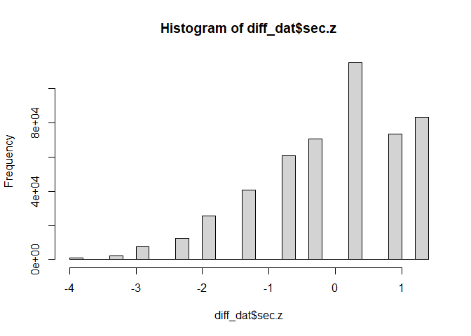
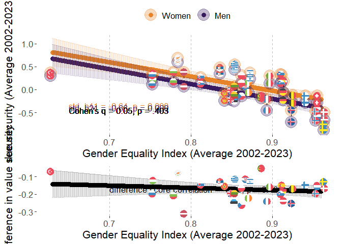
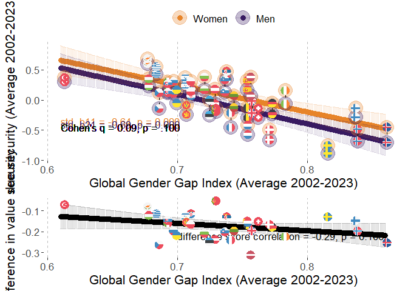
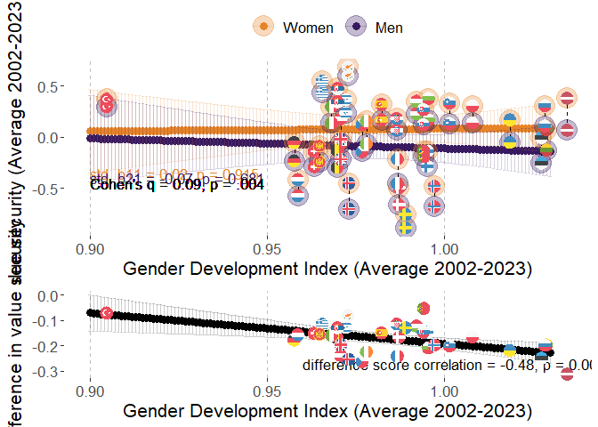
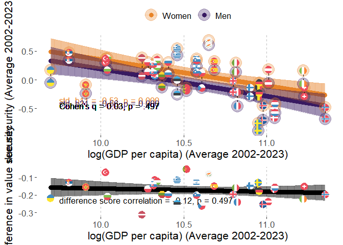
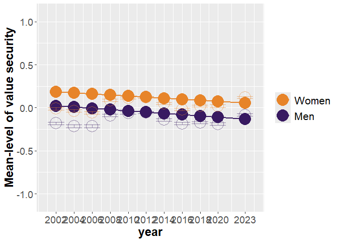
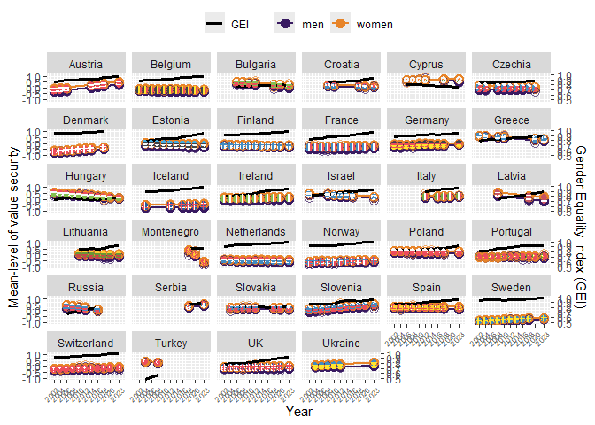

# Packages

Two packages are not in CRAN and need different installation
* devtools::install_github("vjilmari/vjihelpers")
* install.packages("ggflags", repos = c("https://jimjam-slam.r-universe.dev","https://cloud.r-project.org")) 


``` r
library(multid)
library(rio)
library(dplyr)
library(lme4)
library(emmeans)
library(vjihelpers)
library(MetBrewer)
library(ggplot2)
library(finalfit)
library(ggflags) 
library(lmerTest)
library(metafor)
library(ggpubr)
library(Hmisc)
library(r2mlm)
library(tidyr)
library(stringr)
library(apaTables)
library(tibble)
```

# Custom functions


``` r
# toster function for equivalence testing

tost_z <- function(est, se, low, high, alpha = 0.10) {
  # z statistics
  z_low  <- (est - low)  / se     # H0: theta <= low  vs H1: theta > low
  z_high <- (est - high) / se     # H0: theta >= high vs H1: theta < high
  
  # one-sided p-values
  p_low  <- 1 - pnorm(z_low)
  p_high <- pnorm(z_high)
  
  # CI corresponding to TOST (1 - 2*alpha)
  z_crit <- qnorm(1 - alpha)
  ci_low  <- est - z_crit * se
  ci_high <- est + z_crit * se
  
  # equivalence decision
  equivalent <- (p_low < alpha) && (p_high < alpha)
  
  list(
    estimate     = est,
    se           = se,
    low_bound    = low,
    high_bound   = high,
    alpha        = alpha,
    z_low        = z_low,
    p_low        = p_low,
    z_high       = z_high,
    p_high       = p_high,
    ci_level     = 1 - 2*alpha,
    ci_lower     = ci_low,
    ci_upper     = ci_high,
    equivalent   = equivalent
  )
}


# TOST function for equivalence testing with t distribution

tost_t <- function(est, se, low, high, df, alpha = 0.10) {
  # t statistics
  t_low  <- (est - low)  / se   # H0: theta <= low  vs H1: theta > low
  t_high <- (est - high) / se   # H0: theta >= high vs H1: theta < high
  
  # one-sided p-values
  p_low  <- 1 - pt(t_low,  df = df)
  p_high <-     pt(t_high, df = df)
  
  # CI corresponding to TOST (1 - 2*alpha)
  t_crit <- qt(1 - alpha, df = df)
  ci_low  <- est - t_crit * se
  ci_high <- est + t_crit * se
  
  # equivalence decision
  equivalent <- (p_low < alpha) && (p_high < alpha)
  
  list(
    estimate   = est,
    se         = se,
    df         = df,
    low_bound  = low,
    high_bound = high,
    alpha      = alpha,
    t_low      = t_low,
    p_low      = p_low,
    t_high     = t_high,
    p_high     = p_high,
    ci_level   = 1 - 2 * alpha,
    ci_lower   = ci_low,
    ci_upper   = ci_high,
    equivalent = equivalent
  )
}
```


# Data

* Loads the preprocessed European Social Survey data file made within "Preparations_ESS" code


``` r
load("../data/fdat.rdata")
```

* Include ISO data for country-names


``` r
# read country names
ISO<-read.csv2("../data/ISO.csv")
```


# Exclusions

* exclude participants with missing values or gender


``` r
value.vars<-
  c("con","tra",
  "ben","uni",
  "sdi","sti",
  "hed","ach",
  "pow","sec")

fdat$miss_values<-
  rowSums(is.na(fdat[,value.vars]))
table(fdat$miss_values)
```

```
## 
##      0      1      2      3      4      5      6      7      8      9     10 
## 500044   2791    835    442    267    204    142    143    156    177  35470
```

``` r
fdat<-fdat %>%
  filter(miss_values==0 & !is.na(gndr.bin))
```


# Data for the analysis

* use the testing partition of the data set (diff_dat)
* basic descriptives


``` r
diff_dat<-
  fdat

#diff_dat$age.c<-as.numeric(diff_dat$age.c)
#diff_dat$rlgdgr.c<-as.numeric(diff_dat$rlgdgr.c)
#diff_dat$eduyrs.c<-as.numeric(diff_dat$eduyrs.c)

# data exclusions (include countries with at least two rounds of data)
n_rounds<-diff_dat %>% group_by(cntry) %>%
  summarise(n_unique_essround = n_distinct(essround))

# join number of rounds to data
diff_dat<-
  left_join(x=diff_dat,
            y=n_rounds,
            by="cntry")

# filter only countries with more than 1 round and non-missing gender variable
diff_dat<-diff_dat %>%
  dplyr::filter(n_unique_essround>1 &
                  !is.na(gndr))

# cross-tabulate sample sizes and ESS rounds by country
table(diff_dat$essround,diff_dat$cntry)
```

```
##     
##        AT   BE   BG   CH   CY   CZ   DE   DK   EE   ES   FI   FR   GB   GR   HR   HU   IE   IL   IS   IT
##   1  2254 1830    0 2024    0 1208 2819 1470    0 1712 1763 1355 1798 2551    0 1634 1916 2279    0    0
##   2  2198 1771    0 2110    0 2557 2840 1458 1948 1623 1701 1699 1864 2399    0 1460 1187    0  524    0
##   3  2348 1796 1295 1780  978    0 2884 1461 1466 1847 1649 1983 2353    0    0 1462 1589    0    0    0
##   4     0 1754 2144 1753 1210 1986 2732 1581 1646 2562 1901 2067 2311 2063 1430 1430 1757 2382    0    0
##   5     0 1699 2371 1491 1053 2335 3007 1564 1793 1881 1649 1723 2374 2669 1601 1473 2400 2212    0    0
##   6     0 1862 2179 1483 1110 1973 2935 1621 2345 1871 2158 1960 2261    0    0 1968 2616 2378  739  909
##   7  1795 1767    0 1521    0 1862 3006 1483 2036 1907 2050 1902 2231    0    0 1520 2380 2351    0    0
##   8  1993 1759    0 1504    0 2252 2821    0 2007 1929 1903 2057 1942    0    0 1458 2746 2366  841 2531
##   9  2477 1756 1926 1517  773 2343 2328 1554 1899 1619 1735 1982 2183    0 1781 1643 2189    0  844 2660
##   10    0 1334 2697 1505    0 2369    0    0 1538    0 1561 1951 1131 2768 1564 1816 1751    0  886 2573
##   11 2314 1577 2218 1368  667    0 2381    0 1282 1833 1524 1745 1529 2745 1548 2117 1985  893  825 2783
##     
##        LT   LV   ME   NL   NO   PL   PT   RS   RU   SE   SI   SK   TR   UA
##   1     0    0    0 2337 1819 2065 1482    0    0 1682 1488    0    0    0
##   2     0    0    0 1858 1575 1683 2024    0    0 1678 1384 1425 1790 1896
##   3     0    0    0 1860 1550 1685 2182    0 2339 1604 1465 1711    0 1885
##   4     0 1970    0 1724 1391 1596 2337    0 2446 1556 1257 1789 2305 1766
##   5  1632    0    0 1801 1530 1719 2139    0 2557 1463 1369 1803    0 1779
##   6  2108    0    0 1828 1610 1866 2138    0 2429 1838 1244 1827    0 2064
##   7  2241    0    0 1823 1423 1594 1242    0    0 1761 1189    0    0    0
##   8  2079    0    0 1669 1530 1675 1254    0 2374 1526 1295    0    0    0
##   9  1677  891 1188 1657 1396 1443 1045 1969    0 1510 1307 1061    0    0
##   10 1606    0 1248 1466 1408    0 1827    0    0    0 1232 1395    0    0
##   11 1337 1225 1581 1677 1318 1423 1366 1511    0 1204 1227 1414    0 2589
```

``` r
# range of sample sizes
range(table(diff_dat$cntry))
```

```
## [1]  3480 27753
```

``` r
# scale/standardize with SD pooled across all country-time-gender folds
cntry.sec<-diff_dat %>% group_by(cntry,essround) %>%
  summarise(sec.ctm=mean(sec,na.rm=T),
            sec.ctsd=sd(sec,na.rm=T)) %>%
  group_by(cntry) %>%
  summarise(sec.cm=mean(sec.ctm),
            sec.csd=mean(sec.ctsd)) 
```

```
## `summarise()` has regrouped the output.
## ℹ Summaries were computed grouped by cntry and essround.
## ℹ Output is grouped by cntry.
## ℹ Use `summarise(.groups = "drop_last")` to silence this message.
## ℹ Use `summarise(.by = c(cntry, essround))` for per-operation grouping (`?dplyr::dplyr_by`) instead.
```

``` r
grand_mean_sec<-mean(cntry.sec$sec.cm)
grand_sd_sec<-mean(cntry.sec$sec.csd)

# standardized
diff_dat$sec.z<-(diff_dat$sec-grand_mean_sec)/grand_sd_sec
hist(diff_dat$sec.z)
```

<!-- -->

``` r
# recode time to start from 2002=0

diff_dat$year<-
  case_when(
    diff_dat$essround==1~2002,  
    diff_dat$essround==2~2004,
    diff_dat$essround==3~2006,
    diff_dat$essround==4~2008,
    diff_dat$essround==5~2010,
    diff_dat$essround==6~2012,
    diff_dat$essround==7~2014,
    diff_dat$essround==8~2016,
    diff_dat$essround==9~2018,
    diff_dat$essround==10~2020,
    diff_dat$essround==11~2023
  )

diff_dat$year.c<-diff_dat$year-2002
```

## Add GEI-variable

* GEI = Reverse-coded Gender Inequality Index (GII)


``` r
GII<-read.csv("../data/GII.csv")

# Obtain GII only for ESS countries
GII_in_ESS_d<-
  GII %>%
  filter(ISO2 %in% unique(diff_dat$cntry))

# Make long format data of GII, so that country x year has own rows

long_GII_in_ESS_d <- GII_in_ESS_d %>%
  pivot_longer(
    cols = starts_with("gii_") & !matches("avg"),  # <-- exclude the "_avg" columns
    names_to = "year",
    values_to = "gii",
    names_prefix = "gii_"
  ) %>%
  mutate(year = as.integer(year)) %>%
  filter(year >= 2002 & year <= 2023) %>%
  mutate(gei = 1 - gii) %>%
  dplyr::select(ISO2, iso3, country, year, gii, gei, gii_2002_2023_avg, gei_2002_2023_avg)


# describe gei average
psych::describe(GII_in_ESS_d$gei_2002_2023_avg)
```

```
##    vars  n mean   sd median trimmed  mad  min  max range  skew kurtosis   se
## X1    1 33 0.87 0.07   0.87    0.87 0.06 0.63 0.96  0.34 -1.06     1.37 0.01
```

``` r
# one is missing, see which one
GII_in_ESS_d[is.na(GII_in_ESS_d$gei_2002_2023_avg),"country"]
```

```
## [1] "Ukraine"
```

``` r
# get means and SDs for standardizing
gei_mean<-mean(GII_in_ESS_d$gei_2002_2023_avg,na.rm=T)
gei_sd<-sd(GII_in_ESS_d$gei_2002_2023_avg,na.rm=T)

# standardize 
# year specific scores
long_GII_in_ESS_d$gei.z<-(long_GII_in_ESS_d$gei-gei_mean)/gei_sd

# get the country means to a separate frame

GII_country_means<-
  long_GII_in_ESS_d %>% group_by(ISO2) %>%
  summarise(gei.cm=mean(gei,na.rm=T),
            gei.z.cm=mean(gei.z,na.rm=T))


long_GII_in_ESS_d<-left_join(
  x=long_GII_in_ESS_d,
  y=GII_country_means,
  by="ISO2"
)


# center both the raw score and standardized scores
long_GII_in_ESS_d$gei.cmc<-(long_GII_in_ESS_d$gei-long_GII_in_ESS_d$gei.cm)
long_GII_in_ESS_d$gei.z.cmc<-(long_GII_in_ESS_d$gei.z-long_GII_in_ESS_d$gei.z.cm)

#View(long_GII_in_ESS_d)

# averages across 2002-2023
#long_GII_in_ESS_d$gei_2002_2023_avg.z<-(long_GII_in_ESS_d$gei_2002_2023_avg-gei_mean)/gei_sd

#long_GII_in_ESS_d$gei.cmc<-long_GII_in_ESS_d$gei-long_GII_in_ESS_d$gei_2002_2023_avg

# add year to ESS data-frame


# link datasets by country and year

diff_dat<-
  left_join(
    x=diff_dat,
    y=long_GII_in_ESS_d[,c("ISO2","year","gei","gei.cm","gei.cmc",
                           "gei.z","gei.z.cm","gei.z.cmc")],
    by=c("cntry"="ISO2","year")
)
```


## Add GDI-variable

* GDI = Gender Development Index


``` r
GDI<-read.csv("../data/GDI.csv")

# Obtain GDI only for ESS countries
GDI_in_ESS_d<-
  GDI %>%
  filter(ISO2 %in% unique(diff_dat$cntry))

# Make long format data of GDI, so that country x year has own rows

long_GDI_in_ESS_d <- GDI_in_ESS_d %>%
  pivot_longer(
    cols = starts_with("gdi_") & !matches("avg"),  # <-- exclude the "_avg" columns
    names_to = "year",
    values_to = "gdi",
    names_prefix = "gdi_"
  ) %>%
  mutate(year = as.integer(year)) %>%
  filter(year >= 2002 & year <= 2023) %>%
  dplyr::select(ISO2, iso3, country, year, gdi, gdi_2002_2023_avg)

# describe gdi average
psych::describe(GDI_in_ESS_d$gdi_2002_2023_avg)
```

```
##    vars  n mean   sd median trimmed  mad min  max range skew kurtosis se
## X1    1 34 0.98 0.03   0.98    0.98 0.02 0.9 1.03  0.13 -0.3     1.28  0
```

``` r
# get means and SDs for standardizing
gdi_mean<-mean(GDI_in_ESS_d$gdi_2002_2023_avg,na.rm=T)
gdi_sd<-sd(GDI_in_ESS_d$gdi_2002_2023_avg,na.rm=T)

# standardize 
# year specific scores
long_GDI_in_ESS_d$gdi.z<-(long_GDI_in_ESS_d$gdi-gdi_mean)/gdi_sd

# get the country means to a separate frame

GDI_country_means<-
  long_GDI_in_ESS_d %>% group_by(ISO2) %>%
  summarise(gdi.cm=mean(gdi,na.rm=T),
            gdi.z.cm=mean(gdi.z,na.rm=T))

long_GDI_in_ESS_d<-left_join(
  x=long_GDI_in_ESS_d,
  y=GDI_country_means,
  by="ISO2"
)


# center both the raw score and standardized scores
long_GDI_in_ESS_d$gdi.cmc<-(long_GDI_in_ESS_d$gdi-long_GDI_in_ESS_d$gdi.cm)
long_GDI_in_ESS_d$gdi.z.cmc<-(long_GDI_in_ESS_d$gdi.z-long_GDI_in_ESS_d$gdi.z.cm)

# link datasets by country and year

diff_dat<-
  left_join(
    x=diff_dat,
    y=long_GDI_in_ESS_d[,c("ISO2","year","gdi","gdi.cm","gdi.cmc",
                           "gdi.z","gdi.z.cm","gdi.z.cmc")],
    by=c("cntry"="ISO2","year")
  )
```

## Add GDP-variable

* log_GDP = Logarithm of GDP per capita, PPP (constant 2017 international $)


``` r
GDP<-read.csv("../data/GDP_processed.csv")

# Obtain GDP only for ESS countries
GDP_in_ESS_d<-
  GDP %>%
  filter(ISO2 %in% unique(diff_dat$cntry))

# First, rename those X2000..YR2000. style columns to simple "gdp_2000" etc.

GDP_in_ESS_d <- GDP_in_ESS_d %>%
  rename_with(
    ~ str_replace_all(., "^X(\\d{4})..YR\\1\\.$", "gdp_\\1"),
    starts_with("X")
  )

# GDP_in_ESS_d
# Make long format data of GDP, so that country x year has own rows

long_GDP_in_ESS_d <- GDP_in_ESS_d %>%
  pivot_longer(
    cols = starts_with("gdp_") & !matches("avg"),  # <-- exclude the "_avg" columns
    names_to = "year",
    values_to = "gdp",
    names_prefix = "gdp_"
  ) %>%
  mutate(year = as.integer(year)) %>%
  filter(year >= 2002 & year <= 2023) %>%
  dplyr::select(ISO2, Country.Name, year, gdp, gdp_2002_2023_avg,log_gdp_2002_2023_avg) %>%
  mutate(log_gdp=log(gdp))

#View(long_GDP_in_ESS_d)

# describe gdp average
psych::describe(GDP_in_ESS_d$gdp_2002_2023_avg)
```

```
##    vars  n     mean      sd  median  trimmed     mad      min      max    range skew kurtosis      se
## X1    1 34 43905.99 17369.7 40201.8 42845.95 15827.5 16384.61 85341.85 68957.24 0.48    -0.58 2978.88
```

``` r
psych::describe(GDP_in_ESS_d$log_gdp_2002_2023_avg)
```

```
##    vars  n  mean   sd median trimmed  mad min   max range  skew kurtosis   se
## X1    1 34 10.61 0.41   10.6   10.62 0.44 9.7 11.35  1.65 -0.27    -0.71 0.07
```

``` r
# get means and SDs for standardizing
log_gdp_mean<-mean(GDP_in_ESS_d$log_gdp_2002_2023_avg,na.rm=T)
log_gdp_sd<-sd(GDP_in_ESS_d$log_gdp_2002_2023_avg,na.rm=T)

# standardize 
# year specific scores
long_GDP_in_ESS_d$log_gdp.z<-
  (long_GDP_in_ESS_d$log_gdp-log_gdp_mean)/log_gdp_sd

# get the country means to a separate frame

GDP_country_means<-
  long_GDP_in_ESS_d %>% group_by(ISO2) %>%
  summarise(gdp.cm=mean(gdp,na.rm=T),
            #gdp.z.cm=mean(gdp.z,na.rm=T),
            log_gdp.cm=mean(log_gdp,na.rm=T),
            log_gdp.z.cm=mean(log_gdp.z,na.rm=T))

long_GDP_in_ESS_d<-left_join(
  x=long_GDP_in_ESS_d,
  y=GDP_country_means,
  by="ISO2"
)


# center both the raw score and standardized scores
long_GDP_in_ESS_d$log_gdp.cmc<-(long_GDP_in_ESS_d$log_gdp-long_GDP_in_ESS_d$log_gdp.cm)
long_GDP_in_ESS_d$log_gdp.z.cmc<-(long_GDP_in_ESS_d$log_gdp.z-long_GDP_in_ESS_d$log_gdp.z.cm)

# link datasets by country and year

diff_dat<-
  left_join(
    x=diff_dat,
    y=long_GDP_in_ESS_d[,c("ISO2","year","log_gdp","log_gdp.cm","log_gdp.cmc",
                           "log_gdp.z","log_gdp.z.cm","log_gdp.z.cmc")],
    by=c("cntry"="ISO2","year")
  )
```

## Add GGGI-variable

* GGGI = Global Gender Gap Index


``` r
GGGI<-import("../data/GGGI.xlsx")

# check if all ESS countries are in the log_GGGI data
table(unique(diff_dat$cntry) %in% GGGI$ISO2)
```

```
## 
## TRUE 
##   34
```

``` r
# Obtain GGGI only for ESS countries
GGGI_in_ESS_d<-
  GGGI %>%
  filter(ISO2 %in% unique(diff_dat$cntry))

# Make long format data of GGGI, so that country x year has own rows

long_GGGI_in_ESS_d <- GGGI_in_ESS_d %>%
  pivot_longer(
    cols = starts_with("gggi_") & !matches("avg"),  # <-- exclude the "_avg" columns
    names_to = "year",
    values_to = "gggi",
    names_prefix = "gggi_"
  ) %>%
  mutate(year = as.integer(year)) %>%
  filter(year >= 2002 & year <= 2023) %>%
  dplyr::select(ISO2, cname, year, gggi, GGGI_2002_2023_avg)

# describe gggi average
psych::describe(GGGI_in_ESS_d$GGGI_2002_2023_avg)
```

```
##    vars  n mean   sd median trimmed  mad  min  max range skew kurtosis   se
## X1    1 34 0.74 0.05   0.73    0.73 0.04 0.61 0.86  0.25  0.4     0.29 0.01
```

``` r
# get means and SDs for standardizing
gggi_mean<-mean(GGGI_in_ESS_d$GGGI_2002_2023_avg,na.rm=T)
gggi_sd<-sd(GGGI_in_ESS_d$GGGI_2002_2023_avg,na.rm=T)

# standardize 
# year specific scores
long_GGGI_in_ESS_d$gggi.z<-(long_GGGI_in_ESS_d$gggi-gggi_mean)/gggi_sd

# get the country means to a separate frame

GGGI_country_means<-
  long_GGGI_in_ESS_d %>% group_by(ISO2) %>%
  summarise(gggi.cm=mean(gggi,na.rm=T),
            gggi.z.cm=mean(gggi.z,na.rm=T))

long_GGGI_in_ESS_d<-left_join(
  x=long_GGGI_in_ESS_d,
  y=GGGI_country_means,
  by="ISO2"
)

# center both the raw score and standardized scores
long_GGGI_in_ESS_d$gggi.cmc<-
  (long_GGGI_in_ESS_d$gggi-long_GGGI_in_ESS_d$gggi.cm)

long_GGGI_in_ESS_d$gggi.z.cmc<-
  (long_GGGI_in_ESS_d$gggi.z-long_GGGI_in_ESS_d$gggi.z.cm)

# link datasets by country and year

diff_dat<-
  left_join(
    x=diff_dat,
    y=long_GGGI_in_ESS_d[,c("ISO2","year","gggi","gggi.cm","gggi.cmc",
                           "gggi.z","gggi.z.cm","gggi.z.cmc")],
    by=c("cntry"="ISO2","year")
  )
```

## Country-year-gender dataframe

Frame with one row for country-year-gender


``` r
diff_dat_cntry_year<-
  diff_dat %>% 
  group_by(cntry,year,gndr.c) %>%
  dplyr::summarise(n=n(),
                   n_wt=sum(pspwght),
                   sec.z.wt=weighted.mean(x=sec.z,w=pspwght),
                   sec.z=mean(sec.z),
                   gei.z=mean(gei.z,na.rm=T),
                   gei.z.cm=mean(gei.z.cm,na.rm=T),
                   gei.z.cmc=mean(gei.z.cmc,na.rm=T),
                   gdi.z=mean(gdi.z,na.rm=T),
                   gdi.z.cm=mean(gdi.z.cm,na.rm=T),
                   gdi.z.cmc=mean(gdi.z.cmc,na.rm=T),
                   gggi.z=mean(gggi.z,na.rm=T),
                   gggi.z.cm=mean(gggi.z.cm,na.rm=T),
                   gggi.z.cmc=mean(gggi.z.cmc,na.rm=T),
                   log_gdp.z=mean(log_gdp.z,na.rm=T),
                   log_gdp.z.cm=mean(log_gdp.z.cm,na.rm=T),
                   log_gdp.z.cmc=mean(log_gdp.z.cmc,na.rm=T),
                   gei=mean(gei,na.rm=T),
                   gei.cm=mean(gei.cm,na.rm=T),
                   gei.cmc=mean(gei.cmc,na.rm=T),
                   gdi=mean(gdi,na.rm=T),
                   gdi.cm=mean(gdi.cm,na.rm=T),
                   gdi.cmc=mean(gdi.cmc,na.rm=T),
                   gggi=mean(gggi,na.rm=T),
                   gggi.cm=mean(gggi.cm,na.rm=T),
                   gggi.cmc=mean(gggi.cmc,na.rm=T),
                   log_gdp=mean(log_gdp,na.rm=T),
                   log_gdp.cm=mean(log_gdp.cm,na.rm=T),
                   log_gdp.cmc=mean(log_gdp.cmc,na.rm=T))
```

```
## `summarise()` has regrouped the output.
## ℹ Summaries were computed grouped by cntry, year, and gndr.c.
## ℹ Output is grouped by cntry and year.
## ℹ Use `summarise(.groups = "drop_last")` to silence this message.
## ℹ Use `summarise(.by = c(cntry, year, gndr.c))` for per-operation grouping (`?dplyr::dplyr_by`) instead.
```


# Descriptive statistics

## Country-specific descriptives


``` r
# sample sizes from weights

cntry_n_frame<-
  diff_dat %>% group_by(cntry) %>%
  summarise('n ESS rounds' = mean(n_unique_essround),
            n=round(sum(pspwght),0))

# security

cntry_sec_frame<-
  diff_dat %>% group_by(cntry,essround) %>%
  summarise('sec M' = weighted.mean(x=sec.z,w=pspwght),
            'sec SD' = sqrt(wtd.var(sec.z,pspwght))) %>%
  group_by(cntry) %>%
  summarise('sec M' = mean(x=`sec M`),
            'sec SD'= mean(x=`sec SD`))
```

```
## `summarise()` has regrouped the output.
## ℹ Summaries were computed grouped by cntry and essround.
## ℹ Output is grouped by cntry.
## ℹ Use `summarise(.groups = "drop_last")` to silence this message.
## ℹ Use `summarise(.by = c(cntry, essround))` for per-operation grouping (`?dplyr::dplyr_by`) instead.
```

``` r
cntry_sec_women_frame<-
  diff_dat %>%
  filter(gndr.c==-0.5) %>%
  group_by(cntry,essround) %>%
  summarise('sec M' = weighted.mean(x=sec.z,w=pspwght),
            'sec SD' = sqrt(wtd.var(sec.z,pspwght))) %>%
  group_by(cntry) %>%
  summarise('sec M Women' = mean(x=`sec M`),
            'sec SD Women'= mean(x=`sec SD`))
```

```
## `summarise()` has regrouped the output.
## ℹ Summaries were computed grouped by cntry and essround.
## ℹ Output is grouped by cntry.
## ℹ Use `summarise(.groups = "drop_last")` to silence this message.
## ℹ Use `summarise(.by = c(cntry, essround))` for per-operation grouping (`?dplyr::dplyr_by`) instead.
```

``` r
cntry_sec_men_frame<-
  diff_dat %>%
  filter(gndr.c==0.5) %>%
  group_by(cntry,essround) %>%
  summarise('sec M' = weighted.mean(x=sec.z,w=pspwght),
            'sec SD' = sqrt(wtd.var(sec.z,pspwght))) %>%
  group_by(cntry) %>%
  summarise('sec M Men' = mean(x=`sec M`),
            'sec SD Men'= mean(x=`sec SD`))
```

```
## `summarise()` has regrouped the output.
## ℹ Summaries were computed grouped by cntry and essround.
## ℹ Output is grouped by cntry.
## ℹ Use `summarise(.groups = "drop_last")` to silence this message.
## ℹ Use `summarise(.by = c(cntry, essround))` for per-operation grouping (`?dplyr::dplyr_by`) instead.
```

``` r
# link n and sec datasets

desc_frame<-
  left_join(
    x=cntry_n_frame,
    y=cntry_sec_frame,
    by="cntry"
  )

desc_frame<-
  left_join(
    x=desc_frame,
    y=cntry_sec_women_frame,
    by="cntry"
  )

desc_frame<-
  left_join(
    x=desc_frame,
    y=cntry_sec_men_frame,
    by="cntry"
  )

# Add country-specific differences
desc_frame$D<-desc_frame$`sec M Men`-desc_frame$`sec M Women`

desc_frame
```

```
## # A tibble: 34 × 10
##    cntry `n ESS rounds`     n  `sec M` `sec SD` `sec M Women` `sec SD Women` `sec M Men` `sec SD Men`
##    <chr>          <dbl> <dbl>    <dbl>    <dbl>         <dbl>          <dbl>       <dbl>        <dbl>
##  1 AT                 7 15400  0.0645     1.00        0.184            0.960     -0.0639        1.03 
##  2 BE                11 18886 -0.213      0.992      -0.130            0.967     -0.300         1.01 
##  3 BG                 7 14857  0.274      0.930       0.375            0.882      0.165         0.966
##  4 CH                11 18087 -0.203      1.08       -0.129            1.07      -0.279         1.09 
##  5 CY                 6  5771  0.632      0.747       0.670            0.719      0.592         0.770
##  6 CZ                 9 18934 -0.00304    1.06        0.127            1.03      -0.145         1.08 
##  7 DE                10 27753 -0.142      1.05       -0.0555           1.03      -0.234         1.06 
##  8 DK                 8 12198 -0.580      1.15       -0.498            1.13      -0.664         1.16 
##  9 EE                10 17974 -0.125      0.957      -0.00809          0.924     -0.263         0.975
## 10 ES                10 18785  0.237      0.960       0.309            0.923      0.160         0.991
## # ℹ 24 more rows
## # ℹ 1 more variable: D <dbl>
```

``` r
# add country-level measures

desc_frame<-
  left_join(
    x=desc_frame,
    y=GII_country_means[,c("ISO2","gei.cm")],
    by=c("cntry"="ISO2")
  )

desc_frame<-
  left_join(
    x=desc_frame,
    y=GGGI_country_means[,c("ISO2","gggi.cm")],
    by=c("cntry"="ISO2")
  )

desc_frame<-
  left_join(
    x=desc_frame,
    y=GDI_country_means[,c("ISO2","gdi.cm")],
    by=c("cntry"="ISO2")
  )


desc_frame<-
  left_join(
    x=desc_frame,
    y=GDP_country_means[,c("ISO2","gdp.cm")],
    by=c("cntry"="ISO2")
  )

desc_frame<-left_join(
  x=desc_frame,
  y=ISO[,c("ISO2","CLDR")],
  by=c("cntry"="ISO2")
)

# finalize the formatted table

cntry_desc_tbl<-
  desc_frame %>%
  dplyr::select(
    Country = CLDR,
    `n ESS rounds`,
    n,
    `sec M`, `sec SD`,
    `sec M Women`, `sec SD Women`,
    `sec M Men`, `sec SD Men`,
    D,
    GEI = gei.cm,
    GGGI = gggi.cm,
    GDI = gdi.cm,
    GDP = gdp.cm
  ) %>%
  mutate(
    across(
      .cols = -c(Country, `n ESS rounds`, n, GDP) & where(is.numeric),
      .fns  = ~ round_tidy(.x, 2)
    )
  ) %>%
  mutate(
    across(
      .cols = GDP,
      .fns  = ~ round_tidy(.x, 0)
    )
  )
print(cntry_desc_tbl,n=35)
```

```
## # A tibble: 34 × 14
##    Country     `n ESS rounds`     n `sec M` `sec SD` `sec M Women` `sec SD Women` `sec M Men` `sec SD Men`
##    <chr>                <dbl> <dbl> <chr>   <chr>    <chr>         <chr>          <chr>       <chr>       
##  1 Austria                  7 15400 0.06    1.00     0.18          0.96           -0.06       1.03        
##  2 Belgium                 11 18886 -0.21   0.99     -0.13         0.97           -0.30       1.01        
##  3 Bulgaria                 7 14857 0.27    0.93     0.37          0.88           0.16        0.97        
##  4 Switzerland             11 18087 -0.20   1.08     -0.13         1.07           -0.28       1.09        
##  5 Cyprus                   6  5771 0.63    0.75     0.67          0.72           0.59        0.77        
##  6 Czechia                  9 18934 -0.00   1.06     0.13          1.03           -0.14       1.08        
##  7 Germany                 10 27753 -0.14   1.05     -0.06         1.03           -0.23       1.06        
##  8 Denmark                  8 12198 -0.58   1.15     -0.50         1.13           -0.66       1.16        
##  9 Estonia                 10 17974 -0.12   0.96     -0.01         0.92           -0.26       0.98        
## 10 Spain                   10 18785 0.24    0.96     0.31          0.92           0.16        0.99        
## 11 Finland                 11 19568 -0.21   1.03     -0.14         1.02           -0.29       1.03        
## 12 France                  11 20457 -0.32   1.20     -0.21         1.18           -0.45       1.21        
## 13 UK                      11 22979 -0.12   1.05     -0.02         1.03           -0.23       1.07        
## 14 Greece                   6 15212 0.50    0.87     0.55          0.84           0.44        0.89        
## 15 Croatia                  5  7914 0.13    1.00     0.18          0.98           0.07        1.02        
## 16 Hungary                 11 18123 0.30    0.93     0.36          0.91           0.23        0.94        
## 17 Ireland                 11 22562 0.04    1.03     0.16          0.99           -0.08       1.06        
## 18 Israel                   7 14857 0.27    0.99     0.34          0.99           0.21        1.00        
## 19 Iceland                  6  4654 -0.58   1.10     -0.45         1.07           -0.72       1.11        
## 20 Italy                    5 11441 0.24    0.95     0.32          0.91           0.15        0.97        
## 21 Lithuania                7 13059 -0.03   1.08     0.07          1.06           -0.14       1.10        
## 22 Latvia                   3  4088 0.18    1.01     0.34          0.92           -0.02       1.08        
## 23 Montenegro               3  4028 -0.10   1.10     -0.03         1.06           -0.18       1.12        
## 24 Netherlands             11 19722 -0.50   0.99     -0.42         0.96           -0.58       1.00        
## 25 Norway                  11 16505 -0.58   1.08     -0.48         1.09           -0.68       1.07        
## 26 Poland                  10 16737 0.22    0.88     0.30          0.85           0.13        0.91        
## 27 Portugal                11 19070 -0.17   0.97     -0.14         0.96           -0.20       0.97        
## 28 Serbia                   2  3499 0.42    0.94     0.48          0.93           0.36        0.94        
## 29 Russia                   5 12139 0.21    1.01     0.30          0.99           0.10        1.03        
## 30 Sweden                  10 16104 -0.82   1.11     -0.76         1.11           -0.89       1.10        
## 31 Slovenia                11 14463 0.24    0.87     0.35          0.82           0.14        0.92        
## 32 Slovakia                 8 12547 0.18    0.89     0.25          0.86           0.11        0.91        
## 33 Turkey                   2  4108 0.34    0.85     0.36          0.86           0.32        0.85        
## 34 Ukraine                  6 12054 0.07    1.12     0.16          1.10           -0.05       1.13        
## # ℹ 5 more variables: D <chr>, GEI <chr>, GGGI <chr>, GDI <chr>, GDP <chr>
```

``` r
export(cntry_desc_tbl,"../results/sec/cntry_desc_tbl.xlsx",overwrite=T)
```

## Country-level correlations table


``` r
cor_frame<-
  desc_frame %>%
  dplyr::select(
    VBMT=`sec M`,
    VBMT_Women=`sec M Women`,
    VBMT_Men=`sec M Men`,
    D = D,
    GEI = gei.cm,
    GGGI = gggi.cm,
    GDI = gdi.cm,
    GDP = gdp.cm
  ) %>%
  mutate(
    log_GDP=log(GDP)
  ) %>%
  dplyr::select(-GDP)

apa.cor.table(
  data=cor_frame,
  filename = "../results/sec/CorTable1.doc",
  #table.number = NA,
  show.conf.interval = FALSE,
  show.sig.stars = F,
  landscape = F
)
```

```
## The ability to suppress reporting of reporting confidence intervals has been deprecated in this version.
## The function argument show.conf.interval will be removed in a later version.
```

```
## 
## 
## Means, standard deviations, and correlations with confidence intervals
##  
## 
##   Variable      M     SD   1            2            3            4            5           6          
##   1. VBMT       -0.00 0.34                                                                            
##                                                                                                       
##   2. VBMT_Women 0.08  0.33 1.00                                                                       
##                            [.99, 1.00]                                                                
##                                                                                                       
##   3. VBMT_Men   -0.10 0.35 .99          .98                                                           
##                            [.99, 1.00]  [.96, .99]                                                    
##                                                                                                       
##   4. D          -0.18 0.07 .22          .14          .32                                              
##                            [-.12, .52]  [-.21, .45]  [-.02, .59]                                      
##                                                                                                       
##   5. GEI        0.87  0.07 -.67         -.67         -.67         -.17                                
##                            [-.83, -.43] [-.82, -.42] [-.82, -.43] [-.48, .19]                         
##                                                                                                       
##   6. GGGI       0.74  0.05 -.74         -.71         -.75         -.34         .73                    
##                            [-.86, -.53] [-.85, -.50] [-.87, -.55] [-.61, -.01] [.52, .86]             
##                                                                                                       
##   7. GDI        0.98  0.03 -.04         -.00         -.09         -.49         .07         .19        
##                            [-.37, .30]  [-.34, .34]  [-.42, .25]  [-.71, -.18] [-.28, .41] [-.16, .50]
##                                                                                                       
##   8. log_GDP    10.61 0.41 -.58         -.57         -.58         -.16         .72         .62        
##                            [-.77, -.30] [-.76, -.29] [-.77, -.30] [-.48, .18]  [.50, .85]  [.36, .79] 
##                                                                                                       
##   7          
##              
##              
##              
##              
##              
##              
##              
##              
##              
##              
##              
##              
##              
##              
##              
##              
##              
##              
##              
##              
##   -.18       
##   [-.49, .17]
##              
## 
## Note. M and SD are used to represent mean and standard deviation, respectively.
## Values in square brackets indicate the 95% confidence interval.
## The confidence interval is a plausible range of population correlations 
## that could have caused the sample correlation (Cumming, 2014).
## 
```


# Analysis

## mod0: Random intercept model


``` r
mod0<-lmer(sec.z~(1|cntry),data=diff_dat,REML=F,weights = pspwght,
           control=lmerControl(optimizer="bobyqa",optCtrl=list(maxfun=2e7)))
summary(mod0)
```

```
## Linear mixed model fit by maximum likelihood . t-tests use Satterthwaite's method ['lmerModLmerTest']
## Formula: sec.z ~ (1 | cntry)
##    Data: diff_dat
## Weights: pspwght
## Control: lmerControl(optimizer = "bobyqa", optCtrl = list(maxfun = 2e+07))
## 
##       AIC       BIC    logLik -2*log(L)  df.resid 
##   1481566   1481599   -740780   1481560    492340 
## 
## Scaled residuals: 
##     Min      1Q  Median      3Q     Max 
## -8.1428 -0.5513  0.0730  0.6739  4.2161 
## 
## Random effects:
##  Groups   Name        Variance Std.Dev.
##  cntry    (Intercept) 0.1127   0.3358  
##  Residual             1.0430   1.0213  
## Number of obs: 492343, groups:  cntry, 34
## 
## Fixed effects:
##              Estimate Std. Error        df t value Pr(>|t|)
## (Intercept) -0.004376   0.057607 33.991007  -0.076     0.94
```

``` r
getVC(mod0)
```

```
##        grp        var1 var2 sdcor vcov
## 1    cntry (Intercept) <NA>  0.34 0.11
## 2 Residual        <NA> <NA>  1.02 1.04
```

``` r
r2mlm(mod0,bargraph = F)
```

```
## $Decompositions
##                      total within between
## fixed, within   0.00000000      0      NA
## fixed, between  0.00000000     NA       0
## slope variation 0.00000000      0      NA
## mean variation  0.09753863     NA       1
## sigma2          0.90246137      1      NA
## 
## $R2s
##          total within between
## f1  0.00000000      0      NA
## f2  0.00000000     NA       0
## v   0.00000000      0      NA
## m   0.09753863     NA       1
## f   0.00000000     NA      NA
## fv  0.00000000      0      NA
## fvm 0.09753863     NA      NA
```

## mod1: Gender fixed effect


``` r
mod1<-lmer(sec.z~gndr.c+(1|cntry),data=diff_dat,REML=F,weights = pspwght,
           control=lmerControl(optimizer="bobyqa",optCtrl=list(maxfun=2e7)))
summary(mod1)
```

```
## Linear mixed model fit by maximum likelihood . t-tests use Satterthwaite's method ['lmerModLmerTest']
## Formula: sec.z ~ gndr.c + (1 | cntry)
##    Data: diff_dat
## Weights: pspwght
## Control: lmerControl(optimizer = "bobyqa", optCtrl = list(maxfun = 2e+07))
## 
##       AIC       BIC    logLik -2*log(L)  df.resid 
## 1477889.5 1477933.9 -738940.7 1477881.5    492339 
## 
## Scaled residuals: 
##     Min      1Q  Median      3Q     Max 
## -7.9960 -0.5622  0.1260  0.6775  4.4086 
## 
## Random effects:
##  Groups   Name        Variance Std.Dev.
##  cntry    (Intercept) 0.1123   0.3351  
##  Residual             1.0353   1.0175  
## Number of obs: 492343, groups:  cntry, 34
## 
## Fixed effects:
##               Estimate Std. Error         df t value Pr(>|t|)    
## (Intercept) -7.711e-03  5.749e-02  3.399e+01  -0.134    0.894    
## gndr.c      -1.760e-01  2.897e-03  4.923e+05 -60.765   <2e-16 ***
## ---
## Signif. codes:  0 '***' 0.001 '**' 0.01 '*' 0.05 '.' 0.1 ' ' 1
## 
## Correlation of Fixed Effects:
##        (Intr)
## gndr.c 0.001
```

``` r
getFE(mod1,round=3)
```

```
##               Est.    SE         df       t     p     LL     UL
## (Intercept) -0.008 0.057     33.992  -0.134 0.894 -0.125  0.109
## gndr.c      -0.176 0.003 492309.624 -60.765 0.000 -0.182 -0.170
```

``` r
getVC(mod1)
```

```
##        grp        var1 var2 sdcor vcov
## 1    cntry (Intercept) <NA>  0.34 0.11
## 2 Residual        <NA> <NA>  1.02 1.04
```

``` r
r2mlm(mod1,bargraph = F)
```

```
## $Decompositions
##                      total
## fixed           0.00666543
## slope variation 0.00000000
## mean variation  0.09719527
## sigma2          0.89613930
## 
## $R2s
##          total
## f   0.00666543
## v   0.00000000
## m   0.09719527
## fv  0.00666543
## fvm 0.10386070
```

## mod2: Gender fixed and random effect

* Include random effect correlation by default


``` r
mod2<-lmer(sec.z~gndr.c+(gndr.c|cntry),data=diff_dat,REML=F,weights = pspwght,
           control=lmerControl(optimizer="bobyqa",optCtrl=list(maxfun=2e7)))
summary(mod2)
```

```
## Linear mixed model fit by maximum likelihood . t-tests use Satterthwaite's method ['lmerModLmerTest']
## Formula: sec.z ~ gndr.c + (gndr.c | cntry)
##    Data: diff_dat
## Weights: pspwght
## Control: lmerControl(optimizer = "bobyqa", optCtrl = list(maxfun = 2e+07))
## 
##       AIC       BIC    logLik -2*log(L)  df.resid 
## 1477636.3 1477702.9 -738812.1 1477624.3    492337 
## 
## Scaled residuals: 
##     Min      1Q  Median      3Q     Max 
## -8.0247 -0.5577  0.1167  0.6759  4.3637 
## 
## Random effects:
##  Groups   Name        Variance Std.Dev. Corr 
##  cntry    (Intercept) 0.112268 0.3351        
##           gndr.c      0.003565 0.0597   0.22 
##  Residual             1.034568 1.0171        
## Number of obs: 492343, groups:  cntry, 34
## 
## Fixed effects:
##              Estimate Std. Error        df t value Pr(>|t|)    
## (Intercept) -0.007946   0.057488 33.992071  -0.138    0.891    
## gndr.c      -0.173738   0.010759 31.113490 -16.149   <2e-16 ***
## ---
## Signif. codes:  0 '***' 0.001 '**' 0.01 '*' 0.05 '.' 0.1 ' ' 1
## 
## Correlation of Fixed Effects:
##        (Intr)
## gndr.c 0.207
```

``` r
getFE(mod2,round=3)
```

```
##               Est.    SE     df       t     p     LL     UL
## (Intercept) -0.008 0.057 33.992  -0.138 0.891 -0.125  0.109
## gndr.c      -0.174 0.011 31.113 -16.149 0.000 -0.196 -0.152
```

``` r
getVC(mod2)
```

```
##        grp        var1   var2 sdcor vcov
## 1    cntry (Intercept)   <NA>  0.34 0.11
## 2    cntry      gndr.c   <NA>  0.06 0.00
## 3    cntry (Intercept) gndr.c  0.22 0.00
## 4 Residual        <NA>   <NA>  1.02 1.03
```

``` r
r2mlm(mod2,bargraph = F)
```

```
## $Decompositions
##                        total
## fixed           0.0064947471
## slope variation 0.0007669676
## mean variation  0.0969240764
## sigma2          0.8958142089
## 
## $R2s
##            total
## f   0.0064947471
## v   0.0007669676
## m   0.0969240764
## fv  0.0072617147
## fvm 0.1041857911
```

``` r
anova(mod1,mod2)
```

```
## Data: diff_dat
## Models:
## mod1: sec.z ~ gndr.c + (1 | cntry)
## mod2: sec.z ~ gndr.c + (gndr.c | cntry)
##      npar     AIC     BIC  logLik -2*log(L)  Chisq Df Pr(>Chisq)    
## mod1    4 1477889 1477934 -738941   1477881                         
## mod2    6 1477636 1477703 -738812   1477624 257.21  2  < 2.2e-16 ***
## ---
## Signif. codes:  0 '***' 0.001 '**' 0.01 '*' 0.05 '.' 0.1 ' ' 1
```

``` r
lvl2_var_cond_lvl1(mod2,lvl1.var = "gndr.c",lvl1.values = c(0.5,-0.5))
```

```
##   lvl1.value lvl2.cond.var lvl2.cond.sd
## 1        0.5     0.1174952    0.3427757
## 2       -0.5     0.1088233    0.3298838
```

* Test for random effect correlation


``` r
mod2_norecov<-lmer(sec.z~gndr.c+(gndr.c||cntry),data=diff_dat,REML=F,weights = pspwght,
                   control=lmerControl(optimizer="bobyqa",optCtrl=list(maxfun=2e7)))
summary(mod2_norecov)
```

```
## Linear mixed model fit by maximum likelihood . t-tests use Satterthwaite's method ['lmerModLmerTest']
## Formula: sec.z ~ gndr.c + (gndr.c || cntry)
##    Data: diff_dat
## Weights: pspwght
## Control: lmerControl(optimizer = "bobyqa", optCtrl = list(maxfun = 2e+07))
## 
##       AIC       BIC    logLik -2*log(L)  df.resid 
## 1477635.7 1477691.3 -738812.9 1477625.7    492338 
## 
## Scaled residuals: 
##     Min      1Q  Median      3Q     Max 
## -8.0242 -0.5578  0.1167  0.6758  4.3615 
## 
## Random effects:
##  Groups   Name        Variance Std.Dev.
##  cntry    (Intercept) 0.112264 0.33506 
##  cntry.1  gndr.c      0.003543 0.05952 
##  Residual             1.034568 1.01714 
## Number of obs: 492343, groups:  cntry, 34
## 
## Fixed effects:
##              Estimate Std. Error        df t value Pr(>|t|)    
## (Intercept) -0.007958   0.057487 33.985902  -0.138    0.891    
## gndr.c      -0.173943   0.010730 31.095595 -16.211   <2e-16 ***
## ---
## Signif. codes:  0 '***' 0.001 '**' 0.01 '*' 0.05 '.' 0.1 ' ' 1
## 
## Correlation of Fixed Effects:
##        (Intr)
## gndr.c 0.000
```

``` r
getFE(mod2_norecov,round=3)
```

```
##               Est.    SE     df       t     p     LL     UL
## (Intercept) -0.008 0.057 33.986  -0.138 0.891 -0.125  0.109
## gndr.c      -0.174 0.011 31.096 -16.211 0.000 -0.196 -0.152
```

``` r
getVC(mod2_norecov)
```

```
##        grp        var1 var2 sdcor vcov
## 1    cntry (Intercept) <NA>  0.34 0.11
## 2  cntry.1      gndr.c <NA>  0.06 0.00
## 3 Residual        <NA> <NA>  1.02 1.03
```

``` r
anova(mod2_norecov,mod2)
```

```
## Data: diff_dat
## Models:
## mod2_norecov: sec.z ~ gndr.c + (gndr.c || cntry)
## mod2: sec.z ~ gndr.c + (gndr.c | cntry)
##              npar     AIC     BIC  logLik -2*log(L)  Chisq Df Pr(>Chisq)
## mod2_norecov    5 1477636 1477691 -738813   1477626                     
## mod2            6 1477636 1477703 -738812   1477624 1.4649  1     0.2262
```


## mod2 with Gender-equality index (GEI)


``` r
mod2_GEI<-lmer(sec.z~gndr.c+gei.z.cm+gndr.c:gei.z.cm+
                 (gndr.c|cntry),data=diff_dat,REML=F,weights = pspwght,
           control=lmerControl(optimizer="bobyqa",optCtrl=list(maxfun=2e7)))
summary(mod2_GEI)
```

```
## Linear mixed model fit by maximum likelihood . t-tests use Satterthwaite's method ['lmerModLmerTest']
## Formula: sec.z ~ gndr.c + gei.z.cm + gndr.c:gei.z.cm + (gndr.c | cntry)
##    Data: diff_dat
## Weights: pspwght
## Control: lmerControl(optimizer = "bobyqa", optCtrl = list(maxfun = 2e+07))
## 
##       AIC       BIC    logLik -2*log(L)  df.resid 
## 1437192.1 1437280.8 -718588.1 1437176.1    480356 
## 
## Scaled residuals: 
##     Min      1Q  Median      3Q     Max 
## -8.0453 -0.5591  0.1162  0.6760  4.3749 
## 
## Random effects:
##  Groups   Name        Variance Std.Dev. Corr 
##  cntry    (Intercept) 0.063052 0.25110       
##           gndr.c      0.003523 0.05935  0.16 
##  Residual             1.029184 1.01449       
## Number of obs: 480364, groups:  cntry, 33
## 
## Fixed effects:
##                  Estimate Std. Error        df t value Pr(>|t|)    
## (Intercept)     -0.009831   0.043745 32.977825  -0.225    0.824    
## gndr.c          -0.172176   0.010866 30.580473 -15.845 2.72e-16 ***
## gei.z.cm        -0.232714   0.044439 33.025445  -5.237 9.16e-06 ***
## gndr.c:gei.z.cm -0.009547   0.011274 33.129238  -0.847    0.403    
## ---
## Signif. codes:  0 '***' 0.001 '**' 0.01 '*' 0.05 '.' 0.1 ' ' 1
## 
## Correlation of Fixed Effects:
##             (Intr) gndr.c g.z.cm
## gndr.c       0.156              
## gei.z.cm    -0.001  0.000       
## gndr.c:g.z.  0.000 -0.031  0.152
```

``` r
getFE(mod2_GEI,round=3)
```

```
##                   Est.    SE     df       t     p     LL     UL
## (Intercept)     -0.010 0.044 32.978  -0.225 0.824 -0.099  0.079
## gndr.c          -0.172 0.011 30.580 -15.845 0.000 -0.194 -0.150
## gei.z.cm        -0.233 0.044 33.025  -5.237 0.000 -0.323 -0.142
## gndr.c:gei.z.cm -0.010 0.011 33.129  -0.847 0.403 -0.032  0.013
```

``` r
getVC(mod2_GEI)
```

```
##        grp        var1   var2 sdcor vcov
## 1    cntry (Intercept)   <NA>  0.25 0.06
## 2    cntry      gndr.c   <NA>  0.06 0.00
## 3    cntry (Intercept) gndr.c  0.16 0.00
## 4 Residual        <NA>   <NA>  1.01 1.03
```

``` r
r2mlm(mod2_GEI,bargraph = F)
```

```
## $Decompositions
##                        total
## fixed           0.0410887860
## slope variation 0.0007685714
## mean variation  0.0551678777
## sigma2          0.9029747649
## 
## $R2s
##            total
## f   0.0410887860
## v   0.0007685714
## m   0.0551678777
## fv  0.0418573575
## fvm 0.0970252351
```

### Deconstructed associations


``` r
t1<-Sys.time()
ddsc_mod2_GEI<-
  ddsc_ml(model = mod2_GEI,
          predictor = "gei.z.cm",
          moderator = "gndr.c",moderator_values = c(-0.5,0.5),
          re_cov_test = T)
t2<-Sys.time()
t2-t1
```

```
## Time difference of 29.56299 secs
```

``` r
round(ddsc_mod2_GEI$vpc_at_moderator_values,3)
```

```
##   lvl1.value Intercept.var Intercept.sd Residual.var Total.var   VPC mean.n.obs  ICC2 ICC2_SP
## 1       -0.5         0.109        0.330        1.035     1.143 0.095   7802.647 0.999   0.999
## 2        0.5         0.117        0.343        1.035     1.152 0.102   6678.029 0.998   0.999
```

``` r
round(ddsc_mod2_GEI$descriptives,3)
```

```
##                        M    SD means_y1 means_y1_scaled means_y2 means_y2_scaled gei.z.cm gei.z.cm_scaled
## means_y1          -0.093 0.362    1.000           1.000    0.984           0.984   -0.670          -0.670
## means_y1_scaled   -0.260 1.010    1.000           1.000    0.984           0.984   -0.670          -0.670
## means_y2           0.073 0.354    0.984           0.984    1.000           1.000   -0.664          -0.664
## means_y2_scaled    0.204 0.990    0.984           0.984    1.000           1.000   -0.664          -0.664
## gei.z.cm           0.000 1.000   -0.670          -0.670   -0.664          -0.664    1.000           1.000
## gei.z.cm_scaled    0.000 1.000   -0.670          -0.670   -0.664          -0.664    1.000           1.000
## diff_score        -0.166 0.065    0.200           0.200    0.022           0.022   -0.106          -0.106
## diff_score_scaled -0.464 0.181    0.200           0.200    0.022           0.022   -0.106          -0.106
##                   diff_score diff_score_scaled
## means_y1               0.200             0.200
## means_y1_scaled        0.200             0.200
## means_y2               0.022             0.022
## means_y2_scaled        0.022             0.022
## gei.z.cm              -0.106            -0.106
## gei.z.cm_scaled       -0.106            -0.106
## diff_score             1.000             1.000
## diff_score_scaled      1.000             1.000
```

``` r
round(ddsc_mod2_GEI$results,3)
```

```
##                            estimate    SE     df t.ratio p.value ci.lower ci.upper
## r_xy1y2                       0.148 0.174 33.129   0.847   0.403   -0.207    0.502
## w_11                         -0.228 0.044 33.050  -5.188   0.000   -0.317   -0.139
## w_21                         -0.237 0.046 33.049  -5.204   0.000   -0.330   -0.145
## r_xy1                        -0.630 0.121 33.050  -5.188   0.000   -0.877   -0.383
## r_xy2                        -0.670 0.129 33.049  -5.204   0.000   -0.932   -0.408
## b_11                         -0.637 0.123 33.050  -5.188   0.000   -0.886   -0.387
## b_21                         -0.663 0.127 33.049  -5.204   0.000   -0.922   -0.404
## main_effect                  -0.233 0.044 33.025  -5.237   0.000   -0.323   -0.142
## moderator_effect             -0.172 0.011 30.580 -15.845   0.000   -0.194   -0.150
## interaction                  -0.010 0.011 33.129  -0.847   0.403   -0.032    0.013
## q_b11_b21                     0.046    NA     NA      NA      NA       NA       NA
## q_rxy1_rxy2                   0.069    NA     NA      NA      NA       NA       NA
## cross_over_point            -18.034    NA     NA      NA      NA       NA       NA
## interaction_vs_main          -0.223 0.044 33.125  -5.055   0.000   -0.313   -0.133
## interaction_vs_main_bscale   -0.623 0.123 33.125  -5.055   0.000   -0.874   -0.372
## interaction_vs_main_rscale   -0.610 0.121 33.128  -5.049   0.000   -0.856   -0.364
## dadas                        -0.456 0.088 33.050  -5.188   1.000   -0.635   -0.277
## dadas_bscale                 -1.273 0.245 33.050  -5.188   1.000   -1.772   -0.774
## dadas_rscale                 -1.260 0.243 33.050  -5.188   1.000   -1.754   -0.766
## abs_diff                      0.010 0.011 33.129   0.847   0.202   -0.013    0.032
## abs_sum                       0.465 0.089 33.025   5.237   0.000    0.285    0.646
## abs_diff_bscale               0.027 0.031 33.129   0.847   0.202   -0.037    0.091
## abs_sum_bscale                1.300 0.248 33.025   5.237   0.000    0.795    1.805
## abs_diff_rscale               0.040 0.032 33.135   1.246   0.111   -0.025    0.105
## abs_sum_rscale                1.300 0.248 33.025   5.237   0.000    0.795    1.805
```

``` r
round(ddsc_mod2_GEI$re_cov_test,3)
```

```
## RE_cov RE_cor  Chisq     Df      p 
##  0.004  0.217  1.465  1.000  0.226
```

``` r
# Structural path model
d_GEI<-ddsc_mod2_GEI$ddsc_sem_fit$data

ddsc_sem_GEI<-
  ddsc_sem(data=d_GEI,x = "gei.z.cm",y1="means_y2",
           y2="means_y1",q_sesoi = .10)
round(ddsc_sem_GEI$results,3)
```

```
##                                     est     se      z pvalue ci.lower ci.upper
## r_xy1_y2                          0.106  0.173  0.615  0.539   -0.233    0.446
## r_xy1                            -0.664  0.130 -5.107  0.000   -0.919   -0.409
## r_xy2                            -0.670  0.129 -5.186  0.000   -0.923   -0.417
## b_11                             -0.658  0.129 -5.107  0.000   -0.910   -0.405
## b_21                             -0.677  0.131 -5.186  0.000   -0.933   -0.421
## b_10                              0.204  0.127  1.612  0.107   -0.044    0.453
## b_20                             -0.260  0.129 -2.020  0.043   -0.512   -0.008
## res_cov_y1_y2                     0.522  0.131  4.002  0.000    0.266    0.778
## diff_b10_b20                      0.464  0.031 15.081  0.000    0.404    0.524
## diff_b11_b21                      0.019  0.031  0.615  0.539   -0.042    0.080
## diff_rxy1_rxy2                    0.006  0.031  0.183  0.855   -0.055    0.067
## q_b11_b21                         0.035  0.058  0.598  0.550   -0.079    0.148
## q_rxy1_rxy2                       0.010  0.056  0.183  0.855   -0.100    0.121
## cross_over_point                -24.151 39.306 -0.614  0.539 -101.189   52.888
## sum_b11_b21                      -1.335  0.257 -5.184  0.000   -1.839   -0.830
## main_effect                      -0.667  0.129 -5.184  0.000   -0.920   -0.415
## interaction_vs_main_effect       -0.648  0.131 -4.957  0.000   -0.904   -0.392
## diff_abs_b11_abs_b21             -0.019  0.031 -0.615  0.539   -0.080    0.042
## abs_diff_b11_b21                  0.019  0.031  0.615  0.269   -0.042    0.080
## abs_sum_b11_b21                   1.335  0.257  5.184  0.000    0.830    1.839
## dadas                            -1.315  0.258 -5.107  1.000   -1.820   -0.810
## q_r_equivalence                  -0.090  0.056 -1.594  0.055       NA       NA
## q_b_equivalence                  -0.065  0.058 -1.127  0.130       NA       NA
## cross_over_point_equivalence     24.151 39.306  0.614  0.731       NA       NA
## cross_over_point_minimal_effect  24.151 39.306  0.614  0.269       NA       NA
```

``` r
round(ddsc_sem_GEI$variance_test,3)
```

```
##              est    se       z pvalue ci.lower ci.upper
## cov_y1y2   0.954 0.237   4.029  0.000    0.490    1.418
## var_y1     0.950 0.234   4.062  0.000    0.492    1.408
## var_y2     0.989 0.244   4.062  0.000    0.512    1.467
## var_diff  -0.039 0.061  -0.643  0.521   -0.159    0.080
## var_ratio  0.960 0.060  16.073  0.000    0.843    1.077
## cor_y1y2   0.984 0.006 176.996  0.000    0.973    0.995
```

``` r
## random intercept mlm with double-entries for each country (men and women)

d_GEI_long <- d_GEI %>%
  # move row names into a column
  rownames_to_column("cntry") %>%
  # pivot only the means_y1 / means_y2 columns
  pivot_longer(
    cols = c(means_y1, means_y2),
    names_to = "y",
    values_to = "means"
  ) %>%
  # create a sgender column based on y1/y2
  mutate(
    gndr.c = case_when(
      y == "means_y1" ~ -0.5,
      y == "means_y2" ~ 0.5
    )
  ) %>%
  dplyr::select(cntry,gei.z.cm,means,gndr.c)


ddsc_mod2_GEI_ri<-
  ddsc_ml(data=data.frame(d_GEI_long),predictor = "gei.z.cm",
          moderator = "gndr.c",
        DV = "means",lvl2_unit = "cntry",
        moderator_values = c(-0.5,0.5))
round(ddsc_mod2_GEI_ri$results,3)
```

```
##                            estimate    SE     df t.ratio p.value ci.lower ci.upper
## r_xy1y2                       0.106 0.179 31.000   0.596   0.555   -0.258    0.471
## w_11                         -0.236 0.048 31.914  -4.916   0.000   -0.333   -0.138
## w_21                         -0.242 0.048 31.914  -5.060   0.000   -0.340   -0.145
## r_xy1                        -0.664 0.135 31.914  -4.916   0.000   -0.940   -0.389
## r_xy2                        -0.670 0.132 31.914  -5.060   0.000   -0.940   -0.400
## b_11                         -0.658 0.134 31.914  -4.916   0.000   -0.930   -0.385
## b_21                         -0.677 0.134 31.914  -5.060   0.000   -0.949   -0.404
## main_effect                  -0.239 0.048 31.000  -5.025   0.000   -0.336   -0.142
## moderator_effect             -0.166 0.011 31.000 -14.617   0.000   -0.189   -0.143
## interaction                  -0.007 0.012 31.000  -0.596   0.555   -0.030    0.017
## q_b11_b21                     0.035    NA     NA      NA      NA       NA       NA
## q_rxy1_rxy2                   0.010    NA     NA      NA      NA       NA       NA
## cross_over_point            -24.151    NA     NA      NA      NA       NA       NA
## interaction_vs_main          -0.232 0.049 34.643  -4.742   0.000   -0.331   -0.133
## interaction_vs_main_bscale   -0.648 0.137 34.643  -4.742   0.000   -0.926   -0.371
## interaction_vs_main_rscale   -0.662 0.139 34.536  -4.748   0.000   -0.945   -0.379
## dadas                        -0.471 0.096 31.914  -4.916   1.000   -0.666   -0.276
## dadas_bscale                 -1.315 0.268 31.914  -4.916   1.000   -1.860   -0.770
## dadas_rscale                 -1.329 0.270 31.914  -4.916   1.000   -1.879   -0.778
## abs_diff                      0.007 0.012 31.000   0.596   0.278   -0.017    0.030
## abs_sum                       0.478 0.095 31.000   5.025   0.000    0.284    0.672
## abs_diff_bscale               0.019 0.032 31.000   0.596   0.278   -0.047    0.085
## abs_sum_bscale                1.335 0.266 31.000   5.025   0.000    0.793    1.876
## abs_diff_rscale               0.006 0.032 31.431   0.177   0.431   -0.060    0.072
## abs_sum_rscale                1.335 0.266 31.000   5.024   0.000    0.793    1.876
```

``` r
# country-time multilevel model


mod2_GEI_cntry_year<-
  lmer(sec.z.wt~gndr.c+gei.z.cm+gndr.c:gei.z.cm+
                 (gndr.c|cntry),data=diff_dat_cntry_year,REML=F,
               control=lmerControl(optimizer="bobyqa",optCtrl=list(maxfun=2e7)))
```

```
## boundary (singular) fit: see help('isSingular')
```

``` r
summary(mod2_GEI_cntry_year)
```

```
## Linear mixed model fit by maximum likelihood . t-tests use Satterthwaite's method ['lmerModLmerTest']
## Formula: sec.z.wt ~ gndr.c + gei.z.cm + gndr.c:gei.z.cm + (gndr.c | cntry)
##    Data: diff_dat_cntry_year
## Control: lmerControl(optimizer = "bobyqa", optCtrl = list(maxfun = 2e+07))
## 
##       AIC       BIC    logLik -2*log(L)  df.resid 
##    -473.8    -439.5     244.9    -489.8       526 
## 
## Scaled residuals: 
##     Min      1Q  Median      3Q     Max 
## -5.1337 -0.5295  0.0191  0.6117  3.9909 
## 
## Random effects:
##  Groups   Name        Variance Std.Dev. Corr 
##  cntry    (Intercept) 0.060858 0.246695      
##           gndr.c      0.000097 0.009849 1.00 
##  Residual             0.018378 0.135564      
## Number of obs: 534, groups:  cntry, 33
## 
## Fixed effects:
##                  Estimate Std. Error        df t value Pr(>|t|)    
## (Intercept)      -0.01007    0.04345  32.78193  -0.232    0.818    
## gndr.c           -0.17572    0.01217 312.25068 -14.436  < 2e-16 ***
## gei.z.cm         -0.23333    0.04444  33.70112  -5.251 8.31e-06 ***
## gndr.c:gei.z.cm  -0.00176    0.01393 364.36442  -0.126    0.900    
## ---
## Signif. codes:  0 '***' 0.001 '**' 0.01 '*' 0.05 '.' 0.1 ' ' 1
## 
## Correlation of Fixed Effects:
##             (Intr) gndr.c g.z.cm
## gndr.c       0.140              
## gei.z.cm    -0.009 -0.001       
## gndr.c:g.z. -0.001 -0.224  0.124
## optimizer (bobyqa) convergence code: 0 (OK)
## boundary (singular) fit: see help('isSingular')
```

``` r
getFE(mod2_GEI_cntry_year,round=3)
```

```
##                   Est.    SE      df       t     p     LL     UL
## (Intercept)     -0.010 0.043  32.782  -0.232 0.818 -0.098  0.078
## gndr.c          -0.176 0.012 312.251 -14.436 0.000 -0.200 -0.152
## gei.z.cm        -0.233 0.044  33.701  -5.251 0.000 -0.324 -0.143
## gndr.c:gei.z.cm -0.002 0.014 364.364  -0.126 0.900 -0.029  0.026
```

``` r
getVC(mod2_GEI_cntry_year)
```

```
##        grp        var1   var2 sdcor vcov
## 1    cntry (Intercept)   <NA>  0.25 0.06
## 2    cntry      gndr.c   <NA>  0.01 0.00
## 3    cntry (Intercept) gndr.c  1.00 0.00
## 4 Residual        <NA>   <NA>  0.14 0.02
```

``` r
r2mlm(mod2_GEI,bargraph = F)
```

```
## $Decompositions
##                        total
## fixed           0.0410887860
## slope variation 0.0007685714
## mean variation  0.0551678777
## sigma2          0.9029747649
## 
## $R2s
##            total
## f   0.0410887860
## v   0.0007685714
## m   0.0551678777
## fv  0.0418573575
## fvm 0.0970252351
```

``` r
ddsc_mod2_GEI_cntry_year<-
  ddsc_ml(model = mod2_GEI_cntry_year,
          predictor = "gei.z.cm",
          moderator = "gndr.c",moderator_values = c(-0.5,0.5),
          re_cov_test = T)

round(ddsc_mod2_GEI_cntry_year$vpc_at_moderator_values,3)
```

```
##   lvl1.value Intercept.var Intercept.sd Residual.var Total.var   VPC mean.n.obs  ICC2 ICC2_SP
## 1       -0.5         0.107        0.327        0.018     0.125 0.855      8.029 0.997   0.979
## 2        0.5         0.113        0.336        0.018     0.131 0.861      8.029 0.997   0.980
```

``` r
round(ddsc_mod2_GEI_cntry_year$descriptives,3)
```

```
##                        M    SD means_y1 means_y1_scaled means_y2 means_y2_scaled gei.z.cm gei.z.cm_scaled
## means_y1          -0.097 0.353    1.000           1.000    0.983           0.983   -0.671          -0.671
## means_y1_scaled   -0.282 1.022    1.000           1.000    0.983           0.983   -0.671          -0.671
## means_y2           0.077 0.337    0.983           0.983    1.000           1.000   -0.668          -0.668
## means_y2_scaled    0.223 0.977    0.983           0.983    1.000           1.000   -0.668          -0.668
## gei.z.cm           0.000 1.000   -0.671          -0.671   -0.668          -0.668    1.000           1.000
## gei.z.cm_scaled    0.000 1.000   -0.671          -0.671   -0.668          -0.668    1.000           1.000
## diff_score        -0.174 0.066    0.323           0.323    0.141           0.141   -0.169          -0.169
## diff_score_scaled -0.505 0.192    0.323           0.323    0.141           0.141   -0.169          -0.169
##                   diff_score diff_score_scaled
## means_y1               0.323             0.323
## means_y1_scaled        0.323             0.323
## means_y2               0.141             0.141
## means_y2_scaled        0.141             0.141
## gei.z.cm              -0.169            -0.169
## gei.z.cm_scaled       -0.169            -0.169
## diff_score             1.000             1.000
## diff_score_scaled      1.000             1.000
```

``` r
round(ddsc_mod2_GEI_cntry_year$results,3)
```

```
##                            estimate    SE      df t.ratio p.value ci.lower ci.upper
## r_xy1y2                       0.027 0.210 364.364   0.126   0.900   -0.386    0.440
## w_11                         -0.232 0.044  33.981  -5.269   0.000   -0.322   -0.143
## w_21                         -0.234 0.046  33.928  -5.111   0.000   -0.327   -0.141
## r_xy1                        -0.659 0.125  33.981  -5.269   0.000   -0.913   -0.405
## r_xy2                        -0.694 0.136  33.928  -5.111   0.000   -0.970   -0.418
## b_11                         -0.674 0.128  33.981  -5.269   0.000   -0.933   -0.414
## b_21                         -0.679 0.133  33.928  -5.111   0.000   -0.948   -0.409
## main_effect                  -0.233 0.044  33.701  -5.251   0.000   -0.324   -0.143
## moderator_effect             -0.176 0.012 312.251 -14.436   0.000   -0.200   -0.152
## interaction                  -0.002 0.014 364.364  -0.126   0.900   -0.029    0.026
## q_b11_b21                     0.009    NA      NA      NA      NA       NA       NA
## q_rxy1_rxy2                   0.066    NA      NA      NA      NA       NA       NA
## cross_over_point            -99.835    NA      NA      NA      NA       NA       NA
## interaction_vs_main          -0.232 0.045  34.933  -5.159   0.000   -0.323   -0.140
## interaction_vs_main_bscale   -0.671 0.130  34.933  -5.159   0.000   -0.935   -0.407
## interaction_vs_main_rscale   -0.641 0.125  35.033  -5.147   0.000   -0.894   -0.388
## dadas                        -0.465 0.088  33.981  -5.269   1.000   -0.644   -0.286
## dadas_bscale                 -1.347 0.256  33.981  -5.269   1.000   -1.867   -0.827
## dadas_rscale                 -1.317 0.250  33.981  -5.269   1.000   -1.825   -0.809
## abs_diff                      0.002 0.014 364.364   0.126   0.450   -0.026    0.029
## abs_sum                       0.467 0.089  33.701   5.251   0.000    0.286    0.647
## abs_diff_bscale               0.005 0.040 364.364   0.126   0.450   -0.074    0.084
## abs_sum_bscale                1.352 0.258  33.701   5.251   0.000    0.829    1.876
## abs_diff_rscale               0.036 0.042 194.803   0.857   0.196   -0.046    0.117
## abs_sum_rscale                1.353 0.258  33.701   5.249   0.000    0.829    1.877
```

``` r
round(ddsc_mod2_GEI_cntry_year$re_cov_test,3)
```

```
## RE_cov RE_cor  Chisq     Df      p 
##  0.003  1.000  0.507  1.000  0.476
```

### Comparisons across models


``` r
# full multilevel model (individuals as entries)
round(ddsc_mod2_GEI$results[c("r_xy1","r_xy2","b_11","b_21","main_effect","moderator_effect","interaction","q_b11_b21"),],4)
```

```
##                  estimate     SE      df  t.ratio p.value ci.lower ci.upper
## r_xy1             -0.6301 0.1215 33.0502  -5.1881  0.0000  -0.8772  -0.3830
## r_xy2             -0.6700 0.1288 33.0488  -5.2036  0.0000  -0.9319  -0.4080
## b_11              -0.6365 0.1227 33.0502  -5.1881  0.0000  -0.8861  -0.3869
## b_21              -0.6632 0.1274 33.0488  -5.2036  0.0000  -0.9225  -0.4039
## main_effect       -0.2327 0.0444 33.0254  -5.2367  0.0000  -0.3231  -0.1423
## moderator_effect  -0.1722 0.0109 30.5805 -15.8454  0.0000  -0.1943  -0.1500
## interaction       -0.0095 0.0113 33.1292  -0.8469  0.4031  -0.0325   0.0134
## q_b11_b21          0.0462     NA      NA       NA      NA       NA       NA
```

``` r
# country-level structural path model (country-gender means as entries)
round(ddsc_sem_GEI$results[c("r_xy1","r_xy2","b_11","b_21","q_b11_b21","diff_b11_b21"),],4)
```

```
##                  est     se       z pvalue ci.lower ci.upper
## r_xy1        -0.6644 0.1301 -5.1068 0.0000  -0.9194  -0.4094
## r_xy2        -0.6701 0.1292 -5.1862 0.0000  -0.9234  -0.4169
## b_11         -0.6576 0.1288 -5.1068 0.0000  -0.9100  -0.4052
## b_21         -0.6769 0.1305 -5.1862 0.0000  -0.9327  -0.4211
## q_b11_b21     0.0346 0.0580  0.5977 0.5500  -0.0790   0.1483
## diff_b11_b21  0.0192 0.0312  0.6149 0.5386  -0.0420   0.0805
```

``` r
# multilevel model (country-gender means as entries)
round(ddsc_mod2_GEI_ri$results[c("r_xy1","r_xy2","b_11","b_21","main_effect","moderator_effect","interaction","q_b11_b21"),],4)
```

```
##                  estimate     SE      df  t.ratio p.value ci.lower ci.upper
## r_xy1             -0.6644 0.1351 31.9136  -4.9164  0.0000  -0.9397  -0.3891
## r_xy2             -0.6701 0.1324 31.9136  -5.0601  0.0000  -0.9399  -0.4003
## b_11              -0.6577 0.1338 31.9136  -4.9164  0.0000  -0.9302  -0.3852
## b_21              -0.6769 0.1338 31.9136  -5.0601  0.0000  -0.9494  -0.4044
## main_effect       -0.2390 0.0476 31.0000  -5.0249  0.0000  -0.3359  -0.1420
## moderator_effect  -0.1662 0.0114 31.0000 -14.6172  0.0000  -0.1894  -0.1430
## interaction       -0.0069 0.0115 31.0000  -0.5960  0.5555  -0.0304   0.0167
## q_b11_b21          0.0347     NA      NA       NA      NA       NA       NA
```

``` r
# multilevel model (country-year-gender means as entries)
round(ddsc_mod2_GEI_cntry_year$results[c("r_xy1","r_xy2","b_11","b_21","main_effect","moderator_effect","interaction","q_b11_b21"),],4)
```

```
##                  estimate     SE       df  t.ratio p.value ci.lower ci.upper
## r_xy1             -0.6587 0.1250  33.9814  -5.2690  0.0000  -0.9127  -0.4046
## r_xy2             -0.6942 0.1358  33.9280  -5.1107  0.0000  -0.9703  -0.4182
## b_11              -0.6735 0.1278  33.9814  -5.2690  0.0000  -0.9333  -0.4137
## b_21              -0.6786 0.1328  33.9280  -5.1107  0.0000  -0.9485  -0.4087
## main_effect       -0.2333 0.0444  33.7011  -5.2508  0.0000  -0.3237  -0.1430
## moderator_effect  -0.1757 0.0122 312.2507 -14.4356  0.0000  -0.1997  -0.1518
## interaction       -0.0018 0.0139 364.3644  -0.1263  0.8996  -0.0292   0.0256
## q_b11_b21          0.0094     NA       NA       NA      NA       NA       NA
```


### Bootstrap and equivalence test

Takes a lot of time


``` r
t1<-Sys.time()
mod2_GEI_booted_fixef <-
  lme4::bootMer(
    x = mod2_GEI,
    FUN = lme4::fixef,
    nsim = 1000,
    use.u = FALSE,
    seed = 12345,
    type = c("parametric"),
    verbose = FALSE
  )
t2<-Sys.time()
t2-t1
```

```
## Time difference of 1.630319 hours
```


``` r
# obtain all the bootstrap estimates
mod2_GEI_boot_est <- data.frame(mod2_GEI_booted_fixef$t)

# calculate estimates
mod2_GEI_boot_est$w11<-mod2_GEI_boot_est$gei.z.cm+(-0.5)*mod2_GEI_boot_est$gndr.c.gei.z.cm
mod2_GEI_boot_est$w21<-mod2_GEI_boot_est$gei.z.cm+(0.5)*mod2_GEI_boot_est$gndr.c.gei.z.cm
mod2_GEI_boot_est$b11<-mod2_GEI_boot_est$w11/ddsc_mod2_GEI$SDs["SD_pooled"]
mod2_GEI_boot_est$b21<-mod2_GEI_boot_est$w21/ddsc_mod2_GEI$SDs["SD_pooled"]
mod2_GEI_boot_est$r_xy1<-mod2_GEI_boot_est$w11/ddsc_mod2_GEI$SDs["SD_y1"]
mod2_GEI_boot_est$r_xy2<-mod2_GEI_boot_est$w21/ddsc_mod2_GEI$SDs["SD_y2"]
mod2_GEI_boot_est$q_b<-atanh(mod2_GEI_boot_est$b11)-atanh(mod2_GEI_boot_est$b21)
```

```
## Warning in atanh(mod2_GEI_boot_est$b21): NaNs produced
```

``` r
mod2_GEI_boot_est$q<-atanh(mod2_GEI_boot_est$r_xy1)-atanh(mod2_GEI_boot_est$r_xy2)
```

```
## Warning in atanh(mod2_GEI_boot_est$r_xy2): NaNs produced
```

``` r
# Calculate bootstrap summary statistics
mod2_GEI_boot_results <- t(as.data.frame(sapply(
  mod2_GEI_boot_est,
  function(x) {
    c(
      Estimate = mean(x, na.rm = TRUE),
      SE = stats::sd(x, na.rm = TRUE),
      stats::quantile(x, c((1 - .95) / 2,
                           1 - (1 - .95) / 2), na.rm = TRUE)
    )
  }
)))

mod2_GEI_boot_results
```

```
##                     Estimate         SE        2.5%       97.5%
## X.Intercept.    -0.010949960 0.04313429 -0.09760993  0.07546017
## gndr.c          -0.171743058 0.01082256 -0.19341972 -0.15175826
## gei.z.cm        -0.231784041 0.04440779 -0.31556792 -0.13993904
## gndr.c.gei.z.cm -0.009956143 0.01176564 -0.03271816  0.01243833
## w11             -0.226805969 0.04364639 -0.31050866 -0.13859774
## w21             -0.236762112 0.04591635 -0.32475837 -0.14334062
## b11             -0.633354312 0.12188227 -0.86709357 -0.38703337
## b21             -0.661156782 0.12822114 -0.90688580 -0.40027784
## r_xy1           -0.627009096 0.12066120 -0.85840665 -0.38315590
## r_xy2           -0.667915969 0.12953198 -0.91615714 -0.40436999
## q_b              0.061669653 0.11117029 -0.05807957  0.24404052
## q                0.088143271 0.10258584 -0.03681298  0.30301277
```

``` r
# equivalence test for q_b
tost_z(est=mod2_GEI_boot_results["q_b","Estimate"],
       se=mod2_GEI_boot_results["q_b","SE"],
       low=-.10,
       high=.10, alpha = 0.05)
```

```
## $estimate
## [1] 0.06166965
## 
## $se
## [1] 0.1111703
## 
## $low_bound
## [1] -0.1
## 
## $high_bound
## [1] 0.1
## 
## $alpha
## [1] 0.05
## 
## $z_low
## [1] 1.454252
## 
## $p_low
## [1] 0.07293817
## 
## $z_high
## [1] -0.3447895
## 
## $p_high
## [1] 0.3651263
## 
## $ci_level
## [1] 0.9
## 
## $ci_lower
## [1] -0.1211892
## 
## $ci_upper
## [1] 0.2445285
## 
## $equivalent
## [1] FALSE
```

``` r
# equivalence test for q
tost_z(est=mod2_GEI_boot_results["q","Estimate"],
       se=mod2_GEI_boot_results["q","SE"],
       low=-.10,
       high=.10, alpha = 0.05)
```

```
## $estimate
## [1] 0.08814327
## 
## $se
## [1] 0.1025858
## 
## $low_bound
## [1] -0.1
## 
## $high_bound
## [1] 0.1
## 
## $alpha
## [1] 0.05
## 
## $z_low
## [1] 1.834008
## 
## $p_low
## [1] 0.03332639
## 
## $z_high
## [1] -0.1155786
## 
## $p_high
## [1] 0.4539933
## 
## $ci_level
## [1] 0.9
## 
## $ci_lower
## [1] -0.08059543
## 
## $ci_upper
## [1] 0.256882
## 
## $equivalent
## [1] FALSE
```


### Figure 


``` r
# plot the results

# start with obtaining predicted values for means and differences

# refit reduced and full models with GGGI in original scale


mod2_GEI_unstd<-lmer(sec.z~gndr.c+gei.cm+gndr.c:gei.cm+
                 (gndr.c|cntry),data=diff_dat,REML=F,weights = pspwght,
               control=lmerControl(optimizer="bobyqa",optCtrl=list(maxfun=2e7)))

mod2_GEI_unstd_red<-lmer(sec.z~gndr.c+
                       (gndr.c|cntry),data=diff_dat,REML=F,weights = pspwght,
                     control=lmerControl(optimizer="bobyqa",optCtrl=list(maxfun=2e7)))


p<-
  emmip(
    mod2_GEI_unstd, 
    gndr.c ~ gei.cm,
    at=list(gndr.c = c(-0.5,0.5),
            gei.cm=
              seq(from=round(range(GII_country_means$gei.cm,na.rm=T)[1],2),
                  to=round(range(GII_country_means$gei.cm,na.rm=T)[2],2),
                  by=0.001)),
    plotit=F,CIs=T,lmerTest.limit = 1e6,disable.pbkrtest=T)

p$gndr.c<-p$tvar
levels(p$gndr.c)<-c("Women","Men")

# obtain min and max for aligned plots
min.y.comp<-min(p$LCL)
max.y.comp<-max(p$UCL)

# Men and Women mean distributions

p3<-coefficients(mod2_GEI_unstd_red)$cntry
p3<-cbind(rbind(p3,p3),weight=rep(c(-0.5,0.5),each=nrow(p3)))
p3$xvar<-p3$`(Intercept)`+p3$gndr.c*p3$weight
p3$gndr.c<-as.factor(p3$weight)
levels(p3$gndr.c)<-c("Women","Men")

# obtain min and max for aligned plots
min.y.mean.distr<-min(p3$xvar)
max.y.mean.distr<-max(p3$xvar)


# obtain the coefs for the gndr.c-effect (difference) as function of gei.cm

p2<-data.frame(
  emtrends(mod2_GEI_unstd,var="gndr.c",
           specs="gei.cm",
           at=list(#gndr.c = c(-0.5,0.5),
             gei.cm=
               seq(from=round(range(GII_country_means$gei.cm,na.rm=T)[1],2),
                   to=round(range(GII_country_means$gei.cm,na.rm=T)[2],2),
                   by=0.001)),
           lmerTest.limit = 1e6,disable.pbkrtest=T))

p2$yvar<-p2$gndr.c.trend
p2$xvar<-p2$gei.cm
p2$LCL<-p2$lower.CL
p2$UCL<-p2$upper.CL

# obtain min and max for aligned plots
min.y.diff<-min(p2$LCL)
max.y.diff<-max(p2$UCL)

# difference score distribution

p4<-coefficients(mod2_GEI_unstd_red)$cntry
p4$xvar=(+1)*p4$gndr.c

# obtain mix and max for aligned plots

min.y.diff.distr<-min(p4$xvar)
max.y.diff.distr<-max(p4$xvar)

# define mins and maxs

min.y.pred<-
  ifelse(min.y.comp<min.y.mean.distr,min.y.comp,min.y.mean.distr)

max.y.pred<-
  ifelse(max.y.comp>max.y.mean.distr,max.y.comp,max.y.mean.distr)

min.y.narrow<-
  ifelse(min.y.diff<min.y.diff.distr,min.y.diff,min.y.diff.distr)

max.y.narrow<-
  ifelse(max.y.diff>max.y.diff.distr,max.y.diff,max.y.diff.distr)

# Figures 

# p1

# scaled simple effects to the plot
pvals<-round_tidy(ddsc_mod2_GEI$results[6:7,"p.value"],3)

ests<-
  round_tidy(ddsc_mod2_GEI$results[6:7,"estimate"],2)

coef1<-paste0("std. b11 = ",ests[1],", p = ",pvals[1])
coef2<-paste0("std. b21 = ",ests[2],", p = ",pvals[2])
coefs<-data.frame(gndr.c=c("Women","Men"),
                  coef=c(coef1,coef2))

coef_q<-paste0("Cohen's q = ",round_tidy(ddsc_mod2_GEI$results["q_b11_b21","estimate"],2),", p = ",
               substr(round_tidy(ddsc_mod2_GEI$results["interaction","p.value"],3),2,5))  
# prediction plot for difference score

pvals2<-round_tidy(ddsc_mod2_GEI$results["interaction","p.value"],3)

ests2<-
  round_tidy(-1*ddsc_mod2_GEI$results["r_xy1y2","estimate"],2)

coefs2<-paste0("difference score correlation = ",ests2,", p = ",pvals2)
# attempt to make a flag-plot

flag_points_GEI<-coefficients(mod2_GEI_unstd_red)$cntry

flag_points_GEI$women<-flag_points_GEI$`(Intercept)`+(-0.5)*flag_points_GEI$gndr.c
flag_points_GEI$men<-flag_points_GEI$`(Intercept)`+(0.5)*flag_points_GEI$gndr.c
flag_points_GEI$mean_level<-flag_points_GEI$`(Intercept)`
flag_points_GEI$difference<-flag_points_GEI$men-flag_points_GEI$women
flag_points_GEI$cntry<-rownames(flag_points_GEI)

flag_points_GEI<-
  left_join(x=flag_points_GEI,
            y=GII_country_means[,c("ISO2","gei.cm")],by=c("cntry"="ISO2"))
#flag_points_GEI

flag_points_GEI_long<-
  data.frame(mean_level=c(flag_points_GEI$women,
                          flag_points_GEI$men),
             gei.cm=c(flag_points_GEI$gei.cm,
                      flag_points_GEI$gei.cm),
             cntry=c(flag_points_GEI$cntry,
                     flag_points_GEI$cntry),
             gndr.c=rep(c("Women","Men"),each=nrow(flag_points_GEI)
             ))


p1.sec.flags<-
  ggplot(p,aes(y=yvar,x=gei.cm,color=gndr.c))+
  geom_point(size=3)+
  geom_errorbar(aes(ymin=LCL, ymax=UCL),alpha=0.2)+
  xlab("Gender Equality Index (Average 2002-2023)")+
  #ylim(c(min.y.pred,max.y.pred))+
  #xlim(c(0.60,1.00))+
  ylab("Value security (Average 2002-2023)")+
  scale_color_manual(values=met.brewer("Archambault")[c(6,2)])+
  theme(legend.position = "top",
        legend.title=element_blank(),
        text=element_text(size=16,  family="sans"),
        panel.background = element_rect(fill = "white",
                                        #colour = "black",
                                        #size = 0.5, linetype = "solid"
        ),
        panel.grid.major.x = element_line(linewidth = 0.5, linetype = 2,
                                          colour = "gray"))+
  geom_text(data = coefs,show.legend=F,
            aes(label=coef,x=0.65,
                y=c(-0.35,-0.40),size=14,hjust="left"))+
  geom_text(inherit.aes=F,aes(x=0.65,y=-0.45,
                              label=coef_q,size=14,hjust="left"),
            show.legend=F)+
  geom_point(data=flag_points_GEI_long,size=8,alpha=0.30,
             aes(x=gei.cm,y=mean_level))+
  geom_line(data=flag_points_GEI_long,aes(group = cntry,x=gei.cm,y=mean_level),
            color="black",linetype=2)+
  geom_flag(data=flag_points_GEI_long,show.legend=F,
            aes(country=tolower(cntry),size=14,x=gei.cm,y=mean_level))

p2.sec.flags<-ggplot(p2,aes(y=yvar,x=gei.cm))+
  geom_point(size=3)+
  geom_errorbar(aes(ymin=LCL, ymax=UCL),alpha=0.2)+
  xlab("Gender Equality Index (Average 2002-2023)")+
  #xlim(c(0.60,1.00))+
  #ylim(c(min.y.narrow,max.y.narrow))+
  ylab("Difference in value security")+
  #scale_color_manual(values=met.brewer("Archambault")[c(6,2)])+
  theme(legend.position = "right",
        legend.title=element_blank(),
        text=element_text(size=16,  family="sans"),
        panel.background = element_rect(fill = "white",
                                        #colour = "black",
                                        #size = 0.5, linetype = "solid"
        ),
        panel.grid.major.x = element_line(linewidth = 0.5, linetype = 2,
                                          colour = "gray"))+
  #geom_text(coef2,aes(x=0.63,y=min(p2$LCL)))
  geom_text(data = data.frame(coefs2),show.legend=F,
            aes(label=coefs2,x=0.70,
                y=c(round(min(p2$LCL),2))+0.05,size=18,hjust="left"))+
  geom_flag(data=flag_points_GEI,show.legend=F,
            aes(country=tolower(cntry),size=18,x=gei.cm,y=difference))

pflag_comb<-
  ggarrange(p1.sec.flags,p2.sec.flags,align = "v",
            ncol=1,nrow=2,heights=c(2,1))
```

```
## Warning in geom_text(inherit.aes = F, aes(x = 0.65, y = -0.45, label = coef_q, : All aesthetics have length 1, but the data has 662 rows.
## ℹ Please consider using `annotate()` or provide this layer with data containing a single row.
```

```
## Warning: Removed 2 rows containing missing values or values outside the scale range (`geom_point()`).
```

```
## Warning: Removed 2 rows containing missing values or values outside the scale range (`geom_line()`).
```

```
## Warning: Removed 2 rows containing missing values or values outside the scale range (`geom_flag()`).
```

```
## Warning: Removed 1 row containing missing values or values outside the scale range (`geom_flag()`).
```

``` r
pflag_comb
```

<!-- -->

``` r
png(filename = 
      "../results/sec/GEI_flags.png",
    units = "cm",
    width = 21.0,height=29.7*(3/4),res = 300)
pflag_comb
dev.off()
```

```
## png 
##   2
```

## mod2 with Gender-equality index (GGGI)


``` r
mod2_GGGI<-lmer(sec.z~gndr.c+gggi.z.cm+gndr.c:gggi.z.cm+
                 (gndr.c|cntry),data=diff_dat,REML=F,weights = pspwght,
           control=lmerControl(optimizer="bobyqa",optCtrl=list(maxfun=2e7)))
summary(mod2_GGGI)
```

```
## Linear mixed model fit by maximum likelihood . t-tests use Satterthwaite's method ['lmerModLmerTest']
## Formula: sec.z ~ gndr.c + gggi.z.cm + gndr.c:gggi.z.cm + (gndr.c | cntry)
##    Data: diff_dat
## Weights: pspwght
## Control: lmerControl(optimizer = "bobyqa", optCtrl = list(maxfun = 2e+07))
## 
##       AIC       BIC    logLik -2*log(L)  df.resid 
## 1087912.3 1087998.8 -543948.2 1087896.3    363844 
## 
## Scaled residuals: 
##     Min      1Q  Median      3Q     Max 
## -7.9113 -0.5599  0.1083  0.6777  4.3938 
## 
## Random effects:
##  Groups   Name        Variance Std.Dev. Corr  
##  cntry    (Intercept) 0.063300 0.25160        
##           gndr.c      0.003245 0.05696  -0.09 
##  Residual             1.021299 1.01059        
## Number of obs: 363852, groups:  cntry, 34
## 
## Fixed effects:
##                   Estimate Std. Error        df t value Pr(>|t|)    
## (Intercept)       0.001221   0.043196 33.911154   0.028   0.9776    
## gndr.c           -0.172970   0.010506 30.788433 -16.464  < 2e-16 ***
## gggi.z.cm        -0.241143   0.043865 33.970458  -5.497 3.89e-06 ***
## gndr.c:gggi.z.cm -0.018525   0.010947 33.783469  -1.692   0.0998 .  
## ---
## Signif. codes:  0 '***' 0.001 '**' 0.01 '*' 0.05 '.' 0.1 ' ' 1
## 
## Correlation of Fixed Effects:
##             (Intr) gndr.c ggg.z.
## gndr.c      -0.082              
## gggi.z.cm    0.000  0.000       
## gndr.c:gg..  0.000 -0.017 -0.081
```

``` r
getFE(mod2_GGGI,round=3)
```

```
##                    Est.    SE     df       t     p     LL     UL
## (Intercept)       0.001 0.043 33.911   0.028 0.978 -0.087  0.089
## gndr.c           -0.173 0.011 30.788 -16.464 0.000 -0.194 -0.152
## gggi.z.cm        -0.241 0.044 33.970  -5.497 0.000 -0.330 -0.152
## gndr.c:gggi.z.cm -0.019 0.011 33.783  -1.692 0.100 -0.041  0.004
```

``` r
getVC(mod2_GGGI)
```

```
##        grp        var1   var2 sdcor vcov
## 1    cntry (Intercept)   <NA>  0.25 0.06
## 2    cntry      gndr.c   <NA>  0.06 0.00
## 3    cntry (Intercept) gndr.c -0.09 0.00
## 4 Residual        <NA>   <NA>  1.01 1.02
```

``` r
r2mlm(mod2_GGGI,bargraph = F)
```

```
## $Decompositions
##                        total
## fixed           0.0472039401
## slope variation 0.0007074945
## mean variation  0.0556556101
## sigma2          0.8964329553
## 
## $R2s
##            total
## f   0.0472039401
## v   0.0007074945
## m   0.0556556101
## fv  0.0479114346
## fvm 0.1035670447
```


### Deconstructed associations


``` r
t1<-Sys.time()
ddsc_mod2_GGGI<-
  ddsc_ml(model = mod2_GGGI,
          predictor = "gggi.z.cm",
          moderator = "gndr.c",moderator_values = c(-0.5,0.5),
          re_cov_test = T)
t2<-Sys.time()
t2-t1
```

```
## Time difference of 30.90551 secs
```

``` r
round(ddsc_mod2_GGGI$vpc_at_moderator_values,3)
```

```
##   lvl1.value Intercept.var Intercept.sd Residual.var Total.var   VPC mean.n.obs  ICC2 ICC2_SP
## 1       -0.5         0.109        0.330        1.035     1.143 0.095   7802.647 0.999   0.999
## 2        0.5         0.117        0.343        1.035     1.152 0.102   6678.029 0.998   0.999
```

``` r
round(ddsc_mod2_GGGI$descriptives,3)
```

```
##                        M    SD means_y1 means_y1_scaled means_y2 means_y2_scaled gggi.z.cm
## means_y1          -0.085 0.366    1.000           1.000    0.984           0.984    -0.684
## means_y1_scaled   -0.232 1.005    1.000           1.000    0.984           0.984    -0.684
## means_y2           0.083 0.363    0.984           0.984    1.000           1.000    -0.653
## means_y2_scaled    0.229 0.995    0.984           0.984    1.000           1.000    -0.653
## gggi.z.cm          0.000 1.000   -0.684          -0.684   -0.653          -0.653     1.000
## gggi.z.cm_scaled   0.000 1.000   -0.684          -0.684   -0.653          -0.653     1.000
## diff_score        -0.168 0.065    0.145           0.145   -0.032          -0.032    -0.215
## diff_score_scaled -0.461 0.178    0.145           0.145   -0.032          -0.032    -0.215
##                   gggi.z.cm_scaled diff_score diff_score_scaled
## means_y1                    -0.684      0.145             0.145
## means_y1_scaled             -0.684      0.145             0.145
## means_y2                    -0.653     -0.032            -0.032
## means_y2_scaled             -0.653     -0.032            -0.032
## gggi.z.cm                    1.000     -0.215            -0.215
## gggi.z.cm_scaled             1.000     -0.215            -0.215
## diff_score                  -0.215      1.000             1.000
## diff_score_scaled           -0.215      1.000             1.000
```

``` r
round(ddsc_mod2_GGGI$results,3)
```

```
##                            estimate    SE     df t.ratio p.value ci.lower ci.upper
## r_xy1y2                       0.286 0.169 33.783   1.692   0.100   -0.058    0.630
## w_11                         -0.232 0.045 33.963  -5.194   0.000   -0.323   -0.141
## w_21                         -0.250 0.044 33.962  -5.722   0.000   -0.339   -0.161
## r_xy1                        -0.633 0.122 33.963  -5.194   0.000   -0.880   -0.385
## r_xy2                        -0.690 0.121 33.962  -5.722   0.000   -0.936   -0.445
## b_11                         -0.636 0.122 33.963  -5.194   0.000   -0.885   -0.387
## b_21                         -0.687 0.120 33.962  -5.722   0.000   -0.931   -0.443
## main_effect                  -0.241 0.044 33.970  -5.497   0.000   -0.330   -0.152
## moderator_effect             -0.173 0.011 30.788 -16.464   0.000   -0.194   -0.152
## interaction                  -0.019 0.011 33.783  -1.692   0.100   -0.041    0.004
## q_b11_b21                     0.090    NA     NA      NA      NA       NA       NA
## q_rxy1_rxy2                   0.103    NA     NA      NA      NA       NA       NA
## cross_over_point             -9.337    NA     NA      NA      NA       NA       NA
## interaction_vs_main          -0.223 0.046 33.913  -4.833   0.000   -0.316   -0.129
## interaction_vs_main_bscale   -0.611 0.126 33.913  -4.833   0.000   -0.867   -0.354
## interaction_vs_main_rscale   -0.604 0.125 33.912  -4.827   0.000   -0.858   -0.350
## dadas                        -0.464 0.089 33.963  -5.194   1.000   -0.645   -0.282
## dadas_bscale                 -1.272 0.245 33.963  -5.194   1.000   -1.770   -0.774
## dadas_rscale                 -1.266 0.244 33.963  -5.194   1.000   -1.761   -0.770
## abs_diff                      0.019 0.011 33.783   1.692   0.050   -0.004    0.041
## abs_sum                       0.482 0.088 33.970   5.497   0.000    0.304    0.661
## abs_diff_bscale               0.051 0.030 33.783   1.692   0.050   -0.010    0.112
## abs_sum_bscale                1.323 0.241 33.970   5.497   0.000    0.834    1.812
## abs_diff_rscale               0.058 0.030 33.906   1.921   0.032   -0.003    0.118
## abs_sum_rscale                1.323 0.241 33.970   5.499   0.000    0.834    1.812
```

``` r
round(ddsc_mod2_GGGI$re_cov_test,3)
```

```
## RE_cov RE_cor  Chisq     Df      p 
##  0.004  0.217  1.465  1.000  0.226
```

``` r
# Structural path model
d_GGGI<-ddsc_mod2_GGGI$ddsc_sem_fit$data

ddsc_sem_GGGI<-
  ddsc_sem(data=d_GGGI,x = "gggi.z.cm",y1="means_y2",
           y2="means_y1",q_sesoi = .10)
round(ddsc_sem_GGGI$results,3)
```

```
##                                     est    se      z pvalue ci.lower ci.upper
## r_xy1_y2                          0.215 0.168  1.281  0.200   -0.114    0.543
## r_xy1                            -0.653 0.130 -5.021  0.000   -0.907   -0.398
## r_xy2                            -0.684 0.125 -5.464  0.000   -0.929   -0.439
## b_11                             -0.649 0.129 -5.021  0.000   -0.903   -0.396
## b_21                             -0.687 0.126 -5.464  0.000   -0.934   -0.441
## b_10                              0.229 0.127  1.795  0.073   -0.021    0.478
## b_20                             -0.232 0.124 -1.873  0.061   -0.475    0.011
## res_cov_y1_y2                     0.522 0.128  4.067  0.000    0.271    0.774
## diff_b10_b20                      0.461 0.029 15.731  0.000    0.403    0.518
## diff_b11_b21                      0.038 0.030  1.281  0.200   -0.020    0.096
## diff_rxy1_rxy2                    0.031 0.030  1.046  0.296   -0.027    0.090
## q_b11_b21                         0.069 0.055  1.241  0.214   -0.040    0.178
## q_rxy1_rxy2                       0.057 0.054  1.045  0.296   -0.049    0.163
## cross_over_point                -12.102 9.481 -1.276  0.202  -30.686    6.481
## sum_b11_b21                      -1.336 0.253 -5.275  0.000   -1.833   -0.840
## main_effect                      -0.668 0.127 -5.275  0.000   -0.917   -0.420
## interaction_vs_main_effect       -0.630 0.134 -4.719  0.000   -0.892   -0.368
## diff_abs_b11_abs_b21             -0.038 0.030 -1.281  0.200   -0.096    0.020
## abs_diff_b11_b21                  0.038 0.030  1.281  0.100   -0.020    0.096
## abs_sum_b11_b21                   1.336 0.253  5.275  0.000    0.840    1.833
## dadas                            -1.298 0.259 -5.021  1.000   -1.805   -0.792
## q_r_equivalence                  -0.043 0.054 -0.803  0.211       NA       NA
## q_b_equivalence                  -0.031 0.055 -0.561  0.287       NA       NA
## cross_over_point_equivalence     12.102 9.481  1.276  0.899       NA       NA
## cross_over_point_minimal_effect  12.102 9.481  1.276  0.101       NA       NA
```

``` r
round(ddsc_sem_GGGI$variance_test,3)
```

```
##              est    se       z pvalue ci.lower ci.upper
## cov_y1y2   0.955 0.234   4.090  0.000    0.498    1.413
## var_y1     0.961 0.233   4.123  0.000    0.504    1.417
## var_y2     0.980 0.238   4.123  0.000    0.514    1.447
## var_diff  -0.020 0.059  -0.335  0.738   -0.135    0.096
## var_ratio  0.980 0.059  16.516  0.000    0.864    1.096
## cor_y1y2   0.984 0.005 184.179  0.000    0.974    0.995
```

``` r
## random intercept mlm with double-entries for each country (men and women)

d_GGGI_long <- d_GGGI %>%
  # move row names into a column
  rownames_to_column("cntry") %>%
  # pivot only the means_y1 / means_y2 columns
  pivot_longer(
    cols = c(means_y1, means_y2),
    names_to = "y",
    values_to = "means"
  ) %>%
  # create a sgender column based on y1/y2
  mutate(
    gndr.c = case_when(
      y == "means_y1" ~ -0.5,
      y == "means_y2" ~ 0.5
    )
  ) %>%
  dplyr::select(cntry,gggi.z.cm,means,gndr.c)


ddsc_mod2_GGGI_ri<-
  ddsc_ml(data=data.frame(d_GGGI_long),predictor = "gggi.z.cm",
          moderator = "gndr.c",
        DV = "means",lvl2_unit = "cntry",
        moderator_values = c(-0.5,0.5))
round(ddsc_mod2_GGGI_ri$results,3)
```

```
##                            estimate    SE     df t.ratio p.value ci.lower ci.upper
## r_xy1y2                       0.215 0.173 32.000   1.242   0.223   -0.137    0.566
## w_11                         -0.237 0.048 32.881  -4.938   0.000   -0.334   -0.139
## w_21                         -0.251 0.048 32.881  -5.228   0.000   -0.348   -0.153
## r_xy1                        -0.653 0.132 32.881  -4.938   0.000   -0.921   -0.384
## r_xy2                        -0.684 0.131 32.881  -5.228   0.000   -0.950   -0.418
## b_11                         -0.649 0.131 32.881  -4.938   0.000   -0.917   -0.382
## b_21                         -0.687 0.131 32.881  -5.228   0.000   -0.955   -0.420
## main_effect                  -0.244 0.048 32.000  -5.118   0.000   -0.341   -0.147
## moderator_effect             -0.168 0.011 32.000 -15.262   0.000   -0.190   -0.146
## interaction                  -0.014 0.011 32.000  -1.242   0.223   -0.037    0.009
## q_b11_b21                     0.069    NA     NA      NA      NA       NA       NA
## q_rxy1_rxy2                   0.057    NA     NA      NA      NA       NA       NA
## cross_over_point            -12.102    NA     NA      NA      NA       NA       NA
## interaction_vs_main          -0.230 0.049 35.516  -4.698   0.000   -0.329   -0.131
## interaction_vs_main_bscale   -0.630 0.134 35.516  -4.698   0.000   -0.902   -0.358
## interaction_vs_main_rscale   -0.637 0.135 35.463  -4.702   0.000   -0.912   -0.362
## dadas                        -0.473 0.096 32.881  -4.938   1.000   -0.668   -0.278
## dadas_bscale                 -1.298 0.263 32.881  -4.938   1.000   -1.833   -0.763
## dadas_rscale                 -1.305 0.264 32.881  -4.938   1.000   -1.843   -0.767
## abs_diff                      0.014 0.011 32.000   1.242   0.112   -0.009    0.037
## abs_sum                       0.487 0.095 32.000   5.118   0.000    0.293    0.681
## abs_diff_bscale               0.038 0.031 32.000   1.242   0.112   -0.024    0.101
## abs_sum_bscale                1.336 0.261 32.000   5.118   0.000    0.805    1.868
## abs_diff_rscale               0.031 0.031 32.120   1.020   0.158   -0.031    0.094
## abs_sum_rscale                1.336 0.261 32.000   5.117   0.000    0.804    1.868
```

``` r
# country-time multilevel model


mod2_GGGI_cntry_year<-
  lmer(sec.z.wt~gndr.c+gggi.z.cm+gndr.c:gggi.z.cm+
                 (gndr.c|cntry),data=diff_dat_cntry_year,REML=F,
               control=lmerControl(optimizer="bobyqa",optCtrl=list(maxfun=2e7)))
```

```
## boundary (singular) fit: see help('isSingular')
```

``` r
summary(mod2_GGGI_cntry_year)
```

```
## Linear mixed model fit by maximum likelihood . t-tests use Satterthwaite's method ['lmerModLmerTest']
## Formula: sec.z.wt ~ gndr.c + gggi.z.cm + gndr.c:gggi.z.cm + (gndr.c |      cntry)
##    Data: diff_dat_cntry_year
## Control: lmerControl(optimizer = "bobyqa", optCtrl = list(maxfun = 2e+07))
## 
##       AIC       BIC    logLik -2*log(L)  df.resid 
##    -341.6    -309.7     178.8    -357.6       392 
## 
## Scaled residuals: 
##     Min      1Q  Median      3Q     Max 
## -4.5116 -0.5363  0.0322  0.5883  4.7815 
## 
## Random effects:
##  Groups   Name        Variance  Std.Dev. Corr 
##  cntry    (Intercept) 5.748e-02 0.239748      
##           gndr.c      2.115e-06 0.001454 1.00 
##  Residual             1.768e-02 0.132974      
## Number of obs: 400, groups:  cntry, 34
## 
## Fixed effects:
##                    Estimate Std. Error         df t value Pr(>|t|)    
## (Intercept)       5.805e-04  4.183e-02  3.321e+01   0.014    0.989    
## gndr.c           -1.747e-01  1.344e-02  3.624e+02 -12.995  < 2e-16 ***
## gggi.z.cm        -2.458e-01  4.272e-02  3.395e+01  -5.755  1.8e-06 ***
## gndr.c:gggi.z.cm -9.567e-03  1.444e-02  3.630e+02  -0.663    0.508    
## ---
## Signif. codes:  0 '***' 0.001 '**' 0.01 '*' 0.05 '.' 0.1 ' ' 1
## 
## Correlation of Fixed Effects:
##             (Intr) gndr.c ggg.z.
## gndr.c       0.018              
## gggi.z.cm   -0.010  0.000       
## gndr.c:gg..  0.000 -0.144  0.017
## optimizer (bobyqa) convergence code: 0 (OK)
## boundary (singular) fit: see help('isSingular')
```

``` r
getFE(mod2_GGGI_cntry_year,round=3)
```

```
##                    Est.    SE      df       t     p     LL     UL
## (Intercept)       0.001 0.042  33.208   0.014 0.989 -0.085  0.086
## gndr.c           -0.175 0.013 362.449 -12.995 0.000 -0.201 -0.148
## gggi.z.cm        -0.246 0.043  33.948  -5.755 0.000 -0.333 -0.159
## gndr.c:gggi.z.cm -0.010 0.014 362.985  -0.663 0.508 -0.038  0.019
```

``` r
getVC(mod2_GGGI_cntry_year)
```

```
##        grp        var1   var2 sdcor vcov
## 1    cntry (Intercept)   <NA>  0.24 0.06
## 2    cntry      gndr.c   <NA>  0.00 0.00
## 3    cntry (Intercept) gndr.c  1.00 0.00
## 4 Residual        <NA>   <NA>  0.13 0.02
```

``` r
r2mlm(mod2_GGGI,bargraph = F)
```

```
## $Decompositions
##                        total
## fixed           0.0472039401
## slope variation 0.0007074945
## mean variation  0.0556556101
## sigma2          0.8964329553
## 
## $R2s
##            total
## f   0.0472039401
## v   0.0007074945
## m   0.0556556101
## fv  0.0479114346
## fvm 0.1035670447
```

``` r
ddsc_mod2_GGGI_cntry_year<-
  ddsc_ml(model = mod2_GGGI_cntry_year,
          predictor = "gggi.z.cm",
          moderator = "gndr.c",moderator_values = c(-0.5,0.5),
          re_cov_test = T)

round(ddsc_mod2_GGGI_cntry_year$vpc_at_moderator_values,3)
```

```
##   lvl1.value Intercept.var Intercept.sd Residual.var Total.var   VPC mean.n.obs  ICC2 ICC2_SP
## 1       -0.5         0.107        0.327        0.018     0.125 0.855      8.029 0.997   0.979
## 2        0.5         0.113        0.336        0.018     0.131 0.861      8.029 0.997   0.980
```

``` r
round(ddsc_mod2_GGGI_cntry_year$descriptives,3)
```

```
##                        M    SD means_y1 means_y1_scaled means_y2 means_y2_scaled gggi.z.cm
## means_y1          -0.086 0.356    1.000           1.000    0.981           0.981    -0.714
## means_y1_scaled   -0.244 1.015    1.000           1.000    0.981           0.981    -0.714
## means_y2           0.088 0.346    0.981           0.981    1.000           1.000    -0.670
## means_y2_scaled    0.252 0.985    0.981           0.981    1.000           1.000    -0.670
## gggi.z.cm          0.000 1.000   -0.714          -0.714   -0.670          -0.670     1.000
## gggi.z.cm_scaled   0.000 1.000   -0.714          -0.714   -0.670          -0.670     1.000
## diff_score        -0.174 0.070    0.247           0.247    0.053           0.053    -0.323
## diff_score_scaled -0.496 0.198    0.247           0.247    0.053           0.053    -0.323
##                   gggi.z.cm_scaled diff_score diff_score_scaled
## means_y1                    -0.714      0.247             0.247
## means_y1_scaled             -0.714      0.247             0.247
## means_y2                    -0.670      0.053             0.053
## means_y2_scaled             -0.670      0.053             0.053
## gggi.z.cm                    1.000     -0.323            -0.323
## gggi.z.cm_scaled             1.000     -0.323            -0.323
## diff_score                  -0.323      1.000             1.000
## diff_score_scaled           -0.323      1.000             1.000
```

``` r
round(ddsc_mod2_GGGI_cntry_year$results,3)
```

```
##                            estimate    SE      df t.ratio p.value ci.lower ci.upper
## r_xy1y2                       0.137 0.207 362.985   0.663   0.508   -0.271    0.545
## w_11                         -0.241 0.043  33.988  -5.580   0.000   -0.329   -0.153
## w_21                         -0.251 0.043  34.101  -5.768   0.000   -0.339   -0.162
## r_xy1                        -0.677 0.121  33.988  -5.580   0.000   -0.923   -0.430
## r_xy2                        -0.725 0.126  34.101  -5.768   0.000   -0.980   -0.470
## b_11                         -0.687 0.123  33.988  -5.580   0.000   -0.937   -0.437
## b_21                         -0.714 0.124  34.101  -5.768   0.000   -0.966   -0.463
## main_effect                  -0.246 0.043  33.948  -5.755   0.000   -0.333   -0.159
## moderator_effect             -0.175 0.013 362.449 -12.995   0.000   -0.201   -0.148
## interaction                  -0.010 0.014 362.985  -0.663   0.508   -0.038    0.019
## q_b11_b21                     0.054    NA      NA      NA      NA       NA       NA
## q_rxy1_rxy2                   0.095    NA      NA      NA      NA       NA       NA
## cross_over_point            -18.256    NA      NA      NA      NA       NA       NA
## interaction_vs_main          -0.236 0.045  34.441  -5.268   0.000   -0.327   -0.145
## interaction_vs_main_bscale   -0.673 0.128  34.441  -5.268   0.000   -0.933   -0.414
## interaction_vs_main_rscale   -0.652 0.124  34.479  -5.251   0.000   -0.905   -0.400
## dadas                        -0.482 0.086  33.988  -5.580   1.000   -0.658   -0.307
## dadas_bscale                 -1.374 0.246  33.988  -5.580   1.000   -1.874   -0.873
## dadas_rscale                 -1.353 0.243  33.988  -5.580   1.000   -1.846   -0.860
## abs_diff                      0.010 0.014 362.985   0.663   0.254   -0.019    0.038
## abs_sum                       0.492 0.085  33.948   5.755   0.000    0.318    0.665
## abs_diff_bscale               0.027 0.041 362.985   0.663   0.254   -0.054    0.108
## abs_sum_bscale                1.401 0.243  33.948   5.755   0.000    0.906    1.896
## abs_diff_rscale               0.048 0.041 301.567   1.169   0.122   -0.033    0.130
## abs_sum_rscale                1.402 0.243  33.949   5.756   0.000    0.907    1.896
```

``` r
round(ddsc_mod2_GGGI_cntry_year$re_cov_test,3)
```

```
## RE_cov RE_cor  Chisq     Df      p 
##  0.003  1.000  0.507  1.000  0.476
```

### Comparisons across models


``` r
# full multilevel model (individuals as entries)
round(ddsc_mod2_GGGI$results[c("r_xy1","r_xy2","b_11","b_21","main_effect","moderator_effect","interaction","q_b11_b21"),],4)
```

```
##                  estimate     SE      df  t.ratio p.value ci.lower ci.upper
## r_xy1             -0.6328 0.1218 33.9627  -5.1943  0.0000  -0.8804  -0.3852
## r_xy2             -0.6903 0.1207 33.9623  -5.7216  0.0000  -0.9355  -0.4451
## b_11              -0.6360 0.1224 33.9627  -5.1943  0.0000  -0.8848  -0.3872
## b_21              -0.6868 0.1200 33.9623  -5.7216  0.0000  -0.9308  -0.4429
## main_effect       -0.2411 0.0439 33.9705  -5.4974  0.0000  -0.3303  -0.1520
## moderator_effect  -0.1730 0.0105 30.7884 -16.4637  0.0000  -0.1944  -0.1515
## interaction       -0.0185 0.0109 33.7835  -1.6922  0.0998  -0.0408   0.0037
## q_b11_b21          0.0905     NA      NA       NA      NA       NA       NA
```

``` r
# country-level structural path model (country-gender means as entries)
round(ddsc_sem_GGGI$results[c("r_xy1","r_xy2","b_11","b_21","q_b11_b21","diff_b11_b21"),],4)
```

```
##                  est     se       z pvalue ci.lower ci.upper
## r_xy1        -0.6525 0.1300 -5.0210 0.0000  -0.9072  -0.3978
## r_xy2        -0.6838 0.1251 -5.4645 0.0000  -0.9291  -0.4385
## b_11         -0.6492 0.1293 -5.0210 0.0000  -0.9026  -0.3958
## b_21         -0.6873 0.1258 -5.4645 0.0000  -0.9338  -0.4408
## q_b11_b21     0.0689 0.0555  1.2415 0.2144  -0.0399   0.1776
## diff_b11_b21  0.0381 0.0297  1.2806 0.2003  -0.0202   0.0964
```

``` r
# multilevel model (country-gender means as entries)
round(ddsc_mod2_GGGI_ri$results[c("r_xy1","r_xy2","b_11","b_21","main_effect","moderator_effect","interaction","q_b11_b21"),],4)
```

```
##                  estimate     SE      df  t.ratio p.value ci.lower ci.upper
## r_xy1             -0.6525 0.1321 32.8814  -4.9379  0.0000  -0.9214  -0.3836
## r_xy2             -0.6838 0.1308 32.8814  -5.2276  0.0000  -0.9500  -0.4176
## b_11              -0.6492 0.1315 32.8814  -4.9379  0.0000  -0.9167  -0.3817
## b_21              -0.6873 0.1315 32.8814  -5.2276  0.0000  -0.9548  -0.4198
## main_effect       -0.2436 0.0476 32.0000  -5.1176  0.0000  -0.3406  -0.1467
## moderator_effect  -0.1680 0.0110 32.0000 -15.2615  0.0000  -0.1904  -0.1456
## interaction       -0.0139 0.0112 32.0000  -1.2424  0.2231  -0.0366   0.0089
## q_b11_b21          0.0689     NA      NA       NA      NA       NA       NA
```

``` r
# multilevel model (country-year-gender means as entries)
round(ddsc_mod2_GGGI_cntry_year$results[c("r_xy1","r_xy2","b_11","b_21","main_effect","moderator_effect","interaction","q_b11_b21"),],4)
```

```
##                  estimate     SE       df  t.ratio p.value ci.lower ci.upper
## r_xy1             -0.6766 0.1213  33.9880  -5.5801   0.000  -0.9231  -0.4302
## r_xy2             -0.7250 0.1257  34.1014  -5.7684   0.000  -0.9804  -0.4696
## b_11              -0.6868 0.1231  33.9880  -5.5801   0.000  -0.9369  -0.4367
## b_21              -0.7141 0.1238  34.1014  -5.7684   0.000  -0.9656  -0.4625
## main_effect       -0.2458 0.0427  33.9478  -5.7549   0.000  -0.3327  -0.1590
## moderator_effect  -0.1747 0.0134 362.4491 -12.9950   0.000  -0.2011  -0.1482
## interaction       -0.0096 0.0144 362.9846  -0.6626   0.508  -0.0380   0.0188
## q_b11_b21          0.0535     NA       NA       NA      NA       NA       NA
```

### Bootstrap and equivalence test

Takes a lot of time


``` r
t1<-Sys.time()
mod2_GGGI_booted_fixef <-
  lme4::bootMer(
    x = mod2_GGGI,
    FUN = lme4::fixef,
    nsim = 1000,
    use.u = FALSE,
    seed = 12345,
    type = c("parametric"),
    verbose = FALSE
  )
t2<-Sys.time()
t2-t1
```

```
## Time difference of 1.182302 hours
```


``` r
# obtain all the bootstrap estimates
mod2_GGGI_boot_est <- data.frame(mod2_GGGI_booted_fixef$t)

# calculate estimates
mod2_GGGI_boot_est$w11<-mod2_GGGI_boot_est$gggi.z.cm+(-0.5)*mod2_GGGI_boot_est$gndr.c.gggi.z.cm
mod2_GGGI_boot_est$w21<-mod2_GGGI_boot_est$gggi.z.cm+(0.5)*mod2_GGGI_boot_est$gndr.c.gggi.z.cm
mod2_GGGI_boot_est$b11<-mod2_GGGI_boot_est$w11/ddsc_mod2_GGGI$SDs["SD_pooled"]
mod2_GGGI_boot_est$b21<-mod2_GGGI_boot_est$w21/ddsc_mod2_GGGI$SDs["SD_pooled"]
mod2_GGGI_boot_est$r_xy1<-mod2_GGGI_boot_est$w11/ddsc_mod2_GGGI$SDs["SD_y1"]
mod2_GGGI_boot_est$r_xy2<-mod2_GGGI_boot_est$w21/ddsc_mod2_GGGI$SDs["SD_y2"]
mod2_GGGI_boot_est$q_b<-atanh(mod2_GGGI_boot_est$b11)-atanh(mod2_GGGI_boot_est$b21)
```

```
## Warning in atanh(mod2_GGGI_boot_est$b21): NaNs produced
```

``` r
mod2_GGGI_boot_est$q<-atanh(mod2_GGGI_boot_est$r_xy1)-atanh(mod2_GGGI_boot_est$r_xy2)
```

```
## Warning in atanh(mod2_GGGI_boot_est$r_xy2): NaNs produced
```

``` r
# Calculate bootstrap summary statistics
mod2_GGGI_boot_results <- t(as.data.frame(sapply(
  mod2_GGGI_boot_est,
  function(x) {
    c(
      Estimate = mean(x, na.rm = TRUE),
      SE = stats::sd(x, na.rm = TRUE),
      stats::quantile(x, c((1 - .95) / 2,
                           1 - (1 - .95) / 2), na.rm = TRUE)
    )
  }
)))

mod2_GGGI_boot_results
```

```
##                       Estimate         SE        2.5%        97.5%
## X.Intercept.      0.0002543373 0.04358658 -0.07944653  0.086517556
## gndr.c           -0.1724071558 0.01119949 -0.19555090 -0.152145383
## gggi.z.cm        -0.2398914673 0.04260753 -0.32833249 -0.157973049
## gndr.c.gggi.z.cm -0.0183518716 0.01140854 -0.04094659  0.005958013
## w11              -0.2307155314 0.04339914 -0.31925585 -0.145797991
## w21              -0.2490674031 0.04257225 -0.33724116 -0.166932024
## b11              -0.6328027137 0.11903443 -0.87564962 -0.399892300
## b21              -0.6831379212 0.11676645 -0.92497942 -0.457858373
## r_xy1            -0.6296029566 0.11843253 -0.87122191 -0.397870251
## r_xy2            -0.6866274874 0.11736291 -0.92970435 -0.460197179
## q_b               0.1033828157 0.10036009 -0.03023154  0.291669156
## q                 0.1191090187 0.12450949 -0.01797481  0.328883537
```

``` r
# equivalence test for q_b
tost_z(est=mod2_GGGI_boot_results["q_b","Estimate"],
       se=mod2_GGGI_boot_results["q_b","SE"],
       low=-.10,
       high=.10, alpha = 0.05)
```

```
## $estimate
## [1] 0.1033828
## 
## $se
## [1] 0.1003601
## 
## $low_bound
## [1] -0.1
## 
## $high_bound
## [1] 0.1
## 
## $alpha
## [1] 0.05
## 
## $z_low
## [1] 2.026531
## 
## $p_low
## [1] 0.02135521
## 
## $z_high
## [1] 0.03370678
## 
## $p_high
## [1] 0.5134445
## 
## $ci_level
## [1] 0.9
## 
## $ci_lower
## [1] -0.06169484
## 
## $ci_upper
## [1] 0.2684605
## 
## $equivalent
## [1] FALSE
```

``` r
# equivalence test for q
tost_z(est=mod2_GGGI_boot_results["q","Estimate"],
       se=mod2_GGGI_boot_results["q","SE"],
       low=-.10,
       high=.10, alpha = 0.05)
```

```
## $estimate
## [1] 0.119109
## 
## $se
## [1] 0.1245095
## 
## $low_bound
## [1] -0.1
## 
## $high_bound
## [1] 0.1
## 
## $alpha
## [1] 0.05
## 
## $z_low
## [1] 1.759778
## 
## $p_low
## [1] 0.03922276
## 
## $z_high
## [1] 0.1534744
## 
## $p_high
## [1] 0.5609879
## 
## $ci_level
## [1] 0.9
## 
## $ci_lower
## [1] -0.08569087
## 
## $ci_upper
## [1] 0.3239089
## 
## $equivalent
## [1] FALSE
```


### Figure


``` r
# plot the results

# start with obtaining predicted values for means and differences

# refit reduced and full models with GGGI in original scale


mod2_GGGI_unstd<-lmer(sec.z~gndr.c+gggi.cm+gndr.c:gggi.cm+
                       (gndr.c|cntry),data=diff_dat,REML=F,weights = pspwght,
                     control=lmerControl(optimizer="bobyqa",optCtrl=list(maxfun=2e7)))

mod2_GGGI_unstd_red<-lmer(sec.z~gndr.c+
                           (gndr.c|cntry),data=diff_dat,REML=F,weights = pspwght,
                         control=lmerControl(optimizer="bobyqa",optCtrl=list(maxfun=2e7)))


p<-
  emmip(
    mod2_GGGI_unstd, 
    gndr.c ~ gggi.cm,
    at=list(gndr.c = c(-0.5,0.5),
            gggi.cm=
              seq(from=round(range(GGGI_country_means$gggi.cm,na.rm=T)[1],2),
                  to=round(range(GGGI_country_means$gggi.cm,na.rm=T)[2],2),
                  by=0.001)),
    plotit=F,CIs=T,lmerTest.limit = 1e6,disable.pbkrtest=T)

p$gndr.c<-p$tvar
levels(p$gndr.c)<-c("Women","Men")

# obtain min and max for aligned plots
min.y.comp<-min(p$LCL)
max.y.comp<-max(p$UCL)

# Men and Women mean distributions

p3<-coefficients(mod2_GGGI_unstd_red)$cntry
p3<-cbind(rbind(p3,p3),weight=rep(c(-0.5,0.5),each=nrow(p3)))
p3$xvar<-p3$`(Intercept)`+p3$gndr.c*p3$weight
p3$gndr.c<-as.factor(p3$weight)
levels(p3$gndr.c)<-c("Women","Men")

# obtain min and max for aligned plots
min.y.mean.distr<-min(p3$xvar)
max.y.mean.distr<-max(p3$xvar)


# obtain the coefs for the gndr.c-effect (difference) as function of gggi.cm

p2<-data.frame(
  emtrends(mod2_GGGI_unstd,var="gndr.c",
           specs="gggi.cm",
           at=list(#gndr.c = c(-0.5,0.5),
             gggi.cm=
               seq(from=round(range(GGGI_country_means$gggi.cm,na.rm=T)[1],2),
                   to=round(range(GGGI_country_means$gggi.cm,na.rm=T)[2],2),
                   by=0.001)),
           lmerTest.limit = 1e6,disable.pbkrtest=T))

p2$yvar<-p2$gndr.c.trend
p2$xvar<-p2$gggi.cm
p2$LCL<-p2$lower.CL
p2$UCL<-p2$upper.CL

# obtain min and max for aligned plots
min.y.diff<-min(p2$LCL)
max.y.diff<-max(p2$UCL)

# difference score distribution

p4<-coefficients(mod2_GGGI_unstd_red)$cntry
p4$xvar=(+1)*p4$gndr.c

# obtain mix and max for aligned plots

min.y.diff.distr<-min(p4$xvar)
max.y.diff.distr<-max(p4$xvar)

# define mins and maxs

min.y.pred<-
  ifelse(min.y.comp<min.y.mean.distr,min.y.comp,min.y.mean.distr)

max.y.pred<-
  ifelse(max.y.comp>max.y.mean.distr,max.y.comp,max.y.mean.distr)

min.y.narrow<-
  ifelse(min.y.diff<min.y.diff.distr,min.y.diff,min.y.diff.distr)

max.y.narrow<-
  ifelse(max.y.diff>max.y.diff.distr,max.y.diff,max.y.diff.distr)

# Figures 

# p1

# scaled simple effects to the plot
pvals<-round_tidy(ddsc_mod2_GGGI$results[6:7,"p.value"],3)

ests<-
  round_tidy(ddsc_mod2_GGGI$results[6:7,"estimate"],2)

coef1<-paste0("std. b11 = ",ests[1],", p = ",pvals[1])
coef2<-paste0("std. b21 = ",ests[2],", p = ",pvals[2])
coefs<-data.frame(gndr.c=c("Women","Men"),
                  coef=c(coef1,coef2))

coef_q<-paste0("Cohen's q = ",round_tidy(ddsc_mod2_GGGI$results["q_b11_b21","estimate"],2),", p = ",
               substr(round_tidy(ddsc_mod2_GGGI$results["interaction","p.value"],3),2,5))  
# prediction plot for difference score

pvals2<-round_tidy(ddsc_mod2_GGGI$results["interaction","p.value"],3)

ests2<-
  round_tidy(-1*ddsc_mod2_GGGI$results["r_xy1y2","estimate"],2)

coefs2<-paste0("difference score correlation = ",ests2,", p = ",pvals2)
# attempt to make a flag-plot

flag_points_GGGI<-coefficients(mod2_GGGI_unstd_red)$cntry

flag_points_GGGI$women<-flag_points_GGGI$`(Intercept)`+(-0.5)*flag_points_GGGI$gndr.c
flag_points_GGGI$men<-flag_points_GGGI$`(Intercept)`+(0.5)*flag_points_GGGI$gndr.c
flag_points_GGGI$mean_level<-flag_points_GGGI$`(Intercept)`
flag_points_GGGI$difference<-flag_points_GGGI$men-flag_points_GGGI$women
flag_points_GGGI$cntry<-rownames(flag_points_GGGI)

flag_points_GGGI<-
  left_join(x=flag_points_GGGI,
            y=GGGI_country_means[,c("ISO2","gggi.cm")],by=c("cntry"="ISO2"))
#flag_points_GGGI

flag_points_GGGI_long<-
  data.frame(mean_level=c(flag_points_GGGI$women,
                          flag_points_GGGI$men),
             gggi.cm=c(flag_points_GGGI$gggi.cm,
                                 flag_points_GGGI$gggi.cm),
             cntry=c(flag_points_GGGI$cntry,
                     flag_points_GGGI$cntry),
             gndr.c=rep(c("Women","Men"),each=nrow(flag_points_GGGI)
             ))


p1.sec.flags<-
  ggplot(p,aes(y=yvar,x=gggi.cm,color=gndr.c))+
  geom_point(size=3)+
  geom_errorbar(aes(ymin=LCL, ymax=UCL),alpha=0.2)+
  xlab("Global Gender Gap Index (Average 2002-2023)")+
  #ylim(c(min.y.pred,max.y.pred))+
  #xlim(c(0.60,1.00))+
  ylab("Value security (Average 2002-2023)")+
  scale_color_manual(values=met.brewer("Archambault")[c(6,2)])+
  theme(legend.position = "top",
        legend.title=element_blank(),
        text=element_text(size=16,  family="sans"),
        panel.background = element_rect(fill = "white",
                                        #colour = "black",
                                        #size = 0.5, linetype = "solid"
        ),
        panel.grid.major.x = element_line(linewidth = 0.5, linetype = 2,
                                          colour = "gray"))+
  geom_text(data = coefs,show.legend=F,
            aes(label=coef,x=0.61,
                y=c(-0.35,-0.40),size=14,hjust="left"))+
  geom_text(inherit.aes=F,aes(x=0.61,y=-0.45,
                              label=coef_q,size=14,hjust="left"),
            show.legend=F)+
  geom_point(data=flag_points_GGGI_long,size=8,alpha=0.30,
             aes(x=gggi.cm,y=mean_level))+
  geom_line(data=flag_points_GGGI_long,aes(group = cntry,x=gggi.cm,y=mean_level),
            color="black",linetype=2)+
  geom_flag(data=flag_points_GGGI_long,show.legend=F,
            aes(country=tolower(cntry),size=14,x=gggi.cm,y=mean_level))

p2.sec.flags<-ggplot(p2,aes(y=yvar,x=gggi.cm))+
  geom_point(size=3)+
  geom_errorbar(aes(ymin=LCL, ymax=UCL),alpha=0.2)+
  xlab("Global Gender Gap Index (Average 2002-2023)")+
  #xlim(c(0.60,1.00))+
  #ylim(c(min.y.narrow,max.y.narrow))+
  ylab("Difference in value security")+
  #scale_color_manual(values=met.brewer("Archambault")[c(6,2)])+
  theme(legend.position = "right",
        legend.title=element_blank(),
        text=element_text(size=16,  family="sans"),
        panel.background = element_rect(fill = "white",
                                        #colour = "black",
                                        #size = 0.5, linetype = "solid"
        ),
        panel.grid.major.x = element_line(linewidth = 0.5, linetype = 2,
                                          colour = "gray"))+
  #geom_text(coef2,aes(x=0.63,y=min(p2$LCL)))
  geom_text(data = data.frame(coefs2),show.legend=F,
            aes(label=coefs2,x=0.70,
                y=c(round(min(p2$LCL),2))+0.05,size=18,hjust="left"))+
  geom_flag(data=flag_points_GGGI,show.legend=F,
            aes(country=tolower(cntry),size=18,x=gggi.cm,y=difference))

pflag_comb<-
  ggarrange(p1.sec.flags,p2.sec.flags,align = "v",
            ncol=1,nrow=2,heights=c(2,1))
```

```
## Warning in geom_text(inherit.aes = F, aes(x = 0.61, y = -0.45, label = coef_q, : All aesthetics have length 1, but the data has 502 rows.
## ℹ Please consider using `annotate()` or provide this layer with data containing a single row.
```

``` r
pflag_comb
```

<!-- -->

``` r
png(filename = 
      "../results/sec/GGGI_flags_new.png",
    units = "cm",
    width = 21.0,height=29.7*(3/4),res = 300)
pflag_comb
dev.off()
```

```
## png 
##   2
```


## mod2 with Gender-equality index (GDI)


``` r
mod2_GDI<-lmer(sec.z~gndr.c+gdi.z.cm+gndr.c:gdi.z.cm+
                 (gndr.c|cntry),data=diff_dat,REML=F,weights = pspwght,
           control=lmerControl(optimizer="bobyqa",optCtrl=list(maxfun=2e7)))
summary(mod2_GDI)
```

```
## Linear mixed model fit by maximum likelihood . t-tests use Satterthwaite's method ['lmerModLmerTest']
## Formula: sec.z ~ gndr.c + gdi.z.cm + gndr.c:gdi.z.cm + (gndr.c | cntry)
##    Data: diff_dat
## Weights: pspwght
## Control: lmerControl(optimizer = "bobyqa", optCtrl = list(maxfun = 2e+07))
## 
##       AIC       BIC    logLik -2*log(L)  df.resid 
## 1477631.5 1477720.4 -738807.8 1477615.5    492335 
## 
## Scaled residuals: 
##     Min      1Q  Median      3Q     Max 
## -8.0247 -0.5577  0.1170  0.6759  4.3654 
## 
## Random effects:
##  Groups   Name        Variance Std.Dev. Corr 
##  cntry    (Intercept) 0.112181 0.33493       
##           gndr.c      0.002788 0.05281  0.23 
##  Residual             1.034565 1.01714       
## Number of obs: 492343, groups:  cntry, 34
## 
## Fixed effects:
##                  Estimate Std. Error        df t value Pr(>|t|)    
## (Intercept)     -0.007986   0.057466 33.991777  -0.139   0.8903    
## gndr.c          -0.173290   0.009634 32.779671 -17.987   <2e-16 ***
## gdi.z.cm        -0.009278   0.058344 34.025324  -0.159   0.8746    
## gndr.c:gdi.z.cm -0.030893   0.010091 36.773296  -3.062   0.0041 ** 
## ---
## Signif. codes:  0 '***' 0.001 '**' 0.01 '*' 0.05 '.' 0.1 ' ' 1
## 
## Correlation of Fixed Effects:
##             (Intr) gndr.c gd.z.c
## gndr.c       0.219              
## gdi.z.cm     0.000  0.000       
## gndr.c:gd..  0.000 -0.015  0.212
```

``` r
getFE(mod2_GDI,round=3)
```

```
##                   Est.    SE     df       t     p     LL     UL
## (Intercept)     -0.008 0.057 33.992  -0.139 0.890 -0.125  0.109
## gndr.c          -0.173 0.010 32.780 -17.987 0.000 -0.193 -0.154
## gdi.z.cm        -0.009 0.058 34.025  -0.159 0.875 -0.128  0.109
## gndr.c:gdi.z.cm -0.031 0.010 36.773  -3.062 0.004 -0.051 -0.010
```

``` r
getVC(mod2_GDI)
```

```
##        grp        var1   var2 sdcor vcov
## 1    cntry (Intercept)   <NA>  0.33 0.11
## 2    cntry      gndr.c   <NA>  0.05 0.00
## 3    cntry (Intercept) gndr.c  0.23 0.00
## 4 Residual        <NA>   <NA>  1.02 1.03
```

``` r
r2mlm(mod2_GDI,bargraph = F)
```

```
## $Decompositions
##                        total
## fixed           0.0066121897
## slope variation 0.0006000468
## mean variation  0.0968737068
## sigma2          0.8959140568
## 
## $R2s
##            total
## f   0.0066121897
## v   0.0006000468
## m   0.0968737068
## fv  0.0072122364
## fvm 0.1040859432
```


### Deconstructed associations


``` r
t1<-Sys.time()
ddsc_mod2_GDI<-
  ddsc_ml(model = mod2_GDI,
          predictor = "gdi.z.cm",
          moderator = "gndr.c",moderator_values = c(-0.5,0.5),
          re_cov_test = T)
t2<-Sys.time()
t2-t1
```

```
## Time difference of 30.81444 secs
```

``` r
round(ddsc_mod2_GDI$vpc_at_moderator_values,3)
```

```
##   lvl1.value Intercept.var Intercept.sd Residual.var Total.var   VPC mean.n.obs  ICC2 ICC2_SP
## 1       -0.5         0.109        0.330        1.035     1.143 0.095   7802.647 0.999   0.999
## 2        0.5         0.117        0.343        1.035     1.152 0.102   6678.029 0.998   0.999
```

``` r
round(ddsc_mod2_GDI$descriptives,3)
```

```
##                        M    SD means_y1 means_y1_scaled means_y2 means_y2_scaled gdi.z.cm gdi.z.cm_scaled
## means_y1          -0.092 0.356    1.000           1.000    0.983           0.983   -0.063          -0.063
## means_y1_scaled   -0.259 1.009    1.000           1.000    0.983           0.983   -0.063          -0.063
## means_y2           0.076 0.350    0.983           0.983    1.000           1.000    0.039           0.039
## means_y2_scaled    0.217 0.990    0.983           0.983    1.000           1.000    0.039           0.039
## gdi.z.cm           0.000 1.000   -0.063          -0.063    0.039           0.039    1.000           1.000
## gdi.z.cm_scaled    0.000 1.000   -0.063          -0.063    0.039           0.039    1.000           1.000
## diff_score        -0.168 0.064    0.194           0.194    0.013           0.013   -0.560          -0.560
## diff_score_scaled -0.476 0.183    0.194           0.194    0.013           0.013   -0.560          -0.560
##                   diff_score diff_score_scaled
## means_y1               0.194             0.194
## means_y1_scaled        0.194             0.194
## means_y2               0.013             0.013
## means_y2_scaled        0.013             0.013
## gdi.z.cm              -0.560            -0.560
## gdi.z.cm_scaled       -0.560            -0.560
## diff_score             1.000             1.000
## diff_score_scaled      1.000             1.000
```

``` r
round(ddsc_mod2_GDI$results,3)
```

```
##                            estimate    SE     df t.ratio p.value ci.lower ci.upper
## r_xy1y2                       0.479 0.156 36.773   3.062   0.004    0.162    0.796
## w_11                          0.006 0.057 34.047   0.107   0.915   -0.111    0.123
## w_21                         -0.025 0.060 34.048  -0.415   0.681   -0.146    0.096
## r_xy1                         0.017 0.161 34.047   0.107   0.915   -0.311    0.345
## r_xy2                        -0.071 0.171 34.048  -0.415   0.681   -0.417    0.276
## b_11                          0.017 0.163 34.047   0.107   0.915   -0.314    0.348
## b_21                         -0.070 0.169 34.048  -0.415   0.681   -0.413    0.273
## main_effect                  -0.009 0.058 34.025  -0.159   0.875   -0.128    0.109
## moderator_effect             -0.173 0.010 32.780 -17.987   0.000   -0.193   -0.154
## interaction                  -0.031 0.010 36.773  -3.062   0.004   -0.051   -0.010
## q_b11_b21                     0.088    NA     NA      NA      NA       NA       NA
## q_rxy1_rxy2                   0.088    NA     NA      NA      NA       NA       NA
## cross_over_point             -5.609    NA     NA      NA      NA       NA       NA
## interaction_vs_main           0.022 0.057 34.126   0.379   0.707   -0.094    0.138
## interaction_vs_main_bscale    0.061 0.162 34.126   0.379   0.707   -0.267    0.390
## interaction_vs_main_rscale    0.061 0.159 34.129   0.387   0.701   -0.261    0.384
## dadas                         0.012 0.115 34.047   0.107   0.458   -0.221    0.246
## dadas_bscale                  0.035 0.326 34.047   0.107   0.458   -0.627    0.697
## dadas_rscale                  0.035 0.323 34.047   0.107   0.458   -0.621    0.690
## abs_diff                      0.031 0.010 36.773   3.062   0.002    0.010    0.051
## abs_sum                       0.019 0.117 34.025   0.159   0.437   -0.219    0.256
## abs_diff_bscale               0.088 0.029 36.773   3.062   0.002    0.030    0.145
## abs_sum_bscale                0.053 0.331 34.025   0.159   0.437   -0.619    0.724
## abs_diff_rscale               0.088 0.029 36.411   2.992   0.002    0.028    0.148
## abs_sum_rscale                0.053 0.331 34.025   0.162   0.436   -0.619    0.725
```

``` r
round(ddsc_mod2_GDI$re_cov_test,3)
```

```
## RE_cov RE_cor  Chisq     Df      p 
##  0.004  0.217  1.465  1.000  0.226
```

``` r
# Structural path model
d_GDI<-ddsc_mod2_GDI$ddsc_sem_fit$data

ddsc_sem_GDI<-
  ddsc_sem(data=d_GDI,x = "gdi.z.cm",y1="means_y2",
           y2="means_y1",q_sesoi = .10)
round(ddsc_sem_GDI$results,3)
```

```
##                                    est    se      z pvalue ci.lower ci.upper
## r_xy1_y2                         0.560 0.142  3.941  0.000    0.281    0.838
## r_xy1                            0.039 0.171  0.230  0.818   -0.297    0.375
## r_xy2                           -0.063 0.171 -0.367  0.714   -0.398    0.273
## b_11                             0.039 0.170  0.230  0.818   -0.294    0.372
## b_21                            -0.063 0.173 -0.367  0.714   -0.402    0.275
## b_10                             0.217 0.167  1.295  0.195   -0.111    0.544
## b_20                            -0.259 0.170 -1.523  0.128   -0.593    0.074
## res_cov_y1_y2                    0.957 0.233  4.100  0.000    0.499    1.414
## diff_b10_b20                     0.476 0.026 18.605  0.000    0.426    0.526
## diff_b11_b21                     0.102 0.026  3.941  0.000    0.051    0.153
## diff_rxy1_rxy2                   0.102 0.026  3.960  0.000    0.052    0.153
## q_b11_b21                        0.102 0.026  3.926  0.000    0.051    0.154
## q_rxy1_rxy2                      0.102 0.026  3.953  0.000    0.052    0.153
## cross_over_point                -4.651 1.206 -3.856  0.000   -7.015   -2.287
## sum_b11_b21                     -0.024 0.342 -0.071  0.943   -0.694    0.645
## main_effect                     -0.012 0.171 -0.071  0.943   -0.347    0.322
## interaction_vs_main_effect       0.090 0.170  0.531  0.595   -0.242    0.423
## diff_abs_b11_abs_b21            -0.024 0.342 -0.071  0.943   -0.694    0.645
## abs_diff_b11_b21                 0.102 0.026  3.941  0.000    0.051    0.153
## abs_sum_b11_b21                  0.024 0.342  0.071  0.472   -0.645    0.694
## dadas                            0.078 0.339  0.230  0.409   -0.587    0.743
## q_r_equivalence                  0.002 0.026  0.085  0.534       NA       NA
## q_b_equivalence                  0.002 0.026  0.093  0.537       NA       NA
## cross_over_point_equivalence     4.651 1.206  3.856  1.000       NA       NA
## cross_over_point_minimal_effect  4.651 1.206  3.856  0.000       NA       NA
```

``` r
round(ddsc_sem_GDI$variance_test,3)
```

```
##              est    se       z pvalue ci.lower ci.upper
## cov_y1y2   0.954 0.233   4.089  0.000    0.497    1.412
## var_y1     0.952 0.231   4.123  0.000    0.499    1.405
## var_y2     0.989 0.240   4.123  0.000    0.519    1.459
## var_diff  -0.037 0.061  -0.608  0.543   -0.156    0.082
## var_ratio  0.963 0.060  16.108  0.000    0.845    1.080
## cor_y1y2   0.983 0.006 175.051  0.000    0.972    0.994
```

``` r
## random intercept mlm with double-entries for each country (men and women)

d_GDI_long <- d_GDI %>%
  # move row names into a column
  rownames_to_column("cntry") %>%
  # pivot only the means_y1 / means_y2 columns
  pivot_longer(
    cols = c(means_y1, means_y2),
    names_to = "y",
    values_to = "means"
  ) %>%
  # create a sgender column based on y1/y2
  mutate(
    gndr.c = case_when(
      y == "means_y1" ~ -0.5,
      y == "means_y2" ~ 0.5
    )
  ) %>%
  dplyr::select(cntry,gdi.z.cm,means,gndr.c)


ddsc_mod2_GDI_ri<-
  ddsc_ml(data=data.frame(d_GDI_long),predictor = "gdi.z.cm",
          moderator = "gndr.c",
        DV = "means",lvl2_unit = "cntry",
        moderator_values = c(-0.5,0.5))
round(ddsc_mod2_GDI_ri$results,3)
```

```
##                            estimate    SE     df t.ratio p.value ci.lower ci.upper
## r_xy1y2                       0.560 0.146 32.000   3.823   0.001    0.262    0.858
## w_11                          0.014 0.062 32.370   0.221   0.827   -0.113    0.141
## w_21                         -0.022 0.062 32.370  -0.359   0.722   -0.149    0.104
## r_xy1                         0.039 0.178 32.370   0.221   0.827   -0.324    0.402
## r_xy2                        -0.063 0.175 32.370  -0.359   0.722   -0.419    0.293
## b_11                          0.039 0.177 32.370   0.221   0.827   -0.320    0.398
## b_21                         -0.063 0.177 32.370  -0.359   0.722   -0.423    0.296
## main_effect                  -0.004 0.062 32.000  -0.069   0.945   -0.131    0.122
## moderator_effect             -0.168 0.009 32.000 -18.049   0.000   -0.187   -0.149
## interaction                  -0.036 0.009 32.000  -3.823   0.001   -0.055   -0.017
## q_b11_b21                     0.102    NA     NA      NA      NA       NA       NA
## q_rxy1_rxy2                   0.102    NA     NA      NA      NA       NA       NA
## cross_over_point             -4.651    NA     NA      NA      NA       NA       NA
## interaction_vs_main           0.032 0.063 33.479   0.506   0.616   -0.096    0.160
## interaction_vs_main_bscale    0.090 0.178 33.479   0.506   0.616   -0.272    0.452
## interaction_vs_main_rscale    0.090 0.181 33.437   0.498   0.622   -0.279    0.459
## dadas                         0.027 0.125 32.370   0.221   0.413   -0.226    0.281
## dadas_bscale                  0.078 0.353 32.370   0.221   0.413   -0.641    0.797
## dadas_rscale                  0.079 0.356 32.370   0.221   0.413   -0.647    0.804
## abs_diff                      0.036 0.009 32.000   3.823   0.000    0.017    0.055
## abs_sum                       0.009 0.124 32.000   0.069   0.473   -0.244    0.262
## abs_diff_bscale               0.102 0.027 32.000   3.823   0.000    0.048    0.157
## abs_sum_bscale                0.024 0.352 32.000   0.069   0.473   -0.693    0.742
## abs_diff_rscale               0.102 0.027 33.007   3.785   0.000    0.047    0.157
## abs_sum_rscale                0.023 0.352 32.000   0.067   0.474   -0.694    0.741
```

``` r
# country-time multilevel model


mod2_GDI_cntry_year<-
  lmer(sec.z.wt~gndr.c+gdi.z.cm+gndr.c:gdi.z.cm+
                 (gndr.c|cntry),data=diff_dat_cntry_year,REML=F,
               control=lmerControl(optimizer="bobyqa",optCtrl=list(maxfun=2e7)))
```

```
## boundary (singular) fit: see help('isSingular')
```

``` r
summary(mod2_GDI_cntry_year)
```

```
## Linear mixed model fit by maximum likelihood . t-tests use Satterthwaite's method ['lmerModLmerTest']
## Formula: sec.z.wt ~ gndr.c + gdi.z.cm + gndr.c:gdi.z.cm + (gndr.c | cntry)
##    Data: diff_dat_cntry_year
## Control: lmerControl(optimizer = "bobyqa", optCtrl = list(maxfun = 2e+07))
## 
##       AIC       BIC    logLik -2*log(L)  df.resid 
##    -473.5    -439.1     244.8    -489.5       538 
## 
## Scaled residuals: 
##     Min      1Q  Median      3Q     Max 
## -5.2061 -0.5420  0.0242  0.6186  3.9917 
## 
## Random effects:
##  Groups   Name        Variance  Std.Dev. Corr 
##  cntry    (Intercept) 1.097e-01 0.331151      
##           gndr.c      8.901e-05 0.009435 1.00 
##  Residual             1.805e-02 0.134351      
## Number of obs: 546, groups:  cntry, 34
## 
## Fixed effects:
##                  Estimate Std. Error        df t value Pr(>|t|)    
## (Intercept)      -0.00936    0.05716  34.02242  -0.164    0.871    
## gndr.c           -0.17468    0.01163 328.23142 -15.018   <2e-16 ***
## gdi.z.cm         -0.01559    0.05829  34.65688  -0.267    0.791    
## gndr.c:gdi.z.cm  -0.02167    0.01422 406.20978  -1.524    0.128    
## ---
## Signif. codes:  0 '***' 0.001 '**' 0.01 '*' 0.05 '.' 0.1 ' ' 1
## 
## Correlation of Fixed Effects:
##             (Intr) gndr.c gd.z.c
## gndr.c       0.139              
## gdi.z.cm    -0.003  0.000       
## gndr.c:gd..  0.000 -0.056  0.115
## optimizer (bobyqa) convergence code: 0 (OK)
## boundary (singular) fit: see help('isSingular')
```

``` r
getFE(mod2_GDI_cntry_year,round=3)
```

```
##                   Est.    SE      df       t     p     LL     UL
## (Intercept)     -0.009 0.057  34.022  -0.164 0.871 -0.126  0.107
## gndr.c          -0.175 0.012 328.231 -15.018 0.000 -0.198 -0.152
## gdi.z.cm        -0.016 0.058  34.657  -0.267 0.791 -0.134  0.103
## gndr.c:gdi.z.cm -0.022 0.014 406.210  -1.524 0.128 -0.050  0.006
```

``` r
getVC(mod2_GDI_cntry_year)
```

```
##        grp        var1   var2 sdcor vcov
## 1    cntry (Intercept)   <NA>  0.33 0.11
## 2    cntry      gndr.c   <NA>  0.01 0.00
## 3    cntry (Intercept) gndr.c  1.00 0.00
## 4 Residual        <NA>   <NA>  0.13 0.02
```

``` r
r2mlm(mod2_GDI,bargraph = F)
```

```
## $Decompositions
##                        total
## fixed           0.0066121897
## slope variation 0.0006000468
## mean variation  0.0968737068
## sigma2          0.8959140568
## 
## $R2s
##            total
## f   0.0066121897
## v   0.0006000468
## m   0.0968737068
## fv  0.0072122364
## fvm 0.1040859432
```

``` r
ddsc_mod2_GDI_cntry_year<-
  ddsc_ml(model = mod2_GDI_cntry_year,
          predictor = "gdi.z.cm",
          moderator = "gndr.c",moderator_values = c(-0.5,0.5),
          re_cov_test = T)

round(ddsc_mod2_GDI_cntry_year$vpc_at_moderator_values,3)
```

```
##   lvl1.value Intercept.var Intercept.sd Residual.var Total.var   VPC mean.n.obs  ICC2 ICC2_SP
## 1       -0.5         0.107        0.327        0.018     0.125 0.855      8.029 0.997   0.979
## 2        0.5         0.113        0.336        0.018     0.131 0.861      8.029 0.997   0.980
```

``` r
round(ddsc_mod2_GDI_cntry_year$descriptives,3)
```

```
##                        M    SD means_y1 means_y1_scaled means_y2 means_y2_scaled gdi.z.cm gdi.z.cm_scaled
## means_y1          -0.096 0.348    1.000           1.000    0.982           0.982   -0.094          -0.094
## means_y1_scaled   -0.282 1.022    1.000           1.000    0.982           0.982   -0.094          -0.094
## means_y2           0.079 0.332    0.982           0.982    1.000           1.000   -0.001          -0.001
## means_y2_scaled    0.234 0.978    0.982           0.982    1.000           1.000   -0.001          -0.001
## gdi.z.cm           0.000 1.000   -0.094          -0.094   -0.001          -0.001    1.000           1.000
## gdi.z.cm_scaled    0.000 1.000   -0.094          -0.094   -0.001          -0.001    1.000           1.000
## diff_score        -0.175 0.066    0.320           0.320    0.137           0.137   -0.491          -0.491
## diff_score_scaled -0.516 0.193    0.320           0.320    0.137           0.137   -0.491          -0.491
##                   diff_score diff_score_scaled
## means_y1               0.320             0.320
## means_y1_scaled        0.320             0.320
## means_y2               0.137             0.137
## means_y2_scaled        0.137             0.137
## gdi.z.cm              -0.491            -0.491
## gdi.z.cm_scaled       -0.491            -0.491
## diff_score             1.000             1.000
## diff_score_scaled      1.000             1.000
```

``` r
round(ddsc_mod2_GDI_cntry_year$results,3)
```

```
##                            estimate    SE      df t.ratio p.value ci.lower ci.upper
## r_xy1y2                       0.330 0.217 406.210   1.524   0.128   -0.096    0.756
## w_11                         -0.005 0.058  34.971  -0.082   0.935   -0.122    0.113
## w_21                         -0.026 0.060  34.921  -0.444   0.660   -0.147    0.094
## r_xy1                        -0.014 0.167  34.971  -0.082   0.935   -0.352    0.325
## r_xy2                        -0.079 0.179  34.921  -0.444   0.660   -0.443    0.284
## b_11                         -0.014 0.170  34.971  -0.082   0.935   -0.360    0.332
## b_21                         -0.078 0.175  34.921  -0.444   0.660   -0.433    0.278
## main_effect                  -0.016 0.058  34.657  -0.267   0.791   -0.134    0.103
## moderator_effect             -0.175 0.012 328.231 -15.018   0.000   -0.198   -0.152
## interaction                  -0.022 0.014 406.210  -1.524   0.128   -0.050    0.006
## q_b11_b21                     0.064    NA      NA      NA      NA       NA       NA
## q_rxy1_rxy2                   0.066    NA      NA      NA      NA       NA       NA
## cross_over_point             -8.060    NA      NA      NA      NA       NA       NA
## interaction_vs_main           0.006 0.058  35.926   0.104   0.918   -0.112    0.125
## interaction_vs_main_bscale    0.018 0.172  35.926   0.104   0.918   -0.330    0.366
## interaction_vs_main_rscale    0.019 0.164  36.019   0.117   0.907   -0.314    0.353
## dadas                        -0.010 0.116  34.971  -0.082   0.532   -0.245    0.226
## dadas_bscale                 -0.028 0.341  34.971  -0.082   0.532   -0.719    0.663
## dadas_rscale                 -0.027 0.333  34.971  -0.082   0.532   -0.704    0.649
## abs_diff                      0.022 0.014 406.210   1.524   0.064   -0.006    0.050
## abs_sum                       0.031 0.117  34.657   0.267   0.395   -0.206    0.268
## abs_diff_bscale               0.064 0.042 406.210   1.524   0.064   -0.018    0.146
## abs_sum_bscale                0.092 0.343  34.657   0.267   0.395   -0.605    0.788
## abs_diff_rscale               0.066 0.043 200.272   1.517   0.065   -0.020    0.151
## abs_sum_rscale                0.093 0.343  34.657   0.271   0.394   -0.604    0.790
```

``` r
round(ddsc_mod2_GDI_cntry_year$re_cov_test,3)
```

```
## RE_cov RE_cor  Chisq     Df      p 
##  0.003  1.000  0.507  1.000  0.476
```

### Comparisons across models


``` r
# full multilevel model (individuals as entries)
round(ddsc_mod2_GDI$results[c("r_xy1","r_xy2","b_11","b_21","main_effect","moderator_effect","interaction","q_b11_b21"),],4)
```

```
##                  estimate     SE      df  t.ratio p.value ci.lower ci.upper
## r_xy1              0.0173 0.1613 34.0472   0.1073  0.9152  -0.3106   0.3452
## r_xy2             -0.0707 0.1705 34.0484  -0.4147  0.6809  -0.4173   0.2758
## b_11               0.0175 0.1629 34.0472   0.1073  0.9152  -0.3135   0.3485
## b_21              -0.0701 0.1689 34.0484  -0.4147  0.6809  -0.4133   0.2732
## main_effect       -0.0093 0.0583 34.0253  -0.1590  0.8746  -0.1278   0.1093
## moderator_effect  -0.1733 0.0096 32.7797 -17.9865  0.0000  -0.1929  -0.1537
## interaction       -0.0309 0.0101 36.7733  -3.0616  0.0041  -0.0513  -0.0104
## q_b11_b21          0.0876     NA      NA       NA      NA       NA       NA
```

``` r
# country-level structural path model (country-gender means as entries)
round(ddsc_sem_GDI$results[c("r_xy1","r_xy2","b_11","b_21","q_b11_b21","diff_b11_b21"),],4)
```

```
##                  est     se       z pvalue ci.lower ci.upper
## r_xy1         0.0393 0.1714  0.2295 0.8185  -0.2965   0.3752
## r_xy2        -0.0628 0.1712 -0.3668 0.7138  -0.3982   0.2727
## b_11          0.0390 0.1697  0.2295 0.8185  -0.2937   0.3716
## b_21         -0.0634 0.1728 -0.3668 0.7138  -0.4020   0.2753
## q_b11_b21     0.1024 0.0261  3.9260 0.0001   0.0513   0.1536
## diff_b11_b21  0.1023 0.0260  3.9411 0.0001   0.0514   0.1532
```

``` r
# multilevel model (country-gender means as entries)
round(ddsc_mod2_GDI_ri$results[c("r_xy1","r_xy2","b_11","b_21","main_effect","moderator_effect","interaction","q_b11_b21"),],4)
```

```
##                  estimate     SE      df  t.ratio p.value ci.lower ci.upper
## r_xy1              0.0393 0.1782 32.3699   0.2207  0.8267  -0.3236   0.4022
## r_xy2             -0.0628 0.1749 32.3699  -0.3590  0.7219  -0.4188   0.2933
## b_11               0.0390 0.1765 32.3699   0.2207  0.8267  -0.3205   0.3984
## b_21              -0.0634 0.1765 32.3699  -0.3590  0.7219  -0.4228   0.2961
## main_effect       -0.0043 0.0621 32.0000  -0.0693  0.9451  -0.1309   0.1222
## moderator_effect  -0.1680 0.0093 32.0000 -18.0491  0.0000  -0.1869  -0.1490
## interaction       -0.0361 0.0094 32.0000  -3.8234  0.0006  -0.0554  -0.0169
## q_b11_b21          0.1024     NA      NA       NA      NA       NA       NA
```

``` r
# multilevel model (country-year-gender means as entries)
round(ddsc_mod2_GDI_cntry_year$results[c("r_xy1","r_xy2","b_11","b_21","main_effect","moderator_effect","interaction","q_b11_b21"),],4)
```

```
##                  estimate     SE       df  t.ratio p.value ci.lower ci.upper
## r_xy1             -0.0137 0.1666  34.9712  -0.0820  0.9351  -0.3519   0.3245
## r_xy2             -0.0795 0.1790  34.9213  -0.4439  0.6599  -0.4430   0.2840
## b_11              -0.0140 0.1703  34.9712  -0.0820  0.9351  -0.3597   0.3317
## b_21              -0.0777 0.1751  34.9213  -0.4439  0.6599  -0.4331   0.2777
## main_effect       -0.0156 0.0583  34.6569  -0.2674  0.7907  -0.1340   0.1028
## moderator_effect  -0.1747 0.0116 328.2314 -15.0183  0.0000  -0.1976  -0.1518
## interaction       -0.0217 0.0142 406.2098  -1.5244  0.1282  -0.0496   0.0063
## q_b11_b21          0.0639     NA       NA       NA      NA       NA       NA
```

### Bootstrap and equivalence test

Takes a lot of time


``` r
t1<-Sys.time()
mod2_GDI_booted_fixef <-
  lme4::bootMer(
    x = mod2_GDI,
    FUN = lme4::fixef,
    nsim = 1000,
    use.u = FALSE,
    seed = 12345,
    type = c("parametric"),
    verbose = FALSE
  )
t2<-Sys.time()
t2-t1
```

```
## Time difference of 1.816679 hours
```


``` r
# obtain all the bootstrap estimates
mod2_GDI_boot_est <- data.frame(mod2_GDI_booted_fixef$t)

# calculate estimates
mod2_GDI_boot_est$w11<-mod2_GDI_boot_est$gdi.z.cm+(-0.5)*mod2_GDI_boot_est$gndr.c.gdi.z.cm
mod2_GDI_boot_est$w21<-mod2_GDI_boot_est$gdi.z.cm+(0.5)*mod2_GDI_boot_est$gndr.c.gdi.z.cm
mod2_GDI_boot_est$b11<-mod2_GDI_boot_est$w11/ddsc_mod2_GDI$SDs["SD_pooled"]
mod2_GDI_boot_est$b21<-mod2_GDI_boot_est$w21/ddsc_mod2_GDI$SDs["SD_pooled"]
mod2_GDI_boot_est$r_xy1<-mod2_GDI_boot_est$w11/ddsc_mod2_GDI$SDs["SD_y1"]
mod2_GDI_boot_est$r_xy2<-mod2_GDI_boot_est$w21/ddsc_mod2_GDI$SDs["SD_y2"]
mod2_GDI_boot_est$q_b<-atanh(mod2_GDI_boot_est$b11)-atanh(mod2_GDI_boot_est$b21)
mod2_GDI_boot_est$q<-atanh(mod2_GDI_boot_est$r_xy1)-atanh(mod2_GDI_boot_est$r_xy2)

# Calculate bootstrap summary statistics
mod2_GDI_boot_results <- t(as.data.frame(sapply(
  mod2_GDI_boot_est,
  function(x) {
    c(
      Estimate = mean(x, na.rm = TRUE),
      SE = stats::sd(x, na.rm = TRUE),
      stats::quantile(x, c((1 - .95) / 2,
                           1 - (1 - .95) / 2), na.rm = TRUE)
    )
  }
)))

mod2_GDI_boot_results
```

```
##                     Estimate          SE        2.5%       97.5%
## X.Intercept.    -0.009399679 0.057927268 -0.11584927  0.10540120
## gndr.c          -0.173098049 0.009939429 -0.19363259 -0.15402671
## gdi.z.cm        -0.006737365 0.060437238 -0.12768120  0.10563959
## gndr.c.gdi.z.cm -0.031064155 0.010587581 -0.05179856 -0.01031601
## w11              0.008794712 0.059499718 -0.11455393  0.12309963
## w21             -0.022269442 0.061815463 -0.14626195  0.09325583
## b11              0.024918523 0.168583698 -0.32457171  0.34878468
## b21             -0.063097188 0.175145018 -0.41441171  0.26422668
## r_xy1            0.024683083 0.166990848 -0.32150502  0.34548921
## r_xy2           -0.063704840 0.176831736 -0.41840266  0.26677129
## q_b              0.091092800 0.031945498  0.03067398  0.15621177
## q                0.091528906 0.033113455  0.02943441  0.15919436
```

``` r
# equivalence test for q_b
tost_z(est=mod2_GDI_boot_results["q_b","Estimate"],
       se=mod2_GDI_boot_results["q_b","SE"],
       low=-.10,
       high=.10, alpha = 0.05)
```

```
## $estimate
## [1] 0.0910928
## 
## $se
## [1] 0.0319455
## 
## $low_bound
## [1] -0.1
## 
## $high_bound
## [1] 0.1
## 
## $alpha
## [1] 0.05
## 
## $z_low
## [1] 5.981838
## 
## $p_low
## [1] 1.103168e-09
## 
## $z_high
## [1] -0.2788249
## 
## $p_high
## [1] 0.3901896
## 
## $ci_level
## [1] 0.9
## 
## $ci_lower
## [1] 0.03854713
## 
## $ci_upper
## [1] 0.1436385
## 
## $equivalent
## [1] FALSE
```

``` r
# equivalence test for q
tost_z(est=mod2_GDI_boot_results["q","Estimate"],
       se=mod2_GDI_boot_results["q","SE"],
       low=-.10,
       high=.10, alpha = 0.05)
```

```
## $estimate
## [1] 0.09152891
## 
## $se
## [1] 0.03311346
## 
## $low_bound
## [1] -0.1
## 
## $high_bound
## [1] 0.1
## 
## $alpha
## [1] 0.05
## 
## $z_low
## [1] 5.784021
## 
## $p_low
## [1] 3.646801e-09
## 
## $z_high
## [1] -0.2558203
## 
## $p_high
## [1] 0.3990448
## 
## $ci_level
## [1] 0.9
## 
## $ci_lower
## [1] 0.03706212
## 
## $ci_upper
## [1] 0.1459957
## 
## $equivalent
## [1] FALSE
```


### Figure


``` r
# plot the results

# start with obtaining predicted values for means and differences


mod2_GDI_unstd<-lmer(sec.z~gndr.c+gdi.cm+gndr.c:gdi.cm+
                       (gndr.c|cntry),data=diff_dat,REML=F,weights = pspwght,
                     control=lmerControl(optimizer="bobyqa",optCtrl=list(maxfun=2e7)))

mod2_GDI_unstd_red<-lmer(sec.z~gndr.c+
                           (gndr.c|cntry),data=diff_dat,REML=F,weights = pspwght,
                         control=lmerControl(optimizer="bobyqa",optCtrl=list(maxfun=2e7)))


p<-
  emmip(
    mod2_GDI_unstd, 
    gndr.c ~ gdi.cm,
    at=list(gndr.c = c(-0.5,0.5),
            gdi.cm=
              seq(from=round(range(GDI_country_means$gdi.cm,na.rm=T)[1],2),
                  to=round(range(GDI_country_means$gdi.cm,na.rm=T)[2],2),
                  by=0.001)),
    plotit=F,CIs=T,lmerTest.limit = 1e6,disable.pbkrtest=T)

p$gndr.c<-p$tvar
levels(p$gndr.c)<-c("Women","Men")

# obtain min and max for aligned plots
min.y.comp<-min(p$LCL)
max.y.comp<-max(p$UCL)

# Men and Women mean distributions

p3<-coefficients(mod2_GDI_unstd_red)$cntry
p3<-cbind(rbind(p3,p3),weight=rep(c(-0.5,0.5),each=nrow(p3)))
p3$xvar<-p3$`(Intercept)`+p3$gndr.c*p3$weight
p3$gndr.c<-as.factor(p3$weight)
levels(p3$gndr.c)<-c("Women","Men")

# obtain min and max for aligned plots
min.y.mean.distr<-min(p3$xvar)
max.y.mean.distr<-max(p3$xvar)


# obtain the coefs for the gndr.c-effect (difference) as function of gdi.cm

p2<-data.frame(
  emtrends(mod2_GDI_unstd,var="gndr.c",
           specs="gdi.cm",
           at=list(#gndr.c = c(-0.5,0.5),
             gdi.cm=
               seq(from=round(range(GDI_country_means$gdi.cm,na.rm=T)[1],2),
                   to=round(range(GDI_country_means$gdi.cm,na.rm=T)[2],2),
                   by=0.001)),
           lmerTest.limit = 1e6,disable.pbkrtest=T))

p2$yvar<-p2$gndr.c.trend
p2$xvar<-p2$gdi.cm
p2$LCL<-p2$lower.CL
p2$UCL<-p2$upper.CL

# obtain min and max for aligned plots
min.y.diff<-min(p2$LCL)
max.y.diff<-max(p2$UCL)

# difference score distribution

p4<-coefficients(mod2_GDI_unstd_red)$cntry
p4$xvar=(+1)*p4$gndr.c

# obtain mix and max for aligned plots

min.y.diff.distr<-min(p4$xvar)
max.y.diff.distr<-max(p4$xvar)

# define mins and maxs

min.y.pred<-
  ifelse(min.y.comp<min.y.mean.distr,min.y.comp,min.y.mean.distr)

max.y.pred<-
  ifelse(max.y.comp>max.y.mean.distr,max.y.comp,max.y.mean.distr)

min.y.narrow<-
  ifelse(min.y.diff<min.y.diff.distr,min.y.diff,min.y.diff.distr)

max.y.narrow<-
  ifelse(max.y.diff>max.y.diff.distr,max.y.diff,max.y.diff.distr)

# Figures 

# p1

# scaled simple effects to the plot
pvals<-round_tidy(ddsc_mod2_GDI$results[6:7,"p.value"],3)

ests<-
  round_tidy(ddsc_mod2_GDI$results[6:7,"estimate"],2)

coef1<-paste0("std. b11 = ",ests[1],", p = ",pvals[1])
coef2<-paste0("std. b21 = ",ests[2],", p = ",pvals[2])
coefs<-data.frame(gndr.c=c("Women","Men"),
                  coef=c(coef1,coef2))

coef_q<-paste0("Cohen's q = ",round_tidy(ddsc_mod2_GDI$results["q_b11_b21","estimate"],2),", p = ",
               substr(round_tidy(ddsc_mod2_GDI$results["interaction","p.value"],3),2,5))  
# prediction plot for difference score

pvals2<-round_tidy(ddsc_mod2_GDI$results["interaction","p.value"],3)

ests2<-
  round_tidy(-1*ddsc_mod2_GDI$results["r_xy1y2","estimate"],2)

coefs2<-paste0("difference score correlation = ",ests2,", p = ",pvals2)
# attempt to make a flag-plot

flag_points_GDI<-coefficients(mod2_GDI_unstd_red)$cntry

flag_points_GDI$women<-flag_points_GDI$`(Intercept)`+(-0.5)*flag_points_GDI$gndr.c
flag_points_GDI$men<-flag_points_GDI$`(Intercept)`+(0.5)*flag_points_GDI$gndr.c
flag_points_GDI$mean_level<-flag_points_GDI$`(Intercept)`
flag_points_GDI$difference<-flag_points_GDI$men-flag_points_GDI$women
flag_points_GDI$cntry<-rownames(flag_points_GDI)

flag_points_GDI<-
  left_join(x=flag_points_GDI,
            y=GDI_country_means[,c("ISO2","gdi.cm")],by=c("cntry"="ISO2"))
#flag_points_GDI

flag_points_GDI_long<-
  data.frame(mean_level=c(flag_points_GDI$women,
                          flag_points_GDI$men),
             gdi.cm=c(flag_points_GDI$gdi.cm,
                                 flag_points_GDI$gdi.cm),
             cntry=c(flag_points_GDI$cntry,
                     flag_points_GDI$cntry),
             gndr.c=rep(c("Women","Men"),each=nrow(flag_points_GDI)
             ))


p1.sec.flags<-
  ggplot(p,aes(y=yvar,x=gdi.cm,color=gndr.c))+
  geom_point(size=3)+
  geom_errorbar(aes(ymin=LCL, ymax=UCL),alpha=0.2)+
  xlab("Gender Development Index (Average 2002-2023)")+
  #ylim(c(min.y.pred,max.y.pred))+
  #xlim(c(0.60,1.00))+
  ylab("Value security (Average 2002-2023)")+
  scale_color_manual(values=met.brewer("Archambault")[c(6,2)])+
  theme(legend.position = "top",
        legend.title=element_blank(),
        text=element_text(size=16,  family="sans"),
        panel.background = element_rect(fill = "white",
                                        #colour = "black",
                                        #size = 0.5, linetype = "solid"
        ),
        panel.grid.major.x = element_line(linewidth = 0.5, linetype = 2,
                                          colour = "gray"))+
  geom_text(data = coefs,show.legend=F,
            aes(label=coef,x=0.90,
                y=c(-0.35,-0.40),size=14,hjust="left"))+
  geom_text(inherit.aes=F,aes(x=0.90,y=-0.45,
                              label=coef_q,size=14,hjust="left"),
            show.legend=F)+
  geom_point(data=flag_points_GDI_long,size=8,alpha=0.30,
             aes(x=gdi.cm,y=mean_level))+
  geom_line(data=flag_points_GDI_long,aes(group = cntry,x=gdi.cm,y=mean_level),
            color="black",linetype=2)+
  geom_flag(data=flag_points_GDI_long,show.legend=F,
            aes(country=tolower(cntry),size=14,x=gdi.cm,y=mean_level))

#p1.sec.flags


p2.sec.flags<-ggplot(p2,aes(y=yvar,x=gdi.cm))+
  geom_point(size=3)+
  geom_errorbar(aes(ymin=LCL, ymax=UCL),alpha=0.2)+
  xlab("Gender Development Index (Average 2002-2023)")+
  #xlim(c(0.60,1.00))+
  #ylim(c(min.y.narrow,max.y.narrow))+
  ylab("Difference in value security")+
  #scale_color_manual(values=met.brewer("Archambault")[c(6,2)])+
  theme(legend.position = "right",
        legend.title=element_blank(),
        text=element_text(size=16,  family="sans"),
        panel.background = element_rect(fill = "white",
                                        #colour = "black",
                                        #size = 0.5, linetype = "solid"
        ),
        panel.grid.major.x = element_line(size = 0.5, linetype = 2,
                                          colour = "gray"))+
  #geom_text(coef2,aes(x=0.63,y=min(p2$LCL)))
  geom_text(data = data.frame(coefs2),show.legend=F,
            aes(label=coefs2,x=0.96,
                y=c(round(min(p2$LCL),2)),size=18,hjust="left"))+
  geom_flag(data=flag_points_GDI,show.legend=F,
            aes(country=tolower(cntry),size=18,x=gdi.cm,y=difference))

#p2.sec.flags


pflag_comb<-
  ggarrange(p1.sec.flags,p2.sec.flags,align = "v",
            ncol=1,nrow=2,heights=c(2,1))
```

```
## Warning in geom_text(inherit.aes = F, aes(x = 0.9, y = -0.45, label = coef_q, : All aesthetics have length 1, but the data has 262 rows.
## ℹ Please consider using `annotate()` or provide this layer with data containing a single row.
```

``` r
pflag_comb
```

<!-- -->

``` r
png(filename = 
      "../results/sec/GDI_flags.png",
    units = "cm",
    width = 21.0,height=29.7*(3/4),res = 300)
pflag_comb
dev.off()
```

```
## png 
##   2
```


## mod2 with Gross Domestic Product (log_GDP)

* Logarithm of GDP per capita, PPP (constant 2017 international $)


``` r
mod2_log_GDP<-lmer(sec.z~gndr.c+log_gdp.z.cm+
                     gndr.c:log_gdp.z.cm+
                 (gndr.c|cntry),data=diff_dat,REML=F,weights = pspwght,
           control=lmerControl(optimizer="bobyqa",optCtrl=list(maxfun=2e7)))
summary(mod2_log_GDP)
```

```
## Linear mixed model fit by maximum likelihood . t-tests use Satterthwaite's method ['lmerModLmerTest']
## Formula: sec.z ~ gndr.c + log_gdp.z.cm + gndr.c:log_gdp.z.cm + (gndr.c |      cntry)
##    Data: diff_dat
## Weights: pspwght
## Control: lmerControl(optimizer = "bobyqa", optCtrl = list(maxfun = 2e+07))
## 
##       AIC       BIC    logLik -2*log(L)  df.resid 
## 1477626.8 1477715.6 -738805.4 1477610.8    492335 
## 
## Scaled residuals: 
##     Min      1Q  Median      3Q     Max 
## -8.0246 -0.5577  0.1167  0.6758  4.3635 
## 
## Random effects:
##  Groups   Name        Variance Std.Dev. Corr 
##  cntry    (Intercept) 0.075462 0.27470       
##           gndr.c      0.003508 0.05923  0.18 
##  Residual             1.034568 1.01714       
## Number of obs: 492343, groups:  cntry, 34
## 
## Fixed effects:
##                      Estimate Std. Error        df t value Pr(>|t|)    
## (Intercept)         -0.012404   0.047154 33.982657  -0.263 0.794099    
## gndr.c              -0.173905   0.010682 31.251087 -16.280  < 2e-16 ***
## log_gdp.z.cm        -0.192464   0.047297 34.009580  -4.069 0.000265 ***
## gndr.c:log_gdp.z.cm -0.007463   0.010858 32.788493  -0.687 0.496713    
## ---
## Signif. codes:  0 '***' 0.001 '**' 0.01 '*' 0.05 '.' 0.1 ' ' 1
## 
## Correlation of Fixed Effects:
##             (Intr) gndr.c lg_g..
## gndr.c       0.170              
## lg_gdp.z.cm  0.023  0.004       
## gndr.c:l_..  0.004 -0.010  0.168
```

``` r
getFE(mod2_log_GDP,round=3)
```

```
##                       Est.    SE     df       t     p     LL     UL
## (Intercept)         -0.012 0.047 33.983  -0.263 0.794 -0.108  0.083
## gndr.c              -0.174 0.011 31.251 -16.280 0.000 -0.196 -0.152
## log_gdp.z.cm        -0.192 0.047 34.010  -4.069 0.000 -0.289 -0.096
## gndr.c:log_gdp.z.cm -0.007 0.011 32.788  -0.687 0.497 -0.030  0.015
```

``` r
getVC(mod2_log_GDP)
```

```
##        grp        var1   var2 sdcor vcov
## 1    cntry (Intercept)   <NA>  0.27 0.08
## 2    cntry      gndr.c   <NA>  0.06 0.00
## 3    cntry (Intercept) gndr.c  0.18 0.00
## 4 Residual        <NA>   <NA>  1.02 1.03
```

``` r
r2mlm(mod2_log_GDP,bargraph = F)
```

```
## $Decompositions
##                      total
## fixed           0.03422907
## slope variation 0.00075804
## mean variation  0.06542430
## sigma2          0.89958859
## 
## $R2s
##          total
## f   0.03422907
## v   0.00075804
## m   0.06542430
## fv  0.03498711
## fvm 0.10041141
```


### Deconstructed associations


``` r
t1<-Sys.time()
ddsc_mod2_log_GDP<-
  ddsc_ml(model = mod2_log_GDP,
          predictor = "log_gdp.z.cm",
          moderator = "gndr.c",moderator_values = c(-0.5,0.5),
          re_cov_test = T)
```

```
## Warning in ddsc_ml(model = mod2_log_GDP, predictor = "log_gdp.z.cm", moderator = "gndr.c", : Predictor
## not properly standardized, SD = 1.0118945399749
```

``` r
t2<-Sys.time()
t2-t1
```

```
## Time difference of 31.1056 secs
```

``` r
round(ddsc_mod2_log_GDP$vpc_at_moderator_values,3)
```

```
##   lvl1.value Intercept.var Intercept.sd Residual.var Total.var   VPC mean.n.obs  ICC2 ICC2_SP
## 1       -0.5         0.109        0.330        1.035     1.143 0.095   7802.647 0.999   0.999
## 2        0.5         0.117        0.343        1.035     1.152 0.102   6678.029 0.998   0.999
```

``` r
round(ddsc_mod2_log_GDP$descriptives,3)
```

```
##                          M    SD means_y1 means_y1_scaled means_y2 means_y2_scaled log_gdp.z.cm
## means_y1            -0.092 0.356    1.000           1.000    0.983           0.983       -0.566
## means_y1_scaled     -0.259 1.009    1.000           1.000    0.983           0.983       -0.566
## means_y2             0.076 0.350    0.983           0.983    1.000           1.000       -0.571
## means_y2_scaled      0.217 0.990    0.983           0.983    1.000           1.000       -0.571
## log_gdp.z.cm        -0.024 1.012   -0.566          -0.566   -0.571          -0.571        1.000
## log_gdp.z.cm_scaled  0.000 1.000   -0.566          -0.566   -0.571          -0.571        1.000
## diff_score          -0.168 0.064    0.194           0.194    0.013           0.013       -0.031
## diff_score_scaled   -0.476 0.183    0.194           0.194    0.013           0.013       -0.031
##                     log_gdp.z.cm_scaled diff_score diff_score_scaled
## means_y1                         -0.566      0.194             0.194
## means_y1_scaled                  -0.566      0.194             0.194
## means_y2                         -0.571      0.013             0.013
## means_y2_scaled                  -0.571      0.013             0.013
## log_gdp.z.cm                      1.000     -0.031            -0.031
## log_gdp.z.cm_scaled               1.000     -0.031            -0.031
## diff_score                       -0.031      1.000             1.000
## diff_score_scaled                -0.031      1.000             1.000
```

``` r
round(ddsc_mod2_log_GDP$results,3)
```

```
##                            estimate    SE     df t.ratio p.value ci.lower ci.upper
## r_xy1y2                       0.116 0.168 32.788   0.687   0.497   -0.227    0.458
## w_11                         -0.189 0.047 34.021  -4.042   0.000   -0.284   -0.094
## w_21                         -0.196 0.049 34.014  -4.045   0.000   -0.295   -0.098
## r_xy1                        -0.530 0.131 34.021  -4.042   0.000   -0.796   -0.263
## r_xy2                        -0.561 0.139 34.014  -4.045   0.000   -0.843   -0.279
## b_11                         -0.535 0.132 34.021  -4.042   0.000   -0.804   -0.266
## b_21                         -0.556 0.137 34.014  -4.045   0.000   -0.835   -0.277
## main_effect                  -0.192 0.047 34.010  -4.069   0.000   -0.289   -0.096
## moderator_effect             -0.174 0.011 31.251 -16.280   0.000   -0.196   -0.152
## interaction                  -0.007 0.011 32.788  -0.687   0.497   -0.030    0.015
## q_b11_b21                     0.030    NA     NA      NA      NA       NA       NA
## q_rxy1_rxy2                   0.045    NA     NA      NA      NA       NA       NA
## cross_over_point            -23.301    NA     NA      NA      NA       NA       NA
## interaction_vs_main          -0.185 0.047 34.061  -3.960   0.000   -0.280   -0.090
## interaction_vs_main_bscale   -0.524 0.132 34.061  -3.960   0.000   -0.793   -0.255
## interaction_vs_main_rscale   -0.514 0.130 34.063  -3.957   0.000   -0.778   -0.250
## dadas                        -0.377 0.093 34.021  -4.042   1.000   -0.567   -0.188
## dadas_bscale                 -1.069 0.265 34.021  -4.042   1.000   -1.607   -0.532
## dadas_rscale                 -1.059 0.262 34.021  -4.042   1.000   -1.592   -0.527
## abs_diff                      0.007 0.011 32.788   0.687   0.248   -0.015    0.030
## abs_sum                       0.385 0.095 34.010   4.069   0.000    0.193    0.577
## abs_diff_bscale               0.021 0.031 32.788   0.687   0.248   -0.041    0.084
## abs_sum_bscale                1.091 0.268 34.010   4.069   0.000    0.546    1.635
## abs_diff_rscale               0.032 0.031 32.747   1.008   0.160   -0.032    0.095
## abs_sum_rscale                1.091 0.268 34.010   4.069   0.000    0.546    1.636
```

``` r
round(ddsc_mod2_log_GDP$re_cov_test,3)
```

```
## RE_cov RE_cor  Chisq     Df      p 
##  0.004  0.217  1.465  1.000  0.226
```

``` r
# Structural path model
d_log_GDP<-ddsc_mod2_log_GDP$ddsc_sem_fit$data

ddsc_sem_log_GDP<-
  ddsc_sem(data=d_log_GDP,x = "log_gdp.z.cm",y1="means_y2",
           y2="means_y1",q_sesoi = .10)
round(ddsc_sem_log_GDP$results,3)
```

```
##                                     est      se      z pvalue  ci.lower ci.upper
## r_xy1_y2                          0.031   0.171  0.179  0.858    -0.305    0.367
## r_xy1                            -0.571   0.141 -4.055  0.000    -0.847   -0.295
## r_xy2                            -0.566   0.141 -4.001  0.000    -0.843   -0.289
## b_11                             -0.566   0.139 -4.055  0.000    -0.839   -0.292
## b_21                             -0.571   0.143 -4.001  0.000    -0.851   -0.291
## b_10                              0.217   0.137  1.577  0.115    -0.053    0.486
## b_20                             -0.259   0.141 -1.844  0.065    -0.535    0.016
## res_cov_y1_y2                     0.641   0.157  4.072  0.000     0.332    0.949
## diff_b10_b20                      0.476   0.031 15.421  0.000     0.415    0.536
## diff_b11_b21                      0.006   0.031  0.179  0.858    -0.056    0.067
## diff_rxy1_rxy2                   -0.005   0.031 -0.168  0.867    -0.066    0.056
## q_b11_b21                         0.008   0.047  0.178  0.859    -0.083    0.099
## q_rxy1_rxy2                      -0.008   0.046 -0.168  0.867    -0.098    0.082
## cross_over_point                -84.830 473.681 -0.179  0.858 -1013.226  843.567
## sum_b11_b21                      -1.137   0.280 -4.052  0.000    -1.686   -0.587
## main_effect                      -0.568   0.140 -4.052  0.000    -0.843   -0.293
## interaction_vs_main_effect       -0.563   0.140 -4.008  0.000    -0.838   -0.288
## diff_abs_b11_abs_b21             -0.006   0.031 -0.179  0.858    -0.067    0.056
## abs_diff_b11_b21                  0.006   0.031  0.179  0.429    -0.056    0.067
## abs_sum_b11_b21                   1.137   0.280  4.052  0.000     0.587    1.686
## dadas                            -1.131   0.279 -4.055  1.000    -1.678   -0.584
## q_r_equivalence                  -0.092   0.046 -2.005  0.022        NA       NA
## q_b_equivalence                  -0.092   0.047 -1.972  0.024        NA       NA
## cross_over_point_equivalence     84.830 473.681  0.179  0.571        NA       NA
## cross_over_point_minimal_effect  84.830 473.681  0.179  0.429        NA       NA
```

``` r
round(ddsc_sem_log_GDP$variance_test,3)
```

```
##              est    se       z pvalue ci.lower ci.upper
## cov_y1y2   0.954 0.233   4.089  0.000    0.497    1.412
## var_y1     0.952 0.231   4.123  0.000    0.499    1.405
## var_y2     0.989 0.240   4.123  0.000    0.519    1.459
## var_diff  -0.037 0.061  -0.608  0.543   -0.156    0.082
## var_ratio  0.963 0.060  16.108  0.000    0.845    1.080
## cor_y1y2   0.983 0.006 175.051  0.000    0.972    0.994
```

``` r
## random intercept mlm with double-entries for each country (men and women)

d_log_GDP_long <- d_log_GDP %>%
  # move row names into a column
  rownames_to_column("cntry") %>%
  # pivot only the means_y1 / means_y2 columns
  pivot_longer(
    cols = c(means_y1, means_y2),
    names_to = "y",
    values_to = "means"
  ) %>%
  # create a sgender column based on y1/y2
  mutate(
    gndr.c = case_when(
      y == "means_y1" ~ -0.5,
      y == "means_y2" ~ 0.5
    )
  ) %>%
  dplyr::select(cntry,log_gdp.z.cm,means,gndr.c)


ddsc_mod2_log_GDP_ri<-
  ddsc_ml(data=data.frame(d_log_GDP_long),predictor = "log_gdp.z.cm",
          moderator = "gndr.c",
        DV = "means",lvl2_unit = "cntry",
        moderator_values = c(-0.5,0.5))
round(ddsc_mod2_log_GDP_ri$results,3)
```

```
##                            estimate    SE     df t.ratio p.value ci.lower ci.upper
## r_xy1y2                       0.031 0.177 32.000   0.174   0.863   -0.329    0.391
## w_11                         -0.200 0.051 32.798  -3.888   0.000   -0.304   -0.095
## w_21                         -0.202 0.051 32.798  -3.926   0.000   -0.306   -0.097
## r_xy1                        -0.571 0.147 32.798  -3.888   0.000   -0.870   -0.272
## r_xy2                        -0.566 0.144 32.798  -3.926   0.000   -0.859   -0.273
## b_11                         -0.566 0.145 32.798  -3.888   0.000   -0.862   -0.270
## b_21                         -0.571 0.145 32.798  -3.926   0.000   -0.867   -0.275
## main_effect                  -0.201 0.051 32.000  -3.931   0.000   -0.305   -0.097
## moderator_effect             -0.168 0.011 32.000 -14.961   0.000   -0.191   -0.145
## interaction                  -0.002 0.011 32.000  -0.174   0.863   -0.025    0.021
## q_b11_b21                     0.008    NA     NA      NA      NA       NA       NA
## q_rxy1_rxy2                  -0.008    NA     NA      NA      NA       NA       NA
## cross_over_point            -84.830    NA     NA      NA      NA       NA       NA
## interaction_vs_main          -0.199 0.052 35.185  -3.799   0.001   -0.305   -0.092
## interaction_vs_main_bscale   -0.563 0.148 35.185  -3.799   0.001   -0.863   -0.262
## interaction_vs_main_rscale   -0.574 0.151 35.097  -3.802   0.001   -0.880   -0.267
## dadas                        -0.399 0.103 32.798  -3.888   1.000   -0.608   -0.190
## dadas_bscale                 -1.131 0.291 32.798  -3.888   1.000   -1.723   -0.539
## dadas_rscale                 -1.142 0.294 32.798  -3.888   1.000   -1.740   -0.544
## abs_diff                      0.002 0.011 32.000   0.174   0.432   -0.021    0.025
## abs_sum                       0.401 0.102 32.000   3.931   0.000    0.193    0.609
## abs_diff_bscale               0.006 0.032 32.000   0.174   0.432   -0.060    0.071
## abs_sum_bscale                1.137 0.289 32.000   3.931   0.000    0.548    1.726
## abs_diff_rscale              -0.005 0.032 32.467  -0.161   0.564   -0.071    0.061
## abs_sum_rscale                1.137 0.289 32.000   3.931   0.000    0.548    1.726
```

``` r
# country-time multilevel model


mod2_log_GDP_cntry_year<-
  lmer(sec.z.wt~gndr.c+log_gdp.z.cm+gndr.c:log_gdp.z.cm+
                 (gndr.c|cntry),data=diff_dat_cntry_year,REML=F,
               control=lmerControl(optimizer="bobyqa",optCtrl=list(maxfun=2e7)))
```

```
## boundary (singular) fit: see help('isSingular')
```

``` r
summary(mod2_log_GDP_cntry_year)
```

```
## Linear mixed model fit by maximum likelihood . t-tests use Satterthwaite's method ['lmerModLmerTest']
## Formula: sec.z.wt ~ gndr.c + log_gdp.z.cm + gndr.c:log_gdp.z.cm + (gndr.c |      cntry)
##    Data: diff_dat_cntry_year
## Control: lmerControl(optimizer = "bobyqa", optCtrl = list(maxfun = 2e+07))
## 
##       AIC       BIC    logLik -2*log(L)  df.resid 
##    -485.1    -450.6     250.5    -501.1       538 
## 
## Scaled residuals: 
##     Min      1Q  Median      3Q     Max 
## -5.2559 -0.5332  0.0189  0.6302  3.9223 
## 
## Random effects:
##  Groups   Name        Variance  Std.Dev. Corr 
##  cntry    (Intercept) 7.277e-02 0.269758      
##           gndr.c      2.954e-05 0.005435 1.00 
##  Residual             1.813e-02 0.134639      
## Number of obs: 546, groups:  cntry, 34
## 
## Fixed effects:
##                       Estimate Std. Error         df t value Pr(>|t|)    
## (Intercept)          -0.013013   0.046718  34.034310  -0.279 0.782282    
## gndr.c               -0.175555   0.011852 434.831369 -14.813  < 2e-16 ***
## log_gdp.z.cm         -0.193905   0.046992  34.437197  -4.126 0.000221 ***
## gndr.c:log_gdp.z.cm  -0.006948   0.012701 450.802543  -0.547 0.584640    
## ---
## Signif. codes:  0 '***' 0.001 '**' 0.01 '*' 0.05 '.' 0.1 ' ' 1
## 
## Correlation of Fixed Effects:
##             (Intr) gndr.c lg_g..
## gndr.c       0.078              
## lg_gdp.z.cm  0.016  0.002       
## gndr.c:l_..  0.001 -0.219  0.073
## optimizer (bobyqa) convergence code: 0 (OK)
## boundary (singular) fit: see help('isSingular')
```

``` r
getFE(mod2_log_GDP_cntry_year,round=3)
```

```
##                       Est.    SE      df       t     p     LL     UL
## (Intercept)         -0.013 0.047  34.034  -0.279 0.782 -0.108  0.082
## gndr.c              -0.176 0.012 434.831 -14.813 0.000 -0.199 -0.152
## log_gdp.z.cm        -0.194 0.047  34.437  -4.126 0.000 -0.289 -0.098
## gndr.c:log_gdp.z.cm -0.007 0.013 450.803  -0.547 0.585 -0.032  0.018
```

``` r
getVC(mod2_log_GDP_cntry_year)
```

```
##        grp        var1   var2 sdcor vcov
## 1    cntry (Intercept)   <NA>  0.27 0.07
## 2    cntry      gndr.c   <NA>  0.01 0.00
## 3    cntry (Intercept) gndr.c  1.00 0.00
## 4 Residual        <NA>   <NA>  0.13 0.02
```

``` r
r2mlm(mod2_log_GDP,bargraph = F)
```

```
## $Decompositions
##                      total
## fixed           0.03422907
## slope variation 0.00075804
## mean variation  0.06542430
## sigma2          0.89958859
## 
## $R2s
##          total
## f   0.03422907
## v   0.00075804
## m   0.06542430
## fv  0.03498711
## fvm 0.10041141
```

``` r
ddsc_mod2_log_GDP_cntry_year<-
  ddsc_ml(model = mod2_log_GDP_cntry_year,
          predictor = "log_gdp.z.cm",
          moderator = "gndr.c",moderator_values = c(-0.5,0.5),
          re_cov_test = T)
```

```
## Warning in ddsc_ml(model = mod2_log_GDP_cntry_year, predictor = "log_gdp.z.cm", : Predictor not properly
## standardized, SD = 1.0118945399749
```

``` r
round(ddsc_mod2_log_GDP_cntry_year$vpc_at_moderator_values,3)
```

```
##   lvl1.value Intercept.var Intercept.sd Residual.var Total.var   VPC mean.n.obs  ICC2 ICC2_SP
## 1       -0.5         0.107        0.327        0.018     0.125 0.855      8.029 0.997   0.979
## 2        0.5         0.113        0.336        0.018     0.131 0.861      8.029 0.997   0.980
```

``` r
round(ddsc_mod2_log_GDP_cntry_year$descriptives,3)
```

```
##                          M    SD means_y1 means_y1_scaled means_y2 means_y2_scaled log_gdp.z.cm
## means_y1            -0.096 0.348    1.000           1.000    0.982           0.982       -0.578
## means_y1_scaled     -0.282 1.022    1.000           1.000    0.982           0.982       -0.578
## means_y2             0.079 0.332    0.982           0.982    1.000           1.000       -0.573
## means_y2_scaled      0.234 0.978    0.982           0.982    1.000           1.000       -0.573
## log_gdp.z.cm        -0.024 1.012   -0.578          -0.578   -0.573          -0.573        1.000
## log_gdp.z.cm_scaled  0.000 1.000   -0.578          -0.578   -0.573          -0.573        1.000
## diff_score          -0.175 0.066    0.320           0.320    0.137           0.137       -0.159
## diff_score_scaled   -0.516 0.193    0.320           0.320    0.137           0.137       -0.159
##                     log_gdp.z.cm_scaled diff_score diff_score_scaled
## means_y1                         -0.578      0.320             0.320
## means_y1_scaled                  -0.578      0.320             0.320
## means_y2                         -0.573      0.137             0.137
## means_y2_scaled                  -0.573      0.137             0.137
## log_gdp.z.cm                      1.000     -0.159            -0.159
## log_gdp.z.cm_scaled               1.000     -0.159            -0.159
## diff_score                       -0.159      1.000             1.000
## diff_score_scaled                -0.159      1.000             1.000
```

``` r
round(ddsc_mod2_log_GDP_cntry_year$results,3)
```

```
##                            estimate    SE      df t.ratio p.value ci.lower ci.upper
## r_xy1y2                       0.106 0.194 450.803   0.547   0.585   -0.274    0.486
## w_11                         -0.190 0.047  34.604  -4.056   0.000   -0.286   -0.095
## w_21                         -0.197 0.048  34.549  -4.123   0.000   -0.295   -0.100
## r_xy1                        -0.548 0.135  34.604  -4.056   0.000   -0.822   -0.273
## r_xy2                        -0.594 0.144  34.549  -4.123   0.000   -0.886   -0.301
## b_11                         -0.560 0.138  34.604  -4.056   0.000   -0.840   -0.280
## b_21                         -0.580 0.141  34.549  -4.123   0.000   -0.866   -0.294
## main_effect                  -0.194 0.047  34.437  -4.126   0.000   -0.289   -0.098
## moderator_effect             -0.176 0.012 434.831 -14.813   0.000   -0.199   -0.152
## interaction                  -0.007 0.013 450.803  -0.547   0.585   -0.032    0.018
## q_b11_b21                     0.030    NA      NA      NA      NA       NA       NA
## q_rxy1_rxy2                   0.068    NA      NA      NA      NA       NA       NA
## cross_over_point            -25.268    NA      NA      NA      NA       NA       NA
## interaction_vs_main          -0.187 0.048  35.136  -3.914   0.000   -0.284   -0.090
## interaction_vs_main_bscale   -0.550 0.140  35.136  -3.914   0.000   -0.835   -0.265
## interaction_vs_main_rscale   -0.525 0.135  35.191  -3.901   0.000   -0.798   -0.252
## dadas                        -0.381 0.094  34.604  -4.056   1.000   -0.572   -0.190
## dadas_bscale                 -1.120 0.276  34.604  -4.056   1.000   -1.681   -0.559
## dadas_rscale                 -1.096 0.270  34.604  -4.056   1.000   -1.644   -0.547
## abs_diff                      0.007 0.013 450.803   0.547   0.292   -0.018    0.032
## abs_sum                       0.388 0.094  34.437   4.126   0.000    0.197    0.579
## abs_diff_bscale               0.020 0.037 450.803   0.547   0.292   -0.053    0.094
## abs_sum_bscale                1.140 0.276  34.437   4.126   0.000    0.579    1.702
## abs_diff_rscale               0.046 0.038 222.421   1.195   0.117   -0.030    0.121
## abs_sum_rscale                1.141 0.277  34.437   4.127   0.000    0.580    1.703
```

``` r
round(ddsc_mod2_log_GDP_cntry_year$re_cov_test,3)
```

```
## RE_cov RE_cor  Chisq     Df      p 
##  0.003  1.000  0.507  1.000  0.476
```

### Comparisons across models


``` r
# full multilevel model (individuals as entries)
round(ddsc_mod2_log_GDP$results[c("r_xy1","r_xy2","b_11","b_21","main_effect","moderator_effect","interaction","q_b11_b21"),],4)
```

```
##                  estimate     SE      df  t.ratio p.value ci.lower ci.upper
## r_xy1             -0.5297 0.1310 34.0205  -4.0421  0.0003  -0.7960  -0.2634
## r_xy2             -0.5612 0.1388 34.0138  -4.0448  0.0003  -0.8432  -0.2793
## b_11              -0.5347 0.1323 34.0205  -4.0421  0.0003  -0.8036  -0.2659
## b_21              -0.5559 0.1374 34.0138  -4.0448  0.0003  -0.8352  -0.2766
## main_effect       -0.1925 0.0473 34.0096  -4.0693  0.0003  -0.2886  -0.0963
## moderator_effect  -0.1739 0.0107 31.2511 -16.2800  0.0000  -0.1957  -0.1521
## interaction       -0.0075 0.0109 32.7885  -0.6873  0.4967  -0.0296   0.0146
## q_b11_b21          0.0301     NA      NA       NA      NA       NA       NA
```

``` r
# country-level structural path model (country-gender means as entries)
round(ddsc_sem_log_GDP$results[c("r_xy1","r_xy2","b_11","b_21","q_b11_b21","diff_b11_b21"),],4)
```

```
##                  est     se       z pvalue ci.lower ci.upper
## r_xy1        -0.5710 0.1408 -4.0554 0.0001  -0.8469  -0.2950
## r_xy2        -0.5657 0.1414 -4.0007 0.0001  -0.8429  -0.2886
## b_11         -0.5655 0.1394 -4.0554 0.0001  -0.8388  -0.2922
## b_21         -0.5711 0.1428 -4.0007 0.0001  -0.8509  -0.2913
## q_b11_b21     0.0083 0.0465  0.1781 0.8586  -0.0829   0.0995
## diff_b11_b21  0.0056 0.0313  0.1791 0.8579  -0.0558   0.0670
```

``` r
# multilevel model (country-gender means as entries)
round(ddsc_mod2_log_GDP_ri$results[c("r_xy1","r_xy2","b_11","b_21","main_effect","moderator_effect","interaction","q_b11_b21"),],4)
```

```
##                  estimate     SE      df  t.ratio p.value ci.lower ci.upper
## r_xy1             -0.5710 0.1469 32.7981  -3.8879  0.0005  -0.8698  -0.2721
## r_xy2             -0.5657 0.1441 32.7981  -3.9265  0.0004  -0.8590  -0.2725
## b_11              -0.5655 0.1455 32.7981  -3.8879  0.0005  -0.8615  -0.2695
## b_21              -0.5711 0.1455 32.7981  -3.9265  0.0004  -0.8672  -0.2751
## main_effect       -0.2006 0.0510 32.0000  -3.9315  0.0004  -0.3045  -0.0967
## moderator_effect  -0.1680 0.0112 32.0000 -14.9609  0.0000  -0.1908  -0.1451
## interaction       -0.0020 0.0114 32.0000  -0.1738  0.8632  -0.0252   0.0212
## q_b11_b21          0.0083     NA      NA       NA      NA       NA       NA
```

``` r
# multilevel model (country-year-gender means as entries)
round(ddsc_mod2_log_GDP_cntry_year$results[c("r_xy1","r_xy2","b_11","b_21","main_effect","moderator_effect","interaction","q_b11_b21"),],4)
```

```
##                  estimate     SE       df  t.ratio p.value ci.lower ci.upper
## r_xy1             -0.5478 0.1351  34.6043  -4.0555  0.0003  -0.8222  -0.2735
## r_xy2             -0.5936 0.1440  34.5492  -4.1226  0.0002  -0.8861  -0.3012
## b_11              -0.5600 0.1381  34.6043  -4.0555  0.0003  -0.8405  -0.2796
## b_21              -0.5804 0.1408  34.5492  -4.1226  0.0002  -0.8664  -0.2945
## main_effect       -0.1939 0.0470  34.4372  -4.1264  0.0002  -0.2894  -0.0985
## moderator_effect  -0.1756 0.0119 434.8314 -14.8128  0.0000  -0.1988  -0.1523
## interaction       -0.0069 0.0127 450.8025  -0.5470  0.5846  -0.0319   0.0180
## q_b11_b21          0.0303     NA       NA       NA      NA       NA       NA
```

### Bootstrap and equivalence test

Takes a lot of time


``` r
t1<-Sys.time()
mod2_log_GDP_booted_fixef <-
  lme4::bootMer(
    x = mod2_log_GDP,
    FUN = lme4::fixef,
    nsim = 1000,
    use.u = FALSE,
    seed = 12345,
    type = c("parametric"),
    verbose = FALSE
  )
t2<-Sys.time()
t2-t1
```

```
## Time difference of 1.7925 hours
```


``` r
# obtain all the bootstrap estimates
mod2_log_GDP_boot_est <- data.frame(mod2_log_GDP_booted_fixef$t)

# calculate estimates
mod2_log_GDP_boot_est$w11<-mod2_log_GDP_boot_est$log_gdp.z.cm+(-0.5)*mod2_log_GDP_boot_est$gndr.c.log_gdp.z.cm
mod2_log_GDP_boot_est$w21<-mod2_log_GDP_boot_est$log_gdp.z.cm+(0.5)*mod2_log_GDP_boot_est$gndr.c.log_gdp.z.cm
mod2_log_GDP_boot_est$b11<-mod2_log_GDP_boot_est$w11/ddsc_mod2_log_GDP$SDs["SD_pooled"]
mod2_log_GDP_boot_est$b21<-mod2_log_GDP_boot_est$w21/ddsc_mod2_log_GDP$SDs["SD_pooled"]
mod2_log_GDP_boot_est$r_xy1<-mod2_log_GDP_boot_est$w11/ddsc_mod2_log_GDP$SDs["SD_y1"]
mod2_log_GDP_boot_est$r_xy2<-mod2_log_GDP_boot_est$w21/ddsc_mod2_log_GDP$SDs["SD_y2"]
mod2_log_GDP_boot_est$q_b<-atanh(mod2_log_GDP_boot_est$b11)-atanh(mod2_log_GDP_boot_est$b21)
mod2_log_GDP_boot_est$q<-atanh(mod2_log_GDP_boot_est$r_xy1)-atanh(mod2_log_GDP_boot_est$r_xy2)

# Calculate bootstrap summary statistics
mod2_log_GDP_boot_results <- t(as.data.frame(sapply(
  mod2_log_GDP_boot_est,
  function(x) {
    c(
      Estimate = mean(x, na.rm = TRUE),
      SE = stats::sd(x, na.rm = TRUE),
      stats::quantile(x, c((1 - .95) / 2,
                           1 - (1 - .95) / 2), na.rm = TRUE)
    )
  }
)))

mod2_log_GDP_boot_results
```

```
##                         Estimate         SE        2.5%       97.5%
## X.Intercept.        -0.013579651 0.04757720 -0.10141761  0.08002177
## gndr.c              -0.173672760 0.01105370 -0.19601143 -0.15224110
## log_gdp.z.cm        -0.192851021 0.04613805 -0.28201342 -0.10345899
## gndr.c.log_gdp.z.cm -0.006923905 0.01060030 -0.02678879  0.01333519
## w11                 -0.189389068 0.04568826 -0.28165069 -0.09853687
## w21                 -0.196312973 0.04718269 -0.28832712 -0.10656901
## b11                 -0.536606059 0.12945096 -0.79801580 -0.27918972
## b21                 -0.556223926 0.13368520 -0.81693248 -0.30194761
## r_xy1               -0.531535979 0.12822785 -0.79047581 -0.27655182
## r_xy2               -0.561580588 0.13497264 -0.82479987 -0.30485549
## q_b                  0.032606182 0.05338426 -0.05476989  0.14817280
## q                    0.050054194 0.05893579 -0.03938688  0.17859565
```

``` r
# equivalence test for q_b
tost_z(est=mod2_log_GDP_boot_results["q_b","Estimate"],
       se=mod2_log_GDP_boot_results["q_b","SE"],
       low=-.10,
       high=.10, alpha = 0.05)
```

```
## $estimate
## [1] 0.03260618
## 
## $se
## [1] 0.05338426
## 
## $low_bound
## [1] -0.1
## 
## $high_bound
## [1] 0.1
## 
## $alpha
## [1] 0.05
## 
## $z_low
## [1] 2.483994
## 
## $p_low
## [1] 0.006495898
## 
## $z_high
## [1] -1.262429
## 
## $p_high
## [1] 0.1033973
## 
## $ci_level
## [1] 0.9
## 
## $ci_lower
## [1] -0.05520311
## 
## $ci_upper
## [1] 0.1204155
## 
## $equivalent
## [1] FALSE
```

``` r
# equivalence test for q
tost_z(est=mod2_log_GDP_boot_results["q","Estimate"],
       se=mod2_log_GDP_boot_results["q","SE"],
       low=-.10,
       high=.10, alpha = 0.05)
```

```
## $estimate
## [1] 0.05005419
## 
## $se
## [1] 0.05893579
## 
## $low_bound
## [1] -0.1
## 
## $high_bound
## [1] 0.1
## 
## $alpha
## [1] 0.05
## 
## $z_low
## [1] 2.546062
## 
## $p_low
## [1] 0.005447285
## 
## $z_high
## [1] -0.8474614
## 
## $p_high
## [1] 0.198369
## 
## $ci_level
## [1] 0.9
## 
## $ci_lower
## [1] -0.04688655
## 
## $ci_upper
## [1] 0.1469949
## 
## $equivalent
## [1] FALSE
```


### Figure


``` r
# plot the results

# start with obtaining predicted values for means and differences


mod2_log_GDP_unstd<-lmer(sec.z~gndr.c+log_gdp.cm+
                           gndr.c:log_gdp.cm+
                       (gndr.c|cntry),data=diff_dat,REML=F,weights = pspwght,
                     control=lmerControl(optimizer="bobyqa",optCtrl=list(maxfun=2e7)))

mod2_log_GDP_unstd_red<-lmer(sec.z~gndr.c+
                           (gndr.c|cntry),data=diff_dat,REML=F,weights = pspwght,
                         control=lmerControl(optimizer="bobyqa",optCtrl=list(maxfun=2e7)))


p<-
  emmip(
    mod2_log_GDP_unstd, 
    gndr.c ~ log_gdp.cm,
    at=list(gndr.c = c(-0.5,0.5),
            log_gdp.cm=
              seq(from=round(range(GDP_country_means$log_gdp.cm,na.rm=T)[1],2),
                  to=round(range(GDP_country_means$log_gdp.cm,na.rm=T)[2],2),
                  by=0.001)),
    plotit=F,CIs=T,lmerTest.limit = 1e6,disable.pbkrtest=T)

p$gndr.c<-p$tvar
levels(p$gndr.c)<-c("Women","Men")

# obtain min and max for aligned plots
min.y.comp<-min(p$LCL)
max.y.comp<-max(p$UCL)

# Men and Women mean distributions

p3<-coefficients(mod2_log_GDP_unstd_red)$cntry
p3<-cbind(rbind(p3,p3),weight=rep(c(-0.5,0.5),each=nrow(p3)))
p3$xvar<-p3$`(Intercept)`+p3$gndr.c*p3$weight
p3$gndr.c<-as.factor(p3$weight)
levels(p3$gndr.c)<-c("Women","Men")

# obtain min and max for aligned plots
min.y.mean.distr<-min(p3$xvar)
max.y.mean.distr<-max(p3$xvar)


# obtain the coefs for the gndr.c-effect (difference) as function of log_gdp.cm

p2<-data.frame(
  emtrends(mod2_log_GDP_unstd,var="gndr.c",
           specs="log_gdp.cm",
           at=list(#gndr.c = c(-0.5,0.5),
             log_gdp.cm=
               seq(from=round(range(GDP_country_means$log_gdp.cm,na.rm=T)[1],2),
                   to=round(range(GDP_country_means$log_gdp.cm,na.rm=T)[2],2),
                   by=0.001)),
           lmerTest.limit = 1e6,disable.pbkrtest=T))

p2$yvar<-p2$gndr.c.trend
p2$xvar<-p2$log_gdp.cm
p2$LCL<-p2$lower.CL
p2$UCL<-p2$upper.CL

# obtain min and max for aligned plots
min.y.diff<-min(p2$LCL)
max.y.diff<-max(p2$UCL)

# difference score distribution

p4<-coefficients(mod2_log_GDP_unstd_red)$cntry
p4$xvar=(+1)*p4$gndr.c

# obtain mix and max for aligned plots

min.y.diff.distr<-min(p4$xvar)
max.y.diff.distr<-max(p4$xvar)

# define mins and maxs

min.y.pred<-
  ifelse(min.y.comp<min.y.mean.distr,min.y.comp,min.y.mean.distr)

max.y.pred<-
  ifelse(max.y.comp>max.y.mean.distr,max.y.comp,max.y.mean.distr)

min.y.narrow<-
  ifelse(min.y.diff<min.y.diff.distr,min.y.diff,min.y.diff.distr)

max.y.narrow<-
  ifelse(max.y.diff>max.y.diff.distr,max.y.diff,max.y.diff.distr)

# Figures 

# p1

# scaled simple effects to the plot
pvals<-round_tidy(ddsc_mod2_log_GDP$results[6:7,"p.value"],3)

ests<-
  round_tidy(ddsc_mod2_log_GDP$results[6:7,"estimate"],2)

coef1<-paste0("std. b11 = ",ests[1],", p = ",pvals[1])
coef2<-paste0("std. b21 = ",ests[2],", p = ",pvals[2])
coefs<-data.frame(gndr.c=c("Women","Men"),
                  coef=c(coef1,coef2))

coef_q<-paste0("Cohen's q = ",round_tidy(ddsc_mod2_log_GDP$results["q_b11_b21","estimate"],2),", p = ",
               substr(round_tidy(ddsc_mod2_log_GDP$results["interaction","p.value"],3),2,5))  
# prediction plot for difference score

pvals2<-round_tidy(ddsc_mod2_log_GDP$results["interaction","p.value"],3)

ests2<-
  round_tidy(-1*ddsc_mod2_log_GDP$results["r_xy1y2","estimate"],2)

coefs2<-paste0("difference score correlation = ",ests2,", p = ",pvals2)
# attempt to make a flag-plot

flag_points_log_GDP<-coefficients(mod2_log_GDP_unstd_red)$cntry

flag_points_log_GDP$women<-flag_points_log_GDP$`(Intercept)`+(-0.5)*flag_points_log_GDP$gndr.c
flag_points_log_GDP$men<-flag_points_log_GDP$`(Intercept)`+(0.5)*flag_points_log_GDP$gndr.c
flag_points_log_GDP$mean_level<-flag_points_log_GDP$`(Intercept)`
flag_points_log_GDP$difference<-flag_points_log_GDP$men-flag_points_log_GDP$women
flag_points_log_GDP$cntry<-rownames(flag_points_log_GDP)

flag_points_log_GDP<-
  left_join(x=flag_points_log_GDP,
            y=GDP_country_means[,c("ISO2","log_gdp.cm")],by=c("cntry"="ISO2"))
#flag_points_log_GDP

flag_points_log_GDP_long<-
  data.frame(mean_level=c(flag_points_log_GDP$women,
                          flag_points_log_GDP$men),
             log_gdp.cm=c(flag_points_log_GDP$log_gdp.cm,
                                 flag_points_log_GDP$log_gdp.cm),
             cntry=c(flag_points_log_GDP$cntry,
                     flag_points_log_GDP$cntry),
             gndr.c=rep(c("Women","Men"),each=nrow(flag_points_log_GDP)
             ))


p1.sec.flags<-
  ggplot(p,aes(y=yvar,x=log_gdp.cm,color=gndr.c))+
  geom_point(size=3)+
  geom_errorbar(aes(ymin=LCL, ymax=UCL),alpha=0.2)+
  xlab("log(GDP per capita) (Average 2002-2023)")+
  #ylim(c(min.y.pred,max.y.pred))+
  #xlim(c(0.60,1.00))+
  ylab("Value security (Average 2002-2023)")+
  scale_color_manual(values=met.brewer("Archambault")[c(6,2)])+
  theme(legend.position = "top",
        legend.title=element_blank(),
        text=element_text(size=16,  family="sans"),
        panel.background = element_rect(fill = "white",
                                        #colour = "black",
                                        #size = 0.5, linetype = "solid"
        ),
        panel.grid.major.x = element_line(linewidth = 0.5, linetype = 2,
                                          colour = "gray"))+
  geom_text(data = coefs,show.legend=F,
            aes(label=coef,x=9.75,
                y=c(-0.35,-0.40),size=14,hjust="left"))+
  geom_text(inherit.aes=F,aes(x=9.75,y=-0.45,
                              label=coef_q,size=14,hjust="left"),
            show.legend=F)+
  geom_point(data=flag_points_log_GDP_long,size=8,alpha=0.30,
             aes(x=log_gdp.cm,y=mean_level))+
  geom_line(data=flag_points_log_GDP_long,aes(group = cntry,x=log_gdp.cm,y=mean_level),
            color="black",linetype=2)+
  geom_flag(data=flag_points_log_GDP_long,show.legend=F,
            aes(country=tolower(cntry),size=14,x=log_gdp.cm,y=mean_level))

p2.sec.flags<-ggplot(p2,aes(y=yvar,x=log_gdp.cm))+
  geom_point(size=3)+
  geom_errorbar(aes(ymin=LCL, ymax=UCL),alpha=0.2)+
  xlab("log(GDP per capita) (Average 2002-2023)")+
  #xlim(c(0.60,1.00))+
  #ylim(c(min.y.narrow,max.y.narrow))+
  ylab("Difference in value security")+
  #scale_color_manual(values=met.brewer("Archambault")[c(6,2)])+
  theme(legend.position = "right",
        legend.title=element_blank(),
        text=element_text(size=16,  family="sans"),
        panel.background = element_rect(fill = "white",
                                        #colour = "black",
                                        #size = 0.5, linetype = "solid"
        ),
        panel.grid.major.x = element_line(size = 0.5, linetype = 2,
                                          colour = "gray"))+
  #geom_text(coef2,aes(x=0.63,y=min(p2$LCL)))
  geom_text(data = data.frame(coefs2),show.legend=F,
            aes(label=coefs2,x=9.75,
                y=c(round(min(p2$LCL),2)),size=18,hjust="left"))+
  geom_flag(data=flag_points_log_GDP,show.legend=F,
            aes(country=tolower(cntry),size=18,x=log_gdp.cm,y=difference))


pflag_comb<-
  ggarrange(p1.sec.flags,p2.sec.flags,align = "v",
            ncol=1,nrow=2,heights=c(2,1))
```

```
## Warning in geom_text(inherit.aes = F, aes(x = 9.75, y = -0.45, label = coef_q, : All aesthetics have length 1, but the data has 3302 rows.
## ℹ Please consider using `annotate()` or provide this layer with data containing a single row.
```

``` r
pflag_comb
```

<!-- -->

``` r
png(filename = 
      "../results/sec/log_GDP_flags.png",
    units = "cm",
    width = 21.0,height=29.7*(3/4),res = 300)
pflag_comb
dev.off()
```

```
## png 
##   2
```


## mod3: fixed effect of time (year)

* Year coded year-2002 (2002 is a zero-point)


``` r
mod3<-lmer(sec.z~gndr.c+essround.c+(gndr.c|cntry),data=diff_dat,REML=F,weights = pspwght,
           control=lmerControl(optimizer="bobyqa",optCtrl=list(maxfun=2e7)))
summary(mod3)
```

```
## Linear mixed model fit by maximum likelihood . t-tests use Satterthwaite's method ['lmerModLmerTest']
## Formula: sec.z ~ gndr.c + essround.c + (gndr.c | cntry)
##    Data: diff_dat
## Weights: pspwght
## Control: lmerControl(optimizer = "bobyqa", optCtrl = list(maxfun = 2e+07))
## 
##       AIC       BIC    logLik -2*log(L)  df.resid 
## 1477637.9 1477715.6 -738811.9 1477623.9    492336 
## 
## Scaled residuals: 
##     Min      1Q  Median      3Q     Max 
## -8.0220 -0.5573  0.1166  0.6758  4.3604 
## 
## Random effects:
##  Groups   Name        Variance Std.Dev. Corr 
##  cntry    (Intercept) 0.112248 0.3350        
##           gndr.c      0.003565 0.0597   0.22 
##  Residual             1.034567 1.0171        
## Number of obs: 492343, groups:  cntry, 34
## 
## Fixed effects:
##               Estimate Std. Error         df t value Pr(>|t|)    
## (Intercept) -8.030e-03  5.748e-02  3.399e+01  -0.140    0.890    
## gndr.c      -1.737e-01  1.076e-02  3.111e+01 -16.149   <2e-16 ***
## essround.c   3.040e-04  4.928e-04  4.923e+05   0.617    0.537    
## ---
## Signif. codes:  0 '***' 0.001 '**' 0.01 '*' 0.05 '.' 0.1 ' ' 1
## 
## Correlation of Fixed Effects:
##            (Intr) gndr.c
## gndr.c      0.207       
## essround.c -0.002 -0.001
```

``` r
getFE(mod3,round=3)
```

```
##               Est.    SE         df       t     p     LL     UL
## (Intercept) -0.008 0.057     33.992  -0.140 0.890 -0.125  0.109
## gndr.c      -0.174 0.011     31.115 -16.149 0.000 -0.196 -0.152
## essround.c   0.000 0.000 492272.850   0.617 0.537 -0.001  0.001
```

``` r
getVC(mod3)
```

```
##        grp        var1   var2 sdcor vcov
## 1    cntry (Intercept)   <NA>  0.34 0.11
## 2    cntry      gndr.c   <NA>  0.06 0.00
## 3    cntry (Intercept) gndr.c  0.22 0.00
## 4 Residual        <NA>   <NA>  1.02 1.03
```

``` r
r2mlm(mod3,bargraph = F)
```

```
## $Decompositions
##                        total
## fixed           0.0064953645
## slope variation 0.0007669865
## mean variation  0.0969076999
## sigma2          0.8958299491
## 
## $R2s
##            total
## f   0.0064953645
## v   0.0007669865
## m   0.0969076999
## fv  0.0072623509
## fvm 0.1041700509
```

``` r
anova(mod2,mod3)
```

```
## Data: diff_dat
## Models:
## mod2: sec.z ~ gndr.c + (gndr.c | cntry)
## mod3: sec.z ~ gndr.c + essround.c + (gndr.c | cntry)
##      npar     AIC     BIC  logLik -2*log(L)  Chisq Df Pr(>Chisq)
## mod2    6 1477636 1477703 -738812   1477624                     
## mod3    7 1477638 1477716 -738812   1477624 0.3806  1     0.5373
```

## mod4: random effect of time (year)


``` r
mod4<-lmer(sec.z~gndr.c+year.c+(gndr.c+year.c|cntry),
           data=diff_dat,REML=F,weights = pspwght,
           control=lmerControl(optimizer="bobyqa",optCtrl=list(maxfun=2e7)))
summary(mod4)
```

```
## Linear mixed model fit by maximum likelihood . t-tests use Satterthwaite's method ['lmerModLmerTest']
## Formula: sec.z ~ gndr.c + year.c + (gndr.c + year.c | cntry)
##    Data: diff_dat
## Weights: pspwght
## Control: lmerControl(optimizer = "bobyqa", optCtrl = list(maxfun = 2e+07))
## 
##       AIC       BIC    logLik -2*log(L)  df.resid 
## 1474695.5 1474806.6 -737337.8 1474675.5    492333 
## 
## Scaled residuals: 
##     Min      1Q  Median      3Q     Max 
## -8.0781 -0.5578  0.1154  0.6748  4.1197 
## 
## Random effects:
##  Groups   Name        Variance Std.Dev. Corr        
##  cntry    (Intercept) 0.520057 0.72115              
##           gndr.c      0.003568 0.05974   0.15       
##           year.c      0.001339 0.03659  -0.91 -0.08 
##  Residual             1.027965 1.01389              
## Number of obs: 492343, groups:  cntry, 34
## 
## Fixed effects:
##              Estimate Std. Error        df t value Pr(>|t|)    
## (Intercept)  0.102419   0.123852 32.400844   0.827    0.414    
## gndr.c      -0.173890   0.010761 31.097839 -16.159   <2e-16 ***
## year.c      -0.006676   0.006292 31.876939  -1.061    0.297    
## ---
## Signif. codes:  0 '***' 0.001 '**' 0.01 '*' 0.05 '.' 0.1 ' ' 1
## 
## Correlation of Fixed Effects:
##        (Intr) gndr.c
## gndr.c  0.140       
## year.c -0.908 -0.079
```

``` r
getFE(mod4,round=3)
```

```
##               Est.    SE     df       t     p     LL     UL
## (Intercept)  0.102 0.124 32.401   0.827 0.414 -0.150  0.355
## gndr.c      -0.174 0.011 31.098 -16.159 0.000 -0.196 -0.152
## year.c      -0.007 0.006 31.877  -1.061 0.297 -0.019  0.006
```

``` r
getVC(mod4)
```

```
##        grp        var1   var2 sdcor  vcov
## 1    cntry (Intercept)   <NA>  0.72  0.52
## 2    cntry      gndr.c   <NA>  0.06  0.00
## 3    cntry      year.c   <NA>  0.04  0.00
## 4    cntry (Intercept) gndr.c  0.15  0.01
## 5    cntry (Intercept) year.c -0.91 -0.02
## 6    cntry      gndr.c year.c -0.08  0.00
## 7 Residual        <NA>   <NA>  1.01  1.03
```

``` r
r2mlm(mod4,bargraph = F)
```

```
## $Decompositions
##                       total
## fixed           0.007397216
## slope variation 0.043400835
## mean variation  0.134790920
## sigma2          0.814411029
## 
## $R2s
##           total
## f   0.007397216
## v   0.043400835
## m   0.134790920
## fv  0.050798051
## fvm 0.185588971
```

``` r
anova(mod2,mod3,mod4)
```

```
## Data: diff_dat
## Models:
## mod2: sec.z ~ gndr.c + (gndr.c | cntry)
## mod3: sec.z ~ gndr.c + essround.c + (gndr.c | cntry)
## mod4: sec.z ~ gndr.c + year.c + (gndr.c + year.c | cntry)
##      npar     AIC     BIC  logLik -2*log(L)     Chisq Df Pr(>Chisq)    
## mod2    6 1477636 1477703 -738812   1477624                            
## mod3    7 1477638 1477716 -738812   1477624    0.3806  1     0.5373    
## mod4   10 1474696 1474807 -737338   1474676 2948.3663  3     <2e-16 ***
## ---
## Signif. codes:  0 '***' 0.001 '**' 0.01 '*' 0.05 '.' 0.1 ' ' 1
```

## mod5: fixed interaction between time and gender


``` r
mod5<-lmer(sec.z~gndr.c+year.c+
             gndr.c:year.c+(gndr.c+year.c|cntry),
           data=diff_dat,REML=F,weights = pspwght,
           control=lmerControl(optimizer="bobyqa",optCtrl=list(maxfun=2e7)))
summary(mod5)
```

```
## Linear mixed model fit by maximum likelihood . t-tests use Satterthwaite's method ['lmerModLmerTest']
## Formula: sec.z ~ gndr.c + year.c + gndr.c:year.c + (gndr.c + year.c |      cntry)
##    Data: diff_dat
## Weights: pspwght
## Control: lmerControl(optimizer = "bobyqa", optCtrl = list(maxfun = 2e+07))
## 
##       AIC       BIC    logLik -2*log(L)  df.resid 
## 1474692.3 1474814.4 -737335.1 1474670.3    492332 
## 
## Scaled residuals: 
##     Min      1Q  Median      3Q     Max 
## -8.0884 -0.5582  0.1152  0.6749  4.1331 
## 
## Random effects:
##  Groups   Name        Variance Std.Dev. Corr        
##  cntry    (Intercept) 0.520861 0.72171              
##           gndr.c      0.003516 0.05929   0.17       
##           year.c      0.001341 0.03661  -0.91 -0.10 
##  Residual             1.027955 1.01388              
## Number of obs: 492343, groups:  cntry, 34
## 
## Fixed effects:
##                 Estimate Std. Error         df t value Pr(>|t|)    
## (Intercept)    1.027e-01  1.239e-01  3.233e+01   0.828   0.4135    
## gndr.c        -1.623e-01  1.181e-02  4.582e+01 -13.737   <2e-16 ***
## year.c        -6.700e-03  6.296e-03  3.182e+01  -1.064   0.2952    
## gndr.c:year.c -1.094e-03  4.754e-04  1.200e+05  -2.301   0.0214 *  
## ---
## Signif. codes:  0 '***' 0.001 '**' 0.01 '*' 0.05 '.' 0.1 ' ' 1
## 
## Correlation of Fixed Effects:
##             (Intr) gndr.c year.c
## gndr.c       0.146              
## year.c      -0.909 -0.090       
## gndr.c:yr.c -0.001 -0.426  0.002
```

``` r
getFE(mod5,round=3)
```

```
##                 Est.    SE         df       t     p     LL     UL
## (Intercept)    0.103 0.124     32.331   0.828 0.413 -0.150  0.355
## gndr.c        -0.162 0.012     45.820 -13.737 0.000 -0.186 -0.139
## year.c        -0.007 0.006     31.816  -1.064 0.295 -0.020  0.006
## gndr.c:year.c -0.001 0.000 119959.132  -2.301 0.021 -0.002  0.000
```

``` r
getVC(mod5)
```

```
##        grp        var1   var2 sdcor  vcov
## 1    cntry (Intercept)   <NA>  0.72  0.52
## 2    cntry      gndr.c   <NA>  0.06  0.00
## 3    cntry      year.c   <NA>  0.04  0.00
## 4    cntry (Intercept) gndr.c  0.17  0.01
## 5    cntry (Intercept) year.c -0.91 -0.02
## 6    cntry      gndr.c year.c -0.10  0.00
## 7 Residual        <NA>   <NA>  1.01  1.03
```

``` r
r2mlm(mod5,bargraph = F)
```

```
## $Decompositions
##                       total
## fixed           0.007366794
## slope variation 0.043436119
## mean variation  0.134912289
## sigma2          0.814284798
## 
## $R2s
##           total
## f   0.007366794
## v   0.043436119
## m   0.134912289
## fv  0.050802913
## fvm 0.185715202
```

``` r
anova(mod4,mod5)
```

```
## Data: diff_dat
## Models:
## mod4: sec.z ~ gndr.c + year.c + (gndr.c + year.c | cntry)
## mod5: sec.z ~ gndr.c + year.c + gndr.c:year.c + (gndr.c + year.c | cntry)
##      npar     AIC     BIC  logLik -2*log(L)  Chisq Df Pr(>Chisq)  
## mod4   10 1474696 1474807 -737338   1474676                       
## mod5   11 1474692 1474814 -737335   1474670 5.2729  1    0.02166 *
## ---
## Signif. codes:  0 '***' 0.001 '**' 0.01 '*' 0.05 '.' 0.1 ' ' 1
```

## mod6: random interaction between time and gender


``` r
mod6<-lmer(sec.z~gndr.c+year.c+
             gndr.c:year.c+(gndr.c+year.c+gndr.c:year.c|cntry),
           data=diff_dat,REML=F,weights = pspwght,
           control=lmerControl(optimizer="bobyqa",optCtrl=list(maxfun=2e7)))
summary(mod6)
```

```
## Linear mixed model fit by maximum likelihood . t-tests use Satterthwaite's method ['lmerModLmerTest']
## Formula: sec.z ~ gndr.c + year.c + gndr.c:year.c + (gndr.c + year.c +      gndr.c:year.c | cntry)
##    Data: diff_dat
## Weights: pspwght
## Control: lmerControl(optimizer = "bobyqa", optCtrl = list(maxfun = 2e+07))
## 
##       AIC       BIC    logLik -2*log(L)  df.resid 
## 1474648.1 1474814.7 -737309.1 1474618.1    492328 
## 
## Scaled residuals: 
##     Min      1Q  Median      3Q     Max 
## -8.1055 -0.5569  0.1163  0.6756  4.1100 
## 
## Random effects:
##  Groups   Name          Variance  Std.Dev. Corr              
##  cntry    (Intercept)   5.192e-01 0.720581                   
##           gndr.c        7.377e-03 0.085889  0.07             
##           year.c        1.336e-03 0.036553 -0.91 -0.01       
##           gndr.c:year.c 2.614e-05 0.005112  0.02 -0.77 -0.07 
##  Residual               1.028e+00 1.013784                   
## Number of obs: 492343, groups:  cntry, 34
## 
## Fixed effects:
##                Estimate Std. Error        df t value Pr(>|t|)    
## (Intercept)    0.102803   0.123754 32.464476   0.831    0.412    
## gndr.c        -0.162424   0.016530 29.740077  -9.826 7.53e-11 ***
## year.c        -0.006713   0.006285 31.927210  -1.068    0.293    
## gndr.c:year.c -0.001175   0.001044 25.594884  -1.125    0.271    
## ---
## Signif. codes:  0 '***' 0.001 '**' 0.01 '*' 0.05 '.' 0.1 ' ' 1
## 
## Correlation of Fixed Effects:
##             (Intr) gndr.c year.c
## gndr.c       0.065              
## year.c      -0.908 -0.008       
## gndr.c:yr.c  0.019 -0.792 -0.054
```

``` r
getFE(mod6,round=3)
```

```
##                 Est.    SE     df      t     p     LL     UL
## (Intercept)    0.103 0.124 32.464  0.831 0.412 -0.149  0.355
## gndr.c        -0.162 0.017 29.740 -9.826 0.000 -0.196 -0.129
## year.c        -0.007 0.006 31.927 -1.068 0.293 -0.020  0.006
## gndr.c:year.c -0.001 0.001 25.595 -1.125 0.271 -0.003  0.001
```

``` r
getVC(mod6)
```

```
##         grp          var1          var2 sdcor  vcov
## 1     cntry   (Intercept)          <NA>  0.72  0.52
## 2     cntry        gndr.c          <NA>  0.09  0.01
## 3     cntry        year.c          <NA>  0.04  0.00
## 4     cntry gndr.c:year.c          <NA>  0.01  0.00
## 5     cntry   (Intercept)        gndr.c  0.07  0.00
## 6     cntry   (Intercept)        year.c -0.91 -0.02
## 7     cntry   (Intercept) gndr.c:year.c  0.02  0.00
## 8     cntry        gndr.c        year.c -0.01  0.00
## 9     cntry        gndr.c gndr.c:year.c -0.77  0.00
## 10    cntry        year.c gndr.c:year.c -0.07  0.00
## 11 Residual          <NA>          <NA>  1.01  1.03
```

``` r
r2mlm(mod6,bargraph = F)
```

```
## $Decompositions
##                       total
## fixed           0.007441302
## slope variation 0.043483155
## mean variation  0.134699255
## sigma2          0.814376288
## 
## $R2s
##           total
## f   0.007441302
## v   0.043483155
## m   0.134699255
## fv  0.050924458
## fvm 0.185623712
```

``` r
anova(mod4,mod5,mod6)
```

```
## Data: diff_dat
## Models:
## mod4: sec.z ~ gndr.c + year.c + (gndr.c + year.c | cntry)
## mod5: sec.z ~ gndr.c + year.c + gndr.c:year.c + (gndr.c + year.c | cntry)
## mod6: sec.z ~ gndr.c + year.c + gndr.c:year.c + (gndr.c + year.c + gndr.c:year.c | cntry)
##      npar     AIC     BIC  logLik -2*log(L)   Chisq Df Pr(>Chisq)    
## mod4   10 1474696 1474807 -737338   1474676                          
## mod5   11 1474692 1474814 -737335   1474670  5.2729  1    0.02166 *  
## mod6   15 1474648 1474815 -737309   1474618 52.1362  4  1.292e-10 ***
## ---
## Signif. codes:  0 '***' 0.001 '**' 0.01 '*' 0.05 '.' 0.1 ' ' 1
```

### Trends


``` r
# gender specific change over time

change_mod6<-emmeans(mod6,specs="year.c",by="gndr.c",
                     at=list(gndr.c=c(-0.5,0.5),
                             year.c=rev(range(diff_dat$year.c))),
                     disable.pbkrtest=T,
                     lmerTest.limit = 500000,infer=c(T,T))
change_mod6
```

```
## gndr.c = -0.5:
##  year.c  emmean     SE   df lower.CL upper.CL t.ratio p.value
##      21  0.0554 0.0556 34.1  -0.0577   0.1684   0.995  0.3268
##       0  0.1840 0.1230 31.6  -0.0677   0.4357   1.490  0.1461
## 
## gndr.c =  0.5:
##  year.c  emmean     SE   df lower.CL upper.CL t.ratio p.value
##      21 -0.1317 0.0558 34.1  -0.2451  -0.0183  -2.360  0.0241
##       0  0.0216 0.1250 31.7  -0.2322   0.2754   0.173  0.8635
## 
## Degrees-of-freedom method: satterthwaite 
## Confidence level used: 0.95
```

``` r
pairs(change_mod6,adjust="none",infer=c(T,T))
```

```
## gndr.c = -0.5:
##  contrast           estimate    SE   df lower.CL upper.CL t.ratio p.value
##  year.c21 - year.c0   -0.129 0.133 30.8   -0.400    0.143  -0.967  0.3411
## 
## gndr.c =  0.5:
##  contrast           estimate    SE   df lower.CL upper.CL t.ratio p.value
##  year.c21 - year.c0   -0.153 0.132 30.8   -0.422    0.116  -1.163  0.2538
## 
## Degrees-of-freedom method: satterthwaite 
## Confidence level used: 0.95
```

``` r
# change in gender differences over time

change_in_diff_mod6<-emmeans(mod6,specs=c("gndr.c","year.c"),
                             at=list(gndr.c=c(-0.5,0.5),
                                     year.c=rev(range(diff_dat$year.c))),
                             disable.pbkrtest=T,
                             lmerTest.limit = 500000,infer=c(T,T))
change_in_diff_mod6
```

```
##  gndr.c year.c  emmean     SE   df lower.CL upper.CL t.ratio p.value
##    -0.5     21  0.0554 0.0556 34.1  -0.0577   0.1684   0.995  0.3268
##     0.5     21 -0.1317 0.0558 34.1  -0.2451  -0.0183  -2.360  0.0241
##    -0.5      0  0.1840 0.1230 31.6  -0.0677   0.4357   1.490  0.1461
##     0.5      0  0.0216 0.1250 31.7  -0.2322   0.2754   0.173  0.8635
## 
## Degrees-of-freedom method: satterthwaite 
## Confidence level used: 0.95
```

``` r
pairs(change_in_diff_mod6,adjust="none",infer=c(T,T))
```

```
##  contrast                                     estimate     SE   df lower.CL upper.CL t.ratio p.value
##  (gndr.c-0.5 year.c21) - gndr.c0.5 year.c21     0.1871 0.0134 28.1    0.160   0.2145  13.961 <0.0001
##  (gndr.c-0.5 year.c21) - (gndr.c-0.5 year.c0)  -0.1286 0.1330 30.8   -0.400   0.1427  -0.967  0.3411
##  (gndr.c-0.5 year.c21) - gndr.c0.5 year.c0      0.0338 0.1330 31.3   -0.238   0.3052   0.254  0.8014
##  gndr.c0.5 year.c21 - (gndr.c-0.5 year.c0)     -0.3157 0.1320 31.2   -0.584  -0.0473  -2.398  0.0227
##  gndr.c0.5 year.c21 - gndr.c0.5 year.c0        -0.1533 0.1320 30.8   -0.422   0.1157  -1.163  0.2538
##  (gndr.c-0.5 year.c0) - gndr.c0.5 year.c0       0.1624 0.0165 29.7    0.129   0.1962   9.826 <0.0001
## 
## Degrees-of-freedom method: satterthwaite 
## Confidence level used: 0.95
```

``` r
# custom contrast to obtain the estimates for the entire span

changes_in_diff <- list(
  diff_ESS11 = c(-1,1,0,0),
  diff_ESS1 = c(0,0,-1,1))

diff_mod6<-contrast(change_in_diff_mod6,method = changes_in_diff,adjust="none",infer=c(T,T))

# gender differences at ESS1 and ESS11
diff_mod6
```

```
##  contrast   estimate     SE   df lower.CL upper.CL t.ratio p.value
##  diff_ESS11   -0.187 0.0134 28.1   -0.215   -0.160 -13.961 <0.0001
##  diff_ESS1    -0.162 0.0165 29.7   -0.196   -0.129  -9.826 <0.0001
## 
## Degrees-of-freedom method: satterthwaite 
## Confidence level used: 0.95
```

``` r
# Test for whether and how much the differences have changed
pairs(diff_mod6,infer=c(T,T))
```

```
##  contrast               estimate     SE   df lower.CL upper.CL t.ratio p.value
##  diff_ESS11 - diff_ESS1  -0.0247 0.0219 25.6  -0.0698   0.0204  -1.125  0.2709
## 
## Degrees-of-freedom method: satterthwaite 
## Confidence level used: 0.95
```

### Equivalence test for differences in linear change


``` r
diff_in_linear_change<-pairs(diff_mod6,infer=c(T,T))
tost_t(est = data.frame(diff_in_linear_change)[1,"estimate"],
       se = data.frame(diff_in_linear_change)[1,"SE"],
       df = data.frame(diff_in_linear_change)[1,"df"],
       low = -0.20,high = 0.20,alpha = .10)
```

```
## $estimate
## [1] -0.02466537
## 
## $se
## [1] 0.02192051
## 
## $df
## [1] 25.59488
## 
## $low_bound
## [1] -0.2
## 
## $high_bound
## [1] 0.2
## 
## $alpha
## [1] 0.1
## 
## $t_low
## [1] 7.998655
## 
## $p_low
## [1] 9.940971e-09
## 
## $t_high
## [1] -10.24909
## 
## $p_high
## [1] 7.527175e-11
## 
## $ci_level
## [1] 0.8
## 
## $ci_lower
## [1] -0.05350213
## 
## $ci_upper
## [1] 0.004171395
## 
## $equivalent
## [1] TRUE
```

### Figure for time trends


``` r
# Figure for average patterns

# Model-based development for men and women

p_mod6<-
  emmip(
    mod6, 
    gndr.c ~ year.c,
    at=list(gndr.c = c(-0.5,0.5),
            year.c=
              unique(diff_dat$year.c)),
    plotit=F,CIs=T,lmerTest.limit = 1e6,disable.pbkrtest=T)

p_mod6$gndr.c<-p_mod6$tvar
levels(p_mod6$gndr.c)<-c("Women","Men")

p_mod6<-data.frame(p_mod6)

p_mod6$year<-p_mod6$year.c+2002

# add observed statistics as well

p_mod6$obs_mean<-NA
p_mod6$obs_sd<-NA
p_mod6$obs_n<-NA
p_mod6$obs_mean_wt<-NA
p_mod6$obs_sd_wt<-NA
p_mod6$obs_n_wt<-NA

for(i in 1:nrow(p_mod6)){
  #i=1
  #cntry_i<-p_mod6[i,"cntry"]
  year_i<-p_mod6[i,"year.c"]
  gndr_i<-as.numeric(as.character(p_mod6[i,"tvar"]))
  
  temp_diff_dat<-diff_dat %>%
    filter(#cntry==cntry_i,
      year.c==year_i,
      gndr.c==gndr_i) %>%
    dplyr::summarize(#n=n(),
      obs_n_wt=sum(pspwght),
      obs_mean_wt=weighted.mean(x=sec.z,w=pspwght),
      obs_sd_wt=sqrt(wtd.var(sec.z,pspwght)),
      obs_mean=mean(sec.z),
      obs_sd=sd(sec.z),
      obs_n=n()) 
  
  p_mod6[i,"obs_mean"]<-temp_diff_dat[,"obs_mean"]
  p_mod6[i,"obs_sd"]<-temp_diff_dat[,"obs_sd"]
  p_mod6[i,"obs_n"]<-temp_diff_dat[,"obs_n"]
  p_mod6[i,"obs_mean_wt"]<-temp_diff_dat[,"obs_mean_wt"]
  p_mod6[i,"obs_sd_wt"]<-temp_diff_dat[,"obs_sd_wt"]
  p_mod6[i,"obs_n_wt"]<-temp_diff_dat[,"obs_n_wt"]
}

# calculate confidence intervals
p_mod6$obs_mean_se<-p_mod6$obs_sd/sqrt(p_mod6$obs_n)
p_mod6$obs_mean_LL<-p_mod6$obs_mean+
  qnorm(.025)*p_mod6$obs_mean_se
p_mod6$obs_mean_UL<-p_mod6$obs_mean+
  qnorm(.975)*p_mod6$obs_mean_se

p_mod6$obs_mean_wt_se<-p_mod6$obs_sd_wt/sqrt(p_mod6$obs_n_wt)
p_mod6$obs_mean_wt_LL<-p_mod6$obs_mean_wt+
  qnorm(.025)*p_mod6$obs_mean_wt_se
p_mod6$obs_mean_wt_UL<-p_mod6$obs_mean_wt+
  qnorm(.975)*p_mod6$obs_mean_wt_se


# Figure

#my_colors <- met.brewer("Cassatt2")[c(3, 8)]
my_colors <- met.brewer("Archambault")[c(6,2)]

p_time_trends<-
  ggplot(p_mod6, 
         aes(x = year, y = yvar, color = gndr.c)) +
  geom_smooth(method = "lm", se = FALSE,formula="y~x") +
  geom_point(size=8) +
  geom_point(aes(x=year,y=obs_mean_wt),size=8,shape = 1,alpha=.50)+
  geom_errorbar(aes(ymin=obs_mean_wt_LL, ymax=obs_mean_wt_UL),alpha = .50)+
  scale_color_manual(values = my_colors) +
  scale_y_continuous(limits = c(-1.1, 1.1)) +
  scale_x_continuous(limits = c(2001, 2024),
                     breaks = c(seq(2002, 2020, 2),2023))+
  ylab("Mean-level of value security")+
  theme(legend.title=element_blank(),
        legend.text  = element_text(size = 16),
        axis.title.x = element_text(size = 18, face = "bold"),   
        axis.title.y = element_text(size = 18, face = "bold"),   
        axis.text.x  = element_text(size = 14),                  
        axis.text.y  = element_text(size = 14))

p_time_trends
```

<!-- -->

``` r
png(filename = 
      "../results/sec/time_trends.png",
    units = "cm",
    width = 21.0,height=29.7*(3/4),res = 300)
p_time_trends
dev.off()
```

```
## png 
##   2
```


### Figures for country-specific time trends


``` r
# COUNTRY-SPECIFIC TIME x GENDER TRENDS

# obtain country-specific coefficients

mod6_cntry_coefs<-coefficients(mod6)$cntry

# loop through each country and produce a data with all the estimated points at each wave for men and women

countries<-unique(diff_dat$cntry)
pred_list<-list()

for(unique_cntry in countries) {
  unique_cntry_rounds<-
    diff_dat %>%
    filter(cntry == unique_cntry) %>%
    pull(year.c) %>%
    unique()
  
  unique_cntry_coefs<-mod6_cntry_coefs[unique_cntry, ]
  
  unique_cntry_pred<-
    data.frame(cntry=unique_cntry,
               year.c=unique_cntry_rounds,
               gndr.c=rep(x = c(0.5,-0.5),each=length(unique_cntry_rounds)))
  pred_list[[unique_cntry]]<-unique_cntry_pred
}

pred_cntry_dat<-do.call(rbind.data.frame,pred_list)

# model based predictions for each time x country point
pred_cntry_dat$sec.z_mean<-predict(mod6,newdata=pred_cntry_dat)

pred_cntry_dat$year=pred_cntry_dat$year.c+2002

pred_cntry_dat$gender<-
  case_when(
    pred_cntry_dat$gndr.c==0.5~"men",
    pred_cntry_dat$gndr.c==-0.5~"women",
  )

range(pred_cntry_dat$sec.z_mean)
```

```
## [1] -0.9882759  0.7268543
```

``` r
# add observed statistics in addition to model-based estimates
pred_cntry_dat$obs_mean<-NA
pred_cntry_dat$obs_sd<-NA
pred_cntry_dat$obs_n<-NA
pred_cntry_dat$obs_mean_wt<-NA
pred_cntry_dat$obs_sd_wt<-NA
pred_cntry_dat$obs_n_wt<-NA

for(i in 1:nrow(pred_cntry_dat)){
  #i=1
  cntry_i<-pred_cntry_dat[i,"cntry"]
  year_i<-pred_cntry_dat[i,"year"]
  gndr_i<-pred_cntry_dat[i,"gndr.c"]
  
  temp_diff_dat<-diff_dat %>%
    filter(cntry==cntry_i,
           year==year_i,
           gndr.c==gndr_i) %>%
    dplyr::summarize(#n=n(),
      obs_n_wt=sum(pspwght),
      obs_mean_wt=weighted.mean(x=sec.z,w=pspwght),
      obs_sd_wt=sqrt(wtd.var(sec.z,pspwght)),
      obs_mean=mean(sec.z),
      obs_sd=sd(sec.z),
      obs_n=n()) 
  
  pred_cntry_dat[i,"obs_mean"]<-temp_diff_dat[,"obs_mean"]
  pred_cntry_dat[i,"obs_sd"]<-temp_diff_dat[,"obs_sd"]
  pred_cntry_dat[i,"obs_n"]<-temp_diff_dat[,"obs_n"]
  pred_cntry_dat[i,"obs_mean_wt"]<-temp_diff_dat[,"obs_mean_wt"]
  pred_cntry_dat[i,"obs_sd_wt"]<-temp_diff_dat[,"obs_sd_wt"]
  pred_cntry_dat[i,"obs_n_wt"]<-temp_diff_dat[,"obs_n_wt"]
}

# calculate confidence intervals
pred_cntry_dat$obs_mean_se<-pred_cntry_dat$obs_sd/sqrt(pred_cntry_dat$obs_n)
pred_cntry_dat$obs_mean_LL<-pred_cntry_dat$obs_mean+qnorm(.025)*pred_cntry_dat$obs_mean_se
pred_cntry_dat$obs_mean_UL<-pred_cntry_dat$obs_mean+qnorm(.975)*pred_cntry_dat$obs_mean_se

pred_cntry_dat$obs_mean_wt_se<-pred_cntry_dat$obs_sd_wt/sqrt(pred_cntry_dat$obs_n_wt)
pred_cntry_dat$obs_mean_wt_LL<-pred_cntry_dat$obs_mean_wt+qnorm(.025)*pred_cntry_dat$obs_mean_wt_se
pred_cntry_dat$obs_mean_wt_UL<-pred_cntry_dat$obs_mean_wt+qnorm(.975)*pred_cntry_dat$obs_mean_wt_se

# add GEI to figures


index_year_dat<-
  diff_dat_cntry_year %>%
  filter(gndr.c==0.5) %>%
  dplyr::select(cntry,year,gei,gggi,gdi,log_gdp)

pred_cntry_dat<-
  left_join(x=pred_cntry_dat,
            y=index_year_dat,
            by=c("cntry","year"))


# 1) Define scale for GEI
#df_ctry <- pred_cntry_dat[pred_cntry_dat$cntry == ctry, ]

gei_min <- min(pred_cntry_dat$gei, na.rm = TRUE)
gei_max <- max(pred_cntry_dat$gei, na.rm = TRUE)

# Primary axis range
y_min <- -1.1
y_max <-  1.1

# Funktion to transform GEI to primary y-axis
scale_gei_to_y <- function(x) {
  (x - gei_min) / (gei_max - gei_min) * (y_max - y_min) + y_min
}

# Reverse function: primary axis to GEI 
scale_y_to_gei <- function(x) {
  (x - y_min) / (y_max - y_min) * (gei_max - gei_min) + gei_min
}

# save the plots to same pdf-file

#my_colors <- met.brewer("Cassatt2")[c(8, 3)]
my_colors <- met.brewer("Archambault")[c(2,6)]

pdf("../results/sec/country_specific_time_trends.pdf", width = 8, height = 6)

for (ctry in countries) {
  print(
    ggplot(pred_cntry_dat[pred_cntry_dat$cntry == ctry, ],
       aes(x = year, y = sec.z_mean, color = gender)) +
  geom_smooth(method = "lm", formula = "y ~ x", se = FALSE) +
  geom_point(size = 8) +
  geom_point(aes(x = year, y = obs_mean_wt), size = 8, shape = 1, alpha = .50) +
  geom_errorbar(aes(ymin = obs_mean_wt_LL, ymax = obs_mean_wt_UL), alpha = .50) +
  geom_line(aes(y = scale_gei_to_y(gei),
                linetype = "GEI"),   
            color = "black",         
            linewidth = 1.2) +
  scale_color_manual(values = my_colors) +
  scale_linetype_manual(          
    name   = NULL,                
    values = c("GEI" = "solid"),
    labels = c("GEI" = "GEI")
  ) +
  geom_flag(aes(country = tolower(ctry))) +
  scale_y_continuous(
    limits = c(y_min, y_max),
    name   = "Mean-level of value security",
    sec.axis = sec_axis(~ scale_y_to_gei(.),
                        name = "Gender Equality Index (GEI)")
  ) +
  scale_x_continuous(
    limits = c(2001, 2024),
    breaks = c(seq(2002, 2020, 2), 2023)
  ) +
  ggtitle(paste("Country:", ctry)) +
  theme(legend.title = element_blank())

  )
}
```

```
## Warning: Removed 12 rows containing missing values or values outside the scale range (`geom_line()`).
```

``` r
dev.off()
```

```
## png 
##   2
```

### Figure for country-specific trends in panels


``` r
#ISO<-read.csv2("../data/ISO.csv")

pred_cntry_dat<-left_join(
  x=pred_cntry_dat,
  y=ISO[,c("ISO2","Country_eng_short","CLDR")],
  by=c("cntry"="ISO2")
)

#my_colors <- met.brewer("Cassatt2")[c(8, 3)]
my_colors <- met.brewer("Archambault")[c(2,6)]

facet_plot<-
  ggplot(pred_cntry_dat, 
         aes(x = year, y = sec.z_mean, color = gender)) +
  geom_smooth(method = "lm", se = FALSE, formula="y~x") +
  geom_point(size=3.5) +
  geom_point(aes(x=year,y=obs_mean_wt),size=3.5,shape = 1,alpha=.70)+
  geom_errorbar(aes(ymin=obs_mean_wt_LL, ymax=obs_mean_wt_UL),alpha = .50)+
  geom_line(aes(y = scale_gei_to_y(gei),
                linetype = "GEI"),   
            color = "black",         
            linewidth = 1.2) +
  scale_color_manual(values = my_colors) +
  scale_linetype_manual(          
    name   = NULL,                
    values = c("GEI" = "solid"),
    labels = c("GEI" = "GEI")
  ) +
  #geom_flag(aes(country=tolower(ctry)))+
  scale_y_continuous(
    limits = c(y_min, y_max),
    name   = "Mean-level of value security",
    sec.axis = sec_axis(~ scale_y_to_gei(.),
                        name = "Gender Equality Index (GEI)")
  ) +
  scale_x_continuous(limits = c(2001, 2024),
                     breaks = c(seq(2002, 2020, 2),2023)) +
  #ggtitle(paste("Country:", ctry))+
  ylab("Mean-level of value security")+
  xlab("Year")+
  theme(legend.title=element_blank(),legend.position = "top",
        axis.text.x = element_text(angle = 45,size = 6,hjust=1))+
  facet_wrap(~CLDR,nrow=6,ncol=6)+
  #facet_wrap(~cntry,nrow=6,ncol=6)+
  geom_flag(aes(country=tolower(cntry)),size=2)

facet_plot
```

```
## Warning: Removed 12 rows containing missing values or values outside the scale range (`geom_line()`).
```

<!-- -->

``` r
png(filename = 
      "../results/sec/country_time_trend_facets.png",
    units = "cm",
    width = 21.0,height=29.7*(3/4),res = 600)
facet_plot
```

```
## Warning: Removed 12 rows containing missing values or values outside the scale range (`geom_line()`).
```

``` r
dev.off()
```

```
## png 
##   2
```

### Exploratory results

Ratio of variances for time main effect and gendered time effect


``` r
getVC(mod6,round = 10)[3,"vcov"]/
  getVC(mod6,round = 10)[4,"vcov"]
```

```
## [1] 51.12154
```

Country-specific coefficients for time effect


``` r
cntry_specific_changes<-
  coefficients(mod6)$cntry %>%
  mutate(change_per_year=year.c,
         gndr_change_per_year=`gndr.c:year.c`) %>%
  mutate(men_change_per_year=change_per_year+0.5*gndr_change_per_year,
         women_change_per_year=change_per_year+(-0.5)*gndr_change_per_year) %>%
  mutate(change_per_21_years=21*change_per_year,
         gndr_change_per_21_year=21*gndr_change_per_year,
         men_change_per_21_years=21*men_change_per_year,
         women_change_per_21_years=21*women_change_per_year) %>%
  dplyr::select(gndr.c,change_per_21_years,gndr_change_per_21_year,men_change_per_21_years,women_change_per_21_years) %>%
  round(.,2)

cntry_specific_changes$cntry<-rownames(cntry_specific_changes)

cntry_specific_changes<-
  left_join(x=cntry_specific_changes,
            y=n_rounds,
            by="cntry")

cntry_specific_changes
```

```
##    gndr.c change_per_21_years gndr_change_per_21_year men_change_per_21_years women_change_per_21_years
## 1   -0.24                0.60                    0.01                    0.60                      0.60
## 2   -0.16               -0.03                   -0.03                   -0.05                     -0.02
## 3   -0.17               -0.39                   -0.07                   -0.42                     -0.35
## 4   -0.15                0.14                    0.00                    0.14                      0.13
## 5    0.02               -0.02                   -0.21                   -0.12                      0.09
## 6   -0.34               -0.03                    0.16                    0.05                     -0.10
## 7   -0.22                0.13                    0.10                    0.19                      0.08
## 8   -0.15                0.43                   -0.06                    0.40                      0.45
## 9   -0.21               -0.12                   -0.07                   -0.16                     -0.09
## 10  -0.12               -0.03                   -0.06                   -0.06                      0.00
## 11  -0.16               -0.04                    0.03                   -0.03                     -0.06
## 12  -0.23                0.05                   -0.02                    0.04                      0.06
## 13  -0.16                0.05                   -0.09                    0.00                      0.09
## 14  -0.05               -0.37                   -0.15                   -0.44                     -0.29
## 15  -0.14               -0.14                    0.03                   -0.12                     -0.15
## 16  -0.16               -0.40                    0.08                   -0.36                     -0.44
## 17  -0.24                0.07                    0.02                    0.08                      0.06
## 18  -0.15               -0.23                    0.04                   -0.21                     -0.25
## 19  -0.22                0.08                   -0.05                    0.05                      0.10
## 20  -0.20                0.08                    0.05                    0.11                      0.05
## 21  -0.09               -0.17                   -0.17                   -0.26                     -0.09
## 22  -0.27               -0.57                   -0.06                   -0.60                     -0.54
## 23  -0.17               -4.21                    0.03                   -4.19                     -4.22
## 24  -0.12               -0.09                   -0.08                   -0.13                     -0.05
## 25  -0.21                0.14                    0.02                    0.15                      0.13
## 26  -0.14               -0.06                   -0.06                   -0.08                     -0.03
## 27   0.04                0.01                   -0.20                   -0.10                      0.11
## 28  -0.14                0.69                    0.00                    0.69                      0.69
## 29  -0.28               -0.63                    0.20                   -0.53                     -0.72
## 30  -0.14                0.23                    0.02                    0.24                      0.22
## 31  -0.21                0.45                    0.02                    0.46                      0.44
## 32  -0.14               -0.06                   -0.01                   -0.07                     -0.06
## 33  -0.05               -0.52                   -0.10                   -0.57                     -0.47
## 34  -0.15                0.17                   -0.13                    0.10                      0.23
##    cntry n_unique_essround
## 1     AT                 7
## 2     BE                11
## 3     BG                 7
## 4     CH                11
## 5     CY                 6
## 6     CZ                 9
## 7     DE                10
## 8     DK                 8
## 9     EE                10
## 10    ES                10
## 11    FI                11
## 12    FR                11
## 13    GB                11
## 14    GR                 6
## 15    HR                 5
## 16    HU                11
## 17    IE                11
## 18    IL                 7
## 19    IS                 6
## 20    IT                 5
## 21    LT                 7
## 22    LV                 3
## 23    ME                 3
## 24    NL                11
## 25    NO                11
## 26    PL                10
## 27    PT                11
## 28    RS                 2
## 29    RU                 5
## 30    SE                10
## 31    SI                11
## 32    SK                 8
## 33    TR                 2
## 34    UA                 6
```

``` r
# rank by overall change
cntry_specific_changes %>%
  filter(n_unique_essround>4) %>%
  dplyr::select(cntry,change_per_21_years) %>%
  arrange(change_per_21_years)
```

```
##    cntry change_per_21_years
## 1     RU               -0.63
## 2     HU               -0.40
## 3     BG               -0.39
## 4     GR               -0.37
## 5     IL               -0.23
## 6     LT               -0.17
## 7     HR               -0.14
## 8     EE               -0.12
## 9     NL               -0.09
## 10    PL               -0.06
## 11    SK               -0.06
## 12    FI               -0.04
## 13    BE               -0.03
## 14    CZ               -0.03
## 15    ES               -0.03
## 16    CY               -0.02
## 17    PT                0.01
## 18    FR                0.05
## 19    GB                0.05
## 20    IE                0.07
## 21    IS                0.08
## 22    IT                0.08
## 23    DE                0.13
## 24    CH                0.14
## 25    NO                0.14
## 26    UA                0.17
## 27    SE                0.23
## 28    DK                0.43
## 29    SI                0.45
## 30    AT                0.60
```

``` r
# rank by gendered change
cntry_specific_changes %>%
  filter(n_unique_essround>4) %>%
  dplyr::select(cntry,gndr_change_per_21_year) %>%
  arrange(gndr_change_per_21_year)
```

```
##    cntry gndr_change_per_21_year
## 1     CY                   -0.21
## 2     PT                   -0.20
## 3     LT                   -0.17
## 4     GR                   -0.15
## 5     UA                   -0.13
## 6     GB                   -0.09
## 7     NL                   -0.08
## 8     BG                   -0.07
## 9     EE                   -0.07
## 10    DK                   -0.06
## 11    ES                   -0.06
## 12    PL                   -0.06
## 13    IS                   -0.05
## 14    BE                   -0.03
## 15    FR                   -0.02
## 16    SK                   -0.01
## 17    CH                    0.00
## 18    AT                    0.01
## 19    IE                    0.02
## 20    NO                    0.02
## 21    SE                    0.02
## 22    SI                    0.02
## 23    FI                    0.03
## 24    HR                    0.03
## 25    IL                    0.04
## 26    IT                    0.05
## 27    HU                    0.08
## 28    DE                    0.10
## 29    CZ                    0.16
## 30    RU                    0.20
```


#### Country-level predictors: GEI


``` r
mod6_GEI<-lmer(sec.z~gndr.c+year.c+
             gndr.c:year.c+
               gei.z.cm:gndr.c+gei.z.cm:year.c+gei.z.cm:gndr.c:year.c+
               (gndr.c+year.c+gndr.c:year.c|cntry),
           data=diff_dat,REML=F,weights = pspwght,
           control=lmerControl(optimizer="bobyqa",optCtrl=list(maxfun=2e7)))
summary(mod6_GEI)
```

```
## Linear mixed model fit by maximum likelihood . t-tests use Satterthwaite's method ['lmerModLmerTest']
## Formula: sec.z ~ gndr.c + year.c + gndr.c:year.c + gei.z.cm:gndr.c + gei.z.cm:year.c +  
##     gei.z.cm:gndr.c:year.c + (gndr.c + year.c + gndr.c:year.c |      cntry)
##    Data: diff_dat
## Weights: pspwght
## Control: lmerControl(optimizer = "bobyqa", optCtrl = list(maxfun = 2e+07))
## 
##       AIC       BIC    logLik -2*log(L)  df.resid 
## 1434240.3 1434439.8 -717102.2 1434204.3    480346 
## 
## Scaled residuals: 
##     Min      1Q  Median      3Q     Max 
## -8.1259 -0.5584  0.1153  0.6757  4.1225 
## 
## Random effects:
##  Groups   Name          Variance  Std.Dev. Corr              
##  cntry    (Intercept)   0.5398503 0.734745                   
##           gndr.c        0.0077456 0.088009 -0.13             
##           year.c        0.0015568 0.039456 -0.93  0.17       
##           gndr.c:year.c 0.0000265 0.005148  0.19 -0.79 -0.21 
##  Residual               1.0222992 1.011088                   
## Number of obs: 480364, groups:  cntry, 33
## 
## Fixed effects:
##                          Estimate Std. Error         df t value Pr(>|t|)    
## (Intercept)             0.1062959  0.1280817 31.4564816   0.830   0.4128    
## gndr.c                 -0.1646654  0.0171881 22.3057845  -9.580 2.29e-09 ***
## year.c                 -0.0070519  0.0068845 29.4750334  -1.024   0.3140    
## gndr.c:year.c          -0.0008928  0.0010769 21.0546740  -0.829   0.4164    
## gndr.c:gei.z.cm        -0.0178130  0.0171184 29.8707995  -1.041   0.3064    
## year.c:gei.z.cm        -0.0064137  0.0026156 35.6878322  -2.452   0.0192 *  
## gndr.c:year.c:gei.z.cm  0.0008597  0.0011967 31.8050294   0.718   0.4778    
## ---
## Signif. codes:  0 '***' 0.001 '**' 0.01 '*' 0.05 '.' 0.1 ' ' 1
## 
## Correlation of Fixed Effects:
##             (Intr) gndr.c year.c gnd.:. gn.:.. yr.:..
## gndr.c      -0.115                                   
## year.c      -0.931  0.155                            
## gndr.c:yr.c  0.159 -0.808 -0.177                     
## gndr.c:g.z.  0.000 -0.058  0.000  0.075              
## yr.c:g.z.cm  0.002  0.001 -0.008 -0.001  0.129       
## gndr.c:.:..  0.000  0.074 -0.001 -0.138 -0.763 -0.069
```

``` r
getFE(mod6_GEI,round=2,p.round = 5)
```

```
##                         Est.   SE    df     t       p    LL    UL
## (Intercept)             0.11 0.13 31.46  0.83 0.41285 -0.15  0.37
## gndr.c                 -0.16 0.02 22.31 -9.58 0.00000 -0.20 -0.13
## year.c                 -0.01 0.01 29.48 -1.02 0.31402 -0.02  0.01
## gndr.c:year.c           0.00 0.00 21.05 -0.83 0.41638  0.00  0.00
## gndr.c:gei.z.cm        -0.02 0.02 29.87 -1.04 0.30642 -0.05  0.02
## year.c:gei.z.cm        -0.01 0.00 35.69 -2.45 0.01923 -0.01  0.00
## gndr.c:year.c:gei.z.cm  0.00 0.00 31.81  0.72 0.47776  0.00  0.00
```

``` r
getVC(mod6_GEI)
```

```
##         grp          var1          var2 sdcor  vcov
## 1     cntry   (Intercept)          <NA>  0.73  0.54
## 2     cntry        gndr.c          <NA>  0.09  0.01
## 3     cntry        year.c          <NA>  0.04  0.00
## 4     cntry gndr.c:year.c          <NA>  0.01  0.00
## 5     cntry   (Intercept)        gndr.c -0.13 -0.01
## 6     cntry   (Intercept)        year.c -0.93 -0.03
## 7     cntry   (Intercept) gndr.c:year.c  0.19  0.00
## 8     cntry        gndr.c        year.c  0.17  0.00
## 9     cntry        gndr.c gndr.c:year.c -0.79  0.00
## 10    cntry        year.c gndr.c:year.c -0.21  0.00
## 11 Residual          <NA>          <NA>  1.01  1.02
```

``` r
# variance accounted in general slopes
100*(getVC(mod6,round=10)[3,]$vcov-getVC(mod6_GEI,round=10)[3,]$vcov)/
  getVC(mod6,round=10)[3,]$vcov
```

```
## [1] -16.51376
```

``` r
# variance accounted in gendered slopes
100*(getVC(mod6,round=10)[4,]$vcov-getVC(mod6_GEI,round=10)[4,]$vcov)/
  getVC(mod6,round=10)[4,]$vcov
```

```
## [1] -1.403391
```

``` r
# GEI-levels  
gei_mean-gei_sd
```

```
## [1] 0.7936086
```

``` r
gei_mean+gei_sd
```

```
## [1] 0.9406057
```

``` r
# Simple slopes for 21 years
change_mod6_GEI<-emmeans(mod6_GEI,specs="year.c",by="gei.z.cm",
                     at=list(gei.z.cm=c(-1,0,1),
                             gndr.c=0,
                             year.c=rev(range(diff_dat$year.c))),
                     disable.pbkrtest=T,
                     lmerTest.limit = 500000,infer=c(T,T))
```

```
## NOTE: Results may be misleading due to involvement in interactions
```

``` r
change_mod6_GEI
```

```
## gei.z.cm = -1:
##  year.c  emmean     SE   df lower.CL upper.CL t.ratio p.value
##      21  0.0929 0.0771 35.5  -0.0635   0.2493   1.205  0.2362
##       0  0.1063 0.1280 31.5  -0.1548   0.3674   0.830  0.4128
## 
## gei.z.cm =  0:
##  year.c  emmean     SE   df lower.CL upper.CL t.ratio p.value
##      21 -0.0418 0.0532 32.5  -0.1500   0.0664  -0.786  0.4374
##       0  0.1063 0.1280 31.5  -0.1548   0.3674   0.830  0.4128
## 
## gei.z.cm =  1:
##  year.c  emmean     SE   df lower.CL upper.CL t.ratio p.value
##      21 -0.1765 0.0758 33.4  -0.3306  -0.0224  -2.329  0.0261
##       0  0.1063 0.1280 31.5  -0.1548   0.3674   0.830  0.4128
## 
## Degrees-of-freedom method: satterthwaite 
## Confidence level used: 0.95
```

``` r
pairs(change_mod6_GEI,adjust="none",infer=c(T,T))
```

```
## gei.z.cm = -1:
##  contrast           estimate    SE   df lower.CL upper.CL t.ratio p.value
##  year.c21 - year.c0  -0.0134 0.155 37.2   -0.328   0.3007  -0.086  0.9316
## 
## gei.z.cm =  0:
##  contrast           estimate    SE   df lower.CL upper.CL t.ratio p.value
##  year.c21 - year.c0  -0.1481 0.145 29.5   -0.444   0.1474  -1.024  0.3140
## 
## gei.z.cm =  1:
##  contrast           estimate    SE   df lower.CL upper.CL t.ratio p.value
##  year.c21 - year.c0  -0.2828 0.154 36.4   -0.595   0.0299  -1.833  0.0749
## 
## Degrees-of-freedom method: satterthwaite 
## Confidence level used: 0.95
```

``` r
# change in gender differences over time

change_in_diff_mod6_GEI<-emmeans(mod6_GEI,specs=c("gndr.c","year.c"),by="gei.z.cm",
                             at=list(gndr.c=c(-0.5,0.5),
                                     gei.z.cm=c(-1,0,1),
                                     year.c=rev(range(diff_dat$year.c))),
                             disable.pbkrtest=T,
                             lmerTest.limit = 500000,infer=c(T,T))
change_in_diff_mod6_GEI
```

```
## gei.z.cm = -1:
##  gndr.c year.c   emmean     SE   df lower.CL upper.CL t.ratio p.value
##    -0.5     21  0.18472 0.0777 35.8   0.0272   0.3423   2.379  0.0228
##     0.5     21  0.00107 0.0782 35.8  -0.1575   0.1597   0.014  0.9892
##    -0.5      0  0.17972 0.1300 30.3  -0.0850   0.4444   1.386  0.1759
##     0.5      0  0.03287 0.1280 30.3  -0.2278   0.2936   0.257  0.7986
## 
## gei.z.cm =  0:
##  gndr.c year.c   emmean     SE   df lower.CL upper.CL t.ratio p.value
##    -0.5     21  0.04991 0.0534 32.3  -0.0589   0.1587   0.934  0.3572
##     0.5     21 -0.13350 0.0537 32.5  -0.2428  -0.0242  -2.486  0.0182
##    -0.5      0  0.18863 0.1290 30.0  -0.0756   0.4528   1.458  0.1552
##     0.5      0  0.02396 0.1270 30.0  -0.2362   0.2841   0.188  0.8520
## 
## gei.z.cm =  1:
##  gndr.c year.c   emmean     SE   df lower.CL upper.CL t.ratio p.value
##    -0.5     21 -0.08489 0.0761 33.3  -0.2397   0.0700  -1.115  0.2728
##     0.5     21 -0.26807 0.0766 33.3  -0.4239  -0.1122  -3.498  0.0014
##    -0.5      0  0.19754 0.1300 30.2  -0.0671   0.4622   1.524  0.1379
##     0.5      0  0.01506 0.1280 30.2  -0.2455   0.2756   0.118  0.9069
## 
## Degrees-of-freedom method: satterthwaite 
## Confidence level used: 0.95
```

``` r
pairs(change_in_diff_mod6_GEI,adjust="none",infer=c(T,T))
```

```
## gei.z.cm = -1:
##  contrast                                     estimate     SE   df lower.CL upper.CL t.ratio p.value
##  (gndr.c-0.5 year.c21) - gndr.c0.5 year.c21     0.1837 0.0227 32.6   0.1374   0.2299   8.078 <0.0001
##  (gndr.c-0.5 year.c21) - (gndr.c-0.5 year.c0)   0.0050 0.1580 35.7  -0.3160   0.3260   0.032  0.9750
##  (gndr.c-0.5 year.c21) - gndr.c0.5 year.c0      0.1519 0.1550 36.0  -0.1620   0.4657   0.981  0.3330
##  gndr.c0.5 year.c21 - (gndr.c-0.5 year.c0)     -0.1787 0.1570 36.3  -0.4969   0.1396  -1.138  0.2624
##  gndr.c0.5 year.c21 - gndr.c0.5 year.c0        -0.0318 0.1540 35.6  -0.3442   0.2806  -0.207  0.8375
##  (gndr.c-0.5 year.c0) - gndr.c0.5 year.c0       0.1469 0.0249 28.8   0.0958   0.1979   5.886 <0.0001
## 
## gei.z.cm =  0:
##  contrast                                     estimate     SE   df lower.CL upper.CL t.ratio p.value
##  (gndr.c-0.5 year.c21) - gndr.c0.5 year.c21     0.1834 0.0134 27.9   0.1560   0.2108  13.712 <0.0001
##  (gndr.c-0.5 year.c21) - (gndr.c-0.5 year.c0)  -0.1387 0.1470 28.2  -0.4397   0.1623  -0.944  0.3534
##  (gndr.c-0.5 year.c21) - gndr.c0.5 year.c0      0.0260 0.1440 28.7  -0.2693   0.3212   0.180  0.8585
##  gndr.c0.5 year.c21 - (gndr.c-0.5 year.c0)     -0.3221 0.1460 28.5  -0.6202  -0.0241  -2.212  0.0351
##  gndr.c0.5 year.c21 - gndr.c0.5 year.c0        -0.1575 0.1430 28.1  -0.4504   0.1354  -1.101  0.2802
##  (gndr.c-0.5 year.c0) - gndr.c0.5 year.c0       0.1647 0.0172 22.3   0.1290   0.2003   9.580 <0.0001
## 
## gei.z.cm =  1:
##  contrast                                     estimate     SE   df lower.CL upper.CL t.ratio p.value
##  (gndr.c-0.5 year.c21) - gndr.c0.5 year.c21     0.1832 0.0194 27.4   0.1433   0.2230   9.427 <0.0001
##  (gndr.c-0.5 year.c21) - (gndr.c-0.5 year.c0)  -0.2824 0.1570 34.7  -0.6017   0.0368  -1.797  0.0811
##  (gndr.c-0.5 year.c21) - gndr.c0.5 year.c0     -0.1000 0.1540 35.1  -0.4122   0.2123  -0.650  0.5201
##  gndr.c0.5 year.c21 - (gndr.c-0.5 year.c0)     -0.4656 0.1560 35.4  -0.7823  -0.1489  -2.984  0.0051
##  gndr.c0.5 year.c21 - gndr.c0.5 year.c0        -0.2831 0.1530 34.5  -0.5936   0.0273  -1.852  0.0725
##  (gndr.c-0.5 year.c0) - gndr.c0.5 year.c0       0.1825 0.0235 24.1   0.1339   0.2311   7.749 <0.0001
## 
## Degrees-of-freedom method: satterthwaite 
## Confidence level used: 0.95
```

``` r
# custom contrast to obtain the estimates for the entire span

changes_in_diff <- list(
  diff_ESS11 = c(-1,1,0,0),
  diff_ESS1 = c(0,0,-1,1))

diff_mod6_GEI<-contrast(change_in_diff_mod6_GEI,method = changes_in_diff,adjust="none",infer=c(T,T))

# gender differences at ESS1 and ESS11
diff_mod6_GEI
```

```
## gei.z.cm = -1:
##  contrast   estimate     SE   df lower.CL upper.CL t.ratio p.value
##  diff_ESS11   -0.184 0.0227 32.6   -0.230  -0.1374  -8.078 <0.0001
##  diff_ESS1    -0.147 0.0249 28.8   -0.198  -0.0958  -5.886 <0.0001
## 
## gei.z.cm =  0:
##  contrast   estimate     SE   df lower.CL upper.CL t.ratio p.value
##  diff_ESS11   -0.183 0.0134 27.9   -0.211  -0.1560 -13.712 <0.0001
##  diff_ESS1    -0.165 0.0172 22.3   -0.200  -0.1290  -9.580 <0.0001
## 
## gei.z.cm =  1:
##  contrast   estimate     SE   df lower.CL upper.CL t.ratio p.value
##  diff_ESS11   -0.183 0.0194 27.4   -0.223  -0.1433  -9.427 <0.0001
##  diff_ESS1    -0.182 0.0235 24.1   -0.231  -0.1339  -7.749 <0.0001
## 
## Degrees-of-freedom method: satterthwaite 
## Confidence level used: 0.95
```

``` r
# Test for whether and how much the differences have changed
pairs(diff_mod6_GEI,infer=c(T,T))
```

```
## gei.z.cm = -1:
##  contrast                estimate     SE   df lower.CL upper.CL t.ratio p.value
##  diff_ESS11 - diff_ESS1 -0.036804 0.0361 32.5  -0.1102   0.0366  -1.021  0.3150
## 
## gei.z.cm =  0:
##  contrast                estimate     SE   df lower.CL upper.CL t.ratio p.value
##  diff_ESS11 - diff_ESS1 -0.018749 0.0226 21.1  -0.0658   0.0283  -0.829  0.4164
## 
## gei.z.cm =  1:
##  contrast                estimate     SE   df lower.CL upper.CL t.ratio p.value
##  diff_ESS11 - diff_ESS1 -0.000695 0.0314 22.6  -0.0657   0.0643  -0.022  0.9825
## 
## Degrees-of-freedom method: satterthwaite 
## Confidence level used: 0.95
```


#### Country-level predictors: GGGI


``` r
mod6_GGGI<-lmer(sec.z~gndr.c+year.c+
             gndr.c:year.c+
               gggi.z.cm:gndr.c+gggi.z.cm:year.c+gggi.z.cm:gndr.c:year.c+
               (gndr.c+year.c+gndr.c:year.c|cntry),
           data=diff_dat,REML=F,weights = pspwght,
           control=lmerControl(optimizer="bobyqa",optCtrl=list(maxfun=2e7)))
summary(mod6_GGGI)
```

```
## Linear mixed model fit by maximum likelihood . t-tests use Satterthwaite's method ['lmerModLmerTest']
## Formula: sec.z ~ gndr.c + year.c + gndr.c:year.c + gggi.z.cm:gndr.c +  
##     gggi.z.cm:year.c + gggi.z.cm:gndr.c:year.c + (gndr.c + year.c +      gndr.c:year.c | cntry)
##    Data: diff_dat
## Weights: pspwght
## Control: lmerControl(optimizer = "bobyqa", optCtrl = list(maxfun = 2e+07))
## 
##       AIC       BIC    logLik -2*log(L)  df.resid 
## 1085377.2 1085571.7 -542670.6 1085341.2    363834 
## 
## Scaled residuals: 
##     Min      1Q  Median      3Q     Max 
## -7.7498 -0.5613  0.1162  0.6764  4.1617 
## 
## Random effects:
##  Groups   Name          Variance  Std.Dev. Corr              
##  cntry    (Intercept)   1.618e+00 1.271981                   
##           gndr.c        1.586e-02 0.125921  0.64             
##           year.c        4.681e-03 0.068417 -0.98 -0.62       
##           gndr.c:year.c 5.134e-05 0.007165 -0.48 -0.87  0.45 
##  Residual               1.013e+00 1.006692                   
## Number of obs: 363852, groups:  cntry, 34
## 
## Fixed effects:
##                           Estimate Std. Error         df t value Pr(>|t|)    
## (Intercept)              0.1864674  0.2208371 30.5319749   0.844  0.40503    
## gndr.c                  -0.1393727  0.0237967  4.4927561  -5.857  0.00293 ** 
## year.c                  -0.0096945  0.0118636 30.5189163  -0.817  0.42017    
## gndr.c:year.c           -0.0026626  0.0014315  9.6308965  -1.860  0.09366 .  
## gndr.c:gggi.z.cm        -0.0030078  0.0204325 32.3680852  -0.147  0.88388    
## year.c:gggi.z.cm        -0.0118824  0.0023171 31.6177049  -5.128 1.41e-05 ***
## gndr.c:year.c:gggi.z.cm -0.0001339  0.0014285 32.3497099  -0.094  0.92590    
## ---
## Signif. codes:  0 '***' 0.001 '**' 0.01 '*' 0.05 '.' 0.1 ' ' 1
## 
## Correlation of Fixed Effects:
##             (Intr) gndr.c year.c gnd.:. gn.:.. yr.:..
## gndr.c       0.587                                   
## year.c      -0.984 -0.570                            
## gndr.c:yr.c -0.419 -0.870  0.389                     
## gndr.c:gg..  0.001 -0.008 -0.002  0.018              
## yr.c:ggg.z.  0.006 -0.004 -0.020  0.010  0.070       
## gndr.c:.:.. -0.001  0.015  0.003 -0.042 -0.851 -0.149
```

``` r
getFE(mod6_GGGI,round=2,p.round = 5)
```

```
##                          Est.   SE    df     t       p    LL    UL
## (Intercept)              0.19 0.22 30.53  0.84 0.40503 -0.26  0.64
## gndr.c                  -0.14 0.02  4.49 -5.86 0.00293 -0.20 -0.08
## year.c                  -0.01 0.01 30.52 -0.82 0.42017 -0.03  0.01
## gndr.c:year.c            0.00 0.00  9.63 -1.86 0.09366 -0.01  0.00
## gndr.c:gggi.z.cm         0.00 0.02 32.37 -0.15 0.88388 -0.04  0.04
## year.c:gggi.z.cm        -0.01 0.00 31.62 -5.13 0.00001 -0.02 -0.01
## gndr.c:year.c:gggi.z.cm  0.00 0.00 32.35 -0.09 0.92590  0.00  0.00
```

``` r
getVC(mod6_GGGI)
```

```
##         grp          var1          var2 sdcor  vcov
## 1     cntry   (Intercept)          <NA>  1.27  1.62
## 2     cntry        gndr.c          <NA>  0.13  0.02
## 3     cntry        year.c          <NA>  0.07  0.00
## 4     cntry gndr.c:year.c          <NA>  0.01  0.00
## 5     cntry   (Intercept)        gndr.c  0.64  0.10
## 6     cntry   (Intercept)        year.c -0.98 -0.09
## 7     cntry   (Intercept) gndr.c:year.c -0.48  0.00
## 8     cntry        gndr.c        year.c -0.62 -0.01
## 9     cntry        gndr.c gndr.c:year.c -0.87  0.00
## 10    cntry        year.c gndr.c:year.c  0.45  0.00
## 11 Residual          <NA>          <NA>  1.01  1.01
```

``` r
# variance accounted in general slopes
100*(getVC(mod6,round=10)[3,]$vcov-getVC(mod6_GGGI,round=10)[3,]$vcov)/
  getVC(mod6,round=10)[3,]$vcov
```

```
## [1] -250.3303
```

``` r
# variance accounted in gendered slopes
100*(getVC(mod6,round=10)[4,]$vcov-getVC(mod6_GGGI,round=10)[4,]$vcov)/
  getVC(mod6,round=10)[4,]$vcov
```

```
## [1] -96.42648
```

``` r
# GGGI-levels  
gggi_mean-gggi_sd
```

```
## [1] 0.6847451
```

``` r
gggi_mean+gggi_sd
```

```
## [1] 0.7878957
```

``` r
# Simple slopes for 21 years
change_mod6_GGGI<-emmeans(mod6_GGGI,specs="year.c",by="gggi.z.cm",
                     at=list(gggi.z.cm=c(-1,0,1),
                             gndr.c=0,
                             year.c=rev(range(diff_dat$year.c))),
                     disable.pbkrtest=T,
                     lmerTest.limit = 500000,infer=c(T,T))
```

```
## NOTE: Results may be misleading due to involvement in interactions
```

``` r
change_mod6_GGGI
```

```
## gggi.z.cm = -1:
##  year.c  emmean     SE   df lower.CL upper.CL t.ratio p.value
##      21  0.2324 0.0727 36.6    0.085    0.380   3.196  0.0029
##       0  0.1865 0.2210 30.5   -0.264    0.637   0.844  0.4050
## 
## gggi.z.cm =  0:
##  year.c  emmean     SE   df lower.CL upper.CL t.ratio p.value
##      21 -0.0171 0.0507 32.1   -0.120    0.086  -0.338  0.7376
##       0  0.1865 0.2210 30.5   -0.264    0.637   0.844  0.4050
## 
## gggi.z.cm =  1:
##  year.c  emmean     SE   df lower.CL upper.CL t.ratio p.value
##      21 -0.2666 0.0677 36.7   -0.404   -0.129  -3.940  0.0004
##       0  0.1865 0.2210 30.5   -0.264    0.637   0.844  0.4050
## 
## Degrees-of-freedom method: satterthwaite 
## Confidence level used: 0.95
```

``` r
pairs(change_mod6_GGGI,adjust="none",infer=c(T,T))
```

```
## gggi.z.cm = -1:
##  contrast           estimate    SE   df lower.CL upper.CL t.ratio p.value
##  year.c21 - year.c0   0.0459 0.255 33.4   -0.472   0.5641   0.180  0.8580
## 
## gggi.z.cm =  0:
##  contrast           estimate    SE   df lower.CL upper.CL t.ratio p.value
##  year.c21 - year.c0  -0.2036 0.249 30.5   -0.712   0.3049  -0.817  0.4202
## 
## gggi.z.cm =  1:
##  contrast           estimate    SE   df lower.CL upper.CL t.ratio p.value
##  year.c21 - year.c0  -0.4531 0.253 32.4   -0.968   0.0618  -1.792  0.0825
## 
## Degrees-of-freedom method: satterthwaite 
## Confidence level used: 0.95
```

``` r
# change in gender differences over time

change_in_diff_mod6_GGGI<-emmeans(mod6_GGGI,specs=c("gndr.c","year.c"),by="gggi.z.cm",
                             at=list(gndr.c=c(-0.5,0.5),
                                     gggi.z.cm=c(-1,0,1),
                                     year.c=rev(range(diff_dat$year.c))),
                             disable.pbkrtest=T,
                             lmerTest.limit = 500000,infer=c(T,T))
change_in_diff_mod6_GGGI
```

```
## gggi.z.cm = -1:
##  gndr.c year.c  emmean     SE   df lower.CL upper.CL t.ratio p.value
##    -0.5     21  0.3271 0.0758 36.5  0.17343   0.4809   4.314  0.0001
##     0.5     21  0.1377 0.0714 36.4 -0.00704   0.2824   1.929  0.0616
##    -0.5      0  0.2546 0.2140 29.7 -0.18325   0.6926   1.188  0.2442
##     0.5      0  0.1183 0.2280 29.3 -0.34837   0.5849   0.518  0.6082
## 
## gggi.z.cm =  0:
##  gndr.c year.c  emmean     SE   df lower.CL upper.CL t.ratio p.value
##    -0.5     21  0.0805 0.0527 32.0 -0.02686   0.1879   1.527  0.1365
##     0.5     21 -0.1148 0.0496 32.1 -0.21587  -0.0137  -2.312  0.0274
##    -0.5      0  0.2562 0.2140 29.5 -0.18132   0.6936   1.197  0.2410
##     0.5      0  0.1168 0.2280 29.1 -0.34949   0.5830   0.512  0.6124
## 
## gggi.z.cm =  1:
##  gndr.c year.c  emmean     SE   df lower.CL upper.CL t.ratio p.value
##    -0.5     21 -0.1661 0.0706 36.6 -0.30913  -0.0231  -2.354  0.0241
##     0.5     21 -0.3672 0.0664 36.5 -0.50180  -0.2326  -5.530 <0.0001
##    -0.5      0  0.2577 0.2140 29.7 -0.18021   0.6955   1.202  0.2387
##     0.5      0  0.1153 0.2280 29.3 -0.35139   0.5819   0.505  0.6173
## 
## Degrees-of-freedom method: satterthwaite 
## Confidence level used: 0.95
```

``` r
pairs(change_in_diff_mod6_GGGI,adjust="none",infer=c(T,T))
```

```
## gggi.z.cm = -1:
##  contrast                                     estimate     SE    df lower.CL upper.CL t.ratio p.value
##  (gndr.c-0.5 year.c21) - gndr.c0.5 year.c21     0.1895 0.0232 28.75   0.1420   0.2369   8.165 <0.0001
##  (gndr.c-0.5 year.c21) - (gndr.c-0.5 year.c0)   0.0725 0.2500 32.91  -0.4371   0.5821   0.289  0.7741
##  (gndr.c-0.5 year.c21) - gndr.c0.5 year.c0      0.2089 0.2630 32.42  -0.3265   0.7442   0.794  0.4328
##  gndr.c0.5 year.c21 - (gndr.c-0.5 year.c0)     -0.1170 0.2480 32.52  -0.6209   0.3870  -0.473  0.6397
##  gndr.c0.5 year.c21 - gndr.c0.5 year.c0         0.0194 0.2610 31.79  -0.5121   0.5509   0.074  0.9412
##  (gndr.c-0.5 year.c0) - gndr.c0.5 year.c0       0.1364 0.0315 10.23   0.0664   0.2063   4.330  0.0014
## 
## gggi.z.cm =  0:
##  contrast                                     estimate     SE    df lower.CL upper.CL t.ratio p.value
##  (gndr.c-0.5 year.c21) - gndr.c0.5 year.c21     0.1953 0.0150 28.01   0.1646   0.2260  13.030 <0.0001
##  (gndr.c-0.5 year.c21) - (gndr.c-0.5 year.c0)  -0.1756 0.2440 29.67  -0.6735   0.3223  -0.721  0.4767
##  (gndr.c-0.5 year.c21) - gndr.c0.5 year.c0     -0.0363 0.2570 29.68  -0.5615   0.4890  -0.141  0.8888
##  gndr.c0.5 year.c21 - (gndr.c-0.5 year.c0)     -0.3709 0.2420 29.61  -0.8647   0.1229  -1.535  0.1354
##  gndr.c0.5 year.c21 - gndr.c0.5 year.c0        -0.2315 0.2550 29.22  -0.7536   0.2905  -0.907  0.3720
##  (gndr.c-0.5 year.c0) - gndr.c0.5 year.c0       0.1394 0.0238  4.49   0.0761   0.2027   5.857  0.0029
## 
## gggi.z.cm =  1:
##  contrast                                     estimate     SE    df lower.CL upper.CL t.ratio p.value
##  (gndr.c-0.5 year.c21) - gndr.c0.5 year.c21     0.2011 0.0214 28.67   0.1572   0.2450   9.380 <0.0001
##  (gndr.c-0.5 year.c21) - (gndr.c-0.5 year.c0)  -0.4238 0.2480 31.85  -0.9296   0.0821  -1.707  0.0976
##  (gndr.c-0.5 year.c21) - gndr.c0.5 year.c0     -0.2814 0.2610 31.50  -0.8135   0.2507  -1.078  0.2893
##  gndr.c0.5 year.c21 - (gndr.c-0.5 year.c0)     -0.6249 0.2460 31.54  -1.1255  -0.1243  -2.544  0.0161
##  gndr.c0.5 year.c21 - gndr.c0.5 year.c0        -0.4825 0.2590 30.92  -1.0109   0.0460  -1.862  0.0721
##  (gndr.c-0.5 year.c0) - gndr.c0.5 year.c0       0.1424 0.0312  9.83   0.0726   0.2122   4.558  0.0011
## 
## Degrees-of-freedom method: satterthwaite 
## Confidence level used: 0.95
```

``` r
# custom contrast to obtain the estimates for the entire span

changes_in_diff <- list(
  diff_ESS11 = c(-1,1,0,0),
  diff_ESS1 = c(0,0,-1,1))

diff_mod6_GGGI<-contrast(change_in_diff_mod6_GGGI,method = changes_in_diff,adjust="none",infer=c(T,T))

# gender differences at ESS1 and ESS11
diff_mod6_GGGI
```

```
## gggi.z.cm = -1:
##  contrast   estimate     SE    df lower.CL upper.CL t.ratio p.value
##  diff_ESS11   -0.189 0.0232 28.75   -0.237  -0.1420  -8.165 <0.0001
##  diff_ESS1    -0.136 0.0315 10.23   -0.206  -0.0664  -4.330  0.0014
## 
## gggi.z.cm =  0:
##  contrast   estimate     SE    df lower.CL upper.CL t.ratio p.value
##  diff_ESS11   -0.195 0.0150 28.01   -0.226  -0.1646 -13.030 <0.0001
##  diff_ESS1    -0.139 0.0238  4.49   -0.203  -0.0761  -5.857  0.0029
## 
## gggi.z.cm =  1:
##  contrast   estimate     SE    df lower.CL upper.CL t.ratio p.value
##  diff_ESS11   -0.201 0.0214 28.67   -0.245  -0.1572  -9.380 <0.0001
##  diff_ESS1    -0.142 0.0312  9.83   -0.212  -0.0726  -4.558  0.0011
## 
## Degrees-of-freedom method: satterthwaite 
## Confidence level used: 0.95
```

``` r
# Test for whether and how much the differences have changed
pairs(diff_mod6_GGGI,infer=c(T,T))
```

```
## gggi.z.cm = -1:
##  contrast               estimate     SE    df lower.CL upper.CL t.ratio p.value
##  diff_ESS11 - diff_ESS1  -0.0531 0.0433 20.85   -0.143   0.0371  -1.225  0.2342
## 
## gggi.z.cm =  0:
##  contrast               estimate     SE    df lower.CL upper.CL t.ratio p.value
##  diff_ESS11 - diff_ESS1  -0.0559 0.0301  9.63   -0.123   0.0114  -1.860  0.0937
## 
## gggi.z.cm =  1:
##  contrast               estimate     SE    df lower.CL upper.CL t.ratio p.value
##  diff_ESS11 - diff_ESS1  -0.0587 0.0416 18.50   -0.146   0.0285  -1.412  0.1744
## 
## Degrees-of-freedom method: satterthwaite 
## Confidence level used: 0.95
```

#### Country-level predictors: GDI


``` r
mod6_GDI<-lmer(sec.z~gndr.c+year.c+
             gndr.c:year.c+
               gdi.z.cm:gndr.c+gdi.z.cm:year.c+gdi.z.cm:gndr.c:year.c+
               (gndr.c+year.c+gndr.c:year.c|cntry),
           data=diff_dat,REML=F,weights = pspwght,
           control=lmerControl(optimizer="bobyqa",optCtrl=list(maxfun=2e7)))
summary(mod6_GDI)
```

```
## Linear mixed model fit by maximum likelihood . t-tests use Satterthwaite's method ['lmerModLmerTest']
## Formula: sec.z ~ gndr.c + year.c + gndr.c:year.c + gdi.z.cm:gndr.c + gdi.z.cm:year.c +  
##     gdi.z.cm:gndr.c:year.c + (gndr.c + year.c + gndr.c:year.c |      cntry)
##    Data: diff_dat
## Weights: pspwght
## Control: lmerControl(optimizer = "bobyqa", optCtrl = list(maxfun = 2e+07))
## 
##       AIC       BIC    logLik -2*log(L)  df.resid 
## 1474646.7 1474846.6 -737305.3 1474610.7    492325 
## 
## Scaled residuals: 
##     Min      1Q  Median      3Q     Max 
## -8.1051 -0.5570  0.1164  0.6755  4.1143 
## 
## Random effects:
##  Groups   Name          Variance  Std.Dev. Corr              
##  cntry    (Intercept)   5.189e-01 0.720324                   
##           gndr.c        6.661e-03 0.081617  0.10             
##           year.c        1.334e-03 0.036528 -0.91 -0.04       
##           gndr.c:year.c 2.267e-05 0.004762 -0.01 -0.79 -0.03 
##  Residual               1.028e+00 1.013786                   
## Number of obs: 492343, groups:  cntry, 34
## 
## Fixed effects:
##                          Estimate Std. Error         df t value Pr(>|t|)    
## (Intercept)             0.1028117  0.1237106 32.4852150   0.831    0.412    
## gndr.c                 -0.1614080  0.0158323 30.2764396 -10.195 2.63e-11 ***
## year.c                 -0.0067290  0.0062812 31.9101748  -1.071    0.292    
## gndr.c:year.c          -0.0011490  0.0009902 26.5501553  -1.160    0.256    
## gndr.c:gdi.z.cm        -0.0198231  0.0164019 32.6079042  -1.209    0.236    
## year.c:gdi.z.cm         0.0003011  0.0027245 36.8223483   0.111    0.913    
## gndr.c:year.c:gdi.z.cm -0.0007053  0.0011370 35.7109460  -0.620    0.539    
## ---
## Signif. codes:  0 '***' 0.001 '**' 0.01 '*' 0.05 '.' 0.1 ' ' 1
## 
## Correlation of Fixed Effects:
##             (Intr) gndr.c year.c gnd.:. gn.:.. yr.:..
## gndr.c       0.089                                   
## year.c      -0.908 -0.033                            
## gndr.c:yr.c -0.012 -0.809 -0.021                     
## gndr.c:gd..  0.000 -0.023 -0.001  0.021              
## yr.c:gd.z.c  0.002  0.000 -0.007  0.001  0.109       
## gndr.c:.:..  0.000  0.017  0.001 -0.039 -0.788 -0.065
```

``` r
getFE(mod6_GDI,round=2,p.round = 5)
```

```
##                         Est.   SE    df      t       p    LL    UL
## (Intercept)             0.10 0.12 32.49   0.83 0.41200 -0.15  0.35
## gndr.c                 -0.16 0.02 30.28 -10.19 0.00000 -0.19 -0.13
## year.c                 -0.01 0.01 31.91  -1.07 0.29208 -0.02  0.01
## gndr.c:year.c           0.00 0.00 26.55  -1.16 0.25623  0.00  0.00
## gndr.c:gdi.z.cm        -0.02 0.02 32.61  -1.21 0.23551 -0.05  0.01
## year.c:gdi.z.cm         0.00 0.00 36.82   0.11 0.91261 -0.01  0.01
## gndr.c:year.c:gdi.z.cm  0.00 0.00 35.71  -0.62 0.53899  0.00  0.00
```

``` r
getVC(mod6_GDI)
```

```
##         grp          var1          var2 sdcor  vcov
## 1     cntry   (Intercept)          <NA>  0.72  0.52
## 2     cntry        gndr.c          <NA>  0.08  0.01
## 3     cntry        year.c          <NA>  0.04  0.00
## 4     cntry gndr.c:year.c          <NA>  0.00  0.00
## 5     cntry   (Intercept)        gndr.c  0.10  0.01
## 6     cntry   (Intercept)        year.c -0.91 -0.02
## 7     cntry   (Intercept) gndr.c:year.c -0.01  0.00
## 8     cntry        gndr.c        year.c -0.04  0.00
## 9     cntry        gndr.c gndr.c:year.c -0.79  0.00
## 10    cntry        year.c gndr.c:year.c -0.03  0.00
## 11 Residual          <NA>          <NA>  1.01  1.03
```

``` r
# variance accounted in general slopes
100*(getVC(mod6,round=10)[3,]$vcov-getVC(mod6_GDI,round=10)[3,]$vcov)/
  getVC(mod6,round=10)[3,]$vcov
```

```
## [1] 0.1384053
```

``` r
# variance accounted in gendered slopes
100*(getVC(mod6,round=10)[4,]$vcov-getVC(mod6_GDI,round=10)[4,]$vcov)/
  getVC(mod6,round=10)[4,]$vcov
```

```
## [1] 13.24613
```

``` r
# GDI-levels  
gdi_mean-gdi_sd
```

```
## [1] 0.9594243
```

``` r
gdi_mean+gdi_sd
```

```
## [1] 1.010451
```

``` r
# Simple slopes for 21 years
change_mod6_GDI<-emmeans(mod6_GDI,specs="year.c",by="gdi.z.cm",
                     at=list(gdi.z.cm=c(-1,0,1),
                             gndr.c=0,
                             year.c=rev(range(diff_dat$year.c))),
                     disable.pbkrtest=T,
                     lmerTest.limit = 500000,infer=c(T,T))
```

```
## NOTE: Results may be misleading due to involvement in interactions
```

``` r
change_mod6_GDI
```

```
## gdi.z.cm = -1:
##  year.c  emmean     SE   df lower.CL upper.CL t.ratio p.value
##      21 -0.0448 0.0801 36.5   -0.207   0.1176  -0.559  0.5794
##       0  0.1028 0.1240 32.5   -0.149   0.3547   0.831  0.4120
## 
## gdi.z.cm =  0:
##  year.c  emmean     SE   df lower.CL upper.CL t.ratio p.value
##      21 -0.0385 0.0553 34.2   -0.151   0.0739  -0.696  0.4914
##       0  0.1028 0.1240 32.5   -0.149   0.3547   0.831  0.4120
## 
## gdi.z.cm =  1:
##  year.c  emmean     SE   df lower.CL upper.CL t.ratio p.value
##      21 -0.0322 0.0791 34.7   -0.193   0.1284  -0.407  0.6865
##       0  0.1028 0.1240 32.5   -0.149   0.3547   0.831  0.4120
## 
## Degrees-of-freedom method: satterthwaite 
## Confidence level used: 0.95
```

``` r
pairs(change_mod6_GDI,adjust="none",infer=c(T,T))
```

```
## gdi.z.cm = -1:
##  contrast           estimate    SE   df lower.CL upper.CL t.ratio p.value
##  year.c21 - year.c0   -0.148 0.144 41.7   -0.439    0.143  -1.024  0.3117
## 
## gdi.z.cm =  0:
##  contrast           estimate    SE   df lower.CL upper.CL t.ratio p.value
##  year.c21 - year.c0   -0.141 0.132 31.9   -0.410    0.127  -1.071  0.2921
## 
## gdi.z.cm =  1:
##  contrast           estimate    SE   df lower.CL upper.CL t.ratio p.value
##  year.c21 - year.c0   -0.135 0.143 40.8   -0.425    0.155  -0.941  0.3521
## 
## Degrees-of-freedom method: satterthwaite 
## Confidence level used: 0.95
```

``` r
# change in gender differences over time

change_in_diff_mod6_GDI<-emmeans(mod6_GDI,specs=c("gndr.c","year.c"),by="gdi.z.cm",
                             at=list(gndr.c=c(-0.5,0.5),
                                     gdi.z.cm=c(-1,0,1),
                                     year.c=rev(range(diff_dat$year.c))),
                             disable.pbkrtest=T,
                             lmerTest.limit = 500000,infer=c(T,T))
change_in_diff_mod6_GDI
```

```
## gdi.z.cm = -1:
##  gndr.c year.c  emmean     SE   df lower.CL upper.CL t.ratio p.value
##    -0.5     21  0.0306 0.0806 36.5  -0.1327   0.1940   0.380  0.7061
##     0.5     21 -0.1203 0.0809 36.6  -0.2843   0.0438  -1.486  0.1458
##    -0.5      0  0.1736 0.1240 31.8  -0.0781   0.4253   1.405  0.1697
##     0.5      0  0.0320 0.1250 32.0  -0.2225   0.2865   0.256  0.7994
## 
## gdi.z.cm =  0:
##  gndr.c year.c  emmean     SE   df lower.CL upper.CL t.ratio p.value
##    -0.5     21  0.0543 0.0555 34.1  -0.0586   0.1671   0.977  0.3354
##     0.5     21 -0.1313 0.0558 34.2  -0.2447  -0.0178  -2.352  0.0246
##    -0.5      0  0.1835 0.1230 31.6  -0.0677   0.4347   1.489  0.1465
##     0.5      0  0.0221 0.1250 31.7  -0.2319   0.2761   0.177  0.8604
## 
## gdi.z.cm =  1:
##  gndr.c year.c  emmean     SE   df lower.CL upper.CL t.ratio p.value
##    -0.5     21  0.0779 0.0794 34.7  -0.0834   0.2392   0.981  0.3334
##     0.5     21 -0.1423 0.0798 34.9  -0.3043   0.0198  -1.783  0.0833
##    -0.5      0  0.1934 0.1240 31.8  -0.0582   0.4451   1.566  0.1272
##     0.5      0  0.0122 0.1250 32.0  -0.2423   0.2667   0.098  0.9228
## 
## Degrees-of-freedom method: satterthwaite 
## Confidence level used: 0.95
```

``` r
pairs(change_in_diff_mod6_GDI,adjust="none",infer=c(T,T))
```

```
## gdi.z.cm = -1:
##  contrast                                     estimate     SE   df lower.CL upper.CL t.ratio p.value
##  (gndr.c-0.5 year.c21) - gndr.c0.5 year.c21    0.15090 0.0199 27.8   0.1102  0.19165   7.587 <0.0001
##  (gndr.c-0.5 year.c21) - (gndr.c-0.5 year.c0) -0.14297 0.1460 40.2  -0.4372  0.15122  -0.982  0.3320
##  (gndr.c-0.5 year.c21) - gndr.c0.5 year.c0    -0.00139 0.1450 40.6  -0.2946  0.29182  -0.010  0.9924
##  gndr.c0.5 year.c21 - (gndr.c-0.5 year.c0)    -0.29387 0.1450 40.8  -0.5859 -0.00183  -2.032  0.0486
##  gndr.c0.5 year.c21 - gndr.c0.5 year.c0       -0.15229 0.1450 40.0  -0.4444  0.13984  -1.054  0.2984
##  (gndr.c-0.5 year.c0) - gndr.c0.5 year.c0      0.14158 0.0231 31.1   0.0946  0.18860   6.140 <0.0001
## 
## gdi.z.cm =  0:
##  contrast                                     estimate     SE   df lower.CL upper.CL t.ratio p.value
##  (gndr.c-0.5 year.c21) - gndr.c0.5 year.c21    0.18554 0.0123 26.6   0.1603  0.21073  15.119 <0.0001
##  (gndr.c-0.5 year.c21) - (gndr.c-0.5 year.c0) -0.12924 0.1330 30.7  -0.3996  0.14116  -0.975  0.3371
##  (gndr.c-0.5 year.c21) - gndr.c0.5 year.c0     0.03216 0.1330 31.3  -0.2390  0.30329   0.242  0.8105
##  gndr.c0.5 year.c21 - (gndr.c-0.5 year.c0)    -0.31478 0.1320 31.1  -0.5830 -0.04659  -2.393  0.0229
##  gndr.c0.5 year.c21 - gndr.c0.5 year.c0       -0.15337 0.1320 30.8  -0.4228  0.11610  -1.161  0.2545
##  (gndr.c-0.5 year.c0) - gndr.c0.5 year.c0      0.16141 0.0158 30.3   0.1291  0.19373  10.195 <0.0001
## 
## gdi.z.cm =  1:
##  contrast                                     estimate     SE   df lower.CL upper.CL t.ratio p.value
##  (gndr.c-0.5 year.c21) - gndr.c0.5 year.c21    0.22017 0.0187 31.1   0.1820  0.25831  11.773 <0.0001
##  (gndr.c-0.5 year.c21) - (gndr.c-0.5 year.c0) -0.11552 0.1450 39.2  -0.4082  0.17718  -0.798  0.4296
##  (gndr.c-0.5 year.c21) - gndr.c0.5 year.c0     0.06571 0.1440 39.6  -0.2261  0.35748   0.455  0.6514
##  gndr.c0.5 year.c21 - (gndr.c-0.5 year.c0)    -0.33569 0.1440 39.9  -0.6263 -0.04508  -2.335  0.0247
##  gndr.c0.5 year.c21 - gndr.c0.5 year.c0       -0.15446 0.1440 39.1  -0.4452  0.13624  -1.075  0.2891
##  (gndr.c-0.5 year.c0) - gndr.c0.5 year.c0      0.18123 0.0225 32.8   0.1354  0.22708   8.043 <0.0001
## 
## Degrees-of-freedom method: satterthwaite 
## Confidence level used: 0.95
```

``` r
# custom contrast to obtain the estimates for the entire span

changes_in_diff <- list(
  diff_ESS11 = c(-1,1,0,0),
  diff_ESS1 = c(0,0,-1,1))

diff_mod6_GDI<-contrast(change_in_diff_mod6_GDI,method = changes_in_diff,adjust="none",infer=c(T,T))

# gender differences at ESS1 and ESS11
diff_mod6_GDI
```

```
## gdi.z.cm = -1:
##  contrast   estimate     SE   df lower.CL upper.CL t.ratio p.value
##  diff_ESS11   -0.151 0.0199 27.8   -0.192  -0.1102  -7.587 <0.0001
##  diff_ESS1    -0.142 0.0231 31.1   -0.189  -0.0946  -6.140 <0.0001
## 
## gdi.z.cm =  0:
##  contrast   estimate     SE   df lower.CL upper.CL t.ratio p.value
##  diff_ESS11   -0.186 0.0123 26.6   -0.211  -0.1603 -15.119 <0.0001
##  diff_ESS1    -0.161 0.0158 30.3   -0.194  -0.1291 -10.195 <0.0001
## 
## gdi.z.cm =  1:
##  contrast   estimate     SE   df lower.CL upper.CL t.ratio p.value
##  diff_ESS11   -0.220 0.0187 31.1   -0.258  -0.1820 -11.773 <0.0001
##  diff_ESS1    -0.181 0.0225 32.8   -0.227  -0.1354  -8.043 <0.0001
## 
## Degrees-of-freedom method: satterthwaite 
## Confidence level used: 0.95
```

``` r
# Test for whether and how much the differences have changed
pairs(diff_mod6_GDI,infer=c(T,T))
```

```
## gdi.z.cm = -1:
##  contrast               estimate     SE   df lower.CL upper.CL t.ratio p.value
##  diff_ESS11 - diff_ESS1 -0.00932 0.0323 30.8  -0.0751   0.0565  -0.289  0.7747
## 
## gdi.z.cm =  0:
##  contrast               estimate     SE   df lower.CL upper.CL t.ratio p.value
##  diff_ESS11 - diff_ESS1 -0.02413 0.0208 26.6  -0.0668   0.0186  -1.160  0.2562
## 
## gdi.z.cm =  1:
##  contrast               estimate     SE   df lower.CL upper.CL t.ratio p.value
##  diff_ESS11 - diff_ESS1 -0.03894 0.0310 32.0  -0.1022   0.0243  -1.254  0.2188
## 
## Degrees-of-freedom method: satterthwaite 
## Confidence level used: 0.95
```

#### Country-level predictors: log_GDP


``` r
mod6_log_GDP<-lmer(sec.z~gndr.c+year.c+
             gndr.c:year.c+
               log_gdp.z.cm:gndr.c+log_gdp.z.cm:year.c+log_gdp.z.cm:gndr.c:year.c+
               (gndr.c+year.c+gndr.c:year.c|cntry),
           data=diff_dat,REML=F,weights = pspwght,
           control=lmerControl(optimizer="bobyqa",optCtrl=list(maxfun=2e7)))
summary(mod6_log_GDP)
```

```
## Linear mixed model fit by maximum likelihood . t-tests use Satterthwaite's method ['lmerModLmerTest']
## Formula: sec.z ~ gndr.c + year.c + gndr.c:year.c + log_gdp.z.cm:gndr.c +  
##     log_gdp.z.cm:year.c + log_gdp.z.cm:gndr.c:year.c + (gndr.c +      year.c + gndr.c:year.c | cntry)
##    Data: diff_dat
## Weights: pspwght
## Control: lmerControl(optimizer = "bobyqa", optCtrl = list(maxfun = 2e+07))
## 
##       AIC       BIC    logLik -2*log(L)  df.resid 
## 1474648.1 1474848.1 -737306.1 1474612.1    492325 
## 
## Scaled residuals: 
##     Min      1Q  Median      3Q     Max 
## -8.1037 -0.5570  0.1165  0.6755  4.1132 
## 
## Random effects:
##  Groups   Name          Variance  Std.Dev. Corr              
##  cntry    (Intercept)   5.238e-01 0.723757                   
##           gndr.c        7.352e-03 0.085741 -0.21             
##           year.c        1.566e-03 0.039577 -0.93  0.24       
##           gndr.c:year.c 2.577e-05 0.005076  0.33 -0.77 -0.33 
##  Residual               1.028e+00 1.013785                   
## Number of obs: 492343, groups:  cntry, 34
## 
## Fixed effects:
##                             Estimate Std. Error        df t value Pr(>|t|)    
## (Intercept)                 0.102912   0.124298 32.353606   0.828   0.4138    
## gndr.c                     -0.162985   0.016577 19.591640  -9.832 5.14e-09 ***
## year.c                     -0.006834   0.006803 29.288791  -1.005   0.3233    
## gndr.c:year.c              -0.001167   0.001043 18.745427  -1.119   0.2772    
## gndr.c:log_gdp.z.cm        -0.027531   0.017264 29.654426  -1.595   0.1214    
## year.c:log_gdp.z.cm        -0.006392   0.002478 34.324280  -2.580   0.0143 *  
## gndr.c:year.c:log_gdp.z.cm  0.001937   0.001052 27.081089   1.841   0.0766 .  
## ---
## Signif. codes:  0 '***' 0.001 '**' 0.01 '*' 0.05 '.' 0.1 ' ' 1
## 
## Correlation of Fixed Effects:
##             (Intr) gndr.c year.c gnd.:. g.:_.. y.:_..
## gndr.c      -0.187                                   
## year.c      -0.932  0.216                            
## gndr.c:yr.c  0.273 -0.793 -0.274                     
## gndr.c:l_..  0.000 -0.103  0.002  0.101              
## yr.c:lg_g..  0.001  0.003  0.005 -0.002  0.109       
## gndr.:.:_..  0.001  0.103 -0.002 -0.111 -0.800 -0.050
```

``` r
getFE(mod6_log_GDP,round=2,p.round = 5)
```

```
##                             Est.   SE    df     t       p    LL    UL
## (Intercept)                 0.10 0.12 32.35  0.83 0.41377 -0.15  0.36
## gndr.c                     -0.16 0.02 19.59 -9.83 0.00000 -0.20 -0.13
## year.c                     -0.01 0.01 29.29 -1.00 0.32330 -0.02  0.01
## gndr.c:year.c               0.00 0.00 18.75 -1.12 0.27720  0.00  0.00
## gndr.c:log_gdp.z.cm        -0.03 0.02 29.65 -1.59 0.12138 -0.06  0.01
## year.c:log_gdp.z.cm        -0.01 0.00 34.32 -2.58 0.01433 -0.01  0.00
## gndr.c:year.c:log_gdp.z.cm  0.00 0.00 27.08  1.84 0.07658  0.00  0.00
```

``` r
getVC(mod6_log_GDP)
```

```
##         grp          var1          var2 sdcor  vcov
## 1     cntry   (Intercept)          <NA>  0.72  0.52
## 2     cntry        gndr.c          <NA>  0.09  0.01
## 3     cntry        year.c          <NA>  0.04  0.00
## 4     cntry gndr.c:year.c          <NA>  0.01  0.00
## 5     cntry   (Intercept)        gndr.c -0.21 -0.01
## 6     cntry   (Intercept)        year.c -0.93 -0.03
## 7     cntry   (Intercept) gndr.c:year.c  0.33  0.00
## 8     cntry        gndr.c        year.c  0.24  0.00
## 9     cntry        gndr.c gndr.c:year.c -0.77  0.00
## 10    cntry        year.c gndr.c:year.c -0.33  0.00
## 11 Residual          <NA>          <NA>  1.01  1.03
```

``` r
# variance accounted in general slopes
100*(getVC(mod6,round=10)[3,]$vcov-getVC(mod6_log_GDP,round=10)[3,]$vcov)/
  getVC(mod6,round=10)[3,]$vcov
```

```
## [1] -17.23065
```

``` r
# variance accounted in gendered slopes
100*(getVC(mod6,round=10)[4,]$vcov-getVC(mod6_log_GDP,round=10)[4,]$vcov)/
  getVC(mod6,round=10)[4,]$vcov
```

```
## [1] 1.414104
```

``` r
# log_GDP-levels  
log_gdp_mean-log_gdp_sd
```

```
## [1] 10.19598
```

``` r
log_gdp_mean+log_gdp_sd
```

```
## [1] 11.0245
```

``` r
# Simple slopes for 21 years
change_mod6_log_GDP<-emmeans(mod6_log_GDP,specs="year.c",by="log_gdp.z.cm",
                     at=list(log_gdp.z.cm=c(-1,0,1),
                             gndr.c=0,
                             year.c=rev(range(diff_dat$year.c))),
                     disable.pbkrtest=T,
                     lmerTest.limit = 500000,infer=c(T,T))
```

```
## NOTE: Results may be misleading due to involvement in interactions
```

``` r
change_mod6_log_GDP
```

```
## log_gdp.z.cm = -1:
##  year.c  emmean     SE   df lower.CL upper.CL t.ratio p.value
##      21  0.0936 0.0733 34.9  -0.0553   0.2425   1.277  0.2101
##       0  0.1029 0.1240 32.4  -0.1502   0.3560   0.828  0.4138
## 
## log_gdp.z.cm =  0:
##  year.c  emmean     SE   df lower.CL upper.CL t.ratio p.value
##      21 -0.0406 0.0525 33.2  -0.1474   0.0662  -0.773  0.4449
##       0  0.1029 0.1240 32.4  -0.1502   0.3560   0.828  0.4138
## 
## log_gdp.z.cm =  1:
##  year.c  emmean     SE   df lower.CL upper.CL t.ratio p.value
##      21 -0.1748 0.0745 34.1  -0.3263  -0.0234  -2.346  0.0249
##       0  0.1029 0.1240 32.4  -0.1502   0.3560   0.828  0.4138
## 
## Degrees-of-freedom method: satterthwaite 
## Confidence level used: 0.95
```

``` r
pairs(change_mod6_log_GDP,adjust="none",infer=c(T,T))
```

```
## log_gdp.z.cm = -1:
##  contrast           estimate    SE   df lower.CL upper.CL t.ratio p.value
##  year.c21 - year.c0 -0.00929 0.152 35.9   -0.317   0.2986  -0.061  0.9515
## 
## log_gdp.z.cm =  0:
##  contrast           estimate    SE   df lower.CL upper.CL t.ratio p.value
##  year.c21 - year.c0 -0.14352 0.143 29.3   -0.436   0.1485  -1.005  0.3233
## 
## log_gdp.z.cm =  1:
##  contrast           estimate    SE   df lower.CL upper.CL t.ratio p.value
##  year.c21 - year.c0 -0.27776 0.152 36.0   -0.587   0.0311  -1.824  0.0765
## 
## Degrees-of-freedom method: satterthwaite 
## Confidence level used: 0.95
```

``` r
# change in gender differences over time

change_in_diff_mod6_log_GDP<-emmeans(mod6_log_GDP,specs=c("gndr.c","year.c"),by="log_gdp.z.cm",
                             at=list(gndr.c=c(-0.5,0.5),
                                     log_gdp.z.cm=c(-1,0,1),
                                     year.c=rev(range(diff_dat$year.c))),
                             disable.pbkrtest=T,
                             lmerTest.limit = 500000,infer=c(T,T))
change_in_diff_mod6_log_GDP
```

```
## log_gdp.z.cm = -1:
##  gndr.c year.c   emmean     SE   df lower.CL upper.CL t.ratio p.value
##    -0.5     21  0.19395 0.0736 35.0   0.0445   0.3434   2.636  0.0124
##     0.5     21 -0.00670 0.0743 34.9  -0.1576   0.1442  -0.090  0.9287
##    -0.5      0  0.17064 0.1260 31.4  -0.0871   0.4284   1.349  0.1869
##     0.5      0  0.03519 0.1230 31.4  -0.2163   0.2867   0.285  0.7774
## 
## log_gdp.z.cm =  0:
##  gndr.c year.c   emmean     SE   df lower.CL upper.CL t.ratio p.value
##    -0.5     21  0.05314 0.0528 32.9  -0.0543   0.1606   1.006  0.3217
##     0.5     21 -0.13436 0.0531 33.5  -0.2423  -0.0264  -2.532  0.0162
##    -0.5      0  0.18440 0.1260 31.1  -0.0728   0.4416   1.462  0.1537
##     0.5      0  0.02142 0.1230 31.0  -0.2295   0.2723   0.174  0.8629
## 
## log_gdp.z.cm =  1:
##  gndr.c year.c   emmean     SE   df lower.CL upper.CL t.ratio p.value
##    -0.5     21 -0.08767 0.0747 34.0  -0.2396   0.0642  -1.173  0.2489
##     0.5     21 -0.26202 0.0755 33.9  -0.4154  -0.1087  -3.472  0.0014
##    -0.5      0  0.19817 0.1260 31.3  -0.0594   0.4558   1.568  0.1268
##     0.5      0  0.00765 0.1230 31.3  -0.2436   0.2590   0.062  0.9509
## 
## Degrees-of-freedom method: satterthwaite 
## Confidence level used: 0.95
```

``` r
pairs(change_in_diff_mod6_log_GDP,adjust="none",infer=c(T,T))
```

```
## log_gdp.z.cm = -1:
##  contrast                                     estimate     SE   df lower.CL upper.CL t.ratio p.value
##  (gndr.c-0.5 year.c21) - gndr.c0.5 year.c21     0.2007 0.0192 30.9    0.161   0.2399  10.433 <0.0001
##  (gndr.c-0.5 year.c21) - (gndr.c-0.5 year.c0)   0.0233 0.1560 34.6   -0.293   0.3393   0.150  0.8818
##  (gndr.c-0.5 year.c21) - gndr.c0.5 year.c0      0.1588 0.1520 35.0   -0.149   0.4665   1.047  0.3021
##  gndr.c0.5 year.c21 - (gndr.c-0.5 year.c0)     -0.1773 0.1540 35.1   -0.489   0.1343  -1.155  0.2559
##  gndr.c0.5 year.c21 - gndr.c0.5 year.c0        -0.0419 0.1500 34.5   -0.346   0.2621  -0.280  0.7813
##  (gndr.c-0.5 year.c0) - gndr.c0.5 year.c0       0.1355 0.0251 28.4    0.084   0.1869   5.388 <0.0001
## 
## log_gdp.z.cm =  0:
##  contrast                                     estimate     SE   df lower.CL upper.CL t.ratio p.value
##  (gndr.c-0.5 year.c21) - gndr.c0.5 year.c21     0.1875 0.0134 27.8    0.160   0.2149  14.030 <0.0001
##  (gndr.c-0.5 year.c21) - (gndr.c-0.5 year.c0)  -0.1313 0.1460 28.3   -0.431   0.1681  -0.898  0.3769
##  (gndr.c-0.5 year.c21) - gndr.c0.5 year.c0      0.0317 0.1430 28.7   -0.260   0.3236   0.222  0.8256
##  gndr.c0.5 year.c21 - (gndr.c-0.5 year.c0)     -0.3188 0.1440 28.4   -0.613  -0.0244  -2.217  0.0348
##  gndr.c0.5 year.c21 - gndr.c0.5 year.c0        -0.1558 0.1400 28.1   -0.443   0.1315  -1.111  0.2762
##  (gndr.c-0.5 year.c0) - gndr.c0.5 year.c0       0.1630 0.0166 19.6    0.128   0.1976   9.832 <0.0001
## 
## log_gdp.z.cm =  1:
##  contrast                                     estimate     SE   df lower.CL upper.CL t.ratio p.value
##  (gndr.c-0.5 year.c21) - gndr.c0.5 year.c21     0.1743 0.0184 27.3    0.137   0.2121   9.463 <0.0001
##  (gndr.c-0.5 year.c21) - (gndr.c-0.5 year.c0)  -0.2858 0.1560 34.6   -0.603   0.0309  -1.833  0.0755
##  (gndr.c-0.5 year.c21) - gndr.c0.5 year.c0     -0.0953 0.1520 35.0   -0.404   0.2132  -0.627  0.5345
##  gndr.c0.5 year.c21 - (gndr.c-0.5 year.c0)     -0.4602 0.1540 35.2   -0.773  -0.1476  -2.989  0.0051
##  gndr.c0.5 year.c21 - gndr.c0.5 year.c0        -0.2697 0.1500 34.4   -0.574   0.0349  -1.798  0.0809
##  (gndr.c-0.5 year.c0) - gndr.c0.5 year.c0       0.1905 0.0227 22.9    0.144   0.2374   8.407 <0.0001
## 
## Degrees-of-freedom method: satterthwaite 
## Confidence level used: 0.95
```

``` r
# custom contrast to obtain the estimates for the entire span

changes_in_diff <- list(
  diff_ESS11 = c(-1,1,0,0),
  diff_ESS1 = c(0,0,-1,1))

diff_mod6_log_GDP<-contrast(change_in_diff_mod6_log_GDP,method = changes_in_diff,adjust="none",infer=c(T,T))

# gender differences at ESS1 and ESS11
diff_mod6_log_GDP
```

```
## log_gdp.z.cm = -1:
##  contrast   estimate     SE   df lower.CL upper.CL t.ratio p.value
##  diff_ESS11   -0.201 0.0192 30.9   -0.240   -0.161 -10.433 <0.0001
##  diff_ESS1    -0.135 0.0251 28.4   -0.187   -0.084  -5.388 <0.0001
## 
## log_gdp.z.cm =  0:
##  contrast   estimate     SE   df lower.CL upper.CL t.ratio p.value
##  diff_ESS11   -0.187 0.0134 27.8   -0.215   -0.160 -14.030 <0.0001
##  diff_ESS1    -0.163 0.0166 19.6   -0.198   -0.128  -9.832 <0.0001
## 
## log_gdp.z.cm =  1:
##  contrast   estimate     SE   df lower.CL upper.CL t.ratio p.value
##  diff_ESS11   -0.174 0.0184 27.3   -0.212   -0.137  -9.463 <0.0001
##  diff_ESS1    -0.191 0.0227 22.9   -0.237   -0.144  -8.407 <0.0001
## 
## Degrees-of-freedom method: satterthwaite 
## Confidence level used: 0.95
```

``` r
# Test for whether and how much the differences have changed
pairs(diff_mod6_log_GDP,infer=c(T,T))
```

```
## log_gdp.z.cm = -1:
##  contrast               estimate     SE   df lower.CL upper.CL t.ratio p.value
##  diff_ESS11 - diff_ESS1  -0.0652 0.0328 29.1  -0.1323  0.00186  -1.988  0.0563
## 
## log_gdp.z.cm =  0:
##  contrast               estimate     SE   df lower.CL upper.CL t.ratio p.value
##  diff_ESS11 - diff_ESS1  -0.0245 0.0219 18.8  -0.0704  0.02137  -1.119  0.2772
## 
## log_gdp.z.cm =  1:
##  contrast               estimate     SE   df lower.CL upper.CL t.ratio p.value
##  diff_ESS11 - diff_ESS1   0.0162 0.0293 21.0  -0.0448  0.07718   0.551  0.5872
## 
## Degrees-of-freedom method: satterthwaite 
## Confidence level used: 0.95
```


# Session information


``` r
s<-sessionInfo()
print(s,locale=FALSE)
```

```
## R version 4.6.0 (2026-04-24 ucrt)
## Platform: x86_64-w64-mingw32/x64
## Running under: Windows 11 x64 (build 22631)
## 
## Matrix products: default
##   LAPACK version 3.12.1
## 
## attached base packages:
## [1] stats     graphics  grDevices utils     datasets  methods   base     
## 
## other attached packages:
##  [1] tibble_3.3.1          apaTables_2.0.8       stringr_1.6.0         tidyr_1.3.2          
##  [5] r2mlm_0.3.8           nlme_3.1-169          Hmisc_5.2-5           ggpubr_0.6.3         
##  [9] metafor_5.0-1         numDeriv_2016.8-1.1   metadat_1.6-0         lmerTest_3.2-1       
## [13] ggflags_0.0.4         finalfit_1.1.0        ggplot2_4.0.3         MetBrewer_0.2.0      
## [17] vjihelpers_0.0.0.9000 emmeans_2.0.3         lme4_2.0-1            Matrix_1.7-5         
## [21] dplyr_1.2.1           rio_1.3.0             multid_1.0.2          knitr_1.51           
## [25] rmarkdown_2.31       
## 
## loaded via a namespace (and not attached):
##   [1] mnormt_2.1.2       Rdpack_2.6.6       gridExtra_2.3      writexl_1.5.4      readxl_1.4.5      
##   [6] rlang_1.2.0        magrittr_2.0.5     otel_0.2.0         rockchalk_1.8.164  compiler_4.6.0    
##  [11] mgcv_1.9-4         png_0.1-9          vctrs_0.7.3        quadprog_1.5-8     pkgconfig_2.0.3   
##  [16] shape_1.4.6.1      fastmap_1.2.0      backports_1.5.1    labeling_0.4.3     pbivnorm_0.6.0    
##  [21] utf8_1.2.6         nloptr_2.2.1       purrr_1.2.2        xfun_0.57          glmnet_5.0        
##  [26] jomo_2.7-6         cachem_1.1.0       kutils_1.73        jsonlite_2.0.0     pan_1.9           
##  [31] jpeg_0.1-11        psych_2.6.3        lavaan_0.6-21      parallel_4.6.0     broom_1.0.13      
##  [36] cluster_2.1.8.2    R6_2.6.1           bslib_0.10.0       stringi_1.8.7      RColorBrewer_1.1-3
##  [41] car_3.1-5          boot_1.3-32        rpart_4.1.27       cellranger_1.1.0   jquerylib_0.1.4   
##  [46] estimability_1.5.1 Rcpp_1.1.1-1.1     iterators_1.0.14   base64enc_0.1-6    R.utils_2.13.0    
##  [51] splines_4.6.0      nnet_7.3-20        tidyselect_1.2.1   rstudioapi_0.18.0  abind_1.4-8       
##  [56] yaml_2.3.12        codetools_0.2-20   lattice_0.22-9     plyr_1.8.9         withr_3.0.2       
##  [61] S7_0.2.2           coda_0.19-4.1      evaluate_1.0.5     foreign_0.8-91     survival_3.8-6    
##  [66] zip_2.3.3          pillar_1.11.1      carData_3.0-6      mice_3.19.0        stats4_4.6.0      
##  [71] checkmate_2.3.4    foreach_1.5.2      reformulas_0.4.4   generics_0.1.4     grImport2_0.3-3   
##  [76] mathjaxr_2.0-0     scales_1.4.0       minqa_1.2.8        xtable_1.8-8       glue_1.8.1        
##  [81] tools_4.6.0        data.table_1.18.4  openxlsx_4.2.8.1   ggsignif_0.6.4     forcats_1.0.1     
##  [86] XML_3.99-0.23      mvtnorm_1.3-7      cowplot_1.2.0      grid_4.6.0         rbibutils_2.4.1   
##  [91] colorspace_2.1-2   htmlTable_2.5.0    Formula_1.2-5      cli_3.6.6          gtable_0.3.6      
##  [96] R.methodsS3_1.8.2  rstatix_0.7.3      sass_0.4.10        digest_0.6.39      htmlwidgets_1.6.4 
## [101] farver_2.1.2       htmltools_0.5.9    R.oo_1.27.1        lifecycle_1.0.5    mitml_0.4-5       
## [106] MASS_7.3-65
```

