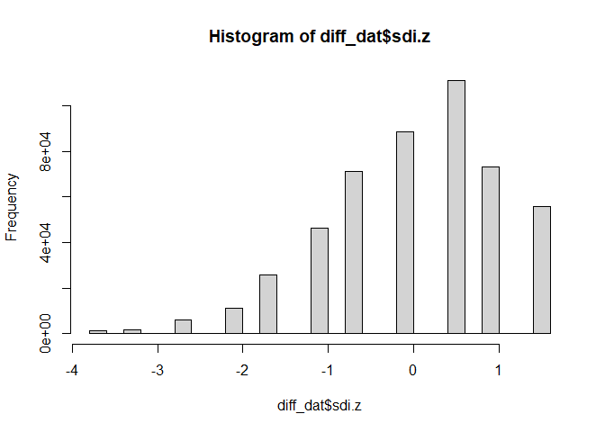
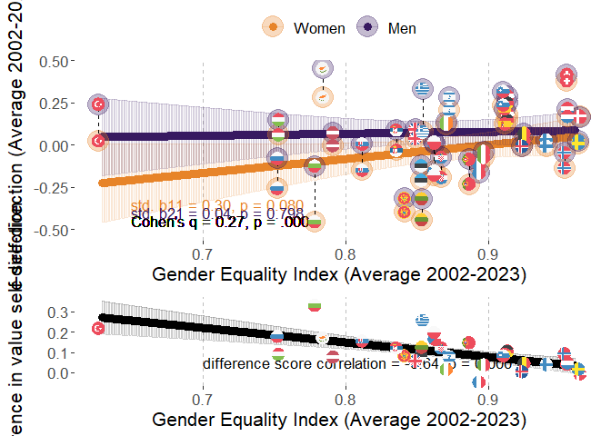
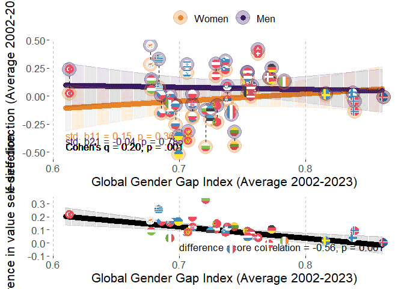
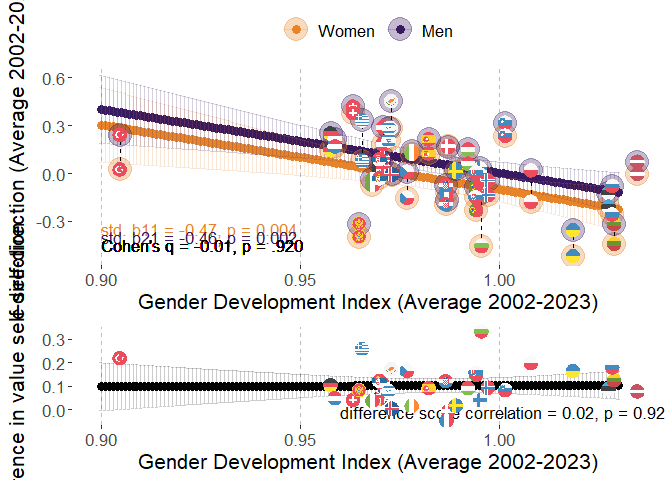
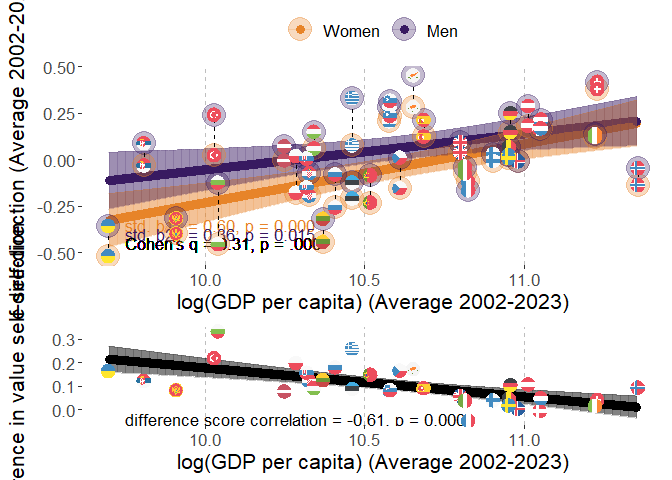
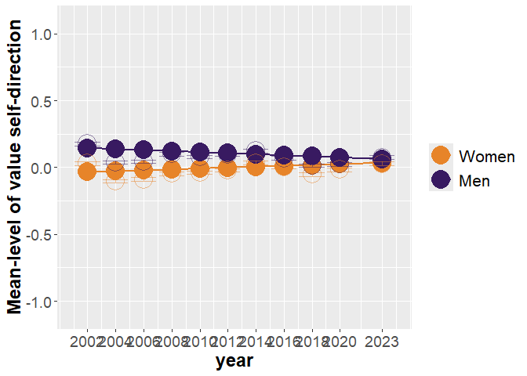
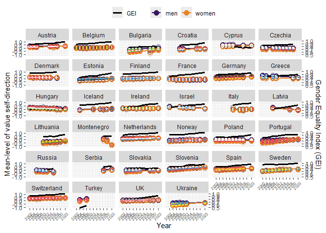

# Packages

Two packages are not in CRAN and need different installation
* devtools::install_github("vjilmari/vjihelpers")
* install.packages("ggflags", repos = c("https://jimjam-slam.r-universe.dev","https://cloud.r-project.org")) 


``` r
library(multid)
library(rio)
library(dplyr)
library(lme4)
library(emmeans)
library(vjihelpers)
library(MetBrewer)
library(ggplot2)
library(finalfit)
library(ggflags) 
library(lmerTest)
library(metafor)
library(ggpubr)
library(Hmisc)
library(r2mlm)
library(tidyr)
library(stringr)
library(apaTables)
library(tibble)
```

# Custom functions


``` r
# toster function for equivalence testing

tost_z <- function(est, se, low, high, alpha = 0.10) {
  # z statistics
  z_low  <- (est - low)  / se     # H0: theta <= low  vs H1: theta > low
  z_high <- (est - high) / se     # H0: theta >= high vs H1: theta < high
  
  # one-sided p-values
  p_low  <- 1 - pnorm(z_low)
  p_high <- pnorm(z_high)
  
  # CI corresponding to TOST (1 - 2*alpha)
  z_crit <- qnorm(1 - alpha)
  ci_low  <- est - z_crit * se
  ci_high <- est + z_crit * se
  
  # equivalence decision
  equivalent <- (p_low < alpha) && (p_high < alpha)
  
  list(
    estimate     = est,
    se           = se,
    low_bound    = low,
    high_bound   = high,
    alpha        = alpha,
    z_low        = z_low,
    p_low        = p_low,
    z_high       = z_high,
    p_high       = p_high,
    ci_level     = 1 - 2*alpha,
    ci_lower     = ci_low,
    ci_upper     = ci_high,
    equivalent   = equivalent
  )
}


# TOST function for equivalence testing with t distribution

tost_t <- function(est, se, low, high, df, alpha = 0.10) {
  # t statistics
  t_low  <- (est - low)  / se   # H0: theta <= low  vs H1: theta > low
  t_high <- (est - high) / se   # H0: theta >= high vs H1: theta < high
  
  # one-sided p-values
  p_low  <- 1 - pt(t_low,  df = df)
  p_high <-     pt(t_high, df = df)
  
  # CI corresponding to TOST (1 - 2*alpha)
  t_crit <- qt(1 - alpha, df = df)
  ci_low  <- est - t_crit * se
  ci_high <- est + t_crit * se
  
  # equivalence decision
  equivalent <- (p_low < alpha) && (p_high < alpha)
  
  list(
    estimate   = est,
    se         = se,
    df         = df,
    low_bound  = low,
    high_bound = high,
    alpha      = alpha,
    t_low      = t_low,
    p_low      = p_low,
    t_high     = t_high,
    p_high     = p_high,
    ci_level   = 1 - 2 * alpha,
    ci_lower   = ci_low,
    ci_upper   = ci_high,
    equivalent = equivalent
  )
}
```


# Data

* Loads the preprocessed European Social Survey data file made within "Preparations_ESS" code


``` r
load("../data/fdat.rdata")
```

* Include ISO data for country-names


``` r
# read country names
ISO<-read.csv2("../data/ISO.csv")
```


# Exclusions

* exclude participants with missing values or gender


``` r
value.vars<-
  c("con","tra",
  "ben","uni",
  "sdi","sti",
  "hed","ach",
  "pow","sec")

fdat$miss_values<-
  rowSums(is.na(fdat[,value.vars]))
table(fdat$miss_values)
```

```
## 
##      0      1      2      3      4      5      6      7      8      9     10 
## 500044   2791    835    442    267    204    142    143    156    177  35470
```

``` r
fdat<-fdat %>%
  filter(miss_values==0 & !is.na(gndr.bin))
```


# Data for the analysis

* use the testing partition of the data set (diff_dat)
* basic descriptives


``` r
diff_dat<-
  fdat

#diff_dat$age.c<-as.numeric(diff_dat$age.c)
#diff_dat$rlgdgr.c<-as.numeric(diff_dat$rlgdgr.c)
#diff_dat$eduyrs.c<-as.numeric(diff_dat$eduyrs.c)

# data exclusions (include countries with at least two rounds of data)
n_rounds<-diff_dat %>% group_by(cntry) %>%
  summarise(n_unique_essround = n_distinct(essround))

# join number of rounds to data
diff_dat<-
  left_join(x=diff_dat,
            y=n_rounds,
            by="cntry")

# filter only countries with more than 1 round and non-missing gender variable
diff_dat<-diff_dat %>%
  dplyr::filter(n_unique_essround>1 &
                  !is.na(gndr))

# cross-tabulate sample sizes and ESS rounds by country
table(diff_dat$essround,diff_dat$cntry)
```

```
##     
##        AT   BE   BG   CH   CY   CZ   DE   DK   EE   ES   FI   FR   GB   GR   HR   HU   IE   IL   IS   IT
##   1  2254 1830    0 2024    0 1208 2819 1470    0 1712 1763 1355 1798 2551    0 1634 1916 2279    0    0
##   2  2198 1771    0 2110    0 2557 2840 1458 1948 1623 1701 1699 1864 2399    0 1460 1187    0  524    0
##   3  2348 1796 1295 1780  978    0 2884 1461 1466 1847 1649 1983 2353    0    0 1462 1589    0    0    0
##   4     0 1754 2144 1753 1210 1986 2732 1581 1646 2562 1901 2067 2311 2063 1430 1430 1757 2382    0    0
##   5     0 1699 2371 1491 1053 2335 3007 1564 1793 1881 1649 1723 2374 2669 1601 1473 2400 2212    0    0
##   6     0 1862 2179 1483 1110 1973 2935 1621 2345 1871 2158 1960 2261    0    0 1968 2616 2378  739  909
##   7  1795 1767    0 1521    0 1862 3006 1483 2036 1907 2050 1902 2231    0    0 1520 2380 2351    0    0
##   8  1993 1759    0 1504    0 2252 2821    0 2007 1929 1903 2057 1942    0    0 1458 2746 2366  841 2531
##   9  2477 1756 1926 1517  773 2343 2328 1554 1899 1619 1735 1982 2183    0 1781 1643 2189    0  844 2660
##   10    0 1334 2697 1505    0 2369    0    0 1538    0 1561 1951 1131 2768 1564 1816 1751    0  886 2573
##   11 2314 1577 2218 1368  667    0 2381    0 1282 1833 1524 1745 1529 2745 1548 2117 1985  893  825 2783
##     
##        LT   LV   ME   NL   NO   PL   PT   RS   RU   SE   SI   SK   TR   UA
##   1     0    0    0 2337 1819 2065 1482    0    0 1682 1488    0    0    0
##   2     0    0    0 1858 1575 1683 2024    0    0 1678 1384 1425 1790 1896
##   3     0    0    0 1860 1550 1685 2182    0 2339 1604 1465 1711    0 1885
##   4     0 1970    0 1724 1391 1596 2337    0 2446 1556 1257 1789 2305 1766
##   5  1632    0    0 1801 1530 1719 2139    0 2557 1463 1369 1803    0 1779
##   6  2108    0    0 1828 1610 1866 2138    0 2429 1838 1244 1827    0 2064
##   7  2241    0    0 1823 1423 1594 1242    0    0 1761 1189    0    0    0
##   8  2079    0    0 1669 1530 1675 1254    0 2374 1526 1295    0    0    0
##   9  1677  891 1188 1657 1396 1443 1045 1969    0 1510 1307 1061    0    0
##   10 1606    0 1248 1466 1408    0 1827    0    0    0 1232 1395    0    0
##   11 1337 1225 1581 1677 1318 1423 1366 1511    0 1204 1227 1414    0 2589
```

``` r
# range of sample sizes
range(table(diff_dat$cntry))
```

```
## [1]  3480 27753
```

``` r
# scale/standardize with SD pooled across all country-time-gender folds
cntry.sdi<-diff_dat %>% group_by(cntry,essround) %>%
  summarise(sdi.ctm=mean(sdi,na.rm=T),
            sdi.ctsd=sd(sdi,na.rm=T)) %>%
  group_by(cntry) %>%
  summarise(sdi.cm=mean(sdi.ctm),
            sdi.csd=mean(sdi.ctsd)) 
```

```
## `summarise()` has regrouped the output.
## ℹ Summaries were computed grouped by cntry and essround.
## ℹ Output is grouped by cntry.
## ℹ Use `summarise(.groups = "drop_last")` to silence this message.
## ℹ Use `summarise(.by = c(cntry, essround))` for per-operation grouping (`?dplyr::dplyr_by`) instead.
```

``` r
grand_mean_sdi<-mean(cntry.sdi$sdi.cm)
grand_sd_sdi<-mean(cntry.sdi$sdi.csd)

# standardized
diff_dat$sdi.z<-(diff_dat$sdi-grand_mean_sdi)/grand_sd_sdi
hist(diff_dat$sdi.z)
```

<!-- -->

``` r
# recode time to start from 2002=0

diff_dat$year<-
  case_when(
    diff_dat$essround==1~2002,  
    diff_dat$essround==2~2004,
    diff_dat$essround==3~2006,
    diff_dat$essround==4~2008,
    diff_dat$essround==5~2010,
    diff_dat$essround==6~2012,
    diff_dat$essround==7~2014,
    diff_dat$essround==8~2016,
    diff_dat$essround==9~2018,
    diff_dat$essround==10~2020,
    diff_dat$essround==11~2023
  )

diff_dat$year.c<-diff_dat$year-2002
```

## Add GEI-variable

* GEI = Reverse-coded Gender Inequality Index (GII)


``` r
GII<-read.csv("../data/GII.csv")

# Obtain GII only for ESS countries
GII_in_ESS_d<-
  GII %>%
  filter(ISO2 %in% unique(diff_dat$cntry))

# Make long format data of GII, so that country x year has own rows

long_GII_in_ESS_d <- GII_in_ESS_d %>%
  pivot_longer(
    cols = starts_with("gii_") & !matches("avg"),  # <-- exclude the "_avg" columns
    names_to = "year",
    values_to = "gii",
    names_prefix = "gii_"
  ) %>%
  mutate(year = as.integer(year)) %>%
  filter(year >= 2002 & year <= 2023) %>%
  mutate(gei = 1 - gii) %>%
  dplyr::select(ISO2, iso3, country, year, gii, gei, gii_2002_2023_avg, gei_2002_2023_avg)


# describe gei average
psych::describe(GII_in_ESS_d$gei_2002_2023_avg)
```

```
##    vars  n mean   sd median trimmed  mad  min  max range  skew kurtosis   se
## X1    1 33 0.87 0.07   0.87    0.87 0.06 0.63 0.96  0.34 -1.06     1.37 0.01
```

``` r
# one is missing, see which one
GII_in_ESS_d[is.na(GII_in_ESS_d$gei_2002_2023_avg),"country"]
```

```
## [1] "Ukraine"
```

``` r
# get means and SDs for standardizing
gei_mean<-mean(GII_in_ESS_d$gei_2002_2023_avg,na.rm=T)
gei_sd<-sd(GII_in_ESS_d$gei_2002_2023_avg,na.rm=T)

# standardize 
# year specific scores
long_GII_in_ESS_d$gei.z<-(long_GII_in_ESS_d$gei-gei_mean)/gei_sd

# get the country means to a separate frame

GII_country_means<-
  long_GII_in_ESS_d %>% group_by(ISO2) %>%
  summarise(gei.cm=mean(gei,na.rm=T),
            gei.z.cm=mean(gei.z,na.rm=T))


long_GII_in_ESS_d<-left_join(
  x=long_GII_in_ESS_d,
  y=GII_country_means,
  by="ISO2"
)


# center both the raw score and standardized scores
long_GII_in_ESS_d$gei.cmc<-(long_GII_in_ESS_d$gei-long_GII_in_ESS_d$gei.cm)
long_GII_in_ESS_d$gei.z.cmc<-(long_GII_in_ESS_d$gei.z-long_GII_in_ESS_d$gei.z.cm)

#View(long_GII_in_ESS_d)

# averages across 2002-2023
#long_GII_in_ESS_d$gei_2002_2023_avg.z<-(long_GII_in_ESS_d$gei_2002_2023_avg-gei_mean)/gei_sd

#long_GII_in_ESS_d$gei.cmc<-long_GII_in_ESS_d$gei-long_GII_in_ESS_d$gei_2002_2023_avg

# add year to ESS data-frame


# link datasets by country and year

diff_dat<-
  left_join(
    x=diff_dat,
    y=long_GII_in_ESS_d[,c("ISO2","year","gei","gei.cm","gei.cmc",
                           "gei.z","gei.z.cm","gei.z.cmc")],
    by=c("cntry"="ISO2","year")
)
```


## Add GDI-variable

* GDI = Gender Development Index


``` r
GDI<-read.csv("../data/GDI.csv")

# Obtain GDI only for ESS countries
GDI_in_ESS_d<-
  GDI %>%
  filter(ISO2 %in% unique(diff_dat$cntry))

# Make long format data of GDI, so that country x year has own rows

long_GDI_in_ESS_d <- GDI_in_ESS_d %>%
  pivot_longer(
    cols = starts_with("gdi_") & !matches("avg"),  # <-- exclude the "_avg" columns
    names_to = "year",
    values_to = "gdi",
    names_prefix = "gdi_"
  ) %>%
  mutate(year = as.integer(year)) %>%
  filter(year >= 2002 & year <= 2023) %>%
  dplyr::select(ISO2, iso3, country, year, gdi, gdi_2002_2023_avg)

# describe gdi average
psych::describe(GDI_in_ESS_d$gdi_2002_2023_avg)
```

```
##    vars  n mean   sd median trimmed  mad min  max range skew kurtosis se
## X1    1 34 0.98 0.03   0.98    0.98 0.02 0.9 1.03  0.13 -0.3     1.28  0
```

``` r
# get means and SDs for standardizing
gdi_mean<-mean(GDI_in_ESS_d$gdi_2002_2023_avg,na.rm=T)
gdi_sd<-sd(GDI_in_ESS_d$gdi_2002_2023_avg,na.rm=T)

# standardize 
# year specific scores
long_GDI_in_ESS_d$gdi.z<-(long_GDI_in_ESS_d$gdi-gdi_mean)/gdi_sd

# get the country means to a separate frame

GDI_country_means<-
  long_GDI_in_ESS_d %>% group_by(ISO2) %>%
  summarise(gdi.cm=mean(gdi,na.rm=T),
            gdi.z.cm=mean(gdi.z,na.rm=T))

long_GDI_in_ESS_d<-left_join(
  x=long_GDI_in_ESS_d,
  y=GDI_country_means,
  by="ISO2"
)


# center both the raw score and standardized scores
long_GDI_in_ESS_d$gdi.cmc<-(long_GDI_in_ESS_d$gdi-long_GDI_in_ESS_d$gdi.cm)
long_GDI_in_ESS_d$gdi.z.cmc<-(long_GDI_in_ESS_d$gdi.z-long_GDI_in_ESS_d$gdi.z.cm)

# link datasets by country and year

diff_dat<-
  left_join(
    x=diff_dat,
    y=long_GDI_in_ESS_d[,c("ISO2","year","gdi","gdi.cm","gdi.cmc",
                           "gdi.z","gdi.z.cm","gdi.z.cmc")],
    by=c("cntry"="ISO2","year")
  )
```

## Add GDP-variable

* log_GDP = Logarithm of GDP per capita, PPP (constant 2017 international $)


``` r
GDP<-read.csv("../data/GDP_processed.csv")

# Obtain GDP only for ESS countries
GDP_in_ESS_d<-
  GDP %>%
  filter(ISO2 %in% unique(diff_dat$cntry))

# First, rename those X2000..YR2000. style columns to simple "gdp_2000" etc.

GDP_in_ESS_d <- GDP_in_ESS_d %>%
  rename_with(
    ~ str_replace_all(., "^X(\\d{4})..YR\\1\\.$", "gdp_\\1"),
    starts_with("X")
  )

# GDP_in_ESS_d
# Make long format data of GDP, so that country x year has own rows

long_GDP_in_ESS_d <- GDP_in_ESS_d %>%
  pivot_longer(
    cols = starts_with("gdp_") & !matches("avg"),  # <-- exclude the "_avg" columns
    names_to = "year",
    values_to = "gdp",
    names_prefix = "gdp_"
  ) %>%
  mutate(year = as.integer(year)) %>%
  filter(year >= 2002 & year <= 2023) %>%
  dplyr::select(ISO2, Country.Name, year, gdp, gdp_2002_2023_avg,log_gdp_2002_2023_avg) %>%
  mutate(log_gdp=log(gdp))

#View(long_GDP_in_ESS_d)

# describe gdp average
psych::describe(GDP_in_ESS_d$gdp_2002_2023_avg)
```

```
##    vars  n     mean      sd  median  trimmed     mad      min      max    range skew kurtosis      se
## X1    1 34 43905.99 17369.7 40201.8 42845.95 15827.5 16384.61 85341.85 68957.24 0.48    -0.58 2978.88
```

``` r
psych::describe(GDP_in_ESS_d$log_gdp_2002_2023_avg)
```

```
##    vars  n  mean   sd median trimmed  mad min   max range  skew kurtosis   se
## X1    1 34 10.61 0.41   10.6   10.62 0.44 9.7 11.35  1.65 -0.27    -0.71 0.07
```

``` r
# get means and SDs for standardizing
log_gdp_mean<-mean(GDP_in_ESS_d$log_gdp_2002_2023_avg,na.rm=T)
log_gdp_sd<-sd(GDP_in_ESS_d$log_gdp_2002_2023_avg,na.rm=T)

# standardize 
# year specific scores
long_GDP_in_ESS_d$log_gdp.z<-
  (long_GDP_in_ESS_d$log_gdp-log_gdp_mean)/log_gdp_sd

# get the country means to a separate frame

GDP_country_means<-
  long_GDP_in_ESS_d %>% group_by(ISO2) %>%
  summarise(gdp.cm=mean(gdp,na.rm=T),
            #gdp.z.cm=mean(gdp.z,na.rm=T),
            log_gdp.cm=mean(log_gdp,na.rm=T),
            log_gdp.z.cm=mean(log_gdp.z,na.rm=T))

long_GDP_in_ESS_d<-left_join(
  x=long_GDP_in_ESS_d,
  y=GDP_country_means,
  by="ISO2"
)


# center both the raw score and standardized scores
long_GDP_in_ESS_d$log_gdp.cmc<-(long_GDP_in_ESS_d$log_gdp-long_GDP_in_ESS_d$log_gdp.cm)
long_GDP_in_ESS_d$log_gdp.z.cmc<-(long_GDP_in_ESS_d$log_gdp.z-long_GDP_in_ESS_d$log_gdp.z.cm)

# link datasets by country and year

diff_dat<-
  left_join(
    x=diff_dat,
    y=long_GDP_in_ESS_d[,c("ISO2","year","log_gdp","log_gdp.cm","log_gdp.cmc",
                           "log_gdp.z","log_gdp.z.cm","log_gdp.z.cmc")],
    by=c("cntry"="ISO2","year")
  )
```

## Add GGGI-variable

* GGGI = Global Gender Gap Index


``` r
GGGI<-import("../data/GGGI.xlsx")

# check if all ESS countries are in the log_GGGI data
table(unique(diff_dat$cntry) %in% GGGI$ISO2)
```

```
## 
## TRUE 
##   34
```

``` r
# Obtain GGGI only for ESS countries
GGGI_in_ESS_d<-
  GGGI %>%
  filter(ISO2 %in% unique(diff_dat$cntry))

# Make long format data of GGGI, so that country x year has own rows

long_GGGI_in_ESS_d <- GGGI_in_ESS_d %>%
  pivot_longer(
    cols = starts_with("gggi_") & !matches("avg"),  # <-- exclude the "_avg" columns
    names_to = "year",
    values_to = "gggi",
    names_prefix = "gggi_"
  ) %>%
  mutate(year = as.integer(year)) %>%
  filter(year >= 2002 & year <= 2023) %>%
  dplyr::select(ISO2, cname, year, gggi, GGGI_2002_2023_avg)

# describe gggi average
psych::describe(GGGI_in_ESS_d$GGGI_2002_2023_avg)
```

```
##    vars  n mean   sd median trimmed  mad  min  max range skew kurtosis   se
## X1    1 34 0.74 0.05   0.73    0.73 0.04 0.61 0.86  0.25  0.4     0.29 0.01
```

``` r
# get means and SDs for standardizing
gggi_mean<-mean(GGGI_in_ESS_d$GGGI_2002_2023_avg,na.rm=T)
gggi_sd<-sd(GGGI_in_ESS_d$GGGI_2002_2023_avg,na.rm=T)

# standardize 
# year specific scores
long_GGGI_in_ESS_d$gggi.z<-(long_GGGI_in_ESS_d$gggi-gggi_mean)/gggi_sd

# get the country means to a separate frame

GGGI_country_means<-
  long_GGGI_in_ESS_d %>% group_by(ISO2) %>%
  summarise(gggi.cm=mean(gggi,na.rm=T),
            gggi.z.cm=mean(gggi.z,na.rm=T))

long_GGGI_in_ESS_d<-left_join(
  x=long_GGGI_in_ESS_d,
  y=GGGI_country_means,
  by="ISO2"
)

# center both the raw score and standardized scores
long_GGGI_in_ESS_d$gggi.cmc<-
  (long_GGGI_in_ESS_d$gggi-long_GGGI_in_ESS_d$gggi.cm)

long_GGGI_in_ESS_d$gggi.z.cmc<-
  (long_GGGI_in_ESS_d$gggi.z-long_GGGI_in_ESS_d$gggi.z.cm)

# link datasets by country and year

diff_dat<-
  left_join(
    x=diff_dat,
    y=long_GGGI_in_ESS_d[,c("ISO2","year","gggi","gggi.cm","gggi.cmc",
                           "gggi.z","gggi.z.cm","gggi.z.cmc")],
    by=c("cntry"="ISO2","year")
  )
```

## Country-year-gender dataframe

Frame with one row for country-year-gender


``` r
diff_dat_cntry_year<-
  diff_dat %>% 
  group_by(cntry,year,gndr.c) %>%
  dplyr::summarise(n=n(),
                   n_wt=sum(pspwght),
                   sdi.z.wt=weighted.mean(x=sdi.z,w=pspwght),
                   sdi.z=mean(sdi.z),
                   gei.z=mean(gei.z,na.rm=T),
                   gei.z.cm=mean(gei.z.cm,na.rm=T),
                   gei.z.cmc=mean(gei.z.cmc,na.rm=T),
                   gdi.z=mean(gdi.z,na.rm=T),
                   gdi.z.cm=mean(gdi.z.cm,na.rm=T),
                   gdi.z.cmc=mean(gdi.z.cmc,na.rm=T),
                   gggi.z=mean(gggi.z,na.rm=T),
                   gggi.z.cm=mean(gggi.z.cm,na.rm=T),
                   gggi.z.cmc=mean(gggi.z.cmc,na.rm=T),
                   log_gdp.z=mean(log_gdp.z,na.rm=T),
                   log_gdp.z.cm=mean(log_gdp.z.cm,na.rm=T),
                   log_gdp.z.cmc=mean(log_gdp.z.cmc,na.rm=T),
                   gei=mean(gei,na.rm=T),
                   gei.cm=mean(gei.cm,na.rm=T),
                   gei.cmc=mean(gei.cmc,na.rm=T),
                   gdi=mean(gdi,na.rm=T),
                   gdi.cm=mean(gdi.cm,na.rm=T),
                   gdi.cmc=mean(gdi.cmc,na.rm=T),
                   gggi=mean(gggi,na.rm=T),
                   gggi.cm=mean(gggi.cm,na.rm=T),
                   gggi.cmc=mean(gggi.cmc,na.rm=T),
                   log_gdp=mean(log_gdp,na.rm=T),
                   log_gdp.cm=mean(log_gdp.cm,na.rm=T),
                   log_gdp.cmc=mean(log_gdp.cmc,na.rm=T))
```

```
## `summarise()` has regrouped the output.
## ℹ Summaries were computed grouped by cntry, year, and gndr.c.
## ℹ Output is grouped by cntry and year.
## ℹ Use `summarise(.groups = "drop_last")` to silence this message.
## ℹ Use `summarise(.by = c(cntry, year, gndr.c))` for per-operation grouping (`?dplyr::dplyr_by`) instead.
```


# Descriptive statistics

## Country-specific descriptives


``` r
# sample sizes from weights

cntry_n_frame<-
  diff_dat %>% group_by(cntry) %>%
  summarise('n ESS rounds' = mean(n_unique_essround),
            n=round(sum(pspwght),0))

# self-direction

cntry_sdi_frame<-
  diff_dat %>% group_by(cntry,essround) %>%
  summarise('sdi M' = weighted.mean(x=sdi.z,w=pspwght),
            'sdi SD' = sqrt(wtd.var(sdi.z,pspwght))) %>%
  group_by(cntry) %>%
  summarise('sdi M' = mean(x=`sdi M`),
            'sdi SD'= mean(x=`sdi SD`))
```

```
## `summarise()` has regrouped the output.
## ℹ Summaries were computed grouped by cntry and essround.
## ℹ Output is grouped by cntry.
## ℹ Use `summarise(.groups = "drop_last")` to silence this message.
## ℹ Use `summarise(.by = c(cntry, essround))` for per-operation grouping (`?dplyr::dplyr_by`) instead.
```

``` r
cntry_sdi_women_frame<-
  diff_dat %>%
  filter(gndr.c==-0.5) %>%
  group_by(cntry,essround) %>%
  summarise('sdi M' = weighted.mean(x=sdi.z,w=pspwght),
            'sdi SD' = sqrt(wtd.var(sdi.z,pspwght))) %>%
  group_by(cntry) %>%
  summarise('sdi M Women' = mean(x=`sdi M`),
            'sdi SD Women'= mean(x=`sdi SD`))
```

```
## `summarise()` has regrouped the output.
## ℹ Summaries were computed grouped by cntry and essround.
## ℹ Output is grouped by cntry.
## ℹ Use `summarise(.groups = "drop_last")` to silence this message.
## ℹ Use `summarise(.by = c(cntry, essround))` for per-operation grouping (`?dplyr::dplyr_by`) instead.
```

``` r
cntry_sdi_men_frame<-
  diff_dat %>%
  filter(gndr.c==0.5) %>%
  group_by(cntry,essround) %>%
  summarise('sdi M' = weighted.mean(x=sdi.z,w=pspwght),
            'sdi SD' = sqrt(wtd.var(sdi.z,pspwght))) %>%
  group_by(cntry) %>%
  summarise('sdi M Men' = mean(x=`sdi M`),
            'sdi SD Men'= mean(x=`sdi SD`))
```

```
## `summarise()` has regrouped the output.
## ℹ Summaries were computed grouped by cntry and essround.
## ℹ Output is grouped by cntry.
## ℹ Use `summarise(.groups = "drop_last")` to silence this message.
## ℹ Use `summarise(.by = c(cntry, essround))` for per-operation grouping (`?dplyr::dplyr_by`) instead.
```

``` r
# link n and sdi datasets

desc_frame<-
  left_join(
    x=cntry_n_frame,
    y=cntry_sdi_frame,
    by="cntry"
  )

desc_frame<-
  left_join(
    x=desc_frame,
    y=cntry_sdi_women_frame,
    by="cntry"
  )

desc_frame<-
  left_join(
    x=desc_frame,
    y=cntry_sdi_men_frame,
    by="cntry"
  )

# Add country-specific differences
desc_frame$D<-desc_frame$`sdi M Men`-desc_frame$`sdi M Women`

desc_frame
```

```
## # A tibble: 34 × 10
##    cntry `n ESS rounds`     n `sdi M` `sdi SD` `sdi M Women` `sdi SD Women` `sdi M Men` `sdi SD Men`
##    <chr>          <dbl> <dbl>   <dbl>    <dbl>         <dbl>          <dbl>       <dbl>        <dbl>
##  1 AT                 7 15400  0.230     0.980        0.179           1.02       0.285         0.934
##  2 BE                11 18886  0.0489    0.916        0.0296          0.949      0.0694        0.879
##  3 BG                 7 14857 -0.312     1.19        -0.475           1.25      -0.136         1.08 
##  4 CH                11 18087  0.402     0.819        0.385           0.842      0.419         0.793
##  5 CY                 6  5771  0.363     0.901        0.281           0.941      0.450         0.846
##  6 CZ                 9 18934 -0.0692    1.04        -0.151           1.06       0.0187        1.01 
##  7 DE                10 27753  0.197     0.907        0.148           0.947      0.249         0.860
##  8 DK                 8 12198  0.167     0.985        0.172           0.996      0.161         0.972
##  9 EE                10 17974 -0.165     0.951       -0.202           0.983     -0.121         0.910
## 10 ES                10 18785  0.167     0.983        0.126           1.02       0.209         0.933
## # ℹ 24 more rows
## # ℹ 1 more variable: D <dbl>
```

``` r
# add country-level measures

desc_frame<-
  left_join(
    x=desc_frame,
    y=GII_country_means[,c("ISO2","gei.cm")],
    by=c("cntry"="ISO2")
  )

desc_frame<-
  left_join(
    x=desc_frame,
    y=GGGI_country_means[,c("ISO2","gggi.cm")],
    by=c("cntry"="ISO2")
  )

desc_frame<-
  left_join(
    x=desc_frame,
    y=GDI_country_means[,c("ISO2","gdi.cm")],
    by=c("cntry"="ISO2")
  )


desc_frame<-
  left_join(
    x=desc_frame,
    y=GDP_country_means[,c("ISO2","gdp.cm")],
    by=c("cntry"="ISO2")
  )

desc_frame<-left_join(
  x=desc_frame,
  y=ISO[,c("ISO2","CLDR")],
  by=c("cntry"="ISO2")
)

# finalize the formatted table

cntry_desc_tbl<-
  desc_frame %>%
  dplyr::select(
    Country = CLDR,
    `n ESS rounds`,
    n,
    `sdi M`, `sdi SD`,
    `sdi M Women`, `sdi SD Women`,
    `sdi M Men`, `sdi SD Men`,
    D,
    GEI = gei.cm,
    GGGI = gggi.cm,
    GDI = gdi.cm,
    GDP = gdp.cm
  ) %>%
  mutate(
    across(
      .cols = -c(Country, `n ESS rounds`, n, GDP) & where(is.numeric),
      .fns  = ~ round_tidy(.x, 2)
    )
  ) %>%
  mutate(
    across(
      .cols = GDP,
      .fns  = ~ round_tidy(.x, 0)
    )
  )
print(cntry_desc_tbl,n=35)
```

```
## # A tibble: 34 × 14
##    Country     `n ESS rounds`     n `sdi M` `sdi SD` `sdi M Women` `sdi SD Women` `sdi M Men` `sdi SD Men`
##    <chr>                <dbl> <dbl> <chr>   <chr>    <chr>         <chr>          <chr>       <chr>       
##  1 Austria                  7 15400 0.23    0.98     0.18          1.02           0.29        0.93        
##  2 Belgium                 11 18886 0.05    0.92     0.03          0.95           0.07        0.88        
##  3 Bulgaria                 7 14857 -0.31   1.19     -0.47         1.25           -0.14       1.08        
##  4 Switzerland             11 18087 0.40    0.82     0.39          0.84           0.42        0.79        
##  5 Cyprus                   6  5771 0.36    0.90     0.28          0.94           0.45        0.85        
##  6 Czechia                  9 18934 -0.07   1.04     -0.15         1.06           0.02        1.01        
##  7 Germany                 10 27753 0.20    0.91     0.15          0.95           0.25        0.86        
##  8 Denmark                  8 12198 0.17    0.98     0.17          1.00           0.16        0.97        
##  9 Estonia                 10 17974 -0.17   0.95     -0.20         0.98           -0.12       0.91        
## 10 Spain                   10 18785 0.17    0.98     0.13          1.02           0.21        0.93        
## 11 Finland                 11 19568 0.01    0.91     -0.01         0.94           0.03        0.88        
## 12 France                  11 20457 -0.13   1.09     -0.11         1.10           -0.16       1.07        
## 13 UK                      11 22979 0.07    0.98     0.05          1.01           0.09        0.95        
## 14 Greece                   6 15212 0.21    0.97     0.08          1.02           0.34        0.89        
## 15 Croatia                  5  7914 -0.14   1.09     -0.20         1.13           -0.08       1.03        
## 16 Hungary                 11 18123 0.11    0.99     0.07          1.01           0.16        0.96        
## 17 Ireland                 11 22562 0.13    0.98     0.12          0.99           0.13        0.95        
## 18 Israel                   7 14857 0.23    0.98     0.20          0.99           0.26        0.98        
## 19 Iceland                  6  4654 -0.02   1.00     -0.01         1.04           -0.02       0.95        
## 20 Italy                    5 11441 -0.02   0.97     -0.03         1.00           -0.01       0.94        
## 21 Lithuania                7 13059 -0.37   1.13     -0.42         1.14           -0.31       1.11        
## 22 Latvia                   3  4088 -0.01   0.99     -0.04         0.99           0.02        0.98        
## 23 Montenegro               3  4028 -0.31   1.05     -0.35         1.07           -0.26       1.03        
## 24 Netherlands             11 19722 0.20    0.85     0.17          0.87           0.22        0.83        
## 25 Norway                  11 16505 -0.09   0.98     -0.13         1.02           -0.05       0.93        
## 26 Poland                  10 16737 -0.09   1.00     -0.18         1.03           0.01        0.95        
## 27 Portugal                11 19070 -0.14   0.96     -0.20         1.00           -0.07       0.91        
## 28 Serbia                   2  3499 0.04    1.09     -0.02         1.16           0.09        1.00        
## 29 Russia                   5 12139 -0.18   1.10     -0.26         1.13           -0.08       1.05        
## 30 Sweden                  10 16104 0.02    0.94     0.02          0.96           0.02        0.92        
## 31 Slovenia                11 14463 0.28    0.86     0.25          0.89           0.32        0.82        
## 32 Slovakia                 8 12547 -0.08   1.00     -0.15         1.04           -0.00       0.94        
## 33 Turkey                   2  4108 0.12    0.99     0.00          1.05           0.24        0.90        
## 34 Ukraine                  6 12054 -0.46   1.21     -0.55         1.24           -0.36       1.17        
## # ℹ 5 more variables: D <chr>, GEI <chr>, GGGI <chr>, GDI <chr>, GDP <chr>
```

``` r
export(cntry_desc_tbl,"../results/sdi/cntry_desc_tbl.xlsx",overwrite=T)
```

## Country-level correlations table


``` r
cor_frame<-
  desc_frame %>%
  dplyr::select(
    VBMT=`sdi M`,
    VBMT_Women=`sdi M Women`,
    VBMT_Men=`sdi M Men`,
    D = D,
    GEI = gei.cm,
    GGGI = gggi.cm,
    GDI = gdi.cm,
    GDP = gdp.cm
  ) %>%
  mutate(
    log_GDP=log(GDP)
  ) %>%
  dplyr::select(-GDP)

apa.cor.table(
  data=cor_frame,
  filename = "../results/sdi/CorTable1.doc",
  #table.number = NA,
  show.conf.interval = FALSE,
  show.sig.stars = F,
  landscape = F
)
```

```
## The ability to suppress reporting of reporting confidence intervals has been deprecated in this version.
## The function argument show.conf.interval will be removed in a later version.
```

```
## 
## 
## Means, standard deviations, and correlations with confidence intervals
##  
## 
##   Variable      M     SD   1            2            3            4            5           6          
##   1. VBMT       0.01  0.20                                                                            
##                                                                                                       
##   2. VBMT_Women -0.04 0.22 .98                                                                        
##                            [.97, .99]                                                                 
##                                                                                                       
##   3. VBMT_Men   0.06  0.20 .98          .92                                                           
##                            [.95, .99]   [.85, .96]                                                    
##                                                                                                       
##   4. D          0.10  0.08 -.25         -.42         -.04                                             
##                            [-.54, .10]  [-.67, -.10] [-.37, .30]                                      
##                                                                                                       
##   5. GEI        0.87  0.07 .21          .32          .06          -.63                                
##                            [-.15, .51]  [-.03, .60]  [-.29, .40]  [-.80, -.36]                        
##                                                                                                       
##   6. GGGI       0.74  0.05 .05          .16          -.08         -.61         .73                    
##                            [-.29, .38]  [-.18, .48]  [-.41, .26]  [-.79, -.35] [.52, .86]             
##                                                                                                       
##   7. GDI        0.98  0.03 -.52         -.48         -.53         -.01         .07         .19        
##                            [-.73, -.22] [-.71, -.17] [-.74, -.24] [-.34, .33]  [-.28, .41] [-.16, .50]
##                                                                                                       
##   8. log_GDP    10.61 0.41 .53          .61          .41          -.62         .72         .62        
##                            [.23, .73]   [.34, .79]   [.08, .66]   [-.79, -.35] [.50, .85]  [.36, .79] 
##                                                                                                       
##   7          
##              
##              
##              
##              
##              
##              
##              
##              
##              
##              
##              
##              
##              
##              
##              
##              
##              
##              
##              
##              
##   -.18       
##   [-.49, .17]
##              
## 
## Note. M and SD are used to represent mean and standard deviation, respectively.
## Values in square brackets indicate the 95% confidence interval.
## The confidence interval is a plausible range of population correlations 
## that could have caused the sample correlation (Cumming, 2014).
## 
```


# Analysis

## mod0: Random intercept model


``` r
mod0<-lmer(sdi.z~(1|cntry),data=diff_dat,REML=F,weights = pspwght,
           control=lmerControl(optimizer="bobyqa",optCtrl=list(maxfun=2e7)))
summary(mod0)
```

```
## Linear mixed model fit by maximum likelihood . t-tests use Satterthwaite's method ['lmerModLmerTest']
## Formula: sdi.z ~ (1 | cntry)
##    Data: diff_dat
## Weights: pspwght
## Control: lmerControl(optimizer = "bobyqa", optCtrl = list(maxfun = 2e+07))
## 
##       AIC       BIC    logLik -2*log(L)  df.resid 
## 1454725.8 1454759.2 -727359.9 1454719.8    492340 
## 
## Scaled residuals: 
##     Min      1Q  Median      3Q     Max 
## -8.0636 -0.5855  0.0839  0.6600  4.2493 
## 
## Random effects:
##  Groups   Name        Variance Std.Dev.
##  cntry    (Intercept) 0.04197  0.2049  
##  Residual             0.98777  0.9939  
## Number of obs: 492343, groups:  cntry, 34
## 
## Fixed effects:
##              Estimate Std. Error        df t value Pr(>|t|)
## (Intercept)  0.008802   0.035172 33.995115    0.25    0.804
```

``` r
getVC(mod0)
```

```
##        grp        var1 var2 sdcor vcov
## 1    cntry (Intercept) <NA>  0.20 0.04
## 2 Residual        <NA> <NA>  0.99 0.99
```

``` r
r2mlm(mod0,bargraph = F)
```

```
## $Decompositions
##                      total within between
## fixed, within   0.00000000      0      NA
## fixed, between  0.00000000     NA       0
## slope variation 0.00000000      0      NA
## mean variation  0.04075497     NA       1
## sigma2          0.95924503      1      NA
## 
## $R2s
##          total within between
## f1  0.00000000      0      NA
## f2  0.00000000     NA       0
## v   0.00000000      0      NA
## m   0.04075497     NA       1
## f   0.00000000     NA      NA
## fv  0.00000000      0      NA
## fvm 0.04075497     NA      NA
```

## mod1: Gender fixed effect


``` r
mod1<-lmer(sdi.z~gndr.c+(1|cntry),data=diff_dat,REML=F,weights = pspwght,
           control=lmerControl(optimizer="bobyqa",optCtrl=list(maxfun=2e7)))
summary(mod1)
```

```
## Linear mixed model fit by maximum likelihood . t-tests use Satterthwaite's method ['lmerModLmerTest']
## Formula: sdi.z ~ gndr.c + (1 | cntry)
##    Data: diff_dat
## Weights: pspwght
## Control: lmerControl(optimizer = "bobyqa", optCtrl = list(maxfun = 2e+07))
## 
##       AIC       BIC    logLik -2*log(L)  df.resid 
## 1453592.9 1453637.3 -726792.4 1453584.9    492339 
## 
## Scaled residuals: 
##     Min      1Q  Median      3Q     Max 
## -8.1722 -0.5846  0.0995  0.6598  4.3493 
## 
## Random effects:
##  Groups   Name        Variance Std.Dev.
##  cntry    (Intercept) 0.04164  0.2040  
##  Residual             0.98550  0.9927  
## Number of obs: 492343, groups:  cntry, 34
## 
## Fixed effects:
##              Estimate Std. Error        df t value Pr(>|t|)    
## (Intercept) 1.061e-02  3.503e-02 3.399e+01   0.303    0.764    
## gndr.c      9.528e-02  2.826e-03 4.923e+05  33.709   <2e-16 ***
## ---
## Signif. codes:  0 '***' 0.001 '**' 0.01 '*' 0.05 '.' 0.1 ' ' 1
## 
## Correlation of Fixed Effects:
##        (Intr)
## gndr.c 0.002
```

``` r
getFE(mod1,round=3)
```

```
##              Est.    SE         df      t     p     LL    UL
## (Intercept) 0.011 0.035     33.994  0.303 0.764 -0.061 0.082
## gndr.c      0.095 0.003 492310.605 33.709 0.000  0.090 0.101
```

``` r
getVC(mod1)
```

```
##        grp        var1 var2 sdcor vcov
## 1    cntry (Intercept) <NA>  0.20 0.04
## 2 Residual        <NA> <NA>  0.99 0.99
```

``` r
r2mlm(mod1,bargraph = F)
```

```
## $Decompositions
##                       total
## fixed           0.002191373
## slope variation 0.000000000
## mean variation  0.040447554
## sigma2          0.957361073
## 
## $R2s
##           total
## f   0.002191373
## v   0.000000000
## m   0.040447554
## fv  0.002191373
## fvm 0.042638927
```

## mod2: Gender fixed and random effect

* Include random effect correlation by default


``` r
mod2<-lmer(sdi.z~gndr.c+(gndr.c|cntry),data=diff_dat,REML=F,weights = pspwght,
           control=lmerControl(optimizer="bobyqa",optCtrl=list(maxfun=2e7)))
summary(mod2)
```

```
## Linear mixed model fit by maximum likelihood . t-tests use Satterthwaite's method ['lmerModLmerTest']
## Formula: sdi.z ~ gndr.c + (gndr.c | cntry)
##    Data: diff_dat
## Weights: pspwght
## Control: lmerControl(optimizer = "bobyqa", optCtrl = list(maxfun = 2e+07))
## 
##       AIC       BIC    logLik -2*log(L)  df.resid 
## 1452917.2 1452983.8 -726452.6 1452905.2    492337 
## 
## Scaled residuals: 
##     Min      1Q  Median      3Q     Max 
## -8.1894 -0.5901  0.0923  0.6622  4.3816 
## 
## Random effects:
##  Groups   Name        Variance Std.Dev. Corr  
##  cntry    (Intercept) 0.041350 0.20335        
##           gndr.c      0.006371 0.07982  -0.21 
##  Residual             0.983932 0.99193        
## Number of obs: 492343, groups:  cntry, 34
## 
## Fixed effects:
##             Estimate Std. Error       df t value Pr(>|t|)    
## (Intercept)  0.01102    0.03491 33.99413   0.316    0.754    
## gndr.c       0.10176    0.01407 34.10414   7.232 2.23e-08 ***
## ---
## Signif. codes:  0 '***' 0.001 '**' 0.01 '*' 0.05 '.' 0.1 ' ' 1
## 
## Correlation of Fixed Effects:
##        (Intr)
## gndr.c -0.208
```

``` r
getFE(mod2,round=3)
```

```
##              Est.    SE     df     t     p     LL    UL
## (Intercept) 0.011 0.035 33.994 0.316 0.754 -0.060 0.082
## gndr.c      0.102 0.014 34.104 7.232 0.000  0.073 0.130
```

``` r
getVC(mod2)
```

```
##        grp        var1   var2 sdcor vcov
## 1    cntry (Intercept)   <NA>  0.20 0.04
## 2    cntry      gndr.c   <NA>  0.08 0.01
## 3    cntry (Intercept) gndr.c -0.21 0.00
## 4 Residual        <NA>   <NA>  0.99 0.98
```

``` r
r2mlm(mod2,bargraph = F)
```

```
## $Decompositions
##                       total
## fixed           0.002498769
## slope variation 0.001537341
## mean variation  0.040427871
## sigma2          0.955536020
## 
## $R2s
##           total
## f   0.002498769
## v   0.001537341
## m   0.040427871
## fv  0.004036110
## fvm 0.044463980
```

``` r
anova(mod1,mod2)
```

```
## Data: diff_dat
## Models:
## mod1: sdi.z ~ gndr.c + (1 | cntry)
## mod2: sdi.z ~ gndr.c + (gndr.c | cntry)
##      npar     AIC     BIC  logLik -2*log(L)  Chisq Df Pr(>Chisq)    
## mod1    4 1453593 1453637 -726792   1453585                         
## mod2    6 1452917 1452984 -726453   1452905 679.71  2  < 2.2e-16 ***
## ---
## Signif. codes:  0 '***' 0.001 '**' 0.01 '*' 0.05 '.' 0.1 ' ' 1
```

``` r
lvl2_var_cond_lvl1(mod2,lvl1.var = "gndr.c",lvl1.values = c(0.5,-0.5))
```

```
##   lvl1.value lvl2.cond.var lvl2.cond.sd
## 1        0.5    0.03946920    0.1986686
## 2       -0.5    0.04641591    0.2154435
```

* Test for random effect correlation


``` r
mod2_norecov<-lmer(sdi.z~gndr.c+(gndr.c||cntry),data=diff_dat,REML=F,weights = pspwght,
                   control=lmerControl(optimizer="bobyqa",optCtrl=list(maxfun=2e7)))
summary(mod2_norecov)
```

```
## Linear mixed model fit by maximum likelihood . t-tests use Satterthwaite's method ['lmerModLmerTest']
## Formula: sdi.z ~ gndr.c + (gndr.c || cntry)
##    Data: diff_dat
## Weights: pspwght
## Control: lmerControl(optimizer = "bobyqa", optCtrl = list(maxfun = 2e+07))
## 
##       AIC       BIC    logLik -2*log(L)  df.resid 
## 1452916.7 1452972.2 -726453.3 1452906.7    492338 
## 
## Scaled residuals: 
##     Min      1Q  Median      3Q     Max 
## -8.1903 -0.5900  0.0923  0.6622  4.3801 
## 
## Random effects:
##  Groups   Name        Variance Std.Dev.
##  cntry    (Intercept) 0.041365 0.20338 
##  cntry.1  gndr.c      0.006397 0.07998 
##  Residual             0.983932 0.99193 
## Number of obs: 492343, groups:  cntry, 34
## 
## Fixed effects:
##             Estimate Std. Error       df t value Pr(>|t|)    
## (Intercept)  0.01102    0.03492 33.99507   0.315    0.754    
## gndr.c       0.10172    0.01410 34.09301   7.215 2.35e-08 ***
## ---
## Signif. codes:  0 '***' 0.001 '**' 0.01 '*' 0.05 '.' 0.1 ' ' 1
## 
## Correlation of Fixed Effects:
##        (Intr)
## gndr.c 0.000
```

``` r
getFE(mod2_norecov,round=3)
```

```
##              Est.    SE     df     t     p     LL    UL
## (Intercept) 0.011 0.035 33.995 0.315 0.754 -0.060 0.082
## gndr.c      0.102 0.014 34.093 7.215 0.000  0.073 0.130
```

``` r
getVC(mod2_norecov)
```

```
##        grp        var1 var2 sdcor vcov
## 1    cntry (Intercept) <NA>  0.20 0.04
## 2  cntry.1      gndr.c <NA>  0.08 0.01
## 3 Residual        <NA> <NA>  0.99 0.98
```

``` r
anova(mod2_norecov,mod2)
```

```
## Data: diff_dat
## Models:
## mod2_norecov: sdi.z ~ gndr.c + (gndr.c || cntry)
## mod2: sdi.z ~ gndr.c + (gndr.c | cntry)
##              npar     AIC     BIC  logLik -2*log(L)  Chisq Df Pr(>Chisq)
## mod2_norecov    5 1452917 1452972 -726453   1452907                     
## mod2            6 1452917 1452984 -726453   1452905 1.4931  1     0.2217
```


## mod2 with Gender-equality index (GEI)


``` r
mod2_GEI<-lmer(sdi.z~gndr.c+gei.z.cm+gndr.c:gei.z.cm+
                 (gndr.c|cntry),data=diff_dat,REML=F,weights = pspwght,
           control=lmerControl(optimizer="bobyqa",optCtrl=list(maxfun=2e7)))
summary(mod2_GEI)
```

```
## Linear mixed model fit by maximum likelihood . t-tests use Satterthwaite's method ['lmerModLmerTest']
## Formula: sdi.z ~ gndr.c + gei.z.cm + gndr.c:gei.z.cm + (gndr.c | cntry)
##    Data: diff_dat
## Weights: pspwght
## Control: lmerControl(optimizer = "bobyqa", optCtrl = list(maxfun = 2e+07))
## 
##       AIC       BIC    logLik -2*log(L)  df.resid 
## 1409580.8 1409669.4 -704782.4 1409564.8    480356 
## 
## Scaled residuals: 
##     Min      1Q  Median      3Q     Max 
## -8.2390 -0.5898  0.0955  0.6638  4.4081 
## 
## Random effects:
##  Groups   Name        Variance Std.Dev. Corr  
##  cntry    (Intercept) 0.035075 0.18728        
##           gndr.c      0.003912 0.06255  -0.07 
##  Residual             0.971719 0.98576        
## Number of obs: 480364, groups:  cntry, 33
## 
## Fixed effects:
##                 Estimate Std. Error       df t value Pr(>|t|)    
## (Intercept)      0.02468    0.03264 32.97387   0.756    0.455    
## gndr.c           0.10102    0.01137 33.80437   8.884 2.32e-10 ***
## gei.z.cm         0.03505    0.03317 33.05457   1.057    0.298    
## gndr.c:gei.z.cm -0.05289    0.01177 36.27909  -4.495 6.85e-05 ***
## ---
## Signif. codes:  0 '***' 0.001 '**' 0.01 '*' 0.05 '.' 0.1 ' ' 1
## 
## Correlation of Fixed Effects:
##             (Intr) gndr.c g.z.cm
## gndr.c      -0.067              
## gei.z.cm    -0.001  0.000       
## gndr.c:g.z.  0.000 -0.027 -0.066
```

``` r
getFE(mod2_GEI,round=3)
```

```
##                   Est.    SE     df      t     p     LL     UL
## (Intercept)      0.025 0.033 32.974  0.756 0.455 -0.042  0.091
## gndr.c           0.101 0.011 33.804  8.884 0.000  0.078  0.124
## gei.z.cm         0.035 0.033 33.055  1.057 0.298 -0.032  0.103
## gndr.c:gei.z.cm -0.053 0.012 36.279 -4.495 0.000 -0.077 -0.029
```

``` r
getVC(mod2_GEI)
```

```
##        grp        var1   var2 sdcor vcov
## 1    cntry (Intercept)   <NA>  0.19 0.04
## 2    cntry      gndr.c   <NA>  0.06 0.00
## 3    cntry (Intercept) gndr.c -0.07 0.00
## 4 Residual        <NA>   <NA>  0.99 0.97
```

``` r
r2mlm(mod2_GEI,bargraph = F)
```

```
## $Decompositions
##                        total
## fixed           0.0036100527
## slope variation 0.0009618077
## mean variation  0.0347414669
## sigma2          0.9606866727
## 
## $R2s
##            total
## f   0.0036100527
## v   0.0009618077
## m   0.0347414669
## fv  0.0045718604
## fvm 0.0393133273
```

### Deconstructed associations


``` r
t1<-Sys.time()
ddsc_mod2_GEI<-
  ddsc_ml(model = mod2_GEI,
          predictor = "gei.z.cm",
          moderator = "gndr.c",moderator_values = c(-0.5,0.5),
          re_cov_test = T)
t2<-Sys.time()
t2-t1
```

```
## Time difference of 29.49589 secs
```

``` r
round(ddsc_mod2_GEI$vpc_at_moderator_values,3)
```

```
##   lvl1.value Intercept.var Intercept.sd Residual.var Total.var   VPC mean.n.obs  ICC2 ICC2_SP
## 1       -0.5         0.046        0.215        0.984     1.030 0.045   7802.647 0.997   0.997
## 2        0.5         0.039        0.199        0.984     1.023 0.039   6678.029 0.996   0.996
```

``` r
round(ddsc_mod2_GEI$descriptives,3)
```

```
##                        M    SD means_y1 means_y1_scaled means_y2 means_y2_scaled gei.z.cm gei.z.cm_scaled
## means_y1           0.063 0.201    1.000           1.000    0.921           0.921    0.092           0.092
## means_y1_scaled    0.304 0.971    1.000           1.000    0.921           0.921    0.092           0.092
## means_y2          -0.030 0.213    0.921           0.921    1.000           1.000    0.330           0.330
## means_y2_scaled   -0.144 1.028    0.921           0.921    1.000           1.000    0.330           0.330
## gei.z.cm           0.000 1.000    0.092           0.092    0.330           0.330    1.000           1.000
## gei.z.cm_scaled    0.000 1.000    0.092           0.092    0.330           0.330    1.000           1.000
## diff_score         0.093 0.083    0.058           0.058   -0.335          -0.335   -0.625          -0.625
## diff_score_scaled  0.448 0.401    0.058           0.058   -0.335          -0.335   -0.625          -0.625
##                   diff_score diff_score_scaled
## means_y1               0.058             0.058
## means_y1_scaled        0.058             0.058
## means_y2              -0.335            -0.335
## means_y2_scaled       -0.335            -0.335
## gei.z.cm              -0.625            -0.625
## gei.z.cm_scaled       -0.625            -0.625
## diff_score             1.000             1.000
## diff_score_scaled      1.000             1.000
```

``` r
round(ddsc_mod2_GEI$results,3)
```

```
##                            estimate    SE     df t.ratio p.value ci.lower ci.upper
## r_xy1y2                       0.638 0.142 36.279   4.495   0.000    0.350    0.926
## w_11                          0.061 0.034 33.114   1.805   0.080   -0.008    0.131
## w_21                          0.009 0.033 33.097   0.258   0.798   -0.059    0.076
## r_xy1                         0.307 0.170 33.114   1.805   0.080   -0.039    0.652
## r_xy2                         0.040 0.157 33.097   0.258   0.798   -0.278    0.359
## b_11                          0.298 0.165 33.114   1.805   0.080   -0.038    0.633
## b_21                          0.042 0.161 33.097   0.258   0.798   -0.286    0.370
## main_effect                   0.035 0.033 33.055   1.057   0.298   -0.032    0.103
## moderator_effect              0.101 0.011 33.804   8.884   0.000    0.078    0.124
## interaction                  -0.053 0.012 36.279  -4.495   0.000   -0.077   -0.029
## q_b11_b21                     0.265    NA     NA      NA      NA       NA       NA
## q_rxy1_rxy2                   0.276    NA     NA      NA      NA       NA       NA
## cross_over_point              1.910    NA     NA      NA      NA       NA       NA
## interaction_vs_main           0.018 0.034 33.226   0.518   0.608   -0.052    0.088
## interaction_vs_main_bscale    0.086 0.167 33.226   0.518   0.608   -0.253    0.426
## interaction_vs_main_rscale    0.093 0.158 33.241   0.586   0.562   -0.229    0.414
## dadas                        -0.017 0.067 33.097  -0.258   0.601   -0.153    0.118
## dadas_bscale                 -0.083 0.322 33.097  -0.258   0.601   -0.739    0.573
## dadas_rscale                 -0.081 0.313 33.097  -0.258   0.601   -0.718    0.557
## abs_diff                      0.053 0.012 36.279   4.495   0.000    0.029    0.077
## abs_sum                       0.070 0.066 33.055   1.057   0.149   -0.065    0.205
## abs_diff_bscale               0.256 0.057 36.279   4.495   0.000    0.141    0.372
## abs_sum_bscale                0.339 0.321 33.055   1.057   0.149   -0.314    0.993
## abs_diff_rscale               0.266 0.058 36.181   4.559   0.000    0.148    0.384
## abs_sum_rscale                0.347 0.322 33.055   1.079   0.144   -0.307    1.001
```

``` r
round(ddsc_mod2_GEI$re_cov_test,3)
```

```
## RE_cov RE_cor  Chisq     Df      p 
## -0.003 -0.214  1.493  1.000  0.222
```

``` r
# Structural path model
d_GEI<-ddsc_mod2_GEI$ddsc_sem_fit$data

ddsc_sem_GEI<-
  ddsc_sem(data=d_GEI,x = "gei.z.cm",y1="means_y2",
           y2="means_y1",q_sesoi = .10)
round(ddsc_sem_GEI$results,3)
```

```
##                                    est    se      z pvalue ci.lower ci.upper
## r_xy1_y2                         0.625 0.136  4.599  0.000    0.359    0.891
## r_xy1                            0.330 0.164  2.010  0.044    0.008    0.652
## r_xy2                            0.092 0.173  0.530  0.596   -0.248    0.432
## b_11                             0.340 0.169  2.010  0.044    0.009    0.671
## b_21                             0.089 0.168  0.530  0.596   -0.241    0.419
## b_10                            -0.144 0.166 -0.867  0.386   -0.470    0.182
## b_20                             0.304 0.166  1.835  0.067   -0.021    0.629
## res_cov_y1_y2                    0.862 0.218  3.952  0.000    0.435    1.290
## diff_b10_b20                    -0.448 0.054 -8.358  0.000   -0.553   -0.343
## diff_b11_b21                     0.251 0.054  4.599  0.000    0.144    0.357
## diff_rxy1_rxy2                   0.238 0.055  4.315  0.000    0.130    0.347
## q_b11_b21                        0.264 0.062  4.266  0.000    0.143    0.386
## q_rxy1_rxy2                      0.251 0.059  4.270  0.000    0.136    0.366
## cross_over_point                 1.789 0.444  4.030  0.000    0.919    2.660
## sum_b11_b21                      0.429 0.333  1.289  0.198   -0.223    1.081
## main_effect                      0.214 0.166  1.289  0.198   -0.112    0.541
## interaction_vs_main_effect       0.036 0.174  0.207  0.836   -0.306    0.378
## diff_abs_b11_abs_b21             0.251 0.054  4.599  0.000    0.144    0.357
## abs_diff_b11_b21                 0.251 0.054  4.599  0.000    0.144    0.357
## abs_sum_b11_b21                  0.429 0.333  1.289  0.099   -0.223    1.081
## dadas                           -0.178 0.337 -0.530  0.702   -0.838    0.481
## q_r_equivalence                  0.151 0.059  2.569  0.995       NA       NA
## q_b_equivalence                  0.164 0.062  2.652  0.996       NA       NA
## cross_over_point_equivalence     1.789 0.444  4.030  1.000       NA       NA
## cross_over_point_minimal_effect  1.789 0.444  4.030  0.000       NA       NA
```

``` r
round(ddsc_sem_GEI$variance_test,3)
```

```
##             est    se      z pvalue ci.lower ci.upper
## cov_y1y2  0.892 0.229  3.892  0.000    0.443    1.341
## var_y1    1.026 0.253  4.062  0.000    0.531    1.521
## var_y2    0.914 0.225  4.062  0.000    0.473    1.355
## var_diff  0.112 0.134  0.836  0.403   -0.151    0.375
## var_ratio 1.123 0.152  7.382  0.000    0.825    1.421
## cor_y1y2  0.921 0.026 34.953  0.000    0.870    0.973
```

``` r
## random intercept mlm with double-entries for each country (men and women)

d_GEI_long <- d_GEI %>%
  # move row names into a column
  rownames_to_column("cntry") %>%
  # pivot only the means_y1 / means_y2 columns
  pivot_longer(
    cols = c(means_y1, means_y2),
    names_to = "y",
    values_to = "means"
  ) %>%
  # create a sgender column based on y1/y2
  mutate(
    gndr.c = case_when(
      y == "means_y1" ~ -0.5,
      y == "means_y2" ~ 0.5
    )
  ) %>%
  dplyr::select(cntry,gei.z.cm,means,gndr.c)


ddsc_mod2_GEI_ri<-
  ddsc_ml(data=data.frame(d_GEI_long),predictor = "gei.z.cm",
          moderator = "gndr.c",
        DV = "means",lvl2_unit = "cntry",
        moderator_values = c(-0.5,0.5))
round(ddsc_mod2_GEI_ri$results,3)
```

```
##                            estimate    SE     df t.ratio p.value ci.lower ci.upper
## r_xy1y2                       0.625 0.140 31.000   4.458   0.000    0.339    0.911
## w_11                          0.070 0.036 32.660   1.953   0.059   -0.003    0.143
## w_21                          0.018 0.036 32.660   0.513   0.612   -0.055    0.092
## r_xy1                         0.330 0.169 32.660   1.953   0.059   -0.014    0.675
## r_xy2                         0.092 0.179 32.660   0.513   0.612   -0.273    0.457
## b_11                          0.340 0.174 32.660   1.953   0.059   -0.014    0.694
## b_21                          0.089 0.174 32.660   0.513   0.612   -0.265    0.443
## main_effect                   0.044 0.035 31.000   1.249   0.221   -0.028    0.117
## moderator_effect              0.093 0.011 31.000   8.101   0.000    0.069    0.116
## interaction                  -0.052 0.012 31.000  -4.458   0.000   -0.075   -0.028
## q_b11_b21                     0.264    NA     NA      NA      NA       NA       NA
## q_rxy1_rxy2                   0.251    NA     NA      NA      NA       NA       NA
## cross_over_point              1.789    NA     NA      NA      NA       NA       NA
## interaction_vs_main           0.007 0.037 37.568   0.200   0.843   -0.068    0.083
## interaction_vs_main_bscale    0.036 0.181 37.568   0.200   0.843   -0.330    0.402
## interaction_vs_main_rscale    0.027 0.191 37.051   0.143   0.887   -0.359    0.414
## dadas                        -0.037 0.072 32.660  -0.513   0.694   -0.183    0.110
## dadas_bscale                 -0.178 0.348 32.660  -0.513   0.694   -0.887    0.530
## dadas_rscale                 -0.184 0.358 32.660  -0.513   0.694   -0.913    0.546
## abs_diff                      0.052 0.012 31.000   4.458   0.000    0.028    0.075
## abs_sum                       0.089 0.071 31.000   1.249   0.111   -0.056    0.233
## abs_diff_bscale               0.251 0.056 31.000   4.458   0.000    0.136    0.365
## abs_sum_bscale                0.429 0.344 31.000   1.249   0.111   -0.272    1.130
## abs_diff_rscale               0.238 0.057 32.933   4.173   0.000    0.122    0.355
## abs_sum_rscale                0.422 0.344 31.001   1.228   0.114   -0.279    1.123
```

``` r
# country-time multilevel model


mod2_GEI_cntry_year<-
  lmer(sdi.z.wt~gndr.c+gei.z.cm+gndr.c:gei.z.cm+
                 (gndr.c|cntry),data=diff_dat_cntry_year,REML=F,
               control=lmerControl(optimizer="bobyqa",optCtrl=list(maxfun=2e7)))
summary(mod2_GEI_cntry_year)
```

```
## Linear mixed model fit by maximum likelihood . t-tests use Satterthwaite's method ['lmerModLmerTest']
## Formula: sdi.z.wt ~ gndr.c + gei.z.cm + gndr.c:gei.z.cm + (gndr.c | cntry)
##    Data: diff_dat_cntry_year
## Control: lmerControl(optimizer = "bobyqa", optCtrl = list(maxfun = 2e+07))
## 
##       AIC       BIC    logLik -2*log(L)  df.resid 
##    -625.1    -590.9     320.6    -641.1       526 
## 
## Scaled residuals: 
##     Min      1Q  Median      3Q     Max 
## -5.7815 -0.5264  0.0330  0.5794  3.4796 
## 
## Random effects:
##  Groups   Name        Variance  Std.Dev. Corr  
##  cntry    (Intercept) 0.0321069 0.17918        
##           gndr.c      0.0009042 0.03007  -0.23 
##  Residual             0.0139586 0.11815        
## Number of obs: 534, groups:  cntry, 33
## 
## Fixed effects:
##                 Estimate Std. Error       df t value Pr(>|t|)    
## (Intercept)      0.02763    0.03172 32.90077   0.871 0.390028    
## gndr.c           0.09702    0.01185 34.29472   8.185 1.41e-09 ***
## gei.z.cm         0.03977    0.03253 34.18454   1.222 0.229883    
## gndr.c:gei.z.cm -0.05328    0.01347 40.23386  -3.956 0.000302 ***
## ---
## Signif. codes:  0 '***' 0.001 '**' 0.01 '*' 0.05 '.' 0.1 ' ' 1
## 
## Correlation of Fixed Effects:
##             (Intr) gndr.c g.z.cm
## gndr.c      -0.101              
## gei.z.cm    -0.013  0.001       
## gndr.c:g.z.  0.000 -0.198 -0.090
```

``` r
getFE(mod2_GEI_cntry_year,round=3)
```

```
##                   Est.    SE     df      t    p     LL     UL
## (Intercept)      0.028 0.032 32.901  0.871 0.39 -0.037  0.092
## gndr.c           0.097 0.012 34.295  8.185 0.00  0.073  0.121
## gei.z.cm         0.040 0.033 34.185  1.222 0.23 -0.026  0.106
## gndr.c:gei.z.cm -0.053 0.013 40.234 -3.956 0.00 -0.081 -0.026
```

``` r
getVC(mod2_GEI_cntry_year)
```

```
##        grp        var1   var2 sdcor vcov
## 1    cntry (Intercept)   <NA>  0.18 0.03
## 2    cntry      gndr.c   <NA>  0.03 0.00
## 3    cntry (Intercept) gndr.c -0.23 0.00
## 4 Residual        <NA>   <NA>  0.12 0.01
```

``` r
r2mlm(mod2_GEI,bargraph = F)
```

```
## $Decompositions
##                        total
## fixed           0.0036100527
## slope variation 0.0009618077
## mean variation  0.0347414669
## sigma2          0.9606866727
## 
## $R2s
##            total
## f   0.0036100527
## v   0.0009618077
## m   0.0347414669
## fv  0.0045718604
## fvm 0.0393133273
```

``` r
ddsc_mod2_GEI_cntry_year<-
  ddsc_ml(model = mod2_GEI_cntry_year,
          predictor = "gei.z.cm",
          moderator = "gndr.c",moderator_values = c(-0.5,0.5),
          re_cov_test = T)

round(ddsc_mod2_GEI_cntry_year$vpc_at_moderator_values,3)
```

```
##   lvl1.value Intercept.var Intercept.sd Residual.var Total.var   VPC mean.n.obs  ICC2 ICC2_SP
## 1       -0.5         0.045        0.211        0.014     0.059 0.759      8.029 0.998   0.962
## 2        0.5         0.035        0.187        0.014     0.049 0.713      8.029 0.998   0.952
```

``` r
round(ddsc_mod2_GEI_cntry_year$descriptives,3)
```

```
##                        M    SD means_y1 means_y1_scaled means_y2 means_y2_scaled gei.z.cm gei.z.cm_scaled
## means_y1           0.076 0.186    1.000           1.000    0.908           0.908    0.063           0.063
## means_y1_scaled    0.392 0.960    1.000           1.000    0.908           0.908    0.063           0.063
## means_y2          -0.021 0.201    0.908           0.908    1.000           1.000    0.321           0.321
## means_y2_scaled   -0.107 1.039    0.908           0.908    1.000           1.000    0.321           0.321
## gei.z.cm           0.000 1.000    0.063           0.063    0.321           0.321    1.000           1.000
## gei.z.cm_scaled    0.000 1.000    0.063           0.063    0.321           0.321    1.000           1.000
## diff_score         0.097 0.084    0.036           0.036   -0.385          -0.385   -0.626          -0.626
## diff_score_scaled  0.499 0.435    0.036           0.036   -0.385          -0.385   -0.626          -0.626
##                   diff_score diff_score_scaled
## means_y1               0.036             0.036
## means_y1_scaled        0.036             0.036
## means_y2              -0.385            -0.385
## means_y2_scaled       -0.385            -0.385
## gei.z.cm              -0.626            -0.626
## gei.z.cm_scaled       -0.626            -0.626
## diff_score             1.000             1.000
## diff_score_scaled      1.000             1.000
```

``` r
round(ddsc_mod2_GEI_cntry_year$results,3)
```

```
##                            estimate    SE     df t.ratio p.value ci.lower ci.upper
## r_xy1y2                       0.632 0.160 40.234   3.956   0.000    0.309    0.955
## w_11                          0.066 0.034 34.601   1.964   0.058   -0.002    0.135
## w_21                          0.013 0.033 34.581   0.402   0.690   -0.053    0.079
## r_xy1                         0.357 0.182 34.601   1.964   0.058   -0.012    0.726
## r_xy2                         0.065 0.162 34.581   0.402   0.690   -0.264    0.394
## b_11                          0.343 0.175 34.601   1.964   0.058   -0.012    0.697
## b_21                          0.068 0.168 34.581   0.402   0.690   -0.274    0.410
## main_effect                   0.040 0.033 34.185   1.222   0.230   -0.026    0.106
## moderator_effect              0.097 0.012 34.295   8.185   0.000    0.073    0.121
## interaction                  -0.053 0.013 40.234  -3.956   0.000   -0.081   -0.026
## q_b11_b21                     0.289    NA     NA      NA      NA       NA       NA
## q_rxy1_rxy2                   0.308    NA     NA      NA      NA       NA       NA
## cross_over_point              1.821    NA     NA      NA      NA       NA       NA
## interaction_vs_main           0.014 0.034 35.538   0.397   0.694   -0.056    0.083
## interaction_vs_main_bscale    0.070 0.176 35.538   0.397   0.694   -0.287    0.427
## interaction_vs_main_rscale    0.081 0.163 35.677   0.494   0.624   -0.251    0.412
## dadas                        -0.026 0.065 34.581  -0.402   0.655   -0.159    0.106
## dadas_bscale                 -0.136 0.337 34.581  -0.402   0.655   -0.820    0.549
## dadas_rscale                 -0.130 0.324 34.581  -0.402   0.655   -0.788    0.528
## abs_diff                      0.053 0.013 40.234   3.956   0.000    0.026    0.081
## abs_sum                       0.080 0.065 34.185   1.222   0.115   -0.053    0.212
## abs_diff_bscale               0.275 0.070 40.234   3.956   0.000    0.135    0.416
## abs_sum_bscale                0.411 0.336 34.185   1.222   0.115   -0.272    1.093
## abs_diff_rscale               0.292 0.072 40.710   4.048   0.000    0.146    0.437
## abs_sum_rscale                0.422 0.337 34.185   1.254   0.109   -0.262    1.106
```

``` r
round(ddsc_mod2_GEI_cntry_year$re_cov_test,3)
```

```
## RE_cov RE_cor  Chisq     Df      p 
## -0.005 -0.451  2.901  1.000  0.088
```

### Comparisons across models


``` r
# full multilevel model (individuals as entries)
round(ddsc_mod2_GEI$results[c("r_xy1","r_xy2","b_11","b_21","main_effect","moderator_effect","interaction","q_b11_b21"),],4)
```

```
##                  estimate     SE      df t.ratio p.value ci.lower ci.upper
## r_xy1              0.3065 0.1698 33.1139  1.8050  0.0802  -0.0389   0.6520
## r_xy2              0.0405 0.1567 33.0971  0.2583  0.7978  -0.2783   0.3592
## b_11               0.2977 0.1649 33.1139  1.8050  0.0802  -0.0378   0.6331
## b_21               0.0416 0.1612 33.0971  0.2583  0.7978  -0.2863   0.3696
## main_effect        0.0350 0.0332 33.0546  1.0566  0.2984  -0.0324   0.1025
## moderator_effect   0.1010 0.0114 33.8044  8.8837  0.0000   0.0779   0.1241
## interaction       -0.0529 0.0118 36.2791 -4.4953  0.0001  -0.0767  -0.0290
## q_b11_b21          0.2653     NA      NA      NA      NA       NA       NA
```

``` r
# country-level structural path model (country-gender means as entries)
round(ddsc_sem_GEI$results[c("r_xy1","r_xy2","b_11","b_21","q_b11_b21","diff_b11_b21"),],4)
```

```
##                 est     se      z pvalue ci.lower ci.upper
## r_xy1        0.3303 0.1643 2.0103 0.0444   0.0083   0.6523
## r_xy2        0.0919 0.1733 0.5300 0.5961  -0.2479   0.4316
## b_11         0.3397 0.1690 2.0103 0.0444   0.0085   0.6709
## b_21         0.0892 0.1683 0.5300 0.5961  -0.2406   0.4190
## q_b11_b21    0.2644 0.0620 4.2663 0.0000   0.1429   0.3858
## diff_b11_b21 0.2505 0.0545 4.5995 0.0000   0.1438   0.3573
```

``` r
# multilevel model (country-gender means as entries)
round(ddsc_mod2_GEI_ri$results[c("r_xy1","r_xy2","b_11","b_21","main_effect","moderator_effect","interaction","q_b11_b21"),],4)
```

```
##                  estimate     SE      df t.ratio p.value ci.lower ci.upper
## r_xy1              0.3303 0.1692 32.6596  1.9526  0.0595  -0.0140   0.6746
## r_xy2              0.0919 0.1792 32.6596  0.5126  0.6117  -0.2729   0.4567
## b_11               0.3399 0.1741 32.6596  1.9526  0.0595  -0.0144   0.6941
## b_21               0.0892 0.1741 32.6596  0.5126  0.6117  -0.2650   0.4435
## main_effect        0.0443 0.0355 31.0000  1.2490  0.2210  -0.0281   0.1167
## moderator_effect   0.0927 0.0114 31.0000  8.1007  0.0000   0.0693   0.1160
## interaction       -0.0518 0.0116 31.0000 -4.4579  0.0001  -0.0755  -0.0281
## q_b11_b21          0.2645     NA      NA      NA      NA       NA       NA
```

``` r
# multilevel model (country-year-gender means as entries)
round(ddsc_mod2_GEI_cntry_year$results[c("r_xy1","r_xy2","b_11","b_21","main_effect","moderator_effect","interaction","q_b11_b21"),],4)
```

```
##                  estimate     SE      df t.ratio p.value ci.lower ci.upper
## r_xy1              0.3570 0.1818 34.6009  1.9641  0.0576  -0.0121   0.7262
## r_xy2              0.0652 0.1620 34.5813  0.4025  0.6898  -0.2638   0.3942
## b_11               0.3429 0.1746 34.6009  1.9641  0.0576  -0.0117   0.6974
## b_21               0.0678 0.1684 34.5813  0.4025  0.6898  -0.2743   0.4098
## main_effect        0.0398 0.0325 34.1845  1.2225  0.2299  -0.0263   0.1059
## moderator_effect   0.0970 0.0119 34.2947  8.1850  0.0000   0.0729   0.1211
## interaction       -0.0533 0.0135 40.2339 -3.9556  0.0003  -0.0805  -0.0261
## q_b11_b21          0.2894     NA      NA      NA      NA       NA       NA
```


### Bootstrap and equivalence test

Takes a lot of time


``` r
t1<-Sys.time()
mod2_GEI_booted_fixef <-
  lme4::bootMer(
    x = mod2_GEI,
    FUN = lme4::fixef,
    nsim = 1000,
    use.u = FALSE,
    seed = 12345,
    type = c("parametric"),
    verbose = FALSE
  )
t2<-Sys.time()
t2-t1
```

```
## Time difference of 1.338655 hours
```


``` r
# obtain all the bootstrap estimates
mod2_GEI_boot_est <- data.frame(mod2_GEI_booted_fixef$t)

# calculate estimates
mod2_GEI_boot_est$w11<-mod2_GEI_boot_est$gei.z.cm+(-0.5)*mod2_GEI_boot_est$gndr.c.gei.z.cm
mod2_GEI_boot_est$w21<-mod2_GEI_boot_est$gei.z.cm+(0.5)*mod2_GEI_boot_est$gndr.c.gei.z.cm
mod2_GEI_boot_est$b11<-mod2_GEI_boot_est$w11/ddsc_mod2_GEI$SDs["SD_pooled"]
mod2_GEI_boot_est$b21<-mod2_GEI_boot_est$w21/ddsc_mod2_GEI$SDs["SD_pooled"]
mod2_GEI_boot_est$r_xy1<-mod2_GEI_boot_est$w11/ddsc_mod2_GEI$SDs["SD_y1"]
mod2_GEI_boot_est$r_xy2<-mod2_GEI_boot_est$w21/ddsc_mod2_GEI$SDs["SD_y2"]
mod2_GEI_boot_est$q_b<-atanh(mod2_GEI_boot_est$b11)-atanh(mod2_GEI_boot_est$b21)
mod2_GEI_boot_est$q<-atanh(mod2_GEI_boot_est$r_xy1)-atanh(mod2_GEI_boot_est$r_xy2)

# Calculate bootstrap summary statistics
mod2_GEI_boot_results <- t(as.data.frame(sapply(
  mod2_GEI_boot_est,
  function(x) {
    c(
      Estimate = mean(x, na.rm = TRUE),
      SE = stats::sd(x, na.rm = TRUE),
      stats::quantile(x, c((1 - .95) / 2,
                           1 - (1 - .95) / 2), na.rm = TRUE)
    )
  }
)))

mod2_GEI_boot_results
```

```
##                     Estimate         SE         2.5%       97.5%
## X.Intercept.     0.023817152 0.03220969 -0.041294177  0.08828750
## gndr.c           0.101529477 0.01136610  0.079196970  0.12343579
## gei.z.cm         0.035753210 0.03318271 -0.027238196  0.10449897
## gndr.c.gei.z.cm -0.053374849 0.01212541 -0.077310542 -0.03019249
## w11              0.062440634 0.03380073 -0.003022666  0.13118983
## w21              0.009065785 0.03366316 -0.056010665  0.07694788
## b11              0.302250343 0.16361593 -0.014631526  0.63503794
## b21              0.043883871 0.16295001 -0.271125413  0.37247415
## r_xy1            0.311249622 0.16848747 -0.015067169  0.65394572
## r_xy2            0.042650695 0.15837097 -0.263506548  0.36200729
## q_b              0.278126585 0.07002658  0.153964605  0.42515475
## q                0.290816471 0.07631216  0.162712342  0.44295914
```

``` r
# equivalence test for q_b
tost_z(est=mod2_GEI_boot_results["q_b","Estimate"],
       se=mod2_GEI_boot_results["q_b","SE"],
       low=-.10,
       high=.10, alpha = 0.05)
```

```
## $estimate
## [1] 0.2781266
## 
## $se
## [1] 0.07002658
## 
## $low_bound
## [1] -0.1
## 
## $high_bound
## [1] 0.1
## 
## $alpha
## [1] 0.05
## 
## $z_low
## [1] 5.399758
## 
## $p_low
## [1] 3.336545e-08
## 
## $z_high
## [1] 2.5437
## 
## $p_high
## [1] 0.9945157
## 
## $ci_level
## [1] 0.9
## 
## $ci_lower
## [1] 0.1629431
## 
## $ci_upper
## [1] 0.3933101
## 
## $equivalent
## [1] FALSE
```

``` r
# equivalence test for q
tost_z(est=mod2_GEI_boot_results["q","Estimate"],
       se=mod2_GEI_boot_results["q","SE"],
       low=-.10,
       high=.10, alpha = 0.05)
```

```
## $estimate
## [1] 0.2908165
## 
## $se
## [1] 0.07631216
## 
## $low_bound
## [1] -0.1
## 
## $high_bound
## [1] 0.1
## 
## $alpha
## [1] 0.05
## 
## $z_low
## [1] 5.121287
## 
## $p_low
## [1] 1.517286e-07
## 
## $z_high
## [1] 2.500473
## 
## $p_high
## [1] 0.9937986
## 
## $ci_level
## [1] 0.9
## 
## $ci_lower
## [1] 0.1652941
## 
## $ci_upper
## [1] 0.4163388
## 
## $equivalent
## [1] FALSE
```


### Figure 


``` r
# plot the results

# start with obtaining predicted values for means and differences

# refit reduced and full models with GGGI in original scale


mod2_GEI_unstd<-lmer(sdi.z~gndr.c+gei.cm+gndr.c:gei.cm+
                 (gndr.c|cntry),data=diff_dat,REML=F,weights = pspwght,
               control=lmerControl(optimizer="bobyqa",optCtrl=list(maxfun=2e7)))

mod2_GEI_unstd_red<-lmer(sdi.z~gndr.c+
                       (gndr.c|cntry),data=diff_dat,REML=F,weights = pspwght,
                     control=lmerControl(optimizer="bobyqa",optCtrl=list(maxfun=2e7)))


p<-
  emmip(
    mod2_GEI_unstd, 
    gndr.c ~ gei.cm,
    at=list(gndr.c = c(-0.5,0.5),
            gei.cm=
              seq(from=round(range(GII_country_means$gei.cm,na.rm=T)[1],2),
                  to=round(range(GII_country_means$gei.cm,na.rm=T)[2],2),
                  by=0.001)),
    plotit=F,CIs=T,lmerTest.limit = 1e6,disable.pbkrtest=T)

p$gndr.c<-p$tvar
levels(p$gndr.c)<-c("Women","Men")

# obtain min and max for aligned plots
min.y.comp<-min(p$LCL)
max.y.comp<-max(p$UCL)

# Men and Women mean distributions

p3<-coefficients(mod2_GEI_unstd_red)$cntry
p3<-cbind(rbind(p3,p3),weight=rep(c(-0.5,0.5),each=nrow(p3)))
p3$xvar<-p3$`(Intercept)`+p3$gndr.c*p3$weight
p3$gndr.c<-as.factor(p3$weight)
levels(p3$gndr.c)<-c("Women","Men")

# obtain min and max for aligned plots
min.y.mean.distr<-min(p3$xvar)
max.y.mean.distr<-max(p3$xvar)


# obtain the coefs for the gndr.c-effect (difference) as function of gei.cm

p2<-data.frame(
  emtrends(mod2_GEI_unstd,var="gndr.c",
           specs="gei.cm",
           at=list(#gndr.c = c(-0.5,0.5),
             gei.cm=
               seq(from=round(range(GII_country_means$gei.cm,na.rm=T)[1],2),
                   to=round(range(GII_country_means$gei.cm,na.rm=T)[2],2),
                   by=0.001)),
           lmerTest.limit = 1e6,disable.pbkrtest=T))

p2$yvar<-p2$gndr.c.trend
p2$xvar<-p2$gei.cm
p2$LCL<-p2$lower.CL
p2$UCL<-p2$upper.CL

# obtain min and max for aligned plots
min.y.diff<-min(p2$LCL)
max.y.diff<-max(p2$UCL)

# difference score distribution

p4<-coefficients(mod2_GEI_unstd_red)$cntry
p4$xvar=(+1)*p4$gndr.c

# obtain mix and max for aligned plots

min.y.diff.distr<-min(p4$xvar)
max.y.diff.distr<-max(p4$xvar)

# define mins and maxs

min.y.pred<-
  ifelse(min.y.comp<min.y.mean.distr,min.y.comp,min.y.mean.distr)

max.y.pred<-
  ifelse(max.y.comp>max.y.mean.distr,max.y.comp,max.y.mean.distr)

min.y.narrow<-
  ifelse(min.y.diff<min.y.diff.distr,min.y.diff,min.y.diff.distr)

max.y.narrow<-
  ifelse(max.y.diff>max.y.diff.distr,max.y.diff,max.y.diff.distr)

# Figures 

# p1

# scaled simple effects to the plot
pvals<-round_tidy(ddsc_mod2_GEI$results[6:7,"p.value"],3)

ests<-
  round_tidy(ddsc_mod2_GEI$results[6:7,"estimate"],2)

coef1<-paste0("std. b11 = ",ests[1],", p = ",pvals[1])
coef2<-paste0("std. b21 = ",ests[2],", p = ",pvals[2])
coefs<-data.frame(gndr.c=c("Women","Men"),
                  coef=c(coef1,coef2))

coef_q<-paste0("Cohen's q = ",round_tidy(ddsc_mod2_GEI$results["q_b11_b21","estimate"],2),", p = ",
               substr(round_tidy(ddsc_mod2_GEI$results["interaction","p.value"],3),2,5))  
# prediction plot for difference score

pvals2<-round_tidy(ddsc_mod2_GEI$results["interaction","p.value"],3)

ests2<-
  round_tidy(-1*ddsc_mod2_GEI$results["r_xy1y2","estimate"],2)

coefs2<-paste0("difference score correlation = ",ests2,", p = ",pvals2)
# attempt to make a flag-plot

flag_points_GEI<-coefficients(mod2_GEI_unstd_red)$cntry

flag_points_GEI$women<-flag_points_GEI$`(Intercept)`+(-0.5)*flag_points_GEI$gndr.c
flag_points_GEI$men<-flag_points_GEI$`(Intercept)`+(0.5)*flag_points_GEI$gndr.c
flag_points_GEI$mean_level<-flag_points_GEI$`(Intercept)`
flag_points_GEI$difference<-flag_points_GEI$men-flag_points_GEI$women
flag_points_GEI$cntry<-rownames(flag_points_GEI)

flag_points_GEI<-
  left_join(x=flag_points_GEI,
            y=GII_country_means[,c("ISO2","gei.cm")],by=c("cntry"="ISO2"))
#flag_points_GEI

flag_points_GEI_long<-
  data.frame(mean_level=c(flag_points_GEI$women,
                          flag_points_GEI$men),
             gei.cm=c(flag_points_GEI$gei.cm,
                      flag_points_GEI$gei.cm),
             cntry=c(flag_points_GEI$cntry,
                     flag_points_GEI$cntry),
             gndr.c=rep(c("Women","Men"),each=nrow(flag_points_GEI)
             ))


p1.sdi.flags<-
  ggplot(p,aes(y=yvar,x=gei.cm,color=gndr.c))+
  geom_point(size=3)+
  geom_errorbar(aes(ymin=LCL, ymax=UCL),alpha=0.2)+
  xlab("Gender Equality Index (Average 2002-2023)")+
  #ylim(c(min.y.pred,max.y.pred))+
  #xlim(c(0.60,1.00))+
  ylab("Value self-direction (Average 2002-2023)")+
  scale_color_manual(values=met.brewer("Archambault")[c(6,2)])+
  theme(legend.position = "top",
        legend.title=element_blank(),
        text=element_text(size=16,  family="sans"),
        panel.background = element_rect(fill = "white",
                                        #colour = "black",
                                        #size = 0.5, linetype = "solid"
        ),
        panel.grid.major.x = element_line(linewidth = 0.5, linetype = 2,
                                          colour = "gray"))+
  geom_text(data = coefs,show.legend=F,
            aes(label=coef,x=0.65,
                y=c(-0.35,-0.40),size=14,hjust="left"))+
  geom_text(inherit.aes=F,aes(x=0.65,y=-0.45,
                              label=coef_q,size=14,hjust="left"),
            show.legend=F)+
  geom_point(data=flag_points_GEI_long,size=8,alpha=0.30,
             aes(x=gei.cm,y=mean_level))+
  geom_line(data=flag_points_GEI_long,aes(group = cntry,x=gei.cm,y=mean_level),
            color="black",linetype=2)+
  geom_flag(data=flag_points_GEI_long,show.legend=F,
            aes(country=tolower(cntry),size=14,x=gei.cm,y=mean_level))

p2.sdi.flags<-ggplot(p2,aes(y=yvar,x=gei.cm))+
  geom_point(size=3)+
  geom_errorbar(aes(ymin=LCL, ymax=UCL),alpha=0.2)+
  xlab("Gender Equality Index (Average 2002-2023)")+
  #xlim(c(0.60,1.00))+
  #ylim(c(min.y.narrow,max.y.narrow))+
  ylab("Difference in value self-direction")+
  #scale_color_manual(values=met.brewer("Archambault")[c(6,2)])+
  theme(legend.position = "right",
        legend.title=element_blank(),
        text=element_text(size=16,  family="sans"),
        panel.background = element_rect(fill = "white",
                                        #colour = "black",
                                        #size = 0.5, linetype = "solid"
        ),
        panel.grid.major.x = element_line(linewidth = 0.5, linetype = 2,
                                          colour = "gray"))+
  #geom_text(coef2,aes(x=0.63,y=min(p2$LCL)))
  geom_text(data = data.frame(coefs2),show.legend=F,
            aes(label=coefs2,x=0.70,
                y=c(round(min(p2$LCL),2))+0.05,size=18,hjust="left"))+
  geom_flag(data=flag_points_GEI,show.legend=F,
            aes(country=tolower(cntry),size=18,x=gei.cm,y=difference))

pflag_comb<-
  ggarrange(p1.sdi.flags,p2.sdi.flags,align = "v",
            ncol=1,nrow=2,heights=c(2,1))
```

```
## Warning in geom_text(inherit.aes = F, aes(x = 0.65, y = -0.45, label = coef_q, : All aesthetics have length 1, but the data has 662 rows.
## ℹ Please consider using `annotate()` or provide this layer with data containing a single row.
```

```
## Warning: Removed 2 rows containing missing values or values outside the scale range (`geom_point()`).
```

```
## Warning: Removed 2 rows containing missing values or values outside the scale range (`geom_line()`).
```

```
## Warning: Removed 2 rows containing missing values or values outside the scale range (`geom_flag()`).
```

```
## Warning: Removed 1 row containing missing values or values outside the scale range (`geom_flag()`).
```

``` r
pflag_comb
```

<!-- -->

``` r
png(filename = 
      "../results/sdi/GEI_flags.png",
    units = "cm",
    width = 21.0,height=29.7*(3/4),res = 300)
pflag_comb
dev.off()
```

```
## png 
##   2
```

## mod2 with Gender-equality index (GGGI)


``` r
mod2_GGGI<-lmer(sdi.z~gndr.c+gggi.z.cm+gndr.c:gggi.z.cm+
                 (gndr.c|cntry),data=diff_dat,REML=F,weights = pspwght,
           control=lmerControl(optimizer="bobyqa",optCtrl=list(maxfun=2e7)))
summary(mod2_GGGI)
```

```
## Linear mixed model fit by maximum likelihood . t-tests use Satterthwaite's method ['lmerModLmerTest']
## Formula: sdi.z ~ gndr.c + gggi.z.cm + gndr.c:gggi.z.cm + (gndr.c | cntry)
##    Data: diff_dat
## Weights: pspwght
## Control: lmerControl(optimizer = "bobyqa", optCtrl = list(maxfun = 2e+07))
## 
##       AIC       BIC    logLik -2*log(L)  df.resid 
## 1073925.7 1074012.2 -536954.9 1073909.7    363844 
## 
## Scaled residuals: 
##     Min      1Q  Median      3Q     Max 
## -8.1447 -0.5905  0.0938  0.6629  4.3235 
## 
## Random effects:
##  Groups   Name        Variance Std.Dev. Corr  
##  cntry    (Intercept) 0.044624 0.21124        
##           gndr.c      0.004261 0.06528  -0.13 
##  Residual             0.982789 0.99136        
## Number of obs: 363852, groups:  cntry, 34
## 
## Fixed effects:
##                  Estimate Std. Error       df t value Pr(>|t|)    
## (Intercept)       0.02587    0.03628 33.97149   0.713 0.480637    
## gndr.c            0.09214    0.01183 34.77809   7.788 3.96e-09 ***
## gggi.z.cm         0.01251    0.03685 34.05252   0.340 0.736260    
## gndr.c:gggi.z.cm -0.04514    0.01226 37.49436  -3.683 0.000724 ***
## ---
## Signif. codes:  0 '***' 0.001 '**' 0.01 '*' 0.05 '.' 0.1 ' ' 1
## 
## Correlation of Fixed Effects:
##             (Intr) gndr.c ggg.z.
## gndr.c      -0.118              
## gggi.z.cm    0.000  0.000       
## gndr.c:gg..  0.000 -0.013 -0.116
```

``` r
getFE(mod2_GGGI,round=3)
```

```
##                    Est.    SE     df      t     p     LL     UL
## (Intercept)       0.026 0.036 33.971  0.713 0.481 -0.048  0.100
## gndr.c            0.092 0.012 34.778  7.788 0.000  0.068  0.116
## gggi.z.cm         0.013 0.037 34.053  0.340 0.736 -0.062  0.087
## gndr.c:gggi.z.cm -0.045 0.012 37.494 -3.683 0.001 -0.070 -0.020
```

``` r
getVC(mod2_GGGI)
```

```
##        grp        var1   var2 sdcor vcov
## 1    cntry (Intercept)   <NA>  0.21 0.04
## 2    cntry      gndr.c   <NA>  0.07 0.00
## 3    cntry (Intercept) gndr.c -0.13 0.00
## 4 Residual        <NA>   <NA>  0.99 0.98
```

``` r
r2mlm(mod2_GGGI,bargraph = F)
```

```
## $Decompositions
##                       total
## fixed           0.002417287
## slope variation 0.001026508
## mean variation  0.043418624
## sigma2          0.953137581
## 
## $R2s
##           total
## f   0.002417287
## v   0.001026508
## m   0.043418624
## fv  0.003443795
## fvm 0.046862419
```


### Deconstructed associations


``` r
t1<-Sys.time()
ddsc_mod2_GGGI<-
  ddsc_ml(model = mod2_GGGI,
          predictor = "gggi.z.cm",
          moderator = "gndr.c",moderator_values = c(-0.5,0.5),
          re_cov_test = T)
t2<-Sys.time()
t2-t1
```

```
## Time difference of 31.25343 secs
```

``` r
round(ddsc_mod2_GGGI$vpc_at_moderator_values,3)
```

```
##   lvl1.value Intercept.var Intercept.sd Residual.var Total.var   VPC mean.n.obs  ICC2 ICC2_SP
## 1       -0.5         0.046        0.215        0.984     1.030 0.045   7802.647 0.997   0.997
## 2        0.5         0.039        0.199        0.984     1.023 0.039   6678.029 0.996   0.996
```

``` r
round(ddsc_mod2_GGGI$descriptives,3)
```

```
##                        M    SD means_y1 means_y1_scaled means_y2 means_y2_scaled gggi.z.cm
## means_y1           0.061 0.225    1.000           1.000    0.938           0.938    -0.019
## means_y1_scaled    0.266 0.980    1.000           1.000    0.938           0.938    -0.019
## means_y2          -0.022 0.234    0.938           0.938    1.000           1.000     0.161
## means_y2_scaled   -0.096 1.020    0.938           0.938    1.000           1.000     0.161
## gggi.z.cm          0.000 1.000   -0.019          -0.019    0.161           0.161     1.000
## gggi.z.cm_scaled   0.000 1.000   -0.019          -0.019    0.161           0.161     1.000
## diff_score         0.083 0.081    0.066           0.066   -0.283          -0.283    -0.518
## diff_score_scaled  0.362 0.353    0.066           0.066   -0.283          -0.283    -0.518
##                   gggi.z.cm_scaled diff_score diff_score_scaled
## means_y1                    -0.019      0.066             0.066
## means_y1_scaled             -0.019      0.066             0.066
## means_y2                     0.161     -0.283            -0.283
## means_y2_scaled              0.161     -0.283            -0.283
## gggi.z.cm                    1.000     -0.518            -0.518
## gggi.z.cm_scaled             1.000     -0.518            -0.518
## diff_score                  -0.518      1.000             1.000
## diff_score_scaled           -0.518      1.000             1.000
```

``` r
round(ddsc_mod2_GGGI$results,3)
```

```
##                            estimate    SE     df t.ratio p.value ci.lower ci.upper
## r_xy1y2                       0.557 0.151 37.494   3.683   0.001    0.251    0.863
## w_11                          0.035 0.038 34.130   0.922   0.363   -0.042    0.112
## w_21                         -0.010 0.037 34.055  -0.274   0.785   -0.085    0.064
## r_xy1                         0.156 0.169 34.130   0.922   0.363   -0.188    0.500
## r_xy2                        -0.043 0.157 34.055  -0.274   0.785   -0.361    0.275
## b_11                          0.153 0.166 34.130   0.922   0.363   -0.184    0.490
## b_21                         -0.044 0.160 34.055  -0.274   0.785   -0.368    0.281
## main_effect                   0.013 0.037 34.053   0.340   0.736   -0.062    0.087
## moderator_effect              0.092 0.012 34.778   7.788   0.000    0.068    0.116
## interaction                  -0.045 0.012 37.494  -3.683   0.001   -0.070   -0.020
## q_b11_b21                     0.198    NA     NA      NA      NA       NA       NA
## q_rxy1_rxy2                   0.200    NA     NA      NA      NA       NA       NA
## cross_over_point              2.041    NA     NA      NA      NA       NA       NA
## interaction_vs_main           0.033 0.037 34.077   0.871   0.390   -0.043    0.109
## interaction_vs_main_bscale    0.142 0.163 34.077   0.871   0.390   -0.189    0.474
## interaction_vs_main_rscale    0.142 0.157 34.078   0.906   0.371   -0.177    0.462
## dadas                         0.020 0.073 34.055   0.274   0.393   -0.129    0.169
## dadas_bscale                  0.088 0.319 34.055   0.274   0.393   -0.561    0.736
## dadas_rscale                  0.086 0.313 34.055   0.274   0.393   -0.550    0.722
## abs_diff                      0.045 0.012 37.494   3.683   0.000    0.020    0.070
## abs_sum                       0.025 0.074 34.053   0.340   0.368   -0.125    0.175
## abs_diff_bscale               0.197 0.053 37.494   3.683   0.000    0.088    0.305
## abs_sum_bscale                0.109 0.321 34.053   0.340   0.368   -0.543    0.761
## abs_diff_rscale               0.199 0.055 37.689   3.648   0.000    0.088    0.309
## abs_sum_rscale                0.113 0.321 34.053   0.352   0.364   -0.540    0.766
```

``` r
round(ddsc_mod2_GGGI$re_cov_test,3)
```

```
## RE_cov RE_cor  Chisq     Df      p 
## -0.003 -0.214  1.493  1.000  0.222
```

``` r
# Structural path model
d_GGGI<-ddsc_mod2_GGGI$ddsc_sem_fit$data

ddsc_sem_GGGI<-
  ddsc_sem(data=d_GGGI,x = "gggi.z.cm",y1="means_y2",
           y2="means_y1",q_sesoi = .10)
round(ddsc_sem_GGGI$results,3)
```

```
##                                    est    se      z pvalue ci.lower ci.upper
## r_xy1_y2                         0.518 0.147  3.528  0.000    0.230    0.805
## r_xy1                            0.161 0.169  0.952  0.341   -0.171    0.493
## r_xy2                           -0.019 0.171 -0.110  0.913   -0.355    0.317
## b_11                             0.164 0.173  0.952  0.341   -0.174    0.503
## b_21                            -0.018 0.168 -0.110  0.913   -0.348    0.311
## b_10                            -0.096 0.170 -0.564  0.573   -0.429    0.237
## b_20                             0.266 0.166  1.608  0.108   -0.058    0.591
## res_cov_y1_y2                    0.913 0.227  4.025  0.000    0.468    1.358
## diff_b10_b20                    -0.362 0.051 -7.097  0.000   -0.462   -0.262
## diff_b11_b21                     0.183 0.052  3.528  0.000    0.081    0.284
## diff_rxy1_rxy2                   0.180 0.052  3.483  0.000    0.079    0.281
## q_b11_b21                        0.184 0.053  3.468  0.001    0.080    0.288
## q_rxy1_rxy2                      0.181 0.052  3.464  0.001    0.079    0.284
## cross_over_point                 1.982 0.627  3.159  0.002    0.752    3.211
## sum_b11_b21                      0.146 0.337  0.433  0.665   -0.514    0.806
## main_effect                      0.073 0.168  0.433  0.665   -0.257    0.403
## interaction_vs_main_effect       0.110 0.172  0.640  0.522   -0.227    0.446
## diff_abs_b11_abs_b21             0.146 0.337  0.433  0.665   -0.514    0.806
## abs_diff_b11_b21                 0.183 0.052  3.528  0.000    0.081    0.284
## abs_sum_b11_b21                  0.146 0.337  0.433  0.332   -0.514    0.806
## dadas                            0.037 0.336  0.110  0.456   -0.622    0.696
## q_r_equivalence                  0.081 0.052  1.554  0.940       NA       NA
## q_b_equivalence                  0.084 0.053  1.586  0.944       NA       NA
## cross_over_point_equivalence     1.982 0.627  3.159  0.999       NA       NA
## cross_over_point_minimal_effect  1.982 0.627  3.159  0.001       NA       NA
```

``` r
round(ddsc_sem_GGGI$variance_test,3)
```

```
##             est    se      z pvalue ci.lower ci.upper
## cov_y1y2  0.910 0.228  3.990   0.00    0.463    1.357
## var_y1    1.009 0.245  4.123   0.00    0.529    1.489
## var_y2    0.932 0.226  4.123   0.00    0.489    1.375
## var_diff  0.077 0.116  0.659   0.51   -0.151    0.305
## var_ratio 1.082 0.128  8.440   0.00    0.831    1.334
## cor_y1y2  0.938 0.020 45.856   0.00    0.898    0.979
```

``` r
## random intercept mlm with double-entries for each country (men and women)

d_GGGI_long <- d_GGGI %>%
  # move row names into a column
  rownames_to_column("cntry") %>%
  # pivot only the means_y1 / means_y2 columns
  pivot_longer(
    cols = c(means_y1, means_y2),
    names_to = "y",
    values_to = "means"
  ) %>%
  # create a sgender column based on y1/y2
  mutate(
    gndr.c = case_when(
      y == "means_y1" ~ -0.5,
      y == "means_y2" ~ 0.5
    )
  ) %>%
  dplyr::select(cntry,gggi.z.cm,means,gndr.c)


ddsc_mod2_GGGI_ri<-
  ddsc_ml(data=data.frame(d_GGGI_long),predictor = "gggi.z.cm",
          moderator = "gndr.c",
        DV = "means",lvl2_unit = "cntry",
        moderator_values = c(-0.5,0.5))
round(ddsc_mod2_GGGI_ri$results,3)
```

```
##                            estimate    SE     df t.ratio p.value ci.lower ci.upper
## r_xy1y2                       0.518 0.151 32.000   3.423   0.002    0.210    0.826
## w_11                          0.038 0.040 33.514   0.936   0.356   -0.044    0.120
## w_21                         -0.004 0.040 33.514  -0.105   0.917   -0.086    0.078
## r_xy1                         0.161 0.172 33.514   0.936   0.356   -0.189    0.511
## r_xy2                        -0.019 0.179 33.514  -0.105   0.917   -0.383    0.345
## b_11                          0.164 0.176 33.514   0.936   0.356   -0.193    0.521
## b_21                         -0.018 0.176 33.514  -0.105   0.917   -0.375    0.339
## main_effect                   0.017 0.040 32.000   0.420   0.677   -0.064    0.098
## moderator_effect              0.083 0.012 32.000   6.885   0.000    0.059    0.108
## interaction                  -0.042 0.012 32.000  -3.423   0.002   -0.067   -0.017
## q_b11_b21                     0.184    NA     NA      NA      NA       NA       NA
## q_rxy1_rxy2                   0.181    NA     NA      NA      NA       NA       NA
## cross_over_point              1.982    NA     NA      NA      NA       NA       NA
## interaction_vs_main           0.025 0.042 38.004   0.605   0.549   -0.059    0.110
## interaction_vs_main_bscale    0.110 0.182 38.004   0.605   0.549   -0.258    0.477
## interaction_vs_main_rscale    0.109 0.188 37.672   0.578   0.567   -0.273    0.490
## dadas                         0.008 0.081 33.514   0.105   0.458   -0.155    0.172
## dadas_bscale                  0.037 0.351 33.514   0.105   0.458   -0.677    0.751
## dadas_rscale                  0.038 0.358 33.514   0.105   0.458   -0.691    0.766
## abs_diff                      0.042 0.012 32.000   3.423   0.001    0.017    0.067
## abs_sum                       0.033 0.080 32.000   0.420   0.339   -0.129    0.196
## abs_diff_bscale               0.183 0.053 32.000   3.423   0.001    0.074    0.292
## abs_sum_bscale                0.146 0.347 32.000   0.420   0.339   -0.561    0.853
## abs_diff_rscale               0.180 0.054 33.056   3.341   0.001    0.070    0.290
## abs_sum_rscale                0.142 0.347 32.001   0.410   0.342   -0.565    0.850
```

``` r
# country-time multilevel model


mod2_GGGI_cntry_year<-
  lmer(sdi.z.wt~gndr.c+gggi.z.cm+gndr.c:gggi.z.cm+
                 (gndr.c|cntry),data=diff_dat_cntry_year,REML=F,
               control=lmerControl(optimizer="bobyqa",optCtrl=list(maxfun=2e7)))
summary(mod2_GGGI_cntry_year)
```

```
## Linear mixed model fit by maximum likelihood . t-tests use Satterthwaite's method ['lmerModLmerTest']
## Formula: sdi.z.wt ~ gndr.c + gggi.z.cm + gndr.c:gggi.z.cm + (gndr.c |      cntry)
##    Data: diff_dat_cntry_year
## Control: lmerControl(optimizer = "bobyqa", optCtrl = list(maxfun = 2e+07))
## 
##       AIC       BIC    logLik -2*log(L)  df.resid 
##    -481.8    -449.9     248.9    -497.8       392 
## 
## Scaled residuals: 
##     Min      1Q  Median      3Q     Max 
## -5.1710 -0.4915 -0.0190  0.5583  4.0164 
## 
## Random effects:
##  Groups   Name        Variance  Std.Dev. Corr  
##  cntry    (Intercept) 0.0416609 0.20411        
##           gndr.c      0.0007462 0.02732  -0.61 
##  Residual             0.0122999 0.11091        
## Number of obs: 400, groups:  cntry, 34
## 
## Fixed effects:
##                  Estimate Std. Error       df t value Pr(>|t|)    
## (Intercept)       0.02887    0.03559 33.88278   0.811  0.42294    
## gndr.c            0.08984    0.01222 32.67900   7.352 2.04e-08 ***
## gggi.z.cm         0.01190    0.03634 34.61104   0.327  0.74536    
## gndr.c:gggi.z.cm -0.04406    0.01307 34.91245  -3.371  0.00184 ** 
## ---
## Signif. codes:  0 '***' 0.001 '**' 0.01 '*' 0.05 '.' 0.1 ' ' 1
## 
## Correlation of Fixed Effects:
##             (Intr) gndr.c ggg.z.
## gndr.c      -0.231              
## gggi.z.cm   -0.009  0.001       
## gndr.c:gg..  0.001 -0.128 -0.220
```

``` r
getFE(mod2_GGGI_cntry_year,round=3)
```

```
##                    Est.    SE     df      t     p     LL     UL
## (Intercept)       0.029 0.036 33.883  0.811 0.423 -0.043  0.101
## gndr.c            0.090 0.012 32.679  7.352 0.000  0.065  0.115
## gggi.z.cm         0.012 0.036 34.611  0.327 0.745 -0.062  0.086
## gndr.c:gggi.z.cm -0.044 0.013 34.912 -3.371 0.002 -0.071 -0.018
```

``` r
getVC(mod2_GGGI_cntry_year)
```

```
##        grp        var1   var2 sdcor vcov
## 1    cntry (Intercept)   <NA>  0.20 0.04
## 2    cntry      gndr.c   <NA>  0.03 0.00
## 3    cntry (Intercept) gndr.c -0.61 0.00
## 4 Residual        <NA>   <NA>  0.11 0.01
```

``` r
r2mlm(mod2_GGGI,bargraph = F)
```

```
## $Decompositions
##                       total
## fixed           0.002417287
## slope variation 0.001026508
## mean variation  0.043418624
## sigma2          0.953137581
## 
## $R2s
##           total
## f   0.002417287
## v   0.001026508
## m   0.043418624
## fv  0.003443795
## fvm 0.046862419
```

``` r
ddsc_mod2_GGGI_cntry_year<-
  ddsc_ml(model = mod2_GGGI_cntry_year,
          predictor = "gggi.z.cm",
          moderator = "gndr.c",moderator_values = c(-0.5,0.5),
          re_cov_test = T)

round(ddsc_mod2_GGGI_cntry_year$vpc_at_moderator_values,3)
```

```
##   lvl1.value Intercept.var Intercept.sd Residual.var Total.var   VPC mean.n.obs  ICC2 ICC2_SP
## 1       -0.5         0.045        0.211        0.014     0.059 0.759      8.029 0.998   0.962
## 2        0.5         0.035        0.187        0.014     0.049 0.713      8.029 0.998   0.952
```

``` r
round(ddsc_mod2_GGGI_cntry_year$descriptives,3)
```

```
##                        M    SD means_y1 means_y1_scaled means_y2 means_y2_scaled gggi.z.cm
## means_y1           0.074 0.209    1.000           1.000    0.927           0.927    -0.058
## means_y1_scaled    0.342 0.970    1.000           1.000    0.927           0.927    -0.058
## means_y2          -0.016 0.222    0.927           0.927    1.000           1.000     0.150
## means_y2_scaled   -0.072 1.029    0.927           0.927    1.000           1.000     0.150
## gggi.z.cm          0.000 1.000   -0.058          -0.058    0.150           0.150     1.000
## gggi.z.cm_scaled   0.000 1.000   -0.058          -0.058    0.150           0.150     1.000
## diff_score         0.089 0.083    0.041           0.041   -0.336          -0.336    -0.547
## diff_score_scaled  0.414 0.385    0.041           0.041   -0.336          -0.336    -0.547
##                   gggi.z.cm_scaled diff_score diff_score_scaled
## means_y1                    -0.058      0.041             0.041
## means_y1_scaled             -0.058      0.041             0.041
## means_y2                     0.150     -0.336            -0.336
## means_y2_scaled              0.150     -0.336            -0.336
## gggi.z.cm                    1.000     -0.547            -0.547
## gggi.z.cm_scaled             1.000     -0.547            -0.547
## diff_score                  -0.547      1.000             1.000
## diff_score_scaled           -0.547      1.000             1.000
```

``` r
round(ddsc_mod2_GGGI_cntry_year$results,3)
```

```
##                            estimate    SE     df t.ratio p.value ci.lower ci.upper
## r_xy1y2                       0.531 0.158 34.912   3.371   0.002    0.211    0.851
## w_11                          0.034 0.038 34.718   0.886   0.382   -0.044    0.112
## w_21                         -0.010 0.035 34.604  -0.286   0.777   -0.082    0.062
## r_xy1                         0.162 0.183 34.718   0.886   0.382   -0.210    0.535
## r_xy2                        -0.046 0.160 34.604  -0.286   0.777   -0.371    0.279
## b_11                          0.158 0.178 34.718   0.886   0.382   -0.204    0.519
## b_21                         -0.047 0.165 34.604  -0.286   0.777   -0.382    0.288
## main_effect                   0.012 0.036 34.611   0.327   0.745   -0.062    0.086
## moderator_effect              0.090 0.012 32.679   7.352   0.000    0.065    0.115
## interaction                  -0.044 0.013 34.912  -3.371   0.002   -0.071   -0.018
## q_b11_b21                     0.206    NA     NA      NA      NA       NA       NA
## q_rxy1_rxy2                   0.210    NA     NA      NA      NA       NA       NA
## cross_over_point              2.039    NA     NA      NA      NA       NA       NA
## interaction_vs_main           0.032 0.036 34.601   0.898   0.375   -0.041    0.105
## interaction_vs_main_bscale    0.149 0.166 34.601   0.898   0.375   -0.188    0.487
## interaction_vs_main_rscale    0.150 0.157 34.596   0.953   0.347   -0.169    0.469
## dadas                         0.020 0.071 34.604   0.286   0.388   -0.124    0.164
## dadas_bscale                  0.094 0.330 34.604   0.286   0.388   -0.575    0.764
## dadas_rscale                  0.091 0.320 34.604   0.286   0.388   -0.559    0.742
## abs_diff                      0.044 0.013 34.912   3.371   0.001    0.018    0.071
## abs_sum                       0.024 0.073 34.611   0.327   0.373   -0.124    0.171
## abs_diff_bscale               0.205 0.061 34.912   3.371   0.001    0.081    0.328
## abs_sum_bscale                0.111 0.338 34.611   0.327   0.373   -0.575    0.796
## abs_diff_rscale               0.208 0.064 35.409   3.267   0.001    0.079    0.337
## abs_sum_rscale                0.117 0.338 34.612   0.345   0.366   -0.570    0.804
```

``` r
round(ddsc_mod2_GGGI_cntry_year$re_cov_test,3)
```

```
## RE_cov RE_cor  Chisq     Df      p 
## -0.005 -0.451  2.901  1.000  0.088
```

### Comparisons across models


``` r
# full multilevel model (individuals as entries)
round(ddsc_mod2_GGGI$results[c("r_xy1","r_xy2","b_11","b_21","main_effect","moderator_effect","interaction","q_b11_b21"),],4)
```

```
##                  estimate     SE      df t.ratio p.value ci.lower ci.upper
## r_xy1              0.1559 0.1691 34.1299  0.9220  0.3630  -0.1877   0.4995
## r_xy2             -0.0430 0.1565 34.0548 -0.2745  0.7854  -0.3611   0.2751
## b_11               0.1528 0.1658 34.1299  0.9220  0.3630  -0.1840   0.4897
## b_21              -0.0438 0.1596 34.0548 -0.2745  0.7854  -0.3682   0.2806
## main_effect        0.0125 0.0369 34.0525  0.3396  0.7363  -0.0624   0.0874
## moderator_effect   0.0921 0.0118 34.7781  7.7877  0.0000   0.0681   0.1162
## interaction       -0.0451 0.0123 37.4944 -3.6826  0.0007  -0.0700  -0.0203
## q_b11_b21          0.1979     NA      NA      NA      NA       NA       NA
```

``` r
# country-level structural path model (country-gender means as entries)
round(ddsc_sem_GGGI$results[c("r_xy1","r_xy2","b_11","b_21","q_b11_b21","diff_b11_b21"),],4)
```

```
##                  est     se       z pvalue ci.lower ci.upper
## r_xy1         0.1611 0.1693  0.9520 0.3411  -0.1706   0.4929
## r_xy2        -0.0188 0.1715 -0.1097 0.9126  -0.3549   0.3173
## b_11          0.1643 0.1726  0.9520 0.3411  -0.1739   0.5025
## b_21         -0.0184 0.1680 -0.1097 0.9126  -0.3478   0.3109
## q_b11_b21     0.1842 0.0531  3.4679 0.0005   0.0801   0.2884
## diff_b11_b21  0.1827 0.0518  3.5282 0.0004   0.0812   0.2842
```

``` r
# multilevel model (country-gender means as entries)
round(ddsc_mod2_GGGI_ri$results[c("r_xy1","r_xy2","b_11","b_21","main_effect","moderator_effect","interaction","q_b11_b21"),],4)
```

```
##                  estimate     SE      df t.ratio p.value ci.lower ci.upper
## r_xy1              0.1611 0.1722 33.5135  0.9357  0.3561  -0.1890   0.5113
## r_xy2             -0.0188 0.1791 33.5135 -0.1050  0.9170  -0.3831   0.3454
## b_11               0.1643 0.1756 33.5135  0.9357  0.3561  -0.1927   0.5214
## b_21              -0.0184 0.1756 33.5135 -0.1050  0.9170  -0.3755   0.3386
## main_effect        0.0167 0.0398 32.0000  0.4202  0.6771  -0.0644   0.0979
## moderator_effect   0.0831 0.0121 32.0000  6.8851  0.0000   0.0585   0.1077
## interaction       -0.0420 0.0123 32.0000 -3.4228  0.0017  -0.0669  -0.0170
## q_b11_b21          0.1843     NA      NA      NA      NA       NA       NA
```

``` r
# multilevel model (country-year-gender means as entries)
round(ddsc_mod2_GGGI_cntry_year$results[c("r_xy1","r_xy2","b_11","b_21","main_effect","moderator_effect","interaction","q_b11_b21"),],4)
```

```
##                  estimate     SE      df t.ratio p.value ci.lower ci.upper
## r_xy1              0.1624 0.1833 34.7176  0.8856  0.3819  -0.2099   0.5347
## r_xy2             -0.0457 0.1601 34.6040 -0.2856  0.7769  -0.3708   0.2794
## b_11               0.1576 0.1779 34.7176  0.8856  0.3819  -0.2037   0.5189
## b_21              -0.0471 0.1648 34.6040 -0.2856  0.7769  -0.3818   0.2876
## main_effect        0.0119 0.0363 34.6110  0.3274  0.7454  -0.0619   0.0857
## moderator_effect   0.0898 0.0122 32.6790  7.3523  0.0000   0.0650   0.1147
## interaction       -0.0441 0.0131 34.9124 -3.3711  0.0018  -0.0706  -0.0175
## q_b11_b21          0.2060     NA      NA      NA      NA       NA       NA
```

### Bootstrap and equivalence test

Takes a lot of time


``` r
t1<-Sys.time()
mod2_GGGI_booted_fixef <-
  lme4::bootMer(
    x = mod2_GGGI,
    FUN = lme4::fixef,
    nsim = 1000,
    use.u = FALSE,
    seed = 12345,
    type = c("parametric"),
    verbose = FALSE
  )
t2<-Sys.time()
t2-t1
```

```
## Time difference of 1.054348 hours
```


``` r
# obtain all the bootstrap estimates
mod2_GGGI_boot_est <- data.frame(mod2_GGGI_booted_fixef$t)

# calculate estimates
mod2_GGGI_boot_est$w11<-mod2_GGGI_boot_est$gggi.z.cm+(-0.5)*mod2_GGGI_boot_est$gndr.c.gggi.z.cm
mod2_GGGI_boot_est$w21<-mod2_GGGI_boot_est$gggi.z.cm+(0.5)*mod2_GGGI_boot_est$gndr.c.gggi.z.cm
mod2_GGGI_boot_est$b11<-mod2_GGGI_boot_est$w11/ddsc_mod2_GGGI$SDs["SD_pooled"]
mod2_GGGI_boot_est$b21<-mod2_GGGI_boot_est$w21/ddsc_mod2_GGGI$SDs["SD_pooled"]
mod2_GGGI_boot_est$r_xy1<-mod2_GGGI_boot_est$w11/ddsc_mod2_GGGI$SDs["SD_y1"]
mod2_GGGI_boot_est$r_xy2<-mod2_GGGI_boot_est$w21/ddsc_mod2_GGGI$SDs["SD_y2"]
mod2_GGGI_boot_est$q_b<-atanh(mod2_GGGI_boot_est$b11)-atanh(mod2_GGGI_boot_est$b21)
mod2_GGGI_boot_est$q<-atanh(mod2_GGGI_boot_est$r_xy1)-atanh(mod2_GGGI_boot_est$r_xy2)

# Calculate bootstrap summary statistics
mod2_GGGI_boot_results <- t(as.data.frame(sapply(
  mod2_GGGI_boot_est,
  function(x) {
    c(
      Estimate = mean(x, na.rm = TRUE),
      SE = stats::sd(x, na.rm = TRUE),
      stats::quantile(x, c((1 - .95) / 2,
                           1 - (1 - .95) / 2), na.rm = TRUE)
    )
  }
)))

mod2_GGGI_boot_results
```

```
##                      Estimate         SE        2.5%       97.5%
## X.Intercept.      0.025071701 0.03662300 -0.04235813  0.09780098
## gndr.c            0.092760215 0.01257528  0.06712255  0.11565033
## gggi.z.cm         0.013537440 0.03581984 -0.06027791  0.08241685
## gndr.c.gggi.z.cm -0.044954082 0.01270053 -0.07052060 -0.01771701
## w11               0.036014481 0.03706142 -0.03817061  0.10816213
## w21              -0.008939601 0.03568227 -0.08156890  0.06039934
## b11               0.156882407 0.16144296 -0.16627471  0.47116421
## b21              -0.038941726 0.15543525 -0.35532165  0.26310511
## r_xy1             0.160044904 0.16469739 -0.16962654  0.48066212
## r_xy2            -0.038187146 0.15242336 -0.34843653  0.25800688
## q_b               0.202927398 0.05926014  0.07819946  0.32586455
## q                 0.205661125 0.06108292  0.07864946  0.33632142
```

``` r
# equivalence test for q_b
tost_z(est=mod2_GGGI_boot_results["q_b","Estimate"],
       se=mod2_GGGI_boot_results["q_b","SE"],
       low=-.10,
       high=.10, alpha = 0.05)
```

```
## $estimate
## [1] 0.2029274
## 
## $se
## [1] 0.05926014
## 
## $low_bound
## [1] -0.1
## 
## $high_bound
## [1] 0.1
## 
## $alpha
## [1] 0.05
## 
## $z_low
## [1] 5.111824
## 
## $p_low
## [1] 1.595316e-07
## 
## $z_high
## [1] 1.736874
## 
## $p_high
## [1] 0.9587953
## 
## $ci_level
## [1] 0.9
## 
## $ci_lower
## [1] 0.1054531
## 
## $ci_upper
## [1] 0.3004017
## 
## $equivalent
## [1] FALSE
```

``` r
# equivalence test for q
tost_z(est=mod2_GGGI_boot_results["q","Estimate"],
       se=mod2_GGGI_boot_results["q","SE"],
       low=-.10,
       high=.10, alpha = 0.05)
```

```
## $estimate
## [1] 0.2056611
## 
## $se
## [1] 0.06108292
## 
## $low_bound
## [1] -0.1
## 
## $high_bound
## [1] 0.1
## 
## $alpha
## [1] 0.05
## 
## $z_low
## [1] 5.004036
## 
## $p_low
## [1] 2.807118e-07
## 
## $z_high
## [1] 1.729798
## 
## $p_high
## [1] 0.9581668
## 
## $ci_level
## [1] 0.9
## 
## $ci_lower
## [1] 0.1051887
## 
## $ci_upper
## [1] 0.3061336
## 
## $equivalent
## [1] FALSE
```


### Figure


``` r
# plot the results

# start with obtaining predicted values for means and differences

# refit reduced and full models with GGGI in original scale


mod2_GGGI_unstd<-lmer(sdi.z~gndr.c+gggi.cm+gndr.c:gggi.cm+
                       (gndr.c|cntry),data=diff_dat,REML=F,weights = pspwght,
                     control=lmerControl(optimizer="bobyqa",optCtrl=list(maxfun=2e7)))

mod2_GGGI_unstd_red<-lmer(sdi.z~gndr.c+
                           (gndr.c|cntry),data=diff_dat,REML=F,weights = pspwght,
                         control=lmerControl(optimizer="bobyqa",optCtrl=list(maxfun=2e7)))


p<-
  emmip(
    mod2_GGGI_unstd, 
    gndr.c ~ gggi.cm,
    at=list(gndr.c = c(-0.5,0.5),
            gggi.cm=
              seq(from=round(range(GGGI_country_means$gggi.cm,na.rm=T)[1],2),
                  to=round(range(GGGI_country_means$gggi.cm,na.rm=T)[2],2),
                  by=0.001)),
    plotit=F,CIs=T,lmerTest.limit = 1e6,disable.pbkrtest=T)

p$gndr.c<-p$tvar
levels(p$gndr.c)<-c("Women","Men")

# obtain min and max for aligned plots
min.y.comp<-min(p$LCL)
max.y.comp<-max(p$UCL)

# Men and Women mean distributions

p3<-coefficients(mod2_GGGI_unstd_red)$cntry
p3<-cbind(rbind(p3,p3),weight=rep(c(-0.5,0.5),each=nrow(p3)))
p3$xvar<-p3$`(Intercept)`+p3$gndr.c*p3$weight
p3$gndr.c<-as.factor(p3$weight)
levels(p3$gndr.c)<-c("Women","Men")

# obtain min and max for aligned plots
min.y.mean.distr<-min(p3$xvar)
max.y.mean.distr<-max(p3$xvar)


# obtain the coefs for the gndr.c-effect (difference) as function of gggi.cm

p2<-data.frame(
  emtrends(mod2_GGGI_unstd,var="gndr.c",
           specs="gggi.cm",
           at=list(#gndr.c = c(-0.5,0.5),
             gggi.cm=
               seq(from=round(range(GGGI_country_means$gggi.cm,na.rm=T)[1],2),
                   to=round(range(GGGI_country_means$gggi.cm,na.rm=T)[2],2),
                   by=0.001)),
           lmerTest.limit = 1e6,disable.pbkrtest=T))

p2$yvar<-p2$gndr.c.trend
p2$xvar<-p2$gggi.cm
p2$LCL<-p2$lower.CL
p2$UCL<-p2$upper.CL

# obtain min and max for aligned plots
min.y.diff<-min(p2$LCL)
max.y.diff<-max(p2$UCL)

# difference score distribution

p4<-coefficients(mod2_GGGI_unstd_red)$cntry
p4$xvar=(+1)*p4$gndr.c

# obtain mix and max for aligned plots

min.y.diff.distr<-min(p4$xvar)
max.y.diff.distr<-max(p4$xvar)

# define mins and maxs

min.y.pred<-
  ifelse(min.y.comp<min.y.mean.distr,min.y.comp,min.y.mean.distr)

max.y.pred<-
  ifelse(max.y.comp>max.y.mean.distr,max.y.comp,max.y.mean.distr)

min.y.narrow<-
  ifelse(min.y.diff<min.y.diff.distr,min.y.diff,min.y.diff.distr)

max.y.narrow<-
  ifelse(max.y.diff>max.y.diff.distr,max.y.diff,max.y.diff.distr)

# Figures 

# p1

# scaled simple effects to the plot
pvals<-round_tidy(ddsc_mod2_GGGI$results[6:7,"p.value"],3)

ests<-
  round_tidy(ddsc_mod2_GGGI$results[6:7,"estimate"],2)

coef1<-paste0("std. b11 = ",ests[1],", p = ",pvals[1])
coef2<-paste0("std. b21 = ",ests[2],", p = ",pvals[2])
coefs<-data.frame(gndr.c=c("Women","Men"),
                  coef=c(coef1,coef2))

coef_q<-paste0("Cohen's q = ",round_tidy(ddsc_mod2_GGGI$results["q_b11_b21","estimate"],2),", p = ",
               substr(round_tidy(ddsc_mod2_GGGI$results["interaction","p.value"],3),2,5))  
# prediction plot for difference score

pvals2<-round_tidy(ddsc_mod2_GGGI$results["interaction","p.value"],3)

ests2<-
  round_tidy(-1*ddsc_mod2_GGGI$results["r_xy1y2","estimate"],2)

coefs2<-paste0("difference score correlation = ",ests2,", p = ",pvals2)
# attempt to make a flag-plot

flag_points_GGGI<-coefficients(mod2_GGGI_unstd_red)$cntry

flag_points_GGGI$women<-flag_points_GGGI$`(Intercept)`+(-0.5)*flag_points_GGGI$gndr.c
flag_points_GGGI$men<-flag_points_GGGI$`(Intercept)`+(0.5)*flag_points_GGGI$gndr.c
flag_points_GGGI$mean_level<-flag_points_GGGI$`(Intercept)`
flag_points_GGGI$difference<-flag_points_GGGI$men-flag_points_GGGI$women
flag_points_GGGI$cntry<-rownames(flag_points_GGGI)

flag_points_GGGI<-
  left_join(x=flag_points_GGGI,
            y=GGGI_country_means[,c("ISO2","gggi.cm")],by=c("cntry"="ISO2"))
#flag_points_GGGI

flag_points_GGGI_long<-
  data.frame(mean_level=c(flag_points_GGGI$women,
                          flag_points_GGGI$men),
             gggi.cm=c(flag_points_GGGI$gggi.cm,
                                 flag_points_GGGI$gggi.cm),
             cntry=c(flag_points_GGGI$cntry,
                     flag_points_GGGI$cntry),
             gndr.c=rep(c("Women","Men"),each=nrow(flag_points_GGGI)
             ))


p1.sdi.flags<-
  ggplot(p,aes(y=yvar,x=gggi.cm,color=gndr.c))+
  geom_point(size=3)+
  geom_errorbar(aes(ymin=LCL, ymax=UCL),alpha=0.2)+
  xlab("Global Gender Gap Index (Average 2002-2023)")+
  #ylim(c(min.y.pred,max.y.pred))+
  #xlim(c(0.60,1.00))+
  ylab("Value self-direction (Average 2002-2023)")+
  scale_color_manual(values=met.brewer("Archambault")[c(6,2)])+
  theme(legend.position = "top",
        legend.title=element_blank(),
        text=element_text(size=16,  family="sans"),
        panel.background = element_rect(fill = "white",
                                        #colour = "black",
                                        #size = 0.5, linetype = "solid"
        ),
        panel.grid.major.x = element_line(linewidth = 0.5, linetype = 2,
                                          colour = "gray"))+
  geom_text(data = coefs,show.legend=F,
            aes(label=coef,x=0.61,
                y=c(-0.35,-0.40),size=14,hjust="left"))+
  geom_text(inherit.aes=F,aes(x=0.61,y=-0.45,
                              label=coef_q,size=14,hjust="left"),
            show.legend=F)+
  geom_point(data=flag_points_GGGI_long,size=8,alpha=0.30,
             aes(x=gggi.cm,y=mean_level))+
  geom_line(data=flag_points_GGGI_long,aes(group = cntry,x=gggi.cm,y=mean_level),
            color="black",linetype=2)+
  geom_flag(data=flag_points_GGGI_long,show.legend=F,
            aes(country=tolower(cntry),size=14,x=gggi.cm,y=mean_level))

p2.sdi.flags<-ggplot(p2,aes(y=yvar,x=gggi.cm))+
  geom_point(size=3)+
  geom_errorbar(aes(ymin=LCL, ymax=UCL),alpha=0.2)+
  xlab("Global Gender Gap Index (Average 2002-2023)")+
  #xlim(c(0.60,1.00))+
  #ylim(c(min.y.narrow,max.y.narrow))+
  ylab("Difference in value self-direction")+
  #scale_color_manual(values=met.brewer("Archambault")[c(6,2)])+
  theme(legend.position = "right",
        legend.title=element_blank(),
        text=element_text(size=16,  family="sans"),
        panel.background = element_rect(fill = "white",
                                        #colour = "black",
                                        #size = 0.5, linetype = "solid"
        ),
        panel.grid.major.x = element_line(linewidth = 0.5, linetype = 2,
                                          colour = "gray"))+
  #geom_text(coef2,aes(x=0.63,y=min(p2$LCL)))
  geom_text(data = data.frame(coefs2),show.legend=F,
            aes(label=coefs2,x=0.70,
                y=c(round(min(p2$LCL),2))+0.05,size=18,hjust="left"))+
  geom_flag(data=flag_points_GGGI,show.legend=F,
            aes(country=tolower(cntry),size=18,x=gggi.cm,y=difference))

pflag_comb<-
  ggarrange(p1.sdi.flags,p2.sdi.flags,align = "v",
            ncol=1,nrow=2,heights=c(2,1))
```

```
## Warning in geom_text(inherit.aes = F, aes(x = 0.61, y = -0.45, label = coef_q, : All aesthetics have length 1, but the data has 502 rows.
## ℹ Please consider using `annotate()` or provide this layer with data containing a single row.
```

``` r
pflag_comb
```

<!-- -->

``` r
png(filename = 
      "../results/sdi/GGGI_flags_new.png",
    units = "cm",
    width = 21.0,height=29.7*(3/4),res = 300)
pflag_comb
dev.off()
```

```
## png 
##   2
```


## mod2 with Gender-equality index (GDI)


``` r
mod2_GDI<-lmer(sdi.z~gndr.c+gdi.z.cm+gndr.c:gdi.z.cm+
                 (gndr.c|cntry),data=diff_dat,REML=F,weights = pspwght,
           control=lmerControl(optimizer="bobyqa",optCtrl=list(maxfun=2e7)))
summary(mod2_GDI)
```

```
## Linear mixed model fit by maximum likelihood . t-tests use Satterthwaite's method ['lmerModLmerTest']
## Formula: sdi.z ~ gndr.c + gdi.z.cm + gndr.c:gdi.z.cm + (gndr.c | cntry)
##    Data: diff_dat
## Weights: pspwght
## Control: lmerControl(optimizer = "bobyqa", optCtrl = list(maxfun = 2e+07))
## 
##       AIC       BIC    logLik -2*log(L)  df.resid 
## 1452911.2 1453000.1 -726447.6 1452895.2    492335 
## 
## Scaled residuals: 
##     Min      1Q  Median      3Q     Max 
## -8.1894 -0.5901  0.0923  0.6622  4.3817 
## 
## Random effects:
##  Groups   Name        Variance Std.Dev. Corr  
##  cntry    (Intercept) 0.031127 0.1764         
##           gndr.c      0.006384 0.0799   -0.24 
##  Residual             0.983932 0.9919         
## Number of obs: 492343, groups:  cntry, 34
## 
## Fixed effects:
##                  Estimate Std. Error        df t value Pr(>|t|)    
## (Intercept)      0.011064   0.030302 33.926017   0.365  0.71728    
## gndr.c           0.101831   0.014085 34.053045   7.230 2.27e-08 ***
## gdi.z.cm        -0.102546   0.030784 34.040406  -3.331  0.00209 ** 
## gndr.c:gdi.z.cm  0.001468   0.014510 36.060454   0.101  0.91997    
## ---
## Signif. codes:  0 '***' 0.001 '**' 0.01 '*' 0.05 '.' 0.1 ' ' 1
## 
## Correlation of Fixed Effects:
##             (Intr) gndr.c gd.z.c
## gndr.c      -0.229              
## gdi.z.cm     0.000  0.000       
## gndr.c:gd..  0.000 -0.008 -0.225
```

``` r
getFE(mod2_GDI,round=3)
```

```
##                   Est.    SE     df      t     p     LL     UL
## (Intercept)      0.011 0.030 33.926  0.365 0.717 -0.051  0.073
## gndr.c           0.102 0.014 34.053  7.230 0.000  0.073  0.130
## gdi.z.cm        -0.103 0.031 34.040 -3.331 0.002 -0.165 -0.040
## gndr.c:gdi.z.cm  0.001 0.015 36.060  0.101 0.920 -0.028  0.031
```

``` r
getVC(mod2_GDI)
```

```
##        grp        var1   var2 sdcor vcov
## 1    cntry (Intercept)   <NA>  0.18 0.03
## 2    cntry      gndr.c   <NA>  0.08 0.01
## 3    cntry (Intercept) gndr.c -0.24 0.00
## 4 Residual        <NA>   <NA>  0.99 0.98
```

``` r
r2mlm(mod2_GDI,bargraph = F)
```

```
## $Decompositions
##                       total
## fixed           0.010055962
## slope variation 0.001544337
## mean variation  0.030563012
## sigma2          0.957836689
## 
## $R2s
##           total
## f   0.010055962
## v   0.001544337
## m   0.030563012
## fv  0.011600299
## fvm 0.042163311
```


### Deconstructed associations


``` r
t1<-Sys.time()
ddsc_mod2_GDI<-
  ddsc_ml(model = mod2_GDI,
          predictor = "gdi.z.cm",
          moderator = "gndr.c",moderator_values = c(-0.5,0.5),
          re_cov_test = T)
t2<-Sys.time()
t2-t1
```

```
## Time difference of 30.59115 secs
```

``` r
round(ddsc_mod2_GDI$vpc_at_moderator_values,3)
```

```
##   lvl1.value Intercept.var Intercept.sd Residual.var Total.var   VPC mean.n.obs  ICC2 ICC2_SP
## 1       -0.5         0.046        0.215        0.984     1.030 0.045   7802.647 0.997   0.997
## 2        0.5         0.039        0.199        0.984     1.023 0.039   6678.029 0.996   0.996
```

``` r
round(ddsc_mod2_GDI$descriptives,3)
```

```
##                        M    SD means_y1 means_y1_scaled means_y2 means_y2_scaled gdi.z.cm gdi.z.cm_scaled
## means_y1           0.050 0.212    1.000           1.000    0.932           0.932   -0.488          -0.488
## means_y1_scaled    0.226 0.961    1.000           1.000    0.932           0.932   -0.488          -0.488
## means_y2          -0.046 0.229    0.932           0.932    1.000           1.000   -0.482          -0.482
## means_y2_scaled   -0.207 1.037    0.932           0.932    1.000           1.000   -0.482          -0.482
## gdi.z.cm           0.000 1.000   -0.488          -0.488   -0.482          -0.482    1.000           1.000
## gdi.z.cm_scaled    0.000 1.000   -0.488          -0.488   -0.482          -0.482    1.000           1.000
## diff_score         0.095 0.083   -0.014          -0.014   -0.377          -0.377    0.081           0.081
## diff_score_scaled  0.433 0.377   -0.014          -0.014   -0.377          -0.377    0.081           0.081
##                   diff_score diff_score_scaled
## means_y1              -0.014            -0.014
## means_y1_scaled       -0.014            -0.014
## means_y2              -0.377            -0.377
## means_y2_scaled       -0.377            -0.377
## gdi.z.cm               0.081             0.081
## gdi.z.cm_scaled        0.081             0.081
## diff_score             1.000             1.000
## diff_score_scaled      1.000             1.000
```

``` r
round(ddsc_mod2_GDI$results,3)
```

```
##                            estimate    SE     df t.ratio p.value ci.lower ci.upper
## r_xy1y2                      -0.018 0.175 36.060  -0.101   0.920   -0.372    0.337
## w_11                         -0.103 0.033 34.084  -3.113   0.004   -0.171   -0.036
## w_21                         -0.102 0.030 34.074  -3.395   0.002   -0.163   -0.041
## r_xy1                        -0.488 0.157 34.084  -3.113   0.004   -0.806   -0.169
## r_xy2                        -0.445 0.131 34.074  -3.395   0.002   -0.712   -0.179
## b_11                         -0.469 0.151 34.084  -3.113   0.004   -0.776   -0.163
## b_21                         -0.463 0.136 34.074  -3.395   0.002   -0.739   -0.186
## main_effect                  -0.103 0.031 34.040  -3.331   0.002   -0.165   -0.040
## moderator_effect              0.102 0.014 34.053   7.230   0.000    0.073    0.130
## interaction                   0.001 0.015 36.060   0.101   0.920   -0.028    0.031
## q_b11_b21                    -0.009    NA     NA      NA      NA       NA       NA
## q_rxy1_rxy2                  -0.054    NA     NA      NA      NA       NA       NA
## cross_over_point            -69.364    NA     NA      NA      NA       NA       NA
## interaction_vs_main          -0.101 0.031 34.177  -3.268   0.002   -0.164   -0.038
## interaction_vs_main_bscale   -0.459 0.141 34.177  -3.268   0.002   -0.745   -0.174
## interaction_vs_main_rscale   -0.424 0.131 34.196  -3.241   0.003   -0.690   -0.158
## dadas                        -0.204 0.060 34.074  -3.395   0.999   -0.326   -0.082
## dadas_bscale                 -0.925 0.273 34.074  -3.395   0.999   -1.479   -0.371
## dadas_rscale                 -0.891 0.262 34.074  -3.395   0.999   -1.424   -0.358
## abs_diff                      0.001 0.015 36.060   0.101   0.460   -0.028    0.031
## abs_sum                       0.205 0.062 34.040   3.331   0.001    0.080    0.330
## abs_diff_bscale               0.007 0.066 36.060   0.101   0.460   -0.127    0.140
## abs_sum_bscale                0.932 0.280 34.040   3.331   0.001    0.363    1.500
## abs_diff_rscale               0.042 0.069 35.863   0.612   0.272   -0.098    0.183
## abs_sum_rscale                0.933 0.281 34.040   3.325   0.001    0.363    1.504
```

``` r
round(ddsc_mod2_GDI$re_cov_test,3)
```

```
## RE_cov RE_cor  Chisq     Df      p 
## -0.003 -0.214  1.493  1.000  0.222
```

``` r
# Structural path model
d_GDI<-ddsc_mod2_GDI$ddsc_sem_fit$data

ddsc_sem_GDI<-
  ddsc_sem(data=d_GDI,x = "gdi.z.cm",y1="means_y2",
           y2="means_y1",q_sesoi = .10)
round(ddsc_sem_GDI$results,3)
```

```
##                                     est     se      z pvalue ci.lower ci.upper
## r_xy1_y2                         -0.081  0.171 -0.477  0.634   -0.417    0.254
## r_xy1                            -0.482  0.150 -3.207  0.001   -0.776   -0.187
## r_xy2                            -0.488  0.150 -3.262  0.001   -0.782   -0.195
## b_11                             -0.500  0.156 -3.207  0.001   -0.806   -0.194
## b_21                             -0.469  0.144 -3.262  0.001   -0.751   -0.187
## b_10                             -0.207  0.154 -1.347  0.178   -0.508    0.094
## b_20                              0.226  0.142  1.594  0.111   -0.052    0.504
## res_cov_y1_y2                     0.674  0.172  3.926  0.000    0.337    1.010
## diff_b10_b20                     -0.433  0.063 -6.816  0.000   -0.557   -0.308
## diff_b11_b21                     -0.031  0.064 -0.477  0.634   -0.157    0.096
## diff_rxy1_rxy2                    0.006  0.063  0.100  0.920   -0.118    0.131
## q_b11_b21                        -0.040  0.086 -0.467  0.641   -0.209    0.128
## q_rxy1_rxy2                       0.008  0.083  0.100  0.920   -0.154    0.171
## cross_over_point                -14.084 29.615 -0.476  0.634  -72.129   43.960
## sum_b11_b21                      -0.969  0.293 -3.308  0.001   -1.543   -0.395
## main_effect                      -0.485  0.146 -3.308  0.001   -0.772   -0.198
## interaction_vs_main_effect       -0.454  0.148 -3.060  0.002   -0.745   -0.163
## diff_abs_b11_abs_b21              0.031  0.064  0.477  0.634   -0.096    0.157
## abs_diff_b11_b21                  0.031  0.064  0.477  0.317   -0.096    0.157
## abs_sum_b11_b21                   0.969  0.293  3.308  0.000    0.395    1.543
## dadas                            -0.939  0.288 -3.262  0.999   -1.502   -0.375
## q_r_equivalence                  -0.092  0.083 -1.106  0.134       NA       NA
## q_b_equivalence                  -0.060  0.086 -0.695  0.243       NA       NA
## cross_over_point_equivalence     14.084 29.615  0.476  0.683       NA       NA
## cross_over_point_minimal_effect  14.084 29.615  0.476  0.317       NA       NA
```

``` r
round(ddsc_sem_GDI$variance_test,3)
```

```
##             est    se      z pvalue ci.lower ci.upper
## cov_y1y2  0.902 0.227  3.975  0.000    0.457    1.346
## var_y1    1.045 0.253  4.123  0.000    0.548    1.541
## var_y2    0.897 0.217  4.123  0.000    0.470    1.323
## var_diff  0.148 0.126  1.177  0.239   -0.099    0.395
## var_ratio 1.165 0.145  8.023  0.000    0.881    1.450
## cor_y1y2  0.932 0.023 41.132  0.000    0.887    0.976
```

``` r
## random intercept mlm with double-entries for each country (men and women)

d_GDI_long <- d_GDI %>%
  # move row names into a column
  rownames_to_column("cntry") %>%
  # pivot only the means_y1 / means_y2 columns
  pivot_longer(
    cols = c(means_y1, means_y2),
    names_to = "y",
    values_to = "means"
  ) %>%
  # create a sgender column based on y1/y2
  mutate(
    gndr.c = case_when(
      y == "means_y1" ~ -0.5,
      y == "means_y2" ~ 0.5
    )
  ) %>%
  dplyr::select(cntry,gdi.z.cm,means,gndr.c)


ddsc_mod2_GDI_ri<-
  ddsc_ml(data=data.frame(d_GDI_long),predictor = "gdi.z.cm",
          moderator = "gndr.c",
        DV = "means",lvl2_unit = "cntry",
        moderator_values = c(-0.5,0.5))
round(ddsc_mod2_GDI_ri$results,3)
```

```
##                            estimate    SE     df t.ratio p.value ci.lower ci.upper
## r_xy1y2                      -0.081 0.176 32.000  -0.463   0.647   -0.440    0.277
## w_11                         -0.110 0.034 35.090  -3.234   0.003   -0.179   -0.041
## w_21                         -0.103 0.034 35.090  -3.035   0.005   -0.173   -0.034
## r_xy1                        -0.482 0.149 35.090  -3.234   0.003   -0.784   -0.179
## r_xy2                        -0.488 0.161 35.090  -3.035   0.005   -0.815   -0.162
## b_11                         -0.500 0.155 35.090  -3.234   0.003   -0.814   -0.186
## b_21                         -0.470 0.155 35.090  -3.035   0.005   -0.784   -0.156
## main_effect                  -0.107 0.033 32.000  -3.210   0.003   -0.175   -0.039
## moderator_effect              0.095 0.014 32.000   6.612   0.000    0.066    0.125
## interaction                   0.007 0.015 32.000   0.463   0.647   -0.023    0.037
## q_b11_b21                    -0.040    NA     NA      NA      NA       NA       NA
## q_rxy1_rxy2                   0.008    NA     NA      NA      NA       NA       NA
## cross_over_point            -14.084    NA     NA      NA      NA       NA       NA
## interaction_vs_main          -0.100 0.036 43.942  -2.751   0.009   -0.173   -0.027
## interaction_vs_main_bscale   -0.454 0.165 43.942  -2.751   0.009   -0.787   -0.122
## interaction_vs_main_rscale   -0.491 0.176 42.780  -2.785   0.008   -0.847   -0.136
## dadas                        -0.207 0.068 35.090  -3.035   0.998   -0.345   -0.068
## dadas_bscale                 -0.939 0.309 35.090  -3.035   0.998   -1.567   -0.311
## dadas_rscale                 -0.977 0.322 35.090  -3.035   0.998   -1.630   -0.323
## abs_diff                      0.007 0.015 32.000   0.463   0.323   -0.023    0.037
## abs_sum                       0.214 0.067 32.000   3.210   0.002    0.078    0.349
## abs_diff_bscale               0.031 0.066 32.000   0.463   0.323   -0.105    0.166
## abs_sum_bscale                0.970 0.302 32.000   3.210   0.002    0.354    1.586
## abs_diff_rscale              -0.006 0.068 33.930  -0.094   0.537   -0.144    0.131
## abs_sum_rscale                0.970 0.303 32.005   3.206   0.002    0.354    1.587
```

``` r
# country-time multilevel model


mod2_GDI_cntry_year<-
  lmer(sdi.z.wt~gndr.c+gdi.z.cm+gndr.c:gdi.z.cm+
                 (gndr.c|cntry),data=diff_dat_cntry_year,REML=F,
               control=lmerControl(optimizer="bobyqa",optCtrl=list(maxfun=2e7)))
summary(mod2_GDI_cntry_year)
```

```
## Linear mixed model fit by maximum likelihood . t-tests use Satterthwaite's method ['lmerModLmerTest']
## Formula: sdi.z.wt ~ gndr.c + gdi.z.cm + gndr.c:gdi.z.cm + (gndr.c | cntry)
##    Data: diff_dat_cntry_year
## Control: lmerControl(optimizer = "bobyqa", optCtrl = list(maxfun = 2e+07))
## 
##       AIC       BIC    logLik -2*log(L)  df.resid 
##    -627.0    -592.6     321.5    -643.0       538 
## 
## Scaled residuals: 
##     Min      1Q  Median      3Q     Max 
## -5.8471 -0.5270  0.0054  0.5732  3.4490 
## 
## Random effects:
##  Groups   Name        Variance Std.Dev. Corr  
##  cntry    (Intercept) 0.027967 0.16723        
##           gndr.c      0.002768 0.05262  -0.43 
##  Residual             0.014155 0.11898        
## Number of obs: 546, groups:  cntry, 34
## 
## Fixed effects:
##                 Estimate Std. Error       df t value Pr(>|t|)    
## (Intercept)      0.01468    0.02924 33.46783   0.502  0.61896    
## gndr.c           0.09339    0.01386 29.19832   6.740 2.06e-07 ***
## gdi.z.cm        -0.10773    0.03008 35.26673  -3.581  0.00102 ** 
## gndr.c:gdi.z.cm  0.00860    0.01610 41.10106   0.534  0.59605    
## ---
## Signif. codes:  0 '***' 0.001 '**' 0.01 '*' 0.05 '.' 0.1 ' ' 1
## 
## Correlation of Fixed Effects:
##             (Intr) gndr.c gd.z.c
## gndr.c      -0.276              
## gdi.z.cm    -0.007  0.001       
## gndr.c:gd..  0.001 -0.050 -0.240
```

``` r
getFE(mod2_GDI_cntry_year,round=3)
```

```
##                   Est.    SE     df      t     p     LL     UL
## (Intercept)      0.015 0.029 33.468  0.502 0.619 -0.045  0.074
## gndr.c           0.093 0.014 29.198  6.740 0.000  0.065  0.122
## gdi.z.cm        -0.108 0.030 35.267 -3.581 0.001 -0.169 -0.047
## gndr.c:gdi.z.cm  0.009 0.016 41.101  0.534 0.596 -0.024  0.041
```

``` r
getVC(mod2_GDI_cntry_year)
```

```
##        grp        var1   var2 sdcor vcov
## 1    cntry (Intercept)   <NA>  0.17 0.03
## 2    cntry      gndr.c   <NA>  0.05 0.00
## 3    cntry (Intercept) gndr.c -0.43 0.00
## 4 Residual        <NA>   <NA>  0.12 0.01
```

``` r
r2mlm(mod2_GDI,bargraph = F)
```

```
## $Decompositions
##                       total
## fixed           0.010055962
## slope variation 0.001544337
## mean variation  0.030563012
## sigma2          0.957836689
## 
## $R2s
##           total
## f   0.010055962
## v   0.001544337
## m   0.030563012
## fv  0.011600299
## fvm 0.042163311
```

``` r
ddsc_mod2_GDI_cntry_year<-
  ddsc_ml(model = mod2_GDI_cntry_year,
          predictor = "gdi.z.cm",
          moderator = "gndr.c",moderator_values = c(-0.5,0.5),
          re_cov_test = T)

round(ddsc_mod2_GDI_cntry_year$vpc_at_moderator_values,3)
```

```
##   lvl1.value Intercept.var Intercept.sd Residual.var Total.var   VPC mean.n.obs  ICC2 ICC2_SP
## 1       -0.5         0.045        0.211        0.014     0.059 0.759      8.029 0.998   0.962
## 2        0.5         0.035        0.187        0.014     0.049 0.713      8.029 0.998   0.952
```

``` r
round(ddsc_mod2_GDI_cntry_year$descriptives,3)
```

```
##                        M    SD means_y1 means_y1_scaled means_y2 means_y2_scaled gdi.z.cm gdi.z.cm_scaled
## means_y1           0.063 0.198    1.000           1.000    0.922           0.922   -0.534          -0.534
## means_y1_scaled    0.304 0.950    1.000           1.000    0.922           0.922   -0.534          -0.534
## means_y2          -0.036 0.218    0.922           0.922    1.000           1.000   -0.482          -0.482
## means_y2_scaled   -0.174 1.047    0.922           0.922    1.000           1.000   -0.482          -0.482
## gdi.z.cm           0.000 1.000   -0.534          -0.534   -0.482          -0.482    1.000           1.000
## gdi.z.cm_scaled    0.000 1.000   -0.534          -0.534   -0.482          -0.482    1.000           1.000
## diff_score         0.099 0.085   -0.037          -0.037   -0.422          -0.422   -0.007          -0.007
## diff_score_scaled  0.478 0.406   -0.037          -0.037   -0.422          -0.422   -0.007          -0.007
##                   diff_score diff_score_scaled
## means_y1              -0.037            -0.037
## means_y1_scaled       -0.037            -0.037
## means_y2              -0.422            -0.422
## means_y2_scaled       -0.422            -0.422
## gdi.z.cm              -0.007            -0.007
## gdi.z.cm_scaled       -0.007            -0.007
## diff_score             1.000             1.000
## diff_score_scaled      1.000             1.000
```

``` r
round(ddsc_mod2_GDI_cntry_year$results,3)
```

```
##                            estimate    SE     df t.ratio p.value ci.lower ci.upper
## r_xy1y2                      -0.102 0.190 41.101  -0.534   0.596   -0.486    0.283
## w_11                         -0.112 0.033 35.582  -3.399   0.002   -0.179   -0.045
## w_21                         -0.103 0.029 35.983  -3.541   0.001   -0.163   -0.044
## r_xy1                        -0.567 0.167 35.582  -3.399   0.002   -0.905   -0.229
## r_xy2                        -0.475 0.134 35.983  -3.541   0.001   -0.747   -0.203
## b_11                         -0.539 0.159 35.582  -3.399   0.002   -0.861   -0.217
## b_21                         -0.498 0.141 35.983  -3.541   0.001   -0.783   -0.213
## main_effect                  -0.108 0.030 35.267  -3.581   0.001   -0.169   -0.047
## moderator_effect              0.093 0.014 29.198   6.740   0.000    0.065    0.122
## interaction                   0.009 0.016 41.101   0.534   0.596   -0.024    0.041
## q_b11_b21                    -0.057    NA     NA      NA      NA       NA       NA
## q_rxy1_rxy2                  -0.127    NA     NA      NA      NA       NA       NA
## cross_over_point            -10.860    NA     NA      NA      NA       NA       NA
## interaction_vs_main          -0.099 0.031 37.793  -3.248   0.002   -0.161   -0.037
## interaction_vs_main_bscale   -0.477 0.147 37.793  -3.248   0.002   -0.775   -0.180
## interaction_vs_main_rscale   -0.429 0.135 38.135  -3.183   0.003   -0.701   -0.156
## dadas                        -0.207 0.058 35.983  -3.541   0.999   -0.325   -0.088
## dadas_bscale                 -0.996 0.281 35.983  -3.541   0.999   -1.566   -0.425
## dadas_rscale                 -0.950 0.268 35.983  -3.541   0.999   -1.494   -0.406
## abs_diff                      0.009 0.016 41.101   0.534   0.298   -0.024    0.041
## abs_sum                       0.215 0.060 35.267   3.581   0.001    0.093    0.338
## abs_diff_bscale               0.041 0.077 41.101   0.534   0.298   -0.115    0.198
## abs_sum_bscale                1.037 0.290 35.267   3.581   0.001    0.449    1.625
## abs_diff_rscale               0.092 0.082 40.220   1.119   0.135   -0.074    0.258
## abs_sum_rscale                1.042 0.291 35.263   3.577   0.001    0.451    1.633
```

``` r
round(ddsc_mod2_GDI_cntry_year$re_cov_test,3)
```

```
## RE_cov RE_cor  Chisq     Df      p 
## -0.005 -0.451  2.901  1.000  0.088
```

### Comparisons across models


``` r
# full multilevel model (individuals as entries)
round(ddsc_mod2_GDI$results[c("r_xy1","r_xy2","b_11","b_21","main_effect","moderator_effect","interaction","q_b11_b21"),],4)
```

```
##                  estimate     SE      df t.ratio p.value ci.lower ci.upper
## r_xy1             -0.4878 0.1567 34.0839 -3.1126  0.0037  -0.8063  -0.1694
## r_xy2             -0.4455 0.1312 34.0737 -3.3946  0.0018  -0.7122  -0.1788
## b_11              -0.4692 0.1507 34.0839 -3.1126  0.0037  -0.7755  -0.1629
## b_21              -0.4625 0.1363 34.0737 -3.3946  0.0018  -0.7394  -0.1856
## main_effect       -0.1025 0.0308 34.0404 -3.3312  0.0021  -0.1651  -0.0400
## moderator_effect   0.1018 0.0141 34.0530  7.2300  0.0000   0.0732   0.1305
## interaction        0.0015 0.0145 36.0605  0.1012  0.9200  -0.0280   0.0309
## q_b11_b21         -0.0085     NA      NA      NA      NA       NA       NA
```

``` r
# country-level structural path model (country-gender means as entries)
round(ddsc_sem_GDI$results[c("r_xy1","r_xy2","b_11","b_21","q_b11_b21","diff_b11_b21"),],4)
```

```
##                  est     se       z pvalue ci.lower ci.upper
## r_xy1        -0.4819 0.1503 -3.2072 0.0013  -0.7765  -0.1874
## r_xy2        -0.4883 0.1497 -3.2624 0.0011  -0.7816  -0.1949
## b_11         -0.5000 0.1559 -3.2072 0.0013  -0.8055  -0.1944
## b_21         -0.4693 0.1438 -3.2624 0.0011  -0.7512  -0.1873
## q_b11_b21    -0.0402 0.0860 -0.4669 0.6406  -0.2088   0.1285
## diff_b11_b21 -0.0307 0.0645 -0.4767 0.6335  -0.1570   0.0956
```

``` r
# multilevel model (country-gender means as entries)
round(ddsc_mod2_GDI_ri$results[c("r_xy1","r_xy2","b_11","b_21","main_effect","moderator_effect","interaction","q_b11_b21"),],4)
```

```
##                  estimate     SE    df t.ratio p.value ci.lower ci.upper
## r_xy1             -0.4819 0.1490 35.09 -3.2339  0.0027  -0.7844  -0.1794
## r_xy2             -0.4883 0.1609 35.09 -3.0352  0.0045  -0.8148  -0.1617
## b_11              -0.5004 0.1547 35.09 -3.2339  0.0027  -0.8144  -0.1863
## b_21              -0.4696 0.1547 35.09 -3.0352  0.0045  -0.7837  -0.1555
## main_effect       -0.1068 0.0333 32.00 -3.2095  0.0030  -0.1745  -0.0390
## moderator_effect   0.0953 0.0144 32.00  6.6122  0.0000   0.0660   0.1247
## interaction        0.0068 0.0146 32.00  0.4625  0.6468  -0.0230   0.0366
## q_b11_b21         -0.0402     NA    NA      NA      NA       NA       NA
```

``` r
# multilevel model (country-year-gender means as entries)
round(ddsc_mod2_GDI_cntry_year$results[c("r_xy1","r_xy2","b_11","b_21","main_effect","moderator_effect","interaction","q_b11_b21"),],4)
```

```
##                  estimate     SE      df t.ratio p.value ci.lower ci.upper
## r_xy1             -0.5668 0.1667 35.5819 -3.3994  0.0017  -0.9052  -0.2285
## r_xy2             -0.4748 0.1341 35.9831 -3.5406  0.0011  -0.7468  -0.2028
## b_11              -0.5393 0.1586 35.5819 -3.3994  0.0017  -0.8612  -0.2174
## b_21              -0.4979 0.1406 35.9831 -3.5406  0.0011  -0.7831  -0.2127
## main_effect       -0.1077 0.0301 35.2667 -3.5811  0.0010  -0.1688  -0.0467
## moderator_effect   0.0934 0.0139 29.1983  6.7404  0.0000   0.0651   0.1217
## interaction        0.0086 0.0161 41.1011  0.5342  0.5960  -0.0239   0.0411
## q_b11_b21         -0.0567     NA      NA      NA      NA       NA       NA
```

### Bootstrap and equivalence test

Takes a lot of time


``` r
t1<-Sys.time()
mod2_GDI_booted_fixef <-
  lme4::bootMer(
    x = mod2_GDI,
    FUN = lme4::fixef,
    nsim = 1000,
    use.u = FALSE,
    seed = 12345,
    type = c("parametric"),
    verbose = FALSE
  )
t2<-Sys.time()
t2-t1
```

```
## Time difference of 1.231503 hours
```


``` r
# obtain all the bootstrap estimates
mod2_GDI_boot_est <- data.frame(mod2_GDI_booted_fixef$t)

# calculate estimates
mod2_GDI_boot_est$w11<-mod2_GDI_boot_est$gdi.z.cm+(-0.5)*mod2_GDI_boot_est$gndr.c.gdi.z.cm
mod2_GDI_boot_est$w21<-mod2_GDI_boot_est$gdi.z.cm+(0.5)*mod2_GDI_boot_est$gndr.c.gdi.z.cm
mod2_GDI_boot_est$b11<-mod2_GDI_boot_est$w11/ddsc_mod2_GDI$SDs["SD_pooled"]
mod2_GDI_boot_est$b21<-mod2_GDI_boot_est$w21/ddsc_mod2_GDI$SDs["SD_pooled"]
mod2_GDI_boot_est$r_xy1<-mod2_GDI_boot_est$w11/ddsc_mod2_GDI$SDs["SD_y1"]
mod2_GDI_boot_est$r_xy2<-mod2_GDI_boot_est$w21/ddsc_mod2_GDI$SDs["SD_y2"]
mod2_GDI_boot_est$q_b<-atanh(mod2_GDI_boot_est$b11)-atanh(mod2_GDI_boot_est$b21)
mod2_GDI_boot_est$q<-atanh(mod2_GDI_boot_est$r_xy1)-atanh(mod2_GDI_boot_est$r_xy2)

# Calculate bootstrap summary statistics
mod2_GDI_boot_results <- t(as.data.frame(sapply(
  mod2_GDI_boot_est,
  function(x) {
    c(
      Estimate = mean(x, na.rm = TRUE),
      SE = stats::sd(x, na.rm = TRUE),
      stats::quantile(x, c((1 - .95) / 2,
                           1 - (1 - .95) / 2), na.rm = TRUE)
    )
  }
)))

mod2_GDI_boot_results
```

```
##                      Estimate         SE        2.5%       97.5%
## X.Intercept.     0.0103009805 0.03057190 -0.04612069  0.07125209
## gndr.c           0.1023137125 0.01474860  0.07338876  0.12900486
## gdi.z.cm        -0.1011759951 0.03191778 -0.16553410 -0.04124033
## gndr.c.gdi.z.cm  0.0008846421 0.01501126 -0.02804772  0.03116527
## w11             -0.1016183162 0.03441804 -0.17209376 -0.03723678
## w21             -0.1007336741 0.03107341 -0.16387934 -0.04396441
## b11             -0.4616404683 0.15635725 -0.78180241 -0.16916247
## b21             -0.4576216396 0.14116295 -0.74448521 -0.19972531
## r_xy1           -0.4799847175 0.16257043 -0.81286896 -0.17588449
## r_xy2           -0.4407758891 0.13596653 -0.71707958 -0.19237312
## q_b             -0.0102723921 0.10047110 -0.20864235  0.16809172
## q               -0.0628660077 0.11809687 -0.32740055  0.11633838
```

``` r
# equivalence test for q_b
tost_z(est=mod2_GDI_boot_results["q_b","Estimate"],
       se=mod2_GDI_boot_results["q_b","SE"],
       low=-.10,
       high=.10, alpha = 0.05)
```

```
## $estimate
## [1] -0.01027239
## 
## $se
## [1] 0.1004711
## 
## $low_bound
## [1] -0.1
## 
## $high_bound
## [1] 0.1
## 
## $alpha
## [1] 0.05
## 
## $z_low
## [1] 0.8930688
## 
## $p_low
## [1] 0.1859102
## 
## $z_high
## [1] -1.097553
## 
## $p_high
## [1] 0.1361998
## 
## $ci_level
## [1] 0.9
## 
## $ci_lower
## [1] -0.1755327
## 
## $ci_upper
## [1] 0.1549879
## 
## $equivalent
## [1] FALSE
```

``` r
# equivalence test for q
tost_z(est=mod2_GDI_boot_results["q","Estimate"],
       se=mod2_GDI_boot_results["q","SE"],
       low=-.10,
       high=.10, alpha = 0.05)
```

```
## $estimate
## [1] -0.06286601
## 
## $se
## [1] 0.1180969
## 
## $low_bound
## [1] -0.1
## 
## $high_bound
## [1] 0.1
## 
## $alpha
## [1] 0.05
## 
## $z_low
## [1] 0.3144367
## 
## $p_low
## [1] 0.3765947
## 
## $z_high
## [1] -1.379088
## 
## $p_high
## [1] 0.08393378
## 
## $ci_level
## [1] 0.9
## 
## $ci_lower
## [1] -0.2571181
## 
## $ci_upper
## [1] 0.1313861
## 
## $equivalent
## [1] FALSE
```


### Figure


``` r
# plot the results

# start with obtaining predicted values for means and differences


mod2_GDI_unstd<-lmer(sdi.z~gndr.c+gdi.cm+gndr.c:gdi.cm+
                       (gndr.c|cntry),data=diff_dat,REML=F,weights = pspwght,
                     control=lmerControl(optimizer="bobyqa",optCtrl=list(maxfun=2e7)))

mod2_GDI_unstd_red<-lmer(sdi.z~gndr.c+
                           (gndr.c|cntry),data=diff_dat,REML=F,weights = pspwght,
                         control=lmerControl(optimizer="bobyqa",optCtrl=list(maxfun=2e7)))


p<-
  emmip(
    mod2_GDI_unstd, 
    gndr.c ~ gdi.cm,
    at=list(gndr.c = c(-0.5,0.5),
            gdi.cm=
              seq(from=round(range(GDI_country_means$gdi.cm,na.rm=T)[1],2),
                  to=round(range(GDI_country_means$gdi.cm,na.rm=T)[2],2),
                  by=0.001)),
    plotit=F,CIs=T,lmerTest.limit = 1e6,disable.pbkrtest=T)

p$gndr.c<-p$tvar
levels(p$gndr.c)<-c("Women","Men")

# obtain min and max for aligned plots
min.y.comp<-min(p$LCL)
max.y.comp<-max(p$UCL)

# Men and Women mean distributions

p3<-coefficients(mod2_GDI_unstd_red)$cntry
p3<-cbind(rbind(p3,p3),weight=rep(c(-0.5,0.5),each=nrow(p3)))
p3$xvar<-p3$`(Intercept)`+p3$gndr.c*p3$weight
p3$gndr.c<-as.factor(p3$weight)
levels(p3$gndr.c)<-c("Women","Men")

# obtain min and max for aligned plots
min.y.mean.distr<-min(p3$xvar)
max.y.mean.distr<-max(p3$xvar)


# obtain the coefs for the gndr.c-effect (difference) as function of gdi.cm

p2<-data.frame(
  emtrends(mod2_GDI_unstd,var="gndr.c",
           specs="gdi.cm",
           at=list(#gndr.c = c(-0.5,0.5),
             gdi.cm=
               seq(from=round(range(GDI_country_means$gdi.cm,na.rm=T)[1],2),
                   to=round(range(GDI_country_means$gdi.cm,na.rm=T)[2],2),
                   by=0.001)),
           lmerTest.limit = 1e6,disable.pbkrtest=T))

p2$yvar<-p2$gndr.c.trend
p2$xvar<-p2$gdi.cm
p2$LCL<-p2$lower.CL
p2$UCL<-p2$upper.CL

# obtain min and max for aligned plots
min.y.diff<-min(p2$LCL)
max.y.diff<-max(p2$UCL)

# difference score distribution

p4<-coefficients(mod2_GDI_unstd_red)$cntry
p4$xvar=(+1)*p4$gndr.c

# obtain mix and max for aligned plots

min.y.diff.distr<-min(p4$xvar)
max.y.diff.distr<-max(p4$xvar)

# define mins and maxs

min.y.pred<-
  ifelse(min.y.comp<min.y.mean.distr,min.y.comp,min.y.mean.distr)

max.y.pred<-
  ifelse(max.y.comp>max.y.mean.distr,max.y.comp,max.y.mean.distr)

min.y.narrow<-
  ifelse(min.y.diff<min.y.diff.distr,min.y.diff,min.y.diff.distr)

max.y.narrow<-
  ifelse(max.y.diff>max.y.diff.distr,max.y.diff,max.y.diff.distr)

# Figures 

# p1

# scaled simple effects to the plot
pvals<-round_tidy(ddsc_mod2_GDI$results[6:7,"p.value"],3)

ests<-
  round_tidy(ddsc_mod2_GDI$results[6:7,"estimate"],2)

coef1<-paste0("std. b11 = ",ests[1],", p = ",pvals[1])
coef2<-paste0("std. b21 = ",ests[2],", p = ",pvals[2])
coefs<-data.frame(gndr.c=c("Women","Men"),
                  coef=c(coef1,coef2))

coef_q<-paste0("Cohen's q = ",round_tidy(ddsc_mod2_GDI$results["q_b11_b21","estimate"],2),", p = ",
               substr(round_tidy(ddsc_mod2_GDI$results["interaction","p.value"],3),2,5))  
# prediction plot for difference score

pvals2<-round_tidy(ddsc_mod2_GDI$results["interaction","p.value"],3)

ests2<-
  round_tidy(-1*ddsc_mod2_GDI$results["r_xy1y2","estimate"],2)

coefs2<-paste0("difference score correlation = ",ests2,", p = ",pvals2)
# attempt to make a flag-plot

flag_points_GDI<-coefficients(mod2_GDI_unstd_red)$cntry

flag_points_GDI$women<-flag_points_GDI$`(Intercept)`+(-0.5)*flag_points_GDI$gndr.c
flag_points_GDI$men<-flag_points_GDI$`(Intercept)`+(0.5)*flag_points_GDI$gndr.c
flag_points_GDI$mean_level<-flag_points_GDI$`(Intercept)`
flag_points_GDI$difference<-flag_points_GDI$men-flag_points_GDI$women
flag_points_GDI$cntry<-rownames(flag_points_GDI)

flag_points_GDI<-
  left_join(x=flag_points_GDI,
            y=GDI_country_means[,c("ISO2","gdi.cm")],by=c("cntry"="ISO2"))
#flag_points_GDI

flag_points_GDI_long<-
  data.frame(mean_level=c(flag_points_GDI$women,
                          flag_points_GDI$men),
             gdi.cm=c(flag_points_GDI$gdi.cm,
                                 flag_points_GDI$gdi.cm),
             cntry=c(flag_points_GDI$cntry,
                     flag_points_GDI$cntry),
             gndr.c=rep(c("Women","Men"),each=nrow(flag_points_GDI)
             ))


p1.sdi.flags<-
  ggplot(p,aes(y=yvar,x=gdi.cm,color=gndr.c))+
  geom_point(size=3)+
  geom_errorbar(aes(ymin=LCL, ymax=UCL),alpha=0.2)+
  xlab("Gender Development Index (Average 2002-2023)")+
  #ylim(c(min.y.pred,max.y.pred))+
  #xlim(c(0.60,1.00))+
  ylab("Value self-direction (Average 2002-2023)")+
  scale_color_manual(values=met.brewer("Archambault")[c(6,2)])+
  theme(legend.position = "top",
        legend.title=element_blank(),
        text=element_text(size=16,  family="sans"),
        panel.background = element_rect(fill = "white",
                                        #colour = "black",
                                        #size = 0.5, linetype = "solid"
        ),
        panel.grid.major.x = element_line(linewidth = 0.5, linetype = 2,
                                          colour = "gray"))+
  geom_text(data = coefs,show.legend=F,
            aes(label=coef,x=0.90,
                y=c(-0.35,-0.40),size=14,hjust="left"))+
  geom_text(inherit.aes=F,aes(x=0.90,y=-0.45,
                              label=coef_q,size=14,hjust="left"),
            show.legend=F)+
  geom_point(data=flag_points_GDI_long,size=8,alpha=0.30,
             aes(x=gdi.cm,y=mean_level))+
  geom_line(data=flag_points_GDI_long,aes(group = cntry,x=gdi.cm,y=mean_level),
            color="black",linetype=2)+
  geom_flag(data=flag_points_GDI_long,show.legend=F,
            aes(country=tolower(cntry),size=14,x=gdi.cm,y=mean_level))

#p1.sdi.flags


p2.sdi.flags<-ggplot(p2,aes(y=yvar,x=gdi.cm))+
  geom_point(size=3)+
  geom_errorbar(aes(ymin=LCL, ymax=UCL),alpha=0.2)+
  xlab("Gender Development Index (Average 2002-2023)")+
  #xlim(c(0.60,1.00))+
  #ylim(c(min.y.narrow,max.y.narrow))+
  ylab("Difference in value self-direction")+
  #scale_color_manual(values=met.brewer("Archambault")[c(6,2)])+
  theme(legend.position = "right",
        legend.title=element_blank(),
        text=element_text(size=16,  family="sans"),
        panel.background = element_rect(fill = "white",
                                        #colour = "black",
                                        #size = 0.5, linetype = "solid"
        ),
        panel.grid.major.x = element_line(size = 0.5, linetype = 2,
                                          colour = "gray"))+
  #geom_text(coef2,aes(x=0.63,y=min(p2$LCL)))
  geom_text(data = data.frame(coefs2),show.legend=F,
            aes(label=coefs2,x=0.96,
                y=c(round(min(p2$LCL),2)),size=18,hjust="left"))+
  geom_flag(data=flag_points_GDI,show.legend=F,
            aes(country=tolower(cntry),size=18,x=gdi.cm,y=difference))

#p2.sdi.flags


pflag_comb<-
  ggarrange(p1.sdi.flags,p2.sdi.flags,align = "v",
            ncol=1,nrow=2,heights=c(2,1))
```

```
## Warning in geom_text(inherit.aes = F, aes(x = 0.9, y = -0.45, label = coef_q, : All aesthetics have length 1, but the data has 262 rows.
## ℹ Please consider using `annotate()` or provide this layer with data containing a single row.
```

``` r
pflag_comb
```

<!-- -->

``` r
png(filename = 
      "../results/sdi/GDI_flags.png",
    units = "cm",
    width = 21.0,height=29.7*(3/4),res = 300)
pflag_comb
dev.off()
```

```
## png 
##   2
```


## mod2 with Gross Domestic Product (log_GDP)

* Logarithm of GDP per capita, PPP (constant 2017 international $)


``` r
mod2_log_GDP<-lmer(sdi.z~gndr.c+log_gdp.z.cm+
                     gndr.c:log_gdp.z.cm+
                 (gndr.c|cntry),data=diff_dat,REML=F,weights = pspwght,
           control=lmerControl(optimizer="bobyqa",optCtrl=list(maxfun=2e7)))
summary(mod2_log_GDP)
```

```
## Linear mixed model fit by maximum likelihood . t-tests use Satterthwaite's method ['lmerModLmerTest']
## Formula: sdi.z ~ gndr.c + log_gdp.z.cm + gndr.c:log_gdp.z.cm + (gndr.c |      cntry)
##    Data: diff_dat
## Weights: pspwght
## Control: lmerControl(optimizer = "bobyqa", optCtrl = list(maxfun = 2e+07))
## 
##       AIC       BIC    logLik -2*log(L)  df.resid 
## 1452895.4 1452984.3 -726439.7 1452879.4    492335 
## 
## Scaled residuals: 
##     Min      1Q  Median      3Q     Max 
## -8.1876 -0.5902  0.0923  0.6622  4.3799 
## 
## Random effects:
##  Groups   Name        Variance Std.Dev. Corr 
##  cntry    (Intercept) 0.030232 0.17387       
##           gndr.c      0.003858 0.06211  0.17 
##  Residual             0.983933 0.99193       
## Number of obs: 492343, groups:  cntry, 34
## 
## Fixed effects:
##                     Estimate Std. Error       df t value Pr(>|t|)    
## (Intercept)          0.01341    0.02987 33.95919   0.449  0.65628    
## gndr.c               0.10197    0.01113 33.28195   9.160 1.28e-10 ***
## log_gdp.z.cm         0.10579    0.02997 34.02289   3.530  0.00122 ** 
## gndr.c:log_gdp.z.cm -0.05098    0.01130 34.75727  -4.512 7.03e-05 ***
## ---
## Signif. codes:  0 '***' 0.001 '**' 0.01 '*' 0.05 '.' 0.1 ' ' 1
## 
## Correlation of Fixed Effects:
##             (Intr) gndr.c lg_g..
## gndr.c       0.162              
## lg_gdp.z.cm  0.022  0.003       
## gndr.c:l_..  0.003 -0.006  0.160
```

``` r
getFE(mod2_log_GDP,round=3)
```

```
##                       Est.    SE     df      t     p     LL     UL
## (Intercept)          0.013 0.030 33.959  0.449 0.656 -0.047  0.074
## gndr.c               0.102 0.011 33.282  9.160 0.000  0.079  0.125
## log_gdp.z.cm         0.106 0.030 34.023  3.530 0.001  0.045  0.167
## gndr.c:log_gdp.z.cm -0.051 0.011 34.757 -4.512 0.000 -0.074 -0.028
```

``` r
getVC(mod2_log_GDP)
```

```
##        grp        var1   var2 sdcor vcov
## 1    cntry (Intercept)   <NA>  0.17 0.03
## 2    cntry      gndr.c   <NA>  0.06 0.00
## 3    cntry (Intercept) gndr.c  0.17 0.00
## 4 Residual        <NA>   <NA>  0.99 0.98
```

``` r
r2mlm(mod2_log_GDP,bargraph = F)
```

```
## $Decompositions
##                        total
## fixed           0.0122924736
## slope variation 0.0009329673
## mean variation  0.0292868945
## sigma2          0.9574876646
## 
## $R2s
##            total
## f   0.0122924736
## v   0.0009329673
## m   0.0292868945
## fv  0.0132254409
## fvm 0.0425123354
```


### Deconstructed associations


``` r
t1<-Sys.time()
ddsc_mod2_log_GDP<-
  ddsc_ml(model = mod2_log_GDP,
          predictor = "log_gdp.z.cm",
          moderator = "gndr.c",moderator_values = c(-0.5,0.5),
          re_cov_test = T)
```

```
## Warning in ddsc_ml(model = mod2_log_GDP, predictor = "log_gdp.z.cm", moderator = "gndr.c", : Predictor
## not properly standardized, SD = 1.0118945399749
```

``` r
t2<-Sys.time()
t2-t1
```

```
## Time difference of 30.27816 secs
```

``` r
round(ddsc_mod2_log_GDP$vpc_at_moderator_values,3)
```

```
##   lvl1.value Intercept.var Intercept.sd Residual.var Total.var   VPC mean.n.obs  ICC2 ICC2_SP
## 1       -0.5         0.046        0.215        0.984     1.030 0.045   7802.647 0.997   0.997
## 2        0.5         0.039        0.199        0.984     1.023 0.039   6678.029 0.996   0.996
```

``` r
round(ddsc_mod2_log_GDP$descriptives,3)
```

```
##                          M    SD means_y1 means_y1_scaled means_y2 means_y2_scaled log_gdp.z.cm
## means_y1             0.050 0.212    1.000           1.000    0.932           0.932        0.445
## means_y1_scaled      0.226 0.961    1.000           1.000    0.932           0.932        0.445
## means_y2            -0.046 0.229    0.932           0.932    1.000           1.000        0.642
## means_y2_scaled     -0.207 1.037    0.932           0.932    1.000           1.000        0.642
## log_gdp.z.cm        -0.024 1.012    0.445           0.445    0.642           0.642        1.000
## log_gdp.z.cm_scaled  0.000 1.000    0.445           0.445    0.642           0.642        1.000
## diff_score           0.095 0.083   -0.014          -0.014   -0.377          -0.377       -0.633
## diff_score_scaled    0.433 0.377   -0.014          -0.014   -0.377          -0.377       -0.633
##                     log_gdp.z.cm_scaled diff_score diff_score_scaled
## means_y1                          0.445     -0.014            -0.014
## means_y1_scaled                   0.445     -0.014            -0.014
## means_y2                          0.642     -0.377            -0.377
## means_y2_scaled                   0.642     -0.377            -0.377
## log_gdp.z.cm                      1.000     -0.633            -0.633
## log_gdp.z.cm_scaled               1.000     -0.633            -0.633
## diff_score                       -0.633      1.000             1.000
## diff_score_scaled                -0.633      1.000             1.000
```

``` r
round(ddsc_mod2_log_GDP$results,3)
```

```
##                            estimate    SE     df t.ratio p.value ci.lower ci.upper
## r_xy1y2                       0.614 0.136 34.757   4.512   0.000    0.338    0.890
## w_11                          0.131 0.030 34.055   4.436   0.000    0.071    0.191
## w_21                          0.080 0.031 34.031   2.559   0.015    0.017    0.144
## r_xy1                         0.620 0.140 34.055   4.436   0.000    0.336    0.904
## r_xy2                         0.351 0.137 34.031   2.559   0.015    0.072    0.630
## b_11                          0.596 0.134 34.055   4.436   0.000    0.323    0.870
## b_21                          0.365 0.143 34.031   2.559   0.015    0.075    0.654
## main_effect                   0.106 0.030 34.023   3.530   0.001    0.045    0.167
## moderator_effect              0.102 0.011 33.282   9.160   0.000    0.079    0.125
## interaction                  -0.051 0.011 34.757  -4.512   0.000   -0.074   -0.028
## q_b11_b21                     0.305    NA     NA      NA      NA       NA       NA
## q_rxy1_rxy2                   0.358    NA     NA      NA      NA       NA       NA
## cross_over_point              2.000    NA     NA      NA      NA       NA       NA
## interaction_vs_main          -0.055 0.034 34.050  -1.627   0.113   -0.123    0.014
## interaction_vs_main_bscale   -0.249 0.153 34.050  -1.627   0.113   -0.560    0.062
## interaction_vs_main_rscale   -0.217 0.143 34.052  -1.518   0.138   -0.508    0.073
## dadas                        -0.161 0.063 34.031  -2.559   0.992   -0.288   -0.033
## dadas_bscale                 -0.730 0.285 34.031  -2.559   0.992   -1.309   -0.150
## dadas_rscale                 -0.703 0.275 34.031  -2.559   0.992   -1.261   -0.145
## abs_diff                      0.051 0.011 34.757   4.512   0.000    0.028    0.074
## abs_sum                       0.212 0.060 34.023   3.530   0.001    0.090    0.333
## abs_diff_bscale               0.232 0.051 34.757   4.512   0.000    0.127    0.336
## abs_sum_bscale                0.961 0.272 34.023   3.530   0.001    0.408    1.515
## abs_diff_rscale               0.269 0.051 34.976   5.291   0.000    0.166    0.372
## abs_sum_rscale                0.971 0.272 34.023   3.566   0.001    0.418    1.525
```

``` r
round(ddsc_mod2_log_GDP$re_cov_test,3)
```

```
## RE_cov RE_cor  Chisq     Df      p 
## -0.003 -0.214  1.493  1.000  0.222
```

``` r
# Structural path model
d_log_GDP<-ddsc_mod2_log_GDP$ddsc_sem_fit$data

ddsc_sem_log_GDP<-
  ddsc_sem(data=d_log_GDP,x = "log_gdp.z.cm",y1="means_y2",
           y2="means_y1",q_sesoi = .10)
round(ddsc_sem_log_GDP$results,3)
```

```
##                                    est    se      z pvalue ci.lower ci.upper
## r_xy1_y2                         0.633 0.133  4.770  0.000    0.373    0.893
## r_xy1                            0.642 0.131  4.884  0.000    0.384    0.900
## r_xy2                            0.445 0.154  2.895  0.004    0.144    0.746
## b_11                             0.666 0.136  4.884  0.000    0.399    0.934
## b_21                             0.427 0.148  2.895  0.004    0.138    0.717
## b_10                            -0.207 0.134 -1.539  0.124   -0.470    0.057
## b_20                             0.226 0.145  1.553  0.120   -0.059    0.511
## res_cov_y1_y2                    0.625 0.156  3.996  0.000    0.319    0.932
## diff_b10_b20                    -0.433 0.049 -8.777  0.000   -0.529   -0.336
## diff_b11_b21                     0.239 0.050  4.770  0.000    0.141    0.337
## diff_rxy1_rxy2                   0.197 0.054  3.681  0.000    0.092    0.303
## q_b11_b21                        0.347 0.097  3.579  0.000    0.157    0.537
## q_rxy1_rxy2                      0.284 0.078  3.632  0.000    0.131    0.437
## cross_over_point                 1.813 0.432  4.191  0.000    0.965    2.660
## sum_b11_b21                      1.094 0.280  3.909  0.000    0.545    1.642
## main_effect                      0.547 0.140  3.909  0.000    0.273    0.821
## interaction_vs_main_effect      -0.308 0.159 -1.938  0.053   -0.620    0.003
## diff_abs_b11_abs_b21             0.239 0.050  4.770  0.000    0.141    0.337
## abs_diff_b11_b21                 0.239 0.050  4.770  0.000    0.141    0.337
## abs_sum_b11_b21                  1.094 0.280  3.909  0.000    0.545    1.642
## dadas                           -0.855 0.295 -2.895  0.998   -1.434   -0.276
## q_r_equivalence                  0.184 0.078  2.352  0.991       NA       NA
## q_b_equivalence                  0.247 0.097  2.548  0.995       NA       NA
## cross_over_point_equivalence     1.813 0.432  4.191  1.000       NA       NA
## cross_over_point_minimal_effect  1.813 0.432  4.191  0.000       NA       NA
```

``` r
round(ddsc_sem_log_GDP$variance_test,3)
```

```
##             est    se      z pvalue ci.lower ci.upper
## cov_y1y2  0.902 0.227  3.975  0.000    0.457    1.346
## var_y1    1.045 0.253  4.123  0.000    0.548    1.541
## var_y2    0.897 0.217  4.123  0.000    0.470    1.323
## var_diff  0.148 0.126  1.177  0.239   -0.099    0.395
## var_ratio 1.165 0.145  8.023  0.000    0.881    1.450
## cor_y1y2  0.932 0.023 41.132  0.000    0.887    0.976
```

``` r
## random intercept mlm with double-entries for each country (men and women)

d_log_GDP_long <- d_log_GDP %>%
  # move row names into a column
  rownames_to_column("cntry") %>%
  # pivot only the means_y1 / means_y2 columns
  pivot_longer(
    cols = c(means_y1, means_y2),
    names_to = "y",
    values_to = "means"
  ) %>%
  # create a sgender column based on y1/y2
  mutate(
    gndr.c = case_when(
      y == "means_y1" ~ -0.5,
      y == "means_y2" ~ 0.5
    )
  ) %>%
  dplyr::select(cntry,log_gdp.z.cm,means,gndr.c)


ddsc_mod2_log_GDP_ri<-
  ddsc_ml(data=data.frame(d_log_GDP_long),predictor = "log_gdp.z.cm",
          moderator = "gndr.c",
        DV = "means",lvl2_unit = "cntry",
        moderator_values = c(-0.5,0.5))
round(ddsc_mod2_log_GDP_ri$results,3)
```

```
##                            estimate    SE     df t.ratio p.value ci.lower ci.upper
## r_xy1y2                       0.633 0.137 32.000   4.628   0.000    0.355    0.912
## w_11                          0.147 0.032 34.046   4.548   0.000    0.081    0.212
## w_21                          0.094 0.032 34.046   2.918   0.006    0.029    0.160
## r_xy1                         0.642 0.141 34.046   4.548   0.000    0.355    0.929
## r_xy2                         0.445 0.152 34.046   2.918   0.006    0.135    0.755
## b_11                          0.667 0.147 34.046   4.548   0.000    0.369    0.965
## b_21                          0.428 0.147 34.046   2.918   0.006    0.130    0.726
## main_effect                   0.120 0.032 32.000   3.792   0.001    0.056    0.185
## moderator_effect              0.095 0.011 32.000   8.515   0.000    0.073    0.118
## interaction                  -0.053 0.011 32.000  -4.628   0.000   -0.076   -0.029
## q_b11_b21                     0.348    NA     NA      NA      NA       NA       NA
## q_rxy1_rxy2                   0.284    NA     NA      NA      NA       NA       NA
## cross_over_point              1.813    NA     NA      NA      NA       NA       NA
## interaction_vs_main          -0.068 0.034 40.060  -2.011   0.051   -0.136    0.000
## interaction_vs_main_bscale   -0.308 0.153 40.060  -2.011   0.051   -0.618    0.001
## interaction_vs_main_rscale   -0.346 0.164 39.247  -2.107   0.042   -0.678   -0.014
## dadas                        -0.188 0.065 34.046  -2.918   0.997   -0.319   -0.057
## dadas_bscale                 -0.856 0.293 34.046  -2.918   0.997   -1.451   -0.260
## dadas_rscale                 -0.890 0.305 34.046  -2.918   0.997   -1.509   -0.270
## abs_diff                      0.053 0.011 32.000   4.628   0.000    0.029    0.076
## abs_sum                       0.241 0.064 32.000   3.792   0.000    0.112    0.370
## abs_diff_bscale               0.239 0.052 32.000   4.628   0.000    0.134    0.344
## abs_sum_bscale                1.094 0.289 32.000   3.792   0.000    0.507    1.682
## abs_diff_rscale               0.197 0.053 34.915   3.733   0.000    0.090    0.305
## abs_sum_rscale                1.087 0.289 32.003   3.760   0.000    0.498    1.676
```

``` r
# country-time multilevel model


mod2_log_GDP_cntry_year<-
  lmer(sdi.z.wt~gndr.c+log_gdp.z.cm+gndr.c:log_gdp.z.cm+
                 (gndr.c|cntry),data=diff_dat_cntry_year,REML=F,
               control=lmerControl(optimizer="bobyqa",optCtrl=list(maxfun=2e7)))
summary(mod2_log_GDP_cntry_year)
```

```
## Linear mixed model fit by maximum likelihood . t-tests use Satterthwaite's method ['lmerModLmerTest']
## Formula: sdi.z.wt ~ gndr.c + log_gdp.z.cm + gndr.c:log_gdp.z.cm + (gndr.c |      cntry)
##    Data: diff_dat_cntry_year
## Control: lmerControl(optimizer = "bobyqa", optCtrl = list(maxfun = 2e+07))
## 
##       AIC       BIC    logLik -2*log(L)  df.resid 
##    -643.5    -609.1     329.7    -659.5       538 
## 
## Scaled residuals: 
##     Min      1Q  Median      3Q     Max 
## -5.9258 -0.5304 -0.0058  0.5709  3.5641 
## 
## Random effects:
##  Groups   Name        Variance  Std.Dev. Corr 
##  cntry    (Intercept) 0.0277195 0.16649       
##           gndr.c      0.0001069 0.01034  0.52 
##  Residual             0.0141445 0.11893       
## Number of obs: 546, groups:  cntry, 34
## 
## Fixed effects:
##                     Estimate Std. Error       df t value Pr(>|t|)    
## (Intercept)          0.01504    0.02911 33.69889   0.516 0.608904    
## gndr.c               0.09996    0.01060 32.43218   9.431 8.15e-11 ***
## log_gdp.z.cm         0.10756    0.02937 34.46101   3.662 0.000832 ***
## gndr.c:log_gdp.z.cm -0.05696    0.01135 35.46558  -5.018 1.47e-05 ***
## ---
## Signif. codes:  0 '***' 0.001 '**' 0.01 '*' 0.05 '.' 0.1 ' ' 1
## 
## Correlation of Fixed Effects:
##             (Intr) gndr.c lg_g..
## gndr.c       0.086              
## lg_gdp.z.cm  0.009  0.001       
## gndr.c:l_..  0.001 -0.215  0.080
```

``` r
getFE(mod2_log_GDP_cntry_year,round=3)
```

```
##                       Est.    SE     df      t     p     LL     UL
## (Intercept)          0.015 0.029 33.699  0.516 0.609 -0.044  0.074
## gndr.c               0.100 0.011 32.432  9.431 0.000  0.078  0.122
## log_gdp.z.cm         0.108 0.029 34.461  3.662 0.001  0.048  0.167
## gndr.c:log_gdp.z.cm -0.057 0.011 35.466 -5.018 0.000 -0.080 -0.034
```

``` r
getVC(mod2_log_GDP_cntry_year)
```

```
##        grp        var1   var2 sdcor vcov
## 1    cntry (Intercept)   <NA>  0.17 0.03
## 2    cntry      gndr.c   <NA>  0.01 0.00
## 3    cntry (Intercept) gndr.c  0.52 0.00
## 4 Residual        <NA>   <NA>  0.12 0.01
```

``` r
r2mlm(mod2_log_GDP,bargraph = F)
```

```
## $Decompositions
##                        total
## fixed           0.0122924736
## slope variation 0.0009329673
## mean variation  0.0292868945
## sigma2          0.9574876646
## 
## $R2s
##            total
## f   0.0122924736
## v   0.0009329673
## m   0.0292868945
## fv  0.0132254409
## fvm 0.0425123354
```

``` r
ddsc_mod2_log_GDP_cntry_year<-
  ddsc_ml(model = mod2_log_GDP_cntry_year,
          predictor = "log_gdp.z.cm",
          moderator = "gndr.c",moderator_values = c(-0.5,0.5),
          re_cov_test = T)
```

```
## Warning in ddsc_ml(model = mod2_log_GDP_cntry_year, predictor = "log_gdp.z.cm", : Predictor not properly
## standardized, SD = 1.0118945399749
```

``` r
round(ddsc_mod2_log_GDP_cntry_year$vpc_at_moderator_values,3)
```

```
##   lvl1.value Intercept.var Intercept.sd Residual.var Total.var   VPC mean.n.obs  ICC2 ICC2_SP
## 1       -0.5         0.045        0.211        0.014     0.059 0.759      8.029 0.998   0.962
## 2        0.5         0.035        0.187        0.014     0.049 0.713      8.029 0.998   0.952
```

``` r
round(ddsc_mod2_log_GDP_cntry_year$descriptives,3)
```

```
##                          M    SD means_y1 means_y1_scaled means_y2 means_y2_scaled log_gdp.z.cm
## means_y1             0.063 0.198    1.000           1.000    0.922           0.922        0.410
## means_y1_scaled      0.304 0.950    1.000           1.000    0.922           0.922        0.410
## means_y2            -0.036 0.218    0.922           0.922    1.000           1.000        0.613
## means_y2_scaled     -0.174 1.047    0.922           0.922    1.000           1.000        0.613
## log_gdp.z.cm        -0.024 1.012    0.410           0.410    0.613           0.613        1.000
## log_gdp.z.cm_scaled  0.000 1.000    0.410           0.410    0.613           0.613        1.000
## diff_score           0.099 0.085   -0.037          -0.037   -0.422          -0.422       -0.622
## diff_score_scaled    0.478 0.406   -0.037          -0.037   -0.422          -0.422       -0.622
##                     log_gdp.z.cm_scaled diff_score diff_score_scaled
## means_y1                          0.410     -0.037            -0.037
## means_y1_scaled                   0.410     -0.037            -0.037
## means_y2                          0.613     -0.422            -0.422
## means_y2_scaled                   0.613     -0.422            -0.422
## log_gdp.z.cm                      1.000     -0.622            -0.622
## log_gdp.z.cm_scaled               1.000     -0.622            -0.622
## diff_score                       -0.622      1.000             1.000
## diff_score_scaled                -0.622      1.000             1.000
```

``` r
round(ddsc_mod2_log_GDP_cntry_year$results,3)
```

```
##                            estimate    SE     df t.ratio p.value ci.lower ci.upper
## r_xy1y2                       0.674 0.134 35.466   5.018   0.000    0.401    0.947
## w_11                          0.136 0.029 34.767   4.617   0.000    0.076    0.196
## w_21                          0.079 0.030 34.579   2.605   0.013    0.017    0.141
## r_xy1                         0.688 0.149 34.767   4.617   0.000    0.386    0.991
## r_xy2                         0.363 0.139 34.579   2.605   0.013    0.080    0.646
## b_11                          0.655 0.142 34.767   4.617   0.000    0.367    0.943
## b_21                          0.381 0.146 34.579   2.605   0.013    0.084    0.677
## main_effect                   0.108 0.029 34.461   3.662   0.001    0.048    0.167
## moderator_effect              0.100 0.011 32.432   9.431   0.000    0.078    0.122
## interaction                  -0.057 0.011 35.466  -5.018   0.000   -0.080   -0.034
## q_b11_b21                     0.383    NA     NA      NA      NA       NA       NA
## q_rxy1_rxy2                   0.464    NA     NA      NA      NA       NA       NA
## cross_over_point              1.755    NA     NA      NA      NA       NA       NA
## interaction_vs_main          -0.051 0.032 34.798  -1.565   0.127   -0.116    0.015
## interaction_vs_main_bscale   -0.244 0.156 34.798  -1.565   0.127   -0.560    0.072
## interaction_vs_main_rscale   -0.200 0.143 34.825  -1.405   0.169   -0.490    0.089
## dadas                        -0.158 0.061 34.579  -2.605   0.993   -0.281   -0.035
## dadas_bscale                 -0.761 0.292 34.579  -2.605   0.993   -1.355   -0.168
## dadas_rscale                 -0.726 0.279 34.579  -2.605   0.993   -1.292   -0.160
## abs_diff                      0.057 0.011 35.466   5.018   0.000    0.034    0.080
## abs_sum                       0.215 0.059 34.461   3.662   0.000    0.096    0.334
## abs_diff_bscale               0.274 0.055 35.466   5.018   0.000    0.163    0.385
## abs_sum_bscale                1.035 0.283 34.461   3.662   0.000    0.461    1.610
## abs_diff_rscale               0.325 0.055 37.286   5.872   0.000    0.213    0.438
## abs_sum_rscale                1.051 0.283 34.464   3.712   0.000    0.476    1.627
```

``` r
round(ddsc_mod2_log_GDP_cntry_year$re_cov_test,3)
```

```
## RE_cov RE_cor  Chisq     Df      p 
## -0.005 -0.451  2.901  1.000  0.088
```

### Comparisons across models


``` r
# full multilevel model (individuals as entries)
round(ddsc_mod2_log_GDP$results[c("r_xy1","r_xy2","b_11","b_21","main_effect","moderator_effect","interaction","q_b11_b21"),],4)
```

```
##                  estimate     SE      df t.ratio p.value ci.lower ci.upper
## r_xy1              0.6201 0.1398 34.0548  4.4359  0.0001   0.3360   0.9042
## r_xy2              0.3514 0.1373 34.0311  2.5595  0.0151   0.0724   0.6304
## b_11               0.5964 0.1344 34.0548  4.4359  0.0001   0.3232   0.8696
## b_21               0.3648 0.1425 34.0311  2.5595  0.0151   0.0752   0.6545
## main_effect        0.1058 0.0300 34.0229  3.5299  0.0012   0.0449   0.1667
## moderator_effect   0.1020 0.0111 33.2820  9.1605  0.0000   0.0793   0.1246
## interaction       -0.0510 0.0113 34.7573 -4.5118  0.0001  -0.0739  -0.0280
## q_b11_b21          0.3051     NA      NA      NA      NA       NA       NA
```

``` r
# country-level structural path model (country-gender means as entries)
round(ddsc_sem_log_GDP$results[c("r_xy1","r_xy2","b_11","b_21","q_b11_b21","diff_b11_b21"),],4)
```

```
##                 est     se      z pvalue ci.lower ci.upper
## r_xy1        0.6422 0.1315 4.8845 0.0000   0.3845   0.8998
## r_xy2        0.4448 0.1536 2.8955 0.0038   0.1437   0.7458
## b_11         0.6662 0.1364 4.8845 0.0000   0.3989   0.9335
## b_21         0.4274 0.1476 2.8955 0.0038   0.1381   0.7168
## q_b11_b21    0.3471 0.0970 3.5788 0.0003   0.1570   0.5372
## diff_b11_b21 0.2388 0.0501 4.7704 0.0000   0.1407   0.3369
```

``` r
# multilevel model (country-gender means as entries)
round(ddsc_mod2_log_GDP_ri$results[c("r_xy1","r_xy2","b_11","b_21","main_effect","moderator_effect","interaction","q_b11_b21"),],4)
```

```
##                  estimate     SE      df t.ratio p.value ci.lower ci.upper
## r_xy1              0.6422 0.1412 34.0458  4.5477  0.0001   0.3552   0.9291
## r_xy2              0.4448 0.1524 34.0458  2.9179  0.0062   0.1350   0.7545
## b_11               0.6667 0.1466 34.0458  4.5477  0.0001   0.3688   0.9646
## b_21               0.4278 0.1466 34.0458  2.9179  0.0062   0.1298   0.7257
## main_effect        0.1205 0.0318 32.0000  3.7920  0.0006   0.0558   0.1852
## moderator_effect   0.0953 0.0112 32.0000  8.5146  0.0000   0.0725   0.1181
## interaction       -0.0526 0.0114 32.0000 -4.6279  0.0001  -0.0757  -0.0294
## q_b11_b21          0.3476     NA      NA      NA      NA       NA       NA
```

``` r
# multilevel model (country-year-gender means as entries)
round(ddsc_mod2_log_GDP_cntry_year$results[c("r_xy1","r_xy2","b_11","b_21","main_effect","moderator_effect","interaction","q_b11_b21"),],4)
```

```
##                  estimate     SE      df t.ratio p.value ci.lower ci.upper
## r_xy1              0.6883 0.1491 34.7668  4.6174  0.0001   0.3856   0.9910
## r_xy2              0.3630 0.1394 34.5794  2.6049  0.0135   0.0800   0.6460
## b_11               0.6548 0.1418 34.7668  4.6174  0.0001   0.3669   0.9428
## b_21               0.3806 0.1461 34.5794  2.6049  0.0135   0.0839   0.6774
## main_effect        0.1076 0.0294 34.4610  3.6622  0.0008   0.0479   0.1672
## moderator_effect   0.1000 0.0106 32.4322  9.4315  0.0000   0.0784   0.1215
## interaction       -0.0570 0.0114 35.4656 -5.0181  0.0000  -0.0800  -0.0339
## q_b11_b21          0.3829     NA      NA      NA      NA       NA       NA
```

### Bootstrap and equivalence test

Takes a lot of time


``` r
t1<-Sys.time()
mod2_log_GDP_booted_fixef <-
  lme4::bootMer(
    x = mod2_log_GDP,
    FUN = lme4::fixef,
    nsim = 1000,
    use.u = FALSE,
    seed = 12345,
    type = c("parametric"),
    verbose = FALSE
  )
t2<-Sys.time()
t2-t1
```

```
## Time difference of 1.330298 hours
```


``` r
# obtain all the bootstrap estimates
mod2_log_GDP_boot_est <- data.frame(mod2_log_GDP_booted_fixef$t)

# calculate estimates
mod2_log_GDP_boot_est$w11<-mod2_log_GDP_boot_est$log_gdp.z.cm+(-0.5)*mod2_log_GDP_boot_est$gndr.c.log_gdp.z.cm
mod2_log_GDP_boot_est$w21<-mod2_log_GDP_boot_est$log_gdp.z.cm+(0.5)*mod2_log_GDP_boot_est$gndr.c.log_gdp.z.cm
mod2_log_GDP_boot_est$b11<-mod2_log_GDP_boot_est$w11/ddsc_mod2_log_GDP$SDs["SD_pooled"]
mod2_log_GDP_boot_est$b21<-mod2_log_GDP_boot_est$w21/ddsc_mod2_log_GDP$SDs["SD_pooled"]
mod2_log_GDP_boot_est$r_xy1<-mod2_log_GDP_boot_est$w11/ddsc_mod2_log_GDP$SDs["SD_y1"]
mod2_log_GDP_boot_est$r_xy2<-mod2_log_GDP_boot_est$w21/ddsc_mod2_log_GDP$SDs["SD_y2"]
mod2_log_GDP_boot_est$q_b<-atanh(mod2_log_GDP_boot_est$b11)-atanh(mod2_log_GDP_boot_est$b21)
```

```
## Warning in atanh(mod2_log_GDP_boot_est$b11): NaNs produced
```

``` r
mod2_log_GDP_boot_est$q<-atanh(mod2_log_GDP_boot_est$r_xy1)-atanh(mod2_log_GDP_boot_est$r_xy2)
```

```
## Warning in atanh(mod2_log_GDP_boot_est$r_xy1): NaNs produced
```

``` r
# Calculate bootstrap summary statistics
mod2_log_GDP_boot_results <- t(as.data.frame(sapply(
  mod2_log_GDP_boot_est,
  function(x) {
    c(
      Estimate = mean(x, na.rm = TRUE),
      SE = stats::sd(x, na.rm = TRUE),
      stats::quantile(x, c((1 - .95) / 2,
                           1 - (1 - .95) / 2), na.rm = TRUE)
    )
  }
)))

mod2_log_GDP_boot_results
```

```
##                        Estimate         SE        2.5%       97.5%
## X.Intercept.         0.01265375 0.03015845 -0.04321404  0.07330993
## gndr.c               0.10222832 0.01151117  0.07888963  0.12458835
## log_gdp.z.cm         0.10551341 0.02921343  0.04759020  0.16198434
## gndr.c.log_gdp.z.cm -0.05041456 0.01101115 -0.07101535 -0.02933928
## w11                  0.13072068 0.02897625  0.07301391  0.18889597
## w21                  0.08030613 0.03046061  0.02097114  0.13710687
## b11                  0.59384922 0.13163580  0.33169391  0.85813292
## b21                  0.36482161 0.13837907  0.09526949  0.62286094
## r_xy1                0.61744706 0.13686662  0.34487446  0.89223263
## r_xy2                0.35139197 0.13328512  0.09176248  0.59993248
## q_b                  0.32183077 0.10987655  0.17156892  0.56058788
## q                    0.38376034 0.14787075  0.20760934  0.72330725
```

``` r
# equivalence test for q_b
tost_z(est=mod2_log_GDP_boot_results["q_b","Estimate"],
       se=mod2_log_GDP_boot_results["q_b","SE"],
       low=-.10,
       high=.10, alpha = 0.05)
```

```
## $estimate
## [1] 0.3218308
## 
## $se
## [1] 0.1098766
## 
## $low_bound
## [1] -0.1
## 
## $high_bound
## [1] 0.1
## 
## $alpha
## [1] 0.05
## 
## $z_low
## [1] 3.839134
## 
## $p_low
## [1] 6.173461e-05
## 
## $z_high
## [1] 2.018909
## 
## $p_high
## [1] 0.9782517
## 
## $ci_level
## [1] 0.9
## 
## $ci_lower
## [1] 0.1410999
## 
## $ci_upper
## [1] 0.5025616
## 
## $equivalent
## [1] FALSE
```

``` r
# equivalence test for q
tost_z(est=mod2_log_GDP_boot_results["q","Estimate"],
       se=mod2_log_GDP_boot_results["q","SE"],
       low=-.10,
       high=.10, alpha = 0.05)
```

```
## $estimate
## [1] 0.3837603
## 
## $se
## [1] 0.1478708
## 
## $low_bound
## [1] -0.1
## 
## $high_bound
## [1] 0.1
## 
## $alpha
## [1] 0.05
## 
## $z_low
## [1] 3.271508
## 
## $p_low
## [1] 0.0005348779
## 
## $z_high
## [1] 1.918975
## 
## $p_high
## [1] 0.9725063
## 
## $ci_level
## [1] 0.9
## 
## $ci_lower
## [1] 0.1405346
## 
## $ci_upper
## [1] 0.6269861
## 
## $equivalent
## [1] FALSE
```


### Figure


``` r
# plot the results

# start with obtaining predicted values for means and differences


mod2_log_GDP_unstd<-lmer(sdi.z~gndr.c+log_gdp.cm+
                           gndr.c:log_gdp.cm+
                       (gndr.c|cntry),data=diff_dat,REML=F,weights = pspwght,
                     control=lmerControl(optimizer="bobyqa",optCtrl=list(maxfun=2e7)))

mod2_log_GDP_unstd_red<-lmer(sdi.z~gndr.c+
                           (gndr.c|cntry),data=diff_dat,REML=F,weights = pspwght,
                         control=lmerControl(optimizer="bobyqa",optCtrl=list(maxfun=2e7)))


p<-
  emmip(
    mod2_log_GDP_unstd, 
    gndr.c ~ log_gdp.cm,
    at=list(gndr.c = c(-0.5,0.5),
            log_gdp.cm=
              seq(from=round(range(GDP_country_means$log_gdp.cm,na.rm=T)[1],2),
                  to=round(range(GDP_country_means$log_gdp.cm,na.rm=T)[2],2),
                  by=0.001)),
    plotit=F,CIs=T,lmerTest.limit = 1e6,disable.pbkrtest=T)

p$gndr.c<-p$tvar
levels(p$gndr.c)<-c("Women","Men")

# obtain min and max for aligned plots
min.y.comp<-min(p$LCL)
max.y.comp<-max(p$UCL)

# Men and Women mean distributions

p3<-coefficients(mod2_log_GDP_unstd_red)$cntry
p3<-cbind(rbind(p3,p3),weight=rep(c(-0.5,0.5),each=nrow(p3)))
p3$xvar<-p3$`(Intercept)`+p3$gndr.c*p3$weight
p3$gndr.c<-as.factor(p3$weight)
levels(p3$gndr.c)<-c("Women","Men")

# obtain min and max for aligned plots
min.y.mean.distr<-min(p3$xvar)
max.y.mean.distr<-max(p3$xvar)


# obtain the coefs for the gndr.c-effect (difference) as function of log_gdp.cm

p2<-data.frame(
  emtrends(mod2_log_GDP_unstd,var="gndr.c",
           specs="log_gdp.cm",
           at=list(#gndr.c = c(-0.5,0.5),
             log_gdp.cm=
               seq(from=round(range(GDP_country_means$log_gdp.cm,na.rm=T)[1],2),
                   to=round(range(GDP_country_means$log_gdp.cm,na.rm=T)[2],2),
                   by=0.001)),
           lmerTest.limit = 1e6,disable.pbkrtest=T))

p2$yvar<-p2$gndr.c.trend
p2$xvar<-p2$log_gdp.cm
p2$LCL<-p2$lower.CL
p2$UCL<-p2$upper.CL

# obtain min and max for aligned plots
min.y.diff<-min(p2$LCL)
max.y.diff<-max(p2$UCL)

# difference score distribution

p4<-coefficients(mod2_log_GDP_unstd_red)$cntry
p4$xvar=(+1)*p4$gndr.c

# obtain mix and max for aligned plots

min.y.diff.distr<-min(p4$xvar)
max.y.diff.distr<-max(p4$xvar)

# define mins and maxs

min.y.pred<-
  ifelse(min.y.comp<min.y.mean.distr,min.y.comp,min.y.mean.distr)

max.y.pred<-
  ifelse(max.y.comp>max.y.mean.distr,max.y.comp,max.y.mean.distr)

min.y.narrow<-
  ifelse(min.y.diff<min.y.diff.distr,min.y.diff,min.y.diff.distr)

max.y.narrow<-
  ifelse(max.y.diff>max.y.diff.distr,max.y.diff,max.y.diff.distr)

# Figures 

# p1

# scaled simple effects to the plot
pvals<-round_tidy(ddsc_mod2_log_GDP$results[6:7,"p.value"],3)

ests<-
  round_tidy(ddsc_mod2_log_GDP$results[6:7,"estimate"],2)

coef1<-paste0("std. b11 = ",ests[1],", p = ",pvals[1])
coef2<-paste0("std. b21 = ",ests[2],", p = ",pvals[2])
coefs<-data.frame(gndr.c=c("Women","Men"),
                  coef=c(coef1,coef2))

coef_q<-paste0("Cohen's q = ",round_tidy(ddsc_mod2_log_GDP$results["q_b11_b21","estimate"],2),", p = ",
               substr(round_tidy(ddsc_mod2_log_GDP$results["interaction","p.value"],3),2,5))  
# prediction plot for difference score

pvals2<-round_tidy(ddsc_mod2_log_GDP$results["interaction","p.value"],3)

ests2<-
  round_tidy(-1*ddsc_mod2_log_GDP$results["r_xy1y2","estimate"],2)

coefs2<-paste0("difference score correlation = ",ests2,", p = ",pvals2)
# attempt to make a flag-plot

flag_points_log_GDP<-coefficients(mod2_log_GDP_unstd_red)$cntry

flag_points_log_GDP$women<-flag_points_log_GDP$`(Intercept)`+(-0.5)*flag_points_log_GDP$gndr.c
flag_points_log_GDP$men<-flag_points_log_GDP$`(Intercept)`+(0.5)*flag_points_log_GDP$gndr.c
flag_points_log_GDP$mean_level<-flag_points_log_GDP$`(Intercept)`
flag_points_log_GDP$difference<-flag_points_log_GDP$men-flag_points_log_GDP$women
flag_points_log_GDP$cntry<-rownames(flag_points_log_GDP)

flag_points_log_GDP<-
  left_join(x=flag_points_log_GDP,
            y=GDP_country_means[,c("ISO2","log_gdp.cm")],by=c("cntry"="ISO2"))
#flag_points_log_GDP

flag_points_log_GDP_long<-
  data.frame(mean_level=c(flag_points_log_GDP$women,
                          flag_points_log_GDP$men),
             log_gdp.cm=c(flag_points_log_GDP$log_gdp.cm,
                                 flag_points_log_GDP$log_gdp.cm),
             cntry=c(flag_points_log_GDP$cntry,
                     flag_points_log_GDP$cntry),
             gndr.c=rep(c("Women","Men"),each=nrow(flag_points_log_GDP)
             ))


p1.sdi.flags<-
  ggplot(p,aes(y=yvar,x=log_gdp.cm,color=gndr.c))+
  geom_point(size=3)+
  geom_errorbar(aes(ymin=LCL, ymax=UCL),alpha=0.2)+
  xlab("log(GDP per capita) (Average 2002-2023)")+
  #ylim(c(min.y.pred,max.y.pred))+
  #xlim(c(0.60,1.00))+
  ylab("Value self-direction (Average 2002-2023)")+
  scale_color_manual(values=met.brewer("Archambault")[c(6,2)])+
  theme(legend.position = "top",
        legend.title=element_blank(),
        text=element_text(size=16,  family="sans"),
        panel.background = element_rect(fill = "white",
                                        #colour = "black",
                                        #size = 0.5, linetype = "solid"
        ),
        panel.grid.major.x = element_line(linewidth = 0.5, linetype = 2,
                                          colour = "gray"))+
  geom_text(data = coefs,show.legend=F,
            aes(label=coef,x=9.75,
                y=c(-0.35,-0.40),size=14,hjust="left"))+
  geom_text(inherit.aes=F,aes(x=9.75,y=-0.45,
                              label=coef_q,size=14,hjust="left"),
            show.legend=F)+
  geom_point(data=flag_points_log_GDP_long,size=8,alpha=0.30,
             aes(x=log_gdp.cm,y=mean_level))+
  geom_line(data=flag_points_log_GDP_long,aes(group = cntry,x=log_gdp.cm,y=mean_level),
            color="black",linetype=2)+
  geom_flag(data=flag_points_log_GDP_long,show.legend=F,
            aes(country=tolower(cntry),size=14,x=log_gdp.cm,y=mean_level))

p2.sdi.flags<-ggplot(p2,aes(y=yvar,x=log_gdp.cm))+
  geom_point(size=3)+
  geom_errorbar(aes(ymin=LCL, ymax=UCL),alpha=0.2)+
  xlab("log(GDP per capita) (Average 2002-2023)")+
  #xlim(c(0.60,1.00))+
  #ylim(c(min.y.narrow,max.y.narrow))+
  ylab("Difference in value self-direction")+
  #scale_color_manual(values=met.brewer("Archambault")[c(6,2)])+
  theme(legend.position = "right",
        legend.title=element_blank(),
        text=element_text(size=16,  family="sans"),
        panel.background = element_rect(fill = "white",
                                        #colour = "black",
                                        #size = 0.5, linetype = "solid"
        ),
        panel.grid.major.x = element_line(size = 0.5, linetype = 2,
                                          colour = "gray"))+
  #geom_text(coef2,aes(x=0.63,y=min(p2$LCL)))
  geom_text(data = data.frame(coefs2),show.legend=F,
            aes(label=coefs2,x=9.75,
                y=c(round(min(p2$LCL),2)),size=18,hjust="left"))+
  geom_flag(data=flag_points_log_GDP,show.legend=F,
            aes(country=tolower(cntry),size=18,x=log_gdp.cm,y=difference))


pflag_comb<-
  ggarrange(p1.sdi.flags,p2.sdi.flags,align = "v",
            ncol=1,nrow=2,heights=c(2,1))
```

```
## Warning in geom_text(inherit.aes = F, aes(x = 9.75, y = -0.45, label = coef_q, : All aesthetics have length 1, but the data has 3302 rows.
## ℹ Please consider using `annotate()` or provide this layer with data containing a single row.
```

``` r
pflag_comb
```

<!-- -->

``` r
png(filename = 
      "../results/sdi/log_GDP_flags.png",
    units = "cm",
    width = 21.0,height=29.7*(3/4),res = 300)
pflag_comb
dev.off()
```

```
## png 
##   2
```


## mod3: fixed effect of time (year)

* Year coded year-2002 (2002 is a zero-point)


``` r
mod3<-lmer(sdi.z~gndr.c+essround.c+(gndr.c|cntry),data=diff_dat,REML=F,weights = pspwght,
           control=lmerControl(optimizer="bobyqa",optCtrl=list(maxfun=2e7)))
summary(mod3)
```

```
## Linear mixed model fit by maximum likelihood . t-tests use Satterthwaite's method ['lmerModLmerTest']
## Formula: sdi.z ~ gndr.c + essround.c + (gndr.c | cntry)
##    Data: diff_dat
## Weights: pspwght
## Control: lmerControl(optimizer = "bobyqa", optCtrl = list(maxfun = 2e+07))
## 
##       AIC       BIC    logLik -2*log(L)  df.resid 
## 1452589.6 1452667.3 -726287.8 1452575.6    492336 
## 
## Scaled residuals: 
##     Min      1Q  Median      3Q     Max 
## -8.2296 -0.5882  0.0933  0.6613  4.4366 
## 
## Random effects:
##  Groups   Name        Variance Std.Dev. Corr  
##  cntry    (Intercept) 0.043427 0.20839        
##           gndr.c      0.006404 0.08002  -0.20 
##  Residual             0.983270 0.99160        
## Number of obs: 492343, groups:  cntry, 34
## 
## Fixed effects:
##              Estimate Std. Error        df t value Pr(>|t|)    
## (Intercept) 8.607e-03  3.578e-02 3.399e+01   0.241    0.811    
## gndr.c      1.017e-01  1.410e-02 3.410e+01   7.208  2.4e-08 ***
## essround.c  8.724e-03  4.804e-04 4.917e+05  18.159  < 2e-16 ***
## ---
## Signif. codes:  0 '***' 0.001 '**' 0.01 '*' 0.05 '.' 0.1 ' ' 1
## 
## Correlation of Fixed Effects:
##            (Intr) gndr.c
## gndr.c     -0.198       
## essround.c -0.004  0.000
```

``` r
getFE(mod3,round=3)
```

```
##              Est.    SE         df      t     p     LL    UL
## (Intercept) 0.009 0.036     33.989  0.241 0.811 -0.064 0.081
## gndr.c      0.102 0.014     34.105  7.208 0.000  0.073 0.130
## essround.c  0.009 0.000 491684.988 18.159 0.000  0.008 0.010
```

``` r
getVC(mod3)
```

```
##        grp        var1   var2 sdcor vcov
## 1    cntry (Intercept)   <NA>  0.21 0.04
## 2    cntry      gndr.c   <NA>  0.08 0.01
## 3    cntry (Intercept) gndr.c -0.20 0.00
## 4 Residual        <NA>   <NA>  0.99 0.98
```

``` r
r2mlm(mod3,bargraph = F)
```

```
## $Decompositions
##                       total
## fixed           0.003203713
## slope variation 0.001542193
## mean variation  0.042350678
## sigma2          0.952903416
## 
## $R2s
##           total
## f   0.003203713
## v   0.001542193
## m   0.042350678
## fv  0.004745906
## fvm 0.047096584
```

``` r
anova(mod2,mod3)
```

```
## Data: diff_dat
## Models:
## mod2: sdi.z ~ gndr.c + (gndr.c | cntry)
## mod3: sdi.z ~ gndr.c + essround.c + (gndr.c | cntry)
##      npar     AIC     BIC  logLik -2*log(L) Chisq Df Pr(>Chisq)    
## mod2    6 1452917 1452984 -726453   1452905                        
## mod3    7 1452590 1452667 -726288   1452576 329.6  1  < 2.2e-16 ***
## ---
## Signif. codes:  0 '***' 0.001 '**' 0.01 '*' 0.05 '.' 0.1 ' ' 1
```

## mod4: random effect of time (year)


``` r
mod4<-lmer(sdi.z~gndr.c+year.c+(gndr.c+year.c|cntry),
           data=diff_dat,REML=F,weights = pspwght,
           control=lmerControl(optimizer="bobyqa",optCtrl=list(maxfun=2e7)))
summary(mod4)
```

```
## Linear mixed model fit by maximum likelihood . t-tests use Satterthwaite's method ['lmerModLmerTest']
## Formula: sdi.z ~ gndr.c + year.c + (gndr.c + year.c | cntry)
##    Data: diff_dat
## Weights: pspwght
## Control: lmerControl(optimizer = "bobyqa", optCtrl = list(maxfun = 2e+07))
## 
##       AIC       BIC    logLik -2*log(L)  df.resid 
##   1450682   1450793   -725331   1450662    492333 
## 
## Scaled residuals: 
##     Min      1Q  Median      3Q     Max 
## -8.2506 -0.5877  0.0879  0.6569  4.5706 
## 
## Random effects:
##  Groups   Name        Variance Std.Dev. Corr        
##  cntry    (Intercept) 0.308712 0.55562              
##           gndr.c      0.006489 0.08055  -0.17       
##           year.c      0.001068 0.03268  -0.92  0.10 
##  Residual             0.979045 0.98947              
## Number of obs: 492343, groups:  cntry, 34
## 
## Fixed effects:
##               Estimate Std. Error         df t value Pr(>|t|)    
## (Intercept)  0.0529989  0.0955021 31.0879800   0.555    0.583    
## gndr.c       0.1014536  0.0141913 34.0852140   7.149 2.85e-08 ***
## year.c      -0.0001449  0.0056217 31.3882729  -0.026    0.980    
## ---
## Signif. codes:  0 '***' 0.001 '**' 0.01 '*' 0.05 '.' 0.1 ' ' 1
## 
## Correlation of Fixed Effects:
##        (Intr) gndr.c
## gndr.c -0.161       
## year.c -0.924  0.101
```

``` r
getFE(mod4,round=3)
```

```
##              Est.    SE     df      t     p     LL    UL
## (Intercept) 0.053 0.096 31.088  0.555 0.583 -0.142 0.248
## gndr.c      0.101 0.014 34.085  7.149 0.000  0.073 0.130
## year.c      0.000 0.006 31.388 -0.026 0.980 -0.012 0.011
```

``` r
getVC(mod4)
```

```
##        grp        var1   var2 sdcor  vcov
## 1    cntry (Intercept)   <NA>  0.56  0.31
## 2    cntry      gndr.c   <NA>  0.08  0.01
## 3    cntry      year.c   <NA>  0.03  0.00
## 4    cntry (Intercept) gndr.c -0.17 -0.01
## 5    cntry (Intercept) year.c -0.92 -0.02
## 6    cntry      gndr.c year.c  0.10  0.00
## 7 Residual        <NA>   <NA>  0.99  0.98
```

``` r
r2mlm(mod4,bargraph = F)
```

```
## $Decompositions
##                       total
## fixed           0.002316378
## slope variation 0.040393933
## mean variation  0.070782142
## sigma2          0.886507547
## 
## $R2s
##           total
## f   0.002316378
## v   0.040393933
## m   0.070782142
## fv  0.042710311
## fvm 0.113492453
```

``` r
anova(mod2,mod3,mod4)
```

```
## Data: diff_dat
## Models:
## mod2: sdi.z ~ gndr.c + (gndr.c | cntry)
## mod3: sdi.z ~ gndr.c + essround.c + (gndr.c | cntry)
## mod4: sdi.z ~ gndr.c + year.c + (gndr.c + year.c | cntry)
##      npar     AIC     BIC  logLik -2*log(L)  Chisq Df Pr(>Chisq)    
## mod2    6 1452917 1452984 -726453   1452905                         
## mod3    7 1452590 1452667 -726288   1452576  329.6  1  < 2.2e-16 ***
## mod4   10 1450682 1450793 -725331   1450662 1913.6  3  < 2.2e-16 ***
## ---
## Signif. codes:  0 '***' 0.001 '**' 0.01 '*' 0.05 '.' 0.1 ' ' 1
```

## mod5: fixed interaction between time and gender


``` r
mod5<-lmer(sdi.z~gndr.c+year.c+
             gndr.c:year.c+(gndr.c+year.c|cntry),
           data=diff_dat,REML=F,weights = pspwght,
           control=lmerControl(optimizer="bobyqa",optCtrl=list(maxfun=2e7)))
summary(mod5)
```

```
## Linear mixed model fit by maximum likelihood . t-tests use Satterthwaite's method ['lmerModLmerTest']
## Formula: sdi.z ~ gndr.c + year.c + gndr.c:year.c + (gndr.c + year.c |      cntry)
##    Data: diff_dat
## Weights: pspwght
## Control: lmerControl(optimizer = "bobyqa", optCtrl = list(maxfun = 2e+07))
## 
##       AIC       BIC    logLik -2*log(L)  df.resid 
## 1450493.3 1450615.4 -725235.6 1450471.3    492332 
## 
## Scaled residuals: 
##     Min      1Q  Median      3Q     Max 
## -8.2244 -0.5872  0.0876  0.6581  4.6074 
## 
## Random effects:
##  Groups   Name        Variance Std.Dev. Corr        
##  cntry    (Intercept) 0.308301 0.55525              
##           gndr.c      0.006442 0.08026  -0.10       
##           year.c      0.001066 0.03265  -0.92  0.00 
##  Residual             0.978668 0.98928              
## Number of obs: 492343, groups:  cntry, 34
## 
## Fixed effects:
##                 Estimate Std. Error         df t value Pr(>|t|)    
## (Intercept)    5.439e-02  9.544e-02  3.107e+01   0.570    0.573    
## gndr.c         1.699e-01  1.498e-02  4.305e+01  11.338 1.64e-14 ***
## year.c        -2.847e-04  5.617e-03  3.138e+01  -0.051    0.960    
## gndr.c:year.c -6.436e-03  4.653e-04  2.388e+05 -13.831  < 2e-16 ***
## ---
## Signif. codes:  0 '***' 0.001 '**' 0.01 '*' 0.05 '.' 0.1 ' ' 1
## 
## Correlation of Fixed Effects:
##             (Intr) gndr.c year.c
## gndr.c      -0.095              
## year.c      -0.923  0.004       
## gndr.c:yr.c -0.001 -0.330  0.001
```

``` r
getFE(mod5,round=3)
```

```
##                 Est.    SE         df       t     p     LL     UL
## (Intercept)    0.054 0.095     31.074   0.570 0.573 -0.140  0.249
## gndr.c         0.170 0.015     43.048  11.338 0.000  0.140  0.200
## year.c         0.000 0.006     31.376  -0.051 0.960 -0.012  0.011
## gndr.c:year.c -0.006 0.000 238757.847 -13.831 0.000 -0.007 -0.006
```

``` r
getVC(mod5)
```

```
##        grp        var1   var2 sdcor  vcov
## 1    cntry (Intercept)   <NA>  0.56  0.31
## 2    cntry      gndr.c   <NA>  0.08  0.01
## 3    cntry      year.c   <NA>  0.03  0.00
## 4    cntry (Intercept) gndr.c -0.10  0.00
## 5    cntry (Intercept) year.c -0.92 -0.02
## 6    cntry      gndr.c year.c  0.00  0.00
## 7 Residual        <NA>   <NA>  0.99  0.98
```

``` r
r2mlm(mod5,bargraph = F)
```

```
## $Decompositions
##                       total
## fixed           0.002821641
## slope variation 0.040312296
## mean variation  0.070740172
## sigma2          0.886125891
## 
## $R2s
##           total
## f   0.002821641
## v   0.040312296
## m   0.070740172
## fv  0.043133937
## fvm 0.113874109
```

``` r
anova(mod4,mod5)
```

```
## Data: diff_dat
## Models:
## mod4: sdi.z ~ gndr.c + year.c + (gndr.c + year.c | cntry)
## mod5: sdi.z ~ gndr.c + year.c + gndr.c:year.c + (gndr.c + year.c | cntry)
##      npar     AIC     BIC  logLik -2*log(L)  Chisq Df Pr(>Chisq)    
## mod4   10 1450682 1450793 -725331   1450662                         
## mod5   11 1450493 1450615 -725236   1450471 190.74  1  < 2.2e-16 ***
## ---
## Signif. codes:  0 '***' 0.001 '**' 0.01 '*' 0.05 '.' 0.1 ' ' 1
```

## mod6: random interaction between time and gender


``` r
mod6<-lmer(sdi.z~gndr.c+year.c+
             gndr.c:year.c+(gndr.c+year.c+gndr.c:year.c|cntry),
           data=diff_dat,REML=F,weights = pspwght,
           control=lmerControl(optimizer="bobyqa",optCtrl=list(maxfun=2e7)))
summary(mod6)
```

```
## Linear mixed model fit by maximum likelihood . t-tests use Satterthwaite's method ['lmerModLmerTest']
## Formula: sdi.z ~ gndr.c + year.c + gndr.c:year.c + (gndr.c + year.c +      gndr.c:year.c | cntry)
##    Data: diff_dat
## Weights: pspwght
## Control: lmerControl(optimizer = "bobyqa", optCtrl = list(maxfun = 2e+07))
## 
##       AIC       BIC    logLik -2*log(L)  df.resid 
## 1450438.6 1450605.2 -725204.3 1450408.6    492328 
## 
## Scaled residuals: 
##     Min      1Q  Median      3Q     Max 
## -8.2258 -0.5877  0.0868  0.6585  4.6314 
## 
## Random effects:
##  Groups   Name          Variance  Std.Dev. Corr              
##  cntry    (Intercept)   3.085e-01 0.555395                   
##           gndr.c        1.395e-02 0.118102  0.14             
##           year.c        1.066e-03 0.032647 -0.92 -0.25       
##           gndr.c:year.c 2.656e-05 0.005154 -0.18 -0.79  0.27 
##  Residual               9.785e-01 0.989173                   
## Number of obs: 492343, groups:  cntry, 34
## 
## Fixed effects:
##                 Estimate Std. Error         df t value Pr(>|t|)    
## (Intercept)    0.0550762  0.0954639 31.0938475   0.577    0.568    
## gndr.c         0.1798909  0.0216443 18.9418782   8.311 9.68e-08 ***
## year.c        -0.0003644  0.0056161 31.3983336  -0.065    0.949    
## gndr.c:year.c -0.0071969  0.0010476 16.1129421  -6.870 3.63e-06 ***
## ---
## Signif. codes:  0 '***' 0.001 '**' 0.01 '*' 0.05 '.' 0.1 ' ' 1
## 
## Correlation of Fixed Effects:
##             (Intr) gndr.c year.c
## gndr.c       0.128              
## year.c      -0.923 -0.236       
## gndr.c:yr.c -0.155 -0.790  0.232
```

``` r
getFE(mod6,round=3)
```

```
##                 Est.    SE     df      t     p     LL     UL
## (Intercept)    0.055 0.095 31.094  0.577 0.568 -0.140  0.250
## gndr.c         0.180 0.022 18.942  8.311 0.000  0.135  0.225
## year.c         0.000 0.006 31.398 -0.065 0.949 -0.012  0.011
## gndr.c:year.c -0.007 0.001 16.113 -6.870 0.000 -0.009 -0.005
```

``` r
getVC(mod6)
```

```
##         grp          var1          var2 sdcor  vcov
## 1     cntry   (Intercept)          <NA>  0.56  0.31
## 2     cntry        gndr.c          <NA>  0.12  0.01
## 3     cntry        year.c          <NA>  0.03  0.00
## 4     cntry gndr.c:year.c          <NA>  0.01  0.00
## 5     cntry   (Intercept)        gndr.c  0.14  0.01
## 6     cntry   (Intercept)        year.c -0.92 -0.02
## 7     cntry   (Intercept) gndr.c:year.c -0.18  0.00
## 8     cntry        gndr.c        year.c -0.25  0.00
## 9     cntry        gndr.c gndr.c:year.c -0.79  0.00
## 10    cntry        year.c gndr.c:year.c  0.27  0.00
## 11 Residual          <NA>          <NA>  0.99  0.98
```

``` r
r2mlm(mod6,bargraph = F)
```

```
## $Decompositions
##                       total
## fixed           0.003023548
## slope variation 0.040500954
## mean variation  0.070617346
## sigma2          0.885858152
## 
## $R2s
##           total
## f   0.003023548
## v   0.040500954
## m   0.070617346
## fv  0.043524502
## fvm 0.114141848
```

``` r
anova(mod4,mod5,mod6)
```

```
## Data: diff_dat
## Models:
## mod4: sdi.z ~ gndr.c + year.c + (gndr.c + year.c | cntry)
## mod5: sdi.z ~ gndr.c + year.c + gndr.c:year.c + (gndr.c + year.c | cntry)
## mod6: sdi.z ~ gndr.c + year.c + gndr.c:year.c + (gndr.c + year.c + gndr.c:year.c | cntry)
##      npar     AIC     BIC  logLik -2*log(L)   Chisq Df Pr(>Chisq)    
## mod4   10 1450682 1450793 -725331   1450662                          
## mod5   11 1450493 1450615 -725236   1450471 190.742  1  < 2.2e-16 ***
## mod6   15 1450439 1450605 -725204   1450409  62.676  4  7.938e-13 ***
## ---
## Signif. codes:  0 '***' 0.001 '**' 0.01 '*' 0.05 '.' 0.1 ' ' 1
```

### Trends


``` r
# gender specific change over time

change_mod6<-emmeans(mod6,specs="year.c",by="gndr.c",
                     at=list(gndr.c=c(-0.5,0.5),
                             year.c=rev(range(diff_dat$year.c))),
                     disable.pbkrtest=T,
                     lmerTest.limit = 500000,infer=c(T,T))
change_mod6
```

```
## gndr.c = -0.5:
##  year.c  emmean     SE   df lower.CL upper.CL t.ratio p.value
##      21  0.0330 0.0484 32.0  -0.0655    0.132   0.683  0.4996
##       0 -0.0349 0.0947 29.7  -0.2283    0.159  -0.368  0.7153
## 
## gndr.c =  0.5:
##  year.c  emmean     SE   df lower.CL upper.CL t.ratio p.value
##      21  0.0618 0.0471 31.6  -0.0342    0.158   1.312  0.1991
##       0  0.1450 0.0974 28.9  -0.0543    0.344   1.488  0.1475
## 
## Degrees-of-freedom method: satterthwaite 
## Confidence level used: 0.95
```

``` r
pairs(change_mod6,adjust="none",infer=c(T,T))
```

```
## gndr.c = -0.5:
##  contrast           estimate    SE   df lower.CL upper.CL t.ratio p.value
##  year.c21 - year.c0   0.0679 0.116 29.9   -0.169    0.305   0.586  0.5622
## 
## gndr.c =  0.5:
##  contrast           estimate    SE   df lower.CL upper.CL t.ratio p.value
##  year.c21 - year.c0  -0.0832 0.121 29.6   -0.330    0.164  -0.688  0.4968
## 
## Degrees-of-freedom method: satterthwaite 
## Confidence level used: 0.95
```

``` r
# change in gender differences over time

change_in_diff_mod6<-emmeans(mod6,specs=c("gndr.c","year.c"),
                             at=list(gndr.c=c(-0.5,0.5),
                                     year.c=rev(range(diff_dat$year.c))),
                             disable.pbkrtest=T,
                             lmerTest.limit = 500000,infer=c(T,T))
change_in_diff_mod6
```

```
##  gndr.c year.c  emmean     SE   df lower.CL upper.CL t.ratio p.value
##    -0.5     21  0.0330 0.0484 32.0  -0.0655    0.132   0.683  0.4996
##     0.5     21  0.0618 0.0471 31.6  -0.0342    0.158   1.312  0.1991
##    -0.5      0 -0.0349 0.0947 29.7  -0.2283    0.159  -0.368  0.7153
##     0.5      0  0.1450 0.0974 28.9  -0.0543    0.344   1.488  0.1475
## 
## Degrees-of-freedom method: satterthwaite 
## Confidence level used: 0.95
```

``` r
pairs(change_in_diff_mod6,adjust="none",infer=c(T,T))
```

```
##  contrast                                     estimate     SE   df lower.CL  upper.CL t.ratio p.value
##  (gndr.c-0.5 year.c21) - gndr.c0.5 year.c21    -0.0288 0.0141 34.8  -0.0575 -4.99e-05  -2.034  0.0496
##  (gndr.c-0.5 year.c21) - (gndr.c-0.5 year.c0)   0.0679 0.1160 29.9  -0.1688  3.05e-01   0.586  0.5622
##  (gndr.c-0.5 year.c21) - gndr.c0.5 year.c0     -0.1120 0.1210 30.3  -0.3597  1.36e-01  -0.923  0.3634
##  gndr.c0.5 year.c21 - (gndr.c-0.5 year.c0)      0.0967 0.1160 30.4  -0.1406  3.34e-01   0.831  0.4122
##  gndr.c0.5 year.c21 - gndr.c0.5 year.c0        -0.0832 0.1210 29.6  -0.3304  1.64e-01  -0.688  0.4968
##  (gndr.c-0.5 year.c0) - gndr.c0.5 year.c0      -0.1799 0.0216 18.9  -0.2252 -1.35e-01  -8.311 <0.0001
## 
## Degrees-of-freedom method: satterthwaite 
## Confidence level used: 0.95
```

``` r
# custom contrast to obtain the estimates for the entire span

changes_in_diff <- list(
  diff_ESS11 = c(-1,1,0,0),
  diff_ESS1 = c(0,0,-1,1))

diff_mod6<-contrast(change_in_diff_mod6,method = changes_in_diff,adjust="none",infer=c(T,T))

# gender differences at ESS1 and ESS11
diff_mod6
```

```
##  contrast   estimate     SE   df lower.CL upper.CL t.ratio p.value
##  diff_ESS11   0.0288 0.0141 34.8 4.99e-05   0.0575   2.034  0.0496
##  diff_ESS1    0.1799 0.0216 18.9 1.35e-01   0.2252   8.311 <0.0001
## 
## Degrees-of-freedom method: satterthwaite 
## Confidence level used: 0.95
```

``` r
# Test for whether and how much the differences have changed
pairs(diff_mod6,infer=c(T,T))
```

```
##  contrast               estimate    SE   df lower.CL upper.CL t.ratio p.value
##  diff_ESS11 - diff_ESS1   -0.151 0.022 16.1   -0.198   -0.105  -6.870 <0.0001
## 
## Degrees-of-freedom method: satterthwaite 
## Confidence level used: 0.95
```

### Equivalence test for differences in linear change


``` r
diff_in_linear_change<-pairs(diff_mod6,infer=c(T,T))
tost_t(est = data.frame(diff_in_linear_change)[1,"estimate"],
       se = data.frame(diff_in_linear_change)[1,"SE"],
       df = data.frame(diff_in_linear_change)[1,"df"],
       low = -0.20,high = 0.20,alpha = .10)
```

```
## $estimate
## [1] -0.1511358
## 
## $se
## [1] 0.02199978
## 
## $df
## [1] 16.11294
## 
## $low_bound
## [1] -0.2
## 
## $high_bound
## [1] 0.2
## 
## $alpha
## [1] 0.1
## 
## $t_low
## [1] 2.221124
## 
## $p_low
## [1] 0.02050782
## 
## $t_high
## [1] -15.96087
## 
## $p_high
## [1] 1.344624e-11
## 
## $ci_level
## [1] 0.8
## 
## $ci_lower
## [1] -0.1805352
## 
## $ci_upper
## [1] -0.1217363
## 
## $equivalent
## [1] TRUE
```

### Figure for time trends


``` r
# Figure for average patterns

# Model-based development for men and women

p_mod6<-
  emmip(
    mod6, 
    gndr.c ~ year.c,
    at=list(gndr.c = c(-0.5,0.5),
            year.c=
              unique(diff_dat$year.c)),
    plotit=F,CIs=T,lmerTest.limit = 1e6,disable.pbkrtest=T)

p_mod6$gndr.c<-p_mod6$tvar
levels(p_mod6$gndr.c)<-c("Women","Men")

p_mod6<-data.frame(p_mod6)

p_mod6$year<-p_mod6$year.c+2002

# add observed statistics as well

p_mod6$obs_mean<-NA
p_mod6$obs_sd<-NA
p_mod6$obs_n<-NA
p_mod6$obs_mean_wt<-NA
p_mod6$obs_sd_wt<-NA
p_mod6$obs_n_wt<-NA

for(i in 1:nrow(p_mod6)){
  #i=1
  #cntry_i<-p_mod6[i,"cntry"]
  year_i<-p_mod6[i,"year.c"]
  gndr_i<-as.numeric(as.character(p_mod6[i,"tvar"]))
  
  temp_diff_dat<-diff_dat %>%
    filter(#cntry==cntry_i,
      year.c==year_i,
      gndr.c==gndr_i) %>%
    dplyr::summarize(#n=n(),
      obs_n_wt=sum(pspwght),
      obs_mean_wt=weighted.mean(x=sdi.z,w=pspwght),
      obs_sd_wt=sqrt(wtd.var(sdi.z,pspwght)),
      obs_mean=mean(sdi.z),
      obs_sd=sd(sdi.z),
      obs_n=n()) 
  
  p_mod6[i,"obs_mean"]<-temp_diff_dat[,"obs_mean"]
  p_mod6[i,"obs_sd"]<-temp_diff_dat[,"obs_sd"]
  p_mod6[i,"obs_n"]<-temp_diff_dat[,"obs_n"]
  p_mod6[i,"obs_mean_wt"]<-temp_diff_dat[,"obs_mean_wt"]
  p_mod6[i,"obs_sd_wt"]<-temp_diff_dat[,"obs_sd_wt"]
  p_mod6[i,"obs_n_wt"]<-temp_diff_dat[,"obs_n_wt"]
}

# calculate confidence intervals
p_mod6$obs_mean_se<-p_mod6$obs_sd/sqrt(p_mod6$obs_n)
p_mod6$obs_mean_LL<-p_mod6$obs_mean+
  qnorm(.025)*p_mod6$obs_mean_se
p_mod6$obs_mean_UL<-p_mod6$obs_mean+
  qnorm(.975)*p_mod6$obs_mean_se

p_mod6$obs_mean_wt_se<-p_mod6$obs_sd_wt/sqrt(p_mod6$obs_n_wt)
p_mod6$obs_mean_wt_LL<-p_mod6$obs_mean_wt+
  qnorm(.025)*p_mod6$obs_mean_wt_se
p_mod6$obs_mean_wt_UL<-p_mod6$obs_mean_wt+
  qnorm(.975)*p_mod6$obs_mean_wt_se


# Figure

#my_colors <- met.brewer("Cassatt2")[c(3, 8)]
my_colors <- met.brewer("Archambault")[c(6,2)]

p_time_trends<-
  ggplot(p_mod6, 
         aes(x = year, y = yvar, color = gndr.c)) +
  geom_smooth(method = "lm", se = FALSE,formula="y~x") +
  geom_point(size=8) +
  geom_point(aes(x=year,y=obs_mean_wt),size=8,shape = 1,alpha=.50)+
  geom_errorbar(aes(ymin=obs_mean_wt_LL, ymax=obs_mean_wt_UL),alpha = .50)+
  scale_color_manual(values = my_colors) +
  scale_y_continuous(limits = c(-1.1, 1.1)) +
  scale_x_continuous(limits = c(2001, 2024),
                     breaks = c(seq(2002, 2020, 2),2023))+
  ylab("Mean-level of value self-direction")+
  theme(legend.title=element_blank(),
        legend.text  = element_text(size = 16),
        axis.title.x = element_text(size = 18, face = "bold"),   
        axis.title.y = element_text(size = 18, face = "bold"),   
        axis.text.x  = element_text(size = 14),                  
        axis.text.y  = element_text(size = 14))

p_time_trends
```

<!-- -->

``` r
png(filename = 
      "../results/sdi/time_trends.png",
    units = "cm",
    width = 21.0,height=29.7*(3/4),res = 300)
p_time_trends
dev.off()
```

```
## png 
##   2
```


### Figures for country-specific time trends


``` r
# COUNTRY-SPECIFIC TIME x GENDER TRENDS

# obtain country-specific coefficients

mod6_cntry_coefs<-coefficients(mod6)$cntry

# loop through each country and produce a data with all the estimated points at each wave for men and women

countries<-unique(diff_dat$cntry)
pred_list<-list()

for(unique_cntry in countries) {
  unique_cntry_rounds<-
    diff_dat %>%
    filter(cntry == unique_cntry) %>%
    pull(year.c) %>%
    unique()
  
  unique_cntry_coefs<-mod6_cntry_coefs[unique_cntry, ]
  
  unique_cntry_pred<-
    data.frame(cntry=unique_cntry,
               year.c=unique_cntry_rounds,
               gndr.c=rep(x = c(0.5,-0.5),each=length(unique_cntry_rounds)))
  pred_list[[unique_cntry]]<-unique_cntry_pred
}

pred_cntry_dat<-do.call(rbind.data.frame,pred_list)

# model based predictions for each time x country point
pred_cntry_dat$sdi.z_mean<-predict(mod6,newdata=pred_cntry_dat)

pred_cntry_dat$year=pred_cntry_dat$year.c+2002

pred_cntry_dat$gender<-
  case_when(
    pred_cntry_dat$gndr.c==0.5~"men",
    pred_cntry_dat$gndr.c==-0.5~"women",
  )

range(pred_cntry_dat$sdi.z_mean)
```

```
## [1] -0.7944318  0.4748676
```

``` r
# add observed statistics in addition to model-based estimates
pred_cntry_dat$obs_mean<-NA
pred_cntry_dat$obs_sd<-NA
pred_cntry_dat$obs_n<-NA
pred_cntry_dat$obs_mean_wt<-NA
pred_cntry_dat$obs_sd_wt<-NA
pred_cntry_dat$obs_n_wt<-NA

for(i in 1:nrow(pred_cntry_dat)){
  #i=1
  cntry_i<-pred_cntry_dat[i,"cntry"]
  year_i<-pred_cntry_dat[i,"year"]
  gndr_i<-pred_cntry_dat[i,"gndr.c"]
  
  temp_diff_dat<-diff_dat %>%
    filter(cntry==cntry_i,
           year==year_i,
           gndr.c==gndr_i) %>%
    dplyr::summarize(#n=n(),
      obs_n_wt=sum(pspwght),
      obs_mean_wt=weighted.mean(x=sdi.z,w=pspwght),
      obs_sd_wt=sqrt(wtd.var(sdi.z,pspwght)),
      obs_mean=mean(sdi.z),
      obs_sd=sd(sdi.z),
      obs_n=n()) 
  
  pred_cntry_dat[i,"obs_mean"]<-temp_diff_dat[,"obs_mean"]
  pred_cntry_dat[i,"obs_sd"]<-temp_diff_dat[,"obs_sd"]
  pred_cntry_dat[i,"obs_n"]<-temp_diff_dat[,"obs_n"]
  pred_cntry_dat[i,"obs_mean_wt"]<-temp_diff_dat[,"obs_mean_wt"]
  pred_cntry_dat[i,"obs_sd_wt"]<-temp_diff_dat[,"obs_sd_wt"]
  pred_cntry_dat[i,"obs_n_wt"]<-temp_diff_dat[,"obs_n_wt"]
}

# calculate confidence intervals
pred_cntry_dat$obs_mean_se<-pred_cntry_dat$obs_sd/sqrt(pred_cntry_dat$obs_n)
pred_cntry_dat$obs_mean_LL<-pred_cntry_dat$obs_mean+qnorm(.025)*pred_cntry_dat$obs_mean_se
pred_cntry_dat$obs_mean_UL<-pred_cntry_dat$obs_mean+qnorm(.975)*pred_cntry_dat$obs_mean_se

pred_cntry_dat$obs_mean_wt_se<-pred_cntry_dat$obs_sd_wt/sqrt(pred_cntry_dat$obs_n_wt)
pred_cntry_dat$obs_mean_wt_LL<-pred_cntry_dat$obs_mean_wt+qnorm(.025)*pred_cntry_dat$obs_mean_wt_se
pred_cntry_dat$obs_mean_wt_UL<-pred_cntry_dat$obs_mean_wt+qnorm(.975)*pred_cntry_dat$obs_mean_wt_se

# add GEI to figures


index_year_dat<-
  diff_dat_cntry_year %>%
  filter(gndr.c==0.5) %>%
  dplyr::select(cntry,year,gei,gggi,gdi,log_gdp)

pred_cntry_dat<-
  left_join(x=pred_cntry_dat,
            y=index_year_dat,
            by=c("cntry","year"))


# 1) Define scale for GEI
#df_ctry <- pred_cntry_dat[pred_cntry_dat$cntry == ctry, ]

gei_min <- min(pred_cntry_dat$gei, na.rm = TRUE)
gei_max <- max(pred_cntry_dat$gei, na.rm = TRUE)

# Primary axis range
y_min <- -1.1
y_max <-  1.1

# Funktion to transform GEI to primary y-axis
scale_gei_to_y <- function(x) {
  (x - gei_min) / (gei_max - gei_min) * (y_max - y_min) + y_min
}

# Reverse function: primary axis to GEI 
scale_y_to_gei <- function(x) {
  (x - y_min) / (y_max - y_min) * (gei_max - gei_min) + gei_min
}

# save the plots to same pdf-file

#my_colors <- met.brewer("Cassatt2")[c(8, 3)]
my_colors <- met.brewer("Archambault")[c(2,6)]

pdf("../results/sdi/country_specific_time_trends.pdf", width = 8, height = 6)

for (ctry in countries) {
  print(
    ggplot(pred_cntry_dat[pred_cntry_dat$cntry == ctry, ],
       aes(x = year, y = sdi.z_mean, color = gender)) +
  geom_smooth(method = "lm", formula = "y ~ x", se = FALSE) +
  geom_point(size = 8) +
  geom_point(aes(x = year, y = obs_mean_wt), size = 8, shape = 1, alpha = .50) +
  geom_errorbar(aes(ymin = obs_mean_wt_LL, ymax = obs_mean_wt_UL), alpha = .50) +
  geom_line(aes(y = scale_gei_to_y(gei),
                linetype = "GEI"),   
            color = "black",         
            linewidth = 1.2) +
  scale_color_manual(values = my_colors) +
  scale_linetype_manual(          
    name   = NULL,                
    values = c("GEI" = "solid"),
    labels = c("GEI" = "GEI")
  ) +
  geom_flag(aes(country = tolower(ctry))) +
  scale_y_continuous(
    limits = c(y_min, y_max),
    name   = "Mean-level of value self-direction",
    sec.axis = sec_axis(~ scale_y_to_gei(.),
                        name = "Gender Equality Index (GEI)")
  ) +
  scale_x_continuous(
    limits = c(2001, 2024),
    breaks = c(seq(2002, 2020, 2), 2023)
  ) +
  ggtitle(paste("Country:", ctry)) +
  theme(legend.title = element_blank())

  )
}
```

```
## Warning: Removed 12 rows containing missing values or values outside the scale range (`geom_line()`).
```

``` r
dev.off()
```

```
## png 
##   2
```

### Figure for country-specific trends in panels


``` r
#ISO<-read.csv2("../data/ISO.csv")

pred_cntry_dat<-left_join(
  x=pred_cntry_dat,
  y=ISO[,c("ISO2","Country_eng_short","CLDR")],
  by=c("cntry"="ISO2")
)

#my_colors <- met.brewer("Cassatt2")[c(8, 3)]
my_colors <- met.brewer("Archambault")[c(2,6)]

facet_plot<-
  ggplot(pred_cntry_dat, 
         aes(x = year, y = sdi.z_mean, color = gender)) +
  geom_smooth(method = "lm", se = FALSE, formula="y~x") +
  geom_point(size=3.5) +
  geom_point(aes(x=year,y=obs_mean_wt),size=3.5,shape = 1,alpha=.70)+
  geom_errorbar(aes(ymin=obs_mean_wt_LL, ymax=obs_mean_wt_UL),alpha = .50)+
  geom_line(aes(y = scale_gei_to_y(gei),
                linetype = "GEI"),   
            color = "black",         
            linewidth = 1.2) +
  scale_color_manual(values = my_colors) +
  scale_linetype_manual(          
    name   = NULL,                
    values = c("GEI" = "solid"),
    labels = c("GEI" = "GEI")
  ) +
  #geom_flag(aes(country=tolower(ctry)))+
  scale_y_continuous(
    limits = c(y_min, y_max),
    name   = "Mean-level of value self-direction",
    sec.axis = sec_axis(~ scale_y_to_gei(.),
                        name = "Gender Equality Index (GEI)")
  ) +
  scale_x_continuous(limits = c(2001, 2024),
                     breaks = c(seq(2002, 2020, 2),2023)) +
  #ggtitle(paste("Country:", ctry))+
  ylab("Mean-level of value self-direction")+
  xlab("Year")+
  theme(legend.title=element_blank(),legend.position = "top",
        axis.text.x = element_text(angle = 45,size = 6,hjust=1))+
  facet_wrap(~CLDR,nrow=6,ncol=6)+
  #facet_wrap(~cntry,nrow=6,ncol=6)+
  geom_flag(aes(country=tolower(cntry)),size=2)

facet_plot
```

```
## Warning: Removed 12 rows containing missing values or values outside the scale range (`geom_line()`).
```

<!-- -->

``` r
png(filename = 
      "../results/sdi/country_time_trend_facets.png",
    units = "cm",
    width = 21.0,height=29.7*(3/4),res = 600)
facet_plot
```

```
## Warning: Removed 12 rows containing missing values or values outside the scale range (`geom_line()`).
```

``` r
dev.off()
```

```
## png 
##   2
```

### Exploratory results

Ratio of variances for time main effect and gendered time effect


``` r
getVC(mod6,round = 10)[3,"vcov"]/
  getVC(mod6,round = 10)[4,"vcov"]
```

```
## [1] 40.12204
```

Country-specific coefficients for time effect


``` r
cntry_specific_changes<-
  coefficients(mod6)$cntry %>%
  mutate(change_per_year=year.c,
         gndr_change_per_year=`gndr.c:year.c`) %>%
  mutate(men_change_per_year=change_per_year+0.5*gndr_change_per_year,
         women_change_per_year=change_per_year+(-0.5)*gndr_change_per_year) %>%
  mutate(change_per_21_years=21*change_per_year,
         gndr_change_per_21_year=21*gndr_change_per_year,
         men_change_per_21_years=21*men_change_per_year,
         women_change_per_21_years=21*women_change_per_year) %>%
  dplyr::select(gndr.c,change_per_21_years,gndr_change_per_21_year,men_change_per_21_years,women_change_per_21_years) %>%
  round(.,2)

cntry_specific_changes$cntry<-rownames(cntry_specific_changes)

cntry_specific_changes<-
  left_join(x=cntry_specific_changes,
            y=n_rounds,
            by="cntry")

cntry_specific_changes
```

```
##    gndr.c change_per_21_years gndr_change_per_21_year men_change_per_21_years women_change_per_21_years
## 1    0.17                0.10                   -0.13                    0.03                      0.17
## 2    0.09                0.13                   -0.09                    0.08                      0.18
## 3    0.40                0.33                   -0.11                    0.27                      0.38
## 4    0.09                0.10                   -0.10                    0.05                      0.15
## 5    0.26                0.02                   -0.20                   -0.08                      0.12
## 6    0.22               -0.09                   -0.13                   -0.16                     -0.03
## 7    0.15                0.18                   -0.10                    0.13                      0.23
## 8    0.03               -0.04                   -0.10                   -0.09                      0.01
## 9    0.13                0.20                   -0.10                    0.15                      0.25
## 10   0.16                0.21                   -0.17                    0.13                      0.29
## 11   0.09                0.11                   -0.12                    0.05                      0.17
## 12   0.00               -0.02                   -0.10                   -0.07                      0.03
## 13   0.11                0.12                   -0.13                    0.06                      0.19
## 14   0.37               -0.19                   -0.25                   -0.31                     -0.07
## 15   0.26                0.11                   -0.22                    0.00                      0.21
## 16   0.09               -0.24                    0.00                   -0.24                     -0.24
## 17   0.01               -0.01                    0.01                   -0.01                     -0.02
## 18   0.11               -0.24                   -0.07                   -0.28                     -0.20
## 19   0.11                0.21                   -0.16                    0.13                      0.29
## 20   0.06                0.09                   -0.03                    0.08                      0.11
## 21   0.27                0.29                   -0.22                    0.17                      0.40
## 22   0.14               -0.47                   -0.11                   -0.53                     -0.42
## 23   0.41               -3.67                   -0.38                   -3.86                     -3.48
## 24   0.10                0.13                   -0.11                    0.08                      0.19
## 25   0.14                0.18                   -0.10                    0.13                      0.23
## 26   0.26               -0.04                   -0.15                   -0.11                      0.03
## 27   0.32                0.43                   -0.38                    0.24                      0.62
## 28   0.28                0.56                   -0.19                    0.46                      0.66
## 29   0.28               -0.48                   -0.24                   -0.60                     -0.35
## 30   0.03                0.32                   -0.04                    0.31                      0.34
## 31   0.14                0.36                   -0.14                    0.29                      0.43
## 32   0.26                0.06                   -0.21                   -0.05                      0.16
## 33   0.26                0.70                   -0.20                    0.60                      0.80
## 34   0.33                0.29                   -0.36                    0.11                      0.47
##    cntry n_unique_essround
## 1     AT                 7
## 2     BE                11
## 3     BG                 7
## 4     CH                11
## 5     CY                 6
## 6     CZ                 9
## 7     DE                10
## 8     DK                 8
## 9     EE                10
## 10    ES                10
## 11    FI                11
## 12    FR                11
## 13    GB                11
## 14    GR                 6
## 15    HR                 5
## 16    HU                11
## 17    IE                11
## 18    IL                 7
## 19    IS                 6
## 20    IT                 5
## 21    LT                 7
## 22    LV                 3
## 23    ME                 3
## 24    NL                11
## 25    NO                11
## 26    PL                10
## 27    PT                11
## 28    RS                 2
## 29    RU                 5
## 30    SE                10
## 31    SI                11
## 32    SK                 8
## 33    TR                 2
## 34    UA                 6
```

``` r
# rank by overall change
cntry_specific_changes %>%
  filter(n_unique_essround>4) %>%
  dplyr::select(cntry,change_per_21_years) %>%
  arrange(change_per_21_years)
```

```
##    cntry change_per_21_years
## 1     RU               -0.48
## 2     HU               -0.24
## 3     IL               -0.24
## 4     GR               -0.19
## 5     CZ               -0.09
## 6     DK               -0.04
## 7     PL               -0.04
## 8     FR               -0.02
## 9     IE               -0.01
## 10    CY                0.02
## 11    SK                0.06
## 12    IT                0.09
## 13    AT                0.10
## 14    CH                0.10
## 15    FI                0.11
## 16    HR                0.11
## 17    GB                0.12
## 18    BE                0.13
## 19    NL                0.13
## 20    DE                0.18
## 21    NO                0.18
## 22    EE                0.20
## 23    ES                0.21
## 24    IS                0.21
## 25    LT                0.29
## 26    UA                0.29
## 27    SE                0.32
## 28    BG                0.33
## 29    SI                0.36
## 30    PT                0.43
```

``` r
# rank by gendered change
cntry_specific_changes %>%
  filter(n_unique_essround>4) %>%
  dplyr::select(cntry,gndr_change_per_21_year) %>%
  arrange(gndr_change_per_21_year)
```

```
##    cntry gndr_change_per_21_year
## 1     PT                   -0.38
## 2     UA                   -0.36
## 3     GR                   -0.25
## 4     RU                   -0.24
## 5     HR                   -0.22
## 6     LT                   -0.22
## 7     SK                   -0.21
## 8     CY                   -0.20
## 9     ES                   -0.17
## 10    IS                   -0.16
## 11    PL                   -0.15
## 12    SI                   -0.14
## 13    AT                   -0.13
## 14    CZ                   -0.13
## 15    GB                   -0.13
## 16    FI                   -0.12
## 17    BG                   -0.11
## 18    NL                   -0.11
## 19    CH                   -0.10
## 20    DE                   -0.10
## 21    DK                   -0.10
## 22    EE                   -0.10
## 23    FR                   -0.10
## 24    NO                   -0.10
## 25    BE                   -0.09
## 26    IL                   -0.07
## 27    SE                   -0.04
## 28    IT                   -0.03
## 29    HU                    0.00
## 30    IE                    0.01
```


#### Country-level predictors: GEI


``` r
mod6_GEI<-lmer(sdi.z~gndr.c+year.c+
             gndr.c:year.c+
               gei.z.cm:gndr.c+gei.z.cm:year.c+gei.z.cm:gndr.c:year.c+
               (gndr.c+year.c+gndr.c:year.c|cntry),
           data=diff_dat,REML=F,weights = pspwght,
           control=lmerControl(optimizer="bobyqa",optCtrl=list(maxfun=2e7)))
summary(mod6_GEI)
```

```
## Linear mixed model fit by maximum likelihood . t-tests use Satterthwaite's method ['lmerModLmerTest']
## Formula: sdi.z ~ gndr.c + year.c + gndr.c:year.c + gei.z.cm:gndr.c + gei.z.cm:year.c +  
##     gei.z.cm:gndr.c:year.c + (gndr.c + year.c + gndr.c:year.c |      cntry)
##    Data: diff_dat
## Weights: pspwght
## Control: lmerControl(optimizer = "bobyqa", optCtrl = list(maxfun = 2e+07))
## 
##       AIC       BIC    logLik -2*log(L)  df.resid 
## 1407246.2 1407445.7 -703605.1 1407210.2    480346 
## 
## Scaled residuals: 
##     Min      1Q  Median      3Q     Max 
## -8.2740 -0.5870  0.0893  0.6598  4.6523 
## 
## Random effects:
##  Groups   Name          Variance  Std.Dev. Corr              
##  cntry    (Intercept)   3.068e-01 0.553854                   
##           gndr.c        1.029e-02 0.101453  0.28             
##           year.c        1.092e-03 0.033049 -0.93 -0.35       
##           gndr.c:year.c 2.226e-05 0.004719 -0.39 -0.84  0.47 
##  Residual               9.665e-01 0.983102                   
## Number of obs: 480364, groups:  cntry, 33
## 
## Fixed effects:
##                          Estimate Std. Error         df t value Pr(>|t|)    
## (Intercept)             0.0741622  0.0966348 30.1326330   0.767  0.44879    
## gndr.c                  0.1724705  0.0192155 13.7273754   8.976 4.08e-07 ***
## year.c                 -0.0007798  0.0057709 30.5161177  -0.135  0.89340    
## gndr.c:year.c          -0.0064091  0.0010006 11.6989397  -6.405 3.80e-05 ***
## gndr.c:gei.z.cm        -0.0532576  0.0186377 24.7975283  -2.858  0.00852 ** 
## year.c:gei.z.cm         0.0012405  0.0022278 33.3409359   0.557  0.58136    
## gndr.c:year.c:gei.z.cm -0.0002119  0.0010533 31.3625732  -0.201  0.84188    
## ---
## Signif. codes:  0 '***' 0.001 '**' 0.01 '*' 0.05 '.' 0.1 ' ' 1
## 
## Correlation of Fixed Effects:
##             (Intr) gndr.c year.c gnd.:. gn.:.. yr.:..
## gndr.c       0.255                                   
## year.c      -0.929 -0.326                            
## gndr.c:yr.c -0.321 -0.829  0.384                     
## gndr.c:g.z.  0.000 -0.044  0.000  0.064              
## yr.c:g.z.cm  0.002  0.000 -0.010 -0.001 -0.246       
## gndr.c:.:..  0.000  0.068 -0.001 -0.139 -0.766  0.222
```

``` r
getFE(mod6_GEI,round=2,p.round = 5)
```

```
##                         Est.   SE    df     t       p    LL    UL
## (Intercept)             0.07 0.10 30.13  0.77 0.44879 -0.12  0.27
## gndr.c                  0.17 0.02 13.73  8.98 0.00000  0.13  0.21
## year.c                  0.00 0.01 30.52 -0.14 0.89340 -0.01  0.01
## gndr.c:year.c          -0.01 0.00 11.70 -6.41 0.00004 -0.01  0.00
## gndr.c:gei.z.cm        -0.05 0.02 24.80 -2.86 0.00852 -0.09 -0.01
## year.c:gei.z.cm         0.00 0.00 33.34  0.56 0.58136  0.00  0.01
## gndr.c:year.c:gei.z.cm  0.00 0.00 31.36 -0.20 0.84188  0.00  0.00
```

``` r
getVC(mod6_GEI)
```

```
##         grp          var1          var2 sdcor  vcov
## 1     cntry   (Intercept)          <NA>  0.55  0.31
## 2     cntry        gndr.c          <NA>  0.10  0.01
## 3     cntry        year.c          <NA>  0.03  0.00
## 4     cntry gndr.c:year.c          <NA>  0.00  0.00
## 5     cntry   (Intercept)        gndr.c  0.28  0.02
## 6     cntry   (Intercept)        year.c -0.93 -0.02
## 7     cntry   (Intercept) gndr.c:year.c -0.39  0.00
## 8     cntry        gndr.c        year.c -0.35  0.00
## 9     cntry        gndr.c gndr.c:year.c -0.84  0.00
## 10    cntry        year.c gndr.c:year.c  0.47  0.00
## 11 Residual          <NA>          <NA>  0.98  0.97
```

``` r
# variance accounted in general slopes
100*(getVC(mod6,round=10)[3,]$vcov-getVC(mod6_GEI,round=10)[3,]$vcov)/
  getVC(mod6,round=10)[3,]$vcov
```

```
## [1] -2.482319
```

``` r
# variance accounted in gendered slopes
100*(getVC(mod6,round=10)[4,]$vcov-getVC(mod6_GEI,round=10)[4,]$vcov)/
  getVC(mod6,round=10)[4,]$vcov
```

```
## [1] 16.18393
```

``` r
# GEI-levels  
gei_mean-gei_sd
```

```
## [1] 0.7936086
```

``` r
gei_mean+gei_sd
```

```
## [1] 0.9406057
```

``` r
# Simple slopes for 21 years
change_mod6_GEI<-emmeans(mod6_GEI,specs="year.c",by="gei.z.cm",
                     at=list(gei.z.cm=c(-1,0,1),
                             gndr.c=0,
                             year.c=rev(range(diff_dat$year.c))),
                     disable.pbkrtest=T,
                     lmerTest.limit = 500000,infer=c(T,T))
```

```
## NOTE: Results may be misleading due to involvement in interactions
```

``` r
change_mod6_GEI
```

```
## gei.z.cm = -1:
##  year.c emmean     SE   df lower.CL upper.CL t.ratio p.value
##      21 0.0317 0.0673 34.7  -0.1050    0.168   0.471  0.6403
##       0 0.0742 0.0966 30.1  -0.1232    0.271   0.767  0.4488
## 
## gei.z.cm =  0:
##  year.c emmean     SE   df lower.CL upper.CL t.ratio p.value
##      21 0.0578 0.0475 30.2  -0.0392    0.155   1.217  0.2331
##       0 0.0742 0.0966 30.1  -0.1232    0.271   0.767  0.4488
## 
## gei.z.cm =  1:
##  year.c emmean     SE   df lower.CL upper.CL t.ratio p.value
##      21 0.0838 0.0660 32.3  -0.0505    0.218   1.270  0.2130
##       0 0.0742 0.0966 30.1  -0.1232    0.271   0.767  0.4488
## 
## Degrees-of-freedom method: satterthwaite 
## Confidence level used: 0.95
```

``` r
pairs(change_mod6_GEI,adjust="none",infer=c(T,T))
```

```
## gei.z.cm = -1:
##  contrast           estimate    SE   df lower.CL upper.CL t.ratio p.value
##  year.c21 - year.c0 -0.04243 0.130 38.5   -0.306    0.221  -0.326  0.7465
## 
## gei.z.cm =  0:
##  contrast           estimate    SE   df lower.CL upper.CL t.ratio p.value
##  year.c21 - year.c0 -0.01638 0.121 30.5   -0.264    0.231  -0.135  0.8934
## 
## gei.z.cm =  1:
##  contrast           estimate    SE   df lower.CL upper.CL t.ratio p.value
##  year.c21 - year.c0  0.00968 0.129 37.5   -0.253    0.272   0.075  0.9408
## 
## Degrees-of-freedom method: satterthwaite 
## Confidence level used: 0.95
```

``` r
# change in gender differences over time

change_in_diff_mod6_GEI<-emmeans(mod6_GEI,specs=c("gndr.c","year.c"),by="gei.z.cm",
                             at=list(gndr.c=c(-0.5,0.5),
                                     gei.z.cm=c(-1,0,1),
                                     year.c=rev(range(diff_dat$year.c))),
                             disable.pbkrtest=T,
                             lmerTest.limit = 500000,infer=c(T,T))
change_in_diff_mod6_GEI
```

```
## gei.z.cm = -1:
##  gndr.c year.c  emmean     SE   df lower.CL upper.CL t.ratio p.value
##    -0.5     21 -0.0161 0.0676 34.1  -0.1535    0.121  -0.237  0.8137
##     0.5     21  0.0795 0.0685 34.9  -0.0596    0.219   1.161  0.2536
##    -0.5      0 -0.0387 0.0951 29.4  -0.2332    0.156  -0.407  0.6871
##     0.5      0  0.1870 0.1000 28.8  -0.0176    0.392   1.870  0.0716
## 
## gei.z.cm =  0:
##  gndr.c year.c  emmean     SE   df lower.CL upper.CL t.ratio p.value
##    -0.5     21  0.0388 0.0474 29.7  -0.0580    0.136   0.819  0.4192
##     0.5     21  0.0767 0.0483 30.0  -0.0219    0.175   1.589  0.1226
##    -0.5      0 -0.0121 0.0946 28.8  -0.2057    0.182  -0.128  0.8994
##     0.5      0  0.1604 0.0995 28.3  -0.0434    0.364   1.612  0.1181
## 
## gei.z.cm =  1:
##  gndr.c year.c  emmean     SE   df lower.CL upper.CL t.ratio p.value
##    -0.5     21  0.0938 0.0661 31.6  -0.0410    0.229   1.417  0.1661
##     0.5     21  0.0739 0.0669 32.1  -0.0624    0.210   1.104  0.2777
##    -0.5      0  0.0146 0.0951 29.3  -0.1798    0.209   0.153  0.8794
##     0.5      0  0.1338 0.0999 28.6  -0.0707    0.338   1.339  0.1911
## 
## Degrees-of-freedom method: satterthwaite 
## Confidence level used: 0.95
```

``` r
pairs(change_in_diff_mod6_GEI,adjust="none",infer=c(T,T))
```

```
## gei.z.cm = -1:
##  contrast                                     estimate     SE   df lower.CL upper.CL t.ratio p.value
##  (gndr.c-0.5 year.c21) - gndr.c0.5 year.c21    -0.0956 0.0200 41.1   -0.136  -0.0553  -4.786 <0.0001
##  (gndr.c-0.5 year.c21) - (gndr.c-0.5 year.c0)   0.0226 0.1270 36.6   -0.234   0.2793   0.179  0.8591
##  (gndr.c-0.5 year.c21) - gndr.c0.5 year.c0     -0.2031 0.1340 37.7   -0.475   0.0688  -1.513  0.1387
##  gndr.c0.5 year.c21 - (gndr.c-0.5 year.c0)      0.1182 0.1290 37.6   -0.142   0.3788   0.919  0.3641
##  gndr.c0.5 year.c21 - gndr.c0.5 year.c0        -0.1075 0.1360 36.8   -0.383   0.1679  -0.791  0.4339
##  (gndr.c-0.5 year.c0) - gndr.c0.5 year.c0      -0.2257 0.0274 20.1   -0.283  -0.1687  -8.251 <0.0001
## 
## gei.z.cm =  0:
##  contrast                                     estimate     SE   df lower.CL upper.CL t.ratio p.value
##  (gndr.c-0.5 year.c21) - gndr.c0.5 year.c21    -0.0379 0.0119 34.1   -0.062  -0.0138  -3.190  0.0030
##  (gndr.c-0.5 year.c21) - (gndr.c-0.5 year.c0)   0.0509 0.1180 29.1   -0.189   0.2913   0.433  0.6681
##  (gndr.c-0.5 year.c21) - gndr.c0.5 year.c0     -0.1216 0.1240 29.5   -0.375   0.1318  -0.980  0.3349
##  gndr.c0.5 year.c21 - (gndr.c-0.5 year.c0)      0.0888 0.1200 29.8   -0.155   0.3330   0.743  0.4634
##  gndr.c0.5 year.c21 - gndr.c0.5 year.c0        -0.0837 0.1260 29.0   -0.341   0.1732  -0.666  0.5106
##  (gndr.c-0.5 year.c0) - gndr.c0.5 year.c0      -0.1725 0.0192 13.7   -0.214  -0.1312  -8.976 <0.0001
## 
## gei.z.cm =  1:
##  contrast                                     estimate     SE   df lower.CL upper.CL t.ratio p.value
##  (gndr.c-0.5 year.c21) - gndr.c0.5 year.c21     0.0198 0.0171 34.1   -0.015   0.0546   1.158  0.2549
##  (gndr.c-0.5 year.c21) - (gndr.c-0.5 year.c0)   0.0792 0.1260 35.3   -0.176   0.3340   0.631  0.5322
##  (gndr.c-0.5 year.c21) - gndr.c0.5 year.c0     -0.0400 0.1330 36.7   -0.310   0.2303  -0.300  0.7659
##  gndr.c0.5 year.c21 - (gndr.c-0.5 year.c0)      0.0594 0.1280 36.5   -0.200   0.3183   0.465  0.6448
##  gndr.c0.5 year.c21 - gndr.c0.5 year.c0        -0.0598 0.1350 35.6   -0.333   0.2136  -0.444  0.6598
##  (gndr.c-0.5 year.c0) - gndr.c0.5 year.c0      -0.1192 0.0262 17.5   -0.174  -0.0641  -4.556  0.0003
## 
## Degrees-of-freedom method: satterthwaite 
## Confidence level used: 0.95
```

``` r
# custom contrast to obtain the estimates for the entire span

changes_in_diff <- list(
  diff_ESS11 = c(-1,1,0,0),
  diff_ESS1 = c(0,0,-1,1))

diff_mod6_GEI<-contrast(change_in_diff_mod6_GEI,method = changes_in_diff,adjust="none",infer=c(T,T))

# gender differences at ESS1 and ESS11
diff_mod6_GEI
```

```
## gei.z.cm = -1:
##  contrast   estimate     SE   df lower.CL upper.CL t.ratio p.value
##  diff_ESS11   0.0956 0.0200 41.1   0.0553    0.136   4.786 <0.0001
##  diff_ESS1    0.2257 0.0274 20.1   0.1687    0.283   8.251 <0.0001
## 
## gei.z.cm =  0:
##  contrast   estimate     SE   df lower.CL upper.CL t.ratio p.value
##  diff_ESS11   0.0379 0.0119 34.1   0.0138    0.062   3.190  0.0030
##  diff_ESS1    0.1725 0.0192 13.7   0.1312    0.214   8.976 <0.0001
## 
## gei.z.cm =  1:
##  contrast   estimate     SE   df lower.CL upper.CL t.ratio p.value
##  diff_ESS11  -0.0198 0.0171 34.1  -0.0546    0.015  -1.158  0.2549
##  diff_ESS1    0.1192 0.0262 17.5   0.0641    0.174   4.556  0.0003
## 
## Degrees-of-freedom method: satterthwaite 
## Confidence level used: 0.95
```

``` r
# Test for whether and how much the differences have changed
pairs(diff_mod6_GEI,infer=c(T,T))
```

```
## gei.z.cm = -1:
##  contrast               estimate     SE   df lower.CL upper.CL t.ratio p.value
##  diff_ESS11 - diff_ESS1   -0.130 0.0326 24.3   -0.197  -0.0630  -3.997  0.0005
## 
## gei.z.cm =  0:
##  contrast               estimate     SE   df lower.CL upper.CL t.ratio p.value
##  diff_ESS11 - diff_ESS1   -0.135 0.0210 11.7   -0.181  -0.0887  -6.405 <0.0001
## 
## gei.z.cm =  1:
##  contrast               estimate     SE   df lower.CL upper.CL t.ratio p.value
##  diff_ESS11 - diff_ESS1   -0.139 0.0283 15.9   -0.199  -0.0790  -4.911  0.0002
## 
## Degrees-of-freedom method: satterthwaite 
## Confidence level used: 0.95
```


#### Country-level predictors: GGGI


``` r
mod6_GGGI<-lmer(sdi.z~gndr.c+year.c+
             gndr.c:year.c+
               gggi.z.cm:gndr.c+gggi.z.cm:year.c+gggi.z.cm:gndr.c:year.c+
               (gndr.c+year.c+gndr.c:year.c|cntry),
           data=diff_dat,REML=F,weights = pspwght,
           control=lmerControl(optimizer="bobyqa",optCtrl=list(maxfun=2e7)))
summary(mod6_GGGI)
```

```
## Linear mixed model fit by maximum likelihood . t-tests use Satterthwaite's method ['lmerModLmerTest']
## Formula: sdi.z ~ gndr.c + year.c + gndr.c:year.c + gggi.z.cm:gndr.c +  
##     gggi.z.cm:year.c + gggi.z.cm:gndr.c:year.c + (gndr.c + year.c +      gndr.c:year.c | cntry)
##    Data: diff_dat
## Weights: pspwght
## Control: lmerControl(optimizer = "bobyqa", optCtrl = list(maxfun = 2e+07))
## 
##       AIC       BIC    logLik -2*log(L)  df.resid 
## 1071839.8 1072034.3 -535901.9 1071803.8    363834 
## 
## Scaled residuals: 
##     Min      1Q  Median      3Q     Max 
## -8.1864 -0.5866  0.0918  0.6605  4.6246 
## 
## Random effects:
##  Groups   Name          Variance  Std.Dev. Corr              
##  cntry    (Intercept)   7.928e-01 0.890384                   
##           gndr.c        1.171e-02 0.108222 -0.42             
##           year.c        2.403e-03 0.049016 -0.97  0.36       
##           gndr.c:year.c 3.291e-05 0.005736  0.33 -0.81 -0.28 
##  Residual               9.765e-01 0.988171                   
## Number of obs: 363852, groups:  cntry, 34
## 
## Fixed effects:
##                          Estimate Std. Error        df t value Pr(>|t|)    
## (Intercept)              0.150365   0.154811 29.532750   0.971  0.33930    
## gndr.c                   0.165172   0.020950 14.293706   7.884 1.42e-06 ***
## year.c                  -0.005431   0.008513 30.500679  -0.638  0.52827    
## gndr.c:year.c           -0.006484   0.001215 24.481267  -5.337 1.67e-05 ***
## gndr.c:gggi.z.cm        -0.059730   0.020415 27.878450  -2.926  0.00676 ** 
## year.c:gggi.z.cm         0.003135   0.002109 33.160518   1.486  0.14661    
## gndr.c:year.c:gggi.z.cm  0.001459   0.001292 33.529252   1.129  0.26682    
## ---
## Signif. codes:  0 '***' 0.001 '**' 0.01 '*' 0.05 '.' 0.1 ' ' 1
## 
## Correlation of Fixed Effects:
##             (Intr) gndr.c year.c gnd.:. gn.:.. yr.:..
## gndr.c      -0.383                                   
## year.c      -0.974  0.329                            
## gndr.c:yr.c  0.275 -0.825 -0.231                     
## gndr.c:gg.. -0.001 -0.010  0.002  0.021              
## yr.c:ggg.z.  0.008  0.002 -0.025 -0.004 -0.195       
## gndr.c:.:..  0.001  0.018 -0.002 -0.049 -0.812  0.148
```

``` r
getFE(mod6_GGGI,round=2,p.round = 5)
```

```
##                          Est.   SE    df     t       p    LL    UL
## (Intercept)              0.15 0.15 29.53  0.97 0.33930 -0.17  0.47
## gndr.c                   0.17 0.02 14.29  7.88 0.00000  0.12  0.21
## year.c                  -0.01 0.01 30.50 -0.64 0.52827 -0.02  0.01
## gndr.c:year.c           -0.01 0.00 24.48 -5.34 0.00002 -0.01  0.00
## gndr.c:gggi.z.cm        -0.06 0.02 27.88 -2.93 0.00676 -0.10 -0.02
## year.c:gggi.z.cm         0.00 0.00 33.16  1.49 0.14661  0.00  0.01
## gndr.c:year.c:gggi.z.cm  0.00 0.00 33.53  1.13 0.26682  0.00  0.00
```

``` r
getVC(mod6_GGGI)
```

```
##         grp          var1          var2 sdcor  vcov
## 1     cntry   (Intercept)          <NA>  0.89  0.79
## 2     cntry        gndr.c          <NA>  0.11  0.01
## 3     cntry        year.c          <NA>  0.05  0.00
## 4     cntry gndr.c:year.c          <NA>  0.01  0.00
## 5     cntry   (Intercept)        gndr.c -0.42 -0.04
## 6     cntry   (Intercept)        year.c -0.97 -0.04
## 7     cntry   (Intercept) gndr.c:year.c  0.33  0.00
## 8     cntry        gndr.c        year.c  0.36  0.00
## 9     cntry        gndr.c gndr.c:year.c -0.81  0.00
## 10    cntry        year.c gndr.c:year.c -0.28  0.00
## 11 Residual          <NA>          <NA>  0.99  0.98
```

``` r
# variance accounted in general slopes
100*(getVC(mod6,round=10)[3,]$vcov-getVC(mod6_GGGI,round=10)[3,]$vcov)/
  getVC(mod6,round=10)[3,]$vcov
```

```
## [1] -125.428
```

``` r
# variance accounted in gendered slopes
100*(getVC(mod6,round=10)[4,]$vcov-getVC(mod6_GGGI,round=10)[4,]$vcov)/
  getVC(mod6,round=10)[4,]$vcov
```

```
## [1] -23.87329
```

``` r
# GGGI-levels  
gggi_mean-gggi_sd
```

```
## [1] 0.6847451
```

``` r
gggi_mean+gggi_sd
```

```
## [1] 0.7878957
```

``` r
# Simple slopes for 21 years
change_mod6_GGGI<-emmeans(mod6_GGGI,specs="year.c",by="gggi.z.cm",
                     at=list(gggi.z.cm=c(-1,0,1),
                             gndr.c=0,
                             year.c=rev(range(diff_dat$year.c))),
                     disable.pbkrtest=T,
                     lmerTest.limit = 500000,infer=c(T,T))
```

```
## NOTE: Results may be misleading due to involvement in interactions
```

``` r
change_mod6_GGGI
```

```
## gggi.z.cm = -1:
##  year.c  emmean     SE   df lower.CL upper.CL t.ratio p.value
##      21 -0.0295 0.0653 36.5  -0.1619    0.103  -0.452  0.6539
##       0  0.1504 0.1550 29.5  -0.1660    0.467   0.971  0.3393
## 
## gggi.z.cm =  0:
##  year.c  emmean     SE   df lower.CL upper.CL t.ratio p.value
##      21  0.0363 0.0449 33.0  -0.0550    0.128   0.809  0.4242
##       0  0.1504 0.1550 29.5  -0.1660    0.467   0.971  0.3393
## 
## gggi.z.cm =  1:
##  year.c  emmean     SE   df lower.CL upper.CL t.ratio p.value
##      21  0.1022 0.0607 36.5  -0.0209    0.225   1.682  0.1010
##       0  0.1504 0.1550 29.5  -0.1660    0.467   0.971  0.3393
## 
## Degrees-of-freedom method: satterthwaite 
## Confidence level used: 0.95
```

``` r
pairs(change_mod6_GGGI,adjust="none",infer=c(T,T))
```

```
## gggi.z.cm = -1:
##  contrast           estimate    SE   df lower.CL upper.CL t.ratio p.value
##  year.c21 - year.c0  -0.1799 0.185 34.7   -0.556    0.196  -0.971  0.3382
## 
## gggi.z.cm =  0:
##  contrast           estimate    SE   df lower.CL upper.CL t.ratio p.value
##  year.c21 - year.c0  -0.1140 0.179 30.5   -0.479    0.251  -0.638  0.5283
## 
## gggi.z.cm =  1:
##  contrast           estimate    SE   df lower.CL upper.CL t.ratio p.value
##  year.c21 - year.c0  -0.0482 0.183 33.3   -0.421    0.324  -0.263  0.7940
## 
## Degrees-of-freedom method: satterthwaite 
## Confidence level used: 0.95
```

``` r
# change in gender differences over time

change_in_diff_mod6_GGGI<-emmeans(mod6_GGGI,specs=c("gndr.c","year.c"),by="gggi.z.cm",
                             at=list(gndr.c=c(-0.5,0.5),
                                     gggi.z.cm=c(-1,0,1),
                                     year.c=rev(range(diff_dat$year.c))),
                             disable.pbkrtest=T,
                             lmerTest.limit = 500000,infer=c(T,T))
change_in_diff_mod6_GGGI
```

```
## gggi.z.cm = -1:
##  gndr.c year.c    emmean     SE   df lower.CL upper.CL t.ratio p.value
##    -0.5     21 -0.058575 0.0660 36.2  -0.1925   0.0754  -0.887  0.3810
##     0.5     21 -0.000481 0.0665 36.3  -0.1352   0.1343  -0.007  0.9943
##    -0.5      0  0.037914 0.1590 28.5  -0.2885   0.3643   0.238  0.8137
##     0.5      0  0.262816 0.1510 27.5  -0.0477   0.5733   1.735  0.0939
## 
## gggi.z.cm =  0:
##  gndr.c year.c    emmean     SE   df lower.CL upper.CL t.ratio p.value
##    -0.5     21  0.021816 0.0452 32.9  -0.0702   0.1139   0.482  0.6328
##     0.5     21  0.050817 0.0457 32.9  -0.0421   0.1437   1.113  0.2739
##    -0.5      0  0.067779 0.1590 28.2  -0.2580   0.3936   0.426  0.6734
##     0.5      0  0.232951 0.1510 27.3  -0.0770   0.5429   1.542  0.1347
## 
## gggi.z.cm =  1:
##  gndr.c year.c    emmean     SE   df lower.CL upper.CL t.ratio p.value
##    -0.5     21  0.102207 0.0615 36.1  -0.0224   0.2268   1.663  0.1049
##     0.5     21  0.102116 0.0617 36.3  -0.0230   0.2273   1.654  0.1067
##    -0.5      0  0.097644 0.1590 28.5  -0.2287   0.4240   0.612  0.5451
##     0.5      0  0.203086 0.1510 27.5  -0.1074   0.5136   1.341  0.1909
## 
## Degrees-of-freedom method: satterthwaite 
## Confidence level used: 0.95
```

``` r
pairs(change_in_diff_mod6_GGGI,adjust="none",infer=c(T,T))
```

```
## gggi.z.cm = -1:
##  contrast                                      estimate     SE   df lower.CL upper.CL t.ratio p.value
##  (gndr.c-0.5 year.c21) - gndr.c0.5 year.c21   -5.81e-02 0.0223 38.3  -0.1032 -0.01301  -2.608  0.0129
##  (gndr.c-0.5 year.c21) - (gndr.c-0.5 year.c0) -9.65e-02 0.1890 33.0  -0.4801  0.28710  -0.512  0.6122
##  (gndr.c-0.5 year.c21) - gndr.c0.5 year.c0    -3.21e-01 0.1830 33.5  -0.6930  0.05022  -1.759  0.0878
##  gndr.c0.5 year.c21 - (gndr.c-0.5 year.c0)    -3.84e-02 0.1890 33.3  -0.4236  0.34678  -0.203  0.8406
##  gndr.c0.5 year.c21 - gndr.c0.5 year.c0       -2.63e-01 0.1840 33.1  -0.6374  0.11079  -1.432  0.1616
##  (gndr.c-0.5 year.c0) - gndr.c0.5 year.c0     -2.25e-01 0.0294 31.4  -0.2848 -0.16498  -7.652 <0.0001
## 
## gggi.z.cm =  0:
##  contrast                                      estimate     SE   df lower.CL upper.CL t.ratio p.value
##  (gndr.c-0.5 year.c21) - gndr.c0.5 year.c21   -2.90e-02 0.0144 36.8  -0.0582  0.00022  -2.011  0.0517
##  (gndr.c-0.5 year.c21) - (gndr.c-0.5 year.c0) -4.60e-02 0.1820 29.2  -0.4184  0.32647  -0.252  0.8025
##  (gndr.c-0.5 year.c21) - gndr.c0.5 year.c0    -2.11e-01 0.1750 28.8  -0.5697  0.14738  -1.205  0.2381
##  gndr.c0.5 year.c21 - (gndr.c-0.5 year.c0)    -1.70e-02 0.1830 29.5  -0.3912  0.35727  -0.093  0.9268
##  gndr.c0.5 year.c21 - gndr.c0.5 year.c0       -1.82e-01 0.1760 28.5  -0.5429  0.17862  -1.033  0.3101
##  (gndr.c-0.5 year.c0) - gndr.c0.5 year.c0     -1.65e-01 0.0209 14.3  -0.2100 -0.12033  -7.884 <0.0001
## 
## gggi.z.cm =  1:
##  contrast                                      estimate     SE   df lower.CL upper.CL t.ratio p.value
##  (gndr.c-0.5 year.c21) - gndr.c0.5 year.c21    9.14e-05 0.0206 37.7  -0.0417  0.04190   0.004  0.9965
##  (gndr.c-0.5 year.c21) - (gndr.c-0.5 year.c0)  4.56e-03 0.1860 31.7  -0.3753  0.38441   0.024  0.9806
##  (gndr.c-0.5 year.c21) - gndr.c0.5 year.c0    -1.01e-01 0.1810 32.0  -0.4687  0.26689  -0.559  0.5802
##  gndr.c0.5 year.c21 - (gndr.c-0.5 year.c0)     4.47e-03 0.1870 32.0  -0.3770  0.38595   0.024  0.9811
##  gndr.c0.5 year.c21 - gndr.c0.5 year.c0       -1.01e-01 0.1820 31.6  -0.4710  0.26907  -0.556  0.5821
##  (gndr.c-0.5 year.c0) - gndr.c0.5 year.c0     -1.05e-01 0.0291 29.8  -0.1649 -0.04598  -3.622  0.0011
## 
## Degrees-of-freedom method: satterthwaite 
## Confidence level used: 0.95
```

``` r
# custom contrast to obtain the estimates for the entire span

changes_in_diff <- list(
  diff_ESS11 = c(-1,1,0,0),
  diff_ESS1 = c(0,0,-1,1))

diff_mod6_GGGI<-contrast(change_in_diff_mod6_GGGI,method = changes_in_diff,adjust="none",infer=c(T,T))

# gender differences at ESS1 and ESS11
diff_mod6_GGGI
```

```
## gggi.z.cm = -1:
##  contrast    estimate     SE   df lower.CL upper.CL t.ratio p.value
##  diff_ESS11  5.81e-02 0.0223 38.3  0.01301   0.1032   2.608  0.0129
##  diff_ESS1   2.25e-01 0.0294 31.4  0.16498   0.2848   7.652 <0.0001
## 
## gggi.z.cm =  0:
##  contrast    estimate     SE   df lower.CL upper.CL t.ratio p.value
##  diff_ESS11  2.90e-02 0.0144 36.8 -0.00022   0.0582   2.011  0.0517
##  diff_ESS1   1.65e-01 0.0209 14.3  0.12033   0.2100   7.884 <0.0001
## 
## gggi.z.cm =  1:
##  contrast    estimate     SE   df lower.CL upper.CL t.ratio p.value
##  diff_ESS11 -9.14e-05 0.0206 37.7 -0.04190   0.0417  -0.004  0.9965
##  diff_ESS1   1.05e-01 0.0291 29.8  0.04598   0.1649   3.622  0.0011
## 
## Degrees-of-freedom method: satterthwaite 
## Confidence level used: 0.95
```

``` r
# Test for whether and how much the differences have changed
pairs(diff_mod6_GGGI,infer=c(T,T))
```

```
## gggi.z.cm = -1:
##  contrast               estimate     SE   df lower.CL upper.CL t.ratio p.value
##  diff_ESS11 - diff_ESS1   -0.167 0.0381 38.5   -0.244  -0.0896  -4.373 <0.0001
## 
## gggi.z.cm =  0:
##  contrast               estimate     SE   df lower.CL upper.CL t.ratio p.value
##  diff_ESS11 - diff_ESS1   -0.136 0.0255 24.5   -0.189  -0.0836  -5.337 <0.0001
## 
## gggi.z.cm =  1:
##  contrast               estimate     SE   df lower.CL upper.CL t.ratio p.value
##  diff_ESS11 - diff_ESS1   -0.106 0.0363 34.3   -0.179  -0.0318  -2.906  0.0064
## 
## Degrees-of-freedom method: satterthwaite 
## Confidence level used: 0.95
```

#### Country-level predictors: GDI


``` r
mod6_GDI<-lmer(sdi.z~gndr.c+year.c+
             gndr.c:year.c+
               gdi.z.cm:gndr.c+gdi.z.cm:year.c+gdi.z.cm:gndr.c:year.c+
               (gndr.c+year.c+gndr.c:year.c|cntry),
           data=diff_dat,REML=F,weights = pspwght,
           control=lmerControl(optimizer="bobyqa",optCtrl=list(maxfun=2e7)))
summary(mod6_GDI)
```

```
## Linear mixed model fit by maximum likelihood . t-tests use Satterthwaite's method ['lmerModLmerTest']
## Formula: sdi.z ~ gndr.c + year.c + gndr.c:year.c + gdi.z.cm:gndr.c + gdi.z.cm:year.c +  
##     gdi.z.cm:gndr.c:year.c + (gndr.c + year.c + gndr.c:year.c |      cntry)
##    Data: diff_dat
## Weights: pspwght
## Control: lmerControl(optimizer = "bobyqa", optCtrl = list(maxfun = 2e+07))
## 
##       AIC       BIC    logLik -2*log(L)  df.resid 
## 1450421.4 1450621.3 -725192.7 1450385.4    492325 
## 
## Scaled residuals: 
##     Min      1Q  Median      3Q     Max 
## -8.2255 -0.5876  0.0870  0.6585  4.6297 
## 
## Random effects:
##  Groups   Name          Variance  Std.Dev. Corr              
##  cntry    (Intercept)   3.111e-01 0.557770                   
##           gndr.c        1.414e-02 0.118914  0.17             
##           year.c        1.162e-03 0.034093 -0.96 -0.26       
##           gndr.c:year.c 2.687e-05 0.005184 -0.23 -0.79  0.29 
##  Residual               9.785e-01 0.989170                   
## Number of obs: 492343, groups:  cntry, 34
## 
## Fixed effects:
##                          Estimate Std. Error         df t value Pr(>|t|)    
## (Intercept)             0.0551562  0.0958690 31.1297995   0.575    0.569    
## gndr.c                  0.1807719  0.0217796 17.4945640   8.300 1.78e-07 ***
## year.c                 -0.0002405  0.0058632 31.3298567  -0.041    0.968    
## gndr.c:year.c          -0.0072372  0.0010534 14.6224793  -6.870 6.09e-06 ***
## gndr.c:gdi.z.cm         0.0116841  0.0220591 26.2983808   0.530    0.601    
## year.c:gdi.z.cm        -0.0094693  0.0016820 38.7904601  -5.630 1.72e-06 ***
## gndr.c:year.c:gdi.z.cm -0.0006927  0.0011808 32.2201670  -0.587    0.562    
## ---
## Signif. codes:  0 '***' 0.001 '**' 0.01 '*' 0.05 '.' 0.1 ' ' 1
## 
## Correlation of Fixed Effects:
##             (Intr) gndr.c year.c gnd.:. gn.:.. yr.:..
## gndr.c       0.162                                   
## year.c      -0.962 -0.243                            
## gndr.c:yr.c -0.196 -0.791  0.247                     
## gndr.c:gd..  0.001 -0.020 -0.001  0.025              
## yr.c:gd.z.c  0.001 -0.001 -0.008  0.002 -0.309       
## gndr.c:.:.. -0.001  0.023  0.001 -0.052 -0.752  0.188
```

``` r
getFE(mod6_GDI,round=2,p.round = 5)
```

```
##                         Est.   SE    df     t       p    LL    UL
## (Intercept)             0.06 0.10 31.13  0.58 0.56920 -0.14  0.25
## gndr.c                  0.18 0.02 17.49  8.30 0.00000  0.13  0.23
## year.c                  0.00 0.01 31.33 -0.04 0.96753 -0.01  0.01
## gndr.c:year.c          -0.01 0.00 14.62 -6.87 0.00001 -0.01  0.00
## gndr.c:gdi.z.cm         0.01 0.02 26.30  0.53 0.60078 -0.03  0.06
## year.c:gdi.z.cm        -0.01 0.00 38.79 -5.63 0.00000 -0.01 -0.01
## gndr.c:year.c:gdi.z.cm  0.00 0.00 32.22 -0.59 0.56155  0.00  0.00
```

``` r
getVC(mod6_GDI)
```

```
##         grp          var1          var2 sdcor  vcov
## 1     cntry   (Intercept)          <NA>  0.56  0.31
## 2     cntry        gndr.c          <NA>  0.12  0.01
## 3     cntry        year.c          <NA>  0.03  0.00
## 4     cntry gndr.c:year.c          <NA>  0.01  0.00
## 5     cntry   (Intercept)        gndr.c  0.17  0.01
## 6     cntry   (Intercept)        year.c -0.96 -0.02
## 7     cntry   (Intercept) gndr.c:year.c -0.23  0.00
## 8     cntry        gndr.c        year.c -0.26  0.00
## 9     cntry        gndr.c gndr.c:year.c -0.79  0.00
## 10    cntry        year.c gndr.c:year.c  0.29  0.00
## 11 Residual          <NA>          <NA>  0.99  0.98
```

``` r
# variance accounted in general slopes
100*(getVC(mod6,round=10)[3,]$vcov-getVC(mod6_GDI,round=10)[3,]$vcov)/
  getVC(mod6,round=10)[3,]$vcov
```

```
## [1] -9.058607
```

``` r
# variance accounted in gendered slopes
100*(getVC(mod6,round=10)[4,]$vcov-getVC(mod6_GDI,round=10)[4,]$vcov)/
  getVC(mod6,round=10)[4,]$vcov
```

```
## [1] -1.14817
```

``` r
# GDI-levels  
gdi_mean-gdi_sd
```

```
## [1] 0.9594243
```

``` r
gdi_mean+gdi_sd
```

```
## [1] 1.010451
```

``` r
# Simple slopes for 21 years
change_mod6_GDI<-emmeans(mod6_GDI,specs="year.c",by="gdi.z.cm",
                     at=list(gdi.z.cm=c(-1,0,1),
                             gndr.c=0,
                             year.c=rev(range(diff_dat$year.c))),
                     disable.pbkrtest=T,
                     lmerTest.limit = 500000,infer=c(T,T))
```

```
## NOTE: Results may be misleading due to involvement in interactions
```

``` r
change_mod6_GDI
```

```
## gdi.z.cm = -1:
##  year.c  emmean     SE   df lower.CL upper.CL t.ratio p.value
##      21  0.2490 0.0542 43.4   0.1396   0.3583   4.590 <0.0001
##       0  0.0552 0.0959 31.1  -0.1403   0.2506   0.575  0.5692
## 
## gdi.z.cm =  0:
##  year.c  emmean     SE   df lower.CL upper.CL t.ratio p.value
##      21  0.0501 0.0404 32.7  -0.0321   0.1323   1.241  0.2234
##       0  0.0552 0.0959 31.1  -0.1403   0.2506   0.575  0.5692
## 
## gdi.z.cm =  1:
##  year.c  emmean     SE   df lower.CL upper.CL t.ratio p.value
##      21 -0.1488 0.0530 40.4  -0.2559  -0.0416  -2.805  0.0077
##       0  0.0552 0.0959 31.1  -0.1403   0.2506   0.575  0.5692
## 
## Degrees-of-freedom method: satterthwaite 
## Confidence level used: 0.95
```

``` r
pairs(change_mod6_GDI,adjust="none",infer=c(T,T))
```

```
## gdi.z.cm = -1:
##  contrast           estimate    SE   df lower.CL upper.CL t.ratio p.value
##  year.c21 - year.c0  0.19380 0.128 36.5  -0.0664   0.4540   1.510  0.1397
## 
## gdi.z.cm =  0:
##  contrast           estimate    SE   df lower.CL upper.CL t.ratio p.value
##  year.c21 - year.c0 -0.00505 0.123 31.3  -0.2561   0.2460  -0.041  0.9675
## 
## gdi.z.cm =  1:
##  contrast           estimate    SE   df lower.CL upper.CL t.ratio p.value
##  year.c21 - year.c0 -0.20391 0.128 35.8  -0.4632   0.0553  -1.595  0.1194
## 
## Degrees-of-freedom method: satterthwaite 
## Confidence level used: 0.95
```

``` r
# change in gender differences over time

change_in_diff_mod6_GDI<-emmeans(mod6_GDI,specs=c("gndr.c","year.c"),by="gdi.z.cm",
                             at=list(gndr.c=c(-0.5,0.5),
                                     gdi.z.cm=c(-1,0,1),
                                     year.c=rev(range(diff_dat$year.c))),
                             disable.pbkrtest=T,
                             lmerTest.limit = 500000,infer=c(T,T))
change_in_diff_mod6_GDI
```

```
## gdi.z.cm = -1:
##  gndr.c year.c  emmean     SE   df lower.CL upper.CL t.ratio p.value
##    -0.5     21  0.2331 0.0566 43.0   0.1190    0.347   4.120  0.0002
##     0.5     21  0.2648 0.0542 43.8   0.1556    0.374   4.888 <0.0001
##    -0.5      0 -0.0294 0.0954 30.4  -0.2241    0.165  -0.308  0.7601
##     0.5      0  0.1397 0.0989 29.4  -0.0623    0.342   1.413  0.1681
## 
## gdi.z.cm =  0:
##  gndr.c year.c  emmean     SE   df lower.CL upper.CL t.ratio p.value
##    -0.5     21  0.0357 0.0417 32.7  -0.0491    0.121   0.857  0.3977
##     0.5     21  0.0645 0.0403 32.4  -0.0175    0.147   1.601  0.1192
##    -0.5      0 -0.0352 0.0947 29.5  -0.2288    0.158  -0.372  0.7126
##     0.5      0  0.1455 0.0982 28.8  -0.0554    0.346   1.482  0.1492
## 
## gdi.z.cm =  1:
##  gndr.c year.c  emmean     SE   df lower.CL upper.CL t.ratio p.value
##    -0.5     21 -0.1617 0.0553 40.0  -0.2735   -0.050  -2.925  0.0057
##     0.5     21 -0.1358 0.0529 40.7  -0.2426   -0.029  -2.568  0.0140
##    -0.5      0 -0.0411 0.0953 30.4  -0.2357    0.154  -0.431  0.6696
##     0.5      0  0.1514 0.0988 29.4  -0.0506    0.353   1.532  0.1362
## 
## Degrees-of-freedom method: satterthwaite 
## Confidence level used: 0.95
```

``` r
pairs(change_in_diff_mod6_GDI,adjust="none",infer=c(T,T))
```

```
## gdi.z.cm = -1:
##  contrast                                     estimate     SE   df lower.CL  upper.CL t.ratio p.value
##  (gndr.c-0.5 year.c21) - gndr.c0.5 year.c21    -0.0317 0.0225 38.2 -0.07720  1.39e-02  -1.407  0.1676
##  (gndr.c-0.5 year.c21) - (gndr.c-0.5 year.c0)   0.2625 0.1260 34.7  0.00616  5.19e-01   2.079  0.0450
##  (gndr.c-0.5 year.c21) - gndr.c0.5 year.c0      0.0934 0.1340 36.5 -0.17764  3.65e-01   0.699  0.4892
##  gndr.c0.5 year.c21 - (gndr.c-0.5 year.c0)      0.2942 0.1260 35.2  0.03753  5.51e-01   2.327  0.0259
##  gndr.c0.5 year.c21 - gndr.c0.5 year.c0         0.1251 0.1330 34.9 -0.14429  3.94e-01   0.943  0.3523
##  (gndr.c-0.5 year.c0) - gndr.c0.5 year.c0      -0.1691 0.0313 21.9 -0.23406 -1.04e-01  -5.400 <0.0001
## 
## gdi.z.cm =  0:
##  contrast                                     estimate     SE   df lower.CL  upper.CL t.ratio p.value
##  (gndr.c-0.5 year.c21) - gndr.c0.5 year.c21    -0.0288 0.0142 34.5 -0.05759  1.04e-05  -2.030  0.0501
##  (gndr.c-0.5 year.c21) - (gndr.c-0.5 year.c0)   0.0709 0.1210 29.8 -0.17597  3.18e-01   0.587  0.5617
##  (gndr.c-0.5 year.c21) - gndr.c0.5 year.c0     -0.1098 0.1270 30.1 -0.36816  1.48e-01  -0.868  0.3922
##  gndr.c0.5 year.c21 - (gndr.c-0.5 year.c0)      0.0997 0.1210 30.4 -0.14812  3.48e-01   0.821  0.4179
##  gndr.c0.5 year.c21 - gndr.c0.5 year.c0        -0.0810 0.1260 29.5 -0.33920  1.77e-01  -0.642  0.5261
##  (gndr.c-0.5 year.c0) - gndr.c0.5 year.c0      -0.1808 0.0218 17.5 -0.22662 -1.35e-01  -8.300 <0.0001
## 
## gdi.z.cm =  1:
##  contrast                                     estimate     SE   df lower.CL  upper.CL t.ratio p.value
##  (gndr.c-0.5 year.c21) - gndr.c0.5 year.c21    -0.0259 0.0213 39.6 -0.06900  1.71e-02  -1.217  0.2307
##  (gndr.c-0.5 year.c21) - (gndr.c-0.5 year.c0)  -0.1206 0.1260 33.9 -0.37573  1.34e-01  -0.961  0.3432
##  (gndr.c-0.5 year.c21) - gndr.c0.5 year.c0     -0.3131 0.1330 35.7 -0.58313 -4.31e-02  -2.352  0.0243
##  gndr.c0.5 year.c21 - (gndr.c-0.5 year.c0)     -0.0947 0.1260 34.4 -0.35023  1.61e-01  -0.753  0.4566
##  gndr.c0.5 year.c21 - gndr.c0.5 year.c0        -0.2872 0.1320 34.3 -0.55548 -1.89e-02  -2.174  0.0367
##  (gndr.c-0.5 year.c0) - gndr.c0.5 year.c0      -0.1925 0.0307 21.7 -0.25613 -1.29e-01  -6.273 <0.0001
## 
## Degrees-of-freedom method: satterthwaite 
## Confidence level used: 0.95
```

``` r
# custom contrast to obtain the estimates for the entire span

changes_in_diff <- list(
  diff_ESS11 = c(-1,1,0,0),
  diff_ESS1 = c(0,0,-1,1))

diff_mod6_GDI<-contrast(change_in_diff_mod6_GDI,method = changes_in_diff,adjust="none",infer=c(T,T))

# gender differences at ESS1 and ESS11
diff_mod6_GDI
```

```
## gdi.z.cm = -1:
##  contrast   estimate     SE   df  lower.CL upper.CL t.ratio p.value
##  diff_ESS11   0.0317 0.0225 38.2 -1.39e-02   0.0772   1.407  0.1676
##  diff_ESS1    0.1691 0.0313 21.9  1.04e-01   0.2341   5.400 <0.0001
## 
## gdi.z.cm =  0:
##  contrast   estimate     SE   df  lower.CL upper.CL t.ratio p.value
##  diff_ESS11   0.0288 0.0142 34.5 -1.04e-05   0.0576   2.030  0.0501
##  diff_ESS1    0.1808 0.0218 17.5  1.35e-01   0.2266   8.300 <0.0001
## 
## gdi.z.cm =  1:
##  contrast   estimate     SE   df  lower.CL upper.CL t.ratio p.value
##  diff_ESS11   0.0259 0.0213 39.6 -1.71e-02   0.0690   1.217  0.2307
##  diff_ESS1    0.1925 0.0307 21.7  1.29e-01   0.2561   6.273 <0.0001
## 
## Degrees-of-freedom method: satterthwaite 
## Confidence level used: 0.95
```

``` r
# Test for whether and how much the differences have changed
pairs(diff_mod6_GDI,infer=c(T,T))
```

```
## gdi.z.cm = -1:
##  contrast               estimate     SE   df lower.CL upper.CL t.ratio p.value
##  diff_ESS11 - diff_ESS1   -0.137 0.0341 22.9   -0.208  -0.0669  -4.034  0.0005
## 
## gdi.z.cm =  0:
##  contrast               estimate     SE   df lower.CL upper.CL t.ratio p.value
##  diff_ESS11 - diff_ESS1   -0.152 0.0221 14.6   -0.199  -0.1047  -6.870 <0.0001
## 
## gdi.z.cm =  1:
##  contrast               estimate     SE   df lower.CL upper.CL t.ratio p.value
##  diff_ESS11 - diff_ESS1   -0.167 0.0324 22.4   -0.234  -0.0995  -5.145 <0.0001
## 
## Degrees-of-freedom method: satterthwaite 
## Confidence level used: 0.95
```

#### Country-level predictors: log_GDP


``` r
mod6_log_GDP<-lmer(sdi.z~gndr.c+year.c+
             gndr.c:year.c+
               log_gdp.z.cm:gndr.c+log_gdp.z.cm:year.c+log_gdp.z.cm:gndr.c:year.c+
               (gndr.c+year.c+gndr.c:year.c|cntry),
           data=diff_dat,REML=F,weights = pspwght,
           control=lmerControl(optimizer="bobyqa",optCtrl=list(maxfun=2e7)))
summary(mod6_log_GDP)
```

```
## Linear mixed model fit by maximum likelihood . t-tests use Satterthwaite's method ['lmerModLmerTest']
## Formula: sdi.z ~ gndr.c + year.c + gndr.c:year.c + log_gdp.z.cm:gndr.c +  
##     log_gdp.z.cm:year.c + log_gdp.z.cm:gndr.c:year.c + (gndr.c +      year.c + gndr.c:year.c | cntry)
##    Data: diff_dat
## Weights: pspwght
## Control: lmerControl(optimizer = "bobyqa", optCtrl = list(maxfun = 2e+07))
## 
##       AIC       BIC    logLik -2*log(L)  df.resid 
## 1450413.5 1450613.4 -725188.7 1450377.5    492325 
## 
## Scaled residuals: 
##     Min      1Q  Median      3Q     Max 
## -8.2242 -0.5875  0.0863  0.6586  4.6279 
## 
## Random effects:
##  Groups   Name          Variance  Std.Dev. Corr              
##  cntry    (Intercept)   3.078e-01 0.554788                   
##           gndr.c        6.141e-03 0.078363  0.23             
##           year.c        1.011e-03 0.031795 -0.94 -0.22       
##           gndr.c:year.c 1.909e-05 0.004369 -0.27 -0.69  0.27 
##  Residual               9.785e-01 0.989171                   
## Number of obs: 492343, groups:  cntry, 34
## 
## Fixed effects:
##                              Estimate Std. Error         df t value Pr(>|t|)    
## (Intercept)                 0.0553685  0.0953600 31.1713527   0.581  0.56567    
## gndr.c                      0.1835803  0.0152933 18.0910807  12.004 4.72e-10 ***
## year.c                     -0.0003054  0.0054704 31.3412845  -0.056  0.95583    
## gndr.c:year.c              -0.0074285  0.0009315 17.8670235  -7.975 2.70e-07 ***
## gndr.c:log_gdp.z.cm        -0.0966854  0.0158524 29.4368525  -6.099 1.14e-06 ***
## year.c:log_gdp.z.cm         0.0053641  0.0019412 29.7392702   2.763  0.00972 ** 
## gndr.c:year.c:log_gdp.z.cm  0.0032063  0.0009545 29.9693314   3.359  0.00214 ** 
## ---
## Signif. codes:  0 '***' 0.001 '**' 0.01 '*' 0.05 '.' 0.1 ' ' 1
## 
## Correlation of Fixed Effects:
##             (Intr) gndr.c year.c gnd.:. g.:_.. y.:_..
## gndr.c       0.206                                   
## year.c      -0.936 -0.198                            
## gndr.c:yr.c -0.219 -0.738  0.221                     
## gndr.c:l_..  0.000 -0.107  0.000  0.110              
## yr.c:lg_g..  0.001  0.000  0.004  0.000 -0.013       
## gndr.:.:_..  0.000  0.110  0.000 -0.125 -0.746  0.046
```

``` r
getFE(mod6_log_GDP,round=2,p.round = 5)
```

```
##                             Est.   SE    df     t       p    LL    UL
## (Intercept)                 0.06 0.10 31.17  0.58 0.56567 -0.14  0.25
## gndr.c                      0.18 0.02 18.09 12.00 0.00000  0.15  0.22
## year.c                      0.00 0.01 31.34 -0.06 0.95583 -0.01  0.01
## gndr.c:year.c              -0.01 0.00 17.87 -7.98 0.00000 -0.01 -0.01
## gndr.c:log_gdp.z.cm        -0.10 0.02 29.44 -6.10 0.00000 -0.13 -0.06
## year.c:log_gdp.z.cm         0.01 0.00 29.74  2.76 0.00972  0.00  0.01
## gndr.c:year.c:log_gdp.z.cm  0.00 0.00 29.97  3.36 0.00214  0.00  0.01
```

``` r
getVC(mod6_log_GDP)
```

```
##         grp          var1          var2 sdcor  vcov
## 1     cntry   (Intercept)          <NA>  0.55  0.31
## 2     cntry        gndr.c          <NA>  0.08  0.01
## 3     cntry        year.c          <NA>  0.03  0.00
## 4     cntry gndr.c:year.c          <NA>  0.00  0.00
## 5     cntry   (Intercept)        gndr.c  0.23  0.01
## 6     cntry   (Intercept)        year.c -0.94 -0.02
## 7     cntry   (Intercept) gndr.c:year.c -0.27  0.00
## 8     cntry        gndr.c        year.c -0.22  0.00
## 9     cntry        gndr.c gndr.c:year.c -0.69  0.00
## 10    cntry        year.c gndr.c:year.c  0.27  0.00
## 11 Residual          <NA>          <NA>  0.99  0.98
```

``` r
# variance accounted in general slopes
100*(getVC(mod6,round=10)[3,]$vcov-getVC(mod6_log_GDP,round=10)[3,]$vcov)/
  getVC(mod6,round=10)[3,]$vcov
```

```
## [1] 5.150704
```

``` r
# variance accounted in gendered slopes
100*(getVC(mod6,round=10)[4,]$vcov-getVC(mod6_log_GDP,round=10)[4,]$vcov)/
  getVC(mod6,round=10)[4,]$vcov
```

```
## [1] 28.14072
```

``` r
# log_GDP-levels  
log_gdp_mean-log_gdp_sd
```

```
## [1] 10.19598
```

``` r
log_gdp_mean+log_gdp_sd
```

```
## [1] 11.0245
```

``` r
# Simple slopes for 21 years
change_mod6_log_GDP<-emmeans(mod6_log_GDP,specs="year.c",by="log_gdp.z.cm",
                     at=list(log_gdp.z.cm=c(-1,0,1),
                             gndr.c=0,
                             year.c=rev(range(diff_dat$year.c))),
                     disable.pbkrtest=T,
                     lmerTest.limit = 500000,infer=c(T,T))
```

```
## NOTE: Results may be misleading due to involvement in interactions
```

``` r
change_mod6_log_GDP
```

```
## log_gdp.z.cm = -1:
##  year.c  emmean     SE   df lower.CL upper.CL t.ratio p.value
##      21 -0.0637 0.0584 31.3  -0.1827   0.0553  -1.091  0.2834
##       0  0.0554 0.0954 31.2  -0.1391   0.2498   0.581  0.5657
## 
## log_gdp.z.cm =  0:
##  year.c  emmean     SE   df lower.CL upper.CL t.ratio p.value
##      21  0.0490 0.0423 29.7  -0.0375   0.1354   1.157  0.2564
##       0  0.0554 0.0954 31.2  -0.1391   0.2498   0.581  0.5657
## 
## log_gdp.z.cm =  1:
##  year.c  emmean     SE   df lower.CL upper.CL t.ratio p.value
##      21  0.1616 0.0591 30.4   0.0409   0.2823   2.733  0.0104
##       0  0.0554 0.0954 31.2  -0.1391   0.2498   0.581  0.5657
## 
## Degrees-of-freedom method: satterthwaite 
## Confidence level used: 0.95
```

``` r
pairs(change_mod6_log_GDP,adjust="none",infer=c(T,T))
```

```
## log_gdp.z.cm = -1:
##  contrast           estimate    SE   df lower.CL upper.CL t.ratio p.value
##  year.c21 - year.c0 -0.11906 0.122 37.8   -0.366    0.127  -0.978  0.3343
## 
## log_gdp.z.cm =  0:
##  contrast           estimate    SE   df lower.CL upper.CL t.ratio p.value
##  year.c21 - year.c0 -0.00641 0.115 31.3   -0.241    0.228  -0.056  0.9558
## 
## log_gdp.z.cm =  1:
##  contrast           estimate    SE   df lower.CL upper.CL t.ratio p.value
##  year.c21 - year.c0  0.10623 0.122 37.8   -0.141    0.353   0.870  0.3896
## 
## Degrees-of-freedom method: satterthwaite 
## Confidence level used: 0.95
```

``` r
# change in gender differences over time

change_in_diff_mod6_log_GDP<-emmeans(mod6_log_GDP,specs=c("gndr.c","year.c"),by="log_gdp.z.cm",
                             at=list(gndr.c=c(-0.5,0.5),
                                     log_gdp.z.cm=c(-1,0,1),
                                     year.c=rev(range(diff_dat$year.c))),
                             disable.pbkrtest=T,
                             lmerTest.limit = 500000,infer=c(T,T))
change_in_diff_mod6_log_GDP
```

```
## log_gdp.z.cm = -1:
##  gndr.c year.c  emmean     SE   df lower.CL upper.CL t.ratio p.value
##    -0.5     21 -0.0922 0.0585 30.7 -0.21159   0.0273  -1.574  0.1256
##     0.5     21 -0.0352 0.0598 31.1 -0.15706   0.0866  -0.590  0.5598
##    -0.5      0 -0.0848 0.0945 30.5 -0.27760   0.1081  -0.897  0.3767
##     0.5      0  0.1955 0.0976 30.0 -0.00386   0.3949   2.003  0.0543
## 
## log_gdp.z.cm =  0:
##  gndr.c year.c  emmean     SE   df lower.CL upper.CL t.ratio p.value
##    -0.5     21  0.0352 0.0423 29.1 -0.05137   0.1217   0.831  0.4128
##     0.5     21  0.0627 0.0433 29.4 -0.02577   0.1513   1.449  0.1579
##    -0.5      0 -0.0364 0.0941 29.9 -0.22859   0.1557  -0.387  0.7014
##     0.5      0  0.1472 0.0972 29.6 -0.05153   0.3458   1.514  0.1407
## 
## log_gdp.z.cm =  1:
##  gndr.c year.c  emmean     SE   df lower.CL upper.CL t.ratio p.value
##    -0.5     21  0.1625 0.0592 29.6  0.04142   0.2835   2.743  0.0102
##     0.5     21  0.1607 0.0604 30.0  0.03729   0.2841   2.659  0.0124
##    -0.5      0  0.0119 0.0943 30.3 -0.18069   0.2045   0.126  0.9003
##     0.5      0  0.0988 0.0975 29.8 -0.10031   0.2979   1.014  0.3189
## 
## Degrees-of-freedom method: satterthwaite 
## Confidence level used: 0.95
```

``` r
pairs(change_in_diff_mod6_log_GDP,adjust="none",infer=c(T,T))
```

```
## log_gdp.z.cm = -1:
##  contrast                                     estimate     SE   df lower.CL  upper.CL t.ratio p.value
##  (gndr.c-0.5 year.c21) - gndr.c0.5 year.c21   -0.05693 0.0192 37.4  -0.0958 -0.018066  -2.967  0.0052
##  (gndr.c-0.5 year.c21) - (gndr.c-0.5 year.c0) -0.00739 0.1200 36.6  -0.2515  0.236724  -0.061  0.9514
##  (gndr.c-0.5 year.c21) - gndr.c0.5 year.c0    -0.28766 0.1230 36.7  -0.5378 -0.037547  -2.331  0.0254
##  gndr.c0.5 year.c21 - (gndr.c-0.5 year.c0)     0.04954 0.1220 37.4  -0.1975  0.296577   0.406  0.6869
##  gndr.c0.5 year.c21 - gndr.c0.5 year.c0       -0.23073 0.1250 36.0  -0.4839  0.022415  -1.849  0.0728
##  (gndr.c-0.5 year.c0) - gndr.c0.5 year.c0     -0.28027 0.0232 26.8  -0.3278 -0.232695 -12.094 <0.0001
## 
## log_gdp.z.cm =  0:
##  contrast                                     estimate     SE   df lower.CL  upper.CL t.ratio p.value
##  (gndr.c-0.5 year.c21) - gndr.c0.5 year.c21   -0.02758 0.0132 34.7  -0.0544 -0.000721  -2.085  0.0445
##  (gndr.c-0.5 year.c21) - (gndr.c-0.5 year.c0)  0.07159 0.1130 30.2  -0.1594  0.302550   0.633  0.5316
##  (gndr.c-0.5 year.c21) - gndr.c0.5 year.c0    -0.11199 0.1160 30.4  -0.3492  0.125198  -0.964  0.3428
##  gndr.c0.5 year.c21 - (gndr.c-0.5 year.c0)     0.09917 0.1140 30.7  -0.1344  0.332776   0.866  0.3931
##  gndr.c0.5 year.c21 - gndr.c0.5 year.c0       -0.08441 0.1170 29.8  -0.3243  0.155475  -0.719  0.4778
##  (gndr.c-0.5 year.c0) - gndr.c0.5 year.c0     -0.18358 0.0153 18.1  -0.2157 -0.151462 -12.004 <0.0001
## 
## log_gdp.z.cm =  1:
##  contrast                                     estimate     SE   df lower.CL  upper.CL t.ratio p.value
##  (gndr.c-0.5 year.c21) - gndr.c0.5 year.c21    0.00177 0.0184 33.0  -0.0358  0.039299   0.096  0.9241
##  (gndr.c-0.5 year.c21) - (gndr.c-0.5 year.c0)  0.15057 0.1210 36.3  -0.0939  0.394992   1.249  0.2197
##  (gndr.c-0.5 year.c21) - gndr.c0.5 year.c0     0.06367 0.1240 36.6  -0.1870  0.314292   0.515  0.6097
##  gndr.c0.5 year.c21 - (gndr.c-0.5 year.c0)     0.14880 0.1220 37.3  -0.0988  0.396356   1.218  0.2311
##  gndr.c0.5 year.c21 - gndr.c0.5 year.c0        0.06190 0.1250 35.7  -0.1915  0.315308   0.496  0.6232
##  (gndr.c-0.5 year.c0) - gndr.c0.5 year.c0     -0.08689 0.0208 21.7  -0.1301 -0.043693  -4.174  0.0004
## 
## Degrees-of-freedom method: satterthwaite 
## Confidence level used: 0.95
```

``` r
# custom contrast to obtain the estimates for the entire span

changes_in_diff <- list(
  diff_ESS11 = c(-1,1,0,0),
  diff_ESS1 = c(0,0,-1,1))

diff_mod6_log_GDP<-contrast(change_in_diff_mod6_log_GDP,method = changes_in_diff,adjust="none",infer=c(T,T))

# gender differences at ESS1 and ESS11
diff_mod6_log_GDP
```

```
## log_gdp.z.cm = -1:
##  contrast   estimate     SE   df  lower.CL upper.CL t.ratio p.value
##  diff_ESS11  0.05693 0.0192 37.4  0.018066   0.0958   2.967  0.0052
##  diff_ESS1   0.28027 0.0232 26.8  0.232695   0.3278  12.094 <0.0001
## 
## log_gdp.z.cm =  0:
##  contrast   estimate     SE   df  lower.CL upper.CL t.ratio p.value
##  diff_ESS11  0.02758 0.0132 34.7  0.000721   0.0544   2.085  0.0445
##  diff_ESS1   0.18358 0.0153 18.1  0.151462   0.2157  12.004 <0.0001
## 
## log_gdp.z.cm =  1:
##  contrast   estimate     SE   df  lower.CL upper.CL t.ratio p.value
##  diff_ESS11 -0.00177 0.0184 33.0 -0.039299   0.0358  -0.096  0.9241
##  diff_ESS1   0.08689 0.0208 21.7  0.043693   0.1301   4.174  0.0004
## 
## Degrees-of-freedom method: satterthwaite 
## Confidence level used: 0.95
```

``` r
# Test for whether and how much the differences have changed
pairs(diff_mod6_log_GDP,infer=c(T,T))
```

```
## log_gdp.z.cm = -1:
##  contrast               estimate     SE   df lower.CL upper.CL t.ratio p.value
##  diff_ESS11 - diff_ESS1  -0.2233 0.0297 28.1   -0.284   -0.162  -7.518 <0.0001
## 
## log_gdp.z.cm =  0:
##  contrast               estimate     SE   df lower.CL upper.CL t.ratio p.value
##  diff_ESS11 - diff_ESS1  -0.1560 0.0196 17.9   -0.197   -0.115  -7.975 <0.0001
## 
## log_gdp.z.cm =  1:
##  contrast               estimate     SE   df lower.CL upper.CL t.ratio p.value
##  diff_ESS11 - diff_ESS1  -0.0887 0.0262 20.0   -0.143   -0.034  -3.384  0.0029
## 
## Degrees-of-freedom method: satterthwaite 
## Confidence level used: 0.95
```


# Session information


``` r
s<-sessionInfo()
print(s,locale=FALSE)
```

```
## R version 4.6.0 (2026-04-24 ucrt)
## Platform: x86_64-w64-mingw32/x64
## Running under: Windows 11 x64 (build 22631)
## 
## Matrix products: default
##   LAPACK version 3.12.1
## 
## attached base packages:
## [1] stats     graphics  grDevices utils     datasets  methods   base     
## 
## other attached packages:
##  [1] tibble_3.3.1          apaTables_2.0.8       stringr_1.6.0         tidyr_1.3.2          
##  [5] r2mlm_0.3.8           nlme_3.1-169          Hmisc_5.2-5           ggpubr_0.6.3         
##  [9] metafor_5.0-1         numDeriv_2016.8-1.1   metadat_1.6-0         lmerTest_3.2-1       
## [13] ggflags_0.0.4         finalfit_1.1.0        ggplot2_4.0.3         MetBrewer_0.2.0      
## [17] vjihelpers_0.0.0.9000 emmeans_2.0.3         lme4_2.0-1            Matrix_1.7-5         
## [21] dplyr_1.2.1           rio_1.3.0             multid_1.0.2          knitr_1.51           
## [25] rmarkdown_2.31       
## 
## loaded via a namespace (and not attached):
##   [1] mnormt_2.1.2       Rdpack_2.6.6       gridExtra_2.3      writexl_1.5.4      readxl_1.4.5      
##   [6] rlang_1.2.0        magrittr_2.0.5     otel_0.2.0         rockchalk_1.8.164  compiler_4.6.0    
##  [11] mgcv_1.9-4         png_0.1-9          vctrs_0.7.3        quadprog_1.5-8     pkgconfig_2.0.3   
##  [16] shape_1.4.6.1      fastmap_1.2.0      backports_1.5.1    labeling_0.4.3     pbivnorm_0.6.0    
##  [21] utf8_1.2.6         nloptr_2.2.1       purrr_1.2.2        xfun_0.57          glmnet_5.0        
##  [26] jomo_2.7-6         cachem_1.1.0       kutils_1.73        jsonlite_2.0.0     pan_1.9           
##  [31] jpeg_0.1-11        psych_2.6.3        lavaan_0.6-21      parallel_4.6.0     broom_1.0.13      
##  [36] cluster_2.1.8.2    R6_2.6.1           bslib_0.10.0       stringi_1.8.7      RColorBrewer_1.1-3
##  [41] car_3.1-5          boot_1.3-32        rpart_4.1.27       cellranger_1.1.0   jquerylib_0.1.4   
##  [46] estimability_1.5.1 Rcpp_1.1.1-1.1     iterators_1.0.14   base64enc_0.1-6    R.utils_2.13.0    
##  [51] splines_4.6.0      nnet_7.3-20        tidyselect_1.2.1   rstudioapi_0.18.0  abind_1.4-8       
##  [56] yaml_2.3.12        codetools_0.2-20   lattice_0.22-9     plyr_1.8.9         withr_3.0.2       
##  [61] S7_0.2.2           coda_0.19-4.1      evaluate_1.0.5     foreign_0.8-91     survival_3.8-6    
##  [66] zip_2.3.3          pillar_1.11.1      carData_3.0-6      mice_3.19.0        stats4_4.6.0      
##  [71] checkmate_2.3.4    foreach_1.5.2      reformulas_0.4.4   generics_0.1.4     grImport2_0.3-3   
##  [76] mathjaxr_2.0-0     scales_1.4.0       minqa_1.2.8        xtable_1.8-8       glue_1.8.1        
##  [81] tools_4.6.0        data.table_1.18.4  openxlsx_4.2.8.1   ggsignif_0.6.4     forcats_1.0.1     
##  [86] XML_3.99-0.23      mvtnorm_1.3-7      cowplot_1.2.0      grid_4.6.0         rbibutils_2.4.1   
##  [91] colorspace_2.1-2   htmlTable_2.5.0    Formula_1.2-5      cli_3.6.6          gtable_0.3.6      
##  [96] R.methodsS3_1.8.2  rstatix_0.7.3      sass_0.4.10        digest_0.6.39      htmlwidgets_1.6.4 
## [101] farver_2.1.2       htmltools_0.5.9    R.oo_1.27.1        lifecycle_1.0.5    mitml_0.4-5       
## [106] MASS_7.3-65
```

