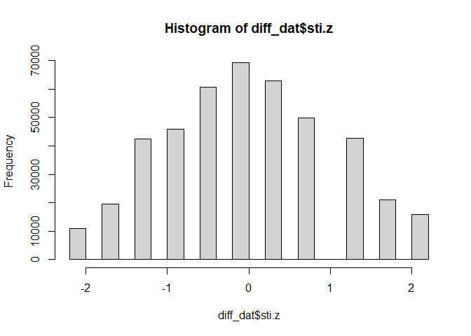
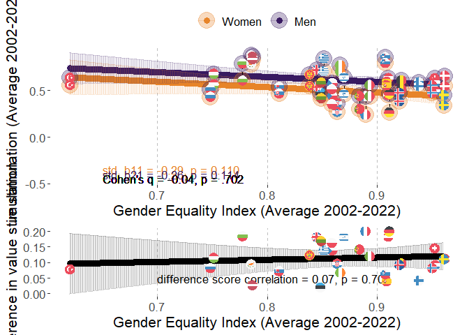
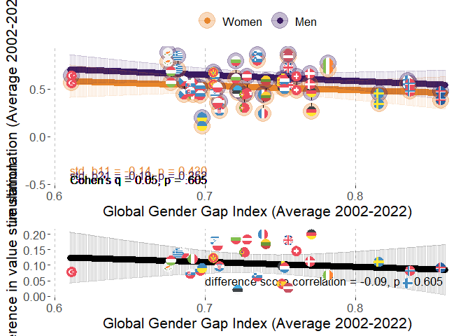
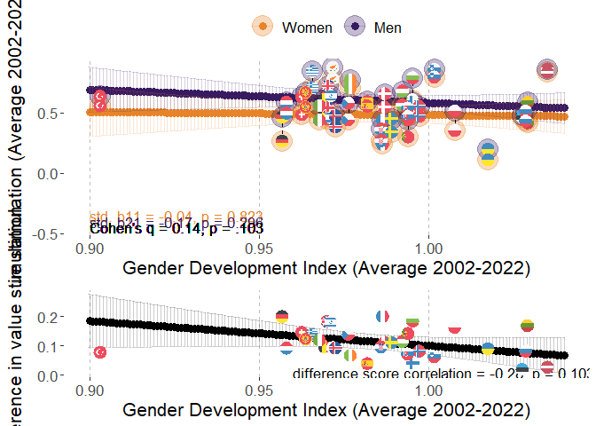
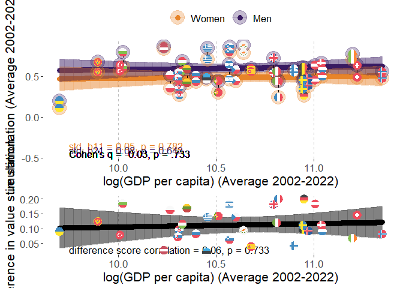
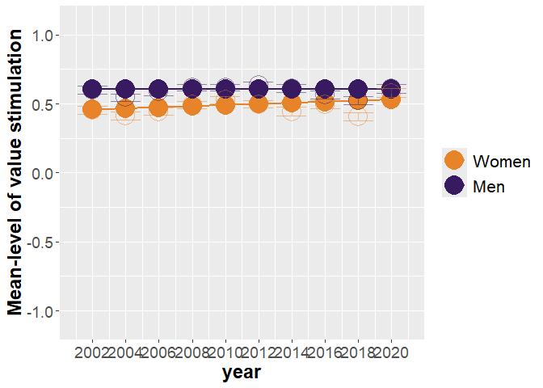
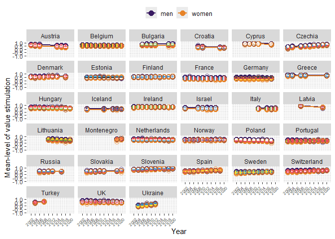

# Packages

Two packages are not in CRAN and need different installation
* devtools::install_github("vjilmari/vjihelpers")
* install.packages("ggflags", repos = c("https://jimjam-slam.r-universe.dev","https://cloud.r-project.org")) 


``` r
library(multid)
library(rio)
library(dplyr)
library(lme4)
library(emmeans)
library(vjihelpers)
library(MetBrewer)
library(ggplot2)
library(finalfit)
library(ggflags) 
library(lmerTest)
library(metafor)
library(ggpubr)
library(Hmisc)
library(r2mlm)
library(tidyr)
library(stringr)
library(apaTables)
```

# Data

* Loads the preprocessed European Social Survey data file made within "Preparations_ESS" code


``` r
load("../data/fdat.rdata")
```

* Include ISO data for country-names


``` r
# read country names
ISO<-read.csv2("../data/ISO.csv")
```


# Exclusions

* exclude participants with missing values or gender


``` r
value.vars<-
  c("con","tra",
  "ben","uni",
  "sdi","sti",
  "hed","ach",
  "pow","sec")

fdat$miss_values<-
  rowSums(is.na(fdat[,value.vars]))
table(fdat$miss_values)
```

```
## 
##      0      1      2      3      4      5      6      7      8      9     10 
## 450838   2586    774    401    248    185    129    135    142    165  34952
```

``` r
fdat<-fdat %>%
  filter(miss_values==0 & !is.na(gndr.bin))
```

# Data for the analysis

* basic descriptives


``` r
diff_dat<-
  fdat

#diff_dat$age.c<-as.numeric(diff_dat$age.c)
#diff_dat$rlgdgr.c<-as.numeric(diff_dat$rlgdgr.c)
#diff_dat$eduyrs.c<-as.numeric(diff_dat$eduyrs.c)

# data exclusions (include countries with at least two rounds of data)
n_rounds<-diff_dat %>% group_by(cntry) %>%
  summarise(n_unique_essround = n_distinct(essround))

# join number of rounds to data
diff_dat<-
  left_join(x=diff_dat,
            y=n_rounds,
            by="cntry")

# filter only countries with more than 1 round and non-missing gender variable
diff_dat<-diff_dat %>%
  dplyr::filter(n_unique_essround>1 &
                  !is.na(gndr))

# cross-tabulate sample sizes and ESS rounds by country
table(diff_dat$essround,diff_dat$cntry)
```

```
##     
##        AT   BE   BG   CH   CY   CZ   DE   DK   EE   ES   FI   FR   GB   GR   HR   HU   IE   IL   IS   IT
##   1  2254 1830    0 2024    0 1208 2819 1470    0 1712 1763 1355 1798 2551    0 1634 1916 2279    0    0
##   2  2198 1771    0 2110    0 2557 2840 1458 1948 1623 1701 1699 1864 2399    0 1460 1187    0  524    0
##   3  2348 1796 1295 1780  978    0 2884 1461 1466 1847 1649 1983 2353    0    0 1462 1589    0    0    0
##   4     0 1754 2144 1753 1210 1986 2732 1581 1646 2562 1901 2067 2311 2063 1430 1430 1757 2382    0    0
##   5     0 1699 2371 1491 1053 2335 3007 1564 1793 1881 1649 1723 2374 2669 1601 1473 2400 2212    0    0
##   6     0 1862 2179 1483 1110 1973 2935 1621 2345 1871 2158 1960 2261    0    0 1968 2616 2378  739  909
##   7  1795 1767    0 1521    0 1862 3006 1483 2036 1907 2050 1902 2231    0    0 1520 2380 2351    0    0
##   8  1993 1759    0 1504    0 2252 2821    0 2007 1929 1903 2057 1942    0    0 1458 2746 2366  841 2531
##   9  2477 1756 1926 1517  773 2343 2328 1554 1899 1619 1735 1982 2183    0 1781 1643 2189    0  844 2660
##   10    0 1334 2697 1505    0 2369    0    0 1538    0 1561 1951 1131 2768 1564 1816 1751    0  886 2573
##     
##        LT   LV   ME   NL   NO   PL   PT   RU   SE   SI   SK   TR   UA
##   1     0    0    0 2337 1819 2065 1482    0 1682 1488    0    0    0
##   2     0    0    0 1858 1575 1683 2024    0 1678 1384 1425 1790 1896
##   3     0    0    0 1860 1550 1685 2182 2339 1604 1465 1711    0 1885
##   4     0 1970    0 1724 1391 1596 2337 2446 1556 1257 1789 2305 1766
##   5  1632    0    0 1801 1530 1719 2139 2557 1463 1369 1803    0 1779
##   6  2108    0    0 1828 1610 1866 2138 2429 1838 1244 1827    0 2064
##   7  2241    0    0 1823 1423 1594 1242    0 1761 1189    0    0    0
##   8  2079    0    0 1669 1530 1675 1254 2374 1526 1295    0    0    0
##   9  1677  891 1188 1657 1396 1443 1045    0 1510 1307 1061    0    0
##   10 1606    0 1248 1466 1408    0 1827    0    0 1232 1395    0    0
```

``` r
# range of sample sizes
range(table(diff_dat$cntry))
```

```
## [1]  2436 25372
```

``` r
# scale/standardize with SD pooled across all country-time-gender folds
cntry.sti<-diff_dat %>% group_by(cntry,essround) %>%
  summarise(sti.ctm=mean(sti,na.rm=T),
            sti.ctsd=sd(sti,na.rm=T)) %>%
  group_by(cntry) %>%
  summarise(sti.cm=mean(sti.ctm),
            sti.csd=mean(sti.ctsd)) 
```

```
## `summarise()` has grouped output by 'cntry'. You can override using the `.groups` argument.
```

``` r
grand_mean_sti<-mean(cntry.sti$sti.cm)
grand_sd_sti<-mean(cntry.sti$sti.csd)

# standardized
diff_dat$sti.z<-(diff_dat$sti-grand_mean_sti)/grand_sd_sti
hist(diff_dat$sti.z)
```

<!-- -->

## Add GEI-variable

* GEI = Reverse-coded Gender Inequality Index (GII)


``` r
GII<-read.csv("../data/GII.csv")

# Obtain GII only for ESS countries
GII_in_ESS_d<-
  GII %>%
  filter(ISO2 %in% unique(diff_dat$cntry))

# Make long format data of GII, so that country x year has own rows

long_GII_in_ESS_d <- GII_in_ESS_d %>%
  pivot_longer(
    cols = starts_with("gii_") & !matches("avg"),  # <-- exclude the "_avg" columns
    names_to = "year",
    values_to = "gii",
    names_prefix = "gii_"
  ) %>%
  mutate(year = as.integer(year)) %>%
  filter(year >= 2002 & year <= 2022) %>%
  mutate(gei = 1 - gii) %>%
  select(ISO2, iso3, country, year, gii, gei, gii_2002_2022_avg, gei_2002_2022_avg)


# describe gei average
psych::describe(GII_in_ESS_d$gei_2002_2022_avg)
```

```
##    vars  n mean   sd median trimmed  mad  min  max range  skew kurtosis   se
## X1    1 32 0.87 0.07   0.87    0.87 0.06 0.62 0.96  0.34 -1.11     1.48 0.01
```

``` r
# one is missing, see which one
GII_in_ESS_d[is.na(GII_in_ESS_d$gei_2002_2022_avg),"country"]
```

```
## [1] "Ukraine"
```

``` r
# get means and SDs for standardizing
gei_mean<-mean(GII_in_ESS_d$gei_2002_2022_avg,na.rm=T)
gei_sd<-sd(GII_in_ESS_d$gei_2002_2022_avg,na.rm=T)

# standardize 
# year specific scores
long_GII_in_ESS_d$gei.z<-(long_GII_in_ESS_d$gei-gei_mean)/gei_sd

# get the country means to a separate frame

GII_country_means<-
  long_GII_in_ESS_d %>% group_by(ISO2) %>%
  summarise(gei.cm=mean(gei,na.rm=T),
            gei.z.cm=mean(gei.z,na.rm=T))


long_GII_in_ESS_d<-left_join(
  x=long_GII_in_ESS_d,
  y=GII_country_means,
  by="ISO2"
)


# center both the raw score and standardized scores
long_GII_in_ESS_d$gei.cmc<-(long_GII_in_ESS_d$gei-long_GII_in_ESS_d$gei.cm)
long_GII_in_ESS_d$gei.z.cmc<-(long_GII_in_ESS_d$gei.z-long_GII_in_ESS_d$gei.z.cm)

#View(long_GII_in_ESS_d)

# averages across 2002-2022
#long_GII_in_ESS_d$gei_2002_2022_avg.z<-(long_GII_in_ESS_d$gei_2002_2022_avg-gei_mean)/gei_sd

#long_GII_in_ESS_d$gei.cmc<-long_GII_in_ESS_d$gei-long_GII_in_ESS_d$gei_2002_2022_avg

# add year to ESS data-frame

diff_dat$year<-
  case_when(
    diff_dat$essround.c==-4.5~2002,  
    diff_dat$essround.c==-3.5~2004,
    diff_dat$essround.c==-2.5~2006,
    diff_dat$essround.c==-1.5~2008,
    diff_dat$essround.c==-0.5~2010,
    diff_dat$essround.c==0.5~2012,
    diff_dat$essround.c==1.5~2014,
    diff_dat$essround.c==2.5~2016,
    diff_dat$essround.c==3.5~2018,
    diff_dat$essround.c==4.5~2020
  )

# link datasets by country and year

diff_dat<-
  left_join(
    x=diff_dat,
    y=long_GII_in_ESS_d[,c("ISO2","year","gei","gei.cm","gei.cmc",
                           "gei.z","gei.z.cm","gei.z.cmc")],
    by=c("cntry"="ISO2","year")
)
```


## Add GDI-variable

* GDI = Gender Development Index


``` r
GDI<-read.csv("../data/GDI.csv")

# Obtain GDI only for ESS countries
GDI_in_ESS_d<-
  GDI %>%
  filter(ISO2 %in% unique(diff_dat$cntry))

# Make long format data of GDI, so that country x year has own rows

long_GDI_in_ESS_d <- GDI_in_ESS_d %>%
  pivot_longer(
    cols = starts_with("gdi_") & !matches("avg"),  # <-- exclude the "_avg" columns
    names_to = "year",
    values_to = "gdi",
    names_prefix = "gdi_"
  ) %>%
  mutate(year = as.integer(year)) %>%
  filter(year >= 2002 & year <= 2022) %>%
  select(ISO2, iso3, country, year, gdi, gdi_2002_2022_avg)

# describe gdi average
psych::describe(GDI_in_ESS_d$gdi_2002_2022_avg)
```

```
##    vars  n mean   sd median trimmed  mad min  max range  skew kurtosis se
## X1    1 33 0.99 0.03   0.99    0.98 0.02 0.9 1.04  0.13 -0.35     1.27  0
```

``` r
# get means and SDs for standardizing
gdi_mean<-mean(GDI_in_ESS_d$gdi_2002_2022_avg,na.rm=T)
gdi_sd<-sd(GDI_in_ESS_d$gdi_2002_2022_avg,na.rm=T)

# standardize 
# year specific scores
long_GDI_in_ESS_d$gdi.z<-(long_GDI_in_ESS_d$gdi-gdi_mean)/gdi_sd

# get the country means to a separate frame

GDI_country_means<-
  long_GDI_in_ESS_d %>% group_by(ISO2) %>%
  summarise(gdi.cm=mean(gdi,na.rm=T),
            gdi.z.cm=mean(gdi.z,na.rm=T))

long_GDI_in_ESS_d<-left_join(
  x=long_GDI_in_ESS_d,
  y=GDI_country_means,
  by="ISO2"
)


# center both the raw score and standardized scores
long_GDI_in_ESS_d$gdi.cmc<-(long_GDI_in_ESS_d$gdi-long_GDI_in_ESS_d$gdi.cm)
long_GDI_in_ESS_d$gdi.z.cmc<-(long_GDI_in_ESS_d$gdi.z-long_GDI_in_ESS_d$gdi.z.cm)

# link datasets by country and year

diff_dat<-
  left_join(
    x=diff_dat,
    y=long_GDI_in_ESS_d[,c("ISO2","year","gdi","gdi.cm","gdi.cmc",
                           "gdi.z","gdi.z.cm","gdi.z.cmc")],
    by=c("cntry"="ISO2","year")
  )
```

## Add GDP-variable

* log_GDP = Logarithm of GDP per capita, PPP (constant 2017 international $)


``` r
GDP<-read.csv("../data/GDP_processed.csv")

# Obtain GDP only for ESS countries
GDP_in_ESS_d<-
  GDP %>%
  filter(ISO2 %in% unique(diff_dat$cntry))

# First, rename those X2000..YR2000. style columns to simple "gdp_2000" etc.

GDP_in_ESS_d <- GDP_in_ESS_d %>%
  rename_with(
    ~ str_replace_all(., "^X(\\d{4})..YR\\1\\.$", "gdp_\\1"),
    starts_with("X")
  )

#GDP_in_ESS_d
# Make long format data of GDP, so that country x year has own rows

long_GDP_in_ESS_d <- GDP_in_ESS_d %>%
  pivot_longer(
    cols = starts_with("gdp_") & !matches("avg"),  # <-- exclude the "_avg" columns
    names_to = "year",
    values_to = "gdp",
    names_prefix = "gdp_"
  ) %>%
  mutate(year = as.integer(year)) %>%
  filter(year >= 2002 & year <= 2022) %>%
  select(ISO2, Country.Name, year, gdp, gdp_2002_2022_avg,log_gdp_2002_2022_avg) %>%
  mutate(log_gdp=log(gdp))

#View(long_GDP_in_ESS_d)

# describe gdp average
psych::describe(GDP_in_ESS_d$gdp_2002_2022_avg)
```

```
##    vars  n     mean      sd   median  trimmed      mad      min      max    range skew kurtosis      se
## X1    1 33 44309.55 16988.2 40528.07 43238.06 16282.88 16406.88 85115.96 68709.08 0.48    -0.58 2957.27
```

``` r
psych::describe(GDP_in_ESS_d$log_gdp_2002_2022_avg)
```

```
##    vars  n  mean  sd median trimmed  mad  min   max range  skew kurtosis   se
## X1    1 33 10.62 0.4  10.61   10.64 0.43 9.71 11.35  1.65 -0.25    -0.67 0.07
```

``` r
# get means and SDs for standardizing
log_gdp_mean<-mean(GDP_in_ESS_d$log_gdp_2002_2022_avg,na.rm=T)
log_gdp_sd<-sd(GDP_in_ESS_d$log_gdp_2002_2022_avg,na.rm=T)

# standardize 
# year specific scores
long_GDP_in_ESS_d$log_gdp.z<-
  (long_GDP_in_ESS_d$log_gdp-log_gdp_mean)/log_gdp_sd

# get the country means to a separate frame

GDP_country_means<-
  long_GDP_in_ESS_d %>% group_by(ISO2) %>%
  summarise(gdp.cm=mean(gdp,na.rm=T),
            #gdp.z.cm=mean(gdp.z,na.rm=T),
            log_gdp.cm=mean(log_gdp,na.rm=T),
            log_gdp.z.cm=mean(log_gdp.z,na.rm=T))

long_GDP_in_ESS_d<-left_join(
  x=long_GDP_in_ESS_d,
  y=GDP_country_means,
  by="ISO2"
)


# center both the raw score and standardized scores
long_GDP_in_ESS_d$log_gdp.cmc<-(long_GDP_in_ESS_d$log_gdp-long_GDP_in_ESS_d$log_gdp.cm)
long_GDP_in_ESS_d$log_gdp.z.cmc<-(long_GDP_in_ESS_d$log_gdp.z-long_GDP_in_ESS_d$log_gdp.z.cm)

# link datasets by country and year

diff_dat<-
  left_join(
    x=diff_dat,
    y=long_GDP_in_ESS_d[,c("ISO2","year","log_gdp","log_gdp.cm","log_gdp.cmc",
                           "log_gdp.z","log_gdp.z.cm","log_gdp.z.cmc")],
    by=c("cntry"="ISO2","year")
  )
```

## Add GGGI-variable

* GGGI = Global Gender Gap Index


``` r
GGGI<-import("../data/GGGI.xlsx")

# check if all ESS countries are in the log_GGGI data
table(unique(diff_dat$cntry) %in% GGGI$ISO2)
```

```
## 
## TRUE 
##   33
```

``` r
# Obtain GGGI only for ESS countries
GGGI_in_ESS_d<-
  GGGI %>%
  filter(ISO2 %in% unique(diff_dat$cntry))

# Make long format data of GGGI, so that country x year has own rows

long_GGGI_in_ESS_d <- GGGI_in_ESS_d %>%
  pivot_longer(
    cols = starts_with("gggi_") & !matches("avg"),  # <-- exclude the "_avg" columns
    names_to = "year",
    values_to = "gggi",
    names_prefix = "gggi_"
  ) %>%
  mutate(year = as.integer(year)) %>%
  filter(year >= 2002 & year <= 2022) %>%
  select(ISO2, cname, year, gggi, GGGI_2002_2022_avg)

# describe gggi average
psych::describe(GGGI_in_ESS_d$GGGI_2002_2022_avg)
```

```
##    vars  n mean   sd median trimmed  mad  min  max range skew kurtosis   se
## X1    1 33 0.73 0.05   0.73    0.73 0.04 0.61 0.86  0.25 0.38     0.19 0.01
```

``` r
# get means and SDs for standardizing
gggi_mean<-mean(GGGI_in_ESS_d$GGGI_2002_2022_avg,na.rm=T)
gggi_sd<-sd(GGGI_in_ESS_d$GGGI_2002_2022_avg,na.rm=T)

# standardize 
# year specific scores
long_GGGI_in_ESS_d$gggi.z<-(long_GGGI_in_ESS_d$gggi-gggi_mean)/gggi_sd

# get the country means to a separate frame

GGGI_country_means<-
  long_GGGI_in_ESS_d %>% group_by(ISO2) %>%
  summarise(gggi.cm=mean(gggi,na.rm=T),
            gggi.z.cm=mean(gggi.z,na.rm=T))

long_GGGI_in_ESS_d<-left_join(
  x=long_GGGI_in_ESS_d,
  y=GGGI_country_means,
  by="ISO2"
)

# center both the raw score and standardized scores
long_GGGI_in_ESS_d$gggi.cmc<-
  (long_GGGI_in_ESS_d$gggi-long_GGGI_in_ESS_d$gggi.cm)

long_GGGI_in_ESS_d$gggi.z.cmc<-
  (long_GGGI_in_ESS_d$gggi.z-long_GGGI_in_ESS_d$gggi.z.cm)

# link datasets by country and year

diff_dat<-
  left_join(
    x=diff_dat,
    y=long_GGGI_in_ESS_d[,c("ISO2","year","gggi","gggi.cm","gggi.cmc",
                           "gggi.z","gggi.z.cm","gggi.z.cmc")],
    by=c("cntry"="ISO2","year")
  )
```

# Descriptive statistics

## Country-specific descriptives


``` r
# sample sizes from weights

cntry_n_frame<-
  diff_dat %>% group_by(cntry) %>%
  summarise('n ESS rounds' = mean(n_unique_essround),
            n=round(sum(pspwght),0))

# value-based stimulation

cntry_sti_frame<-
  diff_dat %>% group_by(cntry,essround) %>%
  summarise('sti M' = weighted.mean(x=sti.z,w=pspwght),
            'sti SD' = sqrt(wtd.var(sti.z,pspwght))) %>%
  group_by(cntry) %>%
  summarise('sti M' = mean(x=`sti M`),
            'sti SD'= mean(x=`sti SD`))
```

```
## `summarise()` has grouped output by 'cntry'. You can override using the `.groups` argument.
```

``` r
cntry_sti_women_frame<-
  diff_dat %>%
  filter(gndr.c==-0.5) %>%
  group_by(cntry,essround) %>%
  summarise('sti M' = weighted.mean(x=sti.z,w=pspwght),
            'sti SD' = sqrt(wtd.var(sti.z,pspwght))) %>%
  group_by(cntry) %>%
  summarise('sti M Women' = mean(x=`sti M`),
            'sti SD Women'= mean(x=`sti SD`))
```

```
## `summarise()` has grouped output by 'cntry'. You can override using the `.groups` argument.
```

``` r
cntry_sti_men_frame<-
  diff_dat %>%
  filter(gndr.c==0.5) %>%
  group_by(cntry,essround) %>%
  summarise('sti M' = weighted.mean(x=sti.z,w=pspwght),
            'sti SD' = sqrt(wtd.var(sti.z,pspwght))) %>%
  group_by(cntry) %>%
  summarise('sti M Men' = mean(x=`sti M`),
            'sti SD Men'= mean(x=`sti SD`))
```

```
## `summarise()` has grouped output by 'cntry'. You can override using the `.groups` argument.
```

``` r
# link n and sti datasets

desc_frame<-
  left_join(
    x=cntry_n_frame,
    y=cntry_sti_frame,
    by="cntry"
  )

desc_frame<-
  left_join(
    x=desc_frame,
    y=cntry_sti_women_frame,
    by="cntry"
  )

desc_frame<-
  left_join(
    x=desc_frame,
    y=cntry_sti_men_frame,
    by="cntry"
  )

# Add country-specific differences
desc_frame$D<-desc_frame$`sti M Men`-desc_frame$`sti M Women`

desc_frame
```

```
## # A tibble: 33 × 10
##    cntry `n ESS rounds`     n `sti M` `sti SD` `sti M Women` `sti SD Women` `sti M Men` `sti SD Men`
##    <chr>          <dbl> <dbl>   <dbl>    <dbl>         <dbl>          <dbl>       <dbl>        <dbl>
##  1 AT                 6 13077  0.0293    1.01      -0.0694            1.03       0.135         0.979
##  2 BE                10 17313  0.0938    0.935      0.0223            0.938      0.169         0.926
##  3 BG                 6 12641  0.0999    1.06      -0.00645           1.08       0.215         1.03 
##  4 CH                10 16720  0.102     0.957     -0.000949          0.967      0.209         0.934
##  5 CY                 5  5105  0.154     1.09       0.0505            1.11       0.263         1.07 
##  6 CZ                 9 18934 -0.0323    1.000     -0.150             0.996      0.0955        0.986
##  7 DE                 9 25389 -0.154     0.966     -0.258             0.955     -0.0446        0.965
##  8 DK                 8 12198  0.0814    1.05      -0.00297           1.06       0.168         1.04 
##  9 EE                 9 16692 -0.0539    0.972     -0.136             0.976      0.0447        0.957
## 10 ES                 9 16954 -0.0195    1.03      -0.0684            1.03       0.0312        1.03 
## # ℹ 23 more rows
## # ℹ 1 more variable: D <dbl>
```

``` r
# add country-level measures

desc_frame<-
  left_join(
    x=desc_frame,
    y=GII_country_means[,c("ISO2","gei.cm")],
    by=c("cntry"="ISO2")
  )

desc_frame<-
  left_join(
    x=desc_frame,
    y=GGGI_country_means[,c("ISO2","gggi.cm")],
    by=c("cntry"="ISO2")
  )

desc_frame<-
  left_join(
    x=desc_frame,
    y=GDI_country_means[,c("ISO2","gdi.cm")],
    by=c("cntry"="ISO2")
  )


desc_frame<-
  left_join(
    x=desc_frame,
    y=GDP_country_means[,c("ISO2","gdp.cm")],
    by=c("cntry"="ISO2")
  )

desc_frame<-left_join(
  x=desc_frame,
  y=ISO[,c("ISO2","CLDR")],
  by=c("cntry"="ISO2")
)

# finalize the formatted table

cntry_desc_tbl<-
  desc_frame %>%
  select(
    Country = CLDR,
    `n ESS rounds`,
    n,
    `sti M`, `sti SD`,
    `sti M Women`, `sti SD Women`,
    `sti M Men`, `sti SD Men`,
    D,
    GEI = gei.cm,
    GGGI = gggi.cm,
    GDI = gdi.cm,
    GDP = gdp.cm
  ) %>%
  mutate(
    across(
      .cols = -c(Country, `n ESS rounds`, n, GDP) & where(is.numeric),
      .fns  = ~ round_tidy(.x, 2)
    )
  ) %>%
  mutate(
    across(
      .cols = GDP,
      .fns  = ~ round_tidy(.x, 0)
    )
  )
print(cntry_desc_tbl,n=33)
```

```
## # A tibble: 33 × 14
##    Country    `n ESS rounds`     n `sti M` `sti SD` `sti M Women` `sti SD Women` `sti M Men` `sti SD Men`
##    <chr>               <dbl> <dbl> <chr>   <chr>    <chr>         <chr>          <chr>       <chr>       
##  1 Austria                 6 13077 0.03    1.01     -0.07         1.03           0.13        0.98        
##  2 Belgium                10 17313 0.09    0.94     0.02          0.94           0.17        0.93        
##  3 Bulgaria                6 12641 0.10    1.06     -0.01         1.08           0.21        1.03        
##  4 Switzerla…             10 16720 0.10    0.96     -0.00         0.97           0.21        0.93        
##  5 Cyprus                  5  5105 0.15    1.09     0.05          1.11           0.26        1.07        
##  6 Czechia                 9 18934 -0.03   1.00     -0.15         1.00           0.10        0.99        
##  7 Germany                 9 25389 -0.15   0.97     -0.26         0.95           -0.04       0.96        
##  8 Denmark                 8 12198 0.08    1.05     -0.00         1.06           0.17        1.04        
##  9 Estonia                 9 16692 -0.05   0.97     -0.14         0.98           0.04        0.96        
## 10 Spain                   9 16954 -0.02   1.03     -0.07         1.03           0.03        1.03        
## 11 Finland                10 18050 0.08    0.97     0.02          1.00           0.15        0.94        
## 12 France                 10 18720 -0.09   0.99     -0.19         0.97           0.01        1.00        
## 13 UK                     10 21456 0.12    1.01     0.04          1.02           0.20        0.99        
## 14 Greece                  5 12464 0.22    1.01     0.12          1.02           0.33        0.98        
## 15 Croatia                 4  6368 -0.34   1.08     -0.48         1.07           -0.19       1.06        
## 16 Hungary                10 16006 0.10    1.00     0.02          0.99           0.19        0.99        
## 17 Ireland                10 20576 0.22    1.04     0.16          1.04           0.27        1.03        
## 18 Israel                  6 13964 0.26    1.08     0.18          1.08           0.35        1.07        
## 19 Iceland                 5  3832 0.12    1.01     0.07          1.02           0.17        0.99        
## 20 Italy                   4  8663 0.03    0.88     -0.04         0.89           0.11        0.87        
## 21 Lithuania               6 11714 -0.15   1.07     -0.29         1.07           0.02        1.04        
## 22 Latvia                  2  2866 0.22    1.01     0.13          1.00           0.33        1.02        
## 23 Montenegro              2  2441 0.14    0.99     0.03          1.00           0.25        0.96        
## 24 Netherlan…             10 18048 0.16    0.91     0.08          0.91           0.24        0.89        
## 25 Norway                 10 15186 -0.06   1.01     -0.16         1.03           0.04        0.98        
## 26 Poland                  9 15314 -0.01   0.97     -0.13         0.97           0.12        0.96        
## 27 Portugal               10 17705 -0.13   0.93     -0.25         0.94           0.00        0.89        
## 28 Russia                  5 12139 -0.07   1.09     -0.18         1.09           0.08        1.06        
## 29 Sweden                  9 14897 -0.05   0.97     -0.12         0.99           0.03        0.95        
## 30 Slovenia               10 13238 0.31    0.94     0.22          0.94           0.40        0.92        
## 31 Slovakia                7 11132 0.02    0.95     -0.08         0.96           0.14        0.93        
## 32 Turkey                  2  4108 0.30    1.02     0.23          1.02           0.36        1.01        
## 33 Ukraine                 5  9454 -0.25   1.05     -0.32         1.04           -0.17       1.04        
## # ℹ 5 more variables: D <chr>, GEI <chr>, GGGI <chr>, GDI <chr>, GDP <chr>
```

``` r
export(cntry_desc_tbl,"../results/sti_youth/cntry_desc_tbl.xlsx",overwrite=T)
```

## Country-level correlations table


``` r
cor_frame<-
  desc_frame %>%
  select(
    VBMT=`sti M`,
    VBMT_Women=`sti M Women`,
    VBMT_Men=`sti M Men`,
    D = D,
    GEI = gei.cm,
    GGGI = gggi.cm,
    GDI = gdi.cm,
    GDP = gdp.cm
  ) %>%
  mutate(
    log_GDP=log(GDP)
  ) %>%
  select(-GDP)

apa.cor.table(
  data=cor_frame,
  filename = "../results/sti_youth/CorTable1.doc",
  #table.number = NA,
  show.conf.interval = FALSE,
  show.sig.stars = F,
  landscape = F
)
```

```
## The ability to suppress reporting of reporting confidence intervals has been deprecated in this version.
## The function argument show.conf.interval will be removed in a later version.
```

```
## 
## 
## Means, standard deviations, and correlations with confidence intervals
##  
## 
##   Variable      M     SD   1            2            3           4           5           6          
##   1. VBMT       0.04  0.15                                                                          
##                                                                                                     
##   2. VBMT_Women -0.05 0.16 .99                                                                      
##                            [.98, 1.00]                                                              
##                                                                                                     
##   3. VBMT_Men   0.14  0.14 .98          .95                                                         
##                            [.97, .99]   [.91, .98]                                                  
##                                                                                                     
##   4. D          0.19  0.05 -.44         -.55         -.27                                           
##                            [-.68, -.11] [-.75, -.26] [-.56, .08]                                    
##                                                                                                     
##   5. GEI        0.87  0.07 -.23         -.19         -.30        -.18                               
##                            [-.54, .13]  [-.50, .17]  [-.59, .06] [-.50, .18]                        
##                                                                                                     
##   6. GGGI       0.73  0.05 -.09         -.03         -.16        -.32        .73                    
##                            [-.42, .27]  [-.37, .31]  [-.47, .20] [-.60, .02] [.52, .86]             
##                                                                                                     
##   7. GDI        0.99  0.03 -.39         -.40         -.33        .36         .07         .20        
##                            [-.65, -.05] [-.66, -.07] [-.61, .01] [.02, .63]  [-.29, .41] [-.16, .51]
##                                                                                                     
##   8. log_GDP    10.62 0.40 .10          .14          .04         -.32        .75         .67        
##                            [-.25, .43]  [-.22, .46]  [-.31, .38] [-.60, .03] [.55, .87]  [.42, .82] 
##                                                                                                     
##   7          
##              
##              
##              
##              
##              
##              
##              
##              
##              
##              
##              
##              
##              
##              
##              
##              
##              
##              
##              
##              
##   -.22       
##   [-.53, .13]
##              
## 
## Note. M and SD are used to represent mean and standard deviation, respectively.
## Values in square brackets indicate the 95% confidence interval.
## The confidence interval is a plausible range of population correlations 
## that could have caused the sample correlation (Cumming, 2014).
## 
```


# Analysis

## Data subset


``` r
diff_dat<-diff_dat %>%
  filter(agea>17 & agea <30)
```

## mod0: Random intercept model


``` r
mod0<-lmer(sti.z~(1|cntry),data=diff_dat,REML=F,weights = pspwght,
           control=lmerControl(optimizer="bobyqa",optCtrl=list(maxfun=2e7)))
summary(mod0)
```

```
## Linear mixed model fit by maximum likelihood . t-tests use Satterthwaite's method ['lmerModLmerTest']
## Formula: sti.z ~ (1 | cntry)
##    Data: diff_dat
## Weights: pspwght
## Control: lmerControl(optimizer = "bobyqa", optCtrl = list(maxfun = 2e+07))
## 
##       AIC       BIC    logLik -2*log(L)  df.resid 
##  196122.8  196150.3  -98058.4  196116.8     70935 
## 
## Scaled residuals: 
##     Min      1Q  Median      3Q     Max 
## -5.9783 -0.6160  0.0111  0.6886  3.8657 
## 
## Random effects:
##  Groups   Name        Variance Std.Dev.
##  cntry    (Intercept) 0.0238   0.1543  
##  Residual             0.9632   0.9814  
## Number of obs: 70938, groups:  cntry, 33
## 
## Fixed effects:
##             Estimate Std. Error       df t value Pr(>|t|)    
## (Intercept)  0.54424    0.02714 32.64365   20.05   <2e-16 ***
## ---
## Signif. codes:  0 '***' 0.001 '**' 0.01 '*' 0.05 '.' 0.1 ' ' 1
```

``` r
getVC(mod0)
```

```
##        grp        var1 var2 sdcor vcov
## 1    cntry (Intercept) <NA>  0.15 0.02
## 2 Residual        <NA> <NA>  0.98 0.96
```

``` r
r2mlm(mod0,bargraph = F)
```

```
## $Decompositions
##                      total within between
## fixed, within   0.00000000      0      NA
## fixed, between  0.00000000     NA       0
## slope variation 0.00000000      0      NA
## mean variation  0.02410945     NA       1
## sigma2          0.97589055      1      NA
## 
## $R2s
##          total within between
## f1  0.00000000      0      NA
## f2  0.00000000     NA       0
## v   0.00000000      0      NA
## m   0.02410945     NA       1
## f   0.00000000     NA      NA
## fv  0.00000000      0      NA
## fvm 0.02410945     NA      NA
```

## mod1: Gender fixed effect


``` r
mod1<-lmer(sti.z~gndr.c+(1|cntry),data=diff_dat,REML=F,weights = pspwght,
           control=lmerControl(optimizer="bobyqa",optCtrl=list(maxfun=2e7)))
summary(mod1)
```

```
## Linear mixed model fit by maximum likelihood . t-tests use Satterthwaite's method ['lmerModLmerTest']
## Formula: sti.z ~ gndr.c + (1 | cntry)
##    Data: diff_dat
## Weights: pspwght
## Control: lmerControl(optimizer = "bobyqa", optCtrl = list(maxfun = 2e+07))
## 
##       AIC       BIC    logLik -2*log(L)  df.resid 
##  195824.6  195861.3  -97908.3  195816.6     70934 
## 
## Scaled residuals: 
##     Min      1Q  Median      3Q     Max 
## -6.1217 -0.6181  0.0378  0.6860  3.9953 
## 
## Random effects:
##  Groups   Name        Variance Std.Dev.
##  cntry    (Intercept) 0.02372  0.1540  
##  Residual             0.95917  0.9794  
## Number of obs: 70938, groups:  cntry, 33
## 
## Fixed effects:
##              Estimate Std. Error        df t value Pr(>|t|)    
## (Intercept) 5.434e-01  2.710e-02 3.264e+01   20.05   <2e-16 ***
## gndr.c      1.175e-01  6.776e-03 7.091e+04   17.34   <2e-16 ***
## ---
## Signif. codes:  0 '***' 0.001 '**' 0.01 '*' 0.05 '.' 0.1 ' ' 1
## 
## Correlation of Fixed Effects:
##        (Intr)
## gndr.c -0.002
```

``` r
getFE(mod1,round=3)
```

```
##              Est.    SE        df      t p    LL    UL
## (Intercept) 0.543 0.027    32.645 20.051 0 0.488 0.599
## gndr.c      0.118 0.007 70907.527 17.345 0 0.104 0.131
```

``` r
getVC(mod1)
```

```
##        grp        var1 var2 sdcor vcov
## 1    cntry (Intercept) <NA>  0.15 0.02
## 2 Residual        <NA> <NA>  0.98 0.96
```

``` r
r2mlm(mod1,bargraph = F)
```

```
## $Decompositions
##                       total
## fixed           0.003498815
## slope variation 0.000000000
## mean variation  0.024052565
## sigma2          0.972448620
## 
## $R2s
##           total
## f   0.003498815
## v   0.000000000
## m   0.024052565
## fv  0.003498815
## fvm 0.027551380
```

## mod2: Gender fixed and random effect

* Include random effect correlation by default


``` r
mod2<-lmer(sti.z~gndr.c+(gndr.c|cntry),data=diff_dat,REML=F,weights = pspwght,
           control=lmerControl(optimizer="bobyqa",optCtrl=list(maxfun=2e7)))
summary(mod2)
```

```
## Linear mixed model fit by maximum likelihood . t-tests use Satterthwaite's method ['lmerModLmerTest']
## Formula: sti.z ~ gndr.c + (gndr.c | cntry)
##    Data: diff_dat
## Weights: pspwght
## Control: lmerControl(optimizer = "bobyqa", optCtrl = list(maxfun = 2e+07))
## 
##       AIC       BIC    logLik -2*log(L)  df.resid 
##  195784.9  195839.9  -97886.4  195772.9     70932 
## 
## Scaled residuals: 
##     Min      1Q  Median      3Q     Max 
## -6.1804 -0.6152  0.0328  0.6847  3.9678 
## 
## Random effects:
##  Groups   Name        Variance Std.Dev. Corr 
##  cntry    (Intercept) 0.023838 0.1544        
##           gndr.c      0.003648 0.0604   -0.19
##  Residual             0.958065 0.9788        
## Number of obs: 70938, groups:  cntry, 33
## 
## Fixed effects:
##             Estimate Std. Error       df t value Pr(>|t|)    
## (Intercept)  0.54359    0.02716 32.63256  20.011  < 2e-16 ***
## gndr.c       0.11270    0.01281 32.25165   8.799  4.4e-10 ***
## ---
## Signif. codes:  0 '***' 0.001 '**' 0.01 '*' 0.05 '.' 0.1 ' ' 1
## 
## Correlation of Fixed Effects:
##        (Intr)
## gndr.c -0.154
```

``` r
getFE(mod2,round=3)
```

```
##              Est.    SE     df      t p    LL    UL
## (Intercept) 0.544 0.027 32.633 20.011 0 0.488 0.599
## gndr.c      0.113 0.013 32.252  8.799 0 0.087 0.139
```

``` r
getVC(mod2)
```

```
##        grp        var1   var2 sdcor vcov
## 1    cntry (Intercept)   <NA>  0.15 0.02
## 2    cntry      gndr.c   <NA>  0.06 0.00
## 3    cntry (Intercept) gndr.c -0.19 0.00
## 4 Residual        <NA>   <NA>  0.98 0.96
```

``` r
r2mlm(mod2,bargraph = F)
```

```
## $Decompositions
##                        total
## fixed           0.0032182330
## slope variation 0.0009243144
## mean variation  0.0242230216
## sigma2          0.9716344310
## 
## $R2s
##            total
## f   0.0032182330
## v   0.0009243144
## m   0.0242230216
## fv  0.0041425474
## fvm 0.0283655690
```

``` r
anova(mod1,mod2)
```

```
## Data: diff_dat
## Models:
## mod1: sti.z ~ gndr.c + (1 | cntry)
## mod2: sti.z ~ gndr.c + (gndr.c | cntry)
##      npar    AIC    BIC logLik -2*log(L)  Chisq Df Pr(>Chisq)    
## mod1    4 195825 195861 -97908    195817                         
## mod2    6 195785 195840 -97886    195773 43.701  2   3.24e-10 ***
## ---
## Signif. codes:  0 '***' 0.001 '**' 0.01 '*' 0.05 '.' 0.1 ' ' 1
```

``` r
lvl2_var_cond_lvl1(mod2,lvl1.var = "gndr.c",lvl1.values = c(0.5,-0.5))
```

```
##   lvl1.value lvl2.cond.var lvl2.cond.sd
## 1        0.5    0.02300167    0.1516630
## 2       -0.5    0.02649861    0.1627839
```

* Test for random effect correlation


``` r
mod2_norecov<-lmer(sti.z~gndr.c+(gndr.c||cntry),data=diff_dat,REML=F,weights = pspwght,
                   control=lmerControl(optimizer="bobyqa",optCtrl=list(maxfun=2e7)))
summary(mod2_norecov)
```

```
## Linear mixed model fit by maximum likelihood . t-tests use Satterthwaite's method ['lmerModLmerTest']
## Formula: sti.z ~ gndr.c + (gndr.c || cntry)
##    Data: diff_dat
## Weights: pspwght
## Control: lmerControl(optimizer = "bobyqa", optCtrl = list(maxfun = 2e+07))
## 
##       AIC       BIC    logLik -2*log(L)  df.resid 
##  195783.6  195829.4  -97886.8  195773.6     70933 
## 
## Scaled residuals: 
##     Min      1Q  Median      3Q     Max 
## -6.1810 -0.6156  0.0313  0.6849  3.9587 
## 
## Random effects:
##  Groups   Name        Variance Std.Dev.
##  cntry    (Intercept) 0.023809 0.15430 
##  cntry.1  gndr.c      0.003615 0.06012 
##  Residual             0.958068 0.97881 
## Number of obs: 70938, groups:  cntry, 33
## 
## Fixed effects:
##             Estimate Std. Error       df t value Pr(>|t|)    
## (Intercept)  0.54352    0.02715 32.63793  20.020  < 2e-16 ***
## gndr.c       0.11314    0.01277 32.62596   8.857 3.41e-10 ***
## ---
## Signif. codes:  0 '***' 0.001 '**' 0.01 '*' 0.05 '.' 0.1 ' ' 1
## 
## Correlation of Fixed Effects:
##        (Intr)
## gndr.c -0.001
```

``` r
getFE(mod2_norecov,round=3)
```

```
##              Est.    SE     df      t p    LL    UL
## (Intercept) 0.544 0.027 32.638 20.020 0 0.488 0.599
## gndr.c      0.113 0.013 32.626  8.857 0 0.087 0.139
```

``` r
getVC(mod2_norecov)
```

```
##        grp        var1 var2 sdcor vcov
## 1    cntry (Intercept) <NA>  0.15 0.02
## 2  cntry.1      gndr.c <NA>  0.06 0.00
## 3 Residual        <NA> <NA>  0.98 0.96
```

``` r
anova(mod2_norecov,mod2)
```

```
## Data: diff_dat
## Models:
## mod2_norecov: sti.z ~ gndr.c + (gndr.c || cntry)
## mod2: sti.z ~ gndr.c + (gndr.c | cntry)
##              npar    AIC    BIC logLik -2*log(L)  Chisq Df Pr(>Chisq)
## mod2_norecov    5 195784 195829 -97887    195774                     
## mod2            6 195785 195840 -97886    195773 0.7179  1     0.3968
```


## mod2 with Gender-equality index (GEI)


``` r
mod2_GEI<-lmer(sti.z~gndr.c+gei.z.cm+gndr.c:gei.z.cm+
                 (gndr.c|cntry),data=diff_dat,REML=F,weights = pspwght,
           control=lmerControl(optimizer="bobyqa",optCtrl=list(maxfun=2e7)))
summary(mod2_GEI)
```

```
## Linear mixed model fit by maximum likelihood . t-tests use Satterthwaite's method ['lmerModLmerTest']
## Formula: sti.z ~ gndr.c + gei.z.cm + gndr.c:gei.z.cm + (gndr.c | cntry)
##    Data: diff_dat
## Weights: pspwght
## Control: lmerControl(optimizer = "bobyqa", optCtrl = list(maxfun = 2e+07))
## 
##       AIC       BIC    logLik -2*log(L)  df.resid 
##  190307.2  190380.4  -95145.6  190291.2     69278 
## 
## Scaled residuals: 
##     Min      1Q  Median      3Q     Max 
## -6.2189 -0.6183  0.0338  0.6875  3.6040 
## 
## Random effects:
##  Groups   Name        Variance Std.Dev. Corr 
##  cntry    (Intercept) 0.017862 0.13365       
##           gndr.c      0.003741 0.06116  -0.28
##  Residual             0.947107 0.97319       
## Number of obs: 69286, groups:  cntry, 32
## 
## Fixed effects:
##                  Estimate Std. Error        df t value Pr(>|t|)    
## (Intercept)      0.556124   0.023959 31.619416  23.211  < 2e-16 ***
## gndr.c           0.113890   0.013116 31.517833   8.683 7.25e-10 ***
## gei.z.cm        -0.041403   0.024393 31.894846  -1.697   0.0994 .  
## gndr.c:gei.z.cm  0.005319   0.013783 36.354966   0.386   0.7018    
## ---
## Signif. codes:  0 '***' 0.001 '**' 0.01 '*' 0.05 '.' 0.1 ' ' 1
## 
## Correlation of Fixed Effects:
##             (Intr) gndr.c g.z.cm
## gndr.c      -0.230              
## gei.z.cm    -0.006 -0.001       
## gndr.c:g.z. -0.001 -0.058 -0.220
```

``` r
getFE(mod2_GEI,round=3)
```

```
##                   Est.    SE     df      t     p     LL    UL
## (Intercept)      0.556 0.024 31.619 23.211 0.000  0.507 0.605
## gndr.c           0.114 0.013 31.518  8.683 0.000  0.087 0.141
## gei.z.cm        -0.041 0.024 31.895 -1.697 0.099 -0.091 0.008
## gndr.c:gei.z.cm  0.005 0.014 36.355  0.386 0.702 -0.023 0.033
```

``` r
getVC(mod2_GEI)
```

```
##        grp        var1   var2 sdcor vcov
## 1    cntry (Intercept)   <NA>  0.13 0.02
## 2    cntry      gndr.c   <NA>  0.06 0.00
## 3    cntry (Intercept) gndr.c -0.28 0.00
## 4 Residual        <NA>   <NA>  0.97 0.95
```

``` r
r2mlm(mod2_GEI,bargraph = F)
```

```
## $Decompositions
##                        total
## fixed           0.0046506032
## slope variation 0.0009631272
## mean variation  0.0184637517
## sigma2          0.9759225178
## 
## $R2s
##            total
## f   0.0046506032
## v   0.0009631272
## m   0.0184637517
## fv  0.0056137304
## fvm 0.0240774822
```

### Deconstructed associations


``` r
t1<-Sys.time()
ddsc_mod2_GEI<-
  ddsc_ml(model = mod2_GEI,
          predictor = "gei.z.cm",
          moderator = "gndr.c",moderator_values = c(-0.5,0.5),
          re_cov_test = T)
t2<-Sys.time()
t2-t1
```

```
## Time difference of 21.93529 secs
```

``` r
round(ddsc_mod2_GEI$vpc_at_moderator_values,3)
```

```
##   lvl1.value Intercept.var Intercept.sd Residual.var Total.var   VPC mean.n.obs  ICC2 ICC2_SP
## 1       -0.5         0.026        0.163        0.958     0.985 0.027   1103.091 0.969   0.968
## 2        0.5         0.023        0.152        0.958     0.981 0.023   1046.545 0.962   0.962
```

``` r
round(ddsc_mod2_GEI$descriptives,3)
```

```
##                       M    SD means_y1 means_y1_scaled means_y2 means_y2_scaled gei.z.cm gei.z.cm_scaled
## means_y1          0.612 0.140    1.000           1.000    0.873           0.873   -0.272          -0.272
## means_y1_scaled   4.072 0.930    1.000           1.000    0.873           0.873   -0.272          -0.272
## means_y2          0.502 0.160    0.873           0.873    1.000           1.000   -0.290          -0.290
## means_y2_scaled   3.337 1.065    0.873           0.873    1.000           1.000   -0.290          -0.290
## gei.z.cm          0.000 1.000   -0.272          -0.272   -0.290          -0.290    1.000           1.000
## gei.z.cm_scaled   0.000 1.000   -0.272          -0.272   -0.290          -0.290    1.000           1.000
## diff_score        0.110 0.078   -0.001          -0.001   -0.488          -0.488    0.107           0.107
## diff_score_scaled 0.734 0.519   -0.001          -0.001   -0.488          -0.488    0.107           0.107
##                   diff_score diff_score_scaled
## means_y1              -0.001            -0.001
## means_y1_scaled       -0.001            -0.001
## means_y2              -0.488            -0.488
## means_y2_scaled       -0.488            -0.488
## gei.z.cm               0.107             0.107
## gei.z.cm_scaled        0.107             0.107
## diff_score             1.000             1.000
## diff_score_scaled      1.000             1.000
```

``` r
round(ddsc_mod2_GEI$results,3)
```

```
##                            estimate    SE     df t.ratio p.value ci.lower ci.upper
## r_xy1y2                      -0.068 0.177 36.355  -0.386   0.702   -0.426    0.290
## w_11                         -0.044 0.027 31.784  -1.646   0.110   -0.099    0.010
## w_21                         -0.039 0.024 32.156  -1.625   0.114   -0.087    0.010
## r_xy1                        -0.315 0.191 31.784  -1.646   0.110   -0.705    0.075
## r_xy2                        -0.242 0.149 32.156  -1.625   0.114   -0.545    0.061
## b_11                         -0.294 0.178 31.784  -1.646   0.110   -0.657    0.070
## b_21                         -0.258 0.159 32.156  -1.625   0.114   -0.582    0.065
## main_effect                  -0.041 0.024 31.895  -1.697   0.099   -0.091    0.008
## moderator_effect              0.114 0.013 31.518   8.683   0.000    0.087    0.141
## interaction                   0.005 0.014 36.355   0.386   0.702   -0.023    0.033
## q_b11_b21                    -0.038    NA     NA      NA      NA       NA       NA
## q_rxy1_rxy2                  -0.080    NA     NA      NA      NA       NA       NA
## cross_over_point            -21.411    NA     NA      NA      NA       NA       NA
## interaction_vs_main          -0.036 0.025 32.634  -1.429   0.162   -0.087    0.015
## interaction_vs_main_bscale   -0.241 0.168 32.634  -1.429   0.162   -0.583    0.102
## interaction_vs_main_rscale   -0.205 0.150 32.797  -1.373   0.179   -0.510    0.099
## dadas                        -0.077 0.048 32.156  -1.625   0.943   -0.175    0.020
## dadas_bscale                 -0.517 0.318 32.156  -1.625   0.943   -1.164    0.131
## dadas_rscale                 -0.484 0.298 32.156  -1.625   0.943   -1.090    0.123
## abs_diff                      0.005 0.014 36.355   0.386   0.351   -0.023    0.033
## abs_sum                       0.083 0.049 31.895   1.697   0.050   -0.017    0.182
## abs_diff_bscale               0.035 0.092 36.355   0.386   0.351   -0.151    0.222
## abs_sum_bscale                0.552 0.325 31.895   1.697   0.050   -0.111    1.215
## abs_diff_rscale               0.073 0.100 35.102   0.736   0.233   -0.129    0.275
## abs_sum_rscale                0.557 0.328 31.881   1.697   0.050   -0.112    1.226
```

``` r
round(ddsc_mod2_GEI$re_cov_test,3)
```

```
## RE_cov RE_cor  Chisq     Df      p 
## -0.002 -0.187  0.718  1.000  0.397
```

``` r
d_GEI<-ddsc_mod2_GEI$ddsc_sem_fit$data

ddsc_sem_GEI<-
  ddsc_sem(data=d_GEI,x = "gei.z.cm",y1="means_y2",
           y2="means_y1",q_sesoi = .10)
round(ddsc_sem_GEI$results,3)
```

```
##                                     est     se      z pvalue ci.lower ci.upper
## r_xy1_y2                         -0.107  0.176 -0.611  0.541   -0.452    0.237
## r_xy1                            -0.290  0.169 -1.713  0.087   -0.621    0.042
## r_xy2                            -0.272  0.170 -1.599  0.110   -0.605    0.061
## b_11                             -0.309  0.180 -1.713  0.087   -0.662    0.045
## b_21                             -0.253  0.158 -1.599  0.110   -0.563    0.057
## b_10                              3.337  0.177 18.810  0.000    2.990    3.685
## b_20                              4.072  0.156 26.151  0.000    3.767    4.377
## res_cov_y1_y2                     0.762  0.206  3.695  0.000    0.358    1.167
## diff_b10_b20                     -0.734  0.090 -8.175  0.000   -0.910   -0.558
## diff_b11_b21                     -0.056  0.091 -0.611  0.541   -0.235    0.123
## diff_rxy1_rxy2                   -0.018  0.089 -0.200  0.842   -0.192    0.157
## q_b11_b21                        -0.061  0.101 -0.601  0.548   -0.258    0.137
## q_rxy1_rxy2                      -0.019  0.097 -0.200  0.842   -0.209    0.170
## cross_over_point                -13.163 21.596 -0.610  0.542  -55.491   29.164
## sum_b11_b21                      -0.562  0.327 -1.720  0.085   -1.202    0.078
## main_effect                      -0.281  0.163 -1.720  0.085   -0.601    0.039
## interaction_vs_main_effect       -0.225  0.166 -1.357  0.175   -0.550    0.100
## diff_abs_b11_abs_b21              0.056  0.091  0.611  0.541   -0.123    0.235
## abs_diff_b11_b21                  0.056  0.091  0.611  0.271   -0.123    0.235
## abs_sum_b11_b21                   0.562  0.327  1.720  0.043   -0.078    1.202
## dadas                            -0.506  0.316 -1.599  0.945   -1.126    0.114
## q_r_equivalence                  -0.081  0.097 -0.836  0.202       NA       NA
## q_b_equivalence                  -0.039  0.101 -0.391  0.348       NA       NA
## cross_over_point_equivalence     13.163 21.596  0.610  0.729       NA       NA
## cross_over_point_minimal_effect  13.163 21.596  0.610  0.271       NA       NA
```

``` r
round(ddsc_sem_GEI$variance_test,3)
```

```
##             est    se      z pvalue ci.lower ci.upper
## cov_y1y2  0.838 0.225  3.721  0.000    0.397    1.280
## var_y1    1.100 0.275  4.000  0.000    0.561    1.639
## var_y2    0.838 0.209  4.000  0.000    0.427    1.248
## var_diff  0.262 0.178  1.473  0.141   -0.087    0.611
## var_ratio 1.313 0.226  5.804  0.000    0.869    1.756
## cor_y1y2  0.873 0.042 20.796  0.000    0.791    0.955
```

### Figure 


``` r
# plot the results

# start with obtaining predicted values for means and differences

# refit reduced and full models with GGGI in original scale


mod2_GEI_unstd<-lmer(sti.z~gndr.c+gei.cm+gndr.c:gei.cm+
                 (gndr.c|cntry),data=diff_dat,REML=F,weights = pspwght,
               control=lmerControl(optimizer="bobyqa",optCtrl=list(maxfun=2e7)))

mod2_GEI_unstd_red<-lmer(sti.z~gndr.c+
                       (gndr.c|cntry),data=diff_dat,REML=F,weights = pspwght,
                     control=lmerControl(optimizer="bobyqa",optCtrl=list(maxfun=2e7)))


p<-
  emmip(
    mod2_GEI_unstd, 
    gndr.c ~ gei.cm,
    at=list(gndr.c = c(-0.5,0.5),
            gei.cm=
              seq(from=round(range(GII_country_means$gei.cm,na.rm=T)[1],2),
                  to=round(range(GII_country_means$gei.cm,na.rm=T)[2],2),
                  by=0.001)),
    plotit=F,CIs=T,lmerTest.limit = 1e6,disable.pbkrtest=T)

p$gndr.c<-p$tvar
levels(p$gndr.c)<-c("Women","Men")

# obtain min and max for aligned plots
min.y.comp<-min(p$LCL)
max.y.comp<-max(p$UCL)

# Men and Women mean distributions

p3<-coefficients(mod2_GEI_unstd_red)$cntry
p3<-cbind(rbind(p3,p3),weight=rep(c(-0.5,0.5),each=nrow(p3)))
p3$xvar<-p3$`(Intercept)`+p3$gndr.c*p3$weight
p3$gndr.c<-as.factor(p3$weight)
levels(p3$gndr.c)<-c("Women","Men")

# obtain min and max for aligned plots
min.y.mean.distr<-min(p3$xvar)
max.y.mean.distr<-max(p3$xvar)


# obtain the coefs for the gndr.c-effect (difference) as function of gei.cm

p2<-data.frame(
  emtrends(mod2_GEI_unstd,var="gndr.c",
           specs="gei.cm",
           at=list(#gndr.c = c(-0.5,0.5),
             gei.cm=
               seq(from=round(range(GII_country_means$gei.cm,na.rm=T)[1],2),
                   to=round(range(GII_country_means$gei.cm,na.rm=T)[2],2),
                   by=0.001)),
           lmerTest.limit = 1e6,disable.pbkrtest=T))

p2$yvar<-p2$gndr.c.trend
p2$xvar<-p2$gei.cm
p2$LCL<-p2$lower.CL
p2$UCL<-p2$upper.CL

# obtain min and max for aligned plots
min.y.diff<-min(p2$LCL)
max.y.diff<-max(p2$UCL)

# difference score distribution

p4<-coefficients(mod2_GEI_unstd_red)$cntry
p4$xvar=(+1)*p4$gndr.c

# obtain mix and max for aligned plots

min.y.diff.distr<-min(p4$xvar)
max.y.diff.distr<-max(p4$xvar)

# define mins and maxs

min.y.pred<-
  ifelse(min.y.comp<min.y.mean.distr,min.y.comp,min.y.mean.distr)

max.y.pred<-
  ifelse(max.y.comp>max.y.mean.distr,max.y.comp,max.y.mean.distr)

min.y.narrow<-
  ifelse(min.y.diff<min.y.diff.distr,min.y.diff,min.y.diff.distr)

max.y.narrow<-
  ifelse(max.y.diff>max.y.diff.distr,max.y.diff,max.y.diff.distr)

# Figures 

# p1

# scaled simple effects to the plot
pvals<-round_tidy(ddsc_mod2_GEI$results[6:7,"p.value"],3)

ests<-
  round_tidy(ddsc_mod2_GEI$results[6:7,"estimate"],2)

coef1<-paste0("std. b11 = ",ests[1],", p = ",pvals[1])
coef2<-paste0("std. b21 = ",ests[2],", p = ",pvals[2])
coefs<-data.frame(gndr.c=c("Women","Men"),
                  coef=c(coef1,coef2))

coef_q<-paste0("Cohen's q = ",round_tidy(ddsc_mod2_GEI$results["q_b11_b21","estimate"],2),", p = ",
               substr(round_tidy(ddsc_mod2_GEI$results["interaction","p.value"],3),2,5))  
# prediction plot for difference score

pvals2<-round_tidy(ddsc_mod2_GEI$results["interaction","p.value"],3)

ests2<-
  round_tidy(-1*ddsc_mod2_GEI$results["r_xy1y2","estimate"],2)

coefs2<-paste0("difference score correlation = ",ests2,", p = ",pvals2)
# attempt to make a flag-plot

flag_points_GEI<-coefficients(mod2_GEI_unstd_red)$cntry

flag_points_GEI$women<-flag_points_GEI$`(Intercept)`+(-0.5)*flag_points_GEI$gndr.c
flag_points_GEI$men<-flag_points_GEI$`(Intercept)`+(0.5)*flag_points_GEI$gndr.c
flag_points_GEI$mean_level<-flag_points_GEI$`(Intercept)`
flag_points_GEI$difference<-flag_points_GEI$men-flag_points_GEI$women
flag_points_GEI$cntry<-rownames(flag_points_GEI)

flag_points_GEI<-
  left_join(x=flag_points_GEI,
            y=GII_country_means[,c("ISO2","gei.cm")],by=c("cntry"="ISO2"))
#flag_points_GEI

flag_points_GEI_long<-
  data.frame(mean_level=c(flag_points_GEI$women,
                          flag_points_GEI$men),
             gei.cm=c(flag_points_GEI$gei.cm,
                      flag_points_GEI$gei.cm),
             cntry=c(flag_points_GEI$cntry,
                     flag_points_GEI$cntry),
             gndr.c=rep(c("Women","Men"),each=nrow(flag_points_GEI)
             ))


p1.sti.flags<-
  ggplot(p,aes(y=yvar,x=gei.cm,color=gndr.c))+
  geom_point(size=3)+
  geom_errorbar(aes(ymin=LCL, ymax=UCL),alpha=0.2)+
  xlab("Gender Equality Index (Average 2002-2022)")+
  #ylim(c(min.y.pred,max.y.pred))+
  #xlim(c(0.60,1.00))+
  ylab("Value stimulation (Average 2002-2022)")+
  scale_color_manual(values=met.brewer("Archambault")[c(6,2)])+
  theme(legend.position = "top",
        legend.title=element_blank(),
        text=element_text(size=16,  family="sans"),
        panel.background = element_rect(fill = "white",
                                        #colour = "black",
                                        #size = 0.5, linetype = "solid"
        ),
        panel.grid.major.x = element_line(linewidth = 0.5, linetype = 2,
                                          colour = "gray"))+
  geom_text(data = coefs,show.legend=F,
            aes(label=coef,x=0.65,
                y=c(-0.35,-0.40),size=14,hjust="left"))+
  geom_text(inherit.aes=F,aes(x=0.65,y=-0.45,
                              label=coef_q,size=14,hjust="left"),
            show.legend=F)+
  geom_point(data=flag_points_GEI_long,size=8,alpha=0.30,
             aes(x=gei.cm,y=mean_level))+
  geom_line(data=flag_points_GEI_long,aes(group = cntry,x=gei.cm,y=mean_level),
            color="black",linetype=2)+
  geom_flag(data=flag_points_GEI_long,show.legend=F,
            aes(country=tolower(cntry),size=14,x=gei.cm,y=mean_level))

p2.sti.flags<-ggplot(p2,aes(y=yvar,x=gei.cm))+
  geom_point(size=3)+
  geom_errorbar(aes(ymin=LCL, ymax=UCL),alpha=0.2)+
  xlab("Gender Equality Index (Average 2002-2022)")+
  #xlim(c(0.60,1.00))+
  #ylim(c(min.y.narrow,max.y.narrow))+
  ylab("Difference in value stimulation")+
  #scale_color_manual(values=met.brewer("Archambault")[c(6,2)])+
  theme(legend.position = "right",
        legend.title=element_blank(),
        text=element_text(size=16,  family="sans"),
        panel.background = element_rect(fill = "white",
                                        #colour = "black",
                                        #size = 0.5, linetype = "solid"
        ),
        panel.grid.major.x = element_line(linewidth = 0.5, linetype = 2,
                                          colour = "gray"))+
  #geom_text(coef2,aes(x=0.63,y=min(p2$LCL)))
  geom_text(data = data.frame(coefs2),show.legend=F,
            aes(label=coefs2,x=0.70,
                y=c(round(min(p2$LCL),2))+0.05,size=18,hjust="left"))+
  geom_flag(data=flag_points_GEI,show.legend=F,
            aes(country=tolower(cntry),size=18,x=gei.cm,y=difference))

pflag_comb<-
  ggarrange(p1.sti.flags,p2.sti.flags,align = "v",
            ncol=1,nrow=2,heights=c(2,1))
```

```
## Warning in geom_text(inherit.aes = F, aes(x = 0.65, y = -0.45, label = coef_q, : All aesthetics have length 1, but the data has 682 rows.
## ℹ Please consider using `annotate()` or provide this layer with data containing a single row.
```

```
## Warning: Removed 2 rows containing missing values or values outside the scale range (`geom_point()`).
```

```
## Warning: Removed 2 rows containing missing values or values outside the scale range (`geom_line()`).
```

```
## Warning: Removed 2 rows containing missing values or values outside the scale range (`geom_flag()`).
```

```
## Warning: Removed 1 row containing missing values or values outside the scale range (`geom_flag()`).
```

``` r
pflag_comb
```

<!-- -->

``` r
png(filename = 
      "../results/sti_youth/GEI_flags.png",
    units = "cm",
    width = 21.0,height=29.7*(3/4),res = 300)
pflag_comb
dev.off()
```

```
## png 
##   2
```

## mod2 with Gender-equality index (GGGI)


``` r
mod2_GGGI<-lmer(sti.z~gndr.c+gggi.z.cm+gndr.c:gggi.z.cm+
                 (gndr.c|cntry),data=diff_dat,REML=F,weights = pspwght,
           control=lmerControl(optimizer="bobyqa",optCtrl=list(maxfun=2e7)))
summary(mod2_GGGI)
```

```
## Linear mixed model fit by maximum likelihood . t-tests use Satterthwaite's method ['lmerModLmerTest']
## Formula: sti.z ~ gndr.c + gggi.z.cm + gndr.c:gggi.z.cm + (gndr.c | cntry)
##    Data: diff_dat
## Weights: pspwght
## Control: lmerControl(optimizer = "bobyqa", optCtrl = list(maxfun = 2e+07))
## 
##       AIC       BIC    logLik -2*log(L)  df.resid 
##  139435.6  139506.2  -69709.8  139419.6     50576 
## 
## Scaled residuals: 
##     Min      1Q  Median      3Q     Max 
## -6.2713 -0.6213  0.0579  0.6859  3.8406 
## 
## Random effects:
##  Groups   Name        Variance Std.Dev. Corr 
##  cntry    (Intercept) 0.026886 0.16397       
##           gndr.c      0.004517 0.06721  -0.28
##  Residual             0.955844 0.97767       
## Number of obs: 50584, groups:  cntry, 33
## 
## Fixed effects:
##                   Estimate Std. Error        df t value Pr(>|t|)    
## (Intercept)       0.572655   0.028961 32.280725  19.774  < 2e-16 ***
## gndr.c            0.105283   0.014594 31.197481   7.214 3.96e-08 ***
## gggi.z.cm        -0.029646   0.029504 32.721438  -1.005    0.322    
## gndr.c:gggi.z.cm -0.008134   0.015599 37.147972  -0.521    0.605    
## ---
## Signif. codes:  0 '***' 0.001 '**' 0.01 '*' 0.05 '.' 0.1 ' ' 1
## 
## Correlation of Fixed Effects:
##             (Intr) gndr.c ggg.z.
## gndr.c      -0.219              
## gggi.z.cm   -0.003 -0.002       
## gndr.c:gg.. -0.002 -0.027 -0.207
```

``` r
getFE(mod2_GGGI,round=3)
```

```
##                    Est.    SE     df      t     p     LL    UL
## (Intercept)       0.573 0.029 32.281 19.774 0.000  0.514 0.632
## gndr.c            0.105 0.015 31.197  7.214 0.000  0.076 0.135
## gggi.z.cm        -0.030 0.030 32.721 -1.005 0.322 -0.090 0.030
## gndr.c:gggi.z.cm -0.008 0.016 37.148 -0.521 0.605 -0.040 0.023
```

``` r
getVC(mod2_GGGI)
```

```
##        grp        var1   var2 sdcor vcov
## 1    cntry (Intercept)   <NA>  0.16 0.03
## 2    cntry      gndr.c   <NA>  0.07 0.00
## 3    cntry (Intercept) gndr.c -0.28 0.00
## 4 Residual        <NA>   <NA>  0.98 0.96
```

``` r
r2mlm(mod2_GGGI,bargraph = F)
```

```
## $Decompositions
##                       total
## fixed           0.003432312
## slope variation 0.001143152
## mean variation  0.027308353
## sigma2          0.968116183
## 
## $R2s
##           total
## f   0.003432312
## v   0.001143152
## m   0.027308353
## fv  0.004575464
## fvm 0.031883817
```

### Deconstructed associations


``` r
t1<-Sys.time()
ddsc_mod2_GGGI<-
  ddsc_ml(model = mod2_GGGI,
          predictor = "gggi.z.cm",
          moderator = "gndr.c",moderator_values = c(-0.5,0.5),
          re_cov_test = T)
t2<-Sys.time()
t2-t1
```

```
## Time difference of 8.632831 secs
```

``` r
round(ddsc_mod2_GGGI$vpc_at_moderator_values,3)
```

```
##   lvl1.value Intercept.var Intercept.sd Residual.var Total.var   VPC mean.n.obs  ICC2 ICC2_SP
## 1       -0.5         0.026        0.163        0.958     0.985 0.027   1103.091 0.969   0.968
## 2        0.5         0.023        0.152        0.958     0.981 0.023   1046.545 0.962   0.962
```

``` r
round(ddsc_mod2_GGGI$descriptives,3)
```

```
##                       M    SD means_y1 means_y1_scaled means_y2 means_y2_scaled gggi.z.cm
## means_y1          0.622 0.166    1.000           1.000    0.877           0.877    -0.201
## means_y1_scaled   3.479 0.929    1.000           1.000    0.877           0.877    -0.201
## means_y2          0.526 0.191    0.877           0.877    1.000           1.000    -0.140
## means_y2_scaled   2.941 1.066    0.877           0.877    1.000           1.000    -0.140
## gggi.z.cm         0.000 1.000   -0.201          -0.201   -0.140          -0.140     1.000
## gggi.z.cm_scaled  0.000 1.000   -0.201          -0.201   -0.140          -0.140     1.000
## diff_score        0.096 0.091   -0.012          -0.012   -0.490          -0.490    -0.073
## diff_score_scaled 0.538 0.512   -0.012          -0.012   -0.490          -0.490    -0.073
##                   gggi.z.cm_scaled diff_score diff_score_scaled
## means_y1                    -0.201     -0.012            -0.012
## means_y1_scaled             -0.201     -0.012            -0.012
## means_y2                    -0.140     -0.490            -0.490
## means_y2_scaled             -0.140     -0.490            -0.490
## gggi.z.cm                    1.000     -0.073            -0.073
## gggi.z.cm_scaled             1.000     -0.073            -0.073
## diff_score                  -0.073      1.000             1.000
## diff_score_scaled           -0.073      1.000             1.000
```

``` r
round(ddsc_mod2_GGGI$results,3)
```

```
##                            estimate    SE     df t.ratio p.value ci.lower ci.upper
## r_xy1y2                       0.089 0.171 37.148   0.521   0.605   -0.257    0.434
## w_11                         -0.026 0.032 32.574  -0.798   0.430   -0.091    0.040
## w_21                         -0.034 0.029 32.993  -1.166   0.252   -0.093    0.025
## r_xy1                        -0.154 0.193 32.574  -0.798   0.430   -0.547    0.239
## r_xy2                        -0.177 0.152 32.993  -1.166   0.252   -0.486    0.132
## b_11                         -0.143 0.180 32.574  -0.798   0.430   -0.509    0.222
## b_21                         -0.189 0.162 32.993  -1.166   0.252   -0.519    0.141
## main_effect                  -0.030 0.030 32.721  -1.005   0.322   -0.090    0.030
## moderator_effect              0.105 0.015 31.197   7.214   0.000    0.076    0.135
## interaction                  -0.008 0.016 37.148  -0.521   0.605   -0.040    0.023
## q_b11_b21                     0.047    NA     NA      NA      NA       NA       NA
## q_rxy1_rxy2                   0.024    NA     NA      NA      NA       NA       NA
## cross_over_point             12.943    NA     NA      NA      NA       NA       NA
## interaction_vs_main          -0.022 0.036 32.548  -0.596   0.556   -0.095    0.052
## interaction_vs_main_bscale   -0.121 0.203 32.548  -0.596   0.556   -0.533    0.292
## interaction_vs_main_rscale   -0.143 0.226 32.540  -0.630   0.533   -0.603    0.318
## dadas                        -0.051 0.064 32.574  -0.798   0.785   -0.182    0.079
## dadas_bscale                 -0.287 0.359 32.574  -0.798   0.785   -1.018    0.445
## dadas_rscale                 -0.308 0.386 32.574  -0.798   0.785   -1.093    0.477
## abs_diff                      0.008 0.016 37.148   0.521   0.303   -0.023    0.040
## abs_sum                       0.059 0.059 32.721   1.005   0.161   -0.061    0.179
## abs_diff_bscale               0.046 0.087 37.148   0.521   0.303   -0.132    0.223
## abs_sum_bscale                0.332 0.331 32.721   1.005   0.161   -0.341    1.006
## abs_diff_rscale               0.023 0.095 35.308   0.241   0.406   -0.170    0.216
## abs_sum_rscale                0.331 0.334 32.709   0.991   0.164   -0.348    1.010
```

``` r
round(ddsc_mod2_GGGI$re_cov_test,3)
```

```
## RE_cov RE_cor  Chisq     Df      p 
## -0.002 -0.187  0.718  1.000  0.397
```

``` r
d_GGGI<-ddsc_mod2_GGGI$ddsc_sem_fit$data

ddsc_sem_GGGI<-
  ddsc_sem(data=d_GGGI,x = "gggi.z.cm",y1="means_y2",
           y2="means_y1",q_sesoi = .10)
round(ddsc_sem_GGGI$results,3)
```

```
##                                    est     se      z pvalue ci.lower ci.upper
## r_xy1_y2                         0.073  0.174  0.420  0.674   -0.267    0.413
## r_xy1                           -0.140  0.172 -0.811  0.417   -0.478    0.198
## r_xy2                           -0.201  0.171 -1.176  0.240   -0.535    0.134
## b_11                            -0.149  0.184 -0.811  0.417   -0.509    0.211
## b_21                            -0.186  0.158 -1.176  0.240   -0.497    0.124
## b_10                             2.941  0.181 16.255  0.000    2.587    3.296
## b_20                             3.479  0.156 22.293  0.000    3.173    3.785
## res_cov_y1_y2                    0.816  0.216  3.784  0.000    0.393    1.238
## diff_b10_b20                    -0.538  0.087 -6.146  0.000   -0.709   -0.366
## diff_b11_b21                     0.037  0.089  0.420  0.674   -0.137    0.211
## diff_rxy1_rxy2                   0.061  0.086  0.710  0.478   -0.107    0.229
## q_b11_b21                        0.038  0.091  0.423  0.672   -0.140    0.216
## q_rxy1_rxy2                      0.063  0.088  0.709  0.478   -0.110    0.236
## cross_over_point                14.405 34.366  0.419  0.675  -52.952   81.761
## sum_b11_b21                     -0.335  0.331 -1.012  0.312   -0.985    0.314
## main_effect                     -0.168  0.166 -1.012  0.312   -0.493    0.157
## interaction_vs_main_effect      -0.130  0.210 -0.621  0.534   -0.542    0.281
## diff_abs_b11_abs_b21            -0.037  0.089 -0.420  0.674   -0.211    0.137
## abs_diff_b11_b21                 0.037  0.089  0.420  0.337   -0.137    0.211
## abs_sum_b11_b21                  0.335  0.331  1.012  0.156   -0.314    0.985
## dadas                           -0.298  0.368 -0.811  0.791   -1.018    0.422
## q_r_equivalence                 -0.037  0.088 -0.424  0.336       NA       NA
## q_b_equivalence                 -0.062  0.091 -0.678  0.249       NA       NA
## cross_over_point_equivalence    14.405 34.366  0.419  0.662       NA       NA
## cross_over_point_minimal_effect 14.405 34.366  0.419  0.338       NA       NA
```

``` r
round(ddsc_sem_GGGI$variance_test,3)
```

```
##             est    se      z pvalue ci.lower ci.upper
## cov_y1y2  0.843 0.222  3.788  0.000    0.407    1.279
## var_y1    1.102 0.271  4.062  0.000    0.570    1.634
## var_y2    0.837 0.206  4.062  0.000    0.433    1.241
## var_diff  0.265 0.173  1.528  0.127   -0.075    0.604
## var_ratio 1.316 0.220  5.984  0.000    0.885    1.747
## cor_y1y2  0.877 0.040 21.870  0.000    0.799    0.956
```

### Figure


``` r
# plot the results

# start with obtaining predicted values for means and differences

# refit reduced and full models with GGGI in original scale


mod2_GGGI_unstd<-lmer(sti.z~gndr.c+gggi.cm+gndr.c:gggi.cm+
                       (gndr.c|cntry),data=diff_dat,REML=F,weights = pspwght,
                     control=lmerControl(optimizer="bobyqa",optCtrl=list(maxfun=2e7)))

mod2_GGGI_unstd_red<-lmer(sti.z~gndr.c+
                           (gndr.c|cntry),data=diff_dat,REML=F,weights = pspwght,
                         control=lmerControl(optimizer="bobyqa",optCtrl=list(maxfun=2e7)))


p<-
  emmip(
    mod2_GGGI_unstd, 
    gndr.c ~ gggi.cm,
    at=list(gndr.c = c(-0.5,0.5),
            gggi.cm=
              seq(from=round(range(GGGI_country_means$gggi.cm,na.rm=T)[1],2),
                  to=round(range(GGGI_country_means$gggi.cm,na.rm=T)[2],2),
                  by=0.001)),
    plotit=F,CIs=T,lmerTest.limit = 1e6,disable.pbkrtest=T)

p$gndr.c<-p$tvar
levels(p$gndr.c)<-c("Women","Men")

# obtain min and max for aligned plots
min.y.comp<-min(p$LCL)
max.y.comp<-max(p$UCL)

# Men and Women mean distributions

p3<-coefficients(mod2_GGGI_unstd_red)$cntry
p3<-cbind(rbind(p3,p3),weight=rep(c(-0.5,0.5),each=nrow(p3)))
p3$xvar<-p3$`(Intercept)`+p3$gndr.c*p3$weight
p3$gndr.c<-as.factor(p3$weight)
levels(p3$gndr.c)<-c("Women","Men")

# obtain min and max for aligned plots
min.y.mean.distr<-min(p3$xvar)
max.y.mean.distr<-max(p3$xvar)


# obtain the coefs for the gndr.c-effect (difference) as function of gggi.cm

p2<-data.frame(
  emtrends(mod2_GGGI_unstd,var="gndr.c",
           specs="gggi.cm",
           at=list(#gndr.c = c(-0.5,0.5),
             gggi.cm=
               seq(from=round(range(GGGI_country_means$gggi.cm,na.rm=T)[1],2),
                   to=round(range(GGGI_country_means$gggi.cm,na.rm=T)[2],2),
                   by=0.001)),
           lmerTest.limit = 1e6,disable.pbkrtest=T))

p2$yvar<-p2$gndr.c.trend
p2$xvar<-p2$gggi.cm
p2$LCL<-p2$lower.CL
p2$UCL<-p2$upper.CL

# obtain min and max for aligned plots
min.y.diff<-min(p2$LCL)
max.y.diff<-max(p2$UCL)

# difference score distribution

p4<-coefficients(mod2_GGGI_unstd_red)$cntry
p4$xvar=(+1)*p4$gndr.c

# obtain mix and max for aligned plots

min.y.diff.distr<-min(p4$xvar)
max.y.diff.distr<-max(p4$xvar)

# define mins and maxs

min.y.pred<-
  ifelse(min.y.comp<min.y.mean.distr,min.y.comp,min.y.mean.distr)

max.y.pred<-
  ifelse(max.y.comp>max.y.mean.distr,max.y.comp,max.y.mean.distr)

min.y.narrow<-
  ifelse(min.y.diff<min.y.diff.distr,min.y.diff,min.y.diff.distr)

max.y.narrow<-
  ifelse(max.y.diff>max.y.diff.distr,max.y.diff,max.y.diff.distr)

# Figures 

# p1

# scaled simple effects to the plot
pvals<-round_tidy(ddsc_mod2_GGGI$results[6:7,"p.value"],3)

ests<-
  round_tidy(ddsc_mod2_GGGI$results[6:7,"estimate"],2)

coef1<-paste0("std. b11 = ",ests[1],", p = ",pvals[1])
coef2<-paste0("std. b21 = ",ests[2],", p = ",pvals[2])
coefs<-data.frame(gndr.c=c("Women","Men"),
                  coef=c(coef1,coef2))

coef_q<-paste0("Cohen's q = ",round_tidy(ddsc_mod2_GGGI$results["q_b11_b21","estimate"],2),", p = ",
               substr(round_tidy(ddsc_mod2_GGGI$results["interaction","p.value"],3),2,5))  
# prediction plot for difference score

pvals2<-round_tidy(ddsc_mod2_GGGI$results["interaction","p.value"],3)

ests2<-
  round_tidy(-1*ddsc_mod2_GGGI$results["r_xy1y2","estimate"],2)

coefs2<-paste0("difference score correlation = ",ests2,", p = ",pvals2)
# attempt to make a flag-plot

flag_points_GGGI<-coefficients(mod2_GGGI_unstd_red)$cntry

flag_points_GGGI$women<-flag_points_GGGI$`(Intercept)`+(-0.5)*flag_points_GGGI$gndr.c
flag_points_GGGI$men<-flag_points_GGGI$`(Intercept)`+(0.5)*flag_points_GGGI$gndr.c
flag_points_GGGI$mean_level<-flag_points_GGGI$`(Intercept)`
flag_points_GGGI$difference<-flag_points_GGGI$men-flag_points_GGGI$women
flag_points_GGGI$cntry<-rownames(flag_points_GGGI)

flag_points_GGGI<-
  left_join(x=flag_points_GGGI,
            y=GGGI_country_means[,c("ISO2","gggi.cm")],by=c("cntry"="ISO2"))
#flag_points_GGGI

flag_points_GGGI_long<-
  data.frame(mean_level=c(flag_points_GGGI$women,
                          flag_points_GGGI$men),
             gggi.cm=c(flag_points_GGGI$gggi.cm,
                                 flag_points_GGGI$gggi.cm),
             cntry=c(flag_points_GGGI$cntry,
                     flag_points_GGGI$cntry),
             gndr.c=rep(c("Women","Men"),each=nrow(flag_points_GGGI)
             ))


p1.sti.flags<-
  ggplot(p,aes(y=yvar,x=gggi.cm,color=gndr.c))+
  geom_point(size=3)+
  geom_errorbar(aes(ymin=LCL, ymax=UCL),alpha=0.2)+
  xlab("Global Gender Gap Index (Average 2002-2022)")+
  #ylim(c(min.y.pred,max.y.pred))+
  #xlim(c(0.60,1.00))+
  ylab("Value stimulation (Average 2002-2022)")+
  scale_color_manual(values=met.brewer("Archambault")[c(6,2)])+
  theme(legend.position = "top",
        legend.title=element_blank(),
        text=element_text(size=16,  family="sans"),
        panel.background = element_rect(fill = "white",
                                        #colour = "black",
                                        #size = 0.5, linetype = "solid"
        ),
        panel.grid.major.x = element_line(linewidth = 0.5, linetype = 2,
                                          colour = "gray"))+
  geom_text(data = coefs,show.legend=F,
            aes(label=coef,x=0.61,
                y=c(-0.35,-0.40),size=14,hjust="left"))+
  geom_text(inherit.aes=F,aes(x=0.61,y=-0.45,
                              label=coef_q,size=14,hjust="left"),
            show.legend=F)+
  geom_point(data=flag_points_GGGI_long,size=8,alpha=0.30,
             aes(x=gggi.cm,y=mean_level))+
  geom_line(data=flag_points_GGGI_long,aes(group = cntry,x=gggi.cm,y=mean_level),
            color="black",linetype=2)+
  geom_flag(data=flag_points_GGGI_long,show.legend=F,
            aes(country=tolower(cntry),size=14,x=gggi.cm,y=mean_level))

p2.sti.flags<-ggplot(p2,aes(y=yvar,x=gggi.cm))+
  geom_point(size=3)+
  geom_errorbar(aes(ymin=LCL, ymax=UCL),alpha=0.2)+
  xlab("Global Gender Gap Index (Average 2002-2022)")+
  #xlim(c(0.60,1.00))+
  #ylim(c(min.y.narrow,max.y.narrow))+
  ylab("Difference in value stimulation")+
  #scale_color_manual(values=met.brewer("Archambault")[c(6,2)])+
  theme(legend.position = "right",
        legend.title=element_blank(),
        text=element_text(size=16,  family="sans"),
        panel.background = element_rect(fill = "white",
                                        #colour = "black",
                                        #size = 0.5, linetype = "solid"
        ),
        panel.grid.major.x = element_line(linewidth = 0.5, linetype = 2,
                                          colour = "gray"))+
  #geom_text(coef2,aes(x=0.63,y=min(p2$LCL)))
  geom_text(data = data.frame(coefs2),show.legend=F,
            aes(label=coefs2,x=0.70,
                y=c(round(min(p2$LCL),2))+0.05,size=18,hjust="left"))+
  geom_flag(data=flag_points_GGGI,show.legend=F,
            aes(country=tolower(cntry),size=18,x=gggi.cm,y=difference))

pflag_comb<-
  ggarrange(p1.sti.flags,p2.sti.flags,align = "v",
            ncol=1,nrow=2,heights=c(2,1))
```

```
## Warning in geom_text(inherit.aes = F, aes(x = 0.61, y = -0.45, label = coef_q, : All aesthetics have length 1, but the data has 502 rows.
## ℹ Please consider using `annotate()` or provide this layer with data containing a single row.
```

``` r
pflag_comb
```

<!-- -->

``` r
png(filename = 
      "../results/sti_youth/GGGI_flags_new.png",
    units = "cm",
    width = 21.0,height=29.7*(3/4),res = 300)
pflag_comb
dev.off()
```

```
## png 
##   2
```


## mod2 with Gender-equality index (GDI)


``` r
mod2_GDI<-lmer(sti.z~gndr.c+gdi.z.cm+gndr.c:gdi.z.cm+
                 (gndr.c|cntry),data=diff_dat,REML=F,weights = pspwght,
           control=lmerControl(optimizer="bobyqa",optCtrl=list(maxfun=2e7)))
summary(mod2_GDI)
```

```
## Linear mixed model fit by maximum likelihood . t-tests use Satterthwaite's method ['lmerModLmerTest']
## Formula: sti.z ~ gndr.c + gdi.z.cm + gndr.c:gdi.z.cm + (gndr.c | cntry)
##    Data: diff_dat
## Weights: pspwght
## Control: lmerControl(optimizer = "bobyqa", optCtrl = list(maxfun = 2e+07))
## 
##       AIC       BIC    logLik -2*log(L)  df.resid 
##  195785.4  195858.7  -97884.7  195769.4     70930 
## 
## Scaled residuals: 
##     Min      1Q  Median      3Q     Max 
## -6.1586 -0.6164  0.0332  0.6848  3.9638 
## 
## Random effects:
##  Groups   Name        Variance Std.Dev. Corr 
##  cntry    (Intercept) 0.023546 0.15345       
##           gndr.c      0.003243 0.05695  -0.27
##  Residual             0.958068 0.97881       
## Number of obs: 70938, groups:  cntry, 33
## 
## Fixed effects:
##                 Estimate Std. Error       df t value Pr(>|t|)    
## (Intercept)      0.54373    0.02700 32.54308  20.137  < 2e-16 ***
## gndr.c           0.11315    0.01230 31.39261   9.200 2.01e-10 ***
## gdi.z.cm        -0.01765    0.02752 32.99678  -0.642    0.526    
## gndr.c:gdi.z.cm -0.02199    0.01317 37.34455  -1.670    0.103    
## ---
## Signif. codes:  0 '***' 0.001 '**' 0.01 '*' 0.05 '.' 0.1 ' ' 1
## 
## Correlation of Fixed Effects:
##             (Intr) gndr.c gd.z.c
## gndr.c      -0.215              
## gdi.z.cm    -0.001 -0.002       
## gndr.c:gd.. -0.002 -0.014 -0.202
```

``` r
getFE(mod2_GDI,round=3)
```

```
##                   Est.    SE     df      t     p     LL    UL
## (Intercept)      0.544 0.027 32.543 20.137 0.000  0.489 0.599
## gndr.c           0.113 0.012 31.393  9.200 0.000  0.088 0.138
## gdi.z.cm        -0.018 0.028 32.997 -0.642 0.526 -0.074 0.038
## gndr.c:gdi.z.cm -0.022 0.013 37.345 -1.670 0.103 -0.049 0.005
```

``` r
getVC(mod2_GDI)
```

```
##        grp        var1   var2 sdcor vcov
## 1    cntry (Intercept)   <NA>  0.15 0.02
## 2    cntry      gndr.c   <NA>  0.06 0.00
## 3    cntry (Intercept) gndr.c -0.27 0.00
## 4 Residual        <NA>   <NA>  0.98 0.96
```

``` r
r2mlm(mod2_GDI,bargraph = F)
```

```
## $Decompositions
##                        total
## fixed           0.0035757324
## slope variation 0.0008217988
## mean variation  0.0239432828
## sigma2          0.9716591860
## 
## $R2s
##            total
## f   0.0035757324
## v   0.0008217988
## m   0.0239432828
## fv  0.0043975312
## fvm 0.0283408140
```

### Deconstructed associations


``` r
t1<-Sys.time()
ddsc_mod2_GDI<-
  ddsc_ml(model = mod2_GDI,
          predictor = "gdi.z.cm",
          moderator = "gndr.c",moderator_values = c(-0.5,0.5),
          re_cov_test = T)
t2<-Sys.time()
t2-t1
```

```
## Time difference of 7.87252 secs
```

``` r
round(ddsc_mod2_GDI$vpc_at_moderator_values,3)
```

```
##   lvl1.value Intercept.var Intercept.sd Residual.var Total.var   VPC mean.n.obs  ICC2 ICC2_SP
## 1       -0.5         0.026        0.163        0.958     0.985 0.027   1103.091 0.969   0.968
## 2        0.5         0.023        0.152        0.958     0.981 0.023   1046.545 0.962   0.962
```

``` r
round(ddsc_mod2_GDI$descriptives,3)
```

```
##                       M    SD means_y1 means_y1_scaled means_y2 means_y2_scaled gdi.z.cm gdi.z.cm_scaled
## means_y1          0.599 0.157    1.000           1.000    0.893           0.893   -0.175          -0.175
## means_y1_scaled   3.644 0.955    1.000           1.000    0.893           0.893   -0.175          -0.175
## means_y2          0.490 0.171    0.893           0.893    1.000           1.000   -0.030          -0.030
## means_y2_scaled   2.981 1.043    0.893           0.893    1.000           1.000   -0.030          -0.030
## gdi.z.cm          0.000 1.000   -0.175          -0.175   -0.030          -0.030    1.000           1.000
## gdi.z.cm_scaled   0.000 1.000   -0.175          -0.175   -0.030          -0.030    1.000           1.000
## diff_score        0.109 0.077    0.050           0.050   -0.405          -0.405   -0.288          -0.288
## diff_score_scaled 0.663 0.470    0.050           0.050   -0.405          -0.405   -0.288          -0.288
##                   diff_score diff_score_scaled
## means_y1               0.050             0.050
## means_y1_scaled        0.050             0.050
## means_y2              -0.405            -0.405
## means_y2_scaled       -0.405            -0.405
## gdi.z.cm              -0.288            -0.288
## gdi.z.cm_scaled       -0.288            -0.288
## diff_score             1.000             1.000
## diff_score_scaled      1.000             1.000
```

``` r
round(ddsc_mod2_GDI$results,3)
```

```
##                            estimate    SE     df t.ratio p.value ci.lower ci.upper
## r_xy1y2                       0.285 0.170 37.345   1.670   0.103   -0.061    0.630
## w_11                         -0.007 0.030 32.920  -0.225   0.823   -0.067    0.053
## w_21                         -0.029 0.027 33.122  -1.062   0.296   -0.084    0.026
## r_xy1                        -0.042 0.188 32.920  -0.225   0.823   -0.426    0.341
## r_xy2                        -0.167 0.157 33.122  -1.062   0.296   -0.487    0.153
## b_11                         -0.041 0.180 32.920  -0.225   0.823   -0.407    0.326
## b_21                         -0.174 0.164 33.122  -1.062   0.296   -0.509    0.160
## main_effect                  -0.018 0.028 32.997  -0.642   0.526   -0.074    0.038
## moderator_effect              0.113 0.012 31.393   9.200   0.000    0.088    0.138
## interaction                  -0.022 0.013 37.345  -1.670   0.103   -0.049    0.005
## q_b11_b21                     0.136    NA     NA      NA      NA       NA       NA
## q_rxy1_rxy2                   0.126    NA     NA      NA      NA       NA       NA
## cross_over_point              5.145    NA     NA      NA      NA       NA       NA
## interaction_vs_main           0.004 0.033 33.018   0.132   0.896   -0.062    0.071
## interaction_vs_main_bscale    0.026 0.200 33.018   0.132   0.896   -0.380    0.433
## interaction_vs_main_rscale    0.020 0.215 32.995   0.093   0.927   -0.417    0.457
## dadas                        -0.013 0.059 32.920  -0.225   0.588   -0.134    0.107
## dadas_bscale                 -0.081 0.360 32.920  -0.225   0.588   -0.814    0.652
## dadas_rscale                 -0.085 0.377 32.920  -0.225   0.588   -0.851    0.682
## abs_diff                      0.022 0.013 37.345   1.670   0.052   -0.005    0.049
## abs_sum                       0.035 0.055 32.997   0.642   0.263   -0.077    0.147
## abs_diff_bscale               0.134 0.080 37.345   1.670   0.052   -0.029    0.296
## abs_sum_bscale                0.215 0.335 32.997   0.642   0.263   -0.467    0.897
## abs_diff_rscale               0.125 0.085 36.628   1.474   0.075   -0.047    0.296
## abs_sum_rscale                0.210 0.337 32.991   0.623   0.269   -0.475    0.894
```

``` r
round(ddsc_mod2_GDI$re_cov_test,3)
```

```
## RE_cov RE_cor  Chisq     Df      p 
## -0.002 -0.187  0.718  1.000  0.397
```

``` r
d_GDI<-ddsc_mod2_GDI$ddsc_sem_fit$data

ddsc_sem_GDI<-
  ddsc_sem(data=d_GDI,x = "gdi.z.cm",y1="means_y2",
           y2="means_y1",q_sesoi = .10)
round(ddsc_sem_GDI$results,3)
```

```
##                                    est    se      z pvalue ci.lower ci.upper
## r_xy1_y2                         0.288 0.167  1.727  0.084   -0.039    0.615
## r_xy1                           -0.030 0.174 -0.173  0.863   -0.371    0.311
## r_xy2                           -0.175 0.171 -1.018  0.308   -0.511    0.161
## b_11                            -0.031 0.181 -0.173  0.863   -0.387    0.324
## b_21                            -0.167 0.164 -1.018  0.308   -0.488    0.154
## b_10                             2.981 0.179 16.681  0.000    2.631    3.332
## b_20                             3.644 0.161 22.609  0.000    3.328    3.960
## res_cov_y1_y2                    0.857 0.223  3.848  0.000    0.421    1.294
## diff_b10_b20                    -0.663 0.077 -8.591  0.000   -0.814   -0.512
## diff_b11_b21                     0.135 0.078  1.727  0.084   -0.018    0.289
## diff_rxy1_rxy2                   0.145 0.077  1.889  0.059   -0.005    0.294
## q_b11_b21                        0.137 0.079  1.743  0.081   -0.017    0.291
## q_rxy1_rxy2                      0.146 0.078  1.882  0.060   -0.006    0.299
## cross_over_point                 4.898 2.892  1.693  0.090   -0.771   10.566
## sum_b11_b21                     -0.198 0.337 -0.588  0.556   -0.858    0.462
## main_effect                     -0.099 0.168 -0.588  0.556   -0.429    0.231
## interaction_vs_main_effect       0.036 0.202  0.180  0.857   -0.359    0.431
## diff_abs_b11_abs_b21            -0.135 0.078 -1.727  0.084   -0.289    0.018
## abs_diff_b11_b21                 0.135 0.078  1.727  0.042   -0.018    0.289
## abs_sum_b11_b21                  0.198 0.337  0.588  0.278   -0.462    0.858
## dadas                           -0.063 0.363 -0.173  0.569   -0.774    0.649
## q_r_equivalence                  0.046 0.078  0.596  0.724       NA       NA
## q_b_equivalence                  0.037 0.079  0.470  0.681       NA       NA
## cross_over_point_equivalence     4.898 2.892  1.693  0.955       NA       NA
## cross_over_point_minimal_effect  4.898 2.892  1.693  0.045       NA       NA
```

``` r
round(ddsc_sem_GDI$variance_test,3)
```

```
##             est    se      z pvalue ci.lower ci.upper
## cov_y1y2  0.863 0.225  3.826  0.000    0.421    1.304
## var_y1    1.055 0.260  4.062  0.000    0.546    1.564
## var_y2    0.884 0.218  4.062  0.000    0.458    1.311
## var_diff  0.171 0.157  1.086  0.277   -0.137    0.479
## var_ratio 1.193 0.187  6.381  0.000    0.827    1.559
## cor_y1y2  0.893 0.035 25.317  0.000    0.824    0.962
```

### Figure


``` r
# plot the results

# start with obtaining predicted values for means and differences


mod2_GDI_unstd<-lmer(sti.z~gndr.c+gdi.cm+gndr.c:gdi.cm+
                       (gndr.c|cntry),data=diff_dat,REML=F,weights = pspwght,
                     control=lmerControl(optimizer="bobyqa",optCtrl=list(maxfun=2e7)))

mod2_GDI_unstd_red<-lmer(sti.z~gndr.c+
                           (gndr.c|cntry),data=diff_dat,REML=F,weights = pspwght,
                         control=lmerControl(optimizer="bobyqa",optCtrl=list(maxfun=2e7)))


p<-
  emmip(
    mod2_GDI_unstd, 
    gndr.c ~ gdi.cm,
    at=list(gndr.c = c(-0.5,0.5),
            gdi.cm=
              seq(from=round(range(GDI_country_means$gdi.cm,na.rm=T)[1],2),
                  to=round(range(GDI_country_means$gdi.cm,na.rm=T)[2],2),
                  by=0.001)),
    plotit=F,CIs=T,lmerTest.limit = 1e6,disable.pbkrtest=T)

p$gndr.c<-p$tvar
levels(p$gndr.c)<-c("Women","Men")

# obtain min and max for aligned plots
min.y.comp<-min(p$LCL)
max.y.comp<-max(p$UCL)

# Men and Women mean distributions

p3<-coefficients(mod2_GDI_unstd_red)$cntry
p3<-cbind(rbind(p3,p3),weight=rep(c(-0.5,0.5),each=nrow(p3)))
p3$xvar<-p3$`(Intercept)`+p3$gndr.c*p3$weight
p3$gndr.c<-as.factor(p3$weight)
levels(p3$gndr.c)<-c("Women","Men")

# obtain min and max for aligned plots
min.y.mean.distr<-min(p3$xvar)
max.y.mean.distr<-max(p3$xvar)


# obtain the coefs for the gndr.c-effect (difference) as function of gdi.cm

p2<-data.frame(
  emtrends(mod2_GDI_unstd,var="gndr.c",
           specs="gdi.cm",
           at=list(#gndr.c = c(-0.5,0.5),
             gdi.cm=
               seq(from=round(range(GDI_country_means$gdi.cm,na.rm=T)[1],2),
                   to=round(range(GDI_country_means$gdi.cm,na.rm=T)[2],2),
                   by=0.001)),
           lmerTest.limit = 1e6,disable.pbkrtest=T))

p2$yvar<-p2$gndr.c.trend
p2$xvar<-p2$gdi.cm
p2$LCL<-p2$lower.CL
p2$UCL<-p2$upper.CL

# obtain min and max for aligned plots
min.y.diff<-min(p2$LCL)
max.y.diff<-max(p2$UCL)

# difference score distribution

p4<-coefficients(mod2_GDI_unstd_red)$cntry
p4$xvar=(+1)*p4$gndr.c

# obtain mix and max for aligned plots

min.y.diff.distr<-min(p4$xvar)
max.y.diff.distr<-max(p4$xvar)

# define mins and maxs

min.y.pred<-
  ifelse(min.y.comp<min.y.mean.distr,min.y.comp,min.y.mean.distr)

max.y.pred<-
  ifelse(max.y.comp>max.y.mean.distr,max.y.comp,max.y.mean.distr)

min.y.narrow<-
  ifelse(min.y.diff<min.y.diff.distr,min.y.diff,min.y.diff.distr)

max.y.narrow<-
  ifelse(max.y.diff>max.y.diff.distr,max.y.diff,max.y.diff.distr)

# Figures 

# p1

# scaled simple effects to the plot
pvals<-round_tidy(ddsc_mod2_GDI$results[6:7,"p.value"],3)

ests<-
  round_tidy(ddsc_mod2_GDI$results[6:7,"estimate"],2)

coef1<-paste0("std. b11 = ",ests[1],", p = ",pvals[1])
coef2<-paste0("std. b21 = ",ests[2],", p = ",pvals[2])
coefs<-data.frame(gndr.c=c("Women","Men"),
                  coef=c(coef1,coef2))

coef_q<-paste0("Cohen's q = ",round_tidy(ddsc_mod2_GDI$results["q_b11_b21","estimate"],2),", p = ",
               substr(round_tidy(ddsc_mod2_GDI$results["interaction","p.value"],3),2,5))  
# prediction plot for difference score

pvals2<-round_tidy(ddsc_mod2_GDI$results["interaction","p.value"],3)

ests2<-
  round_tidy(-1*ddsc_mod2_GDI$results["r_xy1y2","estimate"],2)

coefs2<-paste0("difference score correlation = ",ests2,", p = ",pvals2)
# attempt to make a flag-plot

flag_points_GDI<-coefficients(mod2_GDI_unstd_red)$cntry

flag_points_GDI$women<-flag_points_GDI$`(Intercept)`+(-0.5)*flag_points_GDI$gndr.c
flag_points_GDI$men<-flag_points_GDI$`(Intercept)`+(0.5)*flag_points_GDI$gndr.c
flag_points_GDI$mean_level<-flag_points_GDI$`(Intercept)`
flag_points_GDI$difference<-flag_points_GDI$men-flag_points_GDI$women
flag_points_GDI$cntry<-rownames(flag_points_GDI)

flag_points_GDI<-
  left_join(x=flag_points_GDI,
            y=GDI_country_means[,c("ISO2","gdi.cm")],by=c("cntry"="ISO2"))
#flag_points_GDI

flag_points_GDI_long<-
  data.frame(mean_level=c(flag_points_GDI$women,
                          flag_points_GDI$men),
             gdi.cm=c(flag_points_GDI$gdi.cm,
                                 flag_points_GDI$gdi.cm),
             cntry=c(flag_points_GDI$cntry,
                     flag_points_GDI$cntry),
             gndr.c=rep(c("Women","Men"),each=nrow(flag_points_GDI)
             ))


p1.sti.flags<-
  ggplot(p,aes(y=yvar,x=gdi.cm,color=gndr.c))+
  geom_point(size=3)+
  geom_errorbar(aes(ymin=LCL, ymax=UCL),alpha=0.2)+
  xlab("Gender Development Index (Average 2002-2022)")+
  #ylim(c(min.y.pred,max.y.pred))+
  #xlim(c(0.60,1.00))+
  ylab("Value stimulation (Average 2002-2022)")+
  scale_color_manual(values=met.brewer("Archambault")[c(6,2)])+
  theme(legend.position = "top",
        legend.title=element_blank(),
        text=element_text(size=16,  family="sans"),
        panel.background = element_rect(fill = "white",
                                        #colour = "black",
                                        #size = 0.5, linetype = "solid"
        ),
        panel.grid.major.x = element_line(linewidth = 0.5, linetype = 2,
                                          colour = "gray"))+
  geom_text(data = coefs,show.legend=F,
            aes(label=coef,x=0.90,
                y=c(-0.35,-0.40),size=14,hjust="left"))+
  geom_text(inherit.aes=F,aes(x=0.90,y=-0.45,
                              label=coef_q,size=14,hjust="left"),
            show.legend=F)+
  geom_point(data=flag_points_GDI_long,size=8,alpha=0.30,
             aes(x=gdi.cm,y=mean_level))+
  geom_line(data=flag_points_GDI_long,aes(group = cntry,x=gdi.cm,y=mean_level),
            color="black",linetype=2)+
  geom_flag(data=flag_points_GDI_long,show.legend=F,
            aes(country=tolower(cntry),size=14,x=gdi.cm,y=mean_level))

#p1.sti.flags


p2.sti.flags<-ggplot(p2,aes(y=yvar,x=gdi.cm))+
  geom_point(size=3)+
  geom_errorbar(aes(ymin=LCL, ymax=UCL),alpha=0.2)+
  xlab("Gender Development Index (Average 2002-2022)")+
  #xlim(c(0.60,1.00))+
  #ylim(c(min.y.narrow,max.y.narrow))+
  ylab("Difference in value stimulation")+
  #scale_color_manual(values=met.brewer("Archambault")[c(6,2)])+
  theme(legend.position = "right",
        legend.title=element_blank(),
        text=element_text(size=16,  family="sans"),
        panel.background = element_rect(fill = "white",
                                        #colour = "black",
                                        #size = 0.5, linetype = "solid"
        ),
        panel.grid.major.x = element_line(size = 0.5, linetype = 2,
                                          colour = "gray"))+
  #geom_text(coef2,aes(x=0.63,y=min(p2$LCL)))
  geom_text(data = data.frame(coefs2),show.legend=F,
            aes(label=coefs2,x=0.96,
                y=c(round(min(p2$LCL),2)),size=18,hjust="left"))+
  geom_flag(data=flag_points_GDI,show.legend=F,
            aes(country=tolower(cntry),size=18,x=gdi.cm,y=difference))

#p2.sti.flags


pflag_comb<-
  ggarrange(p1.sti.flags,p2.sti.flags,align = "v",
            ncol=1,nrow=2,heights=c(2,1))
```

```
## Warning in geom_text(inherit.aes = F, aes(x = 0.9, y = -0.45, label = coef_q, : All aesthetics have length 1, but the data has 282 rows.
## ℹ Please consider using `annotate()` or provide this layer with data containing a single row.
```

``` r
pflag_comb
```

<!-- -->

``` r
png(filename = 
      "../results/sti_youth/GDI_flags.png",
    units = "cm",
    width = 21.0,height=29.7*(3/4),res = 300)
pflag_comb
dev.off()
```

```
## png 
##   2
```


## mod2 with Gross Domestic Product (log_GDP)

* Logarithm of GDP per capita, PPP (constant 2017 international $)


``` r
mod2_log_GDP<-lmer(sti.z~gndr.c+log_gdp.z.cm+
                     gndr.c:log_gdp.z.cm+
                 (gndr.c|cntry),data=diff_dat,REML=F,weights = pspwght,
           control=lmerControl(optimizer="bobyqa",optCtrl=list(maxfun=2e7)))
summary(mod2_log_GDP)
```

```
## Linear mixed model fit by maximum likelihood . t-tests use Satterthwaite's method ['lmerModLmerTest']
## Formula: sti.z ~ gndr.c + log_gdp.z.cm + gndr.c:log_gdp.z.cm + (gndr.c |      cntry)
##    Data: diff_dat
## Weights: pspwght
## Control: lmerControl(optimizer = "bobyqa", optCtrl = list(maxfun = 2e+07))
## 
##       AIC       BIC    logLik -2*log(L)  df.resid 
##  195788.6  195861.9  -97886.3  195772.6     70930 
## 
## Scaled residuals: 
##     Min      1Q  Median      3Q     Max 
## -6.1785 -0.6153  0.0334  0.6849  3.9650 
## 
## Random effects:
##  Groups   Name        Variance Std.Dev. Corr 
##  cntry    (Intercept) 0.023714 0.15399       
##           gndr.c      0.003647 0.06039  -0.20
##  Residual             0.958065 0.97881       
## Number of obs: 70938, groups:  cntry, 33
## 
## Fixed effects:
##                      Estimate Std. Error        df t value Pr(>|t|)    
## (Intercept)          0.543737   0.027099 32.566704  20.065  < 2e-16 ***
## gndr.c               0.112373   0.012827 32.691164   8.761 4.32e-10 ***
## log_gdp.z.cm         0.010383   0.027267 32.907203   0.381    0.706    
## gndr.c:log_gdp.z.cm  0.004547   0.013227 35.040361   0.344    0.733    
## ---
## Signif. codes:  0 '***' 0.001 '**' 0.01 '*' 0.05 '.' 0.1 ' ' 1
## 
## Correlation of Fixed Effects:
##             (Intr) gndr.c lg_g..
## gndr.c      -0.163              
## lg_gdp.z.cm  0.016 -0.004       
## gndr.c:l_.. -0.004 -0.054 -0.157
```

``` r
getFE(mod2_log_GDP,round=3)
```

```
##                      Est.    SE     df      t     p     LL    UL
## (Intercept)         0.544 0.027 32.567 20.065 0.000  0.489 0.599
## gndr.c              0.112 0.013 32.691  8.761 0.000  0.086 0.138
## log_gdp.z.cm        0.010 0.027 32.907  0.381 0.706 -0.045 0.066
## gndr.c:log_gdp.z.cm 0.005 0.013 35.040  0.344 0.733 -0.022 0.031
```

``` r
getVC(mod2_log_GDP)
```

```
##        grp        var1   var2 sdcor vcov
## 1    cntry (Intercept)   <NA>  0.15 0.02
## 2    cntry      gndr.c   <NA>  0.06 0.00
## 3    cntry (Intercept) gndr.c -0.20 0.00
## 4 Residual        <NA>   <NA>  0.98 0.96
```

``` r
r2mlm(mod2_log_GDP,bargraph = F)
```

```
## $Decompositions
##                        total
## fixed           0.0033645775
## slope variation 0.0009240247
## mean variation  0.0240996747
## sigma2          0.9716117232
## 
## $R2s
##            total
## f   0.0033645775
## v   0.0009240247
## m   0.0240996747
## fv  0.0042886022
## fvm 0.0283882768
```

### Deconstructed associations


``` r
t1<-Sys.time()
ddsc_mod2_log_GDP<-
  ddsc_ml(model = mod2_log_GDP,
          predictor = "log_gdp.z.cm",
          moderator = "gndr.c",moderator_values = c(-0.5,0.5),
          re_cov_test = T)
```

```
## Warning in ddsc_ml(model = mod2_log_GDP, predictor = "log_gdp.z.cm", moderator = "gndr.c", : Predictor
## not properly standardized, SD = 1.01176689233303
```

``` r
t2<-Sys.time()
t2-t1
```

```
## Time difference of 7.170474 secs
```

``` r
round(ddsc_mod2_log_GDP$vpc_at_moderator_values,3)
```

```
##   lvl1.value Intercept.var Intercept.sd Residual.var Total.var   VPC mean.n.obs  ICC2 ICC2_SP
## 1       -0.5         0.026        0.163        0.958     0.985 0.027   1103.091 0.969   0.968
## 2        0.5         0.023        0.152        0.958     0.981 0.023   1046.545 0.962   0.962
```

``` r
round(ddsc_mod2_log_GDP$descriptives,3)
```

```
##                          M    SD means_y1 means_y1_scaled means_y2 means_y2_scaled log_gdp.z.cm
## means_y1             0.599 0.157    1.000           1.000    0.893           0.893        0.076
## means_y1_scaled      3.644 0.955    1.000           1.000    0.893           0.893        0.076
## means_y2             0.490 0.171    0.893           0.893    1.000           1.000        0.039
## means_y2_scaled      2.981 1.043    0.893           0.893    1.000           1.000        0.039
## log_gdp.z.cm        -0.022 1.012    0.076           0.076    0.039           0.039        1.000
## log_gdp.z.cm_scaled  0.000 1.000    0.076           0.076    0.039           0.039        1.000
## diff_score           0.109 0.077    0.050           0.050   -0.405          -0.405        0.066
## diff_score_scaled    0.663 0.470    0.050           0.050   -0.405          -0.405        0.066
##                     log_gdp.z.cm_scaled diff_score diff_score_scaled
## means_y1                          0.076      0.050             0.050
## means_y1_scaled                   0.076      0.050             0.050
## means_y2                          0.039     -0.405            -0.405
## means_y2_scaled                   0.039     -0.405            -0.405
## log_gdp.z.cm                      1.000      0.066             0.066
## log_gdp.z.cm_scaled               1.000      0.066             0.066
## diff_score                        0.066      1.000             1.000
## diff_score_scaled                 0.066      1.000             1.000
```

``` r
round(ddsc_mod2_log_GDP$results,3)
```

```
##                            estimate    SE     df t.ratio p.value ci.lower ci.upper
## r_xy1y2                      -0.059 0.171 35.040  -0.344   0.733   -0.406    0.289
## w_11                          0.008 0.029 32.661   0.279   0.782   -0.051    0.067
## w_21                          0.013 0.027 32.911   0.468   0.643   -0.042    0.068
## r_xy1                         0.052 0.185 32.661   0.279   0.782   -0.325    0.428
## r_xy2                         0.074 0.158 32.911   0.468   0.643   -0.247    0.395
## b_11                          0.049 0.177 32.661   0.279   0.782   -0.311    0.409
## b_21                          0.077 0.165 32.911   0.468   0.643   -0.258    0.412
## main_effect                   0.010 0.027 32.907   0.381   0.706   -0.045    0.066
## moderator_effect              0.112 0.013 32.691   8.761   0.000    0.086    0.138
## interaction                   0.005 0.013 35.040   0.344   0.733   -0.022    0.031
## q_b11_b21                    -0.028    NA     NA      NA      NA       NA       NA
## q_rxy1_rxy2                  -0.022    NA     NA      NA      NA       NA       NA
## cross_over_point            -24.716    NA     NA      NA      NA       NA       NA
## interaction_vs_main          -0.006 0.032 32.391  -0.182   0.857   -0.071    0.060
## interaction_vs_main_bscale   -0.036 0.196 32.391  -0.182   0.857   -0.434    0.363
## interaction_vs_main_rscale   -0.041 0.210 32.417  -0.193   0.848   -0.469    0.388
## dadas                        -0.016 0.058 32.661  -0.279   0.609   -0.134    0.102
## dadas_bscale                 -0.099 0.354 32.661  -0.279   0.609   -0.819    0.621
## dadas_rscale                 -0.103 0.370 32.661  -0.279   0.609   -0.857    0.650
## abs_diff                      0.005 0.013 35.040   0.344   0.367   -0.022    0.031
## abs_sum                       0.021 0.055 32.907   0.381   0.353   -0.090    0.132
## abs_diff_bscale               0.028 0.081 35.040   0.344   0.367   -0.136    0.191
## abs_sum_bscale                0.126 0.332 32.907   0.381   0.353   -0.549    0.802
## abs_diff_rscale               0.022 0.084 34.322   0.263   0.397   -0.149    0.193
## abs_sum_rscale                0.125 0.333 32.901   0.376   0.354   -0.553    0.804
```

``` r
round(ddsc_mod2_log_GDP$re_cov_test,3)
```

```
## RE_cov RE_cor  Chisq     Df      p 
## -0.002 -0.187  0.718  1.000  0.397
```

``` r
d_log_GDP<-ddsc_mod2_log_GDP$ddsc_sem_fit$data

ddsc_sem_log_GDP<-
  ddsc_sem(data=d_log_GDP,x = "log_gdp.z.cm",y1="means_y2",
           y2="means_y1",q_sesoi = .10)
round(ddsc_sem_log_GDP$results,3)
```

```
##                                     est     se      z pvalue ci.lower ci.upper
## r_xy1_y2                         -0.066  0.174 -0.382  0.702   -0.407    0.274
## r_xy1                             0.039  0.174  0.226  0.821   -0.302    0.380
## r_xy2                             0.076  0.174  0.436  0.663   -0.265    0.416
## b_11                              0.041  0.181  0.226  0.821   -0.315    0.397
## b_21                              0.072  0.166  0.436  0.663   -0.253    0.397
## b_10                              2.981  0.179 16.687  0.000    2.631    3.332
## b_20                              3.644  0.163 22.326  0.000    3.324    3.964
## res_cov_y1_y2                     0.860  0.225  3.827  0.000    0.419    1.300
## diff_b10_b20                     -0.663  0.080 -8.245  0.000   -0.821   -0.505
## diff_b11_b21                     -0.031  0.082 -0.382  0.702   -0.191    0.129
## diff_rxy1_rxy2                   -0.036  0.080 -0.452  0.651   -0.194    0.121
## q_b11_b21                        -0.031  0.082 -0.383  0.702   -0.192    0.129
## q_rxy1_rxy2                      -0.036  0.081 -0.452  0.651   -0.194    0.122
## cross_over_point                -21.241 55.627 -0.382  0.703 -130.267   87.785
## sum_b11_b21                       0.113  0.338  0.335  0.738   -0.549    0.775
## main_effect                       0.057  0.169  0.335  0.738   -0.274    0.388
## interaction_vs_main_effect       -0.025  0.202 -0.126  0.900   -0.421    0.370
## diff_abs_b11_abs_b21             -0.031  0.082 -0.382  0.702   -0.191    0.129
## abs_diff_b11_b21                  0.031  0.082  0.382  0.351   -0.129    0.191
## abs_sum_b11_b21                   0.113  0.338  0.335  0.369   -0.549    0.775
## dadas                            -0.082  0.363 -0.226  0.589   -0.793    0.629
## q_r_equivalence                  -0.064  0.081 -0.789  0.215       NA       NA
## q_b_equivalence                  -0.069  0.082 -0.839  0.201       NA       NA
## cross_over_point_equivalence     21.241 55.627  0.382  0.649       NA       NA
## cross_over_point_minimal_effect  21.241 55.627  0.382  0.351       NA       NA
```

``` r
round(ddsc_sem_log_GDP$variance_test,3)
```

```
##             est    se      z pvalue ci.lower ci.upper
## cov_y1y2  0.863 0.225  3.826  0.000    0.421    1.304
## var_y1    1.055 0.260  4.062  0.000    0.546    1.564
## var_y2    0.884 0.218  4.062  0.000    0.458    1.311
## var_diff  0.171 0.157  1.086  0.277   -0.137    0.479
## var_ratio 1.193 0.187  6.381  0.000    0.827    1.559
## cor_y1y2  0.893 0.035 25.317  0.000    0.824    0.962
```

### Figure


``` r
# plot the results

# start with obtaining predicted values for means and differences


mod2_log_GDP_unstd<-lmer(sti.z~gndr.c+log_gdp.cm+
                           gndr.c:log_gdp.cm+
                       (gndr.c|cntry),data=diff_dat,REML=F,weights = pspwght,
                     control=lmerControl(optimizer="bobyqa",optCtrl=list(maxfun=2e7)))

mod2_log_GDP_unstd_red<-lmer(sti.z~gndr.c+
                           (gndr.c|cntry),data=diff_dat,REML=F,weights = pspwght,
                         control=lmerControl(optimizer="bobyqa",optCtrl=list(maxfun=2e7)))


p<-
  emmip(
    mod2_log_GDP_unstd, 
    gndr.c ~ log_gdp.cm,
    at=list(gndr.c = c(-0.5,0.5),
            log_gdp.cm=
              seq(from=round(range(GDP_country_means$log_gdp.cm,na.rm=T)[1],2),
                  to=round(range(GDP_country_means$log_gdp.cm,na.rm=T)[2],2),
                  by=0.001)),
    plotit=F,CIs=T,lmerTest.limit = 1e6,disable.pbkrtest=T)

p$gndr.c<-p$tvar
levels(p$gndr.c)<-c("Women","Men")

# obtain min and max for aligned plots
min.y.comp<-min(p$LCL)
max.y.comp<-max(p$UCL)

# Men and Women mean distributions

p3<-coefficients(mod2_log_GDP_unstd_red)$cntry
p3<-cbind(rbind(p3,p3),weight=rep(c(-0.5,0.5),each=nrow(p3)))
p3$xvar<-p3$`(Intercept)`+p3$gndr.c*p3$weight
p3$gndr.c<-as.factor(p3$weight)
levels(p3$gndr.c)<-c("Women","Men")

# obtain min and max for aligned plots
min.y.mean.distr<-min(p3$xvar)
max.y.mean.distr<-max(p3$xvar)


# obtain the coefs for the gndr.c-effect (difference) as function of log_gdp.cm

p2<-data.frame(
  emtrends(mod2_log_GDP_unstd,var="gndr.c",
           specs="log_gdp.cm",
           at=list(#gndr.c = c(-0.5,0.5),
             log_gdp.cm=
               seq(from=round(range(GDP_country_means$log_gdp.cm,na.rm=T)[1],2),
                   to=round(range(GDP_country_means$log_gdp.cm,na.rm=T)[2],2),
                   by=0.001)),
           lmerTest.limit = 1e6,disable.pbkrtest=T))

p2$yvar<-p2$gndr.c.trend
p2$xvar<-p2$log_gdp.cm
p2$LCL<-p2$lower.CL
p2$UCL<-p2$upper.CL

# obtain min and max for aligned plots
min.y.diff<-min(p2$LCL)
max.y.diff<-max(p2$UCL)

# difference score distribution

p4<-coefficients(mod2_log_GDP_unstd_red)$cntry
p4$xvar=(+1)*p4$gndr.c

# obtain mix and max for aligned plots

min.y.diff.distr<-min(p4$xvar)
max.y.diff.distr<-max(p4$xvar)

# define mins and maxs

min.y.pred<-
  ifelse(min.y.comp<min.y.mean.distr,min.y.comp,min.y.mean.distr)

max.y.pred<-
  ifelse(max.y.comp>max.y.mean.distr,max.y.comp,max.y.mean.distr)

min.y.narrow<-
  ifelse(min.y.diff<min.y.diff.distr,min.y.diff,min.y.diff.distr)

max.y.narrow<-
  ifelse(max.y.diff>max.y.diff.distr,max.y.diff,max.y.diff.distr)

# Figures 

# p1

# scaled simple effects to the plot
pvals<-round_tidy(ddsc_mod2_log_GDP$results[6:7,"p.value"],3)

ests<-
  round_tidy(ddsc_mod2_log_GDP$results[6:7,"estimate"],2)

coef1<-paste0("std. b11 = ",ests[1],", p = ",pvals[1])
coef2<-paste0("std. b21 = ",ests[2],", p = ",pvals[2])
coefs<-data.frame(gndr.c=c("Women","Men"),
                  coef=c(coef1,coef2))

coef_q<-paste0("Cohen's q = ",round_tidy(ddsc_mod2_log_GDP$results["q_b11_b21","estimate"],2),", p = ",
               substr(round_tidy(ddsc_mod2_log_GDP$results["interaction","p.value"],3),2,5))  
# prediction plot for difference score

pvals2<-round_tidy(ddsc_mod2_log_GDP$results["interaction","p.value"],3)

ests2<-
  round_tidy(-1*ddsc_mod2_log_GDP$results["r_xy1y2","estimate"],2)

coefs2<-paste0("difference score correlation = ",ests2,", p = ",pvals2)
# attempt to make a flag-plot

flag_points_log_GDP<-coefficients(mod2_log_GDP_unstd_red)$cntry

flag_points_log_GDP$women<-flag_points_log_GDP$`(Intercept)`+(-0.5)*flag_points_log_GDP$gndr.c
flag_points_log_GDP$men<-flag_points_log_GDP$`(Intercept)`+(0.5)*flag_points_log_GDP$gndr.c
flag_points_log_GDP$mean_level<-flag_points_log_GDP$`(Intercept)`
flag_points_log_GDP$difference<-flag_points_log_GDP$men-flag_points_log_GDP$women
flag_points_log_GDP$cntry<-rownames(flag_points_log_GDP)

flag_points_log_GDP<-
  left_join(x=flag_points_log_GDP,
            y=GDP_country_means[,c("ISO2","log_gdp.cm")],by=c("cntry"="ISO2"))
#flag_points_log_GDP

flag_points_log_GDP_long<-
  data.frame(mean_level=c(flag_points_log_GDP$women,
                          flag_points_log_GDP$men),
             log_gdp.cm=c(flag_points_log_GDP$log_gdp.cm,
                                 flag_points_log_GDP$log_gdp.cm),
             cntry=c(flag_points_log_GDP$cntry,
                     flag_points_log_GDP$cntry),
             gndr.c=rep(c("Women","Men"),each=nrow(flag_points_log_GDP)
             ))


p1.sti.flags<-
  ggplot(p,aes(y=yvar,x=log_gdp.cm,color=gndr.c))+
  geom_point(size=3)+
  geom_errorbar(aes(ymin=LCL, ymax=UCL),alpha=0.2)+
  xlab("log(GDP per capita) (Average 2002-2022)")+
  #ylim(c(min.y.pred,max.y.pred))+
  #xlim(c(0.60,1.00))+
  ylab("Value stimulation (Average 2002-2022)")+
  scale_color_manual(values=met.brewer("Archambault")[c(6,2)])+
  theme(legend.position = "top",
        legend.title=element_blank(),
        text=element_text(size=16,  family="sans"),
        panel.background = element_rect(fill = "white",
                                        #colour = "black",
                                        #size = 0.5, linetype = "solid"
        ),
        panel.grid.major.x = element_line(linewidth = 0.5, linetype = 2,
                                          colour = "gray"))+
  geom_text(data = coefs,show.legend=F,
            aes(label=coef,x=9.75,
                y=c(-0.35,-0.40),size=14,hjust="left"))+
  geom_text(inherit.aes=F,aes(x=9.75,y=-0.45,
                              label=coef_q,size=14,hjust="left"),
            show.legend=F)+
  geom_point(data=flag_points_log_GDP_long,size=8,alpha=0.30,
             aes(x=log_gdp.cm,y=mean_level))+
  geom_line(data=flag_points_log_GDP_long,aes(group = cntry,x=log_gdp.cm,y=mean_level),
            color="black",linetype=2)+
  geom_flag(data=flag_points_log_GDP_long,show.legend=F,
            aes(country=tolower(cntry),size=14,x=log_gdp.cm,y=mean_level))

p2.sti.flags<-ggplot(p2,aes(y=yvar,x=log_gdp.cm))+
  geom_point(size=3)+
  geom_errorbar(aes(ymin=LCL, ymax=UCL),alpha=0.2)+
  xlab("log(GDP per capita) (Average 2002-2022)")+
  #xlim(c(0.60,1.00))+
  #ylim(c(min.y.narrow,max.y.narrow))+
  ylab("Difference in value stimulation")+
  #scale_color_manual(values=met.brewer("Archambault")[c(6,2)])+
  theme(legend.position = "right",
        legend.title=element_blank(),
        text=element_text(size=16,  family="sans"),
        panel.background = element_rect(fill = "white",
                                        #colour = "black",
                                        #size = 0.5, linetype = "solid"
        ),
        panel.grid.major.x = element_line(size = 0.5, linetype = 2,
                                          colour = "gray"))+
  #geom_text(coef2,aes(x=0.63,y=min(p2$LCL)))
  geom_text(data = data.frame(coefs2),show.legend=F,
            aes(label=coefs2,x=9.75,
                y=c(round(min(p2$LCL),2)),size=18,hjust="left"))+
  geom_flag(data=flag_points_log_GDP,show.legend=F,
            aes(country=tolower(cntry),size=18,x=log_gdp.cm,y=difference))


pflag_comb<-
  ggarrange(p1.sti.flags,p2.sti.flags,align = "v",
            ncol=1,nrow=2,heights=c(2,1))
```

```
## Warning in geom_text(inherit.aes = F, aes(x = 9.75, y = -0.45, label = coef_q, : All aesthetics have length 1, but the data has 3302 rows.
## ℹ Please consider using `annotate()` or provide this layer with data containing a single row.
```

``` r
pflag_comb
```

<!-- -->

``` r
png(filename = 
      "../results/sti_youth/log_GDP_flags.png",
    units = "cm",
    width = 21.0,height=29.7*(3/4),res = 300)
pflag_comb
dev.off()
```

```
## png 
##   2
```


## mod3: fixed effect of time (Ess round)


``` r
mod3<-lmer(sti.z~gndr.c+essround.c+(gndr.c|cntry),data=diff_dat,REML=F,weights = pspwght,
           control=lmerControl(optimizer="bobyqa",optCtrl=list(maxfun=2e7)))
summary(mod3)
```

```
## Linear mixed model fit by maximum likelihood . t-tests use Satterthwaite's method ['lmerModLmerTest']
## Formula: sti.z ~ gndr.c + essround.c + (gndr.c | cntry)
##    Data: diff_dat
## Weights: pspwght
## Control: lmerControl(optimizer = "bobyqa", optCtrl = list(maxfun = 2e+07))
## 
##       AIC       BIC    logLik -2*log(L)  df.resid 
##  195784.8  195849.0  -97885.4  195770.8     70931 
## 
## Scaled residuals: 
##     Min      1Q  Median      3Q     Max 
## -6.1710 -0.6147  0.0343  0.6844  3.9679 
## 
## Random effects:
##  Groups   Name        Variance Std.Dev. Corr 
##  cntry    (Intercept) 0.023880 0.15453       
##           gndr.c      0.003654 0.06045  -0.19
##  Residual             0.958036 0.97879       
## Number of obs: 70938, groups:  cntry, 33
## 
## Fixed effects:
##              Estimate Std. Error        df t value Pr(>|t|)    
## (Intercept) 5.436e-01  2.719e-02 3.263e+01  19.994  < 2e-16 ***
## gndr.c      1.127e-01  1.282e-02 3.224e+01   8.793 4.48e-10 ***
## essround.c  1.893e-03  1.315e-03 6.964e+04   1.440     0.15    
## ---
## Signif. codes:  0 '***' 0.001 '**' 0.01 '*' 0.05 '.' 0.1 ' ' 1
## 
## Correlation of Fixed Effects:
##            (Intr) gndr.c
## gndr.c     -0.155       
## essround.c  0.000 -0.001
```

``` r
getFE(mod3,round=3)
```

```
##              Est.    SE        df      t    p     LL    UL
## (Intercept) 0.544 0.027    32.631 19.994 0.00  0.488 0.599
## gndr.c      0.113 0.013    32.243  8.793 0.00  0.087 0.139
## essround.c  0.002 0.001 69642.747  1.440 0.15 -0.001 0.004
```

``` r
getVC(mod3)
```

```
##        grp        var1   var2 sdcor vcov
## 1    cntry (Intercept)   <NA>  0.15 0.02
## 2    cntry      gndr.c   <NA>  0.06 0.00
## 3    cntry (Intercept) gndr.c -0.19 0.00
## 4 Residual        <NA>   <NA>  0.98 0.96
```

``` r
r2mlm(mod3,bargraph = F)
```

```
## $Decompositions
##                        total
## fixed           0.0032453041
## slope variation 0.0009257104
## mean variation  0.0242648190
## sigma2          0.9715641664
## 
## $R2s
##            total
## f   0.0032453041
## v   0.0009257104
## m   0.0242648190
## fv  0.0041710146
## fvm 0.0284358336
```

``` r
anova(mod2,mod3)
```

```
## Data: diff_dat
## Models:
## mod2: sti.z ~ gndr.c + (gndr.c | cntry)
## mod3: sti.z ~ gndr.c + essround.c + (gndr.c | cntry)
##      npar    AIC    BIC logLik -2*log(L)  Chisq Df Pr(>Chisq)
## mod2    6 195785 195840 -97886    195773                     
## mod3    7 195785 195849 -97885    195771 2.0728  1     0.1499
```

## mod4: random effect of time (Ess round)


``` r
mod4<-lmer(sti.z~gndr.c+essround.c+(gndr.c+essround.c|cntry),
           data=diff_dat,REML=F,weights = pspwght,
           control=lmerControl(optimizer="bobyqa",optCtrl=list(maxfun=2e7)))
summary(mod4)
```

```
## Linear mixed model fit by maximum likelihood . t-tests use Satterthwaite's method ['lmerModLmerTest']
## Formula: sti.z ~ gndr.c + essround.c + (gndr.c + essround.c | cntry)
##    Data: diff_dat
## Weights: pspwght
## Control: lmerControl(optimizer = "bobyqa", optCtrl = list(maxfun = 2e+07))
## 
##       AIC       BIC    logLik -2*log(L)  df.resid 
##  195668.6  195760.3  -97824.3  195648.6     70928 
## 
## Scaled residuals: 
##     Min      1Q  Median      3Q     Max 
## -6.3132 -0.6195  0.0514  0.6819  3.9640 
## 
## Random effects:
##  Groups   Name        Variance  Std.Dev. Corr       
##  cntry    (Intercept) 0.0225737 0.15025             
##           gndr.c      0.0035105 0.05925  -0.24      
##           essround.c  0.0005503 0.02346  -0.14 -0.29
##  Residual             0.9555049 0.97750             
## Number of obs: 70938, groups:  cntry, 33
## 
## Fixed effects:
##              Estimate Std. Error        df t value Pr(>|t|)    
## (Intercept)  0.548918   0.026655 32.781194  20.594  < 2e-16 ***
## gndr.c       0.112804   0.012618 33.148615   8.940 2.38e-10 ***
## essround.c   0.003723   0.004455 21.319244   0.836    0.413    
## ---
## Signif. codes:  0 '***' 0.001 '**' 0.01 '*' 0.05 '.' 0.1 ' ' 1
## 
## Correlation of Fixed Effects:
##            (Intr) gndr.c
## gndr.c     -0.192       
## essround.c -0.145 -0.222
```

``` r
getFE(mod4,round=3)
```

```
##              Est.    SE     df      t     p     LL    UL
## (Intercept) 0.549 0.027 32.781 20.594 0.000  0.495 0.603
## gndr.c      0.113 0.013 33.149  8.940 0.000  0.087 0.138
## essround.c  0.004 0.004 21.319  0.836 0.413 -0.006 0.013
```

``` r
getVC(mod4)
```

```
##        grp        var1       var2 sdcor vcov
## 1    cntry (Intercept)       <NA>  0.15 0.02
## 2    cntry      gndr.c       <NA>  0.06 0.00
## 3    cntry  essround.c       <NA>  0.02 0.00
## 4    cntry (Intercept)     gndr.c -0.24 0.00
## 5    cntry (Intercept) essround.c -0.14 0.00
## 6    cntry      gndr.c essround.c -0.29 0.00
## 7 Residual        <NA>       <NA>  0.98 0.96
```

``` r
r2mlm(mod4,bargraph = F)
```

```
## $Decompositions
##                       total
## fixed           0.003328158
## slope variation 0.004962020
## mean variation  0.023207676
## sigma2          0.968502146
## 
## $R2s
##           total
## f   0.003328158
## v   0.004962020
## m   0.023207676
## fv  0.008290178
## fvm 0.031497854
```

``` r
anova(mod2,mod3,mod4)
```

```
## Data: diff_dat
## Models:
## mod2: sti.z ~ gndr.c + (gndr.c | cntry)
## mod3: sti.z ~ gndr.c + essround.c + (gndr.c | cntry)
## mod4: sti.z ~ gndr.c + essround.c + (gndr.c + essround.c | cntry)
##      npar    AIC    BIC logLik -2*log(L)    Chisq Df Pr(>Chisq)    
## mod2    6 195785 195840 -97886    195773                           
## mod3    7 195785 195849 -97885    195771   2.0728  1     0.1499    
## mod4   10 195669 195760 -97824    195649 122.2220  3     <2e-16 ***
## ---
## Signif. codes:  0 '***' 0.001 '**' 0.01 '*' 0.05 '.' 0.1 ' ' 1
```

## mod5: fixed interaction between time and gender


``` r
mod5<-lmer(sti.z~gndr.c+essround.c+
             gndr.c:essround.c+(gndr.c+essround.c|cntry),
           data=diff_dat,REML=F,weights = pspwght,
           control=lmerControl(optimizer="bobyqa",optCtrl=list(maxfun=2e7)))
summary(mod5)
```

```
## Linear mixed model fit by maximum likelihood . t-tests use Satterthwaite's method ['lmerModLmerTest']
## Formula: sti.z ~ gndr.c + essround.c + gndr.c:essround.c + (gndr.c + essround.c |      cntry)
##    Data: diff_dat
## Weights: pspwght
## Control: lmerControl(optimizer = "bobyqa", optCtrl = list(maxfun = 2e+07))
## 
##       AIC       BIC    logLik -2*log(L)  df.resid 
##  195660.6  195761.5  -97819.3  195638.6     70927 
## 
## Scaled residuals: 
##     Min      1Q  Median      3Q     Max 
## -6.3306 -0.6182  0.0506  0.6802  3.9664 
## 
## Random effects:
##  Groups   Name        Variance  Std.Dev. Corr       
##  cntry    (Intercept) 0.0225983 0.15033             
##           gndr.c      0.0036338 0.06028  -0.25      
##           essround.c  0.0005496 0.02344  -0.14 -0.33
##  Residual             0.9553699 0.97743             
## Number of obs: 70938, groups:  cntry, 33
## 
## Fixed effects:
##                     Estimate Std. Error         df t value Pr(>|t|)    
## (Intercept)        5.492e-01  2.667e-02  3.278e+01  20.594  < 2e-16 ***
## gndr.c             1.119e-01  1.277e-02  3.279e+01   8.760 4.22e-10 ***
## essround.c         3.787e-03  4.451e-03  2.143e+01   0.851  0.40424    
## gndr.c:essround.c -8.119e-03  2.568e-03  1.862e+04  -3.162  0.00157 ** 
## ---
## Signif. codes:  0 '***' 0.001 '**' 0.01 '*' 0.05 '.' 0.1 ' ' 1
## 
## Correlation of Fixed Effects:
##             (Intr) gndr.c essrn.
## gndr.c      -0.202              
## essround.c  -0.141 -0.252       
## gndr.c:ssr. -0.003  0.022 -0.004
```

``` r
getFE(mod5,round=3)
```

```
##                     Est.    SE        df      t     p     LL     UL
## (Intercept)        0.549 0.027    32.782 20.594 0.000  0.495  0.603
## gndr.c             0.112 0.013    32.791  8.760 0.000  0.086  0.138
## essround.c         0.004 0.004    21.433  0.851 0.404 -0.005  0.013
## gndr.c:essround.c -0.008 0.003 18618.205 -3.162 0.002 -0.013 -0.003
```

``` r
getVC(mod5)
```

```
##        grp        var1       var2 sdcor vcov
## 1    cntry (Intercept)       <NA>  0.15 0.02
## 2    cntry      gndr.c       <NA>  0.06 0.00
## 3    cntry  essround.c       <NA>  0.02 0.00
## 4    cntry (Intercept)     gndr.c -0.25 0.00
## 5    cntry (Intercept) essround.c -0.14 0.00
## 6    cntry      gndr.c essround.c -0.33 0.00
## 7 Residual        <NA>       <NA>  0.98 0.96
```

``` r
r2mlm(mod5,bargraph = F)
```

```
## $Decompositions
##                       total
## fixed           0.003514697
## slope variation 0.004986831
## mean variation  0.023225221
## sigma2          0.968273251
## 
## $R2s
##           total
## f   0.003514697
## v   0.004986831
## m   0.023225221
## fv  0.008501528
## fvm 0.031726749
```

``` r
anova(mod4,mod5)
```

```
## Data: diff_dat
## Models:
## mod4: sti.z ~ gndr.c + essround.c + (gndr.c + essround.c | cntry)
## mod5: sti.z ~ gndr.c + essround.c + gndr.c:essround.c + (gndr.c + essround.c | cntry)
##      npar    AIC    BIC logLik -2*log(L)  Chisq Df Pr(>Chisq)   
## mod4   10 195669 195760 -97824    195649                        
## mod5   11 195661 195761 -97819    195639 9.9533  1   0.001606 **
## ---
## Signif. codes:  0 '***' 0.001 '**' 0.01 '*' 0.05 '.' 0.1 ' ' 1
```

## mod6: random interaction between time and gender


``` r
mod6<-lmer(sti.z~gndr.c+essround.c+
             gndr.c:essround.c+(gndr.c+essround.c+gndr.c:essround.c|cntry),
           data=diff_dat,REML=F,weights = pspwght,
           control=lmerControl(optimizer="bobyqa",optCtrl=list(maxfun=2e7)))
summary(mod6)
```

```
## Linear mixed model fit by maximum likelihood . t-tests use Satterthwaite's method ['lmerModLmerTest']
## Formula: sti.z ~ gndr.c + essround.c + gndr.c:essround.c + (gndr.c + essround.c +  
##     gndr.c:essround.c | cntry)
##    Data: diff_dat
## Weights: pspwght
## Control: lmerControl(optimizer = "bobyqa", optCtrl = list(maxfun = 2e+07))
## 
##       AIC       BIC    logLik -2*log(L)  df.resid 
##  195662.2  195799.8  -97816.1  195632.2     70923 
## 
## Scaled residuals: 
##     Min      1Q  Median      3Q     Max 
## -6.3204 -0.6189  0.0533  0.6809  3.9780 
## 
## Random effects:
##  Groups   Name              Variance  Std.Dev. Corr             
##  cntry    (Intercept)       0.0225820 0.15027                   
##           gndr.c            0.0038215 0.06182  -0.25            
##           essround.c        0.0005470 0.02339  -0.14 -0.37      
##           gndr.c:essround.c 0.0001204 0.01097   0.19  0.57 -0.25
##  Residual                   0.9551492 0.97732                   
## Number of obs: 70938, groups:  cntry, 33
## 
## Fixed effects:
##                    Estimate Std. Error        df t value Pr(>|t|)    
## (Intercept)        0.549411   0.026653 32.777080  20.613  < 2e-16 ***
## gndr.c             0.111323   0.013016 31.791107   8.553 9.47e-10 ***
## essround.c         0.003797   0.004439 21.512125   0.855   0.4018    
## gndr.c:essround.c -0.008540   0.003268 24.517058  -2.613   0.0151 *  
## ---
## Signif. codes:  0 '***' 0.001 '**' 0.01 '*' 0.05 '.' 0.1 ' ' 1
## 
## Correlation of Fixed Effects:
##             (Intr) gndr.c essrn.
## gndr.c      -0.204              
## essround.c  -0.139 -0.285       
## gndr.c:ssr.  0.109  0.317 -0.141
```

``` r
getFE(mod6,round=3)
```

```
##                     Est.    SE     df      t     p     LL     UL
## (Intercept)        0.549 0.027 32.777 20.613 0.000  0.495  0.604
## gndr.c             0.111 0.013 31.791  8.553 0.000  0.085  0.138
## essround.c         0.004 0.004 21.512  0.855 0.402 -0.005  0.013
## gndr.c:essround.c -0.009 0.003 24.517 -2.613 0.015 -0.015 -0.002
```

``` r
getVC(mod6)
```

```
##         grp              var1              var2 sdcor vcov
## 1     cntry       (Intercept)              <NA>  0.15 0.02
## 2     cntry            gndr.c              <NA>  0.06 0.00
## 3     cntry        essround.c              <NA>  0.02 0.00
## 4     cntry gndr.c:essround.c              <NA>  0.01 0.00
## 5     cntry       (Intercept)            gndr.c -0.25 0.00
## 6     cntry       (Intercept)        essround.c -0.14 0.00
## 7     cntry       (Intercept) gndr.c:essround.c  0.19 0.00
## 8     cntry            gndr.c        essround.c -0.37 0.00
## 9     cntry            gndr.c gndr.c:essround.c  0.57 0.00
## 10    cntry        essround.c gndr.c:essround.c -0.25 0.00
## 11 Residual              <NA>              <NA>  0.98 0.96
```

``` r
r2mlm(mod6,bargraph = F)
```

```
## $Decompositions
##                       total
## fixed           0.003503481
## slope variation 0.005206506
## mean variation  0.023210642
## sigma2          0.968079371
## 
## $R2s
##           total
## f   0.003503481
## v   0.005206506
## m   0.023210642
## fv  0.008709987
## fvm 0.031920629
```

``` r
anova(mod4,mod5,mod6)
```

```
## Data: diff_dat
## Models:
## mod4: sti.z ~ gndr.c + essround.c + (gndr.c + essround.c | cntry)
## mod5: sti.z ~ gndr.c + essround.c + gndr.c:essround.c + (gndr.c + essround.c | cntry)
## mod6: sti.z ~ gndr.c + essround.c + gndr.c:essround.c + (gndr.c + essround.c + gndr.c:essround.c | cntry)
##      npar    AIC    BIC logLik -2*log(L)  Chisq Df Pr(>Chisq)   
## mod4   10 195669 195760 -97824    195649                        
## mod5   11 195661 195761 -97819    195639 9.9533  1   0.001606 **
## mod6   15 195662 195800 -97816    195632 6.3885  4   0.171953   
## ---
## Signif. codes:  0 '***' 0.001 '**' 0.01 '*' 0.05 '.' 0.1 ' ' 1
```

### Trends


``` r
# gender specific change over time

change_mod6<-emmeans(mod6,specs="essround.c",by="gndr.c",
                     at=list(gndr.c=c(-0.5,0.5),
                             essround.c=rev(range(diff_dat$essround.c))),
                     disable.pbkrtest=T,
                     lmerTest.limit = 400000,infer=c(T,T))
change_mod6
```

```
## gndr.c = -0.5:
##  essround.c emmean     SE   df lower.CL upper.CL t.ratio p.value
##         4.5  0.530 0.0351 26.3    0.458    0.602  15.099  <.0001
##        -4.5  0.457 0.0375 29.6    0.381    0.534  12.209  <.0001
## 
## gndr.c =  0.5:
##  essround.c emmean     SE   df lower.CL upper.CL t.ratio p.value
##         4.5  0.603 0.0307 27.4    0.540    0.666  19.616  <.0001
##        -4.5  0.607 0.0352 28.7    0.535    0.679  17.226  <.0001
## 
## Degrees-of-freedom method: satterthwaite 
## Confidence level used: 0.95
```

``` r
pairs(change_mod6,adjust="none",infer=c(T,T))
```

```
## gndr.c = -0.5:
##  contrast                         estimate     SE   df lower.CL upper.CL t.ratio p.value
##  essround.c4.5 - (essround.c-4.5)  0.07260 0.0445 22.4  -0.0195   0.1647   1.632  0.1166
## 
## gndr.c =  0.5:
##  contrast                         estimate     SE   df lower.CL upper.CL t.ratio p.value
##  essround.c4.5 - (essround.c-4.5) -0.00426 0.0406 19.1  -0.0892   0.0807  -0.105  0.9176
## 
## Degrees-of-freedom method: satterthwaite 
## Confidence level used: 0.95
```

``` r
# change in gender differences over time

change_in_diff_mod6<-emmeans(mod6,specs=c("gndr.c","essround.c"),
                             at=list(gndr.c=c(-0.5,0.5),
                                     essround.c=rev(range(diff_dat$essround.c))),
                             disable.pbkrtest=T,
                             lmerTest.limit = 400000,infer=c(T,T))
change_in_diff_mod6
```

```
##  gndr.c essround.c emmean     SE   df lower.CL upper.CL t.ratio p.value
##    -0.5        4.5  0.530 0.0351 26.3    0.458    0.602  15.099  <.0001
##     0.5        4.5  0.603 0.0307 27.4    0.540    0.666  19.616  <.0001
##    -0.5       -4.5  0.457 0.0375 29.6    0.381    0.534  12.209  <.0001
##     0.5       -4.5  0.607 0.0352 28.7    0.535    0.679  17.226  <.0001
## 
## Degrees-of-freedom method: satterthwaite 
## Confidence level used: 0.95
```

``` r
pairs(change_in_diff_mod6,adjust="none",infer=c(T,T))
```

```
##  contrast                                                 estimate     SE   df lower.CL upper.CL t.ratio
##  (gndr.c-0.5 essround.c4.5) - gndr.c0.5 essround.c4.5     -0.07289 0.0225 27.6  -0.1190  -0.0267  -3.237
##  (gndr.c-0.5 essround.c4.5) - (gndr.c-0.5 essround.c-4.5)  0.07260 0.0445 22.4  -0.0195   0.1647   1.632
##  (gndr.c-0.5 essround.c4.5) - (gndr.c0.5 essround.c-4.5)  -0.07715 0.0454 24.0  -0.1709   0.0166  -1.699
##  gndr.c0.5 essround.c4.5 - (gndr.c-0.5 essround.c-4.5)     0.14550 0.0383 20.1   0.0656   0.2254   3.796
##  gndr.c0.5 essround.c4.5 - (gndr.c0.5 essround.c-4.5)     -0.00426 0.0406 19.1  -0.0892   0.0807  -0.105
##  (gndr.c-0.5 essround.c-4.5) - (gndr.c0.5 essround.c-4.5) -0.14975 0.0163 27.9  -0.1831  -0.1164  -9.209
##  p.value
##   0.0031
##   0.1166
##   0.1023
##   0.0011
##   0.9176
##   <.0001
## 
## Degrees-of-freedom method: satterthwaite 
## Confidence level used: 0.95
```

``` r
# custom contrast to obtain the estimates for the entire span

changes_in_diff <- list(
  diff_ESS10 = c(-1,1,0,0),
  diff_ESS1 = c(0,0,-1,1))

diff_mod6<-contrast(change_in_diff_mod6,method = changes_in_diff,adjust="none",infer=c(T,T))

# gender differences at ESS1 and ESS10
diff_mod6
```

```
##  contrast   estimate     SE   df lower.CL upper.CL t.ratio p.value
##  diff_ESS10   0.0729 0.0225 27.6   0.0267    0.119   3.237  0.0031
##  diff_ESS1    0.1498 0.0163 27.9   0.1164    0.183   9.209  <.0001
## 
## Degrees-of-freedom method: satterthwaite 
## Confidence level used: 0.95
```

``` r
# Test for whether and how much the differences have changed
pairs(diff_mod6,infer=c(T,T))
```

```
##  contrast               estimate     SE   df lower.CL upper.CL t.ratio p.value
##  diff_ESS10 - diff_ESS1  -0.0769 0.0294 24.5   -0.138  -0.0162  -2.613  0.0151
## 
## Degrees-of-freedom method: satterthwaite 
## Confidence level used: 0.95
```


### Figure for time trends


``` r
# Figure for average patterns

# Model-based development for men and women

p_mod6<-
  emmip(
    mod6, 
    gndr.c ~ essround.c,
    at=list(gndr.c = c(-0.5,0.5),
            essround.c=
              seq(from=-4.5,to=4.5,by=1)),
    plotit=F,CIs=T,lmerTest.limit = 1e6,disable.pbkrtest=T)


p_mod6$gndr.c<-p_mod6$tvar
levels(p_mod6$gndr.c)<-c("Women","Men")

p_mod6<-data.frame(p_mod6)

p_mod6$year<-
  case_when(
    p_mod6$essround.c==-4.5~2002,  
    p_mod6$essround.c==-3.5~2004,
    p_mod6$essround.c==-2.5~2006,
    p_mod6$essround.c==-1.5~2008,
    p_mod6$essround.c==-0.5~2010,
    p_mod6$essround.c==0.5~2012,
    p_mod6$essround.c==1.5~2014,
    p_mod6$essround.c==2.5~2016,
    p_mod6$essround.c==3.5~2018,
    p_mod6$essround.c==4.5~2020
  )

# add observed statistics as well

p_mod6$obs_mean<-NA
p_mod6$obs_sd<-NA
p_mod6$obs_n<-NA
p_mod6$obs_mean_wt<-NA
p_mod6$obs_sd_wt<-NA
p_mod6$obs_n_wt<-NA

for(i in 1:nrow(p_mod6)){
  #i=1
  #cntry_i<-p_mod6[i,"cntry"]
  essround_i<-p_mod6[i,"essround.c"]
  gndr_i<-as.numeric(as.character(p_mod6[i,"tvar"]))
  
  temp_diff_dat<-diff_dat %>%
    filter(#cntry==cntry_i,
      essround.c==essround_i,
      gndr.c==gndr_i) %>%
    dplyr::summarize(#n=n(),
      obs_n_wt=sum(pspwght),
      obs_mean_wt=weighted.mean(x=sti.z,w=pspwght),
      obs_sd_wt=sqrt(wtd.var(sti.z,pspwght)),
      obs_mean=mean(sti.z),
      obs_sd=sd(sti.z),
      obs_n=n()) 
  
  p_mod6[i,"obs_mean"]<-temp_diff_dat[,"obs_mean"]
  p_mod6[i,"obs_sd"]<-temp_diff_dat[,"obs_sd"]
  p_mod6[i,"obs_n"]<-temp_diff_dat[,"obs_n"]
  p_mod6[i,"obs_mean_wt"]<-temp_diff_dat[,"obs_mean_wt"]
  p_mod6[i,"obs_sd_wt"]<-temp_diff_dat[,"obs_sd_wt"]
  p_mod6[i,"obs_n_wt"]<-temp_diff_dat[,"obs_n_wt"]
}

# calculate confidence intervals
p_mod6$obs_mean_se<-p_mod6$obs_sd/sqrt(p_mod6$obs_n)
p_mod6$obs_mean_LL<-p_mod6$obs_mean+
  qnorm(.025)*p_mod6$obs_mean_se
p_mod6$obs_mean_UL<-p_mod6$obs_mean+
  qnorm(.975)*p_mod6$obs_mean_se

p_mod6$obs_mean_wt_se<-p_mod6$obs_sd_wt/sqrt(p_mod6$obs_n_wt)
p_mod6$obs_mean_wt_LL<-p_mod6$obs_mean_wt+
  qnorm(.025)*p_mod6$obs_mean_wt_se
p_mod6$obs_mean_wt_UL<-p_mod6$obs_mean_wt+
  qnorm(.975)*p_mod6$obs_mean_wt_se


# Figure

#my_colors <- met.brewer("Cassatt2")[c(3, 8)]
my_colors <- met.brewer("Archambault")[c(6,2)]

p_time_trends<-
  ggplot(p_mod6, 
         aes(x = year, y = yvar, color = gndr.c)) +
  geom_smooth(method = "lm", se = FALSE,formula="y~x") +
  geom_point(size=8) +
  geom_point(aes(x=year,y=obs_mean_wt),size=8,shape = 1,alpha=.50)+
  geom_errorbar(aes(ymin=obs_mean_wt_LL, ymax=obs_mean_wt_UL),alpha = .50)+
  scale_color_manual(values = my_colors) +
  scale_y_continuous(limits = c(-1.1, 1.1)) +
  scale_x_continuous(limits = c(2001, 2021), breaks = seq(2002, 2020, 2))+
  ylab("Mean-level of value stimulation")+
  theme(legend.title=element_blank(),
        legend.text  = element_text(size = 16),
        axis.title.x = element_text(size = 18, face = "bold"),   
        axis.title.y = element_text(size = 18, face = "bold"),   
        axis.text.x  = element_text(size = 14),                  
        axis.text.y  = element_text(size = 14))

p_time_trends
```

<!-- -->

``` r
png(filename = 
      "../results/sti_youth/time_trends.png",
    units = "cm",
    width = 21.0,height=29.7*(3/4),res = 300)
p_time_trends
dev.off()
```

```
## png 
##   2
```


### Figures for country-specific time trends


``` r
# COUNTRY-SPECIFIC TIME x GENDER TRENDS

# obtain country-specific coefficients

mod6_cntry_coefs<-coefficients(mod6)$cntry

# loop through each country and produce a data with all the estimated points at each wave for men and women

countries<-unique(diff_dat$cntry)
pred_list<-list()

for(unique_cntry in countries) {
  unique_cntry_rounds<-
    diff_dat %>%
    filter(cntry == unique_cntry) %>%
    pull(essround.c) %>%
    unique()
  
  unique_cntry_coefs<-mod6_cntry_coefs[unique_cntry, ]
  
  unique_cntry_pred<-
    data.frame(cntry=unique_cntry,
               essround.c=unique_cntry_rounds,
               gndr.c=rep(x = c(0.5,-0.5),each=length(unique_cntry_rounds)))
  pred_list[[unique_cntry]]<-unique_cntry_pred
}

pred_cntry_dat<-do.call(rbind.data.frame,pred_list)

# model based predictions for each time x country point
pred_cntry_dat$sti.z_mean<-predict(mod6,newdata=pred_cntry_dat)

pred_cntry_dat$essround=pred_cntry_dat$essround.c+5.5
pred_cntry_dat$year<-
  case_when(
    pred_cntry_dat$essround==1~2002,  
    pred_cntry_dat$essround==2~2004,
    pred_cntry_dat$essround==3~2006,
    pred_cntry_dat$essround==4~2008,
    pred_cntry_dat$essround==5~2010,
    pred_cntry_dat$essround==6~2012,
    pred_cntry_dat$essround==7~2014,
    pred_cntry_dat$essround==8~2016,
    pred_cntry_dat$essround==9~2018,
    pred_cntry_dat$essround==10~2020
  )
pred_cntry_dat$gender<-
  case_when(
    pred_cntry_dat$gndr.c==0.5~"men",
    pred_cntry_dat$gndr.c==-0.5~"women",
  )

range(pred_cntry_dat$sti.z_mean)
```

```
## [1] -0.0454404  0.9409934
```

``` r
# add observed statistics in addition to model-based estimates
pred_cntry_dat$obs_mean<-NA
pred_cntry_dat$obs_sd<-NA
pred_cntry_dat$obs_n<-NA
pred_cntry_dat$obs_mean_wt<-NA
pred_cntry_dat$obs_sd_wt<-NA
pred_cntry_dat$obs_n_wt<-NA

for(i in 1:nrow(pred_cntry_dat)){
  #i=1
  cntry_i<-pred_cntry_dat[i,"cntry"]
  essround_i<-pred_cntry_dat[i,"essround"]
  gndr_i<-pred_cntry_dat[i,"gndr.c"]
  
  temp_diff_dat<-diff_dat %>%
    filter(cntry==cntry_i,
           essround==essround_i,
           gndr.c==gndr_i) %>%
    dplyr::summarize(#n=n(),
      obs_n_wt=sum(pspwght),
      obs_mean_wt=weighted.mean(x=sti.z,w=pspwght),
      obs_sd_wt=sqrt(wtd.var(sti.z,pspwght)),
      obs_mean=mean(sti.z),
      obs_sd=sd(sti.z),
      obs_n=n()) 
  
  pred_cntry_dat[i,"obs_mean"]<-temp_diff_dat[,"obs_mean"]
  pred_cntry_dat[i,"obs_sd"]<-temp_diff_dat[,"obs_sd"]
  pred_cntry_dat[i,"obs_n"]<-temp_diff_dat[,"obs_n"]
  pred_cntry_dat[i,"obs_mean_wt"]<-temp_diff_dat[,"obs_mean_wt"]
  pred_cntry_dat[i,"obs_sd_wt"]<-temp_diff_dat[,"obs_sd_wt"]
  pred_cntry_dat[i,"obs_n_wt"]<-temp_diff_dat[,"obs_n_wt"]
}

# calculate confidence intervals
pred_cntry_dat$obs_mean_se<-pred_cntry_dat$obs_sd/sqrt(pred_cntry_dat$obs_n)
pred_cntry_dat$obs_mean_LL<-pred_cntry_dat$obs_mean+qnorm(.025)*pred_cntry_dat$obs_mean_se
pred_cntry_dat$obs_mean_UL<-pred_cntry_dat$obs_mean+qnorm(.975)*pred_cntry_dat$obs_mean_se

pred_cntry_dat$obs_mean_wt_se<-pred_cntry_dat$obs_sd_wt/sqrt(pred_cntry_dat$obs_n_wt)
pred_cntry_dat$obs_mean_wt_LL<-pred_cntry_dat$obs_mean_wt+qnorm(.025)*pred_cntry_dat$obs_mean_wt_se
pred_cntry_dat$obs_mean_wt_UL<-pred_cntry_dat$obs_mean_wt+qnorm(.975)*pred_cntry_dat$obs_mean_wt_se

# save the plots to same pdf-file

#my_colors <- met.brewer("Cassatt2")[c(8, 3)]
my_colors <- met.brewer("Archambault")[c(6,2)]

pdf("../results/sti_youth/country_specific_time_trends.pdf", width = 8, height = 6)

for (ctry in countries) {
  print(
    ggplot(pred_cntry_dat[pred_cntry_dat$cntry == ctry, ], 
           aes(x = year, y = sti.z_mean, color = gender)) +
      geom_smooth(method = "lm",formula = "y ~ x", se = FALSE) +
      geom_point(size=8) +
      geom_point(aes(x=year,y=obs_mean_wt),size=8,shape = 1,alpha=.50)+
      geom_errorbar(aes(ymin=obs_mean_wt_LL, ymax=obs_mean_wt_UL),alpha = .50)+
      scale_color_manual(values = my_colors) +
      geom_flag(aes(country=tolower(ctry)))+
      scale_y_continuous(limits = c(-1.1, 1.1)) +
      scale_x_continuous(limits = c(2001, 2021), breaks = seq(2002, 2020, 2)) +
      ggtitle(paste("Country:", ctry))+
    ylab("Mean-level of value stimulation")+
      theme(legend.title=element_blank())
  )
}
```

```
## Warning: Removed 1 row containing missing values or values outside the scale range (`geom_point()`).
```

``` r
dev.off()
```

```
## png 
##   2
```

### Figure for country-specific trends in panels


``` r
#ISO<-read.csv2("../data/ISO.csv")

pred_cntry_dat<-left_join(
  x=pred_cntry_dat,
  y=ISO[,c("ISO2","Country_eng_short","CLDR")],
  by=c("cntry"="ISO2")
)

#mod6_cntry_coefs

#round((mod6_cntry_coefs$`gndr.c:essround.c`/2)*18,2)

#my_colors <- met.brewer("Cassatt2")[c(8, 3)]
my_colors <- met.brewer("Archambault")[c(2,6)]

facet_plot<-
  ggplot(pred_cntry_dat, 
         aes(x = year, y = sti.z_mean, color = gender)) +
  geom_smooth(method = "lm", se = FALSE, formula="y~x") +
  geom_point(size=3.5) +
  geom_point(aes(x=year,y=obs_mean_wt),size=3.5,shape = 1,alpha=.70)+
  geom_errorbar(aes(ymin=obs_mean_wt_LL, ymax=obs_mean_wt_UL),alpha = .50)+
  scale_color_manual(values = my_colors) +
  #geom_flag(aes(country=tolower(ctry)))+
  scale_y_continuous(limits = c(-1.1, 1.1)) +
  scale_x_continuous(limits = c(2001, 2021), breaks = seq(2002, 2020, 2)) +
  #ggtitle(paste("Country:", ctry))+
  ylab("Mean-level of value stimulation")+
  xlab("Year")+
  theme(legend.title=element_blank(),legend.position = "top",
        axis.text.x = element_text(angle = 45,size = 6,hjust=1))+
  facet_wrap(~CLDR,nrow=6,ncol=6)+
  #facet_wrap(~cntry,nrow=6,ncol=6)+
  geom_flag(aes(country=tolower(cntry)),size=2)

facet_plot
```

```
## Warning: Removed 1 row containing missing values or values outside the scale range (`geom_point()`).
```

<!-- -->

``` r
png(filename = 
      "../results/sti_youth/country_time_trend_facets.png",
    units = "cm",
    width = 21.0,height=29.7*(3/4),res = 600)
facet_plot
```

```
## Warning: Removed 1 row containing missing values or values outside the scale range (`geom_point()`).
```

``` r
dev.off()
```

```
## png 
##   2
```

### Exploratory results

Ratio of variances for time main effect and gendered time effect


``` r
getVC(mod6,round = 10)[3,"vcov"]/
  getVC(mod6,round = 10)[4,"vcov"]
```

```
## [1] 4.543264
```

Country-specific coefficients for time effect


``` r
cntry_specific_changes<-
  coefficients(mod6)$cntry %>%
  mutate(change_per_year=essround.c/2,
         gndr_change_per_year=`gndr.c:essround.c`/2) %>%
  mutate(men_change_per_year=change_per_year+0.5*gndr_change_per_year,
         women_change_per_year=change_per_year+(-0.5)*gndr_change_per_year) %>%
  mutate(change_per_18_years=18*change_per_year,
         gndr_change_per_18_year=18*gndr_change_per_year,
         men_change_per_18_years=18*men_change_per_year,
         women_change_per_18_years=18*women_change_per_year) %>%
  select(gndr.c,change_per_18_years,gndr_change_per_18_year,men_change_per_18_years,women_change_per_18_years) %>%
  round(.,2)

cntry_specific_changes$cntry<-rownames(cntry_specific_changes)

cntry_specific_changes<-
  left_join(x=cntry_specific_changes,
            y=n_rounds,
            by="cntry")

cntry_specific_changes
```

```
##    gndr.c change_per_18_years gndr_change_per_18_year men_change_per_18_years women_change_per_18_years
## 1    0.20               -0.24                    0.07                   -0.21                     -0.28
## 2    0.10                0.00                   -0.07                   -0.04                      0.03
## 3    0.19                0.02                    0.11                    0.08                     -0.03
## 4    0.12                0.15                   -0.12                    0.09                      0.21
## 5    0.09               -0.05                   -0.03                   -0.07                     -0.04
## 6    0.13                0.38                   -0.08                    0.34                      0.42
## 7    0.19               -0.05                   -0.06                   -0.08                     -0.02
## 8    0.11                0.09                   -0.04                    0.07                      0.11
## 9    0.03               -0.04                   -0.18                   -0.13                      0.05
## 10   0.03                0.21                   -0.13                    0.15                      0.28
## 11   0.04                0.05                   -0.15                   -0.02                      0.13
## 12   0.21               -0.06                   -0.01                   -0.06                     -0.06
## 13   0.17               -0.09                   -0.07                   -0.13                     -0.06
## 14   0.12               -0.03                   -0.06                   -0.06                      0.00
## 15   0.12               -0.18                   -0.14                   -0.25                     -0.11
## 16   0.11               -0.11                   -0.08                   -0.15                     -0.07
## 17   0.07                0.00                   -0.07                   -0.03                      0.04
## 18   0.18               -0.03                    0.03                   -0.02                     -0.05
## 19   0.11                0.01                   -0.11                   -0.04                      0.07
## 20   0.13                0.05                   -0.07                    0.01                      0.08
## 21   0.18               -0.21                   -0.02                   -0.22                     -0.20
## 22   0.06               -0.36                   -0.08                   -0.39                     -0.32
## 23   0.12                0.16                   -0.05                    0.14                      0.19
## 24   0.09               -0.05                   -0.10                   -0.10                      0.00
## 25   0.09                0.01                   -0.07                   -0.02                      0.05
## 26   0.18               -0.15                    0.00                   -0.15                     -0.15
## 27   0.12                0.00                   -0.17                   -0.09                      0.08
## 28   0.07                0.09                   -0.20                   -0.02                      0.19
## 29   0.10                0.14                   -0.15                    0.06                      0.21
## 30   0.05                0.19                   -0.07                    0.16                      0.22
## 31   0.08                0.11                   -0.07                    0.08                      0.15
## 32   0.02                0.49                   -0.13                    0.43                      0.56
## 33   0.06                0.62                   -0.16                    0.54                      0.69
##    cntry n_unique_essround
## 1     AT                 6
## 2     BE                10
## 3     BG                 6
## 4     CH                10
## 5     CY                 5
## 6     CZ                 9
## 7     DE                 9
## 8     DK                 8
## 9     EE                 9
## 10    ES                 9
## 11    FI                10
## 12    FR                10
## 13    GB                10
## 14    GR                 5
## 15    HR                 4
## 16    HU                10
## 17    IE                10
## 18    IL                 6
## 19    IS                 5
## 20    IT                 4
## 21    LT                 6
## 22    LV                 2
## 23    ME                 2
## 24    NL                10
## 25    NO                10
## 26    PL                 9
## 27    PT                10
## 28    RU                 5
## 29    SE                 9
## 30    SI                10
## 31    SK                 7
## 32    TR                 2
## 33    UA                 5
```

``` r
# rank by overall change
cntry_specific_changes %>%
  filter(n_unique_essround>4) %>%
  select(cntry,change_per_18_years) %>%
  arrange(change_per_18_years)
```

```
##    cntry change_per_18_years
## 1     AT               -0.24
## 2     LT               -0.21
## 3     PL               -0.15
## 4     HU               -0.11
## 5     GB               -0.09
## 6     FR               -0.06
## 7     CY               -0.05
## 8     DE               -0.05
## 9     NL               -0.05
## 10    EE               -0.04
## 11    GR               -0.03
## 12    IL               -0.03
## 13    BE                0.00
## 14    IE                0.00
## 15    PT                0.00
## 16    IS                0.01
## 17    NO                0.01
## 18    BG                0.02
## 19    FI                0.05
## 20    DK                0.09
## 21    RU                0.09
## 22    SK                0.11
## 23    SE                0.14
## 24    CH                0.15
## 25    SI                0.19
## 26    ES                0.21
## 27    CZ                0.38
## 28    UA                0.62
```

``` r
# rank by gendered change
cntry_specific_changes %>%
  filter(n_unique_essround>4) %>%
  select(cntry,gndr_change_per_18_year) %>%
  arrange(gndr_change_per_18_year)
```

```
##    cntry gndr_change_per_18_year
## 1     RU                   -0.20
## 2     EE                   -0.18
## 3     PT                   -0.17
## 4     UA                   -0.16
## 5     FI                   -0.15
## 6     SE                   -0.15
## 7     ES                   -0.13
## 8     CH                   -0.12
## 9     IS                   -0.11
## 10    NL                   -0.10
## 11    CZ                   -0.08
## 12    HU                   -0.08
## 13    BE                   -0.07
## 14    GB                   -0.07
## 15    IE                   -0.07
## 16    NO                   -0.07
## 17    SI                   -0.07
## 18    SK                   -0.07
## 19    DE                   -0.06
## 20    GR                   -0.06
## 21    DK                   -0.04
## 22    CY                   -0.03
## 23    LT                   -0.02
## 24    FR                   -0.01
## 25    PL                    0.00
## 26    IL                    0.03
## 27    AT                    0.07
## 28    BG                    0.11
```


#### Country-level predictors: GEI


``` r
mod6_GEI<-lmer(sti.z~gndr.c+essround.c+
             gndr.c:essround.c+
               gei.z.cm:gndr.c+gei.z.cm:essround.c+gei.z.cm:gndr.c:essround.c+
               (gndr.c+essround.c+gndr.c:essround.c|cntry),
           data=diff_dat,REML=F,weights = pspwght,
           control=lmerControl(optimizer="bobyqa",optCtrl=list(maxfun=2e7)))
summary(mod6_GEI)
```

```
## Linear mixed model fit by maximum likelihood . t-tests use Satterthwaite's method ['lmerModLmerTest']
## Formula: sti.z ~ gndr.c + essround.c + gndr.c:essround.c + gei.z.cm:gndr.c +  
##     gei.z.cm:essround.c + gei.z.cm:gndr.c:essround.c + (gndr.c +  
##     essround.c + gndr.c:essround.c | cntry)
##    Data: diff_dat
## Weights: pspwght
## Control: lmerControl(optimizer = "bobyqa", optCtrl = list(maxfun = 2e+07))
## 
##       AIC       BIC    logLik -2*log(L)  df.resid 
##  190210.8  190375.5  -95087.4  190174.8     69268 
## 
## Scaled residuals: 
##     Min      1Q  Median      3Q     Max 
## -6.3358 -0.6220  0.0539  0.6828  3.7670 
## 
## Random effects:
##  Groups   Name              Variance  Std.Dev. Corr             
##  cntry    (Intercept)       0.0201958 0.14211                   
##           gndr.c            0.0039953 0.06321  -0.35            
##           essround.c        0.0003499 0.01870   0.06 -0.33      
##           gndr.c:essround.c 0.0001362 0.01167   0.29  0.55 -0.42
##  Residual                   0.9445696 0.97189                   
## Number of obs: 69286, groups:  cntry, 32
## 
## Fixed effects:
##                             Estimate Std. Error        df t value Pr(>|t|)    
## (Intercept)                 0.559797   0.025587 31.588000  21.878  < 2e-16 ***
## gndr.c                      0.112687   0.013449 30.327067   8.379 2.18e-09 ***
## essround.c                  0.001710   0.003734 20.796257   0.458   0.6517    
## gndr.c:essround.c          -0.008993   0.003438 25.025832  -2.616   0.0149 *  
## gndr.c:gei.z.cm             0.003445   0.014254 38.539387   0.242   0.8103    
## essround.c:gei.z.cm        -0.002853   0.004152 25.651081  -0.687   0.4983    
## gndr.c:essround.c:gei.z.cm  0.002550   0.004165 32.616062   0.612   0.5446    
## ---
## Signif. codes:  0 '***' 0.001 '**' 0.01 '*' 0.05 '.' 0.1 ' ' 1
## 
## Correlation of Fixed Effects:
##             (Intr) gndr.c essrn. gnd.:. gn.:.. es.:..
## gndr.c      -0.289                                   
## essround.c   0.045 -0.246                            
## gndr.c:ssr.  0.170  0.323 -0.244                     
## gndr.c:g.z.  0.000 -0.085  0.002 -0.100              
## essrnd.c:.. -0.022  0.010 -0.118  0.023 -0.211       
## gndr.c:.:..  0.007 -0.074  0.021 -0.225  0.510 -0.236
```

``` r
getFE(mod6_GEI,round=2,p.round = 5)
```

```
##                             Est.   SE    df     t       p    LL   UL
## (Intercept)                 0.56 0.03 31.59 21.88 0.00000  0.51 0.61
## gndr.c                      0.11 0.01 30.33  8.38 0.00000  0.09 0.14
## essround.c                  0.00 0.00 20.80  0.46 0.65165 -0.01 0.01
## gndr.c:essround.c          -0.01 0.00 25.03 -2.62 0.01487 -0.02 0.00
## gndr.c:gei.z.cm             0.00 0.01 38.54  0.24 0.81032 -0.03 0.03
## essround.c:gei.z.cm         0.00 0.00 25.65 -0.69 0.49826 -0.01 0.01
## gndr.c:essround.c:gei.z.cm  0.00 0.00 32.62  0.61 0.54463 -0.01 0.01
```

``` r
getVC(mod6_GEI)
```

```
##         grp              var1              var2 sdcor vcov
## 1     cntry       (Intercept)              <NA>  0.14 0.02
## 2     cntry            gndr.c              <NA>  0.06 0.00
## 3     cntry        essround.c              <NA>  0.02 0.00
## 4     cntry gndr.c:essround.c              <NA>  0.01 0.00
## 5     cntry       (Intercept)            gndr.c -0.35 0.00
## 6     cntry       (Intercept)        essround.c  0.06 0.00
## 7     cntry       (Intercept) gndr.c:essround.c  0.29 0.00
## 8     cntry            gndr.c        essround.c -0.33 0.00
## 9     cntry            gndr.c gndr.c:essround.c  0.55 0.00
## 10    cntry        essround.c gndr.c:essround.c -0.42 0.00
## 11 Residual              <NA>              <NA>  0.97 0.94
```

``` r
# variance accounted in general slopes
100*(getVC(mod6,round=10)[3,]$vcov-getVC(mod6_GEI,round=10)[3,]$vcov)/
  getVC(mod6,round=10)[3,]$vcov
```

```
## [1] 36.03571
```

``` r
# variance accounted in gendered slopes
100*(getVC(mod6,round=10)[4,]$vcov-getVC(mod6_GEI,round=10)[4,]$vcov)/
  getVC(mod6,round=10)[4,]$vcov
```

```
## [1] -13.16829
```

``` r
# GEI-levels  
gei_mean-gei_sd
```

```
## [1] 0.7907318
```

``` r
gei_mean+gei_sd
```

```
## [1] 0.9406642
```

``` r
# Simple slopes for 18 years
change_mod6_GEI<-emmeans(mod6_GEI,specs="essround.c",by="gei.z.cm",
                     at=list(gei.z.cm=c(-1,0,1),
                             gndr.c=0,
                             essround.c=rev(range(diff_dat$essround.c))),
                     disable.pbkrtest=T,
                     lmerTest.limit = 400000,infer=c(T,T))
```

```
## NOTE: Results may be misleading due to involvement in interactions
```

``` r
change_mod6_GEI
```

```
## gei.z.cm = -1:
##  essround.c emmean     SE   df lower.CL upper.CL t.ratio p.value
##         4.5  0.580 0.0377 40.9    0.504    0.656  15.398  <.0001
##        -4.5  0.539 0.0361 34.9    0.466    0.612  14.954  <.0001
## 
## gei.z.cm =  0:
##  essround.c emmean     SE   df lower.CL upper.CL t.ratio p.value
##         4.5  0.567 0.0312 27.6    0.503    0.632  18.169  <.0001
##        -4.5  0.552 0.0300 26.3    0.491    0.614  18.420  <.0001
## 
## gei.z.cm =  1:
##  essround.c emmean     SE   df lower.CL upper.CL t.ratio p.value
##         4.5  0.555 0.0351 33.3    0.483    0.626  15.822  <.0001
##        -4.5  0.565 0.0346 31.1    0.494    0.635  16.346  <.0001
## 
## Degrees-of-freedom method: satterthwaite 
## Confidence level used: 0.95
```

``` r
pairs(change_mod6_GEI,adjust="none",infer=c(T,T))
```

```
## gei.z.cm = -1:
##  contrast                         estimate     SE   df lower.CL upper.CL t.ratio p.value
##  essround.c4.5 - (essround.c-4.5)   0.0411 0.0531 27.0  -0.0679   0.1501   0.773  0.4463
## 
## gei.z.cm =  0:
##  contrast                         estimate     SE   df lower.CL upper.CL t.ratio p.value
##  essround.c4.5 - (essround.c-4.5)   0.0154 0.0336 20.8  -0.0545   0.0853   0.458  0.6517
## 
## gei.z.cm =  1:
##  contrast                         estimate     SE   df lower.CL upper.CL t.ratio p.value
##  essround.c4.5 - (essround.c-4.5)  -0.0103 0.0472 19.7  -0.1088   0.0883  -0.218  0.8298
## 
## Degrees-of-freedom method: satterthwaite 
## Confidence level used: 0.95
```

``` r
# change in gender differences over time

change_in_diff_mod6_GEI<-emmeans(mod6_GEI,specs=c("gndr.c","essround.c"),by="gei.z.cm",
                             at=list(gndr.c=c(-0.5,0.5),
                                     gei.z.cm=c(-1,0,1),
                                     essround.c=rev(range(diff_dat$essround.c))),
                             disable.pbkrtest=T,
                             lmerTest.limit = 400000,infer=c(T,T))
change_in_diff_mod6_GEI
```

```
## gei.z.cm = -1:
##  gndr.c essround.c emmean     SE   df lower.CL upper.CL t.ratio p.value
##    -0.5        4.5  0.552 0.0462 41.7    0.458    0.645  11.935  <.0001
##     0.5        4.5  0.609 0.0390 43.4    0.530    0.688  15.633  <.0001
##    -0.5       -4.5  0.459 0.0409 35.8    0.376    0.542  11.223  <.0001
##     0.5       -4.5  0.620 0.0354 35.4    0.548    0.692  17.495  <.0001
## 
## gei.z.cm =  0:
##  gndr.c essround.c emmean     SE   df lower.CL upper.CL t.ratio p.value
##    -0.5        4.5  0.531 0.0356 26.7    0.458    0.604  14.938  <.0001
##     0.5        4.5  0.604 0.0310 28.4    0.540    0.667  19.450  <.0001
##    -0.5       -4.5  0.476 0.0338 26.1    0.406    0.545  14.059  <.0001
##     0.5       -4.5  0.629 0.0282 25.7    0.571    0.687  22.289  <.0001
## 
## gei.z.cm =  1:
##  gndr.c essround.c emmean     SE   df lower.CL upper.CL t.ratio p.value
##    -0.5        4.5  0.511 0.0422 33.0    0.425    0.597  12.100  <.0001
##     0.5        4.5  0.598 0.0353 34.9    0.527    0.670  16.969  <.0001
##    -0.5       -4.5  0.492 0.0389 30.9    0.413    0.572  12.671  <.0001
##     0.5       -4.5  0.638 0.0335 30.1    0.569    0.706  19.034  <.0001
## 
## Degrees-of-freedom method: satterthwaite 
## Confidence level used: 0.95
```

``` r
pairs(change_in_diff_mod6_GEI,adjust="none",infer=c(T,T))
```

```
## gei.z.cm = -1:
##  contrast                                                 estimate     SE   df lower.CL upper.CL t.ratio
##  (gndr.c-0.5 essround.c4.5) - gndr.c0.5 essround.c4.5      -0.0573 0.0403 33.8 -0.13927   0.0247  -1.421
##  (gndr.c-0.5 essround.c4.5) - (gndr.c-0.5 essround.c-4.5)   0.0930 0.0647 30.1 -0.03904   0.2251   1.438
##  (gndr.c-0.5 essround.c4.5) - (gndr.c0.5 essround.c-4.5)   -0.0682 0.0608 30.5 -0.19230   0.0559  -1.121
##  gndr.c0.5 essround.c4.5 - (gndr.c-0.5 essround.c-4.5)      0.1503 0.0527 25.8  0.04187   0.2587   2.850
##  gndr.c0.5 essround.c4.5 - (gndr.c0.5 essround.c-4.5)      -0.0109 0.0539 27.5 -0.12142   0.0997  -0.202
##  (gndr.c-0.5 essround.c-4.5) - (gndr.c0.5 essround.c-4.5)  -0.1612 0.0255 41.4 -0.21263  -0.1097  -6.326
##  p.value
##   0.1645
##   0.1607
##   0.2710
##   0.0085
##   0.8416
##   <.0001
## 
## gei.z.cm =  0:
##  contrast                                                 estimate     SE   df lower.CL upper.CL t.ratio
##  (gndr.c-0.5 essround.c4.5) - gndr.c0.5 essround.c4.5      -0.0722 0.0236 27.1 -0.12054  -0.0239  -3.066
##  (gndr.c-0.5 essround.c4.5) - (gndr.c-0.5 essround.c-4.5)   0.0559 0.0403 22.5 -0.02755   0.1393   1.387
##  (gndr.c-0.5 essround.c4.5) - (gndr.c0.5 essround.c-4.5)   -0.0973 0.0391 23.7 -0.17815  -0.0164  -2.485
##  gndr.c0.5 essround.c4.5 - (gndr.c-0.5 essround.c-4.5)      0.1281 0.0330 19.6  0.05921   0.1969   3.884
##  gndr.c0.5 essround.c4.5 - (gndr.c0.5 essround.c-4.5)      -0.0251 0.0334 20.5 -0.09462   0.0445  -0.751
##  (gndr.c-0.5 essround.c-4.5) - (gndr.c0.5 essround.c-4.5)  -0.1532 0.0169 26.7 -0.18785  -0.1185  -9.062
##  p.value
##   0.0049
##   0.1790
##   0.0204
##   0.0010
##   0.4612
##   <.0001
## 
## gei.z.cm =  1:
##  contrast                                                 estimate     SE   df lower.CL upper.CL t.ratio
##  (gndr.c-0.5 essround.c4.5) - gndr.c0.5 essround.c4.5      -0.0871 0.0337 26.4 -0.15643  -0.0178  -2.583
##  (gndr.c-0.5 essround.c4.5) - (gndr.c-0.5 essround.c-4.5)   0.0187 0.0567 21.3 -0.09919   0.1366   0.330
##  (gndr.c-0.5 essround.c4.5) - (gndr.c0.5 essround.c-4.5)   -0.1264 0.0549 22.9 -0.24002  -0.0128  -2.302
##  gndr.c0.5 essround.c4.5 - (gndr.c-0.5 essround.c-4.5)      0.1059 0.0463 18.7  0.00882   0.2029   2.286
##  gndr.c0.5 essround.c4.5 - (gndr.c0.5 essround.c-4.5)      -0.0393 0.0464 19.1 -0.13643   0.0579  -0.846
##  (gndr.c-0.5 essround.c-4.5) - (gndr.c0.5 essround.c-4.5)  -0.1451 0.0220 28.6 -0.19021  -0.1000  -6.587
##  p.value
##   0.0157
##   0.7448
##   0.0308
##   0.0341
##   0.4081
##   <.0001
## 
## Degrees-of-freedom method: satterthwaite 
## Confidence level used: 0.95
```

``` r
# custom contrast to obtain the estimates for the entire span

changes_in_diff <- list(
  diff_ESS10 = c(-1,1,0,0),
  diff_ESS1 = c(0,0,-1,1))

diff_mod6_GEI<-contrast(change_in_diff_mod6_GEI,method = changes_in_diff,adjust="none",infer=c(T,T))

# gender differences at ESS1 and ESS10
diff_mod6_GEI
```

```
## gei.z.cm = -1:
##  contrast   estimate     SE   df lower.CL upper.CL t.ratio p.value
##  diff_ESS10   0.0573 0.0403 33.8  -0.0247    0.139   1.421  0.1645
##  diff_ESS1    0.1612 0.0255 41.4   0.1097    0.213   6.326  <.0001
## 
## gei.z.cm =  0:
##  contrast   estimate     SE   df lower.CL upper.CL t.ratio p.value
##  diff_ESS10   0.0722 0.0236 27.1   0.0239    0.121   3.066  0.0049
##  diff_ESS1    0.1532 0.0169 26.7   0.1185    0.188   9.062  <.0001
## 
## gei.z.cm =  1:
##  contrast   estimate     SE   df lower.CL upper.CL t.ratio p.value
##  diff_ESS10   0.0871 0.0337 26.4   0.0178    0.156   2.583  0.0157
##  diff_ESS1    0.1451 0.0220 28.6   0.1000    0.190   6.587  <.0001
## 
## Degrees-of-freedom method: satterthwaite 
## Confidence level used: 0.95
```

``` r
# Test for whether and how much the differences have changed
pairs(diff_mod6_GEI,infer=c(T,T))
```

```
## gei.z.cm = -1:
##  contrast               estimate     SE   df lower.CL upper.CL t.ratio p.value
##  diff_ESS10 - diff_ESS1  -0.1039 0.0537 34.5   -0.213   0.0052  -1.934  0.0613
## 
## gei.z.cm =  0:
##  contrast               estimate     SE   df lower.CL upper.CL t.ratio p.value
##  diff_ESS10 - diff_ESS1  -0.0809 0.0309 25.0   -0.145  -0.0172  -2.616  0.0149
## 
## gei.z.cm =  1:
##  contrast               estimate     SE   df lower.CL upper.CL t.ratio p.value
##  diff_ESS10 - diff_ESS1  -0.0580 0.0429 23.8   -0.147   0.0306  -1.352  0.1892
## 
## Degrees-of-freedom method: satterthwaite 
## Confidence level used: 0.95
```


#### Country-level predictors: GGGI


``` r
mod6_GGGI<-lmer(sti.z~gndr.c+essround.c+
             gndr.c:essround.c+
               gggi.z.cm:gndr.c+gggi.z.cm:essround.c+gggi.z.cm:gndr.c:essround.c+
               (gndr.c+essround.c+gndr.c:essround.c|cntry),
           data=diff_dat,REML=F,weights = pspwght,
           control=lmerControl(optimizer="bobyqa",optCtrl=list(maxfun=2e7)))
summary(mod6_GGGI)
```

```
## Linear mixed model fit by maximum likelihood . t-tests use Satterthwaite's method ['lmerModLmerTest']
## Formula: sti.z ~ gndr.c + essround.c + gndr.c:essround.c + gggi.z.cm:gndr.c +  
##     gggi.z.cm:essround.c + gggi.z.cm:gndr.c:essround.c + (gndr.c +  
##     essround.c + gndr.c:essround.c | cntry)
##    Data: diff_dat
## Weights: pspwght
## Control: lmerControl(optimizer = "bobyqa", optCtrl = list(maxfun = 2e+07))
## 
##       AIC       BIC    logLik -2*log(L)  df.resid 
##  139414.9  139573.9  -69689.5  139378.9     50566 
## 
## Scaled residuals: 
##     Min      1Q  Median      3Q     Max 
## -6.3112 -0.6193  0.0570  0.6834  3.8630 
## 
## Random effects:
##  Groups   Name              Variance  Std.Dev. Corr             
##  cntry    (Intercept)       0.0276162 0.16618                   
##           gndr.c            0.0045004 0.06708  -0.31            
##           essround.c        0.0002769 0.01664   0.23 -0.37      
##           gndr.c:essround.c 0.0003269 0.01808   0.11  0.00  0.16
##  Residual                   0.9541926 0.97683                   
## Number of obs: 50584, groups:  cntry, 33
## 
## Fixed effects:
##                              Estimate Std. Error        df t value Pr(>|t|)    
## (Intercept)                  0.573219   0.029462 32.068158  19.456  < 2e-16 ***
## gndr.c                       0.112177   0.014757 30.852477   7.601 1.48e-08 ***
## essround.c                   0.005095   0.003766 24.138996   1.353   0.1886    
## gndr.c:essround.c           -0.012288   0.005260 27.831838  -2.336   0.0269 *  
## gndr.c:gggi.z.cm            -0.008794   0.015515 38.618048  -0.567   0.5741    
## essround.c:gggi.z.cm        -0.002368   0.004222 27.916827  -0.561   0.5794    
## gndr.c:essround.c:gggi.z.cm -0.004147   0.005821 32.585629  -0.713   0.4812    
## ---
## Signif. codes:  0 '***' 0.001 '**' 0.01 '*' 0.05 '.' 0.1 ' ' 1
## 
## Correlation of Fixed Effects:
##             (Intr) gndr.c essrn. gnd.:. gn.:.. es.:..
## gndr.c      -0.241                                   
## essround.c   0.161 -0.234                            
## gndr.c:ssr.  0.067 -0.061  0.070                     
## gndr.c:gg.. -0.002 -0.026 -0.006 -0.052              
## essrnd.c:.. -0.020  0.000 -0.089  0.005 -0.181       
## gndr.c:.:..  0.000 -0.053  0.008 -0.074 -0.061  0.046
```

``` r
getFE(mod6_GGGI,round=2,p.round = 5)
```

```
##                              Est.   SE    df     t       p    LL   UL
## (Intercept)                  0.57 0.03 32.07 19.46 0.00000  0.51 0.63
## gndr.c                       0.11 0.01 30.85  7.60 0.00000  0.08 0.14
## essround.c                   0.01 0.00 24.14  1.35 0.18862  0.00 0.01
## gndr.c:essround.c           -0.01 0.01 27.83 -2.34 0.02693 -0.02 0.00
## gndr.c:gggi.z.cm            -0.01 0.02 38.62 -0.57 0.57411 -0.04 0.02
## essround.c:gggi.z.cm         0.00 0.00 27.92 -0.56 0.57941 -0.01 0.01
## gndr.c:essround.c:gggi.z.cm  0.00 0.01 32.59 -0.71 0.48122 -0.02 0.01
```

``` r
getVC(mod6_GGGI)
```

```
##         grp              var1              var2 sdcor vcov
## 1     cntry       (Intercept)              <NA>  0.17 0.03
## 2     cntry            gndr.c              <NA>  0.07 0.00
## 3     cntry        essround.c              <NA>  0.02 0.00
## 4     cntry gndr.c:essround.c              <NA>  0.02 0.00
## 5     cntry       (Intercept)            gndr.c -0.31 0.00
## 6     cntry       (Intercept)        essround.c  0.23 0.00
## 7     cntry       (Intercept) gndr.c:essround.c  0.11 0.00
## 8     cntry            gndr.c        essround.c -0.37 0.00
## 9     cntry            gndr.c gndr.c:essround.c  0.00 0.00
## 10    cntry        essround.c gndr.c:essround.c  0.16 0.00
## 11 Residual              <NA>              <NA>  0.98 0.95
```

``` r
# variance accounted in general slopes
100*(getVC(mod6,round=10)[3,]$vcov-getVC(mod6_GGGI,round=10)[3,]$vcov)/
  getVC(mod6,round=10)[3,]$vcov
```

```
## [1] 49.36884
```

``` r
# variance accounted in gendered slopes
100*(getVC(mod6,round=10)[4,]$vcov-getVC(mod6_GGGI,round=10)[4,]$vcov)/
  getVC(mod6,round=10)[4,]$vcov
```

```
## [1] -171.5345
```

``` r
# GGGI-levels  
gggi_mean-gggi_sd
```

```
## [1] 0.6827146
```

``` r
gggi_mean+gggi_sd
```

```
## [1] 0.7867524
```

``` r
# Simple slopes for 18 years
change_mod6_GGGI<-emmeans(mod6_GGGI,specs="essround.c",by="gggi.z.cm",
                     at=list(gggi.z.cm=c(-1,0,1),
                             gndr.c=0,
                             essround.c=rev(range(diff_dat$essround.c))),
                     disable.pbkrtest=T,
                     lmerTest.limit = 400000,infer=c(T,T))
```

```
## NOTE: Results may be misleading due to involvement in interactions
```

``` r
change_mod6_GGGI
```

```
## gggi.z.cm = -1:
##  essround.c emmean     SE   df lower.CL upper.CL t.ratio p.value
##         4.5  0.607 0.0419 36.8    0.522    0.692  14.478  <.0001
##        -4.5  0.540 0.0373 41.7    0.464    0.615  14.470  <.0001
## 
## gggi.z.cm =  0:
##  essround.c emmean     SE   df lower.CL upper.CL t.ratio p.value
##         4.5  0.596 0.0363 26.4    0.522    0.671  16.435  <.0001
##        -4.5  0.550 0.0315 30.1    0.486    0.615  17.448  <.0001
## 
## gggi.z.cm =  1:
##  essround.c emmean     SE   df lower.CL upper.CL t.ratio p.value
##         4.5  0.585 0.0400 33.5    0.504    0.667  14.652  <.0001
##        -4.5  0.561 0.0363 40.4    0.488    0.634  15.437  <.0001
## 
## Degrees-of-freedom method: satterthwaite 
## Confidence level used: 0.95
```

``` r
pairs(change_mod6_GGGI,adjust="none",infer=c(T,T))
```

```
## gggi.z.cm = -1:
##  contrast                         estimate     SE   df lower.CL upper.CL t.ratio p.value
##  essround.c4.5 - (essround.c-4.5)   0.0672 0.0531 27.2  -0.0418    0.176   1.264  0.2169
## 
## gggi.z.cm =  0:
##  contrast                         estimate     SE   df lower.CL upper.CL t.ratio p.value
##  essround.c4.5 - (essround.c-4.5)   0.0459 0.0339 24.1  -0.0241    0.116   1.353  0.1886
## 
## gggi.z.cm =  1:
##  contrast                         estimate     SE   df lower.CL upper.CL t.ratio p.value
##  essround.c4.5 - (essround.c-4.5)   0.0245 0.0486 25.5  -0.0755    0.125   0.505  0.6179
## 
## Degrees-of-freedom method: satterthwaite 
## Confidence level used: 0.95
```

``` r
# change in gender differences over time

change_in_diff_mod6_GGGI<-emmeans(mod6_GGGI,specs=c("gndr.c","essround.c"),by="gggi.z.cm",
                             at=list(gndr.c=c(-0.5,0.5),
                                     gggi.z.cm=c(-1,0,1),
                                     essround.c=rev(range(diff_dat$essround.c))),
                             disable.pbkrtest=T,
                             lmerTest.limit = 400000,infer=c(T,T))
change_in_diff_mod6_GGGI
```

```
## gggi.z.cm = -1:
##  gndr.c essround.c emmean     SE   df lower.CL upper.CL t.ratio p.value
##    -0.5        4.5  0.565 0.0482 36.6    0.467    0.662  11.703  <.0001
##     0.5        4.5  0.649 0.0456 35.6    0.556    0.742  14.218  <.0001
##    -0.5       -4.5  0.461 0.0429 43.7    0.374    0.547  10.739  <.0001
##     0.5       -4.5  0.618 0.0430 41.1    0.532    0.705  14.376  <.0001
## 
## gggi.z.cm =  0:
##  gndr.c essround.c emmean     SE   df lower.CL upper.CL t.ratio p.value
##    -0.5        4.5  0.568 0.0399 25.6    0.486    0.650  14.244  <.0001
##     0.5        4.5  0.625 0.0376 25.1    0.547    0.702  16.629  <.0001
##    -0.5       -4.5  0.467 0.0356 30.1    0.394    0.539  13.120  <.0001
##     0.5       -4.5  0.634 0.0337 29.7    0.565    0.703  18.818  <.0001
## 
## gggi.z.cm =  1:
##  gndr.c essround.c emmean     SE   df lower.CL upper.CL t.ratio p.value
##    -0.5        4.5  0.571 0.0455 33.6    0.478    0.663  12.544  <.0001
##     0.5        4.5  0.600 0.0429 32.6    0.513    0.687  13.999  <.0001
##    -0.5       -4.5  0.472 0.0418 41.3    0.388    0.557  11.306  <.0001
##     0.5       -4.5  0.650 0.0422 39.6    0.564    0.735  15.388  <.0001
## 
## Degrees-of-freedom method: satterthwaite 
## Confidence level used: 0.95
```

``` r
pairs(change_in_diff_mod6_GGGI,adjust="none",infer=c(T,T))
```

```
## gggi.z.cm = -1:
##  contrast                                                 estimate     SE   df lower.CL upper.CL t.ratio
##  (gndr.c-0.5 essround.c4.5) - gndr.c0.5 essround.c4.5     -0.08434 0.0424 26.7  -0.1713  0.00266  -1.990
##  (gndr.c-0.5 essround.c4.5) - (gndr.c-0.5 essround.c-4.5)  0.10380 0.0631 28.7  -0.0253  0.23289   1.645
##  (gndr.c-0.5 essround.c4.5) - (gndr.c0.5 essround.c-4.5)  -0.05381 0.0611 29.8  -0.1786  0.07102  -0.881
##  gndr.c0.5 essround.c4.5 - (gndr.c-0.5 essround.c-4.5)     0.18813 0.0534 28.4   0.0788  0.29745   3.523
##  gndr.c0.5 essround.c4.5 - (gndr.c0.5 essround.c-4.5)      0.03053 0.0659 27.8  -0.1045  0.16554   0.463
##  (gndr.c-0.5 essround.c-4.5) - (gndr.c0.5 essround.c-4.5) -0.15761 0.0427 37.1  -0.2441 -0.07115  -3.693
##  p.value
##   0.0569
##   0.1109
##   0.3856
##   0.0015
##   0.6467
##   0.0007
## 
## gggi.z.cm =  0:
##  contrast                                                 estimate     SE   df lower.CL upper.CL t.ratio
##  (gndr.c-0.5 essround.c4.5) - gndr.c0.5 essround.c4.5     -0.05688 0.0271 25.8  -0.1127 -0.00111  -2.097
##  (gndr.c-0.5 essround.c4.5) - (gndr.c-0.5 essround.c-4.5)  0.10115 0.0400 26.0   0.0190  0.18329   2.531
##  (gndr.c-0.5 essround.c4.5) - (gndr.c0.5 essround.c-4.5)  -0.06633 0.0400 25.3  -0.1487  0.01602  -1.658
##  gndr.c0.5 essround.c4.5 - (gndr.c-0.5 essround.c-4.5)     0.15803 0.0336 25.8   0.0888  0.22722   4.697
##  gndr.c0.5 essround.c4.5 - (gndr.c0.5 essround.c-4.5)     -0.00945 0.0427 24.1  -0.0975  0.07862  -0.221
##  (gndr.c-0.5 essround.c-4.5) - (gndr.c0.5 essround.c-4.5) -0.16747 0.0286 30.8  -0.2259 -0.10903  -5.846
##  p.value
##   0.0459
##   0.0178
##   0.1097
##   0.0001
##   0.8267
##   <.0001
## 
## gggi.z.cm =  1:
##  contrast                                                 estimate     SE   df lower.CL upper.CL t.ratio
##  (gndr.c-0.5 essround.c4.5) - gndr.c0.5 essround.c4.5     -0.02942 0.0378 25.7  -0.1072  0.04836  -0.778
##  (gndr.c-0.5 essround.c4.5) - (gndr.c-0.5 essround.c-4.5)  0.09850 0.0573 26.9  -0.0192  0.21618   1.718
##  (gndr.c-0.5 essround.c4.5) - (gndr.c0.5 essround.c-4.5)  -0.07884 0.0571 27.5  -0.1960  0.03827  -1.380
##  gndr.c0.5 essround.c4.5 - (gndr.c-0.5 essround.c-4.5)     0.12792 0.0485 26.6   0.0283  0.22756   2.636
##  gndr.c0.5 essround.c4.5 - (gndr.c0.5 essround.c-4.5)     -0.04942 0.0612 25.8  -0.1753  0.07643  -0.807
##  (gndr.c-0.5 essround.c-4.5) - (gndr.c0.5 essround.c-4.5) -0.17734 0.0421 33.4  -0.2630 -0.09173  -4.212
##  p.value
##   0.4437
##   0.0973
##   0.1787
##   0.0138
##   0.4268
##   0.0002
## 
## Degrees-of-freedom method: satterthwaite 
## Confidence level used: 0.95
```

``` r
# custom contrast to obtain the estimates for the entire span

changes_in_diff <- list(
  diff_ESS10 = c(-1,1,0,0),
  diff_ESS1 = c(0,0,-1,1))

diff_mod6_GGGI<-contrast(change_in_diff_mod6_GGGI,method = changes_in_diff,adjust="none",infer=c(T,T))

# gender differences at ESS1 and ESS10
diff_mod6_GGGI
```

```
## gggi.z.cm = -1:
##  contrast   estimate     SE   df lower.CL upper.CL t.ratio p.value
##  diff_ESS10   0.0843 0.0424 26.7 -0.00266    0.171   1.990  0.0569
##  diff_ESS1    0.1576 0.0427 37.1  0.07115    0.244   3.693  0.0007
## 
## gggi.z.cm =  0:
##  contrast   estimate     SE   df lower.CL upper.CL t.ratio p.value
##  diff_ESS10   0.0569 0.0271 25.8  0.00111    0.113   2.097  0.0459
##  diff_ESS1    0.1675 0.0286 30.8  0.10903    0.226   5.846  <.0001
## 
## gggi.z.cm =  1:
##  contrast   estimate     SE   df lower.CL upper.CL t.ratio p.value
##  diff_ESS10   0.0294 0.0378 25.7 -0.04836    0.107   0.778  0.4437
##  diff_ESS1    0.1773 0.0421 33.4  0.09173    0.263   4.212  0.0002
## 
## Degrees-of-freedom method: satterthwaite 
## Confidence level used: 0.95
```

``` r
# Test for whether and how much the differences have changed
pairs(diff_mod6_GGGI,infer=c(T,T))
```

```
## gggi.z.cm = -1:
##  contrast               estimate     SE   df lower.CL upper.CL t.ratio p.value
##  diff_ESS10 - diff_ESS1  -0.0733 0.0732 31.4   -0.222  0.07587  -1.001  0.3243
## 
## gggi.z.cm =  0:
##  contrast               estimate     SE   df lower.CL upper.CL t.ratio p.value
##  diff_ESS10 - diff_ESS1  -0.1106 0.0473 27.8   -0.208 -0.01359  -2.336  0.0269
## 
## gggi.z.cm =  1:
##  contrast               estimate     SE   df lower.CL upper.CL t.ratio p.value
##  diff_ESS10 - diff_ESS1  -0.1479 0.0680 29.1   -0.287 -0.00894  -2.177  0.0378
## 
## Degrees-of-freedom method: satterthwaite 
## Confidence level used: 0.95
```

#### Country-level predictors: GDI


``` r
mod6_GDI<-lmer(sti.z~gndr.c+essround.c+
             gndr.c:essround.c+
               gdi.z.cm:gndr.c+gdi.z.cm:essround.c+gdi.z.cm:gndr.c:essround.c+
               (gndr.c+essround.c+gndr.c:essround.c|cntry),
           data=diff_dat,REML=F,weights = pspwght,
           control=lmerControl(optimizer="bobyqa",optCtrl=list(maxfun=2e7)))
summary(mod6_GDI)
```

```
## Linear mixed model fit by maximum likelihood . t-tests use Satterthwaite's method ['lmerModLmerTest']
## Formula: sti.z ~ gndr.c + essround.c + gndr.c:essround.c + gdi.z.cm:gndr.c +  
##     gdi.z.cm:essround.c + gdi.z.cm:gndr.c:essround.c + (gndr.c +  
##     essround.c + gndr.c:essround.c | cntry)
##    Data: diff_dat
## Weights: pspwght
## Control: lmerControl(optimizer = "bobyqa", optCtrl = list(maxfun = 2e+07))
## 
##       AIC       BIC    logLik -2*log(L)  df.resid 
##  195656.3  195821.4  -97810.2  195620.3     70920 
## 
## Scaled residuals: 
##     Min      1Q  Median      3Q     Max 
## -6.3097 -0.6210  0.0516  0.6801  3.9599 
## 
## Random effects:
##  Groups   Name              Variance  Std.Dev. Corr             
##  cntry    (Intercept)       0.0237004 0.15395                   
##           gndr.c            0.0034084 0.05838  -0.36            
##           essround.c        0.0005601 0.02367  -0.16 -0.48      
##           gndr.c:essround.c 0.0001315 0.01147   0.25  0.57 -0.25
##  Residual                   0.9550630 0.97727                   
## Number of obs: 70938, groups:  cntry, 33
## 
## Fixed effects:
##                              Estimate Std. Error         df t value Pr(>|t|)    
## (Intercept)                 0.5501000  0.0272844 32.4571219  20.162  < 2e-16 ***
## gndr.c                      0.1119662  0.0124815 29.3033112   8.971 6.66e-10 ***
## essround.c                  0.0043686  0.0044852 23.5949526   0.974   0.3399    
## gndr.c:essround.c          -0.0081254  0.0033161 25.2150235  -2.450   0.0216 *  
## gndr.c:gdi.z.cm            -0.0219486  0.0133801 37.9537356  -1.640   0.1092    
## essround.c:gdi.z.cm        -0.0113078  0.0049517 31.0937904  -2.284   0.0294 *  
## gndr.c:essround.c:gdi.z.cm  0.0008264  0.0041847 36.8114582   0.197   0.8445    
## ---
## Signif. codes:  0 '***' 0.001 '**' 0.01 '*' 0.05 '.' 0.1 ' ' 1
## 
## Correlation of Fixed Effects:
##             (Intr) gndr.c essrn. gnd.:. gn.:.. es.:..
## gndr.c      -0.288                                   
## essround.c  -0.156 -0.369                            
## gndr.c:ssr.  0.149  0.326 -0.143                     
## gndr.c:gd.. -0.002 -0.029  0.003 -0.033              
## essrnd.c:.. -0.002  0.005 -0.036  0.000 -0.370       
## gndr.c:.:..  0.005 -0.046  0.006  0.040  0.464 -0.134
```

``` r
getFE(mod6_GDI,round=2,p.round = 5)
```

```
##                             Est.   SE    df     t       p    LL   UL
## (Intercept)                 0.55 0.03 32.46 20.16 0.00000  0.49 0.61
## gndr.c                      0.11 0.01 29.30  8.97 0.00000  0.09 0.14
## essround.c                  0.00 0.00 23.59  0.97 0.33994  0.00 0.01
## gndr.c:essround.c          -0.01 0.00 25.22 -2.45 0.02155 -0.01 0.00
## gndr.c:gdi.z.cm            -0.02 0.01 37.95 -1.64 0.10919 -0.05 0.01
## essround.c:gdi.z.cm        -0.01 0.00 31.09 -2.28 0.02938 -0.02 0.00
## gndr.c:essround.c:gdi.z.cm  0.00 0.00 36.81  0.20 0.84453 -0.01 0.01
```

``` r
getVC(mod6_GDI)
```

```
##         grp              var1              var2 sdcor vcov
## 1     cntry       (Intercept)              <NA>  0.15 0.02
## 2     cntry            gndr.c              <NA>  0.06 0.00
## 3     cntry        essround.c              <NA>  0.02 0.00
## 4     cntry gndr.c:essround.c              <NA>  0.01 0.00
## 5     cntry       (Intercept)            gndr.c -0.36 0.00
## 6     cntry       (Intercept)        essround.c -0.16 0.00
## 7     cntry       (Intercept) gndr.c:essround.c  0.25 0.00
## 8     cntry            gndr.c        essround.c -0.48 0.00
## 9     cntry            gndr.c gndr.c:essround.c  0.57 0.00
## 10    cntry        essround.c gndr.c:essround.c -0.25 0.00
## 11 Residual              <NA>              <NA>  0.98 0.96
```

``` r
# variance accounted in general slopes
100*(getVC(mod6,round=10)[3,]$vcov-getVC(mod6_GDI,round=10)[3,]$vcov)/
  getVC(mod6,round=10)[3,]$vcov
```

```
## [1] -2.403132
```

``` r
# variance accounted in gendered slopes
100*(getVC(mod6,round=10)[4,]$vcov-getVC(mod6_GDI,round=10)[4,]$vcov)/
  getVC(mod6,round=10)[4,]$vcov
```

```
## [1] -9.185894
```

``` r
# GDI-levels  
gdi_mean-gdi_sd
```

```
## [1] 0.9589057
```

``` r
gdi_mean+gdi_sd
```

```
## [1] 1.011161
```

``` r
# Simple slopes for 18 years
change_mod6_GDI<-emmeans(mod6_GDI,specs="essround.c",by="gdi.z.cm",
                     at=list(gdi.z.cm=c(-1,0,1),
                             gndr.c=0,
                             essround.c=rev(range(diff_dat$essround.c))),
                     disable.pbkrtest=T,
                     lmerTest.limit = 400000,infer=c(T,T))
```

```
## NOTE: Results may be misleading due to involvement in interactions
```

``` r
change_mod6_GDI
```

```
## gdi.z.cm = -1:
##  essround.c emmean     SE   df lower.CL upper.CL t.ratio p.value
##         4.5  0.621 0.0389 38.6    0.542    0.699  15.966  <.0001
##        -4.5  0.480 0.0430 38.8    0.393    0.567  11.151  <.0001
## 
## gdi.z.cm =  0:
##  essround.c emmean     SE   df lower.CL upper.CL t.ratio p.value
##         4.5  0.570 0.0313 27.4    0.506    0.634  18.203  <.0001
##        -4.5  0.530 0.0364 29.7    0.456    0.605  14.578  <.0001
## 
## gdi.z.cm =  1:
##  essround.c emmean     SE   df lower.CL upper.CL t.ratio p.value
##         4.5  0.519 0.0380 37.4    0.442    0.596  13.667  <.0001
##        -4.5  0.581 0.0423 39.0    0.496    0.667  13.735  <.0001
## 
## Degrees-of-freedom method: satterthwaite 
## Confidence level used: 0.95
```

``` r
pairs(change_mod6_GDI,adjust="none",infer=c(T,T))
```

```
## gdi.z.cm = -1:
##  contrast                         estimate     SE   df lower.CL upper.CL t.ratio p.value
##  essround.c4.5 - (essround.c-4.5)   0.1411 0.0612 27.9   0.0157   0.2664   2.306  0.0288
## 
## gdi.z.cm =  0:
##  contrast                         estimate     SE   df lower.CL upper.CL t.ratio p.value
##  essround.c4.5 - (essround.c-4.5)   0.0393 0.0404 23.6  -0.0441   0.1227   0.974  0.3399
## 
## gdi.z.cm =  1:
##  contrast                         estimate     SE   df lower.CL upper.CL t.ratio p.value
##  essround.c4.5 - (essround.c-4.5)  -0.0625 0.0591 27.1  -0.1836   0.0587  -1.058  0.2996
## 
## Degrees-of-freedom method: satterthwaite 
## Confidence level used: 0.95
```

``` r
# change in gender differences over time

change_in_diff_mod6_GDI<-emmeans(mod6_GDI,specs=c("gndr.c","essround.c"),by="gdi.z.cm",
                             at=list(gndr.c=c(-0.5,0.5),
                                     gdi.z.cm=c(-1,0,1),
                                     essround.c=rev(range(diff_dat$essround.c))),
                             disable.pbkrtest=T,
                             lmerTest.limit = 400000,infer=c(T,T))
change_in_diff_mod6_GDI
```

```
## gdi.z.cm = -1:
##  gndr.c essround.c emmean     SE   df lower.CL upper.CL t.ratio p.value
##    -0.5        4.5  0.574 0.0467 37.0    0.479    0.668  12.292  <.0001
##     0.5        4.5  0.667 0.0386 37.3    0.589    0.746  17.307  <.0001
##    -0.5       -4.5  0.392 0.0450 38.8    0.301    0.484   8.714  <.0001
##     0.5       -4.5  0.567 0.0439 36.4    0.478    0.656  12.913  <.0001
## 
## gdi.z.cm =  0:
##  gndr.c essround.c emmean     SE   df lower.CL upper.CL t.ratio p.value
##    -0.5        4.5  0.532 0.0357 26.5    0.459    0.605  14.884  <.0001
##     0.5        4.5  0.607 0.0305 27.8    0.545    0.670  19.904  <.0001
##    -0.5       -4.5  0.456 0.0387 29.6    0.377    0.535  11.790  <.0001
##     0.5       -4.5  0.605 0.0358 28.4    0.531    0.678  16.907  <.0001
## 
## gdi.z.cm =  1:
##  gndr.c essround.c emmean     SE   df lower.CL upper.CL t.ratio p.value
##    -0.5        4.5  0.490 0.0457 36.6    0.398    0.583  10.733  <.0001
##     0.5        4.5  0.547 0.0377 38.1    0.471    0.624  14.532  <.0001
##    -0.5       -4.5  0.520 0.0447 40.1    0.430    0.610  11.623  <.0001
##     0.5       -4.5  0.643 0.0434 37.8    0.555    0.731  14.809  <.0001
## 
## Degrees-of-freedom method: satterthwaite 
## Confidence level used: 0.95
```

``` r
pairs(change_in_diff_mod6_GDI,adjust="none",infer=c(T,T))
```

```
## gdi.z.cm = -1:
##  contrast                                                 estimate     SE   df lower.CL upper.CL t.ratio
##  (gndr.c-0.5 essround.c4.5) - gndr.c0.5 essround.c4.5     -0.09363 0.0359 30.1  -0.1670  -0.0203  -2.607
##  (gndr.c-0.5 essround.c4.5) - (gndr.c-0.5 essround.c-4.5)  0.18137 0.0686 28.9   0.0411   0.3217   2.644
##  (gndr.c-0.5 essround.c4.5) - (gndr.c0.5 essround.c-4.5)   0.00717 0.0701 29.9  -0.1359   0.1503   0.102
##  gndr.c0.5 essround.c4.5 - (gndr.c-0.5 essround.c-4.5)     0.27500 0.0572 26.1   0.1575   0.3925   4.811
##  gndr.c0.5 essround.c4.5 - (gndr.c0.5 essround.c-4.5)      0.10080 0.0624 24.4  -0.0279   0.2295   1.616
##  (gndr.c-0.5 essround.c-4.5) - (gndr.c0.5 essround.c-4.5) -0.17420 0.0226 29.5  -0.2203  -0.1281  -7.717
##  p.value
##   0.0141
##   0.0131
##   0.9191
##   0.0001
##   0.1190
##   <.0001
## 
## gdi.z.cm =  0:
##  contrast                                                 estimate     SE   df lower.CL upper.CL t.ratio
##  (gndr.c-0.5 essround.c4.5) - gndr.c0.5 essround.c4.5     -0.07540 0.0224 27.9  -0.1212  -0.0296  -3.372
##  (gndr.c-0.5 essround.c4.5) - (gndr.c-0.5 essround.c-4.5)  0.07588 0.0450 24.1  -0.0169   0.1687   1.687
##  (gndr.c-0.5 essround.c4.5) - (gndr.c0.5 essround.c-4.5)  -0.07265 0.0464 25.7  -0.1682   0.0229  -1.564
##  gndr.c0.5 essround.c4.5 - (gndr.c-0.5 essround.c-4.5)     0.15128 0.0376 21.6   0.0732   0.2293   4.024
##  gndr.c0.5 essround.c4.5 - (gndr.c0.5 essround.c-4.5)      0.00275 0.0410 20.8  -0.0825   0.0880   0.067
##  (gndr.c-0.5 essround.c-4.5) - (gndr.c0.5 essround.c-4.5) -0.14853 0.0160 26.9  -0.1814  -0.1156  -9.264
##  p.value
##   0.0022
##   0.1046
##   0.1300
##   0.0006
##   0.9471
##   <.0001
## 
## gdi.z.cm =  1:
##  contrast                                                 estimate     SE   df lower.CL upper.CL t.ratio
##  (gndr.c-0.5 essround.c4.5) - gndr.c0.5 essround.c4.5     -0.05717 0.0353 34.4  -0.1289   0.0145  -1.620
##  (gndr.c-0.5 essround.c4.5) - (gndr.c-0.5 essround.c-4.5) -0.02961 0.0669 29.1  -0.1664   0.1072  -0.443
##  (gndr.c-0.5 essround.c4.5) - (gndr.c0.5 essround.c-4.5)  -0.15247 0.0680 28.6  -0.2915  -0.0134  -2.244
##  gndr.c0.5 essround.c4.5 - (gndr.c-0.5 essround.c-4.5)     0.02756 0.0548 25.9  -0.0852   0.1403   0.503
##  gndr.c0.5 essround.c4.5 - (gndr.c0.5 essround.c-4.5)     -0.09530 0.0608 25.0  -0.2206   0.0300  -1.567
##  (gndr.c-0.5 essround.c-4.5) - (gndr.c0.5 essround.c-4.5) -0.12286 0.0246 40.6  -0.1725  -0.0732  -5.000
##  p.value
##   0.1144
##   0.6614
##   0.0327
##   0.6195
##   0.1297
##   <.0001
## 
## Degrees-of-freedom method: satterthwaite 
## Confidence level used: 0.95
```

``` r
# custom contrast to obtain the estimates for the entire span

changes_in_diff <- list(
  diff_ESS10 = c(-1,1,0,0),
  diff_ESS1 = c(0,0,-1,1))

diff_mod6_GDI<-contrast(change_in_diff_mod6_GDI,method = changes_in_diff,adjust="none",infer=c(T,T))

# gender differences at ESS1 and ESS10
diff_mod6_GDI
```

```
## gdi.z.cm = -1:
##  contrast   estimate     SE   df lower.CL upper.CL t.ratio p.value
##  diff_ESS10   0.0936 0.0359 30.1   0.0203    0.167   2.607  0.0141
##  diff_ESS1    0.1742 0.0226 29.5   0.1281    0.220   7.717  <.0001
## 
## gdi.z.cm =  0:
##  contrast   estimate     SE   df lower.CL upper.CL t.ratio p.value
##  diff_ESS10   0.0754 0.0224 27.9   0.0296    0.121   3.372  0.0022
##  diff_ESS1    0.1485 0.0160 26.9   0.1156    0.181   9.264  <.0001
## 
## gdi.z.cm =  1:
##  contrast   estimate     SE   df lower.CL upper.CL t.ratio p.value
##  diff_ESS10   0.0572 0.0353 34.4  -0.0145    0.129   1.620  0.1144
##  diff_ESS1    0.1229 0.0246 40.6   0.0732    0.172   5.000  <.0001
## 
## Degrees-of-freedom method: satterthwaite 
## Confidence level used: 0.95
```

``` r
# Test for whether and how much the differences have changed
pairs(diff_mod6_GDI,infer=c(T,T))
```

```
## gdi.z.cm = -1:
##  contrast               estimate     SE   df lower.CL upper.CL t.ratio p.value
##  diff_ESS10 - diff_ESS1  -0.0806 0.0471 27.3   -0.177   0.0161  -1.710  0.0986
## 
## gdi.z.cm =  0:
##  contrast               estimate     SE   df lower.CL upper.CL t.ratio p.value
##  diff_ESS10 - diff_ESS1  -0.0731 0.0298 25.2   -0.135  -0.0117  -2.450  0.0216
## 
## gdi.z.cm =  1:
##  contrast               estimate     SE   df lower.CL upper.CL t.ratio p.value
##  diff_ESS10 - diff_ESS1  -0.0657 0.0490 37.4   -0.165   0.0335  -1.341  0.1879
## 
## Degrees-of-freedom method: satterthwaite 
## Confidence level used: 0.95
```

#### Country-level predictors: log_GDP


``` r
mod6_log_GDP<-lmer(sti.z~gndr.c+essround.c+
             gndr.c:essround.c+
               log_gdp.z.cm:gndr.c+log_gdp.z.cm:essround.c+log_gdp.z.cm:gndr.c:essround.c+
               (gndr.c+essround.c+gndr.c:essround.c|cntry),
           data=diff_dat,REML=F,weights = pspwght,
           control=lmerControl(optimizer="bobyqa",optCtrl=list(maxfun=2e7)))
summary(mod6_log_GDP)
```

```
## Linear mixed model fit by maximum likelihood . t-tests use Satterthwaite's method ['lmerModLmerTest']
## Formula: sti.z ~ gndr.c + essround.c + gndr.c:essround.c + log_gdp.z.cm:gndr.c +  
##     log_gdp.z.cm:essround.c + log_gdp.z.cm:gndr.c:essround.c +  
##     (gndr.c + essround.c + gndr.c:essround.c | cntry)
##    Data: diff_dat
## Weights: pspwght
## Control: lmerControl(optimizer = "bobyqa", optCtrl = list(maxfun = 2e+07))
## 
##       AIC       BIC    logLik -2*log(L)  df.resid 
##  195664.9  195830.0  -97814.5  195628.9     70920 
## 
## Scaled residuals: 
##     Min      1Q  Median      3Q     Max 
## -6.3048 -0.6193  0.0533  0.6806  3.9764 
## 
## Random effects:
##  Groups   Name              Variance  Std.Dev. Corr             
##  cntry    (Intercept)       0.0226646 0.15055                   
##           gndr.c            0.0036869 0.06072  -0.27            
##           essround.c        0.0005247 0.02291  -0.13 -0.33      
##           gndr.c:essround.c 0.0001186 0.01089   0.20  0.57 -0.28
##  Residual                   0.9551261 0.97731                   
## Number of obs: 70938, groups:  cntry, 33
## 
## Fixed effects:
##                                 Estimate Std. Error        df t value Pr(>|t|)    
## (Intercept)                     0.548866   0.026697 32.664239  20.559  < 2e-16 ***
## gndr.c                          0.111388   0.012883 32.629014   8.646 5.96e-10 ***
## essround.c                      0.004318   0.004376 22.774398   0.987   0.3342    
## gndr.c:essround.c              -0.007910   0.003337 28.287159  -2.370   0.0248 *  
## gndr.c:log_gdp.z.cm             0.006955   0.013020 36.647366   0.534   0.5965    
## essround.c:log_gdp.z.cm        -0.007236   0.004550 24.889494  -1.591   0.1243    
## gndr.c:essround.c:log_gdp.z.cm -0.002242   0.003580 31.170102  -0.626   0.5357    
## ---
## Signif. codes:  0 '***' 0.001 '**' 0.01 '*' 0.05 '.' 0.1 ' ' 1
## 
## Correlation of Fixed Effects:
##             (Intr) gndr.c essrn. gnd.:. g.:_.. e.:_..
## gndr.c      -0.221                                   
## essround.c  -0.130 -0.253                            
## gndr.c:ssr.  0.108  0.310 -0.154                     
## gndr.c:l_.. -0.003 -0.061 -0.001 -0.042              
## essrnd.:_..  0.008 -0.004 -0.081  0.006 -0.273       
## gndr.:.:_..  0.004 -0.036  0.004 -0.213  0.364 -0.131
```

``` r
getFE(mod6_log_GDP,round=2,p.round = 5)
```

```
##                                 Est.   SE    df     t       p    LL   UL
## (Intercept)                     0.55 0.03 32.66 20.56 0.00000  0.49 0.60
## gndr.c                          0.11 0.01 32.63  8.65 0.00000  0.09 0.14
## essround.c                      0.00 0.00 22.77  0.99 0.33421  0.00 0.01
## gndr.c:essround.c              -0.01 0.00 28.29 -2.37 0.02481 -0.01 0.00
## gndr.c:log_gdp.z.cm             0.01 0.01 36.65  0.53 0.59645 -0.02 0.03
## essround.c:log_gdp.z.cm        -0.01 0.00 24.89 -1.59 0.12434 -0.02 0.00
## gndr.c:essround.c:log_gdp.z.cm  0.00 0.00 31.17 -0.63 0.53571 -0.01 0.01
```

``` r
getVC(mod6_log_GDP)
```

```
##         grp              var1              var2 sdcor vcov
## 1     cntry       (Intercept)              <NA>  0.15 0.02
## 2     cntry            gndr.c              <NA>  0.06 0.00
## 3     cntry        essround.c              <NA>  0.02 0.00
## 4     cntry gndr.c:essround.c              <NA>  0.01 0.00
## 5     cntry       (Intercept)            gndr.c -0.27 0.00
## 6     cntry       (Intercept)        essround.c -0.13 0.00
## 7     cntry       (Intercept) gndr.c:essround.c  0.20 0.00
## 8     cntry            gndr.c        essround.c -0.33 0.00
## 9     cntry            gndr.c gndr.c:essround.c  0.57 0.00
## 10    cntry        essround.c gndr.c:essround.c -0.28 0.00
## 11 Residual              <NA>              <NA>  0.98 0.96
```

``` r
# variance accounted in general slopes
100*(getVC(mod6,round=10)[3,]$vcov-getVC(mod6_log_GDP,round=10)[3,]$vcov)/
  getVC(mod6,round=10)[3,]$vcov
```

```
## [1] 4.073615
```

``` r
# variance accounted in gendered slopes
100*(getVC(mod6,round=10)[4,]$vcov-getVC(mod6_log_GDP,round=10)[4,]$vcov)/
  getVC(mod6,round=10)[4,]$vcov
```

```
## [1] 1.515464
```

``` r
# log_GDP-levels  
log_gdp_mean-log_gdp_sd
```

```
## [1] 10.22564
```

``` r
log_gdp_mean+log_gdp_sd
```

```
## [1] 11.02399
```

``` r
# Simple slopes for 18 years
change_mod6_log_GDP<-emmeans(mod6_log_GDP,specs="essround.c",by="log_gdp.z.cm",
                     at=list(log_gdp.z.cm=c(-1,0,1),
                             gndr.c=0,
                             essround.c=rev(range(diff_dat$essround.c))),
                     disable.pbkrtest=T,
                     lmerTest.limit = 400000,infer=c(T,T))
```

```
## NOTE: Results may be misleading due to involvement in interactions
```

``` r
change_mod6_log_GDP
```

```
## log_gdp.z.cm = -1:
##  essround.c emmean     SE   df lower.CL upper.CL t.ratio p.value
##         4.5  0.601 0.0379 37.4    0.524    0.678  15.838  <.0001
##        -4.5  0.497 0.0416 38.8    0.413    0.581  11.943  <.0001
## 
## log_gdp.z.cm =  0:
##  essround.c emmean     SE   df lower.CL upper.CL t.ratio p.value
##         4.5  0.568 0.0310 27.5    0.505    0.632  18.304  <.0001
##        -4.5  0.529 0.0352 29.6    0.458    0.601  15.052  <.0001
## 
## log_gdp.z.cm =  1:
##  essround.c emmean     SE   df lower.CL upper.CL t.ratio p.value
##         4.5  0.536 0.0364 31.9    0.462    0.610  14.707  <.0001
##        -4.5  0.562 0.0398 35.2    0.481    0.643  14.130  <.0001
## 
## Degrees-of-freedom method: satterthwaite 
## Confidence level used: 0.95
```

``` r
pairs(change_mod6_log_GDP,adjust="none",infer=c(T,T))
```

```
## log_gdp.z.cm = -1:
##  contrast                         estimate     SE   df lower.CL upper.CL t.ratio p.value
##  essround.c4.5 - (essround.c-4.5)   0.1040 0.0591 27.2  -0.0172    0.225   1.760  0.0896
## 
## log_gdp.z.cm =  0:
##  contrast                         estimate     SE   df lower.CL upper.CL t.ratio p.value
##  essround.c4.5 - (essround.c-4.5)   0.0389 0.0394 22.8  -0.0427    0.120   0.987  0.3342
## 
## log_gdp.z.cm =  1:
##  contrast                         estimate     SE   df lower.CL upper.CL t.ratio p.value
##  essround.c4.5 - (essround.c-4.5)  -0.0263 0.0545 20.9  -0.1396    0.087  -0.482  0.6346
## 
## Degrees-of-freedom method: satterthwaite 
## Confidence level used: 0.95
```

``` r
# change in gender differences over time

change_in_diff_mod6_log_GDP<-emmeans(mod6_log_GDP,specs=c("gndr.c","essround.c"),by="log_gdp.z.cm",
                             at=list(gndr.c=c(-0.5,0.5),
                                     log_gdp.z.cm=c(-1,0,1),
                                     essround.c=rev(range(diff_dat$essround.c))),
                             disable.pbkrtest=T,
                             lmerTest.limit = 400000,infer=c(T,T))
change_in_diff_mod6_log_GDP
```

```
## log_gdp.z.cm = -1:
##  gndr.c essround.c emmean     SE   df lower.CL upper.CL t.ratio p.value
##    -0.5        4.5  0.561 0.0449 37.6    0.471    0.652  12.516  <.0001
##     0.5        4.5  0.640 0.0386 38.7    0.562    0.718  16.586  <.0001
##    -0.5       -4.5  0.432 0.0443 39.1    0.342    0.522   9.746  <.0001
##     0.5       -4.5  0.562 0.0426 37.8    0.476    0.648  13.178  <.0001
## 
## log_gdp.z.cm =  0:
##  gndr.c essround.c emmean     SE   df lower.CL upper.CL t.ratio p.value
##    -0.5        4.5  0.530 0.0351 27.1    0.458    0.602  15.098  <.0001
##     0.5        4.5  0.606 0.0308 28.1    0.543    0.669  19.673  <.0001
##    -0.5       -4.5  0.456 0.0375 29.3    0.379    0.533  12.160  <.0001
##     0.5       -4.5  0.603 0.0347 28.6    0.532    0.674  17.376  <.0001
## 
## log_gdp.z.cm =  1:
##  gndr.c essround.c emmean     SE   df lower.CL upper.CL t.ratio p.value
##    -0.5        4.5  0.499 0.0426 31.0    0.412    0.586  11.713  <.0001
##     0.5        4.5  0.572 0.0361 31.2    0.498    0.646  15.834  <.0001
##    -0.5       -4.5  0.480 0.0420 34.3    0.395    0.565  11.423  <.0001
##     0.5       -4.5  0.644 0.0403 33.2    0.562    0.726  15.972  <.0001
## 
## Degrees-of-freedom method: satterthwaite 
## Confidence level used: 0.95
```

``` r
pairs(change_in_diff_mod6_log_GDP,adjust="none",infer=c(T,T))
```

```
## log_gdp.z.cm = -1:
##  contrast                                                  estimate     SE   df lower.CL upper.CL
##  (gndr.c-0.5 essround.c4.5) - gndr.c0.5 essround.c4.5     -0.078924 0.0353 36.4 -0.15053 -0.00732
##  (gndr.c-0.5 essround.c4.5) - (gndr.c-0.5 essround.c-4.5)  0.129493 0.0667 29.6 -0.00675  0.26573
##  (gndr.c-0.5 essround.c4.5) - (gndr.c0.5 essround.c-4.5)  -0.000449 0.0662 29.8 -0.13576  0.13486
##  gndr.c0.5 essround.c4.5 - (gndr.c-0.5 essround.c-4.5)     0.208418 0.0575 25.9  0.09027  0.32657
##  gndr.c0.5 essround.c4.5 - (gndr.c0.5 essround.c-4.5)      0.078476 0.0609 26.0 -0.04671  0.20366
##  (gndr.c-0.5 essround.c-4.5) - (gndr.c0.5 essround.c-4.5) -0.129942 0.0253 40.9 -0.18105 -0.07883
##  t.ratio p.value
##   -2.234  0.0317
##    1.942  0.0617
##   -0.007  0.9946
##    3.627  0.0012
##    1.289  0.2089
##   -5.135  <.0001
## 
## log_gdp.z.cm =  0:
##  contrast                                                  estimate     SE   df lower.CL upper.CL
##  (gndr.c-0.5 essround.c4.5) - gndr.c0.5 essround.c4.5     -0.075791 0.0226 29.2 -0.12203 -0.02955
##  (gndr.c-0.5 essround.c4.5) - (gndr.c-0.5 essround.c-4.5)  0.074455 0.0443 23.9 -0.01691  0.16582
##  (gndr.c-0.5 essround.c4.5) - (gndr.c0.5 essround.c-4.5)  -0.072530 0.0444 25.3 -0.16398  0.01892
##  gndr.c0.5 essround.c4.5 - (gndr.c-0.5 essround.c-4.5)     0.150246 0.0382 21.2  0.07081  0.22968
##  gndr.c0.5 essround.c4.5 - (gndr.c0.5 essround.c-4.5)      0.003261 0.0399 20.9 -0.07979  0.08631
##  (gndr.c-0.5 essround.c-4.5) - (gndr.c0.5 essround.c-4.5) -0.146985 0.0165 30.9 -0.18060 -0.11337
##  t.ratio p.value
##   -3.351  0.0022
##    1.682  0.1056
##   -1.633  0.1150
##    3.931  0.0008
##    0.082  0.9357
##   -8.921  <.0001
## 
## log_gdp.z.cm =  1:
##  contrast                                                  estimate     SE   df lower.CL upper.CL
##  (gndr.c-0.5 essround.c4.5) - gndr.c0.5 essround.c4.5     -0.072658 0.0306 25.1 -0.13574 -0.00958
##  (gndr.c-0.5 essround.c4.5) - (gndr.c-0.5 essround.c-4.5)  0.019417 0.0608 21.4 -0.10680  0.14563
##  (gndr.c-0.5 essround.c4.5) - (gndr.c0.5 essround.c-4.5)  -0.144611 0.0619 23.3 -0.27264 -0.01658
##  gndr.c0.5 essround.c4.5 - (gndr.c-0.5 essround.c-4.5)     0.092075 0.0522 19.4 -0.01708  0.20123
##  gndr.c0.5 essround.c4.5 - (gndr.c0.5 essround.c-4.5)     -0.071953 0.0548 18.6 -0.18684  0.04293
##  (gndr.c-0.5 essround.c-4.5) - (gndr.c0.5 essround.c-4.5) -0.164028 0.0213 26.8 -0.20784 -0.12022
##  t.ratio p.value
##   -2.372  0.0257
##    0.320  0.7524
##   -2.335  0.0285
##    1.763  0.0936
##   -1.313  0.2052
##   -7.685  <.0001
## 
## Degrees-of-freedom method: satterthwaite 
## Confidence level used: 0.95
```

``` r
# custom contrast to obtain the estimates for the entire span

changes_in_diff <- list(
  diff_ESS10 = c(-1,1,0,0),
  diff_ESS1 = c(0,0,-1,1))

diff_mod6_log_GDP<-contrast(change_in_diff_mod6_log_GDP,method = changes_in_diff,adjust="none",infer=c(T,T))

# gender differences at ESS1 and ESS10
diff_mod6_log_GDP
```

```
## log_gdp.z.cm = -1:
##  contrast   estimate     SE   df lower.CL upper.CL t.ratio p.value
##  diff_ESS10   0.0789 0.0353 36.4  0.00732    0.151   2.234  0.0317
##  diff_ESS1    0.1299 0.0253 40.9  0.07883    0.181   5.135  <.0001
## 
## log_gdp.z.cm =  0:
##  contrast   estimate     SE   df lower.CL upper.CL t.ratio p.value
##  diff_ESS10   0.0758 0.0226 29.2  0.02955    0.122   3.351  0.0022
##  diff_ESS1    0.1470 0.0165 30.9  0.11337    0.181   8.921  <.0001
## 
## log_gdp.z.cm =  1:
##  contrast   estimate     SE   df lower.CL upper.CL t.ratio p.value
##  diff_ESS10   0.0727 0.0306 25.1  0.00958    0.136   2.372  0.0257
##  diff_ESS1    0.1640 0.0213 26.8  0.12022    0.208   7.685  <.0001
## 
## Degrees-of-freedom method: satterthwaite 
## Confidence level used: 0.95
```

``` r
# Test for whether and how much the differences have changed
pairs(diff_mod6_log_GDP,infer=c(T,T))
```

```
## log_gdp.z.cm = -1:
##  contrast               estimate     SE   df lower.CL upper.CL t.ratio p.value
##  diff_ESS10 - diff_ESS1  -0.0510 0.0485 38.6   -0.149   0.0471  -1.052  0.2993
## 
## log_gdp.z.cm =  0:
##  contrast               estimate     SE   df lower.CL upper.CL t.ratio p.value
##  diff_ESS10 - diff_ESS1  -0.0712 0.0300 28.3   -0.133  -0.0097  -2.370  0.0248
## 
## log_gdp.z.cm =  1:
##  contrast               estimate     SE   df lower.CL upper.CL t.ratio p.value
##  diff_ESS10 - diff_ESS1  -0.0914 0.0391 21.3   -0.173  -0.0102  -2.337  0.0292
## 
## Degrees-of-freedom method: satterthwaite 
## Confidence level used: 0.95
```


# Session information


``` r
s<-sessionInfo()
print(s,locale=FALSE)
```

```
## R version 4.5.1 (2025-06-13 ucrt)
## Platform: x86_64-w64-mingw32/x64
## Running under: Windows 11 x64 (build 22631)
## 
## Matrix products: default
##   LAPACK version 3.12.1
## 
## attached base packages:
## [1] stats     graphics  grDevices utils     datasets  methods   base     
## 
## other attached packages:
##  [1] apaTables_2.0.8       stringr_1.5.2         tidyr_1.3.1           r2mlm_0.3.8          
##  [5] nlme_3.1-168          Hmisc_5.2-4           ggpubr_0.6.2          metafor_4.8-0        
##  [9] numDeriv_2016.8-1.1   metadat_1.4-0         lmerTest_3.1-3        ggflags_0.0.4        
## [13] finalfit_1.1.0        ggplot2_4.0.0         MetBrewer_0.2.0       vjihelpers_0.0.0.9000
## [17] emmeans_1.11.2-8      lme4_1.1-37           Matrix_1.7-3          dplyr_1.1.4          
## [21] rio_1.2.4             multid_1.0.2.9000     knitr_1.50            rmarkdown_2.30       
## 
## loaded via a namespace (and not attached):
##   [1] mnormt_2.1.1       Rdpack_2.6.4       gridExtra_2.3      writexl_1.5.4      readxl_1.4.5      
##   [6] rlang_1.1.6        magrittr_2.0.4     rockchalk_1.8.157  compiler_4.5.1     mgcv_1.9-3        
##  [11] png_0.1-8          vctrs_0.6.5        quadprog_1.5-8     crayon_1.5.3       pkgconfig_2.0.3   
##  [16] shape_1.4.6.1      fastmap_1.2.0      backports_1.5.0    labeling_0.4.3     pbivnorm_0.6.0    
##  [21] utf8_1.2.6         nloptr_2.2.1       purrr_1.1.0        xfun_0.53          glmnet_4.1-10     
##  [26] jomo_2.7-6         cachem_1.1.0       kutils_1.73        jsonlite_2.0.0     pan_1.9           
##  [31] jpeg_0.1-11        psych_2.5.6        lavaan_0.6-20      parallel_4.5.1     broom_1.0.10      
##  [36] cluster_2.1.8.1    R6_2.6.1           bslib_0.9.0        stringi_1.8.7      RColorBrewer_1.1-3
##  [41] car_3.1-3          boot_1.3-31        rpart_4.1.24       cellranger_1.1.0   jquerylib_0.1.4   
##  [46] estimability_1.5.1 Rcpp_1.1.0         iterators_1.0.14   base64enc_0.1-3    R.utils_2.13.0    
##  [51] splines_4.5.1      nnet_7.3-20        tidyselect_1.2.1   rstudioapi_0.17.1  abind_1.4-8       
##  [56] yaml_2.3.10        codetools_0.2-20   lattice_0.22-7     tibble_3.3.0       plyr_1.8.9        
##  [61] withr_3.0.2        S7_0.2.0           coda_0.19-4.1      evaluate_1.0.5     foreign_0.8-90    
##  [66] survival_3.8-3     zip_2.3.3          pillar_1.11.1      carData_3.0-5      mice_3.18.0       
##  [71] stats4_4.5.1       checkmate_2.3.3    foreach_1.5.2      reformulas_0.4.1   generics_0.1.4    
##  [76] grImport2_0.3-3    mathjaxr_1.8-0     scales_1.4.0       minqa_1.2.8        xtable_1.8-4      
##  [81] glue_1.8.0         tools_4.5.1        data.table_1.17.8  openxlsx_4.2.8     ggsignif_0.6.4    
##  [86] forcats_1.0.1      XML_3.99-0.19      mvtnorm_1.3-3      cowplot_1.2.0      grid_4.5.1        
##  [91] rbibutils_2.3      colorspace_2.1-2   htmlTable_2.4.3    Formula_1.2-5      cli_3.6.5         
##  [96] gtable_0.3.6       R.methodsS3_1.8.2  rstatix_0.7.3      sass_0.4.10        digest_0.6.37     
## [101] htmlwidgets_1.6.4  farver_2.1.2       htmltools_0.5.8.1  R.oo_1.27.1        lifecycle_1.0.4   
## [106] mitml_0.4-5        MASS_7.3-65
```

