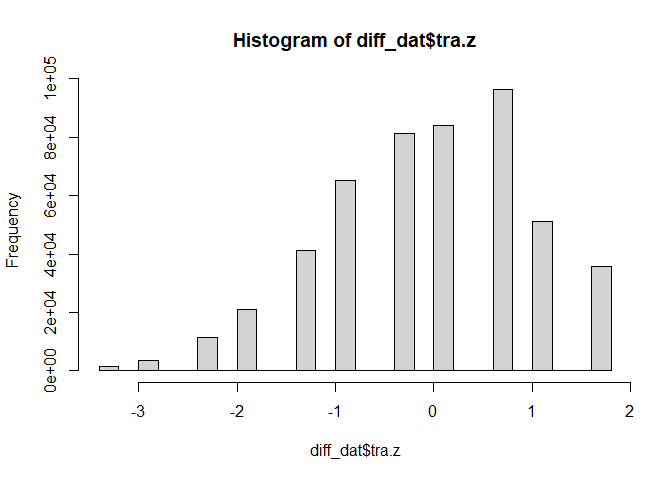
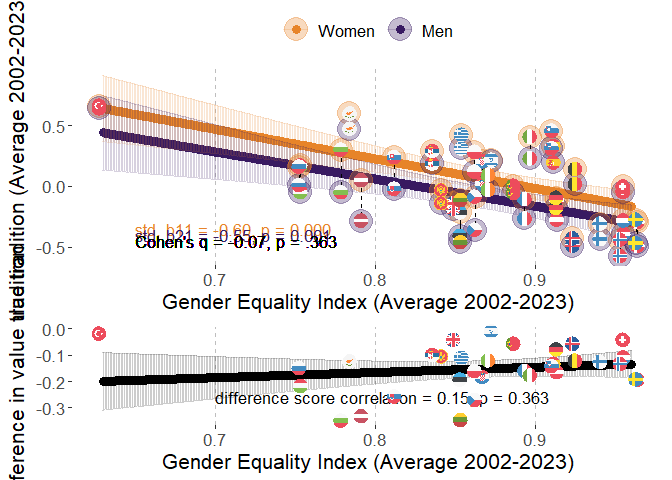
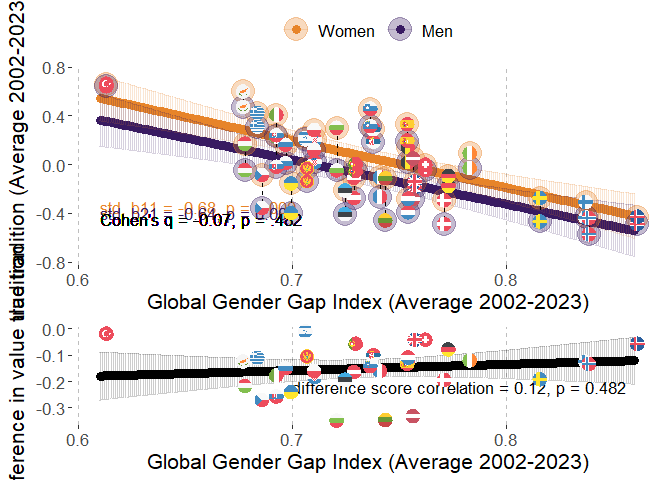
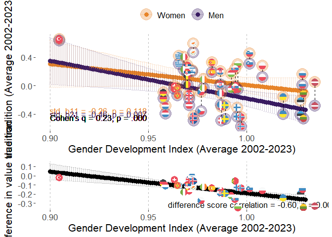
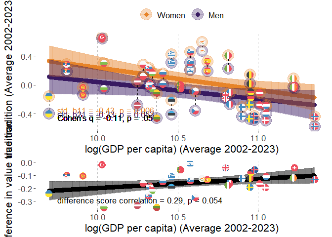
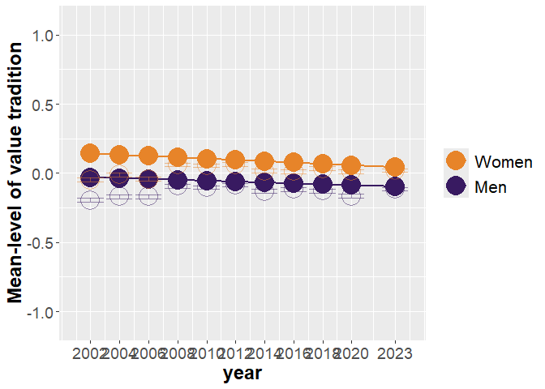
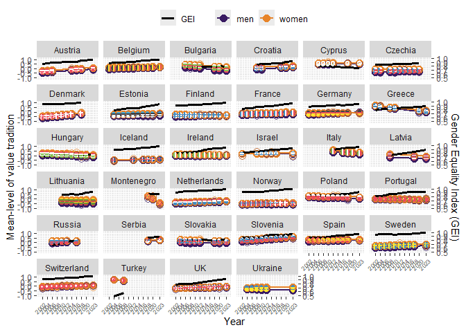

# Packages

Two packages are not in CRAN and need different installation
* devtools::install_github("vjilmari/vjihelpers")
* install.packages("ggflags", repos = c("https://jimjam-slam.r-universe.dev","https://cloud.r-project.org")) 


``` r
library(multid)
library(rio)
library(dplyr)
library(lme4)
library(emmeans)
library(vjihelpers)
library(MetBrewer)
library(ggplot2)
library(finalfit)
library(ggflags) 
library(lmerTest)
library(metafor)
library(ggpubr)
library(Hmisc)
library(r2mlm)
library(tidyr)
library(stringr)
library(apaTables)
library(tibble)
```

# Custom functions


``` r
# toster function for equivalence testing

tost_z <- function(est, se, low, high, alpha = 0.10) {
  # z statistics
  z_low  <- (est - low)  / se     # H0: theta <= low  vs H1: theta > low
  z_high <- (est - high) / se     # H0: theta >= high vs H1: theta < high
  
  # one-sided p-values
  p_low  <- 1 - pnorm(z_low)
  p_high <- pnorm(z_high)
  
  # CI corresponding to TOST (1 - 2*alpha)
  z_crit <- qnorm(1 - alpha)
  ci_low  <- est - z_crit * se
  ci_high <- est + z_crit * se
  
  # equivalence decision
  equivalent <- (p_low < alpha) && (p_high < alpha)
  
  list(
    estimate     = est,
    se           = se,
    low_bound    = low,
    high_bound   = high,
    alpha        = alpha,
    z_low        = z_low,
    p_low        = p_low,
    z_high       = z_high,
    p_high       = p_high,
    ci_level     = 1 - 2*alpha,
    ci_lower     = ci_low,
    ci_upper     = ci_high,
    equivalent   = equivalent
  )
}


# TOST function for equivalence testing with t distribution

tost_t <- function(est, se, low, high, df, alpha = 0.10) {
  # t statistics
  t_low  <- (est - low)  / se   # H0: theta <= low  vs H1: theta > low
  t_high <- (est - high) / se   # H0: theta >= high vs H1: theta < high
  
  # one-sided p-values
  p_low  <- 1 - pt(t_low,  df = df)
  p_high <-     pt(t_high, df = df)
  
  # CI corresponding to TOST (1 - 2*alpha)
  t_crit <- qt(1 - alpha, df = df)
  ci_low  <- est - t_crit * se
  ci_high <- est + t_crit * se
  
  # equivalence decision
  equivalent <- (p_low < alpha) && (p_high < alpha)
  
  list(
    estimate   = est,
    se         = se,
    df         = df,
    low_bound  = low,
    high_bound = high,
    alpha      = alpha,
    t_low      = t_low,
    p_low      = p_low,
    t_high     = t_high,
    p_high     = p_high,
    ci_level   = 1 - 2 * alpha,
    ci_lower   = ci_low,
    ci_upper   = ci_high,
    equivalent = equivalent
  )
}
```


# Data

* Loads the preprocessed European Social Survey data file made within "Preparations_ESS" code


``` r
load("../data/fdat.rdata")
```

* Include ISO data for country-names


``` r
# read country names
ISO<-read.csv2("../data/ISO.csv")
```


# Exclusions

* exclude participants with missing values or gender


``` r
value.vars<-
  c("con","tra",
  "ben","uni",
  "sdi","sti",
  "hed","ach",
  "pow","sec")

fdat$miss_values<-
  rowSums(is.na(fdat[,value.vars]))
table(fdat$miss_values)
```

```
## 
##      0      1      2      3      4      5      6      7      8      9     10 
## 500044   2791    835    442    267    204    142    143    156    177  35470
```

``` r
fdat<-fdat %>%
  filter(miss_values==0 & !is.na(gndr.bin))
```


# Data for the analysis

* use the testing partition of the data set (diff_dat)
* basic descriptives


``` r
diff_dat<-
  fdat

#diff_dat$age.c<-as.numeric(diff_dat$age.c)
#diff_dat$rlgdgr.c<-as.numeric(diff_dat$rlgdgr.c)
#diff_dat$eduyrs.c<-as.numeric(diff_dat$eduyrs.c)

# data exclusions (include countries with at least two rounds of data)
n_rounds<-diff_dat %>% group_by(cntry) %>%
  summarise(n_unique_essround = n_distinct(essround))

# join number of rounds to data
diff_dat<-
  left_join(x=diff_dat,
            y=n_rounds,
            by="cntry")

# filter only countries with more than 1 round and non-missing gender variable
diff_dat<-diff_dat %>%
  dplyr::filter(n_unique_essround>1 &
                  !is.na(gndr))

# cross-tabulate sample sizes and ESS rounds by country
table(diff_dat$essround,diff_dat$cntry)
```

```
##     
##        AT   BE   BG   CH   CY   CZ   DE   DK   EE   ES   FI   FR   GB   GR   HR   HU   IE   IL   IS   IT
##   1  2254 1830    0 2024    0 1208 2819 1470    0 1712 1763 1355 1798 2551    0 1634 1916 2279    0    0
##   2  2198 1771    0 2110    0 2557 2840 1458 1948 1623 1701 1699 1864 2399    0 1460 1187    0  524    0
##   3  2348 1796 1295 1780  978    0 2884 1461 1466 1847 1649 1983 2353    0    0 1462 1589    0    0    0
##   4     0 1754 2144 1753 1210 1986 2732 1581 1646 2562 1901 2067 2311 2063 1430 1430 1757 2382    0    0
##   5     0 1699 2371 1491 1053 2335 3007 1564 1793 1881 1649 1723 2374 2669 1601 1473 2400 2212    0    0
##   6     0 1862 2179 1483 1110 1973 2935 1621 2345 1871 2158 1960 2261    0    0 1968 2616 2378  739  909
##   7  1795 1767    0 1521    0 1862 3006 1483 2036 1907 2050 1902 2231    0    0 1520 2380 2351    0    0
##   8  1993 1759    0 1504    0 2252 2821    0 2007 1929 1903 2057 1942    0    0 1458 2746 2366  841 2531
##   9  2477 1756 1926 1517  773 2343 2328 1554 1899 1619 1735 1982 2183    0 1781 1643 2189    0  844 2660
##   10    0 1334 2697 1505    0 2369    0    0 1538    0 1561 1951 1131 2768 1564 1816 1751    0  886 2573
##   11 2314 1577 2218 1368  667    0 2381    0 1282 1833 1524 1745 1529 2745 1548 2117 1985  893  825 2783
##     
##        LT   LV   ME   NL   NO   PL   PT   RS   RU   SE   SI   SK   TR   UA
##   1     0    0    0 2337 1819 2065 1482    0    0 1682 1488    0    0    0
##   2     0    0    0 1858 1575 1683 2024    0    0 1678 1384 1425 1790 1896
##   3     0    0    0 1860 1550 1685 2182    0 2339 1604 1465 1711    0 1885
##   4     0 1970    0 1724 1391 1596 2337    0 2446 1556 1257 1789 2305 1766
##   5  1632    0    0 1801 1530 1719 2139    0 2557 1463 1369 1803    0 1779
##   6  2108    0    0 1828 1610 1866 2138    0 2429 1838 1244 1827    0 2064
##   7  2241    0    0 1823 1423 1594 1242    0    0 1761 1189    0    0    0
##   8  2079    0    0 1669 1530 1675 1254    0 2374 1526 1295    0    0    0
##   9  1677  891 1188 1657 1396 1443 1045 1969    0 1510 1307 1061    0    0
##   10 1606    0 1248 1466 1408    0 1827    0    0    0 1232 1395    0    0
##   11 1337 1225 1581 1677 1318 1423 1366 1511    0 1204 1227 1414    0 2589
```

``` r
# range of sample sizes
range(table(diff_dat$cntry))
```

```
## [1]  3480 27753
```

``` r
# scale/standardize with SD pooled across all country-time-gender folds
cntry.tra<-diff_dat %>% group_by(cntry,essround) %>%
  summarise(tra.ctm=mean(tra,na.rm=T),
            tra.ctsd=sd(tra,na.rm=T)) %>%
  group_by(cntry) %>%
  summarise(tra.cm=mean(tra.ctm),
            tra.csd=mean(tra.ctsd)) 
```

```
## `summarise()` has regrouped the output.
## ℹ Summaries were computed grouped by cntry and essround.
## ℹ Output is grouped by cntry.
## ℹ Use `summarise(.groups = "drop_last")` to silence this message.
## ℹ Use `summarise(.by = c(cntry, essround))` for per-operation grouping (`?dplyr::dplyr_by`) instead.
```

``` r
grand_mean_tra<-mean(cntry.tra$tra.cm)
grand_sd_tra<-mean(cntry.tra$tra.csd)

# standardized
diff_dat$tra.z<-(diff_dat$tra-grand_mean_tra)/grand_sd_tra
hist(diff_dat$tra.z)
```

<!-- -->

``` r
# recode time to start from 2002=0

diff_dat$year<-
  case_when(
    diff_dat$essround==1~2002,  
    diff_dat$essround==2~2004,
    diff_dat$essround==3~2006,
    diff_dat$essround==4~2008,
    diff_dat$essround==5~2010,
    diff_dat$essround==6~2012,
    diff_dat$essround==7~2014,
    diff_dat$essround==8~2016,
    diff_dat$essround==9~2018,
    diff_dat$essround==10~2020,
    diff_dat$essround==11~2023
  )

diff_dat$year.c<-diff_dat$year-2002
```

## Add GEI-variable

* GEI = Reverse-coded Gender Inequality Index (GII)


``` r
GII<-read.csv("../data/GII.csv")

# Obtain GII only for ESS countries
GII_in_ESS_d<-
  GII %>%
  filter(ISO2 %in% unique(diff_dat$cntry))

# Make long format data of GII, so that country x year has own rows

long_GII_in_ESS_d <- GII_in_ESS_d %>%
  pivot_longer(
    cols = starts_with("gii_") & !matches("avg"),  # <-- exclude the "_avg" columns
    names_to = "year",
    values_to = "gii",
    names_prefix = "gii_"
  ) %>%
  mutate(year = as.integer(year)) %>%
  filter(year >= 2002 & year <= 2023) %>%
  mutate(gei = 1 - gii) %>%
  dplyr::select(ISO2, iso3, country, year, gii, gei, gii_2002_2023_avg, gei_2002_2023_avg)


# describe gei average
psych::describe(GII_in_ESS_d$gei_2002_2023_avg)
```

```
##    vars  n mean   sd median trimmed  mad  min  max range  skew kurtosis   se
## X1    1 33 0.87 0.07   0.87    0.87 0.06 0.63 0.96  0.34 -1.06     1.37 0.01
```

``` r
# one is missing, see which one
GII_in_ESS_d[is.na(GII_in_ESS_d$gei_2002_2023_avg),"country"]
```

```
## [1] "Ukraine"
```

``` r
# get means and SDs for standardizing
gei_mean<-mean(GII_in_ESS_d$gei_2002_2023_avg,na.rm=T)
gei_sd<-sd(GII_in_ESS_d$gei_2002_2023_avg,na.rm=T)

# standardize 
# year specific scores
long_GII_in_ESS_d$gei.z<-(long_GII_in_ESS_d$gei-gei_mean)/gei_sd

# get the country means to a separate frame

GII_country_means<-
  long_GII_in_ESS_d %>% group_by(ISO2) %>%
  summarise(gei.cm=mean(gei,na.rm=T),
            gei.z.cm=mean(gei.z,na.rm=T))


long_GII_in_ESS_d<-left_join(
  x=long_GII_in_ESS_d,
  y=GII_country_means,
  by="ISO2"
)


# center both the raw score and standardized scores
long_GII_in_ESS_d$gei.cmc<-(long_GII_in_ESS_d$gei-long_GII_in_ESS_d$gei.cm)
long_GII_in_ESS_d$gei.z.cmc<-(long_GII_in_ESS_d$gei.z-long_GII_in_ESS_d$gei.z.cm)

#View(long_GII_in_ESS_d)

# averages across 2002-2023
#long_GII_in_ESS_d$gei_2002_2023_avg.z<-(long_GII_in_ESS_d$gei_2002_2023_avg-gei_mean)/gei_sd

#long_GII_in_ESS_d$gei.cmc<-long_GII_in_ESS_d$gei-long_GII_in_ESS_d$gei_2002_2023_avg

# add year to ESS data-frame


# link datasets by country and year

diff_dat<-
  left_join(
    x=diff_dat,
    y=long_GII_in_ESS_d[,c("ISO2","year","gei","gei.cm","gei.cmc",
                           "gei.z","gei.z.cm","gei.z.cmc")],
    by=c("cntry"="ISO2","year")
)
```


## Add GDI-variable

* GDI = Gender Development Index


``` r
GDI<-read.csv("../data/GDI.csv")

# Obtain GDI only for ESS countries
GDI_in_ESS_d<-
  GDI %>%
  filter(ISO2 %in% unique(diff_dat$cntry))

# Make long format data of GDI, so that country x year has own rows

long_GDI_in_ESS_d <- GDI_in_ESS_d %>%
  pivot_longer(
    cols = starts_with("gdi_") & !matches("avg"),  # <-- exclude the "_avg" columns
    names_to = "year",
    values_to = "gdi",
    names_prefix = "gdi_"
  ) %>%
  mutate(year = as.integer(year)) %>%
  filter(year >= 2002 & year <= 2023) %>%
  dplyr::select(ISO2, iso3, country, year, gdi, gdi_2002_2023_avg)

# describe gdi average
psych::describe(GDI_in_ESS_d$gdi_2002_2023_avg)
```

```
##    vars  n mean   sd median trimmed  mad min  max range skew kurtosis se
## X1    1 34 0.98 0.03   0.98    0.98 0.02 0.9 1.03  0.13 -0.3     1.28  0
```

``` r
# get means and SDs for standardizing
gdi_mean<-mean(GDI_in_ESS_d$gdi_2002_2023_avg,na.rm=T)
gdi_sd<-sd(GDI_in_ESS_d$gdi_2002_2023_avg,na.rm=T)

# standardize 
# year specific scores
long_GDI_in_ESS_d$gdi.z<-(long_GDI_in_ESS_d$gdi-gdi_mean)/gdi_sd

# get the country means to a separate frame

GDI_country_means<-
  long_GDI_in_ESS_d %>% group_by(ISO2) %>%
  summarise(gdi.cm=mean(gdi,na.rm=T),
            gdi.z.cm=mean(gdi.z,na.rm=T))

long_GDI_in_ESS_d<-left_join(
  x=long_GDI_in_ESS_d,
  y=GDI_country_means,
  by="ISO2"
)


# center both the raw score and standardized scores
long_GDI_in_ESS_d$gdi.cmc<-(long_GDI_in_ESS_d$gdi-long_GDI_in_ESS_d$gdi.cm)
long_GDI_in_ESS_d$gdi.z.cmc<-(long_GDI_in_ESS_d$gdi.z-long_GDI_in_ESS_d$gdi.z.cm)

# link datasets by country and year

diff_dat<-
  left_join(
    x=diff_dat,
    y=long_GDI_in_ESS_d[,c("ISO2","year","gdi","gdi.cm","gdi.cmc",
                           "gdi.z","gdi.z.cm","gdi.z.cmc")],
    by=c("cntry"="ISO2","year")
  )
```

## Add GDP-variable

* log_GDP = Logarithm of GDP per capita, PPP (constant 2017 international $)


``` r
GDP<-read.csv("../data/GDP_processed.csv")

# Obtain GDP only for ESS countries
GDP_in_ESS_d<-
  GDP %>%
  filter(ISO2 %in% unique(diff_dat$cntry))

# First, rename those X2000..YR2000. style columns to simple "gdp_2000" etc.

GDP_in_ESS_d <- GDP_in_ESS_d %>%
  rename_with(
    ~ str_replace_all(., "^X(\\d{4})..YR\\1\\.$", "gdp_\\1"),
    starts_with("X")
  )

# GDP_in_ESS_d
# Make long format data of GDP, so that country x year has own rows

long_GDP_in_ESS_d <- GDP_in_ESS_d %>%
  pivot_longer(
    cols = starts_with("gdp_") & !matches("avg"),  # <-- exclude the "_avg" columns
    names_to = "year",
    values_to = "gdp",
    names_prefix = "gdp_"
  ) %>%
  mutate(year = as.integer(year)) %>%
  filter(year >= 2002 & year <= 2023) %>%
  dplyr::select(ISO2, Country.Name, year, gdp, gdp_2002_2023_avg,log_gdp_2002_2023_avg) %>%
  mutate(log_gdp=log(gdp))

#View(long_GDP_in_ESS_d)

# describe gdp average
psych::describe(GDP_in_ESS_d$gdp_2002_2023_avg)
```

```
##    vars  n     mean      sd  median  trimmed     mad      min      max    range skew kurtosis      se
## X1    1 34 43905.99 17369.7 40201.8 42845.95 15827.5 16384.61 85341.85 68957.24 0.48    -0.58 2978.88
```

``` r
psych::describe(GDP_in_ESS_d$log_gdp_2002_2023_avg)
```

```
##    vars  n  mean   sd median trimmed  mad min   max range  skew kurtosis   se
## X1    1 34 10.61 0.41   10.6   10.62 0.44 9.7 11.35  1.65 -0.27    -0.71 0.07
```

``` r
# get means and SDs for standardizing
log_gdp_mean<-mean(GDP_in_ESS_d$log_gdp_2002_2023_avg,na.rm=T)
log_gdp_sd<-sd(GDP_in_ESS_d$log_gdp_2002_2023_avg,na.rm=T)

# standardize 
# year specific scores
long_GDP_in_ESS_d$log_gdp.z<-
  (long_GDP_in_ESS_d$log_gdp-log_gdp_mean)/log_gdp_sd

# get the country means to a separate frame

GDP_country_means<-
  long_GDP_in_ESS_d %>% group_by(ISO2) %>%
  summarise(gdp.cm=mean(gdp,na.rm=T),
            #gdp.z.cm=mean(gdp.z,na.rm=T),
            log_gdp.cm=mean(log_gdp,na.rm=T),
            log_gdp.z.cm=mean(log_gdp.z,na.rm=T))

long_GDP_in_ESS_d<-left_join(
  x=long_GDP_in_ESS_d,
  y=GDP_country_means,
  by="ISO2"
)


# center both the raw score and standardized scores
long_GDP_in_ESS_d$log_gdp.cmc<-(long_GDP_in_ESS_d$log_gdp-long_GDP_in_ESS_d$log_gdp.cm)
long_GDP_in_ESS_d$log_gdp.z.cmc<-(long_GDP_in_ESS_d$log_gdp.z-long_GDP_in_ESS_d$log_gdp.z.cm)

# link datasets by country and year

diff_dat<-
  left_join(
    x=diff_dat,
    y=long_GDP_in_ESS_d[,c("ISO2","year","log_gdp","log_gdp.cm","log_gdp.cmc",
                           "log_gdp.z","log_gdp.z.cm","log_gdp.z.cmc")],
    by=c("cntry"="ISO2","year")
  )
```

## Add GGGI-variable

* GGGI = Global Gender Gap Index


``` r
GGGI<-import("../data/GGGI.xlsx")

# check if all ESS countries are in the log_GGGI data
table(unique(diff_dat$cntry) %in% GGGI$ISO2)
```

```
## 
## TRUE 
##   34
```

``` r
# Obtain GGGI only for ESS countries
GGGI_in_ESS_d<-
  GGGI %>%
  filter(ISO2 %in% unique(diff_dat$cntry))

# Make long format data of GGGI, so that country x year has own rows

long_GGGI_in_ESS_d <- GGGI_in_ESS_d %>%
  pivot_longer(
    cols = starts_with("gggi_") & !matches("avg"),  # <-- exclude the "_avg" columns
    names_to = "year",
    values_to = "gggi",
    names_prefix = "gggi_"
  ) %>%
  mutate(year = as.integer(year)) %>%
  filter(year >= 2002 & year <= 2023) %>%
  dplyr::select(ISO2, cname, year, gggi, GGGI_2002_2023_avg)

# describe gggi average
psych::describe(GGGI_in_ESS_d$GGGI_2002_2023_avg)
```

```
##    vars  n mean   sd median trimmed  mad  min  max range skew kurtosis   se
## X1    1 34 0.74 0.05   0.73    0.73 0.04 0.61 0.86  0.25  0.4     0.29 0.01
```

``` r
# get means and SDs for standardizing
gggi_mean<-mean(GGGI_in_ESS_d$GGGI_2002_2023_avg,na.rm=T)
gggi_sd<-sd(GGGI_in_ESS_d$GGGI_2002_2023_avg,na.rm=T)

# standardize 
# year specific scores
long_GGGI_in_ESS_d$gggi.z<-(long_GGGI_in_ESS_d$gggi-gggi_mean)/gggi_sd

# get the country means to a separate frame

GGGI_country_means<-
  long_GGGI_in_ESS_d %>% group_by(ISO2) %>%
  summarise(gggi.cm=mean(gggi,na.rm=T),
            gggi.z.cm=mean(gggi.z,na.rm=T))

long_GGGI_in_ESS_d<-left_join(
  x=long_GGGI_in_ESS_d,
  y=GGGI_country_means,
  by="ISO2"
)

# center both the raw score and standardized scores
long_GGGI_in_ESS_d$gggi.cmc<-
  (long_GGGI_in_ESS_d$gggi-long_GGGI_in_ESS_d$gggi.cm)

long_GGGI_in_ESS_d$gggi.z.cmc<-
  (long_GGGI_in_ESS_d$gggi.z-long_GGGI_in_ESS_d$gggi.z.cm)

# link datasets by country and year

diff_dat<-
  left_join(
    x=diff_dat,
    y=long_GGGI_in_ESS_d[,c("ISO2","year","gggi","gggi.cm","gggi.cmc",
                           "gggi.z","gggi.z.cm","gggi.z.cmc")],
    by=c("cntry"="ISO2","year")
  )
```

## Country-year-gender dataframe

Frame with one row for country-year-gender


``` r
diff_dat_cntry_year<-
  diff_dat %>% 
  group_by(cntry,year,gndr.c) %>%
  dplyr::summarise(n=n(),
                   n_wt=sum(pspwght),
                   tra.z.wt=weighted.mean(x=tra.z,w=pspwght),
                   tra.z=mean(tra.z),
                   gei.z=mean(gei.z,na.rm=T),
                   gei.z.cm=mean(gei.z.cm,na.rm=T),
                   gei.z.cmc=mean(gei.z.cmc,na.rm=T),
                   gdi.z=mean(gdi.z,na.rm=T),
                   gdi.z.cm=mean(gdi.z.cm,na.rm=T),
                   gdi.z.cmc=mean(gdi.z.cmc,na.rm=T),
                   gggi.z=mean(gggi.z,na.rm=T),
                   gggi.z.cm=mean(gggi.z.cm,na.rm=T),
                   gggi.z.cmc=mean(gggi.z.cmc,na.rm=T),
                   log_gdp.z=mean(log_gdp.z,na.rm=T),
                   log_gdp.z.cm=mean(log_gdp.z.cm,na.rm=T),
                   log_gdp.z.cmc=mean(log_gdp.z.cmc,na.rm=T),
                   gei=mean(gei,na.rm=T),
                   gei.cm=mean(gei.cm,na.rm=T),
                   gei.cmc=mean(gei.cmc,na.rm=T),
                   gdi=mean(gdi,na.rm=T),
                   gdi.cm=mean(gdi.cm,na.rm=T),
                   gdi.cmc=mean(gdi.cmc,na.rm=T),
                   gggi=mean(gggi,na.rm=T),
                   gggi.cm=mean(gggi.cm,na.rm=T),
                   gggi.cmc=mean(gggi.cmc,na.rm=T),
                   log_gdp=mean(log_gdp,na.rm=T),
                   log_gdp.cm=mean(log_gdp.cm,na.rm=T),
                   log_gdp.cmc=mean(log_gdp.cmc,na.rm=T))
```

```
## `summarise()` has regrouped the output.
## ℹ Summaries were computed grouped by cntry, year, and gndr.c.
## ℹ Output is grouped by cntry and year.
## ℹ Use `summarise(.groups = "drop_last")` to silence this message.
## ℹ Use `summarise(.by = c(cntry, year, gndr.c))` for per-operation grouping (`?dplyr::dplyr_by`) instead.
```


# Descriptive statistics

## Country-specific descriptives


``` r
# sample sizes from weights

cntry_n_frame<-
  diff_dat %>% group_by(cntry) %>%
  summarise('n ESS rounds' = mean(n_unique_essround),
            n=round(sum(pspwght),0))

# tradition

cntry_tra_frame<-
  diff_dat %>% group_by(cntry,essround) %>%
  summarise('tra M' = weighted.mean(x=tra.z,w=pspwght),
            'tra SD' = sqrt(wtd.var(tra.z,pspwght))) %>%
  group_by(cntry) %>%
  summarise('tra M' = mean(x=`tra M`),
            'tra SD'= mean(x=`tra SD`))
```

```
## `summarise()` has regrouped the output.
## ℹ Summaries were computed grouped by cntry and essround.
## ℹ Output is grouped by cntry.
## ℹ Use `summarise(.groups = "drop_last")` to silence this message.
## ℹ Use `summarise(.by = c(cntry, essround))` for per-operation grouping (`?dplyr::dplyr_by`) instead.
```

``` r
cntry_tra_women_frame<-
  diff_dat %>%
  filter(gndr.c==-0.5) %>%
  group_by(cntry,essround) %>%
  summarise('tra M' = weighted.mean(x=tra.z,w=pspwght),
            'tra SD' = sqrt(wtd.var(tra.z,pspwght))) %>%
  group_by(cntry) %>%
  summarise('tra M Women' = mean(x=`tra M`),
            'tra SD Women'= mean(x=`tra SD`))
```

```
## `summarise()` has regrouped the output.
## ℹ Summaries were computed grouped by cntry and essround.
## ℹ Output is grouped by cntry.
## ℹ Use `summarise(.groups = "drop_last")` to silence this message.
## ℹ Use `summarise(.by = c(cntry, essround))` for per-operation grouping (`?dplyr::dplyr_by`) instead.
```

``` r
cntry_tra_men_frame<-
  diff_dat %>%
  filter(gndr.c==0.5) %>%
  group_by(cntry,essround) %>%
  summarise('tra M' = weighted.mean(x=tra.z,w=pspwght),
            'tra SD' = sqrt(wtd.var(tra.z,pspwght))) %>%
  group_by(cntry) %>%
  summarise('tra M Men' = mean(x=`tra M`),
            'tra SD Men'= mean(x=`tra SD`))
```

```
## `summarise()` has regrouped the output.
## ℹ Summaries were computed grouped by cntry and essround.
## ℹ Output is grouped by cntry.
## ℹ Use `summarise(.groups = "drop_last")` to silence this message.
## ℹ Use `summarise(.by = c(cntry, essround))` for per-operation grouping (`?dplyr::dplyr_by`) instead.
```

``` r
# link n and tra datasets

desc_frame<-
  left_join(
    x=cntry_n_frame,
    y=cntry_tra_frame,
    by="cntry"
  )

desc_frame<-
  left_join(
    x=desc_frame,
    y=cntry_tra_women_frame,
    by="cntry"
  )

desc_frame<-
  left_join(
    x=desc_frame,
    y=cntry_tra_men_frame,
    by="cntry"
  )

# Add country-specific differences
desc_frame$D<-desc_frame$`tra M Men`-desc_frame$`tra M Women`

desc_frame
```

```
## # A tibble: 34 × 10
##    cntry `n ESS rounds`     n `tra M` `tra SD` `tra M Women` `tra SD Women` `tra M Men` `tra SD Men`
##    <chr>          <dbl> <dbl>   <dbl>    <dbl>         <dbl>          <dbl>       <dbl>        <dbl>
##  1 AT                 7 15400 -0.188     1.04      -0.106             1.05      -0.275         1.02 
##  2 BE                11 18886  0.0789    0.915      0.138             0.899      0.0163        0.926
##  3 BG                 7 14857  0.138     1.03       0.308             0.980     -0.0460        1.05 
##  4 CH                11 18087 -0.0172    0.980      0.000274          0.985     -0.0356        0.974
##  5 CY                 6  5771  0.536     0.876      0.594             0.857      0.475         0.888
##  6 CZ                 9 18934 -0.213     1.04      -0.0822            1.04      -0.354         1.03 
##  7 DE                10 27753 -0.137     1.03      -0.100             1.04      -0.176         1.01 
##  8 DK                 8 12198 -0.396     1.04      -0.298             1.03      -0.496         1.04 
##  9 EE                10 17974 -0.303     1.00      -0.213             1.000     -0.409         0.991
## 10 ES                10 18785  0.260     0.977      0.325             0.976      0.192         0.974
## # ℹ 24 more rows
## # ℹ 1 more variable: D <dbl>
```

``` r
# add country-level measures

desc_frame<-
  left_join(
    x=desc_frame,
    y=GII_country_means[,c("ISO2","gei.cm")],
    by=c("cntry"="ISO2")
  )

desc_frame<-
  left_join(
    x=desc_frame,
    y=GGGI_country_means[,c("ISO2","gggi.cm")],
    by=c("cntry"="ISO2")
  )

desc_frame<-
  left_join(
    x=desc_frame,
    y=GDI_country_means[,c("ISO2","gdi.cm")],
    by=c("cntry"="ISO2")
  )


desc_frame<-
  left_join(
    x=desc_frame,
    y=GDP_country_means[,c("ISO2","gdp.cm")],
    by=c("cntry"="ISO2")
  )

desc_frame<-left_join(
  x=desc_frame,
  y=ISO[,c("ISO2","CLDR")],
  by=c("cntry"="ISO2")
)

# finalize the formatted table

cntry_desc_tbl<-
  desc_frame %>%
  dplyr::select(
    Country = CLDR,
    `n ESS rounds`,
    n,
    `tra M`, `tra SD`,
    `tra M Women`, `tra SD Women`,
    `tra M Men`, `tra SD Men`,
    D,
    GEI = gei.cm,
    GGGI = gggi.cm,
    GDI = gdi.cm,
    GDP = gdp.cm
  ) %>%
  mutate(
    across(
      .cols = -c(Country, `n ESS rounds`, n, GDP) & where(is.numeric),
      .fns  = ~ round_tidy(.x, 2)
    )
  ) %>%
  mutate(
    across(
      .cols = GDP,
      .fns  = ~ round_tidy(.x, 0)
    )
  )
print(cntry_desc_tbl,n=35)
```

```
## # A tibble: 34 × 14
##    Country     `n ESS rounds`     n `tra M` `tra SD` `tra M Women` `tra SD Women` `tra M Men` `tra SD Men`
##    <chr>                <dbl> <dbl> <chr>   <chr>    <chr>         <chr>          <chr>       <chr>       
##  1 Austria                  7 15400 -0.19   1.04     -0.11         1.05           -0.28       1.02        
##  2 Belgium                 11 18886 0.08    0.91     0.14          0.90           0.02        0.93        
##  3 Bulgaria                 7 14857 0.14    1.03     0.31          0.98           -0.05       1.05        
##  4 Switzerland             11 18087 -0.02   0.98     0.00          0.99           -0.04       0.97        
##  5 Cyprus                   6  5771 0.54    0.88     0.59          0.86           0.47        0.89        
##  6 Czechia                  9 18934 -0.21   1.04     -0.08         1.04           -0.35       1.03        
##  7 Germany                 10 27753 -0.14   1.03     -0.10         1.04           -0.18       1.01        
##  8 Denmark                  8 12198 -0.40   1.04     -0.30         1.03           -0.50       1.04        
##  9 Estonia                 10 17974 -0.30   1.00     -0.21         1.00           -0.41       0.99        
## 10 Spain                   10 18785 0.26    0.98     0.32          0.98           0.19        0.97        
## 11 Finland                 11 19568 -0.38   1.01     -0.32         1.03           -0.44       0.98        
## 12 France                  11 20457 -0.18   1.12     -0.11         1.12           -0.26       1.12        
## 13 UK                      11 22979 -0.17   1.06     -0.14         1.07           -0.19       1.05        
## 14 Greece                   6 15212 0.38    0.91     0.43          0.91           0.32        0.92        
## 15 Croatia                  5  7914 0.11    1.04     0.20          1.03           0.01        1.05        
## 16 Hungary                 11 18123 0.07    1.01     0.17          0.99           -0.04       1.01        
## 17 Ireland                 11 22562 0.04    1.07     0.10          1.06           -0.03       1.06        
## 18 Israel                   7 14857 0.18    1.12     0.19          1.14           0.17        1.09        
## 19 Iceland                  6  4654 -0.47   1.02     -0.45         1.04           -0.49       0.99        
## 20 Italy                    5 11441 0.35    0.91     0.44          0.90           0.26        0.92        
## 21 Lithuania                7 13059 -0.27   1.05     -0.11         1.03           -0.47       1.03        
## 22 Latvia                   3  4088 -0.11   0.99     0.04          0.97           -0.30       0.98        
## 23 Montenegro               3  4028 -0.04   1.07     0.01          1.07           -0.09       1.07        
## 24 Netherlands             11 19722 -0.33   0.98     -0.28         0.98           -0.39       0.97        
## 25 Norway                  11 16505 -0.51   1.02     -0.44         1.04           -0.58       0.99        
## 26 Poland                  10 16737 0.20    0.94     0.28          0.93           0.11        0.94        
## 27 Portugal                11 19070 -0.02   0.96     0.01          0.96           -0.05       0.95        
## 28 Serbia                   2  3499 0.24    1.08     0.28          1.08           0.20        1.08        
## 29 Russia                   5 12139 0.09    1.03     0.16          1.03           0.01        1.02        
## 30 Sweden                  10 16104 -0.37   0.99     -0.28         1.00           -0.47       0.98        
## 31 Slovenia                11 14463 0.39    0.87     0.46          0.87           0.32        0.87        
## 32 Slovakia                 8 12547 0.10    0.94     0.23          0.91           -0.03       0.94        
## 33 Turkey                   2  4108 0.66    0.83     0.66          0.83           0.65        0.83        
## 34 Ukraine                  6 12054 -0.26   1.13     -0.16         1.12           -0.40       1.12        
## # ℹ 5 more variables: D <chr>, GEI <chr>, GGGI <chr>, GDI <chr>, GDP <chr>
```

``` r
export(cntry_desc_tbl,"../results/tra/cntry_desc_tbl.xlsx",overwrite=T)
```

## Country-level correlations table


``` r
cor_frame<-
  desc_frame %>%
  dplyr::select(
    VBMT=`tra M`,
    VBMT_Women=`tra M Women`,
    VBMT_Men=`tra M Men`,
    D = D,
    GEI = gei.cm,
    GGGI = gggi.cm,
    GDI = gdi.cm,
    GDP = gdp.cm
  ) %>%
  mutate(
    log_GDP=log(GDP)
  ) %>%
  dplyr::select(-GDP)

apa.cor.table(
  data=cor_frame,
  filename = "../results/tra/CorTable1.doc",
  #table.number = NA,
  show.conf.interval = FALSE,
  show.sig.stars = F,
  landscape = F
)
```

```
## The ability to suppress reporting of reporting confidence intervals has been deprecated in this version.
## The function argument show.conf.interval will be removed in a later version.
```

```
## 
## 
## Means, standard deviations, and correlations with confidence intervals
##  
## 
##   Variable      M     SD   1            2            3            4            5           6          
##   1. VBMT       -0.02 0.29                                                                            
##                                                                                                       
##   2. VBMT_Women 0.06  0.29 .99                                                                        
##                            [.98, 1.00]                                                                
##                                                                                                       
##   3. VBMT_Men   -0.10 0.31 .99          .96                                                           
##                            [.98, .99]   [.91, .98]                                                    
##                                                                                                       
##   4. D          -0.15 0.09 .20          .06          .35                                              
##                            [-.15, .50]  [-.28, .39]  [.01, .61]                                       
##                                                                                                       
##   5. GEI        0.87  0.07 -.59         -.62         -.54         .14                                 
##                            [-.78, -.31] [-.79, -.35] [-.75, -.24] [-.22, .46]                         
##                                                                                                       
##   6. GGGI       0.74  0.05 -.71         -.74         -.66         .10          .73                    
##                            [-.85, -.49] [-.86, -.53] [-.82, -.41] [-.24, .43]  [.52, .86]             
##                                                                                                       
##   7. GDI        0.98  0.03 -.36         -.28         -.45         -.65         .07         .19        
##                            [-.62, -.03] [-.56, .07]  [-.68, -.13] [-.81, -.40] [-.28, .41] [-.16, .50]
##                                                                                                       
##   8. log_GDP    10.61 0.41 -.40         -.44         -.33         .29          .72         .62        
##                            [-.65, -.07] [-.68, -.12] [-.60, .01]  [-.06, .57]  [.50, .85]  [.36, .79] 
##                                                                                                       
##   7          
##              
##              
##              
##              
##              
##              
##              
##              
##              
##              
##              
##              
##              
##              
##              
##              
##              
##              
##              
##              
##   -.18       
##   [-.49, .17]
##              
## 
## Note. M and SD are used to represent mean and standard deviation, respectively.
## Values in square brackets indicate the 95% confidence interval.
## The confidence interval is a plausible range of population correlations 
## that could have caused the sample correlation (Cumming, 2014).
## 
```


# Analysis

Following preregistration: https://osf.io/7cags?view_only=f3e97a78271e46bfafb9e20ac8d35bb1 

## mod0: Random intercept model


``` r
mod0<-lmer(tra.z~(1|cntry),data=diff_dat,REML=F,weights = pspwght,
           control=lmerControl(optimizer="bobyqa",optCtrl=list(maxfun=2e7)))
summary(mod0)
```

```
## Linear mixed model fit by maximum likelihood . t-tests use Satterthwaite's method ['lmerModLmerTest']
## Formula: tra.z ~ (1 | cntry)
##    Data: diff_dat
## Weights: pspwght
## Control: lmerControl(optimizer = "bobyqa", optCtrl = list(maxfun = 2e+07))
## 
##       AIC       BIC    logLik -2*log(L)  df.resid 
## 1476476.5 1476509.8 -738235.2 1476470.5    492340 
## 
## Scaled residuals: 
##     Min      1Q  Median      3Q     Max 
## -7.1482 -0.5868  0.0633  0.6697  4.3383 
## 
## Random effects:
##  Groups   Name        Variance Std.Dev.
##  cntry    (Intercept) 0.08207  0.2865  
##  Residual             1.03234  1.0160  
## Number of obs: 492343, groups:  cntry, 34
## 
## Fixed effects:
##             Estimate Std. Error       df t value Pr(>|t|)
## (Intercept) -0.01909    0.04916 33.97595  -0.388      0.7
```

``` r
getVC(mod0)
```

```
##        grp        var1 var2 sdcor vcov
## 1    cntry (Intercept) <NA>  0.29 0.08
## 2 Residual        <NA> <NA>  1.02 1.03
```

``` r
r2mlm(mod0,bargraph = F)
```

```
## $Decompositions
##                      total within between
## fixed, within   0.00000000      0      NA
## fixed, between  0.00000000     NA       0
## slope variation 0.00000000      0      NA
## mean variation  0.07364546     NA       1
## sigma2          0.92635454      1      NA
## 
## $R2s
##          total within between
## f1  0.00000000      0      NA
## f2  0.00000000     NA       0
## v   0.00000000      0      NA
## m   0.07364546     NA       1
## f   0.00000000     NA      NA
## fv  0.00000000      0      NA
## fvm 0.07364546     NA      NA
```

## mod1: Gender fixed effect


``` r
mod1<-lmer(tra.z~gndr.c+(1|cntry),data=diff_dat,REML=F,weights = pspwght,
           control=lmerControl(optimizer="bobyqa",optCtrl=list(maxfun=2e7)))
summary(mod1)
```

```
## Linear mixed model fit by maximum likelihood . t-tests use Satterthwaite's method ['lmerModLmerTest']
## Formula: tra.z ~ gndr.c + (1 | cntry)
##    Data: diff_dat
## Weights: pspwght
## Control: lmerControl(optimizer = "bobyqa", optCtrl = list(maxfun = 2e+07))
## 
##       AIC       BIC    logLik -2*log(L)  df.resid 
## 1473743.3 1473787.7 -736867.6 1473735.3    492339 
## 
## Scaled residuals: 
##     Min      1Q  Median      3Q     Max 
## -7.0948 -0.5941  0.0763  0.6708  4.5173 
## 
## Random effects:
##  Groups   Name        Variance Std.Dev.
##  cntry    (Intercept) 0.08225  0.2868  
##  Residual             1.02662  1.0132  
## Number of obs: 492343, groups:  cntry, 34
## 
## Fixed effects:
##               Estimate Std. Error         df t value Pr(>|t|)    
## (Intercept) -2.195e-02  4.921e-02  3.398e+01  -0.446    0.658    
## gndr.c      -1.511e-01  2.885e-03  4.923e+05 -52.372   <2e-16 ***
## ---
## Signif. codes:  0 '***' 0.001 '**' 0.01 '*' 0.05 '.' 0.1 ' ' 1
## 
## Correlation of Fixed Effects:
##        (Intr)
## gndr.c 0.001
```

``` r
getFE(mod1,round=3)
```

```
##               Est.    SE         df       t     p     LL     UL
## (Intercept) -0.022 0.049     33.977  -0.446 0.658 -0.122  0.078
## gndr.c      -0.151 0.003 492309.831 -52.372 0.000 -0.157 -0.145
```

``` r
getVC(mod1)
```

```
##        grp        var1 var2 sdcor vcov
## 1    cntry (Intercept) <NA>  0.29 0.08
## 2 Residual        <NA> <NA>  1.01 1.03
```

``` r
r2mlm(mod1,bargraph = F)
```

```
## $Decompositions
##                       total
## fixed           0.005089309
## slope variation 0.000000000
## mean variation  0.073798992
## sigma2          0.921111699
## 
## $R2s
##           total
## f   0.005089309
## v   0.000000000
## m   0.073798992
## fv  0.005089309
## fvm 0.078888301
```

## mod2: Gender fixed and random effect

* Include random effect correlation by default


``` r
mod2<-lmer(tra.z~gndr.c+(gndr.c|cntry),data=diff_dat,REML=F,weights = pspwght,
           control=lmerControl(optimizer="bobyqa",optCtrl=list(maxfun=2e7)))
summary(mod2)
```

```
## Linear mixed model fit by maximum likelihood . t-tests use Satterthwaite's method ['lmerModLmerTest']
## Formula: tra.z ~ gndr.c + (gndr.c | cntry)
##    Data: diff_dat
## Weights: pspwght
## Control: lmerControl(optimizer = "bobyqa", optCtrl = list(maxfun = 2e+07))
## 
##       AIC       BIC    logLik -2*log(L)  df.resid 
##   1473040   1473107   -736514   1473028    492337 
## 
## Scaled residuals: 
##     Min      1Q  Median      3Q     Max 
## -7.2029 -0.5961  0.0861  0.6749  4.7585 
## 
## Random effects:
##  Groups   Name        Variance Std.Dev. Corr 
##  cntry    (Intercept) 0.082596 0.28740       
##           gndr.c      0.007671 0.08758  0.21 
##  Residual             1.024924 1.01239       
## Number of obs: 492343, groups:  cntry, 34
## 
## Fixed effects:
##             Estimate Std. Error       df t value Pr(>|t|)    
## (Intercept) -0.02282    0.04932 33.97802  -0.463    0.647    
## gndr.c      -0.15503    0.01538 33.34124 -10.077 1.19e-11 ***
## ---
## Signif. codes:  0 '***' 0.001 '**' 0.01 '*' 0.05 '.' 0.1 ' ' 1
## 
## Correlation of Fixed Effects:
##        (Intr)
## gndr.c 0.203
```

``` r
getFE(mod2,round=3)
```

```
##               Est.    SE     df       t     p     LL     UL
## (Intercept) -0.023 0.049 33.978  -0.463 0.647 -0.123  0.077
## gndr.c      -0.155 0.015 33.341 -10.077 0.000 -0.186 -0.124
```

``` r
getVC(mod2)
```

```
##        grp        var1   var2 sdcor vcov
## 1    cntry (Intercept)   <NA>  0.29 0.08
## 2    cntry      gndr.c   <NA>  0.09 0.01
## 3    cntry (Intercept) gndr.c  0.21 0.01
## 4 Residual        <NA>   <NA>  1.01 1.02
```

``` r
r2mlm(mod2,bargraph = F)
```

```
## $Decompositions
##                       total
## fixed           0.005356089
## slope variation 0.001709488
## mean variation  0.073723341
## sigma2          0.919211082
## 
## $R2s
##           total
## f   0.005356089
## v   0.001709488
## m   0.073723341
## fv  0.007065577
## fvm 0.080788918
```

``` r
anova(mod1,mod2)
```

```
## Data: diff_dat
## Models:
## mod1: tra.z ~ gndr.c + (1 | cntry)
## mod2: tra.z ~ gndr.c + (gndr.c | cntry)
##      npar     AIC     BIC  logLik -2*log(L)  Chisq Df Pr(>Chisq)    
## mod1    4 1473743 1473788 -736868   1473735                         
## mod2    6 1473040 1473107 -736514   1473028 707.29  2  < 2.2e-16 ***
## ---
## Signif. codes:  0 '***' 0.001 '**' 0.01 '*' 0.05 '.' 0.1 ' ' 1
```

``` r
lvl2_var_cond_lvl1(mod2,lvl1.var = "gndr.c",lvl1.values = c(0.5,-0.5))
```

```
##   lvl1.value lvl2.cond.var lvl2.cond.sd
## 1        0.5    0.08974410    0.2995732
## 2       -0.5    0.07928409    0.2815743
```

* Test for random effect correlation


``` r
mod2_norecov<-lmer(tra.z~gndr.c+(gndr.c||cntry),data=diff_dat,REML=F,weights = pspwght,
                   control=lmerControl(optimizer="bobyqa",optCtrl=list(maxfun=2e7)))
summary(mod2_norecov)
```

```
## Linear mixed model fit by maximum likelihood . t-tests use Satterthwaite's method ['lmerModLmerTest']
## Formula: tra.z ~ gndr.c + (gndr.c || cntry)
##    Data: diff_dat
## Weights: pspwght
## Control: lmerControl(optimizer = "bobyqa", optCtrl = list(maxfun = 2e+07))
## 
##       AIC       BIC    logLik -2*log(L)  df.resid 
## 1473039.4 1473094.9 -736514.7 1473029.4    492338 
## 
## Scaled residuals: 
##     Min      1Q  Median      3Q     Max 
## -7.2035 -0.5960  0.0861  0.6749  4.7577 
## 
## Random effects:
##  Groups   Name        Variance Std.Dev.
##  cntry    (Intercept) 0.08259  0.28738 
##  cntry.1  gndr.c      0.00765  0.08746 
##  Residual             1.02492  1.01239 
## Number of obs: 492343, groups:  cntry, 34
## 
## Fixed effects:
##             Estimate Std. Error       df t value Pr(>|t|)    
## (Intercept) -0.02282    0.04931 33.97663  -0.463    0.646    
## gndr.c      -0.15517    0.01537 33.34563 -10.099 1.13e-11 ***
## ---
## Signif. codes:  0 '***' 0.001 '**' 0.01 '*' 0.05 '.' 0.1 ' ' 1
## 
## Correlation of Fixed Effects:
##        (Intr)
## gndr.c 0.000
```

``` r
getFE(mod2_norecov,round=3)
```

```
##               Est.    SE     df       t     p     LL     UL
## (Intercept) -0.023 0.049 33.977  -0.463 0.646 -0.123  0.077
## gndr.c      -0.155 0.015 33.346 -10.099 0.000 -0.186 -0.124
```

``` r
getVC(mod2_norecov)
```

```
##        grp        var1 var2 sdcor vcov
## 1    cntry (Intercept) <NA>  0.29 0.08
## 2  cntry.1      gndr.c <NA>  0.09 0.01
## 3 Residual        <NA> <NA>  1.01 1.02
```

``` r
anova(mod2_norecov,mod2)
```

```
## Data: diff_dat
## Models:
## mod2_norecov: tra.z ~ gndr.c + (gndr.c || cntry)
## mod2: tra.z ~ gndr.c + (gndr.c | cntry)
##              npar     AIC     BIC  logLik -2*log(L)  Chisq Df Pr(>Chisq)
## mod2_norecov    5 1473039 1473095 -736515   1473029                     
## mod2            6 1473040 1473107 -736514   1473028 1.4099  1     0.2351
```


## mod2 with Gender-equality index (GEI)


``` r
mod2_GEI<-lmer(tra.z~gndr.c+gei.z.cm+gndr.c:gei.z.cm+
                 (gndr.c|cntry),data=diff_dat,REML=F,weights = pspwght,
           control=lmerControl(optimizer="bobyqa",optCtrl=list(maxfun=2e7)))
summary(mod2_GEI)
```

```
## Linear mixed model fit by maximum likelihood . t-tests use Satterthwaite's method ['lmerModLmerTest']
## Formula: tra.z ~ gndr.c + gei.z.cm + gndr.c:gei.z.cm + (gndr.c | cntry)
##    Data: diff_dat
## Weights: pspwght
## Control: lmerControl(optimizer = "bobyqa", optCtrl = list(maxfun = 2e+07))
## 
##       AIC       BIC    logLik -2*log(L)  df.resid 
## 1432385.3 1432473.9 -716184.6 1432369.3    480356 
## 
## Scaled residuals: 
##     Min      1Q  Median      3Q     Max 
## -7.2245 -0.5972  0.0879  0.6759  4.7726 
## 
## Random effects:
##  Groups   Name        Variance Std.Dev. Corr 
##  cntry    (Intercept) 0.054522 0.23350       
##           gndr.c      0.007398 0.08601  0.35 
##  Residual             1.018904 1.00941       
## Number of obs: 480364, groups:  cntry, 33
## 
## Fixed effects:
##                 Estimate Std. Error       df t value Pr(>|t|)    
## (Intercept)     -0.01494    0.04068 32.99824  -0.367 0.715767    
## gndr.c          -0.15273    0.01535 32.10250  -9.950 2.47e-11 ***
## gei.z.cm        -0.17163    0.04133 33.05281  -4.153 0.000217 ***
## gndr.c:gei.z.cm  0.01454    0.01576 33.50973   0.923 0.362825    
## ---
## Signif. codes:  0 '***' 0.001 '**' 0.01 '*' 0.05 '.' 0.1 ' ' 1
## 
## Correlation of Fixed Effects:
##             (Intr) gndr.c g.z.cm
## gndr.c       0.338              
## gei.z.cm    -0.001  0.000       
## gndr.c:g.z.  0.000 -0.016  0.334
```

``` r
getFE(mod2_GEI,round=3)
```

```
##                   Est.    SE     df      t     p     LL     UL
## (Intercept)     -0.015 0.041 32.998 -0.367 0.716 -0.098  0.068
## gndr.c          -0.153 0.015 32.102 -9.950 0.000 -0.184 -0.121
## gei.z.cm        -0.172 0.041 33.053 -4.153 0.000 -0.256 -0.088
## gndr.c:gei.z.cm  0.015 0.016 33.510  0.923 0.363 -0.018  0.047
```

``` r
getVC(mod2_GEI)
```

```
##        grp        var1   var2 sdcor vcov
## 1    cntry (Intercept)   <NA>  0.23 0.05
## 2    cntry      gndr.c   <NA>  0.09 0.01
## 3    cntry (Intercept) gndr.c  0.35 0.01
## 4 Residual        <NA>   <NA>  1.01 1.02
```

``` r
r2mlm(mod2_GEI,bargraph = F)
```

```
## $Decompositions
##                      total
## fixed           0.02482625
## slope variation 0.00166924
## mean variation  0.04901828
## sigma2          0.92448623
## 
## $R2s
##          total
## f   0.02482625
## v   0.00166924
## m   0.04901828
## fv  0.02649549
## fvm 0.07551377
```

### Deconstructed associations


``` r
t1<-Sys.time()
ddsc_mod2_GEI<-
  ddsc_ml(model = mod2_GEI,
          predictor = "gei.z.cm",
          moderator = "gndr.c",moderator_values = c(-0.5,0.5),
          re_cov_test = T)
t2<-Sys.time()
t2-t1
```

```
## Time difference of 30.78855 secs
```

``` r
round(ddsc_mod2_GEI$vpc_at_moderator_values,3)
```

```
##   lvl1.value Intercept.var Intercept.sd Residual.var Total.var   VPC mean.n.obs  ICC2 ICC2_SP
## 1       -0.5         0.079        0.282        1.025     1.104 0.072   7802.647 0.998   0.998
## 2        0.5         0.090        0.300        1.025     1.115 0.081   6678.029 0.998   0.998
```

``` r
round(ddsc_mod2_GEI$descriptives,3)
```

```
##                        M    SD means_y1 means_y1_scaled means_y2 means_y2_scaled gei.z.cm gei.z.cm_scaled
## means_y1          -0.078 0.300    1.000           1.000    0.946           0.946   -0.555          -0.555
## means_y1_scaled   -0.260 1.002    1.000           1.000    0.946           0.946   -0.555          -0.555
## means_y2           0.068 0.299    0.946           0.946    1.000           1.000   -0.642          -0.642
## means_y2_scaled    0.229 0.998    0.946           0.946    1.000           1.000   -0.642          -0.642
## gei.z.cm           0.000 1.000   -0.555          -0.555   -0.642          -0.642    1.000           1.000
## gei.z.cm_scaled    0.000 1.000   -0.555          -0.555   -0.642          -0.642    1.000           1.000
## diff_score        -0.146 0.098    0.173           0.173   -0.155          -0.155    0.258           0.258
## diff_score_scaled -0.489 0.328    0.173           0.173   -0.155          -0.155    0.258           0.258
##                   diff_score diff_score_scaled
## means_y1               0.173             0.173
## means_y1_scaled        0.173             0.173
## means_y2              -0.155            -0.155
## means_y2_scaled       -0.155            -0.155
## gei.z.cm               0.258             0.258
## gei.z.cm_scaled        0.258             0.258
## diff_score             1.000             1.000
## diff_score_scaled      1.000             1.000
```

``` r
round(ddsc_mod2_GEI$results,3)
```

```
##                            estimate    SE     df t.ratio p.value ci.lower ci.upper
## r_xy1y2                      -0.148 0.161 33.510  -0.923   0.363   -0.475    0.178
## w_11                         -0.179 0.039 33.116  -4.540   0.000   -0.259   -0.099
## w_21                         -0.164 0.045 33.082  -3.686   0.001   -0.255   -0.074
## r_xy1                        -0.597 0.131 33.116  -4.540   0.000   -0.864   -0.329
## r_xy2                        -0.550 0.149 33.082  -3.686   0.001   -0.854   -0.247
## b_11                         -0.598 0.132 33.116  -4.540   0.000   -0.866   -0.330
## b_21                         -0.549 0.149 33.082  -3.686   0.001   -0.852   -0.246
## main_effect                  -0.172 0.041 33.053  -4.153   0.000   -0.256   -0.088
## moderator_effect             -0.153 0.015 32.102  -9.950   0.000   -0.184   -0.121
## interaction                   0.015 0.016 33.510   0.923   0.363   -0.018    0.047
## q_b11_b21                    -0.072    NA     NA      NA      NA       NA       NA
## q_rxy1_rxy2                  -0.070    NA     NA      NA      NA       NA       NA
## cross_over_point             10.503    NA     NA      NA      NA       NA       NA
## interaction_vs_main          -0.157 0.049 33.153  -3.212   0.003   -0.257   -0.058
## interaction_vs_main_bscale   -0.525 0.163 33.153  -3.212   0.003   -0.857   -0.192
## interaction_vs_main_rscale   -0.527 0.164 33.153  -3.214   0.003   -0.860   -0.193
## dadas                        -0.329 0.089 33.082  -3.686   1.000   -0.510   -0.147
## dadas_bscale                 -1.098 0.298 33.082  -3.686   1.000   -1.704   -0.492
## dadas_rscale                 -1.100 0.298 33.082  -3.686   1.000   -1.707   -0.493
## abs_diff                      0.015 0.016 33.510   0.923   0.181   -0.018    0.047
## abs_sum                       0.343 0.083 33.053   4.153   0.000    0.175    0.511
## abs_diff_bscale               0.049 0.053 33.510   0.923   0.181   -0.058    0.156
## abs_sum_bscale                1.147 0.276 33.053   4.153   0.000    0.585    1.709
## abs_diff_rscale               0.047 0.053 33.509   0.886   0.191   -0.061    0.154
## abs_sum_rscale                1.147 0.276 33.053   4.152   0.000    0.585    1.709
```

``` r
round(ddsc_mod2_GEI$re_cov_test,3)
```

```
## RE_cov RE_cor  Chisq     Df      p 
##  0.005  0.208  1.410  1.000  0.235
```

``` r
# Structural path model
d_GEI<-ddsc_mod2_GEI$ddsc_sem_fit$data

ddsc_sem_GEI<-
  ddsc_sem(data=d_GEI,x = "gei.z.cm",y1="means_y2",
           y2="means_y1",q_sesoi = .10)
round(ddsc_sem_GEI$results,3)
```

```
##                                    est    se      z pvalue ci.lower ci.upper
## r_xy1_y2                        -0.258 0.168 -1.534  0.125   -0.588    0.072
## r_xy1                           -0.642 0.134 -4.807  0.000   -0.903   -0.380
## r_xy2                           -0.555 0.145 -3.835  0.000   -0.839   -0.271
## b_11                            -0.641 0.133 -4.807  0.000   -0.902   -0.379
## b_21                            -0.556 0.145 -3.835  0.000   -0.840   -0.272
## b_10                             0.229 0.131  1.741  0.082   -0.029    0.486
## b_20                            -0.260 0.143 -1.820  0.069   -0.540    0.020
## res_cov_y1_y2                    0.572 0.147  3.900  0.000    0.285    0.859
## diff_b10_b20                     0.489 0.054  8.993  0.000    0.382    0.595
## diff_b11_b21                    -0.085 0.055 -1.534  0.125   -0.193    0.024
## diff_rxy1_rxy2                  -0.086 0.055 -1.570  0.116   -0.194    0.021
## q_b11_b21                       -0.132 0.086 -1.537  0.124   -0.301    0.036
## q_rxy1_rxy2                     -0.135 0.086 -1.566  0.117   -0.304    0.034
## cross_over_point                 5.774 3.819  1.512  0.131   -1.711   13.258
## sum_b11_b21                     -1.197 0.273 -4.383  0.000   -1.732   -0.662
## main_effect                     -0.598 0.137 -4.383  0.000   -0.866   -0.331
## interaction_vs_main_effect      -0.514 0.158 -3.254  0.001   -0.823   -0.204
## diff_abs_b11_abs_b21             0.085 0.055  1.534  0.125   -0.024    0.193
## abs_diff_b11_b21                 0.085 0.055  1.534  0.063   -0.024    0.193
## abs_sum_b11_b21                  1.197 0.273  4.383  0.000    0.662    1.732
## dadas                           -1.112 0.290 -3.835  1.000   -1.681   -0.544
## q_r_equivalence                  0.035 0.086  0.407  0.658       NA       NA
## q_b_equivalence                  0.032 0.086  0.375  0.646       NA       NA
## cross_over_point_equivalence     5.774 3.819  1.512  0.935       NA       NA
## cross_over_point_minimal_effect  5.774 3.819  1.512  0.065       NA       NA
```

``` r
round(ddsc_sem_GEI$variance_test,3)
```

```
##              est    se      z pvalue ci.lower ci.upper
## cov_y1y2   0.918 0.232  3.948  0.000    0.462    1.373
## var_y1     0.967 0.238  4.062  0.000    0.500    1.433
## var_y2     0.973 0.239  4.062  0.000    0.503    1.442
## var_diff  -0.006 0.109 -0.056  0.956   -0.220    0.208
## var_ratio  0.994 0.112  8.877  0.000    0.774    1.213
## cor_y1y2   0.946 0.018 51.920  0.000    0.910    0.982
```

``` r
## random intercept mlm with double-entries for each country (men and women)

d_GEI_long <- d_GEI %>%
  # move row names into a column
  rownames_to_column("cntry") %>%
  # pivot only the means_y1 / means_y2 columns
  pivot_longer(
    cols = c(means_y1, means_y2),
    names_to = "y",
    values_to = "means"
  ) %>%
  # create a sgender column based on y1/y2
  mutate(
    gndr.c = case_when(
      y == "means_y1" ~ -0.5,
      y == "means_y2" ~ 0.5
    )
  ) %>%
  dplyr::select(cntry,gei.z.cm,means,gndr.c)


ddsc_mod2_GEI_ri<-
  ddsc_ml(data=data.frame(d_GEI_long),predictor = "gei.z.cm",
          moderator = "gndr.c",
        DV = "means",lvl2_unit = "cntry",
        moderator_values = c(-0.5,0.5))
round(ddsc_mod2_GEI_ri$results,3)
```

```
##                            estimate    SE     df t.ratio p.value ci.lower ci.upper
## r_xy1y2                      -0.258 0.174 31.000  -1.487   0.147   -0.612    0.096
## w_11                         -0.192 0.043 33.527  -4.459   0.000   -0.279   -0.104
## w_21                         -0.166 0.043 33.527  -3.870   0.000   -0.254   -0.079
## r_xy1                        -0.642 0.144 33.527  -4.459   0.000   -0.934   -0.349
## r_xy2                        -0.555 0.143 33.527  -3.870   0.000   -0.847   -0.264
## b_11                         -0.641 0.144 33.527  -4.459   0.000   -0.933   -0.349
## b_21                         -0.556 0.144 33.527  -3.870   0.000   -0.848   -0.264
## main_effect                  -0.179 0.042 31.000  -4.248   0.000   -0.265   -0.093
## moderator_effect             -0.146 0.017 31.000  -8.716   0.000   -0.180   -0.112
## interaction                   0.025 0.017 31.000   1.487   0.147   -0.009    0.060
## q_b11_b21                    -0.132    NA     NA      NA      NA       NA       NA
## q_rxy1_rxy2                  -0.135    NA     NA      NA      NA       NA       NA
## cross_over_point              5.774    NA     NA      NA      NA       NA       NA
## interaction_vs_main          -0.154 0.045 40.862  -3.382   0.002   -0.246   -0.062
## interaction_vs_main_bscale   -0.514 0.152 40.862  -3.382   0.002   -0.821   -0.207
## interaction_vs_main_rscale   -0.512 0.151 40.906  -3.380   0.002   -0.818   -0.206
## dadas                        -0.333 0.086 33.527  -3.870   1.000   -0.508   -0.158
## dadas_bscale                 -1.112 0.287 33.527  -3.870   1.000   -1.697   -0.528
## dadas_rscale                 -1.110 0.287 33.527  -3.870   1.000   -1.694   -0.527
## abs_diff                      0.025 0.017 31.000   1.487   0.074   -0.009    0.060
## abs_sum                       0.358 0.084 31.000   4.248   0.000    0.186    0.530
## abs_diff_bscale               0.085 0.057 31.000   1.487   0.074   -0.031    0.201
## abs_sum_bscale                1.197 0.282 31.000   4.248   0.000    0.622    1.771
## abs_diff_rscale               0.086 0.057 31.004   1.519   0.069   -0.030    0.203
## abs_sum_rscale                1.197 0.282 31.000   4.249   0.000    0.622    1.771
```

``` r
# country-time multilevel model


mod2_GEI_cntry_year<-
  lmer(tra.z.wt~gndr.c+gei.z.cm+gndr.c:gei.z.cm+
                 (gndr.c|cntry),data=diff_dat_cntry_year,REML=F,
               control=lmerControl(optimizer="bobyqa",optCtrl=list(maxfun=2e7)))
summary(mod2_GEI_cntry_year)
```

```
## Linear mixed model fit by maximum likelihood . t-tests use Satterthwaite's method ['lmerModLmerTest']
## Formula: tra.z.wt ~ gndr.c + gei.z.cm + gndr.c:gei.z.cm + (gndr.c | cntry)
##    Data: diff_dat_cntry_year
## Control: lmerControl(optimizer = "bobyqa", optCtrl = list(maxfun = 2e+07))
## 
##       AIC       BIC    logLik -2*log(L)  df.resid 
##    -624.1    -589.8     320.0    -640.1       526 
## 
## Scaled residuals: 
##     Min      1Q  Median      3Q     Max 
## -5.2430 -0.5602  0.0589  0.5875  3.8774 
## 
## Random effects:
##  Groups   Name        Variance Std.Dev. Corr 
##  cntry    (Intercept) 0.054682 0.23384       
##           gndr.c      0.002629 0.05127  0.49 
##  Residual             0.013299 0.11532       
## Number of obs: 534, groups:  cntry, 33
## 
## Fixed effects:
##                 Estimate Std. Error       df t value Pr(>|t|)    
## (Intercept)     -0.01208    0.04109 33.06803  -0.294 0.770564    
## gndr.c          -0.15435    0.01379 28.80807 -11.191 5.27e-12 ***
## gei.z.cm        -0.17250    0.04197 33.82484  -4.110 0.000238 ***
## gndr.c:gei.z.cm  0.02633    0.01538 34.49963   1.712 0.095946 .  
## ---
## Signif. codes:  0 '***' 0.001 '**' 0.01 '*' 0.05 '.' 0.1 ' ' 1
## 
## Correlation of Fixed Effects:
##             (Intr) gndr.c g.z.cm
## gndr.c       0.312              
## gei.z.cm    -0.007 -0.001       
## gndr.c:g.z. -0.001 -0.156  0.284
```

``` r
getFE(mod2_GEI_cntry_year,round=3)
```

```
##                   Est.    SE     df       t     p     LL     UL
## (Intercept)     -0.012 0.041 33.068  -0.294 0.771 -0.096  0.072
## gndr.c          -0.154 0.014 28.808 -11.191 0.000 -0.183 -0.126
## gei.z.cm        -0.173 0.042 33.825  -4.110 0.000 -0.258 -0.087
## gndr.c:gei.z.cm  0.026 0.015 34.500   1.712 0.096 -0.005  0.058
```

``` r
getVC(mod2_GEI_cntry_year)
```

```
##        grp        var1   var2 sdcor vcov
## 1    cntry (Intercept)   <NA>  0.23 0.05
## 2    cntry      gndr.c   <NA>  0.05 0.00
## 3    cntry (Intercept) gndr.c  0.49 0.01
## 4 Residual        <NA>   <NA>  0.12 0.01
```

``` r
r2mlm(mod2_GEI,bargraph = F)
```

```
## $Decompositions
##                      total
## fixed           0.02482625
## slope variation 0.00166924
## mean variation  0.04901828
## sigma2          0.92448623
## 
## $R2s
##          total
## f   0.02482625
## v   0.00166924
## m   0.04901828
## fv  0.02649549
## fvm 0.07551377
```

``` r
ddsc_mod2_GEI_cntry_year<-
  ddsc_ml(model = mod2_GEI_cntry_year,
          predictor = "gei.z.cm",
          moderator = "gndr.c",moderator_values = c(-0.5,0.5),
          re_cov_test = T)

round(ddsc_mod2_GEI_cntry_year$vpc_at_moderator_values,3)
```

```
##   lvl1.value Intercept.var Intercept.sd Residual.var Total.var   VPC mean.n.obs  ICC2 ICC2_SP
## 1       -0.5         0.080        0.283        0.013     0.093 0.860      8.029 0.998   0.980
## 2        0.5         0.087        0.295        0.013     0.100 0.869      8.029 0.998   0.982
```

``` r
round(ddsc_mod2_GEI_cntry_year$descriptives,3)
```

```
##                        M    SD means_y1 means_y1_scaled means_y2 means_y2_scaled gei.z.cm gei.z.cm_scaled
## means_y1          -0.088 0.307    1.000           1.000    0.956           0.956   -0.542          -0.542
## means_y1_scaled   -0.293 1.028    1.000           1.000    0.956           0.956   -0.542          -0.542
## means_y2           0.064 0.290    0.956           0.956    1.000           1.000   -0.616          -0.616
## means_y2_scaled    0.214 0.971    0.956           0.956    1.000           1.000   -0.616          -0.616
## gei.z.cm           0.000 1.000   -0.542          -0.542   -0.616          -0.616    1.000           1.000
## gei.z.cm_scaled    0.000 1.000   -0.542          -0.542   -0.616          -0.616    1.000           1.000
## diff_score        -0.151 0.090    0.329           0.329    0.038           0.038    0.136           0.136
## diff_score_scaled -0.507 0.301    0.329           0.329    0.038           0.038    0.136           0.136
##                   diff_score diff_score_scaled
## means_y1               0.329             0.329
## means_y1_scaled        0.329             0.329
## means_y2               0.038             0.038
## means_y2_scaled        0.038             0.038
## gei.z.cm               0.136             0.136
## gei.z.cm_scaled        0.136             0.136
## diff_score             1.000             1.000
## diff_score_scaled      1.000             1.000
```

``` r
round(ddsc_mod2_GEI_cntry_year$results,3)
```

```
##                            estimate    SE     df t.ratio p.value ci.lower ci.upper
## r_xy1y2                      -0.293 0.171 34.500  -1.712   0.096   -0.640    0.055
## w_11                         -0.186 0.040 34.340  -4.588   0.000   -0.268   -0.103
## w_21                         -0.159 0.045 34.075  -3.559   0.001   -0.250   -0.068
## r_xy1                        -0.605 0.132 34.340  -4.588   0.000   -0.873   -0.337
## r_xy2                        -0.550 0.154 34.075  -3.559   0.001   -0.863   -0.236
## b_11                         -0.622 0.136 34.340  -4.588   0.000   -0.898   -0.347
## b_21                         -0.534 0.150 34.075  -3.559   0.001   -0.839   -0.229
## main_effect                  -0.173 0.042 33.825  -4.110   0.000   -0.258   -0.087
## moderator_effect             -0.154 0.014 28.808 -11.191   0.000   -0.183   -0.126
## interaction                   0.026 0.015 34.500   1.712   0.096   -0.005    0.058
## q_b11_b21                    -0.133    NA     NA      NA      NA       NA       NA
## q_rxy1_rxy2                  -0.084    NA     NA      NA      NA       NA       NA
## cross_over_point              5.862    NA     NA      NA      NA       NA       NA
## interaction_vs_main          -0.146 0.049 34.676  -3.006   0.005   -0.245   -0.047
## interaction_vs_main_bscale   -0.490 0.163 34.676  -3.006   0.005   -0.821   -0.159
## interaction_vs_main_rscale   -0.522 0.171 34.624  -3.049   0.004   -0.869   -0.174
## dadas                        -0.319 0.090 34.075  -3.559   0.999   -0.501   -0.137
## dadas_bscale                 -1.068 0.300 34.075  -3.559   0.999   -1.678   -0.458
## dadas_rscale                 -1.099 0.309 34.075  -3.559   0.999   -1.727   -0.472
## abs_diff                      0.026 0.015 34.500   1.712   0.048   -0.005    0.058
## abs_sum                       0.345 0.084 33.825   4.110   0.000    0.174    0.516
## abs_diff_bscale               0.088 0.052 34.500   1.712   0.048   -0.016    0.193
## abs_sum_bscale                1.157 0.281 33.825   4.110   0.000    0.585    1.728
## abs_diff_rscale               0.056 0.054 34.899   1.022   0.157   -0.055    0.166
## abs_sum_rscale                1.155 0.282 33.823   4.095   0.000    0.582    1.728
```

``` r
round(ddsc_mod2_GEI_cntry_year$re_cov_test,3)
```

```
## RE_cov RE_cor  Chisq     Df      p 
##  0.003  0.198  0.622  1.000  0.430
```

### Comparisons across models


``` r
# full multilevel model (individuals as entries)
round(ddsc_mod2_GEI$results[c("r_xy1","r_xy2","b_11","b_21","main_effect","moderator_effect","interaction","q_b11_b21"),],4)
```

```
##                  estimate     SE      df t.ratio p.value ci.lower ci.upper
## r_xy1             -0.5968 0.1315 33.1161 -4.5401  0.0001  -0.8642  -0.3294
## r_xy2             -0.5500 0.1492 33.0816 -3.6865  0.0008  -0.8536  -0.2465
## b_11              -0.5978 0.1317 33.1161 -4.5401  0.0001  -0.8656  -0.3299
## b_21              -0.5492 0.1490 33.0816 -3.6865  0.0008  -0.8522  -0.2461
## main_effect       -0.1716 0.0413 33.0528 -4.1527  0.0002  -0.2557  -0.0876
## moderator_effect  -0.1527 0.0153 32.1025 -9.9502  0.0000  -0.1840  -0.1215
## interaction        0.0145 0.0158 33.5097  0.9226  0.3628  -0.0175   0.0466
## q_b11_b21         -0.0725     NA      NA      NA      NA       NA       NA
```

``` r
# country-level structural path model (country-gender means as entries)
round(ddsc_sem_GEI$results[c("r_xy1","r_xy2","b_11","b_21","q_b11_b21","diff_b11_b21"),],4)
```

```
##                  est     se       z pvalue ci.lower ci.upper
## r_xy1        -0.6417 0.1335 -4.8066 0.0000  -0.9034  -0.3800
## r_xy2        -0.5552 0.1448 -3.8350 0.0001  -0.8390  -0.2715
## b_11         -0.6407 0.1333 -4.8066 0.0000  -0.9020  -0.3795
## b_21         -0.5561 0.1450 -3.8350 0.0001  -0.8403  -0.2719
## q_b11_b21    -0.1322 0.0860 -1.5370 0.1243  -0.3008   0.0364
## diff_b11_b21 -0.0846 0.0552 -1.5338 0.1251  -0.1927   0.0235
```

``` r
# multilevel model (country-gender means as entries)
round(ddsc_mod2_GEI_ri$results[c("r_xy1","r_xy2","b_11","b_21","main_effect","moderator_effect","interaction","q_b11_b21"),],4)
```

```
##                  estimate     SE     df t.ratio p.value ci.lower ci.upper
## r_xy1             -0.6417 0.1439 33.527 -4.4588  0.0001  -0.9344  -0.3491
## r_xy2             -0.5552 0.1435 33.527 -3.8699  0.0005  -0.8470  -0.2635
## b_11              -0.6407 0.1437 33.527 -4.4588  0.0001  -0.9329  -0.3485
## b_21              -0.5561 0.1437 33.527 -3.8699  0.0005  -0.8483  -0.2639
## main_effect       -0.1791 0.0422 31.000 -4.2485  0.0002  -0.2651  -0.0931
## moderator_effect  -0.1462 0.0168 31.000 -8.7162  0.0000  -0.1804  -0.1120
## interaction        0.0253 0.0170 31.000  1.4866  0.1472  -0.0094   0.0601
## q_b11_b21         -0.1322     NA     NA      NA      NA       NA       NA
```

``` r
# multilevel model (country-year-gender means as entries)
round(ddsc_mod2_GEI_cntry_year$results[c("r_xy1","r_xy2","b_11","b_21","main_effect","moderator_effect","interaction","q_b11_b21"),],4)
```

```
##                  estimate     SE      df  t.ratio p.value ci.lower ci.upper
## r_xy1             -0.6053 0.1319 34.3400  -4.5883  0.0001  -0.8733  -0.3373
## r_xy2             -0.5497 0.1544 34.0748  -3.5591  0.0011  -0.8635  -0.2358
## b_11              -0.6224 0.1356 34.3400  -4.5883  0.0001  -0.8980  -0.3468
## b_21              -0.5341 0.1501 34.0748  -3.5591  0.0011  -0.8391  -0.2292
## main_effect       -0.1725 0.0420 33.8248  -4.1099  0.0002  -0.2578  -0.0872
## moderator_effect  -0.1543 0.0138 28.8081 -11.1912  0.0000  -0.1826  -0.1261
## interaction        0.0263 0.0154 34.4996   1.7116  0.0959  -0.0049   0.0576
## q_b11_b21         -0.1330     NA      NA       NA      NA       NA       NA
```


### Bootstrap and equivalence test

Takes a lot of time


``` r
t1<-Sys.time()
mod2_GEI_booted_fixef <-
  lme4::bootMer(
    x = mod2_GEI,
    FUN = lme4::fixef,
    nsim = 1000,
    use.u = FALSE,
    seed = 12345,
    type = c("parametric"),
    verbose = FALSE
  )
t2<-Sys.time()
t2-t1
```

```
## Time difference of 1.389916 hours
```


``` r
# obtain all the bootstrap estimates
mod2_GEI_boot_est <- data.frame(mod2_GEI_booted_fixef$t)

# calculate estimates
mod2_GEI_boot_est$w11<-mod2_GEI_boot_est$gei.z.cm+(-0.5)*mod2_GEI_boot_est$gndr.c.gei.z.cm
mod2_GEI_boot_est$w21<-mod2_GEI_boot_est$gei.z.cm+(0.5)*mod2_GEI_boot_est$gndr.c.gei.z.cm
mod2_GEI_boot_est$b11<-mod2_GEI_boot_est$w11/ddsc_mod2_GEI$SDs["SD_pooled"]
mod2_GEI_boot_est$b21<-mod2_GEI_boot_est$w21/ddsc_mod2_GEI$SDs["SD_pooled"]
mod2_GEI_boot_est$r_xy1<-mod2_GEI_boot_est$w11/ddsc_mod2_GEI$SDs["SD_y1"]
mod2_GEI_boot_est$r_xy2<-mod2_GEI_boot_est$w21/ddsc_mod2_GEI$SDs["SD_y2"]
mod2_GEI_boot_est$q_b<-atanh(mod2_GEI_boot_est$b11)-atanh(mod2_GEI_boot_est$b21)
```

```
## Warning in atanh(mod2_GEI_boot_est$b21): NaNs produced
```

``` r
mod2_GEI_boot_est$q<-atanh(mod2_GEI_boot_est$r_xy1)-atanh(mod2_GEI_boot_est$r_xy2)
```

```
## Warning in atanh(mod2_GEI_boot_est$r_xy2): NaNs produced
```

``` r
# Calculate bootstrap summary statistics
mod2_GEI_boot_results <- t(as.data.frame(sapply(
  mod2_GEI_boot_est,
  function(x) {
    c(
      Estimate = mean(x, na.rm = TRUE),
      SE = stats::sd(x, na.rm = TRUE),
      stats::quantile(x, c((1 - .95) / 2,
                           1 - (1 - .95) / 2), na.rm = TRUE)
    )
  }
)))

mod2_GEI_boot_results
```

```
##                    Estimate         SE        2.5%       97.5%
## X.Intercept.    -0.01599057 0.04012020 -0.09667558  0.06419717
## gndr.c          -0.15223252 0.01516413 -0.18219484 -0.12391951
## gei.z.cm        -0.17076475 0.04131175 -0.24874905 -0.08517281
## gndr.c.gei.z.cm  0.01405796 0.01636999 -0.01784266  0.04603912
## w11             -0.17779373 0.03902843 -0.25386699 -0.09965862
## w21             -0.16373577 0.04498990 -0.25064950 -0.07300494
## b11             -0.59404729 0.13040242 -0.84822451 -0.33298099
## b21             -0.54707661 0.15032099 -0.83747417 -0.24392530
## r_xy1           -0.59311945 0.13019875 -0.84689967 -0.33246090
## r_xy2           -0.54793377 0.15055651 -0.83878631 -0.24430748
## q_b             -0.06764540 0.09307000 -0.22957132  0.11591826
## q               -0.06439218 0.09377706 -0.22192929  0.12112219
```

``` r
# equivalence test for q_b
tost_z(est=mod2_GEI_boot_results["q_b","Estimate"],
       se=mod2_GEI_boot_results["q_b","SE"],
       low=-.10,
       high=.10, alpha = 0.05)
```

```
## $estimate
## [1] -0.0676454
## 
## $se
## [1] 0.09307
## 
## $low_bound
## [1] -0.1
## 
## $high_bound
## [1] 0.1
## 
## $alpha
## [1] 0.05
## 
## $z_low
## [1] 0.3476373
## 
## $p_low
## [1] 0.3640563
## 
## $z_high
## [1] -1.801283
## 
## $p_high
## [1] 0.03582915
## 
## $ci_level
## [1] 0.9
## 
## $ci_lower
## [1] -0.2207319
## 
## $ci_upper
## [1] 0.08544113
## 
## $equivalent
## [1] FALSE
```

``` r
# equivalence test for q
tost_z(est=mod2_GEI_boot_results["q","Estimate"],
       se=mod2_GEI_boot_results["q","SE"],
       low=-.10,
       high=.10, alpha = 0.05)
```

```
## $estimate
## [1] -0.06439218
## 
## $se
## [1] 0.09377706
## 
## $low_bound
## [1] -0.1
## 
## $high_bound
## [1] 0.1
## 
## $alpha
## [1] 0.05
## 
## $z_low
## [1] 0.3797071
## 
## $p_low
## [1] 0.3520814
## 
## $z_high
## [1] -1.753011
## 
## $p_high
## [1] 0.03980009
## 
## $ci_level
## [1] 0.9
## 
## $ci_lower
## [1] -0.2186417
## 
## $ci_upper
## [1] 0.08985736
## 
## $equivalent
## [1] FALSE
```


### Figure 


``` r
# plot the results

# start with obtaining predicted values for means and differences

# refit reduced and full models with GGGI in original scale


mod2_GEI_unstd<-lmer(tra.z~gndr.c+gei.cm+gndr.c:gei.cm+
                 (gndr.c|cntry),data=diff_dat,REML=F,weights = pspwght,
               control=lmerControl(optimizer="bobyqa",optCtrl=list(maxfun=2e7)))

mod2_GEI_unstd_red<-lmer(tra.z~gndr.c+
                       (gndr.c|cntry),data=diff_dat,REML=F,weights = pspwght,
                     control=lmerControl(optimizer="bobyqa",optCtrl=list(maxfun=2e7)))


p<-
  emmip(
    mod2_GEI_unstd, 
    gndr.c ~ gei.cm,
    at=list(gndr.c = c(-0.5,0.5),
            gei.cm=
              seq(from=round(range(GII_country_means$gei.cm,na.rm=T)[1],2),
                  to=round(range(GII_country_means$gei.cm,na.rm=T)[2],2),
                  by=0.001)),
    plotit=F,CIs=T,lmerTest.limit = 1e6,disable.pbkrtest=T)

p$gndr.c<-p$tvar
levels(p$gndr.c)<-c("Women","Men")

# obtain min and max for aligned plots
min.y.comp<-min(p$LCL)
max.y.comp<-max(p$UCL)

# Men and Women mean distributions

p3<-coefficients(mod2_GEI_unstd_red)$cntry
p3<-cbind(rbind(p3,p3),weight=rep(c(-0.5,0.5),each=nrow(p3)))
p3$xvar<-p3$`(Intercept)`+p3$gndr.c*p3$weight
p3$gndr.c<-as.factor(p3$weight)
levels(p3$gndr.c)<-c("Women","Men")

# obtain min and max for aligned plots
min.y.mean.distr<-min(p3$xvar)
max.y.mean.distr<-max(p3$xvar)


# obtain the coefs for the gndr.c-effect (difference) as function of gei.cm

p2<-data.frame(
  emtrends(mod2_GEI_unstd,var="gndr.c",
           specs="gei.cm",
           at=list(#gndr.c = c(-0.5,0.5),
             gei.cm=
               seq(from=round(range(GII_country_means$gei.cm,na.rm=T)[1],2),
                   to=round(range(GII_country_means$gei.cm,na.rm=T)[2],2),
                   by=0.001)),
           lmerTest.limit = 1e6,disable.pbkrtest=T))

p2$yvar<-p2$gndr.c.trend
p2$xvar<-p2$gei.cm
p2$LCL<-p2$lower.CL
p2$UCL<-p2$upper.CL

# obtain min and max for aligned plots
min.y.diff<-min(p2$LCL)
max.y.diff<-max(p2$UCL)

# difference score distribution

p4<-coefficients(mod2_GEI_unstd_red)$cntry
p4$xvar=(+1)*p4$gndr.c

# obtain mix and max for aligned plots

min.y.diff.distr<-min(p4$xvar)
max.y.diff.distr<-max(p4$xvar)

# define mins and maxs

min.y.pred<-
  ifelse(min.y.comp<min.y.mean.distr,min.y.comp,min.y.mean.distr)

max.y.pred<-
  ifelse(max.y.comp>max.y.mean.distr,max.y.comp,max.y.mean.distr)

min.y.narrow<-
  ifelse(min.y.diff<min.y.diff.distr,min.y.diff,min.y.diff.distr)

max.y.narrow<-
  ifelse(max.y.diff>max.y.diff.distr,max.y.diff,max.y.diff.distr)

# Figures 

# p1

# scaled simple effects to the plot
pvals<-round_tidy(ddsc_mod2_GEI$results[6:7,"p.value"],3)

ests<-
  round_tidy(ddsc_mod2_GEI$results[6:7,"estimate"],2)

coef1<-paste0("std. b11 = ",ests[1],", p = ",pvals[1])
coef2<-paste0("std. b21 = ",ests[2],", p = ",pvals[2])
coefs<-data.frame(gndr.c=c("Women","Men"),
                  coef=c(coef1,coef2))

coef_q<-paste0("Cohen's q = ",round_tidy(ddsc_mod2_GEI$results["q_b11_b21","estimate"],2),", p = ",
               substr(round_tidy(ddsc_mod2_GEI$results["interaction","p.value"],3),2,5))  
# prediction plot for difference score

pvals2<-round_tidy(ddsc_mod2_GEI$results["interaction","p.value"],3)

ests2<-
  round_tidy(-1*ddsc_mod2_GEI$results["r_xy1y2","estimate"],2)

coefs2<-paste0("difference score correlation = ",ests2,", p = ",pvals2)
# attempt to make a flag-plot

flag_points_GEI<-coefficients(mod2_GEI_unstd_red)$cntry

flag_points_GEI$women<-flag_points_GEI$`(Intercept)`+(-0.5)*flag_points_GEI$gndr.c
flag_points_GEI$men<-flag_points_GEI$`(Intercept)`+(0.5)*flag_points_GEI$gndr.c
flag_points_GEI$mean_level<-flag_points_GEI$`(Intercept)`
flag_points_GEI$difference<-flag_points_GEI$men-flag_points_GEI$women
flag_points_GEI$cntry<-rownames(flag_points_GEI)

flag_points_GEI<-
  left_join(x=flag_points_GEI,
            y=GII_country_means[,c("ISO2","gei.cm")],by=c("cntry"="ISO2"))
#flag_points_GEI

flag_points_GEI_long<-
  data.frame(mean_level=c(flag_points_GEI$women,
                          flag_points_GEI$men),
             gei.cm=c(flag_points_GEI$gei.cm,
                      flag_points_GEI$gei.cm),
             cntry=c(flag_points_GEI$cntry,
                     flag_points_GEI$cntry),
             gndr.c=rep(c("Women","Men"),each=nrow(flag_points_GEI)
             ))


p1.tra.flags<-
  ggplot(p,aes(y=yvar,x=gei.cm,color=gndr.c))+
  geom_point(size=3)+
  geom_errorbar(aes(ymin=LCL, ymax=UCL),alpha=0.2)+
  xlab("Gender Equality Index (Average 2002-2023)")+
  #ylim(c(min.y.pred,max.y.pred))+
  #xlim(c(0.60,1.00))+
  ylab("Value tradition (Average 2002-2023)")+
  scale_color_manual(values=met.brewer("Archambault")[c(6,2)])+
  theme(legend.position = "top",
        legend.title=element_blank(),
        text=element_text(size=16,  family="sans"),
        panel.background = element_rect(fill = "white",
                                        #colour = "black",
                                        #size = 0.5, linetype = "solid"
        ),
        panel.grid.major.x = element_line(linewidth = 0.5, linetype = 2,
                                          colour = "gray"))+
  geom_text(data = coefs,show.legend=F,
            aes(label=coef,x=0.65,
                y=c(-0.35,-0.40),size=14,hjust="left"))+
  geom_text(inherit.aes=F,aes(x=0.65,y=-0.45,
                              label=coef_q,size=14,hjust="left"),
            show.legend=F)+
  geom_point(data=flag_points_GEI_long,size=8,alpha=0.30,
             aes(x=gei.cm,y=mean_level))+
  geom_line(data=flag_points_GEI_long,aes(group = cntry,x=gei.cm,y=mean_level),
            color="black",linetype=2)+
  geom_flag(data=flag_points_GEI_long,show.legend=F,
            aes(country=tolower(cntry),size=14,x=gei.cm,y=mean_level))

p2.tra.flags<-ggplot(p2,aes(y=yvar,x=gei.cm))+
  geom_point(size=3)+
  geom_errorbar(aes(ymin=LCL, ymax=UCL),alpha=0.2)+
  xlab("Gender Equality Index (Average 2002-2023)")+
  #xlim(c(0.60,1.00))+
  #ylim(c(min.y.narrow,max.y.narrow))+
  ylab("Difference in value tradition")+
  #scale_color_manual(values=met.brewer("Archambault")[c(6,2)])+
  theme(legend.position = "right",
        legend.title=element_blank(),
        text=element_text(size=16,  family="sans"),
        panel.background = element_rect(fill = "white",
                                        #colour = "black",
                                        #size = 0.5, linetype = "solid"
        ),
        panel.grid.major.x = element_line(linewidth = 0.5, linetype = 2,
                                          colour = "gray"))+
  #geom_text(coef2,aes(x=0.63,y=min(p2$LCL)))
  geom_text(data = data.frame(coefs2),show.legend=F,
            aes(label=coefs2,x=0.70,
                y=c(round(min(p2$LCL),2))+0.05,size=18,hjust="left"))+
  geom_flag(data=flag_points_GEI,show.legend=F,
            aes(country=tolower(cntry),size=18,x=gei.cm,y=difference))

pflag_comb<-
  ggarrange(p1.tra.flags,p2.tra.flags,align = "v",
            ncol=1,nrow=2,heights=c(2,1))
```

```
## Warning in geom_text(inherit.aes = F, aes(x = 0.65, y = -0.45, label = coef_q, : All aesthetics have length 1, but the data has 662 rows.
## ℹ Please consider using `annotate()` or provide this layer with data containing a single row.
```

```
## Warning: Removed 2 rows containing missing values or values outside the scale range (`geom_point()`).
```

```
## Warning: Removed 2 rows containing missing values or values outside the scale range (`geom_line()`).
```

```
## Warning: Removed 2 rows containing missing values or values outside the scale range (`geom_flag()`).
```

```
## Warning: Removed 1 row containing missing values or values outside the scale range (`geom_flag()`).
```

``` r
pflag_comb
```

<!-- -->

``` r
png(filename = 
      "../results/tra/GEI_flags.png",
    units = "cm",
    width = 21.0,height=29.7*(3/4),res = 300)
pflag_comb
dev.off()
```

```
## png 
##   2
```

## mod2 with Gender-equality index (GGGI)


``` r
mod2_GGGI<-lmer(tra.z~gndr.c+gggi.z.cm+gndr.c:gggi.z.cm+
                 (gndr.c|cntry),data=diff_dat,REML=F,weights = pspwght,
           control=lmerControl(optimizer="bobyqa",optCtrl=list(maxfun=2e7)))
summary(mod2_GGGI)
```

```
## Linear mixed model fit by maximum likelihood . t-tests use Satterthwaite's method ['lmerModLmerTest']
## Formula: tra.z ~ gndr.c + gggi.z.cm + gndr.c:gggi.z.cm + (gndr.c | cntry)
##    Data: diff_dat
## Weights: pspwght
## Control: lmerControl(optimizer = "bobyqa", optCtrl = list(maxfun = 2e+07))
## 
##       AIC       BIC    logLik -2*log(L)  df.resid 
## 1086366.8 1086453.2 -543175.4 1086350.8    363844 
## 
## Scaled residuals: 
##     Min      1Q  Median      3Q     Max 
## -7.2651 -0.5937  0.0875  0.6734  4.7193 
## 
## Random effects:
##  Groups   Name        Variance Std.Dev. Corr 
##  cntry    (Intercept) 0.043360 0.20823       
##           gndr.c      0.008588 0.09267  0.35 
##  Residual             1.016932 1.00843       
## Number of obs: 363852, groups:  cntry, 34
## 
## Fixed effects:
##                  Estimate Std. Error       df t value Pr(>|t|)    
## (Intercept)      -0.02016    0.03577 33.97701  -0.564    0.577    
## gndr.c           -0.15028    0.01638 32.42354  -9.176 1.57e-10 ***
## gggi.z.cm        -0.19327    0.03633 34.06319  -5.320 6.56e-06 ***
## gndr.c:gggi.z.cm  0.01196    0.01682 33.89048   0.711    0.482    
## ---
## Signif. codes:  0 '***' 0.001 '**' 0.01 '*' 0.05 '.' 0.1 ' ' 1
## 
## Correlation of Fixed Effects:
##             (Intr) gndr.c ggg.z.
## gndr.c       0.335              
## gggi.z.cm    0.000  0.000       
## gndr.c:gg..  0.000 -0.008  0.331
```

``` r
getFE(mod2_GGGI,round=3)
```

```
##                    Est.    SE     df      t     p     LL     UL
## (Intercept)      -0.020 0.036 33.977 -0.564 0.577 -0.093  0.053
## gndr.c           -0.150 0.016 32.424 -9.176 0.000 -0.184 -0.117
## gggi.z.cm        -0.193 0.036 34.063 -5.320 0.000 -0.267 -0.119
## gndr.c:gggi.z.cm  0.012 0.017 33.890  0.711 0.482 -0.022  0.046
```

``` r
getVC(mod2_GGGI)
```

```
##        grp        var1   var2 sdcor vcov
## 1    cntry (Intercept)   <NA>  0.21 0.04
## 2    cntry      gndr.c   <NA>  0.09 0.01
## 3    cntry (Intercept) gndr.c  0.35 0.01
## 4 Residual        <NA>   <NA>  1.01 1.02
```

``` r
r2mlm(mod2_GGGI,bargraph = F)
```

```
## $Decompositions
##                       total
## fixed           0.032300878
## slope variation 0.001944062
## mean variation  0.039040640
## sigma2          0.926714419
## 
## $R2s
##           total
## f   0.032300878
## v   0.001944062
## m   0.039040640
## fv  0.034244941
## fvm 0.073285581
```


### Deconstructed associations


``` r
t1<-Sys.time()
ddsc_mod2_GGGI<-
  ddsc_ml(model = mod2_GGGI,
          predictor = "gggi.z.cm",
          moderator = "gndr.c",moderator_values = c(-0.5,0.5),
          re_cov_test = T)
t2<-Sys.time()
t2-t1
```

```
## Time difference of 31.032 secs
```

``` r
round(ddsc_mod2_GGGI$vpc_at_moderator_values,3)
```

```
##   lvl1.value Intercept.var Intercept.sd Residual.var Total.var   VPC mean.n.obs  ICC2 ICC2_SP
## 1       -0.5         0.079        0.282        1.025     1.104 0.072   7802.647 0.998   0.998
## 2        0.5         0.090        0.300        1.025     1.115 0.081   6678.029 0.998   0.998
```

``` r
round(ddsc_mod2_GGGI$descriptives,3)
```

```
##                        M    SD means_y1 means_y1_scaled means_y2 means_y2_scaled gggi.z.cm
## means_y1          -0.084 0.294    1.000           1.000    0.937           0.937    -0.624
## means_y1_scaled   -0.286 1.004    1.000           1.000    0.937           0.937    -0.624
## means_y2           0.063 0.292    0.937           0.937    1.000           1.000    -0.706
## means_y2_scaled    0.216 0.996    0.937           0.937    1.000           1.000    -0.706
## gggi.z.cm          0.000 1.000   -0.624          -0.624   -0.706          -0.706     1.000
## gggi.z.cm_scaled   0.000 1.000   -0.624          -0.624   -0.706          -0.706     1.000
## diff_score        -0.147 0.104    0.200           0.200   -0.154          -0.154     0.215
## diff_score_scaled -0.503 0.354    0.200           0.200   -0.154          -0.154     0.215
##                   gggi.z.cm_scaled diff_score diff_score_scaled
## means_y1                    -0.624      0.200             0.200
## means_y1_scaled             -0.624      0.200             0.200
## means_y2                    -0.706     -0.154            -0.154
## means_y2_scaled             -0.706     -0.154            -0.154
## gggi.z.cm                    1.000      0.215             0.215
## gggi.z.cm_scaled             1.000      0.215             0.215
## diff_score                   0.215      1.000             1.000
## diff_score_scaled            0.215      1.000             1.000
```

``` r
round(ddsc_mod2_GGGI$results,3)
```

```
##                            estimate    SE     df t.ratio p.value ci.lower ci.upper
## r_xy1y2                      -0.115 0.162 33.890  -0.711   0.482   -0.445    0.214
## w_11                         -0.199 0.034 34.175  -5.780   0.000   -0.269   -0.129
## w_21                         -0.187 0.040 34.072  -4.693   0.000   -0.268   -0.106
## r_xy1                        -0.678 0.117 34.175  -5.780   0.000   -0.916   -0.439
## r_xy2                        -0.642 0.137 34.072  -4.693   0.000   -0.920   -0.364
## b_11                         -0.681 0.118 34.175  -5.780   0.000   -0.920   -0.441
## b_21                         -0.640 0.136 34.072  -4.693   0.000   -0.917   -0.363
## main_effect                  -0.193 0.036 34.063  -5.320   0.000   -0.267   -0.119
## moderator_effect             -0.150 0.016 32.424  -9.176   0.000   -0.184   -0.117
## interaction                   0.012 0.017 33.890   0.711   0.482   -0.022    0.046
## q_b11_b21                    -0.072    NA     NA      NA      NA       NA       NA
## q_rxy1_rxy2                  -0.063    NA     NA      NA      NA       NA       NA
## cross_over_point             12.566    NA     NA      NA      NA       NA       NA
## interaction_vs_main          -0.181 0.045 34.107  -4.047   0.000   -0.272   -0.090
## interaction_vs_main_bscale   -0.619 0.153 34.107  -4.047   0.000   -0.930   -0.308
## interaction_vs_main_rscale   -0.625 0.154 34.107  -4.055   0.000   -0.938   -0.312
## dadas                        -0.375 0.080 34.072  -4.693   1.000   -0.537   -0.212
## dadas_bscale                 -1.279 0.273 34.072  -4.693   1.000   -1.833   -0.725
## dadas_rscale                 -1.285 0.274 34.072  -4.693   1.000   -1.841   -0.728
## abs_diff                      0.012 0.017 33.890   0.711   0.241   -0.022    0.046
## abs_sum                       0.387 0.073 34.063   5.320   0.000    0.239    0.534
## abs_diff_bscale               0.041 0.057 33.890   0.711   0.241   -0.076    0.158
## abs_sum_bscale                1.320 0.248 34.063   5.320   0.000    0.816    1.824
## abs_diff_rscale               0.035 0.058 33.890   0.612   0.272   -0.082    0.153
## abs_sum_rscale                1.320 0.248 34.063   5.318   0.000    0.816    1.824
```

``` r
round(ddsc_mod2_GGGI$re_cov_test,3)
```

```
## RE_cov RE_cor  Chisq     Df      p 
##  0.005  0.208  1.410  1.000  0.235
```

``` r
# Structural path model
d_GGGI<-ddsc_mod2_GGGI$ddsc_sem_fit$data

ddsc_sem_GGGI<-
  ddsc_sem(data=d_GGGI,x = "gggi.z.cm",y1="means_y2",
           y2="means_y1",q_sesoi = .10)
round(ddsc_sem_GGGI$results,3)
```

```
##                                    est    se      z pvalue ci.lower ci.upper
## r_xy1_y2                        -0.215 0.167 -1.283  0.200   -0.543    0.113
## r_xy1                           -0.706 0.121 -5.814  0.000   -0.944   -0.468
## r_xy2                           -0.624 0.134 -4.661  0.000   -0.887   -0.362
## b_11                            -0.703 0.121 -5.814  0.000   -0.940   -0.466
## b_21                            -0.627 0.135 -4.661  0.000   -0.891   -0.363
## b_10                             0.216 0.119  1.816  0.069   -0.017    0.450
## b_20                            -0.286 0.133 -2.161  0.031   -0.546   -0.027
## res_cov_y1_y2                    0.482 0.124  3.894  0.000    0.239    0.724
## diff_b10_b20                     0.503 0.058  8.598  0.000    0.388    0.617
## diff_b11_b21                    -0.076 0.059 -1.283  0.200   -0.192    0.040
## diff_rxy1_rxy2                  -0.082 0.059 -1.381  0.167   -0.198    0.034
## q_b11_b21                       -0.137 0.106 -1.295  0.195   -0.344    0.070
## q_rxy1_rxy2                     -0.147 0.107 -1.376  0.169   -0.357    0.062
## cross_over_point                 6.604 5.205  1.269  0.205   -3.598   16.805
## sum_b11_b21                     -1.330 0.249 -5.345  0.000   -1.818   -0.842
## main_effect                     -0.665 0.124 -5.345  0.000   -0.909   -0.421
## interaction_vs_main_effect      -0.589 0.150 -3.929  0.000   -0.883   -0.295
## diff_abs_b11_abs_b21             0.076 0.059  1.283  0.200   -0.040    0.192
## abs_diff_b11_b21                 0.076 0.059  1.283  0.100   -0.040    0.192
## abs_sum_b11_b21                  1.330 0.249  5.345  0.000    0.842    1.818
## dadas                           -1.254 0.269 -4.661  1.000   -1.781   -0.727
## q_r_equivalence                  0.047 0.107  0.441  0.670       NA       NA
## q_b_equivalence                  0.037 0.106  0.350  0.637       NA       NA
## cross_over_point_equivalence     6.604 5.205  1.269  0.898       NA       NA
## cross_over_point_minimal_effect  6.604 5.205  1.269  0.102       NA       NA
```

``` r
round(ddsc_sem_GGGI$variance_test,3)
```

```
##              est    se      z pvalue ci.lower ci.upper
## cov_y1y2   0.910 0.228  3.987   0.00    0.463    1.357
## var_y1     0.963 0.233  4.123   0.00    0.505    1.420
## var_y2     0.979 0.237  4.123   0.00    0.513    1.444
## var_diff  -0.016 0.116 -0.139   0.89   -0.244    0.212
## var_ratio  0.984 0.118  8.361   0.00    0.753    1.214
## cor_y1y2   0.937 0.021 44.942   0.00    0.896    0.978
```

``` r
## random intercept mlm with double-entries for each country (men and women)

d_GGGI_long <- d_GGGI %>%
  # move row names into a column
  rownames_to_column("cntry") %>%
  # pivot only the means_y1 / means_y2 columns
  pivot_longer(
    cols = c(means_y1, means_y2),
    names_to = "y",
    values_to = "means"
  ) %>%
  # create a sgender column based on y1/y2
  mutate(
    gndr.c = case_when(
      y == "means_y1" ~ -0.5,
      y == "means_y2" ~ 0.5
    )
  ) %>%
  dplyr::select(cntry,gggi.z.cm,means,gndr.c)


ddsc_mod2_GGGI_ri<-
  ddsc_ml(data=data.frame(d_GGGI_long),predictor = "gggi.z.cm",
          moderator = "gndr.c",
        DV = "means",lvl2_unit = "cntry",
        moderator_values = c(-0.5,0.5))
round(ddsc_mod2_GGGI_ri$results,3)
```

```
##                            estimate    SE     df t.ratio p.value ci.lower ci.upper
## r_xy1y2                      -0.215 0.173 32.000  -1.244   0.222   -0.567    0.137
## w_11                         -0.206 0.039 35.630  -5.333   0.000   -0.284   -0.128
## w_21                         -0.184 0.039 35.630  -4.755   0.000   -0.262   -0.105
## r_xy1                        -0.706 0.132 35.630  -5.333   0.000   -0.975   -0.437
## r_xy2                        -0.624 0.131 35.630  -4.755   0.000   -0.891   -0.358
## b_11                         -0.703 0.132 35.630  -5.333   0.000   -0.971   -0.436
## b_21                         -0.627 0.132 35.630  -4.755   0.000   -0.894   -0.359
## main_effect                  -0.195 0.038 32.000  -5.186   0.000   -0.271   -0.118
## moderator_effect             -0.147 0.018 32.000  -8.341   0.000   -0.183   -0.111
## interaction                   0.022 0.018 32.000   1.244   0.222   -0.014    0.059
## q_b11_b21                    -0.137    NA     NA      NA      NA       NA       NA
## q_rxy1_rxy2                  -0.147    NA     NA      NA      NA       NA       NA
## cross_over_point              6.604    NA     NA      NA      NA       NA       NA
## interaction_vs_main          -0.172 0.042 45.851  -4.144   0.000   -0.256   -0.089
## interaction_vs_main_bscale   -0.589 0.142 45.851  -4.144   0.000   -0.875   -0.303
## interaction_vs_main_rscale   -0.584 0.141 46.008  -4.136   0.000   -0.868   -0.300
## dadas                        -0.367 0.077 35.630  -4.755   1.000   -0.524   -0.211
## dadas_bscale                 -1.254 0.264 35.630  -4.755   1.000   -1.789   -0.719
## dadas_rscale                 -1.249 0.263 35.630  -4.755   1.000   -1.782   -0.716
## abs_diff                      0.022 0.018 32.000   1.244   0.111   -0.014    0.059
## abs_sum                       0.389 0.075 32.000   5.186   0.000    0.236    0.542
## abs_diff_bscale               0.076 0.061 32.000   1.244   0.111   -0.048    0.201
## abs_sum_bscale                1.330 0.256 32.000   5.186   0.000    0.808    1.853
## abs_diff_rscale               0.082 0.061 32.019   1.334   0.096   -0.043    0.206
## abs_sum_rscale                1.330 0.257 32.000   5.187   0.000    0.808    1.853
```

``` r
# country-time multilevel model


mod2_GGGI_cntry_year<-
  lmer(tra.z.wt~gndr.c+gggi.z.cm+gndr.c:gggi.z.cm+
                 (gndr.c|cntry),data=diff_dat_cntry_year,REML=F,
               control=lmerControl(optimizer="bobyqa",optCtrl=list(maxfun=2e7)))
summary(mod2_GGGI_cntry_year)
```

```
## Linear mixed model fit by maximum likelihood . t-tests use Satterthwaite's method ['lmerModLmerTest']
## Formula: tra.z.wt ~ gndr.c + gggi.z.cm + gndr.c:gggi.z.cm + (gndr.c |      cntry)
##    Data: diff_dat_cntry_year
## Control: lmerControl(optimizer = "bobyqa", optCtrl = list(maxfun = 2e+07))
## 
##       AIC       BIC    logLik -2*log(L)  df.resid 
##    -490.1    -458.2     253.1    -506.1       392 
## 
## Scaled residuals: 
##     Min      1Q  Median      3Q     Max 
## -4.9620 -0.5562  0.0393  0.5695  4.8581 
## 
## Random effects:
##  Groups   Name        Variance Std.Dev. Corr 
##  cntry    (Intercept) 0.041695 0.20419       
##           gndr.c      0.002926 0.05409  0.51 
##  Residual             0.011670 0.10803       
## Number of obs: 400, groups:  cntry, 34
## 
## Fixed effects:
##                  Estimate Std. Error       df t value Pr(>|t|)    
## (Intercept)      -0.01852    0.03558 33.98934  -0.521    0.606    
## gndr.c           -0.15248    0.01455 30.47984 -10.478 1.27e-11 ***
## gggi.z.cm        -0.19549    0.03631 34.68747  -5.384 5.14e-06 ***
## gndr.c:gggi.z.cm  0.02327    0.01544 32.79244   1.507    0.141    
## ---
## Signif. codes:  0 '***' 0.001 '**' 0.01 '*' 0.05 '.' 0.1 ' ' 1
## 
## Correlation of Fixed Effects:
##             (Intr) gndr.c ggg.z.
## gndr.c       0.321              
## gggi.z.cm   -0.009 -0.002       
## gndr.c:gg.. -0.001 -0.099  0.308
```

``` r
getFE(mod2_GGGI_cntry_year,round=3)
```

```
##                    Est.    SE     df       t     p     LL     UL
## (Intercept)      -0.019 0.036 33.989  -0.521 0.606 -0.091  0.054
## gndr.c           -0.152 0.015 30.480 -10.478 0.000 -0.182 -0.123
## gggi.z.cm        -0.195 0.036 34.687  -5.384 0.000 -0.269 -0.122
## gndr.c:gggi.z.cm  0.023 0.015 32.792   1.507 0.141 -0.008  0.055
```

``` r
getVC(mod2_GGGI_cntry_year)
```

```
##        grp        var1   var2 sdcor vcov
## 1    cntry (Intercept)   <NA>  0.20 0.04
## 2    cntry      gndr.c   <NA>  0.05 0.00
## 3    cntry (Intercept) gndr.c  0.51 0.01
## 4 Residual        <NA>   <NA>  0.11 0.01
```

``` r
r2mlm(mod2_GGGI,bargraph = F)
```

```
## $Decompositions
##                       total
## fixed           0.032300878
## slope variation 0.001944062
## mean variation  0.039040640
## sigma2          0.926714419
## 
## $R2s
##           total
## f   0.032300878
## v   0.001944062
## m   0.039040640
## fv  0.034244941
## fvm 0.073285581
```

``` r
ddsc_mod2_GGGI_cntry_year<-
  ddsc_ml(model = mod2_GGGI_cntry_year,
          predictor = "gggi.z.cm",
          moderator = "gndr.c",moderator_values = c(-0.5,0.5),
          re_cov_test = T)

round(ddsc_mod2_GGGI_cntry_year$vpc_at_moderator_values,3)
```

```
##   lvl1.value Intercept.var Intercept.sd Residual.var Total.var   VPC mean.n.obs  ICC2 ICC2_SP
## 1       -0.5         0.080        0.283        0.013     0.093 0.860      8.029 0.998   0.980
## 2        0.5         0.087        0.295        0.013     0.100 0.869      8.029 0.998   0.982
```

``` r
round(ddsc_mod2_GGGI_cntry_year$descriptives,3)
```

```
##                        M    SD means_y1 means_y1_scaled means_y2 means_y2_scaled gggi.z.cm
## means_y1          -0.092 0.301    1.000           1.000    0.945           0.945    -0.637
## means_y1_scaled   -0.315 1.030    1.000           1.000    0.945           0.945    -0.637
## means_y2           0.057 0.283    0.945           0.945    1.000           1.000    -0.711
## means_y2_scaled    0.194 0.969    0.945           0.945    1.000           1.000    -0.711
## gggi.z.cm          0.000 1.000   -0.637          -0.637   -0.711          -0.711     1.000
## gggi.z.cm_scaled   0.000 1.000   -0.637          -0.637   -0.711          -0.711     1.000
## diff_score        -0.149 0.098    0.338           0.338    0.013           0.013     0.099
## diff_score_scaled -0.509 0.336    0.338           0.338    0.013           0.013     0.099
##                   gggi.z.cm_scaled diff_score diff_score_scaled
## means_y1                    -0.637      0.338             0.338
## means_y1_scaled             -0.637      0.338             0.338
## means_y2                    -0.711      0.013             0.013
## means_y2_scaled             -0.711      0.013             0.013
## gggi.z.cm                    1.000      0.099             0.099
## gggi.z.cm_scaled             1.000      0.099             0.099
## diff_score                   0.099      1.000             1.000
## diff_score_scaled            0.099      1.000             1.000
```

``` r
round(ddsc_mod2_GGGI_cntry_year$results,3)
```

```
##                            estimate    SE     df t.ratio p.value ci.lower ci.upper
## r_xy1y2                      -0.238 0.158 32.792  -1.507   0.141   -0.559    0.083
## w_11                         -0.207 0.035 35.054  -5.966   0.000   -0.278   -0.137
## w_21                         -0.184 0.039 34.780  -4.669   0.000   -0.264   -0.104
## r_xy1                        -0.689 0.116 35.054  -5.966   0.000   -0.924   -0.455
## r_xy2                        -0.650 0.139 34.780  -4.669   0.000   -0.933   -0.367
## b_11                         -0.710 0.119 35.054  -5.966   0.000   -0.952   -0.468
## b_21                         -0.630 0.135 34.780  -4.669   0.000   -0.904   -0.356
## main_effect                  -0.195 0.036 34.687  -5.384   0.000   -0.269   -0.122
## moderator_effect             -0.152 0.015 30.480 -10.478   0.000   -0.182   -0.123
## interaction                   0.023 0.015 32.792   1.507   0.141   -0.008    0.055
## q_b11_b21                    -0.145    NA     NA      NA      NA       NA       NA
## q_rxy1_rxy2                  -0.071    NA     NA      NA      NA       NA       NA
## cross_over_point              6.553    NA     NA      NA      NA       NA       NA
## interaction_vs_main          -0.172 0.044 35.011  -3.948   0.000   -0.261   -0.084
## interaction_vs_main_bscale   -0.590 0.150 35.011  -3.948   0.000   -0.894   -0.287
## interaction_vs_main_rscale   -0.630 0.157 34.993  -4.008   0.000   -0.950   -0.311
## dadas                        -0.368 0.079 34.780  -4.669   1.000   -0.528   -0.208
## dadas_bscale                 -1.260 0.270 34.780  -4.669   1.000   -1.809   -0.712
## dadas_rscale                 -1.300 0.278 34.780  -4.669   1.000   -1.865   -0.734
## abs_diff                      0.023 0.015 32.792   1.507   0.071   -0.008    0.055
## abs_sum                       0.391 0.073 34.687   5.384   0.000    0.244    0.538
## abs_diff_bscale               0.080 0.053 32.792   1.507   0.071   -0.028    0.187
## abs_sum_bscale                1.340 0.249 34.687   5.384   0.000    0.835    1.846
## abs_diff_rscale               0.039 0.056 33.251   0.704   0.243   -0.074    0.153
## abs_sum_rscale                1.339 0.250 34.685   5.363   0.000    0.832    1.846
```

``` r
round(ddsc_mod2_GGGI_cntry_year$re_cov_test,3)
```

```
## RE_cov RE_cor  Chisq     Df      p 
##  0.003  0.198  0.622  1.000  0.430
```

### Comparisons across models


``` r
# full multilevel model (individuals as entries)
round(ddsc_mod2_GGGI$results[c("r_xy1","r_xy2","b_11","b_21","main_effect","moderator_effect","interaction","q_b11_b21"),],4)
```

```
##                  estimate     SE      df t.ratio p.value ci.lower ci.upper
## r_xy1             -0.6777 0.1172 34.1754 -5.7800  0.0000  -0.9159  -0.4395
## r_xy2             -0.6423 0.1369 34.0717 -4.6931  0.0000  -0.9205  -0.3642
## b_11              -0.6805 0.1177 34.1754 -5.7800  0.0000  -0.9197  -0.4413
## b_21              -0.6397 0.1363 34.0717 -4.6931  0.0000  -0.9166  -0.3627
## main_effect       -0.1933 0.0363 34.0632 -5.3200  0.0000  -0.2671  -0.1194
## moderator_effect  -0.1503 0.0164 32.4235 -9.1762  0.0000  -0.1836  -0.1169
## interaction        0.0120 0.0168 33.8905  0.7112  0.4819  -0.0222   0.0461
## q_b11_b21         -0.0725     NA      NA      NA      NA       NA       NA
```

``` r
# country-level structural path model (country-gender means as entries)
round(ddsc_sem_GGGI$results[c("r_xy1","r_xy2","b_11","b_21","q_b11_b21","diff_b11_b21"),],4)
```

```
##                  est     se       z pvalue ci.lower ci.upper
## r_xy1        -0.7061 0.1214 -5.8136 0.0000  -0.9441  -0.4680
## r_xy2        -0.6244 0.1340 -4.6610 0.0000  -0.8869  -0.3618
## b_11         -0.7031 0.1209 -5.8136 0.0000  -0.9402  -0.4661
## b_21         -0.6270 0.1345 -4.6610 0.0000  -0.8906  -0.3633
## q_b11_b21    -0.1370 0.1058 -1.2953 0.1952  -0.3444   0.0703
## diff_b11_b21 -0.0761 0.0594 -1.2827 0.1996  -0.1925   0.0402
```

``` r
# multilevel model (country-gender means as entries)
round(ddsc_mod2_GGGI_ri$results[c("r_xy1","r_xy2","b_11","b_21","main_effect","moderator_effect","interaction","q_b11_b21"),],4)
```

```
##                  estimate     SE      df t.ratio p.value ci.lower ci.upper
## r_xy1             -0.7061 0.1324 35.6303 -5.3328  0.0000  -0.9747  -0.4374
## r_xy2             -0.6244 0.1313 35.6303 -4.7553  0.0000  -0.8908  -0.3580
## b_11              -0.7031 0.1318 35.6303 -5.3328  0.0000  -0.9706  -0.4356
## b_21              -0.6270 0.1318 35.6303 -4.7553  0.0000  -0.8945  -0.3595
## main_effect       -0.1947 0.0376 32.0000 -5.1856  0.0000  -0.2712  -0.1182
## moderator_effect  -0.1472 0.0177 32.0000 -8.3415  0.0000  -0.1832  -0.1113
## interaction        0.0223 0.0179 32.0000  1.2444  0.2224  -0.0142   0.0588
## q_b11_b21         -0.1370     NA      NA      NA      NA       NA       NA
```

``` r
# multilevel model (country-year-gender means as entries)
round(ddsc_mod2_GGGI_cntry_year$results[c("r_xy1","r_xy2","b_11","b_21","main_effect","moderator_effect","interaction","q_b11_b21"),],4)
```

```
##                  estimate     SE      df  t.ratio p.value ci.lower ci.upper
## r_xy1             -0.6892 0.1155 35.0541  -5.9660  0.0000  -0.9237  -0.4547
## r_xy2             -0.6499 0.1392 34.7805  -4.6687  0.0000  -0.9326  -0.3672
## b_11              -0.7100 0.1190 35.0541  -5.9660  0.0000  -0.9516  -0.4684
## b_21              -0.6302 0.1350 34.7805  -4.6687  0.0000  -0.9044  -0.3561
## main_effect       -0.1955 0.0363 34.6875  -5.3839  0.0000  -0.2692  -0.1218
## moderator_effect  -0.1525 0.0146 30.4798 -10.4775  0.0000  -0.1822  -0.1228
## interaction        0.0233 0.0154 32.7924   1.5066  0.1415  -0.0082   0.0547
## q_b11_b21         -0.1454     NA      NA       NA      NA       NA       NA
```

### Bootstrap and equivalence test

Takes a lot of time


``` r
t1<-Sys.time()
mod2_GGGI_booted_fixef <-
  lme4::bootMer(
    x = mod2_GGGI,
    FUN = lme4::fixef,
    nsim = 1000,
    use.u = FALSE,
    seed = 12345,
    type = c("parametric"),
    verbose = FALSE
  )
t2<-Sys.time()
t2-t1
```

```
## Time difference of 56.97111 mins
```


``` r
# obtain all the bootstrap estimates
mod2_GGGI_boot_est <- data.frame(mod2_GGGI_booted_fixef$t)

# calculate estimates
mod2_GGGI_boot_est$w11<-mod2_GGGI_boot_est$gggi.z.cm+(-0.5)*mod2_GGGI_boot_est$gndr.c.gggi.z.cm
mod2_GGGI_boot_est$w21<-mod2_GGGI_boot_est$gggi.z.cm+(0.5)*mod2_GGGI_boot_est$gndr.c.gggi.z.cm
mod2_GGGI_boot_est$b11<-mod2_GGGI_boot_est$w11/ddsc_mod2_GGGI$SDs["SD_pooled"]
mod2_GGGI_boot_est$b21<-mod2_GGGI_boot_est$w21/ddsc_mod2_GGGI$SDs["SD_pooled"]
mod2_GGGI_boot_est$r_xy1<-mod2_GGGI_boot_est$w11/ddsc_mod2_GGGI$SDs["SD_y1"]
mod2_GGGI_boot_est$r_xy2<-mod2_GGGI_boot_est$w21/ddsc_mod2_GGGI$SDs["SD_y2"]
mod2_GGGI_boot_est$q_b<-atanh(mod2_GGGI_boot_est$b11)-atanh(mod2_GGGI_boot_est$b21)
```

```
## Warning in atanh(mod2_GGGI_boot_est$b11): NaNs produced
```

```
## Warning in atanh(mod2_GGGI_boot_est$b21): NaNs produced
```

``` r
mod2_GGGI_boot_est$q<-atanh(mod2_GGGI_boot_est$r_xy1)-atanh(mod2_GGGI_boot_est$r_xy2)
```

```
## Warning in atanh(mod2_GGGI_boot_est$r_xy1): NaNs produced
```

```
## Warning in atanh(mod2_GGGI_boot_est$r_xy2): NaNs produced
```

``` r
# Calculate bootstrap summary statistics
mod2_GGGI_boot_results <- t(as.data.frame(sapply(
  mod2_GGGI_boot_est,
  function(x) {
    c(
      Estimate = mean(x, na.rm = TRUE),
      SE = stats::sd(x, na.rm = TRUE),
      stats::quantile(x, c((1 - .95) / 2,
                           1 - (1 - .95) / 2), na.rm = TRUE)
    )
  }
)))

mod2_GGGI_boot_results
```

```
##                     Estimate         SE        2.5%       97.5%
## X.Intercept.     -0.02094690 0.03610587 -0.08753812  0.05063832
## gndr.c           -0.14968560 0.01696734 -0.18465874 -0.11722775
## gggi.z.cm        -0.19226997 0.03531886 -0.26481726 -0.12446469
## gndr.c.gggi.z.cm  0.01245902 0.01714294 -0.01938276  0.04799279
## w11              -0.19849949 0.03369376 -0.26629376 -0.13158959
## w21              -0.18604046 0.03881384 -0.26469914 -0.11029043
## b11              -0.67793698 0.11507458 -0.90947534 -0.44941904
## b21              -0.63538556 0.13256124 -0.90402922 -0.37667583
## r_xy1            -0.67513515 0.11459899 -0.90571660 -0.44756165
## r_xy2            -0.63803341 0.13311366 -0.90779659 -0.37824556
## q_b              -0.07472834 0.13699624 -0.32098945  0.17976407
## q                -0.06157069 0.13763049 -0.30760966  0.20680908
```

``` r
# equivalence test for q_b
tost_z(est=mod2_GGGI_boot_results["q_b","Estimate"],
       se=mod2_GGGI_boot_results["q_b","SE"],
       low=-.10,
       high=.10, alpha = 0.05)
```

```
## $estimate
## [1] -0.07472834
## 
## $se
## [1] 0.1369962
## 
## $low_bound
## [1] -0.1
## 
## $high_bound
## [1] 0.1
## 
## $alpha
## [1] 0.05
## 
## $z_low
## [1] 0.1844697
## 
## $p_low
## [1] 0.4268225
## 
## $z_high
## [1] -1.275424
## 
## $p_high
## [1] 0.1010795
## 
## $ci_level
## [1] 0.9
## 
## $ci_lower
## [1] -0.3000671
## 
## $ci_upper
## [1] 0.1506104
## 
## $equivalent
## [1] FALSE
```

``` r
# equivalence test for q
tost_z(est=mod2_GGGI_boot_results["q","Estimate"],
       se=mod2_GGGI_boot_results["q","SE"],
       low=-.10,
       high=.10, alpha = 0.05)
```

```
## $estimate
## [1] -0.06157069
## 
## $se
## [1] 0.1376305
## 
## $low_bound
## [1] -0.1
## 
## $high_bound
## [1] 0.1
## 
## $alpha
## [1] 0.05
## 
## $z_low
## [1] 0.2792209
## 
## $p_low
## [1] 0.3900377
## 
## $z_high
## [1] -1.173945
## 
## $p_high
## [1] 0.1202084
## 
## $ci_level
## [1] 0.9
## 
## $ci_lower
## [1] -0.2879527
## 
## $ci_upper
## [1] 0.1648113
## 
## $equivalent
## [1] FALSE
```


### Figure


``` r
# plot the results

# start with obtaining predicted values for means and differences

# refit reduced and full models with GGGI in original scale


mod2_GGGI_unstd<-lmer(tra.z~gndr.c+gggi.cm+gndr.c:gggi.cm+
                       (gndr.c|cntry),data=diff_dat,REML=F,weights = pspwght,
                     control=lmerControl(optimizer="bobyqa",optCtrl=list(maxfun=2e7)))

mod2_GGGI_unstd_red<-lmer(tra.z~gndr.c+
                           (gndr.c|cntry),data=diff_dat,REML=F,weights = pspwght,
                         control=lmerControl(optimizer="bobyqa",optCtrl=list(maxfun=2e7)))


p<-
  emmip(
    mod2_GGGI_unstd, 
    gndr.c ~ gggi.cm,
    at=list(gndr.c = c(-0.5,0.5),
            gggi.cm=
              seq(from=round(range(GGGI_country_means$gggi.cm,na.rm=T)[1],2),
                  to=round(range(GGGI_country_means$gggi.cm,na.rm=T)[2],2),
                  by=0.001)),
    plotit=F,CIs=T,lmerTest.limit = 1e6,disable.pbkrtest=T)

p$gndr.c<-p$tvar
levels(p$gndr.c)<-c("Women","Men")

# obtain min and max for aligned plots
min.y.comp<-min(p$LCL)
max.y.comp<-max(p$UCL)

# Men and Women mean distributions

p3<-coefficients(mod2_GGGI_unstd_red)$cntry
p3<-cbind(rbind(p3,p3),weight=rep(c(-0.5,0.5),each=nrow(p3)))
p3$xvar<-p3$`(Intercept)`+p3$gndr.c*p3$weight
p3$gndr.c<-as.factor(p3$weight)
levels(p3$gndr.c)<-c("Women","Men")

# obtain min and max for aligned plots
min.y.mean.distr<-min(p3$xvar)
max.y.mean.distr<-max(p3$xvar)


# obtain the coefs for the gndr.c-effect (difference) as function of gggi.cm

p2<-data.frame(
  emtrends(mod2_GGGI_unstd,var="gndr.c",
           specs="gggi.cm",
           at=list(#gndr.c = c(-0.5,0.5),
             gggi.cm=
               seq(from=round(range(GGGI_country_means$gggi.cm,na.rm=T)[1],2),
                   to=round(range(GGGI_country_means$gggi.cm,na.rm=T)[2],2),
                   by=0.001)),
           lmerTest.limit = 1e6,disable.pbkrtest=T))

p2$yvar<-p2$gndr.c.trend
p2$xvar<-p2$gggi.cm
p2$LCL<-p2$lower.CL
p2$UCL<-p2$upper.CL

# obtain min and max for aligned plots
min.y.diff<-min(p2$LCL)
max.y.diff<-max(p2$UCL)

# difference score distribution

p4<-coefficients(mod2_GGGI_unstd_red)$cntry
p4$xvar=(+1)*p4$gndr.c

# obtain mix and max for aligned plots

min.y.diff.distr<-min(p4$xvar)
max.y.diff.distr<-max(p4$xvar)

# define mins and maxs

min.y.pred<-
  ifelse(min.y.comp<min.y.mean.distr,min.y.comp,min.y.mean.distr)

max.y.pred<-
  ifelse(max.y.comp>max.y.mean.distr,max.y.comp,max.y.mean.distr)

min.y.narrow<-
  ifelse(min.y.diff<min.y.diff.distr,min.y.diff,min.y.diff.distr)

max.y.narrow<-
  ifelse(max.y.diff>max.y.diff.distr,max.y.diff,max.y.diff.distr)

# Figures 

# p1

# scaled simple effects to the plot
pvals<-round_tidy(ddsc_mod2_GGGI$results[6:7,"p.value"],3)

ests<-
  round_tidy(ddsc_mod2_GGGI$results[6:7,"estimate"],2)

coef1<-paste0("std. b11 = ",ests[1],", p = ",pvals[1])
coef2<-paste0("std. b21 = ",ests[2],", p = ",pvals[2])
coefs<-data.frame(gndr.c=c("Women","Men"),
                  coef=c(coef1,coef2))

coef_q<-paste0("Cohen's q = ",round_tidy(ddsc_mod2_GGGI$results["q_b11_b21","estimate"],2),", p = ",
               substr(round_tidy(ddsc_mod2_GGGI$results["interaction","p.value"],3),2,5))  
# prediction plot for difference score

pvals2<-round_tidy(ddsc_mod2_GGGI$results["interaction","p.value"],3)

ests2<-
  round_tidy(-1*ddsc_mod2_GGGI$results["r_xy1y2","estimate"],2)

coefs2<-paste0("difference score correlation = ",ests2,", p = ",pvals2)
# attempt to make a flag-plot

flag_points_GGGI<-coefficients(mod2_GGGI_unstd_red)$cntry

flag_points_GGGI$women<-flag_points_GGGI$`(Intercept)`+(-0.5)*flag_points_GGGI$gndr.c
flag_points_GGGI$men<-flag_points_GGGI$`(Intercept)`+(0.5)*flag_points_GGGI$gndr.c
flag_points_GGGI$mean_level<-flag_points_GGGI$`(Intercept)`
flag_points_GGGI$difference<-flag_points_GGGI$men-flag_points_GGGI$women
flag_points_GGGI$cntry<-rownames(flag_points_GGGI)

flag_points_GGGI<-
  left_join(x=flag_points_GGGI,
            y=GGGI_country_means[,c("ISO2","gggi.cm")],by=c("cntry"="ISO2"))
#flag_points_GGGI

flag_points_GGGI_long<-
  data.frame(mean_level=c(flag_points_GGGI$women,
                          flag_points_GGGI$men),
             gggi.cm=c(flag_points_GGGI$gggi.cm,
                                 flag_points_GGGI$gggi.cm),
             cntry=c(flag_points_GGGI$cntry,
                     flag_points_GGGI$cntry),
             gndr.c=rep(c("Women","Men"),each=nrow(flag_points_GGGI)
             ))


p1.tra.flags<-
  ggplot(p,aes(y=yvar,x=gggi.cm,color=gndr.c))+
  geom_point(size=3)+
  geom_errorbar(aes(ymin=LCL, ymax=UCL),alpha=0.2)+
  xlab("Global Gender Gap Index (Average 2002-2023)")+
  #ylim(c(min.y.pred,max.y.pred))+
  #xlim(c(0.60,1.00))+
  ylab("Value tradition (Average 2002-2023)")+
  scale_color_manual(values=met.brewer("Archambault")[c(6,2)])+
  theme(legend.position = "top",
        legend.title=element_blank(),
        text=element_text(size=16,  family="sans"),
        panel.background = element_rect(fill = "white",
                                        #colour = "black",
                                        #size = 0.5, linetype = "solid"
        ),
        panel.grid.major.x = element_line(linewidth = 0.5, linetype = 2,
                                          colour = "gray"))+
  geom_text(data = coefs,show.legend=F,
            aes(label=coef,x=0.61,
                y=c(-0.35,-0.40),size=14,hjust="left"))+
  geom_text(inherit.aes=F,aes(x=0.61,y=-0.45,
                              label=coef_q,size=14,hjust="left"),
            show.legend=F)+
  geom_point(data=flag_points_GGGI_long,size=8,alpha=0.30,
             aes(x=gggi.cm,y=mean_level))+
  geom_line(data=flag_points_GGGI_long,aes(group = cntry,x=gggi.cm,y=mean_level),
            color="black",linetype=2)+
  geom_flag(data=flag_points_GGGI_long,show.legend=F,
            aes(country=tolower(cntry),size=14,x=gggi.cm,y=mean_level))

p2.tra.flags<-ggplot(p2,aes(y=yvar,x=gggi.cm))+
  geom_point(size=3)+
  geom_errorbar(aes(ymin=LCL, ymax=UCL),alpha=0.2)+
  xlab("Global Gender Gap Index (Average 2002-2023)")+
  #xlim(c(0.60,1.00))+
  #ylim(c(min.y.narrow,max.y.narrow))+
  ylab("Difference in value tradition")+
  #scale_color_manual(values=met.brewer("Archambault")[c(6,2)])+
  theme(legend.position = "right",
        legend.title=element_blank(),
        text=element_text(size=16,  family="sans"),
        panel.background = element_rect(fill = "white",
                                        #colour = "black",
                                        #size = 0.5, linetype = "solid"
        ),
        panel.grid.major.x = element_line(linewidth = 0.5, linetype = 2,
                                          colour = "gray"))+
  #geom_text(coef2,aes(x=0.63,y=min(p2$LCL)))
  geom_text(data = data.frame(coefs2),show.legend=F,
            aes(label=coefs2,x=0.70,
                y=c(round(min(p2$LCL),2))+0.05,size=18,hjust="left"))+
  geom_flag(data=flag_points_GGGI,show.legend=F,
            aes(country=tolower(cntry),size=18,x=gggi.cm,y=difference))

pflag_comb<-
  ggarrange(p1.tra.flags,p2.tra.flags,align = "v",
            ncol=1,nrow=2,heights=c(2,1))
```

```
## Warning in geom_text(inherit.aes = F, aes(x = 0.61, y = -0.45, label = coef_q, : All aesthetics have length 1, but the data has 502 rows.
## ℹ Please consider using `annotate()` or provide this layer with data containing a single row.
```

``` r
pflag_comb
```

<!-- -->

``` r
png(filename = 
      "../results/tra/GGGI_flags_new.png",
    units = "cm",
    width = 21.0,height=29.7*(3/4),res = 300)
pflag_comb
dev.off()
```

```
## png 
##   2
```


## mod2 with Gender-equality index (GDI)


``` r
mod2_GDI<-lmer(tra.z~gndr.c+gdi.z.cm+gndr.c:gdi.z.cm+
                 (gndr.c|cntry),data=diff_dat,REML=F,weights = pspwght,
           control=lmerControl(optimizer="bobyqa",optCtrl=list(maxfun=2e7)))
summary(mod2_GDI)
```

```
## Linear mixed model fit by maximum likelihood . t-tests use Satterthwaite's method ['lmerModLmerTest']
## Formula: tra.z ~ gndr.c + gdi.z.cm + gndr.c:gdi.z.cm + (gndr.c | cntry)
##    Data: diff_dat
## Weights: pspwght
## Control: lmerControl(optimizer = "bobyqa", optCtrl = list(maxfun = 2e+07))
## 
##       AIC       BIC    logLik -2*log(L)  df.resid 
## 1473022.4 1473111.3 -736503.2 1473006.4    492335 
## 
## Scaled residuals: 
##     Min      1Q  Median      3Q     Max 
## -7.2020 -0.5960  0.0862  0.6745  4.7598 
## 
## Random effects:
##  Groups   Name        Variance Std.Dev. Corr  
##  cntry    (Intercept) 0.071774 0.26791        
##           gndr.c      0.004427 0.06654  -0.03 
##  Residual             1.024923 1.01238        
## Number of obs: 492343, groups:  cntry, 34
## 
## Fixed effects:
##                 Estimate Std. Error       df t value Pr(>|t|)    
## (Intercept)     -0.02284    0.04598 33.99160  -0.497    0.623    
## gndr.c          -0.15470    0.01188 34.53690 -13.021 6.99e-15 ***
## gdi.z.cm        -0.10571    0.04669 34.04355  -2.264    0.030 *  
## gndr.c:gdi.z.cm -0.05958    0.01232 37.43645  -4.837 2.28e-05 ***
## ---
## Signif. codes:  0 '***' 0.001 '**' 0.01 '*' 0.05 '.' 0.1 ' ' 1
## 
## Correlation of Fixed Effects:
##             (Intr) gndr.c gd.z.c
## gndr.c      -0.032              
## gdi.z.cm     0.000  0.000       
## gndr.c:gd..  0.000 -0.011 -0.031
```

``` r
getFE(mod2_GDI,round=3)
```

```
##                   Est.    SE     df       t     p     LL     UL
## (Intercept)     -0.023 0.046 33.992  -0.497 0.623 -0.116  0.071
## gndr.c          -0.155 0.012 34.537 -13.021 0.000 -0.179 -0.131
## gdi.z.cm        -0.106 0.047 34.044  -2.264 0.030 -0.201 -0.011
## gndr.c:gdi.z.cm -0.060 0.012 37.436  -4.837 0.000 -0.085 -0.035
```

``` r
getVC(mod2_GDI)
```

```
##        grp        var1   var2 sdcor vcov
## 1    cntry (Intercept)   <NA>  0.27 0.07
## 2    cntry      gndr.c   <NA>  0.07 0.00
## 3    cntry (Intercept) gndr.c -0.03 0.00
## 4 Residual        <NA>   <NA>  1.01 1.02
```

``` r
r2mlm(mod2_GDI,bargraph = F)
```

```
## $Decompositions
##                        total
## fixed           0.0120337841
## slope variation 0.0009900402
## mean variation  0.0646381792
## sigma2          0.9223379966
## 
## $R2s
##            total
## f   0.0120337841
## v   0.0009900402
## m   0.0646381792
## fv  0.0130238243
## fvm 0.0776620034
```


### Deconstructed associations


``` r
t1<-Sys.time()
ddsc_mod2_GDI<-
  ddsc_ml(model = mod2_GDI,
          predictor = "gdi.z.cm",
          moderator = "gndr.c",moderator_values = c(-0.5,0.5),
          re_cov_test = T)
t2<-Sys.time()
t2-t1
```

```
## Time difference of 32.76996 secs
```

``` r
round(ddsc_mod2_GDI$vpc_at_moderator_values,3)
```

```
##   lvl1.value Intercept.var Intercept.sd Residual.var Total.var   VPC mean.n.obs  ICC2 ICC2_SP
## 1       -0.5         0.079        0.282        1.025     1.104 0.072   7802.647 0.998   0.998
## 2        0.5         0.090        0.300        1.025     1.115 0.081   6678.029 0.998   0.998
```

``` r
round(ddsc_mod2_GDI$descriptives,3)
```

```
##                        M    SD means_y1 means_y1_scaled means_y2 means_y2_scaled gdi.z.cm gdi.z.cm_scaled
## means_y1          -0.086 0.299    1.000           1.000    0.944           0.944   -0.434          -0.434
## means_y1_scaled   -0.290 1.006    1.000           1.000    0.944           0.944   -0.434          -0.434
## means_y2           0.064 0.296    0.944           0.944    1.000           1.000   -0.216          -0.216
## means_y2_scaled    0.214 0.994    0.944           0.944    1.000           1.000   -0.216          -0.216
## gdi.z.cm           0.000 1.000   -0.434          -0.434   -0.216          -0.216    1.000           1.000
## gdi.z.cm_scaled    0.000 1.000   -0.434          -0.434   -0.216          -0.216    1.000           1.000
## diff_score        -0.150 0.099    0.203           0.203   -0.130          -0.130   -0.665          -0.665
## diff_score_scaled -0.504 0.333    0.203           0.203   -0.130          -0.130   -0.665          -0.665
##                   diff_score diff_score_scaled
## means_y1               0.203             0.203
## means_y1_scaled        0.203             0.203
## means_y2              -0.130            -0.130
## means_y2_scaled       -0.130            -0.130
## gdi.z.cm              -0.665            -0.665
## gdi.z.cm_scaled       -0.665            -0.665
## diff_score             1.000             1.000
## diff_score_scaled      1.000             1.000
```

``` r
round(ddsc_mod2_GDI$results,3)
```

```
##                            estimate    SE     df t.ratio p.value ci.lower ci.upper
## r_xy1y2                       0.601 0.124 37.436   4.837   0.000    0.349    0.852
## w_11                         -0.076 0.047 34.083  -1.606   0.118   -0.172    0.020
## w_21                         -0.136 0.047 34.103  -2.889   0.007   -0.231   -0.040
## r_xy1                        -0.254 0.158 34.083  -1.606   0.118   -0.575    0.067
## r_xy2                        -0.459 0.159 34.103  -2.889   0.007   -0.781   -0.136
## b_11                         -0.255 0.159 34.083  -1.606   0.118   -0.578    0.068
## b_21                         -0.456 0.158 34.103  -2.889   0.007   -0.776   -0.135
## main_effect                  -0.106 0.047 34.044  -2.264   0.030   -0.201   -0.011
## moderator_effect             -0.155 0.012 34.537 -13.021   0.000   -0.179   -0.131
## interaction                  -0.060 0.012 37.436  -4.837   0.000   -0.085   -0.035
## q_b11_b21                     0.231    NA     NA      NA      NA       NA       NA
## q_rxy1_rxy2                   0.236    NA     NA      NA      NA       NA       NA
## cross_over_point             -2.596    NA     NA      NA      NA       NA       NA
## interaction_vs_main          -0.046 0.049 34.198  -0.948   0.350   -0.145    0.053
## interaction_vs_main_bscale   -0.155 0.164 34.198  -0.948   0.350   -0.488    0.177
## interaction_vs_main_rscale   -0.151 0.162 34.200  -0.936   0.356   -0.480    0.177
## dadas                        -0.152 0.095 34.083  -1.606   0.941   -0.344    0.040
## dadas_bscale                 -0.511 0.318 34.083  -1.606   0.941   -1.157    0.136
## dadas_rscale                 -0.507 0.316 34.083  -1.606   0.941   -1.149    0.135
## abs_diff                      0.060 0.012 37.436   4.837   0.000    0.035    0.085
## abs_sum                       0.211 0.093 34.044   2.264   0.015    0.022    0.401
## abs_diff_bscale               0.200 0.041 37.436   4.837   0.000    0.116    0.284
## abs_sum_bscale                0.711 0.314 34.044   2.264   0.015    0.073    1.349
## abs_diff_rscale               0.205 0.041 37.506   4.947   0.000    0.121    0.289
## abs_sum_rscale                0.712 0.314 34.044   2.268   0.015    0.074    1.350
```

``` r
round(ddsc_mod2_GDI$re_cov_test,3)
```

```
## RE_cov RE_cor  Chisq     Df      p 
##  0.005  0.208  1.410  1.000  0.235
```

``` r
# Structural path model
d_GDI<-ddsc_mod2_GDI$ddsc_sem_fit$data

ddsc_sem_GDI<-
  ddsc_sem(data=d_GDI,x = "gdi.z.cm",y1="means_y2",
           y2="means_y1",q_sesoi = .10)
round(ddsc_sem_GDI$results,3)
```

```
##                                    est    se      z pvalue ci.lower ci.upper
## r_xy1_y2                         0.665 0.128  5.195  0.000    0.414    0.916
## r_xy1                           -0.216 0.167 -1.291  0.197   -0.544    0.112
## r_xy2                           -0.434 0.155 -2.808  0.005   -0.737   -0.131
## b_11                            -0.215 0.166 -1.291  0.197   -0.541    0.111
## b_21                            -0.437 0.155 -2.808  0.005   -0.741   -0.132
## b_10                             0.214 0.164  1.308  0.191   -0.107    0.536
## b_20                            -0.290 0.153 -1.893  0.058   -0.590    0.010
## res_cov_y1_y2                    0.826 0.204  4.053  0.000    0.426    1.225
## diff_b10_b20                     0.504 0.042 11.991  0.000    0.422    0.587
## diff_b11_b21                     0.222 0.043  5.195  0.000    0.138    0.305
## diff_rxy1_rxy2                   0.218 0.043  5.032  0.000    0.133    0.302
## q_b11_b21                        0.250 0.050  4.977  0.000    0.151    0.348
## q_rxy1_rxy2                      0.245 0.049  4.982  0.000    0.149    0.341
## cross_over_point                -2.274 0.477 -4.767  0.000   -3.209   -1.339
## sum_b11_b21                     -0.651 0.319 -2.041  0.041   -1.277   -0.026
## main_effect                     -0.326 0.160 -2.041  0.041   -0.639   -0.013
## interaction_vs_main_effect      -0.104 0.176 -0.592  0.554   -0.448    0.240
## diff_abs_b11_abs_b21            -0.222 0.043 -5.195  0.000   -0.305   -0.138
## abs_diff_b11_b21                 0.222 0.043  5.195  0.000    0.138    0.305
## abs_sum_b11_b21                  0.651 0.319  2.041  0.021    0.026    1.277
## dadas                           -0.430 0.333 -1.291  0.902   -1.082    0.223
## q_r_equivalence                  0.145 0.049  2.949  0.998       NA       NA
## q_b_equivalence                  0.150 0.050  2.985  0.999       NA       NA
## cross_over_point_equivalence     2.274 0.477  4.767  1.000       NA       NA
## cross_over_point_minimal_effect  2.274 0.477  4.767  0.000       NA       NA
```

``` r
round(ddsc_sem_GDI$variance_test,3)
```

```
##              est    se      z pvalue ci.lower ci.upper
## cov_y1y2   0.917 0.229  4.004  0.000    0.468    1.365
## var_y1     0.958 0.232  4.123  0.000    0.503    1.414
## var_y2     0.983 0.238  4.123  0.000    0.516    1.450
## var_diff  -0.024 0.110 -0.224  0.823   -0.239    0.190
## var_ratio  0.975 0.110  8.874  0.000    0.760    1.190
## cor_y1y2   0.944 0.019 51.019  0.000    0.908    0.981
```

``` r
## random intercept mlm with double-entries for each country (men and women)

d_GDI_long <- d_GDI %>%
  # move row names into a column
  rownames_to_column("cntry") %>%
  # pivot only the means_y1 / means_y2 columns
  pivot_longer(
    cols = c(means_y1, means_y2),
    names_to = "y",
    values_to = "means"
  ) %>%
  # create a sgender column based on y1/y2
  mutate(
    gndr.c = case_when(
      y == "means_y1" ~ -0.5,
      y == "means_y2" ~ 0.5
    )
  ) %>%
  dplyr::select(cntry,gdi.z.cm,means,gndr.c)


ddsc_mod2_GDI_ri<-
  ddsc_ml(data=data.frame(d_GDI_long),predictor = "gdi.z.cm",
          moderator = "gndr.c",
        DV = "means",lvl2_unit = "cntry",
        moderator_values = c(-0.5,0.5))
round(ddsc_mod2_GDI_ri$results,3)
```

```
##                            estimate    SE     df t.ratio p.value ci.lower ci.upper
## r_xy1y2                       0.665 0.132 32.000   5.040   0.000    0.396    0.934
## w_11                         -0.064 0.049 33.145  -1.294   0.205   -0.164    0.037
## w_21                         -0.130 0.049 33.145  -2.631   0.013   -0.230   -0.029
## r_xy1                        -0.216 0.167 33.145  -1.294   0.205   -0.556    0.124
## r_xy2                        -0.434 0.165 33.145  -2.631   0.013   -0.769   -0.098
## b_11                         -0.215 0.166 33.145  -1.294   0.205   -0.552    0.123
## b_21                         -0.437 0.166 33.145  -2.631   0.013   -0.774   -0.099
## main_effect                  -0.097 0.049 32.000  -1.980   0.056   -0.197    0.003
## moderator_effect             -0.150 0.013 32.000 -11.633   0.000   -0.176   -0.124
## interaction                  -0.066 0.013 32.000  -5.040   0.000   -0.093   -0.039
## q_b11_b21                     0.250    NA     NA      NA      NA       NA       NA
## q_rxy1_rxy2                   0.245    NA     NA      NA      NA       NA       NA
## cross_over_point             -2.274    NA     NA      NA      NA       NA       NA
## interaction_vs_main          -0.031 0.051 36.557  -0.610   0.546   -0.134    0.072
## interaction_vs_main_bscale   -0.104 0.170 36.557  -0.610   0.546   -0.449    0.241
## interaction_vs_main_rscale   -0.107 0.172 36.473  -0.623   0.537   -0.457    0.242
## dadas                        -0.128 0.099 33.145  -1.294   0.898   -0.329    0.073
## dadas_bscale                 -0.430 0.332 33.145  -1.294   0.898   -1.105    0.246
## dadas_rscale                 -0.432 0.334 33.145  -1.294   0.898   -1.112    0.247
## abs_diff                      0.066 0.013 32.000   5.040   0.000    0.039    0.093
## abs_sum                       0.194 0.098 32.000   1.980   0.028   -0.006    0.393
## abs_diff_bscale               0.222 0.044 32.000   5.040   0.000    0.132    0.311
## abs_sum_bscale                0.651 0.329 32.000   1.980   0.028   -0.019    1.322
## abs_diff_rscale               0.218 0.044 32.142   4.941   0.000    0.128    0.307
## abs_sum_rscale                0.650 0.329 32.000   1.976   0.028   -0.020    1.320
```

``` r
# country-time multilevel model


mod2_GDI_cntry_year<-
  lmer(tra.z.wt~gndr.c+gdi.z.cm+gndr.c:gdi.z.cm+
                 (gndr.c|cntry),data=diff_dat_cntry_year,REML=F,
               control=lmerControl(optimizer="bobyqa",optCtrl=list(maxfun=2e7)))
summary(mod2_GDI_cntry_year)
```

```
## Linear mixed model fit by maximum likelihood . t-tests use Satterthwaite's method ['lmerModLmerTest']
## Formula: tra.z.wt ~ gndr.c + gdi.z.cm + gndr.c:gdi.z.cm + (gndr.c | cntry)
##    Data: diff_dat_cntry_year
## Control: lmerControl(optimizer = "bobyqa", optCtrl = list(maxfun = 2e+07))
## 
##       AIC       BIC    logLik -2*log(L)  df.resid 
##    -644.7    -610.3     330.4    -660.7       538 
## 
## Scaled residuals: 
##     Min      1Q  Median      3Q     Max 
## -5.0383 -0.5124  0.0365  0.5970  3.6897 
## 
## Random effects:
##  Groups   Name        Variance Std.Dev. Corr  
##  cntry    (Intercept) 0.071488 0.26737        
##           gndr.c      0.001271 0.03565  -0.03 
##  Residual             0.013008 0.11405        
## Number of obs: 546, groups:  cntry, 34
## 
## Fixed effects:
##                 Estimate Std. Error       df t value Pr(>|t|)    
## (Intercept)     -0.02064    0.04618 34.03211  -0.447 0.657804    
## gndr.c          -0.15004    0.01171 30.41910 -12.816  8.5e-14 ***
## gdi.z.cm        -0.10812    0.04712 34.73136  -2.295 0.027914 *  
## gndr.c:gdi.z.cm -0.05889    0.01392 43.52663  -4.229 0.000118 ***
## ---
## Signif. codes:  0 '***' 0.001 '**' 0.01 '*' 0.05 '.' 0.1 ' ' 1
## 
## Correlation of Fixed Effects:
##             (Intr) gndr.c gd.z.c
## gndr.c      -0.015              
## gdi.z.cm    -0.003  0.000       
## gndr.c:gd..  0.000 -0.055 -0.013
```

``` r
getFE(mod2_GDI_cntry_year,round=3)
```

```
##                   Est.    SE     df       t     p     LL     UL
## (Intercept)     -0.021 0.046 34.032  -0.447 0.658 -0.114  0.073
## gndr.c          -0.150 0.012 30.419 -12.816 0.000 -0.174 -0.126
## gdi.z.cm        -0.108 0.047 34.731  -2.295 0.028 -0.204 -0.012
## gndr.c:gdi.z.cm -0.059 0.014 43.527  -4.229 0.000 -0.087 -0.031
```

``` r
getVC(mod2_GDI_cntry_year)
```

```
##        grp        var1   var2 sdcor vcov
## 1    cntry (Intercept)   <NA>  0.27 0.07
## 2    cntry      gndr.c   <NA>  0.04 0.00
## 3    cntry (Intercept) gndr.c -0.03 0.00
## 4 Residual        <NA>   <NA>  0.11 0.01
```

``` r
r2mlm(mod2_GDI,bargraph = F)
```

```
## $Decompositions
##                        total
## fixed           0.0120337841
## slope variation 0.0009900402
## mean variation  0.0646381792
## sigma2          0.9223379966
## 
## $R2s
##            total
## f   0.0120337841
## v   0.0009900402
## m   0.0646381792
## fv  0.0130238243
## fvm 0.0776620034
```

``` r
ddsc_mod2_GDI_cntry_year<-
  ddsc_ml(model = mod2_GDI_cntry_year,
          predictor = "gdi.z.cm",
          moderator = "gndr.c",moderator_values = c(-0.5,0.5),
          re_cov_test = T)
```

```
## Warning in atanh(r_xy2): NaNs produced
```

```
## Warning in atanh(b_21): NaNs produced
```

```
## Warning in atanh(r_xy2): NaNs produced
```

``` r
round(ddsc_mod2_GDI_cntry_year$vpc_at_moderator_values,3)
```

```
##   lvl1.value Intercept.var Intercept.sd Residual.var Total.var   VPC mean.n.obs  ICC2 ICC2_SP
## 1       -0.5         0.080        0.283        0.013     0.093 0.860      8.029 0.998   0.980
## 2        0.5         0.087        0.295        0.013     0.100 0.869      8.029 0.998   0.982
```

``` r
round(ddsc_mod2_GDI_cntry_year$descriptives,3)
```

```
##                        M    SD means_y1 means_y1_scaled means_y2 means_y2_scaled gdi.z.cm gdi.z.cm_scaled
## means_y1          -0.097 0.307    1.000           1.000    0.956           0.956   -0.451          -0.451
## means_y1_scaled   -0.325 1.031    1.000           1.000    0.956           0.956   -0.451          -0.451
## means_y2           0.057 0.288    0.956           0.956    1.000           1.000   -0.278          -0.278
## means_y2_scaled    0.192 0.968    0.956           0.956    1.000           1.000   -0.278          -0.278
## gdi.z.cm           0.000 1.000   -0.451          -0.451   -0.278          -0.278    1.000           1.000
## gdi.z.cm_scaled    0.000 1.000   -0.451          -0.451   -0.278          -0.278    1.000           1.000
## diff_score        -0.154 0.090    0.349           0.349    0.060           0.060   -0.650          -0.650
## diff_score_scaled -0.517 0.302    0.349           0.349    0.060           0.060   -0.650          -0.650
##                   diff_score diff_score_scaled
## means_y1               0.349             0.349
## means_y1_scaled        0.349             0.349
## means_y2               0.060             0.060
## means_y2_scaled        0.060             0.060
## gdi.z.cm              -0.650            -0.650
## gdi.z.cm_scaled       -0.650            -0.650
## diff_score             1.000             1.000
## diff_score_scaled      1.000             1.000
```

``` r
round(ddsc_mod2_GDI_cntry_year$results,3)
```

```
##                            estimate    SE     df t.ratio p.value ci.lower ci.upper
## r_xy1y2                       0.655 0.155 43.527   4.229   0.000    0.343    0.967
## w_11                         -0.079 0.048 35.081  -1.649   0.108   -0.176    0.018
## w_21                         -0.138 0.048 35.113  -2.894   0.007   -0.234   -0.041
## r_xy1                        -0.256 0.156 35.081  -1.649   0.108   -0.572    0.059
## r_xy2                        -0.478 0.165 35.113  -2.894   0.007   -0.813   -0.143
## b_11                         -0.264 0.160 35.081  -1.649   0.108   -0.590    0.061
## b_21                         -0.462 0.160 35.113  -2.894   0.007   -0.787   -0.138
## main_effect                  -0.108 0.047 34.731  -2.295   0.028   -0.204   -0.012
## moderator_effect             -0.150 0.012 30.419 -12.816   0.000   -0.174   -0.126
## interaction                  -0.059 0.014 43.527  -4.229   0.000   -0.087   -0.031
## q_b11_b21                     0.230    NA     NA      NA      NA       NA       NA
## q_rxy1_rxy2                   0.258    NA     NA      NA      NA       NA       NA
## cross_over_point             -2.548    NA     NA      NA      NA       NA       NA
## interaction_vs_main          -0.049 0.049 36.024  -0.998   0.325   -0.149    0.051
## interaction_vs_main_bscale   -0.165 0.166 36.024  -0.998   0.325   -0.502    0.171
## interaction_vs_main_rscale   -0.146 0.156 36.142  -0.934   0.356   -0.462    0.171
## dadas                        -0.157 0.095 35.081  -1.649   0.946   -0.351    0.036
## dadas_bscale                 -0.529 0.321 35.081  -1.649   0.946   -1.180    0.122
## dadas_rscale                 -0.513 0.311 35.081  -1.649   0.946   -1.144    0.119
## abs_diff                      0.059 0.014 43.527   4.229   0.000    0.031    0.087
## abs_sum                       0.216 0.094 34.731   2.295   0.014    0.025    0.408
## abs_diff_bscale               0.198 0.047 43.527   4.229   0.000    0.104    0.292
## abs_sum_bscale                0.727 0.317 34.731   2.295   0.014    0.084    1.370
## abs_diff_rscale               0.221 0.048 44.314   4.628   0.000    0.125    0.317
## abs_sum_rscale                0.734 0.317 34.732   2.315   0.013    0.090    1.378
```

``` r
round(ddsc_mod2_GDI_cntry_year$re_cov_test,3)
```

```
## RE_cov RE_cor  Chisq     Df      p 
##  0.003  0.198  0.622  1.000  0.430
```

### Comparisons across models


``` r
# full multilevel model (individuals as entries)
round(ddsc_mod2_GDI$results[c("r_xy1","r_xy2","b_11","b_21","main_effect","moderator_effect","interaction","q_b11_b21"),],4)
```

```
##                  estimate     SE      df  t.ratio p.value ci.lower ci.upper
## r_xy1             -0.2537 0.1580 34.0826  -1.6058  0.1175  -0.5747   0.0673
## r_xy2             -0.4585 0.1587 34.1026  -2.8892  0.0067  -0.7810  -0.1360
## b_11              -0.2553 0.1590 34.0826  -1.6058  0.1175  -0.5783   0.0678
## b_21              -0.4556 0.1577 34.1026  -2.8892  0.0067  -0.7761  -0.1352
## main_effect       -0.1057 0.0467 34.0435  -2.2643  0.0300  -0.2006  -0.0108
## moderator_effect  -0.1547 0.0119 34.5369 -13.0209  0.0000  -0.1788  -0.1306
## interaction       -0.0596 0.0123 37.4364  -4.8366  0.0000  -0.0845  -0.0346
## q_b11_b21          0.2307     NA      NA       NA      NA       NA       NA
```

``` r
# country-level structural path model (country-gender means as entries)
round(ddsc_sem_GDI$results[c("r_xy1","r_xy2","b_11","b_21","q_b11_b21","diff_b11_b21"),],4)
```

```
##                  est     se       z pvalue ci.lower ci.upper
## r_xy1        -0.2162 0.1674 -1.2911 0.1967  -0.5444   0.1120
## r_xy2        -0.4339 0.1545 -2.8081 0.0050  -0.7367  -0.1310
## b_11         -0.2148 0.1664 -1.2911 0.1967  -0.5409   0.1113
## b_21         -0.4366 0.1555 -2.8081 0.0050  -0.7414  -0.1319
## q_b11_b21     0.2498 0.0502  4.9768 0.0000   0.1514   0.3482
## diff_b11_b21  0.2218 0.0427  5.1950 0.0000   0.1381   0.3055
```

``` r
# multilevel model (country-gender means as entries)
round(ddsc_mod2_GDI_ri$results[c("r_xy1","r_xy2","b_11","b_21","main_effect","moderator_effect","interaction","q_b11_b21"),],4)
```

```
##                  estimate     SE      df  t.ratio p.value ci.lower ci.upper
## r_xy1             -0.2162 0.1670 33.1446  -1.2942  0.2045  -0.5560   0.1236
## r_xy2             -0.4339 0.1649 33.1446  -2.6305  0.0128  -0.7694  -0.0984
## b_11              -0.2148 0.1660 33.1446  -1.2942  0.2045  -0.5525   0.1228
## b_21              -0.4366 0.1660 33.1446  -2.6305  0.0128  -0.7743  -0.0990
## main_effect       -0.0969 0.0489 32.0000  -1.9798  0.0564  -0.1965   0.0028
## moderator_effect  -0.1500 0.0129 32.0000 -11.6330  0.0000  -0.1763  -0.1237
## interaction       -0.0660 0.0131 32.0000  -5.0399  0.0000  -0.0926  -0.0393
## q_b11_b21          0.2498     NA      NA       NA      NA       NA       NA
```

``` r
# multilevel model (country-year-gender means as entries)
round(ddsc_mod2_GDI_cntry_year$results[c("r_xy1","r_xy2","b_11","b_21","main_effect","moderator_effect","interaction","q_b11_b21"),],4)
```

```
##                  estimate     SE      df  t.ratio p.value ci.lower ci.upper
## r_xy1             -0.2564 0.1555 35.0808  -1.6487  0.1081  -0.5720   0.0593
## r_xy2             -0.4775 0.1650 35.1129  -2.8936  0.0065  -0.8125  -0.1425
## b_11              -0.2645 0.1604 35.0808  -1.6487  0.1081  -0.5901   0.0612
## b_21              -0.4625 0.1598 35.1129  -2.8936  0.0065  -0.7869  -0.1380
## main_effect       -0.1081 0.0471 34.7314  -2.2947  0.0279  -0.2038  -0.0124
## moderator_effect  -0.1500 0.0117 30.4191 -12.8165  0.0000  -0.1739  -0.1261
## interaction       -0.0589 0.0139 43.5266  -4.2291  0.0001  -0.0870  -0.0308
## q_b11_b21          0.2295     NA      NA       NA      NA       NA       NA
```

### Bootstrap and equivalence test

Takes a lot of time


``` r
t1<-Sys.time()
mod2_GDI_booted_fixef <-
  lme4::bootMer(
    x = mod2_GDI,
    FUN = lme4::fixef,
    nsim = 1000,
    use.u = FALSE,
    seed = 12345,
    type = c("parametric"),
    verbose = FALSE
  )
t2<-Sys.time()
t2-t1
```

```
## Time difference of 1.632905 hours
```


``` r
# obtain all the bootstrap estimates
mod2_GDI_boot_est <- data.frame(mod2_GDI_booted_fixef$t)

# calculate estimates
mod2_GDI_boot_est$w11<-mod2_GDI_boot_est$gdi.z.cm+(-0.5)*mod2_GDI_boot_est$gndr.c.gdi.z.cm
mod2_GDI_boot_est$w21<-mod2_GDI_boot_est$gdi.z.cm+(0.5)*mod2_GDI_boot_est$gndr.c.gdi.z.cm
mod2_GDI_boot_est$b11<-mod2_GDI_boot_est$w11/ddsc_mod2_GDI$SDs["SD_pooled"]
mod2_GDI_boot_est$b21<-mod2_GDI_boot_est$w21/ddsc_mod2_GDI$SDs["SD_pooled"]
mod2_GDI_boot_est$r_xy1<-mod2_GDI_boot_est$w11/ddsc_mod2_GDI$SDs["SD_y1"]
mod2_GDI_boot_est$r_xy2<-mod2_GDI_boot_est$w21/ddsc_mod2_GDI$SDs["SD_y2"]
mod2_GDI_boot_est$q_b<-atanh(mod2_GDI_boot_est$b11)-atanh(mod2_GDI_boot_est$b21)
mod2_GDI_boot_est$q<-atanh(mod2_GDI_boot_est$r_xy1)-atanh(mod2_GDI_boot_est$r_xy2)

# Calculate bootstrap summary statistics
mod2_GDI_boot_results <- t(as.data.frame(sapply(
  mod2_GDI_boot_est,
  function(x) {
    c(
      Estimate = mean(x, na.rm = TRUE),
      SE = stats::sd(x, na.rm = TRUE),
      stats::quantile(x, c((1 - .95) / 2,
                           1 - (1 - .95) / 2), na.rm = TRUE)
    )
  }
)))

mod2_GDI_boot_results
```

```
##                    Estimate         SE        2.5%       97.5%
## X.Intercept.    -0.02397481 0.04635611 -0.10928592  0.06752419
## gndr.c          -0.15435309 0.01237064 -0.17900545 -0.13154533
## gdi.z.cm        -0.10366598 0.04837212 -0.20093273 -0.01346150
## gndr.c.gdi.z.cm -0.05996086 0.01279692 -0.08512309 -0.03498206
## w11             -0.07368555 0.04897482 -0.17612431  0.01822844
## w21             -0.13364642 0.04861142 -0.23213178 -0.04591705
## b11             -0.24777224 0.16468088 -0.59222890  0.06129425
## b21             -0.44939436 0.16345891 -0.78055750 -0.15439892
## r_xy1           -0.24621869 0.16364832 -0.58851558  0.06090994
## r_xy2           -0.45224788 0.16449683 -0.78551381 -0.15537931
## q_b              0.24582242 0.07611758  0.13465259  0.41078657
## q                0.25202818 0.07971543  0.13744618  0.42763475
```

``` r
# equivalence test for q_b
tost_z(est=mod2_GDI_boot_results["q_b","Estimate"],
       se=mod2_GDI_boot_results["q_b","SE"],
       low=-.10,
       high=.10, alpha = 0.05)
```

```
## $estimate
## [1] 0.2458224
## 
## $se
## [1] 0.07611758
## 
## $low_bound
## [1] -0.1
## 
## $high_bound
## [1] 0.1
## 
## $alpha
## [1] 0.05
## 
## $z_low
## [1] 4.543266
## 
## $p_low
## [1] 2.769462e-06
## 
## $z_high
## [1] 1.915752
## 
## $p_high
## [1] 0.9723017
## 
## $ci_level
## [1] 0.9
## 
## $ci_lower
## [1] 0.1206201
## 
## $ci_upper
## [1] 0.3710247
## 
## $equivalent
## [1] FALSE
```

``` r
# equivalence test for q
tost_z(est=mod2_GDI_boot_results["q","Estimate"],
       se=mod2_GDI_boot_results["q","SE"],
       low=-.10,
       high=.10, alpha = 0.05)
```

```
## $estimate
## [1] 0.2520282
## 
## $se
## [1] 0.07971543
## 
## $low_bound
## [1] -0.1
## 
## $high_bound
## [1] 0.1
## 
## $alpha
## [1] 0.05
## 
## $z_low
## [1] 4.416061
## 
## $p_low
## [1] 5.025788e-06
## 
## $z_high
## [1] 1.907136
## 
## $p_high
## [1] 0.9717485
## 
## $ci_level
## [1] 0.9
## 
## $ci_lower
## [1] 0.120908
## 
## $ci_upper
## [1] 0.3831484
## 
## $equivalent
## [1] FALSE
```


### Figure


``` r
# plot the results

# start with obtaining predicted values for means and differences


mod2_GDI_unstd<-lmer(tra.z~gndr.c+gdi.cm+gndr.c:gdi.cm+
                       (gndr.c|cntry),data=diff_dat,REML=F,weights = pspwght,
                     control=lmerControl(optimizer="bobyqa",optCtrl=list(maxfun=2e7)))

mod2_GDI_unstd_red<-lmer(tra.z~gndr.c+
                           (gndr.c|cntry),data=diff_dat,REML=F,weights = pspwght,
                         control=lmerControl(optimizer="bobyqa",optCtrl=list(maxfun=2e7)))


p<-
  emmip(
    mod2_GDI_unstd, 
    gndr.c ~ gdi.cm,
    at=list(gndr.c = c(-0.5,0.5),
            gdi.cm=
              seq(from=round(range(GDI_country_means$gdi.cm,na.rm=T)[1],2),
                  to=round(range(GDI_country_means$gdi.cm,na.rm=T)[2],2),
                  by=0.001)),
    plotit=F,CIs=T,lmerTest.limit = 1e6,disable.pbkrtest=T)

p$gndr.c<-p$tvar
levels(p$gndr.c)<-c("Women","Men")

# obtain min and max for aligned plots
min.y.comp<-min(p$LCL)
max.y.comp<-max(p$UCL)

# Men and Women mean distributions

p3<-coefficients(mod2_GDI_unstd_red)$cntry
p3<-cbind(rbind(p3,p3),weight=rep(c(-0.5,0.5),each=nrow(p3)))
p3$xvar<-p3$`(Intercept)`+p3$gndr.c*p3$weight
p3$gndr.c<-as.factor(p3$weight)
levels(p3$gndr.c)<-c("Women","Men")

# obtain min and max for aligned plots
min.y.mean.distr<-min(p3$xvar)
max.y.mean.distr<-max(p3$xvar)


# obtain the coefs for the gndr.c-effect (difference) as function of gdi.cm

p2<-data.frame(
  emtrends(mod2_GDI_unstd,var="gndr.c",
           specs="gdi.cm",
           at=list(#gndr.c = c(-0.5,0.5),
             gdi.cm=
               seq(from=round(range(GDI_country_means$gdi.cm,na.rm=T)[1],2),
                   to=round(range(GDI_country_means$gdi.cm,na.rm=T)[2],2),
                   by=0.001)),
           lmerTest.limit = 1e6,disable.pbkrtest=T))

p2$yvar<-p2$gndr.c.trend
p2$xvar<-p2$gdi.cm
p2$LCL<-p2$lower.CL
p2$UCL<-p2$upper.CL

# obtain min and max for aligned plots
min.y.diff<-min(p2$LCL)
max.y.diff<-max(p2$UCL)

# difference score distribution

p4<-coefficients(mod2_GDI_unstd_red)$cntry
p4$xvar=(+1)*p4$gndr.c

# obtain mix and max for aligned plots

min.y.diff.distr<-min(p4$xvar)
max.y.diff.distr<-max(p4$xvar)

# define mins and maxs

min.y.pred<-
  ifelse(min.y.comp<min.y.mean.distr,min.y.comp,min.y.mean.distr)

max.y.pred<-
  ifelse(max.y.comp>max.y.mean.distr,max.y.comp,max.y.mean.distr)

min.y.narrow<-
  ifelse(min.y.diff<min.y.diff.distr,min.y.diff,min.y.diff.distr)

max.y.narrow<-
  ifelse(max.y.diff>max.y.diff.distr,max.y.diff,max.y.diff.distr)

# Figures 

# p1

# scaled simple effects to the plot
pvals<-round_tidy(ddsc_mod2_GDI$results[6:7,"p.value"],3)

ests<-
  round_tidy(ddsc_mod2_GDI$results[6:7,"estimate"],2)

coef1<-paste0("std. b11 = ",ests[1],", p = ",pvals[1])
coef2<-paste0("std. b21 = ",ests[2],", p = ",pvals[2])
coefs<-data.frame(gndr.c=c("Women","Men"),
                  coef=c(coef1,coef2))

coef_q<-paste0("Cohen's q = ",round_tidy(ddsc_mod2_GDI$results["q_b11_b21","estimate"],2),", p = ",
               substr(round_tidy(ddsc_mod2_GDI$results["interaction","p.value"],3),2,5))  
# prediction plot for difference score

pvals2<-round_tidy(ddsc_mod2_GDI$results["interaction","p.value"],3)

ests2<-
  round_tidy(-1*ddsc_mod2_GDI$results["r_xy1y2","estimate"],2)

coefs2<-paste0("difference score correlation = ",ests2,", p = ",pvals2)
# attempt to make a flag-plot

flag_points_GDI<-coefficients(mod2_GDI_unstd_red)$cntry

flag_points_GDI$women<-flag_points_GDI$`(Intercept)`+(-0.5)*flag_points_GDI$gndr.c
flag_points_GDI$men<-flag_points_GDI$`(Intercept)`+(0.5)*flag_points_GDI$gndr.c
flag_points_GDI$mean_level<-flag_points_GDI$`(Intercept)`
flag_points_GDI$difference<-flag_points_GDI$men-flag_points_GDI$women
flag_points_GDI$cntry<-rownames(flag_points_GDI)

flag_points_GDI<-
  left_join(x=flag_points_GDI,
            y=GDI_country_means[,c("ISO2","gdi.cm")],by=c("cntry"="ISO2"))
#flag_points_GDI

flag_points_GDI_long<-
  data.frame(mean_level=c(flag_points_GDI$women,
                          flag_points_GDI$men),
             gdi.cm=c(flag_points_GDI$gdi.cm,
                                 flag_points_GDI$gdi.cm),
             cntry=c(flag_points_GDI$cntry,
                     flag_points_GDI$cntry),
             gndr.c=rep(c("Women","Men"),each=nrow(flag_points_GDI)
             ))


p1.tra.flags<-
  ggplot(p,aes(y=yvar,x=gdi.cm,color=gndr.c))+
  geom_point(size=3)+
  geom_errorbar(aes(ymin=LCL, ymax=UCL),alpha=0.2)+
  xlab("Gender Development Index (Average 2002-2023)")+
  #ylim(c(min.y.pred,max.y.pred))+
  #xlim(c(0.60,1.00))+
  ylab("Value tradition (Average 2002-2023)")+
  scale_color_manual(values=met.brewer("Archambault")[c(6,2)])+
  theme(legend.position = "top",
        legend.title=element_blank(),
        text=element_text(size=16,  family="sans"),
        panel.background = element_rect(fill = "white",
                                        #colour = "black",
                                        #size = 0.5, linetype = "solid"
        ),
        panel.grid.major.x = element_line(linewidth = 0.5, linetype = 2,
                                          colour = "gray"))+
  geom_text(data = coefs,show.legend=F,
            aes(label=coef,x=0.90,
                y=c(-0.35,-0.40),size=14,hjust="left"))+
  geom_text(inherit.aes=F,aes(x=0.90,y=-0.45,
                              label=coef_q,size=14,hjust="left"),
            show.legend=F)+
  geom_point(data=flag_points_GDI_long,size=8,alpha=0.30,
             aes(x=gdi.cm,y=mean_level))+
  geom_line(data=flag_points_GDI_long,aes(group = cntry,x=gdi.cm,y=mean_level),
            color="black",linetype=2)+
  geom_flag(data=flag_points_GDI_long,show.legend=F,
            aes(country=tolower(cntry),size=14,x=gdi.cm,y=mean_level))

#p1.tra.flags


p2.tra.flags<-ggplot(p2,aes(y=yvar,x=gdi.cm))+
  geom_point(size=3)+
  geom_errorbar(aes(ymin=LCL, ymax=UCL),alpha=0.2)+
  xlab("Gender Development Index (Average 2002-2023)")+
  #xlim(c(0.60,1.00))+
  #ylim(c(min.y.narrow,max.y.narrow))+
  ylab("Difference in value tradition")+
  #scale_color_manual(values=met.brewer("Archambault")[c(6,2)])+
  theme(legend.position = "right",
        legend.title=element_blank(),
        text=element_text(size=16,  family="sans"),
        panel.background = element_rect(fill = "white",
                                        #colour = "black",
                                        #size = 0.5, linetype = "solid"
        ),
        panel.grid.major.x = element_line(size = 0.5, linetype = 2,
                                          colour = "gray"))+
  #geom_text(coef2,aes(x=0.63,y=min(p2$LCL)))
  geom_text(data = data.frame(coefs2),show.legend=F,
            aes(label=coefs2,x=0.96,
                y=c(round(min(p2$LCL),2)),size=18,hjust="left"))+
  geom_flag(data=flag_points_GDI,show.legend=F,
            aes(country=tolower(cntry),size=18,x=gdi.cm,y=difference))

#p2.tra.flags


pflag_comb<-
  ggarrange(p1.tra.flags,p2.tra.flags,align = "v",
            ncol=1,nrow=2,heights=c(2,1))
```

```
## Warning in geom_text(inherit.aes = F, aes(x = 0.9, y = -0.45, label = coef_q, : All aesthetics have length 1, but the data has 262 rows.
## ℹ Please consider using `annotate()` or provide this layer with data containing a single row.
```

``` r
pflag_comb
```

<!-- -->

``` r
png(filename = 
      "../results/tra/GDI_flags.png",
    units = "cm",
    width = 21.0,height=29.7*(3/4),res = 300)
pflag_comb
dev.off()
```

```
## png 
##   2
```


## mod2 with Gross Domestic Product (log_GDP)

* Logarithm of GDP per capita, PPP (constant 2017 international $)


``` r
mod2_log_GDP<-lmer(tra.z~gndr.c+log_gdp.z.cm+
                     gndr.c:log_gdp.z.cm+
                 (gndr.c|cntry),data=diff_dat,REML=F,weights = pspwght,
           control=lmerControl(optimizer="bobyqa",optCtrl=list(maxfun=2e7)))
summary(mod2_log_GDP)
```

```
## Linear mixed model fit by maximum likelihood . t-tests use Satterthwaite's method ['lmerModLmerTest']
## Formula: tra.z ~ gndr.c + log_gdp.z.cm + gndr.c:log_gdp.z.cm + (gndr.c |      cntry)
##    Data: diff_dat
## Weights: pspwght
## Control: lmerControl(optimizer = "bobyqa", optCtrl = list(maxfun = 2e+07))
## 
##       AIC       BIC    logLik -2*log(L)  df.resid 
## 1473031.0 1473119.8 -736507.5 1473015.0    492335 
## 
## Scaled residuals: 
##     Min      1Q  Median      3Q     Max 
## -7.2027 -0.5961  0.0868  0.6749  4.7585 
## 
## Random effects:
##  Groups   Name        Variance Std.Dev. Corr 
##  cntry    (Intercept) 0.070101 0.26477       
##           gndr.c      0.006736 0.08208  0.39 
##  Residual             1.024925 1.01239       
## Number of obs: 492343, groups:  cntry, 34
## 
## Fixed effects:
##                     Estimate Std. Error       df t value Pr(>|t|)    
## (Intercept)         -0.02540    0.04545 33.97738  -0.559   0.5799    
## gndr.c              -0.15509    0.01446 32.62613 -10.724 3.15e-12 ***
## log_gdp.z.cm        -0.11222    0.04559 34.00619  -2.462   0.0191 *  
## gndr.c:log_gdp.z.cm  0.02917    0.01462 33.58157   1.996   0.0541 .  
## ---
## Signif. codes:  0 '***' 0.001 '**' 0.01 '*' 0.05 '.' 0.1 ' ' 1
## 
## Correlation of Fixed Effects:
##             (Intr) gndr.c lg_g..
## gndr.c      0.377               
## lg_gdp.z.cm 0.023  0.009        
## gndr.c:l_.. 0.009  0.005  0.374
```

``` r
getFE(mod2_log_GDP,round=3)
```

```
##                       Est.    SE     df       t     p     LL     UL
## (Intercept)         -0.025 0.045 33.977  -0.559 0.580 -0.118  0.067
## gndr.c              -0.155 0.014 32.626 -10.724 0.000 -0.185 -0.126
## log_gdp.z.cm        -0.112 0.046 34.006  -2.462 0.019 -0.205 -0.020
## gndr.c:log_gdp.z.cm  0.029 0.015 33.582   1.996 0.054 -0.001  0.059
```

``` r
getVC(mod2_log_GDP)
```

```
##        grp        var1   var2 sdcor vcov
## 1    cntry (Intercept)   <NA>  0.26 0.07
## 2    cntry      gndr.c   <NA>  0.08 0.01
## 3    cntry (Intercept) gndr.c  0.39 0.01
## 4 Residual        <NA>   <NA>  1.01 1.02
```

``` r
r2mlm(mod2_log_GDP,bargraph = F)
```

```
## $Decompositions
##                       total
## fixed           0.015268714
## slope variation 0.001503943
## mean variation  0.062402908
## sigma2          0.920824435
## 
## $R2s
##           total
## f   0.015268714
## v   0.001503943
## m   0.062402908
## fv  0.016772657
## fvm 0.079175565
```


### Deconstructed associations


``` r
t1<-Sys.time()
ddsc_mod2_log_GDP<-
  ddsc_ml(model = mod2_log_GDP,
          predictor = "log_gdp.z.cm",
          moderator = "gndr.c",moderator_values = c(-0.5,0.5),
          re_cov_test = T)
```

```
## Warning in ddsc_ml(model = mod2_log_GDP, predictor = "log_gdp.z.cm", moderator = "gndr.c", : Predictor
## not properly standardized, SD = 1.0118945399749
```

``` r
t2<-Sys.time()
t2-t1
```

```
## Time difference of 31.79187 secs
```

``` r
round(ddsc_mod2_log_GDP$vpc_at_moderator_values,3)
```

```
##   lvl1.value Intercept.var Intercept.sd Residual.var Total.var   VPC mean.n.obs  ICC2 ICC2_SP
## 1       -0.5         0.079        0.282        1.025     1.104 0.072   7802.647 0.998   0.998
## 2        0.5         0.090        0.300        1.025     1.115 0.081   6678.029 0.998   0.998
```

``` r
round(ddsc_mod2_log_GDP$descriptives,3)
```

```
##                          M    SD means_y1 means_y1_scaled means_y2 means_y2_scaled log_gdp.z.cm
## means_y1            -0.086 0.299    1.000           1.000    0.944           0.944       -0.335
## means_y1_scaled     -0.290 1.006    1.000           1.000    0.944           0.944       -0.335
## means_y2             0.064 0.296    0.944           0.944    1.000           1.000       -0.486
## means_y2_scaled      0.214 0.994    0.944           0.944    1.000           1.000       -0.486
## log_gdp.z.cm        -0.024 1.012   -0.335          -0.335   -0.486          -0.486        1.000
## log_gdp.z.cm_scaled  0.000 1.000   -0.335          -0.335   -0.486          -0.486        1.000
## diff_score          -0.150 0.099    0.203           0.203   -0.130          -0.130        0.438
## diff_score_scaled   -0.504 0.333    0.203           0.203   -0.130          -0.130        0.438
##                     log_gdp.z.cm_scaled diff_score diff_score_scaled
## means_y1                         -0.335      0.203             0.203
## means_y1_scaled                  -0.335      0.203             0.203
## means_y2                         -0.486     -0.130            -0.130
## means_y2_scaled                  -0.486     -0.130            -0.130
## log_gdp.z.cm                      1.000      0.438             0.438
## log_gdp.z.cm_scaled               1.000      0.438             0.438
## diff_score                        0.438      1.000             1.000
## diff_score_scaled                 0.438      1.000             1.000
```

``` r
round(ddsc_mod2_log_GDP$results,3)
```

```
##                            estimate    SE     df t.ratio p.value ci.lower ci.upper
## r_xy1y2                      -0.294 0.147 33.582  -1.996   0.054   -0.594    0.006
## w_11                         -0.127 0.043 34.011  -2.923   0.006   -0.215   -0.039
## w_21                         -0.098 0.049 34.007  -2.001   0.053   -0.197    0.002
## r_xy1                        -0.424 0.145 34.011  -2.923   0.006   -0.718   -0.129
## r_xy2                        -0.330 0.165 34.007  -2.001   0.053   -0.666    0.005
## b_11                         -0.426 0.146 34.011  -2.923   0.006   -0.723   -0.130
## b_21                         -0.328 0.164 34.007  -2.001   0.053   -0.662    0.005
## main_effect                  -0.112 0.046 34.006  -2.462   0.019   -0.205   -0.020
## moderator_effect             -0.155 0.014 32.626 -10.724   0.000   -0.185   -0.126
## interaction                   0.029 0.015 33.582   1.996   0.054   -0.001    0.059
## q_b11_b21                    -0.115    NA     NA      NA      NA       NA       NA
## q_rxy1_rxy2                  -0.109    NA     NA      NA      NA       NA       NA
## cross_over_point              5.317    NA     NA      NA      NA       NA       NA
## interaction_vs_main          -0.083 0.053 34.006  -1.572   0.125   -0.190    0.024
## interaction_vs_main_bscale   -0.279 0.178 34.006  -1.572   0.125   -0.640    0.082
## interaction_vs_main_rscale   -0.284 0.180 34.006  -1.580   0.123   -0.649    0.081
## dadas                        -0.195 0.098 34.007  -2.001   0.973   -0.394    0.003
## dadas_bscale                 -0.657 0.328 34.007  -2.001   0.973   -1.324    0.010
## dadas_rscale                 -0.661 0.330 34.007  -2.001   0.973   -1.332    0.010
## abs_diff                      0.029 0.015 33.582   1.996   0.027   -0.001    0.059
## abs_sum                       0.224 0.091 34.006   2.462   0.010    0.039    0.410
## abs_diff_bscale               0.098 0.049 33.582   1.996   0.027   -0.002    0.198
## abs_sum_bscale                0.755 0.307 34.006   2.462   0.010    0.132    1.378
## abs_diff_rscale               0.093 0.050 33.601   1.870   0.035   -0.008    0.195
## abs_sum_rscale                0.754 0.307 34.006   2.459   0.010    0.131    1.377
```

``` r
round(ddsc_mod2_log_GDP$re_cov_test,3)
```

```
## RE_cov RE_cor  Chisq     Df      p 
##  0.005  0.208  1.410  1.000  0.235
```

``` r
# Structural path model
d_log_GDP<-ddsc_mod2_log_GDP$ddsc_sem_fit$data

ddsc_sem_log_GDP<-
  ddsc_sem(data=d_log_GDP,x = "log_gdp.z.cm",y1="means_y2",
           y2="means_y1",q_sesoi = .10)
round(ddsc_sem_log_GDP$results,3)
```

```
##                                    est    se      z pvalue ci.lower ci.upper
## r_xy1_y2                        -0.438 0.154 -2.838  0.005   -0.740   -0.135
## r_xy1                           -0.486 0.150 -3.244  0.001   -0.780   -0.192
## r_xy2                           -0.335 0.162 -2.073  0.038   -0.652   -0.018
## b_11                            -0.483 0.149 -3.244  0.001   -0.775   -0.191
## b_21                            -0.337 0.163 -2.073  0.038   -0.656   -0.018
## b_10                             0.214 0.147  1.461  0.144   -0.073    0.502
## b_20                            -0.290 0.160 -1.810  0.070   -0.604    0.024
## res_cov_y1_y2                    0.759 0.189  4.014  0.000    0.388    1.129
## diff_b10_b20                     0.504 0.051  9.957  0.000    0.405    0.604
## diff_b11_b21                    -0.146 0.051 -2.838  0.005   -0.247   -0.045
## diff_rxy1_rxy2                  -0.151 0.051 -2.967  0.003   -0.251   -0.051
## q_b11_b21                       -0.176 0.061 -2.883  0.004   -0.296   -0.056
## q_rxy1_rxy2                     -0.183 0.062 -2.951  0.003   -0.304   -0.061
## cross_over_point                 3.456 1.266  2.730  0.006    0.974    5.938
## sum_b11_b21                     -0.820 0.308 -2.667  0.008   -1.423   -0.217
## main_effect                     -0.410 0.154 -2.667  0.008   -0.711   -0.109
## interaction_vs_main_effect      -0.264 0.175 -1.511  0.131   -0.607    0.078
## diff_abs_b11_abs_b21             0.146 0.051  2.838  0.005    0.045    0.247
## abs_diff_b11_b21                 0.146 0.051  2.838  0.002    0.045    0.247
## abs_sum_b11_b21                  0.820 0.308  2.667  0.004    0.217    1.423
## dadas                           -0.674 0.325 -2.073  0.981   -1.312   -0.037
## q_r_equivalence                  0.083 0.062  1.334  0.909       NA       NA
## q_b_equivalence                  0.076 0.061  1.246  0.894       NA       NA
## cross_over_point_equivalence     3.456 1.266  2.730  0.997       NA       NA
## cross_over_point_minimal_effect  3.456 1.266  2.730  0.003       NA       NA
```

``` r
round(ddsc_sem_log_GDP$variance_test,3)
```

```
##              est    se      z pvalue ci.lower ci.upper
## cov_y1y2   0.917 0.229  4.004  0.000    0.468    1.365
## var_y1     0.958 0.232  4.123  0.000    0.503    1.414
## var_y2     0.983 0.238  4.123  0.000    0.516    1.450
## var_diff  -0.024 0.110 -0.224  0.823   -0.239    0.190
## var_ratio  0.975 0.110  8.874  0.000    0.760    1.190
## cor_y1y2   0.944 0.019 51.019  0.000    0.908    0.981
```

``` r
## random intercept mlm with double-entries for each country (men and women)

d_log_GDP_long <- d_log_GDP %>%
  # move row names into a column
  rownames_to_column("cntry") %>%
  # pivot only the means_y1 / means_y2 columns
  pivot_longer(
    cols = c(means_y1, means_y2),
    names_to = "y",
    values_to = "means"
  ) %>%
  # create a sgender column based on y1/y2
  mutate(
    gndr.c = case_when(
      y == "means_y1" ~ -0.5,
      y == "means_y2" ~ 0.5
    )
  ) %>%
  dplyr::select(cntry,log_gdp.z.cm,means,gndr.c)


ddsc_mod2_log_GDP_ri<-
  ddsc_ml(data=data.frame(d_log_GDP_long),predictor = "log_gdp.z.cm",
          moderator = "gndr.c",
        DV = "means",lvl2_unit = "cntry",
        moderator_values = c(-0.5,0.5))
round(ddsc_mod2_log_GDP_ri$results,3)
```

```
##                            estimate    SE     df t.ratio p.value ci.lower ci.upper
## r_xy1y2                      -0.438 0.159 32.000  -2.754   0.010   -0.761   -0.114
## w_11                         -0.144 0.048 33.787  -3.006   0.005   -0.241   -0.047
## w_21                         -0.100 0.048 33.787  -2.098   0.043   -0.197   -0.003
## r_xy1                        -0.486 0.162 33.787  -3.006   0.005   -0.815   -0.157
## r_xy2                        -0.335 0.160 33.787  -2.098   0.043   -0.660   -0.010
## b_11                         -0.483 0.161 33.787  -3.006   0.005   -0.810   -0.156
## b_21                         -0.337 0.161 33.787  -2.098   0.043   -0.664   -0.010
## main_effect                  -0.122 0.047 32.000  -2.587   0.014   -0.218   -0.026
## moderator_effect             -0.150 0.016 32.000  -9.660   0.000   -0.182   -0.118
## interaction                   0.043 0.016 32.000   2.754   0.010    0.011    0.076
## q_b11_b21                    -0.176    NA     NA      NA      NA       NA       NA
## q_rxy1_rxy2                  -0.183    NA     NA      NA      NA       NA       NA
## cross_over_point              3.456    NA     NA      NA      NA       NA       NA
## interaction_vs_main          -0.079 0.050 39.066  -1.580   0.122   -0.179    0.022
## interaction_vs_main_bscale   -0.264 0.167 39.066  -1.580   0.122   -0.602    0.074
## interaction_vs_main_rscale   -0.259 0.165 39.199  -1.571   0.124   -0.594    0.075
## dadas                        -0.201 0.096 33.787  -2.098   0.978   -0.395   -0.006
## dadas_bscale                 -0.674 0.321 33.787  -2.098   0.978   -1.328   -0.021
## dadas_rscale                 -0.670 0.319 33.787  -2.098   0.978   -1.319   -0.021
## abs_diff                      0.043 0.016 32.000   2.754   0.005    0.011    0.076
## abs_sum                       0.244 0.094 32.000   2.587   0.007    0.052    0.436
## abs_diff_bscale               0.146 0.053 32.000   2.754   0.005    0.038    0.254
## abs_sum_bscale                0.820 0.317 32.000   2.587   0.007    0.174    1.466
## abs_diff_rscale               0.151 0.053 32.091   2.849   0.004    0.043    0.259
## abs_sum_rscale                0.821 0.317 32.000   2.590   0.007    0.175    1.467
```

``` r
# country-time multilevel model


mod2_log_GDP_cntry_year<-
  lmer(tra.z.wt~gndr.c+log_gdp.z.cm+gndr.c:log_gdp.z.cm+
                 (gndr.c|cntry),data=diff_dat_cntry_year,REML=F,
               control=lmerControl(optimizer="bobyqa",optCtrl=list(maxfun=2e7)))
summary(mod2_log_GDP_cntry_year)
```

```
## Linear mixed model fit by maximum likelihood . t-tests use Satterthwaite's method ['lmerModLmerTest']
## Formula: tra.z.wt ~ gndr.c + log_gdp.z.cm + gndr.c:log_gdp.z.cm + (gndr.c |      cntry)
##    Data: diff_dat_cntry_year
## Control: lmerControl(optimizer = "bobyqa", optCtrl = list(maxfun = 2e+07))
## 
##       AIC       BIC    logLik -2*log(L)  df.resid 
##    -641.4    -607.0     328.7    -657.4       538 
## 
## Scaled residuals: 
##     Min      1Q  Median      3Q     Max 
## -5.6036 -0.5352  0.0603  0.5932  4.1505 
## 
## Random effects:
##  Groups   Name        Variance Std.Dev. Corr 
##  cntry    (Intercept) 0.069772 0.26414       
##           gndr.c      0.001992 0.04463  0.60 
##  Residual             0.013113 0.11451       
## Number of obs: 546, groups:  cntry, 34
## 
## Fixed effects:
##                     Estimate Std. Error       df t value Pr(>|t|)    
## (Intercept)         -0.02287    0.04564 33.81753  -0.501  0.61953    
## gndr.c              -0.15785    0.01276 29.45251 -12.366 3.45e-13 ***
## log_gdp.z.cm        -0.11392    0.04587 34.12445  -2.483  0.01809 *  
## gndr.c:log_gdp.z.cm  0.03824    0.01348 32.64163   2.836  0.00778 ** 
## ---
## Signif. codes:  0 '***' 0.001 '**' 0.01 '*' 0.05 '.' 0.1 ' ' 1
## 
## Correlation of Fixed Effects:
##             (Intr) gndr.c lg_g..
## gndr.c       0.358              
## lg_gdp.z.cm  0.018  0.008       
## gndr.c:l_..  0.007 -0.149  0.340
```

``` r
getFE(mod2_log_GDP_cntry_year,round=3)
```

```
##                       Est.    SE     df       t     p     LL     UL
## (Intercept)         -0.023 0.046 33.818  -0.501 0.620 -0.116  0.070
## gndr.c              -0.158 0.013 29.453 -12.366 0.000 -0.184 -0.132
## log_gdp.z.cm        -0.114 0.046 34.124  -2.483 0.018 -0.207 -0.021
## gndr.c:log_gdp.z.cm  0.038 0.013 32.642   2.836 0.008  0.011  0.066
```

``` r
getVC(mod2_log_GDP_cntry_year)
```

```
##        grp        var1   var2 sdcor vcov
## 1    cntry (Intercept)   <NA>  0.26 0.07
## 2    cntry      gndr.c   <NA>  0.04 0.00
## 3    cntry (Intercept) gndr.c  0.60 0.01
## 4 Residual        <NA>   <NA>  0.11 0.01
```

``` r
r2mlm(mod2_log_GDP,bargraph = F)
```

```
## $Decompositions
##                       total
## fixed           0.015268714
## slope variation 0.001503943
## mean variation  0.062402908
## sigma2          0.920824435
## 
## $R2s
##           total
## f   0.015268714
## v   0.001503943
## m   0.062402908
## fv  0.016772657
## fvm 0.079175565
```

``` r
ddsc_mod2_log_GDP_cntry_year<-
  ddsc_ml(model = mod2_log_GDP_cntry_year,
          predictor = "log_gdp.z.cm",
          moderator = "gndr.c",moderator_values = c(-0.5,0.5),
          re_cov_test = T)
```

```
## Warning in ddsc_ml(model = mod2_log_GDP_cntry_year, predictor = "log_gdp.z.cm", : Predictor not properly
## standardized, SD = 1.0118945399749
```

``` r
round(ddsc_mod2_log_GDP_cntry_year$vpc_at_moderator_values,3)
```

```
##   lvl1.value Intercept.var Intercept.sd Residual.var Total.var   VPC mean.n.obs  ICC2 ICC2_SP
## 1       -0.5         0.080        0.283        0.013     0.093 0.860      8.029 0.998   0.980
## 2        0.5         0.087        0.295        0.013     0.100 0.869      8.029 0.998   0.982
```

``` r
round(ddsc_mod2_log_GDP_cntry_year$descriptives,3)
```

```
##                          M    SD means_y1 means_y1_scaled means_y2 means_y2_scaled log_gdp.z.cm
## means_y1            -0.097 0.307    1.000           1.000    0.956           0.956       -0.333
## means_y1_scaled     -0.325 1.031    1.000           1.000    0.956           0.956       -0.333
## means_y2             0.057 0.288    0.956           0.956    1.000           1.000       -0.446
## means_y2_scaled      0.192 0.968    0.956           0.956    1.000           1.000       -0.446
## log_gdp.z.cm        -0.024 1.012   -0.333          -0.333   -0.446          -0.446        1.000
## log_gdp.z.cm_scaled  0.000 1.000   -0.333          -0.333   -0.446          -0.446        1.000
## diff_score          -0.154 0.090    0.349           0.349    0.060           0.060        0.295
## diff_score_scaled   -0.517 0.302    0.349           0.349    0.060           0.060        0.295
##                     log_gdp.z.cm_scaled diff_score diff_score_scaled
## means_y1                         -0.333      0.349             0.349
## means_y1_scaled                  -0.333      0.349             0.349
## means_y2                         -0.446      0.060             0.060
## means_y2_scaled                  -0.446      0.060             0.060
## log_gdp.z.cm                      1.000      0.295             0.295
## log_gdp.z.cm_scaled               1.000      0.295             0.295
## diff_score                        0.295      1.000             1.000
## diff_score_scaled                 0.295      1.000             1.000
```

``` r
round(ddsc_mod2_log_GDP_cntry_year$results,3)
```

```
##                            estimate    SE     df t.ratio p.value ci.lower ci.upper
## r_xy1y2                      -0.425 0.150 32.642  -2.836   0.008   -0.730   -0.120
## w_11                         -0.133 0.044 34.214  -3.021   0.005   -0.223   -0.044
## w_21                         -0.095 0.049 34.137  -1.951   0.059   -0.194    0.004
## r_xy1                        -0.434 0.144 34.214  -3.021   0.005   -0.725   -0.142
## r_xy2                        -0.329 0.169 34.137  -1.951   0.059   -0.672    0.014
## b_11                         -0.447 0.148 34.214  -3.021   0.005   -0.748   -0.146
## b_21                         -0.319 0.163 34.137  -1.951   0.059   -0.651    0.013
## main_effect                  -0.114 0.046 34.124  -2.483   0.018   -0.207   -0.021
## moderator_effect             -0.158 0.013 29.453 -12.366   0.000   -0.184   -0.132
## interaction                   0.038 0.013 32.642   2.836   0.008    0.011    0.066
## q_b11_b21                    -0.151    NA     NA      NA      NA       NA       NA
## q_rxy1_rxy2                  -0.122    NA     NA      NA      NA       NA       NA
## cross_over_point              4.128    NA     NA      NA      NA       NA       NA
## interaction_vs_main          -0.076 0.052 34.181  -1.455   0.155   -0.181    0.030
## interaction_vs_main_bscale   -0.254 0.175 34.181  -1.455   0.155   -0.610    0.101
## interaction_vs_main_rscale   -0.277 0.185 34.177  -1.497   0.144   -0.653    0.099
## dadas                        -0.190 0.097 34.137  -1.951   0.970   -0.387    0.008
## dadas_bscale                 -0.637 0.327 34.137  -1.951   0.970   -1.301    0.026
## dadas_rscale                 -0.658 0.337 34.137  -1.951   0.970   -1.344    0.027
## abs_diff                      0.038 0.013 32.642   2.836   0.004    0.011    0.066
## abs_sum                       0.228 0.092 34.124   2.483   0.009    0.041    0.414
## abs_diff_bscale               0.129 0.045 32.642   2.836   0.004    0.036    0.221
## abs_sum_bscale                0.766 0.308 34.124   2.483   0.009    0.139    1.393
## abs_diff_rscale               0.104 0.050 32.974   2.109   0.021    0.004    0.205
## abs_sum_rscale                0.763 0.309 34.124   2.466   0.009    0.134    1.391
```

``` r
round(ddsc_mod2_log_GDP_cntry_year$re_cov_test,3)
```

```
## RE_cov RE_cor  Chisq     Df      p 
##  0.003  0.198  0.622  1.000  0.430
```

### Comparisons across models


``` r
# full multilevel model (individuals as entries)
round(ddsc_mod2_log_GDP$results[c("r_xy1","r_xy2","b_11","b_21","main_effect","moderator_effect","interaction","q_b11_b21"),],4)
```

```
##                  estimate     SE      df  t.ratio p.value ci.lower ci.upper
## r_xy1             -0.4237 0.1450 34.0106  -2.9226  0.0061  -0.7183  -0.1291
## r_xy2             -0.3304 0.1651 34.0069  -2.0010  0.0534  -0.6660   0.0052
## b_11              -0.4264 0.1459 34.0106  -2.9226  0.0061  -0.7229  -0.1299
## b_21              -0.3283 0.1641 34.0069  -2.0010  0.0534  -0.6618   0.0051
## main_effect       -0.1122 0.0456 34.0062  -2.4616  0.0191  -0.2049  -0.0196
## moderator_effect  -0.1551 0.0145 32.6261 -10.7238  0.0000  -0.1845  -0.1257
## interaction        0.0292 0.0146 33.5816   1.9956  0.0541  -0.0005   0.0589
## q_b11_b21         -0.1145     NA      NA       NA      NA       NA       NA
```

``` r
# country-level structural path model (country-gender means as entries)
round(ddsc_sem_log_GDP$results[c("r_xy1","r_xy2","b_11","b_21","q_b11_b21","diff_b11_b21"),],4)
```

```
##                  est     se       z pvalue ci.lower ci.upper
## r_xy1        -0.4861 0.1499 -3.2437 0.0012  -0.7799  -0.1924
## r_xy2        -0.3350 0.1616 -2.0733 0.0381  -0.6517  -0.0183
## b_11         -0.4831 0.1489 -3.2437 0.0012  -0.7749  -0.1912
## b_21         -0.3371 0.1626 -2.0733 0.0381  -0.6558  -0.0184
## q_b11_b21    -0.1761 0.0611 -2.8832 0.0039  -0.2958  -0.0564
## diff_b11_b21 -0.1459 0.0514 -2.8383 0.0045  -0.2467  -0.0452
```

``` r
# multilevel model (country-gender means as entries)
round(ddsc_mod2_log_GDP_ri$results[c("r_xy1","r_xy2","b_11","b_21","main_effect","moderator_effect","interaction","q_b11_b21"),],4)
```

```
##                  estimate     SE      df t.ratio p.value ci.lower ci.upper
## r_xy1             -0.4861 0.1617 33.7872 -3.0057  0.0050  -0.8149  -0.1574
## r_xy2             -0.3350 0.1597 33.7872 -2.0977  0.0435  -0.6597  -0.0104
## b_11              -0.4831 0.1607 33.7872 -3.0057  0.0050  -0.8098  -0.1564
## b_21              -0.3371 0.1607 33.7872 -2.0977  0.0435  -0.6638  -0.0104
## main_effect       -0.1220 0.0471 32.0000 -2.5871  0.0144  -0.2180  -0.0259
## moderator_effect  -0.1500 0.0155 32.0000 -9.6601  0.0000  -0.1816  -0.1184
## interaction        0.0434 0.0158 32.0000  2.7535  0.0096   0.0113   0.0755
## q_b11_b21         -0.1761     NA      NA      NA      NA       NA       NA
```

``` r
# multilevel model (country-year-gender means as entries)
round(ddsc_mod2_log_GDP_cntry_year$results[c("r_xy1","r_xy2","b_11","b_21","main_effect","moderator_effect","interaction","q_b11_b21"),],4)
```

```
##                  estimate     SE      df  t.ratio p.value ci.lower ci.upper
## r_xy1             -0.4335 0.1435 34.2138  -3.0208  0.0047  -0.7251  -0.1419
## r_xy2             -0.3291 0.1687 34.1371  -1.9512  0.0593  -0.6718   0.0136
## b_11              -0.4472 0.1481 34.2138  -3.0208  0.0047  -0.7480  -0.1464
## b_21              -0.3187 0.1633 34.1371  -1.9512  0.0593  -0.6506   0.0132
## main_effect       -0.1139 0.0459 34.1244  -2.4832  0.0181  -0.2071  -0.0207
## moderator_effect  -0.1578 0.0128 29.4525 -12.3662  0.0000  -0.1839  -0.1318
## interaction        0.0382 0.0135 32.6416   2.8364  0.0078   0.0108   0.0657
## q_b11_b21         -0.1511     NA      NA       NA      NA       NA       NA
```

### Bootstrap and equivalence test

Takes a lot of time


``` r
t1<-Sys.time()
mod2_log_GDP_booted_fixef <-
  lme4::bootMer(
    x = mod2_log_GDP,
    FUN = lme4::fixef,
    nsim = 1000,
    use.u = FALSE,
    seed = 12345,
    type = c("parametric"),
    verbose = FALSE
  )
t2<-Sys.time()
t2-t1
```

```
## Time difference of 1.517889 hours
```


``` r
# obtain all the bootstrap estimates
mod2_log_GDP_boot_est <- data.frame(mod2_log_GDP_booted_fixef$t)

# calculate estimates
mod2_log_GDP_boot_est$w11<-mod2_log_GDP_boot_est$log_gdp.z.cm+(-0.5)*mod2_log_GDP_boot_est$gndr.c.log_gdp.z.cm
mod2_log_GDP_boot_est$w21<-mod2_log_GDP_boot_est$log_gdp.z.cm+(0.5)*mod2_log_GDP_boot_est$gndr.c.log_gdp.z.cm
mod2_log_GDP_boot_est$b11<-mod2_log_GDP_boot_est$w11/ddsc_mod2_log_GDP$SDs["SD_pooled"]
mod2_log_GDP_boot_est$b21<-mod2_log_GDP_boot_est$w21/ddsc_mod2_log_GDP$SDs["SD_pooled"]
mod2_log_GDP_boot_est$r_xy1<-mod2_log_GDP_boot_est$w11/ddsc_mod2_log_GDP$SDs["SD_y1"]
mod2_log_GDP_boot_est$r_xy2<-mod2_log_GDP_boot_est$w21/ddsc_mod2_log_GDP$SDs["SD_y2"]
mod2_log_GDP_boot_est$q_b<-atanh(mod2_log_GDP_boot_est$b11)-atanh(mod2_log_GDP_boot_est$b21)
mod2_log_GDP_boot_est$q<-atanh(mod2_log_GDP_boot_est$r_xy1)-atanh(mod2_log_GDP_boot_est$r_xy2)

# Calculate bootstrap summary statistics
mod2_log_GDP_boot_results <- t(as.data.frame(sapply(
  mod2_log_GDP_boot_est,
  function(x) {
    c(
      Estimate = mean(x, na.rm = TRUE),
      SE = stats::sd(x, na.rm = TRUE),
      stats::quantile(x, c((1 - .95) / 2,
                           1 - (1 - .95) / 2), na.rm = TRUE)
    )
  }
)))

mod2_log_GDP_boot_results
```

```
##                        Estimate         SE        2.5%        97.5%
## X.Intercept.        -0.02653544 0.04585910 -0.11122892  0.063695102
## gndr.c              -0.15483045 0.01474457 -0.18374229 -0.125869253
## log_gdp.z.cm        -0.11259671 0.04446856 -0.19873170 -0.026448403
## gndr.c.log_gdp.z.cm  0.02982755 0.01411352  0.00338342  0.056575881
## w11                 -0.12751049 0.04247865 -0.21242847 -0.042377230
## w21                 -0.09768294 0.04743486 -0.18972567 -0.008241550
## b11                 -0.42876193 0.14283710 -0.71430390 -0.142496064
## b21                 -0.32846493 0.15950266 -0.63796433 -0.027712723
## r_xy1               -0.42607356 0.14194150 -0.70982516 -0.141602603
## r_xy2               -0.33055058 0.16051546 -0.64201521 -0.027888691
## q_b                 -0.12025669 0.05638617 -0.22860763 -0.015717135
## q                   -0.11393341 0.05657769 -0.22052841 -0.007754926
```

``` r
# equivalence test for q_b
tost_z(est=mod2_log_GDP_boot_results["q_b","Estimate"],
       se=mod2_log_GDP_boot_results["q_b","SE"],
       low=-.10,
       high=.10, alpha = 0.05)
```

```
## $estimate
## [1] -0.1202567
## 
## $se
## [1] 0.05638617
## 
## $low_bound
## [1] -0.1
## 
## $high_bound
## [1] 0.1
## 
## $alpha
## [1] 0.05
## 
## $z_low
## [1] -0.3592492
## 
## $p_low
## [1] 0.6402957
## 
## $z_high
## [1] -3.906219
## 
## $p_high
## [1] 4.687586e-05
## 
## $ci_level
## [1] 0.9
## 
## $ci_lower
## [1] -0.2130037
## 
## $ci_upper
## [1] -0.0275097
## 
## $equivalent
## [1] FALSE
```

``` r
# equivalence test for q
tost_z(est=mod2_log_GDP_boot_results["q","Estimate"],
       se=mod2_log_GDP_boot_results["q","SE"],
       low=-.10,
       high=.10, alpha = 0.05)
```

```
## $estimate
## [1] -0.1139334
## 
## $se
## [1] 0.05657769
## 
## $low_bound
## [1] -0.1
## 
## $high_bound
## [1] 0.1
## 
## $alpha
## [1] 0.05
## 
## $z_low
## [1] -0.2462703
## 
## $p_low
## [1] 0.5972635
## 
## $z_high
## [1] -3.781233
## 
## $p_high
## [1] 7.80269e-05
## 
## $ci_level
## [1] 0.9
## 
## $ci_lower
## [1] -0.2069954
## 
## $ci_upper
## [1] -0.02087139
## 
## $equivalent
## [1] FALSE
```


### Figure


``` r
# plot the results

# start with obtaining predicted values for means and differences


mod2_log_GDP_unstd<-lmer(tra.z~gndr.c+log_gdp.cm+
                           gndr.c:log_gdp.cm+
                       (gndr.c|cntry),data=diff_dat,REML=F,weights = pspwght,
                     control=lmerControl(optimizer="bobyqa",optCtrl=list(maxfun=2e7)))

mod2_log_GDP_unstd_red<-lmer(tra.z~gndr.c+
                           (gndr.c|cntry),data=diff_dat,REML=F,weights = pspwght,
                         control=lmerControl(optimizer="bobyqa",optCtrl=list(maxfun=2e7)))


p<-
  emmip(
    mod2_log_GDP_unstd, 
    gndr.c ~ log_gdp.cm,
    at=list(gndr.c = c(-0.5,0.5),
            log_gdp.cm=
              seq(from=round(range(GDP_country_means$log_gdp.cm,na.rm=T)[1],2),
                  to=round(range(GDP_country_means$log_gdp.cm,na.rm=T)[2],2),
                  by=0.001)),
    plotit=F,CIs=T,lmerTest.limit = 1e6,disable.pbkrtest=T)

p$gndr.c<-p$tvar
levels(p$gndr.c)<-c("Women","Men")

# obtain min and max for aligned plots
min.y.comp<-min(p$LCL)
max.y.comp<-max(p$UCL)

# Men and Women mean distributions

p3<-coefficients(mod2_log_GDP_unstd_red)$cntry
p3<-cbind(rbind(p3,p3),weight=rep(c(-0.5,0.5),each=nrow(p3)))
p3$xvar<-p3$`(Intercept)`+p3$gndr.c*p3$weight
p3$gndr.c<-as.factor(p3$weight)
levels(p3$gndr.c)<-c("Women","Men")

# obtain min and max for aligned plots
min.y.mean.distr<-min(p3$xvar)
max.y.mean.distr<-max(p3$xvar)


# obtain the coefs for the gndr.c-effect (difference) as function of log_gdp.cm

p2<-data.frame(
  emtrends(mod2_log_GDP_unstd,var="gndr.c",
           specs="log_gdp.cm",
           at=list(#gndr.c = c(-0.5,0.5),
             log_gdp.cm=
               seq(from=round(range(GDP_country_means$log_gdp.cm,na.rm=T)[1],2),
                   to=round(range(GDP_country_means$log_gdp.cm,na.rm=T)[2],2),
                   by=0.001)),
           lmerTest.limit = 1e6,disable.pbkrtest=T))

p2$yvar<-p2$gndr.c.trend
p2$xvar<-p2$log_gdp.cm
p2$LCL<-p2$lower.CL
p2$UCL<-p2$upper.CL

# obtain min and max for aligned plots
min.y.diff<-min(p2$LCL)
max.y.diff<-max(p2$UCL)

# difference score distribution

p4<-coefficients(mod2_log_GDP_unstd_red)$cntry
p4$xvar=(+1)*p4$gndr.c

# obtain mix and max for aligned plots

min.y.diff.distr<-min(p4$xvar)
max.y.diff.distr<-max(p4$xvar)

# define mins and maxs

min.y.pred<-
  ifelse(min.y.comp<min.y.mean.distr,min.y.comp,min.y.mean.distr)

max.y.pred<-
  ifelse(max.y.comp>max.y.mean.distr,max.y.comp,max.y.mean.distr)

min.y.narrow<-
  ifelse(min.y.diff<min.y.diff.distr,min.y.diff,min.y.diff.distr)

max.y.narrow<-
  ifelse(max.y.diff>max.y.diff.distr,max.y.diff,max.y.diff.distr)

# Figures 

# p1

# scaled simple effects to the plot
pvals<-round_tidy(ddsc_mod2_log_GDP$results[6:7,"p.value"],3)

ests<-
  round_tidy(ddsc_mod2_log_GDP$results[6:7,"estimate"],2)

coef1<-paste0("std. b11 = ",ests[1],", p = ",pvals[1])
coef2<-paste0("std. b21 = ",ests[2],", p = ",pvals[2])
coefs<-data.frame(gndr.c=c("Women","Men"),
                  coef=c(coef1,coef2))

coef_q<-paste0("Cohen's q = ",round_tidy(ddsc_mod2_log_GDP$results["q_b11_b21","estimate"],2),", p = ",
               substr(round_tidy(ddsc_mod2_log_GDP$results["interaction","p.value"],3),2,5))  
# prediction plot for difference score

pvals2<-round_tidy(ddsc_mod2_log_GDP$results["interaction","p.value"],3)

ests2<-
  round_tidy(-1*ddsc_mod2_log_GDP$results["r_xy1y2","estimate"],2)

coefs2<-paste0("difference score correlation = ",ests2,", p = ",pvals2)
# attempt to make a flag-plot

flag_points_log_GDP<-coefficients(mod2_log_GDP_unstd_red)$cntry

flag_points_log_GDP$women<-flag_points_log_GDP$`(Intercept)`+(-0.5)*flag_points_log_GDP$gndr.c
flag_points_log_GDP$men<-flag_points_log_GDP$`(Intercept)`+(0.5)*flag_points_log_GDP$gndr.c
flag_points_log_GDP$mean_level<-flag_points_log_GDP$`(Intercept)`
flag_points_log_GDP$difference<-flag_points_log_GDP$men-flag_points_log_GDP$women
flag_points_log_GDP$cntry<-rownames(flag_points_log_GDP)

flag_points_log_GDP<-
  left_join(x=flag_points_log_GDP,
            y=GDP_country_means[,c("ISO2","log_gdp.cm")],by=c("cntry"="ISO2"))
#flag_points_log_GDP

flag_points_log_GDP_long<-
  data.frame(mean_level=c(flag_points_log_GDP$women,
                          flag_points_log_GDP$men),
             log_gdp.cm=c(flag_points_log_GDP$log_gdp.cm,
                                 flag_points_log_GDP$log_gdp.cm),
             cntry=c(flag_points_log_GDP$cntry,
                     flag_points_log_GDP$cntry),
             gndr.c=rep(c("Women","Men"),each=nrow(flag_points_log_GDP)
             ))


p1.tra.flags<-
  ggplot(p,aes(y=yvar,x=log_gdp.cm,color=gndr.c))+
  geom_point(size=3)+
  geom_errorbar(aes(ymin=LCL, ymax=UCL),alpha=0.2)+
  xlab("log(GDP per capita) (Average 2002-2023)")+
  #ylim(c(min.y.pred,max.y.pred))+
  #xlim(c(0.60,1.00))+
  ylab("Value tradition (Average 2002-2023)")+
  scale_color_manual(values=met.brewer("Archambault")[c(6,2)])+
  theme(legend.position = "top",
        legend.title=element_blank(),
        text=element_text(size=16,  family="sans"),
        panel.background = element_rect(fill = "white",
                                        #colour = "black",
                                        #size = 0.5, linetype = "solid"
        ),
        panel.grid.major.x = element_line(linewidth = 0.5, linetype = 2,
                                          colour = "gray"))+
  geom_text(data = coefs,show.legend=F,
            aes(label=coef,x=9.75,
                y=c(-0.35,-0.40),size=14,hjust="left"))+
  geom_text(inherit.aes=F,aes(x=9.75,y=-0.45,
                              label=coef_q,size=14,hjust="left"),
            show.legend=F)+
  geom_point(data=flag_points_log_GDP_long,size=8,alpha=0.30,
             aes(x=log_gdp.cm,y=mean_level))+
  geom_line(data=flag_points_log_GDP_long,aes(group = cntry,x=log_gdp.cm,y=mean_level),
            color="black",linetype=2)+
  geom_flag(data=flag_points_log_GDP_long,show.legend=F,
            aes(country=tolower(cntry),size=14,x=log_gdp.cm,y=mean_level))

p2.tra.flags<-ggplot(p2,aes(y=yvar,x=log_gdp.cm))+
  geom_point(size=3)+
  geom_errorbar(aes(ymin=LCL, ymax=UCL),alpha=0.2)+
  xlab("log(GDP per capita) (Average 2002-2023)")+
  #xlim(c(0.60,1.00))+
  #ylim(c(min.y.narrow,max.y.narrow))+
  ylab("Difference in value tradition")+
  #scale_color_manual(values=met.brewer("Archambault")[c(6,2)])+
  theme(legend.position = "right",
        legend.title=element_blank(),
        text=element_text(size=16,  family="sans"),
        panel.background = element_rect(fill = "white",
                                        #colour = "black",
                                        #size = 0.5, linetype = "solid"
        ),
        panel.grid.major.x = element_line(size = 0.5, linetype = 2,
                                          colour = "gray"))+
  #geom_text(coef2,aes(x=0.63,y=min(p2$LCL)))
  geom_text(data = data.frame(coefs2),show.legend=F,
            aes(label=coefs2,x=9.75,
                y=c(round(min(p2$LCL),2)),size=18,hjust="left"))+
  geom_flag(data=flag_points_log_GDP,show.legend=F,
            aes(country=tolower(cntry),size=18,x=log_gdp.cm,y=difference))


pflag_comb<-
  ggarrange(p1.tra.flags,p2.tra.flags,align = "v",
            ncol=1,nrow=2,heights=c(2,1))
```

```
## Warning in geom_text(inherit.aes = F, aes(x = 9.75, y = -0.45, label = coef_q, : All aesthetics have length 1, but the data has 3302 rows.
## ℹ Please consider using `annotate()` or provide this layer with data containing a single row.
```

``` r
pflag_comb
```

<!-- -->

``` r
png(filename = 
      "../results/tra/log_GDP_flags.png",
    units = "cm",
    width = 21.0,height=29.7*(3/4),res = 300)
pflag_comb
dev.off()
```

```
## png 
##   2
```


## mod3: fixed effect of time (year)

* Year coded year-2002 (2002 is a zero-point)


``` r
mod3<-lmer(tra.z~gndr.c+essround.c+(gndr.c|cntry),data=diff_dat,REML=F,weights = pspwght,
           control=lmerControl(optimizer="bobyqa",optCtrl=list(maxfun=2e7)))
summary(mod3)
```

```
## Linear mixed model fit by maximum likelihood . t-tests use Satterthwaite's method ['lmerModLmerTest']
## Formula: tra.z ~ gndr.c + essround.c + (gndr.c | cntry)
##    Data: diff_dat
## Weights: pspwght
## Control: lmerControl(optimizer = "bobyqa", optCtrl = list(maxfun = 2e+07))
## 
##       AIC       BIC    logLik -2*log(L)  df.resid 
## 1473009.9 1473087.6 -736497.9 1472995.9    492336 
## 
## Scaled residuals: 
##     Min      1Q  Median      3Q     Max 
## -7.2033 -0.5965  0.0860  0.6747  4.7756 
## 
## Random effects:
##  Groups   Name        Variance Std.Dev. Corr 
##  cntry    (Intercept) 0.082751 0.28767       
##           gndr.c      0.007666 0.08756  0.21 
##  Residual             1.024857 1.01235       
## Number of obs: 492343, groups:  cntry, 34
## 
## Fixed effects:
##               Estimate Std. Error         df t value Pr(>|t|)    
## (Intercept) -2.359e-02  4.936e-02  3.397e+01  -0.478    0.636    
## gndr.c      -1.551e-01  1.538e-02  3.334e+01 -10.082 1.18e-11 ***
## essround.c   2.779e-03  4.905e-04  4.922e+05   5.666 1.46e-08 ***
## ---
## Signif. codes:  0 '***' 0.001 '**' 0.01 '*' 0.05 '.' 0.1 ' ' 1
## 
## Correlation of Fixed Effects:
##            (Intr) gndr.c
## gndr.c      0.206       
## essround.c -0.003  0.000
```

``` r
getFE(mod3,round=3)
```

```
##               Est.    SE         df       t     p     LL     UL
## (Intercept) -0.024 0.049     33.973  -0.478 0.636 -0.124  0.077
## gndr.c      -0.155 0.015     33.340 -10.082 0.000 -0.186 -0.124
## essround.c   0.003 0.000 492188.900   5.666 0.000  0.002  0.004
```

``` r
getVC(mod3)
```

```
##        grp        var1   var2 sdcor vcov
## 1    cntry (Intercept)   <NA>  0.29 0.08
## 2    cntry      gndr.c   <NA>  0.09 0.01
## 3    cntry (Intercept) gndr.c  0.21 0.01
## 4 Residual        <NA>   <NA>  1.01 1.02
```

``` r
r2mlm(mod3,bargraph = F)
```

```
## $Decompositions
##                       total
## fixed           0.005419218
## slope variation 0.001708313
## mean variation  0.073845949
## sigma2          0.919026520
## 
## $R2s
##           total
## f   0.005419218
## v   0.001708313
## m   0.073845949
## fv  0.007127531
## fvm 0.080973480
```

``` r
anova(mod2,mod3)
```

```
## Data: diff_dat
## Models:
## mod2: tra.z ~ gndr.c + (gndr.c | cntry)
## mod3: tra.z ~ gndr.c + essround.c + (gndr.c | cntry)
##      npar     AIC     BIC  logLik -2*log(L)  Chisq Df Pr(>Chisq)    
## mod2    6 1473040 1473107 -736514   1473028                         
## mod3    7 1473010 1473088 -736498   1472996 32.102  1  1.463e-08 ***
## ---
## Signif. codes:  0 '***' 0.001 '**' 0.01 '*' 0.05 '.' 0.1 ' ' 1
```

## mod4: random effect of time (year)


``` r
mod4<-lmer(tra.z~gndr.c+year.c+(gndr.c+year.c|cntry),
           data=diff_dat,REML=F,weights = pspwght,
           control=lmerControl(optimizer="bobyqa",optCtrl=list(maxfun=2e7)))
summary(mod4)
```

```
## Linear mixed model fit by maximum likelihood . t-tests use Satterthwaite's method ['lmerModLmerTest']
## Formula: tra.z ~ gndr.c + year.c + (gndr.c + year.c | cntry)
##    Data: diff_dat
## Weights: pspwght
## Control: lmerControl(optimizer = "bobyqa", optCtrl = list(maxfun = 2e+07))
## 
##       AIC       BIC    logLik -2*log(L)  df.resid 
##   1470524   1470635   -735252   1470504    492333 
## 
## Scaled residuals: 
##     Min      1Q  Median      3Q     Max 
## -7.2231 -0.5935  0.0830  0.6704  4.7154 
## 
## Random effects:
##  Groups   Name        Variance  Std.Dev. Corr        
##  cntry    (Intercept) 0.3525182 0.59373              
##           gndr.c      0.0076526 0.08748   0.11       
##           year.c      0.0008482 0.02912  -0.90 -0.01 
##  Residual             1.0192980 1.00960              
## Number of obs: 492343, groups:  cntry, 34
## 
## Fixed effects:
##              Estimate Std. Error        df t value Pr(>|t|)    
## (Intercept)  0.055883   0.102033 31.822578   0.548    0.588    
## gndr.c      -0.155473   0.015365 33.339917 -10.118 1.07e-11 ***
## year.c      -0.003953   0.005015 30.856998  -0.788    0.437    
## ---
## Signif. codes:  0 '***' 0.001 '**' 0.01 '*' 0.05 '.' 0.1 ' ' 1
## 
## Correlation of Fixed Effects:
##        (Intr) gndr.c
## gndr.c  0.109       
## year.c -0.904 -0.007
```

``` r
getFE(mod4,round=3)
```

```
##               Est.    SE     df       t     p     LL     UL
## (Intercept)  0.056 0.102 31.823   0.548 0.588 -0.152  0.264
## gndr.c      -0.155 0.015 33.340 -10.118 0.000 -0.187 -0.124
## year.c      -0.004 0.005 30.857  -0.788 0.437 -0.014  0.006
```

``` r
getVC(mod4)
```

```
##        grp        var1   var2 sdcor  vcov
## 1    cntry (Intercept)   <NA>  0.59  0.35
## 2    cntry      gndr.c   <NA>  0.09  0.01
## 3    cntry      year.c   <NA>  0.03  0.00
## 4    cntry (Intercept) gndr.c  0.11  0.01
## 5    cntry (Intercept) year.c -0.90 -0.02
## 6    cntry      gndr.c year.c -0.01  0.00
## 7 Residual        <NA>   <NA>  1.01  1.02
```

``` r
r2mlm(mod4,bargraph = F)
```

```
## $Decompositions
##                       total
## fixed           0.005620184
## slope variation 0.030459340
## mean variation  0.102604934
## sigma2          0.861315541
## 
## $R2s
##           total
## f   0.005620184
## v   0.030459340
## m   0.102604934
## fv  0.036079525
## fvm 0.138684459
```

``` r
anova(mod2,mod3,mod4)
```

```
## Data: diff_dat
## Models:
## mod2: tra.z ~ gndr.c + (gndr.c | cntry)
## mod3: tra.z ~ gndr.c + essround.c + (gndr.c | cntry)
## mod4: tra.z ~ gndr.c + year.c + (gndr.c + year.c | cntry)
##      npar     AIC     BIC  logLik -2*log(L)    Chisq Df Pr(>Chisq)    
## mod2    6 1473040 1473107 -736514   1473028                           
## mod3    7 1473010 1473088 -736498   1472996   32.102  1  1.463e-08 ***
## mod4   10 1470524 1470635 -735252   1470504 2491.834  3  < 2.2e-16 ***
## ---
## Signif. codes:  0 '***' 0.001 '**' 0.01 '*' 0.05 '.' 0.1 ' ' 1
```

## mod5: fixed interaction between time and gender


``` r
mod5<-lmer(tra.z~gndr.c+year.c+
             gndr.c:year.c+(gndr.c+year.c|cntry),
           data=diff_dat,REML=F,weights = pspwght,
           control=lmerControl(optimizer="bobyqa",optCtrl=list(maxfun=2e7)))
summary(mod5)
```

```
## Linear mixed model fit by maximum likelihood . t-tests use Satterthwaite's method ['lmerModLmerTest']
## Formula: tra.z ~ gndr.c + year.c + gndr.c:year.c + (gndr.c + year.c |      cntry)
##    Data: diff_dat
## Weights: pspwght
## Control: lmerControl(optimizer = "bobyqa", optCtrl = list(maxfun = 2e+07))
## 
##       AIC       BIC    logLik -2*log(L)  df.resid 
## 1470516.8 1470639.0 -735247.4 1470494.8    492332 
## 
## Scaled residuals: 
##     Min      1Q  Median      3Q     Max 
## -7.2234 -0.5935  0.0829  0.6705  4.7253 
## 
## Random effects:
##  Groups   Name        Variance  Std.Dev. Corr        
##  cntry    (Intercept) 0.3528338 0.59400              
##           gndr.c      0.0078262 0.08847   0.09       
##           year.c      0.0008486 0.02913  -0.90  0.01 
##  Residual             1.0192772 1.00959              
## Number of obs: 492343, groups:  cntry, 34
## 
## Fixed effects:
##                 Estimate Std. Error         df t value Pr(>|t|)    
## (Intercept)    5.554e-02  1.021e-01  3.178e+01   0.544  0.59014    
## gndr.c        -1.709e-01  1.633e-02  4.063e+01 -10.462 4.27e-13 ***
## year.c        -3.921e-03  5.016e-03  3.082e+01  -0.782  0.44039    
## gndr.c:year.c  1.446e-03  4.752e-04  2.718e+05   3.043  0.00234 ** 
## ---
## Signif. codes:  0 '***' 0.001 '**' 0.01 '*' 0.05 '.' 0.1 ' ' 1
## 
## Correlation of Fixed Effects:
##             (Intr) gndr.c year.c
## gndr.c       0.086              
## year.c      -0.904  0.011       
## gndr.c:yr.c -0.001 -0.309  0.002
```

``` r
getFE(mod5,round=3)
```

```
##                 Est.    SE         df       t     p     LL     UL
## (Intercept)    0.056 0.102     31.779   0.544 0.590 -0.152  0.264
## gndr.c        -0.171 0.016     40.634 -10.462 0.000 -0.204 -0.138
## year.c        -0.004 0.005     30.819  -0.782 0.440 -0.014  0.006
## gndr.c:year.c  0.001 0.000 271762.065   3.043 0.002  0.001  0.002
```

``` r
getVC(mod5)
```

```
##        grp        var1   var2 sdcor  vcov
## 1    cntry (Intercept)   <NA>  0.59  0.35
## 2    cntry      gndr.c   <NA>  0.09  0.01
## 3    cntry      year.c   <NA>  0.03  0.00
## 4    cntry (Intercept) gndr.c  0.09  0.00
## 5    cntry (Intercept) year.c -0.90 -0.02
## 6    cntry      gndr.c year.c  0.01  0.00
## 7 Residual        <NA>   <NA>  1.01  1.02
```

``` r
r2mlm(mod5,bargraph = F)
```

```
## $Decompositions
##                       total
## fixed           0.005685297
## slope variation 0.030505850
## mean variation  0.102700959
## sigma2          0.861107894
## 
## $R2s
##           total
## f   0.005685297
## v   0.030505850
## m   0.102700959
## fv  0.036191147
## fvm 0.138892106
```

``` r
anova(mod4,mod5)
```

```
## Data: diff_dat
## Models:
## mod4: tra.z ~ gndr.c + year.c + (gndr.c + year.c | cntry)
## mod5: tra.z ~ gndr.c + year.c + gndr.c:year.c + (gndr.c + year.c | cntry)
##      npar     AIC     BIC  logLik -2*log(L)  Chisq Df Pr(>Chisq)   
## mod4   10 1470524 1470635 -735252   1470504                        
## mod5   11 1470517 1470639 -735247   1470495 9.2379  1   0.002371 **
## ---
## Signif. codes:  0 '***' 0.001 '**' 0.01 '*' 0.05 '.' 0.1 ' ' 1
```

## mod6: random interaction between time and gender


``` r
mod6<-lmer(tra.z~gndr.c+year.c+
             gndr.c:year.c+(gndr.c+year.c+gndr.c:year.c|cntry),
           data=diff_dat,REML=F,weights = pspwght,
           control=lmerControl(optimizer="bobyqa",optCtrl=list(maxfun=2e7)))
summary(mod6)
```

```
## Linear mixed model fit by maximum likelihood . t-tests use Satterthwaite's method ['lmerModLmerTest']
## Formula: tra.z ~ gndr.c + year.c + gndr.c:year.c + (gndr.c + year.c +      gndr.c:year.c | cntry)
##    Data: diff_dat
## Weights: pspwght
## Control: lmerControl(optimizer = "bobyqa", optCtrl = list(maxfun = 2e+07))
## 
##       AIC       BIC    logLik -2*log(L)  df.resid 
## 1470455.8 1470622.4 -735212.9 1470425.8    492328 
## 
## Scaled residuals: 
##     Min      1Q  Median      3Q     Max 
## -7.2242 -0.5945  0.0801  0.6704  4.6664 
## 
## Random effects:
##  Groups   Name          Variance  Std.Dev. Corr              
##  cntry    (Intercept)   3.523e-01 0.593516                   
##           gndr.c        9.256e-03 0.096210  0.03             
##           year.c        8.482e-04 0.029123 -0.90  0.01       
##           gndr.c:year.c 2.795e-05 0.005287  0.05 -0.45  0.04 
##  Residual               1.019e+00 1.009475                   
## Number of obs: 492343, groups:  cntry, 34
## 
## Fixed effects:
##                Estimate Std. Error        df t value Pr(>|t|)    
## (Intercept)    0.055704   0.101996 31.814396   0.546    0.589    
## gndr.c        -0.172617   0.018134 28.944960  -9.519 2.03e-10 ***
## year.c        -0.003943   0.005015 30.853583  -0.786    0.438    
## gndr.c:year.c  0.001578   0.001074 28.533887   1.469    0.153    
## ---
## Signif. codes:  0 '***' 0.001 '**' 0.01 '*' 0.05 '.' 0.1 ' ' 1
## 
## Correlation of Fixed Effects:
##             (Intr) gndr.c year.c
## gndr.c       0.029              
## year.c      -0.904  0.013       
## gndr.c:yr.c  0.040 -0.536  0.033
```

``` r
getFE(mod6,round=3)
```

```
##                 Est.    SE     df      t     p     LL     UL
## (Intercept)    0.056 0.102 31.814  0.546 0.589 -0.152  0.264
## gndr.c        -0.173 0.018 28.945 -9.519 0.000 -0.210 -0.136
## year.c        -0.004 0.005 30.854 -0.786 0.438 -0.014  0.006
## gndr.c:year.c  0.002 0.001 28.534  1.469 0.153 -0.001  0.004
```

``` r
getVC(mod6)
```

```
##         grp          var1          var2 sdcor  vcov
## 1     cntry   (Intercept)          <NA>  0.59  0.35
## 2     cntry        gndr.c          <NA>  0.10  0.01
## 3     cntry        year.c          <NA>  0.03  0.00
## 4     cntry gndr.c:year.c          <NA>  0.01  0.00
## 5     cntry   (Intercept)        gndr.c  0.03  0.00
## 6     cntry   (Intercept)        year.c -0.90 -0.02
## 7     cntry   (Intercept) gndr.c:year.c  0.05  0.00
## 8     cntry        gndr.c        year.c  0.01  0.00
## 9     cntry        gndr.c gndr.c:year.c -0.45  0.00
## 10    cntry        year.c gndr.c:year.c  0.04  0.00
## 11 Residual          <NA>          <NA>  1.01  1.02
```

``` r
r2mlm(mod6,bargraph = F)
```

```
## $Decompositions
##                      total
## fixed           0.00572356
## slope variation 0.03065275
## mean variation  0.10265896
## sigma2          0.86096473
## 
## $R2s
##          total
## f   0.00572356
## v   0.03065275
## m   0.10265896
## fv  0.03637631
## fvm 0.13903527
```

``` r
anova(mod4,mod5,mod6)
```

```
## Data: diff_dat
## Models:
## mod4: tra.z ~ gndr.c + year.c + (gndr.c + year.c | cntry)
## mod5: tra.z ~ gndr.c + year.c + gndr.c:year.c + (gndr.c + year.c | cntry)
## mod6: tra.z ~ gndr.c + year.c + gndr.c:year.c + (gndr.c + year.c + gndr.c:year.c | cntry)
##      npar     AIC     BIC  logLik -2*log(L)   Chisq Df Pr(>Chisq)    
## mod4   10 1470524 1470635 -735252   1470504                          
## mod5   11 1470517 1470639 -735247   1470495  9.2379  1   0.002371 ** 
## mod6   15 1470456 1470622 -735213   1470426 68.9707  4  3.743e-14 ***
## ---
## Signif. codes:  0 '***' 0.001 '**' 0.01 '*' 0.05 '.' 0.1 ' ' 1
```

### Trends


``` r
# gender specific change over time

change_mod6<-emmeans(mod6,specs="year.c",by="gndr.c",
                     at=list(gndr.c=c(-0.5,0.5),
                             year.c=rev(range(diff_dat$year.c))),
                     disable.pbkrtest=T,
                     lmerTest.limit = 500000,infer=c(T,T))
change_mod6
```

```
## gndr.c = -0.5:
##  year.c  emmean     SE   df lower.CL upper.CL t.ratio p.value
##      21  0.0426 0.0439 34.0  -0.0466  0.13185   0.972  0.3382
##       0  0.1420 0.1020 30.8  -0.0664  0.35038   1.390  0.1744
## 
## gndr.c =  0.5:
##  year.c  emmean     SE   df lower.CL upper.CL t.ratio p.value
##      21 -0.0968 0.0493 33.7  -0.1970  0.00328  -1.966  0.0575
##       0 -0.0306 0.1030 31.1  -0.2400  0.17875  -0.298  0.7676
## 
## Degrees-of-freedom method: satterthwaite 
## Confidence level used: 0.95
```

``` r
pairs(change_mod6,adjust="none",infer=c(T,T))
```

```
## gndr.c = -0.5:
##  contrast           estimate    SE   df lower.CL upper.CL t.ratio p.value
##  year.c21 - year.c0  -0.0994 0.106 29.4   -0.315    0.116  -0.942  0.3541
## 
## gndr.c =  0.5:
##  contrast           estimate    SE   df lower.CL upper.CL t.ratio p.value
##  year.c21 - year.c0  -0.0662 0.106 29.9   -0.283    0.151  -0.623  0.5379
## 
## Degrees-of-freedom method: satterthwaite 
## Confidence level used: 0.95
```

``` r
# change in gender differences over time

change_in_diff_mod6<-emmeans(mod6,specs=c("gndr.c","year.c"),
                             at=list(gndr.c=c(-0.5,0.5),
                                     year.c=rev(range(diff_dat$year.c))),
                             disable.pbkrtest=T,
                             lmerTest.limit = 500000,infer=c(T,T))
change_in_diff_mod6
```

```
##  gndr.c year.c  emmean     SE   df lower.CL upper.CL t.ratio p.value
##    -0.5     21  0.0426 0.0439 34.0  -0.0466  0.13185   0.972  0.3382
##     0.5     21 -0.0968 0.0493 33.7  -0.1970  0.00328  -1.966  0.0575
##    -0.5      0  0.1420 0.1020 30.8  -0.0664  0.35038   1.390  0.1744
##     0.5      0 -0.0306 0.1030 31.1  -0.2400  0.17875  -0.298  0.7676
## 
## Degrees-of-freedom method: satterthwaite 
## Confidence level used: 0.95
```

``` r
pairs(change_in_diff_mod6,adjust="none",infer=c(T,T))
```

```
##  contrast                                     estimate     SE   df lower.CL upper.CL t.ratio p.value
##  (gndr.c-0.5 year.c21) - gndr.c0.5 year.c21     0.1395 0.0200 32.1   0.0988   0.1802   6.982 <0.0001
##  (gndr.c-0.5 year.c21) - (gndr.c-0.5 year.c0)  -0.0994 0.1060 29.4  -0.3151   0.1163  -0.942  0.3541
##  (gndr.c-0.5 year.c21) - gndr.c0.5 year.c0      0.0732 0.1060 30.1  -0.1429   0.2893   0.692  0.4942
##  gndr.c0.5 year.c21 - (gndr.c-0.5 year.c0)     -0.2389 0.1070 30.3  -0.4573  -0.0204  -2.232  0.0332
##  gndr.c0.5 year.c21 - gndr.c0.5 year.c0        -0.0662 0.1060 29.9  -0.2833   0.1509  -0.623  0.5379
##  (gndr.c-0.5 year.c0) - gndr.c0.5 year.c0       0.1726 0.0181 28.9   0.1355   0.2097   9.519 <0.0001
## 
## Degrees-of-freedom method: satterthwaite 
## Confidence level used: 0.95
```

``` r
# custom contrast to obtain the estimates for the entire span

changes_in_diff <- list(
  diff_ESS11 = c(-1,1,0,0),
  diff_ESS1 = c(0,0,-1,1))

diff_mod6<-contrast(change_in_diff_mod6,method = changes_in_diff,adjust="none",infer=c(T,T))

# gender differences at ESS1 and ESS11
diff_mod6
```

```
##  contrast   estimate     SE   df lower.CL upper.CL t.ratio p.value
##  diff_ESS11   -0.139 0.0200 32.1    -0.18  -0.0988  -6.982 <0.0001
##  diff_ESS1    -0.173 0.0181 28.9    -0.21  -0.1355  -9.519 <0.0001
## 
## Degrees-of-freedom method: satterthwaite 
## Confidence level used: 0.95
```

``` r
# Test for whether and how much the differences have changed
pairs(diff_mod6,infer=c(T,T))
```

```
##  contrast               estimate     SE   df lower.CL upper.CL t.ratio p.value
##  diff_ESS11 - diff_ESS1   0.0331 0.0225 28.5   -0.013   0.0793   1.469  0.1527
## 
## Degrees-of-freedom method: satterthwaite 
## Confidence level used: 0.95
```

### Equivalence test for differences in linear change


``` r
diff_in_linear_change<-pairs(diff_mod6,infer=c(T,T))
tost_t(est = data.frame(diff_in_linear_change)[1,"estimate"],
       se = data.frame(diff_in_linear_change)[1,"SE"],
       df = data.frame(diff_in_linear_change)[1,"df"],
       low = -0.20,high = 0.20,alpha = .10)
```

```
## $estimate
## [1] 0.0331342
## 
## $se
## [1] 0.02254864
## 
## $df
## [1] 28.53389
## 
## $low_bound
## [1] -0.2
## 
## $high_bound
## [1] 0.2
## 
## $alpha
## [1] 0.1
## 
## $t_low
## [1] 10.33917
## 
## $p_low
## [1] 1.851275e-11
## 
## $t_high
## [1] -7.400259
## 
## $p_high
## [1] 2.067023e-08
## 
## $ci_level
## [1] 0.8
## 
## $ci_lower
## [1] 0.003551884
## 
## $ci_upper
## [1] 0.06271652
## 
## $equivalent
## [1] TRUE
```

### Figure for time trends


``` r
# Figure for average patterns

# Model-based development for men and women

p_mod6<-
  emmip(
    mod6, 
    gndr.c ~ year.c,
    at=list(gndr.c = c(-0.5,0.5),
            year.c=
              unique(diff_dat$year.c)),
    plotit=F,CIs=T,lmerTest.limit = 1e6,disable.pbkrtest=T)

p_mod6$gndr.c<-p_mod6$tvar
levels(p_mod6$gndr.c)<-c("Women","Men")

p_mod6<-data.frame(p_mod6)

p_mod6$year<-p_mod6$year.c+2002

# add observed statistics as well

p_mod6$obs_mean<-NA
p_mod6$obs_sd<-NA
p_mod6$obs_n<-NA
p_mod6$obs_mean_wt<-NA
p_mod6$obs_sd_wt<-NA
p_mod6$obs_n_wt<-NA

for(i in 1:nrow(p_mod6)){
  #i=1
  #cntry_i<-p_mod6[i,"cntry"]
  year_i<-p_mod6[i,"year.c"]
  gndr_i<-as.numeric(as.character(p_mod6[i,"tvar"]))
  
  temp_diff_dat<-diff_dat %>%
    filter(#cntry==cntry_i,
      year.c==year_i,
      gndr.c==gndr_i) %>%
    dplyr::summarize(#n=n(),
      obs_n_wt=sum(pspwght),
      obs_mean_wt=weighted.mean(x=tra.z,w=pspwght),
      obs_sd_wt=sqrt(wtd.var(tra.z,pspwght)),
      obs_mean=mean(tra.z),
      obs_sd=sd(tra.z),
      obs_n=n()) 
  
  p_mod6[i,"obs_mean"]<-temp_diff_dat[,"obs_mean"]
  p_mod6[i,"obs_sd"]<-temp_diff_dat[,"obs_sd"]
  p_mod6[i,"obs_n"]<-temp_diff_dat[,"obs_n"]
  p_mod6[i,"obs_mean_wt"]<-temp_diff_dat[,"obs_mean_wt"]
  p_mod6[i,"obs_sd_wt"]<-temp_diff_dat[,"obs_sd_wt"]
  p_mod6[i,"obs_n_wt"]<-temp_diff_dat[,"obs_n_wt"]
}

# calculate confidence intervals
p_mod6$obs_mean_se<-p_mod6$obs_sd/sqrt(p_mod6$obs_n)
p_mod6$obs_mean_LL<-p_mod6$obs_mean+
  qnorm(.025)*p_mod6$obs_mean_se
p_mod6$obs_mean_UL<-p_mod6$obs_mean+
  qnorm(.975)*p_mod6$obs_mean_se

p_mod6$obs_mean_wt_se<-p_mod6$obs_sd_wt/sqrt(p_mod6$obs_n_wt)
p_mod6$obs_mean_wt_LL<-p_mod6$obs_mean_wt+
  qnorm(.025)*p_mod6$obs_mean_wt_se
p_mod6$obs_mean_wt_UL<-p_mod6$obs_mean_wt+
  qnorm(.975)*p_mod6$obs_mean_wt_se


# Figure

#my_colors <- met.brewer("Cassatt2")[c(3, 8)]
my_colors <- met.brewer("Archambault")[c(6,2)]

p_time_trends<-
  ggplot(p_mod6, 
         aes(x = year, y = yvar, color = gndr.c)) +
  geom_smooth(method = "lm", se = FALSE,formula="y~x") +
  geom_point(size=8) +
  geom_point(aes(x=year,y=obs_mean_wt),size=8,shape = 1,alpha=.50)+
  geom_errorbar(aes(ymin=obs_mean_wt_LL, ymax=obs_mean_wt_UL),alpha = .50)+
  scale_color_manual(values = my_colors) +
  scale_y_continuous(limits = c(-1.1, 1.1)) +
  scale_x_continuous(limits = c(2001, 2024),
                     breaks = c(seq(2002, 2020, 2),2023))+
  ylab("Mean-level of value tradition")+
  theme(legend.title=element_blank(),
        legend.text  = element_text(size = 16),
        axis.title.x = element_text(size = 18, face = "bold"),   
        axis.title.y = element_text(size = 18, face = "bold"),   
        axis.text.x  = element_text(size = 14),                  
        axis.text.y  = element_text(size = 14))

p_time_trends
```

<!-- -->

``` r
png(filename = 
      "../results/tra/time_trends.png",
    units = "cm",
    width = 21.0,height=29.7*(3/4),res = 300)
p_time_trends
dev.off()
```

```
## png 
##   2
```


### Figures for country-specific time trends


``` r
# COUNTRY-SPECIFIC TIME x GENDER TRENDS

# obtain country-specific coefficients

mod6_cntry_coefs<-coefficients(mod6)$cntry

# loop through each country and produce a data with all the estimated points at each wave for men and women

countries<-unique(diff_dat$cntry)
pred_list<-list()

for(unique_cntry in countries) {
  unique_cntry_rounds<-
    diff_dat %>%
    filter(cntry == unique_cntry) %>%
    pull(year.c) %>%
    unique()
  
  unique_cntry_coefs<-mod6_cntry_coefs[unique_cntry, ]
  
  unique_cntry_pred<-
    data.frame(cntry=unique_cntry,
               year.c=unique_cntry_rounds,
               gndr.c=rep(x = c(0.5,-0.5),each=length(unique_cntry_rounds)))
  pred_list[[unique_cntry]]<-unique_cntry_pred
}

pred_cntry_dat<-do.call(rbind.data.frame,pred_list)

# model based predictions for each time x country point
pred_cntry_dat$tra.z_mean<-predict(mod6,newdata=pred_cntry_dat)

pred_cntry_dat$year=pred_cntry_dat$year.c+2002

pred_cntry_dat$gender<-
  case_when(
    pred_cntry_dat$gndr.c==0.5~"men",
    pred_cntry_dat$gndr.c==-0.5~"women",
  )

range(pred_cntry_dat$tra.z_mean)
```

```
## [1] -0.6636849  0.7266437
```

``` r
# add observed statistics in addition to model-based estimates
pred_cntry_dat$obs_mean<-NA
pred_cntry_dat$obs_sd<-NA
pred_cntry_dat$obs_n<-NA
pred_cntry_dat$obs_mean_wt<-NA
pred_cntry_dat$obs_sd_wt<-NA
pred_cntry_dat$obs_n_wt<-NA

for(i in 1:nrow(pred_cntry_dat)){
  #i=1
  cntry_i<-pred_cntry_dat[i,"cntry"]
  year_i<-pred_cntry_dat[i,"year"]
  gndr_i<-pred_cntry_dat[i,"gndr.c"]
  
  temp_diff_dat<-diff_dat %>%
    filter(cntry==cntry_i,
           year==year_i,
           gndr.c==gndr_i) %>%
    dplyr::summarize(#n=n(),
      obs_n_wt=sum(pspwght),
      obs_mean_wt=weighted.mean(x=tra.z,w=pspwght),
      obs_sd_wt=sqrt(wtd.var(tra.z,pspwght)),
      obs_mean=mean(tra.z),
      obs_sd=sd(tra.z),
      obs_n=n()) 
  
  pred_cntry_dat[i,"obs_mean"]<-temp_diff_dat[,"obs_mean"]
  pred_cntry_dat[i,"obs_sd"]<-temp_diff_dat[,"obs_sd"]
  pred_cntry_dat[i,"obs_n"]<-temp_diff_dat[,"obs_n"]
  pred_cntry_dat[i,"obs_mean_wt"]<-temp_diff_dat[,"obs_mean_wt"]
  pred_cntry_dat[i,"obs_sd_wt"]<-temp_diff_dat[,"obs_sd_wt"]
  pred_cntry_dat[i,"obs_n_wt"]<-temp_diff_dat[,"obs_n_wt"]
}

# calculate confidence intervals
pred_cntry_dat$obs_mean_se<-pred_cntry_dat$obs_sd/sqrt(pred_cntry_dat$obs_n)
pred_cntry_dat$obs_mean_LL<-pred_cntry_dat$obs_mean+qnorm(.025)*pred_cntry_dat$obs_mean_se
pred_cntry_dat$obs_mean_UL<-pred_cntry_dat$obs_mean+qnorm(.975)*pred_cntry_dat$obs_mean_se

pred_cntry_dat$obs_mean_wt_se<-pred_cntry_dat$obs_sd_wt/sqrt(pred_cntry_dat$obs_n_wt)
pred_cntry_dat$obs_mean_wt_LL<-pred_cntry_dat$obs_mean_wt+qnorm(.025)*pred_cntry_dat$obs_mean_wt_se
pred_cntry_dat$obs_mean_wt_UL<-pred_cntry_dat$obs_mean_wt+qnorm(.975)*pred_cntry_dat$obs_mean_wt_se

# add GEI to figures


index_year_dat<-
  diff_dat_cntry_year %>%
  filter(gndr.c==0.5) %>%
  dplyr::select(cntry,year,gei,gggi,gdi,log_gdp)

pred_cntry_dat<-
  left_join(x=pred_cntry_dat,
            y=index_year_dat,
            by=c("cntry","year"))


# 1) Define scale for GEI
#df_ctry <- pred_cntry_dat[pred_cntry_dat$cntry == ctry, ]

gei_min <- min(pred_cntry_dat$gei, na.rm = TRUE)
gei_max <- max(pred_cntry_dat$gei, na.rm = TRUE)

# Primary axis range
y_min <- -1.1
y_max <-  1.1

# Funktion to transform GEI to primary y-axis
scale_gei_to_y <- function(x) {
  (x - gei_min) / (gei_max - gei_min) * (y_max - y_min) + y_min
}

# Reverse function: primary axis to GEI 
scale_y_to_gei <- function(x) {
  (x - y_min) / (y_max - y_min) * (gei_max - gei_min) + gei_min
}

# save the plots to same pdf-file

#my_colors <- met.brewer("Cassatt2")[c(8, 3)]
my_colors <- met.brewer("Archambault")[c(2,6)]

pdf("../results/tra/country_specific_time_trends.pdf", width = 8, height = 6)

for (ctry in countries) {
  print(
    ggplot(pred_cntry_dat[pred_cntry_dat$cntry == ctry, ],
       aes(x = year, y = tra.z_mean, color = gender)) +
  geom_smooth(method = "lm", formula = "y ~ x", se = FALSE) +
  geom_point(size = 8) +
  geom_point(aes(x = year, y = obs_mean_wt), size = 8, shape = 1, alpha = .50) +
  geom_errorbar(aes(ymin = obs_mean_wt_LL, ymax = obs_mean_wt_UL), alpha = .50) +
  geom_line(aes(y = scale_gei_to_y(gei),
                linetype = "GEI"),   
            color = "black",         
            linewidth = 1.2) +
  scale_color_manual(values = my_colors) +
  scale_linetype_manual(          
    name   = NULL,                
    values = c("GEI" = "solid"),
    labels = c("GEI" = "GEI")
  ) +
  geom_flag(aes(country = tolower(ctry))) +
  scale_y_continuous(
    limits = c(y_min, y_max),
    name   = "Mean-level of value tradition",
    sec.axis = sec_axis(~ scale_y_to_gei(.),
                        name = "Gender Equality Index (GEI)")
  ) +
  scale_x_continuous(
    limits = c(2001, 2024),
    breaks = c(seq(2002, 2020, 2), 2023)
  ) +
  ggtitle(paste("Country:", ctry)) +
  theme(legend.title = element_blank())

  )
}
```

```
## Warning: Removed 12 rows containing missing values or values outside the scale range (`geom_line()`).
```

``` r
dev.off()
```

```
## png 
##   2
```

### Figure for country-specific trends in panels


``` r
#ISO<-read.csv2("../data/ISO.csv")

pred_cntry_dat<-left_join(
  x=pred_cntry_dat,
  y=ISO[,c("ISO2","Country_eng_short","CLDR")],
  by=c("cntry"="ISO2")
)

#my_colors <- met.brewer("Cassatt2")[c(8, 3)]
my_colors <- met.brewer("Archambault")[c(2,6)]

facet_plot<-
  ggplot(pred_cntry_dat, 
         aes(x = year, y = tra.z_mean, color = gender)) +
  geom_smooth(method = "lm", se = FALSE, formula="y~x") +
  geom_point(size=3.5) +
  geom_point(aes(x=year,y=obs_mean_wt),size=3.5,shape = 1,alpha=.70)+
  geom_errorbar(aes(ymin=obs_mean_wt_LL, ymax=obs_mean_wt_UL),alpha = .50)+
  geom_line(aes(y = scale_gei_to_y(gei),
                linetype = "GEI"),   
            color = "black",         
            linewidth = 1.2) +
  scale_color_manual(values = my_colors) +
  scale_linetype_manual(          
    name   = NULL,                
    values = c("GEI" = "solid"),
    labels = c("GEI" = "GEI")
  ) +
  #geom_flag(aes(country=tolower(ctry)))+
  scale_y_continuous(
    limits = c(y_min, y_max),
    name   = "Mean-level of value tradition",
    sec.axis = sec_axis(~ scale_y_to_gei(.),
                        name = "Gender Equality Index (GEI)")
  ) +
  scale_x_continuous(limits = c(2001, 2024),
                     breaks = c(seq(2002, 2020, 2),2023)) +
  #ggtitle(paste("Country:", ctry))+
  ylab("Mean-level of value tradition")+
  xlab("Year")+
  theme(legend.title=element_blank(),legend.position = "top",
        axis.text.x = element_text(angle = 45,size = 6,hjust=1))+
  facet_wrap(~CLDR,nrow=6,ncol=6)+
  #facet_wrap(~cntry,nrow=6,ncol=6)+
  geom_flag(aes(country=tolower(cntry)),size=2)

facet_plot
```

```
## Warning: Removed 12 rows containing missing values or values outside the scale range (`geom_line()`).
```

<!-- -->

``` r
png(filename = 
      "../results/tra/country_time_trend_facets.png",
    units = "cm",
    width = 21.0,height=29.7*(3/4),res = 600)
facet_plot
```

```
## Warning: Removed 12 rows containing missing values or values outside the scale range (`geom_line()`).
```

``` r
dev.off()
```

```
## png 
##   2
```

### Exploratory results

Ratio of variances for time main effect and gendered time effect


``` r
getVC(mod6,round = 10)[3,"vcov"]/
  getVC(mod6,round = 10)[4,"vcov"]
```

```
## [1] 30.34449
```

Country-specific coefficients for time effect


``` r
cntry_specific_changes<-
  coefficients(mod6)$cntry %>%
  mutate(change_per_year=year.c,
         gndr_change_per_year=`gndr.c:year.c`) %>%
  mutate(men_change_per_year=change_per_year+0.5*gndr_change_per_year,
         women_change_per_year=change_per_year+(-0.5)*gndr_change_per_year) %>%
  mutate(change_per_21_years=21*change_per_year,
         gndr_change_per_21_year=21*gndr_change_per_year,
         men_change_per_21_years=21*men_change_per_year,
         women_change_per_21_years=21*women_change_per_year) %>%
  dplyr::select(gndr.c,change_per_21_years,gndr_change_per_21_year,men_change_per_21_years,women_change_per_21_years) %>%
  round(.,2)

cntry_specific_changes$cntry<-rownames(cntry_specific_changes)

cntry_specific_changes<-
  left_join(x=cntry_specific_changes,
            y=n_rounds,
            by="cntry")

cntry_specific_changes
```

```
##    gndr.c change_per_21_years gndr_change_per_21_year men_change_per_21_years women_change_per_21_years
## 1   -0.17                0.35                    0.01                    0.35                      0.35
## 2   -0.16                0.13                    0.08                    0.17                      0.09
## 3   -0.28               -0.45                   -0.13                   -0.52                     -0.39
## 4   -0.10                0.19                    0.11                    0.25                      0.14
## 5   -0.15                0.06                    0.05                    0.08                      0.03
## 6   -0.35                0.05                    0.16                    0.13                     -0.03
## 7   -0.17                0.14                    0.21                    0.25                      0.04
## 8   -0.20                0.48                    0.02                    0.49                      0.47
## 9   -0.19                0.07                   -0.02                    0.06                      0.08
## 10  -0.17                0.09                    0.07                    0.12                      0.05
## 11  -0.22                0.01                    0.20                    0.12                     -0.09
## 12  -0.13                0.10                   -0.06                    0.07                      0.13
## 13   0.00                0.16                   -0.10                    0.11                      0.21
## 14  -0.09               -0.63                   -0.05                   -0.66                     -0.60
## 15  -0.30                0.23                    0.19                    0.33                      0.14
## 16  -0.22               -0.21                    0.00                   -0.21                     -0.21
## 17  -0.15               -0.01                    0.05                    0.01                     -0.04
## 18   0.00                0.06                   -0.03                    0.04                      0.07
## 19  -0.07                0.16                    0.01                    0.16                      0.15
## 20  -0.16               -0.45                   -0.03                   -0.46                     -0.43
## 21  -0.25               -0.10                   -0.16                   -0.18                     -0.02
## 22  -0.40               -0.26                    0.11                   -0.21                     -0.32
## 23  -0.18               -3.27                    0.09                   -3.22                     -3.31
## 24  -0.13                0.18                    0.03                    0.20                      0.17
## 25  -0.12                0.04                   -0.04                    0.02                      0.06
## 26  -0.15               -0.12                   -0.04                   -0.14                     -0.10
## 27  -0.06               -0.06                    0.00                   -0.06                     -0.07
## 28  -0.20                0.30                    0.12                    0.36                      0.24
## 29  -0.21                0.11                    0.15                    0.18                      0.03
## 30  -0.20                0.19                    0.00                    0.19                      0.19
## 31  -0.19                0.39                    0.10                    0.44                      0.34
## 32  -0.31               -0.11                    0.11                   -0.05                     -0.16
## 33  -0.03               -0.58                    0.03                   -0.57                     -0.60
## 34  -0.18               -0.04                   -0.14                   -0.11                      0.03
##    cntry n_unique_essround
## 1     AT                 7
## 2     BE                11
## 3     BG                 7
## 4     CH                11
## 5     CY                 6
## 6     CZ                 9
## 7     DE                10
## 8     DK                 8
## 9     EE                10
## 10    ES                10
## 11    FI                11
## 12    FR                11
## 13    GB                11
## 14    GR                 6
## 15    HR                 5
## 16    HU                11
## 17    IE                11
## 18    IL                 7
## 19    IS                 6
## 20    IT                 5
## 21    LT                 7
## 22    LV                 3
## 23    ME                 3
## 24    NL                11
## 25    NO                11
## 26    PL                10
## 27    PT                11
## 28    RS                 2
## 29    RU                 5
## 30    SE                10
## 31    SI                11
## 32    SK                 8
## 33    TR                 2
## 34    UA                 6
```

``` r
# rank by overall change
cntry_specific_changes %>%
  filter(n_unique_essround>4) %>%
  dplyr::select(cntry,change_per_21_years) %>%
  arrange(change_per_21_years)
```

```
##    cntry change_per_21_years
## 1     GR               -0.63
## 2     BG               -0.45
## 3     IT               -0.45
## 4     HU               -0.21
## 5     PL               -0.12
## 6     SK               -0.11
## 7     LT               -0.10
## 8     PT               -0.06
## 9     UA               -0.04
## 10    IE               -0.01
## 11    FI                0.01
## 12    NO                0.04
## 13    CZ                0.05
## 14    CY                0.06
## 15    IL                0.06
## 16    EE                0.07
## 17    ES                0.09
## 18    FR                0.10
## 19    RU                0.11
## 20    BE                0.13
## 21    DE                0.14
## 22    GB                0.16
## 23    IS                0.16
## 24    NL                0.18
## 25    CH                0.19
## 26    SE                0.19
## 27    HR                0.23
## 28    AT                0.35
## 29    SI                0.39
## 30    DK                0.48
```

``` r
# rank by gendered change
cntry_specific_changes %>%
  filter(n_unique_essround>4) %>%
  dplyr::select(cntry,gndr_change_per_21_year) %>%
  arrange(gndr_change_per_21_year)
```

```
##    cntry gndr_change_per_21_year
## 1     LT                   -0.16
## 2     UA                   -0.14
## 3     BG                   -0.13
## 4     GB                   -0.10
## 5     FR                   -0.06
## 6     GR                   -0.05
## 7     NO                   -0.04
## 8     PL                   -0.04
## 9     IL                   -0.03
## 10    IT                   -0.03
## 11    EE                   -0.02
## 12    HU                    0.00
## 13    PT                    0.00
## 14    SE                    0.00
## 15    AT                    0.01
## 16    IS                    0.01
## 17    DK                    0.02
## 18    NL                    0.03
## 19    CY                    0.05
## 20    IE                    0.05
## 21    ES                    0.07
## 22    BE                    0.08
## 23    SI                    0.10
## 24    CH                    0.11
## 25    SK                    0.11
## 26    RU                    0.15
## 27    CZ                    0.16
## 28    HR                    0.19
## 29    FI                    0.20
## 30    DE                    0.21
```


#### Country-level predictors: GEI


``` r
mod6_GEI<-lmer(tra.z~gndr.c+year.c+
             gndr.c:year.c+
               gei.z.cm:gndr.c+gei.z.cm:year.c+gei.z.cm:gndr.c:year.c+
               (gndr.c+year.c+gndr.c:year.c|cntry),
           data=diff_dat,REML=F,weights = pspwght,
           control=lmerControl(optimizer="bobyqa",optCtrl=list(maxfun=2e7)))
summary(mod6_GEI)
```

```
## Linear mixed model fit by maximum likelihood . t-tests use Satterthwaite's method ['lmerModLmerTest']
## Formula: tra.z ~ gndr.c + year.c + gndr.c:year.c + gei.z.cm:gndr.c + gei.z.cm:year.c +  
##     gei.z.cm:gndr.c:year.c + (gndr.c + year.c + gndr.c:year.c |      cntry)
##    Data: diff_dat
## Weights: pspwght
## Control: lmerControl(optimizer = "bobyqa", optCtrl = list(maxfun = 2e+07))
## 
##       AIC       BIC    logLik -2*log(L)  df.resid 
## 1429798.9 1429998.4 -714881.5 1429762.9    480346 
## 
## Scaled residuals: 
##     Min      1Q  Median      3Q     Max 
## -7.2470 -0.5957  0.0809  0.6714  4.6847 
## 
## Random effects:
##  Groups   Name          Variance  Std.Dev. Corr              
##  cntry    (Intercept)   3.622e-01 0.601836                   
##           gndr.c        9.842e-03 0.099206  0.09             
##           year.c        9.468e-04 0.030771 -0.92 -0.02       
##           gndr.c:year.c 2.501e-05 0.005001  0.07 -0.55 -0.01 
##  Residual               1.013e+00 1.006426                   
## Number of obs: 480364, groups:  cntry, 33
## 
## Fixed effects:
##                         Estimate Std. Error        df t value Pr(>|t|)    
## (Intercept)             0.065447   0.104980 31.005909   0.623    0.538    
## gndr.c                 -0.171870   0.018975 28.752906  -9.058 6.41e-10 ***
## year.c                 -0.003931   0.005376 28.824750  -0.731    0.471    
## gndr.c:year.c           0.001640   0.001063 26.041159   1.543    0.135    
## gndr.c:gei.z.cm         0.010293   0.019018 27.709893   0.541    0.593    
## year.c:gei.z.cm        -0.003384   0.002233 37.327087  -1.516    0.138    
## gndr.c:year.c:gei.z.cm  0.001308   0.001228 33.586218   1.065    0.295    
## ---
## Signif. codes:  0 '***' 0.001 '**' 0.01 '*' 0.05 '.' 0.1 ' ' 1
## 
## Correlation of Fixed Effects:
##             (Intr) gndr.c year.c gnd.:. gn.:.. yr.:..
## gndr.c       0.078                                   
## year.c      -0.918 -0.017                            
## gndr.c:yr.c  0.059 -0.616 -0.004                     
## gndr.c:g.z.  0.000 -0.051  0.001  0.076              
## yr.c:g.z.cm  0.003  0.002 -0.012 -0.005  0.135       
## gndr.c:.:..  0.001  0.077 -0.003 -0.165 -0.587  0.118
```

``` r
getFE(mod6_GEI,round=2,p.round = 5)
```

```
##                         Est.   SE    df     t       p    LL    UL
## (Intercept)             0.07 0.10 31.01  0.62 0.53757 -0.15  0.28
## gndr.c                 -0.17 0.02 28.75 -9.06 0.00000 -0.21 -0.13
## year.c                  0.00 0.01 28.82 -0.73 0.47064 -0.01  0.01
## gndr.c:year.c           0.00 0.00 26.04  1.54 0.13481  0.00  0.00
## gndr.c:gei.z.cm         0.01 0.02 27.71  0.54 0.59270 -0.03  0.05
## year.c:gei.z.cm         0.00 0.00 37.33 -1.52 0.13800 -0.01  0.00
## gndr.c:year.c:gei.z.cm  0.00 0.00 33.59  1.06 0.29451  0.00  0.00
```

``` r
getVC(mod6_GEI)
```

```
##         grp          var1          var2 sdcor  vcov
## 1     cntry   (Intercept)          <NA>  0.60  0.36
## 2     cntry        gndr.c          <NA>  0.10  0.01
## 3     cntry        year.c          <NA>  0.03  0.00
## 4     cntry gndr.c:year.c          <NA>  0.01  0.00
## 5     cntry   (Intercept)        gndr.c  0.09  0.01
## 6     cntry   (Intercept)        year.c -0.92 -0.02
## 7     cntry   (Intercept) gndr.c:year.c  0.07  0.00
## 8     cntry        gndr.c        year.c -0.02  0.00
## 9     cntry        gndr.c gndr.c:year.c -0.55  0.00
## 10    cntry        year.c gndr.c:year.c -0.01  0.00
## 11 Residual          <NA>          <NA>  1.01  1.01
```

``` r
# variance accounted in general slopes
100*(getVC(mod6,round=10)[3,]$vcov-getVC(mod6_GEI,round=10)[3,]$vcov)/
  getVC(mod6,round=10)[3,]$vcov
```

```
## [1] -11.63223
```

``` r
# variance accounted in gendered slopes
100*(getVC(mod6,round=10)[4,]$vcov-getVC(mod6_GEI,round=10)[4,]$vcov)/
  getVC(mod6,round=10)[4,]$vcov
```

```
## [1] 10.50971
```

``` r
# GEI-levels  
gei_mean-gei_sd
```

```
## [1] 0.7936086
```

``` r
gei_mean+gei_sd
```

```
## [1] 0.9406057
```

``` r
# Simple slopes for 21 years
change_mod6_GEI<-emmeans(mod6_GEI,specs="year.c",by="gei.z.cm",
                     at=list(gei.z.cm=c(-1,0,1),
                             gndr.c=0,
                             year.c=rev(range(diff_dat$year.c))),
                     disable.pbkrtest=T,
                     lmerTest.limit = 500000,infer=c(T,T))
```

```
## NOTE: Results may be misleading due to involvement in interactions
```

``` r
change_mod6_GEI
```

```
## gei.z.cm = -1:
##  year.c  emmean     SE   df lower.CL upper.CL t.ratio p.value
##      21  0.0540 0.0655 36.7  -0.0788   0.1867   0.824  0.4152
##       0  0.0654 0.1050 31.0  -0.1487   0.2796   0.623  0.5376
## 
## gei.z.cm =  0:
##  year.c  emmean     SE   df lower.CL upper.CL t.ratio p.value
##      21 -0.0171 0.0447 33.3  -0.1079   0.0737  -0.383  0.7044
##       0  0.0654 0.1050 31.0  -0.1487   0.2796   0.623  0.5376
## 
## gei.z.cm =  1:
##  year.c  emmean     SE   df lower.CL upper.CL t.ratio p.value
##      21 -0.0882 0.0640 33.9  -0.2182   0.0419  -1.378  0.1774
##       0  0.0654 0.1050 31.0  -0.1487   0.2796   0.623  0.5376
## 
## Degrees-of-freedom method: satterthwaite 
## Confidence level used: 0.95
```

``` r
pairs(change_mod6_GEI,adjust="none",infer=c(T,T))
```

```
## gei.z.cm = -1:
##  contrast           estimate    SE   df lower.CL upper.CL t.ratio p.value
##  year.c21 - year.c0  -0.0115 0.123 37.7   -0.260   0.2371  -0.093  0.9261
## 
## gei.z.cm =  0:
##  contrast           estimate    SE   df lower.CL upper.CL t.ratio p.value
##  year.c21 - year.c0  -0.0825 0.113 28.8   -0.314   0.1484  -0.731  0.4706
## 
## gei.z.cm =  1:
##  contrast           estimate    SE   df lower.CL upper.CL t.ratio p.value
##  year.c21 - year.c0  -0.1536 0.122 36.4   -0.400   0.0932  -1.262  0.2150
## 
## Degrees-of-freedom method: satterthwaite 
## Confidence level used: 0.95
```

``` r
# change in gender differences over time

change_in_diff_mod6_GEI<-emmeans(mod6_GEI,specs=c("gndr.c","year.c"),by="gei.z.cm",
                             at=list(gndr.c=c(-0.5,0.5),
                                     gei.z.cm=c(-1,0,1),
                                     year.c=rev(range(diff_dat$year.c))),
                             disable.pbkrtest=T,
                             lmerTest.limit = 500000,infer=c(T,T))
change_in_diff_mod6_GEI
```

```
## gei.z.cm = -1:
##  gndr.c year.c  emmean     SE   df lower.CL upper.CL t.ratio p.value
##    -0.5     21  0.1416 0.0632 37.4   0.0136  0.26952   2.241  0.0310
##     0.5     21 -0.0336 0.0709 37.0  -0.1773  0.11007  -0.474  0.6383
##    -0.5      0  0.1565 0.1050 29.6  -0.0583  0.37138   1.489  0.1471
##     0.5      0 -0.0256 0.1070 30.2  -0.2433  0.19205  -0.240  0.8116
## 
## gei.z.cm =  0:
##  gndr.c year.c  emmean     SE   df lower.CL upper.CL t.ratio p.value
##    -0.5     21  0.0516 0.0428 33.2  -0.0354  0.13866   1.206  0.2362
##     0.5     21 -0.0858 0.0482 33.2  -0.1839  0.01231  -1.779  0.0844
##    -0.5      0  0.1514 0.1050 29.1  -0.0627  0.36542   1.446  0.1588
##     0.5      0 -0.0205 0.1060 29.6  -0.2374  0.19640  -0.193  0.8483
## 
## gei.z.cm =  1:
##  gndr.c year.c  emmean     SE   df lower.CL upper.CL t.ratio p.value
##    -0.5     21 -0.0383 0.0614 34.0  -0.1631  0.08644  -0.624  0.5366
##     0.5     21 -0.1380 0.0691 33.9  -0.2784  0.00242  -1.997  0.0539
##    -0.5      0  0.1462 0.1050 29.5  -0.0685  0.36095   1.392  0.1743
##     0.5      0 -0.0153 0.1070 30.1  -0.2329  0.20219  -0.144  0.8864
## 
## Degrees-of-freedom method: satterthwaite 
## Confidence level used: 0.95
```

``` r
pairs(change_in_diff_mod6_GEI,adjust="none",infer=c(T,T))
```

```
## gei.z.cm = -1:
##  contrast                                     estimate     SE   df lower.CL upper.CL t.ratio p.value
##  (gndr.c-0.5 year.c21) - gndr.c0.5 year.c21    0.17519 0.0296 36.6   0.1152  0.23517   5.920 <0.0001
##  (gndr.c-0.5 year.c21) - (gndr.c-0.5 year.c0) -0.01496 0.1240 35.0  -0.2658  0.23587  -0.121  0.9043
##  (gndr.c-0.5 year.c21) - gndr.c0.5 year.c0     0.16721 0.1230 36.0  -0.0832  0.41759   1.354  0.1840
##  gndr.c0.5 year.c21 - (gndr.c-0.5 year.c0)    -0.19014 0.1260 37.1  -0.4453  0.06498  -1.510  0.1395
##  gndr.c0.5 year.c21 - gndr.c0.5 year.c0       -0.00798 0.1250 36.5  -0.2608  0.24484  -0.064  0.9493
##  (gndr.c-0.5 year.c0) - gndr.c0.5 year.c0      0.18216 0.0275 30.7   0.1260  0.23835   6.615 <0.0001
## 
## gei.z.cm =  0:
##  contrast                                     estimate     SE   df lower.CL upper.CL t.ratio p.value
##  (gndr.c-0.5 year.c21) - gndr.c0.5 year.c21    0.13743 0.0183 29.5   0.0999  0.17493   7.490 <0.0001
##  (gndr.c-0.5 year.c21) - (gndr.c-0.5 year.c0) -0.09976 0.1140 27.0  -0.3327  0.13314  -0.879  0.3872
##  (gndr.c-0.5 year.c21) - gndr.c0.5 year.c0     0.07211 0.1140 28.1  -0.1619  0.30612   0.631  0.5331
##  gndr.c0.5 year.c21 - (gndr.c-0.5 year.c0)    -0.23719 0.1140 27.4  -0.4700 -0.00441  -2.089  0.0461
##  gndr.c0.5 year.c21 - gndr.c0.5 year.c0       -0.06532 0.1130 27.4  -0.2979  0.16723  -0.576  0.5693
##  (gndr.c-0.5 year.c0) - gndr.c0.5 year.c0      0.17187 0.0190 28.8   0.1330  0.21069   9.058 <0.0001
## 
## gei.z.cm =  1:
##  contrast                                     estimate     SE   df lower.CL upper.CL t.ratio p.value
##  (gndr.c-0.5 year.c21) - gndr.c0.5 year.c21    0.09967 0.0265 30.1   0.0456  0.15371   3.767  0.0007
##  (gndr.c-0.5 year.c21) - (gndr.c-0.5 year.c0) -0.18456 0.1220 33.5  -0.4331  0.06401  -1.510  0.1405
##  (gndr.c-0.5 year.c21) - gndr.c0.5 year.c0    -0.02299 0.1220 34.7  -0.2715  0.22554  -0.188  0.8521
##  gndr.c0.5 year.c21 - (gndr.c-0.5 year.c0)    -0.28424 0.1250 35.7  -0.5373 -0.03114  -2.278  0.0288
##  gndr.c0.5 year.c21 - gndr.c0.5 year.c0       -0.12266 0.1230 34.8  -0.3729  0.12755  -0.995  0.3264
##  (gndr.c-0.5 year.c0) - gndr.c0.5 year.c0      0.16158 0.0262 26.5   0.1078  0.21533   6.173 <0.0001
## 
## Degrees-of-freedom method: satterthwaite 
## Confidence level used: 0.95
```

``` r
# custom contrast to obtain the estimates for the entire span

changes_in_diff <- list(
  diff_ESS11 = c(-1,1,0,0),
  diff_ESS1 = c(0,0,-1,1))

diff_mod6_GEI<-contrast(change_in_diff_mod6_GEI,method = changes_in_diff,adjust="none",infer=c(T,T))

# gender differences at ESS1 and ESS11
diff_mod6_GEI
```

```
## gei.z.cm = -1:
##  contrast   estimate     SE   df lower.CL upper.CL t.ratio p.value
##  diff_ESS11  -0.1752 0.0296 36.6   -0.235  -0.1152  -5.920 <0.0001
##  diff_ESS1   -0.1822 0.0275 30.7   -0.238  -0.1260  -6.615 <0.0001
## 
## gei.z.cm =  0:
##  contrast   estimate     SE   df lower.CL upper.CL t.ratio p.value
##  diff_ESS11  -0.1374 0.0183 29.5   -0.175  -0.0999  -7.490 <0.0001
##  diff_ESS1   -0.1719 0.0190 28.8   -0.211  -0.1330  -9.058 <0.0001
## 
## gei.z.cm =  1:
##  contrast   estimate     SE   df lower.CL upper.CL t.ratio p.value
##  diff_ESS11  -0.0997 0.0265 30.1   -0.154  -0.0456  -3.767  0.0007
##  diff_ESS1   -0.1616 0.0262 26.5   -0.215  -0.1078  -6.173 <0.0001
## 
## Degrees-of-freedom method: satterthwaite 
## Confidence level used: 0.95
```

``` r
# Test for whether and how much the differences have changed
pairs(diff_mod6_GEI,infer=c(T,T))
```

```
## gei.z.cm = -1:
##  contrast               estimate     SE   df lower.CL upper.CL t.ratio p.value
##  diff_ESS11 - diff_ESS1  0.00697 0.0368 35.5 -0.06768   0.0816   0.190  0.8507
## 
## gei.z.cm =  0:
##  contrast               estimate     SE   df lower.CL upper.CL t.ratio p.value
##  diff_ESS11 - diff_ESS1  0.03444 0.0223 26.0 -0.01143   0.0803   1.543  0.1348
## 
## gei.z.cm =  1:
##  contrast               estimate     SE   df lower.CL upper.CL t.ratio p.value
##  diff_ESS11 - diff_ESS1  0.06190 0.0312 24.8 -0.00236   0.1262   1.985  0.0583
## 
## Degrees-of-freedom method: satterthwaite 
## Confidence level used: 0.95
```


#### Country-level predictors: GGGI


``` r
mod6_GGGI<-lmer(tra.z~gndr.c+year.c+
             gndr.c:year.c+
               gggi.z.cm:gndr.c+gggi.z.cm:year.c+gggi.z.cm:gndr.c:year.c+
               (gndr.c+year.c+gndr.c:year.c|cntry),
           data=diff_dat,REML=F,weights = pspwght,
           control=lmerControl(optimizer="bobyqa",optCtrl=list(maxfun=2e7)))
summary(mod6_GGGI)
```

```
## Linear mixed model fit by maximum likelihood . t-tests use Satterthwaite's method ['lmerModLmerTest']
## Formula: tra.z ~ gndr.c + year.c + gndr.c:year.c + gggi.z.cm:gndr.c +  
##     gggi.z.cm:year.c + gggi.z.cm:gndr.c:year.c + (gndr.c + year.c +      gndr.c:year.c | cntry)
##    Data: diff_dat
## Weights: pspwght
## Control: lmerControl(optimizer = "bobyqa", optCtrl = list(maxfun = 2e+07))
## 
##       AIC       BIC    logLik -2*log(L)  df.resid 
## 1084939.6 1085134.1 -542451.8 1084903.6    363834 
## 
## Scaled residuals: 
##     Min      1Q  Median      3Q     Max 
## -7.2910 -0.5943  0.0845  0.6744  4.6678 
## 
## Random effects:
##  Groups   Name          Variance  Std.Dev. Corr              
##  cntry    (Intercept)   1.045e+00 1.022030                   
##           gndr.c        1.744e-02 0.132052  0.60             
##           year.c        2.866e-03 0.053531 -0.98 -0.58       
##           gndr.c:year.c 4.267e-05 0.006532 -0.41 -0.68  0.46 
##  Residual               1.012e+00 1.006089                   
## Number of obs: 363852, groups:  cntry, 34
## 
## Fixed effects:
##                           Estimate Std. Error         df t value Pr(>|t|)    
## (Intercept)              0.1595931  0.1776285 30.5045845   0.898 0.375975    
## gndr.c                  -0.1504329  0.0248221  5.7724939  -6.060 0.001055 ** 
## year.c                  -0.0093590  0.0092998 30.6135365  -1.006 0.322130    
## gndr.c:year.c            0.0002346  0.0013470 11.2432344   0.174 0.864848    
## gndr.c:gggi.z.cm         0.0061408  0.0217437 34.1160536   0.282 0.779329    
## year.c:gggi.z.cm        -0.0083777  0.0020633 32.7790430  -4.060 0.000286 ***
## gndr.c:year.c:gggi.z.cm  0.0017093  0.0014114 35.1231311   1.211 0.233976    
## ---
## Signif. codes:  0 '***' 0.001 '**' 0.01 '*' 0.05 '.' 0.1 ' ' 1
## 
## Correlation of Fixed Effects:
##             (Intr) gndr.c year.c gnd.:. gn.:.. yr.:..
## gndr.c       0.555                                   
## year.c      -0.979 -0.535                            
## gndr.c:yr.c -0.352 -0.718  0.393                     
## gndr.c:gg.. -0.001 -0.010  0.002  0.025              
## yr.c:ggg.z.  0.007  0.008 -0.022 -0.025  0.034       
## gndr.c:.:..  0.003  0.021 -0.008 -0.064 -0.686  0.258
```

``` r
getFE(mod6_GGGI,round=2,p.round = 5)
```

```
##                          Est.   SE    df     t       p    LL    UL
## (Intercept)              0.16 0.18 30.50  0.90 0.37597 -0.20  0.52
## gndr.c                  -0.15 0.02  5.77 -6.06 0.00106 -0.21 -0.09
## year.c                  -0.01 0.01 30.61 -1.01 0.32213 -0.03  0.01
## gndr.c:year.c            0.00 0.00 11.24  0.17 0.86485  0.00  0.00
## gndr.c:gggi.z.cm         0.01 0.02 34.12  0.28 0.77933 -0.04  0.05
## year.c:gggi.z.cm        -0.01 0.00 32.78 -4.06 0.00029 -0.01  0.00
## gndr.c:year.c:gggi.z.cm  0.00 0.00 35.12  1.21 0.23398  0.00  0.00
```

``` r
getVC(mod6_GGGI)
```

```
##         grp          var1          var2 sdcor  vcov
## 1     cntry   (Intercept)          <NA>  1.02  1.04
## 2     cntry        gndr.c          <NA>  0.13  0.02
## 3     cntry        year.c          <NA>  0.05  0.00
## 4     cntry gndr.c:year.c          <NA>  0.01  0.00
## 5     cntry   (Intercept)        gndr.c  0.60  0.08
## 6     cntry   (Intercept)        year.c -0.98 -0.05
## 7     cntry   (Intercept) gndr.c:year.c -0.41  0.00
## 8     cntry        gndr.c        year.c -0.58  0.00
## 9     cntry        gndr.c gndr.c:year.c -0.68  0.00
## 10    cntry        year.c gndr.c:year.c  0.46  0.00
## 11 Residual          <NA>          <NA>  1.01  1.01
```

``` r
# variance accounted in general slopes
100*(getVC(mod6,round=10)[3,]$vcov-getVC(mod6_GGGI,round=10)[3,]$vcov)/
  getVC(mod6,round=10)[3,]$vcov
```

```
## [1] -237.8478
```

``` r
# variance accounted in gendered slopes
100*(getVC(mod6,round=10)[4,]$vcov-getVC(mod6_GGGI,round=10)[4,]$vcov)/
  getVC(mod6,round=10)[4,]$vcov
```

```
## [1] -52.6573
```

``` r
# GGGI-levels  
gggi_mean-gggi_sd
```

```
## [1] 0.6847451
```

``` r
gggi_mean+gggi_sd
```

```
## [1] 0.7878957
```

``` r
# Simple slopes for 21 years
change_mod6_GGGI<-emmeans(mod6_GGGI,specs="year.c",by="gggi.z.cm",
                     at=list(gggi.z.cm=c(-1,0,1),
                             gndr.c=0,
                             year.c=rev(range(diff_dat$year.c))),
                     disable.pbkrtest=T,
                     lmerTest.limit = 500000,infer=c(T,T))
```

```
## NOTE: Results may be misleading due to involvement in interactions
```

``` r
change_mod6_GGGI
```

```
## gggi.z.cm = -1:
##  year.c  emmean     SE   df lower.CL upper.CL t.ratio p.value
##      21  0.1390 0.0624 34.6   0.0122   0.2658   2.226  0.0326
##       0  0.1596 0.1780 30.5  -0.2029   0.5221   0.898  0.3760
## 
## gggi.z.cm =  0:
##  year.c  emmean     SE   df lower.CL upper.CL t.ratio p.value
##      21 -0.0369 0.0418 32.3  -0.1221   0.0482  -0.884  0.3833
##       0  0.1596 0.1780 30.5  -0.2029   0.5221   0.898  0.3760
## 
## gggi.z.cm =  1:
##  year.c  emmean     SE   df lower.CL upper.CL t.ratio p.value
##      21 -0.2129 0.0579 34.6  -0.3304  -0.0953  -3.677  0.0008
##       0  0.1596 0.1780 30.5  -0.2029   0.5221   0.898  0.3760
## 
## Degrees-of-freedom method: satterthwaite 
## Confidence level used: 0.95
```

``` r
pairs(change_mod6_GGGI,adjust="none",infer=c(T,T))
```

```
## gggi.z.cm = -1:
##  contrast           estimate    SE   df lower.CL upper.CL t.ratio p.value
##  year.c21 - year.c0  -0.0206 0.201 34.1   -0.429   0.3878  -0.103  0.9189
## 
## gggi.z.cm =  0:
##  contrast           estimate    SE   df lower.CL upper.CL t.ratio p.value
##  year.c21 - year.c0  -0.1965 0.195 30.6   -0.595   0.2020  -1.006  0.3221
## 
## gggi.z.cm =  1:
##  contrast           estimate    SE   df lower.CL upper.CL t.ratio p.value
##  year.c21 - year.c0  -0.3725 0.199 32.9   -0.778   0.0326  -1.871  0.0703
## 
## Degrees-of-freedom method: satterthwaite 
## Confidence level used: 0.95
```

``` r
# change in gender differences over time

change_in_diff_mod6_GGGI<-emmeans(mod6_GGGI,specs=c("gndr.c","year.c"),by="gggi.z.cm",
                             at=list(gndr.c=c(-0.5,0.5),
                                     gggi.z.cm=c(-1,0,1),
                                     year.c=rev(range(diff_dat$year.c))),
                             disable.pbkrtest=T,
                             lmerTest.limit = 500000,infer=c(T,T))
change_in_diff_mod6_GGGI
```

```
## gggi.z.cm = -1:
##  gndr.c year.c  emmean     SE   df lower.CL upper.CL t.ratio p.value
##    -0.5     21  0.2328 0.0589 35.3   0.1132   0.3523   3.952  0.0004
##     0.5     21  0.0452 0.0693 34.1  -0.0955   0.1859   0.653  0.5182
##    -0.5      0  0.2379 0.1710 28.7  -0.1128   0.5886   1.388  0.1759
##     0.5      0  0.0813 0.1850 28.9  -0.2974   0.4600   0.439  0.6638
## 
## gggi.z.cm =  0:
##  gndr.c year.c  emmean     SE   df lower.CL upper.CL t.ratio p.value
##    -0.5     21  0.0358 0.0400 32.2  -0.0455   0.1172   0.896  0.3767
##     0.5     21 -0.1097 0.0459 32.3  -0.2031  -0.0163  -2.392  0.0227
##    -0.5      0  0.2348 0.1710 28.5  -0.1153   0.5849   1.373  0.1806
##     0.5      0  0.0844 0.1850 28.7  -0.2938   0.4625   0.457  0.6514
## 
## gggi.z.cm =  1:
##  gndr.c year.c  emmean     SE   df lower.CL upper.CL t.ratio p.value
##    -0.5     21 -0.1611 0.0546 35.5  -0.2720  -0.0503  -2.949  0.0056
##     0.5     21 -0.2646 0.0642 33.7  -0.3952  -0.1340  -4.120  0.0002
##    -0.5      0  0.2317 0.1710 28.7  -0.1190   0.5825   1.352  0.1869
##     0.5      0  0.0874 0.1850 28.9  -0.2912   0.4661   0.472  0.6402
## 
## Degrees-of-freedom method: satterthwaite 
## Confidence level used: 0.95
```

``` r
pairs(change_in_diff_mod6_GGGI,adjust="none",infer=c(T,T))
```

```
## gggi.z.cm = -1:
##  contrast                                     estimate     SE    df lower.CL upper.CL t.ratio p.value
##  (gndr.c-0.5 year.c21) - gndr.c0.5 year.c21    0.18754 0.0305 35.59   0.1256  0.24949   6.143 <0.0001
##  (gndr.c-0.5 year.c21) - (gndr.c-0.5 year.c0) -0.00512 0.1960 31.87  -0.4036  0.39340  -0.026  0.9793
##  (gndr.c-0.5 year.c21) - gndr.c0.5 year.c0     0.15145 0.2090 32.17  -0.2735  0.57643   0.726  0.4732
##  gndr.c0.5 year.c21 - (gndr.c-0.5 year.c0)    -0.19266 0.1960 33.31  -0.5911  0.20578  -0.983  0.3325
##  gndr.c0.5 year.c21 - gndr.c0.5 year.c0       -0.03609 0.2080 32.56  -0.4602  0.38805  -0.173  0.8636
##  (gndr.c-0.5 year.c0) - gndr.c0.5 year.c0      0.15657 0.0332 14.22   0.0855  0.22761   4.721  0.0003
## 
## gggi.z.cm =  0:
##  contrast                                     estimate     SE    df lower.CL upper.CL t.ratio p.value
##  (gndr.c-0.5 year.c21) - gndr.c0.5 year.c21    0.14551 0.0202 32.86   0.1044  0.18662   7.202 <0.0001
##  (gndr.c-0.5 year.c21) - (gndr.c-0.5 year.c0) -0.19900 0.1900 28.79  -0.5881  0.19010  -1.046  0.3041
##  (gndr.c-0.5 year.c21) - gndr.c0.5 year.c0    -0.04857 0.2040 29.40  -0.4648  0.36769  -0.238  0.8132
##  gndr.c0.5 year.c21 - (gndr.c-0.5 year.c0)    -0.34451 0.1880 28.84  -0.7296  0.04057  -1.830  0.0776
##  gndr.c0.5 year.c21 - gndr.c0.5 year.c0       -0.19408 0.2010 28.79  -0.6059  0.21770  -0.964  0.3430
##  (gndr.c-0.5 year.c0) - gndr.c0.5 year.c0      0.15043 0.0248  5.77   0.0891  0.21176   6.060  0.0011
## 
## gggi.z.cm =  1:
##  contrast                                     estimate     SE    df lower.CL upper.CL t.ratio p.value
##  (gndr.c-0.5 year.c21) - gndr.c0.5 year.c21    0.10347 0.0286 33.82   0.0453  0.16167   3.614  0.0010
##  (gndr.c-0.5 year.c21) - (gndr.c-0.5 year.c0) -0.39288 0.1940 30.85  -0.7885  0.00271  -2.026  0.0515
##  (gndr.c-0.5 year.c21) - gndr.c0.5 year.c0    -0.24859 0.2070 31.23  -0.6707  0.17354  -1.201  0.2389
##  gndr.c0.5 year.c21 - (gndr.c-0.5 year.c0)    -0.49635 0.1940 31.91  -0.8910 -0.10170  -2.562  0.0153
##  gndr.c0.5 year.c21 - gndr.c0.5 year.c0       -0.35206 0.2060 31.34  -0.7721  0.06802  -1.709  0.0974
##  (gndr.c-0.5 year.c0) - gndr.c0.5 year.c0      0.14429 0.0328 13.61   0.0737  0.21489   4.395  0.0007
## 
## Degrees-of-freedom method: satterthwaite 
## Confidence level used: 0.95
```

``` r
# custom contrast to obtain the estimates for the entire span

changes_in_diff <- list(
  diff_ESS11 = c(-1,1,0,0),
  diff_ESS1 = c(0,0,-1,1))

diff_mod6_GGGI<-contrast(change_in_diff_mod6_GGGI,method = changes_in_diff,adjust="none",infer=c(T,T))

# gender differences at ESS1 and ESS11
diff_mod6_GGGI
```

```
## gggi.z.cm = -1:
##  contrast   estimate     SE    df lower.CL upper.CL t.ratio p.value
##  diff_ESS11   -0.188 0.0305 35.59   -0.249  -0.1256  -6.143 <0.0001
##  diff_ESS1    -0.157 0.0332 14.22   -0.228  -0.0855  -4.721  0.0003
## 
## gggi.z.cm =  0:
##  contrast   estimate     SE    df lower.CL upper.CL t.ratio p.value
##  diff_ESS11   -0.146 0.0202 32.86   -0.187  -0.1044  -7.202 <0.0001
##  diff_ESS1    -0.150 0.0248  5.77   -0.212  -0.0891  -6.060  0.0011
## 
## gggi.z.cm =  1:
##  contrast   estimate     SE    df lower.CL upper.CL t.ratio p.value
##  diff_ESS11   -0.103 0.0286 33.82   -0.162  -0.0453  -3.614  0.0010
##  diff_ESS1    -0.144 0.0328 13.61   -0.215  -0.0737  -4.395  0.0007
## 
## Degrees-of-freedom method: satterthwaite 
## Confidence level used: 0.95
```

``` r
# Test for whether and how much the differences have changed
pairs(diff_mod6_GGGI,infer=c(T,T))
```

```
## gggi.z.cm = -1:
##  contrast               estimate     SE   df lower.CL upper.CL t.ratio p.value
##  diff_ESS11 - diff_ESS1 -0.03097 0.0423 24.5  -0.1181   0.0562  -0.733  0.4707
## 
## gggi.z.cm =  0:
##  contrast               estimate     SE   df lower.CL upper.CL t.ratio p.value
##  diff_ESS11 - diff_ESS1  0.00493 0.0283 11.2  -0.0572   0.0670   0.174  0.8648
## 
## gggi.z.cm =  1:
##  contrast               estimate     SE   df lower.CL upper.CL t.ratio p.value
##  diff_ESS11 - diff_ESS1  0.04082 0.0396 21.6  -0.0415   0.1231   1.030  0.3145
## 
## Degrees-of-freedom method: satterthwaite 
## Confidence level used: 0.95
```

#### Country-level predictors: GDI


``` r
mod6_GDI<-lmer(tra.z~gndr.c+year.c+
             gndr.c:year.c+
               gdi.z.cm:gndr.c+gdi.z.cm:year.c+gdi.z.cm:gndr.c:year.c+
               (gndr.c+year.c+gndr.c:year.c|cntry),
           data=diff_dat,REML=F,weights = pspwght,
           control=lmerControl(optimizer="bobyqa",optCtrl=list(maxfun=2e7)))
summary(mod6_GDI)
```

```
## Linear mixed model fit by maximum likelihood . t-tests use Satterthwaite's method ['lmerModLmerTest']
## Formula: tra.z ~ gndr.c + year.c + gndr.c:year.c + gdi.z.cm:gndr.c + gdi.z.cm:year.c +  
##     gdi.z.cm:gndr.c:year.c + (gndr.c + year.c + gndr.c:year.c |      cntry)
##    Data: diff_dat
## Weights: pspwght
## Control: lmerControl(optimizer = "bobyqa", optCtrl = list(maxfun = 2e+07))
## 
##       AIC       BIC    logLik -2*log(L)  df.resid 
##   1470442   1470642   -735203   1470406    492325 
## 
## Scaled residuals: 
##     Min      1Q  Median      3Q     Max 
## -7.2234 -0.5946  0.0804  0.6703  4.6670 
## 
## Random effects:
##  Groups   Name          Variance  Std.Dev. Corr              
##  cntry    (Intercept)   3.525e-01 0.593713                   
##           gndr.c        7.514e-03 0.086686 -0.26             
##           year.c        8.822e-04 0.029703 -0.91  0.26       
##           gndr.c:year.c 2.677e-05 0.005174  0.12 -0.63 -0.07 
##  Residual               1.019e+00 1.009474                   
## Number of obs: 492343, groups:  cntry, 34
## 
## Fixed effects:
##                         Estimate Std. Error        df t value Pr(>|t|)    
## (Intercept)             0.055760   0.102030 31.830778   0.547  0.58853    
## gndr.c                 -0.174430   0.016621 20.370151 -10.495 1.15e-09 ***
## year.c                 -0.003923   0.005114 30.309604  -0.767  0.44894    
## gndr.c:year.c           0.001783   0.001055 25.563777   1.690  0.10328    
## gndr.c:gdi.z.cm        -0.050349   0.016867 33.648462  -2.985  0.00525 ** 
## year.c:gdi.z.cm        -0.002810   0.002198 37.899546  -1.279  0.20877    
## gndr.c:year.c:gdi.z.cm -0.001445   0.001233 38.623170  -1.172  0.24842    
## ---
## Signif. codes:  0 '***' 0.001 '**' 0.01 '*' 0.05 '.' 0.1 ' ' 1
## 
## Correlation of Fixed Effects:
##             (Intr) gndr.c year.c gnd.:. gn.:.. yr.:..
## gndr.c      -0.228                                   
## year.c      -0.912  0.234                            
## gndr.c:yr.c  0.102 -0.685 -0.059                     
## gndr.c:gd..  0.000 -0.024  0.000  0.028              
## yr.c:gd.z.c  0.003  0.000 -0.011 -0.001  0.057       
## gndr.c:.:..  0.000  0.023  0.000 -0.059 -0.676  0.078
```

``` r
getFE(mod6_GDI,round=2,p.round = 5)
```

```
##                         Est.   SE    df      t       p    LL    UL
## (Intercept)             0.06 0.10 31.83   0.55 0.58853 -0.15  0.26
## gndr.c                 -0.17 0.02 20.37 -10.49 0.00000 -0.21 -0.14
## year.c                  0.00 0.01 30.31  -0.77 0.44894 -0.01  0.01
## gndr.c:year.c           0.00 0.00 25.56   1.69 0.10328  0.00  0.00
## gndr.c:gdi.z.cm        -0.05 0.02 33.65  -2.99 0.00525 -0.08 -0.02
## year.c:gdi.z.cm         0.00 0.00 37.90  -1.28 0.20877 -0.01  0.00
## gndr.c:year.c:gdi.z.cm  0.00 0.00 38.62  -1.17 0.24842  0.00  0.00
```

``` r
getVC(mod6_GDI)
```

```
##         grp          var1          var2 sdcor  vcov
## 1     cntry   (Intercept)          <NA>  0.59  0.35
## 2     cntry        gndr.c          <NA>  0.09  0.01
## 3     cntry        year.c          <NA>  0.03  0.00
## 4     cntry gndr.c:year.c          <NA>  0.01  0.00
## 5     cntry   (Intercept)        gndr.c -0.26 -0.01
## 6     cntry   (Intercept)        year.c -0.91 -0.02
## 7     cntry   (Intercept) gndr.c:year.c  0.12  0.00
## 8     cntry        gndr.c        year.c  0.26  0.00
## 9     cntry        gndr.c gndr.c:year.c -0.63  0.00
## 10    cntry        year.c gndr.c:year.c -0.07  0.00
## 11 Residual          <NA>          <NA>  1.01  1.02
```

``` r
# variance accounted in general slopes
100*(getVC(mod6,round=10)[3,]$vcov-getVC(mod6_GDI,round=10)[3,]$vcov)/
  getVC(mod6,round=10)[3,]$vcov
```

```
## [1] -4.0172
```

``` r
# variance accounted in gendered slopes
100*(getVC(mod6,round=10)[4,]$vcov-getVC(mod6_GDI,round=10)[4,]$vcov)/
  getVC(mod6,round=10)[4,]$vcov
```

```
## [1] 4.22449
```

``` r
# GDI-levels  
gdi_mean-gdi_sd
```

```
## [1] 0.9594243
```

``` r
gdi_mean+gdi_sd
```

```
## [1] 1.010451
```

``` r
# Simple slopes for 21 years
change_mod6_GDI<-emmeans(mod6_GDI,specs="year.c",by="gdi.z.cm",
                     at=list(gdi.z.cm=c(-1,0,1),
                             gndr.c=0,
                             year.c=rev(range(diff_dat$year.c))),
                     disable.pbkrtest=T,
                     lmerTest.limit = 500000,infer=c(T,T))
```

```
## NOTE: Results may be misleading due to involvement in interactions
```

``` r
change_mod6_GDI
```

```
## gdi.z.cm = -1:
##  year.c  emmean     SE   df lower.CL upper.CL t.ratio p.value
##      21  0.0324 0.0646 37.4  -0.0984   0.1632   0.502  0.6190
##       0  0.0558 0.1020 31.8  -0.1521   0.2636   0.547  0.5885
## 
## gdi.z.cm =  0:
##  year.c  emmean     SE   df lower.CL upper.CL t.ratio p.value
##      21 -0.0266 0.0443 34.2  -0.1166   0.0634  -0.601  0.5518
##       0  0.0558 0.1020 31.8  -0.1521   0.2636   0.547  0.5885
## 
## gdi.z.cm =  1:
##  year.c  emmean     SE   df lower.CL upper.CL t.ratio p.value
##      21 -0.0856 0.0633 35.0  -0.2142   0.0429  -1.352  0.1850
##       0  0.0558 0.1020 31.8  -0.1521   0.2636   0.547  0.5885
## 
## Degrees-of-freedom method: satterthwaite 
## Confidence level used: 0.95
```

``` r
pairs(change_mod6_GDI,adjust="none",infer=c(T,T))
```

```
## gdi.z.cm = -1:
##  contrast           estimate    SE   df lower.CL upper.CL t.ratio p.value
##  year.c21 - year.c0  -0.0234 0.117 39.9   -0.261   0.2138  -0.199  0.8432
## 
## gdi.z.cm =  0:
##  contrast           estimate    SE   df lower.CL upper.CL t.ratio p.value
##  year.c21 - year.c0  -0.0824 0.107 30.3   -0.302   0.1368  -0.767  0.4489
## 
## gdi.z.cm =  1:
##  contrast           estimate    SE   df lower.CL upper.CL t.ratio p.value
##  year.c21 - year.c0  -0.1414 0.116 38.7   -0.377   0.0942  -1.214  0.2320
## 
## Degrees-of-freedom method: satterthwaite 
## Confidence level used: 0.95
```

``` r
# change in gender differences over time

change_in_diff_mod6_GDI<-emmeans(mod6_GDI,specs=c("gndr.c","year.c"),by="gdi.z.cm",
                             at=list(gndr.c=c(-0.5,0.5),
                                     gdi.z.cm=c(-1,0,1),
                                     year.c=rev(range(diff_dat$year.c))),
                             disable.pbkrtest=T,
                             lmerTest.limit = 500000,infer=c(T,T))
change_in_diff_mod6_GDI
```

```
## gdi.z.cm = -1:
##  gndr.c year.c   emmean     SE   df lower.CL  upper.CL t.ratio p.value
##    -0.5     21  0.06055 0.0639 37.7  -0.0688  0.189903   0.948  0.3493
##     0.5     21  0.00425 0.0678 37.5  -0.1331  0.141596   0.063  0.9504
##    -0.5      0  0.11780 0.1050 31.2  -0.0955  0.331081   1.126  0.2687
##     0.5      0 -0.00628 0.1010 31.4  -0.2118  0.199268  -0.062  0.9507
## 
## gdi.z.cm =  0:
##  gndr.c year.c   emmean     SE   df lower.CL  upper.CL t.ratio p.value
##    -0.5     21  0.04187 0.0437 34.1  -0.0469  0.130635   0.959  0.3445
##     0.5     21 -0.09512 0.0463 34.1  -0.1893 -0.000946  -2.052  0.0479
##    -0.5      0  0.14298 0.1040 30.8  -0.0697  0.355635   1.372  0.1801
##     0.5      0 -0.03146 0.1000 30.9  -0.2364  0.173469  -0.313  0.7563
## 
## gdi.z.cm =  1:
##  gndr.c year.c   emmean     SE   df lower.CL  upper.CL t.ratio p.value
##    -0.5     21  0.02319 0.0625 35.2  -0.1036  0.150021   0.371  0.7127
##     0.5     21 -0.19448 0.0664 35.1  -0.3293 -0.059627  -2.927  0.0060
##    -0.5      0  0.16815 0.1050 31.1  -0.0451  0.381364   1.608  0.1179
##     0.5      0 -0.05663 0.1010 31.3  -0.2621  0.148872  -0.562  0.5783
## 
## Degrees-of-freedom method: satterthwaite 
## Confidence level used: 0.95
```

``` r
pairs(change_in_diff_mod6_GDI,adjust="none",infer=c(T,T))
```

```
## gdi.z.cm = -1:
##  contrast                                     estimate     SE   df lower.CL upper.CL t.ratio p.value
##  (gndr.c-0.5 year.c21) - gndr.c0.5 year.c21     0.0563 0.0258 35.1  0.00384   0.1088   2.178  0.0362
##  (gndr.c-0.5 year.c21) - (gndr.c-0.5 year.c0)  -0.0573 0.1190 37.8 -0.29787   0.1834  -0.482  0.6327
##  (gndr.c-0.5 year.c21) - gndr.c0.5 year.c0      0.0668 0.1150 38.8 -0.16565   0.2993   0.582  0.5642
##  gndr.c0.5 year.c21 - (gndr.c-0.5 year.c0)     -0.1136 0.1220 39.4 -0.36086   0.1337  -0.928  0.3588
##  gndr.c0.5 year.c21 - gndr.c0.5 year.c0         0.0105 0.1180 39.1 -0.22902   0.2501   0.089  0.9296
##  (gndr.c-0.5 year.c0) - gndr.c0.5 year.c0       0.1241 0.0240 27.0  0.07491   0.1733   5.178 <0.0001
## 
## gdi.z.cm =  0:
##  contrast                                     estimate     SE   df lower.CL upper.CL t.ratio p.value
##  (gndr.c-0.5 year.c21) - gndr.c0.5 year.c21     0.1370 0.0162 32.4  0.10399   0.1700   8.453 <0.0001
##  (gndr.c-0.5 year.c21) - (gndr.c-0.5 year.c0)  -0.1011 0.1090 28.9 -0.32327   0.1211  -0.931  0.3596
##  (gndr.c-0.5 year.c21) - gndr.c0.5 year.c0      0.0733 0.1050 29.4 -0.14091   0.2876   0.700  0.4897
##  gndr.c0.5 year.c21 - (gndr.c-0.5 year.c0)     -0.2381 0.1110 29.7 -0.46537  -0.0108  -2.140  0.0407
##  gndr.c0.5 year.c21 - gndr.c0.5 year.c0        -0.0637 0.1070 29.3 -0.28303   0.1557  -0.593  0.5576
##  (gndr.c-0.5 year.c0) - gndr.c0.5 year.c0       0.1744 0.0166 20.4  0.13980   0.2091  10.495 <0.0001
## 
## gdi.z.cm =  1:
##  contrast                                     estimate     SE   df lower.CL upper.CL t.ratio p.value
##  (gndr.c-0.5 year.c21) - gndr.c0.5 year.c21     0.2177 0.0242 36.2  0.16857   0.2668   8.988 <0.0001
##  (gndr.c-0.5 year.c21) - (gndr.c-0.5 year.c0)  -0.1450 0.1180 36.5 -0.38380   0.0939  -1.230  0.2265
##  (gndr.c-0.5 year.c21) - gndr.c0.5 year.c0      0.0798 0.1140 37.4 -0.15093   0.3106   0.701  0.4879
##  gndr.c0.5 year.c21 - (gndr.c-0.5 year.c0)     -0.3626 0.1210 38.1 -0.60827  -0.1170  -2.988  0.0049
##  gndr.c0.5 year.c21 - gndr.c0.5 year.c0        -0.1379 0.1170 37.8 -0.37557   0.0999  -1.174  0.2477
##  (gndr.c-0.5 year.c0) - gndr.c0.5 year.c0       0.2248 0.0234 27.9  0.17686   0.2727   9.610 <0.0001
## 
## Degrees-of-freedom method: satterthwaite 
## Confidence level used: 0.95
```

``` r
# custom contrast to obtain the estimates for the entire span

changes_in_diff <- list(
  diff_ESS11 = c(-1,1,0,0),
  diff_ESS1 = c(0,0,-1,1))

diff_mod6_GDI<-contrast(change_in_diff_mod6_GDI,method = changes_in_diff,adjust="none",infer=c(T,T))

# gender differences at ESS1 and ESS11
diff_mod6_GDI
```

```
## gdi.z.cm = -1:
##  contrast   estimate     SE   df lower.CL upper.CL t.ratio p.value
##  diff_ESS11  -0.0563 0.0258 35.1   -0.109 -0.00384  -2.178  0.0362
##  diff_ESS1   -0.1241 0.0240 27.0   -0.173 -0.07491  -5.178 <0.0001
## 
## gdi.z.cm =  0:
##  contrast   estimate     SE   df lower.CL upper.CL t.ratio p.value
##  diff_ESS11  -0.1370 0.0162 32.4   -0.170 -0.10399  -8.453 <0.0001
##  diff_ESS1   -0.1744 0.0166 20.4   -0.209 -0.13980 -10.495 <0.0001
## 
## gdi.z.cm =  1:
##  contrast   estimate     SE   df lower.CL upper.CL t.ratio p.value
##  diff_ESS11  -0.2177 0.0242 36.2   -0.267 -0.16857  -8.988 <0.0001
##  diff_ESS1   -0.2248 0.0234 27.9   -0.273 -0.17686  -9.610 <0.0001
## 
## Degrees-of-freedom method: satterthwaite 
## Confidence level used: 0.95
```

``` r
# Test for whether and how much the differences have changed
pairs(diff_mod6_GDI,infer=c(T,T))
```

```
## gdi.z.cm = -1:
##  contrast               estimate     SE   df lower.CL upper.CL t.ratio p.value
##  diff_ESS11 - diff_ESS1  0.06778 0.0351 32.3 -0.00360   0.1392   1.933  0.0620
## 
## gdi.z.cm =  0:
##  contrast               estimate     SE   df lower.CL upper.CL t.ratio p.value
##  diff_ESS11 - diff_ESS1  0.03744 0.0222 25.6 -0.00815   0.0830   1.690  0.1033
## 
## gdi.z.cm =  1:
##  contrast               estimate     SE   df lower.CL upper.CL t.ratio p.value
##  diff_ESS11 - diff_ESS1  0.00711 0.0331 32.9 -0.06018   0.0744   0.215  0.8312
## 
## Degrees-of-freedom method: satterthwaite 
## Confidence level used: 0.95
```

#### Country-level predictors: log_GDP


``` r
mod6_log_GDP<-lmer(tra.z~gndr.c+year.c+
             gndr.c:year.c+
               log_gdp.z.cm:gndr.c+log_gdp.z.cm:year.c+log_gdp.z.cm:gndr.c:year.c+
               (gndr.c+year.c+gndr.c:year.c|cntry),
           data=diff_dat,REML=F,weights = pspwght,
           control=lmerControl(optimizer="bobyqa",optCtrl=list(maxfun=2e7)))
summary(mod6_log_GDP)
```

```
## Linear mixed model fit by maximum likelihood . t-tests use Satterthwaite's method ['lmerModLmerTest']
## Formula: tra.z ~ gndr.c + year.c + gndr.c:year.c + log_gdp.z.cm:gndr.c +  
##     log_gdp.z.cm:year.c + log_gdp.z.cm:gndr.c:year.c + (gndr.c +      year.c + gndr.c:year.c | cntry)
##    Data: diff_dat
## Weights: pspwght
## Control: lmerControl(optimizer = "bobyqa", optCtrl = list(maxfun = 2e+07))
## 
##       AIC       BIC    logLik -2*log(L)  df.resid 
## 1470451.5 1470651.4 -735207.8 1470415.5    492325 
## 
## Scaled residuals: 
##     Min      1Q  Median      3Q     Max 
## -7.2245 -0.5945  0.0806  0.6702  4.6662 
## 
## Random effects:
##  Groups   Name          Variance  Std.Dev. Corr              
##  cntry    (Intercept)   3.526e-01 0.593825                   
##           gndr.c        9.140e-03 0.095603  0.30             
##           year.c        8.598e-04 0.029322 -0.91 -0.24       
##           gndr.c:year.c 2.835e-05 0.005324  0.05 -0.55  0.05 
##  Residual               1.019e+00 1.009475                   
## Number of obs: 492343, groups:  cntry, 34
## 
## Fixed effects:
##                              Estimate Std. Error         df t value Pr(>|t|)    
## (Intercept)                 0.0559754  0.1020488 31.8566391   0.549   0.5872    
## gndr.c                     -0.1709872  0.0181457 25.5602365  -9.423 8.48e-10 ***
## year.c                     -0.0039658  0.0050486 28.3286947  -0.786   0.4387    
## gndr.c:year.c               0.0014500  0.0010856 26.8298148   1.336   0.1929    
## gndr.c:log_gdp.z.cm         0.0390324  0.0184707 28.4965408   2.113   0.0435 *  
## year.c:log_gdp.z.cm        -0.0004214  0.0021588 34.3294434  -0.195   0.8464    
## gndr.c:year.c:log_gdp.z.cm  0.0010000  0.0011376 28.3792108   0.879   0.3868    
## ---
## Signif. codes:  0 '***' 0.001 '**' 0.01 '*' 0.05 '.' 0.1 ' ' 1
## 
## Correlation of Fixed Effects:
##             (Intr) gndr.c year.c gnd.:. g.:_.. y.:_..
## gndr.c       0.272                                   
## year.c      -0.905 -0.219                            
## gndr.c:yr.c  0.040 -0.618  0.044                     
## gndr.c:l_..  0.000 -0.094  0.001  0.101              
## yr.c:lg_g..  0.003  0.003  0.003  0.001  0.063       
## gndr.:.:_..  0.002  0.097 -0.001 -0.111 -0.680  0.182
```

``` r
getFE(mod6_log_GDP,round=2,p.round = 5)
```

```
##                             Est.   SE    df     t       p    LL    UL
## (Intercept)                 0.06 0.10 31.86  0.55 0.58716 -0.15  0.26
## gndr.c                     -0.17 0.02 25.56 -9.42 0.00000 -0.21 -0.13
## year.c                      0.00 0.01 28.33 -0.79 0.43866 -0.01  0.01
## gndr.c:year.c               0.00 0.00 26.83  1.34 0.19288  0.00  0.00
## gndr.c:log_gdp.z.cm         0.04 0.02 28.50  2.11 0.04347  0.00  0.08
## year.c:log_gdp.z.cm         0.00 0.00 34.33 -0.20 0.84641  0.00  0.00
## gndr.c:year.c:log_gdp.z.cm  0.00 0.00 28.38  0.88 0.38679  0.00  0.00
```

``` r
getVC(mod6_log_GDP)
```

```
##         grp          var1          var2 sdcor  vcov
## 1     cntry   (Intercept)          <NA>  0.59  0.35
## 2     cntry        gndr.c          <NA>  0.10  0.01
## 3     cntry        year.c          <NA>  0.03  0.00
## 4     cntry gndr.c:year.c          <NA>  0.01  0.00
## 5     cntry   (Intercept)        gndr.c  0.30  0.02
## 6     cntry   (Intercept)        year.c -0.91 -0.02
## 7     cntry   (Intercept) gndr.c:year.c  0.05  0.00
## 8     cntry        gndr.c        year.c -0.24  0.00
## 9     cntry        gndr.c gndr.c:year.c -0.55  0.00
## 10    cntry        year.c gndr.c:year.c  0.05  0.00
## 11 Residual          <NA>          <NA>  1.01  1.02
```

``` r
# variance accounted in general slopes
100*(getVC(mod6,round=10)[3,]$vcov-getVC(mod6_log_GDP,round=10)[3,]$vcov)/
  getVC(mod6,round=10)[3,]$vcov
```

```
## [1] -1.366711
```

``` r
# variance accounted in gendered slopes
100*(getVC(mod6,round=10)[4,]$vcov-getVC(mod6_log_GDP,round=10)[4,]$vcov)/
  getVC(mod6,round=10)[4,]$vcov
```

```
## [1] -1.420685
```

``` r
# log_GDP-levels  
log_gdp_mean-log_gdp_sd
```

```
## [1] 10.19598
```

``` r
log_gdp_mean+log_gdp_sd
```

```
## [1] 11.0245
```

``` r
# Simple slopes for 21 years
change_mod6_log_GDP<-emmeans(mod6_log_GDP,specs="year.c",by="log_gdp.z.cm",
                     at=list(log_gdp.z.cm=c(-1,0,1),
                             gndr.c=0,
                             year.c=rev(range(diff_dat$year.c))),
                     disable.pbkrtest=T,
                     lmerTest.limit = 500000,infer=c(T,T))
```

```
## NOTE: Results may be misleading due to involvement in interactions
```

``` r
change_mod6_log_GDP
```

```
## log_gdp.z.cm = -1:
##  year.c  emmean     SE   df lower.CL upper.CL t.ratio p.value
##      21 -0.0185 0.0638 34.9   -0.148   0.1110  -0.290  0.7739
##       0  0.0560 0.1020 31.9   -0.152   0.2639   0.549  0.5872
## 
## log_gdp.z.cm =  0:
##  year.c  emmean     SE   df lower.CL upper.CL t.ratio p.value
##      21 -0.0273 0.0455 33.6   -0.120   0.0651  -0.601  0.5521
##       0  0.0560 0.1020 31.9   -0.152   0.2639   0.549  0.5872
## 
## log_gdp.z.cm =  1:
##  year.c  emmean     SE   df lower.CL upper.CL t.ratio p.value
##      21 -0.0362 0.0647 33.9   -0.168   0.0953  -0.559  0.5797
##       0  0.0560 0.1020 31.9   -0.152   0.2639   0.549  0.5872
## 
## Degrees-of-freedom method: satterthwaite 
## Confidence level used: 0.95
```

``` r
pairs(change_mod6_log_GDP,adjust="none",infer=c(T,T))
```

```
## log_gdp.z.cm = -1:
##  contrast           estimate    SE   df lower.CL upper.CL t.ratio p.value
##  year.c21 - year.c0  -0.0744 0.115 36.6   -0.308    0.159  -0.646  0.5221
## 
## log_gdp.z.cm =  0:
##  contrast           estimate    SE   df lower.CL upper.CL t.ratio p.value
##  year.c21 - year.c0  -0.0833 0.106 28.3   -0.300    0.134  -0.786  0.4387
## 
## log_gdp.z.cm =  1:
##  contrast           estimate    SE   df lower.CL upper.CL t.ratio p.value
##  year.c21 - year.c0  -0.0921 0.115 36.4   -0.326    0.142  -0.798  0.4300
## 
## Degrees-of-freedom method: satterthwaite 
## Confidence level used: 0.95
```

``` r
# change in gender differences over time

change_in_diff_mod6_log_GDP<-emmeans(mod6_log_GDP,specs=c("gndr.c","year.c"),by="log_gdp.z.cm",
                             at=list(gndr.c=c(-0.5,0.5),
                                     log_gdp.z.cm=c(-1,0,1),
                                     year.c=rev(range(diff_dat$year.c))),
                             disable.pbkrtest=T,
                             lmerTest.limit = 500000,infer=c(T,T))
change_in_diff_mod6_log_GDP
```

```
## log_gdp.z.cm = -1:
##  gndr.c year.c  emmean     SE   df lower.CL upper.CL t.ratio p.value
##    -0.5     21  0.0818 0.0609 34.8  -0.0418  0.20545   1.344  0.1876
##     0.5     21 -0.1187 0.0690 35.0  -0.2587  0.02124  -1.722  0.0939
##    -0.5      0  0.1610 0.1000 30.7  -0.0440  0.36597   1.602  0.1193
##     0.5      0 -0.0490 0.1050 31.4  -0.2638  0.16574  -0.465  0.6449
## 
## log_gdp.z.cm =  0:
##  gndr.c year.c  emmean     SE   df lower.CL upper.CL t.ratio p.value
##    -0.5     21  0.0430 0.0432 33.9  -0.0449  0.13086   0.993  0.3275
##     0.5     21 -0.0976 0.0493 33.2  -0.1979  0.00275  -1.978  0.0562
##    -0.5      0  0.1415 0.1000 30.1  -0.0626  0.34558   1.415  0.1673
##     0.5      0 -0.0295 0.1050 30.8  -0.2435  0.18444  -0.281  0.7802
## 
## log_gdp.z.cm =  1:
##  gndr.c year.c  emmean     SE   df lower.CL upper.CL t.ratio p.value
##    -0.5     21  0.0041 0.0617 33.6  -0.1213  0.12945   0.066  0.9474
##     0.5     21 -0.0764 0.0698 33.8  -0.2183  0.06553  -1.094  0.2816
##    -0.5      0  0.1220 0.1000 30.5  -0.0828  0.32666   1.216  0.2334
##     0.5      0 -0.0100 0.1050 31.2  -0.2245  0.20452  -0.095  0.9249
## 
## Degrees-of-freedom method: satterthwaite 
## Confidence level used: 0.95
```

``` r
pairs(change_in_diff_mod6_log_GDP,adjust="none",infer=c(T,T))
```

```
## log_gdp.z.cm = -1:
##  contrast                                     estimate     SE   df lower.CL upper.CL t.ratio p.value
##  (gndr.c-0.5 year.c21) - gndr.c0.5 year.c21     0.2006 0.0258 33.9   0.1482   0.2530   7.779 <0.0001
##  (gndr.c-0.5 year.c21) - (gndr.c-0.5 year.c0)  -0.0792 0.1150 34.2  -0.3132   0.1548  -0.687  0.4965
##  (gndr.c-0.5 year.c21) - gndr.c0.5 year.c0      0.1309 0.1190 35.2  -0.1102   0.3719   1.102  0.2779
##  gndr.c0.5 year.c21 - (gndr.c-0.5 year.c0)     -0.2797 0.1150 35.9  -0.5130  -0.0465  -2.433  0.0201
##  gndr.c0.5 year.c21 - gndr.c0.5 year.c0        -0.0697 0.1180 35.5  -0.3087   0.1693  -0.592  0.5577
##  (gndr.c-0.5 year.c0) - gndr.c0.5 year.c0       0.2100 0.0271 33.3   0.1549   0.2651   7.757 <0.0001
## 
## log_gdp.z.cm =  0:
##  contrast                                     estimate     SE   df lower.CL upper.CL t.ratio p.value
##  (gndr.c-0.5 year.c21) - gndr.c0.5 year.c21     0.1405 0.0184 29.4   0.1030   0.1781   7.648 <0.0001
##  (gndr.c-0.5 year.c21) - (gndr.c-0.5 year.c0)  -0.0985 0.1060 26.9  -0.3163   0.1193  -0.928  0.3616
##  (gndr.c-0.5 year.c21) - gndr.c0.5 year.c0      0.0725 0.1100 28.0  -0.1536   0.2985   0.657  0.5167
##  gndr.c0.5 year.c21 - (gndr.c-0.5 year.c0)     -0.2390 0.1030 26.8  -0.4514  -0.0266  -2.310  0.0288
##  gndr.c0.5 year.c21 - gndr.c0.5 year.c0        -0.0681 0.1070 27.0  -0.2879   0.1517  -0.635  0.5306
##  (gndr.c-0.5 year.c0) - gndr.c0.5 year.c0       0.1710 0.0181 25.6   0.1337   0.2083   9.423 <0.0001
## 
## log_gdp.z.cm =  1:
##  contrast                                     estimate     SE   df lower.CL upper.CL t.ratio p.value
##  (gndr.c-0.5 year.c21) - gndr.c0.5 year.c21     0.0805 0.0252 30.8   0.0291   0.1319   3.195  0.0032
##  (gndr.c-0.5 year.c21) - (gndr.c-0.5 year.c0)  -0.1179 0.1150 33.6  -0.3520   0.1163  -1.023  0.3135
##  (gndr.c-0.5 year.c21) - gndr.c0.5 year.c0      0.0141 0.1190 34.9  -0.2273   0.2555   0.119  0.9063
##  gndr.c0.5 year.c21 - (gndr.c-0.5 year.c0)     -0.1984 0.1150 35.3  -0.4322   0.0355  -1.721  0.0939
##  gndr.c0.5 year.c21 - gndr.c0.5 year.c0        -0.0664 0.1180 34.8  -0.3055   0.1727  -0.564  0.5765
##  (gndr.c-0.5 year.c0) - gndr.c0.5 year.c0       0.1320 0.0247 28.2   0.0815   0.1824   5.353 <0.0001
## 
## Degrees-of-freedom method: satterthwaite 
## Confidence level used: 0.95
```

``` r
# custom contrast to obtain the estimates for the entire span

changes_in_diff <- list(
  diff_ESS11 = c(-1,1,0,0),
  diff_ESS1 = c(0,0,-1,1))

diff_mod6_log_GDP<-contrast(change_in_diff_mod6_log_GDP,method = changes_in_diff,adjust="none",infer=c(T,T))

# gender differences at ESS1 and ESS11
diff_mod6_log_GDP
```

```
## log_gdp.z.cm = -1:
##  contrast   estimate     SE   df lower.CL upper.CL t.ratio p.value
##  diff_ESS11  -0.2006 0.0258 33.9   -0.253  -0.1482  -7.779 <0.0001
##  diff_ESS1   -0.2100 0.0271 33.3   -0.265  -0.1549  -7.757 <0.0001
## 
## log_gdp.z.cm =  0:
##  contrast   estimate     SE   df lower.CL upper.CL t.ratio p.value
##  diff_ESS11  -0.1405 0.0184 29.4   -0.178  -0.1030  -7.648 <0.0001
##  diff_ESS1   -0.1710 0.0181 25.6   -0.208  -0.1337  -9.423 <0.0001
## 
## log_gdp.z.cm =  1:
##  contrast   estimate     SE   df lower.CL upper.CL t.ratio p.value
##  diff_ESS11  -0.0805 0.0252 30.8   -0.132  -0.0291  -3.195  0.0032
##  diff_ESS1   -0.1320 0.0247 28.2   -0.182  -0.0815  -5.353 <0.0001
## 
## Degrees-of-freedom method: satterthwaite 
## Confidence level used: 0.95
```

``` r
# Test for whether and how much the differences have changed
pairs(diff_mod6_log_GDP,infer=c(T,T))
```

```
## log_gdp.z.cm = -1:
##  contrast               estimate     SE   df lower.CL upper.CL t.ratio p.value
##  diff_ESS11 - diff_ESS1  0.00945 0.0348 31.7  -0.0615   0.0804   0.272  0.7878
## 
## log_gdp.z.cm =  0:
##  contrast               estimate     SE   df lower.CL upper.CL t.ratio p.value
##  diff_ESS11 - diff_ESS1  0.03045 0.0228 26.8  -0.0163   0.0772   1.336  0.1929
## 
## log_gdp.z.cm =  1:
##  contrast               estimate     SE   df lower.CL upper.CL t.ratio p.value
##  diff_ESS11 - diff_ESS1  0.05145 0.0311 23.6  -0.0129   0.1158   1.652  0.1117
## 
## Degrees-of-freedom method: satterthwaite 
## Confidence level used: 0.95
```


# Session information


``` r
s<-sessionInfo()
print(s,locale=FALSE)
```

```
## R version 4.6.0 (2026-04-24 ucrt)
## Platform: x86_64-w64-mingw32/x64
## Running under: Windows 11 x64 (build 22631)
## 
## Matrix products: default
##   LAPACK version 3.12.1
## 
## attached base packages:
## [1] stats     graphics  grDevices utils     datasets  methods   base     
## 
## other attached packages:
##  [1] tibble_3.3.1          apaTables_2.0.8       stringr_1.6.0         tidyr_1.3.2          
##  [5] r2mlm_0.3.8           nlme_3.1-169          Hmisc_5.2-5           ggpubr_0.6.3         
##  [9] metafor_5.0-1         numDeriv_2016.8-1.1   metadat_1.6-0         lmerTest_3.2-1       
## [13] ggflags_0.0.4         finalfit_1.1.0        ggplot2_4.0.3         MetBrewer_0.2.0      
## [17] vjihelpers_0.0.0.9000 emmeans_2.0.3         lme4_2.0-1            Matrix_1.7-5         
## [21] dplyr_1.2.1           rio_1.3.0             multid_1.0.2          knitr_1.51           
## [25] rmarkdown_2.31       
## 
## loaded via a namespace (and not attached):
##   [1] mnormt_2.1.2       Rdpack_2.6.6       gridExtra_2.3      writexl_1.5.4      readxl_1.4.5      
##   [6] rlang_1.2.0        magrittr_2.0.5     otel_0.2.0         rockchalk_1.8.164  compiler_4.6.0    
##  [11] mgcv_1.9-4         png_0.1-9          vctrs_0.7.3        quadprog_1.5-8     pkgconfig_2.0.3   
##  [16] shape_1.4.6.1      fastmap_1.2.0      backports_1.5.1    labeling_0.4.3     pbivnorm_0.6.0    
##  [21] utf8_1.2.6         nloptr_2.2.1       purrr_1.2.2        xfun_0.57          glmnet_5.0        
##  [26] jomo_2.7-6         cachem_1.1.0       kutils_1.73        jsonlite_2.0.0     pan_1.9           
##  [31] jpeg_0.1-11        psych_2.6.3        lavaan_0.6-21      parallel_4.6.0     broom_1.0.13      
##  [36] cluster_2.1.8.2    R6_2.6.1           bslib_0.10.0       stringi_1.8.7      RColorBrewer_1.1-3
##  [41] car_3.1-5          boot_1.3-32        rpart_4.1.27       cellranger_1.1.0   jquerylib_0.1.4   
##  [46] estimability_1.5.1 Rcpp_1.1.1-1.1     iterators_1.0.14   base64enc_0.1-6    R.utils_2.13.0    
##  [51] splines_4.6.0      nnet_7.3-20        tidyselect_1.2.1   rstudioapi_0.18.0  abind_1.4-8       
##  [56] yaml_2.3.12        codetools_0.2-20   lattice_0.22-9     plyr_1.8.9         withr_3.0.2       
##  [61] S7_0.2.2           coda_0.19-4.1      evaluate_1.0.5     foreign_0.8-91     survival_3.8-6    
##  [66] zip_2.3.3          pillar_1.11.1      carData_3.0-6      mice_3.19.0        stats4_4.6.0      
##  [71] checkmate_2.3.4    foreach_1.5.2      reformulas_0.4.4   generics_0.1.4     grImport2_0.3-3   
##  [76] mathjaxr_2.0-0     scales_1.4.0       minqa_1.2.8        xtable_1.8-8       glue_1.8.1        
##  [81] tools_4.6.0        data.table_1.18.4  openxlsx_4.2.8.1   ggsignif_0.6.4     forcats_1.0.1     
##  [86] XML_3.99-0.23      mvtnorm_1.3-7      cowplot_1.2.0      grid_4.6.0         rbibutils_2.4.1   
##  [91] colorspace_2.1-2   htmlTable_2.5.0    Formula_1.2-5      cli_3.6.6          gtable_0.3.6      
##  [96] R.methodsS3_1.8.2  rstatix_0.7.3      sass_0.4.10        digest_0.6.39      htmlwidgets_1.6.4 
## [101] farver_2.1.2       htmltools_0.5.9    R.oo_1.27.1        lifecycle_1.0.5    mitml_0.4-5       
## [106] MASS_7.3-65
```

