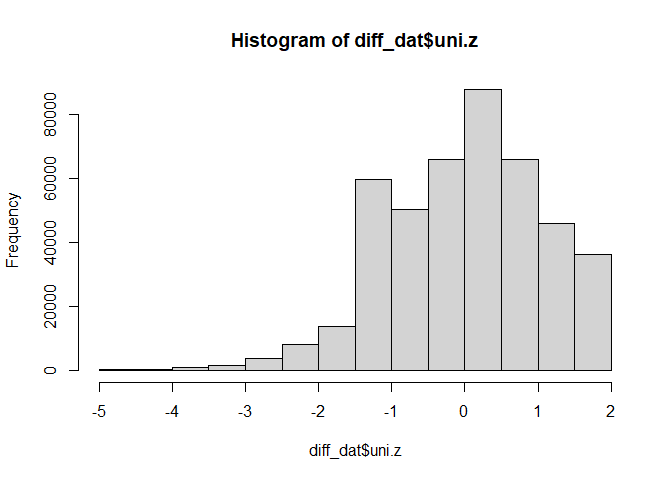
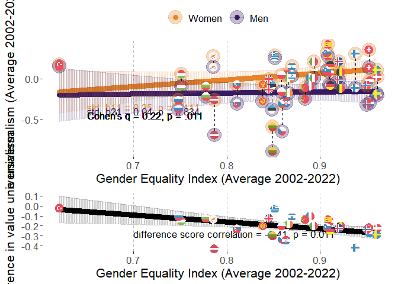
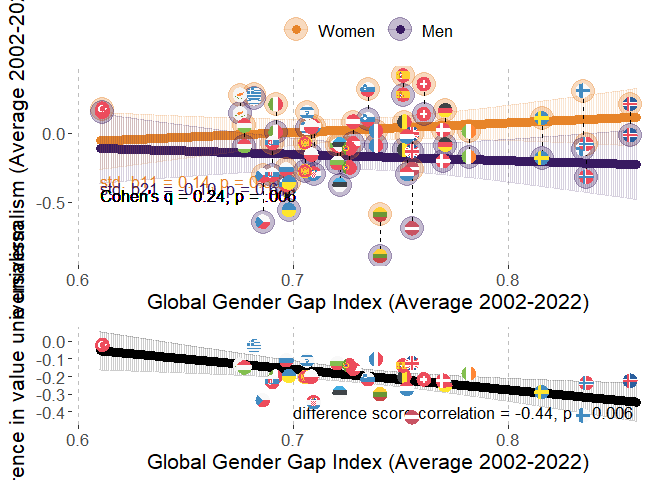
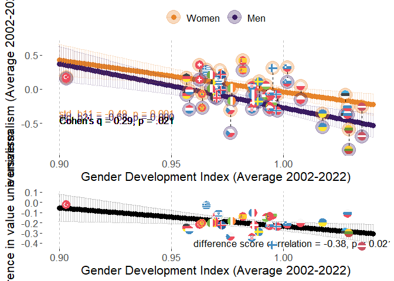
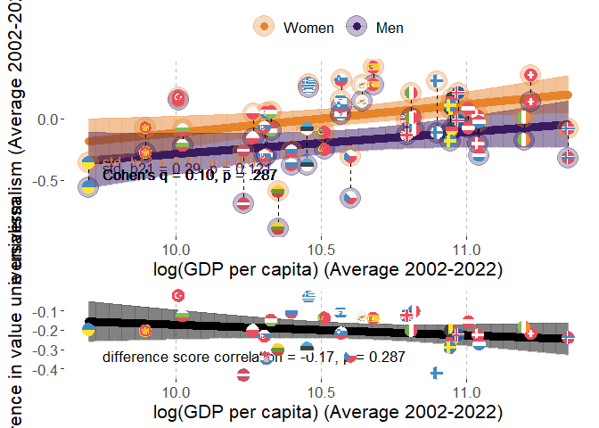
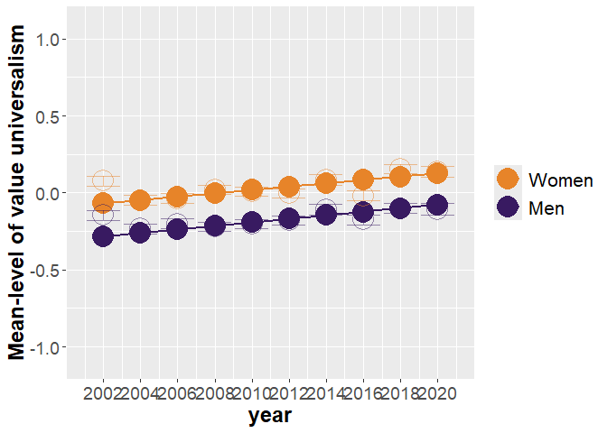
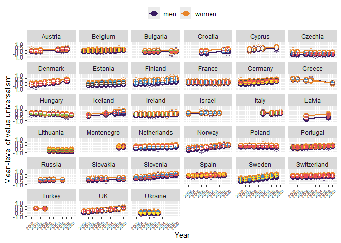

# Packages

Two packages are not in CRAN and need different installation
* devtools::install_github("vjilmari/vjihelpers")
* install.packages("ggflags", repos = c("https://jimjam-slam.r-universe.dev","https://cloud.r-project.org")) 


``` r
library(multid)
library(rio)
library(dplyr)
library(lme4)
library(emmeans)
library(vjihelpers)
library(MetBrewer)
library(ggplot2)
library(finalfit)
library(ggflags) 
library(lmerTest)
library(metafor)
library(ggpubr)
library(Hmisc)
library(r2mlm)
library(tidyr)
library(stringr)
library(apaTables)
```

# Data

* Loads the preprocessed European Social Survey data file made within "Preparations_ESS" code


``` r
load("../data/fdat.rdata")
```

* Include ISO data for country-names


``` r
# read country names
ISO<-read.csv2("../data/ISO.csv")
```


# Exclusions

* exclude participants with missing values or gender


``` r
value.vars<-
  c("con","tra",
  "ben","uni",
  "sdi","sti",
  "hed","ach",
  "pow","sec")

fdat$miss_values<-
  rowSums(is.na(fdat[,value.vars]))
table(fdat$miss_values)
```

```
## 
##      0      1      2      3      4      5      6      7      8      9     10 
## 450838   2586    774    401    248    185    129    135    142    165  34952
```

``` r
fdat<-fdat %>%
  filter(miss_values==0 & !is.na(gndr.bin))
```

# Data for the analysis

* basic descriptives


``` r
diff_dat<-
  fdat

#diff_dat$age.c<-as.numeric(diff_dat$age.c)
#diff_dat$rlgdgr.c<-as.numeric(diff_dat$rlgdgr.c)
#diff_dat$eduyrs.c<-as.numeric(diff_dat$eduyrs.c)

# data exclusions (include countries with at least two rounds of data)
n_rounds<-diff_dat %>% group_by(cntry) %>%
  summarise(n_unique_essround = n_distinct(essround))

# join number of rounds to data
diff_dat<-
  left_join(x=diff_dat,
            y=n_rounds,
            by="cntry")

# filter only countries with more than 1 round and non-missing gender variable
diff_dat<-diff_dat %>%
  dplyr::filter(n_unique_essround>1 &
                  !is.na(gndr))

# cross-tabulate sample sizes and ESS rounds by country
table(diff_dat$essround,diff_dat$cntry)
```

```
##     
##        AT   BE   BG   CH   CY   CZ   DE   DK   EE   ES   FI   FR   GB   GR   HR   HU   IE   IL   IS   IT   LT   LV   ME   NL   NO   PL   PT
##   1  2254 1830    0 2024    0 1208 2819 1470    0 1712 1763 1355 1798 2551    0 1634 1916 2279    0    0    0    0    0 2337 1819 2065 1482
##   2  2198 1771    0 2110    0 2557 2840 1458 1948 1623 1701 1699 1864 2399    0 1460 1187    0  524    0    0    0    0 1858 1575 1683 2024
##   3  2348 1796 1295 1780  978    0 2884 1461 1466 1847 1649 1983 2353    0    0 1462 1589    0    0    0    0    0    0 1860 1550 1685 2182
##   4     0 1754 2144 1753 1210 1986 2732 1581 1646 2562 1901 2067 2311 2063 1430 1430 1757 2382    0    0    0 1970    0 1724 1391 1596 2337
##   5     0 1699 2371 1491 1053 2335 3007 1564 1793 1881 1649 1723 2374 2669 1601 1473 2400 2212    0    0 1632    0    0 1801 1530 1719 2139
##   6     0 1862 2179 1483 1110 1973 2935 1621 2345 1871 2158 1960 2261    0    0 1968 2616 2378  739  909 2108    0    0 1828 1610 1866 2138
##   7  1795 1767    0 1521    0 1862 3006 1483 2036 1907 2050 1902 2231    0    0 1520 2380 2351    0    0 2241    0    0 1823 1423 1594 1242
##   8  1993 1759    0 1504    0 2252 2821    0 2007 1929 1903 2057 1942    0    0 1458 2746 2366  841 2531 2079    0    0 1669 1530 1675 1254
##   9  2477 1756 1926 1517  773 2343 2328 1554 1899 1619 1735 1982 2183    0 1781 1643 2189    0  844 2660 1677  891 1188 1657 1396 1443 1045
##   10    0 1334 2697 1505    0 2369    0    0 1538    0 1561 1951 1131 2768 1564 1816 1751    0  886 2573 1606    0 1248 1466 1408    0 1827
##     
##        RU   SE   SI   SK   TR   UA
##   1     0 1682 1488    0    0    0
##   2     0 1678 1384 1425 1790 1896
##   3  2339 1604 1465 1711    0 1885
##   4  2446 1556 1257 1789 2305 1766
##   5  2557 1463 1369 1803    0 1779
##   6  2429 1838 1244 1827    0 2064
##   7     0 1761 1189    0    0    0
##   8  2374 1526 1295    0    0    0
##   9     0 1510 1307 1061    0    0
##   10    0    0 1232 1395    0    0
```

``` r
# range of sample sizes
range(table(diff_dat$cntry))
```

```
## [1]  2436 25372
```

``` r
# scale/standardize with SD pooled across all country-time-gender folds
cntry.uni<-diff_dat %>% group_by(cntry,essround) %>%
  summarise(uni.ctm=mean(uni,na.rm=T),
            uni.ctsd=sd(uni,na.rm=T)) %>%
  group_by(cntry) %>%
  summarise(uni.cm=mean(uni.ctm),
            uni.csd=mean(uni.ctsd)) 
```

```
## `summarise()` has grouped output by 'cntry'. You can override using the `.groups` argument.
```

``` r
grand_mean_ben<-mean(cntry.uni$uni.cm)
grand_sd_ben<-mean(cntry.uni$uni.csd)

# standardized
diff_dat$uni.z<-(diff_dat$uni-grand_mean_ben)/grand_sd_ben
hist(diff_dat$uni.z)
```

<!-- -->

## Add GEI-variable

* GEI = Reverse-coded Gender Inequality Index (GII)


``` r
GII<-read.csv("../data/GII.csv")

# Obtain GII only for ESS countries
GII_in_ESS_d<-
  GII %>%
  filter(ISO2 %in% unique(diff_dat$cntry))

# Make long format data of GII, so that country x year has own rows

long_GII_in_ESS_d <- GII_in_ESS_d %>%
  pivot_longer(
    cols = starts_with("gii_") & !matches("avg"),  # <-- exclude the "_avg" columns
    names_to = "year",
    values_to = "gii",
    names_prefix = "gii_"
  ) %>%
  mutate(year = as.integer(year)) %>%
  filter(year >= 2002 & year <= 2022) %>%
  mutate(gei = 1 - gii) %>%
  select(ISO2, iso3, country, year, gii, gei, gii_2002_2022_avg, gei_2002_2022_avg)


# describe gei average
psych::describe(GII_in_ESS_d$gei_2002_2022_avg)
```

```
##    vars  n mean   sd median trimmed  mad  min  max range  skew kurtosis   se
## X1    1 32 0.87 0.07   0.87    0.87 0.06 0.62 0.96  0.34 -1.11     1.48 0.01
```

``` r
# one is missing, see which one
GII_in_ESS_d[is.na(GII_in_ESS_d$gei_2002_2022_avg),"country"]
```

```
## [1] "Ukraine"
```

``` r
# get means and SDs for standardizing
gei_mean<-mean(GII_in_ESS_d$gei_2002_2022_avg,na.rm=T)
gei_sd<-sd(GII_in_ESS_d$gei_2002_2022_avg,na.rm=T)

# standardize 
# year specific scores
long_GII_in_ESS_d$gei.z<-(long_GII_in_ESS_d$gei-gei_mean)/gei_sd

# get the country means to a separate frame

GII_country_means<-
  long_GII_in_ESS_d %>% group_by(ISO2) %>%
  summarise(gei.cm=mean(gei,na.rm=T),
            gei.z.cm=mean(gei.z,na.rm=T))


long_GII_in_ESS_d<-left_join(
  x=long_GII_in_ESS_d,
  y=GII_country_means,
  by="ISO2"
)


# center both the raw score and standardized scores
long_GII_in_ESS_d$gei.cmc<-(long_GII_in_ESS_d$gei-long_GII_in_ESS_d$gei.cm)
long_GII_in_ESS_d$gei.z.cmc<-(long_GII_in_ESS_d$gei.z-long_GII_in_ESS_d$gei.z.cm)

#View(long_GII_in_ESS_d)

# averages across 2002-2022
#long_GII_in_ESS_d$gei_2002_2022_avg.z<-(long_GII_in_ESS_d$gei_2002_2022_avg-gei_mean)/gei_sd

#long_GII_in_ESS_d$gei.cmc<-long_GII_in_ESS_d$gei-long_GII_in_ESS_d$gei_2002_2022_avg

# add year to ESS data-frame

diff_dat$year<-
  case_when(
    diff_dat$essround.c==-4.5~2002,  
    diff_dat$essround.c==-3.5~2004,
    diff_dat$essround.c==-2.5~2006,
    diff_dat$essround.c==-1.5~2008,
    diff_dat$essround.c==-0.5~2010,
    diff_dat$essround.c==0.5~2012,
    diff_dat$essround.c==1.5~2014,
    diff_dat$essround.c==2.5~2016,
    diff_dat$essround.c==3.5~2018,
    diff_dat$essround.c==4.5~2020
  )

# link datasets by country and year

diff_dat<-
  left_join(
    x=diff_dat,
    y=long_GII_in_ESS_d[,c("ISO2","year","gei","gei.cm","gei.cmc",
                           "gei.z","gei.z.cm","gei.z.cmc")],
    by=c("cntry"="ISO2","year")
)
```


## Add GDI-variable

* GDI = Gender Development Index


``` r
GDI<-read.csv("../data/GDI.csv")

# Obtain GDI only for ESS countries
GDI_in_ESS_d<-
  GDI %>%
  filter(ISO2 %in% unique(diff_dat$cntry))

# Make long format data of GDI, so that country x year has own rows

long_GDI_in_ESS_d <- GDI_in_ESS_d %>%
  pivot_longer(
    cols = starts_with("gdi_") & !matches("avg"),  # <-- exclude the "_avg" columns
    names_to = "year",
    values_to = "gdi",
    names_prefix = "gdi_"
  ) %>%
  mutate(year = as.integer(year)) %>%
  filter(year >= 2002 & year <= 2022) %>%
  select(ISO2, iso3, country, year, gdi, gdi_2002_2022_avg)

# describe gdi average
psych::describe(GDI_in_ESS_d$gdi_2002_2022_avg)
```

```
##    vars  n mean   sd median trimmed  mad min  max range  skew kurtosis se
## X1    1 33 0.99 0.03   0.99    0.98 0.02 0.9 1.04  0.13 -0.35     1.27  0
```

``` r
# get means and SDs for standardizing
gdi_mean<-mean(GDI_in_ESS_d$gdi_2002_2022_avg,na.rm=T)
gdi_sd<-sd(GDI_in_ESS_d$gdi_2002_2022_avg,na.rm=T)

# standardize 
# year specific scores
long_GDI_in_ESS_d$gdi.z<-(long_GDI_in_ESS_d$gdi-gdi_mean)/gdi_sd

# get the country means to a separate frame

GDI_country_means<-
  long_GDI_in_ESS_d %>% group_by(ISO2) %>%
  summarise(gdi.cm=mean(gdi,na.rm=T),
            gdi.z.cm=mean(gdi.z,na.rm=T))

long_GDI_in_ESS_d<-left_join(
  x=long_GDI_in_ESS_d,
  y=GDI_country_means,
  by="ISO2"
)


# center both the raw score and standardized scores
long_GDI_in_ESS_d$gdi.cmc<-(long_GDI_in_ESS_d$gdi-long_GDI_in_ESS_d$gdi.cm)
long_GDI_in_ESS_d$gdi.z.cmc<-(long_GDI_in_ESS_d$gdi.z-long_GDI_in_ESS_d$gdi.z.cm)

# link datasets by country and year

diff_dat<-
  left_join(
    x=diff_dat,
    y=long_GDI_in_ESS_d[,c("ISO2","year","gdi","gdi.cm","gdi.cmc",
                           "gdi.z","gdi.z.cm","gdi.z.cmc")],
    by=c("cntry"="ISO2","year")
  )
```

## Add GDP-variable

* log_GDP = Logarithm of GDP per capita, PPP (constant 2017 international $)


``` r
GDP<-read.csv("../data/GDP_processed.csv")

# Obtain GDP only for ESS countries
GDP_in_ESS_d<-
  GDP %>%
  filter(ISO2 %in% unique(diff_dat$cntry))

# First, rename those X2000..YR2000. style columns to simple "gdp_2000" etc.

GDP_in_ESS_d <- GDP_in_ESS_d %>%
  rename_with(
    ~ str_replace_all(., "^X(\\d{4})..YR\\1\\.$", "gdp_\\1"),
    starts_with("X")
  )

#GDP_in_ESS_d
# Make long format data of GDP, so that country x year has own rows

long_GDP_in_ESS_d <- GDP_in_ESS_d %>%
  pivot_longer(
    cols = starts_with("gdp_") & !matches("avg"),  # <-- exclude the "_avg" columns
    names_to = "year",
    values_to = "gdp",
    names_prefix = "gdp_"
  ) %>%
  mutate(year = as.integer(year)) %>%
  filter(year >= 2002 & year <= 2022) %>%
  select(ISO2, Country.Name, year, gdp, gdp_2002_2022_avg,log_gdp_2002_2022_avg) %>%
  mutate(log_gdp=log(gdp))

#View(long_GDP_in_ESS_d)

# describe gdp average
psych::describe(GDP_in_ESS_d$gdp_2002_2022_avg)
```

```
##    vars  n     mean      sd   median  trimmed      mad      min      max    range skew kurtosis      se
## X1    1 33 44309.55 16988.2 40528.07 43238.06 16282.88 16406.88 85115.96 68709.08 0.48    -0.58 2957.27
```

``` r
psych::describe(GDP_in_ESS_d$log_gdp_2002_2022_avg)
```

```
##    vars  n  mean  sd median trimmed  mad  min   max range  skew kurtosis   se
## X1    1 33 10.62 0.4  10.61   10.64 0.43 9.71 11.35  1.65 -0.25    -0.67 0.07
```

``` r
# get means and SDs for standardizing
log_gdp_mean<-mean(GDP_in_ESS_d$log_gdp_2002_2022_avg,na.rm=T)
log_gdp_sd<-sd(GDP_in_ESS_d$log_gdp_2002_2022_avg,na.rm=T)

# standardize 
# year specific scores
long_GDP_in_ESS_d$log_gdp.z<-
  (long_GDP_in_ESS_d$log_gdp-log_gdp_mean)/log_gdp_sd

# get the country means to a separate frame

GDP_country_means<-
  long_GDP_in_ESS_d %>% group_by(ISO2) %>%
  summarise(gdp.cm=mean(gdp,na.rm=T),
            #gdp.z.cm=mean(gdp.z,na.rm=T),
            log_gdp.cm=mean(log_gdp,na.rm=T),
            log_gdp.z.cm=mean(log_gdp.z,na.rm=T))

long_GDP_in_ESS_d<-left_join(
  x=long_GDP_in_ESS_d,
  y=GDP_country_means,
  by="ISO2"
)


# center both the raw score and standardized scores
long_GDP_in_ESS_d$log_gdp.cmc<-(long_GDP_in_ESS_d$log_gdp-long_GDP_in_ESS_d$log_gdp.cm)
long_GDP_in_ESS_d$log_gdp.z.cmc<-(long_GDP_in_ESS_d$log_gdp.z-long_GDP_in_ESS_d$log_gdp.z.cm)

# link datasets by country and year

diff_dat<-
  left_join(
    x=diff_dat,
    y=long_GDP_in_ESS_d[,c("ISO2","year","log_gdp","log_gdp.cm","log_gdp.cmc",
                           "log_gdp.z","log_gdp.z.cm","log_gdp.z.cmc")],
    by=c("cntry"="ISO2","year")
  )
```

## Add GGGI-variable

* GGGI = Global Gender Gap Index


``` r
GGGI<-import("../data/GGGI.xlsx")

# check if all ESS countries are in the log_GGGI data
table(unique(diff_dat$cntry) %in% GGGI$ISO2)
```

```
## 
## TRUE 
##   33
```

``` r
# Obtain GGGI only for ESS countries
GGGI_in_ESS_d<-
  GGGI %>%
  filter(ISO2 %in% unique(diff_dat$cntry))

# Make long format data of GGGI, so that country x year has own rows

long_GGGI_in_ESS_d <- GGGI_in_ESS_d %>%
  pivot_longer(
    cols = starts_with("gggi_") & !matches("avg"),  # <-- exclude the "_avg" columns
    names_to = "year",
    values_to = "gggi",
    names_prefix = "gggi_"
  ) %>%
  mutate(year = as.integer(year)) %>%
  filter(year >= 2002 & year <= 2022) %>%
  select(ISO2, cname, year, gggi, GGGI_2002_2022_avg)

# describe gggi average
psych::describe(GGGI_in_ESS_d$GGGI_2002_2022_avg)
```

```
##    vars  n mean   sd median trimmed  mad  min  max range skew kurtosis   se
## X1    1 33 0.73 0.05   0.73    0.73 0.04 0.61 0.86  0.25 0.38     0.19 0.01
```

``` r
# get means and SDs for standardizing
gggi_mean<-mean(GGGI_in_ESS_d$GGGI_2002_2022_avg,na.rm=T)
gggi_sd<-sd(GGGI_in_ESS_d$GGGI_2002_2022_avg,na.rm=T)

# standardize 
# year specific scores
long_GGGI_in_ESS_d$gggi.z<-(long_GGGI_in_ESS_d$gggi-gggi_mean)/gggi_sd

# get the country means to a separate frame

GGGI_country_means<-
  long_GGGI_in_ESS_d %>% group_by(ISO2) %>%
  summarise(gggi.cm=mean(gggi,na.rm=T),
            gggi.z.cm=mean(gggi.z,na.rm=T))

long_GGGI_in_ESS_d<-left_join(
  x=long_GGGI_in_ESS_d,
  y=GGGI_country_means,
  by="ISO2"
)

# center both the raw score and standardized scores
long_GGGI_in_ESS_d$gggi.cmc<-
  (long_GGGI_in_ESS_d$gggi-long_GGGI_in_ESS_d$gggi.cm)

long_GGGI_in_ESS_d$gggi.z.cmc<-
  (long_GGGI_in_ESS_d$gggi.z-long_GGGI_in_ESS_d$gggi.z.cm)

# link datasets by country and year

diff_dat<-
  left_join(
    x=diff_dat,
    y=long_GGGI_in_ESS_d[,c("ISO2","year","gggi","gggi.cm","gggi.cmc",
                           "gggi.z","gggi.z.cm","gggi.z.cmc")],
    by=c("cntry"="ISO2","year")
  )
```

# Descriptive statistics

## Country-specific descriptives


``` r
# sample sizes from weights

cntry_n_frame<-
  diff_dat %>% group_by(cntry) %>%
  summarise('n ESS rounds' = mean(n_unique_essround),
            n=round(sum(pspwght),0))

# value-based universalism

cntry_ben_frame<-
  diff_dat %>% group_by(cntry,essround) %>%
  summarise('uni M' = weighted.mean(x=uni.z,w=pspwght),
            'uni SD' = sqrt(wtd.var(uni.z,pspwght))) %>%
  group_by(cntry) %>%
  summarise('uni M' = mean(x=`uni M`),
            'uni SD'= mean(x=`uni SD`))
```

```
## `summarise()` has grouped output by 'cntry'. You can override using the `.groups` argument.
```

``` r
cntry_ben_women_frame<-
  diff_dat %>%
  filter(gndr.c==-0.5) %>%
  group_by(cntry,essround) %>%
  summarise('uni M' = weighted.mean(x=uni.z,w=pspwght),
            'uni SD' = sqrt(wtd.var(uni.z,pspwght))) %>%
  group_by(cntry) %>%
  summarise('uni M Women' = mean(x=`uni M`),
            'uni SD Women'= mean(x=`uni SD`))
```

```
## `summarise()` has grouped output by 'cntry'. You can override using the `.groups` argument.
```

``` r
cntry_ben_men_frame<-
  diff_dat %>%
  filter(gndr.c==0.5) %>%
  group_by(cntry,essround) %>%
  summarise('uni M' = weighted.mean(x=uni.z,w=pspwght),
            'uni SD' = sqrt(wtd.var(uni.z,pspwght))) %>%
  group_by(cntry) %>%
  summarise('uni M Men' = mean(x=`uni M`),
            'uni SD Men'= mean(x=`uni SD`))
```

```
## `summarise()` has grouped output by 'cntry'. You can override using the `.groups` argument.
```

``` r
# link n and uni datasets

desc_frame<-
  left_join(
    x=cntry_n_frame,
    y=cntry_ben_frame,
    by="cntry"
  )

desc_frame<-
  left_join(
    x=desc_frame,
    y=cntry_ben_women_frame,
    by="cntry"
  )

desc_frame<-
  left_join(
    x=desc_frame,
    y=cntry_ben_men_frame,
    by="cntry"
  )

# Add country-specific differences
desc_frame$D<-desc_frame$`uni M Men`-desc_frame$`uni M Women`

desc_frame
```

```
## # A tibble: 33 × 10
##    cntry `n ESS rounds`     n `uni M` `uni SD` `uni M Women` `uni SD Women` `uni M Men` `uni SD Men`       D
##    <chr>          <dbl> <dbl>   <dbl>    <dbl>         <dbl>          <dbl>       <dbl>        <dbl>   <dbl>
##  1 AT                 6 13077  0.0859    1.04         0.199           1.00     -0.0353         1.06  -0.234 
##  2 BE                10 17313  0.111     0.864        0.184           0.843     0.0355         0.878 -0.148 
##  3 BG                 6 12641 -0.153     1.09        -0.0817          1.06     -0.230          1.12  -0.149 
##  4 CH                10 16720  0.316     0.865        0.412           0.834     0.215          0.885 -0.198 
##  5 CY                 5  5105  0.341     0.862        0.352           0.845     0.330          0.879 -0.0216
##  6 CZ                 9 18934 -0.406     1.07        -0.282           1.05     -0.541          1.08  -0.259 
##  7 DE                 9 25389  0.107     0.935        0.210           0.895    -0.00174        0.964 -0.211 
##  8 DK                 8 12198 -0.0311    1.02         0.0642          0.985    -0.129          1.05  -0.193 
##  9 EE                 9 16692 -0.126     0.928       -0.0147          0.896    -0.259          0.947 -0.245 
## 10 ES                 9 16954  0.376     0.901        0.417           0.884     0.333          0.915 -0.0837
## # ℹ 23 more rows
```

``` r
# add country-level measures

desc_frame<-
  left_join(
    x=desc_frame,
    y=GII_country_means[,c("ISO2","gei.cm")],
    by=c("cntry"="ISO2")
  )

desc_frame<-
  left_join(
    x=desc_frame,
    y=GGGI_country_means[,c("ISO2","gggi.cm")],
    by=c("cntry"="ISO2")
  )

desc_frame<-
  left_join(
    x=desc_frame,
    y=GDI_country_means[,c("ISO2","gdi.cm")],
    by=c("cntry"="ISO2")
  )


desc_frame<-
  left_join(
    x=desc_frame,
    y=GDP_country_means[,c("ISO2","gdp.cm")],
    by=c("cntry"="ISO2")
  )

desc_frame<-left_join(
  x=desc_frame,
  y=ISO[,c("ISO2","CLDR")],
  by=c("cntry"="ISO2")
)

# finalize the formatted table

cntry_desc_tbl<-
  desc_frame %>%
  select(
    Country = CLDR,
    `n ESS rounds`,
    n,
    `uni M`, `uni SD`,
    `uni M Women`, `uni SD Women`,
    `uni M Men`, `uni SD Men`,
    D,
    GEI = gei.cm,
    GGGI = gggi.cm,
    GDI = gdi.cm,
    GDP = gdp.cm
  ) %>%
  mutate(
    across(
      .cols = -c(Country, `n ESS rounds`, n, GDP) & where(is.numeric),
      .fns  = ~ round_tidy(.x, 2)
    )
  ) %>%
  mutate(
    across(
      .cols = GDP,
      .fns  = ~ round_tidy(.x, 0)
    )
  )
print(cntry_desc_tbl,n=33)
```

```
## # A tibble: 33 × 14
##    Country     `n ESS rounds`     n `uni M` `uni SD` `uni M Women` `uni SD Women` `uni M Men` `uni SD Men` D     GEI   GGGI  GDI   GDP  
##    <chr>                <dbl> <dbl> <chr>   <chr>    <chr>         <chr>          <chr>       <chr>        <chr> <chr> <chr> <chr> <chr>
##  1 Austria                  6 13077 0.09    1.04     0.20          1.00           -0.04       1.06         -0.23 0.91  0.73  0.97  60433
##  2 Belgium                 10 17313 0.11    0.86     0.18          0.84           0.04        0.88         -0.15 0.92  0.75  0.97  56803
##  3 Bulgaria                 6 12641 -0.15   1.09     -0.08         1.06           -0.23       1.12         -0.15 0.78  0.72  1.00  23096
##  4 Switzerland             10 16720 0.32    0.87     0.41          0.83           0.21        0.89         -0.20 0.95  0.76  0.96  74937
##  5 Cyprus                   5  5105 0.34    0.86     0.35          0.84           0.33        0.88         -0.02 0.79  0.68  0.97  41998
##  6 Czechia                  9 18934 -0.41   1.07     -0.28         1.05           -0.54       1.08         -0.26 0.86  0.69  0.98  40528
##  7 Germany                  9 25389 0.11    0.94     0.21          0.89           -0.00       0.96         -0.21 0.91  0.77  0.96  57203
##  8 Denmark                  8 12198 -0.03   1.02     0.06          0.98           -0.13       1.05         -0.19 0.96  0.77  0.99  62482
##  9 Estonia                  9 16692 -0.13   0.93     -0.01         0.90           -0.26       0.95         -0.24 0.85  0.72  1.03  35133
## 10 Spain                    9 16954 0.38    0.90     0.42          0.88           0.33        0.92         -0.08 0.91  0.75  0.98  43543
## 11 Finland                 10 18050 0.16    0.95     0.35          0.88           -0.04       0.98         -0.39 0.94  0.84  1.00  54215
## 12 France                  10 18720 0.10    1.08     0.15          1.07           0.04        1.08         -0.10 0.89  0.74  0.99  50086
## 13 UK                      10 21456 -0.00   1.02     0.06          1.00           -0.07       1.03         -0.12 0.85  0.76  0.97  48851
## 14 Greece                   5 12464 0.26    0.93     0.25          0.92           0.28        0.94         0.03  0.85  0.68  0.97  35026
## 15 Croatia                  4  6368 0.00    1.08     0.10          1.04           -0.10       1.11         -0.21 0.86  0.71  0.99  30327
## 16 Hungary                 10 16006 0.01    1.01     0.08          0.99           -0.08       1.03         -0.16 0.75  0.68  0.99  30903
## 17 Ireland                 10 20576 0.04    1.05     0.12          1.04           -0.04       1.06         -0.15 0.87  0.78  0.98  75379
## 18 Israel                   6 13964 0.10    1.06     0.14          1.06           0.06        1.06         -0.08 0.87  0.71  0.97  39179
## 19 Iceland                  5  3832 0.07    0.98     0.19          0.94           -0.05       1.01         -0.24 0.92  0.86  0.97  58455
## 20 Italy                    4  8663 0.07    0.98     0.12          0.98           0.02        0.99         -0.10 0.89  0.69  0.97  49623
## 21 Lithuania                6 11714 -0.71   1.17     -0.62         1.16           -0.82       1.18         -0.20 0.85  0.74  1.03  32397
## 22 Latvia                   2  2866 -0.25   1.06     -0.08         1.03           -0.45       1.05         -0.37 0.79  0.76  1.04  28443
## 23 Montenegro               2  2441 -0.06   1.19     0.03          1.16           -0.15       1.21         -0.18 0.84  0.71  0.96  20093
## 24 Netherlands             10 18048 -0.03   0.88     0.06          0.85           -0.12       0.90         -0.18 0.95  0.75  0.96  62746
## 25 Norway                  10 15186 -0.22   0.99     -0.13         0.96           -0.31       1.01         -0.19 0.95  0.84  1.00  85116
## 26 Poland                   9 15314 0.07    0.91     0.14          0.88           -0.01       0.94         -0.15 0.86  0.71  1.01  29545
## 27 Portugal                10 17705 -0.27   1.04     -0.25         1.03           -0.28       1.04         -0.03 0.88  0.73  0.99  36804
## 28 Russia                   5 12139 -0.19   1.10     -0.13         1.09           -0.26       1.11         -0.13 0.75  0.70  1.03  33173
## 29 Sweden                   9 14897 -0.04   0.98     0.10          0.94           -0.20       0.99         -0.30 0.96  0.82  0.99  56811
## 30 Slovenia                10 13238 0.28    0.84     0.36          0.82           0.20        0.86         -0.16 0.91  0.73  1.00  39154
## 31 Slovakia                 7 11132 -0.15   0.95     -0.07         0.94           -0.23       0.96         -0.16 0.81  0.69  0.99  30472
## 32 Turkey                   2  4108 0.18    0.96     0.16          0.97           0.20        0.96         0.04  0.62  0.61  0.90  22856
## 33 Ukraine                  5  9454 -0.32   1.24     -0.27         1.25           -0.39       1.23         -0.11 NaN   0.70  1.02  16407
```

``` r
export(cntry_desc_tbl,"../results/uni_youth/cntry_desc_tbl.xlsx",overwrite=T)
```

## Country-level correlations table


``` r
cor_frame<-
  desc_frame %>%
  select(
    VBMT=`uni M`,
    VBMT_Women=`uni M Women`,
    VBMT_Men=`uni M Men`,
    D = D,
    GEI = gei.cm,
    GGGI = gggi.cm,
    GDI = gdi.cm,
    GDP = gdp.cm
  ) %>%
  mutate(
    log_GDP=log(GDP)
  ) %>%
  select(-GDP)

apa.cor.table(
  data=cor_frame,
  filename = "../results/uni_youth/CorTable1.doc",
  #table.number = NA,
  show.conf.interval = FALSE,
  show.sig.stars = F,
  landscape = F
)
```

```
## The ability to suppress reporting of reporting confidence intervals has been deprecated in this version.
## The function argument show.conf.interval will be removed in a later version.
```

```
## 
## 
## Means, standard deviations, and correlations with confidence intervals
##  
## 
##   Variable      M     SD   1            2            3            4            5           6           7          
##   1. VBMT       -0.01 0.23                                                                                        
##                                                                                                                   
##   2. VBMT_Women 0.07  0.22 .98                                                                                    
##                            [.96, .99]                                                                             
##                                                                                                                   
##   3. VBMT_Men   -0.09 0.25 .98          .92                                                                       
##                            [.96, .99]   [.85, .96]                                                                
##                                                                                                                   
##   4. D          -0.16 0.10 .28          .09          .46                                                          
##                            [-.07, .57]  [-.26, .42]  [.14, .70]                                                   
##                                                                                                                   
##   5. GEI        0.87  0.07 .12          .22          .03          -.40                                            
##                            [-.24, .45]  [-.14, .53]  [-.32, .38]  [-.66, -.06]                                    
##                                                                                                                   
##   6. GGGI       0.73  0.05 -.00         .13          -.12         -.61         .73                                
##                            [-.35, .34]  [-.22, .45]  [-.45, .23]  [-.79, -.34] [.52, .86]                         
##                                                                                                                   
##   7. GDI        0.99  0.03 -.54         -.48         -.59         -.42         .07         .20                    
##                            [-.75, -.25] [-.71, -.17] [-.78, -.31] [-.66, -.09] [-.29, .41] [-.16, .51]            
##                                                                                                                   
##   8. log_GDP    10.62 0.40 .30          .37          .24          -.25         .75         .67         -.22       
##                            [-.04, .59]  [.03, .63]   [-.12, .54]  [-.54, .11]  [.55, .87]  [.42, .82]  [-.53, .13]
##                                                                                                                   
## 
## Note. M and SD are used to represent mean and standard deviation, respectively.
## Values in square brackets indicate the 95% confidence interval.
## The confidence interval is a plausible range of population correlations 
## that could have caused the sample correlation (Cumming, 2014).
## 
```


# Analysis

## Data subset


``` r
diff_dat<-diff_dat %>%
  filter(agea>17 & agea <30)
```

## mod0: Random intercept model


``` r
mod0<-lmer(uni.z~(1|cntry),data=diff_dat,REML=F,weights = pspwght,
           control=lmerControl(optimizer="bobyqa",optCtrl=list(maxfun=2e7)))
summary(mod0)
```

```
## Linear mixed model fit by maximum likelihood . t-tests use Satterthwaite's method ['lmerModLmerTest']
## Formula: uni.z ~ (1 | cntry)
##    Data: diff_dat
## Weights: pspwght
## Control: lmerControl(optimizer = "bobyqa", optCtrl = list(maxfun = 2e+07))
## 
##       AIC       BIC    logLik -2*log(L)  df.resid 
##  214044.0  214071.5 -107019.0  214038.0     70935 
## 
## Scaled residuals: 
##     Min      1Q  Median      3Q     Max 
## -7.2330 -0.5558  0.0672  0.6562  4.5256 
## 
## Random effects:
##  Groups   Name        Variance Std.Dev.
##  cntry    (Intercept) 0.05676  0.2382  
##  Residual             1.23974  1.1134  
## Number of obs: 70938, groups:  cntry, 33
## 
## Fixed effects:
##             Estimate Std. Error       df t value Pr(>|t|)  
## (Intercept) -0.07545    0.04171 32.92086  -1.809   0.0796 .
## ---
## Signif. codes:  0 '***' 0.001 '**' 0.01 '*' 0.05 '.' 0.1 ' ' 1
```

``` r
getVC(mod0)
```

```
##        grp        var1 var2 sdcor vcov
## 1    cntry (Intercept) <NA>  0.24 0.06
## 2 Residual        <NA> <NA>  1.11 1.24
```

``` r
r2mlm(mod0,bargraph = F)
```

```
## $Decompositions
##                      total within between
## fixed, within   0.00000000      0      NA
## fixed, between  0.00000000     NA       0
## slope variation 0.00000000      0      NA
## mean variation  0.04377601     NA       1
## sigma2          0.95622399      1      NA
## 
## $R2s
##          total within between
## f1  0.00000000      0      NA
## f2  0.00000000     NA       0
## v   0.00000000      0      NA
## m   0.04377601     NA       1
## f   0.00000000     NA      NA
## fv  0.00000000      0      NA
## fvm 0.04377601     NA      NA
```

## mod1: Gender fixed effect


``` r
mod1<-lmer(uni.z~gndr.c+(1|cntry),data=diff_dat,REML=F,weights = pspwght,
           control=lmerControl(optimizer="bobyqa",optCtrl=list(maxfun=2e7)))
summary(mod1)
```

```
## Linear mixed model fit by maximum likelihood . t-tests use Satterthwaite's method ['lmerModLmerTest']
## Formula: uni.z ~ gndr.c + (1 | cntry)
##    Data: diff_dat
## Weights: pspwght
## Control: lmerControl(optimizer = "bobyqa", optCtrl = list(maxfun = 2e+07))
## 
##       AIC       BIC    logLik -2*log(L)  df.resid 
##  213336.7  213373.4 -106664.3  213328.7     70934 
## 
## Scaled residuals: 
##     Min      1Q  Median      3Q     Max 
## -7.4534 -0.5651  0.0829  0.6496  4.3813 
## 
## Random effects:
##  Groups   Name        Variance Std.Dev.
##  cntry    (Intercept) 0.05656  0.2378  
##  Residual             1.22740  1.1079  
## Number of obs: 70938, groups:  cntry, 33
## 
## Fixed effects:
##               Estimate Std. Error         df t value Pr(>|t|)    
## (Intercept) -7.402e-02  4.164e-02  3.293e+01  -1.778   0.0847 .  
## gndr.c      -2.047e-01  7.665e-03  7.091e+04 -26.700   <2e-16 ***
## ---
## Signif. codes:  0 '***' 0.001 '**' 0.01 '*' 0.05 '.' 0.1 ' ' 1
## 
## Correlation of Fixed Effects:
##        (Intr)
## gndr.c -0.001
```

``` r
getFE(mod1,round=3)
```

```
##               Est.    SE        df       t     p     LL     UL
## (Intercept) -0.074 0.042    32.928  -1.778 0.085 -0.159  0.011
## gndr.c      -0.205 0.008 70906.531 -26.700 0.000 -0.220 -0.190
```

``` r
getVC(mod1)
```

```
##        grp        var1 var2 sdcor vcov
## 1    cntry (Intercept) <NA>  0.24 0.06
## 2 Residual        <NA> <NA>  1.11 1.23
```

``` r
r2mlm(mod1,bargraph = F)
```

```
## $Decompositions
##                       total
## fixed           0.008084651
## slope variation 0.000000000
## mean variation  0.043693202
## sigma2          0.948222147
## 
## $R2s
##           total
## f   0.008084651
## v   0.000000000
## m   0.043693202
## fv  0.008084651
## fvm 0.051777853
```

## mod2: Gender fixed and random effect

* Include random effect correlation by default


``` r
mod2<-lmer(uni.z~gndr.c+(gndr.c|cntry),data=diff_dat,REML=F,weights = pspwght,
           control=lmerControl(optimizer="bobyqa",optCtrl=list(maxfun=2e7)))
summary(mod2)
```

```
## Linear mixed model fit by maximum likelihood . t-tests use Satterthwaite's method ['lmerModLmerTest']
## Formula: uni.z ~ gndr.c + (gndr.c | cntry)
##    Data: diff_dat
## Weights: pspwght
## Control: lmerControl(optimizer = "bobyqa", optCtrl = list(maxfun = 2e+07))
## 
##       AIC       BIC    logLik -2*log(L)  df.resid 
##  213240.1  213295.1 -106614.1  213228.1     70932 
## 
## Scaled residuals: 
##     Min      1Q  Median      3Q     Max 
## -7.4577 -0.5600  0.0872  0.6542  4.4716 
## 
## Random effects:
##  Groups   Name        Variance Std.Dev. Corr
##  cntry    (Intercept) 0.05632  0.2373       
##           gndr.c      0.01075  0.1037   0.40
##  Residual             1.22471  1.1067       
## Number of obs: 70938, groups:  cntry, 33
## 
## Fixed effects:
##             Estimate Std. Error       df t value Pr(>|t|)    
## (Intercept) -0.07342    0.04155 32.93107  -1.767   0.0865 .  
## gndr.c      -0.20775    0.01994 29.13811 -10.418 2.45e-11 ***
## ---
## Signif. codes:  0 '***' 0.001 '**' 0.01 '*' 0.05 '.' 0.1 ' ' 1
## 
## Correlation of Fixed Effects:
##        (Intr)
## gndr.c 0.360
```

``` r
getFE(mod2,round=3)
```

```
##               Est.    SE     df       t     p     LL     UL
## (Intercept) -0.073 0.042 32.931  -1.767 0.087 -0.158  0.011
## gndr.c      -0.208 0.020 29.138 -10.418 0.000 -0.249 -0.167
```

``` r
getVC(mod2)
```

```
##        grp        var1   var2 sdcor vcov
## 1    cntry (Intercept)   <NA>  0.24 0.06
## 2    cntry      gndr.c   <NA>  0.10 0.01
## 3    cntry (Intercept) gndr.c  0.40 0.01
## 4 Residual        <NA>   <NA>  1.11 1.22
```

``` r
r2mlm(mod2,bargraph = F)
```

```
## $Decompositions
##                       total
## fixed           0.008331164
## slope variation 0.002074982
## mean variation  0.043316904
## sigma2          0.946276950
## 
## $R2s
##           total
## f   0.008331164
## v   0.002074982
## m   0.043316904
## fv  0.010406147
## fvm 0.053723050
```

``` r
anova(mod1,mod2)
```

```
## Data: diff_dat
## Models:
## mod1: uni.z ~ gndr.c + (1 | cntry)
## mod2: uni.z ~ gndr.c + (gndr.c | cntry)
##      npar    AIC    BIC  logLik -2*log(L)  Chisq Df Pr(>Chisq)    
## mod1    4 213337 213373 -106664    213329                         
## mod2    6 213240 213295 -106614    213228 100.55  2  < 2.2e-16 ***
## ---
## Signif. codes:  0 '***' 0.001 '**' 0.01 '*' 0.05 '.' 0.1 ' ' 1
```

``` r
lvl2_var_cond_lvl1(mod2,lvl1.var = "gndr.c",lvl1.values = c(0.5,-0.5))
```

```
##   lvl1.value lvl2.cond.var lvl2.cond.sd
## 1        0.5    0.06885598    0.2624042
## 2       -0.5    0.04915822    0.2217165
```

* Test for random effect correlation


``` r
mod2_norecov<-lmer(uni.z~gndr.c+(gndr.c||cntry),data=diff_dat,REML=F,weights = pspwght,
                   control=lmerControl(optimizer="bobyqa",optCtrl=list(maxfun=2e7)))
summary(mod2_norecov)
```

```
## Linear mixed model fit by maximum likelihood . t-tests use Satterthwaite's method ['lmerModLmerTest']
## Formula: uni.z ~ gndr.c + (gndr.c || cntry)
##    Data: diff_dat
## Weights: pspwght
## Control: lmerControl(optimizer = "bobyqa", optCtrl = list(maxfun = 2e+07))
## 
##       AIC       BIC    logLik -2*log(L)  df.resid 
##  213242.7  213288.6 -106616.4  213232.7     70933 
## 
## Scaled residuals: 
##     Min      1Q  Median      3Q     Max 
## -7.4434 -0.5595  0.0875  0.6544  4.4526 
## 
## Random effects:
##  Groups   Name        Variance Std.Dev.
##  cntry    (Intercept) 0.05624  0.2371  
##  cntry.1  gndr.c      0.01047  0.1023  
##  Residual             1.22472  1.1067  
## Number of obs: 70938, groups:  cntry, 33
## 
## Fixed effects:
##             Estimate Std. Error       df t value Pr(>|t|)    
## (Intercept) -0.07331    0.04152 32.93201  -1.766   0.0867 .  
## gndr.c      -0.20764    0.01975 29.15983 -10.514 1.96e-11 ***
## ---
## Signif. codes:  0 '***' 0.001 '**' 0.01 '*' 0.05 '.' 0.1 ' ' 1
## 
## Correlation of Fixed Effects:
##        (Intr)
## gndr.c 0.000
```

``` r
getFE(mod2_norecov,round=3)
```

```
##               Est.    SE     df       t     p     LL     UL
## (Intercept) -0.073 0.042 32.932  -1.766 0.087 -0.158  0.011
## gndr.c      -0.208 0.020 29.160 -10.514 0.000 -0.248 -0.167
```

``` r
getVC(mod2_norecov)
```

```
##        grp        var1 var2 sdcor vcov
## 1    cntry (Intercept) <NA>  0.24 0.06
## 2  cntry.1      gndr.c <NA>  0.10 0.01
## 3 Residual        <NA> <NA>  1.11 1.22
```

``` r
anova(mod2_norecov,mod2)
```

```
## Data: diff_dat
## Models:
## mod2_norecov: uni.z ~ gndr.c + (gndr.c || cntry)
## mod2: uni.z ~ gndr.c + (gndr.c | cntry)
##              npar    AIC    BIC  logLik -2*log(L)  Chisq Df Pr(>Chisq)  
## mod2_norecov    5 213243 213289 -106616    213233                       
## mod2            6 213240 213295 -106614    213228 4.6066  1    0.03185 *
## ---
## Signif. codes:  0 '***' 0.001 '**' 0.01 '*' 0.05 '.' 0.1 ' ' 1
```


## mod2 with Gender-equality index (GEI)


``` r
mod2_GEI<-lmer(uni.z~gndr.c+gei.z.cm+gndr.c:gei.z.cm+
                 (gndr.c|cntry),data=diff_dat,REML=F,weights = pspwght,
           control=lmerControl(optimizer="bobyqa",optCtrl=list(maxfun=2e7)))
summary(mod2_GEI)
```

```
## Linear mixed model fit by maximum likelihood . t-tests use Satterthwaite's method ['lmerModLmerTest']
## Formula: uni.z ~ gndr.c + gei.z.cm + gndr.c:gei.z.cm + (gndr.c | cntry)
##    Data: diff_dat
## Weights: pspwght
## Control: lmerControl(optimizer = "bobyqa", optCtrl = list(maxfun = 2e+07))
## 
##       AIC       BIC    logLik -2*log(L)  df.resid 
##  207079.9  207153.1 -103532.0  207063.9     69278 
## 
## Scaled residuals: 
##     Min      1Q  Median      3Q     Max 
## -7.0302 -0.5627  0.0893  0.6559  4.5128 
## 
## Random effects:
##  Groups   Name        Variance Std.Dev. Corr
##  cntry    (Intercept) 0.052129 0.22832      
##           gndr.c      0.008384 0.09157  0.58
##  Residual             1.205967 1.09817      
## Number of obs: 69286, groups:  cntry, 32
## 
## Fixed effects:
##                 Estimate Std. Error       df t value Pr(>|t|)    
## (Intercept)     -0.06151    0.04061 31.90552  -1.514   0.1398    
## gndr.c          -0.20506    0.01826 27.45675 -11.229 9.02e-12 ***
## gei.z.cm         0.03568    0.04130 32.02205   0.864   0.3941    
## gndr.c:gei.z.cm -0.05156    0.01897 30.16993  -2.718   0.0108 *  
## ---
## Signif. codes:  0 '***' 0.001 '**' 0.01 '*' 0.05 '.' 0.1 ' ' 1
## 
## Correlation of Fixed Effects:
##             (Intr) gndr.c g.z.cm
## gndr.c       0.509              
## gei.z.cm    -0.003 -0.001       
## gndr.c:g.z. -0.001 -0.040  0.499
```

``` r
getFE(mod2_GEI,round=3)
```

```
##                   Est.    SE     df       t     p     LL     UL
## (Intercept)     -0.062 0.041 31.906  -1.514 0.140 -0.144  0.021
## gndr.c          -0.205 0.018 27.457 -11.229 0.000 -0.242 -0.168
## gei.z.cm         0.036 0.041 32.022   0.864 0.394 -0.048  0.120
## gndr.c:gei.z.cm -0.052 0.019 30.170  -2.718 0.011 -0.090 -0.013
```

``` r
getVC(mod2_GEI)
```

```
##        grp        var1   var2 sdcor vcov
## 1    cntry (Intercept)   <NA>  0.23 0.05
## 2    cntry      gndr.c   <NA>  0.09 0.01
## 3    cntry (Intercept) gndr.c  0.58 0.01
## 4 Residual        <NA>   <NA>  1.10 1.21
```

``` r
r2mlm(mod2_GEI,bargraph = F)
```

```
## $Decompositions
##                       total
## fixed           0.009940175
## slope variation 0.001646176
## mean variation  0.040733843
## sigma2          0.947679807
## 
## $R2s
##           total
## f   0.009940175
## v   0.001646176
## m   0.040733843
## fv  0.011586350
## fvm 0.052320193
```

### Deconstructed associations


``` r
t1<-Sys.time()
ddsc_mod2_GEI<-
  ddsc_ml(model = mod2_GEI,
          predictor = "gei.z.cm",
          moderator = "gndr.c",moderator_values = c(-0.5,0.5),
          re_cov_test = T)
t2<-Sys.time()
t2-t1
```

```
## Time difference of 4.717478 secs
```

``` r
round(ddsc_mod2_GEI$vpc_at_moderator_values,3)
```

```
##   lvl1.value Intercept.var Intercept.sd Residual.var Total.var   VPC mean.n.obs  ICC2 ICC2_SP
## 1       -0.5         0.049        0.222        1.225     1.274 0.039   1103.091 0.972   0.978
## 2        0.5         0.069        0.262        1.225     1.294 0.053   1046.545 0.978   0.983
```

``` r
round(ddsc_mod2_GEI$descriptives,3)
```

```
##                        M    SD means_y1 means_y1_scaled means_y2 means_y2_scaled gei.z.cm gei.z.cm_scaled diff_score diff_score_scaled
## means_y1          -0.167 0.268    1.000           1.000    0.885           0.885    0.044           0.044      0.605             0.605
## means_y1_scaled   -0.684 1.100    1.000           1.000    0.885           0.885    0.044           0.044      0.605             0.605
## means_y2           0.045 0.216    0.885           0.885    1.000           1.000    0.268           0.268      0.165             0.165
## means_y2_scaled    0.184 0.889    0.885           0.885    1.000           1.000    0.268           0.268      0.165             0.165
## gei.z.cm           0.000 1.000    0.044           0.044    0.268           0.268    1.000           1.000     -0.366            -0.366
## gei.z.cm_scaled    0.000 1.000    0.044           0.044    0.268           0.268    1.000           1.000     -0.366            -0.366
## diff_score        -0.212 0.126    0.605           0.605    0.165           0.165   -0.366          -0.366      1.000             1.000
## diff_score_scaled -0.869 0.519    0.605           0.605    0.165           0.165   -0.366          -0.366      1.000             1.000
```

``` r
round(ddsc_mod2_GEI$results,3)
```

```
##                            estimate    SE     df t.ratio p.value ci.lower ci.upper
## r_xy1y2                       0.408 0.150 30.170   2.718   0.011    0.102    0.715
## w_11                          0.061 0.037 32.182   1.640   0.111   -0.015    0.138
## w_21                          0.010 0.047 32.015   0.212   0.834   -0.085    0.105
## r_xy1                         0.229 0.140 32.182   1.640   0.111   -0.055    0.514
## r_xy2                         0.046 0.216 32.015   0.212   0.834   -0.394    0.486
## b_11                          0.254 0.155 32.182   1.640   0.111   -0.061    0.569
## b_21                          0.041 0.193 32.015   0.212   0.834   -0.352    0.434
## main_effect                   0.036 0.041 32.022   0.864   0.394   -0.048    0.120
## moderator_effect             -0.205 0.018 27.457 -11.229   0.000   -0.242   -0.168
## interaction                  -0.052 0.019 30.170  -2.718   0.011   -0.090   -0.013
## q_b11_b21                     0.218    NA     NA      NA      NA       NA       NA
## q_rxy1_rxy2                   0.188    NA     NA      NA      NA       NA       NA
## cross_over_point             -3.977    NA     NA      NA      NA       NA       NA
## interaction_vs_main           0.016 0.053 31.948   0.298   0.768   -0.093    0.125
## interaction_vs_main_bscale    0.066 0.220 31.948   0.298   0.768   -0.383    0.514
## interaction_vs_main_rscale    0.046 0.261 31.974   0.177   0.861   -0.485    0.578
## dadas                        -0.020 0.094 32.015  -0.212   0.583   -0.210    0.171
## dadas_bscale                 -0.082 0.386 32.015  -0.212   0.583   -0.868    0.704
## dadas_rscale                 -0.091 0.432 32.015  -0.212   0.583   -0.971    0.788
## abs_diff                      0.052 0.019 30.170   2.718   0.005    0.013    0.090
## abs_sum                       0.071 0.083 32.022   0.864   0.197   -0.097    0.240
## abs_diff_bscale               0.213 0.078 30.170   2.718   0.005    0.053    0.373
## abs_sum_bscale                0.294 0.341 32.022   0.864   0.197   -0.400    0.989
## abs_diff_rscale               0.184 0.103 30.949   1.790   0.042   -0.026    0.393
## abs_sum_rscale                0.275 0.349 32.020   0.788   0.218   -0.436    0.986
```

``` r
round(ddsc_mod2_GEI$re_cov_test,3)
```

```
## RE_cov RE_cor  Chisq     Df      p 
##  0.010  0.400  4.607  1.000  0.032
```

``` r
d_GEI<-ddsc_mod2_GEI$ddsc_sem_fit$data

ddsc_sem_GEI<-
  ddsc_sem(data=d_GEI,x = "gei.z.cm",y1="means_y2",
           y2="means_y1",q_sesoi = .10)
round(ddsc_sem_GEI$results,3)
```

```
##                                    est    se      z pvalue ci.lower ci.upper
## r_xy1_y2                         0.366 0.165  2.222  0.026    0.043    0.688
## r_xy1                            0.268 0.170  1.576  0.115   -0.065    0.602
## r_xy2                            0.044 0.177  0.251  0.802   -0.302    0.391
## b_11                             0.238 0.151  1.576  0.115   -0.058    0.535
## b_21                             0.049 0.194  0.251  0.802   -0.332    0.430
## b_10                             0.184 0.149  1.237  0.216   -0.108    0.476
## b_20                            -0.684 0.191 -3.578  0.000   -1.059   -0.309
## res_cov_y1_y2                    0.827 0.218  3.802  0.000    0.401    1.254
## diff_b10_b20                     0.869 0.084 10.343  0.000    0.704    1.033
## diff_b11_b21                     0.190 0.085  2.222  0.026    0.022    0.357
## diff_rxy1_rxy2                   0.224 0.075  2.994  0.003    0.077    0.371
## q_b11_b21                        0.194 0.083  2.330  0.020    0.031    0.358
## q_rxy1_rxy2                      0.231 0.078  2.968  0.003    0.078    0.383
## cross_over_point                -4.581 2.108 -2.173  0.030   -8.712   -0.449
## sum_b11_b21                      0.287 0.338  0.851  0.395   -0.374    0.949
## main_effect                      0.144 0.169  0.851  0.395   -0.187    0.475
## interaction_vs_main_effect       0.046 0.225  0.204  0.838   -0.395    0.487
## diff_abs_b11_abs_b21             0.190 0.085  2.222  0.026    0.022    0.357
## abs_diff_b11_b21                 0.190 0.085  2.222  0.013    0.022    0.357
## abs_sum_b11_b21                  0.287 0.338  0.851  0.197   -0.374    0.949
## dadas                           -0.098 0.389 -0.251  0.599   -0.859    0.664
## q_r_equivalence                  0.131 0.078  1.681  0.954       NA       NA
## q_b_equivalence                  0.094 0.083  1.131  0.871       NA       NA
## cross_over_point_equivalence     4.581 2.108  2.173  0.985       NA       NA
## cross_over_point_minimal_effect  4.581 2.108  2.173  0.015       NA       NA
```

``` r
round(ddsc_sem_GEI$variance_test,3)
```

```
##              est    se      z pvalue ci.lower ci.upper
## cov_y1y2   0.839 0.224  3.750  0.000    0.400    1.277
## var_y1     0.765 0.191  4.000  0.000    0.390    1.140
## var_y2     1.173 0.293  4.000  0.000    0.598    1.747
## var_diff  -0.408 0.186 -2.192  0.028   -0.773   -0.043
## var_ratio  0.652 0.107  6.085  0.000    0.442    0.862
## cor_y1y2   0.885 0.038 23.179  0.000    0.811    0.960
```

### Figure 


``` r
# plot the results

# start with obtaining predicted values for means and differences

# refit reduced and full models with GGGI in original scale


mod2_GEI_unstd<-lmer(uni.z~gndr.c+gei.cm+gndr.c:gei.cm+
                 (gndr.c|cntry),data=diff_dat,REML=F,weights = pspwght,
               control=lmerControl(optimizer="bobyqa",optCtrl=list(maxfun=2e7)))

mod2_GEI_unstd_red<-lmer(uni.z~gndr.c+
                       (gndr.c|cntry),data=diff_dat,REML=F,weights = pspwght,
                     control=lmerControl(optimizer="bobyqa",optCtrl=list(maxfun=2e7)))


p<-
  emmip(
    mod2_GEI_unstd, 
    gndr.c ~ gei.cm,
    at=list(gndr.c = c(-0.5,0.5),
            gei.cm=
              seq(from=round(range(GII_country_means$gei.cm,na.rm=T)[1],2),
                  to=round(range(GII_country_means$gei.cm,na.rm=T)[2],2),
                  by=0.001)),
    plotit=F,CIs=T,lmerTest.limit = 1e6,disable.pbkrtest=T)

p$gndr.c<-p$tvar
levels(p$gndr.c)<-c("Women","Men")

# obtain min and max for aligned plots
min.y.comp<-min(p$LCL)
max.y.comp<-max(p$UCL)

# Men and Women mean distributions

p3<-coefficients(mod2_GEI_unstd_red)$cntry
p3<-cbind(rbind(p3,p3),weight=rep(c(-0.5,0.5),each=nrow(p3)))
p3$xvar<-p3$`(Intercept)`+p3$gndr.c*p3$weight
p3$gndr.c<-as.factor(p3$weight)
levels(p3$gndr.c)<-c("Women","Men")

# obtain min and max for aligned plots
min.y.mean.distr<-min(p3$xvar)
max.y.mean.distr<-max(p3$xvar)


# obtain the coefs for the gndr.c-effect (difference) as function of gei.cm

p2<-data.frame(
  emtrends(mod2_GEI_unstd,var="gndr.c",
           specs="gei.cm",
           at=list(#gndr.c = c(-0.5,0.5),
             gei.cm=
               seq(from=round(range(GII_country_means$gei.cm,na.rm=T)[1],2),
                   to=round(range(GII_country_means$gei.cm,na.rm=T)[2],2),
                   by=0.001)),
           lmerTest.limit = 1e6,disable.pbkrtest=T))

p2$yvar<-p2$gndr.c.trend
p2$xvar<-p2$gei.cm
p2$LCL<-p2$lower.CL
p2$UCL<-p2$upper.CL

# obtain min and max for aligned plots
min.y.diff<-min(p2$LCL)
max.y.diff<-max(p2$UCL)

# difference score distribution

p4<-coefficients(mod2_GEI_unstd_red)$cntry
p4$xvar=(+1)*p4$gndr.c

# obtain mix and max for aligned plots

min.y.diff.distr<-min(p4$xvar)
max.y.diff.distr<-max(p4$xvar)

# define mins and maxs

min.y.pred<-
  ifelse(min.y.comp<min.y.mean.distr,min.y.comp,min.y.mean.distr)

max.y.pred<-
  ifelse(max.y.comp>max.y.mean.distr,max.y.comp,max.y.mean.distr)

min.y.narrow<-
  ifelse(min.y.diff<min.y.diff.distr,min.y.diff,min.y.diff.distr)

max.y.narrow<-
  ifelse(max.y.diff>max.y.diff.distr,max.y.diff,max.y.diff.distr)

# Figures 

# p1

# scaled simple effects to the plot
pvals<-round_tidy(ddsc_mod2_GEI$results[6:7,"p.value"],3)

ests<-
  round_tidy(ddsc_mod2_GEI$results[6:7,"estimate"],2)

coef1<-paste0("std. b11 = ",ests[1],", p = ",pvals[1])
coef2<-paste0("std. b21 = ",ests[2],", p = ",pvals[2])
coefs<-data.frame(gndr.c=c("Women","Men"),
                  coef=c(coef1,coef2))

coef_q<-paste0("Cohen's q = ",round_tidy(ddsc_mod2_GEI$results["q_b11_b21","estimate"],2),", p = ",
               substr(round_tidy(ddsc_mod2_GEI$results["interaction","p.value"],3),2,5))  
# prediction plot for difference score

pvals2<-round_tidy(ddsc_mod2_GEI$results["interaction","p.value"],3)

ests2<-
  round_tidy(-1*ddsc_mod2_GEI$results["r_xy1y2","estimate"],2)

coefs2<-paste0("difference score correlation = ",ests2,", p = ",pvals2)
# attempt to make a flag-plot

flag_points_GEI<-coefficients(mod2_GEI_unstd_red)$cntry

flag_points_GEI$women<-flag_points_GEI$`(Intercept)`+(-0.5)*flag_points_GEI$gndr.c
flag_points_GEI$men<-flag_points_GEI$`(Intercept)`+(0.5)*flag_points_GEI$gndr.c
flag_points_GEI$mean_level<-flag_points_GEI$`(Intercept)`
flag_points_GEI$difference<-flag_points_GEI$men-flag_points_GEI$women
flag_points_GEI$cntry<-rownames(flag_points_GEI)

flag_points_GEI<-
  left_join(x=flag_points_GEI,
            y=GII_country_means[,c("ISO2","gei.cm")],by=c("cntry"="ISO2"))
#flag_points_GEI

flag_points_GEI_long<-
  data.frame(mean_level=c(flag_points_GEI$women,
                          flag_points_GEI$men),
             gei.cm=c(flag_points_GEI$gei.cm,
                      flag_points_GEI$gei.cm),
             cntry=c(flag_points_GEI$cntry,
                     flag_points_GEI$cntry),
             gndr.c=rep(c("Women","Men"),each=nrow(flag_points_GEI)
             ))


p1.uni.flags<-
  ggplot(p,aes(y=yvar,x=gei.cm,color=gndr.c))+
  geom_point(size=3)+
  geom_errorbar(aes(ymin=LCL, ymax=UCL),alpha=0.2)+
  xlab("Gender Equality Index (Average 2002-2022)")+
  #ylim(c(min.y.pred,max.y.pred))+
  #xlim(c(0.60,1.00))+
  ylab("Value universalism (Average 2002-2022)")+
  scale_color_manual(values=met.brewer("Archambault")[c(6,2)])+
  theme(legend.position = "top",
        legend.title=element_blank(),
        text=element_text(size=16,  family="sans"),
        panel.background = element_rect(fill = "white",
                                        #colour = "black",
                                        #size = 0.5, linetype = "solid"
        ),
        panel.grid.major.x = element_line(linewidth = 0.5, linetype = 2,
                                          colour = "gray"))+
  geom_text(data = coefs,show.legend=F,
            aes(label=coef,x=0.65,
                y=c(-0.35,-0.40),size=14,hjust="left"))+
  geom_text(inherit.aes=F,aes(x=0.65,y=-0.45,
                              label=coef_q,size=14,hjust="left"),
            show.legend=F)+
  geom_point(data=flag_points_GEI_long,size=8,alpha=0.30,
             aes(x=gei.cm,y=mean_level))+
  geom_line(data=flag_points_GEI_long,aes(group = cntry,x=gei.cm,y=mean_level),
            color="black",linetype=2)+
  geom_flag(data=flag_points_GEI_long,show.legend=F,
            aes(country=tolower(cntry),size=14,x=gei.cm,y=mean_level))

p2.uni.flags<-ggplot(p2,aes(y=yvar,x=gei.cm))+
  geom_point(size=3)+
  geom_errorbar(aes(ymin=LCL, ymax=UCL),alpha=0.2)+
  xlab("Gender Equality Index (Average 2002-2022)")+
  #xlim(c(0.60,1.00))+
  #ylim(c(min.y.narrow,max.y.narrow))+
  ylab("Difference in value universalism")+
  #scale_color_manual(values=met.brewer("Archambault")[c(6,2)])+
  theme(legend.position = "right",
        legend.title=element_blank(),
        text=element_text(size=16,  family="sans"),
        panel.background = element_rect(fill = "white",
                                        #colour = "black",
                                        #size = 0.5, linetype = "solid"
        ),
        panel.grid.major.x = element_line(linewidth = 0.5, linetype = 2,
                                          colour = "gray"))+
  #geom_text(coef2,aes(x=0.63,y=min(p2$LCL)))
  geom_text(data = data.frame(coefs2),show.legend=F,
            aes(label=coefs2,x=0.70,
                y=c(round(min(p2$LCL),2))+0.05,size=18,hjust="left"))+
  geom_flag(data=flag_points_GEI,show.legend=F,
            aes(country=tolower(cntry),size=18,x=gei.cm,y=difference))

pflag_comb<-
  ggarrange(p1.uni.flags,p2.uni.flags,align = "v",
            ncol=1,nrow=2,heights=c(2,1))
```

```
## Warning in geom_text(inherit.aes = F, aes(x = 0.65, y = -0.45, label = coef_q, : All aesthetics have length 1, but the data has 682 rows.
## ℹ Please consider using `annotate()` or provide this layer with data containing a single row.
```

```
## Warning: Removed 2 rows containing missing values or values outside the scale range (`geom_point()`).
```

```
## Warning: Removed 2 rows containing missing values or values outside the scale range (`geom_line()`).
```

```
## Warning: Removed 2 rows containing missing values or values outside the scale range (`geom_flag()`).
```

```
## Warning: Removed 1 row containing missing values or values outside the scale range (`geom_flag()`).
```

``` r
pflag_comb
```

<!-- -->

``` r
png(filename = 
      "../results/uni_youth/GEI_flags.png",
    units = "cm",
    width = 21.0,height=29.7*(3/4),res = 300)
pflag_comb
dev.off()
```

```
## png 
##   2
```

## mod2 with Gender-equality index (GGGI)


``` r
mod2_GGGI<-lmer(uni.z~gndr.c+gggi.z.cm+gndr.c:gggi.z.cm+
                 (gndr.c|cntry),data=diff_dat,REML=F,weights = pspwght,
           control=lmerControl(optimizer="bobyqa",optCtrl=list(maxfun=2e7)))
summary(mod2_GGGI)
```

```
## Linear mixed model fit by maximum likelihood . t-tests use Satterthwaite's method ['lmerModLmerTest']
## Formula: uni.z ~ gndr.c + gggi.z.cm + gndr.c:gggi.z.cm + (gndr.c | cntry)
##    Data: diff_dat
## Weights: pspwght
## Control: lmerControl(optimizer = "bobyqa", optCtrl = list(maxfun = 2e+07))
## 
##       AIC       BIC    logLik -2*log(L)  df.resid 
##  151992.4  152063.0  -75988.2  151976.4     50576 
## 
## Scaled residuals: 
##     Min      1Q  Median      3Q     Max 
## -7.5145 -0.5615  0.0965  0.6573  4.1894 
## 
## Random effects:
##  Groups   Name        Variance Std.Dev. Corr
##  cntry    (Intercept) 0.056859 0.23845      
##           gndr.c      0.009012 0.09493  0.52
##  Residual             1.224671 1.10665      
## Number of obs: 50584, groups:  cntry, 33
## 
## Fixed effects:
##                   Estimate Std. Error        df t value Pr(>|t|)    
## (Intercept)      -0.068909   0.041886 33.000945  -1.645  0.10943    
## gndr.c           -0.199083   0.019309 27.296145 -10.310  6.5e-11 ***
## gggi.z.cm         0.005742   0.042614 33.258735   0.135  0.89362    
## gndr.c:gggi.z.cm -0.060330   0.020373 31.383399  -2.961  0.00579 ** 
## ---
## Signif. codes:  0 '***' 0.001 '**' 0.01 '*' 0.05 '.' 0.1 ' ' 1
## 
## Correlation of Fixed Effects:
##             (Intr) gndr.c ggg.z.
## gndr.c       0.447              
## gggi.z.cm   -0.002 -0.002       
## gndr.c:gg.. -0.002 -0.022  0.429
```

``` r
getFE(mod2_GGGI,round=3)
```

```
##                    Est.    SE     df       t     p     LL     UL
## (Intercept)      -0.069 0.042 33.001  -1.645 0.109 -0.154  0.016
## gndr.c           -0.199 0.019 27.296 -10.310 0.000 -0.239 -0.159
## gggi.z.cm         0.006 0.043 33.259   0.135 0.894 -0.081  0.092
## gndr.c:gggi.z.cm -0.060 0.020 31.383  -2.961 0.006 -0.102 -0.019
```

``` r
getVC(mod2_GGGI)
```

```
##        grp        var1   var2 sdcor vcov
## 1    cntry (Intercept)   <NA>  0.24 0.06
## 2    cntry      gndr.c   <NA>  0.09 0.01
## 3    cntry (Intercept) gndr.c  0.52 0.01
## 4 Residual        <NA>   <NA>  1.11 1.22
```

``` r
r2mlm(mod2_GGGI,bargraph = F)
```

```
## $Decompositions
##                       total
## fixed           0.008483591
## slope variation 0.001739375
## mean variation  0.043696406
## sigma2          0.946080627
## 
## $R2s
##           total
## f   0.008483591
## v   0.001739375
## m   0.043696406
## fv  0.010222967
## fvm 0.053919373
```

### Deconstructed associations


``` r
t1<-Sys.time()
ddsc_mod2_GGGI<-
  ddsc_ml(model = mod2_GGGI,
          predictor = "gggi.z.cm",
          moderator = "gndr.c",moderator_values = c(-0.5,0.5),
          re_cov_test = T)
t2<-Sys.time()
t2-t1
```

```
## Time difference of 8.370413 secs
```

``` r
round(ddsc_mod2_GGGI$vpc_at_moderator_values,3)
```

```
##   lvl1.value Intercept.var Intercept.sd Residual.var Total.var   VPC mean.n.obs  ICC2 ICC2_SP
## 1       -0.5         0.049        0.222        1.225     1.274 0.039   1103.091 0.972   0.978
## 2        0.5         0.069        0.262        1.225     1.294 0.053   1046.545 0.978   0.983
```

``` r
round(ddsc_mod2_GGGI$descriptives,3)
```

```
##                        M    SD means_y1 means_y1_scaled means_y2 means_y2_scaled gggi.z.cm gggi.z.cm_scaled diff_score diff_score_scaled
## means_y1          -0.170 0.280    1.000           1.000    0.875           0.875    -0.090           -0.090      0.617             0.617
## means_y1_scaled   -0.673 1.106    1.000           1.000    0.875           0.875    -0.090           -0.090      0.617             0.617
## means_y2           0.033 0.223    0.875           0.875    1.000           1.000     0.159            0.159      0.159             0.159
## means_y2_scaled    0.132 0.881    0.875           0.875    1.000           1.000     0.159            0.159      0.159             0.159
## gggi.z.cm          0.000 1.000   -0.090          -0.090    0.159           0.159     1.000            1.000     -0.441            -0.441
## gggi.z.cm_scaled   0.000 1.000   -0.090          -0.090    0.159           0.159     1.000            1.000     -0.441            -0.441
## diff_score        -0.204 0.137    0.617           0.617    0.159           0.159    -0.441           -0.441      1.000             1.000
## diff_score_scaled -0.805 0.542    0.617           0.617    0.159           0.159    -0.441           -0.441      1.000             1.000
```

``` r
round(ddsc_mod2_GGGI$results,3)
```

```
##                            estimate    SE     df t.ratio p.value ci.lower ci.upper
## r_xy1y2                       0.440 0.149 31.383   2.961   0.006    0.137    0.743
## w_11                          0.036 0.039 33.660   0.913   0.368   -0.044    0.116
## w_21                         -0.024 0.048 33.266  -0.510   0.613   -0.122    0.073
## r_xy1                         0.128 0.141 33.660   0.913   0.368   -0.157    0.414
## r_xy2                        -0.110 0.215 33.266  -0.510   0.613   -0.546    0.327
## b_11                          0.143 0.156 33.660   0.913   0.368   -0.175    0.461
## b_21                         -0.097 0.190 33.266  -0.510   0.613   -0.485    0.290
## main_effect                   0.006 0.043 33.259   0.135   0.894   -0.081    0.092
## moderator_effect             -0.199 0.019 27.296 -10.310   0.000   -0.239   -0.159
## interaction                  -0.060 0.020 31.383  -2.961   0.006   -0.102   -0.019
## q_b11_b21                     0.241    NA     NA      NA      NA       NA       NA
## q_rxy1_rxy2                   0.239    NA     NA      NA      NA       NA       NA
## cross_over_point             -3.300    NA     NA      NA      NA       NA       NA
## interaction_vs_main           0.055 0.055 33.239   1.001   0.324   -0.056    0.166
## interaction_vs_main_bscale    0.217 0.217 33.239   1.001   0.324   -0.224    0.659
## interaction_vs_main_rscale    0.228 0.260 33.258   0.879   0.386   -0.300    0.757
## dadas                         0.049 0.096 33.266   0.510   0.307   -0.146    0.244
## dadas_bscale                  0.194 0.381 33.266   0.510   0.307   -0.581    0.969
## dadas_rscale                  0.219 0.429 33.266   0.510   0.307   -0.654    1.093
## abs_diff                      0.060 0.020 31.383   2.961   0.003    0.019    0.102
## abs_sum                       0.011 0.085 33.259   0.135   0.447   -0.162    0.185
## abs_diff_bscale               0.240 0.081 31.383   2.961   0.003    0.075    0.405
## abs_sum_bscale                0.046 0.339 33.259   0.135   0.447   -0.644    0.735
## abs_diff_rscale               0.238 0.105 32.118   2.270   0.015    0.024    0.451
## abs_sum_rscale                0.019 0.348 33.251   0.054   0.479   -0.688    0.726
```

``` r
round(ddsc_mod2_GGGI$re_cov_test,3)
```

```
## RE_cov RE_cor  Chisq     Df      p 
##  0.010  0.400  4.607  1.000  0.032
```

``` r
d_GGGI<-ddsc_mod2_GGGI$ddsc_sem_fit$data

ddsc_sem_GGGI<-
  ddsc_sem(data=d_GGGI,x = "gggi.z.cm",y1="means_y2",
           y2="means_y1",q_sesoi = .10)
round(ddsc_sem_GGGI$results,3)
```

```
##                                    est    se      z pvalue ci.lower ci.upper
## r_xy1_y2                         0.441 0.156  2.826  0.005    0.135    0.748
## r_xy1                            0.159 0.172  0.923  0.356   -0.178    0.496
## r_xy2                           -0.090 0.173 -0.519  0.604   -0.430    0.250
## b_11                             0.140 0.151  0.923  0.356   -0.157    0.437
## b_21                            -0.100 0.192 -0.519  0.604   -0.475    0.276
## b_10                             0.132 0.149  0.885  0.376   -0.160    0.424
## b_20                            -0.673 0.189 -3.565  0.000   -1.043   -0.303
## res_cov_y1_y2                    0.841 0.218  3.853  0.000    0.413    1.268
## diff_b10_b20                     0.805 0.083  9.652  0.000    0.642    0.969
## diff_b11_b21                     0.239 0.085  2.826  0.005    0.073    0.405
## diff_rxy1_rxy2                   0.249 0.076  3.293  0.001    0.101    0.397
## q_b11_b21                        0.241 0.085  2.825  0.005    0.074    0.408
## q_rxy1_rxy2                      0.250 0.077  3.259  0.001    0.100    0.401
## cross_over_point                -3.363 1.240 -2.712  0.007   -5.794   -0.933
## sum_b11_b21                      0.040 0.335  0.120  0.904   -0.616    0.697
## main_effect                      0.020 0.168  0.120  0.904   -0.308    0.348
## interaction_vs_main_effect       0.219 0.221  0.990  0.322   -0.215    0.653
## diff_abs_b11_abs_b21             0.040 0.335  0.120  0.904   -0.616    0.697
## abs_diff_b11_b21                 0.239 0.085  2.826  0.002    0.073    0.405
## abs_sum_b11_b21                  0.040 0.335  0.120  0.452   -0.616    0.697
## dadas                            0.199 0.383  0.519  0.302   -0.553    0.951
## q_r_equivalence                  0.150 0.077  1.957  0.975       NA       NA
## q_b_equivalence                  0.141 0.085  1.651  0.951       NA       NA
## cross_over_point_equivalence     3.363 1.240  2.712  0.997       NA       NA
## cross_over_point_minimal_effect  3.363 1.240  2.712  0.003       NA       NA
```

``` r
round(ddsc_sem_GGGI$variance_test,3)
```

```
##              est    se      z pvalue ci.lower ci.upper
## cov_y1y2   0.827 0.219  3.783  0.000    0.399    1.256
## var_y1     0.753 0.185  4.062  0.000    0.390    1.117
## var_y2     1.186 0.292  4.062  0.000    0.614    1.758
## var_diff  -0.433 0.192 -2.257  0.024   -0.808   -0.057
## var_ratio  0.635 0.107  5.933  0.000    0.425    0.845
## cor_y1y2   0.875 0.041 21.450  0.000    0.795    0.955
```

### Figure


``` r
# plot the results

# start with obtaining predicted values for means and differences

# refit reduced and full models with GGGI in original scale


mod2_GGGI_unstd<-lmer(uni.z~gndr.c+gggi.cm+gndr.c:gggi.cm+
                       (gndr.c|cntry),data=diff_dat,REML=F,weights = pspwght,
                     control=lmerControl(optimizer="bobyqa",optCtrl=list(maxfun=2e7)))

mod2_GGGI_unstd_red<-lmer(uni.z~gndr.c+
                           (gndr.c|cntry),data=diff_dat,REML=F,weights = pspwght,
                         control=lmerControl(optimizer="bobyqa",optCtrl=list(maxfun=2e7)))


p<-
  emmip(
    mod2_GGGI_unstd, 
    gndr.c ~ gggi.cm,
    at=list(gndr.c = c(-0.5,0.5),
            gggi.cm=
              seq(from=round(range(GGGI_country_means$gggi.cm,na.rm=T)[1],2),
                  to=round(range(GGGI_country_means$gggi.cm,na.rm=T)[2],2),
                  by=0.001)),
    plotit=F,CIs=T,lmerTest.limit = 1e6,disable.pbkrtest=T)

p$gndr.c<-p$tvar
levels(p$gndr.c)<-c("Women","Men")

# obtain min and max for aligned plots
min.y.comp<-min(p$LCL)
max.y.comp<-max(p$UCL)

# Men and Women mean distributions

p3<-coefficients(mod2_GGGI_unstd_red)$cntry
p3<-cbind(rbind(p3,p3),weight=rep(c(-0.5,0.5),each=nrow(p3)))
p3$xvar<-p3$`(Intercept)`+p3$gndr.c*p3$weight
p3$gndr.c<-as.factor(p3$weight)
levels(p3$gndr.c)<-c("Women","Men")

# obtain min and max for aligned plots
min.y.mean.distr<-min(p3$xvar)
max.y.mean.distr<-max(p3$xvar)


# obtain the coefs for the gndr.c-effect (difference) as function of gggi.cm

p2<-data.frame(
  emtrends(mod2_GGGI_unstd,var="gndr.c",
           specs="gggi.cm",
           at=list(#gndr.c = c(-0.5,0.5),
             gggi.cm=
               seq(from=round(range(GGGI_country_means$gggi.cm,na.rm=T)[1],2),
                   to=round(range(GGGI_country_means$gggi.cm,na.rm=T)[2],2),
                   by=0.001)),
           lmerTest.limit = 1e6,disable.pbkrtest=T))

p2$yvar<-p2$gndr.c.trend
p2$xvar<-p2$gggi.cm
p2$LCL<-p2$lower.CL
p2$UCL<-p2$upper.CL

# obtain min and max for aligned plots
min.y.diff<-min(p2$LCL)
max.y.diff<-max(p2$UCL)

# difference score distribution

p4<-coefficients(mod2_GGGI_unstd_red)$cntry
p4$xvar=(+1)*p4$gndr.c

# obtain mix and max for aligned plots

min.y.diff.distr<-min(p4$xvar)
max.y.diff.distr<-max(p4$xvar)

# define mins and maxs

min.y.pred<-
  ifelse(min.y.comp<min.y.mean.distr,min.y.comp,min.y.mean.distr)

max.y.pred<-
  ifelse(max.y.comp>max.y.mean.distr,max.y.comp,max.y.mean.distr)

min.y.narrow<-
  ifelse(min.y.diff<min.y.diff.distr,min.y.diff,min.y.diff.distr)

max.y.narrow<-
  ifelse(max.y.diff>max.y.diff.distr,max.y.diff,max.y.diff.distr)

# Figures 

# p1

# scaled simple effects to the plot
pvals<-round_tidy(ddsc_mod2_GGGI$results[6:7,"p.value"],3)

ests<-
  round_tidy(ddsc_mod2_GGGI$results[6:7,"estimate"],2)

coef1<-paste0("std. b11 = ",ests[1],", p = ",pvals[1])
coef2<-paste0("std. b21 = ",ests[2],", p = ",pvals[2])
coefs<-data.frame(gndr.c=c("Women","Men"),
                  coef=c(coef1,coef2))

coef_q<-paste0("Cohen's q = ",round_tidy(ddsc_mod2_GGGI$results["q_b11_b21","estimate"],2),", p = ",
               substr(round_tidy(ddsc_mod2_GGGI$results["interaction","p.value"],3),2,5))  
# prediction plot for difference score

pvals2<-round_tidy(ddsc_mod2_GGGI$results["interaction","p.value"],3)

ests2<-
  round_tidy(-1*ddsc_mod2_GGGI$results["r_xy1y2","estimate"],2)

coefs2<-paste0("difference score correlation = ",ests2,", p = ",pvals2)
# attempt to make a flag-plot

flag_points_GGGI<-coefficients(mod2_GGGI_unstd_red)$cntry

flag_points_GGGI$women<-flag_points_GGGI$`(Intercept)`+(-0.5)*flag_points_GGGI$gndr.c
flag_points_GGGI$men<-flag_points_GGGI$`(Intercept)`+(0.5)*flag_points_GGGI$gndr.c
flag_points_GGGI$mean_level<-flag_points_GGGI$`(Intercept)`
flag_points_GGGI$difference<-flag_points_GGGI$men-flag_points_GGGI$women
flag_points_GGGI$cntry<-rownames(flag_points_GGGI)

flag_points_GGGI<-
  left_join(x=flag_points_GGGI,
            y=GGGI_country_means[,c("ISO2","gggi.cm")],by=c("cntry"="ISO2"))
#flag_points_GGGI

flag_points_GGGI_long<-
  data.frame(mean_level=c(flag_points_GGGI$women,
                          flag_points_GGGI$men),
             gggi.cm=c(flag_points_GGGI$gggi.cm,
                                 flag_points_GGGI$gggi.cm),
             cntry=c(flag_points_GGGI$cntry,
                     flag_points_GGGI$cntry),
             gndr.c=rep(c("Women","Men"),each=nrow(flag_points_GGGI)
             ))


p1.uni.flags<-
  ggplot(p,aes(y=yvar,x=gggi.cm,color=gndr.c))+
  geom_point(size=3)+
  geom_errorbar(aes(ymin=LCL, ymax=UCL),alpha=0.2)+
  xlab("Global Gender Gap Index (Average 2002-2022)")+
  #ylim(c(min.y.pred,max.y.pred))+
  #xlim(c(0.60,1.00))+
  ylab("Value universalism (Average 2002-2022)")+
  scale_color_manual(values=met.brewer("Archambault")[c(6,2)])+
  theme(legend.position = "top",
        legend.title=element_blank(),
        text=element_text(size=16,  family="sans"),
        panel.background = element_rect(fill = "white",
                                        #colour = "black",
                                        #size = 0.5, linetype = "solid"
        ),
        panel.grid.major.x = element_line(linewidth = 0.5, linetype = 2,
                                          colour = "gray"))+
  geom_text(data = coefs,show.legend=F,
            aes(label=coef,x=0.61,
                y=c(-0.35,-0.40),size=14,hjust="left"))+
  geom_text(inherit.aes=F,aes(x=0.61,y=-0.45,
                              label=coef_q,size=14,hjust="left"),
            show.legend=F)+
  geom_point(data=flag_points_GGGI_long,size=8,alpha=0.30,
             aes(x=gggi.cm,y=mean_level))+
  geom_line(data=flag_points_GGGI_long,aes(group = cntry,x=gggi.cm,y=mean_level),
            color="black",linetype=2)+
  geom_flag(data=flag_points_GGGI_long,show.legend=F,
            aes(country=tolower(cntry),size=14,x=gggi.cm,y=mean_level))

p2.uni.flags<-ggplot(p2,aes(y=yvar,x=gggi.cm))+
  geom_point(size=3)+
  geom_errorbar(aes(ymin=LCL, ymax=UCL),alpha=0.2)+
  xlab("Global Gender Gap Index (Average 2002-2022)")+
  #xlim(c(0.60,1.00))+
  #ylim(c(min.y.narrow,max.y.narrow))+
  ylab("Difference in value universalism")+
  #scale_color_manual(values=met.brewer("Archambault")[c(6,2)])+
  theme(legend.position = "right",
        legend.title=element_blank(),
        text=element_text(size=16,  family="sans"),
        panel.background = element_rect(fill = "white",
                                        #colour = "black",
                                        #size = 0.5, linetype = "solid"
        ),
        panel.grid.major.x = element_line(linewidth = 0.5, linetype = 2,
                                          colour = "gray"))+
  #geom_text(coef2,aes(x=0.63,y=min(p2$LCL)))
  geom_text(data = data.frame(coefs2),show.legend=F,
            aes(label=coefs2,x=0.70,
                y=c(round(min(p2$LCL),2))+0.05,size=18,hjust="left"))+
  geom_flag(data=flag_points_GGGI,show.legend=F,
            aes(country=tolower(cntry),size=18,x=gggi.cm,y=difference))

pflag_comb<-
  ggarrange(p1.uni.flags,p2.uni.flags,align = "v",
            ncol=1,nrow=2,heights=c(2,1))
```

```
## Warning in geom_text(inherit.aes = F, aes(x = 0.61, y = -0.45, label = coef_q, : All aesthetics have length 1, but the data has 502 rows.
## ℹ Please consider using `annotate()` or provide this layer with data containing a single row.
```

``` r
pflag_comb
```

<!-- -->

``` r
png(filename = 
      "../results/uni_youth/GGGI_flags_new.png",
    units = "cm",
    width = 21.0,height=29.7*(3/4),res = 300)
pflag_comb
dev.off()
```

```
## png 
##   2
```


## mod2 with Gender-equality index (GDI)


``` r
mod2_GDI<-lmer(uni.z~gndr.c+gdi.z.cm+gndr.c:gdi.z.cm+
                 (gndr.c|cntry),data=diff_dat,REML=F,weights = pspwght,
           control=lmerControl(optimizer="bobyqa",optCtrl=list(maxfun=2e7)))
summary(mod2_GDI)
```

```
## Linear mixed model fit by maximum likelihood . t-tests use Satterthwaite's method ['lmerModLmerTest']
## Formula: uni.z ~ gndr.c + gdi.z.cm + gndr.c:gdi.z.cm + (gndr.c | cntry)
##    Data: diff_dat
## Weights: pspwght
## Control: lmerControl(optimizer = "bobyqa", optCtrl = list(maxfun = 2e+07))
## 
##       AIC       BIC    logLik -2*log(L)  df.resid 
##  213227.5  213300.9 -106605.8  213211.5     70930 
## 
## Scaled residuals: 
##     Min      1Q  Median      3Q     Max 
## -7.4587 -0.5598  0.0873  0.6545  4.4726 
## 
## Random effects:
##  Groups   Name        Variance Std.Dev. Corr
##  cntry    (Intercept) 0.035948 0.18960      
##           gndr.c      0.008934 0.09452  0.19
##  Residual             1.224699 1.10666      
## Number of obs: 70938, groups:  cntry, 33
## 
## Fixed effects:
##                 Estimate Std. Error       df t value Pr(>|t|)    
## (Intercept)     -0.07306    0.03331 33.04614  -2.194 0.035398 *  
## gndr.c          -0.20709    0.01850 31.20103 -11.191 1.88e-12 ***
## gdi.z.cm        -0.14529    0.03392 33.43340  -4.283 0.000147 ***
## gndr.c:gdi.z.cm -0.04713    0.01943 35.10350  -2.426 0.020552 *  
## ---
## Signif. codes:  0 '***' 0.001 '**' 0.01 '*' 0.05 '.' 0.1 ' ' 1
## 
## Correlation of Fixed Effects:
##             (Intr) gndr.c gd.z.c
## gndr.c       0.170              
## gdi.z.cm    -0.001 -0.002       
## gndr.c:gd.. -0.002 -0.010  0.164
```

``` r
getFE(mod2_GDI,round=3)
```

```
##                   Est.    SE     df       t     p     LL     UL
## (Intercept)     -0.073 0.033 33.046  -2.194 0.035 -0.141 -0.005
## gndr.c          -0.207 0.019 31.201 -11.191 0.000 -0.245 -0.169
## gdi.z.cm        -0.145 0.034 33.433  -4.283 0.000 -0.214 -0.076
## gndr.c:gdi.z.cm -0.047 0.019 35.103  -2.426 0.021 -0.087 -0.008
```

``` r
getVC(mod2_GDI)
```

```
##        grp        var1   var2 sdcor vcov
## 1    cntry (Intercept)   <NA>  0.19 0.04
## 2    cntry      gndr.c   <NA>  0.09 0.01
## 3    cntry (Intercept) gndr.c  0.19 0.00
## 4 Residual        <NA>   <NA>  1.11 1.22
```

``` r
r2mlm(mod2_GDI,bargraph = F)
```

```
## $Decompositions
##                       total
## fixed           0.021081993
## slope variation 0.001730175
## mean variation  0.027797916
## sigma2          0.949389915
## 
## $R2s
##           total
## f   0.021081993
## v   0.001730175
## m   0.027797916
## fv  0.022812169
## fvm 0.050610085
```

### Deconstructed associations


``` r
t1<-Sys.time()
ddsc_mod2_GDI<-
  ddsc_ml(model = mod2_GDI,
          predictor = "gdi.z.cm",
          moderator = "gndr.c",moderator_values = c(-0.5,0.5),
          re_cov_test = T)
t2<-Sys.time()
t2-t1
```

```
## Time difference of 8.290561 secs
```

``` r
round(ddsc_mod2_GDI$vpc_at_moderator_values,3)
```

```
##   lvl1.value Intercept.var Intercept.sd Residual.var Total.var   VPC mean.n.obs  ICC2 ICC2_SP
## 1       -0.5         0.049        0.222        1.225     1.274 0.039   1103.091 0.972   0.978
## 2        0.5         0.069        0.262        1.225     1.294 0.053   1046.545 0.978   0.983
```

``` r
round(ddsc_mod2_GDI$descriptives,3)
```

```
##                        M    SD means_y1 means_y1_scaled means_y2 means_y2_scaled gdi.z.cm gdi.z.cm_scaled diff_score diff_score_scaled
## means_y1          -0.178 0.272    1.000           1.000    0.892           0.892   -0.633          -0.633      0.574             0.574
## means_y1_scaled   -0.714 1.090    1.000           1.000    0.892           0.892   -0.633          -0.633      0.574             0.574
## means_y2           0.032 0.225    0.892           0.892    1.000           1.000   -0.520          -0.520      0.141             0.141
## means_y2_scaled    0.129 0.901    0.892           0.892    1.000           1.000   -0.520          -0.520      0.141             0.141
## gdi.z.cm           0.000 1.000   -0.633          -0.633   -0.520          -0.520    1.000           1.000     -0.444            -0.444
## gdi.z.cm_scaled    0.000 1.000   -0.633          -0.633   -0.520          -0.520    1.000           1.000     -0.444            -0.444
## diff_score        -0.211 0.124    0.574           0.574    0.141           0.141   -0.444          -0.444      1.000             1.000
## diff_score_scaled -0.843 0.498    0.574           0.574    0.141           0.141   -0.444          -0.444      1.000             1.000
```

``` r
round(ddsc_mod2_GDI$results,3)
```

```
##                            estimate    SE     df t.ratio p.value ci.lower ci.upper
## r_xy1y2                       0.379 0.156 35.103   2.426   0.021    0.062    0.695
## w_11                         -0.122 0.034 33.823  -3.610   0.001   -0.190   -0.053
## w_21                         -0.169 0.037 33.675  -4.590   0.000   -0.244   -0.094
## r_xy1                        -0.447 0.124 33.823  -3.610   0.001   -0.699   -0.195
## r_xy2                        -0.750 0.163 33.675  -4.590   0.000   -1.082   -0.418
## b_11                         -0.489 0.136 33.823  -3.610   0.001   -0.765   -0.214
## b_21                         -0.679 0.148 33.675  -4.590   0.000   -0.979   -0.378
## main_effect                  -0.145 0.034 33.433  -4.283   0.000   -0.214   -0.076
## moderator_effect             -0.207 0.019 31.201 -11.191   0.000   -0.245   -0.169
## interaction                  -0.047 0.019 35.103  -2.426   0.021   -0.087   -0.008
## q_b11_b21                     0.292    NA     NA      NA      NA       NA       NA
## q_rxy1_rxy2                   0.491    NA     NA      NA      NA       NA       NA
## cross_over_point             -4.395    NA     NA      NA      NA       NA       NA
## interaction_vs_main          -0.098 0.036 34.567  -2.710   0.010   -0.172   -0.025
## interaction_vs_main_bscale   -0.395 0.146 34.567  -2.710   0.010   -0.690   -0.099
## interaction_vs_main_rscale   -0.296 0.124 34.795  -2.388   0.022   -0.547   -0.044
## dadas                        -0.243 0.067 33.823  -3.610   1.000   -0.381   -0.106
## dadas_bscale                 -0.979 0.271 33.823  -3.610   1.000   -1.530   -0.428
## dadas_rscale                 -0.894 0.248 33.823  -3.610   1.000   -1.397   -0.391
## abs_diff                      0.047 0.019 35.103   2.426   0.010    0.008    0.087
## abs_sum                       0.291 0.068 33.433   4.283   0.000    0.153    0.429
## abs_diff_bscale               0.189 0.078 35.103   2.426   0.010    0.031    0.348
## abs_sum_bscale                1.168 0.273 33.433   4.283   0.000    0.614    1.723
## abs_diff_rscale               0.303 0.087 35.150   3.481   0.001    0.126    0.479
## abs_sum_rscale                1.197 0.276 33.432   4.328   0.000    0.634    1.759
```

``` r
round(ddsc_mod2_GDI$re_cov_test,3)
```

```
## RE_cov RE_cor  Chisq     Df      p 
##  0.010  0.400  4.607  1.000  0.032
```

``` r
d_GDI<-ddsc_mod2_GDI$ddsc_sem_fit$data

ddsc_sem_GDI<-
  ddsc_sem(data=d_GDI,x = "gdi.z.cm",y1="means_y2",
           y2="means_y1",q_sesoi = .10)
round(ddsc_sem_GDI$results,3)
```

```
##                                    est    se      z pvalue ci.lower ci.upper
## r_xy1_y2                         0.444 0.156  2.850  0.004    0.139    0.750
## r_xy1                           -0.520 0.149 -3.496  0.000   -0.811   -0.228
## r_xy2                           -0.633 0.135 -4.699  0.000   -0.897   -0.369
## b_11                            -0.469 0.134 -3.496  0.000   -0.731   -0.206
## b_21                            -0.690 0.147 -4.699  0.000   -0.978   -0.402
## b_10                             0.129 0.132  0.976  0.329   -0.130    0.388
## b_20                            -0.714 0.145 -4.939  0.000   -0.998   -0.431
## res_cov_y1_y2                    0.536 0.144  3.723  0.000    0.254    0.818
## diff_b10_b20                     0.843 0.076 11.020  0.000    0.693    0.993
## diff_b11_b21                     0.221 0.078  2.850  0.004    0.069    0.374
## diff_rxy1_rxy2                   0.113 0.079  1.442  0.149   -0.041    0.267
## q_b11_b21                        0.340 0.162  2.101  0.036    0.023    0.657
## q_rxy1_rxy2                      0.171 0.119  1.435  0.151   -0.062    0.403
## cross_over_point                -3.807 1.380 -2.760  0.006   -6.511   -1.103
## sum_b11_b21                     -1.159 0.270 -4.288  0.000   -1.688   -0.629
## main_effect                     -0.579 0.135 -4.288  0.000   -0.844   -0.315
## interaction_vs_main_effect      -0.358 0.144 -2.488  0.013   -0.640   -0.076
## diff_abs_b11_abs_b21            -0.221 0.078 -2.850  0.004   -0.374   -0.069
## abs_diff_b11_b21                 0.221 0.078  2.850  0.002    0.069    0.374
## abs_sum_b11_b21                  1.159 0.270  4.288  0.000    0.629    1.688
## dadas                           -0.937 0.268 -3.496  1.000   -1.463   -0.412
## q_r_equivalence                  0.071 0.119  0.594  0.724       NA       NA
## q_b_equivalence                  0.240 0.162  1.483  0.931       NA       NA
## cross_over_point_equivalence     3.807 1.380  2.760  0.997       NA       NA
## cross_over_point_minimal_effect  3.807 1.380  2.760  0.003       NA       NA
```

``` r
round(ddsc_sem_GDI$variance_test,3)
```

```
##              est    se      z pvalue ci.lower ci.upper
## cov_y1y2   0.849 0.222  3.823  0.000    0.414    1.285
## var_y1     0.788 0.194  4.062  0.000    0.408    1.168
## var_y2     1.152 0.284  4.062  0.000    0.596    1.707
## var_diff  -0.364 0.175 -2.082  0.037   -0.706   -0.021
## var_ratio  0.684 0.108  6.347  0.000    0.473    0.895
## cor_y1y2   0.892 0.036 25.015  0.000    0.822    0.962
```

### Figure


``` r
# plot the results

# start with obtaining predicted values for means and differences


mod2_GDI_unstd<-lmer(uni.z~gndr.c+gdi.cm+gndr.c:gdi.cm+
                       (gndr.c|cntry),data=diff_dat,REML=F,weights = pspwght,
                     control=lmerControl(optimizer="bobyqa",optCtrl=list(maxfun=2e7)))

mod2_GDI_unstd_red<-lmer(uni.z~gndr.c+
                           (gndr.c|cntry),data=diff_dat,REML=F,weights = pspwght,
                         control=lmerControl(optimizer="bobyqa",optCtrl=list(maxfun=2e7)))


p<-
  emmip(
    mod2_GDI_unstd, 
    gndr.c ~ gdi.cm,
    at=list(gndr.c = c(-0.5,0.5),
            gdi.cm=
              seq(from=round(range(GDI_country_means$gdi.cm,na.rm=T)[1],2),
                  to=round(range(GDI_country_means$gdi.cm,na.rm=T)[2],2),
                  by=0.001)),
    plotit=F,CIs=T,lmerTest.limit = 1e6,disable.pbkrtest=T)

p$gndr.c<-p$tvar
levels(p$gndr.c)<-c("Women","Men")

# obtain min and max for aligned plots
min.y.comp<-min(p$LCL)
max.y.comp<-max(p$UCL)

# Men and Women mean distributions

p3<-coefficients(mod2_GDI_unstd_red)$cntry
p3<-cbind(rbind(p3,p3),weight=rep(c(-0.5,0.5),each=nrow(p3)))
p3$xvar<-p3$`(Intercept)`+p3$gndr.c*p3$weight
p3$gndr.c<-as.factor(p3$weight)
levels(p3$gndr.c)<-c("Women","Men")

# obtain min and max for aligned plots
min.y.mean.distr<-min(p3$xvar)
max.y.mean.distr<-max(p3$xvar)


# obtain the coefs for the gndr.c-effect (difference) as function of gdi.cm

p2<-data.frame(
  emtrends(mod2_GDI_unstd,var="gndr.c",
           specs="gdi.cm",
           at=list(#gndr.c = c(-0.5,0.5),
             gdi.cm=
               seq(from=round(range(GDI_country_means$gdi.cm,na.rm=T)[1],2),
                   to=round(range(GDI_country_means$gdi.cm,na.rm=T)[2],2),
                   by=0.001)),
           lmerTest.limit = 1e6,disable.pbkrtest=T))

p2$yvar<-p2$gndr.c.trend
p2$xvar<-p2$gdi.cm
p2$LCL<-p2$lower.CL
p2$UCL<-p2$upper.CL

# obtain min and max for aligned plots
min.y.diff<-min(p2$LCL)
max.y.diff<-max(p2$UCL)

# difference score distribution

p4<-coefficients(mod2_GDI_unstd_red)$cntry
p4$xvar=(+1)*p4$gndr.c

# obtain mix and max for aligned plots

min.y.diff.distr<-min(p4$xvar)
max.y.diff.distr<-max(p4$xvar)

# define mins and maxs

min.y.pred<-
  ifelse(min.y.comp<min.y.mean.distr,min.y.comp,min.y.mean.distr)

max.y.pred<-
  ifelse(max.y.comp>max.y.mean.distr,max.y.comp,max.y.mean.distr)

min.y.narrow<-
  ifelse(min.y.diff<min.y.diff.distr,min.y.diff,min.y.diff.distr)

max.y.narrow<-
  ifelse(max.y.diff>max.y.diff.distr,max.y.diff,max.y.diff.distr)

# Figures 

# p1

# scaled simple effects to the plot
pvals<-round_tidy(ddsc_mod2_GDI$results[6:7,"p.value"],3)

ests<-
  round_tidy(ddsc_mod2_GDI$results[6:7,"estimate"],2)

coef1<-paste0("std. b11 = ",ests[1],", p = ",pvals[1])
coef2<-paste0("std. b21 = ",ests[2],", p = ",pvals[2])
coefs<-data.frame(gndr.c=c("Women","Men"),
                  coef=c(coef1,coef2))

coef_q<-paste0("Cohen's q = ",round_tidy(ddsc_mod2_GDI$results["q_b11_b21","estimate"],2),", p = ",
               substr(round_tidy(ddsc_mod2_GDI$results["interaction","p.value"],3),2,5))  
# prediction plot for difference score

pvals2<-round_tidy(ddsc_mod2_GDI$results["interaction","p.value"],3)

ests2<-
  round_tidy(-1*ddsc_mod2_GDI$results["r_xy1y2","estimate"],2)

coefs2<-paste0("difference score correlation = ",ests2,", p = ",pvals2)
# attempt to make a flag-plot

flag_points_GDI<-coefficients(mod2_GDI_unstd_red)$cntry

flag_points_GDI$women<-flag_points_GDI$`(Intercept)`+(-0.5)*flag_points_GDI$gndr.c
flag_points_GDI$men<-flag_points_GDI$`(Intercept)`+(0.5)*flag_points_GDI$gndr.c
flag_points_GDI$mean_level<-flag_points_GDI$`(Intercept)`
flag_points_GDI$difference<-flag_points_GDI$men-flag_points_GDI$women
flag_points_GDI$cntry<-rownames(flag_points_GDI)

flag_points_GDI<-
  left_join(x=flag_points_GDI,
            y=GDI_country_means[,c("ISO2","gdi.cm")],by=c("cntry"="ISO2"))
#flag_points_GDI

flag_points_GDI_long<-
  data.frame(mean_level=c(flag_points_GDI$women,
                          flag_points_GDI$men),
             gdi.cm=c(flag_points_GDI$gdi.cm,
                                 flag_points_GDI$gdi.cm),
             cntry=c(flag_points_GDI$cntry,
                     flag_points_GDI$cntry),
             gndr.c=rep(c("Women","Men"),each=nrow(flag_points_GDI)
             ))


p1.uni.flags<-
  ggplot(p,aes(y=yvar,x=gdi.cm,color=gndr.c))+
  geom_point(size=3)+
  geom_errorbar(aes(ymin=LCL, ymax=UCL),alpha=0.2)+
  xlab("Gender Development Index (Average 2002-2022)")+
  #ylim(c(min.y.pred,max.y.pred))+
  #xlim(c(0.60,1.00))+
  ylab("Value universalism (Average 2002-2022)")+
  scale_color_manual(values=met.brewer("Archambault")[c(6,2)])+
  theme(legend.position = "top",
        legend.title=element_blank(),
        text=element_text(size=16,  family="sans"),
        panel.background = element_rect(fill = "white",
                                        #colour = "black",
                                        #size = 0.5, linetype = "solid"
        ),
        panel.grid.major.x = element_line(linewidth = 0.5, linetype = 2,
                                          colour = "gray"))+
  geom_text(data = coefs,show.legend=F,
            aes(label=coef,x=0.90,
                y=c(-0.35,-0.40),size=14,hjust="left"))+
  geom_text(inherit.aes=F,aes(x=0.90,y=-0.45,
                              label=coef_q,size=14,hjust="left"),
            show.legend=F)+
  geom_point(data=flag_points_GDI_long,size=8,alpha=0.30,
             aes(x=gdi.cm,y=mean_level))+
  geom_line(data=flag_points_GDI_long,aes(group = cntry,x=gdi.cm,y=mean_level),
            color="black",linetype=2)+
  geom_flag(data=flag_points_GDI_long,show.legend=F,
            aes(country=tolower(cntry),size=14,x=gdi.cm,y=mean_level))

#p1.uni.flags


p2.uni.flags<-ggplot(p2,aes(y=yvar,x=gdi.cm))+
  geom_point(size=3)+
  geom_errorbar(aes(ymin=LCL, ymax=UCL),alpha=0.2)+
  xlab("Gender Development Index (Average 2002-2022)")+
  #xlim(c(0.60,1.00))+
  #ylim(c(min.y.narrow,max.y.narrow))+
  ylab("Difference in value universalism")+
  #scale_color_manual(values=met.brewer("Archambault")[c(6,2)])+
  theme(legend.position = "right",
        legend.title=element_blank(),
        text=element_text(size=16,  family="sans"),
        panel.background = element_rect(fill = "white",
                                        #colour = "black",
                                        #size = 0.5, linetype = "solid"
        ),
        panel.grid.major.x = element_line(size = 0.5, linetype = 2,
                                          colour = "gray"))+
  #geom_text(coef2,aes(x=0.63,y=min(p2$LCL)))
  geom_text(data = data.frame(coefs2),show.legend=F,
            aes(label=coefs2,x=0.96,
                y=c(round(min(p2$LCL),2)),size=18,hjust="left"))+
  geom_flag(data=flag_points_GDI,show.legend=F,
            aes(country=tolower(cntry),size=18,x=gdi.cm,y=difference))

#p2.uni.flags


pflag_comb<-
  ggarrange(p1.uni.flags,p2.uni.flags,align = "v",
            ncol=1,nrow=2,heights=c(2,1))
```

```
## Warning in geom_text(inherit.aes = F, aes(x = 0.9, y = -0.45, label = coef_q, : All aesthetics have length 1, but the data has 282 rows.
## ℹ Please consider using `annotate()` or provide this layer with data containing a single row.
```

``` r
pflag_comb
```

<!-- -->

``` r
png(filename = 
      "../results/uni_youth/GDI_flags.png",
    units = "cm",
    width = 21.0,height=29.7*(3/4),res = 300)
pflag_comb
dev.off()
```

```
## png 
##   2
```


## mod2 with Gross Domestic Product (log_GDP)

* Logarithm of GDP per capita, PPP (constant 2017 international $)


``` r
mod2_log_GDP<-lmer(uni.z~gndr.c+log_gdp.z.cm+
                     gndr.c:log_gdp.z.cm+
                 (gndr.c|cntry),data=diff_dat,REML=F,weights = pspwght,
           control=lmerControl(optimizer="bobyqa",optCtrl=list(maxfun=2e7)))
summary(mod2_log_GDP)
```

```
## Linear mixed model fit by maximum likelihood . t-tests use Satterthwaite's method ['lmerModLmerTest']
## Formula: uni.z ~ gndr.c + log_gdp.z.cm + gndr.c:log_gdp.z.cm + (gndr.c |      cntry)
##    Data: diff_dat
## Weights: pspwght
## Control: lmerControl(optimizer = "bobyqa", optCtrl = list(maxfun = 2e+07))
## 
##       AIC       BIC    logLik -2*log(L)  df.resid 
##  213235.9  213309.2 -106609.9  213219.9     70930 
## 
## Scaled residuals: 
##     Min      1Q  Median      3Q     Max 
## -7.4410 -0.5608  0.0882  0.6526  4.4727 
## 
## Random effects:
##  Groups   Name        Variance Std.Dev. Corr
##  cntry    (Intercept) 0.04984  0.2233       
##           gndr.c      0.01012  0.1006   0.50
##  Residual             1.22472  1.1067       
## Number of obs: 70938, groups:  cntry, 33
## 
## Fixed effects:
##                     Estimate Std. Error       df t value Pr(>|t|)    
## (Intercept)         -0.07206    0.03913 32.95948  -1.842   0.0745 .  
## gndr.c              -0.20580    0.01945 29.00973 -10.580  1.8e-11 ***
## log_gdp.z.cm         0.08175    0.03933 33.18220   2.078   0.0455 *  
## gndr.c:log_gdp.z.cm -0.02152    0.01987 30.54301  -1.083   0.2873    
## ---
## Signif. codes:  0 '***' 0.001 '**' 0.01 '*' 0.05 '.' 0.1 ' ' 1
## 
## Correlation of Fixed Effects:
##             (Intr) gndr.c lg_g..
## gndr.c       0.451              
## lg_gdp.z.cm  0.018  0.009       
## gndr.c:l_..  0.009 -0.026  0.444
```

``` r
getFE(mod2_log_GDP,round=3)
```

```
##                       Est.    SE     df       t     p     LL     UL
## (Intercept)         -0.072 0.039 32.959  -1.842 0.075 -0.152  0.008
## gndr.c              -0.206 0.019 29.010 -10.580 0.000 -0.246 -0.166
## log_gdp.z.cm         0.082 0.039 33.182   2.078 0.045  0.002  0.162
## gndr.c:log_gdp.z.cm -0.022 0.020 30.543  -1.083 0.287 -0.062  0.019
```

``` r
getVC(mod2_log_GDP)
```

```
##        grp        var1   var2 sdcor vcov
## 1    cntry (Intercept)   <NA>  0.22 0.05
## 2    cntry      gndr.c   <NA>  0.10 0.01
## 3    cntry (Intercept) gndr.c  0.50 0.01
## 4 Residual        <NA>   <NA>  1.11 1.22
```

``` r
r2mlm(mod2_log_GDP,bargraph = F)
```

```
## $Decompositions
##                       total
## fixed           0.012615070
## slope variation 0.001956103
## mean variation  0.038315896
## sigma2          0.947112931
## 
## $R2s
##           total
## f   0.012615070
## v   0.001956103
## m   0.038315896
## fv  0.014571173
## fvm 0.052887069
```

### Deconstructed associations


``` r
t1<-Sys.time()
ddsc_mod2_log_GDP<-
  ddsc_ml(model = mod2_log_GDP,
          predictor = "log_gdp.z.cm",
          moderator = "gndr.c",moderator_values = c(-0.5,0.5),
          re_cov_test = T)
```

```
## Warning in ddsc_ml(model = mod2_log_GDP, predictor = "log_gdp.z.cm", moderator = "gndr.c", : Predictor not properly standardized, SD =
## 1.01176689233303
```

``` r
t2<-Sys.time()
t2-t1
```

```
## Time difference of 8.748498 secs
```

``` r
round(ddsc_mod2_log_GDP$vpc_at_moderator_values,3)
```

```
##   lvl1.value Intercept.var Intercept.sd Residual.var Total.var   VPC mean.n.obs  ICC2 ICC2_SP
## 1       -0.5         0.049        0.222        1.225     1.274 0.039   1103.091 0.972   0.978
## 2        0.5         0.069        0.262        1.225     1.294 0.053   1046.545 0.978   0.983
```

``` r
round(ddsc_mod2_log_GDP$descriptives,3)
```

```
##                          M    SD means_y1 means_y1_scaled means_y2 means_y2_scaled log_gdp.z.cm log_gdp.z.cm_scaled diff_score
## means_y1            -0.178 0.272    1.000           1.000    0.892           0.892        0.269               0.269      0.574
## means_y1_scaled     -0.714 1.090    1.000           1.000    0.892           0.892        0.269               0.269      0.574
## means_y2             0.032 0.225    0.892           0.892    1.000           1.000        0.407               0.407      0.141
## means_y2_scaled      0.129 0.901    0.892           0.892    1.000           1.000        0.407               0.407      0.141
## log_gdp.z.cm        -0.022 1.012    0.269           0.269    0.407           0.407        1.000               1.000     -0.148
## log_gdp.z.cm_scaled  0.000 1.000    0.269           0.269    0.407           0.407        1.000               1.000     -0.148
## diff_score          -0.211 0.124    0.574           0.574    0.141           0.141       -0.148              -0.148      1.000
## diff_score_scaled   -0.843 0.498    0.574           0.574    0.141           0.141       -0.148              -0.148      1.000
##                     diff_score_scaled
## means_y1                        0.574
## means_y1_scaled                 0.574
## means_y2                        0.141
## means_y2_scaled                 0.141
## log_gdp.z.cm                   -0.148
## log_gdp.z.cm_scaled            -0.148
## diff_score                      1.000
## diff_score_scaled               1.000
```

``` r
round(ddsc_mod2_log_GDP$results,3)
```

```
##                            estimate    SE     df t.ratio p.value ci.lower ci.upper
## r_xy1y2                       0.173 0.160 30.543   1.083   0.287   -0.153    0.499
## w_11                          0.093 0.036 33.428   2.567   0.015    0.019    0.166
## w_21                          0.071 0.045 33.135   1.590   0.121   -0.020    0.162
## r_xy1                         0.340 0.132 33.428   2.567   0.015    0.071    0.609
## r_xy2                         0.315 0.198 33.135   1.590   0.121   -0.088    0.718
## b_11                          0.372 0.145 33.428   2.567   0.015    0.077    0.666
## b_21                          0.285 0.179 33.135   1.590   0.121   -0.080    0.650
## main_effect                   0.082 0.039 33.182   2.078   0.045    0.002    0.162
## moderator_effect             -0.206 0.019 29.010 -10.580   0.000   -0.246   -0.166
## interaction                  -0.022 0.020 30.543  -1.083   0.287   -0.062    0.019
## q_b11_b21                     0.097    NA     NA      NA      NA       NA       NA
## q_rxy1_rxy2                   0.027    NA     NA      NA      NA       NA       NA
## cross_over_point             -9.564    NA     NA      NA      NA       NA       NA
## interaction_vs_main          -0.060 0.051 32.986  -1.173   0.249   -0.165    0.044
## interaction_vs_main_bscale   -0.242 0.206 32.986  -1.173   0.249   -0.662    0.178
## interaction_vs_main_rscale   -0.303 0.239 33.034  -1.265   0.215   -0.790    0.184
## dadas                        -0.142 0.089 33.135  -1.590   0.939   -0.324    0.040
## dadas_bscale                 -0.571 0.359 33.135  -1.590   0.939   -1.301    0.159
## dadas_rscale                 -0.630 0.396 33.135  -1.590   0.939   -1.437    0.176
## abs_diff                      0.022 0.020 30.543   1.083   0.144   -0.019    0.062
## abs_sum                       0.163 0.079 33.182   2.078   0.023    0.003    0.323
## abs_diff_bscale               0.086 0.080 30.543   1.083   0.144   -0.076    0.249
## abs_sum_bscale                0.657 0.316 33.182   2.078   0.023    0.014    1.300
## abs_diff_rscale               0.025 0.098 31.360   0.251   0.402   -0.175    0.224
## abs_sum_rscale                0.655 0.322 33.177   2.031   0.025   -0.001    1.311
```

``` r
round(ddsc_mod2_log_GDP$re_cov_test,3)
```

```
## RE_cov RE_cor  Chisq     Df      p 
##  0.010  0.400  4.607  1.000  0.032
```

``` r
d_log_GDP<-ddsc_mod2_log_GDP$ddsc_sem_fit$data

ddsc_sem_log_GDP<-
  ddsc_sem(data=d_log_GDP,x = "log_gdp.z.cm",y1="means_y2",
           y2="means_y1",q_sesoi = .10)
round(ddsc_sem_log_GDP$results,3)
```

```
##                                     est     se      z pvalue ci.lower ci.upper
## r_xy1_y2                          0.148  0.172  0.862  0.389   -0.189    0.486
## r_xy1                             0.407  0.159  2.558  0.011    0.095    0.718
## r_xy2                             0.269  0.168  1.602  0.109   -0.060    0.597
## b_11                              0.367  0.143  2.558  0.011    0.086    0.648
## b_21                              0.293  0.183  1.602  0.109   -0.065    0.651
## b_10                              0.129  0.141  0.913  0.361   -0.148    0.406
## b_20                             -0.714  0.180 -3.969  0.000   -1.067   -0.361
## res_cov_y1_y2                     0.745  0.195  3.817  0.000    0.363    1.128
## diff_b10_b20                      0.843  0.084  9.982  0.000    0.677    1.009
## diff_b11_b21                      0.074  0.086  0.862  0.389   -0.094    0.242
## diff_rxy1_rxy2                    0.138  0.077  1.786  0.074   -0.013    0.290
## q_b11_b21                         0.083  0.092  0.900  0.368   -0.098    0.264
## q_rxy1_rxy2                       0.156  0.088  1.779  0.075   -0.016    0.329
## cross_over_point                -11.407 13.287 -0.859  0.391  -37.449   14.634
## sum_b11_b21                       0.659  0.317  2.080  0.038    0.038    1.281
## main_effect                       0.330  0.159  2.080  0.038    0.019    0.640
## interaction_vs_main_effect       -0.256  0.213 -1.201  0.230   -0.673    0.161
## diff_abs_b11_abs_b21              0.074  0.086  0.862  0.389   -0.094    0.242
## abs_diff_b11_b21                  0.074  0.086  0.862  0.194   -0.094    0.242
## abs_sum_b11_b21                   0.659  0.317  2.080  0.019    0.038    1.281
## dadas                            -0.585  0.365 -1.602  0.945   -1.302    0.131
## q_r_equivalence                   0.056  0.088  0.641  0.739       NA       NA
## q_b_equivalence                  -0.017  0.092 -0.185  0.427       NA       NA
## cross_over_point_equivalence     11.407 13.287  0.859  0.805       NA       NA
## cross_over_point_minimal_effect  11.407 13.287  0.859  0.195       NA       NA
```

``` r
round(ddsc_sem_log_GDP$variance_test,3)
```

```
##              est    se      z pvalue ci.lower ci.upper
## cov_y1y2   0.849 0.222  3.823  0.000    0.414    1.285
## var_y1     0.788 0.194  4.062  0.000    0.408    1.168
## var_y2     1.152 0.284  4.062  0.000    0.596    1.707
## var_diff  -0.364 0.175 -2.082  0.037   -0.706   -0.021
## var_ratio  0.684 0.108  6.347  0.000    0.473    0.895
## cor_y1y2   0.892 0.036 25.015  0.000    0.822    0.962
```

### Figure


``` r
# plot the results

# start with obtaining predicted values for means and differences


mod2_log_GDP_unstd<-lmer(uni.z~gndr.c+log_gdp.cm+
                           gndr.c:log_gdp.cm+
                       (gndr.c|cntry),data=diff_dat,REML=F,weights = pspwght,
                     control=lmerControl(optimizer="bobyqa",optCtrl=list(maxfun=2e7)))

mod2_log_GDP_unstd_red<-lmer(uni.z~gndr.c+
                           (gndr.c|cntry),data=diff_dat,REML=F,weights = pspwght,
                         control=lmerControl(optimizer="bobyqa",optCtrl=list(maxfun=2e7)))


p<-
  emmip(
    mod2_log_GDP_unstd, 
    gndr.c ~ log_gdp.cm,
    at=list(gndr.c = c(-0.5,0.5),
            log_gdp.cm=
              seq(from=round(range(GDP_country_means$log_gdp.cm,na.rm=T)[1],2),
                  to=round(range(GDP_country_means$log_gdp.cm,na.rm=T)[2],2),
                  by=0.001)),
    plotit=F,CIs=T,lmerTest.limit = 1e6,disable.pbkrtest=T)

p$gndr.c<-p$tvar
levels(p$gndr.c)<-c("Women","Men")

# obtain min and max for aligned plots
min.y.comp<-min(p$LCL)
max.y.comp<-max(p$UCL)

# Men and Women mean distributions

p3<-coefficients(mod2_log_GDP_unstd_red)$cntry
p3<-cbind(rbind(p3,p3),weight=rep(c(-0.5,0.5),each=nrow(p3)))
p3$xvar<-p3$`(Intercept)`+p3$gndr.c*p3$weight
p3$gndr.c<-as.factor(p3$weight)
levels(p3$gndr.c)<-c("Women","Men")

# obtain min and max for aligned plots
min.y.mean.distr<-min(p3$xvar)
max.y.mean.distr<-max(p3$xvar)


# obtain the coefs for the gndr.c-effect (difference) as function of log_gdp.cm

p2<-data.frame(
  emtrends(mod2_log_GDP_unstd,var="gndr.c",
           specs="log_gdp.cm",
           at=list(#gndr.c = c(-0.5,0.5),
             log_gdp.cm=
               seq(from=round(range(GDP_country_means$log_gdp.cm,na.rm=T)[1],2),
                   to=round(range(GDP_country_means$log_gdp.cm,na.rm=T)[2],2),
                   by=0.001)),
           lmerTest.limit = 1e6,disable.pbkrtest=T))

p2$yvar<-p2$gndr.c.trend
p2$xvar<-p2$log_gdp.cm
p2$LCL<-p2$lower.CL
p2$UCL<-p2$upper.CL

# obtain min and max for aligned plots
min.y.diff<-min(p2$LCL)
max.y.diff<-max(p2$UCL)

# difference score distribution

p4<-coefficients(mod2_log_GDP_unstd_red)$cntry
p4$xvar=(+1)*p4$gndr.c

# obtain mix and max for aligned plots

min.y.diff.distr<-min(p4$xvar)
max.y.diff.distr<-max(p4$xvar)

# define mins and maxs

min.y.pred<-
  ifelse(min.y.comp<min.y.mean.distr,min.y.comp,min.y.mean.distr)

max.y.pred<-
  ifelse(max.y.comp>max.y.mean.distr,max.y.comp,max.y.mean.distr)

min.y.narrow<-
  ifelse(min.y.diff<min.y.diff.distr,min.y.diff,min.y.diff.distr)

max.y.narrow<-
  ifelse(max.y.diff>max.y.diff.distr,max.y.diff,max.y.diff.distr)

# Figures 

# p1

# scaled simple effects to the plot
pvals<-round_tidy(ddsc_mod2_log_GDP$results[6:7,"p.value"],3)

ests<-
  round_tidy(ddsc_mod2_log_GDP$results[6:7,"estimate"],2)

coef1<-paste0("std. b11 = ",ests[1],", p = ",pvals[1])
coef2<-paste0("std. b21 = ",ests[2],", p = ",pvals[2])
coefs<-data.frame(gndr.c=c("Women","Men"),
                  coef=c(coef1,coef2))

coef_q<-paste0("Cohen's q = ",round_tidy(ddsc_mod2_log_GDP$results["q_b11_b21","estimate"],2),", p = ",
               substr(round_tidy(ddsc_mod2_log_GDP$results["interaction","p.value"],3),2,5))  
# prediction plot for difference score

pvals2<-round_tidy(ddsc_mod2_log_GDP$results["interaction","p.value"],3)

ests2<-
  round_tidy(-1*ddsc_mod2_log_GDP$results["r_xy1y2","estimate"],2)

coefs2<-paste0("difference score correlation = ",ests2,", p = ",pvals2)
# attempt to make a flag-plot

flag_points_log_GDP<-coefficients(mod2_log_GDP_unstd_red)$cntry

flag_points_log_GDP$women<-flag_points_log_GDP$`(Intercept)`+(-0.5)*flag_points_log_GDP$gndr.c
flag_points_log_GDP$men<-flag_points_log_GDP$`(Intercept)`+(0.5)*flag_points_log_GDP$gndr.c
flag_points_log_GDP$mean_level<-flag_points_log_GDP$`(Intercept)`
flag_points_log_GDP$difference<-flag_points_log_GDP$men-flag_points_log_GDP$women
flag_points_log_GDP$cntry<-rownames(flag_points_log_GDP)

flag_points_log_GDP<-
  left_join(x=flag_points_log_GDP,
            y=GDP_country_means[,c("ISO2","log_gdp.cm")],by=c("cntry"="ISO2"))
#flag_points_log_GDP

flag_points_log_GDP_long<-
  data.frame(mean_level=c(flag_points_log_GDP$women,
                          flag_points_log_GDP$men),
             log_gdp.cm=c(flag_points_log_GDP$log_gdp.cm,
                                 flag_points_log_GDP$log_gdp.cm),
             cntry=c(flag_points_log_GDP$cntry,
                     flag_points_log_GDP$cntry),
             gndr.c=rep(c("Women","Men"),each=nrow(flag_points_log_GDP)
             ))


p1.uni.flags<-
  ggplot(p,aes(y=yvar,x=log_gdp.cm,color=gndr.c))+
  geom_point(size=3)+
  geom_errorbar(aes(ymin=LCL, ymax=UCL),alpha=0.2)+
  xlab("log(GDP per capita) (Average 2002-2022)")+
  #ylim(c(min.y.pred,max.y.pred))+
  #xlim(c(0.60,1.00))+
  ylab("Value universalism (Average 2002-2022)")+
  scale_color_manual(values=met.brewer("Archambault")[c(6,2)])+
  theme(legend.position = "top",
        legend.title=element_blank(),
        text=element_text(size=16,  family="sans"),
        panel.background = element_rect(fill = "white",
                                        #colour = "black",
                                        #size = 0.5, linetype = "solid"
        ),
        panel.grid.major.x = element_line(linewidth = 0.5, linetype = 2,
                                          colour = "gray"))+
  geom_text(data = coefs,show.legend=F,
            aes(label=coef,x=9.75,
                y=c(-0.35,-0.40),size=14,hjust="left"))+
  geom_text(inherit.aes=F,aes(x=9.75,y=-0.45,
                              label=coef_q,size=14,hjust="left"),
            show.legend=F)+
  geom_point(data=flag_points_log_GDP_long,size=8,alpha=0.30,
             aes(x=log_gdp.cm,y=mean_level))+
  geom_line(data=flag_points_log_GDP_long,aes(group = cntry,x=log_gdp.cm,y=mean_level),
            color="black",linetype=2)+
  geom_flag(data=flag_points_log_GDP_long,show.legend=F,
            aes(country=tolower(cntry),size=14,x=log_gdp.cm,y=mean_level))

p2.uni.flags<-ggplot(p2,aes(y=yvar,x=log_gdp.cm))+
  geom_point(size=3)+
  geom_errorbar(aes(ymin=LCL, ymax=UCL),alpha=0.2)+
  xlab("log(GDP per capita) (Average 2002-2022)")+
  #xlim(c(0.60,1.00))+
  #ylim(c(min.y.narrow,max.y.narrow))+
  ylab("Difference in value universalism")+
  #scale_color_manual(values=met.brewer("Archambault")[c(6,2)])+
  theme(legend.position = "right",
        legend.title=element_blank(),
        text=element_text(size=16,  family="sans"),
        panel.background = element_rect(fill = "white",
                                        #colour = "black",
                                        #size = 0.5, linetype = "solid"
        ),
        panel.grid.major.x = element_line(size = 0.5, linetype = 2,
                                          colour = "gray"))+
  #geom_text(coef2,aes(x=0.63,y=min(p2$LCL)))
  geom_text(data = data.frame(coefs2),show.legend=F,
            aes(label=coefs2,x=9.75,
                y=c(round(min(p2$LCL),2)),size=18,hjust="left"))+
  geom_flag(data=flag_points_log_GDP,show.legend=F,
            aes(country=tolower(cntry),size=18,x=log_gdp.cm,y=difference))


pflag_comb<-
  ggarrange(p1.uni.flags,p2.uni.flags,align = "v",
            ncol=1,nrow=2,heights=c(2,1))
```

```
## Warning in geom_text(inherit.aes = F, aes(x = 9.75, y = -0.45, label = coef_q, : All aesthetics have length 1, but the data has 3302 rows.
## ℹ Please consider using `annotate()` or provide this layer with data containing a single row.
```

``` r
pflag_comb
```

<!-- -->

``` r
png(filename = 
      "../results/uni_youth/log_GDP_flags.png",
    units = "cm",
    width = 21.0,height=29.7*(3/4),res = 300)
pflag_comb
dev.off()
```

```
## png 
##   2
```


## mod3: fixed effect of time (Ess round)


``` r
mod3<-lmer(uni.z~gndr.c+essround.c+(gndr.c|cntry),data=diff_dat,REML=F,weights = pspwght,
           control=lmerControl(optimizer="bobyqa",optCtrl=list(maxfun=2e7)))
summary(mod3)
```

```
## Linear mixed model fit by maximum likelihood . t-tests use Satterthwaite's method ['lmerModLmerTest']
## Formula: uni.z ~ gndr.c + essround.c + (gndr.c | cntry)
##    Data: diff_dat
## Weights: pspwght
## Control: lmerControl(optimizer = "bobyqa", optCtrl = list(maxfun = 2e+07))
## 
##       AIC       BIC    logLik -2*log(L)  df.resid 
##  213029.9  213094.0 -106507.9  213015.9     70931 
## 
## Scaled residuals: 
##     Min      1Q  Median      3Q     Max 
## -7.4676 -0.5661  0.0806  0.6548  4.4124 
## 
## Random effects:
##  Groups   Name        Variance Std.Dev. Corr
##  cntry    (Intercept) 0.05959  0.2441       
##           gndr.c      0.01099  0.1048   0.42
##  Residual             1.22102  1.1050       
## Number of obs: 70938, groups:  cntry, 33
## 
## Fixed effects:
##               Estimate Std. Error         df t value Pr(>|t|)    
## (Intercept) -7.348e-02  4.273e-02  3.291e+01   -1.72   0.0949 .  
## gndr.c      -2.084e-01  2.012e-02  2.923e+01  -10.36  2.7e-11 ***
## essround.c   2.166e-02  1.485e-03  7.055e+04   14.58  < 2e-16 ***
## ---
## Signif. codes:  0 '***' 0.001 '**' 0.01 '*' 0.05 '.' 0.1 ' ' 1
## 
## Correlation of Fixed Effects:
##            (Intr) gndr.c
## gndr.c      0.383       
## essround.c  0.000 -0.002
```

``` r
getFE(mod3,round=3)
```

```
##               Est.    SE       df       t     p     LL     UL
## (Intercept) -0.073 0.043    32.91  -1.720 0.095 -0.160  0.013
## gndr.c      -0.208 0.020    29.23 -10.358 0.000 -0.250 -0.167
## essround.c   0.022 0.001 70554.18  14.583 0.000  0.019  0.025
```

``` r
getVC(mod3)
```

```
##        grp        var1   var2 sdcor vcov
## 1    cntry (Intercept)   <NA>  0.24 0.06
## 2    cntry      gndr.c   <NA>  0.10 0.01
## 3    cntry (Intercept) gndr.c  0.42 0.01
## 4 Residual        <NA>   <NA>  1.10 1.22
```

``` r
r2mlm(mod3,bargraph = F)
```

```
## $Decompositions
##                       total
## fixed           0.010978832
## slope variation 0.002115835
## mean variation  0.045711674
## sigma2          0.941193659
## 
## $R2s
##           total
## f   0.010978832
## v   0.002115835
## m   0.045711674
## fv  0.013094667
## fvm 0.058806341
```

``` r
anova(mod2,mod3)
```

```
## Data: diff_dat
## Models:
## mod2: uni.z ~ gndr.c + (gndr.c | cntry)
## mod3: uni.z ~ gndr.c + essround.c + (gndr.c | cntry)
##      npar    AIC    BIC  logLik -2*log(L)  Chisq Df Pr(>Chisq)    
## mod2    6 213240 213295 -106614    213228                         
## mod3    7 213030 213094 -106508    213016 212.27  1  < 2.2e-16 ***
## ---
## Signif. codes:  0 '***' 0.001 '**' 0.01 '*' 0.05 '.' 0.1 ' ' 1
```

## mod4: random effect of time (Ess round)


``` r
mod4<-lmer(uni.z~gndr.c+essround.c+(gndr.c+essround.c|cntry),
           data=diff_dat,REML=F,weights = pspwght,
           control=lmerControl(optimizer="bobyqa",optCtrl=list(maxfun=2e7)))
summary(mod4)
```

```
## Linear mixed model fit by maximum likelihood . t-tests use Satterthwaite's method ['lmerModLmerTest']
## Formula: uni.z ~ gndr.c + essround.c + (gndr.c + essround.c | cntry)
##    Data: diff_dat
## Weights: pspwght
## Control: lmerControl(optimizer = "bobyqa", optCtrl = list(maxfun = 2e+07))
## 
##       AIC       BIC    logLik -2*log(L)  df.resid 
##  212625.4  212717.1 -106302.7  212605.4     70928 
## 
## Scaled residuals: 
##     Min      1Q  Median      3Q     Max 
## -7.4918 -0.5646  0.0883  0.6562  4.5457 
## 
## Random effects:
##  Groups   Name        Variance Std.Dev. Corr       
##  cntry    (Intercept) 0.054770 0.23403             
##           gndr.c      0.011615 0.10777   0.38      
##           essround.c  0.001106 0.03326   0.12 -0.49
##  Residual             1.212693 1.10122             
## Number of obs: 70938, groups:  cntry, 33
## 
## Fixed effects:
##              Estimate Std. Error        df t value Pr(>|t|)    
## (Intercept) -0.076849   0.041161 32.906602  -1.867 0.070826 .  
## gndr.c      -0.210058   0.020564 29.613971 -10.215 3.22e-11 ***
## essround.c   0.022461   0.006141 33.155894   3.658 0.000875 ***
## ---
## Signif. codes:  0 '***' 0.001 '**' 0.01 '*' 0.05 '.' 0.1 ' ' 1
## 
## Correlation of Fixed Effects:
##            (Intr) gndr.c
## gndr.c      0.348       
## essround.c  0.106 -0.427
```

``` r
getFE(mod4,round=3)
```

```
##               Est.    SE     df       t     p     LL     UL
## (Intercept) -0.077 0.041 32.907  -1.867 0.071 -0.161  0.007
## gndr.c      -0.210 0.021 29.614 -10.215 0.000 -0.252 -0.168
## essround.c   0.022 0.006 33.156   3.658 0.001  0.010  0.035
```

``` r
getVC(mod4)
```

```
##        grp        var1       var2 sdcor vcov
## 1    cntry (Intercept)       <NA>  0.23 0.05
## 2    cntry      gndr.c       <NA>  0.11 0.01
## 3    cntry  essround.c       <NA>  0.03 0.00
## 4    cntry (Intercept)     gndr.c  0.38 0.01
## 5    cntry (Intercept) essround.c  0.12 0.00
## 6    cntry      gndr.c essround.c -0.49 0.00
## 7 Residual        <NA>       <NA>  1.10 1.21
```

``` r
r2mlm(mod4,bargraph = F)
```

```
## $Decompositions
##                       total
## fixed           0.011354023
## slope variation 0.008489649
## mean variation  0.041876564
## sigma2          0.938279764
## 
## $R2s
##           total
## f   0.011354023
## v   0.008489649
## m   0.041876564
## fv  0.019843672
## fvm 0.061720236
```

``` r
anova(mod2,mod3,mod4)
```

```
## Data: diff_dat
## Models:
## mod2: uni.z ~ gndr.c + (gndr.c | cntry)
## mod3: uni.z ~ gndr.c + essround.c + (gndr.c | cntry)
## mod4: uni.z ~ gndr.c + essround.c + (gndr.c + essround.c | cntry)
##      npar    AIC    BIC  logLik -2*log(L)  Chisq Df Pr(>Chisq)    
## mod2    6 213240 213295 -106614    213228                         
## mod3    7 213030 213094 -106508    213016 212.27  1  < 2.2e-16 ***
## mod4   10 212625 212717 -106303    212605 410.41  3  < 2.2e-16 ***
## ---
## Signif. codes:  0 '***' 0.001 '**' 0.01 '*' 0.05 '.' 0.1 ' ' 1
```

## mod5: fixed interaction between time and gender


``` r
mod5<-lmer(uni.z~gndr.c+essround.c+
             gndr.c:essround.c+(gndr.c+essround.c|cntry),
           data=diff_dat,REML=F,weights = pspwght,
           control=lmerControl(optimizer="bobyqa",optCtrl=list(maxfun=2e7)))
summary(mod5)
```

```
## Linear mixed model fit by maximum likelihood . t-tests use Satterthwaite's method ['lmerModLmerTest']
## Formula: uni.z ~ gndr.c + essround.c + gndr.c:essround.c + (gndr.c + essround.c |      cntry)
##    Data: diff_dat
## Weights: pspwght
## Control: lmerControl(optimizer = "bobyqa", optCtrl = list(maxfun = 2e+07))
## 
##       AIC       BIC    logLik -2*log(L)  df.resid 
##  212627.1  212727.9 -106302.5  212605.1     70927 
## 
## Scaled residuals: 
##     Min      1Q  Median      3Q     Max 
## -7.4925 -0.5641  0.0880  0.6560  4.5425 
## 
## Random effects:
##  Groups   Name        Variance Std.Dev. Corr       
##  cntry    (Intercept) 0.054781 0.23405             
##           gndr.c      0.011781 0.10854   0.38      
##           essround.c  0.001106 0.03326   0.12 -0.48
##  Residual             1.212681 1.10122             
## Number of obs: 70938, groups:  cntry, 33
## 
## Fixed effects:
##                     Estimate Std. Error         df t value Pr(>|t|)    
## (Intercept)       -7.699e-02  4.117e-02  3.291e+01  -1.870 0.070377 .  
## gndr.c            -2.100e-01  2.069e-02  2.946e+01 -10.148 3.96e-11 ***
## essround.c         2.248e-02  6.141e-03  3.316e+01   3.661 0.000868 ***
## gndr.c:essround.c  1.786e-03  2.917e-03  2.964e+04   0.612 0.540448    
## ---
## Signif. codes:  0 '***' 0.001 '**' 0.01 '*' 0.05 '.' 0.1 ' ' 1
## 
## Correlation of Fixed Effects:
##             (Intr) gndr.c essrn.
## gndr.c       0.351              
## essround.c   0.106 -0.426       
## gndr.c:ssr. -0.006  0.010  0.004
```

``` r
getFE(mod5,round=3)
```

```
##                     Est.    SE        df       t     p     LL     UL
## (Intercept)       -0.077 0.041    32.907  -1.870 0.070 -0.161  0.007
## gndr.c            -0.210 0.021    29.464 -10.148 0.000 -0.252 -0.168
## essround.c         0.022 0.006    33.162   3.661 0.001  0.010  0.035
## gndr.c:essround.c  0.002 0.003 29636.918   0.612 0.540 -0.004  0.008
```

``` r
getVC(mod5)
```

```
##        grp        var1       var2 sdcor vcov
## 1    cntry (Intercept)       <NA>  0.23 0.05
## 2    cntry      gndr.c       <NA>  0.11 0.01
## 3    cntry  essround.c       <NA>  0.03 0.00
## 4    cntry (Intercept)     gndr.c  0.38 0.01
## 5    cntry (Intercept) essround.c  0.12 0.00
## 6    cntry      gndr.c essround.c -0.48 0.00
## 7 Residual        <NA>       <NA>  1.10 1.21
```

``` r
r2mlm(mod5,bargraph = F)
```

```
## $Decompositions
##                      total
## fixed           0.01138132
## slope variation 0.00852068
## mean variation  0.04187922
## sigma2          0.93821878
## 
## $R2s
##          total
## f   0.01138132
## v   0.00852068
## m   0.04187922
## fv  0.01990200
## fvm 0.06178122
```

``` r
anova(mod4,mod5)
```

```
## Data: diff_dat
## Models:
## mod4: uni.z ~ gndr.c + essround.c + (gndr.c + essround.c | cntry)
## mod5: uni.z ~ gndr.c + essround.c + gndr.c:essround.c + (gndr.c + essround.c | cntry)
##      npar    AIC    BIC  logLik -2*log(L) Chisq Df Pr(>Chisq)
## mod4   10 212625 212717 -106303    212605                    
## mod5   11 212627 212728 -106303    212605 0.372  1     0.5419
```

## mod6: random interaction between time and gender


``` r
mod6<-lmer(uni.z~gndr.c+essround.c+
             gndr.c:essround.c+(gndr.c+essround.c+gndr.c:essround.c|cntry),
           data=diff_dat,REML=F,weights = pspwght,
           control=lmerControl(optimizer="bobyqa",optCtrl=list(maxfun=2e7)))
summary(mod6)
```

```
## Linear mixed model fit by maximum likelihood . t-tests use Satterthwaite's method ['lmerModLmerTest']
## Formula: uni.z ~ gndr.c + essround.c + gndr.c:essround.c + (gndr.c + essround.c +      gndr.c:essround.c | cntry)
##    Data: diff_dat
## Weights: pspwght
## Control: lmerControl(optimizer = "bobyqa", optCtrl = list(maxfun = 2e+07))
## 
##       AIC       BIC    logLik -2*log(L)  df.resid 
##  212632.0  212769.5 -106301.0  212602.0     70923 
## 
## Scaled residuals: 
##     Min      1Q  Median      3Q     Max 
## -7.4968 -0.5644  0.0891  0.6550  4.5520 
## 
## Random effects:
##  Groups   Name              Variance  Std.Dev. Corr             
##  cntry    (Intercept)       0.0548283 0.23415                   
##           gndr.c            0.0118967 0.10907   0.38            
##           essround.c        0.0011086 0.03330   0.12 -0.48      
##           gndr.c:essround.c 0.0001011 0.01006  -0.08  0.29  0.01
##  Residual                   1.2124777 1.10113                   
## Number of obs: 70938, groups:  cntry, 33
## 
## Fixed effects:
##                    Estimate Std. Error        df t value Pr(>|t|)    
## (Intercept)       -0.076800   0.041190 32.890350  -1.865 0.071192 .  
## gndr.c            -0.209800   0.020809 29.021190 -10.082 5.43e-11 ***
## essround.c         0.022370   0.006150 33.099315   3.638 0.000926 ***
## gndr.c:essround.c  0.001470   0.003481 26.645447   0.422 0.676319    
## ---
## Signif. codes:  0 '***' 0.001 '**' 0.01 '*' 0.05 '.' 0.1 ' ' 1
## 
## Correlation of Fixed Effects:
##             (Intr) gndr.c essrn.
## gndr.c       0.349              
## essround.c   0.103 -0.429       
## gndr.c:ssr. -0.047  0.148  0.014
```

``` r
getFE(mod6,round=3)
```

```
##                     Est.    SE     df       t     p     LL     UL
## (Intercept)       -0.077 0.041 32.890  -1.865 0.071 -0.161  0.007
## gndr.c            -0.210 0.021 29.021 -10.082 0.000 -0.252 -0.167
## essround.c         0.022 0.006 33.099   3.638 0.001  0.010  0.035
## gndr.c:essround.c  0.001 0.003 26.645   0.422 0.676 -0.006  0.009
```

``` r
getVC(mod6)
```

```
##         grp              var1              var2 sdcor vcov
## 1     cntry       (Intercept)              <NA>  0.23 0.05
## 2     cntry            gndr.c              <NA>  0.11 0.01
## 3     cntry        essround.c              <NA>  0.03 0.00
## 4     cntry gndr.c:essround.c              <NA>  0.01 0.00
## 5     cntry       (Intercept)            gndr.c  0.38 0.01
## 6     cntry       (Intercept)        essround.c  0.12 0.00
## 7     cntry       (Intercept) gndr.c:essround.c -0.08 0.00
## 8     cntry            gndr.c        essround.c -0.48 0.00
## 9     cntry            gndr.c gndr.c:essround.c  0.29 0.00
## 10    cntry        essround.c gndr.c:essround.c  0.01 0.00
## 11 Residual              <NA>              <NA>  1.10 1.21
```

``` r
r2mlm(mod6,bargraph = F)
```

```
## $Decompositions
##                       total
## fixed           0.011335564
## slope variation 0.008671424
## mean variation  0.041921480
## sigma2          0.938071532
## 
## $R2s
##           total
## f   0.011335564
## v   0.008671424
## m   0.041921480
## fv  0.020006988
## fvm 0.061928468
```

``` r
anova(mod4,mod5,mod6)
```

```
## Data: diff_dat
## Models:
## mod4: uni.z ~ gndr.c + essround.c + (gndr.c + essround.c | cntry)
## mod5: uni.z ~ gndr.c + essround.c + gndr.c:essround.c + (gndr.c + essround.c | cntry)
## mod6: uni.z ~ gndr.c + essround.c + gndr.c:essround.c + (gndr.c + essround.c + gndr.c:essround.c | cntry)
##      npar    AIC    BIC  logLik -2*log(L) Chisq Df Pr(>Chisq)
## mod4   10 212625 212717 -106303    212605                    
## mod5   11 212627 212728 -106303    212605 0.372  1     0.5419
## mod6   15 212632 212770 -106301    212602 3.089  4     0.5430
```

### Trends


``` r
# gender specific change over time

change_mod6<-emmeans(mod6,specs="essround.c",by="gndr.c",
                     at=list(gndr.c=c(-0.5,0.5),
                             essround.c=rev(range(diff_dat$essround.c))),
                     disable.pbkrtest=T,
                     lmerTest.limit = 400000,infer=c(T,T))
change_mod6
```

```
## gndr.c = -0.5:
##  essround.c  emmean     SE   df lower.CL upper.CL t.ratio p.value
##         4.5  0.1255 0.0535 32.7   0.0166   0.2344   2.345  0.0253
##        -4.5 -0.0693 0.0423 31.6  -0.1555   0.0170  -1.637  0.1116
## 
## gndr.c =  0.5:
##  essround.c  emmean     SE   df lower.CL upper.CL t.ratio p.value
##         4.5 -0.0777 0.0540 32.2  -0.1878   0.0323  -1.438  0.1600
##        -4.5 -0.2857 0.0544 31.8  -0.3964  -0.1749  -5.255  <.0001
## 
## Degrees-of-freedom method: satterthwaite 
## Confidence level used: 0.95
```

``` r
pairs(change_mod6,adjust="none",infer=c(T,T))
```

```
## gndr.c = -0.5:
##  contrast                         estimate     SE   df lower.CL upper.CL t.ratio p.value
##  essround.c4.5 - (essround.c-4.5)    0.195 0.0573 32.6   0.0781    0.311   3.397  0.0018
## 
## gndr.c =  0.5:
##  contrast                         estimate     SE   df lower.CL upper.CL t.ratio p.value
##  essround.c4.5 - (essround.c-4.5)    0.208 0.0577 32.8   0.0905    0.325   3.602  0.0010
## 
## Degrees-of-freedom method: satterthwaite 
## Confidence level used: 0.95
```

``` r
# change in gender differences over time

change_in_diff_mod6<-emmeans(mod6,specs=c("gndr.c","essround.c"),
                             at=list(gndr.c=c(-0.5,0.5),
                                     essround.c=rev(range(diff_dat$essround.c))),
                             disable.pbkrtest=T,
                             lmerTest.limit = 400000,infer=c(T,T))
change_in_diff_mod6
```

```
##  gndr.c essround.c  emmean     SE   df lower.CL upper.CL t.ratio p.value
##    -0.5        4.5  0.1255 0.0535 32.7   0.0166   0.2344   2.345  0.0253
##     0.5        4.5 -0.0777 0.0540 32.2  -0.1878   0.0323  -1.438  0.1600
##    -0.5       -4.5 -0.0693 0.0423 31.6  -0.1555   0.0170  -1.637  0.1116
##     0.5       -4.5 -0.2857 0.0544 31.8  -0.3964  -0.1749  -5.255  <.0001
## 
## Degrees-of-freedom method: satterthwaite 
## Confidence level used: 0.95
```

``` r
pairs(change_in_diff_mod6,adjust="none",infer=c(T,T))
```

```
##  contrast                                                 estimate     SE   df lower.CL upper.CL t.ratio p.value
##  (gndr.c-0.5 essround.c4.5) - gndr.c0.5 essround.c4.5      0.20319 0.0278 26.1   0.1460   0.2604   7.298  <.0001
##  (gndr.c-0.5 essround.c4.5) - (gndr.c-0.5 essround.c-4.5)  0.19472 0.0573 32.6   0.0781   0.3114   3.397  0.0018
##  (gndr.c-0.5 essround.c4.5) - (gndr.c0.5 essround.c-4.5)   0.41113 0.0670 32.2   0.2748   0.5475   6.140  <.0001
##  gndr.c0.5 essround.c4.5 - (gndr.c-0.5 essround.c-4.5)    -0.00847 0.0501 33.2  -0.1104   0.0934  -0.169  0.8668
##  gndr.c0.5 essround.c4.5 - (gndr.c0.5 essround.c-4.5)      0.20795 0.0577 32.8   0.0905   0.3254   3.602  0.0010
##  (gndr.c-0.5 essround.c-4.5) - (gndr.c0.5 essround.c-4.5)  0.21641 0.0241 28.6   0.1671   0.2658   8.974  <.0001
## 
## Degrees-of-freedom method: satterthwaite 
## Confidence level used: 0.95
```

``` r
# custom contrast to obtain the estimates for the entire span

changes_in_diff <- list(
  diff_ESS10 = c(-1,1,0,0),
  diff_ESS1 = c(0,0,-1,1))

diff_mod6<-contrast(change_in_diff_mod6,method = changes_in_diff,adjust="none",infer=c(T,T))

# gender differences at ESS1 and ESS10
diff_mod6
```

```
##  contrast   estimate     SE   df lower.CL upper.CL t.ratio p.value
##  diff_ESS10   -0.203 0.0278 26.1   -0.260   -0.146  -7.298  <.0001
##  diff_ESS1    -0.216 0.0241 28.6   -0.266   -0.167  -8.974  <.0001
## 
## Degrees-of-freedom method: satterthwaite 
## Confidence level used: 0.95
```

``` r
# Test for whether and how much the differences have changed
pairs(diff_mod6,infer=c(T,T))
```

```
##  contrast               estimate     SE   df lower.CL upper.CL t.ratio p.value
##  diff_ESS10 - diff_ESS1   0.0132 0.0313 26.6  -0.0511   0.0776   0.422  0.6763
## 
## Degrees-of-freedom method: satterthwaite 
## Confidence level used: 0.95
```


### Figure for time trends


``` r
# Figure for average patterns

# Model-based development for men and women

p_mod6<-
  emmip(
    mod6, 
    gndr.c ~ essround.c,
    at=list(gndr.c = c(-0.5,0.5),
            essround.c=
              seq(from=-4.5,to=4.5,by=1)),
    plotit=F,CIs=T,lmerTest.limit = 1e6,disable.pbkrtest=T)


p_mod6$gndr.c<-p_mod6$tvar
levels(p_mod6$gndr.c)<-c("Women","Men")

p_mod6<-data.frame(p_mod6)

p_mod6$year<-
  case_when(
    p_mod6$essround.c==-4.5~2002,  
    p_mod6$essround.c==-3.5~2004,
    p_mod6$essround.c==-2.5~2006,
    p_mod6$essround.c==-1.5~2008,
    p_mod6$essround.c==-0.5~2010,
    p_mod6$essround.c==0.5~2012,
    p_mod6$essround.c==1.5~2014,
    p_mod6$essround.c==2.5~2016,
    p_mod6$essround.c==3.5~2018,
    p_mod6$essround.c==4.5~2020
  )

# add observed statistics as well

p_mod6$obs_mean<-NA
p_mod6$obs_sd<-NA
p_mod6$obs_n<-NA
p_mod6$obs_mean_wt<-NA
p_mod6$obs_sd_wt<-NA
p_mod6$obs_n_wt<-NA

for(i in 1:nrow(p_mod6)){
  #i=1
  #cntry_i<-p_mod6[i,"cntry"]
  essround_i<-p_mod6[i,"essround.c"]
  gndr_i<-as.numeric(as.character(p_mod6[i,"tvar"]))
  
  temp_diff_dat<-diff_dat %>%
    filter(#cntry==cntry_i,
      essround.c==essround_i,
      gndr.c==gndr_i) %>%
    dplyr::summarize(#n=n(),
      obs_n_wt=sum(pspwght),
      obs_mean_wt=weighted.mean(x=uni.z,w=pspwght),
      obs_sd_wt=sqrt(wtd.var(uni.z,pspwght)),
      obs_mean=mean(uni.z),
      obs_sd=sd(uni.z),
      obs_n=n()) 
  
  p_mod6[i,"obs_mean"]<-temp_diff_dat[,"obs_mean"]
  p_mod6[i,"obs_sd"]<-temp_diff_dat[,"obs_sd"]
  p_mod6[i,"obs_n"]<-temp_diff_dat[,"obs_n"]
  p_mod6[i,"obs_mean_wt"]<-temp_diff_dat[,"obs_mean_wt"]
  p_mod6[i,"obs_sd_wt"]<-temp_diff_dat[,"obs_sd_wt"]
  p_mod6[i,"obs_n_wt"]<-temp_diff_dat[,"obs_n_wt"]
}

# calculate confidence intervals
p_mod6$obs_mean_se<-p_mod6$obs_sd/sqrt(p_mod6$obs_n)
p_mod6$obs_mean_LL<-p_mod6$obs_mean+
  qnorm(.025)*p_mod6$obs_mean_se
p_mod6$obs_mean_UL<-p_mod6$obs_mean+
  qnorm(.975)*p_mod6$obs_mean_se

p_mod6$obs_mean_wt_se<-p_mod6$obs_sd_wt/sqrt(p_mod6$obs_n_wt)
p_mod6$obs_mean_wt_LL<-p_mod6$obs_mean_wt+
  qnorm(.025)*p_mod6$obs_mean_wt_se
p_mod6$obs_mean_wt_UL<-p_mod6$obs_mean_wt+
  qnorm(.975)*p_mod6$obs_mean_wt_se


# Figure

#my_colors <- met.brewer("Cassatt2")[c(3, 8)]
my_colors <- met.brewer("Archambault")[c(6,2)]

p_time_trends<-
  ggplot(p_mod6, 
         aes(x = year, y = yvar, color = gndr.c)) +
  geom_smooth(method = "lm", se = FALSE,formula="y~x") +
  geom_point(size=8) +
  geom_point(aes(x=year,y=obs_mean_wt),size=8,shape = 1,alpha=.50)+
  geom_errorbar(aes(ymin=obs_mean_wt_LL, ymax=obs_mean_wt_UL),alpha = .50)+
  scale_color_manual(values = my_colors) +
  scale_y_continuous(limits = c(-1.1, 1.1)) +
  scale_x_continuous(limits = c(2001, 2021), breaks = seq(2002, 2020, 2))+
  ylab("Mean-level of value universalism")+
  theme(legend.title=element_blank(),
        legend.text  = element_text(size = 16),
        axis.title.x = element_text(size = 18, face = "bold"),   
        axis.title.y = element_text(size = 18, face = "bold"),   
        axis.text.x  = element_text(size = 14),                  
        axis.text.y  = element_text(size = 14))

p_time_trends
```

<!-- -->

``` r
png(filename = 
      "../results/uni_youth/time_trends.png",
    units = "cm",
    width = 21.0,height=29.7*(3/4),res = 300)
p_time_trends
dev.off()
```

```
## png 
##   2
```


### Figures for country-specific time trends


``` r
# COUNTRY-SPECIFIC TIME x GENDER TRENDS

# obtain country-specific coefficients

mod6_cntry_coefs<-coefficients(mod6)$cntry

# loop through each country and produce a data with all the estimated points at each wave for men and women

countries<-unique(diff_dat$cntry)
pred_list<-list()

for(unique_cntry in countries) {
  unique_cntry_rounds<-
    diff_dat %>%
    filter(cntry == unique_cntry) %>%
    pull(essround.c) %>%
    unique()
  
  unique_cntry_coefs<-mod6_cntry_coefs[unique_cntry, ]
  
  unique_cntry_pred<-
    data.frame(cntry=unique_cntry,
               essround.c=unique_cntry_rounds,
               gndr.c=rep(x = c(0.5,-0.5),each=length(unique_cntry_rounds)))
  pred_list[[unique_cntry]]<-unique_cntry_pred
}

pred_cntry_dat<-do.call(rbind.data.frame,pred_list)

# model based predictions for each time x country point
pred_cntry_dat$uni.z_mean<-predict(mod6,newdata=pred_cntry_dat)

pred_cntry_dat$essround=pred_cntry_dat$essround.c+5.5
pred_cntry_dat$year<-
  case_when(
    pred_cntry_dat$essround==1~2002,  
    pred_cntry_dat$essround==2~2004,
    pred_cntry_dat$essround==3~2006,
    pred_cntry_dat$essround==4~2008,
    pred_cntry_dat$essround==5~2010,
    pred_cntry_dat$essround==6~2012,
    pred_cntry_dat$essround==7~2014,
    pred_cntry_dat$essround==8~2016,
    pred_cntry_dat$essround==9~2018,
    pred_cntry_dat$essround==10~2020
  )
pred_cntry_dat$gender<-
  case_when(
    pred_cntry_dat$gndr.c==0.5~"men",
    pred_cntry_dat$gndr.c==-0.5~"women",
  )

range(pred_cntry_dat$uni.z_mean)
```

```
## [1] -0.9476193  0.6399666
```

``` r
# add observed statistics in addition to model-based estimates
pred_cntry_dat$obs_mean<-NA
pred_cntry_dat$obs_sd<-NA
pred_cntry_dat$obs_n<-NA
pred_cntry_dat$obs_mean_wt<-NA
pred_cntry_dat$obs_sd_wt<-NA
pred_cntry_dat$obs_n_wt<-NA

for(i in 1:nrow(pred_cntry_dat)){
  #i=1
  cntry_i<-pred_cntry_dat[i,"cntry"]
  essround_i<-pred_cntry_dat[i,"essround"]
  gndr_i<-pred_cntry_dat[i,"gndr.c"]
  
  temp_diff_dat<-diff_dat %>%
    filter(cntry==cntry_i,
           essround==essround_i,
           gndr.c==gndr_i) %>%
    dplyr::summarize(#n=n(),
      obs_n_wt=sum(pspwght),
      obs_mean_wt=weighted.mean(x=uni.z,w=pspwght),
      obs_sd_wt=sqrt(wtd.var(uni.z,pspwght)),
      obs_mean=mean(uni.z),
      obs_sd=sd(uni.z),
      obs_n=n()) 
  
  pred_cntry_dat[i,"obs_mean"]<-temp_diff_dat[,"obs_mean"]
  pred_cntry_dat[i,"obs_sd"]<-temp_diff_dat[,"obs_sd"]
  pred_cntry_dat[i,"obs_n"]<-temp_diff_dat[,"obs_n"]
  pred_cntry_dat[i,"obs_mean_wt"]<-temp_diff_dat[,"obs_mean_wt"]
  pred_cntry_dat[i,"obs_sd_wt"]<-temp_diff_dat[,"obs_sd_wt"]
  pred_cntry_dat[i,"obs_n_wt"]<-temp_diff_dat[,"obs_n_wt"]
}

# calculate confidence intervals
pred_cntry_dat$obs_mean_se<-pred_cntry_dat$obs_sd/sqrt(pred_cntry_dat$obs_n)
pred_cntry_dat$obs_mean_LL<-pred_cntry_dat$obs_mean+qnorm(.025)*pred_cntry_dat$obs_mean_se
pred_cntry_dat$obs_mean_UL<-pred_cntry_dat$obs_mean+qnorm(.975)*pred_cntry_dat$obs_mean_se

pred_cntry_dat$obs_mean_wt_se<-pred_cntry_dat$obs_sd_wt/sqrt(pred_cntry_dat$obs_n_wt)
pred_cntry_dat$obs_mean_wt_LL<-pred_cntry_dat$obs_mean_wt+qnorm(.025)*pred_cntry_dat$obs_mean_wt_se
pred_cntry_dat$obs_mean_wt_UL<-pred_cntry_dat$obs_mean_wt+qnorm(.975)*pred_cntry_dat$obs_mean_wt_se

# save the plots to same pdf-file

#my_colors <- met.brewer("Cassatt2")[c(8, 3)]
my_colors <- met.brewer("Archambault")[c(6,2)]

pdf("../results/uni_youth/country_specific_time_trends.pdf", width = 8, height = 6)

for (ctry in countries) {
  print(
    ggplot(pred_cntry_dat[pred_cntry_dat$cntry == ctry, ], 
           aes(x = year, y = uni.z_mean, color = gender)) +
      geom_smooth(method = "lm",formula = "y ~ x", se = FALSE) +
      geom_point(size=8) +
      geom_point(aes(x=year,y=obs_mean_wt),size=8,shape = 1,alpha=.50)+
      geom_errorbar(aes(ymin=obs_mean_wt_LL, ymax=obs_mean_wt_UL),alpha = .50)+
      scale_color_manual(values = my_colors) +
      geom_flag(aes(country=tolower(ctry)))+
      scale_y_continuous(limits = c(-1.1, 1.1)) +
      scale_x_continuous(limits = c(2001, 2021), breaks = seq(2002, 2020, 2)) +
      ggtitle(paste("Country:", ctry))+
    ylab("Mean-level of value universalism")+
      theme(legend.title=element_blank())
  )
}
```

```
## Warning: Removed 1 row containing missing values or values outside the scale range (`geom_point()`).
```

``` r
dev.off()
```

```
## png 
##   2
```

### Figure for country-specific trends in panels


``` r
#ISO<-read.csv2("../data/ISO.csv")

pred_cntry_dat<-left_join(
  x=pred_cntry_dat,
  y=ISO[,c("ISO2","Country_eng_short","CLDR")],
  by=c("cntry"="ISO2")
)

#mod6_cntry_coefs

#round((mod6_cntry_coefs$`gndr.c:essround.c`/2)*18,2)

#my_colors <- met.brewer("Cassatt2")[c(8, 3)]
my_colors <- met.brewer("Archambault")[c(2,6)]

facet_plot<-
  ggplot(pred_cntry_dat, 
         aes(x = year, y = uni.z_mean, color = gender)) +
  geom_smooth(method = "lm", se = FALSE, formula="y~x") +
  geom_point(size=3.5) +
  geom_point(aes(x=year,y=obs_mean_wt),size=3.5,shape = 1,alpha=.70)+
  geom_errorbar(aes(ymin=obs_mean_wt_LL, ymax=obs_mean_wt_UL),alpha = .50)+
  scale_color_manual(values = my_colors) +
  #geom_flag(aes(country=tolower(ctry)))+
  scale_y_continuous(limits = c(-1.1, 1.1)) +
  scale_x_continuous(limits = c(2001, 2021), breaks = seq(2002, 2020, 2)) +
  #ggtitle(paste("Country:", ctry))+
  ylab("Mean-level of value universalism")+
  xlab("Year")+
  theme(legend.title=element_blank(),legend.position = "top",
        axis.text.x = element_text(angle = 45,size = 6,hjust=1))+
  facet_wrap(~CLDR,nrow=6,ncol=6)+
  #facet_wrap(~cntry,nrow=6,ncol=6)+
  geom_flag(aes(country=tolower(cntry)),size=2)

facet_plot
```

```
## Warning: Removed 1 row containing missing values or values outside the scale range (`geom_point()`).
```

<!-- -->

``` r
png(filename = 
      "../results/uni_youth/country_time_trend_facets.png",
    units = "cm",
    width = 21.0,height=29.7*(3/4),res = 600)
facet_plot
```

```
## Warning: Removed 1 row containing missing values or values outside the scale range (`geom_point()`).
```

``` r
dev.off()
```

```
## png 
##   2
```

### Exploratory results

Ratio of variances for time main effect and gendered time effect


``` r
getVC(mod6,round = 10)[3,"vcov"]/
  getVC(mod6,round = 10)[4,"vcov"]
```

```
## [1] 10.95991
```

Country-specific coefficients for time effect


``` r
cntry_specific_changes<-
  coefficients(mod6)$cntry %>%
  mutate(change_per_year=essround.c/2,
         gndr_change_per_year=`gndr.c:essround.c`/2) %>%
  mutate(men_change_per_year=change_per_year+0.5*gndr_change_per_year,
         women_change_per_year=change_per_year+(-0.5)*gndr_change_per_year) %>%
  mutate(change_per_18_years=18*change_per_year,
         gndr_change_per_18_year=18*gndr_change_per_year,
         men_change_per_18_years=18*men_change_per_year,
         women_change_per_18_years=18*women_change_per_year) %>%
  select(gndr.c,change_per_18_years,gndr_change_per_18_year,men_change_per_18_years,women_change_per_18_years) %>%
  round(.,2)

cntry_specific_changes$cntry<-rownames(cntry_specific_changes)

cntry_specific_changes<-
  left_join(x=cntry_specific_changes,
            y=n_rounds,
            by="cntry")

cntry_specific_changes
```

```
##    gndr.c change_per_18_years gndr_change_per_18_year men_change_per_18_years women_change_per_18_years cntry n_unique_essround
## 1   -0.16                0.31                    0.02                    0.32                      0.29    AT                 6
## 2   -0.20                0.16                   -0.01                    0.16                      0.16    BE                10
## 3   -0.12                0.01                    0.09                    0.05                     -0.04    BG                 6
## 4   -0.21                0.06                   -0.05                    0.04                      0.09    CH                10
## 5   -0.16                0.43                   -0.01                    0.43                      0.44    CY                 5
## 6   -0.32               -0.05                    0.05                   -0.03                     -0.08    CZ                 9
## 7   -0.24                0.39                    0.09                    0.43                      0.34    DE                 9
## 8   -0.25                0.64                    0.06                    0.67                      0.62    DK                 8
## 9   -0.30                0.23                   -0.07                    0.20                      0.27    EE                 9
## 10  -0.14                0.17                   -0.02                    0.16                      0.18    ES                 9
## 11  -0.42                0.43                   -0.06                    0.40                      0.46    FI                10
## 12  -0.10               -0.04                    0.01                   -0.03                     -0.04    FR                10
## 13  -0.13                0.54                    0.13                    0.60                      0.47    GB                10
## 14   0.01               -0.56                    0.04                   -0.54                     -0.58    GR                 5
## 15  -0.36                0.45                   -0.03                    0.43                      0.46    HR                 4
## 16  -0.13               -0.23                    0.03                   -0.21                     -0.24    HU                10
## 17  -0.18                0.12                    0.03                    0.13                      0.11    IE                10
## 18  -0.10                0.04                    0.04                    0.06                      0.01    IL                 6
## 19  -0.28                0.61                   -0.02                    0.60                      0.62    IS                 5
## 20  -0.19                0.11                   -0.03                    0.10                      0.13    IT                 4
## 21  -0.29               -0.18                   -0.01                   -0.18                     -0.18    LT                 6
## 22  -0.45                0.41                   -0.04                    0.39                      0.42    LV                 2
## 23  -0.22                0.16                    0.03                    0.18                      0.15    ME                 2
## 24  -0.27                0.19                   -0.03                    0.18                      0.21    NL                10
## 25  -0.25                0.58                    0.12                    0.64                      0.52    NO                10
## 26  -0.20               -0.02                   -0.06                   -0.05                      0.01    PL                 9
## 27  -0.15                0.27                   -0.02                    0.25                      0.28    PT                10
## 28  -0.11                0.09                    0.11                    0.14                      0.03    RU                 5
## 29  -0.33                0.76                   -0.01                    0.75                      0.76    SE                 9
## 30  -0.23                0.56                   -0.02                    0.54                      0.57    SI                10
## 31  -0.23                0.11                    0.02                    0.12                      0.10    SK                 7
## 32  -0.01               -0.06                    0.03                   -0.04                     -0.07    TR                 2
## 33  -0.20               -0.04                    0.01                   -0.04                     -0.05    UA                 5
```

``` r
# rank by overall change
cntry_specific_changes %>%
  filter(n_unique_essround>4) %>%
  select(cntry,change_per_18_years) %>%
  arrange(change_per_18_years)
```

```
##    cntry change_per_18_years
## 1     GR               -0.56
## 2     HU               -0.23
## 3     LT               -0.18
## 4     CZ               -0.05
## 5     FR               -0.04
## 6     UA               -0.04
## 7     PL               -0.02
## 8     BG                0.01
## 9     IL                0.04
## 10    CH                0.06
## 11    RU                0.09
## 12    SK                0.11
## 13    IE                0.12
## 14    BE                0.16
## 15    ES                0.17
## 16    NL                0.19
## 17    EE                0.23
## 18    PT                0.27
## 19    AT                0.31
## 20    DE                0.39
## 21    CY                0.43
## 22    FI                0.43
## 23    GB                0.54
## 24    SI                0.56
## 25    NO                0.58
## 26    IS                0.61
## 27    DK                0.64
## 28    SE                0.76
```

``` r
# rank by gendered change
cntry_specific_changes %>%
  filter(n_unique_essround>4) %>%
  select(cntry,gndr_change_per_18_year) %>%
  arrange(gndr_change_per_18_year)
```

```
##    cntry gndr_change_per_18_year
## 1     EE                   -0.07
## 2     FI                   -0.06
## 3     PL                   -0.06
## 4     CH                   -0.05
## 5     NL                   -0.03
## 6     ES                   -0.02
## 7     IS                   -0.02
## 8     PT                   -0.02
## 9     SI                   -0.02
## 10    BE                   -0.01
## 11    CY                   -0.01
## 12    LT                   -0.01
## 13    SE                   -0.01
## 14    FR                    0.01
## 15    UA                    0.01
## 16    AT                    0.02
## 17    SK                    0.02
## 18    HU                    0.03
## 19    IE                    0.03
## 20    GR                    0.04
## 21    IL                    0.04
## 22    CZ                    0.05
## 23    DK                    0.06
## 24    BG                    0.09
## 25    DE                    0.09
## 26    RU                    0.11
## 27    NO                    0.12
## 28    GB                    0.13
```


#### Country-level predictors: GEI


``` r
mod6_GEI<-lmer(uni.z~gndr.c+essround.c+
             gndr.c:essround.c+
               gei.z.cm:gndr.c+gei.z.cm:essround.c+gei.z.cm:gndr.c:essround.c+
               (gndr.c+essround.c+gndr.c:essround.c|cntry),
           data=diff_dat,REML=F,weights = pspwght,
           control=lmerControl(optimizer="bobyqa",optCtrl=list(maxfun=2e7)))
summary(mod6_GEI)
```

```
## Linear mixed model fit by maximum likelihood . t-tests use Satterthwaite's method ['lmerModLmerTest']
## Formula: uni.z ~ gndr.c + essround.c + gndr.c:essround.c + gei.z.cm:gndr.c +  
##     gei.z.cm:essround.c + gei.z.cm:gndr.c:essround.c + (gndr.c +      essround.c + gndr.c:essround.c | cntry)
##    Data: diff_dat
## Weights: pspwght
## Control: lmerControl(optimizer = "bobyqa", optCtrl = list(maxfun = 2e+07))
## 
##       AIC       BIC    logLik -2*log(L)  df.resid 
##  206459.0  206623.6 -103211.5  206423.0     69268 
## 
## Scaled residuals: 
##     Min      1Q  Median      3Q     Max 
## -7.3703 -0.5671  0.0899  0.6586  4.5861 
## 
## Random effects:
##  Groups   Name              Variance  Std.Dev. Corr             
##  cntry    (Intercept)       5.120e-02 0.226285                  
##           gndr.c            9.710e-03 0.098538  0.59            
##           essround.c        8.686e-04 0.029472 -0.02 -0.33      
##           gndr.c:essround.c 8.478e-05 0.009208 -0.12  0.20  0.14
##  Residual                   1.193e+00 1.092445                  
## Number of obs: 69286, groups:  cntry, 32
## 
## Fixed effects:
##                             Estimate Std. Error        df t value Pr(>|t|)    
## (Intercept)                -0.066003   0.040454 31.868814  -1.632 0.112614    
## gndr.c                     -0.207251   0.019410 26.983038 -10.677 3.44e-11 ***
## essround.c                  0.022330   0.005616 31.703394   3.976 0.000379 ***
## gndr.c:essround.c           0.002980   0.003498 29.261817   0.852 0.401164    
## gndr.c:gei.z.cm            -0.067418   0.017770 33.431115  -3.794 0.000593 ***
## essround.c:gei.z.cm         0.016839   0.006126 38.748676   2.749 0.009036 ** 
## gndr.c:essround.c:gei.z.cm -0.003726   0.004297 35.744571  -0.867 0.391695    
## ---
## Signif. codes:  0 '***' 0.001 '**' 0.01 '*' 0.05 '.' 0.1 ' ' 1
## 
## Correlation of Fixed Effects:
##             (Intr) gndr.c essrn. gnd.:. gn.:.. es.:..
## gndr.c       0.531                                   
## essround.c  -0.028 -0.291                            
## gndr.c:ssr. -0.062  0.107  0.075                     
## gndr.c:g.z.  0.005 -0.055  0.013 -0.089              
## essrnd.c:.. -0.016  0.002 -0.086 -0.003 -0.318       
## gndr.c:.:..  0.001 -0.049 -0.007 -0.251  0.319  0.055
```

``` r
getFE(mod6_GEI,round=2,p.round = 5)
```

```
##                             Est.   SE    df      t       p    LL    UL
## (Intercept)                -0.07 0.04 31.87  -1.63 0.11261 -0.15  0.02
## gndr.c                     -0.21 0.02 26.98 -10.68 0.00000 -0.25 -0.17
## essround.c                  0.02 0.01 31.70   3.98 0.00038  0.01  0.03
## gndr.c:essround.c           0.00 0.00 29.26   0.85 0.40116  0.00  0.01
## gndr.c:gei.z.cm            -0.07 0.02 33.43  -3.79 0.00059 -0.10 -0.03
## essround.c:gei.z.cm         0.02 0.01 38.75   2.75 0.00904  0.00  0.03
## gndr.c:essround.c:gei.z.cm  0.00 0.00 35.74  -0.87 0.39169 -0.01  0.00
```

``` r
getVC(mod6_GEI)
```

```
##         grp              var1              var2 sdcor vcov
## 1     cntry       (Intercept)              <NA>  0.23 0.05
## 2     cntry            gndr.c              <NA>  0.10 0.01
## 3     cntry        essround.c              <NA>  0.03 0.00
## 4     cntry gndr.c:essround.c              <NA>  0.01 0.00
## 5     cntry       (Intercept)            gndr.c  0.59 0.01
## 6     cntry       (Intercept)        essround.c -0.02 0.00
## 7     cntry       (Intercept) gndr.c:essround.c -0.12 0.00
## 8     cntry            gndr.c        essround.c -0.33 0.00
## 9     cntry            gndr.c gndr.c:essround.c  0.20 0.00
## 10    cntry        essround.c gndr.c:essround.c  0.14 0.00
## 11 Residual              <NA>              <NA>  1.09 1.19
```

``` r
# variance accounted in general slopes
100*(getVC(mod6,round=10)[3,]$vcov-getVC(mod6_GEI,round=10)[3,]$vcov)/
  getVC(mod6,round=10)[3,]$vcov
```

```
## [1] 21.64654
```

``` r
# variance accounted in gendered slopes
100*(getVC(mod6,round=10)[4,]$vcov-getVC(mod6_GEI,round=10)[4,]$vcov)/
  getVC(mod6,round=10)[4,]$vcov
```

```
## [1] 16.178
```

``` r
# GEI-levels  
gei_mean-gei_sd
```

```
## [1] 0.7907318
```

``` r
gei_mean+gei_sd
```

```
## [1] 0.9406642
```

``` r
# Simple slopes for 18 years
change_mod6_GEI<-emmeans(mod6_GEI,specs="essround.c",by="gei.z.cm",
                     at=list(gei.z.cm=c(-1,0,1),
                             gndr.c=0,
                             essround.c=rev(range(diff_dat$essround.c))),
                     disable.pbkrtest=T,
                     lmerTest.limit = 400000,infer=c(T,T))
```

```
## NOTE: Results may be misleading due to involvement in interactions
```

``` r
change_mod6_GEI
```

```
## gei.z.cm = -1:
##  essround.c  emmean     SE   df lower.CL upper.CL t.ratio p.value
##         4.5 -0.0413 0.0560 47.9 -0.15387   0.0713  -0.738  0.4644
##        -4.5 -0.0907 0.0563 43.6 -0.20431   0.0229  -1.610  0.1146
## 
## gei.z.cm =  0:
##  essround.c  emmean     SE   df lower.CL upper.CL t.ratio p.value
##         4.5  0.0345 0.0471 30.4 -0.06166   0.1306   0.732  0.4697
##        -4.5 -0.1665 0.0483 30.2 -0.26507  -0.0679  -3.448  0.0017
## 
## gei.z.cm =  1:
##  essround.c  emmean     SE   df lower.CL upper.CL t.ratio p.value
##         4.5  0.1103 0.0531 40.0  0.00287   0.2176   2.075  0.0444
##        -4.5 -0.2423 0.0548 40.3 -0.35308  -0.1314  -4.417  0.0001
## 
## Degrees-of-freedom method: satterthwaite 
## Confidence level used: 0.95
```

``` r
pairs(change_mod6_GEI,adjust="none",infer=c(T,T))
```

```
## gei.z.cm = -1:
##  contrast                         estimate     SE   df lower.CL upper.CL t.ratio p.value
##  essround.c4.5 - (essround.c-4.5)   0.0494 0.0779 39.8   -0.108    0.207   0.634  0.5296
## 
## gei.z.cm =  0:
##  contrast                         estimate     SE   df lower.CL upper.CL t.ratio p.value
##  essround.c4.5 - (essround.c-4.5)   0.2010 0.0505 31.7    0.098    0.304   3.976  0.0004
## 
## gei.z.cm =  1:
##  contrast                         estimate     SE   df lower.CL upper.CL t.ratio p.value
##  essround.c4.5 - (essround.c-4.5)   0.3525 0.0715 30.9    0.207    0.498   4.929  <.0001
## 
## Degrees-of-freedom method: satterthwaite 
## Confidence level used: 0.95
```

``` r
# change in gender differences over time

change_in_diff_mod6_GEI<-emmeans(mod6_GEI,specs=c("gndr.c","essround.c"),by="gei.z.cm",
                             at=list(gndr.c=c(-0.5,0.5),
                                     gei.z.cm=c(-1,0,1),
                                     essround.c=rev(range(diff_dat$essround.c))),
                             disable.pbkrtest=T,
                             lmerTest.limit = 400000,infer=c(T,T))
change_in_diff_mod6_GEI
```

```
## gei.z.cm = -1:
##  gndr.c essround.c   emmean     SE   df lower.CL upper.CL t.ratio p.value
##    -0.5        4.5  0.01353 0.0589 48.3  -0.1049  0.13199   0.230  0.8193
##     0.5        4.5 -0.09612 0.0611 48.0  -0.2190  0.02674  -1.573  0.1223
##    -0.5       -4.5 -0.00571 0.0513 45.1  -0.1091  0.09768  -0.111  0.9120
##     0.5       -4.5 -0.17572 0.0654 43.5  -0.3076 -0.04379  -2.685  0.0102
## 
## gei.z.cm =  0:
##  gndr.c essround.c   emmean     SE   df lower.CL upper.CL t.ratio p.value
##    -0.5        4.5  0.13140 0.0461 30.1   0.0372  0.22558   2.849  0.0078
##     0.5        4.5 -0.06244 0.0515 30.3  -0.1676  0.04276  -1.212  0.2350
##    -0.5       -4.5 -0.05616 0.0429 29.9  -0.1438  0.03153  -1.308  0.2008
##     0.5       -4.5 -0.27682 0.0557 30.1  -0.3905 -0.16312  -4.972  <.0001
## 
## gei.z.cm =  1:
##  gndr.c essround.c   emmean     SE   df lower.CL upper.CL t.ratio p.value
##    -0.5        4.5  0.24927 0.0549 39.2   0.1383  0.36021   4.544  0.0001
##     0.5        4.5 -0.02876 0.0574 39.5  -0.1449  0.08735  -0.501  0.6193
##    -0.5       -4.5 -0.10661 0.0494 40.0  -0.2064 -0.00686  -2.160  0.0368
##     0.5       -4.5 -0.37792 0.0636 39.9  -0.5064 -0.24940  -5.943  <.0001
## 
## Degrees-of-freedom method: satterthwaite 
## Confidence level used: 0.95
```

``` r
pairs(change_in_diff_mod6_GEI,adjust="none",infer=c(T,T))
```

```
## gei.z.cm = -1:
##  contrast                                                 estimate     SE   df lower.CL upper.CL t.ratio p.value
##  (gndr.c-0.5 essround.c4.5) - gndr.c0.5 essround.c4.5      0.10965 0.0433 33.8  0.02162   0.1977   2.532  0.0162
##  (gndr.c-0.5 essround.c4.5) - (gndr.c-0.5 essround.c-4.5)  0.01924 0.0812 39.6 -0.14491   0.1834   0.237  0.8139
##  (gndr.c-0.5 essround.c4.5) - (gndr.c0.5 essround.c-4.5)   0.18925 0.0896 38.3  0.00796   0.3706   2.113  0.0412
##  gndr.c0.5 essround.c4.5 - (gndr.c-0.5 essround.c-4.5)    -0.09041 0.0747 41.6 -0.24123   0.0604  -1.210  0.2331
##  gndr.c0.5 essround.c4.5 - (gndr.c0.5 essround.c-4.5)      0.07960 0.0843 41.0 -0.09060   0.2498   0.944  0.3505
##  (gndr.c-0.5 essround.c-4.5) - (gndr.c0.5 essround.c-4.5)  0.17001 0.0337 40.7  0.10199   0.2380   5.049  <.0001
## 
## gei.z.cm =  0:
##  contrast                                                 estimate     SE   df lower.CL upper.CL t.ratio p.value
##  (gndr.c-0.5 essround.c4.5) - gndr.c0.5 essround.c4.5      0.19384 0.0263 25.4  0.13979   0.2479   7.379  <.0001
##  (gndr.c-0.5 essround.c4.5) - (gndr.c-0.5 essround.c-4.5)  0.18756 0.0518 30.7  0.08186   0.2933   3.620  0.0010
##  (gndr.c-0.5 essround.c4.5) - (gndr.c0.5 essround.c-4.5)   0.40822 0.0592 30.8  0.28750   0.5289   6.898  <.0001
##  gndr.c0.5 essround.c4.5 - (gndr.c-0.5 essround.c-4.5)    -0.00628 0.0486 31.3 -0.10535   0.0928  -0.129  0.8980
##  gndr.c0.5 essround.c4.5 - (gndr.c0.5 essround.c-4.5)      0.21438 0.0541 31.9  0.10427   0.3245   3.966  0.0004
##  (gndr.c-0.5 essround.c-4.5) - (gndr.c0.5 essround.c-4.5)  0.22066 0.0236 27.2  0.17216   0.2692   9.332  <.0001
## 
## gei.z.cm =  1:
##  contrast                                                 estimate     SE   df lower.CL upper.CL t.ratio p.value
##  (gndr.c-0.5 essround.c4.5) - gndr.c0.5 essround.c4.5      0.27803 0.0364 26.5  0.20336   0.3527   7.647  <.0001
##  (gndr.c-0.5 essround.c4.5) - (gndr.c-0.5 essround.c-4.5)  0.35587 0.0733 29.6  0.20614   0.5056   4.857  <.0001
##  (gndr.c-0.5 essround.c4.5) - (gndr.c0.5 essround.c-4.5)   0.62719 0.0833 30.8  0.45728   0.7971   7.531  <.0001
##  gndr.c0.5 essround.c4.5 - (gndr.c-0.5 essround.c-4.5)     0.07785 0.0679 31.4 -0.06048   0.2162   1.147  0.2600
##  gndr.c0.5 essround.c4.5 - (gndr.c0.5 essround.c-4.5)      0.34916 0.0762 30.9  0.19379   0.5045   4.584  0.0001
##  (gndr.c-0.5 essround.c-4.5) - (gndr.c0.5 essround.c-4.5)  0.27131 0.0304 30.1  0.20919   0.3334   8.918  <.0001
## 
## Degrees-of-freedom method: satterthwaite 
## Confidence level used: 0.95
```

``` r
# custom contrast to obtain the estimates for the entire span

changes_in_diff <- list(
  diff_ESS10 = c(-1,1,0,0),
  diff_ESS1 = c(0,0,-1,1))

diff_mod6_GEI<-contrast(change_in_diff_mod6_GEI,method = changes_in_diff,adjust="none",infer=c(T,T))

# gender differences at ESS1 and ESS10
diff_mod6_GEI
```

```
## gei.z.cm = -1:
##  contrast   estimate     SE   df lower.CL upper.CL t.ratio p.value
##  diff_ESS10   -0.110 0.0433 33.8   -0.198  -0.0216  -2.532  0.0162
##  diff_ESS1    -0.170 0.0337 40.7   -0.238  -0.1020  -5.049  <.0001
## 
## gei.z.cm =  0:
##  contrast   estimate     SE   df lower.CL upper.CL t.ratio p.value
##  diff_ESS10   -0.194 0.0263 25.4   -0.248  -0.1398  -7.379  <.0001
##  diff_ESS1    -0.221 0.0236 27.2   -0.269  -0.1722  -9.332  <.0001
## 
## gei.z.cm =  1:
##  contrast   estimate     SE   df lower.CL upper.CL t.ratio p.value
##  diff_ESS10   -0.278 0.0364 26.5   -0.353  -0.2034  -7.647  <.0001
##  diff_ESS1    -0.271 0.0304 30.1   -0.333  -0.2092  -8.918  <.0001
## 
## Degrees-of-freedom method: satterthwaite 
## Confidence level used: 0.95
```

``` r
# Test for whether and how much the differences have changed
pairs(diff_mod6_GEI,infer=c(T,T))
```

```
## gei.z.cm = -1:
##  contrast               estimate     SE   df lower.CL upper.CL t.ratio p.value
##  diff_ESS10 - diff_ESS1  0.06036 0.0557 38.1  -0.0523   0.1730   1.084  0.2850
## 
## gei.z.cm =  0:
##  contrast               estimate     SE   df lower.CL upper.CL t.ratio p.value
##  diff_ESS10 - diff_ESS1  0.02682 0.0315 29.3  -0.0375   0.0912   0.852  0.4012
## 
## gei.z.cm =  1:
##  contrast               estimate     SE   df lower.CL upper.CL t.ratio p.value
##  diff_ESS10 - diff_ESS1 -0.00671 0.0433 26.8  -0.0956   0.0822  -0.155  0.8780
## 
## Degrees-of-freedom method: satterthwaite 
## Confidence level used: 0.95
```


#### Country-level predictors: GGGI


``` r
mod6_GGGI<-lmer(uni.z~gndr.c+essround.c+
             gndr.c:essround.c+
               gggi.z.cm:gndr.c+gggi.z.cm:essround.c+gggi.z.cm:gndr.c:essround.c+
               (gndr.c+essround.c+gndr.c:essround.c|cntry),
           data=diff_dat,REML=F,weights = pspwght,
           control=lmerControl(optimizer="bobyqa",optCtrl=list(maxfun=2e7)))
summary(mod6_GGGI)
```

```
## Linear mixed model fit by maximum likelihood . t-tests use Satterthwaite's method ['lmerModLmerTest']
## Formula: uni.z ~ gndr.c + essround.c + gndr.c:essround.c + gggi.z.cm:gndr.c +  
##     gggi.z.cm:essround.c + gggi.z.cm:gndr.c:essround.c + (gndr.c +      essround.c + gndr.c:essround.c | cntry)
##    Data: diff_dat
## Weights: pspwght
## Control: lmerControl(optimizer = "bobyqa", optCtrl = list(maxfun = 2e+07))
## 
##       AIC       BIC    logLik -2*log(L)  df.resid 
##  151666.9  151825.8  -75815.4  151630.9     50566 
## 
## Scaled residuals: 
##     Min      1Q  Median      3Q     Max 
## -7.6081 -0.5675  0.0928  0.6547  4.1758 
## 
## Random effects:
##  Groups   Name              Variance  Std.Dev. Corr             
##  cntry    (Intercept)       0.0576702 0.24015                   
##           gndr.c            0.0077925 0.08828   0.54            
##           essround.c        0.0012630 0.03554   0.00 -0.15      
##           gndr.c:essround.c 0.0002609 0.01615  -0.17  0.61 -0.21
##  Residual                   1.2147231 1.10214                   
## Number of obs: 50584, groups:  cntry, 33
## 
## Fixed effects:
##                              Estimate Std. Error        df t value Pr(>|t|)    
## (Intercept)                 -0.078599   0.042505 33.071635  -1.849 0.073387 .  
## gndr.c                      -0.202536   0.018359 27.422822 -11.032 1.37e-11 ***
## essround.c                   0.018960   0.006995 26.382996   2.710 0.011661 *  
## gndr.c:essround.c            0.002382   0.005478 25.960847   0.435 0.667288    
## gndr.c:gggi.z.cm            -0.065451   0.017669 34.417176  -3.704 0.000740 ***
## essround.c:gggi.z.cm         0.030668   0.007745 28.744094   3.960 0.000452 ***
## gndr.c:essround.c:gggi.z.cm  0.009913   0.006139 29.111723   1.615 0.117170    
## ---
## Signif. codes:  0 '***' 0.001 '**' 0.01 '*' 0.05 '.' 0.1 ' ' 1
## 
## Correlation of Fixed Effects:
##             (Intr) gndr.c essrn. gnd.:. gn.:.. es.:..
## gndr.c       0.446                                   
## essround.c  -0.013 -0.121                            
## gndr.c:ssr. -0.089  0.231 -0.105                     
## gndr.c:gg..  0.002 -0.029  0.014 -0.056              
## essrnd.c:.. -0.019  0.003 -0.083  0.008 -0.131       
## gndr.c:.:..  0.000 -0.054  0.006 -0.101  0.262 -0.093
```

``` r
getFE(mod6_GGGI,round=2,p.round = 5)
```

```
##                              Est.   SE    df      t       p    LL    UL
## (Intercept)                 -0.08 0.04 33.07  -1.85 0.07339 -0.17  0.01
## gndr.c                      -0.20 0.02 27.42 -11.03 0.00000 -0.24 -0.16
## essround.c                   0.02 0.01 26.38   2.71 0.01166  0.00  0.03
## gndr.c:essround.c            0.00 0.01 25.96   0.43 0.66729 -0.01  0.01
## gndr.c:gggi.z.cm            -0.07 0.02 34.42  -3.70 0.00074 -0.10 -0.03
## essround.c:gggi.z.cm         0.03 0.01 28.74   3.96 0.00045  0.01  0.05
## gndr.c:essround.c:gggi.z.cm  0.01 0.01 29.11   1.61 0.11717  0.00  0.02
```

``` r
getVC(mod6_GGGI)
```

```
##         grp              var1              var2 sdcor vcov
## 1     cntry       (Intercept)              <NA>  0.24 0.06
## 2     cntry            gndr.c              <NA>  0.09 0.01
## 3     cntry        essround.c              <NA>  0.04 0.00
## 4     cntry gndr.c:essround.c              <NA>  0.02 0.00
## 5     cntry       (Intercept)            gndr.c  0.54 0.01
## 6     cntry       (Intercept)        essround.c  0.00 0.00
## 7     cntry       (Intercept) gndr.c:essround.c -0.17 0.00
## 8     cntry            gndr.c        essround.c -0.15 0.00
## 9     cntry            gndr.c gndr.c:essround.c  0.61 0.00
## 10    cntry        essround.c gndr.c:essround.c -0.21 0.00
## 11 Residual              <NA>              <NA>  1.10 1.21
```

``` r
# variance accounted in general slopes
100*(getVC(mod6,round=10)[3,]$vcov-getVC(mod6_GGGI,round=10)[3,]$vcov)/
  getVC(mod6,round=10)[3,]$vcov
```

```
## [1] -13.93254
```

``` r
# variance accounted in gendered slopes
100*(getVC(mod6,round=10)[4,]$vcov-getVC(mod6_GGGI,round=10)[4,]$vcov)/
  getVC(mod6,round=10)[4,]$vcov
```

```
## [1] -157.9068
```

``` r
# GGGI-levels  
gggi_mean-gggi_sd
```

```
## [1] 0.6827146
```

``` r
gggi_mean+gggi_sd
```

```
## [1] 0.7867524
```

``` r
# Simple slopes for 18 years
change_mod6_GGGI<-emmeans(mod6_GGGI,specs="essround.c",by="gggi.z.cm",
                     at=list(gggi.z.cm=c(-1,0,1),
                             gndr.c=0,
                             essround.c=rev(range(diff_dat$essround.c))),
                     disable.pbkrtest=T,
                     lmerTest.limit = 400000,infer=c(T,T))
```

```
## NOTE: Results may be misleading due to involvement in interactions
```

``` r
change_mod6_GGGI
```

```
## gggi.z.cm = -1:
##  essround.c   emmean     SE   df lower.CL  upper.CL t.ratio p.value
##         4.5 -0.13129 0.0649 36.4  -0.2629  0.000331  -2.022  0.0505
##        -4.5 -0.02591 0.0646 44.3  -0.1561  0.104290  -0.401  0.6903
## 
## gggi.z.cm =  0:
##  essround.c   emmean     SE   df lower.CL  upper.CL t.ratio p.value
##         4.5  0.00672 0.0526 27.5  -0.1010  0.114453   0.128  0.8992
##        -4.5 -0.16392 0.0532 32.3  -0.2723 -0.055538  -3.080  0.0042
## 
## gggi.z.cm =  1:
##  essround.c   emmean     SE   df lower.CL  upper.CL t.ratio p.value
##         4.5  0.14472 0.0611 34.4   0.0205  0.268931   2.367  0.0237
##        -4.5 -0.30192 0.0626 43.5  -0.4282 -0.175691  -4.822  <.0001
## 
## Degrees-of-freedom method: satterthwaite 
## Confidence level used: 0.95
```

``` r
pairs(change_mod6_GGGI,adjust="none",infer=c(T,T))
```

```
## gggi.z.cm = -1:
##  contrast                         estimate     SE   df lower.CL upper.CL t.ratio p.value
##  essround.c4.5 - (essround.c-4.5)   -0.105 0.0977 28.2  -0.3055   0.0948  -1.078  0.2901
## 
## gggi.z.cm =  0:
##  contrast                         estimate     SE   df lower.CL upper.CL t.ratio p.value
##  essround.c4.5 - (essround.c-4.5)    0.171 0.0630 26.4   0.0413   0.3000   2.710  0.0117
## 
## gggi.z.cm =  1:
##  contrast                         estimate     SE   df lower.CL upper.CL t.ratio p.value
##  essround.c4.5 - (essround.c-4.5)    0.447 0.0900 27.0   0.2621   0.6312   4.965  <.0001
## 
## Degrees-of-freedom method: satterthwaite 
## Confidence level used: 0.95
```

``` r
# change in gender differences over time

change_in_diff_mod6_GGGI<-emmeans(mod6_GGGI,specs=c("gndr.c","essround.c"),by="gggi.z.cm",
                             at=list(gndr.c=c(-0.5,0.5),
                                     gggi.z.cm=c(-1,0,1),
                                     essround.c=rev(range(diff_dat$essround.c))),
                             disable.pbkrtest=T,
                             lmerTest.limit = 400000,infer=c(T,T))
change_in_diff_mod6_GGGI
```

```
## gggi.z.cm = -1:
##  gndr.c essround.c  emmean     SE   df lower.CL upper.CL t.ratio p.value
##    -0.5        4.5 -0.0458 0.0706 35.1 -0.18920   0.0976  -0.648  0.5210
##     0.5        4.5 -0.2168 0.0694 34.6 -0.35764  -0.0759  -3.125  0.0036
##    -0.5       -4.5  0.0257 0.0645 43.8 -0.10429   0.1557   0.398  0.6923
##     0.5       -4.5 -0.0775 0.0707 43.4 -0.22002   0.0650  -1.097  0.2789
## 
## gggi.z.cm =  0:
##  gndr.c essround.c  emmean     SE   df lower.CL upper.CL t.ratio p.value
##    -0.5        4.5  0.1026 0.0543 27.1 -0.00874   0.2140   1.890  0.0694
##     0.5        4.5 -0.0892 0.0562 26.8 -0.20446   0.0261  -1.588  0.1240
##    -0.5       -4.5 -0.0573 0.0509 31.9 -0.16089   0.0463  -1.126  0.2684
##     0.5       -4.5 -0.2705 0.0587 31.9 -0.39017  -0.1509  -4.608  0.0001
## 
## gggi.z.cm =  1:
##  gndr.c essround.c  emmean     SE   df lower.CL upper.CL t.ratio p.value
##    -0.5        4.5  0.2511 0.0659 33.4  0.11710   0.3850   3.811  0.0006
##     0.5        4.5  0.0384 0.0652 32.7 -0.09429   0.1711   0.589  0.5599
##    -0.5       -4.5 -0.1403 0.0622 42.5 -0.26580  -0.0147  -2.254  0.0294
##     0.5       -4.5 -0.4636 0.0687 42.7 -0.60217  -0.3250  -6.747  <.0001
## 
## Degrees-of-freedom method: satterthwaite 
## Confidence level used: 0.95
```

``` r
pairs(change_in_diff_mod6_GGGI,adjust="none",infer=c(T,T))
```

```
## gggi.z.cm = -1:
##  contrast                                                 estimate     SE   df lower.CL upper.CL t.ratio p.value
##  (gndr.c-0.5 essround.c4.5) - gndr.c0.5 essround.c4.5       0.1710 0.0524 29.7  0.06391   0.2780   3.263  0.0028
##  (gndr.c-0.5 essround.c4.5) - (gndr.c-0.5 essround.c-4.5)  -0.0715 0.1090 28.9 -0.29362   0.1507  -0.658  0.5156
##  (gndr.c-0.5 essround.c4.5) - (gndr.c0.5 essround.c-4.5)    0.0317 0.1040 29.0 -0.18145   0.2449   0.304  0.7631
##  gndr.c0.5 essround.c4.5 - (gndr.c-0.5 essround.c-4.5)     -0.2425 0.0979 28.8 -0.44270  -0.0422  -2.477  0.0194
##  gndr.c0.5 essround.c4.5 - (gndr.c0.5 essround.c-4.5)      -0.1393 0.1020 26.1 -0.34815   0.0696  -1.370  0.1823
##  (gndr.c-0.5 essround.c-4.5) - (gndr.c0.5 essround.c-4.5)   0.1032 0.0401 37.8  0.02201   0.1844   2.574  0.0141
## 
## gggi.z.cm =  0:
##  contrast                                                 estimate     SE   df lower.CL upper.CL t.ratio p.value
##  (gndr.c-0.5 essround.c4.5) - gndr.c0.5 essround.c4.5       0.1918 0.0340 27.9  0.12222   0.2614   5.646  <.0001
##  (gndr.c-0.5 essround.c4.5) - (gndr.c-0.5 essround.c-4.5)   0.1599 0.0700 26.8  0.01628   0.3036   2.285  0.0304
##  (gndr.c-0.5 essround.c4.5) - (gndr.c0.5 essround.c-4.5)    0.3732 0.0677 27.2  0.23435   0.5120   5.513  <.0001
##  gndr.c0.5 essround.c4.5 - (gndr.c-0.5 essround.c-4.5)     -0.0319 0.0634 25.9 -0.16226   0.0985  -0.503  0.6191
##  gndr.c0.5 essround.c4.5 - (gndr.c0.5 essround.c-4.5)       0.1814 0.0652 24.4  0.04700   0.3157   2.783  0.0102
##  (gndr.c-0.5 essround.c-4.5) - (gndr.c0.5 essround.c-4.5)   0.2133 0.0271 29.0  0.15779   0.2687   7.864  <.0001
## 
## gggi.z.cm =  1:
##  contrast                                                 estimate     SE   df lower.CL upper.CL t.ratio p.value
##  (gndr.c-0.5 essround.c4.5) - gndr.c0.5 essround.c4.5       0.2127 0.0472 27.9  0.11602   0.3093   4.508  0.0001
##  (gndr.c-0.5 essround.c4.5) - (gndr.c-0.5 essround.c-4.5)   0.3913 0.0998 27.3  0.18662   0.5960   3.920  0.0005
##  (gndr.c-0.5 essround.c4.5) - (gndr.c0.5 essround.c-4.5)    0.7146 0.0964 27.7  0.51712   0.9121   7.415  <.0001
##  gndr.c0.5 essround.c4.5 - (gndr.c-0.5 essround.c-4.5)      0.1787 0.0903 27.3 -0.00656   0.3639   1.978  0.0581
##  gndr.c0.5 essround.c4.5 - (gndr.c0.5 essround.c-4.5)       0.5020 0.0932 25.0  0.31004   0.6939   5.386  <.0001
##  (gndr.c-0.5 essround.c-4.5) - (gndr.c0.5 essround.c-4.5)   0.3233 0.0388 32.8  0.24443   0.4022   8.341  <.0001
## 
## Degrees-of-freedom method: satterthwaite 
## Confidence level used: 0.95
```

``` r
# custom contrast to obtain the estimates for the entire span

changes_in_diff <- list(
  diff_ESS10 = c(-1,1,0,0),
  diff_ESS1 = c(0,0,-1,1))

diff_mod6_GGGI<-contrast(change_in_diff_mod6_GGGI,method = changes_in_diff,adjust="none",infer=c(T,T))

# gender differences at ESS1 and ESS10
diff_mod6_GGGI
```

```
## gggi.z.cm = -1:
##  contrast   estimate     SE   df lower.CL upper.CL t.ratio p.value
##  diff_ESS10   -0.171 0.0524 29.7   -0.278  -0.0639  -3.263  0.0028
##  diff_ESS1    -0.103 0.0401 37.8   -0.184  -0.0220  -2.574  0.0141
## 
## gggi.z.cm =  0:
##  contrast   estimate     SE   df lower.CL upper.CL t.ratio p.value
##  diff_ESS10   -0.192 0.0340 27.9   -0.261  -0.1222  -5.646  <.0001
##  diff_ESS1    -0.213 0.0271 29.0   -0.269  -0.1578  -7.864  <.0001
## 
## gggi.z.cm =  1:
##  contrast   estimate     SE   df lower.CL upper.CL t.ratio p.value
##  diff_ESS10   -0.213 0.0472 27.9   -0.309  -0.1160  -4.508  0.0001
##  diff_ESS1    -0.323 0.0388 32.8   -0.402  -0.2444  -8.341  <.0001
## 
## Degrees-of-freedom method: satterthwaite 
## Confidence level used: 0.95
```

``` r
# Test for whether and how much the differences have changed
pairs(diff_mod6_GGGI,infer=c(T,T))
```

```
## gggi.z.cm = -1:
##  contrast               estimate     SE   df lower.CL upper.CL t.ratio p.value
##  diff_ESS10 - diff_ESS1  -0.0678 0.0777 28.8  -0.2267   0.0911  -0.873  0.3901
## 
## gggi.z.cm =  0:
##  contrast               estimate     SE   df lower.CL upper.CL t.ratio p.value
##  diff_ESS10 - diff_ESS1   0.0214 0.0493 26.0  -0.0799   0.1228   0.435  0.6673
## 
## gggi.z.cm =  1:
##  contrast               estimate     SE   df lower.CL upper.CL t.ratio p.value
##  diff_ESS10 - diff_ESS1   0.1107 0.0702 26.5  -0.0336   0.2549   1.575  0.1270
## 
## Degrees-of-freedom method: satterthwaite 
## Confidence level used: 0.95
```

#### Country-level predictors: GDI


``` r
mod6_GDI<-lmer(uni.z~gndr.c+essround.c+
             gndr.c:essround.c+
               gdi.z.cm:gndr.c+gdi.z.cm:essround.c+gdi.z.cm:gndr.c:essround.c+
               (gndr.c+essround.c+gndr.c:essround.c|cntry),
           data=diff_dat,REML=F,weights = pspwght,
           control=lmerControl(optimizer="bobyqa",optCtrl=list(maxfun=2e7)))
summary(mod6_GDI)
```

```
## Linear mixed model fit by maximum likelihood . t-tests use Satterthwaite's method ['lmerModLmerTest']
## Formula: uni.z ~ gndr.c + essround.c + gndr.c:essround.c + gdi.z.cm:gndr.c +  
##     gdi.z.cm:essround.c + gdi.z.cm:gndr.c:essround.c + (gndr.c +      essround.c + gndr.c:essround.c | cntry)
##    Data: diff_dat
## Weights: pspwght
## Control: lmerControl(optimizer = "bobyqa", optCtrl = list(maxfun = 2e+07))
## 
##       AIC       BIC    logLik -2*log(L)  df.resid 
##  212632.8  212797.9 -106298.4  212596.8     70920 
## 
## Scaled residuals: 
##     Min      1Q  Median      3Q     Max 
## -7.4971 -0.5653  0.0903  0.6541  4.5618 
## 
## Random effects:
##  Groups   Name              Variance  Std.Dev. Corr             
##  cntry    (Intercept)       5.442e-02 0.233274                  
##           gndr.c            1.047e-02 0.102329  0.19            
##           essround.c        1.135e-03 0.033697  0.24 -0.50      
##           gndr.c:essround.c 6.503e-05 0.008064 -0.50  0.24 -0.02
##  Residual                   1.212e+00 1.101126                  
## Number of obs: 70938, groups:  cntry, 33
## 
## Fixed effects:
##                             Estimate Std. Error        df t value Pr(>|t|)    
## (Intercept)                -0.076904   0.041036 32.861250  -1.874  0.06983 .  
## gndr.c                     -0.208829   0.019726 29.935027 -10.587 1.22e-11 ***
## essround.c                  0.022153   0.006220 31.711716   3.562  0.00119 ** 
## gndr.c:essround.c           0.001681   0.003285 25.052357   0.512  0.61328    
## gndr.c:gdi.z.cm            -0.043057   0.020641 35.458533  -2.086  0.04424 *  
## essround.c:gdi.z.cm         0.007487   0.006595 41.907740   1.135  0.26273    
## gndr.c:essround.c:gdi.z.cm -0.009140   0.004251 36.005276  -2.150  0.03835 *  
## ---
## Signif. codes:  0 '***' 0.001 '**' 0.01 '*' 0.05 '.' 0.1 ' ' 1
## 
## Correlation of Fixed Effects:
##             (Intr) gndr.c essrn. gnd.:. gn.:.. es.:..
## gndr.c       0.171                                   
## essround.c   0.214 -0.435                            
## gndr.c:ssr. -0.221  0.108  0.003                     
## gndr.c:gd.. -0.002 -0.015  0.005 -0.014              
## essrnd.c:.. -0.002  0.006 -0.036 -0.009 -0.451       
## gndr.c:.:..  0.004 -0.029 -0.006  0.062  0.244  0.030
```

``` r
getFE(mod6_GDI,round=2,p.round = 5)
```

```
##                             Est.   SE    df      t       p    LL    UL
## (Intercept)                -0.08 0.04 32.86  -1.87 0.06983 -0.16  0.01
## gndr.c                     -0.21 0.02 29.94 -10.59 0.00000 -0.25 -0.17
## essround.c                  0.02 0.01 31.71   3.56 0.00119  0.01  0.03
## gndr.c:essround.c           0.00 0.00 25.05   0.51 0.61328 -0.01  0.01
## gndr.c:gdi.z.cm            -0.04 0.02 35.46  -2.09 0.04424 -0.08  0.00
## essround.c:gdi.z.cm         0.01 0.01 41.91   1.14 0.26273 -0.01  0.02
## gndr.c:essround.c:gdi.z.cm -0.01 0.00 36.01  -2.15 0.03835 -0.02  0.00
```

``` r
getVC(mod6_GDI)
```

```
##         grp              var1              var2 sdcor vcov
## 1     cntry       (Intercept)              <NA>  0.23 0.05
## 2     cntry            gndr.c              <NA>  0.10 0.01
## 3     cntry        essround.c              <NA>  0.03 0.00
## 4     cntry gndr.c:essround.c              <NA>  0.01 0.00
## 5     cntry       (Intercept)            gndr.c  0.19 0.00
## 6     cntry       (Intercept)        essround.c  0.24 0.00
## 7     cntry       (Intercept) gndr.c:essround.c -0.50 0.00
## 8     cntry            gndr.c        essround.c -0.50 0.00
## 9     cntry            gndr.c gndr.c:essround.c  0.24 0.00
## 10    cntry        essround.c gndr.c:essround.c -0.02 0.00
## 11 Residual              <NA>              <NA>  1.10 1.21
```

``` r
# variance accounted in general slopes
100*(getVC(mod6,round=10)[3,]$vcov-getVC(mod6_GDI,round=10)[3,]$vcov)/
  getVC(mod6,round=10)[3,]$vcov
```

```
## [1] -2.42635
```

``` r
# variance accounted in gendered slopes
100*(getVC(mod6,round=10)[4,]$vcov-getVC(mod6_GDI,round=10)[4,]$vcov)/
  getVC(mod6,round=10)[4,]$vcov
```

```
## [1] 35.70789
```

``` r
# GDI-levels  
gdi_mean-gdi_sd
```

```
## [1] 0.9589057
```

``` r
gdi_mean+gdi_sd
```

```
## [1] 1.011161
```

``` r
# Simple slopes for 18 years
change_mod6_GDI<-emmeans(mod6_GDI,specs="essround.c",by="gdi.z.cm",
                     at=list(gdi.z.cm=c(-1,0,1),
                             gndr.c=0,
                             essround.c=rev(range(diff_dat$essround.c))),
                     disable.pbkrtest=T,
                     lmerTest.limit = 400000,infer=c(T,T))
```

```
## NOTE: Results may be misleading due to involvement in interactions
```

``` r
change_mod6_GDI
```

```
## gdi.z.cm = -1:
##  essround.c  emmean     SE   df lower.CL upper.CL t.ratio p.value
##         4.5 -0.0109 0.0625 41.8  -0.1370   0.1152  -0.175  0.8622
##        -4.5 -0.1429 0.0540 38.4  -0.2521  -0.0337  -2.648  0.0117
## 
## gdi.z.cm =  0:
##  essround.c  emmean     SE   df lower.CL upper.CL t.ratio p.value
##         4.5  0.0228 0.0544 27.8  -0.0887   0.1342   0.419  0.6785
##        -4.5 -0.1766 0.0445 25.3  -0.2681  -0.0851  -3.972  0.0005
## 
## gdi.z.cm =  1:
##  essround.c  emmean     SE   df lower.CL upper.CL t.ratio p.value
##         4.5  0.0565 0.0614 39.4  -0.0677   0.1807   0.919  0.3635
##        -4.5 -0.2103 0.0529 37.8  -0.3175  -0.1031  -3.972  0.0003
## 
## Degrees-of-freedom method: satterthwaite 
## Confidence level used: 0.95
```

``` r
pairs(change_mod6_GDI,adjust="none",infer=c(T,T))
```

```
## gdi.z.cm = -1:
##  contrast                         estimate     SE   df lower.CL upper.CL t.ratio p.value
##  essround.c4.5 - (essround.c-4.5)    0.132 0.0830 39.7  -0.0359    0.300   1.590  0.1199
## 
## gdi.z.cm =  0:
##  contrast                         estimate     SE   df lower.CL upper.CL t.ratio p.value
##  essround.c4.5 - (essround.c-4.5)    0.199 0.0560 31.7   0.0853    0.313   3.562  0.0012
## 
## gdi.z.cm =  1:
##  contrast                         estimate     SE   df lower.CL upper.CL t.ratio p.value
##  essround.c4.5 - (essround.c-4.5)    0.267 0.0801 37.1   0.1044    0.429   3.330  0.0020
## 
## Degrees-of-freedom method: satterthwaite 
## Confidence level used: 0.95
```

``` r
# change in gender differences over time

change_in_diff_mod6_GDI<-emmeans(mod6_GDI,specs=c("gndr.c","essround.c"),by="gdi.z.cm",
                             at=list(gndr.c=c(-0.5,0.5),
                                     gdi.z.cm=c(-1,0,1),
                                     essround.c=rev(range(diff_dat$essround.c))),
                             disable.pbkrtest=T,
                             lmerTest.limit = 400000,infer=c(T,T))
change_in_diff_mod6_GDI
```

```
## gdi.z.cm = -1:
##  gndr.c essround.c  emmean     SE   df lower.CL upper.CL t.ratio p.value
##    -0.5        4.5  0.0476 0.0694 41.8 -0.09241  0.18767   0.686  0.4962
##     0.5        4.5 -0.0694 0.0618 42.2 -0.19425  0.05536  -1.123  0.2679
##    -0.5       -4.5 -0.0357 0.0486 38.5 -0.13395  0.06261  -0.734  0.4672
##     0.5       -4.5 -0.2501 0.0633 38.0 -0.37832 -0.12195  -3.950  0.0003
## 
## gdi.z.cm =  0:
##  gndr.c essround.c  emmean     SE   df lower.CL upper.CL t.ratio p.value
##    -0.5        4.5  0.1234 0.0580 26.8  0.00443  0.24240   2.129  0.0426
##     0.5        4.5 -0.0778 0.0538 28.1 -0.18798  0.03229  -1.448  0.1588
##    -0.5       -4.5 -0.0684 0.0400 25.4 -0.15069  0.01390  -1.710  0.0994
##     0.5       -4.5 -0.2848 0.0512 25.2 -0.39028 -0.17930  -5.557  <.0001
## 
## gdi.z.cm =  1:
##  gndr.c essround.c  emmean     SE   df lower.CL upper.CL t.ratio p.value
##    -0.5        4.5  0.1992 0.0684 40.1  0.06096  0.33744   2.912  0.0058
##     0.5        4.5 -0.0862 0.0608 40.4 -0.20903  0.03654  -1.419  0.1635
##    -0.5       -4.5 -0.1011 0.0481 39.6 -0.19836 -0.00388  -2.102  0.0419
##     0.5       -4.5 -0.3194 0.0624 38.0 -0.44574 -0.19315  -5.121  <.0001
## 
## Degrees-of-freedom method: satterthwaite 
## Confidence level used: 0.95
```

``` r
pairs(change_in_diff_mod6_GDI,adjust="none",infer=c(T,T))
```

```
## gdi.z.cm = -1:
##  contrast                                                 estimate     SE   df lower.CL upper.CL t.ratio p.value
##  (gndr.c-0.5 essround.c4.5) - gndr.c0.5 essround.c4.5      0.11708 0.0408 29.9  0.03380   0.2004   2.871  0.0074
##  (gndr.c-0.5 essround.c4.5) - (gndr.c-0.5 essround.c-4.5)  0.08330 0.0857 39.4 -0.08996   0.2566   0.972  0.3369
##  (gndr.c-0.5 essround.c4.5) - (gndr.c0.5 essround.c-4.5)   0.29776 0.0991 37.8  0.09718   0.4983   3.006  0.0047
##  gndr.c0.5 essround.c4.5 - (gndr.c-0.5 essround.c-4.5)    -0.03378 0.0750 41.2 -0.18531   0.1177  -0.450  0.6550
##  gndr.c0.5 essround.c4.5 - (gndr.c0.5 essround.c-4.5)      0.18068 0.0869 39.0  0.00496   0.3564   2.080  0.0442
##  (gndr.c-0.5 essround.c-4.5) - (gndr.c0.5 essround.c-4.5)  0.21447 0.0330 32.0  0.14722   0.2817   6.496  <.0001
## 
## gdi.z.cm =  0:
##  contrast                                                 estimate     SE   df lower.CL upper.CL t.ratio p.value
##  (gndr.c-0.5 essround.c4.5) - gndr.c0.5 essround.c4.5      0.20126 0.0259 27.3  0.14815   0.2544   7.770  <.0001
##  (gndr.c-0.5 essround.c4.5) - (gndr.c-0.5 essround.c-4.5)  0.19181 0.0579 30.4  0.07374   0.3099   3.316  0.0024
##  (gndr.c-0.5 essround.c4.5) - (gndr.c0.5 essround.c-4.5)   0.40821 0.0670 32.1  0.27185   0.5446   6.097  <.0001
##  gndr.c0.5 essround.c4.5 - (gndr.c-0.5 essround.c-4.5)    -0.00945 0.0506 30.7 -0.11274   0.0938  -0.187  0.8531
##  gndr.c0.5 essround.c4.5 - (gndr.c0.5 essround.c-4.5)      0.20694 0.0579 32.2  0.08895   0.3249   3.572  0.0011
##  (gndr.c-0.5 essround.c-4.5) - (gndr.c0.5 essround.c-4.5)  0.21640 0.0233 28.9  0.16867   0.2641   9.275  <.0001
## 
## gdi.z.cm =  1:
##  contrast                                                 estimate     SE   df lower.CL upper.CL t.ratio p.value
##  (gndr.c-0.5 essround.c4.5) - gndr.c0.5 essround.c4.5      0.28545 0.0406 33.9  0.20292   0.3680   7.031  <.0001
##  (gndr.c-0.5 essround.c4.5) - (gndr.c-0.5 essround.c-4.5)  0.30032 0.0836 38.4  0.13108   0.4696   3.591  0.0009
##  (gndr.c-0.5 essround.c4.5) - (gndr.c0.5 essround.c-4.5)   0.51865 0.0962 35.3  0.32332   0.7140   5.389  <.0001
##  gndr.c0.5 essround.c4.5 - (gndr.c-0.5 essround.c-4.5)     0.01488 0.0720 39.0 -0.13073   0.1605   0.207  0.8374
##  gndr.c0.5 essround.c4.5 - (gndr.c0.5 essround.c-4.5)      0.23320 0.0842 38.0  0.06283   0.4036   2.771  0.0086
##  (gndr.c-0.5 essround.c-4.5) - (gndr.c0.5 essround.c-4.5)  0.21832 0.0346 40.5  0.14840   0.2882   6.308  <.0001
## 
## Degrees-of-freedom method: satterthwaite 
## Confidence level used: 0.95
```

``` r
# custom contrast to obtain the estimates for the entire span

changes_in_diff <- list(
  diff_ESS10 = c(-1,1,0,0),
  diff_ESS1 = c(0,0,-1,1))

diff_mod6_GDI<-contrast(change_in_diff_mod6_GDI,method = changes_in_diff,adjust="none",infer=c(T,T))

# gender differences at ESS1 and ESS10
diff_mod6_GDI
```

```
## gdi.z.cm = -1:
##  contrast   estimate     SE   df lower.CL upper.CL t.ratio p.value
##  diff_ESS10   -0.117 0.0408 29.9   -0.200  -0.0338  -2.871  0.0074
##  diff_ESS1    -0.214 0.0330 32.0   -0.282  -0.1472  -6.496  <.0001
## 
## gdi.z.cm =  0:
##  contrast   estimate     SE   df lower.CL upper.CL t.ratio p.value
##  diff_ESS10   -0.201 0.0259 27.3   -0.254  -0.1481  -7.770  <.0001
##  diff_ESS1    -0.216 0.0233 28.9   -0.264  -0.1687  -9.275  <.0001
## 
## gdi.z.cm =  1:
##  contrast   estimate     SE   df lower.CL upper.CL t.ratio p.value
##  diff_ESS10   -0.285 0.0406 33.9   -0.368  -0.2029  -7.031  <.0001
##  diff_ESS1    -0.218 0.0346 40.5   -0.288  -0.1484  -6.308  <.0001
## 
## Degrees-of-freedom method: satterthwaite 
## Confidence level used: 0.95
```

``` r
# Test for whether and how much the differences have changed
pairs(diff_mod6_GDI,infer=c(T,T))
```

```
## gdi.z.cm = -1:
##  contrast               estimate     SE   df lower.CL upper.CL t.ratio p.value
##  diff_ESS10 - diff_ESS1   0.0974 0.0469 25.8  0.00101   0.1938   2.078  0.0478
## 
## gdi.z.cm =  0:
##  contrast               estimate     SE   df lower.CL upper.CL t.ratio p.value
##  diff_ESS10 - diff_ESS1   0.0151 0.0296 25.1 -0.04575   0.0760   0.512  0.6133
## 
## gdi.z.cm =  1:
##  contrast               estimate     SE   df lower.CL upper.CL t.ratio p.value
##  diff_ESS10 - diff_ESS1  -0.0671 0.0498 39.9 -0.16776   0.0335  -1.348  0.1852
## 
## Degrees-of-freedom method: satterthwaite 
## Confidence level used: 0.95
```

#### Country-level predictors: log_GDP


``` r
mod6_log_GDP<-lmer(uni.z~gndr.c+essround.c+
             gndr.c:essround.c+
               log_gdp.z.cm:gndr.c+log_gdp.z.cm:essround.c+log_gdp.z.cm:gndr.c:essround.c+
               (gndr.c+essround.c+gndr.c:essround.c|cntry),
           data=diff_dat,REML=F,weights = pspwght,
           control=lmerControl(optimizer="bobyqa",optCtrl=list(maxfun=2e7)))
summary(mod6_log_GDP)
```

```
## Linear mixed model fit by maximum likelihood . t-tests use Satterthwaite's method ['lmerModLmerTest']
## Formula: uni.z ~ gndr.c + essround.c + gndr.c:essround.c + log_gdp.z.cm:gndr.c +  
##     log_gdp.z.cm:essround.c + log_gdp.z.cm:gndr.c:essround.c +      (gndr.c + essround.c + gndr.c:essround.c | cntry)
##    Data: diff_dat
## Weights: pspwght
## Control: lmerControl(optimizer = "bobyqa", optCtrl = list(maxfun = 2e+07))
## 
##       AIC       BIC    logLik -2*log(L)  df.resid 
##  212627.9  212792.9 -106295.9  212591.9     70920 
## 
## Scaled residuals: 
##     Min      1Q  Median      3Q     Max 
## -7.4861 -0.5646  0.0903  0.6555  4.5456 
## 
## Random effects:
##  Groups   Name              Variance  Std.Dev. Corr             
##  cntry    (Intercept)       5.423e-02 0.232865                  
##           gndr.c            1.148e-02 0.107130  0.52            
##           essround.c        8.731e-04 0.029548 -0.06 -0.46      
##           gndr.c:essround.c 9.026e-05 0.009501 -0.20  0.39 -0.19
##  Residual                   1.212e+00 1.101133                  
## Number of obs: 70938, groups:  cntry, 33
## 
## Fixed effects:
##                                  Estimate Std. Error         df t value Pr(>|t|)    
## (Intercept)                    -0.0758422  0.0409641 33.0333561  -1.851 0.073065 .  
## gndr.c                         -0.2093031  0.0204784 27.5286863 -10.221 7.16e-11 ***
## essround.c                      0.0217095  0.0055476 33.4579241   3.913 0.000423 ***
## gndr.c:essround.c               0.0001269  0.0035227 31.7789929   0.036 0.971498    
## gndr.c:log_gdp.z.cm            -0.0418120  0.0185337 32.3819429  -2.256 0.030954 *  
## essround.c:log_gdp.z.cm         0.0167449  0.0057824 36.8535709   2.896 0.006324 ** 
## gndr.c:essround.c:log_gdp.z.cm  0.0048715  0.0038075 33.9053201   1.279 0.209417    
## ---
## Signif. codes:  0 '***' 0.001 '**' 0.01 '*' 0.05 '.' 0.1 ' ' 1
## 
## Correlation of Fixed Effects:
##             (Intr) gndr.c essrn. gnd.:. g.:_.. e.:_..
## gndr.c       0.469                                   
## essround.c  -0.065 -0.397                            
## gndr.c:ssr. -0.100  0.192 -0.074                     
## gndr.c:l_..  0.002 -0.030  0.000 -0.029              
## essrnd.:_..  0.007  0.003 -0.069 -0.013 -0.401       
## gndr.:.:_..  0.007 -0.017 -0.011 -0.250  0.284 -0.061
```

``` r
getFE(mod6_log_GDP,round=2,p.round = 5)
```

```
##                                 Est.   SE    df      t       p    LL    UL
## (Intercept)                    -0.08 0.04 33.03  -1.85 0.07306 -0.16  0.01
## gndr.c                         -0.21 0.02 27.53 -10.22 0.00000 -0.25 -0.17
## essround.c                      0.02 0.01 33.46   3.91 0.00042  0.01  0.03
## gndr.c:essround.c               0.00 0.00 31.78   0.04 0.97150 -0.01  0.01
## gndr.c:log_gdp.z.cm            -0.04 0.02 32.38  -2.26 0.03095 -0.08  0.00
## essround.c:log_gdp.z.cm         0.02 0.01 36.85   2.90 0.00632  0.01  0.03
## gndr.c:essround.c:log_gdp.z.cm  0.00 0.00 33.91   1.28 0.20942  0.00  0.01
```

``` r
getVC(mod6_log_GDP)
```

```
##         grp              var1              var2 sdcor vcov
## 1     cntry       (Intercept)              <NA>  0.23 0.05
## 2     cntry            gndr.c              <NA>  0.11 0.01
## 3     cntry        essround.c              <NA>  0.03 0.00
## 4     cntry gndr.c:essround.c              <NA>  0.01 0.00
## 5     cntry       (Intercept)            gndr.c  0.52 0.01
## 6     cntry       (Intercept)        essround.c -0.06 0.00
## 7     cntry       (Intercept) gndr.c:essround.c -0.20 0.00
## 8     cntry            gndr.c        essround.c -0.46 0.00
## 9     cntry            gndr.c gndr.c:essround.c  0.39 0.00
## 10    cntry        essround.c gndr.c:essround.c -0.19 0.00
## 11 Residual              <NA>              <NA>  1.10 1.21
```

``` r
# variance accounted in general slopes
100*(getVC(mod6,round=10)[3,]$vcov-getVC(mod6_log_GDP,round=10)[3,]$vcov)/
  getVC(mod6,round=10)[3,]$vcov
```

```
## [1] 21.24415
```

``` r
# variance accounted in gendered slopes
100*(getVC(mod6,round=10)[4,]$vcov-getVC(mod6_log_GDP,round=10)[4,]$vcov)/
  getVC(mod6,round=10)[4,]$vcov
```

```
## [1] 10.76348
```

``` r
# log_GDP-levels  
log_gdp_mean-log_gdp_sd
```

```
## [1] 10.22564
```

``` r
log_gdp_mean+log_gdp_sd
```

```
## [1] 11.02399
```

``` r
# Simple slopes for 18 years
change_mod6_log_GDP<-emmeans(mod6_log_GDP,specs="essround.c",by="log_gdp.z.cm",
                     at=list(log_gdp.z.cm=c(-1,0,1),
                             gndr.c=0,
                             essround.c=rev(range(diff_dat$essround.c))),
                     disable.pbkrtest=T,
                     lmerTest.limit = 400000,infer=c(T,T))
```

```
## NOTE: Results may be misleading due to involvement in interactions
```

``` r
change_mod6_log_GDP
```

```
## log_gdp.z.cm = -1:
##  essround.c  emmean     SE   df lower.CL upper.CL t.ratio p.value
##         4.5 -0.0535 0.0540 44.9 -0.16235   0.0553  -0.990  0.3274
##        -4.5 -0.0982 0.0567 43.5 -0.21250   0.0161  -1.731  0.0905
## 
## log_gdp.z.cm =  0:
##  essround.c  emmean     SE   df lower.CL upper.CL t.ratio p.value
##         4.5  0.0219 0.0466 30.5 -0.07319   0.1169   0.469  0.6423
##        -4.5 -0.1735 0.0493 30.6 -0.27421  -0.0729  -3.518  0.0014
## 
## log_gdp.z.cm =  1:
##  essround.c  emmean     SE   df lower.CL upper.CL t.ratio p.value
##         4.5  0.0972 0.0526 40.2 -0.00918   0.2036   1.846  0.0722
##        -4.5 -0.2489 0.0548 39.7 -0.35973  -0.1380  -4.539  0.0001
## 
## Degrees-of-freedom method: satterthwaite 
## Confidence level used: 0.95
```

``` r
pairs(change_mod6_log_GDP,adjust="none",infer=c(T,T))
```

```
## log_gdp.z.cm = -1:
##  contrast                         estimate     SE   df lower.CL upper.CL t.ratio p.value
##  essround.c4.5 - (essround.c-4.5)   0.0447 0.0746 39.6  -0.1061    0.195   0.599  0.5524
## 
## log_gdp.z.cm =  0:
##  contrast                         estimate     SE   df lower.CL upper.CL t.ratio p.value
##  essround.c4.5 - (essround.c-4.5)   0.1954 0.0499 33.5   0.0939    0.297   3.913  0.0004
## 
## log_gdp.z.cm =  1:
##  contrast                         estimate     SE   df lower.CL upper.CL t.ratio p.value
##  essround.c4.5 - (essround.c-4.5)   0.3461 0.0696 31.1   0.2042    0.488   4.973  <.0001
## 
## Degrees-of-freedom method: satterthwaite 
## Confidence level used: 0.95
```

``` r
# change in gender differences over time

change_in_diff_mod6_log_GDP<-emmeans(mod6_log_GDP,specs=c("gndr.c","essround.c"),by="log_gdp.z.cm",
                             at=list(gndr.c=c(-0.5,0.5),
                                     log_gdp.z.cm=c(-1,0,1),
                                     essround.c=rev(range(diff_dat$essround.c))),
                             disable.pbkrtest=T,
                             lmerTest.limit = 400000,infer=c(T,T))
change_in_diff_mod6_log_GDP
```

```
## log_gdp.z.cm = -1:
##  gndr.c essround.c  emmean     SE   df lower.CL upper.CL t.ratio p.value
##    -0.5        4.5  0.0409 0.0591 46.0  -0.0780   0.1599   0.692  0.4921
##     0.5        4.5 -0.1479 0.0570 44.7  -0.2627  -0.0331  -2.596  0.0127
##    -0.5       -4.5 -0.0251 0.0518 45.2  -0.1295   0.0792  -0.485  0.6303
##     0.5       -4.5 -0.1713 0.0657 43.5  -0.3036  -0.0389  -2.608  0.0124
## 
## log_gdp.z.cm =  0:
##  gndr.c essround.c  emmean     SE   df lower.CL upper.CL t.ratio p.value
##    -0.5        4.5  0.1262 0.0476 30.6   0.0290   0.2234   2.649  0.0127
##     0.5        4.5 -0.0825 0.0496 30.4  -0.1838   0.0188  -1.662  0.1068
##    -0.5       -4.5 -0.0686 0.0440 30.3  -0.1585   0.0213  -1.558  0.1296
##     0.5       -4.5 -0.2785 0.0566 30.4  -0.3940  -0.1630  -4.921  <.0001
## 
## log_gdp.z.cm =  1:
##  gndr.c essround.c  emmean     SE   df lower.CL upper.CL t.ratio p.value
##    -0.5        4.5  0.2115 0.0570 39.5   0.0962   0.3268   3.709  0.0006
##     0.5        4.5 -0.0171 0.0548 38.8  -0.1280   0.0938  -0.312  0.7566
##    -0.5       -4.5 -0.1121 0.0494 39.4  -0.2120  -0.0122  -2.268  0.0289
##     0.5       -4.5 -0.3857 0.0633 39.4  -0.5137  -0.2577  -6.092  <.0001
## 
## Degrees-of-freedom method: satterthwaite 
## Confidence level used: 0.95
```

``` r
pairs(change_in_diff_mod6_log_GDP,adjust="none",infer=c(T,T))
```

```
## log_gdp.z.cm = -1:
##  contrast                                                 estimate     SE   df lower.CL upper.CL t.ratio p.value
##  (gndr.c-0.5 essround.c4.5) - gndr.c0.5 essround.c4.5       0.1888 0.0424 35.7   0.1028   0.2749   4.451  0.0001
##  (gndr.c-0.5 essround.c4.5) - (gndr.c-0.5 essround.c-4.5)   0.0660 0.0802 40.4  -0.0959   0.2280   0.824  0.4149
##  (gndr.c-0.5 essround.c4.5) - (gndr.c0.5 essround.c-4.5)    0.2122 0.0891 38.5   0.0319   0.3925   2.382  0.0223
##  gndr.c0.5 essround.c4.5 - (gndr.c-0.5 essround.c-4.5)     -0.1228 0.0689 40.4  -0.2621   0.0165  -1.781  0.0824
##  gndr.c0.5 essround.c4.5 - (gndr.c0.5 essround.c-4.5)       0.0233 0.0778 41.0  -0.1338   0.1805   0.300  0.7658
##  (gndr.c-0.5 essround.c-4.5) - (gndr.c0.5 essround.c-4.5)   0.1461 0.0336 39.3   0.0781   0.2142   4.343  0.0001
## 
## log_gdp.z.cm =  0:
##  contrast                                                 estimate     SE   df lower.CL upper.CL t.ratio p.value
##  (gndr.c-0.5 essround.c4.5) - gndr.c0.5 essround.c4.5       0.2087 0.0282 26.8   0.1508   0.2666   7.401  <.0001
##  (gndr.c-0.5 essround.c4.5) - (gndr.c-0.5 essround.c-4.5)   0.1948 0.0535 33.2   0.0860   0.3036   3.642  0.0009
##  (gndr.c-0.5 essround.c4.5) - (gndr.c0.5 essround.c-4.5)    0.4047 0.0610 31.8   0.2804   0.5290   6.632  <.0001
##  gndr.c0.5 essround.c4.5 - (gndr.c-0.5 essround.c-4.5)     -0.0139 0.0458 33.4  -0.1071   0.0793  -0.304  0.7633
##  gndr.c0.5 essround.c4.5 - (gndr.c0.5 essround.c-4.5)       0.1960 0.0513 33.7   0.0917   0.3002   3.823  0.0005
##  (gndr.c-0.5 essround.c-4.5) - (gndr.c0.5 essround.c-4.5)   0.2099 0.0234 27.4   0.1620   0.2578   8.983  <.0001
## 
## log_gdp.z.cm =  1:
##  contrast                                                 estimate     SE   df lower.CL upper.CL t.ratio p.value
##  (gndr.c-0.5 essround.c4.5) - gndr.c0.5 essround.c4.5       0.2286 0.0378 25.1   0.1509   0.3064   6.056  <.0001
##  (gndr.c-0.5 essround.c4.5) - (gndr.c-0.5 essround.c-4.5)   0.3236 0.0743 30.0   0.1719   0.4753   4.357  0.0001
##  (gndr.c-0.5 essround.c4.5) - (gndr.c0.5 essround.c-4.5)    0.5972 0.0846 31.0   0.4246   0.7698   7.057  <.0001
##  gndr.c0.5 essround.c4.5 - (gndr.c-0.5 essround.c-4.5)      0.0950 0.0633 30.9  -0.0341   0.2241   1.501  0.1436
##  gndr.c0.5 essround.c4.5 - (gndr.c0.5 essround.c-4.5)       0.3686 0.0706 30.6   0.2245   0.5127   5.219  <.0001
##  (gndr.c-0.5 essround.c-4.5) - (gndr.c0.5 essround.c-4.5)   0.2736 0.0296 28.1   0.2131   0.3341   9.259  <.0001
## 
## Degrees-of-freedom method: satterthwaite 
## Confidence level used: 0.95
```

``` r
# custom contrast to obtain the estimates for the entire span

changes_in_diff <- list(
  diff_ESS10 = c(-1,1,0,0),
  diff_ESS1 = c(0,0,-1,1))

diff_mod6_log_GDP<-contrast(change_in_diff_mod6_log_GDP,method = changes_in_diff,adjust="none",infer=c(T,T))

# gender differences at ESS1 and ESS10
diff_mod6_log_GDP
```

```
## log_gdp.z.cm = -1:
##  contrast   estimate     SE   df lower.CL upper.CL t.ratio p.value
##  diff_ESS10   -0.189 0.0424 35.7   -0.275  -0.1028  -4.451  0.0001
##  diff_ESS1    -0.146 0.0336 39.3   -0.214  -0.0781  -4.343  0.0001
## 
## log_gdp.z.cm =  0:
##  contrast   estimate     SE   df lower.CL upper.CL t.ratio p.value
##  diff_ESS10   -0.209 0.0282 26.8   -0.267  -0.1508  -7.401  <.0001
##  diff_ESS1    -0.210 0.0234 27.4   -0.258  -0.1620  -8.983  <.0001
## 
## log_gdp.z.cm =  1:
##  contrast   estimate     SE   df lower.CL upper.CL t.ratio p.value
##  diff_ESS10   -0.229 0.0378 25.1   -0.306  -0.1509  -6.056  <.0001
##  diff_ESS1    -0.274 0.0296 28.1   -0.334  -0.2131  -9.259  <.0001
## 
## Degrees-of-freedom method: satterthwaite 
## Confidence level used: 0.95
```

``` r
# Test for whether and how much the differences have changed
pairs(diff_mod6_log_GDP,infer=c(T,T))
```

```
## log_gdp.z.cm = -1:
##  contrast               estimate     SE   df lower.CL upper.CL t.ratio p.value
##  diff_ESS10 - diff_ESS1 -0.04270 0.0522 43.3  -0.1479   0.0625  -0.818  0.4176
## 
## log_gdp.z.cm =  0:
##  contrast               estimate     SE   df lower.CL upper.CL t.ratio p.value
##  diff_ESS10 - diff_ESS1  0.00114 0.0317 31.8  -0.0635   0.0657   0.036  0.9715
## 
## log_gdp.z.cm =  1:
##  contrast               estimate     SE   df lower.CL upper.CL t.ratio p.value
##  diff_ESS10 - diff_ESS1  0.04499 0.0405 22.6  -0.0388   0.1288   1.112  0.2778
## 
## Degrees-of-freedom method: satterthwaite 
## Confidence level used: 0.95
```


# Session information


``` r
s<-sessionInfo()
print(s,locale=FALSE)
```

```
## R version 4.5.1 (2025-06-13 ucrt)
## Platform: x86_64-w64-mingw32/x64
## Running under: Windows 11 x64 (build 22631)
## 
## Matrix products: default
##   LAPACK version 3.12.1
## 
## attached base packages:
## [1] stats     graphics  grDevices utils     datasets  methods   base     
## 
## other attached packages:
##  [1] apaTables_2.0.8       stringr_1.5.2         tidyr_1.3.1           r2mlm_0.3.8           nlme_3.1-168          Hmisc_5.2-4          
##  [7] ggpubr_0.6.2          metafor_4.8-0         numDeriv_2016.8-1.1   metadat_1.4-0         lmerTest_3.1-3        ggflags_0.0.4        
## [13] finalfit_1.1.0        ggplot2_4.0.0         MetBrewer_0.2.0       vjihelpers_0.0.0.9000 emmeans_1.11.2-8      lme4_1.1-37          
## [19] Matrix_1.7-3          dplyr_1.1.4           rio_1.2.4             multid_1.0.2.9000     knitr_1.50            rmarkdown_2.30       
## [25] magrittr_2.0.4        rsvg_2.7.0            DiagrammeRsvg_0.1     DiagrammeR_1.0.11    
## 
## loaded via a namespace (and not attached):
##   [1] mathjaxr_1.8-0     RColorBrewer_1.1-3 rstudioapi_0.17.1  jsonlite_2.0.0     shape_1.4.6.1      estimability_1.5.1 jomo_2.7-6        
##   [8] farver_2.1.2       nloptr_2.2.1       vctrs_0.6.5        minqa_1.2.8        base64enc_0.1-3    rstatix_0.7.3      htmltools_0.5.8.1 
##  [15] forcats_1.0.1      curl_7.0.0         broom_1.0.10       cellranger_1.1.0   Formula_1.2-5      mitml_0.4-5        sass_0.4.10       
##  [22] bslib_0.9.0        htmlwidgets_1.6.4  plyr_1.8.9         cachem_1.1.0       lifecycle_1.0.4    iterators_1.0.14   pkgconfig_2.0.3   
##  [29] R6_2.6.1           fastmap_1.2.0      rbibutils_2.3      digest_0.6.37      colorspace_2.1-2   labeling_0.4.3     mgcv_1.9-3        
##  [36] abind_1.4-8        compiler_4.5.1     withr_3.0.2        htmlTable_2.4.3    S7_0.2.0           backports_1.5.0    carData_3.0-5     
##  [43] psych_2.5.6        R.utils_2.13.0     ggsignif_0.6.4     pan_1.9            MASS_7.3-65        tools_4.5.1        pbivnorm_0.6.0    
##  [50] foreign_0.8-90     zip_2.3.3          nnet_7.3-20        R.oo_1.27.1        glue_1.8.0         quadprog_1.5-8     grid_4.5.1        
##  [57] checkmate_2.3.3    cluster_2.1.8.1    generics_0.1.4     gtable_0.3.6       R.methodsS3_1.8.2  data.table_1.17.8  car_3.1-3         
##  [64] utf8_1.2.6         foreach_1.5.2      pillar_1.11.1      rockchalk_1.8.157  splines_4.5.1      lattice_0.22-7     survival_3.8-3    
##  [71] kutils_1.73        tidyselect_1.2.1   reformulas_0.4.1   gridExtra_2.3      V8_8.0.1           grImport2_0.3-3    stats4_4.5.1      
##  [78] xfun_0.53          visNetwork_2.1.4   stringi_1.8.7      yaml_2.3.10        boot_1.3-31        evaluate_1.0.5     codetools_0.2-20  
##  [85] tibble_3.3.0       cli_3.6.5          rpart_4.1.24       xtable_1.8-4       Rdpack_2.6.4       jquerylib_0.1.4    lavaan_0.6-20     
##  [92] Rcpp_1.1.0         readxl_1.4.5       coda_0.19-4.1      png_0.1-8          XML_3.99-0.19      parallel_4.5.1     jpeg_0.1-11       
##  [99] glmnet_4.1-10      mvtnorm_1.3-3      scales_1.4.0       crayon_1.5.3       openxlsx_4.2.8     purrr_1.1.0        writexl_1.5.4     
## [106] rlang_1.1.6        cowplot_1.2.0      mnormt_2.1.1       mice_3.18.0
```

