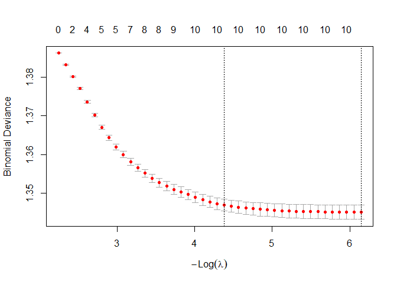
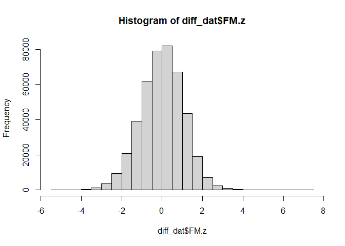
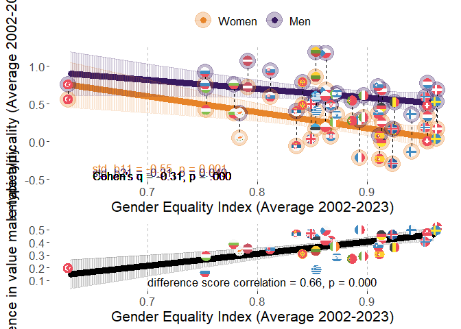
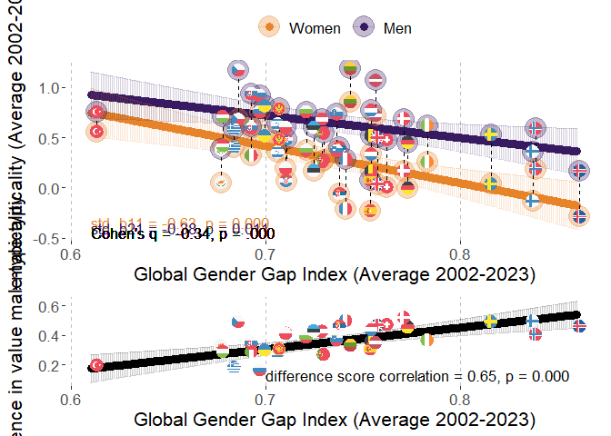
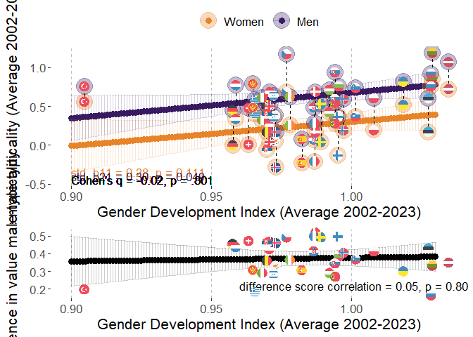
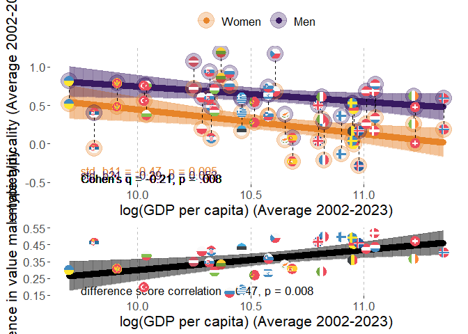
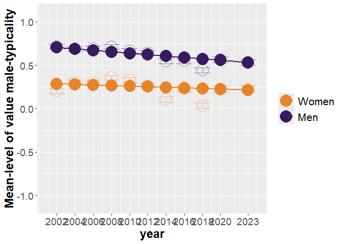
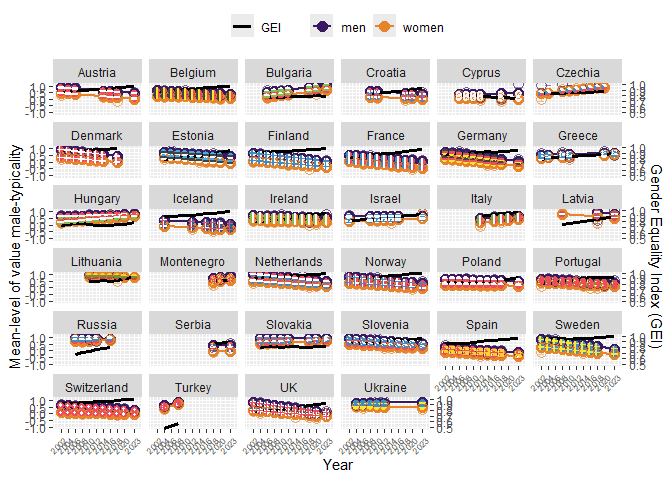

# Packages

Two packages are not in CRAN and need different installation
* devtools::install_github("vjilmari/vjihelpers")
* install.packages("ggflags", repos = c("https://jimjam-slam.r-universe.dev","https://cloud.r-project.org")) 


``` r
library(multid)
library(rio)
library(dplyr)
library(lme4)
library(emmeans)
library(vjihelpers)
library(MetBrewer)
library(ggplot2)
library(finalfit)
library(ggflags) 
library(lmerTest)
library(metafor)
library(ggpubr)
library(Hmisc)
library(r2mlm)
library(tidyr)
library(stringr)
library(apaTables)
library(tibble)
```

# Custom functions


``` r
# toster function for equivalence testing

tost_z <- function(est, se, low, high, alpha = 0.05) {
  # z statistics
  z_low  <- (est - low)  / se     # H0: theta <= low  vs H1: theta > low
  z_high <- (est - high) / se     # H0: theta >= high vs H1: theta < high
  
  # one-sided p-values
  p_low  <- 1 - pnorm(z_low)
  p_high <- pnorm(z_high)
  
  # CI corresponding to TOST (1 - 2*alpha, usually 90% when alpha = 0.05)
  z_crit <- qnorm(1 - alpha)
  ci_low  <- est - z_crit * se
  ci_high <- est + z_crit * se
  
  # equivalence decision
  equivalent <- (p_low < alpha) && (p_high < alpha)
  
  list(
    estimate     = est,
    se           = se,
    low_bound    = low,
    high_bound   = high,
    alpha        = alpha,
    z_low        = z_low,
    p_low        = p_low,
    z_high       = z_high,
    p_high       = p_high,
    ci_level     = 1 - 2*alpha,
    ci_lower     = ci_low,
    ci_upper     = ci_high,
    equivalent   = equivalent
  )
}
```


# Data

* Loads the preprocessed European Social Survey data file made within "Preparations_ESS" code


``` r
load("../data/fdat.rdata")
```

* Include ISO data for country-names


``` r
# read country names
ISO<-read.csv2("../data/ISO.csv")
```


# Exclusions

* exclude participants with missing values or gender


``` r
value.vars<-
  c("con","tra",
  "ben","uni",
  "sdi","sti",
  "hed","ach",
  "pow","sec")

fdat$miss_values<-
  rowSums(is.na(fdat[,value.vars]))
table(fdat$miss_values)
```

```
## 
##      0      1      2      3      4      5      6      7      8      9     10 
## 500044   2791    835    442    267    204    142    143    156    177  35470
```

``` r
fdat<-fdat %>%
  filter(miss_values==0 & !is.na(gndr.bin))
```

# Construct value-based gender-typicality measure

* Use 100 men and women from each country x time data fold for training set


``` r
# set seed number for reproducibility in training/testing split
set.seed(13032023)
# check the cross-validation fold sizes
table(fdat$cntry_time)
```

```
## 
##  AL_6  AT_1 AT_11  AT_2  AT_3  AT_7  AT_8  AT_9  BE_1 BE_10 BE_11  BE_2  BE_3  BE_4  BE_5  BE_6  BE_7 
##  1117  2254  2314  2198  2348  1795  1993  2477  1830  1334  1577  1771  1796  1754  1699  1862  1767 
##  BE_8  BE_9 BG_10 BG_11  BG_3  BG_4  BG_5  BG_6  BG_9  CH_1 CH_10 CH_11  CH_2  CH_3  CH_4  CH_5  CH_6 
##  1759  1756  2697  2218  1295  2144  2371  2179  1926  2024  1505  1368  2110  1780  1753  1491  1483 
##  CH_7  CH_8  CH_9 CY_11  CY_3  CY_4  CY_5  CY_6  CY_9  CZ_1 CZ_10  CZ_2  CZ_4  CZ_5  CZ_6  CZ_7  CZ_8 
##  1521  1504  1517   667   978  1210  1053  1110   773  1208  2369  2557  1986  2335  1973  1862  2252 
##  CZ_9  DE_1 DE_11  DE_2  DE_3  DE_4  DE_5  DE_6  DE_7  DE_8  DE_9  DK_1  DK_2  DK_3  DK_4  DK_5  DK_6 
##  2343  2819  2381  2840  2884  2732  3007  2935  3006  2821  2328  1470  1458  1461  1581  1564  1621 
##  DK_7  DK_9 EE_10 EE_11  EE_2  EE_3  EE_4  EE_5  EE_6  EE_7  EE_8  EE_9  ES_1 ES_11  ES_2  ES_3  ES_4 
##  1483  1554  1538  1282  1948  1466  1646  1793  2345  2036  2007  1899  1712  1833  1623  1847  2562 
##  ES_5  ES_6  ES_7  ES_8  ES_9  FI_1 FI_10 FI_11  FI_2  FI_3  FI_4  FI_5  FI_6  FI_7  FI_8  FI_9  FR_1 
##  1881  1871  1907  1929  1619  1763  1561  1524  1701  1649  1901  1649  2158  2050  1903  1735  1355 
## FR_10 FR_11  FR_2  FR_3  FR_4  FR_5  FR_6  FR_7  FR_8  FR_9  GB_1 GB_10 GB_11  GB_2  GB_3  GB_4  GB_5 
##  1951  1745  1699  1983  2067  1723  1960  1902  2057  1982  1798  1131  1529  1864  2353  2311  2374 
##  GB_6  GB_7  GB_8  GB_9  GR_1 GR_10 GR_11  GR_2  GR_4  GR_5 HR_10 HR_11  HR_4  HR_5  HR_9  HU_1 HU_10 
##  2261  2231  1942  2183  2551  2768  2745  2399  2063  2669  1564  1548  1430  1601  1781  1634  1816 
## HU_11  HU_2  HU_3  HU_4  HU_5  HU_6  HU_7  HU_8  HU_9  IE_1 IE_10 IE_11  IE_2  IE_3  IE_4  IE_5  IE_6 
##  2117  1460  1462  1430  1473  1968  1520  1458  1643  1916  1751  1985  1187  1589  1757  2400  2616 
##  IE_7  IE_8  IE_9  IL_1 IL_11  IL_4  IL_5  IL_6  IL_7  IL_8 IS_10 IS_11  IS_2  IS_6  IS_8  IS_9 IT_10 
##  2380  2746  2189  2279   893  2382  2212  2378  2351  2366   886   825   524   739   841   844  2573 
## IT_11  IT_6  IT_8  IT_9 LT_10 LT_11  LT_5  LT_6  LT_7  LT_8  LT_9  LU_2 LV_11  LV_4  LV_9 ME_10 ME_11 
##  2783   909  2531  2660  1606  1337  1632  2108  2241  2079  1677  1614  1225  1970   891  1248  1581 
##  ME_9 MK_10  NL_1 NL_10 NL_11  NL_2  NL_3  NL_4  NL_5  NL_6  NL_7  NL_8  NL_9  NO_1 NO_10 NO_11  NO_2 
##  1188  1400  2337  1466  1677  1858  1860  1724  1801  1828  1823  1669  1657  1819  1408  1318  1575 
##  NO_3  NO_4  NO_5  NO_6  NO_7  NO_8  NO_9  PL_1 PL_11  PL_2  PL_3  PL_4  PL_5  PL_6  PL_7  PL_8  PL_9 
##  1550  1391  1530  1610  1423  1530  1396  2065  1423  1683  1685  1596  1719  1866  1594  1675  1443 
##  PT_1 PT_10 PT_11  PT_2  PT_3  PT_4  PT_5  PT_6  PT_7  PT_8  PT_9  RO_4 RS_11  RS_9  RU_3  RU_4  RU_5 
##  1482  1827  1366  2024  2182  2337  2139  2138  1242  1254  1045  2104  1511  1969  2339  2446  2557 
##  RU_6  RU_8  SE_1 SE_11  SE_2  SE_3  SE_4  SE_5  SE_6  SE_7  SE_8  SE_9  SI_1 SI_10 SI_11  SI_2  SI_3 
##  2429  2374  1682  1204  1678  1604  1556  1463  1838  1761  1526  1510  1488  1232  1227  1384  1465 
##  SI_4  SI_5  SI_6  SI_7  SI_8  SI_9 SK_10 SK_11  SK_2  SK_3  SK_4  SK_5  SK_6  SK_9  TR_2  TR_4 UA_11 
##  1257  1369  1244  1189  1295  1307  1395  1414  1425  1711  1789  1803  1827  1061  1790  2305  2589 
##  UA_2  UA_3  UA_4  UA_5  UA_6  XK_6 
##  1896  1885  1766  1779  2064  1244
```

``` r
# run the analysis
value_typ<-
  D_regularized(data=fdat,mv.vars = value.vars,
                group.var = "gndr.bin",group.values = c(1,0),
                out = T,fold = T,fold.var = "cntry_time",size = 100,
                pcc = T,auc=T,pred.prob = T,append.data=T)
```
## Gender typicality results and description


### Training sample size


``` r
# n folds in the training phase
length(unique(fdat$cntry_time))
```

```
## [1] 278
```

``` r
length(unique(fdat$cntry_time))*200
```

```
## [1] 55600
```

### Coefficients for value variables in training set


``` r
round(coefficients(value_typ$cv.mod,s = "lambda.min"),2)
```

```
## 11 x 1 sparse Matrix of class "dgCMatrix"
##             lambda.min
## (Intercept)       0.70
## con               0.09
## tra              -0.03
## ben              -0.27
## uni              -0.08
## sdi               0.10
## sti               0.06
## hed               0.06
## ach               0.07
## pow               0.14
## sec              -0.17
```

``` r
plot(value_typ$cv.mod)
```

<!-- -->

### Description of gender differences/prediction in testing dataset


``` r
# save to summary tab
sum_tab<-value_typ$D
# print the country X time -fold results
round(sum_tab,2)
```

```
##        n.1  n.0   m.1   m.0 sd.1 sd.0 pooled.sd diff    D pcc.1 pcc.0 pcc.total  auc pooled.sd.1
## AL_6   419  498  0.05 -0.01 0.35 0.36      0.35 0.06 0.17  0.54  0.51      0.52 0.54        0.38
## AT_1   941 1113  0.16 -0.03 0.43 0.45      0.44 0.19 0.44  0.65  0.53      0.59 0.63        0.38
## AT_11  875 1239  0.03 -0.12 0.34 0.34      0.34 0.15 0.46  0.54  0.65      0.60 0.63        0.38
## AT_2   910 1088  0.21 -0.01 0.40 0.43      0.42 0.22 0.52  0.70  0.52      0.60 0.65        0.38
## AT_3   994 1154  0.19 -0.02 0.43 0.40      0.42 0.21 0.51  0.70  0.51      0.60 0.65        0.38
## AT_7   753  842  0.07 -0.10 0.36 0.37      0.36 0.18 0.48  0.58  0.62      0.60 0.63        0.38
## AT_8   792 1001  0.12 -0.04 0.40 0.42      0.41 0.16 0.40  0.62  0.55      0.58 0.62        0.38
## AT_9  1043 1234  0.07 -0.12 0.36 0.39      0.38 0.19 0.49  0.59  0.62      0.60 0.64        0.38
## BE_1   845  785  0.07 -0.06 0.37 0.39      0.38 0.13 0.35  0.61  0.58      0.59 0.60        0.38
## BE_10  570  564  0.05 -0.11 0.32 0.34      0.33 0.17 0.51  0.58  0.63      0.61 0.64        0.38
## BE_11  702  675  0.02 -0.09 0.33 0.36      0.34 0.11 0.33  0.55  0.58      0.56 0.60        0.38
## BE_2   770  801  0.09 -0.09 0.35 0.38      0.36 0.19 0.51  0.62  0.59      0.60 0.64        0.38
## BE_3   740  856  0.07 -0.07 0.36 0.36      0.36 0.14 0.39  0.60  0.56      0.58 0.61        0.38
## BE_4   760  794  0.08 -0.07 0.34 0.35      0.34 0.15 0.43  0.62  0.55      0.58 0.62        0.38
## BE_5   719  780  0.06 -0.08 0.33 0.36      0.35 0.14 0.41  0.59  0.59      0.59 0.62        0.38
## BE_6   811  851  0.07 -0.08 0.32 0.35      0.33 0.15 0.44  0.60  0.56      0.58 0.62        0.38
## BE_7   795  772  0.05 -0.08 0.33 0.33      0.33 0.13 0.40  0.58  0.56      0.57 0.61        0.38
## BE_8   784  775  0.08 -0.08 0.33 0.34      0.34 0.17 0.49  0.60  0.56      0.58 0.63        0.38
## BE_9   765  791  0.08 -0.06 0.32 0.36      0.34 0.14 0.40  0.59  0.55      0.57 0.61        0.38
## BG_10 1171 1326  0.18  0.03 0.38 0.42      0.40 0.16 0.39  0.71  0.45      0.58 0.61        0.38
## BG_11  957 1061  0.25  0.05 0.41 0.45      0.43 0.21 0.48  0.73  0.46      0.59 0.64        0.38
## BG_3   409  686 -0.02 -0.19 0.42 0.45      0.44 0.17 0.39  0.50  0.67      0.61 0.61        0.38
## BG_4   848 1096 -0.06 -0.25 0.43 0.46      0.44 0.19 0.42  0.44  0.70      0.58 0.62        0.38
## BG_5   942 1229  0.06 -0.12 0.37 0.42      0.40 0.17 0.44  0.59  0.59      0.59 0.62        0.38
## BG_6   830 1149  0.05 -0.13 0.38 0.41      0.40 0.18 0.45  0.57  0.61      0.60 0.63        0.38
## BG_9   763  963  0.08 -0.07 0.39 0.44      0.42 0.15 0.37  0.59  0.56      0.58 0.60        0.38
## CH_1   874  950  0.07 -0.09 0.34 0.34      0.34 0.16 0.47  0.59  0.60      0.59 0.63        0.38
## CH_10  672  633  0.06 -0.11 0.33 0.33      0.33 0.17 0.51  0.60  0.61      0.60 0.65        0.38
## CH_11  590  578  0.02 -0.12 0.31 0.35      0.33 0.14 0.42  0.56  0.64      0.60 0.62        0.38
## CH_2   834 1076  0.06 -0.10 0.35 0.35      0.35 0.17 0.48  0.58  0.61      0.60 0.63        0.38
## CH_3   702  878  0.04 -0.12 0.34 0.32      0.33 0.16 0.48  0.54  0.65      0.61 0.63        0.38
## CH_4   697  856  0.11 -0.14 0.35 0.34      0.34 0.25 0.71  0.63  0.67      0.65 0.70        0.38
## CH_5   662  629  0.05 -0.11 0.33 0.33      0.33 0.16 0.49  0.57  0.63      0.60 0.64        0.38
## CH_6   643  640  0.06 -0.10 0.31 0.34      0.32 0.16 0.48  0.59  0.60      0.60 0.64        0.38
## CH_7   659  662  0.08 -0.11 0.31 0.33      0.32 0.19 0.61  0.62  0.64      0.63 0.67        0.38
## CH_8   681  623  0.07 -0.10 0.31 0.32      0.32 0.17 0.53  0.60  0.64      0.62 0.65        0.38
## CH_9   667  650  0.05 -0.11 0.31 0.33      0.32 0.16 0.50  0.56  0.63      0.60 0.64        0.38
## CY_11  203  264 -0.03 -0.26 0.42 0.43      0.42 0.22 0.52  0.45  0.73      0.61 0.65        0.38
## CY_3   368  410 -0.03 -0.12 0.36 0.41      0.39 0.09 0.23  0.51  0.59      0.55 0.57        0.38
## CY_4   512  498 -0.01 -0.13 0.37 0.39      0.38 0.12 0.33  0.51  0.59      0.55 0.58        0.38
## CY_5   375  478 -0.09 -0.21 0.37 0.46      0.42 0.12 0.28  0.43  0.67      0.56 0.58        0.38
## CY_6   391  519 -0.11 -0.27 0.39 0.43      0.41 0.16 0.38  0.40  0.72      0.58 0.60        0.38
## CY_9   263  310 -0.19 -0.27 0.41 0.40      0.41 0.08 0.19  0.31  0.73      0.54 0.55        0.38
## CZ_1   472  536  0.10 -0.18 0.46 0.44      0.45 0.27 0.61  0.59  0.68      0.64 0.67        0.38
## CZ_10  928 1241  0.32  0.15 0.40 0.45      0.43 0.17 0.40  0.79  0.35      0.54 0.60        0.38
## CZ_2  1089 1268  0.24 -0.04 0.42 0.48      0.45 0.29 0.64  0.73  0.52      0.62 0.68        0.38
## CZ_4   863  923  0.25  0.02 0.42 0.47      0.45 0.23 0.52  0.74  0.48      0.61 0.64        0.38
## CZ_5  1069 1066  0.27  0.04 0.41 0.45      0.43 0.23 0.54  0.76  0.44      0.60 0.64        0.38
## CZ_6   875  898  0.28  0.07 0.41 0.48      0.45 0.20 0.46  0.77  0.42      0.59 0.62        0.38
## CZ_7   704  958  0.30  0.08 0.40 0.43      0.42 0.22 0.52  0.79  0.40      0.56 0.64        0.38
## CZ_8   989 1063  0.29  0.16 0.38 0.41      0.39 0.14 0.35  0.79  0.33      0.55 0.59        0.38
## CZ_9   921 1222  0.26  0.07 0.40 0.44      0.42 0.19 0.44  0.75  0.43      0.56 0.62        0.38
## DE_1  1249 1370  0.05 -0.13 0.41 0.42      0.42 0.18 0.44  0.56  0.64      0.60 0.63        0.38
## DE_11 1092 1089 -0.07 -0.25 0.35 0.36      0.36 0.17 0.49  0.42  0.75      0.58 0.64        0.38
## DE_2  1267 1373  0.10 -0.11 0.40 0.39      0.39 0.21 0.53  0.59  0.62      0.61 0.64        0.38
## DE_3  1319 1365  0.10 -0.10 0.38 0.39      0.39 0.19 0.50  0.60  0.60      0.60 0.64        0.38
## DE_4  1342 1190  0.05 -0.15 0.38 0.38      0.38 0.20 0.53  0.55  0.66      0.60 0.65        0.38
## DE_5  1444 1363 -0.01 -0.17 0.36 0.36      0.36 0.16 0.44  0.49  0.69      0.58 0.62        0.38
##       pooled.sd.0 pooled.sd.total d.sd.total
## AL_6          0.4            0.39       0.16
## AT_1          0.4            0.39       0.49
## AT_11         0.4            0.39       0.39
## AT_2          0.4            0.39       0.56
## AT_3          0.4            0.39       0.54
## AT_7          0.4            0.39       0.45
## AT_8          0.4            0.39       0.42
## AT_9          0.4            0.39       0.48
## BE_1          0.4            0.39       0.34
## BE_10         0.4            0.39       0.43
## BE_11         0.4            0.39       0.29
## BE_2          0.4            0.39       0.48
## BE_3          0.4            0.39       0.36
## BE_4          0.4            0.39       0.38
## BE_5          0.4            0.39       0.37
## BE_6          0.4            0.39       0.38
## BE_7          0.4            0.39       0.34
## BE_8          0.4            0.39       0.43
## BE_9          0.4            0.39       0.35
## BG_10         0.4            0.39       0.40
## BG_11         0.4            0.39       0.53
## BG_3          0.4            0.39       0.44
## BG_4          0.4            0.39       0.48
## BG_5          0.4            0.39       0.45
## BG_6          0.4            0.39       0.46
## BG_9          0.4            0.39       0.40
## CH_1          0.4            0.39       0.41
## CH_10         0.4            0.39       0.43
## CH_11         0.4            0.39       0.35
## CH_2          0.4            0.39       0.43
## CH_3          0.4            0.39       0.41
## CH_4          0.4            0.39       0.63
## CH_5          0.4            0.39       0.41
## CH_6          0.4            0.39       0.40
## CH_7          0.4            0.39       0.50
## CH_8          0.4            0.39       0.43
## CH_9          0.4            0.39       0.42
## CY_11         0.4            0.39       0.57
## CY_3          0.4            0.39       0.23
## CY_4          0.4            0.39       0.32
## CY_5          0.4            0.39       0.31
## CY_6          0.4            0.39       0.40
## CY_9          0.4            0.39       0.20
## CZ_1          0.4            0.39       0.70
## CZ_10         0.4            0.39       0.44
## CZ_2          0.4            0.39       0.74
## CZ_4          0.4            0.39       0.59
## CZ_5          0.4            0.39       0.59
## CZ_6          0.4            0.39       0.53
## CZ_7          0.4            0.39       0.56
## CZ_8          0.4            0.39       0.35
## CZ_9          0.4            0.39       0.48
## DE_1          0.4            0.39       0.47
## DE_11         0.4            0.39       0.45
## DE_2          0.4            0.39       0.54
## DE_3          0.4            0.39       0.50
## DE_4          0.4            0.39       0.52
## DE_5          0.4            0.39       0.41
##  [ reached 'max' / getOption("max.print") -- omitted 220 rows ]
```

``` r
# range in gender differences across folds with fold-specific SDs
range(sum_tab$D)
```

```
## [1] 0.04560813 0.71413463
```

``` r
# range in gender differences across folds with SD pooled across all folds
range(sum_tab$d.sd.total)
```

```
## [1] 0.04898065 0.73592517
```

``` r
# mean gender difference across folds with SD pooled across all folds
mean(sum_tab$d.sd.total)
```

```
## [1] 0.412898
```

``` r
# average probability of correct classification (pcc)
mean(sum_tab$pcc.total)
```

```
## [1] 0.5802061
```

``` r
# pcc for men
mean(sum_tab$pcc.1)
```

```
## [1] 0.5954792
```

``` r
# pcc for women
mean(sum_tab$pcc.0)
```

```
## [1] 0.5718254
```

``` r
# average area under the curve
mean(sum_tab$auc)
```

```
## [1] 0.6178933
```

``` r
# print smallest and largest gender differences
sum_tab[sum_tab$d.sd.total==min(sum_tab$d.sd.total),]
```

```
##       n.1 n.0         m.1         m.0      sd.1      sd.0 pooled.sd       diff          D pcc.1     pcc.0
## MK_10 538 662 0.003747672 -0.01534145 0.4044009 0.4296955 0.4185463 0.01908912 0.04560813   0.5 0.5196375
##       pcc.total       auc pooled.sd.1 pooled.sd.0 pooled.sd.total d.sd.total
## MK_10 0.5108333 0.5125535   0.3773205   0.3998527       0.3897277 0.04898065
```

``` r
sum_tab[sum_tab$d.sd.total==max(sum_tab$d.sd.total),]
```

```
##       n.1  n.0       m.1         m.0      sd.1      sd.0 pooled.sd      diff         D    pcc.1     pcc.0
## CZ_2 1089 1268 0.2423504 -0.04446001 0.4194121 0.4770804 0.4513545 0.2868104 0.6354438 0.728191 0.5205047
##      pcc.total       auc pooled.sd.1 pooled.sd.0 pooled.sd.total d.sd.total
## CZ_2 0.6164616 0.6751419   0.3773205   0.3998527       0.3897277  0.7359252
```

``` r
# correlation between men and women in male-typicality across the folds
cor(sum_tab$m.1,sum_tab$m.0)
```

```
## [1] 0.9204389
```

``` r
# correlation between men and women in male-typicality deviations across the folds
cor(sum_tab$sd.1,sum_tab$sd.0)
```

```
## [1] 0.8574715
```

# Data for the analysis

* use the testing partition of the data set (diff_dat)
* basic descriptives


``` r
diff_dat<-
  value_typ$preds

#diff_dat$age.c<-as.numeric(diff_dat$age.c)
#diff_dat$rlgdgr.c<-as.numeric(diff_dat$rlgdgr.c)
#diff_dat$eduyrs.c<-as.numeric(diff_dat$eduyrs.c)

# data exclusions (include countries with at least two rounds of data)
n_rounds<-diff_dat %>% group_by(cntry) %>%
  summarise(n_unique_essround = n_distinct(essround))

# join number of rounds to data
diff_dat<-
  left_join(x=diff_dat,
            y=n_rounds,
            by="cntry")

# filter only countries with more than 1 round and non-missing gender variable
diff_dat<-diff_dat %>%
  dplyr::filter(n_unique_essround>1 &
                  !is.na(gndr))

# cross-tabulate sample sizes and ESS rounds by country
table(diff_dat$essround,diff_dat$cntry)
```

```
##     
##        AT   BE   BG   CH   CY   CZ   DE   DK   EE   ES   FI   FR   GB   GR   HR   HU   IE   IL   IS   IT
##   1  2054 1630    0 1824    0 1008 2619 1270    0 1512 1563 1155 1598 2351    0 1434 1716 2079    0    0
##   2  1998 1571    0 1910    0 2357 2640 1258 1748 1423 1501 1499 1664 2199    0 1260  987    0  324    0
##   3  2148 1596 1095 1580  778    0 2684 1261 1266 1647 1449 1783 2153    0    0 1262 1389    0    0    0
##   4     0 1554 1944 1553 1010 1786 2532 1381 1446 2362 1701 1867 2111 1863 1230 1230 1557 2182    0    0
##   5     0 1499 2171 1291  853 2135 2807 1364 1593 1681 1449 1523 2174 2469 1401 1273 2200 2012    0    0
##   6     0 1662 1979 1283  910 1773 2735 1421 2145 1671 1958 1760 2061    0    0 1768 2416 2178  539  709
##   7  1595 1567    0 1321    0 1662 2806 1283 1836 1707 1850 1702 2031    0    0 1320 2180 2151    0    0
##   8  1793 1559    0 1304    0 2052 2621    0 1807 1729 1703 1857 1742    0    0 1258 2546 2166  641 2331
##   9  2277 1556 1726 1317  573 2143 2128 1354 1699 1419 1535 1782 1983    0 1581 1443 1989    0  644 2460
##   10    0 1134 2497 1305    0 2169    0    0 1338    0 1361 1751  931 2568 1364 1616 1551    0  686 2373
##   11 2114 1377 2018 1168  467    0 2181    0 1082 1633 1324 1545 1329 2545 1348 1917 1785  693  625 2583
##     
##        LT   LV   ME   NL   NO   PL   PT   RS   RU   SE   SI   SK   TR   UA
##   1     0    0    0 2137 1619 1865 1282    0    0 1482 1288    0    0    0
##   2     0    0    0 1658 1375 1483 1824    0    0 1478 1184 1225 1590 1696
##   3     0    0    0 1660 1350 1485 1982    0 2139 1404 1265 1511    0 1685
##   4     0 1770    0 1524 1191 1396 2137    0 2246 1356 1057 1589 2105 1566
##   5  1432    0    0 1601 1330 1519 1939    0 2357 1263 1169 1603    0 1579
##   6  1908    0    0 1628 1410 1666 1938    0 2229 1638 1044 1627    0 1864
##   7  2041    0    0 1623 1223 1394 1042    0    0 1561  989    0    0    0
##   8  1879    0    0 1469 1330 1475 1054    0 2174 1326 1095    0    0    0
##   9  1477  691  988 1457 1196 1243  845 1769    0 1310 1107  861    0    0
##   10 1406    0 1048 1266 1208    0 1627    0    0    0 1032 1195    0    0
##   11 1137 1025 1381 1477 1118 1223 1166 1311    0 1004 1027 1214    0 2389
```

``` r
# range of sample sizes
range(table(diff_dat$cntry))
```

```
## [1]  3080 25753
```

``` r
# value-based gender-typicality histogram
hist(diff_dat$pred)
```

<!-- -->

``` r
# scale/standardize with SD pooled across all country-time-gender folds
FM_pooled_sd<-value_typ$D[1,"pooled.sd.total"]
FM_pooled_sd
```

```
## [1] 0.3897277
```

``` r
# standardized
diff_dat$FM.z<-diff_dat$pred/FM_pooled_sd
hist(diff_dat$FM.z)
```

<!-- -->

``` r
# recode time to start from 2002=0

diff_dat$year<-
  case_when(
    diff_dat$essround==1~2002,  
    diff_dat$essround==2~2004,
    diff_dat$essround==3~2006,
    diff_dat$essround==4~2008,
    diff_dat$essround==5~2010,
    diff_dat$essround==6~2012,
    diff_dat$essround==7~2014,
    diff_dat$essround==8~2016,
    diff_dat$essround==9~2018,
    diff_dat$essround==10~2020,
    diff_dat$essround==11~2023
  )

diff_dat$year.c<-diff_dat$year-2002
```

## Add GEI-variable

* GEI = Reverse-coded Gender Inequality Index (GII)


``` r
GII<-read.csv("../data/GII.csv")

# Obtain GII only for ESS countries
GII_in_ESS_d<-
  GII %>%
  filter(ISO2 %in% unique(diff_dat$cntry))

# Make long format data of GII, so that country x year has own rows

long_GII_in_ESS_d <- GII_in_ESS_d %>%
  pivot_longer(
    cols = starts_with("gii_") & !matches("avg"),  # <-- exclude the "_avg" columns
    names_to = "year",
    values_to = "gii",
    names_prefix = "gii_"
  ) %>%
  mutate(year = as.integer(year)) %>%
  filter(year >= 2002 & year <= 2023) %>%
  mutate(gei = 1 - gii) %>%
  select(ISO2, iso3, country, year, gii, gei, gii_2002_2023_avg, gei_2002_2023_avg)


# describe gei average
psych::describe(GII_in_ESS_d$gei_2002_2023_avg)
```

```
##    vars  n mean   sd median trimmed  mad  min  max range  skew kurtosis   se
## X1    1 33 0.87 0.07   0.87    0.87 0.06 0.63 0.96  0.34 -1.06     1.37 0.01
```

``` r
# one is missing, see which one
GII_in_ESS_d[is.na(GII_in_ESS_d$gei_2002_2023_avg),"country"]
```

```
## [1] "Ukraine"
```

``` r
# get means and SDs for standardizing
gei_mean<-mean(GII_in_ESS_d$gei_2002_2023_avg,na.rm=T)
gei_sd<-sd(GII_in_ESS_d$gei_2002_2023_avg,na.rm=T)

# standardize 
# year specific scores
long_GII_in_ESS_d$gei.z<-(long_GII_in_ESS_d$gei-gei_mean)/gei_sd

# get the country means to a separate frame

GII_country_means<-
  long_GII_in_ESS_d %>% group_by(ISO2) %>%
  summarise(gei.cm=mean(gei,na.rm=T),
            gei.z.cm=mean(gei.z,na.rm=T))


long_GII_in_ESS_d<-left_join(
  x=long_GII_in_ESS_d,
  y=GII_country_means,
  by="ISO2"
)


# center both the raw score and standardized scores
long_GII_in_ESS_d$gei.cmc<-(long_GII_in_ESS_d$gei-long_GII_in_ESS_d$gei.cm)
long_GII_in_ESS_d$gei.z.cmc<-(long_GII_in_ESS_d$gei.z-long_GII_in_ESS_d$gei.z.cm)

#View(long_GII_in_ESS_d)

# averages across 2002-2023
#long_GII_in_ESS_d$gei_2002_2023_avg.z<-(long_GII_in_ESS_d$gei_2002_2023_avg-gei_mean)/gei_sd

#long_GII_in_ESS_d$gei.cmc<-long_GII_in_ESS_d$gei-long_GII_in_ESS_d$gei_2002_2023_avg

# add year to ESS data-frame


# link datasets by country and year

diff_dat<-
  left_join(
    x=diff_dat,
    y=long_GII_in_ESS_d[,c("ISO2","year","gei","gei.cm","gei.cmc",
                           "gei.z","gei.z.cm","gei.z.cmc")],
    by=c("cntry"="ISO2","year")
)
```


## Add GDI-variable

* GDI = Gender Development Index


``` r
GDI<-read.csv("../data/GDI.csv")

# Obtain GDI only for ESS countries
GDI_in_ESS_d<-
  GDI %>%
  filter(ISO2 %in% unique(diff_dat$cntry))

# Make long format data of GDI, so that country x year has own rows

long_GDI_in_ESS_d <- GDI_in_ESS_d %>%
  pivot_longer(
    cols = starts_with("gdi_") & !matches("avg"),  # <-- exclude the "_avg" columns
    names_to = "year",
    values_to = "gdi",
    names_prefix = "gdi_"
  ) %>%
  mutate(year = as.integer(year)) %>%
  filter(year >= 2002 & year <= 2023) %>%
  select(ISO2, iso3, country, year, gdi, gdi_2002_2023_avg)

# describe gdi average
psych::describe(GDI_in_ESS_d$gdi_2002_2023_avg)
```

```
##    vars  n mean   sd median trimmed  mad min  max range skew kurtosis se
## X1    1 34 0.98 0.03   0.98    0.98 0.02 0.9 1.03  0.13 -0.3     1.28  0
```

``` r
# get means and SDs for standardizing
gdi_mean<-mean(GDI_in_ESS_d$gdi_2002_2023_avg,na.rm=T)
gdi_sd<-sd(GDI_in_ESS_d$gdi_2002_2023_avg,na.rm=T)

# standardize 
# year specific scores
long_GDI_in_ESS_d$gdi.z<-(long_GDI_in_ESS_d$gdi-gdi_mean)/gdi_sd

# get the country means to a separate frame

GDI_country_means<-
  long_GDI_in_ESS_d %>% group_by(ISO2) %>%
  summarise(gdi.cm=mean(gdi,na.rm=T),
            gdi.z.cm=mean(gdi.z,na.rm=T))

long_GDI_in_ESS_d<-left_join(
  x=long_GDI_in_ESS_d,
  y=GDI_country_means,
  by="ISO2"
)


# center both the raw score and standardized scores
long_GDI_in_ESS_d$gdi.cmc<-(long_GDI_in_ESS_d$gdi-long_GDI_in_ESS_d$gdi.cm)
long_GDI_in_ESS_d$gdi.z.cmc<-(long_GDI_in_ESS_d$gdi.z-long_GDI_in_ESS_d$gdi.z.cm)

# link datasets by country and year

diff_dat<-
  left_join(
    x=diff_dat,
    y=long_GDI_in_ESS_d[,c("ISO2","year","gdi","gdi.cm","gdi.cmc",
                           "gdi.z","gdi.z.cm","gdi.z.cmc")],
    by=c("cntry"="ISO2","year")
  )
```

## Add GDP-variable

* log_GDP = Logarithm of GDP per capita, PPP (constant 2017 international $)


``` r
GDP<-read.csv("../data/GDP_processed.csv")

# Obtain GDP only for ESS countries
GDP_in_ESS_d<-
  GDP %>%
  filter(ISO2 %in% unique(diff_dat$cntry))

# First, rename those X2000..YR2000. style columns to simple "gdp_2000" etc.

GDP_in_ESS_d <- GDP_in_ESS_d %>%
  rename_with(
    ~ str_replace_all(., "^X(\\d{4})..YR\\1\\.$", "gdp_\\1"),
    starts_with("X")
  )

# GDP_in_ESS_d
# Make long format data of GDP, so that country x year has own rows

long_GDP_in_ESS_d <- GDP_in_ESS_d %>%
  pivot_longer(
    cols = starts_with("gdp_") & !matches("avg"),  # <-- exclude the "_avg" columns
    names_to = "year",
    values_to = "gdp",
    names_prefix = "gdp_"
  ) %>%
  mutate(year = as.integer(year)) %>%
  filter(year >= 2002 & year <= 2023) %>%
  select(ISO2, Country.Name, year, gdp, gdp_2002_2023_avg,log_gdp_2002_2023_avg) %>%
  mutate(log_gdp=log(gdp))

#View(long_GDP_in_ESS_d)

# describe gdp average
psych::describe(GDP_in_ESS_d$gdp_2002_2023_avg)
```

```
##    vars  n     mean      sd  median  trimmed     mad      min      max    range skew kurtosis      se
## X1    1 34 43905.99 17369.7 40201.8 42845.95 15827.5 16384.61 85341.85 68957.24 0.48    -0.58 2978.88
```

``` r
psych::describe(GDP_in_ESS_d$log_gdp_2002_2023_avg)
```

```
##    vars  n  mean   sd median trimmed  mad min   max range  skew kurtosis   se
## X1    1 34 10.61 0.41   10.6   10.62 0.44 9.7 11.35  1.65 -0.27    -0.71 0.07
```

``` r
# get means and SDs for standardizing
log_gdp_mean<-mean(GDP_in_ESS_d$log_gdp_2002_2023_avg,na.rm=T)
log_gdp_sd<-sd(GDP_in_ESS_d$log_gdp_2002_2023_avg,na.rm=T)

# standardize 
# year specific scores
long_GDP_in_ESS_d$log_gdp.z<-
  (long_GDP_in_ESS_d$log_gdp-log_gdp_mean)/log_gdp_sd

# get the country means to a separate frame

GDP_country_means<-
  long_GDP_in_ESS_d %>% group_by(ISO2) %>%
  summarise(gdp.cm=mean(gdp,na.rm=T),
            #gdp.z.cm=mean(gdp.z,na.rm=T),
            log_gdp.cm=mean(log_gdp,na.rm=T),
            log_gdp.z.cm=mean(log_gdp.z,na.rm=T))

long_GDP_in_ESS_d<-left_join(
  x=long_GDP_in_ESS_d,
  y=GDP_country_means,
  by="ISO2"
)


# center both the raw score and standardized scores
long_GDP_in_ESS_d$log_gdp.cmc<-(long_GDP_in_ESS_d$log_gdp-long_GDP_in_ESS_d$log_gdp.cm)
long_GDP_in_ESS_d$log_gdp.z.cmc<-(long_GDP_in_ESS_d$log_gdp.z-long_GDP_in_ESS_d$log_gdp.z.cm)

# link datasets by country and year

diff_dat<-
  left_join(
    x=diff_dat,
    y=long_GDP_in_ESS_d[,c("ISO2","year","log_gdp","log_gdp.cm","log_gdp.cmc",
                           "log_gdp.z","log_gdp.z.cm","log_gdp.z.cmc")],
    by=c("cntry"="ISO2","year")
  )
```

## Add GGGI-variable

* GGGI = Global Gender Gap Index


``` r
GGGI<-import("../data/GGGI.xlsx")

# check if all ESS countries are in the log_GGGI data
table(unique(diff_dat$cntry) %in% GGGI$ISO2)
```

```
## 
## TRUE 
##   34
```

``` r
# Obtain GGGI only for ESS countries
GGGI_in_ESS_d<-
  GGGI %>%
  filter(ISO2 %in% unique(diff_dat$cntry))

# Make long format data of GGGI, so that country x year has own rows

long_GGGI_in_ESS_d <- GGGI_in_ESS_d %>%
  pivot_longer(
    cols = starts_with("gggi_") & !matches("avg"),  # <-- exclude the "_avg" columns
    names_to = "year",
    values_to = "gggi",
    names_prefix = "gggi_"
  ) %>%
  mutate(year = as.integer(year)) %>%
  filter(year >= 2002 & year <= 2023) %>%
  select(ISO2, cname, year, gggi, GGGI_2002_2023_avg)

# describe gggi average
psych::describe(GGGI_in_ESS_d$GGGI_2002_2023_avg)
```

```
##    vars  n mean   sd median trimmed  mad  min  max range skew kurtosis   se
## X1    1 34 0.74 0.05   0.73    0.73 0.04 0.61 0.86  0.25  0.4     0.29 0.01
```

``` r
# get means and SDs for standardizing
gggi_mean<-mean(GGGI_in_ESS_d$GGGI_2002_2023_avg,na.rm=T)
gggi_sd<-sd(GGGI_in_ESS_d$GGGI_2002_2023_avg,na.rm=T)

# standardize 
# year specific scores
long_GGGI_in_ESS_d$gggi.z<-(long_GGGI_in_ESS_d$gggi-gggi_mean)/gggi_sd

# get the country means to a separate frame

GGGI_country_means<-
  long_GGGI_in_ESS_d %>% group_by(ISO2) %>%
  summarise(gggi.cm=mean(gggi,na.rm=T),
            gggi.z.cm=mean(gggi.z,na.rm=T))

long_GGGI_in_ESS_d<-left_join(
  x=long_GGGI_in_ESS_d,
  y=GGGI_country_means,
  by="ISO2"
)

# center both the raw score and standardized scores
long_GGGI_in_ESS_d$gggi.cmc<-
  (long_GGGI_in_ESS_d$gggi-long_GGGI_in_ESS_d$gggi.cm)

long_GGGI_in_ESS_d$gggi.z.cmc<-
  (long_GGGI_in_ESS_d$gggi.z-long_GGGI_in_ESS_d$gggi.z.cm)

# link datasets by country and year

diff_dat<-
  left_join(
    x=diff_dat,
    y=long_GGGI_in_ESS_d[,c("ISO2","year","gggi","gggi.cm","gggi.cmc",
                           "gggi.z","gggi.z.cm","gggi.z.cmc")],
    by=c("cntry"="ISO2","year")
  )
```

## Country-year-gender dataframe

Frame with one row for country-year-gender


``` r
diff_dat_cntry_year<-
  diff_dat %>% 
  group_by(cntry,year,gndr.c) %>%
  dplyr::summarise(n=n(),
                   n_wt=sum(pspwght),
                   FM.z.wt=weighted.mean(x=FM.z,w=pspwght),
                   FM.z=mean(FM.z),
                   gei.z=mean(gei.z,na.rm=T),
                   gei.z.cm=mean(gei.z.cm,na.rm=T),
                   gei.z.cmc=mean(gei.z.cmc,na.rm=T),
                   gdi.z=mean(gdi.z,na.rm=T),
                   gdi.z.cm=mean(gdi.z.cm,na.rm=T),
                   gdi.z.cmc=mean(gdi.z.cmc,na.rm=T),
                   gggi.z=mean(gggi.z,na.rm=T),
                   gggi.z.cm=mean(gggi.z.cm,na.rm=T),
                   gggi.z.cmc=mean(gggi.z.cmc,na.rm=T),
                   log_gdp.z=mean(log_gdp.z,na.rm=T),
                   log_gdp.z.cm=mean(log_gdp.z.cm,na.rm=T),
                   log_gdp.z.cmc=mean(log_gdp.z.cmc,na.rm=T),
                   gei=mean(gei,na.rm=T),
                   gei.cm=mean(gei.cm,na.rm=T),
                   gei.cmc=mean(gei.cmc,na.rm=T),
                   gdi=mean(gdi,na.rm=T),
                   gdi.cm=mean(gdi.cm,na.rm=T),
                   gdi.cmc=mean(gdi.cmc,na.rm=T),
                   gggi=mean(gggi,na.rm=T),
                   gggi.cm=mean(gggi.cm,na.rm=T),
                   gggi.cmc=mean(gggi.cmc,na.rm=T),
                   log_gdp=mean(log_gdp,na.rm=T),
                   log_gdp.cm=mean(log_gdp.cm,na.rm=T),
                   log_gdp.cmc=mean(log_gdp.cmc,na.rm=T))
```

```
## `summarise()` has regrouped the output.
## ℹ Summaries were computed grouped by cntry, year, and gndr.c.
## ℹ Output is grouped by cntry and year.
## ℹ Use `summarise(.groups = "drop_last")` to silence this message.
## ℹ Use `summarise(.by = c(cntry, year, gndr.c))` for per-operation grouping (`?dplyr::dplyr_by`) instead.
```


# Descriptive statistics

## Country-specific descriptives


``` r
# sample sizes from weights

cntry_n_frame<-
  diff_dat %>% group_by(cntry) %>%
  summarise('n ESS rounds' = mean(n_unique_essround),
            n=round(sum(pspwght),0))

# value-based male-typicality

cntry_FM_frame<-
  diff_dat %>% group_by(cntry,essround) %>%
  summarise('FM M' = weighted.mean(x=FM.z,w=pspwght),
            'FM SD' = sqrt(wtd.var(FM.z,pspwght))) %>%
  group_by(cntry) %>%
  summarise('FM M' = mean(x=`FM M`),
            'FM SD'= mean(x=`FM SD`))
```

```
## `summarise()` has regrouped the output.
## ℹ Summaries were computed grouped by cntry and essround.
## ℹ Output is grouped by cntry.
## ℹ Use `summarise(.groups = "drop_last")` to silence this message.
## ℹ Use `summarise(.by = c(cntry, essround))` for per-operation grouping (`?dplyr::dplyr_by`) instead.
```

``` r
cntry_FM_women_frame<-
  diff_dat %>%
  filter(gndr.c==-0.5) %>%
  group_by(cntry,essround) %>%
  summarise('FM M' = weighted.mean(x=FM.z,w=pspwght),
            'FM SD' = sqrt(wtd.var(FM.z,pspwght))) %>%
  group_by(cntry) %>%
  summarise('FM M Women' = mean(x=`FM M`),
            'FM SD Women'= mean(x=`FM SD`))
```

```
## `summarise()` has regrouped the output.
## ℹ Summaries were computed grouped by cntry and essround.
## ℹ Output is grouped by cntry.
## ℹ Use `summarise(.groups = "drop_last")` to silence this message.
## ℹ Use `summarise(.by = c(cntry, essround))` for per-operation grouping (`?dplyr::dplyr_by`) instead.
```

``` r
cntry_FM_men_frame<-
  diff_dat %>%
  filter(gndr.c==0.5) %>%
  group_by(cntry,essround) %>%
  summarise('FM M' = weighted.mean(x=FM.z,w=pspwght),
            'FM SD' = sqrt(wtd.var(FM.z,pspwght))) %>%
  group_by(cntry) %>%
  summarise('FM M Men' = mean(x=`FM M`),
            'FM SD Men'= mean(x=`FM SD`))
```

```
## `summarise()` has regrouped the output.
## ℹ Summaries were computed grouped by cntry and essround.
## ℹ Output is grouped by cntry.
## ℹ Use `summarise(.groups = "drop_last")` to silence this message.
## ℹ Use `summarise(.by = c(cntry, essround))` for per-operation grouping (`?dplyr::dplyr_by`) instead.
```

``` r
# link n and FM datasets

desc_frame<-
  left_join(
    x=cntry_n_frame,
    y=cntry_FM_frame,
    by="cntry"
  )

desc_frame<-
  left_join(
    x=desc_frame,
    y=cntry_FM_women_frame,
    by="cntry"
  )

desc_frame<-
  left_join(
    x=desc_frame,
    y=cntry_FM_men_frame,
    by="cntry"
  )

# Add country-specific differences
desc_frame$D<-desc_frame$`FM M Men`-desc_frame$`FM M Women`

desc_frame
```

```
## # A tibble: 34 × 10
##    cntry `n ESS rounds`     n  `FM M` `FM SD` `FM M Women` `FM SD Women` `FM M Men` `FM SD Men`     D
##    <chr>          <dbl> <dbl>   <dbl>   <dbl>        <dbl>         <dbl>      <dbl>       <dbl> <dbl>
##  1 AT                 7 14032  0.0730   1.04        -0.173         1.02      0.341        0.993 0.514
##  2 BE                11 16681 -0.0327   0.919       -0.217         0.923     0.162        0.873 0.380
##  3 BG                 7 13437  0.0337   1.09        -0.186         1.12      0.277        1.01  0.464
##  4 CH                11 15914 -0.0572   0.877       -0.272         0.862     0.169        0.835 0.441
##  5 CY                 6  4580 -0.298    1.04        -0.461         1.06     -0.118        0.986 0.342
##  6 CZ                 9 17085  0.402    1.14         0.123         1.15      0.708        1.05  0.585
##  7 DE                10 25753 -0.233    0.997       -0.476         0.976     0.0226       0.954 0.499
##  8 DK                 8 10590  0.0961   0.969       -0.142         0.927     0.341        0.948 0.484
##  9 EE                10 15958 -0.102    1.05        -0.337         1.03      0.190        0.988 0.527
## 10 ES                10 16795 -0.478    1.02        -0.646         1.03     -0.302        0.976 0.344
## # ℹ 24 more rows
```

``` r
# add country-level measures

desc_frame<-
  left_join(
    x=desc_frame,
    y=GII_country_means[,c("ISO2","gei.cm")],
    by=c("cntry"="ISO2")
  )

desc_frame<-
  left_join(
    x=desc_frame,
    y=GGGI_country_means[,c("ISO2","gggi.cm")],
    by=c("cntry"="ISO2")
  )

desc_frame<-
  left_join(
    x=desc_frame,
    y=GDI_country_means[,c("ISO2","gdi.cm")],
    by=c("cntry"="ISO2")
  )


desc_frame<-
  left_join(
    x=desc_frame,
    y=GDP_country_means[,c("ISO2","gdp.cm")],
    by=c("cntry"="ISO2")
  )

desc_frame<-left_join(
  x=desc_frame,
  y=ISO[,c("ISO2","CLDR")],
  by=c("cntry"="ISO2")
)

# finalize the formatted table

cntry_desc_tbl<-
  desc_frame %>%
  select(
    Country = CLDR,
    `n ESS rounds`,
    n,
    `FM M`, `FM SD`,
    `FM M Women`, `FM SD Women`,
    `FM M Men`, `FM SD Men`,
    D,
    GEI = gei.cm,
    GGGI = gggi.cm,
    GDI = gdi.cm,
    GDP = gdp.cm
  ) %>%
  mutate(
    across(
      .cols = -c(Country, `n ESS rounds`, n, GDP) & where(is.numeric),
      .fns  = ~ round_tidy(.x, 2)
    )
  ) %>%
  mutate(
    across(
      .cols = GDP,
      .fns  = ~ round_tidy(.x, 0)
    )
  )
print(cntry_desc_tbl,n=35)
```

```
## # A tibble: 34 × 14
##    Country     `n ESS rounds`     n `FM M` `FM SD` `FM M Women` `FM SD Women` `FM M Men` `FM SD Men` D    
##    <chr>                <dbl> <dbl> <chr>  <chr>   <chr>        <chr>         <chr>      <chr>       <chr>
##  1 Austria                  7 14032 0.07   1.04    -0.17        1.02          0.34       0.99        0.51 
##  2 Belgium                 11 16681 -0.03  0.92    -0.22        0.92          0.16       0.87        0.38 
##  3 Bulgaria                 7 13437 0.03   1.09    -0.19        1.12          0.28       1.01        0.46 
##  4 Switzerland             11 15914 -0.06  0.88    -0.27        0.86          0.17       0.84        0.44 
##  5 Cyprus                   6  4580 -0.30  1.04    -0.46        1.06          -0.12      0.99        0.34 
##  6 Czechia                  9 17085 0.40   1.14    0.12         1.15          0.71       1.05        0.59 
##  7 Germany                 10 25753 -0.23  1.00    -0.48        0.98          0.02       0.95        0.50 
##  8 Denmark                  8 10590 0.10   0.97    -0.14        0.93          0.34       0.95        0.48 
##  9 Estonia                 10 15958 -0.10  1.05    -0.34        1.03          0.19       0.99        0.53 
## 10 Spain                   10 16795 -0.48  1.02    -0.65        1.03          -0.30      0.98        0.34 
## 11 Finland                 11 17394 -0.27  1.04    -0.53        1.01          0.03       0.98        0.56 
## 12 France                  11 18277 -0.29  1.05    -0.51        1.03          -0.05      1.02        0.46 
## 13 UK                      11 20697 -0.14  1.00    -0.36        0.98          0.10       0.96        0.47 
## 14 Greece                   6 13982 0.08   1.05    -0.07        1.10          0.24       0.97        0.31 
## 15 Croatia                  5  6895 -0.24  1.07    -0.42        1.09          -0.02      1.01        0.40 
## 16 Hungary                 11 15877 0.19   1.02    0.04         1.04          0.36       0.98        0.32 
## 17 Ireland                 11 20405 -0.01  1.06    -0.19        1.08          0.19       1.01        0.38 
## 18 Israel                   7 13446 0.30   1.01    0.16         1.03          0.45       0.96        0.29 
## 19 Iceland                  6  3446 -0.31  0.94    -0.54        0.91          -0.07      0.91        0.47 
## 20 Italy                    5 10458 0.12   0.98    -0.03        0.98          0.28       0.95        0.31 
## 21 Lithuania                7 11541 0.50   1.09    0.31         1.08          0.76       1.03        0.45 
## 22 Latvia                   3  3458 0.19   1.10    -0.05        1.07          0.52       1.05        0.57 
## 23 Montenegro               3  3422 0.35   1.19    0.17         1.22          0.54       1.11        0.37 
## 24 Netherlands             11 17478 0.22   0.90    -0.00        0.88          0.46       0.86        0.46 
## 25 Norway                  11 14317 0.08   0.95    -0.14        0.93          0.30       0.90        0.44 
## 26 Poland                  10 14740 -0.01  0.98    -0.23        0.98          0.24       0.91        0.48 
## 27 Portugal                11 16831 0.05   0.97    -0.09        0.98          0.22       0.93        0.31 
## 28 Serbia                   2  3096 -0.32  1.11    -0.55        1.11          -0.09      1.07        0.46 
## 29 Russia                   5 11105 0.30   1.14    0.17         1.17          0.48       1.08        0.31 
## 30 Sweden                  10 14058 0.04   0.99    -0.20        0.96          0.28       0.96        0.48 
## 31 Slovenia                11 12254 0.15   0.87    -0.05        0.86          0.37       0.83        0.42 
## 32 Slovakia                 8 10905 0.29   1.11    0.08         1.13          0.52       1.04        0.44 
## 33 Turkey                   2  3704 0.41   0.86    0.29         0.90          0.53       0.80        0.24 
## 34 Ukraine                  6 10778 0.18   1.20    0.03         1.22          0.39       1.14        0.37 
## # ℹ 4 more variables: GEI <chr>, GGGI <chr>, GDI <chr>, GDP <chr>
```

``` r
export(cntry_desc_tbl,"../results/youth/cntry_desc_tbl.xlsx",overwrite=T)
```

## Country-level correlations table


``` r
cor_frame<-
  desc_frame %>%
  select(
    VBMT=`FM M`,
    VBMT_Women=`FM M Women`,
    VBMT_Men=`FM M Men`,
    D = D,
    GEI = gei.cm,
    GGGI = gggi.cm,
    GDI = gdi.cm,
    GDP = gdp.cm
  ) %>%
  mutate(
    log_GDP=log(GDP)
  ) %>%
  select(-GDP)

apa.cor.table(
  data=cor_frame,
  filename = "../results/youth/CorTable1.doc",
  #table.number = NA,
  show.conf.interval = FALSE,
  show.sig.stars = F,
  landscape = F
)
```

```
## The ability to suppress reporting of reporting confidence intervals has been deprecated in this version.
## The function argument show.conf.interval will be removed in a later version.
```

```
## 
## 
## Means, standard deviations, and correlations with confidence intervals
##  
## 
##   Variable      M     SD   1            2            3            4           5           6          
##   1. VBMT       0.04  0.24                                                                           
##                                                                                                      
##   2. VBMT_Women -0.16 0.26 .99                                                                       
##                            [.98, .99]                                                                
##                                                                                                      
##   3. VBMT_Men   0.26  0.24 .98          .94                                                          
##                            [.96, .99]   [.88, .97]                                                   
##                                                                                                      
##   4. D          0.42  0.09 -.19         -.34         .01                                             
##                            [-.49, .16]  [-.60, .00]  [-.33, .34]                                     
##                                                                                                      
##   5. GEI        0.87  0.07 -.34         -.40         -.28         .41                                
##                            [-.61, .01]  [-.65, -.07] [-.57, .07]  [.07, .66]                         
##                                                                                                      
##   6. GGGI       0.74  0.05 -.44         -.51         -.35         .52         .73                    
##                            [-.68, -.12] [-.72, -.21] [-.62, -.01] [.23, .73]  [.52, .86]             
##                                                                                                      
##   7. GDI        0.98  0.03 .08          .05          .18          .33         .07         .19        
##                            [-.26, .41]  [-.29, .38]  [-.17, .48]  [-.01, .60] [-.28, .41] [-.16, .50]
##                                                                                                      
##   8. log_GDP    10.61 0.41 -.27         -.31         -.24         .23         .72         .62        
##                            [-.55, .08]  [-.58, .03]  [-.54, .11]  [-.11, .53] [.50, .85]  [.36, .79] 
##                                                                                                      
##   7          
##              
##              
##              
##              
##              
##              
##              
##              
##              
##              
##              
##              
##              
##              
##              
##              
##              
##              
##              
##              
##   -.18       
##   [-.49, .17]
##              
## 
## Note. M and SD are used to represent mean and standard deviation, respectively.
## Values in square brackets indicate the 95% confidence interval.
## The confidence interval is a plausible range of population correlations 
## that could have caused the sample correlation (Cumming, 2014).
## 
```


# Analysis


## Data subset


``` r
diff_dat<-diff_dat %>%
  filter(agea>17 & agea <30)
```

## mod0: Random intercept model


``` r
mod0<-lmer(FM.z~(1|cntry),data=diff_dat,REML=F,weights = pspwght,
           control=lmerControl(optimizer="bobyqa",optCtrl=list(maxfun=2e7)))
summary(mod0)
```

```
## Linear mixed model fit by maximum likelihood . t-tests use Satterthwaite's method ['lmerModLmerTest']
## Formula: FM.z ~ (1 | cntry)
##    Data: diff_dat
## Weights: pspwght
## Control: lmerControl(optimizer = "bobyqa", optCtrl = list(maxfun = 2e+07))
## 
##       AIC       BIC    logLik -2*log(L)  df.resid 
##  194839.8  194867.2  -97416.9  194833.8     68734 
## 
## Scaled residuals: 
##     Min      1Q  Median      3Q     Max 
## -6.3396 -0.5915  0.0194  0.5882  6.3919 
## 
## Random effects:
##  Groups   Name        Variance Std.Dev.
##  cntry    (Intercept) 0.06884  0.2624  
##  Residual             1.03333  1.0165  
## Number of obs: 68737, groups:  cntry, 34
## 
## Fixed effects:
##             Estimate Std. Error       df t value Pr(>|t|)    
## (Intercept)  0.44194    0.04519 33.89212   9.779 2.13e-11 ***
## ---
## Signif. codes:  0 '***' 0.001 '**' 0.01 '*' 0.05 '.' 0.1 ' ' 1
```

``` r
getVC(mod0)
```

```
##        grp        var1 var2 sdcor vcov
## 1    cntry (Intercept) <NA>  0.26 0.07
## 2 Residual        <NA> <NA>  1.02 1.03
```

``` r
r2mlm(mod0,bargraph = F)
```

```
## $Decompositions
##                      total within between
## fixed, within   0.00000000      0      NA
## fixed, between  0.00000000     NA       0
## slope variation 0.00000000      0      NA
## mean variation  0.06246261     NA       1
## sigma2          0.93753739      1      NA
## 
## $R2s
##          total within between
## f1  0.00000000      0      NA
## f2  0.00000000     NA       0
## v   0.00000000      0      NA
## m   0.06246261     NA       1
## f   0.00000000     NA      NA
## fv  0.00000000      0      NA
## fvm 0.06246261     NA      NA
```

## mod1: Gender fixed effect


``` r
mod1<-lmer(FM.z~gndr.c+(1|cntry),data=diff_dat,REML=F,weights = pspwght,
           control=lmerControl(optimizer="bobyqa",optCtrl=list(maxfun=2e7)))
summary(mod1)
```

```
## Linear mixed model fit by maximum likelihood . t-tests use Satterthwaite's method ['lmerModLmerTest']
## Formula: FM.z ~ gndr.c + (1 | cntry)
##    Data: diff_dat
## Weights: pspwght
## Control: lmerControl(optimizer = "bobyqa", optCtrl = list(maxfun = 2e+07))
## 
##       AIC       BIC    logLik -2*log(L)  df.resid 
##  191934.1  191970.7  -95963.1  191926.1     68733 
## 
## Scaled residuals: 
##     Min      1Q  Median      3Q     Max 
## -6.5132 -0.5870  0.0239  0.5914  6.7809 
## 
## Random effects:
##  Groups   Name        Variance Std.Dev.
##  cntry    (Intercept) 0.06962  0.2638  
##  Residual             0.99051  0.9952  
## Number of obs: 68737, groups:  cntry, 34
## 
## Fixed effects:
##              Estimate Std. Error        df t value Pr(>|t|)    
## (Intercept) 4.422e-01  4.544e-02 3.389e+01   9.732  2.4e-11 ***
## gndr.c      3.807e-01  6.986e-03 6.870e+04  54.499  < 2e-16 ***
## ---
## Signif. codes:  0 '***' 0.001 '**' 0.01 '*' 0.05 '.' 0.1 ' ' 1
## 
## Correlation of Fixed Effects:
##        (Intr)
## gndr.c 0.000
```

``` r
getFE(mod1,round=3)
```

```
##              Est.    SE        df      t p    LL    UL
## (Intercept) 0.442 0.045    33.893  9.732 0 0.350 0.535
## gndr.c      0.381 0.007 68704.183 54.499 0 0.367 0.394
```

``` r
getVC(mod1)
```

```
##        grp        var1 var2 sdcor vcov
## 1    cntry (Intercept) <NA>  0.26 0.07
## 2 Residual        <NA> <NA>  1.00 0.99
```

``` r
r2mlm(mod1,bargraph = F)
```

```
## $Decompositions
##                      total
## fixed           0.03300930
## slope variation 0.00000000
## mean variation  0.06350029
## sigma2          0.90349041
## 
## $R2s
##          total
## f   0.03300930
## v   0.00000000
## m   0.06350029
## fv  0.03300930
## fvm 0.09650959
```

## mod2: Gender fixed and random effect

* Include random effect correlation by default


``` r
mod2<-lmer(FM.z~gndr.c+(gndr.c|cntry),data=diff_dat,REML=F,weights = pspwght,
           control=lmerControl(optimizer="bobyqa",optCtrl=list(maxfun=2e7)))
summary(mod2)
```

```
## Linear mixed model fit by maximum likelihood . t-tests use Satterthwaite's method ['lmerModLmerTest']
## Formula: FM.z ~ gndr.c + (gndr.c | cntry)
##    Data: diff_dat
## Weights: pspwght
## Control: lmerControl(optimizer = "bobyqa", optCtrl = list(maxfun = 2e+07))
## 
##       AIC       BIC    logLik -2*log(L)  df.resid 
##  191793.7  191848.5  -95890.8  191781.7     68731 
## 
## Scaled residuals: 
##     Min      1Q  Median      3Q     Max 
## -6.4718 -0.5852  0.0239  0.5926  6.7298 
## 
## Random effects:
##  Groups   Name        Variance Std.Dev. Corr  
##  cntry    (Intercept) 0.06940  0.2634         
##           gndr.c      0.01045  0.1022   -0.38 
##  Residual             0.98756  0.9938         
## Number of obs: 68737, groups:  cntry, 34
## 
## Fixed effects:
##             Estimate Std. Error       df t value Pr(>|t|)    
## (Intercept)  0.44147    0.04536 33.89199   9.732 2.41e-11 ***
## gndr.c       0.37429    0.01920 33.56910  19.496  < 2e-16 ***
## ---
## Signif. codes:  0 '***' 0.001 '**' 0.01 '*' 0.05 '.' 0.1 ' ' 1
## 
## Correlation of Fixed Effects:
##        (Intr)
## gndr.c -0.349
```

``` r
getFE(mod2,round=3)
```

```
##              Est.    SE     df      t p    LL    UL
## (Intercept) 0.441 0.045 33.892  9.732 0 0.349 0.534
## gndr.c      0.374 0.019 33.569 19.496 0 0.335 0.413
```

``` r
getVC(mod2)
```

```
##        grp        var1   var2 sdcor  vcov
## 1    cntry (Intercept)   <NA>  0.26  0.07
## 2    cntry      gndr.c   <NA>  0.10  0.01
## 3    cntry (Intercept) gndr.c -0.38 -0.01
## 4 Residual        <NA>   <NA>  0.99  0.99
```

``` r
r2mlm(mod2,bargraph = F)
```

```
## $Decompositions
##                       total
## fixed           0.031946467
## slope variation 0.002383664
## mean variation  0.063725519
## sigma2          0.901944350
## 
## $R2s
##           total
## f   0.031946467
## v   0.002383664
## m   0.063725519
## fv  0.034330131
## fvm 0.098055650
```

``` r
anova(mod1,mod2)
```

```
## Data: diff_dat
## Models:
## mod1: FM.z ~ gndr.c + (1 | cntry)
## mod2: FM.z ~ gndr.c + (gndr.c | cntry)
##      npar    AIC    BIC logLik -2*log(L)  Chisq Df Pr(>Chisq)    
## mod1    4 191934 191971 -95963    191926                         
## mod2    6 191794 191849 -95891    191782 144.45  2  < 2.2e-16 ***
## ---
## Signif. codes:  0 '***' 0.001 '**' 0.01 '*' 0.05 '.' 0.1 ' ' 1
```

``` r
lvl2_var_cond_lvl1(mod2,lvl1.var = "gndr.c",lvl1.values = c(0.5,-0.5))
```

```
##   lvl1.value lvl2.cond.var lvl2.cond.sd
## 1        0.5    0.06166964    0.2483337
## 2       -0.5    0.08235508    0.2869758
```

* Test for random effect correlation


``` r
mod2_norecov<-lmer(FM.z~gndr.c+(gndr.c||cntry),data=diff_dat,REML=F,weights = pspwght,
                   control=lmerControl(optimizer="bobyqa",optCtrl=list(maxfun=2e7)))
summary(mod2_norecov)
```

```
## Linear mixed model fit by maximum likelihood . t-tests use Satterthwaite's method ['lmerModLmerTest']
## Formula: FM.z ~ gndr.c + (gndr.c || cntry)
##    Data: diff_dat
## Weights: pspwght
## Control: lmerControl(optimizer = "bobyqa", optCtrl = list(maxfun = 2e+07))
## 
##       AIC       BIC    logLik -2*log(L)  df.resid 
##  191796.0  191841.7  -95893.0  191786.0     68732 
## 
## Scaled residuals: 
##     Min      1Q  Median      3Q     Max 
## -6.4879 -0.5850  0.0237  0.5930  6.7261 
## 
## Random effects:
##  Groups   Name        Variance Std.Dev.
##  cntry    (Intercept) 0.06938  0.2634  
##  cntry.1  gndr.c      0.01030  0.1015  
##  Residual             0.98757  0.9938  
## Number of obs: 68737, groups:  cntry, 34
## 
## Fixed effects:
##             Estimate Std. Error       df t value Pr(>|t|)    
## (Intercept)  0.44145    0.04536 33.89294   9.733  2.4e-11 ***
## gndr.c       0.37422    0.01910 33.75487  19.596  < 2e-16 ***
## ---
## Signif. codes:  0 '***' 0.001 '**' 0.01 '*' 0.05 '.' 0.1 ' ' 1
## 
## Correlation of Fixed Effects:
##        (Intr)
## gndr.c 0.000
```

``` r
getFE(mod2_norecov,round=3)
```

```
##              Est.    SE     df      t p    LL    UL
## (Intercept) 0.441 0.045 33.893  9.733 0 0.349 0.534
## gndr.c      0.374 0.019 33.755 19.596 0 0.335 0.413
```

``` r
getVC(mod2_norecov)
```

```
##        grp        var1 var2 sdcor vcov
## 1    cntry (Intercept) <NA>  0.26 0.07
## 2  cntry.1      gndr.c <NA>  0.10 0.01
## 3 Residual        <NA> <NA>  0.99 0.99
```

``` r
anova(mod2_norecov,mod2)
```

```
## Data: diff_dat
## Models:
## mod2_norecov: FM.z ~ gndr.c + (gndr.c || cntry)
## mod2: FM.z ~ gndr.c + (gndr.c | cntry)
##              npar    AIC    BIC logLik -2*log(L)  Chisq Df Pr(>Chisq)  
## mod2_norecov    5 191796 191842 -95893    191786                       
## mod2            6 191794 191849 -95891    191782 4.3322  1     0.0374 *
## ---
## Signif. codes:  0 '***' 0.001 '**' 0.01 '*' 0.05 '.' 0.1 ' ' 1
```


## mod2 with Gender-equality index (GEI)


``` r
mod2_GEI<-lmer(FM.z~gndr.c+gei.z.cm+gndr.c:gei.z.cm+
                 (gndr.c|cntry),data=diff_dat,REML=F,weights = pspwght,
           control=lmerControl(optimizer="bobyqa",optCtrl=list(maxfun=2e7)))
summary(mod2_GEI)
```

```
## Linear mixed model fit by maximum likelihood . t-tests use Satterthwaite's method ['lmerModLmerTest']
## Formula: FM.z ~ gndr.c + gei.z.cm + gndr.c:gei.z.cm + (gndr.c | cntry)
##    Data: diff_dat
## Weights: pspwght
## Control: lmerControl(optimizer = "bobyqa", optCtrl = list(maxfun = 2e+07))
## 
##       AIC       BIC    logLik -2*log(L)  df.resid 
##  185936.8  186009.7  -92960.4  185920.8     66980 
## 
## Scaled residuals: 
##     Min      1Q  Median      3Q     Max 
## -6.5211 -0.5866  0.0234  0.5940  6.7663 
## 
## Random effects:
##  Groups   Name        Variance Std.Dev. Corr  
##  cntry    (Intercept) 0.055744 0.2361         
##           gndr.c      0.006194 0.0787   -0.09 
##  Residual             0.975548 0.9877         
## Number of obs: 66988, groups:  cntry, 33
## 
## Fixed effects:
##                 Estimate Std. Error       df t value Pr(>|t|)    
## (Intercept)      0.43480    0.04131 32.85835  10.526 4.65e-12 ***
## gndr.c           0.37427    0.01579 33.72522  23.708  < 2e-16 ***
## gei.z.cm        -0.12091    0.04198 32.95063  -2.880 0.006934 ** 
## gndr.c:gei.z.cm  0.06949    0.01641 37.39735   4.235 0.000143 ***
## ---
## Signif. codes:  0 '***' 0.001 '**' 0.01 '*' 0.05 '.' 0.1 ' ' 1
## 
## Correlation of Fixed Effects:
##             (Intr) gndr.c g.z.cm
## gndr.c      -0.082              
## gei.z.cm    -0.002 -0.001       
## gndr.c:g.z. -0.001 -0.049 -0.079
```

``` r
getFE(mod2_GEI,round=3)
```

```
##                   Est.    SE     df      t     p     LL     UL
## (Intercept)      0.435 0.041 32.858 10.526 0.000  0.351  0.519
## gndr.c           0.374 0.016 33.725 23.708 0.000  0.342  0.406
## gei.z.cm        -0.121 0.042 32.951 -2.880 0.007 -0.206 -0.035
## gndr.c:gei.z.cm  0.069 0.016 37.397  4.235 0.000  0.036  0.103
```

``` r
getVC(mod2_GEI)
```

```
##        grp        var1   var2 sdcor vcov
## 1    cntry (Intercept)   <NA>  0.24 0.06
## 2    cntry      gndr.c   <NA>  0.08 0.01
## 3    cntry (Intercept) gndr.c -0.09 0.00
## 4 Residual        <NA>   <NA>  0.99 0.98
```

``` r
r2mlm(mod2_GEI,bargraph = F)
```

```
## $Decompositions
##                      total
## fixed           0.04474204
## slope variation 0.00143068
## mean variation  0.05160922
## sigma2          0.90221807
## 
## $R2s
##          total
## f   0.04474204
## v   0.00143068
## m   0.05160922
## fv  0.04617272
## fvm 0.09778193
```

### Deconstructed associations


``` r
t1<-Sys.time()
ddsc_mod2_GEI<-
  ddsc_ml(model = mod2_GEI,
          predictor = "gei.z.cm",
          moderator = "gndr.c",moderator_values = c(-0.5,0.5),
          re_cov_test = T)
t2<-Sys.time()
t2-t1
```

```
## Time difference of 5.326296 secs
```

``` r
round(ddsc_mod2_GEI$vpc_at_moderator_values,3)
```

```
##   lvl1.value Intercept.var Intercept.sd Residual.var Total.var   VPC mean.n.obs  ICC2 ICC2_SP
## 1       -0.5         0.082        0.287        0.988     1.070 0.077   1047.206 0.988   0.989
## 2        0.5         0.062        0.248        0.988     1.049 0.059    974.471 0.983   0.984
```

``` r
round(ddsc_mod2_GEI$descriptives,3)
```

```
##                       M    SD means_y1 means_y1_scaled means_y2 means_y2_scaled gei.z.cm gei.z.cm_scaled
## means_y1          0.636 0.267    1.000           1.000    0.936           0.936   -0.356          -0.356
## means_y1_scaled   2.250 0.944    1.000           1.000    0.936           0.936   -0.356          -0.356
## means_y2          0.254 0.298    0.936           0.936    1.000           1.000   -0.517          -0.517
## means_y2_scaled   0.900 1.053    0.936           0.936    1.000           1.000   -0.517          -0.517
## gei.z.cm          0.000 1.000   -0.356          -0.356   -0.517          -0.517    1.000           1.000
## gei.z.cm_scaled   0.000 1.000   -0.356          -0.356   -0.517          -0.517    1.000           1.000
## diff_score        0.382 0.105   -0.113          -0.113   -0.456          -0.456    0.559           0.559
## diff_score_scaled 1.350 0.373   -0.113          -0.113   -0.456          -0.456    0.559           0.559
##                   diff_score diff_score_scaled
## means_y1              -0.113            -0.113
## means_y1_scaled       -0.113            -0.113
## means_y2              -0.456            -0.456
## means_y2_scaled       -0.456            -0.456
## gei.z.cm               0.559             0.559
## gei.z.cm_scaled        0.559             0.559
## diff_score             1.000             1.000
## diff_score_scaled      1.000             1.000
```

``` r
round(ddsc_mod2_GEI$results,3)
```

```
##                            estimate    SE     df t.ratio p.value ci.lower ci.upper
## r_xy1y2                      -0.659 0.156 37.397  -4.235   0.000   -0.974   -0.344
## w_11                         -0.156 0.043 32.905  -3.586   0.001   -0.244   -0.067
## w_21                         -0.086 0.042 33.040  -2.045   0.049   -0.172    0.000
## r_xy1                        -0.584 0.163 32.905  -3.586   0.001   -0.915   -0.253
## r_xy2                        -0.289 0.142 33.040  -2.045   0.049   -0.577   -0.001
## b_11                         -0.552 0.154 32.905  -3.586   0.001   -0.865   -0.239
## b_21                         -0.305 0.149 33.040  -2.045   0.049   -0.609   -0.002
## main_effect                  -0.121 0.042 32.951  -2.880   0.007   -0.206   -0.035
## moderator_effect              0.374 0.016 33.725  23.708   0.000    0.342    0.406
## interaction                   0.069 0.016 37.397   4.235   0.000    0.036    0.103
## q_b11_b21                    -0.305    NA     NA      NA      NA       NA       NA
## q_rxy1_rxy2                  -0.370    NA     NA      NA      NA       NA       NA
## cross_over_point             -5.386    NA     NA      NA      NA       NA       NA
## interaction_vs_main          -0.051 0.044 33.274  -1.173   0.249   -0.141    0.038
## interaction_vs_main_bscale   -0.182 0.155 33.274  -1.173   0.249   -0.498    0.134
## interaction_vs_main_rscale   -0.142 0.140 33.340  -1.015   0.317   -0.428    0.143
## dadas                        -0.172 0.084 33.040  -2.045   0.976   -0.344   -0.001
## dadas_bscale                 -0.611 0.299 33.040  -2.045   0.976   -1.218   -0.003
## dadas_rscale                 -0.579 0.283 33.040  -2.045   0.976   -1.155   -0.003
## abs_diff                      0.069 0.016 37.397   4.235   0.000    0.036    0.103
## abs_sum                       0.242 0.084 32.951   2.880   0.003    0.071    0.413
## abs_diff_bscale               0.246 0.058 37.397   4.235   0.000    0.128    0.364
## abs_sum_bscale                0.857 0.298 32.951   2.880   0.003    0.252    1.462
## abs_diff_rscale               0.294 0.062 35.839   4.760   0.000    0.169    0.420
## abs_sum_rscale                0.873 0.299 32.948   2.923   0.003    0.265    1.481
```

``` r
round(ddsc_mod2_GEI$re_cov_test,3)
```

```
## RE_cov RE_cor  Chisq     Df      p 
## -0.010 -0.384  4.332  1.000  0.037
```

``` r
# Structural path model
d_GEI<-ddsc_mod2_GEI$ddsc_sem_fit$data

ddsc_sem_GEI<-
  ddsc_sem(data=d_GEI,x = "gei.z.cm",y1="means_y2",
           y2="means_y1",q_sesoi = .10)
round(ddsc_sem_GEI$results,3)
```

```
##                                    est    se       z pvalue ci.lower ci.upper
## r_xy1_y2                        -0.559 0.144  -3.873  0.000   -0.842   -0.276
## r_xy1                           -0.517 0.149  -3.467  0.001   -0.809   -0.225
## r_xy2                           -0.356 0.163  -2.186  0.029   -0.675   -0.037
## b_11                            -0.544 0.157  -3.467  0.001   -0.852   -0.237
## b_21                            -0.336 0.154  -2.186  0.029   -0.637   -0.035
## b_10                             0.900 0.155   5.820  0.000    0.597    1.203
## b_20                             2.250 0.151  14.882  0.000    1.954    2.546
## res_cov_y1_y2                    0.725 0.184   3.935  0.000    0.364    1.086
## diff_b10_b20                    -1.350 0.053 -25.459  0.000   -1.454   -1.246
## diff_b11_b21                    -0.209 0.054  -3.873  0.000   -0.314   -0.103
## diff_rxy1_rxy2                  -0.161 0.056  -2.895  0.004   -0.270   -0.052
## q_b11_b21                       -0.261 0.084  -3.091  0.002   -0.426   -0.095
## q_rxy1_rxy2                     -0.200 0.069  -2.876  0.004   -0.336   -0.064
## cross_over_point                -6.473 1.691  -3.829  0.000   -9.787   -3.160
## sum_b11_b21                     -0.880 0.306  -2.877  0.004   -1.479   -0.281
## main_effect                     -0.440 0.153  -2.877  0.004   -0.740   -0.140
## interaction_vs_main_effect      -0.231 0.159  -1.457  0.145   -0.543    0.080
## diff_abs_b11_abs_b21             0.209 0.054   3.873  0.000    0.103    0.314
## abs_diff_b11_b21                 0.209 0.054   3.873  0.000    0.103    0.314
## abs_sum_b11_b21                  0.880 0.306   2.877  0.002    0.281    1.479
## dadas                           -0.671 0.307  -2.186  0.986   -1.273   -0.070
## q_r_equivalence                  0.100 0.069   1.437  0.925       NA       NA
## q_b_equivalence                  0.161 0.084   1.906  0.972       NA       NA
## cross_over_point_equivalence     6.473 1.691   3.829  1.000       NA       NA
## cross_over_point_minimal_effect  6.473 1.691   3.829  0.000       NA       NA
```

``` r
round(ddsc_sem_GEI$variance_test,3)
```

```
##             est    se      z pvalue ci.lower ci.upper
## cov_y1y2  0.902 0.230  3.926    0.0    0.452    1.353
## var_y1    1.076 0.265  4.062    0.0    0.557    1.595
## var_y2    0.864 0.213  4.062    0.0    0.447    1.280
## var_diff  0.212 0.129  1.644    0.1   -0.041    0.466
## var_ratio 1.246 0.153  8.161    0.0    0.947    1.545
## cor_y1y2  0.936 0.022 43.405    0.0    0.894    0.978
```

``` r
## random intercept mlm with double-entries for each country (men and women)

d_GEI_long <- d_GEI %>%
  # move row names into a column
  rownames_to_column("cntry") %>%
  # pivot only the means_y1 / means_y2 columns
  pivot_longer(
    cols = c(means_y1, means_y2),
    names_to = "y",
    values_to = "means"
  ) %>%
  # create a sgender column based on y1/y2
  mutate(
    gndr.c = case_when(
      y == "means_y1" ~ -0.5,
      y == "means_y2" ~ 0.5
    )
  ) %>%
  dplyr::select(cntry,gei.z.cm,means,gndr.c)


ddsc_mod2_GEI_ri<-
  ddsc_ml(data=data.frame(d_GEI_long),predictor = "gei.z.cm",
          moderator = "gndr.c",
        DV = "means",lvl2_unit = "cntry",
        moderator_values = c(-0.5,0.5))
round(ddsc_mod2_GEI_ri$results,3)
```

```
##                            estimate    SE     df t.ratio p.value ci.lower ci.upper
## r_xy1y2                      -0.559 0.149 31.000  -3.754   0.001   -0.863   -0.255
## w_11                         -0.154 0.045 32.921  -3.397   0.002   -0.246   -0.062
## w_21                         -0.095 0.045 32.921  -2.095   0.044   -0.187   -0.003
## r_xy1                        -0.517 0.152 32.921  -3.397   0.002   -0.826   -0.207
## r_xy2                        -0.356 0.170 32.921  -2.095   0.044   -0.701   -0.010
## b_11                         -0.545 0.160 32.921  -3.397   0.002   -0.872   -0.219
## b_21                         -0.336 0.160 32.921  -2.095   0.044   -0.663   -0.010
## main_effect                  -0.124 0.045 31.000  -2.789   0.009   -0.215   -0.033
## moderator_effect              0.382 0.015 31.000  24.676   0.000    0.350    0.413
## interaction                   0.059 0.016 31.000   3.754   0.001    0.027    0.091
## q_b11_b21                    -0.262    NA     NA      NA      NA       NA       NA
## q_rxy1_rxy2                  -0.200    NA     NA      NA      NA       NA       NA
## cross_over_point             -6.473    NA     NA      NA      NA       NA       NA
## interaction_vs_main          -0.065 0.047 38.575  -1.383   0.175   -0.161    0.030
## interaction_vs_main_bscale   -0.232 0.168 38.575  -1.383   0.175   -0.571    0.107
## interaction_vs_main_rscale   -0.275 0.185 37.518  -1.488   0.145   -0.650    0.099
## dadas                        -0.190 0.091 32.921  -2.095   0.978   -0.374   -0.005
## dadas_bscale                 -0.672 0.321 32.921  -2.095   0.978   -1.325   -0.019
## dadas_rscale                 -0.711 0.340 32.921  -2.095   0.978   -1.402   -0.021
## abs_diff                      0.059 0.016 31.000   3.754   0.000    0.027    0.091
## abs_sum                       0.249 0.089 31.000   2.789   0.004    0.067    0.431
## abs_diff_bscale               0.209 0.056 31.000   3.754   0.000    0.095    0.322
## abs_sum_bscale                0.881 0.316 31.000   2.789   0.004    0.237    1.526
## abs_diff_rscale               0.161 0.058 36.974   2.753   0.005    0.043    0.279
## abs_sum_rscale                0.872 0.317 31.006   2.752   0.005    0.226    1.519
```

``` r
# country-time multilevel model


mod2_GEI_cntry_year<-
  lmer(FM.z.wt~gndr.c+gei.z.cm+gndr.c:gei.z.cm+
                 (gndr.c|cntry),data=diff_dat_cntry_year,REML=F,
               control=lmerControl(optimizer="bobyqa",optCtrl=list(maxfun=2e7)))
summary(mod2_GEI_cntry_year)
```

```
## Linear mixed model fit by maximum likelihood . t-tests use Satterthwaite's method ['lmerModLmerTest']
## Formula: FM.z.wt ~ gndr.c + gei.z.cm + gndr.c:gei.z.cm + (gndr.c | cntry)
##    Data: diff_dat_cntry_year
## Control: lmerControl(optimizer = "bobyqa", optCtrl = list(maxfun = 2e+07))
## 
##       AIC       BIC    logLik -2*log(L)  df.resid 
##    -364.1    -329.8     190.0    -380.1       526 
## 
## Scaled residuals: 
##     Min      1Q  Median      3Q     Max 
## -3.6850 -0.6315 -0.0045  0.5830  4.6042 
## 
## Random effects:
##  Groups   Name        Variance  Std.Dev. Corr 
##  cntry    (Intercept) 0.0506441 0.22504       
##           gndr.c      0.0002488 0.01577  0.01 
##  Residual             0.0230735 0.15190       
## Number of obs: 534, groups:  cntry, 33
## 
## Fixed effects:
##                 Estimate Std. Error       df t value Pr(>|t|)    
## (Intercept)      0.04385    0.03986 32.81393   1.100   0.2793    
## gndr.c           0.42428    0.01381 33.52650  30.715   <2e-16 ***
## gei.z.cm        -0.08539    0.04091 34.14917  -2.087   0.0444 *  
## gndr.c:gei.z.cm  0.03272    0.01582 38.66263   2.068   0.0454 *  
## ---
## Signif. codes:  0 '***' 0.001 '**' 0.01 '*' 0.05 '.' 0.1 ' ' 1
## 
## Correlation of Fixed Effects:
##             (Intr) gndr.c g.z.cm
## gndr.c       0.003              
## gei.z.cm    -0.013  0.000       
## gndr.c:g.z.  0.000 -0.223  0.003
```

``` r
getFE(mod2_GEI_cntry_year,round=3)
```

```
##                   Est.    SE     df      t     p     LL     UL
## (Intercept)      0.044 0.040 32.814  1.100 0.279 -0.037  0.125
## gndr.c           0.424 0.014 33.527 30.715 0.000  0.396  0.452
## gei.z.cm        -0.085 0.041 34.149 -2.087 0.044 -0.169 -0.002
## gndr.c:gei.z.cm  0.033 0.016 38.663  2.068 0.045  0.001  0.065
```

``` r
getVC(mod2_GEI_cntry_year)
```

```
##        grp        var1   var2 sdcor vcov
## 1    cntry (Intercept)   <NA>  0.23 0.05
## 2    cntry      gndr.c   <NA>  0.02 0.00
## 3    cntry (Intercept) gndr.c  0.01 0.00
## 4 Residual        <NA>   <NA>  0.15 0.02
```

``` r
r2mlm(mod2_GEI,bargraph = F)
```

```
## $Decompositions
##                      total
## fixed           0.04474204
## slope variation 0.00143068
## mean variation  0.05160922
## sigma2          0.90221807
## 
## $R2s
##          total
## f   0.04474204
## v   0.00143068
## m   0.05160922
## fv  0.04617272
## fvm 0.09778193
```

``` r
ddsc_mod2_GEI_cntry_year<-
  ddsc_ml(model = mod2_GEI_cntry_year,
          predictor = "gei.z.cm",
          moderator = "gndr.c",moderator_values = c(-0.5,0.5),
          re_cov_test = T)

round(ddsc_mod2_GEI_cntry_year$vpc_at_moderator_values,3)
```

```
##   lvl1.value Intercept.var Intercept.sd Residual.var Total.var   VPC mean.n.obs  ICC2 ICC2_SP
## 1       -0.5         0.059        0.243        0.023     0.082 0.720      8.029 0.996   0.954
## 2        0.5         0.055        0.234        0.023     0.077 0.704      8.029 0.996   0.950
```

``` r
round(ddsc_mod2_GEI_cntry_year$descriptives,3)
```

```
##                        M    SD means_y1 means_y1_scaled means_y2 means_y2_scaled gei.z.cm gei.z.cm_scaled
## means_y1           0.255 0.245    1.000           1.000    0.940           0.940   -0.277          -0.277
## means_y1_scaled    1.011 0.972    1.000           1.000    0.940           0.940   -0.277          -0.277
## means_y2          -0.168 0.260    0.940           0.940    1.000           1.000   -0.401          -0.401
## means_y2_scaled   -0.666 1.028    0.940           0.940    1.000           1.000   -0.401          -0.401
## gei.z.cm           0.000 1.000   -0.277          -0.277   -0.401          -0.401    1.000           1.000
## gei.z.cm_scaled    0.000 1.000   -0.277          -0.277   -0.401          -0.401    1.000           1.000
## diff_score         0.424 0.089    0.016           0.016   -0.326          -0.326    0.407           0.407
## diff_score_scaled  1.677 0.350    0.016           0.016   -0.326          -0.326    0.407           0.407
##                   diff_score diff_score_scaled
## means_y1               0.016             0.016
## means_y1_scaled        0.016             0.016
## means_y2              -0.326            -0.326
## means_y2_scaled       -0.326            -0.326
## gei.z.cm               0.407             0.407
## gei.z.cm_scaled        0.407             0.407
## diff_score             1.000             1.000
## diff_score_scaled      1.000             1.000
```

``` r
round(ddsc_mod2_GEI_cntry_year$results,3)
```

```
##                            estimate    SE     df t.ratio p.value ci.lower ci.upper
## r_xy1y2                      -0.370 0.179 38.663  -2.068   0.045   -0.731   -0.008
## w_11                         -0.102 0.042 34.530  -2.443   0.020   -0.186   -0.017
## w_21                         -0.069 0.042 34.549  -1.656   0.107   -0.154    0.016
## r_xy1                        -0.415 0.170 34.530  -2.443   0.020   -0.759   -0.070
## r_xy2                        -0.266 0.161 34.549  -1.656   0.107   -0.592    0.060
## b_11                         -0.403 0.165 34.530  -2.443   0.020   -0.738   -0.068
## b_21                         -0.273 0.165 34.549  -1.656   0.107   -0.609    0.062
## main_effect                  -0.085 0.041 34.149  -2.087   0.044   -0.169   -0.002
## moderator_effect              0.424 0.014 33.527  30.715   0.000    0.396    0.452
## interaction                   0.033 0.016 38.663   2.068   0.045    0.001    0.065
## q_b11_b21                    -0.147    NA     NA      NA      NA       NA       NA
## q_rxy1_rxy2                  -0.169    NA     NA      NA      NA       NA       NA
## cross_over_point            -12.967    NA     NA      NA      NA       NA       NA
## interaction_vs_main          -0.053 0.044 35.495  -1.200   0.238   -0.142    0.036
## interaction_vs_main_bscale   -0.209 0.174 35.495  -1.200   0.238   -0.561    0.144
## interaction_vs_main_rscale   -0.192 0.165 35.590  -1.160   0.254   -0.527    0.144
## dadas                        -0.138 0.083 34.549  -1.656   0.947   -0.307    0.031
## dadas_bscale                 -0.547 0.330 34.549  -1.656   0.947   -1.218    0.124
## dadas_rscale                 -0.532 0.321 34.549  -1.656   0.947   -1.185    0.120
## abs_diff                      0.033 0.016 38.663   2.068   0.023    0.001    0.065
## abs_sum                       0.171 0.082 34.149   2.087   0.022    0.005    0.337
## abs_diff_bscale               0.130 0.063 38.663   2.068   0.023    0.003    0.256
## abs_sum_bscale                0.676 0.324 34.149   2.087   0.022    0.018    1.335
## abs_diff_rscale               0.149 0.063 38.878   2.346   0.012    0.020    0.277
## abs_sum_rscale                0.681 0.324 34.149   2.099   0.022    0.022    1.340
```

``` r
round(ddsc_mod2_GEI_cntry_year$re_cov_test,3)
```

```
## RE_cov RE_cor  Chisq     Df      p 
## -0.002 -0.306  0.377  1.000  0.539
```

### Comparisons across models


``` r
# full multilevel model (individuals as entries)
round(ddsc_mod2_GEI$results[c("r_xy1","r_xy2","b_11","b_21","main_effect","moderator_effect","interaction","q_b11_b21"),],4)
```

```
##                  estimate     SE      df t.ratio p.value ci.lower ci.upper
## r_xy1             -0.5836 0.1627 32.9048 -3.5864  0.0011  -0.9148  -0.2525
## r_xy2             -0.2895 0.1415 33.0399 -2.0449  0.0489  -0.5774  -0.0015
## b_11              -0.5516 0.1538 32.9048 -3.5864  0.0011  -0.8645  -0.2386
## b_21              -0.3054 0.1493 33.0399 -2.0449  0.0489  -0.6091  -0.0016
## main_effect       -0.1209 0.0420 32.9506 -2.8803  0.0069  -0.2063  -0.0355
## moderator_effect   0.3743 0.0158 33.7252 23.7080  0.0000   0.3422   0.4064
## interaction        0.0695 0.0164 37.3973  4.2345  0.0001   0.0362   0.1027
## q_b11_b21         -0.3053     NA      NA      NA      NA       NA       NA
```

``` r
# country-level structural path model (country-gender means as entries)
round(ddsc_sem_GEI$results[c("r_xy1","r_xy2","b_11","b_21","q_b11_b21","diff_b11_b21"),],4)
```

```
##                  est     se       z pvalue ci.lower ci.upper
## r_xy1        -0.5167 0.1490 -3.4668 0.0005  -0.8088  -0.2246
## r_xy2        -0.3557 0.1627 -2.1864 0.0288  -0.6746  -0.0368
## b_11         -0.5443 0.1570 -3.4668 0.0005  -0.8519  -0.2366
## b_21         -0.3357 0.1535 -2.1864 0.0288  -0.6366  -0.0348
## q_b11_b21    -0.2610 0.0844 -3.0908 0.0020  -0.4265  -0.0955
## diff_b11_b21 -0.2086 0.0539 -3.8729 0.0001  -0.3142  -0.1030
```

``` r
# multilevel model (country-gender means as entries)
round(ddsc_mod2_GEI_ri$results[c("r_xy1","r_xy2","b_11","b_21","main_effect","moderator_effect","interaction","q_b11_b21"),],4)
```

```
##                  estimate     SE     df t.ratio p.value ci.lower ci.upper
## r_xy1             -0.5167 0.1521 32.921 -3.3974  0.0018  -0.8261  -0.2072
## r_xy2             -0.3557 0.1698 32.921 -2.0953  0.0439  -0.7011  -0.0103
## b_11              -0.5451 0.1604 32.921 -3.3974  0.0018  -0.8715  -0.2186
## b_21              -0.3362 0.1604 32.921 -2.0953  0.0439  -0.6626  -0.0097
## main_effect       -0.1243 0.0446 31.000 -2.7886  0.0090  -0.2153  -0.0334
## moderator_effect   0.3816 0.0155 31.000 24.6758  0.0000   0.3501   0.4131
## interaction        0.0589 0.0157 31.000  3.7537  0.0007   0.0269   0.0910
## q_b11_b21         -0.2616     NA     NA      NA      NA       NA       NA
```

``` r
# multilevel model (country-year-gender means as entries)
round(ddsc_mod2_GEI_cntry_year$results[c("r_xy1","r_xy2","b_11","b_21","main_effect","moderator_effect","interaction","q_b11_b21"),],4)
```

```
##                  estimate     SE      df t.ratio p.value ci.lower ci.upper
## r_xy1             -0.4146 0.1697 34.5300 -2.4433  0.0198  -0.7593  -0.0699
## r_xy2             -0.2660 0.1606 34.5487 -1.6560  0.1068  -0.5923   0.0602
## b_11              -0.4030 0.1650 34.5300 -2.4433  0.0198  -0.7381  -0.0680
## b_21              -0.2734 0.1651 34.5487 -1.6560  0.1068  -0.6088   0.0619
## main_effect       -0.0854 0.0409 34.1492 -2.0874  0.0444  -0.1685  -0.0023
## moderator_effect   0.4243 0.0138 33.5265 30.7153  0.0000   0.3962   0.4524
## interaction        0.0327 0.0158 38.6626  2.0682  0.0454   0.0007   0.0647
## q_b11_b21         -0.1467     NA      NA      NA      NA       NA       NA
```


### Bootstrap and equivalence test

Takes a lot of time


``` r
t1<-Sys.time()
mod2_GEI_booted_fixef <-
  lme4::bootMer(
    x = mod2_GEI,
    FUN = lme4::fixef,
    nsim = 1000,
    use.u = FALSE,
    seed = 12345,
    type = c("parametric"),
    verbose = FALSE
  )
t2<-Sys.time()
t2-t1
```

```
## Time difference of 9.580403 mins
```


``` r
# obtain all the bootstrap estimates
mod2_GEI_boot_est <- data.frame(mod2_GEI_booted_fixef$t)

# calculate estimates
mod2_GEI_boot_est$w11<-mod2_GEI_boot_est$gei.z.cm+(-0.5)*mod2_GEI_boot_est$gndr.c.gei.z.cm
mod2_GEI_boot_est$w21<-mod2_GEI_boot_est$gei.z.cm+(0.5)*mod2_GEI_boot_est$gndr.c.gei.z.cm
mod2_GEI_boot_est$b11<-mod2_GEI_boot_est$w11/ddsc_mod2_GEI$SDs["SD_pooled"]
mod2_GEI_boot_est$b21<-mod2_GEI_boot_est$w21/ddsc_mod2_GEI$SDs["SD_pooled"]
mod2_GEI_boot_est$r_xy1<-mod2_GEI_boot_est$w11/ddsc_mod2_GEI$SDs["SD_y1"]
mod2_GEI_boot_est$r_xy2<-mod2_GEI_boot_est$w21/ddsc_mod2_GEI$SDs["SD_y2"]
mod2_GEI_boot_est$q_b<-atanh(mod2_GEI_boot_est$b11)-atanh(mod2_GEI_boot_est$b21)
```

```
## Warning in atanh(mod2_GEI_boot_est$b11): NaNs produced
```

``` r
mod2_GEI_boot_est$q<-atanh(mod2_GEI_boot_est$r_xy1)-atanh(mod2_GEI_boot_est$r_xy2)
```

```
## Warning in atanh(mod2_GEI_boot_est$r_xy1): NaNs produced
```

``` r
# Calculate bootstrap summary statistics
mod2_GEI_boot_results <- t(as.data.frame(sapply(
  mod2_GEI_boot_est,
  function(x) {
    c(
      Estimate = mean(x, na.rm = TRUE),
      SE = stats::sd(x, na.rm = TRUE),
      stats::quantile(x, c((1 - .95) / 2,
                           1 - (1 - .95) / 2), na.rm = TRUE)
    )
  }
)))

mod2_GEI_boot_results
```

```
##                    Estimate         SE        2.5%        97.5%
## X.Intercept.     0.43378478 0.04054756  0.35220402  0.514163773
## gndr.c           0.37481530 0.01654401  0.34229594  0.406252412
## gei.z.cm        -0.11993788 0.04202624 -0.19992925 -0.033910146
## gndr.c.gei.z.cm  0.06928767 0.01806564  0.03275262  0.104550455
## w11             -0.15458171 0.04316371 -0.23698279 -0.068180193
## w21             -0.08529404 0.04280757 -0.16694805 -0.001161446
## b11             -0.54780584 0.15296331 -0.83981832 -0.241616597
## b21             -0.30226457 0.15170125 -0.59162960 -0.004115926
## r_xy1           -0.57964140 0.16185273 -0.88862411 -0.255658071
## r_xy2           -0.28652765 0.14380317 -0.56082736 -0.003901637
## q_b             -0.32591762 0.12056078 -0.61460385 -0.147381608
## q               -0.40423229 0.18316026 -0.81019266 -0.193772269
```

``` r
# equivalence test for q_b
tost_z(est=mod2_GEI_boot_results["q_b","Estimate"],
       se=mod2_GEI_boot_results["q_b","SE"],
       low=-.10,
       high=.10, alpha = 0.05)
```

```
## $estimate
## [1] -0.3259176
## 
## $se
## [1] 0.1205608
## 
## $low_bound
## [1] -0.1
## 
## $high_bound
## [1] 0.1
## 
## $alpha
## [1] 0.05
## 
## $z_low
## [1] -1.87389
## 
## $p_low
## [1] 0.9695272
## 
## $z_high
## [1] -3.532804
## 
## $p_high
## [1] 0.0002055886
## 
## $ci_level
## [1] 0.9
## 
## $ci_lower
## [1] -0.5242225
## 
## $ci_upper
## [1] -0.1276128
## 
## $equivalent
## [1] FALSE
```

``` r
# equivalence test for q
tost_z(est=mod2_GEI_boot_results["q","Estimate"],
       se=mod2_GEI_boot_results["q","SE"],
       low=-.10,
       high=.10, alpha = 0.05)
```

```
## $estimate
## [1] -0.4042323
## 
## $se
## [1] 0.1831603
## 
## $low_bound
## [1] -0.1
## 
## $high_bound
## [1] 0.1
## 
## $alpha
## [1] 0.05
## 
## $z_low
## [1] -1.661017
## 
## $p_low
## [1] 0.951645
## 
## $z_high
## [1] -2.752957
## 
## $p_high
## [1] 0.002952985
## 
## $ci_level
## [1] 0.9
## 
## $ci_lower
## [1] -0.7055041
## 
## $ci_upper
## [1] -0.1029605
## 
## $equivalent
## [1] FALSE
```


### Figure 


``` r
# plot the results

# start with obtaining predicted values for means and differences

# refit reduced and full models with GGGI in original scale


mod2_GEI_unstd<-lmer(FM.z~gndr.c+gei.cm+gndr.c:gei.cm+
                 (gndr.c|cntry),data=diff_dat,REML=F,weights = pspwght,
               control=lmerControl(optimizer="bobyqa",optCtrl=list(maxfun=2e7)))

mod2_GEI_unstd_red<-lmer(FM.z~gndr.c+
                       (gndr.c|cntry),data=diff_dat,REML=F,weights = pspwght,
                     control=lmerControl(optimizer="bobyqa",optCtrl=list(maxfun=2e7)))


p<-
  emmip(
    mod2_GEI_unstd, 
    gndr.c ~ gei.cm,
    at=list(gndr.c = c(-0.5,0.5),
            gei.cm=
              seq(from=round(range(GII_country_means$gei.cm,na.rm=T)[1],2),
                  to=round(range(GII_country_means$gei.cm,na.rm=T)[2],2),
                  by=0.001)),
    plotit=F,CIs=T,lmerTest.limit = 1e6,disable.pbkrtest=T)

p$gndr.c<-p$tvar
levels(p$gndr.c)<-c("Women","Men")

# obtain min and max for aligned plots
min.y.comp<-min(p$LCL)
max.y.comp<-max(p$UCL)

# Men and Women mean distributions

p3<-coefficients(mod2_GEI_unstd_red)$cntry
p3<-cbind(rbind(p3,p3),weight=rep(c(-0.5,0.5),each=nrow(p3)))
p3$xvar<-p3$`(Intercept)`+p3$gndr.c*p3$weight
p3$gndr.c<-as.factor(p3$weight)
levels(p3$gndr.c)<-c("Women","Men")

# obtain min and max for aligned plots
min.y.mean.distr<-min(p3$xvar)
max.y.mean.distr<-max(p3$xvar)


# obtain the coefs for the gndr.c-effect (difference) as function of gei.cm

p2<-data.frame(
  emtrends(mod2_GEI_unstd,var="gndr.c",
           specs="gei.cm",
           at=list(#gndr.c = c(-0.5,0.5),
             gei.cm=
               seq(from=round(range(GII_country_means$gei.cm,na.rm=T)[1],2),
                   to=round(range(GII_country_means$gei.cm,na.rm=T)[2],2),
                   by=0.001)),
           lmerTest.limit = 1e6,disable.pbkrtest=T))

p2$yvar<-p2$gndr.c.trend
p2$xvar<-p2$gei.cm
p2$LCL<-p2$lower.CL
p2$UCL<-p2$upper.CL

# obtain min and max for aligned plots
min.y.diff<-min(p2$LCL)
max.y.diff<-max(p2$UCL)

# difference score distribution

p4<-coefficients(mod2_GEI_unstd_red)$cntry
p4$xvar=(+1)*p4$gndr.c

# obtain mix and max for aligned plots

min.y.diff.distr<-min(p4$xvar)
max.y.diff.distr<-max(p4$xvar)

# define mins and maxs

min.y.pred<-
  ifelse(min.y.comp<min.y.mean.distr,min.y.comp,min.y.mean.distr)

max.y.pred<-
  ifelse(max.y.comp>max.y.mean.distr,max.y.comp,max.y.mean.distr)

min.y.narrow<-
  ifelse(min.y.diff<min.y.diff.distr,min.y.diff,min.y.diff.distr)

max.y.narrow<-
  ifelse(max.y.diff>max.y.diff.distr,max.y.diff,max.y.diff.distr)

# Figures 

# p1

# scaled simple effects to the plot
pvals<-round_tidy(ddsc_mod2_GEI$results[6:7,"p.value"],3)

ests<-
  round_tidy(ddsc_mod2_GEI$results[6:7,"estimate"],2)

coef1<-paste0("std. b11 = ",ests[1],", p = ",pvals[1])
coef2<-paste0("std. b21 = ",ests[2],", p = ",pvals[2])
coefs<-data.frame(gndr.c=c("Women","Men"),
                  coef=c(coef1,coef2))

coef_q<-paste0("Cohen's q = ",round_tidy(ddsc_mod2_GEI$results["q_b11_b21","estimate"],2),", p = ",
               substr(round_tidy(ddsc_mod2_GEI$results["interaction","p.value"],3),2,5))  
# prediction plot for difference score

pvals2<-round_tidy(ddsc_mod2_GEI$results["interaction","p.value"],3)

ests2<-
  round_tidy(-1*ddsc_mod2_GEI$results["r_xy1y2","estimate"],2)

coefs2<-paste0("difference score correlation = ",ests2,", p = ",pvals2)
# attempt to make a flag-plot

flag_points_GEI<-coefficients(mod2_GEI_unstd_red)$cntry

flag_points_GEI$women<-flag_points_GEI$`(Intercept)`+(-0.5)*flag_points_GEI$gndr.c
flag_points_GEI$men<-flag_points_GEI$`(Intercept)`+(0.5)*flag_points_GEI$gndr.c
flag_points_GEI$mean_level<-flag_points_GEI$`(Intercept)`
flag_points_GEI$difference<-flag_points_GEI$men-flag_points_GEI$women
flag_points_GEI$cntry<-rownames(flag_points_GEI)

flag_points_GEI<-
  left_join(x=flag_points_GEI,
            y=GII_country_means[,c("ISO2","gei.cm")],by=c("cntry"="ISO2"))
#flag_points_GEI

flag_points_GEI_long<-
  data.frame(mean_level=c(flag_points_GEI$women,
                          flag_points_GEI$men),
             gei.cm=c(flag_points_GEI$gei.cm,
                      flag_points_GEI$gei.cm),
             cntry=c(flag_points_GEI$cntry,
                     flag_points_GEI$cntry),
             gndr.c=rep(c("Women","Men"),each=nrow(flag_points_GEI)
             ))


p1.FM.flags<-
  ggplot(p,aes(y=yvar,x=gei.cm,color=gndr.c))+
  geom_point(size=3)+
  geom_errorbar(aes(ymin=LCL, ymax=UCL),alpha=0.2)+
  xlab("Gender Equality Index (Average 2002-2023)")+
  #ylim(c(min.y.pred,max.y.pred))+
  #xlim(c(0.60,1.00))+
  ylab("Value male-typicality (Average 2002-2023)")+
  scale_color_manual(values=met.brewer("Archambault")[c(6,2)])+
  theme(legend.position = "top",
        legend.title=element_blank(),
        text=element_text(size=16,  family="sans"),
        panel.background = element_rect(fill = "white",
                                        #colour = "black",
                                        #size = 0.5, linetype = "solid"
        ),
        panel.grid.major.x = element_line(linewidth = 0.5, linetype = 2,
                                          colour = "gray"))+
  geom_text(data = coefs,show.legend=F,
            aes(label=coef,x=0.65,
                y=c(-0.35,-0.40),size=14,hjust="left"))+
  geom_text(inherit.aes=F,aes(x=0.65,y=-0.45,
                              label=coef_q,size=14,hjust="left"),
            show.legend=F)+
  geom_point(data=flag_points_GEI_long,size=8,alpha=0.30,
             aes(x=gei.cm,y=mean_level))+
  geom_line(data=flag_points_GEI_long,aes(group = cntry,x=gei.cm,y=mean_level),
            color="black",linetype=2)+
  geom_flag(data=flag_points_GEI_long,show.legend=F,
            aes(country=tolower(cntry),size=14,x=gei.cm,y=mean_level))

p2.FM.flags<-ggplot(p2,aes(y=yvar,x=gei.cm))+
  geom_point(size=3)+
  geom_errorbar(aes(ymin=LCL, ymax=UCL),alpha=0.2)+
  xlab("Gender Equality Index (Average 2002-2023)")+
  #xlim(c(0.60,1.00))+
  #ylim(c(min.y.narrow,max.y.narrow))+
  ylab("Difference in value male-typicality")+
  #scale_color_manual(values=met.brewer("Archambault")[c(6,2)])+
  theme(legend.position = "right",
        legend.title=element_blank(),
        text=element_text(size=16,  family="sans"),
        panel.background = element_rect(fill = "white",
                                        #colour = "black",
                                        #size = 0.5, linetype = "solid"
        ),
        panel.grid.major.x = element_line(linewidth = 0.5, linetype = 2,
                                          colour = "gray"))+
  #geom_text(coef2,aes(x=0.63,y=min(p2$LCL)))
  geom_text(data = data.frame(coefs2),show.legend=F,
            aes(label=coefs2,x=0.70,
                y=c(round(min(p2$LCL),2))+0.05,size=18,hjust="left"))+
  geom_flag(data=flag_points_GEI,show.legend=F,
            aes(country=tolower(cntry),size=18,x=gei.cm,y=difference))

pflag_comb<-
  ggarrange(p1.FM.flags,p2.FM.flags,align = "v",
            ncol=1,nrow=2,heights=c(2,1))
```

```
## Warning in geom_text(inherit.aes = F, aes(x = 0.65, y = -0.45, label = coef_q, : All aesthetics have length 1, but the data has 662 rows.
## ℹ Please consider using `annotate()` or provide this layer with data containing a single row.
```

```
## Warning: Removed 2 rows containing missing values or values outside the scale range (`geom_point()`).
```

```
## Warning: Removed 2 rows containing missing values or values outside the scale range (`geom_line()`).
```

```
## Warning: Removed 2 rows containing missing values or values outside the scale range (`geom_flag()`).
```

```
## Warning: Removed 1 row containing missing values or values outside the scale range (`geom_flag()`).
```

``` r
pflag_comb
```

<!-- -->

``` r
png(filename = 
      "../results/youth/GEI_flags.png",
    units = "cm",
    width = 21.0,height=29.7*(3/4),res = 300)
pflag_comb
dev.off()
```

```
## png 
##   2
```

## mod2 with Gender-equality index (GGGI)


``` r
mod2_GGGI<-lmer(FM.z~gndr.c+gggi.z.cm+gndr.c:gggi.z.cm+
                 (gndr.c|cntry),data=diff_dat,REML=F,weights = pspwght,
           control=lmerControl(optimizer="bobyqa",optCtrl=list(maxfun=2e7)))
summary(mod2_GGGI)
```

```
## Linear mixed model fit by maximum likelihood . t-tests use Satterthwaite's method ['lmerModLmerTest']
## Formula: FM.z ~ gndr.c + gggi.z.cm + gndr.c:gggi.z.cm + (gndr.c | cntry)
##    Data: diff_dat
## Weights: pspwght
## Control: lmerControl(optimizer = "bobyqa", optCtrl = list(maxfun = 2e+07))
## 
##       AIC       BIC    logLik -2*log(L)  df.resid 
##  140038.2  140108.8  -70011.1  140022.2     50497 
## 
## Scaled residuals: 
##     Min      1Q  Median      3Q     Max 
## -6.5817 -0.5904  0.0210  0.5869  6.8149 
## 
## Random effects:
##  Groups   Name        Variance Std.Dev. Corr  
##  cntry    (Intercept) 0.060378 0.24572        
##           gndr.c      0.006662 0.08162  -0.15 
##  Residual             0.970956 0.98537        
## Number of obs: 50505, groups:  cntry, 34
## 
## Fixed effects:
##                  Estimate Std. Error       df t value Pr(>|t|)    
## (Intercept)       0.46103    0.04244 33.86852  10.864 1.41e-12 ***
## gndr.c            0.35889    0.01664 33.32562  21.565  < 2e-16 ***
## gggi.z.cm        -0.15360    0.04312 34.02379  -3.562 0.001112 ** 
## gndr.c:gggi.z.cm  0.07514    0.01752 38.37473   4.290 0.000117 ***
## ---
## Signif. codes:  0 '***' 0.001 '**' 0.01 '*' 0.05 '.' 0.1 ' ' 1
## 
## Correlation of Fixed Effects:
##             (Intr) gndr.c ggg.z.
## gndr.c      -0.127              
## gggi.z.cm   -0.001 -0.002       
## gndr.c:gg.. -0.002 -0.020 -0.121
```

``` r
getFE(mod2_GGGI,round=3)
```

```
##                    Est.    SE     df      t     p     LL     UL
## (Intercept)       0.461 0.042 33.869 10.864 0.000  0.375  0.547
## gndr.c            0.359 0.017 33.326 21.565 0.000  0.325  0.393
## gggi.z.cm        -0.154 0.043 34.024 -3.562 0.001 -0.241 -0.066
## gndr.c:gggi.z.cm  0.075 0.018 38.375  4.290 0.000  0.040  0.111
```

``` r
getVC(mod2_GGGI)
```

```
##        grp        var1   var2 sdcor vcov
## 1    cntry (Intercept)   <NA>  0.25 0.06
## 2    cntry      gndr.c   <NA>  0.08 0.01
## 3    cntry (Intercept) gndr.c -0.15 0.00
## 4 Residual        <NA>   <NA>  0.99 0.97
```

``` r
r2mlm(mod2_GGGI,bargraph = F)
```

```
## $Decompositions
##                       total
## fixed           0.047706072
## slope variation 0.001533095
## mean variation  0.055760207
## sigma2          0.895000626
## 
## $R2s
##           total
## f   0.047706072
## v   0.001533095
## m   0.055760207
## fv  0.049239167
## fvm 0.104999374
```


### Deconstructed associations


``` r
t1<-Sys.time()
ddsc_mod2_GGGI<-
  ddsc_ml(model = mod2_GGGI,
          predictor = "gggi.z.cm",
          moderator = "gndr.c",moderator_values = c(-0.5,0.5),
          re_cov_test = T)
t2<-Sys.time()
t2-t1
```

```
## Time difference of 5.222572 secs
```

``` r
round(ddsc_mod2_GGGI$vpc_at_moderator_values,3)
```

```
##   lvl1.value Intercept.var Intercept.sd Residual.var Total.var   VPC mean.n.obs  ICC2 ICC2_SP
## 1       -0.5         0.082        0.287        0.988     1.070 0.077   1047.206 0.988   0.989
## 2        0.5         0.062        0.248        0.988     1.049 0.059    974.471 0.983   0.984
```

``` r
round(ddsc_mod2_GGGI$descriptives,3)
```

```
##                       M    SD means_y1 means_y1_scaled means_y2 means_y2_scaled gggi.z.cm
## means_y1          0.647 0.281    1.000           1.000    0.937           0.937    -0.408
## means_y1_scaled   2.133 0.927    1.000           1.000    0.937           0.937    -0.408
## means_y2          0.278 0.324    0.937           0.937    1.000           1.000    -0.580
## means_y2_scaled   0.915 1.068    0.937           0.937    1.000           1.000    -0.580
## gggi.z.cm         0.000 1.000   -0.408          -0.408   -0.580          -0.580     1.000
## gggi.z.cm_scaled  0.000 1.000   -0.408          -0.408   -0.580          -0.580     1.000
## diff_score        0.369 0.116   -0.194          -0.194   -0.525          -0.525     0.633
## diff_score_scaled 1.218 0.381   -0.194          -0.194   -0.525          -0.525     0.633
##                   gggi.z.cm_scaled diff_score diff_score_scaled
## means_y1                    -0.408     -0.194            -0.194
## means_y1_scaled             -0.408     -0.194            -0.194
## means_y2                    -0.580     -0.525            -0.525
## means_y2_scaled             -0.580     -0.525            -0.525
## gggi.z.cm                    1.000      0.633             0.633
## gggi.z.cm_scaled             1.000      0.633             0.633
## diff_score                   0.633      1.000             1.000
## diff_score_scaled            0.633      1.000             1.000
```

``` r
round(ddsc_mod2_GGGI$results,3)
```

```
##                            estimate    SE     df t.ratio p.value ci.lower ci.upper
## r_xy1y2                      -0.650 0.152 38.375  -4.290   0.000   -0.957   -0.343
## w_11                         -0.191 0.045 34.072  -4.245   0.000   -0.283   -0.100
## w_21                         -0.116 0.043 34.155  -2.702   0.011   -0.203   -0.029
## r_xy1                        -0.680 0.160 34.072  -4.245   0.000   -1.006   -0.355
## r_xy2                        -0.358 0.133 34.155  -2.702   0.011   -0.627   -0.089
## b_11                         -0.632 0.149 34.072  -4.245   0.000   -0.934   -0.329
## b_21                         -0.384 0.142 34.155  -2.702   0.011   -0.672   -0.095
## main_effect                  -0.154 0.043 34.024  -3.562   0.001   -0.241   -0.066
## moderator_effect              0.359 0.017 33.326  21.565   0.000    0.325    0.393
## interaction                   0.075 0.018 38.375   4.290   0.000    0.040    0.111
## q_b11_b21                    -0.340    NA     NA      NA      NA       NA       NA
## q_rxy1_rxy2                  -0.455    NA     NA      NA      NA       NA       NA
## cross_over_point             -4.777    NA     NA      NA      NA       NA       NA
## interaction_vs_main          -0.078 0.045 34.477  -1.762   0.087   -0.169    0.012
## interaction_vs_main_bscale   -0.259 0.147 34.477  -1.762   0.087   -0.558    0.040
## interaction_vs_main_rscale   -0.197 0.129 34.585  -1.531   0.135   -0.459    0.064
## dadas                        -0.232 0.086 34.155  -2.702   0.995   -0.407   -0.058
## dadas_bscale                 -0.767 0.284 34.155  -2.702   0.995   -1.344   -0.190
## dadas_rscale                 -0.716 0.265 34.155  -2.702   0.995   -1.255   -0.178
## abs_diff                      0.075 0.018 38.375   4.290   0.000    0.040    0.111
## abs_sum                       0.307 0.086 34.024   3.562   0.001    0.132    0.482
## abs_diff_bscale               0.248 0.058 38.375   4.290   0.000    0.131    0.366
## abs_sum_bscale                1.015 0.285 34.024   3.562   0.001    0.436    1.595
## abs_diff_rscale               0.322 0.064 37.171   5.037   0.000    0.192    0.451
## abs_sum_rscale                1.038 0.287 34.022   3.617   0.000    0.455    1.621
```

``` r
round(ddsc_mod2_GGGI$re_cov_test,3)
```

```
## RE_cov RE_cor  Chisq     Df      p 
## -0.010 -0.384  4.332  1.000  0.037
```

``` r
# Structural path model
d_GGGI<-ddsc_mod2_GGGI$ddsc_sem_fit$data

ddsc_sem_GGGI<-
  ddsc_sem(data=d_GGGI,x = "gggi.z.cm",y1="means_y2",
           y2="means_y1",q_sesoi = .10)
round(ddsc_sem_GGGI$results,3)
```

```
##                                    est    se       z pvalue ci.lower ci.upper
## r_xy1_y2                        -0.633 0.133  -4.770  0.000   -0.893   -0.373
## r_xy1                           -0.580 0.140  -4.147  0.000   -0.853   -0.306
## r_xy2                           -0.408 0.157  -2.603  0.009   -0.715   -0.101
## b_11                            -0.619 0.149  -4.147  0.000   -0.912   -0.327
## b_21                            -0.378 0.145  -2.603  0.009   -0.662   -0.093
## b_10                             0.915 0.147   6.222  0.000    0.627    1.203
## b_20                             2.133 0.143  14.919  0.000    1.853    2.413
## res_cov_y1_y2                    0.673 0.168   3.997  0.000    0.343    1.003
## diff_b10_b20                    -1.218 0.050 -24.441  0.000   -1.316   -1.120
## diff_b11_b21                    -0.241 0.051  -4.770  0.000   -0.340   -0.142
## diff_rxy1_rxy2                  -0.172 0.053  -3.219  0.001   -0.277   -0.067
## q_b11_b21                       -0.326 0.101  -3.243  0.001   -0.523   -0.129
## q_rxy1_rxy2                     -0.229 0.072  -3.191  0.001   -0.370   -0.088
## cross_over_point                -5.048 1.078  -4.682  0.000   -7.161   -2.935
## sum_b11_b21                     -0.997 0.290  -3.437  0.001   -1.565   -0.428
## main_effect                     -0.498 0.145  -3.437  0.001   -0.783   -0.214
## interaction_vs_main_effect      -0.257 0.150  -1.720  0.085   -0.550    0.036
## diff_abs_b11_abs_b21             0.241 0.051   4.770  0.000    0.142    0.340
## abs_diff_b11_b21                 0.241 0.051   4.770  0.000    0.142    0.340
## abs_sum_b11_b21                  0.997 0.290   3.437  0.000    0.428    1.565
## dadas                           -0.756 0.290  -2.603  0.995   -1.325   -0.187
## q_r_equivalence                  0.129 0.072   1.798  0.964       NA       NA
## q_b_equivalence                  0.226 0.101   2.249  0.988       NA       NA
## cross_over_point_equivalence     5.048 1.078   4.682  1.000       NA       NA
## cross_over_point_minimal_effect  5.048 1.078   4.682  0.000       NA       NA
```

``` r
round(ddsc_sem_GGGI$variance_test,3)
```

```
##             est    se      z pvalue ci.lower ci.upper
## cov_y1y2  0.900 0.226  3.986   0.00    0.458    1.343
## var_y1    1.108 0.269  4.123   0.00    0.581    1.634
## var_y2    0.834 0.202  4.123   0.00    0.437    1.230
## var_diff  0.274 0.133  2.058   0.04    0.013    0.535
## var_ratio 1.329 0.159  8.331   0.00    1.016    1.641
## cor_y1y2  0.937 0.021 44.604   0.00    0.896    0.978
```

``` r
## random intercept mlm with double-entries for each country (men and women)

d_GGGI_long <- d_GGGI %>%
  # move row names into a column
  rownames_to_column("cntry") %>%
  # pivot only the means_y1 / means_y2 columns
  pivot_longer(
    cols = c(means_y1, means_y2),
    names_to = "y",
    values_to = "means"
  ) %>%
  # create a sgender column based on y1/y2
  mutate(
    gndr.c = case_when(
      y == "means_y1" ~ -0.5,
      y == "means_y2" ~ 0.5
    )
  ) %>%
  dplyr::select(cntry,gggi.z.cm,means,gndr.c)


ddsc_mod2_GGGI_ri<-
  ddsc_ml(data=data.frame(d_GGGI_long),predictor = "gggi.z.cm",
          moderator = "gndr.c",
        DV = "means",lvl2_unit = "cntry",
        moderator_values = c(-0.5,0.5))
round(ddsc_mod2_GGGI_ri$results,3)
```

```
##                            estimate    SE     df t.ratio p.value ci.lower ci.upper
## r_xy1y2                      -0.633 0.137 32.000  -4.628   0.000   -0.912   -0.354
## w_11                         -0.188 0.046 33.944  -4.080   0.000   -0.281   -0.094
## w_21                         -0.115 0.046 33.944  -2.490   0.018   -0.208   -0.021
## r_xy1                        -0.580 0.142 33.944  -4.080   0.000   -0.868   -0.291
## r_xy2                        -0.408 0.164 33.944  -2.490   0.018   -0.740   -0.075
## b_11                         -0.621 0.152 33.944  -4.080   0.000   -0.930   -0.311
## b_21                         -0.379 0.152 33.944  -2.490   0.018   -0.688   -0.070
## main_effect                  -0.151 0.045 32.000  -3.334   0.002   -0.244   -0.059
## moderator_effect              0.369 0.016 32.000  23.712   0.000    0.338    0.401
## interaction                   0.073 0.016 32.000   4.628   0.000    0.041    0.105
## q_b11_b21                    -0.327    NA     NA      NA      NA       NA       NA
## q_rxy1_rxy2                  -0.229    NA     NA      NA      NA       NA       NA
## cross_over_point             -5.048    NA     NA      NA      NA       NA       NA
## interaction_vs_main          -0.078 0.048 39.670  -1.624   0.112   -0.175    0.019
## interaction_vs_main_bscale   -0.258 0.159 39.670  -1.624   0.112   -0.579    0.063
## interaction_vs_main_rscale   -0.322 0.180 38.338  -1.784   0.082   -0.687    0.043
## dadas                        -0.229 0.092 33.944  -2.490   0.991   -0.416   -0.042
## dadas_bscale                 -0.758 0.304 33.944  -2.490   0.991   -1.376   -0.139
## dadas_rscale                 -0.815 0.327 33.944  -2.490   0.991   -1.481   -0.150
## abs_diff                      0.073 0.016 32.000   4.628   0.000    0.041    0.105
## abs_sum                       0.302 0.091 32.000   3.334   0.001    0.118    0.487
## abs_diff_bscale               0.242 0.052 32.000   4.628   0.000    0.135    0.348
## abs_sum_bscale                0.999 0.300 32.000   3.334   0.001    0.389    1.610
## abs_diff_rscale               0.172 0.057 42.300   3.031   0.002    0.057    0.286
## abs_sum_rscale                0.987 0.301 32.010   3.277   0.001    0.374    1.601
```

``` r
# country-time multilevel model


mod2_GGGI_cntry_year<-
  lmer(FM.z.wt~gndr.c+gggi.z.cm+gndr.c:gggi.z.cm+
                 (gndr.c|cntry),data=diff_dat_cntry_year,REML=F,
               control=lmerControl(optimizer="bobyqa",optCtrl=list(maxfun=2e7)))
```

```
## boundary (singular) fit: see help('isSingular')
```

``` r
summary(mod2_GGGI_cntry_year)
```

```
## Linear mixed model fit by maximum likelihood . t-tests use Satterthwaite's method ['lmerModLmerTest']
## Formula: FM.z.wt ~ gndr.c + gggi.z.cm + gndr.c:gggi.z.cm + (gndr.c | cntry)
##    Data: diff_dat_cntry_year
## Control: lmerControl(optimizer = "bobyqa", optCtrl = list(maxfun = 2e+07))
## 
##       AIC       BIC    logLik -2*log(L)  df.resid 
##    -329.9    -298.0     173.0    -345.9       392 
## 
## Scaled residuals: 
##     Min      1Q  Median      3Q     Max 
## -2.9614 -0.5796 -0.0102  0.5958  3.5182 
## 
## Random effects:
##  Groups   Name        Variance  Std.Dev. Corr  
##  cntry    (Intercept) 5.820e-02 0.241252       
##           gndr.c      5.755e-06 0.002399 -1.00 
##  Residual             1.823e-02 0.135034       
## Number of obs: 400, groups:  cntry, 34
## 
## Fixed effects:
##                   Estimate Std. Error        df t value Pr(>|t|)    
## (Intercept)        0.06553    0.04211  33.42891   1.556  0.12907    
## gndr.c             0.41547    0.01365 358.04154  30.432  < 2e-16 ***
## gggi.z.cm         -0.13614    0.04300  34.18432  -3.166  0.00325 ** 
## gndr.c:gggi.z.cm   0.03652    0.01467 359.46782   2.490  0.01321 *  
## ---
## Signif. codes:  0 '***' 0.001 '**' 0.01 '*' 0.05 '.' 0.1 ' ' 1
## 
## Correlation of Fixed Effects:
##             (Intr) gndr.c ggg.z.
## gndr.c      -0.030              
## gggi.z.cm   -0.010  0.000       
## gndr.c:gg..  0.000 -0.144 -0.028
## optimizer (bobyqa) convergence code: 0 (OK)
## boundary (singular) fit: see help('isSingular')
```

``` r
getFE(mod2_GGGI_cntry_year,round=3)
```

```
##                    Est.    SE      df      t     p     LL     UL
## (Intercept)       0.066 0.042  33.429  1.556 0.129 -0.020  0.151
## gndr.c            0.415 0.014 358.042 30.432 0.000  0.389  0.442
## gggi.z.cm        -0.136 0.043  34.184 -3.166 0.003 -0.224 -0.049
## gndr.c:gggi.z.cm  0.037 0.015 359.468  2.490 0.013  0.008  0.065
```

``` r
getVC(mod2_GGGI_cntry_year)
```

```
##        grp        var1   var2 sdcor vcov
## 1    cntry (Intercept)   <NA>  0.24 0.06
## 2    cntry      gndr.c   <NA>  0.00 0.00
## 3    cntry (Intercept) gndr.c -1.00 0.00
## 4 Residual        <NA>   <NA>  0.14 0.02
```

``` r
r2mlm(mod2_GGGI,bargraph = F)
```

```
## $Decompositions
##                       total
## fixed           0.047706072
## slope variation 0.001533095
## mean variation  0.055760207
## sigma2          0.895000626
## 
## $R2s
##           total
## f   0.047706072
## v   0.001533095
## m   0.055760207
## fv  0.049239167
## fvm 0.104999374
```

``` r
ddsc_mod2_GGGI_cntry_year<-
  ddsc_ml(model = mod2_GGGI_cntry_year,
          predictor = "gggi.z.cm",
          moderator = "gndr.c",moderator_values = c(-0.5,0.5),
          re_cov_test = T)

round(ddsc_mod2_GGGI_cntry_year$vpc_at_moderator_values,3)
```

```
##   lvl1.value Intercept.var Intercept.sd Residual.var Total.var   VPC mean.n.obs  ICC2 ICC2_SP
## 1       -0.5         0.059        0.243        0.023     0.082 0.720      8.029 0.996   0.954
## 2        0.5         0.055        0.234        0.023     0.077 0.704      8.029 0.996   0.950
```

``` r
round(ddsc_mod2_GGGI_cntry_year$descriptives,3)
```

```
##                        M    SD means_y1 means_y1_scaled means_y2 means_y2_scaled gggi.z.cm
## means_y1           0.272 0.278    1.000           1.000    0.948           0.948    -0.411
## means_y1_scaled    0.934 0.955    1.000           1.000    0.948           0.948    -0.411
## means_y2          -0.140 0.304    0.948           0.948    1.000           1.000    -0.535
## means_y2_scaled   -0.479 1.043    0.948           0.948    1.000           1.000    -0.535
## gggi.z.cm          0.000 1.000   -0.411          -0.411   -0.535          -0.535     1.000
## gggi.z.cm_scaled   0.000 1.000   -0.411          -0.411   -0.535          -0.535     1.000
## diff_score         0.411 0.097   -0.104          -0.104   -0.413          -0.413     0.499
## diff_score_scaled  1.413 0.332   -0.104          -0.104   -0.413          -0.413     0.499
##                   gggi.z.cm_scaled diff_score diff_score_scaled
## means_y1                    -0.411     -0.104            -0.104
## means_y1_scaled             -0.411     -0.104            -0.104
## means_y2                    -0.535     -0.413            -0.413
## means_y2_scaled             -0.535     -0.413            -0.413
## gggi.z.cm                    1.000      0.499             0.499
## gggi.z.cm_scaled             1.000      0.499             0.499
## diff_score                   0.499      1.000             1.000
## diff_score_scaled            0.499      1.000             1.000
```

``` r
round(ddsc_mod2_GGGI_cntry_year$results,3)
```

```
##                            estimate    SE      df t.ratio p.value ci.lower ci.upper
## r_xy1y2                      -0.377 0.152 359.468  -2.490   0.013   -0.676   -0.079
## w_11                         -0.154 0.044  34.183  -3.523   0.001   -0.243   -0.065
## w_21                         -0.118 0.043  34.188  -2.715   0.010   -0.206   -0.030
## r_xy1                        -0.555 0.158  34.183  -3.523   0.001   -0.876   -0.235
## r_xy2                        -0.388 0.143  34.188  -2.715   0.010   -0.679   -0.098
## b_11                         -0.531 0.151  34.183  -3.523   0.001   -0.837   -0.225
## b_21                         -0.405 0.149  34.188  -2.715   0.010   -0.709   -0.102
## main_effect                  -0.136 0.043  34.184  -3.166   0.003   -0.224   -0.049
## moderator_effect              0.415 0.014 358.042  30.432   0.000    0.389    0.442
## interaction                   0.037 0.015 359.468   2.490   0.013    0.008    0.065
## q_b11_b21                    -0.161    NA      NA      NA      NA       NA       NA
## q_rxy1_rxy2                  -0.216    NA      NA      NA      NA       NA       NA
## cross_over_point            -11.376    NA      NA      NA      NA       NA       NA
## interaction_vs_main          -0.100 0.045  34.460  -2.212   0.034   -0.191   -0.008
## interaction_vs_main_bscale   -0.342 0.155  34.460  -2.212   0.034   -0.657   -0.028
## interaction_vs_main_rscale   -0.305 0.142  34.552  -2.137   0.040   -0.594   -0.015
## dadas                        -0.236 0.087  34.188  -2.715   0.995   -0.412   -0.059
## dadas_bscale                 -0.811 0.299  34.188  -2.715   0.995   -1.417   -0.204
## dadas_rscale                 -0.776 0.286  34.188  -2.715   0.995   -1.357   -0.195
## abs_diff                      0.037 0.015 359.468   2.490   0.007    0.008    0.065
## abs_sum                       0.272 0.086  34.184   3.166   0.002    0.098    0.447
## abs_diff_bscale               0.126 0.050 359.468   2.490   0.007    0.026    0.225
## abs_sum_bscale                0.936 0.296  34.184   3.166   0.002    0.335    1.537
## abs_diff_rscale               0.167 0.053 149.329   3.182   0.001    0.063    0.271
## abs_sum_rscale                0.943 0.296  34.184   3.184   0.002    0.341    1.546
```

``` r
round(ddsc_mod2_GGGI_cntry_year$re_cov_test,3)
```

```
## RE_cov RE_cor  Chisq     Df      p 
## -0.002 -0.306  0.377  1.000  0.539
```

### Comparisons across models


``` r
# full multilevel model (individuals as entries)
round(ddsc_mod2_GGGI$results[c("r_xy1","r_xy2","b_11","b_21","main_effect","moderator_effect","interaction","q_b11_b21"),],4)
```

```
##                  estimate     SE      df t.ratio p.value ci.lower ci.upper
## r_xy1             -0.6801 0.1602 34.0716 -4.2453  0.0002  -1.0056  -0.3545
## r_xy2             -0.3581 0.1326 34.1552 -2.7016  0.0107  -0.6275  -0.0888
## b_11              -0.6319 0.1488 34.0716 -4.2453  0.0002  -0.9343  -0.3294
## b_21              -0.3835 0.1420 34.1552 -2.7016  0.0107  -0.6719  -0.0951
## main_effect       -0.1536 0.0431 34.0238 -3.5620  0.0011  -0.2412  -0.0660
## moderator_effect   0.3589 0.0166 33.3256 21.5648  0.0000   0.3250   0.3927
## interaction        0.0751 0.0175 38.3747  4.2896  0.0001   0.0397   0.1106
## q_b11_b21         -0.3403     NA      NA      NA      NA       NA       NA
```

``` r
# country-level structural path model (country-gender means as entries)
round(ddsc_sem_GGGI$results[c("r_xy1","r_xy2","b_11","b_21","q_b11_b21","diff_b11_b21"),],4)
```

```
##                  est     se       z pvalue ci.lower ci.upper
## r_xy1        -0.5796 0.1398 -4.1470 0.0000  -0.8535  -0.3057
## r_xy2        -0.4077 0.1566 -2.6034 0.0092  -0.7146  -0.1008
## b_11         -0.6191 0.1493 -4.1470 0.0000  -0.9117  -0.3265
## b_21         -0.3778 0.1451 -2.6034 0.0092  -0.6623  -0.0934
## q_b11_b21    -0.3260 0.1005 -3.2435 0.0012  -0.5230  -0.1290
## diff_b11_b21 -0.2413 0.0506 -4.7700 0.0000  -0.3404  -0.1421
```

``` r
# multilevel model (country-gender means as entries)
round(ddsc_mod2_GGGI_ri$results[c("r_xy1","r_xy2","b_11","b_21","main_effect","moderator_effect","interaction","q_b11_b21"),],4)
```

```
##                  estimate     SE      df t.ratio p.value ci.lower ci.upper
## r_xy1             -0.5796 0.1421 33.9442 -4.0796  0.0003  -0.8683  -0.2908
## r_xy2             -0.4077 0.1637 33.9442 -2.4897  0.0178  -0.7405  -0.0749
## b_11              -0.6207 0.1521 33.9442 -4.0796  0.0003  -0.9299  -0.3115
## b_21              -0.3788 0.1521 33.9442 -2.4897  0.0178  -0.6880  -0.0696
## main_effect       -0.1512 0.0453 32.0000 -3.3342  0.0022  -0.2436  -0.0588
## moderator_effect   0.3694 0.0156 32.0000 23.7115  0.0000   0.3377   0.4011
## interaction        0.0732 0.0158 32.0000  4.6276  0.0001   0.0410   0.1054
## q_b11_b21         -0.3274     NA      NA      NA      NA       NA       NA
```

``` r
# multilevel model (country-year-gender means as entries)
round(ddsc_mod2_GGGI_cntry_year$results[c("r_xy1","r_xy2","b_11","b_21","main_effect","moderator_effect","interaction","q_b11_b21"),],4)
```

```
##                  estimate     SE       df t.ratio p.value ci.lower ci.upper
## r_xy1             -0.5553 0.1576  34.1826 -3.5229  0.0012  -0.8756  -0.2350
## r_xy2             -0.3881 0.1430  34.1882 -2.7149  0.0103  -0.6786  -0.0977
## b_11              -0.5308 0.1507  34.1826 -3.5229  0.0012  -0.8370  -0.2247
## b_21              -0.4053 0.1493  34.1882 -2.7149  0.0103  -0.7086  -0.1020
## main_effect       -0.1361 0.0430  34.1843 -3.1658  0.0032  -0.2235  -0.0488
## moderator_effect   0.4155 0.0137 358.0415 30.4315  0.0000   0.3886   0.4423
## interaction        0.0365 0.0147 359.4678  2.4904  0.0132   0.0077   0.0654
## q_b11_b21         -0.1614     NA       NA      NA      NA       NA       NA
```

### Bootstrap and equivalence test

Takes a lot of time


``` r
t1<-Sys.time()
mod2_GGGI_booted_fixef <-
  lme4::bootMer(
    x = mod2_GGGI,
    FUN = lme4::fixef,
    nsim = 1000,
    use.u = FALSE,
    seed = 12345,
    type = c("parametric"),
    verbose = FALSE
  )
t2<-Sys.time()
t2-t1
```

```
## Time difference of 6.133599 mins
```


``` r
# obtain all the bootstrap estimates
mod2_GGGI_boot_est <- data.frame(mod2_GGGI_booted_fixef$t)

# calculate estimates
mod2_GGGI_boot_est$w11<-mod2_GGGI_boot_est$gggi.z.cm+(-0.5)*mod2_GGGI_boot_est$gndr.c.gggi.z.cm
mod2_GGGI_boot_est$w21<-mod2_GGGI_boot_est$gggi.z.cm+(0.5)*mod2_GGGI_boot_est$gndr.c.gggi.z.cm
mod2_GGGI_boot_est$b11<-mod2_GGGI_boot_est$w11/ddsc_mod2_GGGI$SDs["SD_pooled"]
mod2_GGGI_boot_est$b21<-mod2_GGGI_boot_est$w21/ddsc_mod2_GGGI$SDs["SD_pooled"]
mod2_GGGI_boot_est$r_xy1<-mod2_GGGI_boot_est$w11/ddsc_mod2_GGGI$SDs["SD_y1"]
mod2_GGGI_boot_est$r_xy2<-mod2_GGGI_boot_est$w21/ddsc_mod2_GGGI$SDs["SD_y2"]
mod2_GGGI_boot_est$q_b<-atanh(mod2_GGGI_boot_est$b11)-atanh(mod2_GGGI_boot_est$b21)
```

```
## Warning in atanh(mod2_GGGI_boot_est$b11): NaNs produced
```

``` r
mod2_GGGI_boot_est$q<-atanh(mod2_GGGI_boot_est$r_xy1)-atanh(mod2_GGGI_boot_est$r_xy2)
```

```
## Warning in atanh(mod2_GGGI_boot_est$r_xy1): NaNs produced
```

``` r
# Calculate bootstrap summary statistics
mod2_GGGI_boot_results <- t(as.data.frame(sapply(
  mod2_GGGI_boot_est,
  function(x) {
    c(
      Estimate = mean(x, na.rm = TRUE),
      SE = stats::sd(x, na.rm = TRUE),
      stats::quantile(x, c((1 - .95) / 2,
                           1 - (1 - .95) / 2), na.rm = TRUE)
    )
  }
)))

mod2_GGGI_boot_results
```

```
##                    Estimate         SE        2.5%       97.5%
## X.Intercept.      0.4603071 0.04292498  0.38147121  0.54271619
## gndr.c            0.3592808 0.01876270  0.32123086  0.39361771
## gggi.z.cm        -0.1520576 0.04162050 -0.23972052 -0.07024214
## gndr.c.gggi.z.cm  0.0750191 0.01862320  0.04005026  0.11196425
## w11              -0.1895672 0.04389638 -0.28220432 -0.10351017
## w21              -0.1145481 0.04136487 -0.20020009 -0.03412168
## b11              -0.6265736 0.14509007 -0.93276594 -0.34213069
## b21              -0.3786141 0.13672271 -0.66171854 -0.11278189
## r_xy1            -0.6743889 0.15616222 -1.00394741 -0.36823945
## r_xy2            -0.3535470 0.12767066 -0.61790789 -0.10531490
## q_b              -0.3702868 0.17353719 -0.76428473 -0.15496038
## q                -0.4958569 0.24030891 -1.08460890 -0.21473221
```

``` r
# equivalence test for q_b
tost_z(est=mod2_GGGI_boot_results["q_b","Estimate"],
       se=mod2_GGGI_boot_results["q_b","SE"],
       low=-.10,
       high=.10, alpha = 0.05)
```

```
## $estimate
## [1] -0.3702868
## 
## $se
## [1] 0.1735372
## 
## $low_bound
## [1] -0.1
## 
## $high_bound
## [1] 0.1
## 
## $alpha
## [1] 0.05
## 
## $z_low
## [1] -1.557515
## 
## $p_low
## [1] 0.9403259
## 
## $z_high
## [1] -2.710006
## 
## $p_high
## [1] 0.003364101
## 
## $ci_level
## [1] 0.9
## 
## $ci_lower
## [1] -0.6557301
## 
## $ci_upper
## [1] -0.08484353
## 
## $equivalent
## [1] FALSE
```

``` r
# equivalence test for q
tost_z(est=mod2_GGGI_boot_results["q","Estimate"],
       se=mod2_GGGI_boot_results["q","SE"],
       low=-.10,
       high=.10, alpha = 0.05)
```

```
## $estimate
## [1] -0.4958569
## 
## $se
## [1] 0.2403089
## 
## $low_bound
## [1] -0.1
## 
## $high_bound
## [1] 0.1
## 
## $alpha
## [1] 0.05
## 
## $z_low
## [1] -1.647284
## 
## $p_low
## [1] 0.9502501
## 
## $z_high
## [1] -2.479546
## 
## $p_high
## [1] 0.006577494
## 
## $ci_level
## [1] 0.9
## 
## $ci_lower
## [1] -0.8911299
## 
## $ci_upper
## [1] -0.1005839
## 
## $equivalent
## [1] FALSE
```


### Figure


``` r
# plot the results

# start with obtaining predicted values for means and differences

# refit reduced and full models with GGGI in original scale


mod2_GGGI_unstd<-lmer(FM.z~gndr.c+gggi.cm+gndr.c:gggi.cm+
                       (gndr.c|cntry),data=diff_dat,REML=F,weights = pspwght,
                     control=lmerControl(optimizer="bobyqa",optCtrl=list(maxfun=2e7)))

mod2_GGGI_unstd_red<-lmer(FM.z~gndr.c+
                           (gndr.c|cntry),data=diff_dat,REML=F,weights = pspwght,
                         control=lmerControl(optimizer="bobyqa",optCtrl=list(maxfun=2e7)))


p<-
  emmip(
    mod2_GGGI_unstd, 
    gndr.c ~ gggi.cm,
    at=list(gndr.c = c(-0.5,0.5),
            gggi.cm=
              seq(from=round(range(GGGI_country_means$gggi.cm,na.rm=T)[1],2),
                  to=round(range(GGGI_country_means$gggi.cm,na.rm=T)[2],2),
                  by=0.001)),
    plotit=F,CIs=T,lmerTest.limit = 1e6,disable.pbkrtest=T)

p$gndr.c<-p$tvar
levels(p$gndr.c)<-c("Women","Men")

# obtain min and max for aligned plots
min.y.comp<-min(p$LCL)
max.y.comp<-max(p$UCL)

# Men and Women mean distributions

p3<-coefficients(mod2_GGGI_unstd_red)$cntry
p3<-cbind(rbind(p3,p3),weight=rep(c(-0.5,0.5),each=nrow(p3)))
p3$xvar<-p3$`(Intercept)`+p3$gndr.c*p3$weight
p3$gndr.c<-as.factor(p3$weight)
levels(p3$gndr.c)<-c("Women","Men")

# obtain min and max for aligned plots
min.y.mean.distr<-min(p3$xvar)
max.y.mean.distr<-max(p3$xvar)


# obtain the coefs for the gndr.c-effect (difference) as function of gggi.cm

p2<-data.frame(
  emtrends(mod2_GGGI_unstd,var="gndr.c",
           specs="gggi.cm",
           at=list(#gndr.c = c(-0.5,0.5),
             gggi.cm=
               seq(from=round(range(GGGI_country_means$gggi.cm,na.rm=T)[1],2),
                   to=round(range(GGGI_country_means$gggi.cm,na.rm=T)[2],2),
                   by=0.001)),
           lmerTest.limit = 1e6,disable.pbkrtest=T))

p2$yvar<-p2$gndr.c.trend
p2$xvar<-p2$gggi.cm
p2$LCL<-p2$lower.CL
p2$UCL<-p2$upper.CL

# obtain min and max for aligned plots
min.y.diff<-min(p2$LCL)
max.y.diff<-max(p2$UCL)

# difference score distribution

p4<-coefficients(mod2_GGGI_unstd_red)$cntry
p4$xvar=(+1)*p4$gndr.c

# obtain mix and max for aligned plots

min.y.diff.distr<-min(p4$xvar)
max.y.diff.distr<-max(p4$xvar)

# define mins and maxs

min.y.pred<-
  ifelse(min.y.comp<min.y.mean.distr,min.y.comp,min.y.mean.distr)

max.y.pred<-
  ifelse(max.y.comp>max.y.mean.distr,max.y.comp,max.y.mean.distr)

min.y.narrow<-
  ifelse(min.y.diff<min.y.diff.distr,min.y.diff,min.y.diff.distr)

max.y.narrow<-
  ifelse(max.y.diff>max.y.diff.distr,max.y.diff,max.y.diff.distr)

# Figures 

# p1

# scaled simple effects to the plot
pvals<-round_tidy(ddsc_mod2_GGGI$results[6:7,"p.value"],3)

ests<-
  round_tidy(ddsc_mod2_GGGI$results[6:7,"estimate"],2)

coef1<-paste0("std. b11 = ",ests[1],", p = ",pvals[1])
coef2<-paste0("std. b21 = ",ests[2],", p = ",pvals[2])
coefs<-data.frame(gndr.c=c("Women","Men"),
                  coef=c(coef1,coef2))

coef_q<-paste0("Cohen's q = ",round_tidy(ddsc_mod2_GGGI$results["q_b11_b21","estimate"],2),", p = ",
               substr(round_tidy(ddsc_mod2_GGGI$results["interaction","p.value"],3),2,5))  
# prediction plot for difference score

pvals2<-round_tidy(ddsc_mod2_GGGI$results["interaction","p.value"],3)

ests2<-
  round_tidy(-1*ddsc_mod2_GGGI$results["r_xy1y2","estimate"],2)

coefs2<-paste0("difference score correlation = ",ests2,", p = ",pvals2)
# attempt to make a flag-plot

flag_points_GGGI<-coefficients(mod2_GGGI_unstd_red)$cntry

flag_points_GGGI$women<-flag_points_GGGI$`(Intercept)`+(-0.5)*flag_points_GGGI$gndr.c
flag_points_GGGI$men<-flag_points_GGGI$`(Intercept)`+(0.5)*flag_points_GGGI$gndr.c
flag_points_GGGI$mean_level<-flag_points_GGGI$`(Intercept)`
flag_points_GGGI$difference<-flag_points_GGGI$men-flag_points_GGGI$women
flag_points_GGGI$cntry<-rownames(flag_points_GGGI)

flag_points_GGGI<-
  left_join(x=flag_points_GGGI,
            y=GGGI_country_means[,c("ISO2","gggi.cm")],by=c("cntry"="ISO2"))
#flag_points_GGGI

flag_points_GGGI_long<-
  data.frame(mean_level=c(flag_points_GGGI$women,
                          flag_points_GGGI$men),
             gggi.cm=c(flag_points_GGGI$gggi.cm,
                                 flag_points_GGGI$gggi.cm),
             cntry=c(flag_points_GGGI$cntry,
                     flag_points_GGGI$cntry),
             gndr.c=rep(c("Women","Men"),each=nrow(flag_points_GGGI)
             ))


p1.FM.flags<-
  ggplot(p,aes(y=yvar,x=gggi.cm,color=gndr.c))+
  geom_point(size=3)+
  geom_errorbar(aes(ymin=LCL, ymax=UCL),alpha=0.2)+
  xlab("Global Gender Gap Index (Average 2002-2023)")+
  #ylim(c(min.y.pred,max.y.pred))+
  #xlim(c(0.60,1.00))+
  ylab("Value male-typicality (Average 2002-2023)")+
  scale_color_manual(values=met.brewer("Archambault")[c(6,2)])+
  theme(legend.position = "top",
        legend.title=element_blank(),
        text=element_text(size=16,  family="sans"),
        panel.background = element_rect(fill = "white",
                                        #colour = "black",
                                        #size = 0.5, linetype = "solid"
        ),
        panel.grid.major.x = element_line(linewidth = 0.5, linetype = 2,
                                          colour = "gray"))+
  geom_text(data = coefs,show.legend=F,
            aes(label=coef,x=0.61,
                y=c(-0.35,-0.40),size=14,hjust="left"))+
  geom_text(inherit.aes=F,aes(x=0.61,y=-0.45,
                              label=coef_q,size=14,hjust="left"),
            show.legend=F)+
  geom_point(data=flag_points_GGGI_long,size=8,alpha=0.30,
             aes(x=gggi.cm,y=mean_level))+
  geom_line(data=flag_points_GGGI_long,aes(group = cntry,x=gggi.cm,y=mean_level),
            color="black",linetype=2)+
  geom_flag(data=flag_points_GGGI_long,show.legend=F,
            aes(country=tolower(cntry),size=14,x=gggi.cm,y=mean_level))

p2.FM.flags<-ggplot(p2,aes(y=yvar,x=gggi.cm))+
  geom_point(size=3)+
  geom_errorbar(aes(ymin=LCL, ymax=UCL),alpha=0.2)+
  xlab("Global Gender Gap Index (Average 2002-2023)")+
  #xlim(c(0.60,1.00))+
  #ylim(c(min.y.narrow,max.y.narrow))+
  ylab("Difference in value male-typicality")+
  #scale_color_manual(values=met.brewer("Archambault")[c(6,2)])+
  theme(legend.position = "right",
        legend.title=element_blank(),
        text=element_text(size=16,  family="sans"),
        panel.background = element_rect(fill = "white",
                                        #colour = "black",
                                        #size = 0.5, linetype = "solid"
        ),
        panel.grid.major.x = element_line(linewidth = 0.5, linetype = 2,
                                          colour = "gray"))+
  #geom_text(coef2,aes(x=0.63,y=min(p2$LCL)))
  geom_text(data = data.frame(coefs2),show.legend=F,
            aes(label=coefs2,x=0.70,
                y=c(round(min(p2$LCL),2))+0.05,size=18,hjust="left"))+
  geom_flag(data=flag_points_GGGI,show.legend=F,
            aes(country=tolower(cntry),size=18,x=gggi.cm,y=difference))

pflag_comb<-
  ggarrange(p1.FM.flags,p2.FM.flags,align = "v",
            ncol=1,nrow=2,heights=c(2,1))
```

```
## Warning in geom_text(inherit.aes = F, aes(x = 0.61, y = -0.45, label = coef_q, : All aesthetics have length 1, but the data has 502 rows.
## ℹ Please consider using `annotate()` or provide this layer with data containing a single row.
```

``` r
pflag_comb
```

<!-- -->

``` r
png(filename = 
      "../results/youth/GGGI_flags_new.png",
    units = "cm",
    width = 21.0,height=29.7*(3/4),res = 300)
pflag_comb
dev.off()
```

```
## png 
##   2
```


## mod2 with Gender-equality index (GDI)


``` r
mod2_GDI<-lmer(FM.z~gndr.c+gdi.z.cm+gndr.c:gdi.z.cm+
                 (gndr.c|cntry),data=diff_dat,REML=F,weights = pspwght,
           control=lmerControl(optimizer="bobyqa",optCtrl=list(maxfun=2e7)))
summary(mod2_GDI)
```

```
## Linear mixed model fit by maximum likelihood . t-tests use Satterthwaite's method ['lmerModLmerTest']
## Formula: FM.z ~ gndr.c + gdi.z.cm + gndr.c:gdi.z.cm + (gndr.c | cntry)
##    Data: diff_dat
## Weights: pspwght
## Control: lmerControl(optimizer = "bobyqa", optCtrl = list(maxfun = 2e+07))
## 
##       AIC       BIC    logLik -2*log(L)  df.resid 
##  191793.5  191866.6  -95888.7  191777.5     68729 
## 
## Scaled residuals: 
##     Min      1Q  Median      3Q     Max 
## -6.4771 -0.5846  0.0240  0.5926  6.7302 
## 
## Random effects:
##  Groups   Name        Variance Std.Dev. Corr  
##  cntry    (Intercept) 0.06290  0.2508         
##           gndr.c      0.01059  0.1029   -0.41 
##  Residual             0.98755  0.9938         
## Number of obs: 68737, groups:  cntry, 34
## 
## Fixed effects:
##                 Estimate Std. Error       df t value Pr(>|t|)    
## (Intercept)      0.44137    0.04321 33.90076  10.215 6.97e-12 ***
## gndr.c           0.37401    0.01930 33.59060  19.377  < 2e-16 ***
## gdi.z.cm         0.08193    0.04391 34.06494   1.866   0.0707 .  
## gndr.c:gdi.z.cm  0.00508    0.02005 36.69138   0.253   0.8014    
## ---
## Signif. codes:  0 '***' 0.001 '**' 0.01 '*' 0.05 '.' 0.1 ' ' 1
## 
## Correlation of Fixed Effects:
##             (Intr) gndr.c gd.z.c
## gndr.c      -0.377              
## gdi.z.cm    -0.001  0.000       
## gndr.c:gd..  0.000 -0.012 -0.367
```

``` r
getFE(mod2_GDI,round=3)
```

```
##                  Est.    SE     df      t     p     LL    UL
## (Intercept)     0.441 0.043 33.901 10.215 0.000  0.354 0.529
## gndr.c          0.374 0.019 33.591 19.377 0.000  0.335 0.413
## gdi.z.cm        0.082 0.044 34.065  1.866 0.071 -0.007 0.171
## gndr.c:gdi.z.cm 0.005 0.020 36.691  0.253 0.801 -0.036 0.046
```

``` r
getVC(mod2_GDI)
```

```
##        grp        var1   var2 sdcor  vcov
## 1    cntry (Intercept)   <NA>  0.25  0.06
## 2    cntry      gndr.c   <NA>  0.10  0.01
## 3    cntry (Intercept) gndr.c -0.41 -0.01
## 4 Residual        <NA>   <NA>  0.99  0.99
```

``` r
r2mlm(mod2_GDI,bargraph = F)
```

```
## $Decompositions
##                       total
## fixed           0.036513376
## slope variation 0.002417943
## mean variation  0.057881931
## sigma2          0.903186750
## 
## $R2s
##           total
## f   0.036513376
## v   0.002417943
## m   0.057881931
## fv  0.038931319
## fvm 0.096813250
```


### Deconstructed associations


``` r
t1<-Sys.time()
ddsc_mod2_GDI<-
  ddsc_ml(model = mod2_GDI,
          predictor = "gdi.z.cm",
          moderator = "gndr.c",moderator_values = c(-0.5,0.5),
          re_cov_test = T)
t2<-Sys.time()
t2-t1
```

```
## Time difference of 4.852457 secs
```

``` r
round(ddsc_mod2_GDI$vpc_at_moderator_values,3)
```

```
##   lvl1.value Intercept.var Intercept.sd Residual.var Total.var   VPC mean.n.obs  ICC2 ICC2_SP
## 1       -0.5         0.082        0.287        0.988     1.070 0.077   1047.206 0.988   0.989
## 2        0.5         0.062        0.248        0.988     1.049 0.059    974.471 0.983   0.984
```

``` r
round(ddsc_mod2_GDI$descriptives,3)
```

```
##                       M    SD means_y1 means_y1_scaled means_y2 means_y2_scaled gdi.z.cm gdi.z.cm_scaled
## means_y1          0.641 0.264    1.000           1.000    0.936           0.936    0.358           0.358
## means_y1_scaled   2.281 0.941    1.000           1.000    0.936           0.936    0.358           0.358
## means_y2          0.262 0.297    0.936           0.936    1.000           1.000    0.280           0.280
## means_y2_scaled   0.933 1.056    0.936           0.936    1.000           1.000    0.280           0.280
## gdi.z.cm          0.000 1.000    0.358           0.358    0.280           0.280    1.000           1.000
## gdi.z.cm_scaled   0.000 1.000    0.358           0.358    0.280           0.280    1.000           1.000
## diff_score        0.379 0.105   -0.129          -0.129   -0.468          -0.468    0.110           0.110
## diff_score_scaled 1.348 0.373   -0.129          -0.129   -0.468          -0.468    0.110           0.110
##                   diff_score diff_score_scaled
## means_y1              -0.129            -0.129
## means_y1_scaled       -0.129            -0.129
## means_y2              -0.468            -0.468
## means_y2_scaled       -0.468            -0.468
## gdi.z.cm               0.110             0.110
## gdi.z.cm_scaled        0.110             0.110
## diff_score             1.000             1.000
## diff_score_scaled      1.000             1.000
```

``` r
round(ddsc_mod2_GDI$results,3)
```

```
##                            estimate    SE     df t.ratio p.value ci.lower ci.upper
## r_xy1y2                      -0.048 0.191 36.691  -0.253   0.801   -0.435    0.339
## w_11                          0.079 0.048 34.067   1.637   0.111   -0.019    0.178
## w_21                          0.084 0.041 34.264   2.045   0.049    0.001    0.168
## r_xy1                         0.300 0.183 34.067   1.637   0.111   -0.072    0.673
## r_xy2                         0.285 0.139 34.264   2.045   0.049    0.002    0.567
## b_11                          0.283 0.173 34.067   1.637   0.111   -0.068    0.634
## b_21                          0.301 0.147 34.264   2.045   0.049    0.002    0.600
## main_effect                   0.082 0.044 34.065   1.866   0.071   -0.007    0.171
## moderator_effect              0.374 0.019 33.591  19.377   0.000    0.335    0.413
## interaction                   0.005 0.020 36.691   0.253   0.801   -0.036    0.046
## q_b11_b21                    -0.020    NA     NA      NA      NA       NA       NA
## q_rxy1_rxy2                   0.017    NA     NA      NA      NA       NA       NA
## cross_over_point            -73.624    NA     NA      NA      NA       NA       NA
## interaction_vs_main          -0.077 0.055 34.133  -1.409   0.168   -0.188    0.034
## interaction_vs_main_bscale   -0.274 0.194 34.133  -1.409   0.168   -0.669    0.121
## interaction_vs_main_rscale   -0.308 0.213 34.121  -1.443   0.158   -0.742    0.126
## dadas                        -0.159 0.097 34.067  -1.637   0.945   -0.356    0.038
## dadas_bscale                 -0.566 0.346 34.067  -1.637   0.945   -1.268    0.136
## dadas_rscale                 -0.600 0.367 34.067  -1.637   0.945   -1.345    0.145
## abs_diff                      0.005 0.020 36.691   0.253   0.401   -0.036    0.046
## abs_sum                       0.164 0.088 34.065   1.866   0.035   -0.015    0.342
## abs_diff_bscale               0.018 0.071 36.691   0.253   0.401   -0.127    0.163
## abs_sum_bscale                0.584 0.313 34.065   1.866   0.035   -0.052    1.220
## abs_diff_rscale              -0.016 0.080 35.562  -0.195   0.577   -0.178    0.147
## abs_sum_rscale                0.585 0.315 34.062   1.853   0.036   -0.056    1.226
```

``` r
round(ddsc_mod2_GDI$re_cov_test,3)
```

```
## RE_cov RE_cor  Chisq     Df      p 
## -0.010 -0.384  4.332  1.000  0.037
```

``` r
# Structural path model
d_GDI<-ddsc_mod2_GDI$ddsc_sem_fit$data

ddsc_sem_GDI<-
  ddsc_sem(data=d_GDI,x = "gdi.z.cm",y1="means_y2",
           y2="means_y1",q_sesoi = .10)
round(ddsc_sem_GDI$results,3)
```

```
##                                     est     se       z pvalue ci.lower ci.upper
## r_xy1_y2                         -0.110  0.170  -0.645  0.519   -0.444    0.224
## r_xy1                             0.280  0.165   1.701  0.089   -0.043    0.603
## r_xy2                             0.358  0.160   2.235  0.025    0.044    0.672
## b_11                              0.296  0.174   1.701  0.089   -0.045    0.636
## b_21                              0.337  0.151   2.235  0.025    0.041    0.632
## b_10                              0.933  0.171   5.447  0.000    0.597    1.269
## b_20                              2.281  0.148  15.368  0.000    1.990    2.572
## res_cov_y1_y2                     0.806  0.203   3.978  0.000    0.409    1.204
## diff_b10_b20                     -1.348  0.063 -21.495  0.000   -1.471   -1.225
## diff_b11_b21                     -0.041  0.064  -0.645  0.519   -0.166    0.084
## diff_rxy1_rxy2                   -0.078  0.060  -1.306  0.192   -0.195    0.039
## q_b11_b21                        -0.046  0.069  -0.660  0.509   -0.181    0.090
## q_rxy1_rxy2                      -0.087  0.067  -1.304  0.192   -0.217    0.044
## cross_over_point                -32.857 51.003  -0.644  0.519 -132.821   67.107
## sum_b11_b21                       0.632  0.319   1.982  0.047    0.007    1.258
## main_effect                       0.316  0.160   1.982  0.047    0.004    0.629
## interaction_vs_main_effect       -0.275  0.192  -1.430  0.153   -0.652    0.102
## diff_abs_b11_abs_b21             -0.041  0.064  -0.645  0.519   -0.166    0.084
## abs_diff_b11_b21                  0.041  0.064   0.645  0.260   -0.084    0.166
## abs_sum_b11_b21                   0.632  0.319   1.982  0.024    0.007    1.258
## dadas                            -0.591  0.348  -1.701  0.956   -1.273    0.090
## q_r_equivalence                  -0.013  0.067  -0.199  0.421       NA       NA
## q_b_equivalence                  -0.054  0.069  -0.788  0.215       NA       NA
## cross_over_point_equivalence     32.857 51.003   0.644  0.740       NA       NA
## cross_over_point_minimal_effect  32.857 51.003   0.644  0.260       NA       NA
```

``` r
round(ddsc_sem_GDI$variance_test,3)
```

```
##             est    se      z pvalue ci.lower ci.upper
## cov_y1y2  0.903 0.227  3.986  0.000    0.459    1.347
## var_y1    1.082 0.262  4.123  0.000    0.568    1.597
## var_y2    0.859 0.208  4.123  0.000    0.451    1.267
## var_diff  0.223 0.128  1.743  0.081   -0.028    0.474
## var_ratio 1.260 0.152  8.314  0.000    0.963    1.557
## cor_y1y2  0.936 0.021 44.402  0.000    0.895    0.978
```

``` r
## random intercept mlm with double-entries for each country (men and women)

d_GDI_long <- d_GDI %>%
  # move row names into a column
  rownames_to_column("cntry") %>%
  # pivot only the means_y1 / means_y2 columns
  pivot_longer(
    cols = c(means_y1, means_y2),
    names_to = "y",
    values_to = "means"
  ) %>%
  # create a sgender column based on y1/y2
  mutate(
    gndr.c = case_when(
      y == "means_y1" ~ -0.5,
      y == "means_y2" ~ 0.5
    )
  ) %>%
  dplyr::select(cntry,gdi.z.cm,means,gndr.c)


ddsc_mod2_GDI_ri<-
  ddsc_ml(data=data.frame(d_GDI_long),predictor = "gdi.z.cm",
          moderator = "gndr.c",
        DV = "means",lvl2_unit = "cntry",
        moderator_values = c(-0.5,0.5))
round(ddsc_mod2_GDI_ri$results,3)
```

```
##                            estimate    SE     df t.ratio p.value ci.lower ci.upper
## r_xy1y2                      -0.110 0.176 32.000  -0.625   0.536   -0.468    0.248
## w_11                          0.083 0.047 34.543   1.764   0.087   -0.013    0.179
## w_21                          0.095 0.047 34.543   2.008   0.052   -0.001    0.190
## r_xy1                         0.280 0.159 34.543   1.764   0.087   -0.042    0.603
## r_xy2                         0.358 0.178 34.543   2.008   0.052   -0.004    0.720
## b_11                          0.296 0.168 34.543   1.764   0.087   -0.045    0.637
## b_21                          0.337 0.168 34.543   2.008   0.052   -0.004    0.678
## main_effect                   0.089 0.046 32.000   1.923   0.063   -0.005    0.183
## moderator_effect              0.379 0.018 32.000  20.854   0.000    0.342    0.416
## interaction                   0.012 0.018 32.000   0.625   0.536   -0.026    0.049
## q_b11_b21                    -0.046    NA     NA      NA      NA       NA       NA
## q_rxy1_rxy2                  -0.087    NA     NA      NA      NA       NA       NA
## cross_over_point            -32.857    NA     NA      NA      NA       NA       NA
## interaction_vs_main          -0.077 0.050 41.938  -1.555   0.128   -0.178    0.023
## interaction_vs_main_bscale   -0.276 0.177 41.938  -1.555   0.128   -0.634    0.082
## interaction_vs_main_rscale   -0.241 0.160 43.844  -1.511   0.138   -0.563    0.081
## dadas                        -0.166 0.094 34.543  -1.764   0.957   -0.358    0.025
## dadas_bscale                 -0.592 0.336 34.543  -1.764   0.957   -1.275    0.090
## dadas_rscale                 -0.560 0.318 34.543  -1.764   0.957   -1.205    0.085
## abs_diff                      0.012 0.018 32.000   0.625   0.268   -0.026    0.049
## abs_sum                       0.178 0.092 32.000   1.923   0.032   -0.011    0.366
## abs_diff_bscale               0.041 0.066 32.000   0.625   0.268   -0.093    0.175
## abs_sum_bscale                0.634 0.329 32.000   1.923   0.032   -0.037    1.304
## abs_diff_rscale               0.078 0.069 37.309   1.135   0.132   -0.061    0.217
## abs_sum_rscale                0.638 0.331 32.008   1.930   0.031   -0.035    1.311
```

``` r
# country-time multilevel model


mod2_GDI_cntry_year<-
  lmer(FM.z.wt~gndr.c+gdi.z.cm+gndr.c:gdi.z.cm+
                 (gndr.c|cntry),data=diff_dat_cntry_year,REML=F,
               control=lmerControl(optimizer="bobyqa",optCtrl=list(maxfun=2e7)))
summary(mod2_GDI_cntry_year)
```

```
## Linear mixed model fit by maximum likelihood . t-tests use Satterthwaite's method ['lmerModLmerTest']
## Formula: FM.z.wt ~ gndr.c + gdi.z.cm + gndr.c:gdi.z.cm + (gndr.c | cntry)
##    Data: diff_dat_cntry_year
## Control: lmerControl(optimizer = "bobyqa", optCtrl = list(maxfun = 2e+07))
## 
##       AIC       BIC    logLik -2*log(L)  df.resid 
##    -371.2    -336.7     193.6    -387.2       538 
## 
## Scaled residuals: 
##     Min      1Q  Median      3Q     Max 
## -3.7522 -0.6052 -0.0095  0.5865  4.5784 
## 
## Random effects:
##  Groups   Name        Variance  Std.Dev. Corr  
##  cntry    (Intercept) 0.0555416 0.23567        
##           gndr.c      0.0009091 0.03015  -0.41 
##  Residual             0.0228453 0.15115        
## Number of obs: 546, groups:  cntry, 34
## 
## Fixed effects:
##                 Estimate Std. Error       df t value Pr(>|t|)    
## (Intercept)      0.04763    0.04106 33.48256   1.160    0.254    
## gndr.c           0.42697    0.01405 30.93203  30.386   <2e-16 ***
## gdi.z.cm         0.03015    0.04215 34.97291   0.715    0.479    
## gndr.c:gdi.z.cm  0.01811    0.01697 44.75703   1.067    0.292    
## ---
## Signif. codes:  0 '***' 0.001 '**' 0.01 '*' 0.05 '.' 0.1 ' ' 1
## 
## Correlation of Fixed Effects:
##             (Intr) gndr.c gd.z.c
## gndr.c      -0.150              
## gdi.z.cm    -0.006  0.001       
## gndr.c:gd..  0.001 -0.055 -0.126
```

``` r
getFE(mod2_GDI_cntry_year,round=3)
```

```
##                  Est.    SE     df      t     p     LL    UL
## (Intercept)     0.048 0.041 33.483  1.160 0.254 -0.036 0.131
## gndr.c          0.427 0.014 30.932 30.386 0.000  0.398 0.456
## gdi.z.cm        0.030 0.042 34.973  0.715 0.479 -0.055 0.116
## gndr.c:gdi.z.cm 0.018 0.017 44.757  1.067 0.292 -0.016 0.052
```

``` r
getVC(mod2_GDI_cntry_year)
```

```
##        grp        var1   var2 sdcor vcov
## 1    cntry (Intercept)   <NA>  0.24 0.06
## 2    cntry      gndr.c   <NA>  0.03 0.00
## 3    cntry (Intercept) gndr.c -0.41 0.00
## 4 Residual        <NA>   <NA>  0.15 0.02
```

``` r
r2mlm(mod2_GDI,bargraph = F)
```

```
## $Decompositions
##                       total
## fixed           0.036513376
## slope variation 0.002417943
## mean variation  0.057881931
## sigma2          0.903186750
## 
## $R2s
##           total
## f   0.036513376
## v   0.002417943
## m   0.057881931
## fv  0.038931319
## fvm 0.096813250
```

``` r
ddsc_mod2_GDI_cntry_year<-
  ddsc_ml(model = mod2_GDI_cntry_year,
          predictor = "gdi.z.cm",
          moderator = "gndr.c",moderator_values = c(-0.5,0.5),
          re_cov_test = T)

round(ddsc_mod2_GDI_cntry_year$vpc_at_moderator_values,3)
```

```
##   lvl1.value Intercept.var Intercept.sd Residual.var Total.var   VPC mean.n.obs  ICC2 ICC2_SP
## 1       -0.5         0.059        0.243        0.023     0.082 0.720      8.029 0.996   0.954
## 2        0.5         0.055        0.234        0.023     0.077 0.704      8.029 0.996   0.950
```

``` r
round(ddsc_mod2_GDI_cntry_year$descriptives,3)
```

```
##                        M    SD means_y1 means_y1_scaled means_y2 means_y2_scaled gdi.z.cm gdi.z.cm_scaled
## means_y1           0.259 0.243    1.000           1.000    0.940           0.940    0.175           0.175
## means_y1_scaled    1.036 0.970    1.000           1.000    0.940           0.940    0.175           0.175
## means_y2          -0.162 0.258    0.940           0.940    1.000           1.000    0.052           0.052
## means_y2_scaled   -0.649 1.029    0.940           0.940    1.000           1.000    0.052           0.052
## gdi.z.cm           0.000 1.000    0.175           0.175    0.052           0.052    1.000           1.000
## gdi.z.cm_scaled    0.000 1.000    0.175           0.175    0.052           0.052    1.000           1.000
## diff_score         0.422 0.088    0.005           0.005   -0.335          -0.335    0.333           0.333
## diff_score_scaled  1.685 0.350    0.005           0.005   -0.335          -0.335    0.333           0.333
##                   diff_score diff_score_scaled
## means_y1               0.005             0.005
## means_y1_scaled        0.005             0.005
## means_y2              -0.335            -0.335
## means_y2_scaled       -0.335            -0.335
## gdi.z.cm               0.333             0.333
## gdi.z.cm_scaled        0.333             0.333
## diff_score             1.000             1.000
## diff_score_scaled      1.000             1.000
```

``` r
round(ddsc_mod2_GDI_cntry_year$results,3)
```

```
##                            estimate    SE     df t.ratio p.value ci.lower ci.upper
## r_xy1y2                      -0.206 0.193 44.757  -1.067   0.292   -0.596    0.183
## w_11                          0.021 0.044 35.341   0.479   0.635   -0.068    0.110
## w_21                          0.039 0.042 35.579   0.935   0.356   -0.046    0.124
## r_xy1                         0.087 0.181 35.341   0.479   0.635   -0.281    0.455
## r_xy2                         0.152 0.163 35.579   0.935   0.356   -0.178    0.482
## b_11                          0.084 0.176 35.341   0.479   0.635   -0.273    0.441
## b_21                          0.157 0.168 35.579   0.935   0.356   -0.183    0.497
## main_effect                   0.030 0.042 34.973   0.715   0.479   -0.055    0.116
## moderator_effect              0.427 0.014 30.932  30.386   0.000    0.398    0.456
## interaction                   0.018 0.017 44.757   1.067   0.292   -0.016    0.052
## q_b11_b21                    -0.073    NA     NA      NA      NA       NA       NA
## q_rxy1_rxy2                  -0.066    NA     NA      NA      NA       NA       NA
## cross_over_point            -23.575    NA     NA      NA      NA       NA       NA
## interaction_vs_main          -0.012 0.047 36.306  -0.254   0.801   -0.108    0.084
## interaction_vs_main_bscale   -0.048 0.189 36.306  -0.254   0.801   -0.432    0.336
## interaction_vs_main_rscale   -0.054 0.199 36.212  -0.272   0.787   -0.458    0.350
## dadas                        -0.042 0.088 35.341  -0.479   0.683   -0.221    0.136
## dadas_bscale                 -0.169 0.352 35.341  -0.479   0.683   -0.883    0.545
## dadas_rscale                 -0.174 0.363 35.341  -0.479   0.683   -0.910    0.562
## abs_diff                      0.018 0.017 44.757   1.067   0.146   -0.016    0.052
## abs_sum                       0.060 0.084 34.973   0.715   0.240   -0.111    0.231
## abs_diff_bscale               0.072 0.068 44.757   1.067   0.146   -0.064    0.209
## abs_sum_bscale                0.241 0.337 34.973   0.715   0.240   -0.443    0.925
## abs_diff_rscale               0.065 0.070 43.871   0.934   0.178   -0.076    0.206
## abs_sum_rscale                0.239 0.337 34.971   0.708   0.242   -0.446    0.924
```

``` r
round(ddsc_mod2_GDI_cntry_year$re_cov_test,3)
```

```
## RE_cov RE_cor  Chisq     Df      p 
## -0.002 -0.306  0.377  1.000  0.539
```

### Comparisons across models


``` r
# full multilevel model (individuals as entries)
round(ddsc_mod2_GDI$results[c("r_xy1","r_xy2","b_11","b_21","main_effect","moderator_effect","interaction","q_b11_b21"),],4)
```

```
##                  estimate     SE      df t.ratio p.value ci.lower ci.upper
## r_xy1              0.3001 0.1833 34.0668  1.6372  0.1108  -0.0724   0.6727
## r_xy2              0.2845 0.1391 34.2641  2.0452  0.0486   0.0019   0.5672
## b_11               0.2828 0.1728 34.0668  1.6372  0.1108  -0.0682   0.6339
## b_21               0.3009 0.1471 34.2641  2.0452  0.0486   0.0020   0.5999
## main_effect        0.0819 0.0439 34.0649  1.8658  0.0707  -0.0073   0.1712
## moderator_effect   0.3740 0.0193 33.5906 19.3772  0.0000   0.3348   0.4133
## interaction        0.0051 0.0200 36.6914  0.2534  0.8014  -0.0356   0.0457
## q_b11_b21         -0.0198     NA      NA      NA      NA       NA       NA
```

``` r
# country-level structural path model (country-gender means as entries)
round(ddsc_sem_GDI$results[c("r_xy1","r_xy2","b_11","b_21","q_b11_b21","diff_b11_b21"),],4)
```

```
##                  est     se       z pvalue ci.lower ci.upper
## r_xy1         0.2801 0.1646  1.7011 0.0889  -0.0426   0.6027
## r_xy2         0.3579 0.1601  2.2352 0.0254   0.0441   0.6718
## b_11          0.2957 0.1738  1.7011 0.0889  -0.0450   0.6364
## b_21          0.3367 0.1507  2.2352 0.0254   0.0415   0.6320
## q_b11_b21    -0.0456 0.0690 -0.6604 0.5090  -0.1809   0.0897
## diff_b11_b21 -0.0410 0.0637 -0.6445 0.5192  -0.1658   0.0837
```

``` r
# multilevel model (country-gender means as entries)
round(ddsc_mod2_GDI_ri$results[c("r_xy1","r_xy2","b_11","b_21","main_effect","moderator_effect","interaction","q_b11_b21"),],4)
```

```
##                  estimate     SE      df t.ratio p.value ci.lower ci.upper
## r_xy1              0.2801 0.1588 34.5434  1.7637  0.0866  -0.0425   0.6026
## r_xy2              0.3579 0.1782 34.5434  2.0084  0.0525  -0.0040   0.7199
## b_11               0.2962 0.1679 34.5434  1.7637  0.0866  -0.0449   0.6373
## b_21               0.3373 0.1679 34.5434  2.0084  0.0525  -0.0038   0.6784
## main_effect        0.0889 0.0462 32.0000  1.9232  0.0634  -0.0053   0.1831
## moderator_effect   0.3790 0.0182 32.0000 20.8536  0.0000   0.3419   0.4160
## interaction        0.0115 0.0184 32.0000  0.6253  0.5362  -0.0260   0.0491
## q_b11_b21         -0.0457     NA      NA      NA      NA       NA       NA
```

``` r
# multilevel model (country-year-gender means as entries)
round(ddsc_mod2_GDI_cntry_year$results[c("r_xy1","r_xy2","b_11","b_21","main_effect","moderator_effect","interaction","q_b11_b21"),],4)
```

```
##                  estimate     SE      df t.ratio p.value ci.lower ci.upper
## r_xy1              0.0869 0.1813 35.3406  0.4792  0.6348  -0.2811   0.4549
## r_xy2              0.1521 0.1627 35.5790  0.9350  0.3561  -0.1780   0.4822
## b_11               0.0843 0.1759 35.3406  0.4792  0.6348  -0.2727   0.4413
## b_21               0.1567 0.1676 35.5790  0.9350  0.3561  -0.1833   0.4966
## main_effect        0.0302 0.0421 34.9729  0.7154  0.4791  -0.0554   0.1157
## moderator_effect   0.4270 0.0141 30.9320 30.3864  0.0000   0.3983   0.4556
## interaction        0.0181 0.0170 44.7570  1.0673  0.2915  -0.0161   0.0523
## q_b11_b21         -0.0735     NA      NA      NA      NA       NA       NA
```

### Bootstrap and equivalence test

Takes a lot of time


``` r
t1<-Sys.time()
mod2_GDI_booted_fixef <-
  lme4::bootMer(
    x = mod2_GDI,
    FUN = lme4::fixef,
    nsim = 1000,
    use.u = FALSE,
    seed = 12345,
    type = c("parametric"),
    verbose = FALSE
  )
t2<-Sys.time()
t2-t1
```

```
## Time difference of 10.19732 mins
```


``` r
# obtain all the bootstrap estimates
mod2_GDI_boot_est <- data.frame(mod2_GDI_booted_fixef$t)

# calculate estimates
mod2_GDI_boot_est$w11<-mod2_GDI_boot_est$gdi.z.cm+(-0.5)*mod2_GDI_boot_est$gndr.c.gdi.z.cm
mod2_GDI_boot_est$w21<-mod2_GDI_boot_est$gdi.z.cm+(0.5)*mod2_GDI_boot_est$gndr.c.gdi.z.cm
mod2_GDI_boot_est$b11<-mod2_GDI_boot_est$w11/ddsc_mod2_GDI$SDs["SD_pooled"]
mod2_GDI_boot_est$b21<-mod2_GDI_boot_est$w21/ddsc_mod2_GDI$SDs["SD_pooled"]
mod2_GDI_boot_est$r_xy1<-mod2_GDI_boot_est$w11/ddsc_mod2_GDI$SDs["SD_y1"]
mod2_GDI_boot_est$r_xy2<-mod2_GDI_boot_est$w21/ddsc_mod2_GDI$SDs["SD_y2"]
mod2_GDI_boot_est$q_b<-atanh(mod2_GDI_boot_est$b11)-atanh(mod2_GDI_boot_est$b21)
mod2_GDI_boot_est$q<-atanh(mod2_GDI_boot_est$r_xy1)-atanh(mod2_GDI_boot_est$r_xy2)

# Calculate bootstrap summary statistics
mod2_GDI_boot_results <- t(as.data.frame(sapply(
  mod2_GDI_boot_est,
  function(x) {
    c(
      Estimate = mean(x, na.rm = TRUE),
      SE = stats::sd(x, na.rm = TRUE),
      stats::quantile(x, c((1 - .95) / 2,
                           1 - (1 - .95) / 2), na.rm = TRUE)
    )
  }
)))

mod2_GDI_boot_results
```

```
##                     Estimate         SE         2.5%      97.5%
## X.Intercept.     0.440243299 0.04379595  0.357409716 0.52592451
## gndr.c           0.374380295 0.02101593  0.334833508 0.41423182
## gdi.z.cm         0.083808565 0.04564498 -0.006040032 0.17065274
## gndr.c.gdi.z.cm  0.004786194 0.02114807 -0.034609204 0.04714276
## w11              0.081415468 0.05065318 -0.021491606 0.17778334
## w21              0.086201662 0.04271773  0.001588039 0.16794776
## b11              0.290069260 0.18046854 -0.076570881 0.63341133
## b21              0.307121642 0.15219590  0.005657911 0.59836887
## r_xy1            0.307818420 0.19151130 -0.081256206 0.67216939
## r_xy2            0.290378109 0.14389855  0.005349455 0.56574724
## q_b             -0.015613911 0.08730967 -0.179059894 0.15810878
## q                0.027144650 0.10319243 -0.152840946 0.23845735
```

``` r
# equivalence test for q_b
tost_z(est=mod2_GDI_boot_results["q_b","Estimate"],
       se=mod2_GDI_boot_results["q_b","SE"],
       low=-.10,
       high=.10, alpha = 0.05)
```

```
## $estimate
## [1] -0.01561391
## 
## $se
## [1] 0.08730967
## 
## $low_bound
## [1] -0.1
## 
## $high_bound
## [1] 0.1
## 
## $alpha
## [1] 0.05
## 
## $z_low
## [1] 0.9665148
## 
## $p_low
## [1] 0.1668933
## 
## $z_high
## [1] -1.324182
## 
## $p_high
## [1] 0.09272127
## 
## $ci_level
## [1] 0.9
## 
## $ci_lower
## [1] -0.1592255
## 
## $ci_upper
## [1] 0.1279977
## 
## $equivalent
## [1] FALSE
```

``` r
# equivalence test for q
tost_z(est=mod2_GDI_boot_results["q","Estimate"],
       se=mod2_GDI_boot_results["q","SE"],
       low=-.10,
       high=.10, alpha = 0.05)
```

```
## $estimate
## [1] 0.02714465
## 
## $se
## [1] 0.1031924
## 
## $low_bound
## [1] -0.1
## 
## $high_bound
## [1] 0.1
## 
## $alpha
## [1] 0.05
## 
## $z_low
## [1] 1.232112
## 
## $p_low
## [1] 0.1089536
## 
## $z_high
## [1] -0.7060145
## 
## $p_high
## [1] 0.2400896
## 
## $ci_level
## [1] 0.9
## 
## $ci_lower
## [1] -0.1425918
## 
## $ci_upper
## [1] 0.1968811
## 
## $equivalent
## [1] FALSE
```


### Figure


``` r
# plot the results

# start with obtaining predicted values for means and differences


mod2_GDI_unstd<-lmer(FM.z~gndr.c+gdi.cm+gndr.c:gdi.cm+
                       (gndr.c|cntry),data=diff_dat,REML=F,weights = pspwght,
                     control=lmerControl(optimizer="bobyqa",optCtrl=list(maxfun=2e7)))

mod2_GDI_unstd_red<-lmer(FM.z~gndr.c+
                           (gndr.c|cntry),data=diff_dat,REML=F,weights = pspwght,
                         control=lmerControl(optimizer="bobyqa",optCtrl=list(maxfun=2e7)))


p<-
  emmip(
    mod2_GDI_unstd, 
    gndr.c ~ gdi.cm,
    at=list(gndr.c = c(-0.5,0.5),
            gdi.cm=
              seq(from=round(range(GDI_country_means$gdi.cm,na.rm=T)[1],2),
                  to=round(range(GDI_country_means$gdi.cm,na.rm=T)[2],2),
                  by=0.001)),
    plotit=F,CIs=T,lmerTest.limit = 1e6,disable.pbkrtest=T)

p$gndr.c<-p$tvar
levels(p$gndr.c)<-c("Women","Men")

# obtain min and max for aligned plots
min.y.comp<-min(p$LCL)
max.y.comp<-max(p$UCL)

# Men and Women mean distributions

p3<-coefficients(mod2_GDI_unstd_red)$cntry
p3<-cbind(rbind(p3,p3),weight=rep(c(-0.5,0.5),each=nrow(p3)))
p3$xvar<-p3$`(Intercept)`+p3$gndr.c*p3$weight
p3$gndr.c<-as.factor(p3$weight)
levels(p3$gndr.c)<-c("Women","Men")

# obtain min and max for aligned plots
min.y.mean.distr<-min(p3$xvar)
max.y.mean.distr<-max(p3$xvar)


# obtain the coefs for the gndr.c-effect (difference) as function of gdi.cm

p2<-data.frame(
  emtrends(mod2_GDI_unstd,var="gndr.c",
           specs="gdi.cm",
           at=list(#gndr.c = c(-0.5,0.5),
             gdi.cm=
               seq(from=round(range(GDI_country_means$gdi.cm,na.rm=T)[1],2),
                   to=round(range(GDI_country_means$gdi.cm,na.rm=T)[2],2),
                   by=0.001)),
           lmerTest.limit = 1e6,disable.pbkrtest=T))

p2$yvar<-p2$gndr.c.trend
p2$xvar<-p2$gdi.cm
p2$LCL<-p2$lower.CL
p2$UCL<-p2$upper.CL

# obtain min and max for aligned plots
min.y.diff<-min(p2$LCL)
max.y.diff<-max(p2$UCL)

# difference score distribution

p4<-coefficients(mod2_GDI_unstd_red)$cntry
p4$xvar=(+1)*p4$gndr.c

# obtain mix and max for aligned plots

min.y.diff.distr<-min(p4$xvar)
max.y.diff.distr<-max(p4$xvar)

# define mins and maxs

min.y.pred<-
  ifelse(min.y.comp<min.y.mean.distr,min.y.comp,min.y.mean.distr)

max.y.pred<-
  ifelse(max.y.comp>max.y.mean.distr,max.y.comp,max.y.mean.distr)

min.y.narrow<-
  ifelse(min.y.diff<min.y.diff.distr,min.y.diff,min.y.diff.distr)

max.y.narrow<-
  ifelse(max.y.diff>max.y.diff.distr,max.y.diff,max.y.diff.distr)

# Figures 

# p1

# scaled simple effects to the plot
pvals<-round_tidy(ddsc_mod2_GDI$results[6:7,"p.value"],3)

ests<-
  round_tidy(ddsc_mod2_GDI$results[6:7,"estimate"],2)

coef1<-paste0("std. b11 = ",ests[1],", p = ",pvals[1])
coef2<-paste0("std. b21 = ",ests[2],", p = ",pvals[2])
coefs<-data.frame(gndr.c=c("Women","Men"),
                  coef=c(coef1,coef2))

coef_q<-paste0("Cohen's q = ",round_tidy(ddsc_mod2_GDI$results["q_b11_b21","estimate"],2),", p = ",
               substr(round_tidy(ddsc_mod2_GDI$results["interaction","p.value"],3),2,5))  
# prediction plot for difference score

pvals2<-round_tidy(ddsc_mod2_GDI$results["interaction","p.value"],3)

ests2<-
  round_tidy(-1*ddsc_mod2_GDI$results["r_xy1y2","estimate"],2)

coefs2<-paste0("difference score correlation = ",ests2,", p = ",pvals2)
# attempt to make a flag-plot

flag_points_GDI<-coefficients(mod2_GDI_unstd_red)$cntry

flag_points_GDI$women<-flag_points_GDI$`(Intercept)`+(-0.5)*flag_points_GDI$gndr.c
flag_points_GDI$men<-flag_points_GDI$`(Intercept)`+(0.5)*flag_points_GDI$gndr.c
flag_points_GDI$mean_level<-flag_points_GDI$`(Intercept)`
flag_points_GDI$difference<-flag_points_GDI$men-flag_points_GDI$women
flag_points_GDI$cntry<-rownames(flag_points_GDI)

flag_points_GDI<-
  left_join(x=flag_points_GDI,
            y=GDI_country_means[,c("ISO2","gdi.cm")],by=c("cntry"="ISO2"))
#flag_points_GDI

flag_points_GDI_long<-
  data.frame(mean_level=c(flag_points_GDI$women,
                          flag_points_GDI$men),
             gdi.cm=c(flag_points_GDI$gdi.cm,
                                 flag_points_GDI$gdi.cm),
             cntry=c(flag_points_GDI$cntry,
                     flag_points_GDI$cntry),
             gndr.c=rep(c("Women","Men"),each=nrow(flag_points_GDI)
             ))


p1.FM.flags<-
  ggplot(p,aes(y=yvar,x=gdi.cm,color=gndr.c))+
  geom_point(size=3)+
  geom_errorbar(aes(ymin=LCL, ymax=UCL),alpha=0.2)+
  xlab("Gender Development Index (Average 2002-2023)")+
  #ylim(c(min.y.pred,max.y.pred))+
  #xlim(c(0.60,1.00))+
  ylab("Value male-typicality (Average 2002-2023)")+
  scale_color_manual(values=met.brewer("Archambault")[c(6,2)])+
  theme(legend.position = "top",
        legend.title=element_blank(),
        text=element_text(size=16,  family="sans"),
        panel.background = element_rect(fill = "white",
                                        #colour = "black",
                                        #size = 0.5, linetype = "solid"
        ),
        panel.grid.major.x = element_line(linewidth = 0.5, linetype = 2,
                                          colour = "gray"))+
  geom_text(data = coefs,show.legend=F,
            aes(label=coef,x=0.90,
                y=c(-0.35,-0.40),size=14,hjust="left"))+
  geom_text(inherit.aes=F,aes(x=0.90,y=-0.45,
                              label=coef_q,size=14,hjust="left"),
            show.legend=F)+
  geom_point(data=flag_points_GDI_long,size=8,alpha=0.30,
             aes(x=gdi.cm,y=mean_level))+
  geom_line(data=flag_points_GDI_long,aes(group = cntry,x=gdi.cm,y=mean_level),
            color="black",linetype=2)+
  geom_flag(data=flag_points_GDI_long,show.legend=F,
            aes(country=tolower(cntry),size=14,x=gdi.cm,y=mean_level))

#p1.FM.flags


p2.FM.flags<-ggplot(p2,aes(y=yvar,x=gdi.cm))+
  geom_point(size=3)+
  geom_errorbar(aes(ymin=LCL, ymax=UCL),alpha=0.2)+
  xlab("Gender Development Index (Average 2002-2023)")+
  #xlim(c(0.60,1.00))+
  #ylim(c(min.y.narrow,max.y.narrow))+
  ylab("Difference in value male-typicality")+
  #scale_color_manual(values=met.brewer("Archambault")[c(6,2)])+
  theme(legend.position = "right",
        legend.title=element_blank(),
        text=element_text(size=16,  family="sans"),
        panel.background = element_rect(fill = "white",
                                        #colour = "black",
                                        #size = 0.5, linetype = "solid"
        ),
        panel.grid.major.x = element_line(size = 0.5, linetype = 2,
                                          colour = "gray"))+
  #geom_text(coef2,aes(x=0.63,y=min(p2$LCL)))
  geom_text(data = data.frame(coefs2),show.legend=F,
            aes(label=coefs2,x=0.96,
                y=c(round(min(p2$LCL),2)),size=18,hjust="left"))+
  geom_flag(data=flag_points_GDI,show.legend=F,
            aes(country=tolower(cntry),size=18,x=gdi.cm,y=difference))
```

```
## Warning: The `size` argument of `element_line()` is deprecated as of ggplot2 3.4.0.
## ℹ Please use the `linewidth` argument instead.
## This warning is displayed once per session.
## Call `lifecycle::last_lifecycle_warnings()` to see where this warning was generated.
```

``` r
#p2.FM.flags


pflag_comb<-
  ggarrange(p1.FM.flags,p2.FM.flags,align = "v",
            ncol=1,nrow=2,heights=c(2,1))
```

```
## Warning in geom_text(inherit.aes = F, aes(x = 0.9, y = -0.45, label = coef_q, : All aesthetics have length 1, but the data has 262 rows.
## ℹ Please consider using `annotate()` or provide this layer with data containing a single row.
```

``` r
pflag_comb
```

<!-- -->

``` r
png(filename = 
      "../results/youth/GDI_flags.png",
    units = "cm",
    width = 21.0,height=29.7*(3/4),res = 300)
pflag_comb
dev.off()
```

```
## png 
##   2
```


## mod2 with Gross Domestic Product (log_GDP)

* Logarithm of GDP per capita, PPP (constant 2017 international $)


``` r
mod2_log_GDP<-lmer(FM.z~gndr.c+log_gdp.z.cm+
                     gndr.c:log_gdp.z.cm+
                 (gndr.c|cntry),data=diff_dat,REML=F,weights = pspwght,
           control=lmerControl(optimizer="bobyqa",optCtrl=list(maxfun=2e7)))
summary(mod2_log_GDP)
```

```
## Linear mixed model fit by maximum likelihood . t-tests use Satterthwaite's method ['lmerModLmerTest']
## Formula: FM.z ~ gndr.c + log_gdp.z.cm + gndr.c:log_gdp.z.cm + (gndr.c |      cntry)
##    Data: diff_dat
## Weights: pspwght
## Control: lmerControl(optimizer = "bobyqa", optCtrl = list(maxfun = 2e+07))
## 
##       AIC       BIC    logLik -2*log(L)  df.resid 
##  191787.4  191860.5  -95885.7  191771.4     68729 
## 
## Scaled residuals: 
##     Min      1Q  Median      3Q     Max 
## -6.4726 -0.5845  0.0237  0.5925  6.7282 
## 
## Random effects:
##  Groups   Name        Variance Std.Dev. Corr  
##  cntry    (Intercept) 0.057977 0.24078        
##           gndr.c      0.007936 0.08909  -0.23 
##  Residual             0.987567 0.99376        
## Number of obs: 68737, groups:  cntry, 34
## 
## Fixed effects:
##                     Estimate Std. Error       df t value Pr(>|t|)    
## (Intercept)          0.43918    0.04151 33.81681  10.581 2.87e-12 ***
## gndr.c               0.37311    0.01716 33.05729  21.747  < 2e-16 ***
## log_gdp.z.cm        -0.10690    0.04169 34.02346  -2.564  0.01492 *  
## gndr.c:log_gdp.z.cm  0.04974    0.01766 35.72533   2.816  0.00786 ** 
## ---
## Signif. codes:  0 '***' 0.001 '**' 0.01 '*' 0.05 '.' 0.1 ' ' 1
## 
## Correlation of Fixed Effects:
##             (Intr) gndr.c lg_g..
## gndr.c      -0.203              
## lg_gdp.z.cm  0.020 -0.006       
## gndr.c:l_.. -0.006 -0.039 -0.197
```

``` r
getFE(mod2_log_GDP,round=3)
```

```
##                       Est.    SE     df      t     p     LL     UL
## (Intercept)          0.439 0.042 33.817 10.581 0.000  0.355  0.524
## gndr.c               0.373 0.017 33.057 21.747 0.000  0.338  0.408
## log_gdp.z.cm        -0.107 0.042 34.023 -2.564 0.015 -0.192 -0.022
## gndr.c:log_gdp.z.cm  0.050 0.018 35.725  2.816 0.008  0.014  0.086
```

``` r
getVC(mod2_log_GDP)
```

```
##        grp        var1   var2 sdcor vcov
## 1    cntry (Intercept)   <NA>  0.24 0.06
## 2    cntry      gndr.c   <NA>  0.09 0.01
## 3    cntry (Intercept) gndr.c -0.23 0.00
## 4 Residual        <NA>   <NA>  0.99 0.99
```

``` r
r2mlm(mod2_log_GDP,bargraph = F)
```

```
## $Decompositions
##                       total
## fixed           0.041392610
## slope variation 0.001813068
## mean variation  0.053211457
## sigma2          0.903582866
## 
## $R2s
##           total
## f   0.041392610
## v   0.001813068
## m   0.053211457
## fv  0.043205677
## fvm 0.096417134
```


### Deconstructed associations


``` r
t1<-Sys.time()
ddsc_mod2_log_GDP<-
  ddsc_ml(model = mod2_log_GDP,
          predictor = "log_gdp.z.cm",
          moderator = "gndr.c",moderator_values = c(-0.5,0.5),
          re_cov_test = T)
```

```
## Warning in ddsc_ml(model = mod2_log_GDP, predictor = "log_gdp.z.cm", moderator = "gndr.c", : Predictor
## not properly standardized, SD = 1.0118945399749
```

``` r
t2<-Sys.time()
t2-t1
```

```
## Time difference of 5.396291 secs
```

``` r
round(ddsc_mod2_log_GDP$vpc_at_moderator_values,3)
```

```
##   lvl1.value Intercept.var Intercept.sd Residual.var Total.var   VPC mean.n.obs  ICC2 ICC2_SP
## 1       -0.5         0.082        0.287        0.988     1.070 0.077   1047.206 0.988   0.989
## 2        0.5         0.062        0.248        0.988     1.049 0.059    974.471 0.983   0.984
```

``` r
round(ddsc_mod2_log_GDP$descriptives,3)
```

```
##                          M    SD means_y1 means_y1_scaled means_y2 means_y2_scaled log_gdp.z.cm
## means_y1             0.641 0.264    1.000           1.000    0.936           0.936       -0.355
## means_y1_scaled      2.281 0.941    1.000           1.000    0.936           0.936       -0.355
## means_y2             0.262 0.297    0.936           0.936    1.000           1.000       -0.462
## means_y2_scaled      0.933 1.056    0.936           0.936    1.000           1.000       -0.462
## log_gdp.z.cm        -0.024 1.012   -0.355          -0.355   -0.462          -0.462        1.000
## log_gdp.z.cm_scaled  0.000 1.000   -0.355          -0.355   -0.462          -0.462        1.000
## diff_score           0.379 0.105   -0.129          -0.129   -0.468          -0.468        0.412
## diff_score_scaled    1.348 0.373   -0.129          -0.129   -0.468          -0.468        0.412
##                     log_gdp.z.cm_scaled diff_score diff_score_scaled
## means_y1                         -0.355     -0.129            -0.129
## means_y1_scaled                  -0.355     -0.129            -0.129
## means_y2                         -0.462     -0.468            -0.468
## means_y2_scaled                  -0.462     -0.468            -0.468
## log_gdp.z.cm                      1.000      0.412             0.412
## log_gdp.z.cm_scaled               1.000      0.412             0.412
## diff_score                        0.412      1.000             1.000
## diff_score_scaled                 0.412      1.000             1.000
```

``` r
round(ddsc_mod2_log_GDP$results,3)
```

```
##                            estimate    SE     df t.ratio p.value ci.lower ci.upper
## r_xy1y2                      -0.474 0.168 35.725  -2.816   0.008   -0.815   -0.132
## w_11                         -0.132 0.044 33.951  -2.976   0.005   -0.222   -0.042
## w_21                         -0.082 0.041 34.166  -2.007   0.053   -0.165    0.001
## r_xy1                        -0.498 0.167 33.951  -2.976   0.005   -0.838   -0.158
## r_xy2                        -0.276 0.138 34.166  -2.007   0.053   -0.556    0.003
## b_11                         -0.469 0.158 33.951  -2.976   0.005   -0.790   -0.149
## b_21                         -0.292 0.146 34.166  -2.007   0.053   -0.588    0.004
## main_effect                  -0.107 0.042 34.023  -2.564   0.015   -0.192   -0.022
## moderator_effect              0.373 0.017 33.057  21.747   0.000    0.338    0.408
## interaction                   0.050 0.018 35.725   2.816   0.008    0.014    0.086
## q_b11_b21                    -0.208    NA     NA      NA      NA       NA       NA
## q_rxy1_rxy2                  -0.263    NA     NA      NA      NA       NA       NA
## cross_over_point             -7.502    NA     NA      NA      NA       NA       NA
## interaction_vs_main          -0.057 0.042 34.505  -1.363   0.182   -0.142    0.028
## interaction_vs_main_bscale   -0.204 0.149 34.505  -1.363   0.182   -0.507    0.100
## interaction_vs_main_rscale   -0.165 0.134 34.599  -1.234   0.225   -0.438    0.107
## dadas                        -0.164 0.082 34.166  -2.007   0.974   -0.330    0.002
## dadas_bscale                 -0.585 0.291 34.166  -2.007   0.974   -1.176    0.007
## dadas_rscale                 -0.553 0.275 34.166  -2.007   0.974   -1.112    0.007
## abs_diff                      0.050 0.018 35.725   2.816   0.004    0.014    0.086
## abs_sum                       0.214 0.083 34.023   2.564   0.007    0.044    0.383
## abs_diff_bscale               0.177 0.063 35.725   2.816   0.004    0.050    0.305
## abs_sum_bscale                0.762 0.297 34.023   2.564   0.007    0.158    1.365
## abs_diff_rscale               0.222 0.069 34.709   3.233   0.001    0.083    0.361
## abs_sum_rscale                0.775 0.299 34.019   2.592   0.007    0.167    1.382
```

``` r
round(ddsc_mod2_log_GDP$re_cov_test,3)
```

```
## RE_cov RE_cor  Chisq     Df      p 
## -0.010 -0.384  4.332  1.000  0.037
```

``` r
# Structural path model
d_log_GDP<-ddsc_mod2_log_GDP$ddsc_sem_fit$data

ddsc_sem_log_GDP<-
  ddsc_sem(data=d_log_GDP,x = "log_gdp.z.cm",y1="means_y2",
           y2="means_y1",q_sesoi = .10)
round(ddsc_sem_log_GDP$results,3)
```

```
##                                    est    se       z pvalue ci.lower ci.upper
## r_xy1_y2                        -0.412 0.156  -2.633  0.008   -0.718   -0.105
## r_xy1                           -0.462 0.152  -3.036  0.002   -0.760   -0.164
## r_xy2                           -0.355 0.160  -2.214  0.027   -0.669   -0.041
## b_11                            -0.488 0.161  -3.036  0.002   -0.802   -0.173
## b_21                            -0.334 0.151  -2.214  0.027   -0.630   -0.038
## b_10                             0.933 0.158   5.896  0.000    0.623    1.243
## b_20                             2.281 0.149  15.349  0.000    1.990    2.572
## res_cov_y1_y2                    0.745 0.187   3.975  0.000    0.378    1.112
## diff_b10_b20                    -1.348 0.057 -23.443  0.000   -1.461   -1.235
## diff_b11_b21                    -0.154 0.058  -2.633  0.008   -0.268   -0.039
## diff_rxy1_rxy2                  -0.107 0.058  -1.832  0.067   -0.221    0.007
## q_b11_b21                       -0.186 0.081  -2.291  0.022   -0.344   -0.027
## q_rxy1_rxy2                     -0.128 0.070  -1.827  0.068   -0.266    0.009
## cross_over_point                -8.771 3.352  -2.617  0.009  -15.341   -2.201
## sum_b11_b21                     -0.822 0.306  -2.684  0.007   -1.422   -0.222
## main_effect                     -0.411 0.153  -2.684  0.007   -0.711   -0.111
## interaction_vs_main_effect      -0.257 0.154  -1.667  0.095   -0.559    0.045
## diff_abs_b11_abs_b21             0.154 0.058   2.633  0.008    0.039    0.268
## abs_diff_b11_b21                 0.154 0.058   2.633  0.004    0.039    0.268
## abs_sum_b11_b21                  0.822 0.306   2.684  0.004    0.222    1.422
## dadas                           -0.668 0.302  -2.214  0.987   -1.259   -0.077
## q_r_equivalence                  0.028 0.070   0.405  0.657       NA       NA
## q_b_equivalence                  0.086 0.081   1.057  0.855       NA       NA
## cross_over_point_equivalence     8.771 3.352   2.617  0.996       NA       NA
## cross_over_point_minimal_effect  8.771 3.352   2.617  0.004       NA       NA
```

``` r
round(ddsc_sem_log_GDP$variance_test,3)
```

```
##             est    se      z pvalue ci.lower ci.upper
## cov_y1y2  0.903 0.227  3.986  0.000    0.459    1.347
## var_y1    1.082 0.262  4.123  0.000    0.568    1.597
## var_y2    0.859 0.208  4.123  0.000    0.451    1.267
## var_diff  0.223 0.128  1.743  0.081   -0.028    0.474
## var_ratio 1.260 0.152  8.314  0.000    0.963    1.557
## cor_y1y2  0.936 0.021 44.402  0.000    0.895    0.978
```

``` r
## random intercept mlm with double-entries for each country (men and women)

d_log_GDP_long <- d_log_GDP %>%
  # move row names into a column
  rownames_to_column("cntry") %>%
  # pivot only the means_y1 / means_y2 columns
  pivot_longer(
    cols = c(means_y1, means_y2),
    names_to = "y",
    values_to = "means"
  ) %>%
  # create a sgender column based on y1/y2
  mutate(
    gndr.c = case_when(
      y == "means_y1" ~ -0.5,
      y == "means_y2" ~ 0.5
    )
  ) %>%
  dplyr::select(cntry,log_gdp.z.cm,means,gndr.c)


ddsc_mod2_log_GDP_ri<-
  ddsc_ml(data=data.frame(d_log_GDP_long),predictor = "log_gdp.z.cm",
          moderator = "gndr.c",
        DV = "means",lvl2_unit = "cntry",
        moderator_values = c(-0.5,0.5))
round(ddsc_mod2_log_GDP_ri$results,3)
```

```
##                            estimate    SE     df t.ratio p.value ci.lower ci.upper
## r_xy1y2                      -0.412 0.161 32.000  -2.554   0.016   -0.740   -0.083
## w_11                         -0.137 0.045 34.324  -3.036   0.005   -0.229   -0.045
## w_21                         -0.094 0.045 34.324  -2.079   0.045   -0.186   -0.002
## r_xy1                        -0.462 0.152 34.324  -3.036   0.005   -0.771   -0.153
## r_xy2                        -0.355 0.171 34.324  -2.079   0.045   -0.702   -0.008
## b_11                         -0.488 0.161 34.324  -3.036   0.005   -0.815   -0.162
## b_21                         -0.335 0.161 34.324  -2.079   0.045   -0.661   -0.008
## main_effect                  -0.115 0.044 32.000  -2.604   0.014   -0.206   -0.025
## moderator_effect              0.379 0.017 32.000  22.743   0.000    0.345    0.413
## interaction                   0.043 0.017 32.000   2.554   0.016    0.009    0.078
## q_b11_b21                    -0.186    NA     NA      NA      NA       NA       NA
## q_rxy1_rxy2                  -0.128    NA     NA      NA      NA       NA       NA
## cross_over_point             -8.771    NA     NA      NA      NA       NA       NA
## interaction_vs_main          -0.072 0.047 41.114  -1.523   0.135   -0.168    0.024
## interaction_vs_main_bscale   -0.258 0.169 41.114  -1.523   0.135   -0.599    0.084
## interaction_vs_main_rscale   -0.302 0.187 39.800  -1.609   0.116   -0.680    0.077
## dadas                        -0.188 0.090 34.324  -2.079   0.977   -0.371   -0.004
## dadas_bscale                 -0.669 0.322 34.324  -2.079   0.977   -1.323   -0.015
## dadas_rscale                 -0.710 0.341 34.324  -2.079   0.977   -1.404   -0.016
## abs_diff                      0.043 0.017 32.000   2.554   0.008    0.009    0.078
## abs_sum                       0.231 0.089 32.000   2.604   0.007    0.050    0.412
## abs_diff_bscale               0.154 0.060 32.000   2.554   0.008    0.031    0.277
## abs_sum_bscale                0.823 0.316 32.000   2.604   0.007    0.179    1.467
## abs_diff_rscale               0.107 0.063 37.804   1.691   0.050   -0.021    0.235
## abs_sum_rscale                0.817 0.317 32.008   2.576   0.007    0.171    1.463
```

``` r
# country-time multilevel model


mod2_log_GDP_cntry_year<-
  lmer(FM.z.wt~gndr.c+log_gdp.z.cm+gndr.c:log_gdp.z.cm+
                 (gndr.c|cntry),data=diff_dat_cntry_year,REML=F,
               control=lmerControl(optimizer="bobyqa",optCtrl=list(maxfun=2e7)))
summary(mod2_log_GDP_cntry_year)
```

```
## Linear mixed model fit by maximum likelihood . t-tests use Satterthwaite's method ['lmerModLmerTest']
## Formula: FM.z.wt ~ gndr.c + log_gdp.z.cm + gndr.c:log_gdp.z.cm + (gndr.c |      cntry)
##    Data: diff_dat_cntry_year
## Control: lmerControl(optimizer = "bobyqa", optCtrl = list(maxfun = 2e+07))
## 
##       AIC       BIC    logLik -2*log(L)  df.resid 
##    -373.7    -339.3     194.9    -389.7       538 
## 
## Scaled residuals: 
##     Min      1Q  Median      3Q     Max 
## -3.8245 -0.6131 -0.0193  0.5894  4.4991 
## 
## Random effects:
##  Groups   Name        Variance Std.Dev. Corr  
##  cntry    (Intercept) 0.051508 0.22695        
##           gndr.c      0.000597 0.02443  -0.15 
##  Residual             0.022883 0.15127        
## Number of obs: 546, groups:  cntry, 34
## 
## Fixed effects:
##                     Estimate Std. Error       df t value Pr(>|t|)    
## (Intercept)          0.04696    0.03959 33.47498   1.186   0.2439    
## gndr.c               0.42510    0.01399 35.22414  30.397   <2e-16 ***
## log_gdp.z.cm        -0.07048    0.03991 34.14612  -1.766   0.0863 .  
## gndr.c:log_gdp.z.cm  0.01968    0.01496 38.59694   1.315   0.1961    
## ---
## Signif. codes:  0 '***' 0.001 '**' 0.01 '*' 0.05 '.' 0.1 ' ' 1
## 
## Correlation of Fixed Effects:
##             (Intr) gndr.c lg_g..
## gndr.c      -0.044              
## lg_gdp.z.cm  0.010 -0.001       
## gndr.c:l_.. -0.001 -0.205 -0.041
```

``` r
getFE(mod2_log_GDP_cntry_year,round=3)
```

```
##                       Est.    SE     df      t     p     LL    UL
## (Intercept)          0.047 0.040 33.475  1.186 0.244 -0.034 0.127
## gndr.c               0.425 0.014 35.224 30.397 0.000  0.397 0.453
## log_gdp.z.cm        -0.070 0.040 34.146 -1.766 0.086 -0.152 0.011
## gndr.c:log_gdp.z.cm  0.020 0.015 38.597  1.315 0.196 -0.011 0.050
```

``` r
getVC(mod2_log_GDP_cntry_year)
```

```
##        grp        var1   var2 sdcor vcov
## 1    cntry (Intercept)   <NA>  0.23 0.05
## 2    cntry      gndr.c   <NA>  0.02 0.00
## 3    cntry (Intercept) gndr.c -0.15 0.00
## 4 Residual        <NA>   <NA>  0.15 0.02
```

``` r
r2mlm(mod2_log_GDP,bargraph = F)
```

```
## $Decompositions
##                       total
## fixed           0.041392610
## slope variation 0.001813068
## mean variation  0.053211457
## sigma2          0.903582866
## 
## $R2s
##           total
## f   0.041392610
## v   0.001813068
## m   0.053211457
## fv  0.043205677
## fvm 0.096417134
```

``` r
ddsc_mod2_log_GDP_cntry_year<-
  ddsc_ml(model = mod2_log_GDP_cntry_year,
          predictor = "log_gdp.z.cm",
          moderator = "gndr.c",moderator_values = c(-0.5,0.5),
          re_cov_test = T)
```

```
## Warning in ddsc_ml(model = mod2_log_GDP_cntry_year, predictor = "log_gdp.z.cm", : Predictor not properly
## standardized, SD = 1.0118945399749
```

``` r
round(ddsc_mod2_log_GDP_cntry_year$vpc_at_moderator_values,3)
```

```
##   lvl1.value Intercept.var Intercept.sd Residual.var Total.var   VPC mean.n.obs  ICC2 ICC2_SP
## 1       -0.5         0.059        0.243        0.023     0.082 0.720      8.029 0.996   0.954
## 2        0.5         0.055        0.234        0.023     0.077 0.704      8.029 0.996   0.950
```

``` r
round(ddsc_mod2_log_GDP_cntry_year$descriptives,3)
```

```
##                          M    SD means_y1 means_y1_scaled means_y2 means_y2_scaled log_gdp.z.cm
## means_y1             0.259 0.243    1.000           1.000    0.940           0.940       -0.249
## means_y1_scaled      1.036 0.970    1.000           1.000    0.940           0.940       -0.249
## means_y2            -0.162 0.258    0.940           0.940    1.000           1.000       -0.313
## means_y2_scaled     -0.649 1.029    0.940           0.940    1.000           1.000       -0.313
## log_gdp.z.cm        -0.024 1.012   -0.249          -0.249   -0.313          -0.313        1.000
## log_gdp.z.cm_scaled  0.000 1.000   -0.249          -0.249   -0.313          -0.313        1.000
## diff_score           0.422 0.088    0.005           0.005   -0.335          -0.335        0.231
## diff_score_scaled    1.685 0.350    0.005           0.005   -0.335          -0.335        0.231
##                     log_gdp.z.cm_scaled diff_score diff_score_scaled
## means_y1                         -0.249      0.005             0.005
## means_y1_scaled                  -0.249      0.005             0.005
## means_y2                         -0.313     -0.335            -0.335
## means_y2_scaled                  -0.313     -0.335            -0.335
## log_gdp.z.cm                      1.000      0.231             0.231
## log_gdp.z.cm_scaled               1.000      0.231             0.231
## diff_score                        0.231      1.000             1.000
## diff_score_scaled                 0.231      1.000             1.000
```

``` r
round(ddsc_mod2_log_GDP_cntry_year$results,3)
```

```
##                            estimate    SE     df t.ratio p.value ci.lower ci.upper
## r_xy1y2                      -0.224 0.171 38.597  -1.315   0.196   -0.569    0.121
## w_11                         -0.080 0.041 34.225  -1.963   0.058   -0.163    0.003
## w_21                         -0.061 0.040 34.333  -1.505   0.141   -0.143    0.021
## r_xy1                        -0.331 0.168 34.225  -1.963   0.058   -0.673    0.012
## r_xy2                        -0.235 0.156 34.333  -1.505   0.141   -0.553    0.082
## b_11                         -0.321 0.163 34.225  -1.963   0.058   -0.653    0.011
## b_21                         -0.242 0.161 34.333  -1.505   0.141   -0.569    0.085
## main_effect                  -0.070 0.040 34.146  -1.766   0.086   -0.152    0.011
## moderator_effect              0.425 0.014 35.224  30.397   0.000    0.397    0.453
## interaction                   0.020 0.015 38.597   1.315   0.196   -0.011    0.050
## q_b11_b21                    -0.085    NA     NA      NA      NA       NA       NA
## q_rxy1_rxy2                  -0.104    NA     NA      NA      NA       NA       NA
## cross_over_point            -21.606    NA     NA      NA      NA       NA       NA
## interaction_vs_main          -0.051 0.042 34.756  -1.209   0.235   -0.136    0.035
## interaction_vs_main_bscale   -0.203 0.168 34.756  -1.209   0.235   -0.544    0.138
## interaction_vs_main_rscale   -0.188 0.159 34.806  -1.180   0.246   -0.510    0.135
## dadas                        -0.121 0.081 34.333  -1.505   0.929   -0.285    0.042
## dadas_bscale                 -0.485 0.322 34.333  -1.505   0.929   -1.139    0.170
## dadas_rscale                 -0.471 0.313 34.333  -1.505   0.929   -1.106    0.165
## abs_diff                      0.020 0.015 38.597   1.315   0.098   -0.011    0.050
## abs_sum                       0.141 0.080 34.146   1.766   0.043   -0.021    0.303
## abs_diff_bscale               0.079 0.060 38.597   1.315   0.098   -0.042    0.200
## abs_sum_bscale                0.563 0.319 34.146   1.766   0.043   -0.085    1.211
## abs_diff_rscale               0.095 0.061 38.291   1.567   0.063   -0.028    0.219
## abs_sum_rscale                0.566 0.319 34.145   1.773   0.043   -0.083    1.215
```

``` r
round(ddsc_mod2_log_GDP_cntry_year$re_cov_test,3)
```

```
## RE_cov RE_cor  Chisq     Df      p 
## -0.002 -0.306  0.377  1.000  0.539
```

### Comparisons across models


``` r
# full multilevel model (individuals as entries)
round(ddsc_mod2_log_GDP$results[c("r_xy1","r_xy2","b_11","b_21","main_effect","moderator_effect","interaction","q_b11_b21"),],4)
```

```
##                  estimate     SE      df t.ratio p.value ci.lower ci.upper
## r_xy1             -0.4982 0.1674 33.9511 -2.9759  0.0054  -0.8385  -0.1580
## r_xy2             -0.2763 0.1377 34.1658 -2.0069  0.0527  -0.5561   0.0034
## b_11              -0.4695 0.1578 33.9511 -2.9759  0.0054  -0.7901  -0.1489
## b_21              -0.2923 0.1456 34.1658 -2.0069  0.0527  -0.5882   0.0036
## main_effect       -0.1069 0.0417 34.0235 -2.5644  0.0149  -0.1916  -0.0222
## moderator_effect   0.3731 0.0172 33.0573 21.7473  0.0000   0.3382   0.4080
## interaction        0.0497 0.0177 35.7253  2.8161  0.0079   0.0139   0.0856
## q_b11_b21         -0.2084     NA      NA      NA      NA       NA       NA
```

``` r
# country-level structural path model (country-gender means as entries)
round(ddsc_sem_log_GDP$results[c("r_xy1","r_xy2","b_11","b_21","q_b11_b21","diff_b11_b21"),],4)
```

```
##                  est     se       z pvalue ci.lower ci.upper
## r_xy1        -0.4618 0.1521 -3.0359 0.0024  -0.7600  -0.1637
## r_xy2        -0.3550 0.1603 -2.2141 0.0268  -0.6692  -0.0407
## b_11         -0.4876 0.1606 -3.0359 0.0024  -0.8024  -0.1728
## b_21         -0.3340 0.1508 -2.2141 0.0268  -0.6296  -0.0383
## q_b11_b21    -0.1857 0.0810 -2.2914 0.0219  -0.3445  -0.0269
## diff_b11_b21 -0.1537 0.0584 -2.6331 0.0085  -0.2681  -0.0393
```

``` r
# multilevel model (country-gender means as entries)
round(ddsc_mod2_log_GDP_ri$results[c("r_xy1","r_xy2","b_11","b_21","main_effect","moderator_effect","interaction","q_b11_b21"),],4)
```

```
##                  estimate     SE      df t.ratio p.value ci.lower ci.upper
## r_xy1             -0.4618 0.1521 34.3237 -3.0363  0.0045  -0.7708  -0.1528
## r_xy2             -0.3550 0.1707 34.3237 -2.0794  0.0451  -0.7018  -0.0082
## b_11              -0.4884 0.1609 34.3237 -3.0363  0.0045  -0.8152  -0.1616
## b_21              -0.3345 0.1609 34.3237 -2.0794  0.0451  -0.6613  -0.0077
## main_effect       -0.1155 0.0444 32.0000 -2.6040  0.0139  -0.2058  -0.0251
## moderator_effect   0.3790 0.0167 32.0000 22.7427  0.0000   0.3450   0.4129
## interaction        0.0432 0.0169 32.0000  2.5545  0.0156   0.0088   0.0777
## q_b11_b21         -0.1861     NA      NA      NA      NA       NA       NA
```

``` r
# multilevel model (country-year-gender means as entries)
round(ddsc_mod2_log_GDP_cntry_year$results[c("r_xy1","r_xy2","b_11","b_21","main_effect","moderator_effect","interaction","q_b11_b21"),],4)
```

```
##                  estimate     SE      df t.ratio p.value ci.lower ci.upper
## r_xy1             -0.3308 0.1685 34.2252 -1.9634  0.0578  -0.6731   0.0115
## r_xy2             -0.2353 0.1564 34.3333 -1.5049  0.1415  -0.5530   0.0823
## b_11              -0.3209 0.1635 34.2252 -1.9634  0.0578  -0.6530   0.0112
## b_21              -0.2423 0.1610 34.3333 -1.5049  0.1415  -0.5694   0.0848
## main_effect       -0.0705 0.0399 34.1461 -1.7661  0.0863  -0.1516   0.0106
## moderator_effect   0.4251 0.0140 35.2241 30.3969  0.0000   0.3967   0.4535
## interaction        0.0197 0.0150 38.5969  1.3154  0.1961  -0.0106   0.0499
## q_b11_b21         -0.0855     NA      NA      NA      NA       NA       NA
```

### Bootstrap and equivalence test

Takes a lot of time


``` r
t1<-Sys.time()
mod2_log_GDP_booted_fixef <-
  lme4::bootMer(
    x = mod2_log_GDP,
    FUN = lme4::fixef,
    nsim = 1000,
    use.u = FALSE,
    seed = 12345,
    type = c("parametric"),
    verbose = FALSE
  )
t2<-Sys.time()
t2-t1
```

```
## Time difference of 10.48355 mins
```


``` r
# obtain all the bootstrap estimates
mod2_log_GDP_boot_est <- data.frame(mod2_log_GDP_booted_fixef$t)

# calculate estimates
mod2_log_GDP_boot_est$w11<-mod2_log_GDP_boot_est$log_gdp.z.cm+(-0.5)*mod2_log_GDP_boot_est$gndr.c.log_gdp.z.cm
mod2_log_GDP_boot_est$w21<-mod2_log_GDP_boot_est$log_gdp.z.cm+(0.5)*mod2_log_GDP_boot_est$gndr.c.log_gdp.z.cm
mod2_log_GDP_boot_est$b11<-mod2_log_GDP_boot_est$w11/ddsc_mod2_log_GDP$SDs["SD_pooled"]
mod2_log_GDP_boot_est$b21<-mod2_log_GDP_boot_est$w21/ddsc_mod2_log_GDP$SDs["SD_pooled"]
mod2_log_GDP_boot_est$r_xy1<-mod2_log_GDP_boot_est$w11/ddsc_mod2_log_GDP$SDs["SD_y1"]
mod2_log_GDP_boot_est$r_xy2<-mod2_log_GDP_boot_est$w21/ddsc_mod2_log_GDP$SDs["SD_y2"]
mod2_log_GDP_boot_est$q_b<-atanh(mod2_log_GDP_boot_est$b11)-atanh(mod2_log_GDP_boot_est$b21)
mod2_log_GDP_boot_est$q<-atanh(mod2_log_GDP_boot_est$r_xy1)-atanh(mod2_log_GDP_boot_est$r_xy2)

# Calculate bootstrap summary statistics
mod2_log_GDP_boot_results <- t(as.data.frame(sapply(
  mod2_log_GDP_boot_est,
  function(x) {
    c(
      Estimate = mean(x, na.rm = TRUE),
      SE = stats::sd(x, na.rm = TRUE),
      stats::quantile(x, c((1 - .95) / 2,
                           1 - (1 - .95) / 2), na.rm = TRUE)
    )
  }
)))

mod2_log_GDP_boot_results
```

```
##                        Estimate         SE        2.5%        97.5%
## X.Intercept.         0.43808799 0.04210001  0.35812895  0.519591252
## gndr.c               0.37331759 0.01892627  0.33587245  0.410130510
## log_gdp.z.cm        -0.10712975 0.04107184 -0.18658961 -0.027176187
## gndr.c.log_gdp.z.cm  0.05061832 0.01986335  0.01322887  0.087201334
## w11                 -0.13243891 0.04418665 -0.22025799 -0.046715258
## w21                 -0.08182059 0.04023193 -0.16209449 -0.005406479
## b11                 -0.47185696 0.15742941 -0.78474121 -0.166438400
## b21                 -0.29151264 0.14333943 -0.57751469 -0.019262350
## r_xy1               -0.50072960 0.16706241 -0.83275905 -0.176622664
## r_xy2               -0.27562007 0.13552491 -0.54602998 -0.018212213
## q_b                 -0.22782269 0.11181906 -0.48697535 -0.052007919
## q                   -0.29385482 0.15397960 -0.64870789 -0.086831112
```

``` r
# equivalence test for q_b
tost_z(est=mod2_log_GDP_boot_results["q_b","Estimate"],
       se=mod2_log_GDP_boot_results["q_b","SE"],
       low=-.10,
       high=.10, alpha = 0.05)
```

```
## $estimate
## [1] -0.2278227
## 
## $se
## [1] 0.1118191
## 
## $low_bound
## [1] -0.1
## 
## $high_bound
## [1] 0.1
## 
## $alpha
## [1] 0.05
## 
## $z_low
## [1] -1.143121
## 
## $p_low
## [1] 0.8735058
## 
## $z_high
## [1] -2.931725
## 
## $p_high
## [1] 0.001685428
## 
## $ci_level
## [1] 0.9
## 
## $ci_lower
## [1] -0.4117487
## 
## $ci_upper
## [1] -0.0438967
## 
## $equivalent
## [1] FALSE
```

``` r
# equivalence test for q
tost_z(est=mod2_log_GDP_boot_results["q","Estimate"],
       se=mod2_log_GDP_boot_results["q","SE"],
       low=-.10,
       high=.10, alpha = 0.05)
```

```
## $estimate
## [1] -0.2938548
## 
## $se
## [1] 0.1539796
## 
## $low_bound
## [1] -0.1
## 
## $high_bound
## [1] 0.1
## 
## $alpha
## [1] 0.05
## 
## $z_low
## [1] -1.258964
## 
## $p_low
## [1] 0.8959784
## 
## $z_high
## [1] -2.557838
## 
## $p_high
## [1] 0.005266263
## 
## $ci_level
## [1] 0.9
## 
## $ci_lower
## [1] -0.5471287
## 
## $ci_upper
## [1] -0.04058091
## 
## $equivalent
## [1] FALSE
```


### Figure


``` r
# plot the results

# start with obtaining predicted values for means and differences


mod2_log_GDP_unstd<-lmer(FM.z~gndr.c+log_gdp.cm+
                           gndr.c:log_gdp.cm+
                       (gndr.c|cntry),data=diff_dat,REML=F,weights = pspwght,
                     control=lmerControl(optimizer="bobyqa",optCtrl=list(maxfun=2e7)))

mod2_log_GDP_unstd_red<-lmer(FM.z~gndr.c+
                           (gndr.c|cntry),data=diff_dat,REML=F,weights = pspwght,
                         control=lmerControl(optimizer="bobyqa",optCtrl=list(maxfun=2e7)))


p<-
  emmip(
    mod2_log_GDP_unstd, 
    gndr.c ~ log_gdp.cm,
    at=list(gndr.c = c(-0.5,0.5),
            log_gdp.cm=
              seq(from=round(range(GDP_country_means$log_gdp.cm,na.rm=T)[1],2),
                  to=round(range(GDP_country_means$log_gdp.cm,na.rm=T)[2],2),
                  by=0.001)),
    plotit=F,CIs=T,lmerTest.limit = 1e6,disable.pbkrtest=T)

p$gndr.c<-p$tvar
levels(p$gndr.c)<-c("Women","Men")

# obtain min and max for aligned plots
min.y.comp<-min(p$LCL)
max.y.comp<-max(p$UCL)

# Men and Women mean distributions

p3<-coefficients(mod2_log_GDP_unstd_red)$cntry
p3<-cbind(rbind(p3,p3),weight=rep(c(-0.5,0.5),each=nrow(p3)))
p3$xvar<-p3$`(Intercept)`+p3$gndr.c*p3$weight
p3$gndr.c<-as.factor(p3$weight)
levels(p3$gndr.c)<-c("Women","Men")

# obtain min and max for aligned plots
min.y.mean.distr<-min(p3$xvar)
max.y.mean.distr<-max(p3$xvar)


# obtain the coefs for the gndr.c-effect (difference) as function of log_gdp.cm

p2<-data.frame(
  emtrends(mod2_log_GDP_unstd,var="gndr.c",
           specs="log_gdp.cm",
           at=list(#gndr.c = c(-0.5,0.5),
             log_gdp.cm=
               seq(from=round(range(GDP_country_means$log_gdp.cm,na.rm=T)[1],2),
                   to=round(range(GDP_country_means$log_gdp.cm,na.rm=T)[2],2),
                   by=0.001)),
           lmerTest.limit = 1e6,disable.pbkrtest=T))

p2$yvar<-p2$gndr.c.trend
p2$xvar<-p2$log_gdp.cm
p2$LCL<-p2$lower.CL
p2$UCL<-p2$upper.CL

# obtain min and max for aligned plots
min.y.diff<-min(p2$LCL)
max.y.diff<-max(p2$UCL)

# difference score distribution

p4<-coefficients(mod2_log_GDP_unstd_red)$cntry
p4$xvar=(+1)*p4$gndr.c

# obtain mix and max for aligned plots

min.y.diff.distr<-min(p4$xvar)
max.y.diff.distr<-max(p4$xvar)

# define mins and maxs

min.y.pred<-
  ifelse(min.y.comp<min.y.mean.distr,min.y.comp,min.y.mean.distr)

max.y.pred<-
  ifelse(max.y.comp>max.y.mean.distr,max.y.comp,max.y.mean.distr)

min.y.narrow<-
  ifelse(min.y.diff<min.y.diff.distr,min.y.diff,min.y.diff.distr)

max.y.narrow<-
  ifelse(max.y.diff>max.y.diff.distr,max.y.diff,max.y.diff.distr)

# Figures 

# p1

# scaled simple effects to the plot
pvals<-round_tidy(ddsc_mod2_log_GDP$results[6:7,"p.value"],3)

ests<-
  round_tidy(ddsc_mod2_log_GDP$results[6:7,"estimate"],2)

coef1<-paste0("std. b11 = ",ests[1],", p = ",pvals[1])
coef2<-paste0("std. b21 = ",ests[2],", p = ",pvals[2])
coefs<-data.frame(gndr.c=c("Women","Men"),
                  coef=c(coef1,coef2))

coef_q<-paste0("Cohen's q = ",round_tidy(ddsc_mod2_log_GDP$results["q_b11_b21","estimate"],2),", p = ",
               substr(round_tidy(ddsc_mod2_log_GDP$results["interaction","p.value"],3),2,5))  
# prediction plot for difference score

pvals2<-round_tidy(ddsc_mod2_log_GDP$results["interaction","p.value"],3)

ests2<-
  round_tidy(-1*ddsc_mod2_log_GDP$results["r_xy1y2","estimate"],2)

coefs2<-paste0("difference score correlation = ",ests2,", p = ",pvals2)
# attempt to make a flag-plot

flag_points_log_GDP<-coefficients(mod2_log_GDP_unstd_red)$cntry

flag_points_log_GDP$women<-flag_points_log_GDP$`(Intercept)`+(-0.5)*flag_points_log_GDP$gndr.c
flag_points_log_GDP$men<-flag_points_log_GDP$`(Intercept)`+(0.5)*flag_points_log_GDP$gndr.c
flag_points_log_GDP$mean_level<-flag_points_log_GDP$`(Intercept)`
flag_points_log_GDP$difference<-flag_points_log_GDP$men-flag_points_log_GDP$women
flag_points_log_GDP$cntry<-rownames(flag_points_log_GDP)

flag_points_log_GDP<-
  left_join(x=flag_points_log_GDP,
            y=GDP_country_means[,c("ISO2","log_gdp.cm")],by=c("cntry"="ISO2"))
#flag_points_log_GDP

flag_points_log_GDP_long<-
  data.frame(mean_level=c(flag_points_log_GDP$women,
                          flag_points_log_GDP$men),
             log_gdp.cm=c(flag_points_log_GDP$log_gdp.cm,
                                 flag_points_log_GDP$log_gdp.cm),
             cntry=c(flag_points_log_GDP$cntry,
                     flag_points_log_GDP$cntry),
             gndr.c=rep(c("Women","Men"),each=nrow(flag_points_log_GDP)
             ))


p1.FM.flags<-
  ggplot(p,aes(y=yvar,x=log_gdp.cm,color=gndr.c))+
  geom_point(size=3)+
  geom_errorbar(aes(ymin=LCL, ymax=UCL),alpha=0.2)+
  xlab("log(GDP per capita) (Average 2002-2023)")+
  #ylim(c(min.y.pred,max.y.pred))+
  #xlim(c(0.60,1.00))+
  ylab("Value male-typicality (Average 2002-2023)")+
  scale_color_manual(values=met.brewer("Archambault")[c(6,2)])+
  theme(legend.position = "top",
        legend.title=element_blank(),
        text=element_text(size=16,  family="sans"),
        panel.background = element_rect(fill = "white",
                                        #colour = "black",
                                        #size = 0.5, linetype = "solid"
        ),
        panel.grid.major.x = element_line(linewidth = 0.5, linetype = 2,
                                          colour = "gray"))+
  geom_text(data = coefs,show.legend=F,
            aes(label=coef,x=9.75,
                y=c(-0.35,-0.40),size=14,hjust="left"))+
  geom_text(inherit.aes=F,aes(x=9.75,y=-0.45,
                              label=coef_q,size=14,hjust="left"),
            show.legend=F)+
  geom_point(data=flag_points_log_GDP_long,size=8,alpha=0.30,
             aes(x=log_gdp.cm,y=mean_level))+
  geom_line(data=flag_points_log_GDP_long,aes(group = cntry,x=log_gdp.cm,y=mean_level),
            color="black",linetype=2)+
  geom_flag(data=flag_points_log_GDP_long,show.legend=F,
            aes(country=tolower(cntry),size=14,x=log_gdp.cm,y=mean_level))

p2.FM.flags<-ggplot(p2,aes(y=yvar,x=log_gdp.cm))+
  geom_point(size=3)+
  geom_errorbar(aes(ymin=LCL, ymax=UCL),alpha=0.2)+
  xlab("log(GDP per capita) (Average 2002-2023)")+
  #xlim(c(0.60,1.00))+
  #ylim(c(min.y.narrow,max.y.narrow))+
  ylab("Difference in value male-typicality")+
  #scale_color_manual(values=met.brewer("Archambault")[c(6,2)])+
  theme(legend.position = "right",
        legend.title=element_blank(),
        text=element_text(size=16,  family="sans"),
        panel.background = element_rect(fill = "white",
                                        #colour = "black",
                                        #size = 0.5, linetype = "solid"
        ),
        panel.grid.major.x = element_line(size = 0.5, linetype = 2,
                                          colour = "gray"))+
  #geom_text(coef2,aes(x=0.63,y=min(p2$LCL)))
  geom_text(data = data.frame(coefs2),show.legend=F,
            aes(label=coefs2,x=9.75,
                y=c(round(min(p2$LCL),2)),size=18,hjust="left"))+
  geom_flag(data=flag_points_log_GDP,show.legend=F,
            aes(country=tolower(cntry),size=18,x=log_gdp.cm,y=difference))


pflag_comb<-
  ggarrange(p1.FM.flags,p2.FM.flags,align = "v",
            ncol=1,nrow=2,heights=c(2,1))
```

```
## Warning in geom_text(inherit.aes = F, aes(x = 9.75, y = -0.45, label = coef_q, : All aesthetics have length 1, but the data has 3302 rows.
## ℹ Please consider using `annotate()` or provide this layer with data containing a single row.
```

``` r
pflag_comb
```

<!-- -->

``` r
png(filename = 
      "../results/youth/log_GDP_flags.png",
    units = "cm",
    width = 21.0,height=29.7*(3/4),res = 300)
pflag_comb
dev.off()
```

```
## png 
##   2
```


## mod3: fixed effect of time (year)

* Year coded year-2002 (2002 is a zero-point)


``` r
mod3<-lmer(FM.z~gndr.c+essround.c+(gndr.c|cntry),data=diff_dat,REML=F,weights = pspwght,
           control=lmerControl(optimizer="bobyqa",optCtrl=list(maxfun=2e7)))
summary(mod3)
```

```
## Linear mixed model fit by maximum likelihood . t-tests use Satterthwaite's method ['lmerModLmerTest']
## Formula: FM.z ~ gndr.c + essround.c + (gndr.c | cntry)
##    Data: diff_dat
## Weights: pspwght
## Control: lmerControl(optimizer = "bobyqa", optCtrl = list(maxfun = 2e+07))
## 
##       AIC       BIC    logLik -2*log(L)  df.resid 
##  191444.6  191508.6  -95715.3  191430.6     68730 
## 
## Scaled residuals: 
##     Min      1Q  Median      3Q     Max 
## -6.6042 -0.5833  0.0213  0.5916  6.7190 
## 
## Random effects:
##  Groups   Name        Variance Std.Dev. Corr  
##  cntry    (Intercept) 0.06905  0.2628         
##           gndr.c      0.01062  0.1031   -0.37 
##  Residual             0.98251  0.9912         
## Number of obs: 68737, groups:  cntry, 34
## 
## Fixed effects:
##               Estimate Std. Error         df t value Pr(>|t|)    
## (Intercept)  4.433e-01  4.525e-02  3.391e+01   9.797 2.03e-11 ***
## gndr.c       3.736e-01  1.932e-02  3.361e+01  19.332  < 2e-16 ***
## essround.c  -2.269e-02  1.209e-03  6.857e+04 -18.761  < 2e-16 ***
## ---
## Signif. codes:  0 '***' 0.001 '**' 0.01 '*' 0.05 '.' 0.1 ' ' 1
## 
## Correlation of Fixed Effects:
##            (Intr) gndr.c
## gndr.c     -0.333       
## essround.c -0.002  0.002
```

``` r
getFE(mod3,round=3)
```

```
##               Est.    SE        df       t p     LL     UL
## (Intercept)  0.443 0.045    33.907   9.797 0  0.351  0.535
## gndr.c       0.374 0.019    33.613  19.332 0  0.334  0.413
## essround.c  -0.023 0.001 68573.083 -18.761 0 -0.025 -0.020
```

``` r
getVC(mod3)
```

```
##        grp        var1   var2 sdcor  vcov
## 1    cntry (Intercept)   <NA>  0.26  0.07
## 2    cntry      gndr.c   <NA>  0.10  0.01
## 3    cntry (Intercept) gndr.c -0.37 -0.01
## 4 Residual        <NA>   <NA>  0.99  0.98
```

``` r
r2mlm(mod3,bargraph = F)
```

```
## $Decompositions
##                       total
## fixed           0.036174496
## slope variation 0.002424317
## mean variation  0.063436656
## sigma2          0.897964531
## 
## $R2s
##           total
## f   0.036174496
## v   0.002424317
## m   0.063436656
## fv  0.038598813
## fvm 0.102035469
```

``` r
anova(mod2,mod3)
```

```
## Data: diff_dat
## Models:
## mod2: FM.z ~ gndr.c + (gndr.c | cntry)
## mod3: FM.z ~ gndr.c + essround.c + (gndr.c | cntry)
##      npar    AIC    BIC logLik -2*log(L)  Chisq Df Pr(>Chisq)    
## mod2    6 191794 191849 -95891    191782                         
## mod3    7 191445 191509 -95715    191431 351.07  1  < 2.2e-16 ***
## ---
## Signif. codes:  0 '***' 0.001 '**' 0.01 '*' 0.05 '.' 0.1 ' ' 1
```

## mod4: random effect of time (year)


``` r
mod4<-lmer(FM.z~gndr.c+year.c+(gndr.c+year.c|cntry),
           data=diff_dat,REML=F,weights = pspwght,
           control=lmerControl(optimizer="bobyqa",optCtrl=list(maxfun=2e7)))
summary(mod4)
```

```
## Linear mixed model fit by maximum likelihood . t-tests use Satterthwaite's method ['lmerModLmerTest']
## Formula: FM.z ~ gndr.c + year.c + (gndr.c + year.c | cntry)
##    Data: diff_dat
## Weights: pspwght
## Control: lmerControl(optimizer = "bobyqa", optCtrl = list(maxfun = 2e+07))
## 
##       AIC       BIC    logLik -2*log(L)  df.resid 
##  190804.4  190895.8  -95392.2  190784.4     68727 
## 
## Scaled residuals: 
##     Min      1Q  Median      3Q     Max 
## -6.6006 -0.5852  0.0211  0.5909  6.7224 
## 
## Random effects:
##  Groups   Name        Variance  Std.Dev. Corr        
##  cntry    (Intercept) 0.0712638 0.26695              
##           gndr.c      0.0110358 0.10505   0.06       
##           year.c      0.0004356 0.02087  -0.32 -0.61 
##  Residual             0.9718399 0.98582              
## Number of obs: 68737, groups:  cntry, 34
## 
## Fixed effects:
##              Estimate Std. Error        df t value Pr(>|t|)    
## (Intercept)  0.494671   0.047349 26.593801  10.447 6.54e-11 ***
## gndr.c       0.372750   0.019591 33.607433  19.027  < 2e-16 ***
## year.c      -0.005832   0.003688 26.051302  -1.581    0.126    
## ---
## Signif. codes:  0 '***' 0.001 '**' 0.01 '*' 0.05 '.' 0.1 ' ' 1
## 
## Correlation of Fixed Effects:
##        (Intr) gndr.c
## gndr.c  0.053       
## year.c -0.353 -0.549
```

``` r
getFE(mod4,round=3)
```

```
##               Est.    SE     df      t     p     LL    UL
## (Intercept)  0.495 0.047 26.594 10.447 0.000  0.397 0.592
## gndr.c       0.373 0.020 33.607 19.027 0.000  0.333 0.413
## year.c      -0.006 0.004 26.051 -1.581 0.126 -0.013 0.002
```

``` r
getVC(mod4)
```

```
##        grp        var1   var2 sdcor vcov
## 1    cntry (Intercept)   <NA>  0.27 0.07
## 2    cntry      gndr.c   <NA>  0.11 0.01
## 3    cntry      year.c   <NA>  0.02 0.00
## 4    cntry (Intercept) gndr.c  0.06 0.00
## 5    cntry (Intercept) year.c -0.32 0.00
## 6    cntry      gndr.c year.c -0.61 0.00
## 7 Residual        <NA>   <NA>  0.99 0.97
```

``` r
r2mlm(mod4,bargraph = F)
```

```
## $Decompositions
##                      total
## fixed           0.03259640
## slope variation 0.01765216
## mean variation  0.07006617
## sigma2          0.87968528
## 
## $R2s
##          total
## f   0.03259640
## v   0.01765216
## m   0.07006617
## fv  0.05024855
## fvm 0.12031472
```

``` r
anova(mod2,mod3,mod4)
```

```
## Data: diff_dat
## Models:
## mod2: FM.z ~ gndr.c + (gndr.c | cntry)
## mod3: FM.z ~ gndr.c + essround.c + (gndr.c | cntry)
## mod4: FM.z ~ gndr.c + year.c + (gndr.c + year.c | cntry)
##      npar    AIC    BIC logLik -2*log(L)  Chisq Df Pr(>Chisq)    
## mod2    6 191794 191849 -95891    191782                         
## mod3    7 191445 191509 -95715    191431 351.07  1  < 2.2e-16 ***
## mod4   10 190804 190896 -95392    190784 646.20  3  < 2.2e-16 ***
## ---
## Signif. codes:  0 '***' 0.001 '**' 0.01 '*' 0.05 '.' 0.1 ' ' 1
```

## mod5: fixed interaction between time and gender


``` r
mod5<-lmer(FM.z~gndr.c+year.c+
             gndr.c:year.c+(gndr.c+year.c|cntry),
           data=diff_dat,REML=F,weights = pspwght,
           control=lmerControl(optimizer="bobyqa",optCtrl=list(maxfun=2e7)))
summary(mod5)
```

```
## Linear mixed model fit by maximum likelihood . t-tests use Satterthwaite's method ['lmerModLmerTest']
## Formula: FM.z ~ gndr.c + year.c + gndr.c:year.c + (gndr.c + year.c | cntry)
##    Data: diff_dat
## Weights: pspwght
## Control: lmerControl(optimizer = "bobyqa", optCtrl = list(maxfun = 2e+07))
## 
##       AIC       BIC    logLik -2*log(L)  df.resid 
##  190784.9  190885.5  -95381.5  190762.9     68726 
## 
## Scaled residuals: 
##     Min      1Q  Median      3Q     Max 
## -6.6264 -0.5869  0.0202  0.5905  6.7311 
## 
## Random effects:
##  Groups   Name        Variance  Std.Dev. Corr        
##  cntry    (Intercept) 0.0709814 0.26642              
##           gndr.c      0.0115150 0.10731   0.01       
##           year.c      0.0004385 0.02094  -0.32 -0.58 
##  Residual             0.9715054 0.98565              
## Number of obs: 68737, groups:  cntry, 34
## 
## Fixed effects:
##                 Estimate Std. Error         df t value Pr(>|t|)    
## (Intercept)    4.953e-01  4.727e-02  2.658e+01  10.479 6.15e-11 ***
## gndr.c         4.269e-01  2.308e-02  5.801e+01  18.493  < 2e-16 ***
## year.c        -5.851e-03  3.700e-03  2.597e+01  -1.581    0.126    
## gndr.c:year.c -5.376e-03  1.157e-03  3.136e+04  -4.647 3.38e-06 ***
## ---
## Signif. codes:  0 '***' 0.001 '**' 0.01 '*' 0.05 '.' 0.1 ' ' 1
## 
## Correlation of Fixed Effects:
##             (Intr) gndr.c year.c
## gndr.c       0.015              
## year.c      -0.351 -0.454       
## gndr.c:yr.c -0.005 -0.503  0.002
```

``` r
getFE(mod5,round=3)
```

```
##                 Est.    SE        df      t     p     LL     UL
## (Intercept)    0.495 0.047    26.585 10.479 0.000  0.398  0.592
## gndr.c         0.427 0.023    58.011 18.493 0.000  0.381  0.473
## year.c        -0.006 0.004    25.973 -1.581 0.126 -0.013  0.002
## gndr.c:year.c -0.005 0.001 31358.679 -4.647 0.000 -0.008 -0.003
```

``` r
getVC(mod5)
```

```
##        grp        var1   var2 sdcor vcov
## 1    cntry (Intercept)   <NA>  0.27 0.07
## 2    cntry      gndr.c   <NA>  0.11 0.01
## 3    cntry      year.c   <NA>  0.02 0.00
## 4    cntry (Intercept) gndr.c  0.01 0.00
## 5    cntry (Intercept) year.c -0.32 0.00
## 6    cntry      gndr.c year.c -0.58 0.00
## 7 Residual        <NA>   <NA>  0.99 0.97
```

``` r
r2mlm(mod5,bargraph = F)
```

```
## $Decompositions
##                      total
## fixed           0.03325811
## slope variation 0.01784608
## mean variation  0.07019686
## sigma2          0.87869895
## 
## $R2s
##          total
## f   0.03325811
## v   0.01784608
## m   0.07019686
## fv  0.05110419
## fvm 0.12130105
```

``` r
anova(mod4,mod5)
```

```
## Data: diff_dat
## Models:
## mod4: FM.z ~ gndr.c + year.c + (gndr.c + year.c | cntry)
## mod5: FM.z ~ gndr.c + year.c + gndr.c:year.c + (gndr.c + year.c | cntry)
##      npar    AIC    BIC logLik -2*log(L) Chisq Df Pr(>Chisq)    
## mod4   10 190804 190896 -95392    190784                        
## mod5   11 190785 190885 -95381    190763 21.47  1  3.593e-06 ***
## ---
## Signif. codes:  0 '***' 0.001 '**' 0.01 '*' 0.05 '.' 0.1 ' ' 1
```

## mod6: random interaction between time and gender


``` r
mod6<-lmer(FM.z~gndr.c+year.c+
             gndr.c:year.c+(gndr.c+year.c+gndr.c:year.c|cntry),
           data=diff_dat,REML=F,weights = pspwght,
           control=lmerControl(optimizer="bobyqa",optCtrl=list(maxfun=2e7)))
summary(mod6)
```

```
## Linear mixed model fit by maximum likelihood . t-tests use Satterthwaite's method ['lmerModLmerTest']
## Formula: FM.z ~ gndr.c + year.c + gndr.c:year.c + (gndr.c + year.c + gndr.c:year.c |      cntry)
##    Data: diff_dat
## Weights: pspwght
## Control: lmerControl(optimizer = "bobyqa", optCtrl = list(maxfun = 2e+07))
## 
##       AIC       BIC    logLik -2*log(L)  df.resid 
##  190773.4  190910.5  -95371.7  190743.4     68722 
## 
## Scaled residuals: 
##     Min      1Q  Median      3Q     Max 
## -6.6015 -0.5869  0.0201  0.5901  6.7268 
## 
## Random effects:
##  Groups   Name          Variance  Std.Dev. Corr              
##  cntry    (Intercept)   7.153e-02 0.267452                   
##           gndr.c        2.013e-02 0.141896  0.19             
##           year.c        4.408e-04 0.020995 -0.32 -0.45       
##           gndr.c:year.c 7.476e-05 0.008646 -0.26 -0.66 -0.01 
##  Residual               9.708e-01 0.985309                   
## Number of obs: 68737, groups:  cntry, 34
## 
## Fixed effects:
##                Estimate Std. Error        df t value Pr(>|t|)    
## (Intercept)    0.494027   0.047463 26.317161  10.409 7.98e-11 ***
## gndr.c         0.418061   0.029073 29.709911  14.380 6.40e-15 ***
## year.c        -0.005754   0.003710 25.867725  -1.551   0.1331    
## gndr.c:year.c -0.004823   0.001963 25.064676  -2.457   0.0213 *  
## ---
## Signif. codes:  0 '***' 0.001 '**' 0.01 '*' 0.05 '.' 0.1 ' ' 1
## 
## Correlation of Fixed Effects:
##             (Intr) gndr.c year.c
## gndr.c       0.164              
## year.c      -0.354 -0.372       
## gndr.c:yr.c -0.202 -0.727  0.000
```

``` r
getFE(mod6,round=3)
```

```
##                 Est.    SE     df      t     p     LL     UL
## (Intercept)    0.494 0.047 26.317 10.409 0.000  0.397  0.592
## gndr.c         0.418 0.029 29.710 14.380 0.000  0.359  0.477
## year.c        -0.006 0.004 25.868 -1.551 0.133 -0.013  0.002
## gndr.c:year.c -0.005 0.002 25.065 -2.457 0.021 -0.009 -0.001
```

``` r
getVC(mod6)
```

```
##         grp          var1          var2 sdcor vcov
## 1     cntry   (Intercept)          <NA>  0.27 0.07
## 2     cntry        gndr.c          <NA>  0.14 0.02
## 3     cntry        year.c          <NA>  0.02 0.00
## 4     cntry gndr.c:year.c          <NA>  0.01 0.00
## 5     cntry   (Intercept)        gndr.c  0.19 0.01
## 6     cntry   (Intercept)        year.c -0.32 0.00
## 7     cntry   (Intercept) gndr.c:year.c -0.26 0.00
## 8     cntry        gndr.c        year.c -0.45 0.00
## 9     cntry        gndr.c gndr.c:year.c -0.66 0.00
## 10    cntry        year.c gndr.c:year.c -0.01 0.00
## 11 Residual          <NA>          <NA>  0.99 0.97
```

``` r
r2mlm(mod6,bargraph = F)
```

```
## $Decompositions
##                      total
## fixed           0.03259136
## slope variation 0.01855344
## mean variation  0.07046427
## sigma2          0.87839094
## 
## $R2s
##          total
## f   0.03259136
## v   0.01855344
## m   0.07046427
## fv  0.05114480
## fvm 0.12160906
```

``` r
anova(mod4,mod5,mod6)
```

```
## Data: diff_dat
## Models:
## mod4: FM.z ~ gndr.c + year.c + (gndr.c + year.c | cntry)
## mod5: FM.z ~ gndr.c + year.c + gndr.c:year.c + (gndr.c + year.c | cntry)
## mod6: FM.z ~ gndr.c + year.c + gndr.c:year.c + (gndr.c + year.c + gndr.c:year.c | cntry)
##      npar    AIC    BIC logLik -2*log(L)  Chisq Df Pr(>Chisq)    
## mod4   10 190804 190896 -95392    190784                         
## mod5   11 190785 190885 -95381    190763 21.470  1  3.593e-06 ***
## mod6   15 190773 190911 -95372    190743 19.503  4  0.0006258 ***
## ---
## Signif. codes:  0 '***' 0.001 '**' 0.01 '*' 0.05 '.' 0.1 ' ' 1
```

### Trends


``` r
# gender specific change over time

change_mod6<-emmeans(mod6,specs="year.c",by="gndr.c",
                     at=list(gndr.c=c(-0.5,0.5),
                             year.c=rev(range(diff_dat$year.c))),
                     disable.pbkrtest=T,
                     lmerTest.limit = 500000,infer=c(T,T))
change_mod6
```

```
## gndr.c = -0.5:
##  year.c emmean     SE   df lower.CL upper.CL t.ratio p.value
##      21  0.215 0.0832 29.5   0.0448    0.385   2.583  0.0150
##       0  0.285 0.0473 25.5   0.1877    0.382   6.025 <0.0001
## 
## gndr.c =  0.5:
##  year.c emmean     SE   df lower.CL upper.CL t.ratio p.value
##      21  0.532 0.0700 29.6   0.3886    0.675   7.599 <0.0001
##       0  0.703 0.0519 25.7   0.5964    0.810  13.555 <0.0001
## 
## Degrees-of-freedom method: satterthwaite 
## Confidence level used: 0.95
```

``` r
pairs(change_mod6,adjust="none",infer=c(T,T))
```

```
## gndr.c = -0.5:
##  contrast           estimate     SE   df lower.CL upper.CL t.ratio p.value
##  year.c21 - year.c0  -0.0702 0.0806 25.3   -0.236  0.09571  -0.871  0.3921
## 
## gndr.c =  0.5:
##  contrast           estimate     SE   df lower.CL upper.CL t.ratio p.value
##  year.c21 - year.c0  -0.1715 0.0806 26.1   -0.337 -0.00584  -2.128  0.0430
## 
## Degrees-of-freedom method: satterthwaite 
## Confidence level used: 0.95
```

``` r
# change in gender differences over time

change_in_diff_mod6<-emmeans(mod6,specs=c("gndr.c","year.c"),
                             at=list(gndr.c=c(-0.5,0.5),
                                     year.c=rev(range(diff_dat$year.c))),
                             disable.pbkrtest=T,
                             lmerTest.limit = 500000,infer=c(T,T))
change_in_diff_mod6
```

```
##  gndr.c year.c emmean     SE   df lower.CL upper.CL t.ratio p.value
##    -0.5     21  0.215 0.0832 29.5   0.0448    0.385   2.583  0.0150
##     0.5     21  0.532 0.0700 29.6   0.3886    0.675   7.599 <0.0001
##    -0.5      0  0.285 0.0473 25.5   0.1877    0.382   6.025 <0.0001
##     0.5      0  0.703 0.0519 25.7   0.5964    0.810  13.555 <0.0001
## 
## Degrees-of-freedom method: satterthwaite 
## Confidence level used: 0.95
```

``` r
pairs(change_in_diff_mod6,adjust="none",infer=c(T,T))
```

```
##  contrast                                     estimate     SE   df lower.CL upper.CL t.ratio p.value
##  (gndr.c-0.5 year.c21) - gndr.c0.5 year.c21    -0.3168 0.0283 24.2   -0.375 -0.25836 -11.188 <0.0001
##  (gndr.c-0.5 year.c21) - (gndr.c-0.5 year.c0)  -0.0702 0.0806 25.3   -0.236  0.09571  -0.871  0.3921
##  (gndr.c-0.5 year.c21) - gndr.c0.5 year.c0     -0.4882 0.0903 27.2   -0.673 -0.30303  -5.407 <0.0001
##  gndr.c0.5 year.c21 - (gndr.c-0.5 year.c0)      0.2466 0.0692 24.5    0.104  0.38916   3.566  0.0015
##  gndr.c0.5 year.c21 - gndr.c0.5 year.c0        -0.1715 0.0806 26.1   -0.337 -0.00584  -2.128  0.0430
##  (gndr.c-0.5 year.c0) - gndr.c0.5 year.c0      -0.4181 0.0291 29.7   -0.477 -0.35866 -14.380 <0.0001
## 
## Degrees-of-freedom method: satterthwaite 
## Confidence level used: 0.95
```

``` r
# custom contrast to obtain the estimates for the entire span

changes_in_diff <- list(
  diff_ESS11 = c(-1,1,0,0),
  diff_ESS1 = c(0,0,-1,1))

diff_mod6<-contrast(change_in_diff_mod6,method = changes_in_diff,adjust="none",infer=c(T,T))

# gender differences at ESS1 and ESS11
diff_mod6
```

```
##  contrast   estimate     SE   df lower.CL upper.CL t.ratio p.value
##  diff_ESS11    0.317 0.0283 24.2    0.258    0.375  11.188 <0.0001
##  diff_ESS1     0.418 0.0291 29.7    0.359    0.477  14.380 <0.0001
## 
## Degrees-of-freedom method: satterthwaite 
## Confidence level used: 0.95
```

``` r
# Test for whether and how much the differences have changed
pairs(diff_mod6,infer=c(T,T))
```

```
##  contrast               estimate     SE   df lower.CL upper.CL t.ratio p.value
##  diff_ESS11 - diff_ESS1   -0.101 0.0412 25.1   -0.186  -0.0164  -2.457  0.0213
## 
## Degrees-of-freedom method: satterthwaite 
## Confidence level used: 0.95
```


### Figure for time trends


``` r
# Figure for average patterns

# Model-based development for men and women

p_mod6<-
  emmip(
    mod6, 
    gndr.c ~ year.c,
    at=list(gndr.c = c(-0.5,0.5),
            year.c=
              unique(diff_dat$year.c)),
    plotit=F,CIs=T,lmerTest.limit = 1e6,disable.pbkrtest=T)

p_mod6$gndr.c<-p_mod6$tvar
levels(p_mod6$gndr.c)<-c("Women","Men")

p_mod6<-data.frame(p_mod6)

p_mod6$year<-p_mod6$year.c+2002

# add observed statistics as well

p_mod6$obs_mean<-NA
p_mod6$obs_sd<-NA
p_mod6$obs_n<-NA
p_mod6$obs_mean_wt<-NA
p_mod6$obs_sd_wt<-NA
p_mod6$obs_n_wt<-NA

for(i in 1:nrow(p_mod6)){
  #i=1
  #cntry_i<-p_mod6[i,"cntry"]
  year_i<-p_mod6[i,"year.c"]
  gndr_i<-as.numeric(as.character(p_mod6[i,"tvar"]))
  
  temp_diff_dat<-diff_dat %>%
    filter(#cntry==cntry_i,
      year.c==year_i,
      gndr.c==gndr_i) %>%
    dplyr::summarize(#n=n(),
      obs_n_wt=sum(pspwght),
      obs_mean_wt=weighted.mean(x=FM.z,w=pspwght),
      obs_sd_wt=sqrt(wtd.var(FM.z,pspwght)),
      obs_mean=mean(FM.z),
      obs_sd=sd(FM.z),
      obs_n=n()) 
  
  p_mod6[i,"obs_mean"]<-temp_diff_dat[,"obs_mean"]
  p_mod6[i,"obs_sd"]<-temp_diff_dat[,"obs_sd"]
  p_mod6[i,"obs_n"]<-temp_diff_dat[,"obs_n"]
  p_mod6[i,"obs_mean_wt"]<-temp_diff_dat[,"obs_mean_wt"]
  p_mod6[i,"obs_sd_wt"]<-temp_diff_dat[,"obs_sd_wt"]
  p_mod6[i,"obs_n_wt"]<-temp_diff_dat[,"obs_n_wt"]
}

# calculate confidence intervals
p_mod6$obs_mean_se<-p_mod6$obs_sd/sqrt(p_mod6$obs_n)
p_mod6$obs_mean_LL<-p_mod6$obs_mean+
  qnorm(.025)*p_mod6$obs_mean_se
p_mod6$obs_mean_UL<-p_mod6$obs_mean+
  qnorm(.975)*p_mod6$obs_mean_se

p_mod6$obs_mean_wt_se<-p_mod6$obs_sd_wt/sqrt(p_mod6$obs_n_wt)
p_mod6$obs_mean_wt_LL<-p_mod6$obs_mean_wt+
  qnorm(.025)*p_mod6$obs_mean_wt_se
p_mod6$obs_mean_wt_UL<-p_mod6$obs_mean_wt+
  qnorm(.975)*p_mod6$obs_mean_wt_se


# Figure

#my_colors <- met.brewer("Cassatt2")[c(3, 8)]
my_colors <- met.brewer("Archambault")[c(6,2)]

p_time_trends<-
  ggplot(p_mod6, 
         aes(x = year, y = yvar, color = gndr.c)) +
  geom_smooth(method = "lm", se = FALSE,formula="y~x") +
  geom_point(size=8) +
  geom_point(aes(x=year,y=obs_mean_wt),size=8,shape = 1,alpha=.50)+
  geom_errorbar(aes(ymin=obs_mean_wt_LL, ymax=obs_mean_wt_UL),alpha = .50)+
  scale_color_manual(values = my_colors) +
  scale_y_continuous(limits = c(-1.1, 1.1)) +
  scale_x_continuous(limits = c(2001, 2024),
                     breaks = c(seq(2002, 2020, 2),2023))+
  ylab("Mean-level of value male-typicality")+
  theme(legend.title=element_blank(),
        legend.text  = element_text(size = 16),
        axis.title.x = element_text(size = 18, face = "bold"),   
        axis.title.y = element_text(size = 18, face = "bold"),   
        axis.text.x  = element_text(size = 14),                  
        axis.text.y  = element_text(size = 14))

p_time_trends
```

<!-- -->

``` r
png(filename = 
      "../results/youth/time_trends.png",
    units = "cm",
    width = 21.0,height=29.7*(3/4),res = 300)
p_time_trends
dev.off()
```

```
## png 
##   2
```


### Figures for country-specific time trends


``` r
# COUNTRY-SPECIFIC TIME x GENDER TRENDS

# obtain country-specific coefficients

mod6_cntry_coefs<-coefficients(mod6)$cntry

# loop through each country and produce a data with all the estimated points at each wave for men and women

countries<-unique(diff_dat$cntry)
pred_list<-list()

for(unique_cntry in countries) {
  unique_cntry_rounds<-
    diff_dat %>%
    filter(cntry == unique_cntry) %>%
    pull(year.c) %>%
    unique()
  
  unique_cntry_coefs<-mod6_cntry_coefs[unique_cntry, ]
  
  unique_cntry_pred<-
    data.frame(cntry=unique_cntry,
               year.c=unique_cntry_rounds,
               gndr.c=rep(x = c(0.5,-0.5),each=length(unique_cntry_rounds)))
  pred_list[[unique_cntry]]<-unique_cntry_pred
}

pred_cntry_dat<-do.call(rbind.data.frame,pred_list)

# model based predictions for each time x country point
pred_cntry_dat$FM.z_mean<-predict(mod6,newdata=pred_cntry_dat)

pred_cntry_dat$year=pred_cntry_dat$year.c+2002

pred_cntry_dat$gender<-
  case_when(
    pred_cntry_dat$gndr.c==0.5~"men",
    pred_cntry_dat$gndr.c==-0.5~"women",
  )

range(pred_cntry_dat$FM.z_mean)
```

```
## [1] -0.4653901  1.2258748
```

``` r
# add observed statistics in addition to model-based estimates
pred_cntry_dat$obs_mean<-NA
pred_cntry_dat$obs_sd<-NA
pred_cntry_dat$obs_n<-NA
pred_cntry_dat$obs_mean_wt<-NA
pred_cntry_dat$obs_sd_wt<-NA
pred_cntry_dat$obs_n_wt<-NA

for(i in 1:nrow(pred_cntry_dat)){
  #i=1
  cntry_i<-pred_cntry_dat[i,"cntry"]
  year_i<-pred_cntry_dat[i,"year"]
  gndr_i<-pred_cntry_dat[i,"gndr.c"]
  
  temp_diff_dat<-diff_dat %>%
    filter(cntry==cntry_i,
           year==year_i,
           gndr.c==gndr_i) %>%
    dplyr::summarize(#n=n(),
      obs_n_wt=sum(pspwght),
      obs_mean_wt=weighted.mean(x=FM.z,w=pspwght),
      obs_sd_wt=sqrt(wtd.var(FM.z,pspwght)),
      obs_mean=mean(FM.z),
      obs_sd=sd(FM.z),
      obs_n=n()) 
  
  pred_cntry_dat[i,"obs_mean"]<-temp_diff_dat[,"obs_mean"]
  pred_cntry_dat[i,"obs_sd"]<-temp_diff_dat[,"obs_sd"]
  pred_cntry_dat[i,"obs_n"]<-temp_diff_dat[,"obs_n"]
  pred_cntry_dat[i,"obs_mean_wt"]<-temp_diff_dat[,"obs_mean_wt"]
  pred_cntry_dat[i,"obs_sd_wt"]<-temp_diff_dat[,"obs_sd_wt"]
  pred_cntry_dat[i,"obs_n_wt"]<-temp_diff_dat[,"obs_n_wt"]
}

# calculate confidence intervals
pred_cntry_dat$obs_mean_se<-pred_cntry_dat$obs_sd/sqrt(pred_cntry_dat$obs_n)
pred_cntry_dat$obs_mean_LL<-pred_cntry_dat$obs_mean+qnorm(.025)*pred_cntry_dat$obs_mean_se
pred_cntry_dat$obs_mean_UL<-pred_cntry_dat$obs_mean+qnorm(.975)*pred_cntry_dat$obs_mean_se

pred_cntry_dat$obs_mean_wt_se<-pred_cntry_dat$obs_sd_wt/sqrt(pred_cntry_dat$obs_n_wt)
pred_cntry_dat$obs_mean_wt_LL<-pred_cntry_dat$obs_mean_wt+qnorm(.025)*pred_cntry_dat$obs_mean_wt_se
pred_cntry_dat$obs_mean_wt_UL<-pred_cntry_dat$obs_mean_wt+qnorm(.975)*pred_cntry_dat$obs_mean_wt_se

# add GEI to figures


index_year_dat<-
  diff_dat_cntry_year %>%
  filter(gndr.c==0.5) %>%
  select(cntry,year,gei,gggi,gdi,log_gdp)

pred_cntry_dat<-
  left_join(x=pred_cntry_dat,
            y=index_year_dat,
            by=c("cntry","year"))


# 1) Define scale for GEI
#df_ctry <- pred_cntry_dat[pred_cntry_dat$cntry == ctry, ]

gei_min <- min(pred_cntry_dat$gei, na.rm = TRUE)
gei_max <- max(pred_cntry_dat$gei, na.rm = TRUE)

# Primary axis range
y_min <- -1.1
y_max <-  1.1

# Funktion to transform GEI to primary y-axis
scale_gei_to_y <- function(x) {
  (x - gei_min) / (gei_max - gei_min) * (y_max - y_min) + y_min
}

# Reverse function: primary axis to GEI 
scale_y_to_gei <- function(x) {
  (x - y_min) / (y_max - y_min) * (gei_max - gei_min) + gei_min
}

# save the plots to same pdf-file

#my_colors <- met.brewer("Cassatt2")[c(8, 3)]
my_colors <- met.brewer("Archambault")[c(2,6)]

pdf("../results/youth/country_specific_time_trends.pdf", width = 8, height = 6)

for (ctry in countries) {
  print(
    ggplot(pred_cntry_dat[pred_cntry_dat$cntry == ctry, ],
       aes(x = year, y = FM.z_mean, color = gender)) +
  geom_smooth(method = "lm", formula = "y ~ x", se = FALSE) +
  geom_point(size = 8) +
  geom_point(aes(x = year, y = obs_mean_wt), size = 8, shape = 1, alpha = .50) +
  geom_errorbar(aes(ymin = obs_mean_wt_LL, ymax = obs_mean_wt_UL), alpha = .50) +
  geom_line(aes(y = scale_gei_to_y(gei),
                linetype = "GEI"),   
            color = "black",         
            linewidth = 1.2) +
  scale_color_manual(values = my_colors) +
  scale_linetype_manual(          
    name   = NULL,                
    values = c("GEI" = "solid"),
    labels = c("GEI" = "GEI")
  ) +
  geom_flag(aes(country = tolower(ctry))) +
  scale_y_continuous(
    limits = c(y_min, y_max),
    name   = "Mean-level of value male-typicality",
    sec.axis = sec_axis(~ scale_y_to_gei(.),
                        name = "Gender Equality Index (GEI)")
  ) +
  scale_x_continuous(
    limits = c(2001, 2024),
    breaks = c(seq(2002, 2020, 2), 2023)
  ) +
  ggtitle(paste("Country:", ctry)) +
  theme(legend.title = element_blank())

  )
}
```

```
## Warning: Removed 9 rows containing non-finite outside the scale range (`stat_smooth()`).
```

```
## Warning: Removed 9 rows containing missing values or values outside the scale range (`geom_point()`).
```

```
## Warning: Removed 6 rows containing missing values or values outside the scale range (`geom_point()`).
```

```
## Warning: Removed 9 rows containing missing values or values outside the scale range (`geom_flag()`).
```

```
## Warning: Removed 12 rows containing missing values or values outside the scale range (`geom_line()`).
```

```
## Warning: Removed 1 row containing missing values or values outside the scale range (`geom_point()`).
```

```
## Warning: Removed 1 row containing non-finite outside the scale range (`stat_smooth()`).
```

```
## Warning: Removed 1 row containing missing values or values outside the scale range (`geom_point()`).
## Removed 1 row containing missing values or values outside the scale range (`geom_point()`).
```

```
## Warning: Removed 1 row containing missing values or values outside the scale range (`geom_flag()`).
```

```
## Warning: Removed 7 rows containing non-finite outside the scale range (`stat_smooth()`).
```

```
## Warning: Removed 7 rows containing missing values or values outside the scale range (`geom_point()`).
```

```
## Warning: Removed 5 rows containing missing values or values outside the scale range (`geom_point()`).
```

```
## Warning: Removed 7 rows containing missing values or values outside the scale range (`geom_flag()`).
```

``` r
dev.off()
```

```
## png 
##   2
```

### Figure for country-specific trends in panels


``` r
#ISO<-read.csv2("../data/ISO.csv")

pred_cntry_dat<-left_join(
  x=pred_cntry_dat,
  y=ISO[,c("ISO2","Country_eng_short","CLDR")],
  by=c("cntry"="ISO2")
)

#my_colors <- met.brewer("Cassatt2")[c(8, 3)]
my_colors <- met.brewer("Archambault")[c(2,6)]

facet_plot<-
  ggplot(pred_cntry_dat, 
         aes(x = year, y = FM.z_mean, color = gender)) +
  geom_smooth(method = "lm", se = FALSE, formula="y~x") +
  geom_point(size=3.5) +
  geom_point(aes(x=year,y=obs_mean_wt),size=3.5,shape = 1,alpha=.70)+
  geom_errorbar(aes(ymin=obs_mean_wt_LL, ymax=obs_mean_wt_UL),alpha = .50)+
  geom_line(aes(y = scale_gei_to_y(gei),
                linetype = "GEI"),   
            color = "black",         
            linewidth = 1.2) +
  scale_color_manual(values = my_colors) +
  scale_linetype_manual(          
    name   = NULL,                
    values = c("GEI" = "solid"),
    labels = c("GEI" = "GEI")
  ) +
  #geom_flag(aes(country=tolower(ctry)))+
  scale_y_continuous(
    limits = c(y_min, y_max),
    name   = "Mean-level of value male-typicality",
    sec.axis = sec_axis(~ scale_y_to_gei(.),
                        name = "Gender Equality Index (GEI)")
  ) +
  scale_x_continuous(limits = c(2001, 2024),
                     breaks = c(seq(2002, 2020, 2),2023)) +
  #ggtitle(paste("Country:", ctry))+
  ylab("Mean-level of value male-typicality")+
  xlab("Year")+
  theme(legend.title=element_blank(),legend.position = "top",
        axis.text.x = element_text(angle = 45,size = 6,hjust=1))+
  facet_wrap(~CLDR,nrow=6,ncol=6)+
  #facet_wrap(~cntry,nrow=6,ncol=6)+
  geom_flag(aes(country=tolower(cntry)),size=2)

facet_plot
```

```
## Warning: Removed 17 rows containing non-finite outside the scale range (`stat_smooth()`).
```

```
## Warning: Removed 17 rows containing missing values or values outside the scale range (`geom_point()`).
```

```
## Warning: Removed 13 rows containing missing values or values outside the scale range (`geom_point()`).
```

```
## Warning: Removed 12 rows containing missing values or values outside the scale range (`geom_line()`).
```

```
## Warning: Removed 17 rows containing missing values or values outside the scale range (`geom_flag()`).
```

<!-- -->

``` r
png(filename = 
      "../results/youth/country_time_trend_facets.png",
    units = "cm",
    width = 21.0,height=29.7*(3/4),res = 600)
facet_plot
```

```
## Warning: Removed 17 rows containing non-finite outside the scale range (`stat_smooth()`).
```

```
## Warning: Removed 17 rows containing missing values or values outside the scale range (`geom_point()`).
```

```
## Warning: Removed 13 rows containing missing values or values outside the scale range (`geom_point()`).
```

```
## Warning: Removed 12 rows containing missing values or values outside the scale range (`geom_line()`).
```

```
## Warning: Removed 17 rows containing missing values or values outside the scale range (`geom_flag()`).
```

``` r
dev.off()
```

```
## png 
##   2
```

### Exploratory results

Ratio of variances for time main effect and gendered time effect


``` r
getVC(mod6,round = 10)[3,"vcov"]/
  getVC(mod6,round = 10)[4,"vcov"]
```

```
## [1] 5.896514
```

Country-specific coefficients for time effect


``` r
cntry_specific_changes<-
  coefficients(mod6)$cntry %>%
  mutate(change_per_year=year.c,
         gndr_change_per_year=`gndr.c:year.c`) %>%
  mutate(men_change_per_year=change_per_year+0.5*gndr_change_per_year,
         women_change_per_year=change_per_year+(-0.5)*gndr_change_per_year) %>%
  mutate(change_per_21_years=21*change_per_year,
         gndr_change_per_21_year=21*gndr_change_per_year,
         men_change_per_21_years=21*men_change_per_year,
         women_change_per_21_years=21*women_change_per_year) %>%
  select(gndr.c,change_per_21_years,gndr_change_per_21_year,men_change_per_21_years,women_change_per_21_years) %>%
  round(.,2)

cntry_specific_changes$cntry<-rownames(cntry_specific_changes)

cntry_specific_changes<-
  left_join(x=cntry_specific_changes,
            y=n_rounds,
            by="cntry")

cntry_specific_changes
```

```
##    gndr.c change_per_21_years gndr_change_per_21_year men_change_per_21_years women_change_per_21_years
## 1    0.42               -0.42                    0.01                   -0.42                     -0.42
## 2    0.41               -0.23                   -0.10                   -0.28                     -0.18
## 3    0.32                0.65                    0.08                    0.69                      0.61
## 4    0.56               -0.24                   -0.21                   -0.34                     -0.14
## 5    0.21                0.00                    0.22                    0.11                     -0.11
## 6    0.70                0.35                   -0.46                    0.12                      0.58
## 7    0.53               -0.64                   -0.17                   -0.72                     -0.55
## 8    0.62               -0.56                   -0.22                   -0.67                     -0.45
## 9    0.36               -0.41                    0.14                   -0.34                     -0.48
## 10   0.33               -0.37                   -0.05                   -0.39                     -0.34
## 11   0.57               -0.53                   -0.14                   -0.61                     -0.46
## 12   0.50               -0.50                   -0.02                   -0.51                     -0.49
## 13   0.60               -0.62                   -0.31                   -0.77                     -0.47
## 14   0.22                0.20                   -0.10                    0.15                      0.25
## 15   0.45               -0.25                   -0.07                   -0.29                     -0.22
## 16   0.42                0.29                   -0.28                    0.15                      0.43
## 17   0.36               -0.16                    0.01                   -0.16                     -0.17
## 18   0.36                0.11                   -0.19                    0.01                      0.20
## 19   0.44               -0.29                    0.01                   -0.28                     -0.29
## 20   0.42                0.42                   -0.19                    0.32                      0.51
## 21   0.35               -0.13                   -0.03                   -0.15                     -0.12
## 22   0.49               -0.50                   -0.22                   -0.61                     -0.39
## 23   0.33                0.56                   -0.07                    0.52                      0.60
## 24   0.52               -0.50                   -0.17                   -0.58                     -0.41
## 25   0.45               -0.47                   -0.10                   -0.52                     -0.42
## 26   0.43               -0.12                   -0.06                   -0.15                     -0.08
## 27   0.29               -0.30                   -0.03                   -0.32                     -0.29
## 28   0.39                0.11                    0.06                    0.14                      0.08
## 29   0.29                0.00                   -0.28                   -0.14                      0.14
## 30   0.58               -0.63                   -0.15                   -0.70                     -0.55
## 31   0.41               -0.35                   -0.09                   -0.40                     -0.31
## 32   0.45                0.08                   -0.23                   -0.03                      0.20
## 33   0.19                1.34                   -0.14                    1.26                      1.41
## 34   0.25                0.01                    0.12                    0.07                     -0.05
##    cntry n_unique_essround
## 1     AT                 7
## 2     BE                11
## 3     BG                 7
## 4     CH                11
## 5     CY                 6
## 6     CZ                 9
## 7     DE                10
## 8     DK                 8
## 9     EE                10
## 10    ES                10
## 11    FI                11
## 12    FR                11
## 13    GB                11
## 14    GR                 6
## 15    HR                 5
## 16    HU                11
## 17    IE                11
## 18    IL                 7
## 19    IS                 6
## 20    IT                 5
## 21    LT                 7
## 22    LV                 3
## 23    ME                 3
## 24    NL                11
## 25    NO                11
## 26    PL                10
## 27    PT                11
## 28    RS                 2
## 29    RU                 5
## 30    SE                10
## 31    SI                11
## 32    SK                 8
## 33    TR                 2
## 34    UA                 6
```

``` r
# rank by overall change
cntry_specific_changes %>%
  filter(n_unique_essround>4) %>%
  select(cntry,change_per_21_years) %>%
  arrange(change_per_21_years)
```

```
##    cntry change_per_21_years
## 1     DE               -0.64
## 2     SE               -0.63
## 3     GB               -0.62
## 4     DK               -0.56
## 5     FI               -0.53
## 6     FR               -0.50
## 7     NL               -0.50
## 8     NO               -0.47
## 9     AT               -0.42
## 10    EE               -0.41
## 11    ES               -0.37
## 12    SI               -0.35
## 13    PT               -0.30
## 14    IS               -0.29
## 15    HR               -0.25
## 16    CH               -0.24
## 17    BE               -0.23
## 18    IE               -0.16
## 19    LT               -0.13
## 20    PL               -0.12
## 21    CY                0.00
## 22    RU                0.00
## 23    UA                0.01
## 24    SK                0.08
## 25    IL                0.11
## 26    GR                0.20
## 27    HU                0.29
## 28    CZ                0.35
## 29    IT                0.42
## 30    BG                0.65
```

``` r
# rank by gendered change
cntry_specific_changes %>%
  filter(n_unique_essround>4) %>%
  select(cntry,gndr_change_per_21_year) %>%
  arrange(gndr_change_per_21_year)
```

```
##    cntry gndr_change_per_21_year
## 1     CZ                   -0.46
## 2     GB                   -0.31
## 3     HU                   -0.28
## 4     RU                   -0.28
## 5     SK                   -0.23
## 6     DK                   -0.22
## 7     CH                   -0.21
## 8     IL                   -0.19
## 9     IT                   -0.19
## 10    DE                   -0.17
## 11    NL                   -0.17
## 12    SE                   -0.15
## 13    FI                   -0.14
## 14    BE                   -0.10
## 15    GR                   -0.10
## 16    NO                   -0.10
## 17    SI                   -0.09
## 18    HR                   -0.07
## 19    PL                   -0.06
## 20    ES                   -0.05
## 21    LT                   -0.03
## 22    PT                   -0.03
## 23    FR                   -0.02
## 24    AT                    0.01
## 25    IE                    0.01
## 26    IS                    0.01
## 27    BG                    0.08
## 28    UA                    0.12
## 29    EE                    0.14
## 30    CY                    0.22
```


#### Country-level predictors: GEI


``` r
mod6_GEI<-lmer(FM.z~gndr.c+year.c+
             gndr.c:year.c+
               gei.z.cm:gndr.c+gei.z.cm:year.c+gei.z.cm:gndr.c:year.c+
               (gndr.c+year.c+gndr.c:year.c|cntry),
           data=diff_dat,REML=F,weights = pspwght,
           control=lmerControl(optimizer="bobyqa",optCtrl=list(maxfun=2e7)))
summary(mod6_GEI)
```

```
## Linear mixed model fit by maximum likelihood . t-tests use Satterthwaite's method ['lmerModLmerTest']
## Formula: FM.z ~ gndr.c + year.c + gndr.c:year.c + gei.z.cm:gndr.c + gei.z.cm:year.c +  
##     gei.z.cm:gndr.c:year.c + (gndr.c + year.c + gndr.c:year.c |      cntry)
##    Data: diff_dat
## Weights: pspwght
## Control: lmerControl(optimizer = "bobyqa", optCtrl = list(maxfun = 2e+07))
## 
##       AIC       BIC    logLik -2*log(L)  df.resid 
##  184882.7  185046.8  -92423.4  184846.7     66970 
## 
## Scaled residuals: 
##     Min      1Q  Median      3Q     Max 
## -6.6764 -0.5895  0.0204  0.5919  6.7663 
## 
## Random effects:
##  Groups   Name          Variance  Std.Dev. Corr              
##  cntry    (Intercept)   7.391e-02 0.271862                   
##           gndr.c        1.336e-02 0.115593  0.25             
##           year.c        2.247e-04 0.014990 -0.49 -0.02       
##           gndr.c:year.c 7.146e-05 0.008454 -0.29 -0.73 -0.15 
##  Residual               9.584e-01 0.978958                   
## Number of obs: 66988, groups:  cntry, 33
## 
## Fixed effects:
##                          Estimate Std. Error         df t value Pr(>|t|)    
## (Intercept)             0.4864391  0.0489104 25.6576814   9.946 2.73e-10 ***
## gndr.c                  0.4281638  0.0255945 29.4572805  16.729  < 2e-16 ***
## year.c                 -0.0055714  0.0027635 24.6113688  -2.016  0.05484 .  
## gndr.c:year.c          -0.0056299  0.0019753 25.0525872  -2.850  0.00862 ** 
## gndr.c:gei.z.cm         0.0762676  0.0251858 31.9531844   3.028  0.00484 ** 
## year.c:gei.z.cm        -0.0164872  0.0025836 36.5425158  -6.382 2.02e-07 ***
## gndr.c:year.c:gei.z.cm -0.0000457  0.0022177 31.9749049  -0.021  0.98369    
## ---
## Signif. codes:  0 '***' 0.001 '**' 0.01 '*' 0.05 '.' 0.1 ' ' 1
## 
## Correlation of Fixed Effects:
##             (Intr) gndr.c year.c gnd.:. gn.:.. yr.:..
## gndr.c       0.193                                   
## year.c      -0.522 -0.018                            
## gndr.c:yr.c -0.216 -0.782 -0.104                     
## gndr.c:g.z.  0.002 -0.080 -0.006  0.098              
## yr.c:g.z.cm  0.024 -0.001 -0.067  0.006  0.107       
## gndr.c:.:.. -0.004  0.093  0.011 -0.159 -0.746 -0.242
```

``` r
getFE(mod6_GEI,round=2,p.round = 5)
```

```
##                         Est.   SE    df     t       p    LL    UL
## (Intercept)             0.49 0.05 25.66  9.95 0.00000  0.39  0.59
## gndr.c                  0.43 0.03 29.46 16.73 0.00000  0.38  0.48
## year.c                 -0.01 0.00 24.61 -2.02 0.05484 -0.01  0.00
## gndr.c:year.c          -0.01 0.00 25.05 -2.85 0.00862 -0.01  0.00
## gndr.c:gei.z.cm         0.08 0.03 31.95  3.03 0.00484  0.02  0.13
## year.c:gei.z.cm        -0.02 0.00 36.54 -6.38 0.00000 -0.02 -0.01
## gndr.c:year.c:gei.z.cm  0.00 0.00 31.97 -0.02 0.98369  0.00  0.00
```

``` r
getVC(mod6_GEI)
```

```
##         grp          var1          var2 sdcor vcov
## 1     cntry   (Intercept)          <NA>  0.27 0.07
## 2     cntry        gndr.c          <NA>  0.12 0.01
## 3     cntry        year.c          <NA>  0.01 0.00
## 4     cntry gndr.c:year.c          <NA>  0.01 0.00
## 5     cntry   (Intercept)        gndr.c  0.25 0.01
## 6     cntry   (Intercept)        year.c -0.49 0.00
## 7     cntry   (Intercept) gndr.c:year.c -0.29 0.00
## 8     cntry        gndr.c        year.c -0.02 0.00
## 9     cntry        gndr.c gndr.c:year.c -0.73 0.00
## 10    cntry        year.c gndr.c:year.c -0.15 0.00
## 11 Residual          <NA>          <NA>  0.98 0.96
```

``` r
# variance accounted in general slopes
100*(getVC(mod6,round=10)[3,]$vcov-getVC(mod6_GEI,round=10)[3,]$vcov)/
  getVC(mod6,round=10)[3,]$vcov
```

```
## [1] 49.02387
```

``` r
# variance accounted in gendered slopes
100*(getVC(mod6,round=10)[4,]$vcov-getVC(mod6_GEI,round=10)[4,]$vcov)/
  getVC(mod6,round=10)[4,]$vcov
```

```
## [1] 4.403434
```

``` r
# GEI-levels  
gei_mean-gei_sd
```

```
## [1] 0.7936086
```

``` r
gei_mean+gei_sd
```

```
## [1] 0.9406057
```

``` r
# Simple slopes for 21 years
change_mod6_GEI<-emmeans(mod6_GEI,specs="year.c",by="gei.z.cm",
                     at=list(gei.z.cm=c(-1,0,1),
                             gndr.c=0,
                             year.c=rev(range(diff_dat$year.c))),
                     disable.pbkrtest=T,
                     lmerTest.limit = 500000,infer=c(T,T))
```

```
## NOTE: Results may be misleading due to involvement in interactions
```

``` r
change_mod6_GEI
```

```
## gei.z.cm = -1:
##  year.c emmean     SE   df lower.CL upper.CL t.ratio p.value
##      21 0.7157 0.0777 39.0    0.559    0.873   9.210 <0.0001
##       0 0.4864 0.0489 25.7    0.386    0.587   9.946 <0.0001
## 
## gei.z.cm =  0:
##  year.c emmean     SE   df lower.CL upper.CL t.ratio p.value
##      21 0.3694 0.0529 32.1    0.262    0.477   6.983 <0.0001
##       0 0.4864 0.0489 25.7    0.386    0.587   9.946 <0.0001
## 
## gei.z.cm =  1:
##  year.c emmean     SE   df lower.CL upper.CL t.ratio p.value
##      21 0.0232 0.0738 34.0   -0.127    0.173   0.314  0.7551
##       0 0.4864 0.0489 25.7    0.386    0.587   9.946 <0.0001
## 
## Degrees-of-freedom method: satterthwaite 
## Confidence level used: 0.95
```

``` r
pairs(change_mod6_GEI,adjust="none",infer=c(T,T))
```

```
## gei.z.cm = -1:
##  contrast           estimate     SE   df lower.CL upper.CL t.ratio p.value
##  year.c21 - year.c0    0.229 0.0820 37.7   0.0631  0.39537   2.794  0.0081
## 
## gei.z.cm =  0:
##  contrast           estimate     SE   df lower.CL upper.CL t.ratio p.value
##  year.c21 - year.c0   -0.117 0.0580 24.6  -0.2366  0.00262  -2.016  0.0548
## 
## gei.z.cm =  1:
##  contrast           estimate     SE   df lower.CL upper.CL t.ratio p.value
##  year.c21 - year.c0   -0.463 0.0768 30.1  -0.6200 -0.30650  -6.035 <0.0001
## 
## Degrees-of-freedom method: satterthwaite 
## Confidence level used: 0.95
```

``` r
# change in gender differences over time

change_in_diff_mod6_GEI<-emmeans(mod6_GEI,specs=c("gndr.c","year.c"),by="gei.z.cm",
                             at=list(gndr.c=c(-0.5,0.5),
                                     gei.z.cm=c(-1,0,1),
                                     year.c=rev(range(diff_dat$year.c))),
                             disable.pbkrtest=T,
                             lmerTest.limit = 500000,infer=c(T,T))
change_in_diff_mod6_GEI
```

```
## gei.z.cm = -1:
##  gndr.c year.c emmean     SE   df lower.CL upper.CL t.ratio p.value
##    -0.5     21  0.598 0.0867 38.9   0.4229  0.77377   6.900 <0.0001
##     0.5     21  0.833 0.0747 40.3   0.6820  0.98402  11.144 <0.0001
##    -0.5      0  0.310 0.0500 27.5   0.2080  0.41301   6.209 <0.0001
##     0.5      0  0.662 0.0546 29.0   0.5507  0.77404  12.134 <0.0001
## 
## gei.z.cm =  0:
##  gndr.c year.c emmean     SE   df lower.CL upper.CL t.ratio p.value
##    -0.5     21  0.214 0.0588 31.8   0.0948  0.33417   3.651  0.0009
##     0.5     21  0.524 0.0500 32.5   0.4225  0.62627  10.480 <0.0001
##    -0.5      0  0.272 0.0481 23.9   0.1730  0.37167   5.662 <0.0001
##     0.5      0  0.701 0.0529 25.6   0.5917  0.80933  13.243 <0.0001
## 
## gei.z.cm =  1:
##  gndr.c year.c emmean     SE   df lower.CL upper.CL t.ratio p.value
##    -0.5     21 -0.169 0.0820 33.6  -0.3362 -0.00265  -2.065  0.0467
##     0.5     21  0.216 0.0700 34.0   0.0735  0.35816   3.082  0.0041
##    -0.5      0  0.234 0.0494 26.2   0.1326  0.33582   4.737 <0.0001
##     0.5      0  0.739 0.0542 28.0   0.6277  0.84959  13.639 <0.0001
## 
## Degrees-of-freedom method: satterthwaite 
## Confidence level used: 0.95
```

``` r
pairs(change_in_diff_mod6_GEI,adjust="none",infer=c(T,T))
```

```
## gei.z.cm = -1:
##  contrast                                     estimate     SE   df lower.CL upper.CL t.ratio p.value
##  (gndr.c-0.5 year.c21) - gndr.c0.5 year.c21    -0.2346 0.0454 33.9 -0.32692  -0.1423  -5.167 <0.0001
##  (gndr.c-0.5 year.c21) - (gndr.c-0.5 year.c0)   0.2879 0.0936 36.4  0.09806   0.4777   3.075  0.0040
##  (gndr.c-0.5 year.c21) - gndr.c0.5 year.c0     -0.0640 0.0893 38.4 -0.24479   0.1167  -0.717  0.4778
##  gndr.c0.5 year.c21 - (gndr.c-0.5 year.c0)      0.5225 0.0818 37.6  0.35690   0.6881   6.390 <0.0001
##  gndr.c0.5 year.c21 - gndr.c0.5 year.c0         0.1706 0.0834 39.8  0.00205   0.3391   2.046  0.0474
##  (gndr.c-0.5 year.c0) - gndr.c0.5 year.c0      -0.3519 0.0373 35.4 -0.42761  -0.2762  -9.431 <0.0001
## 
## gei.z.cm =  0:
##  contrast                                     estimate     SE   df lower.CL upper.CL t.ratio p.value
##  (gndr.c-0.5 year.c21) - gndr.c0.5 year.c21    -0.3099 0.0268 27.0 -0.36483  -0.2550 -11.586 <0.0001
##  (gndr.c-0.5 year.c21) - (gndr.c-0.5 year.c0)  -0.0579 0.0636 24.9 -0.18896   0.0732  -0.910  0.3717
##  (gndr.c-0.5 year.c21) - gndr.c0.5 year.c0     -0.4860 0.0627 25.9 -0.61491  -0.3572  -7.755 <0.0001
##  gndr.c0.5 year.c21 - (gndr.c-0.5 year.c0)      0.2521 0.0576 24.0  0.13316   0.3709   4.376  0.0002
##  gndr.c0.5 year.c21 - gndr.c0.5 year.c0        -0.1761 0.0596 23.9 -0.29906  -0.0532  -2.957  0.0069
##  (gndr.c-0.5 year.c0) - gndr.c0.5 year.c0      -0.4282 0.0256 29.5 -0.48048  -0.3759 -16.729 <0.0001
## 
## gei.z.cm =  1:
##  contrast                                     estimate     SE   df lower.CL upper.CL t.ratio p.value
##  (gndr.c-0.5 year.c21) - gndr.c0.5 year.c21    -0.3852 0.0384 26.6 -0.46417  -0.3063 -10.022 <0.0001
##  (gndr.c-0.5 year.c21) - (gndr.c-0.5 year.c0)  -0.4036 0.0868 28.4 -0.58126  -0.2260  -4.652 <0.0001
##  (gndr.c-0.5 year.c21) - gndr.c0.5 year.c0     -0.9081 0.0837 30.9 -1.07881  -0.7373 -10.848 <0.0001
##  gndr.c0.5 year.c21 - (gndr.c-0.5 year.c0)     -0.0184 0.0762 29.5 -0.17407   0.1373  -0.241  0.8109
##  gndr.c0.5 year.c21 - gndr.c0.5 year.c0        -0.5228 0.0768 30.2 -0.67953  -0.3661  -6.812 <0.0001
##  (gndr.c-0.5 year.c0) - gndr.c0.5 year.c0      -0.5044 0.0344 27.7 -0.57503  -0.4338 -14.643 <0.0001
## 
## Degrees-of-freedom method: satterthwaite 
## Confidence level used: 0.95
```

``` r
# custom contrast to obtain the estimates for the entire span

changes_in_diff <- list(
  diff_ESS11 = c(-1,1,0,0),
  diff_ESS1 = c(0,0,-1,1))

diff_mod6_GEI<-contrast(change_in_diff_mod6_GEI,method = changes_in_diff,adjust="none",infer=c(T,T))

# gender differences at ESS1 and ESS11
diff_mod6_GEI
```

```
## gei.z.cm = -1:
##  contrast   estimate     SE   df lower.CL upper.CL t.ratio p.value
##  diff_ESS11    0.235 0.0454 33.9    0.142    0.327   5.167 <0.0001
##  diff_ESS1     0.352 0.0373 35.4    0.276    0.428   9.431 <0.0001
## 
## gei.z.cm =  0:
##  contrast   estimate     SE   df lower.CL upper.CL t.ratio p.value
##  diff_ESS11    0.310 0.0268 27.0    0.255    0.365  11.586 <0.0001
##  diff_ESS1     0.428 0.0256 29.5    0.376    0.480  16.729 <0.0001
## 
## gei.z.cm =  1:
##  contrast   estimate     SE   df lower.CL upper.CL t.ratio p.value
##  diff_ESS11    0.385 0.0384 26.6    0.306    0.464  10.022 <0.0001
##  diff_ESS1     0.504 0.0344 27.7    0.434    0.575  14.643 <0.0001
## 
## Degrees-of-freedom method: satterthwaite 
## Confidence level used: 0.95
```

``` r
# Test for whether and how much the differences have changed
pairs(diff_mod6_GEI,infer=c(T,T))
```

```
## gei.z.cm = -1:
##  contrast               estimate     SE   df lower.CL  upper.CL t.ratio p.value
##  diff_ESS11 - diff_ESS1   -0.117 0.0671 35.0   -0.254  0.019003  -1.747  0.0894
## 
## gei.z.cm =  0:
##  contrast               estimate     SE   df lower.CL  upper.CL t.ratio p.value
##  diff_ESS11 - diff_ESS1   -0.118 0.0415 25.1   -0.204 -0.032806  -2.850  0.0086
## 
## gei.z.cm =  1:
##  contrast               estimate     SE   df lower.CL  upper.CL t.ratio p.value
##  diff_ESS11 - diff_ESS1   -0.119 0.0572 23.6   -0.237 -0.000995  -2.083  0.0483
## 
## Degrees-of-freedom method: satterthwaite 
## Confidence level used: 0.95
```


#### Country-level predictors: GGGI


``` r
mod6_GGGI<-lmer(FM.z~gndr.c+year.c+
             gndr.c:year.c+
               gggi.z.cm:gndr.c+gggi.z.cm:year.c+gggi.z.cm:gndr.c:year.c+
               (gndr.c+year.c+gndr.c:year.c|cntry),
           data=diff_dat,REML=F,weights = pspwght,
           control=lmerControl(optimizer="bobyqa",optCtrl=list(maxfun=2e7)))
summary(mod6_GGGI)
```

```
## Linear mixed model fit by maximum likelihood . t-tests use Satterthwaite's method ['lmerModLmerTest']
## Formula: FM.z ~ gndr.c + year.c + gndr.c:year.c + gggi.z.cm:gndr.c + gggi.z.cm:year.c +  
##     gggi.z.cm:gndr.c:year.c + (gndr.c + year.c + gndr.c:year.c |      cntry)
##    Data: diff_dat
## Weights: pspwght
## Control: lmerControl(optimizer = "bobyqa", optCtrl = list(maxfun = 2e+07))
## 
##       AIC       BIC    logLik -2*log(L)  df.resid 
##  139517.3  139676.2  -69740.6  139481.3     50487 
## 
## Scaled residuals: 
##     Min      1Q  Median      3Q     Max 
## -6.6529 -0.5902  0.0173  0.5851  6.7710 
## 
## Random effects:
##  Groups   Name          Variance  Std.Dev. Corr              
##  cntry    (Intercept)   7.149e-02 0.267369                   
##           gndr.c        1.217e-02 0.110307  0.11             
##           year.c        1.683e-04 0.012972 -0.41 -0.22       
##           gndr.c:year.c 5.251e-05 0.007246 -0.12 -0.67 -0.06 
##  Residual               9.591e-01 0.979320                   
## Number of obs: 50505, groups:  cntry, 34
## 
## Fixed effects:
##                           Estimate Std. Error         df t value Pr(>|t|)    
## (Intercept)              0.5477814  0.0482730 32.0566707  11.348 9.20e-13 ***
## gndr.c                   0.4015965  0.0278442 29.0717700  14.423 8.79e-15 ***
## year.c                  -0.0078267  0.0024793 32.0912753  -3.157  0.00346 ** 
## gndr.c:year.c           -0.0037346  0.0020599 25.6467008  -1.813  0.08155 .  
## gndr.c:gggi.z.cm         0.0846218  0.0303736 34.8766475   2.786  0.00857 ** 
## year.c:gggi.z.cm        -0.0124176  0.0023890 36.1572069  -5.198 8.11e-06 ***
## gndr.c:year.c:gggi.z.cm -0.0009011  0.0023093 30.7073507  -0.390  0.69908    
## ---
## Signif. codes:  0 '***' 0.001 '**' 0.01 '*' 0.05 '.' 0.1 ' ' 1
## 
## Correlation of Fixed Effects:
##             (Intr) gndr.c year.c gnd.:. gn.:.. yr.:..
## gndr.c       0.077                                   
## year.c      -0.473 -0.139                            
## gndr.c:yr.c -0.074 -0.795 -0.032                     
## gndr.c:gg..  0.001 -0.008 -0.007  0.026              
## yr.c:ggg.z.  0.022 -0.003 -0.071  0.010 -0.086       
## gndr.c:.:.. -0.004  0.023  0.013 -0.062 -0.809 -0.089
```

``` r
getFE(mod6_GGGI,round=2,p.round = 5)
```

```
##                          Est.   SE    df     t       p    LL    UL
## (Intercept)              0.55 0.05 32.06 11.35 0.00000  0.45  0.65
## gndr.c                   0.40 0.03 29.07 14.42 0.00000  0.34  0.46
## year.c                  -0.01 0.00 32.09 -3.16 0.00346 -0.01  0.00
## gndr.c:year.c            0.00 0.00 25.65 -1.81 0.08155 -0.01  0.00
## gndr.c:gggi.z.cm         0.08 0.03 34.88  2.79 0.00857  0.02  0.15
## year.c:gggi.z.cm        -0.01 0.00 36.16 -5.20 0.00001 -0.02 -0.01
## gndr.c:year.c:gggi.z.cm  0.00 0.00 30.71 -0.39 0.69908 -0.01  0.00
```

``` r
getVC(mod6_GGGI)
```

```
##         grp          var1          var2 sdcor vcov
## 1     cntry   (Intercept)          <NA>  0.27 0.07
## 2     cntry        gndr.c          <NA>  0.11 0.01
## 3     cntry        year.c          <NA>  0.01 0.00
## 4     cntry gndr.c:year.c          <NA>  0.01 0.00
## 5     cntry   (Intercept)        gndr.c  0.11 0.00
## 6     cntry   (Intercept)        year.c -0.41 0.00
## 7     cntry   (Intercept) gndr.c:year.c -0.12 0.00
## 8     cntry        gndr.c        year.c -0.22 0.00
## 9     cntry        gndr.c gndr.c:year.c -0.67 0.00
## 10    cntry        year.c gndr.c:year.c -0.06 0.00
## 11 Residual          <NA>          <NA>  0.98 0.96
```

``` r
# variance accounted in general slopes
100*(getVC(mod6,round=10)[3,]$vcov-getVC(mod6_GGGI,round=10)[3,]$vcov)/
  getVC(mod6,round=10)[3,]$vcov
```

```
## [1] 61.82238
```

``` r
# variance accounted in gendered slopes
100*(getVC(mod6,round=10)[4,]$vcov-getVC(mod6_GGGI,round=10)[4,]$vcov)/
  getVC(mod6,round=10)[4,]$vcov
```

```
## [1] 29.7611
```

``` r
# GGGI-levels  
gggi_mean-gggi_sd
```

```
## [1] 0.6847451
```

``` r
gggi_mean+gggi_sd
```

```
## [1] 0.7878957
```

``` r
# Simple slopes for 21 years
change_mod6_GGGI<-emmeans(mod6_GGGI,specs="year.c",by="gggi.z.cm",
                     at=list(gggi.z.cm=c(-1,0,1),
                             gndr.c=0,
                             year.c=rev(range(diff_dat$year.c))),
                     disable.pbkrtest=T,
                     lmerTest.limit = 500000,infer=c(T,T))
```

```
## NOTE: Results may be misleading due to involvement in interactions
```

``` r
change_mod6_GGGI
```

```
## gggi.z.cm = -1:
##  year.c emmean     SE   df lower.CL upper.CL t.ratio p.value
##      21  0.644 0.0737 39.4   0.4951    0.793   8.736 <0.0001
##       0  0.548 0.0483 32.1   0.4495    0.646  11.348 <0.0001
## 
## gggi.z.cm =  0:
##  year.c emmean     SE   df lower.CL upper.CL t.ratio p.value
##      21  0.383 0.0516 34.0   0.2786    0.488   7.433 <0.0001
##       0  0.548 0.0483 32.1   0.4495    0.646  11.348 <0.0001
## 
## gggi.z.cm =  1:
##  year.c emmean     SE   df lower.CL upper.CL t.ratio p.value
##      21  0.123 0.0701 37.9  -0.0193    0.265   1.749  0.0884
##       0  0.548 0.0483 32.1   0.4495    0.646  11.348 <0.0001
## 
## Degrees-of-freedom method: satterthwaite 
## Confidence level used: 0.95
```

``` r
pairs(change_mod6_GGGI,adjust="none",infer=c(T,T))
```

```
## gggi.z.cm = -1:
##  contrast           estimate     SE   df lower.CL upper.CL t.ratio p.value
##  year.c21 - year.c0   0.0964 0.0748 39.0  -0.0549   0.2477   1.289  0.2051
## 
## gggi.z.cm =  0:
##  contrast           estimate     SE   df lower.CL upper.CL t.ratio p.value
##  year.c21 - year.c0  -0.1644 0.0521 32.1  -0.2704  -0.0583  -3.157  0.0035
## 
## gggi.z.cm =  1:
##  contrast           estimate     SE   df lower.CL upper.CL t.ratio p.value
##  year.c21 - year.c0  -0.4251 0.0697 38.3  -0.5662  -0.2840  -6.099 <0.0001
## 
## Degrees-of-freedom method: satterthwaite 
## Confidence level used: 0.95
```

``` r
# change in gender differences over time

change_in_diff_mod6_GGGI<-emmeans(mod6_GGGI,specs=c("gndr.c","year.c"),by="gggi.z.cm",
                             at=list(gndr.c=c(-0.5,0.5),
                                     gggi.z.cm=c(-1,0,1),
                                     year.c=rev(range(diff_dat$year.c))),
                             disable.pbkrtest=T,
                             lmerTest.limit = 500000,infer=c(T,T))
change_in_diff_mod6_GGGI
```

```
## gggi.z.cm = -1:
##  gndr.c year.c  emmean     SE   df lower.CL upper.CL t.ratio p.value
##    -0.5     21  0.5155 0.0811 38.1    0.351   0.6797   6.354 <0.0001
##     0.5     21  0.7729 0.0720 40.1    0.627   0.9184  10.740 <0.0001
##    -0.5      0  0.3893 0.0515 36.6    0.285   0.4938   7.552 <0.0001
##     0.5      0  0.7063 0.0535 37.1    0.598   0.8146  13.209 <0.0001
## 
## gggi.z.cm =  0:
##  gndr.c year.c  emmean     SE   df lower.CL upper.CL t.ratio p.value
##    -0.5     21  0.2218 0.0563 33.5    0.107   0.3363   3.942  0.0004
##     0.5     21  0.5450 0.0502 34.2    0.443   0.6470  10.855 <0.0001
##    -0.5      0  0.3470 0.0492 31.1    0.247   0.4473   7.052 <0.0001
##     0.5      0  0.7486 0.0513 31.7    0.644   0.8530  14.605 <0.0001
## 
## gggi.z.cm =  1:
##  gndr.c year.c  emmean     SE   df lower.CL upper.CL t.ratio p.value
##    -0.5     21 -0.0718 0.0770 36.7   -0.228   0.0843  -0.932  0.3572
##     0.5     21  0.3171 0.0682 38.3    0.179   0.4551   4.651 <0.0001
##    -0.5      0  0.3047 0.0514 36.0    0.200   0.4090   5.923 <0.0001
##     0.5      0  0.7909 0.0534 36.8    0.683   0.8992  14.798 <0.0001
## 
## Degrees-of-freedom method: satterthwaite 
## Confidence level used: 0.95
```

``` r
pairs(change_in_diff_mod6_GGGI,adjust="none",infer=c(T,T))
```

```
## gggi.z.cm = -1:
##  contrast                                     estimate     SE   df lower.CL upper.CL t.ratio p.value
##  (gndr.c-0.5 year.c21) - gndr.c0.5 year.c21    -0.2575 0.0420 24.6  -0.3441 -0.17082  -6.125 <0.0001
##  (gndr.c-0.5 year.c21) - (gndr.c-0.5 year.c0)   0.1262 0.0840 36.6  -0.0441  0.29646   1.502  0.1418
##  (gndr.c-0.5 year.c21) - gndr.c0.5 year.c0     -0.1908 0.0848 38.9  -0.3623 -0.01932  -2.251  0.0301
##  gndr.c0.5 year.c21 - (gndr.c-0.5 year.c0)      0.3836 0.0724 39.8   0.2373  0.52997   5.299 <0.0001
##  gndr.c0.5 year.c21 - gndr.c0.5 year.c0         0.0667 0.0798 41.8  -0.0945  0.22782   0.835  0.4086
##  (gndr.c-0.5 year.c0) - gndr.c0.5 year.c0      -0.3170 0.0414 33.9  -0.4011 -0.23290  -7.662 <0.0001
## 
## gggi.z.cm =  0:
##  contrast                                     estimate     SE   df lower.CL upper.CL t.ratio p.value
##  (gndr.c-0.5 year.c21) - gndr.c0.5 year.c21    -0.3232 0.0270 23.3  -0.3791 -0.26728 -11.953 <0.0001
##  (gndr.c-0.5 year.c21) - (gndr.c-0.5 year.c0)  -0.1251 0.0570 31.5  -0.2413 -0.00895  -2.195  0.0356
##  (gndr.c-0.5 year.c21) - gndr.c0.5 year.c0     -0.5267 0.0589 31.9  -0.6467 -0.40677  -8.943 <0.0001
##  gndr.c0.5 year.c21 - (gndr.c-0.5 year.c0)      0.1980 0.0502 32.3   0.0957  0.30031   3.942  0.0004
##  gndr.c0.5 year.c21 - gndr.c0.5 year.c0        -0.2036 0.0557 32.9  -0.3170 -0.09014  -3.652  0.0009
##  (gndr.c-0.5 year.c0) - gndr.c0.5 year.c0      -0.4016 0.0278 29.1  -0.4585 -0.34465 -14.423 <0.0001
## 
## gggi.z.cm =  1:
##  contrast                                     estimate     SE   df lower.CL upper.CL t.ratio p.value
##  (gndr.c-0.5 year.c21) - gndr.c0.5 year.c21    -0.3889 0.0385 23.4  -0.4684 -0.30938 -10.110 <0.0001
##  (gndr.c-0.5 year.c21) - (gndr.c-0.5 year.c0)  -0.3765 0.0780 36.1  -0.5346 -0.21830  -4.827 <0.0001
##  (gndr.c-0.5 year.c21) - gndr.c0.5 year.c0     -0.8627 0.0799 36.9  -1.0245 -0.70085 -10.802 <0.0001
##  gndr.c0.5 year.c21 - (gndr.c-0.5 year.c0)      0.0124 0.0673 39.2  -0.1236  0.14843   0.185  0.8545
##  gndr.c0.5 year.c21 - gndr.c0.5 year.c0        -0.4738 0.0749 39.4  -0.6253 -0.32227  -6.322 <0.0001
##  (gndr.c-0.5 year.c0) - gndr.c0.5 year.c0      -0.4862 0.0410 30.4  -0.5700 -0.40245 -11.847 <0.0001
## 
## Degrees-of-freedom method: satterthwaite 
## Confidence level used: 0.95
```

``` r
# custom contrast to obtain the estimates for the entire span

changes_in_diff <- list(
  diff_ESS11 = c(-1,1,0,0),
  diff_ESS1 = c(0,0,-1,1))

diff_mod6_GGGI<-contrast(change_in_diff_mod6_GGGI,method = changes_in_diff,adjust="none",infer=c(T,T))

# gender differences at ESS1 and ESS11
diff_mod6_GGGI
```

```
## gggi.z.cm = -1:
##  contrast   estimate     SE   df lower.CL upper.CL t.ratio p.value
##  diff_ESS11    0.257 0.0420 24.6    0.171    0.344   6.125 <0.0001
##  diff_ESS1     0.317 0.0414 33.9    0.233    0.401   7.662 <0.0001
## 
## gggi.z.cm =  0:
##  contrast   estimate     SE   df lower.CL upper.CL t.ratio p.value
##  diff_ESS11    0.323 0.0270 23.3    0.267    0.379  11.953 <0.0001
##  diff_ESS1     0.402 0.0278 29.1    0.345    0.459  14.423 <0.0001
## 
## gggi.z.cm =  1:
##  contrast   estimate     SE   df lower.CL upper.CL t.ratio p.value
##  diff_ESS11    0.389 0.0385 23.4    0.309    0.468  10.110 <0.0001
##  diff_ESS1     0.486 0.0410 30.4    0.402    0.570  11.847 <0.0001
## 
## Degrees-of-freedom method: satterthwaite 
## Confidence level used: 0.95
```

``` r
# Test for whether and how much the differences have changed
pairs(diff_mod6_GGGI,infer=c(T,T))
```

```
## gggi.z.cm = -1:
##  contrast               estimate     SE   df lower.CL upper.CL t.ratio p.value
##  diff_ESS11 - diff_ESS1  -0.0595 0.0670 29.8   -0.196   0.0773  -0.889  0.3814
## 
## gggi.z.cm =  0:
##  contrast               estimate     SE   df lower.CL upper.CL t.ratio p.value
##  diff_ESS11 - diff_ESS1  -0.0784 0.0433 25.6   -0.167   0.0105  -1.813  0.0815
## 
## gggi.z.cm =  1:
##  contrast               estimate     SE   df lower.CL upper.CL t.ratio p.value
##  diff_ESS11 - diff_ESS1  -0.0974 0.0629 26.8   -0.227   0.0318  -1.547  0.1337
## 
## Degrees-of-freedom method: satterthwaite 
## Confidence level used: 0.95
```

#### Country-level predictors: GDI


``` r
mod6_GDI<-lmer(FM.z~gndr.c+year.c+
             gndr.c:year.c+
               gdi.z.cm:gndr.c+gdi.z.cm:year.c+gdi.z.cm:gndr.c:year.c+
               (gndr.c+year.c+gndr.c:year.c|cntry),
           data=diff_dat,REML=F,weights = pspwght,
           control=lmerControl(optimizer="bobyqa",optCtrl=list(maxfun=2e7)))
summary(mod6_GDI)
```

```
## Linear mixed model fit by maximum likelihood . t-tests use Satterthwaite's method ['lmerModLmerTest']
## Formula: FM.z ~ gndr.c + year.c + gndr.c:year.c + gdi.z.cm:gndr.c + gdi.z.cm:year.c +  
##     gdi.z.cm:gndr.c:year.c + (gndr.c + year.c + gndr.c:year.c |      cntry)
##    Data: diff_dat
## Weights: pspwght
## Control: lmerControl(optimizer = "bobyqa", optCtrl = list(maxfun = 2e+07))
## 
##       AIC       BIC    logLik -2*log(L)  df.resid 
##  190771.3  190935.8  -95367.7  190735.3     68719 
## 
## Scaled residuals: 
##     Min      1Q  Median      3Q     Max 
## -6.5956 -0.5870  0.0204  0.5900  6.7269 
## 
## Random effects:
##  Groups   Name          Variance  Std.Dev. Corr              
##  cntry    (Intercept)   7.097e-02 0.26640                    
##           gndr.c        1.926e-02 0.13877   0.28             
##           year.c        3.897e-04 0.01974  -0.16 -0.52       
##           gndr.c:year.c 6.707e-05 0.00819  -0.55 -0.61  0.02 
##  Residual               9.708e-01 0.98531                    
## Number of obs: 68737, groups:  cntry, 34
## 
## Fixed effects:
##                         Estimate Std. Error        df t value Pr(>|t|)    
## (Intercept)             0.494809   0.047220 27.015217  10.479 5.12e-11 ***
## gndr.c                  0.416959   0.028476 28.139922  14.643 1.09e-14 ***
## year.c                 -0.005652   0.003500 28.464115  -1.615  0.11739    
## gndr.c:year.c          -0.004912   0.001890 20.440635  -2.599  0.01699 *  
## gndr.c:gdi.z.cm        -0.035740   0.028840 35.352699  -1.239  0.22342    
## year.c:gdi.z.cm        -0.007152   0.003630 33.871879  -1.970  0.05703 .  
## gndr.c:year.c:gdi.z.cm  0.005809   0.002067 36.447015   2.811  0.00791 ** 
## ---
## Signif. codes:  0 '***' 0.001 '**' 0.01 '*' 0.05 '.' 0.1 ' ' 1
## 
## Correlation of Fixed Effects:
##             (Intr) gndr.c year.c gnd.:. gn.:.. yr.:..
## gndr.c       0.248                                   
## year.c      -0.203 -0.430                            
## gndr.c:yr.c -0.414 -0.694  0.023                     
## gndr.c:gd.. -0.003 -0.003 -0.002 -0.003              
## yr.c:gd.z.c  0.019  0.003 -0.035  0.002 -0.355       
## gndr.c:.:.. -0.004 -0.010  0.012 -0.004 -0.669 -0.087
```

``` r
getFE(mod6_GDI,round=2,p.round = 5)
```

```
##                         Est.   SE    df     t       p    LL   UL
## (Intercept)             0.49 0.05 27.02 10.48 0.00000  0.40 0.59
## gndr.c                  0.42 0.03 28.14 14.64 0.00000  0.36 0.48
## year.c                 -0.01 0.00 28.46 -1.61 0.11739 -0.01 0.00
## gndr.c:year.c           0.00 0.00 20.44 -2.60 0.01699 -0.01 0.00
## gndr.c:gdi.z.cm        -0.04 0.03 35.35 -1.24 0.22342 -0.09 0.02
## year.c:gdi.z.cm        -0.01 0.00 33.87 -1.97 0.05703 -0.01 0.00
## gndr.c:year.c:gdi.z.cm  0.01 0.00 36.45  2.81 0.00791  0.00 0.01
```

``` r
getVC(mod6_GDI)
```

```
##         grp          var1          var2 sdcor vcov
## 1     cntry   (Intercept)          <NA>  0.27 0.07
## 2     cntry        gndr.c          <NA>  0.14 0.02
## 3     cntry        year.c          <NA>  0.02 0.00
## 4     cntry gndr.c:year.c          <NA>  0.01 0.00
## 5     cntry   (Intercept)        gndr.c  0.28 0.01
## 6     cntry   (Intercept)        year.c -0.16 0.00
## 7     cntry   (Intercept) gndr.c:year.c -0.55 0.00
## 8     cntry        gndr.c        year.c -0.52 0.00
## 9     cntry        gndr.c gndr.c:year.c -0.61 0.00
## 10    cntry        year.c gndr.c:year.c  0.02 0.00
## 11 Residual          <NA>          <NA>  0.99 0.97
```

``` r
# variance accounted in general slopes
100*(getVC(mod6,round=10)[3,]$vcov-getVC(mod6_GDI,round=10)[3,]$vcov)/
  getVC(mod6,round=10)[3,]$vcov
```

```
## [1] 11.58421
```

``` r
# variance accounted in gendered slopes
100*(getVC(mod6,round=10)[4,]$vcov-getVC(mod6_GDI,round=10)[4,]$vcov)/
  getVC(mod6,round=10)[4,]$vcov
```

```
## [1] 10.27646
```

``` r
# GDI-levels  
gdi_mean-gdi_sd
```

```
## [1] 0.9594243
```

``` r
gdi_mean+gdi_sd
```

```
## [1] 1.010451
```

``` r
# Simple slopes for 21 years
change_mod6_GDI<-emmeans(mod6_GDI,specs="year.c",by="gdi.z.cm",
                     at=list(gdi.z.cm=c(-1,0,1),
                             gndr.c=0,
                             year.c=rev(range(diff_dat$year.c))),
                     disable.pbkrtest=T,
                     lmerTest.limit = 500000,infer=c(T,T))
```

```
## NOTE: Results may be misleading due to involvement in interactions
```

``` r
change_mod6_GDI
```

```
## gdi.z.cm = -1:
##  year.c emmean     SE   df lower.CL upper.CL t.ratio p.value
##      21  0.526 0.1110 34.2  0.30113    0.752   4.749 <0.0001
##       0  0.495 0.0472 27.0  0.39792    0.592  10.479 <0.0001
## 
## gdi.z.cm =  0:
##  year.c emmean     SE   df lower.CL upper.CL t.ratio p.value
##      21  0.376 0.0789 27.8  0.21446    0.538   4.768 <0.0001
##       0  0.495 0.0472 27.0  0.39792    0.592  10.479 <0.0001
## 
## gdi.z.cm =  1:
##  year.c emmean     SE   df lower.CL upper.CL t.ratio p.value
##      21  0.226 0.1090 32.3  0.00488    0.447   2.081  0.0454
##       0  0.495 0.0472 27.0  0.39792    0.592  10.479 <0.0001
## 
## Degrees-of-freedom method: satterthwaite 
## Confidence level used: 0.95
```

``` r
pairs(change_mod6_GDI,adjust="none",infer=c(T,T))
```

```
## gdi.z.cm = -1:
##  contrast           estimate     SE   df lower.CL upper.CL t.ratio p.value
##  year.c21 - year.c0   0.0315 0.1080 34.0   -0.187   0.2504   0.293  0.7717
## 
## gdi.z.cm =  0:
##  contrast           estimate     SE   df lower.CL upper.CL t.ratio p.value
##  year.c21 - year.c0  -0.1187 0.0735 28.5   -0.269   0.0318  -1.615  0.1174
## 
## gdi.z.cm =  1:
##  contrast           estimate     SE   df lower.CL upper.CL t.ratio p.value
##  year.c21 - year.c0  -0.2689 0.1040 30.3   -0.481  -0.0565  -2.584  0.0148
## 
## Degrees-of-freedom method: satterthwaite 
## Confidence level used: 0.95
```

``` r
# change in gender differences over time

change_in_diff_mod6_GDI<-emmeans(mod6_GDI,specs=c("gndr.c","year.c"),by="gdi.z.cm",
                             at=list(gndr.c=c(-0.5,0.5),
                                     gdi.z.cm=c(-1,0,1),
                                     year.c=rev(range(diff_dat$year.c))),
                             disable.pbkrtest=T,
                             lmerTest.limit = 500000,infer=c(T,T))
change_in_diff_mod6_GDI
```

```
## gdi.z.cm = -1:
##  gndr.c year.c emmean     SE   df lower.CL upper.CL t.ratio p.value
##    -0.5     21 0.4125 0.1230 34.0   0.1625    0.663   3.353  0.0020
##     0.5     21 0.6401 0.1020 33.7   0.4330    0.847   6.282 <0.0001
##    -0.5      0 0.2685 0.0480 30.0   0.1704    0.366   5.594 <0.0001
##     0.5      0 0.7212 0.0546 28.8   0.6095    0.833  13.211 <0.0001
## 
## gdi.z.cm =  0:
##  gndr.c year.c emmean     SE   df lower.CL upper.CL t.ratio p.value
##    -0.5     21 0.2192 0.0878 27.4   0.0393    0.399   2.498  0.0188
##     0.5     21 0.5330 0.0718 27.4   0.3859    0.680   7.426 <0.0001
##    -0.5      0 0.2863 0.0458 25.4   0.1920    0.381   6.250 <0.0001
##     0.5      0 0.7033 0.0526 25.2   0.5950    0.812  13.372 <0.0001
## 
## gdi.z.cm =  1:
##  gndr.c year.c emmean     SE   df lower.CL upper.CL t.ratio p.value
##    -0.5     21 0.0259 0.1210 32.2  -0.2197    0.271   0.215  0.8313
##     0.5     21 0.4260 0.0996 31.8   0.2230    0.629   4.275  0.0002
##    -0.5      0 0.3042 0.0481 30.1   0.2060    0.402   6.329 <0.0001
##     0.5      0 0.6854 0.0545 28.7   0.5739    0.797  12.580 <0.0001
## 
## Degrees-of-freedom method: satterthwaite 
## Confidence level used: 0.95
```

``` r
pairs(change_in_diff_mod6_GDI,adjust="none",infer=c(T,T))
```

```
## gdi.z.cm = -1:
##  contrast                                     estimate     SE   df lower.CL upper.CL t.ratio p.value
##  (gndr.c-0.5 year.c21) - gndr.c0.5 year.c21    -0.2276 0.0437 26.2  -0.3173  -0.1378  -5.211 <0.0001
##  (gndr.c-0.5 year.c21) - (gndr.c-0.5 year.c0)   0.1441 0.1130 33.4  -0.0854   0.3736   1.277  0.2105
##  (gndr.c-0.5 year.c21) - gndr.c0.5 year.c0     -0.3086 0.1270 33.9  -0.5668  -0.0504  -2.429  0.0206
##  gndr.c0.5 year.c21 - (gndr.c-0.5 year.c0)      0.3716 0.0942 34.6   0.1803   0.5630   3.944  0.0004
##  gndr.c0.5 year.c21 - gndr.c0.5 year.c0        -0.0811 0.1100 33.9  -0.3056   0.1435  -0.734  0.4681
##  (gndr.c-0.5 year.c0) - gndr.c0.5 year.c0      -0.4527 0.0406 31.1  -0.5355  -0.3699 -11.155 <0.0001
## 
## gdi.z.cm =  0:
##  contrast                                     estimate     SE   df lower.CL upper.CL t.ratio p.value
##  (gndr.c-0.5 year.c21) - gndr.c0.5 year.c21    -0.3138 0.0286 21.2  -0.3733  -0.2544 -10.972 <0.0001
##  (gndr.c-0.5 year.c21) - (gndr.c-0.5 year.c0)  -0.0671 0.0757 28.8  -0.2220   0.0877  -0.887  0.3826
##  (gndr.c-0.5 year.c21) - gndr.c0.5 year.c0     -0.4841 0.0869 29.5  -0.6617  -0.3064  -5.568 <0.0001
##  gndr.c0.5 year.c21 - (gndr.c-0.5 year.c0)      0.2467 0.0639 27.5   0.1156   0.3778   3.858  0.0006
##  gndr.c0.5 year.c21 - gndr.c0.5 year.c0        -0.1703 0.0766 27.0  -0.3274  -0.0132  -2.224  0.0347
##  (gndr.c-0.5 year.c0) - gndr.c0.5 year.c0      -0.4170 0.0285 28.1  -0.4753  -0.3586 -14.643 <0.0001
## 
## gdi.z.cm =  1:
##  contrast                                     estimate     SE   df lower.CL upper.CL t.ratio p.value
##  (gndr.c-0.5 year.c21) - gndr.c0.5 year.c21    -0.4001 0.0426 29.1  -0.4871  -0.3131  -9.402 <0.0001
##  (gndr.c-0.5 year.c21) - (gndr.c-0.5 year.c0)  -0.2783 0.1090 30.3  -0.5006  -0.0560  -2.555  0.0159
##  (gndr.c-0.5 year.c21) - gndr.c0.5 year.c0     -0.6595 0.1230 30.6  -0.9112  -0.4078  -5.346 <0.0001
##  gndr.c0.5 year.c21 - (gndr.c-0.5 year.c0)      0.1218 0.0903 30.5  -0.0625   0.3061   1.348  0.1875
##  gndr.c0.5 year.c21 - gndr.c0.5 year.c0        -0.2595 0.1070 30.8  -0.4783  -0.0406  -2.418  0.0217
##  (gndr.c-0.5 year.c0) - gndr.c0.5 year.c0      -0.3812 0.0405 35.0  -0.4634  -0.2990  -9.418 <0.0001
## 
## Degrees-of-freedom method: satterthwaite 
## Confidence level used: 0.95
```

``` r
# custom contrast to obtain the estimates for the entire span

changes_in_diff <- list(
  diff_ESS11 = c(-1,1,0,0),
  diff_ESS1 = c(0,0,-1,1))

diff_mod6_GDI<-contrast(change_in_diff_mod6_GDI,method = changes_in_diff,adjust="none",infer=c(T,T))

# gender differences at ESS1 and ESS11
diff_mod6_GDI
```

```
## gdi.z.cm = -1:
##  contrast   estimate     SE   df lower.CL upper.CL t.ratio p.value
##  diff_ESS11    0.228 0.0437 26.2    0.138    0.317   5.211 <0.0001
##  diff_ESS1     0.453 0.0406 31.1    0.370    0.535  11.155 <0.0001
## 
## gdi.z.cm =  0:
##  contrast   estimate     SE   df lower.CL upper.CL t.ratio p.value
##  diff_ESS11    0.314 0.0286 21.2    0.254    0.373  10.972 <0.0001
##  diff_ESS1     0.417 0.0285 28.1    0.359    0.475  14.643 <0.0001
## 
## gdi.z.cm =  1:
##  contrast   estimate     SE   df lower.CL upper.CL t.ratio p.value
##  diff_ESS11    0.400 0.0426 29.1    0.313    0.487   9.402 <0.0001
##  diff_ESS1     0.381 0.0405 35.0    0.299    0.463   9.418 <0.0001
## 
## Degrees-of-freedom method: satterthwaite 
## Confidence level used: 0.95
```

``` r
# Test for whether and how much the differences have changed
pairs(diff_mod6_GDI,infer=c(T,T))
```

```
## gdi.z.cm = -1:
##  contrast               estimate     SE   df lower.CL upper.CL t.ratio p.value
##  diff_ESS11 - diff_ESS1  -0.2251 0.0589 27.4   -0.346  -0.1043  -3.820  0.0007
## 
## gdi.z.cm =  0:
##  contrast               estimate     SE   df lower.CL upper.CL t.ratio p.value
##  diff_ESS11 - diff_ESS1  -0.1031 0.0397 20.4   -0.186  -0.0205  -2.599  0.0170
## 
## gdi.z.cm =  1:
##  contrast               estimate     SE   df lower.CL upper.CL t.ratio p.value
##  diff_ESS11 - diff_ESS1   0.0188 0.0587 33.1   -0.101   0.1382   0.321  0.7501
## 
## Degrees-of-freedom method: satterthwaite 
## Confidence level used: 0.95
```

#### Country-level predictors: log_GDP


``` r
mod6_log_GDP<-lmer(FM.z~gndr.c+year.c+
             gndr.c:year.c+
               log_gdp.z.cm:gndr.c+log_gdp.z.cm:year.c+log_gdp.z.cm:gndr.c:year.c+
               (gndr.c+year.c+gndr.c:year.c|cntry),
           data=diff_dat,REML=F,weights = pspwght,
           control=lmerControl(optimizer="bobyqa",optCtrl=list(maxfun=2e7)))
summary(mod6_log_GDP)
```

```
## Linear mixed model fit by maximum likelihood . t-tests use Satterthwaite's method ['lmerModLmerTest']
## Formula: FM.z ~ gndr.c + year.c + gndr.c:year.c + log_gdp.z.cm:gndr.c +  
##     log_gdp.z.cm:year.c + log_gdp.z.cm:gndr.c:year.c + (gndr.c +      year.c + gndr.c:year.c | cntry)
##    Data: diff_dat
## Weights: pspwght
## Control: lmerControl(optimizer = "bobyqa", optCtrl = list(maxfun = 2e+07))
## 
##       AIC       BIC    logLik -2*log(L)  df.resid 
##  190757.7  190922.1  -95360.8  190721.7     68719 
## 
## Scaled residuals: 
##     Min      1Q  Median      3Q     Max 
## -6.6083 -0.5873  0.0200  0.5900  6.7257 
## 
## Random effects:
##  Groups   Name          Variance  Std.Dev. Corr              
##  cntry    (Intercept)   7.502e-02 0.273890                   
##           gndr.c        1.376e-02 0.117297  0.24             
##           year.c        2.715e-04 0.016478 -0.38 -0.16       
##           gndr.c:year.c 7.326e-05 0.008559 -0.29 -0.64 -0.26 
##  Residual               9.708e-01 0.985301                   
## Number of obs: 68737, groups:  cntry, 34
## 
## Fixed effects:
##                             Estimate Std. Error        df t value Pr(>|t|)    
## (Intercept)                 0.489796   0.048516 25.648020  10.096 2.01e-10 ***
## gndr.c                      0.412070   0.025602 30.002767  16.096 2.65e-16 ***
## year.c                     -0.005888   0.002961 25.491922  -1.989 0.057552 .  
## gndr.c:year.c              -0.004383   0.001956 26.909930  -2.241 0.033466 *  
## gndr.c:log_gdp.z.cm         0.086400   0.026643 29.741857   3.243 0.002918 ** 
## year.c:log_gdp.z.cm        -0.012289   0.002745 28.098185  -4.477 0.000115 ***
## gndr.c:year.c:log_gdp.z.cm -0.003121   0.001987 30.044187  -1.571 0.126756    
## ---
## Signif. codes:  0 '***' 0.001 '**' 0.01 '*' 0.05 '.' 0.1 ' ' 1
## 
## Correlation of Fixed Effects:
##             (Intr) gndr.c year.c gnd.:. g.:_.. y.:_..
## gndr.c       0.187                                   
## year.c      -0.413 -0.127                            
## gndr.c:yr.c -0.214 -0.727 -0.181                     
## gndr.c:l_.. -0.001 -0.130 -0.002  0.115              
## yr.c:lg_g..  0.036  0.004 -0.027 -0.009 -0.052       
## gndr.:.:_.. -0.004  0.115  0.001 -0.122 -0.728 -0.291
```

``` r
getFE(mod6_log_GDP,round=2,p.round = 5)
```

```
##                             Est.   SE    df     t       p    LL    UL
## (Intercept)                 0.49 0.05 25.65 10.10 0.00000  0.39  0.59
## gndr.c                      0.41 0.03 30.00 16.10 0.00000  0.36  0.46
## year.c                     -0.01 0.00 25.49 -1.99 0.05755 -0.01  0.00
## gndr.c:year.c               0.00 0.00 26.91 -2.24 0.03347 -0.01  0.00
## gndr.c:log_gdp.z.cm         0.09 0.03 29.74  3.24 0.00292  0.03  0.14
## year.c:log_gdp.z.cm        -0.01 0.00 28.10 -4.48 0.00011 -0.02 -0.01
## gndr.c:year.c:log_gdp.z.cm  0.00 0.00 30.04 -1.57 0.12676 -0.01  0.00
```

``` r
getVC(mod6_log_GDP)
```

```
##         grp          var1          var2 sdcor vcov
## 1     cntry   (Intercept)          <NA>  0.27 0.08
## 2     cntry        gndr.c          <NA>  0.12 0.01
## 3     cntry        year.c          <NA>  0.02 0.00
## 4     cntry gndr.c:year.c          <NA>  0.01 0.00
## 5     cntry   (Intercept)        gndr.c  0.24 0.01
## 6     cntry   (Intercept)        year.c -0.38 0.00
## 7     cntry   (Intercept) gndr.c:year.c -0.29 0.00
## 8     cntry        gndr.c        year.c -0.16 0.00
## 9     cntry        gndr.c gndr.c:year.c -0.64 0.00
## 10    cntry        year.c gndr.c:year.c -0.26 0.00
## 11 Residual          <NA>          <NA>  0.99 0.97
```

``` r
# variance accounted in general slopes
100*(getVC(mod6,round=10)[3,]$vcov-getVC(mod6_log_GDP,round=10)[3,]$vcov)/
  getVC(mod6,round=10)[3,]$vcov
```

```
## [1] 38.40255
```

``` r
# variance accounted in gendered slopes
100*(getVC(mod6,round=10)[4,]$vcov-getVC(mod6_log_GDP,round=10)[4,]$vcov)/
  getVC(mod6,round=10)[4,]$vcov
```

```
## [1] 1.994775
```

``` r
# log_GDP-levels  
log_gdp_mean-log_gdp_sd
```

```
## [1] 10.19598
```

``` r
log_gdp_mean+log_gdp_sd
```

```
## [1] 11.0245
```

``` r
# Simple slopes for 21 years
change_mod6_log_GDP<-emmeans(mod6_log_GDP,specs="year.c",by="log_gdp.z.cm",
                     at=list(log_gdp.z.cm=c(-1,0,1),
                             gndr.c=0,
                             year.c=rev(range(diff_dat$year.c))),
                     disable.pbkrtest=T,
                     lmerTest.limit = 500000,infer=c(T,T))
```

```
## NOTE: Results may be misleading due to involvement in interactions
```

``` r
change_mod6_log_GDP
```

```
## log_gdp.z.cm = -1:
##  year.c emmean     SE   df lower.CL upper.CL t.ratio p.value
##      21  0.624 0.0839 31.4   0.4532    0.795   7.441 <0.0001
##       0  0.490 0.0485 25.6   0.3900    0.590  10.096 <0.0001
## 
## log_gdp.z.cm =  0:
##  year.c emmean     SE   df lower.CL upper.CL t.ratio p.value
##      21  0.366 0.0610 29.7   0.2414    0.491   5.999 <0.0001
##       0  0.490 0.0485 25.6   0.3900    0.590  10.096 <0.0001
## 
## log_gdp.z.cm =  1:
##  year.c emmean     SE   df lower.CL upper.CL t.ratio p.value
##      21  0.108 0.0840 29.6  -0.0636    0.280   1.286  0.2083
##       0  0.490 0.0485 25.6   0.3900    0.590  10.096 <0.0001
## 
## Degrees-of-freedom method: satterthwaite 
## Confidence level used: 0.95
```

``` r
pairs(change_mod6_log_GDP,adjust="none",infer=c(T,T))
```

```
## log_gdp.z.cm = -1:
##  contrast           estimate     SE   df lower.CL upper.CL t.ratio p.value
##  year.c21 - year.c0    0.134 0.0859 31.9  -0.0406  0.30944   1.565  0.1276
## 
## log_gdp.z.cm =  0:
##  contrast           estimate     SE   df lower.CL upper.CL t.ratio p.value
##  year.c21 - year.c0   -0.124 0.0622 25.5  -0.2516  0.00427  -1.989  0.0576
## 
## log_gdp.z.cm =  1:
##  contrast           estimate     SE   df lower.CL upper.CL t.ratio p.value
##  year.c21 - year.c0   -0.382 0.0836 26.4  -0.5535 -0.20993  -4.564  0.0001
## 
## Degrees-of-freedom method: satterthwaite 
## Confidence level used: 0.95
```

``` r
# change in gender differences over time

change_in_diff_mod6_log_GDP<-emmeans(mod6_log_GDP,specs=c("gndr.c","year.c"),by="log_gdp.z.cm",
                             at=list(gndr.c=c(-0.5,0.5),
                                     log_gdp.z.cm=c(-1,0,1),
                                     year.c=rev(range(diff_dat$year.c))),
                             disable.pbkrtest=T,
                             lmerTest.limit = 500000,infer=c(T,T))
change_in_diff_mod6_log_GDP
```

```
## log_gdp.z.cm = -1:
##  gndr.c year.c  emmean     SE   df lower.CL upper.CL t.ratio p.value
##    -0.5     21  0.4746 0.0953 30.7   0.2801    0.669   4.979 <0.0001
##     0.5     21  0.7738 0.0766 32.3   0.6179    0.930  10.108 <0.0001
##    -0.5      0  0.3270 0.0501 28.6   0.2245    0.429   6.532 <0.0001
##     0.5      0  0.6526 0.0545 29.4   0.5412    0.764  11.968 <0.0001
## 
## log_gdp.z.cm =  0:
##  gndr.c year.c  emmean     SE   df lower.CL upper.CL t.ratio p.value
##    -0.5     21  0.2061 0.0692 29.2   0.0647    0.348   2.979  0.0058
##     0.5     21  0.5262 0.0554 30.0   0.4130    0.639   9.496 <0.0001
##    -0.5      0  0.2838 0.0478 24.2   0.1852    0.382   5.936 <0.0001
##     0.5      0  0.6958 0.0524 25.4   0.5879    0.804  13.268 <0.0001
## 
## log_gdp.z.cm =  1:
##  gndr.c year.c  emmean     SE   df lower.CL upper.CL t.ratio p.value
##    -0.5     21 -0.0624 0.0954 29.0  -0.2576    0.133  -0.653  0.5186
##     0.5     21  0.2785 0.0760 29.7   0.1232    0.434   3.663  0.0010
##    -0.5      0  0.2406 0.0492 26.7   0.1396    0.342   4.891 <0.0001
##     0.5      0  0.7390 0.0537 27.7   0.6290    0.849  13.766 <0.0001
## 
## Degrees-of-freedom method: satterthwaite 
## Confidence level used: 0.95
```

``` r
pairs(change_in_diff_mod6_log_GDP,adjust="none",infer=c(T,T))
```

```
## log_gdp.z.cm = -1:
##  contrast                                     estimate     SE   df lower.CL upper.CL t.ratio p.value
##  (gndr.c-0.5 year.c21) - gndr.c0.5 year.c21    -0.2992 0.0418 29.1  -0.3846  -0.2138  -7.163 <0.0001
##  (gndr.c-0.5 year.c21) - (gndr.c-0.5 year.c0)   0.1477 0.0974 30.6  -0.0511   0.3464   1.516  0.1397
##  (gndr.c-0.5 year.c21) - gndr.c0.5 year.c0     -0.1780 0.0989 31.7  -0.3795   0.0235  -1.800  0.0814
##  gndr.c0.5 year.c21 - (gndr.c-0.5 year.c0)      0.4468 0.0797 33.7   0.2848   0.6088   5.608 <0.0001
##  gndr.c0.5 year.c21 - gndr.c0.5 year.c0         0.1212 0.0848 34.9  -0.0511   0.2934   1.428  0.1622
##  (gndr.c-0.5 year.c0) - gndr.c0.5 year.c0      -0.3257 0.0393 33.7  -0.4055  -0.2458  -8.290 <0.0001
## 
## log_gdp.z.cm =  0:
##  contrast                                     estimate     SE   df lower.CL upper.CL t.ratio p.value
##  (gndr.c-0.5 year.c21) - gndr.c0.5 year.c21    -0.3200 0.0285 25.2  -0.3788  -0.2613 -11.219 <0.0001
##  (gndr.c-0.5 year.c21) - (gndr.c-0.5 year.c0)  -0.0776 0.0689 25.4  -0.2195   0.0642  -1.126  0.2705
##  (gndr.c-0.5 year.c21) - gndr.c0.5 year.c0     -0.4897 0.0710 26.1  -0.6357  -0.3437  -6.894 <0.0001
##  gndr.c0.5 year.c21 - (gndr.c-0.5 year.c0)      0.2424 0.0575 25.5   0.1240   0.3608   4.212  0.0003
##  gndr.c0.5 year.c21 - gndr.c0.5 year.c0        -0.1697 0.0618 25.5  -0.2969  -0.0424  -2.744  0.0110
##  (gndr.c-0.5 year.c0) - gndr.c0.5 year.c0      -0.4121 0.0256 30.0  -0.4644  -0.3598 -16.096 <0.0001
## 
## log_gdp.z.cm =  1:
##  contrast                                     estimate     SE   df lower.CL upper.CL t.ratio p.value
##  (gndr.c-0.5 year.c21) - gndr.c0.5 year.c21    -0.3409 0.0393 23.0  -0.4223  -0.2595  -8.666 <0.0001
##  (gndr.c-0.5 year.c21) - (gndr.c-0.5 year.c0)  -0.3029 0.0945 25.3  -0.4974  -0.1084  -3.206  0.0036
##  (gndr.c-0.5 year.c21) - gndr.c0.5 year.c0     -0.8014 0.0967 26.6  -1.0000  -0.6028  -8.286 <0.0001
##  gndr.c0.5 year.c21 - (gndr.c-0.5 year.c0)      0.0380 0.0766 27.0  -0.1192   0.1951   0.495  0.6243
##  gndr.c0.5 year.c21 - gndr.c0.5 year.c0        -0.4605 0.0810 27.2  -0.6267  -0.2943  -5.683 <0.0001
##  (gndr.c-0.5 year.c0) - gndr.c0.5 year.c0      -0.4985 0.0345 27.3  -0.5691  -0.4278 -14.466 <0.0001
## 
## Degrees-of-freedom method: satterthwaite 
## Confidence level used: 0.95
```

``` r
# custom contrast to obtain the estimates for the entire span

changes_in_diff <- list(
  diff_ESS11 = c(-1,1,0,0),
  diff_ESS1 = c(0,0,-1,1))

diff_mod6_log_GDP<-contrast(change_in_diff_mod6_log_GDP,method = changes_in_diff,adjust="none",infer=c(T,T))

# gender differences at ESS1 and ESS11
diff_mod6_log_GDP
```

```
## log_gdp.z.cm = -1:
##  contrast   estimate     SE   df lower.CL upper.CL t.ratio p.value
##  diff_ESS11    0.299 0.0418 29.1    0.214    0.385   7.163 <0.0001
##  diff_ESS1     0.326 0.0393 33.7    0.246    0.406   8.290 <0.0001
## 
## log_gdp.z.cm =  0:
##  contrast   estimate     SE   df lower.CL upper.CL t.ratio p.value
##  diff_ESS11    0.320 0.0285 25.2    0.261    0.379  11.219 <0.0001
##  diff_ESS1     0.412 0.0256 30.0    0.360    0.464  16.096 <0.0001
## 
## log_gdp.z.cm =  1:
##  contrast   estimate     SE   df lower.CL upper.CL t.ratio p.value
##  diff_ESS11    0.341 0.0393 23.0    0.260    0.422   8.666 <0.0001
##  diff_ESS1     0.498 0.0345 27.3    0.428    0.569  14.466 <0.0001
## 
## Degrees-of-freedom method: satterthwaite 
## Confidence level used: 0.95
```

``` r
# Test for whether and how much the differences have changed
pairs(diff_mod6_log_GDP,infer=c(T,T))
```

```
## log_gdp.z.cm = -1:
##  contrast               estimate     SE   df lower.CL upper.CL t.ratio p.value
##  diff_ESS11 - diff_ESS1  -0.0265 0.0620 35.3   -0.152  0.09936  -0.427  0.6717
## 
## log_gdp.z.cm =  0:
##  contrast               estimate     SE   df lower.CL upper.CL t.ratio p.value
##  diff_ESS11 - diff_ESS1  -0.0920 0.0411 26.9   -0.176 -0.00776  -2.241  0.0335
## 
## log_gdp.z.cm =  1:
##  contrast               estimate     SE   df lower.CL upper.CL t.ratio p.value
##  diff_ESS11 - diff_ESS1  -0.1576 0.0549 23.4   -0.271 -0.04422  -2.873  0.0085
## 
## Degrees-of-freedom method: satterthwaite 
## Confidence level used: 0.95
```


# Session information


``` r
s<-sessionInfo()
print(s,locale=FALSE)
```

```
## R version 4.6.0 (2026-04-24 ucrt)
## Platform: x86_64-w64-mingw32/x64
## Running under: Windows 11 x64 (build 22631)
## 
## Matrix products: default
##   LAPACK version 3.12.1
## 
## attached base packages:
## [1] stats     graphics  grDevices utils     datasets  methods   base     
## 
## other attached packages:
##  [1] tibble_3.3.1          apaTables_2.0.8       stringr_1.6.0         tidyr_1.3.2          
##  [5] r2mlm_0.3.8           nlme_3.1-169          Hmisc_5.2-5           ggpubr_0.6.3         
##  [9] metafor_5.0-1         numDeriv_2016.8-1.1   metadat_1.6-0         lmerTest_3.2-1       
## [13] ggflags_0.0.4         finalfit_1.1.0        ggplot2_4.0.3         MetBrewer_0.2.0      
## [17] vjihelpers_0.0.0.9000 emmeans_2.0.3         lme4_2.0-1            Matrix_1.7-5         
## [21] dplyr_1.2.1           rio_1.3.0             multid_1.0.2          knitr_1.51           
## [25] rmarkdown_2.31       
## 
## loaded via a namespace (and not attached):
##   [1] mnormt_2.1.2       Rdpack_2.6.6       pROC_1.19.0.1      gridExtra_2.3      writexl_1.5.4     
##   [6] readxl_1.4.5       rlang_1.2.0        magrittr_2.0.5     otel_0.2.0         rockchalk_1.8.164 
##  [11] compiler_4.6.0     mgcv_1.9-4         png_0.1-9          vctrs_0.7.3        quadprog_1.5-8    
##  [16] pkgconfig_2.0.3    shape_1.4.6.1      fastmap_1.2.0      backports_1.5.1    labeling_0.4.3    
##  [21] pbivnorm_0.6.0     utf8_1.2.6         nloptr_2.2.1       purrr_1.2.2        xfun_0.57         
##  [26] glmnet_5.0         jomo_2.7-6         cachem_1.1.0       kutils_1.73        jsonlite_2.0.0    
##  [31] pan_1.9            jpeg_0.1-11        psych_2.6.3        lavaan_0.6-21      parallel_4.6.0    
##  [36] broom_1.0.13       cluster_2.1.8.2    R6_2.6.1           bslib_0.10.0       stringi_1.8.7     
##  [41] RColorBrewer_1.1-3 car_3.1-5          boot_1.3-32        rpart_4.1.27       cellranger_1.1.0  
##  [46] jquerylib_0.1.4    estimability_1.5.1 Rcpp_1.1.1-1.1     iterators_1.0.14   base64enc_0.1-6   
##  [51] R.utils_2.13.0     splines_4.6.0      nnet_7.3-20        tidyselect_1.2.1   rstudioapi_0.18.0 
##  [56] abind_1.4-8        yaml_2.3.12        codetools_0.2-20   lattice_0.22-9     plyr_1.8.9        
##  [61] withr_3.0.2        S7_0.2.2           coda_0.19-4.1      evaluate_1.0.5     foreign_0.8-91    
##  [66] survival_3.8-6     zip_2.3.3          pillar_1.11.1      carData_3.0-6      mice_3.19.0       
##  [71] stats4_4.6.0       checkmate_2.3.4    foreach_1.5.2      reformulas_0.4.4   generics_0.1.4    
##  [76] grImport2_0.3-3    mathjaxr_2.0-0     scales_1.4.0       minqa_1.2.8        xtable_1.8-8      
##  [81] glue_1.8.1         tools_4.6.0        data.table_1.18.4  openxlsx_4.2.8.1   ggsignif_0.6.4    
##  [86] forcats_1.0.1      XML_3.99-0.23      mvtnorm_1.3-7      cowplot_1.2.0      grid_4.6.0        
##  [91] rbibutils_2.4.1    colorspace_2.1-2   htmlTable_2.5.0    Formula_1.2-5      cli_3.6.6         
##  [96] gtable_0.3.6       R.methodsS3_1.8.2  rstatix_0.7.3      sass_0.4.10        digest_0.6.39     
## [101] htmlwidgets_1.6.4  farver_2.1.2       htmltools_0.5.9    R.oo_1.27.1        lifecycle_1.0.5   
## [106] mitml_0.4-5        MASS_7.3-65
```

