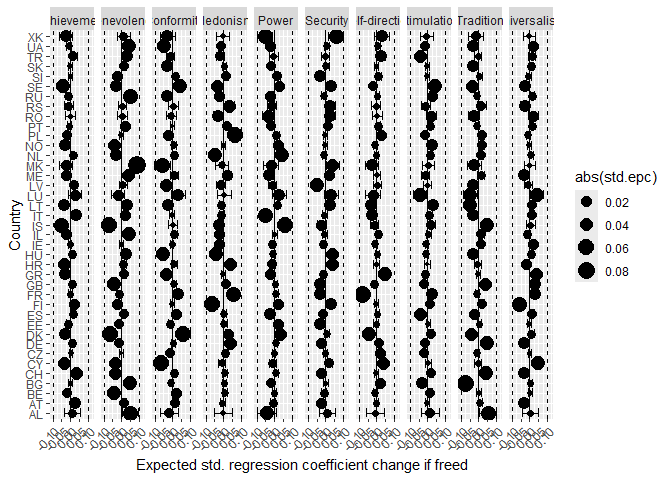
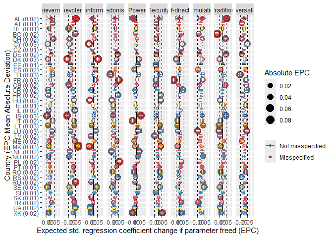
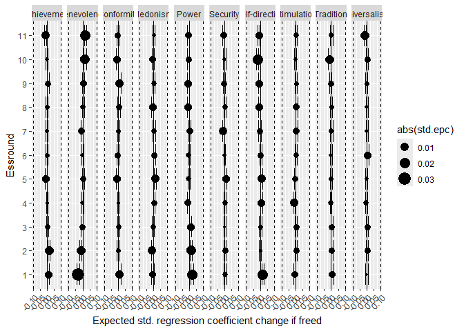
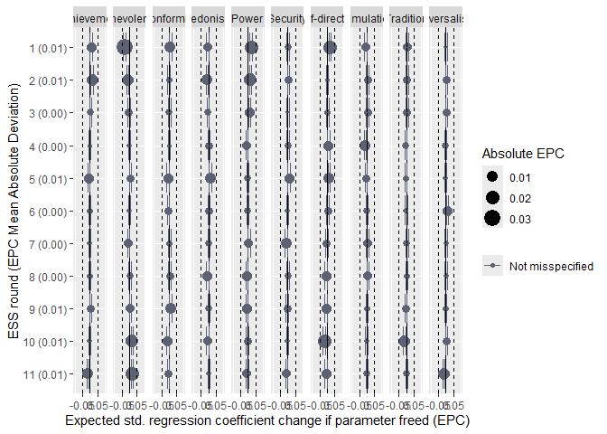

# Pre-analysis

## Packages


``` r
library(rio)
```

```
## Some optional R packages were not installed and therefore some file formats are not supported. Check file support with show_unsupported_formats()
```

``` r
library(dplyr)
```

```
## 
## Attaching package: 'dplyr'
```

```
## The following objects are masked from 'package:stats':
## 
##     filter, lag
```

```
## The following objects are masked from 'package:base':
## 
##     intersect, setdiff, setequal, union
```

``` r
library(MetBrewer)
library(ggplot2)
```

```
## Need help getting started? Try the R Graphics Cookbook: https://r-graphics.org
```

``` r
library(finalfit)
library(ggflags)
library(lavaan)
```

```
## This is lavaan 0.6-21
## lavaan is FREE software! Please report any bugs.
```

``` r
library(semTools)
```

```
## 
```

```
## ###############################################################################
```

```
## This is semTools 0.5-8
```

```
## All users of R (or SEM) are invited to submit functions or ideas for functions.
```

```
## ###############################################################################
```

``` r
library(forcats)
```

## Data

* Loads the preprocessed data file made within "Preparations" code


``` r
load("../data/fdat.rdata")

# get also ISO-codes for country names

ISO<-read.csv2("../data/ISO.csv")
```

## Exclusions

* exclude participants with missing value variables or missing gender


``` r
value.vars<-
  c("con","tra",
    "ben","uni",
    "sdi","sti",
    "hed","ach",
    "pow","sec")

fdat$miss_values<-
  rowSums(is.na(fdat[,value.vars]))
table(fdat$miss_values)
```

```
## 
##      0      1      2      3      4      5      6      7      8      9     10 
## 500044   2791    835    442    267    204    142    143    156    177  35470
```

``` r
fdat<-fdat %>%
  dplyr::filter(miss_values==0 & !is.na(gndr.bin))
```

## Preparations

### Scale gender to have SD/variance around 1


``` r
fdat$gndr.sd1<-2*fdat$gndr.c
sd(fdat$gndr.sd1)
```

```
## [1] 0.9970114
```

# Analysis

## Construct the model

Use a path model where a latent male-typicality (gender is the observed indicator) is predicted with the ten values


``` r
lavmod<-
  'MTYP=~gndr.sd1
  MTYP~con+tra+ben+uni+sdi+sti+hed+ach+pow+sec
  '
```

## Fit the model as multigroup model across countries


``` r
t1<-Sys.time()

lavfit_cntry_reg<-
  sem(model=lavmod,data=fdat,
      group="cntry",group.equal="regressions")

t2<-Sys.time()
duration<-t2-t1
duration
```

```
## Time difference of 11.01936 secs
```

### Detect misspecifications at .10

* Regression coefficients from values that deviate by 0.10


``` r
t3<-Sys.time()
lavfit_cntry_reg_mi<-
  epcEquivFit(lavfit_cntry_reg,
             stdBeta = 0.1,
             cilevel = 0.95)
```

```
## Warning: lavaan->modificationIndices():  
##    the modindices() function ignores equality constraints; use lavTestScore() to assess the impact of 
##    releasing one or multiple constraints.
```

``` r
t4<-Sys.time()
duration2<-t4-t3
duration2
```

```
## Time difference of 2.467675 mins
```

### Examine misspecifications


``` r
# limit to regression parameters predicting MTYP
lavfit_cntry_reg_mi_reg<-
  lavfit_cntry_reg_mi[lavfit_cntry_reg_mi$op=="~" & 
                        lavfit_cntry_reg_mi$rhs=="MTYP",]

# decision based on modification index significance and power
table(lavfit_cntry_reg_mi_reg$decision.pow,useNA="always")
```

```
## 
## EPC:NM     NM   <NA> 
##    209    181      0
```

``` r
prop.table(table(lavfit_cntry_reg_mi_reg$decision.pow,useNA="always"))
```

```
## 
##    EPC:NM        NM      <NA> 
## 0.5358974 0.4641026 0.0000000
```

``` r
# decision based on confidence intervals of expected parameter change (EPC)
table(lavfit_cntry_reg_mi_reg$decision.ci,useNA="always")
```

```
## 
##    I   NM <NA> 
##    3  387    0
```

``` r
prop.table(table(lavfit_cntry_reg_mi_reg$decision.ci,useNA="always"))
```

```
## 
##           I          NM        <NA> 
## 0.007692308 0.992307692 0.000000000
```

* No clear misspecifications

### Check country specific differences in the profile of coefficients


``` r
# get country labels from the model
cntry_labels<-
  data.frame(group=1:inspect(lavfit_cntry_reg,"ngroups"),
           cntry=inspect(lavfit_cntry_reg,"group.label"))

left_join(x=lavfit_cntry_reg_mi_reg,y=cntry_labels,by=c("group")) %>%
  group_by(cntry) %>%
  summarise(std.epc.M=mean(std.epc),
            std.epc.SD=sd(std.epc),
            std.epc.SQMSD=sqrt(mean(std.epc^2)),
            std.epc.MIN=min(std.epc),
            std.epc.MAX=max(std.epc))
```

```
## # A tibble: 39 × 6
##    cntry std.epc.M std.epc.SD std.epc.SQMSD std.epc.MIN std.epc.MAX
##    <chr>     <dbl>      <dbl>         <dbl>       <dbl>       <dbl>
##  1 AL     0.00781      0.0294        0.0290     -0.0438      0.0541
##  2 AT    -0.000166     0.0181        0.0172     -0.0289      0.0275
##  3 BE    -0.00337      0.0179        0.0173     -0.0416      0.0202
##  4 BG    -0.00492      0.0336        0.0322     -0.0777      0.0499
##  5 CH     0.00316      0.0270        0.0258     -0.0347      0.0454
##  6 CY    -0.00500      0.0347        0.0333     -0.0624      0.0482
##  7 CZ    -0.00159      0.0117        0.0112     -0.0184      0.0219
##  8 DE     0.00393      0.0251        0.0242     -0.0295      0.0483
##  9 DK    -0.00142      0.0406        0.0385     -0.0644      0.0636
## 10 EE    -0.00373      0.0140        0.0138     -0.0310      0.0201
## # ℹ 29 more rows
```

``` r
# plot the EPCs
lavfit_cntry_reg_mi_reg<-
  left_join(x=lavfit_cntry_reg_mi_reg,y=cntry_labels,by=c("group"))


lavfit_cntry_reg_mi_reg <-
  lavfit_cntry_reg_mi_reg %>%
  mutate(Value=case_when(
    lhs=="con"~"Conformity",
    lhs=="tra"~"Tradition",
    lhs=="ben"~"Benevolence",
    lhs=="uni"~"Universalism",
    lhs=="sdi"~"Self-direction",
    lhs=="sti"~"Stimulation",
    lhs=="hed"~"Hedonism",
    lhs=="ach"~"Achievement",
    lhs=="pow"~"Power",
    lhs=="sec"~"Security"
  ))


ggplot(lavfit_cntry_reg_mi_reg,aes(x=std.epc,y=as.factor(cntry)))+
         geom_point(aes(size=abs(std.epc)))+
  facet_grid(.~Value)+
  geom_vline(xintercept=c(-0.10,0.10),linetype=2)+
  geom_vline(xintercept=c(0),linetype=1)+
  geom_errorbar(aes(xmin = lower.std.epc,xmax=upper.std.epc))+
  labs(x="Expected std. regression coefficient change if freed",
       y="Country")+
  theme(axis.text.x = element_text(angle = 45, hjust = 1))
```

<!-- -->

### Detect misspecifications at .05


``` r
t5<-Sys.time()
lavfit_cntry_reg_mi_05<-
  epcEquivFit(lavfit_cntry_reg,
           stdBeta = 0.05,
           cilevel = 0.95)
```

```
## Warning: lavaan->modificationIndices():  
##    the modindices() function ignores equality constraints; use lavTestScore() to assess the impact of 
##    releasing one or multiple constraints.
```

``` r
t6<-Sys.time()
duration3<-t6-t5
duration3
```

```
## Time difference of 2.409383 mins
```

### Examine misspecifications


``` r
# limit to regression parameters predicting MTYP
lavfit_cntry_reg_mi_05_reg<-
  lavfit_cntry_reg_mi_05[lavfit_cntry_reg_mi_05$op=="~" & 
                        lavfit_cntry_reg_mi_05$rhs=="MTYP",]

# decision based on modification index significance and power
table(lavfit_cntry_reg_mi_05_reg$decision.pow,useNA="always")
```

```
## 
##  EPC:M EPC:NM      I      M     NM   <NA> 
##     16    184     29      9    152      0
```

``` r
proportions(table(lavfit_cntry_reg_mi_05_reg$decision.pow,useNA="always"))
```

```
## 
##      EPC:M     EPC:NM          I          M         NM       <NA> 
## 0.04102564 0.47179487 0.07435897 0.02307692 0.38974359 0.00000000
```

``` r
# decision based on confidence intervals of expected parameter change (EPC)
table(lavfit_cntry_reg_mi_05_reg$decision.ci,useNA="always")
```

```
## 
##    I    M   NM    U <NA> 
##   81    5  301    3    0
```

``` r
prop.table(table(lavfit_cntry_reg_mi_05_reg$decision.ci,useNA="always"))
```

```
## 
##           I           M          NM           U        <NA> 
## 0.207692308 0.012820513 0.771794872 0.007692308 0.000000000
```

``` r
# combined criteria
table(lavfit_cntry_reg_mi_05_reg$decision.pow,
      lavfit_cntry_reg_mi_05_reg$decision.ci)
```

```
##         
##            I   M  NM   U
##   EPC:M   11   5   0   0
##   EPC:NM  42   0 142   0
##   I       17   0   9   3
##   M        9   0   0   0
##   NM       2   0 150   0
```

``` r
lavfit_cntry_reg_mi_05_reg<-
  lavfit_cntry_reg_mi_05_reg %>%
  mutate(misspec=case_when(
    decision.pow=="EPC:M" | decision.pow=="M" | decision.ci=="M"~1,
    TRUE~0
  ))

table(lavfit_cntry_reg_mi_05_reg$misspec,useNA="always")
```

```
## 
##    0    1 <NA> 
##  365   25    0
```

``` r
prop.table(table(lavfit_cntry_reg_mi_05_reg$misspec,useNA="always"))
```

```
## 
##          0          1       <NA> 
## 0.93589744 0.06410256 0.00000000
```

``` r
# check if the are in specific countries
lavfit_cntry_reg_mi_05_reg<-
  left_join(x=lavfit_cntry_reg_mi_05_reg,y=cntry_labels,by=c("group"))

lavfit_cntry_reg_mi_05_reg %>% 
  group_by(cntry) %>%
  summarise(n_misspec=sum(misspec))
```

```
## # A tibble: 39 × 2
##    cntry n_misspec
##    <chr>     <dbl>
##  1 AL            2
##  2 AT            0
##  3 BE            0
##  4 BG            1
##  5 CH            0
##  6 CY            1
##  7 CZ            0
##  8 DE            0
##  9 DK            2
## 10 EE            0
## # ℹ 29 more rows
```

``` r
table(lavfit_cntry_reg_mi_05_reg$cntry,
      lavfit_cntry_reg_mi_05_reg$misspec)
```

```
##     
##       0  1
##   AL  8  2
##   AT 10  0
##   BE 10  0
##   BG  9  1
##   CH 10  0
##   CY  9  1
##   CZ 10  0
##   DE 10  0
##   DK  8  2
##   EE 10  0
##   ES 10  0
##   FI  8  2
##   FR  8  2
##   GB 10  0
##   GR 10  0
##   HR 10  0
##   HU  9  1
##   IE 10  0
##   IL 10  0
##   IS  7  3
##   IT  9  1
##   LT 10  0
##   LU  7  3
##   LV 10  0
##   ME 10  0
##   MK  7  3
##   NL 10  0
##   NO 10  0
##   PL  9  1
##   PT 10  0
##   RO 10  0
##   RS 10  0
##   RU  9  1
##   SE 10  0
##   SI 10  0
##   SK 10  0
##   TR 10  0
##   UA 10  0
##   XK  8  2
```

``` r
# save results

export(lavfit_cntry_reg_mi_05_reg %>%
  group_by(cntry) %>%
  summarise(n_misspec=sum(misspec)) %>%
  arrange(desc(cntry)),"../results/n_misspec.xlsx",overwrite=T)
```

### Plot country results


``` r
lavfit_cntry_reg_mi_05_reg <-
  lavfit_cntry_reg_mi_05_reg %>%
  mutate(Value=case_when(
    lhs=="con"~"Conformity",
    lhs=="tra"~"Tradition",
    lhs=="ben"~"Benevolence",
    lhs=="uni"~"Universalism",
    lhs=="sdi"~"Self-direction",
    lhs=="sti"~"Stimulation",
    lhs=="hed"~"Hedonism",
    lhs=="ach"~"Achievement",
    lhs=="pow"~"Power",
    lhs=="sec"~"Security"
  ))


# add correctly ordered country
lavfit_cntry_reg_mi_05_reg$cntry <- 
  fct_rev(fct_reorder(as.factor(lavfit_cntry_reg_mi_05_reg$cntry),
                      lavfit_cntry_reg_mi_05_reg$cntry))
```

```
## Warning in mean.default(sort(x, partial = half + 0L:1L)[half + 0L:1L]): argument is not numeric or
## logical: returning NA
## Warning in mean.default(sort(x, partial = half + 0L:1L)[half + 0L:1L]): argument is not numeric or
## logical: returning NA
## Warning in mean.default(sort(x, partial = half + 0L:1L)[half + 0L:1L]): argument is not numeric or
## logical: returning NA
## Warning in mean.default(sort(x, partial = half + 0L:1L)[half + 0L:1L]): argument is not numeric or
## logical: returning NA
## Warning in mean.default(sort(x, partial = half + 0L:1L)[half + 0L:1L]): argument is not numeric or
## logical: returning NA
## Warning in mean.default(sort(x, partial = half + 0L:1L)[half + 0L:1L]): argument is not numeric or
## logical: returning NA
## Warning in mean.default(sort(x, partial = half + 0L:1L)[half + 0L:1L]): argument is not numeric or
## logical: returning NA
## Warning in mean.default(sort(x, partial = half + 0L:1L)[half + 0L:1L]): argument is not numeric or
## logical: returning NA
## Warning in mean.default(sort(x, partial = half + 0L:1L)[half + 0L:1L]): argument is not numeric or
## logical: returning NA
## Warning in mean.default(sort(x, partial = half + 0L:1L)[half + 0L:1L]): argument is not numeric or
## logical: returning NA
## Warning in mean.default(sort(x, partial = half + 0L:1L)[half + 0L:1L]): argument is not numeric or
## logical: returning NA
## Warning in mean.default(sort(x, partial = half + 0L:1L)[half + 0L:1L]): argument is not numeric or
## logical: returning NA
## Warning in mean.default(sort(x, partial = half + 0L:1L)[half + 0L:1L]): argument is not numeric or
## logical: returning NA
## Warning in mean.default(sort(x, partial = half + 0L:1L)[half + 0L:1L]): argument is not numeric or
## logical: returning NA
## Warning in mean.default(sort(x, partial = half + 0L:1L)[half + 0L:1L]): argument is not numeric or
## logical: returning NA
## Warning in mean.default(sort(x, partial = half + 0L:1L)[half + 0L:1L]): argument is not numeric or
## logical: returning NA
## Warning in mean.default(sort(x, partial = half + 0L:1L)[half + 0L:1L]): argument is not numeric or
## logical: returning NA
## Warning in mean.default(sort(x, partial = half + 0L:1L)[half + 0L:1L]): argument is not numeric or
## logical: returning NA
## Warning in mean.default(sort(x, partial = half + 0L:1L)[half + 0L:1L]): argument is not numeric or
## logical: returning NA
## Warning in mean.default(sort(x, partial = half + 0L:1L)[half + 0L:1L]): argument is not numeric or
## logical: returning NA
## Warning in mean.default(sort(x, partial = half + 0L:1L)[half + 0L:1L]): argument is not numeric or
## logical: returning NA
## Warning in mean.default(sort(x, partial = half + 0L:1L)[half + 0L:1L]): argument is not numeric or
## logical: returning NA
## Warning in mean.default(sort(x, partial = half + 0L:1L)[half + 0L:1L]): argument is not numeric or
## logical: returning NA
## Warning in mean.default(sort(x, partial = half + 0L:1L)[half + 0L:1L]): argument is not numeric or
## logical: returning NA
## Warning in mean.default(sort(x, partial = half + 0L:1L)[half + 0L:1L]): argument is not numeric or
## logical: returning NA
## Warning in mean.default(sort(x, partial = half + 0L:1L)[half + 0L:1L]): argument is not numeric or
## logical: returning NA
## Warning in mean.default(sort(x, partial = half + 0L:1L)[half + 0L:1L]): argument is not numeric or
## logical: returning NA
## Warning in mean.default(sort(x, partial = half + 0L:1L)[half + 0L:1L]): argument is not numeric or
## logical: returning NA
## Warning in mean.default(sort(x, partial = half + 0L:1L)[half + 0L:1L]): argument is not numeric or
## logical: returning NA
## Warning in mean.default(sort(x, partial = half + 0L:1L)[half + 0L:1L]): argument is not numeric or
## logical: returning NA
## Warning in mean.default(sort(x, partial = half + 0L:1L)[half + 0L:1L]): argument is not numeric or
## logical: returning NA
## Warning in mean.default(sort(x, partial = half + 0L:1L)[half + 0L:1L]): argument is not numeric or
## logical: returning NA
## Warning in mean.default(sort(x, partial = half + 0L:1L)[half + 0L:1L]): argument is not numeric or
## logical: returning NA
## Warning in mean.default(sort(x, partial = half + 0L:1L)[half + 0L:1L]): argument is not numeric or
## logical: returning NA
## Warning in mean.default(sort(x, partial = half + 0L:1L)[half + 0L:1L]): argument is not numeric or
## logical: returning NA
## Warning in mean.default(sort(x, partial = half + 0L:1L)[half + 0L:1L]): argument is not numeric or
## logical: returning NA
## Warning in mean.default(sort(x, partial = half + 0L:1L)[half + 0L:1L]): argument is not numeric or
## logical: returning NA
## Warning in mean.default(sort(x, partial = half + 0L:1L)[half + 0L:1L]): argument is not numeric or
## logical: returning NA
## Warning in mean.default(sort(x, partial = half + 0L:1L)[half + 0L:1L]): argument is not numeric or
## logical: returning NA
```

``` r
# add average deviation for each country

cntry_avg_epc<-
  lavfit_cntry_reg_mi_05_reg %>%
  group_by(cntry) %>%
  summarise(std.epc.M=mean(std.epc),
            std.epc.SD=sd(std.epc),
            std.epc.MAD=mean(abs(std.epc)),
            std.epc.MIN=min(std.epc),
            std.epc.MAX=max(std.epc)) %>%
  arrange(desc(cntry))

print(cntry_avg_epc,n=100)
```

```
## # A tibble: 39 × 6
##    cntry std.epc.M std.epc.SD std.epc.MAD std.epc.MIN std.epc.MAX
##    <fct>     <dbl>      <dbl>       <dbl>       <dbl>       <dbl>
##  1 AL     0.00781      0.0294     0.0216      -0.0438      0.0541
##  2 AT    -0.000166     0.0181     0.0143      -0.0289      0.0275
##  3 BE    -0.00337      0.0179     0.0130      -0.0416      0.0202
##  4 BG    -0.00492      0.0336     0.0216      -0.0777      0.0499
##  5 CH     0.00316      0.0270     0.0218      -0.0347      0.0454
##  6 CY    -0.00500      0.0347     0.0269      -0.0624      0.0482
##  7 CZ    -0.00159      0.0117     0.00843     -0.0184      0.0219
##  8 DE     0.00393      0.0251     0.0204      -0.0295      0.0483
##  9 DK    -0.00142      0.0406     0.0338      -0.0644      0.0636
## 10 EE    -0.00373      0.0140     0.0108      -0.0310      0.0201
## 11 ES    -0.00284      0.0219     0.0184      -0.0409      0.0221
## 12 FI    -0.00358      0.0336     0.0259      -0.0618      0.0312
## 13 FR     0.00167      0.0381     0.0279      -0.0818      0.0533
## 14 GB     0.000624     0.0261     0.0214      -0.0423      0.0379
## 15 GR    -0.00117      0.0272     0.0212      -0.0341      0.0478
## 16 HR     0.00227      0.0236     0.0175      -0.0347      0.0390
## 17 HU    -0.00451      0.0294     0.0231      -0.0501      0.0379
## 18 IE    -0.00363      0.0131     0.0107      -0.0239      0.0208
## 19 IL     0.00224      0.0203     0.0155      -0.0259      0.0427
## 20 IS    -0.00466      0.0410     0.0320      -0.0680      0.0615
## 21 IT    -0.00448      0.0268     0.0212      -0.0539      0.0329
## 22 LT    -0.00268      0.0300     0.0270      -0.0452      0.0325
## 23 LU     0.00274      0.0340     0.0297      -0.0484      0.0425
## 24 LV    -0.0113       0.0208     0.0181      -0.0450      0.0193
## 25 ME     0.00147      0.0238     0.0202      -0.0302      0.0379
## 26 MK    -0.00345      0.0411     0.0298      -0.0584      0.0885
## 27 NL     0.00181      0.0250     0.0194      -0.0463      0.0421
## 28 NO    -0.000545     0.0215     0.0158      -0.0405      0.0291
## 29 PL     0.00527      0.0261     0.0187      -0.0225      0.0644
## 30 PT     0.00612      0.0132     0.0124      -0.0191      0.0219
## 31 RO    -0.00284      0.0227     0.0178      -0.0376      0.0267
## 32 RS     0.00199      0.0198     0.0158      -0.0277      0.0350
## 33 RU    -0.00144      0.0249     0.0197      -0.0301      0.0505
## 34 SE    -0.00478      0.0367     0.0340      -0.0424      0.0464
## 35 SI     0.000113     0.0170     0.0131      -0.0302      0.0176
## 36 SK    -0.00417      0.0155     0.0116      -0.0286      0.0160
## 37 TR     0.000752     0.0217     0.0170      -0.0397      0.0310
## 38 UA    -0.00544      0.0269     0.0222      -0.0466      0.0459
## 39 XK    -0.00322      0.0315     0.0232      -0.0535      0.0581
```

``` r
lavfit_cntry_reg_mi_05_reg<-
  left_join(x=lavfit_cntry_reg_mi_05_reg,y=cntry_avg_epc,by=c("cntry"))

# country label with MAD
lavfit_cntry_reg_mi_05_reg$cntry_lab<-
  paste0(lavfit_cntry_reg_mi_05_reg$cntry,
         " (",round_tidy(lavfit_cntry_reg_mi_05_reg$std.epc.MAD,2),")")


# need to reorder cntry_lab as well
lavfit_cntry_reg_mi_05_reg$cntry_lab <- 
  fct_rev(fct_reorder(as.factor(lavfit_cntry_reg_mi_05_reg$cntry_lab),
                      lavfit_cntry_reg_mi_05_reg$cntry_lab))
```

```
## Warning in mean.default(sort(x, partial = half + 0L:1L)[half + 0L:1L]): argument is not numeric or
## logical: returning NA
## Warning in mean.default(sort(x, partial = half + 0L:1L)[half + 0L:1L]): argument is not numeric or
## logical: returning NA
## Warning in mean.default(sort(x, partial = half + 0L:1L)[half + 0L:1L]): argument is not numeric or
## logical: returning NA
## Warning in mean.default(sort(x, partial = half + 0L:1L)[half + 0L:1L]): argument is not numeric or
## logical: returning NA
## Warning in mean.default(sort(x, partial = half + 0L:1L)[half + 0L:1L]): argument is not numeric or
## logical: returning NA
## Warning in mean.default(sort(x, partial = half + 0L:1L)[half + 0L:1L]): argument is not numeric or
## logical: returning NA
## Warning in mean.default(sort(x, partial = half + 0L:1L)[half + 0L:1L]): argument is not numeric or
## logical: returning NA
## Warning in mean.default(sort(x, partial = half + 0L:1L)[half + 0L:1L]): argument is not numeric or
## logical: returning NA
## Warning in mean.default(sort(x, partial = half + 0L:1L)[half + 0L:1L]): argument is not numeric or
## logical: returning NA
## Warning in mean.default(sort(x, partial = half + 0L:1L)[half + 0L:1L]): argument is not numeric or
## logical: returning NA
## Warning in mean.default(sort(x, partial = half + 0L:1L)[half + 0L:1L]): argument is not numeric or
## logical: returning NA
## Warning in mean.default(sort(x, partial = half + 0L:1L)[half + 0L:1L]): argument is not numeric or
## logical: returning NA
## Warning in mean.default(sort(x, partial = half + 0L:1L)[half + 0L:1L]): argument is not numeric or
## logical: returning NA
## Warning in mean.default(sort(x, partial = half + 0L:1L)[half + 0L:1L]): argument is not numeric or
## logical: returning NA
## Warning in mean.default(sort(x, partial = half + 0L:1L)[half + 0L:1L]): argument is not numeric or
## logical: returning NA
## Warning in mean.default(sort(x, partial = half + 0L:1L)[half + 0L:1L]): argument is not numeric or
## logical: returning NA
## Warning in mean.default(sort(x, partial = half + 0L:1L)[half + 0L:1L]): argument is not numeric or
## logical: returning NA
## Warning in mean.default(sort(x, partial = half + 0L:1L)[half + 0L:1L]): argument is not numeric or
## logical: returning NA
## Warning in mean.default(sort(x, partial = half + 0L:1L)[half + 0L:1L]): argument is not numeric or
## logical: returning NA
## Warning in mean.default(sort(x, partial = half + 0L:1L)[half + 0L:1L]): argument is not numeric or
## logical: returning NA
## Warning in mean.default(sort(x, partial = half + 0L:1L)[half + 0L:1L]): argument is not numeric or
## logical: returning NA
## Warning in mean.default(sort(x, partial = half + 0L:1L)[half + 0L:1L]): argument is not numeric or
## logical: returning NA
## Warning in mean.default(sort(x, partial = half + 0L:1L)[half + 0L:1L]): argument is not numeric or
## logical: returning NA
## Warning in mean.default(sort(x, partial = half + 0L:1L)[half + 0L:1L]): argument is not numeric or
## logical: returning NA
## Warning in mean.default(sort(x, partial = half + 0L:1L)[half + 0L:1L]): argument is not numeric or
## logical: returning NA
## Warning in mean.default(sort(x, partial = half + 0L:1L)[half + 0L:1L]): argument is not numeric or
## logical: returning NA
## Warning in mean.default(sort(x, partial = half + 0L:1L)[half + 0L:1L]): argument is not numeric or
## logical: returning NA
## Warning in mean.default(sort(x, partial = half + 0L:1L)[half + 0L:1L]): argument is not numeric or
## logical: returning NA
## Warning in mean.default(sort(x, partial = half + 0L:1L)[half + 0L:1L]): argument is not numeric or
## logical: returning NA
## Warning in mean.default(sort(x, partial = half + 0L:1L)[half + 0L:1L]): argument is not numeric or
## logical: returning NA
## Warning in mean.default(sort(x, partial = half + 0L:1L)[half + 0L:1L]): argument is not numeric or
## logical: returning NA
## Warning in mean.default(sort(x, partial = half + 0L:1L)[half + 0L:1L]): argument is not numeric or
## logical: returning NA
## Warning in mean.default(sort(x, partial = half + 0L:1L)[half + 0L:1L]): argument is not numeric or
## logical: returning NA
## Warning in mean.default(sort(x, partial = half + 0L:1L)[half + 0L:1L]): argument is not numeric or
## logical: returning NA
## Warning in mean.default(sort(x, partial = half + 0L:1L)[half + 0L:1L]): argument is not numeric or
## logical: returning NA
## Warning in mean.default(sort(x, partial = half + 0L:1L)[half + 0L:1L]): argument is not numeric or
## logical: returning NA
## Warning in mean.default(sort(x, partial = half + 0L:1L)[half + 0L:1L]): argument is not numeric or
## logical: returning NA
## Warning in mean.default(sort(x, partial = half + 0L:1L)[half + 0L:1L]): argument is not numeric or
## logical: returning NA
## Warning in mean.default(sort(x, partial = half + 0L:1L)[half + 0L:1L]): argument is not numeric or
## logical: returning NA
```

``` r
misspec_plot<-
  ggplot(lavfit_cntry_reg_mi_05_reg,aes(x=std.epc,y=cntry_lab,
                                      color=as.factor(misspec)))+
  geom_point(aes(size=abs(std.epc)))+
  facet_grid(.~Value)+
  geom_vline(xintercept=c(-0.05,0.05),linetype=2)+
  geom_vline(xintercept=c(0),linetype=1)+
  geom_errorbar(aes(xmin = lower.std.epc,xmax=upper.std.epc))+
  labs(x="Expected std. regression coefficient change if parameter freed (EPC)",
       y="Country (EPC Mean Absolute Deviation)",
       color=NULL,  
       size="Absolute EPC")+
  scale_color_manual(values=c("0"=met.brewer("Demuth")[8], "1"=met.brewer("Demuth")[2]),
                     labels=c("0"="Not misspecified", "1"="Misspecified"))+
  geom_flag(aes(country=tolower(cntry)),size=2.5)+
  scale_x_continuous(breaks = c(-0.05, 0.05))
  
misspec_plot
```

<!-- -->

``` r
ggsave(misspec_plot,filename="misspec_plot_cntry.png",
       path="../results",
       device = "png",width = 29.7,height=18,dpi = 600,units = "cm")                     
```

## Fit the model as multigroup model across ess rounds (time)


``` r
t7<-Sys.time()

lavfit_essround_reg<-
  sem(model=lavmod,data=fdat,
      group="essround",group.equal="regressions")

t8<-Sys.time()
duration<-t8-t7
duration
```

```
## Time difference of 7.581236 secs
```

### Detect misspecifications at .10

* Regression coefficients from values that deviate by 0.10


``` r
t9<-Sys.time()
lavfit_essround_reg_mi<-
  epcEquivFit(lavfit_essround_reg,
           stdBeta = 0.1,
           cilevel = 0.95)
```

```
## Warning: lavaan->modificationIndices():  
##    the modindices() function ignores equality constraints; use lavTestScore() to assess the impact of 
##    releasing one or multiple constraints.
```

``` r
t10<-Sys.time()
duration2<-t10-t9
duration2
```

```
## Time difference of 3.432765 secs
```

### Examine misspecifications


``` r
# limit to regression parameters predicting MTYP
lavfit_essround_reg_mi_reg<-
  lavfit_essround_reg_mi[lavfit_essround_reg_mi$op=="~" & 
                        lavfit_essround_reg_mi$rhs=="MTYP",]

# decision based on modification index significance and power
table(lavfit_essround_reg_mi_reg$decision.pow,useNA="always")
```

```
## 
## EPC:NM     NM   <NA> 
##     30     80      0
```

``` r
prop.table(table(lavfit_essround_reg_mi_reg$decision.pow,useNA="always"))
```

```
## 
##    EPC:NM        NM      <NA> 
## 0.2727273 0.7272727 0.0000000
```

``` r
# decision based on confidence intervals of expected parameter change (EPC)
table(lavfit_essround_reg_mi_reg$decision.ci,useNA="always")
```

```
## 
##   NM <NA> 
##  110    0
```

``` r
prop.table(table(lavfit_essround_reg_mi_reg$decision.ci,useNA="always"))
```

```
## 
##   NM <NA> 
##    1    0
```

* No misspecifications

### Check country specific differences in the profile of coefficients


``` r
# get country labels from the model
essround_labels<-
  data.frame(group=1:inspect(lavfit_essround_reg,"ngroups"),
           essround=inspect(lavfit_essround_reg,"group.label"))


left_join(x=lavfit_essround_reg_mi_reg,y=essround_labels,by=c("group")) %>%
  group_by(essround) %>%
  summarise(std.epc.M=mean(std.epc),
            std.epc.SD=sd(std.epc),
            std.epc.SQMSD=sqrt(mean(std.epc^2)),
            std.epc.MIN=min(std.epc),
            std.epc.MAX=max(std.epc))
```

```
## # A tibble: 11 × 6
##    essround std.epc.M std.epc.SD std.epc.SQMSD std.epc.MIN std.epc.MAX
##    <chr>        <dbl>      <dbl>         <dbl>       <dbl>       <dbl>
##  1 1         0.00221     0.0151        0.0145     -0.0321      0.0206 
##  2 10       -0.00320     0.00983       0.00986    -0.0191      0.0175 
##  3 11       -0.00252     0.00924       0.00912    -0.0126      0.0186 
##  4 2         0.00192     0.00937       0.00910    -0.0140      0.0157 
##  5 3         0.00219     0.00390       0.00430    -0.00471     0.00880
##  6 4        -0.000995    0.00550       0.00532    -0.0115      0.00836
##  7 5         0.000746    0.00764       0.00728    -0.00899     0.0117 
##  8 6         0.000740    0.00369       0.00358    -0.00405     0.00773
##  9 7        -0.000144    0.00509       0.00483    -0.00972     0.00554
## 10 8        -0.000599    0.00540       0.00515    -0.00808     0.00592
## 11 9        -0.000102    0.00611       0.00580    -0.00849     0.0101
```

``` r
# plot the EPCs
lavfit_essround_reg_mi_reg<-
  left_join(x=lavfit_essround_reg_mi_reg,y=essround_labels,by=c("group"))


lavfit_essround_reg_mi_reg <-
  lavfit_essround_reg_mi_reg %>%
  mutate(Value=case_when(
    lhs=="con"~"Conformity",
    lhs=="tra"~"Tradition",
    lhs=="ben"~"Benevolence",
    lhs=="uni"~"Universalism",
    lhs=="sdi"~"Self-direction",
    lhs=="sti"~"Stimulation",
    lhs=="hed"~"Hedonism",
    lhs=="ach"~"Achievement",
    lhs=="pow"~"Power",
    lhs=="sec"~"Security"
  ))

lavfit_essround_reg_mi_reg$essround <- factor(
  lavfit_essround_reg_mi_reg$essround,
  levels = sort(as.numeric(unique(lavfit_essround_reg_mi_reg$essround)))
)

ggplot(lavfit_essround_reg_mi_reg, aes(x = std.epc, y = essround)) +
  geom_point(aes(size = abs(std.epc))) +
  facet_grid(. ~ Value) +
  geom_vline(xintercept = c(-0.10, 0.10), linetype = 2) +
  geom_vline(xintercept = 0, linetype = 1) +
  geom_errorbar(aes(xmin = lower.std.epc, xmax = upper.std.epc)) +
  labs(
    x = "Expected std. regression coefficient change if freed",
    y = "Essround"
  ) +
  theme(axis.text.x = element_text(angle = 45, hjust = 1))
```

<!-- -->


### Detect misspecifications at .05


``` r
t5<-Sys.time()
lavfit_essround_reg_mi_05<-
  epcEquivFit(lavfit_essround_reg,
           stdBeta = 0.05,
           cilevel = 0.95)
```

```
## Warning: lavaan->modificationIndices():  
##    the modindices() function ignores equality constraints; use lavTestScore() to assess the impact of 
##    releasing one or multiple constraints.
```

``` r
t6<-Sys.time()
duration3<-t6-t5
duration3
```

```
## Time difference of 3.713038 secs
```

### Examine misspecifications


``` r
# limit to regression parameters predicting MTYP
lavfit_essround_reg_mi_05_reg<-
  lavfit_essround_reg_mi_05[lavfit_essround_reg_mi_05$op=="~" & 
                        lavfit_essround_reg_mi_05$rhs=="MTYP",]

# decision based on modification index significance and power
table(lavfit_essround_reg_mi_05_reg$decision.pow,useNA="always")
```

```
## 
## EPC:NM     NM   <NA> 
##     30     80      0
```

``` r
proportions(table(lavfit_essround_reg_mi_05_reg$decision.pow,useNA="always"))
```

```
## 
##    EPC:NM        NM      <NA> 
## 0.2727273 0.7272727 0.0000000
```

``` r
# decision based on confidence intervals of expected parameter change (EPC)
table(lavfit_essround_reg_mi_05_reg$decision.ci,useNA="always")
```

```
## 
##   NM <NA> 
##  110    0
```

``` r
prop.table(table(lavfit_essround_reg_mi_05_reg$decision.ci,useNA="always"))
```

```
## 
##   NM <NA> 
##    1    0
```

``` r
# combined criteria
table(lavfit_essround_reg_mi_05_reg$decision.pow,
      lavfit_essround_reg_mi_05_reg$decision.ci)
```

```
##         
##          NM
##   EPC:NM 30
##   NM     80
```

``` r
table(lavfit_essround_reg_mi_05_reg$decision.ci)
```

```
## 
##  NM 
## 110
```

``` r
lavfit_essround_reg_mi_05_reg<-
  lavfit_essround_reg_mi_05_reg %>%
  mutate(misspec=case_when(
    decision.pow=="EPC:M" | decision.pow=="M" | decision.ci=="M"~1,
    TRUE~0
  ))

table(lavfit_essround_reg_mi_05_reg$misspec,useNA="always")
```

```
## 
##    0 <NA> 
##  110    0
```

``` r
# check if these are in specific essrounds
lavfit_essround_reg_mi_05_reg<-
  left_join(x=lavfit_essround_reg_mi_05_reg,y=essround_labels,by=c("group"))

lavfit_essround_reg_mi_05_reg %>% 
  group_by(essround) %>%
  summarise(n_misspec=sum(misspec))
```

```
## # A tibble: 11 × 2
##    essround n_misspec
##    <chr>        <dbl>
##  1 1                0
##  2 10               0
##  3 11               0
##  4 2                0
##  5 3                0
##  6 4                0
##  7 5                0
##  8 6                0
##  9 7                0
## 10 8                0
## 11 9                0
```

``` r
table(lavfit_essround_reg_mi_05_reg$essround,
      lavfit_essround_reg_mi_05_reg$misspec)
```

```
##     
##       0
##   1  10
##   10 10
##   11 10
##   2  10
##   3  10
##   4  10
##   5  10
##   6  10
##   7  10
##   8  10
##   9  10
```

### Plot essround results


``` r
lavfit_essround_reg_mi_05_reg <-
  lavfit_essround_reg_mi_05_reg %>%
  mutate(Value=case_when(
    lhs=="con"~"Conformity",
    lhs=="tra"~"Tradition",
    lhs=="ben"~"Benevolence",
    lhs=="uni"~"Universalism",
    lhs=="sdi"~"Self-direction",
    lhs=="sti"~"Stimulation",
    lhs=="hed"~"Hedonism",
    lhs=="ach"~"Achievement",
    lhs=="pow"~"Power",
    lhs=="sec"~"Security"
  ))


# add average deviation for each essround

essround_avg_epc<-
  lavfit_essround_reg_mi_05_reg %>%
  group_by(essround) %>%
  summarise(std.epc.M=mean(std.epc),
            std.epc.SD=sd(std.epc),
            std.epc.MAD=mean(abs(std.epc)),
            std.epc.MIN=min(std.epc),
            std.epc.MAX=max(std.epc)) %>%
  arrange(desc(essround))

print(essround_avg_epc,n=100)
```

```
## # A tibble: 11 × 6
##    essround std.epc.M std.epc.SD std.epc.MAD std.epc.MIN std.epc.MAX
##    <chr>        <dbl>      <dbl>       <dbl>       <dbl>       <dbl>
##  1 9        -0.000102    0.00611     0.00516    -0.00849     0.0101 
##  2 8        -0.000599    0.00540     0.00441    -0.00808     0.00592
##  3 7        -0.000144    0.00509     0.00405    -0.00972     0.00554
##  4 6         0.000740    0.00369     0.00294    -0.00405     0.00773
##  5 5         0.000746    0.00764     0.00639    -0.00899     0.0117 
##  6 4        -0.000995    0.00550     0.00397    -0.0115      0.00836
##  7 3         0.00219     0.00390     0.00372    -0.00471     0.00880
##  8 2         0.00192     0.00937     0.00725    -0.0140      0.0157 
##  9 11       -0.00252     0.00924     0.00745    -0.0126      0.0186 
## 10 10       -0.00320     0.00983     0.00746    -0.0191      0.0175 
## 11 1         0.00221     0.0151      0.0112     -0.0321      0.0206
```

``` r
lavfit_essround_reg_mi_05_reg<-
  left_join(x=lavfit_essround_reg_mi_05_reg,
            y=essround_avg_epc,by=c("essround"))


# make a factor of essround variable
lavfit_essround_reg_mi_05_reg$essround<-
  factor(lavfit_essround_reg_mi_05_reg$essround)

lavfit_essround_reg_mi_05_reg$essround<-
  factor(lavfit_essround_reg_mi_05_reg$essround,
         levels = sort(as.numeric(levels(lavfit_essround_reg_mi_05_reg$essround))))


# essround label with MAD
lavfit_essround_reg_mi_05_reg$essround_lab<-
  paste0(lavfit_essround_reg_mi_05_reg$essround,
         " (",round_tidy(lavfit_essround_reg_mi_05_reg$std.epc.MAD,2),")")

# need to reorder essround_lab as well
lavfit_essround_reg_mi_05_reg$essround_lab <- 
  fct_rev(fct_reorder(as.factor(lavfit_essround_reg_mi_05_reg$essround_lab),
                      as.numeric(lavfit_essround_reg_mi_05_reg$essround)))


misspec_plot_essround<-
  ggplot(lavfit_essround_reg_mi_05_reg,aes(x=std.epc,y=essround_lab,
                                      color=as.factor(misspec)))+
  geom_point(aes(size=abs(std.epc)))+
  facet_grid(.~Value)+
  geom_vline(xintercept=c(-0.05,0.05),linetype=2)+
  geom_vline(xintercept=c(0),linetype=1)+
  geom_errorbar(aes(xmin = lower.std.epc,xmax=upper.std.epc))+
  labs(x="Expected std. regression coefficient change if parameter freed (EPC)",
       y="ESS round (EPC Mean Absolute Deviation)",
       color=NULL,  
       size="Absolute EPC")+
  scale_color_manual(values=c("0"=met.brewer("Demuth")[8], "1"=met.brewer("Demuth")[2]),
                     labels=c("0"="Not misspecified", "1"="Misspecified"))+
  #geom_flag(aes(country=tolower(essround)),size=2.5)+
  scale_x_continuous(breaks = c(-0.05, 0.05),limits = c(-0.10,0.10))
  

misspec_plot_essround
```

<!-- -->

``` r
ggsave(misspec_plot_essround,filename="misspec_plot_essround.png",
       path="../results",
       device = "png",width = 29.7,height=18,dpi = 600,units = "cm")                     
```

# Session information


``` r
s<-sessionInfo()
print(s,locale=F)
```

```
## R version 4.6.0 (2026-04-24 ucrt)
## Platform: x86_64-w64-mingw32/x64
## Running under: Windows 11 x64 (build 22631)
## 
## Matrix products: default
##   LAPACK version 3.12.1
## 
## attached base packages:
## [1] stats     graphics  grDevices utils     datasets  methods   base     
## 
## other attached packages:
##  [1] forcats_1.0.1   semTools_0.5-8  lavaan_0.6-21   ggflags_0.0.4   finalfit_1.1.0  ggplot2_4.0.3  
##  [7] MetBrewer_0.2.0 dplyr_1.2.1     rio_1.3.0       knitr_1.51      rmarkdown_2.31 
## 
## loaded via a namespace (and not attached):
##  [1] writexl_1.5.4      tidyselect_1.2.1   farver_2.1.2       R.utils_2.13.0     S7_0.2.2          
##  [6] fastmap_1.2.0      XML_3.99-0.23      digest_0.6.39      rpart_4.1.27       estimability_1.5.1
## [11] lifecycle_1.0.5    survival_3.8-6     magrittr_2.0.5     compiler_4.6.0     rlang_1.2.0       
## [16] sass_0.4.10        tools_4.6.0        utf8_1.2.6         yaml_2.3.12        grImport2_0.3-3   
## [21] labeling_0.4.3     mnormt_2.1.2       RColorBrewer_1.1-3 withr_3.0.2        purrr_1.2.2       
## [26] R.oo_1.27.1        nnet_7.3-20        grid_4.6.0         stats4_4.6.0       jomo_2.7-6        
## [31] xtable_1.8-8       mice_3.19.0        emmeans_2.0.3      scales_1.4.0       iterators_1.0.14  
## [36] MASS_7.3-65        cli_3.6.6          mvtnorm_1.3-7      ragg_1.5.2         reformulas_0.4.4  
## [41] generics_0.1.4     otel_0.2.0         rstudioapi_0.18.0  minqa_1.2.8        cachem_1.1.0      
## [46] splines_4.6.0      parallel_4.6.0     base64enc_0.1-6    vctrs_0.7.3        boot_1.3-32       
## [51] glmnet_5.0         Matrix_1.7-5       jsonlite_2.0.0     mitml_0.4-5        systemfonts_1.3.2 
## [56] jpeg_0.1-11        foreach_1.5.2      tidyr_1.3.2        jquerylib_0.1.4    glue_1.8.1        
## [61] nloptr_2.2.1       pan_1.9            codetools_0.2-20   shape_1.4.6.1      gtable_0.3.6      
## [66] quadprog_1.5-8     lme4_2.0-1         tibble_3.3.1       pillar_1.11.1      htmltools_0.5.9   
## [71] R6_2.6.1           textshaping_1.0.5  Rdpack_2.6.6       evaluate_1.0.5     pbivnorm_0.6.0    
## [76] lattice_0.22-9     rbibutils_2.4.1    R.methodsS3_1.8.2  png_0.1-9          backports_1.5.1   
## [81] broom_1.0.13       bslib_0.10.0       Rcpp_1.1.1-1.1     coda_0.19-4.1      nlme_3.1-169      
## [86] xfun_0.57          pkgconfig_2.0.3
```
