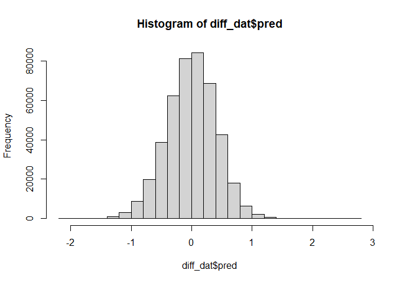

# Packages

Two packages are not in CRAN and need different installation
* devtools::install_github("vjilmari/vjihelpers")
* install.packages("ggflags", repos = c("https://jimjam-slam.r-universe.dev","https://cloud.r-project.org")) 


``` r
library(multid)
library(rio)
library(dplyr)
library(lme4)
library(emmeans)
library(vjihelpers)
library(MetBrewer)
library(ggplot2)
library(finalfit)
library(ggflags) 
library(lmerTest)
library(metafor)
library(ggpubr)
library(Hmisc)
library(r2mlm)
library(tidyr)
library(stringr)
library(apaTables)
library(tibble)
```

# Custom functions


``` r
# toster function for equivalence testing

tost_z <- function(est, se, low, high, alpha = 0.10) {
  # z statistics
  z_low  <- (est - low)  / se     # H0: theta <= low  vs H1: theta > low
  z_high <- (est - high) / se     # H0: theta >= high vs H1: theta < high
  
  # one-sided p-values
  p_low  <- 1 - pnorm(z_low)
  p_high <- pnorm(z_high)
  
  # CI corresponding to TOST (1 - 2*alpha)
  z_crit <- qnorm(1 - alpha)
  ci_low  <- est - z_crit * se
  ci_high <- est + z_crit * se
  
  # equivalence decision
  equivalent <- (p_low < alpha) && (p_high < alpha)
  
  list(
    estimate     = est,
    se           = se,
    low_bound    = low,
    high_bound   = high,
    alpha        = alpha,
    z_low        = z_low,
    p_low        = p_low,
    z_high       = z_high,
    p_high       = p_high,
    ci_level     = 1 - 2*alpha,
    ci_lower     = ci_low,
    ci_upper     = ci_high,
    equivalent   = equivalent
  )
}


# TOST function for equivalence testing with t distribution

tost_t <- function(est, se, low, high, df, alpha = 0.10) {
  # t statistics
  t_low  <- (est - low)  / se   # H0: theta <= low  vs H1: theta > low
  t_high <- (est - high) / se   # H0: theta >= high vs H1: theta < high
  
  # one-sided p-values
  p_low  <- 1 - pt(t_low,  df = df)
  p_high <-     pt(t_high, df = df)
  
  # CI corresponding to TOST (1 - 2*alpha)
  t_crit <- qt(1 - alpha, df = df)
  ci_low  <- est - t_crit * se
  ci_high <- est + t_crit * se
  
  # equivalence decision
  equivalent <- (p_low < alpha) && (p_high < alpha)
  
  list(
    estimate   = est,
    se         = se,
    df         = df,
    low_bound  = low,
    high_bound = high,
    alpha      = alpha,
    t_low      = t_low,
    p_low      = p_low,
    t_high     = t_high,
    p_high     = p_high,
    ci_level   = 1 - 2 * alpha,
    ci_lower   = ci_low,
    ci_upper   = ci_high,
    equivalent = equivalent
  )
}
```


# Data

* Loads the preprocessed European Social Survey data file made within "Preparations_ESS" code


``` r
load("../data/fdat.rdata")
```

* Include ISO data for country-names


``` r
# read country names
ISO<-read.csv2("../data/ISO.csv")
```


# Exclusions

* exclude participants with missing values or gender


``` r
value.vars<-
  c("con","tra",
  "ben","uni",
  "sdi","sti",
  "hed","ach",
  "pow","sec")

fdat$miss_values<-
  rowSums(is.na(fdat[,value.vars]))
table(fdat$miss_values)
```

```
## 
##      0      1      2      3      4      5      6      7      8      9     10 
## 500044   2791    835    442    267    204    142    143    156    177  35470
```

``` r
fdat<-fdat %>%
  filter(miss_values==0 & !is.na(gndr.bin))
```

# Construct value-based gender-typicality measure

* Use 100 men and women from each country x time data fold for training set


``` r
# set seed number for reproducibility in training/testing split
set.seed(13032023)
# check the cross-validation fold sizes
table(fdat$cntry_time)
```

```
## 
##  AL_6  AT_1 AT_11  AT_2  AT_3  AT_7  AT_8  AT_9  BE_1 BE_10 BE_11  BE_2  BE_3  BE_4  BE_5  BE_6  BE_7 
##  1117  2254  2314  2198  2348  1795  1993  2477  1830  1334  1577  1771  1796  1754  1699  1862  1767 
##  BE_8  BE_9 BG_10 BG_11  BG_3  BG_4  BG_5  BG_6  BG_9  CH_1 CH_10 CH_11  CH_2  CH_3  CH_4  CH_5  CH_6 
##  1759  1756  2697  2218  1295  2144  2371  2179  1926  2024  1505  1368  2110  1780  1753  1491  1483 
##  CH_7  CH_8  CH_9 CY_11  CY_3  CY_4  CY_5  CY_6  CY_9  CZ_1 CZ_10  CZ_2  CZ_4  CZ_5  CZ_6  CZ_7  CZ_8 
##  1521  1504  1517   667   978  1210  1053  1110   773  1208  2369  2557  1986  2335  1973  1862  2252 
##  CZ_9  DE_1 DE_11  DE_2  DE_3  DE_4  DE_5  DE_6  DE_7  DE_8  DE_9  DK_1  DK_2  DK_3  DK_4  DK_5  DK_6 
##  2343  2819  2381  2840  2884  2732  3007  2935  3006  2821  2328  1470  1458  1461  1581  1564  1621 
##  DK_7  DK_9 EE_10 EE_11  EE_2  EE_3  EE_4  EE_5  EE_6  EE_7  EE_8  EE_9  ES_1 ES_11  ES_2  ES_3  ES_4 
##  1483  1554  1538  1282  1948  1466  1646  1793  2345  2036  2007  1899  1712  1833  1623  1847  2562 
##  ES_5  ES_6  ES_7  ES_8  ES_9  FI_1 FI_10 FI_11  FI_2  FI_3  FI_4  FI_5  FI_6  FI_7  FI_8  FI_9  FR_1 
##  1881  1871  1907  1929  1619  1763  1561  1524  1701  1649  1901  1649  2158  2050  1903  1735  1355 
## FR_10 FR_11  FR_2  FR_3  FR_4  FR_5  FR_6  FR_7  FR_8  FR_9  GB_1 GB_10 GB_11  GB_2  GB_3  GB_4  GB_5 
##  1951  1745  1699  1983  2067  1723  1960  1902  2057  1982  1798  1131  1529  1864  2353  2311  2374 
##  GB_6  GB_7  GB_8  GB_9  GR_1 GR_10 GR_11  GR_2  GR_4  GR_5 HR_10 HR_11  HR_4  HR_5  HR_9  HU_1 HU_10 
##  2261  2231  1942  2183  2551  2768  2745  2399  2063  2669  1564  1548  1430  1601  1781  1634  1816 
## HU_11  HU_2  HU_3  HU_4  HU_5  HU_6  HU_7  HU_8  HU_9  IE_1 IE_10 IE_11  IE_2  IE_3  IE_4  IE_5  IE_6 
##  2117  1460  1462  1430  1473  1968  1520  1458  1643  1916  1751  1985  1187  1589  1757  2400  2616 
##  IE_7  IE_8  IE_9  IL_1 IL_11  IL_4  IL_5  IL_6  IL_7  IL_8 IS_10 IS_11  IS_2  IS_6  IS_8  IS_9 IT_10 
##  2380  2746  2189  2279   893  2382  2212  2378  2351  2366   886   825   524   739   841   844  2573 
## IT_11  IT_6  IT_8  IT_9 LT_10 LT_11  LT_5  LT_6  LT_7  LT_8  LT_9  LU_2 LV_11  LV_4  LV_9 ME_10 ME_11 
##  2783   909  2531  2660  1606  1337  1632  2108  2241  2079  1677  1614  1225  1970   891  1248  1581 
##  ME_9 MK_10  NL_1 NL_10 NL_11  NL_2  NL_3  NL_4  NL_5  NL_6  NL_7  NL_8  NL_9  NO_1 NO_10 NO_11  NO_2 
##  1188  1400  2337  1466  1677  1858  1860  1724  1801  1828  1823  1669  1657  1819  1408  1318  1575 
##  NO_3  NO_4  NO_5  NO_6  NO_7  NO_8  NO_9  PL_1 PL_11  PL_2  PL_3  PL_4  PL_5  PL_6  PL_7  PL_8  PL_9 
##  1550  1391  1530  1610  1423  1530  1396  2065  1423  1683  1685  1596  1719  1866  1594  1675  1443 
##  PT_1 PT_10 PT_11  PT_2  PT_3  PT_4  PT_5  PT_6  PT_7  PT_8  PT_9  RO_4 RS_11  RS_9  RU_3  RU_4  RU_5 
##  1482  1827  1366  2024  2182  2337  2139  2138  1242  1254  1045  2104  1511  1969  2339  2446  2557 
##  RU_6  RU_8  SE_1 SE_11  SE_2  SE_3  SE_4  SE_5  SE_6  SE_7  SE_8  SE_9  SI_1 SI_10 SI_11  SI_2  SI_3 
##  2429  2374  1682  1204  1678  1604  1556  1463  1838  1761  1526  1510  1488  1232  1227  1384  1465 
##  SI_4  SI_5  SI_6  SI_7  SI_8  SI_9 SK_10 SK_11  SK_2  SK_3  SK_4  SK_5  SK_6  SK_9  TR_2  TR_4 UA_11 
##  1257  1369  1244  1189  1295  1307  1395  1414  1425  1711  1789  1803  1827  1061  1790  2305  2589 
##  UA_2  UA_3  UA_4  UA_5  UA_6  XK_6 
##  1896  1885  1766  1779  2064  1244
```

``` r
# run the analysis
value_typ<-
  D_regularized(data=fdat,mv.vars = value.vars,
                group.var = "gndr.bin",group.values = c(1,0),
                out = T,fold = T,fold.var = "cntry_time",size = 100,
                pcc = T,auc=T,pred.prob = T,append.data=T)
```
## Gender typicality results and description


### Training sample size


``` r
# n folds in the training phase
length(unique(fdat$cntry_time))
```

```
## [1] 278
```

``` r
length(unique(fdat$cntry_time))*200
```

```
## [1] 55600
```

### Coefficients for value variables in training set


``` r
round(coefficients(value_typ$cv.mod,s = "lambda.min"),2)
```

```
## 11 x 1 sparse Matrix of class "dgCMatrix"
##             lambda.min
## (Intercept)       0.70
## con               0.09
## tra              -0.03
## ben              -0.27
## uni              -0.08
## sdi               0.10
## sti               0.06
## hed               0.06
## ach               0.07
## pow               0.14
## sec              -0.17
```

``` r
plot(value_typ$cv.mod)
```

<!-- -->

### Description of gender differences/prediction in testing dataset


``` r
# save to summary tab
sum_tab<-value_typ$D
# print the country X time -fold results
round(sum_tab,2)
```

```
##        n.1  n.0   m.1   m.0 sd.1 sd.0 pooled.sd diff    D pcc.1 pcc.0 pcc.total  auc pooled.sd.1
## AL_6   419  498  0.05 -0.01 0.35 0.36      0.35 0.06 0.17  0.54  0.51      0.52 0.54        0.38
## AT_1   941 1113  0.16 -0.03 0.43 0.45      0.44 0.19 0.44  0.65  0.53      0.59 0.63        0.38
## AT_11  875 1239  0.03 -0.12 0.34 0.34      0.34 0.15 0.46  0.54  0.65      0.60 0.63        0.38
## AT_2   910 1088  0.21 -0.01 0.40 0.43      0.42 0.22 0.52  0.70  0.52      0.60 0.65        0.38
## AT_3   994 1154  0.19 -0.02 0.43 0.40      0.42 0.21 0.51  0.70  0.51      0.60 0.65        0.38
## AT_7   753  842  0.07 -0.10 0.36 0.37      0.36 0.18 0.48  0.58  0.62      0.60 0.63        0.38
## AT_8   792 1001  0.12 -0.04 0.40 0.42      0.41 0.16 0.40  0.62  0.55      0.58 0.62        0.38
## AT_9  1043 1234  0.07 -0.12 0.36 0.39      0.38 0.19 0.49  0.59  0.62      0.60 0.64        0.38
## BE_1   845  785  0.07 -0.06 0.37 0.39      0.38 0.13 0.35  0.61  0.58      0.59 0.60        0.38
## BE_10  570  564  0.05 -0.11 0.32 0.34      0.33 0.17 0.51  0.58  0.63      0.61 0.64        0.38
## BE_11  702  675  0.02 -0.09 0.33 0.36      0.34 0.11 0.33  0.55  0.58      0.56 0.60        0.38
## BE_2   770  801  0.09 -0.09 0.35 0.38      0.36 0.19 0.51  0.62  0.59      0.60 0.64        0.38
## BE_3   740  856  0.07 -0.07 0.36 0.36      0.36 0.14 0.39  0.60  0.56      0.58 0.61        0.38
## BE_4   760  794  0.08 -0.07 0.34 0.35      0.34 0.15 0.43  0.62  0.55      0.58 0.62        0.38
## BE_5   719  780  0.06 -0.08 0.33 0.36      0.35 0.14 0.41  0.59  0.59      0.59 0.62        0.38
## BE_6   811  851  0.07 -0.08 0.32 0.35      0.33 0.15 0.44  0.60  0.56      0.58 0.62        0.38
## BE_7   795  772  0.05 -0.08 0.33 0.33      0.33 0.13 0.40  0.58  0.56      0.57 0.61        0.38
## BE_8   784  775  0.08 -0.08 0.33 0.34      0.34 0.17 0.49  0.60  0.56      0.58 0.63        0.38
## BE_9   765  791  0.08 -0.06 0.32 0.36      0.34 0.14 0.40  0.59  0.55      0.57 0.61        0.38
## BG_10 1171 1326  0.18  0.03 0.38 0.42      0.40 0.16 0.39  0.71  0.45      0.58 0.61        0.38
## BG_11  957 1061  0.25  0.05 0.41 0.45      0.43 0.21 0.48  0.73  0.46      0.59 0.64        0.38
## BG_3   409  686 -0.02 -0.19 0.42 0.45      0.44 0.17 0.39  0.50  0.67      0.61 0.61        0.38
## BG_4   848 1096 -0.06 -0.25 0.43 0.46      0.44 0.19 0.42  0.44  0.70      0.58 0.62        0.38
## BG_5   942 1229  0.06 -0.12 0.37 0.42      0.40 0.17 0.44  0.59  0.59      0.59 0.62        0.38
## BG_6   830 1149  0.05 -0.13 0.38 0.41      0.40 0.18 0.45  0.57  0.61      0.60 0.63        0.38
## BG_9   763  963  0.08 -0.07 0.39 0.44      0.42 0.15 0.37  0.59  0.56      0.58 0.60        0.38
## CH_1   874  950  0.07 -0.09 0.34 0.34      0.34 0.16 0.47  0.59  0.60      0.59 0.63        0.38
## CH_10  672  633  0.06 -0.11 0.33 0.33      0.33 0.17 0.51  0.60  0.61      0.60 0.65        0.38
## CH_11  590  578  0.02 -0.12 0.31 0.35      0.33 0.14 0.42  0.56  0.64      0.60 0.62        0.38
## CH_2   834 1076  0.06 -0.10 0.35 0.35      0.35 0.17 0.48  0.58  0.61      0.60 0.63        0.38
## CH_3   702  878  0.04 -0.12 0.34 0.32      0.33 0.16 0.48  0.54  0.65      0.61 0.63        0.38
## CH_4   697  856  0.11 -0.14 0.35 0.34      0.34 0.25 0.71  0.63  0.67      0.65 0.70        0.38
## CH_5   662  629  0.05 -0.11 0.33 0.33      0.33 0.16 0.49  0.57  0.63      0.60 0.64        0.38
## CH_6   643  640  0.06 -0.10 0.31 0.34      0.32 0.16 0.48  0.59  0.60      0.60 0.64        0.38
## CH_7   659  662  0.08 -0.11 0.31 0.33      0.32 0.19 0.61  0.62  0.64      0.63 0.67        0.38
## CH_8   681  623  0.07 -0.10 0.31 0.32      0.32 0.17 0.53  0.60  0.64      0.62 0.65        0.38
## CH_9   667  650  0.05 -0.11 0.31 0.33      0.32 0.16 0.50  0.56  0.63      0.60 0.64        0.38
## CY_11  203  264 -0.03 -0.26 0.42 0.43      0.42 0.22 0.52  0.45  0.73      0.61 0.65        0.38
## CY_3   368  410 -0.03 -0.12 0.36 0.41      0.39 0.09 0.23  0.51  0.59      0.55 0.57        0.38
## CY_4   512  498 -0.01 -0.13 0.37 0.39      0.38 0.12 0.33  0.51  0.59      0.55 0.58        0.38
## CY_5   375  478 -0.09 -0.21 0.37 0.46      0.42 0.12 0.28  0.43  0.67      0.56 0.58        0.38
## CY_6   391  519 -0.11 -0.27 0.39 0.43      0.41 0.16 0.38  0.40  0.72      0.58 0.60        0.38
## CY_9   263  310 -0.19 -0.27 0.41 0.40      0.41 0.08 0.19  0.31  0.73      0.54 0.55        0.38
## CZ_1   472  536  0.10 -0.18 0.46 0.44      0.45 0.27 0.61  0.59  0.68      0.64 0.67        0.38
## CZ_10  928 1241  0.32  0.15 0.40 0.45      0.43 0.17 0.40  0.79  0.35      0.54 0.60        0.38
## CZ_2  1089 1268  0.24 -0.04 0.42 0.48      0.45 0.29 0.64  0.73  0.52      0.62 0.68        0.38
## CZ_4   863  923  0.25  0.02 0.42 0.47      0.45 0.23 0.52  0.74  0.48      0.61 0.64        0.38
## CZ_5  1069 1066  0.27  0.04 0.41 0.45      0.43 0.23 0.54  0.76  0.44      0.60 0.64        0.38
## CZ_6   875  898  0.28  0.07 0.41 0.48      0.45 0.20 0.46  0.77  0.42      0.59 0.62        0.38
## CZ_7   704  958  0.30  0.08 0.40 0.43      0.42 0.22 0.52  0.79  0.40      0.56 0.64        0.38
## CZ_8   989 1063  0.29  0.16 0.38 0.41      0.39 0.14 0.35  0.79  0.33      0.55 0.59        0.38
## CZ_9   921 1222  0.26  0.07 0.40 0.44      0.42 0.19 0.44  0.75  0.43      0.56 0.62        0.38
## DE_1  1249 1370  0.05 -0.13 0.41 0.42      0.42 0.18 0.44  0.56  0.64      0.60 0.63        0.38
## DE_11 1092 1089 -0.07 -0.25 0.35 0.36      0.36 0.17 0.49  0.42  0.75      0.58 0.64        0.38
## DE_2  1267 1373  0.10 -0.11 0.40 0.39      0.39 0.21 0.53  0.59  0.62      0.61 0.64        0.38
## DE_3  1319 1365  0.10 -0.10 0.38 0.39      0.39 0.19 0.50  0.60  0.60      0.60 0.64        0.38
## DE_4  1342 1190  0.05 -0.15 0.38 0.38      0.38 0.20 0.53  0.55  0.66      0.60 0.65        0.38
## DE_5  1444 1363 -0.01 -0.17 0.36 0.36      0.36 0.16 0.44  0.49  0.69      0.58 0.62        0.38
##       pooled.sd.0 pooled.sd.total d.sd.total
## AL_6          0.4            0.39       0.16
## AT_1          0.4            0.39       0.49
## AT_11         0.4            0.39       0.39
## AT_2          0.4            0.39       0.56
## AT_3          0.4            0.39       0.54
## AT_7          0.4            0.39       0.45
## AT_8          0.4            0.39       0.42
## AT_9          0.4            0.39       0.48
## BE_1          0.4            0.39       0.34
## BE_10         0.4            0.39       0.43
## BE_11         0.4            0.39       0.29
## BE_2          0.4            0.39       0.48
## BE_3          0.4            0.39       0.36
## BE_4          0.4            0.39       0.38
## BE_5          0.4            0.39       0.37
## BE_6          0.4            0.39       0.38
## BE_7          0.4            0.39       0.34
## BE_8          0.4            0.39       0.43
## BE_9          0.4            0.39       0.35
## BG_10         0.4            0.39       0.40
## BG_11         0.4            0.39       0.53
## BG_3          0.4            0.39       0.44
## BG_4          0.4            0.39       0.48
## BG_5          0.4            0.39       0.45
## BG_6          0.4            0.39       0.46
## BG_9          0.4            0.39       0.40
## CH_1          0.4            0.39       0.41
## CH_10         0.4            0.39       0.43
## CH_11         0.4            0.39       0.35
## CH_2          0.4            0.39       0.43
## CH_3          0.4            0.39       0.41
## CH_4          0.4            0.39       0.63
## CH_5          0.4            0.39       0.41
## CH_6          0.4            0.39       0.40
## CH_7          0.4            0.39       0.50
## CH_8          0.4            0.39       0.43
## CH_9          0.4            0.39       0.42
## CY_11         0.4            0.39       0.57
## CY_3          0.4            0.39       0.23
## CY_4          0.4            0.39       0.32
## CY_5          0.4            0.39       0.31
## CY_6          0.4            0.39       0.40
## CY_9          0.4            0.39       0.20
## CZ_1          0.4            0.39       0.70
## CZ_10         0.4            0.39       0.44
## CZ_2          0.4            0.39       0.74
## CZ_4          0.4            0.39       0.59
## CZ_5          0.4            0.39       0.59
## CZ_6          0.4            0.39       0.53
## CZ_7          0.4            0.39       0.56
## CZ_8          0.4            0.39       0.35
## CZ_9          0.4            0.39       0.48
## DE_1          0.4            0.39       0.47
## DE_11         0.4            0.39       0.45
## DE_2          0.4            0.39       0.54
## DE_3          0.4            0.39       0.50
## DE_4          0.4            0.39       0.52
## DE_5          0.4            0.39       0.41
##  [ reached 'max' / getOption("max.print") -- omitted 220 rows ]
```

``` r
# range in gender differences across folds with fold-specific SDs
range(sum_tab$D)
```

```
## [1] 0.04560813 0.71413463
```

``` r
# range in gender differences across folds with SD pooled across all folds
range(sum_tab$d.sd.total)
```

```
## [1] 0.04898065 0.73592517
```

``` r
# mean gender difference across folds with SD pooled across all folds
mean(sum_tab$d.sd.total)
```

```
## [1] 0.412898
```

``` r
# average probability of correct classification (pcc)
mean(sum_tab$pcc.total)
```

```
## [1] 0.5802061
```

``` r
# pcc for men
mean(sum_tab$pcc.1)
```

```
## [1] 0.5954792
```

``` r
# pcc for women
mean(sum_tab$pcc.0)
```

```
## [1] 0.5718254
```

``` r
# average area under the curve
mean(sum_tab$auc)
```

```
## [1] 0.6178933
```

``` r
# print smallest and largest gender differences
sum_tab[sum_tab$d.sd.total==min(sum_tab$d.sd.total),]
```

```
##       n.1 n.0         m.1         m.0      sd.1      sd.0 pooled.sd       diff          D pcc.1     pcc.0
## MK_10 538 662 0.003747672 -0.01534145 0.4044009 0.4296955 0.4185463 0.01908912 0.04560813   0.5 0.5196375
##       pcc.total       auc pooled.sd.1 pooled.sd.0 pooled.sd.total d.sd.total
## MK_10 0.5108333 0.5125535   0.3773205   0.3998527       0.3897277 0.04898065
```

``` r
sum_tab[sum_tab$d.sd.total==max(sum_tab$d.sd.total),]
```

```
##       n.1  n.0       m.1         m.0      sd.1      sd.0 pooled.sd      diff         D    pcc.1     pcc.0
## CZ_2 1089 1268 0.2423504 -0.04446001 0.4194121 0.4770804 0.4513545 0.2868104 0.6354438 0.728191 0.5205047
##      pcc.total       auc pooled.sd.1 pooled.sd.0 pooled.sd.total d.sd.total
## CZ_2 0.6164616 0.6751419   0.3773205   0.3998527       0.3897277  0.7359252
```

``` r
# correlation between men and women in male-typicality across the folds
cor(sum_tab$m.1,sum_tab$m.0)
```

```
## [1] 0.9204389
```

``` r
# correlation between men and women in male-typicality deviations across the folds
cor(sum_tab$sd.1,sum_tab$sd.0)
```

```
## [1] 0.8574715
```

# Data for the analysis

* use the testing partition of the data set (diff_dat)
* basic descriptives


``` r
diff_dat<-
  value_typ$preds

#diff_dat$age.c<-as.numeric(diff_dat$age.c)
#diff_dat$rlgdgr.c<-as.numeric(diff_dat$rlgdgr.c)
#diff_dat$eduyrs.c<-as.numeric(diff_dat$eduyrs.c)

# data exclusions (include countries with at least two rounds of data)
n_rounds<-diff_dat %>% group_by(cntry) %>%
  summarise(n_unique_essround = n_distinct(essround))

# join number of rounds to data
diff_dat<-
  left_join(x=diff_dat,
            y=n_rounds,
            by="cntry")

# filter only countries with more than 1 round and non-missing gender variable
diff_dat<-diff_dat %>%
  dplyr::filter(n_unique_essround>1 &
                  !is.na(gndr))

# cross-tabulate sample sizes and ESS rounds by country
table(diff_dat$essround,diff_dat$cntry)
```

```
##     
##        AT   BE   BG   CH   CY   CZ   DE   DK   EE   ES   FI   FR   GB   GR   HR   HU   IE   IL   IS   IT
##   1  2054 1630    0 1824    0 1008 2619 1270    0 1512 1563 1155 1598 2351    0 1434 1716 2079    0    0
##   2  1998 1571    0 1910    0 2357 2640 1258 1748 1423 1501 1499 1664 2199    0 1260  987    0  324    0
##   3  2148 1596 1095 1580  778    0 2684 1261 1266 1647 1449 1783 2153    0    0 1262 1389    0    0    0
##   4     0 1554 1944 1553 1010 1786 2532 1381 1446 2362 1701 1867 2111 1863 1230 1230 1557 2182    0    0
##   5     0 1499 2171 1291  853 2135 2807 1364 1593 1681 1449 1523 2174 2469 1401 1273 2200 2012    0    0
##   6     0 1662 1979 1283  910 1773 2735 1421 2145 1671 1958 1760 2061    0    0 1768 2416 2178  539  709
##   7  1595 1567    0 1321    0 1662 2806 1283 1836 1707 1850 1702 2031    0    0 1320 2180 2151    0    0
##   8  1793 1559    0 1304    0 2052 2621    0 1807 1729 1703 1857 1742    0    0 1258 2546 2166  641 2331
##   9  2277 1556 1726 1317  573 2143 2128 1354 1699 1419 1535 1782 1983    0 1581 1443 1989    0  644 2460
##   10    0 1134 2497 1305    0 2169    0    0 1338    0 1361 1751  931 2568 1364 1616 1551    0  686 2373
##   11 2114 1377 2018 1168  467    0 2181    0 1082 1633 1324 1545 1329 2545 1348 1917 1785  693  625 2583
##     
##        LT   LV   ME   NL   NO   PL   PT   RS   RU   SE   SI   SK   TR   UA
##   1     0    0    0 2137 1619 1865 1282    0    0 1482 1288    0    0    0
##   2     0    0    0 1658 1375 1483 1824    0    0 1478 1184 1225 1590 1696
##   3     0    0    0 1660 1350 1485 1982    0 2139 1404 1265 1511    0 1685
##   4     0 1770    0 1524 1191 1396 2137    0 2246 1356 1057 1589 2105 1566
##   5  1432    0    0 1601 1330 1519 1939    0 2357 1263 1169 1603    0 1579
##   6  1908    0    0 1628 1410 1666 1938    0 2229 1638 1044 1627    0 1864
##   7  2041    0    0 1623 1223 1394 1042    0    0 1561  989    0    0    0
##   8  1879    0    0 1469 1330 1475 1054    0 2174 1326 1095    0    0    0
##   9  1477  691  988 1457 1196 1243  845 1769    0 1310 1107  861    0    0
##   10 1406    0 1048 1266 1208    0 1627    0    0    0 1032 1195    0    0
##   11 1137 1025 1381 1477 1118 1223 1166 1311    0 1004 1027 1214    0 2389
```

``` r
# range of sample sizes
range(table(diff_dat$cntry))
```

```
## [1]  3080 25753
```

``` r
# value-based gender-typicality histogram
hist(diff_dat$pred)
```

<!-- -->

``` r
# scale/standardize with SD pooled across all country-time-gender folds
FM_pooled_sd<-value_typ$D[1,"pooled.sd.total"]
FM_pooled_sd
```

```
## [1] 0.3897277
```

``` r
# standardized
diff_dat$FM.z<-diff_dat$pred/FM_pooled_sd
hist(diff_dat$FM.z)
```

<!-- -->

``` r
# recode time to start from 2002=0

diff_dat$year<-
  case_when(
    diff_dat$essround==1~2002,  
    diff_dat$essround==2~2004,
    diff_dat$essround==3~2006,
    diff_dat$essround==4~2008,
    diff_dat$essround==5~2010,
    diff_dat$essround==6~2012,
    diff_dat$essround==7~2014,
    diff_dat$essround==8~2016,
    diff_dat$essround==9~2018,
    diff_dat$essround==10~2020,
    diff_dat$essround==11~2023
  )

diff_dat$year.c<-diff_dat$year-2002
```

## Add GEI-variable

* GEI = Reverse-coded Gender Inequality Index (GII)


``` r
GII<-read.csv("../data/GII.csv")

# Obtain GII only for ESS countries
GII_in_ESS_d<-
  GII %>%
  filter(ISO2 %in% unique(diff_dat$cntry))

# Make long format data of GII, so that country x year has own rows

long_GII_in_ESS_d <- GII_in_ESS_d %>%
  pivot_longer(
    cols = starts_with("gii_") & !matches("avg"),  # <-- exclude the "_avg" columns
    names_to = "year",
    values_to = "gii",
    names_prefix = "gii_"
  ) %>%
  mutate(year = as.integer(year)) %>%
  filter(year >= 2002 & year <= 2023) %>%
  mutate(gei = 1 - gii) %>%
  select(ISO2, iso3, country, year, gii, gei, gii_2002_2023_avg, gei_2002_2023_avg)


# describe gei average
psych::describe(GII_in_ESS_d$gei_2002_2023_avg)
```

```
##    vars  n mean   sd median trimmed  mad  min  max range  skew kurtosis   se
## X1    1 33 0.87 0.07   0.87    0.87 0.06 0.63 0.96  0.34 -1.06     1.37 0.01
```

``` r
# one is missing, see which one
GII_in_ESS_d[is.na(GII_in_ESS_d$gei_2002_2023_avg),"country"]
```

```
## [1] "Ukraine"
```

``` r
# get means and SDs for standardizing
gei_mean<-mean(GII_in_ESS_d$gei_2002_2023_avg,na.rm=T)
gei_sd<-sd(GII_in_ESS_d$gei_2002_2023_avg,na.rm=T)

# standardize 
# year specific scores
long_GII_in_ESS_d$gei.z<-(long_GII_in_ESS_d$gei-gei_mean)/gei_sd

# get the country means to a separate frame

GII_country_means<-
  long_GII_in_ESS_d %>% group_by(ISO2) %>%
  summarise(gei.cm=mean(gei,na.rm=T),
            gei.z.cm=mean(gei.z,na.rm=T))


long_GII_in_ESS_d<-left_join(
  x=long_GII_in_ESS_d,
  y=GII_country_means,
  by="ISO2"
)


# center both the raw score and standardized scores
long_GII_in_ESS_d$gei.cmc<-(long_GII_in_ESS_d$gei-long_GII_in_ESS_d$gei.cm)
long_GII_in_ESS_d$gei.z.cmc<-(long_GII_in_ESS_d$gei.z-long_GII_in_ESS_d$gei.z.cm)

#View(long_GII_in_ESS_d)

# averages across 2002-2023
#long_GII_in_ESS_d$gei_2002_2023_avg.z<-(long_GII_in_ESS_d$gei_2002_2023_avg-gei_mean)/gei_sd

#long_GII_in_ESS_d$gei.cmc<-long_GII_in_ESS_d$gei-long_GII_in_ESS_d$gei_2002_2023_avg

# add year to ESS data-frame


# link datasets by country and year

diff_dat<-
  left_join(
    x=diff_dat,
    y=long_GII_in_ESS_d[,c("ISO2","year","gei","gei.cm","gei.cmc",
                           "gei.z","gei.z.cm","gei.z.cmc")],
    by=c("cntry"="ISO2","year")
)
```


## Add GDI-variable

* GDI = Gender Development Index


``` r
GDI<-read.csv("../data/GDI.csv")

# Obtain GDI only for ESS countries
GDI_in_ESS_d<-
  GDI %>%
  filter(ISO2 %in% unique(diff_dat$cntry))

# Make long format data of GDI, so that country x year has own rows

long_GDI_in_ESS_d <- GDI_in_ESS_d %>%
  pivot_longer(
    cols = starts_with("gdi_") & !matches("avg"),  # <-- exclude the "_avg" columns
    names_to = "year",
    values_to = "gdi",
    names_prefix = "gdi_"
  ) %>%
  mutate(year = as.integer(year)) %>%
  filter(year >= 2002 & year <= 2023) %>%
  select(ISO2, iso3, country, year, gdi, gdi_2002_2023_avg)

# describe gdi average
psych::describe(GDI_in_ESS_d$gdi_2002_2023_avg)
```

```
##    vars  n mean   sd median trimmed  mad min  max range skew kurtosis se
## X1    1 34 0.98 0.03   0.98    0.98 0.02 0.9 1.03  0.13 -0.3     1.28  0
```

``` r
# get means and SDs for standardizing
gdi_mean<-mean(GDI_in_ESS_d$gdi_2002_2023_avg,na.rm=T)
gdi_sd<-sd(GDI_in_ESS_d$gdi_2002_2023_avg,na.rm=T)

# standardize 
# year specific scores
long_GDI_in_ESS_d$gdi.z<-(long_GDI_in_ESS_d$gdi-gdi_mean)/gdi_sd

# get the country means to a separate frame

GDI_country_means<-
  long_GDI_in_ESS_d %>% group_by(ISO2) %>%
  summarise(gdi.cm=mean(gdi,na.rm=T),
            gdi.z.cm=mean(gdi.z,na.rm=T))

long_GDI_in_ESS_d<-left_join(
  x=long_GDI_in_ESS_d,
  y=GDI_country_means,
  by="ISO2"
)


# center both the raw score and standardized scores
long_GDI_in_ESS_d$gdi.cmc<-(long_GDI_in_ESS_d$gdi-long_GDI_in_ESS_d$gdi.cm)
long_GDI_in_ESS_d$gdi.z.cmc<-(long_GDI_in_ESS_d$gdi.z-long_GDI_in_ESS_d$gdi.z.cm)

# link datasets by country and year

diff_dat<-
  left_join(
    x=diff_dat,
    y=long_GDI_in_ESS_d[,c("ISO2","year","gdi","gdi.cm","gdi.cmc",
                           "gdi.z","gdi.z.cm","gdi.z.cmc")],
    by=c("cntry"="ISO2","year")
  )
```

## Add GDP-variable

* log_GDP = Logarithm of GDP per capita, PPP (constant 2017 international $)


``` r
GDP<-read.csv("../data/GDP_processed.csv")

# Obtain GDP only for ESS countries
GDP_in_ESS_d<-
  GDP %>%
  filter(ISO2 %in% unique(diff_dat$cntry))

# First, rename those X2000..YR2000. style columns to simple "gdp_2000" etc.

GDP_in_ESS_d <- GDP_in_ESS_d %>%
  rename_with(
    ~ str_replace_all(., "^X(\\d{4})..YR\\1\\.$", "gdp_\\1"),
    starts_with("X")
  )

# GDP_in_ESS_d
# Make long format data of GDP, so that country x year has own rows

long_GDP_in_ESS_d <- GDP_in_ESS_d %>%
  pivot_longer(
    cols = starts_with("gdp_") & !matches("avg"),  # <-- exclude the "_avg" columns
    names_to = "year",
    values_to = "gdp",
    names_prefix = "gdp_"
  ) %>%
  mutate(year = as.integer(year)) %>%
  filter(year >= 2002 & year <= 2023) %>%
  select(ISO2, Country.Name, year, gdp, gdp_2002_2023_avg,log_gdp_2002_2023_avg) %>%
  mutate(log_gdp=log(gdp))

#View(long_GDP_in_ESS_d)

# describe gdp average
psych::describe(GDP_in_ESS_d$gdp_2002_2023_avg)
```

```
##    vars  n     mean      sd  median  trimmed     mad      min      max    range skew kurtosis      se
## X1    1 34 43905.99 17369.7 40201.8 42845.95 15827.5 16384.61 85341.85 68957.24 0.48    -0.58 2978.88
```

``` r
psych::describe(GDP_in_ESS_d$log_gdp_2002_2023_avg)
```

```
##    vars  n  mean   sd median trimmed  mad min   max range  skew kurtosis   se
## X1    1 34 10.61 0.41   10.6   10.62 0.44 9.7 11.35  1.65 -0.27    -0.71 0.07
```

``` r
# get means and SDs for standardizing
log_gdp_mean<-mean(GDP_in_ESS_d$log_gdp_2002_2023_avg,na.rm=T)
log_gdp_sd<-sd(GDP_in_ESS_d$log_gdp_2002_2023_avg,na.rm=T)

# standardize 
# year specific scores
long_GDP_in_ESS_d$log_gdp.z<-
  (long_GDP_in_ESS_d$log_gdp-log_gdp_mean)/log_gdp_sd

# get the country means to a separate frame

GDP_country_means<-
  long_GDP_in_ESS_d %>% group_by(ISO2) %>%
  summarise(gdp.cm=mean(gdp,na.rm=T),
            #gdp.z.cm=mean(gdp.z,na.rm=T),
            log_gdp.cm=mean(log_gdp,na.rm=T),
            log_gdp.z.cm=mean(log_gdp.z,na.rm=T))

long_GDP_in_ESS_d<-left_join(
  x=long_GDP_in_ESS_d,
  y=GDP_country_means,
  by="ISO2"
)


# center both the raw score and standardized scores
long_GDP_in_ESS_d$log_gdp.cmc<-(long_GDP_in_ESS_d$log_gdp-long_GDP_in_ESS_d$log_gdp.cm)
long_GDP_in_ESS_d$log_gdp.z.cmc<-(long_GDP_in_ESS_d$log_gdp.z-long_GDP_in_ESS_d$log_gdp.z.cm)

# link datasets by country and year

diff_dat<-
  left_join(
    x=diff_dat,
    y=long_GDP_in_ESS_d[,c("ISO2","year","log_gdp","log_gdp.cm","log_gdp.cmc",
                           "log_gdp.z","log_gdp.z.cm","log_gdp.z.cmc")],
    by=c("cntry"="ISO2","year")
  )
```

## Add GGGI-variable

* GGGI = Global Gender Gap Index


``` r
GGGI<-import("../data/GGGI.xlsx")

# check if all ESS countries are in the log_GGGI data
table(unique(diff_dat$cntry) %in% GGGI$ISO2)
```

```
## 
## TRUE 
##   34
```

``` r
# Obtain GGGI only for ESS countries
GGGI_in_ESS_d<-
  GGGI %>%
  filter(ISO2 %in% unique(diff_dat$cntry))

# Make long format data of GGGI, so that country x year has own rows

long_GGGI_in_ESS_d <- GGGI_in_ESS_d %>%
  pivot_longer(
    cols = starts_with("gggi_") & !matches("avg"),  # <-- exclude the "_avg" columns
    names_to = "year",
    values_to = "gggi",
    names_prefix = "gggi_"
  ) %>%
  mutate(year = as.integer(year)) %>%
  filter(year >= 2002 & year <= 2023) %>%
  select(ISO2, cname, year, gggi, GGGI_2002_2023_avg)

# describe gggi average
psych::describe(GGGI_in_ESS_d$GGGI_2002_2023_avg)
```

```
##    vars  n mean   sd median trimmed  mad  min  max range skew kurtosis   se
## X1    1 34 0.74 0.05   0.73    0.73 0.04 0.61 0.86  0.25  0.4     0.29 0.01
```

``` r
# get means and SDs for standardizing
gggi_mean<-mean(GGGI_in_ESS_d$GGGI_2002_2023_avg,na.rm=T)
gggi_sd<-sd(GGGI_in_ESS_d$GGGI_2002_2023_avg,na.rm=T)

# standardize 
# year specific scores
long_GGGI_in_ESS_d$gggi.z<-(long_GGGI_in_ESS_d$gggi-gggi_mean)/gggi_sd

# get the country means to a separate frame

GGGI_country_means<-
  long_GGGI_in_ESS_d %>% group_by(ISO2) %>%
  summarise(gggi.cm=mean(gggi,na.rm=T),
            gggi.z.cm=mean(gggi.z,na.rm=T))

long_GGGI_in_ESS_d<-left_join(
  x=long_GGGI_in_ESS_d,
  y=GGGI_country_means,
  by="ISO2"
)

# center both the raw score and standardized scores
long_GGGI_in_ESS_d$gggi.cmc<-
  (long_GGGI_in_ESS_d$gggi-long_GGGI_in_ESS_d$gggi.cm)

long_GGGI_in_ESS_d$gggi.z.cmc<-
  (long_GGGI_in_ESS_d$gggi.z-long_GGGI_in_ESS_d$gggi.z.cm)

# link datasets by country and year

diff_dat<-
  left_join(
    x=diff_dat,
    y=long_GGGI_in_ESS_d[,c("ISO2","year","gggi","gggi.cm","gggi.cmc",
                           "gggi.z","gggi.z.cm","gggi.z.cmc")],
    by=c("cntry"="ISO2","year")
  )
```

## Country-year-gender dataframe

Frame with one row for country-year-gender


``` r
diff_dat_cntry_year<-
  diff_dat %>% 
  group_by(cntry,year,gndr.c) %>%
  dplyr::summarise(n=n(),
                   n_wt=sum(pspwght),
                   FM.z.wt=weighted.mean(x=FM.z,w=pspwght),
                   FM.z=mean(FM.z),
                   gei.z=mean(gei.z,na.rm=T),
                   gei.z.cm=mean(gei.z.cm,na.rm=T),
                   gei.z.cmc=mean(gei.z.cmc,na.rm=T),
                   gdi.z=mean(gdi.z,na.rm=T),
                   gdi.z.cm=mean(gdi.z.cm,na.rm=T),
                   gdi.z.cmc=mean(gdi.z.cmc,na.rm=T),
                   gggi.z=mean(gggi.z,na.rm=T),
                   gggi.z.cm=mean(gggi.z.cm,na.rm=T),
                   gggi.z.cmc=mean(gggi.z.cmc,na.rm=T),
                   log_gdp.z=mean(log_gdp.z,na.rm=T),
                   log_gdp.z.cm=mean(log_gdp.z.cm,na.rm=T),
                   log_gdp.z.cmc=mean(log_gdp.z.cmc,na.rm=T),
                   gei=mean(gei,na.rm=T),
                   gei.cm=mean(gei.cm,na.rm=T),
                   gei.cmc=mean(gei.cmc,na.rm=T),
                   gdi=mean(gdi,na.rm=T),
                   gdi.cm=mean(gdi.cm,na.rm=T),
                   gdi.cmc=mean(gdi.cmc,na.rm=T),
                   gggi=mean(gggi,na.rm=T),
                   gggi.cm=mean(gggi.cm,na.rm=T),
                   gggi.cmc=mean(gggi.cmc,na.rm=T),
                   log_gdp=mean(log_gdp,na.rm=T),
                   log_gdp.cm=mean(log_gdp.cm,na.rm=T),
                   log_gdp.cmc=mean(log_gdp.cmc,na.rm=T))
```

```
## `summarise()` has regrouped the output.
## ℹ Summaries were computed grouped by cntry, year, and gndr.c.
## ℹ Output is grouped by cntry and year.
## ℹ Use `summarise(.groups = "drop_last")` to silence this message.
## ℹ Use `summarise(.by = c(cntry, year, gndr.c))` for per-operation grouping (`?dplyr::dplyr_by`) instead.
```


# Descriptive statistics

## Country-specific descriptives


``` r
# sample sizes from weights

cntry_n_frame<-
  diff_dat %>% group_by(cntry) %>%
  summarise('n ESS rounds' = mean(n_unique_essround),
            n=round(sum(pspwght),0))

# value-based male-typicality

cntry_FM_frame<-
  diff_dat %>% group_by(cntry,essround) %>%
  summarise('FM M' = weighted.mean(x=FM.z,w=pspwght),
            'FM SD' = sqrt(wtd.var(FM.z,pspwght))) %>%
  group_by(cntry) %>%
  summarise('FM M' = mean(x=`FM M`),
            'FM SD'= mean(x=`FM SD`))
```

```
## `summarise()` has regrouped the output.
## ℹ Summaries were computed grouped by cntry and essround.
## ℹ Output is grouped by cntry.
## ℹ Use `summarise(.groups = "drop_last")` to silence this message.
## ℹ Use `summarise(.by = c(cntry, essround))` for per-operation grouping (`?dplyr::dplyr_by`) instead.
```

``` r
cntry_FM_women_frame<-
  diff_dat %>%
  filter(gndr.c==-0.5) %>%
  group_by(cntry,essround) %>%
  summarise('FM M' = weighted.mean(x=FM.z,w=pspwght),
            'FM SD' = sqrt(wtd.var(FM.z,pspwght))) %>%
  group_by(cntry) %>%
  summarise('FM M Women' = mean(x=`FM M`),
            'FM SD Women'= mean(x=`FM SD`))
```

```
## `summarise()` has regrouped the output.
## ℹ Summaries were computed grouped by cntry and essround.
## ℹ Output is grouped by cntry.
## ℹ Use `summarise(.groups = "drop_last")` to silence this message.
## ℹ Use `summarise(.by = c(cntry, essround))` for per-operation grouping (`?dplyr::dplyr_by`) instead.
```

``` r
cntry_FM_men_frame<-
  diff_dat %>%
  filter(gndr.c==0.5) %>%
  group_by(cntry,essround) %>%
  summarise('FM M' = weighted.mean(x=FM.z,w=pspwght),
            'FM SD' = sqrt(wtd.var(FM.z,pspwght))) %>%
  group_by(cntry) %>%
  summarise('FM M Men' = mean(x=`FM M`),
            'FM SD Men'= mean(x=`FM SD`))
```

```
## `summarise()` has regrouped the output.
## ℹ Summaries were computed grouped by cntry and essround.
## ℹ Output is grouped by cntry.
## ℹ Use `summarise(.groups = "drop_last")` to silence this message.
## ℹ Use `summarise(.by = c(cntry, essround))` for per-operation grouping (`?dplyr::dplyr_by`) instead.
```

``` r
# link n and FM datasets

desc_frame<-
  left_join(
    x=cntry_n_frame,
    y=cntry_FM_frame,
    by="cntry"
  )

desc_frame<-
  left_join(
    x=desc_frame,
    y=cntry_FM_women_frame,
    by="cntry"
  )

desc_frame<-
  left_join(
    x=desc_frame,
    y=cntry_FM_men_frame,
    by="cntry"
  )

# Add country-specific differences
desc_frame$D<-desc_frame$`FM M Men`-desc_frame$`FM M Women`

desc_frame
```

```
## # A tibble: 34 × 10
##    cntry `n ESS rounds`     n  `FM M` `FM SD` `FM M Women` `FM SD Women` `FM M Men` `FM SD Men`     D
##    <chr>          <dbl> <dbl>   <dbl>   <dbl>        <dbl>         <dbl>      <dbl>       <dbl> <dbl>
##  1 AT                 7 14032  0.0730   1.04        -0.173         1.02      0.341        0.993 0.514
##  2 BE                11 16681 -0.0327   0.919       -0.217         0.923     0.162        0.873 0.380
##  3 BG                 7 13437  0.0337   1.09        -0.186         1.12      0.277        1.01  0.464
##  4 CH                11 15914 -0.0572   0.877       -0.272         0.862     0.169        0.835 0.441
##  5 CY                 6  4580 -0.298    1.04        -0.461         1.06     -0.118        0.986 0.342
##  6 CZ                 9 17085  0.402    1.14         0.123         1.15      0.708        1.05  0.585
##  7 DE                10 25753 -0.233    0.997       -0.476         0.976     0.0226       0.954 0.499
##  8 DK                 8 10590  0.0961   0.969       -0.142         0.927     0.341        0.948 0.484
##  9 EE                10 15958 -0.102    1.05        -0.337         1.03      0.190        0.988 0.527
## 10 ES                10 16795 -0.478    1.02        -0.646         1.03     -0.302        0.976 0.344
## # ℹ 24 more rows
```

``` r
# add country-level measures

desc_frame<-
  left_join(
    x=desc_frame,
    y=GII_country_means[,c("ISO2","gei.cm")],
    by=c("cntry"="ISO2")
  )

desc_frame<-
  left_join(
    x=desc_frame,
    y=GGGI_country_means[,c("ISO2","gggi.cm")],
    by=c("cntry"="ISO2")
  )

desc_frame<-
  left_join(
    x=desc_frame,
    y=GDI_country_means[,c("ISO2","gdi.cm")],
    by=c("cntry"="ISO2")
  )


desc_frame<-
  left_join(
    x=desc_frame,
    y=GDP_country_means[,c("ISO2","gdp.cm")],
    by=c("cntry"="ISO2")
  )

desc_frame<-left_join(
  x=desc_frame,
  y=ISO[,c("ISO2","CLDR")],
  by=c("cntry"="ISO2")
)

# finalize the formatted table

cntry_desc_tbl<-
  desc_frame %>%
  select(
    Country = CLDR,
    `n ESS rounds`,
    n,
    `FM M`, `FM SD`,
    `FM M Women`, `FM SD Women`,
    `FM M Men`, `FM SD Men`,
    D,
    GEI = gei.cm,
    GGGI = gggi.cm,
    GDI = gdi.cm,
    GDP = gdp.cm
  ) %>%
  mutate(
    across(
      .cols = -c(Country, `n ESS rounds`, n, GDP) & where(is.numeric),
      .fns  = ~ round_tidy(.x, 2)
    )
  ) %>%
  mutate(
    across(
      .cols = GDP,
      .fns  = ~ round_tidy(.x, 0)
    )
  )
print(cntry_desc_tbl,n=35)
```

```
## # A tibble: 34 × 14
##    Country     `n ESS rounds`     n `FM M` `FM SD` `FM M Women` `FM SD Women` `FM M Men` `FM SD Men` D    
##    <chr>                <dbl> <dbl> <chr>  <chr>   <chr>        <chr>         <chr>      <chr>       <chr>
##  1 Austria                  7 14032 0.07   1.04    -0.17        1.02          0.34       0.99        0.51 
##  2 Belgium                 11 16681 -0.03  0.92    -0.22        0.92          0.16       0.87        0.38 
##  3 Bulgaria                 7 13437 0.03   1.09    -0.19        1.12          0.28       1.01        0.46 
##  4 Switzerland             11 15914 -0.06  0.88    -0.27        0.86          0.17       0.84        0.44 
##  5 Cyprus                   6  4580 -0.30  1.04    -0.46        1.06          -0.12      0.99        0.34 
##  6 Czechia                  9 17085 0.40   1.14    0.12         1.15          0.71       1.05        0.59 
##  7 Germany                 10 25753 -0.23  1.00    -0.48        0.98          0.02       0.95        0.50 
##  8 Denmark                  8 10590 0.10   0.97    -0.14        0.93          0.34       0.95        0.48 
##  9 Estonia                 10 15958 -0.10  1.05    -0.34        1.03          0.19       0.99        0.53 
## 10 Spain                   10 16795 -0.48  1.02    -0.65        1.03          -0.30      0.98        0.34 
## 11 Finland                 11 17394 -0.27  1.04    -0.53        1.01          0.03       0.98        0.56 
## 12 France                  11 18277 -0.29  1.05    -0.51        1.03          -0.05      1.02        0.46 
## 13 UK                      11 20697 -0.14  1.00    -0.36        0.98          0.10       0.96        0.47 
## 14 Greece                   6 13982 0.08   1.05    -0.07        1.10          0.24       0.97        0.31 
## 15 Croatia                  5  6895 -0.24  1.07    -0.42        1.09          -0.02      1.01        0.40 
## 16 Hungary                 11 15877 0.19   1.02    0.04         1.04          0.36       0.98        0.32 
## 17 Ireland                 11 20405 -0.01  1.06    -0.19        1.08          0.19       1.01        0.38 
## 18 Israel                   7 13446 0.30   1.01    0.16         1.03          0.45       0.96        0.29 
## 19 Iceland                  6  3446 -0.31  0.94    -0.54        0.91          -0.07      0.91        0.47 
## 20 Italy                    5 10458 0.12   0.98    -0.03        0.98          0.28       0.95        0.31 
## 21 Lithuania                7 11541 0.50   1.09    0.31         1.08          0.76       1.03        0.45 
## 22 Latvia                   3  3458 0.19   1.10    -0.05        1.07          0.52       1.05        0.57 
## 23 Montenegro               3  3422 0.35   1.19    0.17         1.22          0.54       1.11        0.37 
## 24 Netherlands             11 17478 0.22   0.90    -0.00        0.88          0.46       0.86        0.46 
## 25 Norway                  11 14317 0.08   0.95    -0.14        0.93          0.30       0.90        0.44 
## 26 Poland                  10 14740 -0.01  0.98    -0.23        0.98          0.24       0.91        0.48 
## 27 Portugal                11 16831 0.05   0.97    -0.09        0.98          0.22       0.93        0.31 
## 28 Serbia                   2  3096 -0.32  1.11    -0.55        1.11          -0.09      1.07        0.46 
## 29 Russia                   5 11105 0.30   1.14    0.17         1.17          0.48       1.08        0.31 
## 30 Sweden                  10 14058 0.04   0.99    -0.20        0.96          0.28       0.96        0.48 
## 31 Slovenia                11 12254 0.15   0.87    -0.05        0.86          0.37       0.83        0.42 
## 32 Slovakia                 8 10905 0.29   1.11    0.08         1.13          0.52       1.04        0.44 
## 33 Turkey                   2  3704 0.41   0.86    0.29         0.90          0.53       0.80        0.24 
## 34 Ukraine                  6 10778 0.18   1.20    0.03         1.22          0.39       1.14        0.37 
## # ℹ 4 more variables: GEI <chr>, GGGI <chr>, GDI <chr>, GDP <chr>
```

``` r
export(cntry_desc_tbl,"../results/cntry_desc_tbl.xlsx",overwrite=T)
```

## Country-level correlations table


``` r
cor_frame<-
  desc_frame %>%
  select(
    VBMT=`FM M`,
    VBMT_Women=`FM M Women`,
    VBMT_Men=`FM M Men`,
    D = D,
    GEI = gei.cm,
    GGGI = gggi.cm,
    GDI = gdi.cm,
    GDP = gdp.cm
  ) %>%
  mutate(
    log_GDP=log(GDP)
  ) %>%
  select(-GDP)

apa.cor.table(
  data=cor_frame,
  filename = "../results/CorTable1.doc",
  #table.number = NA,
  show.conf.interval = FALSE,
  show.sig.stars = F,
  landscape = F
)
```

```
## The ability to suppress reporting of reporting confidence intervals has been deprecated in this version.
## The function argument show.conf.interval will be removed in a later version.
```

```
## 
## 
## Means, standard deviations, and correlations with confidence intervals
##  
## 
##   Variable      M     SD   1            2            3            4           5           6          
##   1. VBMT       0.04  0.24                                                                           
##                                                                                                      
##   2. VBMT_Women -0.16 0.26 .99                                                                       
##                            [.98, .99]                                                                
##                                                                                                      
##   3. VBMT_Men   0.26  0.24 .98          .94                                                          
##                            [.96, .99]   [.88, .97]                                                   
##                                                                                                      
##   4. D          0.42  0.09 -.19         -.34         .01                                             
##                            [-.49, .16]  [-.60, .00]  [-.33, .34]                                     
##                                                                                                      
##   5. GEI        0.87  0.07 -.34         -.40         -.28         .41                                
##                            [-.61, .01]  [-.65, -.07] [-.57, .07]  [.07, .66]                         
##                                                                                                      
##   6. GGGI       0.74  0.05 -.44         -.51         -.35         .52         .73                    
##                            [-.68, -.12] [-.72, -.21] [-.62, -.01] [.23, .73]  [.52, .86]             
##                                                                                                      
##   7. GDI        0.98  0.03 .08          .05          .18          .33         .07         .19        
##                            [-.26, .41]  [-.29, .38]  [-.17, .48]  [-.01, .60] [-.28, .41] [-.16, .50]
##                                                                                                      
##   8. log_GDP    10.61 0.41 -.27         -.31         -.24         .23         .72         .62        
##                            [-.55, .08]  [-.58, .03]  [-.54, .11]  [-.11, .53] [.50, .85]  [.36, .79] 
##                                                                                                      
##   7          
##              
##              
##              
##              
##              
##              
##              
##              
##              
##              
##              
##              
##              
##              
##              
##              
##              
##              
##              
##              
##   -.18       
##   [-.49, .17]
##              
## 
## Note. M and SD are used to represent mean and standard deviation, respectively.
## Values in square brackets indicate the 95% confidence interval.
## The confidence interval is a plausible range of population correlations 
## that could have caused the sample correlation (Cumming, 2014).
## 
```
## Intraclass coefficient for gender


``` r
fit_gndr_cntry<-
  glmer(gndr.bin~(1|cntry),
        data=diff_dat,family=binomial(link="logit"))
summary(fit_gndr_cntry)
```

```
## Generalized linear mixed model fit by maximum likelihood (Laplace Approximation) ['glmerMod']
##  Family: binomial  ( logit )
## Formula: gndr.bin ~ (1 | cntry)
##    Data: diff_dat
## 
##       AIC       BIC    logLik -2*log(L)  df.resid 
##  600811.9  600833.8 -300403.9  600807.9    437741 
## 
## Scaled residuals: 
##     Min      1Q  Median      3Q     Max 
## -1.0504 -0.9241 -0.8096  1.0774  1.4053 
## 
## Random effects:
##  Groups Name        Variance Std.Dev.
##  cntry  (Intercept) 0.03316  0.1821  
## Number of obs: 437743, groups:  cntry, 34
## 
## Fixed effects:
##             Estimate Std. Error z value Pr(>|z|)    
## (Intercept) -0.18939    0.03144  -6.024  1.7e-09 ***
## ---
## Signif. codes:  0 '***' 0.001 '**' 0.01 '*' 0.05 '.' 0.1 ' ' 1
```

``` r
tau=VarCorr(fit_gndr_cntry)$cntry[1]
(ICC_gndr=tau/(tau+pi^2/3))
```

```
## [1] 0.009979834
```


# Analysis

Following preregistration: https://osf.io/7cags?view_only=f3e97a78271e46bfafb9e20ac8d35bb1 

## mod0: Random intercept model


``` r
mod0<-lmer(FM.z~(1|cntry),data=diff_dat,REML=F,weights = pspwght,
           control=lmerControl(optimizer="bobyqa",optCtrl=list(maxfun=2e7)))
summary(mod0)
```

```
## Linear mixed model fit by maximum likelihood . t-tests use Satterthwaite's method ['lmerModLmerTest']
## Formula: FM.z ~ (1 | cntry)
##    Data: diff_dat
## Weights: pspwght
## Control: lmerControl(optimizer = "bobyqa", optCtrl = list(maxfun = 2e+07))
## 
##       AIC       BIC    logLik -2*log(L)  df.resid 
##   1326480   1326513   -663237   1326474    437740 
## 
## Scaled residuals: 
##     Min      1Q  Median      3Q     Max 
## -9.3857 -0.6196 -0.0001  0.5972  8.6856 
## 
## Random effects:
##  Groups   Name        Variance Std.Dev.
##  cntry    (Intercept) 0.06183  0.2486  
##  Residual             1.06397  1.0315  
## Number of obs: 437743, groups:  cntry, 34
## 
## Fixed effects:
##             Estimate Std. Error       df t value Pr(>|t|)
## (Intercept)  0.04819    0.04268 33.95905   1.129    0.267
```

``` r
getVC(mod0)
```

```
##        grp        var1 var2 sdcor vcov
## 1    cntry (Intercept) <NA>  0.25 0.06
## 2 Residual        <NA> <NA>  1.03 1.06
```

``` r
r2mlm(mod0,bargraph = F)
```

```
## $Decompositions
##                      total within between
## fixed, within   0.00000000      0      NA
## fixed, between  0.00000000     NA       0
## slope variation 0.00000000      0      NA
## mean variation  0.05491835     NA       1
## sigma2          0.94508165      1      NA
## 
## $R2s
##          total within between
## f1  0.00000000      0      NA
## f2  0.00000000     NA       0
## v   0.00000000      0      NA
## m   0.05491835     NA       1
## f   0.00000000     NA      NA
## fv  0.00000000      0      NA
## fvm 0.05491835     NA      NA
```

## mod1: Gender fixed effect


``` r
mod1<-lmer(FM.z~gndr.c+(1|cntry),data=diff_dat,REML=F,weights = pspwght,
           control=lmerControl(optimizer="bobyqa",optCtrl=list(maxfun=2e7)))
summary(mod1)
```

```
## Linear mixed model fit by maximum likelihood . t-tests use Satterthwaite's method ['lmerModLmerTest']
## Formula: FM.z ~ gndr.c + (1 | cntry)
##    Data: diff_dat
## Weights: pspwght
## Control: lmerControl(optimizer = "bobyqa", optCtrl = list(maxfun = 2e+07))
## 
##       AIC       BIC    logLik -2*log(L)  df.resid 
## 1307163.2 1307207.2 -653577.6 1307155.2    437739 
## 
## Scaled residuals: 
##     Min      1Q  Median      3Q     Max 
## -9.2198 -0.6155  0.0013  0.5996  8.5137 
## 
## Random effects:
##  Groups   Name        Variance Std.Dev.
##  cntry    (Intercept) 0.06323  0.2514  
##  Residual             1.01803  1.0090  
## Number of obs: 437743, groups:  cntry, 34
## 
## Fixed effects:
##              Estimate Std. Error        df t value Pr(>|t|)    
## (Intercept) 5.880e-02  4.316e-02 3.396e+01   1.362    0.182    
## gndr.c      4.286e-01  3.050e-03 4.377e+05 140.540   <2e-16 ***
## ---
## Signif. codes:  0 '***' 0.001 '**' 0.01 '*' 0.05 '.' 0.1 ' ' 1
## 
## Correlation of Fixed Effects:
##        (Intr)
## gndr.c 0.002
```

``` r
getFE(mod1,round=3)
```

```
##              Est.    SE         df       t     p     LL    UL
## (Intercept) 0.059 0.043     33.962   1.362 0.182 -0.029 0.147
## gndr.c      0.429 0.003 437710.895 140.540 0.000  0.423 0.435
```

``` r
getVC(mod1)
```

```
##        grp        var1 var2 sdcor vcov
## 1    cntry (Intercept) <NA>  0.25 0.06
## 2 Residual        <NA> <NA>  1.01 1.02
```

``` r
r2mlm(mod1,bargraph = F)
```

```
## $Decompositions
##                      total
## fixed           0.04045118
## slope variation 0.00000000
## mean variation  0.05610897
## sigma2          0.90343985
## 
## $R2s
##          total
## f   0.04045118
## v   0.00000000
## m   0.05610897
## fv  0.04045118
## fvm 0.09656015
```

## mod2: Gender fixed and random effect

* Include random effect correlation by default


``` r
mod2<-lmer(FM.z~gndr.c+(gndr.c|cntry),data=diff_dat,REML=F,weights = pspwght,
           control=lmerControl(optimizer="bobyqa",optCtrl=list(maxfun=2e7)))
summary(mod2)
```

```
## Linear mixed model fit by maximum likelihood . t-tests use Satterthwaite's method ['lmerModLmerTest']
## Formula: FM.z ~ gndr.c + (gndr.c | cntry)
##    Data: diff_dat
## Weights: pspwght
## Control: lmerControl(optimizer = "bobyqa", optCtrl = list(maxfun = 2e+07))
## 
##       AIC       BIC    logLik -2*log(L)  df.resid 
## 1306540.8 1306606.7 -653264.4 1306528.8    437737 
## 
## Scaled residuals: 
##     Min      1Q  Median      3Q     Max 
## -9.3265 -0.6158  0.0016  0.6006  8.4531 
## 
## Random effects:
##  Groups   Name        Variance Std.Dev. Corr  
##  cntry    (Intercept) 0.063185 0.25137        
##           gndr.c      0.007376 0.08589  -0.16 
##  Residual             1.016329 1.00813        
## Number of obs: 437743, groups:  cntry, 34
## 
## Fixed effects:
##             Estimate Std. Error       df t value Pr(>|t|)    
## (Intercept)  0.05878    0.04315 33.96104   1.362    0.182    
## gndr.c       0.42171    0.01515 33.33705  27.831   <2e-16 ***
## ---
## Signif. codes:  0 '***' 0.001 '**' 0.01 '*' 0.05 '.' 0.1 ' ' 1
## 
## Correlation of Fixed Effects:
##        (Intr)
## gndr.c -0.156
```

``` r
getFE(mod2,round=3)
```

```
##              Est.    SE     df      t     p     LL    UL
## (Intercept) 0.059 0.043 33.961  1.362 0.182 -0.029 0.146
## gndr.c      0.422 0.015 33.337 27.831 0.000  0.391 0.453
```

``` r
getVC(mod2)
```

```
##        grp        var1   var2 sdcor vcov
## 1    cntry (Intercept)   <NA>  0.25 0.06
## 2    cntry      gndr.c   <NA>  0.09 0.01
## 3    cntry (Intercept) gndr.c -0.16 0.00
## 4 Residual        <NA>   <NA>  1.01 1.02
```

``` r
r2mlm(mod2,bargraph = F)
```

```
## $Decompositions
##                      total
## fixed           0.03919028
## slope variation 0.00162556
## mean variation  0.05640719
## sigma2          0.90277697
## 
## $R2s
##          total
## f   0.03919028
## v   0.00162556
## m   0.05640719
## fv  0.04081584
## fvm 0.09722303
```

``` r
anova(mod1,mod2)
```

```
## Data: diff_dat
## Models:
## mod1: FM.z ~ gndr.c + (1 | cntry)
## mod2: FM.z ~ gndr.c + (gndr.c | cntry)
##      npar     AIC     BIC  logLik -2*log(L)  Chisq Df Pr(>Chisq)    
## mod1    4 1307163 1307207 -653578   1307155                         
## mod2    6 1306541 1306607 -653264   1306529 626.47  2  < 2.2e-16 ***
## ---
## Signif. codes:  0 '***' 0.001 '**' 0.01 '*' 0.05 '.' 0.1 ' ' 1
```

``` r
lvl2_var_cond_lvl1(mod2,lvl1.var = "gndr.c",lvl1.values = c(0.5,-0.5))
```

```
##   lvl1.value lvl2.cond.var lvl2.cond.sd
## 1        0.5    0.06155836    0.2481096
## 2       -0.5    0.06849968    0.2617244
```

* Test for random effect correlation


``` r
mod2_norecov<-lmer(FM.z~gndr.c+(gndr.c||cntry),data=diff_dat,REML=F,weights = pspwght,
                   control=lmerControl(optimizer="bobyqa",optCtrl=list(maxfun=2e7)))
summary(mod2_norecov)
```

```
## Linear mixed model fit by maximum likelihood . t-tests use Satterthwaite's method ['lmerModLmerTest']
## Formula: FM.z ~ gndr.c + (gndr.c || cntry)
##    Data: diff_dat
## Weights: pspwght
## Control: lmerControl(optimizer = "bobyqa", optCtrl = list(maxfun = 2e+07))
## 
##       AIC       BIC    logLik -2*log(L)  df.resid 
## 1306539.6 1306594.5 -653264.8 1306529.6    437738 
## 
## Scaled residuals: 
##     Min      1Q  Median      3Q     Max 
## -9.3259 -0.6158  0.0016  0.6007  8.4532 
## 
## Random effects:
##  Groups   Name        Variance Std.Dev.
##  cntry    (Intercept) 0.063196 0.25139 
##  cntry.1  gndr.c      0.007371 0.08585 
##  Residual             1.016329 1.00813 
## Number of obs: 437743, groups:  cntry, 34
## 
## Fixed effects:
##             Estimate Std. Error       df t value Pr(>|t|)    
## (Intercept)  0.05879    0.04315 33.95985   1.362    0.182    
## gndr.c       0.42172    0.01515 33.34057  27.842   <2e-16 ***
## ---
## Signif. codes:  0 '***' 0.001 '**' 0.01 '*' 0.05 '.' 0.1 ' ' 1
## 
## Correlation of Fixed Effects:
##        (Intr)
## gndr.c 0.000
```

``` r
getFE(mod2_norecov,round=3)
```

```
##              Est.    SE     df      t     p     LL    UL
## (Intercept) 0.059 0.043 33.960  1.362 0.182 -0.029 0.146
## gndr.c      0.422 0.015 33.341 27.842 0.000  0.391 0.453
```

``` r
getVC(mod2_norecov)
```

```
##        grp        var1 var2 sdcor vcov
## 1    cntry (Intercept) <NA>  0.25 0.06
## 2  cntry.1      gndr.c <NA>  0.09 0.01
## 3 Residual        <NA> <NA>  1.01 1.02
```

``` r
anova(mod2_norecov,mod2)
```

```
## Data: diff_dat
## Models:
## mod2_norecov: FM.z ~ gndr.c + (gndr.c || cntry)
## mod2: FM.z ~ gndr.c + (gndr.c | cntry)
##              npar     AIC     BIC  logLik -2*log(L)  Chisq Df Pr(>Chisq)
## mod2_norecov    5 1306540 1306595 -653265   1306530                     
## mod2            6 1306541 1306607 -653264   1306529 0.8243  1     0.3639
```

## ICC2 for country mean-levels of men and women


``` r
reliab_mod2<-reliability_dms(mod2,data = diff_dat,diff_var = "gndr.c",
                diff_var_values = c(-0.5,0.5),
                group_var = "cntry",var = "FM.z")
reliab_mod2
```

```
##              r11              r22              r12              sd1              sd2           sd_d12 
##       0.99748750       0.99704802       0.94219550       0.26971233       0.25664124       0.09040591 
##               m1               m2            m_d12 reliability_dmsa 
##      -0.17282443       0.23929955      -0.41212398       0.95384905
```


# Obtain VBMT with another training sample


``` r
# rerun the analysis
value_typ2<-
  D_regularized(data=fdat,mv.vars = value.vars,
                group.var = "gndr.bin",group.values = c(1,0),
                out = T,fold = T,fold.var = "cntry_time",size = 100,
                pcc = T,auc=T,pred.prob = T,append.data=T)
```


## Correlations between different VBMT measures


``` r
# rerun the analysis with different training set
value_typ2<-
  D_regularized(data=fdat,mv.vars = value.vars,
                group.var = "gndr.bin",group.values = c(1,0),
                out = T,fold = T,fold.var = "cntry_time",size = 100,
                pcc = T,auc=T,pred.prob = T,append.data=T)
```

### Country-year gender mean-levels


``` r
# women
cor.test(value_typ$D$m.0,value_typ2$D$m.0)
```

```
## 
## 	Pearson's product-moment correlation
## 
## data:  value_typ$D$m.0 and value_typ2$D$m.0
## t = 173.74, df = 276, p-value < 2.2e-16
## alternative hypothesis: true correlation is not equal to 0
## 95 percent confidence interval:
##  0.9942520 0.9964135
## sample estimates:
##       cor 
## 0.9954593
```

``` r
# men
cor.test(value_typ$D$m.1,value_typ2$D$m.1)
```

```
## 
## 	Pearson's product-moment correlation
## 
## data:  value_typ$D$m.1 and value_typ2$D$m.1
## t = 180.8, df = 276, p-value < 2.2e-16
## alternative hypothesis: true correlation is not equal to 0
## 95 percent confidence interval:
##  0.9946895 0.9966867
## sample estimates:
##       cor 
## 0.9958051
```

## Country-year-individual variance accounted

Combine the separate frames


``` r
d1<-value_typ$preds
d2<-value_typ2$preds

d3<-left_join(x=d1,y=d2[,c("cntry","essround","idno","pred")],by=c("cntry","essround","idno"))
```


Separate by gender and calculate orthogonal predictors at country, country-round, and individual level


``` r
d3_men<-d3[d3$gndr.c==0.5,]
d3_women<-d3[d3$gndr.c==-0.5,]

d3_men_cntry<-
  d3_men %>%
  group_by(cntry)%>%
  summarise(y_cntry_mean=mean(pred.y,na.rm=T),
            x_cntry_mean=mean(pred.x,na.rm=T))

d3_men_cntry_essround<-
  d3_men %>%
  group_by(cntry,essround) %>%
  summarise(y_cntry_essround_mean=mean(pred.y,na.rm=T),
            x_cntry_essround_mean=mean(pred.x,na.rm=T))
```

```
## `summarise()` has regrouped the output.
## ℹ Summaries were computed grouped by cntry and essround.
## ℹ Output is grouped by cntry.
## ℹ Use `summarise(.groups = "drop_last")` to silence this message.
## ℹ Use `summarise(.by = c(cntry, essround))` for per-operation grouping (`?dplyr::dplyr_by`) instead.
```

``` r
d3_men<-
  left_join(
    x=d3_men,
    y=d3_men_cntry,
    by="cntry"
  )

d3_men<-
  left_join(
    x=d3_men,
    y=d3_men_cntry_essround,
    by=c("cntry","essround")
  )

head(d3_men)
```

```
##   group fold       pred.x essround essround.c idno cntry waves   pspwght cntry_time rlgdgr  rlgdgr.c
## 1     1 AT_1  0.928184877        1         -5    2    AT     8 0.4704664       AT_1      5 0.1029671
## 2     1 AT_1  0.009373409        1         -5    4    AT     8 1.3821629       AT_1      7 0.7562899
## 3     1 AT_1 -0.608899769        1         -5   24    AT     8 0.3956961       AT_1      5 0.1029671
## 4     1 AT_1  0.765838878        1         -5   25    AT     8 0.4254346       AT_1      6 0.4296285
## 5     1 AT_1  0.630342875        1         -5   28    AT     8 0.5601572       AT_1      8 1.0829513
## 6     1 AT_1 -0.504435718        1         -5   38    AT     8 0.3176285       AT_1      6 0.4296285
##    rlgdgr.cm gndr gndr.bin gndr.c agea       age.c age_included chldhhe chldhm childless1 childless2
## 1 0.03187948    1        1    0.5   50  0.06328395            0      NA      1         NA          0
## 2 0.03187948    1        1    0.5   44 -0.25837320            1      NA      1         NA          0
## 3 0.03187948    1        1    0.5   60  0.59937921            0       1      2          0          0
## 4 0.03187948    1        1    0.5   24 -1.33056372            1       2      2          1          1
## 5 0.03187948    1        1    0.5   61  0.65298874            0       1      2          0          0
## 6 0.03187948    1        1    0.5   77  1.51074115            0       2      2          1          1
##   childless3 eduyrs   eduyrs.c married married.c rural rural.c same_gndr_partner con tra ben      uni sdi
## 1          0     14  0.3580845       0      -0.5     0    -0.5                 0 2.0 1.5 3.5 5.333333 6.0
## 2          0     18  1.3320746       1       0.5     0    -0.5                 0 4.5 2.0 4.0 5.666667 5.0
## 3          0      8 -1.1029006       0      -0.5     1     0.5                 0 2.0 3.5 6.0 4.666667 5.5
## 4          1     12 -0.1289106       0      -0.5     0    -0.5                 0 4.5 3.5 5.0 3.666667 6.0
## 5          0      8 -1.1029006       1       0.5     1     0.5                 0 3.5 4.5 3.0 3.333333 3.0
## 6          1      8 -1.1029006       0      -0.5     1     0.5                 0 5.5 5.5 5.5 5.333333 5.0
##   sti hed ach pow sec     con.cz     tra.cz      ben.cz     uni.cz     sdi.cz      sti.cz     hed.cz
## 1 6.0 5.0 5.5 3.5 3.5 -1.8558385 -2.5550255 -1.95784886  0.5818531  1.3115025  2.03186878  0.6451100
## 2 2.5 2.0 3.0 2.5 4.5  0.3971984 -2.0724851 -1.32769820  0.9945498  0.2528066 -0.85552931 -2.0798486
## 3 3.5 2.5 3.5 1.5 4.0 -1.8558385 -0.6248639  1.19290444 -0.2435404  0.7821545 -0.03055843 -1.6256889
## 4 5.0 5.5 4.0 5.5 4.5  0.3971984 -0.6248639 -0.06739688 -1.4816305  1.3115025  1.20689790  1.0992697
## 5 4.5 4.5 3.5 3.0 3.5 -0.5040164  0.3402169 -2.58799952 -1.8943272 -1.8645853  0.79441246  0.1909502
## 6 1.5 1.0 2.5 3.5 5.0  1.2984132  1.3052977  0.56275378  0.5818531  0.2528066 -1.68050019 -2.9881682
##       ach.cz     pow.cz     sec.cz impdiff.R.cz impenv.R.cz impfree.R.cz impfun.R.cz imprich.R.cz
## 1  1.2334471 -0.1321194 -1.3214379   1.52085993   1.0167773   0.93638268 -0.08397283    0.7211336
## 2 -0.9570917 -1.1281951 -0.3074735   0.04858276   1.0167773  -0.98465753 -1.61684973   -0.8288060
## 3 -0.5189840 -2.1242708 -0.8144557   0.78472134   1.0167773   0.93638268 -1.61684973   -1.6037758
## 4 -0.0808762  1.8600321 -0.3074735   0.78472134  -0.9418462   0.93638268  0.68246561    2.2710731
## 5 -0.5189840 -0.6301572 -1.3214379   0.78472134  -0.9418462  -1.94517764 -0.85041128   -0.8288060
## 6 -1.3951995 -0.1321194  0.1995087  -1.42369441   1.0167773  -0.02413742 -2.38328818   -0.8288060
##   impsafe.R.cz imptrad.R.cz ipadvnt.R.cz ipbhprp.R.cz ipcrtiv.R.cz ipeqopt.R.cz ipfrule.R.cz ipgdtim.R.cz
## 1   -1.6694644   -2.4570991    2.0338997   -1.1412784    1.2190459   1.01134118   -1.9544917     1.281049
## 2    0.1211708   -1.7125704   -1.5229893    0.4516425    1.2190459   0.03857719    0.2262726    -2.076340
## 3   -2.5647820   -0.9680417   -0.8116115   -1.9377388    0.4058212   1.01134118   -1.2275703    -1.236993
## 4    0.1211708   -0.9680417    1.3225219   -0.3448179    1.2190459  -1.90695078    0.9531940     1.281049
## 5   -0.7741468    0.5210156    0.6111441   -1.1412784   -1.2206280  -1.90695078    0.2262726     1.281049
## 6    0.1211708    1.2655443   -1.5229893    1.2481029    0.4058212   0.03857719    0.9531940    -2.915687
##   iphlppl.R.cz iplylfr.R.cz ipmodst.R.cz iprspot.R.cz ipshabt.R.cz ipstrgv.R.cz ipsuces.R.cz ipudrst.R.cz
## 1   -1.8403505   -1.4841774 -1.564391787   -0.9330397   0.66783183   -0.6488367   1.52438568   -0.6281202
## 2   -1.8403505   -0.3317028 -1.564391787   -0.9330397  -0.85790551   -0.6488367  -0.83969097    1.2304919
## 3    1.1890174    0.8207719  0.003260636   -1.7093502  -1.62077419    1.0891126   0.73636013   -2.4867324
## 4   -0.8305612    0.8207719  0.003260636    0.6195813  -0.09503684   -0.6488367  -0.05166542   -0.6281202
## 5   -3.8599290   -0.3317028  0.003260636   -0.1567292   0.66783183   -1.5178113  -1.62771653   -1.5574263
## 6    0.1792281    0.8207719  0.787086847    0.6195813  -1.62077419    0.2201380  -0.83969097    0.3011858
##   miss_values group.var.num fold.num row.nmbr         P cut.groups      pred.y y_cntry_mean x_cntry_mean
## 1           0             1        1        2 0.7167069  [0.6,0.8)  0.85110401    0.1233372     0.123031
## 2           0             1        1        4 0.5023433  [0.4,0.6) -0.02678383    0.1233372     0.123031
## 3           0             1        1       15 0.3523102  [0.2,0.4) -0.58743054    0.1233372     0.123031
## 4           0             1        1       16 0.6826201  [0.6,0.8)  0.73631420    0.1233372     0.123031
## 5           0             1        1       19 0.6525672  [0.6,0.8)  0.61035261    0.1233372     0.123031
## 6           0             1        1       28 0.3764988  [0.2,0.4) -0.47731953    0.1233372     0.123031
##   y_cntry_essround_mean x_cntry_essround_mean
## 1             0.1571936              0.161027
## 2             0.1571936              0.161027
## 3             0.1571936              0.161027
## 4             0.1571936              0.161027
## 5             0.1571936              0.161027
## 6             0.1571936              0.161027
```

``` r
# center individual scores around cntry-essround means
d3_men$y.crc<-d3_men$pred.y-d3_men$y_cntry_essround_mean
d3_men$x.crc<-d3_men$pred.x-d3_men$x_cntry_essround_mean

# center cntry-essround means around country means

d3_men$y_cntry_essround_mean.c<-d3_men$y_cntry_essround_mean-d3_men$y_cntry_mean
d3_men$x_cntry_essround_mean.c<-d3_men$x_cntry_essround_mean-d3_men$x_cntry_mean


d3_women_cntry<-
  d3_women %>%
  group_by(cntry)%>%
  summarise(y_cntry_mean=mean(pred.y,na.rm=T),
            x_cntry_mean=mean(pred.x,na.rm=T))

d3_women_cntry_essround<-
  d3_women %>%
  group_by(cntry,essround) %>%
  summarise(y_cntry_essround_mean=mean(pred.y,na.rm=T),
            x_cntry_essround_mean=mean(pred.x,na.rm=T))
```

```
## `summarise()` has regrouped the output.
## ℹ Summaries were computed grouped by cntry and essround.
## ℹ Output is grouped by cntry.
## ℹ Use `summarise(.groups = "drop_last")` to silence this message.
## ℹ Use `summarise(.by = c(cntry, essround))` for per-operation grouping (`?dplyr::dplyr_by`) instead.
```

``` r
d3_women<-
  left_join(
    x=d3_women,
    y=d3_women_cntry,
    by="cntry"
  )

d3_women<-
  left_join(
    x=d3_women,
    y=d3_women_cntry_essround,
    by=c("cntry","essround")
  )

head(d3_women)
```

```
##   group fold      pred.x essround essround.c idno cntry waves   pspwght cntry_time rlgdgr   rlgdgr.c
## 1     0 AT_1  0.19063193        1         -5    3    AT     8 1.3921549       AT_1      7  0.7562899
## 2     0 AT_1 -0.48737055        1         -5    6    AT     8 1.4377663       AT_1     10  1.7362741
## 3     0 AT_1  0.03996003        1         -5    7    AT     8 1.3921549       AT_1      3 -0.5503557
## 4     0 AT_1 -0.08429906        1         -5    8    AT     8 0.5854736       AT_1      8  1.0829513
## 5     0 AT_1 -0.69609235        1         -5   10    AT     8 1.1056827       AT_1      1 -1.2036785
## 6     0 AT_1  0.29038744        1         -5   14    AT     8 1.3982739       AT_1      5  0.1029671
##    rlgdgr.cm gndr gndr.bin gndr.c agea      age.c age_included chldhhe chldhm childless1 childless2
## 1 0.03187948    2        0   -0.5   63  0.7602078            0       2      2          1          1
## 2 0.03187948    2        0   -0.5   41 -0.4192018            1       1     NA          0          0
## 3 0.03187948    2        0   -0.5   63  0.7602078            0      NA      1         NA          0
## 4 0.03187948    2        0   -0.5   75  1.4035221            0       1      2          0          0
## 5 0.03187948    2        0   -0.5   41 -0.4192018            1      NA      1         NA          0
## 6 0.03187948    2        0   -0.5   52  0.1705030            0      NA      1         NA          0
##   childless3 eduyrs   eduyrs.c married married.c rural rural.c same_gndr_partner con tra ben      uni sdi
## 1          1      9 -0.8594031       1       0.5     0    -0.5                 0 5.0 4.5   5 5.000000 4.5
## 2          0     15  0.6015820       0      -0.5     0    -0.5                 0 1.0 3.0   6 6.000000 5.0
## 3          0     11 -0.3724081       0      -0.5     0    -0.5                 0 3.5 2.5   5 4.333333 5.0
## 4          0     10 -0.6159056       0      -0.5     0    -0.5                 0 3.5 5.0   4 5.333333 4.0
## 5          0     17  1.0885770       1       0.5     0    -0.5                 0 2.0 3.5   6 5.666667 4.5
## 6          0      8 -1.1029006       1       0.5     1     0.5                 0 6.0 6.0   5 5.666667 5.0
##   sti hed ach pow sec     con.cz     tra.cz      ben.cz     uni.cz     sdi.cz      sti.cz     hed.cz
## 1 3.5 3.5 5.0 4.0 4.5  0.8478058  0.3402169 -0.06739688  0.1691563 -0.2765414 -0.03055843 -0.7173693
## 2 3.0 5.0 3.5 2.0 3.0 -2.7570533 -1.1074043  1.19290444  1.4072465  0.2528066 -0.44304387  0.6451100
## 3 4.5 5.5 2.0 3.0 4.5 -0.5040164 -1.5899447 -0.06739688 -0.6562371  0.2528066  0.79441246  1.0992697
## 4 2.5 4.0 4.0 3.0 5.0 -0.5040164  0.8227573 -1.32769820  0.5818531 -0.8058893 -0.85552931 -0.2632096
## 5 2.5 4.0 3.0 3.5 5.0 -1.8558385 -0.6248639  1.19290444  0.9945498 -0.2765414 -0.85552931 -0.2632096
## 6 5.5 6.0 6.0 4.0 6.0  1.7490205  1.7878381 -0.06739688  0.9945498  0.2528066  1.61938334  1.5534295
##       ach.cz     pow.cz     sec.cz impdiff.R.cz impenv.R.cz impfree.R.cz impfun.R.cz imprich.R.cz
## 1  0.7953393  0.3659185 -0.3074735   0.04858276  0.03746556  -0.98465753 -1.61684973    0.7211336
## 2 -0.5189840 -1.6262330 -1.8284201  -0.68755582  1.01677732   0.93638268  0.68246561   -0.8288060
## 3 -1.8333072 -0.6301572 -0.3074735   0.04858276  0.03746556   0.93638268  0.68246561    0.7211336
## 4 -0.0808762 -0.6301572  0.1995087  -0.68755582  1.01677732  -0.02413742 -0.85041128    0.7211336
## 5 -0.9570917 -0.1321194  0.1995087  -0.68755582  0.03746556  -0.02413742 -0.08397283   -0.0538362
## 6  1.6715548  0.3659185  1.2134731   1.52085993  0.03746556  -0.02413742  1.44890406    1.4961034
##   impsafe.R.cz imptrad.R.cz ipadvnt.R.cz ipbhprp.R.cz ipcrtiv.R.cz ipeqopt.R.cz ipfrule.R.cz ipgdtim.R.cz
## 1   -0.7741468    0.5210156   -0.1002337    0.4516425    0.4058212   0.03857719    0.9531940    0.4417015
## 2   -1.6694644   -0.2235130   -0.1002337   -2.7341992   -0.4074034   1.01134118   -1.9544917    0.4417015
## 3    0.1211708   -0.9680417    1.3225219    0.4516425   -0.4074034   1.01134118   -1.2275703    1.2810485
## 4    0.1211708   -0.2235130   -0.8116115   -0.3448179   -1.2206280   0.03857719   -0.5006489    0.4417015
## 5    0.1211708   -0.9680417   -0.8116115   -1.9377388   -0.4074034   1.01134118   -1.2275703   -0.3976455
## 6    1.0164884    1.2655443    1.3225219    1.2481029    0.4058212   1.01134118    1.6801155    1.2810485
##   iphlppl.R.cz iplylfr.R.cz ipmodst.R.cz iprspot.R.cz ipshabt.R.cz ipstrgv.R.cz ipsuces.R.cz ipudrst.R.cz
## 1    0.1792281   -0.3317028  0.003260636   -0.1567292   0.66783183    0.2201380   0.73636013    0.3011858
## 2    1.1890174    0.8207719 -1.564391787   -1.7093502  -0.09503684   -1.5178113  -0.83969097    1.2304919
## 3   -0.8305612    0.8207719 -1.564391787   -1.7093502  -1.62077419   -0.6488367  -1.62771653   -2.4867324
## 4   -0.8305612   -1.4841774  1.570913058   -1.7093502  -0.09503684    0.2201380  -0.05166542    0.3011858
## 5    1.1890174    0.8207719  0.003260636   -0.1567292  -0.85790551    0.2201380  -0.83969097    1.2304919
## 6    0.1792281   -0.3317028  1.570913058   -0.9330397   1.43070050    1.0891126   1.52438568    1.2304919
##   miss_values group.var.num fold.num row.nmbr         P cut.groups        pred.y y_cntry_mean
## 1           0             0        1        3 0.5475142  [0.4,0.6)  0.1976655105  -0.06276096
## 2           0             0        1        5 0.3805132  [0.2,0.4) -0.5016880063  -0.06276096
## 3           0             0        1        6 0.5099887  [0.4,0.6) -0.0001912067  -0.06276096
## 4           0             0        1        7 0.4789377  [0.4,0.6) -0.0806078058  -0.06276096
## 5           0             0        1        8 0.3326792  [0.2,0.4) -0.6812625965  -0.06276096
## 6           0             0        1       10 0.5720910  [0.4,0.6)  0.2834678293  -0.06276096
##   x_cntry_mean y_cntry_essround_mean x_cntry_essround_mean
## 1   -0.0657087           -0.03351197           -0.03162914
## 2   -0.0657087           -0.03351197           -0.03162914
## 3   -0.0657087           -0.03351197           -0.03162914
## 4   -0.0657087           -0.03351197           -0.03162914
## 5   -0.0657087           -0.03351197           -0.03162914
## 6   -0.0657087           -0.03351197           -0.03162914
```

``` r
# center individual scores around cntry-essround means
d3_women$y.crc<-d3_women$pred.y-d3_women$y_cntry_essround_mean
d3_women$x.crc<-d3_women$pred.x-d3_women$x_cntry_essround_mean

# center cntry-essround means around country means

d3_women$y_cntry_essround_mean.c<-d3_women$y_cntry_essround_mean-d3_women$y_cntry_mean
d3_women$x_cntry_essround_mean.c<-d3_women$x_cntry_essround_mean-d3_women$x_cntry_mean
```


### Variance accounted for men


``` r
## empty model

mod0_men<-lmer(pred.x~(1|cntry/essround),data=d3_men,REML=F,weights = pspwght,
               control=lmerControl(optimizer="bobyqa",optCtrl=list(maxfun=2e7)))

summary(mod0_men)
```

```
## Linear mixed model fit by maximum likelihood . t-tests use Satterthwaite's method ['lmerModLmerTest']
## Formula: pred.x ~ (1 | cntry/essround)
##    Data: d3_men
## Weights: pspwght
## Control: lmerControl(optimizer = "bobyqa", optCtrl = list(maxfun = 2e+07))
## 
##       AIC       BIC    logLik -2*log(L)  df.resid 
##  208004.9  208045.7 -103998.4  207996.9    202797 
## 
## Scaled residuals: 
##     Min      1Q  Median      3Q     Max 
## -7.6653 -0.6123 -0.0022  0.5831  8.3591 
## 
## Random effects:
##  Groups         Name        Variance Std.Dev.
##  essround:cntry (Intercept) 0.003122 0.05588 
##  cntry          (Intercept) 0.008234 0.09074 
##  Residual                   0.148803 0.38575 
## Number of obs: 202801, groups:  essround:cntry, 278; cntry, 39
## 
## Fixed effects:
##             Estimate Std. Error       df t value Pr(>|t|)    
## (Intercept)  0.10113    0.01522 37.99346   6.645 7.48e-08 ***
## ---
## Signif. codes:  0 '***' 0.001 '**' 0.01 '*' 0.05 '.' 0.1 ' ' 1
```

``` r
getVC(mod0_men,round=8)
```

```
##              grp        var1 var2      sdcor       vcov
## 1 essround:cntry (Intercept) <NA> 0.05587581 0.00312211
## 2          cntry (Intercept) <NA> 0.09074118 0.00823396
## 3       Residual        <NA> <NA> 0.38575033 0.14880332
```

``` r
## predictors model

mod1_men<-lmer(pred.x~y_cntry_mean+y_cntry_essround_mean.c+y.crc+(1|cntry/essround),data=d3_men,REML=F,weights = pspwght,
               control=lmerControl(optimizer="bobyqa",optCtrl=list(maxfun=2e7)))

summary(mod1_men)
```

```
## Linear mixed model fit by maximum likelihood . t-tests use Satterthwaite's method ['lmerModLmerTest']
## Formula: pred.x ~ y_cntry_mean + y_cntry_essround_mean.c + y.crc + (1 |      cntry/essround)
##    Data: d3_men
## Weights: pspwght
## Control: lmerControl(optimizer = "bobyqa", optCtrl = list(maxfun = 2e+07))
## 
##       AIC       BIC    logLik -2*log(L)  df.resid 
## -883180.9 -883110.3  441597.5 -883194.9    178767 
## 
## Scaled residuals: 
##     Min      1Q  Median      3Q     Max 
## -7.3596 -0.5859 -0.0242  0.5599  8.2734 
## 
## Random effects:
##  Groups         Name        Variance  Std.Dev.
##  essround:cntry (Intercept) 3.404e-06 0.001845
##  cntry          (Intercept) 4.082e-05 0.006389
##  Residual                   3.817e-04 0.019538
## Number of obs: 178774, groups:  essround:cntry, 278; cntry, 39
## 
## Fixed effects:
##                          Estimate Std. Error        df  t value Pr(>|t|)    
## (Intercept)             1.068e-03  1.408e-03 3.831e+01    0.758    0.453    
## y_cntry_mean            1.006e+00  1.034e-02 3.863e+01   97.288   <2e-16 ***
## y_cntry_essround_mean.c 1.022e+00  2.253e-03 2.455e+02  453.688   <2e-16 ***
## y.crc                   1.037e+00  1.247e-04 1.785e+05 8317.329   <2e-16 ***
## ---
## Signif. codes:  0 '***' 0.001 '**' 0.01 '*' 0.05 '.' 0.1 ' ' 1
## 
## Correlation of Fixed Effects:
##             (Intr) y_cnt_ y_c__.
## y_cntry_men -0.677              
## y_cntry_s_.  0.000  0.008       
## y.crc       -0.001  0.000  0.002
```

``` r
getVC(mod1_men,round=8)
```

```
##              grp        var1 var2      sdcor       vcov
## 1 essround:cntry (Intercept) <NA> 0.00184495 0.00000340
## 2          cntry (Intercept) <NA> 0.00638899 0.00004082
## 3       Residual        <NA> <NA> 0.01953760 0.00038172
```

``` r
# variance accounted

(data.frame(getVC(mod0_men,round=8))[,"vcov"]-data.frame(getVC(mod1_men,round=8))[,"vcov"])/
  data.frame(getVC(mod0_men,round=8))[,"vcov"]
```

```
## [1] 0.9989110 0.9950425 0.9974347
```


### Variance accounted for women


``` r
## empty model

mod0_women<-lmer(pred.x~(1|cntry/essround),data=d3_women,REML=F,weights = pspwght,
               control=lmerControl(optimizer="bobyqa",optCtrl=list(maxfun=2e7)))

summary(mod0_women)
```

```
## Linear mixed model fit by maximum likelihood . t-tests use Satterthwaite's method ['lmerModLmerTest']
## Formula: pred.x ~ (1 | cntry/essround)
##    Data: d3_women
## Weights: pspwght
## Control: lmerControl(optimizer = "bobyqa", optCtrl = list(maxfun = 2e+07))
## 
##       AIC       BIC    logLik -2*log(L)  df.resid 
##  275644.2  275685.8 -137818.1  275636.2    241417 
## 
## Scaled residuals: 
##     Min      1Q  Median      3Q     Max 
## -9.7353 -0.6147  0.0086  0.6080  7.5355 
## 
## Random effects:
##  Groups         Name        Variance Std.Dev.
##  essround:cntry (Intercept) 0.003384 0.05817 
##  cntry          (Intercept) 0.009789 0.09894 
##  Residual                   0.153809 0.39219 
## Number of obs: 241421, groups:  essround:cntry, 278; cntry, 39
## 
## Fixed effects:
##             Estimate Std. Error       df t value Pr(>|t|)   
## (Intercept) -0.05375    0.01653 36.99201  -3.251  0.00245 **
## ---
## Signif. codes:  0 '***' 0.001 '**' 0.01 '*' 0.05 '.' 0.1 ' ' 1
```

``` r
getVC(mod0_women,round=8)
```

```
##              grp        var1 var2      sdcor       vcov
## 1 essround:cntry (Intercept) <NA> 0.05817087 0.00338385
## 2          cntry (Intercept) <NA> 0.09894101 0.00978932
## 3       Residual        <NA> <NA> 0.39218511 0.15380916
```

``` r
## predictors model

mod1_women<-lmer(pred.x~y_cntry_mean+y_cntry_essround_mean.c+y.crc+(1|cntry/essround),data=d3_women,REML=F,weights = pspwght,
               control=lmerControl(optimizer="bobyqa",optCtrl=list(maxfun=2e7)))

summary(mod1_women)
```

```
## Linear mixed model fit by maximum likelihood . t-tests use Satterthwaite's method ['lmerModLmerTest']
## Formula: pred.x ~ y_cntry_mean + y_cntry_essround_mean.c + y.crc + (1 |      cntry/essround)
##    Data: d3_women
## Weights: pspwght
## Control: lmerControl(optimizer = "bobyqa", optCtrl = list(maxfun = 2e+07))
## 
##        AIC        BIC     logLik  -2*log(L)   df.resid 
## -1068745.7 -1068673.7   534379.9 -1068759.7     216745 
## 
## Scaled residuals: 
##     Min      1Q  Median      3Q     Max 
## -8.3978 -0.5821 -0.0203  0.5612  8.0934 
## 
## Random effects:
##  Groups         Name        Variance  Std.Dev.
##  essround:cntry (Intercept) 4.307e-06 0.002075
##  cntry          (Intercept) 4.277e-05 0.006540
##  Residual                   3.543e-04 0.018824
## Number of obs: 216752, groups:  essround:cntry, 278; cntry, 39
## 
## Fixed effects:
##                           Estimate Std. Error         df  t value Pr(>|t|)    
## (Intercept)             -4.590e-03  1.184e-03  3.955e+01   -3.875 0.000391 ***
## y_cntry_mean             9.900e-01  9.742e-03  3.960e+01  101.623  < 2e-16 ***
## y_cntry_essround_mean.c  1.024e+00  2.391e-03  2.435e+02  428.224  < 2e-16 ***
## y.crc                    1.039e+00  1.072e-04  2.165e+05 9693.802  < 2e-16 ***
## ---
## Signif. codes:  0 '***' 0.001 '**' 0.01 '*' 0.05 '.' 0.1 ' ' 1
## 
## Correlation of Fixed Effects:
##             (Intr) y_cnt_ y_c__.
## y_cntry_men  0.442              
## y_cntry_s_.  0.009  0.006       
## y.crc       -0.001  0.000  0.002
```

``` r
getVC(mod1_women,round=8)
```

```
##              grp        var1 var2      sdcor       vcov
## 1 essround:cntry (Intercept) <NA> 0.00207545 0.00000431
## 2          cntry (Intercept) <NA> 0.00654015 0.00004277
## 3       Residual        <NA> <NA> 0.01882357 0.00035433
```

``` r
# variance accounted

(data.frame(getVC(mod0_women,round=8))[,"vcov"]-data.frame(getVC(mod1_women,round=8))[,"vcov"])/
  data.frame(getVC(mod0_women,round=8))[,"vcov"]
```

```
## [1] 0.9987263 0.9956310 0.9976963
```


# Session information


``` r
s<-sessionInfo()
print(s,locale=FALSE)
```

```
## R version 4.6.0 (2026-04-24 ucrt)
## Platform: x86_64-w64-mingw32/x64
## Running under: Windows 11 x64 (build 22631)
## 
## Matrix products: default
##   LAPACK version 3.12.1
## 
## attached base packages:
## [1] stats     graphics  grDevices utils     datasets  methods   base     
## 
## other attached packages:
##  [1] tibble_3.3.1          apaTables_2.0.8       stringr_1.6.0         tidyr_1.3.2          
##  [5] r2mlm_0.3.8           nlme_3.1-169          Hmisc_5.2-5           ggpubr_0.6.3         
##  [9] metafor_5.0-1         numDeriv_2016.8-1.1   metadat_1.6-0         lmerTest_3.2-1       
## [13] ggflags_0.0.4         finalfit_1.1.0        ggplot2_4.0.3         MetBrewer_0.2.0      
## [17] vjihelpers_0.0.0.9000 emmeans_2.0.3         lme4_2.0-1            Matrix_1.7-5         
## [21] dplyr_1.2.1           rio_1.3.0             multid_1.0.2          knitr_1.51           
## [25] rmarkdown_2.31       
## 
## loaded via a namespace (and not attached):
##  [1] mnormt_2.1.2       Rdpack_2.6.6       pROC_1.19.0.1      gridExtra_2.3      writexl_1.5.4     
##  [6] readxl_1.4.5       rlang_1.2.0        magrittr_2.0.5     otel_0.2.0         rockchalk_1.8.164 
## [11] compiler_4.6.0     vctrs_0.7.3        pkgconfig_2.0.3    shape_1.4.6.1      fastmap_1.2.0     
## [16] backports_1.5.1    utf8_1.2.6         nloptr_2.2.1       purrr_1.2.2        xfun_0.57         
## [21] glmnet_5.0         jomo_2.7-6         cachem_1.1.0       kutils_1.73        jsonlite_2.0.0    
## [26] pan_1.9            psych_2.6.3        parallel_4.6.0     broom_1.0.13       cluster_2.1.8.2   
## [31] R6_2.6.1           bslib_0.10.0       stringi_1.8.7      RColorBrewer_1.1-3 car_3.1-5         
## [36] boot_1.3-32        rpart_4.1.27       cellranger_1.1.0   jquerylib_0.1.4    estimability_1.5.1
## [41] Rcpp_1.1.1-1.1     iterators_1.0.14   base64enc_0.1-6    R.utils_2.13.0     splines_4.6.0     
## [46] nnet_7.3-20        tidyselect_1.2.1   rstudioapi_0.18.0  abind_1.4-8        yaml_2.3.12       
## [51] codetools_0.2-20   lattice_0.22-9     plyr_1.8.9         withr_3.0.2        S7_0.2.2          
## [56] coda_0.19-4.1      evaluate_1.0.5     foreign_0.8-91     survival_3.8-6     zip_2.3.3         
## [61] pillar_1.11.1      carData_3.0-6      mice_3.19.0        checkmate_2.3.4    foreach_1.5.2     
## [66] reformulas_0.4.4   generics_0.1.4     mathjaxr_2.0-0     scales_1.4.0       minqa_1.2.8       
## [71] xtable_1.8-8       glue_1.8.1         tools_4.6.0        data.table_1.18.4  openxlsx_4.2.8.1  
## [76] ggsignif_0.6.4     forcats_1.0.1      mvtnorm_1.3-7      grid_4.6.0         rbibutils_2.4.1   
## [81] colorspace_2.1-2   htmlTable_2.5.0    Formula_1.2-5      cli_3.6.6          gtable_0.3.6      
## [86] R.methodsS3_1.8.2  rstatix_0.7.3      sass_0.4.10        digest_0.6.39      htmlwidgets_1.6.4 
## [91] farver_2.1.2       htmltools_0.5.9    R.oo_1.27.1        lifecycle_1.0.5    mitml_0.4-5       
## [96] MASS_7.3-65
```

