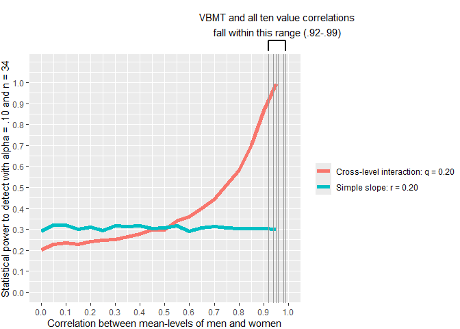

# Packages


``` r
library(ggplot2)
library(ggrepel)
library(MetBrewer)
library(matrixcalc)
library(MASS)
library(lmerTest)
library(emmeans)
library(finalfit)
library(multid)
library(dplyr)
```

# Simulation parameters

Use correlations from .00 to .95 between mean-levels of men (y1) and women (y2).
To use similar effect sizes for cross-level interaction and simple slopes, the association between x and y1 is set at r = .20, association between x and y2 = .00, therefore q is approximately 0.20.


``` r
# correlations between Y1 and Y2
r_y1_y2<-round(seq(from=.00,to=.95,by=.05),2)
# SD of Y2
sd_y2_vals<-1
# SD of Y1 (kept at constant 1)
sd_y1_vals<-1
# component-specific correlations
r_x_y1=0.20
r_x_y2=0
# compile all combinations of these variable values to the same data frame
simd<-expand.grid(r_y1_y2,sd_y1_vals,sd_y2_vals,r_x_y1,r_x_y2)
# name the columns
names(simd)<-c("r_y1_y2","sd_y1_vals","sd_y2_vals","r_x_y1","r_x_y2")
# calculate the difference score SD
simd$sd_diff_score<-
  sqrt(-2*simd$r_y1_y2*simd$sd_y1_vals*simd$sd_y2_vals+
         simd$sd_y1_vals^2+simd$sd_y2_vals^2)
# calculate the values in the nominator of the difference score correlation equation
# covariation difference
simd$nominator<-(simd$r_x_y1*simd$sd_y1_vals-simd$r_x_y2*simd$sd_y2_vals)
# calculate observed difference score correlation
simd$r_diff_score<-simd$nominator/simd$sd_diff_score
```


## Test if correlation matrices are positive definite


``` r
posdef<-rep(NA,nrow(simd))

for (i in 1:nrow(simd)){
  testmat<-matrix(c(1,simd$r_x_y1[i],simd$r_x_y2[i],
                    simd$r_x_y1[i],1,simd$r_y1_y2[i],
                    simd$r_x_y2[i],simd$r_y1_y2[i],1), nrow=3, byrow=TRUE )
  posdef[i]<-is.positive.definite(testmat)
}

table(posdef)
```

```
## posdef
## TRUE 
##   20
```
All 20 matrices are positive definite

## Calculate other summaries for the population matrices


``` r
# calculate q-estimates (is same for all scenarios)
simd$q=atanh(simd$r_x_y1)-atanh(simd$r_x_y2)
# calculate harmonized SDs
# calculate pooled SD
simd$PSD<-sqrt((simd$sd_y1_vals^2+simd$sd_y2_vals^2)/2)
# calculate harmonized SDs
simd$h_sd_y1_vals<-simd$sd_y1_vals/simd$PSD
simd$h_sd_y2_vals<-simd$sd_y2_vals/simd$PSD
# check that the pooled SDs from these harmonized are all 1
simd$h_PSD<-sqrt((simd$h_sd_y1_vals^2+simd$h_sd_y2_vals^2)/2)
table(round(simd$h_PSD,5)==1)
```

```
## 
## TRUE 
##   20
```

``` r
# calculate harmonized correlations
simd$h_r_x_y1<-simd$r_x_y1*simd$h_sd_y1_vals
simd$h_r_x_y2<-simd$r_x_y2*simd$h_sd_y2_vals
# calculate harmonized q
simd$q_b<-atanh(simd$h_r_x_y1)-atanh(simd$h_r_x_y2)
# print scenarios
round(simd,2)
```

```
##    r_y1_y2 sd_y1_vals sd_y2_vals r_x_y1 r_x_y2 sd_diff_score nominator r_diff_score   q PSD h_sd_y1_vals
## 1     0.00          1          1    0.2      0          1.41       0.2         0.14 0.2   1            1
## 2     0.05          1          1    0.2      0          1.38       0.2         0.15 0.2   1            1
## 3     0.10          1          1    0.2      0          1.34       0.2         0.15 0.2   1            1
## 4     0.15          1          1    0.2      0          1.30       0.2         0.15 0.2   1            1
## 5     0.20          1          1    0.2      0          1.26       0.2         0.16 0.2   1            1
## 6     0.25          1          1    0.2      0          1.22       0.2         0.16 0.2   1            1
## 7     0.30          1          1    0.2      0          1.18       0.2         0.17 0.2   1            1
## 8     0.35          1          1    0.2      0          1.14       0.2         0.18 0.2   1            1
## 9     0.40          1          1    0.2      0          1.10       0.2         0.18 0.2   1            1
## 10    0.45          1          1    0.2      0          1.05       0.2         0.19 0.2   1            1
## 11    0.50          1          1    0.2      0          1.00       0.2         0.20 0.2   1            1
## 12    0.55          1          1    0.2      0          0.95       0.2         0.21 0.2   1            1
## 13    0.60          1          1    0.2      0          0.89       0.2         0.22 0.2   1            1
## 14    0.65          1          1    0.2      0          0.84       0.2         0.24 0.2   1            1
## 15    0.70          1          1    0.2      0          0.77       0.2         0.26 0.2   1            1
## 16    0.75          1          1    0.2      0          0.71       0.2         0.28 0.2   1            1
## 17    0.80          1          1    0.2      0          0.63       0.2         0.32 0.2   1            1
## 18    0.85          1          1    0.2      0          0.55       0.2         0.37 0.2   1            1
## 19    0.90          1          1    0.2      0          0.45       0.2         0.45 0.2   1            1
## 20    0.95          1          1    0.2      0          0.32       0.2         0.63 0.2   1            1
##    h_sd_y2_vals h_PSD h_r_x_y1 h_r_x_y2 q_b
## 1             1     1      0.2        0 0.2
## 2             1     1      0.2        0 0.2
## 3             1     1      0.2        0 0.2
## 4             1     1      0.2        0 0.2
## 5             1     1      0.2        0 0.2
## 6             1     1      0.2        0 0.2
## 7             1     1      0.2        0 0.2
## 8             1     1      0.2        0 0.2
## 9             1     1      0.2        0 0.2
## 10            1     1      0.2        0 0.2
## 11            1     1      0.2        0 0.2
## 12            1     1      0.2        0 0.2
## 13            1     1      0.2        0 0.2
## 14            1     1      0.2        0 0.2
## 15            1     1      0.2        0 0.2
## 16            1     1      0.2        0 0.2
## 17            1     1      0.2        0 0.2
## 18            1     1      0.2        0 0.2
## 19            1     1      0.2        0 0.2
## 20            1     1      0.2        0 0.2
```


# Simulation

## Function for running the whole thing


``` r
es_from_mlm<-function(
    s_y1,s_y2,s_x=1, # SDs
    r_y1y2,r_xy1,r_xy2, # correlations
    m_y1=0,m_y2=0,m_x=0, # means
    n=34 # sample size
) {
  
  # mean-vector, all zeros
  mu=c(m_y1,m_y2,m_x)
  # covariance matrix
  cov_mat=matrix(
    c(s_y1^2,r_y1y2*s_y1*s_y2,r_xy1*s_y1*s_x,
      r_y1y2*s_y1*s_y2,s_y2^2,r_xy2*s_y2*s_x,
      r_xy1*s_y1*s_x,r_xy2*s_y2*s_x,s_x^2)
    ,ncol=3,byrow=T)
  # generate data
  d<-data.frame(mvrnorm(n=n,mu=mu,
                        Sigma = cov_mat,empirical = F))
  
  # name variables
  names(d)<-c("y1","y2","x")
  d$id<-1:nrow(d)
  
  # construct a double-entry long-format data.frame
  long_d<-data.frame(
    Y=c(d$y1,d$y2),
    X=c(d$x,d$x),
    W=rep(c(0.5,-0.5),each=nrow(d)),
    ID=c(d$id,d$id)
  )
  
  # fit the cross-level interaction model with the double-entry data
  fit<-lmer(Y~X*W+(1|ID),data=long_d)
  # obtain cross-level interaction
  cl_interaction<-summary(fit)$coefficients["X:W",]
  # obtain simple slopes (unstandardized but does not matter for significance)
  sslopes<-emtrends(fit,var = "X",specs="W",at=list(c(W=c(0.5,-0.5))),infer=c(T,T))
  # save to output
  output<-list(cl_interaction=t(data.frame(cl_interaction)),sslopes=data.frame(sslopes))
  return(output)
}
```


## Run the simulation for each scenario

This is a time consuming part.


``` r
set.seed(11062026)

n.sims <- 2000 # number of repeats per condition
cl_interaction_list <- vector("list", nrow(simd))
sslopes_list        <- vector("list", nrow(simd))
t1<-Sys.time()
for (i in 1:nrow(simd)) {
  cl_interaction_list[[i]] <- vector("list", n.sims)
  sslopes_list[[i]]        <- vector("list", n.sims)
  
  for (j in 1:n.sims) {
    tmp_ES <- es_from_mlm(
      s_y1   = simd[i, "sd_y1_vals"],
      s_y2   = simd[i, "sd_y2_vals"],
      s_x    = 1,
      r_y1y2 = simd[i, "r_y1_y2"],
      r_xy1  = simd[i, "r_x_y1"],
      r_xy2  = simd[i, "r_x_y2"],
      m_y1   = 0,
      m_y2   = 0,
      m_x    = 0,
      n      = 34
    )
    
    cl_interaction_list[[i]][[j]] <- tmp_ES$cl_interaction
    sslopes_list[[i]][[j]]        <- tmp_ES$sslopes
  }
}

t2<-Sys.time()
t2-t1
```

```
## Time difference of 1.905445 hours
```

## Compile the results


``` r
n.cond <- nrow(simd)

sslopes_df_list<-list()
cl_interaction_df_list<-list()

idx <- 1

for (i in seq_len(n.cond)) {
  for (j in seq_len(n.sims)) {
    
    # Extract stored objects
    sl_obj <- sslopes_list[[i]][[j]]
    cl_obj <- cl_interaction_list[[i]][[j]]
    
    # Coerce to data.frame (1 row each)
    sl_row <- as.data.frame(sl_obj)
    cl_row <- as.data.frame(cl_obj)
    
    # Add condition info (from simd) and simulation index j
    sl_row <- cbind(simd[i, , drop = FALSE],
                    sim = j,
                    sl_row)
    cl_row <- cbind(simd[i, , drop = FALSE],
                    sim = j,
                    cl_row)
    
    sslopes_df_list[[idx]]        <- sl_row
    cl_interaction_df_list[[idx]] <- cl_row
    
    idx <- idx + 1
  }
}

sslopes_df<-bind_rows(sslopes_df_list)
cl_interaction_df<-bind_rows(cl_interaction_df_list)
```

# Results: Power to detect across conditions


``` r
res_list<-list()

for (i in 1:n.cond){
  temp_cond<-simd[i,"r_y1_y2"]
  
  temp_pow_cl<-sum(cl_interaction_df[cl_interaction_df$r_y1_y2==temp_cond,'Pr(>|t|)']<.10)/n.sims
  temp_pow_y1<-sum(sslopes_df[sslopes_df$r_y1_y2==temp_cond & sslopes_df$W==-0.5,"p.value"]<.10)/n.sims
  temp_pow_y2<-sum(sslopes_df[sslopes_df$r_y1_y2==temp_cond & sslopes_df$W==0.5,"p.value"]<.10)/n.sims
  res_list[[i]]<-c(cor_btw_y1_and_y2=temp_cond,
                   Power_cross_level_interaction=temp_pow_cl,
                   False_positive_rate_y1_slope=temp_pow_y1,
                   Power_y2_slope=temp_pow_y2)


}

res_df<-data.frame(do.call(rbind,res_list))
res_df
```

```
##    cor_btw_y1_and_y2 Power_cross_level_interaction False_positive_rate_y1_slope Power_y2_slope
## 1               0.00                        0.2025                       0.1190         0.2890
## 2               0.05                        0.2280                       0.1125         0.3185
## 3               0.10                        0.2335                       0.0995         0.3195
## 4               0.15                        0.2275                       0.1005         0.2990
## 5               0.20                        0.2420                       0.1175         0.3115
## 6               0.25                        0.2495                       0.1030         0.2940
## 7               0.30                        0.2505                       0.1075         0.3150
## 8               0.35                        0.2635                       0.0950         0.3120
## 9               0.40                        0.2770                       0.0990         0.3180
## 10              0.45                        0.2965                       0.1160         0.3050
## 11              0.50                        0.2970                       0.0875         0.3060
## 12              0.55                        0.3380                       0.1090         0.3160
## 13              0.60                        0.3580                       0.0975         0.2905
## 14              0.65                        0.3990                       0.1015         0.3070
## 15              0.70                        0.4455                       0.0990         0.3125
## 16              0.75                        0.5140                       0.0995         0.3065
## 17              0.80                        0.5825                       0.1085         0.3050
## 18              0.85                        0.7035                       0.0990         0.3040
## 19              0.90                        0.8675                       0.0960         0.3040
## 20              0.95                        0.9945                       0.0910         0.3000
```

## Figure


``` r
# stack the power estimates

plot_dat<-
  data.frame(
    cor_btw_y1_and_y2=rep(res_df$cor_btw_y1_and_y2,2),
    power_est=c(res_df$Power_cross_level_interaction,
                res_df$Power_y2_slope),
    est_type=c(rep(c("Cross-level interaction: q = 0.20","Simple slope: r = 0.20"),each=nrow(res_df)))
  )

# add correlations for VBMT and ten values
cor_points<-
  data.frame(
    value=c("VBMT","hedonism","self-direction","security","tradition","conformity","power",
            "stimulation","benevolence","achievement","universalism"),
    cor_btw_y1_and_y2=c(.94,.96,.92,.98,.96,.95,.99,
                  .95,.96,.98,.95)
  )

cor_points
```

```
##             value cor_btw_y1_and_y2
## 1            VBMT              0.94
## 2        hedonism              0.96
## 3  self-direction              0.92
## 4        security              0.98
## 5       tradition              0.96
## 6      conformity              0.95
## 7           power              0.99
## 8     stimulation              0.95
## 9     benevolence              0.96
## 10    achievement              0.98
## 11   universalism              0.95
```

``` r
plot <- ggplot(
  data = plot_dat,
  aes(
    y = power_est,
    x = cor_btw_y1_and_y2,
    color = est_type,
    fill = est_type
  )
) +
  geom_line(linewidth = 2) +

  geom_vline(
    data = cor_points,
    aes(xintercept = cor_btw_y1_and_y2),
    colour = "grey60",
    linetype = "solid",
    inherit.aes = FALSE
  ) +

  # bracket line
  annotate(
    "segment",
    x = .92, xend = .99,
    y = 1.2, yend = 1.2,
    linewidth = 0.8
  ) +

  # bracket ends
  annotate(
    "segment",
    x = .92, xend = .92,
    y = 1.15, yend = 1.2,
    linewidth = 0.8
  ) +
  annotate(
    "segment",
    x = .99, xend = .99,
    y = 1.15, yend = 1.2,
    linewidth = 0.8
  ) +

  # annotation text
  annotate(
    "text",
    x = .955,
    y = 1.28,
    label = "VBMT and all ten value correlations\nfall within this range (.92-.99)",
    size = 4
  ) +

  ylab("Statistical power to detect with alpha = .10 and n = 34") +
  xlab("Correlation between mean-levels of men and women") +

  scale_x_continuous(
    limits = c(0, 1),
    breaks = seq(0, 1, by = .10)
  ) +
  scale_y_continuous(
    limits = c(0, 1.3),
    breaks = seq(0, 1, by = .10)
  ) +

  coord_cartesian(
    ylim = c(0, 1.08),
    clip = "off"
  ) +

  theme(
    legend.title = element_blank(),
    plot.margin = margin(t = 60)
  )

plot
```

<!-- -->

``` r
png(filename = 
      "../results/Power_analysis_comparison.png",
    units = "cm",
    width = 21.0,height=29.7*(2/4),res = 300)
plot
dev.off()
```

```
## png 
##   2
```

# Session information


``` r
s<-sessionInfo()
print(s,locale=FALSE)
```

```
## R version 4.6.0 (2026-04-24 ucrt)
## Platform: x86_64-w64-mingw32/x64
## Running under: Windows 11 x64 (build 22631)
## 
## Matrix products: default
##   LAPACK version 3.12.1
## 
## attached base packages:
## [1] stats     graphics  grDevices utils     datasets  methods   base     
## 
## other attached packages:
##  [1] dplyr_1.2.1      multid_1.0.2     finalfit_1.1.0   emmeans_2.0.3    lmerTest_3.2-1   lme4_2.0-1      
##  [7] Matrix_1.7-5     MASS_7.3-65      matrixcalc_1.0-6 MetBrewer_0.2.0  ggrepel_0.9.8    ggplot2_4.0.3   
## [13] knitr_1.51       rmarkdown_2.31  
## 
## loaded via a namespace (and not attached):
##  [1] gtable_0.3.6        shape_1.4.6.1       xfun_0.57           bslib_0.10.0        lattice_0.22-9     
##  [6] numDeriv_2016.8-1.1 vctrs_0.7.3         tools_4.6.0         Rdpack_2.6.6        generics_0.1.4     
## [11] parallel_4.6.0      pbkrtest_0.5.5      tibble_3.3.1        pan_1.9             pkgconfig_2.0.3    
## [16] jomo_2.7-6          RColorBrewer_1.1-3  S7_0.2.2            lifecycle_1.0.5     compiler_4.6.0     
## [21] farver_2.1.2        codetools_0.2-20    htmltools_0.5.9     sass_0.4.10         yaml_2.3.12        
## [26] glmnet_5.0          mice_3.19.0         pillar_1.11.1       nloptr_2.2.1        jquerylib_0.1.4    
## [31] tidyr_1.3.2         cachem_1.1.0        reformulas_0.4.4    iterators_1.0.14    rpart_4.1.27       
## [36] boot_1.3-32         foreach_1.5.2       mitml_0.4-5         nlme_3.1-169        tidyselect_1.2.1   
## [41] digest_0.6.39       mvtnorm_1.3-7       purrr_1.2.2         forcats_1.0.1       splines_4.6.0      
## [46] fastmap_1.2.0       grid_4.6.0          cli_3.6.6           magrittr_2.0.5      survival_3.8-6     
## [51] broom_1.0.13        withr_3.0.2         scales_1.4.0        backports_1.5.1     estimability_1.5.1 
## [56] nnet_7.3-20         otel_0.2.0          coda_0.19-4.1       evaluate_1.0.5      rbibutils_2.4.1    
## [61] rlang_1.2.0         Rcpp_1.1.1-1.1      xtable_1.8-8        glue_1.8.1          rstudioapi_0.18.0  
## [66] minqa_1.2.8         jsonlite_2.0.0      R6_2.6.1
```
